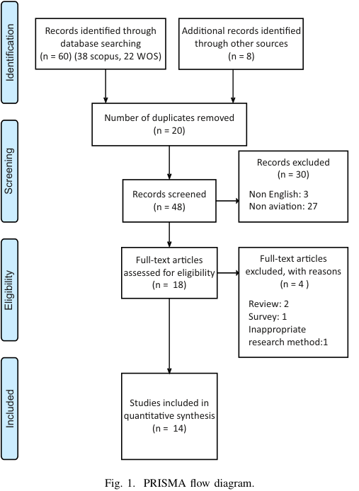
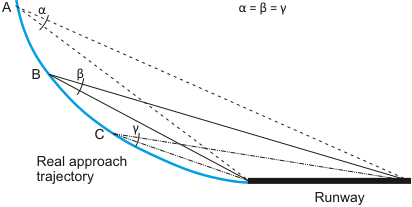

# Black Hole Approach: A Systematic Review

Vladimír Socha

_Department of Air Transport Czech Technical University in Prague_ Prague, Czech Republic sochavla@fd.cvut.cz

Liana Karapetjan _Department of Air Transport Czech Technical University in Prague_ Prague, Czech Republic karaplia@fd.cvut.cz

Jan Bořil

_Department of Air Force University of Defence_ Brno, Czech Republic jan.boril@unob.cz

Lenka Hanáková

_Department of Air Transport Czech Technical University in Prague_ Prague, Czech Republic hanakle1@fd.cvut.cz

Luboš Socha Tomáš Havel _Department of Air Transport Management Department of Air Transport Technical University of Košice Czech Technical University in Prague_ Košice, Slovakia Prague, Czech Republic lubos.socha@tuke.sk havelto8@cvut.cz

_**Abstract**_ **—The article deals with the factors contributing to the emergence of a visual illusion, the so-called black hole approach. Among all the visual illusions that can jeopardize the course of a flight in its particular phases, this illusion is quite specific. This illusion arises in cases of visual approach at night. The risks of this illusion, such as hitting the terrain, are known. However, the causes of this illusion and other influencing factors that may result in this illusion are not sufficiently investigated. Therefore, a systematic review was performed in order to summarize the existing knowledge on this issue. The results show that in the case of black hole approach, only basic research is carried out worldwide and there is a lack of studies. However, the studies carried out partially confirm the well-known hypotheses about the origin of this illusion.**

_**Index Terms**_ **—piloting, aviation, illusion, black hole approach, runway, PRISMA**

## I. INTRODUCTION

Flying an aircraft is a demanding activity and can expose pilots to many potential risks. One of the most significant risks is spatial disorientation. This is defined as the pilot’s inability to correctly interpret his position, altitude or speed of his aircraft, or his position relative to the Earth’s fixed coordinate system.

One of the forms of spatial disorientation can be caused by visual illusions. For humans in general and for pilots in particular, the visual system is the most important, as about 80 percent of all information is perceived by sight [1]. The process of vision is not performed only by the eyes, but is the result of interaction with the brain and various nerves. The principle of three-dimensional vision is than based on two eyes, where each eye sees objects at a slightly different angle of view. In general, light-sensitive cells capture this image and the brain then evaluates this visual information, which is based on electrical signals passing through the optic nerve [2].

For example, when flying at low altitude at high speed or while operating an aircraft during a night visual approach, pilots must accurately perceive and interpret environmental stimuli. However, this can be a problem because the human

body is not physiologically to cope with these extreme or relatively quick movements and high forces that can occur in aviation. Therefore, under certain conditions, the brain may misinterpret sensed image and in the worst cases, an accident may occur. According to an analysis carried out by the Flight Safety Foundation, it was found that 21 % out of 76 accidents and incidents during approach and landing, were caused by flight crew disorientation or visual illusions [3].

One of the visual illusions is black hole illusion. This is a specific type of illusion that occurs in featureless terrain during an approach to landing. The term black hole was first used in 1954 in a study that described the importance of features in the visual field and the critical role of the ground plane for the visual reference [4].

This illusion does not fall into the category of runway illusions, as it concerns the terrain in front of the runway. This illusion arises when a pilot approaches to landing over a large water area or across over unilluminated terrain and where the runway is the only source of light. This can then give the pilot the feeling that the aircraft is higher than it actually is, and this can result in a dangerously low approach. It should be noted that this illusion could occur during night visual approaches, i.e. not with an instrument approach. According to a survey of 141 experienced instructors, 79 percent of them underwent this illusion [5]. This means that this illusion can be quite common.

The dangers of this illusion are also indicated by accidents that have happened before. One of the first final reports to use the term Black hole illusion concerned the accident of a Panam American World Airways plane that crashed 3365 feet in front of the runway at Pago Pago International Airport in American Samoa, see also [6]. It is therefore very important that pilots effectively monitor the instruments to ensure that the speed, distance and altitude values are in accordance with the normal approach procedure.

Thus, as can be seen, visual approaches have their own risks, although visual approaches are the first type of approach that student pilots learn.

quired knowledge about in-flight illusions is usually associated with negative experiences, incidents or accidents. However, the reasons for these illusions, their mechanics or the factors contributing to their emergence are not always clear from investigative reports. The above is more a question of research. Therefore, the presented article deals with the creation of a systematic overview of scientific publications related to the black-hole approach illusion. The aim is to summarize the knowledge about the causes of this specific illusion, possible factors that may affect it and ideally generalize this knowledge.

## II. METHODS

As the task was to create a systematic review of the articles, they were collected from the electronic citation databases SCOPUS, Web of Science and possibly from cited references.

The focus was primarily on methods that were able to reveal the illusion. The selection of articles for inclusion in this work was carried out on the basis of quality and availability of the primary focus on aviation.

The aim was to as many relevant articles as possible, which were devoted to the induction or identification of the Black hole approach and discussed the cause of this illusion, coping, influencing factors, etc.

For the purposes of this work, a philosophy of evidencebased minimum set of items for reporting in systematic reviews and meta-analyzes was used [7]. The course of the selection of studies related to the black hole illusion is shown in the PRISMA diagram, Fig. 1. Articles were primarily searched based on the keywords _Black Hole Illusion_ in the mentioned electronic citation databases.

A total of 68 articles were found, but most of them had to be rejected because some were duplicates, did not relate to the topic, were not in English, or searched therm was only mentioned in review articles.

as, for example, the research methodology was not appropriate. The final number of articles that were included in the work can be seen in the last block on Fig 1, along with selection criteria.

## III. RESULTS

The table I lists the articles that deal with the illusion of a black hole. The research methodology of listed article was mostly based on simulated approach to the runway at night in a typical black hole approach environment, or by estimating distances or angles during simulated approaches. Emphasis was placed primarily on the accuracy of the pilot in maintaining the descent trajectory and the shape of the approach at different levels of lighting or different runway sizes. The results cumulatively show that the approach trajectories had a concave shape, i.e. that the pilots tended to underestimate the distance from the runway and make a lower approach. It has been shown that approaching a runway uphill and ascending terrain are much more prone to this type of illusion and can end up hitting the ground, which is unlikely for level runways

Extracted figure text

Records iden�fied through  Addi�onal records iden�fied
database searching through other sources
(n = 60) (38 scopus, 22 WOS) (n = 8)
Number of duplicates removed
(n = 20)
Records excluded
(n = 30)
Records screened Non English: 3
(n = 48) Non avia�on: 27
Full­text ar�cles Full­text ar�cles
assessed for eligibility excluded, with reasons
(n =  18)  (n = 4 )
Review: 2
Survey: 1
Inappropriate
research method:1
Studies included in
quan�ta�ve synthesis
(n =  14)
Fig. 1. PRISMA flow diagram.
Identification
Screening
Eligibility
Included

[11], [21]. In the case of a hill or obstacle in front of a level runway, the result may be similar to that of an uphill runway [11].

The study has provided various explanations regarding the cause of the black hole illusion and at what distance it appears. Mertens and Lewis [16], state that the black hole illusion occurs at a distance of 3.9 NM to 1.3 NM from the runway, which corresponds to the results by Nicholson [10] who reported 4.5 NM to 0.5 NM from. Nicholson [10] also pointed out, that optical flux is also important when estimating distance in a dynamic environment.

Furthermore, the review shows that during a visual approach during the day and in good visual conditions, the pilot makes a descent using depth perception to estimate altitude. In this case, it is therefore relatively easy to maintain the correct descent angle. The problem occurs when performing a visual approach at night or without visual stimuli, because the pilot cannot perceive depth, due to insufficient visual stimuli, and this is why it is difficult to estimate the distance and height [22]. The core of this problem is most likely that pilots performing black hole approaches do not tend to change their approach profile with respect to runway perspective, as is usually the case with normal conventional direct approaches.

Instead, one performs the approach by unknowingly maintaining a constant visual angle. The mathematical expression

## TABLE I

## ANALYSIS OF BLACK HOLE APPROACH STUDIES

|**_Year_**|**_Authors_**|**_Aim_**|**_Number_** **_of_** **_subjects_**|**_Results_**|
|---|---|---|---|---|
|2020|F. E. Robinson, et al [8]|A comparative evaluation of hypotheses to explain the black hole illusion.|19|The black hole illusion effect was worse during approaches to longer runways and when starting at lower altitudes compared to higher altitudes. Comparison of day and night approach angles showed, that subjects had tendency to fy above the 3° glideslope during the day and below it at night, but the variance around the glideslope seemed similar. The hypothesis of constant visual angle was not supported in this study.|
|2018|D. M. Jacobs, et al [9]|Comparison of effect of the eye position in the cockpit on fight altitude during the fnal approach depending on the level of expertise.|32|Raising the eye resulted to higher approaches and lowering the eye resulted to lower approaches independent of the level of expertise. According to these results, it is argued, that the eye position of pilots is a factor that contributes to the risk of accidents during black hole illusion approaches. |
|2013|C. M. Nicholson, et al [10]|Evaluation of effect of lighting and dis- traction on the black hole illusion during visual approaches.|30|The distance at night was signifcantly underestimated and the distance during the day was overestimated. The results help to support the idea of lighting playing a large role in the accuracy of distance estimation and that disruption or lack of optic fow at night might lead to black hole illusion. Also, the further the participants were from runway, the less accurate their distance estimation was. |
|2010|R. C. Thompson [11]|Evaluation of calculated approach paths resulting from fying a constant visual vertical angle to level and upslope run- ways.|NA|Flying a constant visual angle to a level runway cannot cause fight into the ground miles away from the airport. Crash on the ground before reaching the treshold may result from following a constant visual angle fight path to signifcantly upslope runway.|
|2009|N. K. Bulkley, et al [12]|Comparison of the precision of sim- ulated fxed-wing aircraft landing ap- proaches with three different head-up display formats.|11|As a result, testing non-pilots with an experimental setting could induce the black hole illusion. Also, both ILS displays improved approach path precision when compared to the MIL-STD Cruise Mode. The greatest precision was achieved using peripherally- located virtual ILS head-up display.|
|2008|R. Gibb, et al [13]|Evaluation of glide path performance in a black hole environment.|20|The performance between 8.3 and 0.9 km from the runway led to a concave approach shape in case of long and narrow runways. Adding random terrain object did not improve glide path performance. The combination ALS resulted in the worst case of performance. Unexpectedly, approaches of novice pilots were more stable than the approaches of experienced ones.|
|2004|K. W. Kallus, et al [14]|Evaluation of a spatial disorientation simulator training for jet pilots.|26|Results show, that the realisation of disorientation phenomenon of AIRFOX DISO simulator is realistic. Additional training (the awareness phase) improves the per- formance in coping with disorientation. In addition, psychological stress occurred during the fight, for example during the black hole approach, which was indicated by signifcant changes in heart rate.Performance ratings indicate positive effects for the training group, which also recovered more quickly|
|1991|G. Lintern, et al [15]|Evaluation of scene content and runway breadth effects on simulated landing ap- proaches.|8|The landing approaches were lower, as the scene content was reduces to the narrow runways. Trial-to-trial variability was higher as the scene content was reduced. A signifcant interaction between scene content and runways width was not found.|
|1982|H.W. Mertens, et al [16]|Evaluation of effect of approach lighting and variation in visible runway length on perception of approach angle in sim- ulated night landings.|40(a), 24(b)|The mean generated approach angles for all subjects was 2_._13~~_◦_~~without approach lighting and 1_._9_◦_with approach lighting, which were less than desired (a). The reduction of visible length by turning the lights of the far half resulted in increase of mean generated approach angles from 2_._2_◦_to 2_._7_◦_. Presence of equal intensity of approach lights or uncomfortable glare from approach lights did not have signifcant effect on responses (b).|
|1981|H. W. Mertens [17]|Evaluation of perception of runway im- age shape and approach angle magni- tude by pilots in simulated night landing approaches.|36|The results showed a tendency to overestimate form ratios and approach angles less then 3_◦_in both static and dynamic approaches. These fndings do not support the usefulness of form ratio judgements as an aid in approach angle selection and show an important part of the problem - the variability in perception of approach angle.|
|1981|H.W. Mertens, et al [18]|Finding the effect of runway size on the pilot performance during simulated night approaches in a black hole envi- ronment.|3(a), 40(b)|Wide runway training resulted in lower narrow runway approaches. In contrast, narrow runway approach training resulted in increased approach angles for wide runways. The magnitude of the effect of these training approaches increased as the distance from the runway decreased. The approach angle tended to decrease as the runway width decreased (a). When controlling the inclination of the runway model, the generated approach angles decreased with increasing runway length (b).|
|1979|H.W. Mertens [19]|Evaluation of the runway image shapes as cue judgment of approach angle in a black hole environment.|16 (a), 20 (b)|The ability to assess the approach angle is limited when size cues and shape cues of the runway image are available (a). Subjects tended to overestimate form ratios and approach angles less than 3_◦_(b). The study does not support the idea that form ratio judgement is a useful way in selecting an approach angle. |
|1979|M. F. Lewis, et al [20]|Evaluation of pilot performance during simulated approaches using 4 different approach lights (2 bar VASI, 3 bar VASI, PAPI, T-VASIS) and without the use of the lights. |24|All indicators signifcantly reduced deviations from the ideal 3~~_◦_~~glideslope. Perfor- mance was best with T-VASIS and decreased with 3 bar VASI, PAPI and 2 BAR VASI respectively. Approaches without light indicators were low and extremely variable during simulations, where the only source of vertical guidance information was the runway lights.|
|1978|C. L. Kraft [21]|Investigation of the infuence of runway topography and lighting levels on night visual approach.|12|The results show that when performing a visual approach at night, the pilots relied on a relatively unchanged visual angle provided by a distant light pattern to estimate altitude. For a fat track, these stimuli are adequate and the estimated heights are accurate. However, if the pilots also used this method on the uphill runway, their height estimate was overestimated. This misleading stimulus is strong enough to make experienced pilots descend dangerously low.|

## REFERENCES

Extracted figure text

A α α = β = γ
B  β
C  γ
Real approach
trajectory
Runway

Fig. 2. Black hole approach schematic.

of a visual angle is the arc of the circle [21], which is simply shown in the Fig. 2. When flying over such an arc, the aircraft gets below the ideal descent plane and in addition, if the diameter of this circle is large enough, the pilot will not be able to detect that he is flying on an arc and not in a straight line [22].

Another reason why this illusion can occur is that the absence of ground features, just when approaching over a water surface (unlit area), can result in the illusion that the aircraft is at a higher altitude than it actually is. Therefore, a pilot who succumbs to the illusion will fly a lower approach [21], [23].

Another problem can be related to runway lighting, as the illuminated runway appears closer to the pilot and the pilot may begin to descend earlier. This can be easily demonstrated by changing the light intensity. When the lights are dimmed, a flatter approach occurs, and on the contrary, lighting results in a steep approach of [22]. This sounds logical, but in the context of the black hole approach this hypothesis has not been studied.

## IV. CONCLUSION

So far, there are many different explanations for why this illusion occurs and at what distance from the runway. The only common thing is the absence of terrain to provide size, distance, depth and orientation cues for ambient vision. As can be seen from the presented analysis, there are not many articles that deal with this issue. Thus, most of the statements presented in this article remain on a theoretical / hypothetical level. Future research could focus on more exact assessment methods, such as the use of eye-tracking in virtual reality, etc.

Over time, the pilot’s theoretical education seeks to reduce the impact of visual illusions, but it is difficult to overcome convincing visual illusions despite objective knowledge of the difference between reality and illusion. Visual illusions should be explored in more depth due to the increasing time pilots spend in the environment most prone to flight illusions.

## ACKNOWLEDGMENT

This work was supported by project no. SGS19/133/OHK2/2T/16 ”Augmented Reality as a form of Pilots’ Support during the Flight” funded by Czech Technical University in Prague.

- [1] L. Rosenblum, _See what I’m saying : the extraordinary powers of our five senses_ . New York, NY: W.W. Norton, 2010.

- [2] V. Bruce, _Visual perception : physiology, psychology, and ecology_ . Hove, East Sussex, UK: Psychology Press, 1996.

- [3] R. Khatwa and R. L. Helmreich, “Analysis of critical factors during approach and landing in accidents and normal flight,” in _Flight Safety Digest_ . Alexandria, VA, USA: Flight Safety Foundation, 1999, vol. 17,18, pp. 4–77.

- [4] E. S. Calvert, “Visual judgments in motion,” _Journal of Navigation_ , vol. 7, no. 3, pp. 233–251, 1954.

- [5] W. Sipes and C. Lessard, “A spatial disorientation survey of experienced instructor pilots,” _IEEE Engineering in Medicine and Biology Magazine_ , vol. 19, no. 2, pp. 35–42, 2000.

- [6] National Transportation Safety Board, “Aircraft accident report - pan american world airways, inc., being 707-3215, nk454a, pago pago, american samoa, january 30, 1974.” 1977, National Transportation Safety Board and Bureau of Accident Investigation. Report no.: NTSBAAR-77-7.

- [7] A. Liberati, D. G. Altman, J. Tetzlaff, C. Mulrow, P. C. Gotzsche, J. P. A. Ioannidis, M. Clarke, P. J. Devereaux, J. Kleijnen, and D. Moher, “The PRISMA statement for reporting systematic reviews and metaanalyses of studies that evaluate healthcare interventions: explanation and elaboration,” _BMJ_ , vol. 339, p. b2700, 2009.

- [8] F. E. Robinson, H. Williams, D. Horning, and A. T. Biggs, “A comparative evaluation of hypotheses to explain the black hole illusion,” _The International Journal of Aerospace Psychology_ , vol. 30, no. 1-2, pp. 54–68, Jan. 2020.

- [9] D. M. Jacobs, A. H. P. Morice, C. Camachon, and G. Montagne, “Eye position affects flight altitude in visual approach to landing independent of level of expertise of pilot,” _PLOS ONE_ , vol. 13, no. 5, p. e0197585, 2018.

- [10] C. M. Nicholson and P. C. Stewart, “Effects of lighting and distraction on the black hole illusion in visual approaches,” _The International Journal of Aviation Psychology_ , vol. 23, no. 4, pp. 319–334, 2013.

- [11] R. C. Thompson, “The “black hole” night visual approach: Calculated approach paths resulting from flying a constant visual vertical angle to level and upslope runways,” _The International Journal of Aviation Psychology_ , vol. 20, no. 1, pp. 59–73, 2009.

- [12] N. K. Bulkley, B. P. Dyre, R. Lew, and K. “A peripherallylocated virtual instrument landing display affords more precise control of approach path during simulated landings than traditional instrument landing displays,” _Proceedings of the Human Factors and Ergonomics Society Annual Meeting_ , vol. 53, no. 1, pp. 31–35, 2009.

- [13] R. Gibb, R. Schvaneveldt, and R. Gray, “Visual misperception in aviation: Glide path performance in a black hole environment,” _Human Factors: The Journal of the Human Factors and Ergonomics Society_ , vol. 50, no. 4, pp. 699–711, 2008.

- [14] K. W. Kallus and K. Tropper, “Evaluation of a spatial disorientation simulator training for jet pilots,” _International Journal of Applied Aviation Studies_ , vol. 4, no. 1, pp. 45–55, 2004.

- [15] G. Lintern and M. B. Walker, “Scene content and runway breadth effects on simulated landing approaches,” _The International Journal of Aviation Psychology_ , vol. 1, no. 2, pp. 117–132, Apr. 1991.

- [16] H. W. Mertens and M. F. Lewis, “Effects of approach lighting and variation in visible runway length on perception of approach angle in simulated night landings,” 1982, Federal Aviation Administration. Report no.: FAA-AM-82-6.

- [17] H. W. Mertens, “Perception of runway image shape and approach angle magnitude by pilots in simulated night landing approaches,” _Aviat Space Environ Med_ , vol. 52, no. 7, pp. 373–386, Jul 1981.

- [18] H. W. Mertens and M. F. Lewis, “Effect of different runway size on pilot performance during simulated night landing approaches,” 1981, Federal Aviation Administration. Report no.: FAA-AM-81-6.

- [19] H. W. Metrens, “Runway image shape as a cue for judgment of approach angle,” 1979, Federal Aviation Administration. Report no.: FAA-AM-7925.

- [20] M. F. Lewis and H. W. Mertens, “Pilot performance during simulated approaches and landings made with various computer-generated visual glidepath indicators,” 1979, Federal Aviation Administration. Report no.: FAA-AM-79-4.

- [21] C. L. Kraft, “A psychophysical contribution to air safety: Simulator studies of visual illusions in night visual approaches,” in _Psychology: From Research to Practice_ , H. L. Pick, H. W. Leibowitz, J. E. Singers, A. Steinschneider, and H. W. Stevenson, Eds. Boston, MA: Springer US, 1978, pp. 363–385.

- [22] B. Schiff, “Visual illusions can spoil your whole day: No matter the size or speed of the aircraft, pilots who find themselves in the dark at low

altitudes are subject to the misleading effects of spatial disorientation and other visual pitfalls.” _Accident prevention_ , vol. 47, no. 3, pp. 1–4, 1990.

- [23] Federal Aviation Administration, “Chapter 8. Medical facts for pilots,” in _Aeronautical Information Manual: Official Guide to Basic Flight Information and ATC Procedures_ . Washington, D.C., USA: Federal Aviation Administration, 2011.
