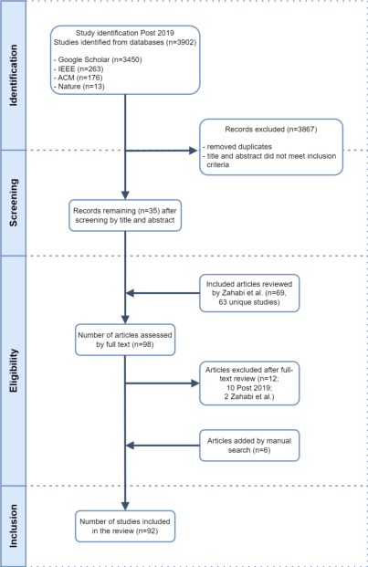
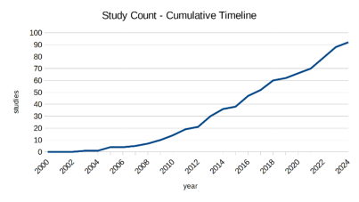
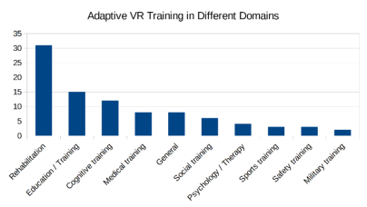
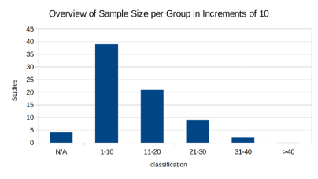
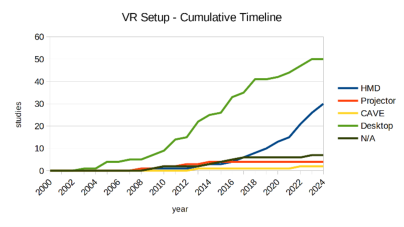
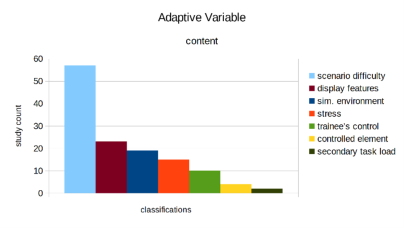

2025 IEEE International Conference on Advanced Learning Technologies (ICALT)

# Research Gaps in Adaptive Virtual Reality Training: A Systematic Literature Review

2nd Tobias Büttgen

1st Fabio Genz 2nd Tobias Büttgen _MNM-Team LMU Munich LMU Munich_ Munich, Germany Munich, Germany fabio.genz@nm.ifi.lmu.de Tobias.Buettgen@campus.lmu.de

3rd Dieter Kranzlmüller _MNM-Team LMU Munich_ Munich, Germany kranzlmueller@ifi.lmu.de

_**Abstract**_ **—Adaptive virtual reality (VR) training adjusts applications in VR specifically to the user. This paper examines the current state of the art in the field of adaptive VR training. We conduct a Systematic Literature Review (SLR) using the PRISMA (Preferred Reporting Items for Systematic Reviews and Meta-Analyses) methodology. Building on previous results, addressing identified weaknesses and using 16 different evaluation categories, we present the most comprehensive SLR currently available, including studies until July 2024. We identified several research gaps for potential future work. First, an increasing number of studies over time. Second, a strong focus on the rehabilitation domain. Third, small sample sizes per group in the conducted user studies. Fourth, a strong increase in the use of head-mounted displays (HMDs). Fifth, a strong focus on using scenario difficulty as adaptive content variable, and sixth, only little research on learning transfer.**

_**Index Terms**_ **—Virtual Reality, Adaptive Training, Systematic Literature Review**

## I. INTRODUCTION

Trainees differ in prior knowledge, learning speed, abilities, demographic and socio-cultural background [1]–[3]. Static and predefined trainings are sometimes too easy, leading to boredom, or too difficult, leading to anxiety, both with negative effects on performance [3]. Trainings that balance the respective challenges of a task with the individual needs of a trainee enable more efficient learning [4]–[6].

Adjusting training individually has always been the responsibility of teachers [7]. Computer-based adaptive training approaches aim to replicate the benefits of human adaptive teaching skills in automatic closed-loop feedback systems [8]. Building on measuring trainee’s performance during training (e.g. task performance), an adaptive logic reacts to measurable changes (e.g. conditional statements) by adjusting specific adaptive variables (e.g. difficulty). These adaptations aim to improve trainee’s performance again, closing the loop [9]. This work examines the current state of the art in the field of adaptive VR training.

There is a significant lack of SLRs in the selected field. Only one comparable work is identified containing several weak points, and a significant gap for including studies published since 2019. Building on previous results, we conduct a SLR (n=92) using the PRISMA methodology, addressing previous weak points, and including studies until July 2024. Here, six different results are identified for potential research gaps.

In Section II we describe the examined categories, results and limitations of previous research. The conducted SLR, applying the PRISMA methodology, is presented in Section III. Results are shown in Section IV and critically reflected in Section V. Conclusions are drawn in Section VI.

## II. RELATED WORK

While several SLRs exist on VR training, SLRs on adaptive VR training are rare. To our knowledge only one comparable work from Zahabi and Abdul Razak (2020) [3] exists we rely on. They provide a cross-topic examination of studies (n=69) published between 2000 and 2019. E.g. Maddalon et al. (2024) [10] also conduct a SLR on adaptive VR training, both use the PRISMA methodology, and their examined review categories largely correspond. Their SLR is however not comparable, since their studies are limited on the topic of children with autism spectrum disorders and adaptive variables are described in less detail. While examined review categories are presented in Section II-A, major findings are listed in Section II-B. Limitations and a critical evaluation are shown in Section II-C.

## _A. Examined Review Categories_

Zahabi and Abdul Razak (2020) [3] review their studies according to eight main categories: _**Domain**_ , _**References**_ , _**Study Design**_ (classification by sample size without providing rationale in _N_ ; Proof of Concept (no human subjects), Pilotor Case Study ( _N <_ 10), Laboratory Experiment ( _N ≥_ 10)), _**VR-Setup**_ (classification by hardware), _**Performance Measure**_ , _**Adaptive Logic**_ , _**Adaptive Variable Description**_ and _**Adaptive Variable Classification**_ (based on three different frameworks by _Adaptive Content_ [9], _Adaptation Timing_ [11], and _Adaptive Feedback_ [12], subsequently described in more detail).

- _Adaptive Content:_ Kelley (1969) [9] describes seven categories: (1) _Simulated Environment_ (e.g. illumination, sound level, etc.), (2) _Stress or Physical-Based Features_ (e.g. gravity, force, vibration, etc.), (3) _Controlled Element_ (e.g. self-avatar), (4) _Trainee’s Control_ (e.g. simulated feel), (5) _Display Features_ (e.g. display lag), (6) _Scenario Difficulty_ , and (7) _Secondary Task Load_ (a secondary task that differs from the main task (e.g. cognitive/visual distraction) to distract the user and cause additional workload).

2161-377X/25/$31.00 ©2025 IEEE DOI 10.1109/ICALT64023.2025.00016

- _Adaptation Timing:_ Gerbaud, Gouranton & Arnaldi (2009) [11] provide two categories in the context of timing. (1) _Parametering_ (adaptations are executed before a training session). (2) _Dynamic Adaptation_ (adaptations occur during the training session, dynamically modifying the content based on real-time performance measures). Combinations are possible.

- _Adaptive Feedback:_ According to Feidakis (2016) [12] _”feedback is usually presented as information to a learner in response to some action on the learner’s part”_ . They suggest two categories on which feedback can be adapted. (1) _Timing_ when feedback is applied (e.g. real-time or summarised feedback, which can also be combined). (2) _Feedback Type_ (e.g. verbal- or written explanation, hints or multi-modal feedback).

- _B. Major Findings of the previous SLR_

- **Areas of Application:** Studies included in the SLR are mostly in the field of rehabilitation (43%).

- **Sample Size:** Sample sizes are very small, with corresponding influence on significance and interpretation.

- **Measuring Effectivity:** Few comparisons exist between adaptive and non-adaptive VR training. The majority didn’t evaluate effectiveness or were limited to feasibility and proof-of-concept analyses [3].

- **Unclear Effects:** Some studies report positive effects of adaptive training (e.g. reduction in physical fatigue, improvement during training or faster recovery) [13]– [16], while other show no significant differences [17], [18].

- **Long Term Effect:** The long-term effect of adaptive training has not been examined sufficiently.

- **Learning Theories:** Four learning theories were identified as central for adaptive training. The Yerkes-Dodson law [6], Cognitive Load Theory [5], Expertise Reversal Effect [19] and Theory of Learning and Retention [20]. The flow theory [4] has not been considered yet.

## _C. Limitations and Critical Evaluation_

- **Ambiguities in Study Sample Size Classification:** Providing the number of participants and group distributions, instead of categorising according to unreasoned threshold values, would enable more transparent and understandable results. E.g. four studies [21]–[24] were categorised as laboratory experiments although their sample sizes were below 10 participants considering group distribution. One study [25] was classified as a pilot study with 12 participants. A closer look revealed two distinct groups with 2 stroke patients and 10 patients with paraplegic spinal cord injuries. One study [26] was classified as a pilot study although having a sample size of 10 participants.

- **Inconsistent Technology Classification:** Two studies [27], [28], in the SLR used Augmented Reality instead of VR. This inconsistency of used technology impairs the quality of the dataset.

- **Immersion in VR - Semi-Immersive Classification:** Immersion is often closely linked to specific hardware. The inclusion of a semi-immersive category would enable a more differentiated classification. E.g. Bamodu and Ye (2013) [29] categorise the CAVE (Cave Automatic Virtual Environment) system as semi-immersive. To achieve a more neutral classification, it would be beneficial to decouple immersion from specific hardware and instead apply the immersion criteria defined by Slater and Wilbur (1997) [30] together with the introduction of a semiimmersive category for clearer differentiation.

- **Feedback Classification - Studies Overlooked:** Several studies were identified where feedback was employed but not considered in the SLR [25], [31]–[35]. Based on Feidakis (2016) [12], feedback should generally be considered as an adaptive variable.

- **Excluded Secondary Task Load:** Although the adaptive content classification was adopted from Kelley (1969) [9], _Secondary Task Load_ was excluded without providing a clear explanation.

## III. SYSTEMATIC LITERATURE REVIEW

We conduct a SLR according to the PRISMA methodology, a well-established procedure across different disciplines [36]. We extend previous research from Zahabi and Abdul Razak (2020) [3] by including their studies in the presented process and associated assessment in the eligibility phase. The identification of relevant studies is presented in Section III-A and illustrated in Figure 1. The evaluation criteria are presented in Section III-B.

## _A. Generation of the Dataset in Four Steps_

_1) Identification:_ Four databases are searched for titles, abstracts and full texts containing the keywords ”virtual reality” and ”training” in conjunction with ”adaptive”, ”personalized” or ”customized” (e.g. ”adaptive training”). Only studies published between 2019 - 2024 and written in English language are considered. Here, 3,902 studies are identified on Google Scholar (n=3450), IEEE (n=263), ACM (n=176), and Nature (n=13).

_2) Screening:_ The search scope is incrementally narrowed from full text to abstract and title. The abstracts of the remaining n=82 studies are manually reviewed. After removing duplicates and excluding studies with abstracts containing keywords but missing focus on adaptive VR training, n=35 studies remain and a total of 3,867 records are excluded.

_3) Eligibility:_ The remaining studies (n=35) are combined with the identified studies (n=69) from Zahabi and Abdul Razak (2020) [3]. As their results contain studies published several times with only minor changes, we exclude six studies (n=63). Thus, 98 studies go through eligibility checks by full-text reviews. Here, 12 studies are removed. Contrary to their respective abstracts, they have no focus on adaptive VR training. Ten from our post-2019 search, and two from Zahabi and Abdul Razak (2020) [3] which examined Augmented Reality instead of VR, already mentioned in Section II-C. Six studies are added from manual searches.

_4) Inclusion:_ In total, n=92 studies are identified for a subsequent evaluation.

## _B. Evaluation Criteria_

Six main categories with a total of 16 assigned subcategories are used to evaluate the selected studies. We subsequently list each category ( _**italic and bold**_ ) with respective subcategories _(italic)_ distinguishing between adopted categories and modified categories from Zahabi and Abdul Razak (2020) [3] as well as new added categories.

- **Adopted Categories**

   - _**Topic aka Domain:** Domain; Sub-Domain;_

   - _**References:** Reference;_

   - _**Study Metrics:** Target Population;_

   - _**Training Setup:** VR Setup; Performance Measure; Adaptive Logic; Adaptive Variable Description;_

- **Modified Categories:**

   - _**Study Metrics:** Study Design_ (Concept / User-Study);

- **Additional Categories:**

   - _**References:** Latest Publication_ ;

   - _**Study Metrics:** Number of Participants_ ; _Number of Groups_ ; _Average Number of Participants per Group_ ;

   - **–** _**Training Set-Up:** Immersion_ (Non-Immersive / Semi-Immersive / Full-Immersive);

   - _**Adaptive Variable Classification:** Adaptive Variable Classification;_ (Including Secondary Task Load)

- _**Transfer Learning:** Transfer Learning_ ;

## IV. RESULTS

We present six different results from the conducted SLR.

## _A. Study Volume Over Time_

Figure 2 shows the cumulative number of publications between 2000 - 2024, highlighting trends in study volume. The first publication appeared in 2003. A slow but steady increase can be observed between 2005 - 2012. Since 2013, there has been a clear, almost linear and constant increase.

## _B. Study Distribution Across Domains_

Figure 3 shows the number of studies separated by ten domains in descending order: Rehabilitation (31), Educational Training (15), Cognitive Training (12), Medical Training (8), General (8) (neither one specific or across multiple domains), Social Training (6), Psychology / Therapy (4), Sports Training (3), Safety Training (3) and Military Training (2).

## _C. Sample Size per Group_

Figure 4 shows the sample sizes of conducted user studies, classified in increments of 10. The x axis shows the respective group increment. The y axis shows the number of studies. This provides a better insight into the distribution of sample sizes per group. Concept studies are not included. With 39 studies in groups from 1 - 10 participants, most studies are conducted in this group. 21 studies are conducted in groups of 11 - 20 participants, 9 studies in groups from 21 - 30 participants, 2 studies in groups from 31 - 40 participants and none with

Fig. 1. Flow diagram of the conducted SLR according to the PRISMA methodology. The four steps to generate the dataset 1)Identification, 2)Screening, 3)Eligibility and 4)Inclusion are illustrated in descending order following the arrow.

Fig. 2. Cumulative number of publications showing the rise of published studies between 2000 - 2024. The x axis shows the respective year. The y axis shows the cumulative number of studies.

more than 40 participants. Four studies did not provide enough information for a classification.

## _D. Analysis of VR Training Setup_

Figure 5 shows the cumulative distribution of VR setups used between 2000 - 2024. The x axis shows the respective year while the y axis shows the cumulated number of studies. Five different colours are used to differentiate VR setups. Desktop systems were the first to be introduced in 2003 with increasing initial relevance. Their relevance declined

Fig. 3. Number of studies on adaptive VR training distributed in ten different domains with Rehabilitation as the area with the most publications. The x axis shows the respective domain. The y axis shows the number of studies.

Fig. 4. Group sample sizes distributed in increments of ten. Most studies are conducted in the group of 1 - 10 and none was conducted with more than 40 participants. The x axis shows the respective group increment. The y axis shows the number of studies.

noticeably with the increasing usage of HMDs beginning in 2008 and the strong growth since 2012. The use of projection screens, CAVE systems, and unspecified devices is minimal, with only small increases over time.

Fig. 5. Cumulative timeline of used VR Setups between 2000 - 2024. After initially increasing, desktop systems are now becoming less important as the use of HMDs increases significantly. The x axis shows the respective year. The y axis shows the number of studies. Five different colours are used to differentiate VR setups.

Fig. 6. Distribution of adaptive variables according to the categorisation of Kelley (1969) [9]. The x axis shows the seven different classifications with different colours. The y axis shows the number of studies.

## _F. Learning Transfer_

Only four out of 92 conducted studies investigated learning transfer from adaptive VR training to real-world scenarios.

## V. DISCUSSION

We conducted a SLR to examine the current state of the art in the field of adaptive VR training. One comparable SLR existed showing several weak points and including studies only until 2019. These findings were analysed and reinterpreted together with studies published between 2019 - July 2024.

Besides taking over previous review categories and subcategories we modified _**Study Metrics**_ by separating _Study Design_ in two groups and added the _Number of Participants_ , _Number of Groups_ and _Average Number of Participants per Group_ to avoid distortions in the evaluation. We added _Immersion_ separated in three groups to _**Training Set-Up**_ , _Latest Publication_ to _**References**_ , included Secondary Task Load as an _**Adaptive Variable Classification**_ and a category for _**Transfer Learning**_ .

We identified several research gaps for potential future work. First, an increasing number of studies over time. Second, a strong focus on the rehabilitation domain. Third, small sample sizes per group in the conducted user studies. Fourth, a strong increase in the use of HMDs. Fifth, a strong focus on using scenario difficulty as adaptive content variable, and sixth, only little research on learning transfer.

The present work shows a number of weaknesses and limitations. E.g. the limited number of search terms or searching only four databases might have indirectly excluded relevant studies. In addition, while Adaptive Variables were classified and evaluated in detail, Performance Measures and Adaptive Logic could be analysed in more detail. The SLR might suffer from the authors’ biases. Hence, a peer review was conducted.

## VI. CONCLUSION

## _E. Adaptive Content Variable_

Figure 6 shows the number of adaptive variables classified according to Kelley (1969) [9]: Scenario difficulty (57), display features (23), simulation environment (19), stress or physical-based features (15), trainee control (10), controlled element (4) and secondary task load (2).

This paper presents a SLR to examine the current state of the art in adaptive VR training. Comparable SLRs are rare, suffer from analytical weaknesses and have a limited scope for studies published only until 2019. By building on previous research, adding studies until July 2024 and addressing previous weak points, n=92 papers were identified and evaluated

according to the PRISMA methodology. Especially a stronger focus on other domains than rehabilitation, larger sample sizes per group, other adaptive content variables than using scenario difficulty and research on learning transfer offer promising research gaps for potential future work.

## VII. APPENDIX

The SLR dataset is available at https://www.mnm-team.org/ _∼_ genzfa/SystematicLiteratureReview.xlsx

REFERENCES

- [1] V. J. Shute and D. Zapata-Rivera, “Adaptive educational systems,” in _Adaptive Technologies for Training and Education_ (P. J. Durlach and A. M. Lesgold, eds.), pp. 7–27, Cambridge: Cambridge University Press, 2012.

- [2] M. Gettinger, “Individual differences in time needed for learning: A review of literature,” _Educational Psychologist_ , vol. 19, no. 1, pp. 15– 29, 1984.

- [3] M. Zahabi and A. M. A. Razak, “Adaptive virtual reality-based training: a systematic literature review and framework,” _Virtual Reality_ , no. 24, pp. 1–28, 2020.

- [4] M. Csikszentmihalyi, _Beyond boredom and anxiety: Experiencing flow in work and play._ Jossey-bass, 1975.

- [5] J. Sweller, “Cognitive load during problem solving: Effects on learning,” _Cognitive Science_ , vol. 12, no. 2, pp. 257–285, 1988.

- [6] R. M. Yerkes and J. D. Dodson, “The relation of strength of stimulus to rapidity of habit–formation,” _Journal of Comparative Neurology and Psychology_ , vol. 18, no. 5, pp. 459–482, 1908.

- [7] O.-c. Park and J. Lee, “Adaptive instructional systems,” in _Handbook of Research on Educational Communications and Technology_ (D. Jonassen, ed.), pp. 651–684, Mahwah, NJ, US: Lawrence Erlbaum Associates Publishers, 2004.

- [8] C. R. Landsberg, R. S. J. Astwood, W. L. Van Buskirk, L. N. Townsend, N. B. Steinhauser, and A. D. Mercado, “Review of adaptive training system techniques,” _Military Psychology_ , vol. 24, no. 2, pp. 96–113, 2012.

- [9] C. R. Kelley, “What is adaptive training?,” _Human factors_ , vol. 11, no. 6, pp. 547–556, 1969.

- [10] L. Maddalon, Minissi, Maria, Eleonora, T. Parsons, A. Hervas, and M. Alcaniz, “Exploring adaptive virtual reality systems used in interventions for children with autism spectrum disorder: Systematic review,” _Journal of Medical Internet Research_ , vol. 26, 2024.

- [11] S. Gerbaud, V. Gouranton, and B. Arnaldi, “Adaptation in collaborative virtual environments for training,” in _Learning by Playing. Gamebased Education System Design and Development_ (M. Chang, R. Kuo, Kinshuk, G.-D. Chen, and M. Hirose, eds.), Lecture Notes in Computer Science, (Berlin, Heidelberg), pp. 316–327, Springer Berlin Heidelberg, 2009.

- [12] M. Feidakis, “A review of emotion-aware systems for e-learning in virtual environments,” _Formative Assessment, Learning Data Analytics and Gamification_ , pp. 217–242, 2016.

- [13] M. S. Cameirao, S. Bermudez i Badia, E. D. Oller, and Verschure, Paul F. M. J., “Using a multi-task adaptive vr system for upper limb rehabilitation in the acute phase of stroke,” in _2008 Virtual Rehabilitation_ , IEEE, 2008.

- [14] Y. Lang, L. Wei, F. Xu, Y. Zhao, and L.-F. Yu, “Synthesizing personalized training programs for improving driving habits via virtual reality,” in _2018 IEEE Conference on Virtual Reality and 3D User Interfaces (VR)_ , IEEE, 2018.

- [15] M. Ma and K. Bechkoum, “Serious games for movement therapy after stroke,” in _SMC 2008_ , ([Piscataway, NJ]), pp. 1872–1877, IEEE, 2008.

- [16] L. Wang, S. Du, H. Liu, J. Yu, S. Cheng, and P. Xie, “A virtual rehabilitation system based on eeg-emg feedback control,” in _Proceedings, 2017 Chinese Automation Congress (CAC)_ , ([Piscataway, New Jersey]), pp. 4337–4340, IEEE, 2017.

- [17] S. R. Serge, H. A. Priest, P. J. Durlach, and C. I. Johnson, “The effects of static and adaptive performance feedback in game-based training,” _Computers in Human Behavior_ , vol. 29, no. 3, pp. 1150–1158, 2013.

- [18] D. R. Billings, “Efficacy of adaptive feedback strategies in simulationbased training,” _Military Psychology_ , vol. 24, no. 2, pp. 114–133, 2012.

- [19] S. Kalyuga, P. Ayres, P. Chandler, and J. Sweller, “The expertise reversal effect,” _Educational Psychologist_ , vol. 38, no. 1, pp. 23–31, 2003.

- [20] F. E. Ritter, G. D. Baxter, J. W. Kim, and S. Srinivasmurthy, _Learning and Retention_ . Oxford University Press, 2013.

- [21] J. Nirme, A. Duff, and Verschure, Paul F. M. J., “Adaptive rehabilitation gaming system: on-line individualization of stroke rehabilitation,” _Annual International Conference of the IEEE Engineering in Medicine and Biology Society. IEEE Engineering in Medicine and Biology Society. Annual International Conference_ , vol. 2011, pp. 6749–6752, 2011.

- [22] A. Mariani, E. Pellegrini, N. Enayati, P. Kazanzides, M. Vidotto, and E. de Momi, “Design and evaluation of a performance-based adaptive curriculum for robotic surgical training: a pilot study,” in _2018 40th Annual International Conference of the IEEE Engineering in Medicine and Biology Society (EMBC)_ , IEEE, 2018.

- [23] A. Koenig, D. Novak, X. Omlin, M. Pulfer, E. Perreault, L. Zimmerli, M. Mihelj, and R. Riener, “Real-time closed-loop control of cognitive load in neurological patients during robot-assisted gait training,” _IEEE transactions on neural systems and rehabilitation engineering : a publication of the IEEE Engineering in Medicine and Biology Society_ , vol. 19, no. 4, pp. 453–464, 2011.

- [24] L. Luo, H. Yin, W. Cai, M. Lees, and S. Zhou, “Interactive scenario generation for mission–based virtual training,” _Computer Animation and Virtual Worlds_ , vol. 24, no. 3-4, pp. 345–354, 2013.

- [25] R. Kizony, N. Katz, and P. L. Weiss, “Adapting an immersive virtual reality system for rehabilitation,” _The Journal of Visualization and Computer Animation_ , vol. 14, no. 5, pp. 261–268, 2003.

- [26] Y. Chen, M. Baran, H. Sundaram, and T. Rikakis, “A low cost, adaptive mixed reality system for home-based stroke rehabilitation,” _Annual International Conference of the IEEE Engineering in Medicine and Biology Society (EMBC)_ , 2011.

- [27] S. García-Vergara, Y.-P. Chen, and A. M. Howard, “Super pop vrtm: An adaptable virtual reality game for upper-body rehabilitation,” in _Virtual, Augmented and Mixed Reality. Systems and Applications_ , Lecture Notes in Computer Science, (Berlin, Heidelberg), pp. 40–49, Springer Berlin Heidelberg, 2013.

- [28] D. Jones and S. Dechmerowski, “Measuring stress in an augmented training environment: Approaches and applications,” in _Foundations of augmented cognition_ (D. Schmorrow and C. M. Fidopiastis, eds.), LNCS sublibrary. SL 7, Artificial intelligence, (Switzerland), pp. 23– 33, Springer, 2016.

- [29] O. Bamodu and X. M. Ye, “Virtual reality and virtual reality system components,” _Advanced Materials Research_ , vol. 765-767, pp. 1169– 1172, 2013.

- [30] M. Slater and S. Wilbur, “A framework for immersive virtual environments (five): Speculations on the role of presence in virtual environments,” _Presence: Teleoperators and Virtual Environments_ , vol. 6, no. 6, pp. 603–616, 1997.

- [31] I. Lafond, Q. Qiu, and S. V. Adamovich, “Design of a customized virtual reality simulation for retraining upper extremities after stroke,” in _Proceedings of the 2010 IEEE 36th Annual Northeast Bioengineering Conference (NEBEC)_ , pp. 1–2, IEEE, 2010.

- [32] K. Saurav, A. Dash, D. Solanki, and U. Lahiri, “Design of a vr-based upper limb gross motor and fine motor task platform for post-stroke survivors,” in _17th IEEE/ACIS International Conference on Computer and Information Science (ICIS 2018)_ (I. I. C. o. C. Science and Information, eds.), (Piscataway, NJ), pp. 252–257, IEEE, 2018.

- [33] S. V. Adamovich, G. G. Fluet, A. Mathai, Q. Qiu, J. Lewis, and A. S. Merians, “Design of a complex virtual reality simulation to train finger motion for persons with hemiparesis: a proof of concept study,” _Journal of NeuroEngineering and Rehabilitation_ , vol. 6, p. 28, 2009.

- [34] A. Dhiman, D. Solanki, A. Bhasin, A. Bhise, A. Das, and U. Lahiri, “Design of adaptive haptic-enabled virtual reality based system for upper limb movement disorders: A usability study,” in _2016 6th IEEE International Conference on Biomedical Robotics and Biomechatronics (BioRob)_ , pp. 1254–1259, IEEE, 2016.

- [35] S. B. i. Badia, A. G. Morgade, H. Samaha, and P. F. M. J. Verschure, “Using a hybrid brain computer interface and virtual reality system to monitor and promote cortical reorganization through motor activity and motor imagery training,” _IEEE transactions on neural systems and rehabilitation engineering : a publication of the IEEE Engineering in Medicine and Biology Society_ , vol. 21, no. 2, pp. 174–181, 2013.

- [36] D. Moher, A. Liberati, J. Tetzlaff, and D. G. Altman, “Preferred reporting items for systematic reviews and meta-analyses: the prisma statement,” _Annals of internal medicine_ , vol. 151, no. 4, pp. 264–269, 2009.
