Received 12 May 2023, accepted 7 June 2023, date of publication 12 June 2023, date of current version 7 July 2023. _Digital Object Identifier 10.1109/ACCESS.2023.3285396_

# Wearable Obstacle Avoidance Electronic Travel Aids for Blind and Visually Impaired Individuals: A Systematic Review

## PEIJIE XU 1, GERARD A. KENNEDY2,3,4, FEI-YI ZHAO 5,6, WEN-JING ZHANG 6, AND RON VAN SCHYNDEL[1] , (Member, IEEE)

1School of Computing Technologies, RMIT University, Melbourne, VIC 3000, Australia

2Institute of Health and Wellbeing, Federation University, Mount Helen, VIC 3353, Australia

3School of Health and Biomedical Sciences, RMIT University, Bundoora, VIC 3083, Australia

4Institute for Breathing and Sleep, Austin Health, Heidelberg, VIC 3084, Australia

5Department of Nursing, School of International Medical Technology, Shanghai Sanda University, Shanghai 201209, China

6Shanghai Municipal Hospital of Traditional Chinese Medicine, Shanghai University of Traditional Chinese Medicine, Shanghai 200071, China

Corresponding authors: Fei-Yi Zhao (fyzhao@sandau.edu.cn) and Wen-Jing Zhang (zhangwenjing@shutcm.edu.cn)

This research is supported by an Australian Government Research Training Program (RTP) Scholarship.

- **ABSTRACT Background** Wearable obstacle avoidance electronic travel aids (ETAs) have been developed to assist the safe displacement of blind and visually impaired individuals (BVIs) in indoor/outdoor spaces. This systematic review aimed to understand the strengths and weaknesses of existing ETAs in terms of hardware functionality, cost, and user experience. These elements may influence the usability of the ETAs and are valuable in guiding the development of superior ETAs in the future. **Methods** Formally published studies designing and developing the wearable obstacle avoidance ETAs were searched for from six databases from their inception to April 2023. The PRISMA 2020 and APISSER guidelines were followed. **Results** Eightynine studies were included for analysis, 41 of which were judged to be of moderate to high quality. Most wearable obstacle avoidance ETAs mainly depend on camera- and ultrasonic-based techniques to achieve perception of the environment. Acoustic feedback was the most common human-computer feedback form used by the ETAs. According to user experience, the efficacy and safety of the device was usually their primary concern. **Conclusions** Although many conceptualised ETAs have been designed to facilitate BVIs’ independent navigation, most of these devices suffer from shortcomings. This is due to the nature and limitations of the various processors, environment detection techniques and human-computer feedback those ETAs are equipped with. Integrating multiple techniques and hardware into one ETA is a way to improve performance, but there is still a need to address the discomfort of wearing the device and the high-cost. Developing an applicable systematic review guideline along with a credible quality assessment tool for these types of studies is also required.

- **INDEX TERMS** Blind, visually impaired, wearable, obstacle avoidance, electronic travel aids, systematic review.

## **I. INTRODUCTION**

As estimated by Global Vision Database 2019 Blindness and Vision Impairment Collaborators, in 2020, around 43.3 million individuals were blind and 295 million individuals had moderate to severe vision impairments, and by 2050, these two groups are predicted to reach to 61.0 million and 474 million, respectively [1]. Vision plays a crucial role in navigation since it facilitates movement from one location to

another, which is an essential part of daily life [2]. Navigating independently is thus a major challenge for blind and visually impaired individuals (BVIs) [3]. In addition to the decline in mobility, vision loss is also associated with reduced participation in daily living and social activities, and reduced ability in detecting hazards which can subsequently result in accidents, collisions, falls, and even mortality [4], [5]. Improving mobility skills may also improve BVIs’ self-maintenance and overall quality of life, leading to more active participation in social life and leisure, and enhanced productivity [5], [6]. To have safe, efficient, and independent mobility, BVIs

rely on assistive technologies [5], [6]. Traditional assistance such as guide dogs and white canes are still widely utilized. However, these aids do not adequately solve independent navigation difficulties [7], [8]. Guide dogs are not employable on a large scale due to high cost and short useful life (five years only) [8]. The white cane cannot detect obstacles beyond its reach (within three to six feet usually), and thus the users only perceive restricted environmental information about the surroundings [8]. The white cane is not useful in detecting potentially dangerous obstacles at the head level, such as tree branches and suspended trash cans [3], [8]. Thus, white cane users can be injured from time to time [3]. In the survey by Manduchi et al., nearly 40% of BVIs who use a cane reported head-level accidents at least once per year; and 23% of these incidents required medical intervention [9].

Electronic travel aids (ETAs) have been developed to improve the functionality of the conventional aids [5]. They facilitate safer and simpler displacement [10] by providing additional perception of the environment [11], improving the detection range of obstacles and landmarks, and also giving a better orientation [10], [12]. ETAs are available as traditional handheld devices, smart canes, and novel wearable devices [13]. The wearable device has the particular strength of leaving both hands free [14]. For BVIs, wearable devices gather information about the user and/or the environment, process it (locally and/or globally) and return it to the BVIs in real-time through acoustical and tactile feedback/signals to substitute for visual information [5], [15]. A variety of wearable-based devices such as ultrasonic obstacle detection glasses [16], laser-scanners [17], and many others have been developed to address the obstacle avoidance for BVIs [18]. Most of these assistive technologies have limitations, e.g., ultrasonic-based device has short range capacities for object detection [18] and cannot recognize the type of obstacles [10], laser-based device may harm people around the users if it directly hits their eyes. [18].

Which environmental detection techniques are adopted by available wearable ETAs to ensure safe and accurate mobility? Do these wearable ETAs adequately meet the needs of BVIs for obstacle avoidance in independent travel? How can deficiencies in available devices be eliminated? An evidence-based review can provide unbiased and comprehensive answers. We therefore conducted this systematic review, aiming to understand the categories, control module, techniques (sensors) employed, feedback interfaces, users’ experience and assessments, and potential limitations of existing wearable ETAs.

## **II. MATERIALS AND METHODS**

## _A. ELIGIBILITY CRITERIA_

This review was performed and reported in accordance with Preferred Reporting Items for Systematic Reviews and Meta-Analyses (PRISMA) 2020 statement guideline [19], and A priori, Plan, Identify, Screen, Select, Extract and Report (APISSER) guideline [20], respectively. Only formally published original studies designing and developing

wearable obstacle avoidance ETAs were included in this review. In addition to a description of the development process of the device and the technologies employed, the eligible study should include at least one test in a real environment with the volunteer(s) or researcher(s) wearing the device. The volunteer could be BVIs or healthy-sighted people who successfully simulated the visual characteristics of BVIs by being blindfolded. Also, the device included in the study should have obstacle avoidance as its primary function or had both obstacle avoidance and other functions. The publication date of the studies was not limited, while the language was restricted to English and/or Chinese.

Studies were excluded if the wearable navigation device presented was not specifically designed for BVIs. Although ETA, electronic orientation aid (EOA) and position locator device (PLD) are all devices that can be used to assist BVIs to navigate independently, there are differences between the three. ETA is defined as a device that converts environmental or user information, while EOA focuses on providing direction to the user and PLD emphasizes positioning information [5], [21]. Hence, we also excluded studies in which the device presented was primarily developed as an EOA or PLD rather than an ETA.

## _B. SEARCH STRATEGY AND DATA EXTRACTION_

Following consultation with a professional librarian with an engineering and computer science background who assisted in the development of the overall search strategy, we used filters to reliably identify relevant studies and undertook a comprehensive search of four English and three Chinese electronic databases –MEDLINE (via PubMed), Association for Computing Machinery (ACM) digital library, Institute of Electrical and Electronic Engineers (IEEE) Explore, Web of Science, China National Knowledge Infrastructure (CNKI), Chongqing VIP database (CQVIP), and Wanfang database –from their inception date until April 2023. The search was conducted by combining search terms from three categories: (1) BVIs; (2) obstacle avoidance; and (3) wearable device or wearable technology. Searches were supplemented by retrieval from other sources, including the conference proceedings relevant to engineering or computer science in the State Library Victoria (Melbourne, Australia) and any additional articles meeting eligibility criteria that were cited in reference lists of the included papers, grey literature, and existing systematic reviews, to avoid potential omission (See **Appendix 1** for detailed search terms and search strategies).

EndNote software (Version 20.1) was used to store the results of search and to remove duplicate articles. If multiple papers were judged to be reporting on different stages of the same device, the paper with the most comprehensive information and the most recent date was retained. After screening the titles and abstracts by using the Rayyan software, full texts were acquired and cross-checked for eligibility by two researchers (PJ-X and FY-Z). Two predetermined data forms were utilized to extract the following information from each study; identification information, publication year, country,

wearing area, control module, human-computer feedback mode, type and characteristic of environmental detection techniques employed (technology, model, number, features), cost, limitation, socio-demographic characteristics of users (sample size, gender, age, type of visual impairment), user assessment (experience, safety, comfortability), and other key findings. We also endeavoured to contact the corresponding author of the original study to access missing data or to clarify other unclear or uncertain information.

## _C. STUDY QUALITY AND RISK OF BIAS ASSESSMENT_

There is no recognised tool for appraising the methodological quality and risk of bias (RoB) of studies pertaining to design/development of an engineering product, including wearable devices. The tools used widely in the medical research, such as the Cochrane RoB tool, the JBI Critical Appraisal Checklist, the Jadad/Modified Jadad Scale, etc., are applicable to randomized controlled trials, cross-sectional studies or case-control studies rather than the types of studiesin the current review. Hence, we developed an instrument in-house via reviewing the relevant published literature and consulting industry experts. A four-item quality assessment checklist was identified in a previous systematic review of a similar topic [18]. That checklist was adapted for our current research topic, resulting in a more rigorous and eligible tool for assessing the quality of evidence in this review ( **Appendix 2** ). The tool comprises five domains, judging the methodological quality of eligible studies on different dimensions. To quantify the assessment for further analysis, weights are assigned to all five domains based on a 3-point Likert (Note each domain was rated on a scale from 0 to 1 yielding a possible total score ranging from 0 to 5 points). A total score between 2.5 and 3.5 points was considered as moderatequality; a total score more than 3.5 points was considered as high-quality; while, a total score less than 2.5 points was considered as low-quality (Please refer to **Appendix 2** for the specific scoring criteria). Using this tool, two evaluators (PJ-X and FY-Z) carried out standalone appraisal (including determining risk of bias and assessing the internal validity) of all the included studies. If consensus could not be reached, a third assessor (R-VS) was consulted in resolving any discrepancies.

## **III. RESULT ANALYSIS**

## _A. STUDY SELECTION_

Of the 3941 potentially relevant records retrieved through the target databases and state library in Victoria in the preliminary identification 2194 articles met the inclusion criteria. On examining the title and abstract of these articles, 236 studies were retained for further full-text screening. We limited the review to obstacle avoidance, wearable device, device for the BVIs, and some other conditions, and decided on the final resulting 89 eligible studies to be included ( **Figure 1** ).

## _B. STUDY DESCRIPTION_

In 89 included studies, 55 (61.8%) were journal articles. The remaining studies sourced from the conference proceedings (n = 25, 28.1%) and dissertations (n = 9, 10.1%) ( **Table 1** ). All except six studies [21]–[26] were published within the last decade. The rate of the annual publication basically showed gradual increase in research papers in this area.

The research teams were from many different countries. The top output country was mainland China [27]–[55], involving 29 studies. The United States [23], [56]–[61] (n = 7), India [62]–[67] (n = 6), Germany [68]–[72] (n = 5), Japan [24], [73]– [75] (n = 4), Thailand [76]–[79] (n = 4), Italy [80]–[82] (n = 3), Portugal [83], [84] (n = 2), Brazil [85], [86] (n = 2), United Kingdom [87], [88] (n = 2), South Korea [89], [90] (n = 2), Malaysia [26], [91] (n = 2) and Spain [92], [93] (n = 2) contributed two to seven studies each. Other 18 countries or region, namely Saudi Arabia [94], Iraq [95], Romania [96], France [11], Canada [97], Indonesia [98], Israel [21], Colombia [99], Bangladesh [18], Taiwan (China) [100], Greece [101], Philippines [102], Sweden [103], Slovenia [104], Pakistan [105], Switzerland [22], Australia [25], Egypt [106] and Sri Lanka [86] had one study published, respectively ( **Table 1** ).

## _C. DESCRIPTION OF THE DEVICES INVOLVED IN THE STUDIES_

## 1) PART OF THE BODY WHERE DEVICE IS WORN

The body parts where these devices could be worn were diverse and flexible. In 60 studies, devices were developed to be worn on a single part of the body. Of these, 58 devices were required to be worn at a fixed location; while the other two provided alternative options. Specifically, Liu’s device was suitable to be worn on head, shoulder, wrist or waist [37], and Lee’s device could be used as a jacket or shoulder bag [90]. In 25 studies, the device consisted of a combination of multiple components, and users had to wear multiple components of a device on two or more body parts. The other four studies [32], [44], [52], [69] only reported that the device was wearable, but did not clarify where the device should be worn ( **Table 1** ).

Illustrations of some devices worn by users, clearly indicating their wearing positions on the body, are presented in **Figure 2** . The devices or device components were worn on the eyes in approximately one-third (n = 27, 30.3%) studies. Twenty-three studies mentioned their devices or device components were worn in positions involving extremities and limbs, including arms, wrists, hands including one [91] on fingers, legs, ankles, and feet. There were also devices or device components that, in descending order, needed to be worn on the waist and abdomen (n = 25), entire torso and chest (n = 20), head (n = 12) including one [72] on forehead, shoulder (n = 5), back (n = 1), ear (n = 1), and neck (n = 1). **Figure 3** further visualises the percentage of each body parts involved in the wearable devices.

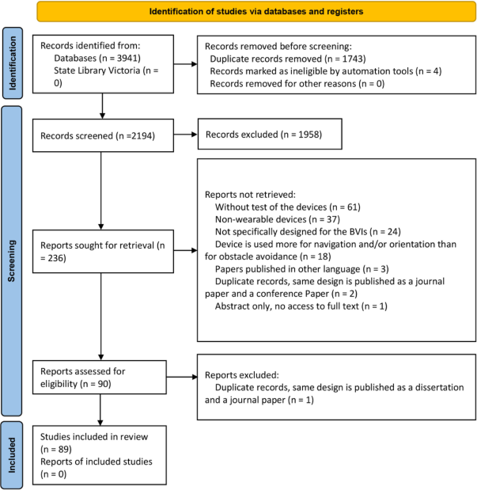

**FIGURE 1.** Flow diagram of the study selection process.

## 2) DATA COMPUTING AND SYSTEM CONTROL

The processor, as the brain of the device, was responsible for the management of all the operations of the sensor node to manage the sensor node activity while meeting the energy consumption, size, and cost constraints [107]. In 59 studies, the designed device adopted a single processor for data calculation and system control. In 23 studies, such tasks were completed by the device with two control modules. The remaining seven studies did not provide information on processor [41], [53], [60], [63], [69], [79], [82] ( **Table 1** ).

Different types of processors were identified in the studies. They included laptop, microcontroller, portable computing unit, and others. The scale of each processor and model employed is shown in **Figure 4** . Of all the devices developed, portable computing units and embedded systems were the most widely used. Twenty-one studies illustrated devices were equipped with laptops as the computing and control cores. Devices in 18 studies used microcontrollers, and the models of these microcontrollers varied. The Arduino series boards were popular. By comparison with other development tools, it was adopted by more devices. Raspberry Pi series was another popular development option. Nvidia Jetson which delivered advanced artificial intelligence (AI) platform was used in three devices. The other processors also implicated smartphone due to its powerful integration and computing unit and data calculation via cloud service. The latter usually relies on a local module with internet access for data uploading.

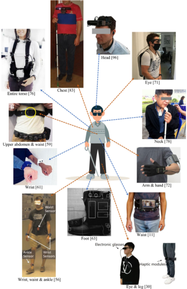

**FIGURE 2.** Examples of different wearing positions on the body.

## 3) ENVIRONMENT DETECTION TECHNIQUES

The environment detection techniques involved in the studies included ultrasonic sensors, different types of cameras,

LiDAR sensor, infrared sensor, laser sensor, 3D CMOS image sensor, and Time of Flight sensor for the obstacle detection. Seventeen studies also investigated the effectiveness of perceiving the environment through a combination of two or more techniques ( **Table 1** ).

In light of the review results, computer vision-based technology (camera) was the most popular. The RGB-D camera stood out from many cameras and gained favour in 20 studies. Ultrasonic sensors were also often selected because of their low cost and high accuracy in obstacle detection ( **Table 1** ).

In two studies [39], [44], in addition to the active obstacle avoidance function, the developers further added LED visual module to warn pedestrians to stay away, thus achieving passive obstacle avoidance at the same time ( **Table 1** ).

## 4) HUMAN-COMPUTER FEEDBACK

All but two studies [30], [41] described the form of human-computer feedback used by the devices ( **Table 1** ). Of the devices reviewed, 22 employed an individual acoustic notification (e.g., voice command, orientation guide, etc.) and 20 utilised a single acoustic alarm/signal (e.g., buzz, music, natural sound, etc.). Zuo and Wang used a combination of acoustic alarm and notification in their device [44].

In 21 studies, the device was equipped with independent haptic vibration.

Hybrid feedback with both acoustics and tactility was used in 22 devices.

Meers and Ward [25] provided feedback to the user via transcutaneous electro-neural stimulation on the hands.

In two studies [57], [83], the researchers applied braille display as the device’s feedback interface, and one study [57] also combined braille display with haptic vibrations to amplify the feedback effect.

## 5) COST OF DEVICE

Three studies reported that the cost of their devices were below 70 USD, with the cheapest only costing 17.82 USD [61]. The devices in four studies [30], [58], [62], [72] cost over 200 USD. The device developed by Katzschmann et al. consisted of a belt and a haptic strap, which were approximately 1300 USD and 150 USD, separately [59]. Ali A. et al. acknowledged that their device might be relatively expensive for some users from developing countries [65].

Eighteen studies claimed that the devices were low-cost but did not detail the specific amount ( **Table 1** ).

## 6) POWER CONSUMPTION

One study mentioned that the power consumption by the device is about 75 mW when used with a Li-PO battery 1,150 mAh at 3.7 volts [78]. Another study described that the average power consumption per second of the device was estimated to be 226.92 mA [31]. The remaining 87 studies (97.8%) did not supply information on power utilised of the device.

## _D. CHARACTERISTICS OF TRIALS USED TO TEST THE RELIABILITY OF DEVICES_

The obstacle avoidance effects of wearable devices were generally validated in the trials that simulated the real-life scenarios of BVIs.

## 1) USER SOCIO-DEMOGRAPHICS

Seventy-five studies (84.3%) reported the sample size included in the trials, ranging from one to 70 participants; and 76 studies (85.4%) reported socio-demographics data of the involved participants. The age of these participants was between 12 to 75 years old ( **Table 2** ).

Seventy-two studies reported the vision type of the participants, that is, 23 studies only included BVIs in the trials; 34 studies only included blindfolded volunteers in the trials; and the remaining studies included both ( **Table 2** ).

## 2) USER EXPERIENCE

The user experience and evaluation to the device were generally investigated by interview or questionnaire survey. The efficacy and safety of the devices were usually the primary concern of both researchers and users. Comfortability and cognitive load while wearing the device were reported by participants in 23 studies. Thirteen studies indicated that the device was easy for users to learn and utilize. Thirteen studies documented the user’s further demands and suggestion for device improvements after completing the trials ( **Table 2** ).

## _E. STUDY QUALITY APPRAISAL_

Of the 89 included studies, seven (7.9%) [11], [28], [30], [45], [53], [54], [90] were evaluated as high-quality studies, 34 (38.2%) [26], [27], [29], [34], [36], [49], [57]–[59], [61]– [65], [67], [68], [71], [72], [75], [78], [81], [85], [87]–[89], [92]–[94], [96], [98], [100], [102], [103], [108] were rated as moderate-quality studies, and the remaining 48 (53.9%) were judged as low-quality studies ( **Table 3** ).

## **IV. DISCUSSION**

## _A. SUMMARY OF FINDINGS_

Wearable obstacle avoidance ETAs have evidently attracted growing research interest, reflected by the significantly increased publication rate in the last decade. In the reviewed studies, most devices were designed to be equipped at eye level to simulate human vision. The portable computing units by Arduino and Raspberry Pi series were widely selected as the processers to control the sampling of the available sensors, control the various parts of the node, and manage the exchange of the data between the different components. Limited to the computing resource, they however had to be replaced by laptops in those devices where the system required higher performance. Cameras and ultrasonic devices are the most frequently used techniques in executing environmental detection tasks. RGB-D camera, instead of the earlier ordinary cameras, has been configured into the ETAs to optimise its performance. Although ultrasonic

**TABLE 1.** Technology characteristics of the obstacle avoidance ETAs included in the 89 reviewed studies.

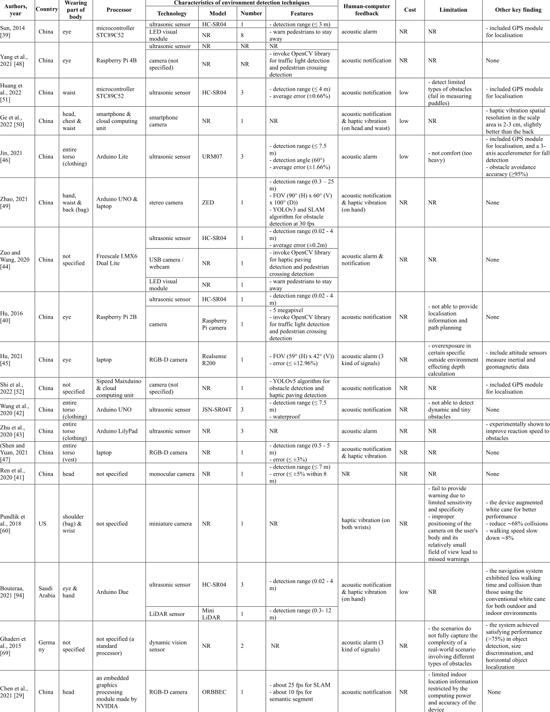

**TABLE 1.** _(Continued.)_ Technology characteristics of the obstacle avoidance ETAs included in the 89 reviewed studies.

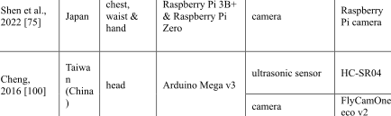

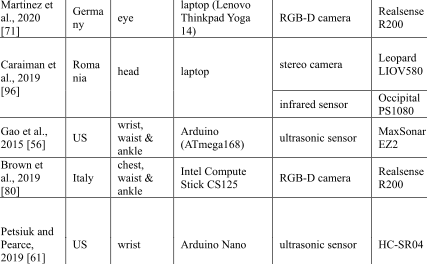

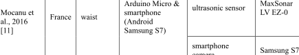

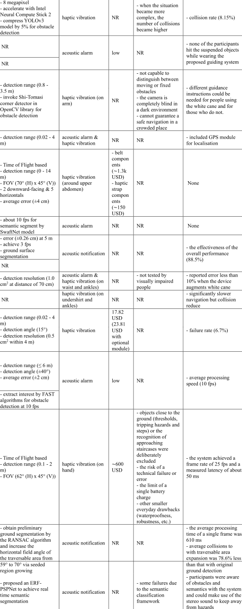

**TABLE 1.** _(Continued.)_ Technology characteristics of the obstacle avoidance ETAs included in the 89 reviewed studies.

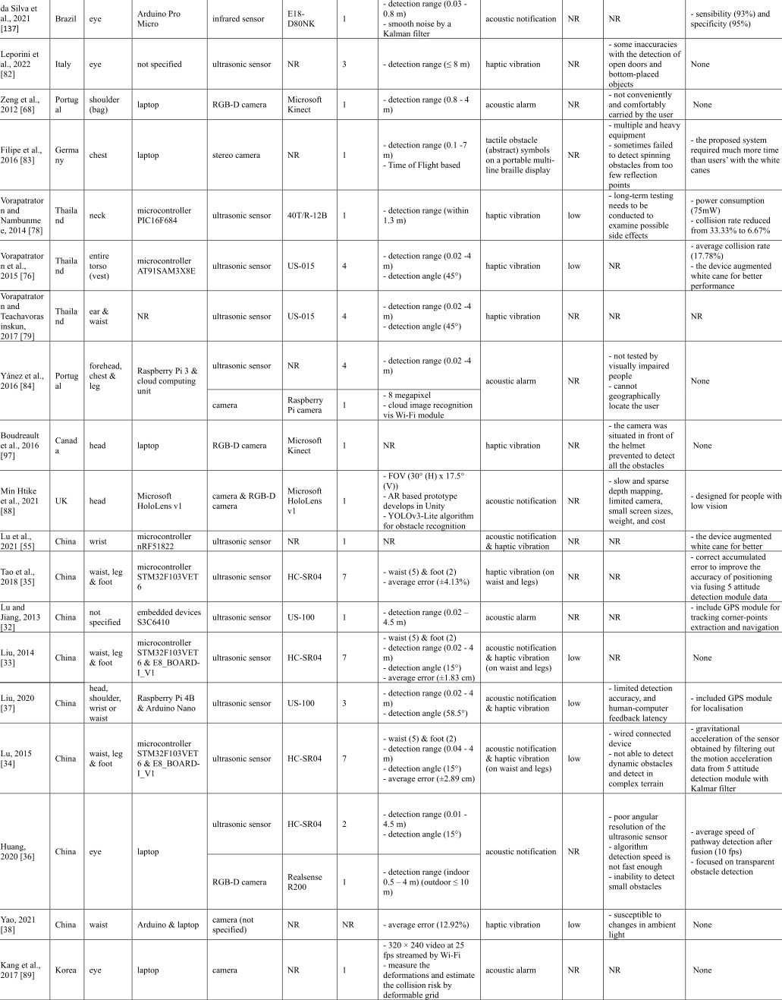

**TABLE 1.** _(Continued.)_ Technology characteristics of the obstacle avoidance ETAs included in the 89 reviewed studies.

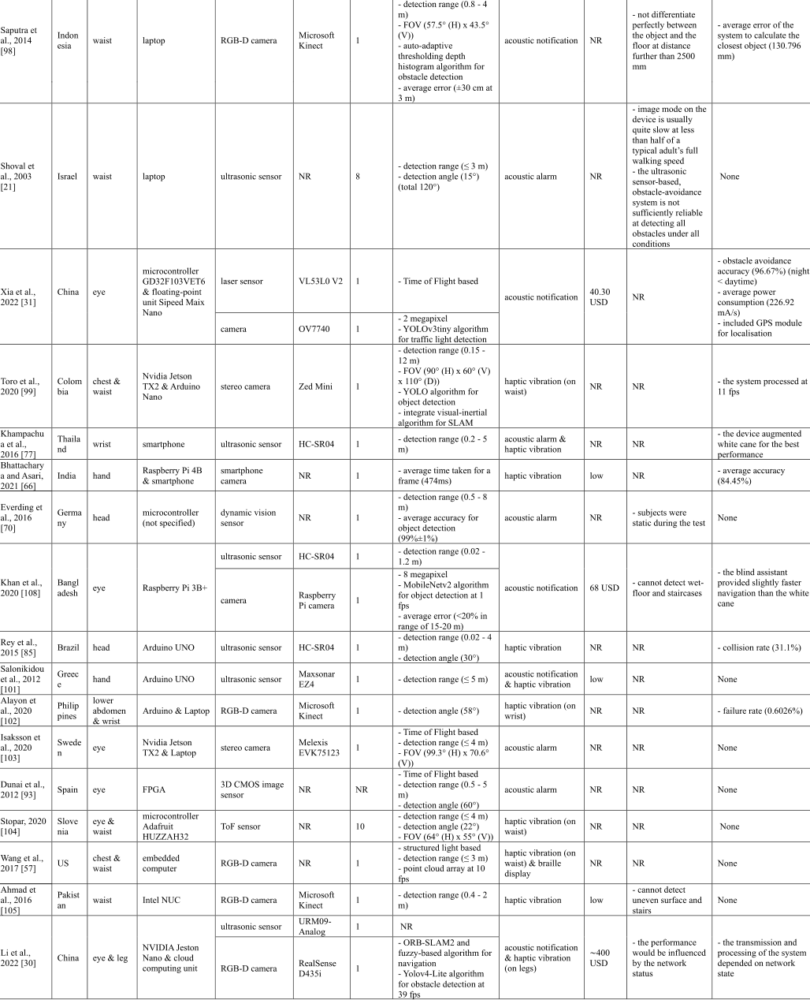

**TABLE 1.** _(Continued.)_ Technology characteristics of the obstacle avoidance ETAs included in the 89 reviewed studies.

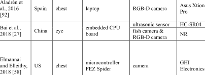

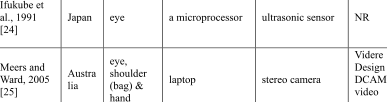

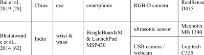

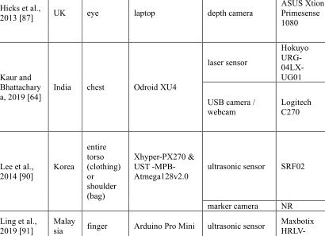

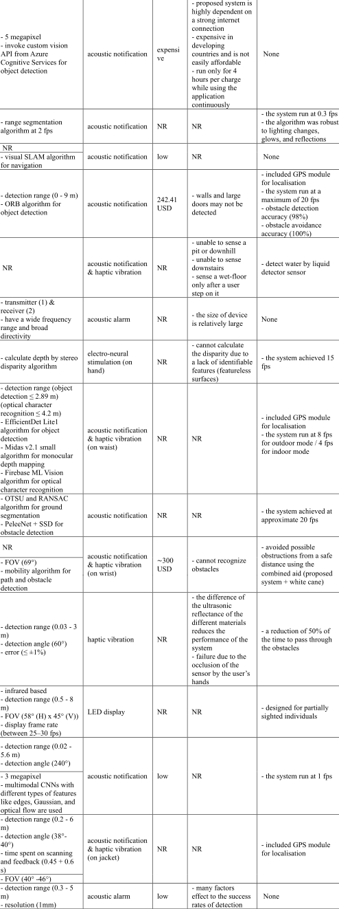

**TABLE 1.** _(Continued.)_ Technology characteristics of the obstacle avoidance ETAs included in the 89 reviewed studies.

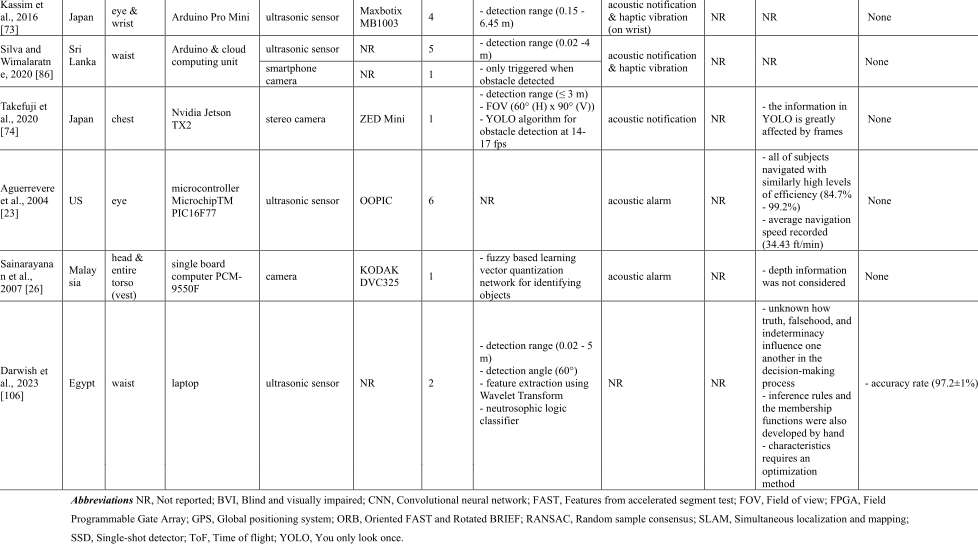

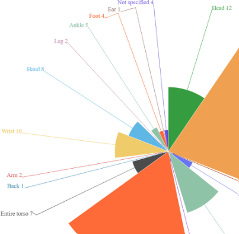

**FIGURE 3.** Number of body parts to be worn.

sensor is not a state-of-the-art technology, its cost-effective nature made it the primary choice for many device developers. The most common human-computer feedback modality was acoustic feedback, including acoustic notifications and acoustic alarms. Haptic or audio-tactile hybrid modes were employed in some other devices. More than two-thirds of the included studies did not provide cost information, making it hard to judge the affordability of their devices to the BVIs. The trial designed to test the efficacy of device in

different studies varies considerably in their methodology, such as test scenarios, subjects, and/or evaluation criteria. Of particular note is that only 43.2% of the studies recruited real BVIs to validate the effects of their devices, which might lower the power of tests. Feedback and improvement suggestions from BVIs were sought in even fewer studies. This is a major weakness as the end user would provide the best feedback of the devices useability and efficacy and help developers to move in the best direction. Over-

**TABLE 2.** Socio-demographic characteristics and use experience of the ETAs users in the 89 reviewed studies.

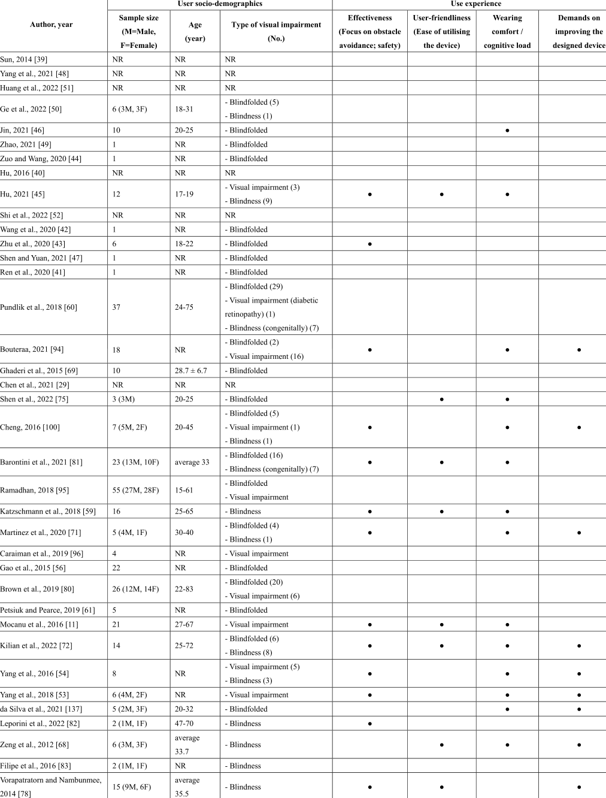

**TABLE 2.** _(Continued.)_ Socio-demographic characteristics and use experience of the ETAs users in the 89 reviewed studies.

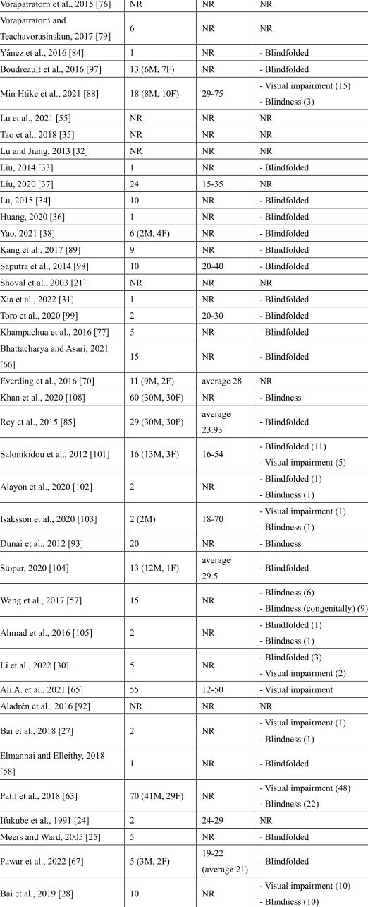

**TABLE 2.** _(Continued.)_ Socio-demographic characteristics and use experience of the ETAs users in the 89 reviewed studies.

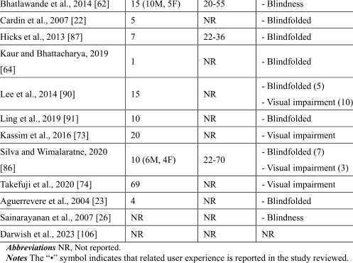

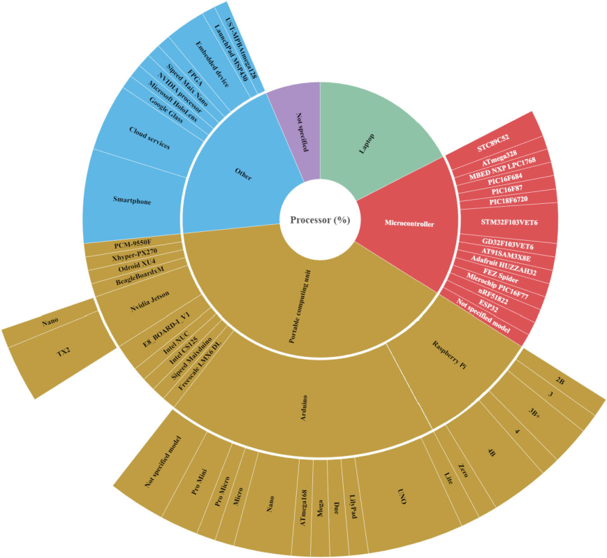

**FIGURE 4.** The percentage of each processor and model.

all, the quality of the studies was low to moderate mainly due to a lack of reporting the device’s real-time feature in obstacle detection and the participants’ ergonomics-related data.

## _B. STRENGTHS AND LIMITATIONS_

To the best of our current knowledge, this is the first systematic review investigating the wearable obstacle avoidance ETAs. The 89 included studies originated from 32 countries,

**TABLE 3.** Methodological quality assessment of the 89 reviewed studies.

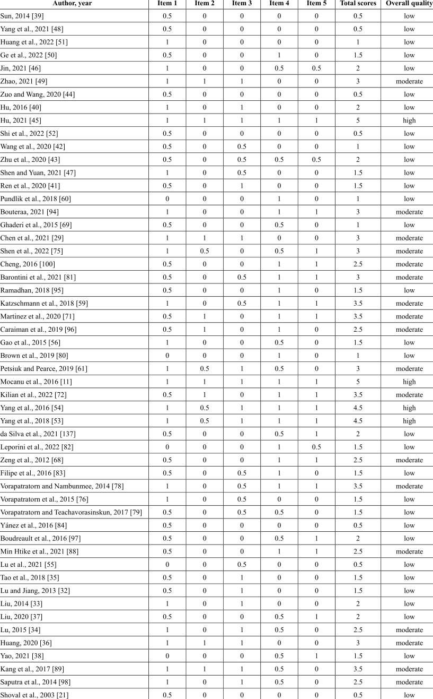

**TABLE 3.** _(Continued.)_ Methodological quality assessment of the 89 reviewed studies.

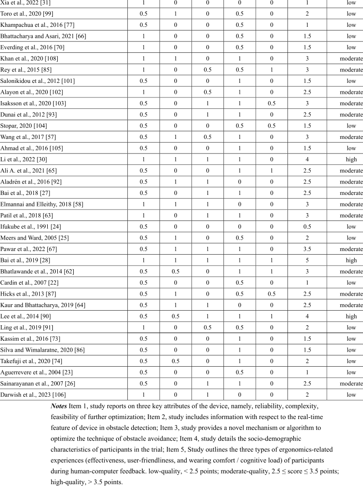

covering Asia, Europe, North America, South America, and Oceania, reflecting the diversity of research regions ( **Table 1** ). The quality of this review is further enhanced by the multidisciplinary collaboration, with team members have diverse academic background in engineering, computer science, and health science. In addition, we appraised the quality of evidence for each included study in the light of a uniform evaluation tool ( **Table 3** ), which might enable

a more robust and reliable reference for potential device manufacturers when translating evidence into production practice.

Albeit this review was carried out strictly in compliance with PRISMA guidelines [19] and APISSER guideline [20], some limitations should be acknowledged. First, this review has restrictions to publications in English or Chinese. Given the fact that the current included studies were geographically

diverse in origin, it is likely that there are eligible studies published in other languages were not included, which may affect our current findings. In fact, at least three of the retrieved studies were excluded as the language limitation during the screening stage ( **Figure 1** ). Second, significant heterogeneity across the trials designed for test devices’ validity hindered a quantitative synthesis of evidence. Some trials assessed the device’s obstacle avoidance effects for overhanging obstacles [59], [61], [68], [96], while others focused on that of static obstacles below the knees [56], [63], [96], or dynamic movement obstacles [94], [96]. The different test scenarios and the lack of standardised outcome measures for appraising obstacle avoidance effects contributed difficulties in pooling the evidence for a meta-analysis (quantitative analysis). Finally, the instrumentation used for assessing the quality of included studies was self-developed, and its reliability and validity is yet to be tested. Such methodological shortfalls also suggest an urgent need for the development of a standardized systematic review guideline/expert consensus, including credible quality assessment tool, to facilitate future evidence-based bioengineering practice in the humanmachine field.

## _C. A COMPARISON WITH PREVIOUS SYSTEMATIC REVIEWS_

During the literature searching work, four systematic reviews with similar themes were identified [5], [18], [109], [110]. All four studies included a review of wearable obstacle avoidance ETAs. The similarities and differences between these four reviews and our systematic review were summarised in **Appendix 3** . Among them, Khan et al. [18] critically reviewed the articles involving navigation/pathfinder and obstacle avoidance devices published between 2011 and 2020. Tripathi et al. [110] analysed studies regarding indoor/outdoor obstruction avoidance assistants published from 2011 to 2022. The other two studies [5], [109] reviewed wearable devices for orientation and mobility, and outdoor navigation systems separately. As introduced in the ‘‘Eligibility criteria’’ section, the navigation for the BVIs is an umbrella concept, including ETA, EOA, and PLD [111]. Whilst Santos et al. claimed that their review focused on ETAs [5], they inappropriately included three studies involving development of orientation devices (belongs to EOA) [112]–[114]. Khan and colleagues adopted a table to summarise the hardware components proposed for obstacle avoidance, while some components without function of obstacle avoidance (e.g., QR code, GPS, etc.) were incorporated [18]. Such ineligible evidence synthesis caused by insufficiently rigorous screening can introduce substantial heterogeneities across the studies, and subsequently makes it difficult to interpret the results. Our review only targets devices for obstacle avoidance ETAs to reduce variability and better reflect the real progress and current status within this topic.

All four previous reviews searched English databases, and one of them also searched Portuguese databases [5]. By comparing the original studies that were eventually included in Santos et al. and our reviews, we found that at least eight eligible studies [21], [68], [76], [83], [84], [88], [97], [98] were missed by Santos et al. We also noticed that the majority of our included studies were not included in the systematic review by El-taher et al., which may be attributed to the fact that the latter searched literature in only one database (Google Scholar) [109]. The systematic review of Tripathi et al. [110] also suffered from an incomplete search. It restricted the search years between 2011 and 2022, and ultimately included 32 studies. However, we found 84 eligible studies in this period. Searching is a crucial part of conducting systematic reviews [115]. Therefore, errors made in the search process (including incomplete search) can potentially result in an incomplete or otherwise biased evidence-base for the review, which is detrimental in understanding of the research topic [115].

In addition, we summarised the part of body devices were worn on, processor types, and cost of these wearable devices in the results section. This information is pivotal in association with user experience, which further enriches our findings. In the following paragraphs of the current review, we suggest a standardized test-scenario construction protocol to assist future studies with relevant topics to validate the obstacle avoidance effects of devices. None of such information was provided in the prior four systematic reviews.

## _D. INTERPRETATION OF FINDINGS_

Based on the rapid development of information technology, wearable devices assign both mobility and connectivity attributes to users so that users can access online information conveniently and communicate with others (or other things) while moving [116]. BVIs are also beneficiaries of this technology. Obstacle avoidance is well accepted as one of the top three needs of BVIs for assistive devices [37]. In recent decades, a variety of wearable obstacle avoidance ETAs have been developed to facilitate their daily travel [111]. However, given the considerable heterogeneity in but not limited to product appearance, core technologies used, features and performance parameters, it is hard to judge which product is the best. It also remains unclear whether the existing devices have met the obstacle avoidance needs among BVIs, and what requires to be further optimized. Hence, we conducted this review to address these research gaps.

ETAs make non-contact perception and trailing possible [111]. It enables the BVIs to receive directional indications and have strategic locations in the environment through vision substitution which involves input from one or more signal sources, processing the signal, and output in a nonvisual form [111]. The first challenge in device development is the effective and accurate perception of environmental information, including range, direction, dimension,

and height of the obstacles. Some devices detect and classify the obstacles through feature extraction and machine learning classifiers, such as support vector machines [11]. Whereas, other devices [30], [31], [49], [52], [74], [75], [88] adopted an array of deep learning algorithms based on convolutional neural networks, such as classical YOLO series. This may be explained by the fact that the latter generally offers higher accuracy, more robust performance and a higher level of scenario interpretation [117]–[119]. Depth data is a great merit of RGB-D cameras, which is powerful under any indoor lighting condition and can be utilized to determine the proximity of the potential obstacles with respect to the user and deliver warning messages [81], [120]. Some other devices employed ultrasonic sensors. This detection technology is unrestrained by the condition of light where cameras may fail [46], but it is usually affected by environmental temperature and/or other sensors [76], [121]. Obstacle avoidance generally comprises obstacle detection (detection of existence of an obstacle) and obstacle recognition (type recognition of obstacle) [109]. Apparently, ultrasonic technology is also unable to achieve obstacle recognition.

The trade-off between pros and cons appears to be unavoidable in the selection of processors. Local or remote computing are common options for processing signals, such as live video streams and ultrasonic echo [119]. Deep learning algorithms based on neural network excel in obstacle avoidance, but their application is hampered by their large computational and memory requirements [119], [122]. We found that devices with the system running close to real-time (more than 30 frames per second) often tended to adopt a laptop or a cloud computing unit because their powerful computational resources meet the needs [30], [87], [89]. However, remote computing heavily relies on a strong internet connection [65]. In the current review, the majority of the devices used local computing, involving laptops and portable computing units ( **Table 1** ). Laptop is larger, heavier, and less comfortable to wear [65], [68]; whereas portable computing unit is commonly limited in computational performance. Reassuringly, researchers have been aware of such limitations. For instance, Shen et al. and colleagues introduced a neural compute stick and compressed the model in the portable computing unit, aiming to speed the system up while maintaining its merits in low weight and portability [75]. The signal in the BVIs’ surroundings needs to be presented and interpreted in real-time so as for a device to play an effective role in navigation [123]. This temporal problem is caused by the signal processing delay of the ETAs system and the delay in the presentation of the signal to the user [123]. The majority of studies missed the latency or real-time performance of their system in our findings. It is not a compromise on high latency [11], [124] though a BVI adult walked with a shorter stride length and slower walking speed [125], [126] than sighted individuals.

The interface between humans and computers is essential to facilitate the accessibility and usability of a system [71]. Amongst the devices we reviewed, haptic feedback was not highly adopted. This might attribute to its direct invasiveness to the skin, inadequate sensory information provided, and potential vibration-induced neurological hazards (particularly in BVIs with skin diseases or diabetes) [5]. Two of the reviewed devices interpreted environmental information to BVIs via the Braille interface [57], [83], which is a ‘‘language’’ more familiar to BVIs. This design was however significantly reduced the hands-free advantage of the wearable device. Furthermore, the delay in rendering images to the BVIs is usually created when these devices interpret complex information through stimuli [123]. In contrast, the acoustic interface was more popular. Both speech feedback and acoustic signals are used to deliver the obstacle and scene information [46], but speech feedback could more specific on the information of the obstacles even recommend a clear pathway. The merits of comfort and flexibility are significant, as the user only needs a pair of headphones. In seven studies, bone-conducting headphones were included in the devices to provide audio output [11], [45], [53], [54], [69], [71], [103]. BVIs are thus able to hear other sounds and are in lower risk of auditory overload. Complying with the sonification guidelines, Hu introduced three types of stereo sound effects to represent the detected environments, which improves the efficiency of information transmission [45]. Many auditory-based devices convert the signal or image into sounds through the temporal aspect as the left-right translation is also delayed, while this delay might be improved with enough experience [123], [127]. An interesting finding was that at least four devices reviewed used a hybrid (acoustic and tactile) interface, which was claimed to be user-friendly and intuitive [5]. However, all these devices contained multiple components and needed to be worn in multiple body parts simultaneously [11], [37], [81], [128], which obviously challenges user comfort.

According to our review, most of the devices were worn on the upper trunk and head (including the eyes). This might facilitate the precise alignment of the sensors with the direction where the user would face [128]. Nonetheless, wearing the device on the head poses a significant challenge to the correct reading of head-mounted sensors, as the natural turning of the head during walking is inevitable. Some other devices had to be worn on the upper extremity, such as arm, wrist or hand [72], [77], [94], [95], [101]. Although the users can easily detect medium-sized obstacles such as tables and chairs within a scene with these devices, the user has to continuously keep the upper limb facing forward to detect obstacles during travel. With these devices, the user has to keep the upper limb facing forward to detect obstacles during travel. This actually hinders the natural swing of the arm during human walking, and can also lead to user’s failure in minimising torque loading on the joints and skeletal structure so that

losing optimisation of the motion of the lower limb [129]. Devices worn on the lower limbs face a similar situation as upper limb devices, being proficient at detecting small and low obstacles while having to cope with substantial motion during walking.

As reported, approaching 90% BVIs live in low- and middle-income countries [130]. Visually impaired community is generally lower paid than others [131]. The cost is thereby a key issue for this population, and also one of the critical non-functional requirements that should be considered for a highly acceptable ETA [131]. After all, an unaffordable cost can directly dilute the acceptance of the device [72], [123]. More than half of the reviewed studies did not report cost-related information; and two studies acknowledged that the devices were expensive [59], [65]. Even though the latter shows excellent performance in obstacle avoidance, cost is destined to be a potential ‘‘stumbling block’’ in the conversion process from design to production.

Power consumption is a key parameter of the device, while most of the included studies (97.8%) did not seem to pay enough attention. The electronic components such as sensors and processors require power to operate. They are generally needed to be continuous operation over extended periods of time. If the battery dies or the device shuts down unexpectedly due to high power consumption, it could be a significant inconvenience for BVI people and even put them at risk.

Nearly 40% of included studies only recruited blindfoldedsighted healthy volunteers to validate the effects of the device, which is likely to cause potential measurement error [119]. Although BVIs are limited to access to environmental information by sensory channels other than vision, their ability to compensate for other senses is superior to that of sighted individuals. As reported, BVIs typically perform better in some auditory processing tasks, such as speech perception [132] and pitch discrimination [133]. Després et al observed that early-blind subjects spent shorter reaction times than sighted subjects for sound localisation at far-lateral locations [134]. Such supra-normal auditory ability in far-space was also identified in late-onset blind individuals [135], with even better ability [136]. With recruiting blindfoldedsighted, Gao et al. [56] and Yánez [84] confirmed the benefits of their device. However, both research teams highlighted that future re-evaluation of the device in real BVIs is still required to facilitate researchers to obtain accurate device evaluation efficiently with the minimisation of erroneous estimation. In addition, verification of the subject’s visual abilities was often not mentioned, such as a hospital certificate.

User involvement in the design and development of assistive aids is imperative to ensure usability and eventual acceptance by the target users [128]. For obstacle avoidance ETAs, this involvement includes observing/understanding travelling characteristics, challenges encountered, reactions in an

unfamiliar scenario, and various expectations for the device among BVIs [5], [37], [81], [97]. Unfortunately, the majority of studies did not use enough feedback from the intended end users (people with total or partial blindness of short and long duration), and did not include data associated with user experience, including effectiveness, user-friendliness and wearing comfort/cognitive load ( **Table 2** ).

Of those studies included feedback, user-friendliness (Ease of utilising the device) and comments for improvement received the least attention. It is noteworthy that many studies emphasized the necessary training time prior to the device use. However, there is in fact a consensus that obstacle avoidance ETAs should be user-friendly (easy to use) without extensive training [111], [121]. Comfortableness remains a top priority for the BVI communities, according to end-user experience-based reviews and comments [72]. The majority of the users in the studies favored a lighter and more compact device [28], [71], [72], [94], [100]. The reality, however, is that volunteers found those devices were heavy with wires and suggest that the wires be compressed or the devices be modified to be wireless [53], [137]. Additionally, the BVI people express concern with face and object recognition as they aspire to be more engaged with their environment [28], [54], [94].

## _E. IMPLICATIONS FOR RESEARCH AND DEVICE_

- 1) IMPLICATIONS FOR RESEARCH

## • **Lack of standard guideline and quality evaluation tool**

Systematic review has been a popular and common practice in medical field [119]. In contrast to narrative or other traditional review techniques, systematic review is a more structured approach [138], with striking superiorities lie in transparent, objective and reproducible methodology for including all available evidence in the review and unbiased appraisal of validity and relevance of each included study [119], [139]. In consequence, evidence derived from systematic review minimize the risk of subjective interpretation and inaccuracies because of chance error affecting the review results [138]. These strengths have also attracted researchers to introduce systematic review to more interdisciplinary and technology-oriented areas (e.g., engineering, IT and communications, artificial intelligence, etc.) to perform research [119]. Pooling disparate studies and identifying common trends that may be missed by individual studies is expected to help/guide designers and manufacturers of wearable obstacle avoidance ETAs in evidence-based engineering practice as well as justify future research direction in said area for relevant researchers. However, there is a significant loop hole in the structured practical execution of engineering/computer science-related systematic review in linked to tool support [20], including standardized guideline (similar to PRISMA statement) and instrument for critical appraisal (similar to Cochrane RoB tool).

Without such a structural framework (strict guideline and highly detailed priori approach), it would be difficult to ensure methodological rigor and quality reliability in the review [139], [140].

The current review was carried out adhere to PRISMA statement [19] and APISSER guideline [20]. The latter was adapted and developed on the basis of PRISMA by two researchers in power electronics-related fields [20]. Although the APISSER was claimed to be a guideline to facilitate practice in engineering-related systematic review by following a task-oriented engineering flow and supported by customized tools [20], it does not appear to be fully applicable to the subject of our review. This may partially attribute to the fact that the development of ETAs for BVIs is a topic with multidisciplinary [141] and interdisciplinary [142] nature, which might involve automatic control, computer science, biomedicine, industrial design, and human engineering. The APISSER also did not provide a tool for assessing the quality of literatures [20]. Besides, Torres-Carrión and colleagues formulated a guideline to conduct systematic review in engineering and education disciplines [143].

However, their guideline was compiled based on a previous review method for software engineering, and it was inapplicable to the subject we are currently focusing on as well [143]. Accumulative evidence strongly encourages engineers to perform a systematic review at the beginning of every research process in order to quickly establish what has been done and build on each other’s work and knowledge [20]. This might be viewed as an evidence-based engineering philosophy with an aim —- providing the means by which current best evidence from research can be integrated with practical experience and human values in the decision-making process concerning the design and optimization of an engineering project [144]. We hence believe that the development of a more applicable and endorsed systematic review guideline with respect to the field of medical device engineering such as assistive technology for BVIs is warranted.

## • **A need for wide-scope scene of trial assessment**

The huge heterogeneity across the device validation trials during the development and implementation phase of

**APPENDIX 1.** Search strategy.

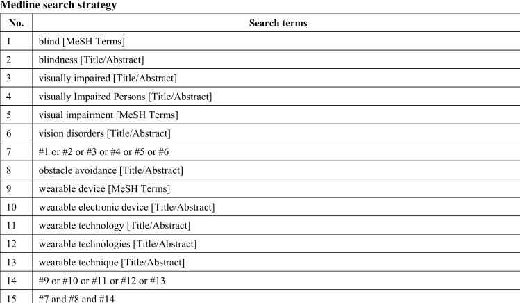

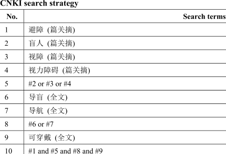

the prototypes impedes the standardised measurement and evaluation of the end-user experience [119]. It is difficult to objectively compare the performance of different prototypes using common criteria. The trials in the included studies often emphasized a narrow-scope scene in which the performance of a particular capability in obstacle avoidance such as hanging objects or ground objects, without consideration of the comprehensive functionality of the device. The representativeness of these prototypes is restricted to the lack of standardised assessment methods and potential reporting bias. These findings imply that there is an urgent need to develop or select standardised evaluation scenarios or assessment methods. We found a functional assessment, The Functional Low-Vision Observer Rated Assessment (FLORA), suitable for an ultra-low vision population [145], and it has been administered to evaluate a kind of retinal prosthesis system in clinical medicine [146]. Although this assessment was aiming to evaluate the impact of new vision-restoration treatments, most tasks for functional vision could be considered as a microcosm of the BVIs’ daily life. We have selected 15 functional tasks that are relevant to obstacle avoidance as a reference of standardised measurement tool ( **Appendix 4** ). The researchers could calculate the percentage of four options (impossible, difficult, moderate and easy) through observing the performance of the subjects in all selected functional tasks, such that evaluate the prototypes objectively and comprehensively. Furthermore, Wiener et al. suggested that device should detect various obstacles that are ground level to head high and full body wide in the travel path according to the National Research Council’s guidelines for

ETAs [111], [147], which fills the gap in the description of obstacles in FLORA.

## 2) IMPLICATIONS FOR DEVICE

The obstacle avoidance scenarios are diverse and changeable as different types of obstacles might exist within multiple environments such as indoors or outdoors. It is essential that the solution of detecting environmental information is adaptive and independent of environmental modifications [119]. However, the available technologies used for perceiving the environmental information have their unavoidable limitations. For instance, computer vision-based methods fairly rely on the intensity of light and computational resources of the processor, which nearly leads to large power consumption. Ultrasonic-based approaches fail in detecting objects with smooth reflective surfaces and have a cross-talk with multiple sensors. Laser sensors are accurate at distinguishing small objects, but the laser beam must be pointed directly at the object [119]. Infrared sensors troubled by powerful natural light. Applying multiple environment detection techniques in combination can compensate for their respective shortcomings and enhance the performance of the ETA. However, engineers and researchers should consider addressing the cost, power consumption and wearer comfort issues result from these increased hardware requirements.

Similarly, engineers and researchers have to seek a trade-off among the computational resource, detection accuracy, latency, power consumption, weight and the dimension of an ETA. This is because the portable comput-

**APPENDIX 2.** Tool for assessing quality of evidence in studies regarding developing a wearable obstacle avoidance device.

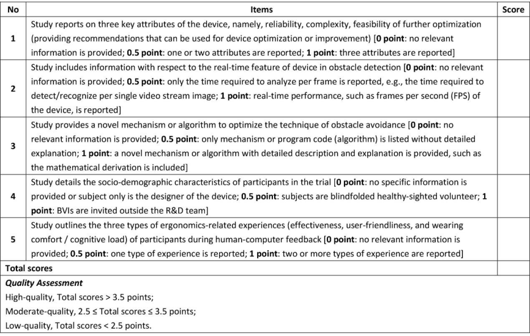

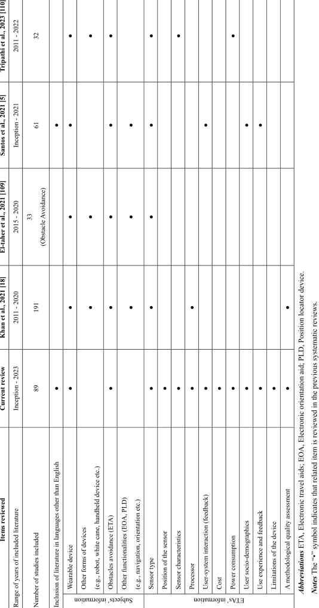

## **APPENDIX 4.** List of selected tasks from FLORA.

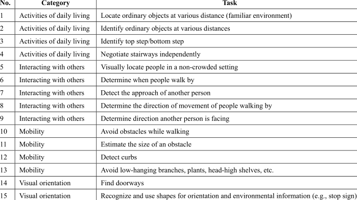

ing units and embedded devices are sized in line with the expectations for wearable devices, whereas further improvements to real-time performance are eager. The latency contains two parts of delay from data processing and information rendering as aforementioned. A qualified device should be suitable for working in real-time in order to leave enough time for the BVIs to receive and react to the feedback information. In spite of the high accuracy, robustness, and efficiency of AI-based computer vision algorithms, the novel neural network-based models need significantly increasing computational resources [119]. A bulky laptop with high computational performance might not be the best choice for a wearable device. Cloud computing allows access to massive cloud resources to meet unpredictable demands, but signal instability while moving, unfamiliar scenes or network disconnection are inevitable and lethal topics for telecommunications and cloud computing.

In summary, the current findings suggest that further optimisation of existing wearable obstacle avoidance ETAs is required to meet the needs of independent travel among BVIs. An ideal user-friendly prototype is a cost-effective, usercentred and compact wearable ETA which detects obstacles in real time and has a trade-off among sensor characteristics, processor features and information feedback properties. This kind of balance can be dynamically adaptive to accommodate switching between scenarios. The feedback should be easy to understand without the need of extensive training. Of course, a switchable multiple-option of feedback interface is also encouraged to satisfy the diverse needs from the BVIs.

during independent navigation. These ETAs generally consist of different types of processors, environment detection techniques and human-computer feedback; and there are no studies comparing different ETA with each other. It is thereby hard to conclude which device is of optimum performance. Due to the limitations of various technologies or configurations, multiple environment detection techniques and human-computer feedback are proposed to be integrated into one ETA to provide optimal obstacle avoidance. Nevertheless, the increased hardware requirements of such combinations can inevitably lead to response latency, overloaded power consumption, increased device size and weight, as well as growing cost. Hence, finding the best trade-off between functional features (e.g., speed of detection, accuracy of detection, etc.) and non-functional features (e.g., cost, wearing comfort, etc.) remains a challenge to be solved in optimising this type of ETAs in the future. Considering the intrinsical differences in sensory compensation between BVIs and healthy people, user experience tests conducted with limited vision rather than blindfolded-sighted healthy volunteers can yield more accurate results. In addition, developing an applicable and standardised systematic review guideline with a credible quality assessment instrument for studies within the medical device engineering field is also warranted.

## **APPENDIX**

See Appendices 1, 2, 3 and 4. The English search strategy in Appendix 1 was used for MEDLINE via pubmed while the Chinese one was used for CNKI; both two search strategies were also suitable for other electronic databases.

## **V. CONCLUSION**

The current evidence indicates that many wearable obstacle avoidance ETAs have been designed to assist BVIs

## **ACKNOWLEDGMENT**

_(Peijie Xu and Gerard A. Kennedy are co-first authors.)_

## **REFERENCES**

- [1] R. Bourne, ‘‘Trends in prevalence of blindness and distance and near vision impairment over 30 years: An analysis for the Global Burden of Disease Study,’’ _Lancet Global Health_ , vol. 9, no. 2, pp. e130–e143, 2021, doi: 10.1016/S2214-109X(20)30425-3.

- [2] N. A. Giudice and G. E. Legge, ‘‘Blind navigation and the role of technology,’’ in _The Engineering Handbook of Smart Technology for Aging, Disability, and Independence_ . Hoboken, NJ, USA: Wiley, 2008, pp. 479–500.

- [3] A. D. P. dos Santos, F. O. Medola, M. J. Cinelli, A. R. G. Ramirez, and F. E. Sandnes, ‘‘Are electronic white canes better than traditional canes? A comparative study with blind and blindfolded participants,’’ _Universal Access Inf. Soc._ , vol. 20, no. 1, pp. 93–103, Mar. 2021, doi: 10.1007/s10209-020-00712-z.

- [4] H. T. V. Vu, ‘‘Impact of unilateral and bilateral vision loss on quality of life,’’ _Brit. J. Ophthalmol._ , vol. 89, no. 3, pp. 360–363, Mar. 2005, doi: 10.1136/bjo.2004.047498.

- [5] A. D. P. D. Santos, A. H. G. Suzuki, F. O. Medola, and A. Vaezipour, ‘‘A systematic review of wearable devices for orientation and mobility of adults with visual impairment and blindness,’’ _IEEE Access_ , vol. 9, pp. 162306–162324, 2021, doi: 10.1109/ACCESS.2021.3132887.

- [6] K. J. Chang, L. L. Dillon, L. Deverell, M. Y. Boon, and L. Keay, ‘‘Orientation and mobility outcome measures,’’ _Clin. Experim. Optometry_ , vol. 103, no. 4, pp. 434–448, Jul. 2020, doi: 10.1111/cxo. 13004.

- [7] F. van der Heijden and P. P. L. Regtien, ‘‘Wearable navigation assistance—A tool for the blind,’’ _Meas. Sci. Rev._ , vol. 5, no. 5, pp. 53–56, 2005.

- [8] S. Shoval, I. Ulrich, and J. Borenstein, ‘‘Computerized obstacle avoidance systems for the blind and visually impaired,’’ in _Intelligent Systems and Technologies in Rehabilitation Engineering_ , H. N. L. Teodorescu and L. C. Jain, Eds. Boca Raton, FL, USA: CRC Press, Dec. 2000, pp. 414–448. [Online]. Available: https://www.researchgate.net/profile/ShragaShoval/publication/237340168_Computerized_Obstacle_Avoidance_ Systems_for_the_Blind_and_Visually_Impaired/links/54fe315d0cf2 672e223ea0e0/Computerized-Obstacle-Avoidance-Systems-for-theBlind-and-Visually-Impaired.pdf

- [9] R. Manduchi and S. Kurniawan, ‘‘Mobility-related accidents experienced by people with visual impairment,’’ _AER J., Res. Pract. Vis. Impairment Blindness_ , vol. 4, no. 2, pp. 44–54, Feb. 2011.

- [10] B. Kuriakose, R. Shrestha, and F. E. Sandnes, ‘‘Tools and technologies for blind and visually impaired navigation support: A review,’’ _IETE Tech. Rev._ , vol. 39, no. 1, pp. 3–18, Jan. 2022.

- [11] B. Mocanu, R. Tapu, and T. Zaharia, ‘‘When ultrasonic sensors and computer vision join forces for efficient obstacle detection and recognition,’’ _Sensors_ , vol. 16, no. 11, pp. 1807-1–1807-23, 2016, doi: 10.3390/s16111807.

- [12] U. R. Roentgen, G. J. Gelderblom, M. Soede, and L. P. D. Witte, ‘‘The impact of electronic mobility devices for persons who are visually impaired: A systematic review of effects and effectiveness,’’ _J. Vis. Impairment Blindness_ , vol. 103, no. 11, pp. 743–753, Dec. 2009, doi: 10.1177/0145482X0910301104.

- [13] V. V. Meshram, K. Patil, V. A. Meshram, and F. C. Shu, ‘‘An astute assistive device for mobility and object recognition for visually impaired people,’’ _IEEE Trans. Human-Mach. Syst._ , vol. 49, no. 5, pp. 449–460, Oct. 2019, doi: 10.1109/THMS.2019.2931745.

- [14] M. Hersh, ‘‘Wearable travel aids for blind and partially sighted people: A review with a focus on design issues,’’ _Sensors_ , vol. 22, no. 14, p. 5454, Jul. 2022, doi: 10.3390/s22145454.

- [15] R. Velázquez, ‘‘Wearable assistive devices for the blind,’’ in _Wearable and Autonomous Biomedical Devices and Systems for Smart Environment_ (Lecture Notes in Electrical Engineering), vol. 75, A. Lay-Ekuakille and S. C. Mukhopadhyay, Eds. Berlin, Germany: Springer, 2010, pp. 331–349.

- [16] W. C. S. S. Simões and V. F. de Lucena, ‘‘Blind user wearable audio assistance for indoor navigation based on visual markers and ultrasonic obstacle detection,’’ in _Proc. IEEE Int. Conf. Consum. Electron. (ICCE)_ , Jan. 2016, pp. 60–63, doi: 10.1109/ICCE.2016.7430522.

- [17] E. B. Kaiser and M. Lawo, ‘‘Wearable navigation system for the visually impaired and blind people,’’ in _Proc. IEEE/ACIS 11th Int. Conf. Comput. Inf. Sci._ , May 2012, pp. 230–233, doi: 10.1109/ICIS.2012.118.

- [18] S. Khan, S. Nazir, and H. U. Khan, ‘‘Analysis of navigation assistants for blind and visually impaired people: A systematic review,’’ _IEEE Access_ , vol. 9, pp. 26712–26734, 2021, doi: 10.1109/ACCESS.2021.3052415.

- [19] M. J. Page, ‘‘The PRISMA 2020 statement: An updated guideline for reporting systematic reviews,’’ _Brit. Med. J._ , vol. 372, p. n71, Mar. 2021, doi: 10.1136/bmj.n71.

- [20] S. Castillo and P. Grbovic, ‘‘The APISSER methodology for systematic literature reviews in engineering,’’ _IEEE Access_ , vol. 10, pp. 23700–23707, 2022, doi: 10.1109/ACCESS.2022.3148206.

- [21] S. Shoval, I. Ulrich, and J. Borenstein, ‘‘NavBelt and the GuideCane [obstacle-avoidance systems for the blind and visually impaired],’’ _IEEE Robot. Autom. Mag._ , vol. 10, no. 1, pp. 9–20, Mar. 2003, doi: 10.1109/MRA.2003.1191706.

- [22] S. Cardin, D. Thalmann, and F. Vexo, ‘‘A wearable system for mobility improvement of visually impaired people,’’ _Vis. Comput._ , vol. 23, no. 2, pp. 109–118, Jan. 2007, doi: 10.1007/s00371-006-0032-4.

- [23] D. Aguerrevere, M. Choudhury, and A. Barreto, ‘‘Portable 3D sound/sonar navigation system for blind individuals,’’ in _Proc. 2nd LACCEI Int. Latin Amer. Caribbean Conf. Eng. Technol._ , 2004, pp. 1–6.

- [24] T. Ifukube, T. Sasaki, and C. Peng, ‘‘A blind mobility aid modeled after echolocation of bats,’’ _IEEE Trans. Biomed. Eng._ , vol. 38, no. 5, pp. 461–465, May 1991, doi: 10.1109/10.81565.

- [25] S. Meers and K. Ward, ‘‘A vision system for providing 3D perception of the environment via transcutaneous electro-neural stimulation,’’ in _Proc. 8th Int. Conf. Inf. Visualisation IV_ , Jul. 2004, pp. 546–552, doi: 10.1109/IV.2004.1320198.

- [26] G. Sainarayanan, R. Nagarajan, and S. Yaacob, ‘‘Fuzzy image processing scheme for autonomous navigation of human blind,’’ _Appl. Soft Comput._ , vol. 7, no. 1, pp. 257–264, Jan. 2007, doi: 10.1016/j.asoc.2005.06.005.

- [27] J. Bai, S. Lian, Z. Liu, K. Wang, and D. Liu, ‘‘Virtual-blind-road following-based wearable navigation device for blind people,’’ _IEEE Trans. Consum. Electron._ , vol. 64, no. 1, pp. 136–143, Feb. 2018, doi: 10.1109/TCE.2018.2812498.

- [28] J. Bai, Z. Liu, Y. Lin, Y. Li, S. Lian, and D. Liu, ‘‘Wearable travel aid for environment perception and navigation of visually impaired people,’’ _Electronics_ , vol. 8, no. 6, p. 697, Jun. 2019, doi: 10.3390/electronics8060697.

- [29] Z. Chen, X. Liu, M. Kojima, Q. Huang, and T. Arai, ‘‘A wearable navigation device for visually impaired people based on the real-time semantic visual slam system,’’ _Sensors_ , vol. 21, no. 4, pp. 1–14, 2021, doi: 10.3390/s21041536.

- [30] G. Li, J. Xu, Z. Li, C. Chen, and Z. Kan, ‘‘Sensing and navigation of wearable assistance cognitive systems for the visually impaired,’’ _IEEE Trans. Cognit. Develop. Syst._ , vol. 15, no. 1, pp. 122–133, Mar. 2023, doi: 10.1109/TCDS.2022.3146828.

- [31] K. Xia, X. Li, H. Liu, M. Zhou, and K. Zhu, ‘‘IBGS: A wearable smart system to assist visually challenged,’’ _IEEE Access_ , vol. 10, pp. 77810–77825, 2022, doi: 10.1109/ACCESS.2022.3193097.

- [32] Y. Lu and J. Jiang, ‘‘Research on walking navigation method for the blind based on corner-points extraction,’’ _J. North China Univ. Tech._ , vol. 25, no. 3, pp. 18–23, 2013.

- [33] Y. Liu, ‘‘Research of a wearable and indoor travel aid system based on sensory substitution for visually impaired,’’ M.S. thesis, School Artif. Intell. Automat., Huazhong Univ. Sci. Technol., Wuhan, China, 2014.

- [34] Y. Lu, ‘‘Research of a multi-functional electronic travel aid based on ultrasonic sensors,’’ M.S. thesis, School Artif. Intell. Automat., Huazhong Univ. Sci. Technol., Wuhan, China, 2015.

- [35] C. Tao, Y. Lu, and X. Yu, ‘‘A multi-functional electronic travel aid system based on ultrasonic sensors,’’ _J. Tianjin Univ. Sci. Technol._ , vol. 33, no. 3, pp. 63–68, 2018, doi: 10.13364/j.issn.1672-6510.20170279.

- [36] Z. Huang, ‘‘The research on transparent obstacle detection technology for visually impaired people,’’ M.S. thesis, College Opt. Sci. Eng., Zhejiang Univ., Hangzhou, China, 2020.

- [37] M. Liu, ‘‘Research on design of travel companion products for visually impaired people based on situation awareness,’’ M.S. thesis, School Des., South China Univ. Technol., Guangzhou, China, 2020.

- [38] X. Yao, ‘‘Design research on indoor navigation system for visually impaired people based on user experience,’’ M.S. thesis, School Art Des., Guangdong Univ. Technol., Guangzhou, China, 2021.

- [39] X. Sun, ‘‘Design of ultrasonic-based obstacle avoidance glasses for the blind,’’ _Electron. Technol. Softw. Eng._ , vol. 12, pp. 171–172, Jan. 2014.

- [40] J. Hu, ‘‘Research and implementation of blind navigation glasses based on ultrasonic and image recognition,’’ M.S. thesis, School Inf. Softw. Eng., Univ. Electron. Sci. Technol. China, Chengdu, China, 2016.

- [41] H. Ren, S. Jin, Q. Lin, Y. Cheng, and J. Gu, ‘‘Visual measurement method for obstacle position and distance for visualy impaired people,’’ _Light Ind. Machinery_ , vol. 38, no. 3, pp. 65–68, 2020, doi: 10.3969/j.issn.10052895.2020.03.013.

- [42] J. Wang, Q. Sun, D. Ru, and Y. Liu, ‘‘Intelligent voice broadcast report blind suit based on ultrasonic ranging sensor module,’’ _J. Beijing Inst. Fashion Technol._ , vol. 40, no. 2, pp. 76–81, 2020, doi: 10.16454/j.cnki.issn.1001-0564.2020.02.011.

- [43] X. Zhu, Y. Liu, X. Zhu, and L. Hu, ‘‘Design of auxiliary clothing for the blind based on obstacle detection,’’ _Wool Textile J._ , vol. 48, no. 11, pp. 63–67, 2020, doi: 10.19333/j.mfkj.20200300905.

- [44] W. Zuo and M. Wang, ‘‘Design and implementation of intelligent wearable blind guiding system,’’ _Ind. Control Comput._ , vol. 33, no. 9, pp. 98–99, 2020.

- [45] W. Hu, ‘‘Obstacle avoidance and positioning on traveling assistance for visually impaired people,’’ Ph.D. dissertation, College Opt. Sci. Eng., Zhejiang Univ., Hangzhou, China, 2021.

- [46] P. Jin, ‘‘Research on intelligent apparel product design based on embedded system,’’ M.S. thesis, School Des., Jiangnan Univ., Wuxi, China, 2021.

- [47] H. Shen and J. Yuan, ‘‘Intelligent guide blind system based on GB-D depth camera,’’ _Transducer Microsyst. Technol._ , vol. 40, no. 1, pp. 85–87, 2021, doi: 10.13873/J.1000-9787(2021)01-0085-03.

- [48] J. Yang, Y. Yang, C. Guo, H. Zhang, H. Yin, and W. Yan, ‘‘Design and implementation of Raspberry Pi-based smart glasses for the blind,’’ _Comput. Knowl. Technol._ , vol. 17, no. 15, pp. 85–87, 2021, doi: 10.14004/j.cnki.ckt.2021.1465.

- [49] Y. Zhao, ‘‘Design of blind-assisted navigation system in indoor environment,’’ M.S. thesis, College Inf. Sci. Technol., Beijing Univ. Chem. Technol., Beijing, China, 2021.

- [50] S. Ge, ‘‘A virtual vision navigation system for the blind using wearable touch vision devices,’’ _Prog. Biochem. Biophys._ , vol. 49, no. 8, pp. 1543–1554, 2022, doi: 10.16476/j.pibb.2021. 0320.

- [51] J. Huang, J. He, N. Liu, C. Zhang, J. Li, and P. Xie, ‘‘Research and design of intelligent wearable ultrasonic ranging and positioning guide belt,’’ _Ind. Control Comput._ , vol. 35, no. 2, pp. 100–101, 2022.

- [52] Y. Shi, K. Gai, X. Zhang, Z. Sun, and C. Xiao, ‘‘Design of blind guide instrument based on MaixPy and YOLOv5 model,’’ _Modern Inf. Technol._ , vol. 6, no. 4, pp. 185–188, 2022, doi: 10.19850/j.cnki.20964706.2022.04.049.

- [53] K. Yang, K. Wang, L. Bergasa, E. Romera, W. Hu, D. Sun, J. Sun, R. Cheng, T. Chen, and E. López, ‘‘Unifying terrain awareness for the visually impaired through real-time semantic segmentation,’’ _Sensors_ , vol. 18, no. 5, p. 1506, May 2018. [Online]. Available: https://www.mdpi.com/1424-8220/18/5/1506

- [54] K. Yang, K. Wang, W. Hu, and J. Bai, ‘‘Expanding the detection of traversable area with RealSense for the visually impaired,’’ _Sensors_ , vol. 16, no. 11, p. 1954, Nov. 2016. [Online]. Available: https://www.mdpi.com/1424-8220/16/11/1954

- [55] Z. Lu, Z. Zheng, H. Yin, and W. Tang, ‘‘Design of blind guide and obstacle avoidance bracelet based on ultrasonic,’’ presented at the 5th Int. Conf. Electron. Inf. Technol. Comput. Eng., Xiamen, China, 2022, doi: 10.1145/3501409.3501421.

- [56] Y. Gao, R. Chandrawanshi, A. C. Nau, and Z. T. H. Tse, ‘‘Wearable virtual white cane network for navigating people with visual impairment,’’ _Proc. Inst. Mech. Eng., H, J. Eng. Med._ , vol. 229, no. 9, pp. 681–688, Sep. 2015, doi: 10.1177/0954411915599017.

- [57] H. Wang, R. K. Katzschmann, S. Teng, B. Araki, L. Giarré, and D. Rus, ‘‘Enabling independent navigation for visually impaired people through a wearable vision-based feedback system,’’ in _Proc. IEEE Int. Conf. Robot. Autom. (ICRA)_ , May 2017, pp. 6533–6540, doi: 10.1109/ICRA.2017.7989772.

- [58] W. M. Elmannai and K. M. Elleithy, ‘‘A highly accurate and reliable data fusion framework for guiding the visually impaired,’’ _IEEE Access_ , vol. 6, pp. 33029–33054, 2018.

- [59] R. K. Katzschmann, B. Araki, and D. Rus, ‘‘Safe local navigation for visually impaired users with a time-of-flight and haptic feedback device,’’ _IEEE Trans. Neural Syst. Rehabil. Eng._ , vol. 26, no. 3, pp. 583–593, Mar. 2018, doi: 10.1109/TNSRE.2018.2800665.

- [60] S. Pundlik, M. Tomasi, M. Moharrer, A. R. Bowers, and G. Luo, ‘‘Preliminary evaluation of a wearable camera-based collision warning device for blind individuals,’’ _Optometry Vis. Sci._ , vol. 95, no. 9, pp. 747–756, Sep. 2018, doi: 10.1097/opx.0000000000001264.

- [61] A. L. Petsiuk and J. M. Pearce, ‘‘Low-cost open source ultrasoundsensing based navigational support for the visually impaired,’’ _Sensors_ , vol. 19, no. 17, p. 3783, Aug. 2019, doi: 10.3390/s19173783.

- [62] S. Bhatlawande, A. Sunkari, M. Mahadevappa, J. Mukhopadhyay, M. Biswas, D. Das, and S. Gupta, ‘‘Electronic bracelet and visionenabled Waist-belt for mobility of visually impaired people,’’ _Assistive Technol._ , vol. 26, no. 4, pp. 186–195, Oct. 2014, doi: 10.1080/ 10400435.2014.915896.

- [63] K. Patil, Q. Jawadwala, and F. C. Shu, ‘‘Design and construction of electronic aid for visually impaired people,’’ _IEEE Trans. Human-Mach. Syst._ , vol. 48, no. 2, pp. 172–182, Apr. 2018, doi: 10.1109/THMS.2018.2799588.

- [64] B. Kaur and J. Bhattacharya, ‘‘Scene perception system for visually impaired based on object detection and classification using multimodal deep convolutional neural network,’’ _J. Electron. Imag._ , vol. 28, no. 1, p. 1, Feb. 2019, doi: 10.1117/1.JEI.28.1.013031.

- [65] H. Ali A., S. U. Rao, S. Ranganath, T. S. Ashwin, and G. R. M. Reddy, ‘‘A Google glass based real-time scene analysis for the visually impaired,’’ _IEEE Access_ , vol. 9, pp. 166351–166369, 2021, doi: 10.1109/ACCESS.2021.3135024.

- [66] A. Bhattacharya and V. K. Asari, ‘‘Wearable walking aid system to assist visually impaired persons to navigate sidewalks,’’ in _Proc. IEEE Appl. Imag. Pattern Recognit. Workshop (AIPR)_ , Oct. 2021, pp. 1–7, doi: 10.1109/AIPR52630.2021.9762132.

- [67] A. Pawar, J. Nainani, P. Hotchandani, and G. Patil, ‘‘Smartphone based tactile feedback system providing navigation and obstacle avoidance to the blind and visually impaired,’’ in _Proc. 5th Int. Conf. Adv. Sci. Technol. (ICAST)_ , Dec. 2022, pp. 236–242, doi: 10.1109/ICAST55766.2022.10039535.

- [68] L. Zeng, D. Prescher, and G. Weber, ‘‘Exploration and avoidance of surrounding obstacles for the visually impaired,’’ in _Proc. 14th Int. ACM SIGACCESS Conf. Comput. Accessibility_ , Oct. 2012, pp. 111–118.

- [69] V. S. Ghaderi, M. Mulas, V. F. S. Pereira, L. Everding, D. Weikersdorfer, and J. Conradt, ‘‘A wearable mobility device for the blind using retina-inspired dynamic vision sensors,’’ in _Proc. 37th Annu. Int. Conf. IEEE Eng. Med. Biol. Soc. (EMBC)_ , Aug. 2015, pp. 3371–3374, doi: 10.1109/embc.2015.7319115.

- [70] L. Everding, L. Walger, V. S. Ghaderi, and J. Conradt, ‘‘A mobility device for the blind with improved vertical resolution using dynamic vision sensors,’’ in _Proc. IEEE 18th Int. Conf. e-Health Netw., Appl. Services (Healthcom)_ , Sep. 2016, pp. 1–5, doi: 10.1109/HealthCom.2016.7749459.

- [71] M. Martinez, K. Yang, A. Constantinescu, and R. Stiefelhagen, ‘‘Helping the blind to get through COVID-19: Social distancing assistant using realtime semantic segmentation on rgb-d video,’’ _Sensors_ , vol. 20, no. 18, pp. 1–17, 2020, doi: 10.3390/s20185202.

- [72] J. Kilian, A. Neugebauer, L. Scherffig, and S. Wahl, ‘‘The unfolding space glove: A wearable spatio-visual to haptic sensory substitution device for blind people,’’ _Sensors_ , vol. 22, no. 5, p. 1859, Feb. 2022, doi: 10.3390/s22051859.

- [73] A. M. Kassim, T. Yasuno, H. Suzuki, M. S. M. Aras, H. I. Jaafar, F. A. Jafar, and S. Subramonian, ‘‘Conceptual design and implementation of electronic spectacle based obstacle detection for visually impaired persons,’’ _J. Adv. Mech. Design, Syst., Manuf._ , vol. 10, no. 7, 2016, Art. no. JAMDSM0094.

- [74] H. Takefuji, R. Shima, P. Sarakon, and H. Kawano, ‘‘A proposal of walking support system for visually impaired people using stereo camera,’’ _ICIC Exp. Lett. B, Appl._ , vol. 11, no. 7, pp. 691–696, 2020.

- [75] J. Shen, Y. Chen, and H. Sawada, ‘‘A wearable assistive device for blind pedestrians using real-time object detection and tactile presentation,’’ _Sensors_ , vol. 22, no. 12, p. 4537, Jun. 2022, doi: 10.3390/s22124537.

- [76] S. Vorapatratorn, K. Teachavorasinskun, N. Chanwarapha, A. Suchato, and P. Punyabukkana, ‘‘Directional obstacle warning device using multiple ultrasonic transducers for people with visual disabilities,’’ in _Proc. Int. Conv. Rehabil. Eng. Assistive Technol._ , vol. 2015, pp. 1–4.

- [77] C. Khampachua, C. Wongrajit, R. Waranusast, and P. Pattanathaburt, ‘‘Wrist-mounted smartphone-based navigation device for visually impaired people using ultrasonic sensing,’’ in _Proc. 5th ICT Int. student Project Conf. (ICT-ISPC)_ , May 2016, pp. 93–96, doi: 10.1109/ICTISPC.2016.7519244.

- [78] S. Vorapatratorn and K. Nambunmee, ‘‘ISonar: An obstacle warning device for the totally blind,’’ _J. Assistive, Rehabilitative Therapeutic Technol._ , vol. 2, no. 1, Jan. 2014, Art. no. 23114.

- [79] S. Vorapatratorn and K. Teachavorasinskun, ‘‘iSonar-2: Obstacle warning device, the assistive technology integrated with universal design for the blind,’’ in _Proc. 11th Int. Conv. Rehabil. Eng. Assistive Technol._ , 2017, p. 22.

- [80] F. E. Brown, J. Sutton, H. M. Yuen, D. Green, S. Van Dorn, T. Braun, A. J. Cree, S. R. Russell, and A. J. Lotery, ‘‘A novel, wearable, electronic visual aid to assist those with reduced peripheral vision,’’ _PLoS ONE_ , vol. 14, no. 10, Oct. 2019, Art. no. e0223755, doi: 10.1371/journal.pone.0223755.

- [81] F. Barontini, M. G. Catalano, L. Pallottino, B. Leporini, and M. Bianchi, ‘‘Integrating wearable haptics and obstacle avoidance for the visually impaired in indoor navigation: A user-centered approach,’’ _IEEE Trans. Haptics_ , vol. 14, no. 1, pp. 109–122, Jan. 2021, doi: 10.1109/TOH.2020.2996748.

- [82] B. Leporini, M. Rosellini, and N. Forgione, ‘‘Haptic wearable system to assist visually-impaired people in obstacle detection,’’ in _Proc. 15th Int. Conf. Pervasive Technol. Rel. Assistive Environ._ , Jun. 2022, pp. 269–272.

- [83] V. Filipe, N. Faria, H. Paredes, H. Fernandes, and J. Barroso, ‘‘Assisted guidance for the blind using the Kinect device,’’ in _Proc. 7th Int. Conf. Softw. Develop. Technol. Enhancing Accessibility Fighting InfoExclusion_ , Dec. 2016, pp. 13–19.

- [84] D. V. Yánez, D. Marcillo, H. Fernandes, J. Barroso, and A. Pereira, ‘‘Blind Guide: Anytime, anywhere,’’ in _Proc. 7th Int. Conf. Softw. Develop. Technol. Enhancing Accessibility Fighting Info-Exclusion_ , 2016, pp. 346–352.

- [85] M. Rey, I. Hertzog, N. Kagami, and L. Nedel, ‘‘Blind guardian: A sonarbased solution for avoiding collisions with the real world,’’ in _Proc. 17th Symp. Virtual Augmented Reality_ , May 2015, pp. 237–244, doi: 10.1109/SVR.2015.41.

- [86] C. S. Silva and P. Wimalaratne, ‘‘Context-aware assistive indoor navigation of visually impaired persons,’’ _Sensors Mater._ , vol. 32, no. 4, pp. 1497–1509, 2020, doi: 10.18494/sam.2020.2646.

- [87] S. L. Hicks, I. Wilson, L. Muhammed, J. Worsfold, S. M. Downes, and C. Kennard, ‘‘A depth-based head-mounted visual display to aid navigation in partially sighted individuals,’’ _PLoS ONE_ , vol. 8, no. 7, Jul. 2013, Art. no. e67695, doi: 10.1371/journal.pone.0067695.

- [88] H. M. Htike, T. H. Margrain, Y.-K. Lai, and P. Eslambolchilar, ‘‘Augmented reality glasses as an orientation and mobility aid for people with low vision: A feasibility study of experiences and requirements,’’ in _Proc. CHI Conf. Hum. Factors Comput. Syst._ , May 2021, pp. 1–15.

- [89] M. Kang, S. Chae, J. Sun, S. Lee, and S. Ko, ‘‘An enhanced obstacle avoidance method for the visually impaired using deformable grid,’’ _IEEE Trans. Consum. Electron._ , vol. 63, no. 2, pp. 169–177, May 2017, doi: 10.1109/TCE.2017.014832.

- [90] J.-H. Lee, D. Kim, and B.-S. Shin, ‘‘A wearable guidance system with interactive user interface for persons with visual impairment,’’ _Multimedia Tools Appl._ , vol. 75, no. 23, pp. 15275–15296, Dec. 2016, doi: 10.1007/s11042-014-2385-4.

- [91] D. K. X. Ling, B. T. Lau, and A. W. Y. Chai, ‘‘Finger-mounted obstacle detector for people with visual impairment,’’ _Int. J. Electr. Electron. Eng. Telecommun._ , vol. 8, no. 1, pp. 57–64, 2019.

- [92] A. Aladrén, G. López-Nicolás, L. Puig, and J. J. Guerrero, ‘‘Navigation assistance for the visually impaired using RGB-D sensor with range expansion,’’ _IEEE Syst. J._ , vol. 10, no. 3, pp. 922–932, Sep. 2016, doi: 10.1109/JSYST.2014.2320639.

- [93] L. Dunai, B. D. Garcia, I. Lengua, and G. Peris-Fajarnés, ‘‘3D CMOS sensor based acoustic object detection and navigation system for blind people,’’ in _Proc. IECON - 38th Annu. Conf. IEEE Ind. Electron. Soc._ , Oct. 2012, pp. 4208–4215, doi: 10.1109/IECON.2012.6389214.

- [94] Y. Bouteraa, ‘‘Design and development of a wearable assistive device integrating a fuzzy decision support system for blind and visually impaired people,’’ _Micromachines_ , vol. 12, no. 9, Sep 7, 2021, doi: 10.3390/mi12091082.

- [95] A. Ramadhan, ‘‘Wearable smart system for visually impaired people,’’ _Sensors_ , vol. 18, no. 3, p. 843, Mar. 2018, doi: 10.3390/s18030843.

- [96] S. Caraiman, O. Zvoristeanu, A. Burlacu, and P. Herghelegiu, ‘‘Stereo vision based sensory substitution for the visually impaired,’’ _Sensors_ , vol. 19, no. 12, p. 2771, Jun. 2019, doi: 10.3390/s19122771.

- [97] A. Boudreault, B. Bouchard, S. Gaboury, and J. Bouchard, ‘‘Blind sight navigator: A new orthosis for people with visual impairments,’’ in _Proc. 9th ACM Int. Conf. Pervasive Technol. Rel. Assistive Environ._ , Jun. 2016, pp. 1–4.

- [98] M. R. U. Saputra and P. I. Santosa, ‘‘Obstacle avoidance for visually impaired using auto-adaptive thresholding on Kinect’s depth image,’’ in _Proc. IEEE 11th Int. Conf Ubiquitous Intell. Comput. IEEE 11th Int. Conf Autonomic Trusted Comput. IEEE 14th Int. Conf Scalable Comput. Commun. Associated Workshops_ , Dec. 2014, pp. 337–342, doi: 10.1109/UICATC-ScalCom.2014.108.

- [99] A. A. D. Toro, S. E. C. Bastidas, and E. F. C. Bravo, ‘‘Methodology to build a wearable system for assisting blind people in purposeful navigation,’’ in _Proc. 3rd Int. Conf. Inf. Comput. Technol. (ICICT)_ , Mar. 2020, pp. 205–212, doi: 10.1109/ICICT50521. 2020.00039.

- [100] P.-H. Cheng, ‘‘Wearable ultrasonic guiding device with white cane for the visually impaired: A preliminary verisimilitude experiment,’’ _Assistive Technol._ , vol. 28, no. 3, pp. 127–136, Jul. 2016, doi: 10.1080/10400435.2015.1123781.

- [101] B. Salonikidou, D. Savvas, G. Diamantis, and A. Astaras, ‘‘Development and evaluation of an open source wearable navigation aid for visually impaired users (CYCLOPS),’’ in _Proc. IEEE 12th Int. Conf. Bioinf. Bioeng. (BIBE)_ , Nov. 2012, pp. 115–120, doi: 10.1109/BIBE.2012.6399659.

- [102] J. R. Alayon, V. G. D. Corciega, N. M. L. Genebago, A. B. A. Hernandez, C. R. C. Labitoria, and R. E. Tolentino, ‘‘Design of wearable wrist haptic device for blind navigation using Microsoft Kinect for Xbox 360,’’ in _Proc. 4th Int. Conf. Trends Electron. Informat. (ICOEI)_ , Jun. 2020, pp. 1005–1010, doi: 10.1109/ICOEI48184.2020.9143005.

- [103] J. Isaksson, T. Jansson, and J. Nilsson, ‘‘Audomni: Super-scale sensory supplementation to increase the mobility of blind and lowvision individuals—A pilot study,’’ _IEEE Trans. Neural Syst. Rehabil. Eng._ , vol. 28, no. 5, pp. 1187–1197, May 2020, doi: 10.1109/TNSRE. 2020.2985626.

- [104] K. Stopar, ‘‘Device for visual kinesthetic navigation of the blind and visually impaired,’’ in _Proc. IEEE 20th Medit. ElectroTech. Conf. (MELECON)_ , Jun. 2020, pp. 646–651, doi: 10.1109/MELECON48756.2020.9140543.

- [105] F. Ahmad, I. Ishaq, D. Ali, and M. F. Riaz, ‘‘Bionic Kinect device to assist visually impaired people by haptic and voice feedback,’’ in _Proc. Int. Conf. Bio-Eng. Smart Technol. (BioSMART)_ , Dec. 2016, pp. 1–4, doi: 10.1109/BIOSMART.2016.7835472.

- [106] S. M. Darwish, M. A. Salah, and A. A. Elzoghabi, ‘‘Identifying indoor objects using neutrosophic reasoning for mobility assisting visually impaired people,’’ _Appl. Sci._ , vol. 13, no. 4, p. 2150, Feb. 2023, doi: 10.3390/app13042150.

- [107] B. Milosevic and E. Farella, ‘‘5-Wireless MEMS for wearable sensor networks,’’ in _Wireless MEMS Networks and Applications_ , D. Uttamchandani, Ed. Sawston, U.K.: Woodhead Publishing, 2017, pp. 101–127.

- [108] M. A. Khan, P. Paul, M. Rashid, M. Hossain, and M. A. R. Ahad, ‘‘An AIbased visual aid with integrated reading assistant for the completely blind,’’ _IEEE Trans. Human-Mach. Syst._ , vol. 50, no. 6, pp. 507–517, Dec. 2020, doi: 10.1109/THMS.2020.3027534.

- [109] F. E.-Z. El-taher, A. Taha, J. Courtney, and S. Mckeever, ‘‘A systematic review of urban navigation systems for visually impaired people,’’ _Sensors_ , vol. 21, no. 9, p. 3103, Apr. 2021. [Online]. Available: https://www.mdpi.com/1424-8220/21/9/3103

- [110] S. Tripathi, S. Singh, T. Tanya, S. Kapoor, Kirti, and A. S. Saini, ‘‘Analysis of obstruction avoidance assistants to enhance the mobility of visually impaired person: A systematic review,’’ in _Proc. Int. Conf. Artif. Intell. Smart Commun. (AISC)_ , Jan. 2023, pp. 134–142, doi: 10.1109/AISC56616.2023.10085416.

- [111] D. Dakopoulos and N. G. Bourbakis, ‘‘Wearable obstacle avoidance electronic travel aids for blind: A survey,’’ _IEEE Trans. Syst. Man, Cybern., C, Appl. Rev._ , vol. 40, no. 1, pp. 25–35, Jan. 2010, doi: 10.1109/TSMCC.2009.2021255.

- [112] D. A. Ross, ‘‘Implementing assistive technology on wearable computers,’’ _IEEE Intell. Syst._ , vol. 16, no. 3, pp. 47–53, May 2001, doi: 10.1109/5254.940026.

- [113] D. A. Ross and B. B. Blasch, ‘‘Development of a wearable computer orientation system,’’ _Pers. Ubiquitous Comput._ , vol. 6, no. 1, pp. 49–63, Feb. 2002, doi: 10.1007/s007790200005.

- [114] X. Zhang, H. Zhang, L. Zhang, Y. Zhu, and F. Hu, ‘‘Doublediamond model-based orientation guidance in wearable human–machine navigation systems for blind and visually impaired people,’’ _Sensors_ , vol. 19, no. 21, p. 4670, Oct. 2019. [Online]. Available: https://www.mdpi.com/1424-8220/19/21/4670

- [115] J. McGowan and M. Sampson, ‘‘Systematic reviews need systematic searchers,’’ _J. Med. Library Assoc._ , vol. 93, no. 1, pp. 74–80, 2005.

- [116] J. Lee, D. Kim, H.-Y. Ryoo, and B.-S. Shin, ‘‘Sustainable wearables: Wearable technology for enhancing the quality of human life,’’ _Sustainability_ , vol. 8, no. 5, p. 466, May 2016, doi: 10.3390/su8050466.

- [117] E. Akleman, ‘‘Deep learning,’’ _Computer_ , vol. 53, no. 9, p. 17, Sep. 2020, doi: 10.1109/MC.2020.3004171.

- [118] A. Voulodimos, N. Doulamis, A. Doulamis, and E. Protopapadakis, ‘‘Deep learning for computer vision: A brief review,’’ _Comput. Intell. Neurosci._ , vol. 2018, Feb. 2018, Art. no. 7068349, doi: 10.1155/2018/7068349.

- [119] D. Plikynas, A. Žvironas, M. Gudauskis, A. Budrionis, P. Daniušis, and I. Sliesoraityte, ‘‘Research advances of indoor navigation for blind people: A brief review of technological instrumentation,’’ _IEEE Instrum. Meas. Mag._ , vol. 23, no. 4, pp. 22–32, Jun. 2020, doi: 10.1109/MIM.2020.9126068.

- [120] H. Hakim and A. Fadhil, ‘‘Navigation system for visually impaired people based on RGB-D camera and ultrasonic sensor,’’ in _Proc. Int. Conf. Inf. Commun. Technol._ , Apr. 2019, pp. 172–177, doi: 10.1145/3321289.3321303.

- [121] Md. M. Islam, M. S. Sadi, K. Z. Zamli, and M. M. Ahmed, ‘‘Developing walking assistants for visually impaired people: A review,’’ _IEEE Sensors J._ , vol. 19, no. 8, pp. 2814–2828, Apr. 2019, doi: 10.1109/JSEN.2018.2890423.

- [122] A. Katharopoulos, _Stop Wasting My FLOPS: Improving the Efficiency of Deep Learning Models_ . Lausanne, Switzerland: EPFL, 2022.

- [123] D.-R. Chebat, V. Harrar, R. Kupers, S. Maidenbaum, A. Amedi, and M. Ptito, ‘‘Sensory substitution and the neural correlates of navigation in blindness,’’ in _Mobility Visually Impaired People: Fundamentals ICT Assistive Technologies_ , E. Pissaloux R. Velazquez, Eds. Cham, Switzerland: Springer, 2018, pp. 167–200.

- [124] K. Manjari, M. Verma, and G. Singal, ‘‘A survey on assistive technology for visually impaired,’’ _Internet Things_ , vol. 11, Sep. 2020, Art. no. 100188, doi: 10.1016/j.iot.2020.100188.

- [125] A. Hallemans, E. Ortibus, F. Meire, and P. Aerts, ‘‘Low vision affects dynamic stability of gait,’’ _Gait Posture_ , vol. 32, no. 4, pp. 547–551, Oct. 2010, doi: 10.1016/j.gaitpost.2010.07.018.

- [126] T. Nakamura, ‘‘Quantitative analysis of gait in the visually impaired,’’ _Disability Rehabil._ , vol. 19, no. 5, pp. 194–197, Jan. 1997, doi: 10.3109/09638289709166526.

- [127] J. Ward and P. Meijer, ‘‘Visual experiences in the blind induced by an auditory sensory substitution device,’’ _Consciousness Cognition_ , vol. 19, no. 1, pp. 492–500, Mar. 2010, doi: 10.1016/j.concog.2009.10.006.

- [128] R. Jafri and M. M. Khan, ‘‘User-centered design of a depth data based obstacle detection and avoidance system for the visually impaired,’’ _Hum.-Centric Comput. Inf. Sci._ , vol. 8, no. 1, p. 14, Dec. 2018, doi: 10.1186/s13673-018-0134-9.

- [129] J. Park, ‘‘Synthesis of natural arm swing motion in human bipedal walking,’’ _J. Biomech._ , vol. 41, no. 7, pp. 1417–1426, Jan. 2008, doi: 10.1016/j.jbiomech.2008.02.031.

- [130] P. Ackland, S. Resnikoff, and R. Bourne, ‘‘World blindness and visual impairment: Despite many successes, the problem is growing,’’ _Community Eye Health_ , vol. 30, no. 100, pp. 71–73, 2017.

- [131] K. Imesha, G. Gayamini, and B. Hettige, ‘‘A review on vision-based obstacle avoidance and assistant systems for visually impaired people,’’ _Int. J. Res. Comput._ , vol. 1, no. 2, pp. 15–22, 2022.

- [132] I. Starlinger and W. Niemeyer, ‘‘Do the blind hear better? Investigations on auditory processing in congenital or early acquired blindness I. Peripheral functions,’’ _Int. J. Audiol._ , vol. 20, no. 6, pp. 503–509, Jan. 1981, doi: 10.3109/00206098109072718.

- [133] F. Gougoux, F. Lepore, M. Lassonde, P. Voss, R. J. Zatorre, and P. Belin, ‘‘Pitch discrimination in the early blind,’’ _Nature_ , vol. 430, no. 6997, p. 309, Jul. 2004, doi: 10.1038/430309a.

- [134] O. Després, V. Candas, and A. Dufour, ‘‘Spatial auditory compensation in early-blind humans: Involvement of eye movements and/or attention orienting?’’ _Neuropsychologia_ , vol. 43, no. 13, pp. 1955–1962, Jan. 2005, doi: 10.1016/j.neuropsychologia.2005.03.002.

- [135] P. Voss, M. Lassonde, F. Gougoux, M. Fortin, J.-P. Guillemot, and F. Lepore, ‘‘Early- and late-onset blind individuals show supranormal auditory abilities in far-space,’’ _Current Biol._ , vol. 14, no. 19, pp. 1734–1738, Oct. 2004, doi: 10.1016/j.cub.2004.09.051.

- [136] S. M. Abel, J. C. Figueiredo, A. Consoli, C. M. Birt, and B. C. Papsin, ‘‘Original article: The effect of blindness on horizontal plane sound source identification: El efecto de la ceguera en la identificatión de la fuente sonora en el piano horizontal,’’ _Int. J. Audiol._ , vol. 41, no. 5, pp. 285–292, Jan. 2002, doi: 10.3109/149920202 09077188.

- [137] M. M. da Silva, L. S. Chaves, C. A. F. Júnior, C. S. D. Guerra, S. R. L. Fernandes, P. A. C. Aguilar, I. T. Monteiro, and A. L. Sampaio, ‘‘Wearable device in the form of glasses to assist the visually impaired in detecting obstacles,’’ in _Proc. 20th Brazilian Symp. Hum. Factors Comput. Syst._ , Oct. 2021, pp. 1–11.

- [138] E. Aromataris and A. Pearson, ‘‘The systematic review: An overview,’’ _AJN Amer. J. Nursing_ , vol. 114, no. 3, pp. 53–58, 2014.

- [139] N. R. Haddaway and A. S. Pullin, ‘‘The policy role of systematic reviews: Past, present and future,’’ _Springer Sci. Rev._ , vol. 2, nos. 1–2, pp. 179–183, Dec. 2014, doi: 10.1007/s40362-014-0023-1.

- [140] D. Pati and L. N. Lorusso, ‘‘How to write a systematic review of the literature,’’ _HERD, Health Environ. Res. Design J._ , vol. 11, no. 1, pp. 15–30, Jan. 2018, doi: 10.1177/1937586717747384.

- [141] S. Real and A. Araujo, ‘‘Navigation systems for the blind and visually impaired: Past work, challenges, and open problems,’’ _Sensors_ , vol. 19, no. 15, p. 3404, Aug. 2019, doi: 10.3390/s19153404.

- [142] L. Kay, ‘‘Electronic aids for blind persons: An interdisciplinary subject,’’ _IEE Proc. Phys. Sci., Meas. Instrum., Manage. Educ. Rev._ , vol. 131, no. 7, pp. 559–576, Sep. 1984.

- [143] P. V. Torres-Carrión, C. S. González-González, S. Aciar, and G. Rodríguez-Morales, ‘‘Methodology for systematic literature review applied to engineering and education,’’ in _Proc. IEEE Global Eng. Educ. Conf. (EDUCON)_ , Apr. 2018, pp. 1364–1373.

- [144] B. Kitchenham, O. Pearl Brereton, D. Budgen, M. Turner, J. Bailey, and S. Linkman, ‘‘Systematic literature reviews in software engineering—A systematic literature review,’’ _Inf. Softw. Technol._ , vol. 51, no. 1, pp. 7–15, Jan. 2009, doi: 10.1016/j.infsof.2008.09.009.

- [145] D. R. Geruschat, M. Flax, N. Tanna, M. Bianchi, A. Fisher, M. Goldschmidt, L. Fisher, G. Dagnelie, J. Deremeik, A. Smith, F. Anaflous, and J. Dorn, ‘‘FLORA: Phase i development of a functional vision assessment for prosthetic vision users,’’ _Clin. Experim. Optometry_ , vol. 98, no. 4, pp. 342–347, Jul. 2015, doi: 10.1111/cxo.12242.

- [146] D. R. Geruschat, ‘‘An analysis of observer-rated functional vision in patients implanted with the Argus II Retinal Prosthesis System at three years,’’ _Clin. Exp. Optometry_ , vol. 99, no. 3, pp. 227–232, May 2016, doi: 10.1111/cxo.12359.

- [147] W. R. Wiener, R. L. Welsh, and B. B. Blasch, _Foundations of Orientation and Mobility_ . Arlington, VA, USA: American Foundation for the Blind, 2010.

PEIJIE XU is currently pursuing the Ph.D. degree in computer science with RMIT University, Australia. His current research interest includes the development and evaluation of technologies to improve the mobility of visually impaired people.

GERARD A. KENNEDY is currently a Professor with the Institute of Health and Wellbeing, Federation University, Australia. He is also a clinical psychologist with expertise in the diagnosis and psychological treatment of sleep disorders. He has published more than 200 research articles and given many presentations at conferences, in the media and to community organizations.

FEI-YI ZHAO received the Ph.D. degree from RMIT University, Australia. He is currently involved in teaching and research related to the intersection of medicine and other disciplines (e.g., engineering, computing science, and social science).

WEN-JING ZHANG is currently a Professor with Shanghai Municipal Hospital of Traditional Chinese Medicine, Shanghai University of Traditional Chinese Medicine, China.

RON VAN SCHYNDEL (Member, IEEE) received the Ph.D. degree in computer science from Monash University, Australia. He was a Senior Lecturer with RMIT University, Australia. His research interests include digital watermarking, image and signal processing, and computer vision, specifically as applied to navigation for the blind. He passed away.
