Received 22 December 2025, accepted 29 January 2026, date of publication 6 February 2026, date of current version 11 February 2026. _Digital Object Identifier 10.1109/ACCESS.2026.3662281_

# Design, Modeling, and Control of Unicycle Robots: A Systematic Literature Review

## YUSIE RIZAL 1,2, TRIHASTUTI AGUSTINAH 1, (Member, IEEE), RUDY DIKAIRONO1, AND HAIPING DU 3, (Senior Member, IEEE)

1Department of Electrical Engineering, Institut Teknologi Sepuluh Nopember, Surabaya 60111, Indonesia

2Department of Electrical Engineering, Politeknik Negeri Banjarmasin, Banjarmasin 70124, Indonesia

3School of Electrical, Computer and Telecommunications Engineering, University of Wollongong, Wollongong, NSW 2522, Australia

Corresponding author: Trihastuti Agustinah (trihastuti@its.ac.id)

This work was supported by Institut Teknologi Sepuluh Nopember.

- **ABSTRACT** Unicycle robots pose significant challenges due to their single-wheel configuration, underactuation, and nonlinear dynamics. These characteristics require sophisticated balancing mechanisms and control strategies. Given these complexities, this paper presents a Systematic Literature Review (SLR) of unicycle robots. The review synthesizes advancements in balancing mechanisms, robot modeling, sensor integration, and control strategies from January 2014 to December 2024. This systematic review is conducted using Preferred Reporting Items for Systematic Reviews and Meta-Analyses (PRISMA) methodology to ensure a comprehensive and unbiased evaluation of the literature. We selected and analyzed 56 peerreviewed studies from four major databases. Our objective was to systematically identifying, categorizing, and evaluating task-level performance (e.g., stability, tracking, and recovery) and robustness evidence reported across studies. The findings reveal that most studies address stabilization, motion control, and self-recovery as separate tasks, with limited integration into a single control architecture. Furthermore, experimental validation remains limited, with many approaches relying on idealized models or simulationonly testing, which highlights the gap between theoretical design and real-world application. To ensure upto-date relevance, the Discussion considers selected studies published in 2025 beyond the PRISMA window. Through the analysis of key research trends, this review provides a detailed overview of advancements in unicycle robot development and highlights directions for future exploration. These insights provide a foundation for more robust unicycle robot systems capable of operating under realistic constraints.

**INDEX TERMS** Balancing robot, single wheel, systematic literature review, unicycle robot.

## **I. INTRODUCTION**

Unicycle robots represent a compelling area of research due to their inherent challenges and prospective applications in diverse contexts. Their underactuation and nonlinear dynamics make them a unique testbed for advancing control strategies and stabilization mechanisms in inherently unstable and nonholonomic systems. These robots have significant potential in practical applications, such as agile mobility in constrained environments. They also offer a simplified yet rich platform for studying topics in engineering. Despite progress, key gaps remain in achieving robust, real-time

stability and maneuverability. Addressing these challenges not only advances unicycle robot capabilities but also helps reduce barriers to real-world applications.

Wheeled mobile robots are commonly used in various applications, from commercial to military purposes. A key challenge for these robots is achieving autonomous navigation in dynamic environments, where they must detect targets and avoid obstacles [1]. Standard multi-wheeled robots often have larger chassis and heavier weights, resulting in slower maneuvering responses. In contrast, unicycle robots offer greater flexibility, simpler construction, and a more compact, lightweight design [2], [3]. These attributes make unicycle robots a promising solution to these limitations of multi-wheeled mobile robots. However, their single-wheel

configuration introduces instabilities in longitudinal, lateral, and postural directions. Additionally, unicycle robots are inherently nonlinear, highly coupled, and underactuated [2], [4], posing significant difficulties for both research and practice.

Traditionally, the term ‘‘unicycle robot’’ refers to a kinematic model for statically stable, multi-wheeled mobile robots [5]. However, in this paper we use the term to refer to an inherently unstable, single-wheeled (one-wheeled) system [6], [7] in which the main body is mounted above the wheel. In contrast, in monocycles or monowheels, the rider sits inside the wheel [8]. Such a unicycle robot requires active balancing about the lateral and longitudinal axes. Longitudinal balance is achieved by driving the wheel forward and backward, whereas lateral balance is achieved using a variety of balancing mechanisms.

While various approaches have been developed to address balancing and control issues in unicycle robots, this study is motivated by the need for a comprehensive synthesis of these methods. We systematically review and compare their effectiveness and identify trends and limitations in current research. Given the diversity of control methods proposed, including advanced sensor applications, this research aims to identify, categorize, and evaluate these approaches. We synthesize the findings to clarify patterns and trade-offs across methods. This synthesis highlights strengths and weaknesses across scenarios and provides valuable insights for future development.

To the best of our knowledge, no Systematic Literature Review (SLR) has been conducted specifically on the topic of unicycle robots. Despite the growing body of research in this area, a comprehensive synthesis of findings, methods, and developments on unicycle robots over the past decade remains lacking. This gap highlights the need for a structured evaluation of advances in control strategies, stabilization mechanism, and sensing. Accordingly, this study conducts a systematic literature review of unicycle robots to synthesize the evidence and to assess task-level performance and robustness (simulation versus experiment).

The paper is organized as follows: Section II outlines our methodology based on the Preferred Reporting Items for Systematic Reviews and Meta-analyses (PRISMA) framework. Section III presents and categorizes the extracted designs, providing a comparative analysis. Section IV examines balancing mechanisms, robot modeling, sensor integration, and control strategies for unicycle robots. Next, Section V synthesizes research gaps and articulates future research directions. Finally, Section VI concludes the paper.

## **II. METHODOLOGY**

Given the complex and evolving nature of unicycle robot research, characterized by diverse approaches to control strategies, stabilization mechanisms, and sensor integration, we adopted the PRISMA framework [9] to ensure a thorough and systematic review process. PRISMA’s structured 27-item checklist provided guidance at every stage, from

defining inclusion criteria and conducting the literature search to screening articles, extracting data, and synthesizing findings. This standardized approach allowed us to maintain transparency and consistency in analyzing advances in control strategies, stabilization mechanisms, and sensing, alongside their reported validation and robustness evidence over January 2014 to December 2024.

## _A. REVIEW DESIGN_

This SLR examines advances in control strategies, stabilization mechanisms, and sensing for unicycle robots. It also reviews the reported validation and robustness evidence over the past decade. Given the diverse approaches in this field, a structured and transparent review approach was crucial. The PRISMA guidelines provided a consistent framework for each stage of the review. These stages included defining inclusion criteria, conducting the literature search, screening articles, and synthesizing data. This process ensured a comprehensive synthesis of the literature. We identified prevailing methodological trends and validation practices. We also identified potential research gaps. This review includes studies published from January 2014 to December 2024, focusing on English-language journal articles and conference papers due to their prominence in robotics research. The primary research questions addressed are as follows:

1. What are the prevailing trends in control strategies, stabilization mechanisms, and sensing for unicycle robots, and how they are validated in simulation and experiment?

2. What are the primary challenges and gaps that limit progression from lab-scale demonstrations to reliable balancing and task-level operation under realistic conditions for unicycle robots?

## _B. SEARCH STRATEGY_

We conducted a comprehensive search across four widely recognized databases, including the Institute of Electrical and Electronics Engineers (IEEE) Xplore, ScienceDirect, Multidisciplinary Digital Publishing Institute (MDPI), and Dimensions, selected for their accessibility and relevance to robotics and control systems research. Some of these databases offer open-access resources, making key publications more easily accessible. Together, these databases provide a strong foundation for a systematic review, encompassing a broad spectrum of publications in the field. The search covered publications from January 2014 to December 2024 with a language restriction to English, and the last search was completed on 30 June 2025. Specific keywords were employed to filter the articles in each database to refine the scope to studies, using ‘‘single wheel,’’ ‘‘unicycle robot,’’ and ‘‘control’’. The first two keywords are chosen based on the definition of unicycle robot as a class of single-wheel where its chassis sits above the wheel [8]. We use the following databases with search string in each database.

1. **IEEE Xplore** : For IEEE Xplore, the Advanced Search interface was utilized with the same search string: ‘‘single wheel’’ OR ‘‘unicycle robot’’ AND ‘‘control’’ in All Metadata fields.

2. **ScienceDirect** : On ScienceDirect, the Advanced Search function was employed with the search query ‘‘single wheel’’ OR ‘‘unicycle robot’’ AND ‘‘control’’. Filters were applied to include review articles, research articles, and conference abstracts, focusing on subject areas such as Engineering and Computer Science.

3. **MDPI** : In MDPI, the Advanced Search function was used. The search query, applied to all search fields, included ‘‘single wheel’’ OR ‘‘unicycle robot’’ AND ‘‘control’’. Filters were set to include review articles, research articles, and conference abstracts within the subject areas of Engineering, Computer Science, and Mathematics.

4. **Dimensions** : In Dimensions, the basic search interface was used with the keywords ‘‘single wheel’’ OR ‘‘unicycle robot’’ AND ‘‘control’’. Publication type filters were applied to limit results to articles and proceedings. Relevant fields of research included Control Engineering, Mechatronics and Robotics, Engineering Practice and Education, Electronics, Sensors and Digital Hardware, and Mathematical Sciences.

## _C. SCREENING_

To provide a comprehensive overview of our research process, we conducted a systematic search with rigorous screening steps to ensure only relevant studies were included in the review (see Fig. 1 for the PRISMA flow diagram detailing each stage). First, duplicate entries across databases were removed. Next, records not published in English were excluded to maintain consistency and accessibility of findings. We then reviewed each study’s title and abstract to preliminarily assess relevance based on broad criteria. Studies meeting these preliminary criteria were then subjected to fulltext screening, where detailed inclusion and exclusion criteria were rigorously applied to confirm their relevance to unicycle robot design, control strategies, and stability mechanisms. This multi-stage screening process ensured a focused dataset, aligning with the specific research questions of this review.

## _D. INCLUSION AND EXCLUSION CRITERIA_

Studies were included if they specifically addressed unicycle robots, with a focus on self-balancing techniques, design innovations, control methods, or performance in dynamic and complex environments. We carefully examined references to terms like ‘‘unicycle robot’’ and ‘‘single wheel’’ to ensure these terms referred specifically to unicycle robots, excluding studies on kinematic models of multi-wheeled mobile robots or monowheel systems where the mass is positioned inside the wheel, as these differ in mechanics and control principles. Additionally, studies relying on external forces for propulsion were excluded to maintain a focus on unicycle robots with a primary mass above the wheel. Studies that did not meet

the following criteria were excluded: publication date from January 2014 to December 2024, English language, and specific focus on unicycle robots rather than general robotic control. This set of inclusion and exclusion criteria ensured that only directly relevant studies were selected to address the research questions.

## _E. DATA COLLECTION AND SYNTHESIS_

To ensure systematic and comprehensive data extraction, we developed a data extraction form tailored specifically to the focus of this review on unicycle robots. This form was structured to capture key details from each study, including publication information, research objectives, methodologies, outcomes, and findings specifically related to unicycle robot design, control strategies, and technological integration. Additional fields categorized studies by validation methods (simulation, experimentation, or both), types of sensors and hardware used, and evaluation metrics. This structured approach enabled consistent data collection across studies and facilitated a streamlined synthesis, allowing us to identify common themes, trends, and gaps in current research.

We developed a 6-item form for data extraction, focused on key questions regarding unicycle robot control strategies, including specific mechanical configuration, balancing mechanisms, control objectives, method validation, and outcome evaluation. These data extraction addressed the following questions:

1. What are the design configurations for unicycle robots?

2. Which dynamic modeling techniques are used in unicycle robots?

3. What control mechanisms and objectives are used?

4. What types of sensors and hardware are integrated?

5. Are simulations, experiments, or both used for validation?

6. How are control outcomes evaluated?

These questions are targeting for different aspects of research in unicycle robots, as described in the following:

- Q1. ( **Design Configurations** ): This question explores the typical design configurations used in unicycle robots, especially how these configurations support stability and maneuverability.

- Q2. ( **Dynamic Modeling Techniques** ): This question tries to identify how the dynamic modeling methods are used in unicycle robots.

- Q3. ( **Control Mechanisms and Objectives** ): This question investigates the primary control strategies and control objectives for unicycle robots, particularly under different environmental conditions.

- Q4. ( **Sensors and Hardware Integration** ): This question focuses on what types of sensors and hardware components integrated into unicycle robots, and also examining how these sensors and components contribute to the stability and control.

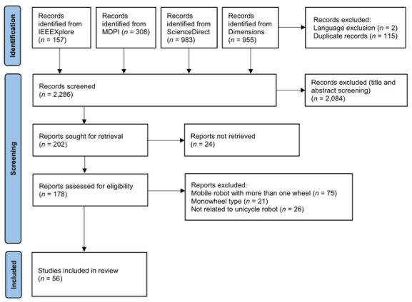

**FIGURE 1.** PRISMA 2020 flow diagram for new systematic reviews that included searches of databases [9]. Search period: January 2014 to December 2024. Exclusion reasons are summarized in the right-hand columns, including duplicate records, language, off-topic at title or abstract screening, full text not available, and eligibility mismatches (multi-wheel platforms, monowheel with internal mass placement, or not related to unicycle robot control). Resulting in 56 included studies.

- Q5. ( **Validation Methods** ): This question examines the preference for experimental or simulation validation, or a combination of both.

- Q6. ( **Evaluation of Control Outcomes** ): This question assesses how control outcomes are evaluated, for example in terms of stability, effectiveness, and terrain adaptability, focusing on the metrics commonly used in unicycle robot studies.

Guided by Q1–Q6, a standardized extraction form recorded for each study: robot configuration; modeling assumptions; control strategy and objectives; and on-board sensors or hardware (Q1–Q4). To address Q5–Q6, each study was coded by validation mode (simulation, experiment, or both) and by the presence of reported evaluation outcomes. The publication year was logged to enable year-wise summaries. These fields underpin the quantitative analyses presented in Section III.

During the data synthesis phase, we employed a thematic approach to organize findings from the selected studies, identifying key themes, trends, and research gaps. Using a qualitative analysis, we categorized data into areas like design methods, control strategies, and sensor technologies, creating an overview of advancements and variations. This synthesis enabled us to connect findings across studies, uncovering patterns in design choices and control objectives and highlighting areas for further exploration, thus providing a comprehensive view of the current research landscape for unicycle robots.

## **III. RESULTS**

This section reports the concrete outcomes of the search and screening pipeline and describes the composition of

the final corpus. Within the January 2014 to December 2024 window, we synthesized records from four databases. We applied English-language and platform-definition filters (single wheel with the chassis above the wheel) and screened titles/abstracts through to full-text eligibility. Fig. 1 summarizes this PRISMA flow from initial retrieval to inclusion, providing an auditable count at each stage and the main reasons for exclusion. Subsequent subsections characterize the included studies in terms of temporal output and venue patterns, followed by brief observations on scope boundaries that emerged during screening.

## _A. STUDY IDENTIFICATION, SCREENING, AND INCLUSION_

We identified the sources from four databases as described in Section II. As summarized in Fig. 1, we initially retrieved 2,403 records. After removing 115 duplicates and two nonEnglish items, 2,286 records remained for screening. From these, we sought 202 full texts and retrieved 178; 24 could not be accessed. At the full-text stage, the most frequent exclusions were scope mismatches: multi-wheel platforms mislabeled as unicycles ( _n_ = 75); monowheel types with internal-mass placement ( _n_ = 21); and studies unrelated to unicycle robot control ( _n_ = 26). The final PRISMA-included set comprises 56 studies on unicycle robots published between 2014 and 2024 (see Fig. 1).

## _B. SCOPE AND CORE PROBLEM FRAMING_

In this review, we define the scope as single wheel robots with the chassis above the wheel and exclude multi-wheel platforms and monowheel types with internal-mass placement. Since unicycle robots have only one point of contact with the ground, self-balancing is their primary challenge.

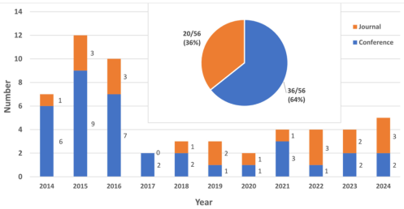

**FIGURE 2.** Distribution of papers included in the study, 2014–2024.

Consequently, we find that researchers have addressed this issue through various approaches. One approach involves proposing a range of control methods, from linear to nonlinear and robust controls, often incorporating alternative modeling techniques. Another approach focuses on developing various stabilization mechanisms. Examples include complex wheel models and replacement for the reaction wheel, such as an airflow flywheel, a dual gyroscope, a linear slider, an automatic lateral pendulum, or paired prismatic joints. However, more challenging problems are rarely reported, including waypoint following while balancing, stair climbing, and recovery to upright after a fall.

## _C. PUBLICATION TRENDS (2014–2024)_

Fig. 2 summarizes the yearly publication counts and the distribution of publications by venue type (journals vs. conferences) for 2014–2024. After the 2015–2016 peak, output settles at a lower rate, likely reflecting a shift toward more complex problems. Across the decade, journal articles account for 36% and conference papers for 64%. Most of the included papers appear in IEEE venues (see Table 1), which dominate the corpus (64.3%), followed by Elsevier (8.9%). Within IEEE venues, the subset consists of 6 peerreviewed journal articles and 30 conference papers. Among the 56 included studies, the term ‘‘unicycle robot’’ is used most frequently for a single wheel platform, while only a small fraction use ‘‘one-wheel’’ or ‘‘single-wheel.’’

## **IV. DISCUSSION**

This subsection delves into the key thematic aspects of unicycle robot frameworks and development. We explore these critical components, including stabilization mechanisms, system modeling techniques, sensor integration, and control strategies. These topics collectively highlight and illustrate the comprehensive frameworks required for enhancing the performance of unicycle robots.

## _A. BASIC STRUCTURE_

A unicycle robot, as depicted in Fig. 3, commonly has a mechanical structure typically defined by a single-wheel (one-wheel), a chassis (the body of the robot), and a stabilization mechanism [3]. Such configurations are exemplified

**TABLE 1.** Most frequent source of unicycle robot literature.

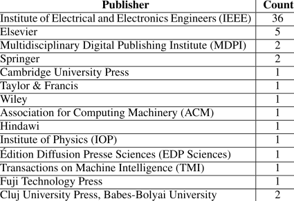

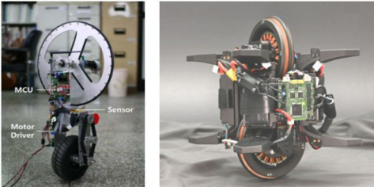

**FIGURE 3.** Representative unicycle robot structures. (a) A single-wheel platform equipped with an upper-mounted reaction wheel for roll stabilization [17]. (b) A symmetric reaction-wheel-based system capable of self-righting from arbitrary poses [7].

by the reaction-wheel unicycle in [17] and the symmetric Wheelbot in [7], which pair a simple one-wheel structure with active stabilization. These components collectively enable self-balancing capability. To some extent, the stabilization mechanism can also be used to raise the robot from resting position on the ground [7] or even to climb stairs by using extreme structure, comprised of a parallel arm and transmission components [16]. The chassis supports the body of the robot, while the wheel serves as the primary mode of mobility and locomotion. The stabilization mechanisms may include reaction wheels, double gyroscopes, pendulum systems, or linear sliders, and others. These components collectively create a mechanism to maintain the robot’s balance to ensure the the center of mass always above the wheel’s center.

Several implementations in the literature show how this structural layout has been adopted across different unicycle robot designs. The configuration presented in [17] uses a single-wheel platform with an upper-mounted reaction wheel, forming a compact and reproducible arrangement that continues to be used in more recent work such as [35]. Although this vertically stacked layout enables effective roll stabilization, its asymmetric mass distribution limits the robot’s ability to perform large pose reorientations, a characteristic also noted in later analyses of asymmetric

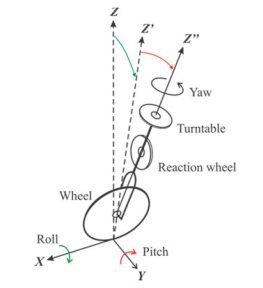

**FIGURE 4.** Roll, pitch, and yaw axes of the unicycle robot with its main components (wheel, reaction wheel, and turntable). The effects of roll and pitch rotations are illustrated by showing successive orientations of the _Z_ -axis ( _Z_ , _Z_ **[′]** , and _Z_ **[′′]** ), while the corresponding changes in the _X_ - and _Y_ -axes are not explicitly drawn for simplicity.

reaction-wheel systems. In contrast, the symmetric reactionwheel configuration introduced in [7] distributes mass more evenly around the wheel axis, enabling stand-up and recovery behaviors from arbitrary initial poses at the cost of increased mechanical complexity and tighter actuator integration.

In addition to these structural elements, the specific wheel configuration of a unicycle robot further influences its balancing strategy and mobility characteristics. The standard single-wheel configuration was widely adopted and utilized in unicycle robots. This single-wheel primarily serves as the means of locomotion for unicycle robot [18]. However, over the past five years, the adoption and exploration of a new active omni-wheel model have emerged. Active omniwheels, which are typical omnidirectional wheels capable of moving along both lateral and longitudinal directions, were investigated in [19] and [20]. This simplifies the structure of the unicycle robot by eliminating the need for a lateral stabilization mechanism on its upper body while the stability in roll and pitch axes can still be achieved with such a wheel configuration, whether the robot is stationary or in motion [19] and [20].

## 1) STABILIZING MECHANISM

In unicycle robots, stability must be considered in three orientation axes, namely roll, pitch, and yaw. Among these, roll and pitch stability are more essential because they directly affect whether the robot can remain upright and recover from disturbances. To illustrate this concept, Fig. 4 shows an example configuration adapted from several studies that employ a wheel, a reaction wheel, and a turntable as balancing elements [23], [36], [57]. This figure does not represent all unicycle designs but simply illustrates the roll, pitch, and yaw axes, along with the successive orientations of the _Z_ - axis under roll and pitch motions. Other balancing designs have also been proposed in the literature, for example dual momentum wheels [55] or tilted momentum wheels [58] as balancing elements, but they follow the same principle in defining the roll, pitch, and yaw axes.

**TABLE 2.** Stabilization mechanisms in unicycle robots.

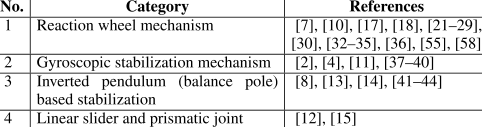

In the literature, several stabilization mechanisms have been proposed and reported. They can be grouped into four categories as summarized in Table 2. In practice, as shown in Fig. 3, the majority of unicycle robots use a reaction wheel for lateral balancing rather than other mechanisms. This configuration requires a relatively large moment of inertia and poses control challenges from motor acceleration and speed limits [6]. Even so, recent work shows a new capability: the robot can recover and stand upright after a fall [7]. However, this approach has a limitation: it cannot be steered in any direction other than jumping up to balance in its stationary position or balancing on an inclined slope.

## 2) STEERING UNICYCLE ROBOT

Steering is a mechanism used to control the direction of movement of a unicycle robot. It plays a crucial role in enabling the unicycle robot to perform path-following and trajectory-tracking tasks. Compared to other wheeled mobile robots, which have two or more wheels and therefore multiple points of contact with the ground, the steering mechanism in those robots can be achieved by varying the speed of one wheel relative to another. However, in a unicycle robot with a single point of contact with the ground, steering must be integrated with the stabilization mechanism being used. Adding additional stabilization mechanisms to the robot may increase its total weight and potentially disturb overal stability, and hence, steering a unicycle robot is a challenging problem in its design and control.

Over the last decade, many researchers have addressed this issue. For instance, Daud et al. [13], [14] demonstrated the feasibility of steering a unicycle robot by incorporating the wheel’s speed with an Automatic Lateral Pendulum (ATP), mimicking the principle of a man riding a unicycle. However, this approach has proven challenging to implement experimentally (see [8]). Another approach, discussed in [4], involves using double gyroscopes, where the wheel and the lateral stabilizing mechanism are integrated to steer the robot and follow a specific yaw angle. Lastly, a common approach is to decouple the unicycle robot into three idealized subsystems: a wheeled inverted pendulum, a reaction wheel inverted pendulum, and yaw dynamics [23]. Each subsystem is then treated and controlled separately.

All previous works relied on stabilizing mechanisms, such as a lateral pendulum, double gyroscopes, or a reaction wheel. In contrast to these approaches, Shen and Hong [20] developed a unique unicycle robot called Omnidirectional

Balancing Unicycle Robot (OmBURo), which does not require any additional stabilizing mechanism attached to its body. Instead, it relies solely on an active omni-wheel capable of moving in any direction. Thus, it can perform path-following tasks without changing its orientation. Although this capability to follow a designated path can be achieved and demonstrated in [20], the robot still struggles with orienting its pose.

## _B. MODELING UNICYCLE ROBOTS_

The unicycle robot is well known for its unique features [23], [33], [36], such as nonlinearity, instability, underactuation, and nonholonomic. Therefore, the modeling of this system is required to understand the dynamic behavior of the system and to provide a representation of the system in mathematical form. Furthermore, it is essential for the design of controllers to ensure that control objectives can be achieved, especially for model-based control. Here, we review and study different approaches that have been proposed in the literature over the last decade (2014–2024).

The distribution of papers discussing different approaches for dynamic model of a unicycle robot is given in Fig. 5. Considering the finalized PRISMA screening window of January 2014 to December 2024, the corpus comprises 56 studies. Out of the total selected studies, 8 papers (14.3%) do not present the dynamic model because the topics are related to computer simulation, computing, and sensor algorithms in unicycle robots. For example, Ruan et al. [45] present the integration simulation of Automatic Dynamic Analysis of Mechanical Systems (ADAMS) and Matrix Laboratory (MATLAB) without the need for building mathematical model. Another study, conducted by Yin et al. [46], discusses the Nash-Game-Oriented optimal design for uncertain dynamical systems where the system model is defined by fuzzy dynamical system without specifically addressed the actual dynamic model of unicycle robot. Hence, we found that the majority of the publications from selected studies (with total 36 papers) use the Euler–Lagrange method, while only few papers discusses the Lagrangian–D’Alembert principle and the Chaplygin Equation. In addition, other methods are mentioned, such as the Appell Equation, Routh Equation, and Newtonian method, but they are very limited.

A robot’s dynamic equations are generally derived using one of two common approaches: the Newton–Euler formulation, which directly applies Newton’s and Euler’s equations of motion for rigid bodies, or the Lagrangian formulation, which is based on the system’s kinetic and potential energy [47]. Among these, the Lagrangian approach provides a straightforward and simple method for handling complex systems [8], while also being conceptually elegant and effective [47]. To obtain the Lagrange equation, both the kinetic energy and potential energy of the system are required [17]. There are two schemes for deriving these energies. The first projects the position vectors of the wheel’s center, the robot’s body, and the reaction wheel directly onto

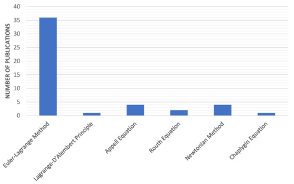

**FIGURE 5.** Dynamic-model derivation methods among the 56 PRISMA-included studies (2014–2024). Euler–Lagrange is the most frequently used method, representing approximately 64.3% of the corpus. Eight papers did not explicitly report a derivation approach.

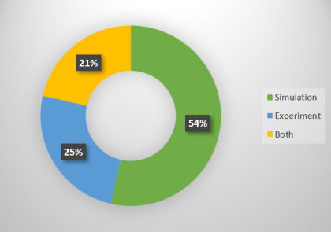

**FIGURE 6.** Distribution of validation methods for the last decade based on 56 reviewed papers.

the inertial frame [17], [29], [32], [48]. The second uses body-fixed coordinate frames to define the location of each component of the robot as presented in [7], [8], and [17]. Once the kinetic and potential energies are determined, the Lagrangian function (their difference) is used to derive the Lagrange equation and obtain the dynamic equations of unicycle robots.

## _C. SENSOR INTEGRATION_

Due to inherent characteristic of unicycle robot, real-time data from various sensors is essential as feedback to maintain its balance, motion control, and navigation. Here, we study the trend of sensor usage, sensor integration and their application in the realization of unicycle robots over the last decade.

From the selected studies, it is shown in Fig. 6 that there are more than half of the articles provide simulations only, while experimental validation was less common and usually paired with simulations rather than used alone. Fig. 7 provides more detailed view of the validation method distribution for the last decade (2014–2024). Research activity peaked in 2015, when both simulation and experimental validation were actively

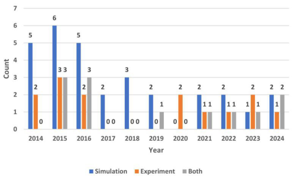

**FIGURE 7.** Frequency of validation method (2014–2024). Simulation has been the dominant validation method throughout the decade, while experimental validation was used less frequently and was absent in some years.

used. After 2015, the number of studies gradually decreased. The combined use of experimental and theoretical validation suggests a growing interest in comprehensive validation. However, the declining publication trend suggests a shift in research focus or increasing difficulty of the problems.

Selected papers on experimental validation were reviewed. As clarified in Fig. 8, the percentages do not represent mutually exclusive categories. A single study may employ more than one type of sensor; therefore, the totals can exceed 100%. This observation reflects the trend of sensor integration in unicycle robots. It also provides context for identifying which sensors are most frequently employed. A few sensors are predominantly employed in unicycle robots, namely, Inertial Measurement Units (IMUs), encoders, and gyroscopes. These three sensors are commonly used for balancing or stabilization of unicycle robots. For example, in [21], encoders are mounted on the drive wheel and reaction wheel motor shafts to measure their respective rotations. Gyroscopes, in contrast, are used only for detecting rotation and measuring angular velocity. However, due to their compactness and the inclusion of multiple sensors in a single unit, IMUs offer greater capabilities compared to standalone gyroscopes. As a result, many researchers prefer using them, since each unit integrates a gyroscope, an accelerometer, and a magnetometer.

Recent advancements in sensor technology have improved the development of robotic systems, including unicycle robots. These advancements provide more effective feedback mechanisms [7]. For instance, a stabilization or balancing robot may require only one IMU to detect pitch and roll angles [17]. Together with three encoders, an IMU can be used to detect the angular velocities of the system [24]. Alternatively, standalone sensors, such as an accelerometer, gyroscope, and magnetic compass, have been applied to estimate the attitude [17] and posture [49] of a unicycle robot. Although an IMU integrates multiple sensors, in practice only the relevant ones are utilized for specific states. For example, tilt angle measurement is typically obtained from the accelerometer embedded in the IMU [7]. More generally,

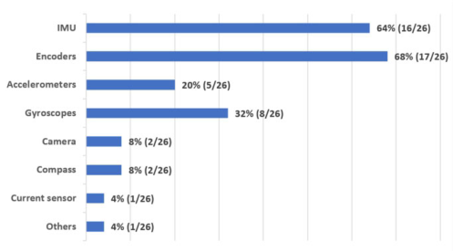

**FIGURE 8.** Distribution of sensor usage across 26 studies that involved experimental validation (2014–2024), including those using experiments alone or in combination with simulations. _Note:_ a study may use multiple sensors, so percentages do not sum to 100%.

this measurement is often combined with gyroscope data to improve accuracy.

Because an IMU integrates multiple sensors, it saves space in the limited area of a unicycle robot. It is typically mounted at the center of the body to obtain both pitch and roll angles simultaneously [17]. Such placement is particularly important when the control objective is to balance the unicycle robot. However, with different goals such as self-righting and disturbance rejection during balancing, an innovative configuration is reported in [7]. In this design, four IMUs are mounted at distinct body locations. This configuration is conceptually similar to the one-wheel Cubli, a cubebased reaction-wheel balancing robot [50]. In addition, Ma et al. [55] demonstrated an alternative approach with the IMU placed off-center. Their work addressed the tracking control problem while also ensuring stabilization.

Sensors inevitably exhibit bias and noise [20]. One advantage of using an IMU is its compatibility with sensor fusion algorithms; for example, an Extended Kalman Filter (EKF) can be implemented to improve orientation and position estimation. This contrasts with the approach in [21], which integrates multiple stand-alone sensors. In that case, the system relied on three single-axis gyroscopes, two single-axis accelerometers, and a magnetic compass. Recent IMU-only approaches further exploit multi-IMU fusion; for example, a tilt estimator using two interleaved MPU-6050 units (a widely used 6-axis IMU sensor) with Kalman filtering and a complementary fusion layer doubles the update rate and yields smoother roll/pitch estimates than a single-IMU setup [54]. However, employing multiple IMUs increases system complexity due to synchronization, calibration, and a higher processing load, as discussed in [7].

Despite its remarkable capability to self-right after falling to the ground [7], it is relatively small in size. It weighs 1.4 kg and stands 220 mm tall, whereas other unicycle robots (e.g., [21], [23]) are larger. Larger dimensions provide better mobility and payload capacity, which are highly desirable for practical applications. On the other hand, increasing the overall size and total mass makes control more challenging.

**TABLE 3.** Control problems found in selected papers.

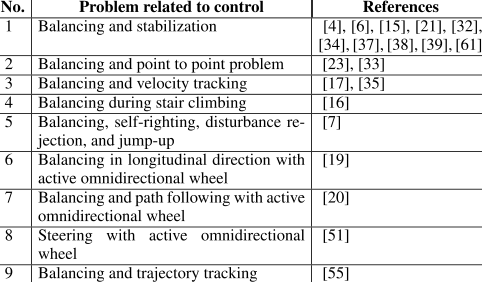

## _D. CONTROL ARCHITECTURES, METHODS, AND VALIDATION_

This subsection first synthesizes the key control challenges identified in Table 3 and highlights mechanism-level designs to mitigate instability. Next, we present typical control schemes and strategies (see Fig. 9 and 10), classify the control methods with evidence from the literature, and conclude with validation and experimental evidence.

## 1) CONTROL CHALLENGES AND MECHANISM-LEVEL DESIGN

From the articles under study, we examined the research challenges involved in controlling a unicycle robot over the past decade. In Table 3, we present nine control problems identified in the literature. These problems highlight the complexities of unicycle robots. The primary issue arises from the unicycle robot’s unique characteristics: a simple single-wheel structure, inherent static instability, and its underactuated nature. These characteristics make the system difficult to control. Thus, the balancing and stabilization problem is a common and fundamental problem in unicycle robots. Many researchers have addressed this issue using different approaches, ranging from sophisticated control algorithms to mechanical stabilizing mechanisms.

An alternative approach to addressing the inherent instability of the unicycle robot is proposed in [19], [20], and [51] by redesigning a type of wheel used in unicycle robot, that is an active omnidirectional wheel. These wheels enable the robot to move in any direction, potentially improving stability and maneuverability. Initially, a unique design with a larger active omnidirectional wheel was proposed to control the pitch direction [19]. Building on this, Shen and Hong [20] increased the number of rollers to reduce inter-roller gaps. This yields a smoother circumference.

Although fundamental balancing problems and mechanisms have been widely studied, Table 3 shows that more complex tasks are covered by relatively few papers. Only a small subset addresses motion control while maintaining balance, such as point-to-point control [23], [33], velocity tracking [17], [35] and path following [20]. Self-righting is

even rarer [7]. This sparse distribution across the ‘‘References’’ column indicates that advanced behaviors of unicycle robots remain underexplored and warrant further study.

To better understand how these advanced challenges are being tackled, we briefly review several representative works. In [20], a new unicycle robot called ‘‘OmBURo’’ was developed with the goal of balancing and following a predefined path using an active omnidirectional wheel, without relying on a reaction wheel or turntable. This wheel was designed as an improvement upon previous research in [19]. Although the system achieved its intended objectives, it remained sensitive even when the robot was maintaining balance while stationary. Moreover, it lacked the ability to control its pose. To address this issue, Ahn and Hong [51] proposed a steering control method for the same robot platform and validated it through simulation in PyBullet, the Python-based interface of the Bullet Physics Engine.

However, the use of an active omnidirectional wheel limits pose control, which implies that a single actuation mechanism may achieve only partial stability. To improve this configuration, the wheel can be combined with other mechanisms, such as a reaction wheel or a turntable. These potential hybrid configurations can improve overall stability and maneuverability in unicycle robots. This concept is similar to the human-robot interaction observed in Honda’s UX-3 personal mobility vehicle [17]. In this system, a user seated on a unicycle-like platform controls movement by leaning, and thus acts as an additional dynamic stabilizer. A similar approach can be found in the work of Yun et al. [15], in which realistic human-like balancing was achieved using prismatic joints.

In addition to balancing using an active omnidirectional wheel as demonstrated in [19], and [20], a unicycle robot is also expected to perform motion tasks such as path following and point-to-point motion. The absence of onboard perception systems (e.g., cameras or Light Detection and Ranging (LiDAR)) makes following a known path more difficult. Another issue arises from the robot’s physical structure, in which only one wheel touches the ground. As a result, position estimation in the _X_ - _Y_ plane becomes difficult because encoder-based odometry alone is insufficient to estimate the robot’s position during motion. Unlike conventional differential-drive mobile robots that can compare the motion of the left and right wheels, a unicycle robot estimates its motion from a single-wheel encoder and inertial sensors (e.g., IMUs). Because it lacks a left-right baseline, odometry is less reliable and inertial estimates are prone to drift over time. To follow a given path, several systems [15], [20], [23] address this issue by relying on internally generated commands based on predefined profiles and onboard measurements (e.g., IMUs and motor encoders), while avoiding external perception systems.

While significant attention has been given to balancing and motion control in unicycle robots, the ability to perform self-righting after falling remains largely unaddressed. Geist et al. [7] addressed this issue using a compact robot

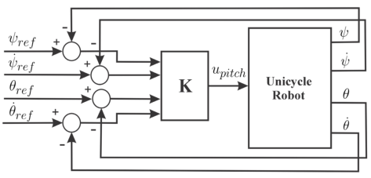

**FIGURE 9.** Block diagram of the pitch controller (adapted from [17]).

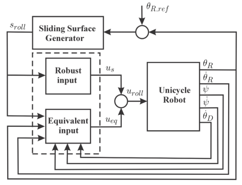

**FIGURE 10.** Block diagram of the roll controller (adapted from [17]).

with limited mass and scale. A similar approach is presented in [64], which involves an even smaller version of the Wheelbot. To date, no further studies have been reported regarding the implementation of this capability for a larger unicycle robot. Such a platform can support heavier payloads, although it would also introduce additional challenges related to mechanical structure, control coordination, and energy requirements.

## 2) CONTROL SCHEMES AND STRATEGIES

In unicycle robot control, model-based designs are common. Within the screened corpus (2014–2024), most controllers use a loop-separated structure in which longitudinal, lateral, and yaw dynamics are regulated independently, reflecting a decoupled control design. No fully centralized or MultipleInput Multiple-Output (MIMO) was identified. At the model level, both coupled and locally decoupled representations appear. Notably, some studies retain a coupled plant yet still implement per-axis control loops, treating pitch and roll as separately regulated channels despite the underlying dynamic coupling.

Representative loop-separated schemes include the Linear Quadratic Regulator (LQR)–Sliding Mode Control (SMC) combinations reported in [17] and [56]. These studies preserve the coupled dynamics but regulate pitch with LQR

and roll with SMC. A fully per-channel implementation is presented by Rizal et al. [23], who apply SMC independently on each axis without relying on a coupled model. More advanced decomposition is demonstrated by Tan and Gia [35]. This approach performs active decoupling through feedforward decomposition and incorporates cooperative Adaptive Dynamic Programming (ADP). As summarized in Table 4, these studies illustrate the loop-separated pattern across the reported subsystems

Control design then adapts to the robot’s mechanical and actuation configuration. In contrast to reaction wheel balancers [17], two representative non reaction wheel layouts recur: (i) an active omnidirectional wheel under a balancing body [20] and (ii) a lateral-pendulum unicycle that steers via lean-turn coupling [8]. For OmBURo [20], the active omniwheel yields a locally decouplable planar model. Fullstate LQR is employed in the inner loop to stabilize the body, while an outer proportional-integral (PI) loop regulates the commanded translational velocity [20]. By contrast, lateralpendulum unicycles use a coordinated design that accounts for inter-axis coupling. Daud et al. [8] introduce two guiding quantities: a lateral-statics boundary that defines feasible lateral setpoints and a turning constant that relates lean angle to turning speed.

A different configuration and control scheme than those in [8] and [20] is the reaction wheel unicycle, which balances by spinning a reaction wheel. In [17], pitch is assigned to both balance and velocity tracking under one unified dynamic model, while roll is dedicated to lateral balance. On pitch (Fig. 9), a nonzero-setpoint LQR is used to trade off speedtracking error, pitch angle error, and control effort. On roll (Fig. 10), a sliding mode controller with a smooth switching law is employed to enhance robustness while mitigating chattering. Using the full Euler–Lagrange model provides a consistent treatment of inter-channel coupling. The reported experiments under step and trapezoidal speed commands demonstrate tracking performance with bounded pitch and roll errors [17]. An alternative on the same platform uses ADP to cope with uncertain coupling and actuator limits, improving velocity tracking after convergence at the cost of a learning phase and only bounded guarantees [35].

The notation adopted in [17] is summarized as follows (see Fig. 9 and 10): _ψ_ is the body pitch angle, _θ_ is the drive wheel angular position, _θR_ is the roll angle, and _θD_ is the reaction wheel angular position. A dot denotes a time derivative. In Fig. 9 (pitch controller), the controller uses the state variables _ψ, ψ,_[˙] _θ, θ_[˙] to keep the robot upright while accommodating forward motion. The motion command is applied through the _θref_ input, while _ψref_ is used to regulate the pitch, and the controller maintains the pitch near _ψ_ ref ≈ 0. It then maps the measured states through the gain block _K_ . This produces input _upitch_ , which commands the voltage applied _ψ_ ˙ _ref_ as part of the reference structure, this term does not actto the drive wheel motor. Although Fig. 9 displays as a separate command because the pitch reference _ψref_ is held constant.

Fig. 10 (roll controller) maintains lateral balance using the roll state variables _θR_ and _θ_[˙] _R_ within a sliding mode structure (equivalent and robust inputs) with the reference _θR_ _ref. The sliding-surface generator internally forms the sliding variable for the roll loop. As described in [17], it uses the roll error and its time derivative. The roll error and its derivative are computed from the difference between the measured roll angle and its reference. Although these intermediate terms are not shown in Fig. 10 (but can be found in [17]), they are encapsulated inside the generator block. The equivalent and robust components are then combined to produce input _uroll_ , which commands the voltage applied to the drive reaction wheel motor. In addition to _θR_ and _θ_[˙] _R_ , the roll loop receives _ψ_ and _ψ_[˙] , as well as the reaction wheel speed _θ_[˙] _D_ . This feedback of _ψ_ and _ψ_[˙] informs the roll controller about the robot’s longitudinal motion. The SMC law then compensates for coupling between longitudinal dynamics and lateral balance so that _θR_ and _θ_[˙] _R_ remain near zero, i.e., the robot stays upright. IMU sensors measure _ψ_ and _θR_ and their rates, while wheel and reaction wheel encoders measure _θ_ and _θD_ . The corresponding speeds _θ_[˙] and _θ_[˙] _D_ are obtained accordingly [17].

## 3) CLASSIFICATION OF CONTROL METHODS AND EVIDENCE-BASED EVALUATION

Based on the reviewed corpus, we observe a wide variety of control methods applied to unicycle robots. To derive clear insights into their effectiveness and limitations, we group the methods into four families: (a) linear, (b) nonlinear, (c) adaptive, and (d) learning-based. This partition reflects the dominant mechanisms in the corpus, namely model linearization, nonlinear design, online parameter adaptation, and data-driven policies. Table 4 provides the primary study-level summary, reporting each paper’s objectives, publication year, and the authors’ stated strengths and limitations, and thereby enabling comparisons within and across the four families. Because the review spans 56 studies, Table 4 presents a curated selection: for each publication year from 2014 to 2024, we include representative papers chosen for methodological clarity, documented validation, and substantive contribution, so the table remains readable while reflecting the corpus.

Table 4 compiles a year-by-year sample (2014 to 2024) of representative unicycle robot studies and assigns each study to one of four method families. The control objectives cluster around self-balancing and extend to velocity tracking, straight-line tracking, and self-recovery after a fall. The entries show that linear controllers remain widely used. Proportional-derivative (PD) and proportional-integralderivative (PID) controllers appear alongside LQR and Linear Quadratic Integral (LQI) variants for postural stabilization, heading regulation, and trajectory tasks. The selection points to growing methodological diversity while a linear baseline persists. Nonlinear approaches, notably sliding-mode control, recur for balancing under bounded disturbances. Fuzzy logic is also used to augment rule-based decisions, particularly through genetic algorithm (GA)-tuned variants. Adaptive

elements such as Model Reference Adaptive Control (MRAC) and learning methods appear in later years, often alongside optimal or _H_ ∞ control formulations.

Across the Strengths and Limitations columns, several recurring patterns emerge. As shown in Table 4, linear methods are frequently reported as simple and responsive, with integral or gain-scheduled additions improving regulation. However, their stated validity is commonly tied to near-equilibrium conditions and may degrade under strong coupling or rough terrain. Sliding-mode designs emphasize robustness to bounded uncertainty but continue to exhibit residual chattering and require nontrivial tuning effort.

Fuzzy and hybrid rule-based approaches can absorb parameter variations. They are reported as tuning-sensitive and rarely provide explicit disturbance-rejection guarantees. Adaptive and learning-oriented methods address coupling and uncertainty more directly, but at the cost of higher computational demand and a stronger dependence on model fidelity or training data. Many entries center on pitch/roll stabilization or straight-line tracking, indicating decoupled designs in which yaw and speed control are handled separately or left unevaluated. Environmental robustness (for example, rough surfaces or payload changes) is also reported less consistently across the sample.

In addition to Table 4, Table 5 provides a method-centric view that complements the study-level classification. The table is descriptive rather than evaluative and does not rank methods. It catalogs named controllers and shows whether each one is reported in simulation or implemented on hardware, enabling quick identification of usage and validation. To make the table self-contained, the controller families are organized into separate columns. The Simulation and Experiment columns list the studies that report evidence, and the abbreviations are clarified in the footnote. The inclusion rule is straightforward. From the 56 reviewed papers, only those that explicitly name or analyze a controller are listed. Papers focused solely on sensing, estimation, or modeling without a controller are excluded (for example, [54], which studies dual-IMU angle estimation).

Table 5 organizes the papers by control families at the paper level (for example, PID/PI, LQR/LQI, SMC, and others) and records the validation mode as Simulation or Experiment. Sensing is treated as a cross-cutting attribute rather than a separate family, so there is no dedicated sensor column. When a study reports an estimator or filter that materially affects the results, a superscript marker is added within the Validation cells (for example, [n[KF] ] or [n[CF] ]). These markers are explained once in the table notes to keep the layout concise and unambiguous.

The entries show recurring controller families such as PD, PID, and LQR, as well as related linear regulators. They appear alongside nonlinear, adaptive, and learning-based controllers used for specific tasks. A practical pattern is that multiple controllers appear in simulation-only studies. However, controllers with hardware reports are less common and tend to be concentrated on balancing and tracking tasks.

**TABLE 4.** Comparison of control strategies applied to unicycle robots among selected papers (2014–2024).

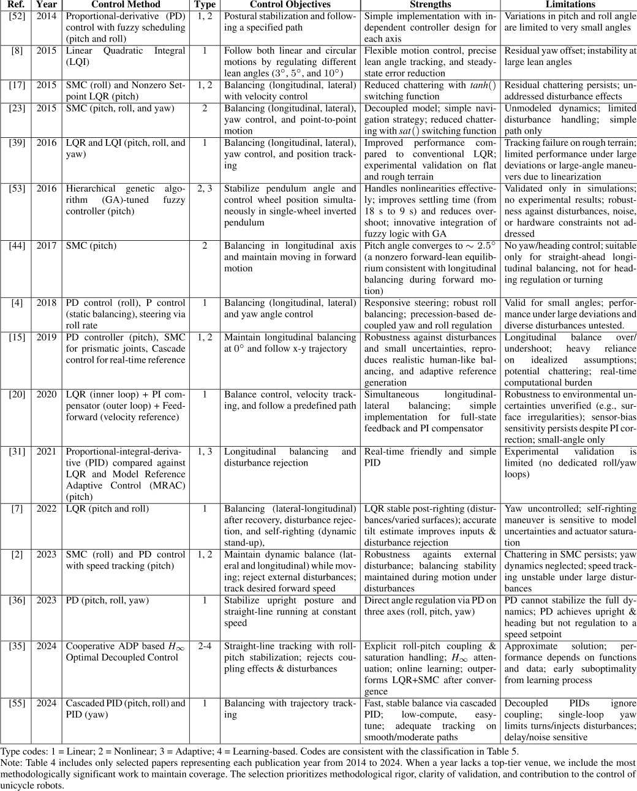

**TABLE 5.** Method-centric classification of unicycle robot control strategies (2014–2024).

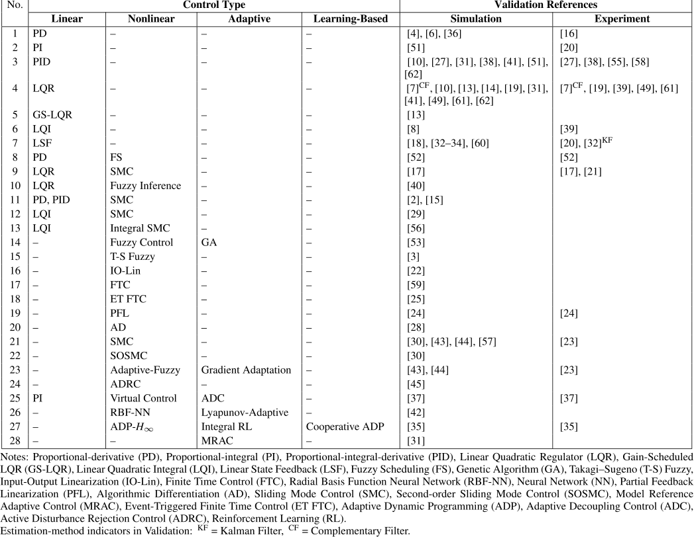

The implications are twofold. First, readers can quickly locate studies that include hardware evidence for a given controller. This helps replication and benchmarking. Second, visible gaps in hardware-backed usage highlight where future experiments could strengthen the evidence base.

Table 6 consolidates method-level evidence into a concise, design-oriented comparison. It also highlights the principal trade-offs that textual description alone cannot convey, such as stability margins, robustness to model mismatch and external disturbances, and the associated computational burden. By aligning these criteria with representative citations, the table grounds the qualitative assessments in traceable sources and enhances consistency across heterogeneous experiments and reporting styles. The scoring notes standardize the meaning of High, Medium, and Low so interpretations remain consistent. The table is self-explanatory because all abbreviations are defined in the footnote. Overall, Table 6 provides a normalized, decision-relevant

summary that supports method selection under practical constraints.

In addition, the results indicate that no single approach is universally superior. Low-complexity schemes (e.g., PID) enable rapid deployment but offer only local margins and lack explicit disturbance handling. LQR/LQI improves nominal behavior around a well-identified operating point, providing moderate robustness at moderate computational cost. Slidingmode control enhances disturbance rejection under bounded uncertainty but demands careful tuning and may introduce added implementation effort. Rule-based fuzzy control can accommodate mild variations with modest compute, yet it lacks analytical margins and may degrade outside its trained regions. Methods with explicit worst-case or global guarantees (e.g., _H_ ∞, ADP variants) deliver high robustness at the expense of higher modeling accuracy and solver requirements. Taken together, these patterns indicate that method selection should follow application limits: simpler

linear schemes suit restricted compute and identification, whereas nonlinear or robust designs become preferable as disturbances and model mismatch increase, provided resources permit.

## 4) VALIDATION AND EXPERIMENTAL EVIDENCE

Building on the extraction procedure in Section II-E, we qualitatively evaluate real-world applicability. Addressing Q5–Q6, the evaluation uses five criteria. These criteria operationalize the fields in Section II-E. Objectives and operating envelopes define the task conditions and clarify the intended operating range. Reported outcomes support decision-relevant performance metrics. Modeling assumptions specify the nominal conditions and motivate robustness probes. On-board sensing, actuation, and computation indicate real-time feasibility. Validation mode and trial structure document the level of empirical support and inform reliability and safety. This framing supports comparability across studies and aligns with common benchmarking practices in robotics and control.

The following five items expand these criteria by providing clearer definitions and concrete examples for each evaluation dimension. In operational terms, the assessment examines (a) task realism. This criterion checks whether demonstrated behaviors reflect relevant field conditions such as sustained balancing, start-stop motion, or point-to-point and pathfollowing tasks. (b) decision-relevant performance. Metrics such as error, settling time, and success rates are reported in forms suitable for thresholding and design interpretation. (c) basic robustness. This captures tolerance to disturbances, payload variation, or floor changes to indicate sensitivity margins. (d) real-time feasibility. The evaluation verifies whether latency and throughput demands can be met with practical sensing, actuation, and on-board computation. (e) reliability and safety indications. These document repeated trials, consistent outcomes, or basic safety steps.

Applied to the corpus, these criteria reveal consistent patterns. (a) Demonstrated tasks are predominantly basic indoor balancing on smooth floors, with relatively few hardware reports of start-stop, point-to-point, or path-following. Notable exceptions include hardware velocity-tracking demonstrations (e.g., [17], [35]) and tracking via partial feedback linearization (see [24]). However, these tasks remain less common than balancing-only trials, as reflected in the Experiment entries such as [16], [20], and [39]. (b) Performance reporting tends to favor plots and qualitative descriptions. Concise numerical summaries, such as trajectory error, settling time, or success rates, appear less consistently, which complicates cross-paper comparisons. (c) Robustness checks are reported sporadically. Occasional push tests appear, whereas systematic disturbances, payload variation, or controlled surface changes are uncommon. When present, the corresponding details are noted in Tables 4–6.

Turning to implementation readiness, (d) real-time feasibility is typically demonstrated on embedded platforms such

as DSPs and microcontrollers, which operate at moderate control rates. Explicit compute budgets and end-to-end sensing or actuation latencies are seldom quantified in the source papers. Learning-based methods show a mixed level of maturity: some studies report experimental demonstrations such as Integral Reinforcement Learning or Cooperative ADP [35], whereas others remain simulation-only, as indicated in Table 5. (e) Reliability and safety are rarely addressed, a gap that reflects the laboratory scale and exploratory nature of most studies. Criterion (e) is therefore retained as a forward-looking dimension to emphasize the need for deployment-oriented validation in future reports.

Validation mode is coded as Simulation, Experiment, or Both, as defined in Table 5, and its distribution is summarized in Fig. 6 and 7. These figures show how often each mode is adopted across the reviewed studies, with simulation dominating and experimental validation appearing less frequently. As shown in Fig. 6, 26 studies include experimental validation (counting the Experiment and Both categories), with the remainder classified as simulation-only. Table 5 identifies the validation mode associated with each control method based on how references are listed in the Simulation and Experiment columns, and Tables 4–6 provide the corresponding study-level information that supports this summary.

Experimental reports predominantly rely on internal sensors such as encoders and IMUs. Environment-facing sensing (for example, cameras) appears less frequently, as shown in Fig. 8. The overall pattern suggests lab-focused prototypes aimed at basic balancing, with limited outdoor or long-duration trials. Taken together, these observations are consistent with Fig. 6–8 and directly inform Q5–Q6. Implications and directions for future work are presented in Section V.

## _E. RECENT STUDIES IN 2025_

To capture the latest developments beyond our 2014–2024 window, we manually screened recent studies in 2025 from venues most relevant to unicycle robot research. This process yielded eight recent studies [63], [64], [65], [66], [67], [68], [69], [70] that met our inclusion criteria. The set comprises five journal papers and two conference papers, of which three are early-access. It also includes one preprint. We label preprints and exclude them from comparative claims. We cite them only to indicate emerging directions. Next, we summarize their models, control problems and methods, sensor integration, and common strengths and limitations across studies.

Most recent papers derive the unicycle robot’s dynamics using the Euler–Lagrange formulation, followed, though less frequently, by Appellian (Gibbs–Appell) and Newtonian approaches. This pattern is consistent with the finding in Fig. 5, where these three appear as the dominant modeling families. For the balancing mechanism, reaction wheel actuation is the most widely adopted, with configurations

**TABLE 6.** Comparative analysis of control methods for unicycle robots.

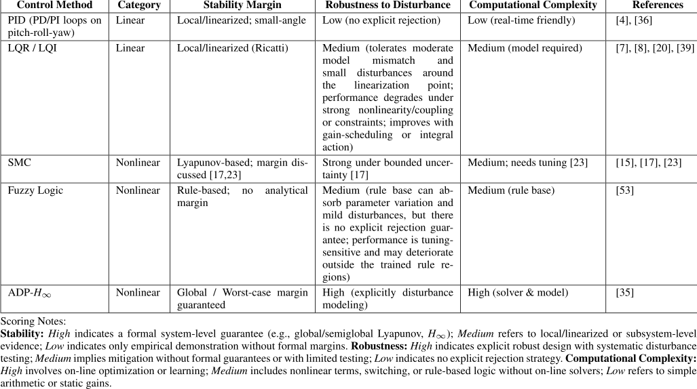

ranging from orthogonal flywheels [68] to more conventional single-flywheel layouts [63], [64], [65], [66]. In contrast, Vizi et al. [67], [69], [70] propose an alternative mechanism based on an axle-sliding point mass that shifts the center of mass laterally. This approach enables lateral balancing and steering, and it produces compact dynamic models with closed-form steady-state analysis. It also supports decoupled control design in a path-attached frame centered around straight-rolling behavior. The modeling strategy in [68] employs a Newton–Euler formulation and maps the dual flywheels into differential and common modes for roll and yaw control. This structure also offers strong compatibility with hardware-level actuator constraints. However, it does not explicitly model full-body coupling effects. These effects can become significant during highly dynamic maneuvers.

A range of control objectives emerges across the recent studies, with upright stabilization as the dominant theme, often combined with tracking tasks, disturbance rejection, or point-to-point motion. Several works, such as [64] and [65], address both balancing and motion under modeled disturbances or sensor noise. The dominant strategy is to decompose the system into decoupled or partially decoupled subsystems, typically organized into pitch, roll, and yaw components. Each subsystem is governed by a dedicated controller. Classical state-feedback designs are widely used. For instance, [65] and [66] implement LQR and observer-based Linear Quadratic Gaussian (LQG) structures, while [63] explores both nominal LQR and a parametric quadratic controller under friction uncertainty. On the other hand, [68] leverages structured PID loops specifically tuned

for low-power embedded platforms, incorporating centerof-mass (COM) velocity feedback and priority-based power allocation. A learning-based methods appears in [64], which integrates Bayesian optimization for gain tuning and approximate Model Predictive Control (MPC) via imitation learning for driving-control tasks. Meanwhile, all three works by Vizi et al. [67], [69], and [70] adopt a linear-feedback approach based on path-frame decoupling and model linearization. These diverse strategies reflect an ongoing trade-off between model complexity, computational feasibility, and deployment constraints.

Sensor integration in the 2025 studies is generally limited and unevenly discussed. Of the eight papers reviewed, five are simulation-only [63], [65], [67], [69], [70], while only three report experimental validation [64], [66], [68]. Among the simulation-based studies, most operate directly on full-state variables without modeling sensing or estimation explicitly. One exception is [65], which includes sensor and process noise and employs a Kalman filter within an LQG architecture. In contrast, hardware-validated works typically adopt minimal but functional sensing pipelines. For example, [64] and [68] both use an IMU and wheel or flywheel encoders to support embedded control, while [66] presents hardware experiments but does not specify the sensing architecture in detail. The work in [68] estimates COM velocity by combining encoder data with pitch-rate signals, enabling a low-latency control loop without relying on current sensors. This distribution reflects a continued trend in which simulation-based studies remain dominant, consistent with the patterns observed in Fig. 6 and 7. While interest in

embedded-friendly sensing is growing, detailed discussions of calibration, fusion strategies, timing constraints, and drift robustness remain limited in the 2025 studies.

## **V. RESEARCH GAPS AND DIRECTIONS**

Across the reviewed literature, validation is predominantly simulation-based (see Fig. 6). Experimental results exist but are mostly limited to compact platforms on flat indoor floors with short, controlled trials. Several studies demonstrate self-recovery after a fall. Most of these use small platforms with modest actuator capacity, which limits payload handling and tolerance to external loads. Based on these findings, future directions point to unicycles at a more representative scale. Such platforms should retain reliable self-recovery, carry meaningful payloads, and better withstand realistic disturbances. For single-wheel platforms, stair climbing, as demonstrated in prior work [16], also highlights the need for reliable self-righting after a fall. While self-righting has been demonstrated on flat surfaces [7], extending this capability to step edges remains an open challenge. This gap is important because practical deployments require recovery on uneven terrain rather than only smooth floors. More robust self-righting strategies for step-edges disturbances are therefore needed. Developing these strategies represents a promising direction for future experiments. Evaluation can then extend beyond the laboratory to conditions that mirror real-world use, including varied slopes and repeated perturbations.

In relation to experimental validation, the reviewed studies rely mainly on IMUs and motor encoders (Fig. 8). IMUs provide high-rate attitude cues but suffer from bias drift and noise. Encoders measure wheel speed precisely but degrade when partial slip occurs, especially on low-friction or uneven surfaces. These contact inconsistencies affect state estimation. To make experiments more representative of real-world conditions, future studies should add perception sensors such as LiDAR and cameras. Although some studies have explored the use of cameras, their application remains limited to simple tasks such as color tracking or line following [55]. More advanced perception methods are therefore required to infer local slope and surface geometry. This need arises because IMU and encoder fusion alone cannot reliably capture the effects of terrain-induced disturbances. In the wider field of mobile robotics, optimization-based fusion methods such as visual inertial odometry have been developed to overcome these limitations. These methods combine camera and IMU data to estimate the robot’s motion in real time. They do not rely on wheel contact and are robust to drift and surface uncertainty. Applying similar techniques to unicycle robots may thus offer a complementary pathway to improve heading estimation. This contribution is distinct from the terrain-recovery strategies discussed earlier.

To fully benefit from improved state estimation and perception, future work must also address the control challenges that remain. In terms of control, most studies reviewed in this

survey focus on maintaining balance either in stationary conditions or during basic point-to-point maneuvers. As shown in Table 3 and Table 4, the primary control objectives are posture stabilization and simple velocity tracking. However, more advanced tasks such as path following, trajectory tracking, and obstacle avoidance are rarely addressed. These capabilities are essential for enabling autonomous operation in real environments. Future research should consider control strategies that combine dynamic balancing with higher-level tasks. These tasks include balancing while following a path, tracking a time-varying trajectory, and avoiding both static and moving obstacles. Addressing these challenges will require better integration of planning, perception, and control.

While perception and control are critical, future research should also consider the role of learning-based methods in unicycle robots. As summarized in Table 5, machine learning approaches remain underrepresented, particularly in experimental settings. Consequently, many learning-based controllers and policies lack formal guarantees, creating concerns regarding safety, sample efficiency, and transferability from simulation to physical platforms. These limitations indicate a need for hybrid approaches that integrate model-based control frameworks, such as LQR, SMC, or MPC, with learned components. Residual models or adaptive disturbance estimators may be trained to support existing controllers. Offline datasets may also improve sample efficiency. Moreover, although not yet widely applied to unicycle robots, control barrier functions provide a structured way to impose safety constraints. Beyond safety considerations, hardware-in-the-loop simulation offers a practical way to evaluate learning-based strategies under real-time conditions with reduced hardware risk. Taken together, incorporating machine learning, multi-modal sensing, and adaptive control into future designs may enable unicycle robots to operate more effectively in complex environments with dynamic obstacles and limited prior knowledge.

## **VI. CONCLUSION**

The unicycle robot represents a highly unstable and underactuated system, requiring precise control and robust balancing strategies due to its nonlinear dynamics and single-point ground contact. Despite growing interest in this area, research remains fragmented across balancing mechanisms, robot modeling, sensor integration, and control strategies. To consolidate these developments and identify decadelong patterns, we conducted a systematic literature review covering publications from January 2014 to December 2024. Following a PRISMA protocol, we selected and analyzed 56 peer-reviewed studies to synthesize advances in balancing mechanisms, modeling approaches, sensor integration, control strategies, and experimental validation.

From the reviewed studies, we observed recurring tendencies in how control strategies are designed and applied. Many systems rely on well-established linear controllers, which are easier to tune and implement, but often fall short when

handling disturbances or nonlinear dynamics arising outside controlled settings. In contrast, more advanced methods such as adaptive and nonlinear control offer better performance in complex conditions, although they require higher design effort and remain rarely validated beyond simulation. Furthermore, most studies approach balancing, motion, and yaw regulation as separate problems. This tendency may simplify controller design, yet it also underscores the challenge of achieving coordinated performance in real-world dynamic environments.

In addition to reviewing control methods, this study presents a structured comparison of unicycle robot developments across key aspects, from mechanical configuration to control strategies. Based on our analysis of recent studies, we observed not only differences in reported results but also recurring design limitations. These limitations become more apparent when individual studies are examined in isolation. For instance, in the mechanical setup, stabilization components such as reaction wheels or active omnidirectional modules are often treated as independent units, with limited integration to support behaviors like steering or self-recovery. Another common issue is the reliance on Euler–Lagrange formulations for dynamic modeling, and only a few studies examine nonlinear coupling or question the limitations of linearized assumptions. Sensor configurations also tend to be minimal, frequently using a single IMU despite known drift and noise issues. These findings indicate that the disconnect between modeling, actuation, sensing, and control remains a central challenge, especially for systems operating under real-world uncertainty. Finally, this work not only serves as a comparative reference but also offers a practical foundation for future development of more integrated, adaptable, and experimentally validated unicycle robot architectures.

Building on these findings, future research should prioritize the development of integrated and scalable control frameworks that coordinate core functions such as stabilization, path following, trajectory tracking, and self-recovery in real time. Equally important is the need for experimental validation under dynamic and unpredictable environments, supported by standardized benchmarks to assess performance and robustness across platforms.

## **REFERENCES**

- [1] D. Jin, Z. Fang, and J. Zeng, ‘‘A robust autonomous following method for mobile robots in dynamic environments,’’ _IEEE Access_ , vol. 8, pp. 150311–150325, 2020, doi: 10.1109/ACCESS.2020.3016472.

- [2] Y. Zhang, H. Jin, and J. Zhao, ‘‘Dynamic balance control of double gyros unicycle robot based on sliding mode controller,’’ _Sensors_ , vol. 23, no. 3, p. 1064, Jan. 2023, doi: 10.3390/s23031064.

- [3] H.-J. Zhang, Q. Lu, J. Wang, and Y. Chen, ‘‘A T-S fuzzy control scheme for unicycle robots,’’ in _Proc. 42nd Annu. Conf. IEEE Ind. Electron. Soc._ , Florence, Italy, Oct. 2016, pp. 5346–5351, doi: 10.1109/IECON.2016.7793174.

- [4] H. Jin, Y. Zhang, H. Zhang, Z. Liu, Y. Liu, Y. Zhu, and J. Zhao, ‘‘Steering control method for an underactuated unicycle robot based on dynamic model,’’ _Math. Problems Eng._ , vol. 2018, pp. 1–13, Nov. 2018, doi: 10.1155/2018/5240594.

- [5] P. Rochel, H. Ríos, M. Mera, and A. Dzul, ‘‘Trajectory tracking for uncertain unicycle mobile robots: A super-twisting approach,’’ _Control Eng. Pract._ , vol. 122, May 2022, Art. no. 105078, doi: 10.1016/j.conengprac.2022.105078.

- [6] X. Zhu, X. Ruan, Z. Chen, R. Wei, and Y. Xiao, ‘‘Electromagnetic force balanced single-wheel robot,’’ _Chin. J. Electron._ , vol. 25, no. 3, pp. 441–447, May 2016, doi: 10.1049/cje.2016.05.008.

- [7] A. R. Geist, J. Fiene, N. Tashiro, Z. Jia, and S. Trimpe, ‘‘The wheelbot: A jumping reaction wheel unicycle,’’ _IEEE Robot. Autom. Lett._ , vol. 7, no. 4, pp. 9683–9690, Oct. 2022, doi: 10.1109/LRA.2022.3192654.

- [8] Y. Daud, A. Al Mamun, and J.-X. Xu, ‘‘Dynamic modeling and characteristics analysis of lateral-pendulum unicycle robot,’’ _Robotica_ , vol. 35, no. 3, pp. 537–568, Mar. 2017, doi: 10.1017/s0263574715000703.

- [9] M. J. Page et al., ‘‘The PRISMA 2020 statement: An updated guideline for reporting systematic reviews,’’ _BMJ_ , vol. 372, p. 71, Mar. 2021, doi: 10.1136/bmj.n71.

- [10] X. Ruan and W. Xie, ‘‘Lateral dynamic modelling and control of a single wheel robot based on airflow flywheel,’’ in _Proc. IEEE Int. Conf. Mechatronics Autom. (ICMA)_ , Beijing, China, Aug. 2015, pp. 2192–2196, doi: 10.1109/ICMA.2015.7237826.

- [11] Y. Zhang, H. Jin, B. Wang, and J. Zhao, ‘‘Balancing control of a unicycle robot with double gyroscopes using adaptive fuzzy controller,’’ _Mechatronics_ , vol. 88, Dec. 2022, Art. no. 102908, doi: 10.1016/j.mechatronics.2022.102908.

- [12] K. S. Thar, D. Maneetham, M. M. Aung, and T. Rabgyal, ‘‘Design and development of the unicycle balancing robot using linear slider,’’ in _Proc. 11th Int. Conf. Cyber IT Service Manage. (CITSM)_ , Makassar, Indonesia, Nov. 2023, pp. 1–6, doi: 10.1109/citsm60085.2023.10455243.

- [13] Y. Daud, A. A. Mamun, and J.-X. Xu, ‘‘Gain-scheduling-based control structure for steering of lateral-pendulum unicycle robot—Part 1: Combined form,’’ in _Proc. IEEE Int. Conf. Mechatronics Autom._ , Tianjin, China, Aug. 2014, pp. 745–750, doi: 10.1109/ICMA.2014.6885790.

- [14] Y. Daud, A. A. Mamun, and J.-X. Xu, ‘‘Gain-scheduling-based control structure for steering of lateral-pendulum unicycle robot—Part 2: Cascade form,’’ in _Proc. IEEE Int. Conf. Mechatronics Autom._ , Tianjin, China, Aug. 2014, pp. 751–758, doi: 10.1109/ICMA.2014.6885791.

- [15] S. Yun, K.-W. Gwak, S.-G. Lee, and C.-W. Kim, ‘‘Two-DOF anthropomorphic test devices reproducing human rider motion intent for the evaluation of dynamic stability and safety of unicycle robots,’’ _Int. J. Control, Autom. Syst._ , vol. 17, no. 6, pp. 1569–1578, Jun. 2019, doi: 10.1007/s12555-0180834-y.

- [16] A. A. Wardana, T. Takaki, M. Jiang, and I. Ishii, ‘‘Development of a single-wheeled inverted pendulum robot capable of climbing stairs,’’ _Adv. Robot._ , vol. 34, no. 10, pp. 674–688, May 2020, doi: 10.1080/01691864.2020.1749927.

- [17] S. I. Han and J. M. Lee, ‘‘Balancing and velocity control of a unicycle robot based on the dynamic model,’’ _IEEE Trans. Ind. Electron._ , vol. 62, no. 1, pp. 405–413, Jan. 2015, doi: 10.1109/TIE.2014.2327562.

- [18] L. Zhao, X. Zhang, Q. Xu, and J. Ji, ‘‘Dynamics modeling and postural stability control of a unicycle robot,’’ in _Proc. Int. Conf. Fluid Power Mechatronics (FPM)_ , Harbin, China, Aug. 2015, pp. 1123–1127, doi: 10.1109/FPM.2015.7337287.

- [19] S. M. Samarasinghe and M. Parnichkun, ‘‘Pitch control of an active omni-wheeled unicycle using LQR,’’ in _Proc. 1st Int. Symp. Instrum., Control, Artif. Intell., Robot. (ICA-SYMP)_ , Bangkok, Thailand, Jan. 2019, pp. 98–101, doi: 10.1109/ICA-SYMP.2019.8646083.

- [20] J. Shen and D. Hong, ‘‘OmBURo: A novel unicycle robot with active omnidirectional wheel,’’ in _Proc. IEEE Int. Conf. Robot. Autom. (ICRA)_ , May 2020, pp. 8237–8243, doi: 10.1109/ICRA40945.2020.9196927.

- [21] M.-T. Ho, Y. Rizal, and Y.-L. Chen, ‘‘Balance control of a unicycle robot,’’ in _Proc. IEEE 23rd Int. Symp. Ind. Electron. (ISIE)_ , Istanbul, Turkey, Jun. 2014, pp. 1186–1191, doi: 10.1109/ISIE.2014.6864782.

- [22] B. Van Dinh and Y. Fujimoto, ‘‘Study on control method using automatic differentiation with application to monowheel robot,’’ in _Proc. IEEE 13th Int. Workshop Adv. Motion Control (AMC)_ , Yokohama, Japan, Mar. 2014, pp. 219–224, doi: 10.1109/AMC.2014.6823285.

- [23] Y. Rizal, C.-T. Ke, and M.-T. Ho, ‘‘Point-to-point motion control of a unicycle robot: Design, implementation, and validation,’’ in _Proc. IEEE Int. Conf. Robot. Autom. (ICRA)_ , May 2015, pp. 4379–4384, doi: 10.1109/ICRA.2015.7139804.

- [24] W. Zhuang, H. Jiang, C. Liu, and S.-T. He, ‘‘Dynamic model and balanced lateral rolling motion control of a unicycle robot,’’ in _Proc. IEEE Int. Conf. Inf. Autom._ , Lijiang, China, Aug. 2015, pp. 164–168, doi: 10.1109/ICINFA.2015.7279278.

- [25] H.-J. Zhang, Q. Lu, X.-D. Zhao, and P. Wang, ‘‘An event-triggered finitetime control scheme for unicycle robots,’’ in _Proc. 41st Annu. Conf. IEEE Ind. Electron. Soc._ , Yokohama, Japan, Nov. 2015, pp. 001037–001042, doi: 10.1109/IECON.2015.7392236.

- [26] Z. Xiaobing, J. Junhong, Z. Long, and X. Qiang, ‘‘A new approach for attitude estimation of unicycle robot,’’ in _Proc. Int. Conf. Fluid Power Mechatronics (FPM)_ , Harbin, China, Aug. 2015, pp. 756–760, doi: 10.1109/FPM.2015.7337216.

- [27] M. A. Rosyidi, E. H. Binugroho, S. E. R. Charel, R. S. Dewanto, and D. Pramadihanto, ‘‘Speed and balancing control for unicycle robot,’’ in _Proc. Int. Electron. Symp. (IES)_ , Denpasar, Indonesia, Sep. 2016, pp. 19–24, doi: 10.1109/ELECSYM.2016.7860969.

- [28] D. V. Bui and Y. Fujimoto, ‘‘3D modeling and nonlinear control using algorithmic differentiation for mono-wheel robot,’’ in _Proc. IEEE 14th Int. Workshop Adv. Motion Control (AMC)_ , Auckland, New Zealand, Apr. 2016, pp. 558–564, doi: 10.1109/AMC.2016.7496409.

- [29] S. Mohan, J. L. Nandagopal, and S. Amritha, ‘‘Decoupled dynamic control of unicycle robot using integral linear quadratic regulator and sliding mode controller,’’ _Proc. Technol._ , vol. 25, pp. 84–91, Jan. 2016, doi: 10.1016/j.protcy.2016.08.084.

- [30] S. Talabattula and S. J. Mija, ‘‘Design of second order sliding mode controller for balancing of unicycle,’’ in _Proc. Int. Conf. Innov. Control, Commun. Inf. Syst. (ICICCI)_ , Aug. 2017, pp. 1–6, doi: 10.1109/ICICCIS.2017.8660820.

- [31] M.-L. Chen, C.-Y. Chen, C.-H. Wen, P.-H. Liao, and K.-J. Chen, ‘‘Advanced proportional-integral-derivative control compensation based on a grey estimated model in dynamic balance of single-wheeled robot,’’ _Axioms_ , vol. 10, no. 4, p. 326, Nov. 2021, doi: 10.3390/axioms10040326.

- [32] G. P. Neves and B. A. Angélico, ‘‘A discrete LQR applied to a selfbalancing reaction wheel unicycle: Modeling, construction and control,’’ in _Proc. Amer. Control Conf. (ACC)_ , New Orleans, LA, USA, May 2021, pp. 777–782, doi: 10.23919/ACC50511.2021.9483037.

- [33] Y. Rizal, T. Agustinah, and R. Dikairono, ‘‘A control strategy for balancing and tracking position of unicycle robot based on state feedback LQR control,’’ in _Proc. Int. Conf. Comput., Control, Informat. Appl._ , Nov. 2022, pp. 75–79, doi: 10.1145/3575882.3575897.

- [34] E. K. Ronaghi and S. Seyedtabaii, ‘‘Balancing unicycle travelling on an inclined surface,’’ _Trans. Mach. Intell._ , pp. 77–86, 2022, doi: 10.47176/tmi.2022.77.

- [35] L. N. Tan and D. L. Gia, ‘‘ADP-based _H_ ∞ optimal decoupled control of single-wheel robots with physically coupling effects, input constraints, and disturbances,’’ _IEEE Trans. Ind. Electron._ , vol. 71, no. 7, pp. 7445–7454, Jul. 2024, doi: 10.1109/TIE.2023.3301537.

- [36] X. Cao, D. C. Bui, D. Takács, and G. Orosz, ‘‘Autonomous unicycle: Modeling, dynamics, and control,’’ _Multibody Syst. Dyn._ , vol. 61, no. 1, pp. 43–76, May 2024, doi: 10.1007/s11044-023-09923-7.

- [37] Y. Zhu, Y. Gao, C. Xu, J. Zhao, H. Jin, and J. Lee, ‘‘Adaptive control of a gyroscopically stabilized pendulum and its application to a singlewheel pendulum robot,’’ _IEEE/ASME Trans. Mechatronics_ , vol. 20, no. 5, pp. 2095–2106, Oct. 2015, doi: 10.1109/TMECH.2014.2363090.

- [38] H. Jin, T. Wang, F. Yu, Y. Zhu, J. Zhao, and J. Lee, ‘‘Unicycle robot stabilized by the effect of gyroscopic precession and its control realization based on centrifugal force compensation,’’ _IEEE/ASME Trans. Mechatronics_ , vol. 21, no. 6, pp. 2737–2745, Dec. 2016, doi: 10.1109/TMECH.2016.2590020.

- [39] S. Chantarachit and M. Parnichkun, ‘‘Development and control of a unicycle robot with double flywheels,’’ _Mechatronics_ , vol. 40, pp. 28–40, Dec. 2016, doi: 10.1016/j.mechatronics.2016.10.011.

- [40] S. Chantarachit, ‘‘Design and simulate of LQR-fuzzy controller for unicycle robot with double flywheels,’’ in _Proc. MATEC Web Conf._ , vol. 192, 2018, p. 02001, doi: 10.1051/matecconf/201819202001.

- [41] Z. Hu, L. Guo, S. Wei, and Q. Liao, ‘‘Design of LQR and PID controllers for the self balancing unicycle robot,’’ in _Proc. IEEE Int. Conf. Inf. Autom. (ICIA)_ , Jul. 2014, pp. 972–977.

- [42] G. Lei, H. Kai, and S. Yuan, ‘‘Design of non-linear controller for unicycle robot based on RBF neural network self-adaption control,’’ in _Proc. IEEE Int. Conf. Inf. Automat._ , Aug. 2015, pp. 1322–1326.

- [43] L. Guo, K. He, and Y. Song, ‘‘Design of the sliding mode controller for a kind of unicycle robot,’’ in _Proc. IEEE Int. Conf. Inf. Autom. (ICIA)_ , Aug. 2016, pp. 1432–1437.

- [44] L. Guo, K. He, and Y. Song, ‘‘Dynamic modeling and control of a kind of unicycle robot,’’ in _Proc. 36th Chin. Control Conf. (CCC)_ , Jul. 2017, pp. 6901–6905.

- [45] X. Ruan, X. Wang, X. Zhu, Z. Chen, and R. Sun, ‘‘Active disturbance rejection control of single wheel robot,’’ in _Proc. 11th World Congr. Intell. Control Autom._ , Jun. 2014, pp. 4105–4110.

- [46] H. Yin, Y.-H. Chen, D. Yu, and H. Lu, ‘‘Nash-game-oriented optimal design in controlling fuzzy dynamical systems,’’ _IEEE Trans. Fuzzy Syst._ , vol. 27, no. 8, pp. 1659–1673, Aug. 2019.

- [47] K. M. Lynch and F. C. Park, _Modern Robotics: Mechanics, Planning, and Control_ . Cambridge, U.K.: Cambridge Univ. Press, 2017.

- [48] G. P. Neves, B. A. Angélico, and C. M. Agulhari, ‘‘Robust H2 controller with parametric uncertainties applied to a reaction wheel unicycle,’’ _Int. J. Control_ , vol. 93, no. 10, pp. 2431–2441, Oct. 2020.

- [49] L. Wei and W. Yao, ‘‘Design and implement of LQR controller for a selfbalancing unicycle robot,’’ in _Proc. IEEE Int. Conf. Inf. Autom._ , Aug. 2015, pp. 169–173.

- [50] M. Hofer, M. Muehlebach, and R. D’Andrea, ‘‘The one-wheel cubli: A 3D inverted pendulum that can balance with a single reaction wheel,’’ _Mechatronics_ , vol. 91, May 2023, Art. no. 102965.

- [51] J. Sung Ahn and D. Hong, ‘‘Dynamic analysis and steering control of a novel unicycle robot with active omnidirectional wheel,’’ in _Proc. 18th Int. Conf. Ubiquitous Robots (UR)_ , Jul. 2021, pp. 149–155, doi: 10.1109/UR52253.2021.9494660.

- [52] H. Suzuki, S. Moromugi, and T. Okura, ‘‘Development of robotic unicycles,’’ _J. Robot. Mechatronics_ , vol. 26, no. 5, pp. 540–549, Oct. 2014.

- [53] N. Aliakbari, M. Khadembashi, H. Moeenfard, and A. H. Ghasemi, ‘‘An optimal fuzzy controller stabilizing the rod and controlling the position of single wheeled inverted pendulums,’’ in _Proc. Amer. Control Conf. (ACC)_ , Boston, MA, USA, Jul. 2016, pp. 3940–3945, doi: 10.1109/ACC.2016.7525528.

- [54] S. E. Radin Charel, E. H. Binugroho, M. A. Rosyidi, R. S. Dewanto, and D. Pramadihanto, ‘‘Kalman filter for angle estimation using dual inertial measurement units on unicycle robot,’’ in _Proc. Int. Electron. Symp. (IES)_ , Denpasar, Indonesia, Sep. 2016, pp. 256–261, doi: 10.1109/ELECSYM.2016.7861013.

- [55] C. Ma, Z. Yang, N. Chen, and Y. Lv, ‘‘Cascaded PID-based control for unicycle robots,’’ in _Proc. 39th Youth Academic Annu. Conf. Chin. Assoc. Autom. (YAC)_ , Dalian, China, Jun. 2024, pp. 488–492, doi: 10.1109/yac63405.2024.10598429.

- [56] S. Mohan, J. Nandagopal, and S. Amritha, ‘‘Coupled dynamic control of unicycle robot using integral linear quadratic regulator and sliding mode controller,’’ _Mater. Today, Proc._ , vol. 5, no. 1, pp. 1447–1454, 2018, doi: 10.1016/j.matpr.2017.11.232.

- [57] P. L. Nguyen, T. P. Nguyen, and T. M. Ngo, ‘‘Balancing control for single-wheel unicycle robot using the sliding mode controller,’’ _IOP Conf. Ser., Mater. Sci. Eng._ , vol. 1109, no. 1, Mar. 2021, Art. no. 012020, doi: 10.1088/1757-899x/1109/1/012020.

- [58] K. Zhang, Z. Shi, and X. Chen, ‘‘Unicycle control system based on PID control algorithm and perspective transformation image processing algorithm,’’ in _Proc. 2nd Int. Conf. Mach. Learn., Control, Robot. (MLCR)_ , Nanjing, China, Dec. 2023, pp. 184–187, doi: 10.1109/mlcr61158.2023.00041.

- [59] P. Wang, Q. Lu, X. Zhao, and H. Zhang, ‘‘Finite-time posture control of a unicycle robot,’’ in _Proc. 34th Chin. Control Conf. (CCC)_ , Hangzhou, China, Jul. 2015, pp. 1151–1156, doi: 10.1109/chicc.2015.7259796.

- [60] M. B. Vizi, G. Orosz, D. Takács, and G. Stépán, ‘‘Maneuvering an autonomous spatial unicycle,’’ _IFAC-PapersOnLine_ , vol. 58, no. 28, pp. 438–443, 2024, doi: 10.1016/j.ifacol.2025.01.085.

- [61] T.-A.-V. Nguyen, D.-H. Vu, H.-G.-H. Nguyen, N.-C.-N. Pham, K.-H. Cao, T.-A. Vo, H.-L. Le, and M.-T. Nguyen, ‘‘A method of LQR using velocity control for unicycle robot,’’ _Robotica Manage._ , vol. 29, no. 2, pp. 16–25, 2024, doi: 10.24193/rm.2024.2.3.

- [62] D.-H. Vu, T.-A.-V. Nguyen, V.-M.-D. Ly, V.-C. Hoa, D.-H. Vo, N.-K. Nguyen, M.-L. Vo, and V.-D.-H. Nguyen, ‘‘A survey of linear control for unicycle robot,’’ _Robotica Manage._ , vol. 29, no. 1, pp. 45–54, 2024, doi: 10.24193/rm.2024.1.8.

- [63] M. A. Basal and M. F. Ahmed, ‘‘Mathematical modeling of a unicycle robot and use of advanced control methodologies for multi-paths tracking taking into account surface friction factors,’’ _J. Robot. Control_ , vol. 6, no. 1, pp. 142–154, Jan. 2025, doi: 10.18196/jrc.v6i1.24361.

- [64] H. Hose, J. Weisgerber, and S. Trimpe, ‘‘The mini wheelbot: A testbed for learning-based balancing, flips, and articulated driving,’’ in _Proc. IEEE Int. Conf. Robot. Autom. (ICRA)_ , May 2025, pp. 1339–1346, doi: 10.1109/ICRA55743.2025.11128020.

- [65] Y. Rizal, T. Agustinah, R. Dikairono, and H. Du, ‘‘Stabilization and pointto-point motion control for unicycle robot,’’ _Int. Rev. Electr. Eng. (IREE)_ , vol. 20, no. 4, pp. 353–365, Aug. 2025, doi: 10.15866/iree.v20i4.25482.

- [66] T. A. V. Nguyen, D. H. Vu, V. T. Ngo, T. M. N. Nguyen, V. D. Tran, D. P. Nguyen, V. D. H. Nguyen, M. T. Vo, B. H. Nguyen, and M. T. Nguyen, ‘‘A comprehensive survey on linear quadratic regulator control for unicycle robots: Experimental insights,’’ _J. Tech. Educ. Sci._ , Sep. 2025, doi: 10.54644/jte.2025.1649.

- [67] M. B. Vizi, G. Orosz, D. Takács, and G. Stépán, ‘‘Steering control of an autonomous unicycle,’’ _IEEE Trans. Control Syst. Technol._ , vol. 33, no. 6, pp. 2393–2409, Nov. 2025, doi: 10.1109/TCST.2025.3587096.

- [68] W. Xi, T. Yin, Z. Liu, J. Wu, D. Xu, and C. Zhang, ‘‘Uncertainty-handling balance of a unicycle robot with low power flywheels,’’ _IEICE Trans. Fundam. Electron. Commun. Comput. Sci._ , vol. E109.A, no. 2, pp. 137– 141, Feb. 2026, doi: 10.1587/transfun.2025EAL2048.

- [69] M. B. Vizi, D. Tákács, G. Stépán, and G. Orosz, ‘‘Integrating path-planning and control for robotic unicycles,’’ 2025, _arXiv:2507.02700_ .

- [70] M. B. Vizi, G. Orosz, D. Takács, and G. Stépán, ‘‘Lateral and longitudinal control of an autonomous unicycle,’’ in _Proc. Amer. Control Conf. (ACC)_ , Jul. 2025, pp. 4224–4229, doi: 10.23919/acc63710.2025.11107578.

YUSIE RIZAL received the B.S. degree in physics (with a concentration in electronics and instrumentation) from the Faculty of Mathematics and Natural Sciences, Brawijaya University, Malang, Indonesia, in 2003, and the M.S. degree in mechatronics from Southern Taiwan University of Science and Technology, Taiwan, in 2009. He is currently pursuing the Ph.D. degree in electrical engineering with Institut Teknologi Sepuluh Nopember (ITS), Indonesia. Since 2005, he has been a Lecturer with the Department of Electrical Engineering, Politeknik Negeri Banjarmasin, Indonesia. His research interests include nonlinear and robust control, motion control of unicycle robots, and virtual simulation in robotic systems.

TRIHASTUTI AGUSTINAH (Member, IEEE) received the B.S., M.S., and Ph.D. degrees in electrical engineering from Institut Teknologi Sepuluh Nopember (ITS), Indonesia, in 1993, 2005, and 2012, respectively. She is currently a Senior Lecturer with the Control and Systems Engineering Division, Department of Electrical Engineering, ITS. Her main research interests include fuzzy control, optimal and robust control, and formation control.

RUDY DIKAIRONO received the B.S. degree in electrical engineering from Institut Teknologi Sepuluh Nopember (ITS), Indonesia, in 2004, the joint M.S. degree in electrical engineering from ITS and Fachhocschule Darmstadt, Germany, in 2009, and the Ph.D. degree, in 2021. Since 2005, he has been a Lecturer with the Department of Electrical Engineering, ITS. From 2012 to 2016, he was the Head of the Information and Communication Technology and Robotics Laboratory. He is currently the Head of the Center of Excellence in Artificial Intelligence for Healthcare and Society. His research interests include autonomous e-commuters, autonomous surface vehicles (ASVs), and artificial intelligence for perception, formation, and motion control of mobile robots.

HAIPING DU (Senior Member, IEEE) received the Ph.D. degree in mechanical design and theory from Shanghai Jiao Tong University, Shanghai, China, in 2002. He was a Postdoctoral Research Associate with Imperial College London, London, U.K., from 2003 to 2005; and The University of Hong Kong, Hong Kong, from 2002 to 2003. He was a Research Fellow with the University of Technology Sydney, Ultimo, NSW, Australia, from 2005 to 2009. He is currently a Professor with the School of Electrical, Computer and Telecommunications Engineering, University of Wollongong, Wollongong, NSW. His current research interests include robotics and automation, vehicle dynamics and control systems, and electric vehicles.
