Received 29 August 2024, accepted 15 September 2024, date of publication 18 September 2024, date of current version 15 October 2024.

_Digital Object Identifier 10.1109/ACCESS.2024.3463531_

# A Systematic Review of Optimization Approaches Employed in Digital Warehousing Transformation

## NADIN ALHERIMI , AFEF SAIHI , AND MOHAMED BEN-DAYA

Department of Industrial Engineering, American University of Sharjah, Sharjah, United Arab Emirates

Corresponding author: Afef Saihi (g00079250@aus.edu)

This work was supported in part by the Open Access Program from the American University of Sharjah under Grant FRG24-C-E65.

- **ABSTRACT** Digital transformation of warehousing is revolutionizing operations by integrating advanced technologies. Automated Guided Vehicles (AGVs) optimize the movement of goods, while Internet of Things (IoT) enhances connectivity and data collection for improved decision-making. Robots automate tasks like picking and packing, increasing efficiency and reducing errors. Blockchain technology enhances transparency and traceability in the supply chain, building trust and reducing fraud. Digital twins create virtual replicas of warehouses for simulation and optimization, enabling proactive problem-solving and improved resource allocation. Such transformation addresses the increasing complexity and dynamic nature of warehousing in the modern marketplace. This systematic literature review, following the Preferred Reporting Items for Systematic Reviews and Meta-Analyses (PRISMA) framework, investigates the role of optimization models in this digital shift from 2010 to 2023. The findings highlight the crucial enhancements and practical implications brought about by these technologies, showcasing their impact on streamlining operations. These improvements include advancements in path planning, task allocation, inventory management and storage assignment which significantly enhance operational effectiveness within warehousing. The results demonstrate a 25-30% increase in perishable food freshness, a 10% reduction in picking time, a 14.8% increase in space utilization, and a 9.95% decrease in total costs. Moreover, the findings call attention to the insufficient analysis on the economic implications of digital transformations in warehousing, notably in cost reductions and Return on Investment (ROI) evaluations which are crucial metrics for evaluating the financial success and wider benefits of digital transformation initiatives, such as customer satisfaction and revenue growth. The review also identifies critical research gaps, including the need to incorporate sustainability into optimization models, strategies for adapting to dynamic environments, the exploration of collaborative robots (cobots), and the optimization of reverse logistics and returns. This review provides a comprehensive foundation for future research and emphasizes the potential of digitalization to revolutionize warehousing practices through innovative optimization strategies and real-world applications.

- **INDEX TERMS** Digital transformation, warehousing operation, optimization models, systematic review, path planning, task allocation.

## **I. INTRODUCTION**

The supply chain serves as the essential backbone of any business, intricately connecting manufacturers, suppliers, and consumers on a global scale. An effective supply chain allows for better collaboration among suppliers, improves product quality, and drives down costs [1]. This originates from the

supply chain’s fundamental goal of ensuring the timely delivery of the right products with optimal quality [2]. In an ever-evolving marketplace, the supply chain faces constant challenges including fluctuating customer demands, logistical disruptions, material scarcities, and technological hurdles. Hence, supply chain management plays a crucial role in navigating these challenges and ensuring uninterrupted flow of goods across several business entities. With the recent developments in technology, Attaran [3] stressed on the critical

need for businesses to cope with change requirements, advocating for a supply chain that is faster, more efficient, more flexible, and more precise. This challenge is highlighted by the fact that more than 50% of organizations worldwide have yet to consider a roadmap for digital transformation in their supply chains [4]. Although digital transformation has been shown to drive business growth, mitigate risks, and optimize costs, successful implementation depends on a strong alignment between the overall business strategy and supply chain strategy.

In this context, logistics emerge as an essential component of supply chain management which is concerned with organizing, managing, coordinating, and executing the movement of materials between several points in the supply chain [5]. It enhances cost-effectiveness through improved inventory management, warehousing, and transportation, emphasizing its critical role in optimizing supply chain efficiency. Effective logistics operations contribute to long-term savings by minimizing lead times and storage costs and optimizing transportation routes. Such optimizations reduce operational expenses and strengthen a company’s market competitive position by fostering reliability and responsiveness in the supply chain. The integration of logistics and warehousing systems, including transportation, establishes a robust foundation for these logistics operations [6]. Building on this framework, warehousing plays a pivotal role in storing materials or inventory until they are sold or distributed [7]. Despite the spread of technologies aimed at automating warehousing operations, a significant proportion of order picking systems in Western Europe’s warehouses still adhere to the traditional picker-to-parts setup, as noted by Koster et al. [8] and Napolitano [9]. In such setups, human pickers navigate the warehouse to retrieve items from their locations, a method that Tompkins [10] identified as inefficient due to the non- productive time spent moving between shelves. This highlights a critical consideration in the evolution of warehousing strategies. On this note, companies around the world spend about $350 billion every year on warehouses [11]. This cost is increasing as orders get smaller and prices go up, which makes it harder for companies to make money and provide good service. Hence, the preference for manual pickers remains due to their unmatched flexibility in adapting to real-time changes, presenting a complex challenge in balancing efficiency with adaptability in warehousing operations.

This consideration aligns with the significant technological evolution witnessed in recent years, which has radically transformed the business landscape, including logistics and supply. Moreover, the arrival of industry 4.0 is forcing enterprises to adopt digital transformation strategies and rethink traditional operations. As a crucial element of the supply chain, warehouses are at the forefront of this shift, leveraging technologies such as robotics, automated guided vehicles (AGVs), artificial intelligence (AI), blockchain, radio frequency identification (RFID), internet of things (IoT), and

data analytics. These innovations aim to improve overall performance, efficiency, and agility, marking a pivotal role in the warehouse’s adaptation to modern demands [12]. Reflecting this trend, a growing body of research explores the integration of digital technologies within warehousing contexts. This includes exploring the use of IoT in warehouse management, investigating the application of AI in logistics warehousing, proposing the cable driven parallel robots in automated warehousing, examining the use of simulation and network optimization methods within a digital-twin-based distribution system, and adopting big data analytics in the warehousing sector, among others [13], [14], [15], [16], [17]. This evolution emphasizes the shift towards more integrated, intelligent warehousing solutions that are driven by the need to address the challenges highlighted previously, such as balancing efficiency with adaptability. In this context, the exploration and adoption of digital technologies in warehousing are crucial steps forward, reflecting a collective effort to optimize warehousing operations in line with contemporary technological advancements.

Building on the technological evolution in warehousing, advancements have significantly reshaped customer expectations, demanding more flexibility in deliveries and returns, shorter lead times, higher product availability, and increased transparency and traceability throughout the supply chain process. These expectations can be met through the digital transformation of warehousing systems which utilize a variety of optimization techniques. Thes techniques include refined path/route planning of robots, improved material handling strategies, efficient scheduling of AGVs and robots, sophisticated multi-robot task allocation and shelf rearrangement, automatic obstacle avoidance, precise task allocation for autonomous mobile robot (AMR), and enhanced storage assignments, among others. Consequently, such transformations promise to deliver optimal visibility of the supply chain, streamline inventory management, enhance resource utilization, create smart interconnected networks, minimize production idle time, and enable real-time product monitoring [18], [19].

Reflecting on the literature, a substantial number of researchers have expressed a deep interest in exploring the role of digital technologies within warehousing systems, highlighting their critical impact on meeting modern supply chain demands and customer expectations. Therefore, the purpose of this study is to conduct a systematic literature review, following the Preferred Reporting Items for Systematic Reviews and Meta-Analyses (PRISMA) framework, to provide a thorough analysis on the digital transformation in warehousing, with an emphasis on optimization models developed from 2010 to 2023 [20], [21], [22]. Over this period, supply chain management has been greatly impacted by digital technologies, with particular focus given to variables influencing digital conversion activity, the application of digital technologies in warehouse logistics, and the potential of sustainability advances in supply chain management

and logistics. The study’s concentration on this period of time allows it to include the most recent and pertinent research on the optimization models and algorithms created to take use of these digital technologies, offering insightful information on the current state-of-the-art. Moreover, the study’s search was limited to solely journal articles, conference papers, reviews, and book chapters. In an initial screening, duplicate or irrelevant articles (i.e., those lacking optimization models or focusing on data warehouses) were removed, narrowing the pool to 401 articles. A subsequent methodological review further excluded articles without optimization modeling, resulting in a final selection of 98 articles for in-depth analysis on the impact of digital technologies and optimization models on warehousing practices. This analysis is guided by the following research questions:

- RQ1. How have optimization techniques, methodologies, and frameworks been applied to facilitate digital transformation in warehousing, according to scholarly works?

- RQ2. What operational challenges have emerged in warehousing as a result of digital transformation?

- RQ3. How has the automation of warehouses evolved within the timeframe of digital transformation?

- RQ4. What practical implications have been observed from the optimization of digitized warehousing operations?

- RQ5. What are the research gaps in this area that need to be investigated in future works?

Despite the extensive research works conducted in this field, including case studies, surveys, and variety of frameworks and models, a comprehensive review paper specifically addressing digital transformation in warehousing along with applied optimization techniques is still lacking. This gap arises from the growing interest among researchers in recent years. Consequently, this review aims to provide a thorough analysis of the latest optimization techniques, modeling approaches and solution algorithms that support the digital transformation in warehousing. The data extraction process involved a meticulous review of the 98 selected articles, focusing on key data fields that shed light on the digital transformation of warehousing through optimization models. For each study, the extracted data fields included the specific warehousing operation problem addressed, the modeling/solution approach employed the digital technologies utilized, the study’s unique contribution to the field, warehouse types and warehousing operations. This ensured a comprehensive and structured analysis of the diverse approaches and technologies employed in optimizing warehousing operations in the digital age. Additionally, the included articles were investigated according to three main themes, including the warehousing operation problems addressed in the literature, the evolution of automation in warehouse operations, and the practical implications of digitization in warehousing. This helps to synthesize existing works in this field and identify areas warranting further exploration. Moreover, the PRISMA framework was complemented by a quality

assessment process using a checklist from Joanna Briggs Institute (JBI), which involved a systematic assessment of the study’s methodological rigor. This included evaluating the clarity and explicitness of the research question, the appropriateness of the inclusion criteria concerning the research question, the adequacy of the search strategy and the sources used to find studies, and the appropriateness of the criteria used to appraise studies. It also involved checking for methods to minimize errors in data extraction, the appropriateness of the methods used to combine studies, whether the likelihood of publication bias was assessed, and if the recommendations for policy and/or practice were supported by the reported data. Finally, the assessment considered whether the specific directives for new research were appropriate.

A substantial body of research exists exploring the integration of digital technologies within warehousing contexts. However, a comprehensive review paper specifically addressing digital transformation in warehousing along with applied optimization techniques is still lacking. To address this gap, this work aims to provide a thorough analysis of the latest optimization techniques, modeling approaches, and solution algorithms that support the digital transformation in warehousing. The authors differentiate this work from existing literature reviews [23], [24] by focusing on the synergy between optimization models and digital transformation within the warehousing sector. While previous reviews may have touched upon these topics individually, this review aims to provide a more integrated and comprehensive analysis of how optimization models are being leveraged to facilitate and enhance the digital transformation of warehousing operations.

The remainder of this paper is structured as follows. Section II outlines the research methodology utilized to conduct the systematic literature review, as well as initial data statistics on the included papers. Section III provides an in-depth discussion of the results derived from the literature review. Section IV focuses on the research gaps found in the existing literature and offers recommendations for future studies. Lastly, Section V presents the conclusion of this study and summarizes the key findings pertaining to the synergy between optimization models and digital transformation within the warehousing sector.

## **II. RESEARCH METHODOLOGY AND INITIAL DATA STATISTICS**

This section outlines the methodology adopted for conducting this systematic literature review, focusing on digital transformation within warehousing and emphasizing optimization model works from January 2010 to September 2023. It details the process of searching, collecting, and screening relevant studies, alongside presenting initial statistics related to the surveyed literature. This encompasses an analysis of publishing trends, the most cited works, and the sources contributing significantly to this topic.

## _A. PRISMA FRAMEWORK_

This paper analyzes the works done on the optimization of warehousing systems through digital tools, industry 4.0 technologies, and other techniques suggested in the collected papers. Notably, despite the demonstrated benefits of digital transformation in driving business growth, mitigating risks, and optimizing costs, over half of the organizations worldwide have yet to establish a roadmap for this process within their supply chains [4]. This highlights a significant challenge in realizing the full potential of digital technologies to revolutionize supply chain management. Employing a systematic literature review approach, this research consolidates and analyzes present literature on the strategies employed for digital transformation in warehousing. Moreover, this paper follows a robust research methodology inspired by the approaches of Tikwayo and Mathaba [23] and Tubis and Rohman [24]. It employs the Preferred Reporting Items for Systematic Reviews and Meta-Analysis (PRISMA) framework which facilitates a thorough exploration of the current state of the existing knowledge on a given topic and identification of existing gaps in the literature [25].

The literature search was conducted through Scopus database, using a tailored search string to capture relevant publications within the specified timeframe, focusing only on English-language documents. This systematic approach, depicted in Figure 1, followed steps for identification, screening, eligibility assessment, and inclusion, ultimately narrowing down to 98 pertinent articles for review. Following the PRISMA framework that assisted in capturing the articles relevant to the topic, a quality assessment process was utilized to strengthen the outcomes of the PRISMA framework through a JBI checklist, ensuring a rigorous evaluation of methodological rigor. This assessment encompassed a systematic appraisal of the clarity and relevance of the research question, the appropriateness of inclusion criteria, the comprehensiveness of the search strategy and sources, and the adequacy of appraisal criteria. Additionally, the assessment evaluated methods for minimizing data extraction errors, the appropriateness of study combination methods, the assessment of publication bias, the data-driven nature of recommendations, and the appropriateness of directives for future research.

integration of digital technologies and optimization models in warehousing practices began to emerge after 2010. This era has witnessed a growing emphasis on understanding the factors influencing digital conversion activity, exploring the applications of digital technologies in warehouse logistics, and unlocking the potential for sustainability improvements in supply chain management and logistics. The rise of Industry 4.0, with its focus on automation, data exchange, and cutting-edge technologies like blockchain, robotics, AI, and IoT, has revolutionized various sectors, including warehousing. These technological advancements have enabled warehouses to become more efficient, agile, and responsive to the dynamic demands of the modern supply chain. Hence, this search strategy, spanning from 2010 to 2023, initially identified 1,154 articles published in English. After excluding the irrelevant keywords, such as ‘‘data warehouse’’, and limiting the search to solely journal articles, conference papers, reviews, and book chapters, the pool of relevant articles was narrowed down to 878.

During the screening phase, all duplicate articles identified through the selected keywords were eliminated from consideration. In addition, a preliminary screening based on the titles and abstracts was conducted to exclude articles that are not related to the core topic. This review did not include studies that solely discussed the implementation of digital technologies without considering optimization models or algorithms [26], [27]. Furthermore, articles focusing on ‘‘data warehouses’’ (digital storage systems) rather than physical storage facilities were also excluded [28]. Consequently, the screening step resulted in reducing the number of articles to 401. In the subsequent eligibility phase, a more detailed review of the remaining papers was carried out by focusing on the methodologies described within the main text to ensure relevance. For instance, articles lacking the use of modeling approaches for formulating and solving optimization problems with appropriate solution methods or algorithms were deemed irrelevant and thus excluded [29], [30]. This meticulous approach led to the selection of 98 articles deemed suitable for inclusion in this review. Following the selection process, the included articles underwent a comprehensive analysis to investigate the aforementioned research questions.

## _C. YEARLY PUBLICATION TRENDS_

## _B. DOCUMENT SEARCH PROCESS_

During the identification phase, the literature search in Scopus utilized the following designed keywords: ‘‘warehous[∗] ’’ AND (‘‘digital transformation’’ OR ‘‘technolog[∗] ’’ OR ‘‘4.0’’ OR ‘‘smart’’ OR ‘‘intelligent’’ OR ‘‘IoT’’ OR ‘‘Internet of Things’’ OR ‘‘robots’’ OR ‘‘RFID’’ OR ‘‘cloud’’ OR ‘‘AMR’’ OR ‘‘Artificial intelligence’’ OR ‘‘AI’’ OR ‘‘blockchain’’ OR ‘‘big data’’ OR ‘‘CPS’’ OR ‘‘Cyber Physical’’ OR ‘‘augmented reality’’ OR ‘‘digital twin’’ OR ‘‘AGV’’ OR ‘‘auto[∗] vehicles’’ OR ‘‘5G’’ OR ‘‘fourth industrial revolution’’). In relation to time period, preliminary research without time constraints revealed that the majority of literature on the

Figure 2 illustrates the publication trend in the field digital transformation and optimization research within warehousing, segmented by publication year. There was a steady increase in publications from 2019, reaching a peak in 2022. This peak emphasizes the growing interest among researchers in exploring the digitalization of warehousing processes. The upward trend reflects an increased interest in optimizing warehousing operations through digitalization. However, a slight decrease in publication volume was observed in 2023, with about ten fewer publications. This decline can be attributed to the review period ending in September 2023; it is anticipated that additional articles will emerge in the final

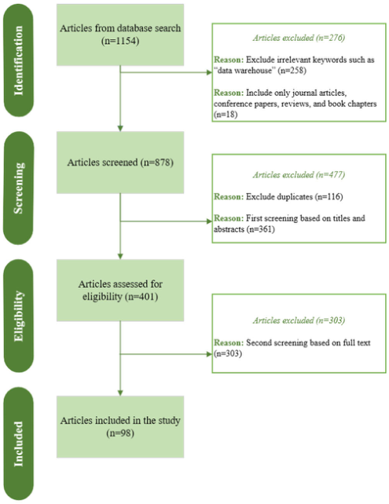

**FIGURE 1.** PRISMA search framework.

quarter of the year. In addition, the number of publications fluctuated in the last decade as the academic community newly began to explore the topic, with a notable absence of publications in 2011 and 2012.

## _D. PREDOMINANT SOURCES OF PUBLICATIONS_

The investigated 98 papers were distributed across nearly 78 journals and conference proceedings. Figure 3 showcases the top 11 most frequent publication sources, accounting for 30 of the analyzed papers, thus representing over 31% of the total. Notably, IEEE Access and IFAC-PapersOnLine Each contributed four papers. Similarly, three papers each appeared in Applied Sciences (Switzerland), Chinese Control Conference (CCC), Communications in Computer and Information Science, and Lecture Notes in Computer Science. The majority of these papers fall within disciplines such as computer sciences, industrial engineering, intelligent manufacturing, robotics, sensors, and engineering optimization.

## _E. CITATION IMPACT OF REVIEWED PAPERS_

Figure 4 ranks the ten most influential papers based on their total citations count. Analysis of citation has long been used to assess the influence of academics, journals, and university departments on a field. The effect or ‘‘quality’’ of a paper is determined by calculating how frequently it appears in the writings of other authors [31]. Leading the chart, the study by

Digani et al. [32] stands out within the digital transformation in warehousing field as it received 92 citations over the last eight years. This work developed an approach that merges a two-layer control architecture and an automatic algorithm for roadmap definition. Close behind, Leng et al. [33] garnered 88 citations for their work on a digital twin-driven joint optimization approach of packing and storage assignment in large-scale automated high-rise warehouses, demonstrating its practical application through simulation. Other important contributions encompass works by Alyahya et al. [34], Biswal et al. [35] and Zhou et al. [36] each significantly advancing the field of warehousing digitalization.

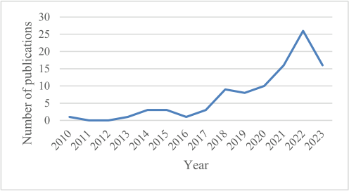

**FIGURE 2.** Annual trend of published articles.

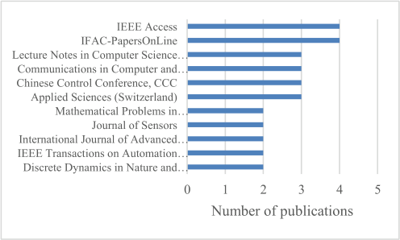

**FIGURE 3.** Top publishing sources.

## **III. DISCUSSION OF KEY FINDINGS**

This section discusses the most pressing problems in warehousing operations as identified through the literature review. The reviewed articles are organized by problem category, respective number of articles, modeling/solution approach, technology utilized, and their specific contributions as detailed in Table1. In addition, the review identified the automation technology featured in each of the included articles, providing insight into the technological evolution within warehousing. This includes an examination of the application of each technology to various warehousing operations and the types of warehouses involved, as outlined in Table 2. Finally, the practical implications of digitization in warehousing are discussed and analyzed, with Table 3 mapping the articles to

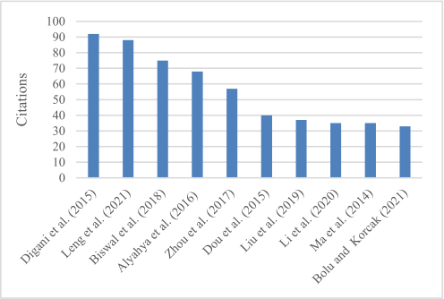

**FIGURE 4.** Top influencing works.

specific case study applications and the objectives they aimed to achieve.

## _A. WAREHOUSING OPERATION PROBLEMS ADDRESSED IN THE LITERATURE_

This section aims to explore the evolving dynamics of warehousing operations in the face of increasing digitalization and ever-evolving customer demands. Warehousing operations play a significant role in logistics and are responsible for a wide range of activities including receiving, storing, picking, packing, and delivery of items [37]. Despite advancements, warehousing faces numerous operational challenges that ought to be optimized. The following subsections discuss the most recurring problems in the literature, which include but not limited to path planning problems, task allocation/assignment problems, works that solve both problems simultaneously, and other types of problems that appear in the literature with few occurrences.

## 1) PATH PLANNING PROBLEMS

With the increasing demand for precise and fast order fulfillment, warehouses are leveraging cutting edge technologies to streamline their internal operations and enhance their efficiencies. Path planning is essential for ensuring the seamless movement of goods within the warehouse while minimizing travel time and maximizing productivity. The challenge lies in devising optimal routes for AGVs, automated storage and retrieval systems (AS/RS), robots, human operators, etc. to navigate along the complex layout of storage racks and workstations within the warehouse. As discussed by Zhang et al. [38], an improved Q-learning algorithm to optimize multi-AGV route planning in large-scale warehouse environments was proposed. The algorithm considers AGV load status, minimizes turns, and enables real-time collision avoidance. The algorithm’s effectiveness is demonstrated through three case studies. In case 1, differentiating between loaded and unloaded AGVs resulted in a 10-second reduction in travel time and an 11.11% improvement in efficiency. Case 2 showcased real-time collision avoidance for new

AGVs entering a system, significantly reducing task completion time and route computation time while increasing throughput. Case 3 optimized routes for multiple loaded and unloaded AGVs simultaneously, minimizing energy consumption and avoiding collisions. Similarly, Tang et al. [39] developed a digital twin framework for demand forecasting and inventory management in small-scale cyclical industries, such as textiles. This framework utilizes a roulette genetic algorithm for demand prediction and aims to optimize inventory levels in line with predicted demand, thereby mitigating risks associated with economic downturns and seasonal fluctuations. A case study of a small-scale textile company demonstrated the framework’s effectiveness in generating accurate demand forecasts and optimizing inventory levels, highlighting the importance of integrating demand forecasting with inventory management in smart warehouses for cyclical industries. This area, focusing primarily on logistical solutions for specific product types and the development of frameworks for intelligent warehouse management across various sectors, has garnered significant attention, with approximately 69 out of 98 papers exploring path planning problems, as indicated in Table 1.

## 2) TASK ALLOCATION/ASSIGNMENT PROBLEMS

In the area of intelligent warehousing, there is a growing reliance on multi-robot systems that assist in minimizing costs and improving operational efficiency [40]. In fact, the complexity inherent in warehouses, coupled with the use of advanced technology and the need for swift order fulfillment to meet customer demands, necessitates solutions beyond the capabilities of single robots. Thus, deploying robots in warehouses has become crucial for boosting efficiency. Task allocation/assignment is concerned with deliberately distributing tasks and responsibilities among a multi-robot system to ensure optimal performance and competent utilization of resources. In intelligent warehouses, a crucial role is played by using a fleet of mobile and automated picking robots which are tasked with efficiently processing orders by fetching items from the shelves and dropping them in the delivery stations. Zhao et al. [41] focused on the scheduling and navigation of multi-mobile robots through highlighting the inefficiency in traditional methods where robots were assigned tasks without considering the overall transportation time, leading to uneven task distribution and longer execution times. The authors presented a case study using a hierarchical Genetic Algorithm-Ant Colony Optimization (GA-ACO) algorithm to optimize task assignments and minimize total transportation time. This approach was tested in a simulated warehouse environment with obstacles, where two robots successfully completed 20 tasks, demonstrating the effectiveness of the proposed method in reducing overall transportation time and improving operational efficiency. Moreover, Agrawal et al. [42] proposed RTAW, a reinforcement learning-based algorithm for multi-robot task allocation in warehouse environments. This algorithm is designed to

enhance cooperation among robots, minimizing total travel delay and improving makespan for large task-lists. Extensive experiments demonstrated RTAW’s superiority over traditional methods, with up to 14% improvement in total travel delay. The results highlight RTAW’s adaptability to various warehouse layouts and its potential for real-world applications in automating fulfillment and distribution centers. Among the reviewed literature, 14 papers specifically shed the light on task allocation problems, with recent works highlighting the potential machine learning technologies in optimizing warehouse operations. Table 1 compiles and summarizes the articles that tackle task allocation and assignment problems.

each robot performs local path planning. This was achieved through the recursive excitation/relaxation artificial potential field approach, which is a semi-complete and computationally efficient potential-based local path planning tool. The study also focused on enhancing the overall performance of the system by introducing a genetic-based task allocation algorithm, presenting a metaheuristic solution and an adaptive integrated system with enhanced learning capabilities. Collectively, these three papers showcase the integration of path planning and task allocation within warehousing operations, as shown in Table 1.

## 4) OTHER WAREHOUSING OPERATION PROBLEMS

## 3) COMBINED PATH PLANNING AND TASK ALLOCATION PROBLEMS

Certain studies dealt with both path planning and task allocation/assignment problems within warehousing operations. Warehousing systems aim to streamline and optimize various functions such as storage and item transfer. The advancements in technology help optimize the warehousing systems, and simultaneously introduce complexities in managing path planning and task allocation. Path-planning enables multi-robots to accomplish a task by guiding them to the desired location optimally and collision-free [43], while task allocation involves distributing tasks among robots efficiently [44].

Another study by Mei et al. [45] addressed the challenge of optimizing efficiency in multi-robot warehouse systems. Recognizing that task congestion can hinder performance and increase operational costs, the authors introduced a two-pronged approach. First, an enhanced market auction algorithm is employed to allocate tasks to robots, considering potential congestion points to minimize overall path length. Second, a D[∗] Lite-based conflict search algorithm is utilized to ensure collision-free path planning, prioritizing the shortest possible running time for the robot fleet. Through simulations, the effectiveness of this combined method was demonstrated in both inbound and outbound task scenarios, showcasing a significant reduction in time and distance costs, especially in densely populated shelf areas. To enhance the multi-robot performance in warehouses, Shi et al. [46] examined the complex issue of task allocation and path planning for multiple robots in warehouse environments. They highlighted that the real-world factors contributed to motion uncertainty, leading to potential collisions and suboptimal performance. To tackle this, they proposed an auction-bid solution with real-time robot density prediction, using traffic rules to prevent collisions and the Floyd algorithm for optimal path planning. Simulations with up to 100 robots and shelves showed that this method effectively minimized task completion time and improved overall system performance compared to other techniques. Furthermore, Tsang et al. [47] developed a system design where a centralized server takes care of the task allocation, and

In addition to the previously discussed problems, the literature addresses a spectrum of other operational issues within warehousing in the digital transformation era. These include the localization problem, image information recognition problem, task planning problem, storage assignment problem, fleet-sizing problem, packing and storage assignment problem, and production-inventory problem. Table 1 categorizes the included articles by the problems they address, the number of articles in each category, the modeling/solution approaches used, the technologies applied, and their corresponding contributions.

The localization problem is concerned with accurately estimating the current position of the system. Tripicchio et al. [48] and Yang et al. [49] addressed the challenges in warehouse logistics and proposed solutions using RFID technology by focusing on optimizing warehouse location assignment using RFID for real-time information capture and an improved particle swarm optimization algorithm, as well as introducing four least mean squares methods for estimating the 3D positions of passive UHF RFID tags, emphasizing the importance of precise localization for efficient robot motion and planning in the context of Industry 4.0. This highlights the potential of RFID technology and advanced algorithms to optimize warehouse operations, improve inventory control, and enhance process efficiency in industries like logistics and supply chain management. Moreover, Haibin et al. [50] focused on optimizing automated warehouse location in intelligent manufacturing. It emphasizes the importance of location allocation and optimization in warehouse management, introducing a multi-objective genetic algorithm to improve efficiency and shelf usage. Traditional methods are highlighted as inefficient for large-scale operations, while the genetic algorithm offers a simple yet effective solution for quick, satisfactory results in real-world scenarios. This approach ensures improved warehousing efficiency and shelf stability, crucial in the evolving landscape of intelligent manufacturing and automated warehousing.

The image information recognition problem refers to the capability of computers to determine and classify items, places, actions, and people through digital imagery. He et al. [51] studied the challenges in smart factory environments, where the diversity of goods in terms of shape and color,

coupled with the need for real-time processing, necessitates advanced solutions. Traditional static vision image processing methods often fall short in addressing these complexities, leading to inefficiencies in warehouse logistics management. To overcome these limitations, this study proposes the optimization of a YOLOv3 model for enhanced warehoused goods recognition. Experimental results validate the effectiveness of this approach, demonstrating its potential to significantly improve the speed and accuracy of goods recognition within intelligent warehouse systems. Zhuang et al. [52] addressed the optimization of cooperative task planning for diverse multi-robot systems within order picking warehouses. The research emphasizes the complexities arising from heterogeneous agents, interconnected utilities, and intricate intertask dependencies. To tackle these challenges, a novel mapping mechanism is introduced, reformulating the problem as open shop scheduling with sequence-dependent set-up and transportation times. The study further proposes an efficient mixed-integer linear programming model for smaller problems and a hybrid artificial bee colony algorithm for larger-scale scenarios. The efficacy of these methods is validated through simulation experiments, demonstrating their potential to enhance task planning and coordination in warehouse environments. Additionally, Bolu & Korcak [53] proposed the development of an Adaptive Task Planning approach for multi-robot smart warehouses, focusing on optimizing the Robotic Mobile Fulfillment System (RMFS) to efficiently manage resources and tasks. The study introduces a centralized task management algorithm that adapts to system dynamics and proposes an adaptive heuristic approach for assigning tasks to robots. Extensive simulations in a realistic environment show that the approach significantly reduces order completion time and balances workload among robots, even with a high number of stock-keeping units (SKUs). The paper also examines the impact of various system parameters on smart warehouse design and efficiency.

The storage assignment problem focuses on finding the optimal warehouse location for incoming goods while taking into consideration the warehouse’s capacity. A food company that faces warehouse space constraints impacting production due to uncoordinated planning and storage assignment is addressed in a study by Zhang et al. [54]. The study presents a novel strategy integrating production planning with randomized storage, modeled through mixed-integer linear programming and a heuristic algorithm. Numerical experiments demonstrate the strategy’s effectiveness in reducing costs and optimizing space compared to dedicated storage policies. The company’s consideration of IoT-enabled indoor positioning systems for improved warehouse management visibility prompts the development of an innovative strategy integrating production planning with randomized storage assignment. This approach, leveraging IoT capabilities, aims to optimize space utilization and reduce costs in scenarios with fluctuating demands. Rjeb et al. [55] addressed fleet-sizing problem of robots through a simple mixed-integer linear programming model of transporting homogeneous

loads between two storage areas in the warehouse which takes into account the number of pickup and delivery stations in the system. The packing and storage assignment problem seeks to optimize the organization and allocation of packed goods. Leng et al. [33] approached this problem by proposing a new digital twin-driven approach to optimize packing and storage in large-scale automated high-rise warehouses. The system integrates real-time data with a cyber model, enabling periodic optimization through a joint optimization model. A case study in a tobacco warehouse validates the model’s effectiveness in improving utilization and efficiency. The research fills a gap in the existing literature by focusing on the joint optimization of packing and storage management, addressing the challenges of managing large-scale warehouse operations with unpredictable demands and interactions. Finally, the production-inventory problem deals with resource shortages and cost inaccuracies, which is addressed by Maity [56] through case studies illustrating real-world applications, such as a two-warehouse production-inventory model with fuzzy budget and space constraints, solved using optimal control theory to manage defective items and space scarcity. Within the same work, another case study presents a three-layer supply chain model under conditionally permissible delay in payments, formulated in fuzzy-rough and Liu uncertain environments, addressing supplier-manufacturerretailer dynamics and incorporating factors like ideal costs and delay in payments. These examples showcase the effectiveness of intelligent techniques in optimizing warehouse performance amidst practical challenges like defective products, space limitations, and supply chain coordination.

Figure 5 represents a pie chart that illustrates the warehousing operation problems addressed in the reviewed literature, encompassing 98 articles. Each slice of the pie corresponds to a specific problem category, representing the percentages of warehousing operation problems addressed in the literature in terms of the 98 papers included in this review. This figure provides a visual representation of the distribution of warehousing operation problems addressed in the reviewed literature, as categorized in Table 1. It highlights the prevalence of path planning problems (70%), followed by task allocation problems (14%), and the less frequent occurrence of other problems such as localization, image recognition, and task planning. This figure offers insights into the research focus within the field and the relative importance of different operational challenges in the context of digital transformation in warehousing.

## _B. EVOLUTION OF AUTOMATION IN WAREHOUSE OPERATIONS_

In the past, warehousing relied heavily on manual procedures, where human labor was essential for inventory management and order fulfillment. Many warehouse tasks, being manually executed, were prone to inefficiencies and human errors, affecting overall operations’ speed and reliability. However, the landscape of warehousing operations

has seen a significant shift with the advent of digital transformation. These recent technological developments have transformed warehouses from traditional, manually managed environments to highly automated and paperless entities, significantly enhancing efficiency and productivity [131]. They handled a variety of warehousing operations, namely receiving, put away, storing, picking, packaging, dispatch, and delivery in different warehouse types all over the years. During this transformation, warehouses have evolved from manually managed, paper-based storerooms with little or no technology support to paperless facilities with digital and information technologies supporting the operators [132]. Further developments in robotics and automation, coupled with improvements in warehouse management systems, have made warehouses highly automated facilities. This evolution has seen a shift from AS/RS and AGVs to the adoption of autonomous robots, IoT, blockchain, and digital twin technologies [133].

This transformation has been marked by the introduction and integration of various technologies. Initially, AGVs, launched in 1950, became the most popular technology-based solutions for moving materials in warehouses and other manufacturing facilities [134]. AGVs are mobile robots equipped with lasers or vision-based guidance systems to follow cables or markings on the ground [135]. The primary role of AGVs is to transport goods from a designated start point to a target destination, serving as the key transportation mechanism within AS/RS. These systems facilitate the storage and movement of goods automatically without the need for human labor. AGVs have the capability to carry goods gathered by order-pickers or to link various warehouse zones, enabling the consolidation of items selected by various order-pickers for customer orders. Additionally, an AGV can move to a specific pick point and wait for an order-picker to deposit items, facilitating efficient item collection and transport. However, AGVs incur high initial and maintenance costs, they are not suitable for non-repetitive tasks, and they lack flexibility in operations. Eventually, more cognitive and control tasks are usually handled by human operators, and the majority of the workload is handled by automated systems that include AGVs and AS/RS [136]. Warehousing operations handled by AGVs ought to be effectively optimized using modeling approaches. For instance, a study by Hu et al. [72] proposed a new method for scheduling a diverse fleet of AGVs in a warehouse, aiming to optimize task assignment, path planning, and conflict resolution. This is particularly relevant to companies like Trucking Company in China, which faced challenges managing their AGVs with existing software. The researchers developed a hierarchical planning method and a hybrid algorithm to address these challenges. This led to significant improvements including a 76.69% decrease in average delay time due to optimized path planning and conflict resolution, and a 13.62% reduction in average task completion time, demonstrating increased efficiency and cost savings. Similarly, Li and Wu [63] developed a method to optimize the scheduling of Automated Guided

Vehicles (AGVs) in intelligent warehouses. AGVs are transforming warehouse operations by automating the movement of goods, leading to increased efficiency and reduced labor costs. The authors introduce the concept of a ‘‘dynamic task chain,’’ where AGVs are assigned a sequence of tasks that can be adjusted in real-time based on changing priorities. This approach, along with a mechanism to prevent charging pile competition, aims to minimize the distance traveled by AGVs without loads, thus improving energy efficiency and reducing wear and tear. Simulation results demonstrate the effectiveness of this approach, showing a significant reduction in non-loaded travel time and improved overall system efficiency. These findings highlight the potential of intelligent scheduling algorithms to revolutionize warehouse operations and achieve substantial gains in productivity and cost savings.

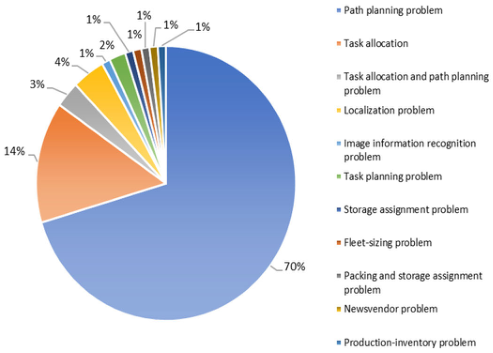

**FIGURE 5.** Warehousing operation problems addressed in the literature.

In recent years, novel technologies were introduced to serve scalable and adjustable systems that handle divergent workloads [137]. On that note, the integration of sensors and software with data from automated technologies has facilitated the shift from automated to autonomous systems in warehousing. AMRs, representing the latest advancements beyond AGVs, are defined as ‘‘industrial robots that use a decentralized decision-making process for collisionfree navigation to provide a platform for material handling, collaborative activities, and full services within a bounded area’’ [138]. Their efficiency, ease of setup, speed, and intelligence surpass traditional systems, making AMRs a prevalent choice in modern and smart warehouses. These systems are capable of performing a variety of tasks beyond mere transportation such as palletizing and unloading, and they also excel in working alongside humans within shared spaces, efficiently navigating aisles to locate and retrieve items [139]. The transition to AMRs has prompted the adoption of advanced modeling techniques to further enhance warehousing operations. Among several contributions, Li and Ma [85] introduced an innovative Double-Deck Multi-Agent Pickup and Delivery (DD-MAPD), a system designed to optimize warehouse automation by enabling robots to rearrange

**TABLE 1.** Warehousing problems: solutions and technologies reviewed.

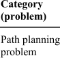

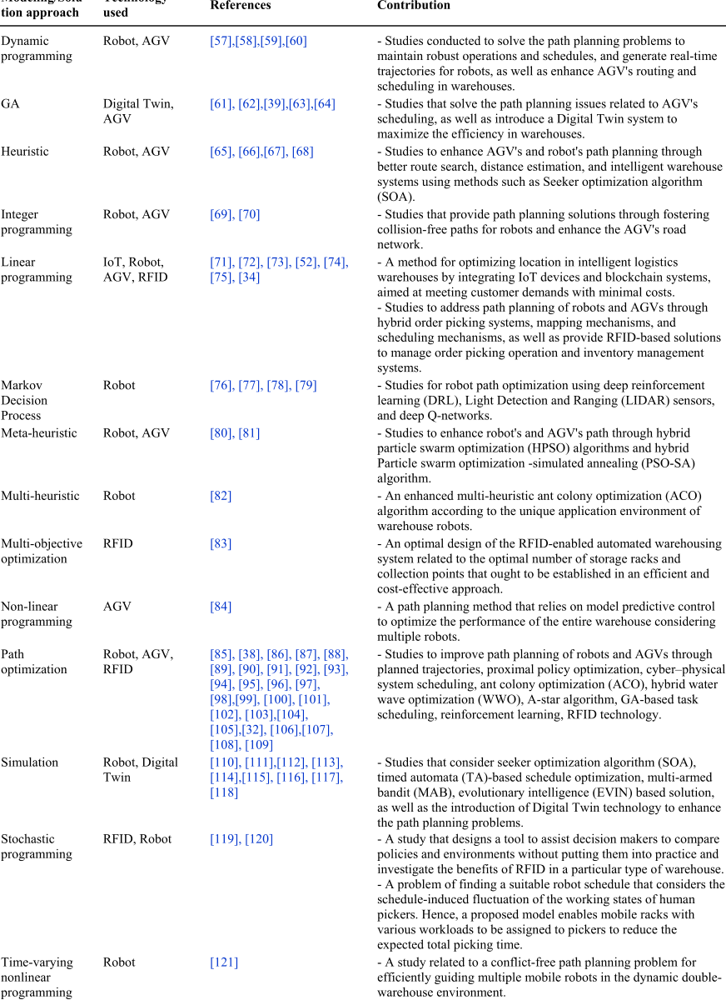

shelves dynamically. This adaptability is crucial in responding to fluctuations in product demand, allowing for efficient

storage and retrieval of items. DD-MAPD can significantly reduce land usage and operational costs in warehouses though

**TABLE 1.** _(Continued.)_ Warehousing problems: solutions and technologies reviewed.

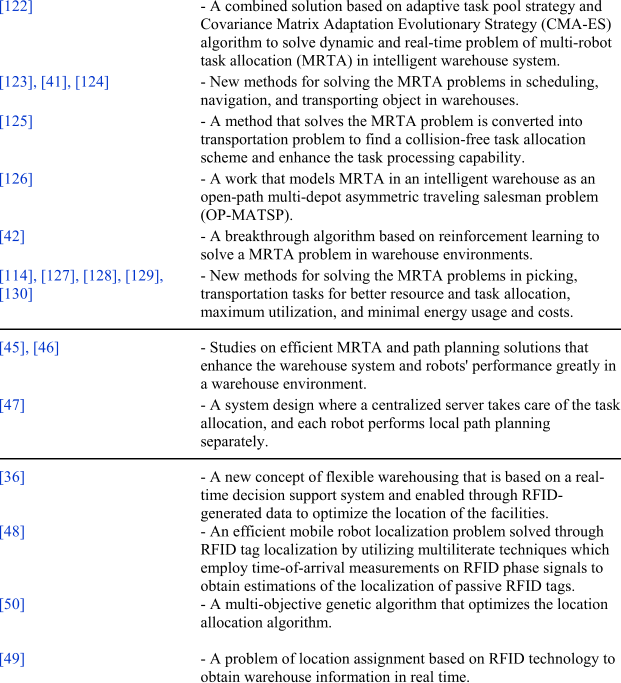

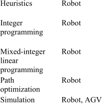

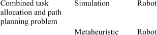

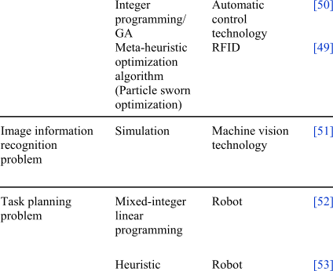

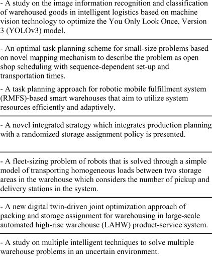

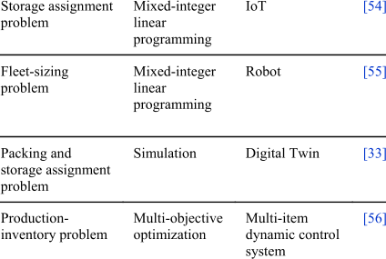

optimizing shelf placement based on real-time order data. Simulation results demonstrate the algorithm’s effectiveness in solving large-scale instances with over a thousand shelves and hundreds of agents within minutes, showcasing its potential for real-world implementation. In a warehouse rearrangement demo, DD-MAPD successfully solved all instances with an average total time of 30.68 seconds and an average agent time of 4.85 seconds, highlighting its potential for time-saving benefits in real-world warehouse operations. Additionally, Chen et al. [82] developed an enhanced Ant Colony Optimization (ACO) algorithm for optimizing path planning in warehouse robots. This algorithm considers factors like path safety, length, and turns, crucial for efficient warehouse navigation. The algorithm accounts for uncertainties and obstacles in the warehouse environment through incorporating Poisson distribution into the traditional grid map. Simulation results show significant improvements in path planning, with reduced iterations, fewer turns, and a 38.43% to 50.11% decrease in running time compared to other ACO algorithms. The implementation of such intelligent robots can revolutionize warehouse operations by automating tasks, increasing efficiency and safety, and reducing costs in the long run.

Moreover, while RFID itself is not a new invention, its innovative application within IoT ecosystems is unlocking new efficiencies and capabilities. This integration presents a promising advancement in technology, offering significant potential for various applications due to its costeffectiveness [48]. This synergy offers the distinct advantage of uniquely specifying each tag by its own ID, and in contrast to machine vision technologies, is not impacted by lighting conditions and can be utilized in dark environments. RFID significantly accelerates the information generation and traceability of items which enhances the responsiveness and efficiency of warehouse operations [142]. It enables more effective inventory management, reduces discrepancies, provides precise and current data on stock levels, and enhances overall visibility. These benefits contribute to minimizing errors within the warehouse environment. However, deploying RFID in warehouses is not without its challenges including adherence to security standards, systems costs, and improper read rates. Addressing these challenges requires innovative solutions, such as modeling approaches to enhance system performance and cost-effectiveness. For instance, Chen et al. [71] developed a method that utilizes IoT devices and blockchain technology to optimize warehouse locations and enhance intelligent transportation logistics. This method aims to minimize costs and improve efficiency across the supply chain which is achieved by means of integrating real-time data on inventory, transportation, and environmental conditions with the security and transparency of blockchain. The authors highlighted the potential of IoT sensors to monitor storage conditions, track inventory, and optimize transportation routes, leading to reduced spoilage, improved demand forecasting, and fuel savings. Another study by [48] discussed the growth of e-commerce and the demand for fast

delivery, leading to a shift from manual labor to automated systems in warehouse logistics. Industry 4.0 technologies, particularly RFID, are key to this transformation. RFID enables real-time tracking of inventory and goods, improving efficiency and reducing errors. RFID-enabled robots can autonomously navigate warehouses, optimizing picking and packing processes. While challenges like signal interference exist, techniques like phase unwrapping and advanced algorithms offer solutions. The paper’s experiments demonstrate RFID’s effectiveness, achieving high accuracy in both simulated and real-world warehouse settings, highlighting its potential to significantly improve warehouse logistics. This showcases the potential of RFID to overcome operational challenges in warehousing through strategic application and integration with emerging technologies.

Blockchain technology further enhances warehouse operations by fostering trust, improving efficiency, and reducing costs. This technology enables the seamless exchange of information across a network and ensures the accuracy of data throughout a distributed hierarchical network structure interconnected by nodes [71]. To a certain extent, this functionality enhances the intelligence and convenience of IoT transactions. In a blockchain system, nodes have unrestricted access, allowing them to join or exit without disrupting the whole network. Therefore, leveraging modeling approaches to optimize these systems can significantly enhance warehouse operations. Moreover, Blockchain technology plays a crucial role in monitoring and documenting warehouse performance metrics [141].

Similarly, Digital Twin technology refers to ‘‘an integrated multi-physics, multiscale, probabilistic simulation of an as-built vehicle or system that uses the best available physical models, sensor updates, fleet history, etc. to mirror the life of its corresponding flying twin’’ [142]. Intelligent warehouses are extensively integrated with Digital Twins which employ algorithms to determine necessary actions within the production system and characterize their physical counterparts. In addition, it can have a positive impact on various warehouse operation problems including path planning optimization, order picking problems, production-inventory problems, storage assignment issues, etc. Hence, it is considered as the most promising tool for process improvement, with simulation bridging the gap between virtual planning and physical warehouse operations. On this occasion, [61] presented a case study of a digital twin system implemented in a cold chain logistics warehouse. This system utilizes a five-dimensional model to create a virtual replica of the warehouse, integrating real-time data from various sources. By employing genetic algorithms, the system optimizes load and temperature distribution, leading to a 25-30% reduction in fresh vegetable loss. The digital twin also enhances operational efficiency by simulating different scenarios and enabling predictive maintenance. This case study demonstrates the transformative potential of digital twin technology in cold chain logistics, showcasing its ability to improve efficiency, reduce waste, and ensure product quality. However,

challenges such as data integration and model accuracy need to be addressed for wider adoption. Table 2 organizes the included articles by the warehousing operations handled by the corresponding technology, as well as the warehouse type.

## _C. PRACTICAL IMPLICATIONS OF DIGITIZATION IN WAREHOUSING_

The analysis of the included articles reveals the substantial opportunities and benefits arising from the application of optimization techniques to digital transformation in warehousing operations. Focused on distinct optimization issues, technologies, and solution strategies, these studies demonstrate the practical implications of digitization. For example, Hu et al. [61] proposed a digital twin system which is combined with genetic algorithm to address several challenges faced by cold chain logistics stereo warehouses through scheduling optimization. The system’s ability to monitor and predict temperature fluctuations allows for proactive adjustments, minimizing product spoilage. The paper notes a significant reduction (25-30%) in the loss rate of fresh vegetables, showcasing the tangible impact of temperature control optimization. Additionally, the genetic algorithm’s optimization of storage and retrieval tasks leads to a 10.16% improvement in operational efficiency. This translates to faster processing times, reduced labor costs, and a more streamlined warehouse workflow. The system contributes to cost reduction as a result of optimizing energy consumption and resource allocation. The paper highlights the trade-off relationship between total cost and freshness, emphasizing the system’s ability to balance these factors for optimal warehouse management. The focus on freshness preservation throughout the storage and retrieval process ensures that products maintain their quality. The paper demonstrates a 25% increase in freshness values after optimization, underscoring the system’s effectiveness in preserving perishable goods. This reveals that the optimization techniques presented in the paper offer a holistic solution to the complex challenges of cold chain logistics. The system not only improves operational efficiency but also significantly impacts the bottom line by reducing product loss and enhancing freshness, which is achieved by means of integrating real-time monitoring, predictive modeling, and intelligent scheduling. Another case study, implemented by Wang et al. [120] in e-commerce industry in China, discussed the problem of scheduling robots in mobile-rack warehouses, where robots bring racks of items to human pickers. The authors observed that pickers’ work efficiency varies over time due to factors like fatigue and natural rhythms. To address this, they developed a model that considers the picker’s current state when assigning tasks. This approach resulted in a 10% reduction in picking time compared to traditional methods. The study highlights the importance of considering human factors in warehouse automation and demonstrates the potential of using data-driven models to optimize human-robot collaboration. Furthermore, Zhang et al. [54] highlighted that the randomized storage policy, when combined with

IoT technologies, can lead to substantial cost savings and increased space utilization in warehouses. The authors illustrate that the integration of production planning with a randomized storage policy, facilitated by IoT-enabled tracking systems, can result in average cost savings of 9.95% and up to 16.84% compared to traditional dedicated storage strategies. These savings are attributed to reduced setup, storage usage, and moving costs. Additionally, the randomized policy, coupled with IoT, leads to an average increase in storage space utilization of 18.43%, with a maximum increase of 26.1%. This is particularly significant in scenarios with high demand fluctuations, where the space savings can be even more substantial. The practical implications of these findings are significant for warehouse management. In this case, warehouses can optimize their operations, reduce costs, and enhance space utilization through adopting a randomized storage policy and leveraging IoT technologies. This approach is particularly beneficial in situations with limited storage space or products with high demand variability. The cost savings and increased space utilization resulting from this integrated strategy can significantly improve the overall efficiency and profitability of warehouse operations. Moreover, Leng et al. [33] proposed a digital twin system to optimize packing and storage assignment in large-scale automated high-rise warehouses. The system integrates real-time data from the physical warehouse into a cyber model, enabling joint optimization of packing and storage decisions. This approach allows for the efficient allocation of goods within packages and their placement in the warehouse, maximizing space utilization and operational efficiency. The practical implications of this system are significant, as it addresses the challenges of managing large-scale warehouses with diverse products and fluctuating demands. As a result of packing and storage optimization, the system can reduce the number of cartons used, minimize warehouse congestion, and prevent logistical bottlenecks. In a case study of a tobacco warehouse, the digital twin system demonstrated a 17.49% improvement in carton utilization compared to the existing ERP system, while also significantly reducing computation time. Table 3 organizes the included case studies by the digital technologies employed and their achieved outcomes, highlighting the transformative power of digitization in enhancing warehousing operations.

## **IV. RESEARCH GAPS AND FURTHER RESEARCH RECOMMENDATIONS**

The previous sections have critically analyzed the existing literature pertaining to the application of optimization approaches to solve warehousing operational problems in the era of digital transformation. The objective was to shed light on how digital transformation is reshaping warehousing operations, investigate the initially defined research questions, and identify existing research gaps. While publications from 2010 to September 2023 indicate a growing interest in this field, as evidenced by Figures 2 through 4 and Tables 1 and 2, several key areas warrant further exploration.

First, the majority of the reviewed articles discussed warehousing operation problems posed by automation technologies and the suitable optimization modeling/solution approaches to address these problems. Although digital transformation promises efficiency gains, its potential for fostering sustainable warehousing practices remains underexplored. Only a handful of studies, such as those by Dobos et al. [113] and Witczak et al. [128], contributed to the growing discussion on sustainability in warehousing operations. Dobos et al. focus on optimizing material handling processes to minimize waste and resource consumption, proposing a model that could reduce the need for energy, raw materials, and potentially even human and machine resources. They suggest that this model could serve as a framework for integrating specific sustainability practices, such as energy-efficient lighting and renewable energy sources. Witczak et al. [128], while not explicitly detailing specific practices, highlight the potential of Industry 4.0 technologies, like Automated Guided Vehicles (AGVs), to enable sustainable and resilient warehouse processes. However, some gaps in both studies remain unexplored. Neither quantifies the environmental impact of their proposed models or solutions, leaving room for future research to develop metrics for measuring the environmental benefits of optimized warehouse operations. Additionally, both could delve deeper into the integration of various sustainability practices, exploring how different practices can be combined and optimized. The obstacles to implementing these practices, such as financial constraints and lack of awareness, are also not fully addressed. Witczak et al.’s focus on AGVs could be expanded to explore the specific ways in which these and other technologies can be leveraged for sustainability goals. Despite these gaps, both studies provide valuable insights into the potential for sustainable warehousing. The integration of specific practices, such as energy efficiency, renewable energy, waste reduction and recycling, sustainable packaging, optimized transportation, and water conservation, could significantly reduce the environmental impact of warehouse operations. However, challenges such as high upfront costs, lack of awareness, resistance to change, and limited availability of sustainable technologies need to be addressed to ensure successful implementation. Future research should focus on developing standardized metrics to measure environmental impact, exploring the interplay of different sustainability practices, and identifying strategies to overcome implementation barriers.

Furthermore, there shows a potential for some authors to adapt to dynamic warehouse environments which encompasses real-time changes of package dimensions, robot status, task assignments, and unexpected obstacles, as noted by [59], [62], and [126]. These studies highlight significant gaps and opportunities in the realm of warehouse automation and optimization. In terms of limited scope in task allocation, primarily focus on optimizing task allocation and routing for storage and retrieval tasks. However, they do not address the broader spectrum of warehouse operations,

such as picking, packing, and shipping. This limitation shows the need for more comprehensive models that can optimize the entire warehouse workflow. A study by McKinsey [144] found that end-to-end warehouse optimization could reduce operational costs by 15%. In terms of static environments and deterministic models, the models proposed in these papers assume static warehouse environments and deterministic task parameters. In reality, warehouses are dynamic environments with uncertainties in task arrivals, processing times, and resource availability. This gap necessitates the development of more robust and adaptive models that can handle real-world uncertainties. In relation to lack of real-world validation, while the proposed algorithms show promising results in simulations, their effectiveness in realworld warehouse settings remains to be validated. Real-world implementation often involves additional complexities, such as hardware limitations, communication delays, and humanrobot interaction, which are not fully captured in simulations. A survey by Zebra Technologies found that only 27% of warehouses have fully implemented automation solutions, highlighting the challenges in transitioning from simulation to real-world deployment [145]. With regard to neglecting human-robot collaboration, the papers focused on automating tasks traditionally performed by humans but do not explicitly addressing the potential for human-robot collaboration. In many warehouses, humans and robots can work together to achieve higher efficiency and flexibility. This gap presents an opportunity to develop collaborative models that leverage the strengths of both humans and robots. In relation to the limited consideration of safety and congestion, some authors considered path planning and conflict resolution, however, they do not fully address the broader issues of safety and congestion in warehouse environments. Ensuring the safety of human workers and preventing congestion among robots are critical for the successful implementation of warehouse automation. A report by Amazon found that the rate of serious injuries which currently account for 37% of all warehouse jobs in the United States, have attracted the attention of both federal and state regulators [146]. Hence, future research can contribute to the development of more efficient, robust, and safe warehouse automation solutions to address these gaps. The integration of advanced technologies, such as AI, machine learning, IOT, sophisticated warehouse management systems (WMS), and automated sorting systems can further enhance the capabilities of warehouse robots and enable them to adapt to dynamic environments and collaborate effectively with human workers.

Moreover, a notable omission in the reviewed literature was the exploration of collaborative robots (cobots) which represent a significant technological trend. Cobots, designed to work alongside humans, offer the potential to revolutionize warehousing through their adaptability, flexibility, and seamless human-robot collaboration [147]. Although one of the reviewed studies mentioned cobots, it failed to analyze the cooperation between cobots and humans at picking locations,

treating cobots merely as conventional pickers [88]. It investigates the use of AGVs, or cobots, in warehouses with a mixed-shelves storage policy, where items of the same SKU are located on multiple shelves. The authors developed mathematical models and a variable neighborhood search algorithm to optimize order batching and routing, finding that the mixed-shelves approach significantly reduces AGV travel distances compared to dedicated storage. This approach led to a reduction in driving distances for AGVs of up to 62%. Future research could employ a mixed-methods approach, including qualitative case studies, quantitative surveys or experiments, simulation studies, and longitudinal studies, to comprehensively understand the impact of cobots on warehouse operations, worker satisfaction, and overall efficiency, ultimately leading to better strategies for cobot integration in warehousing. This suggests that the understanding of cobots in warehouses is still ambiguous and requires deeper investigation to fully comprehend their capabilities and benefits. Furthermore, the concept of cobots aligns with the principles of logistics 5.0, which emphasizes the synergistic integration of human labor and digital technologies [148]. Additionally, Trstenjak et al. [149] developed a strategic plan based on a decision support system to accurately implement the requirements and technologies of Logistics 5.0. Fornasiero and Zangiacomi [150] proposed new models for the supply chain to facilitate adaptation to the new technologies of Industry 5.0. Nayeri et al. [151] developed a decision support system to examine the responsive supply chain 5.0 based on Industry 5.0 in the healthcare system. Nayeri et al. [152] also developed decision support systems based on multi-criteria decision-making and mathematical modeling to decide the selection of the new technologies of Industry 5.0 used in the supply chain. Key technologies driving logistics 5.0, such as IoT, sensors, cloud computing, big data, cobots, blockchain, and AI, are pivotal for enhancing warehousing efficiency [153]. Future research should therefore focus on a detailed examination of how Logistics 5.0 can be effectively implemented in practical warehouse settings, and how their associated operational problems can be optimized.

Although blockchain technology is recognized for its potential to enhance warehouse operations by increasing efficiency, transparency, and reducing costs, its integration within optimization models for warehousing in the context of digital transformation remains underexplored. The practical applications and tangible benefits of blockchain in warehousing, specifically how it can optimize operational workflows and decision-making processes, are still not thoroughly documented. Chen et al. [71] developed a computational analysis that combines IoT with blockchain technology to help respond to customer demands with minimal transportation cost of goods within the warehouse. However, the study was not supported by a practical case application to capture the tangible benefits. Future research is therefore needed to develop and evaluate blockchain-based

optimization models in warehousing and also to document their real-world applicability and effectiveness. This involves investigating how blockchain technology can be leveraged within digital transformation strategies to optimize inventory management, streamline supply chain logistics, and improve overall warehouse operations. Another suggestion includes continuously improving the performance of blockchain technology through integrating it with big data analytics to better adapt to unplanned market changes.

Additionally, the rise of e-commerce has led to rapidly evolving customer demands for timely deliveries, often requiring just-in-time order fulfillment. The reviewed literature overlooks the goods-to-person (GTP) automation systems, despite their potential to mitigate disruptions in order processing and navigation within warehouses. GTP systems are designed to maneuver around warehouse areas, pick up objects from storage locations, and deliver them straight to human operators at picking station, which results in enormous benefits in the order fulfillment process and offers enhanced efficiency, precision, and scalability [154]. In addition, GTP technology addresses complex path planning problems, presenting a robust solution for modernizing warehouse operations. The absence of discussion on GTP systems in existing literature points to a critical gap which emphasizes the need for future research to explore the impact and integration of these systems in warehousing.

Besides, the practical implications and benefits gained from applying optimization approaches to digital transformation in warehousing were discussed in around 12 case studies within the reviewed literature. This includes significant enhancements in path optimization, time efficiency, and resource utilization. However, a noticeable gap exists in the literature regarding cost reductions associated with these technological advancements, with only a few studies providing specific financial metrics, often without exact dollar savings, or rely on simulation outcomes to predict cost savings [54]. This omission represents a critical barrier for business practitioners evaluating the financial viability of adopting new technologies. In addition, the review rarely addressed the concept of ROI which is a key factor in demonstrating the financial returns and broader benefits (such as customer satisfaction and revenue growth) of digital transformation efforts. Given these insights, future research should look into quantifying the economic impact and ROI of digital transformations in warehousing to provide a more comprehensive understanding for industry stakeholders.

Lastly, the reviewed literature sheds light on several operational problems that have emerged with the digital transformation of warehousing. These include problems related to logistics management, path planning, and task allocation among others. However, certain other problems are missing from the literature despite their relevance and importance, and therefore warrant further research. For instance, real-time inventory management emerges as a critical area

**TABLE 2.** Categorization of studies based on technological advances in warehousing.

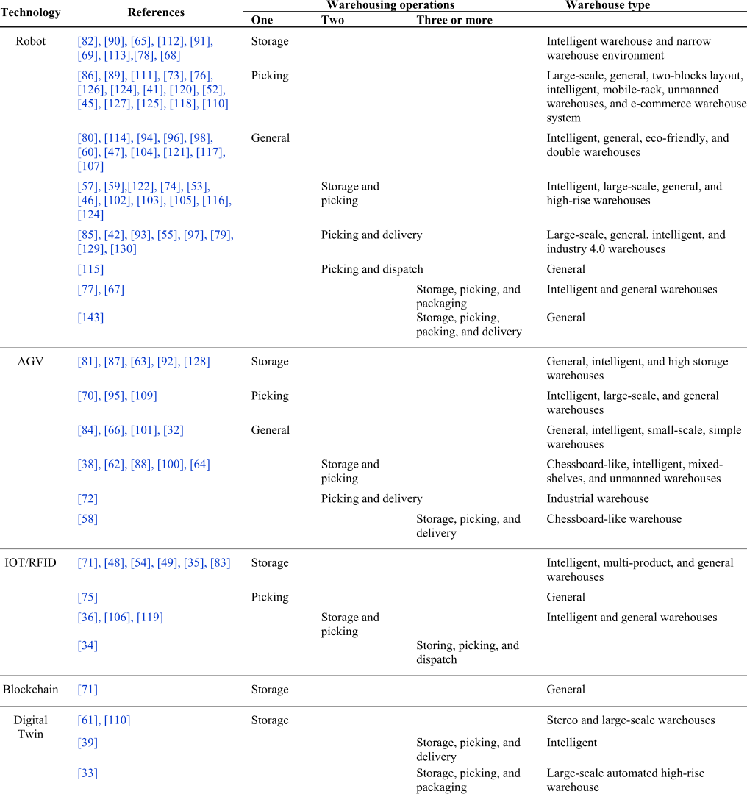

for optimization, leveraging real-time data to dynamically adjust inventory levels, predict stockouts, and optimize restocking strategies. This necessitates the development of models capable of managing current stock levels efficiently while integrating real-time demand forecasting and predictive analytics to enhance inventory accuracy and reduce costs. Furthermore, reverse logistics and returns management is

another area that has grown in importance with the surge in e-commerce [134]. The optimization of returns management, encompassing the sorting, inspection, restocking, or disposal of returned items, can significantly reduce operational costs, and enhance customer satisfaction. The integration of digital tracking systems, AI-driven sorting algorithms, and robotic processing can significantly enhance the optimization of

**TABLE 3.** Practical outcomes as depicted by the included case studies.

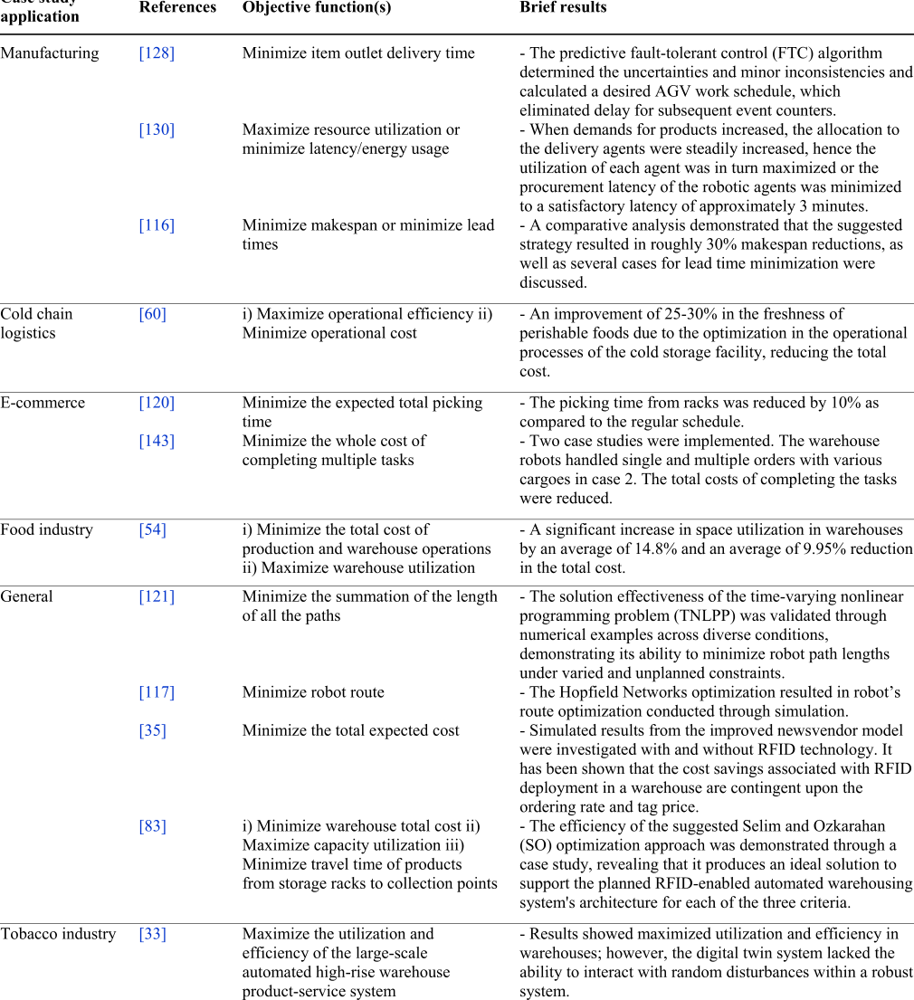

returns management. This area requires innovative optimization strategies to handle the complex logistics of returns in a cost-effective manner. Finally, the aspect of safety and ergonomics in warehouses, especially in environments where humans and robots collaborate, is critical. Developing optimization models that consider the layout and operation of warehouses to maximize safety and ergonomic benefits

for workers is essential. This includes creating safer work environments and reducing the risk of injury, which is paramount in automated and semi-automated warehousing systems.

To summarize, Table 4 presents potential research directions to address the identified gaps in the literature, aligning with the research questions posed earlier.

**TABLE 4.** Research gaps and alignment with research questions.

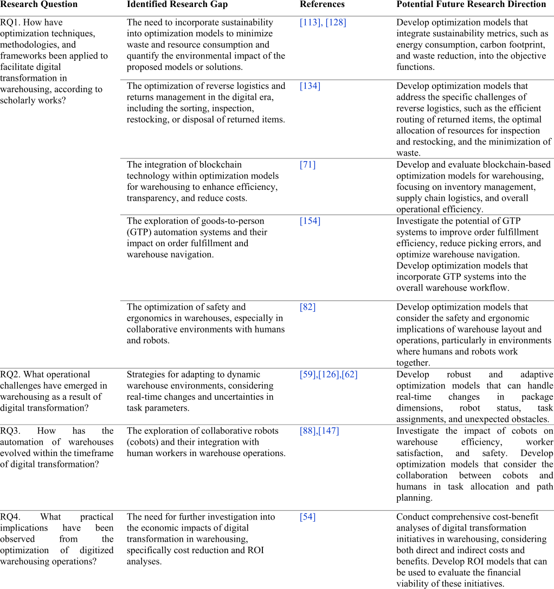

## **V. CONCLUSION**

This research highlights the transformative impact of digital technologies on the warehousing sector, particularly through the lens of optimization models. In the evolving digital era, warehousing operations are increasingly becoming complex and dynamic, necessitating innovative solutions to address these challenges. This study has traced the evolution of warehousing from traditional manual processes to highly

automated and intelligent systems, driven by advancements in technologies such as AGVs, IoT, RFID, robots, blockchain, and digital twins, among others. Such technologies have streamlined warehousing operations and introduced a level of efficiency and precision previously unattainable. This work aimed to explore the impact of digital transformation in warehousing, focusing on the deployment of optimization models from 2010 to 2023. Utilizing the PRISMA framework,

a systematic literature review was conducted to gather, analyze, and synthesize findings from relevant selected studies. Key findings include the significant role of aforementioned technologies in enhancing warehousing operations and shed light on the operational challenges that have emerged as a result of digital transformation as well as the practical implications observed. These advancements facilitate more efficient path planning, task allocation, and overall operational improvements, as evidenced by various case studies and modeling approaches detailed within the reviewed articles.

Despite the advancements, the review identified several research gaps and areas for future exploration. It highlighted the need for further investigation into the sustainability aspects of digital warehousing, the adaptation of warehousing operations to dynamic environments, the integration and impact of cobots, and the optimization of reverse logistics and returns management in the digital era. Moreover, it pointed out the lack of studies on the economic impacts, specifically cost reduction and ROI analyses, associated with digital transformation in warehousing. These gaps provide a solid foundation for future research, indicating a need for more comprehensive studies that explore these areas in depth, develop innovative optimization strategies, and test their practical applicability in real-world warehousing settings.

## **ACKNOWLEDGMENT**

This article represents the opinions of the authors and does not mean to represent the position or opinions of the American University of Sharjah.

## **REFERENCES**

- [1] M. H. Ali, N. Suleiman, N. Khalid, K. H. Tan, M.-L. Tseng, and M. Kumar, ‘‘Supply chain resilience reactive strategies for food SMEs in coping to COVID-19 crisis,’’ _Trends Food Sci. Technol._ , vol. 109, pp. 94–102, Mar. 2021, doi: 10.1016/j.tifs.2021.01.021.

- [2] J. T. Mentzer, W. DeWitt, J. S. Keebler, S. Min, N. W. Nix, C. D. Smith, and Z. G. Zacharia, ‘‘Defining supply chain management,’’ _J. Bus. Logistics_ , vol. 22, no. 2, pp. 1–25, Sep. 2001, doi: 10.1002/j.21581592.2001.tb00001.x.

- [3] M. Attaran, ‘‘Digital technology enablers and their implications for supply chain management,’’ _Supply Chain Forum, Int. J._ , vol. 21, no. 3, pp. 158–172, Jul. 2020, doi: 10.1080/16258312.2020.1751568.

- [4] Gartner. _Accelerate Supply Chain Digital Transformation_ . Accessed: Jul. 6, 2024. [Online]. Available: https://www.gartner.co.uk/en/supplychain/insights/supply-chain-digital-transformation

- [5] X. Chen, J. Bramel, and J. B. D. Simchi-Levi, _The Logic of Logistics.Theory, Algorithms, and Applications for Logistics and Supply Chain Management_ . Cham, Switzerland: Springer, 2005. [Online]. Available: http://www.springer.com/series/3182

- [6] R. H. Ballou, ‘‘Business logistics: Importance and some research opportunities,’’ _Gestão Produção_ , vol. 4, no. 2, pp. 117–129, Aug. 1997.

- [7] J. J. Bartholdi and S. T. Hackman, ‘‘Warehouse & distribution science: Release 0.96,’’ Supply Chain Logistics Inst., Atlanta, GA, USA, Tech. Rep., 2014. [Online]. Available: https://www.warehousescience.com

- [8] R. de Koster, T. Le-Duc, and K. J. Roodbergen, ‘‘Design and control of warehouse order picking: A literature review,’’ _Eur. J. Oper. Res._ , vol. 182, no. 2, pp. 481–501, Oct. 2007, doi: 10.1016/j.ejor.2006.07.009.

- [9] M. Napolitano, ‘‘Warehouse/DC operations survey: Mixed signals,’’ _Logistics Manage., Highlands Ranch, Colo.: 2002_ , vol. 51, no. 11, pp. 54–63, 2012.

- [10] J. W. Y. B. J. T. J. A. Tompkins, _Facilities Planning_ . Hoboken, NJ, USA: Wiley, 2010.

- [11] _Improving Warehouse Operations–digitally | McKinsey_ . [Online]. Available: https://www.mckinsey.com/capabilities/operations/our

- [12] R. Raja, V. S. Venkatachalam, R. Ruthramathi, and V. Sivakumar, ‘‘Digital technology advancement and innovations in warehouse operations,’’ _Int. J. Emerg. Knowl. Stud._ , vol. 2, no. 4, pp. 87–98, Apr. 2023. [Online]. Available: https://www.researchgate.net/publication/372591689

- [13] W. Hamdy, A. Al-Awamry, and N. Mostafa, ‘‘Warehousing 4.0: A proposed system of using node-red for applying Internet of Things in warehousing,’’ _Sustain. Futures_ , vol. 4, Apr. 2022, Art. no. 100069, doi: 10.1016/j.sftr.2022.100069.

- [14] X. Du, ‘‘Research on the artificial intelligence applied in logistics warehousing,’’ in _Proc. 2nd Int. Conf. Artif. Intell. Adv. Manuf._ , vol. 11. New York, NY, USA: Association for Computing Machinery, Oct. 2020, pp. 140–144, doi: 10.1145/3421766.3421798.

- [15] A. Khajepour, S. T. Mendez, M. Rushton, H. Jamshidianfar, R. Qi, A. Pazooki, L. Durali, and A. Soltani, ‘‘A warehousing robot: From concept to reality,’’ in _Cable-Driven Parallel Robots_ , S. Caro, A. Pott, and T. Bruckmann, Eds., Cham, Switzerland: Springer, 2023, pp. 397–406.

- [16] P. Maheshwari, S. Kamble, S. Kumar, A. Belhadi, and S. Gupta, ‘‘Digital twin-based warehouse management system: A theoretical toolbox for future research and applications,’’ _Int. J. Logistics Manage._ , vol. 35, no. 4, pp. 1073–1106, Jun. 2024, doi: 10.1108/ijlm-01-2023-0030.

- [17] S. N. Wahab, M. I. Hamzah, N. M. Sayuti, W. C. Lee, and S. Y. Tan, ‘‘Big data analytics adoption: An empirical study in the Malaysian warehousing sector,’’ _Int. J. Logistics Syst. Manage._ , vol. 40, no. 1, p. 121, Jan. 2021, doi: 10.1504/ijlsm.2021.117703.

- [18] A. Park and H. Li, ‘‘The effect of blockchain technology on supply chain sustainability performances,’’ _Sustainability_ , vol. 13, no. 4, p. 1726, Feb. 2021, doi: 10.3390/su13041726.

- [19] S. Kayapinar Kaya and E. Aycin, ‘‘An integrated interval type 2 fuzzy AHP and COPRAS-G methodologies for supplier selection in the era of industry 4.0,’’ _Neural Comput. Appl._ , vol. 33, no. 16, pp. 10515–10535, Aug. 2021, doi: 10.1007/s00521-021-05809-x.

- [20] H. Xiao, ‘‘Research on the influencing factors of digital transformation of logistics enterprises on supply chain management based on regression model,’’ in _Proc. IEEE 3rd Int. Conf. Social Sci. Intell. Manage. (SSIM)_ , vol. 56, Dec. 2023, pp. 291–293, doi: 10.1109/ssim59263.2023.10469657.

- [21] J. Kretschmer and P. Winkler, ‘‘Prospects and risks of digitalization in public relations research: Mapping recurrent narratives of a debate in fragmentation (2010–2022),’’ _J. Commun. Manage._ , vol. 28, no. 2, pp. 193–210, Nov. 2023, doi: 10.1108/jcom-02-2023-0020.

- [22] V. Borisova, K. Taymashanov, and T. Tasueva, ‘‘Digital warehousing as a leading logistics potential,’’ in _Sustainable Leadership for Entrepreneurs and Academics_ . Cham, Switzerland: Springer, 2019, pp. 279–287, doi: 10.1007/978-3-030-15495-0_29.

- [23] L. N. Tikwayo and T. N. D. Mathaba, ‘‘Applications of industry 4.0 technologies in warehouse management: A systematic literature review,’’ _Logistics_ , vol. 7, no. 2, p. 24, Apr. 2023, doi: 10.3390/logistics7020024.

- [24] A. A. Tubis and J. Rohman, ‘‘Intelligent warehouse in industry 4.0—Systematic literature review,’’ _Sensors_ , vol. 23, no. 8, p. 4105, Apr. 2023, doi: 10.3390/s23084105.

- [25] D. Tranfield, D. Denyer, and P. Smart, ‘‘Towards a methodology for developing evidence-informed management knowledge by means of systematic review,’’ _Brit. J. Manage._ , vol. 14, no. 3, pp. 207–222, Sep. 2003, doi: 10.1111/1467-8551.00375.

- [26] H. Marah and M. Challenger, ‘‘MADTwin: A framework for multi-agent digital twin development: Smart warehouse case study,’’ in _Annals of Mathematics and Artificial Intelligence_ . Cham, Switzerland: Springer, Jul. 2023, doi: 10.1007/s10472-023-09872-z.

- [27] J. Lydia, L. S. Vimalraj, R. Monisha, and R. Murugan, ‘‘Automated food grain monitoring system for warehouse using IoT,’’ _Meas., Sensors_ , vol. 24, Dec. 2022, Art. no. 100472, doi: 10.1016/j.measen.2022.100472.

- [28] B. Malysiak-Mrozek, J. Wieszok, W. Pedrycz, W. Ding, and D. Mrozek, ‘‘High-efficient fuzzy querying with HiveQL for big data warehousing,’’ _IEEE Trans. Fuzzy Syst._ , vol. 30, no. 6, pp. 1823–1837, Jun. 2022, doi: 10.1109/TFUZZ.2021.3069332.

- [29] B. K. Rai, ‘‘IoT based humidity and temperature control system for smart warehouse,’’ _Gazi Univ. J. Sci._ , vol. 36, no. 1, pp. 173–188, Mar. 2023, doi: 10.35378/gujs.993959.

- [30] N. Ramanathan, N. Vairagi, S. Parida, S. Tripathy, A. K. Sar, K. Mohanty, and A. Lakra, _Challenges of Warehouse Management Towards Smart Manufacturing_ . Hoboken, NJ, USA: Wiley, Apr. 2023, pp. 297–317, doi: 10.1002/9781119836780.ch12.

- [31] L. C. Smith, ‘‘Citation analysis,’’ Univ. Illinois, Urbana-Champaign, IL, USA, Tech. Rep., 1981, vol. 30, no. 1.

- [32] V. Digani, L. Sabattini, C. Secchi, and C. Fantuzzi, ‘‘Ensemble coordination approach in multi-AGV systems applied to industrial warehouses,’’ _IEEE Trans. Autom. Sci. Eng._ , vol. 12, no. 3, pp. 922–934, Jul. 2015, doi: 10.1109/TASE.2015.2446614.

- [33] J. Leng, D. Yan, Q. Liu, H. Zhang, G. Zhao, L. Wei, D. Zhang, A. Yu, and X. Chen, ‘‘Digital twin-driven joint optimisation of packing and storage assignment in large-scale automated high-rise warehouse product-service system,’’ _Int. J. Comput. Integr. Manuf._ , vol. 34, nos. 7–8, pp. 783–800, Aug. 2021, doi: 10.1080/0951192x.2019.1667032.

- [34] S. Alyahya, Q. Wang, and N. Bennett, ‘‘Application and integration of an RFID-enabled warehousing management system—A feasibility study,’’ _J. Ind. Inf. Integr._ , vol. 4, pp. 15–25, Dec. 2016, doi: 10.1016/j.jii.2016.08.001.

- [35] A. K. Biswal, M. Jenamani, and S. K. Kumar, ‘‘Warehouse efficiency improvement using RFID in a humanitarian supply chain: Implications for Indian food security system,’’ _Transp. Res. E, Logistics Transp. Rev._ , vol. 109, pp. 205–224, Jan. 2018, doi: 10.1016/j.tre.2017.11.010.

- [36] W. Zhou, S. Piramuthu, F. Chu, and C. Chu, ‘‘RFID-enabled flexible warehousing,’’ _Decis. Support Syst._ , vol. 98, pp. 99–112, Jun. 2017, doi: 10.1016/j.dss.2017.05.002.

- [37] J. H. Kembro, A. Norrman, and E. Eriksson, ‘‘Adapting warehouse operations and design to omni-channel logistics,’’ _Int. J. Phys. Distrib. Logistics Manage._ , vol. 48, no. 9, pp. 890–912, Sep. 2018, doi: 10.1108/ijpdlm-012017-0052.

- [38] Z. Zhang, J. Chen, and W. Zhao, ‘‘Multi-AGV route planning in automated warehouse system based on shortest-time Q-learning algorithm,’’ _Asian J. Control_ , vol. 26, no. 2, pp. 683–702, Mar. 2024, doi: 10.1002/asjc.3075.

- [39] Y.-M. Tang, G. T. S. Ho, Y.-Y. Lau, and S.-Y. Tsui, ‘‘Integrated smart warehouse and manufacturing management with demand forecasting in small-scale cyclical industries,’’ _Machines_ , vol. 10, no. 6, p. 472, Jun. 2022, doi: 10.3390/machines10060472.

- [40] A. Farinelli, N. Boscolo, E. Zanotto, and E. Pagello, ‘‘Advanced approaches for multi-robot coordination in logistic scenarios,’’ _Robot. Auto. Syst._ , vol. 90, pp. 34–44, Apr. 2017, doi: 10.1016/j.robot.2016.08.010.

- [41] K. Zhao, B. Xu, M. Lu, J. Shi, and Z. Li, ‘‘An efficient scheduling and navigation approach for warehouse multi-mobile robots,’’ in _Advances in Swarm Intelligence_ (Lecture Notes in Artificial Intelligence and Lecture Notes in Bioinformatics). Cham, Switzerland: Springer, 2022, pp. 45–55, doi: 10.1007/978-3-031-09726-3_5.

- [42] A. Agrawal, A. S. Bedi, and D. Manocha, ‘‘RTAW: An attention inspired reinforcement learning method for multi-robot task allocation in warehouse environments,’’ in _Proc. IEEE Int. Conf. Robot. Autom. (ICRA)_ , May 2023, pp. 1393–1399, doi: 10.1109/ICRA48891.2023. 10161310.

- [43] T. Yang and Y. Jiang, ‘‘Path planning for multiple robotic fish based on multi-objective cooperative co-evolution algorithm,’’ in _Proc. 10th Int. Conf. Comput. Sci. Educ. (ICCSE)_ , Jul. 2015, pp. 532–535, doi: 10.1109/ICCSE.2015.7250304.

- [44] A. Khamis, A. Hussein, and A. Elmogy, ‘‘Multi-robot task allocation: A review of the state-of-the-art,’’ in _Cooperative Robots and Sensor Networks_ . Cham, Switzerland: Springer, 2015, pp. 31–51, doi: 10.1007/978-3-319-18299-5_2.

- [45] Y. Mei, S. Li, C. Chen, and A. Han, ‘‘A multi-robot task allocation and path planning method for warehouse system,’’ in _Proc. 40th Chin. Control Conf. (CCC)_ , Jul. 2021, pp. 1911–1916, doi: 10.23919/CCC52363.2021.9549796.

- [46] Y. Shi, B. Hu, and R. Huang, ‘‘Task allocation and path planning of many robots with motion uncertainty in a warehouse environment,’’ in _Proc. IEEE Int. Conf. Real-time Comput. Robot. (RCAR)_ . Institute of Electrical and Electronics Engineers Inc., Jul. 2021, pp. 776–781, doi: 10.1109/RCAR52367.2021.9517433.

- [47] K. F. E. Tsang, Y. Ni, C. F. R. Wong, and L. Shi, ‘‘A novel warehouse multi-robot automation system with semi-complete and computationally efficient path planning and adaptive genetic task allocation algorithms,’’ in _Proc. 15th Int. Conf. Control, Autom., Robot. Vis. (ICARCV)_ , Nov. 2018, pp. 1671–1676, doi: 10.1109/ICARCV.2018.8581092.

- [48] P. Tripicchio, S. D’Avella, and M. Unetti, ‘‘Efficient localization in warehouse logistics: A comparison of LMS approaches for 3D multilateration of passive UHF RFID tags,’’ _Int. J. Adv. Manuf. Technol._ , vol. 120, nos. 7–8, pp. 4977–4988, Jun. 2022, doi: 10.1007/s00170-022-09018-1.

- [49] L. Yang, Y. Zheng, Y. Xu, and Y. Bai, ‘‘Research on location assignment model of intelligent warehouse with RFID and improved particle swarm optimization algorithm,’’ in _Proc. Int. Conf. Comput. Syst., Electron. Control (ICCSEC)_ , Dec. 2017, pp. 1262–1266, doi: 10.1109/ICCSEC.2017.8446952.

- [50] W. Haibin, W. Huibin, D. Huiguo, and L. Xia, ‘‘Research on location optimization of automated warehouse under the background of intelligent manufacturing,’’ _Academic J. Manuf. Eng._ , vol. 18, no. 1, pp. 1–10, 2020.

- [51] S. He, Y. Wang, and H. Liu, ‘‘Image information recognition and classification of warehoused goods in intelligent logistics based on machine vision technology,’’ _Traitement du Signal_ , vol. 39, no. 4, pp. 1275–1282, Aug. 2022, doi: 10.18280/ts.390420.

- [52] Z. Zhuang, Z. Huang, Y. Sun, and W. Qin, ‘‘Optimization for cooperative task planning of heterogeneous multi-robot systems in an order picking warehouse,’’ _Eng. Optim._ , vol. 53, no. 10, pp. 1715–1732, Oct. 2021, doi: 10.1080/0305215x.2020.1821198.

- [53] A. Bolu and Ö. Korçak, ‘‘Adaptive task planning for multi-robot smart warehouse,’’ _IEEE Access_ , vol. 9, pp. 27346–27358, 2021, doi: 10.1109/ACCESS.2021.3058190.

- [54] G. Zhang, X. Shang, F. Alawneh, Y. Yang, and T. Nishi, ‘‘Integrated production planning and warehouse storage assignment problem: An IoT assisted case,’’ _Int. J. Prod. Econ._ , vol. 234, Apr. 2021, Art. no. 108058, doi: 10.1016/j.ijpe.2021.108058.

- [55] A. Rjeb, J. P. Gayon, and S. Norre, ‘‘Sizing of a homogeneous fleet of robots in a logistics warehouse,’’ _IFAC-PapersOnLine_ , vol. 54, no. 1, pp. 552–557, 2021, doi: 10.1016/j.ifacol.2021.08.169.

- [56] K. Maity, ‘‘Several intelligent techniques to solve various warehouse problems in uncertain environment,’’ in _Intelligent Techniques in Engineering Management_ (Intelligent Systems Reference Library), vol. 87. Cham, Switzerland: Springer, 2015, pp. 669–722, doi: 10.1007/978-3319-17906-3_26.

- [57] R. Prakash, J. K. Mohanta, and L. Behera, ‘‘Closed form HJB solution for path planning of a robot manipulator with warehousing applications,’’ in _Proc. IEEE 18th Int. Conf. Autom. Sci. Eng. (CASE)_ , Aug. 2022, pp. 2049–2055, doi: 10.1109/CASE49997.2022.9926505.

- [58] Z. Zhang, J. Chen, and Q. Guo, ‘‘Application of automated guided vehicles in smart automated warehouse systems: A survey,’’ _Comput. Model. Eng. Sci._ , vol. 134, no. 3, pp. 1–10, 2022, doi: 10.32604/cmes.2022.0 21451.

- [59] S. Fu, J. Li, and Z.-H. Fu, ‘‘Cooperatively scheduling hundreds of fetch and freight robots in an autonomous warehouse,’’ in _Proc. IEEE Int. Conf. Real-time Comput. Robot. (RCAR)_ , Jul. 2022, pp. 469–474, doi: 10.1109/RCAR54675.2022.9872293.

- [60] B. M. Hung, S.-S. You, H.-S. Kim, and B. D. H. Phuc, ‘‘Robust operation of autonomous logistics vehicles in intelligent warehouse,’’ in _Proc. 6th IEEE Int. Conf. Adv. Logistics Transp. (ICALT)_ , Jul. 2017, pp. 19–24, doi: 10.1109/ICADLT.2017.8547036.

- [61] B. Hu, H. Guo, X. Tao, and Y. Zhang, ‘‘Construction of digital twin system for cold chain logistics stereo warehouse,’’ _IEEE Access_ , vol. 11, pp. 73850–73862, 2023, doi: 10.1109/ACCESS.2023.3295819.

- [62] W. Cheng and W. Meng, ‘‘An efficient genetic algorithm for multi AGV scheduling problem about intelligent warehouse,’’ _Robotic Intell. Autom._ , vol. 43, no. 4, pp. 382–393, Aug. 2023, doi: 10.1108/ria-10-20 22-0258.

- [63] C. Li and W. Wu, ‘‘Research on cooperative scheduling of AGV transportation and charging in intelligent warehouse system based on dynamic task chain,’’ in _Proc. IEEE Int. Conf. Netw., Sens. Control (ICNSC)_ , Dec. 2022, pp. 1–6, doi: 10.1109/ICNSC55942.2022.10004100.

- [64] Y. Liu, S. Ji, Z. Su, and D. Guo, ‘‘Multi-objective AGV scheduling in an automatic sorting system of an unmanned (intelligent) warehouse by using two adaptive genetic algorithms and a multi-adaptive genetic algorithm,’’ _PLoS ONE_ , vol. 14, no. 12, Dec. 2019, Art. no. e0226161, doi: 10.1371/journal.pone.0226161.

- [65] H. Luo, L. Wang, X. Yan, S. Bi, and Z. Li, ‘‘Seeker optimization algorithm based path planning of warehouse robot,’’ in _Proc. China Autom. Congr. (CAC)_ , Nov. 2022, pp. 3522–3527, doi: 10.1109/CAC57257.2022.10055742.

- [66] Y. Lian, W. Xie, and L. Zhang, ‘‘A probabilistic time-constrained based heuristic path planning algorithm in warehouse multi-AGV systems,’’ _IFAC-PapersOnLine_ , vol. 53, no. 2, pp. 2538–2543, 2020.

- [67] Z. Li, A. V. Barenji, J. Jiang, R. Y. Zhong, and G. Xu, ‘‘A mechanism for scheduling multi robot intelligent warehouse system face with dynamic demand,’’ _J. Intell. Manuf._ , vol. 31, no. 2, pp. 469–480, Feb. 2020, doi: 10.1007/s10845-018-1459-y.

- [68] X. Zhuang, G. Feng, H. Lv, H. Lv, H. Wang, L. Zhang, J. Lin, and M. Tang, ‘‘A collision-free path planning approach for multiple robots under warehouse scenarios,’’ in _Communications in Computer and Information Science_ . Cham, Switzerland: Springer, 2019, pp. 55–63, doi: 10.1007/978-981-13-6834-9_6.

- [69] J. Huo, R. Zheng, S. Zhang, and M. Liu, ‘‘Multi-robot path planning in narrow warehouse environments with fast feasibility heuristics,’’ in _Chin. Control Conf. (CCC)_ , Z. Li and J. Sun, Eds., Washington, DC, USA: IEEE Computer Society, 2022, pp. 1840–1845, doi: 10.23919/CCC55666.2022.9902480.

- [70] Y. Xi, N. B. Ahmad, and A. Al Mamun, ‘‘Research on improving e-commerce logistics service customer satisfaction through application of AGV in intelligent warehouse,’’ in _Proc. Int. Conf. Emerg. Technol. Intell. Syst._ , in Lecture Notes in Networks and Systems, Berlin, Germany. Springer, 2022, pp. 61–73, doi: 10.1007/978-3-030-85990-9_6.

- [71] J. Chen, S. Xu, K. Liu, S. Yao, X. Luo, and H. Wu, ‘‘Intelligent transportation logistics optimal warehouse location method based on Internet of Things and blockchain technology,’’ _Sensors_ , vol. 22, no. 4, p. 1544, Feb. 2022, doi: 10.3390/s22041544.

- [72] E. Hu, J. He, and S. Shen, ‘‘A dynamic integrated scheduling method based on hierarchical planning for heterogeneous AGV fleets in warehouses,’’ _Frontiers Neurorobotics_ , vol. 16, Jan. 2023, Art. no. 1053067, doi: 10.3389/fnbot.2022.1053067.

- [73] G. Pugliese, X. Chou, D. Loske, M. Klumpp, and R. Montemanni, ‘‘AMR-assisted order picking: Models for picker-to-parts systems in a two-blocks warehouse,’’ _Algorithms_ , vol. 15, no. 11, p. 413, Nov. 2022, doi: 10.3390/a15110413.

- [74] K. Sharma and R. Doriya, ‘‘Coordination of multi-robot path planning for warehouse application using smart approach for identifying destinations,’’ _Intell. Service Robot._ , vol. 14, no. 2, pp. 313–325, Apr. 2021, doi: 10.1007/s11370-021-00363-w.

- [75] H. Ma, J. Yang, and K. Wang, ‘‘A RFID based solution for managing the order-picking operation in warehouse,’’ in _Proc. Int. Workshop Adv. Manuf. Autom._ , in Lecture Notes in Electrical Engineering, 2018, pp. 413–419, doi: 10.1007/978-981-10-5768-7_44.

- [76] A. Balachandran, A. Lal, and P. Sreedharan, ‘‘Autonomous navigation of an AMR using deep reinforcement learning in a warehouse environment,’’ in _Proc. IEEE 2nd Mysore Sub Sect. Int. Conf. (MysuruCon)_ , Oct. 2022, pp. 1–5, doi: 10.1109/MysuruCon55714.2022.9971804.

- [77] H. Lee and J. Jeong, ‘‘Mobile robot path optimization technique based on reinforcement learning algorithm in warehouse environment,’’ _Appl. Sci._ , vol. 11, no. 3, p. 1209, Jan. 2021, doi: 10.3390/app11031209.

- [78] I. S. Peyas, Z. Hasan, M. R. R. Tushar, A. Musabbir, R. M. Azni, and S. Siddique, ‘‘Autonomous warehouse robot using deep Q-learning,’’ in _Proc. IEEE Region 10 Conf. (TENCON)_ , Dec. 2021, pp. 857–862, doi: 10.1109/TENCON54134.2021.9707256.

- [79] M. P. Li, P. Sankaran, M. E. Kuhl, R. Ptucha, A. Ganguly, and A. Kwasinski, ‘‘Task selection by autonomous mobile robots in a warehouse using deep reinforcement learning,’’ in _Proc. Winter Simul. Conf. (WSC)_ , Dec. 2019, pp. 680–689, doi: 10.1109/WSC40007.2019.9004792.

- [80] H. Liu and J. Liu, ‘‘Research on automatic path planning method of warehouse inspection robot,’’ _Appl. Artif. Intell._ , vol. 37, no. 1, Dec. 2023, Art. no. 2252262, doi: 10.1080/08839514.2023.2252262.

- [81] S. Lin, A. Liu, J. Wang, and X. Kong, ‘‘An intelligence-based hybrid PSO-SA for mobile robot path planning in warehouse,’’ _J. Comput. Sci._ , vol. 67, Mar. 2023, Art. no. 101938, doi: 10.1016/j.jocs.2022.101938.

- [82] Y. Chen, J. Wu, C. He, and S. Zhang, ‘‘Intelligent warehouse robot path planning based on improved ant colony algorithm,’’ _IEEE Access_ , vol. 11, pp. 12360–12367, 2023, doi: 10.1109/ACCESS.2023.3241960.

- [83] A. Mohammed, Q. Wang, S. Alyahya, and N. Bennett, ‘‘Design and optimization of an RFID-enabled automated warehousing system under uncertainties: A multi-criterion fuzzy programming approach,’’ _Int. J. Adv. Manuf. Technol._ , vol. 91, nos. 5–8, pp. 1661–1670, Jul. 2017, doi: 10.1007/s00170-016-9792-9.

- [84] S. Ishihara, M. Kanai, R. Narikawa, and T. Ohtsuka, ‘‘A proposal of path planning for robots in warehouses by model predictive control without using global paths,’’ _IFAC-PapersOnLine_ , vol. 55, no. 37, pp. 573–578, 2022, doi: 10.1016/j.ifacol.2022.11.244.

- [85] B. Li and H. Ma, ‘‘Double-deck multi-agent pickup and delivery: Multirobot rearrangement in large-scale warehouses,’’ _IEEE Robot. Autom. Lett._ , vol. 8, no. 6, pp. 3701–3708, Jun. 2023, doi: 10.1109/LRA.2023. 3272272.

- [86] R. Galati and G. Mantriota, ‘‘Path following for an omnidirectional robot using a non-linear model predictive controller for intelligent warehouses,’’ _Robotics_ , vol. 12, no. 3, p. 78, May 2023, doi: 10.3390/robotics12030078.

- [87] W. Guo and S. Li, ‘‘Intelligent path planning for AGV-UAV transportation in 6G smart warehouse,’’ _Mobile Inf. Syst._ , vol. 2023, pp. 1–10, May 2023, doi: 10.1155/2023/4916127.

- [88] L. Xie, H. Li, and L. Luttmann, ‘‘Formulating and solving integrated order batching and routing in multi-depot AGV-assisted mixed-shelves warehouses,’’ _Eur. J. Oper. Res._ , vol. 307, no. 2, pp. 713–730, Jun. 2023, doi: 10.1016/j.ejor.2022.08.047.

- [89] P. Li and J. Zhao, ‘‘Optimal path allocation of robot based on modern logistics warehouse,’’ in _Proc. 5th Int. Conf. E-Bus., Inf. Manage. Comput. Sci._ , vol. 2017, R. Y. M. Li, J. S. Baker, V. Chigrinov, and S. Femmam, Eds., Dec. 2022, pp. 378–383, doi: 10.1145/3584748.3584812.

- [90] X. Gong, ‘‘Optimization algorithm of logistics warehousing and distribution path based on artificial intelligence technology,’’ in _Proc. Int. Symp. Adv. Info., Electron. Educ. (ISAIEE)_ , Dec. 2022, pp. 371–375, doi: 10.1109/ISAIEE57420.2022.00083.

- [91] Y. Lian, Q. Yang, Y. Liu, and W. Xie, ‘‘A spatio-temporal constrained hierarchical scheduling strategy for multiple warehouse mobile robots under industrial cyber–physical system,’’ _Adv. Eng. Informat._ , vol. 52, Apr. 2022, Art. no. 101572, doi: 10.1016/j.aei.2022.101572.

- [92] F. Men, J. Guo, and Y. Luan, ‘‘IoT warehouse management system based on ACO path planning,’’ in _Proc. IEEE 5th Int. Conf. Electron. Technol. (ICET)_ , May 2022, pp. 1008–1013, doi: 10.1109/ICET55676.2022.9824705.

- [93] Z. Liu, H. Wang, H. Wei, M. Liu, and Y.-H. Liu, ‘‘Prediction, planning, and coordination of thousand-warehousing-robot networks with motion and communication uncertainties,’’ _IEEE Trans. Autom. Sci. Eng._ , vol. 18, no. 4, pp. 1705–1717, Oct. 2021, doi: 10.1109/TASE.2020.3015110.

- [94] Y. Lian, W. Xie, Q. Yang, L. Zhang, D. Lin, and Y. Zhou, ‘‘A novel multi-warehouse mobile robot hierarchical scheduling strategy based on industrial cyber-physical system,’’ in _Proc. 4th IEEE Int. Conf. Ind. Cyber-Phys. Syst. (ICPS)_ , May 2021, pp. 263–269, doi: 10.1109/ICPS49255.2021.9468144.

- [95] X. Wu, M. X. Zhang, and Y. J. Zheng, ‘‘An intelligent algorithm for AGV scheduling in intelligent warehouses,’’ in _Advances in Swarm Intelligence_ (Lecture Notes in Computer Science). Cham, Switzerland: Springer, 2021, pp. 163–173, doi: 10.1007/978-3-030-78743-1_15.

- [96] Q. Xue, Z. Hou, H. Ma, X. Ju, H. Zhu, and Y. Sun, ‘‘Research on path planning optimization of intelligent robot in warehouse fire fighting scene,’’ in _Artificial Intelligence for Communications and Networks_ (Lecture Notes of the Institute for Computer Sciences, Social Informatics and Telecommunications Engineering). Cham, Switzerland: Springer, 2021, pp. 41–51.

- [97] M.-K. Ng, Y.-W. Chong, K.-M. Ko, Y.-H. Park, and Y.-B. Leau, ‘‘Adaptive path finding algorithm in dynamic environment for warehouse robot,’’ _Neural Comput. Appl._ , vol. 32, no. 17, pp. 13155–13171, Sep. 2020, doi: 10.1007/s00521-020-04764-3.

- [98] Y.-T. Liu, R.-Z. Sun, T.-Y. Zhang, X.-N. Zhang, L. Li, and G.-Q. Shi, ‘‘Warehouse-oriented optimal path planning for autonomous mobile firefighting robots,’’ _Secur. Commun. Netw._ , vol. 2020, pp. 1–13, Jun. 2020, doi: 10.1155/2020/6371814.

- [99] U. K. Latif and S. Y. Shin, ‘‘OP-MR: The implementation of order picking based on mixed reality in a smart warehouse,’’ _Vis. Comput._ , vol. 36, no. 7, pp. 1491–1500, Jul. 2020, doi: 10.1007/s00371-019-01745-z.

- [100] Y. Yang, J. Zhang, Y. Liu, and X. Song, ‘‘Multi-AGV collision avoidance path optimization for unmanned warehouse based on improved ant colony algorithm,’’ in _Communications in Computer and Information Science_ . Cham, Switzerland: Springer, 2020, pp. 527–537, doi: 10.1007/978-98115-3425-6_41.

- [101] A. K. Pamosoaji and S. P. Raflesia, ‘‘Ant colony optimization-based multiple-AGV route-and-velocity planning for warehouse operations,’’ in _IMEC-APCOMS 2019_ (Lecture Notes in Mechanical Engineering). Cham, Switzerland: Springer, 2020, pp. 224–229, doi: 10.1007/978-98115-0950-6_35.

- [102] B. Yang, W. Li, J. Wang, J. Yang, T. Wang, and X. Liu, ‘‘A novel path planning algorithm for warehouse robots based on a two-dimensional grid model,’’ _IEEE Access_ , vol. 8, pp. 80347–80357, 2020, doi: 10.1109/ACCESS.2020.2991076.

- [103] L. Haiming, L. Weidong, Z. Mei, and C. An, ‘‘Algorithm of path planning based on time window for multiple mobile robots in warehousing system,’’ in _Proc. Chin. Control Conf. (CCC)_ , Jul. 2019, pp. 2193–2199, doi: 10.23919/ChiCC.2019.8866325.

- [104] H. Chen, Q. Wang, M. Yu, J. Cao, and J. Sun, ‘‘Path planning for multi-robot systems in intelligent warehouse,’’ in _Internet and Distributed Computing Systems_ , Y. Xiang, J. Sun, G. Fortino, A. Guerrieri, and J. J. Jung, Eds., Cham, Switzerland: Springer, 2018, pp. 148–159.

- [105] J. Dou, C. Chen, and P. Yang, ‘‘Genetic scheduling and reinforcement learning in multirobot systems for intelligent warehouses,’’ _Math. Problems Eng._ , no. 1, pp. 1–10, 2015, doi: 10.1155/2015/597956.

- [106] Y.-C. Zhou, Y.-F. Dong, H.-M. Xia, and J.-H. Gu, ‘‘Routing optimization of intelligent vehicle in automated warehouse,’’ _Discrete Dyn. Nature Soc._ , no. 1, 2014, Art. no. 789754, doi: 10.1155/2014/789754.

- [107] S. Mahalakshmi, A. Arokiasamy, and J. F. A. Ahamed, ‘‘Productivity improvement of an eco friendly warehouse using multi objective optimal robot trajectory planning,’’ _Int. J. Productiv. Quality Manage._ , vol. 27, no. 3, p. 305, Jan. 2019, doi: 10.1504/ijpqm.2019.101517.

- [108] F. Xue, T. Dong, and Z. Qi, ‘‘An improving clustering algorithm for order batching of e-commerce warehouse system based on logistics robots,’’ _Int. J. Wireless Mobile Comput._ , vol. 15, no. 1, p. 10, Jan. 2018, doi: 10.1504/ijwmc.2018.094633.

- [109] Y. Zhang, J. Luo, X. Cai, Y. Chen, E. Peng, and X. Zou, ‘‘AGV path planning for logistics warehouse by using an improved D*Lite algorithm,’’ in _Proceedings of TEPEN 2022_ (Mechanisms and Machine Science), H. Zhang, Y. Ji, T. Liu, X. Sun, and A. D. Ball, Eds., Cham, Switzerland: Springer, 2023, pp. 1018–1027.

- [110] J. S. Félix-Cigalat and R. Domingo, ‘‘Towards a digital twin warehouse through the optimization of internal transport,’’ _Appl. Sci._ , vol. 13, no. 8, p. 4652, Apr. 2023, doi: 10.3390/app13084652.

- [111] T. Likhouzova and Y. Demianova, ‘‘Robot path optimization in warehouse management system,’’ _Evol. Intell._ , vol. 15, no. 4, pp. 2589–2595, Dec. 2022, doi: 10.1007/s12065-021-00614-w.

- [112] H. Luo, L. Wang, Y. Xu, Z. Li, and S. Bi, ‘‘Improved seeker optimization algorithm of robot path optimization in warehouse system,’’ in _Proc. Int. Conf. Adv. Mech. Syst. (ICAMechS)_ , Dec. 2022, pp. 5–9, doi: 10.1109/ICAMechS57222.2022.10003403.

- [113] P. Dobos, Á. Cservenák, R. Skapinyecz, B. Illés, and P. Tamás, ‘‘Development of an industry 4.0-based analytical method for the value stream centered optimization of demand-driven warehousing systems,’’ _Sustainability_ , vol. 13, no. 21, p. 11914, Oct. 2021, doi: 10.3390/su132111914.

- [114] J. Ma, S. Yang, and H. Jing, ‘‘Intelligent warehouse robot scheduling system using a modified nondominated sorting algorithm,’’ _Discrete Dyn. Nature Soc._ , vol. 2022, no. 1, Jan. 2022, Art. no. 2021535, doi: 10.1155/2022/2021535.

- [115] Y. Ono and G. Ishigami, ‘‘Routing problem of multiple mobile robots with human workers for pickup and dispatch tasks in warehouse,’’ in _Proc. IEEE/SICE Int. Symp. Syst. Integr. (SII)_ , Jan. 2019, pp. 176–181, doi: 10.1109/SII.2019.8700428.

- [116] C. Schoppmeyer, S. Subbiah, J. M. De L. F. Valdès, and S. Engell, ‘‘Dynamic scheduling of shuttle robots in the warehouse of a polymer plant based on dynamically configured timed automata models,’’ _Ind. Eng. Chem. Res._ , vol. 53, no. 44, pp. 17135–17154, Nov. 2014, doi: 10.1021/ie500437r.

- [117] K. Miyazaki and S. Matsuda, ‘‘Robot planning by cooperation of Hopfield networks–A case of warehouse keeper puzzle (sokoban) -,’’ in _Proc. Int. Joint Conf. Neural Netw. (IJCNN)_ , Jul. 2010, pp. 1–6, doi: 10.1109/IJCNN.2010.5596723.

- [118] A. K. Sandula, P. Biswas, A. Khokhar, and D. Ghose, ‘‘Multi-armed bandit approach for task scheduling of a fixed-base robot in the warehouse,’’ _Stud. Comput. Intell._ , vol. 1093, pp. 271–301, May 2023, doi: 10.1007/978-3-031-28715-2_9.

- [119] F. Ballestín, Á. Pérez, P. Lino, S. Quintanilla, and V. Valls, ‘‘Static and dynamic policies with RFID for the scheduling of retrieval and storage warehouse operations,’’ _Comput. Ind. Eng._ , vol. 66, no. 4, pp. 696–709, Dec. 2013, doi: 10.1016/j.cie.2013.09.020.

- [120] Z. Wang, J. B. Sheu, C. P. Teo, and G. Xue, ‘‘Robot scheduling for mobilerack warehouses: Human-robot coordinated order picking systems,’’ in _Production and Operations Management_ . Hoboken, NJ, USA: Wiley, Jan. 2022, pp. 98–116, doi: 10.1111/poms.13406.

- [121] Y. Ma, H. Wang, Y. Xie, and M. Guo, ‘‘Path planning for multiple mobile robots under double-warehouse,’’ _Inf. Sci._ , vol. 278, pp. 357–379, Sep. 2014, doi: 10.1016/j.ins.2014.03.058.

- [122] Y. Liu, F. Liu, L. Tang, C. Bai, and L. Liu, ‘‘Multirobot adaptive task allocation of intelligent warehouse based on evolutionary strategy,’’ _J. Sensors_ , vol. 2022, pp. 1–9, Apr. 2022, doi: 10.1155/2022/20 56617.

- [123] X. Jing and Z. Cui, ‘‘An optimization task scheduling model for multi-robot systems in intelligent warehouses,’’ in _Communications in Computer and Information Science_ . Cham, Switzerland: Springer, 2022, pp. 3–17, doi: 10.1007/978-981-19-1256-6_1.

- [124] L. Zhou, Y. Shi, J. Wang, and P. Yang, ‘‘A balanced heuristic mechanism for multirobot task allocation of intelligent warehouses,’’ _Math. Problems Eng._ , vol. 2014, pp. 1–10, Jul. 2014, doi: 10.1155/2014/3 80480.

- [125] F. Xue, H. Tang, Q. Su, and T. Li, ‘‘Task allocation of intelligent warehouse picking system based on multi-robot coalition,’’ _KSII Trans. Internet Inf. Syst._ , vol. 13, no. 7, pp. 3566–3582, Jul. 2019, doi: 10.3837/tiis.2019.07.013.

- [126] J. Gao, Y. Li, Y. Xu, and S. Lv, ‘‘A two-objective ILP model of OP-MATSP for the multi-robot task assignment in an intelligent warehouse,’’ _Appl. Sci._ , vol. 12, no. 10, p. 4843, May 2022, doi: 10.3390/app12104843.

- [127] H. Jiang, ‘‘Solving multi-robot picking problem in warehouses: A simulation approach,’’ _Int. J. Simul. Model._ , vol. 19, no. 4, pp. 701–712, Dec. 2020, doi: 10.2507/ijsimm19-4-co19.

- [128] M. Witczak, P. Majdzik, R. Stetter, and B. Lipiec, ‘‘Multiple AGV fault-tolerant within an agile manufacturing warehouse,’’ _IFACPapersOnLine_ , vol. 52, no. 13, pp. 1914–1919, Sep. 2019, doi: 10.1016/j.ifacol.2019.11.482.

- [129] A. Kattepur, H. Rath, A. Mukherjee, and A. Simha, ‘‘Distributed optimization framework for industry 4.0 automated warehouses,’’ _EAI Endorsed Trans. Ind. Netw. Intell. Syst._ , vol. 5, no. 15, Sep. 2018, Art. no. 155237, doi: 10.4108/eai.27-6-2018.155237.

- [130] A. Kattepur, H. K. Rath, A. Simha, and A. Mukherjee, ‘‘Distributed optimization in multi-agent robotics for industry 4.0 warehouses,’’ in _Proc. 33rd Annu. ACM Symp. Appl. Comput._ , vol. 91, Apr. 2018, pp. 808–815, doi: 10.1145/3167132.3167221.

- [131] S. Kumar, W.-X. Ma, and A. Kumar, ‘‘Lie symmetries, optimal system and group-invariant solutions of the (3+1)-dimensional generalized KP equation,’’ _Chin. J. Phys._ , vol. 69, pp. 1–23, Feb. 2021, doi: 10.1016/j.cjph.2020.11.013.

- [132] C. H. Glock, E. H. Grosse, W. P. Neumann, and A. Feldman, ‘‘Assistive devices for manual materials handling in warehouses: A systematic literature review,’’ _Int. J. Prod. Res._ , vol. 59, no. 11, pp. 3446–3469, Jun. 2021, doi: 10.1080/00207543.2020.1853845.

- [133] K. Azadeh, R. De Koster, and D. Roy, ‘‘Robotized and automated warehouse systems: Review and recent developments,’’ _Transp. Sci._ , vol. 53, no. 4, pp. 917–945, Jul. 2019, doi: 10.1287/trsc.2018.0873.

- [134] A. Dhaliwal. (2021). _Reinventing Logistics: Use of AI & Robotics Technologies, Bus. Research and Innovation_ . [Online]. Available: https://www.groupexcelindia.com

- [135] M. Löffler, N. Boysen, and M. Schneider, ‘‘Picker routing in AGV-assisted order picking systems,’’ _INFORMS J. Comput._ , vol. 34, no. 1, pp. 440–462, Jan. 2022, doi: 10.1287/ijoc.2021.1060.

- [136] E. Prati, M. Peruzzini, M. Pellicciari, and R. Raffaeli, ‘‘How to include user experience in the design of human–robot interaction,’’ _Robot. Comput.-Integr. Manuf._ , vol. 68, Apr. 2021, Art. no. 102072, doi: 10.1016/j.rcim.2020.102072.

- [137] L. Custodio and R. Machado, ‘‘Flexible automated warehouse: A literature review and an innovative framework,’’ _Int. J. Adv. Manuf. Technol._ , vol. 106, nos. 1–2, pp. 533–558, Jan. 2020, doi: 10.1007/s00170-01904588-z.

- [138] G. Fragapane, R. de Koster, F. Sgarbossa, and J. O. Strandhagen, ‘‘Planning and control of autonomous mobile robots for intralogistics: Literature review and research agenda,’’ _Eur. J. Oper. Res._ , vol. 294, no. 2, pp. 405–426, Oct. 2021, doi: 10.1016/j.ejor.2021.01.019.

- [139] P. Fager, F. Sgarbossa, and M. Calzavara, ‘‘Cost modelling of onboard cobot-supported item sorting in a picking system,’’ _Int. J. Prod. Res._ , vol. 59, no. 11, pp. 3269–3284, Jun. 2021, doi: 10.1080/00207543.2020.1854484.

- [140] L. Atzori, A. Iera, and G. Morabito, ‘‘The Internet of Things: A survey,’’ _Comput. Netw._ , vol. 54, no. 15, pp. 2787–2805, Oct. 2010, doi: 10.1016/j.comnet.2010.05.010.

- [141] A. R. Santhi and P. Muthuswamy, ‘‘Influence of blockchain technology in manufacturing supply chain and logistics,’’ _Logistics_ , vol. 6, no. 1, p. 15, Feb. 2022, doi: 10.3390/logistics6010015.

- [142] Q. Qi, F. Tao, T. Hu, N. Anwer, A. Liu, Y. Wei, L. Wang, and A. Y. C. Nee, ‘‘Enabling technologies and tools for digital twin,’’ _J. Manuf. Syst._ , vol. 58, pp. 3–21, Jan. 2021, doi: 10.1016/j.jmsy.2019.10.001.

- [143] S. Hao, Z. Huang, L. Wang, R. Zhang, X. Zhang, J. Peng, and W. Yu, ‘‘An optimal task decision method for a warehouse robot with multiple tasks based on linear temporal logic,’’ in _Proc. IEEE Int. Conf. Syst., Man, Cybern. (SMC)_ , Oct. 2017, pp. 1453–1458, doi: 10.1109/SMC.2017.8122818.

- [144] McKinsey. (Apr. 30, 2021). _Succeeding in the AI Supply-chain Revolution McKinsey_ . [Online]. Available: https://www.mckinsey.com/ industries/metals-and-mining/our-insights/succeeding-in-the-ai-supplychain-revolution

- [145] E. Demaitre. (2024). _Warehouse Associates Report Improving Working Conditions Amid Labor Shortage, Finds Zebra Study_ . Robot. 24/7. Accessed: Jul. 6, 2024. [Online]. Available: https://www.robotics247. com/article/warehouse_associates_report__working_conditions_amid_la bor_shortage_finds_zebra_study

- [146] I. Tung, N. Marquez, and P. K. Sonn. (Jan. 2024). _Amazon’s Outsized Role: The Injury Crisis in U.S. Warehouses and a Policy Roadmap To Protect Workers_ . Nat. Employment Law Project. Accessed: Jul. 6, 2024. [Online]. Available: https://www.nelp.org/insights-research/ amazons-outsized-role-the-injury-crisis-in-u-s-warehouses-and-apolicy-roadmap-to-protect-workers/

- [147] A. A. Kumar, U. K. Uz Zaman, and P. Plapper, ‘‘Collaborative robots,’’ in _Handbook of Manufacturing Systems and Design: An Industry 4.0 Perspective_ . Boca Raton, FL, USA: CRC Press, 2023, pp. 90–106, doi: 10.1201/9781003327523-8.

- [148] E. Boz and A. R. F. Pinto, _Evaluation of Logistics 5.0 Vs. Logistics 4.0_ . Hershey, PA, USA: IGI Global, 2023, pp. 163–184, doi: 10.4018/979-83693-0159-3.ch009.

- [149] M. Trstenjak, T. Opetuk, G. Dukić, and H. Cajner, ‘‘Logistics 5.0 implementation model based on decision support systems,’’ _Sustainability_ , vol. 14, no. 11, p. 6514, May 2022, doi: 10.3390/su14116514.

- [150] R. Fornasiero and A. Zangiacomi, ‘‘Reshaping the supply chain for society 5.0,’’ in _Proc. IFIP Adv. Inf. Commun. Technol._ , Jan. 2021, pp. 663–670, doi: 10.1007/978-3-030-85906-0_72.

- [151] S. Nayeri, Z. Sazvar, and J. Heydari, ‘‘Towards a responsive supply chain based on the industry 5.0 dimensions: A novel decision-making method,’’ _Expert Syst. Appl._ , vol. 213, Mar. 2023, Art. no. 119267, doi: 10.1016/j.eswa.2022.119267.

- [152] S. Nayeri, Z. Sazvar, and J. Heydari, ‘‘Designing an IoT-enabled supply chain network considering the perspective of the fifth industrial revolution: Application in the medical devices industry,’’ _Eng. Appl. Artif. Intell._ , vol. 122, Jun. 2023, Art. no. 106113, doi: 10.1016/j.engappai.2023.106113.

- [153] G. Nagy, Á. Bányainé Tóth, B. Illés, and A. K. Varga, ‘‘The impact of increasing digitization on the logistics sector and logistics service providers,’’ _Multidiszciplináris Tudományok_ , vol. 13, no. 4, pp. 19–29, Dec. 2023, doi: 10.35925/j.multi.2023.4.3.

- [154] J. T. Licardo, M. Domjan, and T. Orehovač ki, ‘‘Intelligent robotics—A systematic review of emerging technologies and trends,’’ _Electronics_ , vol. 13, no. 3, p. 542, Jan. 2024, doi: 10.3390/electronics13030542.

NADIN ALHERIMI received the B.Sc. degree in industrial engineering and engineering management and the M.Sc. degree in engineering management from the University of Sharjah. She is currently pursuing the Ph.D. degree in engineering systems management program with the American University of Sharjah (AUS). She was a Research Assistant with the Sustainable Engineering Asset Management (SEAM) Research Group, Research Institute of Science and Engineering (RISE), University of Sharjah. She is a Graduate Research/Teaching Assistant with AUS. In addition, she had her internship training in Factory (Quality Control), Supply Chain, and Estimation in NAFFCO FZCO, Dubai. Her research interests include supply chain management, logistics, Industry 4.0, sustainability, quality engineering, and lean six sigma.

AFEF SAIHI received the Engineering degree in telecommunications from the Higher School of Communication of Tunisia (SUP’COM) and the Ph.D. degree in engineering systems management from the American University of Sharjah (AUS). She is currently a Postdoctoral Researcher with the Industrial Engineering Department, AUS. She published several articles in reputable international journals and presented her research work in prestigious conferences. Her research interests include supply chain management, maintenance management, sustainable performance evaluation, digital transformation, and innovation management.

MOHAMED BEN-DAYA received the Ph.D. degree in operations research from Georgia Institute of Technology, in 1988. He is currently an Industrial Engineering Professor with the American University of Sharjah. He has published more than 100 papers in refereed journals and conference proceedings. He has co-edited several books on maintenance engineering and optimization and co-authored a textbook on maintenance engineering published by Wiley. His research interests include production planning, maintenance and quality control, and supply chain management. He is a Co-Founder and an Associate Editor of _Journal of Quality in Maintenance Engineering_ (Emerald) and an Associate Editor of _Information Systems and Operational Research_ journal.
