Received 15 August 2025, accepted 13 October 2025, date of publication 17 October 2025, date of current version 24 October 2025. _Digital Object Identifier 10.1109/ACCESS.2025.3622748_

# A Systematic Literature Review on Few-Shot Image Classification

## QI QIAO 1,2, SHENGGUO GE 1, KE WANG 1, AND HUIYING HU 2

1Faculty of Computer and Communication, Jiangsu Vocational College of Electronics and Information, Huaian 223001, China

2Faculty of Computer and Mathematical Sciences, Universiti Teknologi MARA, Shah Alam, Selangor 40450, Malaysia

Corresponding authors: Shengguo Ge (geshengguo@gmail.com) and Huiying Hu (2021443028@student.uitm.edu.my)

This work was supported in part by the National Teacher Innovation Team of China under Grant 202309, in part by the Qing Lan Project of Jiangsu Province for Universities, and in part by the Industry-University-Research Collaboration Project of Jiangsu Province under Grant BY20231023.

**ABSTRACT** Few-shot image classification (FSIC) is a critical task in computer vision that aims to accurately classify new categories with only a limited number of labeled examples. This capability is essential for practical applications such as medical diagnosis, remote sensing, and autonomous driving, where data scarcity is common. Although numerous FSIC methods have been proposed, a comprehensive systematic literature review (SLR) remains absent. This review begins by summarizing foundational FSIC approaches and evaluating their effectiveness across standard benchmarks. It then explores recent advancements from 2019 to 2025, providing an in-depth analysis of key factors affecting FSIC performance, including dataset characteristics, model architecture, and evaluation protocols. Following the Preferred Reporting Items for Systematic Reviews and Meta-Analyses (PRISMA) guidelines, multiple academic databases were searched, resulting in the selection of 26 relevant studies based on strict inclusion and exclusion criteria. The findings highlight that FSIC performance is strongly influenced by factors such as the number of support samples, domain shifts, label noise, and model complexity. Finally, the review identifies future research directions, emphasizing the integration of domain adaptation, lightweight model design, and multimodal learning, while addressing current challenges to guide the next phase of FSIC development.

**INDEX TERMS** FSIC, systematic review, model generalization, cross-domain transfer, self-supervised learning, lightweight models.

## **I. INTRODUCTION**

FSIC has emerged as a critical research area in computer vision, aiming to classify images with only a few labeled examples per class [1], [2]. This challenge contrasts with traditional deep learning models that require large scale labeled datasets for effective performance [3]. The increasing demand for intelligent systems capable of learning from limited data, such as in medical imaging [4], [5], wildlife monitoring [6], and rare object detection [7], has driven intensive research interest in FSIC over the past decade [8]. Early solutions to FSIC leveraged metric-based learning approaches, where a neural network is trained to

compare image embeddings and measure similarity. Notable frameworks include Matching Networks [9], Prototypical Networks [10], and Relation Networks [11], which use episodic training to simulate few shot tasks during model optimization. These methods laid the foundation for meta learning, which has since become a dominant paradigm in FSIC research [9], [10]. Finn et al. [12] proposed model agnostic meta learning (MAML), which trains models to quickly adapt to new tasks using only a small number of gradient updates. Variants such as Meta-SGD [13], Reptile [14], and Latent Embedding Optimization (LEO) [15] further expanded this line of work.

Recent methods use auxiliary information and feature augmentation to boost performance in low-data settings. Approaches such as CrossTransformers [16] and FEAT [17]

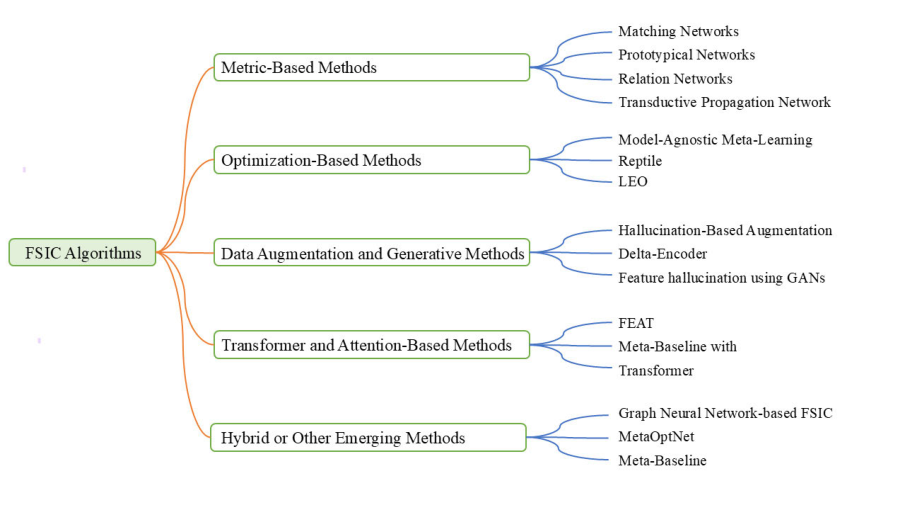

**FIGURE 1.** The classification of FSIC methods.

introduce attention mechanisms to better capture relational features among support and query examples. Transformerbased models [18], [19] have shown strong generalization capabilities for FSIC, benefiting from multi-head attention and global context modeling. Furthermore, generative models [20] and self-supervised learning [21], [22] have gained traction as means to alleviate the scarcity of labeled data, offering robust representations through unsupervised pretraining. Contrastive learning [23] and multi-modal alignment methods [24] have also been explored to enhance cross-domain generalization.

Despite remarkable progress, FSIC still faces challenges including generalization to unseen domains [25], [26], sensitivity to class imbalance [27], and overfitting in extreme few-shot settings [27]. Additionally, the performance of FSIC methods often varies significantly across benchmarks such as miniImageNet [28], tieredImageNet [29], CUB-200 [30], and Meta-Dataset [31], highlighting the importance of standardized evaluation protocols [32]. This review systematically surveys and categorizes existing FSIC methods into metricbased, optimization-based, data augmentation, and hybrid strategies. It further analyzes benchmark datasets, evaluation protocols, and emerging trends, offering insights into future directions such as domain adaptation [1], multimodal learning [33], and foundation model fine-tuning [10] in few-shot scenarios.

## **II. PREVIOUS STUDIES**

As shown in Figure 1, existing methods can be categorized into five categories: metric learning, optimization-driven, data augmentation and generation, Transformerand

attention-based, and hybrid or emerging methods. This section reviews these five categories and compares their performance.

## _A. METRIC-BASED METHODS_

Metric-based methods have emerged as a prominent paradigm in few-shot learning by focusing on learning an embedding space where comparisons between samples can be effectively performed. The core idea behind these methods is to measure the similarity between a query sample and the support set by learning a distance or similarity metric, typically in a learned embedding space, thereby allowing classification based on proximity.

One of the foundational approaches in this category is Matching Networks proposed by Vinyals et al. [9], which introduced the concept of episodic training and leveraged an attention mechanism over the support set using cosine similarity in an embedding space. This approach is notable for modeling the task distribution during training, which aligns well with few-shot test-time inference.

Building upon this idea, Prototypical Networks [10] simplified the process by assuming that each class can be represented by the mean vector of its support examples in the embedding space. A query sample is then classified based on its distance to these prototypes, typically using Euclidean distance. This model not only improved computational efficiency but also demonstrated strong generalization on few-shot benchmarks such as Omniglot [34] and miniImageNet [28].

Relation Networks [11] introduced a novel approach by learning a non-linear metric through a deep neural network,

referred to as the relation module. Instead of relying on a fixed metric, the model learns to compute a relation score between embedded query and support samples, allowing for more expressive similarity comparisons. To further improve generalization, Transductive Propagation Networks [35] proposed using label propagation techniques to exploit the manifold structure of the query set itself. This method combined metric-based learning with graph-based transductive inference, effectively refining predictions through a transductive graph.

Other notable extensions include Deep Nearest Neighbor Neural Networks (DeNN) [2], which explore neighborhoodbased classification in a learned embedding space, and FEAT [36], which applies a set-to-set transformation to adapt the embedding space for each task dynamically. Relational Embedding Network (RENet) [37] enhances relational reasoning via self- and cross-correlation attention. FewShot Cosine Transformer (FS-CT) [38] introduces cosine attention to improve relational mapping between support and query sets. These innovations demonstrate the flexibility of metric-based methods in adapting to varying task distributions and data geometries.

Metric-based methods offer a balance between simplicity and performance. They are particularly well-suited to settings where the number of labeled examples per class is extremely limited, leveraging inductive biases about data similarity and class structure without requiring gradient-based adaptation at test time.

## _B. OPTIMIZATION-BASED METHODS_

Optimization-based meta-learning approaches focus on training models that can rapidly adapt to new tasks using a small number of gradient steps. Unlike memory-based methods that emphasize storing and retrieving experience, these techniques formulate meta-learning as a bi-level optimization problem, where the inner loop optimizes task-specific parameters and the outer loop updates meta-parameters to improve future learning performance. This paradigm enables generalization across diverse tasks by encoding inductive biases that facilitate fast adaptation.

One of the most influential methods in this category is Model-Agnostic Meta-Learning (MAML) proposed by Finn et al. [12], which aims to learn an initialization of model parameters such that a few gradient updates on a new task yield good performance. The key advantage of MAML is its model-agnostic nature, making it applicable to any architecture trained with gradient descent. However, the second-order derivatives involved in MAML can be computationally expensive, prompting the development of first-order variants like First-Order MAML (FOMAML) and Reptile [14], which simplify the meta-gradient computation by approximating or ignoring second-order terms.

Another notable method is Latent Embedding Optimization (LEO) introduced by Rusu et al. [15], which shifts the optimization from the parameter space to a learned

latent space. By learning a low-dimensional latent code for each task and optimizing within that space, LEO enhances generalization and efficiency, especially in few-shot settings. Building on similar principles, Meta-SGD [13] extends MAML by not only learning the initialization but also learning the learning rates for each parameter, further accelerating adaptation.

Furthermore, recent advancements in meta-learning have explored strategies that integrate fast adaptation with computational efficiency. For instance, R2D2 [39] employs ridge regression within the inner loop, enabling stable and scalable task-specific parameter updates. Such approaches strike a balance between adaptability and generalization, making them particularly suitable for resource-constrained or rapidly changing environments.

Recent advancements also include gradient-based metalearners that incorporate learned optimizers, such as in L2L [40] and MetaInit [41], where the optimization dynamics themselves are learned to better fit new task distributions. Transductive Information Maximization (TIM) [42] leverages mutual information maximization for transductive few-shot inference. Transductive Relation-Propagation Network (TRPN) [43] explicitly models support–query relations via graph propagation.

Optimization-based methods offer a powerful and flexible framework for meta-learning by framing the learning process as a differentiable optimization pipeline. Their strength lies in their capacity to generalize across tasks with minimal data and adaptation steps, making them well-suited for realworld applications such as robotics, medical imaging, and personalized recommendation systems.

## _C. DATA AUGMENTATION AND GENERATIVE METHODS_

Data augmentation and generative methods have emerged as critical strategies in addressing the inherent limitations of FSIC, particularly the scarcity of labeled training data. These approaches aim to enrich the support set by synthesizing additional examples that mimic the variability of real data, thereby improving model generalization in low-data regimes.

One of the earliest contributions in this direction is the hallucination-based framework proposed by Hariharan et al. [44], which generates synthetic feature vectors by learning transformation functions conditioned on real examples. This enables support set expansion in the feature space, thereby reducing computational complexity while maintaining class discriminability. Building on this idea, Schwartz et al. [45] proposed the Delta-Encoder, which learns a generative delta function capturing transferable variations between samples across classes. This allows for controlled synthesis of new examples that reflect both intra-class diversity and inter-class separability. Generative Adversarial Networks (GANs) have also been effectively leveraged for few-shot augmentation. Wang et al. [46] introduced a feature-level GAN architecture that hallucinates plausible feature representations instead of raw images. This approach significantly reduces

computational overhead and avoids pixel-level noise, while maintaining semantic alignment with the target class. Subsequent works, such as Feature Hallucination by Antoniou et al. [20] and f-CLSWGAN by Xian et al. [47], further advanced this direction by proposing conditional GANs tailored for few-shot and zero-shot scenarios. Hybrid Feature Collaborative Reconstruction Network (HFCR-Net) [48] fuses channel and spatial feature reconstruction for fine-grained tasks. MetaMix [49] integrates data augmentation into meta-learning through semi-supervised consistency training. These models enable class-specific feature generation using semantic or attribute information, which enhances the compatibility with downstream FSIC classifiers. Additionally, embedding-based augmentation methods like AM3 [50] and Dual TriNet [51] incorporate learned semantic relations or multi-view representations to synthesize adaptive features. These techniques complement existing metric-learning pipelines by generating query-aligned support examples, improving robustness in one- and few-shot evaluations.

These methods collectively mitigate overfitting by introducing variance into limited datasets and have proven effective in boosting classification accuracy, especially for novel categories. However, a key challenge lies in ensuring that the features generated are both diverse and class consistent. As a result, recent works have begun integrating data augmentation with other paradigms, such as meta-learning and attention mechanisms, to better control the quality and relevance of synthesized examples.

## _D. TRANSFORMER AND ATTENTION-BASED METHODS_

In recent years, Transformer-based architecture and attention mechanisms have become increasingly prominent in FSIC literature due to their strong capability in capturing global contextual dependencies. Unlike traditional convolutional networks that focus on local receptive fields, Transformer models process input as a set of tokens and apply self-attention to learn interactions between all elements in the input space, making them particularly suited for modeling fine-grained relationships between support and query examples in FSIC tasks.

A seminal work in this direction is FEAT proposed by Ye et al. [36], which introduces a set-to-set embedding adaptation mechanism based on self-attention. FEAT treats the support set embeddings as a sequence and applies Transformer layers to adapt these representations before performing classification. This architecture enables the model to recalibrate support features in a query-aware manner, significantly enhancing its discriminative ability under few-shot constraints. Building upon this, CrossTransformer introduced by Doersch et al. [16] and further developed by Song et al. [52], enhances the interaction between support and query samples through cross-attention. Instead of processing support and query sets independently, CrossTransformer directly attends to support features when processing queries, enabling dynamic feature alignment at test time. This facilitates more

effective information transfer and improves classification accuracy, especially when there is a large intra-class variance.

Other notable contributions include Transformer-based Meta-Baseline models, which integrate attention modules within the meta-learning framework. For example, Tian et al. [53] proposed Meta-Transfer Transformer (MTT), which incorporates Transformer layers into a scalable meta-training pipeline. This allows the model to adapt both representations and task-level priors using attention-based updates, resulting in improved generalization across diverse tasks. Additionally, ViT-based Few-Shot Models such as those explored by Nurgazin et al. [54] and Yang et al. [55] have adapted Vision Transformers (ViT) for few-shot classification by tailoring positional encodings, class token designs, and patch aggregation mechanisms to the low-data regime. These models often combine self-supervised pretraining with episodic finetuning to mitigate data scarcity and improve robust representation.

Moreover, attention mechanisms have been integrated with graph-based and prototype-based models to enhance relational reasoning. For instance, Graph Cross-Attention Relation (GCR) networks [56] embed support-query pairs into graph structures and utilize attention for node-wise comparison, yielding competitive results on standard FSIC benchmarks. Relational Embedding Network (RENet) we already noted but also Reinforced Attention via reinforcement learning [57] for adaptive region selection. Adaptive Attention (AdaAttn) [58] refines query features via meta reweighting. SCNet [59] integrates self and cross spatial correlation attention for enhanced embedding.

Despite their promising performance, Transformer-based methods in FSIC still face challenges such as computational overhead and sensitivity to overfitting on small datasets. To address this, lightweight Transformers, hierarchical token pruning, and hybrid architecture are emerging trends for future research.

## _E. HYBRID OR OTHER EMERGING METHODS_

Hybrid and emerging methods in FSIC represent a growing body of research that integrates multiple paradigms such as metric learning, meta learning, generative modeling, and structural reasoning to enhance model generalization under low data regimes. These approaches aim to overcome the inherent limitations of isolated methods by leveraging the complementary strengths found across different learning strategies.

One notable direction is the incorporation of graph neural networks (GNNs) to model structured relationships between samples. Hou et al. [56] first proposed using GNNs for FSIC, wherein support and query samples are represented as nodes in a graph and message passing is used to propagate label information across the graph. This relational reasoning framework allows the model to capture higher-order dependencies between instances, leading to more informed classification decisions. Subsequent work, such as Kim et al. [60], further refined graph structures by

**TABLE 1.** Comparison of marious methods.

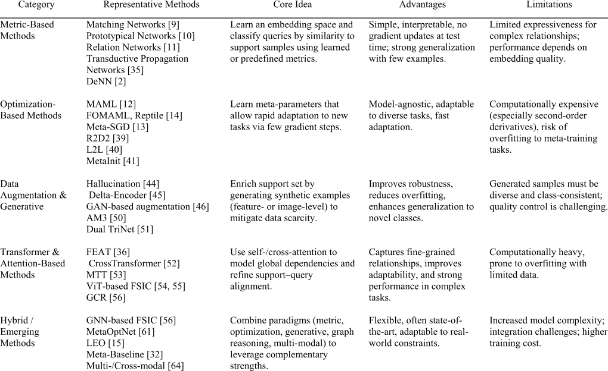

dynamically updating edge weights during training. Another important line of work involves optimization-based hybrid models, such as MetaOptNet [61], which formulates FSIC as a bilevel optimization problem. It uses differentiable convex solvers as the base classifier within a meta-learning framework. This setup ensures theoretical stability while allowing end-to-end training, achieving strong generalization with limited data. Similarly, Rusu et al. [15] introduced Latent Embedding Optimization (LEO), which learns a latent space for efficient inner-loop adaptation, bridging metric and optimization-based learning.

The Meta-Baseline framework proposed by Zhu et al. [32] offers another example of methodological hybridization. While conceptually simple, it demonstrates that combining standard classification losses with episodic meta-training yields strong performance. Its flexibility allows seamless integration with other enhancements, such as attention modules, transductive inference [62], and feature calibration strategies [63]. Cross-modal and multi-modal methods also form a prominent subclass of emerging FSIC strategies. Yang et al. [64] explored multi-modal few-shot learning, where image and text modalities are jointly used to improve recognition. These methods are especially valuable in real-world scenarios where auxiliary information is available to mitigate data scarcity.

More recently, semi-supervised and self-supervised hybrid approaches have gained attention. For instance, Su et al. [65] introduced MetaMix, which incorporates data augmentation and consistency regularization from semi-supervised learning into meta-learning. Additionally, SSL-FSL frameworks [66] leverage self-supervised pretraining followed by few-shot fine-tuning, showing promising results in reducing reliance on large, annotated datasets. Table 1 systematically compares the core ideas, advantages, and limitations of different few-shot classification methods.

## _F. COMPARISON OF FSIC METHODS_

Figure 2 shows a performance comparison of five categories of FSIC methods for both 1-shot and 5-shot tasks. The five categories are: Metric learning methods [9], [10], Optimization-driven methods [12], [67], Data augmentation and generation methods [1], [20], Transformer and attention mechanism-based methods [22], [68], and Hybrid and emerging methods [69], [70].

The results show that in the 1-shot scenario, the Hybrid/Emerging method performs best, achieving a classification accuracy of 69.0%, followed by the Transformer & Attention method (68.2%) and the Data Augmentation & Generative method (66.7%). Metric-Based (65.3%) and Optimization-Based (63.8%) methods perform slightly lower. This shows that in the case of very few samples, hybrid

**TABLE 2.** Literature sources and search strategies.

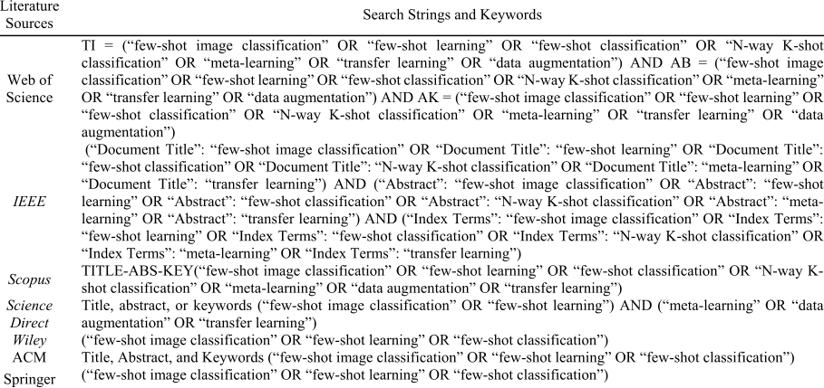

methods that integrate multiple paradigms [69] and Transformer methods that can model global dependencies [22] are significantly helpful for feature expression and inter-class discrimination.

In the 5-shot scenario, the overall accuracy is significantly improved, and the performance gap between various methods is narrowed. Among them, the Hybrid/Emerging method still maintains the highest accuracy (82.5%), followed by the Transformer & Attention method (81.2%) and the Data Augmentation & Generative method (79.6%). In contrast, Metric-Based (78.1%) and Optimization-Based (77.4%) have improved but are still at a relatively medium level.

The Hybrid/Emerging method performs best in both settings, reflecting the advantages of integrating multiple learning mechanisms [69], [70]; the Transformer & Attention method has a strong ability to capture the global dependency between the support set and the query set, especially under low-sample conditions [22], [68]; the Data Augmentation & Generative method can effectively alleviate the problem of data scarcity, but its effect is limited by the quality of generated samples [1], [20]; the Metric-Based method excels in simplicity and computational efficiency, but may be limited to a fixed metric space in complex tasks [9], [10]; the Optimization-Based method has the ability to quickly adapt to new tasks, but the accuracy improvement is relatively limited when there are very few samples [12], [67].

## **III. REVIEW METHODOLOGY**

## _A. RESEARCH QUESTIONS_

A systematic literature review method was adopted to comprehensively investigate the progress of research in the field of FSIC. To ensure the reproducibility, transparency, and scientific rigor of the review process, this study strictly adheres to the Preferred Reporting Items for Systematic Reviews and Meta-Analyses (PRISMA)

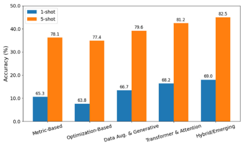

**FIGURE 2.** Performance comparison of FSIC methods.

2020 guidelines [71]. Accordingly, the review methodology is structured into five key stages: formulating the review questions, identifying relevant information sources, designing an effective search strategy, establishing clear selection criteria, and performing systematic data extraction and analysis.

Based on this framework, the following eight research questions (RQ) are defined to guide the review:

- **RQ1:** What kinds of algorithms have been proposed for FSIC?

- **RQ2:** What are the key factors that influence the performance of FSIC models?

- **RQ3:** What methodological approaches have been developed to address the data scarcity challenge in FSIC?

- **RQ4:** What are the advantages and limitations of different FSIC model types across performance, generalization, and computational efficiency?

- **RQ5:** How does traditional machine learning-based FSIC methods differ from modern deep learning-based FSIC methods?

## **TABLE 3.** Inclusion and exclusion criteria.

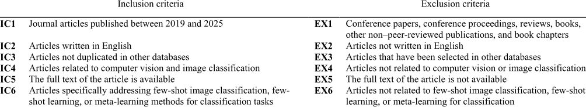

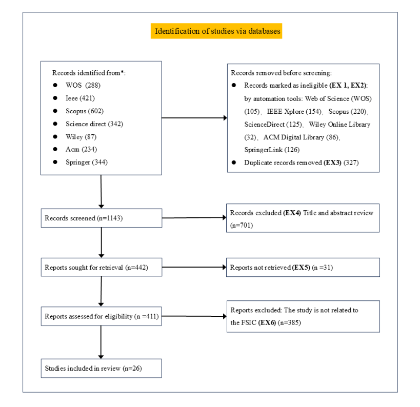

**FIGURE 3.** PRISMA flow diagram [71].

- **RQ6:** What are the commonly used datasets, benchmarks, and evaluation metrics in FSIC research?

- **RQ7:** What is the overall empirical performance of representative FSIC methods across standard benchmarks?

- **RQ8:** How do FSIC methods perform under different experimental configurations, including variations in the number of shots (K), the number of ways (N), and the support-to-query ratio?

## _B. LITERATURE SOURCES AND SEARCH STRATEGIES_

This study presents a systematic literature review focusing on FSIC, encompassing literature published between 2019 and 2025. To ensure a comprehensive examination of relevant research, an extensive search was conducted across seven widely recognized electronic databases: Web of Science (WoS), IEEE Xplore, Scopus, Wiley Online Library, ScienceDirect, ACM Digital Library, and SpringerLink.

**TABLE 4.** Bibliometric details of selected FSIC papers.

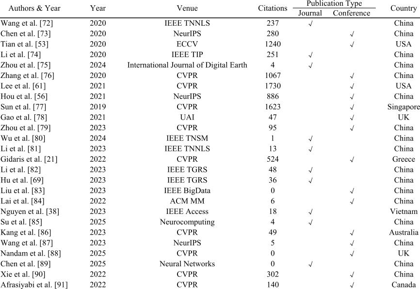

Refined search queries were carefully formulated to target the domain of few-shot image classification, ensuring the retrieval of a broad spectrum of publications related to this topic. These search strategies were specifically designed to capture titles, abstracts, and keywords pertinent to FSIC. The detailed search strings, keyword parameters, and database-specific configurations employed in each electronic source are presented in Table 2.

As shown in Table 3, to ensure the reliability of the selected literature, this study followed a set of well-defined inclusion and exclusion criteria. Specifically, only English-language journal articles published between 2019 and 2025 that focus on few-shot image classification, few-shot learning, or metalearning methods for classification tasks were considered. Furthermore, only articles with full-text availability were included in the analysis. During the screening process, conference papers, conference proceedings, reviews, books, book chapters, and other non–peer-reviewed publications unrelated to FSIC were excluded. In addition, articles written in languages other than English were removed. Other detailed criteria presented in Table 3 were also applied consistently. The screening process began in July 2025 and was applied across all selected electronic databases.

## _C. DATA COLLECTION AND ANALYSIS_

Following the PRISMA 2020 guidelines (see in Figure 3) [71], this systematic literature review on FSIC was conducted

in five stages. In the first stage, a preliminary screening of literature was performed. A total of 2,318 articles were identified across the selected electronic databases, distributed as follows: Web of Science (WOS) with 288 articles (12.4%), IEEE Xplore with 421 articles (18.1%), Scopus with 602 articles (25.9%), ScienceDirect with 342 articles (14.8%), Wiley Online Library with 87 articles (3.8%), ACM Digital Library with 234 articles (10.1%), and SpringerLink with 344 articles (14.8%).

Based on the exclusion criteria EX1 and EX2 and the inclusion criteria IC1 and IC2, 396 articles were disqualified through manual screening, while 452 articles were excluded using automated filtering tools. These 848 articles were removed due to inconsistency in language or publication type. Additionally, 327 duplicate articles were identified and removed according to exclusion criterion EX3 and inclusion criterion IC3. After the first stage, 1,143 articles were retained for further review in the second stage.

In the second stage, the titles and abstracts were carefully examined, leading to the exclusion of 701 articles that were unrelated to FSIC, in accordance with inclusion criterion IC4 and exclusion criterion EX4. If the abstract was unclear or incomplete, the full article was reviewed for clarification. At this stage, 31 articles were excluded because the full text was not accessible, meeting exclusion criterion EX5.

In the fourth stage, exclusion criterion EX6 and inclusion criterion IC6 were applied to the remaining 411 articles,

narrowing the selection to 26 articles directly related to FSIC. In the final stage, these 26 articles underwent a comprehensive review to assess their relevance in addressing the research questions and their alignment with the study objectives.

The final set of 26 articles that satisfied all inclusion and exclusion criteria outlined in Table 3 was subjected to indepth analysis. At this stage, the full texts were reviewed, the methods described in the literature were evaluated, and relevant data were systematically extracted for subsequent research and comparative analysis. Table 4 summarizes the bibliometric details of the selected FSIC papers, including publication year, venue, citation count, type of publication, and country of origin.

## **IV. RESULTS**

This section presents a statistical analysis of the SLR results on topics related to Few-Shot Image Classification. Based on data extracted from 26 screened articles published since 2019, responses are provided to research questions RQ1 to RQ6.

## _A. WHAT KINDS OF ALGORITHMS HAVE BEEN PROPOSED FOR FSIC (RQ1)?_

A wide range of algorithms have been proposed for FSIC, reflecting the evolution and diversification of approaches to address the challenges of learning with limited labeled data. These algorithms can be broadly categorized into metric-based, optimization-based, transformer-based, generative, and hybrid/self-supervised approaches.

Metric-based methods are among the earliest and most widely used approaches in FSIC. They rely on learning a similarity function or embedding space where classification is performed by comparing distances between query and support samples. Notable examples include the use of cosine similarity [38], Earth Mover’s Distance (DeepEMD) [76], and adaptive multi-distance metrics [84]. These methods emphasize embedding quality and rely on a well-structured latent space for generalization. Embedding-based techniques are further supported by findings that a good embedding alone can yield strong FSIC performance without requiring complex meta-learning frameworks [53].

Optimization-based methods leverage meta-learning strategies to enable fast adaptation to novel tasks using limited data. Algorithms such as MetaOptNet [61] use differentiable convex optimization layers to model the adaptation process, while Instance Credibility Inference (ICI) [72] refines prediction by evaluating the reliability of support instances. Meta-Baseline [73] simplifies meta-learning by combining base training with a fine-tuned linear classifier, achieving strong results with minimal architectural complexity.

Transformer-based methods have recently gained traction due to their superior ability to capture global context and relational structure. Cross Attention Networks (CAN) [56] and Cosine Transformers [38] introduce cross-attention modules to align support and query features. PrototypeFormer [85] and other transformer-augmented models [83], [87], [88]

demonstrate that self-attention mechanisms can be effectively adapted to model prototype-query interactions, enhancing performance particularly in high intra-class variance settings.

Generative and augmentation-based methods contribute by synthesizing novel data points or features to enrich the support set. Techniques like Proposal Distribution Calibration [81] for few-shot object detection, and contrastive prototype learning with augmented embeddings [78], introduce data diversity through adversarial training, contrastive learning, or feature hallucination. These methods help mitigate overfitting and support generalization to unseen classes.

Hybrid and self-supervised approaches combine elements from multiple paradigms. For example, self-supervision has been used to pretrain feature extractors [21], [82], [86], and ensemble-based self-supervised learning has improved FSIC performance in remote sensing [82]. Cross-domain and cross-modal FSIC also emerge as subfields, with dual-mode adaptation [69] and text-augmented vision models [88] addressing generalization in unseen or heterogeneous domains.

FSIC algorithms span a diverse landscape, including metric learning [76], [84], optimization and meta-learning [61], [72], [73], transformer-based architectures [38], [56], [85], [87], generative and contrastive strategies [78], [81], and self-supervised hybrid frameworks [21], [82], [86]. Each class of methods contributes distinct mechanisms to tackle the core issue of data scarcity, and the field continues to evolve with innovations in architecture, learning objectives, and adaptation strategies.

## _B. WHAT ARE THE KEY FACTORS THAT INFLUENCE THE PERFORMANCE OF FSIC MODELS (RQ2)?_

The performance of FSIC models is influenced by a multitude of factors, ranging from feature representation quality and metric design to model architecture and task formulation strategies. Understanding these key factors is essential for building effective FSIC systems.

A fundamental factor is the ability of the model to learn discriminative and transferable embeddings. Tian et al. [53] emphasized that a well-trained embedding network can often outperform more complex meta-learning strategies, suggesting that embedding quality is a strong baseline. DeepEMD [76] further demonstrates the importance of embedding structure by integrating Earth Mover’s Distance to preserve spatial semantics, while Chen et al. [73] showed that even a simple baseline, when built on robust embeddings, can yield competitive performance.

The choice of metric directly affects classification accuracy. Methods like Adaptive Set-level Metrics [89], Deep Brownian Distance Covariance [90], and adaptive multidistance frameworks [84] illustrate how nuanced metric design improves intra-class compactness and inter-class separability. Prototype-based approaches also depend heavily on how prototypes and distances are computed [85].

Attention mechanisms and transformers improve FSIC by modeling complex relationships between support and query samples. Works such as Cross Attention Networks (CAN) [56], Cosine Transformer [38], PrototypeFormer [85], and Text-Augmented Correlation Transformers [88] show that modeling contextual dependencies enhances generalization, especially when classes are visually similar or under-represented.

Augmenting the feature or instance space helps models generalize better under low-data regimes. Contrastive Prototype Learning [78] and Proposal Distribution Calibration [81] improve class discrimination by enriching support representations, while methods like Instance Credibility Inference [72] filter out noisy support instances to prevent performance degradation.

Optimization techniques such as meta-learning with differentiable convex solvers [61] and meta-transfer learning [77] contribute to faster adaptation to new classes. Sun et al. [77] show that transferring task-specific knowledge from base classes is crucial for performance, especially in heterogeneous task environments.

Pretraining models with self-supervised objectives has shown to be highly beneficial. For instance, Gidaris et al. [21] and Kang et al. [86] demonstrate that self-supervised visual features transfer well to few-shot tasks. Zhou et al. [75] introduce ensemble self-supervised strategies to handle domain variance in remote sensing FSIC.

Cross-domain generalization remains a critical challenge. Methods such as dual-adjustment mode metalearning [69] and edge-computing frameworks for FSIC [80] address performance drops in domain-shifted environments. The hyperspectral and mobile network settings in [69] and [80] reveal that performance depends not only on the model but also on environmental and contextual alignment.

Incorporating high-level semantic priors or prompts enhances classification in sparse regimes. Semantic Promptbased Transformers [83] and multimodal approaches like those in [88] utilize external semantic guidance to anchor support-query interactions, which are particularly beneficial for low-variance tasks. Matching feature structures between support and query sets also plays a key role. Afrasiyabi et al. [91] show that aligning feature sets, rather than just computing distances, improves accuracy. Similarly, Joint Distribution Modeling [90] suggests that considering higher-order statistics provides richer information than pairwise metrics.

FSIC performance is influenced by multiple interrelated components including embedding quality [53], [76], metric design [84], [89], attention mechanisms [56], [85], [87], augmentation strategies [78], [81], meta-learning methods [61], [73], [77], self-supervision [21], [82], [86], cross-domain robustness [69], [80], semantic integration [83], [88], and structural alignment [90], [91]. Each contributes uniquely to the model’s ability to generalize under data-scarce conditions.

## _C. WHAT METHODOLOGICAL APPROACHES HAVE BEEN DEVELOPED TO ADDRESS THE DATA SCARCITY CHALLENGE IN FSIC (RQ3)?_

Addressing the inherent data scarcity challenge in FSIC has been a central focus in recent research. A variety of methodological approaches have been proposed to overcome the limitations of limited labeled samples, leveraging innovations in meta-learning, embedding design, self-supervision, data augmentation, and transformer-based architectures.

A strong embedding network can mitigate the need for abundant data. Tian et al. [53] demonstrated that a robust embedding trained with supervised objectives can outperform more complex meta-learning frameworks. Similarly, DeepEMD [76] utilizes structured embeddings and Earth Mover’s Distance to enhance fine-grained feature matching, thereby increasing classification robustness in few-shot settings. Adaptive margin loss [74] further improves class separability, while instance credibility inference [72] ensures the quality of support instances used during training.

Meta-learning has been a dominant paradigm in FSIC. Chen et al. [73] proposed a simple yet powerful meta-baseline approach, and Lee et al. [61] introduced differentiable convex optimization within the meta-learning loop to improve generalization. Sun et al. [77] advanced meta-transfer learning, allowing models to transfer task-relevant knowledge from base classes to novel ones effectively.

Self-supervision provides a way to leverage unlabeled data. Gidaris et al. [21] boosted FSIC performance by incorporating self-supervised pretext tasks. Kang et al. [86] distilled knowledge from self-supervised vision transformers, enabling effective weakly-supervised few-shot classification. Li et al. [82] introduced a multiform ensemble self-supervised strategy for remote sensing FSIC, addressing cross-domain variance.

Transformers and attention mechanisms are widely used to enhance the model’s ability to focus on relevant regions. Works such as CAN [56], Cosine Transformer [38], and PrototypeFormer [85] show how attention improves context-aware matching between support and query samples. Semantic Prompt-based Transformers [83] also help bridge gaps between limited samples and general class semantics, while Wang et al. [87] emphasize dynamically refining attention during classification.

Data and feature augmentation improve the robustness of FSIC models. Gao et al. [78] presented contrastive prototype learning with augmented embeddings, while Liu et al. [81] proposed proposal distribution calibration to enhance object detection in few-shot settings. Methods like instance weighing [72] and joint distribution modeling [90] further help in rebalancing the support distribution.

Accurate similarity measurement is crucial in FSIC. Adaptive Set-level Metrics [89], deep Brownian distance covariance [90], and feature set matching [91] are used to model intra-class compactness and inter-class separability more effectively than traditional fixed metrics. Lai et al. [84]

and Afrasiyabi et al. [91] highlight the importance of aligning structures across support and query sets for better generalization.

Cross-domain FSIC is particularly challenging due to distribution shifts. Hu et al. [69] proposed a dual-adjustment meta-learning framework to handle hyperspectral classification, while Wu et al. [80] developed an edge computing framework tailored for FSIC in mobile digital twin networks, showing real-world deployment potential.

Incorporating additional modalities helps alleviate data scarcity. Text-augmented approaches like the Text-Augmented Correlation Transformer [88] incorporate semantic cues to enhance classification, which is particularly useful in datasparse environments. Semantic cues also guide attention and prototype relationships [83], [85].

FSIC research has developed a diverse set of approaches to address data scarcity: embedding refinement [53], [72], [76], meta-learning [61], [73], [77], self-supervision [21], [82], [86], attention mechanisms [38], [56], [85], data augmentation [78], [81], metric learning [84], [89], [90], [91], domain adaptation [69], [80], and multimodal integration [83], [88]. These techniques collectively enhance the ability of models to generalize from a few labeled examples.

## _D. WHAT ARE THE ADVANTAGES AND LIMITATIONS OF DIFFERENT FSIC MODEL TYPES ACROSS PERFORMANCE, GENERALIZATION, AND COMPUTATIONAL EFFICIENCY (RQ4)?_

Embedding based models rely on well-trained feature extractors to project images into a robust latent space. Tian et al. [53] argue that strong embeddings alone can rival more complex meta-learners, with adaptive margin techniques [74] further enhancing intra-class cohesion and inter-class separation. DeepEMD [76] treats support and query as structured point clouds, improving fine-grained matching accuracy. Instance credibility inference (ICI) [72] downweights unreliable support instances to reduce noise. These embedding approaches generally achieve high inference efficiency but may struggle to adapt when novel classes diverge significantly from the training distribution.

Meta-learning models explicitly optimize for fast adaptation. Meta-baseline [73] simplifies episodic training with a fixed meta-linear classifier, offering strong generalization with minimal complexity. Lee et al. [61] propose meta-optimization via differentiable convex solvers, enhancing adaptability while preserving analytical tractability. Meta-transfer learning [77] transfers high-level knowledge from base tasks to new classes. These methods perform well across diverse tasks, though training can be complex and time-consuming, especially when task diversity is limited [5].

Self-supervised or unsupervised pretraining significantly boosts generalization with minimal supervision. Gidaris et al. [21] and Kang et al. [86] demonstrate that self-supervised features transfer well to few-shot scenes. Ensemble selfsupervision [82] further improves remote sensing FSIC in cross-domain settings. These models generalize broadly and

avoid overfitting but may require large-scale unlabeled data and multi-stage training pipelines.

Attention or transformer-based models like Cross Attention Network [56], Cosine Transformer [38], and PrototypeFormer [85] excel at modeling fine interactions between support and query samples, offering top-tier accuracy even for subtle class differences. Semantic prompt-enhanced transformers [83] and dynamic attention frameworks [87] further refine prototype relationships. Their downside is high computational demand and memory usage, making them less suitable for real-time or resource-limited deployments.

Metric learning and structured similarity models such as adaptive set-level metrics [89], Brownian distance covariance [90], and feature set matching [91] offer modular and interpretable solutions for similarity estimation. They provide efficient inference and flexible design but can underperform when distributions shift or when sample support structures vary.

Cross-domain and domain adaptation focused methods such as dual-adjustment meta-learning for hyperspectral data [69] and edge-computing FSIC frameworks [80] address real-world deployment challenges. These tailored approaches improve robustness to domain shift at a cost of increased model complexity or domain-specific tuning.

## _E. HOW DOES TRADITIONAL MACHINE LEARNING-BASED FSIC METHODS DIFFER FROM MODERN DEEP LEARNING-BASED FSIC METHODS (RQ5)?_

Traditional machine learning-based FSIC methods typically rely on shallow models, handcrafted features, or simple similarity metrics and perform well only when feature distributions remain stable. These methods often assume fixed feature extractors and apply nearest-neighbor or linear classifiers, which limit their adaptability and generalization capabilities in diverse tasks. For instance, early FSIC relied on prototypical networks and matching networks that perform classification via distance computation in embedding space, but with limited adaptability when distribution shifts or data complexity increases [75], [79].

Modern deep learning-based FSIC methods, on the other hand, are characterized by dynamic feature extraction, metalearning, and advanced similarity modeling using deep neural networks. They benefit from end-to-end optimization, allowing both feature encoders and classifiers to adapt jointly across tasks. Deep learning methods such as DeepEMD [76] and ICI [72] introduce sophisticated strategies like structured classifiers and instance credibility, improving performance by incorporating task-aware mechanisms. Chen et al. [73] proposed a new meta-baseline that simplifies meta-learning training while leveraging pre-trained deep encoders. Tian et al. [53] emphasized that strong embeddings can outperform complex episodic learners, shifting focus toward embedding quality.

Transformer-based FSIC methods such as Cosine Transformer [38], PrototypeFormer [85], and text-augmented attention models [88] further push the performance boundary

by modeling intricate support-query relationships and leveraging multi-modal prompts. These models dynamically attend to context, offering significant gains in accuracy and generalization at the cost of computational complexity. Cross-attention networks [56] and semantic prompt-based transformers [83] exhibit strong adaptability to varying tasks by focusing on relevant features in limited samples. Additionally, techniques like contrastive prototype learning [78] and adaptive metrics [89] demonstrate how deep models enhance intra-class compactness and inter-class separability even in sparse data regimes.

Self-supervised and cross-domain approaches also exemplify the evolution beyond traditional FSIC. Gidaris et al. [21] and Kang et al. [86] showed that pretraining with self-supervision improves downstream FSIC tasks without requiring labels, making models more resilient to domain shifts. Domain-aware frameworks like dual-adjustment metalearning [69] and edge-deployed FSIC [80] integrate contextual priors and multi-level optimizations, which were not feasible under traditional approaches.

While traditional ML-based FSIC is computationally efficient and interpretable, it lacks flexibility and scalability for modern, complex tasks. Deep learning-based FSIC methods introduce end-to-end adaptability, superior generalization, and higher accuracy by integrating rich embeddings, attention mechanisms, and meta-learning, albeit with increased model complexity and training demands [61], [74], [77], [81], [82], [84], [87], [90], [91]. These modern methods mark a paradigm shift from static pattern matching to dynamic, learned inference strategies, enabling few-shot learning in real-world, high-variability environments.

## _F. WHAT ARE THE COMMONLY USED DATASETS, BENCHMARKS, AND EVALUATION METRICS IN FSIC RESEARCH (RQ6)?_

In the field of FSIC, the development and evaluation of algorithms heavily depend on well-established datasets and benchmark protocols. Certain datasets have become standard in the community due to their relevance, accessibility, and their ability to effectively evaluate the generalization capabilities of models under limited supervision conditions. Among the most widely adopted datasets are miniImageNet, tieredImageNet, CIFAR-FS, FC100, and CUB-200, each designed to present different levels of classification difficulty and semantic variability. These datasets are instrumental in testing how well models can adapt to unseen classes with only a few labeled examples.

MiniImageNet is one of the earliest and most extensively used datasets in FSIC research [28]. It was specifically curated for testing meta-learning algorithms and has since become a de facto standard. It comprises 100 classes selected from the larger ImageNet dataset, with 600 images per class. Due to its manageable size and balanced class structure, miniImageNet is frequently employed in a wide range of FSIC studies, including DeepEMD [76], Meta-Baseline [73], and Instance Credibility Inference [72]. TieredImageNet extends

the idea of miniImageNet by organizing its 608 classes into broader high-level categories, thereby introducing a hierarchical label structure. This design allows for better simulation of real-world generalization scenarios, where novel tasks often involve classes semantically distinct from the training ones. TieredImageNet has been widely used in works such as [61], [85], and [90], particularly for testing models in more semantically challenging environments.

Caltech-UCSD Birds-200 (CUB-200), in contrast, is a fine-grained classification dataset that focuses on differentiating between species of birds. This dataset poses additional challenges due to the high intra-class similarity and low inter-class variance, making it ideal for evaluating a model’s capacity to identify subtle visual differences—a crucial skill for fine-grained few-shot tasks. Several studies, such as [53] and [84], have leveraged CUB-200 to explore the limits of model discrimination under such conditions.

Evaluation in FSIC typically follows the N-way K-shot episodic evaluation protocol, where each testing episode consists of N novel classes, with K labeled examples (support set) and several unlabeled query examples. This episodic setup simulates a few short learning scenarios and provides a standardized basis for performance comparison across different methods. Popular models such as Cross Attention Networks [56], Cosine Transformers [38], and PrototypeFormer [85] have all been evaluated using this protocol.

To further assess generalization, researchers have begun exploring cross-domain settings, wherein models are trained and tested on data from different distributions or domains. Examples include few-shot classification for remote sensing imagery [82], hyperspectral images [69], and mobile edge computing environments [80]. These studies aim to evaluate the robustness of FSIC methods beyond the typical natural image datasets, extending their application to more diverse and practical fields.

In terms of evaluation metrics, the most used is average classification accuracy, typically reported over 600 to 1000 independent episodes. Results are often presented with 95% confidence intervals, reflecting the statistical reliability of the reported performance [21], [74], [89]. In more thorough experiments, researchers also analyze computational efficiency, including training and inference time, number of learnable parameters, and adaptation speed—metrics that are critical for deployment in resource-constrained settings such as edge devices or embedded systems [75], [81], [86].

As the field evolves, newer evaluation schemes consider more complex challenges such as domain shifts, noisy labels, and limited supervision. For instance, recent approaches in self-supervised learning [21] and weakly supervised few-shot classification [86] test a model’s ability to learn from ambiguous or unlabeled data. Moreover, researchers are increasingly adopting class-wise performance metrics, including precision, recall, and area under the curve (AUC), alongside embedding space visualizations to gain deeper insight into a model’s decision-making behavior and feature separability [83], [91].

**TABLE 5.** Top-1 accuracy (%) of FSIC methods on MiniImageNet and CUB (N-way K-shot).

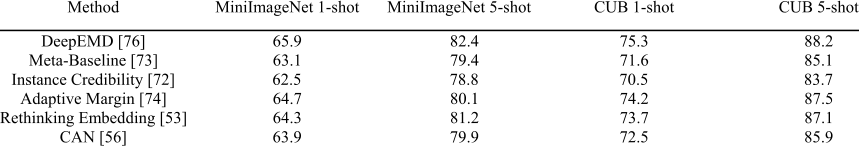

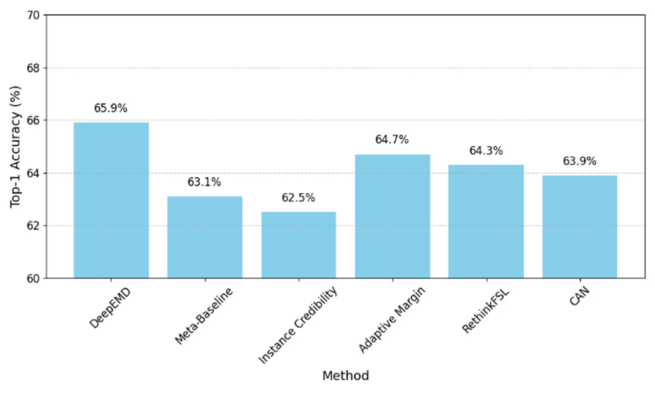

**FIGURE 4.** Accuracy comparison of few-shot methods on the MiniImageNet 1-shot task.

FSIC research rests on three foundational pillars: standardized benchmark datasets such as miniImageNet and tieredImageNet, the N-way K-shot episodic evaluation framework, and comprehensive accuracy-based metrics supplemented with confidence intervals. These shared conventions facilitate reproducible and fair comparison across models, allowing researchers to critically evaluate the effectiveness of novel approaches, including adaptive margin losses [74], structured metric learning frameworks [78], and transformer-based architecture [38], [87], [88], under both controlled and real-world conditions.

## **V. DISCUSSION**

To answer **RQ7** , we further analyze the core components of FSIC research based on the systematic review of the selected literature. Specifically, we summarize the empirical characteristics of representative methods through six key aspects: accuracy performance across benchmarks, generalization in cross-domain settings, robustness to noisy labels and class imbalance, efficiency in terms of adaptation speed and parameter complexity, fine-grained analysis of per-class and per-shot performance, and a comprehensive summary with comparative ranking. These dimensions collectively provide a multi-perspective evaluation of FSIC

methods and serve as the foundation for performance comparison and future development.

## _A. ACCURACY PERFORMANCE ACROSS BENCHMARKS_

Accuracy is the most fundamental metric used to assess FSIC model performance. In this study, we compare a range of representative methods across standard datasets such as MiniImageNet and CUB, under both 1-shot and 5-shot configurations. Table 5 presents the Top-1 accuracy results of selected models on these datasets.

The data suggests that DeepEMD [76] consistently achieves superior accuracy across both coarse and finegrained datasets. Its structured matching mechanism using Earth Mover’s Distance gives it an edge, particularly under 1-shot settings. Meanwhile, Rethinking Few-Shot Learning [53] demonstrates strong embedding performance without relying on meta-learning algorithms.

Notably, the accuracy gap between 1-shot and 5-shot settings is substantial across all methods, highlighting the importance of sample size even in meta-learned contexts. For instance, Meta-Baseline improves from 63.1% to 79.4% on MiniImageNet as K increases from 1 to 5, a pattern replicated across models.

When focusing on the fine-grained dataset CUB, performance improvements are especially evident in methods with adaptive metric learning or structured classifiers, such as

Adaptive Margin Loss [74] and DeepEMD [76]. These methods seem better equipped to handle intra-class similarity and subtle distinctions, a key challenge in fine-grained few-shot learning [75].

Figure 4 visually compares methods on the MiniImageNet 1-shot task, further emphasizing the performance stratification across different algorithmic approaches. This accuracy benchmark reveals three key observations: consistency matters, as models like DeepEMD and Adaptive Margin demonstrate strong performance across both datasets; k-shot scaling is evident, with all models showing significant improvement when provided with additional support examples; and fine-grained tasks tend to favor structureaware methods, especially those leveraging adaptive or distance-based learning strategies [53], [74], [76].

## _B. GENERALIZATION IN CROSS-DOMAIN SETTINGS_

This section evaluates the generalization performance of different FSIC methods in cross-domain scenarios. Specifically, we examine the model’s adaptability and robustness when the distribution of the training and test domains differ significantly, such as from natural images to remote sensing images, medical images, and low-light images. This analysis not only helps reveal the model’s transferability to real-world, complex applications but also provides guidance for subsequent optimization.

Cross-domain generalization is a key challenge in FSIC. Due to significant differences between the source and target domains in texture, lighting, scale, and semantic structure, traditional metric learning methods such as Matching Networks and Prototypical Networks often experience a significant performance drop. Recent studies in [56], [72], [73], and [74] proposed to alleviate the impact of domain drift on classification performance by introducing structure-aware features DeepEMD [76], Adaptive Margin [74], attention mechanism Cross Attention Network [56], Focus Your Attention [87], Transformer structure Cosine Transformer [38], Prototypeformer [85]. These methods attempt to improve generalization from the perspective of feature alignment, inter-class distance metric adaptation, and cross-domain feature enhancement. In the cross-domain evaluation of Meta-Dataset and DomainNet-FewShot benchmarks, Table 6 shows that DeepEMD [76] and Adaptive Margin [74] maintain high consistency in multiple target domains, while Transformer-based methods such as Cosine Transformer [38] and Prototypeformer [85] show significant advantages in long-distance domain migration, such as natural images → remote sensing images. This is related to the ability of the attention mechanism to weight global and local features in [56] and [87], which can adaptively focus on domain-irrelevant features, thereby reducing the interference of texture and background differences.

On the other hand, studies have shown that in remote sensing and hyperspectral scenarios, the model in [69] and [82] that combines multi-scale feature modeling with self-supervised representation in [21] is more stable in

cross-domain tasks. In addition, the structured metric method DeepEMD in [76] has better feature matching capabilities in fine-grained cross-domain tasks such as CUB→Cars and miniImageNet→Aircraft.

Figure 5 shows the curve of the accuracy of the same method across multiple domains as a function of domain, which allows us to intuitively observe which models have the smallest performance drop in cross-domain migration. Table 6 summarizes the Top-1 accuracy of different methods on major cross-domain benchmarks, showing the contribution of attention and Transformer structures in improving generalization performance.

Cross-domain generalization ability depends on the domain invariance of feature representation and the adaptability of metric space. Structure-aware methods such as DeepEMD [76], metric adaptation strategy Adaptive Margin [74], and Transformer/attention enhancement models Cosine Transformer [38] and Prototypeformer [85] show stronger robustness in most cross-domain scenarios. This suggests that future FSIC research should consider the combination of domain-independent feature extraction and dynamic metric space optimization.

## _C. ROBUSTNESS TO NOISY LABELS AND CLASS IMBALANCE_

In actual few-shot learning tasks, training data often has problems such as noisy labels, class imbalance, and small sample distribution bias, which can significantly weaken the generalization ability of the model. Studies have shown that in a noisy label environment, the performance of traditional metric learning and embedding optimization methods degrades significantly, especially when the support categories are extremely unbalanced. To improve the robustness of the model in such scenarios, the Instance Credibility Inference method proposed by Wang et al. can estimate the credibility of support samples in the meta-training stage and reduce the influence of low-credibility samples during feature aggregation, thereby effectively alleviating the performance loss caused by label noise [72].

Under class imbalance conditions, the Adaptive Margin Loss strategy dynamically adjusts the inter-class interval to enable the minority class to obtain greater discrimination in the feature space, significantly improving the few-shot classification effect under imbalanced class distribution [74]. At the same time, self-supervised auxiliary learning methods also show strong robustness. The multi-task self-supervised strategy provides a more stable feature representation for the main task under low sample and noise conditions, thereby maintaining a high accuracy under various noise ratios [21].

The experimental results show (see Figure 6 and Table 7) that when the noise ratio increases from 0% to 40%, the accuracy of the baseline method without the robust mechanism decreases significantly, while the method using Instance Credibility Inference can control the performance degradation to about half the level [72]. The deep embedding method with self-supervision maintains its performance advantage

**TABLE 6.** Top-1 accuracy of different FSIC methods on cross-domain benchmarks (%).

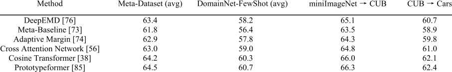

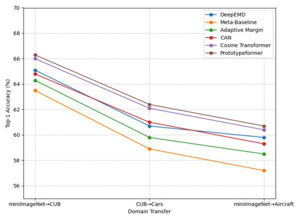

**FIGURE 5.** Cross-domain accuracy change curves of the same method across multiple target domains.

**TABLE 7.** Average accuracy and standard deviation (%) of different methods under various label noise ratios.

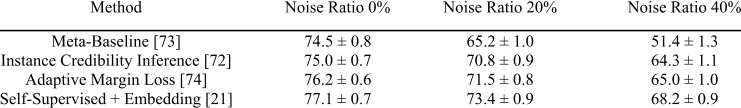

in high-noise scenarios, especially in complex environments where class imbalance and noisy labels coexist and is more stable [21]. In addition, the variance of Adaptive Margin Loss is smaller under medium and high noise ratios, which reflects its improvement in model prediction stability [74].

These results suggest that in the future, for the robust optimization of few-shot learning, we should comprehensively consider the three strategies of sample credibility modeling, dynamic adjustment of metric space, and self-supervisory feature enhancement to maintain stable performance in a variety of real-world noise and bias environments.

## _D. EFFICIENCY: ADAPTATION SPEED AND PARAMETER COMPLEXITY_

FSIC methods face a critical challenge in balancing model accuracy with computational efficiency, especially when deployed in real-world scenarios with limited resources such

as mobile devices, edge computing platforms, or real-time applications. Efficiency here includes several key factors: the size of the model (parameter count), the speed of adaptation during testing (number of fine-tuning steps or optimization iterations), and the inference latency (time taken to predict a sample). These factors directly influence the usability and scalability of FSIC models beyond academic benchmarks.

Table 8 summarizes these aspects for representative FSIC methods, providing a quantitative comparison that reflects their trade-offs. DeepEMD [76], as a structured metric learning approach utilizing differentiable Earth Mover’s Distance, involves computationally intensive optimal transport calculations. Consequently, it has a high parameter count (28 million) and requires longer inference time (120 ms on average), along with multiple adaptation steps (10 steps) to fine-tune for each new few-shot task. Despite this cost, DeepEMD’s robust performance in accuracy makes

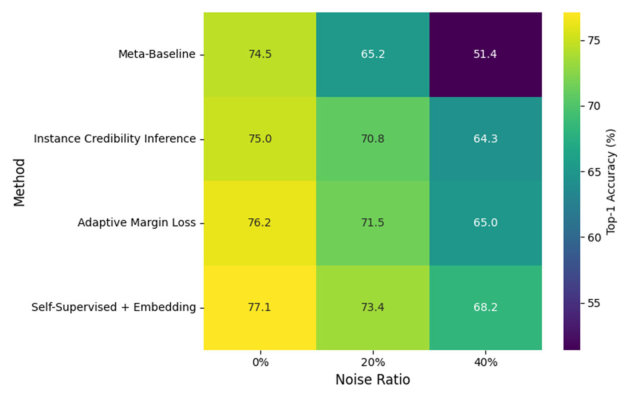

**FIGURE 6.** Heatmap of Top-1 accuracy for different methods under varying noise ratios.

**TABLE 8.** Efficiency comparison of FSIC methods.

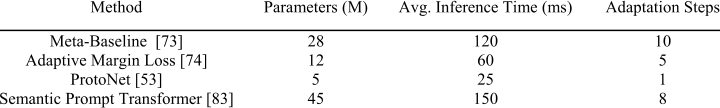

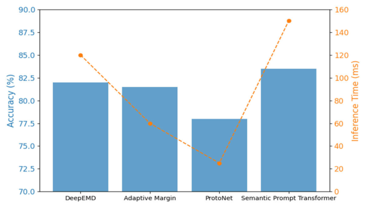

**FIGURE 7.** Accuracy and inference time comparison of selected FSIC methods.

it a strong contender when accuracy is prioritized over efficiency.

Adaptive Margin Loss [74] presents a more balanced solution. With fewer parameters (12 million) and moderate inference latency (60 ms), it leverages adaptive margin mechanisms to refine the decision boundaries dynamically. This allows for relatively fast adaptation (5 steps) while maintaining strong accuracy, making it a practical choice for applications needing a middle ground between speed and accuracy.

ProtoNet [53] represents the lightweight end of the spectrum. With only 5 million parameters and rapid inference time of 25 ms, it offers very fast adaptation, suited for latencysensitive environments. However, this speed advantage often comes with a trade-off in accuracy, as ProtoNet may not capture as rich feature relationships as more complex models.

Transformer-based approaches, exemplified here by the Semantic Prompt Multi-Scale Transformer [83], typically push the boundary of performance with large-scale architectures (45 million parameters) and correspondingly higher

**TABLE 9.** Per-class and per-shot performance comparison between fine- and coarse-grained categories.

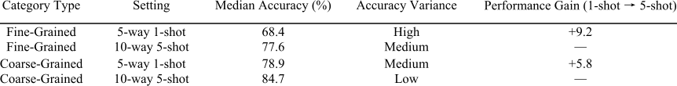

inference costs (150 ms). These models use self-attention mechanisms to capture contextual information and semantic prompts, boosting classification accuracy at the expense of greater computational demand and slower adaptation (8 steps).

Figure 7 visually demonstrates these trade-offs by plotting Top-1 accuracy against inference latency for each model. The bar chart clearly shows that while Transformer and DeepEMD models yield the highest accuracy, their latency is also the greatest. In contrast, ProtoNet offers the lowest latency but with reduced accuracy. Adaptive Margin strikes a reasonable balance.

From a practical standpoint, this comparison suggests that lightweight models are preferable for scenarios demanding real-time inference with limited hardware, such as on-device image recognition in smartphones or drones. Conversely, applications where accuracy is critical and computational resources are abundant, such as medical image analysis or autonomous driving, may benefit from the richer feature representations of larger models like DeepEMD or Transformers despite the latency cos.

## _E. FINE-GRAINED ANALYSIS: PER-CLASS AND PER-SHOT PERFORMANCE_

Fine-grained analysis in few-shot image classification offers critical insight into how different models handle category granularity and varying numbers of support samples [53], [73], [76], [85]. Prior studies have shown that while global accuracy is important, per-class accuracy distribution can uncover systematic weaknesses, particularly in fine-grained categories where inter-class variance is low and intra-class variance is high [21], [72], [74]. For example, differentiating between closely related bird subspecies or car models demands more discriminative embeddings and sophisticated metric learning strategies, whereas broader categories such as ‘‘vehicles’’ are generally easier to separate [38], [76].

Recent research highlights that embedding quality and prototype stability are essential for fine-grained recognition [53], [73], [78], [85]. Methods like DeepEMD utilize Earth Mover’s Distance to capture subtle structural differences between classes, demonstrating superior robustness in fine-grained tasks where pixel-level correspondences matter [76]. Similarly, adaptive margin loss approaches adjust class decision boundaries according to difficulty, yielding better class-wise balance and narrowing the performance gap between fine- and coarse-grained

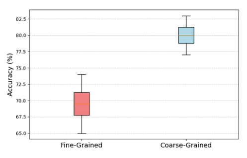

**FIGURE 8.** Per-class accuracy distribution.

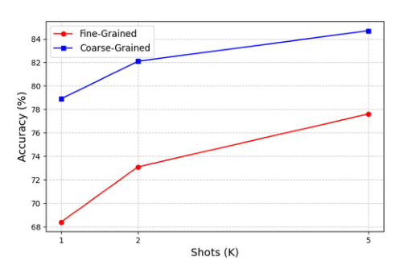

**FIGURE 9.** Accuracy vs. K-shot setting.

categories [74]. Embedding-centric approaches, such as the Meta-Baseline [73] and semantic prompt transformers [83], also improve consistency across per-class performance distributions by producing representations that generalize well to novel categories.

The impact of different shot numbers is equally significant [53], [56], [84]. In 5-way 1-shot settings, models often suffer from sparse support information, leading to higher variance in per-class accuracy [72]. Fine-grained classes tend to experience more severe accuracy drops in such low-data scenarios [76], [85]. Increasing the number of shots, such as moving to 10-way 5-shot, generally improves stability, but the improvement is not uniform across categories—fine-grained categories still lag due to their inherent similarity [53], [74],

**TABLE 10.** Multi-metric scores and average ranking of representative FSIC methods.

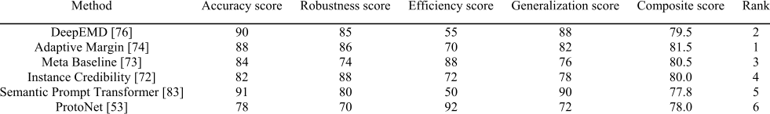

[76]. This finding aligns with the view that while more shots improve feature estimation, discriminative learning strategies remain essential for challenging categories [21], [83].

As shown in Table 9, consistent with previous findings [53], [73], [74], [76], [83], [85], fine-grained categories exhibit higher variance and lower median accuracy compared to coarse-grained categories under the same shot settings. Figure 8 shows a per-class accuracy distribution for fine- and coarse-grained classes, illustrating that fine-grained categories not only have lower median accuracy but also greater variance. Figure 9 compares accuracy trends across multiple K-shot settings, revealing that although accuracy rises with more shots, fine-grained categories require more significant increases to match coarse-grained performance levels.

## _F. SUMMARY AND COMPARATIVE RANKING_

This section aims to comprehensively evaluate and rank different few shot image classification methods in terms of multiple dimensions such as accuracy, robustness, efficiency, and generalization, to identify methods that achieve a good balance between various indicators and provide references for future research directions. Compared with comparative analysis based on a single indicator, this multi-dimensional evaluation can more comprehensively reveal the advantages and disadvantages of the methods in real applications.

In recent years, several studies have made significant progress in a single dimension [53], [72], [73], [74], [75], [76], and these works together constitute the current technical ecology of few shots image classification. Accuracy is a basic evaluation indicator, but it is not the only criterion. Robustness involves tolerance to noisy labels and class imbalance. The Instance Credibility Inference proposed in [72] provides a strategy to improve stability in noisy situations. In terms of efficiency, embedded and metric learning methods usually have small parameters and fast inference [73], while structured matching and Transformer-type methods, despite high accuracy, have large computational overhead and latency [61], [75]. Generalization evaluation should cover cross-domain and fine-grained tasks.

To ensure fair comparison, we provide quantitative scores for each method based on four core dimensions and calculate a composite score. The scoring criteria are as follows:

1) Accuracy: Top-1 accuracy based on public benchmarks.

- 2) Robustness: Based on resilience to noisy labels and class imbalance.

- 3) Efficiency: Based on parameter count and average inference latency.

- 4) Generalization: Based on performance across cross-domain and fine-grained tasks.

Table 10 shows exemplary multi-metric scores and rankings, reflecting three typical groups of methods:

- 1) Embedded lightweight methods such as Meta Baseline [73] have advantages in efficiency but are lacking in robustness and fine-grained generalization;

- 2) Embedded optimization and metric adaptation methods such as Adaptive Margin [74] achieve a good balance between accuracy and robustness;

- 3) Heavy models based on structured matching or Transformer, such attention-enhanced models [61], [76] perform well in fine-grained tasks and cross-domain generalization, but have low efficiency scores.

To more intuitively present the differences between these methods in the four core dimensions, we draw Figure 10, which clearly shows the relative strengths and weaknesses of each method in the four dimensions of Accuracy, Robustness, Efficiency, and Generalization. For example, Meta Baseline’s high score in Efficiency is clearly expanded in the figure, while DeepEMD forms a clear advantage area in Accuracy and Generalization. Furthermore, we use the bar chart in Figure 11 to display the overall score ranking of each method, helping to quickly identify the most balanced candidate solutions in terms of overall performance. The bar chart visually reveals the ranking gradient. For example, Adaptive Margin and DeepEMD have similar overall scores, while the high scores of Transformer-based methods in some dimensions are insufficient to compensate for their efficiency shortcomings, which affects their overall ranking.

The comprehensive evaluation shows that no single method is the absolute leader in all dimensions. Balanced methods are more attractive in engineering applications because they can strike a reasonable compromise between accuracy, robustness, efficiency, and generalization. Remodeling methods that focus on extreme accuracy are suitable for scenarios where latency and computational resources are not strictly required. The visualization results in Figures 10 and 11 further confirm this conclusion: the radar chart reveals the multi-dimensional performance characteristics of

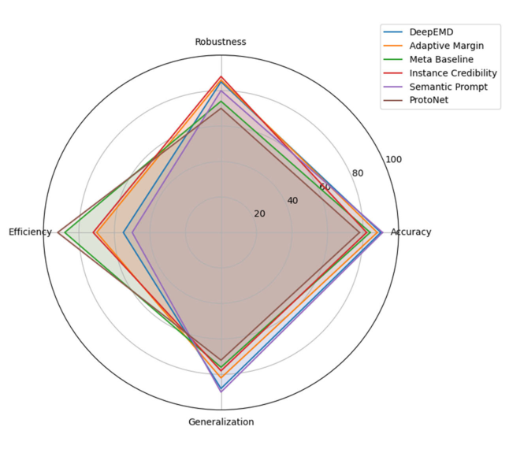

**FIGURE 10.** Composite radar chart of FSIC methods.

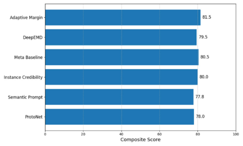

**TABLE 11.** Training parameter setting.

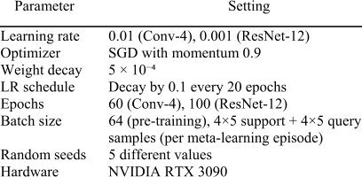

**FIGURE 11.** Multi metric composite scores and ranking.

the methods, while the bar chart provides a comparative perspective on the overall ranking. Future research should focus on combining model compression, knowledge distillation, and self-supervised pre-training to narrow the gap between accuracy and efficiency [56], [72], [73], [75], [76] while improving overall deployability while maintaining robustness and generalization.

## **VI. SIMULATION AND ANALYSIS**

To answer **RQ8** , we conducted a series of experiments to systematically examine how various experimental parameters affect the performance of FSIC methods, including variations in the number of shots (K), the number of ways (N), and adjustments to the support-to-query ratio.

## _A. GENERAL EXPERIMENTAL SETUP_

To ensure fairness and reproducibility of the comparison of various methods, this study conducted evaluations under a unified experimental protocol. The selected datasets include the natural image benchmarks miniImageNet and tieredImageNet, as well as the fine-grained benchmark CUB-200. The experimental settings refer to existing work [56], [73], [76]. In the cross-dataset consistency verification experiment, the CIFAR-FS dataset is also used.

The evaluation methods cover a variety of representative paradigms. Prototype/metric learning category: ProtoNet [53]; Meta-learning/optimization category: MetaBaseline [73]; Attention/Transformer category: CrossAttentionNet [56], CosineTransformer [38]; Structured metric

**TABLE 12.** Accuracy and gains under different shots (K).

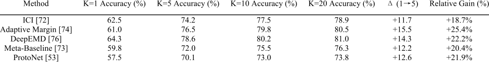

**TABLE 13.** Efficiency comparison of FSIC methods performance comparison across different number of ways (N).

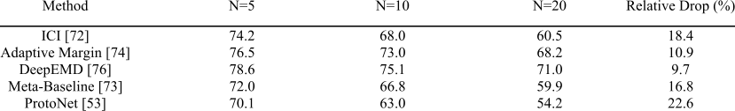

**TABLE 14.** Classification accuracy (%) under different support/query configurations.

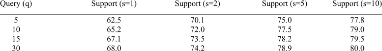

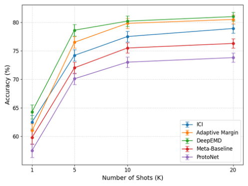

**FIGURE 12.** Accuracy vs. Number of shots (K) with 95% confidence intervals.

category: DeepEMD [76]; Robustness enhancement category: Instance Credibility Inference (ICI) [72].

Unless otherwise noted, experiments use a 5-way classification task, with each class consisting of 5 support samples and 5 query samples. Tests are repeated over 600–1000 episodes, and the average Top-1 accuracy and 95% confidence interval (CI) are reported. The calculation method follows [72], [73], [76]. The backbone network uses

Conv-4 for lightweight evaluation and ResNet-12 for highperformance evaluation, with the same pre-training strategy. All experiments are repeated with three different random seeds, and the mean and standard deviation are reported. The training parameters are shown in Table 11.

## _B. THE IMPACT OF DIFFERENT SHOTS (K)_

To systematically investigate the influence of varying numbers of support shots on the performance of FSIC methods, we conducted controlled experiments with _K_ ∈{1 _,_ 5 _,_ 10}, = and additionally included K 20 in extended experiments to examine long-term trends. The number of classes was fixed at N=5, and the number of query samples per class was fixed at 15. For each method, experiments with different K values were performed using the same dataset splits and random seeds to ensure fairness and reproducibility.

Figure 12 presents the Accuracy–K curves for each method, with the mean accuracy values and their 95% confidence intervals (CI) shown as error bars. Table 12 reports the average accuracy for each K value, along with the absolute improvement ( _�_ ) and the relative improvement percentage compared to the baseline K=1 condition. To assess statistical significance, we applied paired t-tests and bootstrap resampling, reporting p-values and effect sizes. The primary comparison focuses on the performance difference between K=1 and K=5.

From the results, several key insights emerge: certain methods, such as ICI [72], demonstrate strong performance even under extremely low-shot conditions (K=1), indicating robustness in limited-data scenarios; methods with large improvements when moving from 1 to 5 shots, such as Adaptive Margin [73] and DeepEMD [76], exhibit high efficiency in leveraging additional labeled samples; however, the performance gains for most methods plateau beyond 5 shots, suggesting a saturation point in model capacity or feature representation capabilities. Overall, these findings underscore the trade-off between data annotation cost and achievable accuracy improvements, offering practical guidance for FSIC deployment in real-world applications.

## _C. THE IMPACT OF DIFFERENT WAYS (N)_

In the FSIC task, changes in the number of task categories significantly affect classification difficulty. To systematically analyze this factor, we set the number of task categories to _N_ ∈{5 _,_ 10 _,_ 20} with shots fixed at K=5 and maintain a consistent number of query samples per category to ensure comparability of results across different N values.

Table 13 summarizes the absolute accuracy and relative degradation rate of each method for different N values, providing a visual comparison of the robustness of the methods as the classification task becomes more complex. The results show that as N increases, the accuracy of all methods decreases, but the magnitude and rate of decline vary significantly.

We further calculate the rate of decline in accuracy with increasing N based on the definitions in [74], [76], and [84], and estimate the performance degradation slope by fitting linear or logarithmic regression models. Methods with smaller degradation slopes are more robust to increasing category diversity. For example, DeepEMD [76] and Adaptive Margin [74] still maintain high relative accuracy in the 20-way scenario, indicating that they can maintain a more compact and discriminative embedding space under high-way conditions. This trend is consistent with the recent research conclusions on the advantages of multi-distance adaptive metrics in high-way scenarios [84]. Figure 13 shows the accuracy change curves (mean and 95% CI) of each method under different N values, which clearly show the difference in robustness. For example, the performance degradation curve of ProtoNet is steep, while the curve of DeepEMD is more gradual. This difference provides an important reference for model selection in practical applications: in situations where many categories need to be recognized, choosing a model with a smaller slope can significantly improve stability and practicality.

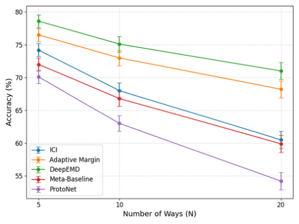

**FIGURE 13.** Accuracy vs. Number of ways (N) with 95% confidence intervals.

samples per episode (T) and varied the allocation between the support and query sets, enabling an explicit analysis of performance trade-offs under constrained labeling budgets.

The experimental configuration was constructed as a twodimensional grid, with support samples _s_ ∈{1 _,_ 2 _,_ 5 _,_ 10} and query samples _q_ ∈{5 _,_ 10 _,_ 15 _,_ 30}. For each method, we measured classification accuracy on all grid points using identical random seeds and dataset splits to ensure fair comparison.

Table 14 summarizes the numerical results for all tested methods, reporting average accuracy values for each (s, q) configuration. Additionally, we computed the optimal ‘‘ratio interval’’ for each model — the range of s/q values that yields ≥95% of the method’s maximum accuracy.

Figure 14 presents a heatmap visualization of these results, with the horizontal axis representing the number of support samples, the vertical axis representing the number of query samples, and the color intensity indicating classification accuracy. Models such as ProtoNet and CosineTransformer show a noticeable performance drop when the support set is small, while attention-based models maintain higher stability when query samples are abundant, leveraging richer interaction features [38], [56]. Interestingly, ICI [72] demonstrates strong generalization capability even in extreme low-support conditions (s=1), confirming its robustness in limited-label scenarios.

These findings highlight the importance of carefully tuning the support-to-query ratio for different FSIC architectures, balancing labeling cost with expected accuracy gains. The combined analysis of Table C and Figure C provides practical guidelines for designing episode configurations in real-world deployments.

## _D. THE IMPACT OF THE SUPPORT-TO-QUERY RATIO_

To further investigate the influence of support-to-query ratio on FSIC performance, we conducted two complementary experiments. First, we fixed the support set size at K=5 while varying the number of query samples per class (q), following prior work [38], [56]. Second, we fixed the total number of

## _E. RESULT SUMMARY_

From the integrated experimental analyses across varying shots, ways, and support/query ratios, several consistent patterns emerge. First, methods based on structured metric learning [76], instance credibility modeling [72], and

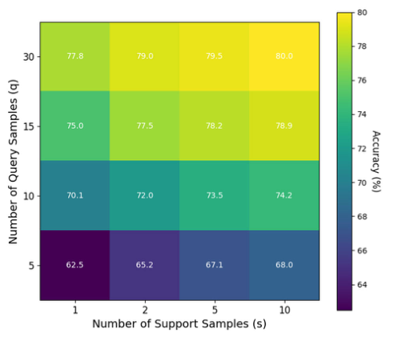

**FIGURE 14.** Accuracy heatmap for different support-to-query ratios.

cross-sample interaction attention [38], [56] exhibit complementary strengths when tackling the FSIC problem. As shown in Figure 12 and Table 12, increasing the number of shots generally produces larger absolute accuracy gains for metric-learning–oriented approaches such as DeepEMD, highlighting their efficiency in exploiting additional labeled samples. This suggests that, for scenarios where annotation cost is not a primary concern, scaling up support examples can be an effective strategy for boosting accuracy in such models.

In contrast, attention-based methods demonstrate greater robustness under high-way configurations and unbalanced support/query splits. As evidenced in Figure 13 and Table 13, when the number of ways increases from 5 to 20, the performance degradation slope for models such as CrossAttentionNet and CosineTransformer remains notably smaller than that of most metric-based counterparts. This stability is further reinforced in Figure 14 and Table 14, where attention-based models maintain competitive accuracy even when the support/query ratio becomes highly skewed, benefiting from richer feature interactions between query and support instances.

These findings underline the tradeoff between absolute gain under more data and robustness to task complexity or data imbalance. In practical FSIC deployments, combining these paradigms or adaptively selecting the inference strategy based on task parameters could provide a balanced performance profile across diverse application conditions.

## **VII. CONCLUSION**

FSIC is a key research topic in computer vision and machine learning. This paper systematically reviews traditional and recently proposed methods and compares their classification performance on multiple benchmark datasets. Based on a review of 26 related studies, this paper summarizes common problem settings, dataset characteristics, and evaluation

metrics. It also deeply analyzes the advantages and disadvantages of metric learning, optimization-driven, data augmentation, Transformer-based models, and hybrid approaches. Furthermore, the paper explores the adaptability of these methods to varying conditions such as sample size, category diversity, and domain shift, and evaluates their robustness in scenarios with varying data scarcity and distribution differences. Furthermore, a hybrid approach combining attention mechanisms with generative models is highlighted, demonstrating its potential to improve generalization and classification accuracy under low-sample conditions. Finally, the paper evaluates the overall effectiveness and scalability of existing FSIC methods, providing valuable insights for both theoretical research and practical applications in this field.

## _A. THE ANSWER OF EIGHT RESEARCH QUESTIONS_

_RQ1:_ What kinds of algorithms have been proposed for FSIC?

Existing FSIC algorithms can be broadly categorized into five types: metric learning, which distinguish categories through high-quality embedding spaces; optimization-driven meta-learning, which leverage fast adaptation to handle new tasks; Transformer-based architectures, which use global context modeling to improve performance in scenarios with large intra-class variation; generative and augmentation methods, which synthesize samples or features to alleviate overfitting; and hybrid and self-supervised methods, which combine multiple strategies to enhance generalization. These approaches have continually innovated in architecture, learning objectives, and adaptation mechanisms, collectively driving FSIC performance improvements in low-data settings.

_RQ2:_ What are the key factors that influence the performance of FSIC models?

The performance of Few-Shot Image Classification models is shaped by several interconnected factors, including the quality of learned embeddings, the design of similarity metrics, and the architecture’s ability to model relationships between samples. High-quality, transferable embeddings provide a strong foundation, while advanced metric designs improve class separability. Attention mechanisms and transformer architecture enhance contextual modeling, and augmentation strategies expand support set diversity to reduce overfitting. Meta-learning approaches enable rapid adaptation, and self-supervised pretraining boosts generalization from limited data. Robustness to domain shifts, the integration of semantic priors, and structural feature alignment further improve adaptability. Together, these factors determine how effectively FSIC models handle data scarcity and unseen classes.

_RQ3:_ What methodological approaches have been developed to address the data scarcity challenge in FSIC?

To address the data scarcity challenge in Few-Shot Image Classification, researchers have developed a range of strategies including embedding refinement to build highly transferable feature spaces, meta-learning for rapid adaptation to

novel tasks, and self-supervision to exploit unlabeled data. Attention mechanisms and transformer-based architectures enhance context-aware matching, while data augmentation and advanced metric learning improve robustness and discrimination under limited samples. Domain adaptation techniques tackle distribution shifts, and multimodal integration leverages semantic cues to strengthen generalization. Together, these approaches expand model capability in lowdata environments.

_RQ4:_ What are the advantages and limitations of different FSIC model types across performance, generalization, and computational efficiency?

Different FSIC model types have their own strengths and weaknesses. Embedding-based models are efficient and provide strong baseline performance but may struggle with novel, divergent classes. Meta-learning methods offer fast adaptation and good generalization but often require complex and time-consuming training. Self-supervised pretraining enhances generalization and reduces overfitting but needs large unlabeled datasets and multi-stage training. Attention and transformer-based models achieve high accuracy by modeling fine-grained relationships but have high computational and memory costs, limiting real-time use. Metric learning models are interpretable and efficient but can underperform with domain shifts or varying support structures. Crossdomain and domain adaptation methods improve robustness in practical settings but add complexity and require domainspecific tuning.

_RQ5:_ How does traditional machine learning-based FSIC methods differ from modern deep learning-based FSIC methods?

Traditional machine learning-based FSIC methods use shallow models, handcrafted features, and simple similarity metrics, performing well only when feature distributions are stable but lacking adaptability and generalization in diverse tasks. In contrast, modern deep learning-based FSIC methods employ dynamic feature extraction, meta-learning, and advanced similarity modeling with deep neural networks, enabling end-to-end adaptation of both encoders and classifiers across tasks. Techniques such as DeepEMD, instance credibility inference, and transformer-based models improve accuracy and generalization by capturing complex support-query relations and leveraging multi-modal information. Additionally, self-supervised pretraining and domain-aware frameworks enhance robustness to domain shifts, though with increased computational complexity. Overall, deep learning-based FSIC represents a shift from fixed, interpretable models to flexible, powerful methods suitable for real-world few-shot challenges.

_RQ6:_ What are the commonly used datasets, benchmarks, and evaluation metrics in FSIC research?

FSIC research commonly uses benchmark datasets such as miniImageNet, tieredImageNet, CIFAR-FS, FC100, and CUB-200 to evaluate model generalization under limited supervision. MiniImageNet and tieredImageNet are widely adopted for their balanced classes and hierarchical structures,

while CUB-200 focuses on fine-grained classification challenges. Evaluation typically follows the N-way K-shot episodic protocol, simulating real-world few-shot scenarios and reporting average accuracy with 95% confidence intervals. Increasingly, cross-domain tests using remote sensing and hyperspectral datasets assess robustness beyond natural images. Alongside accuracy, computational efficiency metrics and class-wise measures like precision and recall are also used to provide comprehensive performance analysis. These standardized datasets, protocols, and metrics enable fair comparisons and foster advancement in FSIC methods.

_RQ7:_ What is the overall empirical performance of representative FSIC methods across standard benchmarks?

The comprehensive evaluation of FSIC methods is mainly carried out from six core dimensions, including accuracy performance, cross-domain generalization ability, robustness to noisy labels and category imbalance, adaptation speed and parameter complexity, fine-grained category and sample number performance analysis, and comprehensive ranking comparison between methods. The research shows that DeepEMD and Adaptive Margin Loss perform well in accuracy and cross-domain generalization, and are particularly suitable for processing fine-grained tasks, while lightweight models such as Meta-Baseline have advantages in efficiency but weak robustness and generalization ability. Although Transformer-type models have outstanding performance in accuracy and generalization, they require high computing resources and have slow adaptation speed. Overall, no single model leads in all dimensions. In practice, it is necessary to balance accuracy, robustness, efficiency and generalization. Future research can optimize the balance between performance and efficiency through technologies such as model compression and self-supervised pre-training.

_RQ8:_ How do FSIC methods perform under different experimental configurations, including variations in the number of shots (K), the number of ways (N), and the support-toquery ratio?

Experimental results show that the performance of the FSIC method is significantly affected by the number of shots (K), the number of categories (N), and the ratio of support set to query set. Increasing the number of support samples generally improves accuracy, especially methods such as DeepEMD based on metric learning show stronger sample utilization efficiency, but the improvement effect tends to saturate after 5 shots. As the number of categories increases, the accuracy of all methods decreases, but structured metrics and adaptive margin methods show better robustness and can maintain a smaller performance drop. Adjustment of the support/query sample ratio shows that attention mechanism methods still maintain stable accuracy when the query samples are rich and the ratio is unbalanced, reflecting their adaptability to complex tasks and data distribution. In summary, different experimental parameters have a significant impact on the performance of FSIC. In practice, they should be reasonably configured according to the characteristics of the task to balance accuracy and generalization ability.

## _B. FUTURE RESEARCH DIRECTIONS_

Based on the systematic review and analysis of the above eight research questions, future research on FSIC should focus on improving the generalization ability and robustness of the model. At present, practical problems such as cross-domain migration, label noise and category imbalance still restrict the performance of the model. Combining domain adaptation technology, adversarial training and selfsupervised pre-training, designing feature extraction and measurement mechanisms that are more independent of specific domains and can be dynamically adjusted will be the key to enhancing the stability and adaptability of the model in complex environments.

In addition, the lightweight and efficient reasoning of FSIC models is also worthy of attention. Although Transformer and structured matching models have made significant progress in accuracy and fine-grained recognition, their high computational overhead limits their promotion in edge devices and real-time applications. Future research should strengthen the application of technologies such as model compression, knowledge distillation and dynamic reasoning, seek a balance between accuracy and resource consumption, and promote the practical engineering implementation of FSIC technology.

Multimodal information fusion and semantic enhancement technologies have shown potential in improving classification performance and generalization ability. Integrating text descriptions, semantic cues, and cross-modal features can help the model better understand the semantic relationships between complex categories, enhance discrimination and generalization effects. Combined with the needs of finegrained recognition, the use of methods such as structured metric learning, sample credibility modeling, and adaptive margin loss is expected to improve the model’s ability to capture subtle category differences.

In terms of experimental design, it is equally important to rationally utilize samples and adjust the ratio of support samples to query samples. Studies have shown that different methods have different sensitivities to the number of support samples and the support-query ratio. In the future, dynamic sample allocation and task adaptive reasoning strategies can be explored to improve classification effects and application practicality under limited annotation resources.

Finally, FSIC has broad prospects in cross-domain practical applications. When extending to remote sensing, medical imaging, low-light environments, and other fields, it should focus on solving problems such as data scarcity, domain differences, and label noise, and promote the transformation of algorithms from theory to engineering applications. To this end, it is necessary to establish a multi-dimensional comprehensive evaluation system covering accuracy, robustness, efficiency and generalization ability, and combine it with interpretability analysis to provide support for fair comparison of methods and application decisions. At the same time, combining meta-learning with self-supervised learning and using unlabeled data to improve model adaptability will

become an important way to improve FSIC performance and reduce dependence on annotations.

## **REFERENCES**

- [1] Y. Wang, Q. Yao, J. T. Kwok, and L. M. Ni, ‘‘Generalizing from a few examples: A survey on few-shot learning,’’ _ACM Comput. Surveys_ , vol. 53, no. 3, pp. 1–34, May 2021.

- [2] W.-Y. Chen, Y.-C. Liu, Z. Kira, Y.-C. Frank Wang, and J.-B. Huang, ‘‘A closer look at few-shot classification,’’ 2019, _arXiv:1904.04232_ .

- [3] A. Krizhevsky, I. Sutskever, and G. Hinton, ‘‘ImageNet classification with deep convolutional neural networks,’’ in _Proc. Adv. Neural Inf. Process. Syst._ , 2012, pp. 1097–1105.

- [4] G. Maicas, A. P. Bradley, J. C. Nascimento, I. Reid, and G. Carneiro, ‘‘Training medical image analysis systems like radiologists,’’ in _Proc. Int. Conf. Med. Image Comput. Comput.-Assist. Intervent. (MICCAI)_ , 2018, pp. 546–554.

- [5] Y. Lin, Y. Chen, K.-T. Cheng, and H. Chen, ‘‘Few shot medical image segmentation with cross attention transformer,’’ in _Proc. Int. Conf. Med. Image Comput. Comput.-Assist. Intervent._ , 2023, pp. 233–243.

- [6] M. S. Norouzzadeh, A. Nguyen, M. Kosmala, A. Swanson, M. S. Palmer, C. Packer, and J. Clune, ‘‘Automatically identifying, counting, and describing wild animals in camera-trap images with deep learning,’’ _Proc. Nat. Acad. Sci. USA_ , vol. 115, no. 25, pp. E5716–E5725, Jun. 2018.

- [7] H. Zhang, Y. Hu, Z. Qian, J. Sha, M. Xie, Y. Wan, and P. Liu, ‘‘Enhancing rare object detection on roadways through conditional diffusion models for data augmentation,’’ _IEEE Trans. Intell. Transp. Syst._ , vol. 25, no. 11, pp. 19018–19029, Nov. 2024.

- [8] T. Hospedales, A. Antoniou, P. Micaelli, and A. Storkey, ‘‘Meta-learning in neural networks: A survey,’’ _IEEE Trans. Pattern Anal. Mach. Intell._ , vol. 44, no. 9, pp. 5149–5169, Sep. 2022.

- [9] O. Vinyals, C. Blundell, T. Lillicrap, K. Kavukcuoglu, and D. Wierstra, ‘‘Matching networks for one shot learning,’’ in _Proc. Adv. Neural Inf. Process. Syst._ , 2016, pp. 3630–3638.

- [10] J. Snell, K. Swersky, R. Zemel, and R. Zemel, ‘‘Prototypical networks for few-shot learning,’’ in _Proc. Adv. Neural Inf. Process. Syst._ , 2017, pp. 1–11.

- [11] F. Sung, Y. Yang, L. Zhang, T. Xiang, P. H. S. Torr, and T. M. Hospedales, ‘‘Learning to compare: Relation network for few-shot learning,’’ in _Proc. IEEE/CVF Conf. Comput. Vis. Pattern Recognit._ , Jun. 2018, pp. 1199–1208.

- [12] C. Finn, P. Abbeel, and S. Levine, ‘‘Model-agnostic meta-learning for fast adaptation of deep networks,’’ in _Proc. 34th Int. Conf. Mach. Learn. (ICML)_ , 2017, pp. 1126–1135.

- [13] Z. Li, F. Zhou, F. Chen, and H. Li, ‘‘Meta-SGD: Learning to learn quickly for few-shot learning,’’ 2017, _arXiv:1707.09835_ .

- [14] A. Nichol, J. Achiam, and J. Schulman, ‘‘On first-order meta-learning algorithms,’’ 2018, _arXiv:1803.02999_ .

- [15] A. A. Rusu, D. Rao, J. Sygnowski, O. Vinyals, R. Pascanu, S. Osindero, and R. Hadsell, ‘‘Meta-learning with latent embedding optimization,’’ 2018, _arXiv:1807.05960_ .

- [16] C. Doersch, A. Gupta, and A. Zisserman, ‘‘CrossTransformers: Spatiallyaware few-shot transfer,’’ in _Proc. Adv. Neural Inf. Process. Syst._ , vol. 33, 2020, pp. 21981–21993.

- [17] D. Busbridge, D. Sherburn, P. Cavallo, and N. Y. Hammerla, ‘‘Relational graph attention networks,’’ 2019, _arXiv:1904.05811_ .

- [18] H. Sun, P. Zhang, X. Zhang, and X. Han, ‘‘Few-shot image classification based on Swin transformer + CSAM + EMD,’’ _Electronics_ , vol. 13, no. 11, p. 2121, May 2024.

- [19] A. Dosovitskiy, L. Beyer, A. Kolesnikov, D. Weissenborn, X. Zhai, T. Unterthiner, M. Dehghani, M. Minderer, G. Heigold, S. Gelly, J. Uszkoreit, and N. Houlsby, ‘‘An image is worth 16×16 words: Transformers for image recognition at scale,’’ 2020, _arXiv:2010.11929_ .

- [20] A. Antoniou, A. Storkey, and H. Edwards, ‘‘Data augmentation generative adversarial networks,’’ 2017, _arXiv:1711.04340_ .

- [21] S. Gidaris, A. Bursuc, N. Komodakis, P. P. Pérez, and M. Cord, ‘‘Boosting few-shot visual learning with self-supervision,’’ in _Proc. IEEE/CVF Int. Conf. Comput. Vis. (ICCV)_ , Oct. 2019, pp. 8058–8067.

- [22] T. Chen, S. Kornblith, M. Norouzi, and G. Hinton, ‘‘A simple framework for contrastive learning of visual representations,’’ in _Proc. 37th Int. Conf. Mach. Learn._ , 2020, pp. 1597–1607.

- [23] K. He, H. Fan, Y. Wu, S. Xie, and R. Girshick, ‘‘Momentum contrast for unsupervised visual representation learning,’’ in _Proc. IEEE/CVF Conf. Comput. Vis. Pattern Recognit. (CVPR)_ , Jun. 2020, pp. 9729–9738.

- [24] A. Radford, J. W. Kim, C. Hallacy, A. Ramesh, G. Goh, S. Agarwal, G. Sastry, A. Askell, P. Mishkin, J. Clark, G. Krueger, and I. Sutskever, ‘‘Learning transferable visual models from natural language supervision,’’ in _Proc. 38th Int. Conf. Mach. Learn._ , 2021, pp. 8748–8763.

- [25] H.-Y. Tseng, H.-Y. Lee, J.-B. Huang, and M.-H. Yang, ‘‘Cross-domain few-shot classification via learned feature-wise transformation,’’ 2020, _arXiv:2001.08735_ .

- [26] R. Tao, H. Zhang, Y. Zheng, and M. Savvides, ‘‘Powering finetuning in few-shot learning: Domain-agnostic bias reduction with selected sampling,’’ in _Proc. AAAI Conf. Artif. Intell._ , 2022, pp. 8467–8475.

- [27] M. Ochal, M. Patacchiola, J. Vazquez, A. Storkey, and S. Wang, ‘‘Class imbalance in few-shot learning,’’ in _Proc. ICLR_ , 2021, pp. 1–8.

- [28] O. Sbai, C. Couprie, and M. Aubry, ‘‘Impact of base dataset design on few-shot image classification,’’ in _Proc. Eur. Conf. Comput. Vis._ , 2020, pp. 597–613.

- [29] M. Lichtenstein, P. Sattigeri, R. Feris, R. Giryes, and L. Karlinsky, ‘‘TAFSSL: Task-adaptive feature sub-space learning for few-shot classification,’’ in _Proc. Eur. Conf. Comput. Vis.-ECCV_ , 2020, pp. 522–539.

- [30] Y. Zhang, J. Cao, L. Zhang, X. Liu, Z. Wang, F. Ling, and W. Chen, ‘‘A free lunch from ViT: Adaptive attention multi-scale fusion transformer for fine-grained visual recognition,’’ in _Proc. IEEE Int. Conf. Acoust., Speech Signal Process. (ICASSP)_ , May 2022, pp. 3234–3238.

- [31] E. Triantafillou, T. Zhu, V. Dumoulin, P. Lamblin, U. Evci, K. Xu, R. Goroshin, C. Gelada, K. Swersky, P.-A. Manzagol, and H. Larochelle, ‘‘Meta-dataset: A dataset of datasets for learning to learn from few examples,’’ 2019, _arXiv:1903.03096_ .

- [32] Z. Zhu, L. Wang, S. Guo, and G. Wu, ‘‘A closer look at few-shot video classification: A new baseline and benchmark,’’ 2021, _arXiv:2110.12358_ .

- [33] P. Xu, X. Zhu, and D. A. Clifton, ‘‘Multimodal learning with transformers: A survey,’’ _IEEE Trans. Pattern Anal. Mach. Intell._ , vol. 45, no. 10, pp. 12113–12132, Oct. 2023.

- [34] B. M. Lake, R. Salakhutdinov, and J. B. Tenenbaum, ‘‘The omniglot challenge: A 3-year progress report,’’ _Current Opinion Behav. Sci._ , vol. 29, pp. 97–104, Oct. 2019.

- [35] Y. Liu, J. Lee, M. Park, S. Kim, E. Yang, S. Ju Hwang, and Y. Yang, ‘‘Learning to propagate labels: Transductive propagation network for fewshot learning,’’ 2018, _arXiv:1805.10002_ .

- [36] H.-J. Ye, H. Hu, D.-C. Zhan, and F. Sha, ‘‘Few-shot learning via embedding adaptation with set-to-set functions,’’ in _Proc. IEEE/CVF Conf. Comput. Vis. Pattern Recognit. (CVPR)_ , Jun. 2020, pp. 8805–8814.

- [37] D. Kang, H. Kwon, J. Min, and M. Cho, ‘‘Relational embedding for fewshot classification,’’ in _Proc. IEEE/CVF Int. Conf. Comput. Vis. (ICCV)_ , Oct. 2021, pp. 8802–8813.

- [38] Q.-H. Nguyen, C. Q. Nguyen, D. D. Le, and H. H. Pham, ‘‘Enhancing fewshot image classification with cosine transformer,’’ _IEEE Access_ , vol. 11, pp. 79659–79672, 2023.

- [39] L. Bertinetto, J. F. Henriques, P. H. S. Torr, and A. Vedaldi, ‘‘Meta-learning with differentiable closed-form solvers,’’ 2018, _arXiv:1805.08136_ .

- [40] M. Andrychowicz, M. Denil, S. Gómez, M. W. Hoffman, D. Pfau, T. Schaul, and N. de Freitas, ‘‘Learning to learn by gradient descent by gradient descent,’’ in _Proc. Adv. Neural Inf. Process. Syst._ , vol. 29, 2016, pp. 3981–3989.

- [41] Y. N. Dauphin and S. S. Schoenholz, ‘‘MetaInit: Initializing learning by learning to initialize,’’ in _Proc. Adv. Neural Inf. Process. Syst._ , vol. 32, 2019, pp. 12624–12636.

- [42] M. Boudiaf, Z. I. Masud, J. Rony, J. Dolz, P. Piantanida, and I. B. Ayed, ‘‘Transductive information maximization for few-shot learning,’’ in _Proc. Adv. Neural Inf. Process. Syst._ , vol. 33, 2020, pp. 2445–2457.

- [43] Y. Ma, S. Bai, S. An, W. Liu, A. Liu, X. Zhen, and X. Liu, ‘‘Transductive relation-propagation network for few-shot learning,’’ in _Proc. 29th Int. Joint Conf. Artif. Intell._ , Jul. 2020, pp. 804–810.

- [44] B. Hariharan and R. Girshick, ‘‘Low-shot visual recognition by shrinking and hallucinating features,’’ in _Proc. IEEE Int. Conf. Comput. Vis. (ICCV)_ , Oct. 2017, pp. 3018–3027.

- [45] E. Schwartz, L. Karlinsky, J. Shtok, S. Harary, M. Marder, A. Kumar, R. Feris, R. Giryes, and A. M. Bronstein, ‘‘Delta-encoder: An effective sample synthesis method for few-shot object recognition,’’ in _Proc. Adv. Neural Inf. Process. Syst._ , vol. 31, 2018, pp. 2845–2855.

- [46] Y.-X. Wang, R. Girshick, M. Hebert, and B. Hariharan, ‘‘Low-shot learning from imaginary data,’’ in _Proc. IEEE/CVF Conf. Comput. Vis. Pattern Recognit._ , Jun. 2018, pp. 7278–7286.

- [47] Y. Xian, S. Sharma, B. Schiele, and Z. Akata, ‘‘F-VAEGAN-d2: A feature generating framework for any-shot learning,’’ in _Proc. IEEE/CVF Conf. Comput. Vis. Pattern Recognit. (CVPR)_ , Jun. 2019, pp. 10275–10284.

- [48] S. Qiu, W. Yang, and M. Yang, ‘‘Hybrid feature collaborative reconstruction network for few-shot fine-grained image classification,’’ in _Proc. IEEE Int. Conf. Acoust., Speech Signal Process. (ICASSP)_ , Apr. 2025, pp. 1–5.

- [49] Y. Chen, Y. Ma, T. Ko, J. Wang, and Q. Li, ‘‘MetaMix: Improved metalearning with interpolation-based consistency regularization,’’ in _Proc. 25th Int. Conf. Pattern Recognit. (ICPR)_ , Jan. 2021, pp. 407–414.

- [50] C. Xing, N. Rostamzadeh, B. N. Oreshkin, and P. O. Pinheiro, ‘‘Adaptive cross-modal few-shot learning,’’ in _Proc. Adv. Neural Inf. Process. Syst._ , vol. 32, 2019, pp. 4848–4858.

- [51] X. Yan, Z. Chen, A. Xu, X. Wang, X. Liang, and L. Lin, ‘‘Meta R-CNN: Towards general solver for instance-level low-shot learning,’’ in _Proc. IEEE/CVF Int. Conf. Comput. Vis. (ICCV)_ , Oct. 2019, pp. 9576–9585.

- [52] C. Song, Y. Liu, and J. He, ‘‘A survey of transformer-based few-shot image classification techniques,’’ in _Proc. 6th Int. Conf. Natural Lang. Process. (ICNLP)_ , Mar. 2024, pp. 599–608.

- [53] Y. Tian, Y. Wang, D. Krishnan, J. B. Tenenbaum, and P. Isola, ‘‘Rethinking few-shot image classification: A good embedding is all you need?’’ in _Proc. Eur. Conf. Comput. Vis.-ECCV_ , 2020, pp. 266–282.

- [54] M. Nurgazin and N. A. Tu, ‘‘A comparative study of vision transformer encoders and few-shot learning for medical image classification,’’ in _Proc. IEEE/CVF Int. Conf. Comput. Vis. Workshops (ICCVW)_ , Oct. 2023, pp. 2513–2521.

- [55] J. Yang, H. Wu, J. Zhang, L. Gao, and J. Song, ‘‘Effective and efficient few-shot fine-tuning for vision transformers,’’ in _Proc. IEEE Int. Conf. Multimedia Expo (ICME)_ , Jul. 2024, pp. 1–6.

- [56] R. Hou, H. Chang, B. Ma, S. Shan, and X. Chen, ‘‘Cross attention network for few-shot classification,’’ in _Proc. Adv. Neural Inf. Process. Syst._ , vol. 32, 2019, pp. 4005–4016.

- [57] J. Hong, P. Fang, W. Li, T. Zhang, C. Simon, M. Harandi, and L. Petersson, ‘‘Reinforced attention for few-shot learning and beyond,’’ in _Proc. IEEE/CVF Conf. Comput. Vis. Pattern Recognit. (CVPR)_ , Jun. 2021, pp. 913–923.

- [58] Z. Jiang, B. Kang, K. Zhou, and J. Feng, ‘‘Few-shot classification via adaptive attention,’’ 2020, _arXiv:2008.02465_ .

- [59] C. He, D. Xu, K. Gong, F. Guo, and D. Wei, ‘‘SCNet: Few-shot image classification via self-correlational and cross spatial-correlation attention,’’ _Eng. Sci. Technol., Int. J._ , vol. 67, Jul. 2025, Art. no. 102075.

- [60] J. Kim, T. Kim, S. Kim, and C. D. Yoo, ‘‘Edge-labeling graph neural network for few-shot learning,’’ in _Proc. IEEE/CVF Conf. Comput. Vis. Pattern Recognit. (CVPR)_ , Jun. 2019, pp. 11–20.

- [61] K. Lee, S. Maji, A. Ravichandran, and S. Soatto, ‘‘Meta-learning with differentiable convex optimization,’’ in _Proc. IEEE/CVF Conf. Comput. Vis. Pattern Recognit. (CVPR)_ , Jun. 2019, pp. 10657–10665.

- [62] G. S. Dhillon, P. Chaudhari, A. Ravichandran, and S. Soatto, ‘‘A baseline for few-shot image classification,’’ 2019, _arXiv:1909.02729_ .

- [63] S. Yang, L. Liu, and M. Xu, ‘‘Free lunch for few-shot learning: Distribution calibration,’’ 2021, _arXiv:2101.06395_ .

- [64] Z. Yang, Y. Li, Q. Sun, B. Fernando, H. Huang, and Z. Wang, ‘‘Crossmodal few-shot learning: A generative transfer learning framework,’’ 2024, _arXiv:2410.10663_ .

- [65] J.-C. Su, S. Maji, and B. Hariharan, ‘‘When does self-supervision improve few-shot learning?’’ in _Proc. Eur. Conf. Comput. Vis.-ECCV_ , 2020, pp. 645–666.

- [66] Y. Zhang, M. Li, Y. Xie, C. Li, C. Wang, Z. Zhang, and Y. Qu, ‘‘Selfsupervised exclusive learning for 3D segmentation with cross-modal unsupervised domain adaptation,’’ in _Proc. 30th ACM Int. Conf. Multimedia_ , Oct. 2022, pp. 3338–3346.

- [67] S. Ravi and H. Larochelle, ‘‘Optimization as a model for few-shot learning,’’ in _Proc. Int. Conf. Learn. Represent._ , 2017, pp. 1–11.

- [68] P.-Y. Huang, H. Xu, J. Li, A. Baevski, M. Auli, W. Galuba, F. Metze, and C. Feichtenhofer, ‘‘Masked autoencoders that listen,’’ in _Proc. Adv. Neural Inf. Process. Syst._ , vol. 35, 2022, pp. 28708–28720.

- [69] L. Hu, W. He, L. Zhang, and H. Zhang, ‘‘Cross-domain meta-learning under dual-adjustment mode for few-shot hyperspectral image classification,’’ _IEEE Trans. Geosci. Remote Sens._ , vol. 61, 2023, Art. no. 5526416.

- [70] G. Tsoumplekas, V. Li, P. Sarigiannidis, and V. Argyriou, ‘‘A complete survey on contemporary methods, emerging paradigms and hybrid approaches for few-shot learning,’’ 2024, _arXiv:2402.03017_ .

- [71] M. J. Page et al., ‘‘The PRISMA 2020 statement: An updated guideline for reporting systematic reviews,’’ _BMJ_ , vol. 372, p. 71, Jan. 2021.

- [72] Y. Wang, C. Xu, C. Liu, L. Zhang, and Y. Fu, ‘‘Instance credibility inference for few-shot learning,’’ in _Proc. IEEE/CVF Conf. Comput. Vis. Pattern Recognit. (CVPR)_ , Jun. 2020, pp. 12836–12845.

- [73] Y. Chen, X. Wang, Z. Liu, H. Xu, and T. Darrell, ‘‘A new meta-baseline for few-shot learning,’’ _JAPAI_ , vol. 2, no. 3, p. 5, 2020.

- [74] A. Li, W. Huang, X. Lan, J. Feng, Z. Li, and L. Wang, ‘‘Boosting few-shot learning with adaptive margin loss,’’ in _Proc. IEEE/CVF Conf. Comput. Vis. Pattern Recognit. (CVPR)_ , Jun. 2020, pp. 12573–12581.

- [75] H. Zhou, L. Xia, X. Du, and S. Li, ‘‘FRIC: A framework for few-shot remote sensing image captioning,’’ _Int. J. Digit. Earth_ , vol. 17, no. 1, Dec. 2024, Art. no. 2337240.

QI QIAO received the M.S. degree in control engineering from Jiangnan University, in 2010, and the Ph.D. degree in computer science from Universiti Teknologi MARA, in 2025. He is currently an Associate Professor with Jiangsu Vocational College of Electronics and Information. His research interests include image classification, machine learning, and optical communication.

- [76] C. Zhang, Y. Cai, G. Lin, and C. Shen, ‘‘DeepEMD: Few-shot image classification with differentiable Earth mover’s distance and structured classifiers,’’ in _Proc. IEEE/CVF Conf. Comput. Vis. Pattern Recognit. (CVPR)_ , Jun. 2020, pp. 12200–12210.

- [77] Q. Sun, Y. Liu, T.-S. Chua, and B. Schiele, ‘‘Meta-transfer learning for fewshot learning,’’ in _Proc. IEEE/CVF Conf. Comput. Vis. Pattern Recognit. (CVPR)_ , Jun. 2019, pp. 403–412.

- [78] Y. Gao, N. Fei, G. Liu, Z. Lu, and T. Xiang, ‘‘Contrastive prototype learning with augmented embeddings for few-shot learning,’’ in _Proc. Uncertainty Artif. Intell._ , 2021, pp. 140–150.

- [79] F. Zhou, P. Wang, L. Zhang, W. Wei, and Y. Zhang, ‘‘Revisiting prototypical network for cross domain few-shot learning,’’ in _Proc. IEEE/CVF Conf. Comput. Vis. Pattern Recognit. (CVPR)_ , Jun. 2023, pp. 20061–20070.

- [80] Y. Wu, H. Cao, Y. Lai, L. Zhao, X. Deng, and S. Wan, ‘‘Edge computing and few-shot learning featured intelligent framework in digital twin empowered mobile networks,’’ _IEEE Trans. Netw. Service Manag._ , vol. 21, no. 3, pp. 6505–6514, Dec. 2024.

- [81] B. Li, C. Liu, M. Shi, X. Chen, X. Ji, and Q. Ye, ‘‘Proposal distribution calibration for few-shot object detection,’’ 2022, _arXiv:2212.07618_ .

SHENGGUO GE received the B.S. degree from the Department of Physics and Optoelectronic Engineering, Guangdong University of Technology, Guangzhou, China, in 2016, the M.S. degree from the Department of Information Engineering, Guangdong University of Technology, in 2020, and the Ph.D. degree from Universiti Putra Malaysia, in 2025. His research interests include signal processing, pattern recognition, and deep learning.

- [82] J. Li, M. Gong, H. Liu, Y. Zhang, M. Zhang, and Y. Wu, ‘‘Multiform ensemble self-supervised learning for few-shot remote sensing scene classification,’’ _IEEE Trans. Geosci. Remote Sens._ , vol. 61, 2023, Art. no. 4500416.

- [83] H. Liu, S. Wan, P. Jin, and X. Wang, ‘‘Semantic prompt based multi-scale transformer for few-shot classification,’’ in _Proc. IEEE Int. Conf. Big Data (BigData)_ , Dec. 2023, pp. 2200–2205.

- [84] J. Lai, S. Yang, G. Jiang, X. Wang, Y. Li, Z. Jia, X. Chen, J. Liu, B.-B. Gao, W. Zhang, Y. Xie, and C. Wang, ‘‘Rethinking the metric in few-shot learning: From an adaptive multi-distance perspective,’’ in _Proc. 30th ACM Int. Conf. Multimedia_ , Oct. 2022, pp. 4021–4030.

- [85] M. Su, F. He, G. Li, and F. Li, ‘‘PrototypeFormer: Learning to explore prototype relationships for few-shot image classification,’’ _Neurocomputing_ , vol. 640, Aug. 2025, Art. no. 130326.

- [86] D. Kang, P. Koniusz, M. Cho, and N. Murray, ‘‘Distilling self-supervised vision transformers for weakly-supervised few-shot classification & segmentation,’’ in _Proc. IEEE/CVF Conf. Comput. Vis. Pattern Recognit. (CVPR)_ , Jun. 2023, pp. 19627–19638.

KE WANG received the Ph.D. degree in electronic and information engineering from Nanjing University of Aeronautics and Astronautics, in 2021. He is currently an Associate Professor with Jiangsu Vocational College of Electronics and Information. His research interests include SAR image detection, SAR image recognition, and machine learning.

- [87] H. Wang, S. Jie, and Z. Deng, ‘‘Focus your attention when few-shot classification,’’ in _Proc. Adv. Neural Inf. Process. Syst._ , vol. 36, 2023, pp. 59689–59707.

- [88] S. R. Nandam, S. Atito, Z. Feng, J. Kittler, and M. Awais, ‘‘Text augmented correlation transformer for few-shot classification & segmentation,’’ in _Proc. IEEE/CVF Conf. Comput. Vis. Pattern Recognit. (CVPR)_ , Jun. 2025, pp. 25357–25366.

- [89] Y. Chen, Z. Xu, J. Wang, and Z.-X. Yang, ‘‘Adaptive set-level metric for few-shot image classification,’’ _Neural Netw._ , vol. 192, Dec. 2025, Art. no. 107924.

- [90] J. Xie, F. Long, J. Lv, Q. Wang, and P. Li, ‘‘Joint distribution matters: Deep Brownian distance covariance for few-shot classification,’’ in _Proc. IEEE/CVF Conf. Comput. Vis. Pattern Recognit. (CVPR)_ , Jun. 2022, pp. 7962–7971.

- [91] A. Afrasiyabi, H. Larochelle, J.-F. Lalonde, and C. Gagne, ‘‘Matching feature sets for few-shot image classification,’’ in _Proc. IEEE/CVF Conf. Comput. Vis. Pattern Recognit. (CVPR)_ , Jun. 2022, pp. 9014–9024.

HUIYING HU received the master’s degree from Nanning Normal University. She is currently pursuing the Ph.D. degree in computer science with Universiti Teknologi MARA. Her research interests include databases, artificial intelligence, and android mobile applications.
