Received 27 March 2025, accepted 16 April 2025, date of publication 21 April 2025, date of current version 1 May 2025. _Digital Object Identifier 10.1109/ACCESS.2025.3562918_

# Machine Translation Performance for Low-Resource Languages: A Systematic Literature Review

TAOFIK O. TAFA 1,2, SITI ZAITON MOHD HASHIM 1, MOHD SHAHIZAN OTHMAN 1, HITHAM ALHUSSIAN 3, (Senior Member, IEEE), MAGED NASSER 3, SAID JADID ABDULKADIR 3, (Senior Member, IEEE), SHARIN HAZLIN HUSPI 1, SARAFA O. ADEYEMO 1,2, AND YUNUSA ADAMU BENA1,4, (Member, IEEE)

1Faculty of Computing, Universiti Teknologi Malaysia, Johor Bahru 81310, Malaysia

2Department of Computer Science, Federal College of Education (Technical) at Gusau, Gusau 632101, Nigeria

3Department of Computer and Information Sciences, Universiti Teknologi PETRONAS, Seri Iskandar, Perak 32610, Malaysia

4Faculty of Engineering, Kebbi State University of Science and Technology, Aliero, Nigeria

Corresponding authors: Taofik O. Tafa (tafa@graduate.utm.my) and Maged Nasser (maged.nasser@utp.edu.my)

This work was supported by Yayasan UTP under Grant YUTP-PRG 015PBC-028.

- **ABSTRACT** Machine translation (MT) for low-resource languages continues to face significant challenges because of limited digital resources and parallel corpora, despite remarkable developments in neural machine translation (NMT). Addressing these challenges requires a thorough review of existing research to identify effective strategies and methods. To achieve this, a systematic literature review (SLR) is conducted following PRISMA guidelines and systematically analysing studies published in various academic databases in the last five years (between 2020 and 2024). A total of 69 relevant articles were examined to evaluate the performance of MT, explore persistent challenges and assess the effectiveness of proposed or used solutions. The analysis shows that while NMT has emerged as the predominant approach, its effectiveness is often reduced by the scarcity of training data and the structural complexity of low-resource languages. Strategies such as active learning, data augmentation, multilingual models and transfer learning are identified as critical for improving translation performance. Additionally, emerging research trends, including data pre-processing, optimization of decoder and rule-based approach demonstrate promising directions for addressing existing limitations. In terms of evaluation, most of the studies used Character n-gram F-score (ChrF), Translation Edit Rate (TER), Metric for Evaluation of Translation with Explicit Ordering (METEOR), Word Error Rate (WER) and Bilingual Evaluation Underscore (BLEU) as techniques’ validation metrics. This review provides a detailed evaluation of the current state of MT for low-resource languages and emphasizes the need for further research into underrepresented languages and the development of comprehensive datasets.

- **INDEX TERMS** Low-resource languages, machine translation, machine translation performance, machine translation techniques, systematic literature review.

## **I. INTRODUCTION**

There has been a significant improvement in machine translation (MT) of languages with adequate linguistic resources in recent times. However, MT performance for low-resource languages remains a critical challenge. These languages,

according to [1], often lack sufficient digital resources and support, extensive parallel corpora, comprehensive linguistic resources, and robust computational infrastructure, leading to translation quality that are short of standard. Despite the increasing number of research in the area, there is no comprehensive synthesis of the latest cutting-edge techniques, challenges, and effective methodologies specifically tailored for low-resource languages. The performance of MT for

low-resource languages has been a focus of recent research efforts. Neural machine translation (NMT) emerged as the dominant approach in MT systems, but its effectiveness for low-resource languages is hampered by the lack of parallel corpora [2].

For further advancement in MT performance, especially for low-resource languages, there is a need for a piece of work that goes beyond explanation or implementation of various techniques explored to enhance MT performance in languages with limited or no linguistic resources. A study that carefully examine earlier literature on MT performance in these languages is worthwhile. A systematic literature review (SLR) on the other hand can satisfy all these purposes. This SLR addresses this gap by consolidating and analysing existing research on MT performance for low-resource languages. The study evaluates published articles between 2020 and 2024, identifying temporal trends in MT techniques, challenges and limitations of low-resource MT and strategies and methodologies used or proposed in enhancing MT performance for low-resource languages.

## **II. RELATED WORKS**

Several studies have been conducted on MT performance for low-resource languages and some of these studies looked at improving NMT accuracy using monolingual data and the adaptation of model architectures, highlighting the importance of extensive research in this area. For example, [1] emphasize methods for improving translation accuracy through NMT model architecture adaptations and the use of monolingual data after revealing a significant absence of high-quality and extensive parallel corpora for the Kashmiri language, which remains a barrier to effective MT. A systematic review by [3] investigated the landscape of multilingual sentiment analysis for low-resource languages and used a multilingual automatic speech recognition (ASR) system for initialization in low-resource scenarios and found that deep learning-based methods significantly enhanced sentiment classification performance. In their study, connectionist temporal classification (CTC) was included as an additional target during training and decoding, which significantly improved internal representations and final translation quality. Yazar et al. [4] conducted an SLR of low-resource NMT, which highlighted the importance of incorporating additional data sources such as monolingual data to enhance translation quality when parallel bilingual data is scarce. Among the findings of the study is that bilingual evaluation underscore (BLEU) was found to be most widely used metric among the studies reviewed out of 13 evaluation metrics identified for assessing translation quality. Abdullah and Rusli [5] explore the challenges and advancements in analysing sentiments expressed in multiple languages across various social media platforms, utilising MT preprocessing technique, which is crucial for handling texts in multiple languages, especially when resources for certain languages are limited, and found that hybrid approaches combining MT, tokenization, and

deep learning yielded the most effective results across multiple language pairs.

Similarly, [6] focused on strategies to improve lowresource speech-to-text translation by employing an encoder-decoder framework with multilingual ASR for initialization and using CTC during training. These approaches have shown considerable improvements, achieving a BLEU score of 7.3 on Tamasheq French data and identifying effective strategies for low-resource speech-to-text translation. Ranathunga et al. [7] provided a comprehensive survey on NMT for low-resource languages, highlighting the use of supervised, unsupervised, semi-supervised, and transfer learning techniques to improve robustness, interpretability, and alleviate bias in multilingual models. Their study emphasized the challenges posed by limited resources and the problem in collecting labeled data, suggesting that fine-tuning techniques, which transfer knowledge between parent and child models, are highly effective. Additionally, [8] demonstrated that augmenting training data with parser-generated syntactic phrases significantly improves NMT performance in low-resource scenarios, achieving notable improvements in BLEU and Metric for Evaluation of Translation with Explicit Ordering (METEOR) scores.

Recent advancements in MT have increasingly leveraged large language models (LLMs) such as GPT-4, LLaMA, and DeepSeek, which exhibit strong cross-lingual transfer capabilities, especially for low-resource languages [9]. Unlike traditional NMT models that rely heavily on parallel corpora, LLMs are pretrained on vast multilingual data and can perform zero-shot and few-shot translation tasks with impressive fluency and contextual understanding [9], [10]. For instance, GPT-4 has demonstrated proficiency in translating over 50 languages with minimal or no task-specific fine-tuning [11], while Meta’s LLaMA and DeepSeek models have shown notable performance improvements in zero-shot MT benchmarks through their decoder-only or encoder-decoder transformer designs [9]. Lankford et al. [12] streamlined the fine-tuning process of a multilingual LLM (adaptMLLM ) and significant improvements were observed in translation performance for low-resourced language pairs, such as English to Irish and English to Marathi. These advancements collectively contribute to a nuanced understanding of strategies and methodologies aimed at improving MT performance for low-resource languages. This study aims to systematically review recent developments in MT for low-resource languages, focusing on performance trends, challenges, and strategies used or proposed to improve MT for low-resource languages, thereby offering researchers a consolidated reference point for future innovations in this domain.

## _A. LOW-RESOURCE LANGUAGES_

Low-resourced languages are languages with limited computational and linguistic resources [3], which affects the development and performance of MT systems. There are

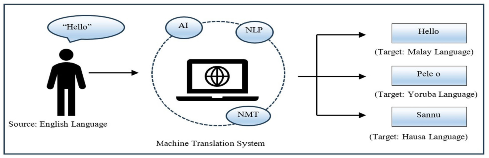

**FIGURE 1.** MT system translating into low-resource languages (Authors own creation.

often no large corpora and pre-trained models for these languages, making it difficult to train effective MT systems, and often leads to lower accuracy in language understanding, generation and relevance of responses for MT systems [13]. This lack of resources stems from multiple factors, including historical underrepresentation in technological advancements, and limited documentation of these languages [7]. For instance, many African languages face challenges such as complex grammatical structures, noun classification systems, and verb morphology [14], which add further difficulties to natural language processing (NLP) tasks. Furthermore, the challenges of tokenization and inherent linguistic differences compared to resource-rich languages worsen the problem of resource inequality, as low-resource languages are often inefficiently tokenized, resulting in increased costs and lower model performance [15], [16]. Not only are these languages underrepresented in digital platforms, but the existing data is often noisy or domain-specific and usually comes from religious or government sources that may not be representative of general language use [17]. These challenges are not only limited to translating the low-resource languages but also affecting the translation of high-resource languages like English into the low-resource languages. Figure 1 illustrates an MT system (Google Translate) challenge of translating into low-resource languages. Though the English word ‘‘Hello’’ is literally translated as ‘‘Pele o’’ (Yoruba language) and ‘‘Sannu’’ (Hausa language), the two words contextually mean ‘‘sorry’’ in both Yoruba and Hausa low-resource languages respectively. Also, ‘‘Hello’’ in English is returned as ‘‘Hello’’ in Malay.

Low-resource languages are increasingly being integrated into various natural language understanding (NLU) tasks beyond MT, including abstractive summarization using multilingual models like multilingual Bidirectional and Auto-Regressive Transformers (mBART) and Multilingual Text-to-Text Transfer Transformer (mT5), cross-lingual question answering with translated datasets, and Named Entity Recognition (NER) via transfer learning or lexiconbased methods, despite persistent challenges in tokenization, morphology, and data scarcity [18], [19].

The preservation and translation of low-resource languages is crucial for cultural heritage, social diversity and technological inclusivity, as many of them, spoken by marginalized communities, are at risk of extinction due to the lack of written documentation, digital resources and institutional support [7].

## _B. NOTABLE MT MODELS FOR LOW-RESOURCE LANGUAGES_

Several MT models have been developed specifically to address challenges associated with low-resource languages. These models focus on improving data efficiency and leveraging techniques such as transfer learning, data augmentation, backtranslation, multilingual models and unsupervised learning to improve performance on languages with limited data availability, all of which can be utilized to translate between various low-resource language pairs.

Table 1 provides an overview of notable MT models designed to address the challenges of translating low-resource languages. It highlights the models employed, languages targeted and the models’ unique features and achievement.

## **III. METHODOLOGY**

For this systematic review work, we adopted a rigorous and comprehensive research methodology. We began by defining clear research questions to guide the study, focusing on the techniques used, challenges and limitation faced in MT for low-resource languages and strategies and techniques used to enhance MT of these languages. We systematically searched multiple academic databases. Inclusion and exclusion criteria were established to select studies published in peer-reviewed journals from 2020 to 2024. Articles that are not directly related to machine translation for low-resource languages were excluded. Data extraction was performed on selected studies, capturing essential information such as the languages addressed, MT models used, datasets, evaluation metrics, and key findings. We employed qualitative analysis to identify common themes, trends, and gaps in the research. While performing, documenting, and reporting our SLR, we adhered to the Preferred Reporting Items for Systematic reviews and

**TABLE 1.** Overview of notable mt models for low-resource languages.

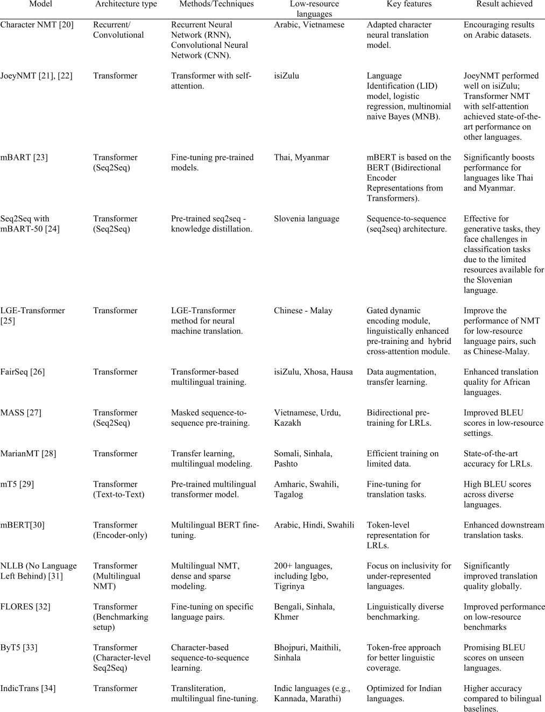

Meta-Analyses (PRISMA) guidelines, as shown in Figure 2. PRISMA ensures transparency and comprehensiveness in review process [35].

In conducting the SLR, recent research and literature review tools were used. A bibliometric analysis was conducted to examine the key items co-occurrence using R- studio. Harzing’s Publish or Perish was used to retrieved and analysed articles obtained from various academic databases. Microsoft Excel was employed for listing articles, facilitating the SLR procedures and generation of visual representations and charts. SciSpace, an amazing AI tool developed to assist researchers in navigating and understanding scientific literature easily [36], was also used in analysing and extracting relevant information from the studied articles, while Zotero was utilised in managing the articles’ citations. The comprehensive approach ensured a thorough and unbiased review, providing valuable insights into the current state and future directions of MT for low-resource languages.

The final selection of 69 studies was determined through a structured review process based on PRISMA, which involved initial retrieval of 1534 articles and subsequently removal of duplicates, refining to related years, language and abstract screening, and full-text eligibility checks based on clearly defined inclusion and exclusion criteria. This methodological rigour ensures that the selected studies are highly relevant, current, and peer-reviewed, focusing specifically on MT for low-resource languages.

## _A. RESEARCH QUESTIONS AND RATIONALE_

In pursuit of fulfilling the primary aim of the study, three research questions (RQ) were formulated with each of them having sub-questions. These research questions and the rationale behind each of them are outlined in Table 2.

## _B. DATA SOURCE AND SEARCH STRATEGY_

The research strategy for this study involved a meticulously designed database search protocol using the following five databases that are highly relevant to our field:

- Science Direct: https://www.sciencedirect.com/

## _C. INCLUSION/EXCLUSION CRITERIA_

In an SLR, inclusion and exclusion criteria are defined to ensure that only relevant and high-quality studies are selected for review [37]. These criteria help in directing the study toward the scope of the research questions.

Inclusion criteria:

- Articles published in journals which are focused and related to MT of low-resource languages.

- Articles within the period from 2020 to 2024.

Exclusion criteria:

- Non-English publications

- Articles that cannot be accessed

- Informal studies (articles from unknown sources)

- Articles that were irrelevant to the research questions

## _D. QUALITY ASSESSMENT_

The quality assessment was conducted to refine the scope of data collection and analysis of this study. The focus of the quality assessment was to evaluate how well each of the studies answered the research questions [37] posed in this study. To ensure objectivity, two independent reviewers conducted quality assessments using predefined quality assessment questions linked to research questions. Inter-rater agreement was computed using Cohen’s Kappa to ensure quality [37] and a Cohen’s Kappa coefficient ( _κ_ ) of 0.73 was obtained, indicating substantial agreement. This assessment helped in the precise extraction of relevant studies and elimination of irrelevant ones. Table 4 lists the three quality assessment questions used to determine the quality assessment criteria, while Table 5 served as the scoring matrix for assigning points to each paper. The three quality assessment questions were carefully selected for their alignment with study’s research questions and their ability to filter for relevance. The maximum obtainable score is 3 and papers scoring 2 or higher were included because they either provided a generally comprehensive identification and analysis with some detail or addressed the topic thoroughly with solid data and clear analysis. Table 6 presents the list of the studied articles and the results of the quality assessment score of each article.

- Web of Science: https://www.webofscience.com/

- Scopus: https://www.scopus.com/

- SpringerLink: https://link.springer.com/

- IEEE Xplore: https://ieeexplore.ieee.org/

Search terms were formulated, and the following search strings were eventually used: ‘‘machine translation’’ AND (‘‘low resource’’ OR ‘‘under resource’’) AND languages. The keywords ‘‘low resource’’ or ‘‘under resource’’ were used as parts of the search strings because the two terms are usually used in articles synonymously. Table 3 gives the initial search results. The papers were then screened based on their title, keywords, and abstract. The outcomes of the database searched were documented as lists on the respective database platforms, imported into Excel spreadsheets, and consolidated on the primary worksheet. During the screening, non-relevant articles and those that are not open access were excluded.

## **IV. RESULTS**

In this study, we analysed 69 articles published between 2020 and 2024 to determine the state of MT for low-resource languages. A brief data analysis was conducted on the key terms and abstract fields of the 69 studied articles using R-Studio. Figure 3 highlights key themes and relationships in the fields. _Neural machine translation_ emerges as the central concept, closely linked to _machine translation_ and _low-resource languages_ . The visualisation shows that _transfer learning_ and _data augmentation_ play a major role as methods for improving translation for low-resourced languages. Other notable keywords are _attention mechanism, transformer_ and _BERT_ , which reflect the technical approaches used. The figure also shows the interaction with broader terms such as _artificial intelligence_ and _machine learning_ , highlighting their importance for the advancement of translation

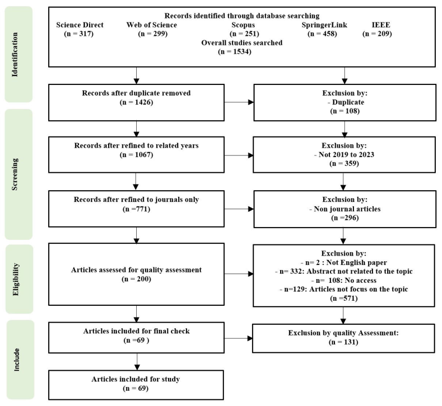

**FIGURE 2.** Studies selection process using PRISMA (Authors own creation).

technologies. The following subsections present the analysis and results for each of the research questions.

## _A. CURRENT TRENDS, TECHNIQUES AND PERFORMANCE IN MT FOR LOW-RESOURCE LANGUAGES (RQ1)_

Recent advances in MT have led to the development of innovative techniques tailored to low-resource languages. This section reviews the trends in publications on MT for lowresource languages, the current MT techniques used for such languages, and the differences in the accuracy and effectiveness of these techniques for low-resource languages.

## 1) TREND OF STUDIES IN MT OF LOW-RESOURCE LANGUAGES IN RECENT YEARS (RQ1.1)

Figure 4 represents the publication trend in the study area from 2020 to 2024. There is an increase related to the study between 2020 to 2022, followed by a slight decline after the peak in 2022. Lowest rates were observed in 2020 and 2021. This could be because of the global effect of the COVID-19 pandemic, which disrupted virtually every activity including

research. The sharp rise in 2022 suggests a strong recovery and possibly an influx of new techniques, models, and tools that improved translation performance, leading to increased research outputs. The slight decrease in 2023 and 2024 might indicate stability in the field, with continued but slightly lower levels of publication activity as the initial surge of innovation settled into more sustained research efforts.

## 2) DISTRIBUTIONS OF THE STUDIES ACCORDING TO DATABASE AND PUBLISHER (RQ1,2)

The distribution of articles obtained from various databases for the study is provided in Figure 5. Web of Science contributed the highest proportion of articles at 35%, indicating its extensive coverage and relevance in this research area. SpringerLink follows with 27%, showcasing its significant contribution. Scopus provided 19%, illustrating its substantial yet slightly lesser role. IEEE Xplore and Science Direct contributed the least among the databases but still played crucial roles in the systematic review. This distribution highlights the importance of leveraging multiple databases to

**TABLE 2.** Research questions and rationale.

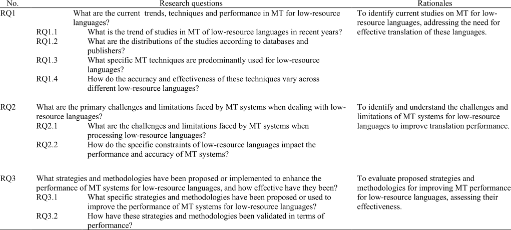

**TABLE 3.** Search results.

**TABLE 5.** Quality assessment scoring matrix.

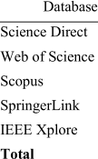

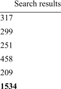

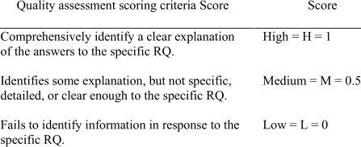

**TABLE 4.** Quality assessment questions.

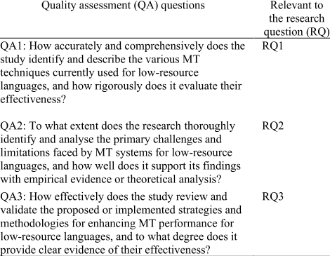

gather comprehensive and diverse literature for a thorough review.

There is a diverse range of publishers that have contributed to the study area, with varying levels of publication output, as indicated in Figure 6. The distribution of articles

across different publishers suggests a broad interest and engagement from the academic community in exploring MT performance for low-resource languages. Some journals have a higher number of publications related to MT for lowresource languages, while others have fewer contributions. This is influenced by factors such as journal scope and focus. IEEE Access and ACM have the highest articles, indicating their high relevance and visibility in the field. Information, Machine Translation and Multimedia Tools and Applications show moderate activity, reflecting their broader scope within computer science and applications. Specialized journals like Computer Speech and Languages, Frontiers in Artificial Intelligence, etc. have fewer publications, likely due to their specific focus and higher competition. Overall, the analysis shows that studies targeted journals with a direct connection to MT and a wider impact within the computational linguistics community.

## 3) PREDOMINANT MT TECHNIQUES USED FOR LOW-RESOURCE LANGUAGES (RQ1.3)

Analysis of the studied articles shows that there is diversity of techniques explored in MT of low-resource languages,

**TABLE 6.** List of studied articles and quality assessment scores.

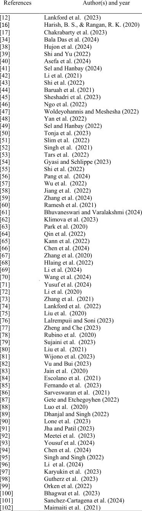

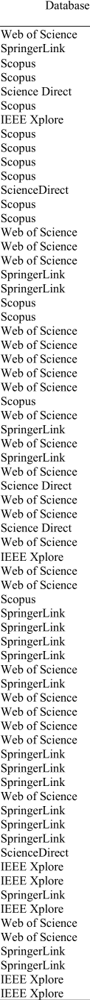

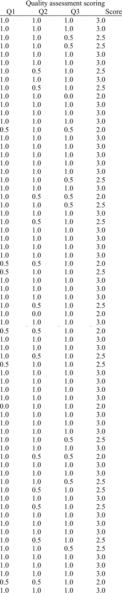

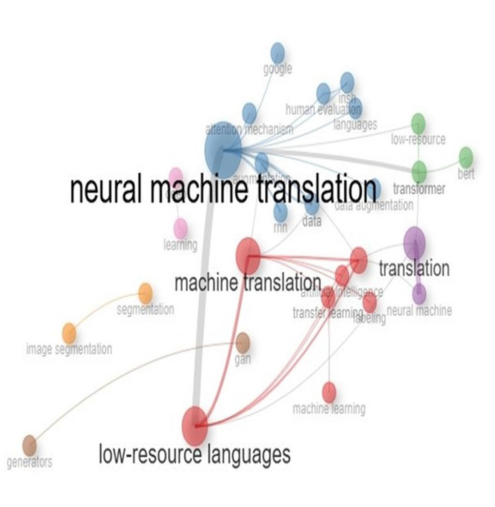

**FIGURE 3.** Key themes co-occurrence.

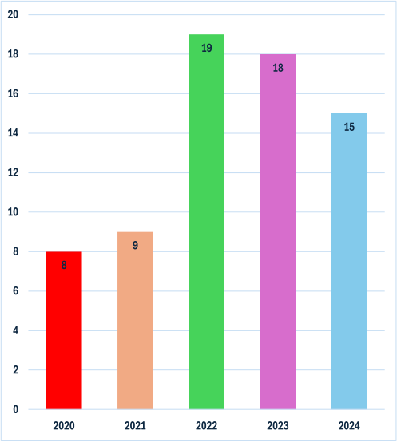

**FIGURE 4.** Year-wise publication trend of the studied articles.

reflecting the ongoing efforts at addressing the unique challenges posed by these languages in the field of MT. Table 7 provides an analysis of MT techniques used for low-resource languages. It categorizes the studied articles based on specific techniques, with transformer-based MT architecture being the most predominant. Other notable techniques include

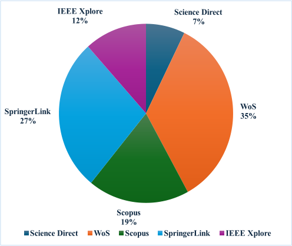

**FIGURE 5.** Database wise distribution of studied artilces.

statistical MT, and transfer learning. Hybrid and unsupervised approaches are among the less used techniques in the studied articles.

## 4) VARIATION IN ACCURACY AND EFFECTIVENESS OF MT TECHNIQUES ACROSS DIFFERENT LOW-RESOURCE LANGUAGES (RQ1.4)

Accuracy in translation refers to the exactness of the translation in terms of word choice and grammatical structure, that is the degree of similarity between the original text in one language and its equivalent in another language [103]. Effectiveness in translation, on the other hand, refers to the overall ability of a translation method to achieve its intended goal [104]. In the case of MT for low-resource languages, this includes not only accuracy, but also other factors such as adaptability, robustness, and utility resources of the translation systems. Table 8 summarises the accuracy and effectiveness of various MT techniques across different low-resource languages as used in the studied articles. MT Techniques covered include data augmentation, example-based, hybrid, multimodal, multilingual models, pivot-based translation, rule-based, statistical MT, transfer learning, transformer architecture, unsupervised methods, and meta learning. Each technique is assessed for its performance in translating specific languages, highlighting which methods are more successful in terms of accuracy and effectiveness. The comprehensive evaluation indicates that while all techniques show promise, transformer-based models (i.e. NMT models) are particularly effective across a wide range of languages.

## _B. PRIMARY CHALLENGES AND LIMITATIONS FACED BY MT OF LOW-RESOURCE LANGUAGES (RQ2)_

Despite significant advances in MT, low-resource languages continue to pose challenges that hinder the development of

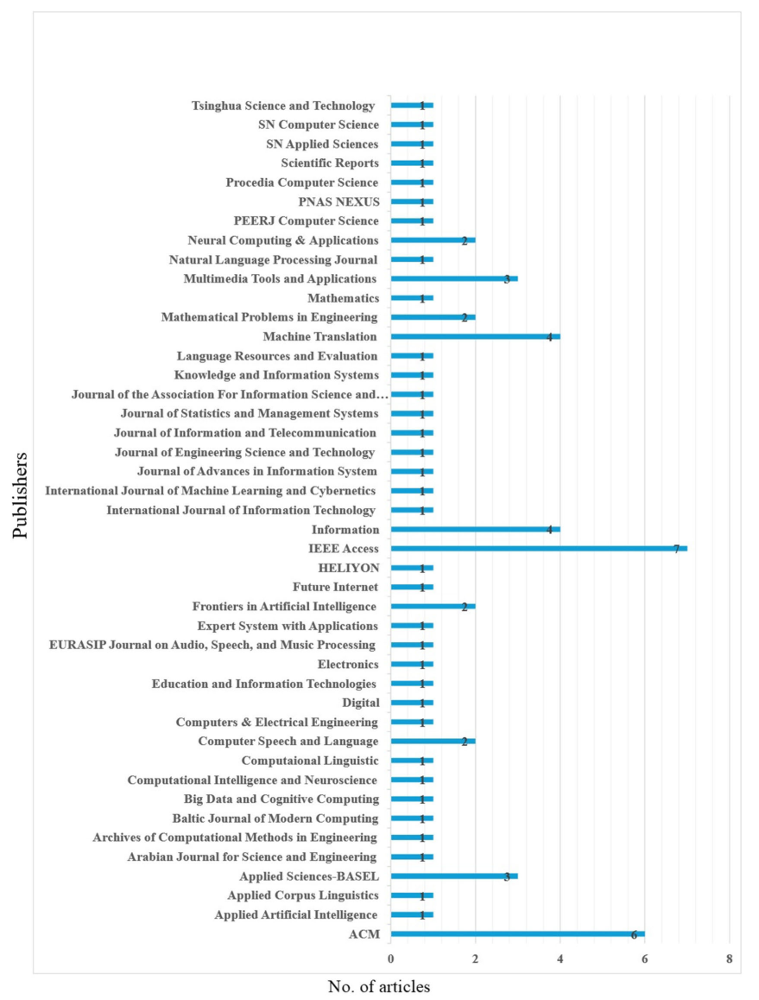

**FIGURE 6.** Publisher wise distribution of studied artilces.

robust translation systems. This section examines the main challenges and limitations faced by MT systems for these languages and how the specific challenges affect the overall performance of MT systems.

1) CHALLENGES AND LIMITATIONS FACED BY MT SYSTEMS WHEN PROCESSING LOW-RESOURCE LANGUAGES (RQ2.1) The study shows that while there are many challenges and limitations common to all low-resource languages, the extent

**TABLE 7.** Studied articles based on MT techniques.

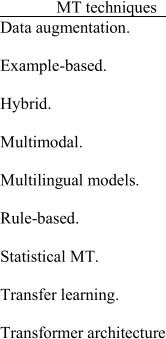

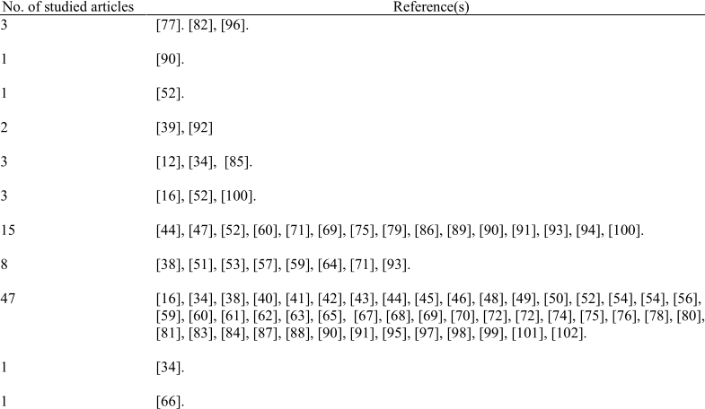

to which they have been investigated varies considerably. Table 9 categorises the challenges and limitations in MT for low-resource languages, as evidenced by various articles studied. A primary issue is the lack of sufficient training data, as many languages, including Hindi, Tamil, and Vietnamese, do not have adequate datasets, which hampers performance. Additionally, structural variability among languages, such as Japanese and Amharic, complicates translation due to differing language structures. Complex morphology in languages like Japanese and Indonesian further complicates accurate translation. During the training process, error propagation and training instability can lead to performance issues, affecting languages such as German and Arabic. Tokenization problems arise when breaking text into smaller units, complicating translation for languages like Bengali and Hindi. Lexical challenges related to vocabulary and structure also hinder translation efforts in languages like Tibetan and Tamil. Moreover, feature integration issues make it difficult to combine various linguistic and contextual features effectively, impacting languages like Bengali and Hindi. Finally, textual challenges, including fragmentary texts and the absence of standardised orthographies, pose additional obstacles for languages such as Akkadian and Uzbek. Collectively, these challenges highlight the multifaceted difficulties MT systems face, significantly affecting their overall effectiveness and accuracy in translating low-resource languages.

## 2) IMPACT OF SPECIFIC CONSTRAINTS OF LOW-RESOURCE LANGUAGES ON PERFORMANCE AND ACCURACY OF MT SYSTEMS (RQ2.2)

The study shows that the specific constraints of low-resource languages impact significantly on the performance and accuracy of MT systems. As highlighted in Table 10, one of the main challenges is the lack of sufficient training data

and the poor quality of pseudo-parallel corpora, which results in insufficient word representation and less accurate translations, making model training difficult and limiting effectiveness. In addition, structural differences and the inherent difficulty of language pairs degrade translation quality, while complex morphological and lexical challenges make it difficult to generate high-quality cross-linguistic embeddings, negatively impacting prediction accuracy. Problems with the generalization of the model further worsen the situation, leading to instability and inconsistent performance in different contexts. The complexity of the language makes it difficult to create standardized datasets and limits the generalizability of MT techniques. In addition, tokenization issues lead to fragmented translations, and textual challenges hinder the alignment of parallel data, which has a negative impact on translation quality. Finally, feature integration issues lead to noise and reduce overall effectiveness. Overall, the limitations outlined present a significant obstacle for MT systems, hindering their ability to generate dependable and precise translations for languages with limited resources and support.

## _C. STRATEGIES AND METHODOLOGIES PROPOSED OR USED TO ENHANCE THE PERFORMANCE OF MT SYSTEMS FOR LOW-RESOURCE LANGUAGES (RQ3)_

To overcome the inherent challenges of translating lowresource languages, researchers have proposed and implemented a variety of innovative strategies and methods. This section analyses these approaches, and the metrics used to validate them.

## 1) STRATEGIES AND METHODOLOGIES FOR IMPROVING THE PERFORMANCE OF MT SYSTEMS FOR LOW-RESOURCE LANGUAGES (RQ3.1)

The studied articles employed various strategies and methodologies to enhance the performance of MT systems for

**TABLE 8.** Accuracy and effectiveness of MT techniques across different low-resource languages in the studied articles.

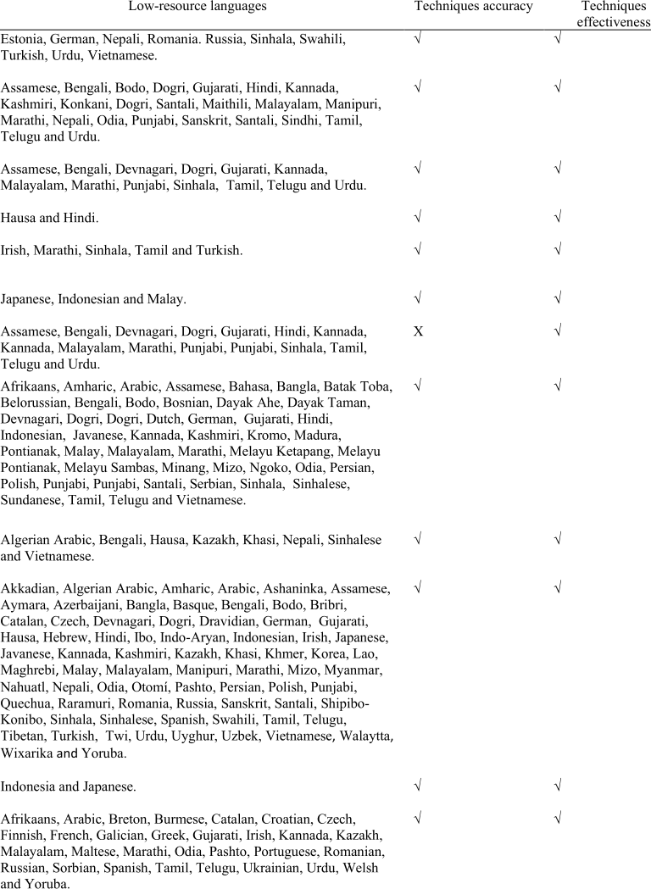

low-resource languages as seen in Table 11. These strategies include active learning, data augmentation, embedding alignment, optimization of decoder, and multilingual models, among others. These approaches aim to address the challenges associated with translating languages that have limited digital resources. The review highlights the importance of a multifaceted approach, combining active learning to efficiently utilize data, data augmentation to expand

training datasets, embedding alignment to capture semantic similarities across languages, and multilingual models to leverage shared representations. Additionally, the role of transfer learning, optimization of decoder parameters, and rule-based approaches in further refining MT systems were emphasised. This suggests that a combination of these strategies offers a comprehensive solution for improving MT performance in resource-limited contexts.

**TABLE 9.** Challenges and limitations of MT for low-resource languages.

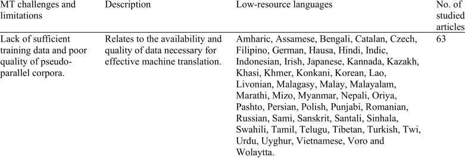

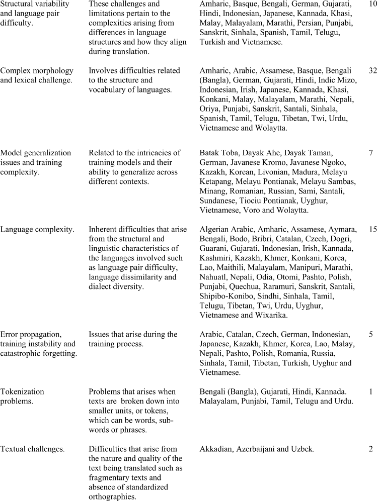

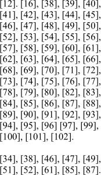

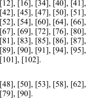

**TABLE 9.** _(Continued.)_ Challenges and limitations of MT for low-resource languages.

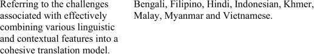

**TABLE 10.** Constraints’impact on MT of low-resource languages.

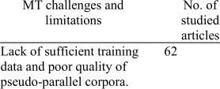

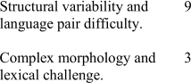

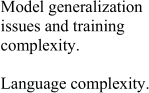

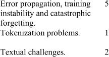

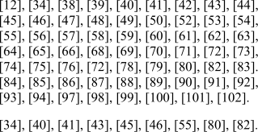

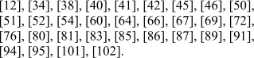

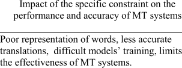

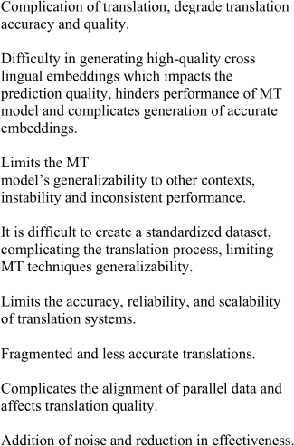

2) METRICS USED TO VALIDATE STRATEGIES AND METHODLOGIES FOR LOW-RESOURCE MT SYSTEM (RQ3.2)

The strategies and methodologies used in improving MT performance in the studied articles have been validated through a comprehensive analysis of various performance metrics, as highlighted in Table 12. The BLEU score was utilized in 10 articles, while the Translation Edit Rate (TER) was the most frequently applied metric, appearing in 59 articles, indicating its widespread acceptance for assessing translation quality. Other metrics such as METEOR, Recall-Oriented Understudy for Gisting Evaluation (ROUGE), and Character n-gram F-score (ChrF) were also employed, with 41, 5, and 58 articles respectively, showcasing a diverse approach to evaluation. Additionally, the Word Error Rate (WER) was referenced in 32 articles, further emphasizing its relevance in performance assessment. The inclusion of Google’s variant of

BLEU (Gleu) in 5 articles highlights the exploration of alternative evaluation methods. F1-score has the list references, probably because it is primarily designed for classification tasks [105] and not for sequence generation tasks like translation. This multifaceted validation approach underscores the robustness of the methodologies, as they are assessed through various established metrics, allowing for a comprehensive understanding of their effectiveness in translation tasks.

## **V. LIMITATION**

Although the SLR on MT for low-resource languages is comprehensive, it has several limitations. First, the study focuses only on articles published between 2020 and 2024. This time limitation may result in the exclusion of relevant baseline studies or earlier methods that could provide valuable context or insight into the development of MT techniques. In addition,

**TABLE 11.** Strategies and methodologies proposed/used to improve the performance of MT systems for low-resource languages.

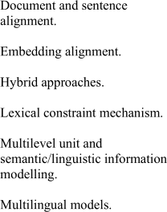

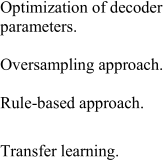

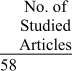

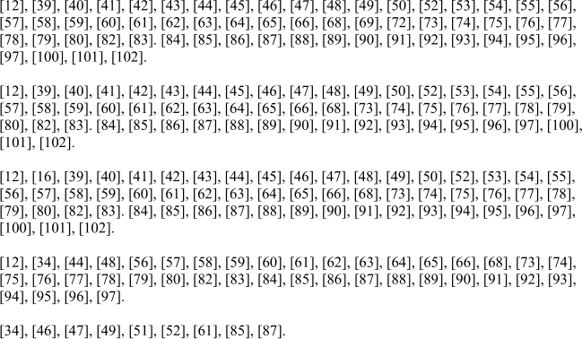

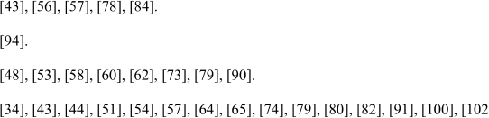

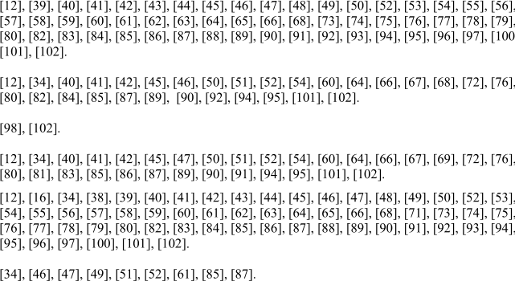

the exclusion of non-English articles may further limit the scope and potentially overlook important research in other languages that could provide a more complete view of the challenges and advances in MT for low-resource languages.

Secondly, the study relies on specific academic databases such as Science Direct, Web of Science, Scopus, SpringerLink and IEEE and this may lead to bias in the selection of studies. These databases may not include all relevant literature, especially from new or less established sources that could offer innovative approaches or insights. In addition,

the quality assessment process, though rigorous, is inherently subjective and may vary depending on the assessors’ interpretation of the relevance and quality of the studies. This subjectivity could lead to the exclusion of potentially valuable studies that do not meet the predefined quality assessment criteria, thereby limiting the scope of the evidence generated in the review. Overall, these limitations suggest that while the SLR provides a valuable overview, it might not entirely encompass the diversity and complexity of research within the field of MT for low-resource languages.

**TABLE 12.** Metrics used in validation of strategies and methodologies.

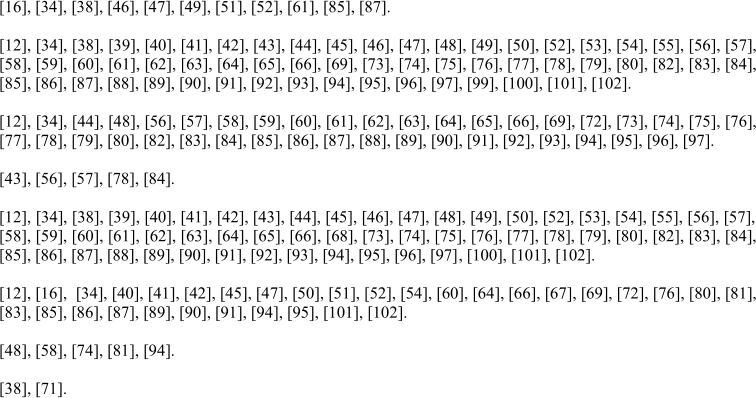

## **VI. CONCLUSION**

This systematic review provided a comprehensive examination of the current state of MT techniques for lowresource languages. By adhering to PRISMA guidelines, the study has systematically identified and analysed relevant research, highlighting the challenges, limitations, and effective strategies employed in this critical area of study. The findings underscore the pressing need for innovative methodologies, such as LLMs fine-tuning for low-resource languages, prompt-based translation, multimodal translation, and knowledge-enhanced NMT, to improve translation performance and address the constraints faced by these languages.

The findings reveal that transformer-based NMT remains the dominant architecture for low-resource language translation tasks, with TER and ChrF emerging as the most frequently applied evaluation metrics. However, the emergence of LLMs such as GPT-4, is redefining the MT landscape by enabling cross-lingual generalization through zero-shot and few-shot learning, even in the absence of parallel corpora. Despite these advancements, data scarcity remains the most pressing challenge in low-resource MT. This constraint is being addressed through strategies such as multilingual modeling, synthetic data generation, and transfer learning. Based on these insights, future MT research should prioritize scalable data-efficient techniques, the integration of LLMs, and the development of open-access multilingual benchmarks to enhance translation quality and inclusivity for low-resource languages. This study ultimately provides a framework for additional research and advancement in the domain of MT, thus facilitating the development of more efficient and fair translation strategies for languages with limited resources and digital support.

## **ACKNOWLEDGMENT**

The authors would like to thank the anonymous reviewers for their time, efforts, and suggestions to improve the work.

## **REFERENCES**

- [1] S. M. U. Qumar, M. Azim, and S. M. K. Quadri, ‘‘Emerging resources, enduring challenges: A comprehensive study of kashmiri parallel corpus,’’ _AI Soc._ , Jun. 2024, doi: 10.1007/s00146-024-01981-5.

- [2] Z. Tan, S. Wang, Z. Yang, G. Chen, X. Huang, M. Sun, and Y. Liu, ‘‘Neural machine translation: A review of methods, resources, and tools,’’ _AI Open_ , vol. 1, pp. 5–21, Jan. 2020, doi: 10.1016/j.aiopen.2020.11. 001.

- [3] K. R. Mabokela, T. Celik, and M. Raborife, ‘‘Multilingual sentiment analysis for under-resourced languages: A systematic review of the landscape,’’ _IEEE Access_ , vol. 11, pp. 15996–16020, 2023, doi: 10.1109/ACCESS.2022.3224136.

- [4] B. K. Yazar, D. Ö. Şahın, and E. Kiliç, ‘‘Low-resource neural machine translation: A systematic literature review,’’ _IEEE Access_ , vol. 11, pp. 131775–131813, 2023, doi: 10.1109/ACCESS.2023.3336019.

- [5] N. A. S. Abdullah and N. I. A. Rusli, ‘‘Multilingual sentiment analysis: A systematic literature review,’’ _JST_ , vol. 29, no. 1, Jan. 2021, doi: 10.47836/pjst.29.1.25.

- [6] S. Kesiraju, M. Sarvaš, T. Pavlíček, C. Macaire, and A. Ciuba, ‘‘Strategies for improving low resource speech to text translation relying on pre-trained ASR models,’’ in _Proc. INTERSPEECH_ , Aug. 2023, pp. 2148–2152.

- [7] S. Ranathunga, E.-S.-A. Lee, M. P. Skenduli, R. Shekhar, M. Alam, and R. Kaur, ‘‘Neural machine translation for low-resource languages: A survey,’’ _ACM Comput. Surv._ , vol. 55, no. 11, pp. 1–37, Nov. 2023, doi: 10.1145/3567592.

- [8] S. Saxena, A. Gupta, and P. Daniel, ‘‘Efficient data augmentation via lexical matching for boosting performance on statistical machine translation for indic and a low-resource language,’’ _Multimedia Tools Appl._ , vol. 83, no. 24, pp. 64255–64269, Jan. 2024, doi: 10.1007/s11042-023-18086-8.

- [9] S. Zhu, S. Xu, H. Sun, L. Pan, M. Cui, J. Du, R. Jin, A. Branco, and D. Xiong, ‘‘Multilingual large language models: A systematic survey,’’ 2024, _arXiv:2411.11072_ .

- [10] K. Huang, F. Mo, X. Zhang, H. Li, Y. Li, Y. Zhang, W. Yi, Y. Mao, J. Liu, Y. Xu, J. Xu, J.-Y. Nie, and Y. Liu, ‘‘A survey on large language models with multilingualism: Recent advances and new frontiers,’’ 2024, _arXiv:2405.10936_ .

- [11] S. Shahriar, B. D. Lund, N. R. Mannuru, M. A. Arshad, K. Hayawi, R. V. K. Bevara, A. Mannuru, and L. Batool, ‘‘Putting GPT-4o to the sword: A comprehensive evaluation of language, vision, speech, and multimodal proficiency,’’ _Appl. Sci._ , vol. 14, no. 17, p. 7782, Sep. 2024, doi: 10.3390/app14177782.

- [12] S. Lankford, H. Afli, and A. Way, ‘‘AdaptMLLM: Fine-tuning multilingual language models on low-resource languages with integrated LLM playgrounds,’’ _Information_ , vol. 14, no. 12, p. 638, Nov. 2023, doi: 10.3390/info14120638.

- [13] H. Wang, H. Wu, Z. He, L. Huang, and K. W. Church, ‘‘Progress in machine translation,’’ _Engineering_ , vol. 18, pp. 143–153, Nov. 2022, doi: 10.1016/j.eng.2021.03.023.

- [14] S. Chimalamarri, D. Sitaram, and A. Jain, ‘‘Morphological segmentation to improve crosslingual word embeddings for low resource languages,’’ _ACM Trans. Asian Low-Resource Lang. Inf. Process._ , vol. 19, no. 5, pp. 1–15, Sep. 2020, doi: 10.1145/3390298.

- [15] N. Khan Jadoon, W. Anwar, U. I. Bajwa, and F. Ahmad, ‘‘Statistical machine translation of Indian languages: A survey,’’ _Neural Comput. Appl._ , vol. 31, no. 7, pp. 2455–2467, Jul. 2019, doi: 10.1007/s00521-0173206-2.

- [16] B. S. Harish and R. K. Rangan, ‘‘A comprehensive survey on Indian regional language processing,’’ _Social Netw. Appl. Sci._ , vol. 2, no. 7, p. 1204, Jul. 2020, doi: 10.1007/s42452-020-2983-x.

- [17] A. Chakrabarty, R. Dabre, C. Ding, M. Utiyama, and E. Sumita, ‘‘Lowresource multilingual neural translation using linguistic feature-based relevance mechanisms,’’ _ACM Trans. Asian Low-Resource Lang. Inf. Process._ , vol. 22, no. 7, pp. 1–36, Jul. 2023, doi: 10.1145/3594631.

- [18] E. Razumovskaia, G. Glavas, O. Majewska, E. M. Ponti, A. Korhonen, and I. Vulic, ‘‘Crossing the conversational chasm: A primer on natural language processing for multilingual task-oriented dialogue systems,’’ _J. Artif. Intell. Res._ , vol. 74, pp. 1351–1402, Jul. 2022, doi: 10.1613/jair.1.13083.

- [19] A. R. R. Salammagari, ‘‘Advancing natural language understanding for low-resource languages: Current progress, applications, and challenges,’’ _Technol. (IJARET)_ , 2024.

- [20] E. H. Almansor and A. Al-Ani, ‘‘A hybrid neural machine translation technique for translating low resource languages,’’ in _Machine Learning and Data Mining in Pattern Recognition_ , P. Perner, Ed., Cham, Switzerland: Springer, 2018, pp. 347–356.

- [21] J. Kreutzer, J. Bastings, and S. Riezler, ‘‘Joey NMT: A minimalist NMT toolkit for novices,’’ 2019, _arXiv:1907.12484_ .

- [22] T. J. Sefara, S. G. Zwane, N. Gama, H. Sibisi, P. N. Senoamadi, and V. Marivate, ‘‘Transformer-based machine translation for lowresourced languages embedded with language identification,’’ in _Proc. Conf. Inf. Commun. Technol. Soc. (ICTAS)_ , Mar. 2021, pp. 127–132, doi: 10.1109/ICTAS50802.2021.9394996.

- [23] H. A. Chipman, E. I. George, R. E. McCulloch, and T. S. Shively, ‘‘mBART: Multidimensional monotone BART,’’ _Bayesian Anal._ , vol. 17, no. 2, Jun. 2022, doi: 10.1214/21-ba1259.

- [24] M. Ulčar and M. Robnik-Šikonja, ‘‘Sequence-to-sequence pretraining for a less-resourced Slovenian language,’’ _Frontiers Artif. Intell._ , vol. 6, Mar. 2023, Art. no. 932519, doi: 10.3389/frai.2023.932519.

- [25] Z. Xu, S. Zhan, W. Yang, and Q. Xie, ‘‘Based on gated dynamic encoding optimization, the LGE-transformer method for low-resource neural machine translation,’’ _IEEE Access_ , vol. 12, pp. 162861–162869, 2024, doi: 10.1109/ACCESS.2024.3488186.

- [26] M. Ott, S. Edunov, A. Baevski, A. Fan, S. Gross, N. Ng, D. Grangier, and M. Auli, ‘‘Fairseq: A fast, extensible toolkit for sequence modeling,’’ 2019, _arXiv:1904.01038_ .

- [27] K. Li, C. Chen, X. Quan, Q. Ling, and Y. Song, ‘‘Conditional augmentation for aspect term extraction via masked sequence-to-sequence generation,’’ 2020, _arXiv:2004.14769_ .

- [28] M. Junczys-Dowmunt, R. Grundkiewicz, T. Dwojak, H. Hoang, K. Heafield, T. Neckermann, F. Seide, U. Germann, A. F. Aji, N. Bogoychev, A. F. T. Martins, and A. Birch, ‘‘Marian: Fast neural machine translation in C++,’’ 2018, _arXiv:1804.00344_ .

- [29] A. Jha, H. Y. Patil, S. K. Jindal, and S. M. N. Islam, ‘‘Multilingual Indian language neural machine translation system using mT5 transformer,’’ in _Proc. 2nd Int. Conf. Paradigm Shifts Commun. Embedded Syst., Mach. Learn. Signal Process. (PCEMS)_ , Apr. 2023, pp. 1–5, doi: 10.1109/PCEMS58491.2023.10136051.

- [30] S. Kulshreshtha, J. L. Redondo-García, and C.-Y. Chang, ‘‘Cross-lingual alignment methods for multilingual BERT: A comparative study,’’ 2020, _arXiv:2009.14304_ .

- [31] N. Team, ‘‘Scaling neural machine translation to 200 languages,’’ _Nature_ , vol. 630, no. 8018, pp. 841–846, Jun. 2024, doi: 10.1038/s41586-02407335-x.

- [32] N. Goyal, C. Gao, V. Chaudhary, P. Chen, G. Wenzek, D. Y. Ju, S. Krishnan, M. Ranzato, F. Guzmán, and A. Fan, ‘‘The FLORES-101 evaluation benchmark for low-resource and multilingual machine translation,’’ _Trans. Assoc. Comput. Linguistics_ , vol. 10, pp. 522–538, Jan. 2021.

- [33] L. Stankevičius, M. Lukoševičius, J. Kapoči¯ut˙e-Dzikien˙e, M. Briedien˙e, and T. Krilavičius, ‘‘Correcting diacritics and typos with a ByT5 transformer model,’’ _Appl. Sci._ , vol. 12, no. 5, p. 2636, Mar. 2022, doi: 10.3390/app12052636.

- [34] S. Bala Das, D. Panda, T. Kumar Mishra, B. Kr. Patra, and A. Ekbal, ‘‘Multilingual neural machine translation for indic to indic languages,’’ _ACM Trans. Asian Low-Resource Lang. Inf. Process._ , vol. 23, no. 5, pp. 1–32, May 2024, doi: 10.1145/3652026.

- [35] A. B. Belle, ‘‘Evidence-based decision-making: On the use of systematicity cases to check the compliance of reviews with reporting guidelines such as PRISMA 2020,’’ _Expert Syst. With Appl._ , 2023.

- [36] Y. A. Bena, R. Ibrahim, J. Mahmood, N. Talpur, M. Nasser, M. O. Ayemowa, and M. N. Yusuf, ‘‘Harnessing and mitigating big data governance challenges using hybrid approach: A systematic literature review,’’ _IEEE Access_ , vol. 12, pp. 175151–175175, 2024, doi: 10.1109/ACCESS.2024.3498947.

- [37] L. Yang, H. Zhang, H. Shen, X. Huang, X. Zhou, G. Rong, and D. Shao, ‘‘Quality assessment in systematic literature reviews: A software engineering perspective,’’ _Inf. Softw. Technol._ , vol. 130, Feb. 2021, Art. no. 106397, doi: 10.1016/j.infsof.2020.106397.

- [38] A. V. Hujon, T. D. Singh, and K. Amitab, ‘‘Neural machine translation systems for English to khasi: A case study of an austroasiatic language,’’ _Expert Syst. Appl._ , vol. 238, Mar. 2024, Art. no. 121813, doi: 10.1016/j.eswa.2023.121813.

- [39] S. Shi, X. Wu, R. Su, and H. Huang, ‘‘Low-resource neural machine translation: Methods and trends,’’ _ACM Trans. Asian Low-Resource Lang. Inf. Process._ , vol. 21, no. 5, pp. 1–22, Sep. 2022, doi: 10.1145/3524300.

- [40] S. H. Asefa and Y. Assabie, ‘‘Transformer-based amharic-to-english machine translation with character embedding and combined regularization techniques,’’ _IEEE Access_ , vol. 13, pp. 1090–1105, 2025, doi: 10.1109/ACCESS.2024.3521985.

- [41] I. Sel and D. Hanbay, ‘‘Efficient adaptation: Enhancing multilingual models for low-resource language translation,’’ _Mathematics_ , vol. 12, no. 19, p. 3149, Oct. 2024, doi: 10.3390/math12193149.

- [42] Y. Li, J. Jiang, J. Yangji, and N. Ma, ‘‘Finding better subwords for Tibetan neural machine translation,’’ _ACM Trans. Asian Low-Resource Lang. Inf. Process._ , vol. 20, no. 2, pp. 1–11, Mar. 2021, doi: 10.1145/3448216.

- [43] X. Shi, P. Yue, X. Liu, C. Xu, and L. Xu, ‘‘Obtaining parallel sentences in low-resource language pairs with minimal supervision,’’ _Comput. Intell. Neurosci._ , vol. 2022, pp. 1–9, Aug. 2022, doi: 10.1155/2022/5296946.

- [44] R. Baruah, R. K. Mundotiya, and A. K. Singh, ‘‘Low resource neural machine translation: Assamese to/from other indo-aryan (Indic) languages,’’ _ACM Trans. Asian Low-Resource Lang. Inf. Process._ , vol. 21, no. 1, pp. 1–32, Jan. 2022, doi: 10.1145/3469721.

- [45] S. K. Sheshadri, D. Gupta, and M. R. Costa-Jussà, ‘‘A voyage on neural machine translation for indic languages,’’ _Proc. Comput. Sci._ , vol. 218, pp. 2694–2712, Jan. 2023, doi: 10.1016/j.procs.2023.01.242.

- [46] T.-V. Ngo, P.-T. Nguyen, V. V. Nguyen, T.-L. Ha, and L.-M. Nguyen, ‘‘An efficient method for generating synthetic data for low-resource machine translation,’’ _Appl. Artif. Intell._ , vol. 36, no. 1, Dec. 2022, Art. no. 2101755, doi: 10.1080/08839514.2022.2101755.

- [47] M. M. Woldeyohannis and M. Meshesha, ‘‘Usable amharic text corpus for natural language processing applications,’’ _Appl. Corpus Linguistics_ , vol. 2, no. 3, Dec. 2022, Art. no. 100033, doi: 10.1016/j.acorp.2022.100033.

- [48] R. Yan, J. Li, X. Su, X. Wang, and G. Gao, ‘‘Boosting the transformer with the BERT supervision in low-resource machine translation,’’ _Appl. Sci._ , vol. 12, no. 14, p. 7195, Jul. 2022, doi: 10.3390/app12147195.

- [49] I. Sel and D. Hanbay, ‘‘Fully attentional network for low-resource academic machine translation and post editing,’’ _Appl. Sci._ , vol. 12, no. 22, p. 11456, Nov. 2022, doi: 10.3390/app122211456.

- [50] A. L. Tonja, O. Kolesnikova, A. Gelbukh, and G. Sidorov, ‘‘Lowresource neural machine translation improvement using source-side monolingual data,’’ _Appl. Sci._ , vol. 13, no. 2, p. 1201, Jan. 2023, doi: 10.3390/app13021201.

- [51] A. Slim, A. Melouah, U. Faghihi, and K. Sahib, ‘‘Improving neural machine translation for low resource Algerian dialect by transductive transfer learning strategy,’’ _Arabian J. Sci. Eng._ , vol. 47, no. 8, pp. 10411–10418, Aug. 2022, doi: 10.1007/s13369-022-06588-w.

- [52] M. Singh, R. Kumar, and I. Chana, ‘‘Machine translation systems for Indian languages: Review of modelling techniques, challenges, open issues and future research directions,’’ _Arch. Comput. Methods Eng._ , vol. 28, no. 4, pp. 2165–2193, Jun. 2021, doi: 10.1007/s11831-02009449-7.

- [53] M. Tars, A. Tättar, and M. Fishel, ‘‘Cross-lingual transfer from large multilingual translation models to unseen under-resourced languages,’’ _Baltic J. Modern Comput._ , vol. 10, no. 3, 2022, doi: 10.22364/bjmc.2022.10.3.16.

- [54] F. Gyasi and T. Schlippe, ‘‘Twi machine translation,’’ _Big Data Cognit. Comput._ , vol. 7, no. 2, p. 114, Jun. 2023, doi: 10.3390/bdcc7020114.

- [55] X. Shi and Z. Yu, ‘‘Adding visual information to improve multimodal machine translation for low-resource language,’’ _Math. Problems Eng._ , vol. 2022, pp. 1–9, Aug. 2022, doi: 10.1155/2022/5483535.

- [56] J. Pang, B. Yang, D. F. Wong, Y. Wan, D. Liu, L. S. Chao, and J. Xie, ‘‘Rethinking the exploitation of monolingual data for low-resource neural machine translation,’’ _Comput. Linguistics_ , vol. 50, no. 1, pp. 25–47, Mar. 2024, doi: 10.1162/coli_a_00496.

- [57] C.-K. Wu, C.-C. Shih, Y.-C. Wang, and R. T.-H. Tsai, ‘‘Improving low-resource machine transliteration by using 3-way transfer learning,’’ _Comput. Speech Lang._ , vol. 72, Mar. 2022, Art. no. 101283, doi: 10.1016/j.csl.2021.101283.

- [58] H. Jiang, C. Zhang, Z. Xin, X. Huang, C. Li, and Y. Tai, ‘‘Transfer learning based on lexical constraint mechanism in low-resource machine translation,’’ _Comput. Electr. Eng._ , vol. 100, May 2022, Art. no. 107856, doi: 10.1016/j.compeleceng.2022.107856.

- [59] J. Zhang, K. Su, H. Li, J. Mao, Y. Tian, F. Wen, C. Guo, and T. Matsumoto, ‘‘Neural machine translation for low-resource languages from a Chinesecentric perspective: A survey,’’ _ACM Trans. Asian Low-Resource Lang. Inf. Process._ , vol. 23, no. 6, pp. 1–60, Jun. 2024, doi: 10.1145/3665244.

- [60] A. Ramesh, V. B. Parthasarathy, R. Haque, and A. Way, ‘‘Comparing statistical and neural machine translation performance on Hindi-to-Tamil and English-to-Tamil,’’ _Digital_ , vol. 1, no. 2, pp. 86–102, Apr. 2021, doi: 10.3390/digital1020007.

- [61] K. Bhuvaneswari and M. Varalakshmi, ‘‘Efficient incremental training using a novel NMT-SMT hybrid framework for translation of low-resource languages,’’ _Frontiers Artif. Intell._ , vol. 7, Sep. 2024, Art. no. 1381290, doi: 10.3389/frai.2024.1381290.

- [62] B. Klimova, M. Pikhart, A. D. Benites, C. Lehr, and C. SanchezStockhammer, ‘‘Neural machine translation in foreign language teaching and learning: A systematic review,’’ _Educ. Inf. Technol._ , vol. 28, no. 1, pp. 663–682, Jan. 2023, doi: 10.1007/s10639-022-11194-2.

- [63] C. Park, Y. Yang, K. Park, and H. Lim, ‘‘Decoding strategies for improving low-resource machine translation,’’ _Electronics_ , vol. 9, no. 10, p. 1562, Sep. 2020, doi: 10.3390/electronics9101562.

- [64] S. Qin, L. Wang, S. Li, J. Dang, and L. Pan, ‘‘Improving low-resource Tibetan end-to-end ASR by multilingual and multilevel unit modeling,’’ _EURASIP J. Audio, Speech, Music Process._ , vol. 2022, no. 1, p. 2, Dec. 2022, doi: 10.1186/s13636-021-00233-4.

- [65] K. Kann, A. Ebrahimi, M. Mager, A. Oncevay, J. E. Ortega, A. Rios, A. Fan, X. Gutierrez-Vasques, L. Chiruzzo, G. A. Giménez-Lugo, R. Ramos, I. V. M. Ruiz, E. Mager, V. Chaudhary, G. Neubig, A. Palmer, R. Coto-Solano, and N. T. Vu, ‘‘AmericasNLI: Machine translation and natural language inference systems for indigenous languages of the Americas,’’ _Frontiers Artif. Intell._ , vol. 5, Dec. 2022, Art. no. 995667, doi: 10.3389/frai.2022.995667.

- [66] K. Chen, D. Zhuang, M. Li, and J. Morris Chang, ‘‘Epi-curriculum: Episodic curriculum learning for low-resource domain adaptation in neural machine translation,’’ _IEEE Trans. Artif. Intell._ , vol. 5, no. 12, pp. 6095–6108, Dec. 2024, doi: 10.1109/TAI.2024.3396125.

- [67] W. Zhang, X. Li, Y. Yang, R. Dong, and G. Luo, ‘‘Keeping models consistent between pretraining and translation for low-resource neural machine translation,’’ _Future Internet_ , vol. 12, no. 12, p. 215, Nov. 2020, doi: 10.3390/fi12120215.

- [68] Z. Z. Hlaing, Y. K. Thu, T. Supnithi, and P. Netisopakul, ‘‘Improving neural machine translation with POS-tag features for low-resource language pairs,’’ _Heliyon_ , vol. 8, no. 8, Aug. 2022, Art. no. e10375, doi: 10.1016/j.heliyon.2022.e10375.

- [69] B. Li, Y. Weng, F. Xia, and H. Deng, ‘‘Towards better Chinesecentric neural machine translation for low-resource languages,’’ _Comput. Speech Lang._ , vol. 84, Mar. 2024, Art. no. 101566, doi: 10.1016/j.csl.2023.101566.

- [70] Y. Wang, J. Zhang, T. Shi, D. Deng, Y. Tian, and T. Matsumoto, ‘‘Recent advances in interactive machine translation with large language models,’’ _IEEE Access_ , vol. 12, pp. 179353–179382, 2024, doi: 10.1109/ACCESS.2024.3487352.

- [71] Y. Aliyu, A. Sarlan, K. Usman Danyaro, A. S. B. A. Rahman, and M. Abdullahi, ‘‘Sentiment analysis in low-resource settings: A comprehensive review of approaches, languages, and data sources,’’ _IEEE Access_ , vol. 12, pp. 66883–66909, 2024, doi: 10.1109/ACCESS.2024.3398635.

- [72] Y. Li, X. Li, Y. Yang, and R. Dong, ‘‘A diverse data augmentation strategy for low-resource neural machine translation,’’ _Information_ , vol. 11, no. 5, p. 255, May 2020, doi: 10.3390/info11050255.

- [73] W. Zhang, X. Li, Y. Yang, and R. Dong, ‘‘Pre-training on mixed data for low-resource neural machine translation,’’ _Information_ , vol. 12, no. 3, p. 133, Mar. 2021, doi: 10.3390/info12030133.

- [74] S. Lankford, H. Afli, and A. Way, ‘‘Human evaluation of English–Irish transformer-based NMT,’’ _Information_ , vol. 13, no. 7, p. 309, Jun. 2022, doi: 10.3390/info13070309.

- [75] C.-H. Liu, A. Karakanta, A. N. Tong, O. Aulov, I. M. Soboroff, J. Washington, and X. Zhao, ‘‘Introduction to the special issue on machine translation for low-resource languages,’’ _Mach. Transl._ , vol. 34, no. 4, pp. 247–249, Dec. 2020, doi: 10.1007/s10590-020-09256-8.

- [76] C. Lalrempuii and B. Soni, ‘‘Extremely low-resource multilingual neural machine translation for indic mizo language,’’ _Int. J. Inf. Technol._ , vol. 15, no. 8, pp. 4275–4282, Dec. 2023, doi: 10.1007/s41870-02301480-8.

- [77] B. Zheng and W. Che, ‘‘Improving cross-lingual language understanding with consistency regularization-based fine-tuning,’’ _Int. J. Mach. Learn. Cybern._ , vol. 14, no. 10, pp. 3621–3639, Oct. 2023, doi: 10.1007/s13042023-01854-1.

- [78] R. Rubino, B. Marie, R. Dabre, A. Fujita, M. Utiyama, and E. Sumita, ‘‘Extremely low-resource neural machine translation for Asian languages,’’ _Mach. Transl._ , vol. 34, no. 4, pp. 347–382, Dec. 2020, doi: 10.1007/s10590-020-09258-6.

- [79] H. Sujaini, S. Cahyawijaya, and A. B. Putra, ‘‘Analysis of language model role in improving machine translation accuracy for extremely low resource languages,’’ _J. Adv. Inf. Technol._ , vol. 14, no. 5, pp. 1073–1081, 2023, doi: 10.12720/jait.14.5.1073-1081.

- [80] C.-H. Liu, A. Karakanta, A. N. Tong, O. Aulov, I. M. Soboroff, J. Washington, and X. Zhao, ‘‘Introduction to the second issue on machine translation for low-resource languages,’’ _Mach. Transl._ , vol. 35, no. 1, pp. 1–2, Apr. 2021, doi: 10.1007/s10590-021-09265-1.

- [81] S. H. Wijono, K. Azizah, and W. Jatmiko, ‘‘Canonical segmentation for Javanese-Indonesian neural machine translation,’’ _J. Eng. Sci. Technol._ , vol. 18, no. 4, pp. 62–68, Aug. 2023.

- [82] H. Vu and N. D. Bui, ‘‘On the scalability of data augmentation techniques for low-resource machine translation between Chinese and Vietnamese,’’ _J. Inf. Telecommun._ , vol. 7, no. 2, pp. 241–253, Apr. 2023, doi: 10.1080/24751839.2023.2186625.

- [83] M. Jain, R. Punia, and I. Hooda, ‘‘Neural machine translation for Tamil to English,’’ _J. Statist. Manage. Syst._ , vol. 23, no. 7, pp. 1251–1264, Oct. 2020, doi: 10.1080/09720510.2020.1799582.

- [84] C. Escolano, M. R. Costa-Jussà, and J. A. R. Fonollosa, ‘‘From bilingual to multilingual neural-based machine translation by incremental training,’’ _J. Assoc. Inf. Sci. Technol._ , vol. 72, no. 2, pp. 190–203, Feb. 2021, doi: 10.1002/asi.24395.

- [85] A. Fernando, S. Ranathunga, D. Sachintha, L. Piyarathna, and C. Rajitha, ‘‘Exploiting bilingual lexicons to improve multilingual embedding-based document and sentence alignment for low-resource languages,’’ _Knowl. Inf. Syst._ , vol. 65, no. 2, pp. 571–612, Feb. 2023, doi: 10.1007/s10115022-01761-x.

- [86] K. Sarveswaran, G. Dias, and M. Butt, ‘‘ThamizhiMorph: A morphological parser for the Tamil language,’’ _Mach. Transl._ , vol. 35, no. 1, pp. 37–70, Apr. 2021, doi: 10.1007/s10590-021-09261-5.

- [87] H. Gete and T. Etchegoyhen, ‘‘Making the most of comparable corpora in neural machine translation: A case study,’’ _Lang. Resour. Eval._ , vol. 56, no. 3, pp. 943–971, Sep. 2022, doi: 10.1007/s10579-021-09572-2.

- [88] G.-X. Luo, Y.-T. Yang, R. Dong, Y.-H. Chen, and W.-B. Zhang, ‘‘A joint back-translation and transfer learning method for low-resource neural machine translation,’’ _Math. Problems Eng._ , vol. 2020, pp. 1–11, May 2020, doi: 10.1155/2020/6140153.

- [89] A. S. Dhanjal and W. Singh, ‘‘An optimized machine translation technique for multi-lingual speech to sign language notation,’’ _Multimedia Tools Appl._ , vol. 81, no. 17, pp. 24099–24117, Jul. 2022, doi: 10.1007/s11042022-12763-w.

- [90] N. A. Lone, K. J. Giri, and R. Bashir, ‘‘Machine translation status of Indian scheduled languages: A survey,’’ _Multimedia Tools Appl._ , vol. 82, no. 29, pp. 45145–45173, Dec. 2023, doi: 10.1007/s11042-023-15287-z.

- [91] A. Jha and H. Y. Patil, ‘‘A review of machine transliteration, translation, evaluation metrics and datasets in Indian languages,’’ _Multimedia Tools Appl._ , vol. 82, no. 15, pp. 23509–23540, Jun. 2023, doi: 10.1007/s11042022-14273-1.

- [92] L. S. Meetei, A. Singh, T. D. Singh, and S. Bandyopadhyay, ‘‘Do cues in a video help in handling rare words in a machine translation system under a low-resource setting?’’ _Natural Lang. Process. J._ , vol. 3, Jun. 2023, Art. no. 100016, doi: 10.1016/j.nlp.2023.100016.

- [93] G. Tang, O. Yousuf, and Z. Jin, ‘‘Improving BERTScore for machine translation evaluation through contrastive learning,’’ _IEEE Access_ , vol. 12, pp. 77739–77749, 2024, doi: 10.1109/ACCESS.2024.3406993.

SITI ZAITON MOHD HASHIM received the B.Sc. degree in computer science from the University of Hartford, USA, the M.Sc. degree in computing from the University of Bradford, U.K., and the Ph.D. degree in soft computing from The University of Sheffield, U.K. She is currently an Associate Professor and the Deputy Dean (Research, Innovation and Development) of the Faculty of Computing, Universiti Teknologi Malaysia. She has authored more than 140 publications. Her research interests include soft computing and applications, machine learning, and intelligent systems.

- [94] Y. Chen, H. Zhang, X. Yang, W. Zhang, and D. Qu, ‘‘Metaadaptable-adapter: Efficient adaptation of self-supervised models for low-resource speech recognition,’’ _Neurocomputing_ , vol. 609, Dec. 2024, Art. no. 128493, doi: 10.1016/j.neucom.2024.128493.

- [95] N. K. Kahlon and W. Singh, ‘‘Machine translation from text to sign language: A systematic review,’’ _Universal Access Inf. Soc._ , vol. 22, no. 1, pp. 1–35, Mar. 2023, doi: 10.1007/s10209-021-00823-1.

- [96] S. Li, X. Bi, T. Liu, and Z. Chen, ‘‘Information dropping data augmentation for machine translation quality estimation,’’ _IEEE/ACM Trans. Audio, Speech, Language Process._ , vol. 32, pp. 2112–2124, 2024, doi: 10.1109/TASLP.2024.3380996.

- [97] V. Karyukin, D. Rakhimova, A. Karibayeva, A. Turganbayeva, and A. Turarbek, ‘‘The neural machine translation models for the lowresource Kazakh–English language pair,’’ _PeerJ Comput. Sci._ , vol. 9, p. e1224, Feb. 2023, doi: 10.7717/peerj-cs.1224.

- [98] G. Gutherz, S. Gordin, L. Sáenz, O. Levy, and J. Berant, ‘‘Translating akkadian to English with neural machine translation,’’ _PNAS Nexus_ , vol. 2, no. 5, May 2023, Art. no. pgad096, doi: 10.1093/pnasnexus/pgad096.

MOHD SHAHIZAN OTHMAN received the B.Sc. degree in computer science from UTM, in 1998, and the M.Sc. and Ph.D. degrees in information technology from Universiti Kembangan Malaysia (UKM), in 2001 and 2008, respectively, specializing in web information extraction, information retrieval, and machine learning. He is currently an Associate Professor with the Faculty of Computing, Universiti Teknologi Malaysia (UTM). His expertise includes data analytics, machine learning, optimization, web mining, content management, AIdriven education analytics, e-learning, social learning, business intelligence, and geographic information systems (GIS).

- [99] M. Orken, O. Dina, A. Keylan, T. Tolganay, and O. Mohamed, ‘‘A study of transformer-based end-to-end speech recognition system for kazakh language,’’ _Sci. Rep._ , vol. 12, no. 1, p. 8337, May 2022, doi: 10.1038/s41598-022-12260-y.

- [100] S. R. Bhagwat, R. P. Bhavsar, and B. V. Pawar, ‘‘Handling of simultaneous morphology of sign languages: Concerns for cross-modal machine translation of Marathi to Indian sign language,’’ _Social Netw. Comput. Sci._ , vol. 4, no. 5, p. 629, Aug. 2023, doi: 10.1007/s42979-023-02128-x.

- [101] V. M. Sánchez-Cartagena, M. Esplà-Gomis, J. A. Pérez-Ortiz, and F. Sánchez-Martínez, ‘‘Non-fluent synthetic target-language data improve neural machine translation,’’ _IEEE Trans. Pattern Anal. Mach. Intell._ , vol. 46, no. 2, pp. 837–850, Feb. 2024, doi: 10.1109/TPAMI.2023.3333949.

- [102] M. Maimaiti, Y. Liu, H. Luan, and M. Sun, ‘‘Enriching the transfer learning with pre-trained lexicon embedding for low-resource neural machine translation,’’ _Tsinghua Sci. Technol._ , vol. 27, no. 1, pp. 150–163, Feb. 2022, doi: 10.26599/TST.2020.9010029.

- [103] E. Chatzikoumi, ‘‘How to evaluate machine translation: A review of automated and human metrics,’’ _Natural Lang. Eng._ , vol. 26, no. 2, pp. 137–161, Mar. 2020, doi: 10.1017/s1351324919000469.

HITHAM ALHUSSIAN (Senior Member, IEEE) received the B.Sc. and M.Sc. degrees in computer science from the School of Mathematical Sciences, Khartoum University, Sudan, and the Ph.D. degree from Universiti Teknologi PETRONAS, Malaysia. He is currently a Senior Lecturer with the Department of Computer and Information Sciences and a Core Research Member with the Centre for Research in Data Science (CERDAS), Universiti Teknologi PETRONAS. His current research interests include real-time parallel distributed systems, cloud computing, big data mining, machine learning, and secure computer-based management systems.

- [104] M. S. Maučec and J. Brest, ‘‘Slavic languages in phrase-based statistical machine translation: A survey,’’ _Artif. Intell. Rev._ , vol. 51, no. 1, pp. 77–117, Jan. 2019, doi: 10.1007/s10462-017-9558-2.

- [105] A. Onan and K. F. Balbal, ‘‘Improving Turkish text sentiment classification through task-specific and universal transformations: An ensemble data augmentation approach,’’ _IEEE Access_ , vol. 12, pp. 4413–4458, 2024, doi: 10.1109/ACCESS.2024.3349971.

TAOFIK O. TAFA received the Bachelor of Science degree in computer science from the University of Uyo, Nigeria, in 2002, and the Master of Science degree in computer science from the University of Wolverhampton, U.K., in 2014. He is currently pursuing the Ph.D. degree in computer science with the Faculty of Computing, Universiti Teknologi Malaysia.

MAGED NASSER received the bachelor’s degree in mathematics and computer science from Ibb University, Yemen, in 2013, the Master of Computer Science degree from Banaras Hindu University (BHU), India, in 2017, and the Ph.D. degree majoring in molecular similarity searching based on deep learning from Universiti Teknologi Malaysia, in 2022. From September 2022 to August 2023, he was a Postdoctoral Researcher with Universiti Sains Malaysia. He has been a Lecturer with the Department of Computer and Information Sciences, Universiti Teknologi PETRONAS, since September 2023. His research was on fake and spam news detection based on deep learning. He specializes in in computer science disciplines includes machine learning, deep learning, data mining, cheminformatics, and programming.

SAID JADID ABDULKADIR (Senior Member, IEEE) received the B.Sc. degree in computer science from Moi University, the M.Sc. degree in computer science from Universiti Teknologi Malaysia (UTM), and the Ph.D. degree in information technology from Universiti Teknologi PETRONAS (UTP). He is currently an Associate Professor and a member with the Centre for Research in Data Science (CeRDaS), UTP. He is involved in flagship consultancy projects for PETRONAS under pipeline integrity, materials corrosion, and inspection. His research interests include machine learning, deep learning architectures, optimizations, and applications in predictive analytics. He is serving as the Treasurer for the IEEE Computational Intelligence Society Malaysia Chapter and the Editor-in-Chief for _Platform_ journal.

SHARIN HAZLIN HUSPI received the Ph.D. degree in computer science from RMIT University, Australia. She is currently the Director of the Applied Computing and Artificial Intelligence Department, Faculty of Computing, Universiti Teknologi Malaysia. She has more than 35 articles relevant to her research interests. Her research interests include natural language processing (NLP), data analytics, text mining and analytics, and user centered evaluation.

SARAFA O. ADEYEMO received the H.N.D. degree in computer science from The Federal Polytechnic Offa, Nigeria, in 2003, and the M.Sc. degree in computer science from the University of Wolverhampton, U.K., in 2014. He is currently pursuing the Ph.D. degree in computer science with the Universiti Teknologi Malaysia.

YUNUSA ADAMU BENA (Member, IEEE) received the Bachelor of Science degree in information technology (IT) from Kebbi State University of Science and Technology, Aliero, Nigeria, in 2012, and the Master of Science degree in information technology from Universiti Teknologi Malaysia, in 2018, where he is currently pursuing Ph.D. degree in computer science.
