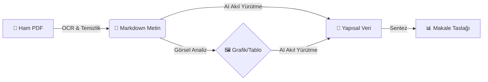

# 📡 O-ISAC Systematic Review (PRISMA 2020)

> **"Optical Integrated Sensing and Communication: A Unified Survey"**

Hoş geldiniz! 👋 Bu repo, **IEEE Communications Surveys & Tutorials (COMST)** dergisi için hazırlanan akademik bir sistematik derleme (survey) projesinin **tüm mutfağını** barındırır.

Burada, literatürdeki binlerce makalenin nasıl tarandığını, nasıl elendiğini ve yapay zeka destekli araçlarla nasıl analiz edildiğini **şeffaf bir şekilde** görebilirsiniz.

---

## 📖 Bu Proje Nedir? (Hikaye)

Biz, **"Fiber optik kablolar ve kablosuz optik sistemler (FSO, VLC) hem haberleşme yapıp hem de ortamı algılayabilir mi?"** sorusunun cevabını arıyoruz. Buna **O-ISAC** (Optical Integrated Sensing and Communication) denir.

Bu repo, bu soruyu cevaplamak için yapılan **bilimsel yolculuğun** dijital kanıtıdır.

---

## 🚦 Proje Durum Paneli (Dashboard)

Şu anda projenin hangi aşamasında olduğumuzu buradan takip edebilirsiniz:

| Aşama | Ne Yapıyoruz? | Durum |
|:---|:---|:---:|
| **1. Planlama** | Kuralları ve protokolü belirledik. ([Protokolü İncele](protocol/prisma_protocol.md)) | ✅ Tamamlandı |
| **2. Arama** | 1200+ makaleyi veritabanlarından bulduk. | ✅ Tamamlandı |
| **3. Eleme** | Başlık ve özet okuyarak ilgisizleri ayıkladık (158 kaldı). | ✅ Tamamlandı |
| **4. PDF Toplama** | Seçilen 158 makalenin tam metinlerini topluyoruz. | 🟡 Devam Ediyor (%20) |
| **5. Veri Madenciliği** | **Yapay Zeka (AI)** ile makaleleri okuyup veri çıkarıyoruz. | 🟡 Devam Ediyor |
| **6. Yazım** | Sonuçları makale haline getiriyoruz. | 🔴 Başlamadı |

> **Canlı Süreç:** Bu proje "Living Review" mantığıyla çalışır. Her sabah yeni makale var mı diye kontrol ederiz. ([Detaylı Günlük Akış](docs/DAILY_WORKFLOW.md))

---

## 🛠️ Nasıl Çalışıyoruz? (Teknik Mutfak)

Bu projeyi yönetmek için kullandığımız araçlar ve akış şöyledir:

### 1. Araç Setimiz
*   **🧠 Beyin:** Google Colab (Kodları ve AI modellerini burada çalıştırıyoruz).
*   **💾 Hafıza:** Google Drive (Tüm PDF'ler ve veriler burada durur).
*   **📁 Depo:** GitHub (Bu gördüğünüz yer, kodların ve dokümanların evidir).
*   **✍️ Yazım:** Overleaf (Makalenin son hali burada yazılır).

### 2. İş Akışımız (Workflow)
Bir makalenin PDF'ten anlamlı bir bilgiye dönüşme süreci:

Bu sihirli işlemi **tek bir tuşla** yapan aracımız: [`CoT_Master_Pipeline.ipynb`](analysis/notebooks/CoT_Master_Pipeline.ipynb)

---

## 📂 Dosyalar Nerede? (Harita)

*   `protocol/`: **Anayasa.** Kurallarımız, neyi dahil edip neyi etmeyeceğimiz burada yazar.
*   `search/` & `screening/`: **Kanıtlar.** Hangi kelimelerle arama yaptık? Hangi makaleyi neden eledik? Hepsi burada kayıtlı.
*   `data/`: **Hazine.** Toplanan PDF'ler ve AI tarafından çıkarılan JSON verileri.
*   `analysis/`: **Fabrika.** Analiz kodları, notebook'lar ve "CoT Laboratuvarı".
*   `docs/`: **Kılavuzlar.** Nasıl yapılır belgeleri.

---

## 🤖 İzlenebilirlik ve Şeffaflık

Bir bilimsel çalışmanın en önemli özelliği **tekrarlanabilir** olmasıdır.
*   Her eleme kararı bir CSV dosyasına işlenir.
*   Yapay zekanın her analizi bir "Log" dosyası olarak saklanır ("Ben bu makaleyi okudum ve şunları buldum" der).

---

**Son Güncelleme:** 13 Aralık 2025
*Bu proje, Açık Bilim (Open Science) ilkelerine adanmıştır.*
