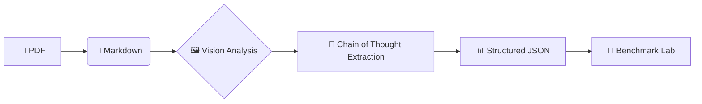

# 📡 O-ISAC Systematic Survey (PRISMA 2020)

> **Current corpus notice — 2026-08-04:** the authoritative review universe is 227 included reports mapped to 206 studies. Phase D contains 8,306 claim-governed records. The older 223+/220/221 and legacy Pipeline-V4 dashboard content below is historical. Start with [`memory-bank/full_corpus_206_source_of_truth_2026-08-04.md`](memory-bank/full_corpus_206_source_of_truth_2026-08-04.md) and the dated [`review_package/full_corpus_206_20260804/`](review_package/full_corpus_206_20260804/) migration package.

> **"Optical Integrated Sensing and Communication: A Unified Survey"**

Hoş geldiniz! 👋 Bu repo, **COMST düzeyindeki survey yazım ilkelerini referans alan ve mevcut submission planında IEEE Photonics Journal'ı hedefleyen** akademik bir sistematik survey (derleme) projesinin tüm mutfağını barındırır.

Burada, literatürdeki binlerce makalenin nasıl tarandığını, nasıl elendiğini ve yapay zeka destekli araçlarla nasıl analiz edildiğini **şeffaf bir şekilde** görebilirsiniz.

---

## 📖 Bu Proje Nedir? (Hikaye)

Biz, **"Fiber optik kablolar ve kablosuz optik sistemler (FSO, VLC) hem haberleşme yapıp hem de ortamı algılayabilir mi?"** sorusunun cevabını arıyoruz. Buna **O-ISAC** (Optical Integrated Sensing and Communication) denir.

Bu repo, bu soruyu cevaplamak için yapılan **bilimsel yolculuğun** dijital kanıtıdır.

---

## 🚦 Proje Durum Paneli (Dashboard)

Şu anda projenin hangi aşamasında olduğumuzu buradan takip edebilirsiniz:

| Aşama | Ne Yapıyoruz? | Durum |
|:---|:---|:---:|
| **1. Planlama** | Protokol, eligibility ve reviewer-process amendments | ✅ Tamamlandı |
| **2. Arama** | 1.733 kayıt; gerçek son arama tarihi 22 Haziran 2026 | ✅ Tamamlandı |
| **3. Eleme** | 272 full text; 227 dahil rapor → 206 çalışma | ✅ Tamamlandı |
| **4. Retrieval** | 330 unique rapor arandı; 58 rapor alınamadı | ✅ Tamamlandı |
| **5. Veri Çıkarma** | 206 çalışma; 8.306 claim; claim-level governance | ✅ Tamamlandı |
| **6. TQAF** | 206/206 çalışma; 115 evidence body; QA 43/43 | ✅ Tamamlandı |
| **7. Sentez** | S1–S7; 8.203 primary claim; artifact QA 29/29 | ✅ Tamamlandı |
| **8. Yazım** | 206-study patch hazır; aktif manuscript'e kontrollü entegrasyon | 🟡 Devam Ediyor |

> **Canlı Süreç:** Bu proje "Onion" (Soğan) mimarisiyle katman katman derinleşir. ([Detaylı Takip Dosyası](data/ext_track.md))

---

## 🛠️ Nasıl Çalışıyoruz? (Teknik Mutfak)

Bu projeyi yönetmek için **Pipeline V4** mimarisini kullanıyoruz:

### 1. Katmanlı Veri İşleme (Onion Structure)
Proje, veriyi merkezden dışa doğru 5 aşamada işler:
1.  **Öz:** Marker V1.0 ile PDF'ten Markdown'a dijitalleştirme.
2.  **Legacy:** Temel meta-veri çıkarımı (O_ISAC_001-066).
3.  **V4 (Vision+CoT):** Llama-3.3-70b ve Vision modelleriyle karmaşık tablo/grafik analizi.
4.  **Benchmark:** Doğruluk kalibrasyonu ve kıyaslama.
5.  **Sentez:** PRISMA uyumlu sistematik raporlama.

### 2. İş Akışımız (Workflow)

```mermaid
graph LR
    A[📄 PDF] --> B(📝 Markdown)
    B --> C{🖼️ Vision Analysis}
    C --> D[🧠 Chain of Thought Extraction]
    D --> E[📊 Structured JSON]
    E --> F[🧪 Benchmark Lab]
```

---

## 📂 Dosyalar Nerede? (Harita)

*   `data/`: **Hazine.** JSON verileri ve [`ext_track.md`](data/ext_track.md).
*   `analysis/nb/`: **Laboratuvar.** `CoT_Master_Pipeline.ipynb` ve `06_Extraction_Benchmark_Lab.ipynb`.
*   `protocol/`: **Anayasa.** PRISMA protokolü.

---

## 🤖 İzlenebilirlik ve Şeffaflık

Bir bilimsel çalışmanın en önemli özelliği **tekrarlanabilir** olmasıdır.
*   Her eleme kararı bir CSV dosyasına işlenir.
*   Yapay zekanın her analizi bir "Log" dosyası olarak saklanır.
*   Tüm kıyaslama süreçleri notebook'lar üzerinden şeffafça izlenebilir.

---

**Son Güncelleme:** 2 Ocak 2026
*Bu proje, Açık Bilim (Open Science) ilkelerine adanmıştır.*
