# O-ISAC Systematic Review

**Optical Integrated Sensing and Communication (O-ISAC)** alanında PRISMA 2020 standartlarına uygun sistematik derleme projesi.

---

## 📊 Proje Durumu

| Aşama | Durum | Detay |
|-------|-------|-------|
| Protokol | ✅ Tamamlandı | [`protocol/prisma_protocol.md`](protocol/prisma_protocol.md) |
| Arama | ✅ Tamamlandı | 1200 kayıt bulundu |
| Eleme | ✅ Tamamlandı | 158 çalışma dahil edildi |
| PDF Toplama | 🟡 Devam | 32/158 (%20) |
| Veri Çıkarma | 🟡 Devam | [CoT Pipeline Hazır](analysis/cot_laboratory/README.md) |
| Yazım | 🔴 Beklemede | - |

---

## 🔄 Master Workflow

Proje, modüler bir **Chain-of-Thought (CoT)** yapısı üzerine kuruludur:

```mermaid
flowchart LR
    A[📄 PDF Collection] --> B[🏭 Data Prep & OCR]
    B --> C[🖼️ Visual Analysis]
    C --> D[🧠 CoT Extraction]
    D --> E[📊 Analysis & Reporting]
    
    click D "analysis/cot_laboratory/README.md" "CoT Detayları"
```



🎯 **Ana Yönetim Merkezi:** [`analysis/notebooks/CoT_Master_Pipeline.ipynb`](analysis/notebooks/CoT_Master_Pipeline.ipynb)

---

## 🚀 Hızlı Başlangıç

1. **Notebook'u Açın:** [`analysis/notebooks/CoT_Master_Pipeline.ipynb`](analysis/notebooks/CoT_Master_Pipeline.ipynb)
2. **Runtime:** GPU (T4/A100) seçin.
3. **API Key:** Colab Secrets'a `GROQ_API_KEY` ekleyin.
4. **Çalıştırın:** Tüm pipeline (PDF'den analize) tek bir yerden yönetilir.

---

## 📁 Proje Yapısı

GitHub üzerinde kolay gezinme için ana dizinler:

```text
OISAC_PRISMA_COMST/
│
├── protocol/                  # 📋 [PRISMA Protokolü](protocol/prisma_protocol.md)
├── data/                      # 💾 Veri Deposu
│   ├── retrieved_docs/        # PDF'ler
│   └── extraction_results_v3/ # Çıktılar (JSON)
│
├── analysis/                  # 🧠 Analiz Merkezi
│   ├── notebooks/             # [Notebook'lar & Pipeline](analysis/notebooks/README.md)
│   └── cot_laboratory/        # [CoT Engine & Modules](analysis/cot_laboratory/README.md)
│
├── docs/                      # 📚 [Dokümantasyon](docs/)
├── manuscript/                # 📝 Taslak Yazım (LaTeX)
├── screening/                 # 🔍 Eleme Verileri
└── legacy_archive/            # 📦 Eski Dosyalar (Arşiv)
```

---

## 🔎 İzlenebilirlik (Traceability)

Bu proje şeffaflık için **Chain-of-Thought (CoT)** metodolojisini kullanır. Her bir çıkarma işlemi kayıt altına alınır:

- **Loglar:** `analysis/cot_laboratory/logs/` altında tutulur.
- **Format:** `YYYYMMDD_HHMMSS_PaperID_Model_Type.json`
- **Doğrulama:** Loglar, modelin "düşünme adımlarını" (reasoning steps) içerir.

---

## 📚 Dokümantasyon

- [🛣️ Yol Haritası](docs/ROADMAP.md)
- [🤖 AI Workflow](docs/AI_Co_Pilot_Workflow.md)
- [📋 CoT Laboratuvarı](analysis/cot_laboratory/README.md)

---

## 📄 Lisans

Bu proje akademik araştırma amaçlıdır.

---

**Son Güncelleme:** 2025-12-11
