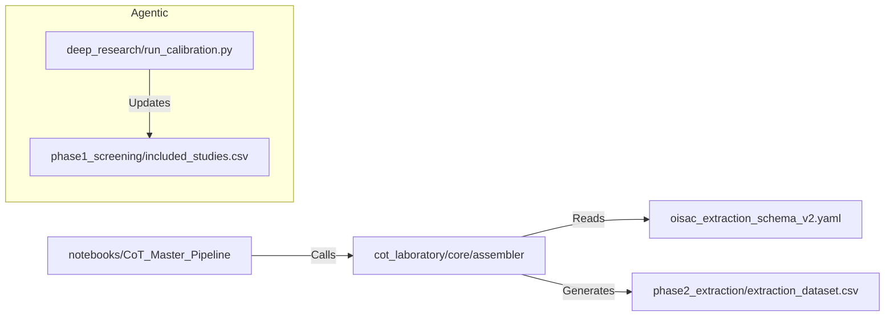

# 🔬 Analysis Core

This directory contains the entire technical engine for the **O-ISAC Systematic Review**. It houses the extraction logic, the execution notebooks, and the intermediate data processing layers.

---

## 📂 Directory Structure

| Directory | Role | Key Documentation |
|-----------|------|-------------------|
| **[`cot_laboratory/`](cot_laboratory/)** | **The Engine.** Modular Chain-of-Thought extraction logic. Contains the "Legos" (prompts) and "Recipes" (configs) for the LLM. | [README](cot_laboratory/README.md) |
| **[`deep_research/`](deep_research/)** | **The Agent.** Autonomous research module for finding and triaging new papers (Phase 5). | [README](deep_research/README.md) |
| **[`notebooks/`](notebooks/)** | **The Console.** Jupyter notebooks for executing the pipeline. This is where you run the code. | [README](notebooks/README.md) |
| **[`phase1_screening/`](phase1_screening/)** | **Outputs.** Reports and lists from the initial title/abstract screening phase. | - |
| **[`phase2_extraction/`](phase2_extraction/)** | **Outputs.** Structured datasets generated by the extraction pipeline. | - |

---

## 🚀 Key Files

### Operational
*   **[`daily_flow.md`](daily_flow.md)**: Standard Operating Procedure (SOP) for daily research activities. **Start here** to understand *how* to use this system day-to-day.

### Configuration
*   **[`oisac_extraction_schema_v2.yaml`](oisac_extraction_schema_v2.yaml)**: The master JSON schema defining *what* data we extract from every paper.

### Data
*   **[`references.bib`](references.bib)**: Central bibliography file.

---

## 🔄 Interaction Flow

