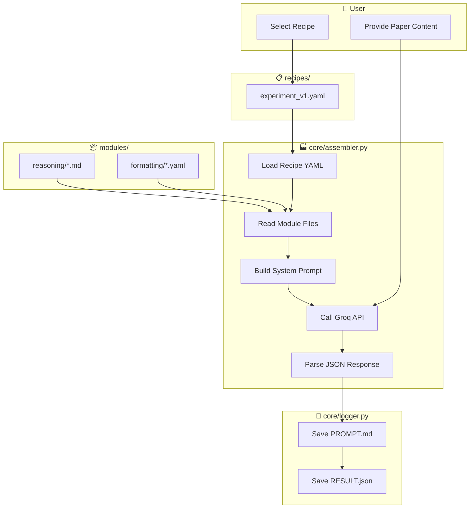
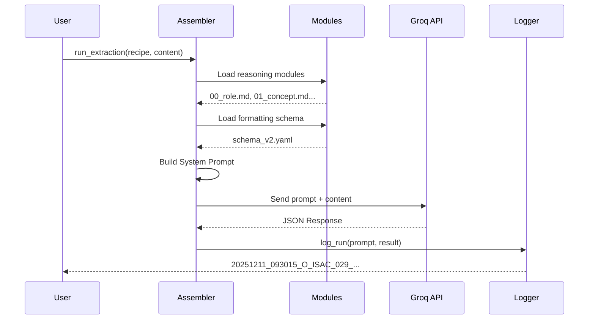
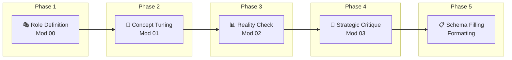

# 🧪 O-ISAC Extraction Laboratory (CoT Architecture)

This directory contains the modular **Chain-of-Thought (CoT)** extraction system designed for the O-ISAC Systematic Review. It replaces monolithic scripts with a **"Legos & Recipes"** architecture to ensure maintainability and experiment tracking.

---

## 🔄 Master Workflow



---

## 📂 Directory Structure

```text
analysis/cot_laboratory/
├── modules/                 # [LEGOS] Indivisible logic blocks (Prompts)
│   ├── reasoning/           # Thinking logic (e.g., "compare numbers", "find gaps")
│   └── formatting/          # Output schemas (e.g., JSON structure)
│
├── recipes/                 # [RECIPES] Configurations defining an experiment
│   └── experiment_v1.yaml   # "Combine Module A + B + Schema C"
│
├── core/                    # [ENGINE] Python code (No hardcoded prompts here!)
│   ├── assembler.py         # Builds the full prompt from a Recipe
│   ├── batch_runner.py      # Batch processing for multiple papers
│   └── logger.py            # Logs every run for PRISMA traceability
│
├── logs/                    # [MEMORY] Execution evidence logs
└── README.md                # This file
```

---

## 🚀 How It Works

### Execution Flow



1.  **Pick a Recipe:** You decide what you want to extract (e.g., "Just fast tuning" or "Deep benchmark analysis").
2.  **Assembler Builds Prompt:** The Python engine reads the recipe, fetches the requested text modules (Legos) from `modules/`, and stitches them into a single System Prompt.
3.  **Execution & Logging:** The engine calls the LLM and records the exact combination used in `logs/` to ensure reproducibility.

---

## 🧠 The Logic Cascade (CoT Mechanism)

How do the "Legos" talk to each other? The system follows a **Chain-of-Thought** flow before outputting any JSON:



| Phase | Module | Action | Purpose |
|-------|--------|--------|---------|
| 1 | [`00_role_definition.md`](modules/reasoning/00_role_definition.md) | Set persona as "Senior Research Architect" | Establishes domain expertise tone |
| 2 | [`01_concept_tuning.md`](modules/reasoning/01_concept_tuning.md) | Identify ISAC Mechanism (TDM/FDM/Joint) | Prevents wrong categorization |
| 3 | [`02_benchmark_compare.md`](modules/reasoning/02_benchmark_compare.md) | Cross-check metrics vs hardware limits | Hallucination filter |
| 4 | [`03_critical_analysis.md`](modules/reasoning/03_critical_analysis.md) | Find "Solved" vs "Open Challenges" | Quality text for survey |
| 5 | [`schema_v2.yaml`](modules/formatting/schema_v2.yaml) | Fill 113-field JSON | Structured output |

---

## 📋 Log File Format

Logs are saved with full timestamp for traceability:

```
YYYYMMDD_HHMMSS_<paper_id>_<model>_<type>.ext
│        │       │          │       │
│        │       │          │       └─ PROMPT.md or RESULT.json
│        │       │          └─ LLM model name
│        │       └─ Paper identifier
│        └─ Time: Hour Minute Second
└─ Date: Year Month Day
```

**Example:** `20251211_093015_O_ISAC_029_llama-3.3-70b-versatile_RESULT.json`
- Date: 2025-12-11
- Time: 09:30:15
- Paper: O_ISAC_029
- Model: llama-3.3-70b-versatile
- Type: RESULT (extraction output)

---

## 🛠️ How to Extend

*   **To change the Logic:** Don't touch Python code. Edit/Add a markdown file in `modules/reasoning/`.
*   **To change the Output Format:** Edit `modules/formatting/schema_v2.yaml`.
*   **To run a new Experiment:** Create a new YAML file in `recipes/`.

---

## 🔗 Related Documentation

- [Notebooks README](../notebooks/README.md) - Pipeline notebook documentation
- [Recipe Example](recipes/experiment_v1_full_analysis.yaml) - Full analysis recipe

---
**Maintained by:** Antigravity & User  
**Status:** Active Development  
**Last Updated:** 2025-12-11
