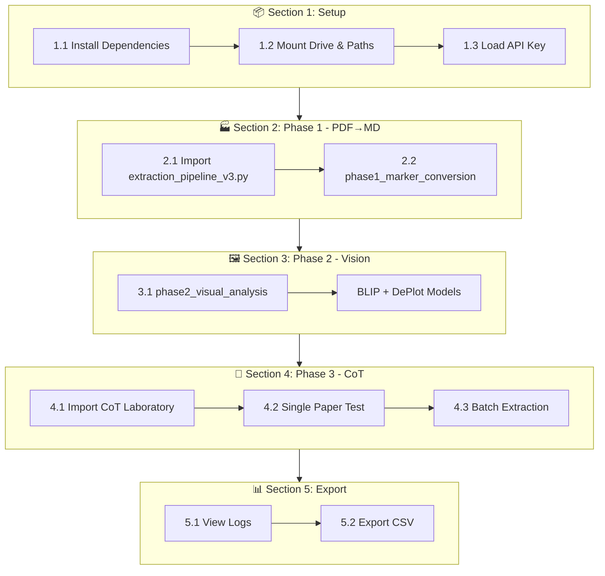
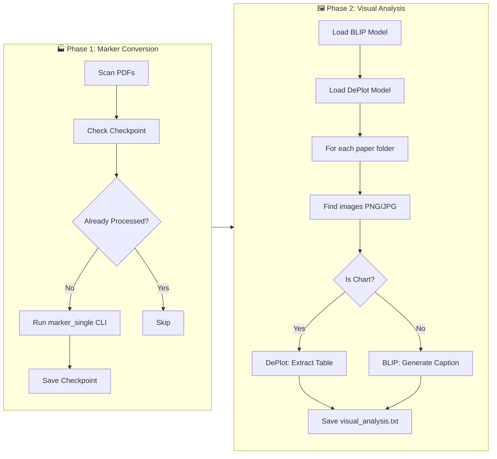

# 📓 Analysis Notebooks

Bu klasör O-ISAC Systematic Review için Jupyter Notebook'ları ve script'leri içerir.

---

## 🎯 Ana Notebook

### `CoT_Master_Pipeline.ipynb` ⭐ YENİ
**Tek notebook ile tüm pipeline'ı çalıştır!**

| Section | Açıklama | Gereksinim |
|---------|----------|------------|
| 1. Setup & Mount | Drive bağla, API key yükle | - |
| 2. Phase 1 - Data Prep | PDF → Markdown | GPU (T4+) |
| 3. Phase 2 - Visual Analysis | BLIP/DePlot | GPU |
| 4. Phase 3 - CoT Extraction | Chain-of-Thought | Groq API |
| 5. Results & Export | Log görüntüle, CSV export | - |

**Kullanım:**
1. Colab'da aç
2. Runtime → Change runtime type → GPU (T4)
3. 🔑 Secrets'a GROQ_API_KEY ekle
4. Sırayla çalıştır

---

## 🔄 İş Akışı (Workflow)



### Modül Bağlantıları

| Notebook Section | Çağrılan Modül | Dokümantasyon |
|------------------|----------------|---------------|
| Section 2 | [extraction_pipeline_v3.py](extraction_pipeline_v3.py) | Bu dosyada (aşağıda) |
| Section 3 | [extraction_pipeline_v3.py](extraction_pipeline_v3.py) | Bu dosyada (aşağıda) |
| Section 4 | [cot_laboratory/](../cot_laboratory/) | [CoT Laboratory README](../cot_laboratory/README.md) |

---

## 📂 Destekleyici Dosyalar

### `extraction_pipeline_v3.py`
**Roller:** PDF → Markdown dönüşümü ve görsel analiz

**Ana Fonksiyonlar:**

| Fonksiyon | Açıklama | Bağımlılıklar |
|-----------|----------|---------------|
| `phase1_marker_conversion()` | PDF'leri Marker ile markdown'a çevirir | `marker-pdf` |
| `phase2_visual_analysis()` | BLIP ve DePlot ile görsel analiz | `transformers`, GPU |
| `phase3_llm_extraction()` | Groq LLM ile JSON extraction | `groq`, `openai` |

**İş Akışı:**



---

| Dosya | Rol |
|-------|-----|
| `01_Data_Prep_Factory.ipynb` | Alternatif: Sadece Phase 1&2 |
| `02_LLM_Extraction_Lab.ipynb` | Alternatif: Sadece eski LLM extraction |

---

## 🧪 CoT Laboratory

Chain-of-Thought extraction sistemi `../cot_laboratory/` klasöründe:

```
cot_laboratory/
├── core/           # Python motor (assembler, batch_runner)
├── modules/        # Prompt "Lego"ları
├── recipes/        # Deney konfigürasyonları
└── logs/           # Çalıştırma kayıtları
```

**Detaylar için:** [cot_laboratory/README.md](../cot_laboratory/README.md)

---

## 📦 Arşiv

Eski/legacy notebook'lar `archive/` klasöründe saklanıyor:

- `PRISMA_Extraction_v2_Colab.ipynb` - Eski monolitik notebook
- `CoT_Vision_Factory_Runner.ipynb` - Legacy vision runner
- `extractionpipe.ipynb` - Çalışma defteri
- `prisma_extraction_v2.py` - Eski v2 script
- `reasoning_extraction_v1.py` - Stage 2 reasoning (CoT ile değiştirildi)

---

**Son Güncelleme:** 2025-12-11
