# 6G Communication New Paradigm: The Integration of Autonomous Aerial Vehicles and Intelligent Reflecting Surfaces

Zhaolong Ning®, Senior Member, IEEE, Tengfeng Li, Yu Wu®, Xiaojie Wang®, Senior Member, IEEE, Qingqing Wu®, Senior Member, IEEE, Fei Richard Yu®, Fellow, IEEE, and Song Guo®, Fellow, IEEE

Abstract—With the continuous development of Intelligent Reflecting Surfaces (IRSs) and autonomous aerial vehicles (AAVs), their combination has become foundational technologies to complement the terrestrial network by providing communication enhancement services for large-scale users. This article provides a comprehensive overview of IRS-assisted AAV communications for 6th-Generation (6G) networks. First, the applications supported by IRS-assisted AAV communications for 6G networks are introduced, and key issues originated from applications supported by IRSs and AAVs for 6G networks are summarized and analyzed. Then, prototypes and main technologies related to the integration of IRSs and AAVs are introduced. Driven by applications and technologies of IRSassisted AAV communications, existing solutions in the realms of energy-constrained communications, secure communications, and enhanced communications are summarized, and corresponding empirical lessons are provided. Finally, we discuss some research challenges and open issues in IRS-assisted AAV communications, offering directions for the future development.

*Index Terms*—Intelligent reflecting surface, autonomous aerial vehicles, secure communications, 6G networks.

Received 1 May 2024; revised 29 August 2024 and 23 November 2024; accepted 1 January 2025. Date of publication 6 January 2025; date of current version 19 December 2025. This work was supported in part by the Natural Science Foundation of China under Grant 62272075, Grant 62371289, and Grant 62331022; in part by the National Natural Science Foundation of Chongqing under Grant CSTB2024NSCQ-JQX0013 and Grant CSTB2024NSCQ-QCXMX0058; in part by the Science and Technology Research Program for Chongqing Municipal Education Commission under Grant KJZD-M202200601 and Grant KJZD-K202300608; in part by the Hong Kong RGC General Research Fund under Grant 152244/21E, Grant 152169/22E, Grant 152228/23E, and Grant 162161/24E; in part by the Research Impact Fund under Grant R5011-23F and Grant R5060-19; in part by the Collaborative Research Fund under Grant C1042-23GF; in part by the Theme-Based Research Scheme under Grant T43-518/24-N; in part by the Areas of Excellence Scheme under Grant AoE/E-601/22-R; and in part by the InnoHK (HKGAI). (Corresponding author: Xiaojie Wang.)

Zhaolong Ning, Tengfeng Li, and Xiaojie Wang are with the School of Communications and Information Engineering, Chongqing University of Posts and Telecommunications, Chongqing 400065, China (e-mail: z.ning@ieee.org; s220101066@stu.cqupt.edu.cn; xiaojie.kara.wang@ieee.org).

Yu Wu is with the School of Cyber Security and Information Law, Chongqing University of Posts and Telecommunications, Chongqing 400065, China (e-mail: wuy@cqupt.edu.cn).

Qingqing Wu is with the Department of Electronic Engineering, Shanghai Jiao Tong University, Shanghai 200240, China (e-mail: qingqingwu@sjtu.edu.cn).

Fei Richard Yu is with the School of Information Technology, Carleton University, Ottawa, ON K1S 5B6, Canada (e-mail: richard.yu@carleton.ca).

Song Guo is with the Department of Computer Science and Engineering, The Hong Kong University of Science and Technology, Hong Kong, China (e-mail: songguo@cse.ust.hk).

Digital Object Identifier 10.1109/COMST.2025.3526251

### I. Introduction

ITH the continuous evolution of wireless networks, significant progress has been made in 5th-Generation (5G) networks, which are gradually being commercialized in certain regions. To meet the growing demands of networks, researchers are shifting their focus towards 6th-Generation (6G) wireless networks. Compared to 5G, 6G offers significant improvements in terms of rates, capacities, latency, and reliability [1]. Furthermore, 6G networks are expected to support billions of interconnected devices, catering to different requirements of applications such as smart homes and Intelligent Transportation Systems (ITSs) [2]. Realizing large-scale network connectivity of an Internet of Things (IoT) system has become a challenging issue. 6G networks are promising to cope with this requirement, aiming to achieve seamless coverage of not only terrestrial networks but also aerial and maritime domains [3]. What's more, for new 6G bands such as millimeter Wave (mmWave) and TeraHertz (THz), serious path loss incurred over long distances can result in poor communications.

Fortunately, the vision associated with 6G networks is promising to be realized, since autonomous aerial vehicle (AAV) communication technologies continue to become mature. AAVs can be flexibly deployed in areas with dense network equipment, thus relieving the pressure of largescale access networks on terrestrial networks, especially in scenarios where the density of network devices changes over time, such as vehicular communications [4]. Main lobes of traditional ground-based Base Station (BS) antennas face downwards [5], which necessitates the construction of BSs to achieve wide-scale network coverage. By changing the flight altitude, it is possible to cover large ground areas when deploying AAVs as network relay stations or airborne BSs. Moreover, AAVs can be deployed in areas such as oceans and airspace where ground-based BS signals are difficult to reach, providing robust technical support for seamless network coverage. Furthermore, relying on their flexibility, AAVs can easily establish Line-of-Sight (LoS) links with other communication devices, effectively mitigating the high path loss caused by high-frequency communications.

However, AAV-assisted communications still face development bottlenecks. First, AAVs have limited onboard energy, making it challenging to perform long-term communications and complex computational tasks [6]. Second, the reliability

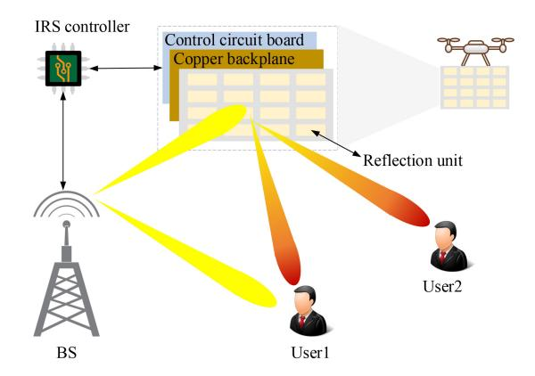

Fig. 1. A schematic diagram of IRS structure.

of AAV communications is difficult to guarantee, especially in adverse weather conditions [\[7\]](#page-29-6). It is worth noting that the aforementioned bottlenecks in AAV communications can be mitigated through Intelligent Reflecting Surface (IRS)-based technologies.

*A. Overview of IRS-Assisted AAV Communications for 6G Networks*

As shown in Fig. [1,](#page-1-0) the IRS employs a three-layer architectural approach, where the innermost layer consists of the control circuit board, which excites the reflection unit to adjust the incident signal through a controller [\[8\]](#page-29-7). The middle layer is made up of a copper backplane designed to minimize information and energy leakage. The outermost layer consists of a large number of passive reflection units, each of which can be dynamically controlled in a software-defined manner. By manipulating the phase and amplitude of incident signals, IRS achieves precise control and adjustment of the signal [\[9\]](#page-29-8).

A AAV carrying IRS to assist ground user communications is illustrated in Fig. [1.](#page-1-0) A BS first generates IRS control messages and then sends them and communication messages to the aerial IRS based on special transmission protocols [\[10\]](#page-29-9), [\[11\]](#page-29-10). The IRS controller receives control signals and transmits the IRS tuning strategies to the control circuit board, which then excites reflection units to intentionally adjust the incident signal. In this way, the BS can establish highquality virtual LoS links with users, which can be coherently combined with the LoS link and other Non-LoS (NLoS) links to achieve signal enhancement and interference suppression. Generally speaking, IRS is passive and does not have signal processing capabilities. Therefore, the control strategies for IRS is typically determined at the BS through the cascaded BS-IRS-user channel. Fortunately, some reflection units can be replaced with dedicated sensing devices to perceive the wireless environment and assist in formulating the reflection strategies [\[8\]](#page-29-7). Besides, the AAV can dynamically change flight trajectories to improve communication conditions.

Based on the fact that the power consumption of IRS is much lower than that of Radio Frequency (RF) source and AAV flight power consumption [\[12\]](#page-29-11), most studies typically assume that the IRS is passive, meaning it does not require energy for signal reflection. This is also the basic assumption for the scenarios considered in this article. In fact, maintaining the normal operation of IRS requires very low energy consumption, primarily for the IRS configuration receiver and control circuitry [\[13\]](#page-29-12). Experiments show that the total power consumption of a large IRS, consisting of 1720 reflecting elements, is only 0.280 watts [\[14\]](#page-29-13). Unlike most studies that overlook IRS power consumption, authors in [\[15\]](#page-29-14) considered IRS energy consumption in the scenario of aerial IRS-assisted ground user communications, where the power consumption of IRS control circuitry mainly depends on the number of reflection units and phase resolution, while the receiver power consumption is typically assumed constant and ignored.

Currently, the practicality of IRS-assisted communications is thoroughly studied. Authors in [\[16\]](#page-29-15) propose a metasurface that modulates electromagnetic waves in both spatial and frequency domains, validated by an experimental prototype. Similarly, authors in [\[17\]](#page-29-16) develop a programmable diffraction Deep Neural Network (DNN) for encoding metasurface arrays, providing practical evidence for IRS beamforming. However, research on IRS-assisted AAV communications remains in the theoretical stage. Authors in [\[18\]](#page-29-17) analyze the Bit Error Rate (BER) and ergodic capacity of IRS-assisted AAV-IoT networks. The analysis results indicate that introducing IRS into AAV networks can reduce BER by five orders of magnitude when the number of reflection elements exceeds 16. It is also shown that the ergodic capacity of IRS-assisted AAV communications is ten times higher than that of traditional AAV communications. For specific scenarios, authors in [\[19\]](#page-29-18) propose a system-level simulation framework for Vehicleto-Everything (V2X) networks assisted by hybrid aerial and ground IRSs to reduce reducing path loss and expand coverage in V2X networks. Based on the above analysis, we primarily offers a comprehensive overview of IRS-assisted AAV communications from theoretical perspective, providing a solid theoretical foundation for the practical design in the future.

## *B. Features of IRS-Assisted AAV Communications*

Unlike IRS-assisted terrestrial communications and traditional AAV communications, IRS-assisted AAV communications integrate the respective advantages of IRSs and AAVs to serve various scenarios within 6G networks in an efficient way.

IRS-assisted terrestrial communications aim to enhance signal quality by placing IRSs on the ground or building facades. The IRS is able to dynamically adjust the phase and amplitude of the incident signal, reflecting the signal in a different way from active relays to improve the propagation path of the signal [\[8\]](#page-29-7). It can effectively extend signal coverage, especially in scenes where the direct LoS path is obstructed, such as urban, canyon or indoor environments. It can also improve the Energy Efficiency (EE) ratio and system capacity of communications through precise signal tuning. However, the performance of IRS-assisted terrestrial communications is limited by the location and number of IRSs, as well as their adaptability to environments.

Traditional AAV communications rely on a direct wireless connection between AAVs and ground users. It can provide a high degree of mobility and flexibility, allowing AAVs to be quickly deployed in specific areas to support temporary

TABLE I COMPARISONS OF FEATURES AND CONTRIBUTIONS AMONG RELATED SURVEYS

|                          |              |           | 5            | Scope     | s            |          |                                                                                                                                                                  |
|--------------------------|--------------|-----------|--------------|-----------|--------------|----------|------------------------------------------------------------------------------------------------------------------------------------------------------------------|
| Cotogorios               | Ref.         |           |              | 6G        | netwo        | orks     | Contillections                                                                                                                                                   |
| Categories               | Kei.         | IRS       | UAV          | V2X       | SAGIN        | IoT      | Contributions                                                                                                                                                    |
|                          | [23]         | $\sqrt{}$ | ×            | ×         | ×            | ×        | The design of channel estimation and passive beamforming for IRS is reviewed.                                                                                    |
|                          | [24]         | $\sqrt{}$ | ×            | ×         | ×            | ×        | ML-based solutions, channel and hardware design for IRS are discussed.                                                                                           |
| Specific im-             | [25]         | $\sqrt{}$ | ×            | ×         | ×            | ×        | The network modeling based on the integration of IRSs and NOMA is investigated.                                                                                  |
| plementation of IRSs  | [26]         | ×         | $\checkmark$ | ×         | ×            | ×        | Measurement schemes and channel characterization for UAV channels are reviewed.                                                                                  |
| or UAVs                  | [27]         | ×         | <b>√</b>     | ×         | ×            | ×        | Key technologies, issues, and solutions in UAV networks with the assistance of ML and MEC are summarized.                                                        |
|                          | [28]         | ×         | $\sqrt{}$    | ×         | ×            | ×        | The benefits of combining UAV and wireless networks are discussed.                                                                                               |
|                          | [29]         | ×         | $\checkmark$ | ×         | ×            | ×        | The standardization process of UAV communications and the testbed are reviewed.                                                                                  |
|                          | [30]         | <b>√</b>  | ×            | ×         | ×            | ×        | Principles, performance evaluation and enabling technologies for IRS-assisted wireless networks are presented.                                                   |
|                          | [31]         | <b>√</b>  | ×            | ×         | ×            | ×        | The applications of IRSs and performance enhancements in wireless communications are reviewed.                                                                   |
|                          | [32]         | $\sqrt{}$ | ×            |           | ×            | ×        | The research on IRS-assisted ITSs is summarized for 6G networks.                                                                                                 |
|                          | [33]         | $\sqrt{}$ | ×            | ×         | ×            | ×        | A tutorial on IRS-based indoor visible light communications is investigated.                                                                                     |
| Applications             | [34]         | ×         | $\checkmark$ | ×         |              | ×        | UAV-assisted ARANs for 6G networks are investigated.                                                                                                             |
| based on IRSs or UAVs | [5]          | ×         | <b>√</b>     | ×         | <b>√</b>     | ×        | The major barriers, design considerations, potential solutions, and the ability of cellular networks to support UAV communications are reviewed.                 |
|                          | [35]         | ×         | $\checkmark$ | ×         | $\checkmark$ | ×        | The use cases, requirements, enabling technologies and unresolved issues of UAVs from 5G to 6G networks are reviewed.                                            |
|                          | [36]         | ×         | <b>√</b>     | ×         | ×            | <b>√</b> | The development status and future trends of UAV-assisted data acquisition technologies are reviewed.                                                             |
|                          | [37]         | ×         | $\sqrt{}$    | $\sqrt{}$ | ×            | ×        | The application potential and challenges of UAV-based ITSs are reviewed.                                                                                         |
|                          | [7]          | <b>√</b>  | <b>√</b>     | ×         | ×            | ×        | The combination of UAVs and IRSs for air-ground network performance enhancement is discussed through two case studies.                                           |
| Combination of IRSs      | [21]         | <b>√</b>  | <b>√</b>     | ×         | ×            | ×        | The methods of integrating IRSs with UAVs to serve air-ground integrated networks are discussed.                                                                 |
| and UAVs                 | [9]          | <b>√</b>  | <b>√</b>     | ×         | ×            | ×        | The advantages of combining UAVs and active IRSs are demonstrated through two cases.                                                                             |
|                          | This article | <b>√</b>  | <b>√</b>     | <b>√</b>  | <b>√</b>     | <b>√</b> | The common problems, key technologies, application scenarios, solutions and open issues faced by IRS-assisted UAV communications for 6G networks are summarized. |

or emergency communication needs [\[20\]](#page-29-19). AAVs can take advantage of their height to establish LoS communication links with relative ease. However, there are still many challenges, including the battery life limitations of AAVs, the existence of obstacles, and the unstable connection in complex environments.

IRS-assisted AAV communications represent a kind of highly innovative communications that can provide communication flexibility and efficiency by combining the passive signal enhancement capabilities of IRSs and the dynamic deployment capabilities of AAVs. Specifically, through strategic placement of IRSs, AAVs can establish communication links with devices without the need of flying closely, thus saving propulsion energy to a certain extent [\[21\]](#page-29-20). By widening and flattening the three-dimensional beams, the coverage range of AAVs can be expanded with the assistance of IRSs [\[22\]](#page-29-21). Additionally, this combination enables flexible implementation of airborne passive relays, which can effectively mitigate severe congestion and attenuation effects in THz and mmWave frequency bands [\[7\]](#page-29-6). It is worth noting that the mobility of AAVs enables full-angle reflection, providing new degrees of freedom for IRS design and deployment. This combination overcomes the obstacles posed by terrain and buildings, and achieves real-time optimization of the signal propagation path, which is difficult to achieve in traditional IRS-assisted ground communications or AAV communications. Overall, IRS-assisted AAV communications provide a highly adaptable and scalable solution to address the limitations of traditional communication methods, and has significant research value.

### *C. Related Surveys*

Some surveys have discussed IRSs and AAVs, and can be divided into three categories: specific implementation of IRSs or AAVs in wireless networks [\[23\]](#page-29-22), [\[24\]](#page-29-23), [\[25\]](#page-29-24), [\[26\]](#page-29-25), [\[27\]](#page-29-26), [\[28\]](#page-29-27), [\[29\]](#page-29-28), practical applications based on IRSs or AAVs [\[5\]](#page-29-4), [\[30\]](#page-29-29), [\[31\]](#page-29-30), [\[32\]](#page-29-31), [\[33\]](#page-29-32), [\[34\]](#page-29-33), [\[35\]](#page-29-34), [\[36\]](#page-30-0), [\[37\]](#page-30-1), as well as the combination of IRSs and AAVs [\[7\]](#page-29-6), [\[9\]](#page-29-8), [\[21\]](#page-29-20).

For the specific implementation of IRSs or AAVs, authors in [\[23\]](#page-29-22) summarize the channel estimation and practical beamforming methods for imperfect IRS. Authors in [\[24\]](#page-29-23) investigate the channel design of IRS-assisted wireless networks, while authors in [\[25\]](#page-29-24) investigate network modeling based on the integration of IRSs and NOMA. Considering the spatiotemporal variability of AAV wireless channels, authors in [\[26\]](#page-29-25) discuss the wireless channel modeling of AAVs in detail. Authors in [\[27\]](#page-29-26) summarize key technologies, issues and solutions in AAV networks with the assistance of Machine Learning (ML) and Mobile Edge Computing (MEC). Meanwhile, authors in [\[28\]](#page-29-27) discuss problems faced by AAV communications in future wireless networks and summarize feasible solutions. In addition, the standardization progress of AAV cellular communications is discussed in [\[29\]](#page-29-28).

For applications supported by IRSs, authors in [\[30\]](#page-29-29), [\[31\]](#page-29-30) discuss the potential of IRS in wireless networks. Authors in [\[32\]](#page-29-31) summarize the current research on IRS-enabled ITSs in detail. Furthermore, visible light communications are considered as a crucial component of future communication networks, and its communication tutorial in combination with IRS is discussed in [\[33\]](#page-29-32). For the applications of AAVs, authors in [\[34\]](#page-29-33) focus on AAV-assisted Aerial Radio Access Networks (ARANs), while authors in [\[5\]](#page-29-4), [\[35\]](#page-29-34) discuss AAVassisted cellular networks from system design and industry perspectives, respectively. In addition, authors in [\[36\]](#page-30-0), [\[37\]](#page-30-1) introduce the application of both AAV-assisted data acquisition systems and ITSs.

Authors in [\[7\]](#page-29-6), [\[9\]](#page-29-8), [\[21\]](#page-29-20) illustrate the combination of IRSs and AAVs for wireless networks. Specifically, benefits, current progress and development prospects of IRS-assisted AAV communications are discussed. It is worth noting that studies in [\[7\]](#page-29-6), [\[9\]](#page-29-8), [\[21\]](#page-29-20) all highlight the benefits of combining IRS and AAV through simulation tests, while there is still a lack of in-depth analysis of the relationship between corresponding scenarios and issues in the context of IRS-assisted AAV communications, as well as a comprehensive summary of effective solutions to mitigate these issues.

In summary, we provide a comparison of the above related surveys in Table [I.](#page-2-0) It is obvious that the use of IRSs or AAVs for 6G networks has been discussed from different perspectives. However, the advantages of the combination of IRSs and AAVs bringing to 6G networks and the applications they support are not comprehensively summarized, and the common issues that exist in these applications are not analyzed in depth. Furthermore, there is still a lack of comprehensive investigation on how technologies and solutions related to IRS-assisted AAV communications can be effectively utilized to mitigate communication issues for 6G networks.

### *D. Contributions*

For 6G networks, the integration of IRS and AAV communications can complement non-terrestrial networks and drive a comprehensive development of future wireless communications and their applications. *To the best of our knowledge, we are the first to provide a survey on IRS-assisted AAV communications for 6G networks by exploring corresponding application scenarios, common key issues, system prototypes, technological support, specific implementations, and research prospects.* Specifically, the contributions of this article can be summarized as follows:

- *•* We introduce three typical applications of IRS-assisted AAV communications for 6G networks, and analyze and summarize three common issues related to these applications.
- *•* We summarize prototypes of IRS-assisted AAV communications from multiple perspectives, and provide a detailed description of the related technologies for IRSassisted AAV communications.
- *•* Based on key issues faced by IRS-assisted AAV communications and applications supported for 6G networks, we summarize existing solutions and provide corresponding lessons learned.
- *•* We present challenges and potential research directions for IRS-assisted AAV communications, which can guide future research and exploration for 6G networks.

### *E. Organization*

Fig. [2](#page-4-0) illustrates the structure of this article. In Section [II,](#page-3-0) we provide a detailed introduction to application scenarios of IRS-assisted AAV communications for 6G networks and analyze the common issues in these scenarios. In Section [III,](#page-9-0) prototypes and technologies of IRS-assisted AAV communications are described in detail. In Section [IV,](#page-15-0) we summarize existing solutions to the specific issues presented in Section [II,](#page-3-0) including energy-constrained communications, secure communications, and enhanced communications. Then, some future challenges and open issues are described in Section [V.](#page-27-0) Finally, we conclude this article in Section [VI.](#page-28-0) A list of abbreviations used in this article is given in Table [II.](#page-4-1)

# II. APPLICATIONS AND KEY ISSUES OF IRS-ASSISTED AAV COMMUNICATIONS FOR 6G NETWORKS

For 6G networks, the rise of IRS-assisted AAV communication technologies not only marks a major step forward in the field of wireless communications, but also provides novel solutions to address the increasingly complex communication requirements. Thus, we first explore the wide range of applications of IRS-assisted AAV communications in three typical 6G networks, including Space-Air-Ground Integrated Networks (SAGINs), V2X, and large-scale IoT. Although IRS-assisted AAV communications provide a new way to realize these applications, there are still some issues and challenges in system implementation. Therefore, starting from application scenarios, we provide insights into the key issues and challenges in realizing energy-constrained, secure,

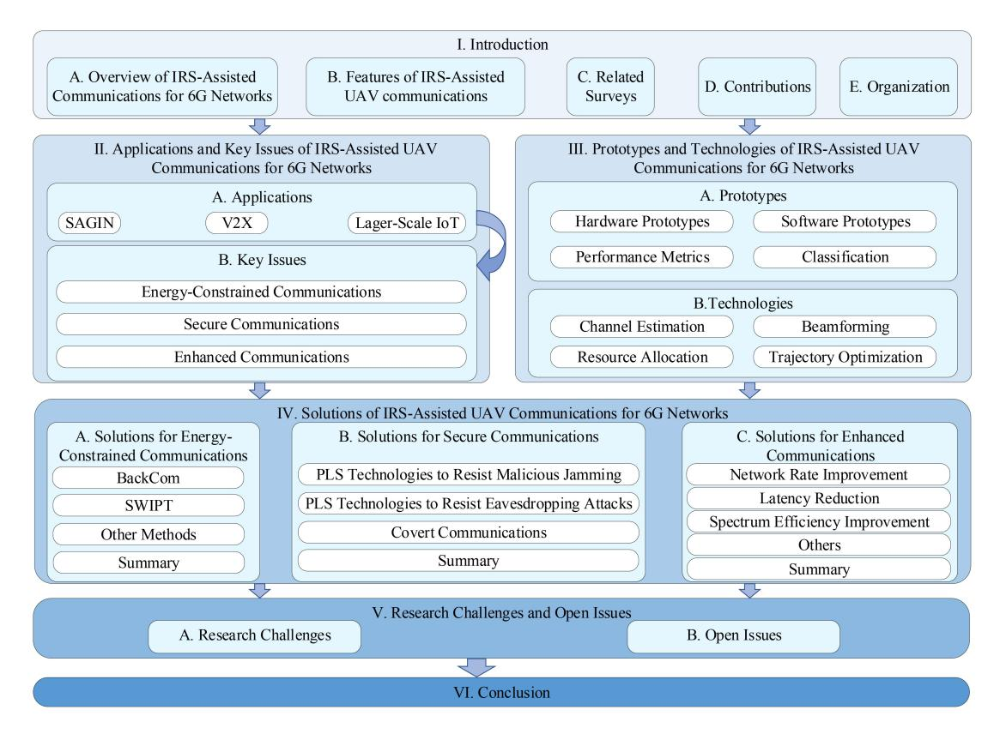

Fig. 2. The structure of this survey.

TABLE II LIST OF ABBREVIATIONS

| Abbreviation | Description                             | Abbreviation | Description                                          |
|--------------|-----------------------------------------|--------------|------------------------------------------------------|
| 5G/6G        | 5-Generation/6-Generation               | MEC          | Mobile Edge Computing                                |
| AO           | Alternating Optimization                | ML           | Machine Learning                                     |
| ARANs        | Aerial Radio Access Networks            | mMTC         | massive Machine Type Communication                   |
| BackCom      | Backscatter Communication               | mmWave       | millimeter Wave                                      |
| BCD          | Block Coordinate Descent                | NOMA         | Non-Orthogonal Multiple Access                       |
| BD           | Backscatter Device                      | OFDMA        | Orthogonal Frequency Division Multiple Access        |
| BER          | Bit Error Rate                          | PLS          | Physical Layer Security                              |
| BS           | Base Station                            | PSO          | Particle Swarm Optimization                          |
| CNN          | Convolutional Neural Network            | RF           | Radio Frequency                                      |
| CoMP         | Coordinated MultiPoint                  | RL           | Reinforcement Learning                               |
| CR           | Cognitive Radio                         | RNN          | Recurrent Neural Network                             |
| CS           | Compressive Sensing                     | RSU          | RoadSide Unit                                        |
| CSI          | Channel State Information               | SAGIN        | Space-Air-Ground Integrated Networks                 |
| DL           | Deep Learning                           | SCA          | Successive Convex Approximation                      |
| DNN          | Deep Neural Network                     | SDR          | SemiDefinite Relaxation                              |
| DRL          | Deep Reinforcement Learning             | SIC          | Successive Interference Cancellation                 |
| EE           | Energy Efficiency                       | SR           | Symbiotic Radio                                      |
| eMBB         | enhanced Mobile BroadBand               | SWIPT        | Simultaneous Wireless Information and Power Transfer |
| FBC          | Finite Blocklength Coding               | TDMA         | Time-Division Multiple Access                        |
| GU/PU/SU     | Ground User/Primary User/Secondary User | THz          | TeraHertz                                            |
| HAP          | High Altitude Platform                  | UAV          | Unmanned Aerial Vehicle                              |
| IoD-Sim      | Internet of Drones Simulator            | URLLC        | Ultra-Reliable and Low Latency Communication         |
| IoT          | Internet of Things                      | V2I/V2N      | Vehicle-to-Infrastructure/Vehicle-to-Network         |
| IRS          | Intelligent Reflective Surface          | V2P/V2V      | Vehicle-to-Pedestrian/Vehicle-to-Vehicle             |
| ITS          | Intelligent Transportation System       | V2X          | Vehicle-to-Everything                                |
| LoS/NLoS     | Line-of-Sight/Non-LoS                   | ZSPs         | Zone Service Providers                               |
| LSTM         | Long Short-Term Memory                  |              |                                                      |

and enhanced communications for 6G networks based on IRSassisted AAV communications. The existence of these issues points to the direction of development of IRS-assisted AAV communications.

*A. Applications of IRS-Assisted AAV Communications for 6G Networks*

Since IRS-assisted AAV communication technologies are maturing, they are widely used in a variety of application

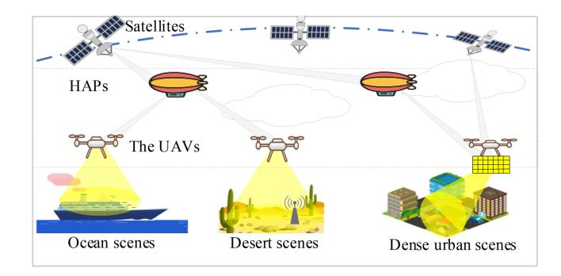

Fig. 3. A schematic of IRS-assisted AAV communications for SAGINs.

scenarios for 6G networks. So we take three typical application scenarios for 6G networks, i.e., SAGIN, V2X communications, and large-scale IoT, as examples to illustrate the benefits brought by the integration of IRSs and AAVs. This categorization is mainly based on three service requirements for 5G and beyond networks, i.e., enhanced Mobile BroadBand (eMBB), Ultra-Reliable and Low Latency Communication (URLLC), and massive Machine Type Communication (mMTC) [\[38\]](#page-30-2). Specifically, eMBB provides high data rates and reliability for SAGIN, while V2X requires URLLC for low-latency and reliable communication services, and mMTC supports lowcost communication connectivity for massive IoT devices.

*1) IRS-Assisted AAV Communications for SAGINs:* SAGIN, as a network architecture concept, is considered an important part of 6G network visions. The SAGIN refers to the integration of ground networks with aerial and space networks, providing global coverage and supporting communications for heterogeneous networks [\[39\]](#page-30-3). This seamless coverage network provided by SAGINs plays a significant role in remote areas, maritime communications, post-disaster communications, and other fields. The SAGIN can be divided into three layers: space, air, and ground, which fully integrate communication resources of the three layers to leverage the advantages of heterogeneous networks [\[40\]](#page-30-4). The air layer mainly refers to High Altitude Platforms (HAPs) composed of AAVs, balloons, airships, and other equipment, which can optimize and coordinate terrestrial and satellite resources for efficient communications and data transmission. However, unlike ground networks, limited computational capabilities and battery capacities of HAP equipments [\[39\]](#page-30-3), as well as the impact of the wireless propagation environment on the propagation of communications among layers, can severely hinder the development of non-terrestrial networks. Therefore, the implementation of non-terrestrial networks is more challenging than that of ground networks.

In the three-layer architecture of SAGIN, as shown in Fig. [3,](#page-5-0) the space layer consists of various satellites to provide global communication, positioning, and surveillance capabilities. The ground layer includes ground stations, radar stations, and other communication and sensing devices, primarily involved in collecting, processing, and distributing data from the air and space layers. The air layer is made up of AAVs, IRSs, and airships, which mainly play the role of short-range data collection and communication relay. Specifically, the applications of IRS-assisted AAV communications in SAGIN are as follows:

- *•* Diversified link selection: Coordinating network resources of each network layer to realize efficient and reliable communication is the main design goal of SAGINs. HAPs usually operate in the air at 17-25km from the ground, and the weather has a negligible effect on them [\[41\]](#page-30-5). Consequently, the links from satellites to HAPs should be maintained reliably [\[41\]](#page-30-5). However, realizing reliable communications between HAP layers and the ground layers is challenging due to cloud cover and atmospheric turbulence. One potential solution is to use IRS-assisted AAVs as aerial relays to provide diversified link options when the communication quality between the air layer and the ground layer is weak, i.e., selecting IRSs on the AAVs for relaying while reducing the high signal attenuation caused by direct transmission. This is often attributed to the fact that IRSs can reflect the incident signal from the HAPs and ensure that the reflected signals are directed to the ground users. Moreover, AAVs can choose a suitable location to minimize the high signal attenuation caused by obstructions such as clouds.
- *•* Multi-dimensional network coverage: Multi-dimensional network coverage is essential for applications like disaster response, remote sensing, and emergency communications in SAGINs. Traditional terrestrial networks struggle to provide effective global coverage, especially in inaccessible regions such as polar areas, deserts, and oceans. IRS-assisted AAV communications address these limitations by offering flexible, multi-dimensional coverage. IRSs can dynamically adjust the amplitude and phase shift of incident signals to reshape the propagation environment, enhancing signal reach and quality, especially for places that are difficult to reach signals directly [\[42\]](#page-30-6). Furthermore, deploying IRSs on AAVs can extend coverage, providing reliable communication in remote regions. During emergencies, this approach can also help overcome signal blockages caused by infrastructure damage [\[43\]](#page-30-7).
- *2) IRS-Assisted AAV Communications for V2X:* V2X refers to communication and interaction among vehicles and various entities in the surrounding environment. It mainly includes Vehicle-to-Vehicle (V2V), Vehicle-to-Infrastructure (V2I), Vehicle-to-Pedestrian (V2P), and Vehicle-to-Network (V2N) [\[4\]](#page-29-3). It is a technology based on the Internet of vehicles and ITSs, aiming to improve vehicle safety, efficiency, and convenience. The implementation of V2X communications is required to handle real-time movement of vehicles and huge network demand [\[44\]](#page-30-8), [\[45\]](#page-30-9). For the real-time mobility of vehicles, system design needs to be focused on problems including network topology transformation, and wireless access switching. Concurrently, high-quality links, imperceptible latency, and secure transmission are also demanded by V2X communications.

V2X represents a collection of various vehicle-related communications, primarily applied in urban areas to overcome communication barriers caused by terrain and buildings. In V2X, as shown in Fig. [4,](#page-6-0) IRSs can be deployed on buildings to provide communication services with LoS links for nearby

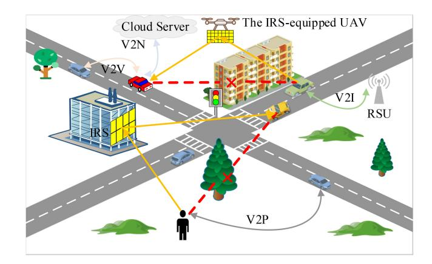

Fig. 4. A schematic of IRS-assisted AAV communications for V2X.

users and devices. Furthermore, IRS-assisted AAV communications can be flexibly scheduled according to dynamic traffic communication requirements. Specifically, the applications of IRS-assisted AAV communications in V2X are summarized as follows:

- *•* Adaptability to dynamic V2X demands: In V2X communications, traffic flows and communication demands often vary dynamically over time and across regions, necessitating that V2X systems should adapt to these changes dynamically. However, traditional terrestrial networks typically rely on BSs for communication, where a few number of BSs can lead to network congestion during periods of high traffic flow, and conversely, an excess of BSs may result in resource wastage during idle periods. IRS-assisted AAV communications allow for flexible adjustments in response to various traffic flows and communication demands, for instance, by altering the AAVs' flight trajectories and adjusting the IRSs' reflection strategies to achieve demand-driven network deployment [\[4\]](#page-29-3). Moreover, in emergency situations where RoadSide Units (RSUs) are damaged and non-operational, IRS-assisted AAV communications can also provide temporary communication services.
- *•* Enhancing the quality and reliability of V2X communications: In urban environments, multipath propagation caused by signal reflection and refraction can interfere with signal reception. The intelligent control capability of IRS on incident signals reduces this interference by selectively enhancing the signals on favorable paths and attenuating the strength of interfering signals [\[44\]](#page-30-8), which is particularly important for dynamic V2X communication environments. Meanwhile, the rational deployment of IRSs enables users to establish LoS links with ground and aerial BSs, significantly reducing signal attenuation caused by obstructions. Furthermore, AAVs equipped with IRSs can also be flexibly deployed, further reducing the risk of signal obstruction and improving the reliability of V2X communication links.
- *•* Communication security and privacy protection: V2Xsupported emerging applications, such as autonomous driving and ITS, impose high requirements on communication security and data privacy, aiming primarily at protecting users' life, property, and privacy [\[45\]](#page-30-9). In dense

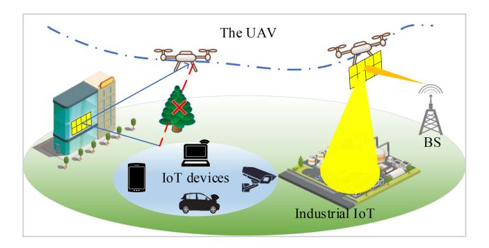

Fig. 5. A schematic of IRS-assisted AAV communications for large-scale IoT.

urban environments, signal blockage caused by buildings or large vehicles often increases the risk of communication interference and privacy leakage. Therefore, by utilizing the beamforming technology of IRS to adjust the phase shift and amplitude of signals, a balance is struck between enhancing the quality of legitimate links and reducing that of illegitimate links, thereby maximizing the security of communication and minimizing the risk of privacy leakage. Furthermore, planning AAV trajectories to distance them from attackers can further mitigate the risk of communication attacks [\[46\]](#page-30-10).

*3) IRS-Assisted AAV Communications for Large-Scale IoT:* Large-scale IoT is a 6G vision that is gradually being proposed as networks evolve. IoT is a system that connects a wide range of intelligent digital devices with sensing and computing capabilities, widely used in urban construction, smart agriculture, healthcare, and home automation [\[47\]](#page-30-11). However, with the continuous development of the IoT network, the shortcomings of traditional networks are gradually being exposed. First, the large number of IoT connections increases the network burden. Numerous network connections exacerbate spectrum scarcity, and the wide distribution of devices requires to overcome the path loss associated with long-distance transmission [\[48\]](#page-30-12). Second, the shortage of energy for IoT devices limits the development of IoT. Finally, the security of IoT networks is crucial, since interconnectivity of IoT devices and their physical environment also introduce new attack surfaces [\[49\]](#page-30-13).

As illustrated in Fig. [5,](#page-6-1) AAVs are able to collect IoT device data in areas not covered by the cellular network. Deploying IRSs at suitable locations can mitigate signal attenuation caused by obstructions such as trees. In addition, aerial IRSs can also act as passive relays to enhance the network coverage quality of industrial IoT. Overall, IRS-assisted AAV communications help IoT networks to realize large-scale network accesses, high-quality transmission, prolonged IoT device lifetime and secure communications, which is described as follows:

*•* Large-scale network accesses: Large-scale network access for IoT devices faces challenges with spectrum shortage and multi-user interference. IRS-assisted AAV communications offer solutions from multiple dimensions. First, multiple-access techniques such as NOMA are effective ways to enhance communication capacity. However, the performance of NOMA often depends on the differences among user channels. By designing the deployment location and reflection coefficient of IRSs, the channel differences among different users can be enlarged. The channel differences are even more pronounced in scenarios where the IRS is deployed dynamically by leveraging the mobility of AAV. Moreover, IRSs can reconfigure channel conditions, and thus the decoding order of users can be changed according to the demands of quality of service [\[50\]](#page-30-14). Second, compared to active relays, IRSs offer advantages of low cost, low power consumption, and localized service range. This allows them to be densely deployed in IoT communication areas to increase communication capacity without causing environmental noise amplification or requiring complex interference management [\[8\]](#page-29-7).

- *•* High-quality transmission: IoT devices are usually widely distributed on the ground, which can cause huge deployment costs if cellular networks are utilized to collect IoT data by deploying BSs [\[47\]](#page-30-11). IRSs and AAVs can provide network coverage for a designated area in a cost-effective way. Meanwhile, with the beamforming of IRSs and the mobility of AAVs, reliable LoS links can be established with ground nodes to improve transmission quality.
- *•* Prolonged IoT device lifetime: Lifetime of IoT devices is crucial for the sustainability and efficiency of IoT, having a direct impact on their maintenance costs and operational reliability. IRSs and AAVs can prolong the lifetime of IoT devices from two perspectives: First, the combination of IRSs and AAVs can enable IoT devices to achieve low-power communications by specific optimisations including AAV trajectories, IRS deployment locations and beamforming. Second, they can improve the performance of Simultaneous Wireless Information and Power Transfer (SWIPT). IRS-based passive relaying and beamforming can reduce the energy loss caused by long-distance energy transmission, while AAVs can fly near the ground nodes to reduce the energy transmission distance, which extends the lifetime of IoT devices from a sustainable perspective.
- *•* Secure communications: The security of IoT networks can be enhanced from the physical layer through the use of IRS beamforming and design of trajectories for AAVs to reconfigure the wireless environments. In addition, AAVs can generate artificial noise to assist in the joint optimization of IRS beamforming design, effectively countering illegal eavesdropping.

In summary, through the analysis of three typical applications: SAGIN, V2X, and large-scale IoT, it can be confirmed that IRS-assisted AAV communications can provide diversified services for various applications supported by 6G networks. Indeed, based on these three applications, multiple 6G network-driven application scenarios are also expected to realize. For example, SAGIN can provide comprehensive connectivity services for smart cities. Based on the low latency and high reliability of communications offered by V2X, ITSs and autonomous driving for 6G networks can be achieved. The characteristic of massive network access in large-scale IoT can contribute to the realization of smart healthcare, by connecting hospital, home, wearable medical devices and sensor data for real-time health monitoring and analysis. In addition, IRS and AAV can play a pivotal role in future fields such as virtual reality [\[51\]](#page-30-15) and environmental monitoring [\[52\]](#page-30-16).

# *B. Key Issues of IRS-Assisted AAV Communications for 6G Networks*

Although IRS-assisted AAV communications offer a new perspective for realizing the aforementioned applications, the utilization of this emerging method to achieve these applications still faces numerous challenges. Through an indepth analysis of these applications and IRS-assisted AAV communication systems, we summarize key issues of these applications, and analyze corresponding challenges as follows:

*1) Energy-Constrained Communications:* In IRS-assisted AAV communications, energy limitations are obvious, which challenge the process of communications. For IRS-assisted AAV communication systems, the limited on-board energy of AAVs severely impacts the service time of AAV networks [\[6\]](#page-29-5). Specifically, the onboard energy of AAVs is not only used to maintain their propulsion, but also for signal relaying or transmission [\[21\]](#page-29-20), while the former typically consumes more energy than the latter. In order to efficiently utilize the limited service time of AAVs supported by limited energy, a tradeoff needs to be made between the service time of AAVs and other performance metrics such as throughput [\[53\]](#page-30-17), which has become a major bottleneck limiting the development of IRSassisted AAV communications.

For applications supported by IRS-assisted AAV communications, the limited battery capacity of devices affects their normal operation. In general, most IoT devices supported by IRS-assisted AAV communications are powered by onboard batteries. Effective energy replenishment and low-power transmission methods are crucial to ensure the long-term stability of IoT devices [\[54\]](#page-30-18), [\[55\]](#page-30-19). SWIPT is one effective means of energy supplementation. However, the significant energy loss associated with long-distance transmission limits the use of SWIPT. Furthermore, network devices supported by IRS-assisted AAV communications in remote areas face challenges for low-power transmission due to the complexity of wireless environments.

There are multiple challenges to addressing energyconstrained communications in IRS-assisted AAV communications and the application scenarios they support, which are listed below:

*•* Complex wireless environments: AAVs usually work in complex and dynamic wireless environments, such as high-speed mobile scenarios based on V2X communications and high-altitude scenarios based on SAGIN. This poses various challenges on signal and energy transmission of AAVs. Therefore, the design of IRSs and AAVs must be appropriately adapted with the dynamic wireless environments. First, AAVs need to rationally avoid ground obstacles and balance the flight energy consumption and communication quality. Second, the IRS needs to adjust its reflection matrix instantly to assist AAV communications with the changing environments, which increases the difficulty of IRS beamforming and beam tracking. In addition, efficient communication relies on accurate environment modeling and prediction, which is challenging to realize due to the passive nature of IRSs and highly dynamic nature of the wireless environment caused by AAV motion [\[56\]](#page-30-20). Especially for air-to-ground communication scenarios, AAV jitter should be carefully treated [\[4\]](#page-29-3), [\[9\]](#page-29-8).

- *•* Multiple factors to balance: Energy consumption can be caused by multiple factors, including AAV flight trajectories, resource allocation strategies, environmental impact factors, IRS design, transmission beams, and the number of served users. Since these factors need to be comprehensively considered, it is significantly difficult to solve the formulated optimization problems.
- *•* Difficulties in technology fusion: To effectively alleviate the problem of limited energy, it is often necessary to integrate other technologies (such as SWIPT and Backscatter Communication (BackCom)) into the framework of IRS-assisted AAV communications, which brings new problems. For example, when using SWIPT technology, energy collection and information transmission are conflicted with each other [\[54\]](#page-30-18). In addition, in the BackCom scenario, the trade off between energy collection and signal reflection is also challenging [\[57\]](#page-30-21).
- *2) Secure Communications:* They are critical to the applications supported by IRS-assisted AAV communications. For SAGINs, secure communications are the cornerstone for enabling cross-layer network collaboration, optimizing resource allocation, and securing the transmission of critical information. For V2X, secure communications are closely related to the security of users' lives, properties and privacy. For large-scale IoT, secure communications are the key to protect the IoT data from unauthorized access or tampering, ensuring overall network security and user trust. In the context of IRS-assisted AAV communications, security concerns primarily involve two aspects: ensuring the integrity of transmission data and maintaining the confidentiality of communication contents. The former aims to prevent data tampering, damage or loss, while the latter focuses on preventing information leakage. Based on different security concerns, common security threats in IRS-assisted AAV communications can be classified into two categories: malicious jamming and eavesdropping attacks.

Malicious jamming aims to disrupt, compromise, or undermine the performance and reliability of communication systems, which is one of the most easily achievable attacks in IRS-assisted AAV communications. It does not require much information about the target user, but rather interferes with and floods data towards the target user with malicious jamming devices [\[58\]](#page-30-22).

Eavesdropping attacks are able to illegally acquire network data, leading to information leakage. They can be active or passive [\[59\]](#page-30-23). In the passive eavesdropping attacks, the eavesdroppers do not take any actions other than potentially obtaining the transmission information, thus not blocking the legitimate users' information reception. Active eavesdroppers use malicious jamming devices to send jamming

signals to the target channel, which are typically disguised as indistinguishable natural noise. Therefore, the sending end usually increases the transmission power to maintain system transmission performance, which increases the probability of successful eavesdropping [\[60\]](#page-30-24).

In IRS-assisted AAV communications, although other attacks, such as time delay attack [\[61\]](#page-30-25), still exist, this paper only focuses on jamming and eavesdropping attacks. The specific reasons are as follows: First, for IRS-assisted AAV communication systems, jamming and eavesdropping are easier to implement and more prevalent compared to other attack methods. Second, they can be effectively mitigated through system-level design using Physical Layer Security (PLS) technologies. A discussion of other AAV or IRS related security attacks can be found in [\[62\]](#page-30-26), [\[63\]](#page-30-27).

There are two reasons that make it challenging to address security issues in IRS-assisted AAV communications:

- *•* Randomness of attacker's illegal access: Since AAVs move along optimized trajectories within designated areas, both legitimate and illegitimate users randomly access the network based on their communication requirements. This dynamic random access mechanism makes it difficult to distinguish illegal attackers. In addition, obtaining the attacker's accurate Channel State Information (CSI) and location information is the basis for effective defense against attacks. However, the dynamic random access also makes the above information difficult to obtain [\[64\]](#page-30-28), [\[65\]](#page-30-29). In fact, part of the attacker's CSI and location information can be obtained through sensing devices mounted on AAVs and IRSs, but how to robustly design IRS-assisted AAV communications and its supported applications with partial information is still challenging.
- *•* Limited energy and computational capabilities: AAVs and IRSs typically rely on built-in batteries with limited capacities, constraining their ability to perform complex data processing over extended periods. Moreover, AAVs and other devices generally have limited computational power, rendering them incapable of executing complex encryption algorithms and real-time security protocols, thereby leaving them vulnerable to attackers with substantial computing resources. Attackers can exploit this computational advantage to launch sophisticated eavesdropping or jamming attacks, while the constrained computational resources and energy capacity make it challenging for IRS-assisted AAV communication systems to effectively identify and defend against these attacks [\[66\]](#page-30-30). Therefore, designing secure communication strategies while efficiently utilizing limited computational capabilities and energy becomes significant.
- *3) Enhanced Communications:* For 6G networks, enhanced communications are needed in the fields of SAGIN, V2X, and large-scale IoT, requiring the achievement of ultra-low latency, high reliability, broad coverage, and massive connectivity [\[67\]](#page-30-31). Specifically, enhanced communications need to support seamless data transmission globally, real-time response of ITSs, and efficient connection of massive IoT devices, while focusing on the EE and cost control of network deployment. Although

IRS-assisted AAV communications provide possibilities for enhanced communications, there are still multiple challenges to achieve fast network rates, large network coverage, short network latency, high spectrum utilization and reliability. These challenges include difficulties of interference management, spectrum resource shortage, and nonconvexity of multivariate coupling.

- *•* Difficulties of interference management: The mobility of AAVs results in AAV communication systems vulnerable to unpredictable signal interferences, including interference from broadcast signals, signal congestion caused by simultaneous communications among multiple users, and unintentional interference from other devices. Unlike jamming attacks, this unpredictable interference does not lead to information leakage, but it seriously affects the signal transmission quality. Although IRSs can avoid some signal interference by beamforming, coordinating beamforming becomes a complex task for dense-user scenarios. In particular, this interference is exacerbated when the IRSs are deployed on AAVs. In addition, it is possible to jointly optimize the beamforming of IRSs, power allocation, and trajectory design of AAVs to reduce the impact of communication interference. However, taking multiple factors into account makes the optimization problem extremely challenging to resolve [\[68\]](#page-30-32), [\[69\]](#page-30-33).
- *•* Shortage of spectrum resources: The spectrum resource shortage arises along with the proliferation of network devices. In IRS-assisted AAV communications, only a small amount of spectrum resources can be used. Although some articles [\[70\]](#page-30-34), [\[71\]](#page-30-35), [\[72\]](#page-30-36), [\[73\]](#page-30-37) have proposed to use frequency bands such as mmWave and THz for communications to alleviate the spectrum shortage, the impact of path loss on the system caused by ultra-high frequency cannot be ignored. In addition, multiple access technologies can also effectively improve spectrum utilization, whereas interference management among users and cells is necessary, which increases the difficulty of beamforming of IRSs and joint design with other technologies.
- *•* Nonconvexity of multivariate coupling: In order to improve the performance of IRS-assisted AAV communication systems, the joint design of multiple variables is usually required, including AAV trajectories, IRS phases, BS transmission power and bandwidths. However, variables, such as AAV trajectories and beamforming of IRSs, the decoding order of Non-Orthogonal Multiple Access (NOMA) and association results between IRSs and users are often coupled [\[50\]](#page-30-14), [\[74\]](#page-30-38), resulting in difficulties of problem solving with the characteristic of non-convexity. Therefore, how to design reasonable algorithms for the non-convex problems is the key to enhance communications.

In summary, the main challenge to realize enhanced communications in IRS-assisted AAV communications arises from comprehensive consideration of the aforementioned issues in the system design. Furthermore, realistic conditions, such as non-ideal channel conditions and AAV jitter, need to be taken into account.

# III. PROTOTYPES AND TECHNOLOGIES OF IRS-ASSISTED AAV COMMUNICATIONS FOR 6G NETWORKS

The combination of IRSs and AAVs fully utilizes the advantages of each and eases the pressure on ground communications in an innovative way. In this section we first present the system prototypes for IRS-assisted AAV communications from four perspectives. Then we present in detail the technologies related to IRS-assisted AAV communications for 6G networks.

# *A. Prototypes of IRS-Assisted AAV Communications for 6G Networks*

To comprehensively analyze IRS-assisted AAV communications, we introduce the prototypes from the perspectives of hardware, software, performance metrics, and prototype classification.

*1) Hardware Prototypes for IRS-Assisted AAV Communications:* In general, hardware prototypes of AAVs typically contain propulsion module, control module, sensing module, and communication module [\[75\]](#page-30-39), [\[76\]](#page-30-40). Propulsion module mainly provides the propulsion of AAV, enabling it to fly and maneuver. Control module mainly manages the flight attitude, position and flight path of the AAV to ensure it is stable and controllable, and Pixhawk is a common flight controller. Sensing modules provide the data required for flight control and mission execution by sensing the environment and its own state. Communication model realizes data transmissions between the AAV and the BS or other devices, supporting remote control and data return. As the technology continues to evolve, AAV communication prototypes have been studied. Typically, authors in [\[76\]](#page-30-40) construct a modular autonomous AAV platform designed for a variety of indoor and outdoor applications, simplifying the transition from simulation experiments to actual deployment, and providing detailed mechanical design, electrical configuration, and dynamic modeling to support diverse experiments and research.

Although the reflecting unit of an IRS can be composed of a variety of materials, such as diodes, liquid crystals and graphene meta-atoms, the IRS hardware prototype typically contains reflecting unit array module, control circuit module, power management module, and communication module [\[77\]](#page-30-41). The reflecting unit array module adjusts the electromagnetic response of reflecting units to incident signals by means of control information generated in the control circuit module. Control circuit module usually consists of microcontroller or field-programmable gate array for executing control algorithms and transmitting control commands to reflecting units [\[16\]](#page-29-15). Although reflecting units do not need to consume energy, their control circuits usually need to consume a weak amount of power, which is usually accomplished by power management modules [\[13\]](#page-29-12). In addition, the communication module needs to receive control signals from AAVs or BSs to the IRS.

Currently, research on IRS-assisted AAV communications is in the transitional phase from theoretical study to practical application. To maximize the flexibility of IRS, authors in [\[78\]](#page-31-0) propose a typical aerial IRS control architecture. This architecture is divided into two main parts: ground control layer and AAV control layer. The former includes a processing center

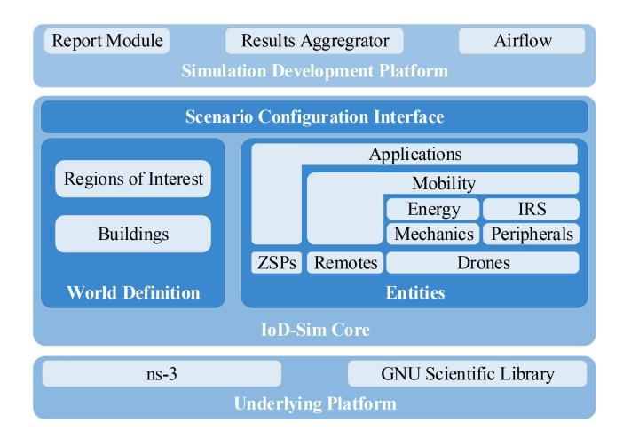

Fig. 6. A schematic of IoD-Sim-based IRS-assisted AAV communication simulation architecture.

responsible for analyzing environmental data and assigning communication tasks. Considering the limited energy capacity of IRS and AAV in handling complex computational tasks, the ground control layer also calculates AAV trajectories and IRS phase shift control information. The latter consists of an onboard antenna coupled with the AAV, managing the battery and communication gateway. The integrated AAV control module and IRS control module can receive control information from the ground control unit to adjust AAV trajectories and IRS reflection coefficients, thereby enhancing communication quality.

*2) Software Prototypes for IRS-Assisted AAV Communications:* In IRS-assisted AAV communications, software prototypes are used to simulate the proposed schemes in different environments and conditions. It is mainly used to evaluate the system rationality and algorithm performance. For IRS software prototypes, authors in [\[79\]](#page-31-1) utilize Coffee Grinder Simulator, a system-level simulation platform for evaluating the deployment of IRS in 5G networks, to quantify the expected enhancement of IRS in terms of coverage probability and network performance by simulating a variety of urban environments in the medium and high frequency bands. For AAV software prototypes, authors in [\[80\]](#page-31-2) propose a distributed AAV network simulation coordinator, which significantly improves the accuracy and efficiency of multi-AAV network scenario simulation by running flight and network simulations simultaneously and dealing with the time synchronization between them. However, the software prototype in [\[80\]](#page-31-2) lacks the features and local details of AAVs, wireless communications and network protocol simulation. For this reason, authors in [\[81\]](#page-31-3) propose an open source simulation platform called Internet of Drones Simulator (IoD-Sim), which can be extended on network simulator 3 to support a multi-level simulation architecture, and thus AAV mission design, trajectory planning, hardware configuration, and communication techniques are simulated and verified with high accuracy.

In order to further study the advantages of IRSs combined with AAVs in wireless communications, authors in [\[82\]](#page-31-4) propose a typical IRS-assisted AAV communication software simulation prototype by adding an IRS simulation module on

the basis of IoD-Sim. As shown in Fig. [6,](#page-10-0) the platform is divided into three layers: the underlying platform, the IoD-Sim core and the simulation development platform. Specifically, the underlying platform adopts network simulator-3 for network simulation and GNU scientific library for mathematical operations. IoD-Sim core introduces IoD entities, 3D world models and remote cloud services. In particular, the AAV is mechanically modeled by considering physical and power consumption characteristics. Zone Service Providers (ZSPs) are introduced to provide services beyond traditional coverage. The top-level simulation development platform provides scenario configuration through a user-friendly graphical interface or JSON. The software prototype supports a range of applications and peripherals, including IRS modules, which assist in the performance evaluation of IRS-assisted AAV communications.

- *3) Performance Metrics for IRS-Assisted AAV Communications:* When evaluating IRS-assisted AAV communication systems, performance metrics not only provide clear objectives for the design, but also provide quantitative criteria for system evaluation and optimization. Based on the three issues considered in this article, the performance metrics can be broadly summarized as: EE, secure communication rates, and network rates.
  - *•* EE: It is defined as the ratio of system network rates to energy consumption and is often used in energyconstrained communication scenarios to help evaluate system performance. Authors in [\[83\]](#page-31-5) analyze the relationship between the number of IRS reflecting units and EE in the presence of eavesdropping scenarios by modeling the actual air-to-ground channel and phase estimation errors, and their results validate the superiority of IRS-assisted AAV communications. Unlike the eavesdropping scenario in [\[83\]](#page-31-5), authors in [\[43\]](#page-30-7) analyze the EE of IRS-assisted AAV communications in an emergency communication scenario. Based on the newly developed fading-shadowing model, authors provide insights into the impact of the number of reflecting elements and AAV deployment altitude on system EE.
  - *•* Secure Communication Rates: It usually refers to the ability to maintain secure communications in the presence of electromagnetic jamming or eavesdropping. For eavesdropping scenarios, secure rates refer to the difference between the users' acceptance rates and the eavesdropping rate. For jamming scenarios, secure communication rates are expressed as the network rates that maintains stable communications. The analysis of secure communication rates for IRS-assisted AAV communications in jamming and eavesdropping scenarios is conducted in [\[65\]](#page-30-29) and [\[84\]](#page-31-6), respectively. Authors in [\[65\]](#page-30-29) utilize stochastic geometry to model eavesdroppers in a distributed manner and characterize the impact of the number of IRS reflecting units and AAV positioning on secure communication rates in the presence of channel estimation errors. For jamming scenario, authors in [\[84\]](#page-31-6) derive the overall bit error rate for two IRS deployment scenarios. The simulation results indicate that jamming to the AAV causes more significant performance degradation compared to jamming at the receiving end, and

- deploying the IRS near the transmitter can maximally suppress jamming.
- *•* Network Rates: It usually refers to the amount of data that can be transmitted per unit of time, and is defined in most studies by Shannon's formula. It is commonly used in enhanced communication scenarios to measure the communication efficiency of systems. For example, authors in [\[85\]](#page-31-7) derive the network rate of AAV communications assisted by flying IRS under imperfect phase compensation.
- *4) Classification for IRS-Assisted AAV Communications:* In IRS-assisted AAV communications, to fully leverage the advantages of IRSs and AAVs, different prototypes are usually required for various application scenarios. Below, we classify and discuss the prototypes of IRS-assisted AAV communications from two perspectives: service objects and service types.

Prototypes Based on Different Service Objects: IRS-assisted AAV communications can be divided into two main prototypes from the perspective of service objects: ground-based IRSassisted AAV communications and AAV-carried IRS-assisted ground communications. In the former case, IRSs are deployed on the ground to assist aerial AAV communications. The aerial AAVs typically serve as aerial BSs to provide communication services for ground users [\[86\]](#page-31-8). They can also act as edge servers, collecting and processing computational tasks generated by ground devices [\[87\]](#page-31-9), [\[88\]](#page-31-10). Meanwhile, groundbased IRSs usually act as passive relays, providing virtual LoS links for ground users and AAVs. Although this method can enhance the coverage and quality of AAV signals, it has high deployment and maintenance costs. As a result, it is suitable for dense urban environments or other complex terrains, especially when direct LoS links between AAVs and ground users are not achievable.

AAV-carried IRS-assisted ground communications treat the IRS and the AAV as a whole aerial relay unit, where the AAV carries the IRS to an appropriate position, and the IRS relays signals in the air [\[89\]](#page-31-11). This prototype boasts high flexibility, since strategic planning of the AAV's flight path reduces terrain obstructions. However, the AAV's battery life limits the duration of continuous communications, and instability during flight can significantly impair the qualities of communications. Therefore, this prototype is suitable for scenarios requiring rapid deployment, such as disaster response, temporary events, and V2X communications.

Prototypes Based on Different Service Types: According to different functions and types, IRS-assisted AAV communications can be divided into: passive IRS-assisted AAV communications, active IRS-assisted AAV communications, and hybrid IRS-assisted AAV communications. Without loss of generality, IRS is usually passive, and its phase shift and amplitude adjustments for incident signals do not need to consume energy, only need to consume a subtle amount of energy to control the reflection matrix and receive the IRS control signal. Consequently, the energy consumption of the IRS is usually negligible for both dynamic and static IRS scenes. Correspondingly, this prototype is usually suitable for remote areas where energy cannot be replenished in time to support applications such as environmental monitoring.

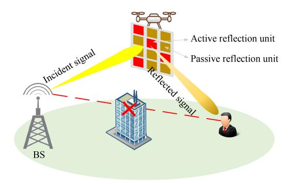

Fig. 7. A schematic of hybrid IRS-assisted AAV communications.

Active and passive IRS have the same structure, with the only difference being that the passive load impedances in passive IRS is replaced by active ones in active IRS. So in addition to the passive IRS power consumption, active IRS requires extra power to support the active load impedances. Studies show that the power consumption of active IRS reflection units can be reduced to the microwatt level [\[90\]](#page-31-12). Therefore, without loss of generality, active IRS is also considered passive. Due to its ability to adjust both the phase and amplitude of incident signals, active IRS-assisted AAV communications are typically used to mitigate the "double fading" effect caused by passive IRS to further enhance communication qualities [\[9\]](#page-29-8). However, this prototype, while amplifying the signal, also amplifies noise, increasing the complexity of system interference management, especially in the dynamic scenario with the active IRS on the AAV [\[91\]](#page-31-13). As a result, this prototype is suitable for long-distance and low power communication scenarios.

In order to overcome the respective drawbacks of active and passive IRS, a hybrid IRS architecture is proposed. As shown in Fig. [7,](#page-11-0) each reflection unit of the hybrid IRS is able to adaptively switch between active and passive reflection modes according to the communication requirements. In this way, by reasonably controlling the reflection unit model, not only the "double fading" caused by passive IRS can be effectively overcome, but also the noise amplification caused by active IRS can be effectively restrained, so as to enhance the beamforming gain. Based on this feature, the hybrid IRS can further enhance the performance of AAV communications. For example, it can be deployed on ground buildings to enhance the EE of AAV communication systems [\[92\]](#page-31-14). Hybrid IRS-assisted AAV communications can also improve communication security [\[93\]](#page-31-15). However, it requires flexible adjustment of reflection patterns of reflection units, which undoubtedly increases the difficulty of system design. Therefore, hybrid IRS-assisted AAV communications are suitable for scenarios with strict requirements on communication qualities.

# *B. Technologies of IRS-Assisted AAV Communications for 6G Networks*

In order to enhance the performance of IRS-assisted AAV communications to support applications such as SAGIN, V2X, and large-scale IoT, researchers typically integrate multiple technologies to enhance the system performance, such as channel estimation, beamforming, resource allocation, and trajectory optimization. In the following, we provide a detailed description of these technologies, which are the basic for solutions in Section [IV.](#page-15-0)

*1) Channel Estimation for IRS-Assisted AAV Communications:* It refers to the estimation and inference of channel characteristics based on the received signal in wireless communication systems, to correctly process and decode signals at the receiving end. In general, channel estimation relies on the selection of appropriate channel models and estimation algorithms to accurately and efficiently obtain the complete CSI. In other words, it intends to obtain a complete and accurate channel state based on the limited CSI. In IRS-assisted AAV communications, the challenge of channel estimation comes from two aspects: First, for AAVs, channel estimation needs to have a strong adaptive nature. Because AAVs are with mobilities and cause wireless channel switching, AAV locations and environmental characteristics play a crucial role in determining the primary channel qualities [\[26\]](#page-29-25). Second, for IRSs, the number of reflection units is proportional to that of channel coefficients [\[94\]](#page-31-16), which may cause a huge estimation overhead. In addition, the IRS lacks signal processing capabilities and traditional channel estimation methods are not fully applicable [\[95\]](#page-31-17).

For IRS-assisted AAV communications, accurate channel estimation is the foundation of system design. In order to improve the performance of channel estimation in IRS-assisted AAV communications, many methods are proposed, including Compressive Sensing (CS)-based channel estimation, cascadebased channel estimation, anchor-assisted channel estimation, Deep Learning (DL)-based channel estimation, and tensor decomposition-based channel estimation. Each method is introduced in the following content.

- *a) CS-based channel estimation:* It is commonly utilized for IRSs and AAVs, and can be integrated with other channel estimation techniques for performance improvement [\[96\]](#page-31-18). The basic idea is to leverage the high sparsity of the wireless channel by extracting a sparse representation from a limited set of measurement data, to recover the complete CSI. A few pilot signals are utilized to obtain relatively accurate CSI, which greatly reduces the training overhead of channel estimation while effectively estimating channel parameters [\[97\]](#page-31-19), [\[98\]](#page-31-20).
- *b) Cascade-based channel estimation:* It is suitable for scenarios with multi-level channels and multiple users. This method exploits the correlation property of channel cascading, i.e., the cascaded channel coefficients are scaled versions of the superimposed low-dimensional CSI of the specific channel [\[94\]](#page-31-16), [\[99\]](#page-31-21), thus significantly reducing the training overhead of channel estimation. For multi-user scenarios, the channel of any single user is also a low-dimensional scaled version of other channels, thus allowing effective estimation of all channels with a low overhead on the BS [\[99\]](#page-31-21).
- *c) Anchor-assisted channel estimation:* It is mainly applicable to scenarios with a large number of fully passive IRS reflective elements and users. The method first allows anchor nodes to be deployed near the IRS to obtain partial CSI through anchor-assisted training and feedback. The

information is then used to efficiently estimate the cascaded channels between the BS and the IRS with additional training by users [\[100\]](#page-31-22). Thus, with the assistance of anchor nodes, this method can reduce the huge training overhead incurred by signal transmission and reception, due to the increasing number of users and IRS reflection units.

*d) DL-based channel estimation:* DL-based channel estimation is suitable for highly complex dynamic channel environments with high-dimensional spatial features and nonlinear channel characteristics. Its main idea is to use DL methods, such as neural networks, to analyze and process received signals and obtain CSI. Recurrent Neural Networks (RNNs) and Convolutional Neural Networks (CNNs) are commonly used methods. RNNs can capture the temporal dependencies in sequential data, allowing them to estimate the current channel based on previous channel samples, and is therefore commonly used for continuous-flight AAV channel estimation [\[101\]](#page-31-23). Long Short-Term Memory (LSTM) is a special RNN algorithm that overcomes the gradient vanishing and gradient explosion problems of traditional RNNs when dealing with long sequences. Through the gating mechanism and the memory unit, LSTM can capture the long-term dependency of the channel, so as to track the channel and realize dynamic channel estimation [\[56\]](#page-30-20).

CNNs can autonomously learn feature representations suitable for channel characteristics. With their deep structures, weight sharing, and parallel computing capabilities, CNNs can reduce the algorithm complexity of channel estimation for a large number of IRS reflection units, while ensuring estimation accuracy [\[102\]](#page-31-24), [\[103\]](#page-31-25). In addition, the offset learning in DL can simulate dynamic channel states [\[103\]](#page-31-25), and deep residual learning provides a method for recovering channel coefficients from the noise-based pilot observation data [\[102\]](#page-31-24).

- *e) Tensor decomposition-based channel estimation:* It is mainly applied in large-scale antenna scenarios with multiple inputs and multiple outputs. The tensor-based channel estimation describes the spatio-temporal characteristics of the channel by constructing a channel tensor model, and then uses mathematical methods such as tensor decomposition to process and optimize the channel tensor to estimate CSI. This method can capture the high-order relationships and spatial correlations of the channel, thus improving the accuracy and efficiency of channel estimation. In addition, tensor-based channel estimation can also exploit channel sparsity to further improve its performance [\[104\]](#page-31-26).
- *2) Beamforming for IRS-Assisted AAV Communications:* Beamforming refers to adjusting the phase shift and amplitude of signals by controlling the electromagnetic response of the corresponding devices (e.g., IRSs and transmitting antennas) to form different radiation patterns on the signals [\[105\]](#page-31-27). In essence, beamforming is a spatial filtering method, which is initially used for specific directional radiation or energy acquisition. In IRS-assisted AAV communications, beamforming is the key to reconfigure the wireless propagation environment and reduce inter-user or inter-cell signal interference [\[106\]](#page-31-28). It also plays a significant role in ensuring system security, since it can suppress interference signals while enhancing the desired signal [\[107\]](#page-31-29), [\[108\]](#page-31-30). However, when the IRS assists many users

or cells at the same time, the effectiveness of beamforming in mitigating interference decreases as the number of users or cells increases. Fortunately, this problem can be effectively addressed by integrating other technologies and increasing the number of IRSs [\[74\]](#page-30-38). Besides, when IRSs are deployed on AAVs, the interference suppression effect is dramatically improved by coordinating AAV trajectories and beamforming design [\[107\]](#page-31-29).

To reduce the energy consumption of AAVs and extend communication duration, current research defines that the control information for IRS should be generated by BS [\[10\]](#page-29-9), [\[11\]](#page-29-10). Specifically, the ground BS collects CSI from the AAV, IRS, and other communication nodes, then formulates optimal IRS beamforming and AAV trajectory control strategies, and provides the control information as feedback. However, direct feedback of control information and data transmission can inevitably cause interference. Therefore, authors in [\[10\]](#page-29-9) propose an adaptive IRS-assisted transmission protocol, which alternates channel estimation, transmission strategies, and data transmission within a frame to reduce interference and adapt to the dynamic wireless environment. Similarly, authors in [\[11\]](#page-29-10) propose a dual time-scale transmission protocol and jointly utilize instantaneous and statistical CSI to reduce beamforming overhead. It is noteworthy that the method of generating and feeding back IRS control information by the ground BS can lead to some latency in IRS beamforming, but this can be negligible in short time frame structures.

In IRS-assisted AAV communications, beam tracking design during the beamforming process is needed to adapt the beams to the AAV's movement. Therefore, beamforming can be further categorized into static beamforming and beam tracking (dynamic beamforming).

- *a) Static beamforming:* Its critical design challenge is the trade-off between the overhead of acquiring instantaneous CSI and the performance of beamforming. In fact, the effectiveness of beamforming largely depends on the accuracy of CSI, where better beamforming results are achieved with more accurate CSI. However, there is currently no mature method to obtain precise instantaneous CSI for IRSs [\[11\]](#page-29-10), [\[109\]](#page-31-31), [\[110\]](#page-31-32). Most beamforming designs for IRSs are based on statistical/mixed CSI [\[111\]](#page-31-33), using statistical CSI of IRSs as a substitute for part of the instantaneous IRS to balance the channel estimation overhead and beamforming performance. It is worth noting that for scenarios with unavailable instantaneous CSI of IRSs, beamforming can be realized by techniques such as beam training, channel tracking, and heuristic algorithms [\[23\]](#page-29-22). The beamforming for hybrid CSI and non-explicit CSI is described below.
  - *•* Beamforming with hybrid CSI: It is a beamforming approach by reasonably weighing and combining statistical and instantaneous CSI. Statistical CSI changes slowly and only statistical characteristics of the channel are needed to know, and thus it is easier to obtain compared with instantaneous CSI. Therefore, this method has the advantage of low overhead. A common channel estimation method for hybrid CSI is the dual time-scale based hybrid CSI beamforming [\[11\]](#page-29-10). Specifically, the phase shift of the passive IRS is first optimized by

- statistical CSI, and then the transmit beamforming of the access point is optimized to cater to the instantaneous CSI of the user's effective fading channel.
- *•* Beamforming without explicit CSI: This is a beamforming method that does not require any instantaneous CSI. Beam training is one of the common methods, which tries to achieve the best result for the system by selecting the best beam from a predefined beam set. However, beam training tends to incur a significant overhead, and authors in [\[109\]](#page-31-31) propose hierarchical and random training beamforming methods to further reduce the beam training overhead. DL-based beamforming is another beamforming method without instantaneous CSI, which learns the mapping relationship between channel characteristics and beamforming from training data to achieve intelligent beamforming [\[110\]](#page-31-32). In addition, Reinforcement Learning (RL) can also be used for beamforming design. In this method, the system is described as a learning agent, which optimizes the global behavioral strategy to select the optimal beamforming parameters based on the current state and the received reward [\[58\]](#page-30-22).
- *b) Beam tracking:* For dynamic beamforming, fastchanging channels and hardware/resource limitations hinder the implementation of beam tracking. In addition, the time overhead of beam tracking implementation should be taken seriously in scenarios with real-time requirements. To solve the above challenges, filter-based beam tracking and learningbased beam tracking are proposed.
  - *•* Filter-based beam tracking: Its main idea is to continuously adjust the coefficients of the filter in real-time based on feedback information, to adapt to channel variations and achieve beam tracking. Due to the simplicity of the filter update process and clear target orientation, it can enhance signals in specific target directions. Therefore, it is suitable for scenarios with relatively dynamic environments and time-critical requirements. It is worth noting that the utilization of single-pulse signals in designing filter-based beam tracking methods is promising to address the high nonlinearity problem of codebookbased beam tracking models and reduce the overhead of beam scanning [\[112\]](#page-31-34). Moreover, the distributed beam tracking approach with multi-anchor node collaboration is suitable for scenarios where environmental factors have a significant impact on beam tracking [\[113\]](#page-31-35).
  - *•* Learning-based beam tracking: It utilizes ML technologies such as DL, to train models and learn beam tracking strategies. This approach exhibits strong adaptability to environmental changes and has powerful generalization capabilities, but may not be suitable for scenarios with limited computational resources. Among them, Qlearning can be used for beamforming design based on current and past observation data, striking a balance between data acquisition and beam tracking costs [\[114\]](#page-31-36). Additionally, LSTM can leverage the temporal correlation of beams to model the channel, which reduces the training overhead of beam tracking to some extent [\[115\]](#page-31-37).

In general, the selection of beamforming methods is different according to different scenarios. In order to obtain a good beamforming effect, the combination of multiple methods is a good choice [\[116\]](#page-31-38). The ability of IRS to reconstruct the environment through beamforming depends greatly on the CSI acquisition accuracy. For scenarios where it is difficult to acquire accurate CSI, such as when IRSs are mounted on AAVs, it is a good choice to utilize the S-process to deal with the uncertainty of CSI for robust beamforming design [\[117\]](#page-31-39). Beamforming is also needed to jointly consider with channel estimation to ensure the coordination between beamforming performance and channel CSI acquisition overhead.

*3) Resource Allocation for IRS-Assisted AAV Communications:* For IRS-assisted AAV communications, the limited transmission bandwidth, AAV energy, and transmission power restrict the system performance. To fully utilize the limited network resources, e.g., power [\[68\]](#page-30-32), [\[86\]](#page-31-8), [\[118\]](#page-31-40), bandwidth [\[86\]](#page-31-8), IRS reflection units [\[86\]](#page-31-8), [\[119\]](#page-31-41), and computing resources [\[71\]](#page-30-35), [\[88\]](#page-31-10), efficient resource allocation strategies should be designed. By uniformly managing and allocating resources in the communication system, various performance metrics can be improved, including system delay [\[71\]](#page-30-35), system energy consumption [\[118\]](#page-31-40), network rates [\[74\]](#page-30-38), and spectrum utilization [\[50\]](#page-30-14).

It is common to follow certain principles for resource allocation. The multi-level water-filling principle aims to maximize the overall system performance, e.g., total network rates, by allocating communication resources to each channel, and then gradually reducing the allocated resources for each channel based on the quality of wireless channel conditions [\[86\]](#page-31-8). However, this allocation principle requires the accurate acquisition of user channel information, which may increase the system overhead and require complex control algorithms to ensure appropriate resource allocation. In the system design, resource allocation is not strictly based on the multi-level water-filling principle; instead, practical design requirements are taken into consideration. For example, authors in [\[86\]](#page-31-8) consider per-user heterogeneous quality-of-service requirements. Authors in [\[12\]](#page-29-11) consider constraints on individual data rate requirements and the maximum tolerable outage probability. Another common resource allocation strategy is the priority-based allocation, where users with higher priority or specific needs are allocated with more resources. This allocation principle is widely used in the spectrum allocation process of Cognitive Radio (CR) systems, ensuring spectrum resources for Primary Users (PUs) first and then Secondary Users (SUs) [\[120\]](#page-32-0).

In IRS-assisted AAV communication systems, resource allocation is usually formulated as optimization problems, and the corresponding algorithms include game theory, Deep Reinforcement Learning (DRL), heuristic, and approximation algorithms, which are described separately below.

*a) Game theory-based resource allocation:* The basic idea of this method is to establish a game model that considers both competitions and cooperations among users, making resource allocation decisions based on game strategies to balance the interests of different users and achieve optimization goals [\[48\]](#page-30-12), [\[121\]](#page-32-1). The resource allocation model based on game theory is able to adaptively adjust the strategy to fit the dynamic behavior of participants and changes in the environment, which improves the flexibility and adaptability of the system. At the same time, the method can realize decentralized decision making of resources and reduce the complexity of centralized control, which is suitable for multi-IRS-assisted multi-AAV communication scenarios [\[121\]](#page-32-1). However, the method usually requires sufficient information interaction among participants, which is difficult to realize in dynamic scenarios. In addition, in some game models, the Nash equilibrium may be slow or even unable to reach.

*b) DRL-based resource allocation:* In IRS-assisted AAV communications, resource allocation based on DRL represents an intelligent method that dynamically optimizes wireless resources through autonomous learning. DRL learns resource allocation strategies through interaction with environments and possesses robust learning capabilities, making it suitable for highly complex dynamic scenarios induced by AAV mobility [\[47\]](#page-30-11), [\[48\]](#page-30-12). However, DRL models typically require substantial data and computational resources for training, and their learning algorithms are of high complexity. Therefore, leveraging techniques such as meta-learning to reduce training overhead, or designing efficient learning algorithms and reward mechanisms, is crucial for dynamic IRS-assisted AAV communication scenarios.

*c) Heuristic algorithm-based resource allocation:* It can heuristically obtain solutions for resource allocation problems, but without guaranteeing the effectiveness of obtained solutions. It simulates the human heuristic thinking process by introducing a series of heuristic rules, strategies, and methods to search the solution space. Heuristic algorithms simplify the decision-making process, and can find a preferable solution in a short time. Heuristic rules can also be adjusted according to the optimization problem and the algorithm performance can be optimized by combining domain knowledge [\[119\]](#page-31-41), [\[122\]](#page-32-2). Therefore, it is suitable for dynamic IRS-assisted AAV communication scenarios that require fast response and real-time decision making. However, the quality of resource allocation depends on the heuristic rules, and the optimal solution may not be found. Moreover, due to the limitation of heuristic rules, heuristic algorithm-based resource allocation has poor generalization ability. Common heuristic algorithms include simulated annealing algorithms, genetic algorithms, and Particle Swarm Optimization (PSO) algorithms [\[123\]](#page-32-3).

*d) Approximation algorithm-based resource allocation:* Its basic idea is to find a near optimal solution or a solution that satisfies specific conditions within an acceptable time frame [\[68\]](#page-30-32). Since the method is based on strict mathematical theory, the solution of resource allocation obtained by approximation algorithm is near optimal and has theoretical performance guarantee [\[50\]](#page-30-14). Therefore, to obtain strict theoretical performance upper bounds, approximation algorithms are the most commonly used approach for resource allocation problems in IRS-assisted communications. It provides efficient solutions with stability and reliability, and is suitable for IRS-assisted AAV communication scenarios with limited computational resources and high requirements on solution quality. However, in some cases, approximation algorithms may require strict mathematical constructions, which limits their flexibility and applicability. Additionally, approximation algorithms necessitate a profound comprehension of the problem's structure, with implementation and optimization often being complex processes. Common approximation algorithms include greedy algorithms, SemiDefinite Relaxation (SDR) algorithms [\[107\]](#page-31-29), and Successive Convex Approximation (SCA) algorithms [\[12\]](#page-29-11), [\[50\]](#page-30-14).

*4) Trajectory Optimization for IRS-Assisted AAV Communications:* In IRS-assisted AAV communications, trajectory optimization refers to the specific design of the AAV's movement trajectories to improve the system performance. The AAV's trajectories and positions can greatly affect performance metrics such as communication delay, coverage ranges, power consumption, and system throughput. It is worth noting that the height of the AAV is critical for LoS link establishment. Although authors in [\[72\]](#page-30-36) discuss performance improvement brought by trajectory optimization, they simplify the y's three-dimensional trajectories and positions to a two-dimensional plane, ignoring the impact of height on the system. In addition, IRSs can enhance the flexibility of AAV trajectories. For instance, in scenarios with multiple Ground Users (GUs), AAVs no longer need to alter their original trajectories to maintain the minimum distance from all users. Instead, by intelligently deploying IRSs near GUs, the system can satisfy users' connectivity requirements without consuming excessive time and energy.

Similar to resource allocation, trajectory optimization is often formulated as an optimization problem in IRS-assisted AAV communication systems. The process of trajectory optimization is complicated. First, optimization variables are diverse, including positions, velocities, and flight angles of AAVs, while there are mutual constraints and interactions among these variables. Second, when multi-user or wide-service-range scenarios are involved, the trajectory optimization becomes much complicated and the computational complexity of the solution is very high. Therefore, efficient trajectory optimization algorithms are necessary. Generally, some algorithm, such as greedy algorithm, PSO, DL, and RL can be used for trajectory design, which are described in detail below.

- *a) Trajectory optimization based on greedy algorithms:* It tries to construct the AAV trajectory based on the current optimal choice (such as the shortest flying distance, strongest signal, and minimum interference) to achieve a local optimum [\[87\]](#page-31-9). The greedy algorithm has low complexity and is commonly used for simple and real-time AAV communication scenarios. However, its main drawbacks are lack of backtracking abilities, tendency to reach local optima, and sensitivity to initial conditions.
- *b) Trajectory optimization based on PSO:* It is a swarm intelligence algorithm that optimizes the AAV trajectories by simulating the movement of a particle swarm in the search space. Here, each particle represents a potential solution, and each particle can simultaneously update its velocity and position to facilitate the search for the optimal solution, thus approaching the global optimization [\[124\]](#page-32-4). PSO exhibits commendable global search capabilities, effectively preventing convergence to local optima. However, the performance of the algorithm heavily relies on the parameter settings, with

improper configurations potentially leading to diminished effectiveness. Additionally, PSO tends to converge slowly in the context of high dimensional and complex problems. Therefore, trajectory optimization based on PSO are suited for scenarios where the problem model is intricate and the requirements for real-time performance are not exceedingly stringent.

- *c) Trajectory optimization based on imitation learning:* It is a trajectory optimization approach that learns and optimizes its own flight path by imitating the trajectories of experts or other AAVs. This method exhibits pronounced effectiveness in intricate environmental flights and multi-AAV collaborative tasks [\[125\]](#page-32-5). However, its effect is profoundly contingent upon high quality training datasets, with potential limitations in generalization when encountered with novel scenarios.
- *d) Trajectory optimization based on DL:* This method utilizes DL models to learn the optimal AAV flight trajectories. By inputting the state information of the AAV and the communication environment, the DL model can learn the mapping relationship between the system performance and the state, and output the optimal trajectory [\[126\]](#page-32-6). Trajectory optimization based on DL exhibits strong applicability and high accuracy, and is used to solve complex nonlinear trajectory optimization problems in large-scale communication environments. However, the demand for large amounts of tagged data restricts its effectiveness for trajectory optimization.
- *e) Trajectory optimization based on RL:* By establishing an interaction model between the intelligent agent and the environment, the agent learns the optimal action strategies through continuous trials to maximize cumulative rewards such as EE, which is the ratio of transmission rates to system energy consumption [\[47\]](#page-30-11). The greatest advantage of this method is robust environmental adaptability without precise prior data [\[127\]](#page-32-7). Consequently, it is widely used in AAV trajectory optimization scenarios with multiple objectives and complex dynamic environments. However, the elevated computational complexity demands additional computational resources and time, particularly for trajectory optimization of multiple users in complex environments.

In practical system design of IRS-assisted AAV communications, the selection of the above technologies usually depends on system requirements and constraints. It should be noted that the above technologies are interactive with each other, and a single optimization has limited performance enhancement for systems. Thus, it is necessary to select multiple technologies simultaneously for joint design. However, this joint design increases the system complexity. This also drives researchers to investigate efficient algorithms for IRS-assisted AAV communications, which is analyzed in Section [IV.](#page-15-0)

# IV. SOLUTIONS OF IRS-ASSISTED AAV COMMUNICATIONS FOR 6G NETWORKS

In this section, we provide a detailed description of solutions to the related issues summarized in Section II-B, including energy-constrained communications, secure communications, and enhanced communications.

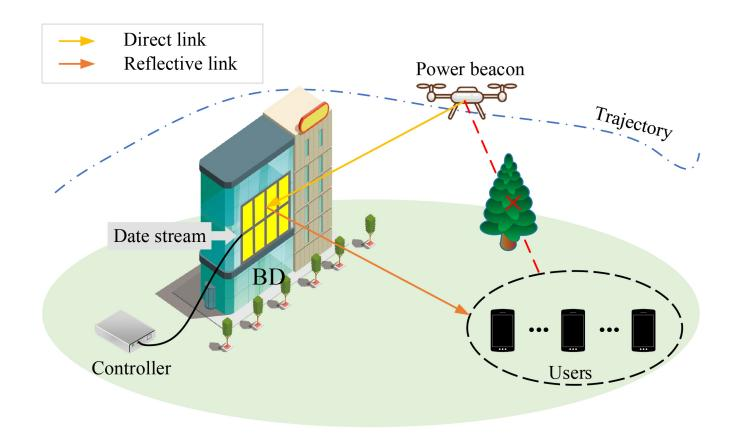

Fig. 8. A schematic of BackCom in IRS-assisted AAV communications.

### *A. Solutions for Energy-Constrained Communications*

In IRS-assisted AAV communications, energy-constrained communications can be solved not only from the perspective of reducing system energy consumption, but also from a sustainable perspective based on wireless power transfer. The following are examples of SWIPT, BackCom and other methods to illustrate solutions for energy-constrained communications in detail. Table [III](#page-17-0) provides a corresponding summary of these solutions.[1](#page-16-0)

*1) BackCom for Energy-Constrained Communications:* BackCom is a reflection-based wireless communication technology. Devices using BackCom can not only transmit information by designing the impedance matching state in the antenna, but also obtain energy from the Radio Frequency (RF) signal to maintain normal operation, realizing a green communication paradigm [\[135\]](#page-32-8). The simplest single-base BackCom system consists of a Backscatter Device (BD) and a reader, where the reader includes a power beacon and a backscatter receiver. During communication, the RF source generates an RF signal to activate the tag, and the backscatter transmitter loads the sent information into the RF signal and reflects the modulated signal to the backscatter receiver [\[136\]](#page-32-9).

In IRS-assisted AAV communications, using BackCom can reduce system energy consumption while satisfying system requirements for communication performance. Fig. [8](#page-16-1) illustrates the communication principle of BackCom. In the BackCom system, the AAV acts as airborne power beacon, providing RF signals to specific areas of the IRS through carefully designed AAV trajectories. The IRS, acting as the BD, leverages beamforming to enhance the reverse scattering effect while ensuring low energy consumption, and it transmits information to users via RF signals. In [\[57\]](#page-30-21), authors formulate a problem to maximize the reception sum rate of all users under constraints of AAV transmission power and trajectory, as well as IRS reflection coefficients. Due to the existence of multiple deeply coupled variables, the problem is decomposed into three sub-problems using Block Coordinate Descent

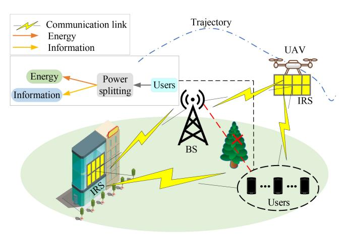

Fig. 9. A schematic of SWIPT in IRS-assisted AAV communications.

(BCD), and an Alternating Optimization (AO) algorithm is proposed to iteratively solve each subproblem. Compared to traditional BackCom, BackCom in an IRS-assisted AAV communications exhibits cost-effectiveness and EE. Unlike [\[57\]](#page-30-21), authors in [\[128\]](#page-32-10) study the BackCom communication system in the presence of multiple illegal eavesdroppers, considering both system energy consumption and security.

**Lesson 1**: While IRSs can replace traditional BDs for lowpower communications, the deployment location and number of IRSs can have a large impact on system performance and power consumption. Additionally, BackCom needs to consume the energy of the AAV to activate the reflected signal. To further reduce the transmission energy consumption, the approach of jointly modulating environmental signals and RF signals is also worthy of further research.

*2) SWIPT for Energy-Constrained Communications:* SWIPT is an evolution of wireless power transfer that utilizes the properties of wireless signals to couple energy into signals for simultaneous transmission. SWIPT works by transmitting a combined wireless signal that carries information and energy, and allows receiving devices or intermediate devices to simultaneously decode/relay information and derive energy from the same signal [\[137\]](#page-32-11). Fig. [9](#page-16-2) illustrates the basic working principle of SWIPT-based IRS-assisted AAV communications. Herein, IRSs act as intermediate devices to relay wireless signals. Users obtain the energy and information from the received signal by power splitting [\[138\]](#page-32-12). It is worth noting that the power splitting ratio has a direct impact on the efficiency of user energy harvesting and information transmission. In addition, the mobility of AAVs can be utilized to add flexibility to IRS deployment.

SWIPT can be also widely used in IRS-assisted AAV communication scenarios with energy-constrained devices. Authors in [\[129\]](#page-32-13) investigate an IRS and AAV-assisted SWIPT system to maximize the average harvested energy of users, and formulate a joint optimization problem of AAV trajectories, power allocation ratio, and IRS phase shift. A method based on Lagrangian dual algorithm is proposed to solve the formulation problem, aiming to overcome the drawback of traditional BCD-SCA methods, which are sensitive to initial parameters.

1Although the articles in Table [II](#page-4-1) do not provide an extensive description of the channel estimation process, the choice of channel models partially reflects the channel estimation. The same with Tables [III](#page-17-0) and [IV.](#page-19-0)

TABLE III SUMMARY OF SOLUTIONS FOR ENERGY-CONSTRAINED COMMUNICATIONS

|              |       |                                                                                                                                         |                    | Technologies       |                     |                    |                     |                         |                          |                            |  |  |
|--------------|-------|-----------------------------------------------------------------------------------------------------------------------------------------|--------------------|--------------------|---------------------|--------------------|---------------------|-------------------------|--------------------------|----------------------------|--|--|
|              |       | Description                                                                                                                             | c                  | l                  | nfor- ing        |                    | ource ation      | Trajectory optimization | itions                   | tions                      |  |  |
| Categories   | Ref.  |                                                                                                                                         | Channel estimation | Active beamforming | Passive beamforming | Transmission power | Computing resources |                         | Low power communications | Sustainable communications |  |  |
| BackCom      | [57]  | An AO algorithm based on fractional program, semidefinite program, and RL to maximize total reception rate of all users.                | $\checkmark$       | √                  | √                   | ×                  | ×                   | $\checkmark$            | $\checkmark$             | ×                          |  |  |
|              | [128] | An AO algorithm based on semidefinite program, SCA, and RL to maximize the broadcast secrecy rate.                                      | <b>√</b>           | <b>√</b>           | <b>√</b>            | ×                  | ×                   | <b>√</b>                | √                        | ×                          |  |  |
|              | [129] | An optimization algorithm based on Lagrangian dual to maximize the average harvested energy.                                            | <b>√</b>           | ×                  | <b>√</b>            | <b>√</b>           | ×                   | <b>√</b>                | ×                        | <b>√</b>                   |  |  |
|              | [55]  | An iterative algorithm based on SCA and BCD to maximize the minimum average achievable rate.                                            | <b>√</b>           | ×                  | <b>√</b>            | <b>√</b>           | ×                   | <b>√</b>                | ×                        | <b>√</b>                   |  |  |
| SWIPT        | [130] | An AO algorithm based on SCA, penalty function method, and difference-convex programming to maximize achievable sum-rate for all users. | <b>√</b>           | ×                  | <b>√</b>            | <b>√</b>           | ×                   | <b>√</b>                | ×                        | <b>√</b>                   |  |  |
|              | [54]  | An AO algorithm based on convex programming and SCA to minimize the maximum energy consumption.                                         | <b>√</b>           | ×                  | <b>√</b>            | <b>√</b>           | ×                   | <b>√</b>                | ×                        | <b>√</b>                   |  |  |
|              | [111] | A double iteration algorithm to maximize average achievable rate over time slots.                                                       | <b>√</b>           | <b>√</b>           | <b>√</b>            | <b>√</b>           | ×                   | <b>√</b>                | ×                        | <b>√</b>                   |  |  |
|              | [88]  | An AO algorithm to minimize UAV's total flying time.                                                                                    | $\checkmark$       | ×                  | <b>√</b>            | ×                  | <b>√</b>            | <b>√</b>                | <b>√</b>                 | ×                          |  |  |
|              | [6]   | A two-phase approach to improve the global EE of the system.                                                                            | <b>√</b>           | ×                  | $\sqrt{}$           | ×                  | ×                   | <b>√</b>                | $\sqrt{}$                | ×                          |  |  |
|              | [12]  | An AO algorithm and DNN to minimize average system energy consumption.                                                                  | <b>√</b>           | ×                  | <b>√</b>            | <b>√</b>           | ×                   | $\checkmark$            | <b>√</b>                 | ×                          |  |  |
|              | [131] | A DL based algorithm to minimize energy consumption.                                                                                    | $\checkmark$       | √                  | $\checkmark$        | ×                  | ×                   | $\sqrt{}$               | $\sqrt{}$                | ×                          |  |  |
| Other sys-   | [118] | An AO algorithm based on SDR to maximize the EE.                                                                                        | $\checkmark$       | <b>√</b>           | $\checkmark$        | $\checkmark$       | ×                   | ×                       | $\sqrt{}$                | ×                          |  |  |
| tem EE       | [132] | An AO algorithm to maximize the EE.                                                                                                     | <b>√</b>           | <b>√</b>           | <b>√</b>            | ×                  | ×                   | ×                       | <b>√</b>                 | ×                          |  |  |
| optimisation | [133] | An iterative algorithm based on SCA and Dinkelbach's method to maximize the spectrum efficiency and the EE.                             | $\checkmark$       | <b>√</b>           | $\checkmark$        | ×                  | ×                   | $\checkmark$            | $\sqrt{}$                | ×                          |  |  |
|              | [134] | An approach based on deep Q-network and SCA to minimizie total transmission power.                                                      |                    |                    | $\sqrt{}$           | ×                  | ×                   |                         |                          | ×                          |  |  |

Authors in [\[55\]](#page-30-19), [\[130\]](#page-32-14) investigate multi-user SWIPT scenarios, different from single-user scenario mentioned in [\[129\]](#page-32-13). In order to satisfy communication requirements of multiple users, authors in [\[55\]](#page-30-19) propose a Time-Division Multiple Access (TDMA) scheduling protocol when the AAV flies along an optimized trajectory. It divides the transmission time into different time slots to ensure that each IoT device is allocated with a specific slot for energy and information transmission. Unfortunately, authors in [\[55\]](#page-30-19) use a simple linear SWIPT model, which results in energy saturation at high power levels and difficulty in energy harvesting at low power levels. Instead, authors in [\[130\]](#page-32-14) propose a non-linear SWIPT framework with IRS-assisted AAV communications for energy-limited IoT devices. This article uses Successive Interference Cancellation (SIC) to eliminate interference among different users when adopting the NOMA scheme. Specifically, the channel gains of

all users are first estimated and sorted, and then the user with stronger channel power helps the user with weaker channel power to decode the signal, and finally, its own signal is decoded.

Authors in [\[54\]](#page-30-18) study the three-dimensional trajectory of the AAV, which is different from studies that assume the AAV moves at a fixed altitude in [\[55\]](#page-30-19), [\[129\]](#page-32-13), [\[130\]](#page-32-14). An onboard IRS is utilized to enhance the uplink signal in a non-linear SWIPT system. Considering the impact of AAV's three-dimensional trajectory on system performance, authors optimize AAV trajectories, IRS phase shift, and user scheduling to minimize energy consumption for all users.

Authors in [\[111\]](#page-31-33) compare the performance of perfect CSI and statistical CSI for IRS-assisted AAV communications in SWIPT systems, which is contrary to the assumption that the system can obtain perfect CSI in [\[54\]](#page-30-18), [\[130\]](#page-32-14). Authors optimize the power allocation ratio, transmission beamforming, AAV trajectories, and IRS phase shift to maximize the average achievable reception rate during AAV flight slots. Simulation results show that the performance on statistical CSI is worse than that on perfect CSI, but statistical CSI is more suitable for practical applications.

**Lesson 2**: The aforementioned research on utilizing SWIPT technology in IRS-assisted AAV communication scenarios is focused solely on system transmission rates and energy consumption, while ignoring the fair distribution of communication resources, such as energy, among multiple users. Moreover, in IRS-assisted AAV communications and its supported applications, each device's requirements for energy and communication are constantly changing. Therefore, it is essential to address the conflict between system fairness and performance.

*3) Other Methods for Energy-Constrained Communications:* In addition to SWIPT and BackCom, optimizing specific performance metrics such as EE is another way to address energy-constrained communication issues. Besides, it's worth noting that authors in [\[139\]](#page-32-15) illustrate that solar energy can alleviate the energy issues of AAVs and their supporting communication devices. Due to the complexity of hardware design, uneconomical energy consumption caused by the weight of solar panels, and a heavy reliance on weather conditions, the use of solar energy is limited. Since the placement of IRSs affects AAV flight trajectories, which is also closely related to AAV propulsion energy consumption, the improvement of EE from the perspective of IRS placement is introduced in the following content.

Ground IRS placement on buildings is considered in [\[6\]](#page-29-5), [\[12\]](#page-29-11), [\[88\]](#page-31-10). Authors in [\[88\]](#page-31-10) construct a problem of jointly optimising AAV trajectories, IRS phase shifts, scheduling of ground nodes and computational resource allocation to minimize the total flight time of the AAV, thus overcoming the energy-constrained issue of IRSs and AAV-based MEC systems. Unlike the linear discharge of the AAV battery in [\[88\]](#page-31-10), the nonlinear discharge is discussed in [\[6\]](#page-29-5). Authors first propose an algorithm to estimate the flight time of the airborne AAV, and then optimize the IRS phase shift matrix and deployment position. Finally, the AAV flight trajectory is optimized based on the estimated AAV flight time and optimized IRS deployment position to improve the global system EE. In particular, this system considers practical constraints such as discrete phase compensation of the IRS and phase-amplitude relationships.

Authors in [\[12\]](#page-29-11) approximate effective channel gain by DNN models based on imperfect CSI, which is different from [\[6\]](#page-29-5), and conduct research on the average system energy consumption minimization problem to jointly optimize AAV trajectories, IRS phase shifts, and resource allocation strategies by an AO approach. Similar to [\[12\]](#page-29-11), imperfect CSI and other system design constraints, such as AAV flight jitter, and practical hardware constraints are also taken into account in [\[131\]](#page-32-16). In order to minimize energy consumption of the AAV, authors jointly optimize AAV trajectories, AAV active beamforming, and IRS passive beamforming. Specifically, to alleviate the challenges of obtaining the real-time varying CSI

of IRS-AAV, AAV-user, and IRS-user links under AAV jitter and system hardware constraints, the authors propose a hybrid semi-unfolding DNN.

In fact, placing IRSs on AAVs can achieve flexible deployment of IRSs while ensuring their support for communications [\[118\]](#page-31-40), [\[132\]](#page-32-17). The flexibility of airborne IRS is reflected in the fact that it is easier to establish LoS links compared to ground-based IRS, while allowing flexible reflections from all angles. In order to maximize the EE of aerial IRS-assisted AAV communication systems, authors in [\[118\]](#page-31-40) optimize the user transmission power, BS active beamforming, and IRS passive beamforming under user minimum transmission rate and power constraints. It is worth noting that deploying aerial IRSs near users rather than BSs leads to a more pronounced enhancement in system EE. Polarisation technologies allow signals of the same frequency to be transmitted in different polarisation directions and are considered to be an effective method of achieving multi-mode transmission. In [\[132\]](#page-32-17), authors introduce polarization technologies in an aerial IRS communication system, propose an energy-efficient framework for joint broadcast-unicast communication and jointly optimize passive beamforming of IRSs and active beamforming of BSs. However, to simplify the system model, authors in [\[118\]](#page-31-40), [\[132\]](#page-32-17) assume all CSI can be perfectly obtained.

Authors in [\[133\]](#page-32-18) study trajectory optimization of AAVs equipped with IRSs, unlike the static deployment of AAVs equipped with IRSs [\[118\]](#page-31-40), [\[132\]](#page-32-17). The goal of trajectory optimization is to minimize the propulsion energy consumption of AAVs while ensuring the system's service quality. Authors jointly optimize AAV trajectories, active and passive beamforming to achieve a balance between achievable reception rates and energy consumption, thereby improving the energy and spectral efficiency of the system. Furthermore, for trajectory optimization, authors use SCA and first-order Taylor expansion to reformulate the problem and adopt the Dinkelbach method to solve it. Similar to [\[133\]](#page-32-18), authors in [\[134\]](#page-32-19) aim to minimize the transmission power of a communication system aided by multiple AAVs carrying IRSs under heterogeneous networks. Each aerial IRS has the capability to adjust its position and phase shift to serve users with poor channel conditions. To tackle the formulated highly nonconvex problem, authors decompose it into two subproblems, and employ the dueling deep Q network and SCA to sequentially solve them.

**Lesson 3**: Although IRS is a passive device, the control and economic costs of deploying IRSs cannot be ignored. Additionally, the computational energy consumption of algorithms can increase the system's energy consumption. Therefore, introducing lightweight and low-complexity algorithms into the system design is promising.

*4) Solutions for Energy-Constrained Communications in Different Scenarios:* The aforementioned studies primarily discuss general solutions for energy-constrained communication in two scenarios: ground-based IRS-assisted AAV communications [\[6\]](#page-29-5), [\[12\]](#page-29-11), [\[57\]](#page-30-21), [\[88\]](#page-31-10), [\[128\]](#page-32-10), [\[129\]](#page-32-13), [\[130\]](#page-32-14), [\[131\]](#page-32-16) and aerial IRS-assisted communications [\[54\]](#page-30-18), [\[55\]](#page-30-19), [\[111\]](#page-31-33), [\[118\]](#page-31-40), [\[132\]](#page-32-17), [\[133\]](#page-32-18), [\[134\]](#page-32-19). These solutions mainly focus on minimizing system energy consumption without specific

TABLE IV SUMMARY OF SOLUTIONS FOR SECURITY COMMUNICATIONS

| Categories        |       | Description                                                                                                        |                    |                    | olved ues        |                    |                |                         |                   |                       |
|-------------------|-------|--------------------------------------------------------------------------------------------------------------------|--------------------|--------------------|---------------------|--------------------|----------------|-------------------------|-------------------|-----------------------|
|                   |       |                                                                                                                    | g                  | Bear mi         | nfor- ng         |                    | ource ation | Trajectory optimization | 50                | sks                   |
|                   | Ref.  |                                                                                                                    | Channel estimation | Active beamforming | Passive beamforming | Transmission power | IRS            |                         | Malicious jamming | Eavesdropping attacks |
|                   | [107] | An AO algorithm based on SCA and SDR to maximize the average transmission rate.                                    |                    | ×                  | $\sqrt{}$           | $\checkmark$       | ×              | <b>√</b>                | $\checkmark$      | ×                     |
|                   | [64]  | An iterative algorithm based on AO algorithm, SDR and SCA to maximize the EE.                                      |                    | ×                  | $\checkmark$        | ×                  | ×              | $\checkmark$            | $\checkmark$      | ×                     |
|                   | [141] | A DRL-based defensive deception approach to realize efficient communications.                                      |                    | ×                  | $\checkmark$        | <b>√</b>           | ×              | ×                       | $\checkmark$      | ×                     |
|                   | [58]  | An optimization algorithm based on distributed matching and Q-learning to maximize achievable communication rates. | $\sqrt{}$          | ×                  | <b>√</b>            | ×                  | <b>√</b>       | ×                       | <b>√</b>          | ×                     |
|                   | [142] | An optimization algorithm based on DRL to maximize EE.                                                             | √                  | ×                  | √                   | $\sqrt{}$          |                | $\sqrt{}$               | $\sqrt{}$         | ×                     |
| PLS               | [108] | An iterative algorithm based on SCA to maximize the average secrecy rate.                                          | <b>√</b>           | <b>√</b>           | <b>√</b>            | ×                  | ×              | <b>√</b>                | ×                 | <b>√</b>              |
| technologies      | [143] | An AO algorithm based on SCA and SDR to maximize the worst-case sum secrecy rate.                                  |                    | <b>√</b>           | <b>√</b>            | ×                  | ×              | <b>√</b>                | ×                 | <b>√</b>              |
|                   | [60]  | An AO algorithm based on BCD, SDR and SCA to maximize the average secrecy rate.                                    |                    | $\checkmark$       | $\checkmark$        | <b>√</b>           | ×              | $\checkmark$            | ×                 | <b>√</b>              |
|                   | [73]  | An AO algorithm based on SDR to maximize the system secrecy rate.                                                  | $\sqrt{}$          | $\checkmark$       | $\checkmark$        | ×                  | ×              | $\checkmark$            | ×                 | <b>√</b>              |
|                   | [128] | An AO algorithm based on RL, SCA, and semidefinite program to maximize the broadcast secrecy rate.                 | $\sqrt{}$          | <b>√</b>           | $\checkmark$        | ×                  | ×              | <b>√</b>                | ×                 | <b>√</b>              |
|                   | [144] | An optimization algorithm based on DL to maximize the total system secrecy rate.                                   | <b>√</b>           | <b>√</b>           | <b>√</b>            | ×                  | ×              | <b>√</b>                | ×                 | <b>√</b>              |
|                   | [145] | An AO algorithm based on SCA to maximize the average transmission rate.                                            |                    | ×                  |                     | ×                  | ×              | $\sqrt{}$               | $\checkmark$      | <b>√</b>              |
| Covert communica- | [146] | An optimization methods based on closed-form solutions to maximize the covert transmission rate.                   | $\checkmark$       | ×                  | $\checkmark$        | $\checkmark$       | ×              | $\checkmark$            | $\checkmark$      | $\checkmark$          |
| tions             | [70]  | A block SCA algorithm to minimize average EE.                                                                      | √                  | ×                  | √                   | √                  | ×              | √                       | √                 | <b>√</b>              |
|                   | [147] | Mathematical analysis and derivation to maximize the worst-case transmission rate.                                 | <b>√</b>           | ×                  | ×                   | ×                  | ×              | ×                       | <b>√</b>          | <b>√</b>              |

scenario constraints. While most of the above solutions can be applied to SAGIN scenarios, V2X and large-scale IoT scenarios typically require specialized designs.

In V2X communications, the main challenge for achieving energy-constrained communications lies in dynamic resource management in the context of vehicles' mobility. For example, authors in [\[122\]](#page-32-2) study the relationship between task offloading and computational capabilities of vehicular communications, optimizing the BS transmit beamforming and reflection matrix of IRS carried on AAV to minimize system energy consumption. Similarly, for task offloading in dense urban areas with electric vehicles, authors in [\[140\]](#page-32-20) deploy aerial IRS to expand offloading nodes and develop a game-based algorithm to solve the formulated multi-objective optimization problem by considering energy consumption. For energy constrained communications in large-scale IoT, the issue of resource balancing

among multiple devices is needed to address. Authors in [\[48\]](#page-30-12) propose a novel IoT network model utilizing an auxiliary antenna IRS powered by a master AAV, allowing two AAVs to move freely and achieve wireless charging. The goal is to maximize network throughput through collaboration strategies based on multi-agent DRL.

# *B. Solutions for Secure Communications*

In IRS-assisted AAV communications, malicious jamming and eavesdropping attacks are the most common attacks, and can be also effectively defended against through system design and optimization without over-reliance on network protocols, encryption techniques, and identity authentication. Thus, we take these two security threats as examples and provide a detailed overview of existing solutions for secure

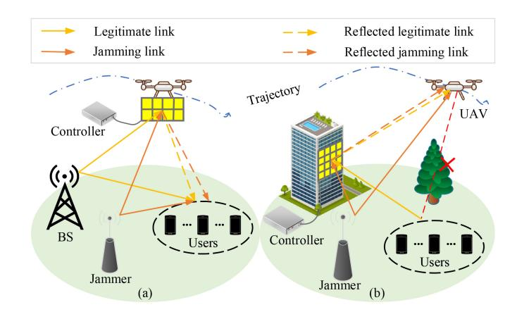

Fig. 10. Schematics of malicious jamming in IRS-assisted AAV communications: (a) aerial IRS scenes; and (b) ground IRS scenes.

Fig. 11. Schematics of eavesdropping attacks in IRS-assisted AAV communications: (a) ground eavesdropper scene; and (b) aerial eavesdropper scene.

communications. Common anti-jamming and eavesdropping methods are summarized in Table [IV,](#page-19-0) including PLS technologies and covert communications.

*1) PLS Technologies to Resist Malicious Jamming:* PLS technologies utilize the characteristics and corresponding technologies of the physical layer to protect communication channels and transmission media, enabling secure communications. In general, the PLS method focuses on the wireless environment and the physical characteristics of both IRSs and AAVs. As shown in Fig. [10,](#page-20-0) leveraging the maneuverability of AAVs, the trajectory of AAVs is set in advance, allowing them to move away from jamming sources and reduce the impact of jamming on communication performance [\[148\]](#page-32-21), [\[149\]](#page-32-22).

The use of passive beamforming by IRSs can effectively suppress jamming signals while controlling excessive energy consumption of the system. Authors assume two scenarios in [\[107\]](#page-31-29): one with the IRS deployed in an area far from the jamming source, and the other with that near the jamming source. They optimize AAV trajectories, passive beamforming of IRSs, and transmission power of ground networks to maximize the AAV's average reception rates in the wireless environment where the signal jamming is present. The numerical results show that deploying the IRS near the jamming source rather than far from it can provide better performance for the system.

The accuracy of the CSI about the jamming channel directly affects the anti-jamming effect. Authors in [\[64\]](#page-30-28) analyze the EE of the system under imperfect CSI jamming, unlike the ideal channel in [\[107\]](#page-31-29). They formulate a nonconvex problem of jointly optimizing AAV trajectories and IRS beamforming, and solve it by an iterative algorithm based on SDR and SCA. Although the system performance is reduced compared to the perfect CSI, analyzing jamming attacks under imperfect jamming CSI is more realistic.

Defensive deception strategies are also used to resist jamming attacks, by misleading and confusing attackers into believing the success of their attacks. Authors in [\[141\]](#page-32-23) propose a combination of defensive deception and ML to resist jamming attacks, in which a DRL-based power allocation scheme combined with passive beamforming by IRSs aims to obfuscate the attack surface and lure the jamming attack to the designated channel, with the purpose of achieving antijamming effects.

The anti-jamming scenarios described above in [\[64\]](#page-30-28), [\[107\]](#page-31-29), [\[141\]](#page-32-23) are static scenes for IRSs. As Fig. [10\(](#page-20-0)a) shows, in order to provide IRSs with the same maneuverability as AAVs, authors in [\[58\]](#page-30-22) propose to place IRSs on AAVs and investigate the anti-jamming scenario where the jamming source location is uncertain. To maximize the system's antijamming performance, author jointly optimize the selection of IRS and beamforming. In particular, authors propose a game-theory-based distributed matching selection algorithm to address the matching problem between IRS-equipped AAVs and multiple users. Furthermore, a Q-learning-based beamforming algorithm is proposed to mitigate the impact of CSI acquisition accuracy on the system's anti-jamming capability.

Unlike the study in [\[58\]](#page-30-22), authors in [\[84\]](#page-31-6) study the system performance of IRS-assisted AAV communications in free-space optical systems under malicious AAV jamming. Compared with ground jamming, AAV-mounted jamming sources change positions when the AAV moves, making it difficult to detect and track the jamming source. The authors also derive closed-form expressions for the end-to-end average BER and average outage probability, emphasizing advantages of IRSs under aerial jamming resistance. In addition, authors in [\[142\]](#page-32-24) investigate the performance of airborne IRS-assisted anti-jamming communications in land-to-sea communication scenarios. An intelligent resource management method based on DRL is proposed to optimize the transmission power, AAV deployment position, and IRS beamforming.

*2) PLS Technologies to Resist Eavesdropping Attacks:* Relying on its unique advantages at the physical layer, PLS technologies can also play a role in countering eavesdropping in AAV communication scenarios. However, its performance may still be affected by the specific scene [\[4\]](#page-29-3), [\[60\]](#page-30-24), [\[108\]](#page-31-30), [\[128\]](#page-32-10), [\[143\]](#page-32-25) and device constraints [\[65\]](#page-30-29), [\[144\]](#page-32-26). Additionally, the combination of PLS technologies and artificial noise can further enhance the anti-eavesdropping performance of AAV communications [\[73\]](#page-30-37).

Relevant PLS technologies of countering ground eavesdroppers are studied in [\[108\]](#page-31-30), [\[143\]](#page-32-25). Authors in [\[108\]](#page-31-30) focus on the single-user and single-eavesdropper scenario, where the IRS is fixed on the ground to achieve the maximum secrecy rate of the system through passive beamforming of the IRS, active beamforming of the transmitted signal, and AAV trajectory optimization. Unlike the assumption in [\[108\]](#page-31-30) where the system can accurately obtain the eavesdropper's location information and CSI, authors in [\[143\]](#page-32-25) consider that the eavesdropper's location is unknown. Although the exact locations of eavesdroppers are not known, their approximate positions can be locked into a circular area by the AAV's aerial target detection. Hence, authors derive the worst-case secrecy rate of legitimate users and use this to formulate a problem for jointly optimising the phase shift of the IRS, the transmitted beamforming and the hovering position of the AAV. The formulated problem is solved by an AO algorithm based on SCA and SDR to maximize the worst-case secrecy rate of all system users.

PLS technologies can also be used to solve the security problem caused by airborne eavesdroppers. As shown in Fig. [11\(](#page-20-1)b), aerial eavesdroppers based on AAVs can easily establish a LoS link with the ground BS, and these channels facilitate the reception of eavesdroppers' signals. Therefore, compared with ground eavesdroppers, airborne eavesdroppers pose more serious security threats to the network. Authors in [\[60\]](#page-30-24) study the security of a single airborne user in the presence of multiple airborne eavesdropper scenarios. Faced with a scenario where both the user and eavesdroppers are in the air, three-dimensional trajectory optimization of the AAV is more advantageous than two-dimensional trajectory optimization when adjusting distances among users, IRSs, eavesdroppers, and BSs. Unlike the use of a virtual antenna array constructed by a drone swarm [\[150\]](#page-32-27), authors use the IRS to achieve energy-efficient secure communications. By jointly optimizing the transmission power, active and passive beamforming, and the AAV's three-dimensional trajectories, the system's secrecy rate is improved.

The combination of PLS technologies and artificial noise can achieve enhanced anti-eavesdropping performance of AAV communications. Artificial noise can introduce interference, preventing eavesdroppers from accurately capturing the original signal. The use of artificial noise and PLS technologies against eavesdropping attacks is investigated in [\[73\]](#page-30-37). The authors consider a scenario in which a ground eavesdropper eavesdrops on airborne BS signals. By simultaneously introducing artificial noise and employing both active and passive beamforming, the eavesdropper's signal interception quality is disturbed. Furthermore, the authors optimize the deployment locations of AAVs and IRSs to maximize the system's secrecy rate.

For the anti-eavesdropping communication scenario involving multiple AAVs, as shown in Fig. [11\(](#page-20-1)a), some AAVs can act as friendly jammers to interfere with eavesdropping, and other IRSs and AAVs can be used as airborne relays to compensate for the reduced received quality caused by artificial noise [\[4\]](#page-29-3). Authors in [\[128\]](#page-32-10) also consider the broadcast secrecy rate of BackCom in scenarios with multiple eavesdroppers. The signals emitted by the AAV, serving as the carrier for IRS information transmission, can cause certain interference to both users and eavesdroppers. Therefore, they optimize the AAV's trajectory to balance the actual impact of AAV transmission signals on user interference, eavesdropper interference, and IRS information transmission. At the same time, passive beamforming for the IRS and active beamforming for the AAV are jointly optimized.

Regrettably, in the aforementioned process of using PLS technologies to address eavesdropping attacks [\[60\]](#page-30-24), [\[108\]](#page-31-30), [\[128\]](#page-32-10), [\[143\]](#page-32-25), perfect CSI is assumed, which is not consistent with actual scenarios, especially in situations where positions of the eavesdropper and jamming sources are unknown. This issue is discussed in [\[65\]](#page-30-29), where authors assume perfect channel estimation between the BS and the IRS, as well as between the IRS and users, but only partially available CSI for the channel between the IRS and the eavesdropper. By deriving expressions of probability density function and moment generating function of the instantaneous secrecy rate, the system's secrecy rate is analyzed. Similar to [\[65\]](#page-30-29), authors in [\[144\]](#page-32-26) investigate the secure transmission problem of IRSassisted AAV mmWave communication in the presence of imperfect CSI. They jointly optimize active/passive beamforming and AAV trajectories to maximize the system secrecy rate. In particular, to overcome the challenges posed by high coupling of CSI and AAV trajectories, authors propose a DRL algorithm based on the two-deep deterministic policy gradient framework, which has a strong decoupling capability. Specifically, the first policy gradient is used for active and passive beamforming while the second policy gradient is used for trajectory optimisation of the AAV.

**Lesson 4**: For malicious jamming and eavesdropping attacks, accurately obtaining the attacker's CSI is crucial. However, currently, acquiring accurate CSI of the attacker remains challenging. Fortunately, it is possible to obtain imperfect CSI of the attacker effectively, and its error can be modeled through specific random distributions [\[151\]](#page-32-28). Therefore, designing efficient robust optimization algorithms to counteract attacks can greatly mitigate system security issues caused by the inaccurate acquisition of the attacker's CSI. Moreover, the measures taken by the system to counter attacks often introduce additional overhead, prompting researchers to strike a balance between system security and other performance indicators.

*3) Covert Communications to Resist Malicious Jamming and Eavesdropping Attacks:* Another way to address the security threats of AAV communications is covert communications. Fig. [12](#page-22-0) illustrates the basic operating principle of IRSassisted AAV covert communications. Alice (transmitter) sends signal to Bobs (legitimate users), and Whillie (warden) determines whether Alice is in a transmitting state by detected signal power *PW* from Alice and detection threshold Γ. Covert communications utilize randomization techniques such as artificial noise [\[70\]](#page-30-34), [\[147\]](#page-32-29) and power control [\[146\]](#page-32-30) to conceal transmission signals within environmental noise or artificial uncertainties, aiming to reduce the detectability of the transmission, hence they are also known as low probability of detection communications. More importantly, when covert communications are utilized for wireless information transmission, the signal should not be perceivable by eavesdroppers [\[152\]](#page-32-31).

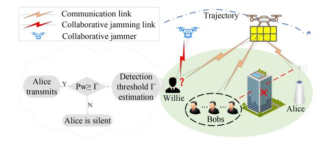

Fig. 12. A schematic of covert communications in IRS-assisted AAV communications.

As a complement of PLS technologies to resist eavesdropping attacks and malicious jamming, covert communications are also extensively studied in [\[145\]](#page-32-32), [\[146\]](#page-32-30). Authors in [\[145\]](#page-32-32), [\[146\]](#page-32-30) investigate the covert transmission rate of the aerial IRS-assisted covert communication system. They first determine the optimal detection threshold and derive the error detection probability for eavesdroppers. Then, they formulate an optimization problem with variables of AAV trajectories and IRS phase shifts to maximize the covert transmission rate, and solve it by deriving a closed-form solution and an AO algorithm. Different from [\[145\]](#page-32-32), authors in [\[146\]](#page-32-30) consider the uncertainty of the eavesdropper's location and optimize the signal transmission power.

The combination of artificial noise and covert communications can further enhance the security of AAV communications. As shown in Fig. [12,](#page-22-0) artificial noise can interfere with illegal users to confuse them to determine whether a legitimate user is communicating. This approach is investigated in [\[70\]](#page-30-34), [\[147\]](#page-32-29). Different from the above mentioned articles [\[145\]](#page-32-32), [\[146\]](#page-32-30), where all AAVs serve as one role, authors in [\[70\]](#page-30-34) consider that AAVs undertake two distinct roles: one is used to carry the IRS for reliable data transmission, and the other acts as a collaborative jammer to enhance the secrecy of the transmission. A power-efficient multi-AAV covert communication scheme is designed for scenarios with multiple eavesdroppers in the THz frequency band. In particular, an optimization problem is constructed to both improve the throughput of covert communications and reduce energy consumption of AAVs, which is iteratively solved by the block SCA method. Unlike the scenario where AAVs have two different roles in [\[70\]](#page-30-34), authors in [\[147\]](#page-32-29) set up the legitimate receiver with the full-duplex mode to receive signals while also generating jamming signals to further ensure the confidentiality of covert communications. Through theoretical analysis and derivation of the proposed system, the effectiveness of the scheme is proven.

**Lesson 5**: Covert communications enhance data security and privacy, making unauthorized users difficult to detect or interfere with the transmission content. But extended communication durations increase the risk of communication exposure. Therefore, to enhance the performance of covert communications, multi-modal communication approaches that include both communication and silence modes are worth researching. Furthermore, in practical scenarios where eavesdropping and interference are encountered, covert

communications can be used as a supplement and combined with other methods to achieve security outcomes.

*4) Summary for Secure Communications in Different Scenarios:* The aforementioned studies mainly discuss general anti-jamming and anti-eavesdropping solutions in IRS-assisted AAV communications, such as defensive deception strategies [\[141\]](#page-32-23) and artificial noise [\[70\]](#page-30-34), [\[73\]](#page-30-37), [\[147\]](#page-32-29), while also considering some non-ideal channel conditions [\[64\]](#page-30-28), [\[65\]](#page-30-29), [\[144\]](#page-32-26). However, in practical application scenarios, customized designs are often required to meet specific constraint needs.

In SAGIN, the broadcast nature of air-to-ground communications significantly increases the risk of jamming and eavesdropping. Although authors in [\[60\]](#page-30-24), [\[64\]](#page-30-28), [\[73\]](#page-30-37), [\[107\]](#page-31-29), [\[108\]](#page-31-30), [\[141\]](#page-32-23), [\[144\]](#page-32-26) provide general solutions for secure communications in air-to-ground scenarios, they do not consider the overall security performance of integrated communication systems involving satellites, AAVs, and ground terminals. To enhance jamming elimination in SAGIN scenarios, authors in [\[153\]](#page-32-33) propose an aerial IRS-assisted SAGIN system, integrating satellites, AAV-IRS, and ground terminals. The jamming management scheme adapts to different types of CSI (i.e., no CSI, instantaneous CSI, and delayed CSI), allowing optimal performance through spatial dimension compression, beamforming, and joint precoding strategies. Similarly, to improve the anti-eavesdropping performance of spaceground communication systems, authors in [\[154\]](#page-32-34) consider both double-IRS and single-IRS scenarios to maximize secrecy rate. Placing IRSs near the source of attack can significantly enhance security [\[107\]](#page-31-29). However, the mobility of vehicle increases the difficulty of secure communications in V2X. To handle this issue, authors in [\[155\]](#page-32-35) study a rate-splitting multiple access scheme, analyze the outage performance in multi-jamming vehicle environments, and propose a solution to optimize power allocation coefficients. The results show that integrating IRS significantly enhances system performance even in the presence of direct links.

# *C. Solutions for Enhanced Communications*

Up to now, researchers have proposed many solutions for enhanced communications, which typically focus on performance metrics including network rates, network latency, coverage ranges, spectrum efficiency, and reliability. In the following, we introduce relevant solutions for enhanced communications based on these system metrics, and summarize them in Table [V.](#page-26-0)

*1) Enhanced Communications for Network Rate Improvement:* The network rate is one of the crucial metrics in wireless transmission and is also the joint result of various factors. Specifically, interference management [\[68\]](#page-30-32), [\[72\]](#page-30-36), [\[86\]](#page-31-8), [\[156\]](#page-32-36), [\[157\]](#page-32-37), multi-user sub-channel allocation [\[50\]](#page-30-14), [\[74\]](#page-30-38), communication links [\[47\]](#page-30-11), [\[89\]](#page-31-11), and hardware constraints [\[119\]](#page-31-41) all have impacts on the network rate.

In IRS-assisted AAV communications, interference can be primarily categorized into intra-cell multi-user interference and inter-cell interference. Regarding the former, the feasibility of constructing multiple interference-free beams based on IRS is validated in [\[158\]](#page-32-38), providing a theoretical foundation for subsequent IRS beamforming to mitigate intra-cell multi-user interference. Additionally, researchers in [\[68\]](#page-30-32), [\[72\]](#page-30-36), [\[86\]](#page-31-8) discover that it is generally necessary to jointly consider factors including transmission power allocation and AAV trajectories to maximize the beamforming gain.

Authors in [\[68\]](#page-30-32), [\[72\]](#page-30-36), [\[86\]](#page-31-8) focus on intra-cell multi-user interference. Without loss of generality, only one set of reflection matrices is available at the IRS in each time slot. Therefore, IRS beamforming typically requires a balance between mitigating multi-user interference and enhancing signal strength. Authors in [\[68\]](#page-30-32) investigate the impact of IRS beamforming, transmission power allocation, and AAV trajectory on the total network rate in IRS-assisted AAV downlink communication networks. By virtue of beamforming of IRSs, signal interference of users is reduced, and the interference suppression effect is more pronounced in multi-user scenarios. Similarly, authors in [\[72\]](#page-30-36) formulate the problem of maximizing the minimum average achievable rate in a AAV scenario with THz communications. In this case, beamforming not only affects interference among multiple users but also plays a crucial role in reducing path loss at high frequencies. However, it is worth noting that in [\[68\]](#page-30-32) and [\[72\]](#page-30-36), only the IRS phase shift is optimized, and the reflection coefficient is fixed. The research on joint consideration of IRS reflection amplitudes and phase shift is discussed in [\[86\]](#page-31-8). To mitigate interference, authors employ Orthogonal Frequency Division Multiple Access (OFDMA) technology to maximize the transmission sum rate by jointly optimizing IRS beamforming, subchannel assignment, power allocation and AAV trajectories. The simulation results demonstrate that the usage of OFDMA technology and reasonable deployment of IRS can effectively reduce the interference among multiple users.

The "double fading" effect of passive IRS means it can only serve its localized areas [\[8\]](#page-29-7), thereby avoiding unnecessary inter-cell interference. However, this does not completely eliminate the impact of inter-cell interference on communications. To address this, authors in [\[157\]](#page-32-37) investigate the inter-cell interference resistance of IRS-assisted multi-AAV multicast communications. Specifically, authors leverage Coordinated Multi-Point (CoMP) technology, which can convert interference signals into useful ones through coordinated beamforming at the transmitter, to mitigate intercell interference. Fixed IRS is also introduced to improve channel conditions for users at the cell edge while increasing the flexibility of AAV trajectory optimization.

Unlike the static IRS scenario in [\[157\]](#page-32-37), authors in [\[156\]](#page-32-36) examine a dynamic AAV-assisted multi-cell and multiuser interference-resistant communication scheme with IRS onboard. Specifically, during the AAV's flight along optimized trajectories, authors jointly optimize active beamforming at ground BSs and passive beamforming at IRS to maximize the minimum user transmission rate. Simulation results show that users near the cell edge receive more IRS service time, thereby minimizing both inter-cell and intra-cell multi-user interference.

NOMA technology is another common approach to mitigate inter-cell and intra-cell multi-user interference in IRS-assisted AAV communication scenarios to enhance network rates. It provides services for multiple users by dividing a subcarrier into different power levels, allowing users to share the same frequency and time resources while using different signal power and codewords to differentiate among users. To eliminate interference among different users, interference-cancellation technology such as SIC is often employed [\[50\]](#page-30-14), [\[74\]](#page-30-38). In addition, the system performance brought by NOMA depends on the differences in wireless channels among different users, with greater channel differences resulting in better system performance. Traditionally, wireless channel gain has been thought to be entirely determined by the environment, which means that the differences in randomness can severely affect the performance of NOMA. Fortunately, the reconfiguration of wireless environments by IRSs can change the design paradigm of NOMA.

An IRS-assisted multi-AAV NOMA network is studied in [\[50\]](#page-30-14). Specifically, AAVs use NOMA to serve ground users, while IRS is deployed at the cell edge to enhance communication links and reduce both inter-cell and intracell interference. To maximize the transmission rate, authors jointly optimize AAV positioning and transmission power, NOMA decoding order, and IRS beamforming, and propose an iterative algorithm based on BCD. Since the IRS service coverage is limited [\[8\]](#page-29-7), authors in [\[74\]](#page-30-38) discuss the association problem between multiple IRSs and multiple users. To decouple user association and NOMA decoding order, they propose a sequence interference extension method, transforming the IRS association problem into a convex optimization problem for multi-user and multi-cell scenarios with severe interference.

In an aerial IRS scenario, AAV trajectories affect the quality of LoS links [\[47\]](#page-30-11), [\[89\]](#page-31-11). Authors in [\[89\]](#page-31-11) discuss the scenario of an airborne IRS assisting multiple GUs. In order to maximize the minimum average transmission rate, the authors optimize the trajectory of the AAV, the phase shift of the IRS, and the communication scheduling. Different from the aforementioned IRS-assisted AAV communication scenarios, where AAVs only play a role as BSs [\[50\]](#page-30-14), [\[68\]](#page-30-32), [\[72\]](#page-30-36), [\[74\]](#page-30-38), [\[86\]](#page-31-8) or active/passive relays [\[89\]](#page-31-11). The AAVs play two important roles in [\[47\]](#page-30-11), with the main AAV acting as an airborne RF transmitter and the auxiliary AAV acting as a passive relay to enhance the signal reception of GUs. To maximize the cumulative system throughput, authors jointly optimize trajectories of multiple AAVs and the transmission power of the main AAV, and propose an algorithm based multi-agent DRL to solve the optimization problem.

Authors in [\[119\]](#page-31-41) focus on imperfect IRSs, which is different from the ideal IRS-assisted AAV communications in [\[47\]](#page-30-11), [\[68\]](#page-30-32), [\[72\]](#page-30-36), [\[86\]](#page-31-8). In fact, the enhancement of system gain by IRSs largely depends on the reliability of phase estimation and co-phase processes. To alleviate the impact of IRS imperfections, the phase estimation error of IRSs can be taken into account in the practical system design and optimization [\[162\]](#page-33-0). In [\[119\]](#page-31-41), authors study the joint IRS element and power allocation problem in the presence of phase estimation and compensation errors. The objective is to maximize the total reception rate of the AAV while satisfying energy constraints and minimum reception rate requirements of individual AAVs. To meet the finite phase configuration frequency of the IRS panel, TDMA technology is used, and each IRS element is only used once in each TDMA frame. A heuristic algorithm based on the estimated phase quality of IRS elements is proposed to solve the problem.

**Lesson 6**: In IRS-assisted AAV communications, system designs for enhancing the system transmission rate are mainly based on the assumption that the CSI of the entire system is known. However, acquiring the CSI for all channels can evidently cause a significant overhead, and CSI may not be obtained promptly. By leveraging the spatial correlation of channels, adopting a combination of prediction and estimation to acquire the CSI can greatly reduce the system overhead.

*2) Enhanced Communications for Latency Reduction:* In IRS-assisted AAV communications, most research has focused on the communication propagation process to reduce latency. The solutions primarily involve high-frequency communications [\[159\]](#page-32-39), [\[160\]](#page-33-1) and Finite Blocklength Coding (FBC) [\[69\]](#page-30-33), [\[161\]](#page-33-2), [\[163\]](#page-33-3). There are also a few studies [\[71\]](#page-30-35), [\[87\]](#page-31-9) aiming to enhance the computational capabilities of the system.

Using frequency bands such as mmWave and THz for communications is an effective method to improve transmission latency and alleviate spectrum scarcity to some extent. Authors in [\[159\]](#page-32-39), [\[160\]](#page-33-1) consider mmWave-based airborne IRS-assisted communications. In order to maintain the LoS channel for mmWave communications, authors in [\[159\]](#page-32-39) use an RL-based approach to simulate the radio channel, and optimize the phase shift and deployment location of the IRS. Building upon [\[159\]](#page-32-39), authors in [\[160\]](#page-33-1) introduce the optimal precoding matrix for the BS to further enhance the system's performance. To address the difficulty of LoS channel maintenance brought by the uncertainty of mmWave channels, a distributed RL algorithm is proposed to dynamically optimize locations of the airborne IRS.

The use of FBC can also reduce the latency in IRS-assisted AAV communication systems. FBC refers to appropriate encoding within a given length of data blocks, allowing the receiver to determine whether the sent data is correct within a limited time. Its feasibility in IRS-assisted AAV communication systems is demonstrated in [\[163\]](#page-33-3), and the system design of FBC-based IRS-assisted AAV communications is discussed in detail in [\[69\]](#page-30-33), [\[161\]](#page-33-2). In [\[161\]](#page-33-2), authors investigate massive ultra-reliable and low-latency communications for 6G networks supported by IRS-assisted AAV communications. To reduce transmission latency and meet the error-rate bounded quality of service, authors jointly optimize the AAV's trajectory and FBC-based IRS layout. Additionally, authors solve the proposed joint optimization problem by double deep Q-network algorithms. Different from [\[161\]](#page-33-2), authors in [\[69\]](#page-30-33) apply the FBC technology to MEC system to meet requirements on latency and error rates. Considering energy consumption of edge users and AAVs, authors jointly optimize AAV trajectories, active and passive beamforming, and analyze

the effectiveness of this methodology in the context of singleuser and multi-user cases.

In MEC scenarios, computational latency cannot be ignored, and its related research is discussed in [\[71\]](#page-30-35), [\[87\]](#page-31-9). Multi-access edge computing in a THz network is considered, and authors in [\[71\]](#page-30-35) study the downlink, uplink, and computation latency on the AAV. Joint optimization of IRS phase shifts, AAV computing resources, and THz sub-bandwidth allocation is performed to reduce the overall system latency. Hungarian algorithm is leveraged to schedule sub-bandwidths, while whale optimization algorithm is used to optimize IRS phase shifts. Different from the single AAV and IRS scenario discussed in [\[71\]](#page-30-35), authors in [\[87\]](#page-31-9) discuss the overall cost of a collaborative MEC system with multiple AAVs and multiple IRSs, including energy consumption, latency, and maintenance costs. To minimize the total cost of the system, authors formulate a joint optimization problem based on AAV trajectories and IRS phase shifts, which is solved by a fourstage optimization algorithm based on differential evolution, clustering algorithm, and greedy algorithm.

**Lesson 7**: The aforementioned studies primarily focus on communication transmission and data processing. Although they are effective in reducing latency, there is still room for improvement. On one hand, integrating the efficiency of high-frequency communication with FBC can further reduce system latency. On the other hand, rationally planning the AAV's trajectories and resource allocation based on user task requirements and servers' computational capabilities is feasible. Moreover, not all tasks necessitate a low network latency. Developing an adaptive multi-modal AAV communication method tailored to delay-sensitive tasks and communication resources is important.

*3) Enhanced Communications for Spectrum Efficiency Improvement:* Due to the scarcity of spectrum resources, researchers' attention to spectrum efficiency is gradually increasing. Generally, CR [\[53\]](#page-30-17), [\[164\]](#page-33-4) and Symbiotic Radio (SR) [\[120\]](#page-32-0), [\[165\]](#page-33-5) are used to improve spectrum efficiency. Instead of utilizing spectrum with high frequencies, CR and SR reuse the idle spectrum to improve spectrum utilisation. Moreover, unlike multiple access technologies such as NOMA, CR and SR have an intelligent spectrum allocation strategy that avoids interference in signal transmission among multiple users.

CR is composed of PUs and SUs. When SUs share the spectrum for communications, they need to ensure the service quality of PUs. Specifically, CR technology utilizes the idle portion of radio spectra, allowing SUs to occupy these idle frequency bands for communications while generating acceptable interference to PUs, thereby improving spectrum utilization ratios.

The use of CR for spectrum efficiency improvement in IRS-assisted AAV communication systems is widely studied. Authors in [\[164\]](#page-33-4) focus on a CR-based IRS-assisted AAV communication scenario, where SUs, including vehicles and AAVs, rely on CR to access the authorized spectrum for communications. Additionally, NOMA and IRSs are employed to maintain good system performance for SUs. To analyze the performance of CR-based IRS-assisted AAV communication systems, the authors derive the expression for the outage probability of all SUs. Authors in [\[53\]](#page-30-17) propose a CR model based on IRS-assisted AAVs. To address the throughput degradation of SUs caused by interference from PUs, authors make the use of IRS beamforming to mitigate signal interference, and jointly optimize the AAV's trajectory and transmission power to maximize the throughput of SUs.

Building upon CR, SR can ensure good spectrum efficiency while achieving low-power communications. In fact, SR can be regarded as an improved product combining CR and BackCom, where the secondary information is generated by controlling the on/off states of reflecting elements of IRSs, and transmitted through RF signals of the primary information. The outage probability and ergodic spectral efficiency of AAV communication systems assisted by SR-based IRSs are analyzed in [\[165\]](#page-33-5), in which the AAV equiped with an IRS act as a relay to transmit the signal from the source node to the GU. The ground secondary node modulates and uses ambient BackCom technology to relay the RF signal from the AAV-IRS environment and send information to the ground secondary receiver.

Authors in [\[120\]](#page-32-0) optimize the performance of IRS-assisted AAV communications based on SR in urban environments. Multiple IRSs are deployed to sense and transmit environmental information, and decoding is achieved through channel response differences. Each reflecting element of IRSs is tuned to align the signal phase of the AAV-IRS-BS link with that of the AAV-BS link, achieving coherent signal combination at the BS side. Furthermore, favorable channel conditions for AAV-BS and AAV-IRS links can be created based on the mobility of the AAV. By jointly optimizing IRS phase shift, IRS scheduling and AAV trajectories, the BER of IRSs is maximized while meeting the minimum transmission rate requirement of AAVs.

**Lesson 8**: In SR systems, the backscattering efficiency directly affects the system performance, so deployment locations and reflection design of IRSs are particularly important for the improvement of system spectral efficiency. In addition, in theory, NOMA technology does not degrade system performance significantly when the number of users increases. However, in practice, there are still difficulties in the decoding process to distinguish different users.

*4) Enhanced Communications for Others:* Enhanced communications of IRS-assisted AAVs are also reflected in the network coverage and communication reliability.

In order to enhance network coverage, two aspects can be considered: i) The flight altitude of the AAV can be planned to achieve a balance among transmission performance, coverage ranges, and path losses. For example, authors in [\[12\]](#page-29-11) allow the AAV altitude to be increased when the horizontal distance between the AAV and GUs is far to strike a balance between data transfer rates and outage probabilities. ii) From the perspective of IRSs, the deployment location, reflection design, and the number of IRSs can be jointly optimized to assist the AAV in improving the coverage range. For example, to meet the wireless network requirements of trains and passengers, authors in [\[127\]](#page-32-7) focus on IRS and AAV-assisted railway communications. High wireless network coverage can reduce

frequent network switching caused by movements of high speed trains. Therefore, IRS-equipped AAVs are designed as airborne relays while IRS phase shifts and AAV trajectories are jointly optimized to extend the BS signals. Similarly to [\[127\]](#page-32-7), authors in [\[42\]](#page-30-6) study how to effectively improve the coverage range of IRS-assisted AAV communication systems based on NOMA, mainly exploring the influence of AAV deployment density and user distribution. By analysing historical associations between AAVs and users with LoS and NLoS channels, the maximum achievable coverage probability of two users is derived and analyzed.

Improving reliability of AAV communication systems can be considered from two aspects: i) Multi-path compensation. An IRS-based multi-path compensation scheme is investigated in [\[166\]](#page-33-6). Specifically, at multi-antenna BSs, the signal is divided into multiple orthogonal active beams for data transmission. Subsequently, a set of IRSs reflects the orthogonal beams through different paths, and the received signals are coherently combined at the user's receiver. This approach effectively compensates for the significant multiplicative path loss induced by multipath communications. ii) Multi-user interference management. Common multi-user interference management methods include beamforming, multiple access technologies, and resource allocation. Authors in [\[118\]](#page-31-40), [\[167\]](#page-33-7) focus on the signal in a specific direction to reduce the received interference from non-target users by beamforming through IRSs. Authors in [\[50\]](#page-30-14), [\[74\]](#page-30-38) study multiuser communications based on NOMA and use SIC technique to decode user received signals and eliminate interference among different users. In addition, adjusting the transmission power of each user based on the channel quality and user location information can also reduce the signal interference among multiple users [\[119\]](#page-31-41).

**Lesson 9**: In summary, enhancing network coverage and communication reliability requires consideration from multiple aspects, mainly including reflections of IRSs and positional design of IRSs and AAVs. Moreover, they are contradictory metrics, and their balance needs special consideration in different scenarios. Although increasing the flight altitude of AAVs and the deployment altitude of IRSs can enhance the network coverage, the practical system design usually has an altitude limitation, which is not considered in the above studies. In addition, the above studies ignore the fact that AAV flight can inevitably generate jitter, which should be solved by efficient beam tracking techniques.

*5) Summary for Enhanced Communications in Different Scenarios:* Table [V](#page-26-0) presents solutions to achieve enhanced communications in IRS-assisted AAV communications from the perspective of system performance metrics. However, different scenarios often have varying requirements for communication performance metrics. As a result, the current implementations of enhanced communication solutions in different application scenarios are further summarized, and potential optimization strategies are explored as follows.

In SAGIN, resource scheduling within the multi-layer network structure impacts the overall network rate. Authors in [\[41\]](#page-30-5) focus on relay switching in SAGIN and propose a

TABLE V SUMMARY OF SOLUTIONS FOR ENHANCED COMMUNICATIONS

|                                                         |       | Description                                                                                                                                   | Technologies       |                    |                     |                    |          |                     |              |                         |                                         | Involved is                    |                                       |  |
|---------------------------------------------------------|-------|-----------------------------------------------------------------------------------------------------------------------------------------------|--------------------|--------------------|---------------------|--------------------|----------|---------------------|--------------|-------------------------|-----------------------------------------|--------------------------------|---------------------------------------|--|
| Metrics for perform- ance optimiza- tion |       |                                                                                                                                               |                    |                    | ımf- ning        | Res                | ource    | alloca              | ation        |                         | ınt                                     |                                | gı                                    |  |
|                                                         | Ref.  |                                                                                                                                               | Channel estimation | Active beamforming | Passive beamforming | Transmission power | IRS      | Computing resources | Frequency    | Trajectory optimization | Difficulties of interference management | Shortage of spectrum resources | Nonconvexity of multivariate coupling |  |
|                                                         | [68]  | An AO algorithm based on BCD to maximize the total reception rate of users.                                                                   | <b>√</b>           | ×                  | <b>√</b>            | <b>√</b>           | ×        | ×                   | ×            | <b>√</b>                | <b>√</b>                                | ×                              | $\checkmark$                          |  |
|                                                         | [72]  | An iteration algorithm based on SCA to maximize the minimum average achievable rate of users.                                                 | √                  | ×                  | $\checkmark$        | <b>√</b>           | ×        | ×                   | $\checkmark$ | $\checkmark$            | $\checkmark$                            | ×                              | $\checkmark$                          |  |
|                                                         | [86]  | A parametric approximation method and AO algorithm to maximize the total reception rate of users.                                             | <b>√</b>           | ×                  | <b>√</b>            | <b>√</b>           | <b>√</b> | ×                   | $\checkmark$ | $\checkmark$            | <b>√</b>                                | ×                              | $\checkmark$                          |  |
| Natara ala                                              | [89]  | An AO algorithm based on SCA to maximize the minimum average transmission rate.                                                               | <b>√</b>           | ×                  | <b>√</b>            | ×                  | ×        | ×                   | ×            | $\checkmark$            | $\checkmark$                            | ×                              | $\checkmark$                          |  |
| Network rates                                        | [47]  | A multi-agent DRL based algorithm to maximize the total throughput.                                                                           | <b>√</b>           | ×                  | ×                   | <b>√</b>           | ×        | ×                   | ×            | <b>√</b>                | ×                                       | ×                              | √                                     |  |
|                                                         | [119] | A centralized algorithm to maximize the total reception rate of UAVs.                                                                         | <b>√</b>           | ×                  | <b>√</b>            | <b>√</b>           | <b>√</b> | ×                   | ×            | ×                       | $\checkmark$                            | ×                              | √                                     |  |
|                                                         | [157] | A hybrid learning algorithms to maximize the sum of the minimum reception rates.                                                              | <b>√</b>           | <b>√</b>           | <b>√</b>            | ×                  | ×        | ×                   | ×            | <b>√</b>                | V                                       | ×                              | ×                                     |  |
|                                                         | [156] | A BCD method to maximize the minimum ergodic reception rate.                                                                                  | <b>√</b>           | <b>√</b>           | <b>√</b>            | ×                  | <b>√</b> | ×                   | ×            | <b>√</b>                | $\checkmark$                            | ×                              | ×                                     |  |
|                                                         | [74]  | A three-stage optimization algorithm to maximize the total reception rate of users.                                                           | <b>√</b>           | ×                  | <b>√</b>            | ×                  | <b>√</b> | ×                   | ×            | <b>√</b>                | <b>√</b>                                | <b>√</b>                       | √                                     |  |
|                                                         | [50]  | An iterative algorithm based on BCD to maximize the total reception rate of users.                                                            | <b>√</b>           | ×                  | <b>√</b>            | <b>√</b>           | ×        | ×                   | ×            | <b>√</b>                | <b>√</b>                                | <b>√</b>                       | √                                     |  |
|                                                         | [159] | A RL-based approach to maximize the downlink transmission capacity.                                                                           | <b>√</b>           | ×                  | <b>√</b>            | ×                  | ×        | ×                   | ×            | $\checkmark$            | <b>√</b>                                | <b>√</b>                       | $\checkmark$                          |  |
|                                                         | [160] | An optimization algorithm based distributed RL to maximize the total reception rate of users.                                                 | <b>√</b>           | <b>√</b>           | <b>√</b>            | ×                  | ×        | ×                   | ×            | $\checkmark$            | <b>√</b>                                | <b>√</b>                       | $\checkmark$                          |  |
|                                                         | [161] | An AO algorithm based on SCA and double deep Q-network to reduce statistical delay and error rates of users.                            | <b>√</b>           | ×                  | ×                   | ×                  | <b>√</b> | ×                   | ×            | <b>√</b>                | ×                                       | ×                              | <b>√</b>                              |  |
| Latency                                                 | [69]  | An AO algorithm based on SCA and Dinkelbach's transform to reduce statistical delay and error rates of users.                                 | <b>√</b>           | <b>√</b>           | √                   | <b>√</b>           | ×        | ×                   | ×            | <b>√</b>                | <b>√</b>                                | ×                              | <b>√</b>                              |  |
|                                                         | [71]  | An iterative algorithm based on Hungarian algorithm and whale optimization algorithm to reduce total network latency.                         | <b>√</b>           | ×                  | <b>√</b>            | ×                  | ×        | <b>√</b>            | <b>√</b>     | ×                       | <b>√</b>                                | ×                              | <b>√</b>                              |  |
|                                                         | [87]  | An optimization algorithm based on differential evolution, clustering algorithm, and greedy algorithm to minimize the total system cost.      | <b>√</b>           | ×                  | <b>√</b>            | ×                  | ×        | ×                   | ×            | $\checkmark$            | <b>√</b>                                | <b>√</b>                       | $\sqrt{}$                             |  |
|                                                         | [53]  | An iterative optimization algorithm to maximize the throughput of SUs.                                                                        | <b>√</b>           | ×                  | <b>√</b>            | <b>√</b>           | ×        | ×                   | ×            | <b>√</b>                | <b>√</b>                                | <b>√</b>                       | $\sqrt{}$                             |  |
| Spectrum efficiency                                     | [120] | An algorithm based on relaxation and penalty to minimize weighted sum BER among all IRSs.                                                     | <b>√</b>           | ×                  | <b>√</b>            | ×                  | <b>√</b> | ×                   | ×            | <b>√</b>                | <b>√</b>                                | <b>√</b>                       | $\checkmark$                          |  |
| Others                                                  | [127] | An AO algorithm based on binary integer linear programming and soft actor-critic algorithms to maximize the minimum achievable rate of users. | <b>√</b>           | ×                  | <b>√</b>            | ×                  | ×        | ×                   | ×            | <b>√</b>                | <b>√</b>                                | ×                              | $\checkmark$                          |  |

comprehensive design and analysis of a free-space opticsbased IRS-AAV relay-assisted SAGIN. This addresses the effects of weather and atmospheric conditions, and introduces a multi-rate system with a new link switching scheme to optimize network rates and energy consumption. Unlike studies on relay switching schemes [\[41\]](#page-30-5), authors in [\[40\]](#page-30-4) focus on system beamforming design and propose an asymmetric LSTM-deep deterministic policy gradient algorithm. This algorithm simultaneously optimizes active and passive beamforming to enhance system network rate in an uplink airborne IRS-assisted hybrid free-space optics/RF-enabled SAGIN.

In V2X, communication protocols influence system resource allocation and scheduling. Authors in [\[168\]](#page-33-8) propose a AAV-enhanced IRS-assisted V2X architecture and design a corresponding communication protocol to improve system transmission rates, by optimizing transmit power and IRS phase shifts. To address the lack of relay flexibility caused by fixed IRS, authors in [\[169\]](#page-33-9) propose a multifunctional AAV-assisted vehicular communication system equipped with IRS. In this system, AAVs act as transmit BSs for communications with ground vehicles while carrying IRS to provide relay services for V2V communications. By optimizing vehicle scheduling, AAV transmission power, IRS reflection phase, and AAV trajectories, the average bit rate for AAV-to-vehicle and V2V communications is maximized while meeting minimum communication rate requirements. Authors in [\[170\]](#page-33-10) propose an optimization scheme to maximize system spectral efficiency in NOMA-based multi-AAV and multi-IRS networks by optimizing AAV association, power control, and passive beamforming under the presence of imperfect SIC.

### V. RESEARCH CHALLENGES AND OPEN ISSUES

Although IRS-assisted AAV communications can address various issues, it still faces many challenges and research opportunities in the face of the continuous development of future 6G networks.

### *A. Research Challenges*

Through the investigation of existing research, there are still some research challenges in IRS-assisted AAV communications, which are described as follows.

- *1) Anti-Pilot Contamination in IRS-Assisted AAV Communications:* In IRS-assisted AAV communications, beamforming is an effective method to enhance system performance. Efficient beamforming requires accurate CSI, which is usually obtained through pilot signals. In practice, pilot signals may become contaminated due to noise injected by attackers or interference inter/intra-IRS, leading to channel estimation errors. Particularly, pilot contamination caused by attackers can result in ineffective transmission or even make the transmission design favorable for the attacker to launch attacks. Although authors in [\[171\]](#page-33-11) study pilot contamination in IRS, they do not further consider the challenges posed by AAV mobility. Specifically, in high-speed AAV scenarios, pilot sequences need frequent updates, increasing the complexity of system design. To mitigate pilot contamination, complex algorithms are needed for channel estimation, which places high demands on computational resources and realtime scenarios. In other words, considerations for pilot contamination need to be addressed from both pilot signal design and channel estimation perspectives, with attention to system energy consumption and computational resources.
- *2) Enhanced Interference Management in IRS-Assisted AAV Communications:* Currently, most research on interference

management in IRS-assisted AAV communications is limited to single-user or multi-user scenarios considering multiple access technologies, and collaborative resource scheduling based on beamforming is the primary interference management method. However, interference management in IRS-assisted AAV communication scenarios remains challenging:

- *•* Due to hardware limitations, IRS can only generate one set of phase shifts within a short time interval. This means that in broadband scenarios, a single phase setting of IRS cannot effectively suppress interference across all frequencies. Although authors in [\[172\]](#page-33-12), [\[173\]](#page-33-13) demonstrate the effectiveness of IRS in multi-user scenarios, the interference suppression effect of IRS significantly decreases as the number of users increases.
- *•* In multi-cell scenarios, co-channel transmission inevitably leads to severe cross-cell interference, which becomes extremely complex and difficult to resolve under the high mobility of AAVs and rapidly changing channel conditions. Additionally, significant differences in channel characteristics among different users and cells make a single phase setting of IRS cannot achieve ideal interference management for all users. Although multiple fixed IRSs can achieve effective AAV interference management, this method inevitably increases the complexity of system design in dynamic IRS scenarios [\[174\]](#page-33-14).

It is worth noting that CoMP technology garners significant attention for its interference suppression capabilities, particularly for inter-cell interference. Authors in [\[14\]](#page-29-13) study the performance of IRS-assisted joint processing CoMP (a specific CoMP technology) downlink transmission in a multiple-user system, with simulation results showing a substantial increase in system throughput due to the combination of IRS and CoMP. However, how to deploy the IRS-assisted CoMP system in AAV communication scenarios has not been studied.

*3) Design of IRS-Assisted AAV Communication Protocols:* Designing IRS communication protocols is a necessary and challenging task. Generally, control signals for IRS and relay signals are independent of each other, requiring special communication protocols to avoid interference between them. Therefore, IRS communication protocols are the foundation of IRS-assisted AAV communications, but most research focuses only on the communication process while neglecting the protocol design. Typically, IRS control information reception involves three stages: information synchronization, channel estimation, and control information transmission [\[10\]](#page-29-9), [\[11\]](#page-29-10). For devices with signal processing capabilities, channel estimation is relatively easy to implement. However, for IRS, which lacks computational power and energy supply, the communication protocol design must prioritize low power consumption and low complexity. Additionally, IRS communication protocols need to be timely to adapt to the rapidly changing AAV communication scenarios. Timeliness mainly depends on the channel estimation process. In [\[10\]](#page-29-9), authors assume perfect CSI acquisition during the channel estimation phase, reducing the practicality of the protocol. In fact, incorporating IRS with sensing capabilities could provide potential insights for IRS protocol design.

### *B. Open Issues*

With the advancement in research on IRSs and AAVs, a number of interesting topics are coming into the public eye. Therefore, this subsection provides an overview of the future field of IRS-assisted AAV communications to inspire researchers for further exploration.

*1) IRS Reflective Unit Scheduling in IRS-Assisted AAV Communications:* Most research on IRSs focuses on system performance improvement brought by a single IRS or multiple IRSs, ignoring the fact that the IRS is composed of a finite number of reflecting units. In early research on IRSs, most assumptions are made based on the ideal IRS. In fact, both IRSs and transceivers have different degrees of hardware limitations and defects[\[23\]](#page-29-22), and it is often not feasible to correct the phase shift of the IRS by ideal phase compensation techniques [\[85\]](#page-31-7). Specially, the phase errors of each reflecting unit are not the same [\[175\]](#page-33-15). In this case, increasing the number of IRSs may lead to a decrease in system performance, and the reason for this phenomenon is the introduction of reflecting units with large phase errors due to non-ideal phase estimation and compensation methods [\[176\]](#page-33-16). Therefore, future research should be focused on how to select the reflecting units of IRSs to enhance the performance of AAV systems. This includes developing advanced algorithms for realtime phase error correction and adaptive unit selection, and exploring the trade-offs between the number of IRSs and the overall system performance.

The selection of specific reflecting units of IRSs may result in idle reflecting units. How to make reasonable usage of these idle reflecting units is deserved to investigate. In fact, unused reflecting units of IRSs can be reconfigured to serve other users. First, due to the randomness of wireless network environments, certain reflecting units may perform poorly for specific users and scenarios, but not necessarily in other scenarios, providing an opportunity for differentiated services of IRS reflecting units. Second, the rational use of idle reflecting units can reduce the number of IRSs, mitigating the cost of network deployment to a certain extent. Consequently, dynamically reallocating reflecting units based on real-time network conditions, user demands, and performance metrics is necessary. Such strategies should maximize the overall network efficiency and cost-effectiveness while maintaining high service quality for diverse user requirements.

*2) Hybrid Active and Passive IRS-Assisted AAV Communications:* Up to now, most of the designed IRS are passive in IRS-assisted AAV communications, which may not perform well in certain scenarios like IoT data collection systems due to low transmission power and the "double fading" effect [\[177\]](#page-33-17). Active IRS, equipped with power amplifiers, can amplify reflected signals to enable effective communication with low-power signals, but they introduce challenges such as increased energy consumption and amplified noise, which affect transmission quality and increase BER. A promising future direction involves the joint design of active and passive IRSs to combine the signal gain of active IRSs with the interference reduction of passive IRSs, though this approach increases system design complexity and optimization challenges, including deployment, cooperation, and balancing energy consumption with system performance. Future research should address these complexities and explore advanced algorithms for optimizing the integration and deployment of active and passive IRSs, considering hardware implementation and energy efficiency.

*3) IRS and AAV-Assisted Maritime Communications:* Currently, maritime communications are mainly realized based on satellites. However, their reliability and timeliness are not well guaranteed due to the long distances and harsh maritime communication environment. The combination of IRSs and AAVs introduces a variety of new research topics for diverse maritime communication scenarios. First, IRSs can dynamically adjust reflected signals and be deployed on ocean platforms, buoys, and ships to optimize signal paths and reduce interference. This provides a low-cost data collection method for AAV-based marine environment monitoring systems. Second, IRS mounted on AAVs can act as flexible maritime communication relays, offering stable connections and enhanced coverage for emergency maritime communications and maritime traffic scenarios. It is worth noting that the maritime environment presents complexities such as multipath propagation [\[178\]](#page-33-18), signal attenuation, dynamic changes (e.g., waves, wind, and tides), and evaporation ducting effects [\[179\]](#page-33-19), necessitating novel wireless channel modeling methods.

*4) IRS and AAV-Assisted Communication-Sensing Integration:* The current focus of most research is on using IRS as a relay to enhance transmission quality. As research into IRS progresses, researchers discover that the reflecting units of IRS can exhibit different response characteristics to incident signals from various directions[\[180\]](#page-33-20). This suggests that IRS can serve as a sensing array for passive monitoring of the radio environment. The integration of IRS with AAVs may bring revolutionary changes to future integrated sensing and communication networks. Based on specific beam design, dual-function IRS deployed in dense urban areas can simultaneously provide communication and sensing services (such as positioning) to AAVs [\[181\]](#page-33-21). With the support of specific transmission protocols, using the positioning and channel information sensed by IRS is expected to further improve the communication quality of AAVs [\[182\]](#page-33-22). Moreover, AAVs are widely regarded as effective carriers for aerial BSs and relay communications. Thus, the issue of performance degradation caused by obstacles can be effectively resolved through AAVs. However, the integration of sensing and communication inevitably leads to resource competition. If resources are evenly allocated between communication and sensing without reasonable consideration, it may result in resource wastage [\[183\]](#page-33-23). Therefore, balancing resources between sensing and communication and designing flexible resource allocation strategies can be a future research direction for IRS and AAV-assisted integrated sensing and communication networks.

# VI. CONCLUSION

In this article, we explore the research on IRS-assisted AAV communications for 6G networks. Specifically, we introduce typical application scenarios of IRS-assisted AAV communications for 6G networks, and discuss key issues faced by these applications. Then, we present prototypes from multiple perspectives and summarize key technologies of IRS-assisted AAV communications. After that, existing solutions for key issues are summarized from different perspectives, including energy-constrained communications, secure communications, and enhanced communications. Last, we highlight some open issues and future research challenges of IRS-assisted AAV communications. Through this article, we can observe advantages of IRS-assisted AAV communications in addressing issues under 6G networks. However, there are still challenges and difficulties that need to be further investigated. We hope that this article can provide useful references and insights for researchers and contribute to the advancement of IRS-assisted AAV communications.

### REFERENCES

- [\[1\]](#page-0-0) P. Yang, Y. Xiao, M. Xiao, and S. Li, "6G wireless communications: Vision and potential techniques," *IEEE Netw.*, vol. 33, no. 4, pp. 70–75, Jul./Aug. 2019.
- [\[2\]](#page-0-1) A. Ihsan, W. Chen, M. Asif, W. U. Khan, Q. Wu, and J. Li, "Energy-efficient IRS-aided NOMA beamforming for 6G wireless communications," *IEEE Trans. Green Commun. Netw.*, vol. 6, no. 4, pp. 1945–1956, Dec. 2022.
- [\[3\]](#page-0-2) T. Q. Duong, L. D. Nguyen, T. T. Bui, K. D. Pham, and G. K. Karagiannidis, "Machine learning-aided real-time optimized multibeam for 6G integrated satellite-terrestrial networks: Global coverage for mobile services," *IEEE Netw.*, vol. 37, no. 2, pp. 86–93, Mar./Apr. 2023.
- [\[4\]](#page-0-3) Y. Cao, S. Xu, J. Liu, and N. Kato, "Toward smart and secure V2X communication in 5G and beyond: A UAV-enabled aerial intelligent reflecting surface solution," *IEEE Veh. Technol. Mag.*, vol. 17, no. 1, pp. 66–73, Mar. 2022.
- [\[5\]](#page-0-4) M. Mozaffari, X. Lin, and S. Hayes, "Toward 6G with connected sky: UAVs and beyond," *IEEE Commun. Mag.*, vol. 59, no. 12, pp. 74–80, Dec. 2021.
- [\[6\]](#page-0-5) N. Babu, M. Virgili, M. Al-Jarrah, X. Jing, E. Alsusa, and P. Popovski, "Energy-efficient trajectory design of a multi-IRS assisted portable access point," *IEEE Trans. Veh. Technol.*, vol. 72, no. 1, pp. 611–622, Jan. 2023.
- [\[7\]](#page-1-1) X. Pang, M. Sheng, N. Zhao, J. Tang, D. Niyato, and K.-K. Wong, "When UAV meets IRS: Expanding air-ground networks via passive reflection," *IEEE Wireless Commun.*, vol. 28, no. 5, pp. 164–170, Oct. 2021.
- [\[8\]](#page-1-2) Q. Wu, S. Zhang, B. Zheng, C. You, and R. Zhang, "Intelligent reflecting surface-aided wireless communications: A tutorial," *IEEE Trans. Commun.*, vol. 69, no. 5, pp. 3313–3351, May 2021.
- [\[9\]](#page-1-3) Y. Ge, J. Fan, G. Y. Li, and L.-C. Wang, "Intelligent reflecting surfaceenhanced UAV communications: Advances, challenges, and prospects," *IEEE Wireless Commun.*, vol. 30, no. 6, pp. 119–126, Dec. 2023.
- [\[10\]](#page-1-4) X. Cao, B. Yang, C. Huang, C. Yuen, M. D. Renzo, and D. Niyato, "Reconfigurable intelligent surface-assisted aerial-terrestrial communications via multi-task learning," *IEEE J. Sel. Areas Commun.*, vol. 39, no. 10, pp. 3035–3050, Oct. 2021.
- [\[11\]](#page-1-4) M.-M. Zhao, Q. Wu, M.-J. Zhao, and R. Zhang, "Intelligent reflecting surface enhanced wireless networks: Two-timescale beamforming optimization," *IEEE Trans. Wireless Commun.*, vol. 20, no. 1, pp. 2–17, Jan. 2021.
- [\[12\]](#page-1-5) Y. Cai, Z. Wei, S. Hu, C. Liu, D. W. K. Ng, and J. Yuan, "Resource allocation and 3-D trajectory design for power-efficient IRS-assisted UAV-NOMA communications," *IEEE Trans. Wireless Commun.*, vol. 21, no. 12, pp. 10315–10334, Dec. 2022.
- [\[13\]](#page-1-6) M. D. Renzo, A. Zappone, M. Debbah, M.-S. Alouini, C. Yuen, and J. de Rosny, "Smart radio environments empowered by reconfigurable intelligent surfaces: How it works, state of research, and the road ahead," *IEEE J. Sel. Areas Commun.*, vol. 38, no. 11, pp. 2450–2525, Nov. 2020.
- [\[14\]](#page-1-7) M. Hua, Q. Wu, D. W. K. Ng, J. Zhao, and L. Yang, "Intelligent reflecting surface-aided joint processing coordinated multipoint transmission," *IEEE Trans. Commun.*, vol. 69, no. 3, pp. 1650–1665, Mar. 2021.

- [\[15\]](#page-1-8) Q. Li, P. Si, Y. Zhang, J. Wang, D. Zhang, and F. R. Yu, "UAV altitude, relay selection, and user association optimization for cooperative relaytransmission in UAV-IRS-based THz networks," *IEEE Trans. Green Commun. Netw.*, vol. 8, no. 2, pp. 815–826, Jun. 2024.
- [\[16\]](#page-1-9) L. Zhang et al., "Space–time–coding digital metasurfaces," *Nat. Commun.*, vol. 9, no. 1, p. 4334, 2018.
- [\[17\]](#page-1-10) C. Liu et al., "A programmable diffractive deep neural network based on a digital-coding metasurface array," *Nat. Electron.*, vol. 5, no. 2, pp. 113–122, 2022.
- [\[18\]](#page-1-11) A. Mahmoud, S. Muhaidat, P. C. Sofotasios, I. Abualhaol, O. A. Dobre, and H. Yanikomeroglu, "Intelligent reflecting surfaces assisted UAV communications for IoT networks: Performance analysis," *IEEE Trans. Green Commun. Netw.*, vol. 5, no. 3, pp. 1029–1040, Sep. 2021.
- [\[19\]](#page-1-12) K. Heimann, B. Sliwa, M. Patchou, and C. Wietfeld, "Modeling and simulation of reconfigurable intelligent surfaces for hybrid aerial and ground-based vehicular communications," in *Proc. MSWiM*, 2021, pp. 67–74.
- [\[20\]](#page-2-1) N. Zhao, W. Lu, M. Sheng, Y. Chen, J. Tang, and F. R. Yu, "UAVassisted emergency networks in disasters," *IEEE Wireless Commun.*, vol. 26, no. 1, pp. 45–51, Feb. 2019.
- [\[21\]](#page-2-2) C. You, Z. Kang, Y. Zeng, and R. Zhang, "Enabling smart reflection in integrated air-ground wireless network: IRS meets UAV," *IEEE Wireless Commun.*, vol. 28, no. 6, pp. 138–144, Dec. 2021.
- [\[22\]](#page-2-3) H. Lu, Y. Zeng, S. Jin, and R. Zhang, "Aerial intelligent reflecting surface: Joint placement and passive beamforming design with 3- D beam flattening," *IEEE Trans. Wireless Commun.*, vol. 20, no. 7, pp. 4128–4143, Jun. 2021.
- [\[23\]](#page-3-1) B. Zheng, C. You, W. Mei, and R. Zhang, "A survey on channel estimation and practical passive beamforming design for intelligent reflecting surface aided wireless communications," *IEEE Commun. Surveys Tuts.*, vol. 24, no. 2, pp. 1035–1071, 2nd Quart., 2022.
- [\[24\]](#page-3-1) M. Dajer et al., "Reconfigurable intelligent surface: Design the channel—A new opportunity for future wireless networks," *Digit. Commun. Netw.*, vol. 8, no. 2, pp. 87–104, 2022. [Online]. Available: https://www.sciencedirect.com/science/article/pii/S2352864821000912
- [\[25\]](#page-3-1) H. Sadia, A. K. Hassan, Z. H. Abbas, G. Abbas, M. Waqas, and Z. Han, "IRS-enabled NOMA communication systems: A network architecture primer with future trends and challenges," *Digit. Commun. Netw.*, vol. 10, no. 5, pp. 1503–1528, Oct. 2024. [Online]. Available: https://www.sciencedirect.com/science/article/pii/S2352864823001396
- [\[26\]](#page-3-1) A. A. Khuwaja, Y. Chen, N. Zhao, M.-S. Alouini, and P. Dobbins, "A survey of channel modeling for UAV communications," *IEEE Commun. Surveys Tuts.*, vol. 20, no. 4, pp. 2804–2821, 4th Quart., 2018.
- [\[27\]](#page-3-1) Z. Ning et al., "Mobile edge computing and machine learning in the Internet of Unmanned Aerial Vehicles: A survey," *ACM Comput. Surveys*, vol. 56, no. 1, p. 31, 2023. [Online]. Available: https://doi.org/10.1145/3604933
- [\[28\]](#page-3-1) Y. Zeng, Q. Wu, and R. Zhang, "Accessing from the sky: A tutorial on UAV communications for 5G and beyond," *Proc. IEEE*, vol. 107, no. 12, pp. 2327–2375, Dec. 2019.
- [\[29\]](#page-3-1) A. Fotouhi, H. Qiang, M. Ding, M. Hassan, L. G. Giordano, and A. Garcia-Rodriguez, "Survey on UAV cellular communications: Practical aspects, standardization advancements, regulation, and security challenges," *IEEE Commun. Surveys Tuts.*, vol. 21, no. 4, pp. 3417–3442, 4th Quart., 2019.
- [\[30\]](#page-3-2) Y. Liu, X. Liu, X. Mu, T. Hou, J. Xu, and M. D. Renzo, "Reconfigurable intelligent surfaces: Principles and opportunities," *IEEE Commun. Surveys Tuts.*, vol. 23, no. 3, pp. 1546–1577, 3rd Quart., 2021.
- [\[31\]](#page-3-2) S. Gong, X. Lu, D. T. Hoang, D. Niyato, L. Shu, and D. I. Kim, "Toward smart wireless communications via intelligent reflecting surfaces: A contemporary survey," *IEEE Commun. Surveys Tuts.*, vol. 22, no. 4, pp. 2283–2314, 4th Quart., 2020.
- [\[32\]](#page-3-2) W. Song, S. Rajak, S. Dang, R. Liu, J. Li, and S. Chinnadurai, "Deep learning enabled IRS for 6G intelligent transportation systems: A comprehensive study," *IEEE Trans. Intell. Transp. Syst.*, vol. 24, no. 11, pp. 12973–12990, Nov. 2023.
- [\[33\]](#page-3-2) S. Aboagye, A. R. Ndjiongue, T. M. N. Ngatched, O. A. Dobre, and H. V. Poor, "RIS-assisted visible light communication systems: A tutorial," *IEEE Commun. Surveys Tuts.*, vol. 25, no. 1, pp. 251–288, 1st Quart., 2023.
- [\[34\]](#page-3-2) N.-N. Dao et al., "Survey on aerial radio access networks: Toward a comprehensive 6G access infrastructure," *IEEE Commun. Surveys Tuts.*, vol. 23, no. 2, pp. 1193–1225, 2nd Quart., 2021.
- [\[35\]](#page-3-2) G. Geraci, A. Garcia-Rodriguez, M. M. Azari, A. Lozano, M. Mezzavilla, and S. Chatzinotas, "What will the future of UAV cellular communications be? A flight from 5G to 6G," *IEEE Commun. Surveys Tuts.*, vol. 24, no. 3, pp. 1304–1335, 3rd Quart., 2022.

- [\[36\]](#page-3-2) Z. Wei, M. Zhu, N. Zhang, L. Wang, Y. Zou, and Z. Meng, "UAVassisted data collection for Internet of Things: A survey," *IEEE Internet Things J.*, vol. 9, no. 17, pp. 15460–15483, Sep. 2022.
- [\[37\]](#page-3-2) H. Menouar, I. Guvenc, K. Akkaya, A. S. Uluagac, A. Kadri, and A. Tuncer, "UAV-enabled intelligent transportation systems for the smart city: Applications and challenges," *IEEE Commun. Mag.*, vol. 55, no. 3, pp. 22–28, Mar. 2017.
- [\[38\]](#page-5-1) S. K. Taskou, M. Rasti, and E. Hossain, "End-to-end resource slicing for coexistence of eMBB and URLLC services in 5G-advanced/6G networks," *IEEE Trans. Mobile Comput.*, vol. 23, no. 7, pp. 8015–8032, Jul. 2024.
- [\[39\]](#page-5-2) B. Shang, Y. Yi, and L. Liu, "Computing over space–air–ground integrated networks: Challenges and opportunities," *IEEE Netw.*, vol. 35, no. 4, pp. 302–309, Jul./Aug. 2021.
- [\[40\]](#page-5-3) M. Wu, K. Guo, Z. Lin, X. Li, K. An, and Y. Huang, "Joint optimization design of RIS-assisted hybrid FSO SAGINs using deep reinforcement learning," *IEEE Trans. Veh. Technol.*, vol. 73, no. 3, pp. 3025–3040, Mar. 2024.
- [\[41\]](#page-5-4) T. V. Nguyen, H. D. Le, and A. T. Pham, "On the design of RIS-UAV relay-assisted hybrid FSO/RF satellite-aerial-ground integrated network," *IEEE Trans. Aerosp. Electron. Syst.*, vol. 59, no. 2, pp. 757–771, Apr. 2023.
- [\[42\]](#page-5-5) C.-H. Liu, M. A. Syed, and L. Wei, "Toward ubiquitous and flexible coverage of UAV-IRS-assisted NOMA networks," in *Proc. IEEE WCNC*, 2022, pp. 1749–1754.
- [\[43\]](#page-5-6) Y. Chen, W. Cheng, and W. Zhang, "Reconfigurable intelligent surface equipped UAV in emergency wireless communications: A new fading– shadowing model and performance analysis," *IEEE Trans. Commun.*, vol. 72, no. 3, pp. 1821–1834, Mar. 2024.
- [\[44\]](#page-5-7) Y. Chen, Y. Wang, J. Zhang, and Z. Li, "Resource allocation for intelligent reflecting surface aided vehicular communications," *IEEE Trans. Veh. Technol.*, vol. 69, no. 10, pp. 12321–12326, Oct. 2020.
- [\[45\]](#page-5-7) M. A. Javed, T. N. Nguyen, J. Mirza, J. Ahmed, and B. Ali, "Reliable communications for cybertwin-driven 6G IoVs using intelligent reflecting surfaces," *IEEE Trans. Ind. Informat.*, vol. 18, no. 11, pp. 7454–7462, Nov. 2022.
- [\[46\]](#page-6-2) S. Li, B. Duo, M. D. Renzo, M. Tao, and X. Yuan, "Robust secure UAV communications with the aid of reconfigurable intelligent surfaces," *IEEE Trans. Wireless Commun.*, vol. 20, no. 10, pp. 6402–6417, Oct. 2021.
- [\[47\]](#page-6-3) J. Xu, X. Kang, R. Zhang, and Y.-C. Liang, "Joint power and trajectory optimization for IRS-aided master-auxiliary-UAV-powered IoT networks," in *Proc. IEEE GLOBECOM*, 2021, pp. 1–6.
- [\[48\]](#page-6-4) J. Xu, X. Kang, R. Zhang, Y.-C. Liang, and S. Sun, "Optimization for master-UAV-powered auxiliary-aerial-IRS-assisted IoT networks: An option-based multi-agent hierarchical deep reinforcement learning approach," *IEEE Internet Things J.*, vol. 9, no. 22, pp. 22887–22902, Nov. 2022.
- [\[49\]](#page-6-5) N. Chaabouni, M. Mosbah, A. Zemmari, C. Sauvignac, and P. Faruki, "Network intrusion detection for IoT security based on learning techniques," *IEEE Commun. Surveys Tuts.*, vol. 21, no. 3, pp. 2671–2701, 3rd Quart., 2019.
- [\[50\]](#page-7-0) X. Mu, Y. Liu, L. Guo, J. Lin, and H. V. Poor, "Intelligent reflecting surface enhanced multi-UAV NOMA networks," *IEEE J. Sel. Areas Commun.*, vol. 39, no. 10, pp. 3051–3066, Oct. 2021.
- [\[51\]](#page-7-1) Y. Ma, K. Ota, and M. Dong, "QoE optimization for virtual reality services in multi-RIS-assisted terahertz wireless networks," *IEEE J. Sel. Areas Commun.*, vol. 42, no. 3, pp. 538–551, Mar. 2024.
- [\[52\]](#page-7-2) Z. Ning, H. Chen, X. Wang, S. Wang, and L. Guo, "Blockchainenabled electrical fault inspection and secure transmission in 5G smart grids," *IEEE J. Sel. Topics Signal Process.*, vol. 16, no. 1, pp. 82–96, Jan. 2022.
- [\[53\]](#page-7-3) Y. Yu, X. Liu, Z. Liu, and T. S. Durrani, "Joint trajectory and resource optimization for RIS assisted UAV cognitive radio," *IEEE Trans. Veh. Technol.*, vol. 72, no. 10, pp. 13643–13648, Oct. 2023.
- [\[54\]](#page-7-4) S. Zargari, A. Hakimi, C. Tellambura, and S. Herath, "User scheduling and trajectory optimization for energy-efficient IRS-UAV networks with SWIPT," *IEEE Trans. Veh. Technol.*, vol. 72, no. 2, pp. 1815–1830, Feb. 2023.
- [\[55\]](#page-7-4) Y. Liu, F. Han, and S. Zhao, "Flexible and reliable multiuser SWIPT IoT network enhanced by UAV-mounted intelligent reflecting surface," *IEEE Trans. Rel.*, vol. 71, no. 2, pp. 1092–1103, Jun. 2023.
- [\[56\]](#page-8-0) J. Yu, X. Liu, Y. Gao, C. Zhang, and W. Zhang, "Deep learning for channel tracking in IRS-assisted UAV communication systems," *IEEE Trans. Wireless Commun.*, vol. 21, no. 9, pp. 7711–7722, Sep. 2022.

- [\[57\]](#page-8-1) J. Wang, S. Xu, S. Han, and L. Xiao, "UAV-powered multi-user intelligent reflecting surface backscatter communication," *IEEE Trans. Veh. Technol.*, vol. 72, no. 8, pp. 10251–10262, Aug. 2023.
- [\[58\]](#page-8-2) Z. Hou et al., "Joint IRS selection and passive beamforming in multiple IRS-UAV-enhanced anti-jamming D2D communication networks," *IEEE Internet Things J.*, vol. 10, no. 22, pp. 19558–19569, Nov. 2023.
- [\[59\]](#page-8-3) L. Wang, Y. Chen, P. Wang, and Z. Yan, "Security threats and countermeasures of unmanned aerial vehicle communications," *IEEE Commun. Stand. Mag.*, vol. 5, no. 4, pp. 41–47, Dec. 2021.
- [\[60\]](#page-8-4) T. Cheng, B. Wang, K. Cao, R. Dong, and D. Diao, "IRS-enabled secure G2A communications for UAV system with aerial eavesdropping," *IEEE Syst. J.*, vol. 17, no. 3, pp. 3670–3681, Sep. 2023.
- [\[61\]](#page-8-5) W. Zhai, L. Liu, Y. Ding, S. Sun, and Y. Gu, "ETD: An efficient time delay attack detection framework for UAV networks," *IEEE Trans. Inf. Forensics Security*, vol. 18, pp. 2913–2928, 2023.
- [\[62\]](#page-8-6) Z. Yu, Z. Wang, J. Yu, D. Liu, H. Song, and Z. Li, "Cybersecurity of unmanned aerial vehicles: A survey," *IEEE Aerosp. Electron. Syst. Mag.*, vol. 39, no. 9, pp. 182–215, Sep. 2024, doi: [10.1109/MAES.2023.3318226.](http://dx.doi.org/10.1109/MAES.2023.3318226)
- [\[63\]](#page-8-6) F. Naeem, M. Ali, G. Kaddoum, C. Huang, and C. Yuen, "Security and privacy for reconfigurable intelligent surface in 6G: A review of prospective applications and challenges," *IEEE Open J. Commun. Soc.*, vol. 4, pp. 1196–1217, 2023.
- [\[64\]](#page-8-7) H. Zhao, J. Hao, and Y. Guo, "Joint trajectory and beamforming design for IRS-assisted anti-jamming UAV communication," in *Proc. IEEE WCNC*, 2022, pp. 369–374.
- [\[65\]](#page-8-7) W. Wang, H. Tian, and W. Ni, "Secrecy performance analysis of IRSaided UAV relay system," *IEEE Wireless Commun. Lett.*, vol. 10, no. 12, pp. 2693–2697, Dec. 2021.
- [\[66\]](#page-8-8) X. Fang, Z. Du, X. Yin, L. Liu, X. Sha, and H. Zhang, "Toward physical layer security and efficiency for SAGIN: A WFRFT-based parallel complex-valued spectrum spreading approach," *IEEE Trans. Intell. Transp. Syst.*, vol. 23, no. 3, pp. 2819–2829, Mar. 2022.
- [\[67\]](#page-8-9) W. Saad, M. Bennis, and M. Chen, "A vision of 6G wireless systems: Applications, trends, technologies, and open research problems," *IEEE Netw.*, vol. 34, no. 3, pp. 134–142, May/Jun. 2020.
- [\[68\]](#page-9-1) X. Zhang, H. Zhang, W. Du, K. Long, and A. Nallanathan, "IRS empowered UAV wireless communication with resource allocation, reflecting design and trajectory optimization," *IEEE Trans. Wireless Commun.*, vol. 21, no. 10, pp. 7867–7880, Oct. 2022.
- [\[69\]](#page-9-1) X. Zhang, J. Wang, and H. V. Poor, "Joint beamforming and trajectory optimizations for statistical delay and error-rate bounded QoS over MIMO-UAV/IRS-based 6G mobile edge computing networks using FBC," in *Proc. IEEE ICDCS*, 2022, pp. 983–993.
- [\[70\]](#page-9-2) M. T. Mamaghani and Y. Hong, "Aerial intelligent reflecting surfaceenabled terahertz covert communications in beyond-5G Internet of Things," *IEEE Internet Things J.*, vol. 9, no. 19, pp. 19012–19033, Oct. 2022.
- [\[71\]](#page-9-2) Y. M. Park, S. S. Hassan, Y. K. Tun, Z. Han, and C. S. Hong, "Joint resources and phase-shift optimization of MEC-enabled UAV in IRSassisted 6G THz networks," in *Proc. IEEE/IFIP NOMS*, 2022, pp. 1–7.
- [\[72\]](#page-9-2) Y. Pan, K. Wang, C. Pan, H. Zhu, and J. Wang, "UAV-assisted and intelligent reflecting surfaces-supported terahertz communications," *IEEE Wireless Commun. Lett.*, vol. 10, no. 6, pp. 1256–1260, Jun. 2021.
- [\[73\]](#page-9-2) G. Sun, X. Tao, N. Li, and J. Xu, "Intelligent reflecting surface and UAV assisted secrecy communication in millimeter-wave networks," *IEEE Trans. Veh. Technol.*, vol. 70, no. 11, pp. 11949–11961, Nov. 2021.
- [\[74\]](#page-9-3) Y. Li, H. Zhang, K. Long, and A. Nallanathan, "Exploring sum rate maximization in UAV-based multi-IRS networks: IRS association, UAV altitude, and phase shift design," *IEEE Trans. Commun.*, vol. 70, no. 11, pp. 7764–7774, Nov. 2022.
- [\[75\]](#page-9-4) T. Baca, M. Petrlik, M. Vrba, V. Spurny, R. Penicka, D. Hert, and M. Saska, "The MRS UAV system: Pushing the frontiers of reproducible research, real-world deployment, and education with autonomous unmanned aerial vehicles," *J. Intell. Robot. Syst.*, vol. 102, no. 1, p. 26, 2021.
- [\[76\]](#page-9-4) D. Hert, T. Baca, P. Petracek, V. Kratky, V. Spurny, and M. Petrlik, "MRS modular UAV hardware platforms for supporting research in real-world outdoor and indoor environments," in *Proc. ICUAS*, 2022, pp. 1264–1273.
- [\[77\]](#page-9-5) E. Basar, G. C. Alexandropoulos, Y. Liu, Q. Wu, S. Jin, and C. Yuen, "Reconfigurable intelligent surfaces for 6G: Emerging hardware architectures, applications, and open challenges," *IEEE Veh. Technol. Mag.*, vol. 19, no. 3, pp. 27–47, Sep. 2004, doi: [10.1109/MVT.2024.3415570.](http://dx.doi.org/10.1109/MVT.2024.3415570)

- [\[78\]](#page-9-6) B. K. S. Lima, A. S. D. Sena, R. Dinis, D. B. D. Costa, M. Beko, and R. Oliveira, "Aerial intelligent reflecting surfaces in MIMO-NOMA networks: Fundamentals, potential achievements, and challenges," *IEEE Open J. Commun. Soc.*, vol. 3, pp. 1007–1024, 2022.
- [\[79\]](#page-10-1) B. Sihlbom, M. I. Poulakis, and M. D. Renzo, "Reconfigurable intelligent surfaces: Performance assessment through a system-level simulator," *IEEE Wireless Commun.*, vol. 30, no. 4, pp. 98–106, Aug. 2023.
- [\[80\]](#page-10-2) S. Park, W. G. La, W. Lee, and H. Kim, "Devising a distributed cosimulator for a multi-UAV network," *Sensors*, vol. 20, no. 21, p. 6196, 2020.
- [\[81\]](#page-10-3) G. Grieco, G. Iacovelli, P. Boccadoro, and L. A. Grieco, "Internet of drones simulator: Design, implementation, and performance evaluation," *IEEE Internet Things J.*, vol. 10, no. 2, pp. 1476–1498, Jan. 2023.
- [\[82\]](#page-10-4) G. Grieco, G. Iacovelli, D. Pugliese, D. Striccoli, and L. A. Grieco, "A system-level simulation module for multi-UAV IRS-assisted communications," *IEEE Trans. Veh. Technol.*, vol. 73, no. 5, pp. 6740–6751, May 2024.
- [\[83\]](#page-10-5) D. Diao, B. Wang, K. Cao, B. Zheng, R. Dong, and T. Cheng, "Reflecting elements analysis for secure and energy-efficient UAV-RIS system with phase errors," *IEEE Wireless Commun. Lett.*, vol. 13, no. 2, pp. 293–297, Feb. 2024.
- [\[84\]](#page-10-6) P. Saxena and Y. H. Chung, "Analysis of jamming effects in IRS assisted UAV dual-hop FSO communication systems," *IEEE Trans. Veh. Technol.*, vol. 72, no. 7, pp. 8956–8971, Jul. 2023.
- [\[85\]](#page-11-1) M. Al-Jarrah, E. Alsusa, A. Al-Dweik, and D. K. C. So, "Capacity analysis of IRS-based UAV communications with imperfect phase compensation," *IEEE Wireless Commun. Lett.*, vol. 10, no. 7, pp. 1479–1483, Jul. 2021.
- [\[86\]](#page-11-2) Z. Wei, Y. Cai, Z. Sun, D. W. K. Ng, J. Yuan, and M. Zhou, "Sum-rate maximization for IRS-assisted UAV OFDMA communication systems," *IEEE Trans. Wireless Commun.*, vol. 20, no. 4, pp. 2530–2550, Apr. 2021.
- [\[87\]](#page-11-3) M. Asim, M. E. Affendi, and A. A. A. El-Latif, "Multi-IRS and multi-UAV-assisted MEC system for 5G/6G networks: Efficient joint trajectory optimization and passive beamforming framework," *IEEE Trans. Intell. Transp. Syst.*, vol. 24, no. 4, pp. 4553–4564, Apr. 2023.
- [\[88\]](#page-11-3) F. Wang and X. Zhang, "IRS/UAV-based edge-computing/trafficoffloading over RF-powered 6G mobile wireless networks," in *Proc. IEEE WCNC*, 2022, pp. 1272–1277.
- [\[89\]](#page-11-4) X. Song, Y. Zhao, Z. Wu, Z. Yang, and J. Tang, "Joint trajectory and communication design for IRS-assisted UAV networks," *IEEE Wireless Commun. Lett.*, vol. 11, no. 7, pp. 1538–1542, Jul. 2022.
- [\[90\]](#page-11-5) R. Long, Y.-C. Liang, Y. Pei, and E. G. Larsson, "Active reconfigurable intelligent surface-aided wireless communications," *IEEE Trans. Wireless Commun.*, vol. 20, no. 8, pp. 4962–4975, Aug. 2021.
- [\[91\]](#page-11-6) Y. Ge, J. Fan, and J. Zhang, "Active reconfigurable intelligent surface enhanced secure and energy-efficient communication of jittering UAV," *IEEE Internet Things J.*, vol. 10, no. 24, pp. 22386–22400, Dec. 2023.
- [\[92\]](#page-11-7) A. Huang, X. Mu, L. Guo, and G. Zhu, "Hybrid active-passive RIS transmitter enabled energy-efficient multi-user communications," *IEEE Trans. Wireless Commun.*, vol. 23, no. 9, pp. 10653–10666, Sep. 2024, doi: [10.1109/TWC.2024.3373900.](http://dx.doi.org/10.1109/TWC.2024.3373900)
- [\[93\]](#page-11-8) S. Zhang, H. Gao, Y. Su, J. Cheng, and M. Jo, "Intelligent mixed reflecting/relaying surface-aided secure wireless communications," *IEEE Trans. Veh. Technol.*, vol. 73, no. 1, pp. 532–543, Jan. 2024.
- [\[94\]](#page-12-0) S. Lin, M. Wen, and F. Chen, "Cascaded channel estimation using full duplex for IRS-aided multiuser communications," in *Proc. IEEE WCNC*, 2022, pp. 375–380.
- [\[95\]](#page-12-1) Y. Wei, M.-M. Zhao, M.-J. Zhao, and Y. Cai, "Channel estimation for IRS-aided multiuser communications with reduced error propagation," *IEEE Trans. Wireless Commun.*, vol. 21, no. 4, pp. 2725–2741, Apr. 2022.
- [\[96\]](#page-12-2) H. Dong, C. Ji, L. Zhou, J. Dai, and Z. Ye, "Sparse channel estimation with surface clustering for IRS-assisted OFDM systems," *IEEE Trans. Commun.*, vol. 71, no. 2, pp. 1083–1095, Feb. 2023.
- [\[97\]](#page-12-3) Z. Chen, J. Tang, X. Y. Zhang, D. K. C. So, S. Jin, and K.-K. Wong, "Hybrid evolutionary-based sparse channel estimation for IRS-assisted mmWave MIMO systems," *IEEE Trans. Wireless Commun.*, vol. 21, no. 3, pp. 1586–1601, Mar. 2022.
- [\[98\]](#page-12-3) J. Zhao, J. Liu, F. Gao, W. Jia, and W. Zhang, "Gridless compressed sensing based channel estimation for UAV wideband communications with beam squint," *IEEE Trans. Veh. Technol.*, vol. 70, no. 10, pp. 10265–10277, Oct. 2021.

- [\[99\]](#page-12-4) B. Zheng, C. You, and R. Zhang, "Efficient channel estimation for double-IRS aided multi-user MIMO system," *IEEE Trans. Commun.*, vol. 69, no. 6, pp. 3818–3832, Jun. 2021.
- [\[100\]](#page-12-5) X. Guan, Q. Wu, and R. Zhang, "Anchor-assisted channel estimation for intelligent reflecting surface aided multiuser communication," *IEEE Trans. Wireless Commun.*, vol. 21, no. 6, pp. 3764–3778, Nov. 2022.
- [\[101\]](#page-12-6) Q. Bai, J. Wang, Y. Zhang, and J. Song, "Deep learning-based channel estimation algorithm over time selective fading channels," *IEEE Trans. Cogn. Commun. Netw.*, vol. 6, no. 1, pp. 125–134, Mar. 2020.
- [\[102\]](#page-12-7) C. Liu, X. Liu, D. W. K. Ng, and J. Yuan, "Deep residual learning for channel estimation in intelligent reflecting surface-assisted multiuser communications," *IEEE Trans. Wireless Commun.*, vol. 21, no. 2, pp. 898–912, Feb. 2022.
- [\[103\]](#page-12-7) Z. Chen, J. Tang, X. Y. Zhang, Q. Wu, Y. Wang, and D. K. C. So, "Offset learning based channel estimation for intelligent reflecting surface-assisted indoor communication," *IEEE J. Sel. Topics Signal Process.*, vol. 16, no. 1, pp. 41–55, Jan. 2022.
- [\[104\]](#page-12-8) X. Zheng, P. Wang, J. Fang, and H. Li, "Compressed channel estimation for IRS-assisted millimeter wave OFDM systems: A low-rank tensor decomposition-based approach," *IEEE Wireless Commun. Lett.*, vol. 11, no. 6, pp. 1258–1262, Jun. 2022.
- [\[105\]](#page-12-9) B. D. Van Veen and K. M. Buckley, "Beamforming: A versatile approach to spatial filtering," *IEEE ASSP Mag.*, vol. 5, no. 2, pp. 4–24, Apr. 1988.
- [\[106\]](#page-12-10) Y. Song, S. Xu, G. Sun, and B. Ai, "Weighted sum-rate maximization in multi-IRS-aided multi-cell mmWave communication systems for suppressing ICI," *IEEE Trans. Veh. Technol.*, vol. 72, no. 8, pp. 10234–10250, Aug. 2023.
- [\[107\]](#page-12-11) Z. Ji, W. Yang, X. Guan, X. Zhao, G. Li, and Q. Wu, "Trajectory and transmit power optimization for IRS-assisted UAV communication under malicious jamming," *IEEE Trans. Veh. Technol.*, vol. 71, no. 10, pp. 11262–11266, Oct. 2022.
- [\[108\]](#page-12-11) X. Pang, N. Zhao, J. Tang, C. Wu, D. Niyato, and K.-K. Wong, "IRS-assisted secure UAV transmission via joint trajectory and beamforming design," *IEEE Trans. Commun.*, vol. 70, no. 2, pp. 1140–1152, Feb. 2022.
- [\[109\]](#page-13-0) B. Ning, Z. Chen, W. Chen, Y. Du, and J. Fang, "Terahertz multiuser massive MIMO with intelligent reflecting surface: Beam training and hybrid beamforming," *IEEE Trans. Veh. Technol.*, vol. 70, no. 2, pp. 1376–1393, Feb. 2021.
- [\[110\]](#page-13-0) T. Jiang, H. V. Cheng, and W. Yu, "Learning to beamform for intelligent reflecting surface with implicit channel estimate," in *Proc. IEEE GLOBECOM*, 2020, pp. 1–6.
- [\[111\]](#page-13-1) K. Yu, X. Yu, and J. Cai, "UAVs assisted intelligent reflecting surfaces SWIPT system with statistical CSI," *IEEE J. Sel. Topics Signal Process.*, vol. 15, no. 5, pp. 1095–1109, Aug. 2021.
- [\[112\]](#page-13-2) H.-L. Song and Y.-C. Ko, "Robust and low complexity beam tracking with monopulse signal for UAV communications," *IEEE Trans. Veh. Technol.*, vol. 70, no. 4, pp. 3505–3513, Apr. 2021.
- [\[113\]](#page-13-3) D. Jang, H.-L. Song, Y.-C. Ko, and H. J. Kim, "Distributed beam tracking for vehicular communications via UAV-assisted cellular network," *IEEE Trans. Veh. Technol.*, vol. 72, no. 1, pp. 589–600, Jan. 2023.
- [\[114\]](#page-13-4) H.-L. Chiang, K.-C. Chen, W. Rave, M. K. Marandi, and G. Fettweis, "Machine-learning beam tracking and weight optimization for mmWave multi-UAV links," *IEEE Trans. Wireless Commun.*, vol. 20, no. 8, pp. 5481–5494, Aug. 2021.
- [\[115\]](#page-13-5) Q. Deng, X. Chen, X. Liang, F. Shu, J. Du, and G. Yu, "Adaptive beam alignment and optimization for IRS-aided high-speed UAV communications," *IEEE Trans. Green Commun. Netw.*, vol. 7, no. 3, pp. 1583–1595, Sep. 2023.
- [\[116\]](#page-14-0) L. Yan, X. Fang, Y. Fang, L. Hao, Q. Xue, and C. Xu, "KF-LSTM based beam tracking for UAV-assisted mmWave HSR wireless networks," *IEEE Trans. Veh. Technol.*, vol. 71, no. 10, pp. 10796–10807, Oct. 2022.
- [\[117\]](#page-14-1) R. Ye, Y. Peng, F. Al-Hazemi, and R. Boutaba, "A robust cooperative jamming scheme for secure UAV communication via intelligent reflecting surface," *IEEE Trans. Commun.*, vol. 72, no. 2, pp. 1005–1019, Feb. 2024.
- [\[118\]](#page-14-2) Z. Mohamed and S. Aïssa, "Resource allocation for energy-efficient cellular communications via aerial IRS," in *Proc. IEEE WCNC*, 2021, pp. 1–6.
- [\[119\]](#page-14-3) S. Jangsher, M. Al-Jarrah, A. Al-Dweik, E. Alsusa, and P.-Y. Kong, "Energy constrained sum-rate maximization in IRS-assisted UAV networks with imperfect channel information," *IEEE Trans. Aerosp. Electron. Syst.*, vol. 59, no. 3, pp. 2898–2908, Jun. 2023.

- [\[120\]](#page-14-4) M. Hua, L. Yang, Q. Wu, C. Pan, C. Li, and A. L. Swindlehurst, "UAV-assisted intelligent reflecting surface symbiotic radio system," *IEEE Trans. Wireless Commun.*, vol. 20, no. 9, pp. 5769–5785, Sep. 2021.
- [\[121\]](#page-14-5) Z. Ning, Y. Yang, X. Wang, L. Guo, X. Gao, and S. Guo, "Dynamic computation offloading and server deployment for UAV-enabled multiaccess edge computing," *IEEE Trans. Mobile Comput.*, vol. 22, no. 5, pp. 2628–2644, May 2023.
- [\[122\]](#page-14-6) Y. Liao, J. Liu, X. Chen, Y. Han, Q. Ai, and G.-M. Muntean, "Energy minimization of inland waterway USVs for IRS-assisted hybrid UAVterrestrial MEC network," *IEEE Trans. Veh. Technol.*, vol. 73, no. 3, pp. 4121–4135, Mar. 2024.
- [\[123\]](#page-14-7) Q. Pan, J. Wu, A. K. Bashir, J. Li, S. Vashisht, and R. Nawaz, "Blockchain and AI enabled configurable reflection resource allocation for IRS-aided coexisting drone-terrestrial networks," *IEEE Wireless Commun.*, vol. 29, no. 6, pp. 46–54, Dec. 2022.
- [\[124\]](#page-15-1) M. Misbah, Z. Kaleem, W. Khalid, C. Yuen, and A. Jamalipour, "Phase and 3-D placement optimization for rate enhancement in RISassisted UAV networks," *IEEE Wireless Commun. Lett.*, vol. 12, no. 7, pp. 1135–1138, Jul. 2023.
- [\[125\]](#page-15-2) X. Wang, Z. Ning, S. Guo, M. Wen, L. Guo, and H. V. Poor, "Dynamic UAV deployment for differentiated services: A multi-agent imitation learning based approach," *IEEE Trans. Mobile Comput.*, vol. 22, no. 4, pp. 2131–2146, Apr. 2023.
- [\[126\]](#page-15-3) L. Dong, Z. Liu, F. Jiang, and K. Wang, "Joint optimization of deployment and trajectory in UAV and IRS-assisted IoT data collection system," *IEEE Internet Things J.*, vol. 9, no. 21, pp. 21583–21593, Nov. 2022.
- [\[127\]](#page-15-4) Y. M. Park, Y. K. Tun, Z. Han, and C. S. Hong, "Trajectory optimization and phase-shift design in IRS-assisted UAV network for smart railway," *IEEE Trans. Veh. Technol.*, vol. 71, no. 10, pp. 11317–11321, Oct. 2022.
- [\[128\]](#page-16-3) S. Han, J. Wang, L. Xiao, and C. Li, "Broadcast secrecy rate maximization in UAV-empowered IRS backscatter communications," *IEEE Trans. Wireless Commun.*, vol. 22, no. 10, pp. 6445–6458, Oct. 2023.
- [\[129\]](#page-16-4) C. Mei, Y. Fang, and L. Qiu, "Dual based optimization method for IRS-aided UAV-enabled SWIPT system," in *Proc. IEEE WCNC*, 2022, pp. 890–895.
- [\[130\]](#page-17-1) Z. Li, W. Chen, H. Cao, H. Tang, K. Wang, and J. Li, "Joint communication and trajectory design for intelligent reflecting surface empowered UAV SWIPT networks," *IEEE Trans. Veh. Technol.*, vol. 71, no. 12, pp. 12840–12855, Dec. 2022.
- [\[131\]](#page-18-0) A. B. M. Adam, X. Wan, M. A. M. Elhassan, M. S. A. Muthanna, A. Muthanna, and N. Kumar, "Intelligent and robust UAV-aided multiuser RIS communication technique with jittering UAV and imperfect hardware constraints," *IEEE Trans. Veh. Technol.*, vol. 72, no. 8, pp. 10737–10753, Aug. 2023.
- [\[132\]](#page-18-1) Z. Mohamed and S. Aissa, "Energy-efficient joint broadcast-Unicast communications via dual-Polarized aerial RIS," *IEEE Trans. Wireless Commun.*, vol. 22, no. 3, pp. 2113–2126, Mar. 2023.
- [\[133\]](#page-18-2) Y. Su, X. Pang, S. Chen, X. Jiang, N. Zhao, and F. R. Yu, "Spectrum and energy efficiency optimization in IRS-assisted UAV networks," *IEEE Trans. Commun.*, vol. 70, no. 10, pp. 6489–6502, Oct. 2022.
- [\[134\]](#page-18-3) A. Khalili, E. M. Monfared, S. Zargari, M. R. Javan, N. M. Yamchi, and E. A. Jorswieck, "Resource management for transmit power minimization in UAV-assisted RIS HetNets supported by dual connectivity," *IEEE Trans. Wireless Commun.*, vol. 21, no. 3, pp. 1806–1822, Mar. 2022.
- [\[135\]](#page-16-5) S. Basharat, S. A. Hassan, A. Mahmood, Z. Ding, and M. Gidlund, "Reconfigurable intelligent surface-assisted backscatter communication: A New Frontier for enabling 6G IoT networks," *IEEE Wireless Commun.*, vol. 29, no. 6, pp. 96–103, Dec. 2022.
- [\[136\]](#page-16-6) N. Van Huynh, D. T. Hoang, X. Lu, D. Niyato, P. Wang, and D. I. Kim, "Ambient backscatter communications: A contemporary survey," *IEEE Commun. Surveys Tuts.*, vol. 20, no. 4, pp. 2889–2922, 4th Quart., 2018.
- [\[137\]](#page-16-7) B. Clerckx, R. Zhang, R. Schober, D. W. K. Ng, D. I. Kim, and H. V. Poor, "Fundamentals of wireless information and power transfer: From RF energy harvester models to signal and system designs," *IEEE J. Sel. Areas Commun.*, vol. 37, no. 1, pp. 4–33, Jan. 2019.
- [\[138\]](#page-16-8) Z. Li, W. Chen, Q. Wu, K. Wang, and J. Li, "Joint beamforming design and power splitting optimization in IRS-assisted SWIPT NOMA networks," *IEEE Trans. Wireless Commun.*, vol. 21, no. 3, pp. 2019–2033, Mar. 2022.

- [\[139\]](#page-18-4) H. D. Tuan, A. A. Nasir, A. V. Savkin, H. V. Poor, and E. Dutkiewicz, "MPC-based UAV navigation for simultaneous solar-energy harvesting and two-way communications," *IEEE J. Sel. Areas Commun.*, vol. 39, no. 11, pp. 3459–3474, Nov. 2021.
- [\[140\]](#page-19-1) X. Song, Y. Wang, S. Xu, R. Zhang, Y. Zhang, and Z. Xie, "SD-Jaya based multi-objective optimization algorithm for IRS-aided air-toground task offloading in charging electric vehicle networks," *IEEE Trans. Ind. Appl.*, vol. 60, no. 5, pp. 7356–7368, Sep./Oct. 2024, doi: [10.1109/TIA.2024.3413048.](http://dx.doi.org/10.1109/TIA.2024.3413048)
- [\[141\]](#page-20-2) F. O. Olowononi, D. B. Rawat, C. A. Kamhoua, and B. M. Sadler, "Deep reinforcement learning for deception in IRS-assisted UAV communications," in *Proc. IEEE MILCOM*, 2022, pp. 763–768.
- [\[142\]](#page-20-3) H. Yang, K. Lin, L. Xiao, Y. Zhao, Z. Xiong, and Z. Han, "Energy harvesting UAV-RIS-assisted maritime communications based on deep reinforcement learning against jamming," *IEEE Trans. Wireless Commun.*, vol. 23, no. 8, pp. 9854–9868, Aug. 2024, doi: [10.1109/TWC.2024.3367034.](http://dx.doi.org/10.1109/TWC.2024.3367034)
- [\[143\]](#page-20-4) W. Wei, X. Pang, J. Tang, N. Zhao, X. Wang, and A. Nallanathan, "Secure transmission design for aerial IRS assisted wireless networks," *IEEE Trans. Commun.*, vol. 71, no. 6, pp. 3528–3540, Jun. 2023.
- [\[144\]](#page-20-5) X. Guo, Y. Chen, and Y. Wang, "Learning-based robust and secure transmission for reconfigurable intelligent surface aided millimeter wave UAV communications," *IEEE Wireless Commun. Lett.*, vol. 10, no. 8, pp. 1795–1799, Aug. 2021.
- [\[145\]](#page-22-1) Y. Qian, C. Yang, Z. Mei, X. Zhou, L. Shi, and J. Li, "On joint optimization of trajectory and phase shift for IRS-UAV assisted covert communication systems," *IEEE Trans. Veh. Technol.*, vol. 72, no. 10, pp. 12873–12883, Oct. 2023.
- [\[146\]](#page-21-0) C. Wang et al., "Covert communication assisted by UAV-IRS," *IEEE Trans. Commun.*, vol. 71, no. 1, pp. 357–369, Jan. 2023.
- [\[147\]](#page-21-1) X. Chen, Z. Chang, M. Liu, N. Zhao, T. Hämäläinen, and D. Niyato, "UAV-IRS assisted covert communication: Introducing uncertainty via phase shifting," *IEEE Wireless Commun. Lett.*, vol. 13, no. 1, pp. 103–107, Jan. 2024.
- [\[148\]](#page-20-6) Y. Wu, W. Yang, X. Guan, and Q. Wu, "UAV-enabled relay communication under malicious jamming: Joint trajectory and transmit power optimization," *IEEE Trans. Veh. Technol.*, vol. 70, no. 8, pp. 8275–8279, Aug. 2021.
- [\[149\]](#page-20-6) Y. Wu, W. Yang, X. Guan, and Q. Wu, "Energy-efficient trajectory design for UAV-enabled communication under malicious jamming," *IEEE Wireless Commun. Lett.*, vol. 10, no. 2, pp. 206–210, Feb. 2021.
- [\[150\]](#page-21-2) R. Dong, B. Wang, K. Cao, and T. Cheng, "Securing transmission for UAV swarm-enabled communication network," *IEEE Syst. J.*, vol. 16, no. 4, pp. 5200–5211, Dec. 2022.
- [\[151\]](#page-21-3) M.-M. Zhao, Q. Wu, M.-J. Zhao, and R. Zhang, "Exploiting amplitude control in intelligent reflecting surface aided wireless communication with imperfect CSI," *IEEE Trans. Commun.*, vol. 69, no. 6, pp. 4216–4231, Jun. 2021.
- [\[152\]](#page-21-4) X. Jiang, X. Chen, J. Tang, N. Zhao, X. Y. Zhang, and D. Niyato, "Covert communication in UAV-assisted air-ground networks," *IEEE Wireless Commun.*, vol. 28, no. 4, pp. 190–197, Aug. 2021.
- [\[153\]](#page-22-2) J. Li, G. Chen, T. Zhang, W. Feng, W. Jiang, and T. Q. S. Quek, "UAV-RIS-aided space–air–ground integrated network: Interference alignment design and DoF analysis," *IEEE Trans. Wireless Commun.*, vol. 23, no. 9, pp. 11678–11692, Sep. 2004, doi: [10.1109/TWC.2024.3384257.](http://dx.doi.org/10.1109/TWC.2024.3384257)
- [\[154\]](#page-22-3) T. M. Hoang, C. Xu, A. Vahid, H. D. Tuan, T. Q. Duong, and L. Hanzo, "Secrecy-rate optimization of double RIS-aided space–ground networks," *IEEE Internet Things J.*, vol. 10, no. 15, pp. 13221–13234, Aug. 2023.
- [\[155\]](#page-22-4) A. Bansal, N. Agrawal, and K. Singh, "Rate-splitting multiple access for UAV-based RIS-enabled interference-limited vehicular communication system," *IEEE Trans. Intell. Veh.*, vol. 8, no. 1, pp. 936–948, Jan. 2023.
- [\[156\]](#page-22-5) H. Zhang and J. Liu, "Dynamic aerial reconfigurable intelligent surface aided multi-cell multi-user communications," *IEEE Trans. Wireless Commun.*, vol. 23, no. 11, pp. 16453–16465, Nov. 2024, doi: [10.1109/TWC.2024.3441093.](http://dx.doi.org/10.1109/TWC.2024.3441093)
- [\[157\]](#page-22-5) J. Chen, K. Zhai, Z. Wang, Y. Liu, J. Jia, and X. Wang, "CoMP and RIS-assisted multicast transmission in a multi-UAV communication system," *IEEE Trans. Commun.*, vol. 72, no. 6, pp. 3602–3617, Jun. 2024.
- [\[158\]](#page-23-0) Y. Liu, L. Zhang, B. Yang, W. Guo, and M. A. Imran, "Programmable wireless channel for multi-user MIMO transmission using metasurface," in *Proc. GLOBECOM*, 2019, pp. 1–6.
- [\[159\]](#page-24-0) Q. Zhang, W. Saad, and M. Bennis, "Reflections in the sky: Millimeter wave communication with UAV-carried intelligent reflectors," in *Proc. IEEE GLOBECOM*, 2019, pp. 1–6.

- [\[160\]](#page-24-0) Q. Zhang, W. Saad, and M. Bennis, "Distributional reinforcement learning for mmWave communications with intelligent reflectors on a UAV," in *Proc. IEEE GLOBECOM*, 2020, pp. 1–6.
- [\[161\]](#page-24-1) X. Zhang, J. Wang, and H. V. Poor, "Joint optimization of IRS and UAV-trajectory: For supporting statistical delay and error-rate bounded QoS over mURLLC-driven 6G mobile wireless networks using FBC," *IEEE Veh. Technol. Mag.*, vol. 17, no. 2, pp. 55–63, Jun. 2022.
- [\[162\]](#page-23-1) M. Al-Jarrah, A. Al-Dweik, E. Alsusa, Y. Iraqi, and M.-S. Alouini, "On the performance of IRS-assisted multi-layer UAV communications with imperfect phase compensation," *IEEE Trans. Commun.*, vol. 69, no. 12, pp. 8551–8568, Dec. 2021.
- [\[163\]](#page-24-1) N. Agrawal, A. Bansal, K. Singh, C.-P. Li, and S. Mumtaz, "Finite block length analysis of RIS-assisted UAV-based multiuser IoT communication system with non-linear EH," *IEEE Trans. Commun.*, vol. 70, no. 5, pp. 3542–3557, May 2022.
- [\[164\]](#page-24-2) K. Guo, R. Liu, M. Alazab, R. H. Jhaveri, X. Li, and M. Zhu, "STAR-RIS-empowered cognitive non-terrestrial vehicle network with NOMA," *IEEE Trans. Intell. Veh.*, vol. 8, no. 6, pp. 3735–3749, Jun. 2023.
- [\[165\]](#page-24-3) S. Solanki, S. Gautam, V. Singh, S. K. Sharma, and S. Chatzinotas, "Symbiotic radio based spectrum sharing in cooperative UAV-IRS wireless networks," in *Proc. IEEE VTC*, 2022, pp. 1–5.
- [\[166\]](#page-25-0) W. Mei and R. Zhang, "Intelligent reflecting surface for multi-path beam routing with active/passive beam splitting and combining," *IEEE Commun. Lett.*, vol. 26, no. 5, pp. 1165–1169, May 2022.
- [\[167\]](#page-25-1) Q. Wu and R. Zhang, "Intelligent reflecting surface enhanced wireless network via joint active and passive beamforming," *IEEE Trans. Wireless Commun.*, vol. 18, no. 11, pp. 5394–5409, Nov. 2019.
- [\[168\]](#page-27-1) Y. Mao, X. Yang, L. Wang, D. Wang, O. Alfarraj, and K. Yu, "A high-capacity MAC protocol for UAV-enhanced RIS-assisted V2X architecture in 3-D IoT traffic," *IEEE Internet Things J.*, vol. 11, no. 13, pp. 23711–23726, Jul. 2024.
- [\[169\]](#page-27-2) P. Wang, D. Li, Y. Zhang, and X. Chen, "UAV-assisted vehicular communication system optimization with aerial base station and intelligent reflecting surface," *IEEE Trans. Intell. Veh.*, early access, Oct. 13, 2023, doi: [10.1109/TIV.2023.3324385.](http://dx.doi.org/10.1109/TIV.2023.3324385)
- [\[170\]](#page-27-3) N. Sehito, Y. Shouyi, H. M. Alshahrani, M. Alamgeer, A. K. Dutta, and S. Alsubai, "Optimizing user association, power control and beamforming for 6G multi-IRS multi-UAV NOMA communications in smart cities," *IEEE Trans. Consum. Electron.*, vol. 70, no. 3, pp. 5702–5710, Aug. 2024, doi: [10.1109/TCE.2024.3388596.](http://dx.doi.org/10.1109/TCE.2024.3388596)
- [\[171\]](#page-27-4) M. Jung, W. Saad, and G. Kong, "Performance analysis of active large intelligent surfaces (LISs): Uplink spectral efficiency and pilot training," *IEEE Trans. Commun.*, vol. 69, no. 5, pp. 3379–3394, May 2021.
- [\[172\]](#page-27-5) X. Mu, Y. Liu, L. Guo, J. Lin, and N. Al-Dhahir, "Capacity and optimal resource allocation for IRS-assisted multi-user communication systems," *IEEE Trans. Commun.*, vol. 69, no. 6, pp. 3771–3786, Jun. 2021.
- [\[173\]](#page-27-5) W. Ni, X. Liu, Y. Liu, H. Tian, and Y. Chen, "Resource allocation for multi-cell IRS-aided NOMA networks," *IEEE Trans. Wireless Commun.*, vol. 20, no. 7, pp. 4253–4268, Jul. 2021.
- [\[174\]](#page-27-6) Z. Ning, H. Hu, X. Wang, Q. Wu, C. Yuen, and F. R. Yu, "Joint user association, interference cancelation and power control for multi-IRS assisted UAV communications," *IEEE Trans. Wireless Commun.*, vol. 23, no. 10, pp. 13408–13423, Oct. 2024, doi: [10.1109/TWC.2024.3401152.](http://dx.doi.org/10.1109/TWC.2024.3401152)
- [\[175\]](#page-28-1) C. You, B. Zheng, and R. Zhang, "Channel estimation and passive beamforming for intelligent reflecting surface: Discrete phase shift and progressive refinement," *IEEE J. Sel. Areas Commun.*, vol. 38, no. 11, pp. 2604–2620, Nov. 2020.
- [\[176\]](#page-28-2) S. Jangsher, M. Al-Jarrah, A. Al-Dweik, E. Alsusa, and M.-S. Alouini, "BER reduction using partial-elements selection in IRS-UAV communications with imperfect phase compensation," *IEEE Trans. Aerosp. Electron. Syst.*, vol. 59, no. 1, pp. 623–633, Feb. 2023.
- [\[177\]](#page-28-3) L. Dong, H.-M. Wang, and J. Bai, "Active reconfigurable intelligent surface aided secure transmission," *IEEE Trans. Veh. Technol.*, vol. 71, no. 2, pp. 2181–2186, Feb. 2022.
- [\[178\]](#page-28-4) Y. He, C.-X. Wang, H. Chang, J. Huang, J. Sun, and W. Zhang, "A novel 3-D non-stationary maritime wireless channel model," *IEEE Trans. Commun.*, vol. 70, no. 3, pp. 2102–2116, Mar. 2022.
- [\[179\]](#page-28-5) Y. Liu, C.-X. Wang, H. Chang, Y. He, and J. Bian, "A novel nonstationary 6G UAV channel model for maritime communications," *IEEE J. Sel. Areas Commun.*, vol. 39, no. 10, pp. 2992–3005, Oct. 2021.

- [\[180\]](#page-28-6) K. Meng, Q. Wu, R. Schober, and W. Chen, "Intelligent reflecting surface enabled multi-target sensing," *IEEE Trans. Commun.*, vol. 70, no. 12, pp. 8313–8330, Dec. 2022.
- [\[181\]](#page-28-7) J. Zhang, J. Xu, W. Lu, N. Zhao, X. Wang, and D. Niyato, "Secure transmission for IRS-aided UAV-ISAC networks," *IEEE Trans. Wireless Commun.*, vol. 23, no. 9, pp. 12256–12269, Sep. 2024, doi: [10.1109/TWC.2024.3390169](http://dx.doi.org/10.1109/TWC.2024.3390169)
- [\[182\]](#page-28-8) Z. Yu, X. Hu, C. Liu, M. Peng, and C. Zhong, "Location sensing and beamforming design for IRS-enabled multi-user ISAC systems," *IEEE Trans. Signal Process.*, vol. 70, pp. 5178–5193, 2022.
- [\[183\]](#page-28-9) K. Meng, Q. Wu, S. Ma, W. Chen, K. Wang, and J. Li, "Throughput maximization for UAV-enabled integrated periodic sensing and communication," *IEEE Trans. Wireless Commun.*, vol. 22, no. 1, pp. 671–687, Jan. 2023.

**Zhaolong Ning** (Senior Member, IEEE) received the Ph.D. degree from Northeastern University, China, in 2014. He was a Research Fellow with Kyushu University, Japan, from 2013 to 2014. He is currently a Full Professor with the School of Communications and Information Engineering, Chongqing University of Posts and Telecommunications, Chongqing, China. He has published over 150 scientific papers in international journals and conferences. His research interests include mobile edge computing, 6G networks, machine learning, and resource man-

agement. He has been a Highly Cited Researcher (Web of Science) since 2020. He serves as an Associate Editor or a Guest Editor of several journals, such as IEEE TRANSACTIONS ON INDUSTRIAL INFORMATICS, IEEE TRANSACTIONS ON VEHICULAR TECHNOLOGY, IEEE TRANSACTIONS ON SOCIAL COMPUTATIONAL SYSTEMS, and *The Computer Journal*.

**Tengfeng Li** received the B.E. degree in communication engineering from the Chongqing University of Posts and Telecommunications, Chongqing, China, in 2022, where he is currently pursuing the M.E. degree with the School of Communications and Information Engineering. His research interests are intelligent reflecting surface, unmanned aerial vehicle communications, and resource allocation.

**Yu Wu** received the Ph.D. degree in computer science from Chongqing University in 2022. She is a Lecture with the School of Cyber Security and Information Law, Chongqing University of Posts and Telecommunications, China. Her research interests include storage security and mobile distributed clusters.

**Xiaojie Wang** (Senior Member, IEEE) received the Ph.D. degree from the Dalian University of Technology, Dalian, China, in 2019. After that, she was a Postdoctoral Fellow with the Hong Kong Polytechnic University. She is currently a Full Professor with the School of Communications and Information Engineering, Chongqing University of Posts and Telecommunications, Chongqing, China. She has published over 60 scientific papers in international journals and conferences, such as IEEE TRANSACTIONS ON MOBILE COMPUTING,

IEEE JOURNAL ON SELECTED AREAS IN COMMUNICATIONS, IEEE TRANSACTIONS ON PARALLEL AND DISTRIBUTED SYSTEMS, and IEEE COMMUNICATIONS SURVEYS AND TUTORIALS. Her research interests are wireless networks, mobile edge computing, and machine learning. She has been a Highly Cited Researcher (Web of Science) since 2023.

**Qingqing Wu** (Senior Member, IEEE) is an Associate Professor with Shanghai Jiao Tong University. He has co-authored more than 100 IEEE journal papers with 40+ ESI highly cited papers, which have received more than 35 000 Google citations. His current research interest includes intelligent reflecting surface, unmanned aerial vehicle communications, and MIMO transceiver design. He has been listed as the Clarivate ESI Highly Cited Researcher since 2021.

Mr. Wu was the recipient of the IEEE Communications Society Fred Ellersick Prize in 2023, the Best Tutorial Paper Award in 2023, and the Young Author Best Paper Award in 2021 and 2024. He serves as an Associate/Senior/Area Editor for IEEE TRANSACTIONS ON WIRELESS COMMUNICATIONS, IEEE TRANSACTIONS ON COMMUNICATIONS, IEEE COMMUNICATIONS LETTERS, and IEEE WIRELESS COMMUNICATIONS LETTERS. He is a Lead Guest Editor for IEEE JOURNAL ON SELECTED AREAS IN COMMUNICATIONS. He is the Workshop Co-Chair for IEEE ICC 2019-2023 and IEEE GLOBECOM 2020. He is the Founding Chair of IEEE Communications Society Young Professional Committee in Asia-Pacific Region and the Chair of IEEE VTS Drone Committee.

**Fei Richard Yu** (Fellow, IEEE) received the Ph.D. degree in electrical engineering from the University of British Columbia. His research interests include machine learning and embodied AI, autonomous systems, big data, and blockchain. He received several Best Paper Awards from some first-tier conferences, the Carleton Research Achievement Awards in 2012 and 2021, and the Ontario Early Researcher Award in 2011. He has been named in the Clarivate's list of "Highly Cited Researchers" in computer science and Standford's Top 2% Most

Highly Cited Scientist. He is a Board Member the IEEE VTS and the Editorin-Chief for IEEE VTS Mobile World Newsletter. He is a member of the Academia Europaea, and a Fellow of the Canadian Academy of Engineering, of the Engineering Institute of Canada, and of IET. He is a Distinguished Lecturer of IEEE.

**Song Guo** (Fellow, IEEE) is a Chair Professor with the Department of Computer Science and Engineering, The Hong Kong University of Science and Technology. He made fundamental and pioneering contributions to the development of edge AI and cloud-edge computing. He has published many papers in top venues with wide impact in these areas and been consistently recognized as a Clarivate Highly Cited Researcher. He is the recipient of the Edward J. McCluskey Technical Achievement Award (IEEE Computer Society) in 2024, the First

Prize in Natural Science (China Electronics Society) in 2023, the Gold Medal of Geneva Inventions Expo in 2024 and 2023, and over a dozen best paper awards from IEEE/ACM conferences, journals, and technical committees. He is the Editor-in-Chief of IEEE TRANSACTIONS ON CLOUD COMPUTING and the Founding Editor-in-Chief of IEEE OPEN JOURNAL OF THE COMPUTER SOCIETY. He was an IEEE Communications Society Distinguished Lecturer, a member of IEEE ComSoc Board of Governors, and the Chair of IEEE ComSoc Space and Satellite Communications Technical Committee. He has served as a member of IEEE Fellow Evaluation Committees for both Computer and Communications Societies, and the chair of organizing and technical committees of many international conferences. He is a Fellow of the Canadian Academy of Engineering, and a member of Academia Europaea.