ADC Analog-to-digital converter. AaF Amplify-and-forward. AN Artificial noise.

# A Comprehensive Survey on Full-Duplex Communication: Current Solutions, Future Trends, and Open Issues

Mohammadali Moham[mad](https://orcid.org/0000-0001-9644-9547)[i](https://orcid.org/0000-0002-6942-988X) , *Senior Member, IEEE*, Zahra Mobi[ni,](https://orcid.org/0000-0002-9419-7195) *Member, IEEE*, Diluka Galappaththige , *Member, IEEE*, and Chintha Tellambura , *Fellow, IEEE*

*Abstract***—Full-duplex (FD) communication is a potential game changer for future wireless networks. It allows for simultaneous transmit and receive operations over the same frequency band, a doubling of the spectral efficiency. FD can also be a catalyst for supercharging other existing/emerging wireless technologies, including cooperative and cognitive communications, cellular networks, multiple-input multiple-output (MIMO), massive MIMO, non-orthogonal multiple access (NOMA), millimeter-wave (mmWave) communications, unmanned aerial vehicle (UAV)-aided communication, backscatter communication (BackCom), and reconfigurable intelligent surfaces (RISs). These integrated technologies can further improve spectral efficiency, enhance security, reduce latency, and boost the energy efficiency of future wireless networks. A comprehensive survey of such integration has thus far been lacking. This paper fills that need. Specifically, we first discuss the fundamentals, highlighting the FD transceiver structure and the self-interference (SI) cancellation techniques. Next, we discuss the coexistence of FD with the above-mentioned wireless technologies. We also provide case studies for some of the integration scenarios mentioned above and future research directions for each case. We further address the potential research directions, open challenges, and applications for future FD-assisted wireless, including cell-free massive MIMO, mmWave communications, UAV, BackCom, and RISs. Finally, potential applications and developments of other miscellaneous technologies, such as mixed radio-frequency/freespace optical, visible light communication, dual-functional radarcommunication, underwater wireless communication, multi-user ultra-reliable low-latency communications, vehicle-to-everything communications, rate splitting multiple access, integrated sensing and communication, and age of information, are also highlighted.**

*Index Terms***—Fifth-generation (5G) wireless, full-duplex (FD), self-interference (SI) cancellation, half-duplex (HD), cooperative communications, two-way relays, cellular networks.**

# NOMENCLATURE

5G Fifth generation. AC Antenna cancellation.

Manuscript received 24 February 2023; revised 16 June 2023 and 14 August 2023; accepted 19 September 2023. Date of publication 22 September 2023; date of current version 22 November 2023. *(Corresponding author: Mohammadali Mohammadi.)*

Mohammadali Mohammadi and Zahra Mobini are with the Centre for Wireless Innovation, Queen's University Belfast, BT3 9DT Belfast, U.K. (e-mail: m.mohammadi@qub.ac.uk; zahra.mobini@qub.ac.uk).

Diluka Galappaththige and Chintha Tellambura are with the Department of Electrical and Computer Engineering, University of Alberta, Edmonton, AB T6G 2V4, Canada (e-mail: diluka.lg@ualberta.ca; ct4@ualberta.ca). Digital Object Identifier 10.1109/COMST.2023.3318198

SISO Single-input single-output.

SWIPT Simultaneous wireless information and

SINR Signal-to-interference-plus-noise ratio. SNR Signal-to-noise ratio.

power transfer.

TNFD Three-node full-duplex. UAV Unmanned aerial vehicle.

AP Access point. AS Antenna selection. BackCom Backscatter communication. BS Base-station. CaF Compressed-and-forward. CR Cognitive radio. CRN Cognitive radio network. CSI Channel state information. DAC Digital-to-analog converter. DaF Decode-and-forward. DL Downlink. EE Energy efficiency. EH Energy harvesting. FD Full-duplex. HD Half-duplex. HetNets Heterogeneous cellular networks IBFD In-band full-duplex. IoT Internet-of-things. ISAC Integrated sensing and communication. LS Least square. MAC Medium access control. MEC Mobile edge computing. MIMO Multiple-input multiple-output. ML Machine learning. mmWave Millimeter-wave. MRC Maximum ratio combining. MRT Maximum ratio transmit. NN Neural network. NOMA Non-orthogonal multiple access. PLS Physical layer security. RF Radio-frequency. RIS Reconfigurable intelligent surface. SE Spectral efficiency. SI Self-interference. SIC Successive interference cancellation. SIS Self-interference suppression.

UE User equipment.

UL Uplink.

WIT Wireless information transfer.

WPCN Wireless power communication network.

WPT Wireless power transfer.

ZF Zero-forcing.

# I. INTRODUCTION

☐ IFTH-GENERATION (5G) and upcoming beyond 5G wireless networks will seamlessly and ubiquitously support numerous connections with diversified requirements on spectral efficiency (SE), reliability, security, energy efficiency (EE), and latency [1]. In order to fulfill these requirements, research groups have been focusing on designing and developing heterogeneous infrastructures, such as densely deployed small-cells, cell-free massive multiple-input multiple-output (MIMO) networks, and integrated heterogeneous communication networks such as ground-based, air-based, and spacebased networks. Furthermore, the integration of multifarious 5G techniques, such as cooperative and cognitive radio, massive MIMO, non-orthogonal multiple-access (NOMA) transmission, millimeter-wave (mmWave), and so forth into such designs to further improve the SE and EE is widely investigated [2].

Full-duplex (FD) can potentially double the achievable SE of wireless networks by avoiding the use of distinct orthogonal channels for uplink (UL) and downlink (DL) transmissions. Whereas conventional half-duplex (HD) systems use two channels per link for this purpose [3], [4]. Although standardization efforts on FD communication are embryonic, significant progress has been made by the 3rd Generation Partnership Project (3GPP) Release-17 and Release-18 [5]. These introduce support for FD in integrated access and backhaul (IAB) networks, building upon the foundation laid by Release-16 IAB [6], [7], [8], [9], [10]. This includes several extensions to Release-16 IAB and aims to enhance IAB networks in terms of robustness, SE, latency, and end-toend performance. FD IAB nodes, in particular, will utilize multiplexing transmissions, i.e., FD, between the backhaul and access links [6], [7], [8], [9]. Moreover, recent years have witnessed numerous industry endeavors to realize FD networks. They aim to overcome the challenges associated with enabling simultaneous transmission and reception in the same frequency band. Although the standardization efforts are still in their nascent stages, these industrial undertakings have played a vital role in pushing the boundaries of FD research and development [11], [12], [13]. For instance, self-interference (SI) cancellation technologies, i.e., theoretical frameworks [11], [13], as well as respective practical solutions, i.e., SI canceller modules (e.g., KU-DEV-CORE-18-2, K6), IBFD long term evolution (LTE) relay nodes, and repeaters [11], are developed.

FD nodes face a fundamental limitation of self-interference (SI), where the transmitted signal interferes with the received signal. However, advancements in SI suppression (SIS) techniques can mitigate this problem [13], [14], [15], [16]. These techniques not only lead to the development of FD networks with improved network SE [17], [18], [19], [20]. However, FD nodes generate additional interference at the network level

compared to HD nodes [21], [22]. For example, the network throughput improvement of using FD rather than HD radios is negligible, if not negative. The simple reason is that FD nodes generate/receive higher network interference, which results in an inability for spatial reuse of frequencies [21]. Addressing this drawback requires a comprehensive approach involving the redesign of network protocols, including the medium access control (MAC), network, and physical layers, as well as the development of advanced signal processing techniques and resource allocation algorithms. These measures are necessary to efficiently manage the new interference introduced by FD transceivers. Considering these challenges and opportunities, we present a survey of the latest contributions that combine FD with the aforementioned technologies, emphasizing the interplay and mutual benefits that arise from their integration.

# A. Existing Survey Papers and Organization

Several FD surveys and tutorials have been published recently [3], [13], [23], [24], [25], [26], [27], [28], [29], [30]. They discuss SIS techniques, main technical issues, integration of FD and other wireless technologies, and more.

More specifically, [3] describes opportunities for in-band FD (IBFD) communication with relay, bidirectional, and basestation (BS) topologies, along with their generalizations. It also discusses several SI reduction approaches, including propagation-domain SIS, analog-circuit-domain SI cancellation, and digital-domain SI cancellation. Hong et al. [13] provides a general SIS architecture and presents emerging applications that may use SIS without significant changes in the existing standards. Zhang et al. [23] elaborates on a range of critical implementation issues, performance enhancement, optimization of FD systems, and design challenges of practical FD systems. This work has analyzed the primary impairments, including phase noise, power amplifier nonlinearity, and in-phase and quadrature-phase imbalance. Moreover, it discusses FD-based MAC-layer protocol design to address the problem of hidden terminals, the resultant end-to-end delay, and the high packet loss ratio due to network congestion, followed by potential solutions conceived for meeting these challenges.

Fundamental challenges in incorporating FD radios in cellular networks, including new interference scenarios and increasing the energy consumption levels imposed by SIS, are reviewed in [24]. It proposes scheduling of only one DL or UL user equipment (UE) or a pair of DL and UL UEs to maximize the joint UL and DL utility. Another survey [25] focuses on IBFD relay networks, classifies them based on antenna deployment, relaying scheme, and the number of spatial streams, and discusses the pros and cons of different FD relaying protocols. This work presents the informationtheoretic performance analysis using different metrics, e.g., capacity, diversity-multiplexing trade-off, outage probability, etc. Moreover, the design challenges of FD relaying systems were discussed, such as power allocation, transceiver beamforming, distributed space-time coding, relay mode selection, relaying scheme design, antenna selection, and relay selection.

|      |       |                                         | Contribution                     |          |          |          |          |              |          |          |          |              |          |
|------|-------|-----------------------------------------|----------------------------------|----------|----------|----------|----------|--------------|----------|----------|----------|--------------|----------|
| Year | Lit.  | Focus                                   | ocus Fundamentals FD Integration |          |          |          |          |              |          |          |          | ( <b>j</b> ) | (k)      |
|      |       |                                         | (a)                              | (b)      | (c)      | (d)      | (e)      | ( <b>f</b> ) | (g)      | (h)      | (i)      |              |          |
| 2014 | [3]   | An overview of FD networks              | <b>√</b>                         | <b>√</b> | X        | X        | X        | X            | X        | X        | X        | X            | <b>√</b> |
|      | [13]  | SI cancellation methods                 | <b>√</b>                         | <b>√</b> | X        | X        | X        | X            | X        | X        | X        | X            | X        |
| 2015 | [24]  | A review of FD cellular networks        | X                                | <b>√</b> | X        | X        | <b>√</b> | X            | X        | X        | X        | X            | X        |
|      | [25]  | FD relay networks                       | <b>√</b>                         | <b>√</b> | X        | <b>√</b> | X        | X            | X        | X        | X        | X            | <b>✓</b> |
| 2016 | [23]  | Practical challenges of FD networks and | <b>√</b>                         | <b>√</b> | X        | <b>√</b> | <b>√</b> | <b>√</b>     | X        | X        | X        | <b>√</b>     | <b>✓</b> |
|      |       | transceivers                            |                                  |          |          |          |          |              |          |          |          |              |          |
| 2017 | [26]  | FD CRNs                                 | <b>√</b>                         | <b>√</b> | X        | X        | X        | <b>√</b>     | X        | <b>√</b> | <b>√</b> | X            | <b>✓</b> |
| 2018 | [27]  | Dynamic spectrum sharing FD networks    | <b>√</b>                         | <b>√</b> | X        | <b>√</b> | <b>√</b> | <b>√</b>     | X        | X        | <b>√</b> | X            | <b>✓</b> |
| 2019 | [28]  | FD NOMA networks                        |                                  | X        | X        | X        | X        | X            | <b>√</b> | X        | X        | <b>√</b>     | <b>✓</b> |
| 2022 | [29]  | FD massive MIMO transceiver design      |                                  | <b>√</b> | X        | X        | <b>√</b> | X            | X        | X        | X        | <b>√</b>     | <b>✓</b> |
| 2023 | [30]  | FD emerging research and use cases      | <b>√</b>                         | <b>√</b> | X        | X        | X        | X            | X        | X        | X        | X            | <b>√</b> |
|      | This  | FD fundamentals and integration issues  | <b>√</b>                         | <b>√</b> | <b>√</b> | <b>√</b> | <b>√</b> | <b>√</b>     | <b>√</b> | <b>√</b> | <b>√</b> | <b>√</b>     | <b>√</b> |
|      | paper |                                         |                                  |          |          |          |          |              |          |          |          |              |          |

TABLE I SUMMARY ON EXISTING SURVEY PAPERS

Another survey by Amjad et al. [\[26\]](#page-43-25) surveys on FD cognitive radio networks (CRNs) and reviews spectrum sensing approaches, MAC protocols, and their security requirements. In this paper, the authors have investigated various FD CRN architectures and also discusses their radio requirements and antenna designs. The authors in [\[27\]](#page-43-26) report advances in FD-enabled dynamic spectrum sharing 5G systems from the spectrum sensing perspective. They also discuss critical technologies for enabling dynamic spectrum-sharing FD systems. Applying NOMA transmission in FD networks is reviewed in [\[28\]](#page-43-27), where different FD NOMA-based architectures, including cooperative, cognitive, and cellular networks, are analyzed. It also provides several insights into the resource management problem [\[28\]](#page-43-27). Alexandropoulos et al. [\[29\]](#page-44-0) presented the latest advances in FD MIMO and massive MIMO transceiver hardware designs and their applications. The authors in [\[30\]](#page-44-1) provide an overview of both current and future FD applications in various domains, including wireless sensing, integrated sensing and communications (ISAC), IAB, and non-terrestrial networks (NTNs). This paper highlights future FD research directions. Table [I](#page-2-0) summarizes the key contributions of these surveys, capturing their main findings and insights. This table allows readers to quickly grasp the essential aspects covered in each survey and serves as a helpful reference for those seeking more in-depth knowledge on specific areas of FD research.

Although several studies (Table [I\)](#page-2-0) have shed light on various aspects of IBFD, gaps remain on the latest FD developments and integration issues. Therefore, this article fills these gaps and comprehensively reviews how FD and 5G/beyond 5G technologies can be integrated (Fig. [1\)](#page-3-0).

The contributions of this paper are summarized as follows:

1) We begin with the FD fundamentals and briefly discuss the structure of transceivers and types of SI. Following that, we review classical SIS approaches, including

- passive suppression and active cancellation, and recently developed machine learning (ML) techniques.
- 2) We explore the compatibility of FD technology with various wireless technologies. Specifically, we focus on examining the coexistence of FD with cooperative communications, including one-way and two-way relaying. We also investigate its potential integration into cellular networks, such as multi-cell, single-cell, and heterogeneous networks. Furthermore, we explore the applicability of FD in CRNs and NOMA systems. We also discuss physical layer security (PLS), covert communication, and proactive eavesdropping, wireless energy harvesting (EH), i.e., wireless power communication network (WPCN) and simultaneous wireless information and power transfer (SWIPT). We also present case studies and future research directions for each of these FD networks.
- 3) Finally, we discuss the remaining challenges, open issues, and trends. Specifically, we review the emerging FD paradigms, such as cell-free massive MIMO, unmanned aerial vehicle (UAV) communication, backscatter communication (BackCom), reconfigurable intelligent surfaces (RISs), and others, highlighting the existing contributions and remaining challenges.

This survey paper differs from previous ones by focusing on fundamentals and integration issues. We discuss the most up-to-date research progress unreported in previous surveys. By exploring recent FD research discoveries, we hope to create a broader knowledge base and stimulate further exploration in this rapidly evolving area of research. Ultimately, our survey paper serves as a valuable resource for researchers, practitioners, and enthusiasts of FD wireless research.

The rest of this paper is outlined as follows: In Section [II,](#page-3-1) we overview the fundamentals and discuss the relevant challenges and SIS techniques. Section [III](#page-11-0) presents integrating

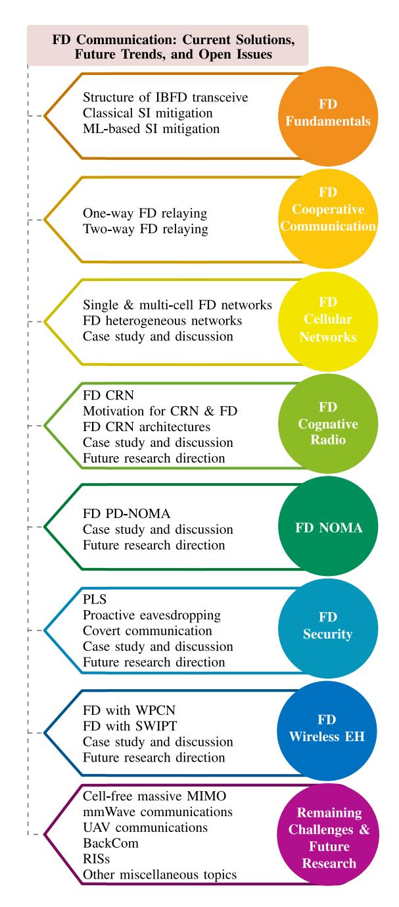

Fig. 1. Outline of the main contributions of this survey.

FD into cooperative communications. Sections IV and V elaborate on the interaction of FD with cellular networks and CRNs. Section VI discusses combining FD with NOMA. PLS approaches for FD wireless networks and proactive eavesdropping are described in Section VII. The state-of-the-art EH FD systems are detailed in Section VIII. Finally, Section IX lists potential future research directions, followed by conclusions in Section X.

*Notation:* We use bold upper case letters to denote matrices, and lower case letters to denote vectors. The superscripts  $(\cdot)^*$ ,  $(\cdot)^T$  and  $(\cdot)^H$  stand for the conjugate, transpose, and conjugate-transpose (Hermitian), respectively.  $\mathbb{C}^{L\times N}$  denotes a  $L\times N$  matrix;  $\mathbf{I}_M$  and  $\mathbf{0}_{M\times N}$  represent the  $M\times M$  identity

matrix and zero matrix of size  $M \times N$ , respectively;  $\operatorname{tr}(\cdot)$ ,  $\operatorname{Rank}(\cdot)$  and  $(\cdot)^{-1}$  denote the trace, rank, and the inverse operation. The zero mean circular symmetric complex Gaussian distribution having variance  $\sigma^2$  is denoted by  $\mathcal{CN}(0,\sigma^2)$ . Finally,  $\mathbb{E}\{\cdot\}$  denotes the statistical expectation.

#### II. FULL-DUPLEX FUNDAMENTALS

This section reviews how SI originates in FD nodes, the types of SI, and several SI cancellation techniques.

Before proceeding to FD, let us briefly review how HD systems work. Current fourth-generation and 5G wireless networks utilize frequency-division duplexing and time-division duplexing (TDD), which are HD. They separate UL and DL signals via orthogonal frequency and time slots, respectively [31]. However, this approach faces challenges in supporting future wireless networks. For instance, the performance of frequency-division duplexing is affected significantly due to channel state information (CSI) errors, inflexible bandwidth allocation, and guard frequency bands between the UL and the DL. Moreover, TDD can introduce delays in the MAC level, out-of-date CSI, and guard intervals between the UL and the DL. Thus, FD may overcome these bottlenecks while boosting the spectrum efficiency [31].

As mentioned before, the fundamental limit is the SI, which is the looping back of the transmitted signal of an FD node to the receiver antennas of itself [4], [27]. As SI may exceed the desired signal by 100 dB or more, there have doubts about the viability of FD networks. However, SI mitigation techniques have been widely developed [3], [4], [23]. Thus, the FD technology has attracted the interest of academia and industry as a 5G wireless enabler [3], [23], [27]. Recent advances keep the promise of nearly doubled channel capacity compared to conventional HD networks. For instance, improving SI cancellation while reducing bit error ratio is feasible [23]. The FD mode achieves either higher throughput or reduced outage probability compared to the HD mode [32], [33]. However, before delving into the costs and benefits of FD technology, we will discuss the fundamental, technical issues of SI.

# A. Structure of In-Band Full-Duplex Transceiver

Fig. 2 shows a generic transceiver, where both transmit and reception sides are limited to a single antenna. In the first stage, the digital-to-analog converter (DAC) converts the baseband data signal  $x_b[n]$  to its analog version  $x_b(t)$ , i.e., the baseband signal, which is then frequency shifted to radio-frequency (RF) signal,  $x_u(t)$ . This signal goes through the power amplifier, and its output,  $x_t(t)$ , is fed into the transmitter antenna. The received signal at the receiver antenna,  $y_r(t)$ , is then given as

$$y_r(t) = x_D(t) + x_{SI}(t) + n(t),$$
 (1)

where  $x_D(t)$  and  $x_{SI}(t)$  are the desired signal and the SI, respectively, while n(t) denotes the receiver noise. As seen, there are three distinct types of SI (Fig. 2) [34], and thus

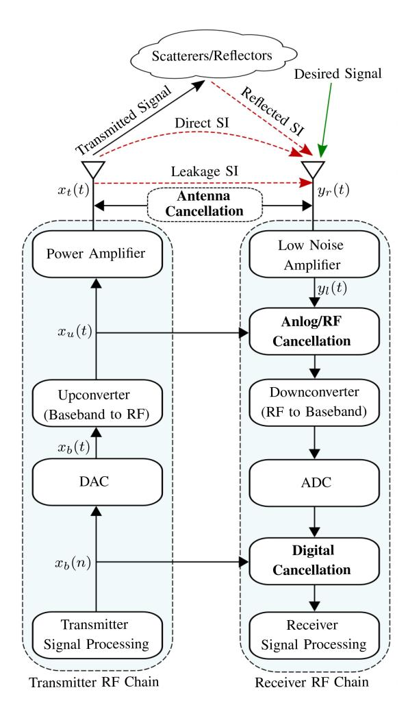

Fig. 2. A generic block diagram of an IBFD transceiver.

 $x_{SI}(t)$  can be further expressed as follows:

$$x_{SI}(t) = \underbrace{h_{SI}^{l} x_{t}(t - \tau_{l})}_{x_{SI}^{l}(t)} + \underbrace{h_{SI}^{d} x_{t}(t - \tau_{d})}_{x_{SI}^{d}(t)} + \underbrace{\sum_{m=1}^{M} h_{SI,m}^{r} x_{t}(t - \tau_{m})}_{x_{SI}^{r}(t)}, \qquad (2)$$

where  $x_{SI}^l(t),~x_{SI}^d(t)$ , and  $x_{SI}^r(t)$  represent the leakage SI, direct SI or spillover, and reflected SI, respectively. Here,  $h_{SI}^l,~h_{SI,m}^d$  denote the respective SI channels, while  $\tau_l,~\tau_d$ , and  $\tau_m$  represent the associated delays. Moreover, M is the number of multi-path components in the SI channel.

- Leakage SI: This occurs due to the insufficient isolation between the transmit and receive antennas in separated antenna designs (i.e., on-chip or on-board in dense antenna integration) and shared-antenna designs due to the circulator leakage or cross-talk (e.g., due to imperfect antenna matching) [3], [35]. However, leakage SI can be accurately characterized offline in an anechoic chamber and thus addressed in system design [3], [35].
- 2) Direct SI or Spillover: This comprises the signal propagating directly from the node's transmit antennas to

- its own receive antennas (especially in separate-antenna designs). These SI channels are usually modeled as line-of-sight (LoS) channels, e.g., Rician [36], [37]. Due to the short distance of the direct link between the transmit and receive antennas, the direct SI power exceeds the desired signal power by 104 dB in a wireless Fidelity system [3], [38].
- 3) Reflected SI: This is typically the non-line-of-sight (NLoS) reflections of  $x_t(t)$  from the external environment such as nearby objects/scatters. The reflected SI thus depends on environmental effects that are changing and unpredictable. Such multi-path reflection leads to frequency-dependent/selective SI channels. These channels can be modeled empirically or analytically. The empirical models of SI channels derived from measurements are only efficient and accurate in environments with the same specific characteristics as the measurements [39], [40], [41]. The analytical channel models are more attractive than empirical models, and the geometrybased statistical channel model is one of the most commonly used analytical channel models [42], [43], [44], [45]. These models are defined by the spatial location of the transmitter, receiver, and scatterers, which are described by the area form and spatial density of their occurrence. Typically, the reflected SI outpowers the desired received signal by 15 dB to 100 dB [38], [46]. The frequency selectivity and long propagation delay of reflected SI make analog-circuit-domain cancellation much more challenging.

Therefore, the cumulative impact of these three sources of SI can be substantial. Consequently, the implementation of effective SI cancellation techniques becomes imperative.

The SI cancellation can be done at different points in the transmitter and receiver chains (Fig. 2). For instance, replicating reference signals in the transmitter chain and subtracting the modified reference signal(s) in the receiver chain can cancel multi-path SI. Here, the frequency-dependent SI is canceled by additional signal delaying, while the frequency-independent SI is canceled by attenuation and phase shifting [34]. Further, choosing a reference signal from the transmitted signal which is as close to the antenna as possible is preferable since it has the most information, i.e., a signal distorted due to RF imperfections, such as phase imbalance, gain, and transmitter-generated noise and distortion.

On the other hand, if a reference signal is copied before it encounters these imperfections, for example, before the power amplifier, i.e.,  $x_u(t)$ , the dominating nonlinearities in those processes cannot be eliminated using that particular reference copy. Similarly, eliminating the SI early in the RF chain of the receiver is also beneficial since it reduces the demands on the receiver's front-end linearity, its ability to handle large signals, and the resolutions needed for the analog-to-digital converter (ADC). This emphasizes the importance of implementing SI cancellation near the antenna. However, providing extra SI cancellation at the digital baseband is still necessary, particularly to cancel the frequency-dependent SI.

Next, we briefly discuss the nonlinearity characteristics of the transmitter and the receiver RF chains.

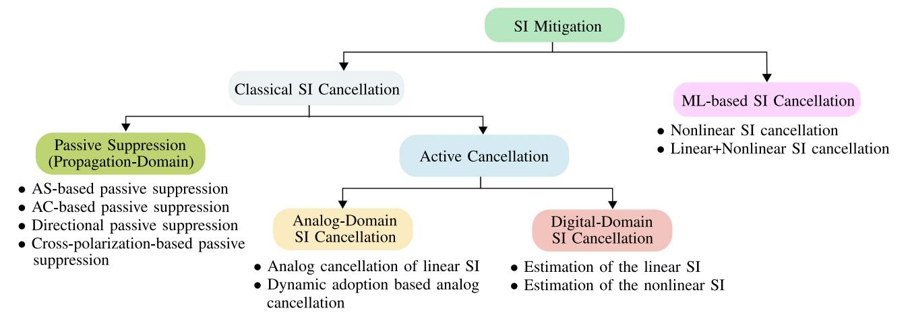

Fig. 3. SI mitigation techniques.

• Transmitter nonlinearity: The power amplifier, upconverter, mixer, and DAC all contribute to the overall nonlinearity of the transmitter [47], [48]. The power amplifier has strong nonlinearity when compared to the upconverter, mixer, and DAC, which dominates the transmitter nonlinearity. The effect of it and noise can be modeled by a memory polynomial model as [47], [48]

$$x_t(t) = x_t'(t) + w_t(t),$$
 (3)

where

$$x_t'(t) = \sum_{k=0}^{K_t} \int_0^{t_Q} r_{2k+1}(\tau) |x_u(t-\tau)|^{2k} x_u(t-\tau) d\tau,$$
(4)

where  $r_k(t) = a_k \delta(t - \tau)$ ,  $(2K_t + 1)$  is the maximum order of nonlinearity,  $t_Q$  the maximum depth of memory effect, and  $a_k$  is the complex coefficient associated with the memory polynomial model. Furthermore, the transmitter also has other imperfections, including phase noise from the local oscillator, quantization noise from the DAC, and inherent thermal noise from the transmitter circuit. An independent zero-mean Gaussian noise,  $w_t(t)$ , accounts for the combined effects of these transmitter imperfections [47], [48].

Receiver nonlinearity: This includes the strong nonlinearity of the low-noise amplifier and the relatively weak nonlinearities of the downconverter, mixer, and ADC in the receive chain [47], [49]. Because antenna cancellation (AC) might reduce the strength of the SI signal, the residual SI that enters the receive chain has low power compared to the received original SI signal. Thus, a power series can be employed to model the receiver's nonlinearity as [47], [49]

$$y_l(t) = \sum_{k=0}^{K_r} b_k y_r'(t) |y_r'(t)|^{2k},$$
 (5)

where  $y'_r(t)$  is the input signal to the low-noise amplifier after antenna SI cancellation and  $b_k$  is the complex coefficient of the low-noise amplifier nonlinear

model. Moreover,  $(2K_r + 1)$  Q is the receiver's order of nonlinearity, which is typically less than the power amplifier's nonlinear order, i.e.,  $K_r < K_t$ .

#### B. Classical Self-Interference Mitigation

As mentioned before, IBFD can theoretically double channel capacity compared to HD [4]. However, experimental channel capacity/throughput gains fall short of theoretical estimates. The main culprit is the SI, which reduces the signal-to-interference-and-noise radio (SINR). Although some SI may be tolerable [50], high SI may even result in less FD capacity than HD systems. Furthermore, SI can cause instability and oscillations within transceivers [51]. Hence, SI cancellation/suppression is the most critical factor to enable the FD paradigm [52].

Many classical SI cancellation techniques [14], [25], [36], [53], [54], [55], [56], [57], [58], as well as ML-based approaches [59], [60], [61], [62], [63], [64], [65], [66], have been developed as a consequence of the increased interest from academia and industry (Fig. 3). The main classical SI cancellation methods can be divided into two categories:

- 1) Passive suppression: The propagation domain techniques, which are passive, use physical methods to increase the propagation loss of the SI signal [25], [36], [53], [58]. They include antenna separation (AS), AC, directional antennas, cross-polarization, etc. (Section II-B1). However, signal reflections in the environment can reduce their effectiveness. For instance, the maximum cancellation in a reflective room is about 27 dB lower than in an anechoic chamber [16]. Therefore, an additional cancellation (i.e., 30 dB to 70 dB) is needed in the analog and digital domains to bring the SI down to the noise floor [25], [36].
- 2) Active cancellation: Analog- and digital-domain SI cancellations are active methods. The former can prevent the high-power SI caused by the ADC from desensitizing the automatic gain control of the transceiver. It requires either training sequence-based approaches or adaptive interference cancellation [53], [67]. However, it leaves residual SI, which becomes the rate-limiting

bottleneck, and hence additional digital cancellation is necessary [\[67\]](#page-44-38). As digital cancellation then must remove both linear and nonlinear residual SI components, it needs to know the delay and phase shift between *xt*(*t*) and *yr* (*t*). Thus, this process requires SI channel estimation [\[18\]](#page-43-17).

No stand-alone analog or digital technique can provide enough SI canceling capacity. Therefore, combining them is an option. Nevertheless, inevitable hardware imperfections, such as nonlinear distortions, non-ideal frequency responses of circuits, phase noise, and others, may limit SI cancellation, leaving a significant residual SI [\[18\]](#page-43-17), [\[58\]](#page-44-29).

As an FD radio transmits and receives simultaneously within the same frequency band, it receives both the desired signal and the SI signal. Because the latter propagates over the SI channel, its power is typically 50-100 dB higher than that of the desired signal. The strong SI signal will affect the automatic gain control unit in the ADC, which normalizes the input signal to the range [−1, 1] before digitization [\[68\]](#page-44-39). Consequently, the weak desired signal will be compressed to a small subregion of [−1, 1], which will be susceptible to severe quantization noise and drastically degrading the digital baseband SINR [\[68\]](#page-44-39). SI cancellation must significantly reduce SI strength before the receiver can decode the desired signal to overcome these limitations and leverage the potential benefits of FD [\[32\]](#page-44-3). One approach is predicting and modeling distortions caused by the transmitter RF chain, i.e., due to signal attenuation, circuit impairments, and many others, to compensate for them at the receiver. However, SI cancellation is far from a simple linear operation because the radio signal does not preserve its original baseband representation except for power scaling and frequency shifting [\[13\]](#page-43-12), [\[69\]](#page-44-40). In particular, both linear (i.e., caused by signal attenuation, ground reflections, etc.) and nonlinear (i.e., caused by circuit power leakage, non-flat hardware frequency response, higher order signal harmonics, etc.) distortions impact the SI cancellation performance [\[18\]](#page-43-17). For instance, the SI signal in an FD wireless Fidelity radio with an 80 MHz bandwidth, −90 dBm receiver noise floor, and 20 dBm transmit power consists of (i) the linear distortion of 20 dBm, (ii) the nonlinear distortion of −10 dBm, and (iii) the transmitter noise of −40 dBm [\[18\]](#page-43-17). Therefore, it is necessary to sufficiently mitigate these distortions to reduce the SI power to a level below the noise floor [\[18\]](#page-43-17).

The SI reduces the ability of the receiver to decode the data without errors. Thus, the SI power must be below the noise floor for both random transmitter noise and ADC errors. For example, to compensate for 110 dB SI over the noise floor, an FD device must get at least 60 dB of analog-domain cancellation plus 50 dB of digital-domain cancellation. However, these could be reduced due to hardware and/or other impairments. Thus, they can be combined with the passive techniques mentioned above [\[53\]](#page-44-24).

*1) Propagation-Domain (Passive SIS) SI Cancellation:* Several passive SIS methods exist [\[53\]](#page-44-24), [\[54\]](#page-44-25), [\[67\]](#page-44-38), [\[70\]](#page-44-41), [\[71\]](#page-44-42), [\[72\]](#page-45-0), [\[73\]](#page-45-1), [\[74\]](#page-45-2). They increase the path-loss of the SI signal by means of physical isolation or separation between the transmit and receive antennas of an FD node [\[15\]](#page-43-14). In particular, the EM coupling between the transmitter and receiver antennas can be decreased. Thus, they operate using orthogonal horizontal and vertical polarization [\[71\]](#page-44-42). As well, beamforming-assisted methods improve the physical separation between the transmit and receive antennas by directing their lobes in separate directions [\[54\]](#page-44-25), [\[67\]](#page-44-38). Additionally, the transmit and receive channels of a single FD antenna can be separated using isolation components such as circulators, producing an equivalent SI-attenuation effect [\[70\]](#page-44-41). Three main passive suppression techniques are:

- i) *AS-based passive suppression*: This increases the pathloss by increasing the distance between the transmit and receive antennas or adding shielding in the middle of them [\[67\]](#page-44-38), [\[75\]](#page-45-3), [\[76\]](#page-45-4). Although this method is simple to implement, it has limitations. For instance, it may not be feasible for mobile devices which have strict size requirements. It is commonly used in separate antenna designs, and the single-antenna transceiver does not provide comparable signal isolation for this method [\[14\]](#page-43-13), [\[77\]](#page-45-5).
- ii) *AC-based passive suppression*: AC uses two transmit antennas and a single receive antenna, with the transmit antenna pair being positioned *d* and *d* + λ/2 apart from the receive antenna, respectively, where λ is the wavelength [\[53\]](#page-44-24). The receive antenna is positioned such that its distance from transmit antennas is an odd multiple of λ/2, resulting in destructive interference. The destructive interference is most effective when the signal powers impinging on the receive antenna from the pair of transmit antennas are identical, theoretically resulting in a null at the receive antenna.
- iii) *Directional passive suppression*: This attempts to reduce the intersection between the main radiation lobes of the transmit and receive antennas [\[54\]](#page-44-25), [\[72\]](#page-45-0). This method can be used in cellular FD networks, where the BS first invokes RF cancellation, which partially suppresses the SI before it reaches the RF front-end of the receiver [\[38\]](#page-44-9).
- iv) *Cross-polarization-based passive suppression*: This is an additional mechanism for isolating the transmit and receive antennas electromagnetically [\[23\]](#page-43-22), [\[78\]](#page-45-6). Polarization decoupling operates the transmit and receive antennas with orthogonal horizontal and vertical polarizations. For example, a transceiver can be designed to transmit only horizontally polarized signals and receive only vertically polarized signals [\[23\]](#page-43-22), [\[78\]](#page-45-6). It thus improves the SI suppression capability.

*Takeaways and Potential Directions:* Passive SI cancellation attenuates SI signals but requires substantial transmit-receiver antenna separation, which may be infeasible. For instance, [\[67\]](#page-44-38) considers a 20 cm/40 cm cm antenna spacing, impractical for many mobile devices, with insufficient attenuation to reduce SI power significantly below the desired signal level. Consequently, these methods offer inadequate SI cancellation for error-free receiver operations. Moreover, increased antenna separation can compromise the quality of SI channel estimation, and distances beyond the optimal odd multiple of λ/2 may degrade achievable cancellation [\[53\]](#page-44-24).

Some passive suppression methods, like directional passive suppression, heavily rely on multi-antenna setups, rendering size-limited receivers incapable of sufficiently suppressing SI power. Additionally, certain passive suppression methods may have limited bandwidth, thereby reducing cancellation performance in wide-band systems. AC-based approaches, in particular, only ensure perfect phase inversion and cancellation at the central frequency, potentially failing to achieve the same across the entire bandwidth [\[53\]](#page-44-24). Despite the ideal antenna configuration for passive SIS involving maximum separation between transmit and receive antennas, such as placing them on opposite sides of a device, optimizing antenna configuration in compact devices remains challenging.

*2) Analog-Domain SI Cancellation:* The aforementioned passive SI suppression techniques may not sufficiently support high-integrity FD reception, as residual SI is often present. In an FD node, the received signal undergoes automatic gain control amplification, down-conversion to baseband frequency, sampling, filtering, and ADC conversion. However, even after passive cancellation, residual SI can still exceed the noise level. Hence, additional active SI cancellation modules are necessary to further reduce SI, either in the RF or analog/digital baseband stages [\[53\]](#page-44-24).

If the node can accurately estimate the SI leakage path, RF/analog cancellation becomes unnecessary. The low-power received samples can be subtracted from the reconstructed digital samples of the SI signal using methods like ZigZag decoding [\[79\]](#page-45-7). However, a high SI signal can overload the automatic gain controller, making it insensitive to weak desired signals compressed to a considerably lower range than [−1, 1]. The limitations of the ADC, such as dynamic range and quantization precision, are critical obstacles to achieving higher SI-isolation levels through digital cancellation [\[80\]](#page-45-8). Excessive SI power impacts the ADC, leading to quantization noise overwhelming the desired signal and resulting in a negative effective SINR, insufficient for recovering the desired signal in the digital baseband [\[17\]](#page-43-16). Therefore, reducing the SI signal's power prior to digitization is crucial. Analog cancellation techniques can achieve this, allowing the decontaminated digital samples to possess sufficient resolution for effective digital SI cancellation [\[53\]](#page-44-24). We next review the basics of analog cancellation techniques.

i) *Analog cancellation of linear SI component*: The linear SI component comprises most of the SI power. If a reference signal that is an exact duplicate of the SI signal in all instances can be generated, subtracting this replica from the received signal can result in a perfect SI cancellation [\[17\]](#page-43-16). Although such methods can work either at the RF or baseband stage [\[68\]](#page-44-39), the former is more common [\[17\]](#page-43-16), [\[53\]](#page-44-24), [\[67\]](#page-44-38). Moreover, they may be further classified into pre-mixer or post-mixer schemes depending on whether the perfect replica-based SI canceling signal is produced by processing the SI before or after up-conversion [\[17\]](#page-43-16), [\[67\]](#page-44-38). On the other hand, the baseband analog canceler uses the perfect replica-based canceling signal generated in the baseband [\[68\]](#page-44-39).

The analog linear SI cancellation process can be implemented using the subsequent three steps.

- *Creation of SI-inverse signal:* Implementing SI inversion in an FD node involves a signal phase reversal. However, this phase adjustment is limited in bandwidth, reducing the achievable cancellation. Inverted signals deviate from 180◦ on both sides of the central frequency, causing significant phase distortion despite perfect inversion at the center frequency. To address this issue, sophisticated hardware and circuit designs like balanced/unbalanced (balun) transformers and delay-line-based analog circuits can be employed [\[17\]](#page-43-16), [\[18\]](#page-43-17).
- *Delay and attenuation adjustment:* Since the transmit signal suffers attenuation and delay, the inverted SI must also undergo the same attenuation and delay. Thus, different technologies and techniques, such as the QHx220 noise cancellation chip and balun-aided cancellation, can be employed to impose an adjustable delay on the aggregated output signal [\[17\]](#page-43-16), [\[81\]](#page-45-9).
- • *Creating an SI-null by combining the SI and its inverse:* The SI-inverted signal with the received signal at the received antennas can be combined to create an SI null. Received signal strength indicator values indicate the remaining SI energy postcombining. In theory, a perfect SI-inverse signal would yield a zero SI value in the received signal strength indicator output. However, hardware imperfections like power leakage or non-flat frequency response of the balun result in residual SI power. Carefully adjusting attenuation using self-tuning algorithms can reduce it [\[17\]](#page-43-16).

However, simply subtracting the linear SI from the received signal using only the SI-inversion approach may not improve the decoding performance. The main reason is that an FD node only recognizes the clean digital representation of the baseband signal, not its processed counterpart transmitted over the air. Once the signal has been up-converted to RF, it becomes an unknown nonlinear function of the ideal source signal that has been distorted by unknown factors, such as the imperfections in the analog components used in radio transmit chains and their non-flat frequency response [\[18\]](#page-43-17). In particular, the SI cancellation circuits that simply subtract the transmit signal estimate without accounting for any nonlinear distortions cannot altogether cancel the SI and reduce it below the noise level. According to [\[18\]](#page-43-17), such circuits can only reduce SI power by up to 85 dB. Hence, nonlinear SI components caused by hardware imperfections or the time-variant environment must be considered while designing analog cancellation circuits.

1) *Dynamic adoption-based analog cancellation:* A timevariant environment with channel fading, transmit power, and other parameters may significantly contaminate the cancellation with nonlinear distortion [\[18\]](#page-43-17). As a result, the cancellation capacity may decrease as the environment changes since the previously designed SI cancellation parameters based on previous environmental conditions may no longer accurately represent the current SI. Hence, an FD node must be capable of swiftly modifying the analog circuit to respond to time-variant environments and provide a satisfactory cancellation performance. In particular, a scheme that adapts to channel variations must be implemented to provide cancellation circuits the capacity to rapidly and regularly update their parameters, i.e., phase and amplitude of the SI-inverse-based RF reference signal [17], [18]. In practical systems, both time-domain and frequency-domain solutions can eliminate nonlinear SI components in a time-varying channel.

Takeaways and Potential Directions: Invoking analog SI cancellation techniques after passive suppression can provide significant SI cancellation, e.g., up to dozens of decibels. However, there are many further challenges to address. For instance, the expensive hardware required to generate an accurate SI-inverse-based reference signal, the hardware's non-flat frequency response, and the dispersive and nonlinear nature of the SI channel limit the analog cancellation's performance/capability. The underlying trade-off between hardware costs and SI cancellation capability remains a practical obstacle, i.e., requiring a higher cancellation capability involves strict constraints on the precision of the hardware. Some analog cancellation techniques, such as the delay-line-based techniques, require a higher delay resolution accuracy. However, this is only possible at the expense of more complex and large-scale hardware circuits [18]. Some analog cancellation techniques, such as the delay-line-based techniques, require a higher delay resolution accuracy. However, this is only possible at the expense of more complex and large-scale hardware circuits. Hence, designing cost-efficient analog cancellation circuits with sufficiently high cancellation capabilities is yet to address.

On the other hand, in practical systems, hardware imperfections, such as low sensitivity and precision, severely restrict IS cancellation capability. To achieve a sufficiently high cancellation of both the linear and nonlinear SI components, an indepth analysis of analog cancellation circuits is thus required, considering the limitations imposed by hardware imperfections. Furthermore, while higher transmit power improves SI channel estimate, it unavoidably increases SI power, resulting in significant residual SI power [53]. Also, nonlinear distortion in cancellation circuits caused by high input power must be handled. More research is needed to establish appropriate analog SI cancellation techniques that combine transmit power control frameworks while developing low-distortion hardware design.

3) Digital-Domain SI Cancellation: Although an industry-grade balun circuit can lower the SI by 45 dB for a 40 MHz wide SI signal, the residual SI power can be as much as 45 dB higher than the noise floor even with passive suppression [17]. This still interferes severely with the desired signal, either due to residual multi-path SI echoes contaminating the desired signal or due to SI leakage imposed by hardware circuit imperfections. Consequently, the residual SI

after analog cancellation must be lowered further in the digital domain.

Digital cancellation is an active method in the digital domain and cancels the interfering signal after the ADC has quantized the received signal [68], [82]. The receiver achieves this by first extracting the SI, modulating it, then subtracting it from the received SI-contaminated signal. Coherent SI detection can also be used to recover the SI by correlating the received signal to the clean hypothetical regenerated SI-inversion-based reference signal available at the co-located FD transmitter's output [53]. This technique requires the receiver to estimate both the delay and phase shift between the transmitted and received signals using techniques such as the correlation peak-based algorithm for removing the SI signal.

When analog cancellation is insufficient, digital cancellation is an efficient, secure solution [53], [67]. However, since the transmitted signal deviates from the generated reference signal due to hardware imperfections, multi-path fading, and other impairments, subtracting the estimated signal rather than the clean signal might significantly improve digital cancellation capabilities. Digital cancellation has two critical parts: (i) estimating the SI channel and (ii) applying the channel estimation to the known transmitted signal to generate digital samples for removing the SI from the received signal [17]. To perform digital cancellation to eliminate residual SI power after analog cancellation, the SI signal components including leakage through the analog cancellation circuit and delayed reflections of the SI signal from the environment, must be estimated [18]. The residual SI can be classified as linear or nonlinear. The former accounts for the vast majority of SI power and can be approximated using least-square and minimum mean square error (MMSE)-based techniques, whereas the latter is caused by nonlinear distortions in imperfect analog cancellation circuits [83]. In particular, for high SI cancellation in the digital domain, the nonlinearity of the SI leakage channel must be accurately quantified. To accomplish this, the linear and nonlinear components can be estimated as follows: [18].

i) Estimation of the linear SI: The linear part can be modeled as a non-causal linear function of the known transmitted digital signal x[n]. The received sample y[n] can be modeled as a linear combination of up to k samples of x[n] before and after the time instant n, where k > 0 is a function of the SI leakage channel memory and given as [18]

$$y[n] = \sum_{p=1-k}^{k} x[n-p]h[p] + w[n],$$
 (6)

where h[n] and w[n] denote the SI channel attenuation and the additive noise at instant n, respectively. By defining  $\mathbf{y} = [y[0], \dots, y[n]]^{\mathrm{T}}$ ,  $\mathbf{h} = [h[-k], \dots, h[0], \dots, h[k-1]]^{\mathrm{T}}$ , and  $\mathbf{w} = [w[0], \dots, w[n]]^{\mathrm{T}}$ , the SI channel,  $\mathbf{h}$ , can be estimated as [18]

$$\hat{\mathbf{h}} = \left(\mathbf{A}^{\mathrm{H}}\mathbf{A}\right)^{-1}\mathbf{A}^{\mathrm{H}}\mathbf{y},\tag{7}$$

| Literature | Technique/Algorithm           | Transmit Power       | Carrier Frequency | Bandwidth         | Antenna Distance/Sepa-         | Cancella- tion | FD Gain     |
|------------|-------------------------------|-------------------------|----------------------|-------------------|-----------------------------------|-------------------|----------------|
|            |                               | Tower                   | rrequency            |                   | ration                            | Capacity          | Gum            |
| [53]       | AC                            | $0\mathrm{dBm}$         | $2.4\mathrm{GHz}$    | 5 MHz             | $2d + \lambda/2$                  | $60\mathrm{dB}$   | 1.84           |
| [67]       | AS                            | $-5\mathrm{dBm}$        | 2.4 GHz              | 625 kHz           | $20\mathrm{cm}$                   | $39\mathrm{dB}$   | _              |
|            | AS                            | $\sim 15  \mathrm{dBm}$ | 2.4 G112             | 025 KIIZ          | $40\mathrm{cm}$                   | $45\mathrm{dB}$   | -              |
|            | AS+Digital cancellation       | $-5\mathrm{dBm}$        | 2.4 GHz              | 625 kHz           | $20\mathrm{cm}$                   | $70\mathrm{dB}$   | -              |
|            | AS Digital cancellation       | $\sim 15  \mathrm{dBm}$ | 2.4 GHZ              | 020 KHZ           | $40\mathrm{cm}$                   | $76\mathrm{dB}$   | _              |
|            | AS+AC                         | $-5\mathrm{dBm}$        | $2.4\mathrm{GHz}$    | $625\mathrm{kHz}$ | $20\mathrm{cm}$                   | $72  \mathrm{dB}$ | _              |
|            |                               |                         | ~15 dBm              |                   | $40\mathrm{cm}$                   | $76  \mathrm{dB}$ | _              |
|            | AS+AC+Digital                 | $-5\mathrm{dBm}$        | $2.4\mathrm{GHz}$    | $625\mathrm{kHz}$ | $20\mathrm{cm}$                   | 78 dB             | -              |
|            | cancellation                  | $\sim 15  \mathrm{dBm}$ | 2.4 0112             | 025 K112          | $40\mathrm{cm}$                   | $80\mathrm{dB}$   | _              |
| [54]       | Directional diversity         | $12\mathrm{dBm}$        | $2.4\mathrm{GHz}$    | $20\mathrm{MHz}$  | $10 \mathrm{m} \& \ge 45^{\circ}$ | _                 | $1.6 \sim 1.9$ |
|            | Directional diversity         |                         |                      |                   | $20 \mathrm{m} \& \ge 90^{\circ}$ | _                 | $\geq 1.4$     |
| [55]       | Antenna nulling               | $-3\mathrm{dBm}$        | $530\mathrm{MHz}$    | $20\mathrm{MHz}$  | -                                 | $55\mathrm{dB}$   | $1 \sim 2$     |
| [86]       | Time-domain transmit          | $17\mathrm{dBm}$        | $2.4\mathrm{GHz}$    | $30\mathrm{MHz}$  | _                                 | $50\mathrm{dB}$   | -              |
|            | beamforming                   |                         |                      |                   |                                   |                   |                |
| [17]       | Balun cancellation            | $20\mathrm{dBm}$        | $2.4\mathrm{GHz}$    | 10-40 MHz         | $20\mathrm{cm}$                   | 113 dB            | 1.45           |
| [18]       | Circulator                    | $20\mathrm{dBm}$        | $2.4\mathrm{GHz}$    | 20-80 MHz         | _                                 | $110\mathrm{dB}$  | 1.87           |
| [87]       | Software-defined radio        | $20\mathrm{dBm}$        | $2.52\mathrm{GHz}$   | $20\mathrm{MHz}$  | -                                 | $103\mathrm{dB}$  | 1.9            |
| [88]       | Nested vector modulator 0 dBm |                         | 900 MHz              | $0.8\mathrm{MHz}$ | $75\mathrm{cm}$                   | $64\mathrm{dB}$   | _              |
| [85]       | Self-adaptive 11.2 dBm        |                         | $141\mathrm{GHz}$    | $14\mathrm{GHz}$  | _                                 | _                 | _              |
|            | cancellation                  |                         |                      |                   |                                   |                   |                |
| [84]       | Frequency-domain can-         | _                       | $28\mathrm{GHz}$     | $120\mathrm{MHz}$ | _                                 | 49 dB             | _              |
|            | cellation                     |                         |                      |                   |                                   |                   |                |

TABLE II
SUMMARY OF EXISTING CLASSICAL SI MITIGATION TECHNIQUES

where

$$\mathbf{A} = \begin{bmatrix} x[-k] & \cdots & x[0] & \cdots & x[k-1] \\ \vdots & \ddots & \vdots & \ddots & \vdots \\ x[n-k] & \cdots & x[n] & \cdots & x[n+k-1] \end{bmatrix}, (8)$$

and  ${\bf A}^{\rm H}$  is the Hermitian transpose of the matrix  ${\bf A}$ . Because the training matrix  ${\bf A}$  can be pre-computed, the algorithm's computational complexity can be significantly reduced.

ii) Estimation of the nonlinear SI components: After the above step, the residual nonlinear components can be decreased further. They have a power level typically 20 dB higher than the thermal noise [18]. So because the precise nonlinear function applied by an FD node to the baseband transmitted signal is difficult to estimate, a generic model based on Taylor series expansion can be used to approximate the nonlinear function in the digital baseband domain as [18]

$$y[n] = \sum_{m \in \text{ odd terms}, n = -k...,k} x[n](x[n])^{m-1} h_m[n],$$

where only the odd-order terms correspond to nonzero energy in the frequency band of interest [18]. The first term is the linear component that accounts for the vast majority of the SI power and can be approximated and canceled using the technique provided in (7). Furthermore, in practice, the higher order terms of (9) have a proportionately lower power since they are formed by the mixing of numerous lower order terms, each of which reduces the combined power [18]. Hence,

only a limited number of variables have to be considered for developing effective SI leakage channel estimation.

Takeaways and Potential Directions: Unlike analog cancellation, digital cancellation dynamically adjusts and effectively combats time-varying radio environments by estimating the per-packet SI leakage channel. It achieves robust residual SI power reduction, ideally below the noise floor, which is crucial for signal detection [18]. However, practical concerns persist, including the optimal trade-off between analog and digital cancellations, performance limitations due to practical imperfections, and more. While digital cancellation can significantly remove linear and nonlinear SI components, it cannot perform really well without analog cancellation [15]. Therefore, a hybrid of both approaches is necessary to cancel both types of SI components. However, there is a fundamental trade-off between the capabilities of these two. In hybrid designs, the digital SI cancellation depends on the efficiency of the analog cancellation, often decreasing as the latter increases. In some cases, digital cancellation may be unnecessary if analog cancellation performs sufficiently. Therefore, it is crucial to strike a balance between analog and digital cancellations for optimal overall performance.

Hybrid designs show promising potential but may encounter constraints due to practical impairments, such as limitations in performance caused by phase noise from local oscillators. Therefore, it is crucial to minimize the impact of practical impairments.

Table II summarizes the existing classical SI mitigation techniques, including their carrier frequency, bandwidth, SI isolation levels, and FD capacity gain. In sub-6 GHz, the carrier frequency and the bandwidth range from 0.5 GHz to 3.5 GHz, and 0.5 MHz to 100 MHz, respectively

[\[53\]](#page-44-24), [\[54\]](#page-44-25), [\[55\]](#page-44-26), [\[67\]](#page-44-38). In the mmWave frequency band, the carrier frequency ranges from 28 GHz to 150 GHz, and bandwidth ranges from 0.1 GHz to 15 GHz [\[84\]](#page-45-12), [\[85\]](#page-45-13). Similarly, all transmit powers fall within the range of mobile phone and sensor transmit power levels, i.e., −5 dBm to 20 dBm. These practical experiments and values confirm the applicability of SI cancellers for commercial applications.

# *C. Machine Learning-Based Self-Interference Mitigation*

ML solutions are emerging for SI cancellation and FD realization, alongside traditional SI mitigation methods [\[89\]](#page-45-14), [\[90\]](#page-45-15). This approach involves separate estimation of linear and nonlinear SI components. The linear SI is typically estimated using the least square (LS) method and subtracted from the received signal. The remaining signal, which represents the nonlinear SI, is then estimated using ML techniques and subtracted from the received signal for final SI cancellation [\[89\]](#page-45-14), [\[90\]](#page-45-15). Recent efforts in ML for SI cancellation and FD communication have shown promise, and their implications will be briefly discussed next.

In [\[59\]](#page-44-30) the use of neural network (NN) as an alternative to the classical polynomial-based nonlinear SI cancellation approach (Section [II-B3\)](#page-8-1), has been studied. It demonstrates through FD testbed measurement results that a simple feedforward NN can perform similarly to conventional nonlinear canceling techniques with remarkably low computational complexity. This method first estimated the linear component using the conventional LS method and subtracts it from the received signal. After that, the NN employs the Gradient Descent technique to estimate the final nonlinear SI component. The linear cancellation offers roughly 38 dB, while the nonlinear SI cancellation reduces the SI signal power by approximately 7 dB. Reference [\[60\]](#page-44-31) is the first work to present the hardware implementation of this method [\[59\]](#page-44-30).

In [\[61\]](#page-44-32), a deep recurrent NN is used to investigate the impact of nonlinear distortion and linear multi-path channels on digital SI cancellation performance. This NN can process arbitrary sequences of inputs with temporal coherence and handle linear (multi-path) and nonlinear (PA nonlinearity, phase noise) components perfectly even when transmit power is high. Reference [\[62\]](#page-44-33) employs a feed-forward NN for digital SI cancellation and designs an adaptive linear filter to extract features from the baseband transmitted signal (or feedback signal) as the NN's input. In a 30 dB interference-to-noise ratio regime, the proposed NN achieves a SI cancellation of 29 dB, which is 10 dB higher than the polynomial-based cancellation. Guo et al. [\[63\]](#page-44-34) implement a deep NN using back-propagation to model the non-linear SI. This method includes SI channel probing, channel data collection, and deep NN model training. The authors implement this system on a USRP SDR prototype testbed. This method offers up to 17 dB digital cancellation.

The study in [\[64\]](#page-44-35) explores the trade-offs of using different neural networks (NNs) for SI cancellation performance goals. It focuses on recurrent NN and complex-valued NN architectures and determines that the latter is more suitable for SI cancellation. When compared to polynomial cancellation, a complex-valued NN achieves a digital SI cancellation of 44.51 dB with 33.7 % and 26.9 % fewer floating-point operations and parameters, respectively. On the other hand, the recurrent NN only reduces the number of floating-point operations. Another study [\[65\]](#page-44-36) compares the performance of a real-valued NN and a complexvalued NN for digital SI cancellation. Complex-valued NNs with different activation functions, including holomorphic and non-holomorphic, are implemented and trained using the Levenberg-Marquardt algorithm. Simulation and measured data show that complex-valued NN outperforms real-valued NN when non-holomorphic activation functions are used, while both NN types yield similar cancellation performance with holomorphic activation functions.

The authors in [\[66\]](#page-44-37) present a hardware architecture for an NN-based nonlinear SI canceller and compare its performance to that of a conventional polynomial-based SI canceller. This NN canceller delivers 7 dB more SI cancellation while being 1.2 times smaller in area and costing 1.3 times more power. In [\[91\]](#page-45-16), deep unfolding is used to interpret cascaded nonlinear RF systems as model-based NNs. This viewpoint enables effective modeling of SI with in-phase/quadraturephase imbalance and power amplifier nonlinearity using backpropagation to tune complex-valued parameters. In comparison to the polynomial model, the proposed approach can reduce the number of model parameters and operations by 74 % and 79 % with a SI cancellation of about 44.5 dB.

In [\[92\]](#page-45-17), a nonlinear digital SI cancellation method based on support vector regression is proposed for integration with linear cancellation. For transmit power levels greater than 20 dBm, it outperforms polynomial-based nonlinear cancellation by 3 dB. Erdem et al. [\[93\]](#page-45-18) have also considered the integrated linear and nonlinear digital SI cancellation framework, with support vector regression as the nonlinear canceller. The resulting approach outperforms linear-only digital SI cancellation and nonlinear-only digital SI cancellation by 7 dB and 4 dB, respectively.

In [\[94\]](#page-45-19), [\[95\]](#page-45-20), the use of NNs to accelerate the tuning of multi-tap adaptive RF cancellers has been investigated. They also present the optimal NN network configuration that enhances the tuning speed of the cancellers, input data structures, and training dataset densities for optimizing performance. Their prototype, using a two-tap canceller, achieves average cancellation of 40 dB after 6 tuning iterations at 2.5 GHz. Tapio and Juntti [\[96\]](#page-45-21) model the power amplifier and low-noise amplifier nonlinearities using the Hammerstein– Wiener nonlinear system. This study compares linear cancellation, auto-regressive moving-average-based cancellation, and NN-based cancellation. Despite the higher computational complexity of NN-based cancellation, it outperforms the other approaches.

Two digital SI cancellation approaches based on deep NN architectures have been introduced in [\[97\]](#page-45-22): the time-invariant non-linear distortion method and the time-varying non-linear distortion method. The former separates non-linear distortion from linear SI propagation channel estimates, enabling the elimination of online training. The latter utilizes transfer learning and achieves superior SI cancellation with a limited number of online training symbols and epochs.

| Literature | Technique                                          | Transmit Power | Carrier Frequency | Bandwidth        | Cancellation Amount     | Dataset     |
|------------|----------------------------------------------------|-------------------|----------------------|------------------|----------------------------|-------------|
| [59]       | Feed-forward NN                                    | $10\mathrm{dBm}$  | $2.4\mathrm{GHz}$    | $10\mathrm{MHz}$ | $45\mathrm{dB^\dagger}$    | FD testbed  |
| [60]       | Feed-forward NN                                    | $10\mathrm{dBm}$  | $2.4\mathrm{GHz}$    | $10\mathrm{MHz}$ | $44.4\mathrm{dB^\dagger}$  | FD testbed  |
| [61]       | Recurrent NN                                       | 0 dBm- 35 dBm  | $2.472\mathrm{GHz}$  | 5 MHz            | $26\mathrm{dB^\dagger}$    | FD testbed  |
| [62]       | Feed-forward NN                                    | _                 | _                    | $20\mathrm{MHz}$ | $29\mathrm{dB^*}$          | Simulated   |
| [63]       | Deep NN                                            | <b>–</b>          | _                    | _                | $17\mathrm{dB^*}$          | SDR testbed |
| [64]       | Complex-valued NN Recurrent NN                     | 10 dBm            | $2.4\mathrm{GHz}$    | 10 MHz           | $44.51\mathrm{dB^\dagger}$ | FD testbed  |
| [65]       | Feed-forward complex-valued NN                     | _                 | _                    | _                | $60\mathrm{dB^\dagger}$    | SDR testbed |
| [91]       | Deep unfolding NN                                  | $10\mathrm{dBm}$  | $2.4\mathrm{GHz}$    | $10\mathrm{MHz}$ | $44.5\mathrm{dB^\dagger}$  | Simulated   |
| [92]       | Support vector regression                          | $20\mathrm{dBm}$  | $2.45\mathrm{GHz}$   | $50\mathrm{MHz}$ | $27\mathrm{dB^\dagger}$    | SDR testbed |
| [94], [95] | Feed-forward NN                                    | _                 | $2.5\mathrm{GHz}$    | $20\mathrm{MHz}$ | $40\mathrm{dB}^\dagger$    | Simulated   |
| [96]       | Hammerstein–Wiener model & NN                      | _                 | $2.4\mathrm{GHz}$    | $20\mathrm{MHz}$ | -                          | -           |
| [97]       | Time-invariant non-linear distortion-based deep NN | _                 | _                    | _                | $43\mathrm{dB^\dagger}$    | Simulated   |
|            | Time-varying non-linear distortion-based deep NN   |                   |                      |                  | $42\mathrm{dB}^\dagger$    |             |
| [98]       | Ladder-wise grid structure- based deep NN       | $10\mathrm{dBm}$  | $2.4\mathrm{GHz}$    | $10\mathrm{MHz}$ | $44.5\mathrm{dB}^\dagger$  | FD testbed  |
|            | Moving-window grid structure-                      |                   |                      |                  | $44.4\mathrm{dB^\dagger}$  |             |

TABLE III SUMMARY OF ML-BASED SI MITIGATION WORKS

In [\[98\]](#page-45-23), two innovative low-complexity NNs, i.e., the ladderwise grid structure and the moving-window grid structure, are presented to replicate the nonlinearity and memory effect introduced to the SI signal to achieve proper SI cancellation. The simulation results show that both cancellers achieve the same cancellation performance as the polynomial-based canceller while reducing complexity by 49.87 % and 34.19 %, respectively. For nonlinear SI cancellation, Elsayed et al. [\[99\]](#page-45-24) presented a novel NN structure known as the dual neurons*l* hidden layers NN. The simulation results demonstrate that the proposed SI canceller with *l* = 2 can reduce 60 % of the network parameters and FLOPs when compared to the polynomial-based canceller. In [\[100\]](#page-45-25), two hybrid NN architectures, namely hybrid-convolutional recurrent NN and hybrid-convolutional recurrent dense NN, are proposed. The former uses weight-sharing characteristics and dimensionality reduction to extract the memory effect and nonlinearity of the input signal. Whereas the latter exploits an additional dense layer to construct a deeper NN with low complexity. The study in [\[101\]](#page-45-26) proposes a channel-robust NN-aided adaptive SI cancellation scheme to estimate the nonlinear SI component over a time-varying SI channel with a pre-trained NN.

Table [III](#page-11-1) summarizes some of the existing ML-based SI mitigation works.

*Takeaways and Potential Directions:* While research on this subject is extensive, there are still opportunities to utilize ML for solving the SI problem. These methods provide advantages in accurately modeling nonlinear functions, resulting in improved nonlinear SI cancellation. However, the existing methods may still have practical limitations as the SI channel changes with time. Although the SI channel can be tracked using a variety of methods, including re-running the backpropagation training algorithms, it is essential to investigate and compare the computational complexity, convergence speed, and number of training samples required for each tracking method with the traditional SI cancellation methods, i.e., the polynomial-based SI cancellation technique. In addition, many existing ML-based SI cancellation approaches do not account for transceiver design and real-world transmission impairments, which could provide useful insights into practical implementation. Furthermore, the choice of a method is influenced by various factors, including the desired SI cancellation performance, system complexity, hardware feasibility, cost, convergence time, signal recovery, and more.

# III. COEXISTENCE OF FULL-DUPLEX AND COOPERATIVE NETWORKS

Cooperative networks involve a group of wireless nodes working together to improve overall quality and efficiency. These nodes collaborate and transmit data to achieve better signal quality, higher transmission rates, and more reliable communication. The simplest of such systems typically consists of a source node, one or more relay nodes, and a destination node. The source node initially sends data to the relay node, which then forwards the data to the destination node. The relay nodes may also cooperate with each other to improve transmission quality and reliability.

Multiple types of cooperative systems, such as cooperative diversity, cooperative beamforming, and user cooperation [\[102\]](#page-45-27), [\[103\]](#page-45-28), exist. Cooperative diversity involves the

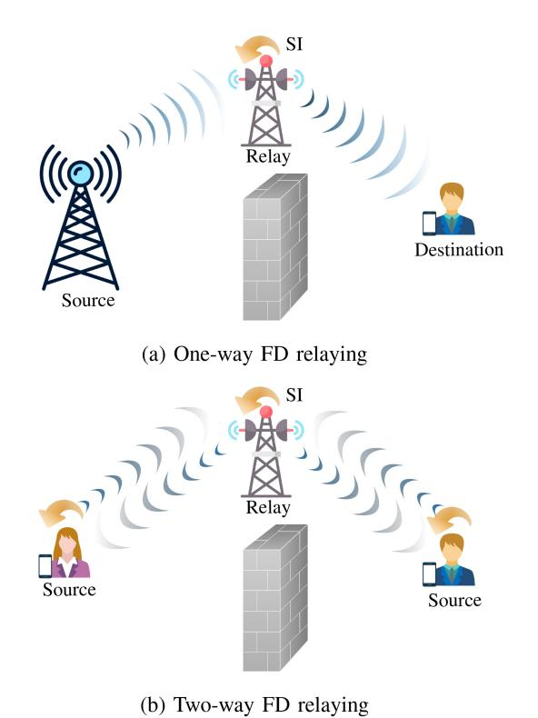

Fig. 4. FD cooperative communication.

simultaneous transmission of the same data by multiple wireless nodes at different times and/or frequencies, increasing the signal-to-noise ratio and reducing errors. Cooperative beamforming entails the simultaneous transmission of the same data by wireless nodes at different amplitudes and/or phases, focusing the signal on the receiver and reducing interference. Cooperative diversity involves resource sharing among multiple nodes, while cooperative beamforming utilizes intermediate nodes for multihop relaying [\[102\]](#page-45-27), [\[103\]](#page-45-28). Protocols like decode-and-forward (DaF), amplify-and-forward (AaF), and compressed-andforward (CaF) facilitate cooperative relaying. This approach exploits multipath diversity and enhances EE.

Cooperative systems are utilized in multiple applications such as wireless sensor networks, wireless mesh networks, mobile ad-hoc networks, and cellular networks. They enhance coverage, capacity, and reliability of communication in areas with weak or no wireless signal.

Cooperative one-way relaying systems [\[14\]](#page-43-13), [\[57\]](#page-44-28), [\[104\]](#page-45-29), [\[105\]](#page-45-30), [\[106\]](#page-45-31), [\[107\]](#page-45-32), [\[108\]](#page-45-33), [\[109\]](#page-45-34), [\[110\]](#page-45-35), [\[111\]](#page-45-36), [\[112\]](#page-45-37), [\[113\]](#page-45-38), [\[114\]](#page-45-39), [\[115\]](#page-46-0), [\[116\]](#page-46-1), [\[117\]](#page-46-2), [\[118\]](#page-46-3) and two-way relaying [\[119\]](#page-46-4), [\[120\]](#page-46-5), [\[121\]](#page-46-6), [\[122\]](#page-46-7), [\[123\]](#page-46-8), [\[124\]](#page-46-9), [\[125\]](#page-46-10), [\[126\]](#page-46-11), [\[127\]](#page-46-12), [\[128\]](#page-46-13), [\[129\]](#page-46-14), [\[130\]](#page-46-15), [\[131\]](#page-46-16), [\[132\]](#page-46-17), [\[133\]](#page-46-18) have already been investigated. In one-way HD relaying, a relay takes two-time slots to serve the destination. Whereas with one-way FD relaying, this can be done in just one, which theoretically doubles the SE (Fig. [4\(](#page-12-0)a)). However, if two-way communications exist between the source and destination nodes, all the nodes operate in FD mode and simultaneously transmit and receive data in the same frequency band. Therefore, FD wireless achieves high spectral gains relative to HD wireless.

## *A. One-Way Full-Duplex Relaying*

This subsection reviews notable contributions to FD cooperative systems. The critical design insights for one-way relaying and conclusions are outlined.

*1) Performance Analysis:* To accurately compare the FD and HD relaying, a diverse range of performance metrics have been investigated in the literature. In [\[104\]](#page-45-29), the FD-relay outage performance has been derived, where the residual SI channel is modeled as Rayleigh fading. Accordingly, the conditions of SNR and SIRs were derived, providing a basis to determine which type of duplex relay is superior under the target outage probability with arbitrary parameters. The fundamental capacity trade-off between FD and HD modes in a one-way cooperative AaF relay has been derived in [\[57\]](#page-44-28). This work concludes that the former outperforms the latter in practical signal-to-noise ratio (SNR) values. Different relay selection schemes assuming the availability of instantaneous information were proposed to enhance the performance of FD cooperative networks in [\[105\]](#page-45-30). The error performance and diversity behavior of the dual-hop FD relay systems under the effect of residual SI have been investigated in [\[106\]](#page-45-31). Upon deriving the pairwise error probability for the encoded system and tight bounds to the bit error rate of the coded systems, [\[106\]](#page-45-31) shows that FD relaying systems with a suitable precoder can attain the same diversity gain as their HD counterparts. To overcome the diversity limitation of the proposed relay selection, an optimal relay selection policy involving dynamic switching between FD and HD at the relays has been proposed in [\[105\]](#page-45-30). It outperforms conventional HDbased relay selection schemes and is a suitable relay selection policy for systems with FD and HD capabilities.

In [\[107\]](#page-45-32), selective DaF was proposed for an FD relay, which outperforms existing schemes in terms of outage in block Rayleigh-fading environments. Specifically, with selective DaF, the relay goes into a non-cooperative mode when the source-relay link is out. Therefore, the relay saves power, and the destination can attempt decoding from the direct source signal without unnecessary relay interference. The authors extended the system model and performance analysis of [\[107\]](#page-45-32) and proposed incremental selective DaF for FD relay networks [\[108\]](#page-45-33) to provide additional power savings, yet providing the same outage performance.

Chen et al. [\[109\]](#page-45-34) investigate bounds on the SE and EE for the FD relay channel with DaF, CaF, and AaF relaying with residual SI. It develops the optimal relay power control algorithm and derives the maximal SE in closed form. Considering the SE performance, this work elaborates on the conditions of employing FD relay, the criteria for selecting a relay scheme among DaF, CaF, and AaF schemes, and the conditions of adopting hybrid-duplex mode (which switched between the FD and HD mode) regarding residual SI strength. While proper Gaussian signaling (i.e., circularly symmetric zero-mean Gaussian signal with uncorrelated real and imaginary components) is the optimal choice for the interferencefree channels, improper Gaussian signals, where circularity and uncorrelated conditions can be relaxed, introduced for interference channel [\[134\]](#page-46-19). Since it has shown that improper Gaussian signaling can achieve higher degrees of freedom for a 3-user single-input single-output (SISO) interference channel, the authors in [\[110\]](#page-45-35) have studied its potential gains over proper one for DaF FD relay systems and in the presence of interference. This work derives exact integral form and analytical lower and upper bound expressions for the system's performance metric and shows that improper Gaussian signaling can outperform the proper Gaussian signaling in both FD and HD relaying systems.

*2) Beamforming and Spatial SI Mitigation:* FD relays can use multi-antenna arrays to provide more spatial degrees of freedom for SIS [\[14\]](#page-43-13), [\[104\]](#page-45-29), [\[111\]](#page-45-36), [\[112\]](#page-45-37), [\[113\]](#page-45-38). The authors in [\[104\]](#page-45-29) extended their work to the MIMO relay context [\[14\]](#page-43-13) and proposed new spatial SI mitigation techniques, including antenna and beam selection, null-space projection, and MMSE filtering. The errors in the side information used for SIS are thus the practical limitation preventing complete interference elimination. Suraweera et al. [\[111\]](#page-45-36) proposes joint precoding/decoding designs incorporating rank-1 zero-forcing (ZF) SIS at the relay node. This work assumes perfect CSI to develop a performance analysis framework. To strike a balance between the achievable performance gains and the implementation/computational complexity in multi-antenna FD relaying systems, different AS schemes with simple power allocation have been proposed and analyzed in terms of the outage probability. Shi et al. [\[112\]](#page-45-37) have extended the system model in [\[111\]](#page-45-36) to the more general multi-stream scenario and studies joint source-relay design (i.e., jointly design the source transmit beamforming and relay amplification matrix) to optimize the end-to-end achievable rate with the consideration of the relay processing delay. In [\[113\]](#page-45-38), the impact of the residual SI and co-channel interference at the relay and destination on the performance of the AaF FD relaying network is investigated with multi-antenna nodes by employing hop-by-hop ZF beamforming. The outage probability and ergodic capacity analysis in [\[113\]](#page-45-38) reveal that although the number of CCIs is increased in FD relaying systems compared to the conventional HD relaying systems, FD relaying can significantly improve the system performance. In [\[135\]](#page-46-20), precoding for low-latency communication through *N* IBFD MIMO relays is treated as a shortest-path problem. Thereby, an iterative dynamic programming-based algorithm for identifying the lowest-latency selection of precoders is proposed at the source and relays.

*3) Other Miscellaneous Designs:* Buffer-aided relay systems have emerged as a solution to mitigate information loss in relay schemes caused by poor channel conditions. These systems use buffers at the relays to prevent transmission drops when the source-relay channel capacity is exceeded but still higher than the relay-destination channel capacity. By storing and forwarding information as required, these systems enable more reliable communication between the source and destination [\[136\]](#page-46-21). Buffers to enhance the throughput of the FD relay networks have been investigated [\[114\]](#page-45-39), [\[115\]](#page-46-0), [\[116\]](#page-46-1). The key idea is an opportunistic relay mode selection between the buffering and forwarding according to the channel conditions. Buffers enable the FD relay to select adaptively either to receive, transmit, or simultaneously receive and transmit in a given time slot based on the qualities

of the receiving, transmitting, and SI channels such that the achievable data rate/throughput is maximized.

Massive MIMO offers significant benefits for FD relay networks by reducing the impact of noise, fast fading, and interference. This makes it an attractive solution to mitigate SI [\[117\]](#page-46-2), [\[118\]](#page-46-3). In an FD relay system with multiple singleantenna source-destination pairs (*K* > 1), Ngo et al. [\[117\]](#page-46-2) have demonstrated that massive relay antennas can substantially reduce the loop interference effect. Furthermore, compared to HD relaying, massive MIMO can increase the sum SE by 2*K* times and greatly reduce transmit power. Table [IV](#page-14-0) provides a summary of the existing literature on one-way FD relaying.

# *B. Two-Way Full-Duplex Relaying*

*1) Performance Analysis:* The average rate and outage performance trade-off of two-way and one-way relay networks with the AaF and DaF forwarding protocols under residual SI have been derived in [\[119\]](#page-46-4). This work concludes that the FD two-way relaying system can provide a higher average rate than its one-way counterpart, provided that the SI power is below a threshold. In [\[120\]](#page-46-5), the authors derived the closedform outage probability for FD two-way decode-and-forward (DaF) relay systems. They considered symmetrical and asymmetrical scenarios with different power allocation schemes. The relay node employed superposition coding to dynamically adjust the power allocation to different users to optimize system performance. The paper also proposed an optimal relay location strategy. Additionally, the authors provided asymptotic outage probabilities, highlighting the inability to infinitely increase transmit power due to residual SI caused by FD operation.

*2) Multi-User Two-Way Full-Duplex Relay Systems:* For practical multi-user environments, the system performance of the two-way FD relay system adopting the Max-Min scheduling algorithm under the independent but not identically distributed fading channels has been established in [\[122\]](#page-46-7). In contrast, [\[123\]](#page-46-8) studied the multi-user scheduling problem for the multi-user FD two-way DaF relay system based on the availability of CSI and system state information. Three scheduling schemes were investigated in terms of the system outage performance. With the full CSI, the system outage performance could be significantly improved under the Max-Min scheduling scheme. In addition, the performance of an FD multi-user two-way relay system with Rician distributed residual SI for different scheduling schemes, namely SINR-based scheduling, random scheduling, absolute channel power-based scheduling, hybrid scheduling, and normalized channel powerbased scheduling is analyzed under the impacts of channel estimation errors and user mobility was studied in [\[124\]](#page-46-9). The designed framework [\[124\]](#page-46-9) may be useful to provide the understanding for successful deployment of FD-enabled multiuser two-way relay systems with scheduling schemes under given system conditions such as user mobility, channel estimation errors, and SIS level. By employing very antenna array at the FD relay, multiple pairs of FD users can exchange information

TABLE IV SUMMARY OF ONE-WAY FD RELAYING LITERATURE

| Literature Relay Protocol |          |          | Multi-antenna |          | Technical Contribution |             |                                                                                                                                                                  |
|---------------------------|----------|----------|---------------|----------|------------------------|-------------|------------------------------------------------------------------------------------------------------------------------------------------------------------------|
| Literature                | DaF      | AaF      | CaF           | Source   | Relay                  | Destination | Technical Contribution                                                                                                                                           |
| [104]                     | <b>\</b> | -        | -             | -        | -                      | -           | Outage probability analysis and duplex mode assignment under the target outage probability with arbitrary parameters                                             |
| [57]                      | -        | <b>V</b> | -             | -        | -                      | -           | Determine capacity trade-off between FD and HD relaying and in presence of SI                                                                                    |
| [105]                     | -        | <b>~</b> | -             | -        | -                      | -           | Outage probability analysis for optimal and sub- optimal single relay selection policies                                                                      |
| [106]                     | -        | <b>V</b> | -             | -        | -                      | -           | Pairwise error probability and diversity analysis with and without direct source-destination link                                                                |
| [107]                     | <b>√</b> | -        | -             | -        | -                      | -           | Selective DaF relaying protocol design with outage probability analysis as well as transmit power optimization to minimize the outage probability                |
| [108]                     | <b>√</b> | -        | -             | -        | -                      | -           | Incremental selective DaF protocol design with outage probability analysis                                                                                       |
| [109]                     | <b>√</b> | <b>√</b> | <b>√</b>      | -        | -                      | -           | SE and EE analysis and then use the results to derive (approximate) optimal relay power and the corresponding SE in closed-form                            |
| [110]                     | <b>√</b> | -        | -             | -        | -                      | -           | Improper Gaussian signaling: Outage probability and ergodic rate analysis                                                                                        |
| [14]                      | -        | <b>√</b> | -             | <b>√</b> | <b>√</b>               | <b>√</b>    | Spatial domain SI cancellation: antenna and beam selection, null-space projection, and MMSE filtering                                                            |
| [111]                     | -        | <b>√</b> | -             | <b>√</b> | <b>√</b>               | <b>√</b>    | Low complexity joint precoding/decoding design for end-to-end SNR maximization and based on ZF SIS                                                               |
| [112]                     | -        | <b>√</b> | -             | <b>√</b> | <b>√</b>               | <b>√</b>    | Joint source transmit beamforming and relay processing to maximize achievable rate                                                                               |
| [113]                     | -        | <b>√</b> | -             | <b>√</b> | <b>√</b>               | <b>√</b>    | Transmit/receive ZF-based beamforming/combining design to maximize the overall SINR and suppress the SI and co-channel interference at the relay and destination |
| [114]                     | <b>√</b> | -        | -             | -        | -                      | -           | Analyzing the throughput of the buffer-aided relaying with selection relaying under statistical delay constraints                                                |
| [115]                     | <b>√</b> | -        | -             | -        | -                      | -           | Buffer-aided relaying with adaptive reception- transmission design at the relay under different power allocation                                           |
| [116]                     | <b>√</b> | -        | -             | -        | <b>√</b>               | -           | Virtual FD buffer-aided relaying: opportunistic relay selection and beamforming design                                                                           |
| [117]                     | <b>√</b> | -        | -             | -        | <b>√</b>               | -           | Multipair relaying: SI and interpair interference can- cellation via massive arrays at the relay                                                              |
| [118]                     | <b>√</b> | -        | -             | <b>√</b> | <b>√</b>               | <b>√</b>    | Multipair relaying: transceiver design and power allocation                                                                                                      |

at the same time and over the same frequency band [\[125\]](#page-46-10), [\[126\]](#page-46-11), [\[127\]](#page-46-12), [\[128\]](#page-46-13).

- *3) Beamforming and Spatial SI Mitigation:* The potential for SE improvement in beamforming design for twoway FD MIMO relaying systems has been investigated in [\[129\]](#page-46-14), [\[130\]](#page-46-15), [\[131\]](#page-46-16). For instance, the authors in [\[130\]](#page-46-15) studied the joint design of relay and receiving beamforming to minimize the mean square error (MSE) and SI cancellation. In [\[129\]](#page-46-14), instead of completely mitigating the SI, the end-to-end performance is maximized by jointly optimizing the beamforming matrix at the relay and power control at the sources. With a more practical scenario of imperfect CSI, precoding design at all nodes for SI cancellation is proposed in [\[131\]](#page-46-16).
- *4) Implications of Practical Design:* To fully exploit the advantages of the FD transceivers at the two-way relaying systems, practical conditions must be considered, such as limited power supply in mobile nodes, non-ideal power amplifier

and non-negligible circuit power consumption, and channel estimation. EE analysis in [\[132\]](#page-46-17) reveals that the maximum EE of FD two-way relay is more sensitive to power amplifier efficiency than it is to SIS. Channel estimation problem in a two-way FD relay system has been studied in [\[133\]](#page-46-18), where a one-block training scheme is proposed to estimate the SI channel at both sources. This study then implements the matched filter detector and Viterbi equalizer to cancel the SI. A summary of the existing works on two-way FD relaying systems is shown in Table [V.](#page-15-1)

*5) Two-Way FD Relaying and Network Coding:* Network coding enables nodes in a network to perform operations beyond forwarding and replication of data packets, enhancing the performance of cooperative networks. Physicallayer network coding and analog network coding have been proposed for improving cooperative network throughput [\[137\]](#page-46-22), [\[138\]](#page-46-23). In physical-layer network coding, a bit-level

| Literature   | Relay Protocol |          | Multi-antenna |          |          | Technical Contribution |                                                          |
|--------------|----------------|----------|---------------|----------|----------|------------------------|----------------------------------------------------------|
| Literature   | DaF            | AaF      | CaF           | Source   | Relay    | Destination            | Technical Contribution                                   |
| [119]        | <b>√</b>       | <b>√</b> | -             | -        | -        | -                      | Evaluation of outage performance and average rate trade- |
|              |                |          |               |          |          |                        | offs with physical and analog network coding             |
| [120]        | <b>√</b>       | -        | -             | -        | -        | -                      | Outage performance with optimal power allocation and     |
|              |                |          |               |          |          |                        | relay placement                                          |
| [121]        | <b>√</b>       | -        | -             | -        | -        | -                      | Bit error rate, ergodic capacity, and outage probability |
|              |                |          |               |          |          |                        | analysis with relay selection                            |
| [122]–[124]  | <b>√</b>       | <b>√</b> | -             | -        | -        | -                      | Multi-user scheduling                                    |
| [125]–[127]  | -              | <b>√</b> | -             | -        | <b>√</b> | -                      | Multipair relaying via very large antenna array at relay |
| [128]        | <b>√</b>       | -        | -             | -        | <b>√</b> | -                      | Multipair relaying, performance analysis and power allo- |
|              |                |          |               |          |          |                        | cation                                                   |
| [129]        | -              | <b>√</b> | -             | <b>√</b> | -        | -                      | Joint relay beamforming design and sources power control |
| [130], [131] | -              | <b>√</b> | -             | <b>√</b> | <b>√</b> | ✓                      | Joint design of relay beamforming matrix and receive     |
|              |                |          |               |          |          |                        | beamforming matrices at sources                          |
| [132]        | <b>√</b>       | -        | -             | -        | -        | -                      | EE maximization under practical non-ideal hardware con-  |
|              |                |          |               |          |          |                        | ditions                                                  |
| [133]        | _              | <b>\</b> | _             | _        | _        | -                      | ML estimator design to estimate the cascaded channel and |

TABLE V SUMMARY OF TWO-WAY FD RELAYING LITERATURE

XOR operation combines two symbols to generate a new symbol, which is transmitted at maximum power. In two-way FD relaying systems, the relay decodes received symbols from source nodes A and B, applies physical-layer network coding to re-encode the data towards destinations B and A, and the desired data is recovered at nodes A and B using the same XOR operation [\[119\]](#page-46-4). Analog network coding involves the relay decoding the received signal from nodes A and B, transmitting a linear combination of the data streams with different power allocations, and the mixed signal at the destinations is decoded by subtracting known signals and back-propagating the SI signal before decoding [\[119\]](#page-46-4). This work also derives the average rate and outage probability of two-way FD relaying with physical-layer network coding and analog network coding. It is worth exploring the impact of back-propagating SI on system performance in future research.

# IV. COEXISTENCE OF FULL-DUPLEX AND CONVENTIONAL CELLULAR NETWORKS

# *A. Single- and Multi-Cell Full-Duplex Cellular Networks*

Legacy HD cellular networks divide the time and frequency resources between the forward and reverse links. However, new trends in wireless networks, such as the smart city paradigm and multimedia services, where DL and UL traffic must be processed simultaneously and without delay, call for revisiting this approach. The FD mode provides the forward and reverse links the opportunity to utilize the complete resources, accommodating new traffic demands simultaneously. FD modes include bidirectional FD and three-node FD (TNFD) modes [\[3\]](#page-43-2) (Fig. [5\)](#page-15-2). In bidirectional FD, both nodes, i.e., the UE and the BS, have FD capabilities. In contrast, TNFD involves three nodes, but only the BS has FD capabilities, and the UEs operate in HD mode. Nevertheless, concurrent UL and DL operations in the same band introduce additional inter-cell and intra-cell interference (inter-BS and inter-UE), which may substantially hinder the potential gains of FD cellular networks [\[24\]](#page-43-23), [\[139\]](#page-46-24).

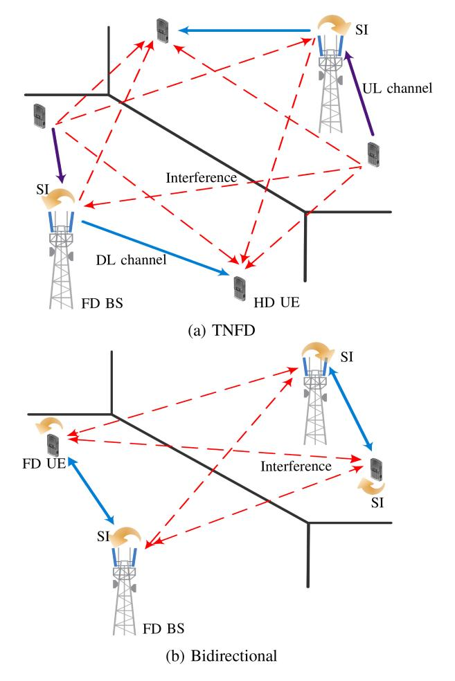

Fig. 5. FD cellular networks.

In FD cellular networks, coordination mechanisms are essential to reduce inter-UE interference (which depends on the UE locations and their transmit power levels) and preserve the SE. UE pairing/scheduling, frequency channel selection, and power control algorithms are effective solutions to manage interference in these networks. Frequency channel selection determines which UEs should be scheduled for simultaneous UL and DL transmissions on specific frequency channels [\[24\]](#page-43-23), [\[139\]](#page-46-24). In bidirectional FD cellular systems, asymmetric traffic scenarios further complicate user scheduling decisions. More specifically, one scheduled FD UE might have active traffic in only one direction at an instant. Thus it would be more efficient to schedule another UE to take advantage of the opposite direction. The literature proposes deploying short-range architectures, such as small-cell (e.g., picocells) systems, to make the SI cancellation more manageable in the FD BSs [\[139\]](#page-46-24). Note that applying FD over macrocells is not a good candidate scenario because macro BSs have large transmit power for the coverage requirement. Therefore, above 140 dB SIS is required to bring down the transmission signal to a level of −100 dB for the macro BSs transmitting at 46 dBm, which imposes huge infrastructure costs to the operators [\[3\]](#page-43-2). Cross-link interference, i.e., BS to BS, is the other limiting limitation in multi-cell FD networks, restricting the UL performance. However, using low-complexity beamforming techniques, study [\[140\]](#page-46-25) demonstrates that it may be minimized and that FD and dynamic TDD can significantly boost the capacity of multi-cell FD networks. The appealing advantages of FD have attracted enormous research attention on FD cellular networks from various aspects and/or under different setups.

*1) Performance Analysis:* Performance of the TNFD cellular network has been studied in [\[141\]](#page-46-26), [\[142\]](#page-46-27), [\[143\]](#page-46-28), [\[144\]](#page-46-29), [\[145\]](#page-46-30), leveraging tools from stochastic geometry. These studies yield insights into the system-level gains of the network throughput of FD in comparison to HD. In [\[146\]](#page-46-31), a socalled α-duplex scheme was proposed for TNFD networks and demonstrated its superiority. It has an FD BS, HD UL mode, or HD DL mode in different frequency bands. In [\[147\]](#page-46-32), a hybridduplex network with directional transmission and reception was investigated, where an FD BS may serve one FD user or two HD users, i.e., this network comprises both bidirectional and TNFD modes. It was shown in [\[147\]](#page-46-32) that serving two HD users is more beneficial than serving one FD user under imperfect SI cancellation, which coincides with the results in [\[146\]](#page-46-31).

To support multiple UEs in DL and UL directions, the FD BS can deploy a large antenna array with low-complexity linear ZF and maximal-ratio transmission (MRT)/maximalratio combining (MRC) processing schemes [\[148\]](#page-46-33). This work reveals that when the BS increases the number of antennas (e.g., massive MIMO) and transmits with low power to maintain a given QoS for the DL UEs, SI power can be significantly reduced. Moreover, FD multi-cell MIMO networks have been studied in [\[149\]](#page-46-34), [\[150\]](#page-46-35), [\[151\]](#page-46-36). Bai and Sabharwal [\[149\]](#page-46-34) analyzed the asymptotic UL and DL ergodic rates with singleantenna FD and HD UEs employing low-complexity linear receivers and precoders. Study [\[150\]](#page-46-35) proposes an analytical framework for the TNFD massive MIMO case using low-resolution ADCs and DACs, demonstrating that optimal power scaling and increased antennas at FD BSs can eliminate intra-cell, inter-cell, and FD inter-user interference. Khojastepour et al. [\[151\]](#page-46-36) investigated UL-DL interference, employing spatial interference alignment and providing a closed-form characterization of FD's multiplexing gain in such networks.

*2) User Scheduling and Resource Allocation:* The studies in [\[152\]](#page-46-37), [\[153\]](#page-46-38), [\[154\]](#page-46-39), [\[155\]](#page-46-40), [\[156\]](#page-46-41), [\[157\]](#page-46-42) examine these to alleviate the impact of inter-cell and intra-cell interference. Particularly, in [\[152\]](#page-46-37), a MAC protocol (called asymmetrical duplex) has been developed to support the coexistence of FD AP and HD UEs efficiently. The authors in [\[153\]](#page-46-38), proposed a joint subcarrier assignment and power allocation algorithm to maximize the sum-rate performance of a single-cell cellular network with FD-enabled BS and multiple FD UEs. A suboptimal user pairing and time-slot allocation algorithm have been proposed for the single-cell cellular network with FD BS and HD UEs [\[154\]](#page-46-39). Moreover, the length of the time slot allocated to each user pair and users' UL and DL data rates were optimized. In [\[155\]](#page-46-40), the joint problem of user UL/DL frequency channel pairing and power allocation in TNFD cellular networks was considered, where the minimum SE of the UE with the lowest achieved SE is maximized. The results in [\[155\]](#page-46-40) indicated that the optimization of the assignment and power allocation should be solved jointly; otherwise, a random allocation with equal power allocation achieves a similar performance.

Goyal et al. [\[156\]](#page-46-41) proposed to deploy the combination of FD cells and HD cells to address the interference issue. This work thus develops distributed resource allocation, i.e., joint user selection and power allocation for a TNFD multicell system, proposing an intelligent scheduling algorithm to enable BSs to switch between FD and HD modes depending on the network condition. Wen et al. [\[157\]](#page-46-42) studied the EE-SE trade-off for TNFD-enabled cellular networks. Cirik et al. [\[158\]](#page-46-43) addressed the design of transmit and receive filters to maximize the sum-rate in a bidirectional multi-cell FD MIMO network, considering self-interference at BSs and UEs, as well as cochannel interference between all nodes. In [\[159\]](#page-47-0), the deployment of FD in a dense-urban multi-cell network is studied, proposing a Madrid-grid deployment paradigm. User selection and power control algorithms are introduced, emphasizing the importance of neighboring BSs' scheduling and power decisions. Bishnu et al. [\[160\]](#page-47-1) investigated the bit error rate and SE performance of a multi-cell multi-user FD-enabled IAB network, studying both intra-cell interference scenarios. It also proposes a user selection method utilizing cross-correlation of RF precoder weights to mitigate intra-cell interference. In [\[161\]](#page-47-2), an optimal queue-aware joint scheduling and power allocation algorithm for FD networks in a multi-cell scenario is developed, considering both indoor and outdoor transmissions to investigate the benefits of multi-cell FD over HD counterparts. The authors further highlight the importance of inter-cell cooperation in resource scheduling, revealing that, depending on the scenario, interference mitigation from inter-cell cooperation can increase user performance in terms of throughput and waiting delay.

Table [VI](#page-17-0) summarizes a number of existing contributions to FD single-tier cellular networks.

TABLE VI SUMMARY ON TECHNICAL CONTRIBUTION TO FD-ENABLED CELLULAR NETWORKS

| Literature | Торо        | ology      | Technical Contribution                                                             |
|------------|-------------|------------|------------------------------------------------------------------------------------|
| Literature | Single-cell | Multi-cell |                                                                                    |
| [141]      | -           | <b>√</b>   | Analyze DL and UL throughput for FD cellular networks using stochastic             |
|            |             |            | geometry with a suboptimal resource allocation algorithm                           |
| [142]      | <b>√</b>    | -          | UL and DL achievable rate analysis for an FD cellular using tools from             |
|            |             |            | stochastic geometry and beamforming design at the FD BS                            |
| [143]      | -           | <b>√</b>   | Quantify the performance gain of FD network over HD network under                  |
|            |             |            | asymmetric bidirectional traffic demands and non-ideal SIS                         |
| [144]      | -           | <b>√</b>   | Analyze the success probability and SE of FD MIMO small-cell networks              |
|            |             |            | using tools from stochastic geometry                                               |
| [145]      | -           | <b>√</b>   | Analyze average sum-rate of a cloud-radio access network with randomly             |
|            |             |            | distributed multiple antenna UL and DL remote radio heads under optimum            |
|            |             |            | and sub-optimum beamforming design and power allocation design                     |
| [146]      | -           | <b>√</b>   | Propose $\alpha$ -duplex scheme, which allows a partial overlap between the UL and |
|            |             |            | the DL frequency bands and employs pulse-shaping and matched filtering to          |
|            |             |            | suppress the negative impact of cross-mode interference                            |
| [147]      | -           | <b>√</b>   | Study the impact of directional antennas on the interference mitigation in         |
|            |             |            | TNFD and bidirectional FD cellular networks                                        |
| [148]      | ✓           | -          | SE and the EE performance analysis for FD small cell systems with massive          |
|            |             |            | MIMO and linear processing with over allocation design                             |
| [152]      | <b>√</b>    | -          | Propose a MAC protocol called A-Duplex to support a wireless LAN with a            |
|            |             |            | FD AP and HD clients                                                               |
| [153]      | <b>√</b>    | -          | Joint subcarrier assignment and power allocation in an FD OFDMA network            |
|            |             |            | to maximize the sum-rate performance                                               |
| [154]      | ✓           | -          | Joint user scheduling, time-slot allocation, and power control problem for a       |
|            |             |            | time-division cellular network to maximize the system throughput                   |
| [155]      | ✓           | -          | Joint frequency channel selection and transmit power allocation for a TNFD         |
|            |             |            | cellular network to maximize the SE of the user with the lowest achieved SE        |
| [156]      | -           | ✓          | distributed resource allocation, i.e., joint user selection and power allocation   |
| 54.55      |             |            | for an FD cellular system                                                          |
| [157]      | <b>√</b>    | -          | Investigate fundamental EE-SE tradeoff for FD enabled cellular networks            |
| 51.503     |             |            | under constant and linear residual SI model                                        |
| [158]      | -           | ✓          | Design of transmit and receive filters to maximize the sum-rate in a bidirec-      |
| E1.507     |             |            | tional multi-cell FD MIMO network                                                  |
| [159]      | -           | ✓          | User selection and power control algorithm design, emphasizing the impor-          |
| F1.601     |             |            | tance of neighboring BSs' scheduling and power decisions                           |
| [160]      | -           | ✓          | investigated the bit error rate and SE performance of a multi-cell multi-user      |
| F1./17     |             |            | FD-enabled IAB network                                                             |
| [161]      | -           | ✓          | Optimal queue-aware joint scheduling and power allocation algorithm design         |

# *B. Full-Duplex Heterogeneous Cellular Networks*

The exponentially increasing mobile traffic has led to the adoption of heterogeneous cellular networks (HetNets), which depart from the traditional high-power tower-mounted BSs to include a range of network elements such as microcells, picocells, femtocells, and distributed antenna systems. By deploying these elements with varying transmit power, coverage area, physical size, backhaul, and propagation characteristics, HetNets offer numerous opportunities for capacity improvement. However, this shift also presents new challenges in co-existence and network management. These are also known as multi-tier cellular networks, since they comprise different classes of BSs, including inexpensive and low-power small-scale BSs that can be added to existing networks [\[162\]](#page-47-3).

Most of the initial HetNet studies have assumed HD wireless nodes. As FD wireless matures, this situation has changed. Consequently, the performance gains of FD HetNets have been studied in [\[163\]](#page-47-4), [\[164\]](#page-47-5), [\[165\]](#page-47-6). The main advantages of FD HetNets over HD HetNets are flexible spectrum usage, a significant increase in the number of connected devices, and a high volume of data traffic. However, imperfect SI cancellation and extra cross-interference between the UL and DL caused by simultaneous transmissions and co-channel deployment will create some levels of SI, co-tier, and cross-tier interference. This mutual-influenced interference constricts the promising performance gains. Therefore, interference management from the different perspectives of user scheduling, duplex-mode selection, and power control are proposed for FD HetNets.

In [\[163\]](#page-47-4) a hybrid-duplex HetNets has been proposed, where multi-tier networks consist of a mixture of APs, operating either in bidirectional FD mode or DL HD mode. The authors unveiled that in terms of the total throughput of two-tier HetNets, making different-tier networks operate in different duplex modes can enhance the throughput. Study [\[164\]](#page-47-5) shows that in multi-tier FD networks, TNFD topology can achieve close performance compared to the bidirectional that have efficient SIS if multi-user diversity and UEs scheduling are exploited. If the FD UEs in the bidirectional scheme have poor SIS, the TNFD achieves a better performance. The study [\[165\]](#page-47-6) proposes to deploy massive MIMO macrocell BSs to relax the coverage reduction due to the high power transmissions of macrocell BSs, and FD small-scale BSs to improve spectrum efficiency. This study concludes that the low-power small-scale BSs are an ideal host for the FD transceivers, as the SI becomes more manageable compared to the high-power macrocell BSs.

HetNets display various UL and DL asymmetries due to channel quality, hardware limitations, traffic volume, and coverage. Macrocells, with higher transmit power, offer greater DL coverage compared to small cells. However, in the UL, all UEs transmit at the same power regardless of the BS type, exacerbating the UL and DL coverage asymmetry. Additionally, there is a significant traffic asymmetry between the UL and DL due to the popularity of social networking services, gaming, multimedia, and the widespread use of wireless applications. Consequently, the dynamic allocation of UL and DL resources becomes essential to address these imbalances. A new proposed trend in cell association of decoupled user association in FD HetNets can offer substantial SE improvement over the HD counterpart. Decoupled user association breaks the constraint that UEs must be associated with the same BSs in UL and DL [166], [167]. Therefore, UEs associated with a specific macrocell BS/small-scale BS in DL may prefer to access a geometrically closer macrocell BS/small-scale BS in UL for stronger signal strength and lower interference.

Decoupled user association in FD HetNets has been widely explored [167], [168], [169], [170], [171], [172], [173], [174], [175], [176], [177]. Elshaer et al. [167] perform a simulationbased study on two-tier HetNets, where the UL association is based on minimum path-loss, while the DL association is based on the DL received power. A comprehensive SINR and rate analysis with decoupled user association in a multi-tier cellular network with spatially random BSs and UEs is conducted in [168]. The UL coverage probability of a two-tier random heterogeneous cellular network with decoupled user association has been studied in [169], and this work evaluates the gain of the decoupled user association over a conventional coupled user association scheme. The results in [170] shows that to maximize the mean rate utility of multi-tier FD cellular networks, the UEs should associate with their nearest BSs in UL and to the BSs that result in the maximum received power in DL. The authors in [171] proposed a decoupled rate optimal user association scheme and then derived the tight lower bounds on the FD links' maximum UL and DL rates.

Sattar et al. [172] characterize an FD two-tier heterogeneous network with decoupled user association, where both tiers operate on different frequency bands, i.e., millimeter wave and microwave. In [173], resource allocation and user association were jointly optimized, and the performance of different resource allocation schemes and user association rules were analyzed. In [174], a joint dynamic TDD and decoupled user association access statistical model was proposed based on a geometric probability approach to address UL and DL throughput degradation challenges. The authors in [175] investigated the performance of decoupled user association in device-to-device underlay HetNets, where a joint cell association, subchannel allocation, and power control problem for

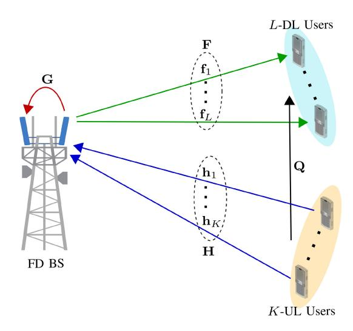

Fig. 6. An FD cellular communication system.

UL network sum-rate maximization has been studied. The authors in [176] developed a contract-theory-based distributed approach for decoupled user association in FD HetNets. A resource allocation framework for subchannel and power allocation is proposed in [177] to maximize the sum-rate in the multi-tier HetNets with decoupled user association. Table VII summarizes a number of existing contributions to FD multi-tier cellular networks.

#### C. Case Study and Discussion

In this subsection, we present a numerical/simulation example to investigate the impact of SI cancellation.

We consider a network of an FD-BS with M transmit antennas and N receiver antennas, K-HD UL users, and L-HD DL users, as shown in Fig. 6. Each channel is static during a coherence block. We denote  $\mathbf{F} = [\mathbf{f}_1, \dots, \mathbf{f}_L] \in \mathbb{C}^{M \times L}$ ,  $\mathbf{H} = [\mathbf{h}_1, \dots, \mathbf{h}_K] \in \mathbb{C}^{N \times K}$ , and  $\mathbf{Q} = [\mathbf{q}_1, \dots, \mathbf{q}_L] \in \mathbb{C}^{K \times L}$ as the DL channel matrix from the BS to the DL users and the UL channel matrix from the UL users to the BS, and the channel matrix from the UL user to the DL users, respectively. The desired data signal channels, F and H, are modeled as Rayleigh fading. In particular,  $\mathbf{f}_l \sim \mathcal{CN}(\mathbf{0}, \zeta_{f_l} \mathbf{I}_M)$ ,  $\mathbf{h}_k \sim \mathcal{CN}(\mathbf{0}, \zeta_{h_k} \mathbf{I}_N)$ , and  $\mathbf{q}_l \sim \mathcal{CN}(\mathbf{0}, \operatorname{diag}(\zeta_{q_{1l}}, \dots, \zeta_{q_{Kl}}))$  are the channel vectors for the lth DL user, the kth UL user, and from the K-UL users to the *l*th DL user, respectively, where  $\zeta_{f_l}$ ,  $\zeta_{h_k}$ , and  $\zeta_{q_{kl}}$ represent the respective path-losses. The SI channel matrix,  $\mathbf{G} \in \mathbb{C}^{M \times N}$ , is modeled as Rician fading with  $K_R$  Rician factor [37]. The SI channel is composed of two parts: (i) a strong near-field SI channel that represents LoS paths and (ii) a weak far-field SI channel that represents reflected NLoS paths. Additionally, the availability of perfect CSI is assumed.

The UL data signal vector from K-UL users at the BS is given as

$$\mathbf{y}_{UL} = \sqrt{p_u} \mathbf{H} \mathbf{x}_u + \sqrt{p_t} \mathbf{G}^{\mathrm{H}} \mathbf{W} \mathbf{x}_d + \mathbf{n}_{UL}, \tag{10}$$

where  $p_u$  is the UL user transmit power,  $\mathbf{x}_u = [x_{u,1},\dots,x_{u,K}]^\mathrm{T}$  is the UL data vector,  $p_t$  is the transmit power at the BS, and  $\mathbf{x}_d = [x_{d,1},\dots,x_{d,L}]^\mathrm{T}$  is the DL data

TABLE VII
SUMMARY ON TECHNICAL CONTRIBUTION TO FD-ENABLED HETNETS

| Literature | Technical Contribution                                                                                                                                                                         |
|------------|------------------------------------------------------------------------------------------------------------------------------------------------------------------------------------------------|
| [163]      | Quantify the network throughput for hybrid-duplex HetNets                                                                                                                                      |
| [164]      | Providing mathematical framework, based on stochastic geometry, to model TNFD and bidirectional FD cellular networks                                                                           |
| [165]      | DL and UL rate coverage probability and area SE analysis for massive multiuser MIMO-enabled HetNets with FD small cells                                                                        |
| [166]      | Overview the changes needed in LTE-A mobile systems to enable decoupled user association                                                                                                       |
| [167]      | Study the gains of DL and UL decoupling in terms of UL capacity, DL cell association is based on the DL received power, and the UL is based on the path-loss.                                  |
| [168]      | Provide an accurate and tractable model to characterize the UL SINR and rate distribution incorporating offloading and fractional power control                                                |
| [169]      | DL and UL decoupling in multi-antenna BSs setup with tractable expressions for both signal-to-interference ratio coverage probability and rate coverage probability                            |
| [170]      | Closed-form expressions for the association probability, the mean interference received at UEs and BSs under weighted path-loss user association                                               |
| [171]      | Decoupled rate optimal user association scheme and then use it to derive the tight lower bounds on the maximum UL and DL rates of an FD link                                                   |
| [172]      | Characterizes an FD two-tier HetNet with decoupled access, where both tiers operate on different frequency bands (millimeter wave and microwave)                                               |
| [173]      | Optimizing frequency allocation and power control to improve the communication quality of UEs                                                                                                  |
| [174]      | Analyzing the UL/DL decoupling gains as a function of both the small cell offset factor and the distance between small cells                                                                   |
| [175]      | Joint DL/UL decoupled cell-association, subchannel allocation and power control scheme for device-to-device underlay HetNets                                                                   |
| [176]      | Contract-theory based distributed user association approach, considering the challenges raised by asymmetric information (e.g., channel gains and intercell interferences) between UEs and BSs |
| [177]      | Joint optimization of decoupled multiple association and resource allocation in both UL and DL, with an objective of maximizing the sum-rate of all UEs                                        |
| [178]      | joint DL/UL beamformer design for maximizing the system sum-rate, where the user's rate is constrained to a prescribed discrete-rate set                                                       |

vector. Moreover,  $\mathbf{W} = [\mathbf{w}_1, \dots, \mathbf{w}_L] \in \mathbb{C}^{M \times L}$  denotes the DL precoding/beamforming matrix at the BS, which satisfies  $\|\mathbf{w}_\ell\|^2 = 1$  and  $\mathbf{n}_{UL} \in \mathbb{C}^{N \times 1}$  denotes the additive white Gaussian noise (AWGN) vector at the BS with each element having 0 mean and  $\sigma_n^2$  variance. After SI cancellation, the received UL signal is expressed as

$$\mathbf{y}_{UL,SI} = \sqrt{p_u} \mathbf{H} \mathbf{x}_u + \sqrt{\alpha p_t} \mathbf{G}^{\mathrm{H}} \mathbf{W} \mathbf{x}_d + \mathbf{n}_{UL}, \qquad (11)$$

where  $\alpha$  is the SI cancellation gain. Next, the BS applies the MIMO linear receiver/combiner,  $\mathbf{V} = [\mathbf{v}_1, \dots, \mathbf{v}_K] \in \mathbb{C}^{N \times K}$ , to decode UL data, where  $\mathbf{v}_k \in \mathbb{C}^{N \times 1}$  with  $\|\mathbf{v}_k\|^2 = 1$  is the linear combining vector for the kth UL user. Hence, the received UL signal from the kth UL user is given as

$$y_{UL,k} = \sqrt{p_u} \mathbf{v}_k^{\mathrm{H}} \mathbf{h}_k x_{u,k} + \sqrt{p_u} \sum_{i \neq k}^K \mathbf{v}_k^{\mathrm{H}} \mathbf{h}_i x_{u,i} + \sqrt{\alpha p_t} \mathbf{v}_k^{\mathrm{H}} \mathbf{G}^{\mathrm{H}} \mathbf{W} \mathbf{x}_d + \mathbf{v}_k^{\mathrm{H}} \mathbf{n}_{UL}.$$
(12)

From (15), the UL achievable rate for the kth UL user is derived as

$$R_{UL,k} = \log_2 \left( 1 + \frac{p_u |\mathbf{v}_k^{\mathrm{H}} \mathbf{h}_k|^2}{p_u \sum_{i \neq k}^{K} |\mathbf{v}_k^{\mathrm{H}} \mathbf{h}_i|^2 + \alpha p_t ||\mathbf{v}_k^{\mathrm{H}} \mathbf{G}^{\mathrm{H}} \mathbf{W}||^2 + \sigma_n^2} \right).$$
(13)

The received DL signal at the  $\ell$ th DL user is given as

$$y_{DL,\ell} = \sqrt{p_t} \mathbf{f}_{\ell}^{H} \mathbf{w}_k x_{d,\ell} + \sqrt{p_t} \sum_{j \neq \ell}^{L} \mathbf{f}_{\ell}^{H} \mathbf{w}_j x_{d,j}$$

$$+\sqrt{p_u}\mathbf{q}_{\ell}^{\mathrm{H}}\mathbf{x}_u + n_{DL,\ell},\tag{14}$$

where  $n_{DL,\ell} \sim \mathcal{CN}(0, \sigma_n^2)$  is the DL AWGN at the  $\ell$ th DL user. The achievable rate for the  $\ell$ th DL user is given as

$$R_{DL,\ell} = \log_2 \left( 1 + \frac{p_t |\mathbf{f}_{\ell}^{\mathbf{H}} \mathbf{w}_{\ell}|^2}{p_t \sum_{j \neq \ell}^{L} |\mathbf{f}_{\ell}^{\mathbf{H}} \mathbf{w}_{j}|^2 + p_u ||\mathbf{q}_{\ell}||^2 + \sigma_n^2} \right).$$
(15)

We adopt the 3GPP Urban micro model to model the large-scale fading  $\zeta_{f\ell}$  and  $\zeta_{h_k}$  with  $f_c=3$  G Hz operating frequency [179, Table B.1.2.1]. Moreover, AWGN variance is modeled as  $\sigma_n^2=10\log_{10}(N_0BN_f)$  dBm, where  $N_0=-174$  d Bm/Hz, B=10 M Hz is the bandwidth, and  $N_f=10$  d B is the noise figure. Moreover, the transmit powers at the BS,  $p_t$ , and UL users,  $p_u$ , are set to 20 dBm and 10 dBm, respectively. Additionally, the Rician factor of the SI channel is set to 3 dB.

Based on the above analysis, we can investigate the effect of SI cancellation on the achievable sum-rate and the SINR outage of UL and DL. To this end, Fig. 7 depicts the sumrate of the UL and DL users, whereas Fig. 8 shows the SINR outage of the UL users at the BS as functions of the SI cancellation gain,  $\alpha$ . The BS employs three different beamforming and combining techniques: (i) random, (ii) MRT/MRC, and (iii) ZF. The SINR outage probability is defined as  $P(\text{SINR} < \gamma_{th})$ , where  $\gamma_{th}$  is the threshold SINR value. Since DL does not depend on SI cancellation at the BS, DL user rates are independent of  $\alpha$ . However, regardless of the

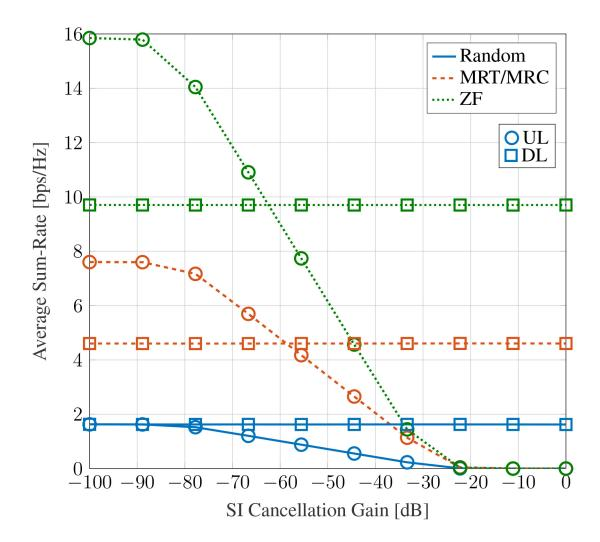

Fig. 7. The achievable sum-rate for *M* = *N* = 8, *L* = 4, and *K* = 4.

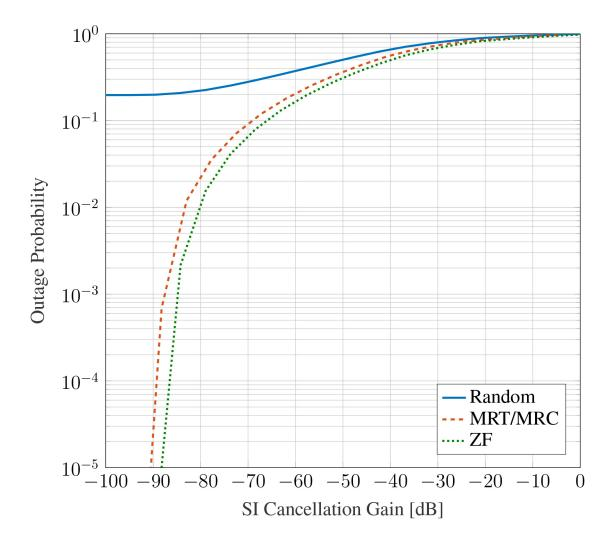

Fig. 8. The SINR outage probability for *M* = *N* = 8, *L* = 4, *K* = 4, and γ*th* = −10 dB.

type of beamforming/combining, the UL achievable rate and outage probability are significantly affected by α. Thus, FD systems require high SI cancellation gains to achieve better performance.

## V. FULL-DUPLEX AND COGNITIVE RADIO NETWORKS

## *A. Cognitive Radio Networks*

These aim to cope with spectrum scarcity due to exponential traffic and device growth scenarios and the underutilization problem. For example, International Telecommunication Union forecasts global mobile data traffic to 607 Exabyte per month by 2025 and 5016 Exabyte by 2030 [\[180\]](#page-47-20). By 2025, over 70% of the global population is expected to subscribe to mobile services, with 60% of this population using mobile Internet. Consequently, the demand for wireless connectivity, coverage, capacity, and services will continue to grow. However, the radio spectrum is a finite resource and cannot be expanded. The usable radio spectrum theoretically ranges from 3 Hz to 3000 GHz, but the prime spectrum for current wireless standards is typically within the 1-6 GHz range [\[181\]](#page-47-21). Frequencies below 1 GHz are already allocated for various applications like radar, military communications, and terrestrial radio/television. On the other hand, frequencies above 5 GHz suffer from increased attenuation and atmospheric absorption [\[182\]](#page-47-22).

On the other hand, fixed spectrum access policies, traditionally implemented by global spectrum regulators, contribute to the significant problem of spectrum under-utilization. These policies establish rules and regulations for allocating specific radio frequencies or portions of the spectrum to specific entities or services. The intention is to ensure efficient utilization of limited spectrum resources and prevent interference among users. There are several types of fixed spectrum access policies, including:

- 1) *Exclusive use:* This policy reserves a portion of the spectrum for the exclusive use of a single entity or service. For example, the licensed spectrum is assigned to a specific user, and no other entity is permitted to use that portion of the spectrum [\[183\]](#page-47-23).
- 2) *Shared use:* In this policy, multiple users are allowed to share a portion of the spectrum, subject to certain rules and conditions. For example, unlicensed spectrum is available for use by anyone, but certain technical standards and power limits must be followed to avoid interference [\[183\]](#page-47-23).

Although these policies are defacto standards, studies reveal that a large portion of the licensed spectrum is used sporadically, and geographical variations in the utilization of assigned spectrum range from 15% to 85% with a high time variability. The situation may even become worse as some of the licensed spectrum remains completely unused most of the times [\[184\]](#page-47-24).

The underutilization of radio spectrum has prompted the concept of *dynamic spectrum access (DSA)* to enhance its efficiency [\[185\]](#page-47-25). DSA enables multiple users to access the spectrum, with allocations dynamically assigned according to real-time demand. Cognitive radio (CR) technology, capable of sensing the available spectrum, facilitates the dynamic allocation of spectrum to users based on their requirements.

Thus, unlicensed (secondary/cognitive) users (SUs) may opportunistically access the frequency bands allocated to licensed (primary) users (PUs), without compromising the target QoS of PUs [\[186\]](#page-47-26), [\[187\]](#page-47-27). Depending on how SUs access the spectrum, there are three main CR paradigms [\[188\]](#page-47-28): interweave, overlay, and underlay. In interweave CR networks, SUs opportunistically access the licensed spectrum, when PUs are idle. In underlay CR networks, SUs transmit simultaneously with PUs on the licensed frequency bands, subject to satisfying the QoS of the PUs [\[189\]](#page-47-29), [\[190\]](#page-47-30). In the overlay CR networks, SUs transmit with PUs at the same time over the licensed bands by detecting the presence of PUs and adopting their transmission strategy to avoid interference with PUs. This can be done in two different ways. First, by using the knowledge about the primary user transmitter message, the secondary user transmitter cancels the primary user interference on the secondary user receiver. Second, the secondary user assists the primary user's transmissions by relaying primary transmitter messages and, in turn, getting access to the licensed spectrum.

CR networks require spectrum management, which involves spectrum sensing, spectrum decisions, spectrum sharing, and spectrum mobility [\[26\]](#page-43-25). Among these, spectrum sensing plays a critical role by identifying available spectral resources. It includes monitoring primary user activity, detecting white spaces for transmission, and obtaining information about available spectrum bands [\[26\]](#page-43-25). Spectrum sensing techniques enable cognitive radios to detect spectrum holes, i.e., unused frequencies in a given area not utilized by licensed primary users. These techniques involve detecting the presence or absence of primary users in a frequency band and identifying unused bands for secondary user operations. Spectrum sensing techniques are commonly categorized as follows: [\[185\]](#page-47-25):

- 1) *Energy detection:* The signal energy level in a frequency band is measured. If it is below a certain threshold, the CR assumes that the frequency band is unoccupied and can be used by itself. This sensing scheme is the most common approach due to its low complexity and low computational overhead [\[191\]](#page-47-31), [\[192\]](#page-47-32), [\[193\]](#page-47-33). This approach is categorized into cooperative and noncooperative spectrum sensing, as well as ON/OFF model-based sensing [\[194\]](#page-47-34), [\[195\]](#page-47-35), [\[196\]](#page-47-36).
- 2) *Matched filter detection:* This involves comparing the received signal with a reference signal of a known waveform. If the received signal matches the reference signal, then the frequency band is assumed to be occupied by PUs [\[27\]](#page-43-26).
- 3) *Cyclostationary detection:* This involves detecting the periodic properties of the received signal. For example, if the autocorrelation function of the received signal has periodic characteristics, the frequency band is assumed to be occupied [\[197\]](#page-47-37), [\[198\]](#page-47-38).
- 4) *Feature detection:* This involves detecting specific features of the received signal, such as frequency or timedomain characteristics, to identify whether the frequency band is occupied [\[27\]](#page-43-26), [\[199\]](#page-47-39).

More details of spectrum sensing techniques can be found in [\[27\]](#page-43-26), [\[185\]](#page-47-25). CR nodes may thus detect spectrum holes and determine which frequencies can be used for secondary communication. By continuously monitoring the available spectrum, CR nodes can adapt to changing conditions and dynamically adjust their operating parameters to optimize SE and network capacity.

## *B. Motivation for Employing Full-Duplex Cognitive Radios*

Traditional CR nodes rely on the "Listen-before-Talk" protocol to get access to the spectrum, i.e., perform the spectrum sensing to identify spectrum holes. This protocol has two drawbacks: transmission time loss due to sensing, and sensing accuracy impairment due to data transmission. More specifically, data transmission is split into discontinuous small slots, and part of transmission time is sacrificed for the sensing process. Moreover, sensing impairment occurs since SUs cannot sense the channel during their transmission, thus interfering with the possible primary user transmissions. By enabling FD operation in CRNs, continuous spectrum sensing, and transmission as well as simultaneous transmission and

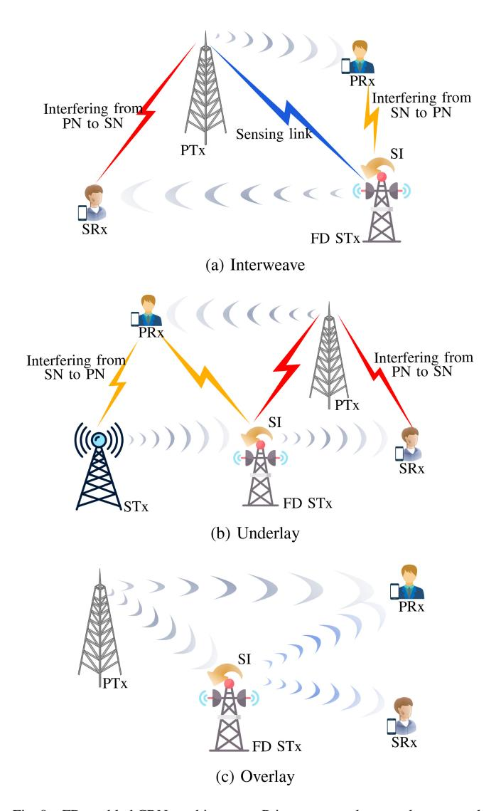

Fig. 9. FD-enabled CRNs architectures. Primary network, secondary network, transmitter, secondary transmitter, primary receiver, and secondary receiver are denoted by PN, SN, PTx, STx, PRx, SRx, respectively.

reception over the same idle channel can be established. Furthermore, SUs can vacate the spectrum once a licensed user becomes active and reclaims the spectrum. This protocol is called "Listen-and-Talk" [\[200\]](#page-47-40).

## *C. Full-Duplex Cognitive Radio Network Architectures*

*1) Interweave Architecture:* With this, FD radios can be utilized at the secondary transmitter to enable simultaneous sensing and transmission (Fig. [9\(](#page-21-0)a)). A practical study of this type of FD CRN has been first developed in [\[201\]](#page-47-41), where directional multi-configurable antennas have been utilized to mitigate the SI at the FD radios. The superiority of the FD CRN over the HD CRN in terms of the transmission range and rate has been reported in [\[201\]](#page-47-41). The contribution in [\[202\]](#page-47-42) evaluated the effects of in-phase/quadraturephase imbalance in FD-based EDs in both non-cooperative and cooperative spectrum sensing scenarios and showed that the in-phase/quadrature-phase imbalance and residual SI significantly degrade the sensing accuracy of FD-based CRNs. Performance of FD generalized frequency division multiplexing transceivers operating in the presence of phase noise, IQ imbalance, CFO, and nonlinear power amplifier has been studied in [\[203\]](#page-47-43), and power allocation was determined to maximize the sum-rate of the secondary link.

*2) Underlay Architecture:* In FD CRNs with underlay architecture, FD operation can be deployed in two scenarios (Fig. [9\(](#page-21-0)b)): 1) bidirectional secondary transmission: secondary user pairs transmit and receive over the licensed bands, 2) cognitive FD relay networks: FD relay is used in the secondary network (SN), which is called the secondary relay, to assist the transmissions between the secondary transmitter and secondary receiver(s). In both scenarios, transmit power of the secondary transmitter (and secondary relay) is controlled to keep the interference on the primary network (PN) below a tolerable value. Determining the power level that should be allocated to the SUs (including secondary transmitter and secondary relay) is a challenging task. This problem has been addressed in bidirectional secondary transmission with SISO [\[204\]](#page-47-44) and MIMO [\[205\]](#page-48-0) SUs. In [\[204\]](#page-47-44), the optimal transmit powers for the secondary network have been derived such that the throughput of *K* secondary links is maximized subject to the primary network outage constraint. Results in [\[204\]](#page-47-44), show that depending on the SIS capabilities of the SUs, switching between the FD and HD modes at the secondary network can improve the throughput. In [\[205\]](#page-48-0), an MSE-based transceiver design to minimize the symbol error probability of MIMO SUs, which experience inter-user interference and suffer from SI has been investigated, while the quality of PUs within the range of secondary signals are guaranteed.

The performance of the underlay CRNs is subordinated to the channel statistics of the interference links from the SUs to the PUs. Therefore, it is highly likely that SUs transmit with lower power levels, thus, the reliability and coverage of their transmissions are substantially affected. To tackle this concern, cooperative relaying has been introduced in CRNs to maintain the performance of the SUs within acceptable ranges, without increasing the transmit power, while meeting interference constraints at the primary receiver [\[189\]](#page-47-29). Adopting FD relay nodes in these networks can achieve remarkable improvement in SE over the conventional cognitive HD relay networks [\[206\]](#page-48-1). Several research efforts have been devoted towards developing functionalities such as power allocation, relay selection, and relay mode selection to improve the performance of the underlay cognitive FD relay networks. Two power allocation policies have been proposed in [\[206\]](#page-48-1), to minimize the overall outage probability of cognitive FD relay network. This work has been extended in [\[207\]](#page-48-2), where direct-link transmission between secondary transmitter and receiver is considered to provide an additional diversity path. Nevertheless, a major practical concern with [\[206\]](#page-48-1), [\[207\]](#page-48-2) is that the maximum transmit power available at the secondary nodes is considered to be unbounded. In [\[208\]](#page-48-3), SE and EE of the cognitive FD multi-hop relay networks have been studied and optimal power allocation policies for EE (SE) maximization under minimum SE (EE) requirement have been developed.

In multi-relay cognitive FD relay networks, to avoid spectrum loss due to the orthogonal channel assignment between the relay, the method of the relay selection can be applied [\[209\]](#page-48-4), [\[210\]](#page-48-5). Opportunistic FD relay selection scheme in underlay CRNs over independent Nakagami-*m* fading channels and Rayleigh fading channels were studied in [\[209\]](#page-48-4). It is shown that opportunistic FD relay selection with moderate SNR links is a good solution for treating the trade-off between the improved outage probability and the performance degradation due to the SI. The authors in [\[210\]](#page-48-5), derived the outage probability for three relay selection schemes in cognitive FD relay networks, by considering the effects of the interference power constraint at the primary receiver, maximum transmit power constraint at the secondary nodes, and the residual SI at the relay. Performance of the opportunistic FD relay selection in underlay CRNs and over the Nakagami-*m* fading environment was analyzed in [\[211\]](#page-48-6), and the diversity gain of the relay selection in the presence/absence of the direct sourcedestination link has been derived. An adaptive transmission scheme has been proposed in [\[212\]](#page-48-7), where transmission mode selection among FD relaying, HD relaying, and direct transmission is investigated, such that the instantaneous capacity of the system is maximized.

*3) Overlay Architecture:* In FD CRN with overlay architecture, SUs simultaneously sense the spectrum for any primary user activity and appropriately change the characteristics of the CR transmitted signal to avoid interference with PUs (Fig. [9\(](#page-21-0)c)). In this context, the achievable primary-secondary rate region was characterized in [\[213\]](#page-48-8), where the FD secondary relay forwards the primary signal and at the same time transmits its own secondary signal. Results in [\[213\]](#page-48-8) have shown that the FD and hybrid-duplex schemes can greatly enlarge the rate region compared to the HD mode. Spectrum awareness/efficiency trade-off for overlay paradigm with FD-enabled SUs has been considered in [\[204\]](#page-47-44), wherein an efficient adaptive strategy for the secondary user link to switch between the transmit-and-sense and transmit-and-receive mode has been determined. A spectrum-sharing protocol was proposed in [\[214\]](#page-48-9) in which the secondary relay node employs orthogonal frequency division modulation (OFDM) to receive primary signals over a subset of subcarriers while transmitting its own signals over the remaining subcarriers, and the joint optimization of spectrum partition and power allocation was studied. This work has been extended for FD-based twoway OFDM relaying in [\[215\]](#page-48-10), where a secondary relay node assists bidirectional communication between a pair of primary nodes and thus, as a reward, it is allowed to use some of OFDM subcarriers to transmit its own messages to a secondary receiver node. Specifically, the proposed spectrum sharing protocol in [\[215\]](#page-48-10) is comprised of two time slots: in the first time slot, the two primary nodes transmit to the secondary relay over the same subset of subcarriers and meanwhile the FD-capable secondary relay transmits to the secondary sink over the remaining subcarriers; in the second time slot, the secondary relay broadcasts the superimposed version of the primary signals over possibly another subset of subcarriers and continues the transmission to the secondary sink over the remaining subcarriers.

*4) Hybrid Architecture:* The FD capability in a CRN can be achieved by a combination of any two or more paradigms.

| Literature   | Sharing Structure | Technical Contribution                                             |
|--------------|-------------------|--------------------------------------------------------------------|
| [201]        | Interweave        | Practical study of the FD CRN.                                     |
| [202], [203] | Interweave        | Performance evaluation in the presence of hardware impairments.    |
| [204], [205] | Underlay          | Bidirectional secondary transmission, performance analysis.        |
| [206]–[208]  | Underlay          | Cognitive FD relay networks, resource allocation.                  |
| [209]–[211]  | Underlay          | Cognitive FD relay networks, relay selection.                      |
| [212]        | Underlay          | Cognitive FD relay networks, relay mode selection.                 |
| [213]        | Overlay           | Beamforming design to improve primary-cognitive rate region.       |
| [204]        | Overlay           | Performance analysis: secondary user collision probability, the    |
|              |                   | secondary user throughput, and the primary user outage probability |
| [214], [215] | Overlay           | Protocol design for one-way/two-way OFDM relaying.                 |
| [216]        | Hybrid            | Dynamic spectrum access design for secondary network to operate    |
|              |                   | in interweave and/or underlay modes.                               |
| [217]        | Hybrid            | Adaptive spectrum sharing design with EE perspective.              |

TABLE VIII
SUMMARY ON TECHNICAL CONTRIBUTION ON FD-ENABLED CRNS

Hybrid architectures lead to a more efficient spectrum use [26]. In particular, the hybrid CR approach allows the secondary network to transmit in both the presence and absence of the primary transmission. This minimizes data loss and transmission interruption for channel sensing. Hence, it enhances spectrum utilization, improving overall network capacity [26]. However, these benefits come at the cost of increased energy consumption and hardware complexity [26]. Hybrid DSA for the secondary network has been proposed in [216], consisting of underlay and interweave architectures over the states of activity and inactivity of the primary user, respectively. With the aim of improving the EE, the number of sensing samples and transmission bit rates over underlay and interweave approaches have been optimized in [216]. The authors in [217] proposed adaptive spectrum sharing schemes for the traditional FD-enabled interweave, underlay, overlay, and hybrid structures, taking the EE into consideration. The proposed schemes allow the SUs to adaptively access the licensed spectrum, provided that PUs' traffic arrives at a low rate and EE gains exist. Table VIII shows a number of existing contributions to FD CRNs at a glance.

#### D. Case Study and Discussion

Consider the underlay FD CRN in Fig. 9(b), where FD secondary relay is equipped with N receive and M transmit antennas, while all other nodes have single antennas. Let  $\mathbf{v}_R \in \mathbb{C}^{N \times 1}$  and  $\mathbf{w}_T \in \mathbb{C}^{M \times 1}$  denote linear receiver and precoder at the secondary relay, respectively, satisfying  $\|\mathbf{v}_R\|^2 = 1$  and  $\|\mathbf{w}_T\|^2 = 1$ . Since secondary transmitter and secondary relay transmit their signal at the same time over the same spectrum, the primary receiver receives interference from secondary receiver and secondary relay simultaneously. Therefore, transmit powers at the secondary transmitter and secondary relay must be constrained as

$$P_S |h_{SP}|^2 + P_R |\mathbf{h}_{RP}^{\dagger} \mathbf{w}_T|^2 \le I_{th},$$
 (16)

where  $h_{SP}$  and  $\mathbf{h}_{RP}$  be the channel for secondary transmitter to primary receiver and secondary relay to primary receiver link, respectively;  $I_{th}$  is the maximum tolerable interference level at the primary receiver;  $P_S$  and  $P_R$  are the transmission powers of the secondary transmitter and secondary relay,

respectively. Assuming that the received interference at the secondary relay and secondary receiver from the primary network is negligible, the SINR at the secondary relay and secondary receiver are respectively as follows:

$$\gamma_{SR} = \frac{|\mathbf{v}_R^{\dagger} \mathbf{h}_{SR}|^2 P_S}{\alpha P_R |\mathbf{v}_R^{\dagger} \mathbf{G} \mathbf{w}_T|^2 + \sigma_n^2},\tag{17}$$

$$\gamma_{SRx} = \frac{|\mathbf{h}_{RD}^{\dagger} \mathbf{w}_T|^2 P_R}{P_S |h_{SD}|^2 + \sigma_n^2},\tag{18}$$

where  $\mathbf{h}_{SR} \in \mathbb{C}^{N \times 1}$ ,  $\mathbf{h}_{RD} \in \mathbb{C}^{M \times 1}$ , and  $h_{SD}$  denote the channel for secondary transmitter to secondary relay, secondary relay to secondary receiver, and secondary transmitter to secondary receiver links in the secondary system, respectively;  $\mathbf{G} \in \mathbb{C}^{N \times M}$  is the SI channel.

A general optimization problem to minimize the outage probability of the secondary network, subject to the interference constraint at the secondary network, can be formulated as

$$\min_{\mathbf{w}_T, \mathbf{v}_R, P_S, P_R \ge 0} \mathcal{O}_{out} = \Pr\left(\min(\gamma_{SR}, \gamma_{SRx}) < \eta^{\mathsf{FD}}\right)$$
(19a)  
s.t  $P_S |h_{SP}|^2 + P_R |\mathbf{h}_{RP}^{\dagger} \mathbf{w}_T|^2 < I_{th}$ , (19b)

where the  $\mathcal{O}_{out}$  is the outage probability of the secondary network and  $\eta^{\text{FD}}$  is the required SINR in the CRN. Alternating optimization approach can be used to solve (19) suboptimally by alternately optimizing  $\mathbf{v}_R$ ,  $\mathbf{w}_T$ , and transmission powers in an iterative manner until the convergence is achieved. For any given  $\mathbf{v}_R$  and  $\mathbf{w}_T$ , when the total sum of the transmission powers at the secondary receiver and secondary relay are constrained, the outage probability is minimized when  $\gamma_{SR} = \gamma_{SRx}$  [206]. Therefore,  $P_S$  and  $P_R$  are satisfied as

$$\min_{P_S, P_R \ge 0} \frac{|\mathbf{v}_R^{\dagger} \mathbf{h}_{SR}|^2 P_S}{\alpha P_R |\mathbf{v}_R^{\dagger} \mathbf{G} \mathbf{w}_T|^2 + \sigma_n^2} = \frac{|\mathbf{h}_{RD}^{\dagger} \mathbf{w}_T|^2 P_R}{P_S |h_{SD}|^2 + \sigma_n^2}, (20a)$$
s.t  $P_S |h_{SP}|^2 + P_R |\mathbf{h}_{RP}^{\dagger} \mathbf{w}_T|^2 \le I_{th}.$  (20b)

The optimal transmission powers  $P_S$  and  $P_R$  are roots of a quadratic equation. Now, for given  $P_S$  and  $P_R$ , the optimal

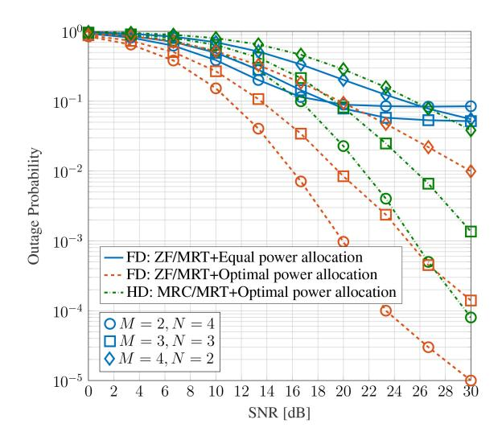

Fig. 10. The outage probability of underlay FD/HD CRN SINR for  $I_{th}=0{\rm dB},\,\alpha=-80$  dB, and  $\eta^{\rm FD}=10$  dB.

receiver and transmit precoders are obtained by solving

$$\min_{\mathbf{v}_R, \mathbf{w}_T} \frac{|\mathbf{v}_R^{\dagger} \mathbf{h}_{SR}|^2 P_S}{\alpha P_R |\mathbf{v}_R^{\dagger} \mathbf{G} \mathbf{w}_T|^2 + \sigma_n^2} = \frac{|\mathbf{h}_{RD}^{\dagger} \mathbf{w}_T|^2 P_R}{P_S |h_{SD}|^2 + \sigma_n^2}, (21a)$$
s.t  $P_S |h_{SP}|^2 + P_R |\mathbf{h}_{RP}^{\dagger} \mathbf{w}_T|^2 \le I_{th}.$  (21b)

Fig. 10 shows the outage probability of the secondary network for optimal and equal power allocations. As expected, the former outperforms the latter. Although an error floor occurs in the high SNR region due to residual interference, the optimal power allocation scheme's error floor occurs in a higher SNR region than that of the equal power allocation scheme. This is because the optimal power allocation scheme balances the SINRs at the secondary relay and secondary network to minimize outage probability. Thus, regardless of SNR and SIR regions, the outage performance of the FD CRN using optimal power allocation is superior to equal power allocation. We further consider the HD CRN, wherein the optimization problem in (19), reduces to

$$\min_{\mathbf{w}_T, \mathbf{v}_R, P_S, P_R \ge 0} \mathcal{O}_{out}^{\mathsf{HD}} = \Pr(\gamma^{\mathsf{HD}} < \eta^{\mathsf{HD}}),$$
 (22a)

s. t 
$$P_S |h_{SP}|^2 \le I_{th}$$
, (22b)

$$P_R |\mathbf{h}_{RP}^{\dagger} \mathbf{w}_T|^2 \le I_{th}, \tag{22c}$$

where  $\gamma^{\rm HD}=\min(\frac{P_S|{\bf v}_R^\dagger{\bf h}_{SR}|^2}{\sigma_n^2},\frac{|{\bf h}_{RD}^\dagger{\bf w}_T|^2P_R}{\sigma_n^2}).$  We can apply fixed MRC/MRT processing design at the HD secondary relay and then solve the optimization problem (22) to determine the optimal values for  $P_S$  and  $P_R.$  From Fig. 10, we observe that FD CRN achieves superior outage performance compared to HD CRN over the entire SNR range. This is due to the fact that to maintain the same throughput, the HD CRN system needs to double its transmission rate, thereby resulting in a higher outage probability.

#### E. Future Research Direction

Despite its appealing advantages, FD operation brings new challenges to the CRNs. More importantly, the received signal

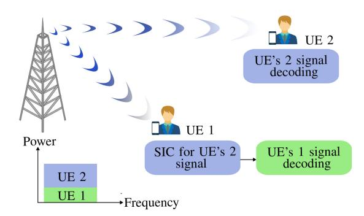

Fig. 11. DL PD-NOMA model with two users.

for sensing is impaired by the residual SI, and the quality of the sensing process is degraded. Moreover, spectrum sensing in FD CRNs demands high sampling rates and resolution, ADCs with a large dynamic range, and also high-speed processing units. This is because the RF components need to both sense a wide spectrum range and at the same time mitigate the SI [27]. Therefore, efficient use of FD in CRNs requires a redesign of network protocols (MAC, network, and physical layer), signal processing techniques, and resource allocation algorithms [26]. More precisely, MAC layer problems, such as hidden terminals, congestion, as well as packet losses and delays, and network layer issues, such as spatial reuse and asynchronous contention, demand extra considerations [218].

#### VI. FULL-DUPLEX COMMUNICATION AND NOMA

NOMA allows multiple users with different channel states to simultaneously share identical wireless resources, thus, NOMA is promising to achieve low latency massive access for future wireless networks. In the seminal work [219], Saito et al. introduced NOMA as an alternative to orthogonal multiple-access (OMA) techniques, which can improve the throughput and user-fairness over SISO channels. NOMA can reduce latency by serving multiple users on the given radio resources at the same time, instead of keeping some users waiting for available radio resources. NOMA can broadly be divided into power-domain NOMA (PD-NOMA) and code-domain NOMA (CD-NOMA) [78]. In conventional PD-NOMA, more power is allocated to the UE with weak channel conditions (also termed as NOMA far UE) to ensure user fairness (Fig. 11). The capacity region of this broadcast channel is achieved by applying superposition coding at the BS and deploying successive interference cancellation (SIC) at the UE with the stronger channel conditions (also termed as NOMA near UE), to decode its signal free of interference. Nevertheless, this method cannot guarantee meeting the QoS requirements of all UEs. To deal with this challenge, a variation of PD-NOMA, called cognitive-radio inspired NOMA, has been introduced, which ensures that some or all UE's QoS requirements are satisfied [220]. With CD-NOMA, different UEs are assigned different codes and are then multiplexed over the same time-frequency resources. Multiple access with low-density spreading (LDS) [221], sparse code multiple access (SCMA) [222], and pattern division multiple access (PDMA) [223] are typical examples of CD-NOMA.

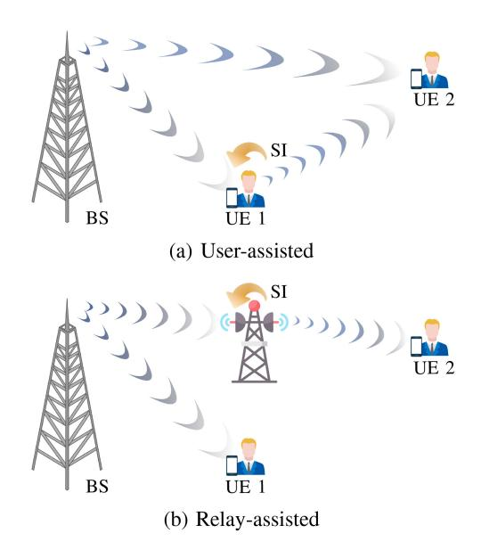

Fig. 12. FD cooperative NOMA architectures.

#### A. Full-Duplex PD-NOMA

1) Full-Duplex Cooperative PD-NOMA: Integration of cooperative communication with NOMA to support fardistance NOMA users has been widely studied in the literature [224], [225]. In cooperative NOMA networks, users or dedicated relays cooperate to improve the communication reliability at the far users. The former scheme is termed as user-assisted cooperative NOMA [224], while the latter is known as relay-assisted cooperative NOMA [225]. However, this performance improvement is achieved at the price of SE loss, due to the additional time resources required for the cooperation, which, on the other hand, might offset the SE gain promised by NOMA systems. The appealing advantages of FD radios have attracted a great deal of interest in investigating FD user-assisted cooperative [226], [227], [228], [229] and FD relay-assisted cooperative [230], [231], [232], [233], [234], [235], [236] (c.f Fig. 12), from various aspects, such as performance analysis [226], [227], [230], [231], beamforming design [228], [234], antenna selection [232], and user selection [233]. In [236], an FD cooperative NOMA scheme has been proposed, where FD NOMA users desire to exchange messages with the assistance of an FD relaying node under DaF protocol. The common finding of these research studies indicates that compared to the HD cooperative NOMA system, the FD cooperative NOMA system achieves lower outage probability for NOMA UEs, and attains higher ergodic sum capacity in the low to moderate SNR regimes. Moreover, by deploying beamforming techniques at the FD multi-antenna relay, these performance gains are further enhanced.

2) Full-Duplex Cellular PD-NOMA Networks: NOMA can be considered for simultaneous UL and DL transmissions in cellular networks to support multi-user transmission [237], [238], [239], [240]. More specifically, by pairing multiple UL users and multiple DL users, NOMA can be applied at the FD BS. In DL NOMA, users with stronger channel conditions can decode and cancel messages of users

with weaker channel conditions before decoding their own messages, whereas users with the weakest channel conditions decode their messages first, treating other users' messages as noise. In UL NOMA, BS performs successive decoding and cancellation of different users' data, ranked by their channel strength [239]. User pairing and resource allocation are the main challenges to implement the NOMA-aided FD cellular networks. Resource allocation algorithm design for a singlecell multi-carrier NOMA system with an FD BS has been studied in [238], aiming at the maximization of the weighted sum throughput of the system. In [239], the authors studied the problem of mode selection, dynamic user association, and power optimization in a multi-cell FD-enabled network operating in NOMA. The benefits of operating in HD or FD, as well as in OMA or NOMA modes, depending on traffic conditions, network density, and SI cancellation capabilities at the FD BSs have been quantified. Power-saving gains achieved by using NOMA in the IBFD HetNets have been investigated in [240], where the QoS requirement of users is considered. Table IX shows a significant body of work on FD-based NOMA.

#### B. Case Study and Discussion

Consider the relay-assisted cooperative NOMA system in Fig. 12(b), where the relay is equipped with N receive antennas and M transmit antennas. Assume that BS transmits a combination of the intended messages to both UEs as

$$s[n] = \sqrt{P_S a_1} x_1[n] + \sqrt{P_S a_2} x_2[n], \tag{23}$$

where  $P_S$  is the BS transmit power,  $x_i$ ,  $i \in \{1,2\}$  denotes the information symbol intended for  $\mathrm{UE}_i$ , and  $a_i$  denotes the power allocation coefficient, such that  $a_1+a_2=1$  and  $a_1 < a_2$ . Let  $h_1$  denote the channel between the BS and  $\mathrm{UE}_1$ ,  $\mathbf{f}_1 \in \mathbb{C}^{M \times 1}$  be the channel between the FD relay and  $\mathrm{UE}_1$ , denoted by inter-user channel. We model  $\mathbf{f}_1 \sim \mathcal{CN}(0, k_1 \lambda_{f_1})$ , where the parameter  $k_1$  presents the strength of inter-user interference. By invoking the NOMA principle, the effective SINR of  $\mathrm{UE}_2$  observed at  $\mathrm{UE}_1$  can be written as

$$\gamma_{1,2} = \frac{P_S a_2 |h_1|^2}{P_S a_1 |h_1|^2 + P_R |\mathbf{f}_1^{\dagger} \mathbf{w}_T|^2 + \sigma_{n_1}^2}, \tag{24}$$

where  $P_R$  is the relay transmit power and  $\sigma_{n_1}^2$  is the noise power at UE1. If UE1 cancels the UE2's signal, the SINR at UE1 can be expressed as

$$\gamma_1 = \frac{P_S a_1 |h_1|^2}{P_R |\mathbf{f}_1^{\dagger} \mathbf{w}_T|^2 + \sigma_{n_1}^2}.$$
 (25)

Now, let  $\mathbf{v}_R \in \mathcal{C}^{N \times 1}$  be the combining receiver at the FD relay,  $\mathbf{h}_2 \in \mathbb{C}^{N \times 1}$  is the channel vector of the BS-relay link, and where  $\mathbf{f}_2 \in \mathbb{C}^{M \times 1}$  be the channel vector of the relay-UE2 link. The FD relay decodes the information intended for UE2 treating the symbol of UE1 as interference. Hence, the SINR at the FD relay can be expressed as

$$\gamma_R = \frac{P_S a_2 |\mathbf{v}_R^{\dagger} \mathbf{h}_2|^2}{P_S a_1 |\mathbf{v}_R^{\dagger} \mathbf{h}_2|^2 + P_R |\mathbf{v}_R^{\dagger} \mathbf{G} \mathbf{w}_T|^2 + \sigma_R^2},$$
 (26)

| Category         | Literature   | System Setup            | Main Contributions                                                    |
|------------------|--------------|-------------------------|-----------------------------------------------------------------------|
| Cooperative      | [226]        | DL, SISO                | Outage performance analysis                                           |
| (user-assisted)  | [227]        | DL, SISO                | Error rate probability analysis for pulse amplitude modulation and    |
|                  |              |                         | quadrature amplitude modulation                                       |
|                  | [228]        | DL, SISO                | Outage probability and ergodic sum-rate with optimal power allocation |
|                  | [229]        | DL, SISO                | Outage performance analysis and relaying protocol design              |
| Cooperative      | [230], [231] | DL, SISO                | Outage probability and ergodic sum-rate analysis                      |
| (relay-assisted) | [232]        | DL, MIMO                | Outage probability and ergodic sum-rate analysis, antenna selection   |
|                  | [233]        | DL, multi-antenna relay | Outage probability analysis, beamforming design and user selection    |
|                  | [234]        | DL, multi-antenna relay | Beamforming design for end-to-end throughput maximization             |
|                  | [235]        | UL and DL, SISO         | Ergodic capacity and outage performance analysis for cooperative      |
|                  |              |                         | relay sharing                                                         |
|                  | [236]        | Two-way relaying        | Outage probability and ergodic rate analysis                          |
| Cellular         | [237]        | Single-cell, SISO       | Feasibility analysis of FD NOMA over HD NOMA                          |
| Centulai         | [238]        | Single-cell, SISO       | Joint power and subcarrier allocation                                 |
|                  | [239]        | Multi-cell, SISO        | Resource optimization and mode selection                              |
|                  | [240]        | HetNets, SISO           | Power control to enable aggressive frequency reuse                    |

TABLE IX FD-ENABLED NOMA SYSTEMS

where  $\sigma_R^2$  denotes the noise power at relay and  $\mathbf{G} \in \mathbb{C}^{N \times M}$  is the SI channel. Finally, the SNR at  $\mathrm{UE}_2$  is given by

$$\gamma_{R,2} = \frac{P_R}{\sigma_{n_2}^2} |\mathbf{f}_2^{\dagger} \mathbf{w}_T|^2, \tag{27}$$

where  $\sigma_{n_2}^2$  denotes the noise power at UE2. Therefore, the achievable rate of the UE1 and UE2 can be respectively obtained as

$$R_{\text{UE}_{1}} = \log_{2} \left( 1 + \frac{P_{S} a_{1} |h_{1}|^{2}}{P_{R} |\mathbf{f}_{1}^{T} \mathbf{w}_{T}|^{2} + \sigma_{n_{1}}^{2}} \right),$$

$$R_{\text{UE}_{2}} = \log_{2} \left( 1 + \min \left( \gamma_{1,2}, \gamma_{R}, \gamma_{R,2} \right) \right). \tag{28}$$

Fig. 13 shows the achievable per-user rate and sum-rate of FD and HD cooperative NOMA systems, under the same transmit power constraint. Results for the HD cooperative OMA system have been included as a benchmark. For the FD cooperative NOMA system, two different beamforming designs, namely ZF/MRT and MRC/MRT are considered at the FD relay, where ZF/MRT completely cancels the SI at the relay. It is observed that FD NOMA provides a larger achievable sum-rate, i.e.,  $R_{UE_1} + R_{UE_2}$ , compared to the HD counterparts in low to moderate  $P_S$  regime. From the individual achievable rate point of view, both FD NOMA and HD NOMA are inferior to HD OMA in moderate to high transmit power regimes, due to interference at the relay caused by the signal intended for the UE1. However, FD NOMA significantly improves the achievable rate of UE1 compare to the HD counterparts. These results suggest designing a hybridduplex scheme, which switched between the FD NOMA and HD OMA, over the low-to-moderate and high transmit power regimes, respectively. However, the performance improvement is achieved at the expense of higher hardware complexity and power consumption requirements for mode-switching circuits.

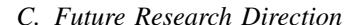

Possible future research directions areas in NOMA cellular networks under FD operation (especially for HetNets NOMA

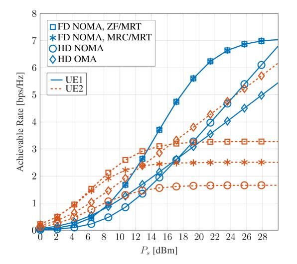

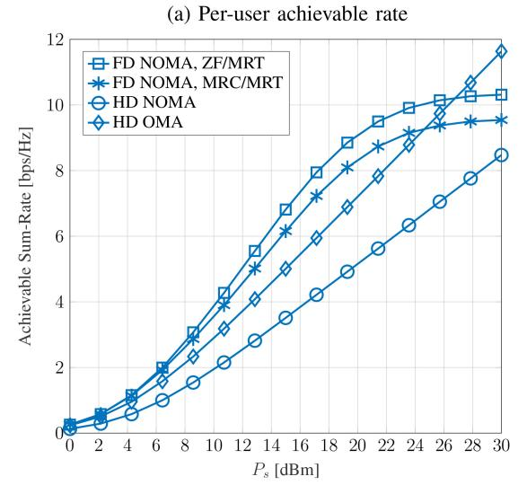

Fig. 13. Comparison between the FD NOMA, HD NOMA, and HD OMA for M = 3, N = 5,  $a_1 = 0.1$ ,  $a_2 = 0.9$ ,  $\alpha = -70$  dB, and  $k_1 = 0.01$ .

(b) Achievable sum-rate

scenarios) are dynamic mode selection, resource allocation, and user pairing in ultra-dense network environments as well as developing distributed algorithms for interference management. Another promising extension is to investigate the potential gains achieved by these functionalities, under the imperfection of NOMA, e.g., imperfect channel estimation and imperfect SIC. Moreover, optimizing the network performance for latency and reliability requirements is an interesting future direction. Other issues such as hardware complexity for SIC in multi-cell NOMA need further investigation [\[241\]](#page-48-36).

Moreover, the potential gains of FD in CD-NOMA have not been fully addressed. To reap the benefits of both SCMA and FD in ultra-reliable and low-latency communications (URLLCs), Zeng et al. [\[242\]](#page-48-37) proposed an SCMA-enhanced FD scheme, in which an FD next generation node B (gNB) supports several SCMA users in UL and DL simultaneously. By using pseudo-orthogonal codebooks for UL and DL users, the UL-to-DL interference can be distinguished and accordingly canceled. The latency-constrained reliability performance in short-packet transmissions has been analyzed and its superiority over the existing schemes has been proved in the presence of imperfect SI. The proposed FD-SCMA scheme in [\[242\]](#page-48-37), can guarantee the low-latency short-packet transmissions with adequately high reliability in various Internet-of-Things (IoT) scenarios. The exploitation of FD technology for CD-NOMA is still in its infancy and remains a topic for future research.

# VII. FULL-DUPLEX COMMUNICATION AND SECURITY

Because of the intrinsic broadcast nature of wireless communication networks, confidentiality, and secret transmission have always been one of the most challenging research problems. New powerful computing techniques such as quantum computing, which offers enormous processing power for deciphering, weaken the effectiveness of the traditional cryptography-based approaches. As an alternative or complementary approach to conventional cryptography methods, physical-layer-based wireless security methods have been developed. In general, they involve three main concepts:

• *PLS:* The main principle of the PLS is to secure the transmitting data from potential external eavesdroppers and/or internal eavesdroppers (also known as untested users), by exploiting the physical characteristics of the wireless medium such as noise, fading channel, and interference [\[243\]](#page-48-38), [\[244\]](#page-48-39). We can categorize eavesdroppers into two general classes; i) passive Eaves, who overhear legitimate messages silently, ii) active Eaves, who can transmit malicious jamming signals and receive legitimate signals simultaneously [\[245\]](#page-48-40), [\[246\]](#page-48-41), [\[247\]](#page-49-0). In a more powerful attack, Eaves can collude (colluding Eaves), i.e., they can share their observations [\[248\]](#page-49-1). PLS pioneered by Wyner in [\[249\]](#page-49-2) has attained significant interest in security demand wireless applications. A malicious eavesdropper (or illegitimate user) may attempt to overhear the confidential transmission between a legitimate source-destination pair. From the informationtheoretic point of view, if the source-eavesdropper channel, referred to as the wiretap channel, is a degraded version of the legitimate source-destination channel, data can be transmitted at a rate close to the intended channel capacity. Therefore, secure communication can be established. The level of security is quantified by the "secrecy capacity", defined as the maximum transmission rate at which the message can be reliably decoded at the legitimate receiver without leaking any valuable information to eavesdropping receivers. A detailed explanation of performance metrics for PLS can be found in [\[250\]](#page-49-3).

- • *Covert communication:* This aims to enable wireless transmission with negligible detection probability by unauthorized parties, ensuring the privacy of the transmitter. This is achieved by guaranteeing end-to-end covert communication and making the transmitter "invisible" to unauthorized parties. Many application scenarios require this level of privacy, including covert military operations, location tracking in vehicular ad-hoc networks, and intercommunication of sensor networks or IoT [\[251\]](#page-49-4), [\[252\]](#page-49-5), [\[253\]](#page-49-6). For example, it can help to conceal the location information of transmitters in vehicular networks, where exposing location information can be a critical privacy concern. The covert rate, which represents the achievable rate subject to a detection error probability constraint, serves as a fundamental metric for evaluating the security performance of covert communication. A high covert rate indicates that the communication is well-protected against detection, while a low covert rate indicates the risk of unauthorized parties detecting the transmission.
- *Proactive eavesdropping:* Eavesdroppers can be considered legitimate monitors for wireless surveillance. Wireless communication links are potential deems for illegal activities by criminals or terrorists, who may jeopardize public safety. This is more challenging by spreading the infrastructure-free communications scenarios, as the illegal information may not be accessible to core infrastructure, making this more convenient for illegal activities. To deal with this scenario, a new wireless communication surveillance paradigm called proactive eavesdropping has emerged [\[254\]](#page-49-7). Cognitive jamming and spoofing relaying are two main approaches in proactive eavesdropping, where a legitimate monitor or spoofing relay purposely intervenes in the suspicious link. The authors in [\[254\]](#page-49-7) coined the term "eavesdropping rate", defined as the difference between the monitor and illegal receiver rate, to evaluate the performance.

## *A. Full-Duplex Communication and Physical Layer Security*

To achieve the PLS, a great number of approaches have been proposed for various types of networks, including artificial noise (AN) transmission to confuse the eavesdropper [\[255\]](#page-49-8), signal processing and beamforming to steer precoding vectors and inject AN to impair the information reception of potential eavesdroppers [\[250\]](#page-49-3), [\[256\]](#page-49-9), and cooperative jamming and relay-based PLS techniques [\[257\]](#page-49-10). Notably, with FD radios, these approaches can be exploited more effectively, while the available resources can be utilized more efficiently.

Self-protection scheme in point-to-point communications (Alice-Bob), where the legitimate receiver (Bob) is equipped

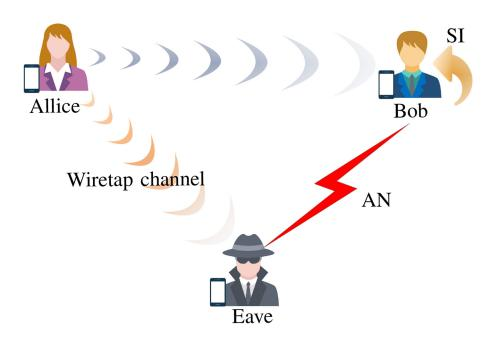

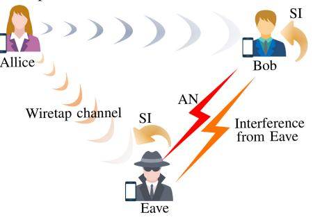

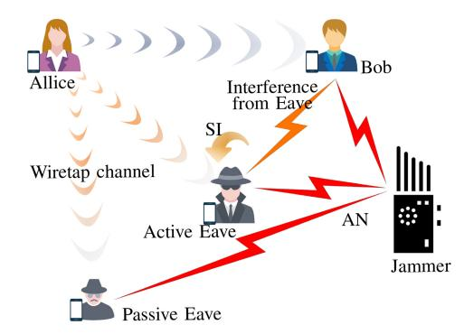

Fig. 14. FD-enabled PLS in point-to-point communication.

with an FD transceiver to simultaneously receive information from the legitimate transmitter (Alice) and transmit AN (c.f. Fig. [14\(](#page-28-0)a)), has been introduced in [\[258\]](#page-49-11). The secrecy rate optimization for both cases of known and unknown CSI of the Eave has been studied. Akgun et al. [\[259\]](#page-49-12) extended the prior work to a multiuser scenario with multiple Eaves, where the transmitter is equipped with multi-antenna to steer different aligned beams towards each user. Siyari et al. [\[260\]](#page-49-13) proposed a game-theoretic power control approach in an interference network (multiple legitimate links share the same bandwidth, thus interfering with one another) tapped by an external Eave. Each link seeks to maximize its secrecy rate by determining the best power assignment for the information transmission from Alice, and for jamming signals transmitted by Alice and FD Bob. In [\[261\]](#page-49-14), PLS of a two-tier heterogeneous decentralized wireless network under a stochastic geometry framework has been investigated, where the second tier is an overlaid

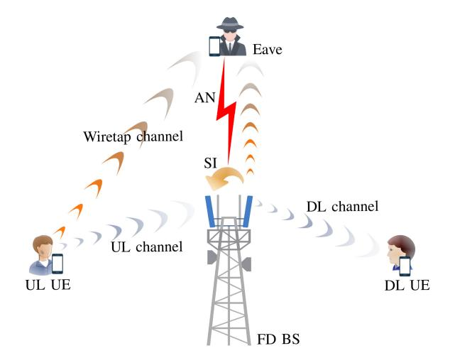

Fig. 15. FD cellular system with AN transmission, FD BS, and passive Eave.

tier that has secrecy considerations and is deployed with more powerful FD receivers to radiate jamming signals to confuse Eaves. By using tools from the stochastic geometry, the secrecy performance of the HetNets with FD users was characterized in [\[262\]](#page-49-15) in the presence of friendly jammers. Jammers are selected to transmit a jamming signal if their interfering power on the scheduled users is below a threshold, meanwhile, the scheduled users confound the Eaves using AN, relying on their FD capabilities. The authors in [\[263\]](#page-49-16), analyzed the secrecy performance of wireless networks with randomly located independent and colluding Eaves, which relies on the use of transmit antenna selection at the BS and an FD jamming scheme at the users.

The results in [\[263\]](#page-49-16) show that the reduction in the secrecy outage probability is logarithmic in the number of antennas used for transmit antenna selection and identifies conditions, under which HD operation should be used instead of FD jamming at the users. In [\[246\]](#page-48-41), a MIMO Alice-Bob wiretap channel with an active Eve (c.f. Fig. [14\(](#page-28-0)b)), who can transmit and receive in FD fashion by appropriately allocating its antennas for transmission or reception, has been studied with linear precoder and receiver design at the Alice and Bob, respectively. The authors in [\[247\]](#page-49-0), characterized the superiority of a cooperative jamming scheme, where a multi-antenna jammer transmits AN to confound both active and passive eavesdroppers (c.f. Fig. [14\(](#page-28-0)c)), over the conventional AN scheme in [\[246\]](#page-48-41) with much lower complexity cost.

Nevertheless, it is not feasible in practice to upgrade the mobile users to the FD design, due to the high complexity of the receiver and cost of FD radios. To address this challenge, FD radios can be shifted to the infrastructures (i.e., BS in cellular networks or intermediate relay nodes). PLS in FD cellular networks to provide secure communication to both UL and DL HD users has been considered in [\[264\]](#page-49-17), [\[265\]](#page-49-18), [\[266\]](#page-49-19), [\[267\]](#page-49-20). The authors in [\[264\]](#page-49-17), designed joint information and AN beamforming at the FD BS to guarantee the PLS of single-antenna HD UL and DL users, under the idealist assumption of there is no SI and co-channel interference in the network (c.f. Fig. [15\)](#page-28-1). By considering both SI and cochannel interference, an extension of the prior work has been

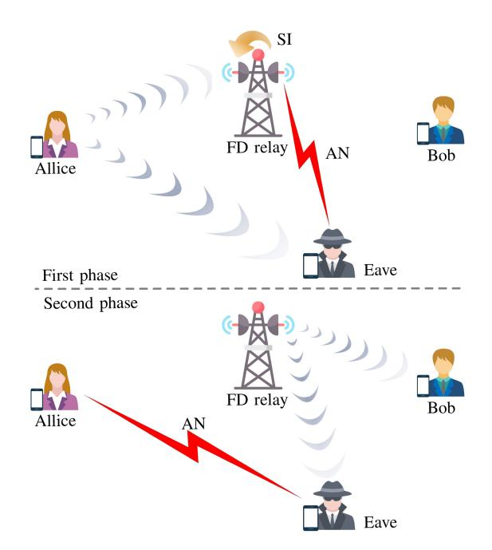

Fig. 16. Cooperative jamming with AN transmission, FD relay, and passive Eave.

investigated in [\[265\]](#page-49-18). In [\[266\]](#page-49-19), the trade-off between the DL and UL transmit power in FD cellular systems has been analyzed to secure simultaneous DL and UL transmissions. The imperfections of the CSI of the links between FD BS and Eave, the link between the UL user and Eave, and the co-channel interference link have been considered to design AN transmission and beamforming of the information-carrying signal. In order to mitigate the effect of SI, co-channel interference, and multiuser interference, a user-grouping-based fractional time model relying either on perfect CSI or on statistical CSI was investigated in [\[267\]](#page-49-20). By contrast, prior works, in the face of realistic CSI error concerning a multi-antenna Eave, joint design of the beamforming vector of the confidential signal and the covariance matrix of the AN at the FD BS has been studied in [\[69\]](#page-44-40). Alageli et al. [\[268\]](#page-49-21) investigated the impact of an undetected concurrent spoofing-jamming attack from an FD multi-antenna Eave on a Bob in a MIMO system. It reveals that the Eave can optimize the trade-off between spoofing-jamming powers and antenna subsets to minimize the ergodic rate difference, destroying legitimate communication security with a small number of antennas and a power budget equivalent to that of the attacked Bob.

Deploying an FD relay is, on one hand, an efficient approach to increase the desired rate between the transmitter and receiver and is on the other hand a natural approach to improve the PLS. In these cases, relays or even destinations can be used as helpers to provide jamming signals to confuse the eavesdropper. This approach is often referred to as *cooperative jamming* [\[244\]](#page-48-39), [\[269\]](#page-49-22), [\[270\]](#page-49-23), [\[271\]](#page-49-24), [\[272\]](#page-49-25). More specifically, the authors of [\[270\]](#page-49-23) proposed an FD cooperative jamming scheme, where relay plays two different roles as relay and friendly jammer into two consecutive phases as illustrated in Fig. [16.](#page-29-0) Despite the conventional FD relay systems, each transmission takes place in two phases: in the

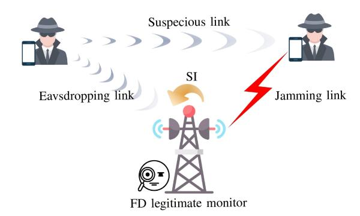

Fig. 17. Wireless information surveillance via an FD legitimate monitor.

first phase, the relay transmits AN to confuse the Eave, while receiving the signal from the source (Alice). In the second phase, while the relay is forwarding the confidential signal to the destination (Bob), the source transmits AN to jam the Eave. Therefore, Eave always receives information from one node and jamming signals from another. The authors in [\[273\]](#page-49-26) presented an experimental FD transceiver that transmits a frequency-sweeping continuous-waveform signal, commonly seen in low-cost radars, to prevent an eavesdropper from correctly interpreting a WLAN signal, while still being able to receive the same signal. The FD radio transceiver employs the analog baseband domain SIS by using a passive highpass filter.

It has been shown that, when the target secrecy rate is small, the proposed scheme outperforms the FD relaying scheme without jamming. However, when the target secrecy rate becomes larger, the converse holds. The cooperative jamming has been extended into multi-hop FD relay networks in [\[274\]](#page-49-27), where each FD relay receives the information signal from the previous node as well as transmits the jamming signal to the Eave at the same time. In the presence of an active FD Eave, the authors of [\[245\]](#page-48-40), studied the potential benefits of an FD radio node in terms of improving the secrecy data rate, where the FD node (FD relay in the cooperative scenario and FD receiver for the point-to-point scenario) can simultaneously act as jammer and a receiver. El Shafie et al. [\[275\]](#page-49-28) investigated the secrecy performance with buffer-aided FD relay, where switches between the HD and FD modes to further enhance the security of the legitimate system. In [\[276\]](#page-49-29), the relay selection problem has been considered for an FD multi-hop relay network with multiple source-destination pairs and multiple colluding and non-colluding eavesdroppers.

Numerous studies have explored the use of FD, beamforming, and AN in various secrecy scenarios, including cooperative networks with an untrustworthy relay (i.e., the relay acts as Eave) [\[277\]](#page-49-30), NOMA networks [\[278\]](#page-49-31), UAV networks [\[279\]](#page-49-32).

## *B. Full-Duplex Communication and Proactive Eavesdropping*

Proactive eavesdropping with cognitive jamming has been first proposed in the pioneer work [\[254\]](#page-49-7), [\[280\]](#page-49-33), where the legitimate monitor, operating in an FD manner, transmit jamming signal toward the suspicious receiver to degrade the rate of the link and induce the suspicious source to reduce its transmission rate, as shown in Fig. [17.](#page-29-1) The works in [\[281\]](#page-49-34)

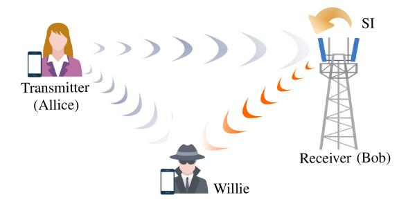

Fig. 18. FD covert communications.

and [\[282\]](#page-49-35) extended the single antenna monitor in [\[254\]](#page-49-7), [\[280\]](#page-49-33) to the multi-antenna scenario and designed beamforming vectors to maximize the eavesdropping non-outage probability (ENOP) and the eavesdropping rate, respectively. In [\[283\]](#page-49-36), the impact of imperfect CSI on the ENOP has been investigated and a robust beamforming design has been developed. To archive a low-complexity implementation, several antenna selection schemes have been proposed in [\[284\]](#page-49-37), where a single transmit and single receive antenna at the FD monitor are selected to maximize the ENOP. In [\[285\]](#page-49-38), a suspicious NOMA network was considered, and the jamming transmit power and SIC decoding order were jointly optimized to maximize the number of successfully eavesdropped suspicious users. The authors in [\[286\]](#page-49-39), studied the problem of optimizing the mode and transmit power of the FD monitor in the presence of multiple suspicious communication links. Furthermore, proactive eavesdropping with cognitive jamming and FD monitoring has been investigated in numerous scenarios, such as cooperative CRN [\[287\]](#page-49-40), UAV systems [\[288\]](#page-49-41), [\[289\]](#page-49-42), [\[290\]](#page-49-43), and bidirectional suspicious communication channels [\[291\]](#page-49-44).

To enhance the eavesdropping capability of the legitimate monitor, a new approach is a so-called spoofing relay technique [\[292\]](#page-50-0). The legitimate monitor thus acts as a relay to send spoofing signals toward the suspicious receiver. Depending on the quality of the eavesdropping link (from the source to the legitimate monitor), the spoofing relay induces the source to vary its transmission rate in favor of the eavesdropping rate. A joint design of spoofing relaying and cooperative jamming to wiretap the communication between a pair of suspicious users has been proposed in [\[293\]](#page-50-1). Finally, Table [X](#page-31-0) portrays a summary of the existing major contributions to FD-empowered secure transmission.

## *C. Full-Duplex Covert Communication*

The main objective of covert communications is to obscure the presence of wireless transmissions from a watchful adversary, named Willie, while guaranteeing a certain decoding performance at the intended receiver. Since Willie is normally passive and never transmits signals, the transmitter (Alice) cannot easily obtain the CSI of its channel to Willie. Thus, ZF cannot be readily applied at Alice to avoid detection at Willie. To this end, the pioneer work in [\[294\]](#page-50-2) utilized an FD receiver (Bob) to generate AN to cause detection error, affecting the decisions at Willie about the presence of any covert transmissions. closed-form expressions for the optimal detection

performance and optimum AN power were presented. The underlying assumption in [\[294\]](#page-50-2) is Rayleigh fading channels with known CSI. Then, the authors in [\[295\]](#page-50-3) adopted a channel inversion power control strategy to eliminate the CSI requirement at the FD receiver. Therefore, the CSI feedback from Alice to Bob is no longer required, which helps to hide Alice from Willie. The performance of the system has been examined in terms of the achieved effective covert throughput, which quantifies the amount of information that Alice can reliably convey to Bob, subject to the constraint that Willie's detection error probability is no less than some specific value. Moreover, covert communication over non-coherent Rayleigh fading channels with FD receiver was studied in [\[296\]](#page-50-4), where all parties only have access to channel distribution information. Bob constantly emits AN with fixed or varying power to cause uncertainty to Willie, and the length of Bob's AN emission time is much longer than the covert transmission time so AN does not provide any additional information about Alice's activity. Shu et al. [\[297\]](#page-50-5) studied covert communications with delay constraints (i.e., finite block length) over AWGN channels with the aid of an FD receiver.

The authors in [\[298\]](#page-50-6) extended the system model of [\[294\]](#page-50-2) and combined FD jamming receiver with the multi-antenna technology for covert communication against warden with uncertain locations. By determining the worse location for the warden (from the covert outage probability viewpoint) the transmission rate, the transmit power, and the jamming power of covert communication were optimized to maximize the connection throughput. In addition, [\[299\]](#page-50-7) studied the application of covert communication on FD single-hop mmWave communication and proposed a joint analog beamforming and jamming design algorithm to maximize the average cover rate.

In [\[300\]](#page-50-8), the covert rate of device-to-device communication underlaid cellular networks consisting of a BS, a cellular user, a device-to-device pair with an FD receiver, and a warden is studied. By assuming that the device-to-device receiver can operate over either the FD or HD mode, this work investigates the covert rate maximization problem to jointly optimize the transmit powers of the device-to-device pair and the cellular user as well as receiver mode assignment.

Moreover, the covert communication rate of a wireless relaying system was characterized in [\[301\]](#page-50-9). To improve the covert rate, a joint relay power control and duplex mode selection that flexibly switches between the FD and HD modes, depending on the state of the relay SI channel, has been proposed. The authors show that a suitable mode can be selected to support various applications with different requirements on covert rate and power consumption.

# *D. Case Study and Discussion*

Consider a legitimate surveillance wireless communication system as shown in Fig. [17,](#page-29-1) where an FD multi-antenna BS acts as a monitor. BS overhears the suspicious link between a suspicious transmitter-receiver pair via *N* receive antennas and sends a jamming signal via *M* antennas to force the suspicious transmitter to reduce its transmission rate. Therefore, the received signal at the monitor and suspicious receiver can

TABLE X FD-EMPOWERED SECURITY

| Secure Concept          | Literature            | Scenario                                                             | Main Contributions                                                                                                    |
|-------------------------|-----------------------|----------------------------------------------------------------------|-----------------------------------------------------------------------------------------------------------------------|
| Physical layer security | [245]–[247]           | Point-to-point communication, FD relay                            | Active eavesdropping                                                                                                  |
| security                | [258], [259]          | Point-to-point communication,                                        | Optimal design AN covariance matrix and information                                                                   |
|                         |                       | FD jammer                                                            | beamforming                                                                                                           |
|                         | [260]                 | Multi-link communication, FD                                         | Optimal power control at transmit and receive side to                                                                 |
|                         |                       | receivers                                                            | maximize secrecy of each individual link                                                                              |
|                         | [261], [262]          | HetNets, FD jammer                                                   | Stochastic geometry based secrecy analysis                                                                            |
|                         | [263]                 | Cellular network, FD jammer                                          | Transmit antenna selection at the BS and FD jamming at the user                                                       |
|                         | [69], [264]– [267] | Cellular network, FD BS                                              | Optimal design AN covariance matrix and information beamforming                                                       |
|                         | [244], [269]–         | Relay network, FD                                                    | Cooperative jamming with beamforming design and se-                                                                   |
|                         | [272], [274]          | relay/destination                                                    | crecy performance analysis                                                                                            |
| Covert                  | [294]                 | Point-to-point, FD receiver                                          | Optimal transmit power design of the FD receiver's AN                                                                 |
| Covert                  | [295]                 | Point-to-point, FD receiver                                          | Channel inversion power control at the transmitter side to eliminate the CSI requirement at the receiver side         |
|                         | [296]                 | Point-to-point, FD receiver                                          | Design fixed AN power and varying AN power over non- coherent fading channels                                      |
|                         | [297]                 | Point-to-point, FD receiver                                          | Examined the impact of finite block length on covert communications                                                   |
|                         | [298]                 | Point-to-point, FD receiver and                                      | Optimizing transmission rate and jamming power to max-                                                                |
|                         |                       | multi-antenna transmitter                                            | imize the connection throughput                                                                                       |
|                         | [299]                 | Point-to-point, FD receiver over mmWave                              | e Hybrid precoder and analog jamming design problem for the maximization of the achievable covert rate             |
|                         | [300]                 | Device-to-device pair with an FD receiver underlaid cellular network | Covert rate maximization by jointly optimizing the transmit powers of the device-to-device pair and the cellular user |
|                         | [301]                 | Relay system                                                         | Joint duplex-mode switching and power control at the relay                                                            |
| Proactive eavesdropping | [254], [280]          | Point-to-point suspicious link, FD SISO monitor                      | Proactive eavesdropping via jamming approach                                                                          |
| eavesdropping           | [281]–[284]           | Point-to-point suspicious link, FD MIMO monitor                      | Beamforming design at the monitor for enhancing the proactive eavesdropping via jamming                               |
|                         | [286]                 | Multiple point-to-point suspi- cious links, FD monitor            | Joint optimizing the monitor's mode and transmit power                                                                |
|                         | [292]                 | Point-to-point suspicious link, FD MIMO monitor                      | Proactive eavesdropping via spoofing relaying                                                                         |
|                         | [293]                 | Point-to-point suspicious link, relay-assisted monitor               | Joint design of spoofing relaying and cooperative jamming                                                             |

be written as

$$\gamma_E = \frac{\rho_s |\mathbf{v}_R^{\dagger} \mathbf{h}_{se}|^2}{\rho_e |\mathbf{v}_R^{\dagger} \mathbf{G} \mathbf{w}_T|^2 + 1},\tag{29}$$

and

$$\gamma_D = \frac{\rho_s |h_{sd}|^2}{\rho_e |\mathbf{h}_{sd}^{\dagger} \mathbf{w}_T|^2 + 1},\tag{30}$$

respectively, where  $\rho_s = P_S/\sigma_n^2$  and  $\rho_e = P_e/\sigma_n^2$  are the normalized suspicious source and monitor transmit power, respectively;  $\mathbf{v}_R \in \mathcal{C}^{N \times 1}$  and  $\mathbf{w}_T \in \mathcal{C}^{M \times 1}$  are the combining and precoding vectors at the FD monitor;  $\mathbf{h}_{se} \in \mathbb{C}^{N \times 1}$  and  $\mathbf{h}_{ed} \in \mathbb{C}^{M \times 1}$  are the channel vector of the suspicious transmitter-monitor and monitor-suspicious receiver link, respectively;  $h_{sd}$  denotes the direct link between the suspicious pair and  $\mathbf{G} \in \mathbb{C}^{N \times M}$  is the SI channel.

We consider the ENOP as a performance metric, denoted by  $\mathbb{E}\{X\}$ , where the indicator function X denotes the event of successful eavesdropping at the legitimate monitor, and [280]

$$\mathbb{E}\{X\} = \begin{cases} 1 & \text{if } \gamma_E \ge \gamma_D, \\ 0 & \text{otherwise.} \end{cases}$$
 (31)

We now present a joint design of the transmit precoder and receive combining vector at the monitor, which is obtained by solving the optimization problem

$$\max_{\mathbf{v}_{R},\mathbf{w}_{T}} \mathbb{E}\{X\} = \Pr(\gamma_{E} \ge \gamma_{D}), \tag{32a}$$

s.t 
$$\|\mathbf{v}_R\|^2 = \|\mathbf{w}_T\|^2 = 1.$$
 (32b)

We notice that  $\mathbf{v}_R$  only appears in  $\gamma_E$ . Moreover, for given  $\mathbf{w}_T$ ,  $\gamma_E$  is a generalized Rayleigh ratio problem, which can be globally maximized when [281]

$$\mathbf{v}_{R}^{*} = \frac{\left(\rho_{e} \mathbf{G} \mathbf{w}_{T} \mathbf{w}_{T}^{\dagger} \mathbf{G}^{\dagger} + \mathbf{I}_{N}\right)^{-1} \mathbf{h}_{se}}{\left\|\left(\rho_{e} \mathbf{G} \mathbf{w}_{T} \mathbf{w}_{T}^{\dagger} \mathbf{G}^{\dagger} + \mathbf{I}_{N}\right)^{-1} \mathbf{h}_{se}\right\|^{2}}.$$
 (33)

We now substitute  $\mathbf{v}_R^*$  into (32) and define  $\mathbf{W}_T = \mathbf{w}_T \mathbf{w}_T^{\dagger}$ . Then, following the proposed approach in [281], by applying the semi-definite relaxation (SDR) technique to relax the quadratic terms of the beamformers in the objective function and constraints and introducing the auxiliary variable t, we

recast the optimization problem (32) as

$$\min_{t,\mathbf{w}_T} \frac{|h_{sd}|^2}{t} + \frac{\rho_e \operatorname{tr} \left( \mathbf{W}_T \mathbf{G}^{\dagger} \mathbf{h}_{se} \mathbf{h}_{se}^{\dagger} \mathbf{G} \right)}{1 + \rho_e \operatorname{tr} \left( \mathbf{W}_T \mathbf{G}^{\dagger} \mathbf{G} \right)}, \quad (34a)$$

s. t 
$$t = 1 + \rho_e \operatorname{tr} \left( \mathbf{W}_T \mathbf{h}_{ed} \mathbf{h}_{ed}^{\dagger} \right),$$
 (34b)

$$\mathbf{W}_T \succeq 0,$$
 (34c)

$$tr(\mathbf{W}_T) = 1, (34d)$$

$$Rank(\mathbf{W}_T) = 1. \tag{34e}$$

To handle the non-convex problem (34), tow-layer optimization can be applied [281], [284]. In particular, for the inner problem, the rank one constraint is dropped and the problem is solved for given t. To tackle the non-convexity of the inner problem, caused by the quasi-convex fractional semidefinite programming (SDP), Charnes and Cooper's transformation can be applied to convert fractional SDP into an equivalent SDP [302]. To this end, let  $\mathbf{Q} = s\mathbf{W}_T$ , where positive s complies with  $s + \rho_e \operatorname{tr}(\mathbf{Q}\mathbf{G}^{\dagger}\mathbf{G}) = 1$ . Hence, the inner problem is written as [281]

$$f(t) = \min_{s, \mathbf{Q}} \rho_e \operatorname{tr}\left(\mathbf{Q}\mathbf{G}^{\dagger} \mathbf{h}_{se} \mathbf{h}_{se}^{\dagger} \mathbf{G}\right), \tag{35a}$$

s. t 
$$s + \rho_e \operatorname{tr}(\mathbf{Q}\mathbf{G}^{\dagger}\mathbf{G}) = 1,$$
 (35b)

$$s(t-1) = \rho_e \operatorname{tr}\left(\mathbf{Q}\mathbf{h}_{ed}\mathbf{h}_{ed}^{\dagger}\right),$$
 (35c)

$$\mathbf{Q} \succeq 0,$$
 (35d)

$$tr(\mathbf{Q}) = s, (35e)$$

where f(t) is the optimal value of problem (35). For given t, the optimization problem (35) is solved and the optimum solution f(t) is obtained. Then, the outer layer optimization problem

(P2-2): 
$$\min_{t} \frac{|h_{sd}|^2}{t} + f(t),$$
 (36a)

s.t 
$$1 \le t \le 1 + \rho_e ||\mathbf{h}_{ed}||^2$$
, (36b)

is solved via one-dimensional line search over t, yielding the optimal f(t). To this end, SDP problem (35) is solved via the optimal f(t) obtained from (36), to obtain the optimal design variable  $\mathbf{W}_T^* = \frac{\mathbf{Q}^*}{s^*}$ . Noticing that the optimal  $\mathbf{W}_T^*$  is guaranteed to be rank-one [281],  $\mathbf{w}_T^*$  is calculated using eigenvalue decomposition. Accordingly, by substituting  $\mathbf{W}_T^*$  into (33), we obtain  $\mathbf{v}_R^*$ .

In Fig. 19, we examine the ENOP performance of the optimum and sub-optimum beamforming designs at the monitor under different antenna setups. As a sub-optimum design we consider ZF/MRT with  $\mathbf{w}_T^{\mathsf{MRT}} = \frac{\mathbf{h}_{ed}}{\|\mathbf{h}_{ed}\|^2}$  and  $\mathbf{v}_R^{\mathsf{ZF}} = \frac{\mathbf{h}_{ed}}{\|\mathbf{h}_{ed}\|^2}$  with " =  $\mathbf{I}_N - \frac{\mathbf{G}\mathbf{w}_T^{\mathsf{MRT}}(\mathbf{w}_T^{\mathsf{MRT}})^{\dagger}\mathbf{G}^{\dagger}}{\|\mathbf{G}\mathbf{w}_R^{\mathsf{MRT}}\|^2}$  and MRC/MRT design with  $\mathbf{w}_T^{\mathsf{MRT}}$  and  $\mathbf{v}_R^{\mathsf{MRC}} = \frac{\mathbf{h}_{se}}{\|\mathbf{h}_{se}\|^2}$ . It is evident that by deploying more receive antennas than the transmit antennas at the monitor, the ENOP performance is improved and the gap between the optimum and ZF/MRT design is significantly reduced. However, due to the presence of SI, the MRC/MRT design fails to meet the performance specifications of the system, which demonstrates the importance of the SIS process.

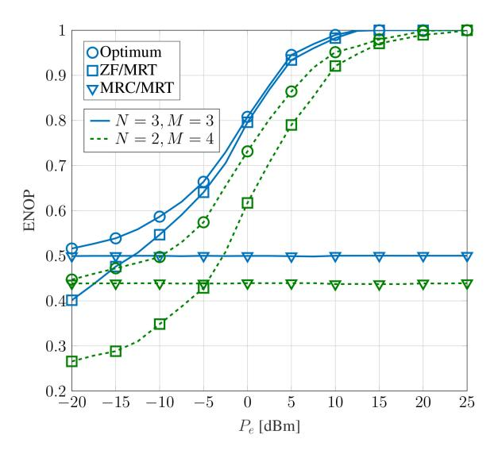

Fig. 19. ENOP of the optimum and sub-optimum beamforming designs for  $\alpha=-70~{\rm dB}$  and  $P_S=10~{\rm dBm}.$ 

#### E. Future Research Directions

Existing works in Table X mostly assume that global instantaneous CSI is perfectly known for beamforming and covariance matrix design. However, this assumption may not always hold. In the PLS context, the Eve-related instantaneous CSI may be hard due to the uncertainty of Eave's position [223], [303]. In surveillance scenarios, this process can increase the risk of the monitor being discovered by the suspicious party with high probability. Therefore, developing FD-assisted secure communication systems and wireless surveillance scenarios relying on the statistical CSI is an interesting research direction. Furthermore, eavesdroppers and suspicious parties may exploit wireless technological advances to achieve highly efficient communication links. For example, they can exploit UAVs and take advantage of LoS conditions of the air-to-ground links and the additional spatial degree brought by the flexible deployment of the UAV [289], [304], [305]. Therefore, surveillance systems must dynamically monitor the network conditions to efficiently manage their signaling and related designs, such as their transmit power and beam direction, to protect confidential communications from eavesdropping attacks and public security by legitimately eavesdropping suspicious wireless communications [305].

# VIII. FULL-DUPLEX TRANSMISSIONS AND WIRELESS ENERGY HARVESTING

EH has gained an upsurge of interest from academia and industry for prolonging the lifetime of the energy constraint communications networks [306]. The main EH modes are:

-  Wireless power transfer (WPT): it is the transmission of electrical energy without the need for a physical connection between the power source and the device being powered. WPT methods include:
  - 1) Inductive Coupling: This method uses two coils, one connected to a power source and the other to a device. When the coils are brought close together, an alternating current is induced in the receiving

- coil, which is then converted into a direct current power supply [\[307\]](#page-50-15).
- 2) Resonant Coupling: This method involves using resonant circuits to transfer power wirelessly. A resonant circuit is a circuit that oscillates at a specific frequency. By using two resonant circuits tuned to the same frequency, power can be transferred wirelessly over a greater distance [\[307\]](#page-50-15), [\[308\]](#page-50-16).
- 3) RF EH: This method involves capturing the energy present in the surrounding environment, such as radio waves and EM radiation, and converting it into usable direct current power. This method is typically used to power low-power devices, such as sensors. This involves power transfer to EH devices without any information transfer [\[307\]](#page-50-15), [\[309\]](#page-50-17).
- 4) Commercial WPT schemes are emerging. For example, the technical company Xiaomi has recently announced their self-developed "Mi Air Charge," delivering up to 5-W power over the air simultaneously to multiple devices within a distance of several meters [\[310\]](#page-50-18).

## *A. Full-Duplex With WPCN*

By applying the FD technique to the WPCN, network throughput is improved as compared to the conventional HD-WPCN at the cost of the practical issue of imperfect SI cancellation at the FD network. In [\[311\]](#page-50-19), FD-WPCN with an FD hybrid-access point (H-AP) was proposed to support simultaneous WPT in DL and wireless information transfer (WIT) in UL and time allocation to the H-AP for DL WPT and different users for UL WIT optimized. The authors in [\[312\]](#page-50-20) characterized two fundamental optimization problems for the FD WPCN, namely the sum-throughput maximization problem and the total time minimization problem. The energy causality constraint has been modeled for both problems, assuming that DL energy harvested from H-AP in the future cannot be used for current UL information transmission. This assumption leads to the causal dependence of each user's harvesting time on the transmission time of earlier users, e.g., the second user assigned to transmit can harvest more energy if the first user has a longer transmission time. SE and EE of a WPCN consisting of an FD multiple-antenna BS and multiple single-antenna DL UEs and single-antenna UL UEs, where the latter need to harvest energy for transmitting information to the BS, have been investigated [\[313\]](#page-50-21). In [\[314\]](#page-50-22), the resource allocation problem has been studied for a WPCN scenario, where a multi-antenna H-AP serves single antenna UEs in both WIT UL and WPT DL. The work in [\[315\]](#page-50-23) considers the total energy minimization problem for UAV-aided WPCN, where the UAV broadcasts energy and receives information in HD or FD mode. While all aforementioned works [\[311\]](#page-50-19), [\[312\]](#page-50-20), [\[313\]](#page-50-21), [\[314\]](#page-50-22), [\[315\]](#page-50-23) assume perfect CSI is available at the H-AP, the impact of imperfect CSI on the achievable rate of an FD-WPCN with massive antenna H-AP has been investigated in [\[316\]](#page-50-24). Specifically, by adopting a two-time slot protocol, during the first phase H-AP transfers energy to a set of sensors and at the same

time receives pilot symbols transmitted by cellular users. In the second phase, the H-AP estimates the UL channels and uses the channel estimates to design the transmit beamformer for DL transmission to all cellular users, while receiving information from sensors. Iqbal et al. [\[317\]](#page-50-25) investigate a minimum length scheduling scheme for multi-cell FD-WPCNs to determine the optimal power control and scheduling for a constant rate transmission model. In [\[318\]](#page-50-26), an IoT network with FD wireless power is considered, and it supports simultaneous data collection from devices in the UL and WPT of an H-AP in the DL. Under two objectives, i.e., total throughput maximization subject to a total time constraint, and total time minimization subject to minimum collected data constraints, the joint data collection scheduling and time allocation are investigated.

## *B. Full-Duplex With SWIPT*

RF signals carry both information and energy at the same time. Thus, wireless transmission can be used not only for WIT towards Information receivers but also for WPT towards energy receivers with EH capability from RF. A unified approach to studying WIT and WPT is SWIPT, which involves simultaneously information and power transfer to information receivers and energy receivers, respectively. The energy receiver and information receiver can be collocated over the same device that is simultaneously receiving information and harvesting energy, or separated where the energy receiver and information receiver are different devices [\[309\]](#page-50-17). Allocating the available resources, such as power, time, and bandwidth to balance the information transmission rates and amount of harvested energy is a nontrivial trade-off in SWIPT that requires careful system design. Current literature on the FD SWIPT networks mainly focuses on the colocated energy receiver and information receiver scenario [\[309\]](#page-50-17).

In SWIPT systems, the receiver architecture in EH and communication modules can be categorized into two practical configurations: the shared-antenna architecture and the separate-antenna architecture, as discussed in Ding et al. [\[319\]](#page-50-27). In the separate-antenna (or antenna-switching) architecture, distinct antennas are dedicated to the EH and communication modules, while in the shared-antenna architecture, both EH and communication functions are carried out using the same set of antennas. Time switching (time-switching), power-splitting, and hybrid power-splitting/time-switching are commonly adopted designs to implement SWIPT receivers via shared-antenna structure [\[319\]](#page-50-27). With time-switching, each receiver antenna periodically switches between the EH and communication modules based on a time-switching factor. This approach enables efficient utilization of the shared antenna resources for both EH and communication purposes. On the other hand, the power-splitting technique involves dividing the received signal at each antenna into two separate power streams. These power streams are then distributed to the EH and communication modules based on a specific powersplitting ratio. This approach allows for simultaneous EH and communication by allocating a portion of the received signal power to each module.

SWIPT has been used in point-to-point MIMO FD systems [320], [321], [322]. In [320], a joint antenna clustering and precoding method, based on hybrid deep reinforcement learning, is proposed. Chalise et al. [323] optimized transmit beamforming and time-switching parameters with instantaneous CSI. The FD transceiver functions as a wireless-powered cooperative jammer. It utilizes its receive antennas to harvest energy from the RF signals transmitted by the source, charging its battery, and then uses this energy to perform cooperative jamming [321], [322].

SWIPT and FD relaying have been intensively researched during the past decade. The key idea of applying SWIPT in FD relay systems is to remotely replenish the energyconstrained relay. More specifically, time-switching SWIPT with dual-antenna FD relay [324] power-splitting SWIPT with dual-antenna FD relay [325], [326] and time-switching SWIPT with multi-antenna FD relay [327] have been thoroughly studied. While the SI link degrades the quality of the received signal at the FD relay, the idea of self-energy recycling from the SI link has been proposed in [328] to boost the amount of harvested energy at the FD relay. The authors in [329], proposed a model to optimize the power-splitting factor at the FD MIMO relay node and precoding design at both the source and relay nodes, where relay harvesting power from both source and SI signals using a non-uniform powersplitting technique. Relay selection for power-splitting SWIPT FD two-way relaying has been proposed in [330] and the optimal power-splitting factor has been derived. Furthermore, the problem of securing SWIPT FD relay systems was considered in [331], [332], [333]. PLS of MIMO and SISO FD relay channel with the aid of an RF EH cooperative jammer that is solely powered by the ambient RF transmissions from the source node has been studied in [331] and [332], respectively. Security enhancement of a time-switching SWIPT FD relay system in the presence of a passive Eave has been considered in [333], where the energy beamformer, the information beamformer, and the time-switching coefficient have been jointly optimized. Beamforming design for secure information exchange has been addressed in SWIPT-based FD two-way relay systems in the presence of external Eave [334] and untrusted relay [335].

The concept of SWIPT has been widely investigated for cellular networks. Several prior works can be outlined as follows. Chen et al. [336] have proposed and analyzed EE in an architecture of self-backhaul and EH FD-based small cell network with massive MIMO. Optimal precoding designs for EH-enabled FD multicell multiuser MIMO networks were proposed in [337]. This work demonstrates the advantages of the time-switching approach over the power-splitting approach in FD cellular networks. In [338], PLS for a DL multiuser IoT system with an AP and multiple legitimate SWIPT IoT devices in the presence of multiple Eaves has been investigated. The IoT devices can use the harvested energy via SWIPT to send jamming signals to interfere with the Eaves while also receiving information based on the FD operation. In [339], decoupled user association in wireless-powered two-tier FD HetNets, comprising HD massive multi-antenna macrocell BSs and dual-antenna FD small cell BSs, has been studied.

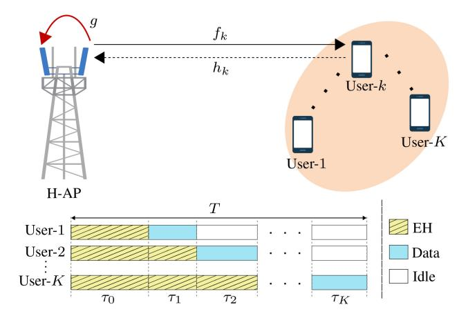

Fig. 20. An FD WPCN system and the transmission frame structure.

Performance of a NOMA-assisted cognitive relay system has been quantified in [340] and [341], respectively. In [340], a joint time-switching parameter and beamformer design at the FD MIMO secondary source has been provided to maximize the rate of the secondary network while ensuring that the rate of the primary network is above a certain threshold. Outage probability of the primary and secondary networks of an FD NOMA-assisted cooperative overlay spectrum-sharing system with power-splitting SWIPT has been studied in [341]. Table XI shows a summary of the major related works on FD-assisted WPT systems.

# C. Case Study and Discussion

We consider an FD WPCN having an H-AP with two antennas, i.e., one for the DL wireless energy transfer and the other for UL data reception, and K-single antenna users Fig. 20. We denote  $f_k \sim \mathcal{CN}(0,\zeta_{f_k})$  and  $h_k \sim \mathcal{CN}(0,\zeta_{h_k})$  as the kth user's DL and UL channels, respectively, where  $\zeta_{f_k}$  and  $\zeta_{h_k}$  are the respective variances. Besides,  $g \in \mathbb{C}$  represents the SI channel between the AP's transmit and receiver antennas and is modeled as Rician fading with  $K_R$  Rician factor. All the channels are assumed to be block-fading.

The frame structure for EH and data transmission is shown in Fig. 20. The H-AP continuously broadcasts a DL energy signal  $\sqrt{p_t}x_d$  with  $\mathbb{E}\{|x_d|^2\}=1$  and  $p_t$  is the constant DL transmit power of the H-AP. The AP uses a time-division-multiple-access (TDMA) structure to receive the UL data from the users using its receiver antenna at the same time. It is assumed that the kth user transmits during the kth time slot, i.e.,  $\tau_k$ . We also assume that the users have no other energy source or battery to store their harvested energy. Hence, the users can harvest energy before its transmission but not after. The total harvested energy by the kth user is thus given as

$$E_k = \eta_k p_t |f_k|^2 \sum_{i=0}^{k-1} \tau_i,$$
(37)

where  $\eta_k \in (0,1)$  is the kth user EH efficiency. The average transmit power of the kth user is given as  $p_k = E_k/\tau_k$ .

In TDMA, each user can only transmit during its assigned time slot, which eliminates mutual interference among users.

| Topology                                | Literature   | Scenario            | Main Contributions                                                            |
|-----------------------------------------|--------------|---------------------|-------------------------------------------------------------------------------|
| Topology                                |              |                     |                                                                               |
| WPCN                                    | [311], [312] | Multiuser UL/DL     | Design an efficient protocol to support simultaneous WPT DL and WIT UL        |
| ,,,,,,,,,,,,,,,,,,,,,,,,,,,,,,,,,,,,,,, | [313]        | Multiuser UL/DL     | SE and EE maximization via beamforming design at the H-AP                     |
|                                         | [314]        | Multiuser IoT       | Optimize the channel assignment and resource allocations to maximize the      |
|                                         |              |                     | UL-weighted sum-rate                                                          |
|                                         | [315]        | UAV-aided multiuser | Minimize the total energy consumption of the UAV while accomplishing per-     |
|                                         |              | UL                  | UE QoS                                                                        |
|                                         | [316]        | Multiuser UL/DL     | Channel estimation and beamforming design                                     |
| SWIPT                                   | [320]        | FD point-to-point   | Antenna clustering and precoding design based on hybrid deep reinforcement    |
| SWIFT                                   |              |                     | learning-based implementation                                                 |
|                                         | [321], [322] | FD point-to-point   | Wireless-powered friendly jammer for cooperative jamming to improve PLS       |
|                                         | [324]–[327]  | One-way FD relay    | Performance analysis and optimizing the time-switching/power-splitting factor |
|                                         | [328], [329] | One-way FD relay    | Beamforming design for self-energy recycling from the SI link                 |
|                                         | [330]        | Two-way FD relay    | Relay selection with power-splitting factor design                            |
|                                         | [331]–[333]  | One-way FD relay    | Physical layer security with cooperative jamming                              |
|                                         | [334], [335] | Two-way FD relay    | Beamforming design for secure information exchange in the presence of         |
|                                         |              |                     | external Eave/untrusted relay                                                 |
|                                         | [336], [337] | FD Cellular         | Precoding scheme design                                                       |
|                                         | [338]        | Multiuser DL IoT    | Resource allocation to maximize the sum secrecy rate                          |

TABLE XI FD-ENABLE WIRELESS POWER TRANSFER

The received signal at the AP from the kth user is thus

[340], [341]

$$y_k = \sqrt{p_k} h_k s_k + \sqrt{\alpha p_t} g x_d + n_k, \tag{38}$$

FD CRN

where  $s_k$  is the kth user transmitted signal,  $n_k \sim \mathcal{CN}(0, \sigma_n^2)$ is the AWNG at the AP, and  $\alpha$  is the SI cancellation gain. From (38), the UL rate of the kth user is derived as

$$R_k = \log_2\left(1 + \frac{\gamma_k \sum_{i=0}^{k-1} \tau_i}{\tau_k}\right),$$
 (39)

where

$$\gamma_k \triangleq \frac{\eta_k p_t |f_k|^2 |h_k|^2}{(\alpha p_t |q|^2 + \sigma_n^2)}.$$
 (40)

We aim to find the optimal time allocation coefficients to maximize the total throughput of the system subject to a total time constant of T. For convenience, we use a normalized unit block time, i.e., T = 1. The proposed optimization problem is thus formulated as

$$\max_{\boldsymbol{\tau}} \sum_{k=1}^{K} \tau_k \log_2 \left( 1 + \frac{\gamma_k \sum_{i=0}^{k-1} \tau_i}{\tau_k} \right), \tag{41a}$$
s. t  $\tau_k \ge 0,$ 

$$\sum_{i=0}^{K} \tau_i \le 1, \tag{41c}$$

$$s.t \quad \tau_k \ge 0, \tag{41b}$$

$$\sum_{i=0}^{K} \tau_i \le 1,\tag{41c}$$

where  $\tau = [\tau_0, ..., \tau_K]$ .

The optimal solution to the problem (41) must satisfy the constraint (41c) with equality, i.e.,  $\sum_{i=0}^{K} \tau_i^* = 1$  [312]. In addition, since the objective function is a concave function of the non-negative vector  $\tau$ , the problem (41) is a convex optimization problem [312], [342]. Using convex optimization techniques, the optimal solution of problem (41) is thus obtained as follows [312]

$$\tau_K^* = \frac{1}{1 + x_k},\tag{42a}$$

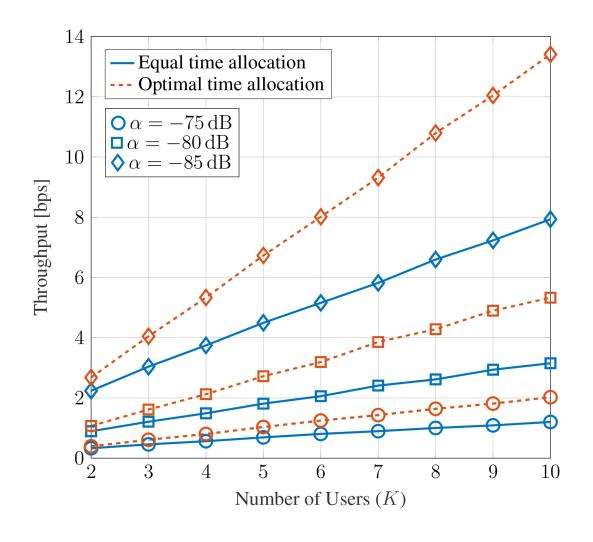

NOMA spectrum sharing, beamforming design, and outage performance

Fig. 21. The throughput as a function of the number of users (K) for  $p_t =$ 20 d Bm,  $\alpha = \{-75, -80, -85\}$  dB, and  $\eta_k = 0.8, \forall k$ .

$$\tau_k^* = \frac{1 - \sum_{i=k+1}^K \tau_i^*}{1 + x_k}, \quad \text{for} \quad k \in \{1, \dots, K-1\},$$
 (42b)

$$\tau_0^* = 1 - \sum_{i=1}^K \tau_i^*,\tag{42c}$$

where 
$$x_k = \frac{1}{\gamma_k} \left( e^{\mathcal{W}\left(\frac{\gamma_k - 1}{e^{c_k + 1}}\right) + c_k + 1} - 1 \right)$$
 for  $k \in \{1, \dots, K\}$ ,  $c_1 = 0$ , and  $c_k = \sum_{i=1}^{k-1} \frac{\gamma_i}{\gamma_i x_i + 1}$  for  $k \in \{2, \dots, K\}$ . Besides,  $\mathcal{W}(\cdot)$  is the well-known Lambert W-function [343].

Fig. 21 depicts the relationship between system throughput and the number of users, considering both optimal and equal time allocation strategies across various SI cancellation gains. As anticipated, the optimal time allocation consistently outperforms the equal time allocation. Moreover, as the number of users grows, the disparity in throughput between the optimal and equal time allocation strategies becomes more

pronounced. This observation highlights the increasing importance of precise time allocation when dealing with a large number of users, *K*. Furthermore, it is worth noting that the SI cancellation gain significantly impacts the system throughput. Specifically, a higher gain corresponds to greater throughput. This finding underscores the crucial role played by SI cancellation in enhancing overall system performance. In summary, the findings illustrated in Fig. [21](#page-35-4) emphasize the superiority of optimal time allocation over equal time allocation and highlight the increasing significance of time allocation as the number of users grows. Moreover, the significant impact of SI cancellation gain on system throughput further accentuates its importance in optimizing wireless network performance.

## *D. Future Research Directions*

An interesting research area is the design of multiuser SWIPT waveforms in FD broadcast and interference channels, considering non-linear EH models [\[309\]](#page-50-17). Additionally, the application of FD in multiuser SWIPT with separate information receiver and energy receiver remains unexplored. For instance, an FD BS can transmit energy signals to an energy receiver while receiving information from an information receiver in the UL direction. Analyzing the performance of SWIPT architectures in FD broadcast, multiple access, relay networks, and separate information receiver and energy receiver scenarios considering non-linear EH models, is also of interest. Another intriguing research area is the investigation of rate-splitting techniques in multiuser SWIPT systems with separated information users and energy users, considering both linear and non-linear EH models. Rate-splitting has shown superior performance compared to linear precoding schemes in various networks and different quality levels of CSI at the transmitter. The rate-splitting strategy can be leveraged in multiuser scenarios to further enhance the rate-energy regions.

## IX. CHALLENGES AND POTENTIAL FUTURE RESEARCH

This section discusses open challenges, trends, and opportunities to enable the widespread use of FD with several wireless technologies.

# *A. Cell-Free Massive MIMO*

Cell-free massive MIMO is a novel concept that combines massive MIMO networks and distributed antenna systems to overcome inter-cell interference and provide handover-free, uniform quality-of-service (QoS) for all user nodes [\[344\]](#page-51-5). It inherits the propagation and channel hardening advantages of co-located massive MIMO systems, as well as the macrodiversity gain of distributed systems [\[344\]](#page-51-5), [\[345\]](#page-51-6), [\[346\]](#page-51-7), [\[347\]](#page-51-8), [\[348\]](#page-51-9), [\[349\]](#page-51-10), [\[350\]](#page-51-11). In this system, a large number of access point (AP) antennas are distributed across a wide area to serve multiple user nodes simultaneously, eliminating the need for channel estimation at users and simplifying resource allocation [\[344\]](#page-51-5), [\[345\]](#page-51-6), [\[346\]](#page-51-7), [\[347\]](#page-51-8), [\[348\]](#page-51-9), [\[349\]](#page-51-10), [\[350\]](#page-51-11). As a result, cell-free massive MIMO offers superior SE and EE compared to small-cell and co-located massive MIMO networks [\[344\]](#page-51-5), [\[348\]](#page-51-9), [\[351\]](#page-51-12), [\[352\]](#page-51-13). FD cell-free massive MIMO combines the benefits of FD and cell-free massive MIMO to enhance the SE and EE of future wireless networks [\[353\]](#page-51-14), [\[354\]](#page-51-15), [\[355\]](#page-51-16), [\[356\]](#page-51-17), [\[357\]](#page-51-18), [\[358\]](#page-51-19), [\[359\]](#page-51-20), [\[360\]](#page-51-21), [\[361\]](#page-51-22). More importantly, FD cell-free massive MIMO can be considered a practical and promising technology for beyond 5G networks, since low-power and low-cost FD-enabled APs are well-suited for short-range transmissions between APs and UEs. Despite the obvious benefits of these two technologies, FD cell-free massive MIMO has the following challenges on radio resource allocation problems: (i) Residual SI remains a difficult challenge in the design of FD cell-free massive MIMO, reducing its potential performance gains, (ii) When compared to conventional FD cellular networks, a large number of APs and legacy UEs results in strong inter-AP interference and cochannel interference caused by UL transmission to DL UEs, and (iii) FD cell-free massive MIMO increases the network power consumption due to the additional number of APs [\[356\]](#page-51-17).

Despite the potential of FD cell-free massive MIMO, only a few works characterize its performance thus far. The authors in [\[353\]](#page-51-14) investigate the performance with channel estimation errors, where all APs operate in FD mode. This work shows that using a simple conjugate beamforming/matched filtering transmission design necessitates a deep SI cancellation – otherwise, this system has no gains over the HD counterpart. In [\[354\]](#page-51-15), the effects of imperfect CSI and spatial correlation have been investigated. A genetic algorithmbased user scheduling technique is developed to alleviate co-channel interference and achieve considerable SE gains. Nguyen et al. [\[355\]](#page-51-16) propose a heap-based algorithm for pilot assignment to overcome pilot contamination. The authors in [\[356\]](#page-51-17) investigate the maximization of SE and EE of an FD cell-free massive MIMO by proposing a novel and comprehensive optimization problem. It includes power control, AP-UE association, and AP selection to be optimized under a realistic power consumption model.

Datta et al. [\[357\]](#page-51-18) investigate the SE and EE of an FD cell-free massive MIMO system while accounting for practical limited-capacity front-haul links. To this end, the closed form lower bound of the SE is derived utilizing maximumratio combining/maximum-ratio transmission processing and optimal uniform quantization. The authors also employ a twolayered technique to maximize the weighted sum EE using DL and UL power control. Mohammadi et al. [\[358\]](#page-51-19) proposes a virtual FD technique in cell-free massive MIMO networks, where the IBFD is virtually realized by leveraging existing HD APs without the need for hardware for SIS. Thereby, a mixed-integer optimization problem with per-UE SE requirement constraints and per-UL UE and per-AP power control constraints is developed to optimize the sum of SE. The authors extended their works in [\[359\]](#page-51-20) and jointly optimized the AP mode assignment and power control at UEs and APs to maximize the SE and EE of the system. The sum SE of an FD cell-free massive MIMO system with low-resolution analogto-digital converters (ADCs) at the APs and DL users has been studied in [\[360\]](#page-51-21). They derive closed-form solutions for the UL/DL SE by quantifying the joint effects of the residual SI, inter-AP interference, UL-to-DL interference, pilot contamination, and quantization noise. Yu et al. [\[361\]](#page-51-22) propose a joint beamforming design for access and front-haul links in a user-centric network with FD front-haul. By accounting for the power consumed by SI cancellation at FD APs, the proposed optimization scheme maximizes the network EE while ensuring front-haul rate requirements. Gao et al. [\[362\]](#page-51-23) investigate an FD cell-free NOMA-assisted space-ground integrated network, which employs spectrum sharing between the satellite and terrestrial networks to improve the SE. The authors propose a sum-rate maximization scheme that optimizes the power allocation factors of the NOMA DL, the UL transmit power, and both the satellite and AP beamformers.

*Challenges:* Despite recent advancements in FD cell-free networks, the backhaul requirement poses challenges, as typical solutions rely on expensive fiber connections or LoSdependent microwave-based backhauls [\[13\]](#page-43-12). The deployment of FD cell-free communication is constrained by SI cancellation and inter-AP interference [\[354\]](#page-51-15), [\[359\]](#page-51-20). Furthermore, there is limited research on IBFD for cell-free networks and mathematical tools such as game theory and stable matching theory are underutilized in FD cell-free communication frameworks. It is important to investigate the scenarios and system parameters that make FD schemes effective for cell-free communications.

# *B. Millimeter-Wave Communications*

The mmWave band, spanning from 30 GHz to 100 GHz, presents numerous opportunities for next-generation wireless networks. It offers significantly higher capacity compared to current microwave bands/sub-6 GHz WLANs and cellular mobile communications [\[363\]](#page-51-24), [\[364\]](#page-51-25), [\[365\]](#page-51-26). However, this band suffers from substantial propagation losses caused by foliage, air absorption, rain-induced fading, and sensitivity to obstacles, resulting in decreased received signalto-interference-plus-noise ratio (SINR). To overcome these challenges and achieve sufficient link margin, dense antenna arrays with dozens or hundreds of elements are necessary to provide high beamforming gains through directional transmissions. This is important because omnidirectional transmissions can interfere with many nodes, whereas directional transmission minimizes the number of nodes affected by the interfering signal.

Recent mmWave advances, such as digital/analog beamforming with dense antenna arrays and a reduced number of RF chains, which can overcome high path-loss and achieve sufficient link margin, enable mmWave IBFD [\[366\]](#page-51-27), [\[367\]](#page-51-28), [\[368\]](#page-51-29). Nevertheless, existing sub-6 GHz IBFD does not immediately translate to mmWave systems because of fundamental differences, i.e., propagation characteristics, dense antenna arrays, hybrid beamforming, wide bandwidths, high sampling rates, and beam alignment techniques. Hence, FD-mmWave communication poses unique challenges. First, due to massive antenna arrays and much wider bandwidths, the transceiver and system design requirements are different. Second, the SI and SI cancellation have unique characteristics in mmWave bands. First, unlike conventional communication, mmWave communication typically necessitates large antenna arrays, which means that specific antenna settings/configurations are necessary to enable FD-mmWave transmission and SI cancellation. Moreover, conventional analog SI cancellation is inadequate for the dense arrays and wide bandwidths of mmWave transmission. On the other hand, MIMO precoding and combining methodologies investigated in traditional FD to mitigate SI via spatial degrees of freedom inspire FD-mmWave communication. However, features such as hybrid beamforming, wide bandwidths, high sampling rates, beam alignment, and propagation characteristics will dictate what is feasible and practical at the mmWave level.

Several works have investigated the feasibility of mmWave FD [\[366\]](#page-51-27), [\[367\]](#page-51-28), [\[368\]](#page-51-29), [\[369\]](#page-51-30), [\[370\]](#page-51-31), [\[371\]](#page-51-32), [\[372\]](#page-51-33). Xiao et al. [\[366\]](#page-51-27) investigate its potential by designing antenna configurations, modeling the mmWave SI channel, and reducing SI by spatial signal processing, i.e., beamforming cancellation. The authors of [\[367\]](#page-51-28) propose a hybrid beamforming design, which suppresses SI by jointly designing the beamformer weights at the RF and the precoder and the combiner in the baseband, while preserving the dimensions of the transmit signal. Roberts et al. [\[368\]](#page-51-29) present STEER, a novel beam selection methodology for a multi-panel FD-mmWave system that provides high beamforming gain while significantly reducing the FD SI coupled between the transmit and receive beams. Li et al. [\[369\]](#page-51-30) present the SI channel model for an FD-enabled mmWave transceiver with separate transmit and receive linear arrays in two different planes, taking into account both LoS signal leakage and non-LoS reflections from nearby reflectors. Demir et al. [\[370\]](#page-51-31) investigate the possibility of mmWave FD in 5G networks by categorizing FD systems into antenna systems, analog front-end and digital baseband SI cancellers, and protocol stack enhancements. The authors also compare the operations of HD and FD systems in terms of data rate, revealing that the range of FD is SI restricted whereas the range of HD is noise limited. Barneto et al. [\[372\]](#page-51-33) have studied FD operation in monostatic OFDM radars for joint communication and sensing. The authors propose novel analog transmit and receive beamforming designs to maximize the beamforming gain at the sensing direction. Roberts et al. [\[373\]](#page-51-34) propose a novel design of analog beamforming codebooks, namely *Lonestar*, to enable FD-mmWave communication. It offers high beamforming gain and coverage while simultaneously lowering the SI coupled by transmit and receive beams in an FD-mmWave transceiver.

*Challenges:* Limited efforts have been made to comprehensively model, analyze, and optimize FD mmWave systems. Key areas lacking solid frameworks include propagation characterization, SI cancellation, interference management, resource allocation, dense antenna array beamforming, and beam alignment techniques. SI and multi-user interference cancellation present significant challenges, often addressed using spatial signal processing and directional spatial reuse. However, commercial mmWave antennas are imperfect, and the potential of side lobes to reduce SI/multi-user interference and the impact of realistic beam patterns need further investigation. Additionally, there is a notable lack of experimental studies on mmWave FD systems. Existing experimental works are limited to simple testbeds with a few users and controlled environments, highlighting the need for more research on sophisticated systems.

# *C. UAV Communications*

Unexpected natural or man-made disasters, such as earthquakes, floods, tornados, and terrorist attacks can cause devastating damage to communication infrastructures. Thus, leveraging UAVs (also known as drones) to provide service recovery appears a promising solution [\[374\]](#page-51-35). Otherwise, UAVs can be employed as aerial communication platforms (e.g., flying BSs or mobile relays), in which communication transceivers are mounted over the UAVs to provide/enhance communication services to ground targets in high traffic demand and overloaded situations. This type of communication is commonly referred to as *UAV-assisted* communications [\[374\]](#page-51-35), [\[375\]](#page-51-36).

Because of the recent flurry of research, incorporating FD transceivers to enhance the SE of UAV networks is gaining attention. In particular, the work in [\[376\]](#page-51-37) discussed the spectrum sharing planning problem for an FD UAV relay network with underlaid device-to-device communications, where a mobile UAV employed as an FD relay assists the communication link between separated nodes without a direct link. In [\[377\]](#page-51-38), joint design of beamforming and power allocation for DaF multi-antenna relay with fixed-wing UAVs has been investigated. Hua et al. [\[378\]](#page-51-39) studied FD UAV-aided small-cell wireless networks, where the UAV serving as BS is designed to transmit data to the DL users and receive data from the UL users simultaneously. Shi et al. [\[379\]](#page-51-40) proposed UL/DL transmission resource allocation method for UAV-aided FD NOMA systems, where UAV is deployed to relay partial UL traffic from the UL users for lower power consumption and higher data rate.

The authors in [\[380\]](#page-51-41), considered a multi-UAV aided FD NOMA cellular network where UAV serves as flying BSs and investigated the problem of maximizing overall sum-rate throughput under UAV placement and the transmit power budget at each UL node and at UAV. Liu et al. [\[381\]](#page-51-42), proposed a secure transmission scheme for a UAV wiretap channel, in which a multi-antenna source transmits to a single-antenna UAV in the presence of an FD active eavesdropper, performing both eavesdropping and malicious jamming simultaneously. To confuse the eavesdropper, the source transmits both AN and information signals, where the optimal power allocation factor between information signals and AN signals as well as the operating height of the UAV that minimize the hybrid outage probability are designed. In [\[382\]](#page-51-43) FD UAV relay is employed to increase the communication capacity of mmWave networks, where large antenna arrays are equipped at the source, destination, and FD-UAV relay to overcome the high path-loss of mmWave channels and to help mitigate the SI at the FD-UAV relay. The potential of an FD drone BS in cellular networks has been investigated in [\[383\]](#page-52-0). This study formulated the problem of the drone BS placement with bandwidth and power allocation in the access and backhaul links.

Other non-terrestrial networks such as high-altitude platforms [\[384\]](#page-52-1) and Low Earth-orbit (LEO) satellites [\[385\]](#page-52-2) are also envisioned as new beyond 5G frontiers for extending coverage to remote areas and unconnected locations, such as polar regions, oceans, and even space. In such networks, FD wireless can minimize transmission delay. To this end, a few recent works have investigated FD wireless for satellite-terrestrial networks [\[386\]](#page-52-3), [\[387\]](#page-52-4) and high-altitude platform [\[388\]](#page-52-5) Nguyen et al. [\[386\]](#page-52-3) have studied the outage performance of a satellite-terrestrial network, where one FD relay assists the satellite link, while signal reception at the relay and destination is subject to multiple co-channel interference sources. Study [\[387\]](#page-52-4) considers an underlay cognitive satellite-terrestrial network, where secondary terrestrial and primary satellite networks share the spectrum to communicate with intended receivers, which are deployed based on the FD user-assisted cooperative NOMA (UC-NOMA) scheme.

*Challenges:* Due to physical constraints and high mobility, optimizing UAV trajectories is a challenging task. Factors such as information causality, self-interference, transmit power, initial position, speed, and final location impact the trajectory for maximum rate at the destination. Analytically, optimizing the trajectory involves numerous variables, including positions of multiple UAVs. UAVs also face limitations in power for data transmission, flight control, and processing, resulting in insufficient duration for continuous wireless coverage. Moreover, energy consumption depends on the application, communication conditions, and flight trajectory, necessitating careful consideration of energy and flight restrictions for optimal designs.

UAV channels have unique characteristics compared to terrestrial channels, and the channel conditions can be affected by UAV movement and vibrations. However, research on UAV channels is currently limited to specific environments. Most existing studies rely on LoS channel models, which may not be practical, especially for SI channels in FD UAV systems. Therefore, there is an opportunity to develop models and characterize UAV communication channels by considering factors such as height, UAV type, elevation angle, and propagation environments.

# *D. Backscatter Communications*

IoT is a critical application paradigm for the upcoming 5G, beyond 5G, and future wireless communication systems [\[389\]](#page-52-6), [\[390\]](#page-52-7), [\[391\]](#page-52-8), [\[392\]](#page-52-9). IoT devices have strict energy, cost, and complexity constraints, making it highly desirable to design energy- and spectrum-efficient communications. BackCom has recently emerged as a promising technology that can assist in the practical implementation of sustainable IoT [\[390\]](#page-52-7), [\[391\]](#page-52-8), [\[392\]](#page-52-9), [\[393\]](#page-52-10), [\[394\]](#page-52-11). This technology thrives on its ability to use ultra-low-power, low-cost passive radio devices (tags). This is possible because a tag uses low-power, low-complexity components such as envelope detectors, comparators, and impedance controllers rather than more expensive and bulkier conventional RF components such as local oscillators, mixers, and converters [\[390\]](#page-52-7), [\[393\]](#page-52-10), [\[394\]](#page-52-11). However, the fundamental bottlenecks of BackCom are the limited link distance (≤ 6 m) and low data rates (≤ 1 b *ps*/*Hz* ) [\[390\]](#page-52-7), [\[393\]](#page-52-10), [\[394\]](#page-52-11).

In a BackCom system, a tag relies on exogenous RF signals from an emitter to power itself and also reflects them to the reader in order to communicate its data. Thus, it does not need active RF components. The tag simply modulates the load impedance to reflect or absorb the received primary/carrier signal, changing the amplitudes and phases of the reflected signal. The emitter, reader, and tag configurations lead to three types: (i) Monostatic BackCom with a co-located dedicated emitter and reader, (ii) Bistatic BackCom with a separated dedicated emitter and reader, and (iii) Ambient BackCom with separated emitter and reader utilizing available ambient RF signals such as Television, cellular, wireless Fidelity, and others. Ambient BackCom is further subdivided into conventional ambient BackCom with separate backscatter and primary receivers and cooperative ambient BackCom or symbiotic radio systems with shared backscatter and primary receiver [\[390\]](#page-52-7), [\[393\]](#page-52-10), [\[394\]](#page-52-11).

Although tags are low-power devices, FD can help to reduce latency and improve SE [\[395\]](#page-52-12), [\[396\]](#page-52-13), [\[397\]](#page-52-14), [\[398\]](#page-52-15), [\[399\]](#page-52-16), [\[400\]](#page-52-17). FD radios, as mentioned before, may need complex and costly hardware designs for SI cancellation, which are not viable for low-complexity and low-power IoT devices. However, the reader can be FD.

Yang et al. [\[395\]](#page-52-12) investigated an ambient BackCom system. An FD AP simultaneously transmits DL OFDM signals to its legacy user and receives UL signals from multiple tags with TDMA. The minimum throughput among all tags is maximized by jointly optimizing their time allocation, power reflection coefficients, and sub-carrier power allocation at the AP. Mishra and Larsson [\[396\]](#page-52-13) present a novel joint channel estimation, energy, and pilot count allocation scheme for an FD monostatic BackCom system with a multi-antenna reader. This work investigates the efficacy of the reader in extending the limited communication range. Xiao et al. [\[397\]](#page-52-14) investigates an FD-enabled cognitive backscatter network. An ambient BackCom system underlays a primary cellular system, and the FD AP transmits primary signals and receives backscatter signals simultaneously. The throughput of the ambient BackCom system is maximized while guaranteeing the minimum rate requirements of the primary system. The optimization involves joint time scheduling, transmit power allocation, and reflection coefficient adjustments.

Long et al. [\[398\]](#page-52-15) have studied a symbiotic radio system with a passive, parasitic FD backscatter tag and an active primary transmission. The authors derive the achievable backscatter rates with Gaussian and quadrature amplitude modulation codewords. Hakimi et al. [\[399\]](#page-52-16) have investigated residual SI mitigation in a monostatic BackCom system with an FD reader. To this end, a sum-rate maximization algorithm is developed by jointly optimizing the reader precoder, combiners, and tag reflection coefficients to suppress the residual SI while ensuring that the tags harvest sufficient energy for internal operations. Raviteja et al. [\[400\]](#page-52-17) developed a FD NOMA-enabled multiuser BackCom. An FD source, in particular, serves the DL NOMA network while backscatter devices simultaneously transmit data to the source. An optimization scheme is developed to maximize the DL sum-rate while considering SI cancellation constraints and the desired target UL sum-rate.

*Challenges:* Due to the double path-loss in FD BackCom, the power of desired backscatter signals is significantly lower compared to conventional one-way communication signals [\[390\]](#page-52-7), [\[393\]](#page-52-10), [\[394\]](#page-52-11). As a result, FD readers require stronger SI cancellation capabilities. In both FD and conventional BackCom systems, channel estimation is complex due to passive backscatter tags. However, in FD-assisted BackCom, channel estimation becomes even more challenging due to the presence of SI, direct channel interference, and mutualtag interference. In addition, time synchronization is critical for FD BackCom networks. However, as such networks are still in their early stages, effective synchronization techniques are yet to be developed. They must be developed by considering that tags do not generate RF signals and need to synchronize with the incident signal to perform backscatter modulation. Inaccurate synchronization reduces throughput, increases inter-symbol interference, and limits communication range.

# *E. Reconfigurable Intelligent Surfaces*

RISs, also known as intelligent reflecting surfaces, enable cost-, energy-, and spectral-efficient communications [\[352\]](#page-51-13), [\[401\]](#page-52-18), [\[402\]](#page-52-19), [\[403\]](#page-52-20), [\[404\]](#page-52-21). A RIS comprises a planar array of hundreds or thousands of "nearly passive" reflecting elements. The reflective properties of the elements can be individually controlled by a software controller. It can adjust in real-time in response to dynamic wireless channels, sudden changes in the network, and/or in traffic demands. More specifically, the controller can instruct individual elements to adjust their state to create coherent combining for the reflected signals at desired receivers to boost the received signal power. At the same time, the reflected signals destructively combine at non-intended receivers to suppress co-channel interference or further enhance the secrecy rate [\[401\]](#page-52-18), [\[402\]](#page-52-19), [\[405\]](#page-52-22). Moreover, without requiring any transmit RF chains and amplifiers, a RIS panel may consume a few watts of power during the reconfiguration stages and much less during idle states. Typical power consumption values per each phase shifter are 1.5, 4.5, 6, and 7.8 mW for 3-, 4-, 5-, and 6-bit resolution phase shifting [\[406\]](#page-52-23). Even without an amplifier, a RIS manages to provide substantial gain—about 30 to 40 decibels relative to isotropic (dBi)—depending on the size of the surface and the frequency [\[407\]](#page-52-24). Thus, RIS costs significantly lower hardware/energy than traditional active antenna arrays [\[401\]](#page-52-18), [\[408\]](#page-52-25), [\[409\]](#page-52-26).

A RIS is fundamentally an FD device that is free of any antenna noise amplification and SI, offering an efficient alternative for FD relays that need sophisticated techniques for SI cancellation. Nevertheless, the incorporation of FD with RIS is being actively investigated under different setups. In particular, the outage probability and ergodic capacity of a RIS-assisted FD network have been investigated in [\[410\]](#page-52-27), by considering random RIS reflection coefficients and severe interference. A mathematical framework to investigate the performance of a RIS-assisted FD two-way communication system over LoS channels including both Rician and Nakagami fading has been provided in [\[411\]](#page-52-28). The effects of imperfect CSI for incident channels and discrete phase-shift design on the performance of FD two-way RIS-assisted communication systems has been investigated in [\[412\]](#page-52-29).

In [\[413\]](#page-52-30), the problem of joint RIS location and size (i.e., the number of reflecting elements) optimization in a two-way FD communication network has been investigated and the superiority of the FD operation compared to the HD counterpart has been demonstrated. An FD relay built with a reconfigurable holographic surface and passive SIS has been introduced in [\[414\]](#page-52-31). The proposed FD relay structure offers a remarkably superior energy-efficient structure against the passive RIS. The authors in [\[415\]](#page-52-32), investigated the RIS-empowered HD/FD UC-NOMA in DL and concluded that RIS-enabled FD UC-NOMA scheme significantly outperforms the FD UC-NOMA without the assistance of the RIS. In addition, despite the pre-log penalty in the HD relaying mode, and according to the required QoS at the far NOMA user, the number of reflecting elements and the SI strength, the proposed RIS-enabled HD UC-NOMA can outperform the FD UC-NOMA without RIS. A hybrid aerial FD relaying protocol, consisting of a RIS mounted over an FD UAV relay, has been proposed in [\[416\]](#page-52-33), where NOMA signaling is applied to support multiuser communication.

A comprehensive mathematical framework to characterize the robust secure performance of a RIS-assisted FD system has been developed in [\[417\]](#page-52-34), where two legitimate FD users exchange information in the presence of a passive eavesdropper. This work shows that the synergetic deployment of FD and RIS can result in an overlapping of multiple signals at the eavesdropper, which provides a new design strategy to improve physical layer secrecy by reusing both information signals of the user's direct path and the RIS reflecting path as jamming noise to degrade eavesdropper's reception performance. In [\[418\]](#page-52-35), the authors investigated a UL covert communication wireless system comprising an FD BS, a RIS, a public user, a covert user, and a warden. The presence of the RIS and the transmission to the public user introduce uncertainty for the watchful adversary (e.g., Willie). A joint optimization of transmit power and rate is performed to maximize covert throughput while maintaining a predefined outage probability for the public user and a detection error probability for Willie. The impact of the RIS is more significant when the warden is closer to the RIS and is further enhanced by the number of RIS elements. The PLS of a RIS-assisted SWIPT network is considered in [\[419\]](#page-52-36), where an FD UE is employing SWIPT to receive the signals from direct and RIS link and to harvest energy while also generating AN to confuse eavesdropper. The benefits of the RIS used for enhancing the performance of the MIMO FD-enabled WPCNs have been studied in [\[420\]](#page-52-37), [\[421\]](#page-52-38). A RIS prototype system to enhance the SIS in IBFD communication systems has been proposed in [\[422\]](#page-52-39), where a greedy algorithm designs RIS phase shifts to form an SI cancellation signal in the analog domain.

Conventional RIS panels provide half-space coverage, i.e., the transmitter and receiver must be located on the same side of the RIS. To overcome this limitation, simultaneous transmitting and reflecting RIS (STAR-RIS) [\[423\]](#page-52-40) has been proposed, thus enabling full-space coverage. In [\[424\]](#page-52-41), STAR-RIS has been deployed to assist an FD AP, simultaneously communicating with one UL user and one DL user, located at the opposite sides of the RIS, showing that the sum-rate achieved by STAR-RIS-assisted FD system is greater than conventional RIS (i.e., reflective-only RIS) assisted FD counterpart. Nevertheless, the research on STAR-RIS-assisted FD is still in its infancy. Thus, research advancements on the corresponding open problems are expected in the future. Note that the integration of STAR-RIS with FD-enabled NOMA systems and WPCNs can enhance the performance of NOMA networks and WPCNs. This research has yet to emerge. The study in [\[425\]](#page-52-42) is the first paper to propose intelligent omni surface (IOS)-assisted FD MISO communication to alleviate SI and solve the frequency selectivity problem. Two types of IOS are proposed: energy-splitting IOS and mode-switching IOS. Thereby, the rate is maximized while minimizing SI power by optimizing the beamforming vectors, amplitudes, and phase shifts for the energy-splitting IOS and the mode selection and phase shifts for the mode-switching IOS.

*Challenges:* For a RIS to design its control matrix and enable robust bi-directional transmissions between source and destination, accurate network state information is required, including node locations and their number [\[426\]](#page-52-43). Furthermore, perfect CSI between the RIS and all nodes is crucial to realize the performance gains offered by FD RIS systems. However, obtaining high-quality CSI can be challenging, especially for passive RIS systems that lack extensive computing capacity and RF signal transmission/receiving capabilities. Traditional channel estimation algorithms are impractical in this context. One approach to tackle this challenge is to estimate the cascade channel, which involves estimating the BS-RIS-UE channel with a high pilot overhead proportional to the number of RIS elements. Statistical CSI-based beamforming designs may also help to address the pilot overhead challenge. Further research is needed.

To dynamically manipulate the electromagnetic characteristics of the RIS elements, the controller must adapt their behaviors. This requires the development of algorithms for space-time modulated digital coding metasurfaces to simultaneously modify electromagnetic waves in both space and frequency domains, controlling propagation direction and harmonic power distribution [\[427\]](#page-52-44). An ideal RIS should possess universality, enabling it to perform multiple functions on the same metasurface for different application purposes, and operate across a wide range of frequencies [\[426\]](#page-52-43). Additionally, optimal performance in FD RIS systems requires system-level performance analysis and optimization.

Recently, the concept of extremely large-scale RIS has emerged [\[428\]](#page-52-45), where large-scale reflecting elements are deployed at the RIS to compensate for the severe multiplicative fading effect in the cascaded channel. By increasing the number of reflecting elements, the Rayleigh distance, which is the boundary between the near and far fields, increases, and the range of the near field expands accordingly. Thus, the nearfield propagation becomes dominant, leading to a significant transformation in the electromagnetic field structure [\[428\]](#page-52-45). However, implementing FD transceivers and protocols under near-field conditions presents challenges as current schemes are designed for far-field conditions. Further exploration is thus needed for future advancements.

# *F. Other Miscellaneous Topics*

Apart from the previously mentioned directions, recent research works explore the FD potential in various emerging wireless systems such as mobile edge computing (MEC) [\[429\]](#page-53-0), [\[430\]](#page-53-1), [\[431\]](#page-53-2), [\[432\]](#page-53-3), [\[433\]](#page-53-4) mixed RF/free-space optical [\[434\]](#page-53-5), [\[435\]](#page-53-6), visible light communication (VLC) [\[436\]](#page-53-7), [\[437\]](#page-53-8), [\[438\]](#page-53-9), [\[439\]](#page-53-10), dual-functional radar-communication [\[440\]](#page-53-11), [\[441\]](#page-53-12), underwater wireless communication (UWC) [\[442\]](#page-53-13), [\[443\]](#page-53-14), multi-user URLLCs [\[444\]](#page-53-15), [\[445\]](#page-53-16), vehicle-to-everything (V2X) communication [\[446\]](#page-53-17), [\[447\]](#page-53-18), [\[448\]](#page-53-19), [\[449\]](#page-53-20), rate splitting multiple access [\[450\]](#page-53-21), [\[451\]](#page-53-22), [\[452\]](#page-53-23), ISAC [\[453\]](#page-53-24), [\[454\]](#page-53-25), [\[455\]](#page-53-26), [\[456\]](#page-53-27), [\[457\]](#page-53-28), and age of information [\[458\]](#page-53-29), [\[459\]](#page-53-30), [\[460\]](#page-53-31), [\[461\]](#page-53-32) systems.

*1) MEC:* This leverages cloud resources in close proximity to mobile devices, enabling edge computing closer to the user [\[462\]](#page-53-33), [\[463\]](#page-53-34), [\[464\]](#page-53-35). It provides low-latency, highbandwidth access to compute and storage resources, resulting in faster application response times and improved user experience. By distributing computing resources near the end user, MEC reduces network congestion and enhances system efficiency. It is particularly valuable for real-time data processing applications like augmented reality, autonomous vehicles, and video streaming. Additionally, low-power and low-cost mobile devices can offload intensive and time-sensitive computation tasks to MEC servers, thereby extending their battery life while mitigating data storage and computational limitations [\[462\]](#page-53-33), [\[463\]](#page-53-34), [\[464\]](#page-53-35).

Thus, there is massive scope for integrating FD radios with MEC networks. For example, [\[429\]](#page-53-0) investigates EH with MEC, where an FD relay assists a mobile user in connecting to an AP integrated with a MEC server. The user sends a portion of its computation bits to the AP and then uses power-splitting to download the results and harvest energy. Tan et al. [\[430\]](#page-53-1) studied the virtual resource allocation for heterogeneous services in FD-enabled small cell networks with MEC and caching. The authors of [\[431\]](#page-53-2) propose a MEC framework for a user virtualization scheme in a cellular network with software-defined network virtualization. Kabir and Masouros [\[432\]](#page-53-3) proposed FD schemes based on multi-user interference suppression and exploitation to offload energy and latency trade-off in a multi-user FD MEC. Zhou et al. [\[433\]](#page-53-4) investigated the security performance of an FD UAV-MEC system with multiple ground users and eavesdropping UAVs.

*2) Free-Space Optical:* Free-space optical is an efficient alternative for RF due to its desirable characteristics of high data rates, no electromagnetic interference, and a large unregulated spectrum. An FD relay mixed RF/free-space optical system combines the benefits of free-space optical while preserving the low-cost, NLoS characteristics of RF communication, yielding a cost-effective, high-data-rate, reliable heterogeneous network. Wang et al. [\[434\]](#page-53-5) derive the outage

probability and achievable sum-rate of a two-way FD relay mixed RF/free-space optical system with SI over Nakagami-*m* fading. In [\[435\]](#page-53-6), the authors investigate the performance of an FD DaF relaying system with hybrid RF/free-space optical under residual SI and in-phase and quadrature-phase imbalance.

- *3) VLC:* VLC (also known as LiFi) is the dual use of light-emitting diodes (LEDs) for illumination and communication. A microcontroller connected to each LED can act as an AP to realize VLC systems. It enables software-based synchronization for data transmission [\[437\]](#page-53-8). Unlike RF signals, VLC carrier frequency does not generate electromagnetic interference on other electronic devices, a critical advantage. Narmanlioglu et al. [\[436\]](#page-53-7) investigate the performance of VLC systems with an intermediate light source as an FD relay. In [\[437\]](#page-53-8), the authors perform a practical experiment and analytical framework of an FD LED-to-LED VLC system to select the optimal LED color set for achieving Shannon's channel capacity. Masini et al. [\[438\]](#page-53-9) propose a new MAC protocol for a vehicular VLC system by exploiting the inherent FD capabilities of LEDs and photo-diodes. Zhang et al. [\[439\]](#page-53-10) propose two MAC protocols, UALOHA and FD-CSMA, for FD VLC networks.
- *4) Dual-Functional Radar-Communication:* Dualfunctional radar-communication simultaneously performs radar and communication functions utilizing spatial degrees of freedom. Spatial beamforming is an efficient method of transmitting radar and communication beams simultaneously. Because the radar and communication systems share the same RF hardware equipment, it reduces hardware overhead while maximizing bandwidth utilization. He et al. [\[440\]](#page-53-11) studied an FD relay-assisted dual-functional radar-communication system and proposes a joint transceiver design to maximize the SINR of the radar receiver while maintaining the communication QoS and total energy constraints. Chen et al. [\[441\]](#page-53-12) investigated FD SI cancellation and power allocation for an FD dual-functional radar-communication system.
- *5) UWC:* UWC has the potential to facilitate many applications such as tracking, navigation, safety, environmental monitoring, marine life understanding, underwater exploration, underwater vehicles, and many more. Acoustic, RF, and optical waves are the three primary physical information carriers for underwater wireless information transmission. Each communication mode has advantages and disadvantages and can provide high transmission bandwidth, high data rates, and low power consumption. Wang et al. [\[442\]](#page-53-13) investigate an underwater simultaneous wireless power transfer and data transfer system for an FD autonomous underwater vehicle. The authors in [\[443\]](#page-53-14) experimentally investigate the performance of a real-time FD underwater optical communication system.
- *6) V2X:* V2X can increase the efficiency and safety of transportation by exchanging information among vehicles and cellular networks to interact and reduce the probability of collision. For example, one application is platooning (a group of vehicles) where each vehicle follows another to move as a unit. Wireless control message exchange between adjacent vehicles must occur at a high rate and with ultra-low latency. To do this, FD-enabled vehicles are a potential solution.

Zhang et al. [\[446\]](#page-53-17) studied an FD NOMA-enabled decentralized V2X system to enable massive connectivity, different QoS, various transmit rates, and URLLC in V2X communication. To increase throughput and consistency while reducing latency, study [\[447\]](#page-53-18) proposes an FD discovery mechanism based on the random backup process in 5G-V2X communication and resource management algorithms. The authors in [\[448\]](#page-53-19) investigated the ergodic capacity of a NOMA-V2X network with FD transmission and roadside unit selection scheme. Palaiologos et al. [\[449\]](#page-53-20) studied the delay performance of TDMA-based and dynamic scheduling algorithms and evaluates the impact of FD-enabled vehicles with imperfect SI cancellation.

*7) Rate Splitting Multiple Access:* Rate splitting multiple access has been recently envisioned as a multiple access technique, where the transmitter splits the message of users into common and private parts. The common parts of all users are encoded together using a common codebook shared by all users, while the private parts are encoded individually. At the receive side, each user decodes the common stream, while treating the private stream as interference. Finally, users apply SIC to remove the common stream and then decode their respective private stream by considering the Private stream intended for other users as interference [\[465\]](#page-53-36). How interference is treated by rate splitting multiple access different from other methods. For example, NOMA fully decodes interference, and space division multiple access fully treats any interference as noise. Whereas rate splitting multiple access manages the interference by decoding part of it and treating the remaining part as noise. The integration of FD in cooperative rate splitting multiple access has been recently studied in [\[450\]](#page-53-21), [\[451\]](#page-53-22). In [\[450\]](#page-53-21), for a DL MISO system with one BS and two users, the strong user acts as an FD DF relay to assist in the transmission for the weak user. In [\[451\]](#page-53-22), DL two-group multicast system has been considered, where cell-center-users in one group decode the common stream and their own private stream successively, then cooperatively form a distributed beamformer to assist the cell-edge-users in common stream transmission. The results in [\[450\]](#page-53-21), [\[451\]](#page-53-22) indicate that FD operation provides considerable gains over the HD counterpart in cooperative rate splitting multiple access. Reference [\[452\]](#page-53-23) studies rate splitting multiple access in a hybrid aerial FD relaying network with a RIS mounted over an FD UAV relay operating in DaF mode to aid information transfer between the BS and multiple UEs. They focus on optimizing the rate splitting multiple access parameters, UAV/RIS 3D coordinates, and phase shift matrix at the RIS under imperfect SIC at each user and residual SI at the UAV to maximize the weighted sum-rate.

*8) ISAC:* With the continuous expansion of the communication spectrum and growing interest in sensing, ISAC aims to efficiently utilize valuable radio resources and hardware for both sensing and communication purposes [\[466\]](#page-53-37), [\[467\]](#page-53-38). Early research efforts on joint radar and communication were scarce because of the significant difference in hardware components and signal processing between conventional radar sensing and wireless communication [\[466\]](#page-53-37), [\[467\]](#page-53-38). However, as modern radar and wireless communication systems advance,

their hardware and signal processing converge, opening up opportunities to pursue ISAC for more efficient hardware, spectrum, and energy use. Furthermore, the ever-increasing demands for wireless data rates and sensing accuracy necessitate ISAC to improve both sensing and communication performance, thus allowing for mutualism between radio sensing and communication. For example, sensing information such as the angle, range, and location of the user or scatterers can improve communication performance, e.g., sensingassisted beamforming, environment-aware resource allocation, and beam alignment.

There are two classical ISAC methods (also known as dual-function radar-communication methods): (i) radar-centric and (ii) communication-centric [\[466\]](#page-53-37), [\[467\]](#page-53-38). The radar-centric approach embeds the communication symbols into the radar waveforms, which typically have extremely low communication rates. On the other hand, the communication-centric ISAC achieves radar sensing by directly using communication waveforms. In contrast to the existing HD ISAC schemes, a novel FD ISAC scheme enables sensing and communication simultaneously. The authors in [\[453\]](#page-53-24), [\[454\]](#page-53-25) propose a novel FD waveform design using the waiting time of conventional pulsed radars to transmit communication signals, resulting in high sensing and communication performance. In [\[455\]](#page-53-26), [\[456\]](#page-53-27) an IBFD ISAC-integrated access and backhaul network has been developed for V2X communications, where the FD ISAC roadside unit performs sensing and communication simultaneously. Islam et al. [\[457\]](#page-53-28) present an IBFD ISAC system operating in mmWave, where a massive MIMO BS employs hybrid analog and digital beamforming to communicate with a DL multi-antenna user while utilizing the same waveform for sensing the radar targets in its coverage environment. By optimizing the beamforming design at the BS, He et al. [\[468\]](#page-53-39) investigate the transmit power minimization and sum-rate maximization for ISAC with FD capability for both radar and communication. Specifically, the BS detects targets and communicates with multiple UL users while reusing time and frequency resources. Le et al. [\[469\]](#page-53-40) investigate a RIS-assisted ISAC system in which an FD BS simultaneously detects a target and communicates with users. A joint optimization of the BS's transmit beamforming, users' transmit power, and RIS's phase shifts is developed to maximize user rate. An FD ISAC transceiver is employed in [\[470\]](#page-53-41) as a solution to the radar echo-miss caused by the high residual SI. To simultaneously maximize the UL and DL rate, maximize the transmit and receive radar beampattern power at the target, and suppress the residual SI, the authors propose a joint design of the transmit and receive beamformers, transmit precoder at the UL user, and receive combiner at the DL user. The authors in [\[471\]](#page-53-42) introduce a novel concept for merging ISAC and BackCom by enabling sensing in BackCom via an unintentionally received backscatter signal at an FD BS. To this end, they evaluate both the primary user's and the backscatter tag's communication performance, as well as the sensing performance at the FD BS.

*9) Age of Information:* For some real-time IoT applications, such as intelligent transportation systems, command and control systems, tactile Internet (i.e., an Internet network that combines exceptionally high availability, reliability, and security), and many others, the freshness of the received information is crucial. Thus, a new performance metric named age of information captures the information freshness. Age of information measures the time interval between the generation of the signal and the successful decoding of it [\[458\]](#page-53-29). Age of information can improve the timeliness of received data while maintaining the expected QoS of the communication network. Zheng et al. [\[459\]](#page-53-30) investigate the average age of information for a two-hop network in which an FD relay wirelessly powered by an AP receives environmental monitoring information from a sensor and forwards it to the AP. In [\[460\]](#page-53-31), the information freshness maximization problem in RIS-aided FD covert communications under the non-retransmission protocol and the automatic repeat-request protocol has been studied. Jeganathan et al. [\[461\]](#page-53-32) investigate the performance of an FD-UAV-assisted WPT system in terms of the average age of information at the data sink.

Finally, it is worthwhile to study and apply various new tools, such as ML and matching theory, which help learn unknown channel conditions. ML has been adopted to solve large-scale problems that appear in optimization problems, including UL and DL user clustering and resource allocation [\[320\]](#page-50-28), [\[472\]](#page-53-43), [\[473\]](#page-54-0), [\[474\]](#page-54-1), digital SIS [\[101\]](#page-45-26), end-toend learning-based autoencoder framework for FD AF relay networks [\[475\]](#page-54-2), joint active and passive beamforming design in RIS-assisted FD relay systems [\[476\]](#page-54-3), [\[477\]](#page-54-4), and NOMAenabled cognitive radio networks [\[478\]](#page-54-5).

# X. CONCLUSION

We have reviewed IBFD research contributions and several state-of-art technologies and promising ones for 5G wireless networks and beyond, including cooperative and cognitive networks, cellular networks, NOMA, PLS, EH, massive MIMO, mmWave, UAV-aided communication, BackCom, and RIS. The motivation for combining IBFD with these technologies and related design challenges were discussed. This discussion can significantly enhance our understanding of the recently introduced FD network architectures. Additionally, the integration of FD with a multitude of wireless technologies has been explained in detail, demonstrating how it can overcome the limitations that these technologies are unable to address on their own. Finally, various research gaps have been identified, paving the way for future research directions.

# REFERENCES

- [\[1\]](#page-1-0) Z. Zhang et al., "6G wireless networks: Vision, requirements, architecture, and key technologies," *IEEE Veh. Technol. Mag.*, vol. 14, no. 3, pp. 28–41, Sep. 2019.
- [\[2\]](#page-1-1) M. Matthaiou, O. Yurduseven, H. Q. Ngo, D. Morales-Jimenez, S. L. Cotton, and V. F. Fusco, "The road to 6G: Ten physical layer challenges for communications engineers," *IEEE Commun. Mag.*, vol. 59, no. 1, pp. 64–69, Jan. 2021.
- [\[3\]](#page-1-2) A. Sabharwal, P. Schniter, D. Guo, D. W. Bliss, S. Rangarajan, and R. Wichman, "In-band full-duplex wireless: Challenges and opportunities," *IEEE J. Sel. Areas Commun.*, vol. 32, pp. 1637–1652, Sep. 2014.
- [\[4\]](#page-1-2) H. Alves, T. Riihonen, and H. A. Suraweera, *Full-Duplex Communications for Future Wireless Networks*. New York, NY, USA: Springer, 2020.

- [\[5\]](#page-1-3) W. Chen et al., "5G-advanced toward 6G: Past, present, and future," *IEEE J. Sel. Areas Commun.*, vol. 41, no. 6, pp. 1592–1619, Jun. 2023.
- [\[6\]](#page-1-4) "Study on integrated access and backhaul, rel. 17," 3GPP, Sophia Antipolis, France, Rep. TR 38.874, Sep. 2019. [Online]. Available: http://www.3gpp.org/ftp//Specs/archive/38\_series/38.874/38 874-g00.zip
- [\[7\]](#page-1-4) Qualcomm Technologies. "Just in: 3GPP completes 5G NR release 17." Accessed: Jan. 20, 2023. [Online]. Available: https://www.qualcomm. com/news/onq/2022/03/just-3gpp-completes-5g-nr-release-17
- [\[8\]](#page-1-4) Qualcomm Technologies. "Setting off the 5G advanced evolution release 18 3GPP." Accessed: Jan. 21, 2023. [Online]. Available: https://www.qualcomm.com/content/dam/qcomm-martech/ dm-assets/documents/setting\_off\_ the\_5g\_advanced\_evolution\_web. pdf
- [\[9\]](#page-1-4) O. Teyeb, A. Muhammad, G. Mildh, E. Dahlman, F. Barac, and B. Makki, "Integrated access backhauled networks," in *Proc. IEEE 90th Veh. Technol. Conf. (VTC-Fall)*, Sep. 2019, pp. 1–5.
- [\[10\]](#page-1-4) G. Y. Suk, S.-M. Kim, J. Kwak, S. Hur, E. Kim, and C.-B. Chae, "Full duplex integrated access and backhaul for 5G NR: Analysis and prototype measurements," *IEEE Wireless Commun.*, vol. 29, no. 4, pp. 40–46, Aug. 2022.
- [\[11\]](#page-1-5) Kamu Networks. "Full duplex self-interference cancelation.' Accessed: Jun. 2022. [Online]. Available: https://kumunetworks.com/
- [\[12\]](#page-1-5) Rethink. "AT&T is latest to promote full-duplex for 5G, especially for IAB." Accessed: Feb. 1, 2023. [Online]. Available: https:// rethinkresearch.biz/articles/att-is-latest-to-promote-full-duplex-for-5gespecially-for-iab/
- [\[13\]](#page-1-5) S. Hong et al., "Applications of self-interference cancelation in 5G and beyond," *IEEE Commun. Mag.*, vol. 52, no. 2, pp. 114–121, Feb. 2014.
- [\[14\]](#page-1-6) T. Riihonen, S. Werner, and R. Wichman, "Mitigation of loopback selfinterference in full-duplex MIMO relays," *IEEE Trans. Signal Process.*, vol. 59, no. 12, pp. 5983–5993, Dec. 2011.
- [\[15\]](#page-1-6) M. Duarte, C. Dick, and A. Sabharwal, "Experiment-driven Characterization of full-duplex wireless systems," *IEEE Trans. Wireless Commun.*, vol. 11, no. 12, pp. 4296–4307, Dec. 2012.
- [\[16\]](#page-1-6) E. Everett, A. Sahai, and A. Sabharwal, "Passive self-interference suppression for full-duplex infrastructure nodes," *IEEE Trans. Wireless Commun.*, vol. 13, no. 2, pp. 680–694, Feb. 2014.
- [17] M. Jain et al., "Practical, real-time, full duplex wireless," in *Proc. 17th Annu. Int. Conf. Mobile Comput. Netw.*, Sep. 2011, pp. 301–312.
- [\[18\]](#page-1-7) D. Bharadia, E. McMilin, and S. Katti, "Full duplex radios," in *Proc. ACM SIGCOMM*, Hong Kong, Aug. 2013, pp. 375–386.
- [\[19\]](#page-1-7) K. Rikkinen et al. "Full-duplex radios for local access, final report." May 2015. [Online]. Available: https://cordis.europa.eu/docs/projects/ cnect/9/316369/080/deliverables/001-316369DUPLOD63rendition Download.pdf
- [\[20\]](#page-1-7) M. Kohli et al., "Open-access full-duplex wireless in the ORBIT and COSMOS testbeds," *Comput. Netw.*, vol. 199, Sep. 2021, Art. no. 108420.
- [\[21\]](#page-1-7) D. N. Nguyen and M. Krunz, "Be responsible: A novel communications scheme for full-duplex MIMO radios," in *Proc. IEEE Conf. Comput. Commun. (INFOCOM)*, Apr. 2015, pp. 1733–1741.
- [\[22\]](#page-1-8) D. N. Nguyen, M. Krunz, and E. Dutkiewicz, "Full-duplex MIMO radios: A greener networking solution," *IEEE Trans. Green Commun. Netw.*, vol. 2, no. 3, pp. 652–665, Sep. 2018.
- [\[23\]](#page-1-8) Z. Zhang, K. Long, A. V. Vasilakos, and L. Hanzo, "Full-duplex wireless communications: Challenges, solutions, and future research directions," *Proc. IEEE*, vol. 104, no. 7, pp. 1369–1409, Jul. 2016.
- [\[24\]](#page-1-9) S. Goyal, P. Liu, S. S. Panwar, R. A. Difazio, R. Yang, and E. Bala, "Full duplex cellular systems: Will doubling interference prevent doubling capacity?" *IEEE Commun. Mag.*, vol. 53, no. 5, pp. 121–127, May 2015.
- [\[25\]](#page-1-9) G. Liu, F. R. Yu, H. Ji, V. C. M. Leung, and X. Li, "In-band full-duplex relaying: A survey, research issues and challenges," *IEEE Commun. Surveys Tuts.*, vol. 17, no. 2, pp. 500–524, 2nd Quart., 2015.
- [\[26\]](#page-1-9) M. Amjad, F. Akhtar, M. H. Rehmani, M. Reisslein, and T. Umer, "Full-duplex communication in cognitive radio networks: A survey," *IEEE Commun. Surveys Tuts.*, vol. 19, no. 4, pp. 2158–2191, 4th Quart., 2017.
- [\[27\]](#page-1-9) S. K. Sharma, T. E. Bogale, L. B. Le, S. Chatzinotas, X. Wang, and B. Ottersten, "Dynamic spectrum sharing in 5G wireless networks with full-duplex technology: Recent advances and research challenges," *IEEE Commun. Surveys Tuts.*, vol. 20, no. 1, pp. 674–707, 1st Quart., 2018.
- [\[28\]](#page-1-9) M. Mohammadi et al., "Full-duplex non-orthogonal multiple access for next generation wireless systems," *IEEE Commun. Mag.*, vol. 57, no. 5, pp. 110–116, May 2019.

- [\[29\]](#page-1-9) G. C. Alexandropoulos, M. A. Islam, and B. Smida, "Full-duplex massive multiple-input, multiple-output architectures: Recent advances, applications, and future directions," *IEEE Veh. Technol. Mag.*, vol. 17, no. 4, pp. 83–91, Dec. 2022.
- [\[30\]](#page-1-9) B. Smida, A. Sabharwal, G. Fodor, G. C. Alexandropoulos, H. A. Suraweera, and C.-B. Chae, "Full-duplex wireless for 6G: Progress brings new opportunities and challenges," 2023, *arXiv:2304.08789*.
- [\[31\]](#page-1-9) X. Zhang, W. Cheng, and H. Zhang, "Full-duplex transmission in PHY and MAC layers for 5G mobile wireless networks," *IEEE Wireless Commun.*, vol. 22, no. 5, pp. 112–121, Oct. 2015.
- [\[32\]](#page-3-2) T. Riihonen, S. Werner, R. Wichman, and J. Hamalainen, "Outage probabilities in infrastructure-based single-frequency relay links," in *Proc. IEEE Wireless Commun. Netw. Conf. (WCNC)*, Apr. 2009, pp. 1–6.
- [\[33\]](#page-3-3) T. Kwon, Y. Kim, and D. Hong, "Comparison of FDR and HDR under adaptive modulation with finite-length queues," *IEEE Trans. Veh. Technol.*, vol. 61, no. 2, pp. 838–843, Feb. 2012.
- [\[34\]](#page-3-3) B. Debaillie et al., "In-band full-duplex transceiver technology for 5G mobile networks," in *Proc. 41st Eur. Solid-State Circuits Conf. (ESSCIRC)*, Sep. 2015, pp. 84–87.
- [\[35\]](#page-3-4) T. Le-Ngoc and A. Masmoudi, *Full-Duplex Wireless Communications Systems: Self-Interference Cancelation* (Wireless Networks). Cham, Switzerland: Springer Int., 2018. [Online]. Available: https://books. google.ca/books?id=LbJIuQEACAAJ
- [\[36\]](#page-4-1) D. Kim, H. Lee, and D. Hong, "A survey of in-band full-duplex transmission: From the perspective of PHY and MAC layers," *IEEE Commun. Surveys Tuts.*, vol. 17, no. 4, pp. 2017–2046, 4th Quart., 2015.
- [\[37\]](#page-4-2) T. Kim, K. Min, and S. Park, "Self-interference channel training for full-duplex massive MIMO systems," *Sensors*, vol. 21, no. 9, p. 3250, May 2021.
- [\[38\]](#page-4-2) A. Sahai, G. Patel, and A. Sabharwal. "Pushing the limits of full-duplex: Design and real-time implementation." 2011. [Online]. Available: https://arxiv.org/abs/1107.0607
- [\[39\]](#page-4-3) X. Wu, Y. Shen, and Y. Tang, "The power delay profile of the single-antenna full-duplex self-interference channel in indoor environments at 2.6 GHz," *IEEE Antennas Wireless Propag. Lett.*, vol. 13, pp. 1561–1564, 2014.
- [\[40\]](#page-4-4) F. Chen, R. Morawski, and T. Le-Ngoc, "Self-interference channel characterization for wideband 2 × 2 MIMO full-duplex transceivers using dual-polarized antennas," *IEEE Trans. Antennas Propag.*, vol. 66, no. 4, pp. 1967–1976, Apr. 2018.
- [\[41\]](#page-4-4) Y. He, X. Yin, and H. Chen, "Spatiotemporal characterization of selfinterference channels for 60-GHz full-duplex communication," *IEEE Antennas Wireless Propag. Lett.*, vol. 16, pp. 2220–2223, 2017.
- [\[42\]](#page-4-4) C. Ziółkowski and J. M. Kelner, "Geometry-based statistical model for the temporal, spectral, and spatial characteristics of the land mobile channel," *Wireless Pers. Commun.*, vol. 83, no. 1, pp. 631–652, Jul. 2015.
- [\[43\]](#page-4-5) J. Liberti and T. Rappaport, "A geometrically based model for lineof-sight multipath radio channels," in *Proc. Veh. Technol. Conf. VTC*, vol. 2, May 1996, pp. 844–848.
- [\[44\]](#page-4-5) Y. Chen and V. Dubey, "The accuracy of geometric channel modeling methods," in *Proc. 4th Int. Conf. Inf. Commun. Signal Process. Pac. Rim Conf. Multimedia*, vol. 1, Dec. 2003, pp. 381–385.
- [\[45\]](#page-4-5) W. Wu, J. Zhuang, W. Wang, and B. Wang, "Geometry-based statistical channel models of reflected-path self-interference in full-duplex wireless," *IEEE Access*, vol. 7, pp. 48778–48791, 2019.
- [\[46\]](#page-4-5) B. P. Day, A. R. Margetts, D. W. Bliss, and P. Schniter, "Full-duplex bidirectional MIMO: Achievable rates under limited dynamic range," *IEEE Trans. Signal Process.*, vol. 60, no. 7, pp. 3702–3713, Jul. 2012.
- [\[47\]](#page-4-6) Y. Liu, P. Roblin, X. Quan, W. Pan, S. Shao, and Y. Tang, "A fullduplex transceiver with two-stage analog cancelation for multipath selfinterference," *IEEE Trans. Microw. Theory Techn.*, vol. 65, no. 12, pp. 5263–5273, Dec. 2017.
- [\[48\]](#page-5-1) D. Korpi, L. Anttila, V. Syrjälä, and M. Valkama, "Widely linear digital self-interference cancelation in direct-conversion fullduplex transceiver," *IEEE J. Sel. Areas Commun.*, vol. 32, no. 9, pp. 1674–1687, Sep. 2014.
- [\[49\]](#page-5-1) D. Korpi, T. Riihonen, V. Syrjälä, L. Anttila, M. Valkama, and R. Wichman, "Full-duplex transceiver system calculations: Analysis of ADC and linearity challenges," *IEEE Trans. Wireless Commun.*, vol. 13, no. 7, pp. 3821–3836, Jul. 2014.
- [\[50\]](#page-5-2) T. Riihonen, S. Werner, R. Wichman, and E. B. Zacarias, "On the feasibility of full-duplex relaying in the presence of loop interference," in *Proc. 10th IEEE Workshop Signal Process. Adv. Wireless Commun.*, Perugia, Italy, Jun. 2009, pp. 275–279.

- [\[51\]](#page-5-3) Y. Sung, J. Ahn, B. V. Nguyen, and K. Kim, "Loop-interference suppression strategies using antenna selection in full-duplex MIMO relays," in *Proc. Int. Symp. Intell. Signal Process. Commun. Syst. (ISPACS)*, Dec. 2011, pp. 1–4.
- [\[52\]](#page-5-4) T. Riihonen, S. Werner, and R. Wichman, "Hybrid full-duplex/halfduplex relaying with transmit power adaptation," *IEEE Trans. Wireless Commun.*, vol. 10, no. 9, pp. 3074–3085, Sep. 2011.
- [\[53\]](#page-5-5) J. I. Choi, M. Jain, K. Srinivasan, P. Levis, and S. Katti, "Achieving single channel, full duplex wireless communication," in *Proc. MOBICOM*, Chicago, IL, USA, Sep. 2010, pp. 1–12.
- [\[54\]](#page-5-6) E. Everett, M. Duarte, C. Dick, and A. Sabharwal, "Empowering full-duplex wireless communication by exploiting directional diversity," in *Proc. Conf. Rec. 45th Asilomar Conf. Signals Syst. Comput. (ASILOMAR)*, Nov. 2011, pp. 2002–2006.
- [\[55\]](#page-5-6) B. Radunovic et al., "Rethinking indoor wireless mesh design: Low power, low frequency, full-duplex," in *Proc. IEEE Workshop Wireless Mesh Netw.*, Jun. 2010, pp. 1–6.
- [\[56\]](#page-5-6) W. Cheng, X. Zhang, and H. Zhang, "Full/half duplex based resource allocations for statistical quality of service provisioning in wireless relay networks," in *Proc. IEEE INFOCOM*, Mar. 2012, pp. 864–872.
- [\[57\]](#page-5-6) T. Riihonen, S. Werner, and R. Wichman, "Comparison of full-duplex and half-duplex modes with a fixed amplify-and-forward relay," in *Proc. IEEE Wireless Commun. Netw. Conf. (WCNC)*, Apr. 2009, pp. 1–5.
- [\[58\]](#page-5-6) B. Chun and Y. H. Lee, "A spatial self-interference nullification method for full duplex amplify-and-forward MIMO relays," in *Proc. IEEE Wireless Commun. Netw. Conf. (WCNC)*, Apr. 2010, pp. 1–6.
- [\[59\]](#page-5-6) A. Balatsoukas-Stimming, "Non-linear digital self-interference cancelation for in-band full-duplex radios using neural networks," in *Proc. IEEE 19th Int. Workshop Signal Process. Adv. Wireless Commun. (SPAWC)*, Jun. 2018, pp. 1–5.
- [\[60\]](#page-5-7) Y. Kurzo, A. Burg, and A. Balatsoukas-Stimming, "Design and implementation of a neural network aided self-interference cancelation scheme for full-duplex radios," in *Proc. 52nd Asilomar Conf. Signals Syst. Comput.*, Oct. 2018, pp. 589–593.
- [\[61\]](#page-5-7) W. Zhang, J. Yin, D. Wu, G. Guo, and Z. Lai, "A self-interference cancelation method based on deep learning for beyond 5G full-duplex system," in *Proc. IEEE Int. Conf. Signal Process. Commun. Comput. (ICSPCC)*, Sep. 2018, pp. 1–5.
- [\[62\]](#page-5-7) C. Shi, Y. Hao, Y. Liu, and S. Shao, "Digital self-interference cancelation for full duplex wireless communication based on neural networks," in *Proc. 4th Int. Conf. Commun. Inf. Syst. (ICCIS)*, Dec. 2019, pp. 53–57.
- [\[63\]](#page-5-7) H. Guo, S. Wu, H. Wang, and M. Daneshmand, "DSIC: Deep learning based self-interference cancelation for in-band full duplex wireless," in *Proc. IEEE Global Commun. Conf. (GLOBECOM)*, Dec. 2019, pp. 1–6.
- [\[64\]](#page-5-7) A. T. Kristensen, A. Burg, and A. Balatsoukas-Stimming, "Advanced machine learning techniques for self-interference cancelation in fullduplex radios," in *Proc. 53rd Asilomar Conf. Signals Syst. Comput.*, Nov. 2019, pp. 1149–1153.
- [\[65\]](#page-5-7) Q. Wang, F. He, and J. Meng, "Performance comparison of real and complex valued neural networks for digital self-interference cancelation," in *Proc. IEEE 19th Int. Conf. Commun. Technol. (ICCT)*, Oct. 2019, pp. 1193–1199.
- [\[66\]](#page-5-7) Y. Kurzo, A. T. Kristensen, A. Burg, and A. Balatsoukas-Stimming, "Hardware implementation of neural self-interference cancelation," *IEEE Trans. Emerg. Sel. Topics Circuits Syst.*, vol. 10, no. 2, pp. 204–216, Jun. 2020.
- [\[67\]](#page-5-7) M. Duarte and A. Sabharwal, "Full-duplex wireless communications using off-the-shelf radios: Feasibility and first results," in *Proc. Asilomar Conf. Signals Syst. Comput.*, Nov. 2010, pp. 1558–1562.
- [\[68\]](#page-5-8) A. Sahai, G. Patel, C. Dick, and A. Sabharwal, "On the impact of phase noise on active cancelation in wireless full-duplex," *IEEE Trans. Veh. Technol.*, vol. 62, no. 9, pp. 4494–4510, Nov. 2013.
- [\[69\]](#page-6-1) Z. Kong, S. Yang, D. Wang, and L. Hanzo, "Robust beamforming and jamming for enhancing the physical layer security of full duplex radios," *IEEE Trans. Inf. Forensics Security*, vol. 14, no. 12, pp. 3151–3159, Dec. 2019.
- [\[70\]](#page-6-2) M. E. Knox, "Single antenna full duplex communications using a common carrier," in *Proc. IEEE Wireless Microw. Technol. Conf. (WAMICON)*, Apr. 2012, pp. 1–6.
- [\[71\]](#page-6-3) E. Everett, "Full-duplex infrastructure nodes: Achieving long range with half-duplex mobiles," Ph.D. dissertation, Dept. Comput. Sci., Rice Univ., Houston, TX, USA, Apr. 2012.

- [\[72\]](#page-6-3) S.-M. Kim, Y.-G. Lim, L. Dai, and C.-B. Chae, "Performance analysis of self-interference cancelation in full-duplex massive MIMO systems: Subtraction versus spatial suppression," *IEEE Trans. Wireless Commun.*, vol. 22, no. 1, pp. 642–657, Jan. 2023.
- [\[73\]](#page-6-3) K. E. Kolodziej, B. A. Janice, A. I. Sands, and B. T. Perry, "Scalable in-band full-duplex phased arrays: Complexity reduction and distributed processing," *IEEE J. Sel. Areas Commun.*, vol. 41, no. 9, pp. 2808–2820, Sep. 2023.
- [\[74\]](#page-6-3) C. Skouroumounis and I. Krikidis, "Fluid antenna-aided full duplex communications: A macroscopic point-of-view," *IEEE J. Sel. Areas Commun.*, vol. 41, no. 9, pp. 2879–2892, Sep. 2022.
- [\[75\]](#page-6-3) K. Haneda, E. Kahra, S. Wyne, C. Icheln, and P. Vainikainen, "Measurement of loop-back interference channels for outdoor-to-indoor full-duplex radio relays," in *Proc. 4th Eur. Conf. Antennas Propag. (EUCAP)*, Apr. 2010, pp. 1–5.
- [\[76\]](#page-6-4) W. Slingsby and J. McGeehan, "Antenna isolation measurements for on-frequency radio repeaters," in *Proc. 9th Int. Conf. Antennas Propag. (ICAP)*, vol. 1, Apr. 1995, pp. 239–243.
- [\[77\]](#page-6-4) E. Aryafar, M. A. Khojastepour, K. Sundaresan, S. Rangarajan, and M. Chiang, "MIDU: Enabling MIMO full duplex," in *Proc. 18th Int. Conf. Mobile Comput. Netw. (ACM Mobicom)*, New York, NY, USA, Aug. 2012, pp. 257–268.
- [\[78\]](#page-6-5) L. Dai, B. Wang, Y. Yuan, S. Han, I. Chih-Lin, and Z. Wang, "Nonorthogonal multiple access for 5G: Solutions, challenges, opportunities, and future research trends," *IEEE Commun. Mag.*, vol. 53, no. 9, pp. 74–81, Sep. 2015.
- [\[79\]](#page-6-6) S. Gollakota and D. Katabi, "ZigZag decoding: Combating hidden terminals in wireless networks," *SIGCOMM Comput. Commun. Rev.*, vol. 38, no. 4, pp. 159–170, Aug. 2008.
- [\[80\]](#page-7-0) M. A. Khojastepour and S. Rangarajan, "Wideband digital cancelation for full-duplex communications," in *Proc. Conf. Rec. 46th Asilomar Conf. Signals Syst. Comput. (ASILOMAR)*, Nov. 2012, pp. 1300–1304.
- [\[81\]](#page-7-1) "QHX220 narrowband noise canceler IC." Oct. 2009. Accessed: Feb. 15, 2023. [Online]. Available: https://www.renesas.com/us/en/ document/dst/qhx220-datasheet
- [\[82\]](#page-7-2) T. Riihonen and R. Wichman, "Analog and digital self-interference cancelation in full-duplex MIMO-OFDM transceivers with limited resolution in A/D conversion," in *Proc. Conf. Rec. 46th Asilomar Conf. Signals Syst. Comput. (ASILOMAR)*, Nov. 2012, pp. 45–49.
- [\[83\]](#page-8-2) L. Scharf and C. Demeure, *Statistical Signal Processing: Detection, Estimation, and Time Series Analysis*. London, U.K.: Addison-Wesley, 1991.
- [\[84\]](#page-8-3) Z. H. Hong et al., "Frequency-domain RF self-interference cancelation for in-band full-duplex communications," *IEEE Trans. Wireless Commun.*, vol. 22, no. 4, pp. 2352–2363, Apr. 2023.
- [\[85\]](#page-10-0) X. Chen et al., "a 140-GHz FMCW TX/RX-antenna-sharing transceiver with low-inherent-loss duplexing and adaptive self-interference cancelation," *IEEE J. Solid-State Circuits*, vol. 57, no. 12, pp. 3631–3645, Dec. 2022.
- [\[86\]](#page-10-0) Y. Hua, P. Liang, Y. Ma, A. C. Cirik, and Q. Gao, "A method for broadband full-duplex MIMO radio," *IEEE Signal Process. Lett.*, vol. 19, no. 12, pp. 793–796, Dec. 2012.
- [87] M. Chung, M. S. Sim, J. Kim, D. K. Kim, and C.-B. Chae, "Prototyping real-time full duplex radios," *IEEE Commun. Mag.*, vol. 53, no. 9, pp. 56–63, Sep. 2015.
- [88] H. Abolmagd et al., "A hierarchical self-interference canceler for fullduplex LPWAN applications achieving 52–70-dB RF cancelation," *IEEE J. Solid-State Circuits*, vol. 58, no. 5, pp. 1323–1336, May 2023.
- [89] A. Balatsoukas-Stimming, *Neural Networks for Full-Duplex Radios*. Hoboken, NJ, USA: Wiley, 2020, ch. 18, pp. 383–396. [Online]. Available: https://onlinelibrary.wiley.com/doi/abs/10.1002/ 9781119562306.ch18
- [\[90\]](#page-10-1) V. Panse, T. K. Jain, P. K. Sharma, and A. Kothari, "Digital selfinterference cancelation in the era of machine learning: A comprehensive review," *Phys. Commun.*, vol. 50, Feb. 2022, Art. no. 101526. [Online]. Available: https://www.sciencedirect.com/science/article/pii/ S1874490721002457
- [\[91\]](#page-10-1) A. T. Kristensen, A. Burg, and A. Balatsoukas-Stimming, "Identification of non-linear RF systems using backpropagation," in *Proc. IEEE Int. Conf. Commun. Workshops (ICC Workshops)*, Jun. 2020, pp. 1–6.
- [\[92\]](#page-10-2) M. Erdem, H. Ozkan, and O. Gurbuz, "Nonlinear digital selfinterference cancelation with SVR for full duplex communication," in *Proc. IEEE Wireless Commun. Netw. Conf. (WCNC)*, May 2020, pp. 1–6.

- [\[93\]](#page-10-3) M. Erdem, O. Gurbuz, and H. Ozkan, "Integrated linear and nonlinear digital cancelation for full duplex communication," *IEEE Wireless Commun.*, vol. 28, no. 1, pp. 20–27, Feb. 2021.
- [\[94\]](#page-10-4) K. E. Kolodziej, A. U. Cookson, and B. T. Perry, "Neural network tuning for analog-RF self-interference cancelation," in *Proc. IEEE MTT-S Int. Microw. Symp. (IMS)*, Jun. 2021, pp. 673–676.
- [\[95\]](#page-10-5) K. E. Kolodziej, A. U. Cookson, and B. T. Perry, "RF canceler tuning acceleration using neural network machine learning for in-band fullduplex systems," *IEEE Open J. Commun. Soc.*, vol. 2, pp. 1158–1170, 2021.
- [\[96\]](#page-10-5) V. Tapio and M. Juntti, "Non-linear self-interference cancelation for full-duplex transceivers based on Hammerstein–Wiener model," *IEEE Commun. Lett.*, vol. 25, no. 11, pp. 3684–3688, Nov. 2021.
- [\[97\]](#page-10-6) K. Muranov, M. A. Islam, B. Smida, and N. Devroye, "On deep learning assisted self-interference estimation in a full-duplex relay link," *IEEE Wireless Commun. Lett.*, vol. 10, no. 12, pp. 2762–2766, Dec. 2021.
- [\[98\]](#page-10-7) M. Elsayed, A. A. A. El-Banna, O. A. Dobre, W. Shiu, and P. Wang, "Low complexity neural network structures for self-interference cancelation in full-duplex radio," *IEEE Commun. Lett.*, vol. 25, no. 1, pp. 181–185, Jan. 2021.
- [\[99\]](#page-11-2) M. Elsayed, A. A. A. El-Banna, O. A. Dobre, W. Shiu, and P. Wang, "Full-duplex self-interference cancelation using dual-neurons neural networks," *IEEE Commun. Lett.*, vol. 26, no. 3, pp. 557–561, Mar. 2022.
- [\[100\]](#page-11-3) M. Elsayed, A. A. A. El-Banna, O. A. Dobre, W. Shiu, and P. Wang, "Hybrid-layers neural network architectures for modeling the selfinterference in full-duplex systems," *IEEE Trans. Veh. Technol.*, vol. 71, no. 6, pp. 6291–6307, Jun. 2022.
- [\[101\]](#page-11-4) D. H. Kong, Y.-S. Kil, and S.-H. Kim, "Neural network aided digital self-interference cancelation for full-duplex communication over time-varying channels," *IEEE Trans. Veh. Technol.*, vol. 71, no. 6, pp. 6201–6213, Jun. 2022.
- [\[102\]](#page-11-5) A. Sendonaris, E. Erkip, and B. Aazhang, "User cooperation diversity. Part I. System description," *IEEE Trans. Commun.*, vol. 51, no. 11, pp. 1927–1938, Nov. 2003.
- [\[103\]](#page-11-6) A. Sendonaris, E. Erkip, and B. Aazhang, "User cooperation diversity. Part II. Implementation aspects and performance analysis," *IEEE Trans. Commun.*, vol. 51, no. 11, pp. 1939–1948, Nov. 2003.
- [\[104\]](#page-11-6) T. Kwon, S. Lim, S. Choi, and D. Hong, "Optimal duplex mode for DF relay in terms of the outage probability," *IEEE Trans. Veh. Technol.*, vol. 59, no. 7, pp. 3628–3634, Sep. 2010.
- [\[105\]](#page-12-1) I. Krikidis, H. A. Suraweera, P. J. Smith, and C. Yuen, "Full-duplex relay selection for amplify-and-forward cooperative networks," *IEEE Trans. Wireless Commun.*, vol. 11, no. 12, pp. 4381–4393, Dec. 2012.
- [\[106\]](#page-12-1) L. Jiménez Rodríguez, N. H. Tran, and T. Le-Ngoc, "Performance of full-duplex AF relaying in the presence of residual self-interference," *IEEE J. Sel. Areas Commun.*, vol. 32, no. 9, pp. 1752–1764, Sep. 2014.
- [\[107\]](#page-12-1) M. Khafagy, A. Ismail, M.-S. Alouini, and S. Aïssa, "On the outage performance of full-duplex selective decode-and-forward relaying," *IEEE Commun. Lett.*, vol. 17, no. 6, pp. 1180–1183, Jun. 2013.
- [\[108\]](#page-12-1) M. Khafagy, A. Ismail, M.-S. Alouini, and S. Aïssa, "Efficient cooperative protocols for full-duplex relaying over Nakagami-*m* fading channels," *IEEE Trans. Wireless Commun.*, vol. 14, no. 6, pp. 3456–3470, Jun. 2015.
- [\[109\]](#page-12-1) Z. Chen, T. Q. S. Quek, and Y.-C. Liang, "Spectral efficiency and relay energy efficiency of full-duplex relay channel," *IEEE Trans. Wireless Commun.*, vol. 16, no. 5, pp. 3162–3175, May 2017.
- [\[110\]](#page-12-1) M. Gaafar, M. G. Khafagy, O. Amin, R. F. Schaefer, and M.-S. Alouini, "Full-duplex relaying with improper Gaussian signaling over Nakagami-*m* fading channels," *IEEE Trans. Commun.*, vol. 66, no. 1, pp. 64–78, Jan. 2018.
- [\[111\]](#page-12-1) H. A. Suraweera, I. Krikidis, G. Zheng, C. Yuen, and P. J. Smith, "Low-complexity end-to-end performance optimization in MIMO fullduplex relay systems," *IEEE Trans. Wireless Commun.*, vol. 13, no. 2, pp. 913–927, Feb. 2014.
- [\[112\]](#page-12-1) Q. Shi, M. Hong, X. Gao, E. Song, Y. Cai, and W. Xu, "Joint sourcerelay design for full-duplex MIMO AF relay systems," *IEEE Trans. Signal Process.*, vol. 64, no. 23, pp. 6118–6131, Dec. 2016.
- [\[113\]](#page-12-1) A. Almradi, P. Xiao, and K. A. Hamdi, "Hop-by-hop ZF beamforming for MIMO full-duplex relaying with co-channel interference," *IEEE Trans. Commun.*, vol. 66, no. 12, pp. 6135–6149, Dec. 2018.
- [\[114\]](#page-12-1) D. Qiao, "Effective capacity of buffer-aided full-duplex relay systems with selection relaying," *IEEE Trans. Commun.*, vol. 64, no. 1, pp. 117–129, Jan. 2016.

- [\[115\]](#page-12-1) M. M. Razlighi and N. Zlatanov, "Buffer-aided relaying for the two-hop full-duplex relay channel with self-interference," *IEEE Trans. Wireless Commun.*, vol. 17, no. 1, pp. 477–491, Jan. 2018.
- [\[116\]](#page-12-1) S. M. Kim and M. Bengtsson, "Virtual full-duplex buffer-aided relaying in the presence of inter-relay interference," *IEEE Trans. Wireless Commun.*, vol. 15, no. 4, pp. 2966–2980, Apr. 2016.
- [\[117\]](#page-12-1) H. Q. Ngo, H. A. Suraweera, M. Matthaiou, and E. G. Larsson, "Multipair full-duplex relaying with massive arrays and linear processing," *IEEE J. Sel. Areas Commun.*, vol. 32, no. 9, pp. 1721–1737, Sep. 2014.
- [\[118\]](#page-12-1) X. Xia, D. Zhang, K. Xu, W. Ma, and Y. Xu, "Hardware impairments aware transceiver for full-duplex massive MIMO relaying," *IEEE Trans. Signal Process.*, vol. 63, no. 24, pp. 6565–6580, Dec. 2015.
- [\[119\]](#page-12-2) Z. Zhang, Z. Ma, Z. Ding, M. Xiao, and G. K. Karagiannidis, "Full-duplex two-way and one-way relaying: Average rate, outage probability, and tradeoffs," *IEEE Trans. Wireless Commun.*, vol. 15, no. 6, pp. 3920–3933, Jun. 2016.
- [\[120\]](#page-12-3) C. Li, Z. Chen, Y. Wang, Y. Yao, and B. Xia, "Outage analysis of the full-duplex decode-and-forward two-way relay system," *IEEE Trans. Veh. Technol.*, vol. 66, no. 5, pp. 4073–4086, May 2017.
- [\[121\]](#page-12-3) H. Cui, M. Ma, L. Song, and B. Jiao, "Relay selection for two-way full duplex relay networks with amplify-and-forward protocol," *IEEE Trans. Wireless Commun.*, vol. 13, no. 7, pp. 3768–3777, Jul. 2014.
- [\[122\]](#page-12-3) B. Xia, C. Li, and Q. Jiang, "Outage performance analysis of multiuser selection for two-way full-duplex relay systems," *IEEE Commun. Lett.*, vol. 21, no. 4, pp. 933–936, Apr. 2017.
- [\[123\]](#page-12-3) C. Li, B. Xia, S. Shao, Z. Chen, and Y. Tang, "Multi-user scheduling of the full-duplex enabled two-way relay systems," *IEEE Trans. Wireless Commun.*, vol. 16, no. 2, pp. 1094–1106, Feb. 2017.
- [\[124\]](#page-12-3) P. Raut, P. K. Sharma, K. Singh, and C.-P. Li, "On scheduling performance of multi-user full-duplex two-way relaying system with Rician distributed RSI," *IEEE Trans. Wireless Commun.*, vol. 20, no. 7, pp. 4657–4671, Jul. 2021.
- [\[125\]](#page-12-3) Z. Zhang, Z. Chen, M. Shen, and B. Xia, "Spectral and energy efficiency of multipair two-way full-duplex relay systems with massive MIMO," *IEEE J. Sel. Areas Commun.*, vol. 34, no. 4, pp. 848–863, Apr. 2016.
- [\[126\]](#page-12-3) Z. Zhang, Z. Chen, M. Shen, B. Xia, W. Xie, and Y. Zhao, "Performance analysis for training-based multipair two-way full-duplex relaying with massive antennas," *IEEE Trans. Veh. Technol.*, vol. 66, no. 7, pp. 6130–6145, Jul. 2017.
- [\[127\]](#page-12-3) E. Sharma, R. Budhiraja, K. Vasudevan, and L. Hanzo, "Full-duplex massive MIMO multi-pair two-way AF relaying: Energy efficiency optimization," *IEEE Trans. Commun.*, vol. 66, no. 8, pp. 3322–3340, Aug. 2018.
- [\[128\]](#page-12-3) X. Chen, Z. Peng, C. Pan, H. Ren, and L.-C. Wang, "Performance analysis and power allocation of multi-pair two-way massive MIMO full-duplex DF relaying systems under Rician fading channels," *IEEE Trans. Veh. Technol.*, vol. 72, no. 2, pp. 1955–1971, Feb. 2023.
- [\[129\]](#page-12-3) G. Zheng, "Joint beamforming optimization and power control for fullduplex MIMO two-way relay channel," *IEEE Trans. Signal Process.*, vol. 63, no. 3, pp. 555–566, Feb. 2015.
- [\[130\]](#page-12-3) Y. Shim, W. Choi, and H. Park, "Beamforming design for full-duplex two-way amplify-and-forward MIMO relay," *IEEE Trans. Wireless Commun.*, vol. 15, no. 10, pp. 6705–6715, Oct. 2016.
- [\[131\]](#page-12-3) N. Ayir and P. Ubaidulla, "Transceiver design for MIMO full-duplex two-way relay network," *IEEE Wireless Commun. Lett.*, vol. 7, no. 5, pp. 772–775, Oct. 2018.
- [\[132\]](#page-12-3) Q. Cui, Y. Zhang, W. Ni, M. Valkama, and R. Jäntti, "Energy efficiency maximization of full-duplex two-way relay with non-ideal power amplifiers and non-negligible circuit power," *IEEE Trans. Wireless Commun.*, vol. 16, no. 9, pp. 6264–6278, Sep. 2017.
- [\[133\]](#page-12-3) X. Li, C. Tepedelenlioglu, and H. ¸ ˘ Senol, "Channel estimation for residual self-interference in full-duplex amplify-and-forward two-way relays," *IEEE Trans. Wireless Commun.*, vol. 16, no. 8, pp. 4970–4983, Aug. 2017.
- [\[134\]](#page-12-3) V. R. Cadambe, S. A. Jafar, and C. Wang, "Interference alignment with asymmetric complex signaling—Settling the Høst–Madsen–Nosratinia conjecture," *IEEE Trans. Inf. Theory*, vol. 56, no. 9, pp. 4552–4565, Sep. 2010.
- [\[135\]](#page-12-4) J. R. Malayter and D. J. Love, "A low-latency precoding strategy for in-band full-duplex MIMO relay systems," *IEEE Trans. Wireless Commun.*, early access, Jul. 17, 2018, doi: [10.1109/TWC.2023.3292985.](http://dx.doi.\penalty \z@ {}org/\penalty \z@ {}10.1109/TWC.2023.3292985)
- [\[136\]](#page-13-0) B. Xia, Y. Fan, J. Thompson, and H. V. Poor, "Buffering in a threenode relay network," *IEEE Trans. Wireless Commun.*, vol. 7, no. 11, pp. 4492–4496, Nov. 2008.

- [\[137\]](#page-13-1) R. H. Y. Louie, Y. Li, and B. Vucetic, "Practical physical layer network coding for two-way relay channels: Performance analysis and comparison," *IEEE Trans. Wireless Commun.*, vol. 9, no. 2, pp. 764–777, Feb. 2010.
- [\[138\]](#page-14-1) S. Katti, S. Gollakota, and D. Katabi, "Embracing wireless interference: Analog network coding," in *Proc. ACM SIGCOMM*, vol. 37, 2007, pp. 397–408.
- [\[139\]](#page-14-1) R. Li, Y. Chen, G. Y. Li, and G. Liu, "Full-duplex cellular networks," *IEEE Commun. Mag.*, vol. 55, no. 4, pp. 184–191, Apr. 2017.
- [\[140\]](#page-15-3) J. M. B. da Silva, G. Wikström, R. K. Mungara, and C. Fischione, "Full duplex and dynamic TDD: Pushing the limits of spectrum reuse in multi-cell communications," *IEEE Wireless Commun.*, vol. 28, no. 1, pp. 44–50, Feb. 2021.
- [\[141\]](#page-16-0) S. Goyal, P. Liu, S. Hua, and S. Panwar, "Analyzing a full-duplex cellular system," in *Proc. 47th Annu. Conf. Inf. Sci. Syst. (CISS)*, Baltimore, MD, USA, Mar. 2013, pp. 1–6.
- [\[142\]](#page-16-1) M. Mohammadi, H. A. Suraweera, Y. Cao, I. Krikidis, and C. Tellambura, "Full-duplex radio for uplink/downlink wireless access with spatially random nodes," *IEEE Trans. Commun.*, vol. 63, no. 12, pp. 5250–5266, Dec. 2015.
- [\[143\]](#page-16-1) J. Liu, S. Han, W. Liu, and C. Yang, "The value of full-duplex for cellular networks: A hybrid duplex-based study," *IEEE Trans. Commun.*, vol. 65, no. 12, pp. 5559–5573, Dec. 2017.
- [\[144\]](#page-16-1) I. Atzeni and M. Kountouris, "Full-duplex MIMO small-cell networks with interference cancelation," *IEEE Trans. Wireless Commun.*, vol. 16, no. 12, pp. 8362–8376, Dec. 2017.
- [\[145\]](#page-16-1) M. Mohammadi, H. A. Suraweera, and C. Tellambura, "Uplink/downlink rate analysis and impact of power allocation for full-duplex cloud-RANs," *IEEE Trans. Wireless Commun.*, vol. 17, no. 9, pp. 5774–5788, Sep. 2018.
- [\[146\]](#page-16-1) A. AlAmmouri, H. ElSawy, O. Amin, and M.-S. Alouini, "In-band α-duplex scheme for cellular networks: A stochastic geometry approach," *IEEE Trans. Wireless Commun.*, vol. 15, no. 10, pp. 6797–6812, Oct. 2016.
- [\[147\]](#page-16-2) C. Psomas, M. Mohammadi, I. Krikidis, and H. A. Suraweera, "Impact of directionality on interference mitigation in full-duplex cellular networks," *IEEE Trans. Wireless Commun.*, vol. 16, no. 1, pp. 487–502, Jan. 2017.
- [\[148\]](#page-16-3) Y. Li, P. Fan, L. Anatolii, and L. Liu, "On the spectral and energy efficiency of full-duplex small cell wireless systems with massive MIMO," *IEEE Trans. Veh. Technol.*, vol. 66, no. 3, pp. 2339–2353, Mar. 2017.
- [\[149\]](#page-16-4) J. Bai and A. Sabharwal, "Asymptotic analysis of MIMO multi-cell full-duplex networks," *IEEE Trans. Wireless Commun.*, vol. 16, no. 4, pp. 2168–2180, Apr. 2017.
- [\[150\]](#page-16-5) E. Balti and B. L. Evans, "Full-duplex massive MIMO cellular networks with low resolution ADC/DAC," in *Proc. IEEE Global Commun. Conf. (GLOBECOM)*, Dec. 2022, pp. 1649–1654.
- [\[151\]](#page-16-5) M. A. A. Khojastepour, K. Sundaresan, S. Rangarajan, and M. Farajzadeh-Tehrani, "Scaling wireless full-duplex in multi-cell networks," in *Proc. IEEE Conf. Comput. Commun. (INFOCOM)*, 2015, pp. 1751–1759.
- [\[152\]](#page-16-5) A. Tang and X. Wang, "A-duplex: Medium access control for efficient coexistence between full-duplex and half-duplex communications," *IEEE Trans. Wireless Commun.*, vol. 14, no. 10, pp. 5871–5885, Oct. 2015.
- [\[153\]](#page-16-6) C. Nam, C. Joo, and S. Bahk, "Joint subcarrier assignment and power allocation in full-duplex OFDMA networks," *IEEE Trans. Wireless Commun.*, vol. 14, no. 6, pp. 3108–3119, Jun. 2015.
- [\[154\]](#page-16-6) D. Wen and G. Yu, "Time-division cellular networks with full-duplex base stations," *IEEE Commun. Lett.*, vol. 20, no. 2, pp. 392–395, Feb. 2016.
- [\[155\]](#page-16-6) J. M. B. da Silva, G. Fodor, and C. Fischione, "Spectral efficient and fair user pairing for full-duplex communication in cellular networks," *IEEE Trans. Wireless Commun.*, vol. 15, no. 11, pp. 7578–7593, Nov. 2016.
- [\[156\]](#page-16-6) S. Goyal, P. Liu, and S. S. Panwar, "User selection and power allocation in full-duplex multicell networks," *IEEE Trans. Veh. Technol.*, vol. 66, no. 3, pp. 2408–2422, Mar. 2017.
- [\[157\]](#page-16-6) D. Wen, G. Yu, R. Li, Y. Chen, and G. Y. Li, "Results on energyand spectral-efficiency tradeoff in cellular networks with full-duplex enabled base stations," *IEEE Trans. Wireless Commun.*, vol. 16, no. 3, pp. 1494–1507, Mar. 2017.
- [\[158\]](#page-16-6) A. C. Cirik, O. Taghizadeh, L. Lampe, R. Mathar, and Y. Hua, "Linear transceiver design for full-duplex multi-cell MIMO systems," *IEEE Access*, vol. 4, pp. 4678–4689, 2016.

- [\[159\]](#page-16-7) M. M. Rahman, A. Callard, G. Senarath, C. Despins, and S. Affes, "Multi-cell full-duplex wireless communication for dense urban deployment," in *Proc. IEEE Global Commun. Conf. (GLOBECOM)*, Dec. 2016, pp. 1–6.
- [\[160\]](#page-16-8) A. Bishnu, M. Holm, and T. Ratnarajah, "Performance evaluation of full-duplex IAB multi-cell and multi-user network for FR2 band," *IEEE Access*, vol. 9, pp. 72269–72283, 2021.
- [\[161\]](#page-16-9) H. Fawaz, S. Lahoud, M. E. Helou, and K. Khawam, "Queue-aware resource allocation in full-duplex multi-cellular wireless networks," *IEEE J. Sel. Areas Commun.*, vol. 41, no. 9, pp. 2852–2863, Sep. 2023.
- [\[162\]](#page-16-10) J. G. Andrews, "Seven ways that HetNets are a cellular paradigm shift," *IEEE Commun. Mag.*, vol. 51, no. 3, pp. 136–144, Mar. 2013.
- [\[163\]](#page-17-1) J. Lee and T. Q. S. Quek, "Hybrid full-/half-duplex system analysis in heterogeneous wireless networks," *IEEE Trans. Wireless Commun.*, vol. 14, no. 5, pp. 2883–2895, May 2015.
- [\[164\]](#page-17-2) A. AlAmmouri, H. ElSawy, and M.-S. Alouini, "Flexible design for αduplex communications in multi-tier cellular networks," *IEEE Trans. Commun.*, vol. 64, no. 8, pp. 3548–3562, Aug. 2016.
- [\[165\]](#page-17-2) S. Akbar, Y. Deng, A. Nallanathan, M. Elkashlan, and G. K. Karagiannidis, "Massive multiuser MIMO in heterogeneous cellular networks with full duplex small cells," *IEEE Trans. Commun.*, vol. 65, no. 11, pp. 4704–4719, Nov. 2017.
- [\[166\]](#page-17-2) F. Boccardi et al., "Why to decouple the uplink and downlink in cellular networks and how to do it," *IEEE Commun. Mag.*, vol. 54, no. 3, pp. 110–117, Mar. 2016.
- [\[167\]](#page-18-1) H. Elshaer, F. Boccardi, M. Dohler, and R. Irmer, "Downlink and uplink decoupling: A disruptive architectural design for 5G networks," in *Proc. IEEE Global Commun. Conf. (GLOBECOM)*, Austin, TX, USA, Dec. 2014, pp. 1798–1803.
- [\[168\]](#page-18-1) S. Singh, X. Zhang, and J. G. Andrews, "Joint rate and SINR coverage analysis for decoupled uplink-downlink biased cell associations in HetNets," *IEEE Trans. Wireless Commun.*, vol. 14, no. 10, pp. 5360–5373, Oct. 2015.
- [\[169\]](#page-18-2) M. Bacha, Y. Wu, and B. Clerckx, "Downlink and uplink decoupling in two-tier heterogeneous networks with multi-antenna base stations," *IEEE Trans. Wireless Commun.*, vol. 16, no. 5, pp. 2760–2775, May 2017.
- [\[170\]](#page-18-2) A. H. Sakr and E. Hossain, "On user association in multi-tier fullduplex cellular networks," *IEEE Trans. Commun.*, vol. 65, no. 9, pp. 4080–4095, Sep. 2017.
- [\[171\]](#page-18-2) C.-H. Liu and H.-M. Hu, "Full-duplex heterogeneous networks with decoupled user association: Rate analysis and traffic scheduling," *IEEE Trans. Commun.*, vol. 67, no. 3, pp. 2084–2100, Mar. 2019.
- [\[172\]](#page-18-2) Z. Sattar, J. V. D. C. Evangelista, G. Kaddoum, and N. Batani, "Fullduplex two-tier heterogeneous network with decoupled access: Cell association, coverage, and spectral efficiency analysis," *IEEE Access*, vol. 8, pp. 172982–172995, 2020.
- [\[173\]](#page-18-2) K. Sun, J. Wu, W. Huang, H. Zhang, H.-Y. Hsieh, and V. C. M. Leung, "Uplink performance improvement for downlink-uplink decoupled HetNets with non-uniform user distribution," *IEEE Trans. Veh. Technol.*, vol. 69, no. 7, pp. 7518–7530, Jul. 2020.
- [\[174\]](#page-18-2) B. Lahad, M. Ibrahim, S. Lahoud, K. Khawam, and S. Martin, "Joint modeling of TDD and decoupled uplink/downlink access in 5G HetNets with multiple small cells deployment," *IEEE Trans. Mobile Comput.*, vol. 20, no. 7, pp. 2395–2411, Jul. 2021.
- [\[175\]](#page-18-2) Y. Shi, E. Alsusa, and M. W. Baidas, "Joint DL/UL decoupled cellassociation and resource allocation in D2D-underlay HetNets," *IEEE Trans. Veh. Technol.*, vol. 70, no. 4, pp. 3640–3651, Apr. 2021.
- [\[176\]](#page-18-2) C. Dai, K. Zhu, C. Yi, and E. Hossain, "Decoupled uplinkdownlink association in full-duplex cellular networks: A contracttheory approach," *IEEE Trans. Mobile Comput.*, vol. 21, no. 3, pp. 911–925, Mar. 2022.
- [\[177\]](#page-18-2) C. Dai, K. Zhu, Z. Li, and E. Hossain, "Joint decoupled multipleassociation and resource allocation in full-duplex heterogeneous cellular networks: A four-sided matching game," *IEEE Trans. Wireless Commun.*, vol. 21, no. 8, pp. 6464–6477, Aug. 2022.
- [\[178\]](#page-18-2) Q. Li, S. X. Wu, S. Wang, and J. Lin, "Joint uplink/downlink discrete sum rate maximization for full-duplex multicell heterogeneous networks," *IEEE Trans. Veh. Technol.*, vol. 69, no. 3, pp. 2758–2770, Mar. 2020.
- [179] "Further advancements for E-UTRA physical layer aspects, V.9.0.0 rel. 9," 3GPP, Sophia Antipolis, France, Rep. TR 36.814, 2021. [Online]. Available: https://portal.3gpp.org/desktopmodules/ Specifications/SpecificationDetails.aspx?specificationId=2493.
- [\[180\]](#page-19-2) *IMT Traffic Estimates for the Years 2020 to 2030*, document ITU 2370, ITU, Geneva, Switzerland, 2015.

- [\[181\]](#page-20-3) S. Kusaladharma and C. Tellambura, "An overview of cognitive radio networks," in *Encyclopedia of Electrical and Electronics Engineering*. Hoboken, NJ, USA: Wiley, Aug. 1999, pp. 1–17.
- [\[182\]](#page-20-4) S. Biswas, A. Bishnu, F. A. Khan, and T. Ratnarajah, "In-band fullduplex dynamic spectrum sharing in beyond 5G networks," *IEEE Commun. Mag.*, vol. 59, no. 7, pp. 54–60, Jul. 2021.
- [\[183\]](#page-20-5) M. R. Hassan, G. C. Karmakar, J. Kamruzzaman, and B. Srinivasan, "Exclusive use spectrum access trading models in cognitive radio networks: A survey," *IEEE Commun. Surveys Tuts.*, vol. 19, no. 4, pp. 2192–2231, 4th Quart., 2017.
- [\[184\]](#page-20-6) M. Islam et al., "Spectrum survey in Singapore: Occupancy measurements and analyses," in *Proc. IEEE Int. Conf. Cogn. Radio Orient. Wireless Netw. Commun. (CrownCom)*, May 2008, pp. 1–7.
- [\[185\]](#page-20-7) Y.-C. Liang, K.-C. Chen, G. Y. Li, and P. Mahonen, "Cognitive radio networking and communications: An overview," *IEEE Trans. Veh. Technol.*, vol. 60, no. 7, pp. 3386–3407, Sep. 2011.
- [\[186\]](#page-20-8) J. Mitola and G. Maguire, "Cognitive radio: Making software radios more personal," *IEEE Pers. Commun.*, vol. 6, no. 4, pp. 13–18, Aug. 1999.
- [\[187\]](#page-20-9) S. Haykin, "Cognitive radio: Brain-empowered wireless communications," *IEEE J. Sel. Areas Commun.*, vol. 23, no. 2, pp. 201–220, Feb. 2005.
- [\[188\]](#page-20-9) A. Goldsmith, S. A. Jafar, I. Maric, and S. Srinivasa, "Breaking spectrum gridlock with cognitive radios: An information theoretic perspective," *Proc. IEEE*, vol. 97, no. 5, pp. 894–914, May 2009.
- [\[189\]](#page-20-10) J. Lee, H. Wang, J. G. Andrews, and D. Hong, "Outage probability of cognitive relay networks with interference constraints," *IEEE Trans. Wireless Commun.*, vol. 10, no. 2, pp. 390–395, Feb. 2011.
- [\[190\]](#page-20-11) V. N. Q. Bao, T. Q. Duong, and C. Tellambura, "On the performance of cognitive underlay multihop networks with imperfect channel state information," *IEEE Trans. Commun.*, vol. 61, no. 12, pp. 4864–4873, Dec. 2013.
- [\[191\]](#page-20-11) S. P. Herath, N. Rajatheva, and C. Tellambura, "Unified approach for energy detection of unknown deterministic signal in cognitive radio over fading channels," in *Proc. IEEE Int. Conf. Commun. Workshops*, 2009, pp. 1–5.
- [\[192\]](#page-21-1) S. Atapattu, C. Tellambura, and H. Jiang, "Energy detection of primary signals over η–μ fading channels," in *Proc. Int. Conf. Ind. Inf. Syst. (ICIIS)*, 2009, pp. 118–122.
- [\[193\]](#page-21-1) S. Atapattu, C. Tellambura, H. Jiang, and N. Rajatheva, "Unified analysis of low-SNR energy detection and threshold selection," *IEEE Trans. Veh. Technol.*, vol. 64, no. 11, pp. 5006–5019, Nov. 2015.
- [\[194\]](#page-21-1) S. Atapattu, C. Tellambura, and H. Jiang, "Energy detection based cooperative spectrum sensing in cognitive radio networks," *IEEE Trans. Wireless Commun.*, vol. 10, no. 4, pp. 1232–1241, Apr. 2011.
- [\[195\]](#page-21-2) S. Atapattu, C. Tellambura, and H. Jiang, *Energy Detection for Spectrum Sensing in Cognitive Radio*. Cham, Switzerland: Springer, 2014.
- [\[196\]](#page-21-2) F. F. Digham, M.-S. Alouini, and M. K. Simon, "On the energy detection of unknown signals over fading channels," *IEEE Trans. Commun.*, vol. 55, no. 1, pp. 21–24, Jan. 2007.
- [\[197\]](#page-21-2) P. D. Sutton, K. E. Nolan, and L. E. Doyle, "Cyclostationary signatures in practical cognitive radio applications," *IEEE J. Sel. Areas Commun.*, vol. 26, no. 1, pp. 13–24, Jan. 2008.
- [\[198\]](#page-21-3) J. Lunden, V. Koivunen, A. Huttunen, and H. V. Poor, "Collaborative cyclostationary spectrum sensing for cognitive radio systems," *IEEE Trans. Signal Process.*, vol. 57, no. 11, pp. 4182–4195, Nov. 2009.
- [\[199\]](#page-21-3) Z. Tian, Y. Tafesse, and B. M. Sadler, "Cyclic feature detection with sub-Nyquist sampling for wideband spectrum sensing," *IEEE J. Sel. Topics Signal Process.*, vol. 6, no. 1, pp. 58–69, Feb. 2012.
- [\[200\]](#page-21-4) Y. Liao, T. Wang, L. Song, and Z. Han, "Listen-and-talk: Protocol design and analysis for full-duplex cognitive radio networks," *IEEE Trans. Veh. Technol.*, vol. 66, no. 1, pp. 656–667, Jan. 2017.
- [\[201\]](#page-21-5) E. Ahmed, A. Eltawil, and A. Sabharwal, "Simultaneous transmit and sense for cognitive radios using full-duplex: A first study," in *Proc. Antennas Propag. Soc. Int. Symp.*, Chicago, IL, USA, Jul. 2012, pp. 1–2.
- [\[202\]](#page-21-6) A.-A. A. Boulogeorgos, H. A. B. Salameh, and G. K. Karagiannidis, "Spectrum sensing in full-duplex cognitive radio networks under hardware imperfections," *IEEE Trans. Veh. Technol.*, vol. 66, no. 3, pp. 2072–2084, Mar. 2017.
- [\[203\]](#page-21-7) A. Mohammadian and C. Tellambura, "Cognitive GFDM full-duplex radios with RF impairments and ACI constraints," *IEEE Open J. Commun. Soc.*, vol. 1, pp. 732–749, 2020.
- [\[204\]](#page-22-0) W. Afifi and M. Krunz, "Incorporating self-interference suppression for full-duplex operation in opportunistic spectrum access systems," *IEEE Trans. Wireless Commun.*, vol. 14, no. 4, pp. 2180–2191, Apr. 2015.

- [\[205\]](#page-22-1) A. C. Cirik, R. Wang, Y. Rong, and Y. Hua, "MSE-based transceiver designs for full-duplex MIMO cognitive radios," *IEEE Trans. Commun.*, vol. 63, no. 6, pp. 2056–2070, Jun. 2015.
- [\[206\]](#page-22-2) H. Kim, S. Lim, H. Wang, and D. Hong, "Optimal power allocation and outage analysis for cognitive full duplex relay systems," *IEEE Trans. Wireless Commun.*, vol. 11, no. 10, pp. 3754–3765, Oct. 2012.
- [\[207\]](#page-22-3) S. B. Mafra, H. Alves, D. B. Costa, R. D. Souza, E. M. G Fernandez, and M. Latva-Aho, "On the performance of cognitive full-duplex relaying under spectrum sharing constraints," *EURASIP J. Wireless Commun. Netw.*, vol. 2015, no. 1, pp. 1–13, Jun. 2015.
- [\[208\]](#page-22-4) P. S. and A. V. Babu, "Power adaptation for enhancing spectral efficiency and energy efficiency in multi-hop full duplex cognitive wireless relay networks," *IEEE Trans. Mobile Comput.*, vol. 21, no. 6, pp. 2143–2157, Jun. 2022.
- [\[209\]](#page-22-5) B. Zhong, Z. Zhang, X. Chai, Z. Pan, K. Long, and H. Cao, "Performance analysis for opportunistic full-duplex relay selection in underlay cognitive networks," *IEEE Trans. Veh. Technol.*, vol. 64, no. 10, pp. 4905–4910, Oct. 2015.
- [\[210\]](#page-22-6) Y. Deng, K. J. Kim, T. Q. Duong, M. Elkashlan, G. K. Karagiannidis, and A. Nallanathan, "Full-duplex spectrum sharing in cooperative single carrier systems," *IEEE Trans. Cogn. Commun. Netw.*, vol. 2, no. 1, pp. 68–82, Mar. 2016.
- [\[211\]](#page-22-6) M. G. Khafagy, M.-S. Alouini, and S. Aïssa, "Full-duplex relay selection in cognitive underlay networks," *IEEE Trans. Commun.*, vol. 66, no. 10, pp. 4431–4443, Oct. 2018.
- [\[212\]](#page-22-7) E. E. B. Olivo, D. P. M. Osorio, H. Alves, J. C. S. S. Filho, and M. Latva-Aho, "An adaptive transmission scheme for cognitive decode-and-forward relaying networks: Half duplex, full duplex, or no cooperation," *IEEE Trans. Wireless Commun.*, vol. 15, no. 8, pp. 5586–5602, Aug. 2016.
- [\[213\]](#page-22-8) G. Zheng, I. Krikidis, and B. O. Ottersten, "Full-duplex cooperative cognitive radio with transmit imperfections," *IEEE Trans. Wireless Commun.*, vol. 12, no. 5, pp. 2498–2511, May 2013.
- [\[214\]](#page-22-9) W. Lu and J. Wang, "Opportunistic spectrum sharing based on fullduplex cooperative OFDM relaying," *IEEE Commun. Lett.*, vol. 18, no. 2, pp. 241–244, Feb. 2014.
- [\[215\]](#page-22-10) Y. Li, N. Li, H. Li, W. Xie, M. Wang, and M. Peng, "Spectrum sharing based on overlay cognitive full-duplex two-way OFDM relaying: Protocol design and resource allocation," *IEEE Trans. Veh. Technol.*, vol. 67, no. 3, pp. 2324–2334, Mar. 2018.
- [\[216\]](#page-22-11) H. Mokhtarzadeh, A. Taherpour, A. Taherpour, and S. Gazor, "Throughput maximization in energy limited full-duplex cognitive radio networks," *IEEE Trans. Commun.*, vol. 67, no. 8, pp. 5287–5296, Aug. 2019.
- [\[217\]](#page-23-2) D. Li, J. Cheng, and V. C. M. Leung, "Adaptive spectrum sharing for half-duplex and full-duplex cognitive radios: From the energy efficiency perspective," *IEEE Trans. Commun.*, vol. 66, no. 11, pp. 5067–5080, Nov. 2018.
- [\[218\]](#page-23-3) L. T. Tan and L. B. Le, "Distributed MAC protocol design for fullduplex cognitive radio networks," in *Proc. IEEE Global Commun. Conf. (GLOBECOM)*, San Diego, CA, USA, Dec. 2015, pp. 1–6.
- [\[219\]](#page-24-4) Y. Saito, Y. Kishiyama, A. Benjebbour, T. Nakamura, A. Li, and K. Higuchi, "Non-orthogonal multiple access (NOMA) for cellular future radio access," in *Proc. IEEE 77th Veh. Technol. Conf. (VTC)*, Jun. 2013, pp. 1–5.
- [\[220\]](#page-24-5) Z. Ding, X. Lei, G. K. Karagiannidis, R. Schober, J. Yuan, and V. K. Bhargava, "A survey on non-orthogonal multiple access for 5G networks: Research challenges and future trends," *IEEE J. Sel. Areas Commun.*, vol. 35, no. 10, pp. 2181–2195, Oct. 2017.
- [\[221\]](#page-24-6) M. Al-Imari, P. Xiao, M. A. Imran, and R. Tafazolli, "Uplink nonorthogonal multiple access for 5G wireless networks," in *Proc. Int. Symp. Wireless Commun. Syst. (ISWCS)*, 2014, pp. 781–785.
- [\[222\]](#page-24-7) H. Nikopour and H. Baligh, "Sparse code multiple access," in *Proc. IEEE 24th Annu. Int. Symp. Pers. Indoor Mobile Radio Commun. (PIMRC)*, 2013, pp. 332–336.
- [\[223\]](#page-24-8) S. Chen, B. Ren, Q. Gao, S. Kang, S. Sun, and K. Niu, "Pattern division multiple access—A novel nonorthogonal multiple access for fifth-generation radio networks," *IEEE Trans. Veh. Technol.*, vol. 66, no. 4, pp. 3185–3196, Apr. 2017.
- [\[224\]](#page-24-9) Z. Ding, M. Peng, and H. V. Poor, "Cooperative non-orthogonal multiple access in 5G systems," *IEEE Commun. Lett.*, vol. 19, no. 8, pp. 1462–1465, Aug. 2015.
- [\[225\]](#page-25-1) J. Kim and I. Lee, "Non-orthogonal multiple access in coordinated direct and relay transmission," *IEEE Commun. Lett.*, vol. 19, no. 11, pp. 2037–2040, Nov. 2015.

- [\[226\]](#page-25-1) Z. Zhang, Z. Ma, M. Xiao, Z. Ding, and P. Fan, "Full-duplex device-todevice aided cooperative non-orthogonal multiple access," *IEEE Trans. Veh. Technol.*, vol. 66, no. 5, pp. 4467–4471, May 2017.
- [\[227\]](#page-25-2) A. A. Hamza, I. Dayoub, I. Alouani, and A. Amrouche, "On the error rate performance of full-duplex cooperative NOMA in wireless networks," *IEEE Trans. Commun.*, vol. 70, no. 3, pp. 1742–1758, Mar. 2022.
- [\[228\]](#page-25-2) L. Zhang, J. Liu, M. Xiao, G. Wu, Y. Liang, and S. Li, "Performance analysis and optimization in downlink NOMA systems with cooperative full-duplex relaying," *IEEE J. Sel. Areas Commun.*, vol. 35, no. 10, pp. 2398–2412, Oct. 2017.
- [\[229\]](#page-25-2) T. N. Do, D. B. da Costa, T. Q. Duong, and B. An, "Improving the performance of cell-edge users in NOMA systems using cooperative relaying," *IEEE Trans. Commun.*, vol. 66, no. 5, pp. 1883–1901, May 2018.
- [\[230\]](#page-25-2) C. Zhong and Z. Zhang, "Non-orthogonal multiple access with cooperative full-duplex relaying," *IEEE Commun. Lett.*, vol. 20, no. 12, pp. 2478–2481, Dec. 2016.
- [\[231\]](#page-25-3) T. M. C. Chu and H.-J. Zepernick, "Performance of a non-orthogonal multiple access system with full-duplex relaying," *IEEE Commun. Lett.*, vol. 22, no. 10, pp. 2084–2087, Oct. 2018.
- [\[232\]](#page-25-3) Z. Mobini, M. Mohammadi, T. A. Tsiftsis, Z. Ding, and C. Tellambura, "New antenna selection schemes for full-duplex cooperative MIMO-NOMA systems," *IEEE Trans. Commun.*, vol. 70, no. 7, pp. 4343–4358, Jul. 2022.
- [\[233\]](#page-25-3) Z. Mobini, M. Mohammadi, B. K. Chalise, H. A. Suraweera, and Z. Ding, "Beamforming design and performance analysis of full-duplex cooperative NOMA systems," *IEEE Trans. Wireless Commun.*, vol. 18, no. 6, pp. 3295–3311, Jun. 2019.
- [\[234\]](#page-25-3) D. Hwang, J. Yang, S. S. Nam, J. Joung, and H.-K. Song, "Cooperative non-orthogonal multiple access transmission through full-duplex and half-duplex relays," *IEEE Wireless Commun. Lett.*, vol. 12, no. 2, pp. 351–355, Feb. 2023.
- [\[235\]](#page-25-3) M. F. Kader, S. Y. Shin, and V. C. M. Leung, "Full-duplex nonorthogonal multiple access in cooperative relay sharing for 5G systems," *IEEE Trans. Veh. Technol.*, vol. 67, no. 7, pp. 5831–5840, Jul. 2018.
- [\[236\]](#page-25-3) X. Wang, M. Jia, I. W.-H. Ho, Q. Guo, and F. C. M. Lau, "Exploiting full-duplex two-way relay cooperative non-orthogonal multiple access," *IEEE Trans. Commun.*, vol. 67, no. 4, pp. 2716–2729, Apr. 2019.
- [\[237\]](#page-25-3) Z. Ding, P. Fan, and H. V. Poor, "On the coexistence between fullduplex and NOMA," *IEEE Wireless Commun. Lett.*, vol. 7, no. 5, pp. 692–695, Oct. 2018.
- [\[238\]](#page-25-4) Y. Sun, D. W. K. Ng, Z. Ding, and R. Schober, "Optimal joint power and subcarrier allocation for full-duplex multicarrier non-orthogonal multiple access systems," *IEEE Trans. Commun.*, vol. 65, no. 3, pp. 1077–1091, Mar. 2017.
- [\[239\]](#page-25-4) M. S. Elbamby, M. Bennis, W. Saad, M. Debbah, and M. Latva-Aho, "Resource optimization and power allocation in in-band full duplexenabled non-orthogonal multiple access networks," *IEEE J. Sel. Areas Commun.*, vol. 35, no. 12, pp. 2860–2873, Dec. 2017.
- [\[240\]](#page-25-4) L. Lei, E. Lagunas, S. Chatzinotas, and B. Ottersten, "NOMA aided interference management for full-duplex self-backhauling HetNets," *IEEE Commun. Lett.*, vol. 22, pp. 1696–1699, Aug. 2018.
- [\[241\]](#page-25-4) M. Vaezi, G. A. A. Baduge, Y. Liu, A. Arafa, F. Fang, and Z. Ding, "Interplay between NOMA and other emerging technologies: A survey," *IEEE Trans. Cogn. Commun. Netw.*, vol. 5, no. 4, pp. 900–919, Dec. 2019.
- [\[242\]](#page-27-1) J. Zeng et al., "Achieving ultrareliable and low-latency communications in IoT by FD-SCMA," *IEEE Internet Things J.*, vol. 7, no. 1, pp. 363–378, Jan. 2020.
- [\[243\]](#page-27-2) Y. Zou, J. Zhu, X. Wang, and L. Hanzo, "A survey on wireless security: Technical challenges, recent advances, and future trends," *Proc. IEEE*, vol. 104, no. 9, pp. 1727–1765, Sep. 2016.
- [\[244\]](#page-27-3) B. V. Nguyen, H. Jung, and K. Kim, "Physical layer security schemes for full-duplex cooperative systems: State of the art and beyond," *IEEE Commun. Mag.*, vol. 56, no. 11, pp. 131–137, Nov. 2018.
- [\[245\]](#page-27-3) M. R. Abedi, N. Mokari, H. Saeedi, and H. Yanikomeroglu, "Robust resource allocation to enhance physical layer security in systems with full-duplex receivers: Active adversary," *IEEE Trans. Wireless Commun.*, vol. 16, no. 2, pp. 885–899, Feb. 2017.
- [\[246\]](#page-27-4) L. Li, A. P. Petropulu, and Z. Chen, "MIMO secret communications against an active eavesdropper," *IEEE Trans. Inf. Forensics Security*, vol. 12, no. 10, pp. 2387–2401, Oct. 2017.

- [\[247\]](#page-27-4) J. Si, Z. Cheng, Z. Li, J. Cheng, H.-M. Wang, and N. Al-Dhahir, "Cooperative jamming for secure transmission with both active and passive eavesdroppers," *IEEE Trans. Commun.*, vol. 68, no. 9, pp. 5764–5777, Sep. 2020.
- [\[248\]](#page-27-4) O. O. Koyluoglu, C. E. Koksal, and H. E. Gamal, "On secrecy capacity scaling in wireless networks," *IEEE Trans. Inf. Theory*, vol. 58, no. 5, pp. 3000–3015, May 2012.
- [\[249\]](#page-27-5) A. D. Wyner, "The wire-tap channel," *Bell Syst. Tech. J.*, vol. 54, no. 8, pp. 1355–1387, Oct. 1975.
- [\[250\]](#page-27-6) X. Chen, D. W. K. Ng, W. H. Gerstacker, and H.-H. Chen, "A survey on multiple-antenna techniques for physical layer security," *IEEE Commun. Surveys Tuts.*, vol. 19, no. 2, pp. 1027–1053, 2nd Quart., 2017.
- [\[251\]](#page-27-7) M. R. Bloch, "Covert communication over noisy channels: A resolvability perspective," *IEEE Trans. Inf. Theory*, vol. 62, no. 5, pp. 2334–2354, May 2016.
- [\[252\]](#page-27-8) B. A. Bash, D. Goeckel, D. Towsley, and S. Guha, "Hiding information in noise: Fundamental limits of covert wireless communication," *IEEE Commun. Mag.*, vol. 53, no. 12, pp. 26–31, Dec. 2015.
- [\[253\]](#page-27-8) J. Hu, S. Yan, X. Zhou, F. Shu, J. Li, and J. Wang, "Covert communication achieved by a greedy relay in wireless networks," *IEEE Trans. Wireless Commun.*, vol. 17, no. 7, pp. 4766–4779, Jul. 2018.
- [\[254\]](#page-27-8) J. Xu, L. Duan, and R. Zhang, "Proactive eavesdropping via jamming for rate maximization over rayleigh fading channels," *IEEE Wireless Commun. Lett.*, vol. 5, no. 1, pp. 80–83, Feb. 2016.
- [\[255\]](#page-27-9) S. Goel and R. Negi, "Guaranteeing secrecy using artificial noise," *IEEE Trans. Wireless Commun.*, vol. 7, no. 6, pp. 2180–2189, Jun. 2008.
- [\[256\]](#page-27-10) A. Mukherjee and A. L. Swindlehurst, "Robust beamforming for security in MIMO wiretap channels with imperfect CSI," *IEEE Trans. Signal Process.*, vol. 59, no. 1, pp. 351–361, Jan. 2011.
- [\[257\]](#page-27-11) L. Dong, Z. Han, A. P. Petropulu, and H. V. Poor, "Improving wireless physical layer security via cooperating relays," *IEEE Trans. Signal Process.*, vol. 58, no. 3, pp. 1875–1888, Mar. 2010.
- [\[258\]](#page-27-12) G. Zheng, I. Krikidis, J. Li, A. P. Petropulu, and B. Ottersten, "Improving physical layer secrecy using full-duplex jamming receivers," *IEEE Trans. Signal Process.*, vol. 61, no. 20, pp. 4962–4974, Oct. 2013.
- [\[259\]](#page-28-2) B. Akgun, O. O. Koyluoglu, and M. Krunz, "Exploiting full-duplex receivers for achieving secret communications in multiuser MISO networks," *IEEE Trans. Commun.*, vol. 65, no. 2, pp. 956–968, Feb. 2017.
- [\[260\]](#page-28-3) P. Siyari, M. Krunz, and D. N. Nguyen, "Distributed power control in single-stream MIMO wiretap interference networks with full-duplex jamming receivers," *IEEE Trans. Signal Process.*, vol. 67, no. 3, pp. 594–608, Feb. 2019.
- [\[261\]](#page-28-4) T.-X. Zheng, H.-M. Wang, Q. Yang, and M. H. Lee, "Safeguarding decentralized wireless networks using full-duplex jamming receivers," *IEEE Trans. Wireless Commun.*, vol. 16, no. 1, pp. 278–292, Jan. 2017.
- [\[262\]](#page-28-5) W. Tang, S. Feng, Y. Ding, and Y. Liu, "Physical layer security in heterogeneous networks with jammer selection and full-duplex users," *IEEE Trans. Wireless Commun.*, vol. 16, no. 12, pp. 7982–7995, Dec. 2017.
- [\[263\]](#page-28-6) G. Chen, J. P. Coon, and M. Di Renzo, "Secrecy outage analysis for downlink transmissions in the presence of randomly located eavesdroppers," *IEEE Trans. Inf. Forensics Security*, vol. 12, no. 5, pp. 1195–1206, May 2017.
- [\[264\]](#page-28-7) F. Zhu, F. Gao, M. Yao, and H. Zou, "Joint information- and jamming-beamforming for physical layer security with full duplex base station," *IEEE Trans. Signal Process.*, vol. 62, no. 24, pp. 6391–6401, Dec. 2014.
- [\[265\]](#page-28-8) F. Zhu, F. Gao, T. Zhang, K. Sun, and M. Yao, "Physical-layer security for full duplex communications with self-interference mitigation," *IEEE Trans. Wireless Commun.*, vol. 15, no. 1, pp. 329–340, Jan. 2016.
- [\[266\]](#page-28-8) Y. Sun, D. W. K. Ng, J. Zhu, and R. Schober, "Multi-objective optimization for robust power efficient and secure full-duplex wireless communication systems," *IEEE Trans. Wireless Commun.*, vol. 15, no. 8, pp. 5511–5526, Aug. 2016.
- [\[267\]](#page-28-8) V.-D. Nguyen, H. V. Nguyen, O. A. Dobre, and O.-S. Shin, "A new design paradigm for secure full-duplex multiuser systems," *IEEE J. Sel. Areas Commun.*, vol. 36, no. 7, pp. 1480–1498, Jul. 2018.
- [\[268\]](#page-28-8) M. Alageli, A. Ikhlef, and J. Chambers, "Concurrent spoofingjamming attack in massive MIMO systems with a full-duplex multiantenna eavesdropper," *IEEE Trans. Veh. Technol.*, vol. 72, no. 8, pp. 10534–10547, Aug. 2023.

- [\[269\]](#page-29-2) J. Huang and A. L. Swindlehurst, "Cooperative jamming for secure communications in MIMO relay networks," *IEEE Trans. Signal Process.*, vol. 59, no. 10, pp. 4871–4884, Oct. 2011.
- [\[270\]](#page-29-3) G. Chen, Y. Gong, P. Xiao, and J. A. Chambers, "Physical layer network security in the full-duplex relay system," *IEEE Trans. Inf. Forensics Security*, vol. 10, no. 3, pp. 574–583, Mar. 2015.
- [\[271\]](#page-29-3) S. Parsaeefard and T. Le-Ngoc, "Improving wireless secrecy rate via full-duplex relay-assisted protocols," *IEEE Trans. Inf. Forensics Security*, vol. 10, no. 10, pp. 2095–2107, Oct. 2015.
- [\[272\]](#page-29-3) F. Jafarian, Z. Mobini, and M. Mohammadi, "Secure cooperative network with multi-antenna full-duplex receiver," *IEEE Syst. J.*, vol. 13, no. 3, pp. 2786–2794, Sep. 2019.
- [\[273\]](#page-29-3) J. Marin, M. Bernhardt, and T. Riihonen, "Full-duplex constantenvelope jamceiver and self-interference suppression by highpass filter: Experimental validation for Wi-Fi security," *IEEE J. Sel. Areas Commun.*, vol. 41, no. 9, pp. 2937–2950, Sep. 2023.
- [\[274\]](#page-29-4) J.-H. Lee, "Full-duplex relay for enhancing physical layer security in multi-hop relaying systems," *IEEE Commun. Lett.*, vol. 19, no. 4, pp. 525–528, Apr. 2015.
- [\[275\]](#page-29-5) A. El Shafie, A. Sultan, and N. Al-Dhahir, "Physical-layer security of a buffer-aided full-duplex relaying system," *IEEE Commun. Lett.*, vol. 20, no. 9, pp. 1856–1859, Sep. 2016.
- [\[276\]](#page-29-6) S. Atapattu, N. Ross, Y. Jing, Y. He, and J. S. Evans, "Physicallayer security in full-duplex multi-hop multi-user wireless network with relay selection," *IEEE Trans. Wireless Commun.*, vol. 18, no. 2, pp. 1216–1232, Feb. 2019.
- [\[277\]](#page-29-7) R. Zhao, X. Tan, D.-H. Chen, Y.-C. He, and Z. Ding, "Secrecy performance of untrusted relay systems with a full-duplex jamming destination," *IEEE Trans. Veh. Technol.*, vol. 67, no. 12, pp. 11511–11524, Dec. 2018.
- [\[278\]](#page-29-8) Y. Cao et al., "Secrecy analysis for cooperative NOMA networks with multi-antenna full-duplex relay," *IEEE Trans. Commun.*, vol. 67, no. 8, pp. 5574–5587, Aug. 2019.
- [\[279\]](#page-29-9) C. Han, L. Bai, T. Bai, and J. Choi, "Joint UAV deployment and power allocation for secure space-air-ground communications," *IEEE Trans. Commun.*, vol. 70, no. 10, pp. 6804–6818, Oct. 2022.
- [\[280\]](#page-29-10) J. Xu, L. Duan, and R. Zhang, "Proactive eavesdropping via cognitive jamming in fading channels," *IEEE Trans. Wireless Commun.*, vol. 16, no. 5, pp. 2790–2806, May 2017.
- [\[281\]](#page-29-11) C. Zhong, X. Jiang, F. Qu, and Z. Zhang, "Multi-antenna wireless legitimate surveillance systems: Design and performance analysis," *IEEE Trans. Wireless Commun.*, vol. 16, no. 7, pp. 4585–4599, Jul. 2017.
- [\[282\]](#page-29-12) Y. Cai, C. Zhao, Q. Shi, G. Y. Li, and B. Champagne, "Joint beamforming and jamming design for mmWave information surveillance systems," *IEEE J. Sel. Areas Commun.*, vol. 36, no. 7, pp. 1410–1425, Jul. 2018.
- [\[283\]](#page-30-0) S. Huang, Q. Zhang, Q. Li, and J. Qin, "Robust proactive monitoring via jamming with deterministically bounded channel errors," *IEEE Trans. Signal Process.*, vol. 25, no. 5, pp. 690–694, May 2018.
- [\[284\]](#page-30-1) F. Feizi, M. Mohammadi, Z. Mobini, and C. Tellambura, "Proactive eavesdropping via jamming in full-duplex multi-antenna systems: Beamforming design and antenna selection," *IEEE Trans. Commun.*, vol. 68, no. 12, pp. 7563–7577, Dec. 2020.
- [\[285\]](#page-30-2) D. Xu, "Proactive eavesdropping of suspicious non-orthogonal multiple access networks," *IEEE Trans. Veh. Technol.*, vol. 69, no. 11, pp. 13958–13963, Nov. 2020.
- [\[286\]](#page-30-3) D. Xu and H. Zhu, "Proactive eavesdropping for wireless information surveillance under suspicious communication quality-of-service constraint," *IEEE Trans. Wireless Commun.*, vol. 21, no. 7, pp. 5220–5234, Jul. 2022.
- [\[287\]](#page-30-4) Y. Ge and P. C. Ching, "Energy efficiency for proactive eavesdropping in cooperative cognitive radio networks," *IEEE Internet Things J.*, vol. 9, no. 15, pp. 13443–13457, Aug. 2022.
- [\[288\]](#page-30-5) Z. Mobini, B. K. Chalise, M. Mohammadi, H. A. Suraweera, and Z. Ding, "Proactive eavesdropping using UAV systems with fullduplex ground terminals," in *Proc. IEEE Int. Conf. Commun. (ICC)*, Kansas City, MO, USA, May 2018, pp. 1–6.
- [\[289\]](#page-30-6) H. Lu, H. Zhang, H. Dai, W. Wu, and B. Wang, "Proactive eavesdropping in UAV-aided suspicious communication systems," *IEEE Trans. Veh. Technol.*, vol. 68, no. 2, pp. 1993–1997, Feb. 2019.
- [\[290\]](#page-30-6) G. Hu et al., "Max–min fairness for UAV-enabled proactive eavesdropping with jamming over distributed transmit beamforming-based suspicious communications," *IEEE Trans. Commun.*, vol. 71, no. 3, pp. 1595–1614, Mar. 2023.
- [\[291\]](#page-30-6) D. Xu, "Proactive eavesdropping over OFDM-based bidirectional suspicious communication channels," *IEEE Wireless Commun. Lett.*, vol. 10, no. 6, pp. 1178–1182, Jun. 2021.

- [\[292\]](#page-30-7) Y. Zeng and R. Zhang, "Wireless information surveillance via proactive eavesdropping with spoofing relay," *IEEE J. Sel. Topics Signal Process.*, vol. 10, no. 8, pp. 1449–1461, Dec. 2016.
- [\[293\]](#page-30-8) J. Moon, H. Lee, C. Song, S. Lee, and I. Lee, "Proactive eavesdropping with full-duplex relay and cooperative jamming," *IEEE Trans. Wireless Commun.*, vol. 17, no. 10, pp. 6707–6719, Oct. 2018.
- [\[294\]](#page-30-9) K. Shahzad, X. Zhou, S. Yan, J. Hu, F. Shu, and J. Li, "Achieving covert wireless communications using a full-duplex receiver," *IEEE Trans. Wireless Commun.*, vol. 17, no. 12, pp. 8517–8530, Dec. 2018.
- [\[295\]](#page-30-10) J. Hu, S. Yan, X. Zhou, F. Shu, and J. Li, "Covert wireless communications with channel inversion power control in rayleigh fading," *IEEE Trans. Veh. Technol.*, vol. 68, no. 12, pp. 12135–12149, Dec. 2019.
- [\[296\]](#page-30-11) M. Zheng, A. Hamilton, and C. Ling, "Covert communications with a full-duplex receiver in non-coherent rayleigh fading," *IEEE Trans. Commun.*, vol. 69, no. 3, pp. 1882–1895, Mar. 2021.
- [\[297\]](#page-30-12) F. Shu, T. Xu, J. Hu, and S. Yan, "Delay-constrained covert communications with a full-duplex receiver," *IEEE Wireless Commun. Lett.*, vol. 8, no. 3, pp. 813–816, Jun. 2019.
- [\[298\]](#page-30-13) X. Chen et al., "Multi-antenna covert communication via full-duplex jamming against a warden with uncertain locations," *IEEE Trans. Wireless Commun.*, vol. 20, no. 8, pp. 5467–5480, Aug. 2021.
- [\[299\]](#page-30-14) C. Wang, Z. Li, and D. W. K. Ng, "Covert rate optimization of millimeter wave full-duplex communications," *IEEE Trans. Wireless Commun.*, vol. 21, no. 5, pp. 2844–2861, May 2022.
- [\[300\]](#page-30-15) Y. Yang, B. Yang, S. Shen, Y. She, and T. Taleb, "Covert rate study for full-duplex D2D communications underlaid cellular networks," *IEEE Internet Things J.*, vol. 10, no. 17, pp. 15223–15237, Sep. 2023.
- [\[301\]](#page-30-16) R. Sun, B. Yang, S. Ma, Y. Shen, and X. Jiang, "Covert rate maximization in wireless full-duplex relaying systems with power control," *IEEE Trans. Commun.*, vol. 69, no. 9, pp. 6198–6212, Sep. 2021.
- [\[302\]](#page-30-17) K. Shen and W. Yu, "Fractional programming for communication systems—Part I: Power control and beamforming," *IEEE Trans. Signal Process.*, vol. 66, no. 10, pp. 2616–2630, May 2018.
- [\[303\]](#page-32-5) A. Mukherjee, S. A. A. Fakoorian, J. Huang, and A. L. Swindlehurst, "Principles of physical layer security in multiuser wireless networks: A survey," *IEEE Commun. Surveys Tuts.*, vol. 16, no. 3, pp. 1550–1573, 3rd Quart., 2014.
- [\[304\]](#page-32-6) G. Hu and Y. Cai, "Legitimate eavesdropping in UAV-based relaying system," *IEEE Commun. Lett.*, vol. 24, no. 10, pp. 2275–2279, Oct. 2020.
- [305] G. Hu, J. Si, Y. Cai, and F. Zhu, "Proactive eavesdropping via jamming in UAV-enabled suspicious multiuser communications," *IEEE Wireless Commun. Lett.*, vol. 11, no. 1, pp. 3–7, Jan. 2022.
- [\[306\]](#page-32-7) B. Clerckx, K. Huang, L. R. Varshney, S. Ulukus, and M.-S. Alouini, "Wireless power transfer for future networks: Signal processing, machine learning, computing, and sensing," *IEEE J. Sel. Topics Signal Process.*, vol. 15, no. 5, pp. 1060–1094, Aug. 2021.
- [\[307\]](#page-32-7) X. Lu, P. Wang, D. Niyato, D. I. Kim, and Z. Han, "Wireless networks with RF energy harvesting: A contemporary survey," *IEEE Commun. Surveys Tuts.*, vol. 17, no. 2, pp. 757–789, 2nd Quart., 2015.
- [\[308\]](#page-32-8) A. Kurs, A. Karalis, R. Moffatt, J. D. Joannopoulos, P. Fisher, and M. Soljacic, "Wireless power transfer via strongly coupled magnetic resonances," *Science*, vol. 317, no. 5834, pp. 83–86, Jun. 2007.
- [\[309\]](#page-33-0) B. Clerckx, R. Zhang, R. Schober, D. W. K. Ng, D. I. Kim, and H. V. Poor, "Fundamentals of wireless information and power transfer: From RF energy harvester models to signal and system designs," *IEEE J. Sel. Areas Commun.*, vol. 37, no. 1, pp. 4–33, Jan. 2019.
- [\[310\]](#page-33-1) "MI air charge technology." Accessed: Jan. 2021. [Online]. Available:https://www.theverge.com/2021/1/28/22255625/xiaomi-miair-chargetechnology-wireless-charging
- [\[311\]](#page-33-2) H. Ju and R. Zhang, "Optimal resource allocation in full-duplex wireless-powered communication network," *IEEE Trans. Commun.*, vol. 62, no. 10, pp. 3528–3540, Oct. 2014.
- [\[312\]](#page-33-3) X. Kang, C. K. Ho, and S. Sun, "Full-duplex wireless-powered communication network with energy causality," *IEEE Trans. Wireless Commun.*, vol. 14, no. 10, pp. 5539–5551, Oct. 2015.
- [\[313\]](#page-33-4) V.-D. Nguyen, T. Q. Duong, H. D. Tuan, O.-S. Shin, and H. V. Poor, "Spectral and energy efficiencies in full-duplex wireless information and power transfer," *IEEE Trans. Commun.*, vol. 65, no. 5, pp. 2220–2233, May 2017.
- [\[314\]](#page-33-5) D. K. P. Asiedu, S. Mahama, C. Song, D. Kim, and K.-J. Lee, "Beamforming and resource allocation for multiuser full-duplex wireless-powered communications in IoT networks," *IEEE Internet Things J.*, vol. 7, no. 12, pp. 11355–11370, Dec. 2020.
- [\[315\]](#page-33-6) Z. Yang, W. Xu, and M. Shikh-Bahaei, "Energy efficient UAV communication with energy harvesting," *IEEE Trans. Veh. Technol.*, vol. 69, no. 2, pp. 1913–1927, Feb. 2020.

- [\[316\]](#page-33-7) M. Mohammadi, B. K. Chalise, H. A. Suraweera, H. Q. Ngo, and Z. Ding, "Design and analysis of full-duplex massive antenna array systems based on wireless power transfer," *IEEE Trans. Commun.*, vol. 69, no. 2, pp. 1302–1316, Feb. 2021.
- [\[317\]](#page-33-8) M. S. Iqbal, Y. Sadi, and S. Coleri, "Minimum length scheduling for multi-cell full duplex wireless powered communication networks," *Sensors*, vol. 21, no. 19, Oct. 2021.
- [\[318\]](#page-33-9) D. Xu, "Joint optimal data collection scheduling and time allocation in full-duplex WP-IoT networks," *IEEE Trans. Veh. Technol.*, vol. 72, no. 8, pp. 10994–10999, Aug. 2023.
- [\[319\]](#page-33-10) Z. Ding et al., "Application of smart antenna technologies in simultaneous wireless information and power transfer," *IEEE Commun. Mag.*, vol. 53, no. 4, pp. 86–93, Apr. 2015.
- [\[320\]](#page-33-11) Y. Al-Eryani, M. Akrout, and E. Hossain, "Antenna clustering for simultaneous wireless information and power transfer in a MIMO fullduplex system: A deep reinforcement learning-based design," *IEEE Trans. Commun.*, vol. 69, no. 4, pp. 2331–2345, Apr. 2021.
- [\[321\]](#page-33-12) Y. Bi and H. Chen, "Accumulate and jam: Towards secure communication via a wireless-powered full-duplex jammer," *IEEE J. Sel. Topics Signal Process.*, vol. 10, no. 8, pp. 1538–1550, Dec. 2016.
- [\[322\]](#page-34-1) M. Liu and Y. Liu, "Power allocation for secure SWIPT systems with wireless-powered cooperative jamming," *IEEE Commun. Lett.*, vol. 21, no. 6, pp. 1353–1356, May 2017.
- [\[323\]](#page-34-1) B. K. Chalise, H. A. Suraweera, G. Zheng, and G. K. Karagiannidis, "Beamforming optimization for full-duplex wireless-powered MIMO systems," *IEEE Trans. Commun.*, vol. 65, no. 9, pp. 3750–3764, Sep. 2017.
- [\[324\]](#page-34-1) C. Zhong, H. A. Suraweera, G. Zheng, I. Krikidis, and Z. Zhang, "Wireless information and power transfer with full duplex relaying," *IEEE Trans. Commun.*, vol. 62, no. 10, pp. 3447–3461, Oct. 2014.
- [\[325\]](#page-34-2) H. Liu, K. J. Kim, K. S. Kwak, and H. V. Poor, "Power splitting-based SWIPT with decode-and-forward full-duplex relaying," *IEEE Trans. Wireless Commun.*, vol. 15, no. 11, pp. 7561–7577, Nov. 2016.
- [\[326\]](#page-34-3) D. Wang, R. Zhang, X. Cheng, and L. Yang, "Capacity-enhancing fullduplex relay networks based on power-splitting (PS-) SWIPT," *IEEE Trans. Veh. Technol.*, vol. 66, no. 6, pp. 5445–5450, Jun. 2017.
- [\[327\]](#page-34-4) M. Mohammadi, B. K. Chalise, H. A. Suraweera, C. Zhong, G. Zheng, and I. Krikidis, "Throughput analysis and optimization of wirelesspowered multiple antenna full-duplex relay systems," *IEEE Trans. Commun.*, vol. 64, no. 4, pp. 1769–1785, Apr. 2016.
- [\[328\]](#page-34-4) Y. Zeng and R. Zhang, "Full-duplex wireless-powered relay with self-energy recycling," *IEEE Wireless Commun. Lett.*, vol. 4, no. 2, pp. 201–204, Apr. 2015.
- [\[329\]](#page-34-5) R. Malik and M. Vu, "Optimal transmission using a self-sustained relay in a full-duplex MIMO system," *IEEE J. Sel. Areas Commun.*, vol. 37, no. 2, pp. 374–390, Feb. 2019.
- [\[330\]](#page-34-6) D. Wang, R. Zhang, X. Cheng, L. Yang, and C. Chen, "Relay selection in full-duplex energy-harvesting two-way relay networks," *IEEE Transa. Green Commun. Netw.*, vol. 1, no. 2, pp. 182–191, Jun. 2017.
- [\[331\]](#page-34-7) A. El Shafie, D. Niyato, and N. Al-Dhahir, "Artificial-noise-aided secure MIMO full-duplex relay channels with fixed-power transmissions," *IEEE Commun. Lett.*, vol. 20, no. 8, pp. 1591–1594, Aug. 2016.
- [\[332\]](#page-34-8) Z. Mobini, M. Mohammadi, and C. Tellambura, "Wireless-powered full-duplex relay and friendly jamming for secure cooperative communications," *IEEE Trans. Inf. Forensics Security*, vol. 14, no. 3, pp. 621–634, Mar. 2019.
- [\[333\]](#page-34-9) J. Qiao, H. Zhang, X. Zhou, and D. Yuan, "Joint beamforming and time switching design for secrecy rate maximization in wireless-powered FD relay systems," *IEEE Trans. Veh. Technol.*, vol. 67, no. 1, pp. 567–579, Jan. 2018.
- [\[334\]](#page-34-9) A. A. Okandeji, M. R. A. Khandaker, K.-K. Wong, G. Zheng, Y. Zhang, and Z. Zheng, "Secure full-duplex two-way relaying for SWIPT," *IEEE Wireless Commun. Lett.*, vol. 7, no. 3, pp. 336–339, Jun. 2018.
- [\[335\]](#page-34-9) J. Zhang, X. Tao, H. Wu, and X. Zhang, "Secure transmission in SWIPT-powered two-way untrusted relay networks," *IEEE Access*, vol. 6, pp. 10508–10519, 2018.
- [\[336\]](#page-34-10) L. Chen, F. R. Yu, H. Ji, B. Rong, X. Li, and V. C. M. Leung, "Green full-duplex self-backhaul and energy harvesting small cell networks with massive MIMO," *IEEE J. Sel. Areas Commun.*, vol. 34, no. 12, pp. 3709–3724, Dec. 2016.
- [\[337\]](#page-34-11) H. H. M. Tam, H. D. Tuan, A. A. Nasir, T. Q. Duong, and H. V. Poor, "MIMO energy harvesting in full-duplex multi-user networks," *IEEE Trans. Wireless Commun.*, vol. 16, no. 5, pp. 3282–3297, May 2017.
- [\[338\]](#page-34-12) D. Xu and H. Zhu, "Secure transmission for SWIPT IoT systems with full-duplex IoT devices," *IEEE Internet Things J.*, vol. 6, no. 6, pp. 10915–10933, Dec. 2019.

- [\[339\]](#page-34-13) S. Haghgoy, M. Mohammadi, Z. Mobini, and K.-K. Wong, "Decoupled UL/DL user association in wireless-powered HetNets with full-duplex small cells," *IEEE Trans. Veh. Technol.*, early access, Jun. 5, 2023, doi: [10.1109/TVT.2023.3282919.](http://dx.doi.org/10.1109/TVT.2023.3282919)
- [\[340\]](#page-34-14) A. Hakimi, M. Mohammadi, Z. Mobini, and Z. Ding, "Full-duplex non-orthogonal multiple access cooperative spectrum-sharing networks with non-linear energy harvesting," *IEEE Trans. Veh. Technol.*, vol. 69, no. 10, pp. 10925–10936, Oct. 2020.
- [\[341\]](#page-34-15) Q. N. Le, A. Yadav, N.-P. Nguyen, O. A. Dobre, and R. Zhao, "Fullduplex non-orthogonal multiple access cooperative overlay spectrumsharing networks with SWIPT," *IEEE Trans. Green Commun. Netw.*, vol. 5, no. 1, pp. 322–334, Mar. 2021.
- [\[342\]](#page-34-16) S. Boyd and L. Vandenberghe, *Convex Optimization*. Cambridge, U.K.: Cambridge Univ. Press, Mar. 2004.
- [\[343\]](#page-34-17) R. M. Corless, G. H. Gonnet, D. E. G. Hare, D. J. Jeffrey, and D. E. Knuth, "On the lambert W function," *Adv. Comput. Math*, vol. 5, p. 329, Feb. 1996.
- [\[344\]](#page-35-5) H. Q. Ngo, A. Ashikhmin, H. Yang, E. G. Larsson, and T. L. Marzetta, "Cell-free massive MIMO versus small cells," *IEEE Trans. Wireless Commun.*, vol. 16, no. 3, pp. 1834–1850, Mar. 2017.
- [\[345\]](#page-35-6) Ö. T. Demir, E. Björnson, and L. Sanguinetti, *Foundations of User-Centric Cell-Free Massive MIMO*. New York, NY, USA: Now, 2021.
- [\[346\]](#page-36-1) D. Galappaththige and G. A. A. Baduge, "Exploiting underlay spectrum sharing in cell-free massive MIMO systems," *IEEE Trans. Commun.*, vol. 69, no. 11, pp. 7470–7488, Nov. 2021.
- [\[347\]](#page-36-2) E. Nayebi, A. Ashikhmin, T. L. Marzetta, H. Yang, and B. D. Rao, "Precoding and power optimization in cell-free massive MIMO systems," *IEEE Trans. Wireless Commun.*, vol. 16, no. 7, pp. 4445–4459, Jul. 2017.
- [\[348\]](#page-36-2) H. Q. Ngo, L.-N. Tran, T. Q. Duong, M. Matthaiou, and E. G. Larsson, "On the total energy efficiency of cell-free massive MIMO," *IEEE Trans. Green Commun. Netw.*, vol. 2, no. 1, pp. 25–39, Mar. 2018.
- [\[349\]](#page-36-2) D. Galappaththige and G. Amarasuriya, "NOMA-aided cell-free massive MIMO with underlay spectrum-sharing," in *Proc. IEEE Int. Conf. Commun. (ICC)*, Jun. 2020, pp. 1–6.
- [\[350\]](#page-36-2) D. Galappaththige and G. Amarasuriya, "Cell-free massive MIMO with underlay spectrum-sharing," in *Proc. IEEE Int. Conf. Commun. (ICC)*, May 2019, pp. 1–7.
- [\[351\]](#page-36-2) D. Galappaththige, R. Shrestha, and G. A. A. Baduge, "Exploiting cellfree massive MIMO for enabling simultaneous wireless information and power transfer," *IEEE Tran. Green Commun. Netw.*, vol. 5, no. 3, pp. 1541–1557, Sep. 2021.
- [\[352\]](#page-36-2) D. Galappaththige, D. Kudathanthirige, and G. Amarasuriya, "Performance analysis of IRS-assisted cell-free communication," in *Proc. IEEE Global Commun. Conf. (GLOBECOM)*, Dec. 2021, pp. 1–6.
- [\[353\]](#page-36-3) T. T. Vu, D. T. Ngo, H. Q. Ngo, and T. Le-Ngoc, "Full-duplex cell-free massive MIMO," in *Proc. IEEE Int. Conf. Commun. (ICC)*, May 2019, pp. 1–6.
- [\[354\]](#page-36-3) D. Wang, M. Wang, P. Zhu, J. Li, J. Wang, and X. You, "Performance of network-assisted full-duplex for cell-free massive MIMO," *IEEE Trans. Commun.*, vol. 68, no. 3, pp. 1464–1478, Mar. 2020.
- [\[355\]](#page-36-4) H. V. Nguyen et al., "A novel heap-based pilot assignment for full duplex cell-free massive MIMO with zero-forcing," in *Proc. IEEE Int. Conf. Commun. (ICC)*, Jun. 2020, pp. 1–6.
- [\[356\]](#page-36-4) H. V. Nguyen et al., "On the spectral and energy efficiencies of fullduplex cell-free massive MIMO," *IEEE J. Sel. Areas Commun.*, vol. 38, no. 8, pp. 1698–1718, Aug. 2020.
- [\[357\]](#page-36-4) S. Datta, D. N. Amudala, E. Sharma, R. Budhiraja, and S. S. Panwar, "Full-duplex cell-free massive MIMO systems: Analysis and decentralized optimization," *IEEE Open J. Commun. Soc.*, vol. 3, pp. 31–50, 2021.
- [\[358\]](#page-36-4) M. Mohammadi, T. T. Vu, B. Naderi Beni, H. Q. Ngo, and M. Matthaiou, "Virtually full-duplex cell-free massive MIMO with access point mode assignment," in *Proc. IEEE Int. Workshop Signal Process. Adv. Wireless Commun. (SPAWC)*, Jul. 2022, pp. 1–5.
- [\[359\]](#page-36-4) M. Mohammadi, T. T. Vu, H. Q. Ngo, and M. Matthaiou, "Networkassisted full-duplex cell-free massive MIMO: Spectral and energy efficiencies," 2023, *arXiv:2304.07161*.
- [\[360\]](#page-36-4) P. Anokye, R. K. Ahiadormey, and K.-J. Lee, "Full-duplex cell-free massive MIMO with low-resolution ADCs," *IEEE Trans. Veh. Technol.*, vol. 70, no. 11, pp. 12179–12184, Nov. 2021.
- [\[361\]](#page-36-4) D. Yu, Y. Liu, Z. Li, and H. Zhang, "Energy-efficient beamforming design for user-centric networks with full-duplex wireless fronthaul," *IEEE Trans. Commun.*, vol. 71, no. 3, pp. 1521–1535, Mar. 2023.

- [\[362\]](#page-36-4) Q. Gao, M. Jia, Q. Guo, X. Gu, and L. Hanzo, "Jointly optimized beamforming and power allocation for full-duplex cell-free NOMA in space-ground integrated networks," *IEEE Trans. Commun.*, vol. 71, no. 5, pp. 2816–2830, May 2023.
- [\[363\]](#page-36-4) A. Alkhateeb, J. Mo, N. Gonzalez-Prelcic, and R. W. Heath, "MIMO precoding and combining solutions for Millimeter-wave systems," *IEEE Commun. Mag.*, vol. 52, no. 12, pp. 122–131, Dec. 2014.
- [\[364\]](#page-37-0) S. Sun, T. S. Rappaport, R. W. Heath, A. Nix, and S. Rangan, "MIMO for millimeter-wave wireless communications: Beamforming, spatial multiplexing, or both?" *IEEE Commun. Mag.*, vol. 52, no. 12, pp. 110–121, Dec. 2014.
- [\[365\]](#page-37-1) Z. Xiao, T. He, P. Xia, and X.-G. Xia, "Hierarchical codebook design for beamforming training in millimeter-wave communication," *IEEE Trans. Wireless Commun.*, vol. 15, no. 5, pp. 3380–3392, May 2016.
- [\[366\]](#page-37-1) Z. Xiao, P. Xia, and X.-G. Xia, "Full-duplex millimeter-wave communication," *IEEE Wireless Commun.*, vol. 24, no. 6, pp. 136–143, Dec. 2017.
- [\[367\]](#page-37-1) K. Satyanarayana, M. El-Hajjar, P.-H. Kuo, A. Mourad, and L. Hanzo, "Hybrid beamforming design for full-duplex millimeter wave communication," *IEEE Trans. Veh. Technol.*, vol. 68, no. 2, pp. 1394–1404, Feb. 2019.
- [\[368\]](#page-37-2) I. P. Roberts, A. Chopra, T. Novlan, S. Vishwanath, and J. G. Andrews, "STEER: Beam selection for full-duplex Millimeter wave communication systems," *IEEE Trans. Commun.*, vol. 70, no. 10, pp. 6902–6917, Oct. 2022.
- [\[369\]](#page-37-2) L. Li, K. Josiam, and R. Taori, "Feasibility study on full-duplex wireless millimeter-wave systems," in *Proc. IEEE Int. Conf. Acoust. Speech Signal Process. (ICASSP)*, May 2014, pp. 2769–2773.
- [\[370\]](#page-37-2) A. Demir, T. Haque, E. Bala, and P. Cabrol, "Exploring the possibility of full-duplex operations in mmWave 5G systems," in *Proc. IEEE 17th Annu. Wireless Microw. Technol. Conf. (WAMICON)*, Apr. 2016, pp. 1–5.
- [\[371\]](#page-37-3) S. Rajagopal, R. Taori, and S. Abu-Surra, "Self-interference mitigation for in-band mmWave wireless backhaul," in *Proc. IEEE 11th Consum. Commun. Netw. Conf. (CCNC)*, Jan. 2014, pp. 551–556.
- [\[372\]](#page-37-3) C. B. Barneto, T. Riihonen, S. D. Liyanaarachchi, M. Heino, N. González-Prelcic, and M. Valkama, "Beamformer design and optimization for joint communication and full-duplex sensing at mm-Waves," *IEEE Trans. Commun.*, vol. 70, no. 12, pp. 8298–8312, Dec. 2022.
- [\[373\]](#page-37-3) I. P. Roberts, S. Vishwanath, and J. G. Andrews, "LONESTAR: Analog beamforming codebooks for full-duplex millimeter wave systems," *IEEE Trans. Wireless Commun.*, vol. 22, no. 9, pp. 5754–5769, Sep. 2023.
- [\[374\]](#page-37-3) B. Li, Z. Fei, and Y. Zhang, "UAV communications for 5G and beyond: Recent advances and future trends," *IEEE Internet Things J.*, vol. 6, no. 2, pp. 2241–2263, Apr. 2019.
- [\[375\]](#page-37-4) M. Mozaffari, W. Saad, M. Bennis, Y.-H. Nam, and M. Debbah, "A tutorial on UAVs for wireless networks: Applications, challenges, and open problems," *IEEE Commun. Surveys Tuts.*, vol. 21, no. 3, pp. 2334–2360, 3rd Quart., 2019.
- [\[376\]](#page-38-0) H. Wang, J. Wang, G. Ding, J. Chen, Y. Li, and Z. Han, "Spectrum sharing planning for full-duplex UAV relaying systems with underlaid D2D communications," *IEEE J. Sel. Areas Commun.*, vol. 36, no. 9, pp. 1986–1999, Sep. 2018.
- [\[377\]](#page-38-1) Q. Song, F.-C. Zheng, Y. Zeng, and J. Zhang, "Joint beamforming and power allocation for UAV-enabled full-duplex relay," *IEEE Trans. Veh. Technol.*, vol. 68, no. 2, pp. 1657–1671, Feb. 2019.
- [\[378\]](#page-38-2) M. Hua, L. Yang, C. Pan, and A. Nallanathan, "Throughput maximization for full-duplex UAV aided small cell wireless systems," *IEEE Wireless Commun. Lett.*, vol. 9, no. 4, pp. 475–479, Apr. 2020.
- [\[379\]](#page-38-3) W. Shi et al., "Joint UL/DL resource allocation for UAV-aided fullduplex NOMA communications," *IEEE Trans. Wireless Commun.*, vol. 69, no. 12, pp. 8474–8487, Dec. 2021.
- [\[380\]](#page-38-4) M. Katwe, K. Singh, P. K. Sharma, C.-P. Li, and Z. Ding, "Dynamic user clustering and optimal power allocation in UAV-assisted fullduplex hybrid NOMA system," *IEEE Trans. Wireless Commun.*, vol. 21, no. 4, pp. 2573–2590, Apr. 2022.
- [\[381\]](#page-38-5) C. Liu, J. Lee, and T. Q. S. Quek, "Safeguarding UAV communications against full-duplex active eavesdropper," *IEEE Trans. Wireless Commun.*, vol. 18, no. 6, pp. 2919–2931, Jun. 2019.
- [\[382\]](#page-38-6) L. Zhu, J. Zhang, Z. Xiao, X. Cao, X.-G. Xia, and R. Schober, "Millimeter-wave full-duplex UAV relay: Joint positioning, beamforming, and power control," *IEEE J. Sel. Areas Commun.*, vol. 38, no. 9, pp. 2057–2073, Sep. 2020.

- [\[383\]](#page-38-7) L. Zhang, Q. Fan, and N. Ansari, "3-D drone-base-station placement with in-band full-duplex communications," *IEEE Commun. Lett.*, vol. 22, no. 9, pp. 1902–1905, Sep. 2018.
- [\[384\]](#page-38-8) K. Tekbiyik, A. R. Ekti, G. K. Kurt, A. Gorcin, and H. Yanikomeroglu, "A holistic investigation of terahertz propagation and channel modeling toward vertical heterogeneous networks," *IEEE Commun. Mag.*, vol. 58, no. 11, pp. 14–20, Nov. 2020.
- [\[385\]](#page-38-9) B. Di, L. Song, Y. Li, and H. V. Poor, "Ultra-dense LEO: Integration of satellite access networks into 5G and beyond," *IEEE Wireless Commun.*, vol. 26, no. 2, pp. 62–69, Apr. 2019.
- [\[386\]](#page-38-10) T. N. Nguyen et al., "Outage performance of satellite terrestrial fullduplex relaying networks with co-channel interference," *IEEE Wireless Commun. Lett.*, vol. 11, no. 7, pp. 1478–1482, Jul. 2022.
- [\[387\]](#page-38-11) V. Singh and P. K. Upadhyay, "Exploiting FD/HD cooperative-NOMA in underlay cognitive hybrid satellite-terrestrial networks," *IEEE Trans. Cogn. Commun. Netw.*, vol. 8, no. 1, pp. 246–262, Mar. 2022.
- [\[388\]](#page-38-12) K. Tekbıyık, G. K. Kurt, C. Huang, A. R. Ekti, and H. Yanikomeroglu, "Channel estimation for full-duplex RIS-assisted HAPS backhauling with graph attention networks," in *Proc. IEEE Int. Conf. Commun.*, 2021, pp. 1–6.
- [\[389\]](#page-38-12) K. Shafique, B. A. Khawaja, F. Sabir, S. Qazi, and M. Mustaqim, "Internet of Things (IoT) for next-generation smart systems: A review of current challenges, future trends and prospects for emerging 5G-IoT scenarios," *IEEE Access*, vol. 8, pp. 23022–23040, 2020.
- [\[390\]](#page-38-13) D. Galappaththige, F. Rezaei, C. Tellambura, and S. Herath, "Link budget analysis for backscatter-based passive IoT," *IEEE Access*, vol. 10, pp. 128890–128922, 2022.
- [\[391\]](#page-38-14) F. Rezaei, D. Galappaththige, C. Tellambura, and S. Herath, "Coding techniques for backscatter communications—A contemporary survey," *IEEE Commun. Surveys Tuts.*, vol. 25, no. 2, pp. 1020–1058, 2nd Quart., 2023.
- [\[392\]](#page-38-14) F. Rezaei, D. Galappaththige, C. Tellambura, and S. Herath, "NOMAassisted symbiotic backscatter: Novel beamforming designs under imperfect SIC," 2023, *arXiv:2302.09196*.
- [\[393\]](#page-38-14) X. Lu, D. Niyato, H. Jiang, D. I. Kim, Y. Xiao, and Z. Han, "Ambient backscatter assisted wireless powered communications," *IEEE Wireless Commun.*, vol. 25, no. 2, pp. 170–177, Apr. 2018.
- [\[394\]](#page-38-14) R. Correia, A. Boaventura, and N. B. Carvalho, "Quadrature amplitude backscatter modulator for passive wireless sensors in IoT applications," *IEEE Trans. Microw. Theory Techn.*, vol. 65, no. 4, pp. 1103–1110, Apr. 2017.
- [\[395\]](#page-38-15) G. Yang, D. Yuan, Y.-C. Liang, R. Zhang, and V. C. M. Leung, "Optimal resource allocation in full-duplex ambient backscatter communication networks for wireless-powered IoT," *IEEE Internet Things J.*, vol. 6, no. 2, pp. 2612–2625, Apr. 2019.
- [\[396\]](#page-38-15) D. Mishra and E. G. Larsson, "Optimal channel estimation for reciprocity-based backscattering with a full-duplex MIMO reader," *IEEE Trans. Signal Process.*, vol. 67, no. 6, pp. 1662–1677, Mar. 2019.
- [\[397\]](#page-39-0) S. Xiao, H. Guo, and Y.-C. Liang, "Resource allocation for fullduplex-enabled cognitive backscatter networks," *IEEE Trans. Wireless Commun.*, vol. 18, no. 6, pp. 3222–3235, Jun. 2019.
- [\[398\]](#page-39-0) R. Long, H. Guo, L. Zhang, and Y.-C. Liang, "Full-duplex backscatter communications in symbiotic radio systems," *IEEE Access*, vol. 7, pp. 21597–21608, 2019.
- [\[399\]](#page-39-0) A. Hakimi, S. Zargari, C. Tellambura, and S. Herath, "Sum rate maximization of MIMO monostatic backscatter networks by suppressing residual self-interference," *IEEE Trans. Commun.*, vol. 71, no. 1, pp. 512–526, Jan. 2023.
- [\[400\]](#page-39-0) A. Raviteja, K. Singh, K. Agrawal, Z. Ding, and C.-P. Li, "FD-NOMA enabled multiuser transmission with backscatter communication," *IEEE Wireless Commun. Lett.*, vol. 12, no. 4, pp. 723–727, Apr. 2023.
- [\[401\]](#page-39-0) Q. Wu, S. Zhang, B. Zheng, C. You, and R. Zhang, "Intelligent reflecting surface-aided wireless communications: A tutorial," *IEEE Trans. Commun.*, vol. 69, no. 5, pp. 3313–3351, May 2021.
- [\[402\]](#page-39-0) D. Galappaththige, D. Kudathanthirige, and G. Amarasuriya, "Performance analysis of distributed intelligent reflective surface aided communications," in *Proc. IEEE Global Commun. Conf. (GLOBECOM)*, Dec. 2020, pp. 1–6.
- [\[403\]](#page-39-1) D. Galappaththige, F. Rezaei, C. Tellambura, and S. Herath, "RISempowered ambient backscatter communication systems," *IEEE Wireless Commun. Lett.*, vol. 12, no. 1, pp. 173–177, Jan. 2023.
- [\[404\]](#page-39-1) D. Galappaththige and G. A. Baduge, "Exploiting distributed IRSs for enabling SWIPT," *IEEE Wireless Commun. Lett.*, vol. 11, no. 4, pp. 673–677, Apr. 2022.
- [\[405\]](#page-39-1) D. Galappaththige, D. Kudathanthirige, and G. A. A. Baduge, "Performance analysis of distributed intelligent reflective surfaces for wireless communications," Feb. 2022, *arXiv:2010.12543*.

- [\[406\]](#page-39-1) C. Huang, A. Zappone, G. C. Alexandropoulos, M. Debbah, and C. Yuen, "Reconfigurable intelligent surfaces for energy efficiency in wireless communication," *IEEE Trans. Wireless Commun.*, vol. 18, no. 8, pp. 4157–4170, Aug. 2019.
- [\[407\]](#page-39-2) M. Poulakis, "6G's metamaterials solution: There's plenty of bandwidth available if we use reconfigurable intelligent surfaces," *IEEE Spectrum*, vol. 59, no. 11, pp. 40–45, Nov. 2022.
- [\[408\]](#page-39-3) S. Hu, F. Rusek, and O. Edfors, "Beyond massive MIMO: The potential of data transmission with large intelligent surfaces," *IEEE Trans. Signal Process.*, vol. 66, no. 10, pp. 2746–2758, May 2018.
- [\[409\]](#page-39-4) Y. Liu et al., "Reconfigurable intelligent surfaces: Principles and opportunities," *IEEE Commun. Surveys Tuts.*, vol. 23, no. 3, pp. 1546–1577, 3rd Quart., 2021.
- [\[410\]](#page-39-5) A. M. T. Khel and K. A. Hamdi, "Performance analysis of IRS-assisted full-duplex wireless communication systems with interference," *IEEE Commun. Lett.*, vol. 26, no. 9, pp. 2027–2031, Sep. 2022.
- [\[411\]](#page-39-5) S. Li, S. Yan, L. Bariah, S. Muhaidat, and A. Wang, "IRS-assisted full duplex systems over Rician and Nakagami fading channels," *IEE Open J. Veh. Technol.*, vol. 4, pp. 217–229, 2023.
- [\[412\]](#page-39-6) T.-H. Vu and S. Kim, "Performance analysis of full-duplex two-way RIS-based systems with imperfect CSI and discrete phase-shift design," *IEEE Commun. Lett.*, vol. 27, no. 2, pp. 512–516, Feb. 2023.
- [\[413\]](#page-40-0) C. N. Efrem and I. Krikidis, "Joint IRS location and size optimization in multi-IRS aided two-way full-duplex communication systems," *IEEE Trans. Wireless Commun.*, early access, Feb. 17, 2023, doi: [10.1109/TWC.2023.3244279.](http://dx.doi.org/10.1109/TWC.2023.3244279)
- [\[414\]](#page-40-1) A. Bazrafkan, M. Poposka, Z. Hadzi-Velkov, P. Popovski, and N. Zlatanov, "Performance comparison between a simple full-duplex multi-antenna relay and a passive reflecting intelligent surface," *IEEE Trans. Wireless Commun.*, vol. 22, no. 8, pp. 5461–5472, Aug. 2023.
- [\[415\]](#page-40-2) M. Elhattab, M. A. Arfaoui, C. Assi, and A. Ghrayeb, "Reconfigurable intelligent surface enabled full-duplex/half-duplex cooperative nonorthogonal multiple access," *IEEE Trans. Wireless Commun.*, vol. 21, no. 5, pp. 3349–3364, May 2022.
- [\[416\]](#page-40-3) S. K. Singh, K. Agrawal, K. Singh, C.-P. Li, and Z. Ding, "NOMA enhanced hybrid RIS-UAV-assisted full-duplex communication system with imperfect SIC and CSI," *IEEE Trans. Commun.*, vol. 70, no. 11, pp. 7609–7627, Nov. 2022.
- [\[417\]](#page-40-4) Y. Ge and J. Fan, "Robust secure beamforming for intelligent reflecting surface assisted full-duplex MISO systems," *IEEE Trans. Inf. Forensics Security*, vol. 17, pp. 253–264, 2022.
- [\[418\]](#page-40-5) S. Pejoski, Z. Hadzi-Velkov, and N. Zlatanov, "Full-duplex covert communications assisted by intelligent reflective surfaces," *IEEE Commun. Lett.*, vol. 26, no. 12, pp. 2846–2850, Dec. 2022.
- [\[419\]](#page-40-6) Y. Jin, R. Guo, L. Zhou, and Z. Hu, "Secure beamforming for IRS-assisted nonlinear SWIPT systems with full-duplex user," *IEEE Commun. Lett.*, vol. 26, no. 7, pp. 1494–1498, Jul. 2022.
- [\[420\]](#page-40-7) M. Hua and Q. Wu, "Throughput maximization for IRS-aided MIMO FD-WPCN with non-linear EH model," *IEEE J. Sel. Topics Signal Process.*, vol. 16, no. 5, pp. 918–932, Aug. 2022.
- [\[421\]](#page-40-8) S. Mao et al., "Resource scheduling for intelligent reflecting surfaceassisted full-duplex wireless powered communication networks with phase errors," *IEEE Internet Things J.*, vol. 10, no. 7, pp. 6018–6030, Apr. 2023.
- [\[422\]](#page-40-9) S. Tewes, M. Heinrichs, P. Staat, R. Kronberger, and A. Sezgin, "Full-duplex meets reconfigurable surfaces: RIS-assisted SIC for fullduplex radios," in *Proc. IEEE Int. Conf. Commun. (ICC)*, May 2022, pp. 1106–1111.
- [\[423\]](#page-40-9) J. Xu, Y. Liu, X. Mu, and O. A. Dobre, "STAR-RISs: Simultaneous transmitting and reflecting reconfigurable intelligent surfaces," *IEEE Commun. Lett.*, vol. 25, no. 9, pp. 3134–3138, Sep. 2021.
- [\[424\]](#page-40-10) A. Papazafeiropoulos, P. Kourtessis, and I. Krikidis, "STAR-RIS assisted full-duplex systems: Impact of correlation and maximization," *IEEE Commun. Lett.*, vol. 26, no. 12, pp. 3004–3008, Dec. 2022.
- [\[425\]](#page-40-11) S. Fang, G. Chen, P. Xiao, K.-K. Wong, and R. Tafazolli, "Intelligent Omni surface-assisted self-interference cancelation for full-duplex MISO system," *IEEE Trans. Wireless Commun.*, early access, Jul. 25, 2023, doi: [10.1109/TWC.2023.3297071.](http://dx.doi.org/10.1109/TWC.2023.3297071)
- [\[426\]](#page-40-12) G. Pan, J. Ye, J. An, and M.-S. Alouini, "When full-duplex transmission meets intelligent reflecting surface: Opportunities and challenges," 2020, *arXiv:2005.12561*.
- [\[427\]](#page-40-13) L. Zhang et al., "Space–time–coding digital metasurfaces," in *Proc. 13th Int. Congr. Artif. Mater. Novel Wave Phenomena (Metamaterials)*, Sep. 2019, pp. 128–130.
- [\[428\]](#page-40-14) W. Liu, C. Pan, H. Ren, F. Shu, S. Jin, and J. Wang, "Low-overhead beam training scheme for extremely large-scale RIS in near field," *IEEE Trans. Commun.*, vol. 71, no. 8, pp. 4924–4940, Aug. 2023.

- [\[429\]](#page-40-15) Z. Wen, K. Yang, X. Liu, S. Li, and J. Zou, "Joint offloading and computing design in wireless powered mobile-edge computing systems with full-duplex relaying," *IEEE Access*, vol. 6, pp. 72786–72795, Dec. 2018.
- [\[430\]](#page-40-16) Z. Tan, F. R. Yu, X. Li, H. Ji, and V. C. M. Leung, "Virtual resource allocation for heterogeneous services in full duplex-enabled SCNs with mobile edge computing and caching," *IEEE Trans. Veh. Commun.*, vol. 67, no. 2, pp. 1794–1808, Feb. 2018.
- [\[431\]](#page-41-0) M. Liu, Y. Mao, S. Leng, and S. Mao, "Full-duplex aided user virtualization for mobile edge computing in 5G networks," *IEEE Access*, vol. 6, pp. 2996–3007, 2018.
- [\[432\]](#page-41-0) M. T. Kabir and C. Masouros, "A scalable energy vs. latency trade-off in full-duplex mobile edge computing systems," *IEEE Trans. Commun.*, vol. 67, no. 8, pp. 5848–5861, Aug. 2019.
- [\[433\]](#page-41-0) Y. Zhou et al., "Secure communications for UAV-enabled mobile edge computing systems," *IEEE Trans. Commun.*, vol. 68, no. 1, pp. 376–388, Jan. 2020.
- [\[434\]](#page-41-0) Z. Wang, W. Shi, W. Liu, Y. Zhao, and K. Kang, "Performance analysis of two-way full-duplex relay mixed RF/FSO system with self-interference," *IEEE Commun. Lett.*, vol. 25, no. 1, pp. 209–213, Jan. 2021.
- [\[435\]](#page-41-0) M. P. Ninos, P. Mukherjee, C. Psomas, and I. Krikidis, "Full-duplex DF relaying with parallel hybrid FSO/RF transmissions," *IEEE Open J. Commun. Soc.*, vol. 2, pp. 2502–2515, 2021.
- [\[436\]](#page-41-1) O. Narmanlioglu, R. C. Kizilirmak, F. Miramirkhani, and M. Uysal, "Cooperative visible light communications with full-duplex relaying," *IEEE Photon. J.*, vol. 9, no. 3, pp. 1–11, Jun. 2017.
- [\[437\]](#page-41-1) H. Jung and S.-M. Kim, "A full-duplex LED-to-LED visible light communication system," *Electronics*, vol. 9, no. 10, p. 1713, Oct. 2020.
- [\[438\]](#page-41-2) B. M. Masini, A. Bazzi, and A. Zanella, "Vehicular visible light networks with full duplex communications," in *Proc. IEEE Int. Conf. Models Technol. Intell. Transp. Syst. (MT-ITS)*, Jun. 2017, pp. 98–103.
- [\[439\]](#page-41-2) Z. Zhang, X. Yu, L. Wu, J. Dang, and V. O. K. Li, "Performance analysis of full-duplex visible light communication networks," in *Proc. IEEE Int. Conf. Commun. (ICC)*, Jun. 2015, pp. 3933–3938.
- [\[440\]](#page-41-2) Y. He, Y. Cai, G. Yu, and K.-K. Wong, "Joint transceiver design for dual-functional full-duplex relay aided radar-communication systems," *IEEE Trans. Commun.*, vol. 70, no. 12, pp. 8355–8369, 2022.
- [\[441\]](#page-41-2) L. Chen, Z. Wang, J. Jiang, Y. Chen, and F. R. Yu, "Full-duplex SIC design and power allocation for dual-functional radar-communication systems," *IEEE Wireless Commun. Lett.*, vol. 12, no. 2, pp. 252–256, Feb. 2023.
- [\[442\]](#page-41-3) Y. Wang, T. Li, M. Zeng, J. Mai, P. Gu, and D. Xu, "An underwater simultaneous wireless power and data transfer system for AUV with high-rate full-duplex communication," *IEEE Trans. Power Electron.*, vol. 38, no. 1, pp. 619–633, Jan. 2023.
- [\[443\]](#page-41-3) J. Li et al., "A real-time, full-duplex system for underwater wireless optical communication: Hardware structure and optical link model," *IEEE Access*, vol. 8, pp. 109372–109387, 2020.
- [\[444\]](#page-41-4) S. Kurma, P. K. Sharma, S. Dhok, K. Singh, and C.-P. Li, "Adaptive AF/DF two-way relaying in FD multi-user URLLC system with user mobility," *IEEE Trans. Wireless Commun.*, vol. 21, no. 12, pp. 10224–10241, Dec. 2022.
- [\[445\]](#page-41-4) P. K. Sharma, N. Sharma, S. Dhok, and A. Singh, "RIS-assisted FD short packet communication with non-linear EH," *IEEE Commun. Lett.*, vol. 27, no. 2, pp. 522–526, Feb. 2023.
- [\[446\]](#page-41-5) D. Zhang, Y. Liu, L. Dai, A. K. Bashir, A. Nallanathan, and B. Shim, "Performance analysis of FD-NOMA-based decentralized V2X systems," *IEEE Trans. Commun.*, vol. 67, no. 7, pp. 5024–5036, Jul. 2019.
- [\[447\]](#page-41-5) F. Abbas, X. Yuan, M. S. Bute, and P. Fan, "Performance analysis using full duplex discovery mechanism in 5G-V2X communication networks," *IEEE Trans. Intell. Transp. Syst.*, vol. 23, no. 8, pp. 11453–11464, Aug. 2022.
- [\[448\]](#page-41-6) D.-T. Do, M.-S. V. Nguyen, A.-T. Le, K. M. Rabie, and J. Zhang, "Joint full-duplex and roadside unit selection for NOMA-enabled V2X communications: Ergodic rate performance," *IEEE Access*, vol. 8, pp. 140348–140360, 2020.
- [\[449\]](#page-41-6) M. Palaiologos, J. Luo, R. A. Stirling-Gallacher, and G. Caire, "Low latency scheduling algorithms for full-duplex V2X networks," 2021, *arxiv.abs/2101.05127*.
- [\[450\]](#page-41-6) S. Khisa, M. Almekhlafi, M. Elhattab, and C. Assi, "Full duplex cooperative rate splitting multiple access for a MISO broadcast channel with two users," *IEEE Commun. Lett.*, vol. 26, no. 8, pp. 1913–1917, Aug. 2022.

- [\[451\]](#page-41-6) T. Li, H. Zhang, X. Zhou, and D. Yuan, "Full-duplex cooperative ratesplitting for multigroup multicast with SWIPT," *IEEE Trans. Wireless Commun.*, vol. 21, no. 6, pp. 4379–4393, Jun. 2022.
- [\[452\]](#page-41-7) S. K. Singh, K. Agrawal, K. Singh, B. Clerckx, and C.-P. Li, "RSMA for hybrid RIS-UAV-aided full-duplex communications with finite blocklength codes under imperfect SIC," *IEEE Trans. Wireless Commun.*, vol. 22, no. 9, pp. 5957–5975, Sep. 2023.
- [\[453\]](#page-41-7) J. Zhang, N. Garg, and T. Ratnarajah, "In-band-full-duplex integrated sensing and communications for IAB networks," *IEEE Trans. Veh. Technol.*, vol. 71, no. 12, pp. 12782–12796, Dec. 2022.
- [\[454\]](#page-41-7) J. Zhang, N. Garg, and T. Ratnarajah, "Design of in-band-full-duplex IAB networks for integrated sensing and communications," in *Proc. IEEE Int. Conf. Commun. (ICC)*, May 2022, pp. 1888–1893.
- [\[455\]](#page-41-8) Z. Xiao and Y. Zeng, "Full-duplex integrated sensing and communication: Waveform design and performance analysis," in *Proc. Int. Conf. Wireless Commun. Signal Process. (WCSP)*, Oct. 2021, pp. 1–5.
- [\[456\]](#page-41-8) Z. Xiao and Y. Zeng, "Waveform design and performance analysis for full-duplex integrated sensing and communication," *IEEE J. Sel. Areas Commun.*, vol. 40, no. 6, pp. 1823–1837, Jun. 2022.
- [\[457\]](#page-41-8) M. A. Islam, G. C. Alexandropoulos, and B. Smida, "Integrated sensing and communication with millimeter wave full duplex hybrid beamforming," in *Proc. IEEE Int. Conf. Commun. (ICC)*, May 2022, pp. 4673–4678.
- [\[458\]](#page-41-8) R. D. Yates and S. K. Kaul, "The age of information: Real-time status updating by multiple sources," *IEEE Trans. Inf. Theory*, vol. 65, no. 3, pp. 1807–1827, Mar. 2019.
- [\[459\]](#page-41-8) Y. Zheng, J. Hu, and K. Yang, "Age of information in decode-andforward aided wireless powered two-hop sensor network," in *Proc. IEEE 94th Veh. Technol. Conf. (VTC)*, Norman, OK, USA, Sep. 2021, pp. 1–5.
- [\[460\]](#page-41-9) C. Wang, Z. Li, T.-X. Zheng, D. W. K. Ng, and N. Al-Dhahir, "Intelligent reflecting surface-aided full-duplex covert communications: Information freshness optimization," *IEEE Trans. Wireless Commun.*, vol. 22, no. 5, pp. 3246–3263, May 2023.
- [\[461\]](#page-41-9) A. Jeganathan, B. Dhayabaran, T. D. P. Perera, D. N. K. Jayakody, and P. Muthuchidambaranathan, "Harvest-on-sky: An AoI-driven UAVassisted wireless communication system," *IEEE Internet Things Mag.*, vol. 5, no. 1, pp. 142–146, Mar. 2022.
- [\[462\]](#page-41-9) S. Barbarossa, S. Sardellitti, and P. Di Lorenzo, "Communicating while computing: Distributed mobile cloud computing over 5G heterogeneous networks," *IEEE Signal Process. Mag.*, vol. 31, no. 6, pp. 45–55, Nov. 2014.
- [\[463\]](#page-41-9) C. You, K. Huang, H. Chae, and B.-H. Kim, "Energy-efficient resource allocation for mobile-edge computation offloading," *IEEE Trans. Wireless Commun.*, vol. 16, no. 3, pp. 1397–1411, Mar. 2017.
- [\[464\]](#page-41-10) S. Sardellitti, G. Scutari, and S. Barbarossa, "Joint optimization of radio and computational resources for multicell mobile-edge computing," *IEEE Trans. Signal Inf. Process. Netw.*, vol. 1, no. 2, pp. 89–103, Jun. 2015.
- [\[465\]](#page-41-10) B. Clerckx, H. Joudeh, C. Hao, M. Dai, and B. Rassouli, "Rate splitting for MIMO wireless networks: A promising PHY-layer strategy for LTE evolution," *IEEE Commun. Mag.*, vol. 54, no. 5, pp. 98–105, May 2016.
- [\[466\]](#page-41-10) C. Sturm and W. Wiesbeck, "Waveform design and signal processing aspects for fusion of wireless communications and radar sensing," *Proc. IEEE*, vol. 99, no. 7, pp. 1236–1259, Jul. 2011.
- [\[467\]](#page-42-0) A. Hassanien, M. G. Amin, Y. D. Zhang, and F. Ahmad, "Signaling strategies for dual-function radar communications: An overview," *IEEE Aerosp. Electron. Syst. Mag.*, vol. 31, no. 10, pp. 36–45, Oct. 2016.
- [\[468\]](#page-42-1) Z. He, W. Xu, H. Shen, D. W. K. Ng, Y. C. Eldar, and X. You, "Full-duplex communication for ISAC: Joint beamforming and power optimization," *IEEE J. Sel. Areas Commun.*, vol. 41, no. 9, pp. 2920–2936, Sep. 2023.
- [\[469\]](#page-42-1) Q. N. Le, V.-D. Nguyen, O. A. Dobre, and H. Shin, "RISassisted full-duplex integrated sensing and communication," *IEEE Wireless Commun. Lett.*, early access, Jun. 12, 2023, doi: [10.1109/LWC.2023.3285391.](http://dx.doi.org/10.1109/LWC.2023.3285391)
- [\[470\]](#page-42-2) Z. Liu, S. Aditya, H. Li, and B. Clerckx, "Joint transmit and receive beamforming design in full-duplex integrated sensing and communications," *IEEE J. Sel. Areas Commun.*, vol. 41, no. 9, pp. 2907–2919, Sep. 2023.
- [\[471\]](#page-42-3) D. Galappaththige, C. Tellambura, and A. Maaref, "Integrated sensing and backscatter communication," *IEEE Wireless Commun. Lett.*, early access, Aug. 17, 2023, doi: [10.1109/LWC.2023.3305981.](http://dx.doi.org/10.1109/LWC.2023.3305981)
- [\[472\]](#page-42-4) F. Tang, Y. Zhou, and N. Kato, "Deep reinforcement learning for dynamic uplink/downlink resource allocation in high mobility 5G HetNet," *IEEE J. Sel. Areas Commun.*, vol. 38, no. 12, pp. 2773–2782, Dec. 2020.

- [\[473\]](#page-42-5) D. Wang, C. Huang, H. Zhang, S. Jiang, G. Shi, and T. Li, "Dynamic clustering and resource allocation using deep reinforcement learning for smart-duplex networks," *IEEE Internet Things J.*, vol. 10, no. 1, pp. 42–56, Jan. 2023.
- [\[474\]](#page-43-29) C. Dai, K. Zhu, and E. Hossain, "Multi-agent deep reinforcement learning for joint decoupled user association and trajectory design in full-duplex multi-UAV networks," *IEEE Trans. Mobile Comput.*, vol. 22, no. 10, pp. 6056–6070, Oct. 2023.
- [\[475\]](#page-43-29) A. Gupta, M. Sellathurai, and T. Ratnarajah, "End-to-end learningbased full-duplex amplify-and-forward relay networks," *IEEE Trans. Commun.*, vol. 71, no. 1, pp. 199–213, Jan. 2023.
- [\[476\]](#page-43-29) A. Faisal, I. Al-Nahhal, O. A. Dobre, and T. M. N. Ngatched, "Deep reinforcement learning for RIS-assisted FD systems: Single or distributed RIS?" *IEEE Commun. Lett.*, vol. 26, no. 7, pp. 1563–1567, Jul. 2022.
- [477] Y. Liu, Q. Hu, Y. Cai, G. Yu, and G. Y. Li, "Deep-unfolding beamforming for intelligent reflecting surface assisted full-duplex systems," *IEEE Trans. Wireless Commun.*, vol. 21, no. 7, pp. 4784–4800, Jul. 2022.
- [\[478\]](#page-43-30) C. K. Singh, P. K. Upadhyay, and J. Lehtomäki, "Performance analysis and deep learning assessment of full-duplex overlay cognitive radio NOMA networks under non-ideal system imperfections," *IEEE Trans. Cogn. Commun. Netw.*, vol. 9, no. 3, pp. 664–682, Jun. 2023.

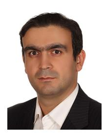

**Mohammadali Mohammadi** (Senior Member, IEEE) received the B.Sc. degree in electrical engineering from the Isfahan University of Technology, Isfahan, Iran, the M.Sc. and Ph.D. degrees in wireless communication engineering from the K. N. Toosi University of Technology, Tehran, Iran, in 2007 and 2012, respectively. From November 2010 to November 2011, he was a Visiting Researcher with the Research School of Engineering, Australian National University, Australia. In 2013, he joined Shahrekord University, Iran, as an Assistant

Professor, and was promoted to an Associate Professor before joining Queen's University Belfast in 2021 as a Research Fellow. He has published more than 60 research papers in accredited international peer reviewed journals and conferences in the area of wireless communication. He has coauthored two book chapters, "Full-Duplex Non-Orthogonal Multiple Access Systems," invited chapter in *Full-Duplex Communication for Future Networks* (Springer-Verlag, 2020) and "Full-Duplex wireless-powered communications", invited chapter in *Wireless Information and Power Transfer: A New Green Communications Paradigm* (Springer-Verlag, 2017). His research interests span diverse areas, such as full-duplex communications, wireless power transfer, OTFS modulation, reconfigurable intelligent surface, and cell-free massive MIMO. He was a recipient of the Exemplary Reviewer Award for IEEE TRANSACTIONS ON COMMUNICATIONS in 2020 and 2022. He has actively served as the Technical Program Committee Member of a variety of conferences, such as ICC, VTC, and GLOBECOM.

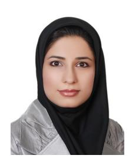

**Zahra Mobini** (Member, IEEE) received the B.S. degree in electrical engineering from the Isfahan University of Technology, Isfahan, Iran, in 2006, the M.S. degree in electrical engineering from the M. A. University of Technology, and the Ph.D. degree in electrical engineering from the K. N. Toosi University of Technology, Tehran, Iran. From November 2010 to November 2011, she was a Visiting Researcher with the Research School of Engineering, Australian National University, Canberra, ACT, Australia. She is cur-

rently a Postdoctoral Research Fellow with the Centre for Wireless Innovation, Queen's University Belfast (QUB). Before joining QUB, she was an Assistant and then an Associate Professor with the Faculty of Engineering, Shahrekord University, Shahrekord, Iran, from 2015 to 2021. She has coauthored many research papers in wireless communications. Her research interests include full-duplex communications, physical-layer security, cell-free massive MIMO, nonorthogonal multiple access networks, and resource management and optimization. She has actively served as a Reviewer for a variety of IEEE journals, such as IEEE TRANSACTIONS ON WIRELESS COMMUNICATIONS, IEEE TRANSACTIONS ON COMMUNICATIONS, and IEEE TRANSACTIONS ON VEHICULAR TECHNOLOGY.

**Diluka Galappaththige** (Member, IEEE) received the B.Sc. degree (First-Class Hons.) in electrical and electronic engineering from the Department of Electrical and Electronic Engineering, University of Peradeniya, Sri Lanka, in 2017, and the Ph.D. degree in electrical and computer engineering from the School of Electrical, Computer, and Biomedical Engineering, Southern Illinois University, Carbondale, IL, USA, in 2021.

He is a Postdoctoral Research Fellow with the Department of Electrical and Computer Engineering,

University of Alberta, Canada. His current research interests include but are not limited to, the design, modeling, and analysis of massive multiple-input– multiple-output (mMIMO) communication (i.e., including co-located mMIMO and cell-free/distributed mMIMO), full-duplex communication, backscatter communication, reconfigurable intelligent surfaces, integrated sensing and communication, wireless power transfer, and emerging technologies for enabling fifth-generation, and beyond wireless networks. He was a recipient of the Exemplary Reviewer Award for IEEE WIRELESS COMMUNICATIONS LETTERS in 2020 and IEEE COMMUNICATIONS LETTERS in 2021. He has actively served as a Reviewer for a variety of IEEE journals and conferences, including IEEE TRANSACTIONS ON COMMUNICATIONS, IEEE TRANSACTIONS ON VEHICULAR TECHNOLOGY, IEEE TRANSACTIONS ON GREEN COMMUNICATIONS AND NETWORKING, IEEE ACCESS, IEEE NETWORK, TCL, TWCL, ICC, and GLOBCOM.

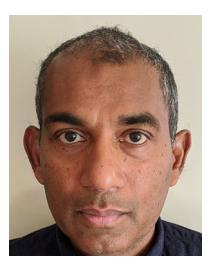

**Chintha Tellambura** (Fellow, IEEE) received the B.Sc. degree (First Class) in electrical and electronic engineering from the University of Moratuwa, Sri Lanka, the M.Sc. degree in electrical engineering from the King's College, University of London, and the Ph.D. degree in electrical engineering from the University of Victoria, Canada.

He was with Monash University, Australia, from 1997 to 2002. He is a Professor with the Department of Electrical and Computer Engineering, University of Alberta. He has authored or coauthored over 600

journals and conference papers, demonstrating his expertise in the field. According to Google Scholar, his exceptional scholarly contributions have earned him an impressive H-index of 82. He has made significant contributions to various areas of research, including future wireless networks, machine learning for wireless networks, and signal processing.

Dr. Tellambura's dedication and expertise have been acknowledged through prestigious awards, including the Best Paper Awards in the Communication Theory Symposium in 2012, the IEEE International Conference on Communications (ICC) held in Canada in 2017, and another ICC in France. Moreover, he has been honored with the esteemed McCalla Professorship and the Killam Annual Professorship by the University of Alberta, further underscoring his significant impact on academia. He has also played a vital role in editorial responsibilities within the IEEE community. He served as an Editor for the IEEE TRANSACTIONS ON COMMUNICATIONS from 1999 to 2011 and the IEEE TRANSACTIONS ON WIRELESS COMMUNICATIONS from 2001 to 2007. In the latter role, he was an Area Editor of *Wireless Communications Systems and Theory* from 2007 to 2012, contributing to the advancement of the field through his editorial expertise. Recognizing his outstanding accomplishments, he was elected as an IEEE Fellow in 2011 for his noteworthy contributions to physical layer wireless communication theory. In 2017, he was further honored as a Fellow of the Canadian Academy of Engineering, a testament to his exceptional achievements.