# A Comprehensive Survey on Radio Resource Management in 5G HetNets: Current Solutions, Future Trends and Open Issues

Bharat Agarwal®, *Graduate Student Member, IEEE*, Mohammed Amine Togou®, *Member, IEEE*, Marco Ruffini®, *Senior Member, IEEE*, and Gabriel-Miro Muntean®, *Senior Member, IEEE* 

Abstract—The 5G network technologies are intended to accommodate innovative services with a large influx of data traffic with lower energy consumption and increased quality of service and user quality of experience levels. In order to meet 5G expectations, heterogeneous networks (HetNets) have been introduced. They involve deployment of additional low power nodes within the coverage area of conventional high power nodes and their placement closer to user underlay HetNets. Due to the increased density of small-cell networks and radio access technologies, radio resource management (RRM) for potential 5G HetNets has emerged as a critical avenue. It plays a pivotal role in enhancing spectrum utilization, load balancing, and network energy efficiency. In this paper, we summarize the key challenges, i.e., cross-tier interference, co-tier interference, and user association-resource-power allocation (UA-RA-PA) emerging in 5G HetNets and highlight their significance. In addition, we present a comprehensive survey of RRM schemes based on interference management (IM), UA-RA-PA and combined approaches (UA-RA-PA + IM). We introduce a taxonomy for individual (IM, UA-RA-PA) and combined approaches as a framework for systematically studying the existing schemes. These schemes are also qualitatively analyzed and compared to each other. Finally, challenges and opportunities for RRM in 5G are outlined, and design guidelines along with possible solutions for advanced mechanisms are presented.

*Index Terms*—HetNets, radio resource management, user association, 5G, femtocells, QoS, QoE.

#### Nomenclature

5G Fifth Generation

5G PPP 5G Infrastructure Public Private Partnership

AR Augmented Reality

BS Base Station

CO Combinatorial Optimization
CSI Channel State Information

DL Down-Link

Manuscript received 28 February 2022; revised 29 June 2022 and 2 August 2022; accepted 9 September 2022. Date of publication 20 September 2022; date of current version 22 November 2022. This work was supported by the Science Foundation Ireland (SFI) under Grant 18/CRT/6224 (SFI Centre for Research Training in Digitally Enhanced Reality D-REAL), Grant 16/SP/3804 (Enable), and Grant 12/RC/2289\_P2 (Insight). (Corresponding author: Gabriel-Miro Muntean.)

Bharat Agarwal, Mohammed Amine Togou, and Gabriel-Miro Muntean are with the School of Electronic Engineering, Dublin City University, Dublin 9, D09W6Y4 Ireland (e-mail: gabriel.muntean@dcu.ie).

Marco Ruffini is with the Department of Computer Science, Trinity College, Dublin 2, D02PN40 Ireland.

Digital Object Identifier 10.1109/COMST.2022.3207967

DRL Deep Reinforcement Learning

EE Energy Efficiency
FBSs Femtocell Base Stations

FUEs Femto-cell User Equipments

GAT Game Theory GRT Graph Theory

HetNets Heterogeneous Networks IM Interference Management

IoT Internet of Things

MBSs Macrocell Base Stations MIMO Multi-Input Multi-Output MOS Mean-Opinion Score

MR Mixed Reality

MUEs Macro-cell User Equipments NOMA Non-orthogonal Multiple Access

NR New Radio

OMA Orthogonal Multiple Access

PA Power Allocation

PRBs Physical Resource Blocks
PSNR Peak to Signal Noise Ratio
QoE Quality of Experience
QoS Quality of Service
RA Resource Allocation

RAAs Radio Resource Algorithms
RAN Radio Access Network
RRM Radio Resource Management
RSS Received Signal Strength
SE Spectrum Efficiency
SON Self-Organizing Network

SSIM Structural Similarity Identity Matrix

UA User Association

UL Up-Link

VMAF Visual multi-Method Assessment Fusion

VR Virtual Reality XR Extended Reality

#### I. Introduction

TODAY'S world has become increasingly linked, digitized, distributed, and diverse, powered by the exponential growth in technology performance. With every "thing" possessing the power to process, store or exchange data, the current and future systems are poised to become dramatically more distributed and interconnected. Networked technologies

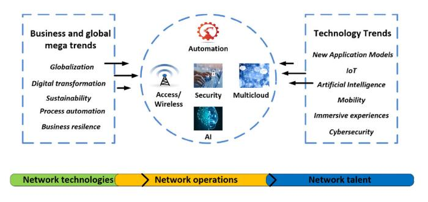

Fig. 1. Global business and technology trends shape the network [\[3\]](#page-34-0).

continue to be fuelled by digital enterprise. *International Data Cooperation* predicts that 48.9 billion connected devices will be in use across the world by 2023 [\[1\]](#page-34-1), and *Cisco* estimates that the average amount of data consumed across a network will be approximately 60 GB per month per personal computing device [\[2\]](#page-34-2).

Fig. [1](#page-1-0) illustrates how Cisco sees the manner the global business and technology trends are shaping the new network in its 2020 Networking trends report [\[3\]](#page-34-0). According to this report, there will be around: 1) 1B edge-hosted containers at the end of 2023, 2) 80% of workloads outside the enterprise data centers by 2023, 3) 14.6B Internet of Things (IoT) devices by 2022, 4) 42% annual growth in business mobile traffic, 2017 to 2022, 5) 53% of cyber-security attacks cause over US \$500,000 in damage, 6) 12 times increase in Augmented Reality (AR)/Virtual Reality (VR) traffic by 2022.

Business mobile users will continue to expect immediate and high-performance connectivity anywhere, anytime, and on any device over Wi-Fi and public 4G and 5G networks. Increasing video usage along with the emergence of VR and AR for improved collaboration, training, productivity, and remote working experiences will place greater demands on any organization's network. By 2022, Internet video will represent 82% of all business Internet traffic, VR/AR traffic will increase twelvefold, and Internet video surveillance traffic will increase sevenfold [\[4\]](#page-34-3). Networks will need to provide endto-end bandwidth, low latency communications, and dynamic performance controls required to enable high quality of such immersive experiences.

The 2020 Ericsson Mobility Report highlights the importance of communication in time of crisis. The first months of 2020 saw the coronavirus (COVID-19) spread across the world. Subsequent behavioral changes have triggered measurable changes in the usage of both fixed and mobile networks because of lockdown constraints in many countries [\[5\]](#page-34-4). In times of crisis, when connectivity is necessary for consumers to exercise work-related tasks and leisure activities, hopes for better network experiences are becoming greater. Six out of ten smartphone users have a clear positive outlook toward 5G's position during the crisis, and about half of them strongly agree that 5G should have provided both greater network capacity and faster speeds compared to 4G. They agree that 5G could significantly improve society [\[5\]](#page-34-4).

In this context, there is a need for the network to be updated to encourage emerging market and technological developments and support traffic associated with extra peak hours that occur during the day, particularly due to workplace shifts from office to home. When digital trends evolve (as shown in Fig. [2\)](#page-2-0), communications service providers have a vital role to play in supporting a good quality communications ecosystem [\[5\]](#page-34-4).

One of the most promising approaches to fulfil this role is the consideration of Heterogeneous Network (HetNet) environments in 5G networks. It involves enriching current cellular networks with a number of smaller and simpler base stations (BS) with broadly varying transmission capacities, coverage areas, carrier frequencies, types of back-haul connections, and communication protocols. For instance, in highly populated areas, femtocell BSs (FBS), picocell BSs (PBS), microcell BSs and/or relay nodes are typically deployed with macro-cell base stations (MBS). This enables HetNets to support good quality of service (QoS) when serving diverse users [\[6\]](#page-34-5). The main objective of the HetNets is the: 1) Cell Densification for increasing network capacity, 2) Bringing BSs close to the UEs, 3) Deployment of small-cells under-laying with the traditional macro-cellular networks, 4) Several options for UEs to have an association with a BS that can boost the QoS. The HetNets brings a lot of advantages like 1) Improve coverage quality, 2) Enhance the cell-edge UEs performance, 3) Boost spectral efficiency (SE) and energy efficiency (EE), and 4) reducing network operational and capital expenditures, but they also bring a lot of challenges like 1) how to select the best BS for UEs, 2) extending the network infrastructure would compound the power consumption usage.

# *A. Challenges in 5G HetNets*

The introduction of small cells benefits the 5G networks in several aspects, including the reduction of costs and energy consumption in comparison to alternative approaches (e.g., deploying additional MBSs) [\[7\]](#page-34-6), [\[8\]](#page-34-7), [\[9\]](#page-34-8), though there are several challenges to be focused on. Fig. [3](#page-2-1) summarizes these major challenges and problems under two headings: interference management (IM) and user association resource and power allocation (UA-RA-PA). Significant efforts are being put to address these challenges and design optimized solutions to ensure high QoS and user quality of experience (QoE), as well as good and fair resource utilization and user equipment (UE ) association with the network infrastructure.

*1) Interference Management (IM):* IM refers to the process of interference avoidance or mitigation. In a HetNet, the overlaid small cells[1](#page-1-1) could either produce interference or affected by interference with an MBS or with other nearby small cells. There are two types of interference in a two-tier 5G HetNets *cross-tier interference* and *co-tier interference* [\[10\]](#page-34-9), as shown in Fig. [5.](#page-3-0) Cross-tier interference is the co-channel interference generated between FBSs and MBSs. This interference occurs when both the FBSs and MBSs share the same set of physical resource blocks (PRBs). On the other hand, co-tier interference refers to the co-channel interference that occurs between FBSs. This appears when the FBSs are tightly deployed within coverage areas of MBSs, allowing the cells to overlap in terms of their coverage. The same set of PRBs may be reused by

1The term small cell will refer to femtocells only from this point on.

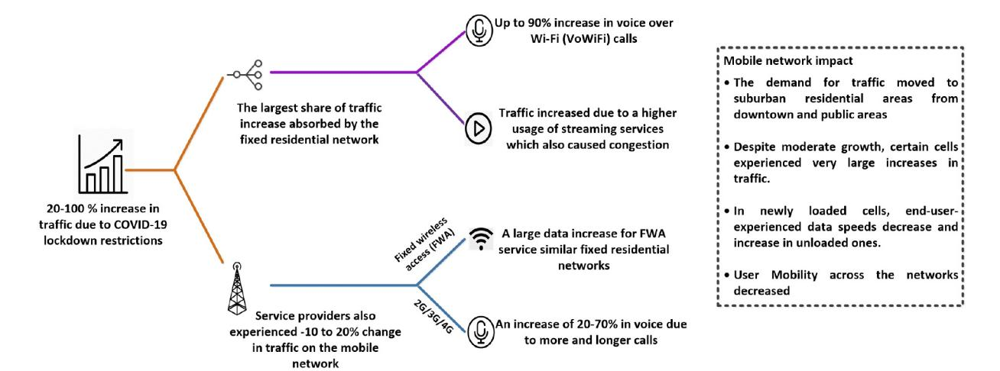

Fig. 2. The impact of lockdown limitations on fixed and mobile networks [\[5\]](#page-34-4).

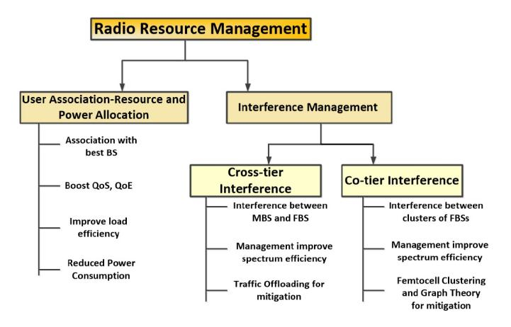

Fig. 3. Major challenges in 5G HetNets.

some overlapping FBSs, causing interference in both uplink (UL) and downlink (DL).

In 5G, each PRB has 12 frequency-domain sub-carriers, similar to LTE. While the RB bandwidth in LTE is fixed at 180 KHz, it is variable in 5G and is dependent on the sub-carrier spacing, as indicated in the Fig. [4.](#page-3-1)

*2) User Association - Resource and Power Allocation (UA-RA-PA):* UA refers to the process of pairing between each UE and BS, which takes place before the data transmission starts. Once the transmissions between the BS and the UE have begun in support of a service, RA refers to the allocation of PRBs, and PA refers to the allocation of power for supporting that service. UA-RA-PA solutions play a critical role in improving networks' load balancing, spectral performance, and energy efficiency. The received power based UA rule is the most prevalent one in existing systems [\[11\]](#page-34-10), where a user device can be associated with the BS, which provides the maximum received signal strength (RSS). The aforementioned new 5G network technologies and goals eventually make such a rudimentary rule of UA-RA-PA inefficient. More sophisticated UA algorithms are required to address the specific features of the evolving 5G networks. The right-hand side of Fig. [5](#page-3-0) shows how there are multiple BSs available, so UEs have diverse association options. The desire is that each UE should have an association only with that BS, which can offer good channel conditions and satisfies UE's other performance demands e.g., energy-related. In order to solve the UA-RA problem, max-RSS cannot be the only goal for solving the problem. Other factors, such as channel station information (CSI), BS capacity, UE demands, demand priority, should also be considered.

This paper provides a detailed review of UA, RA, PA and IM schemes proposed recently for 5G HetNets for over the period of 2017-2021. This survey focuses in particular on an in-depth technical analysis of the problems and current UA, RA, PA, IM, and combined solutions proposed for 5G HetNets. The combined solution corresponds to the solution or algorithms which intend to solve UA-RA-PA along with IM. There are many survey papers for UA-RA-PA or IM schemes in 5G HetNets, but there is no paper that surveys schemes that jointly address UA-RA-PA and IM. This analysis, including the way the different approaches are discussed and compared, makes this paper original. A comprehensive qualitative assessment is carried out to compare existing approaches in terms of QoS, QoE, fairness, spectrum efficiency (SE), energy efficiency (EE), and outage/coverage probability. This assessment enables identifification of the strengths and weaknesses of existing schemes. This assessment also ultimately leads to a discussion of open issues and potential research directions for future focus. The contributions of this survey are five-fold.

- 1) Major challenges pertaining to Radio Resource Management (RRM) for 5G HetNets (IM, UA-RA-PA) are highlighted and discussed.
- 2) A comprehensive survey of recently proposed RRM schemes in the context of IM for 5G HetNets is presented. The surveyed schemes are classified according to their approaches for handling cross-tier, co-tier, or cross-co-tier interference management and how each approach's mechanism helps improve the different metrics for 5G HetNets to enhance the users' experience while saving CAPEX for operators. The RRM schemes are qualitatively analyzed and compared. aspects.

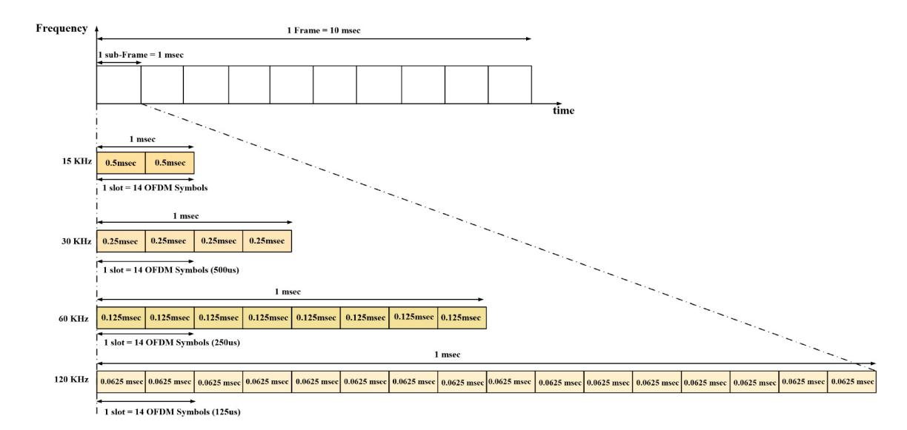

Fig. 4. Resource Block Structure in 5G for different numerologies.

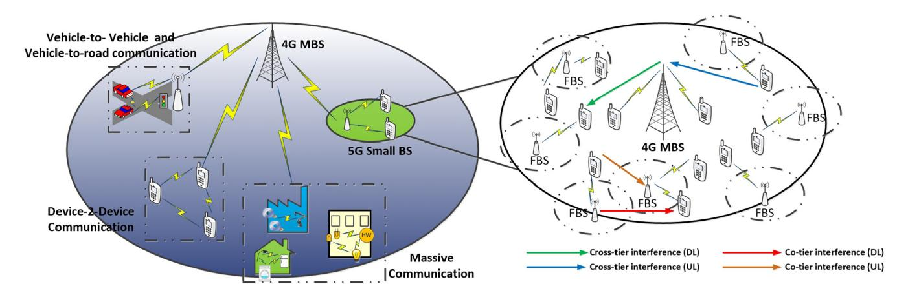

Fig. 5. The various use cases made possible by the adoption of 5G HetNets. URLLC for vehicle-to-vehicle communication, eMBB for device-to-device communication, and mMTC for massive communication. The deployment of 5G HetNets aids in the deployment of various 5G verticals, however, it is fraught with issues such as UA-RA-PA and interference mitigation.

- 3) A comprehensive survey of recently proposed RRM schemes in the context of UA-RA-PA for 5G HetNets is provided. Classifications and qualitative comparisons are also made across the surveyed schemes.
- 4) A detailed survey of recently proposed RRM schemes is given for 5G HetNets in the context of combined approaches. There are also classifications, and qualitative distinctions around the schemes studied.
- 5) Several potential RRM problems and possible solutions are identified for further development and enhancement of RRM in 5G HetNets.

## *B. Paper Organisation and Reading Map*

The rest of the paper is organized as shown in Fig. [6.](#page-3-2) The vision and motivation of HetNets in 5G are discussed in Section II. Existing surveys are reviewed in Section III. Section IV presents the taxonomy used to conduct this survey. The latest 5G HetNets RRM schemes for UA-RA are covered in detail in Section V. Novel RRM schemes for IM in 5G HetNets are discussed in Section VI. Section VII looks

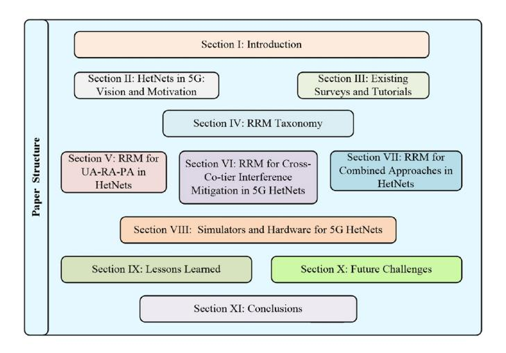

Fig. 6. Organization of the paper.

at RRM schemes for both IM and UA-RA. Simulators and Hardware involved in simulations or experimental setups are discussed in Section VIII. Section IX discusses the lessons learned from the papers surveyed. In Section X, some potential future challenges and approaches are presented. Finally, Section XI concludes this survey paper.

## II. HETNETS IN 5G: VISION AND MOTIVATION

In 5G wireless communications, wireless data speeds, bandwidth, coverage, and connectivity increase and a round trip latency and energy consumption decrease. For the different 5G releases Release 16 (Rel-16) [\[12\]](#page-34-11) focuses on supporting Ultra-Reliable low latency communications (URLLC) for mission-critical services. From a business angle, Rel-16 enables applications to be ready for new vertical industries, and deployment scenarios [\[13\]](#page-34-12). The study items for Release 17 (Rel-17) [\[14\]](#page-34-13) are 1) a New Radio (NR) up to 71 GHz 2) a NR Narrow-Band IoT 3) Extended reality (XR) support in order to evaluate and adopt improvements that make 5G even better suited for AR, VR, and mixed reality (MR). As per 3GPP, all releases are categorized in three stages [\[15\]](#page-34-14). Stage 1 is the "Service requirements" level. Stage 2 is more about taking the service requirements and deciding what kind of functionality needs support. The solution is implemented in the network to support its requirements in Stage 3.

Different forms of communications will have to be enabled by 5G networks, and diverse specifications coming from a wide range of use cases will have to be addressed. There have been many opinions in recent years about the ultimate shape that 5G technology can take. In particular, two views on what 5G wireless technology should be [\[16\]](#page-34-15) include: 1) Hyper Connected Vision, in which to build a world where unrestricted connectivity enhances people's lives, redefines business, and ushers in a more sustainable future and 2) Radio-Access Technology of the Next Decade, based on greater peak data speeds in the multi-gigabit per second range, ultralow latency, increased dependability, huge network capacity, increased availability, and a more consistent user experience for a larger number of users. For a concentrated progress to be made, it is important that a definition of the targeted technology is to be agreed on first. In order to satisfy the needs of both the market and the customer, all criteria within the definition process must be met, ensuring that the final definition matches the needs of the majority of users without being overly demanding as in such a case no framework will function. The following collection of 5G specifications (Fig. [7\)](#page-4-0) is gaining market recognition by accounting for the majority of current and near future needs [\[17\]](#page-34-16), [\[18\]](#page-34-17):

- 1) **1-10 Gbps data rates in real networks:** 10x to 100x speed improvement over 4G and 4.5G networks [\[19\]](#page-34-18).
- 2) **1 millisecond (ms) latency:** very low latency (the delay between information transmission and reception. This is down from 200 ms in 4G [\[19\]](#page-34-18).
- 3) **1000x bandwidth per unit area:** Large numbers of connected devices with higher bandwidth requirements need to be supported for longer duration in any particular region [\[17\]](#page-34-16).
- 4) **Up to 100x number of devices connected per unit area (compared with 4G LTE):** In order to realize the

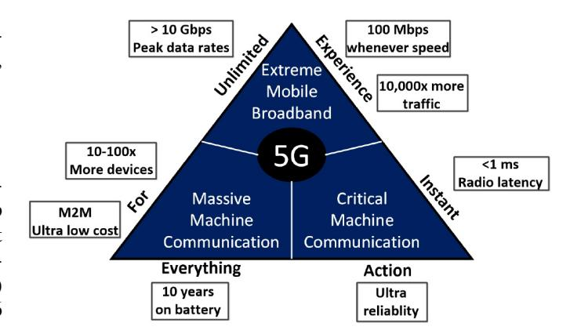

Fig. 7. Diverse needs and a wide range of use cases.

- IoT vision, the evolving 5G networks need to provide thousands of devices with connectivity [\[17\]](#page-34-16).
- 5) **99.999% availability:** 5G envisages that the network should be practically always available [\[17\]](#page-34-16).
- 6) **100% coverage:** 5G networks need to provide maximum coverage, regardless of the users' location [\[17\]](#page-34-16).
- 7) **90% reduction in network energy usage:** Standard bodies are now contemplating the advancement of green technologies, so this along with EE becomes very important [\[19\]](#page-34-18).
- 8) **Up to 10-year battery life for low power IoT devices:** Reducing IoT devices' power usage is essential [\[17\]](#page-34-16), [\[19\]](#page-34-18).

Following these eight requirements, wireless and mobile network industr y players, academia and diverse research organizations have started collaborating in order to focus on different aspects of 5G wireless systems. To address the critical 5G requirements, the European Commission and big European ICT industry representatives established the 5G Infrastructure Public Private Partnership (5G PPP). The 5G PPP will deliver solutions, architectures, technologies, and standards for the coming decade's ubiquitous next-generation communication infrastructures. 5G PPP cooperates with global 5G organisations in order to further advance 5G towards social adoption and promote local use, industrial employment, and new usage avenues to solve social problems.

## *A. 5G Advanced and 6G Vision*

5G Advanced is the next step in the evolution of 5G technology. It will enable a broader set of advanced use cases for verticals and provide a new level of enhanced capabilities beyond connectivity. It is expected to support advanced applications with increased mobility and dependability, as well as artificial intelligence (AI) and machine learning (ML) to improve network performance. It will also introduce additional SE and energy saving mechanisms. Release 18 marks another significant advancement in 5G technology, ushering the industry into the 5G-Advanced era. 5G-Advanced will bring 5G to its fullest, and richest capabilities. A truly immersive user experience based on extended reality (XR) features will lay the groundwork for more demanding applications and a broader range of use cases than ever before. In addition, it

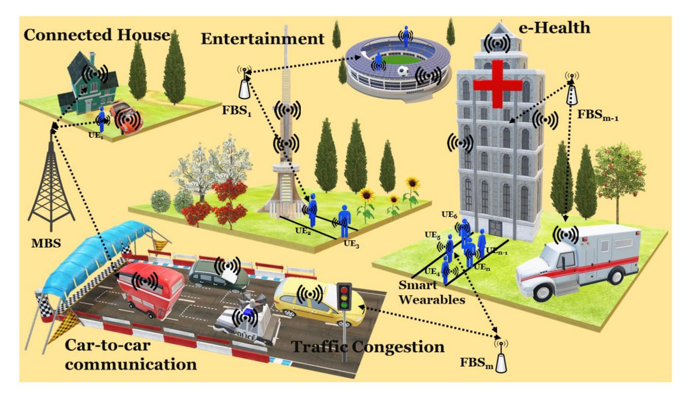

Fig. 8. HetNets in 6G.

will implement AI and machine learning enhancements across the RAN, Core, and network management layers to improve performance, network optimization, and energy efficiency. It is foreseen to be fully backward compatible, allowing it to coexist with current 5G NR Releases 15-17 and serve legacy 5G devices.

5G Advanced is expected to serve as a stepping stone for some of the use case capabilities which the industry hopes to enable on a larger scale in the 6G era. One of the most notable features of 6G will be its ability to sense its surroundings (as shown in Fig. [8\)](#page-5-0). The network will become a source of situational information, collecting signals that bounced off objects and determining their type and shape, relative location, velocity, and possibly even material properties. This sensing network would pave the way for a slew of new services. In open areas, the network could detect the location, speed, and trajectory of all vehicles and pedestrians in a specific area, issuing warnings if any paths are about to intersect. One of the goals of the 6G Internet is to support communications with a latency of one microsecond. This is 1,000 times faster than one-millisecond throughput (1/1000th the latency).

# III. EXISTING SURVEYS AND TUTORIALS ON HETNETS

Several tutorials have been published, to formally introduce 5G, HetNets and their related challenges. Zahir *et al.* [\[20\]](#page-35-0) provide an overview of femtocells, advantages that this technology can provide, and related key challenges. According to the authors, the femtocells' main challenge is IM because of their ad-hoc deployment. They also summarized the essential techniques that can be used to avoid and mitigate interference regarding femtocells. Although the paper was good, it is not recent and it does not address emerging 5G technologies. The survey by Lee *et al.* [\[21\]](#page-35-1) mainly focuses on an indepth technical review of the current challenges and existing RRM schemes proposed in recent years for LTE/LTE-A femtocell and relay networks. Out of three primary challenges in HetNets, this survey focuses on only two, i.e., cross-tier and co-tier interferences. Moreover, this survey was also not recently published and lacks discussions of the latest 5G technologies.

Maallawi *et al.* [\[22\]](#page-35-2) survey comprehensively the offloading techniques and their management in HetNets. Offloading is one of the popular techniques ado pted for interference mitigation. Though the authors' work was good, it covers a tiny section of the challenges that are being solved by this particular technique. It also lacks the latest 5G technologies for offloading. Peng *et al.* [\[23\]](#page-35-3) present a comprehensive survey framework for interference mitigation technologies across different layers over the air interface to improve SE and EE. Although this survey is not closely related to our survey, it still provides a good explanation of HetNets and the use of interference mitigation techniques at different layers, including employment of interference coordination and cancellation at the PHY layer along with radio resource allocation optimization and self-organizing network (SON) approaches at upper layers. The survey by Agiwal *et al.* [\[24\]](#page-35-4) discusses the new architectural changes associated with the radio access network design, including air interfaces, smart antennas, cloud, and heterogeneous radio access networks (RAN). The authors also present a survey on novel mmWave physical layer technologies, encompassing new channel model estimation, directional antenna design, beam-forming algorithms, and Multi-Input-Multi-Output (MIMO) technologies. This survey does not explicitly talk about the challenges in 5G HetNets.

Liu *et al.* [\[25\]](#page-35-5) presents a comprehensive survey on the advances in UA algorithms designed for HetNets. The challenges imposed by the inherent nature of HetNets were also identified. This survey's work considers HetNets and other 5G technologies like mmWave and massive MIMO and presents approaches adopted for UA employing these technologies. The survey helped a lot in terms of categorization, informing our survey work. However, it does not survey other important challenges in HetNets like cross-tier and co-tier interference as well as the combined approaches that are used for solving jointly the UA and interference mitigation challenges. The survey by Luong *et al.* [\[26\]](#page-35-6) cites economic and pricing approaches in 5G and considers resource management for UA, spectrum allocation, interference and power management, wireless caching, and mobile data offloading. Unfortunately, this survey does not discuss combined approaches for resource management and does not include any qualitative comparison of various works related to different approaches.

Luong *et al.* [\[27\]](#page-35-7) present a systematic literature review on applications of deep reinforcement learning (DRL) in communications and networking. Modern networks are becoming more decentralized and autonomous, such as the IoT and unmanned aerial vehicle networks. In these networks, under the network context's complexity, network entities need to make decisions locally to optimize network performance. Reinforcement learning has been used effectively to allow network entities, given their states to avail from optimal decisions or actions. First, the authors include a DRL tutorial from basic concepts to advanced models. Then, they study DRL methods proposed to tackle emerging communications and networking problems. The survey does not directly describe the challenges in HetNets; however, DRL is an interesting avenue to address combined approaches for solving HetNet challenges. Xu *et al.* in [\[28\]](#page-35-8) discussed network structures and RA models, as well as resource allocation algorithms (RAA) in HetNets. This survey includes a summary of the most recent progress on RAAs in HetNets for IM. In addition to the basic principle and theoretical analysis, both potential research issues and new network scenarios were also included.

Recent RRM problems in HetNets were reviewed by Manap *et al.* in [\[29\]](#page-35-9), including mitigation of interference, allocation of bandwidth, allocation of power, user association, complexity, and future research topics. Though this paper surveyed schemes for UA-RA-PA, the analysis lacks several aspects such as the targeted communication link (UL, DL), control (centralized, distributed), performance metrics, and complexity. The work also lacks taxonomy, and even though it is the latest from all the survey papers discussed, it still does not talk about combined approaches.

A cyclic-prefix (CP) free OFDM design, which does away with the necessity for unnecessary CPs between OFDM signals, was described by Hamamreh *et al.* in [\[192\]](#page-39-0). The design was demonstrated to boost SE, improve power efficiency, cut latency, boost physical layer security, and retain low receiver complexity while maintaining low receiver complexity, making it a good contender for fulfilling the needs of future 5G and beyond services and applications. The impact of timing and carrier synchronization concerns and how they should be handled in the suggested CP-free scheme are two additional significant features of CP-less OFDM with alignment signal that still need to be thoroughly examined. Networks supporting ultra-low latency (ULL) applications were well addressed in the survey by Nasrallah *et al.* in [\[193\]](#page-39-1). Specialized network protocol methods have been established for the network layer in the IETF Deterministic Networking (DetNet) specifications and for the link layer in the IEEE Time-Sensitive Networking (TSN) set of standards in order to provide ULL support. Wang *et al.* in [\[194\]](#page-39-2), survey a variety of different clientcentric approaches in localizing Radio Access Technology (RAT) selection and association for HetNets, and how they may be extended to be used with next-generation wireless technologies, i.e., 5G. There are few other surveys [\[30\]](#page-35-10), [\[31\]](#page-35-11), [\[32\]](#page-35-12), [\[33\]](#page-35-13), [\[34\]](#page-35-14), [\[35\]](#page-35-15) which have small sections on HetNets. The main goal of these surveys was not to present current research on HetNet challenges. However, they include relevant avenues such as Sun *et al.* [\[31\]](#page-35-11) who survey the role of machine learning (ML) in wireless communications, Tabassum *et al.* [\[32\]](#page-35-12) who survey the mobility-based schemes in HetNets and Yaqoob *et al.* [\[35\]](#page-35-15) who present a comprehensive survey on 3600 video streaming techniques in HetNets.

Unfortunately, unlike this survey (see Table [I\)](#page-7-0), the aforementioned tutorials and surveys do not include a critical assessment of each evaluated contribution based on welldefined and well-motivated criteria. They also do not perform an in-depth analysis of the literature. In particular, combined approaches are not considered in any of these papers. In contrast, this paper comprehensively reviews the work performed to date in terms of approach, metrics, model, complexity, and control. We also focus on concerns that have not been addressed yet and both identify obstacles that exist and provide solutions. Moreover, based on our current literature study, we indicate lessons learned related to 5G HetNets, useful for our readers. Furthermore, the prospects of HetNets in terms of emerging technologies are also sketched.

# IV. RRM TAXONOMY

This survey presents a taxonomy of the latest RRM schemes for 5G networks, which could serve as a fundamental reference point for major design aspects and analysis of proposed algorithms, including their advantages and shortcomings. The literature on 5G HetNets is diverse; systematically structuring the relevant works is not a trivial task. The outline of the proposed taxonomy, which consists of five non-overlapping branches, is illustrated in Fig. [9.](#page-7-1) On the left side, we identify five main categories; (1) Approach, (2) Metrics, (3) Model, (4) Complexity, and (5) Control. A literature review from these five perspectives is a natural choice because most researchers in the area tackle the issues from one of these perspectives. Within the first category, referred to as *approach for addressing challenges in 5G HetNets*, three sub-categories have been proposed: UA-RA-PA, IM (further sub-divided in cross-tier interference and co-tier interference),

TABLE I MAJOR SURVEYS ON RRM FOR 5G HETNETS

| Survey Paper         | Publication Year | Key Problems                                                                                                                                                                              | HetN     | et Chal  | llenges | Considered | Combined |
|----------------------|------------------|-------------------------------------------------------------------------------------------------------------------------------------------------------------------------------------------|----------|----------|---------|------------|----------|
|                      |                  |                                                                                                                                                                                           | UA       | RA       | PA      | IM         |          |
| Zahir et al. [20]    | 2013             | presents the main concepts of femtocells and challenges faced in its large scale deployment.                                                                                              | x        | х        | х       | ✓          | х        |
| Lee et al. [21]      | 2014             | provide an overview of the RA challenges arising from HetNets and highlight their importance.                                                                                             | х        | ✓        | х       | х          | х        |
| Maallawi et al. [22] | 2015             | presents the survey on the offload approaches at different parts of the global network (access, core and gateway).                                                                        | x        | х        | x       | x          | x        |
| Peng et al. [23]     | 2015             | provide a survey on the RA challenges arising from HetNets and highlight their importance.                                                                                                | х        | <b>√</b> | х       | х          | х        |
| Agiwal et al. [24]   | 2016             | presents the architectural changes associated with the radio access network (RAN) design, including air interfaces, smart antennas, cloud and heterogeneous RAN.                          | х        | x        | x       | x          | x        |
| Liu et al. [25]      | 2016             | presents a survey on the recent advances in UA algorithms designed for HetNets and also investigate the UA in the context of massive MIMO, mmWave, energy harvesting networks.            | ✓        | x        | x       | X          | X        |
| Luong et al. [26]    | 2019             | presents a survey on economic and pricing approaches proposed to address RRM issues in the 5G wireless networks including UA, spectrum allocation, and interference and power management. | ✓        | х        | ✓       | ✓          | x        |
| Luong et al. [27]    | 2019             | presents a comprehensive literature on applications of deep reinforcement learning in communication and networking.                                                                       | X        | х        | х       | х          | ✓        |
| Xu et al. [28]       | 2021             | presents a comprehensive survey on RA in HetNets for 5G communications.                                                                                                                   | x        | ✓        | х       | ✓          | х        |
| Manap et al. [29]    | 2020             | presents a survey of HetNet RRM schemes that have been studied recently, with a focus on the joint optimization of radio resource allocation with other mechanisms.                       | <b>√</b> | ✓        | ✓       | ✓          | х        |
| This Article         | _                | presents a comprehensive survey on the latest schemes for UA-RA-PA, IM and combined approaches.                                                                                           | ✓        | ✓        | ✓       | ✓          | ✓        |

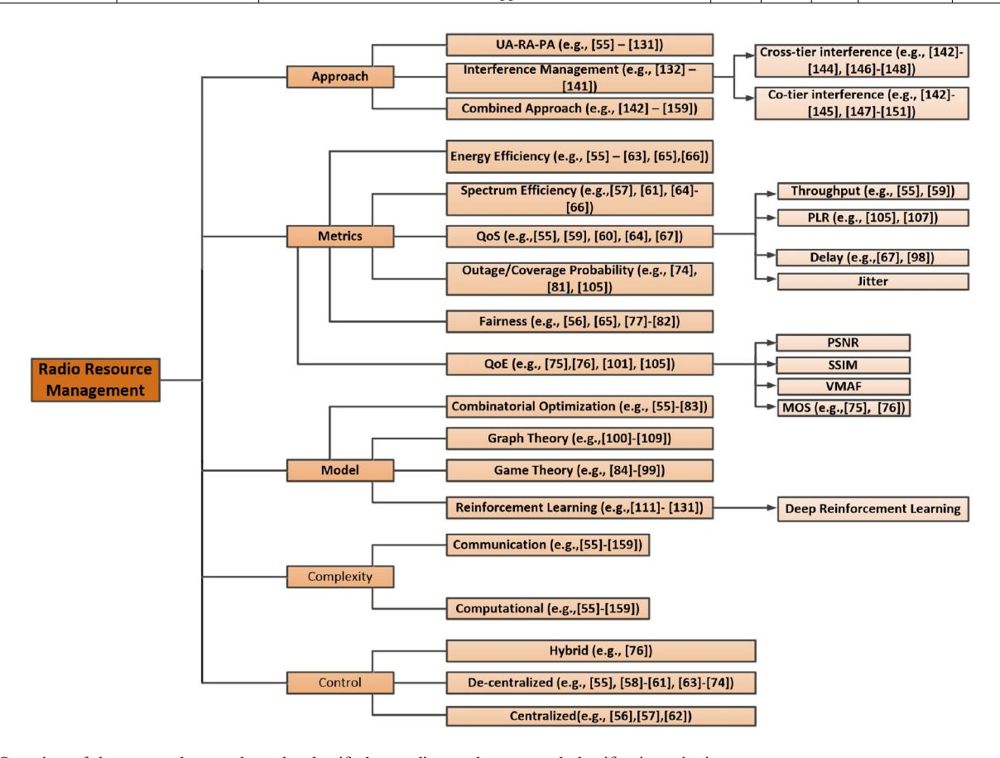

Fig. 9. Overview of the surveyed research works classified according to the proposed classification criteria.

and combined approaches. Performance evaluation from the perspective of the proposed algorithm can be defined as a formal and productive procedure to measure the proposed

algorithm results based on their proposed working procedure. There are many metrics that can be used to evaluate efficiencies. Some of the important metrics that have been widely used by researchers for performance evaluation of their proposed schemes are: Energy Efficiency, Spectrum Efficiency, QoS, Outage/Coverage Probability, Fairness, and QoE. In the second category, focused on different *evaluation metrics for the proposed schemes*, six avenues have been identified:

- Energy Efficiency: Green communications have attracted a lot of interest from both industry and academia mostly because of environmental concerns [42], [43]. In the literature, many EE metrics have been used to provide a quantitative assessment of a given algorithm's power saving potential. EE measurements include: the ratio of overall data rate to total energy consumption (bits/joule) for all users [44], [46] and the direct representation of the power/energy savings obtained by a certain algorithm (e.g., the difference in power/energy consumption before and after the implementation of a particular algorithm, the percentage of power savings) [45], [47], [48].
- • Spectrum Efficiency: It refers to the highest information rate that may be conveyed over a given communication infrastructure in existing conditions [43].
- QoS: QoS measures the networks' transport performance related to a service. QoS is generally not linked to a client, but to content delivery or network support [49]. QoS can be quantitatively measured in terms of metrics such as delay, throughput, jitter and packet loss ratio (PLR).
- Outage/Coverage Probability: refers to the probability that the transmission rate is higher than the channel capacity. The outage/coverage probability is critical, as it serves as one of the core indicators for network performance research and optimization [25].
- Fairness: In HetNets, the fairness issue emerges not only in regular cell scheduling, but also in the user association decision between cells in different tiers. Jain's fairness index [50] has been frequently used to assess fairness, and it is described in the context of throughput as:

$$\gamma(r_1, \dots, r_n, \dots, r_N) = \frac{\left(\sum_{n=1}^{N} r_n\right)^2}{N \sum_{n=1}^{N} r_n^2}$$
(1)

where N is the number of users and  $r_n$  is the throughput of the  $n^{th}$  user.

• *QoE*: QoE is a measure of the pleasure or frustration associated with the experience a customer has with a service. QoE is a strictly subjective indicator from the point of view of the consumer [49]. QoE provision can be qualitatively measured in terms of metrics that include peak-to-signal-noise-ratio (PSNR) [49], structural similarity identity matrix (SSIM) [49], visual multi-method opinion score (VMAF) [51] and mean opinion score (MoS) [49].

The third category of the proposed ontology includes different *models* adopted by various schemes to address open challenges. Four major sub-categories have been identified:

• Combinatorial Optimization (CO): CO refers to the technique of searching for maxima (or minima) of an objective function, whose domain is a discrete but vast

- configuration space. [25]. In most cases, the space of viable answers is too large to be explored thoroughly by brute force. In some circumstances, branch and boundlike approaches can be used to solve problems precisely. In most circumstances, however, exact algorithms are not possible to be employed and, hence randomized search methods must be used, such as simulated annealing (SA) and genetic algorithm (GA).
-  Game Theory (GAT): GAT is a type of mathematical modeling that can be used to investigate the interactions of numerous players. Equilibrium is a set of strategies that incorporates the optimum plan for each player. In particular, the game's solution achieves Nash Equilibrium if none of the players can raise their value without diminishing the utility of the others by changing their approaches [52].
- • *Graph Theory (GRT):* The interference interactions can be represented as a graph, and the resource allocation problem can be solved using GRT [23]. A vertex can represent a BS in a graph, whereas an edge can reflect the level of interference [53].
- Reinforcement Learning (RL): In a RL process, an agent
  can learn its optimal policy through interaction with its
  environment. In particular, the agent first observes its
  current state, takes an action, and receives its immediate results. Deep Reinforcement Learning (DRL) is an
  advanced version of RL in which deep learning is utilized as an effective tool to improve learning rate for RL
  algorithms [26].

Future communication systems are becoming more sophisticated as they must meet a growing number of user needs, such as increased data rates, many connections, and low latencies [28], [54]. However, apart from these, resource management strategies should also focus on communication and computational complexity, as indicated by the fourth category.

- • *Communications Complexity:* The amount of information exchanged between the system and users.
- Computational Complexity: The amount of processing required to acquire information, decide on resource allocation, and relay the results back to their intended users. It includes the difficulty of calculations involved when executing the resource allocation algorithms.

Finally, in terms of the placement of the *control* scheme, three sub-categories have been identified:

- Centralized: This approach assumes that each HetNet has a single central entity that performs RRM functions. The decision is taken based on data such as channel quality and resource demand collected from both macrocell UEs (MUE) and femtocell UEs (FUE), presumably via the serving BSs. In general, small networks can benefit from centralized strategies.
- De-centralized: Decentralized RRM methods eliminate
  the need for a central entity, allowing MBSs and FBSs
  to allocate resources among related MUEs and FUEs.
  Because of its reduced communications and computational complexity, this strategy is appealing, although
  achieving efficient RA among the UEs is difficult. This
  strategy is better suited to large-scale networks.

 Hybrid: The centralized and decentralized techniques have both advantages and downsides, and trade-offs can be made as part of RRM schemes which are referred to as "hybrid," "semi-centralized," or "partially decentralized".
 Certain global RRM activities, such as channel and traffic information collection, are decentralized to MBSs and FBSs while local RRM functions, such as packet scheduling, are centralized to MBSs and FBSs. Such techniques may be appropriate for networks of intermediate size.

Note that aspects related to security, confidentiality, and data protection (authentication) were not focused on in this survey. Interested readers can find related research in [36], [37], [38], [39], [40], [41]. Critical infrastructure support requires a high level of security from the innovative 5G network solutions. For society wellbeing, the following are basic security requirements of such approaches: 1) authentication, 2) integrity, 3) availability, 4) confidentiality, 5) secure trans-border data flow, 6) privacy, and 7) appropriate traffic and infrastructure management [37]. The advantages of 5G much outweigh the risks posed by security breaches. However, it is crucial to be aware of the potential issues in order to take precautions before they develop into serious concerns. Eavesdropping and traffic analysis, distributed denial of service attacks, man-in-the-middle assaults, jamming, and hacking are a few non-exhaustive security threats on 5G HetNets [37].

#### V. RRM FOR UA-RA-PA IN HETNETS

This section examines the major approaches proposed to address the UA-RA-PA issues in 5G HetNets. It discusses the schemes in terms of which metrics they use for evaluation, which model they employ along with their complexity, implementation and deployment aspects, in line with the entries from Fig. 9.

#### A. UA-RA-PA Schemes Based on Combinatorial Optimization

A general modeling technique for UA-RA-PA combinatorial optimization in 5G HetNets is utility maximization under resource limitations, defined as follows:

$$U = \sum_{m=1}^{M} \sum_{n=1}^{N} x_{mn} \mu_{mn}, \tag{2}$$

subject to

$$f_i(x) \le c_i, i = 1, \dots, p, \tag{3}$$

where  $\mathbf{x} = [x_{mn}]$  is the UA matrix, in which  $x_{mn} = 1$  in case user n is associated with BS m or 0 otherwise; U is the total network utility;  $\mu_{mn}$  is the utility of user n when associated with BS m and,  $f_i(x) \leq c_i$  represents the resource constraints, power constraints, QoS constraints, and so on. Since normally it is assumed that a specific user can only be associated with a single BS at any time, i.e.,  $x_{mn} = \{0, 1\}$ , the resultant problem is a combinatorial optimization problem, which is in general NP-hard. This means that even for medium-sized networks, completing an exhaustive search for the best solution is computationally very expensive. A popular method of overcoming this issue is to make the problem convex by relaxing the UA matrix from  $x_{mn} = \{0, 1\}$  to  $x_{mn} = [0, 1]$ .

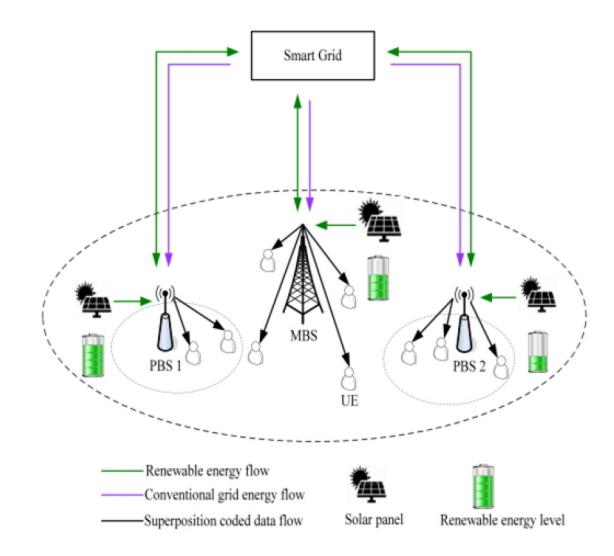

Fig. 10. A two-tier NOMA HetNet powered by solar panels and the conventional grid as an example of energy collaboration [55].

The authors of [55] focused on RA in energy cooperationenabled two-tier HetNets with non-orthogonal multiple access (NOMA), where BSs are fueled by renewable energy sources and conventional grid. The authors suggested NOMA, a distributed approach to offer the optimal UA for the fixed transmit power to discover the best UA and PA strategy for optimizing the overall network's EE under QoS limitations. For the network under consideration, illustrated in Fig. 10, simulation results demonstrate that NOMA can achieve greater EE than orthogonal multiple access (OMA). This study, however, only looked at HetNets, with just pico-cell BSs and MBSs and no FBSs. The complexity was high, as the scheme incurred a significant overhead, making its use unrealistic in large scale networks. On the other hand, the distribution algorithm outperformed a conventional counterpart, but at the cost of high computational complexity.

The authors of [56] studied two kinds of fairness criteria (i.e., proportional fairness and max-min fairness2) for energy efficient RA by jointly considering the UA and PA in UL MIMO-enabled HetNets. To optimize the log utility of EE with QoS and transmit power restrictions of UE, the proportional fairness optimization problem, dual decomposition, and Newton methods were used. In addition, the UA and PA sub-problems were solved using the dual decomposition and sequential convex approximation methods for the maxmin fairness optimization issue. The suggested sub-optimal algorithm outperformed previous schemes in terms of EE. However, the proposed centralized allocation mechanism may result in considerable signalling overhead, increasing communication complexity. The authors of [57] concentrated on EE maximization for DL HetNets. Energy-efficient UA and PA in two-tier HetNets was formulated as an optimization problem, with maximum transmit power limits on each BS cell and minimum data rate for each user were considered to offer reliable

&lt;sup>2Maximize the allocation for the most poorly treated UEs, i.e., maximize the minimum, according to *max-min fairness*. On the other hand, *proportional fairness* is defined as: maximizes the overall utility of rate allocations using a **logarithmic utility function**.

and energy-efficient DL transmission. The proposed solutions were assessed in terms of convergence and effectiveness by simulations and were compared with reference schemes using fixed PA and fixed UA. The biggest disadvantage of the work is that RA was not considered. Due to the iterative nature of the proposed scheme, its computational complexity was high.

In [\[58\]](#page-35-38), authors looked at energy-efficient joint RA and UA for HetNet with multi-homed UEs. The joint UA-RA was formulated initially as a long-term energy-efficient maximization problem, which was then converted into a throughput-minusenergy optimization problem. The associated mixed-integer non-linear optimization issue was solved using continuity relaxation and the Lagrange dual approach. Finally, a dynamic energy-efficient-based approach for getting the optimum RA was proposed. Simulation findings revealed that the proposed approach outperforms other general algorithms in terms of EE performance. PA, on the other hand, was not taken into account in the suggested design, and the authors did not specify the type of small-cells used in the considered HetNet. Overall, the suggested approach exchanged a large number of overhead signals, resulting in high communication complexity. The authors of [\[59\]](#page-35-39) formulated the challenge of EE maximization in the context of a three-tier HetNet with macrocells and picocells layers operating in the sub-3 GHz frequency ranges and attocells layers operating in the visible light spectrum. A novel iterative approach was developed to solve the UA-PA joint problem and provide a near-global optimal solution. In terms of throughput, power consumption, and EE, simulation results showed that the proposed method deployed in a threetier HetNet outperformed a baseline UA scheme operated in a two-tier HetNet.

The authors of [\[60\]](#page-35-40) focused on device-to-device (D2D) communications in HetNets and looked at system's EE. First, they designed a solution for UA for HetNets-supported D2D communications by maximizing received power to users of MBS, FBSs, or D2D communications. Secondly, the D2D communications used a novel RA method known as sequential max search (SMS). SMS algorithm minimizes interference from D2D users to cellular users and maximizes overall network throughput. Simulation results show benefits in terms of throughput and EE, but there are numerous disadvantages: 1) only one MBS and one FBS were considered in the evaluation; 2) simulation results were not compared to other state-of-the-art algorithms; and 3) there was a high communication complexity due to a large number of input variables required to be exchanged, which also increases as the number of UEs grows. The authors of [\[61\]](#page-35-41) proposed to use a cache-enabled energy-cooperative HetNet made up of MBSs and PBSs, in which each BS is equipped with a cache to store content files. These caches are powered by both conventional grid and renewable energy sources, with energy being shared between BSs via the smart grid. The researchers proposed a joint UA-PA algorithm which significantly improves both the data rate and EE of the entire network. The suggested scheme has a minimal computational and communications complexity. However, the suggested method was not compared to other state-of-the-art schemes, and the authors used a fixed number of UEs in the simulation. The authors of [\[62\]](#page-35-42) focused on UA

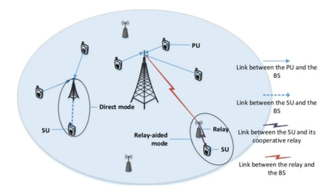

Fig. 11. The macro and pico BS in the HetNet [\[62\]](#page-35-42).

(i.e., BS selection, channel allocation, and mode selection) and PA to maximize the UL EE of secondary users and BS communication. They considered the HetNet illustrated in Fig. [11](#page-10-0) with primary users (PUs) and secondary users (SUs). Ordinary users are PUs whereas unlicensed users, sensors, or other IoT devices are referred to as SUs. To improve the UL EE of the communication between the SU and the BS, the sum-ofratios programming algorithm (i.e., the parametric Dinkelbach algorithm) along with convex optimization were used to solve the three sub-problems. However, there are several pitfalls of the proposed system like it has a significant implementation complexity as a large amount of network information was necessary at the start of the suggested iteration-based method. Besides, the three sub-problems considered were addressed sequentially and not in parallel, resulting in a high latency.

In [\[63\]](#page-36-0), authors achieved good QoS while improving EE by combining loss tolerance and bandwidth growth. They presented a distributed UL combined UA-RA technique for UL energy bit minimization. When compared to the state-ofthe-art maximum signal received power (RSRP) and channel individual offset (CIO) systems, the suggested scheme delivers a considerable improvement in UL energy per bit consumption. However, the scheme had a significant overhead, which resulted in a high level of implementation complexity. In [\[64\]](#page-36-1), authors provided a simple and successful strategy for optimizing SE of two-tier HetNets. The combined optimization of UA and PA was formulated as a mixed-integer programming issue. To deal with the non-convexity of the optimization issue, the Lagrange duality theory is used to divide the original problem into two sub-problems, each of which is solved in turn. The extensive simulation results demonstrated the suggested algorithm's fast convergence rate (i.e., low computational complexity) and considerable performance advantages. In addition, other traditional UA techniques such as minimal path loss, range expansion (RE), and RSRP were compared to the suggested scheme. However, to tackle the problem at hand, a large number of overhead signals were required, resulting in a high level of implementation complexity. A trade-off between SE and EE while ensuring fairness among users was proposed by the authors of [\[65\]](#page-36-2) by taking into account the back-haul capacity constraint in the HetNet. First, the problem was formulated as a multi-objective optimization (MOO) problem maximizing the sum log-utility and simultaneously minimizing the total power consumption. Then, MOO is transferred to the single-objective optimization problem to get Pareto optimal solution using the weighted Tchebycheff method. Finally, the proposed scheme was compared with four different schemes: 1) fixed antenna where the number of antennas of MBS is predefined as the number of maximum available antennas; 2) fixed antenna and power where number of activated antennas and transmit power are fixed as maximum values; 3) max SINR fixed antenna and power where user chooses the BS with the highest SINR); and 4) max SINR algorithm with optimization of power coordination and antenna number. Nonetheless, they only considered the back-haul capacity as a constraint; other context factors like UEs demands, channel quality should also be considered for a more realistic scenario.

The authors of [\[66\]](#page-36-3) sought to achieve a trade-off between user QoS and EE in a HetNet when dealing with mobile UEs. To showcase this trade-off, the authors suggested a new metric, Green Topological Potential Approach, which combines EE and SE when selecting the target cell. The proposed heuristic-based approach Green Heuristic User Association was compared to other two schemes based on path-loss and received power while maintaining an acceptable SE. Yet, the proposed scheme involves many overhead signals, yielding high implementation complexity. The computational complexity was *O*(*M N* ), where M is the number of BSs and N is the number of UEs. As the number of UEs increases, the complexity grows exponentially. Furthermore, there were no constraints on power and resource allocation, making it an ineffective solution in realistic scenarios. Finally, SINR was calculated as per Eq. [4](#page-11-0) without considering the channel gain between UE and its associated BS.

$$SINR_{ij} = \frac{P_{ij}}{\sum_{k \in BSs} P_{ik} + \sigma} \tag{4}$$

To minimize the power consumption and to satisfy the UEs QoS requirements, a low-complex distributed UA and RA scheme was proposed by the authors of [\[67\]](#page-36-4). Firstly, a non-convex joint UA and RA problem was split into two sub-problems using a cost-based approach that estimates the power use effectively. To reduce the computational complexity, relaxation and decomposition techniques were applied to the UA-RA scheduling problems. Besides, the authors introduced a low-complex iterative algorithm for PA based on the decomposition theory that converges quickly to the optimal solution. Simulation results were presented in terms of QoS satisfaction ratio, defined as the ratio of the number of UEs with their QoS satisfied to the total number of active UEs in the network. No other QoS metrics were examined. The proposed scheme was evaluated in small-scale (3 MBSs, 4 SBSs and 20 UEs) and large-scale (30 MBSs, 4 SBSs and 20 UEs) networks and was compared with the Strongest Signal Strength First scheme. Still, the proposed scheme was implemented in MATLAB rather than a proper network simulator.

In [\[68\]](#page-36-5), the author investigated the problem of optimal UA in a HetNet with QoS flows, as shown in Fig. [12.](#page-11-1) To assess average packet delay performance (APDP), a variety of QoS-aware Association (QoSA) methods were used, including QoSA via block-coordinate descent, QoSA via

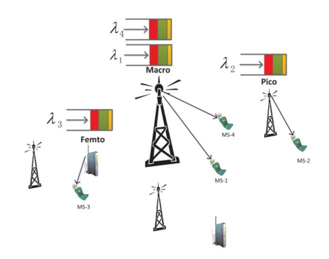

Fig. 12. HetNet with QoS traffic, where MS denotes mobile stations and λ*k* denotes the rate at which QoS packets arrive for MS-*k* [\[68\]](#page-36-5).

alternating-direction method of multipliers, and QoSA with multi-flow algorithm (QoSA-MF). On one hand, the suggested QoSA algorithms can reduce APDP over the entire network while ensuring performance. Furthermore, the QoSA-MF can optimize best-effort throughput while ensuring QoS flow delay requirement. All of these unique QoSA methods, on the other hand, have low complexity and can be distributed, which is the most desirable aspect in HetNets with a large number of unplanned wireless nodes. Maximum-DL-SINR and proportional fairness (PF) were used to compare the proposed schemes. The author demonstrated that the proposed QoSA algorithms: 1) converge towards the global optimum; 2) significantly reduce packet delays when compared to existing conventional association strategies; 3) able to optimize multiple flows in a distributed fashion; and 4) can be applied to scenarios with mobility when the channel gains are time-varying using extensive simulations.

In [\[69\]](#page-36-6), the impact of the dual-slope path loss model on the performance of a DL HetNet was investigated for maximizing the weighted total rate of joint UA-RA-PA while taking UE QoS requirements and maximum transmission power limits into account. The goal was to develop and study a QoSaware resource optimization framework using a multi-slope path loss model in a multi-tier HetNet, in contrast to recent works such as [\[70\]](#page-36-7), [\[71\]](#page-36-8), [\[72\]](#page-36-9), [\[73\]](#page-36-10), which highlight the importance of multi-slope model and analyze coverage probability. Results showed that it can enhance the network sum rate and EE by offloading UEs to the closest BSs due to minimal attenuation, as opposed to the single-slope model. However, the proposed effort had the following shortcomings: 1) the channel quality was not considered; 2) there was no power constraint; and 3) there was no pseudo-code for the proposed technique. By jointly optimizing transmit power and UA, the authors of [\[74\]](#page-36-11) proposed a resilient EE maximization technique for a DL NOMA-based multi-cell HetNet with constrained channel uncertainty. Due to the complexity of the investigated non-convex problem, the authors used the worstcase approach and Dinkelbach's method to convert it into a deterministic and convex optimization problem and then used Karush–Kuhn–Tucker conditions along with the Lagrange dual approach to derive the closed-form solutions of PA-UA. The suggested technique has strong robustness and can lower macrocell users (MU) outage probabilities, according to simulation findings. "Non-robust NOMA" (NOMA-based EE maximization strategy under perfect CSI) and "Non-robust OFDMA" (orthogonal frequency division multiple access (OFDMA) based rate maximization algorithm under perfect CSI) were compared to the proposed scheme. Still, only a small number of MUs (5) and SUs (2) were simulated. As a result, the proposed system may not appropriate for large-scale networks.

Caching has been a promising way to relieve the backhaul bandwidth burden in the HetNets. However, PA and UA are neglected in conventional caching strategies, resulting in insufficient power for users and cache waste in an SBS. Keeping these constraints in mind, the authors of [\[75\]](#page-36-12) jointly optimized caching, PA and UA to maximize UEs average QoE for video services in software defined HetNets. A mixed-integer non-linear programming (MINLP) problem is formulated under the constraints of caching capacity, limited power and UA. The formulated problem is NP-hard and the authors proposed a Joint Caching-Power-and-Association (JCPA) algorithm to obtain the optimal global solution based on the hidden monotonicity. A lower bound of JCPA was obtained through a heuristic-based algorithm. The proposed scheme was compared with the pro-active based approach, Most Popular Video, and the reactive based approach named least recently used. Simulation results were presented in terms of the cache hit rati[o3](#page-12-0) and MOS. However, the solution has several drawbacks: 1) it was not mentioned how MOS was obtained and whether it was mapped to PSNR, SSIM or VMAF; 2) variation among the number of UEs and BSs was not considered in simulation; hence the proposed scheme may only be effective in small-sized networks; and 3) high implementation and computational complexity. The authors of [\[76\]](#page-36-13) went a step further and calculated QoE in CR-based HetNets with cognitive D2D couples as SUs and cellular users as PUs. They first defined the cross-layer optimization issue to maximize the average QoE of D2D pairs while meeting the QoE requirements of cellular UEs. To solve the non-convex optimization problem, a centralized and semi-distributed RA system based on GA and stackelberg game was presented. Simulation results showed that the centralized GA algorithm outperformed the semi-distributed Stackelberg Game algorithm. Both achieved significant improvements over random allocation and were very close to the optima, demonstrating the effectiveness of the proposed algorithms. However, in both suggested schemes, the core network was built on EPC-based design rather than 5G service-based architecture, and like in [\[75\]](#page-36-12), the authors did not explain how MoS was mapped.

The authors of [\[77\]](#page-36-14) discussed joint UA-RA backhaul for hybrid-energy-powered HetNets (shown in Fig. [13\)](#page-12-1). To balance network-wide performance with user fairness, they

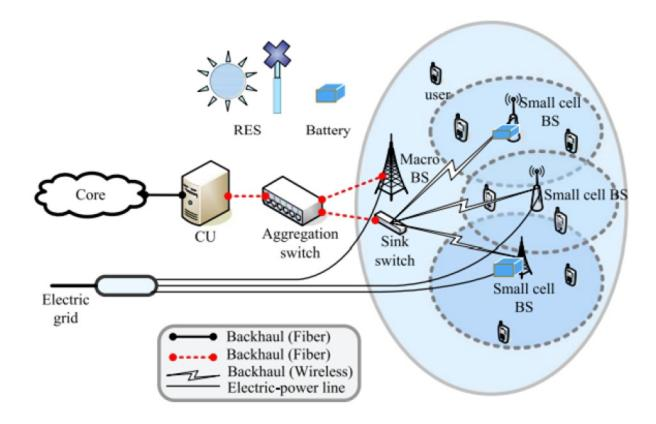

Fig. 13. Network model [\[77\]](#page-36-14).

proposed an online network utility maximization problem reflecting PF having tightly tied variables in the constraints of resources, energy, and backhaul. The proposed problem was solved in a distributed fashion using decomposition methods. A primal decomposition method was used to decompose the original problem into a lower level RA problem for each BS and a higher level UA problem. A Lagrange dual decomposition method was then deployed to solve the UA problem. Testing results showed that the proposed approach significantly improves network utility, load balancing, and user fairness compared to max-SINR and RE solutions. The work in [\[78\]](#page-36-15) focused on solving the joint UA-PA optimization problem for massive MIMO-enabled HetNets under proportional fairness with load and transmit power constraints. First, the authors derived a closed-form expression for ergodic capacity under imperfect CSI. They then proposed an effective algorithm to maximize spectral efficiency's log utility. Simulation results showed the proposed algorithm outperforming max RSRP and min RSRP algorithms in terms of SE and load balancing.

The authors of [\[79\]](#page-36-16) suggested a small-cell deployment methodology for network capacity increase and high load balancing. The framework handles the UA and bandwidth allocation using a greedy based approach. Two greedy algorithms, Greedy Small Cell First Received Signal Based and Greedy Small Cell First Throughput Based User Association were utilized to reduce the load on the macrocell while increasing the load on the small cell for the UA problem. Following selecting the best deployment architecture, a Branch and Bound based algorithm was deployed to solve the UA in the HetNet for capacity maximization. Data offloading from the macrocell to the small cell is accomplished using the Branch and Bound Throughput Based UA algorithm. Still, there are several limitations of the proposed framework. First, UEs demands, BS power and resource capacity were not considered. Second, the proposed scheme was not compared to any other baseline algorithm. Third, due to the use of branch and bound algorithm, the proposed scheme suffers high computational complexity. Hence, it might not be suitable for dynamic environments and large-sized HetNets. The authors of [\[80\]](#page-36-17) solved the same problem as in [\[79\]](#page-36-16) using particle swarm optimization (PSO) to balance and control the load per BS in 5G HetNets. The proposed approach was compared against the conventional

3A measurement of how many content requests a cache can fill successfully, compared to how many requests it receives.

[83] UA-RA

| Ref. | Algorithm | Direction | Control                | SE       | EE       | QoS               | QoE   | Fairness | Coverage Prob. | Comp    | lexity |
|------|-----------|-----------|------------------------|----------|----------|-------------------|-------|----------|----------------|---------|--------|
|      |           |           |                        |          |          |                   |       |          |                | Comput. | Comms. |
| [55] | UA-RA-PA  | DL        | De-centralized         | Х        | <b>√</b> | $\checkmark(T)$   | X     | Х        | X              | High    | High   |
| [56] | UA-RA-PA  | UL        | Centralized            | х        | <b>√</b> | X                 | х     | <b>√</b> | X              | Low     | High   |
| [57] | UA-PA     | DL        | Centralized            | <b>√</b> | <b>✓</b> | X                 | Х     | х        | X              | High    | Low    |
| [58] | UA-RA     | DL        | De-centralized         | X        | <b>√</b> | X                 | Х     | х        | X              | High    | High   |
| [59] | UA-PA     | DL        | De-centralized         | х        | <b>✓</b> | $\checkmark(T)$   | Х     | х        | X              | Low     | Low    |
| [60] | UA-RA     | DL        | De-centralized         | X        | <b>√</b> | $\checkmark(T)$   | X     | х        | X              | Low     | High   |
| [61] | UA-PA     | DL        | De-centralized         | <b>√</b> | <b>✓</b> | х                 | Х     | х        | X              | Low     | Low    |
| [62] | UA-PA     | UL        | Centralized            | X        | <b>√</b> | X                 | X     | Х        | X              | High    | High   |
| [63] | UA-RA     | UL        | De-centralized         | х        | <b>√</b> | X                 | Х     | х        | X              | Low     | High   |
| [64] | UA-PA     | DL        | De-centralized         | <b>√</b> | Х        | $\checkmark(T)$   | X     | Х        | X              | Low     | High   |
| [65] | UA-RA-PA  | DL        | De-centralized         | <b>√</b> | <b>√</b> | X                 | х     | <b>√</b> | x              | Low     | Low    |
| [66] | UA        | DL        | De-centralized         | <b>√</b> | <b>√</b> | X                 | X     | Х        | X              | High    | High   |
| [67] | UA-RA-PA  | DL        | De-centralized         | х        | X        | $\checkmark(T)$   | X     | х        | x              | Low     | Low    |
| [68] | UA-RA     | DL        | De-centralized         | х        | х        | $\checkmark(T,D)$ | Х     | х        | X              | Low     | Low    |
| [69] | UA-RA-PA  | DL        | De-centralized         | <b>√</b> | <b>√</b> | X                 | X     | х        | X              | High    | High   |
| [74] | UA-PA     | DL        | De-centralized         | х        | <b>✓</b> | X                 | Х     | х        | ✓              | Low     | High   |
| [75] | UA-PA     | DL        | Centralized            | X        | X        | X                 | √ (M) | х        | X              | High    | High   |
| [76] | UA-RA-PA  | DL        | Centralized and Hybrid | х        | х        | X                 | √ (M) | х        | X              | Low     | Low    |
| [77] | UA-RA     | DL        | De-centralized         | X        | <b>√</b> | X                 | X     | ✓        | X              | Low     | Low    |
| [78] | UA-RA-PA  | DL        | De-centralized         | <b>√</b> | х        | х                 | Х     | <b>√</b> | X              | Low     | High   |
| [79] | UA        | DL        | Centralized            | Х        | х        | $\checkmark(T)$   | Х     | <b>√</b> | X              | High    | High   |
| [80] | UA        | DL        | De-centralized         | х        | х        | $\checkmark(T)$   | Х     | <b>√</b> | X              | Low     | Low    |
| [81] | UA-RA     | DL        | De-centralized         | Х        | х        | $\checkmark(T)$   | Х     | ✓        | <b>√</b>       | Low     | High   |
| [82] | UA-RA     | DL        | De-centralized         | <b>√</b> | Х        | $\checkmark(T)$   | Х     | <b>√</b> | X              | Low     | High   |

TABLE II

QUALITATIVE COMPARISON OF UA-RA-PA ALGORITHMS BASED ON COMBINATORIAL OPTIMIZATION FOR 5G HETNETS

static biasing approach and simulation results showed that PSO outperformed the static biasing method as it can balance and control the load while maintaining the cell SE. Yet, besides the low computational complexity compared to greedy-based approaches, PSO has the same limitations as of [79].

De-centralized

In [81], two statistical optimization frameworks for multiantenna HetNets were described. The first maximizes UA coverage whereas the second optimizes a rate utility function by combining UA and RA. The aim is to maximize two major performance indicators, i.e., coverage and rate, using a stochastic geometry technique. The results of Monte Carlo simulations showed that the proposed coverage-maximizing and rate-maximizing strategies outperformed the usual maxpower and small-cell RE schemes in terms of coverage and rate. The authors of [82] used a different approach to solve the same problem. With transmission powers, antenna tilts, and CIOs as optimization parameters, they proposed a framework for combining Conflicting Coverage and Capacity Optimization (CCO) and Load Balancing (LB) SON functions. The suggested CCO-LB approach outperformed existing algorithms for all KPIs (e.g., maximum RSRP and maximum SINR user association methods). Results also showed that the proposed solution can yield a significant gain in throughput, spectral efficiency, and load distribution.

Finally, we proposed a Performance-Improved Reduced Search Space Simulated Annealing  $(PIRS^3A)$  in [83], an algorithm for solving UA-RA problems in HetNets (as shown in Fig. 14). First, the UA-RA problem is formulated as a multiple 0/1 knapsack problem (MKP) with constraints on the maximum capacity of the BS along with the transport block size index. Second, the proposed  $PIRS^3A$  is used to solve the formulated MKP. Simulation results show that  $PIRS^3A$  outperformed existing schemes in terms of variability and QoS,

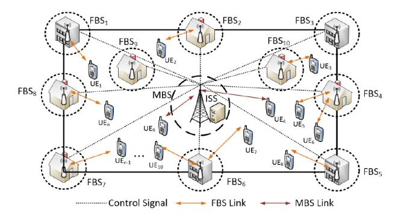

Low

Low

Fig. 14. An example of a two-tier HetNet including one MBS:  $M_1$ , and 10 FBSs:  $M_2, M_3, \ldots, M_{11}$ . The FBSs are usually located at commercial and residential buildings that constitute hotspots for wireless traffic. The UEs  $UE_1, UE_2, \ldots, UE_N$  in a region G are either served by either MBS or FBSs selected by Information Service Server (ISS)[83].

including throughput, PLR, delay, and jitter. Simulation results also showed that  $PIRS^3A$  generated solutions that are very close to the optimal solution compared to the default simulated annealing (DSA) algorithm.

Summary: This section reviews applications of CO for the UA-RA-PA. The reviewed approaches are summarized along with the references in Table II. We observe that the problems are mostly modeled for DL. Moreover, metrics EE and QoS receive more attentions than the other metrics for CO approaches. In the next section, we review the GAT for the UA-RA-PA.

## B. UA-RA-PA Approaches Based on GAT

GAT is a mathematical modelling technique consisting of studying the interactions of numerous players. For example, *equilibrium* is defined as a set of strategies that include each

player's optimum strategy [\[25\]](#page-35-5). In particular, the game's solution achieves *Nash Equilibrium* if none of the players can raise their value by changing their approach without worsening the utility of the others [\[25\]](#page-35-5). As a result, GAT is a powerful instrument that can be used to solve UA-RA-PA problems. The actors in this scenario can be the BSs, the users, or both. GAT can be divided into two types based on different modelling strategies: non-cooperative and cooperative. In noncooperative modelling [\[84\]](#page-36-21), players seek to maximize their utility and compete against one another by using various strategies such as adjusting their transmit powers or placing bids representing willingness to pay. On the other hand, cooperative schemes simulate a bargaining game in which players bargain with one another to achieve mutual benefits. Despite having a low communication overhead, GAT is deemed appropriate for building distributed algorithms with flexible self-configuration features. However, it is worth noting that GAT is based on the assumption of rationality, which assumes that all players are rational individuals working in their own best interests. Yet, in 5G networks, players—BSs or UEs—cannot be expected to operate rationally at all time. For example, various BSs participating in the game may have different optimization aims; optimizing energy efficiency may be viewed as irrational by BSs maximizing transmission rate, and vice versa.

The authors of [\[84\]](#page-36-21) introduced a bi-level negotiating paradigm for distributed UA and RA. UE competition occurs in a non-cooperative manner at the follower level game. In the leader-level game, however, perfect coordination was assumed among the BSs. To balance the loads on small BSs with varying capacities, congestion factors are added. In the proposed algorithm, BS access prices are modified based on incomes and load circumstances in the leaderlevel game. In the follower-level game, each UE picks the BS that maximizes its payoff (or minimizes its payment) individually. As result, the technique achieves a distributed optimization. A PSO-based pricing technique was presented for price design to optimize the BS revenue. Finally, they obtained a stable single-BS association using a residentoriented Gale-Shapley approach. Still, the suggested approach does not ensure user fairness and does not incorporate PA for IM. Also, it does not consider UE demands for different types of traffic. The authors of [\[85\]](#page-36-22) presented a fair UA method in HetNets based on cooperative GAT that focuses on maximizing the utility of users. The proposed solution was designed to simplify the coalition generation using a novel SINR-based Coalition Generation Algorithm called the Nash Bargaining Solution scheme (SCGA-NBS). SCGA-NBS uses the two-band partition method to accomplish the bargaining solution. Simulation results demonstrated that SCGA-NBS outperformed a throughput-oriented approach in terms of fairness, data rate, load distribution, and convergence while ensuring a substantially faster convergence time.

In [\[86\]](#page-36-23), the authors presented a PA allocation based on noncooperative GAT in a heterogeneous ultra-dense relay network to ensure QoS requirements and throughput balance between the access and backhaul links while predicting the number of linked UEs. The proposed non-cooperative game was separated into the backhaul game and access game. Back-haul

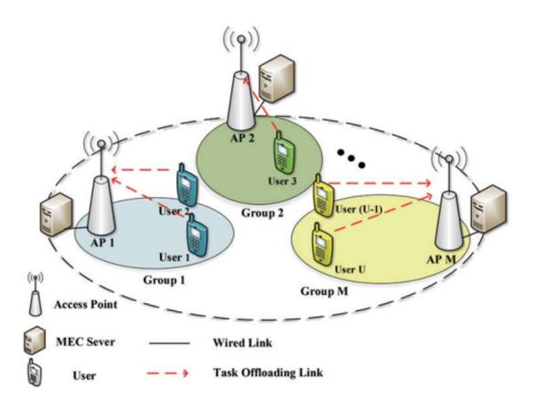

Fig. 15. NOMA-based MEC network [\[87\]](#page-36-24).

game players are the leaders while access game players are the followers. Experiment findings showed that the proposed strategy effectively balances throughput between the two lines and meets the specified minimum rate. A novel NOMAbased Mobile Edge Computing (MEC) network (as shown in Fig. [15\)](#page-14-0) with multiple access points, where each access points was equipped with a MEC server to supply computing resources, was presented by the authors of [\[87\]](#page-36-24). In the proposed network, the problem was formulated to minimize the total energy consumption of all users by jointly considering UA-RA-PA. The formulated optimization problem was modelled as a many-to-one matching game with externality due to co-channel interference along with resource competition among users occupying the same sub-channel. The authors employed the Gale-Shapley algorithm to solve the UA problem and used a heuristics algorithm to solve RA. The PA problem was solved by the convex optimization method. Simulation results show that the proposed approach can achieve lower energy consumption of the system within fewer iterations than other simplified schemes. However, it is unclear whether the proposed scheme offloads the tasks to MEC servers or execute them locally.

The same NOMA network was considered by the authors in [\[88\]](#page-36-25) but with integrated D2D rather than MEC. They set a target of accomplishing the joint RA of uplink NOMAbased D2D groups and cellular users (CUs). A two-stage game approach was put forward to deal with the joint PA and RA problem. Computations were performed in D2D groups and CUs separately, where the available energy of UEs is considered during the game. An approximation method was introduced to formulate the first stage as a non-cooperative game instead of a coalitional game with high computational overhead. With this approach, the computational complexity and signalling overhead was significantly reduced.

The weighted majority cooperative game (WMCG) was proposed in [\[89\]](#page-36-26) for 5G massive MIMO HetNets to provide services to FBS users and MIMO users. The proposed WMCG allocated antennas to FBSs users based on user loads. In order to reduce power consumption, the proposed scheme monitored the state of FBSs. If an FBS was in a sleep mode, the MIMO antennas allocated to that FBS were allocated to MIMO users

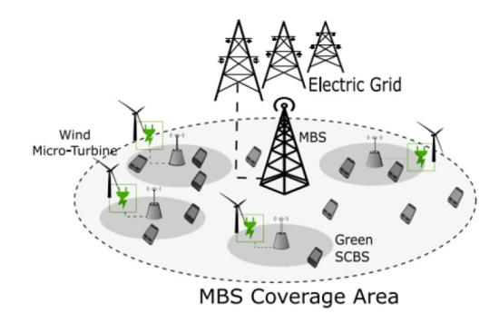

Fig. 16. Scenario: A HetNet powered by hybrid energy sources [\[91\]](#page-36-27).

or other FBSs. The authors of [\[89\]](#page-36-26) proposed another approach, E2beam, based on the cooperative game in [\[90\]](#page-36-28). E2beam assigns the beam cooperatively in a way that the interference was minimized. A utility function was proposed to select the minimum power consumption for connecting UEs to BS.

The authors of [\[91\]](#page-36-27) investigated a distributed GAT-based mechanism for controlling the user-BS association process in a HetNets powered by renewable energy (as depicted in Fig. [16\)](#page-15-0) to lower grid demand and increase EE. The proposed technique was based on a population-like game with atomicity and non-anonymity properties. Three alternatives to the proposed game-theory-based scheme are presented and compared. Simulation results showed that the suggested gametheory-based technique increases the EE of HetNets powered by hybrid energy sources in real-world settings compared to the benchmarks. Yet, the proposed scheme has three major flaws. First, RA was not considered to improve transmission rate. Second, there is no provision for continuous green energy, which can be achieved through storage systems or by using more stable renewable sources. Finally, while the computational time of the proposed scheme was lower than some benchmarks (e.g., greedy algorithm and discrete optimization), but it was high in comparison to best-signal-level-policy.

In [\[92\]](#page-36-29), a spectrum-sharing-based HetNet was proposed, in which an FBS can combine multiple macro-cell operators (MCO) sub-bands and allocate the aggregated sub-bands to allow high-speed wide-band data transmission for each unlicensed user (UU). The main goals of this project were to solve the following issues:

- 1) Power control problem: how MCO manages interference by constantly modifying the interference pricing to protect licensed users.
- 2) Sub-band allocation problem: how UUs choose which sub-bands to access based on channel information, interference pricing, and other UUs' actions.
- 3) Overlapping coalition formation problem: how UUs form overlapping alliances to increase their data rate.

To jointly consider the solutions to these three challenges, a hierarchical game framework was developed (as shown in Fig. [17\)](#page-15-1). Simulation results showed that the proposed approach always converges to the hierarchical game's SE. At the same time, the resulting transmit power and sub-band allocation were stable and no player could increase their reward further by acting alone and unilaterally deviating from the plan.

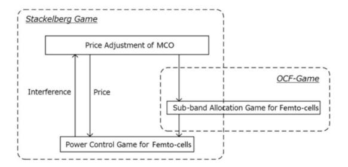

Fig. 17. Hierarchical game structure [\[92\]](#page-36-29).

The authors of [\[93\]](#page-36-30) investigated the EE performance of users in a DL NOMA-based HetNet. To decrease the complexity of MUE and FUE, they formulated the EE maximization problem as a non-cooperative game. Furthermore, they provided a centralized approach for realizing the energy-efficient power control algorithm (EPCA), which reduces information exchange for each game iteration and ultimately obtains the unique Nash equilibrium. Simulation findings suggested that EPCA can converge to equilibrium with higher system-level EE and SE compared to the benchmark. However, EPCA suffers high overhead, i.e., amount of data transferred, resulting in significant implementation complexity. The authors of [\[94\]](#page-36-31) developed a GAT framework based on fuzzy logic for EE improvements in HetNets. Multiple user context parameters such as velocity, SINR, throughput, and BS load were considered for the handover decision. Simulation results showed that the proposed framework improved energy usage dramatically, especially for small active users, when high user velocities are combined with managing ping-pong handovers and cell loads. However, the proposed schemes have several significant flaws: 1) it was not compared to any other state-of-the-art schemes; and 2) it was only evaluated for 20 UEs. Hence, it might not be suitable for large-scale HetNets.

The researchers in [\[95\]](#page-36-32) suggested an effective multi-flow carrier aggregation (MCA) control solution to maximize system throughput while taking into account the utility of each mobile device (MD). The proposed approach was built as a two-level game model to achieve an optimum performance balance between network operators and mobile users. A multiple-leaders multiple-followers Stackelberg game model was used for the upper-level game, in which COs are leaders and MDs are followers. The lower-level game is modelled as a negotiating game in which each MD and traffic flow are game players. The authors demonstrated the superiority of the two-level game method in terms of user payoff, MCA system performance, and CO fairness via numerical analysis. Further improvements could consider: 1) congestion while making traffic aggregation decisions; 2) control issues, including convergence time, service latency, and system-level EE; and 3) MD mobility.

The authors of [\[96\]](#page-36-33) studied the dynamics of radio access technology (RAT) selection games by clients in HetNets. They investigated the convergence properties of these games and introduced a hysteresis that can guarantee convergence. Measurement-driven simulations showed that RAT selection games converge to Nash equilibria in few switches. The pitfall

| Ref. | Algorithm | Direction | Control        | SE       | EE       | QoS             | QoE | Fairness | Coverage Prob. | Com           | plexity       |
|------|-----------|-----------|----------------|----------|----------|-----------------|-----|----------|----------------|---------------|---------------|
|      |           |           |                |          |          |                 |     |          |                | Computational | Communication |
| [84] | UA-RA     | DL        | De-centralized | <b>√</b> | Х        | X               | X   | х        | X              | Low           | Low           |
| [85] | UA-RA     | DL        | De-centralized | X        | Х        | $\checkmark(T)$ | X   | ✓        | X              | Low           | Low           |
| [86] | UA-RA-PA  | DL        | De-centralized | <b>√</b> | х        | $\checkmark(T)$ | X   | х        | X              | Low           | Low           |
| [87] | UA-RA-PA  | DL        | De-centralized | ✓        | <b>√</b> | x               | X   | х        | X              | High          | High          |
| [88] | RA        | UL        | De-centralized | х        | <b>√</b> | X               | X   | х        | X              | Low           | Low           |
| [89] | RA        | DL        | De-centralized | <b>√</b> | X        | х               | X   | х        | X              | Low           | Low           |
| [90] | RA        | DL        | De-centralized | <b>√</b> | X        | Х               | X   | х        | X              | Low           | Low           |
| [91] | UA        | DL        | De-centralized | Х        | <b>√</b> | $\checkmark(T)$ | X   | х        | X              | High          | Low           |
| [92] | RA        | UL        | De-centralized | <b>√</b> | х        | X               | Х   | х        | X              | Low           | Low           |
| [93] | RA-PA     | DL        | Centralized    | <b>√</b> | <b>√</b> | x               | х   | х        | x              | Low           | High          |
| [94] | UA        | DL        | De-centralized | ✓        | <b>√</b> | X               | X   | х        | X              | High          | High          |
| [95] | RA        | DL        | De-centralized | х        | Х        | $\checkmark(T)$ | Х   | <b>√</b> | X              | High          | High          |
| [96] | UA        | DL        | Centralized    | Х        | Х        | X               | X   | X        | X              | High          | High          |
| [97] | UA-PA     | DL        | Centralized    | Х        | X        | X               | X   | X        | X              | Low           | High          |
| [98] | UA        | DL        | De-centralized | <b>√</b> | х        | $\sqrt{(T,D)}$  | х   | X        | X              | Low           | Low           |
| [99] | UA        | DL        | Centralized    | x        | /        | $\sqrt{T}$      | x   | x        | x              | Low           | High          |

TABLE III QUALITATIVE COMPARISONS OF UA-RA-PA ALGORITHMS BASED ON GAME THEORY FOR 5G HETNETS

of the proposed scheme is that it was not compared with any other state-of-the art scheme and it is not clear how promising is the proposed solution to prospective operators. In the context of 5G multi-tier HetNets, the authors of [\[97\]](#page-36-34) addressed the problem of cognitive users admission and channel distribution over cognitive base stations. The users' admission challenge was specifically modelled using a college admission matching. Each small-cell BSs uses a modified English auction following the matching game to request the principal channels to serve its connected users. Results showed that the applied matching method for user admission is simple and that the channels allocation problem has a Walrasian equilibrium point. Still, the proposed approach has the same shortcomings as in [\[96\]](#page-36-33).

The research reported in [\[98\]](#page-36-35) looked at how matching theory can be used for UA in mmWave-enabled cellular HetNets. First, they introduced early acceptance (EA), an efficient distributed matching technique suited for UA in 5G HetNets. The suggested EA uses a centralized worst connection swapping (WCS) algorithm and a deferred acceptance (DA) matching algorithm. Simulation results showed that EA delivered network throughput close to the centralized WCS technique while substantially reducing complexity and overheads due to its distributed nature. Furthermore, EA was more power-efficient and resulted in a significantly faster association process than the well-known DA algorithm. However, this work does not consider RA-PA.

The authors of [\[99\]](#page-36-36) presented an elastic cellular network structure capable of adapting to individual UE QoE requirements. Virtual interference-free service zones centred around planned UEs provide QoE flexibility. To simulate acceptable service-zone formations surrounding UEs, a distributed utility reduction problem was presented. They conducted a complete comparative analysis employing evolutionary and auctionbased game implementations at a centralized control BS to evaluate the optimization of S-Zone allotment to UEs. The game strategy demonstrates superior performance for network efficiency, with fluctuations in data BS density and priority allocation between a fair UE throughput network and a service necessity-driven throughput network. This study could be expanded by evaluating the suggested model at mmWave

frequencies and incorporating the corresponding signalling costs into the optimization framework.

*Summary:* This section reviews applications of GRT for the UA-RA-PA. The reviewed approaches are summarized along with the references in Table [III.](#page-16-0) Tables [IV](#page-17-0) and [V](#page-18-0) indicate the novel contributions of this survey paper. The tables for each scheme detail which game was utilized, who the players were, what strategy was used, what payoffs were examined, and how many resources were impacted. We observe that the problems are mostly modelled for DL. Moreover, metrics EE, SE, and QoS receive more attention than the other metrics. No considered approaches have presented results in terms of QoE and coverage probability. In the next section, we review the GRT for the UA-RA-PA.

# *C. UA-RA-PA Approaches Based on GRT*

Considering a scenario where many small cells are deployed randomly and located in a 5G network, the UA-RA-PA becomes very complicated. Therefore, it is essential to efficiently handle these complex issues between small cells for optimal UA-RA-PA. In such circumstances, a graph can represent the relationships between UEs and BSs, and the optimal UA-RA-PA can be solved using GRT. GRT aims to create a directed graph G = (V, E) with nodes V and edges E. The nodes here refer to various UEs or BSs. The edge set E, on the other hand, corresponds to the set of node mobility linkages. In general, *GRT* is primarily concerned with the analysis of relationships. GRT is a valuable tool for quantifying and reducing the many aspects of dynamic systems given a set of nodes and connections that can abstract anything from city plans to computer data. When considering graphs, the type of graph employed is most relevant. Undirected graphs have no directions associated with the edges between nodes whereas directed graphs have orientations for all edges. Weighted graphs assign a weight (e.g., importance, cost) to each edge.

To tackle the optimization problem, broken into two subproblems, the authors in [\[100\]](#page-36-37) developed a joint RA approach using UA and PA. The first sub-problem was addressed by

TABLE IV MAPPING BETWEEN GAME COMPONENTS AND NETWORK ENVIRONMENT

| Ref.  | Game Type                   | Game Parameter   | Network Environment                                                                                                                                                                                                              |
|-------|-----------------------------|------------------|----------------------------------------------------------------------------------------------------------------------------------------------------------------------------------------------------------------------------------|
|       |                             | Players          | BSs are the first mover and regarded as market leaders. UEs are regarded as the followers in the market.                                                                                                                         |
| EO 41 | Multi-leader Multi-follower | Ctontono         |                                                                                                                                                                                                                                  |
| [84]  | Stackelberg Game            | Strategy Payoffs | How to frame a bi-level bargaining framework to obtain a "win-win" solution?  The motivation is to maximize the UE utility function and apply flexible functions to BSs and UEs to design a local belowing a least the property. |
|       |                             | D                | and UEs to design a load-balancing algorithm.                                                                                                                                                                                    |
|       |                             | Resources        | Resources are access prices of BSs and Payment by UEs.                                                                                                                                                                           |
|       |                             | Players          | MBSs and PBSs are the players in the game.                                                                                                                                                                                       |
| [85]  | Nash Bargaining             | Strategy         | How to provide fair utility distribution among BSs?                                                                                                                                                                              |
| . ,   |                             | Payoffs          | The motivation is to ensure the Fairness and Load distribution among BSs and UEs.                                                                                                                                                |
|       |                             | Resources        | Resources are the BSs to ensure minimum service requirements and QoS for users.                                                                                                                                                  |
|       |                             | Players          | The game is divided in two sub-games. In the backhaul game (BG) the BSs and RNs are the players. In the Access Game (AG) BS/RNs and UEs are players.                                                                             |
| [86]  | Non Cooperative Game        | Strategy         | How to estimate the possible optimal PA Strategy of its followers?                                                                                                                                                               |
|       | -                           | D <i>CC</i> -    | The motivation is to guarantee QoS requirements and throughput balance between                                                                                                                                                   |
|       |                             | Payoffs          | the access and backhaul links while estimating the number of associated UEs.                                                                                                                                                     |
|       |                             | Resources        | Resource is the PA.                                                                                                                                                                                                              |
|       |                             | Players          | The UEs are the game players.                                                                                                                                                                                                    |
| 5071  |                             | Strategy         | How to design a well-defined order to compared two coalitions?                                                                                                                                                                   |
| [87]  | Coalition Game              |                  | The motivation is to ensure fairness and reduces the complexity                                                                                                                                                                  |
|       |                             | Payoffs          | while maintaining an approximate performance.                                                                                                                                                                                    |
|       |                             | Resources        | Resource is the PA.                                                                                                                                                                                                              |
|       |                             | Players          | The D2D groups and CUs are players.                                                                                                                                                                                              |
|       |                             | Strategy         | How to depict the relationship between the paired D2D group and CU.                                                                                                                                                              |
| [88]  | Non-Cooperative Game        | Strategy         | The motivation is to solve the unilateral EE maximization problem                                                                                                                                                                |
|       |                             | Payoffs          | of each D2D group and CU in a distributed manner.                                                                                                                                                                                |
|       |                             | Resources        |                                                                                                                                                                                                                                  |
|       |                             |                  | Resource is the spectrum allocation.                                                                                                                                                                                             |
|       |                             | Players          | The FBSs are the players in the game.                                                                                                                                                                                            |
| [89]  | Cooperative Game            | Strategy         | How to allocate antennas to FBSs based on available loads?                                                                                                                                                                       |
|       | -                           | Payoffs          | The motivation is to reduce the power consumption using utility function.                                                                                                                                                        |
|       |                             | Resources        | Resources are the antennas to transmit the data.                                                                                                                                                                                 |
|       |                             | Players          | The SBSs are the players in the game.                                                                                                                                                                                            |
| [90]  | Cooperative Game            | Strategy         | How to assign the beam cooperatively?                                                                                                                                                                                            |
| . ,   | Ī                           | Payoffs          | Allocate minimum power generate beam using utility function.                                                                                                                                                                     |
|       |                             | Resources        | Beams.                                                                                                                                                                                                                           |
|       |                             | Players          | The UEs are the players in the game.                                                                                                                                                                                             |
| [91]  | Population like Game        | Strategy         | How a game-theoretical approach performing as a learning algorithm seeks Nash Equilbrium?                                                                                                                                        |
| [>1]  | r opulation like Sume       | Payoffs          | Guarantee of appropriate quality-of-service levels according to renewable energy availability.                                                                                                                                   |
|       |                             | Resources        | User Association.                                                                                                                                                                                                                |
|       |                             | Players          | The Macro-cell operator (MCO) and femtocell BS are the players.                                                                                                                                                                  |
| [92]  | Stackelberg Game            | Strategy         | The pricing of the MCO ?                                                                                                                                                                                                         |
| [22]  | Stackerberg Game            | Payoffs          | Joint optimization of transmit power and sub-band allocation of unlicensed users (UU).                                                                                                                                           |
|       |                             | Resources        | Resource Allocation.                                                                                                                                                                                                             |
|       |                             | Players          | UEs are the players.                                                                                                                                                                                                             |
| [93]  | Non-Cooperative Game        | Strategy         | How to reach Nash Equilibrium (NE)?                                                                                                                                                                                              |
| [93]  | Non-Cooperative Game        | Payoffs          | High system level EE and SE.                                                                                                                                                                                                     |
|       |                             | Resources        | Resource and Power Allocation.                                                                                                                                                                                                   |
|       |                             | Players          | BSs are the players.                                                                                                                                                                                                             |
| FO 43 | Non-Granding                | Strategy         | How to reach Nash Equilibrium (NE)?                                                                                                                                                                                              |
| [94]  | Non-Cooperative Game        | Payoffs          | Improving the energy consumption .                                                                                                                                                                                               |
|       |                             | Resources        | Handover Decision and BS selection.                                                                                                                                                                                              |
|       | 1                           | Players          | In the upper-level game Cell Operator(CO) and mobile devices(MD) are the players.                                                                                                                                                |
|       | Multi-leader Multi-follower | Strategy         | In upper level game the strategy is How to adjust the spectrum price.                                                                                                                                                            |
| [95]  | Stackelberg Game            | Strategy         | In the lower level gain strategy is how to bargain.                                                                                                                                                                              |
|       | Stackeroeig Gaine           | Payoffs          | A fair efficient spectrum allocation solution.                                                                                                                                                                                   |
|       |                             | Resources        | Spectrum.                                                                                                                                                                                                                        |
|       |                             | Resources        | opecuum.                                                                                                                                                                                                                         |

combining GRT and a Hungarian method to fix the PA, UA, and RA. The authors used the difference convex function approximation method to solve the PA and fix the UA and RA in the second sub-problem. Compared to the belief propagation algorithm, statistical channel state information, iterative water-filling, and static complete spectral reuse, results showed that this technique could significantly improve the overall system throughput. This method, on the other hand, provided no services to UEs with poor channel conditions. The authors of [\[101\]](#page-36-38) presented a combined RA and PA in a HetNet with a macrocell and a picocell that used spectrum sharing in the underlay transmission mode by employing the QoE utility function. They used a weighted bipartite network and an advanced Kuhn-Munkres algorithm to perfectly match the subcarrier allocation technique. The first-order derivative of the network utility function was used to solve the optimal power problem for PA. Results showed that the proposed scheme outperformed the average PA and PF algorithms. However, RA was only considered at the pico cell, and as cell size increased, the QoE performance deteriorated.

The researchers in [\[102\]](#page-36-39) suggested a graph and matrix theory-based network selection technique for overlapping wireless networks that include WiFi, WiMAX, and LTE technologies. The data rate, service cost, delay, and power consumption aspects have all been considered. The above factors and their relative importance for a particular application

| Reference | Game Type            | Game Parameter | Network Environment                                                                    |
|-----------|----------------------|----------------|----------------------------------------------------------------------------------------|
|           |                      | Players        | UEs are the players in the game.                                                       |
| [96]      | Non Cooperative Game | Strategy       | Strategy corresponds to the selection of radio access technologies.                    |
| [90]      | Non Cooperative Game | Payoffs        | Convergence, Efficiency, and Practicality.                                             |
|           |                      | Resources      | The best Radio Access Technologies (RATs).                                             |
|           |                      | Players        | Two different set of players: the SBSs and secondary users (SUs) set.                  |
| [97]      | Auction Game         |                | SUs and SBSs want to maximize utility                                                  |
| [27]      | Auction Game         | Strategy       | SUs want to attach to the most preferred SBSs,                                         |
|           |                      |                | whereas SBSs to choose their most preferred SBSs.                                      |
|           |                      | Payoffs        | High Throughput and Low power consumption.                                             |
|           |                      | Resources      | Channel Allocation.                                                                    |
|           |                      | Players        | Two different set of players: the UEs and the BSs set.                                 |
| [98]      | Matching Game        | Ctrotogy       | Each player builds it own preference list and ranks the players                        |
| [90]      | Watering Game        | Strategy       | of the other set based on its preference list.                                         |
|           |                      | Payoffs        | High Throughput.                                                                       |
|           |                      | Resources      | User Association.                                                                      |
|           |                      | Players        | In both the games UEs are the players.                                                 |
| [99]      | Evolutionary         |                | The evolutionary game requires UEs to adapt their action strategies iteratively,       |
| [99]      | and Auction Game     | Strategy       | whereas the auction game requires UEs to offer their genuine valuation in order to win |
|           |                      |                | the auction and get virtual Service-Zones for DL scheduling.                           |
|           |                      | Payoffs        | High Throughput.                                                                       |
|           |                      | n n            | V' 10 ' 7 C DI 1 11'                                                                   |

TABLE V MAPPING BETWEEN GAME COMPONENTS AND NETWORK ENVIRONMENT

create a graph and related matrix. The permanence of the matrix is then computed to determine a "network satisfaction value", used to choose the best access point. The suggested graph-based selection mechanism outperformed traditionally RSSI-based approaches. Results also showed that the proposed scheme can select the most appropriate network, based on user preferences, while reducing the number of handoffs compared to TOPSIS (techniques for order preference by similarity to ideal solution). As a result. the scheme can be applied to the next generation of wireless networks, where deployment is extremely dense and numerous networks having various characteristics are to be considered.

The authors of [\[103\]](#page-36-40) have considered a user-centric network-level coordination architecture for 5G Heterogeneous Radio Access Networks (RANs), based on RAN softwarization and a centralized coordination framework. They constructed the network graph to abstract the RA and cell offloading problem with the network function seeking an optimal solution. Simulations were run in a HetNet scenario using the Tabu Search Algorithm, and results were expressed in SE. Using cluster-based GRT, the authors of [\[104\]](#page-36-41) suggested a quick sub-band allocation technique to minimize interference in an ultra dense dynamic HetNet. When the network interference state meets specific circumstances, a new sub-band allocation technique, called The fast sub-band allocation scheme (FAS), proposed in this study allows static UEs to keep their allotted sub-bands. Compared to existing frequency reuse methods, FAS is more efficient, provides a higher SE, and has an advantage in terms of sub-band hand-off rate and latency with a suitable trade-off in terms of UE throughput.

The research in [\[105\]](#page-37-0) introduced a network selection strategy based on bipartite graph matching, i.e., the BGMNS algorithm, to address the challenge of multi-service network selection in 5G ultra-dense HetNets systems. BGMNS combines the Analytic Hierarchy Process and Grey Relation Analysis to efficiently satisfy individualized service requirements and obtain the QoE of edge users seeking various

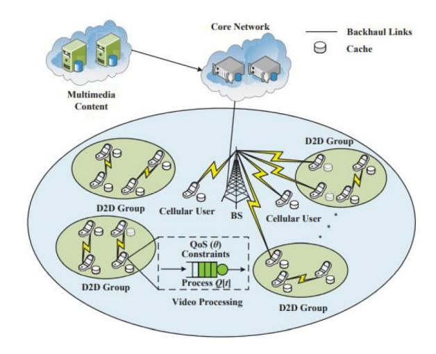

Fig. 18. The system architecture model for group-based collaborative D2D caching scheme over edge-computing networks [\[106\]](#page-37-1).

services across several networks. Simultaneously, to assure system fairness, BGMNS efficiently determines the fairness index by considering both service priority and user QoE and skilfully models the matching degree as the weight of a bipartite graph edge between user and network. On this foundation, BGMNS maximizes the total QoE of edge users while maintaining system fairness. This results in a vastly improved user experience and a more efficient allocation of network resources in the system. Simulation results showed that BGMNS can not only ensure stable access and user QoE when network status varies, but also effectively meet the requirements of requested services, significantly reduce user blocking probability and total PLR, and significantly improve average EE.

The authors of [\[106\]](#page-37-1) presented collaborative D2D caching systems over edge-computing mobile networks using heterogeneous statistical delay-bounded QoS provisioning, as depicted in Fig. [18.](#page-18-1) They designed and solved QoS-driven effective-capacity optimization issues for collaborative D2D

| Ref.  | Algorithm | Direction | Control        | SE       | EE       | QoS               | QoE      | Fairness | Coverage Prob. | Com           | plexity       |
|-------|-----------|-----------|----------------|----------|----------|-------------------|----------|----------|----------------|---------------|---------------|
|       |           |           |                |          |          |                   |          |          |                | Computational | Communication |
| [100] | UA-RA-PA  | DL        | De-centralized | X        | X        | $\checkmark(T)$   | X        | X        | X              | Low           | Low           |
| [101] | RA-PA     | DL        | De-centralized | X        | x        | X                 | <b>√</b> | X        | X              | Low           | Low           |
| [102] | UA        | DL        | De-centralized | X        | X        | $\checkmark(T,D)$ | X        | X        | X              | Low           | Low           |
| [103] | RA        | DL        | Centralized    | ✓        | x        | X                 | x        | X        | X              | High          | High          |
| [104] | RA        | DL        | De-centralized | <b>√</b> | X        | $\checkmark(T)$   | X        | х        | X              | Low           | Low           |
| [105] | RA        | DL        | De-centralized | X        | <b>✓</b> | $\checkmark(P)$   | ✓        | <b>√</b> | ✓              | High          | High          |
| [106] | RA        | DL        | De-centralized | ✓        | X        | X                 | X        | х        | X              | High          | High          |
| [107] | RA        | DL        | Centralized    | X        | х        | $\sqrt{(T,P,D)}$  | X        | х        | X              | Low           | High          |
| [102] | RA        | DL        | De-centralized | X        | <b>✓</b> | $\checkmark(T,D)$ | X        | х        | X              | High          | High          |
| [108] | RA        | DL        | Centralized    | x        | x        | $\sqrt{(D)}$      | x        | x        | x              | Low           | Low           |

caching schemes. They also created centralized and decentralized D2D-caching matching algorithms that use a bipartite graph to solve challenges like effective-capacity optimization. Simulation results showed that the proposed collaborative D2D caching techniques outperformed existing schemes under heterogeneous statistical delay-bounded QoS constraints on edge-computing mobile networks. The authors of [107] suggested a new network selection technique based on GRT. Using Dijkstra's algorithm and a novel cost function for each edge, the proposed system allows users to choose the optimum path. The proposed mechanism for selecting the best path provides higher throughput, exhibits low packet loss, decreases the delay, and the jitter better than handover based RSS, handover based bandwidth, and handover based cost function, according to experiments conducted on a test-bed using the mininet emulator. Additionally, the handover-based cost function outperformed the standard algorithms in terms of QoS. Furthermore, the authors proved the effect of using numerous criteria to estimate each edge's cost. Finally, network selection based on a single parameter, such as RSS or bandwidth, is ineffective in determining the best path for network selection.

In [102], a pragmatic solution for a network selection scheme in wireless HetNets using GRT was proposed. The interdependence of network properties was used to create a network appropriateness index. Comparing the suggested scheme to earlier selection schemes demonstrated that the proposed system adequately captures the user's individual preferences in determining the optimum network, making it suitable to next-generation wireless networks with ultra-dense deployment.

The authors of [108] focused on embedding multi-domain virtual networks in a 5G HetNet infrastructure, as illustrated in Fig. 19. They provided a mathematical model for this problem, a unique heuristic technique for virtual 5G network embedding based on the layered-substrate-resource auxiliary graph, and a compelling 5G demand categorization method. Compared to the benchmark, simulation results showed that the proposed Layered V-FiNE Algorithm could achieve a lower average blocking rate, less average latency, and higher substrate resource efficiency.

Summary: This section reviews applications of GAT for the UA-RA-PA. The surveyed approaches are summarized along with their references in Table VI. Table VII summarizes the type of graphs in existing approaches along with the values associated with vertices and edges in case of weighted graphs.

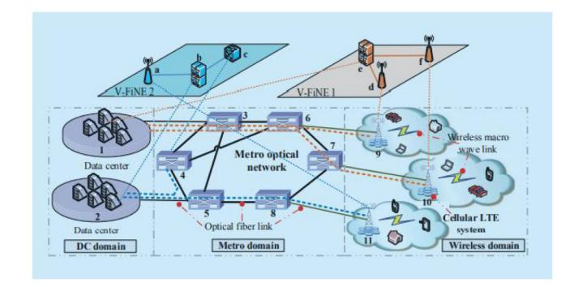

Fig. 19. A heterogeneous multi-domain 5G infrastructure [108].

Most approaches are only modelled for DL and focus on QoS metrics. In the next section, we review DRL approaches for the UA-RA-PA.

## D. UA-RA-PA Approaches Based On Deep Reinforcement Learning (DRL)

RL, a subset of ML, is a useful method for dealing with Markov Decision Processes (MDPs) [27]. An agent can learn its best strategy by interaction with its environment in an RL process. In particular, as depicted in Fig. 20(a), the agent first observes its present condition, then takes action, and finally receives an immediate reward along with its new state. The agent's policy is adjusted based on the observed information and this process continues until the agent's policy approaches the ideal policy. In Table XIII, we have provided a comparison among RL, DL and DRL for a better understanding of each branch.

A tuple (S,A,p,r) defines an MDP, where S is a finite set of states, A is a finite set of actions, p is a transition probability from state s to state s' after an action is performed, and r is the immediate reward obtained after an action is performed. We denote policy  $\pi$  as a "policy" which is mapping from a state to an action. The goal of an MDP is to find an optimal policy to maximize the reward function. An MDP can be finite or infinite time horizon. For the finite time horizon MDP, an optimal policy  $\pi^*$  to maximize the expected total reward is defined by  $\max_{\pi} \left[\sum_{t=0}^{T} r_t(s_t\pi(s_t))\right]$ , where  $a_t = \pi(s_t)$ . For the infinite time horizon MDP, the objective can be to maximize the expected discounted total reward or to maximize the average reward. The former is defined by  $\max_{\pi} \left[\sum_{t=0}^{T} \gamma_{t}(s_t\pi(s_t))\right]$ , while the latter is expressed by

| Reference | Vertices                                                              | Edges                                                                             | Graph Type                                                          |
|-----------|-----------------------------------------------------------------------|-----------------------------------------------------------------------------------|---------------------------------------------------------------------|
| [100]     | BSs and UEs are the two set of vertices                               | Edge corresponds to connection between UE and BS                                  | Weighted Bipartite Graph (WBG) in which weight is the data rate     |
| [101]     | PUEs and reused sub-carriers are two non-empty subsets representing V | E is the edge set between PUEs and reused sub-carriers                            | WBG in which weight is the transmission rate of PUE on sub-carrier. |
| [102]     | A vertices corresponds to the network selection parameter             | Edge denotes the priority among parameters.                                       | Directed Graph                                                      |
| [103]     | The vertex represents the vector states                               | Edge represents the interaction between entities                                  | Weighted Graph                                                      |
| [104]     | The vertices represents all the FBSs and all the MUEs.                | The edges represents the interference relationship between different vertex       | Weighted Graph                                                      |
| [105]     | The vertices represents the union of users and networks sets.         | The edges represents a connection between user and network node.                  | Bipartite Weighted Graph                                            |
| [106]     | The vertices represents the union of D2D senders and receivers sets.  | An edge exists when SINR is no less than a theshold.                              | Bipartite Weighted Graph                                            |
| [107]     | The vertices represents the mobile device or connected objects.       | An edge represents the set of mobility links between nodes.                       | Weighted Graph (weight measured as Distance, RSS, Bandwidth) .      |
| [102]     | The vertices represents the network selection parameters.             | An edge represents the priority among parameters.                                 | Weighted Graph.                                                     |
| [108]     | The vertices represents the BS, DC and MS.                            | An edge represents a bi-directional fiber link with a given length in kilometers. | Weighted Graph.                                                     |

TABLE VII
MAPPING BETWEEN GRAPH COMPONENTS AND NETWORK ENVIRONMENT

TABLE VIII
COMPARISON AMONG DIFFERENT RL TECHNIQUES

| Techniques                  | Problem Solving                                                                 |
|-----------------------------|---------------------------------------------------------------------------------|
| Reinforcement Learning      | This is a branch of ML used to help an agent learn the optimal policy when      |
|                             | the agent has no information about the surrounding environment.                 |
| Deep Learning               | This is a branch of ML used to help an agent to learn the optimal policy when   |
|                             | the agent has some information about the surrounding environment in advance.    |
| Deep Reinforcement Learning | This is an advanced model of reinforcement learning technique in which          |
|                             | deep learning is utilized as an effective tool to improve the learning rate for |
|                             | reinforcement learning algorithms.                                              |

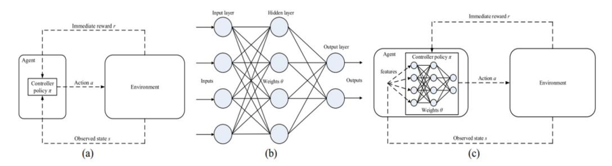

Fig. 20. (a) Reinforcement Learning, (b) Artificial neural network, (c) Deep Q-learning [27].

 $\lim_{T\longrightarrow\inf}\max_{\pi}[\sum_{t=0}^{T}r_t(s_t\pi(s_t))]$ , where  $\gamma\in[0,1]$  is the discount factor that determines the relative relevance of future rewards to the current reward. If  $\gamma=0$ , the agent is "myopic," meaning it solely examines how to maximize its immediate benefit. If  $\gamma$  approaches one, the agent will seek a longer-term larger reward.

1) Q-Learning Algorithms: In an MDP, we aim to find an optimal policy  $\pi^*: S \longrightarrow A$  for the agent to maximize the expected long-term reward function for the system. Accordingly, we first define a value function  $V^\pi: S \longrightarrow A$  that represents the expected value obtained by following policy  $\pi$  from each state  $s \in S$ . Through an infinite horizon and discounted MDP, the value function V for policy  $\pi$  measures the goodness of the policy as follows:

$$V^{\pi}(s) = E_{\pi} \left[ \sum_{t=0}^{\inf} \gamma r_t(s_t, a_t) | s_0 = s \right]$$
  
=  $E_{\pi} [r_t(s_t, a_t) + \gamma V^{\pi}(s_{t+1}) | s_0 = s].$  (5)

Since we aim to find the optimal policy  $\pi^*$ , an optimal action at each state can be found through the optimal value function expressed by  $V^*(s) = \max_{a_t} E_{\pi}[r_t(s_t, a_t) + \gamma * V^{\pi}(s_{t+1})].$ 

If we denote  $Q^*(s,a) \triangleq r_t(s_t,a_t) + \gamma E_{\pi}[V^{\pi}(s_{t+1})]$  as the optimal Q-function for all state-action pairs, then the optimal value function can be written by  $V^*(s) = \max_a Q^*(s,a)$ . Now, the problem is reduced to find optimal values of Q-function, i.e.,  $Q^*(s,a)$  for all state-action pairs, and this can be done through iterative processes. In particular, the Q-function is updated according to the following rule:

$$Q_{t+1}(s, a) = Q_t(s, a) + \alpha_t$$

$$\times \left[ r_t(s, a) + \gamma \max_{a'} Q_t(s, a') - Q_t(s, a) \right]$$
(6)

The core idea behind this update is to find the temporal difference between the predicted Q-value, i.e.,  $r_t(s,a) + \gamma \max_{t} Q_t(s,a')$  and its current value, i.e.,  $Q_t(s,a)$ . In (6),

| Ref.  | Algorithm | Direction | Control        | SE       | EE       | QoS               | QoE | Fairness | Coverage Prob. | Com           | plexity       |
|-------|-----------|-----------|----------------|----------|----------|-------------------|-----|----------|----------------|---------------|---------------|
|       |           |           |                |          |          |                   |     |          |                | Computational | Communication |
| [110] | UA-RA     | DL        | Centralized    | X        | х        | $\checkmark(T)$   | Х   | X        | X              | High          | Low           |
| [111] | UA-PA     | UL        | Centralized    | х        | <b>✓</b> | X                 | X   | X        | X              | High          | Low           |
| [112] | UA-PA     | DL        | Centralized    | X        | <b>✓</b> | X                 | X   | X        | X              | High          | Low           |
| [113] | RA        | DL        | Centralized    | <b>√</b> | Х        | X                 | X   | X        | X              | High          | Low           |
| [114] | UA        | DL        | Centralized    | X        | Х        | $\checkmark(T)$   | X   | X        | X              | High          | Low           |
| [115] | PA        | DL        | Centralized    | х        | х        | $\checkmark(T)$   | X   | х        | X              | High          | Low           |
| [116] | PA        | DL        | Centralized    | <b>√</b> | <b>√</b> | X                 | X   | х        | X              | High          | Low           |
| [117] | UA-RA     | DL        | Centralized    | х        | х        | $\checkmark(T)$   | х   | х        | X              | High          | Low           |
| [118] | PA        | DL        | Centralized    | X        | х        | $\checkmark(T)$   | X   | х        | X              | High          | Low           |
| [119] | PA        | DL        | De-Centralized | X        | х        | $\checkmark(T)$   | х   | X        | X              | Low           | Low           |
| [120] | RA        | DL        | Centralized    | X        | х        | $\checkmark(T,D)$ | х   | X        | X              | Low           | Low           |
| [121] | UA-PA     | DL        | Centralized    | х        | <b>_</b> | $\sqrt{T}$        | X   | X        | X              | High          | Low           |

TABLE IX

QUALITATIVE COMPARISON OF UA-RA-PA ALGORITHMS BASED ON DEEP REINFORCEMENT LEARNING FOR 5G HETNETS

the learning rate  $\alpha_t$  is used to determine the impact of new information to the existing Q-value. The learning rate can be chosen to be a constant, or it can be adjusted dynamically during the learning process.

2) Deep Learning: Deep learning (DL) [110] is a collection of methods and approaches aimed at identifying important features in data and modeling their high-level abstractions. The major purpose of DL is to avoid having to manually describe a data structure (such as handwritten features) by automatically learning from the data. It refers to any neural network with two or more hidden layers, which is commonly referred to as a Deep Neural Network (DNN). Although they can also include propositional formulations or latent variables structured layer-wise in deep generative models such as the nodes in Deep Belief Networks and Deep Boltzmann Machines, most deep learning models are built on an Artificial Neural Network (ANN). An ANN is a computational nonlinear model based on the neural structure of the brain that is able to learn to perform tasks such as classification, prediction, decision-making, and visualization. As shown in Fig. 20 (b), an ANN is made up of artificial neurons that are structured into three interconnected layers: input, hidden, and output. Input neurons in the input layer transfer information to the buried layer. The output layer receives data from the hidden layer. Weighted inputs, an activation function, and one output are all present in every neuron. The modifiable parameters that turn a neural network into a parameterized system are called synapses. The activation function of a node determines the node's outputs based on its inputs.

Backpropagation is a powerful learning method that ANNs employ during the training phase to swiftly compute a gradient descent with respect to the weights. Automatic differentiation is a specific case of backpropagation. The gradient descent optimization approach frequently employs backpropagation in the context of learning to modify the weights of neurons by determining the gradient of the loss function. Due to the fact that the error is calculated at the output and sent back across the network layers, this technique is occasionally referred to as backward propagation of mistakes.

An ANN with numerous hidden layers is referred to as a DNN. Feedforward Neural Network (FNN) and Recurrent Neural Network are the two common DNN models (RNN). There are no cycles or loops in the FNN since information only flows in one direction, from the input nodes to the output nodes via the hidden nodes. Convolutional Neural Networks (CNN) are the most popular model in FNNs and have a wide range of uses, particularly in speech and picture recognition. The CNN uses a variant of the multilayer perceptrons outlined above and includes one or more convolutional layers, either pooling or fully connected. A convolution operation is applied to the input by convolutional layers, which then send the output to the following layer. This operation allows the network to be deeper with much fewer parameters.

3) Deep Q-Learning (DQL): When the state space and action space are small, the Q-learning technique can efficiently find an optimal policy. In practice, however, with complex system models, these spaces are frequently quite big. As a result, it is possible that the Q-learning algorithm won't be able to determine the best policy. To address this problem, the DQL technique was developed. As shown in Fig. 20 (c), DQL uses a Deep Q-Network (DQN) instead of a Q-table to calculate an estimated value of  $Q^*(s, a)$ .

When a nonlinear function approximator is utilized, the average reward obtained by reinforcement learning algorithms may not be stable or even diverge. This is due to the fact that a little change in the Q-values can have a significant impact on the policy. Thus, the data distribution and the correlations between the Q-values and the target values  $R + \gamma \max_{a'} Q(s'a')$  are varied. Two approaches, namely experience replay and target Q-network, can be applied to solve this problem.

The surveyed approaches are summarized along with their references in Table IX. In Table X, we present the considered state space, action space and reward. We also mention which entity is acting as an agent in the considered problem from the standpoint of UA-RA-PA in HetNets.

In [110], the authors proposed a distributed DRL architecture for obtaining the best UA-RA strategy in HetNets. The optimization problem was created to obtain the highest long-term return while maintaining UE QoS standards. A Multi-agent Reinforcement Learning (MARL) technique was suggested by jointly associating UEs to BSs and allocating channels to UEs considering the non-convex and combinatorial properties of this joint optimization problem. A Double DQN was proposed to efficiently offer a near-optimal solution with minimal iterations using the double-Q method. Simulation results demonstrated the high convergence and

| Ref.  | Algorithm | Direction | Control        | SE       | EE       | QoS             | QoE | Fairness | Coverage Prob. | Complexity    |                |
|-------|-----------|-----------|----------------|----------|----------|-----------------|-----|----------|----------------|---------------|----------------|
|       |           |           |                |          |          |                 |     |          |                | Computational | Implementation |
| [122] | PA        | DL        | Centralized    | X        | х        | $\sqrt{T}$      | X   | х        | x              | High          | Low            |
| [123] | RA        | DL        | De-centralized | <b>√</b> | <b>√</b> | Х               | X   | x        | X              | High          | Low            |
| [124] | UA-RA     | DL        | Centralized    | X        | х        | $\checkmark(T)$ | X   | <b>√</b> | X              | High          | Low            |
| [125] | RA        | DL        | Centralized    | X        | <b>√</b> | Х               | X   | <b>√</b> | X              | High          | Low            |
| [126] | UA-RA     | DL        | Centralized    | х        | <b>√</b> | X               | X   | x        | x              | High          | Low            |
| [127] | UA        | DL        | Centralized    | <b>√</b> | х        | $\sqrt{T}$      | X   | x        | X              | Low           | Low            |
| [128] | UA        | DL        | Centralized    | <b>√</b> | <b>√</b> | X               | X   | x        | X              | Low           | Low            |
| [129] | UA-RA     | DL        | Centralized    | X        | Х        | $\sqrt{T}$      | Х   | X        | X              | Low           | Low            |
| [120] | IIA DA    | DI        | Centralized/D  | v        | v        | /(T)            | v   | v        | v              | Low           | Low            |

TABLE X QUALITATIVE COMPARISON OF UA-RA-PA ALGORITHMS BASED ON DEEP REINFORCEMENT LEARNING FOR 5G HETNETS

superior performance of the proposed solution compared to other reinforcement learning methods such as Q-Learning and DQN. MARL was also considered by the authors of [\[111\]](#page-37-5) to handle the UA-PA problem in HetNets. The proposed work investigates the joint optimization of UA-PA in OFDMA-based HetNets. The UA-PA problem was modelled as the maximum long-term UL EE of all UEs under the limits of maximum transmit power and UE QoS criteria. Furthermore, the convergence of the multi-agent DQN method was investigated, and results showed that the multi-agent DQN has a faster convergence speed than the conventional Q-learning technique. Results also showed that the multi-agent DQN outperformed the benchmarks as it can successfully increase EE of all UEs. In [\[112\]](#page-37-6), the authors investigated the joint problem of UA-PA in the DL of a two-tier HetNet without knowledge of the environment transition probability using a parameterized deep Q-network (P-DQN). The authors constructed the reward function based on EE with a QoS constraint per user and a backhaul capacity limitation, taking into account realistic scenarios. When the limitation was broken, a penalty mechanism was triggered. Simulation results showed that P-DQN outperformed other traditional methods in terms of overall EE while meeting QoS requirements and backhaul constraints. Yet, P-DQN may not work well in situations with large action space.

In [\[113\]](#page-37-7), a DRL approach was used to tackle the joint optimization problem for UA-RA-PA in HetNets. The heterogeneous network-deep-Q-network framework (HetDQN) was proposed to solve the problem. It consists of 6-layer deep neural networks based on maximum SE. Results showed that HetDQN can attain a greater SE when compared to the present solutions and has a better convergence. The authors of [\[114\]](#page-37-8) considered a HetNet in which users must connect to the best BS to get the most out of the network. The proposed DRL-based association architecture uses continuous channel state information as an input. An efficient online DRL-based approach was proposed to address the NP-hard utility maximization problem. The system was computationally efficient and does not require any external labelled data as a training data set. It may quantize the output of DNNs as UA solutions. These association solutions are saved in a shared memory structure then used to train all DNNs using a sub-gradient method. The authors showed that the suggested approach outperformed the maximum signal-to-interferenceplus-noise-ratio (max-SINR) UA scheme numerically. The authors of [\[115\]](#page-37-9) looked at the handover and PA problem in a HetNet system with numerous UEs. They identified the ideal policy between UE actions and local observations (e.g., signal measurement report, current connection, and public information) to improve overall throughput while reducing handover. They considered inter-dependencies across UEs and represented the problem as a fully cooperative multi-agent job. The ideal cooperative policy for each UE was then learned using a MARL technique. They also introduced a centralized training with a decentralized execution framework to propose a multi-agent proximal policy optimization (MAPPO) algorithm for the multiple UEs system. The global data was used to teach policies for each UE. Once the training was completed, each UE received a decentralized policy that made decisions based on the UE's local observations. MAPPO outperformed the benchmarks in terms of high throughput, the suggested technique can obtain higher results.

The authors of [\[116\]](#page-37-10) introduced MBS as a new type agent in HetNets to perform PA with FBS for all users, and used DQN to optimize PA in wireless dense HetNets. The joint PA based on multi-type agents outperformed a single-type agent in substantial interference circumstances. The neural network also improved the system's ability to process massive volumes of agent state information. In comparison to Qlearning and Q-learning averaged allocation, simulation results showed that the suggested strategy enhanced system capacity and improved energy efficiency. Still, to reduce complexity, different incentive functions and techniques of sharing knowledge among agents should be examined. In [\[117\]](#page-37-11), the authors looked at the joint UA-RA problem for virtualized small cell (VSC) aided HetNets using UE mobility prediction. The user mobility prediction model was exhibited, and the VSC was assessed using the user mobility prediction model. Since the problem is non-convex, decoupling and coupling solutions based on Multi-Agent Q-Learning were proposed. Simulation results showed that the introduction of VSC can significantly improve system capacity and SE. However, there is a tradeoff between performance and algorithm complexity. In addition, other performance measures such as delay and energy cost were not examined. A DQN with padding for optimal PA in HetNets was proposed in [\[118\]](#page-37-12) where padding was employed to maximize the system's sum rate when the number of users changed dynamically. To estimate the Qfunction and discover the best PA method, a Convolutional Neural Network was used. Simulation results revealed that DQN outperformed the Weighted Minimum Mean Square Error algorithm in system capacity and adequately manageed active and idle users. However, under the suggested framework with inadequate CSI, dynamic user changes, without knowing the maximum number of users in the cell, should be addressed.

The study in [\[119\]](#page-37-13) examined traffic offloading and the PA problem in green HetNets to increase long-term EE by combining decentralized and centralized techniques. The problem was treated as a Markov game using MARL for decentralized optimization while in centralized optimization, a DNN was employed for value estimation with DQL due to its large state space. Simulation results revealed that the DQLbased approach outperformed MARL and greedy algorithms, with MARL incurring the lowest communication overhead. In high mobility 5G HetNet, the authors of [\[120\]](#page-37-14) investigated using DRL to adaptively assign TDD UL/DL resources. DNN was used to extract features from complex network information in the suggested approach, and a dynamic Q-value iteration based RL with experience replay memory mechanism was proposed to adjust TDD UL/DL ratio by evaluated rewards. The suggested algorithm was compared to various methods such as the conventional technique and the Q-learning based method in terms of throughput and PLR. In [\[121\]](#page-37-15), a DRL-based general optimization framework was presented as a unified solution for the UA-PA problem that can adapt to OMA-enabled and NOMA-enabled HetNet scenarios with minor alterations. A hybrid UA-PA algorithm based on the Deep Deterministic Policy Gradient Algorithm (DDPG) was proposed that achieves load balancing and improves EE by interacting with the environment. In terms of aggregate rate and EE, the suggested strategy outperformed SA, Max-SINR, DDPG with fixed power, and DDPG with max-SINR. Yet, the proposed framework is not general enough to suit all networks.

To address the challenge of DL sum-rate maximization in multi-RAT multi-connectivity HetNets, the authors of [\[122\]](#page-37-16) suggested a hierarchical multi-agent DRL-based system called Deep Radio Access Technologies (DeepRAT) which gets the RAT-Edge Devices (EDs) assignment and PA to maximize HetNet's constrained sum rate. To study system dynamics and solve the problem, DeepRAT incorporates DQN and DDPG models. DeepRAT solves it hierarchically by breaking it into a multi-RAT assignment stage and a PA stage. The DQN method is used in the first step to learning the best RAT assignment policy for EDs. The second stage uses the DDPG method to solve the PA problem for the RATs' allocated EDs. Yet, DeepRAT does not handle the multi-RAT HetNet's joint optimization of both PA and RA. To maximize SE and EE, the authors of [\[123\]](#page-37-17) presented a distributed multi-agent deep reinforcement learning (MADRL) for joint RA. The suggested distributed MADRL-Multi Optimization Problem (MOP) framework can deliver an optimal solution in few iterations. Furthermore, this centralized training and distributed execution approach can choose a policy strategy to achieve distinct optimal objectives for different agents thanks to rewarding functions. Simulation results showed that the suggested approach could effectively deal with RA and outperform the benchmarks. In [\[124\]](#page-37-18), the authors suggested a Mobility-aware Centralized Reinforcement Learning (MCRL) strategy for UA-RA in HetNets. The action space is dimensionally reduced using an existing method that approaches the upper boundaries, ensuring that MCRL can solve the joint optimization issue. Additionally, the state-of-the-art Actor-Critic technique was used in the RL agent's training. Simulation results showed that MCRL is both feasible and effective and can converge quickly during the training phase, considerably improving throughput and user fairness.

The authors of [\[125\]](#page-37-19) developed a conventional DQN approach to address the RA problem in HetNet to optimize the EE. The algorithm encourages the usage of green energy to power BSs as much as possible, reducing their reliance on the power grid and maximizing EE. Simulation results showed that this method is capable of efficient learning, can effectively enhance the network's EE, and can achieve excellent resource management. In [\[126\]](#page-37-20), the authors examined a UA and RA scheme for HetNets with hybrid energy supply to exploit the harvested energy across small-cells. The EE criterion was defined as the ratio of total information rate to the conventional power grid energy, and the objective was to maximize the EE of the overall network. The model-free RL framework, similar to trial-and-error learning, was used to design the sequential decision making problem in HetNets. The RL agent learns from its interactions with the environment and develops its policy. A policy-gradient-based actor-critic RL algorithm is suggested to find the best policy for a problem with continuous-valued state and action variables. When estimating the policy gradient, the actor portion typically has a high variance. In contrast, the critic part assists the actor in estimating the gradient, and the advantage function is utilized to minimise the policy gradient's variance further. Results showed that the suggested algorithm can increase the network EE when more renewable energy was gathered.

The research in [\[127\]](#page-37-21) reported an intelligent model selection technique in D2D aided 5G HetNets to increase VR broadcasting performance. Three transmission modes were used to serve VR users: macro cell broadcasting, mmWave small cell unicasting, and D2D multicasting. The authors employed RL to find the best selection among the three transmission modes for each user. To begin, the multi-agent learning theoretic framework was used to represent this creative mode selection problem as a general-sum stochastic game to maximize total throughput for VR broadband service. Then, keeping the network scale in mind, two RL policies, Nash-Q-learning and Wolf-PHC, were presented. Simulation results demonstrated that the suggested method outperforms the benchmarks in terms of convergence and VR broadcasting throughput gain. Still, this approach does only suit VR applications. A more generic approach should be proposed.

The authors of [\[128\]](#page-37-22) sought to maximize the overall network EE where many FBSs are dispersed randomly and densely in the MBS coverage. They began by creating an EE model and formulating the optimization problem and suggested DQN technique in DRL to solve it using power discretization. Simulation results showed that the proposed Nature DQN outperformed Q-learning and water-filling schemes in terms of EE with accelerated convergence. The optimal UA-RA algorithm for D2D pairs in UDNs was designed in [\[129\]](#page-37-23). To optimize

| Ref.  | States                                                                                                                              | Actions                                                                     | Reward                                                                                                                    | Agents |
|-------|-------------------------------------------------------------------------------------------------------------------------------------|-----------------------------------------------------------------------------|---------------------------------------------------------------------------------------------------------------------------|--------|
| [110] | State Space corresponds to degree of satisfaction of all UEs QoS.                                                                   | Action space corresponds to the selection of the BS and channel allocation. | The reward function ensures that the HetNet's minimal QoS is met while also maximizing UE utility.                        | UEs    |
| [111] | State Space corresponds to the transmit power.                                                                                      | Action space corresponds to the sub channel allocation.                     | The reward function ensures the sum efficiency of all UEs.                                                                | UEs    |
| [112] | State Space corresponds to the user data rate in the time slot.                                                                     | Action space corresponds to the UA and PA.                                  | The reward function ensures the maximum EE for each UE and satisfying the backhaul link capacity constraint for each SBS. | UEs    |
| [113] | State Space corresponds to the user correlation matrix and channel gain matrix.                                                     | Action space corresponds to power adjustment of BSs.                        | The reward function ensures the optimal resource allocation.                                                              | BSs    |
| [114] | State Space corresponds to the channel state information.                                                                           | Action space corresponds to association between UEs and BSs.                | The reward function ensures the fairness among all UEs.                                                                   | UEs    |
| [115] | State Space corresponds to the BS connection signal measurement and the number of UEs served by each BS.                            | Action space corresponds to BS selection and power requirements.            | The reward function ensures the trade-off between overall throughput and HO frequency.                                    | UEs    |
| [116] | State Space corresponds to the proximity of MBS to the MUE.                                                                         | Action space corresponds to MBS optimal power selection.                    | The reward function ensures the learning objective of the whole system.                                                   | BSs    |
| [117] | State Space corresponds to the Load Ratio (LR).                                                                                     | Action space corresponds to association with BSs.                           | The reward function ensures that each user will prefer to select the BS with low LR and high channel gain.                | UEs    |
| [118] | State Space corresponds to the interference received by users, channel gain and PA.                                                 | Action space corresponds to multiple discrete power levels.                 | The reward function corresponds to the UEs sum rate.                                                                      | BSs    |
| [119] | State Space corresponds to the transmitting power of MBS, set of users that are in coverage area of the MBS, received signal power. | Action space corresponds to adjusted power levels and offloading.           | The reward function indicates the instantaneous payoff of each agent.                                                     | BSs    |
| [120] | State Space corresponds to the UL/DL buffer occupancy.                                                                              | Action space corresponds to configurations of TDD sub-frame allocation.     | The reward function aims to maximize the data transmission rate which was related to the channel occupancy.               | BSs    |
| [120] | State Space corresponds to data rate, data packet transmission time the and                                                      | Action space corresponds to                                                 | The reward function aims to maximize                                                                                      | BSs    |

TABLE XI MAPPING BETWEEN THE REINFORCEMENT LEARNING COMPONENTS AND NETWORK ENVIRONMENT

the sum data rate, they collaboratively devised UA, subcarrier assignment, and PA of D2D pairs located in the overlapping area between adjacent cells. They proposed a DRL-based approach for solving the joint optimization problem. Extensive tests showed that the suggested method achieved near-optimal performance and outperformed competing systems such as random policy, only optimize power, and only optimize association. To maximize joint bandwidth slicing ratios and BS-UA, a two-step DRL-based technique was suggested in [\[130\]](#page-37-24). First, a distributed agent was deployed at each BS for the slice resource ratio in a single BS level. Meanwhile, to ensure the service level agreement (SLA) of slices, a centralized agent was in charge of RA and UA among heterogeneous BSs. Simulation results of eMBB and URLCC slices having different QoS requirements (e.g., minimum throughput, maximum transmission error probability and maximum transmission delay) showed that near-optimal performance in terms of SLA satisfaction and spectrum multiplexing was achieved using the suggested slicing method.

*Summary:* This section reviews applications of DRL for the UA-RA-PA. The reviewed approaches are summarized along with their references in Table [IX](#page-21-0) and [X](#page-22-0) while Table [XI](#page-24-0) and [XI](#page-24-0) represents the mapping of DRL components to network environment.

The many UA-RA-PA techniques based on CO, GAT, GRT, and DRL have been shown to have good performance in simulations. However, there have been concerns with the proposed schemes' complexity and control in several deployment trials. To better illustrate all the studied schemes, we have compared them using different metrics and in several tables, something that has never been presented in previous relevant survey publications. We have also enriched our survey by providing Table [XIII](#page-25-0) which includes a comparison between the RRM schemes and IM schemes used at the Radio Frequency (RF) transceivers.

# VI. RRM FOR CROSS-CO-TIER INTERFERENCE MITIGATION IN 5G HETNETS

In 5G HetNets, the overlaying small cells could cause interference with the MBS or FBSs of other small cells located nearby. There are two types of interference in a two-tier FBSs: *cross-tier interference* and *co-tier interference*. The co-channel interference between FBSs and MBSs is known as cross-tier interference and appears when both FBSs and MBSs use the same set of RBs. Co-tier interference refers to the co-channel interference between different FBSs. This occurs when FBSs are densely deployed, causing coverage overlaps. In such a situation, some closely-located FBSs may use the same set of RBs, resulting in UL and DL interference [\[21\]](#page-35-1).

To increase QoS and inter-user RA fairness, the authors of this work designed a new RA algorithm for IM based on graph coloring techniques [\[131\]](#page-37-25). The proposed Weighted Edge Weighted Vertex Interference Mitigation (WEWVIM) algorithm assigns a weight to each directed edge corresponding to the interference strength from nearby BSs and a weight to each vertex, indicating the color with the least interference or the highest transmission rate. To find the interfering BSs,

TABLE XII MAPPING BETWEEN THE REINFORCEMENT LEARNING COMPONENTS AND NETWORK ENVIRONMENT

| Ref.  | States                                                                                                                                                                                                                                      | Actions                                                                                             | Reward                                                                                                                    | Agents                |
|-------|---------------------------------------------------------------------------------------------------------------------------------------------------------------------------------------------------------------------------------------------|-----------------------------------------------------------------------------------------------------|---------------------------------------------------------------------------------------------------------------------------|-----------------------|
| [122] | State Space is comprised of four elements i.e., discrete, output action of edge server, EDs and RAT related parameters .                                                                                                                    | Action space corresponds to the selection of DL transmit power level.                               | The reward function ensures that the DDPG agent is continuous and governed by its achieved constrained sum-rate. | BSs                   |
| [123] | State Space corresponds to locally observed network environment states.                                                                                                                                                                     | Action space corresponds to transmit power and sub-carriers allocation.                             | The reward function was defined on the basis of data rate and EE targets                                                  | BSs                   |
| [124] | State Space corresponds to channel gain between all UEs and BSs.                                                                                                                                                                            | Action space corresponds to the selection of sub-carriers SINR threshold.                           | The reward function corresponds to the maximization of the data rate.                                                     | BSs                   |
| [125] | -                                                                                                                                                                                                                                           | Action space corresponds to the power adjustment of the BSs.                                        | The reward function corresponds to maximize the utilization of green energy.                                              | BSs                   |
| [126] | State space was determined by both SINR and battery energy level of each SBS.                                                                                                                                                               | Action space corresponds to the sub-channel and power allocation.                                   | The reward function corresponds to EE.                                                                                    | BSs                   |
| [127] | State space corresponds to association relationship between UE and the three network sets.                                                                                                                                                  | Action space corresponds to the user selection action in the TX mode.                               | The reward function corresponds to total throughput of the VR broadcast.                                                  | UEs                   |
| [128] | State space corresponds to UEs communication with BS, number of UEs with BS, power of the FBSs, and level of interference from MBS.                                                                                                         | Action space corresponds to the selection of sub-carriers and power level.                          | The reward function corresponds to EE of BS.                                                                              | FBSs                  |
| [129] | State space corresponds to channel gain, SINR received, transmit power.                                                                                                                                                                     | Action space corresponds to the UA-RA.                                                              | The reward function corresponds to sum data rate.                                                                         | Central Controller |
| [130] | State space for the D-Agent corresponds to number of arrived packets, bandwidth, QoS satisfaction ratio, and resource slicing ratio. For C-Agent State space corresponds to QoS satisfaction and resource utilization ratio. | D-agent action space corresponds to resource slicing and the action of C-agent is hyper-parameters. | The reward function of C-Agent corresponds to QoS satisfaction and for D-agent corresponds to Resource reuse factor.      | BSs                   |

TABLE XIII COMPARISON BETWEEN RRM SCHEMES AND IM SCHEMES AT RF TRANSCEIVERS

| RRM Scheme | Convergence time | Flexibility | Reliability | IM Scheme at RF transceivers [41] | Convergence Time | Flexibility | Reliability |
|------------|------------------|-------------|-------------|-----------------------------------|------------------|-------------|-------------|
| CO         | Medium           | High        | High        | Cross-talk prevention IM          | -                | Low         | High        |
| GAT        | Medium           | Low         | Low         | Analog IM                         | Medium           | Low         | High        |
| GRT        | Low              | Low         | Low         | Digital IIM                       | Medium           | High        | Low         |
| DRL        | Fast             | High        | High        | Mixed-Signal IM                   | Fast             | Medium      | High        |

a region of interest was created. According to simulation data, WEWVIM outperforms existing systems in terms of fairness and QoS, including throughput, PLR, latency, and jitter. The authors of [\[132\]](#page-37-26) investigated the interference for D2D applications in 5G mobile networks. Different methods were introduced in the paper to reduce the effects of various interference types (i.e., cross-tier interference, cotier interference) such as the New Hybrid Frequency Reuse (NHFR) with Almost Blank Sub-frame (ABS) method, the closed mode D2D method and the combined method which is a hybrid of the previous two methods. System performance for all three methods considered was assessed based on a SINRbased expression. A detailed comparison between the three considered methods is performed in Table [XIV.](#page-26-0)

A novel IM technique called Reverse Frequency Allocation (RFA) was proposed in [\[133\]](#page-37-27). RFA achieves intercell orthogonality by partitioning the cell into spatial regions and allocating frequency resources optimally. By removing cross-tier interference from MBS, RFA improves the data DL speeds of the femto users. To further limit the impact of interference to nearby cells, the scientists extended RFA to a multicellular network. They also created a hybrid RFA scheme that combines the advantages of other RFA systems in terms of broad bandwidth and low interference to obtain better data rates. Simulation studies showed how the hybrid RFA scheme

outperform the traditional RFA schemes in terms of user fairness and increased overall network capacity. However, when designing this scheme improving the hand-off process when users travel from one location to another and introducing sectors inside the cell to reduce the density of interferences were not taken into account. To address the multi-tier interference issue, the authors of [\[134\]](#page-37-28) suggested a prioritized radio-access system based on a frequency hopping (FH) technique. The radio-access priorities are endowed to users at different levels using a new FH pattern (FH sequence set) with multi-level Hamming correlations. In a multi-tier HetNets UL, a low peakto-average-power-ratio (PAPR) FH-based OFDM system using the proposed FH sequence set was considered. The numerical and simulation findings showed that the proposed FH sequence set may decrease multi-tier interference in HetNet ULs while still supporting high transmission quality and SE for multi-tier UEs, even at the cell-edge of HetNets. The proposed approach investigated FH with two-level access priorities applied to HetNet ULs, but a general case of flexible multi-level was not examined. To alleviate the impact of both cross-tier and co-tier interference, the authors of [\[135\]](#page-37-29) developed an Edge-Aware RRH-Cooperation (EARC) method for Cell Edge Devices (CED) and Non-cell Edge Devices (NED). These two device classes, CEDs and NEDs, are operated in dual-association and single-association modes, respectively. On one hand, NEDs

| Method                    | Interference | ;       | Definition                                                                                                                                                                   | Advantage                                                                                                                                                                                         | Disadvantage                                                                                                                                                         |
|---------------------------|--------------|---------|------------------------------------------------------------------------------------------------------------------------------------------------------------------------------|---------------------------------------------------------------------------------------------------------------------------------------------------------------------------------------------------|----------------------------------------------------------------------------------------------------------------------------------------------------------------------|
|                           | Cross-tier   | Co-tier |                                                                                                                                                                              |                                                                                                                                                                                                   |                                                                                                                                                                      |
| Closed Mode D2D Method | ✓            | x       | D2D communication is operated in closed mode that consists of authorized Device Users (DU) only. This method includes two different phases:  1) Discovery, 2) Communication. | This method can be applied in 4G mobile networks which are similar to 5G HetNets but replacing the interference from the 5G applications with interference from low power nodes.                  | This method does not investigate the co-tier interference between different DUs when applied in different mobile networks.                                           |
| NHFR with ABS method   | x            | ✓       | The allocated spectrum is distributed between macro users, DUs, and 5G applications in a 5G network with D2D applications.                                                   | Using this frequency distribution of NHFR with ABS technique, the cross-tier interference between DUs and Cellular Users (CUs) is reduced and the co-tier interference among DUs is also reduced. | The disadvantage of this method is the existence of cross-tier interference between DUs and some other 5G applications in the outer and inner regions of some cells. |
| Combined Method        | ✓            | ✓       | Closed Mode and NHFR is combined with ABS methods. It can eliminate the cross-co-tier interference by                                                                        | All types of cross-tier interference were mitigated and the problem of co-tier interference that exists in the closed method will disappear by using NHFR with ABS that allows the D2D pairs      | Using this combined method makes the system more complex but on the other hand, it improves the overall system performance                                           |

TABLE XIV COMPARISON BETWEEN THREE DIFFERENT METHODS PROPOSED IN [\[132\]](#page-37-26)

associate with the Remote Radio Head that gives the bestreceived signal in single association mode. On the other hand, in a dual association mode, CEDs associate with the two strongest RRHs, which may or may not be from the same tier. The researchers quantify the performance improvements of the proposed EARC method in terms of outage probability and ergodic rate using stochastic geometry tools. The proposed method was compared to four other schemes developed in the literature to demonstrate its efficacy.

In [\[136\]](#page-37-30), a Modified Region Splitting based Resource Partitioning (MRRP) method was presented to reduce crosstier interference in two-tier HetNets. This scheme divides the entire macrocell coverage area into three regions: inner, middle, and outside. The complete accessible spectrum was divided into four sub-bands. Both the inner and outer areas share the first three sub-bands. The fourth sub-band was further subdivided into three sub-bands, each used by the centre region. In the MRRP scheme, the unused sub-bands of each macrocell were assigned to femtocells in one of three ways: static, order, or random. The effects of these methods on femtocell overall throughput, average per-user throughput, and total system throughput were studied. Furthermore, Monte Carlo simulations were used to optimize the suggested MRRP system. Finally, the proposed scheme may be extended to (1) investigate the frequency reuse planning technique used to the femtocell to improve the cell's total throughput, (2) The cellular environment's irregular geometry. For downlink NOMA HetNets, [\[137\]](#page-37-31) investigated a cross-tier IM framework based on interference alignment and coordinated beamforming (IA-CB). The suggested technique, dubbed cross-tier IA-CB (CrIA-CB), minimizes cross-tier interference between the macro cell and other small cells in HetNets. The proposed CrIA-CB makes use of the massive MIMO technology's degrees of freedom to construct transmit and receive beamforming vectors that eliminate cross-tier interference at the user side while lowering the need for sharing CSI between small cells and macrocells. Simulation data shows how the proposed technique outperforms other current strategies in terms of system aggregate rate. To minimize interference in femtocell networks, an increased fractional frequency reuse technique was proposed in [\[138\]](#page-37-32). The technique involves segmenting the service area and frequency into three regions and three sets, each with its own frequency set. After the femtocell location is determined, a frequency is assigned according to its region. The proposed method reduces interference, increases SINR, and improves throughput. However, the proposed scheme was only tested with a small number of users, and no localization procedures were utilized to test system performance when localization problems occur.

The authors of [\[139\]](#page-37-33) proposed a joint strategy for hybridaccess small cells that combined the Walsh–Hadamard transform with NOMA and interference rejection combining concept to achieve high-performance gains and mitigate inter-cell interference. The Walsh–Hadamard transform was used as an orthogonal variable spreading factor to achieve variety in communication networks. It ensures superior performance increases than traditional NOMA when used in conjunction with it. In addition, it lowers the bit error rate and improves the system's throughput performance. At the receiver end, interference rejection combining was employed to manage cross-tier interference created by MUEs that could not connect to the SBS for hybrid access. The research looks at both ideal and non-ideal NOMA consecutive interference cancellation circumstances. However, several aspects could be further considered: (1) include interference cancellation techniques such as iterative successive interference cancellation and parallel interference cancellation, (2) consider scalability in a multiuser context, and (3) use various transmit and receive diversity strategies, such as MIMO NOMA. The authors of [\[140\]](#page-37-34) presented three innovative hybrid RFA versions to limit the impact of interference while balancing network load in non-uniform HetNets. They employ load balancing and IM, which are critical for improving network performance, while also maximize network resources in a multi-tier network. Simulation results showed how the hybrid RFA solutions outperformed conventional frequency allocation in nonuniform HetNets, in terms of several performance indicators,

| Approach     | Scheme | Link Direction | Interference |          | SE       | EE | QoS             | QoE | Fairness | Coverage Probability | Complexity    |               |
|--------------|--------|-------------------|--------------|----------|----------|----|-----------------|-----|----------|-------------------------|---------------|---------------|
|              |        |                   | Cross-tier   | Co-tier  |          |    |                 |     |          |                         | Computational | Communication |
| Graph Theory | [131]  | DL                | ✓            | <b>√</b> | х        | х  | $\sqrt{T}$      | х   | <b>√</b> | X                       | Low           | Low           |
| CO           | [132]  | DL                | ✓            | <b>√</b> | х        | х  | Х               | X   | X        | X                       | High          | High          |
| CO           | [133]  | DL                | ✓            | х        | х        | х  | $\sqrt{T}$      | х   | x        | ✓                       | High          | High          |
| CO           | [134]  | UL                | <b>√</b>     | X        | <b>✓</b> | X  | X               | X   | X        | ✓                       | High          | High          |
| CO           | [135]  | DL                | ✓            | <b>√</b> | x        | x  | Х               | X   | X        | ✓                       | High          | High          |
| CO           | [136]  | DL                | <b>√</b>     | X        | X        | X  | $\checkmark(T)$ | X   | X        | X                       | High          | High          |
| CO           | [137]  | DL                | ✓            | х        | <b>√</b> | х  | Х               | х   | х        | ✓                       | High          | High          |
| CO           | [138]  | DL                | X            | <b>√</b> | х        | х  | $\sqrt{T}$      | X   | X        | X                       | High          | High          |
| CO           | [139]  | DL                | ✓            | х        | х        | х  | $\sqrt{T}$      | х   | x        | X                       | High          | High          |
| CO           | [140]  | DL                | <b>√</b>     | x        | х        | X  | х               | X   | X        | <b>√</b>                | High          | High          |

TABLE XV QUALITATIVE COMPARISON OF INTERFERENCE MITIGATION ALGORITHMS FOR 5G HETNETS

including network coverage, coverage per tier, and rate coverage.

*Summary:* This section reviews RRM schemes for crossco-tier IM in 5G HetNets. The reviewed approaches are summarized along with the references in Table [XV.](#page-27-0) We observe that the problems are mostly modelled to solve crosstier interference. Moreover, most of the approaches considered have a high communication and computational complexity. Additionally, none of the approaches proposed present results in terms of user QoE.

## VII. COMBINED APPROACHES FOR RRM IN 5G HETNETS

Combined solutions in this survey paper refer to approaches or algorithms that jointly address IM and a subset or all of UA-RA-PA challenges in 5G HetNets. This section complements the discussions in previous sections.

The authors of [\[141\]](#page-37-35) developed a unique real-time dynamic UA method for multi-tier cooperative systems called Real-Time Load Balance (RTLB). RTLB focused on UE mobility and traffic dynamics while considering both overall network load and received SINR. Even though the proposed UA algorithm does not rely on an IM algorithm to improve its performance, the authors designed a location-based IM algorithm, the Modified Dummy Interesting Circle, to mitigate cross-co-tier interferences in the worst-case scenario of spectrum sharing among various tier BSs in order to overcome some of the shortcomings of spectrum partitioning algorithms. The proposed approaches were compared to state-of-the-art algorithms such as cell range extension, Rate Biased, Greedy, Best Response Algorithm and Max SINR [\[65\]](#page-36-2). In [\[142\]](#page-37-36), a novel IM and PA technique for DL NOMA using MIMO technology in HetNets was proposed. The PA-based interference alignment and coordinated beamforming (PA-IA-CB), the twostage technique proposed by the authors. The first stage used two IA-CB steps: one for cancelling inter-cluster and co-tier interference among small cells and the other for the intercluster interference inside macrocells. Cross-tier interference was addressed in the second stage by adequately managing the allocated power to the MBS and SBSs. Finally, the PA problem was modelled as a non-cooperative game between MBS and SBS to improve the total system rate. Simulations results showed that the new PA-IA-CB approach outperformed traditional MIMO-OMA and MIMO-NOMA based HetNets in terms of outage probability and system overall rate. Additionally, as small cells and macrocells share CSI, PA-IA-CB has an important advantage of lowering signalling overhead.

In [\[143\]](#page-37-37), a new *Q*-Learning adaptive RA strategy for small cell-based ultra-dense HetNets was presented and assessed. This *Q*-Learning technique provided optimal power to the SBS for MUEs and SUEs to support QoS provisioning at the necessary level. When compared to previous studies, this *Q*-Learning scheme demonstrated a significant improvement of the capabilities of MUEs and SUEs in high interference scenarios. Furthermore, when state-of-the-art methods failed to maintain the MUE's minimum necessary capacity due to significant co-tier and cross-tier interference, the suggested technique provided a minimum MUE capacity of 2 b/s/Hz, which is double the minimum required QoS threshold. In [\[144\]](#page-37-38), the authors looked into energy-efficient UA and IM in 5G HetNets. They considered SINR, power usage, and user distance at the same time for UA and proposed a new algorithm which associated UEs with BSs based on their cost values. The algorithm improved EE and IM while eliminating repetitive switching between users and SBSs. According to the simulation results, the proposed method can improve network performance in HetNets. However, the solution only maximizes EE in DL, not in UL.

A group of researchers in [\[145\]](#page-37-39) focused on UL coverage in multi-tier HetNets in the presence of inter-cell interference and jammer interference (as shown in Fig. [21\)](#page-28-0). MBSs, SBSs, users, and wideband jammers were uniformly deployed utilizing independent homogeneous Different network factors such as wideband jammer transmit power, wideband jammer density, SIR threshold, and wideband jammer distribution area, with and without RFA, were evaluated. Due to superior inter-cell interference and jammer interference avoidance, RFA leads to higher UL coverage when compared to a noreverse frequency allocation scenario. Furthermore, due to superior IM, RFA employment resulted in a 5% increase in UL coverage compared to soft frequency reuse. On the other hand, wideband jammers have a consistent transmit power. Therefore, wideband jammers with variable transmit strengths should be utilized to minimize coverage probability.

In [\[146\]](#page-37-40), the authors described an improved ML strategy for energy-efficient RA in a 5G heterogeneous cloud radio access network. MBSs and Remote Radio Heads were used

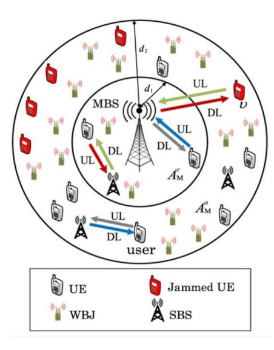

Fig. 21. A two-tier HetNet with wideband jammers and reverse frequency allocation. The MBS, SBSs, users, and wideband jammers follow independent homogeneous Poisson point processes [\[145\]](#page-37-39).

in the network model, which served two groups of users, one with high QoS requirements and the other with low QoS requirements. The Q-learning methodology used low-power Remote Radio Heads for IM between the macro and remote radio head tiers while supporting cellular users' QoS needs and maximizing EE. This centralized online learning approach achieved significant performance benefits in EE, SE, and data rates. However, the drawback of this approach is that if the central controller goes down, the entire network goes down and stops working. The creators of [\[147\]](#page-37-41) have expanded on their previous work in [\[146\]](#page-37-40) by incorporating decentralized RA into the network. Because they know all channel state information and path losses from the users and remote radio heads operating under their coverage, MBSs allocate resources to remote radio heads and cellular users in decentralized RA. The learning is dispersed among all MBS, with each learning a common approach Π for allocating RBs and power levels to users in order to maximize system EE, while still maintaining QoS requirements. Numerical and practical findings showed very good results in terms of system's EE and SE, higher data rates and reduced Bit Error Rates. RA and IM were examined for HetNets in which the lowest tier comprises of (D2D) cells in [\[148\]](#page-38-0). They first explore DL/UL decoupling UA and estimate its capability on IM and networkwide D2D performance increase to address the dead-zone problem. Second, they present a UL fractional frequency reuse strategy in which subband (SB) bandwidths are adaptively selected depending on the following factors: 1) UE density, 2) MBS density, and 3) small cell on/off switching frequency. According to the findings, the adaptive strategy dramatically minimizes the number of people affected by outages. Third, a novel concatenated bi-partite matching (CBM) method was presented for combined SB and RA of cellular UEs. Numerical findings reveal that the CBM performs similarly to a complete solution while taking significantly less time to operate. The CBM is then enhanced for D2D cells to include centralized mode selection, SB allocation, and RA. Alternatively, a D2Dcell can reuse white-list RBs that are not filled by the nearby small cells in an offline and online semi-distributed way. As a result, D2D-cell members are unaware of intra-cell and inter-cell interference in the former and uniformly distribute their maximum allowable power to v in the latter. Finally, they used the proximity advantage of D2D UEs to convert D2D sum-rate maximization into a convex form in the latter. Following a cross-layer design and based on GAT, the authors of [\[149\]](#page-38-1) investigated energy-efficient RA and IM for DL communication in HetNets. First, they designed a hybrid physical and MAC layer optimization strategy using a pricing mechanism based on GAT to maximize network efficiency. Then the researchers considered a two-stage Stackelberg game, in which the macrocell chooses the transmission policy in the MAC layer first, and then the small cells perform energy-efficient PA in the physical layer. Simulation test results showed that the suggested approach was more effective than alternative solutions such as channel-aware Aloha and classic Aloha.

An interference graph-based dynamics small cells clustering strategy to reduce interference among small cells was proposed in [\[150\]](#page-38-2). The strategy relies on clustering the small cells into various clusters based on the intensity of their interference. The authors formulated the problem of designing precoding weights at MBS and clustered small cells to maximize the downlink sum-rate of small-cell UEs while keeping per-SBS power constraints in mind. Precoding weights at MBS are intended to eliminate multi-MUEs and inter-tier interference, and precoding weights at clustered small cells are intended to cancel intra-cluster interference while mitigating intercluster interference. To obtain a suboptimal solution, a non-cooperative game-based distributed method was proposed. According to simulation results, the proposed approaches effectively increase the downlink sum-rate of small-cell UEs in comparison to conventional zero forcing pre-coding. The authors of [\[151\]](#page-38-3) used a Markov approximation and gametheoretic approach to address the problem of traffic offload from MBSs to SBSs. The maximization of sum rate with price has constructed three joint sub-problems for UA, RA, and IM. First, they created a problem-specific Markov chain with adequate transition probabilities that ensure convergence to a close-to-optimal solution in most cases. They developed a Markov chain guided algorithm (MIDA) that allows the network to self-organize to offload traffic from MBSs to SBSs after reducing the assumptions provided in the Markov approximation framework. Furthermore, they turned the problem into a non-cooperative game and devised a payoff-based log-linear learning technique (POLA) to solve it. After examining the designs of the MIDA and the POLA, they discovered that randomness could improve the mixing characteristics of the underlying Markov chain, leading to the development of a highly randomized self-organizing algorithm (ROSA) that can converge to a pure-strategy mixed strategy. The MIDA and the POLA converge probability. According to simulation results, the ROSA converges in real-time, and traffic is offloaded from MBSs to SBSs. The findings of simulations also show that more randomized algorithms outperform deterministic algorithms.

Joint UA and inter-cell IM in HetNets in the presence of an accurate global CSI were investigated in [\[152\]](#page-38-4). The performance improvement problem was approached using a contract theoretic perspective model. The suggested model viewed the network as a labour market, with MBSs acting as employers providing UEs with contracts. A scenario was considered in which wireless channels were classified into distinct categories based on their link gains and power consumption costs. The MBSs build the optimal contract given by a set of contract items in the presence of asymmetric knowledge and passes them to the users, who subsequently select the best contract items based on their channel types. The suggested contracts with complete and asymmetric information were compared to the performance of three previously proposed RA approaches in a Rayleigh fading environment: joint UA-RA, overlapping coalition-based (which uses exact CSI estimation), and contract-based interference coordination (which is based on statistical CSI). The suggested contract-based methods outperforms the existing solutions in terms of average service rate, SINR for UEs and total service rate. A recent paper [\[153\]](#page-38-5) proposes a combined frequency allocation and power control optimization approach to increase user communication quality. First, a multiple area frequency allocation technique was proposed for non-uniform user distribution to reduce user interference and allot spectrum resources evenly to dense users. The problem was modelled as a maximum sum-rate sub-region partition issue that can disperse densely distributed consumers to separate sub-bands for transmission. Secondly, a convergent power control method was proposed to increase each user's transmission performance. Simulation results showed how the proposed combined scheme achieves higher system throughput and better user performance than existing frequency allocation or power control schemes such as region frequency allocation and universal frequency reuse. However, the proposed research does not consider bandwidth allocation problem and does not examine multi-cell scenarios. The authors of [\[154\]](#page-38-6) proposed a viable technique to maximize UA and coordinate inter-cell interference among several cells in HetNets based on a potential game configuration. The proposed algorithm can deliver optimal individual offsets and power savings over frequency and temporal resources for each cell to enhance network utility. The suggested algorithm surpassed the frequency reuse-1 technique, achieving a 50% increase in cell-edge throughput and significant improvements in average throughput and energy efficiency. Furthermore, according to simulations, the approach converged to a Nash equilibrium point and only required a modest number of iterations. However, the proposed solution ignored UEs' traffic profiles and did not assess QoS and QoE.

In [\[155\]](#page-38-7), an effective interference mitigation strategy was presented to support high throughput, as required in 5G and future HetNets. This paper describes novel coordinate multipoint-based transmission and reception algorithms for effective RA and IM in HetNets. Simulation-based results showed that the SE and cell throughput of a coordinate multi-point based network rise as the number of UEs increases because inter-cell interference is significantly decreased compared to a noncoordinate multi-point network. The authors of the research

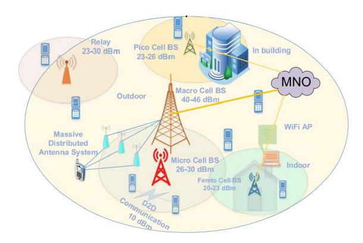

Fig. 22. Infrastructure of HetNets [\[156\]](#page-38-8).

reported in [\[156\]](#page-38-8) proposed a distributed multi-agent learningbased spectrum allocation strategy in which D2D users learn about the wireless environment and autonomously select spectrum resources to maximize their throughput and SE while causing minimal disturbance to cellular users. To validate the performance of the proposed approach, the researchers used distributed learning in a stochastic geometry-based realistic multi-tier HetNet (as shown in Fig. [22\)](#page-29-0). Compared to distance-based resource criterion, joint-RA, and link adaptation schemes, the proposed scheme allowed D2D users to achieve higher throughput and SE, higher SINR and lower outage ratio for cellular users, and better computational time efficiency. It also performed well in dense multi-tier HetNets without affecting network coverage. To reduce the impact of interference, the developers of [\[157\]](#page-38-9) looked at a frequency allocation technique that allocates complementary sub-bands to different portions of a macrocell. The effectiveness of several reverse frequency allocation (RFA) techniques has been evaluated. Simultaneously, they designed a hybrid M-4-RFA scheme that combines the best features of several RFA schemes. As a result, coverage and throughput have significantly improved. Two strategies are employed to create approximate closed-form formulas for coverage probability and rate coverage. The network's performance is evaluated using several parameters, indicating that the suggested M-4-RFA scheme delivers considerable performance benefits despite being slightly more complex than the baseline 2-RFA and single frequency reuse methods. The authors of [\[158\]](#page-38-10) discussed a practical approach for handling the problems of admission control, cell association, PA, and throughput maximization in MBS alone coupled and decoupled HetNet. An outer approximation approach was used to find a nearoptimal solution to the formulated MINLP problem. In terms of users associated, minimizing interference, addressing traffic imbalances, and sum-rate maximization, simulation results reveal that the proposed unique decoupled cell association method outperforms the standard coupled cell association scheme.

*Summary:* This section reviews combined approaches for RRM schemes in 5G HetNets which are summarized in Table [XVI.](#page-30-0) We observe that the problems are mostly modelled to solve UA or RA along with cross-co-tier interference and do not focus on addressing user QoE or fairness.

| Scheme | Approach   | Direction | UA-RA-PA | Interference |          | SE       | EE       | EE QoS          | QoE | Fairness | Coverage Prob. | Complexity |            |
|--------|------------|-----------|----------|--------------|----------|----------|----------|-----------------|-----|----------|-------------------|------------|------------|
|        |            |           |          | cross-tier   | co-tier  |          |          |                 |     |          |                   | Comput.    | Implement. |
| [141]  | CO         | DL        | UA       | <b>√</b>     | <b>√</b> | X        | X        | $\checkmark(T)$ | X   | х        | х                 | High       | High       |
| [142]  | GAT        | DL        | PA       | <b>√</b>     | <b>√</b> | X        | х        | $\checkmark(T)$ | X   | X        | <b>√</b>          | Low        | Low        |
| [143]  | Q-learning | DL        | PA       | <b>√</b>     | <b>√</b> | <b>√</b> | Х        | X               | X   | X        | X                 | Low        | High       |
| [144]  | CO         | DL        | UA       | х            | <b>√</b> | X        | <b>✓</b> | X               | X   | х        | х                 | High       | High       |
| [145]  | CO         | UL        | RA       | <b>√</b>     | Х        | X        | х        | X               | X   | X        | <b>√</b>          | High       | High       |
| [146]  | Q-learning | DL        | RA       | <b>√</b>     | <b>√</b> | <b>√</b> | <b>✓</b> | $\checkmark(T)$ | X   | X        | X                 | Low        | High       |
| [147]  | Q-learning | DL        | RA       | <b>√</b>     | <b>√</b> | <b>√</b> | <b>√</b> | $\checkmark(T)$ | х   | X        | х                 | Low        | High       |
| [148]  | CO-GRT     | DL/UL     | UA-RA-PA | х            | <b>√</b> | X        | Х        | $\checkmark(T)$ | X   | X        | <b>√</b>          | Low        | Low        |
| [149]  | GAT        | DL        | RA-PA    | <b>√</b>     | <b>√</b> | X        | <b>✓</b> | X               | X   | X        | X                 | Low        | High       |
| [150]  | GAT        | DL        | RA       | <b>√</b>     | <b>√</b> | <b>✓</b> | х        | X               | X   | х        | х                 | Low        | High       |
| [151]  | CO and GAT | DL        | UA-RA    | <b>√</b>     | X        | X        | х        | $\checkmark(T)$ | X   | X        | X                 | Low        | Low        |
| [152]  | GAT        | DL        | UA       | <b>√</b>     | X        | X        | Х        | $\checkmark(T)$ | X   | X        | X                 | Low        | High       |
| [153]  | CO         | DL/UL     | RA       | х            | <b>√</b> | X        | Х        | $\checkmark(T)$ | х   | X        | х                 | High       | High       |
| [154]  | GAT        | DL        | UA       | <b>✓</b>     | X        | X        | Х        | $\checkmark(T)$ | X   | X        | X                 | Low        | High       |
| [155]  | CO         | DL        | RA       | <b>√</b>     | X        | <b>√</b> | X        | $\checkmark(T)$ | X   | Х        | X                 | High       | High       |
| [156]  | DRL        | DL        | RA       | <b>√</b>     | <b>√</b> | <b>✓</b> | х        | $\checkmark(T)$ | X   | <b>√</b> | <b>√</b>          | Low        | High       |
| [157]  | CO         | DL        | RA       | <b>✓</b>     | X        | X        | Х        | $\checkmark(T)$ | X   | X        | <b>√</b>          | High       | High       |
| F1.501 | CO         | DI /III   | TTA      | /            | N/       |          | w        | /(T)            |     | N/       |                   | Larry      | I Li colo  |

TABLE XVI QUALITATIVE COMPARISON OF COMBINED APPROACHES ALGORITHMS FOR 5G HETNETS

## VIII. SIMULATORS AND HARDWARE FOR 5G HETNETS

The expansion of 5G HetNets research necessitates efficient algorithm implementation and analysis. Because of UE mobility, variable channel conditions, dynamic traffic needs, and frequent network disconnections, 5G HetNets implementation and analysis are difficult. There are a number of opensource and proprietary simulators available to examine the performance of 5G HetNets. The majority of them include a user-friendly interface and a lot of features. NS2 [\[159\]](#page-38-11), NS3 [\[160\]](#page-38-12), OPNET [\[161\]](#page-38-13), and OMNET++ [\[162\]](#page-38-14) are some of the open-source simulators. In 2011, NS2 ceased development and maintenance (the most recent version NS-2.35 was released on November 4, 2011). As a result, NS3 has become widely used. OPNET and OMNET++ are also very popular and both include device and protocol models. NETsim is a proprietary simulator with a lot of features and an appealing and user-friendly interface. Given the large user base, open-source simulators (i.e., OMNET++, NS3) provide several extensions to meet the needs and requirements of the research community. Note that NS3 has a faster development rate than the other alternative simulators.

Software Defined Radios (SDR) and Software Defined Networking (SDN) are at the heart of the hardware utilized in 5G HetNets. SDRs, such as Universal Serial Radio Peripheral (USRP), provide flexibility at the baseband level. The control and processing software, which runs on either the Field Programmable Gate Arrays (FPGAs) or the host computer, enables the testbed's physical infrastructure to be reconfigured.

## IX. LESSONS LEARNED

## *A. Avenues and Approaches*

Various solutions that address RRM concerns in terms of UA, RA, PA, and IM were discussed in this survey. These solutions have mostly employed CO, DRL, GAT, and GRTbased methodologies in order to fulfill RRM requirements of the emerging 5G HetNets. The comparative ratios of the different methodologies employed by the related works studies are

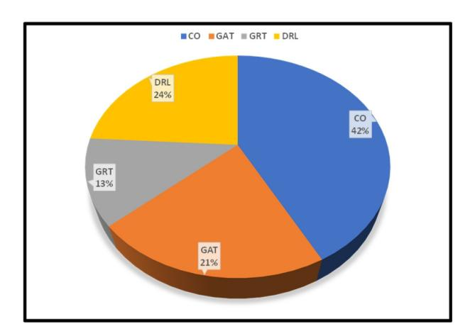

Fig. 23. Ratios of related works focusing on different approaches.

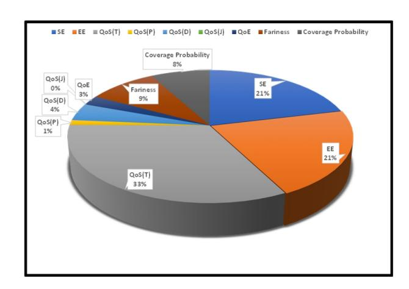

Fig. 24. Ratios of related works focusing on different metrics.

shown in Fig. [23.](#page-30-1) Most of the schemes are based on CO, and only a few deployed GRT. Fig. [24,](#page-30-2) on the other hand, depicts the ratios of various metrics used by the surveyed approaches. The majority of them present findings in terms of throughput, whereas just a handful presented the performance in terms of QoE. Other very popular metrics employed include EE, SE, and fairness.

## *B. Risks and Pitfalls*

When designing RRM for UA-RA-PA, there is a risk that the proposed scheme has a high implementation complexity or requires a large amount of network information to be harvested to achieve an optimal solution. Other risks include addressing potential sub-problems sequentially and not in parallel, resulting in high latency. Finally, the amount of data stored and exchanged by different solution components can easily increase to such a level that the solution itself affects the performance of the system it is meant to support.

On the other hand, in designing RRM for IM, apart from the risks already mentioned, there is also a risk that the proposed scheme does not consider a planned network which presents a high chance for inter-cell interference, as the users commonly install the nodes. For the combined approaches, along with the general aspects previously discussed, there is a high risk of the slow convergence time of the proposed scheme as the majority of the proposed solutions are offline based, which does not help, especially in the context of self-organizing networks.

# X. FUTURE CHALLENGES AND OPPORTUNITIES

This section discusses existing challenges, open issues, and new research directions relevant to this survey.

## *A. Challenges*

*QoS Prediction in Highly Mobile Environments:* In regulated settings, the 5G New Radio QoS framework, together with capabilities like URLLC, is successful in offering a minimum guaranteed performance. Highly mobile UEs, on the other hand, frequently face time-varying network performance, partly because actual QoS frequently surpasses the minimal or guaranteed level, and partly because the system is occasionally unable to meet QoS requirements. Surprisingly, in many circumstances, such as specific vehicle driving assistance systems or telematics applications, performance fluctuations are not a concern if they can be forecast ahead of time. For instance, the automotive sector is very interested in having real-time QoS predictions. It would allow service providers, mobile network users, and automotive apps to dynamically adapt their behaviours to the current or imminent QoS level.

*Massive Number of Connected Devices:* Existing 4G networks have been widely employed in IoT applications, and they are constantly evolving to meet the needs of future IoT applications. The 5G networks are predicted to significantly expand today's IoT support, boosting cellular operations, IoT security, and network difficulties, as well as moving the Internet's future to the edge. However, existing IoT solutions are up against several obstacles, including node connections, security, and new standards. In addition, massive connection networks are required for IoT mMTC applications in smart cities, healthcare systems, and other areas, creating significant heterogeneity of IoT and many implementation issues.

*Mobility Management for RRM in 5G HetNets:* HetNets, created by combining macrocells and a large number of densely deployed small cells, are an essential solution for meeting the increasing network capacity demands and providing high coverage to wireless users in 5G networks. Mobility management in 5G architecture faces many challenges due to the increasing complexity of network topology in 5G HetNets with the integration of many different base station types. Intense deployment of small cells, while providing many benefits, introduces significant mobility management issues such as frequent handover (HO), HO failure, HO delays, ping-pong HO, and high energy consumption, resulting in a poor user experience and heavy signal loads [\[163\]](#page-38-15).

- 1) *Use of mm-Wave Bands:* With the increased demand for mobile traffic, mmWave offers a significant opportunity to resolve the conflict between capacity requirements and spectrum scarcity. mmWave does, however, come with a number of disadvantages, for example, precipitation can cause radio waves to be absorbed, scattered, and diffracted, increasing transmission losses and signal levels. This may have a significant impact on mmWave signal propagation and result in considerable signal attenuation along the propagation path [\[164\]](#page-38-16), [\[165\]](#page-38-17), [\[166\]](#page-38-18), [\[167\]](#page-38-19).
- 2) *Load Balancing:* Because of the random positioning of cells and the mobility of the UEs in highly dense HetNets, there is a load imbalance between the cells. Load imbalance within the network accelerates HOF and reduces network performance efficiency [\[168\]](#page-38-20), [\[169\]](#page-38-21), [\[170\]](#page-38-22), [\[171\]](#page-38-23).
- 3) *HO Problems:* The extensive deployment of small cells in the network also brings new challenges that negatively impact QoS, such as interference, frequent and unnecessary HO, HO Failure, and Ping Pong HO. As a result, the signalling load increases, causing the network's resources to be used inefficiently and consumes energy for a faulty procedure [\[172\]](#page-38-24), [\[173\]](#page-38-25), [\[174\]](#page-38-26), [\[175\]](#page-38-27).
- 4) *Security:* Malevolent users use mutual authentication between UEs and BS to protect themselves from network effects such as Man-in-the-Middle attacks, Denial of Service attacks, impersonation attacks, and repeat attacks. Secure transport authentication is required to protect against these attacks and to provide reliable communication when moving between networks [\[41\]](#page-35-34), [\[176\]](#page-38-28), [\[177\]](#page-38-29).

## *B. Open Issues*

*5G and AR/VR: Raising the Bar for Immersive Experience:* Not only is the new 5G cellular standard changing mobile Internet use with tablets, smartphones, and other mobile devices, but it is also setting new standards in VR/AR. This is as with these technologies, it is critical to have a large amount of data available in a short period. 5G provides the ideal foundation for this because of its reduced latency. Data can be delivered swiftly and in real-time because the time difference is only a few milliseconds. Information can be sent in milliseconds using the 5G mobile communications standard; therefore, the two technologies are becoming more widely used in the workplace. In addition, the low latency of 5G enables a set of novel innovative AR and VR avenues, making many tasks more efficient and straightforward. Application scenarios for AR/VR include:

- 1) *VR/AR in Medicine:* The 5G mobile radio standard expands medical options, including surgical interventions for instance. Difficult operations can be trained for easily by using VR/AR. Haptic-visual learning is possible with VR glasses. Surgeons see, feel, and practice on the patient's digital twin - as many times as they need to, without putting the patient at risk.
- 2) *VR/AR in Architecture and Constructions:* Construction machines may be controlled remotely using the latest 5G cellular standards. The devices can be managed remotely from thousands of kilometres away and the network needs to support high quality real-time video streaming at all times.
- 3) *AR for Device Maintenance:* If an issue arises during repairs, a technician can use a voice command to contact a colleague for assistance. Through the camera embedded in data glasses, the colleague called in sees the same thing as the technician on the job. The answer can then be worked out together. Device maintenance as a service is made more accessible and more efficient using 5G-enabled AR/VR.

*Distributed DRL Framework in Wireless Networks:* The DRL framework requires considerable training for DNNs. This might be accomplished at a centralized network controller with adequate computational power and data collection capabilities. However, designing a distributed implementation for the DRL framework that decomposes resource-demanding basic functionalities, such as information collection, sharing, and DNN training, from RL algorithms at individual devices becomes a meaningful task for massive end-users with limited capabilities. The network controller can be used to integrate the fundamental functions. The network infrastructure architecture that supports these common functionalities for distributed DRL is still a work in progress.

*Network Architecture for Time-Critical Communications:* Time-critical communications is a new 5G concept for supporting services with low latency needs, such as XR (a term that encompasses immersive technologies such as VR, MR, AR). The goal is to ensure data transmission within specified latency boundaries (X ms) while maintaining the desired level of reliability (Y percent). X can range from tens of milliseconds to one millisecond delay, and Y can range from 99 percent to 99.999 percent reliability, depending on the user's needs. The end-to-end dependability and latency are aided by the 5G RAN, 5G Core (5GC), and transport network, as well as the device.

*RRM with IM Techniques Used at the Radio Frequency Transceivers:* Self-interference cancellation debunks the longheld concept in wireless network architecture that radios can only communicate in half-duplex mode on the same channel. Self-interference cancellation simplifies things immensely, in addition to providing real in-band full-duplex, which practically doubles SE. Self-interference cancellation [\[179\]](#page-38-30) has the potential to complement and sustain the evolution of 5G technologies toward denser HetNets, and it can be used in wireless communication systems in a variety of ways, such as increased link capacity, spectrum virtualization, any-division duplexing (ADD), novel relay solutions, and improved interference coordination. Self-interference cancellation simplifies the RF front-end for applications like carrier aggregation and allows for smaller, lighter, and more efficient filters in radios. Because cancellation is frequency agnostic, a single cancellation circuit can be dynamically tweaked to isolate different ranges of frequencies, effectively serving as a software-configured duplexer, software-defined radio's "Holy Grail." Not only would such a solution allow handset manufacturers to save money by replacing multiple chipsets with a single integrated solution, but it would also enable global roaming and allow consumers to switch network operators more easily, potentially leading to improved service quality as a result of increased competition between service providers [\[178\]](#page-38-31).

## *C. Future Research Directions*

Some very interesting potential avenues for future research are discussed next.

*Open-RAN:* Virtualized and disaggregated RANs are promoted by Open-RAN, in which disaggregated components are connected via open interfaces and optimized by intelligent controllers (as demonstrated in Fig. [25\)](#page-33-0). Subsequently, a new RAN design, deployment, and operating paradigm has emerged. Using a centralized abstraction layer and data-driven closed-loop control, Open-RAN networks can be constructed by multiple vendors, using interoperable components that can be programmatically optimized. Therefore, knowing O-RAN, its architecture, interfaces, and workflows is critical for wireless researchers and practitioners.

The Distributed Unit and Centralized Unit concepts were introduced by the 3GPP as part of the evolution path towards disaggregated RAN. The introduction of mid-haul allows for more transport possibilities. The Open-RAN Alliance [\[180\]](#page-38-32) defines the RAN Intelligent Controller (RIC) as a logical function in the RAN that controls and delivers intelligence to optimize radio RA, implement handovers, manage interference, and balance load between cells. RIC consists of a non-real-time (RT) controller for tasks that require > 1 second of latency and a near-real-time (RT) controller for tasks that require 1 second of latency. The management and automation capabilities of a network are under the watchful eye of closed-loop automation. Closed-loop automation monitors and analyzes network occurrences like failures and congestion using data and analytics, and then takes appropriate action to resolve any issues. The phrase "loop" refers to the feedback loop of communication between the network's performance being tracked, identified, adjusted, and optimized to allow for self-optimization. In essence, it is the answer that opens the door for self-driving networks. Mobile operators can use RIC (near-RT and non-RT) to install and manage their Open-RAN with: 1) interoperability and vendor variety, 2) predictive and intelligence resource management, and 3) subscriber QoS. The Open-RAN Alliance has proposed a logical function called Near RT RIC to help intelligently control and organize the RAN. Handover management, real-time traffic

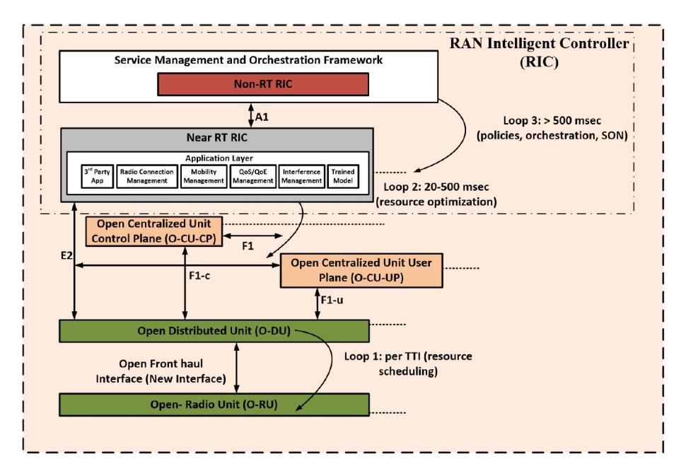

Fig. 25. Architecture for RT-RIC and Non-RT RIC with different loops.

and radio conditions monitoring, RAN slicing, QoS control, enhanced Radio Resource Administration, per UE controlled load balancing, radio database management, and interference detection and mitigation are some of the important functions of near RT RIC. The management and automation capabilities of a network are under the watchful eye of closed-loop automation. Closed-loop automation monitors and analyzes network aspects like failures and congestion using data analytics, and then takes appropriate action to resolve any issues. The phrase "loop" refers to the feedback loop of communication between the network's performance being tracked, identified, adjusted, and optimized to allow for self-optimization. In essence, it is the answer that opens the door for self-driving networks.

Graphical Processing Units (GPU) are the default standard for model training and inference in 5G and 6G systems where big data meets wireless and AI/ML is employed to improve network performance. Training, inference, and signal processing can all be supported by a GPU-based hardware platform. It isn't only about GPU hardware, though. Software for programming GPUs, as well as Software Defined Kits and libraries for application development, are also important. CUDA, the world's only commercially viable C/C++–based parallel programming framework, is used to program GPUs. One of the services that the Service Management Orchestration/Non-RT RIC uses to update and fine-tune inference models running under the Near-RT RIC might be the data analytics pipeline.

*5G Core Network:* In order to support the innovative 5G technologies and accommodate emerging services in 5G HetNets, the 3GPP has proposed the 5G Reference Point System Architecture (RPSA) [\[181\]](#page-38-33). In RPSA, the 5G control plane operations and common data repositories are offered by a collection of interconnected NFs, each having permissions to access one another's services. In RPSA, the Policy Control Function (PCF) plays a critical role, as through it operators can manage the network behaviour. PCF provides transparency and control over the utilisation of network resources, especially important during real-time service delivery. Although PCF supports QoS control along with traffic steering/routing, it lacks the dynamic network selection based on the status of network resources or based on the level of the service to be delivered. As a result, there is an evident need to enhance the PCF functionality to focus on transmission performance, while also supporting power efficiency.

*DRL for Cryptocurrency Management in Wireless Networks:* Wireless networks have been associated with diverse pricing and economic models [\[182\]](#page-38-34), [\[183\]](#page-38-35). Wireless consumers, for example, pay to access radio resources or mobile services. Users can also receive money if they contribute to the networks by acting as a relay or cache. Using real money and cash in such circumstances, on the other hand, raises a slew of accounting, security, and privacy concerns. The notion of cryptocurrency based on blockchain technology has recently been proposed and deployed in wireless networks, such as [\[184\]](#page-38-36), and has shown to be a secure and effective solution. However, the value of cryptocurrencies, whether in a token or a coin, can be highly volatile, depending on various market conditions. The tokens can be kept or spent by wireless customers, for example, for radio resource access and service usage, or they can be exchanged for actual money. DRL can be used to achieve the maximum long-term value of bitcoin management for wireless users in a random cryptocurrency market setting, as shown in [\[185\]](#page-38-37).

*Data-driven RRM in 6G:* 6G will benefit from speedier and real-time RRM solutions without explicit mathematical models, thanks to the use of ML techniques and enormous amounts of data [\[186\]](#page-38-38). Indeed, data-driven RRM with artificial intelligence (AI) has the potential to dynamically allocate resources based on requirements. This will enable operators to make real-time informed decisions on how to provide resources to various users and services based on the knowledge extracted through big data algorithms. Finally, 6G performance metrics such as latency, jitter, reliability, EE, SE, connectivity, mobility, and AI performance metrics such as prediction accuracy and convergence should be studied combined.

# *D. Ongoing 5G Projects*

Among many 5G network-related ongoing projects worldwide, some interesting ones with large research potential are presented next.

*5G Brasil*[4](#page-34-19)*:* is an independent private project under the umbrella of Telebrasil. 5G Brasil's key objective is to facilitate the growth of the 5G ecosystem in Brazil by promoting and establishing cooperation between the Information and Communication Technology (ICT) sector and all areas of the Brazilian government and regulatory agencies; seek financial support for the promotion and usage of 5G technology; represent members' common interests in national and international 5G forums.

*5GMF*[5](#page-34-20)*:* The 5th Generation Mobile Promotion Forum (5GMF) was set up to further advance 5G social adoption, encourage local and industrial use, and identify new use cases to solve social problems. It supports research and development related to 5G and standardization, as well as collaboration with related organizations, collection of information, organisation of dissemination activities, etc.

*5G Forum Korea*[6](#page-34-21)*:* was established by the Korean Ministry of Research, ICT and Future Planning, and Mobile Industries to help develop 5G networks and 5G services and contribute to their globalization. These include social networking services, 3D mobile imaging, AI, high-speed services and ultra- and high-definition resolution and holographic media technologies.

*5G Americas*[7](#page-34-22)*:* is an industry trade association consisting of leading distributors and suppliers of 5G telecommunications services. The organization's mission is to support and encourage the growth of LTE wireless technology and its evolution beyond 5G across the networks, facilities, applications, and wirelessly connected devices of the Americas' ecosystem.

*5G IA's*[8](#page-34-23)*:* key objective is to encourage and support European leadership in 5G, its growth, implementation, and evolution and to ensure a strong European 5G voice worldwide. In strategic areas, 5G IA carries out a broad range of activities, including standardization, R&D initiatives, technical skills improvement activities, international cooperation, etc.

# XI. CONCLUSION

The upcoming 5G networks will support various devices and a wide range of innovative applications, adding other aspects to the original requirements of increased data rates and near-zero latency. Among others, 5G is also expected to support Internet of Things (IoT) and Industrial Internet of Things (IIoT), Internet of Vehicles (IoV), and smart electricity grids. Radio resource allocations must be done efficiently and effectively to provide excellent support. This study surveyed a wide range of radio resource management techniques based on CO, DRL GAT, GRT in 5G HetNets, proposed between 2017- 2021. The survey started with an overview of 5G HetNets, their importance in the context of COVID-19. Next, a thorough discussion was carried out about the challenges that persist in 5G HetNets, with focus on UA, RA, PA and IM. A highly relevant taxonomy was then introduced useful for interested researchers. According to this taxonomy, existing RRM schemes were reviewed and classified. The discussion used six classic metrics, namely coverage probability, fairness, QoE, QoS, EE and SE. The paper was concluded with a discussion of current challenges, open issues and potential novel research directions, as well as a sample of very important worldwide 5G projects.

## REFERENCES

- [1] M. A. Habibi, M. Nasimi, B. Han, and H. D. Schotten, "A comprehensive survey of RAN architectures toward 5G mobile communication system," *IEEE Access*, vol. 7, pp. 70371–70421, 2019.
- [2] *Cisco Annual Internet Report*, Cisco, San Jose, CA, USA, Dec. 2020. [Online]. Available: https://www.cisco.com/c/en/us/solutions/executiveperspectives/annual-internet-report/index.html.
- [3] *Read the 2020 Global Networking Trends Report*, Cisco, San Jose, CA, USA, May 2020. [Online]. Available: https://www.cisco.com/c/m/en\_ us/solutions/enterprise-networks/networking-report.html.
- [4] *Cisco Annual Internet Report (2018–2023) White Paper*, Cisco, San Jose, CA, USA, 2020.
- [5] *Ericsson Mobility Report November 2020*, Ericsson, Stockholm, Sweden, Nov. 2020. [Online]. Available: https://www.ericsson.com/en/ mobility-report/reports/november-2020.
- [6] M. Feng, S. Mao, and T. Jiang, "Joint frame design, resource allocation and user association for massive MIMO heterogeneous networks with wireless backhaul," *IEEE Trans. Wireless Commun.*, vol. 17, no. 3, pp. 1937–1950, Mar. 2018.
- [7] K. Zheng *et al.*, "Multihop cellular networks toward LTE-advanced," *IEEE Veh. Technol. Mag.*, vol. 4, no. 3, pp. 40–47, Sep. 2009.
- [8] K. Zheng, B. Fan, J. Liu, Y. Lin, and W. Wang, "Interference coordination for OFDM-based multihop LTE-advanced networks," *IEEE Wireless Commun.*, vol. 18, no. 1, pp. 54–63, Feb. 2011.
- [9] A. Khandekar, N. Bhushan, T. Ji, and V. Vanghi, "LTE-advanced: Heterogeneous networks," in *Proc. EW Conf.*, Lucca, Italy, Apr. 2010, pp. 978–982.
- [\[10\]](#page-1-2) C. Liu, P. Huang, L. Xiao, and A. Esfahanian, "Inter-femtocell interference identification and resource management," *IEEE Trans. Mobile Comput.*, vol. 19, no. 1, pp. 116–129, Jan. 2020.
- [\[11\]](#page-2-2) N. DOCOMO, *Performance of eICIC With Control Channel Coverage Limitation*, document R1-103264, 3GPP, Sophia Antipolis, France, TSG RAN WG1Meeting 61, May 2010.
- [\[12\]](#page-4-1) K. Flynn. "A Global Partnership, Release 16." Accessed: Jul. 26, 2021. [Online]. Available: https://www.3gpp.org/release-16
- [\[13\]](#page-4-2) M. Ivezic. "Introduction to 3GPP and 3GPP 5G Releases 15, 16 and 17." Oct. 4, 2020. [Online]. Available: https://5g.security/5gtechnology/5g-3gpp-releases-15-16-17
- [\[14\]](#page-4-3) K. Flynn. "A Global Partnership, Release 17." Accessed: Jul. 26, 2021. [Online]. Available: https://www.3gpp.org/release-17
- [\[15\]](#page-4-4) K. Flynn. "A Global Partnership, CT Progress on Rel-16 Stage 3." Accessed: Jul. 26, 2021. [Online]. Available: https://www.3gpp.org/news-events/2100-ct-progress-on-rel-16-stage-3
- [\[16\]](#page-4-5) G. Liu and D. Jiang, "5G: Vision and requirements for mobile communication system towards Year 2020," *Chin. J. Eng.*, vol. 8, Apr. 2016, Art. no. 5974586.
- [\[17\]](#page-4-6) "Understanding 5G: Perspectives on future technological advancements in mobile," White Paper, GSMA Intell., London, U.K., 2014.
- [\[18\]](#page-4-6) S. Chen and J. Zhao, "The requirements, challenges, and technologies for 5G of terrestrial mobile telecommunication," *IEEE Commun. Mag.*, vol. 52, no. 5, pp. 36–43, May 2014.
- [\[19\]](#page-4-7) "Introducing 5G Technology and Networks (Speed, Use Cases and Rollout), What Is 5G? A Helpful Illustrated Q&A." 2021. [Online]. Available: https://www.thalesgroup.com/en/markets/digitalidentity-and-security/mobile/inspired/5G.

4https://5gbrasil.telebrasil.org.br/

5https://5gmf.jp/en/

6http://www.5gforum.org/html/

7https://www.5gamericas.org/

8https://6g-ia.eu/

- [\[20\]](#page-5-1) T. Zahir, K. Arshad, A. Nakata, and K. Moessner, "Interference management in femtocells," *IEEE Commun. Surveys Tuts.*, vol. 15, no. 1, pp. 293–311, 1st Quart., 2013.
- [\[21\]](#page-5-2) Y. L. Lee, T. C. Chuah, J. Loo, and A. Vinel, "Recent advances in radio resource management for heterogeneous LTE/LTE-A networks," *IEEE Commun. Surveys Tuts.*, vol. 16, no. 4, pp. 2142–2180, 4th Quart., 2014.
- [\[22\]](#page-5-3) R. Maallawi, N. Agoulmine, B. Radier, and T. B. Meriem, "A comprehensive survey on offload techniques and management in wireless access and core networks," *IEEE Commun. Surveys Tuts.*, vol. 17, no. 3, pp. 1582–1604, 3rd Quart., 2015.
- [\[23\]](#page-5-4) M. Peng, C. Wang, J. Li, H. Xiang, and V. Lau, "Recent advances in underlay heterogeneous networks: Interference control, resource allocation, and self-organization," *IEEE Commun. Surveys Tuts.*, vol. 17, no. 2, pp. 700–729, 2nd Quart., 2015.
- [\[24\]](#page-5-5) M. Agiwal, A. Roy, and N. Saxena, "Next generation 5G wireless networks: A comprehensive survey," *IEEE Commun. Surveys Tuts.*, vol. 18, no. 3, pp. 1617–1655, 3rd Quart., 2016.
- [\[25\]](#page-6-0) D. Liu *et al.*, "User association in 5G networks: A survey and an outlook," *IEEE Commun. Surveys Tuts.*, vol. 18, no. 2, pp. 1018–1044, 2nd Quart., 2016.
- [\[26\]](#page-6-1) N. C. Luong, P. Wang, D. Niyato, Y. Liang, Z. Han, and F. Hou, "Applications of economic and pricing models for resource management in 5G wireless networks: A survey," *IEEE Commun. Surveys Tuts.*, vol. 21, no. 4, pp. 3298–3339, 4th Quart., 2019.
- [\[27\]](#page-6-2) N. C. Luong *et al.*, "Applications of deep reinforcement learning in communications and networking: A survey," *IEEE Commun. Surveys Tuts.*, vol. 21, no. 4, pp. 3133–3174, 4th Quart., 2019.
- [\[28\]](#page-6-3) Y. Xu, G. Gui, H. Gacanin, and F. Adachi, "A survey on resource allocation for 5G heterogeneous networks: Current research, future trends and challenges," *IEEE Commun. Surveys Tuts.*, vol. 22, no. 3, pp. 1592–1628, 3rd Quart., 2020, doi: [10.1109/COMST.2021.3059896.](http://dx.doi.org/10.1109/COMST.2021.3059896)
- [\[29\]](#page-6-4) S. Manap, K. Dimyati, M. N. Hindia, M. S. A. Talip, and R. Tafazolli, "Survey of radio resource management in 5G heterogeneous networks," *IEEE Access*, vol. 8, pp. 131202–131223, 2020.
- [\[30\]](#page-6-5) M. Kamel, W. Hamouda, and A. Youssef, "Ultra-dense networks: A survey," *IEEE Commun. Surveys Tuts.*, vol. 18, no. 4, pp. 2522–2545, 4th Quart., 2016.
- [\[31\]](#page-6-5) Y. Sun, M. Peng, Y. Zhou, Y. Huang, and S. Mao, "Application of machine learning in wireless networks: Key techniques and open issues," *IEEE Commun. Surveys Tuts.*, vol. 21, no. 4, pp. 3072–3108, 4th Quart., 2019.
- [\[32\]](#page-6-5) H. Tabassum, M. Salehi, and E. Hossain, "Fundamentals of mobilityaware performance characterization of cellular networks: A tutorial," *IEEE Commun. Surveys Tuts.*, vol. 21, no. 3, pp. 2288–2308, 3rd Quart., 2019.
- [\[33\]](#page-6-5) Y. Teng, M. Liu, F. R. Yu, V. C. M. Leung, M. Song, and Y. Zhang, "Resource allocation for ultra-dense networks: A survey, some research issues and challenges," *IEEE Commun. Surveys Tuts.*, vol. 21, no. 3, pp. 2134–2168, 3rd Quart., 2019.
- [\[34\]](#page-6-5) N. Slamnik-Kriještorac, H. Kremo, M. Ruffini, and J. M. Marquez-Barja, "Sharing distributed and heterogeneous resources toward end-to-end 5G networks: A comprehensive survey and a taxonomy," *IEEE Commun. Surveys Tuts.*, vol. 22, no. 3, pp. 1592–1628, 3rd Quart., 2020.
- [\[35\]](#page-6-5) A. Yaqoob, T. Bi, and G.-M. Muntean, "A survey on adaptive 360◦C video streaming: Solutions, challenges and opportunities," *IEEE Commun. Surveys Tuts.*, vol. 22, no. 4, pp. 2801–2838, 4th Quart., 2020.
- [\[36\]](#page-9-2) I. Ahmad, S. Shahabuddin, T. Kumar, J. Okwuibe, A. Gurtov, and M. Ylianttila, "Security for 5G and beyond," *IEEE Commun. Surveys Tuts.*, vol. 21, no. 4, pp. 3682–3722, 4th Quart., 2019.
- [\[37\]](#page-9-2) A. Sharma, V. Balasubramanian, and A. Jolfaei, "Security challenges and solutions for 5G HetNet," in *Proc. IEEE 19th Int. Conf. Trust Security Privacy Comput. Commun. (TrustCom)*, Guangzhou, China, 2020, pp. 1318–1323.
- [\[38\]](#page-9-2) J. Cao *et al.*, "A survey on security aspects for 3GPP 5G networks," *IEEE Commun. Surveys Tuts.*, vol. 22, no. 1, pp. 170–195, 1st Quart., 2020.
- [\[39\]](#page-9-2) M. Liyanage, J. Salo, A. Braeken, T. Kumar, S. Seneviratne, and M. Ylianttila, "5G privacy: Scenarios and solutions," in *Proc. IEEE 5G World Forum (5GWF)*, Silicon Valley, CA, USA, 2018, pp. 197–203.
- [\[40\]](#page-9-2) X. Duan and X. Wang, "Authentication handover and privacy protection in 5G hetnets using software-defined networking," *IEEE Commun. Mag.*, vol. 53, no. 4, pp. 28–35, Apr. 2015.

- [\[41\]](#page-9-2) Y. Zhang, R. H. Deng, E. Bertino, and D. Zheng, "Robust and universal seamless handover authentication in 5G HetNets," *IEEE Trans. Depend. Secure Comput.*, vol. 18, no. 2, pp. 858–874, Mar./Apr. 2021.
- [\[42\]](#page-8-0) L. Budzisz *et al.*, "Dynamic resource provisioning for energy efficiency in wireless access networks: A survey and an outlook," *IEEE Commun. Surveys Tuts.*, vol. 16, no. 4, pp. 2259–2285, 4th Quart., 2014.
- [\[43\]](#page-8-0) R. Hu and Y. Qian, "An energy efficient and spectrum efficient wireless heterogeneous network framework for 5G systems," *IEEE Commun. Mag.*, vol. 52, no. 5, pp. 94–101, May 2014.
- [\[44\]](#page-8-1) A. Mesodiakaki, F. Adelantado, L. Alonso, and C. Verikoukis, "Energy efficient context-aware user association for outdoor small cell heterogeneous networks," in *Proc. IEEE Int. Conf. Commun. (ICC)*, Jun. 2014, pp. 1614–1619.
- [\[45\]](#page-8-2) D. Liu, Y. Chen, K. K. Chai, and T. Zhang, "Joint uplink and downlink user association for energy-efficient HetNets using Nash bargaining solution," in *Proc. IEEE 79th Veh. Technol. Conf. (VTC Spring)*, May 2014, pp. 1–5.
- [\[46\]](#page-8-1) L. Su, C. Yang, Z. Xu, and A. Molisch, "Energy-efficient downlink transmission with base station closing in small cell networks," in *Proc. IEEE Int. Conf. Acoust. Speech Signal Process. (ICASSP)*, May 2013, pp. 4784–4788.
- [\[47\]](#page-8-2) H. Zhu, S. Wang, and D. Chen, "Energy-efficient user association for heterogenous cloud cellular networks," in *Proc. IEEE Globecom Workshops (GC Wkshps)*, Dec. 2012, pp. 273–278.
- [\[48\]](#page-8-2) E. C. Reyes, I. Akyildiz, and E. Fadel, "Energy consumption analysis and minimization in multi-layer heterogeneous wireless systems," *IEEE Trans. Mobile Comput.*, vol. 14, no. 12, pp. 2474–2487, Dec. 2015.
- [\[49\]](#page-8-3) B. Agarwal, M. A. Togou, M. Ruffini, and G.-M. Muntean, "Mitigating the impact of cross-tier interference on quality in heterogeneous cellular networks," in *Proc. IEEE 45th Conf. Local Comput. Netw. (LCN)*, 2020, pp. 497–502.
- [\[50\]](#page-8-4) R. Jain, *The Art of Computer Systems Performance Analysis*. Hoboken, NJ, USA: Wiley, 1991.
- [\[51\]](#page-8-5) N. T. Blog. "VMAF: The Journey Continues." Oct. 2018. [Online]. Available: https://netflixtechblog.com/vmaf-the-journey-continues-44b51ee9ed12
- [\[52\]](#page-8-6) R. Trestian, O. Ormond, and G.-M. Muntean, "Game theory-based network selection: Solutions and challenges," *IEEE Commun. Survey Tuts.*, vol. 14, no. 4, pp. 1212–1231, 4th Quart., 2012.
- [\[53\]](#page-8-7) B. Agarwal, M. A. Togou, M. Ruffini, and G.-M. Muntean, "A fairnessdriven resource allocation scheme based on weighted interference graph in HetNets," in *Proc. IEEE Int. Symp. Broadband Multimedia Syst. Broadcast. (BMSB)*, 2021, pp. 1–6.
- [\[54\]](#page-8-8) G. J. Sutton *et al.*, "Enabling technologies for ultra-reliable and low latency communications: From PHY and MAC layer perspectives," *IEEE Commun. Surveys Tuts.*, vol. 21, no. 3, pp. 2488–2524, 3rd Quart., 2019.
- [\[55\]](#page-9-3) B. Xu, Y. Chen, J. R. Carrión, and T. Zhang, "Resource allocation in energy-cooperation enabled two-tier NOMA HetNets toward green 5G," *IEEE J. Sel. Areas Commun.*, vol. 35, no. 12, pp. 2758–2770, Dec. 2017.
- [\[56\]](#page-9-4) H. Ding, F. Zhao, J. Tian, and H. Zhang, "Fairness-driven energy efficient resource allocation in uplink MIMO enabled HetNets," *IEEE Access*, vol. 8, pp. 37229–37241, 2020.
- [\[57\]](#page-9-5) F. Fang, G. Ye, H. Zhang, J. Cheng, and V. C. M. Leung, "Energyefficient joint user association and power allocation in a heterogeneous network," *IEEE Trans. Wireless Commun.*, vol. 19, no. 11, pp. 7008–7020, Nov. 2020.
- [\[58\]](#page-10-1) G. Chai, W. Wu, Q. Yang, and K. S. Kwak, "Energy-efficient joint resource allocation and user association for heterogeneous wireless networks with multi-homed user equipments," in *Proc. IEEE 89th Veh. Technol. Conf. (VTC-Spring)*, 2019, pp. 1–6.
- [\[59\]](#page-10-2) S. Aboagye, A. Ibrahim, T. M. N. Ngatched, and O. A. Dobre, "VLC in future heterogeneous networks: Energy and spectral-efficiency optimization," in *Proc. IEEE Int. Conf. Commun. (ICC)*, 2020, pp. 1–7.
- [\[60\]](#page-10-3) A. Algedir and H. H. Refai, "A user association and energy efficiency analysis of D2D communication under HetNets," in *Proc. 14th Int. Wireless Commun. Mobile Comput. Conf. (IWCMC)*, 2018, pp. 1184–1190.
- [\[61\]](#page-10-4) B. Xu, Y. Chen, J. R. Carrión, and T. Zhang, "Resource allocation in cache-enabled energy-cooperative HetNets," in *Proc. IEEE Wireless Commun. Netw. Conf. (WCNC)*, 2018, pp. 1–6.
- [\[62\]](#page-10-5) M. Wang, H. Gao, and T. Lv, "Energy-efficient user association and power control in the heterogeneous network," *IEEE Access*, vol. 5, pp. 5059–5068, 2017.

- [\[63\]](#page-10-6) M. U. B. Farooq, J. Qadir, M. M. Butt, M. Naeem, and A. Imran, "Utilizing loss tolerance and bandwidth expansion for energy efficient user association in HetNets," in *Proc. IEEE 31st Annu. Int. Symp. Pers. Indoor Mobile Radio Commun.*, 2020, pp. 1–6.
- [\[64\]](#page-10-7) S. Aboagye, A. Ibrahim, T. M. N. Ngatched, and O. A. Dobre, "Joint user association and power control for area spectral efficiency maximization in HetNets," in *Proc. IEEE 92nd Veh. Technol. Conf. (VTC-Fall)*, 2020, pp. 1–6.
- [\[65\]](#page-10-8) Y. Hao, Q. Ni, H. Li, and S. Hou, "On the energy and spectral efficiency tradeoff in massive MIMO-enabled HetNets with capacityconstrained backhaul links," *IEEE Trans. Commun.*, vol. 65, no. 11, pp. 4720–4733, Nov. 2017.
- [\[66\]](#page-11-2) T. Ghariani and B. Jouaber, "Green topological potential-based optimization for power and spectral efficiency tradeoff in LTE HetNets," in *Proc. 27th Int. Telecommun. Netw. Appl. Conf. (ITNAC)*, 2017, pp. 1–6.
- [\[67\]](#page-11-3) H. U. Sokun, R. H. Gohary, and H. Yanikomeroglu, "A novel approach for QoS-aware joint user association, resource block and discrete power allocation in HetNets," *IEEE Trans. Wireless Commun.*, vol. 16, no. 11, pp. 7603–7618, Nov. 2017.
- [\[68\]](#page-11-4) X. Luo, "Delay-oriented QoS-aware user association and resource allocation in heterogeneous cellular networks," *IEEE Trans. Wireless Commun.*, vol. 16, no. 3, pp. 1809–1822, Mar. 2017.
- [\[69\]](#page-11-5) H. Munir, S. A. Hassan, H. Pervaiz, Q. Ni, and L. Musavian, "Resource optimization in multi-tier HetNets exploiting multi-slope path loss model," *IEEE Access*, vol. 5, pp. 8714–8726, 2017.
- [\[70\]](#page-11-6) X. Zhang and J. G. Andrews, "Downlink cellular network analysis with multi-slope path loss models," *IEEE Trans. Commun.*, vol. 63, no. 5, pp. 1881–1894, May 2015.
- [\[71\]](#page-11-6) M. Ding, P. Wang, D. López-Pérez, G. Mao, and Z. Lin, "Performance impact of LoS and NLoS transmissions in dense cellular networks," *IEEE Trans. Wireless Commun.*, vol. 15, no. 3, pp. 2365–2380, Mar. 2016.
- [\[72\]](#page-11-6) N. Garg, S. Singh, and J. Andrews, "Impact of dual slope path loss on user association in HetNets," in *Proc. IEEE Globecom Workshops (GC Wkshps)*, 2015, pp. 1–6.
- [\[73\]](#page-11-6) J. G. Andrews, X. Zhang, G. D. Durgin, and A. K. Gupta, "Are we approaching the fundamental limits of wireless network densification?" *IEEE Commun. Mag.*, vol. 54, no. 10, pp. 184–190, Oct. 2016.
- [\[74\]](#page-11-7) X. Wang, Y. Xu, J. Wang, and S. Fu, "Joint user association and power allocation in heterogeneous NOMA networks with imperfect CSI," *IEEE Access*, vol. 8, pp. 47607–47618, 2020.
- [\[75\]](#page-12-2) C. Zou, H. Lu, and J. Meng, "QoE-driven optimization for video services in cache-enabled software-defined HetNets," in *Proc. 11th Int. Conf. Wireless Commun. Signal Process. (WCSP)*, 2019, pp. 1–7.
- [\[76\]](#page-12-3) J. Chen, Y. Deng, J. Jia, M. Dohler, and A. Nallanathan, "Cross-layer QoE optimization for D2D communication in CR-enabled heterogeneous cellular networks," *IEEE Trans. Cogn. Commun. Netw.*, vol. 4, no. 4, pp. 719–734, Dec. 2018.
- [\[77\]](#page-12-4) Q. Han, B. Yang, G. Miao, C. Chen, X. Wang, and X. Guan, "Backhaulaware user association and resource allocation for energy-constrained HetNets," *IEEE Trans. Veh. Technol.*, vol. 66, no. 1, pp. 580–593, Jan. 2017.
- [\[78\]](#page-12-5) Y. Lin, Y. Wang, C. Li, Y. Huang, and L. Yang, "Joint design of user association and power allocation with proportional fairness in massive MIMO HetNets," *IEEE Access*, vol. 5, pp. 6560–6569, 2017.
- [\[79\]](#page-12-6) S. P. Thiagarajah, M. Y. Alias, W.-N. Tan, and A. Mahmud, "Capacity optimised user association in planned small cell deployment for heterogeneous wireless networks," in *Proc. IEEE 5th Int. Symp. Telecommun. Technol. (ISTT)*, 2020, pp. 123–128.
- [\[80\]](#page-12-7) T. M. Shami, D. Grace, and A. Burr, "Load balancing and control using particle swarm optimisation in 5G heterogeneous networks," in *Proc. Eur. Conf. Netw. Commun. (EuCNC)*, 2018, pp. 1–9.
- [\[81\]](#page-13-2) G. Hattab and D. Cabric, "Coverage and rate maximization via user association in multi-antenna HetNets," *IEEE Trans. Wireless Commun.*, vol. 17, no. 11, pp. 7441–7455, Nov. 2018.
- [\[82\]](#page-13-3) A. Asghar, H. Farooq, and A. Imran, "Concurrent optimization of coverage, capacity, and load balance in HetNets through soft and hard cell association parameters," *IEEE Trans. Veh. Technol.*, vol. 67, no. 9, pp. 8781–8795, Sep. 2018.
- [\[83\]](#page-13-4) B. Agarwal, M. A. Togou, M. Ruffini, and G.-M. Muntean, "PIRS3A: A low complexity multi-knapsack-based approach for user association and resource allocation in HetNets," in *Proc. IEEE Int. Conf. Commun. Workshops (ICC Workshops)*, 2021, pp. 1–6.

- [\[84\]](#page-14-1) L. Zhong, M. Li, Y. Cao, and T. Jiang, "Stable user association and resource allocation based on stackelberg game in backhaulconstrained HetNets," *IEEE Trans. Veh. Technol.*, vol. 68, no. 10, pp. 10239–10251, Oct. 2019.
- [\[85\]](#page-14-2) E. Sadeghi, H. Behroozi, and S. Rini, "Fairness-oriented user association in HetNets using bargaining game theory," 2020, *arXiv:2011.04801*.
- [\[86\]](#page-14-3) A. Khodmi, S. B. Rejeb, N. Agoulmine, and Z. Choukair, "A joint power allocation and user association based on non-cooperative game theory in an heterogeneous ultra-dense network," *IEEE Access*, vol. 7, pp. 111790–111800, 2019.
- [\[87\]](#page-14-4) C. Xu, G. Zheng, and L. Tang, "Energy-aware user association for NOMA-based mobile edge computing using matching-coalition game," *IEEE Access*, vol. 8, pp. 61943–61955, 2020.
- [\[88\]](#page-14-5) R. Li, P. Hong, K. Xue, M. Zhang, and T. Yang, "Resource allocation for uplink NOMA-based D2D communication in energy harvesting scenario: A two-stage game approach," *IEEE Trans. Wireless Commun.*, vol. 21, no. 2, pp. 976–990, Feb. 2022.
- [\[89\]](#page-14-6) S. Ghosh and D. De, "Dynamic antenna allocation in 5G MIMO HetNet using weighted majority cooperative game theory," in *Proc. IEEE 1st Int. Conf. Converg. Eng. (ICCE)*, 2020, pp. 21–25.
- [\[90\]](#page-15-2) S. Ghosh, D. De, and P. Deb, "E2Beam: Energy efficient beam allocation in 5G HetNet using cooperative game," in *Proc. IEEE Int. Women Eng. (WIE) Conf. Elect. Comput. Eng. (WIECON-ECE)*, 2020, pp. 219–222.
- [\[91\]](#page-15-3) L. A. Fletscher, J. Barreiro-Gomez, C. Ocampo-Martinez, C. V. Peroni, and J. M. Maestre, "Atomicity and non-anonymity in population-like games for the energy efficiency of hybrid-power HetNets," *IEEE Trans. Netw. Service Manag.*, vol. 15, no. 4, pp. 1600–1614, Dec. 2018.
- [\[92\]](#page-15-4) P. Yuan, Y. Xiao, G. Bi, and L. Zhang, "Toward cooperation by carrier aggregation in heterogeneous networks: A hierarchical game approach," *IEEE Trans. Veh. Technol.*, vol. 66, no. 2, pp. 1670–1683, Feb. 2017.
- [\[93\]](#page-15-5) Y. Zhang *et al.*, "Game-based power control for downlink nonorthogonal multiple access in HetNets," in *Proc. IEEE Global Commun. Conf. (GLOBECOM)*, 2018, pp. 206–212.
- [\[94\]](#page-15-6) K. Vasudeva, S. Dikmese, I. Güvenç, A. Mehbodniya, W. Saad, and F. Adachi, "Fuzzy logic game-theoretic approach for energy efficient operation in HetNets," in *Proc. IEEE Int. Conf. Commun. Workshops (ICC Workshops)*, 2017, pp. 552–557.
- [\[95\]](#page-15-7) S. Kim, "Two-level game based spectrum allocation scheme for multi-flow carrier aggregation technique," *IEEE Access*, vol. 8, pp. 89291–89299, 2020.
- [\[96\]](#page-15-8) A. Keshavarz-Haddad, E. Aryafar, M. Wang and M. Chiang, "HetNets selection by clients: Convergence, efficiency, and practicality," *IEEE/ACM Trans. Netw.*, vol. 25, no. 1, pp. 406–419, Feb. 2017.
- [\[97\]](#page-16-1) M. A. Rostom, A. H. A. El-Malek, M. Elsabrouty, and M. Abo-Zahhad, "Cognitive radio users admission and channels allocation in 5G HetNets: A college-based matching and auction game approach," in *Proc. Int. Conf. Wireless Mobile Comput. Netw. Commun. (WiMob)*, 2019, pp. 1–6.
- [\[98\]](#page-16-2) A. Alizadeh and M. Vu, "Early acceptance matching game for user association in 5G cellular HetNets," in *Proc. IEEE Global Commun. Conf. (GLOBECOM)*, 2019, pp. 1–6.
- [\[99\]](#page-16-3) U. S. Hashmi, A. Islam, K. M. Nasr, and A. Imran, "Towards user QoE-centric elastic cellular networks: A game theoretic framework for optimizing throughput and energy efficiency," in *Proc. IEEE 29th Annu. Int. Symp. Pers. Indoor Mobile Radio Commun. (PIMRC)*, 2018, pp. 1–7.
- [\[100\]](#page-16-4) F. Wang, W. Chen, H. Tang, and Q. Wu, "Joint optimization of user association, subchannel allocation, and power allocation in multicell multi-association OFDMA heterogeneous networks," *IEEE Trans. Commun.*, vol. 65, no. 6, pp. 2672–2684, Jun. 2017.
- [\[101\]](#page-17-1) N. Wang, Z. Fei, and J. Kuang, "QoE-aware resource allocation for mixed traffics in heterogeneous networks based on Kuhn–Munkres algorithm," in *Proc. IEEE Int. Conf. Commun. Syst. (ICCS)*, 2016, pp. 1–6.
- [\[102\]](#page-17-2) A. Bhardwaj and D. S. Gurjar, "Solving the incertitude of network selection in Het-Nets using graph theory," in *Proc. Adv. Commun. Technol. Signal Processing (ACTS)*, 2020, pp. 1–6.
- [\[103\]](#page-18-2) S. Lembo, J. Deng, R. Freij-Hollanti, O. Tirkkonen, and T. Chen, "Hierarchical network abstraction for HetNet coordination," in *Proc. IEEE 28th Annu. Int. Symp. Pers. Indoor Mobile Radio Commun. (PIMRC)*, 2017, pp. 1–7.
- [\[104\]](#page-18-3) C. Niu, Y. Li, R. Q. Hu, and F. Ye, "Fast and efficient radio resource allocation in dynamic ultra-dense heterogeneous networks," *IEEE Access*, vol. 5, pp. 1911–1924, 2017.

- [\[105\]](#page-18-4) A. Zhu, M. Ma, S. Guo, S. Yu, and L. Yi, "Adaptive multi-access algorithm for multi-service edge users in 5G ultra-dense heterogeneous networks," *IEEE Trans. Veh. Technol.*, vol. 70, no. 3, pp. 2807–2821, Mar. 2021.
- [106] X. Zhang and J. Wang, "Heterogeneous statistical QoS-driven power allocation for collaborative D2D caching over edge-computing networks," in *Proc. IEEE 39th Int. Conf. Distrib. Comput. Syst. (ICDCS)*, 2019, pp. 944–953.
- [\[107\]](#page-19-2) M. Lahby and A. Sekkaki, "A graph theory based network selection algorithm in heterogeneous wireless networks," in *Proc. 9th IFIP Int. Conf. New Technol. Mobility Security (NTMS)*, 2018, pp. 1–4.
- [108] C. Yu, W. Hou, Y. Guan, Y. Zong, and P. Guo, "Virtual 5G network embedding in a heterogeneous and multi-domain network infrastructure," *China Commun.*, vol. 13, no. 10, pp. 29–43, Oct. 2016.
- [\[109\]](#page-19-3) I. J. Goodfellow, Y. Bengio, A. Courville, and Y. Bengio, *Deep Learning*. Cambridge, U.K.: MIT Press, 2016.
- [110] N. Zhao, Y.-C. Liang, D. Niyato, Y. Pei, and Y. Jiang, "Deep reinforcement learning for user association and resource allocation in heterogeneous networks," in *Proc. IEEE Global Commun. Conf. (GLOBECOM)*, 2018, pp. 1–6.
- [\[111\]](#page-21-1) H. Ding, F. Zhao, J. Tian, D. Li, and H. Zhang, "A deep reinforcement learning for user association and power control in heterogeneous networks," *Ad Hoc Netw.*, vol. 102, May 2020, Art. no. 102069.
- [\[112\]](#page-22-1) C.-K. Hsieh, K.-L. Chan, and F.-T. Chien, "Energy-efficient power allocation and user association in heterogeneous networks with deep reinforcement learning," *Appl. Sci.*, vol. 11, no. 9, p. 4135, 2021.
- [\[113\]](#page-22-2) Y. Zhang, C. Kang, Y. Teng, S. Li, W. Zheng, and J. Fang, "Deep reinforcement learning framework for joint resource allocation in heterogeneous networks," in *Proc. IEEE 90th Veh. Technol. Conf. (VTC-Fall)*, 2019, pp. 1–6.
- [\[114\]](#page-22-3) Z. Li, M. Chen, K. Wang, C. Pan, N. Huang, and Y. Hu, "Parallel deep reinforcement learning based online user association optimization in heterogeneous networks," in *Proc. IEEE Int. Conf. Commun. Workshops (ICC Workshops)*, 2020, pp. 1–6.
- [\[115\]](#page-22-4) D. Guo, L. Tang, X. Zhang, and Y.-C. Liang, "Joint optimization of handover control and power allocation based on multi-agent deep reinforcement learning," *IEEE Trans. Veh. Technol.*, vol. 69, no. 11, pp. 13124–13138, Nov. 2020.
- [\[116\]](#page-22-5) Q. Su, B. Li, C. Wang, C. Qin, and W. Wang, "A power allocation scheme based on deep reinforcement learning in HetNets," in *Proc. Int. Conf. Comput. Netw. Commun. (ICNC)*, 2020, pp. 245–250.
- [\[117\]](#page-22-6) Z. Cheng *et al.*, "Joint user association and resource allocation in HetNets based on user mobility prediction," *Comput. Netw.*, vol. 177, Aug. 2020, Art. no. 107312.
- [\[118\]](#page-22-7) Y. Chen and H. Zhang, "Power allocation based on deep reinforcement learning in HetNets with varying user activity," in *Proc. IEEE Global Commun. Conf. (GLOBECOM)*, 2020, pp. 1–6.
- [\[119\]](#page-22-8) B. Gu, Y. Wei, X. Liu, M. Song, and Z. Han, "Traffic offloading and power allocation for green HetNets using reinforcement learning method," in *Proc. IEEE Global Commun. Conf. (GLOBECOM)*, 2019, pp. 1–6.
- [\[120\]](#page-23-0) F. Tang, Y. Zhou, and N. Kato, "Deep reinforcement learning for dynamic uplink/downlink resource allocation in high mobility 5G HetNet," *IEEE J. Sel. Areas Commun.*, vol. 38, no. 12, pp. 2773–2782, Dec. 2020.
- [\[121\]](#page-23-1) Z. Li, X. Wen, Z. Lu, and W. Jing, "A general DRL-based optimization framework of user association and power control for HetNet," in *Proc. IEEE 32nd Annu. Int. Symp. Pers. Indoor Mobile Radio Commun. (PIMRC)*, 2021, pp. 1141–1147.
- [\[122\]](#page-23-2) A. Alwarafy, B. S. Ciftler, M. Abdallah, and M. Hamdi, "DeepRAT: A DRL-based framework for multi-RAT assignment and power allocation in HetNets," in *Proc. IEEE Int. Conf. Commun. Workshops (ICC Workshops)*, 2021, pp. 1–6.
- [\[123\]](#page-23-3) H. Nie, S. Li, and Y. Liu, "Multi-agent deep reinforcement learning for resource allocation in the multi-objective HetNet," in *Proc. Int. Wireless Commun. Mobile Comput. (IWCMC)*, 2021, pp. 116–121.
- [\[124\]](#page-23-4) J. Liu, X. Tao, and J. Lu, "Mobility-aware centralized reinforcement learning for dynamic resource allocation in HetNets," in *Proc. IEEE Global Commun. Conf. (GLOBECOM)*, 2019, pp. 1–6.
- [\[125\]](#page-23-5) W. Zheng, J. Fang, S. Yuan, D. Guo, and Y. Zhang, "Resource allocation in hetnets with green energy supply based on deep reinforcement learning," in *Proc. Human Centered Comput.*, 2019, pp. 671–682.
- [\[126\]](#page-23-6) Y. Wei, F. R. Yu, M. Song, and Z. Han, "User scheduling and resource allocation in HetNets with hybrid energy supply: An actor–critic reinforcement learning approach," *IEEE Trans. Wireless Commun.*, vol. 17, no. 1, pp. 680–692, Jan. 2018.

- [\[127\]](#page-23-7) L. Feng, Z. Yang, Y. Yang, X. Que, and K. Zhang, "Smart mode selection using online reinforcement learning for VR broadband broadcasting in D2D assisted 5G HetNets," *IEEE Trans. Broadcast.*, vol. 66, no. 2, pp. 600–611, Jun. 2020.
- [\[128\]](#page-23-8) D. Shi, F. Tian, and S. Wu, "Energy efficiency optimization in heterogeneous networks based on deep reinforcement learning," in *Proc. IEEE Int. Conf. Commun. Workshops (ICC Workshops)*, 2020, pp. 1–6.
- [\[129\]](#page-23-9) C. Kai, X. Meng, L. Mei, and W. Huang, "Deep reinforcement learning based user association and resource allocation for D2D-enabled wireless networks," in *Proc. IEEE/CIC Int. Conf. Commun. China (ICCC)*, 2021, pp. 1172–1177.
- [\[130\]](#page-23-10) H. Zhang, S. Xu, S. Zhang, and Z. Jiang, "Slicing framework for service level agreement guarantee in heterogeneous networks—A deep reinforcement learning approach," *IEEE Wireless Commun. Lett.*, vol. 11, no. 1, pp. 193–197, Jan. 2022.
- [\[131\]](#page-24-1) B. Agarwal, M. A. Togou, M. Ruffini, and G.-M. Muntean, "A fairnessdriven resource allocation scheme based on a weighted interference graph in HetNets," in *Proc. IEEE Int. Symp. Broadband Multimedia Syst. Broadcast. (BMSB)*, 2021, pp. 1–6.
- [\[132\]](#page-24-2) N. A. Ali, M. El-Soudani, H. M. ElSayed, H.-A. M. Mourad, and H. H. Amer, "Interference mitigation in D2D communications for 5G mobile networks," in *Proc. 13th Int. Conf. Electron. Comput. Artif. Intell. (ECAI)*, 2021, pp. 1–6.
- [\[133\]](#page-25-1) A. Ijaz, S. A. Hassan, and D. N. K. Jayakody, "A multiple region reverse frequency allocation scheme for downlink capacity enhancement in 5G HetNets," *Proc. 14th IEEE Annu. Consum. Commun. Netw. Conf. (CCNC)*, 2017, pp. 905–910.
- [\[134\]](#page-25-2) Q. Zeng and X. Liu, "Multi-priority based interference mitigation scheme for HetNets uplinks: A frequency hopping method," in *Proc. Int. Symp. Netw. Comput. Commun. (ISNCC)*, 2019, pp. 1–6.
- [\[135\]](#page-25-3) M. Elhattab, M. Kamel, and W. Hamouda, "Edge-aware remote radio heads cooperation for interference mitigation in heterogeneous C-RAN," *IEEE Trans. Veh. Technol.*, vol. 70, no. 11, pp. 12142–12157, Nov. 2021.
- [\[136\]](#page-25-4) S. Ezhilarasi and P. T. Bhuvaneswari, "Modified RRP scheme for interference management in OFDMA based heterogeneous networks," *Wireless Netw.*, vol. 27, no. 8, pp. 5105–5124, 2021.
- [\[137\]](#page-26-1) A. Nasser, O. Muta, and M. Elsabrouty, "Cross-tier interference management scheme for downlink mMIMIO-NOMA HetNet," in *Proc. IEEE 89th Veh. Technol. Conf. (VTC-Spring)*, 2019, pp. 1–5.
- [\[138\]](#page-26-2) A. H. Alquhali, M. Roslee, M. B. Abdelgadir, K. Kordi, and K. S. Mohamed, "Enhanced fractional frequency reuse approach for interference mitigation in femtocell networks," *Bull. Elect. Eng. Informat.*, vol. 9, no. 4, pp. 1638–1645, 2020.
- [\[139\]](#page-26-3) M. R. Usman *et al.*, "Walsh–Hadamard transform based non-orthogonal multiple access (NOMA) and interference rejection combining in nextgeneration HetNets," *Mathematics*, vol. 9, no. 4, p. 348, 2021.
- [\[140\]](#page-26-4) W. Anoosh, S. Saleem, W. Ahmed, and S. Shahid, "Coverage and rate improvement using hybrid reverse frequency allocation (RFA) schemes in three region non-uniform HCN," in *Proc. IEEE 94th Veh. Technol. Conf. (VTC-Fall)*, 2021, pp. 1–6.
- [\[141\]](#page-26-5) N. Hassan and X. Fernando, "Interference mitigation and dynamic user association for load balancing in heterogeneous networks," *IEEE Trans. Veh. Technol.*, vol. 68, no. 8, pp. 7578–7592, Aug. 2019.
- [\[142\]](#page-27-1) A. Nasser, O. Muta, M. Elsabrouty, and H. Gacanin, "Interference mitigation and power allocation scheme for downlink MIMO–NOMA HetNet," *IEEE Trans. Veh. Technol.*, vol. 68, no. 7, pp. 6805–6816, Jul. 2019.
- [\[143\]](#page-27-2) M. U. Iqbal, E. A. Ansari, and S. Akhtar, "Interference mitigation in HetNets to improve the QoS using *Q*−learning," *IEEE Access*, vol. 9, pp. 32405–32424, 2021.
- [\[144\]](#page-27-3) S. Achki, L. Aziz, F. Gharnati, and A. A. Ouahman, "User association strategy for energy efficiency and interference mitigation of heterogeneous networks," *Adv. Mater. Sci. Eng.*, vol. 2020, pp. 1–9, May 2020.
- [\[145\]](#page-27-4) Z. H. Abbas, G. Abbas, M. S. Haroon, F. Muhammad, and S. Kim, "Proactive uplink interference mitigation in HetNets stressed by uniformly distributed wideband jammers," *Electronics*, vol. 8, no. 12, p. 1496, 2019.
- [\[146\]](#page-27-5) I. AlQerm and B. Shihada, "Enhanced machine learning scheme for energy efficient resource allocation in 5G heterogeneous cloud radio access networks," in *Proc. IEEE 28th Annu. Int. Symp. Pers. Indoor Mobile Radio Commun. (PIMRC)*, 2017, pp. 1–7.
- [\[147\]](#page-27-6) I. Alqerm and B. Shihada, "Sophisticated online learning scheme for green resource allocation in 5G heterogeneous cloud radio access networks," *IEEE Trans. Mobile Comput.*, vol. 17, no. 10, pp. 2423–2437, Oct. 2018.

- [\[148\]](#page-28-1) A. Celik, R. M. Radaydeh, F. S. Al-Qahtani, and M. Alouini, "Resource allocation and interference management for D2D-enabled DL/UL decoupled Het-Nets," *IEEE Access*, vol. 5, pp. 22735–22749, 2017.
- [\[149\]](#page-28-2) Y. Wang, J. Liu, and G. Miao, "Decentralized cross-layer optimization for energy-efficient resource allocation in HetNets," in *Proc. Int. Conf. Cyber Enabled Distrib. Comput. Knowl. Disc. (CyberC)*, 2018, pp. 470–4704.
- [\[150\]](#page-28-3) W. Hao, O. Muta, H. Gacanin, and H. Furukawa, "Dynamic small cell clustering and non-cooperative game-based precoding design for two-tier heterogeneous networks with massive MIMO," *IEEE Trans. Commun.*, vol. 66, no. 2, pp. 675–687, Feb. 2018.
- [\[151\]](#page-28-4) T. Z. Oo, N. H. Tran, W. Saad, D. Niyato, Z. Han, and C. S. Hong, "Offloading in HetNet: A coordination of interference mitigation, user association, and resource allocation," *IEEE Trans. Mobile Comput.*, vol. 16, no. 8, pp. 2276–2291, Aug. 2017.
- [\[152\]](#page-28-5) A. Asheralieva and Y. Miyanaga, "Optimal contract design for joint user association and intercell interference mitigation in heterogeneous LTE-A networks with asymmetric information," *IEEE Trans. Veh. Technol.*, vol. 66, no. 6, pp. 5284–5300, Jun. 2017.
- [\[153\]](#page-29-1) K. Sun, J. Wu, W. Huang, H. Zhang, H.-Y. Hsieh, and V. C. M. Leung, "Uplink performance improvement for downlink-uplink decoupled HetNets with non-uniform user distribution," *IEEE Trans. Veh. Technol.*, vol. 69, no. 7, pp. 7518–7530, Jul. 2020.
- [\[154\]](#page-29-2) N. Trabelsi, C. S. Chen, R. E. Azouzi, L. Roullet, and E. Altman, "User association and resource allocation optimization in LTE cellular networks," *IEEE Trans. Netw. Service Manag.*, vol. 14, no. 2, pp. 429–440, Jun. 2017.
- [\[155\]](#page-29-3) F. Irram, M. Ali, Z. Maqbool, F. Qamar, and J. J. Rodrigues, "Coordinated multi-point transmission in 5G and beyond heterogeneous networks," in *Proc. IEEE 23rd Int. Multitopic Conf. (INMIC)*, 2020, pp. 1–6.
- [\[156\]](#page-29-4) K. Zia, N. Javed, M. N. Sial, S. Ahmed, A. A. Pirzada, and F. Pervez, "A distributed multi-agent RL-based autonomous spectrum allocation scheme in D2D enabled multi-tier HetNets," *IEEE Access*, vol. 7, pp. 6733–6745, 2019.
- [\[157\]](#page-29-5) A. Ijaz, S. A. Hassan, S. A. R. Zaidi, D. N. K. Jayakody, and S. M. H. Zaidi, "Coverage and rate analysis for downlink HetNets using modified reverse frequency allocation scheme," *IEEE Access*, vol. 5, pp. 2489–2502, 2017.
- [\[158\]](#page-29-6) H. Z. Khan *et al.*, "Resource allocation and throughput maximization in decoupled 5G," in *Proc. IEEE Wireless Commun. Netw. Conf. (WCNC)*, 2020, pp. 1–6.
- [\[159\]](#page-29-7) T. Issariyakul and E. Hossain, "Introduction to network simulator 2 (NS2)," in *Introduction to Network Simulator NS2*. Heidelberg, Germany: Springer, 2011, pp. 21–40.
- [\[160\]](#page-30-3) G. F. Riley and T. R. Henderson, "The NS-3 network simulator," in *Modeling and Tools for Network Simulation*. Heidelberg, Germany: Springer, 2010, pp. 15–34.
- [\[161\]](#page-30-4) X. Chang, "Network simulations with OPNET," in *Proc. Winter Simulat. Conf. WSC*, 1999, pp. 307–314.
- [\[162\]](#page-30-5) A. Varga, "OMNeT++," in *Modeling and Tools for Network Simulation*. Heidelberg, Germany: Springer, 2010, pp. 35–59.
- [\[163\]](#page-30-6) E. Gures, I. Shayea, A. Alhammadi, M. Ergen, and H. Mohamad, "A comprehensive survey on mobility management in 5G heterogeneous networks: Architectures, challenges and solutions," *IEEE Access*, vol. 8, pp. 195883–195913, 2020, doi: [10.1109/ACCESS.2020.3030762.](http://dx.doi.org/10.1109/ACCESS.2020.3030762)
- [\[164\]](#page-31-0) K. Ulaganathen, A. R. Tharek, R. M. Islam, and K. Abdullah, "Rain attenuation for 5G network in tropical region (Malaysia) for terrestrial link," in *Proc. IEEE 13th Malaysia Int. Conf. Commun. (MICC)*, 2017, pp. 35–38, doi: [10.1109/MICC.2017.8311727.](http://dx.doi.org/10.1109/MICC.2017.8311727)
- [\[165\]](#page-31-1) M. Polese, M. Giordani, M. Mezzavilla, S. Rangan, and M. Zorzi, "Improved handover through dual connectivity in 5G mmWave mobile networks," *IEEE J. Sel. Areas Commun.*, vol. 35, no. 9, pp. 2069–2084, Sep. 2017, doi: [10.1109/JSAC.2017.2720338.](http://dx.doi.org/10.1109/JSAC.2017.2720338)
- [\[166\]](#page-31-1) A. Mazin, M. Elkourdi, and R. D. Gitlin, "Accelerating beam sweeping in mmWave standalone 5G new radios using recurrent neural networks," in *Proc. IEEE 88th Veh. Technol. Conf. (VTC-Fall)*, 2018, pp. 1–4, doi: [10.1109/VTCFall.2018.8690810.](http://dx.doi.org/10.1109/VTCFall.2018.8690810)
- [\[167\]](#page-31-1) H. Soleimani, R. Parada, S. Tomasin, and M. Zorzi, "Fast initial access for mmWave 5G systems with hybrid beamforming using online statistics learning," *IEEE Commun. Mag.*, vol. 57, no. 9, pp. 132–137, Sep. 2019, doi: [10.1109/MCOM.2019.1800805.](http://dx.doi.org/10.1109/MCOM.2019.1800805)
- [\[168\]](#page-31-1) M. M. Hasan and S. Kwon, "Cluster-based load balancing algorithm for ultra-dense heterogeneous networks," *IEEE Access*, vol. 8, pp. 2153–2162, 2020, doi: [10.1109/ACCESS.2019.2961949.](http://dx.doi.org/10.1109/ACCESS.2019.2961949)

- [\[169\]](#page-31-2) P. Han, Z. Zhou, and Z. Wang, "User association for load balance in heterogeneous networks with limited CSI feedback," *IEEE Commun. Lett.*, vol. 24, no. 5, pp. 1095–1099, May 2020, doi: [10.1109/LCOMM.2020.2973090.](http://dx.doi.org/10.1109/LCOMM.2020.2973090)
- [\[170\]](#page-31-2) K. M. Addali, S. Y. B. Melhem, Y. Khamayseh, Z. Zhang, and M. Kadoch, "Dynamic mobility load balancing for 5G smallcell networks based on utility functions," *IEEE Access*, vol. 7, pp. 126998–127011, 2019, doi: [10.1109/ACCESS.2019.2939936.](http://dx.doi.org/10.1109/ACCESS.2019.2939936)
- [\[171\]](#page-31-2) B. Ma, B. Yang, Y. Zhu, and J. Zhang, "Context-aware proactive 5G load balancing and optimization for urban areas," *IEEE Access*, vol. 8, pp. 8405–8417, 2020, doi: [10.1109/ACCESS.2020.2964562.](http://dx.doi.org/10.1109/ACCESS.2020.2964562)
- [\[172\]](#page-31-2) M. Alhabo, L. Zhang, and N. Nawaz, "GRA-based handover for dense small cells heterogeneous networks," *IET Commun.*, vol. 13, no. 13, pp. 1928–1935, Aug. 2019.
- [\[173\]](#page-31-3) M. Alhabo and L. Zhang, "Multi-criteria handover using modified weighted TOPSIS methods for heterogeneous networks," *IEEE Access*, vol. 6, pp. 40547–40558, 2018, doi: [10.1109/ACCESS.2018.2846045.](http://dx.doi.org/10.1109/ACCESS.2018.2846045)
- [\[174\]](#page-31-3) T. Bilen, B. Canberk, and K. R. Chowdhury, "Handover management in software-defined ultra-dense 5G networks," *IEEE Netw.*, vol. 31, no. 4, pp. 49–55, Jul./Aug. 2017, doi: [10.1109/MNET.2017.1600301.](http://dx.doi.org/10.1109/MNET.2017.1600301)
- [\[175\]](#page-31-3) A. Alhammadi, M. Roslee, M. Y. Alias, I. Shayea, and A. Alquhali, "Velocity-aware handover self-optimization management for next generation networks," *Appl. Sci.*, vol. 10, no. 4, p. 1354, 2020.
- [\[176\]](#page-31-3) J. Huang and Y. Qian, "A secure and efficient handover authentication and key management protocol for 5G networks," *J. Commun. Inf. Netw.*, vol. 5, no. 1, pp. 40–49, Mar. 2020, doi: [10.23919/JCIN.2020.9055109.](http://dx.doi.org/10.23919/JCIN.2020.9055109)
- [\[177\]](#page-31-4) R. Ma, J. Cao, D. Feng, H. Li, and S. He, "FTGPHA: Fixed-trajectory group pre-handover authentication mechanism for mobile relays in 5G high-speed rail networks," *IEEE Trans. Veh. Technol.*, vol. 69, no. 2, pp. 2126–2140, Feb. 2020.
- [178] S. Sadjina, C. Motz, T. Paireder, M. Huemer, and H. Pretl, "A survey of self-interference in LTE-advanced and 5G new radio wireless transceivers," *IEEE Trans. Microw. Theory Techn.*, vol. 68, no. 3, pp. 1118–1131, Mar. 2020, doi: [10.1109/TMTT.2019.2951166.](http://dx.doi.org/10.1109/TMTT.2019.2951166)
- [\[179\]](#page-31-4) S. Hong *et al.*, "Applications of self-interference cancellation in 5G and beyond," *IEEE Commun. Mag.*, vol. 52, no. 2, pp. 114–121, Feb. 2014, doi: [10.1109/MCOM.2014.6736751.](http://dx.doi.org/10.1109/MCOM.2014.6736751)
- [\[180\]](#page-32-0) "Ran Alliance." Accessed: Feb. 11, 2022. [Online]. Available: https://www.o-ran.org/
- [\[181\]](#page-32-1) *System Architecture for the 5G System, V16.1.0*, 3GPP Standard TS 23.501, Jun. 2019.
- [\[182\]](#page-32-2) N. C. Luong, P. Wang, D. Niyato, Y. Wen, and Z. Han, "Resource management in cloud networking using economic analysis and pricing models: A survey," *IEEE Commun. Surveys Tuts.*, vol. 19, no. 2, pp. 954–1001, 2nd Quart., 2017.
- [\[183\]](#page-33-1) N. C. Luong, D. T. Hoang, P. Wang, D. Niyato, D. I. Kim, and Z. Han, "Data collection and wireless communication in Internet of Things (IoT) using economic analysis and pricing models: A survey," *IEEE Commun. Surveys Tuts.*, vol. 18, no. 4, pp. 2546–2590, 4th Quart., 2016.
- [\[184\]](#page-33-2) F. Shi, Z. Qin, and J. A. McCann, "OPPay: Design and implementation of a payment system for opportunistic data services," in *Proc. IEEE 37th Int. Conf. Distrib. Comput. Syst. (ICDCS)*, 2017, pp. 1618–1628.
- [\[185\]](#page-33-2) Z. Jiang and J. Liang, "Cryptocurrency portfolio management with deep reinforcement learning," in *Proc. Intell. Syst. Conf. (IntelliSys)*, 2017, pp. 905–913.
- [\[186\]](#page-33-3) M. Rasti, S. K. Taskou, H. Tabassum, and E. Hossain, "Evolution toward 6G multi-band wireless networks: A resource management perspective," *IEEE Wireless Commun.*, early access, May 5, 2022, doi: [10.1109/MWC.006.2100536.](http://dx.doi.org/10.1109/MWC.006.2100536)
- [\[187\]](#page-33-4) P. Shantharama, A. S. Thyagaturu, N. Karakoc, L. Ferrari, M. Reisslein, and A. Scaglione, "Layback: SDN management of multi-access edge computing (MEC) for network access services and radio resource sharing," *IEEE Access*, vol. 6, pp. 57545–57561, 2018.
- [\[188\]](#page-33-5) Q. Wang and S. Chen, "Latency-minimum offloading decision and resource allocation for fog-enabled Internet of Things networks," *Trans. Emerg. Telecommun. Technol.*, vol. 31, no. 12, 2020, Art. no. e3880.
- [189] T. Bai, C. Pan, Y. Deng, M. Elkashlan, A. Nallanathan, and L. Hanzo, "Latency minimization for intelligent reflecting surface aided mobile edge computing," *IEEE J. Sel. Areas Commun.*, vol. 38, no. 11, pp. 2666–2682, Nov. 2020.
- [190] S. Magnusson, H. Shokri-Ghadikolaei, and N. Li, "On maintaining linear convergence of distributed learning and optimization under limited communication," in *Proc. 53rd Asilomar Conf. Signals Syst. Comput.*, 2019, pp. 1–9.

- [191] J. Liu, "High-order momentum: Improving latency and convergence for wireless network optimization," in *Proc. IEEE INFOCOM Conf. Comput. Commun.*, 2018, pp. 1–9.
- [192] J. M. Hamamreh, Z. E. Ankarali, and H. Arslan, "CP-less OFDM with alignment signals for enhancing spectral efficiency, reducing latency, and improving PHY security of 5G services," *IEEE Access*, vol. 6, pp. 63649–63663, 2018.
- [193] A. Nasrallah, *et al.,* "Ultra-low latency (ULL) networks: The IEEE TSN and IETF DETNET standards and related 5G ULL Research," *IEEE Commun. Surveys Tuts.*, vol. 21, no. 1, pp. 88–145, 1st Quart., 2019.
- [\[194\]](#page-6-6) M. Wang, J. Chen, E. Aryafar, and M. Chiang, "A survey of clientcontrolled HetNets for 5G," *IEEE Access*, vol. 5, pp. 2842–2854, 2017, doi: [10.1109/ACCESS.2016.2624755.](http://dx.doi.org/10.1109/ACCESS.2016.2624755)

**Bharat Agarwal** (Graduate Student Member, IEEE) received the B.Eng. degree in electrical and electronics engineering from Galgotias University, India, in 2016. He is currently pursuing the Ph.D. degree with the School of Electronics Engineering, Dublin City University, Dublin, Ireland. He was a Project Scientist with the Department of Telecommunications, India Institute of Technology Delhi, New Delhi. His research interests include heterogeneous networks, traffic optimization, 5G, LTE, convex optimization. He was a recipient of a SFI

Scholarship from the D-REAL Centre for Research Training at Dublin City University.

**Mohammed Amine Togou** (Member, IEEE) received the B.S. and M.S. degrees in computer science and computer networks from Al Akhawayn University, Ifrane, Morocco, and the Ph.D. degree in computer science from the University of Montreal, Canada. He is a Postdoctoral Researcher with the Performance Engineering Laboratory, Dublin City University, Ireland. He has published 35+ peerreviewed scientific articles in top journals and flagship conferences. His work focuses on scalability and resiliency in cloud computing along

with blockchain-enabled solutions for next generation networks (5G/6G). He has served as a member of the technical programme committee of several international conferences and a reviewer for top networking journals.

**Marco Ruffini** (Senior Member, IEEE) received the M.Eng. degree in telecommunications engineering from the Polytechnic University of Marche, Italy, in 2002, and the Ph.D. degree from Trinity College Dublin (TCD) in 2007. After working as a Research Scientist with Philips, Germany, he joined TCD in 2005, where he is currently an Associate Professor. He is a Principal Investigator of both the CONNECT Telecommunications Research Centre with TCD, and the IPIC photonics Integration Centre headquartered with National Tyndall Institute. He is currently

involved in several Science Foundation Ireland and H2020 Projects, leads the Optical Network and Radio Architecture Group with TCD. His main research is in the area of 5G optical networks, where he carries out pioneering work on the convergence of fixed-mobile and access-metro networks, and on the virtualization of next generation networks, and has been invited to share his vision through several keynote and talks at major international conferences across the world and the OpenIreland beyond 5G testbed research infrastructure. He has authored over 170 international publications, over 10 patents, secured research funding for over e 8 million and contributed is novel virtual Dynamic Bandwidth Allocation concept to the broadband forum standardization body.

**Gabriel-Miro Muntean** (Senior Member, IEEE) received the B.Eng. and M.Eng. degrees in software engineering from the "Politehnica" University of Timisoara, Romania, in 1996 and 1997, respectively, and the Ph.D. degree in research on adaptive multimedia delivery from Dublin City University (DCU), Ireland, in 2004, where he is a Professor with the School of Electronic Engineering and the Co-Director of the DCU Performance Engineering Laboratory. He has published over 450 papers in top-level international journals and conferences,

authored four books and 26 book chapters, and edited nine additional books and proceedings. His research interests include quality, performance, and energy saving issues related to multimedia and multiple sensorial media delivery, technology-enhanced learning, and other data communications over heterogeneous networks. He is an Associate Editor of the IEEE TRANSACTIONS ON BROADCASTING, the Multimedia Communications Area Editor of the IEEE COMMUNICATIONS SURVEYS AND TUTORIALS, and the chair and a reviewer for important international journals, conferences, and funding agencies. He is senior member of IEEE Broadcast Technology Society.