# A Survey of Important Issues in Quantum Computing and Communications

Zebo Yang®, Graduate Student Member, IEEE, Maede Zolanvari®, Member, IEEE, and Raj Jain®, Life Fellow, IEEE

Abstract—Driven by the rapid progress in quantum hardware, recent years have witnessed a furious race for quantum technologies in both academia and industry. Universal quantum computers have supported up to hundreds of qubits, while the scale of quantum annealers has reached three orders of magnitude (i.e., thousands of qubits). Quantum computing power keeps climbing. Race has consequently generated an overwhelming number of research papers and documents. This article provides an entry point for interested readers to learn the key aspects of quantum computing and communications from a computer science perspective. It begins with a pedagogical introduction and then reviews the key milestones and recent advances in quantum computing. In this article, the key elements of a quantum Internet are categorized into four important issues, which are investigated in detail: a) quantum computers, b) quantum networks, c) quantum cryptography, and d) quantum machine learning. Finally, the article identifies and discusses the main barriers, the major research directions, and trends.

Index Terms—Quantum communication, quantum computing, quantum cryptography, quantum Internet, quantum machine learning, quantum network.

#### I. Introduction

QUANTUM information science uses quantum effects in physics (e.g., entanglement) to process and transmit information. Based on that, quantum computers can solve computational problems with a speed that we previously considered impossible, even for problems with exponential complexity (NP-Complete). Problems that take too long to solve with classical computers (e.g., large number factorization, brute-force search) are no longer difficult with quantum algorithms.

The fast growth of quantum technologies (i.e., the quantum computer race) has been happening in both academia and industry [1], [2]. For example, quantum hardware for a key distribution network has been built by research institutes and companies all over the world [3], [4], [5]. The continuous breakthroughs in quantum computing come from multidisciplinary perspectives (e.g., state fidelity from a physicist's view or computational complexity from a computer scientist's view). The

Manuscript received 8 August 2022; revised 19 January 2023; accepted 6 March 2023. Date of publication 8 March 2023; date of current version 23 May 2023. This work was supported by the Qatar National Research Fund (a member of The Qatar Foundation) under Grant NPRP11S-0109-180242. The statements made herein are solely the responsibility of the authors. (Corresponding author: Zebo Yang.)

The authors are with the Department of Computer Science and Engineering, Washington University in St. Louis, St. Louis, MO 63130 USA (e-mail: zebo@wustl.edu; maede.zolanvari@wustl.edu; jain@wustl.edu).

Digital Object Identifier 10.1109/COMST.2023.3254481

number of qubits (i.e., quantum bits) in a quantum computer is a prevalent metric to demonstrate the power of harnessing quantum technology. At this time, this number is around two orders of magnitude (hundreds of qubits) for universal quantum computers [6], [7] and three orders of magnitude (thousands of qubits) for quantum annealers [8]. However, this number needs to be a million times more before the technology becomes truly useful for common real-world problems.

Quantum computers and quantum annealers are both quantum hardware but for different purposes. Initially, quantum computers were developed to simulate quantum physics, and later the concept was extended to include the full computational power of a Turing machine [9]. This later version is sometimes called a universal quantum computer. These are generally implemented using quantum logic gates (c.f., classical logic gates). Quantum annealing instead focuses on optimization problems (for finding a global minimum) and is implemented using quantum-mechanical probabilities. In this article, we use the term "Quantum Computer" to refer to all types of quantum hardware built for different purposes unless specified otherwise.

Besides the number of qubits in a quantum computer, there are many more performance matrices, such as state stability (e.g., against decoherence [10], [11], [12]), hardware size (e.g., to keep the physical size relatively small while maintaining constant performance [13]), and fault tolerance (e.g., quantum error correction [14]). In terms of a quantum network, the distance of the communication link and the method of data transmission (e.g., wired over fiber [15], [16], [17], [18], [19] or wireless via satellite [20], [21], [22]) are prevalent benchmarks.

Even though quantum computing is still in its embryonic phase, its potential to revolutionize the classical infrastructure makes it prominent. Recent reports have shown the global investment in quantum computing reaching almost \$25 billion in mid-2021 [23]. Gartner has listed quantum computing as an inevitable technology among its Top 10 Strategic Technology Trends for 2019 [24]. In their 2021 Hype Cycle for Compute Infrastructure report, Gartner has predicted 10+ more years of hype for quantum computing [25]. A 10-year hype might imply a 10-year development before it can deliver useful results. Nonetheless, it has also been predicted that about 40% of large companies will start investigating the utilization of quantum computing in their services by 2025 [26].

Tech giants like IBM, Google, and Intel have demonstrated significant interest in quantum computing over the past few

years [\[6\]](#page-29-5), [\[27\]](#page-29-26), [\[28\]](#page-29-27). Quantum companies such as D-Wave, IonQ, and Rigetti have continuously announced their breakthroughs in quantum hardware and software development kits (SDKs) [\[29\]](#page-29-28), [\[30\]](#page-29-29), [\[31\]](#page-29-30). This uptick in hardware has stimulated the development of quantum applications, e.g., quantum as a service, quantum machine learning, and quantum key distribution (QKD) networks. Through quantum applications, we have seen new ways to exchange secret keys (e.g., QKD), new solutions for hyper-scale machine learning (e.g., quantum annealing), and different ways to access a quantum system (e.g., quantum simulators or remote quantum labs). Cloud service providers such as Microsoft's Azure and Amazon's Bracket have entered the quantum domain and started to provide cloud quantum computing services [\[32\]](#page-29-31), [\[33\]](#page-29-32). These advancements show how quantum computing and communications shape the next generation of computational systems and networks.

Quantum computing and communications gain such massive attention because they have the potential to significantly improve the efficiency of certain tasks compared to classical methods. For example, quantum computers can solve certain types of computation, optimization, and search tasks much faster than classical computers. Quantum computers can also simulate the behavior of some physical systems with greater accuracy than classical computers, which have applications in chemistry and materials science. Another example is the quantum Internet, which has the potential to provide more secure and resistant communications than classical networks.

A key motivation of this article is that the issues of quantum computing are scientifically interesting and important. We aim to help interested readers effectively grasp the critical aspects of quantum computing. The rapid development of quantum technologies has yielded a huge amount of literature and documentation, and thus, a new entrant to the field could quickly feel overwhelmed. Instead of giving intimidating jargon and terms directly, in this article, we explain related concepts (from a computer science perspective) before using them.

The contributions of this article are as follows:

- 1. We provide a pedagogical beginning section for readers to get familiar with related concepts and common notations.
- 2. We review and analyze the key milestones and recent advances in quantum computing instead of merely listing the most recent approaches.
- 3. We categorize the hot topics in quantum computing into four important issues and review them: a) quantum computers, b) quantum networks, c) quantum cryptography, and d) quantum machine learning.
- 4. We identify and discuss potential research opportunities and trends.

Fig. [1](#page-1-0) shows the organization of the paper and the relation among the sections. This relation is as follows. In Section [II,](#page-1-1) we give a preliminary introduction to quantum computing. Section [III](#page-7-0) introduces the general challenges and limitations and presents the four key issues. After that, we discuss the topics of quantum hardware, quantum networks, quantum cryptography, and quantum machine learning in Sections [IV–](#page-12-0)[VII,](#page-25-0) respectively. In Section [VIII,](#page-27-0) we present our observations in

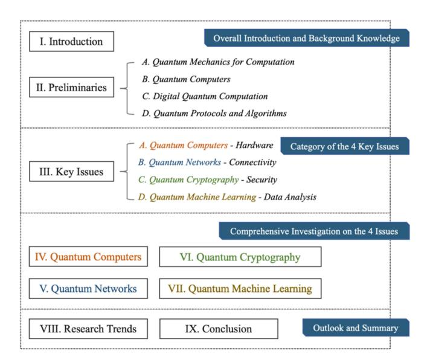

Fig. 1. Outline and the connection of sections.

this field and discuss the research directions. Finally, we give the overall conclusions in Section [IX.](#page-29-33)

## II. PRELIMINARIES

Quantum mechanics is the foundation of multiple research areas, such as quantum chemistry, quantum field theory, and quantum information science. The theory describes the laws of physics at the scale of atoms and subatomic particles. Quantum computing is associated with quantum information science and is at the intersection of physics, mathematics (mostly Linear algebra and Boolean algebra), and computer science. In this article, we discuss quantum computing mainly from a computer science perspective.

In this section, we first introduce quantum effects in physics (e.g., superposition and entanglement) that are fundamental to quantum computation. The introduction of quantum mechanics would help the readers better understand how quantum computation models came into being (for example, to relate to the role of semiconductors or transistors in classical computers). Then, we introduce three types of quantum computers and their basic computational models: universal quantum computers (alias digital quantum computers), quantum annealers (alias analog quantum computers), and digital-analog quantum computers. We then mainly introduce the digital model (i.e., the gate model) used in universal quantum computers, which is the most common quantum computational model discussed today. Finally, we introduce several well-known quantum protocols and algorithms to demonstrate the superiorities of quantum computers to classical ones. Fig. [2](#page-2-0) shows the connection between the introduced concepts in this section.

## *A. Quantum Mechanics for Computation*

Before delving into the specifics of quantum computing, we briefly discuss the phenomena in quantum mechanics that the computational theory aims to model. While the observations of quantum physics may seem counterintuitive, they are

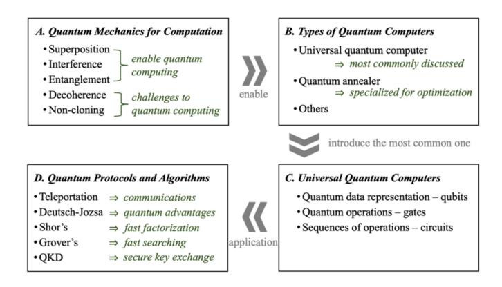

Fig. 2. The preliminary concepts introduced in Section II.

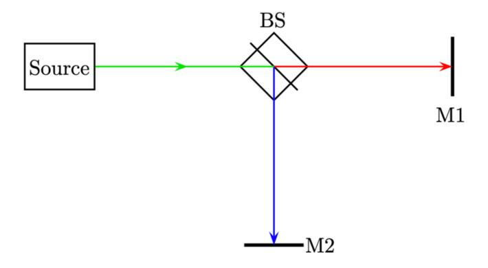

Fig. 3. Creating a superposition.

well-described by quantum mechanics [34], [35]. Thus, we can mathematically model these phenomena in order to approximate the classical computation. In this article, we call these observations *quantum effects*. The role of quantum effects on quantum computers is similar to that of semiconductor physics in classical computers. While we have not yet fully understood quantum effects (Einstein referred to entanglement as "spooky action at a distance" and saw it as evidence that quantum theory is incomplete [36]), quantum mechanics has been remarkably successful in predicting the behavior of quantum systems.

Here, we use a standard optical experimental setup to describe the quantum effects. As shown in Fig. 3, the setup to create superposition consists of a photon source (Source), a beam splitter (BS), and a pair of photon detectors, i.e., measurement devices (M1 and M2). The photon source emits a single-photon beam. The beam splitter splits the beam into two (i.e., gives the beam an equal chance of going through the red/right path or being reflected to the blue/down path). Note that there is only one photon in this setup, so the measurement outcomes should be mutually exclusive. The photon can only be detected/measured in one of the two detectors, with equal probability. That is, it stays in a superposition of the two possible paths (two possible outcomes) before it is measured. To express the outcomes mathematically, readers can refer to Section II-C, but in general, we can simply consider these two possible outcomes as 0 and 1. This means that a quantum system can be in a state of superposition where it is simultaneously in multiple states, each with some probability

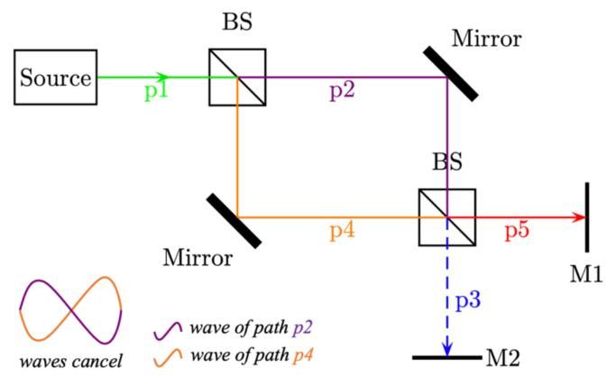

Fig. 4. Mach-Zehnder interferometer.

of being measured. In our case, there are two possible states, 0 and 1. However, in general, a quantum system can be in a multi-state superposition with  $2^n$  possible outcomes, where n is the number of states. This can be achieved through similar experimental setups.

We use another well-known setup to demonstrate one typical example of wave interference in a quantum system, the Mach-Zehnder interferometer [37], which is designed to determine the relative phase shift. As discussed, a photon going through a beam splitter stays in a superposition of two possible paths. The mirrors only reflect the photon. As shown in Fig. 4, the photon seems to have an equal probability of reaching either detector. However, no matter how often we repeat this experiment, all photons are detected only at M1. This is due to quantum wave interference. The two waves cancel each other out in the blue/p3 path direction. There is no change to the photon if it passes straight through a beam splitter (e.g., the green/p1 path to the purple/p2 path in Fig. 4), but if the beam splitter reflects the photon (the green/p1 path to the orange/p4 path), its phase is shifted. The properties of a beam splitter (e.g., size, material) can decide the amount of phase shift. With our beam splitter, a  $\frac{\pi}{2}$  radian shift occurs when the photon is reflected.

There are two paths in Fig. 4 for a photon to reach M2:

- 1) Green (p1)  $\rightarrow$  purple (p2)  $\rightarrow$  blue (p3);
- 2) Green (p1)  $\rightarrow$  orange (p4)  $\rightarrow$  blue (p3).

In path 1, no phase shift occurs (the photon passes straight through). In path 2, there is a shift of  $2 \times \frac{\pi}{2} = \pi$  radians. The wave functions of the two paths can be modeled by sine and cosine functions, which indicate the probability of the photon "choosing" that path. Differing by  $\pi$  radians, the two paths thus converge, and the waves cancel (as shown on the left-bottom of Fig. 4), so there is zero probability for the photon reaching M2. Note that these two paths describe the same photon in a superposition and thus can affect each other.

So far, we have presented cases where quantum states are independent; that is, measuring one quantum state does not affect another. However, it is possible to have situations involving multiple quantum states that are correlated with each other, meaning their measurement results are dependent on each other. This type of correlation is called *entanglement*. When multiple states are entangled, they are no longer independent

from each other. The measurement of any of the entangled states will instantly collapse the other states, regardless of their distance from each other. For instance, when Alice and Bob each possess one state of an entangled pair and are separated by a large distance, the measurement of Alice's state will instantly determine the outcome of Bob's measurement. For example, if Alice measures a value of 0 for her state, Bob's state will immediately become 0 or 1, depending on the specific entangled states they are in. The mathematical representation of single states and entangled states is discussed in Section [II-C.](#page-4-0) Entanglement, referred to by Einstein as "spooky action at a distance," violates traditional notions of realism (the idea that an object has certain characteristics regardless of whether it is being measured) and locality (the idea that an object can only be influenced by its immediate surroundings). Despite not being fully understood [\[36\]](#page-29-36), [\[38\]](#page-29-38), [\[39\]](#page-30-0), [\[40\]](#page-30-1), entanglement has been shown to provide significant computational advantages.

Despite the computational advantages, quantum systems are not physically stable. Quantum states are loosely coupled with their environments (and thus need to be stored at an extremely low temperature). They tend to lose information as time passes if they are not perfectly isolated. This is called *decoherence*. It is hard to maintain the desired behaviors (e.g., superposition and entanglement) for a sufficiently long time. They tend to become random and featureless as they are being manipulated. Quantum error correction is one big topic for tackling this issue [\[14\]](#page-29-13), [\[41\]](#page-30-2). Current quantum hardware is considered to be in the noisy intermediate-scale quantum (NISQ) era [\[42\]](#page-30-3). We discuss more on error correction in Section [III.](#page-7-0)

Moreover, we cannot clone an arbitrary unknown quantum state. This is the *non-cloning theorem* [\[43\]](#page-30-4). Non-cloning implies that there is no easy way to create redundancy for fault tolerance (what we do in classical computing). This makes decoherence a critical issue in quantum engineering.

The key takeaways of quantum effects regarding computation are listed in Table [I.](#page-3-0)

## *B. Types of Quantum Computers*

There are different ways of modeling the quantum effects to develop quantum hardware (e.g., quantum computers and sensors). In this subsection, we introduce the three types of quantum computational models: quantum logic gates, quantum annealing, and other models such as digital-analog computing.

Even though there are quantum mechanical models describing a Quantum Turing Machine (QTM) [\[9\]](#page-29-8), [\[45\]](#page-30-5), [\[46\]](#page-30-6) (i.e., an abstract reference to model quantum effects), a quantum circuit based on quantum logic gates is a more common model [\[47\]](#page-30-7). In fact, it is the most commonly discussed quantum computational model nowadays. It provides a way to perform quantum computation by implementing Boolean functions (comparable to the classical logic gates). It constructs what we refer to now as a *universal quantum computer* (i.e., a digital quantum computer). A universal (or general-purpose) computer is expected to be able to compute arbitrarily computable (i.e., Turing-complete) functions. Still, the set of universal quantum logic gates alone does not necessarily achieve universal computation.

#### TABLE I QUANTUM EFFECTS

| Effect                 | Description                                                                                                                                                                                                                                                                                                                                                                                                                                                                |
|------------------------|----------------------------------------------------------------------------------------------------------------------------------------------------------------------------------------------------------------------------------------------------------------------------------------------------------------------------------------------------------------------------------------------------------------------------------------------------------------------------|
| Superposition          | It describes the effect that a state "exists" in different values at the same time. By measurement, it collapses and becomes a known state. Before measurement, it has some probability of being measured as any one of its possible outcomes. For example, a state can be in a probabilistic state of both 0 and 1, with a probability of 50% to be measured as 0 and 50% as 1. When measured, it becomes that value (either 0 or 1). The measurement cannot be reversed. |
| Interference           | It describes the possibility that the wave functions of quantum states can reinforce or diminish each other. It has an intimate connection with phase transformations (e.g., phase kickbacks [44]) that help achieve many useful quantum algorithms. It sometimes also describes the noise intervention from a state's environment.                                                                                                                                        |
| Entanglement           | It describes the effect where a pair or a group of quantum states are correlated. Once entangled, they are no longer independent from each other. Measurement on any of the entangled states collapses the other states. All the other states yield definite values during measurement. Mathematical examples are in Subsection II.C.                                                                                                                                      |
| Decoherence            | It describes the situation where quantum states are loosely coupled with their environments. They lose information as time passes (because a quantum system is usually not perfectly isolated). Their definite phase relationships between states are destroyed over time. As a result, states may not maintain their expected behaviors (e.g., superposition and interference) and become random and featureless.                                                         |
| Non-cloning theorem | It has been proven that it is not physically possible to produce an identical copy of an arbitrary unknown quantum state [43].                                                                                                                                                                                                                                                                                                                                             |

Nonetheless, the term "universal quantum computer" is usually referred to as a quantum computer based on a universal quantum logic gate set. We use this terminology. Mathematical expressions of digital quantum computation are introduced in the next subsection.

Implementing effective error-corrected algorithms on a universal quantum computer is challenging in the current NISQ era. In contrast, *quantum annealers* (i.e., analog quantum computers) based on quantum annealing are more robust against noise [\[48\]](#page-30-8), [\[49\]](#page-30-9). Quantum annealing can be used to find the global minimum (or the optimal solution) of search problems. The solution is found from a large number of potential candidates, where the classical computation cannot efficiently find the optimal. Quantum annealers, thus, are generally applied to the use cases that need optimization, for instance, machine learning. Moreover, probabilistic sampling [\[50\]](#page-30-10) and general optimization problems such as route optimization [\[51\]](#page-30-11) can also be tackled.

Quantum annealing works like an adiabatic process in thermodynamics. An adiabatic process raises the temperature to increase the molecular speed and form strong bonds. To harden an iron, the process slowly decreases the temperature to stabilize these bonds. The cooling process is called annealing in metallurgy. Quantum annealing increases and decreases energy instead of temperature to find the lowest energy states, i.e., the global minima. Quantum annealers can support thousands of qubits due to their relative robustness against noise [8], while universal quantum computers have been struggling at hundreds [6], [7].

There are many proposed models for building a quantum computer, such as the Church–Turing–Deutsch principle [9] and the five criteria by DiVincenzo [52]. There is an ongoing debate about the best approach for designing quantum computers. For example, one possibility is to merge digital and analog operations to build digital-analog quantum computers [53]. It has been proposed as a way to achieve universal, scalable, and error-corrected systems. Additionally, it has been suggested to use both stationary qubits (such as trapped atoms, molecules, or quantum dots) and flying qubits (such as photons) in a distributed manner in order to achieve scalable quantum computation [54].

In addition, the method for creating qubits can vary, and there are multiple types of qubits based on the technology used to create or encode them. For example, photonic qubits are encoded in the polarization, frequency, or spatial mode of a photon. Superconducting qubits are encoded in the quantum state of a superconducting circuit. Spin qubits are encoded in the spin state of a single electron, and atomic qubits are encoded in the quantum state of an atom or ion. Each type of qubit has its own advantages and disadvantages. Photonic and superconducting qubits are relatively easy to operate and transmit, but they are also more susceptible to noise and decoherence. On the other hand, spin and atomic qubits are more stable, but they can be more difficult to scale. More information on the different types of qubits can be found in [55], [56].

Nonetheless, all kinds of quantum computers work toward the same goal of implementing computations that significantly outperform the classical ones. Deutsch envisions that the most plausible future for quantum computing is not a pure quantum computer, but a set of quantum operations merged on a classical computer [9].

The key takeaways of quantum computer types are listed in Table II.

#### C. Universal Quantum Computers

In this subsection, we introduce the mathematical expressions of quantum states and quantum logic gates that are used in universal quantum computers. Table III gives the common symbols used in this article.

Recall the superposition we created in Fig. 3. The measurement outcomes at M1 and M2 are mutually exclusive because there is just a single photon. Generally, a uniform superposition with *d* possible values will yield only one of the *d* outcomes (each with equal probability to be measured). This effect is mathematically modeled as orthogonal basis vectors.

Classical computation uses bits whose values are either 0 or 1. Quantum computation uses qubits that can be superpositions of 0's and 1's. Suppose we model M1

TABLE II QUANTUM COMPUTERS

| Туре                                    | Description                                                                                                                                                                                                                                                                                                            |
|-----------------------------------------|------------------------------------------------------------------------------------------------------------------------------------------------------------------------------------------------------------------------------------------------------------------------------------------------------------------------|
| Universal quantum computer (digital) | It is based on the model of quantum logic gates analogous to classical logic gates. It can perform a finite set of computations by Boolean functions. It should be Turing-complete (e.g., quantum Turing machine), but we currently use it to refer to a quantum computer built by a universal quantum logic gate set. |
| Quantum annealer (analog)            | It is based on the process of quantum annealing. It is an analog way to build a quantum computer and is specialized in solving optimization problems, which is useful for machine learning and optimization algorithms.                                                                                                |
| Others                                  | The best basic model for a quantum computer is still disputable, and other novel ways to build a quantum computer have been proposed. For example, merging the above models produces digital-analog quantum computers [53]. Such integration of classical and quantum operations is a foreseeable future.              |

as 0 and M2 as 1. The photon then has some probability  $\alpha$  of being measured as 0 and  $1-\alpha$  as 1 (in the case of Fig. 3,  $\alpha=0.5$ ). The measurement outcomes of 0 and 1 are mathematically expressed by column vectors in the standard basis as:

$$|0\rangle = \begin{pmatrix} 1\\0 \end{pmatrix} \text{ and } |1\rangle = \begin{pmatrix} 0\\1 \end{pmatrix}.$$
 (1)

The standard basis is explained further in Section VI-B. Generally, a qubit is expressed as a linear combination of  $|0\rangle$  and  $|1\rangle$  with their corresponding amplitudes as coefficients (or a unit vector in a complex Hilbert space):

$$|\psi\rangle = \alpha|0\rangle + \beta|1\rangle = \begin{pmatrix} \alpha \\ \beta \end{pmatrix}.$$
 (2)

where  $\alpha$  and  $\beta$  are the wave amplitudes of  $|0\rangle$  and  $|1\rangle$ .  $|\alpha|^2$  and  $|\beta|^2$  are the respective probabilities that  $|\psi\rangle$  is measured as  $|0\rangle$  or  $|1\rangle$ . Thus, they should suffice  $|\alpha|^2 + |\beta|^2 = 1$ . For example, in (1), we have a 100% probability of measuring the qubit as  $|0\rangle$  or  $|1\rangle$ .

The uniform superposition of a single qubit can then be expressed as

$$|\psi\rangle = \frac{1}{\sqrt{2}}|0\rangle \pm \frac{1}{\sqrt{2}}|1\rangle = \frac{1}{\sqrt{2}} \begin{pmatrix} 1 \\ \pm 1 \end{pmatrix}.$$
 (3)

Here the probability of the qubit being measured either as 0 or as 1 is  $\left(\frac{1}{\sqrt{2}}\right)^2 = 50\%$ . The signs  $(\pm)$  only indicate phases and do not affect the probability of measurement.

In addition to qubit, there are other bit representations, such as a qutrit, which describes a superposition of three mutually orthogonal outcomes (e.g., 0, 1, 2), and, more generally, a d-level qudit (alias quNit), which describes a superposition of d outcomes. A quantum state represented by a qubit that yields d outcomes upon measurement is identical to the state

TABLE III SYMBOL TABLE

| Symbol                              | Meaning                                                                                                                                                                                                                                                                                                                                                                                                                                                                                                                                                                                                                                                                                                                                                                                                                 |  |  |  |
|-------------------------------------|-------------------------------------------------------------------------------------------------------------------------------------------------------------------------------------------------------------------------------------------------------------------------------------------------------------------------------------------------------------------------------------------------------------------------------------------------------------------------------------------------------------------------------------------------------------------------------------------------------------------------------------------------------------------------------------------------------------------------------------------------------------------------------------------------------------------------|--|--|--|
| ψ⟩                                  | A Greek letter inside the bra–ket notation represents a quantum state. A quantum state can be one qubit or multiple qubits. Quantum states can also be expressed as complex vectors, e.g., $ \psi\rangle = {i \choose 0}$ .                                                                                                                                                                                                                                                                                                                                                                                                                                                                                                                                                                                             |  |  |  |
| X,Y,Z,I,H                           | Italic uppercase letters are used to represent quantum gates. In particular, <i>I</i> is the identity gate (an identity matrix). <i>X</i> , <i>Y</i> , <i>Z</i> are the Pauli gates (i.e., the basis gates that are commonly used for quantum operations). <i>H</i> is an important gate to create entanglement, called the Hadamard gate. Quantum gates are expressed as complex matrices, e.g.:                                                                                                                                                                                                                                                                                                                                                                                                                       |  |  |  |
|                                     | $X = \begin{pmatrix} 0 & 1 \\ 1 & 0 \end{pmatrix}, Y = \begin{pmatrix} 0 & -i \\ i & 0 \end{pmatrix}, Z = \begin{pmatrix} 1 & 0 \\ 0 & -1 \end{pmatrix}, H = \frac{1}{\sqrt{2}} \begin{pmatrix} 1 & 1 \\ 1 & -1 \end{pmatrix}$ . Moreover, a gate in a quantum circuit is represented by a letter in a rectangle (see examples in Fig. 5).                                                                                                                                                                                                                                                                                                                                                                                                                                                                              |  |  |  |
| $U_f x\rangle$                      | Italic $U$ with a subscript is commonly used to represent an oracle (i.e., a quantum transformation). An oracle is a function to transform one quantum state into another, often a "black box" function. The subscript $f$ represents a classical function $f(x): \{0,1\}^n \to \{0,1\}^m$ . (e.g., the constant oracle and the balanced oracle in Deutsch-Jozsa Algorithm [57] where $m=1$ )                                                                                                                                                                                                                                                                                                                                                                                                                           |  |  |  |
| $\alpha 0\rangle, \gamma 00\rangle$ | These are quantum states with their amplitudes. The measurements of quantum states are, in general probabilistic. The square of the coefficient (amplitude) indicates the probability of the measurement result being the bits inside that bra–ket (e.g., 0 or 00). Note that these two symbols are not complete unless $\alpha=1$ and $\gamma=1$ . For $\alpha 0\rangle$ , the probability of the measurement result being 0 is $\alpha^2$ . For $\gamma 00\rangle$ , the probability of the measurement result (two qubits) being 00 is $\gamma^2$ . If all the possible measurement results are concatenated by "+" signs (e.g., $\alpha 00\rangle + \beta 01\rangle + \gamma 10\rangle + \delta 11\rangle$ , all probabilities would be listed in the equation and $\alpha^2 + \beta^2 + \gamma^2 + \delta^2 = 1$ . |  |  |  |

represented by a *d*-level qudit. In this article, we primarily focus on binary outcomes (qubits) for simplicity.

*Quantum states* can be represented by one or more qubits. |0 and |1 are the basis states in the standard computational basis. Each quantum state preserves a probability distribution of all measurement outcomes. For example, a 2-qubit state can be expressed as

$$|\psi\rangle = \alpha|00\rangle + \beta|01\rangle + \gamma|10\rangle + \delta|11\rangle.$$
 (4)

where α, β, γ, and δ correspond to the amplitudes (whose squares indicate the probabilities) of the outcomes. Note that, if the probabilities of |01 and |10 are zero, |ψ is an entangled state. Similarly, if the probabilities of |00 and |11 are zero, |ψ is entangled in opposite phases.

*Quantum gates* are operations performed on quantum states that alter the state of a qubit. They are analogous to Boolean operations (bitwise operations) on classical bits and are described using linear algebra. Quantum states are represented by complex vectors, and quantum gates are represented by

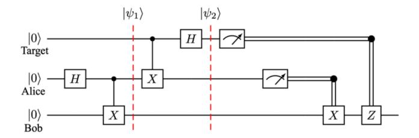

Fig. 5. Quantum teleportation circuit.

complex matrices (e.g., the Pauli gates *X*, *Y*, *Z* in Table [III\)](#page-5-0). Pauli gates are basic gates frequently used to represent complex quantum gates. *X* gate is like a logic NOT gate causing 1 to become 0 and 0 to become 1. *Y* gate exchanges the probabilities of the outcomes, i.e., α and β in [\(2\)](#page-4-3). It imposes a relative sign to one of α and β, which does not affect the probabilities but is significant to perform more complex quantum computation (an important component of the basic gates). *Z* gate only imposes the relative sign. The matrices of the Pauli gates are presented in Table [III.](#page-5-0) Any quantum gate can be expressed by a linear combination of the Pauli gates (i.e., *X*, *Y*, *Z*). For example, we can express the Hadamard gate (i.e., *H*) as:

$$\begin{split} H &= \frac{1}{\sqrt{2}} \begin{pmatrix} 1 & 1 \\ 1 & -1 \end{pmatrix} \\ &= \frac{1}{\sqrt{2}} \begin{pmatrix} \begin{pmatrix} 0 & 1 \\ 1 & 0 \end{pmatrix} + \begin{pmatrix} 1 & 0 \\ 0 & -1 \end{pmatrix} \end{pmatrix} = \frac{1}{\sqrt{2}} (X + Z). \end{split}$$

The Hadamard gate is another fundamental quantum gate. It maps the basis states (i.e., |0 and |1) to uniform superposition. A state in uniform superposition has evenly distributed amplitudes on all its possible outcomes, e.g., [\(3\)](#page-4-4).

Mathematically, quantum operations are done by matrix multiplication between states and gates. For example, applying *X* gate to |0 can be expressed as:

$$X|0\rangle = \begin{pmatrix} 0 & 1 \\ 1 & 0 \end{pmatrix} \begin{pmatrix} 1 \\ 0 \end{pmatrix} = \begin{pmatrix} 0 \\ 1 \end{pmatrix} = |1\rangle.$$

Note that this is the dot product of *X* and |0. If we want to perform operations on multi-qubit states, we need to create bigger gates (bigger matrices). This creation is done by *tensor* products between gates. For example, *X* gate can only be applied to a single qubit, so if we want to apply it to a 2-qubit state, we need to expand *X*. Suppose we only want to flip (apply *X* to) the value of the second qubit of the 2-qubit state and do not touch the first qubit. We expand *X* gate to *IX* :

$$IX = I \otimes X = \begin{pmatrix} 1 & 0 \\ 0 & 1 \end{pmatrix} \otimes \begin{pmatrix} 0 & 1 \\ 1 & 0 \end{pmatrix} = \begin{pmatrix} 0 & 1 & 0 & 0 \\ 1 & 0 & 0 & 0 \\ 0 & 0 & 0 & 1 \\ 0 & 0 & 1 & 0 \end{pmatrix}.$$

Applying *IX* to |00 can then be expressed as *IX* |ψ = *IX* |00 = |01. Note that applying the identity matrix to the first qubit does not change the vector of the first qubit.

A *quantum circuit* is a sequence of operations (quantum gates) for a particular purpose. Fig. [5](#page-5-1) shows an example of a quantum circuit that achieves quantum teleportation, which is used to transmit information in quantum systems, with three qubits. In the figure, solid lines represent quantum wires, and double lines represent classical wires. A letter in a rectangle represents a quantum gate applied to the qubit on the left. A meter in a rectangle (e.g., the two rectangles after  $|\psi_2\rangle$  in Fig. 5) represents a measurement operation that yields classical outcomes. X and Z with classical wires (on the right of Fig. 5) are classically controlled gates that use classical bits (measurement results from the top and middle measurement operations) as control bits to determine whether to apply the X or Z gate to the bottom qubit.

A multi-qubit state can be expressed as the tensor product of the qubits if they are not entangled. For example,  $|01\rangle$  can be expressed by  $|0\rangle\otimes|1\rangle=\begin{pmatrix}1\\0\end{pmatrix}\otimes\begin{pmatrix}0\\1\end{pmatrix}=(0,1,0,0)^{\mathsf{T}}=|01\rangle$ . For simplicity, the notations of tensor products can be written as:  $|b_1\rangle\otimes|b_2\rangle=|b_1b_2\rangle$ . However, if some qubits are entangled in a state, they cannot be expressed by a tensor product. For example, in the simplest example of quantum entanglement, Bell states [58] are

$$|\psi\rangle = \frac{1}{\sqrt{2}}(|00\rangle \pm |11\rangle) \text{ and } |\phi\rangle = \frac{1}{\sqrt{2}}(|01\rangle \pm |10\rangle).$$
 (5)

These four states (entangled two-qubit states) are called the Bell basis. Their vector forms are  $\frac{1}{\sqrt{2}}(1,0,0,\pm 1)^{\mathsf{T}}$  and  $\frac{1}{\sqrt{2}}(0,1,\pm 1,0)^{\mathsf{T}}$ . Neither of them can be separated into a tensor product of two qubits. The Bell basis (i.e., maximally entangled basis) can be generalized to multi-qubit entangled states, such as the GHZ state [59] for three or more qubits. Entanglement is a powerful concept that provides significant computational advantages for quantum algorithms.

It is convenient to use the mathematics of tensors to reason about multi-qubit systems. If some qubits are entangled, we should not treat them independently. Thus, mathematically we cannot separate them into independent qubits by tensor products. Simulating such features with classical computation can take exponential time.

#### D. Quantum Protocols and Algorithms

Quantum algorithms are algorithms that run on a quantum computer. Different computational models have different kinds of quantum algorithms. In this subsection, we introduce the well-known quantum protocols and algorithms based on the quantum logic gate model discussed above. They are constructed by quantum circuits and are the most commonly discussed algorithms. Quantum effects such as superposition, interference, and entanglement provide them with computational advantages over classical algorithms. Even though they can be simulated by classical algorithms (e.g., quantum simulators), they deliver either significant speedups or enhanced security on a quantum computer. The protocols and algorithms introduced here are important milestones in quantum computing.

Teleportation: Quantum state transmission is irrecoverable. Classical methods such as signal amplification and redundant requests are not applicable due to the non-cloning theorem. Thus, teleportation is widely used for quantum communication (of arbitrary unknown states). For example, if quantum information is shuttled to a receiver (Bob) from a sender (Alice) in teleportation, Alice's state would be destroyed due

to the non-cloning theorem. Nothing is really teleported. Only after a few communications and operations, Bob can recreate Alice's state at his end. As shown in Fig. 5, a typical teleportation process is as follows:

- 1) At the beginning of a transmission, Alice and Bob create an entangled qubit pair, either by a third party or themselves (operations before  $|\psi_1\rangle$  in Fig. 5). Now the last two qubits (middle and bottom) in Fig. 5 are entangled.
- 2) Alice and Bob then each take one of the qubits from the pair. Suppose Alice takes the middle qubit and Bob takes the bottom qubit. The top qubit represents the state that Alice wants to transmit (the target qubit).
- 3) Alice then performs the controlled-not gate CX and H gates to her qubit, as shown in Fig. 5  $(|\psi_2\rangle)$ . Alice measures her state.
- After measurement, Alice sends her results to Bob over a classical communication channel.
- 5) Bob then chooses to perform *X* or *Z* gates (or not) according to Alice's results to transform his qubit to the state that the top qubit was in. For example, Bob should apply *X* gate to his qubit (the bottom qubit) if the measurement result of Alice's qubit (middle qubit) is one; otherwise, do nothing.
- 6) Bob's state is now exactly the same as the target state. Quantum teleportation forms the backbone of current technologies of quantum networks. Recent studies have shown high-fidelity (e.g., over 90%) teleportation of quantum states [60], [61], [62], [63]. Fidelity is a metric to describe the quality of teleportation, that is, how close the teleported qubit is to the original.

Deutsch-Jozsa algorithm: Deutsch-Jozsa algorithm [57] was the first example to demonstrate the computational advantages of quantum computing. It shows that the quantum solution can outperform the best classical algorithm for the Deutsch-Jozsa problem. In the Deutsch-Jozsa problem, we are given a hidden function  $f(x): \{0,1\}^n \to \{0,1\}$ . It is a Boolean function that takes in an n-bit string and returns 0 or 1. It is promised that f(x) is either one of the following:

- 1) Constant: For any input f(x), return a constant value. That is, f(x) = 0 or f(x) = 1.
- 2) Balanced: For half of the inputs, f(x) = 0, and for the other half, f(x) = 1.

The problem is to find out which one f(x) belongs to. Classically, we can keep giving inputs to f(x) and see how the outputs behave. If it is a balanced function, we will eventually see a different output. If we keep getting the same output, the certainty of f(x) being a constant function increases as we give more inputs to it. If we want to be 100% confident, we need to check  $2^{n-1}+1$  inputs (i.e., iterating half of the inputs and one more). Nonetheless, with phase kickback (c.f., interference) [64], the Deutsch-Jozsa algorithm takes only one step to solve the problem. Phase kickback is where the phase of a qubit is rebounded into a different qubit via a controlled operation. Explaining the quantum circuit here would make this section verbose. There are already many well-written tutorials. Interested readers can go to literature such as [64], [65]. Besides, there are more interesting and famous algorithms that demonstrate quantum advantages over classical ones, such as the Bernstein-Vazirani algorithm [66] and Simon's algorithm [67].

Shor's algorithm: The most prevalent classical cryptosystem (e.g., RSA) relies on the difficulty of factoring the product of two large primes. However, Shor's algorithm provides a quantum solution based on quantum phase estimation [68], [69] to solve the large-number factorization in a polynomial time [70]. It actually solves the period-finding problem, which in turn solves factorization. In other words, if we can compute the period of the periodic function  $g(x) = (a^x \mod N)$  efficiently, we can factorize N efficiently. The steps of Shor's algorithm can be summarized as follow (e.g., to factor N = 15):

- 1) To find the period of g(x), choose a random base a: 1 < a < N. (e.g., to find the period of g(x) where N = 15, we choose a = 2).
- 2) Find the period by finding the smallest x' > 0 for which g(x') = 1. (e.g.,  $g(4) = 2^4 \mod 15 = 1 \Rightarrow x' = 4$ )
- 3) If the period x' is not even, go back to step 1.
- 4) If  $a^{\frac{x}{2}} \mod N = \pm 1$ , go back to step 1.
- 5)  $a^{x'}-1$  can then be factorized as  $(a^{\frac{x'}{2}}+1)\times(a^{\frac{x'}{2}}-1)$ . (e.g.,  $2^4-1=(2^2+1)\times(2^2-1)=5\times3)$ ,
- 6) Factors of N can then be found by  $gcd(a^{\frac{x'}{2}}+1,N)$  and  $gcd(a^{\frac{x'}{2}}-1,N)$  where gcd() is to find the greatest common divisor. (e.g., factors of 15 are gcd(5,15)=5 and gcd(3,15)=3).

By using quantum phase estimation to find the period (steps 1 and 2), Shor's algorithm provides an exponential speedup compared with the best-known classical factorization approach. When quantum hardware scales up, it will endanger the current cryptosystems significantly.

Grover's algorithm: Grover's algorithm [71] solves unstructured search problems in  $O(\sqrt{N})$  time. It can efficiently find the unique input(s) to a one-way function with high probability; for example, it can reverse a hash function efficiently). With a black-box function (e.g., a one-way function), it is easy to compute f(x) given x, but it is hard to compute x given the value of f(x). With a classical approach, we can only solve it by brute-force search (i.e., by trying every possible x).

Most quantum algorithms tend to repeat experiments with identical setups to reveal the deterministic distribution of probabilities of different outcomes and then take the results with the highest probabilities [72]. Grover's algorithm is also of this type. It amplifies the amplitude of the desired outcome by iterations, which in turn amplifies the probability of the desired outcome. After  $O(\sqrt{N})$  iterations, the amplitude of the desired outcome dominates, and we can be certain that the measurement result is the value we are searching for. Here, N is the number of all potential solutions to the black-box function (i.e., the function's domain or all possible x's).

The amplitude amplification process is visualized in Fig. 6. x-axis represents all the possible solutions (i.e., all the measurement outcomes of the circuit for Grover's algorithm) to f(x). y-axis indicates the amplitude of each solution (i.e., the square root of the probability of each measurement outcome). To cover all possible solutions with n qubits, we need  $N=2^n$  measurement outcomes. In step (1), we have a uniform superposition of n qubits, where each measurement

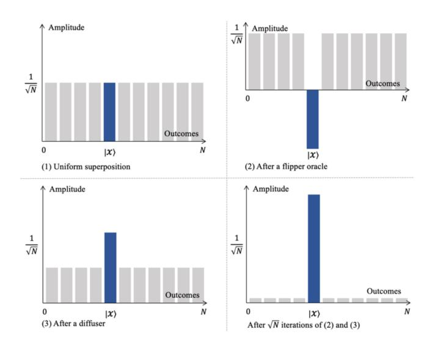

Fig. 6. Amplitude changes in Grover's algorithm.

outcome has the same amplitude  $\frac{1}{\sqrt{N}}$  (i.e.,  $\frac{1}{N}$  = probability to be measured). Let the solution x that we are trying to find be in the qubit  $|x\rangle$  (the one with blue amplitude in Fig. 6). In step (2), we flip the sign of the amplitude of  $|x\rangle$  by phase kickback. In step (3), a diffuser oracle is used to boost the negative amplitude and decrease the positive amplitude. Now the amplitude of  $|x\rangle$  is amplified. After  $\sqrt{N}$  iterations of steps 2 and 3, the amplitude of  $|x\rangle$  becomes dominating. We then measure all the qubits, and the measurement outcome showing up the most often is the value x that we were searching for.

Suppose there is a unique solution to the black-box function. Classically, it takes O(N) time to find it by brute-force search. Thus, Grover's algorithm is only a quadratic speedup to brute-force search, unlike other quantum algorithms that are mostly exponential speedups. However, it is still significant when N is large.

Quantum Key Distribution (QKD): Since classical key exchange protocols (e.g., Diffie–Hellman key exchange) will be endangered by quantum algorithms (e.g., Shor's algorithm), quantum-based key exchange protocols have been developed. QKD is the most widely discussed type of key exchange protocol. Its implementations have been built worldwide [3], [4], [5]. Interconnection of QKD communications constitutes QKD networks. QKD is a hybrid quantum-classical approach. It requires both parties (Alice and Bob) to publish their measurement results to complete the key exchange process. Well-known QKD protocols are introduced in Section VI with quantum cryptography.

Finally, the key takeaways of quantum protocols and algorithms are listed in Table  $\overline{IV}$ .

# III. KEY ISSUES OF QUANTUM COMPUTING

In this section, we discuss the challenges and limitations of quantum computing and communications and identify four key issues in the field.

While the potential of quantum computing is exciting, it also comes with challenges. For example, quantum hardware is still in development, and much more powerful hardware

TABLE IV QUANTUM PROTOCOLS AND ALGORITHMS

| Name                        | Description                                                                                                                                                                                                                                                                  |
|-----------------------------|------------------------------------------------------------------------------------------------------------------------------------------------------------------------------------------------------------------------------------------------------------------------------|
| Teleportation               | Quantum teleportation indicates a quantum state transformation between two quantum systems with entanglement. It transfers a state to a receiver while destroying the state at the sender. Quantum networks are mostly based on quantum teleportation.                       |
| Deutsch-Jozsa Algorithm  | Deutsch-Jozsa's algorithm was the first to demonstrate quantum advantages over classical computation. It determines whether a black-box function is constant or balanced.                                                                                           |
| Shor's Algorithm            | Shor's algorithm can factorize large integer numbers in a polynomial time, which endangers current cryptosystems.                                                                                                                                                      |
| Grover's Algorithm       | Grover's algorithm provides a solution for unstructured search problems. It is quadratically faster than its classical counterpart. It searches through the inputs to a black-box function and returns the desired input (to a function value) with the highest probability. |
| Quantum Key Distribution | QKD is a secure way to exchange a secret key in the NISQ era by using both quantum and classical communication channels.                                                                                                                                                     |

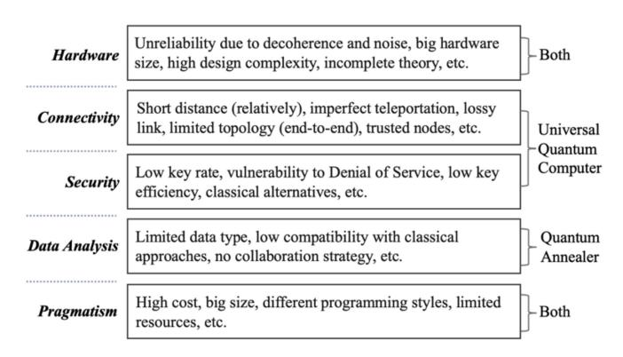

Fig. 7. An overview of challenges in quantum computing.

is needed before it can be used to solve real-world problems [\[10\]](#page-29-9), [\[14\]](#page-29-13). One potential transition is to a hybrid quantum-classical system, but this brings new challenges in integration [\[73\]](#page-30-33), [\[74\]](#page-30-34), [\[75\]](#page-30-35). Additionally, connectivity between quantum systems poses significant challenges, such as collaboration issues, which in turn raise security concerns. Furthermore, while quantum annealing may be useful for optimization problems that enable data analysis, it is currently only practical for small-scale synthetic datasets. Fig. [7](#page-8-1) provides an overview of the current challenges and limitations in quantum computing (universal and annealer).

Given the challenges depicted in Fig. [7,](#page-8-1) we identify four research issues in quantum computing (the last one in Fig. [7,](#page-8-1) pragmatism, is a general challenge in all quantum research topics):

- 1) Quantum computers (related to hardware);
- 2) Quantum networks (related to connectivity);
- 3) Quantum cryptography (related to security);

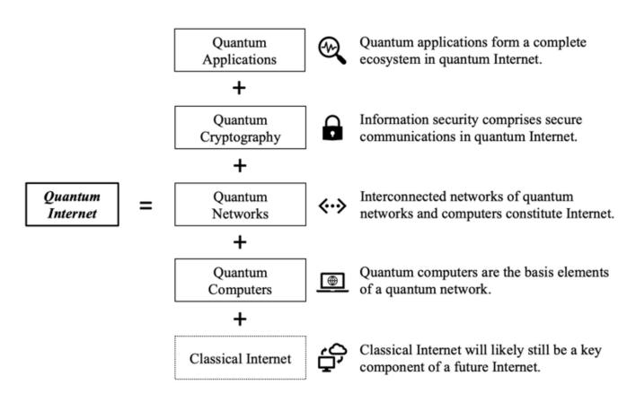

Fig. 8. The elements of a quantum Internet.

## 4) Quantum machine learning (related to data analysis).

Therefore, in the following four sections, we provide a detailed survey of the recent advances, progress, and trends in these four issues. We begin by introducing quantum computers, which are the basic units for the other three issues. Without an effective quantum computer, there would be no possibility for quantum networks, cryptography, or data analysis. Next, we discuss quantum networks, which require robust connections between quantum systems and envision the quantum Internet. Secure communication (i.e., quantum cryptography) must be established because the Internet has always been potentially adversarial. Finally, given the massive amounts of data generated by the Internet, there is a constant need to balance accuracy and efficiency. Quantum machine learning may be able to help achieve both of these goals.

The four important issues discussed in this article can also be seen as the key elements of the quantum Internet, as summarized in Fig. [8.](#page-8-2) These issues in quantum computing are scientifically interesting and widely discussed and serve as the building blocks of the quantum Internet. However, there are still many open problems in each category, for example, the robustness of quantum computers [\[14\]](#page-29-13), [\[41\]](#page-30-2), [\[76\]](#page-30-36), [\[77\]](#page-30-37), the challenges of network infrastructure (e.g., quantum communication links [\[15\]](#page-29-14), [\[16\]](#page-29-15), [\[17\]](#page-29-16), quantum repeaters and routers [\[73\]](#page-30-33), [\[78\]](#page-30-38), [\[79\]](#page-30-39)), and the efficiency in quantum cryptography [\[4\]](#page-29-3), [\[80\]](#page-30-40), [\[81\]](#page-30-41), [\[82\]](#page-30-42). Moreover, quantum annealing brings new opportunities to quantum applications such as quantum machine learning and other optimization problems [\[83\]](#page-30-43), [\[84\]](#page-30-44), [\[85\]](#page-30-45), [\[86\]](#page-30-46). The insights into high-level security and exponential speedup (compared to classical computers) in quantum systems have stimulated research [\[42\]](#page-30-3). Table [V](#page-9-0) gives examples of technologies in these issues. Existing technologies in the table are introduced in subsequent sections.

## *A. Quantum Computers*

In the past few years, big tech companies such as IBM, Google, and D-Wave have successively reported progress on quantum hardware, achieving a larger and larger scale of qubits. Nonetheless, quantum hardware today is still unstable. Most algorithms and protocols remain in experimental phases.

The development of quantum computers decides how the other research components in quantum computing develop. For

| Key Issues          |                                   | Example Technologies                                                                                 |
|---------------------|-----------------------------------|------------------------------------------------------------------------------------------------------|
| Quantum             | Universal Quantum Computers | Google Quantum AI, IBM Quantum, Microsoft Azure Quantum.                                          |
| Computers           | Quantum Annealers              | D-Wave Systems.                                                                                      |
|                     | Communication Links            | Quantum optical fibers, Wireless (satellite).                                                        |
| Quantum Networks | Quantum Repeaters              | Repeaters based on entangled quantum memories, entanglement exchange, and entanglement purification. |
|                     | Quantum Routers                | Routing protocols for lossy links and quantum switches for different topologies.                     |
| Quantum             | QKD                               | BB84, E91.                                                                                           |
| Cryptography        | Beyond QKD                        | Conjugate coding, oblivious transfer.                                                                |
| Quantum             | Fully Quantum                     | Quantum support vector machine, kernel methods.                                                      |
| Machine Learning | Hybrid Quantum- Classical   | Quantum principal component analysis, Quantum assisted kernels.                                      |

TABLE V EXAMPLE TECHNOLOGIES OF THE KEY ISSUES

example, the number of qubits in a quantum computer (e.g., quantum memory) determines the effectiveness of a quantum routing protocol [\[73\]](#page-30-33). The development of quantum error correction decides the robustness of a quantum system and communication [\[14\]](#page-29-13). The robustness of a quantum system is determined by different aspects, such as scale, state stability, and material [\[6\]](#page-29-5), [\[7\]](#page-29-6), [\[11\]](#page-29-10), [\[12\]](#page-29-11), [\[87\]](#page-30-47). Moreover, the effectiveness of quantum computers also depends on the development of computational models and programming frameworks [\[8\]](#page-29-7), [\[9\]](#page-29-8), [\[49\]](#page-30-9), [\[53\]](#page-30-13).

Here, we summarize the critical challenges in quantum hardware and introduce, in general, the first key issue in the field, quantum computers.

*1) Noise:* As mentioned in Section [II,](#page-1-1) current quantum hardware is considered to be in the NISQ era. It is in an intermediate scale and is noisy. Coherence between quantum states tends to be lost by their interaction with the environment. The loss of coherence is analogous to the loss of energy by friction in classical physics. A definite phase relation between states should be kept for quantum states to be coherent. For example, the amplitudes of a 2-qubit state, α, β, γ, and δ in [\(4\)](#page-5-2), are in a definite phase relation. If anyone of them changes unexpectedly, it affects the other amplitudes since α2 + β2 + γ2 + δ2 = 1. It makes the measurement outcomes unexpected.

To preserve quantum information, quantum states must be perfectly isolated from the outside environment. However, to manipulate or measure it, we need interaction with it. For example, it is common to control a quantum operation by classical results from previous operations. To read the classical results, we need to measure the states. Such operations break the isolation of a quantum system and cause decoherence.

Any state drift changes the magnitudes of a qubit, which in turn changes the probability of measuring the desired results and causes errors. Errors then quickly accumulate and cause the operations to become random and incorrect. Quantum error correction algorithms [\[14\]](#page-29-13), [\[41\]](#page-30-2), [\[76\]](#page-30-36) are needed to correct the shifts and noises caused by decoherence. These examine and amend the errors. It usually requires sufficient redundancy to maintain correction, which requires resourceful quantum hardware.

How to correct decoherence between entangled states is another open problem about noise. For example, purification of quantum state [\[88\]](#page-30-48) can effectively correct multi-qubit states but only applies to well-understood states such as Bell states. Error correction has not yet been proven to be able to adapt to large-scale quantum systems, but it does improve the reliability of the exceedingly fragile quantum state. Solid-state quantum memories are believed to be more advantageous as they maintain coherence better [\[89\]](#page-30-49).

Current quantum hardware is not ready for large-scale operations [\[77\]](#page-30-37). It usually yields results different from quantum simulators because there is no noise in simulation (no decoherence between qubits).

*2) Hardware Size:* Even though a quantum processor could be closer to the size of a coin, the cryostat hardware required to provide a proper environment for the processor is bigger than a person [\[6\]](#page-29-5). The system is comprised of multiple components making it bigger than it should be. For example, to preserve quantum states, we need a vacuum chamber (that contains fewer particles), for which we need a device to pump out the air. We need portals to the chamber to allow light sources (e.g., lasers). To keep the chamber in a cryogenic environment, we need extra materials (e.g., liquid helium) to reduce the temperature. It also needs a lot of equipment to control the qubits. Moreover, optical instruments are needed for light sources with different settings. All these components together take up a significantly large space. Current quantum computers are experiencing a situation (in terms of size) similar to the early phase of classical computers that occupied a room [\[13\]](#page-29-12), [\[87\]](#page-30-47), [\[90\]](#page-30-50).

It has been estimated that the cost per qubit in a quantum computer today is about \$10,000 [\[91\]](#page-30-51), while we may need to produce millions of them in a computer. This cost needs to be significantly decreased before quantum computers can be commercialized. In addition, minimizing the hardware size brings extra cost on the materials and manufacture. For example, research on minimizing the size of expensive materials such as cryogenics and ion traps in a quantum chip has been going on [\[87\]](#page-30-47). While we want more qubits available on a quantum computer, it comes together with more instability, noise, and higher cost. Thus, boosting up the qubit numbers is just the first step. Lowering the cost and scaling up the connectivity are also significant for developing the quantum Internet [\[89\]](#page-30-49).

*3) Design Complexity:* Due to the non-cloning theorem in quantum computing, it is impossible to duplicate arbitrary qubits. This causes inconvenience in algorithm designs and implementations. If data is lost, it is difficult to recover it since we have no copy of it. It is worth noting that quantum noncloning means the non-cloning of an arbitrary unknown state. If we know the amplitudes of a state, we can recreate it from scratch using the amplitude values, which can be duplicated in classical computation, e.g., α, β in [\(2\)](#page-4-3). However, if we receive an unknown state, we cannot have any information about it without measuring it (but measuring it would destroy its amplitude distribution). Even if we measure it, we only know one possible outcome. There are no redundant states for us to repeat measurements to recreate the amplitude distribution. Hence, we cannot simply apply traditional ways (e.g., creating redundancy, re-transmission) to increase system robustness and design algorithms [\[89\]](#page-30-49). This increases the design complexity of quantum hardware and software. Moreover, the interface between quantum and classical systems should be natural and seamless, but in current architectures, they are independent and only supplement each other.

Moreover, quantum programming differs significantly from classical programming because of the distinctive computational models. IBM, Google, Microsoft, and many more companies have been developing programming toolkits, such as Qiskit, Cirq, and quantum development kit (QDK) [\[92\]](#page-30-52), [\[93\]](#page-30-53), [\[94\]](#page-30-54). However, there is no handy debugger for programming on real quantum hardware. It is impossible to measure and restore a state in a quantum computer. Quantum programming is thus usually done on a classical simulator. When a program is done, it is uploaded to a real quantum machine for testing. The program is then run a large number of times. The results demonstrate the distribution of the program outputs. However, different hardware may yield different distributions due to decoherence and noise. Despite all the challenges, quantum programming and debugging software are being actively investigated and developed [\[95\]](#page-31-0), [\[96\]](#page-31-1), [\[97\]](#page-31-2).

*4) Incomplete Theory:* As mentioned in Section [II-A,](#page-1-2) entanglement is paradoxical. This is called Einstein-Podolsky-Rosen (EPR) paradox. The properties enforcing the correlation among entangled qubits are believed to be unknown. Einstein and others thus consider quantum mechanics incomplete. Hidden-variable theories explain entanglement through unobservable hypothetical entities. The phenomena of indeterministic measurements are assumed as mathematical formulations of quantum mechanics. For example, the bounds of indeterminism can be expressed in quantitative form by the Heisenberg uncertainty principle [\[98\]](#page-31-3). Nonetheless, there may be nonlocal hidden variables since entanglement violates the concepts of locality and realism, as discussed in Section [II-A.](#page-1-2) Entanglement has been substantiated repeatedly by experiments. However, we still lack a deeper level of understanding. It is challenging to utilize a technology when its theory is not commonly agreed to be complete.

## *B. Quantum Networks*

An important way to scale up a computing system is to make computers collaborate. As the collaboration augments, the quantum Internet will eventually be achieved. The key performance indicators (KPIs) used for classical networks (e.g., distance, transmission rate, and error rate) are becoming those of quantum networks. Nonetheless, current quantum network development is more in deciding infrastructure than racing on performance criteria, e.g., setting up standards.

The instability of quantum systems brings challenges to the development of quantum communication links (wired and wireless) [\[15\]](#page-29-14), [\[16\]](#page-29-15), [\[99\]](#page-31-4), [\[100\]](#page-31-5). The non-cloning theorem makes it harder because we cannot simply use a repeater or amplifier to extend the transmission as in classical networks [\[89\]](#page-30-49), [\[101\]](#page-31-6). Routing protocols are also needed in a quantum network to select the optimal paths. They differ from their classical counterparts because the communication links (or the entanglement links) are probabilistically established, and the resources in quantum repeaters (e.g., quantum memories) are expensive [\[73\]](#page-30-33), [\[102\]](#page-31-7), [\[103\]](#page-31-8). A new set of routing metrics and protocols is thus needed for quantum networks. Quantum communication links, quantum repeaters, and quantum routing protocols are the key components to accomplish quantum networks and realize the quantum Internet.

Here, we summarize critical challenges in connecting quantum computers and discuss the second key issue in the field, quantum networks.

- *1) Long-Distance Coherence:* Decoherence challenges quantum hardware and burdens the development of longdistance communications. Quantum states tend to lose information during preservation and transmission. An isolated qubit can indefinitely conserve its information, but isolation contradicts communication. Quantum networks are primarily based on teleportation, which is based on entanglement. Creating reliable long-distance entanglement is thus vital, but entanglement does not survive decoherence. States can unintentionally get entangled with the environment and then decohere from each other [\[101\]](#page-31-6). Research on communication distance over optical fibers [\[15\]](#page-29-14), [\[16\]](#page-29-15), [\[17\]](#page-29-16), [\[18\]](#page-29-17) and network range over wireless channels [\[5\]](#page-29-4), [\[104\]](#page-31-9), [\[105\]](#page-31-10), [\[106\]](#page-31-11) have been developed to tackle decoherence. Wireless transmission (over free space) of quantum states is considered advantageous compared to optical fibers [\[80\]](#page-30-40), [\[99\]](#page-31-4), [\[100\]](#page-31-5), [\[107\]](#page-31-12). The atmosphere has multiple high transmission windows (e.g., the wavelength window from 650 nm to 670 nm with a small diffraction spread [\[99\]](#page-31-4) or a 770 nm band with high bit rates [\[107\]](#page-31-12)). Photons are relatively easy to be detected in these windows.
- *2) Teleportation Limitation:* Due to the non-cloning theorem, we cannot transmit quantum data while keeping the data. Thus, no redundancy can be created, and no re-transmission can be done. If we lose data during teleportation (e.g., decoherence), we lose it forever. Nonetheless, some information about the data can still be preserved even if we lose it. Fidelity is the metric to measure how much information is preserved after teleportation. As discussed in Section [II,](#page-1-1) high-fidelity (e.g., over 90%) teleportation methods have been developed, and the research continues [\[60\]](#page-30-19), [\[61\]](#page-30-20), [\[62\]](#page-30-21), [\[63\]](#page-30-22). The opposite of fidelity should be equal to or lower than the commonly acceptable error rates in classical protocols. For example, most modern Ethernet variants are designed for a bit error rate of 10−12 (c.f., the IEEE 802.3 standards [\[108\]](#page-31-13)), which is a harsh criterion for current quantum teleportation approaches.
- *3) Lossy Link:* Quantum communication based on quantum teleportation is essentially based on 2-qubit entanglements (i.e., EPR pairs or Bell states) between every two nodes in the network. However, entanglement links can be unstable

and lossy due to the decoherence of long-distance entanglement. Quantum repeaters have been developed to overcome this issue by creating entangled links between the adjacent nodes and repeaters [\[78\]](#page-30-38), [\[79\]](#page-30-39), [\[109\]](#page-31-14). The purpose of quantum repeaters is to form an end-to-end entanglement between the sender and the receiver, through which they can communicate using quantum teleportation (or QKD for key exchange purposes). However, such entangled links created by the repeaters are probabilistic. Each link has a probability for entanglement generation, making the routing paths probabilistic and unpredictable. An entangled link is only created when it is needed. After the teleportation, the entangled link would collapse. Quantum routers are therefore needed to provide effective routing paths in the network based on quantum repeaters. Again, the non-cloning theorem makes the routing process strenuous.

- *4) End-to-End Communication:* Quantum network approaches focus on end-to-end communications. It is problematic to send the same data to more than two receivers or to receive it from multiple senders simultaneously [\[110\]](#page-31-15). Nonetheless, quantum multiplexers have been investigated for routing purposes [\[111\]](#page-31-16), [\[112\]](#page-31-17). In a quantum network, there is no easy way to broadcast information. Still, strategies to emulate broadcasting have been investigated. For example, a state verification protocol can "broadcast" states to network nodes by following a distributed process [\[113\]](#page-31-18). Quantum network topology is in its infancy compared to the current quantum infrastructure, but the research in this area thrives [\[89\]](#page-30-49), [\[114\]](#page-31-19), [\[115\]](#page-31-20), [\[116\]](#page-31-21). For example, quantum switches achieving different network topologies (e.g., star topologies) have been studied [\[117\]](#page-31-22), [\[118\]](#page-31-23).
- *5) Trusted Nodes:* All nodes, including quantum repeaters in a quantum network, are assumed to be trusted [\[119\]](#page-31-24), [\[120\]](#page-31-25), [\[121\]](#page-31-26). However, a network environment is usually built on a zero-trust architecture. Information needs to be protected to preserve data integrity and privacy. This raises another category of challenges regarding quantum security.

## *C. Quantum Cryptography*

Network environments are most likely hostile. The transmitted data must be protected to preserve data integrity and security. Thus, cryptography is one of the key elements of any kind of Internet. The most well-known quantum cryptography for key exchange is QKD. It is designed to distribute classical secret keys between two parties in a quantum ambient. Its implementation has been built all over the world [\[3\]](#page-29-2), [\[4\]](#page-29-3), [\[5\]](#page-29-4). It is famous for its quantum nature in detecting intrusions by measurement, c.f., the "unconditional security" [\[122\]](#page-31-27), [\[123\]](#page-31-28), [\[124\]](#page-31-29). QKD's derivatives are also continuously designed and implemented [\[3\]](#page-29-2), [\[4\]](#page-29-3), [\[125\]](#page-31-30), [\[126\]](#page-31-31). Moreover, novel cryptographical technologies beyond QKD are being developed [\[127\]](#page-31-32), [\[128\]](#page-31-33), [\[129\]](#page-31-34), [\[130\]](#page-31-35). Since quantum computers endanger classical cryptography, post-quantum cryptography (based on classical computers) has also been proposed to avoid the quantum threats classically [\[131\]](#page-31-36), [\[132\]](#page-31-37), [\[133\]](#page-31-38). Last but not least, cryptographical products (e.g., blockchains) are inevitably involved. Their recreations and derivatives in quantum computing have also been widely studied [\[134\]](#page-31-39), [\[135\]](#page-31-40), [\[136\]](#page-31-41), [\[137\]](#page-31-42) [\[138\]](#page-31-43).

Here, we summarize critical challenges in quantum security and discuss, in general, the third key issue in the field, quantum cryptography.

- *1) Key Rate:* The key rate of QKD depends significantly on the hardware performance (e.g., the efficiency of photoncounting devices [\[80\]](#page-30-40)). As discussed in the previous subsection, transmission in free space (e.g., through satellites) can get better photon quality than transmission in optical fibers. However, optical fibers cause less noise than free space. If the communication between the two parties in a QKD protocol is unstable and does not guarantee correct measurements, they would falsely believe that an intruder exists and abandon a secure channel.
- *2) Denial of Service:* If both parties in a QKD protocol believe that the communication channel is insecure. They would stop using that channel and switch to another quantum channel if there is one. Thus denial-of-service attacks are possible in QKD. It can detect an intruder for sure if the quantum system is stable, but it does not provide a way to assure the existence of an intruder. Discussions on denial of service in QKD and strategies for backup (classical or quantum) channels have been investigated in the literature [\[139\]](#page-31-44), [\[140\]](#page-31-45), [\[141\]](#page-31-46).
- *3) Key Efficiency:* The key efficiency describes how much of the original bit strings are preserved after the key generation. It can be calculated as the length of the secret key divided by the length of the original bit string [\[142\]](#page-31-47). It is related to how much time is needed to generate a fixed-length key. To prevent brute-force search attacks, the length of the secret key should be long enough. Low key efficiency indicates a long original bit string, and a long time is needed for key generation. QKD protocols usually have low-key efficiency. For example, in the BB84 protocol [\[81\]](#page-30-41), the receiver and the sender measure the same stream of quantum states and keep the ones that have the same measurement results, which are mapped to the secret key. They choose from two measurement bases, so they have about a 50% probability of choosing the same basis (i.e., having the same measurement results). This results in about 50% of the quantum states being used to indicate the secret key, which is very low compared to classical approaches. More details on the BB84 and other QKD protocols are given in Section [VI.](#page-19-0)
- *4) Classical or Quantum:* Research on quantum cryptography is prevalent due to the vision of quantum computers endangering classical cryptography, typically on factorizationbased cryptosystems. However, quantum cryptography based on quantum systems is not the only option. Research on classical post-quantum cryptography is also a hot topic with similar objectives. Post-quantum cryptography (or quantumproof, quantum-resistant cryptography) studies classical cryptography based on mathematical theories immune to quantum attacks. This means classical cryptography that is not based on factorization. For example, lattice-based cryptography [\[143\]](#page-31-48) is one popular alternative to current factorization-based cryptography. It uses lattices to construct its cryptographic primitives and is believed to be immune to both classical and quantum attacks [\[131\]](#page-31-36). Both fields have potential and are critical. They may each serve as mainstream in different stages of the quantum era: post-quantum cryptography and hybrid classicalquantum cryptography may be more important than pure

quantum cryptography during the classical-quantum transition. Current network infrastructures would be significantly affected if the cryptographical infrastructure is changed.

## *D. Quantum Machine Learning*

As discussed in Section [II,](#page-1-1) quantum annealing is naturally suitable for finding global minima. Besides quantum annealing, we can also see approaches using quantum systems to assist (or enhance) classical machine learning models. However, in the current state of quantum computing, there are difficulties in applying quantum models to real-world problems.

The vision of quantum machine learning is to reduce the storage space and the computation time for data analysis [\[144\]](#page-31-49). For example, a quantum associative memory neural network architecture has been proposed to improve storage capacity exponentially [\[145\]](#page-31-50). Moreover, it has been shown that the quantum-trained support vector machine (SVM) for binary classification works faster than its classical counterpart (exponential speed-up in the cases where polynomial time is needed classically) [\[146\]](#page-31-51). Research on quantum machine learning includes fully quantum approaches (i.e., quantum annealing) and hybrid quantum-classical approaches [\[86\]](#page-30-46), [\[147\]](#page-31-52), [\[148\]](#page-31-53), [\[149\]](#page-31-54), [\[150\]](#page-31-55). They have been tested for various types of datasets [\[151\]](#page-31-56), [\[152\]](#page-31-57) (more details on the data types in Section [VII\)](#page-25-0). Classical solutions for machine learning have been attempted to adapt to quantum systems, such as quantum walk [\[153\]](#page-32-0) and quantum neural networks [\[154\]](#page-32-1). Quantum machine learning uses and implements quantum algorithms to enable higher-performing machine learning [\[155\]](#page-32-2), [\[156\]](#page-32-3).

Here, we summarize the key challenges in quantum data analysis and discuss the last key issue in the field, quantum machine learning.

- *1) Data Type:* Even though quantum machine learning has been successfully experimented with using synthetic datasets, there are practical challenges in scaling up due to the noisy hardware [\[83\]](#page-30-43), [\[155\]](#page-32-2), [\[157\]](#page-32-4). It has been shown that intermediate-scale quantum computers can work on realworld datasets [\[83\]](#page-30-43). Processing high-dimensional data does not necessarily require matching the number of qubits to the data dimensionality (without feature reduction). Nevertheless, whether quantum machine learning is effective for real-world datasets remains to be explored.
- *2) Compatibility:* Since quantum annealing limits the types of datasets, quantum approaches assisted by classical machine learning have been developed [\[84\]](#page-30-44), [\[158\]](#page-32-5), [\[159\]](#page-32-6). Such hybrid approaches need a practical flow of classical and quantum information. Sharing information between different computational systems brings a significant challenge [\[85\]](#page-30-45).
- *3) Collaboration:* Distributed artificial intelligence (AI) using collaborating edge and core clouds has recently been popular for handling large datasets or geographical areas [\[160\]](#page-32-7). Also, parallel AI utilizes collaboration among processors or local computers to improve performance [\[161\]](#page-32-8). Such advantageous collaborations do not yet exist in current quantum technologies due to the limitation of quantum networks. However, quantum extensions of game theory provide new

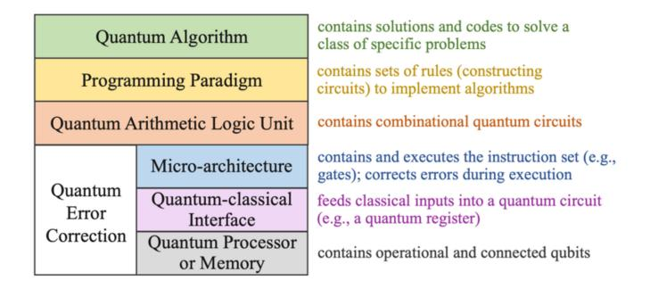

Fig. 9. Quantum computer architecture.

opportunities to assist decision-making in distributed AI (or multi-agent systems) [\[162\]](#page-32-9), [\[163\]](#page-32-10), [\[164\]](#page-32-11).

## IV. QUANTUM COMPUTERS

In this section, we provide a detailed survey of the first key issue: quantum computers. While quantum computers may seem intimidating, they are shaping the future of computation. They can solve problems that cannot be efficiently solved with the current technology. In addition, they can solve them much faster. This computational speedup (often exponential) is expected to impact significantly. For example, a one-way function (widely used as the basis of classical cryptography) can be reversed by brute-force search using classical computers. Still, it would take a very long time, making it impractical. With quantum computers, this time would be shortened, making the one-way function vulnerable. Here, we introduce the key aspects of quantum computers and discuss recent advances in the field.

# *A. Features of Quantum Computers*

Quantum computers are the basic units in quantum technology. The development of quantum computers greatly affects the development of other quantum technologies. Before introducing the popular topics in quantum computers, we summarize the basic features of quantum computers.

As shown in the bottom part of Fig. [9,](#page-12-1) the base layer of a quantum computer generally has three components: 1) a quantum processor or a quantum memory preserving operational and connected qubits [\[6\]](#page-29-5), [\[165\]](#page-32-12); 2) a quantum-classical interface feeding classical inputs into a quantum circuit; 3) a quantum micro-architecture that contains and executes an instruction set (e.g., the Pauli gates), which is analogous to the micro-architecture of a classical computer. Quantum error correction spans these three layers. For example, surface codes have been introduced for topological quantum memories [\[166\]](#page-32-13). Fault-tolerant error-correcting structures have been developed for quantum micro-architectures [\[167\]](#page-32-14). Quantum arithmetic logic units, programming paradigms, and quantum algorithms play the parts of their classical counterparts in a classical computer.

We now introduce typical features of quantum computers. *Linear Algebra Based:* As discussed in Section [II-C,](#page-4-0) quantum states and their operations are based on linear algebra in a complex Hilbert space. States and gates are described by vectors and matrices, respectively. Dot products between vectors and matrices represent operation results. Correlations between states and between gates are expressed by their tensor products. Linear algebra is the standard language for describing quantum effects and algorithms [\[65\]](#page-30-25).

*Probabilistic:* As discussed in Section [II-D,](#page-6-0) quantum algorithms solve problems by giving a probability distribution of each possible solution. Binary strings are used to express all possible solutions. An *n*-qubit state can solve problems with 2*n* possible solutions. By repeating the sequence of operations and measurements, we have a probability distribution of the solution. This intrinsic probabilistic nature of quantum computers makes them fundamentally different from classical computers, whose algorithms are usually deterministic.

*Fast:* The exponential speed-up potentials to a specific class of problems brought by quantum computers are the main reason for interest in them. As discussed in Section [II-D,](#page-6-0) most quantum algorithms provide exponential speed-ups compared with their classical counterparts. Although some of them only provide quadratic speed-up, e.g., Grover's algorithm, when the number of possible outcomes is large, they still make a significant difference. This computational speed-up could potentially evolve the current networking technology.

*Noisy:* As discussed in Section [III-A,](#page-8-3) one typical and inevitable feature of quantum computers is their noisy nature. Quantum error correction algorithms should always be there to support quantum information's fidelity and quantum algorithms' correctness [\[14\]](#page-29-13), [\[168\]](#page-32-15). Nonetheless, as the hardware architecture develops, the issue of decoherence may be mitigated [\[10\]](#page-29-9), [\[169\]](#page-32-16). Quantum error correction may then focus on decreasing the transmission error rate [\[170\]](#page-32-17). Noise is unavoidable during transmission, even classically.

## *B. Quantum Error Correction*

Most quantum algorithms assume perfect qubits that can be prepared and manipulated in the way we want. However, as we know, qubits are imperfect. They are noisy and unstable due to decoherence or operation errors such as depolarization [\[171\]](#page-32-18). Quantum error correction aims to denoise quantum information and creates fault-tolerant computations by correcting erroneous states and operations.

In the current NISQ era, imperfect qubits are used despite their instability. Error mitigation strategies (i.e., measuring the same circuit multiple times and ignoring the results with a small number of outcomes) are included in most quantum algorithms [\[172\]](#page-32-19). However, perfect and stable qubits should eventually be achieved and used for real fault tolerance. Quantum error correction has been developed to overcome this instability. These are also called quantum error correction codes, c.f., classical error correction codes [\[173\]](#page-32-20)). For example, using redundant qubits to increase the robustness of a 1-qubit state is a common way to remove errors in a quantum computer. That is, multiple *physical qubits* are used to represent one *logical qubit* in the algorithm [\[174\]](#page-32-21), [\[175\]](#page-32-22). The physical qubits are highly correlated and, thus, are expected to have the same behaviors. Auxiliary qubits are constantly measured to detect signs of errors [\[65\]](#page-30-25). However, this introduces a new attack known as the photon number splitting (PNS) attack [\[176\]](#page-32-23). An attacker in the middle can split some redundant qubits and measure them to access the transmitted information.

A simple case of the redundant qubits mentioned above is a repetition or stabilizer code [\[177\]](#page-32-24). It is analogous to the repetition codes in classical computing. It can increase the robustness of a logical qubit in a quantum computer or in communication. Repetition codes keep multiple "copies" of a qubit to create redundancy. For example, when we want to prepare a qubit as |1, we create five physical states. Even though we prepare all five qubits as |1. Some of them may decohere and change. Suppose they now become |1, |0, |0, |1, |1 after state preparation. We can still determine that this qubit should be the majority which is |1. However, there is a threshold *p*, a maximum acceptable probability of being wrong because we can never be 100% certain that the qubit is in the state we want [\[178\]](#page-32-25), [\[179\]](#page-32-26). Nonetheless, increasing the number of auxiliary states can always satisfy an arbitrary probability *p* where 0 < *p* < 1, but it is a trade-off between correction and efficiency.

Non-cloning theorem makes it problematic to implement repetition codes since we cannot simply duplicate qubits. However, it is possible to spread the information in a logical qubit to multiple physical qubits that are highly entangled [\[175\]](#page-32-22). There are different ways (i.e., codes) to encode a 1-qubit state with multiple qubits. It has been shown that the smallest number of qubits needed to protect a single qubit currently is five [\[171\]](#page-32-18). There are many ongoing research approaches to quantum error correction. The Quantum threshold theorem indicates that a quantum computer can decrease its error rate to an arbitrarily low-level number through quantum error correction [\[179\]](#page-32-26). It proves that quantum computers can be made fault-tolerant. A simple way to correct all errors is to concatenate different error-correcting codes; for example, after encoding with a coding scheme, re-encode each logical qubit with another coding scheme.

Table [VI](#page-14-0) summarizes the typical approaches for quantum error correction and their key features.

## *C. Quantum Hardware and Software*

The race to develop quantum hardware has been fierce in recent years. IBM claims its quantum computers will support over 1000 qubits in 2023 and targets to reach 4000 qubits by 2025 [\[6\]](#page-29-5), [\[185\]](#page-32-27). Most companies working on quantum focus on universal quantum computers, while D-Wave works on quantum annealers [\[29\]](#page-29-28). D-Wave claims its next-generation quantum computer would include both annealing and the gate model [\[8\]](#page-29-7). As discussed in Section [II-B,](#page-3-1) the gate model that universal quantum computers are based on is more sensitive to noise than quantum annealing [\[48\]](#page-30-8), [\[49\]](#page-30-9). Thus, the number of qubits that a universal quantum computer support is generally smaller than that of a quantum annealer. The overall development of quantum hardware is featured by the number of qubits, the stability of qubits, and the solution approach: universal quantum computing and quantum annealing.

The development of quantum software includes quantum operating systems, firmware, and toolkits. Several companies

TABLE VI QUANTUM ERROR CORRECTION CODES

| Name                              | Description                                                                                                                                                                                                                              | Ref.           |
|-----------------------------------|------------------------------------------------------------------------------------------------------------------------------------------------------------------------------------------------------------------------------------------|----------------|
| Shor code                         | Shor was the first to discover a method of formulating multiple physical qubits to represent one logical qubit. The Shor code encodes one logical qubit with nine physical qubits, which can correct arbitrary errors in a single qubit. | [175]          |
| Steane code                       | Steane accomplished the same thing as the Shor code with seven physical qubits.                                                                                                                                                          | [180]          |
| 5-qubit codes                     | This class of codes can do the same with five physical qubits. It has been shown that five is the minimum.                                                                                                                               | [171]          |
| CSS codes                         | CSS codes are the generalization of the Steane code, named after the authors. They are particular types of stabilizer codes.                                                                                                             | [180] [170] |
| Stabilizer codes               | All methods that use multiple physical qubits to represent one logical qubit are called Stabilizer Codes. This includes the above four codes.                                                                                            | [181]          |
| Bacon-Shor codes                  | Bacon-Shor codes are square-lattice-based 2-dimensional codes with two parameters of the lattice.                                                                                                                                        | [182]          |
| Surface code and Color code | These topology-based stabilizer codes have the potential for large systems of well-protected logical qubits.                                                                                                                             | [166] [183] |
| Bosonic codes                  | Bosonic codes are hardware-efficient alternatives to stabilizer codes. They use multi-photon states of superconducting cavities to encode information.                                                                                   | [184]          |

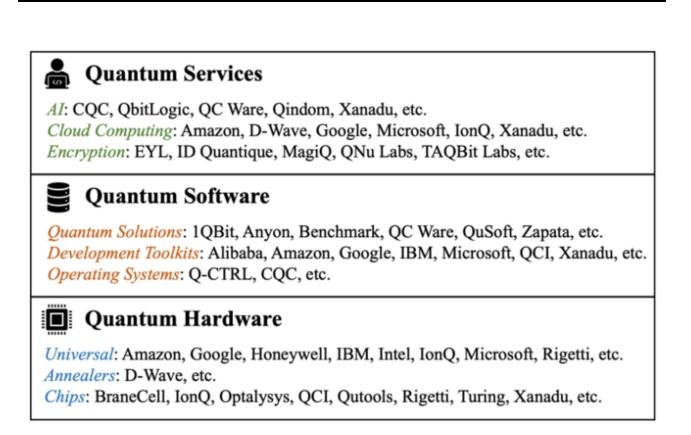

Fig. 10. Quantum hardware and software companies.

provide quantum services based on their hardware and software, such as quantum computing as a service (QCaaS), quantum encryption, quantum cloud computing, and quantum AI. Fig. [10](#page-14-1) lists the current quantum hardware and software by mapping the quantum ecosystem established by different companies worldwide [\[186\]](#page-32-28).

# *D. Quantum Computational Models*

As discussed in Sections [II-B](#page-3-1) and [II-C,](#page-4-0) even though the gate model and quantum annealing are the popular quantum

TABLE VII QUANTUM COMPUTATIONAL MODELS

| Name                                                       | Description                                                                                                                                                                                                                                                                                                                                                                                                     | Ref.           |
|------------------------------------------------------------|-----------------------------------------------------------------------------------------------------------------------------------------------------------------------------------------------------------------------------------------------------------------------------------------------------------------------------------------------------------------------------------------------------------------|----------------|
| Logic Gate Model (Universal Quantum Computing) | It is the most prevalent model for building a quantum computer using universal quantum logic gates analogous to classical logic gates. It is also referred to as a digital model.                                                                                                                                                                                                                               | [47]           |
| Quantum annealing                                          | It is ideal for solving optimization problems. It is an analog model.                                                                                                                                                                                                                                                                                                                                           | [48]           |
| Digital-analog model                                    | It merges digital and analog operations. Taking advantage of both sides, it aims to be universal, scalable, and error- corrected.                                                                                                                                                                                                                                                                      | [53]           |
| Adiabatic model                                            | It is based on quantum annealing and the adiabatic theorem. It is an alternative for optimization problems and is polynomial-time equivalent to the gate model.                                                                                                                                                                                                                                                 | [187] [188] |
| Topological model                                       | It models the two main properties of an exotic type of particle known as anyons: fusion and braiding. In fusion, two anyons are brought together. They either annihilate or become a fermion. Braiding means that the moving anyons' trajectories affect the fusion results. These properties result in built-in protection similar to quantum error correction, so qubits based on anyons are much less noisy. | [189]          |

computational models, there are other approaches. Table [VII](#page-14-2) compares several such models.

## *E. Quantum Programming*

Since quantum algorithms are primarily based on linear algebra, programming in quantum computers differs from that in classical computers. We cannot program on a quantum computer because there is no accountable development environment on a quantum machine. We cannot simply measure a state and reverse it, which means we cannot test a program at any point without destroying the program states. Therefore, we program with a quantum simulator on a classical computer. After finishing the programming, we test it on a real quantum machine with several repetitions to yield a probability distribution of the results. Quantum simulators are usually included in quantum programming frameworks. Table [VIII](#page-15-0) lists the popular quantum programming frameworks.

## V. QUANTUM NETWORKS

In this section, we survey the second key issue: quantum networks. Researchers predict that the quantum Internet will be the future of quantum computing and will require reliable hardware and mature network infrastructure. Quantum networking is the fundamental foundation of a quantum Internet.

Quantum networks are governed by quantum physics, mostly entanglement, which provides the possibility of highlevel security, high speed, and high capacity. However, such opportunities (e.g., exponential speed-ups) come with

TABLE VIII QUANTUM PROGRAMMING FRAMEWORKS

| Name                                 | Description                                                                                                                                                                      | Ref.  |
|--------------------------------------|----------------------------------------------------------------------------------------------------------------------------------------------------------------------------------|-------|
| Google Cirq                          | It is a Python-based framework for programming quantum circuits. Its simulator also simulates noises.                                                                            | [93]  |
| Google TensorFlow Quantum         | It provides ways to use quantum computing inside TensorFlow for hybrid quantum-classical machine learning.                                                                       | [190] |
| IBM Qiskit                           | It is a Python-based library to develop quantum programs. It provides convenient ways to test programs in IBM's real quantum computers.                                          | [92]  |
| Microsoft Quantum Development Kit | It provides a quantum programming language called Q# and IDE for program visualization and analysis. It provides convenient ways to run programs on the Azure Quantum workspace. | [94]  |
| Xanadu Strawberry Fields          | It is a Python-based library to program for photonic quantum computing. It provides convenient ways to make remote execution on Xanadu's quantum hardware.                       | [191] |

new problems (e.g., non-cloning and noise). These problems impose constraints on the scale of quantum networks.

The study of quantum networks involves methods and applications used in network infrastructure and networking strategies [\[192\]](#page-32-29). In this section, we first introduce the features of quantum networks. Then, we discuss recent advances in quantum network infrastructure (e.g., wired and wireless communication links) and quantum networking technologies (e.g., quantum repeaters and routers).

## *A. Features of Quantum Networks*

The vision of quantum networks is similar to the current classical networks but with a higher security level and better performance (e.g., speed and capacity). Researchers endeavor to find quantum alternatives to the critical technologies in classical networks (e.g., communication links, repeaters, and routers).

The basic unit of the transmitted data is a qubit. Data transmission among quantum computers is by teleportation. The state teleportation happens instantly due to entanglement. However, for a receiver (Bob) to operate and change it to the transmitted state, he needs the measurement results from the sender (Alice), which is transmitted classically. This implies that even with teleportation, the speed of quantum communication cannot surpass classical communication. That is, information cannot travel faster than the speed of light through teleportation [\[193\]](#page-32-30). In other words, even though the state operations happen instantly due to entanglement, the information transmission speed is limited by the classical transmission of Alice's measurement outcome to Bob.

Moreover, due to the challenges of hardware and noise, current quantum networks are mostly small-scale with a limited number of qubits [\[42\]](#page-30-3). Even though standard telecom optical fibers can be used for quantum communication, noise makes the transmission low-quality [\[15\]](#page-29-14), [\[16\]](#page-29-15). Wireless quantum networks are, therefore, increasingly being investigated because it seems there are transmission windows in free space that are of better quality than wired communication [\[99\]](#page-31-4), [\[107\]](#page-31-12).

The following paragraphs summarize the features of quantum networks.

*Analogous:* The structure of quantum networks is similar to the structure of classical networks. They are composed of communication links and network nodes. They can be in similar network topologies (e.g., fully connected or star) and can be optimized by the same networking strategies (e.g., repeating and routing) [\[114\]](#page-31-19). Communication links could be optical fibers or free space. Network nodes are computers. Repeaters are used to extend the transmission distance, and routers are used to connect networks and determine optimal paths. The only difference is that all these components need to be redesigned and re-developed following the laws of quantum physics.

*Secure:* Due to the sensitivity of quantum effects (e.g., entanglement), quantum networks are believed to be completely secure if a perfect quantum channel is used [\[194\]](#page-32-31). Quantum teleportation with an authentication scheme is immune to classical cyber-attacks [\[195\]](#page-32-32), [\[196\]](#page-32-33). The insight into quantum networks' "unconditional security" has motivated many researchers [\[60\]](#page-30-19), [\[61\]](#page-30-20), [\[62\]](#page-30-21), [\[63\]](#page-30-22), [\[195\]](#page-32-32), [\[196\]](#page-32-33).

*Teleportation-based:* Despite all the potential, current quantum network schemes are primarily based on quantum teleportation, meaning information is not transmitted; it is teleported [\[89\]](#page-30-49). After reception and measurement, the transmitted state at Alice's end is destroyed and loses the original information. The entanglement link between network nodes collapses. A new entanglement link needs to be re-established after every teleportation. Although the two states can be reused by recreating entanglement between them, we cannot simply duplicate or repeat the transmitted data to create redundancy to increase robustness in teleportation.

*Noisy:* Quantum states are unstable and noisy. The instability and noise increase as the number of qubits increases. The interconnection of quantum computers further increases the level of noise and decoherence. It is thus challenging to form a large-scale network.

Moreover, it is also problematic for a quantum repeater to extend the communication distance. Most quantum repeater approaches assume quantum memories, which increase the influence of noise and decoherence [\[73\]](#page-30-33), [\[117\]](#page-31-22), [\[197\]](#page-32-34). Noise may propagate and cause severe information errors. A quantum Internet requires a significant number of interconnected quantum computers and thus may result in a very noisy environment if noise is not adequately handled.

## *B. Communication Links*

Communication links are essential for quantum networks. They can be wired or wireless. The primary method for wired quantum communication is to use optical fibers and photonbased qubits. It is sensible to use today's optical fiber cables. However, quantum communication through optical fibers is highly noisy [\[15\]](#page-29-14), [\[16\]](#page-29-15), [\[61\]](#page-30-20), [\[89\]](#page-30-49). Free-space communication is an alternative, e.g., through the atmosphere or vacuum environments. Satellite-based wireless quantum networks have been popular since particular qubit transmission windows are more robust than optical fibers [\[80\]](#page-30-40), [\[99\]](#page-31-4), [\[100\]](#page-31-5), [\[107\]](#page-31-12). A combination of wired and wireless quantum networks is the most plausible form of future quantum networks [\[22\]](#page-29-21), [\[198\]](#page-32-35).

As stated repeatedly, a major challenge of quantum communication is quantum decoherence which causes data noise and loss. Fidelity has been a prevalent metric to determine the quality of a qubit transmission (i.e., how close the transmitted state is to the original state). It ranges from 0 to 1, with 0 being the worst, meaning the transmitted state has completely changed, and 1 being the best, meaning there has not been any change in the state during the transmission [\[60\]](#page-30-19), [\[61\]](#page-30-20), [\[62\]](#page-30-21), [\[63\]](#page-30-22). Hence, distance and fidelity are commonly used as communication link performance metrics. In Table [IX,](#page-16-0) we list the recent advances in quantum communication links. They have been implemented for different distances and fidelities. Note that a few communication links use QKD to exchange secret keys instead of a data transmission channel to communicate data based on quantum teleportation. For QKD-based approaches, quantum bit error rate (QBER) is used as a metric to examine the key transmission quality.

Several implementations of communication links have been proposed with distinctive methods and features. We discuss recent quantum research on optical fiber and wireless networks in the following subsections.

*1) Fiber Optic Networks:* Today, our planet is covered by a network of optical fibers. Fortunately, standard optical fibers can be used for quantum communication. The challenge is achieving the desired distance and quality of data transmission (e.g., long distance, high data rate, and low error rate). This involves data loss dispersion and absorption problems, such as quantum noise and decoherence in the communication links and couplers [\[61\]](#page-30-20), [\[89\]](#page-30-49), [\[204\]](#page-32-36). Optical communication approaches that preserve better quantum coherence are needed to tackle this. Elements of an optical communication link could be light sources, detectors, and optical couplers [\[205\]](#page-32-37). Quantum light sources and detectors include single-photon and entangled-photon types. Single-photon sources emit light as single photons or particles such as atoms, molecules, and ions. They can produce single-photon states. However, optimal single-photon sources have not been created yet.

Nonetheless, near-optimal single-photon sources have been proposed [\[206\]](#page-32-38), [\[207\]](#page-32-39). An ideal single-photon state requires low data loss and attenuation during transmission in a fiber optic communication link [\[208\]](#page-32-40). On the other hand, entangledphoton sources that produce a robust source of entangled photons are indispensable ingredients of large-scale quantum networks (e.g., wired networks, Space-to-Earth, and intersatellite networks) [\[209\]](#page-32-41). A quantum-dot-based device has recently been developed, which claims to simultaneously achieve high fidelity, high efficiency, and indistinguishable pairs of photons on demand [\[210\]](#page-32-42).

There are several distinctive designs of optical fibers. Typically, the fibers can be in single-mode or

TABLE IX RECENT ADVANCES IN QUANTUM COMMUNICATION LINKS

| Ref.  | Туре                                    | Distance | Fidelity/ QBER  | Description                                                                                                                                         | Year |
|-------|-----------------------------------------|----------|--------------------|-----------------------------------------------------------------------------------------------------------------------------------------------------|------|
| [199] | Optical fiber (QKD)               | >830 km  | 3.79%              | It uses an optimized four- phase twin-field protocol with a high-quality setup to implement twin-field QKD.                                | 2022 |
| [200] | Optical fiber (QKD)               | >511 km  | 0.43%              | It uses a sending-or-not- sending protocol with quantum and classical communication in the fiber trunk to implement twin- field QKD. | 2021 |
| [201] | Optical fiber (QKD)               | 2 km     | ≈4.9%              | It uses multicore fiber to increase the key rate generation (6.3 Mbit/s) with enhanced error tolerance.                                             | 2021 |
| [202] | Optical fiber (QKD)               | 421 km   | ≈3% - 6%        | It uses QKD-optimized superconducting single-photon detectors and ultra-low-loss fibers.                                                            | 2018 |
| [15]  | Optical fiber (Entang lement)  | 20 km    | ≥0.785 ± 0.009  | It uses polarization- preserving quantum frequency conversion to create entanglement.                                                      | 2020 |
| [16]  | Optical fiber (Entang lement)  | 50 km    | $0.86 \pm 0$ $.03$ | It uses the sources of ion- photon entanglement via cavity-QED techniques and a single photon entanglement.                                | 2019 |
| [17]  | Optical fiber (Entang lement)  | 192 km   | $0.85 \pm 0.02$    | It creates remote entanglement based on polarization-entangled photon pairs in submarine cables.                                        | 2019 |
| [18]  | Optical fiber (Entang lement)  | 100 km   | 0.93               | It uses non-degenerate down- conversion by polarization- entangled photon pairs to distribute entangled pairs.                             | 2007 |
| [203] | Optical fiber (Telepo rtation) | >100 km  | $0.837 \pm 0.02$   | It uses four high-detection- efficiency superconducting nanowire single-photon detectors for quantum teleportation.                     | 2015 |
| [20]  | Free space (Telepo rtation)    | 1,400km  | $0.80 \pm 0.01$    | It is claimed to be the first quantum teleportation from a ground observatory to a low Earth orbit satellite.                              | 2017 |
| [21]  | Free space (Entang lement)     | 1,200 km | ≥0.87 ± 0.09       | It is based on the observation of the survival of 2-photon entanglement and a violation of Bell inequality.                                | 2017 |

multi-mode [\[211\]](#page-32-43), [\[212\]](#page-33-0), [\[213\]](#page-33-1). Single-mode fiber carries only one light mode. The small core size has a higher cost [\[212\]](#page-33-0). Multi-mode fiber has a much larger core diameter and thus can carry multiple light modes and use lower-cost electronics such as light-emitting diodes (LEDs). However, it is unsuitable for long-distance transmission due to modal dispersion [\[212\]](#page-33-0). For quantum communication, high-dimensional spatial modes have been shown to have a higher data rate (or key rate for QKD) [\[213\]](#page-33-1), [\[214\]](#page-33-2), [\[215\]](#page-33-3). Specialized multimode fibers allow the implementation of spatial modes but are significantly constrained by the noise of pattern coupling (or decoherence-induced mode coupling) and entanglement degradation [\[216\]](#page-33-4). Although mode coupling and entanglement degradation are less significant in single-mode fiber, dimensionality is limited. At least in one study, it has been shown that single-mode fibers can transport multidimensional entangled states and avoid entanglement degradation, which also facilitates their deployment in classical optical fiber [\[214\]](#page-33-2).

As discussed in Section [V-B,](#page-15-1) long-distance quantum communication is restricted due to state instability, photon loss, and decoherence during transmission. Mitigating noisy transmission has been well-studied along with the development of communication links [\[18\]](#page-29-17), [\[168\]](#page-32-15), [\[172\]](#page-32-19). Even though there is no feasible way to create data redundancy, alternative methods for fault-tolerant transmission have been proposed. For example, a class of error-correcting code has been developed to examine the context of remaining qubits and to recover the lost information, which can tolerate loss rates up to 24.9% [\[60\]](#page-30-19).

Entanglement encoding adapting fiber optics for different purposes has been examined and implemented based on different degrees of freedom, such as frequency, polarization, time energy, path, and orbital angular momentum (OAM) [\[217\]](#page-33-5). For instance, parametric down-conversion is a frequency-based entanglement encoding in which a photon splits into two photons, where the total energy stays the same before and after the split [\[218\]](#page-33-6). This is made possible by first transforming the photon into an electron-positron pair, and then one of these particles emits a photon and combines with its partner to produce a second photon. Recently, energy-time entanglement detection has been shown to be feasible in that the frequency of a photon is used to determine when its partner will arrive at a separate detector. This type of detection is robust over long distances and is a potential candidate for future quantum networks [\[219\]](#page-33-7). The usage of optical fibers for quantum communication is expected to enable real-world applications. For example, a quantum link between the Bank of Austria and Vienna city hall for secure money transfer has been experimented with [\[220\]](#page-33-8).

*2) Wireless Networks:* Wireless quantum networks extend the communication range and scale up quantum networks. Free-space links have low atmospheric absorption in particular wavelength ranges [\[104\]](#page-31-9). Quantum states are less susceptible in free-space links because the atmospheric environment has weak birefringent effects, i.e., small photon absorption. Besides, quantum decoherence after passing through the atmospheric layer is trivial in free space, which allows a much longer transmission distance than fiber optic networks. As shown in Table [IX,](#page-16-0) implementations of satellite-based quantum networks support a much longer distance than fiber optic networks with similar fidelity.

The combination of fiber optic and free-space networks provides significant hope for the quantum Internet. Satellite-based applications have been popular in recent years. For example, the implementation of the satellite QKD in [\[5\]](#page-29-4) achieved a kilohertz key rate over a distance of up to 1,200 kilometers. At a distance of 1,200 kilometers, the key efficiency is about 20 orders of magnitude better than that of an optical fiber. Moreover, low-cost free-space networks have also been experimented with, such as the quantum drone network for small-scale air-to-ground data links [\[106\]](#page-31-11).

Wireless (i.e., free-space) quantum networks work best with line-of-sight propagation, akin to classical wireless networks. However, their performance also depends on quantum computing hardware and software development, such as optical sources, quantum processors, and routing protocols [\[4\]](#page-29-3). New hardware and software paradigms (e.g., new materials and computational models) are being developed to improve network performance, minimize electronic noise, and preserve high transmission rates [\[221\]](#page-33-9). Although quantum decoherence is less in free space, wireless networks are affected by interference from natural conditions, atmospheric turbulence, and intense background light noise in daylight. This may lead to a low data rate and high latency. Encoding methods for classical networks have been adopted to increase the transmission rates and the quality of wireless quantum links [\[222\]](#page-33-10), specifically to tackle the effects of dynamical atmospheric turbulence.

# *C. Repeaters*

As discussed in Section [III,](#page-7-0) data loss and quantum decoherence make long-distance communication challenging for quantum networks. Quantum repeaters have been studied for this problem. They create an end-to-end entanglement between the sender and the receiver by regenerating entanglement between adjacent nodes along the path. Quantum communication between adjacent nodes is generally created by entanglement. However, the entanglement between the two parties collapses after the communication. They cannot regain the entanglement if their states are not in the same quantum system (i.e., not connected). Hence, repeaters are needed to reestablish entanglement (e.g., by entanglement swapping [\[102\]](#page-31-7)) between parties that are not directly connected. When needed, quantum repeaters typically use quantum memories to teleport information and remake entanglement between the state in its memory to the state in the adjacent node's memory [\[197\]](#page-32-34).

Here, we provide a brief overview of how two simple cases of quantum repeaters work. As shown in Fig. [11,](#page-18-0) there are two pairs of entangled qubits (e.g., pairs of Bell states):

- 1) A pair between the sender (Alice) and the repeater, |ϕ*A* and |φ1;
- 2) A pair between the repeater and the receiver (Bob), |φ2 and |ϕ*B* .

In Fig. [11.](#page-18-0)a, Alice has two qubits, |ϕ*T* and |ϕ*A*. Suppose Alice wants to send |ϕ*T* to Bob. Since there is only one path, Alice initiates the teleportation process and uses |ϕ*A* to create entanglement with a qubit in the repeater, say, |φ1 (Pair 1). After the teleportation, |φ1 is then changed to the same state as the original |ϕ*T* . Then, the repeater makes an entanglement with Bob using |φ2 (Pair 2). Note that the repeater cannot use |φ1 to make entanglement with Bob since it would change |φ1. Recall from Section [II-D,](#page-6-0) entanglement exists in Fig. [5](#page-5-1) between the middle qubit and the bottom qubit but not the Target qubit. Here, in Pair 2, |φ2 is the middle qubit and |ϕ*B* is the bottom qubit in Fig. [5.](#page-5-1) This is also the reason that Alice has two qubits |ϕ*T* and |ϕ*A*. By using |φ1, |φ2 and

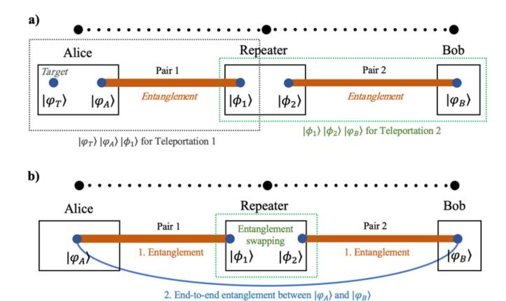

Fig. 11. Two simple cases of quantum repeaters: a) based on teleportation; b) based on entanglement swapping.

|ϕ*B* , |φ1 is then teleported to |ϕ*B* . Bob now has the exact same state as the original |ϕ*T* . Multiple such repeaters can establish a bigger network. They can be placed in a linear or hierarchical structure [\[82\]](#page-30-42). This is feasible and achieves good information gains in entanglement rates [\[73\]](#page-30-33).

Moreover, the development of entanglement swapping, a process in which two entangled pairs are connected, and the entanglement is "swapped" between them, has inspired the methods for generating end-to-end entanglement over multiple "hops" through the use of quantum repeaters [\[73\]](#page-30-33), [\[223\]](#page-33-11). For example, in Fig. [11.](#page-18-0)b, the repeater can use entanglement swapping to turn two pairs of entanglement between Alice and the repeater and the repeater and Bob into a single entanglement between Alice and Bob. This end-to-end entanglement can then be used for communication purposes, such as teleportation or QKD. These quantum repeater schemes can be implemented with the current quantum hardware infrastructure without requiring additional deployment.

Besides repeater-based teleportation, QKD repeaters are also prevalent. They are trusted relays for keys and are built to extend the key exchange distance. They utilize trusted nodes as classical relays between QKD links. For example, Alice and Bob want to generate a shared key. To reach each other, they use an intermediary node, a repeater T, to generate intermediate keys. Alice-T and T-Bob pairs perform QKD, respectively, and use the keys they generate to encrypt the shared key between Alice and Bob. This process requires the repeater T to be a trusted node because it knows the shared key between Alice and Bob. Nonetheless, weakly trusted repeaters have been proposed [\[125\]](#page-31-30). Each weakly trusted node adds a path between Alice and Bob that is disjointed with others to avoid cheating. However, this technique increases the deployment complexity.

Note that repeaters for QKD based on the BB84 protocols actually transmit quantum states (e.g., in photon-based qubits, photons are sent to the receiver), unlike teleportation that only transmits information by entanglement (e.g., quantum information is transmitted, but photons do not move). Repeaters for QKD based on entanglement (e.g., the E91 protocols [\[224\]](#page-33-12)) also only transmit information. Table [X](#page-19-1) compares recent approaches to quantum repeaters.

## *D. Routers*

To find the optimal path between two parties in large and diverse networks, quantum routers are needed. Quantum routing shares the same purpose as routing in classical networks. However, they are different because communication links in quantum networks usually need to be re-established after each use. A typical quantum link is achieved by entanglement between two qubits in two separate parties (as shown in Fig. [11\)](#page-18-0). The entanglement collapses after the transmission and needs to be recreated for the subsequent transmission. The recreation of links has a chance of success or failure [\[73\]](#page-30-33), [\[103\]](#page-31-8). Hence, the probability of link stability needs to be considered in routing strategies [\[114\]](#page-31-19). An alternative path should be used if a selected path becomes unavailable. Quantum routers find the optimal path and forward the transmitted information via quantum repeaters [\[231\]](#page-33-13).

The introduction of quantum routing techniques brings diversity to the quantum network topologies. For example, a distributed network topology has been introduced with an on-demand routing protocol based on the number of entangled qubit pairs [\[232\]](#page-33-14). Topology adaptation methods have been investigated to activate or deactivate links based on a threshold of the probability of link stability [\[114\]](#page-31-19). A ring and sphere topology has been achieved by hierarchical routing schemes, which requires *O*(*log N*) qubits at each network node where N is the number of network nodes, and *O*(*polylog N*) time for routing decisions [\[231\]](#page-33-13).

Quantum routers usually involve both classical and quantum forwarding (e.g., QKD). Classical forwarding uses a classical channel to send the measurement results. Quantum forwarding uses an entangled link. A quantum router can forward information by choosing an entangled pair for the next hop and then measuring and sending the results to the next hop [\[233\]](#page-33-15). This process keeps repeating until the information gets to the destination [\[233\]](#page-33-15).

Quantum routers also bring flexibility to QKD networks. For instance, a star topology QKD network has been built based on wavelength division multiplexing with a 4-user demonstration network [\[234\]](#page-33-16). A continuous variable QKD network has been proposed using localized spatial soliton pulses via quantum routers [\[235\]](#page-33-17).

Quantum state multiplexing (or de-multiplexing) is another direction in quantum routing [\[111\]](#page-31-16), [\[112\]](#page-31-17), [\[236\]](#page-33-18), [\[237\]](#page-33-19). Quantum multiplexers and de-multiplexers can aggregate quantum states into a common channel as a payload. They can form a network with bigger payloads and higher bandwidth. Quantum network traffic needs an address or a destination label to determine where to disaggregate the payload, which is analogous to an IP address in classical networks. Routing information may be transmitted with classical traffic [\[236\]](#page-33-18).

Classical networking techniques such as network coding, cluster networks, and multi-channel routing have been used in quantum networks. However, it is hard to encode and decode quantum states using classical network coding due to quantum effects (e.g., non-cloning theorem). Quantum network coding has been proposed using approximations instead of cloning [\[238\]](#page-33-20). Multi-qubit operations are implementable over cluster networks. Two-qubit operations are implementable over

TABLE X QUANTUM REPEATER APPROACHES

| Ref.  | Description                                                                                                                                                                                                                                                   | Structure                           | Contribution                                                                                                                                                                                                            |
|-------|---------------------------------------------------------------------------------------------------------------------------------------------------------------------------------------------------------------------------------------------------------------|-------------------------------------|-------------------------------------------------------------------------------------------------------------------------------------------------------------------------------------------------------------------------|
| [225] | It proposes a scheme to implement robust quantum communication over long and lossy channels. It involves laser manipulation of atomic ensembles, beam splitters, and single-photon detectors.                                                                 | Hierarchical                        | It is compatible with current technologies and is operable over long distances.                                                                                                                                         |
| [78]  | It proposes implementing a protocol with a fixed distance of elementary links and fixed requirements on quantum memories so that the arbitrary distance of communication can be achieved by concatenating elementary links.                          | Semi hierarchical                   | It improves the entanglement distribution rate and reduces the requirement of memory time.                                                                                                                              |
| [79]  | It proposes a more general method to establish EPR pairs in arbitrary networks. It constructs a graph state with multi-partite entangled resources by sharing the entanglements between network nodes, even if they are with memory and capacity constraints. | Multipartite                        | It requires fewer measurements than usual repeater schemes. It deploys a local complementation technique and shows its advantages. It considers extracting graph states for quantum communication.                      |
| [108] | It utilizes hashing distillation protocols for high loss tolerance and extended communication distance. It is scalable to reach arbitrary distances.                                                                                                          | One-way point-to- point          | It can tolerate high loss and memory errors. It can reach intercontinental distances with moderate resources at each repeater station.                                                                            |
| [197] | It proposes a proof-of-principle experiment for a key component for all-photonic repeaters and its implementation.                                                                                                                                            | Point-to-point                      | It does not need quantum memories and quantum error correction. It selectively measures photons that have survived the transmission.                                                                                    |
| [226] | It experimentally demonstrates that all-photonic quantum repeaters do not need quantum memory.                                                                                                                                                                | Point-to-point                      | Its experiment shows an 89% enhancement of entanglement-generation rate over standard parallel entanglement swapping.                                                                                                   |
| [22]  | It combines over 700 optical fiber QKD links and two high-speed satellite-to-ground links. The ground consists of multiple trusted nodes to relay the shared key.                                                                                             | Point-to-point                      | It achieves 4,600 km QKD communication. QBER is 0.50%.                                                                                                                                                                  |
| [227] | It creates a single distant pair with high fidelity by connecting a string of noisy entangled pairs of particles using a nested purification protocol.                                                                                                        | Point-to-point                      | It can tolerate general communication errors on the percent level with a polynomial overhead in time and a logarithmic overhead in the number of local-controlled qubits.                                               |
| [228] | It generates a backbone of encoded Bell states and uses classical error correction during simultaneous entanglement connection.                                                                                                                               | Point-to-point                      | It shows that CSS codes for quantum repeaters can significantly extend the communication distance while maintaining a high key rate.                                                                              |
| [229] | It uses trusted repeaters to extend the key exchange distance of QKD. Both parties should trust the intermediate repeaters because they will know the shared key.                                                                                             | Point-to-point                      | It is easy to deploy, but it requires trusted nodes.                                                                                                                                                                    |
| [102] | It implements entanglement swapping with storage (with atomic quantum memories) and light retrieval to experiment with quantum repeater nodes.                                                                                                                | Point-to-point                      | The approach is intrinsically phase insensitive. It experimentally implements quantum repeaters with quantum memories and quantum messengers.                                                                           |
| [230] | It introduces an alternative scheme for QKD (other than QKD repeaters) where pairs of phase-randomized optical fields are generated at two separate locations and then combined at the same location for measurement.                                         | Point-to-point                      | It demonstrates an alternative way based on the proposed twin-field QKD to accomplish long-distance key exchange without a quantum repeater. Its key rate shares the same dependence on distance as a quantum repeater. |
| [73]  | It proposes a routing protocol for networks where nodes are with limited quantum processing capabilities and lossy optical links. It can distribute high-rate entanglement simultaneously between multiple pairs of users.                                    | A linear chain of quantum repeaters | It demonstrates the capability of simultaneous high- rate entanglement distribution.                                                                                                                                 |

butterfly and grail networks, which are basic topologies for classical network coding [\[239\]](#page-33-21). Multi-channel quantum routing has also been developed to enable point-to-multipoint communication [\[240\]](#page-33-22). Quantum networks are expected to become more diverse. Classical networking techniques are good references for different routing purposes.

# VI. QUANTUM CRYPTOGRAPHY

In this section, we survey the third key issue: quantum cryptography. Cryptography is essential for communication because adversarial behavior is inevitable in a public network. Every aspect of digital activity requires data security. While classical cryptography has been effective at protecting classical digital information, Shor's and Grover's algorithms have raised concerns about the effectiveness of classical techniques such as factorization-based encryption (e.g., RSA) and one-way hash functions (e.g., SHA-256). Quantum cryptography promises "unconditional security" and has therefore attracted a lot of attention [\[60\]](#page-30-19), [\[61\]](#page-30-20), [\[62\]](#page-30-21), [\[63\]](#page-30-22), [\[122\]](#page-31-27), [\[123\]](#page-31-28), [\[195\]](#page-32-32), [\[196\]](#page-32-33).

QKD is well-known quantum cryptography. Its implementations have been prevalently built [\[3\]](#page-29-2), [\[4\]](#page-29-3), [\[125\]](#page-31-30), [\[126\]](#page-31-31). Nonetheless, other quantum cryptographical approaches provide encryption and authentication for quantum networks [\[127\]](#page-31-32), [\[128\]](#page-31-33), [\[129\]](#page-31-34), [\[130\]](#page-31-35). Moreover, classical cryptographical alternatives, i.e., post-quantum cryptography, which is immune to quantum attacks, have been developed [131], [132], [133]. They use techniques other than factorization-based methods.

In this section, we review the features of quantum cryptography and explain how typical QKD protocols work. After that, we discuss quantum cryptography beyond QKD and post-quantum cryptography. Finally, we discuss how quantum computing may influence cryptography techniques in blockchains.

#### A. Features of Quantum Cryptography

Quantum cryptography has been studied for years. QKD is the most practical one and, thus, is prevalently built. However, QKD was not initially designed for cryptography. It is for exchanging classical secret keys. It's a quantum method to protect the generation of classical keys. After the key exchange, we still use classical cryptography (e.g., symmetric encryption). On the other hand, post-quantum cryptography finds a way out from the quantum threats by using classical methods that are immune to any known quantum attacks.

Apart from QKD and post-quantum cryptography, there are quantum approaches to encrypting quantum states (e.g., quantum encryption), protecting quantum data integrity (e.g., quantum public key cryptography), and authenticating quantum systems (e.g., quantum fingerprinting). The following paragraphs summarize the key features (both positive and negative) of the current quantum cryptography techniques.

Secure: Quantum cryptography is based on the law of quantum physics instead of mathematical algorithms. It thus is more secure than classical methods [80], [82]—quantum effects (e.g., non-cloning theorem) cause the transmission of the quantum state to be sensitive. For example, any attempt to tamper with the transmitted state will be noticed. QKD assures the detection of an eavesdropper and is believed to be virtually invulnerable. While quantum computers are threatening classical cryptography, the strong security promised by quantum cryptography becomes particularly valuable [3], [127], [132].

Inefficient (for QKD). The performance of quantum cryptography and the development of quantum technology are mutually dependent. The limitations of quantum networks significantly negatively impact the development of quantum cryptography. For example, the key generation rate of QKD networks is at the scale of Mbit/s, while classical optical communications commonly deliver about 100 Gbit/s per wavelength channel [241] (even though key agreement protocols would cut down the rate by exchanging process, it would still be at the scale of Gbit/s). Furthermore, decoherence worsens the key efficiency by introducing noises during quantum state transmission.

Alternative: The threat of quantum computers to classical cryptography motivated quantum cryptography. It demands a new scheme of cryptography, but it is not necessary to be a quantum approach. Post-quantum cryptography seems to be an excellent alternative to solving the problem classically. Moreover, increasing the hash length for a hash function (e.g., SHA-512) or using a different cryptographic primitive (e.g., SHA-3 [242]) can sufficiently prevent attacks from near-term quantum computers with Grover's algorithm [132]. However, post-quantum cryptography is only immune to known quantum

attacks. Future quantum computing may bring new challenges to them [3].

Commercialized: Besides quantum computation with the cloud, QKD is another quantum service that has been commercialized. QKD is relatively simple to build and is mature enough for real-life applications. QKD services have been made available on the market by companies and research institutes [3], [4]. Some may refer to QKD directly as quantum cryptography.

#### B. Quantum Key Distribution

The QKD protocols generally allow remote parties to generate secret keys using quantum communication channels (or entanglement). QKD takes advantage of the quantum effects (e.g., non-cloning theorem, entanglement) to detect intruders precisely. It is a prevalent topic in quantum cryptography. This subsection introduces two typical QKD protocols, BB84 and E91. Then, we review recent approaches to the derivatives and applications of QKD.

1) BB84: Before introducing the BB84 protocol, we briefly discuss how measurements can be made in different computational bases: standard and Hadamard. As discussed in Section II-C,  $|0\rangle$  and  $|1\rangle$  are the basis states in the standard computational basis. When we measure a qubit in the standard basis, the qubit will collapse into one of its basis states  $|0\rangle$  or  $|1\rangle$ . BB84 involves measurements in another computational basis, the Hadamard basis (recall the Hadamard gate). In the Hadamard basis, the basis states are  $|+\rangle$  and  $|-\rangle$ . These are not new, but the notations for the two superposition states expressed in (3) are:  $|+\rangle = \frac{1}{\sqrt{2}}|0\rangle + \frac{1}{\sqrt{2}}|1\rangle$  and  $|-\rangle = \frac{1}{\sqrt{2}}|0\rangle - \frac{1}{\sqrt{2}}|1\rangle$ .

Measuring a qubit in the Hadamard basis results in the qubit collapsing into one of its basis states  $|+\rangle$  or  $|-\rangle$ .

Note that, after a measurement, any more measurements in the same basis applied to the same state will yield the same result. For example, if we measure the superposition (3) in the standard basis and get  $|0\rangle$  Any subsequent measurements in a standard basis will give us  $|0\rangle$ .

Moreover, as discussed, measuring superposition (e.g.,  $|+\rangle$  or  $|-\rangle$ ) in the standard basis has a 50% probability of giving  $|0\rangle$  or  $|1\rangle$ . Similarly, measuring a state in the Hadamard basis will yield one of the basis states, each with equal probability (i.e., 50%) and vice versa. This is a vital aspect of BB84's security.

With that, we denote the measurement bases and their basis states as below (to match the notations commonly used in literature):

- 1) A measurement made in a standard basis is denoted by +. Its basis states  $|0\rangle$  and  $|1\rangle$  are denoted by  $\uparrow$  and  $\rightarrow$ .
- 2) A measurement made in the Hadamard basis is denoted by  $\times$ . Its basis states  $|+\rangle$  and  $|-\rangle$  are denoted by  $\nearrow$  and  $\searrow$ .

Then, we encode the bit values 0 and 1 according to the pattern in Table XI (e.g., having a measurement result as  $\uparrow$  in the standard basis + will be interpreted as the bit value 0).

Now we introduce BB84. Suppose Alice and Bob are using it to generate a shared key. They use the following steps:

TABLE XI A BB84 ENCODING PATTERN

| Basis        | 0 | 1             |
|--------------|---|---------------|
| Standard (+) | 1 | $\rightarrow$ |
| Hadamard (×) | 7 | 7             |

- 1) Alice generates a random bit value of 0 or 1 and chooses a random basis from + and ×.
- 2) Based on the bit value and the basis, Alice prepares one of her qubits according to Table [XI.](#page-21-0) For example, if she generated 1 and chose ×, she prepares her qubit in the state .
- 3) Alice sends the qubit to Bob via a quantum channel.
- 4) Bob receives the qubit and measures it in a randomly chosen basis. We consider two cases here:
  - a) Bob chooses the same basis as Alice. In this case, he will get what Alice gets in measurement. Taking the above example, he chose × and got . Then he has Alice's bit value 1.
  - b) Bob chooses a different basis from Alice. In this case, he has a 50% chance of disagreeing with Alice's bit value. For example, if Bob chooses +. He has a 50% chance of getting either or . If he happens to get , he disagrees with Alice.
- 5) Alice and Bob repeat the above steps to generate a sequence of qubits. Alice uses a random basis at each bit (not the same basis).
- 6) When they think they have enough qubits, they publish their sequence of measurement bases via a classical channel.
- 7) They now know where they agree according to the measurement bases. They take the bit values that were produced when they used the same measurement bases. These bit values constitute the shared key. Taking the above example, they keep the first-bit value of the shared key as 1 if Bob chose × and discard it if Bob chose +.
- 8) Now they have the shared key, but they still want to rule out the possibility of an intruder (Eve). They sacrifice part of the shared key by publishing it.
- 9) By comparing the published part of the shared key, they know if Eve exists and if her measurements have tampered with the transmitted states. How Eve can be detected is introduced in the following paragraph.
- 10) If they find Eve in the middle, they discard the quantum channel and use another one. This implies that BB84, actually most QKD protocols, cannot resolve a denial of service (DoS).

Due to the non-cloning theorem, Eve cannot simply duplicate a transmitted state and re-send it (assuming she already has access to the quantum channel). Thus, Eve can only randomly measure the state and forward it to Bob. Since these published bits were obtained when Alice and Bob used the same basis, they would be the same. If Eve exists, some of the bits may be different. In the above example, Alice and Bob use the basis × for the first bit. Alice has 1, and if Bob has 0, it means Eve exists. However, if Bob has 1, they can be

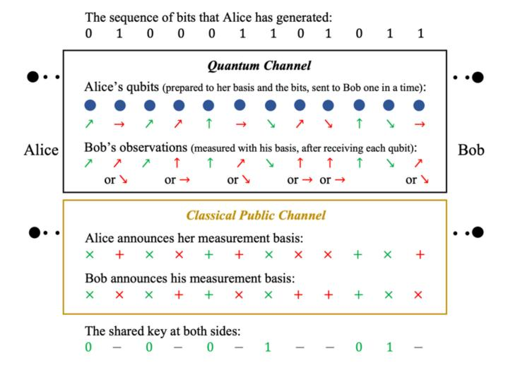

Fig. 12. An example of the BB84 protocol.

25% certain that Eve does not exist. Note that this is regarding publishing only a one-bit value from the shared key.

Nonetheless, Eve has a 50% chance of being lucky and uses the same basis (e.g., ×) as Alice. In this case, the state does not change (as discussed above before the protocol); thus, no one would know Eve exists. On the other hand, if Eve used a different basis from Alice (e.g., +), her measurement would change the state to another basis (e.g., ↑ or →). However, in this case, Bob has a 50% chance of obtaining the same bit value as Alice during measurement. For example, Bob measures using × and has a 50% chance of getting 1, regardless of Eve's measurement changing the state to ↑ or → . Thus, there is a 50% × 50% = 25% chance of detecting Eve when publishing one bit of the shared key. However, an arbitrarily high probability of detecting Eve can be achieved by increasing (sacrificing) the number of the published bits of the shared key. This is a trade-off between security and key efficiency.

An example sequence of the transmitted states and the generated shared key in BB84 is shown in Fig. [12.](#page-21-1)

*2) E91:* Another typical QKD protocol is E91. Unlike BB84, which is based on the act of measurement and noncloning theorem, E91 utilizes the effects of entanglement. Thus, with E91, Alice and Bob are not necessarily connected by a quantum channel. They can create an entangled pair of qubits together and then arbitrarily separate. As discussed, a qubit in an entangled pair acts correspondingly to the operations done to the other qubit, no matter how far they are separated. We take one of the Bell states expressed in [\(5\)](#page-6-1) as an example:

$$|\psi\rangle = \frac{1}{\sqrt{2}}(|00\rangle + |11\rangle). \tag{6}$$

From [\(6\)](#page-21-2), we can see that any measurement made to it will yield |00 or |11, each with a 50% probability. The result we get by measuring one of the qubits is the state that the other qubit will turn into. That is, measuring one of the qubits as |0 will turn the other qubit to |0 (recall |0⊗|0 = |00). The same happens if one of them is measured as |1.

Before introducing the E91 protocol, we briefly discuss the measurement bases interpreted in radians. Fig. [13](#page-22-0) gives

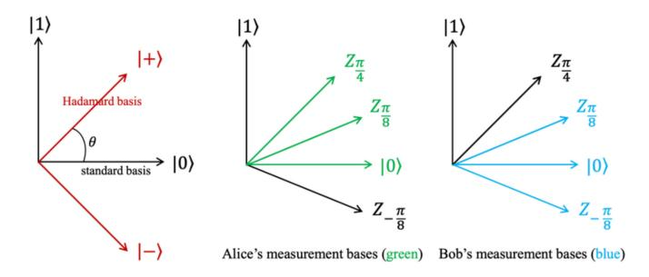

Fig. 13. Measurement bases in the E91 protocol.

a visual interpretation (a polar coordinate system) of the measurement bases. In the polar coordinate system, the location of a measurement basis can be represented as

$$Z_{\theta} = \cos\theta |0\rangle + \sin\theta |1\rangle. \tag{7}$$

where  $\theta$  is the radian of the measurement basis relative to the standard basis, as shown in Fig. 13. If a qubit is in this location, the probability of measuring it as  $|0\rangle$  is  $\cos^2 \theta$  and that of measuring as  $|0\rangle$  is  $\sin^2 \theta$  (recall from Section II-C). As shown in the left graph of Fig. 13, the standard basis and the Hadamard basis have  $\frac{\pi}{4}$  radian difference. Thus, the result of using them to measure the same qubit has a  $\cos^2 \frac{\pi}{4} = 0.5$ chance of being different, which is similar to what we have discussed in the BB94 protocol, e.g., Bob has a 50% chance of obtaining the same bit value when using a different basis from Alice). Besides the standard and Hadamard bases, measurements can be made at any arbitrary angle in the polar coordinate system. The radian difference indicates the probability that the measurement results are the same. For example, measuring a state in a basis with  $\frac{\pi}{8}$  radian difference  $(Z_{\frac{\pi}{8}})$  to the standard basis has a  $\cos^2\frac{\pi}{8}\approx 0.85$  chance of getting the same result as measuring it in the standard basis. Likewise, measuring in  $Z_{\frac{\pi}{4}}$  has a  $\sim 0.85$  chance of getting the same result as in  $Z_{\frac{\pi}{2}}$ .

Now we infroduce E91. Suppose Alice and Bob are using it to generate a shared key. They follow the steps below:

- 1) Alice and Bob prepare *k* entangled pairs. For each pair, they each keep one of the two qubits.
- 2) They agree to measure their qubits in their own bases, as shown in the middle and right graphs of Fig. 13.
- 3) They randomly choose one of the three bases to measure their qubits.
- 4) They publish the sequence of bases that they have used.
- 5) They compare their bases and keep the results whose measurements were made in the same basis. As discussed, their results would be the same when they measure in the same basis. For example, suppose Alice has the first qubit in Equation (6),  $\frac{1}{\sqrt{2}}(|0\rangle + |1\rangle)$  and Bob has the other,  $\frac{1}{\sqrt{2}}(|0\rangle + |1\rangle)$ . Alice measures her qubit in the standard basis and gets  $|0\rangle$ . Bob's qubit collapses into the same state  $|0\rangle$ . If Bob also measures in the standard basis, his qubit does not change; still  $|0\rangle$ . These measurement results are kept as the shared key.
- 6) They publish other measurement results to catch Eve. We explain below how Eve is detected.

We know Alice and Bob have chosen from their agreed bases to measure their qubits. There are nine combinations of basis pairs:  $\{Z_{\frac{\pi}{4}},\ Z_{\frac{\pi}{8}},\ Z_0\}\otimes\{Z_{\frac{\pi}{8}},Z_0,Z_{-\frac{\pi}{8}}\}.$  Two out of nine results in Alice and Bob using the same basis (this is why the key efficiency of E91 is about  $\frac{2}{9}$ ). To detect Eve, we look at the measurement results of the pairs with different bases. We discard the pairs whose basis radian difference is  $\frac{\pi}{4}.$  The basis pairs with  $\frac{\pi}{8}$  radian and  $\frac{3\pi}{8}$  radian differences are left. The measurement results of the basis pairs with  $\frac{\pi}{8}$  radian difference should have a  $\cos^2\frac{\pi}{8}\approx 0.85$  of being the same. Likewise, the measurement results of the basis pairs with  $\frac{3\pi}{8}$  radian difference have a  $\cos^2\frac{3\pi}{8}\approx 0.15$  chance of being the same. If the published measurement results do not conform to these percentage distributions, Eve exists.

3) Derivatives and Applications: QKD can enhance the security of the symmetric key exchange compared with the classical approaches (e.g., the Diffie-Hellman key exchange). Also, derivatives of it can be used to replicate the classical cryptographical techniques in the quantum domain, such as advanced encryption standard (AES) and one-time pad (OTP) [243], [244], [245]. However, the integration of QKD and classical encryption (e.g., OTP) usually needs sufficient key lengths to meet the encryption rate, especially for bulk data encryption, which operates at the magnitude of gigabits per second [126], [246], [247]. However, an optimal QKD system runs only in megabits per second [126]. QKD could be the near-future form of quantum cryptography, but it faces several challenges. For example, a DoS attack on BB84 is one critical weakness. Approaches to tackling such challenges (or mitigating them) have been proposed [139], [248]. Moreover, the quantum hardware and networking challenges also influence the development of QKD [241].

As discussed, BB84 is vulnerable to DoS, but it is easier to build. E91 is immune to DoS because it does not require a quantum channel. However, being an entanglement-based protocol, it is more problematic to implement due to decoherence. Even though BB84 and E91 are the most well-known QKD protocols, other derivatives and implementations tackle their limitations. In Table XII, we compare several recent QKD approaches based on their features and motivations. If an approach has an implementation, QBER is recorded.

With QKD protocols and quantum repeaters, long-distance QKD communications (or networks) have been deployed (as shown in Table X). Trusted repeaters are used to relay keys by processes of encryption, decryption, and re-encryption. As the most practical approach in the current technologies of quantum computing, QKD has contributed significantly to the development of both quantum networks and quantum cryptography. However, due to its limitations, people have been searching for alternatives.

## C. Quantum Cryptography Other Than QKD

There are other kinds of quantum cryptography beyond QKD. Most envision a quantum Internet where encryption, transmission, and decryption are pure quantum systems. Some address QKD's limitations.

TABLE XII QKD PROTOCOLS AND IMPLEMENTATIONS

| Name            | Base         | Derived from    | QBER     | Description                                                                                                                                                                                                                                                                      | Immune to Attacks                    |
|-----------------|--------------|-----------------|----------|----------------------------------------------------------------------------------------------------------------------------------------------------------------------------------------------------------------------------------------------------------------------------------|--------------------------------------|
| BB84            | Measurement  | -               | -        | See Subsection VI.B.1, [81].                                                                                                                                                                                                                                                     | Man-in-the-middle (MitM).            |
| E91             | Entanglement | -               | -        | This is E91. See Subsection VI.B.2, [224].                                                                                                                                                                                                                                       | MitM, DoS.                           |
| B92             | Measurement  | BB84            | -        | It uses two types of states which are non-orthogonal, instead of four in BB84 (Table XI). It is simpler but less secure than BB84 [252].                                                                                                                                         | MitM.                                |
| BBM92           | Entanglement | BB84 and E91 | -        | It removes the dependence of E91 on Bell's theorem and transfers the security proofs of BB84 to entanglement-based protocols [253].                                                                                                                                              | MitM.                                |
| SARG04          | Measurement  | BB84            | -        | Using an encoding pattern with four states, which is different from BB84, constitutes a new protocol that is believed to be more robust than BB84 [254].                                                                                                                         | Photon number splitting (PNS), MitM. |
| SSP             | Measurement  | BB84            | -        | The six-state protocol (SSP) uses a six-state pattern on three orthogonal bases instead of four in BB84. It is believed to be able to tolerate a noisier channel than BB84 [255].                                                                                                | MitM.                                |
| One-way QKD  | Measurement  | -               | 5.2±0.4% | It proposes a practical protocol with an implementation built with optical fibers. It is featured by its simplicity and high key rate [256].                                                                                                                                     | PNS.                                 |
| DPS             | Entanglement | -               | -        | The differential-phase-shift (DPS) protocol is based on a 3-basis linear superposition of a single photon where the phase difference carries bit information. It is suitable for fiber transmission and has higher key efficiency than fiber-based BB84 implementations [257].   | PNS, MitM.                           |
| S13             | Measurement  | BB84            | -        | It has quantum procedures identical to BB84, but the process in the classical channel uses a random seed and asymmetric encryption. It generates a key with the same size as the transmitted qubits [258].                                                                       | MitM.                                |
| semi- QKD    | Measurement  | -               | -        | It assumes the receiver (Bob) can only implement classical operations, but the sender has quantum capabilities. It proves its robustness against Eve [259].                                                                                                                      | MitM                                 |
| ASQKD           | Measurement  | -               | -        | The authenticated semi-QKD (ASQKD) protocol removes the necessity of an authenticated channel for the semi-QKD protocol [260].                                                                                                                                                   | MitM                                 |
| KMB09           | Measurement  | -               | =        | It uses a different encoding pattern from BB84 and can tolerate more noise than BB84 [261].                                                                                                                                                                                      | PNS, MitM                            |
| DI-QKD          | Measurement  | -               | -        | The device-independent QKD (DI-QKD) uses a design that requires photon-source manufacturers to provide specific tests. It tackles side-channel attacks but is said to be impractical [262].                                                                                      | MitM, detector side- channel      |
| MDI- QKD     | Measurement  | -               | -        | The measurement-device-independent QKD (MDI-QKD), different from DI-QKD, tackles detector side-channel attacks by removing all detector side channels. It can operate in a highly lossy channel [263].                                                                           | MitM, detector side- channel      |
| TF <b>-</b> QKD | Measurement  | -               | 0.43%    | The twin-field QKD (TF-QKD) implementation promises high key rates over long distances. It measures pairs of phase-randomized optical fields by separating and combining them. It was also listed in the repeater table (Table X) [230].                                         | MitM                                 |
| MP SQKD      | Measurement  | -               | -        | The multi-party semi-QKD (MP SQKD) protocol supports key exchanges between one quantum party and two classical parties simultaneously, which can be extended to multi-party key exchanges [264].                                                                                 | MitM                                 |
| Chau15          | Measurement  | -               | -        | It provides an encoding pattern to measurement-based QKD (e.g., BB84) schemes for high error tolerance. It encodes each bit of classical information in qudits. Qudit is a quantum information unit (like qubit) described by a superposition of $k$ states where $k > 2$ [265]. | MitM                                 |
| HD QKD          | Entanglement | -               | 10.5%    | The high-dimensional QKD protocol uses measurements in high-dimensional Hilbert space to achieve faster key rates. It relies on temporal correlations of entangled photons and thus is suitable for fiber transmission [266].                                                    | MitM, collective attacks             |

An interesting approach is Kak's three-stage protocol [\[127\]](#page-31-32), similar to Shamir's three-pass protocol or the double-lock algorithm [\[249\]](#page-33-31). Unlike QKD, which uses classical cryptography after key exchanges, it can encrypt data carried by quantum states directly. It uses the random polarization rotation scheme to implement a "lock" (encryption), which has been implemented in hardware [\[250\]](#page-33-32). The protocol's steps are as follows:

- 1) Alice encrypts the data with her key and sends it to Bob.
- 2) Bob encrypts it again with his key and sends it to Alice.
- 3) Alice decrypts it with her key and sends it to Bob.
- 4) Bob decrypts it with his key and gets the original data.

With classical communication, an eavesdropper can listen to the double-transmitted data, increasing the chance of computing the two secret keys [\[249\]](#page-33-31). However, any eavesdropper in a quantum system who needs an operation of measurement will perturb the quantum state and leave a trace. Even with a PNS attack (see Section [V-B\)](#page-15-1), the protocol is secure as long as the number of split photons is insufficient to determine the polarization angles.

Besides, some approaches assume mistrustful parties in communication (e.g., mistrustful quantum cryptography [\[128\]](#page-31-33), [\[251\]](#page-33-33)). They need a process to ensure no one is cheating. For example, a secure multi-party computation with a coin-flipping protocol (or oblivious transfer) has been proposed for adversarial parties [\[128\]](#page-31-33).

Take the quantum coin-flipping protocol as an example:

- 1) Alice generates a random basis with an encoding pattern (either one in Table [XI\)](#page-21-0).
- 2) Alice prepares a sequence of qubits according to the basis and a sequence of bits (i.e., the data to be transmitted). Alice sends the qubits to Bob.
- 3) Bob chooses a random basis and uses it to measure the qubits.
- 4) Bob records the measurement results and makes a guess on Alice's basis based on the results (e.g., take the basis that he recorded the most).
- 5) Alice informs Bob whether his guess is correct or not and sends the sequence of bits to Bob.
- 6) Bob compares Alice's sequence with his measurement results to see if Alice is cheating (e.g., his results should correspond to her basis and the bit sequence).

In addition to quantum coin flipping, quantum commitment is another protocol for untrusting parties [\[267\]](#page-34-0). A commitment refers to a trace of changes made by Alice to the transmitted data, which Bob does not know until Alice reveals it. One implementation is to use the bounded quantum storage model [\[129\]](#page-31-34).

Moreover, there are many more active topics in quantum cryptography beyond QKD, such as quantum public key encryption [\[81\]](#page-30-41), [\[130\]](#page-31-35), quantum digital signatures [\[268\]](#page-34-1), quantum fingerprinting [\[269\]](#page-34-2), delegating quantum computation [\[270\]](#page-34-3), quantum zero-knowledge proof [\[271\]](#page-34-4), one-way quantum function [\[130\]](#page-31-35), [\[272\]](#page-34-5), and so on.

# *D. Post-Quantum Cryptography*

Post-quantum cryptography has been briefly introduced in Section [VI-A.](#page-20-1) It includes lattice-based, multivariate, hash-based, and code-based schemes [\[131\]](#page-31-36). There are also approaches aiming to protect public key cryptography by increasing the key size. They attempt to construct a length that significantly exceeds the power of quantum computing. For example, doubling the key size from 128 to 256 bits squares the number of possible permutations, which can protect the hash function from the current quantum computers with Grover's algorithm. Also, creating more complex oneway functions (e.g., trapdoor functions) has been proposed to protect the encryption from Shor's algorithm [\[133\]](#page-31-38). A huge number of post-quantum approaches have been proposed. Table [XIII](#page-24-0) reviews the important post-quantum cryptographical approaches of different types.

TABLE XIII POST-QUANTUM CRYPTOGRAPHY APPROACHES

| Name                 | Type              | Description                                                                                                                                                          | Key size                                                                                 |
|----------------------|-------------------|----------------------------------------------------------------------------------------------------------------------------------------------------------------------|------------------------------------------------------------------------------------------|
| RLWE                 | Lattice- based | The ring learning with errors (RLWE) signature uses lattices. It provides a provable security reduction using a variant of Lyubashevsky's ring-LWE signatures [273]. | Public: 2 kB Private: 2 kB (Multiple sizes available)                           |
| NTRU                 | Lattice- based | It is related to, but not provably reducible to, the closest vector problem (CVP) in a lattice [274].                                                                | Public: 642 b Private: 340 b (Multiple sizes available)                         |
| BLISS                | Lattice- based | The bimodal lattice signature scheme (BLISS) is a digital signature related to, but not provably reducible to, the CVP in a lattice [275].                           | Signature: 5 kb (Multiple sizes available)                                         |
| Rainbow Signature | Multiva riate  | It is based on multivariate polynomials over a finite field and achieves 128-bit security with a relatively small key size [276].                                    | Public: 45.8 kB Private: 35.5 kB Signature: 328 b (Multiple sizes available) |
| Merkle signature  | Hash- based    | The fractal Merkle tree provides 128-bit security for hash-based signatures to sign up to a million messages [277].                                                  | Signature: 1 to 3 kb                                                                     |
| McEliece             | Code- based    | It is based on the difficulty of decoding a general linear code with relatively large key sizes [278].                                                               | Public: ≈66 KB Private: ≈162.8 KB (Multiple sizes available)                 |
| RLCE                 | Code- based    | Random Linear Code-based Encryption (RLCE) is based on linear code and the McEliece schemes [279].                                                          | For 80-bit security, 267 KB (Multiple sizes available)                          |
| SIDH                 | Isogeny           | The supersingular isogeny Diffie-Hellman (SIDH) scheme provides 128-bit security [280].                                                                              | -                                                                                        |

## *E. Quantum Blockchain*

The fact that quantum computers are endangering classical cryptography has brought concerns to all cryptographical products. Blockchain technology is one of them. It heavily relies on classical public key cryptography (e.g., the elliptic curve digital signature algorithm) and hash functions (e.g., SHA-256), where the implementations of Shor's and Grover's algorithms threaten them. Moreover, Grover's algorithms can also be used to find hash collisions efficiently, potentially resulting in data tampering [\[131\]](#page-31-36), [\[132\]](#page-31-37). Blockchain derivatives have been developed to tackle this concern. In this section, we discuss the recent advances in blockchain alternatives that can survive quantum attacks (i.e., quantum blockchains and post-quantum blockchains).

Post-quantum blockchains replace the current blockchains' cryptographical part with post-quantum cryptography [\[131\]](#page-31-36), [\[132\]](#page-31-37), [\[136\]](#page-31-41), [\[137\]](#page-31-42). On the contrary, quantum blockchains base their systems on quantum networks (fully or hybrid with classical networks) [\[134\]](#page-31-39), [\[135\]](#page-31-40), [\[281\]](#page-34-6). Their classical data chain structure has been re-designed and adapted to quantum systems (e.g., by correlating quantum data with entanglement [\[134\]](#page-31-39)).

However, quantum blockchains are still in an early phase. Quantum computers cannot conveniently deal with complex data structures. With entanglement, timestamped quantum state chain can be achieved, but a tree structure of transactions and a method to chain them (e.g., hash function) are challenging to implement. Thus, a quantum blockchain usually only contains the equivalent block concept in a classical blockchain. There are no transactions or incentives [\[134\]](#page-31-39), [\[135\]](#page-31-40). However, there is one natural benefit of using quantum technologies. The quantum state chain is highly sensitive to tampering and, thus, is more secure than a classical chain regarding data tampering. A single photon's state can encode the quantum state chain over time. Any changes to a data "block" will perturb the photon and be detected. A few research works propose merging classical and quantum systems to enhance blockchains [\[135\]](#page-31-40), which is more practical and useful.

Quantum computers have become more and more powerful in recent years, but they have not been able to break the current blockchains yet. It is predicted that Bitcoin's proofof-work (PoW) consensus will be comparatively resistant to the substantial speedup of quantum computing for the next ten years [\[137\]](#page-31-42). The specialized application-specific integrated circuit (ASIC) mining devices are exceedingly fast compared to the estimated clock speed of the recent quantum computers. Bitcoin's elliptic curve digital signature algorithm (ECDSA) is more likely to be broken by quantum computing and is estimated to happen as early as 2027 [\[137\]](#page-31-42). The rapid development of quantum hardware brings concerns about blockchains, but no evidence shows a possible compromise of blockchain yet. Nonetheless, the development of quantum computers may redefine cryptography (classical or quantum). Then cryptographical products like blockchains will have no choice but to adapt to the new cryptography schemes.

## VII. QUANTUM MACHINE LEARNING

In this section, we survey the last key issue: quantum machine learning. While machine learning could have been included in the previous three key issues (data analysis is needed in all aspects of computing and communication), we dedicated a separate section to it because it is a fascinating area and widely-discussed topic [\[282\]](#page-34-7). It is exciting to see the mutual development between classical and quantum machine learning, which complement each other.

Quantum machine learning usually refers to machine learning models enhanced by quantum computers to speed up the learning processes. They include hybrid quantum-classical and fully quantum machine learning. Research on quantum machine learning and quantum computing have been mutually beneficial. Hybrid methods outsource computationally difficult subroutines to quantum computers. Such delegations speed up the learning processes of classical models [\[85\]](#page-30-45). Also, machine learning studies can analyze quantum systems, aiming to increase the robustness of quantum computing [\[84\]](#page-30-44). For example, classical machine learning has been applied to data generated from quantum systems, aiming to reconstruct an unknown quantum state (to tackle non-cloning) [\[283\]](#page-34-8). Reinforcement learning has been used to optimize quantum error correction [\[284\]](#page-34-9). Quantum versions of several classical models have been studied, such as quantum neural networks [\[154\]](#page-32-1). In addition, quantum learning theory investigates the abstract concepts of computational learning theory with quantum information [\[285\]](#page-34-10). This section discusses popular topics in quantum machine learning and their potential applications.

## *A. Features of Quantum Machine Learning*

Machine learning combined with quantum technologies appears as the most promising application of quantum computing. For example, Google TensorFlow Quantum provides hybrid quantum-classical methods for TensorFlow [\[190\]](#page-32-44). Quantum machine learning relies heavily on classical machine learning technologies. They tend to solve the same problem set. Quantum machine learning may be faster, but it can only solve limited-size datasets [\[155\]](#page-32-2), [\[157\]](#page-32-4). Nonetheless, classical machine learning jobs can be broken down into subroutines and delegated to quantum computers [\[85\]](#page-30-45). Quantum machine learning has been gradually weaved into the current classical machine learning technologies due to the increasing data analysis demands from data explosion. The following paragraphs summarize the features of quantum machine learning. Then, Table [XIV](#page-26-0) reviews typical approaches to quantum machine learning. Note that there are many more approaches in each category in the table. We selected a few that we found interesting.

*Speed-up:* Only if a dataset can be mapped into quantum information (e.g., qubits) data analyses to this dataset can easily gain a speedup [\[151\]](#page-31-56). In addition, separating machine learning jobs and delegating those that quantum computers can solve will also speed up classical models. For example, heuristic quantum kernel methods have been applied to a classification problem with only classical access to data [\[291\]](#page-34-11).

*Quantum-enhanced and Enhanced Quantum:* Quantum computing to enhance classical models is not always the case. Classical models can also be applied to enhance quantum computing. For example, classical models to analyze the results of quantum experiments can help design better quantum experiments [\[283\]](#page-34-8), [\[284\]](#page-34-9).

*Data type:* As discussed, if we can map a dataset to a quantum information format, quantum machine learning would be a natural upgrade to classical machine learning. However, mapping data between classical and quantum computation is challenging. Quantum machine learning is thus not compatible with many classical datasets. For example, it is challenging to express pattern recognition as a quadratic-binary optimization that a quantum annealer can operate [\[292\]](#page-34-12). However, it is viable.

*Hardware:* The development of quantum machine learning depends on the development of quantum hardware. The currently limited connectivity of qubits in a quantum computer confines the data scale that quantum machine learning can deal with. For example, the limited qubit-to-qubit interactions in a

TABLE XIV APPROACHES TO QUANTUM MACHINE LEARNING

| Ref.  | Problem Addressed                | Description                                                                                                                                                      | Classical Counterpart                 |
|-------|-------------------------------------|------------------------------------------------------------------------------------------------------------------------------------------------------------------|------------------------------------------|
| [286] | Classification                      | It maps feature vectors to a superposition state, which achieves parallel computing of similarity. It is faster than classical methods with similar accuracy.    | k-nearest neighbors                   |
| [146] | Classification                      | It implements a quantum SVM for binary classification and achieves an exponential speedup to the classical cases that require polynomial time.          | SVM                                      |
| [150] | Data Preprocessing               | It proposes a quantum clustering algorithm based on Grover's algorithm and provides a significant speed-up compared to its classical counterpart.                | Clustering                               |
| [287] | Random Walk                      | It proposes a quantum version of decision trees by evolving a state throughout a tree and achieves polynomial time on the random walk (classically exponential). | Decision trees                           |
| [288] | Regression and classification | It shows the feasibility of building Bayesian models to extrapolate the Schrödinger equation's solutions physically.                                    | Bayesian theory                       |
| [289] | Classification                      | It proposes a quantum CNN that uses $O(log(N))$ parameters for input sizes of $N$ qubits. It can be built on nearterm quantum computers.                         | Convolutional neural network (CNN) |
| [152] | Regression                          | It applies Gaussian process regression to quantum systems and provides an exponential speed-up.                                                                  | Gaussian process                         |
| [48]  | Optimization                        | This is quantum annealing. See Subsection II.B.                                                                                                                  | Optimization models                      |
| [290] | Classification                      | It is based on the adiabatic model. It identifies a strong classifier from weak classifiers. Both training and testing are done via quantum adiabatic evolution. | Optimization models                      |

quantum computer result in significant overhead in quantum annealers and universal quantum computers [\[85\]](#page-30-45).

# *B. Hybrid Quantum-Classical Machine Learning*

Hybrid quantum-classical machine learning combines classical and quantum resources to produce powerful models. Hybrid models usually involve universal quantum computers (i.e., not quantum annealers). For example, universal quantum computers can be used together with a classical system to implement clustering [\[148\]](#page-31-53), [\[150\]](#page-31-55). However, decoherence is still a problem for such models.

Computer vision, speech synthesis, and image processing have widely adopted generative models. It has been empirically observed that quantum generative models have a transition in the quality of their local minima [\[293\]](#page-34-13). There provide an efficiently accurate number of parameters, above which local minima can be good approximators of the global minimum. They can also be improved by learning data representations and simplifying subsequent tasks through a quantum computer [\[147\]](#page-31-52). These jobs can be created as subroutines and executed on quantum computers.

However, quantum-assisted machine learning is yet to be practical because its mathematical expressions are not always applicable to real-world datasets. Quantum computers are based on qubits, usually expressed as amplitudes vectors. It makes mapping some classical datasets to quantum information problematic [\[294\]](#page-34-14). Nonetheless, classical methods to reduce data dimensionalities, such as feature reduction and value reduction, can be applied to mitigate such problems [\[295\]](#page-34-15). Efficiently mapping huge classical datasets to quantum states is a critical issue in quantum machine learning [\[84\]](#page-30-44), [\[155\]](#page-32-2), [\[156\]](#page-32-3). Moreover, data analyses for quantum-generated experimental results have been explored to deploy quantum systems better [\[283\]](#page-34-8).

Quantum learning theory is the mathematical analysis that empowers quantum-assisted machine learning. It combines computational learning theory and quantum computing. It aims to improve hybrid quantum-classical learning models mathematically. It replaces the classical learner in the computational learning theory with a quantum computer, which targets either classical or quantum datasets. Its goal is to use quantum effects to significantly decrease time complexity and provide other potential improvements. Quantum learning theory still needs further development, but approaches have been progressively proposed, such as quantum probably approximately correct (PAC) and agnostic learning [\[285\]](#page-34-10).

## *C. Fully Quantum Machine Learning*

As discussed in Section [II-B,](#page-3-1) quantum annealers are widely used for optimization problems to find the global minimum of an objective function from a pre-defined space. In most quantum machine learning approaches, both the learning and training phases are quantum-based. It is promising in efficiently minimizing multi-dimensional functions with many local minima [\[51\]](#page-30-11). It is also excellent at making fair sampling [\[50\]](#page-30-10). Quantity annealing significantly decreases the number of iterations for sampling-based training approaches [\[296\]](#page-34-16).

Quantum adiabatic machine learning is closely related to quantum annealing and targets the same problem sets, sampling, and optimization. It can identify strong classifiers from weak classifiers, which has been explored in anomaly detection applications [\[290\]](#page-34-17). Moreover, adiabatic algorithms are amenable to k-means clustering problems, which can be represented as quadratic programming problems [\[297\]](#page-34-18).

Besides quantum annealing and quantum adiabatic machine learning, there are fully-quantum machine learning approaches based on universal quantum computation (i.e., the gate model). A typical case is to learn information about an unknown quantum state by many copies of the same coherent state [\[149\]](#page-31-54). This is similar to finding the classical information relevance. Also, quantum matching processes are superior to the classical matching methods [\[86\]](#page-30-46). Quantum neural network methods to simplify the internal network has been proposed to make the parameters of ground states much smaller [\[154\]](#page-32-1). In addition, quantum clustering algorithms based on the variations of Grover's algorithm have been utilized for unsupervised learning [\[150\]](#page-31-55). Moreover, quantum natural language processing has been developed to implement diagrammatic reasoning to interpret language as quantum processes by the diagrammatic formalism of categorical quantum effects [\[298\]](#page-34-19).

## *D. Quantum Walk*

The Quantum walk is a variation of the classical random walk. Random work involves one or multiple walkers taking steps in a graph (e.g., a chain or a grid of nodes). The Quantum walk operates differently from the random walk. A classical walker takes steps in random directions, while a quantum walker takes steps in directions determined by a quantum circuit [\[299\]](#page-34-20). The development of quantum walks is popular and is evolving. Some researchers compare Grover's algorithm with quantum walks [\[300\]](#page-34-21), [\[301\]](#page-34-22). Some regard quantum walks as a computational model where computation is expressed by graphs [\[302\]](#page-34-23). The speed-up by the quantum walk can help bring improvement to the stochastic process of some machine learning models, such as stochastic gradient descent [\[303\]](#page-34-24).

The random walk can be used in Markov chains, which have been derived into multiple quantum counterparts [\[153\]](#page-32-0). Quantum walks provide polynomial speed-up in problems such as element distinctness, triangle finding, NAND trees [\[304\]](#page-34-25), and exponential speed-up to oracular problems [\[305\]](#page-34-26). Oracular problems are a partially observable Markov decision process attempting to find features of a black box function using a limited number of inquiries from the function. However, not all quantum walks are superior to their classical counterparts. Due to quantum interference, their performance can be significantly faster or slower than classical approaches [\[301\]](#page-34-22).

Both random walks and quantum walks can be defined as discrete-time or continuous-time algorithms. Generally, a quantum walk algorithm includes steps of determining the time evolution of a quantum computer by the unitary operators (discrete) or the Hamiltonians (continuous) and finding out the walker position by measurement operators [\[306\]](#page-34-27).

## VIII. LESSONS LEARNED AND RESEARCH TRENDS

In this section, we summarize our observations of the current research and conclude them item by item as research trends. We discuss the most recent research trends and popular research topics based on the technical issues and challenges introduced in the previous sections.

## *A. The Bottleneck of Quantum Computers*

As previously mentioned, current quantum computers do not have sufficient resources to tackle most practical problems due to the low state fidelity caused by decoherence. Additionally, the hardware size is limited by the large size of the equipment needed to maintain a near-absolute zero temperature. These limitations inspire research and experimentation toward developing more powerful quantum computers. Here, we explore two research directions that computer scientists can contribute to improving quantum computers' reliability.

*1) Quantum Error Correction:* As is discussed in Section [III,](#page-7-0) quantum decoherence is a critical challenge to quantum systems. It affects the scale of almost every aspect of quantum computing: hardware, network, cryptography, and their applications. Since it seems impossible to remove decoherence during communication or storage, software models for quantum error correction have become particularly important and prevalent [\[14\]](#page-29-13), [\[168\]](#page-32-15). Several typical schemes to correct quantum errors have been introduced in Section [IV.](#page-12-0) However, many open problems on quantum error correction still exist, such as faulty state creations, faulty gate operations, and faulty measurements. The research community and companies in this field have been actively committed to this direction, trying to achieve models with which decoherent states could be restored and noise can be removed. For example, IBM has been actively designing and implementing hardware-aware error correction experiments for fault-tolerant purposes [\[307\]](#page-34-28). Universities have been researching error correction from different perspectives, such as redefining codes and near-optimal error mitigation methods [\[172\]](#page-32-19), [\[308\]](#page-34-29). Moreover, research on quantum error correction includes algorithms to correct data from noises and strategies to do what can be done in the NISQ era, such as [\[14\]](#page-29-13), [\[42\]](#page-30-3). Decoherence cannot be avoided any time soon; thus, error correction algorithms and strategies remain a research trend.

*2) Quantum Hardware Architecture:* It has been controversy about how a quantum system should be organized with its classical interface. Today, all quantum computers need an interface for classical inputs and outputs, which come together with a control layer between them. In return, the control layer may ask for more quantum-classical interfaces [\[73\]](#page-30-33), [\[74\]](#page-30-34). The integration of them remains an open question. Fig. [9](#page-12-1) in Section [III](#page-7-0) shows a general quantum computer architecture. In fact, open problems exist on almost every module in this architecture. For example, inside a quantum processor, what are efficient ways (and also routing strategies) to connect (and to localize) its qubits [\[309\]](#page-34-30)?

Despite the impressive advancements in the hardware race among companies, current quantum hardware is still far from practical. The number of qubits in a quantum system, state fidelity, state stability, and qubit connectivity are all crucial factors in determining the hardware architecture of a quantum computer, which can, in turn, impact these metrics. However, a combination of classical and quantum capabilities in classically controlled quantum hardware may be the way forward for quantum computers in the near future [\[75\]](#page-30-35), [\[169\]](#page-32-16), [\[190\]](#page-32-44). One potential application for quantum computers may be providing cloud-based quantum services due to the size limitations that prevent them from being incorporated into personal computers. These uncertainties surrounding quantum computers have driven ongoing research into hardware developments.

## *B. The Scalability of Quantum Networks*

Still, one of the main challenges in scaling quantum networks is the need to combat the decoherence in quantum systems. This requires careful control of the physical environment, including temperature, humidity, etc., which can be difficult to maintain over long distances. The scalability of quantum networks is an active research area. We believe significant progress will be made in the upcoming years as quantum repeaters and routing methods continue to be developed and refined. Here, we present an overview of two popular research directions in quantum network scalability.

*1) Quantum Networking Protocols:* The instability of quantum communication links makes it impossible to use classical networking technologies in quantum networks. In quantum routing, it is necessary to consider not only the distance and overhead but also the availability of paths, as the qubit connectivity is generally unstable. There have been approaches to transmitting quantum states between endpoints, but recently, routing entanglement to create end-to-end entanglements has gained much attention [\[73\]](#page-30-33), [\[223\]](#page-33-11). In such approaches, dynamic path selection must be employed based on global or local knowledge about the network paths [\[73\]](#page-30-33). Routing is primarily a software technique used to compensate for hardware limitations. The development of quantum repeaters has gained significant attention and greatly impacted quantum routers [\[79\]](#page-30-39). Additionally, an important research direction has been exploring how multipartite entangled resources can efficiently relay quantum information [\[113\]](#page-31-18), [\[120\]](#page-31-25).

*2) Quantum Internet Infrastructure:* The quantum Internet is not expected to be a reality in the near future, but it serves as a motivation for many research endeavors [\[73\]](#page-30-33), [\[114\]](#page-31-19), [\[118\]](#page-31-23). Even though the development of the quantum Internet mainly depends on the evolution of error correction and routing protocols, the creation of hardware and software infrastructure to support these protocols is also crucial. From a computer science perspective, the infrastructure of the quantum Internet can be developed using the current technology of the classical Internet, such as routers, switches, and cloud computing. The growth of the quantum Internet depends on the various issues discussed in this article. There are multiple approaches to addressing these issues, and the technologies needed for a quantum Internet and its applications are currently being investigated [\[89\]](#page-30-49). Regardless of its eventual form (e.g., a hybrid quantum-classical Internet), the infrastructure for quantum Internet will always be a captivating and provocative topic in academia and industry. Furthermore, as discussed in Section [IV-E,](#page-14-3) the security of blockchain applications (e.g., financial technologies [\[310\]](#page-34-31)) is at risk due to the advancement of quantum computing [\[135\]](#page-31-40), [\[136\]](#page-31-41), [\[281\]](#page-34-6). In particular, besides developing quantum blockchains, alternative methods can be considered for establishing decentralized quantum networks, as blockchain may not be the optimal solution for decentralization in the context of quantum computing, and other forms of cryptographic solutions may be more appropriate.

## *C. The Debate About Quantum Cryptography*

There is a debate about which technology of quantum cryptography will dominate in the future: will it be a hybrid method like QKD, a technique for encrypting and decrypting quantum states, or a classical approach with post-quantum capabilities? Here, we discuss two debates regarding the developing directions of quantum cryptography.

*1) QKD vs. Quantum State Encryption:* QKD is currently the most practical quantum technology and has therefore been widely implemented [\[3\]](#page-29-2), [\[4\]](#page-29-3), [\[5\]](#page-29-4). While QKD may be the first step toward quantum security, it is limited in its capabilities [\[311\]](#page-34-32). Derivatives and applications of QKD have been continuously developed to address its original limitations, such as DoS and side-channel attacks. The development of QKD has attracted investment and attention in the industry. It is a popular topic for implementing near-term quantum secure systems that span both quantum cryptography and quantum networks. However, cryptography beyond QKD, such as quantum state encryption, is also an essential component of the quantum Internet. Research in quantum state encryption seeks to utilize quantum algorithms to encrypt and decrypt quantum states, potentially offering even more secure communication in quantum networks. However, its reliability and effectiveness are still under investigation and yet to be determined. Research is ongoing in both QKD and quantum state encryption, leaving it uncertain which will become the dominant approach in the future.

*2) Post-Quantum Cryptography vs. Quantum Cryptography:* Post-quantum cryptography is designed to provide security even if attackers have access to a quantum computer. It relies on mathematical algorithms believed to be immune to quantum algorithms. Quantum cryptography, on the other hand, is a technique that uses quantum effects to encode information into quantum states. Both approaches are important because it is likely that the future Internet will take the form of a hybrid quantum-classical Internet. As such, the security of classical communication is just as important as the security of quantum communication.

## *D. The Applicability of Quantum Machine Learning*

The applicability of quantum machine learning is another active area of research. It solves complex problems by integrating quantum computing and machine learning. As the field progresses, innovative applications are continuously being developed. Here, we discuss two ways of developing quantum machine learning: using quantum computers to improve classical data analysis and using classical machine learning models to advance the development of quantum computing.

- *1) Quantum for Classical:* While quantum machine learning has been limited by the types of datasets it can be applied to, it is still a practical direction for using quantum computing to enhance classical machine learning. Due to the increasing demand for big-data analysis, quantum machine learning is well-suited as a candidate for cloud services. Several cloudservice companies have started to offer *Quantum-as-a-Service* (QaaS) platforms. Additionally, quantum annealing is promising since it provides analog solutions to combinatorial optimization problems. The analog solutions make it more robust to noise compared to the universal quantum computation [\[48\]](#page-30-8), [\[49\]](#page-30-9), [\[51\]](#page-30-11). Applying quantum computing to classical machine learning models to build their quantum counterparts has become an important and prevalent research direction [\[85\]](#page-30-45), [\[144\]](#page-31-49).
- *2) Classical for Quantum:* On the contrary, classical machine learning methods are also being used to advance the development of quantum computing. For example, classical machine learning models can be used to optimize the performance of quantum computers by analyzing data from experiments and simulations to identify the optimal settings for various parameters [\[288\]](#page-34-33). Such models can help enhance the reliability of quantum computers. Moreover, classical machine

learning can also be used to analyze data from quantum error correction experiments to identify patterns and improve the efficiency of error correction protocols [\[284\]](#page-34-9). Overall, using classical machine learning models to analyze quantum experimental data is another promising and currently popular research direction.

# IX. CONCLUSION

In this article, we have categorized and surveyed the important issues of quantum computing: quantum computers, quantum networks, quantum cryptography, and quantum machine learning. They are separate topics but closely related to each other. We gave a detailed preliminary section (from a computer science perspective) for readers to become familiar with the topic before introducing the issues. We reviewed the key milestones and recent advances in each issue and identified the popular research trends in quantum computing. On the way to the envisioned future of quantum computing, the quantum Internet, non-trivial attempts, and breakthroughs have been continuously made. We have highlighted their features and challenges with state-of-the-art approaches, aiming to examine contemporary quantum technologies comprehensively.

## REFERENCES

- [\[1\]](#page-0-0) M. Lapedus. "The Great Quantum Computing Race." 2021. Accessed: Aug. 6, 2022. [Online]. Available: https://semiengineering.com/thegreat-quantum-computing-race/
- [\[2\]](#page-0-0) E. Gibney. "Quantum Computer Race Intensifies as Alternative Technology Gains Steam." 2020. Accessed: Aug. 6, 2022. [Online]. Available: https://www.nature.com/articles/d41586-020-03237-w
- [\[3\]](#page-0-1) F. Xu, X. Ma, Q. Zhang, H. Lo, and J. Pan, "Secure quantum key distribution with realistic devices," *Rev. Mod. Phys.*, vol. 92, no. 2, 2020, Art. no. 25002.
- [\[4\]](#page-0-1) J. A. Lopez-Leyva, A. Talamantes-Alvarez, M. A. Ponce-Camacho, E. Garcia-Cardenas, and E. Alvarez-Guzman, "Free-space-optical quantum key distribution systems: Challenges and trends," in *Quantum Cryptography in Advanced Networks*. London, U.K.: IntechOpen, 2018, doi: [10.5772/intechopen.81032](http://dx.doi.org/10.5772/intechopen.81032)
- [\[5\]](#page-0-1) S.-K. Liao et al., "Satellite-to-ground quantum key distribution," *Nature*, vol. 549, pp. 43–47, Aug. 2017.
- [\[6\]](#page-0-2) J. Chow, O. Dial, and J. Gambetta. "IBM Quantum Breaks the 100-Qubit Processor Barrier." 2021. Accessed: Aug. 6, 2022. [Online]. Available: https://research.ibm.com/blog/127-qubit-quantumprocessor-eagle
- [\[7\]](#page-0-2) S. Roberts. "This New Startup Has Built a Record-Breaking 256-Qubit Quantum Computer." 2021. Accessed: Aug. 6, 2022. [Online]. Available: https://www.technologyreview.com/2021/11/17/ 1040243/quantum-computer-256-bit-startup
- [\[8\]](#page-0-3) D-Wave Systems Inc. "D-Wave Details Product Expansion & Cross Platform Roadmap." 2021. Accessed: Aug. 6, 2022. [Online]. Available: https://www.dwavesys.com/company/newsroom/pressrelease/let-s-get-practical-d-wave-details-product-expansion-crossplatform-roadmap/
- [\[9\]](#page-0-4) D. Deutsch, "Quantum theory, the church—Turing principle and the universal quantum computer," *Proc. Roy. Soc. London Math. Phys. Sci.*, vol. 400, no. 1818, pp. 97–117, 1985.
- [\[10\]](#page-0-5) M. Schlosshauer, "Quantum decoherence," *Phys. Rep.*, vol. 831, pp. 1–57, Jan. 2019.
- [\[11\]](#page-0-5) K. C. Miao et al., "Universal coherence protection in a solid-state spin qubit," *Science*, vol. 369, no. 6510, pp. 1493–1497, 2020.
- [\[12\]](#page-0-5) R. C. C. Leon et al., "Coherent spin control of s-, p-, d- and f-electrons in a silicon quantum dot," *Nat. Commun.*, vol. 11, p. 797, Feb. 2020.
- [\[13\]](#page-0-6) M. Rorvig. "Qubits Can Be as Safe as Bits, Researchers Show." 2020. Accessed: Aug. 6, 2022. [Online]. Available: https://www. quantamagazine.org/qubits-can-be-as-safe-as-bits-researchers-show-20220106/
- [\[14\]](#page-0-7) S. J. Devitt, W. J. Munro, and K. Nemoto, "Quantum error correction for beginners," *Rep. Progr. Phys.*, vol. 76, no. 7, 2013, Art. no. 76001.

- [\[15\]](#page-0-8) T. Leent et al., "Long-distance distribution of atom-photon entanglement at telecom wavelength," *Phys. Rev. Lett.*, vol. 124, Jan. 2020, Art. no. 10510.
- [\[16\]](#page-0-8) V. Krutyanskiy, M. Meraner, J. Schupp, V. Krcmarsky, H. Hainzer, and B. P. Lanyon, "Light-matter entanglement over 50 km of optical fiber," *NPJ Quant. Inf.*, vol. 5, p. 72, Aug. 2019.
- [\[17\]](#page-0-8) S. Wengerowsky et al., "Passively stable distribution of polarisation entanglement over 192 km of deployed optical fibre," 2019, *arXiv:1907.04864*.
- [\[18\]](#page-0-8) H. Hübel et al., "High-fidelity transmission of polarization encoded qubits from an entangled source over 100 km of fiber," *Opt. Exp.*, vol. 15, no. 12, pp. 7853–7862, 2007.
- [\[19\]](#page-0-8) M. Pittaluga et al., "600-km repeater-like quantum communications with dual-band stabilization," *Nat. Photon.*, vol. 15, pp. 530–535, Jun. 2021.
- [\[20\]](#page-0-9) J. Ren et al., "Ground-to-satellite quantum teleportation," *Nature*, vol. 549, pp. 70–73, Aug. 2017.
- [\[21\]](#page-0-9) J. Yin et al., "Satellite-based entanglement distribution over 1200 kilometers," *Science*, vol. 356, no. 6343, pp. 1140–1144, 2017.
- [\[22\]](#page-0-9) Y. Chen et al., "An integrated space-to-ground quantum communication network over 4,600 kilometers," *Nature*, vol. 589, pp. 214–219, Jan. 2021.
- [\[23\]](#page-0-10) Qureca. "Overview on Quantum Initiatives Worldwide—Update Mid-2021." 2021. Accessed: Aug. 6, 2022. [Online]. Available: https://www.qureca.com/overview-on-quantum-initiatives-worldwideupdate-mid-2021/
- [\[24\]](#page-0-11) Gartner Research. "Top 10 Strategic Technology Trends for 2019: Quantum Computing." 2019. Accessed: Aug. 6, 2022. [Online]. Available: https://www.gartner.com/en/documents/3904279/top-10 strategic-technology-trends-for-2019-quantum-comp
- [\[25\]](#page-0-12) Gartner Research. "Summary Translation + Localization: Hype Cycle for Compute Infrastructure, 2021." 2021. Accessed: Aug. 6, 2022. [Online]. Available: https://www.gartner.com/en/ documents/4006299/summary-translation-localization-hype-cycle-forcompute-infrastructure-2021
- [\[26\]](#page-0-13) Gartner Research. "Quantum Reality Check: Gartner Expects More 10 Years of Hype But CIOs Should Start Finding Use Cases Now." 2021. Accessed: Aug. 6, 2022. [Online]. Available: https:// www.techrepublic.com/article/quantum-reality-check-gartner-expectsmore-10-years-of-hype-but-cios-should-start-finding-use-cases-now/
- [\[27\]](#page-1-3) E. Lucero. "Unveiling Our New Quantum AI Campus." 2021. Accessed: Aug. 6, 2022. [Online]. Available: https://blog.google/ technology/ai/unveiling-our-new-quantum-ai-campus/
- [\[28\]](#page-1-3) Intel Corporation. "Quantum Computing Achieving Quantum Practicality." 2022. Accessed: Aug. 6, 2022. [Online]. Available: https://www.intel.com/content/www/us/en/research/quantumcomputing.html
- [\[29\]](#page-1-4) J. Kahn. "D-Wave Took Its Own Path in Quantum Computing. Now It's Joining the Crowd." 2021. Accessed: Aug. 6, 2022. [Online]. Available: https://fortune.com/2021/10/05/quantum-computer-d-wavegoogle-ibm-gate-model/
- [\[30\]](#page-1-4) IonQ, Inc. "IonQ—Trapped Ion Quantum Computing." 2022. Accessed: Aug. 6, 2022. [Online]. Available: https://ionq.com/company
- [\[31\]](#page-1-4) Rigetti & Co, Inc. "About Rigetti Computing." 2022. Accessed: Aug. 6, 2022. [Online]. Available: https://www.rigetti.com/aboutrigetti-computing
- [\[32\]](#page-1-5) Microsoft Corporation. "Achieve Quantum Impact—Today." 2022. Accessed: Aug. 6, 2022. [Online]. Available: https://azure. microsoft.com/en-us/services/quantum/#overview
- [\[33\]](#page-1-5) Amazon Web Services, Inc. "Accelerate Quantum Computing Research." 2022. Accessed: Aug. 6, 2022. [Online]. Available: https:// aws.amazon.com/braket/
- [\[34\]](#page-2-3) S. Aaronson, *Quantum Computing Since Democritus*. Cambridge, U.K.: Cambridge Univ. Press, 2013.
- [\[35\]](#page-2-3) J. D. Hidary, *Quantum Computing: An Applied Approach*, vol. 1. Cham, Switzerland: Springer, 2021.
- [\[36\]](#page-2-4) A. Einstein, B. Podolsky, and N. Rosen, "Can quantum-mechanical description of physical reality be considered complete?" *Phys. Rev.*, vol. 47, no. 10, p. 777, 1935.
- [\[37\]](#page-2-5) Y. Ji, Y. Chung, D. Sprinzak, M. Heiblum, D. Mahalu, and H. Shtrikman, "An electronic Mach–Zehnder interferometer," *Nature*, vol. 422, no. 6930, pp. 415–418, 2003.
- [\[38\]](#page-3-2) B. S. DeWitt, and N. Graham, *The Many-Worlds Interpretation of Quantum Mechanics*, vol. 61. Princeton, NJ, USA: Princeton Univ. Press, 2015.

- [\[39\]](#page-3-2) M. Tegmark, "The interpretation of quantum mechanics: Many worlds or many words?" *Fortschritte der Physik*, vol. 46, nos. 6–8, pp. 855–862, 1998.
- [\[40\]](#page-3-2) B. S. DeWitt, "Quantum mechanics and reality," *Phys. Today*, vol. 23, no. 9, pp. 30–35, 1970.
- [\[41\]](#page-3-3) P. Panteleev and G. Kalachev, "Asymptotically good quantum and locally testable classical LDPC codes," 2021, *arXiv:2111.03654*.
- [\[42\]](#page-3-4) M. Brooks, "Beyond quantum supremacy: The hunt for useful quantum computers," *Nature*, vol. 574, no. 7776, pp. 19–22, 2019.
- [\[43\]](#page-3-5) J. L. Park, "The concept of transition in quantum mechanics," *Found. Phys.*, vol. 1, no. 1, pp. 23–33, 1970.
- [44] C. M. Lee and J. H. Selby, "Generalised phase kick-back: The structure of computational algorithms from physical principles," *New J. Phys.*, vol. 18, no. 3, 2016, Art. no. 33023.
- [\[45\]](#page-3-6) P. Benioff, "The computer as a physical system: A microscopic quantum mechanical Hamiltonian model of computers as represented by turing machines," *J. Stat. Phys.*, vol. 22, no. 5, pp. 563–591, 1980.
- [\[46\]](#page-3-6) P. Benioff, "Quantum mechanical Hamiltonian models of turing machines," *J. Stat. Phys.*, vol. 29, no. 3, pp. 515–546, 1982.
- [\[47\]](#page-3-7) A. C.-C. Yao, "Quantum circuit complexity," in *Proc. IEEE 34th Annu. Found. Comput. Sci.*, 1993, pp. 352–361.
- [\[48\]](#page-3-8) A. Das and B. K. Chakrabarti, "Colloquium: Quantum annealing and analog quantum computation," *Rev. Mod. Phys.*, vol. 80, no. 3, p. 1061, 2008.
- [\[49\]](#page-3-8) N. Dickson et al., "Thermally assisted quantum annealing of a 16-qubit problem," *Nat. Commun.*, vol. 4, p. 1903, May 2013.
- [\[50\]](#page-3-9) V. Kumar, C. Tomlin, C. Nehrkorn, D. O'Malley, and J. Dulny, "Achieving fair sampling in quantum annealing," 2020, *arXiv:2007.08487*.
- [\[51\]](#page-3-10) A. B. Finnila, M. A. Gomez, C. Sebenik, C. Stenson, and J. D. Doll, "Quantum annealing: A new method for minimizing multidimensional functions," *Chem. Phys. Lett.*, vol. 219, nos. 5–6, pp. 343–348, 1994.
- [\[52\]](#page-4-5) D. P. DiVincenzo, "The physical implementation of quantum computation," 2000, *arXiv:quant-ph/0002077*.
- [\[53\]](#page-4-6) M. Sanz, *Digital-Analog Quantum Computing*, APS, Phoenix, AZ, USA, 2019.
- [\[54\]](#page-4-7) Y. L. Lim, S. D. Barrett, A. Beige, P. Kok, and L. C. Kwek, "Repeatuntil-success quantum computing using stationary and flying qubits," *Phys. Rev. A*, vol. 73, Jan. 2006, Art. no. 12304.
- [\[55\]](#page-4-8) F. Jazaeri, A. Beckers, A. Tajalli and J. M. Sallese, "A review on quantum computing: From qubits to front-end electronics and cryogenic mOSFET physics," in *Proc. 26th Int. Conf. Mixed Design Integr. Circuits Syst.*, 2019, pp. 15–25.
- [\[56\]](#page-4-8) A. Ray. "7 Primary Qubit Technologies for Quantum Computing." Accessed: Aug. 6, 2020. [Online]. Available: https://amitray.com/7 core-qubit-technologies-for-quantum-computing/
- [\[57\]](#page-6-2) D. Deutsch and R. Jozsa, "Rapid solution of problems by quantum computation," *Proc. Roy. Soc. London A Math. Phys. Sci.*, vol. 439, no. 1907, pp. 553–558, 1992.
- [\[58\]](#page-6-3) J. S. Bell, "On the Einstein Podolsky Rosen paradox," *Physics Physique Fizika*, vol. 1, p. 195, Nov. 1964.
- [\[59\]](#page-6-4) D. M. Greenberger, M. A. Horne, and A. Zeilinger, "Going beyond Bell's theorem," in *Bell's Theorem, Quantum Theory and Conceptions of the Universe*. Dordrecht, The Netherlands: Springer, 1989, pp. 69–72.
- [\[60\]](#page-6-5) S. D. Barrett and T. M. Stace, "Fault-tolerant quantum computation with very high threshold for loss errors," *Phys. Rev. Lett.*, vol. 105, Nov. 2010, Art. no. 200502.
- [\[61\]](#page-6-5) S. Oh, S. Lee, and H. Lee, "Fidelity of quantum teleportation through noisy channels," *Phys. Rev. A*, vol. 66, no. 2, 2002, Art. no. 22316.
- [\[62\]](#page-6-5) J. Pan, M. Daniell, S. Gasparoni, G. Weihs, and A. Zeilinger, "Experimental demonstration of four-photon entanglement and highfidelity teleportation," *Phys. Rev. Lett.*, vol. 86, no. 20, p. 4435, 2001.
- [\[63\]](#page-6-5) T. J. G. Apollaro, L. Banchi, A. Cuccoli, R. Vaia, and P. Verrucchi, "% fidelity ballistic quantum-state transfer through long uniform channels," *Phys. Rev. A*, vol. 85, no. 5, 2012, Art. no. 52319.
- [\[64\]](#page-6-6) R. Cleve, A. Ekert, C. Macchiavello, and M. Mosca, "Quantum algorithms revisited," *Proc. Roy. Soc. London A Math. Phys. Eng. Sci.*, vol. 454, no. 1969, pp. 339–354, 1998.
- [\[65\]](#page-6-7) A. Abbas et al. "Learn Quantum Computation Using Qiskit." 2022. Accessed: Aug. 6, 2022. [Online]. Available: http://community.qiskit.org/textbook
- [\[66\]](#page-7-2) E. Bernstein and U. Vazirani, "Quantum complexity theory," *SIAM J. Comput.*, vol. 26, no. 5, pp. 1411–1473, 1997.
- [\[67\]](#page-7-3) D. R. Simon, "On the power of quantum computation," *SIAM J. Comput.*, vol. 26, no. 5, pp. 1474–1483, 1997.

- [\[68\]](#page-7-4) A. Y. Kitaev, "Quantum measurements and the Abelian stabilizer problem," 1995, *arXiv:quant-ph/9511026*.
- [\[69\]](#page-7-4) M. A. Nielsen and I. Chuang, "Quantum computation and quantum information," *Amer. J. Phys.*, vol. 70, pp. 558–559, Jun. 2002.
- [\[70\]](#page-7-5) P. W. Shor, "Algorithms for quantum computation: Discrete logarithms and factoring," in *Proc. 35th Annu. Symp. Found. Comput. Sci.*, 1994, pp. 124–134.
- [\[71\]](#page-7-6) L. K. Grover, "A fast quantum mechanical algorithm for database search," in *Proc. 28th Annu. ACM Symp. Theory Comput.*, 1996, pp. 212–219.
- [\[72\]](#page-7-7) V. Giovannetti, S. Lloyd, and L. Maccone, "Advances in quantum metrology," *Nat. Photon.*, vol. 5, pp. 222–229, Mar. 2011.
- [\[73\]](#page-8-4) M. Pant et al., "Routing entanglement in the quantum Internet," *NPJ Quant. Inf.*, vol. 5, p. 25, Mar. 2019.
- [\[74\]](#page-8-4) D. J. Reilly, "Challenges in scaling-up the control interface of a quantum computer," in *Proc. IEEE Int. Electron Devices Meeting (IEDM)*, 2019, pp. 31.7.1–31.7.6.
- [\[75\]](#page-8-4) D. J. Reilly, "Engineering the quantum-classical interface of solid-state qubits," *NPJ Quant. Inf.*, vol. 1, no. 15011, pp. 1–10, 2015.
- [\[76\]](#page-8-5) A. G. Fowler, D. S. Wang, and L. C. L. Hollenberg, "Surface code quantum error correction incorporating accurate error propagation," *Quant. Inf. Comput.*, vol. 11, no. 1, no. 8, 2010.
- [\[77\]](#page-8-5) A. G. Fowler, M. Mariantoni, J. M. Martinis, and A. N. Cleland, "Surface codes: Towards practical large-scale quantum computation," *Phys. Rev. A*, vol. 86, Sep. 2012, Art. no. 32324.
- [\[78\]](#page-8-6) X. Liu, Z. Zhou, Y. Hua, C. Li, and G. Guo, "Semihierarchical quantum repeaters based on moderate lifetime quantum memories," *Amer. Phys. Soc.*, vol. 95, Jan. 2017, Art. no. 12319.
- [\[79\]](#page-8-6) F. Hahn, A. Pappa, and J. Eisert, "Quantum network routing and local complementation," *NPJ Quant. Inf.*, vol. 5, p. 76, Sep. 2019.
- [\[80\]](#page-8-7) V. Teja, P. Banerjee, N. N. Sharma, and R. K. Mittal, "Quantum cryptography: State-of-art, challenges and future perspectives," in *Proc. 7th IEEE Conf. Nanotechnol. (IEEE NANO)*, 2007, pp. 1296–1301.
- [\[81\]](#page-8-7) C. H. Bennett and G. Brassard, "Quantum cryptography: Public key distribution and coin tossing," in *Proc. IEEE Int. Conf. Comput. Syst. Signal Process.*, vol. 175, 1984, p. 8.
- [\[82\]](#page-8-7) N. Gisin, G. Ribordy, W. Tittel, and H. Zbinden, "Quantum cryptography," *Rev. Mod. Phys.*, vol. 74, no. 1, pp. 145–195, 2002.
- [\[83\]](#page-8-8) E. Peters et al., "Machine learning of high dimensional data on a noisy quantum processor," *NPJ Quant. Inf.*, vol. 7, no. 1, pp. 1–5, 2021.
- [\[84\]](#page-8-8) M. Schuld, I. Sinayskiy, and F. Petruccione, "An introduction to quantum machine learning," *Contemp. Phys.*, vol. 56, no. 2, pp. 172–185, 2014.
- [\[85\]](#page-8-8) A. Perdomo-Ortiz, M. Benedetti, J. Realpe-Gómez, and R. Biswas, "Opportunities and challenges for quantum-assisted machine learning in near-term quantum computers," *Quant. Sci. Technol.*, vol. 3, no. 3, 2018, Art. no. 30502.
- [\[86\]](#page-8-8) M. Sasaki and A. Carlini, "Quantum learning and universal quantum matching machine," *Phys. Rev. A*, vol. 66, Aug. 2002, Art. no. 22303.
- [\[87\]](#page-9-1) L. Vandersypen and A. van Leeuwenhoek, "1.4 quantum computing— The next challenge in circuit and system design," in *Proc. IEEE Int. Solid-State Circuits Conf. (ISSCC)*, San Francisco, CA, USA, 2017, pp. 24–29.
- [\[88\]](#page-9-2) M. Kleinmann, H. Kampermann, T. Meyer, and D. Bruß, "Physical purification of quantum states," *Phys. Rev. A*, vol. 73, Jun. 2006, Art. no. 62309.
- [\[89\]](#page-9-3) A. Singh, K. Dev, H. Siljak, H. D. Joshi and M. Magarini, "Quantum Internet—Applications, functionalities, enabling technologies, challenges, and research directions," *IEEE Commun. Surveys Tuts.*, vol. 23, no. 4, pp. 2218–2247, 4th Quart., 2021.
- [\[90\]](#page-9-4) M. Y. Lanzerotti, G. Fiorenza, and R. A. Rand, "Microminiature packaging and integrated circuitry: The work of E. F. Rent, with an application to on-chip interconnection requirements," *IBM J. Res. Dev.*, vol. 49, no. 4–5, pp. 777–803, 2005.
- [\[91\]](#page-9-5) J. Levy. "1 Million Qubit Quantum Computers: Moving Beyond the Current 'Brute Force' Strategy." Accessed: Aug. 6, 2022. [Online]. Available: https://seeqc.com/blog/1-million-qubit-quantum-computersmoving-beyond-the-current-brute-force-strategy
- [\[92\]](#page-10-0) IBM. "Open-Source Quantum Development." Accessed: Aug. 6, 2022. [Online]. Available: https://qiskit.org/
- [\[93\]](#page-10-0) Google. "Cirq—An Open Source Framework for Programming Quantum Computers." Accessed: Aug. 6, 2022. [Online]. Available: https://quantumai.google/cirq
- [\[94\]](#page-10-0) Microsoft. "Q# and the Quantum Development Kit." Accessed: Aug. 6, 2022. [Online]. Available: https://azure.microsoft.com/enus/resources/development-kit/quantum-computing/

- [\[95\]](#page-10-1) J. W. Sanders and P. Zuliani. "Quantum Programming." in *Proc. Int. Conf. Math. Program Construction*, 2020, pp. 80–99.
- [\[96\]](#page-10-1) P. Selinger, "Towards a quantum programming language," *Math. Struct. Comput. Sci.*, vol. 14, no. 4, pp. 527–586, 2004.
- [\[97\]](#page-10-1) Y. Huang and M. Martonosi, "Statistical assertions for validating patterns and finding bugs in quantum programs," 2019, *arXiv:1905.09721*.
- [\[98\]](#page-10-2) W. Heisenberg, *Encounters With Einstein: And Other Essays on People, Places, and Particles*, vol. 4. Princeton, NJ, USA: Princeton Univ. Press, 1989.
- [\[99\]](#page-10-3) J. G. Rarity, P. R. Tapster, P. M. Gorman, and P. Knight, "Ground to satellite secure key exchange using quantum cryptography," *New J. Phys.*, vol. 4, no. 1, p. 82, 2002.
- [\[100\]](#page-10-3) J. P. Bourgoin et al., "Corrigendum: A comprehensive design and performance analysis of low Earth orbit satellite quantum communication," *New J. Phys.*, vol. 16, Jun. 2014, Art. no. 69502.
- [\[101\]](#page-10-4) H. D. Zeh, "On the interpretation of measurement in quantum theory," *Found. Phys.*, vol. 1, no. 1, pp. 69–76, 1970.
- [\[102\]](#page-10-5) Z. Yuan, Y. Chen, B. Zhao, S. Chen, J. Schmiedmayer, and J. Pan, "Experimental demonstration of a BDCZ quantum repeater node," *Nature*, vol. 454, no. 7208, pp. 1098–1101, 2008.
- [\[103\]](#page-10-5) G. Vardoyan, S. Guha, P. Nain, and D. Towsley, "On the stochastic analysis of a quantum entanglement switch," *ACM SIGMETRICS Perform. Eval. Rev.*, vol. 47, no. 2, pp. 27–29, 2019.
- [\[104\]](#page-10-6) X. Jin et al., "Experimental free-space quantum teleportation," *Nat. Photon.*, vol. 4, pp. 376–381, May 2010.
- [\[105\]](#page-10-6) R. E. Meyers, "Free-space and atmospheric quantum communications," in *Advanced Free Space Optics* (Springer Series in Optical Sciences), vol. 186. New York, NY, USA: Springer, 2015.
- [\[106\]](#page-10-6) H. Liu et al., "Drone-based all-weather entanglement distribution," 2019, *arXiv:1905.09527*.
- [\[107\]](#page-10-7) J. E. Nordholt, R. J. Hughes, G. L. Morgan, C. G. Peterson, and C. C. Wipf, "Present and future free-space quantum key distribution," in *Proc. Free Space Laser Commun. Technol. XIV*, vol. 4635, 2002, pp. 116–126.
- [\[108\]](#page-10-8) IEEE. "IEEE 802.3 Ethernet working group." Accessed: Aug. 6, 2022. [Online]. Available: https://www.ieee802.org/3/
- [\[109\]](#page-11-0) M. Zwerger, A. Pirker, V. Dunjko, H. J. Briegel, and W. Dür, "Longrange big quantum-data transmission," *Phys. Rev. Lett.*, vol. 120, Jan. 2018, Art. no. 30503.
- [\[110\]](#page-11-1) R. J. Runser et al., "Progress toward quantum communications networks: opportunities and challenges," in *Proc. Optoelectron. Integr. Circuits IX*, vol. 6476, 2007, pp. 147–161.
- [\[111\]](#page-11-2) J. C. Garcia-Escartin and P. Chamorro-Posada, "Quantum multiplexing for quantum computer networks," 2007, *arXiv:quant-ph/0701145*.
- [\[112\]](#page-11-2) N. L. Piparo, W. J. Munro, and K. Nemoto, "Quantum multiplexing," *Phys. Rev. A*, vol. 99, May 2019, Art. no. 22337.
- [\[113\]](#page-11-3) W. McCutcheon et al., "Experimental verification of multipartite entanglement in quantum networks," *Nat. Commun.*, vol. 7, Nov. 2016, Art. no. 13251.
- [\[114\]](#page-11-4) L. Gyongyosi and S. Imre, "Topology adaption for the quantum Internet," *Quant. Inf. Process.*, vol. 17, no. 11, pp. 1–12, 2018.
- [\[115\]](#page-11-4) S. Das, S. Khatri, and J. P. Dowling, "Robust quantum network architectures and topologies for entanglement distribution," 2018, *arXiv:1709.07404*.
- [\[116\]](#page-11-4) C. Elliott, "Building the quantum network," *New J. Phys.*, vol. 4, no. 1, p. 46, 2002.
- [\[117\]](#page-11-5) G. Vardoyan, S. Guha, P. Nain, and D. Towsley, "On the capacity region of bipartite and tripartite entanglement switching," *ACM SIGMETRICS Perform. Eval. Rev.*, vol. 48, no. 3, pp. 45–50, 2021.
- [\[118\]](#page-11-5) M. Caleffi and A. S. Cacciapuoti, "Quantum switch for the quantum Internet: Noiseless communications through noisy channels," *IEEE J. Sel. Areas Commun.*, vol. 38, no. 3, pp. 575–588, Mar. 2020.
- [\[119\]](#page-11-6) A. Gaidash, G. Miroshnichenko, and A. Kozubov, "Quantum network security dependent on connection density between trusted nodes," 2022, *arXiv:2105.02824*.
- [\[120\]](#page-11-6) M. Takeoka, E. Kaur, W. Roga, and M. M. Wilde, "Multipartite entanglement and secret key distribution in quantum networks," 2019, *arXiv:1912.10658*.
- [\[121\]](#page-11-6) T. Vergoossen, S. Loarte, R. Bedington, H. Kuiper, and A. Ling, "Modelling of satellite constellations for trusted node QKD networks," *Acta Astronautica*, vol. 173, pp. 164–171, Aug. 2020.
- [\[122\]](#page-11-7) S. Barz, E. Kashefi, A. Broadbent, J. F. Fitzsimons, A. Zeilinger, and P. Walther, "Demonstration of blind quantum computing," *Science*, vol. 335, no. 6066, pp. 303–308, 2012.
- [\[123\]](#page-11-7) H. Lo and H. Chau, "Unconditional security of quantum key distribution over arbitrarily long distances," *Science*, vol. 283, no. 5410, pp. 2050–2056, 1999.

- [\[124\]](#page-11-7) G. V. Assche, *Quantum Cryptography and Secret-Key Distillation*. Cambridge, U.K.: Cambridge Univ. Press, 2006.
- [\[125\]](#page-11-8) D. Elkouss, J. Martinez-Mateo, A. Ciurana, and V. Martin, "Secure optical networks based on quantum key distribution and weakly trusted repeaters," *J. Opt. Commun. Netw.*, vol. 5, no. 4, pp. 316–328, 2013.
- [\[126\]](#page-11-8) A. R. Dixon, Z. L. Yuan, J. F. Dynes, A. W. Sharpe, and A. J. Shields, "Gigahertz decoy quantum key distribution with 1 Mbit/s secure key rate," *Opt. Exp.*, vol. 16, no. 23, pp. 18790–18979, 2008.
- [\[127\]](#page-11-9) S. Kak, "A three-stage quantum cryptography protocol," *Found. Phys. Lett.*, vol. 19, pp. 293–296, Apr. 2006.
- [\[128\]](#page-11-9) M. Nadeem, "Quantum non-locality, causality and mistrustful cryptography," 2014, *arXiv:1407.7025*.
- [\[129\]](#page-11-10) I. Damgaard, S. Fehr, L. Salvail, and C. Schaffner, "Cryptography in the bounded quantum-storage model," in *Proc. 46th IEEE Symp. Found. Comput. Sci. (FOCS)*, 2005, pp. 449–458.
- [\[130\]](#page-11-10) A. Broadbent and C. Schaffner, "Quantum cryptography beyond quantum key distribution," *Designs Codes Cryptography*, vol. 78, no. 1, pp. 351–382, 2015.
- [\[131\]](#page-11-11) D. J. Bernstein and T. Lange, "Post-quantum cryptography," *Nature*, vol. 549, pp. 188–194, Jan. 2017.
- [\[132\]](#page-11-11) J. A. Buchmann, D. Butin, F. Göpfert, and A. Petzoldt, "Postquantum cryptography: State of the art," *New Codebreakers*, vol. 9100, pp. 88–108, Mar. 2016.
- [\[133\]](#page-11-11) M. Giles. "Explainer: What Is Post-Quantum Cryptography?" 2019. Accessed: Aug. 6, 2020. [Online]. Available: https://www.technologyreview.com/s/613946/explainer-what-is-postquantum-cryptography/
- [\[134\]](#page-11-12) D. Rajan and M. Visser, "Quantum blockchain using entanglement in time," *Quant. Rep.*, vol. 1, no. 1, pp. 3–11, 2019.
- [\[135\]](#page-11-12) E. O. Kiktenko et al., "Quantum-secured blockchain," *Quant. Sci. Technol.*, vol. 3, no. 3, p. 8606, 2018.
- [\[136\]](#page-11-12) Y. Gao, X. Chen, Y. Chen, Y. Sun, X. Niu, and Y. Yang, "A secure cryptocurrency scheme based on post-quantum blockchain," *IEEE Access*, vol. 6, pp. 27205–27213, 2018.
- [\[137\]](#page-11-12) D. Aggarwal, G. K. Brennen, T. Lee, M. Santha, and M. Tomamichel, "Quantum attacks on Bitcoin, and how to protect against them," *Ledger*, vol. 3, pp. 1–23, Oct. 2018, doi: [10.5195/ledger.2018.127.](http://dx.doi.org/10.5195/ledger.2018.127)
- [\[138\]](#page-11-13) Z. Yang, T. Salman, R. Jain, and R. D. Pietro, "Decentralization using quantum blockchain: A theoretical analysis," *IEEE Trans. Quant. Eng.*, vol. 3, pp. 1–16, 2022, doi: [10.1109/TQE.2022.3207111.](http://dx.doi.org/10.1109/TQE.2022.3207111)
- [\[139\]](#page-11-14) P. Schartner and S. Rass, "Quantum key distribution and denialof-service: Using strengthened classical cryptography as a fallback option," in *Proc. IEEE Int. Comput. Symp. (ICS)*, 2010, pp. 131–136.
- [\[140\]](#page-11-14) E. Kiktenko, A. Trushechkin, Y. Kurochkin, and A. Fedorov, "Postprocessing procedure for industrial quantum key distribution systems," *J. Phys. Conf.*, vol. 741, no. 1, 2016, Art. no. 12081.
- [\[141\]](#page-11-14) Y. Li, P. Huang, S. Wang, T. Wang, D. Li, and G. Zeng, "A denial-of-service attack on fiber-based continuous-variable quantum key distribution," *Phys. Lett. A*, vol. 382, no. 45, pp. 3253–3261, 2018.
- [\[142\]](#page-11-15) D. Jin, P. K. Verma, and S. V. Kartalopoulos, "Fast convergent key distribution algorithms using a dual quantum channel," *Security Commun. Netw.*, vol. 2, no. 6, pp. 519–530, 2009.
- [\[143\]](#page-11-16) M. Ajtai, "Generating hard instances of lattice problems," in *Proc. 28th Annu. ACM Symp. Theory Comput.*, 1996, pp. 99–108.
- [\[144\]](#page-12-2) S. B. Ramezani, A. Sommers, H. K. Manchukonda, S. Rahimi, and A. Amirlatifi, "Machine learning algorithms in quantum computing: A survey," in *Proc. Int. Joint Conf. Neural Netw. (IJCNN)*, 2020, pp. 1–8.
- [\[145\]](#page-12-3) D. Ventura and T. Martinez, "Quantum associative memory," *Inf. Sci.*, vol. 124, nos. 1–4, pp. 273–296, 2000.
- [\[146\]](#page-12-4) P. Rebentrost, M. Mohseni, and S. Lloyd, "Quantum support vector machine for big data classification," *Phys. Rev. Lett.*, vol. 113, no. 13, 2014, Art. no. 130503.
- [\[147\]](#page-12-5) D. Zhu et al., "Training of quantum circuits on a hybrid quantum computer," *Sci. Adv.*, vol. 5, no. 10, 2019, Art. no. eaaw9918.
- [\[148\]](#page-12-5) J. S. Otterbach et al., "Unsupervised machine learning on a hybrid quantum computer," 2017, *arXiv:1712.05771*.
- [\[149\]](#page-12-5) G. Sentís, M. Guta and G. Adesso, "Quantum learning of coherent states," *EPJ Quant. Technol.*, vol. 2, no. 1, p. 17, 2015.
- [\[150\]](#page-12-5) E. Aïmeur, G. Brassard, and S. Gambs, "Quantum clustering algorithms," in *Proc. 24th Int. Conf. Mach. Learn.*, Corvallis, OR, USA, 2007, pp. 1–8.
- [\[151\]](#page-12-6) C. Ciliberto et al., "Quantum machine learning: A classical perspective," *Proc. Roy. Soc. A Math. Phys. Eng. Sci.*, vol. 474, no. 2209, 2018, Art. no. 20170551.
- [\[152\]](#page-12-6) L. Schatzki, A. Arrasmith, P. J. Coles, and M. Cerezo, "Entangled datasets for quantum machine learning," 2021, *arXiv:2109.03400*.

- [\[153\]](#page-12-7) Y. Aharonov, L. Davidovich, and N. Zagury, "Quantum random walks," *Phys. Rev. A*, vol. 48, p. 1687, Aug. 1993.
- [\[154\]](#page-12-8) K. Beer et al., "Training deep quantum neural networks," *Nat. Commun.*, vol. 11, p. 808, Feb. 2020.
- [\[155\]](#page-12-9) Z. Abohashima, M. Elhosen, E. H. Houssein, and W. M. Mohamed, "Classification with quantum machine learning: A survey," 2020, *arXiv:2006.12270*.
- [\[156\]](#page-12-9) J. Biamonte, P. Wittek, N. Pancotti, P. Rebentrost, N. Wiebe, and S. Lloyd, "Quantum machine learning," *Nature*, vol. 549, no. 7671, pp. 195–202, 2017.
- [\[157\]](#page-12-10) J. Amin, M. Sharif, N. Gul, S. Kadry, and C. Chakraborty, "Quantum machine learning architecture for COVID-19 classification based on synthetic data generation using conditional adversarial neural network," *Cogn. Comput.*, vol. 14, pp. 1677–1688, Aug. 2021.
- [\[158\]](#page-12-11) M. Benedetti, J. Realpe-Gómez, and A. Perdomo-Ortiz, "Quantumassisted Helmholtz machines: A quantum-classical deep learning framework for industrial datasets in near-term devices," *Quant. Sci. Technol.*, vol. 3, no. 3, 2018, Art. no. 34007.
- [\[159\]](#page-12-11) Z. Zhao, J. K. Fitzsimons, and J. F. Fitzsimons, "Quantum-assisted Gaussian process regression," *Phys. Rev. A*, vol. 99, no. 5, 2019, Art. no. 52331.
- [\[160\]](#page-12-12) A. H. Bond and L. Gasser, *Readings in Distributed Artificial Intelligence*. Reading, MA, USA: Morgan Kaufmann, 2014.
- [\[161\]](#page-12-13) R. Bekkerman, M. Bilenko, and J. Langford, *Scaling Up Machine Learning: Parallel and Distributed Approaches*. Cambridge, U.K.: Cambridge Univ. Press, 2011.
- [\[162\]](#page-12-14) M. Ying, "Quantum computation, quantum theory and AI," *Artif. Intell.*, vol. 174, no. 2, pp. 162–176, 2010.
- [\[163\]](#page-12-14) J. Eisert, M. Wilkens, and M. Lewenstein, "Quantum games and quantum strategies," *Phys. Rev. Lett.*, vol. 83, no. 15, p. 3077, 1999.
- [\[164\]](#page-12-14) S. C. Benjamin and P. M. Hayden, "Multiplayer quantum games," *Phys. Rev. A*, vol. 64, no. 3, 2001, Art. no. 30301.
- [\[165\]](#page-12-15) A. I. Lvovsky, B. C. Sanders, and W. Tittel, "Optical quantum memory," *Nat. Photon.*, vol. 3, no. 12, pp. 706–714, 2009.
- [\[166\]](#page-12-16) E. Dennis, A. Kitaev, A. Landahl, and J. Preskill, "Topological quantum memory," *J. Math. Phys.*, vol. 43, no. 9, pp. 4452–4505, 2002.
- [\[167\]](#page-12-17) T. S. Metodi, D. D. Thaker, A. W. Cross, F. T. Chong, and I. L. Chuang, "A quantum logic array microarchitecture: scalable quantum data movement and computation," in *Proc. 38th Annu. IEEE/ACM Int. Symp. Microarchit. (MICRO)*, 2005, p. 12.
- [\[168\]](#page-13-0) M. A. Nielsen, "The entanglement fidelity and quantum error correction," 1996, *arXiv:quant-ph/9606012*.
- [\[169\]](#page-13-1) J. R. McClean, M. E. Kimchi-Schwartz, J. Carter, and W. A. de Jong, "Hybrid quantum-classical hierarchy for mitigation of decoherence and determination of excited states," *Phys. Rev. A*, vol. 95, no. 4, 2017, Art. no. 42308.
- [\[170\]](#page-13-2) A. R. Calderbank and P. W. Shor, "Good quantum error-correcting codes exist," *Phys. Rev. A*, vol. 54, no. 2, p. 1098, 1996.
- [\[171\]](#page-13-3) E. Knill, R. Laflamme, R. Martinez, and C. Negrevergne, "Benchmarking quantum computers: The five-qubit error correcting code," *Phys. Rev. Lett.*, vol. 86, no. 25, p. 5811, 2001.
- [\[172\]](#page-13-4) R. Takagi, S. Endo, S. Minagawa, and M. Gu, "Fundamental limits of quantum error mitigation," *NPJ Quant. Inf.*, vol. 8, p. 114, Sep. 2022.
- [\[173\]](#page-13-5) R. W. Hamming, "Error detecting and error correcting codes," *Bell Syst. Tech. J.*, vol. 29, no. 2, pp. 147–160, 1950.
- [\[174\]](#page-13-6) A. Peres, "Reversible logic and quantum computers," *Phys. Rev. A*, vol. 32, no. 6, p. 3266, 1985.
- [\[175\]](#page-13-6) P. W. Shor, "Scheme for reducing decoherence in quantum computer memory," *Phys. Rev. A*, vol. 52, no. 4, p. R2493, 1995.
- [\[176\]](#page-13-7) N. Lütkenhaus, "Security against individual attacks for realistic quantum key distribution," *Phys. Rev. A*, vol. 61, no. 5, 2000, Art. no. 52304.
- [\[177\]](#page-13-8) D. Gottesman, "Stabilizer Codes and Quantum Error Correction," 1997, *arXiv:quant-ph/9705052*.
- [\[178\]](#page-13-9) E. Knill, "Quantum computing with very noisy devices," 2007, *arXiv:quant-ph/0410199*.
- [\[179\]](#page-13-9) D. Aharonov and M.Ben-Or, "Fault-tolerant quantum computation with constant error rate," 2008, *arXiv:quant-ph/9906129*.
- [180] A. Steane, "Multiple-particle interference and quantum error correction," in *Proc. Roy. Soc. London A Math. Phys. Eng. Sci.*, vol. 452, no. 1954, pp. 2551–2577, 1996.
- [181] D. Gottesman, "A class of quantum error-correcting codes saturating the quantum Hamming bound," 1996, *arXiv:quant-ph/9604038*.
- [182] D. Bacon, "Operator quantum error-correcting subsystems for selfcorrecting quantum memories," *Phys. Rev. A*, vol. 73, no. 1, 2006, Art. no. 12340.
- [183] D. Litinski, "A game of surface codes: Large-scale quantum computing with lattice surgery," *Quantum*, vol. 3, p. 128, Mar. 2019.

- [184] W. Cai, Y. Ma, W. Wang, C. Zou, and L. Sun, "Bosonic quantum error correction codes in superconducting quantum circuits," *Fundam. Res.*, vol. 1, no. 1, pp. 50–67, 2021.
- [\[185\]](#page-13-10) M. Cooney. "IBM Wants a 4,000 Qubit Quantum Computer by 2025." Accessed: Aug. 6, 2022. [Online]. Available: https:// www.networkworld.com/article/3659886/ibm-wants-a-4-000-qubitquantum-computer-by-2025.html
- [\[186\]](#page-14-4) C. Dilmegani. "QC Companies of 2022: Guide Based on 4 Ecosystem Maps." Accessed: Aug. 6, 2022. [Online]. Available: https://research.aimultiple.com/quantum-computing-companies/
- [187] A. Ambainis and O. Regev, "An elementary proof of the quantum adiabatic theorem," 2004, *arXiv:quant-ph/0411152*.
- [188] D. Aharonov, W. van Dam, J. Kempe, Z. Landau, S. Lloyd, and O. Regev, "Adiabatic quantum computation is equivalent to standard quantum computation," 2004, *arXiv:quant-ph/0405098*.
- [189] A. Y. Kitaev, "Fault-tolerant quantum computation by anyons," *Ann. Phys.*, vol. 303, no. 1, pp. 2–30, 2003.
- [\[190\]](#page-25-1) Google. "TensorFlow Quantum Is a library for Hybrid Quantum-Classical Machine Learning." Accessed: Aug. 6, 2022. [Online]. Available: https://www.tensorflow.org/quantum/
- [191] Xanadu. "Strawberry Fields." Accessed: Aug. 6, 2022. [Online]. Available: https://strawberryfields.ai/
- [\[192\]](#page-15-2) I. Djordjevic, *Quantum Communication, Quantum Networks, and Quantum Sensing*. Amsterdam, The Netherlands: Elsevier, 2022.
- [\[193\]](#page-15-3) D. Deutsch and P. Hayden, "Information flow in entangled quantum systems," *Proc. Roy. Soc. London A Math Phys. Eng. Sci.*, vol. 456, no. 1999, pp. 1759, Jul. 2000.
- [\[194\]](#page-15-4) T. Gao, F. Yan, and Z. Wang, "Controlled quantum teleportation and secure direct communication," *Chin. Phys.*, vol. 14, no. 5, p. 893, 2005.
- [\[195\]](#page-15-5) J. Chen, D. Li, M. Liu, and Y. Yang, "Bidirectional quantum teleportation by using a four-qubit ghz state and two bell states," *IEEE Access*, vol. 8, pp. 28925–28933, 2020.
- [\[196\]](#page-15-5) M. Naseri, M. A. Raji, M. R. Hantehzadeh, A. Farouk, A. Boochani, and S. Solaymani, "A scheme for secure quantum communication network with authentication using GHz-like states and cluster states-controlled teleportation," *Quant. Inf. Process.*, vol. 14, no. 11, pp. 4279–4295, 2015.
- [\[197\]](#page-15-6) Y. Hasegawa et al., "Experimental time-reversed adaptive bell measurement towards all-photonic quantum repeaters," *Nat. Commun.*, vol. 10, p. 378, Jan. 2019.
- [\[198\]](#page-16-1) M. Sasaki, "Quantum networks: Where should we be heading?" *Quant. Sci. Technol.*, vol. 2, no. 2, 2017, Art. no. 20501.
- [199] S. Wang et al., "Twin-field quantum key distribution over 830-km fibre," *Nat. Photon.*, vol. 16, pp. 154–161, Jan. 2022.
- [200] J. Chen et al., "Twin-field quantum key distribution over a 511 km optical fibre linking two distant metropolitan areas," *Nat. Photon.*, vol. 15, no. 8, pp. 570–575, 2021.
- [201] B. Da Lio et al., "Path-encoded high-dimensional quantum communication over a 2-km multicore fiber," *NPJ Quant. Inf.*, vol. 7, no. 1, pp. 1–6, 2021.
- [202] A. Boaron et al., "Secure quantum key distribution over 421 km of optical fiber," *Phys. Rev. Lett.*, vol. 121, no. 19, 2018, Art. no. 190502.
- [203] H. Takesue, S. D. Dyer, M. J. Stevens, V. Verma, R. P. Mirin, and S. W. Nam, "Quantum teleportation over 100 km of fiber using highly efficient superconducting nanowire single-photon detectors," *Optica*, vol. 2, no. 10, pp. 832–835, 2015.
- [\[204\]](#page-16-2) H. Rokhsari and K. J. Vahala, "Ultralow loss, high *Q*, four-port resonant couplers for quantum optics and photonics," *Phys. Rev. Lett.*, vol. 92, no. 25, 2004, Art. no. 253905.
- [\[205\]](#page-16-3) M. D. Eisaman, J. Fan, A. Migdall, and S. V. Polyakov, "Invited review article: Single-photon sources and detectors," *Rev. Sci. Instrum.*, vol. 82, no. 7, p. 25, 2011.
- [\[206\]](#page-16-4) N. Somaschi et al., "Near-optimal single-photon sources in the solid state," *Nat. Photon.*, vol. 10, no. 5, pp. 340–345, 2016.
- [\[207\]](#page-16-4) H. Wang et al., "Towards optimal single-photon sources from polarized microcavities," *Nat. Photon.*, vol. 13, no. 11, pp. 770–775, 2019.
- [\[208\]](#page-16-5) F. Ripka, H. Kübler, R. Löw, and T. Pfau, "A room-temperature singlephoton source based on strongly interacting Rydberg atoms," *Science*, vol. 362, no. 6413, pp. 446–449, 2018.
- [\[209\]](#page-16-6) X. Ma, C. F. Fung, and H. Lo, "Quantum key distribution with entangled photon sources," *Phys. Rev. A*, vol. 76, no. 1, 2007, Art. no. 12307.
- [\[210\]](#page-16-7) H. Wang et al., "On-demand semiconductor source of entangled photons which simultaneously has high fidelity, efficiency, and indistinguishability," *Phys. Rev. Lett.*, vol. 122, no. 1, 2019, Art. no. 113602.
- [\[211\]](#page-16-8) M. Avenhaus, K. Laiho, M. V. Chekhova, and C. Silberhorn, "Accessing higher-order correlations in quantum optical states by time multiplexing," *Phys. Rev. Lett.*, vol. 104, no. 6, 2010, Art. no. 63602.

- [\[212\]](#page-16-8) G. P. Agrawal, *Fiber-Optic Communication Systems*. Hoboken, NJ, USA: Wiley, 2012.
- [\[213\]](#page-16-8) D. Cozzolino, B. Da Lio, D. Bacco, and L. K. Oxenløwe, "High-dimensional quantum communication: Benefits, progress, and future challenges," *Adv. Quant. Technol.*, vol. 2, no. 12, 2019, Art. no. 1900038.
- [\[214\]](#page-16-9) J. Liu, I. Nape, Q. Wang, A. Vallés, J. Wang, and A. Forbes, "Multidimensional entanglement transport through single-mode fiber," *Sci. Adv.*, vol. 6, no. 4, 2020, Art. no. eaay0837.
- [\[215\]](#page-16-9) E. Otte, I. Nape, C. Rosales-Guzmán, C. Denz, A. Forbes, and B. Ndagano, "High-dimensional cryptography with spatial modes of light: Tutorial," *J. Opt. Soc. Amer. B*, vol. 37, no. 11, pp. A309–A323, 2020.
- [\[216\]](#page-17-0) C. Fabre and N. Treps, "Modes and states in quantum optics," 2019, *arXiv:1912.09321*.
- [\[217\]](#page-17-1) D. Cozzolino, B. Da Lio, D. Bacco, and L. K. Oxenløwe, "High dimensional quantum communication: Benefits, progress, and future challenges," *Adv. Quant. Technol.*, vol. 2, no. 12, 2019, Art. no. 1900038.
- [\[218\]](#page-17-2) S. P. Walborn, C. H. Monken, S. Pádua, and P. H. Souto Ribeiro, "Spatial correlations in parametric down-conversion," *Phys. Rep.*, vol. 495, nos. 4–5, pp. 87–139, 2010.
- [\[219\]](#page-17-3) J. W. MacLean, J. M. Donohue, and K. J. Resch, "Direct characterization of ultrafast energy-time entangled photon pairs," *Phys. Rev. Lett.*, vol. 120, no. 5, 2018, Art. no. 053601.
- [\[220\]](#page-17-4) R. Ursin, F. Tiefenbacher, T. Jennewein, and A. Zeilinger, "Applications of quantum communication protocols in real world scenarios toward space," *Elektrotechnik und Informationstechnik*, vol. 124, pp. 149–153, May 2007.
- [\[221\]](#page-17-5) P. Michler, *Quantum Dots for Quantum Information Technologies*, vol. 237. Cham, Switzerland: Springer, 2017, doi: [10.1007/978-3-319-56378-7.](http://dx.doi.org/10.1007/978-3-319-56378-7)
- [\[222\]](#page-17-6) J. A. López-Leyva, A. Arvizu-Mondragon, J. Santos-Aguilar, and R. Ramos-Garcia, "Improved performance of the cryptographic key distillation protocol of an FSO/CV-QKD system on a turbulent channel using an adaptive LDPC encoder," *Revista mexicana de física*, vol. 63, no. 3, pp. 268–274, 2017.
- [\[223\]](#page-18-1) S. Shi and C. Qian, "Concurrent entanglement routing for quantum networks: Model and designs," in *Proc. Annu. Conf. ACM Special Interest Group Data Commun. Appl. Technol. Archit. Protocols Comput. Commun.*, 2020, pp. 62–75.
- [\[224\]](#page-18-2) A. K. Ekert, "Quantum cryptography and Bell's theorem," in *Quantum Measurements in Optics*. Boston, MA, USA: Springer, 1992, pp. 413–418.
- [225] L. M. Duan, M. D. Lukin, J. I. Cirac, and P. Zoller, "Long-distance quantum communication with atomic ensembles and linear optics," *Nature*, vol. 414, no. 6862, pp. 413–418, 2001.
- [226] Z. Li et al., "Experimental quantum repeater without quantum memory," *Nat. Photon.*, vol. 13, pp. 644–648, Jun. 2019.
- [227] H. J. Briegel, W. Dür, J. I. Cirac, and P. Zoller "Quantum repeaters: The role of imperfect local operations in quantum communication," *Phys. Rev. Lett.*, vol. 81, p. 5932, Dec. 1998.
- [228] L. Jiang, J. M. Taylor, K. Nemoto, W. J. Munro, R. V. Meter, and M. D. Lukin, "Quantum repeater with encoding," *Phys. Rev. A*, vol. 79, no. 3, 2009, Art. no. 32325.
- [229] Y. Zhang and Q. Ni, "Design and analysis of secure quantum network system with trusted repeaters," in *Proc. IEEE/CIC Int. Conf. Commun. China (ICCC)*, Beijing, China, 2018, pp. 511–514.
- [230] M. Lucamarini, Z. L. Yuan, J. F. Dynes, and A. J. Shields, "Overcoming the rate—Distance limit of quantum key distribution without quantum repeaters," *Nature*, vol. 557, no. 7705, pp. 400–403, 2018.
- [\[231\]](#page-18-3) E. Schoute, L. Mancinska, T. Islam, I. Kerenidis, and S. Wehner, "Shortcuts to quantum network routing," 2016, *arXiv:1610.05238*.
- [\[232\]](#page-18-4) X. Yu, J. Xu, and Z. Zhang, "Distributed wireless quantum communication networks," *Chin. Phys. B*, vol. 22, no. 9, 2013, Art. no. 90311.
- [\[233\]](#page-18-5) B. A. Huberman and B. Lund, "A quantum router for the entangled Web," *Inf. Syst. Front.*, no. 12, pp. 1–7, Feb. 2020.
- [\[234\]](#page-18-6) T. Zhang, X. Mo, Z. Han, and G. Guo, "Extensible router for a quantum key distribution network," *Phys. Rev. A*, vol. 372, no. 22, pp. 3957–3962, 2008.
- [\[235\]](#page-18-7) M. Kouhnavard, I. S. Amiri, A. Afroozeh, M. A. Jalil, J. Ali, and P. P. Yupapin, "QKD via a quantum wavelength router using spatial soliton," in *Proc. AIP Conf.*, vol. 1341, 2011, pp. 210–216.
- [\[236\]](#page-18-8) Office of Advanced Scientific Computing Research. "Quantum Networks for Open Science Workshop." 2018. Accessed: Aug. 6, 2020. [Online]. Available: https://info.ornl.gov/sites/publications/Files/ Pub124247.pdf

- [\[237\]](#page-18-8) W. J. Munro, K. A. Harrison, A. M. Stephens, S. J. Devitt, and K. Nemoto, "From quantum multiplexing to high-performance quantum networking," *Nat. Photon.*, vol. 4, no. 11, pp. 792–796, 2010.
- [\[238\]](#page-18-9) M. Hayashi, K. Iwama, H. Nishimura, R. Raymond, and S. Yamashita, "Quantum network coding," in *Proc. 24th Int. Symp. Theor. Aspects Comput. Sci. (STACS)*, vol. 4393, 2007, pp. 610–621.
- [\[239\]](#page-19-2) S. Akibue and M. Murao, "Network coding for distributed quantum computation over cluster and butterfly networks," *IEEE Trans. Inf. Theory*, vol. 62, no. 11, pp. 6620–6637, Nov. 2016.
- [\[240\]](#page-19-3) W. Yan and H. Fan, "Single-photon quantum router with multiple output ports," *Sci. Rep.*, vol. 4, p. 4820, Apr. 2014.
- [\[241\]](#page-20-2) E. Diamanti, H. Lo, B. Qi, and Z. Yuan, "Practical challenges in quantum key distribution," *NPJ Quant. Inf.*, vol. 2, Nov. 2016, Art. no. 16025.
- [\[242\]](#page-20-3) M. J. Dworkin, *SHA-3 Standard: Permutation-Based Hash and Extendable-Output Functions*, Nat. Inst. Stand. Technol., Gaithersburg, MD, USA, 2015.
- [\[243\]](#page-22-1) R. V. Meter, *Quantum Networking*. Hoboken, NJ, USA: Wiley, 2014, p. 93, doi: [10.1002/9781118648919.](http://dx.doi.org/10.1002/9781118648919)
- [\[244\]](#page-22-1) F. G. S. L. Brandão and J. Oppenheim, "The quantum one-time pad in the presence of an eavesdropper," *Phys. Rev. Lett.*, vol. 108, no. 4, 2012, Art. no. 40504.
- [\[245\]](#page-22-1) O. K. Jasim, S. Abbas, E. M. Horbaty, and A. M. Salem, "Evolution of an emerging symmetric quantum cryptographic algorithm," 2015, *arXiv:1503.04796*.
- [\[246\]](#page-22-2) A. Mink et al., "High-speed quantum key distribution system supports one-time pad encryption of real-time video," in *Proc. Quant. Inf. Comput. IV*, vol. 6244, 2006, Art. no. 62440M.
- [\[247\]](#page-22-2) F. Gao, S. Qin, Q. Wen, and F. Zhu, "One-time pads cannot be used to improve the efficiency of quantum communication," *Phys. Rev. A*, vol. 365, nos. 5–6, pp. 386–388, 2007.
- [\[248\]](#page-22-3) A. B. Price, J. G. Rarity, and C. Erven, "A quantum key distribution protocol for rapid denial of service detection," *EPJ Quant. Technol.*, vol. 7, no. 1, p. 8, 2020.
- [\[249\]](#page-23-1) J. Lang, "A no-key-exchange secure image sharing scheme based on Shamir's three-pass cryptography protocol and the multiple-parameter fractional Fourier transform," *Opt. Exp.*, vol. 20, no. 3, pp. 2386–2398, 2012.
- [\[250\]](#page-23-2) P. K. Verma, M. E. Rifai, and K. W. C. Chan, *Multi-Photon Quantum Secure Communication*. Singapore: Springer, 2019.
- [\[251\]](#page-24-1) A. Shenoy-Hejamadi, A. Pathak, and S. Radhakrishna, "Quantum cryptography: Key distribution and beyond," *Quanta*, vol. 6, no. 1, pp. 1–47, 2017.
- [252] C. H. Bennett, "Quantum cryptography using any two nonorthogonal states," *Phys. Rev. Lett.*, vol. 68, no. 21, p. 3121, 1992.
- [253] C. H. Bennett, G. Brassard, and N. D. Mermin, "Quantum cryptography without Bell's theorem," *Phys. Rev. Lett.*, vol. 68, no. 5, p. 557, 1992.
- [254] V. Scarani, A. Acin, G. Ribordy, and N. Gisin, "Quantum cryptography protocols robust against photon number splitting attacks for weak laser pulse implementations," *Phys. Rev. Lett.*, vol. 92, no. 5, 2004, Art. no. 57901.
- [255] H. Bechmann-Pasquinucci and N. Gisin, "Incoherent and coherent eavesdropping in the six-state protocol of quantum cryptography," *Phys. Rev. A*, vol. 59, no. 6, p. 4238, 1999.
- [256] D. Stucki, N. Brunner, N. Gisin, V. Scarani, and H. Zbinden, "Fast and simple one-way quantum key distribution," *Appl. Phys. Lett.*, vol. 87, no. 19, 2005, Art. no. 194108.
- [257] K. Inoue, E. Waks, and Y. Yamamoto, "Differential phase shift quantum key distribution," *Phys. Rev. Lett.*, vol. 89, no. 3, 2002, Art. no. 37902.
- [258] E. H. Serna, "Quantum key distribution from a random seed," 2013, *arXiv:1311.1582*.
- [259] M. Boyer, D. Kenigsberg, and T. Mor, "Quantum key distribution with classical bob," in *Proc. 1st Int. Conf. Quant. Nano Micro Technol. (ICQNM)*, 2007, p. 10.
- [260] K. Yu, C. Yang, C. Liao, and T. Hwang, "Authenticated semi-quantum key distribution protocol using Bell states," *Quant. Inf. Process.*, vol. 13, no. 6, pp. 1457–1465, 2014.
- [261] M. M. Khan, M. Murphy, and A. Beige, "High error-rate quantum key distribution for long-distance communication," *New J. Phys.*, vol. 11, no. 6, 2009, Art. no. 63043.
- [262] D. Mayers and A. Yao, "Quantum cryptography with imperfect apparatus," in *Proc. 39th Annu. Symp. Found. Comput. Sci.*, 1998, pp. 503–509.
- [263] H. Lo, M. Curty, and B. Qi, "Measurement-device-independent quantum key distribution," *Phys. Rev. Lett.*, vol. 108, no. 13, 2012, Art. no. 130503.

- [264] N. Zhou, K. Zhu, and X. Zou, "Multi-party semi-quantum key distribution protocol with four-particle cluster states," *Annalen der Physik*, vol. 531, no. 8, 2019, Art. no. 1800520.
- [265] H. Chau, "Quantum key distribution using qudits that each encode one bit of raw key," *Phys. Rev. A*, vol. 92, no. 6, 2015, Art. no. 62324.
- [266] M. Mirhosseini et al., "High-dimensional quantum cryptography with twisted light," *New J. Phys.*, vol. 17, no. 3, 2015, Art. no. 33033.
- [\[267\]](#page-24-2) G. Brassard and C. Crépeau, "Quantum bit commitment and coin tossing protocols," in *Proc. Conf. Theory Appl. Cryptography*, 1990, pp. 49–61.
- [\[268\]](#page-24-3) D. Gottesman and I. Chuang, "Quantum digital signatures," 2001, *arXiv:quant-ph/0105032*.
- [\[269\]](#page-24-4) H. Buhrman, R. Cleve, J. Watrous, and R. D. Wolf, "Quantum fingerprinting," *Phys. Rev. Lett.*, vol. 87, no. 16, 2001, Art. no. 167902.
- [\[270\]](#page-24-5) J. F. Fitzsimons, "Private quantum computation: An introduction to blind quantum computing and related protocols," *NPJ Quant. Inf.*, vol. 3, no. 1, pp. 1–11, 2017.
- [\[271\]](#page-24-6) H. Kobayashi, "General properties of quantum zero-knowledge proofs," in *Proc. Theory Cryptography Conf.*, 2008, pp. 107–124.
- [\[272\]](#page-24-7) A. Hosoyamada and K. Yasuda, "Building quantum-one-way functions from block ciphers: Davies-Meyer and Merkle–Damgård constructions," in *Proc. ASIACRYPT*, 2018, Art. no. 11272.
- [273] V. Lyubashevsky, "Fiat–Shamir with aborts: Applications to lattice and factoring-based signatures," in *Proc. Int. Conf. Theory Appl. Cryptol. Inf. Security*, 2009, pp. 598–616.
- [274] J. Hoffstein, J. Pipher, and J. H. Silverman, "NTRU: A ring-based public key cryptosystem," in *Proc. Int. Algorithmic Number Theory Symp.*, 1998, pp. 267–288.
- [275] L. Ducas, A. Durmus, T. Lepoint, and V. Lyubashevsky, "Lattice signatures and bimodal Gaussians," in *Proc. Annu. Cryptol. Conf.*, 2013, pp. 40–56.
- [276] A. Petzoldt, S. Bulygin, and J. Buchmann. "Selecting Parameters for the Rainbow Signature Scheme-Extended Version." 2010. [Online]. Available: https://eprint.iacr.org/2010/437.pdf
- [277] R. C. Merkle, "A certified digital signature," in *Proc. Conf. Theory Appl. Cryptol.*, 1989, pp. 218–238.
- [278] H. Singh, "Code based cryptography: Classic mceliece," 2019, *arXiv:1907.12754*.
- [279] Y. Wang, "Quantum resistant random linear code based public key encryption scheme RLCE," in *Proc. IEEE Int. Symp. Inf. Theory (ISIT)*, 2016, pp. 2519–2523.
- [280] D. Jao and L. D. Feo, "Towards quantum-resistant cryptosystems from supersingular elliptic curve isogenies," in *Proc. Int. Workshop Post Quant. Cryptography*, 2011, pp. 19–34.
- [\[281\]](#page-24-8) V. Gheorghiu, S. Gorbunov, M. Mosca, and B. Munson, *Quantum-Proofing the Blockchain*, Univ. Waterloo, Waterloo, ON, Canada, 2017. Accessed: Aug. 6, 2020. [Online]. Available: https:// evolutionq.com/quantum-safe-publications/mosca\_quantum-proofingthe-blockchain\_blockchain-research-institute.pdf
- [\[282\]](#page-25-2) P. Wittek, *Quantum Machine Learning: What Quantum Computing Means to Data Mining*. New York, NY, USA: Academic, 2014.
- [\[283\]](#page-25-3) S. Yu et al., "Reconstruction of a photonic qubit state with quantum reinforcement learning," *Adv. Quant. Technol.*, vol. 2, nos. 7–8, 2018, Art. no. 1800074.
- [\[284\]](#page-25-4) H. P. Nautrup, N. Delfosse, V. Dunjko, H. J. Briegel, and N. Friis, "Optimizing quantum error correction codes with reinforcement learning," *Quantum*, vol. 3, p. 215, Dec. 2019.
- [\[285\]](#page-25-5) S. Arunachalam and R. D. Wolf, "Guest column: A survey of quantum learning theory," *ACM SIGACT News*, vol. 48, no. 2, pp. 41–67, 2017.
- [286] Y. Dang, N. Jiang, H. Hu, Z. Ji, and W. Zhang, "Image classification based on quantum K-nearest-neighbor algorithm," *Quant. Inf. Process.*, vol. 17, no. 9, pp. 1–18, 2018.
- [287] E. Farhi and S. Gutmann, "Quantum computation and decision trees," *Phys. Rev. A*, vol. 58, no. 2, p. 915, 1998.
- [\[288\]](#page-28-0) R. V. Krems, "Bayesian machine learning for quantum molecular dynamics," *Phys. Chem. Chem. Phys.*, vol. 21, no. 25, pp. 13392–13410, 2019.
- [289] I. Cong, S. Choi, and M. D. Lukin, "Quantum convolutional neural networks," *Nat. Phys.*, vol. 15, no. 12, pp. 1273–1278, 2019.
- [\[290\]](#page-26-1) K. L. Pudenz and D. A. Lidar, "Quantum adiabatic machine learning," *Quant. Inf. Process.*, vol. 12, no. 5, pp. 2027–2070, 2013.
- [\[291\]](#page-25-6) Y. Liu, S. Arunachalam, and K. Temme, "A rigorous and robust quantum speed-up in supervised machine learning," *Nat. Phys.*, vol. 17, no. 9, pp. 1013–1017, 2021.
- [\[292\]](#page-25-7) F. Bapst et al., "A pattern recognition algorithm for quantum annealers," *Comput. Softw. Big Sci.*, vol. 4, no. 1, pp. 1–7, 2020.

- [\[293\]](#page-26-2) E. R. Anschuetz, "Critical points in quantum generative models," in *Proc. Int. Conf. Learn. Rep.*, 2021, pp. 1–8.
- [\[294\]](#page-26-3) S. Aaronson, "Read the fine print," *Nat. Phys.*, vol. 11, pp. 291–293, Apr. 2015.
- [\[295\]](#page-26-4) A. W. Harrow, "Small quantum computers and large classical data sets," 2020, *arXiv:2004.00026*.
- [\[296\]](#page-26-5) S. H. Adachi and M. P. Henderson, "Application of quantum annealing to training of deep neural networks," 2015, *arXiv:1510.06356*.
- [\[297\]](#page-26-6) S. Lloyd, M. Mohseni, and P. Rebentrost, "Quantum algorithms for supervised and unsupervised machine learning," 2013, *arXiv:1307.0411*.
- [\[298\]](#page-26-7) B. Coecke, G. de Felice, K. Meichanetzidis, and A. Toumi, "Foundations for near-term quantum natural language processing," 2020, *arXiv:2012.03755*.
- [\[299\]](#page-27-1) A. Ambainis, "Quantum walks and their algorithmic applications," *Int. J. Quant. Inf.*, vol. 1, pp. 507–518, Dec. 2003.
- [\[300\]](#page-27-2) M. Santha, "Quantum walk based search algorithms," in *Proc. Int. Conf. Theory Appl. Models Comput.*, 2008, pp. 31–46.
- [\[301\]](#page-27-2) C. Moore and A. Russell, "Quantum walks on the hypercube," in *Proc. Int. Workshop Random. Approx. Techn. Comput. Sci.*, 2002, pp. 164–178.
- [\[302\]](#page-27-3) A. M. Childs, "Universal computation by quantum walk," *Phys. Rev. Lett.*, vol. 102, no. 18, 2009, Art. no. 180501.
- [\[303\]](#page-27-4) A. A. Melnikov, L. E. Fedichkin, and A. Alodjants, "Predicting quantum advantage by quantum walk with convolutional neural networks," *New J. Phys.*, vol. 21, no. 12, 2019, Art. no. 125002.
- [\[304\]](#page-27-5) F. Magniez, A. Nayak, J. Roland, and M. Santha, "Search via quantum walk," in *Proc. 39th Annu. ACM Symp. Theory Comput.*, 2007, pp. 575–584.
- [\[305\]](#page-27-6) A. M. Childs, R. Cleve, E. Deotto, E. Farhi, S. Gutmann, and D. A. Spielman, "Exponential algorithmic speedup by a quantum walk," in *Proc. 35th Annu. ACM Symp. Theory Comput.*, 2003, pp. 59–68.
- [\[306\]](#page-27-7) A. M. Childs, "On the relationship between continuous-and discretetime quantum walk," *Commun. Math. Phys.*, vol. 294, no. 2, pp. 581–603, 2010.
- [\[307\]](#page-27-8) IBM. "How IBM Quantum Is Advancing Quantum Error Correction With Hardware Experiments." Accessed: Aug. 6, 2020. [Online]. Available: https://research.ibm.com/blog/advancing-quantum-errorcorrection
- [\[308\]](#page-27-9) Duke Quantum Center. "QCodes: Quantum Information and Error-Correction." Accessed: Aug. 6, 2020. [Online]. Available: https:// quantum.duke.edu/research/quantum-error-correction/
- [\[309\]](#page-27-10) X. X. Yuan, J.-J. Ma, P.-Y. Hou, X.-Y. Chang, C. Zu, and L.-M. Duan, "Experimental demonstration of a quantum router," *Sci. Rep.*, vol. 5, no. 1, pp. 1–9, 2015.
- [\[310\]](#page-28-1) T. Renduchintala, H. Alfauri, Z. Yang, R. D. Pietro, and R. Jain, "A aurvey of blockchain applications in the FinTech sector," *J. Open Innov. Technol. Market Complexity*, vol. 8, no. 4, p. 185, 2022.
- [\[311\]](#page-28-2) G. Brassard, N. Lütkenhaus, T. Mor, and B. C. Sanders, "Limitations on practical quantum cryptography," *Phys. Rev. Lett.*, vol. 85, no. 6, p. 1330, 2000.

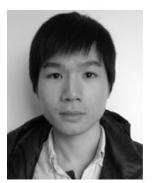

**Zebo Yang** (Graduate Student Member, IEEE) received the B.S. degree in computer engineering from the Guangdong University of Foreign Studies, Guangzhou, China, in 2012, and the M.S. degree in computer engineering from Waseda University, Tokyo, Japan, in 2019. He is currently pursuing the Ph.D. degree in computer science with Washington University in St. Louis, St. Louis, MO, USA.

From 2011 to 2017, he worked as a Software Engineer with Tencent, Inc., Baidu, Inc., and DJI, Inc. Since 2019, he has been working as a Graduate

Research Assistant with Washington University in St. Louis. His research interests include blockchains, quantum computing, network and system security, machine learning, Internet of Things, and wireless communications.

**Maede Zolanvari** (Member, IEEE) received the B.S. and M.S. degrees in electrical and computer engineering in 2012 and 2015, respectively. She is currently pursuing the Ph.D. degree in computer science and engineering with Washington University in St. Louis, St. Louis, MO, USA. From 2012 to 2015, her research was on performance improvement of communication networks, with a focus on OFDM systems. Since 2015, she has been working as a Graduate Research Assistant with Washington University in St. Louis. Her current research focus

is on utilizing machine learning and deep learning for network security of the Industrial Internet of Things. Her research interests include Internet of Things, machine learning, cyber-security, secure computer networks, and wireless communications.

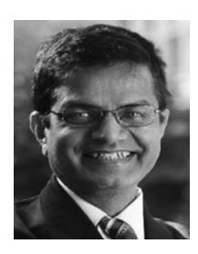

**Raj Jain** (Life Fellow, IEEE) received the B.E. degree in electrical engineering from APS University, Rewa, India, in 1972, the M.E. degree in automation from the Indian Institute of Science, Bengaluru, India, in 1974, and the Ph.D. degree in applied mathematics (computer science) from Harvard University, Cambridge, MA, USA, in 1978.

He is currently the Barbara J. and Jerome R. Cox, Jr., Professor with the Department of Computer Science and Engineering, Washington University in St Louis, St Louis, MO, USA. He

was one of the co-founders of Nayna Networks, Inc., San Jose, CA, USA, a next-generation telecommunications systems company in San Jose. He was a Senior Consulting Engineer with Digital Equipment Corporation, Littleton, MA, USA, and then a Professor of Computer and Information Sciences with Ohio State University, Columbus, OH, USA. He is a recipient of the 2018 James B. Eads Award from St. Louis Academy of Science, the 2017 ACM SIGCOMM Life-Time Achievement Award, and the 2015 A. A. Michelson Award from Computer Measurement Group. He ranks among the Most Cited Authors in Computer Science. He has authored the Art of Computer Systems Performance Analysis, which won the 1991 "Best-Advanced How-to Book, Systems" Award from the Computer Press Association. He is a Fellow of ACM and AAAS.