# A Survey of Quantum Internet Protocols From a Layered Perspective

Yuan Li®, Hao Zhang, Chen Zhang, Tao Huang®, Senior Member, IEEE, and F. Richard Yu®, Fellow, IEEE

Abstract—With the development of quantum technologies, the quantum Internet has demonstrated unique applications beyond the classical Internet and has been investigated extensively in recent years. In the construction of conventional Internet software, the protocol stack is the core architecture for coordinating modules. How to design a protocol stack for the quantum Internet is a challenging problem. In this paper, we systematically review the latest developments in quantum Internet protocols from the perspective of protocol stack layering. By summarizing and analyzing the progress in each layer's protocols, we reveal the current research status and connections among the layers. Our work provides readers with a comprehensive understanding of the quantum Internet and can help support researchers focusing on a single layer to better define the functions that the layer should possess and optimize related protocols. This approach enables all layers to work better together based on an understanding of the other layers.

*Index Terms*—Entanglement, layer, protocols, quantum Internet, quantum networks, routing.

#### LIST OF ACRONYMS

| BSM   | Bell-State Measurement.            |
|-------|------------------------------------|
| DoF   | Degree of Freedom.                 |
| ES    | Entanglement Swapping.             |
| GHZ   | Greenberger-Horne-Zeilinger.       |
| HEG   | Heralded Entanglement Generation   |
| HEP   | Heralded Entanglement Purification |
| IP    | Internet Protocol.                 |
| NMR   | Nuclear Magnetic Resonance.        |
| OSI   | Open Systems Interconnection.      |
| QEC   | Quantum Error Correcting.          |
| QKD   | Quantum Key Distribution.          |
| Qubit | Quantum Bit.                       |
| SDN   | Software-Defined Networking.       |
| TCP   | Transmission Control Protocol.     |

Manuscript received 24 March 2023; revised 12 September 2023 and 21 December 2023; accepted 28 January 2024. Date of publication 5 February 2024; date of current version 23 August 2024. This work was supported by the 2022 Jiangsu Province Double Innovation Doctor Program under Grant JSSCBS20221659. (Corresponding author: Yuan Li.)

Yuan Li, Hao Zhang, and Chen Zhang are with the Future Network Research Center, Purple Mountain Laboratories, Nanjing 211111, China (e-mail: liyuan@pmlabs.com.cn).

Tao Huang is with the State Key Laboratory of Networking and Switching Technology, Beijing University of Posts and Telecommunications, Beijing 100876, China, and also with the Future Network Research Center, Purple Mountain Laboratories, Nanjing 211111, China.

F. Richard Yu is with the Department of Systems and Computer Engineering, Carleton University, Ottawa, ON K1S 5B6, Canada.

Digital Object Identifier 10.1109/COMST.2024.3361662

#### I. INTRODUCTION

NCE the birth of quantum mechanics, humankind has developed computers, mobile phones, the Internet, and other technologies that have led to revolutionary changes in society. These classical technologies derived from quantum mechanics are collectively known as the first quantum revolution. Based on the quantum properties of uncertainty and nonlocality, quantum computation [1], [2], [3], [4], [5], [6], quantum communication [7], and quantum sensing [8], [9] have also been developed; the emergence of this class of technologies is called the second quantum revolution [10]. Building on these developments, the quantum Internet (see Fig. 1) is conceived of as a new type of network connecting quantum devices that can realize the transmission of quantum information and the sharing of quantum states among remote nodes. Through the quantum Internet, users will be able to access quantum computing, quantum communication, quantum measurement and other services. As with the classical Internet at its inception, it is impossible to predict the full potential of the quantum Internet. However, it is natural to expect that if it in fact materializes, it will once again revolutionize the world.

The construction of the quantum Internet is still in its infancy. However, there have been several review articles [11], [12], [13], [14], [15], [16], [17], [18], [19], [20], [21] addressing this field, with different focuses. For example, some works [11], [17] have focused on fundamental related research in physics. In addition, Singh et al. [16] focused on overviews of existing quantum applications to uncover the potential of the quantum Internet and demonstrate its value and promise. Azuma et al. [15] reviewed the theoretical and simulation tools that exist for evaluating the performance of the quantum Internet. These tools can be used to assess the effectiveness of protocols theoretically proposed for the construction of quantum networks. Furthermore, Cacciapuoti et al. [22] highlighted the current challenges and problems, providing guidance for future research. Wehner et al. [13] defined the different stages of quantum network development and presented an excellent set of step-by-step goals for future growth.

For the construction of a complete quantum Internet, in addition to the aspects mentioned above, the quantum Internet protocol stack is an important core software architecture, and related research will be indispensable for future system construction and practicalization. For the classical Internet, the layered model of the protocol stack based on the principle of the separation of concerns makes it easier to independently

| Ref Basic | Quantum  | Quantum internet | Quantum internet protocols |          |      |           |           | Quantum internet | Quantum network     | Challenges |            |
|-----------|----------|---------------------|----------------------------|----------|------|-----------|-----------|---------------------|------------------------|------------|------------|
| Rei       | concepts | repeaters           | protocol stack          | Physical | Link | k Network | Transport | Application         | testbeds and trials | simulators | Chancinges |
| [11]      |          |                     |                            | 1        |      |           |           |                     |                        |            | 1          |
| [12]      | 1        | 1                   |                            |          |      |           |           | ✓                   | 1                      |            | 1          |
| [13]      | 1        | 1                   | 1                          | 1        |      |           |           | ✓                   |                        |            | 1          |
| [14]      | 1        | 1                   | 1                          | 1        | 1    |           |           |                     |                        |            | 1          |
| [15]      | 1        | 1                   |                            | 1        |      | 1         |           |                     |                        | 1          | 1          |
| [16]      | 1        | 1                   |                            | 1        |      |           |           | ✓                   |                        |            | 1          |
| [17]      |          |                     |                            | 1        |      |           |           | ✓                   | 1                      |            | 1          |
| [18]      | /        | 1                   | 1                          | 1        |      |           |           |                     | 1                      |            | 1          |
| [19]      | 1        |                     | 1                          |          |      | 1         |           |                     |                        |            | 1          |
| [20]      | /        | 1                   | 1                          | 1        | 1    | 1         |           | ✓                   |                        | 1          | 1          |
| [21]      | 1        | 1                   | 1                          | 1        | 1    | 1         | 1         | ✓                   | 1                      |            | 1          |
| This      | 1        | 1                   | 1                          | 1        | /    | 1         | 1         | ✓                   | 1                      | 1          | 1          |

TABLE I COMPARISON OF THIS SURVEY WITH OTHER RELATED SURVEYS

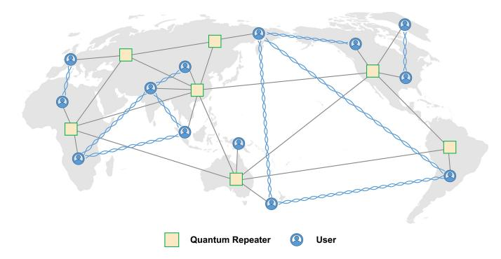

Fig. 1. Schematic overview of the future quantum Internet. Users can perform various quantum applications, such as quantum computation, quantum communication, and quantum sensing. The solid lines represent connections responsible for establishing entanglement and passing classical information, which may be supported by optical fibers or free-space channels. The threaded lines represent entanglement relationships. In general, quantum applications require two or more users to be entangled. Note that many nodes are not shown in this diagram.

develop protocols for each layer by dividing different communication functions among the layers, which has enabled rapid Internet development. However, due to the novel properties of the quantum bits (qubits) on which the quantum Internet relies, it is impossible to directly apply the current mature architecture and various protocols of the classical Internet protocol stack in the quantum context; instead, it will be necessary to make changes or even propose a brand new protocol stack suitable for the quantum Internet. Recently, Illiano et al. [\[19\]](#page-21-18) reviewed existing work on the quantum Internet protocol stack. Nevertheless, although this review presented an overview of several abstract protocol stack architectures that currently exist, it did not discuss each layer in depth. Throughout the previous related work, there has been no agreement on the number of layers in the quantum Internet protocol stack architecture or the specific functions of each layer. However, a comprehensive understanding of each layer's functions is essential for designing a proper protocol stack architecture. Therefore, our article reviews the current research progress on quantum Internet protocols from the perspective of protocol stack layering. The goal is to provide readers, especially those focused on one specific layer, with a comprehensive understanding of quantum Internet protocols for every layer, which can serve as a basis for more effective problem analysis and the design of better solutions.

During the preparation of this article, another review article [\[21\]](#page-21-20) on quantum networks has been published. Although there is some overlap in the covered scope, there are notable differences. For instance, Li et al. [\[21\]](#page-21-20) did not follow the approach of summarizing protocols in different layers, lacked an analysis of the interconnections among each layer's protocols, and omitted topics such as the distribution of multipartite entangled states, solutions to packet loss problems, quantum network simulators, and the integration of quantum networks with classical networks. Table [I](#page-1-1) provides a detailed comparison of the contents covered in this study and other review articles.

The main contributions of this article can be summarized as follows:

- 1) We describe the basic concepts and unique characteristics of the quantum Internet.
- 2) We outline three existing quantum repeater schemes for building the quantum Internet.
- 3) We discuss previously proposed layered models of quantum Internet protocol stacks.
- 4) We provide a comprehensive review of the progress in quantum Internet protocols from a layered perspective. Specifically, quantum physical layer protocols are designed to offer foundational quantum resources for quantum networks, such as entanglement generation,

Section I. Introduction

quantum light-matter interfaces, and quantum frequency conversion. Quantum link layer protocols aim to furnish robust entangled states and implement quantum error correction mechanisms. Quantum network layer protocols cover quantum routing protocols for distributing bipartite entanglement and multipartite entanglement. Quantum transport layer protocols address issues related to congestion, packet loss, and quality detection. Quantum application protocols include a diverse array of quantum applications supported by the quantum Internet.

6) We identify the challenges and future research directions regarding the quantum Internet. Through an assessment of the progress achieved in developing protocols for each layer, we reveal potential conflicts and avenues for optimization, leading to proposals of future development directions for each layer and discussions on the concept of layering. Furthermore, we discuss quantum network simulators, classical communication within quantum networks, and the integration of quantum networks with classical networks.

The organization of this survey paper is shown in Fig. 2. In Section II, we introduce the basic concepts related to the quantum Internet, including the primary properties of qubits and important quantum operations. Section III provides a brief overview of current quantum repeater schemes. In Section IV, we summarize the existing layered models of quantum Internet protocols stacks. Subsequently, various quantum Internet protocols, including quantum physical layer protocols, quantum link layer protocols, quantum network layer protocols, quantum transport layer protocols and quantum application protocols, are surveyed in Sections V–IX, respectively. Section X outlines quantum Internet testbeds and trials. Then, section XI discusses challenges and future research directions. Finally, the conclusion is presented in Section XII.

#### II. BASIC CONCEPTS

For the classical Internet, the basic unit of transmitted information is a bit, which is in binary form and thus takes a value of either 0 or 1, usually realized by means of voltage, light intensity, or some other medium. For the quantum Internet, the corresponding concept is the qubit. A qubit can be realized by means of the polarization of a photon, the spin of an electron or nucleon, or some similar phenomenon. The qubits corresponding to classical bits of "0" and "1" are written as " $|0\rangle$ " and " $|1\rangle$ ", respectively, where the notation " $|\rangle$ " is called Dirac notation.

A qubit has four main characteristics that distinguish it from a classical bit:

(1) Uncertainty: In addition to the  $|0\rangle$  and  $|1\rangle$  states, a qubit can also exist in a linear combination of both states, i.e.,  $\alpha|0\rangle+\beta|1\rangle$ , where the complex coefficients  $\alpha$  and  $\beta$  satisfy  $|\alpha|^2+|\beta|^2=1$ . Such a combined state is often referred to as a superposed state. Unlike for a classical bit, a measurement of a qubit will irrevocably disturb this superposed state, and the qubit will collapse into either the  $|0\rangle$  state or the  $|1\rangle$  state, which are also called eigenstates, with specific probabilities of  $|\alpha|^2$  and  $|\beta|^2$ , respectively. Quantum computation possesses a

| Section I.   | introduction                                   |
|--------------|------------------------------------------------|
| Section II.  | Basic Concepts                                 |
| Section III. | Quantum Repeaters                              |
| Section IV.  | Quantum Internet Protocol Stack                |
| Section V.   | Quantum Physical Layer Protocols               |
| Section VI.  | Quantum Link Layer Protocols                   |
| VI-A.        | QEC Codes                                      |
| VI-B.        | Entanglement Purification                      |
| Section VII. | Quantum Network Layer Protocols                |
| VII-A.       | Bipartite Entanglement Routing                 |
| VII-B.       | Multipartite Entanglement Routing              |
| VII-C.       | Waiting Time                                   |
| Section VIII | . Quantum Transport Layer Protocols            |
| VIII-A       | . Congestion Control                           |
| VIII-B       | . Retransmission                               |
| VIII-C       | . Quantum Channel Quality Detection            |
| Section IX.  | Quantum Application Protocols                  |
| Section X.   | Quantum Internet Testbeds and Trials           |
| Section XI.  | Challenges and Future Research Directions      |
| XI-A.        | Quantum Internet Protocols                     |
| XI-B.        | Layered Models of the Quantum Internet         |
| XI-C.        | Quantum Network Simulators                     |
| XI-D.        | Classical Communication in Quantum Networks |
| XI-E.        | Integration of Quantum Networks with Existing  |
|              | Networks                                       |

Fig. 2. Outline of this survey paper.

natural parallel computing ability because of the superposition phenomenon.

- (2) No cloning [23]: The copying of a classical bit is a common and essential operation for conveying classical messages. However, in the case of qubits, the no-cloning theorem prohibits making an independent copy of an unknown quantum state.
- (3) Decoherence [24]: A qubit is so fragile that bit-flip and phase-flip errors can easily occur due to the influence of the environment. This process is called decoherence and leads to a loss of quantum properties. The fidelity of a quantum state reflects its quality, and the domain of the fidelity metric is [0,1], where "1" represents the ideal state. The smaller the fidelity is, the worse the quality. Various applications of the quantum Internet have a certain minimum fidelity requirement. If the fidelity of the quantum states provided by a network is lower than this threshold, then the application cannot be executed.

*(4) Nonlocality [\[25\]](#page-21-24):* This property allows qubits to possess some special correlation with each other; this is the famous phenomenon of quantum entanglement [\[26\]](#page-21-25), [\[27\]](#page-21-26), which has no counterpart in the classical world. This means that we cannot describe the state of a single qubit alone but can only describe the state of the whole system, in which every object is related to every other object, even if the individual qubits are spatially separated by a large distance. Generally, instances of entanglement can be divided into bipartite entanglement, i.e., so-called Bell states [\[28\]](#page-21-27) or Einstein–Podolsky–Rosen (EPR) pairs [\[29\]](#page-21-28), and multipartite entanglement, such as clusters, Greenberger–Horne–Zeilinger (GHZ) states [\[30\]](#page-21-29), [\[31\]](#page-21-30), [\[32\]](#page-21-31) and W states [\[33\]](#page-21-32). If qubits in an entangled state are placed in different locations, they will still be entangled. The most commonly considered entangled states are two-dimensional, corresponding to two-state pairs, where a physical particle represents a qubit. High-dimensional entanglement [\[34\]](#page-21-33) and hyperentanglement [\[35\]](#page-21-34) are also possible. The basis vectors for high-dimensional entangled states form an N-dimensional Hilbert space (where *N* > 2). For example, various degrees of freedom (DoFs) of photons, such as time bins, paths, momenta, and transverse spatial modes, can represent high-dimensional quantum states. A hyperentangled state refers to a physical particle carrying multiple qubits, such as a photon, whose polarization DoF can be regarded as one qubit, while its spatial DoF is another.

There are several characteristic operations involving entanglement, such as entanglement swapping [\[36\]](#page-21-35), [\[37\]](#page-21-36) and quantum teleportation [\[38\]](#page-21-37), [\[39\]](#page-21-38). Here, we briefly introduce these operations to readers, as shown in Fig. [3.](#page-3-1) Suppose that there are two entangled pairs, denoted by AB and CD. Qubits A and D can be made into a new entangled pair by taking a Bell-state measurement (BSM) [\[40\]](#page-21-39) between qubits B and C. This process is called entanglement swapping (ES). The concrete form of the entangled state AD depends on the original forms of AB and CD and the result of the BSM. Through quantum teleportation, the transmission of an unknown quantum state can be realized. For example, suppose that Alice wants to transmit the state of a qubit Ψ to Bob. She does not know the state of Ψ, in the sense that she cannot obtain the full information of the qubit without uncertainty through measurement. Additionally, she cannot copy it because of the no-cloning theorem. To achieve transmission, Alice and Bob should establish an entangled pair (A and B) in advance and each keep one qubit of this pair in his or her possession. When she wishes to transmit, Alice carries out a BSM between qubit Ψ and qubit A and informs Bob of the measurement result. Bob can then perform some suitable operation on qubit B in accordance with the result to obtain the state Ψ. The original qubit Ψ in Alice's possession is destroyed during the operation, so the no-cloning theorem is not violated. The measurement result is delivered classically, namely, no faster-than-light communication that violates the theory of relativity is needed. The entanglement connection will be destroyed after quantum teleportation, which means that a single entangled pair can transport only one data qubit. To transmit more data qubits, more entangled pairs would be needed.

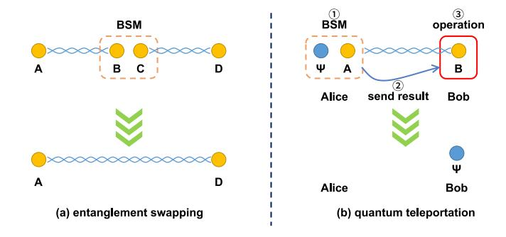

Fig. 3. Schematic diagrams of entanglement operations. The filled circles represent qubits, and the qubits connected by threaded lines represent entangled states. The dashed orange rectangles represent BSMs. (a) Entanglement swapping. (b) Quantum teleportation. The solid red rectangle represents some combination of phase-flip and bit-flip operations (neither, either, or both) depending on the Bell-state measurement (BSM) result.

These novel characteristics of qubits enable many applications not possible in the classical Internet and lead to different network properties. The no-cloning theorem indicates that quantum information cannot be replicated, which is the basis of the inherent security of the quantum Internet. On the other hand, this means that many operations performed in the classical Internet, such as replication, amplification and retransmission, cannot be applied in the quantum Internet to achieve a relaying function. The inherent fragility of quantum states aggravates the difficulty of implementing long-distance transmission and memory. With an increase in hop count, the attenuation of quantum states becomes more serious, and the fidelity decreases. Thus, for the quantum Internet, it is especially critical to provide higher quality of service and lower latency. At the same time, quantum characteristics provide new solutions to these challenges, such as protecting fragile quantum data by means of quantum error correction techniques and transmitting quantum information via quantum teleportation without physical spatial movement. End-to-end entangled states are necessary for transmission using quantum teleportation, and ES techniques can be used to extend the distance of entangled states during the establishment process.

# III. QUANTUM REPEATERS

To achieve various quantum applications, a quantum network needs to be able to provide entangled states between two or more users and realize the transmission of quantum information. Due to their high speed and weak interaction with the surrounding environment, photons are highly suitable as qubits for quantum transmission. Due to the phenomena of absorption and scattering in optical fiber media, however, photons suffer inherent losses. Moreover, imperfect optical channels introduce polarization errors that impact the fidelity of photons. Therefore, the implementation of quantum repeaters is essential to enable long-distance quantum communication. There are many different quantum repeater schemes. From the perspective of the network architecture, not only the devices serving as quantum repeaters but also the means of qubit transmission and the nature of the connections are different.

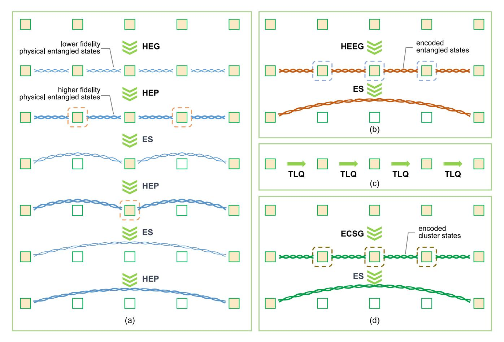

Fig. 4. Processes of four-segment quantum repeater protocols. The hollow squares represent quantum repeaters that do not participate in the subsequent construction of entanglement. (a) First-generation quantum repeater scheme. HEG, heralded entanglement generation; HEP, heralded entanglement purification; ES, entanglement swapping. (b) Second-generation quantum repeater scheme. HEEG, heralded encoded entanglement generation. (c) Third-generation quantum repeater scheme. TLQ, transmission of logical qubits. (d) All-photonic quantum repeater scheme. ECSG, encoded cluster state generation.

Quantum repeater schemes can be divided into three generations based on the methods used for error correction [\[41\]](#page-21-40), [\[42\]](#page-21-41). For the transmission of qubits, the two most important error types are loss and operation errors. Loss errors refer to photon loss during transmission, and operation errors refer to the errors caused by measurements and gate operations in quantum repeaters.

First-generation quantum repeater schemes [\[43\]](#page-21-42), [\[44\]](#page-21-43), [\[45\]](#page-21-44), [\[46\]](#page-21-45), [\[47\]](#page-21-46), [\[48\]](#page-21-47), [\[49\]](#page-21-48), [\[50\]](#page-21-49) use heralded entanglement generation (HEG) to overcome loss errors and heralded entanglement purification (HEP) [\[51\]](#page-21-50) to correct operation errors. More details about HEG and HEP are presented in Sections [V](#page-6-0) and [VI.](#page-7-0) In these schemes, the task of generating long-distance entanglement is decomposed into subtasks of generating shortdistance entanglement at each hop along the path, and ES is then performed on the quantum repeaters to obtain endto-end entanglement. However, even over shorter distances, photonic qubits still have high loss rates. Therefore, HEG must be employed. The main idea of this method is that a success or failure message is sent to the nodes when an entanglement generation attempt is completed. Thus, the nodes can continue trying until entanglement is successfully generated. Due to operation errors, the fidelity of an entangled state decreases, whereas the fidelity can be improved through HEP. However,

if the fidelity is lower than a certain threshold (generally 0.5), HEP can no longer be used to improve it after ES operations have been completed on all nodes. Thus, HEP and ES need to be performed in a nested manner to construct the final endto-end entanglement.

The specific processes of a four-segment nested repeater protocol are shown in Fig. [4\(](#page-4-0)a). Note that these processes involve communication negotiation between nonadjacent nodes. Therefore, long-lived quantum memories are needed in the process of waiting for classical information.

Second-generation quantum repeater schemes [\[52\]](#page-22-0), [\[53\]](#page-22-1), [\[54\]](#page-22-2), [\[55\]](#page-22-3), [\[56\]](#page-22-4) also use HEG to correct loss errors and use quantum error correcting (QEC) codes to correct operation errors. QEC codes can counteract the fidelity degradation caused by ES, allowing the intermediate nodes along the path to carry out ES simultaneously and thus reducing the requirement for quantum memories. The specific processes of a four-segment second quantum repeater protocol [\[53\]](#page-22-1) are shown in Fig. [4\(](#page-4-0)b). However, QEC codes can only correct for loss rates of less than 50%, and thus, higher-precision gate operations are required.

Third-generation quantum repeater schemes [\[57\]](#page-22-5), [\[58\]](#page-22-6), [\[59\]](#page-22-7), [\[60\]](#page-22-8), [\[61\]](#page-22-9) rely on QEC codes to suppress both loss and operation errors. The requirements imposed by the QEC codes used in third-generation schemes are higher than those for second-generation schemes, requiring higher coupling efficiency, higher-precision gate operations, and a faster gate operation speed. Requests to transmit unknown quantum states can be carried out only via quantum teleportation when using schemes of the first two generations, whereas third-generation schemes allow the quantum states to be encoded and directly transmitted hop by hop, which is very similar to the transmission mode of the classical Internet. The specific processes of a four-segment third quantum repeater protocol are shown in Fig. [4\(](#page-4-0)c). Due to their high requirements, however, we do not discuss these schemes in detail; instead, we focus on entanglement-based quantum networks in this paper.

Recently, some research has been conducted on all-photonic quantum repeaters [\[60\]](#page-22-8), [\[62\]](#page-22-10), [\[63\]](#page-22-11), [\[64\]](#page-22-12), [\[65\]](#page-22-13), which use cluster state coding and fault-tolerant measurements to mitigate loss and operation errors. Some articles [\[41\]](#page-21-40), [\[66\]](#page-22-14) also place this scheme in the category of third-generation quantum repeater schemes. However, this scheme is quite different from the original third-generation schemes in terms of network construction. It only allows unknown quantum states to be transmitted through quantum teleportation. The specific processes of a four-segment all-photonic quantum repeater protocol are shown in Fig. [4\(](#page-4-0)d). In this scheme, special photon cluster states are used to construct long-distance entangled states, and the nodes do not need to inform each other of a specific successful entangled pair to carry out subsequent operations. This saves considerable classical communication time and dramatically reduces the requirements for quantum memories. The main difficulty of this scheme is how to generate the necessary cluster states efficiently.

# IV. QUANTUM INTERNET PROTOCOL STACK

In the classical Internet, the protocol stack is based on the Open Systems Interconnection (OSI) model, which divides essential network functionalities into seven layers, making networks simpler and more scalable. Each layer is largely independent in its development and does not influence other layers. For the quantum Internet, the protocol stack is also essential and deserving of study. The specific functionality allocations in the classical and quantum Internet stacks are shown in Fig. [5.](#page-5-1) Recently, a review of this field has been presented [\[19\]](#page-21-18).

Inspired by the concept of a hierarchy, Van Meter et al. [\[67\]](#page-22-15) first developed a quantum Internet protocol stack model based on the first generation of quantum repeater schemes using bipartite entanglement in 2009. In recent years, these authors have discussed this field in more detail [\[68\]](#page-22-16), [\[69\]](#page-22-17), [\[70\]](#page-22-18), [\[71\]](#page-22-19), [\[72\]](#page-22-20). The specific layers in their model are the physical layer, the link-level entanglement layer, the remote state composition layer, the error management layer, and the application layer. The physical layer includes all operations performed on qubits in the process of HEG between adjacent nodes, such as encoding, emitting and transmitting photons, and BSMs. The link-level entanglement layer includes all classical control messages exchanged in the above process. It is responsible for management tasks, such

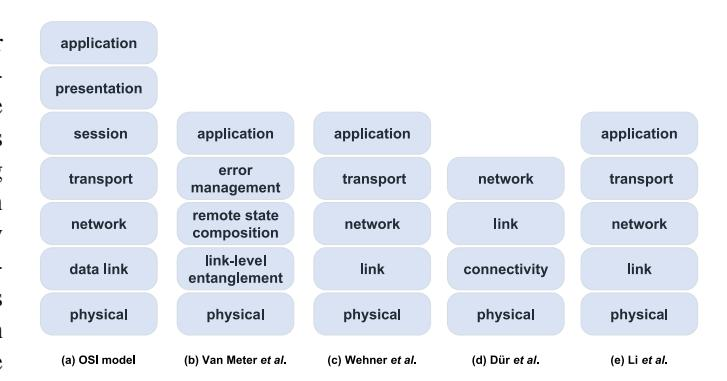

Fig. 5. Classical and quantum Internet protocol stacks. (a) OSI model. (b) Van Meter et al.'s model. (c) Wehner et al.'s model. (d) Dür et al.'s model. (e) Li et al.'s model.

as deciding which nodes should generate entangled pairs and informing nodes of measurement results to decide on the next operation. The remote state composition layer is responsible for generating end-to-end entangled states. Specifically, error management is considered as a separate layer nested with the remote state composition layer. Finally, the application layer is responsible for the realization of various quantum applications.

Wehner et al. [\[14\]](#page-21-13), [\[73\]](#page-22-21), [\[74\]](#page-22-22), [\[75\]](#page-22-23) also proposed a quantum Internet protocol stack architecture based on bipartite entanglement. They adopted the same layer names as in the classical Internet stack to define the protocol stack of the quantum Internet. However, the functions of each layer are different from those in the classical Internet. Specifically, the physical layer is responsible for HEG, and the link layer is responsible for ensuring the robustness of HEG. The network layer is responsible for generating end-to-end entanglement. Note that error correction is not considered a separate layer, and a transport layer is added that takes responsibility for the deterministic transmission of data qubits.

The quantum Internet protocol stack architecture proposed by Pirker and Dür [\[76\]](#page-22-24) is aimed at a quantum Internet of the pre-establishment type, which means that entanglement is constructed in advance before the arrival of requests, and mainly addresses the construction of the quantum Internet using multipartite entanglement. This architecture consists of a physical layer, a connectivity layer, a link layer, and a network layer. The physical layer is responsible for generating shortdistance entangled states and is equivalent in function to the physical layer and link layer in the previous two schemes. This layer is also responsible for quantum memories and signal conversion between quantum channels. The connectivity layer is responsible for establishing point-to-point or pointto-multipoint long-distance connectivity throughout the whole quantum network before the arrival of requests. The network administrator determines the specific distribution on the basis of various factors. The link layer operates on the entangled states generated by the connectivity layer to form the desired states in accordance with requests. The network layer is responsible for sharing entangled states between different networks. This process can be realized by means of routing protocols. Dür et al.'s proposal treats the error correction protocol and the ES protocol as auxiliary protocols, which are accessible to each layer above the physical one.

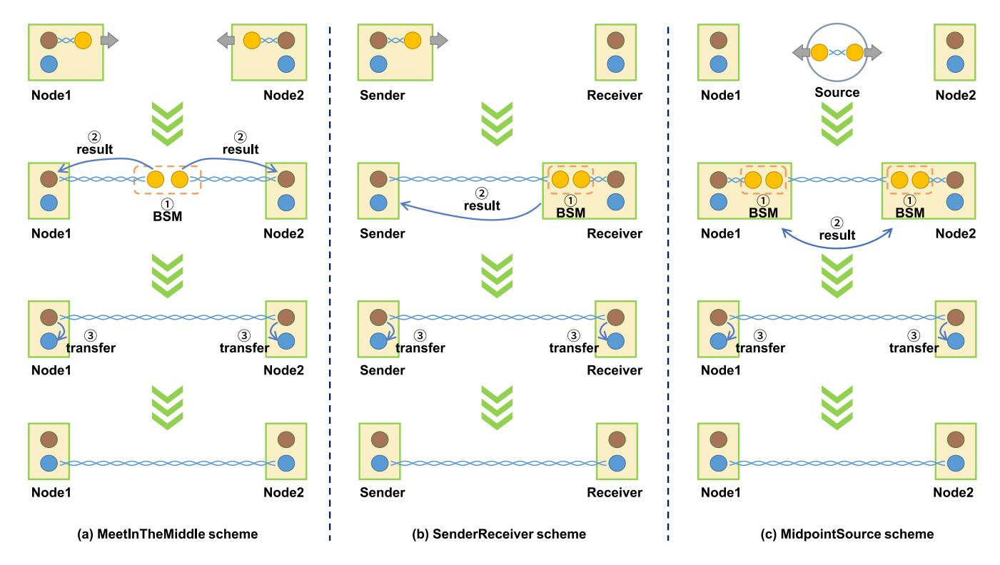

Fig. 6. Schematic illustrations of three entanglement generation schemes. The brown circles represent communication qubits, and the yellow circles represent photons. The gray arrows indicate photon emission. The blue circles represent memory qubits. (a) MeetInTheMiddle scheme. (b) SenderReceiver scheme. (c) MidpointSource scheme.

Li et al. [\[77\]](#page-22-25) also proposed a layered model of a quantum Internet protocol stack based on bipartite entanglement, which is similar to the model proposed by Wehner et al. However, Wehner et al.'s model assumes that entangled states are generated on demand, while Li et al.'s model is designed for a quantum Internet of the pre-establishment type. The main difference reflected in the protocol stack is the functionality of the link layer. The link layer of Li et al.'s model is responsible for controlling link-level entanglement and processing feedback from the network layer.

Although the quantum Internet protocol stack looks similar to the OSI model, there is a major difference between them. In the quantum Internet, the goal of the layers below the quantum transport layer is to build end-to-end entangled states in preparation for data transmission. Ultimately, data transmission is completed by means of quantum teleportation. In contrast, in the classical Internet, even the link layer already realizes data transmission.

While there is currently no unified layered model of the quantum Internet protocol stack, many independent quantum Internet protocols have been proposed, and some researchers have defined protocols for specific layers based on their individual interpretations. By combining these classifications with the graph theory perspective, from which behaviors between adjacent nodes are categorized as belonging to the link layer and behaviors between multiple hops are categorized as belonging to the network layer, we classify existing quantum Internet protocols into quantum physical layer protocols, quantum link layer protocols, quantum network layer protocols, quantum transport layer protocols, and quantum

application protocols, each of which are discussed separately below.

#### V. QUANTUM PHYSICAL LAYER PROTOCOLS

The quantum physical layer is responsible for providing the quantum Internet with various quantum resources, such as entanglement generation in a single hop, single-photon emission, quantum memory, quantum light–matter interfaces and quantum frequency conversion. Here, we introduce the existing entanglement generation schemes, all of which are HEG schemes.

HEG schemes can be classified according to the systems that produce the entangled states, such as atomic ensembles [\[44\]](#page-21-43), [\[47\]](#page-21-46), [\[49\]](#page-21-48), [\[78\]](#page-22-26), [\[79\]](#page-22-27) and single quantum systems. One of the earliest and most famous HEG schemes based on atomic ensembles is the Duan–Lukin–Cirac–Zoller (DLCZ) protocol [\[44\]](#page-21-43). Single quantum systems can be further classified into trapped ions [\[48\]](#page-21-47), [\[80\]](#page-22-28), single atoms [\[81\]](#page-22-29), [\[82\]](#page-22-30), [\[83\]](#page-22-31), nitrogenvacancy centers in diamond [\[84\]](#page-22-32), [\[85\]](#page-22-33), [\[86\]](#page-22-34) and quantum dots [\[50\]](#page-21-49), [\[85\]](#page-22-33), [\[87\]](#page-22-35), [\[88\]](#page-22-36), among others. From another perspective, entanglement generation schemes can also be categorized into three basic themes [\[41\]](#page-21-40), [\[72\]](#page-22-20), [\[89\]](#page-22-37), [\[90\]](#page-22-38), [\[91\]](#page-22-39). For convenience, we adopt the labels used in [\[89\]](#page-22-37), which are MeetInTheMiddle, SenderReceiver, and MidpointSource. These are illustrated in Fig. [6.](#page-6-1)

Two types of qubits exist within a quantum node: communication qubits, used for generating entangled states, and memory qubits, used for storing quantum states. These qubits are stationary and referred to as matter qubits. In the MeetInTheMiddle scheme (see Fig. [6\(](#page-6-1)a)), each node first prepares an entangled state between its own communication qubit and a photon. Second, the two nodes emit their photons simultaneously to meet each other and perform a BSM at the midpoint between them. For the BSM, linear optics and single-photon detectors are employed, for which the success probability is 50% even in the ideal case. If the BSM is successful, this indicates that the communication qubits at the two nodes have already formed an entangled state. The specific form of the state needs to be determined from the measurement result. Therefore, the result is sent from the midpoint to the nodes to determine the subsequent operations to be performed, such as regenerating entanglement or operating on a qubit to form the desired entangled state. Note that the communication qubits cannot be used for the next round during this waiting period. Finally, the state can be transferred from the communication qubits to the memory qubits for better storage. A midpoint heralding protocol has been proposed for this scheme [\[73\]](#page-22-21).

In the SenderReceiver scheme (see Fig. [6\(](#page-6-1)b)), the two nodes are referred to as the sender and receiver. The sender sends a photon, which is entangled with its communication qubit, to the receiver. The receiver prepares an entangled state between its communication qubit and a photon. When the photon arrives from the sender, a BSM is executed at the receiver node. Then, a classical result message is sent to the sender node for later action. In this scheme, the receiver node is immediately aware of success or failure, helping it utilize its qubits effectively.

In the MidpointSource scheme (see Fig. [6\(](#page-6-1)c)), there is an external light source at the midpoint between the two nodes. The source initially sends half of an entangled state to each node. Then, the nodes prepare entangled states between their communication qubits and photons. When the photons sent from the midpoint arrive, the nodes each need to perform a BSM. Then, the nodes send their measurement results to each other for subsequent operations.

Notably, the rate of HEG can be improved through multiplexing [\[46\]](#page-21-45), [\[49\]](#page-21-48), [\[54\]](#page-22-2), [\[86\]](#page-22-34), [\[92\]](#page-22-40), [\[93\]](#page-22-41), [\[94\]](#page-22-42). Collins et al. [\[92\]](#page-22-40) proposed a spatial multiplexing scheme based on cold atomic ensembles as the quantum memory elements. Simon et al. [\[46\]](#page-21-45) proposed a protocol that can store many temporal modes using photon pair sources in combination with memories based on the MeetInTheMiddle scheme. This multimode protocol has been experimentally demonstrated [\[79\]](#page-22-27), [\[95\]](#page-22-43). Munro et al. [\[54\]](#page-22-2) proposed another temporal multiplexing scheme to achieve approximately deterministic HEG based on the SenderReceiver scheme. Spectral multiplexing for HEG was proposed in [\[93\]](#page-22-41). It is expected that a combination of spatial, temporal and frequency multiplexing will greatly increase the rate. Two multiplexing protocols for multiqubit hybrid node architectures have also been presented [\[86\]](#page-22-34). In addition, a new quantum router architecture has been proposed to minimize memory latency and improve fidelity as the multiplexing depth increases [\[94\]](#page-22-42).

Some papers have discussed the advantages of photons with multiple DoFs, namely, hyperentangled states, such that one photon can carry multiple qubits of information.

Munro et al. [\[57\]](#page-22-5) noted that the use of hyperentangled photons can greatly reduce the numbers of photons and matter qubits needed. A detailed solution for how to achieve this advantage was given in [\[96\]](#page-22-44). It utilized a single photon to encode two qubits in the polarization and time-bin DoFs. Two pairs of entangled states could then be generated between two nodes by transmitting only one photon. This work was improved upon in [\[97\]](#page-22-45) by using not only hyperentangled states but also high-dimensional entangled states to achieve multiplexing.

In addition to discrete variables, continuous [\[98\]](#page-22-46) or hybrid [\[99\]](#page-22-47), [\[100\]](#page-22-48) variables can be used to represent qubits. A quantum repeater based on hybrid variables is called a hybrid quantum repeater [\[101\]](#page-22-49), [\[102\]](#page-22-50). Furthermore, problems such as information transfer and entanglement between matter qubits on nodes and photons are classified as quantum interface problems [\[103\]](#page-22-51), [\[104\]](#page-22-52), [\[105\]](#page-22-53), [\[106\]](#page-23-0), [\[107\]](#page-23-1), [\[108\]](#page-23-2), [\[109\]](#page-23-3), [\[110\]](#page-23-4), [\[111\]](#page-23-5), [\[112\]](#page-23-6), [\[113\]](#page-23-7), which also need to be considered in the physical layer. In addition, currently available quantum devices can provide only a very small number of qubits and require very strict conditions to maintain their quantum properties. Both the quality of qubits (storage time, fidelity, generation rate, etc.) [\[114\]](#page-23-8), [\[115\]](#page-23-9), [\[116\]](#page-23-10), [\[117\]](#page-23-11), [\[118\]](#page-23-12), [\[119\]](#page-23-13), [\[120\]](#page-23-14) and the quality of quantum operations (rate, fidelity, etc.) [\[121\]](#page-23-15), [\[122\]](#page-23-16), [\[123\]](#page-23-17), [\[124\]](#page-23-18), [\[125\]](#page-23-19) are still far from those required for real large-scale applications. These physical technologies also represent a future direction of research concerning the quantum physical layer. However, we will not discuss these in detail here.

#### VI. QUANTUM LINK LAYER PROTOCOLS

The function of the quantum link layer is to generate robust entanglement. This means that this layer guarantees that the desired entangled states are obtained or refuses the request if the link conditions, such as fidelity and completion time, do not meet the requirements.

Robustness can be achieved by:

- 1) Ensuring that the nodes at both ends of the entangled state work together, for which the identification of the two qubits of the entangled state must be correctly matched.
- 2) Checking whether the link quality meets the requirement after receiving a request.
- 3) Managing the internal qubit resources on each node.
- 4) Sending a failure message when the link conditions do not meet the request requirements, for example, when the fidelity is too low, the quantum memory is insufficient, or the specified time period is exceeded.
- 5) Using QEC codes or entanglement purification to achieve high fidelity.

An entanglement generation protocol based on the first four items listed above has been proposed [\[73\]](#page-22-21), [\[75\]](#page-22-23). This protocol includes a distributed queue, a scheduler, fidelity estimation and quantum memory management. To collaboratively perform entanglement generation and ensure that both nodes process requests in the same order, a distributed queue composed of synchronized local queues is employed and managed by the primary node. The scheduler is responsible for request scheduling. The fidelity estimation unit provides

|                 | NMR   | Trapped ions | Diamond      | Silicon | Superconducting circuits | Photons      |
|-----------------|-------|--------------|--------------|---------|--------------------------|--------------|
| Repetition code | [139] | [140], [141] | [142], [143] |         | [144]–[149]              |              |
| 9-qubit code    |       | [150]        |              |         |                          |              |
| 7-qubit code    |       | [151]–[154]  |              |         |                          |              |
| 5-qubit code    | [155] |              | [156]        |         | [157]                    |              |
| 4-qubit code    |       | [158]        |              |         | [159]                    | [160], [161] |
| Surface code    |       | [162], [163] |              | [164]   | [165]–[169]              |              |

TABLE II SUMMARY OF EXPERIMENTAL DEMONSTRATIONS OF VARIOUS QEC CODES ON DIFFERENT HARDWARE PLATFORMS

information such as fidelity, the rate of generation and the minimal completion time for a given request. The quantum memory management unit decides which physical qubits at nodes will be used to generate or store entanglement.

Since qubits are much more fragile than classical bits, their protection is essential to achieve robustness. At present, fidelity is mainly improved by means of QEC codes and entanglement purification. Below, we review the relevant progress from both theoretical and experimental perspectives.

# *A. QEC Codes*

In 1995, Shor [\[126\]](#page-23-20) and Steane [\[127\]](#page-23-21) independently developed QEC codes. Specifically, Shor proposed a repetition code and the 9-qubit Shor code, and Steane proposed the [[7, 1, 3]] Steane code. The idea of QEC codes is similar to that of classic error correcting codes in that redundancy is used to ensure the accuracy of information. Subsequently, this field has quickly evolved, yielding increasingly sophisticated classes of QEC codes. In 1996, Laflamme et al. [\[128\]](#page-23-22) proposed a 5-qubit code, which is the minimal number to correct all kinds of errors. A 4-qubit code capable of partial correction was proposed in 1997 [\[129\]](#page-23-23). Soon afterward, based on the concept of topology, Kitaev invented toric codes [\[130\]](#page-23-24), [\[131\]](#page-23-25), which later evolved into the well-known surface codes [\[56\]](#page-22-4), [\[132\]](#page-23-26), [\[133\]](#page-23-27). Some of the most invaluable advantages of surface codes are that they require interaction only between neighboring qubits and have a high error threshold; this is advantageous because current hardware platforms can only support nearest-neighbor connectivity and have high error rates. Machine learning has also been applied to design and optimize QEC codes and construct error-correction protocols [\[134\]](#page-23-28), [\[135\]](#page-23-29), [\[136\]](#page-23-30), [\[137\]](#page-23-31), [\[138\]](#page-23-32).

In recent years, many works have demonstrated the experimental realization of various QEC codes on different hardware platforms, such as nuclear magnetic resonance (NMR), trapped ions, diamond, silicon, superconducting circuits, and photons. Here, we present Table [II](#page-8-0) to list and clearly distinguish these works to serve as a reference for readers.

In the future, the quantum Internet may be heterogeneous, with different types of quantum error correction. How to bridge such diverse networks is thus an important issue. For instance, Nagayama et al. [\[170\]](#page-24-0) constructed heterogeneously

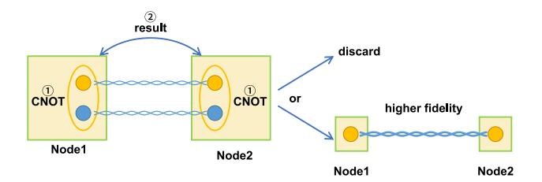

Fig. 7. Schematic diagram of HEP. The yellow ellipses represent local CNOT operations.

encoded Bell pairs in which one half was encoded in the [[7, 1, 3]] Steane code and the other half was encoded in surface code to demonstrate interoperability between different types of quantum networks.

#### *B. Entanglement Purification*

Entanglement purification can be regarded as a nonlocal QEC code and is responsible for improving the fidelity of entangled states. The detailed method is shown in Fig. [7.](#page-8-1) First, two entangled pairs are generated and distributed to two spatially separated nodes. Then, each node carries out a local CNOT operation and sends the measurement result to the other node to check whether HEP is successful. If it fails, both pairs are discarded; if it succeeds, an entangled pair with higher fidelity is obtained. Moreover, HEP can be iterated recursively to continuously improve the fidelity. Here, we discuss this approach from both the theoretical and experimental perspectives.

The first entanglement purification protocol was proposed in 1996 by Bennett et al. [\[171\]](#page-24-1). Later, Deutsch et al. [\[172\]](#page-24-2) further developed this scheme by introducing two additional specific unitary operations to make it more efficient. However, the CNOT gate operation needed in the above schemes is challenging to implement experimentally. In 2001, a new scheme based on simple linear optical elements was developed to achieve the same function as the CNOT gate operation [\[173\]](#page-24-3). Moreover, Sheng et al. [\[174\]](#page-24-4) utilized nondestructive quantum nondemolition to increase the success probability. The challenge is that the cross-Kerr nonlinearity is too small in nature.

Other protocols utilize hyperentanglement to achieve purification [\[175\]](#page-24-5), [\[176\]](#page-24-6). Entanglement resources in other DoFs can act as the entangled states consumed in previous schemes to purify polarization entanglement. Concretely, Simon and Pan presented a polarization entanglement purification protocol using spatial-entanglement-based linear optical elements in 2002 [\[175\]](#page-24-5). In this way, polarization entanglement could be created with high fidelity, and hyperentanglement would no longer exist after purification. In addition, Ren et al. [\[176\]](#page-24-6) addressed the purification of hyperentanglement itself, and high-dimensional entanglement was used in a purification scheme [\[177\]](#page-24-7).

The questions of which and when two entangled pairs are to be chosen for purification can be regarded as purification scheduling problems. Various types of purification scheduling algorithms have been proposed, such as symmetric purification [\[171\]](#page-24-1), [\[172\]](#page-24-2), [\[178\]](#page-24-8), entanglement pumping [\[43\]](#page-21-42), [\[179\]](#page-24-9), greedy purification [\[102\]](#page-22-50) and banded purification [\[67\]](#page-22-15). The original scheme [\[171\]](#page-24-1), [\[172\]](#page-24-2), [\[178\]](#page-24-8) relies on symmetric purification, in which two pairs of entangled states with the same fidelity are used for purification. Entanglement pumping was proposed in 1998 [\[43\]](#page-21-42). This algorithm purifies an entangled pair repeatedly using several entangled pairs with fixed fidelity. In contrast to symmetric purification, entanglement pumping translates physical resources into temporal resources. Because entanglement pumping has the drawback that it cannot yield maximally entangled states even under ideal conditions, an optimal algorithm named nested entanglement pumping was later proposed [\[179\]](#page-24-9). In the greedy purification algorithm [\[102\]](#page-22-50), all available resources are used for purification immediately and cannot be reserved for subsequent purification. In 2009, Van Meter et al. [\[67\]](#page-22-15) compared these purification scheduling algorithms and developed banded purification to improve the utilization of the physical and temporal resources in quantum repeaters and to enable entangled pairs to be matched efficiently but flexibly. This algorithm divides the fidelity space into several bands and allows only entangled pairs within the same region to be used to purify each other. This operation avoids both inflexible exact matches and large discrepancies in fidelity.

Each of the above schemes has unique characteristics, but there is one thing they have in common: they are probabilistic in nature, which means that the success probability is not 100% even under ideal conditions. Thus, the purification process must be repeated to ensure ultimate success, which means that these schemes demand large amounts of physical and temporal resources. In 2010, a deterministic purification protocol using spatial entanglement to correct bit-flip errors and frequency entanglement to correct phase-flip errors was presented [\[180\]](#page-24-10). In theory, the success probability of this protocol is 100%. However, the necessary polarization– spatial–frequency hyperentanglement, which includes three DoFs, is difficult to realize experimentally. Soon after, improved one-step deterministic entanglement purification protocols using only spatial entanglement to correct both bitflip and phase-flip errors of the polarization entanglement were proposed [\[181\]](#page-24-11), [\[182\]](#page-24-12). Moreover, machine learning [\[183\]](#page-24-13) and variational quantum algorithms [\[184\]](#page-24-14), [\[185\]](#page-24-15) have recently been applied in the context of HEP.

In experiments, significant progress has been achieved in recent years. For instance, Pan et al. [\[186\]](#page-24-16) reported the first experimental demonstration of a general entanglement purification protocol in 2003 using Pan et al.'s theoretical method [\[173\]](#page-24-3). Reichle et al. [\[187\]](#page-24-17) reported a more efficient and nondestructive entanglement purification protocol based on atomic qubits using Bennett et al.'s theoretical scheme [\[171\]](#page-24-1). In 2017, Chen et al. [\[188\]](#page-24-18) successfully used spontaneous parametric downconversion sources to achieve nested purification. In 2021, a probabilistic entanglement purification protocol utilizing only one pair of hyperentangled states was implemented [\[189\]](#page-24-19). Another work utilizing polarization and energy–time hyperentanglement was reported in the same year [\[190\]](#page-24-20). In 2022, entanglement purification based on a deterministic approach using polarization–spatial hyperentanglement was implemented [\[191\]](#page-24-21). Meanwhile, Ecker et al. [\[192\]](#page-24-22) utilized energy–time entanglement to realize deterministic purification.

Multiparticle entanglement plays a significant role in the quantum Internet. Thus, many multiparticle entanglement purification protocols have been developed [\[193\]](#page-24-23), [\[194\]](#page-24-24), [\[195\]](#page-24-25). Inspired by an idea put forward by Bennett [\[171\]](#page-24-1), Murao et al. [\[193\]](#page-24-23) proposed the first multiparticle entanglement purification protocol in 1998. A high-dimensional multiparticle entanglement purification protocol was reported in 2007 [\[194\]](#page-24-24). These protocols are both probabilistic. Similar to bipartite entanglement purification, multiparticle entanglement purification can also work in a deterministic way. For instance, Deng presented two economical deterministic multiparticle entanglement purification protocols, one using spatial entanglement and the other using frequency entanglement [\[195\]](#page-24-25).

## VII. QUANTUM NETWORK LAYER PROTOCOLS

# *A. Bipartite Entanglement Routing*

Since most papers on quantum network routing focus on entanglement-based quantum networks, we mainly discuss this case here. To study this field, we first need to understand the characteristics of quantum networks that make it impossible to directly apply the routing solutions of classical networks.

- 1) Quantum networks use quantum teleportation to transfer quantum data. Such a network is responsible for the construction of end-to-end entanglement.
- 2) For the foreseeable future, quantum devices will have only small quantum memories. Many articles have assumed that only single-digit qubits are available on quantum repeaters.
- 3) Both HEG and ES have some probability of failure.
- 4) An entangled state has fidelity and will experience decoherence over time. ES can reduce fidelity. Purification can be applied to improve fidelity but must consume some number of entangled pairs, and there is a probability of failure.
- 5) The capacities and lengths of channels, the fidelity of entangled states, the probabilities of HEG and ES, as well as the sizes of quantum memories in quantum devices may all differ.

6) Quantum requests generally have minimum throughput, minimum fidelity and other requirements. If any of these quantities is lower than the minimum required value, the request will not be successfully served, and different requests can have different requirements.

To simplify matters, no article takes all of these features into account. Most articles consider characteristics 1, 2, and 3, while a few consider characteristics 4, 5, and 6.

Most papers [74], [196], [197], [198], [199], [200], [201], [202], [203], [204] consider a time slot structure. The whole network applies loose synchronization to complete HEG and ES operations in a time slot. It is assumed that entangled states are perfect within the duration of a time slot. Because an end-to-end entangled state will be destroyed after the transmission of one qubit of data, it is necessary to establish many end-to-end entangled states when transmitting quantum data. Because of characteristic 2 and the characteristics of multiple nodes serving one request simultaneously, it is reasonable and important to reserve and arrange resources for requests in a quantum network.

1) Single Request: For a single request, the goal of routing can be to find an optimal path or multiple paths [205]. The ideal definition of the optimal path is the path that has the largest number of end-to-end entangled states in a time slot (also referred to as the path with the highest throughput), the highest fidelity, the lowest consumption of entangled resources, and the shortest delay. However, only when the quantum network is very simple, that is, all links have the same capacity, physical length, quality, etc., can the path with the fewest hops meet all these requirements to be the optimal path [196]. When the quantum network is heterogeneous, these requirements are difficult to achieve simultaneously on the same path, so different routing targets will lead to different optimal paths. Therefore, which routing target to choose is a topic that requires further study.

The routing goal in most articles is to select the path with the highest throughput. Take the expected throughput representation  $E_t$  in [197] as an example.

$$Q_{k}^{i} = {W \choose i} p_{k}^{i} (1 - p_{k})^{W-i}$$

$$P_{1}^{i} = Q_{1}^{i}$$

$$P_{k}^{i} = P_{k-1}^{i} \cdot \sum_{l=i}^{W} Q_{k}^{l} + Q_{k}^{i} \cdot \sum_{l=i+1}^{W} P_{k-1}^{l}$$

$$E_{t} = q^{h-1} \cdot \sum_{i=1}^{W} i \cdot P_{h}^{i}$$
(1)

where  $Q_k^i$  is the probability of the k-th hop on the path having i successful entangled states and  $P_k^i$  is the probability that the hop, among the first k hops, which has the fewest successful entangled states, has i successful entangled states.  $p_k$  is the success probability of HEG on the k-th hop. q is the success probability of ES. h is the number of hops. W is the number of entangled states used by each elementary link.

The expression for the throughput is not additive, which means that the cost of the entire path is not equal to the sum of the costs of each link. As a result, the Dijkstra

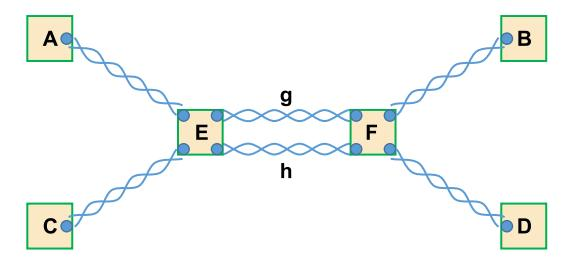

Fig. 8. Example of multiple requests (AB and CD) with a shared link (EF) in a dumbbell network topology.

algorithm cannot be used directly. Therefore, the extended Dijkstra algorithm is adopted [197]. Furthermore, the formula assumes that each link uses the same number of entangled states and that each node has the same probability of ES, and the impact of fidelity on throughput is not considered. If the fidelity of the link is insufficient, purification operations are required. These operations consume entangled pairs, resulting in a reduction of throughput. Different purification protocols may also consume different numbers of entangled pairs. When these factors are accounted for, the formula for throughput becomes more complex.

In [206], some simplifications were adopted, such as assuming that the probability of HEG is 1. Then, the formula for throughput becomes simple. Van Meter et al. [207] chose the inverse of the throughput of a single link after purification as a metric, which can reflect the path throughput to some extent. Because this metric is addictive, the traditional Dijkstra algorithm can be used.

In the Q-LEAP algorithm [204], the end-to-end fidelity is chosen as the routing metric. The end-to-end fidelity F of a path can be written as:

$$F = \prod_{i=1}^{h} F_i \tag{2}$$

where  $F_i$  is the fidelity of the *i*-th hop on the path and h is the number of hops. This parameter is also not additive, so the extended Dijkstra algorithm must be used. If the end-to-end fidelity after purification is considered, the calculation will become more complicated.

2) Multiple Requests: In actual networks, it is common for multiple requests to be present. Thus, there is a need to explore problems such as how to address resource competition and how to achieve multiplexing and request scheduling.

For example, suppose that there are two requests to build end-to-end entangled pairs AB and CD in a simplest dumbbell quantum network with a shared link, as illustrated in Fig. 8.

-  The simplest way to allocate resources is similar to circuit switching in classical networks, in which requests use resources in first-in-first-out order [206], [208]. All resources on AE, EF and FB are reserved for request AB until it is finished. Then, resources on EF are released for request CD. The order of execution can be adjusted in accordance with the path cost [201].
- 2) Resources can be assigned in a time-based round-robin fashion [196], [206], [208]. The time allocation can be fair or proportional to the priority of requests. A request

can use all resources of the shared link in its own time slots.

- 3) The resources of a shared link can be allocated equally to each request so that they can be used simultaneously [\[208\]](#page-24-38). In the illustrated example, entangled pairs g and h are reserved for requests AB and CD, respectively. Resources can also be assigned proportionally based on the weights of different requests [\[198\]](#page-24-28).
- 4) Resources can be used by means of statistical multiplexing [\[208\]](#page-24-38). When a shared link is established, its resources are first allocated to any request for which entangled states have already been established on other unshared links. If multiple links are completed, one is chosen to swap at random.

Another approach is not to have all requests choose their respective optimal paths, but rather to select a contention-free path for each. For example, the quantum network may be spatially divided among requests such that routing decisions can be made for each request within its own spatial region [\[196\]](#page-24-26). Shi and Qian [\[197\]](#page-24-27) proposed the Q-CAST algorithm, in which paths with the highest throughput are first calculated for all requests. Then, the network reserves resources for these paths, and the network topology is updated by removing these resources. These operations are repeated until no paths are found or the maximum number of paths is reached. Note that a path with high throughput is preferred, which may result in some requests being difficult to fulfill. Therefore, some improvements can be made for fairness. For example, if a request is not served in the current time slot, its weight is increased in the next time slot so that it will be served as early as possible.

To serve as many requests as possible in the same slot, the network can prioritize paths that use high-capacity nodes because these nodes are less likely to have their resources depleted and thus can be used by other requests [\[209\]](#page-24-39). Besides, Li et al. [\[204\]](#page-24-34) suggested that resources be allocated preferentially to requests with lower resource consumption and fewer DoFs.

In addition, a multipartite entanglement-based scheme can be used to construct end-to-end bipartite entangled states. Compared with bipartite entanglement-based schemes, such a scheme has an advantage regarding the bottleneck problem. For instance, suppose that there is a request to generate two Bell pairs between nodes {1, 6} and {2, 5} in a time slot in a butterfly network, as illustrated in Fig. [9.](#page-11-0) It is assumed that each link channel can generate only one Bell state in a time slot. During the process of establishing entangled states between nodes {1, 6} and {2, 5} using a bipartite entanglement-based scheme, regardless of the routing approach chosen, there will be an overlap in their paths, leading to a bottleneck issue. In contrast, through a multipartite entanglement-based scheme [\[210\]](#page-24-40) in which a 6-qubit cluster state is built based on these Bell pairs and a series of graph operations is performed, this request can be fulfilled. However, determining whether a graph state can be transformed into a set of Bell pairs via single-qubit Clifford operations, singlequbit Pauli measurements and classical communication is an NP-complete problem [\[211\]](#page-24-41).

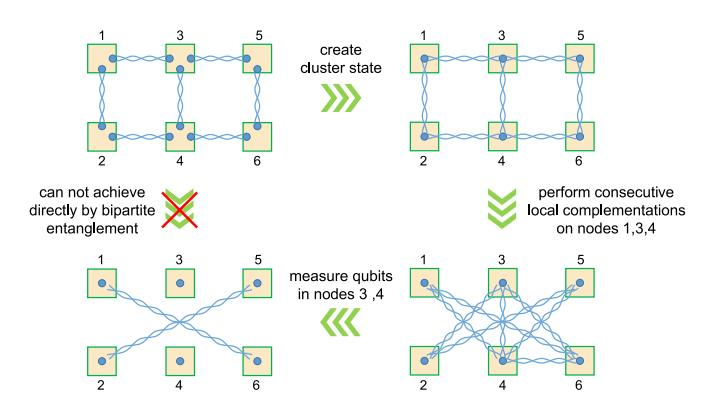

Fig. 9. Schematic diagrams illustrating the generation of two Bell pairs between nodes {1,6} and {2,5} in a butterfly network.

*3) Quantum Network Models:* Depending on the order of the HEG and routing decisions, quantum networks can be described by either the "advance generation" model or the "on-demand generation" model. Fig. [10](#page-12-0) shows how these two models work in a grid network topology.

In the advance generation model, entangled states are generated before a request arrives, and the number of entangled states assigned to each channel in the network is fixed. The advantage of this approach is that requests do not have to wait for HEG. Because of the probabilistic nature of HEG, the entanglement topology in each time slot may differ, so it is necessary to make decisions based on real-time entanglement link information. If global link information is used, one or more paths can be selected with certainty, and only nodes on the selected path participate in the request. Routing decisions must be made as soon as possible to avoid decoherence. However, because the coherence time of a quantum state is very short, it is unrealistic to collect global link information for all nodes in a large network in order to make decisions. If only local link information is used, more nodes will need to participate in the same request to ensure the successful establishment of end-to-end entanglement. For example, the resources of all nodes in the entire square area are utilized to complete the request in Fig. [10\(](#page-12-0)a).

In the on-demand generation model, HEG is directed by the routing algorithm after a request arrives. The qubit resources of nodes can then be allocated to the necessary quantum channels in accordance with the request, allowing the request to be better served with more effective utilization of qubit resources. For example, as shown in Fig. [10,](#page-12-0) the advance generation model assigns one entangled state to each channel, whereas the on-demand generation model can assign two states to specified channels at the expense of other channels, which will have none. Several articles [\[197\]](#page-24-27), [\[209\]](#page-24-39) discussed the situation in which the number of qubits in a quantum device was fewer than the number of channels connected to it. In this case, if the advance generation model is adopted, some channels will never have entangled links, resulting in some requests not finding a path. If the on-demand generation model is adopted, the entangled states on the channels can be allocated in accordance with the requests so that each request can be satisfied. Due to the probabilistic nature of HEG, recovery

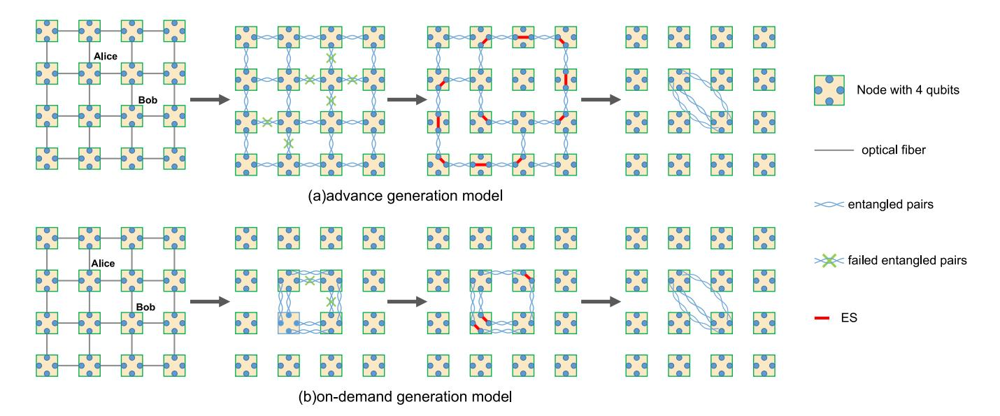

Fig. 10. Schematic illustrations of the advance generation model and the on-demand generation model in a grid network topology.

paths need to be prepared during the routing decision. Nodes can choose either the main path or the recovery path in accordance with the local entangled link information during ES

For the selection of the recovery path, Gyongyosi [212] suggested that placing high-degree nodes on the recovery path can support different main paths, and Shi and Qian [197] chose links without resource contention as recovery paths after the selection of the main path. However, contention-free path selection results in incomplete utilization of resources, thereby limiting the network throughout. For the example in Fig. 8, two contention-free paths, AE-g-FB and CE-h-FD, are found for requests AB and CD. If the entangled pairs h and FB fail, then no requests can be satisfied. However, there is another choice, CE-g-FD, that can be selected to fulfill request CD. To solve this problem, Zhang et al. [199] and Zhao and Qiao [200] used the main paths of different requests as the recovery paths of each other to increase resource utilization.

In general, which quantum network model is the best choice remains a topic for further discussion.

To better understand and compare the current articles on quantum network routing, in Table III, we list the routing metrics, network topologies, and various assumptions considered in each article.

Table IV presents a further comparison and analysis of articles based on fidelity, considering the fidelity of elementary links, the reduction in fidelity resulting from ES, the purification scheme, and purification between nonadjacent nodes. Existing articles have considered only the original entanglement purification protocols when designing quantum network schemes. However, a deterministic purification protocol, which has various advantages, has been proposed. Therefore, researchers can consider utilizing this new purification protocol to study the overall design scheme for quantum networks. In addition, the question of purification between nonadjacent nodes has not been considered in existing articles, and this problem should be addressed in future research.

In most existing articles, quantum networks have been simulated based on regular or small-scale network topologies; however, [217] notes that such assumptions overlook various real constraints, such as costs and node placements. Therefore, the authors conducted simulations within a large area of  $4,654 \times 2,660 \text{ km}^2$ , evaluating various quantum network topologies for serving multicommodity traffic using the entanglement distribution rate and end-to-end fidelity as evaluation metrics. That study revealed that the repeater chain and Delaunay graph topologies have limited scalability, while distance-aware models such as the Waxman, threshold, and ring lattice models perform better than distance-agnostic models. However, since the study did not consider end-toend fidelity in routing algorithms and neglected entanglement purification in quantum networks, further research will be needed to reach more accurate conclusions.

#### B. Multipartite Entanglement Routing

The articles reviewed above have discussed how to build end-to-end bipartite entanglement, but many applications demand multipartite entanglement in quantum networks. Below, we briefly introduce the current schemes [68], [218] for distributing multipartite entangled states, noting that they are generally based on bipartite entanglement.

Scheme 1: The first step is to select a node as the central node and establish bipartite entanglement between this central node and each client upon request. Then, the target multipartite entangled state is generated at the central node, and each part of the entangled state is transferred to each client via quantum teleportation; that is, the request to distribute a multipartite entangled state is realized. If it is assumed that each quantum device in the quantum network has the functions of locally generating multipartite entanglement and conducting quantum teleportation, then each node can be used as a central node. The location of the central node for a given request can be determined in accordance with the locations of the

TABLE III

COMPARISON OF QUANTUM NETWORK ROUTING PROTOCOLS. THE REFERENCES IN THE FIRST COLUMN ARE LISTED IN CHRONOLOGICAL ORDER FROM TOP TO BOTTOM. ✓ (✗) INDICATES THAT THE CORRESPONDING FACTOR IS CONSIDERED (IGNORED). THE PHRASE "LOCAL/GLOBAL INFORMATION" REFERS TO THE USE OF LOCAL/GLOBAL LINK STATE INFORMATION IN ROUTING PROTOCOLS. THE TERMS "ADVANCE" AND "ON-DEMAND" ARE ABBREVIATIONS FOR THE "ADVANCE GENERATION" AND "ON-DEMAND GENERATION" MODELS, RESPECTIVELY

| Reference    | Routing metric          | Network topology | Fidelity | Success rate of elementary links           | Success rate of ES | Local/global information | Advance/ on-demand |
|--------------|-------------------------|---------------------|----------|--------------------------------------------|--------------------|--------------------------|-----------------------|
| [207]        | BellGenT                | random              | 1        | 0.4                                        | 1                  | global                   | advance               |
| [213]        | entanglement rate       | random              | Х        | $p^a$                                      | 1                  | global                   | on-demand             |
| [214]        | distance                | random              | Х        | p                                          | q                  | local                    | on-demand             |
| [212]        | distance                | random              | Х        | p                                          | q                  | local                    | on-demand             |
| [196]        | hop count               | grid                | Х        | 0.9                                        | 0.9                | local, global            | advance               |
| [197]        | throughput              | random              | Х        | 0.1, 0.3, 0.6                              | 0.8, 0.9, 1        | local                    | on-demand             |
| [206]        | throughput              | SURFnet network  | 1        | 1                                          | 0.5                | global                   | advance               |
| [198]        | hop count               | grid                | 1        | 0.9                                        | 0.9                | global                   | advance               |
| [199]        | throughput              | random              | Х        | 0.1, 0.3, 0.6                              | 0.8, 0.9, 1        | local                    | on-demand             |
| [200]        | throughput              | random              | х        | $e^{-\alpha l, b}$ $\alpha \in [0, 0.001]$ | [0.5,1]            | global                   | on-demand             |
| [201]        | latency                 | grid, random        | 1        | p                                          | q                  | global                   | advance               |
| [215]        | number of repeaters     | SURFnet network  | 1        | 0.5                                        | 0.5                | global                   | on-demand             |
| [209]        | qubit capacity of nodes | grid                | Х        | 1                                          | 1                  | global                   | on-demand             |
| [203]        | throughput, fairness    | random              | ×        | $e^{-\alpha l},$ $\alpha \in [0, 0.001]$   | 0.9                | global                   | on-demand             |
| [204]-Q-PATH | entangled pair cost     | US backbone         | 1        | 1                                          | 1                  | global                   | advance               |
| [204]-Q-LEAP | fidelity                | network             |          | 1                                          | 1                  | giouai                   | auvance               |

TABLE IV COMPARISON OF DIFFERENT FIDELITY-BASED QUANTUM NETWORK ROUTING PROTOCOLS. ✓ (✗) INDICATES THAT THE CORRESPONDING FACTOR IS CONSIDERED (IGNORED)

| Reference | Fidelity of elementary links      | ES-induced fidelity reduction | Specific purification scheme     | Purification between nonadjacent nodes |
|-----------|-----------------------------------|-------------------------------|----------------------------------|----------------------------------------|
| [207]     | different and arbitrary           | ✓                             | Dehaene et al.'s scheme [216]    | Х                                      |
| [206]     | identical, $F = 0.9925$           | ✓                             | х                                | х                                      |
| [198]     | normal distribution $N(0.8, 0.1)$ | х                             | Bennett et al.'s scheme [171]    | х                                      |
| [201]     | identical                         | ✓                             | х                                | х                                      |
| [215]     | identical, $F = 0.99$             | ✓                             | х                                | х                                      |
| [204]     | normal distribution $N(0.8, 0.1)$ | ✓ <b>/</b>                    | pumping purification scheme [43] | х                                      |

request clients and network resources. Therefore, the routing problem for this scheme includes selecting an appropriate central node and finding the optimal paths from the central node to the clients. If there is no quantum storage, then these paths must be successfully established simultaneously for subsequent quantum teleportation. Fig. [11](#page-14-0) shows a scenario of distributing a four-partite entangled state. The nodes between the central node and each client are omitted from the diagram.

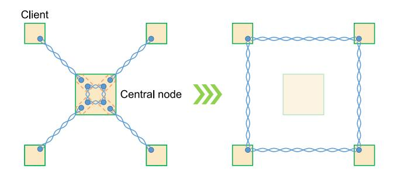

Fig. 11. Schematic diagram of distributing a four-partite entangled state among four clients using Scheme 1.

Scheme 2: The local preparation of multipartite entanglement is achieved by conducting local quantum gate operations on qubits. Teleported gates [\[219\]](#page-25-2) based on bipartite entanglement between nodes can prepare multipartite entanglement distributed across different nodes. The routing problem for this scheme includes finding the optimal paths between clients.

Some schemes [\[220\]](#page-25-3), [\[221\]](#page-25-4) aim to distribute graph states, an important subclass of multipartite entangled states, which are used in many quantum applications. The tree scheme [\[220\]](#page-25-3) can distribute the important class of graph states known as GHZ states. By starting from a minimal tree connecting all terminal nodes to which the request relates, the desired state over the terminal nodes can be realized by choosing any leaf node and iteratively applying star expansion. Bugalho et al. [\[221\]](#page-25-4) made improvements to this scheme by attempting to find the best tree by means of a multiobjective Steiner tree algorithm instead of finding the minimal tree. In addition, [\[220\]](#page-25-3) generalized the tree scheme to the distribution of an arbitrary graph state. The first step is to distribute a special resource graph state between clients, namely, the edge-decorated complete graph; then, the desired graph state is constructed by measuring qubits. This scheme is applicable when the network knows which clients want to build a graph state but is unaware of the specific graph state to be built. A resource graph state can be constructed in advance before a request arrives, and the target graph state can then be obtained by transforming graph states in accordance with the request.

When the network cannot predict which clients want to set up a request, it can choose another scheme [\[210\]](#page-24-40), [\[222\]](#page-25-5), which is to share a cluster state on all nodes in the quantum network. When a request arrives, quantum gate operations are performed on qubits in the cluster state to obtain the desired GHZ state among the target clients. When the scale of the network is large, the shared multipartite entangled state is very fragile. Therefore, [\[76\]](#page-22-24), [\[223\]](#page-25-6) considered using a GHZ4 state to connect nodes. Since a GHZ4 state can connect at most 4 nodes, it is necessary to merge multiple GHZ states into the desired graph state among target terminal nodes when the nodes involved in the request are not directly connected through a GHZ state. Reference [\[224\]](#page-25-7) adopted self-similar multiqubit entanglement structures to preconstruct multipartite entanglement states in a quantum network.

Although determining whether a graph state can be transformed into another graph state via single-qubit Clifford operations, single-qubit Pauli measurements and classical

communication is an NP-complete problem [\[225\]](#page-25-8), [\[226\]](#page-25-9), for some specific classes of structured resources, this can nevertheless be achieved via polynomial-time algorithms [\[210\]](#page-24-40).

## *C. Waiting Time*

In addition to the routing problem, calculating the waiting time needed for the successful distribution of an entangled state on a given path is a worthwhile topic of study in the quantum network layer. Due to decoherence, the longer the waiting time is, the worse the quality of the entangled states will be. Therefore, the waiting time is a crucial indicator of the performance of quantum Internet protocols. Due to the probabilistic nature of HEG and ES, the waiting time has a probability distribution; however, most articles compute only the average time.

In recent years, some papers [\[49\]](#page-21-48), [\[92\]](#page-22-40), [\[227\]](#page-25-10), [\[228\]](#page-25-11), [\[229\]](#page-25-12), [\[230\]](#page-25-13), [\[231\]](#page-25-14), [\[232\]](#page-25-15), [\[233\]](#page-25-16) have calculated the waiting times for the construction of end-to-end entangled states in different repeater schemes under different conditions. These conditions include whether the quantum memory is perfect, whether the probability of ES is considered, and whether purification is accounted for.

From the perspective of quantum information theory, some papers [\[205\]](#page-24-35), [\[234\]](#page-25-17), [\[235\]](#page-25-18), [\[236\]](#page-25-19), [\[237\]](#page-25-20), [\[238\]](#page-25-21), [\[239\]](#page-25-22) have calculated the optimal rates in bipartite, multipair and multipartite quantum communication. Since this topic has already been discussed in some detail in a previous review [\[15\]](#page-21-14), we will not address it further here.

#### VIII. QUANTUM TRANSPORT LAYER PROTOCOLS

The quantum transport layer is responsible for reliable transmission of quantum information. Specifically, its functions include congestion control, retransmission, and quantum channel quality detection.

## *A. Congestion Control*

Due to the limited quantum memory of quantum devices in the foreseeable future and operations such as HEP and QEC that aim to improve the quality of quantum states but further deplete the number of qubits, congestion is likely to arise more easily in quantum networks than in classical networks unless corresponding adjustments are made.

First, let us define congestion in quantum networking. The discussion here revolves around quantum networks that utilize end-to-end entangled states for quantum teleportation to transmit quantum data. Specifically, congestion can be categorized into two types.

The first type of congestion occurs when a quantum node on one or more paths receives requests to establish entanglement but does not have sufficient quantum memory to fulfill these requests. This is referred to as congestion during the entanglement establishment process. The second type of congestion occurs when a terminal uses quantum teleportation to transmit quantum data. If the generation speed of the quantum data exceeds the generation speed of the remote entangled states, this will result in insufficient quantum memory at the terminal. This is referred to as congestion at the terminal.

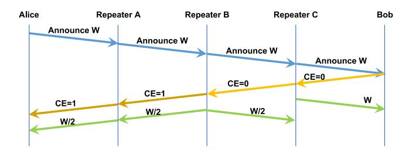

Fig. 12. Schematic diagram of quantum congestion control: First, Alice announces the desired sending window size, W, to the selected quantum repeaters along the chosen path and the intended communication receiver, Bob. Subsequently, the nodes check their quantum memory resources. If the requirements are not fulfilled, the congestion encountered (CE) flag is set to 1, and the window size is halved. In this diagram, repeater B encounters congestion.

From the perspective of the location of congestion, the first type of congestion in quantum networks is similar to congestion in classical networks. The distinction lies in the fact that congestion in classical networks occurs during data transmission, whereas in quantum networks, congestion occurs during the preparation of quantum connections for quantum data transmission.

For the first type of congestion, [240] adopted a heuristic approach similar to the Transmission Control Protocol (TCP) congestion control mechanism. This mechanism uses slow start and additive-increase/multiplicative-decrease (AIMD) to regulate how much quantum memory is allocated to a given session at each quantum node as well as how much quantum data can be transmitted in each time slot of the session. The window size is explicitly determined by intermediate nodes rather than being decided by the terminal, as in TCP. However, this approach has the disadvantage of reducing the utilization of entanglement resources because it allocates entanglement resources for a given request sequentially from the receiving end along the specified path. When subsequent nodes encounter congestion and halve the window size, the preceding nodes have already used their entanglement resources allocated based on the original window size, leading to entanglement resource waste. In the scenario depicted in Fig. 12, repeater B encounters congestion and halves the window size to W/2, yet the quantum link Bob-C still uses W entanglement resources.

For the second type of congestion, [241] constructed a quantum queuing model by employing a dynamic programming formalism and developed a cognitive-memory-based policy for memory allocation such that the average queuing delay decreases exponentially with increasing memory size. These authors suggested that preparing entanglement before the quantum data arrive can significantly reduce the queuing delay.

#### B. Retransmission

In addition to the suppression of errors through QEC codes and entanglement purification, reliable transmission of quantum information can be ensured through retransmission at the terminal. However, because of the no-cloning theorem, quantum networks cannot use replication to achieve retransmission. A quantum retransmission protocol based on the

recursive use of a (2, 3) quantum secret sharing scheme has been proposed [242]. When Alice wants to send a data qubit A to Bob, A is encoded into three sharings  $A_1^0$ ,  $A_2^0$ , and  $A_3^0$  and can be recovered from any two of them. Alice first sends  $A_1^0$ . If the sending of  $A_1^0$  fails, Alice can recover the original data A from  $A_2^0$  and  $A_3^0$  and try to send  $A_1^0$  again. If the transmission is successful, then  $A_2^0$  is sent. If  $A_2^0$  also arrives, Bob can recover the original data A from  $A_1^0$  and  $A_2^0$ . Otherwise, Alice must encode  $A_3^0$  into  $A_1^1$ ,  $A_2^1$ , and  $A_3^1$ , and the procedure proceeds recursively. These situations are illustrated in Fig. 13. Later, Zhao and Qiao [240] noted that the above article lacked a necessary discussion of resource allocation to achieve reliable end-to-end delivery. For example, if this quantum retransmission protocol based on quantum secret sharing recurses too many times, the receiver may deplete the qubit resources reserved for the data. As a consequence, not only can the sender not continue to send data, but the receiver cannot release resources, resulting in a deadlock. Therefore, the management of quantum memory is critical.

#### C. Quantum Channel Quality Detection

If users want to confirm whether the fidelity of a received quantum state meets requirements, it is necessary to measure the quantum state. However, the measurement operation will destroy the state, resulting in subsequent unavailability. Therefore, test qubits are needed to detect the channel quality in advance. Yu et al. [242] proposed a quantum version of the three-way handshake protocol to build connections and detect the quality of quantum channels. Liu et al. [243] presented a virtual link verification protocol for testing quantum channel fidelity and rate and a distributed fault discovery protocol based on the network benchmarking method introduced in [244].

#### IX. QUANTUM APPLICATION PROTOCOLS

In the current classical Internet, various applications, such as Web and email, theoretically have the option to encode classical information into qubits for transmission. However, due to the fragility of qubits, the practical data transmission rate for classical information using qubits is significantly lower than that achieved with classical bits. Consequently, despite envisioning a future with quantum Internet advancements, these classical applications will continue to rely on the classical Internet. The current objective of quantum Internet development is not to replace the classical Internet but to provide services that are outside the capabilities of the classical Internet. These services include two key functionalities: first, to ensure the uncompromisable security of various applications running on the classical Internet, and second, to support quantum applications such as quantum computing [1], [2], [3], [4], [5], [6], quantum communication [7] and quantum sensing [8], [9], which cannot be executed using the classical Internet.

Data security is of utmost importance in network applications. However, the emergence of Shor's quantum algorithm [245] has rendered current classical encryption methods inadequate in terms of ensuring security. While the current number of qubits in quantum computers is still insufficient to pose

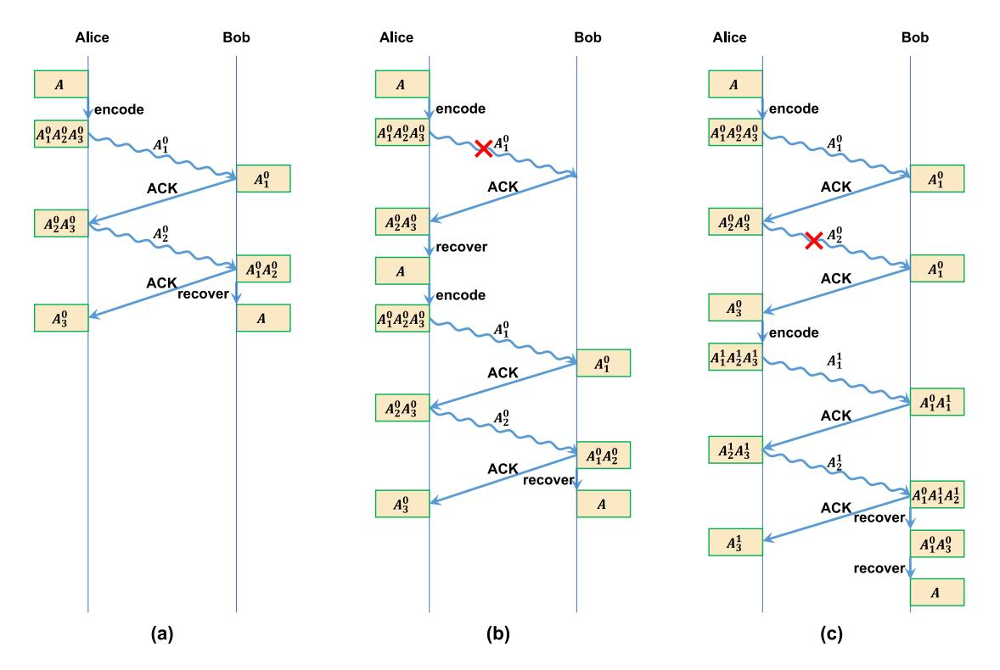

Fig. 13. Schematic diagrams of the quantum-secret-sharing-based quantum retransmission protocol: (a) No packet loss during transmission. (b) Transmission failure for  $A_1^0$ . (c) Transmission failure for  $A_2^0$ . ACK is used by Bob to inform Alice whether the quantum data were successfully received.

an immediate threat, it is crucial to devise strategies to address this vulnerability. One viable solution is to employ quantum key distribution (QKD) technology [246], [247], [248], [249], [250], [251], [252], [253], [254], [255], [256], [257], [258], [259], [260], [261], [262], [263], which enables physically secure communication. QKD boasts the advantage of relative ease of implementation, as it can be achieved without establishing remote entanglement. Moreover, qubits are immediately measured upon receipt, eliminating challenges associated with long-term quantum storage. Consequently, QKD represents the most mature quantum application to date. Numerous countries have invested in related research and established QKD network trials within metropolitan areas [255], [264], [265], [266], [267], [268], [269], [270], [271], [272]. While some attempts have been made to achieve QKD over longer distances, they primarily rely on trusted relays instead of quantum repeaters. Current research focuses on QKD over backbone networks consisting of optical fibers or quantum satellites. The long-term goal of applying OKD to mobile devices or Internet of Things terminals [273], [274] faces challenges such as path loss, environmental light interference, and mobility requirements, thereby warranting further research in this nascent field.

In the realm of quantum computing, significant advantages over classical computing have been observed in various aspects, such as large number factorization [275], unordered search [276], linear equation solving [277], combinatorial optimization [278], [279], [280], and big data classification [281], [282], [283]. By interconnecting multiple quantum computers through a quantum network, their computational

power can be significantly enhanced. For k quantum computers, each with n qubits, their collective independent representations of states amount to  $k \cdot 2^n$ . However, when interconnected, the number of representable states increases to  $2^{kn}$ . Presently, quantum memory in individual quantum computers remains highly limited, which impedes their ability to run large-scale programs and severely constrains the potential of quantum computing. Connecting multiple quantum computers facilitates distributed quantum computing [284], [285], [286], [287] and thus augments their computational capabilities. To establish such connections, quantum links are essential, which entail either direct quantum data transmission or the establishment of remote entangled states. Traditional classical networks cannot support such connections, giving rise to the concept of quantum networks to enable quantum connections. At present, the number of available quantum computers is limited. In the coming years, however, it is anticipated that users may gain the ability to remotely access quantum computers. Quantum networks will enable users from around the globe to harness the power of quantum computers while ensuring the confidentiality of their tasks through the use of blind quantum computing protocols [288], [289]. Furthermore, quantum networks can broaden the scope of quantum communication applications, including QKD, quantum secure direct communication [290], [291], [292], [293], [294], [295], [296], [297], [298], [299], [300], quantum secret sharing [301], [302], [303], [304], [305], [306], [307], Byzantine agreement [308], quantum voting [309], [310], and quantum conference key agreement [311], [312], [313], thereby ensuring secure communication across a broad range

[\[270\]](#page-26-1), [\[272\]](#page-26-3), [\[314\]](#page-26-45). Moreover, quantum sensing can enhance the precision limits of classical sensors in various domains, such as clock synchronization [\[315\]](#page-26-46), [\[316\]](#page-26-47), [\[317\]](#page-26-48), [\[318\]](#page-26-49), target detection [\[319\]](#page-26-50), [\[320\]](#page-26-51), [\[321\]](#page-26-52), [\[322\]](#page-26-53), [\[323\]](#page-26-54), [\[324\]](#page-27-0), and long-baseline telescopes [\[325\]](#page-27-1). By interconnecting multiple quantum sensors through a quantum network, their precision can be further improved [\[326\]](#page-27-2), [\[327\]](#page-27-3), [\[328\]](#page-27-4), [\[329\]](#page-27-5), [\[330\]](#page-27-6).

Notably, different quantum applications should have specific protocols that inform the quantum network of the number of entangled states, rate, minimum fidelity, acceptable latency, communication requirements, target objects and other necessary information so that the network can choose the appropriate implementation strategy.

#### X. QUANTUM INTERNET TESTBEDS AND TRIALS

Regarding QKD networks, many attempts have been made in many countries based on fiber optics and free-space communication, such as the DARPA [\[264\]](#page-25-47), SECOQC [\[265\]](#page-25-48), SwissQuantum [\[266\]](#page-25-49), Tokyo [\[267\]](#page-25-50), Beijing–Shanghai [\[268\]](#page-25-51), China–Austria [\[269\]](#page-26-0), Cambridge [\[270\]](#page-26-1), Hefei [\[271\]](#page-26-2) and Jinan– Qingdao [\[255\]](#page-25-38) QKD networks as well as an integrated space-to-ground network [\[272\]](#page-26-3). Please refer to review [\[259\]](#page-25-42) for details. In the following, we introduce the experimental progress in the formation of entangled states between two or more remote nodes.

Regarding the distribution of remote entanglement between two nodes, [\[331\]](#page-27-7) realized entanglement distribution between two remote nodes with a distance of 400 m connected by a 33 km fiber, and postselected entanglement distribution between two remote nodes separated by 12.5 km through a field-deployed fiber of 20.5 km has also been realized [\[332\]](#page-27-8).

Furthermore, quantum networks should be able to distribute entanglement among multiple nodes. Initially, researchers tried simple quantum networks without quantum repeaters. For example, an efficient quantum networking approach based on a central provider that distributes entanglement among users using optical elements has been proposed [\[333\]](#page-27-9), [\[334\]](#page-27-10), [\[335\]](#page-27-11), [\[336\]](#page-27-12), [\[337\]](#page-27-13), [\[338\]](#page-27-14), [\[339\]](#page-27-15), [\[340\]](#page-27-16), [\[341\]](#page-27-17). A fully connected quantum network among four users using dense wavelength-division multiplexing has also been presented [\[336\]](#page-27-12). However, wavelength-multiplexed technology must provide O(*N* 2) multiplexed channels for *N* users, limiting its scalability. Therefore, the authors made further improvements to reduce resource consumption and constructed an eight-user metropolitan fully connected quantum communication network [\[338\]](#page-27-14). References [\[339\]](#page-27-15), [\[340\]](#page-27-16) used flex-grid technology and a wavelength-selective switch to achieve a fully connected quantum network. The experiments in the above articles used either loop-back fibers [\[338\]](#page-27-14) or a tabletop configuration [\[336\]](#page-27-12), [\[339\]](#page-27-15), [\[340\]](#page-27-16). Alshowkan et al. [\[341\]](#page-27-17) realized flex-grid entanglement distribution in a deployed network consisting of three nodes separated by distances of 250 m and 1200 m. Additionally, four-photon GHZ states have been constructed to achieve quantum conference key agreement among four users [\[342\]](#page-27-18). Wang et al. [\[343\]](#page-27-19) proposed a new quantum-reconfigurable add–drop multiplexer and implemented a six-user entanglement-distribution quantum network. In [\[60\]](#page-22-8), the experimental demonstration of a quantum network architecture with 2 × 2 parallel all-photonic quantum repeater nodes and two users was presented.

In addition, substantial progress has been achieved based on nitrogen-vacancy centers in diamond [\[17\]](#page-21-16), [\[344\]](#page-27-20), [\[345\]](#page-27-21), [\[346\]](#page-27-22). In [\[345\]](#page-27-21), a three-node entanglement-based quantum network was constructed, in which the distances between nodes were 2 m and 30 m. This network established GHZ states across the three nodes and realized ES operation through an intermediary node. Reference [\[346\]](#page-27-22) achieved quantum teleportation between remote non-neighboring nodes for the first time by employing ES through an intermediary node.

## XI. CHALLENGES AND FUTURE RESEARCH DIRECTIONS

In this section, we identify key challenges and outline future research directions for quantum networks.

#### *A. Quantum Internet Protocols*

As previously detailed, the protocols for each layer of quantum networks have been explored individually. By shifting focus from a single layer to a holistic view of the protocols across all layers of quantum networks, we can reveal new challenges and opportunities for optimization previously overlooked.

*1) Quantum Physical Layer Protocols:* By understanding the upper layers, researchers focusing on the physical layer can better define their research objectives. For instance, a key realization is that limited quantum memory resources significantly constrain throughput and exacerbate congestion in quantum networks. There are various hardware platforms for implementing qubits, each with different constraints on scalability, with common issues including crosstalk, gate heating, and frequency crowding. Moreover, the generation of remote entangled states requires that nodes possess sufficient quantum storage capacity. However, this is difficult due to the inherent fragility of qubits, which are highly susceptible to environmental influences, resulting in decoherence. To address these challenges, extensive research efforts are underway. Specifically, [\[347\]](#page-27-23) provides an insightful review of the latest advancements in scalability and decoherence mitigation across different platforms.

Furthermore, factors such as the efficiency and speed of entanglement generation, quantum gates, quantum light sources, detectors, and conversion at light–matter interfaces all influence latency and throughput in quantum networks. Formula [\(1\)](#page-10-1) for describing throughput does not include these parameters, primarily because it assumes ideal operational efficiency for these components. Additionally, in quantum network routing protocols, 'throughput' typically refers to the number of entangled qubit pairs per time slot. These parameters affect the size of a time slot. If throughput is defined as the number of remote entangled qubit pairs per unit of time, then an increase in the speed of these factors would correspondingly result in higher throughput and decreased latency.

The high cost and large scale of current quantum networking equipment also present significant challenges. For example, existing superconducting qubit platforms rely on large-scale dilution refrigerators to preserve the quantum properties of qubits. Such expensive and bulky apparatuses are unsuitable to serve as quantum repeaters. Consequently, a critical area for future research is developing more affordable and compact devices or exploring alternative quantum technology approaches that are viable at room temperature. Furthermore, the coexistence of multiple quantum hardware platforms is likely in the future, making it essential to research how to establish interconnectivity between different physical platforms.

*2) Quantum Link Layer Protocols:* Currently, there is a need for more in-depth discussions regarding the quantum link layer. The upcoming tasks involve clarifying this layer's functionalities and designing more optimized protocols. A deeper comprehension of each layer will contribute to making better decisions for the quantum link layer. Both quantum physical layer protocols and quantum link layer protocols primarily focus on entanglement generation within a single hop. While there is a general division of responsibilities between these two layers, the precise assignment of certain technologies to either layer remains undefined. For example, in [\[75\]](#page-22-23), after a collective analysis of both quantum physical layer and quantum link layer protocols, the function of triggering entanglement attempts was reassigned from the quantum link layer to the quantum physical layer. This reassignment relaxed the previously very stringent real-time constraints on systems deploying the corresponding quantum link layer protocol.

Moreover, it will be crucial to advance research on more efficient QEC protocols, with an emphasis on their practical implementation in experiments. Theoretically, encoding multiple physical qubits into a single logical qubit using QEC codes should reduce error rates. However, a practical challenge arises in experimental scenarios, where adding more qubits often introduces extra operations and additional error sources. Recently, the Google team [\[169\]](#page-24-43) achieved a breakthrough in superconducting qubit systems, for the first time enabling quantum error correction to enhance performance as the number of qubits increases. It is hoped that ongoing research will further diminish error rates, paving the way for these systems to become truly feasible for practical application.

*3) Quantum Network Layer Protocols:* Future work in this layer could concentrate on finding improved quantum network models and appropriate routing metrics, designing better routing protocols, handling resource competition, and developing improved methods for calculating waiting times. Armed with knowledge of the other layers, researchers focusing on this layer can treat important factors such as fidelity, decoherence and success rate more carefully, rather than simply ignoring them. It can be anticipated that taking these factors into account may introduce complexity. Therefore, a certain degree of idealization might be practical in the early stages of research. However, it is vital to recognize that findings from such idealized scenarios may not be applicable to actual quantum networks. Furthermore, the latest purification schemes can be applied to design better routing protocols. In addition, there is a trend of employing quantum algorithms to address

routing problems in classical networks [\[348\]](#page-27-24), which prompts consideration of the application of quantum algorithms to solve routing issues in quantum networks.

Moreover, recent papers [\[349\]](#page-27-25), [\[350\]](#page-27-26), [\[351\]](#page-27-27), [\[352\]](#page-27-28) have begun delving into advanced quantum functionalities for quantum networks, using quantum control registers to enable network devices to handle or operate with coherent superpositions of various tasks. Such functionality allows for the preparation of superpositions of different target state configurations shared among network nodes or for quantum information to be transmitted along a superposition of different paths or to multiple destinations. The concept of quantum addressing [\[353\]](#page-27-29) has also been proposed to realize fully quantum functionality for quantum networks. Recent experiments [\[354\]](#page-27-30) support the claim that quantum communication using superposed trajectories shows inherent robustness.

*4) Quantum Transport Layer Protocols:* In the past two years, some researchers have begun to focus on the quantum transport layer and have conducted preliminary explorations. Further research will be needed to fully determine the functions of this layer and design more valuable protocols. Existing protocols discard entangled states and quantum data under congestion. However, constructing end-to-end entangled states is a challenging task, as seen from the discussions about the quantum physical, link, and network layers. Therefore, in the quantum transport layer, whether these constructed entangled states should be discarded must be carefully considered. In addition, some quantum data may be very precious, as they are the result of long computations by quantum computers and cannot be copied due to the no-cloning theorem. Therefore, such data need to be treated with great care in the future rather than being discarded. Additionally, current quantum retransmission protocols based on quantum secret sharing require two successful transmissions to complete information transfer, even in scenarios with no packet loss (as illustrated in Fig. [13\(](#page-16-0)a)), thereby increasing the transmission time. Therefore, exploring advanced quantum retransmission protocols that optimize both reliability and efficiency is essential. Research could also aim to develop strategies to minimize packet loss in quantum networks.

Moreover, the quantum transport layer protocol [\[240\]](#page-25-23) includes the processes of constructing entangled states. It resolves congestion issues by controlling the allocation of requested resources on quantum nodes. However, many quantum network layer routing protocols make routing decisions based on the quantity of quantum resources on nodes, which means that resources are reserved during routing selection. If a quantum transport layer protocol modifies the resources allocated in the course of a quantum network layer protocol during subsequent processes, it is quite likely that the previously chosen path may no longer be the optimal route. Therefore, considering the impact of request scheduling and resource allocation on path selection, delegating parts of these tasks to the quantum network layer might be a more favorable approach.

Furthermore, some quantum transport layer protocols are considered responsible only for tasks that occur after the establishment of remote entangled states. The precise role that the quantum transport layer should take in these processes is also a matter that requires contemplation.

*5) Quantum Application Protocols:* Currently, only a few quantum applications are known, and some are not feasible due to limited qubit quantity and quality. For example, [\[355\]](#page-27-31) estimated that factoring a 2048-bit RSA integer would require 20 million physical qubits. This is far beyond the capacity of today's most advanced quantum computers, built by IBM, which have a maximum of 1121 qubits. By delving into the lower layers, researchers studying quantum applications can gain a clearer understanding of the present situation. The next goal is to discover more achievable and useful quantum applications or find methods to reduce the qubit requirements of existing applications. Furthermore, specific protocol designs, such as well-defined workflows and message types, are lacking at present and need further exploration.

## *B. Layered Models of the Quantum Internet*

In this survey, we have discussed quantum Internet protocols from the perspective of protocol stack layering. However, there are various layered models, and there is not yet a complete consensus on the functionalities assigned to each layer. Moreover, a previous review [\[19\]](#page-21-18) suggested that a complete and universal layered model may not exist for quantum networks, for three primary reasons. First, unifying the current layered models into a single framework is challenging. Second, quantum communication involves cross-layer interactions, in conflict with the conventional protocol stack concept, in which only adjacent layers interact. Third, in the model of Dür et al., different layers possess similar functionalities, such as path discovery and routing, in contrast to the traditional notion of distinct layer functionalities within a protocol stack.

Therefore, further discussion is needed to determine whether layering is necessary for quantum networks. For instance, there is a significant distinction between quantum networks constructed based on multipartite entanglement and quantum networks based on bipartite entanglement. Whether it is necessary to create a layered model that encompasses both or to develop separate layered models for each is a matter that requires consideration. Moreover, networks constructed using third-generation quantum repeater schemes, which are not based on entanglement, are highly challenging to fit into the same layered model as entanglement-based quantum networks under strict functional layering. Therefore, due to the existence of various significantly different schemes for constructing quantum networks, it might be difficult to find a unified model aside from an abstract layered framework from a graph theory perspective. If one were to design layered models that delve into specific functionalities, it might be more effective to tailor distinct layered models for different approaches.

Additionally, while the layered approach boasts numerous advantages in scalability and flexibility and thus offers an effective solution for complex and large-scale systems such as the current classical Internet, it also comes with certain issues, such as excessive modularization, which might not always yield the best solution for a system. As the quantum Internet is still in its early development stage, many technologies are immature, as seen from limitations such as the very limited number of qubits in nodes. Therefore, many of the previously discussed approaches would be infeasible. Some articles [\[45\]](#page-21-44), [\[356\]](#page-27-32), [\[357\]](#page-27-33) have not applied a layered approach in the design of quantum networks but instead have adopted an overall design to accommodate the extreme scarcity of quantum resources within nodes. For example, Childress et al. [\[45\]](#page-21-44), [\[356\]](#page-27-32) proposed a scheme in which a quantum network can be constructed using only two qubits in each node. In this situation, achieving an overall optimal design from the bottom up is crucial to ensure the functionality of the quantum network. However, as quantum networks gradually expand in scale, the assistance of a layered approach will likely still be necessary to achieve scalability and flexibility.

# *C. Quantum Network Simulators*

Due to the current absence of fully realized quantum networks, simulation through simulators plays a vital role in verifying the feasibility of new protocols and reducing trialand-error costs. The unique quantum characteristics inherent in quantum networks introduce novel challenges for network simulation. The main challenges are as follows. First, precise physical simulations of quantum networks are highly complex. They require modeling each qubit as a matrix or vector, and the quantum states change over time when noise is considered. Moreover, the entangled states in a network are often shared among two or more nodes; such states cannot be represented as an aggregation of localized descriptions of each node's state. Additionally, the number of state representations exponentially increases with the number of qubits in the network, leading to significant computational overhead. In the pursuit of simulating large-scale quantum networks, a trade-off between precise qubit simulation and scalability must be struck. Second, a consensus regarding architectural principles is lacking in the quantum networking realm. The question of whether to adopt a layered design approach or opt for functional modularity remains a topic of considerable discussion.

In recent years, several research groups worldwide have developed various quantum network simulators [\[20\]](#page-21-19), [\[358\]](#page-27-34), [\[359\]](#page-27-35), [\[360\]](#page-27-36), [\[361\]](#page-27-37), [\[362\]](#page-27-38), [\[363\]](#page-27-39). By gaining insights into the existing array of quantum network simulators, developers of quantum network protocols can choose the most suitable simulator for their specific simulation requirements.

SimulaQron [\[358\]](#page-27-34) is primarily utilized for developing applications in quantum networks. It can be run in a distributed manner in a network composed of multiple classical computers. QuNetSim [\[359\]](#page-27-35) is based on a layered network model inspired by the OSI model. It consists of network components for each layer and logically separates them. It focuses on the development and testing of applications and protocols for quantum networks in the network and application layers. Notably, these simulators do not precisely simulate the physical characteristics of quantum networks. Consequently, some other quantum network simulators [\[20\]](#page-21-19), [\[360\]](#page-27-36), [\[361\]](#page-27-37), [\[362\]](#page-27-38), [\[364\]](#page-27-40) based on discrete-event simulation have been developed. These simulators have the ability to model time to study the impact of noise in quantum networks. NetSquid [\[360\]](#page-27-36) does not rely on specific network stack designs; instead, various functions are modularly designed. It focuses on simulating nitrogen-vacancy centers in diamond and atomic ensembles, providing complete quantum state operations. Such a simulation is highly complex. Similarly, SeQUeNCe [\[361\]](#page-27-37) adopts a modular design and achieves simulation flexibility through cross-module communication. It focuses on single rare-earth ion memories. QuISP [\[362\]](#page-27-38) is based on tracking Pauli errors. Although it lacks precision for link layer protocols, it can simulate large-scale quantum networks, thereby promoting the development of larger and more complex quantum Internet protocols. SimQN's [\[364\]](#page-27-40) primary goal is ease of configuration, allowing users to concentrate on protocol design without delving into underlying implementations while also providing high performance and accurate simulation capabilities. QNET [\[20\]](#page-21-19) has dual quantum computing engines that can support simulations of both quantum circuit models and measurementbased quantum computing models. It also supports simulations on real quantum hardware devices.

## *D. Classical Communication in Quantum Networks*

Quantum networks involve numerous classical communication tasks, such as measurement results of HEG, HEP, ES and QEC, and various forms of control information. The transmission of these classical information components requires careful consideration of appropriate protocols. This consideration extends to choosing between the conventional Internet Protocol (IP), Multiprotocol Label Switching (MPLS), and deterministic networking techniques or even developing novel forwarding technologies to meet the low latency requirements and other stringent requirements of quantum networks. Since the operation of quantum networks relies on classical networking, it is feasible to apply conventional IP addressing schemes for quantum devices and leverage the existing Domain Name System (DNS) functionality. However, it is anticipated that the number of quantum devices will remain limited for an extended period. Whether there is a need to implement a more efficient addressing scheme for quantum network devices, along with a system for correlating hostnames and addresses, requires careful consideration. Furthermore, given the requirement for collaborative interaction among nodes during the establishment of remote entangled states through first- and second-generation quantum repeater schemes, combined with the finite lifespan of qubits, exploring the use of a central software-defined networking (SDN) [\[365\]](#page-27-41), [\[366\]](#page-27-42) controller for decision-making is a direction deserving of thorough research.

# *E. Integration of Quantum Networks With Existing Networks*

From the perspectives of reducing deployment costs and achieving large-scale commercialization, integrating quantum networks with existing networks is an attractive approach. Since entanglement-based quantum networks are still in their infancy, research on integration has so far focused on QKD networks. This research can be categorized into works focusing on the physical level and higher levels (management, control).

Due to the inherent differences between quantum signals and classical signals—such as the weaker intensity and shorter transmission distance of the former as well as their vulnerability to nonlinear noise sources such as Raman scattering and four-wave mixing—many practical QKD networks use dedicated dark fibers to transmit quantum signals. This approach physically isolates quantum signals from classical signals, thereby reducing the interference from classical channels in quantum channels. However, the high deployment cost of new optical fibers has driven research into the cotransmission of quantum and classical signals over the same fiber. In recent years, much theoretical and experimental progress has been made in this field [\[367\]](#page-27-43), [\[368\]](#page-27-44), [\[369\]](#page-27-45), [\[370\]](#page-27-46), [\[371\]](#page-27-47), [\[372\]](#page-27-48), [\[373\]](#page-27-49), [\[374\]](#page-27-50), [\[375\]](#page-28-0), [\[376\]](#page-28-1).

One solution is to use wavelength-division multiplexing technology to achieve the multiplexing of quantum and classical channels and to split the bands used by the two systems by means of high-isolation optical filters, for example, selecting the O-band as the quantum band and the C-band as the classical band, to ensure the isolation of the two types of channels [\[367\]](#page-27-43). Since the purpose of QKD is to protect the data in classical networks, it is also necessary to consider how to integrate a QKD network with a classical network in terms of management and control and how to deliver the quantum keys to the applications in the classical network. SDN can simplify the integration of new devices and technologies into classical networks. For example, a multidomain SDN orchestrator can be used to coordinate QKD with traditional optical transport network domains. Currently, SDN-enabled QKD networks [\[377\]](#page-28-2) have become an important focus of research.

# XII. CONCLUSION

This paper first introduces the fundamental unit of information transmission in quantum networks, i.e., qubits, highlighting the unique characteristics of qubits compared to classical bits and the quantum operations necessary for building quantum networks. It demonstrates the opportunities and challenges posed by these new features. Because different quantum repeater schemes lead to different ways of constructing networks, we outline the three currently available quantum repeater schemes. Subsequently, we discuss the existing layered models of quantum Internet protocol stacks and present an overview of current quantum Internet protocols from a layered perspective. A comprehensive understanding of the other layers can help clarify the functions of a particular layer as part of the whole protocol stack architecture and can provide a basis for comprehensive analysis of problems and optimization of protocols. Then, we review the current experimental progress in quantum networking. Finally, we summarize the challenges and future research directions of quantum networks.

In summary, although research in the quantum Internet field is progressing in various aspects, it still requires multidisciplinary efforts. The realization of the quantum Internet will depend on various technological advances and may not be achieved in the short term; nevertheless, relevant studies should be initiated now to pave the way for its arrival. In the end, we look forward to the day when the quantum Internet will drive a new wave of changes in human society.

#### REFERENCES

- [\[1\]](#page-0-0) A. Steane, "Quantum computing," *Rep. Prog. Phys.*, vol. 61, no. 2, pp. 117–173, Feb. 1998.
- [\[2\]](#page-0-0) C. H. Bennett and D. P. DiVincenzo, "Quantum information and computation," *Nature*, vol. 404, no. 6775, pp. 247–255, Mar. 2000.
- [\[3\]](#page-0-0) T. D. Ladd, F. Jelezko, R. Laflamme, Y. Nakamura, C. Monroe, and J. L. O'Brien, "Quantum computers," *Nature*, vol. 464, no. 7285, pp. 45–53, Mar. 2010.
- [\[4\]](#page-0-0) M. A. Nielsen and I. L. Chuang, *Quantum Computation and Quantum Information*, 10th ed. Cambridge, U.K: Cambridge Univ. Press, 2010.
- [\[5\]](#page-0-0) J. Preskill, "Quantum computing in the NISQ era and beyond," *Quantum*, vol. 2, p. 79, Aug. 2018.
- [\[6\]](#page-0-0) L. Gyongyosi and S. Imre, "A survey on quantum computing technology," *Comput. Sci. Rev.*, vol. 31, pp. 51–71, Feb. 2019.
- [\[7\]](#page-0-1) N. Gisin and R. Thew, "Quantum communication," *Nat. Photon.*, vol. 1, no. 3, pp. 165–171, Mar. 2007.
- [\[8\]](#page-0-2) C. L. Degen, F. Reinhard, and P. Cappellaro, "Quantum sensing," *Rev. Mod. Phys.*, vol. 89, no. 3, Jul. 2017, Art. no. 35002.
- [\[9\]](#page-0-2) S. Pirandola, B. R. Bardhan, T. Gehring, C. Weedbrook, and S. Lloyd, "Advances in photonic quantum sensing," *Nat. Photon.*, vol. 12, no. 12, pp. 724–733, Dec. 2018.
- [\[10\]](#page-0-3) J. P. Dowling and G. J. Milburn, "Quantum technology: The second quantum revolution," *Philos. Trans. R. Soc. A, Math. Phys. Eng. Sci.*, vol. 361, no. 1809, pp. 1655–1674, Aug. 2003.
- [\[11\]](#page-0-4) H. J. Kimble, "The quantum Internet," *Nature*, vol. 453, no. 7198, pp. 1023–1030, Jun. 2008.
- [\[12\]](#page-0-4) W. Dür, R. Lamprecht, and S. Heusler, "Towards a quantum Internet," *Eur. J. Phys.*, vol. 38, no. 4, May 2017, Art. no. 43001.
- [\[13\]](#page-0-4) S. Wehner, D. Elkouss, and R. Hanson, "Quantum Internet: A vision for the road ahead," *Science*, vol. 362, no. 6412, Oct. 2018, Art. no. eaam9288.
- [\[14\]](#page-0-4) W. Kozlowski and S. Wehner, "Towards large-scale quantum networks," in *Proc. 6th Annu. ACM Int. Conf. Nanoscale Comput. Commun.*, Sep. 2019, pp. 1–7.
- [\[15\]](#page-0-4) K. Azuma, S. Bäuml, T. Coopmans, D. Elkouss, and B. Li, "Tools for quantum network design," *AVS Quant. Sci.*, vol. 3, no. 1, Mar. 2021, Art. no. 14101.
- [\[16\]](#page-0-4) A. Singh, K. Dev, H. Siljak, H. D. Joshi, and M. Magarini, "Quantum Internet—Applications, functionalities, enabling technologies, challenges, and research directions," *IEEE Commun. Surveys Tuts.*, vol. 23, no. 4, pp. 2218–2247, 4th Quart., 2021.
- [\[17\]](#page-0-4) M. Ruf, N. H. Wan, H. Choi, D. Englund, and R. Hanson, "Quantum networks based on color centers in diamond," *J. Appl. Phys.*, vol. 130, no. 7, Aug. 2021, Art. no. 70901.
- [\[18\]](#page-0-4) S.-H. Wei et al., "Towards real-world quantum networks: A review," *Laser Photon. Rev.*, vol. 16, no. 3, 2022, Art. no. 2100219.
- [\[19\]](#page-0-4) J. Illiano, M. Caleffi, A. Manzalini, and A. S. Cacciapuoti, "Quantum Internet protocol stack: A comprehensive survey," *Comput. Netw.*, vol. 213, Aug. 2022, Art. no. 109092.
- [\[20\]](#page-0-4) K. Fang, J. Zhao, X. Li, Y. Li, and R. Duan, "Quantum network: From theory to practice," *Sci. China Inf. Sci.*, vol. 66, no. 8, Jul. 2023, Art. no. 180509.
- [\[21\]](#page-0-4) Z. Li et al., "Entanglement-assisted quantum networks: Mechanics, enabling technologies, challenges, and research directions," *IEEE Commun. Surveys Tuts.*, vol. 25, no. 4, pp. 2133–2189, 4th Quart., 2023.
- [\[22\]](#page-0-5) A. S. Cacciapuoti, M. Caleffi, F. Tafuri, F. S. Cataliotti, S. Gherardini, and G. Bianchi, "Quantum Internet: Networking challenges in distributed quantum computing," *IEEE Netw.*, vol. 34, no. 1, pp. 137–143, Jan./Feb. 2020.
- [\[23\]](#page-2-2) W. K. Wootters and W. H. Zurek, "A single quantum cannot be cloned," *Nature*, vol. 299, no. 5886, pp. 802–803, Oct. 1982.
- [\[24\]](#page-2-3) M. Schlosshauer, "Quantum decoherence," *Phys. Rep.*, vol. 831, pp. 1–57, Oct. 2019.
- [\[25\]](#page-3-2) N. Brunner, D. Cavalcanti, S. Pironio, V. Scarani, and S. Wehner, "Bell nonlocality," *Rev. Mod. Phys.*, vol. 86, no. 2, pp. 419–478, Apr. 2014.
- [\[26\]](#page-3-3) R. Horodecki, P. Horodecki, M. Horodecki, and K. Horodecki, "Quantum entanglement," *Rev. Mod. Phys.*, vol. 81, no. 2, pp. 865–942, Jun. 2009.
- [\[27\]](#page-3-3) I. Bengtsson and K. Zyczkowski, ˙ *Geometry of Quantum States: An Introduction to Quantum Entanglement*. Cambridge, U.K.: Cambridge Univ. Press, 2017.

- [\[28\]](#page-3-4) J. Bell, "On the Einstein Podolsky Rosen paradox," *Phys. Phys. Fiz.*, vol. 1, pp. 195–200, Nov. 1964.
- [\[29\]](#page-3-5) A. Einstein, B. Podolsky, and N. Rosen, "Can quantum-mechanical description of physical reality be considered complete?" *Phys. Rev.*, vol. 47, no. 10, pp. 777–780, May 1935.
- [\[30\]](#page-3-6) D. M. Greenberger, M. A. Horne, and A. Zeilinger, "Going beyond Bell's theorem," in *Bell's Theorem, Quantum Theory and Conceptions of the Universe*. Dordrecht, The Netherlands: Springer, 1989, pp. 69–72.
- [\[31\]](#page-3-6) D. M. Greenberger, M. A. Horne, A. Shimony, and A. Zeilinger, "Bell's theorem without inequalities," *Am. J. Phys.*, vol. 58, no. 12, pp. 1131–1143, 1990.
- [\[32\]](#page-3-6) D. Bouwmeester, J.-W. Pan, M. Daniell, H. Weinfurter, and A. Zeilinger, "Observation of three-photon Greenberger-Horne-Zeilinger entanglement," *Phys. Rev. Lett.*, vol. 82, no. 7, pp. 1345–1349, Feb. 1999.
- [\[33\]](#page-3-7) W. Dür, G. Vidal, and J. I. Cirac, "Three qubits can be entangled in two inequivalent ways," *Phys. Rev. A*, vol. 62, no. 6, Nov. 2000, Art. no. 62314.
- [\[34\]](#page-3-8) M. Erhard, M. Krenn, and A. Zeilinger, "Advances in high-dimensional quantum entanglement," *Nat. Rev. Phys.*, vol. 2, no. 7, pp. 365–381, Jul. 2020.
- [\[35\]](#page-3-9) F.-G. Deng, B.-C. Ren, and X.-H. Li, "Quantum hyperentanglement and its applications in quantum information processing," *Sci. Bull.*, vol. 62, no. 1, pp. 46–68, Jan. 2017.
- [\[36\]](#page-3-10) M. Z˙Zukowski, A. Zeilinger, M. A. Horne, and A. K. Ekert, "'Event- ˙ ready-detectors' bell experiment via entanglement swapping," *Phys. Rev. Lett.*, vol. 71, no. 26, pp. 4287–4290, Dec. 1993.
- [\[37\]](#page-3-10) J.-W. Pan, D. Bouwmeester, H. Weinfurter, and A. Zeilinger, "Experimental entanglement swapping: Entangling photons that never interacted," *Phys. Rev. Lett.*, vol. 80, no. 18, pp. 3891–3894, May 1998.
- [\[38\]](#page-3-11) C. H. Bennett, G. Brassard, C. Crépeau, R. Jozsa, A. Peres, and W. K. Wootters, "Teleporting an unknown quantum state via dual classical and Einstein-Podolsky-Rosen channels," *Phys. Rev. Lett.*, vol. 70, no. 13, pp. 1895–1899, Mar. 1993.
- [\[39\]](#page-3-11) S. Pirandola, J. Eisert, C. Weedbrook, A. Furusawa, and S. L. Braunstein, "Advances in quantum teleportation," *Nat. Photon.*, vol. 9, no. 10, pp. 641–652, Oct. 2015.
- [\[40\]](#page-3-12) N. Lütkenhaus, J. Calsamiglia, and K.-A. Suominen, "Bell measurements for teleportation," *Phys. Rev. A*, vol. 59, no. 5, pp. 3295–3300, May 1999.
- [\[41\]](#page-4-1) W. J. Munro, K. Azuma, K. Tamaki, and K. Nemoto, "Inside quantum repeaters," *IEEE J. Sel. Top. Quantum Electron.*, vol. 21, no. 3, pp. 78–90, May/Jun. 2015.
- [\[42\]](#page-4-1) S. Muralidharan, L. Li, J. Kim, N. Lütkenhaus, M. D. Lukin, and L. Jiang, "Optimal architectures for long distance quantum communication," *Sci. Rep.*, vol. 6, no. 1, Apr. 2016, Art. no. 20463.
- [\[43\]](#page-4-2) H.-J. Briegel, W. Dür, J. I. Cirac, and P. Zoller, "Quantum repeaters: The role of imperfect local operations in quantum communication," *Phys. Rev. Lett.*, vol. 81, no. 26, pp. 5932–5935, Dec. 1998.
- [\[44\]](#page-4-2) L.-M. Duan, M. D. Lukin, J. I. Cirac, and P. Zoller, "Longdistance quantum communication with atomic ensembles and linear optics," *Nature*, vol. 414, no. 6862, pp. 413–418, Nov. 2001.
- [\[45\]](#page-4-2) L. Childress, J. M. Taylor, A. S. Sørensen, and M. D. Lukin, "Fault-tolerant quantum communication based on solid-state photon emitters," *Phys. Rev. Lett.*, vol. 96, no. 7, Feb. 2006, Art. no. 70504.
- [\[46\]](#page-4-2) C. Simon, H. de Riedmatten, M. Afzelius, N. Sangouard, H. Zbinden, and N. Gisin, "Quantum repeaters with photon pair sources and multimode memories," *Phys. Rev. Lett.*, vol. 98, no. 19, May 2007, Art. no. 190503.
- [\[47\]](#page-4-2) B. Zhao, Z.-B. Chen, Y.-A. Chen, J. Schmiedmayer, and J.-W. Pan, "Robust creation of entanglement between remote memory qubits," *Phys. Rev. Lett.*, vol. 98, no. 24, Jun. 2007, Art. no. 240502.
- [\[48\]](#page-4-2) N. Sangouard, R. Dubessy, and C. Simon, "Quantum repeaters based on single trapped ions," *Phys. Rev. A*, vol. 79, no. 4, Apr. 2009, Art. no. 42340.
- [\[49\]](#page-4-2) N. Sangouard, C. Simon, H. de Riedmatten, and N. Gisin, "Quantum repeaters based on atomic ensembles and linear optics," *Rev. Mod. Phys.*, vol. 83, no. 1, pp. 33–80, Mar. 2011.
- [\[50\]](#page-4-2) T. Li, G.-J. Yang, and F.-G. Deng, "Heralded quantum repeater for a quantum communication network based on quantum dots embedded in optical microcavities," *Phys. Rev. A*, vol. 93, no. 1, Jan. 2016, Art. no. 12302.
- [\[51\]](#page-4-3) P.-S. Yan, L. Zhou, W. Zhong, and Y.-B. Sheng, "Advances in quantum entanglement purification," *Sci. China Phys., Mech. Astron.*, vol. 66, no. 5, Apr. 2023, Art. no. 250301.

- [\[52\]](#page-4-4) S. Perseguers et al., "One-shot entanglement generation over long distances in noisy quantum networks," *Phys. Rev. A*, vol. 78, no. 6, Dec. 2008, Art. no. 62324.
- [\[53\]](#page-4-4) L. Jiang, J. M. Taylor, K. Nemoto, W. J. Munro, R. Van Meter, and M. D. Lukin, "Quantum repeater with encoding," *Phys. Rev. A*, vol. 79, no. 3, Mar. 2009, Art. no. 32325.
- [\[54\]](#page-4-4) W. J. Munro, K. A. Harrison, A. M. Stephens, S. J. Devitt, and K. Nemoto, "From quantum multiplexing to high-performance quantum networking," *Nat. Photon.*, vol. 4, no. 11, pp. 792–796, Nov. 2010.
- [\[55\]](#page-4-4) S. Perseguers, "Fidelity threshold for long-range entanglement in quantum networks," *Phys. Rev. A*, vol. 81, no. 1, Jan. 2010, Art. no. 12310.
- [\[56\]](#page-4-4) A. G. Fowler, D. S. Wang, C. D. Hill, T. D. Ladd, R. Van Meter, and L. C. L. Hollenberg, "Surface code quantum communication," *Phys. Rev. Lett.*, vol. 104, no. 18, May 2010, Art. no. 180503.
- [\[57\]](#page-4-5) W. J. Munro, A. M. Stephens, S. J. Devitt, K. A. Harrison, and K. Nemoto, "Quantum communication without the necessity of quantum memories," *Nat. Photon.*, vol. 6, no. 11, pp. 777–781, Nov. 2012.
- [\[58\]](#page-4-5) S. Muralidharan, J. Kim, N. Lütkenhaus, M. D. Lukin, and L. Jiang, "Ultrafast and fault-tolerant quantum communication across long distances," *Phys. Rev. Lett.*, vol. 112, no. 25, Jun. 2014, Art. no. 250501.
- [\[59\]](#page-4-5) F. Ewert, M. Bergmann, and P. van Loock, "Ultrafast long-distance quantum communication with static linear optics," *Phys. Rev. Lett.*, vol. 117, no. 21, Nov. 2016, Art. no. 210501.
- [\[60\]](#page-4-5) Z.-D. Li et al., "Experimental quantum repeater without quantum memory," *Nat. Photon.*, vol. 13, no. 9, pp. 644–648, Sep. 2019.
- [\[61\]](#page-4-5) J. Borregaard, H. Pichler, T. Schröder, M. D. Lukin, P. Lodahl, and A. S. Sørensen, "One-way quantum repeater based on neardeterministic photon-emitter interfaces," *Phys. Rev. X*, vol. 10, no. 2, Jun. 2020, Art. no. 21071.
- [\[62\]](#page-5-2) K. Azuma, K. Tamaki, and H.-K. Lo, "All-photonic quantum repeaters," *Nat. Commun.*, vol. 6, no. 1, p. 6787, Nov. 2015.
- [\[63\]](#page-5-2) D. Buterakos, E. Barnes, and S. E. Economou, "Deterministic generation of all-photonic quantum repeaters from solid-state emitters," *Phys. Rev. X*, vol. 7, no. 4, Oct. 2017, Art. no. 41023.
- [\[64\]](#page-5-2) Y. Hasegawa et al., "Experimental time-reversed adaptive bell measurement towards all-photonic quantum repeaters," *Nat. Commun.*, vol. 10, no. 1, p. 378, Dec. 2019.
- [\[65\]](#page-5-2) P. Hilaire, E. Barnes, and S. E. Economou, "Resource requirements for efficient quantum communication using all-photonic graph states generated from a few matter qubits," *Quantum*, vol. 5, p. 397, Feb. 2021.
- [\[66\]](#page-5-3) P.-S. Yan, L. Zhou, W. Zhong, and Y.-B. Sheng, "A survey on advances of quantum repeater," *Europhys. Lett.*, vol. 136, no. 1, Oct. 2021, Art. no. 14001.
- [\[67\]](#page-5-4) R. Van Meter, T. Ladd, W. Munro, and K. Nemoto, "System design for a long-line quantum repeater," *IEEE/ACM Trans. Netw.*, vol. 17, no. 3, pp. 1002–1013, Jun. 2009.
- [\[68\]](#page-5-5) R. Van Meter, J. Touch, and C. Horsman, "Recursive quantum repeater networks," *Progr. Inform.*, no. 8, p. 65, Mar. 2011, doi: [10.2201/NiiPi.2011.8.8.](http://dx.doi.org/10.2201/NiiPi.2011.8.8)
- [\[69\]](#page-5-5) L. Aparicio, R. Van Meter, and H. Esaki, "Protocol design for quantum repeater networks," in *Proc. 7th Asian Internet Eng. Conf.*, 2011, pp. 73–80.
- [\[70\]](#page-5-5) R. Van Meter and J. Touch, "Designing quantum repeater networks," *IEEE Commun. Mag.*, vol. 51, no. 8, pp. 64–71, Aug. 2013.
- [\[71\]](#page-5-5) R. Van Meter, *Quantum Networking* (Networks and Telecommunications Series). Hoboken, NJ, USA: Wiley, 2014.
- [\[72\]](#page-5-5) T. Matsuo, C. Durand, and R. Van Meter, "Quantum link bootstrapping using a ruleset-based communication protocol," *Phys. Rev. A*, vol. 100, no. 5, Nov. 2019, Art. no. 52320.
- [\[73\]](#page-5-6) A. Dahlberg et al., "A link layer protocol for quantum networks," in *Proc. ACM Special Interest Group Data Commun.*, 2019, pp. 159–173.
- [\[74\]](#page-5-6) W. Kozlowski, A. Dahlberg, and S. Wehner, "Designing a quantum network protocol," in *Proc. 16th Int. Conf. Emerg. Netw. Exp. Technol.*, Nov. 2020, pp. 1–16.
- [\[75\]](#page-5-6) M. Pompili et al., "Experimental demonstration of entanglement delivery using a quantum network stack," *npj Quant. Inf.*, vol. 8, no. 1, p. 121, Oct. 2022.
- [\[76\]](#page-5-7) A. Pirker and W. Dür, "A quantum network stack and protocols for reliable entanglement-based networks," *New J. Phys.*, vol. 21, no. 3, Mar. 2019, Art. no. 33003.
- [\[77\]](#page-6-2) Z. Li et al., "Building a large-scale and wide-area quantum Internet based on an OSI-alike model," *China Commun.*, vol. 18, no. 10, pp. 1–14, Oct. 2021.
- [\[78\]](#page-6-3) B. Zhao, M. Müller, K. Hammerer, and P. Zoller, "Efficient quantum repeater based on deterministic Rydberg gates," *Phys. Rev. A*, vol. 81, no. 5, May 2010, Art. no. 52329.

- [\[79\]](#page-6-3) X. Liu et al., "Heralded entanglement distribution between two absorptive quantum memories," *Nature*, vol. 594, no. 7861, pp. 41–45, Jun. 2021.
- [\[80\]](#page-6-4) D. Hucul et al., "Modular entanglement of atomic qubits using photons and phonons," *Nat. Phys.*, vol. 11, no. 1, pp. 37–42, Jan. 2015.
- [\[81\]](#page-6-5) D. L. Moehring et al., "Entanglement of single-atom quantum bits at a distance," *Nature*, vol. 449, no. 7158, pp. 68–71, Sep. 2007.
- [\[82\]](#page-6-5) S. Ritter et al., "An elementary quantum network of single atoms in optical cavities," *Nature*, vol. 484, no. 7393, pp. 195–200, Apr. 2012.
- [\[83\]](#page-6-5) J. Hofmann et al., "Heralded entanglement between widely separated atoms," *Science*, vol. 337, no. 6090, pp. 72–75, Jul. 2012.
- [\[84\]](#page-6-6) H. Bernien et al., "Heralded entanglement between solid-state qubits separated by three metres," *Nature*, vol. 497, no. 7447, pp. 86–90, May 2013.
- [\[85\]](#page-6-6) W. B. Gao, A. Imamoglu, H. Bernien, and R. Hanson, "Coherent manipulation, measurement and entanglement of individual solid-state spins using optical fields," *Nat. Photon.*, vol. 9, no. 6, pp. 363–373, Jun. 2015.
- [\[86\]](#page-6-6) S. B. Van Dam, P. C. Humphreys, F. Rozp˛edek, S. Wehner, and R. Hanson, "Multiplexed entanglement generation over quantum networks using multi-qubit nodes," *Quant. Sci. Technol.*, vol. 2, no. 3, Sep. 2017, Art. no. 34002.
- [\[87\]](#page-6-7) T.-J. Wang, S.-Y. Song, and G. L. Long, "Quantum repeater based on spatial entanglement of photons and quantum-dot spins in optical microcavities," *Phys. Rev. A*, vol. 85, no. 6, Jun. 2012, Art. no. 62311.
- [\[88\]](#page-6-7) A. Delteil, Z. Sun, W.-B. Gao, E. Togan, S. Faelt, and A. Imamoglu, ˘ "Generation of heralded entanglement between distant hole spins," *Nat. Phys.*, vol. 12, no. 3, pp. 218–223, Mar. 2016.
- [\[89\]](#page-6-8) C. Jones, D. Kim, M. T. Rakher, P. G. Kwiat, and T. D. Ladd, "Design and analysis of communication protocols for quantum repeater networks," *New J. Phys.*, vol. 18, no. 8, Aug. 2016, Art. no. 83015.
- [\[90\]](#page-6-8) A. S. Cacciapuoti, M. Caleffi, R. Van Meter, and L. Hanzo, "When entanglement meets classical communications: Quantum teleportation for the quantum Internet," *IEEE Trans. Commun.*, vol. 68, no. 6, pp. 3808–3833, 2020.
- [\[91\]](#page-6-8) W. Kozlowski et al., "Architectural principles for a quantum Internet," RFC 9340, IETF, Mar. 2023.
- [\[92\]](#page-7-1) O. A. Collins, S. D. Jenkins, A. Kuzmich, and T. A. B. Kennedy, "Multiplexed memory-insensitive quantum repeaters," *Phys. Rev. Lett.*, vol. 98, no. 6, Feb. 2007, Art. no. 60502.
- [\[93\]](#page-7-1) N. Sinclair et al., "Spectral multiplexing for scalable quantum photonics using an atomic frequency comb quantum memory and feed-forward control," *Phys. Rev. Lett.*, vol. 113, no. 5, Jul. 2014, Art. no. 53603.
- [\[94\]](#page-7-1) Y. Lee, E. Bersin, A. Dahlberg, S. Wehner, and D. Englund, "A quantum router architecture for high-fidelity entanglement flows in quantum networks," *npj Quant. Inf.*, vol. 8, no. 1, p. 75, Dec. 2022.
- [\[95\]](#page-7-2) D. Lago-Rivera, S. Grandi, J. V. Rakonjac, A. Seri, and H. de Riedmatten, "Telecom-heralded entanglement between multimode solid-state quantum memories," *Nature*, vol. 594, no. 7861, pp. 37–40, Jun. 2021.
- [\[96\]](#page-7-3) N. Lo Piparo, W. J. Munro, and K. Nemoto, "Quantum multiplexing," *Phys. Rev. A*, vol. 99, no. 2, Feb. 2019, Art. no. 22337.
- [\[97\]](#page-7-4) Z. Xie, Y. Liu, X. Mo, T. Li, and Z. Li, "Quantum entanglement creation for distant quantum memories via time-bin multiplexing," *Phys. Rev. A*, vol. 104, no. 6, Dec. 2021, Art. no. 62409.
- [\[98\]](#page-7-5) S. L. Braunstein and P. van Loock, "Quantum information with continuous variables," *Rev. Mod. Phys.*, vol. 77, no. 2, pp. 513–577, Jun. 2005.
- [\[99\]](#page-7-6) U. L. Andersen, J. S. Neergaard-Nielsen, P. van Loock, and A. Furusawa, "Hybrid discrete- and continuous-variable quantum information," *Nat. Phys.*, vol. 11, no. 9, pp. 713–719, Sep. 2015.
- [\[100\]](#page-7-6) H. Jeong, "Converting qubits," *Nat. Photon.*, vol. 17, no. 2, pp. 131–132, Feb. 2023.
- [\[101\]](#page-7-7) P. van Loock et al., "Hybrid quantum repeater using bright coherent light," *Phys. Rev. Lett.*, vol. 96, no. 24, Jun. 2006, Art. no. 240501.
- [\[102\]](#page-7-7) T. D. Ladd, P. van Loock, K. Nemoto, W. J. Munro, and Y. Yamamoto, "Hybrid quantum repeater based on dispersive CQED interactions between matter qubits and bright coherent light," *New J. Phys.*, vol. 8, no. 9, p. 184, Sep. 2006.
- [\[103\]](#page-7-8) S. Tanzilli et al., "A photonic quantum information interface," *Nature*, vol. 437, no. 7055, pp. 116–120, Sep. 2005.
- [\[104\]](#page-7-8) T. Wilk, S. C. Webster, A. Kuhn, and G. Rempe, "Single-atom singlephoton quantum interface," *Science*, vol. 317, no. 5837, pp. 488–490, Jul. 2007.
- [\[105\]](#page-7-8) K. Hammerer, A. S. Sørensen, and E. S. Polzik, "Quantum interface between light and atomic ensembles," *Rev. Mod. Phys.*, vol. 82, no. 2, pp. 1041–1093, Apr. 2010.

- [\[106\]](#page-7-8) K. Stannigel, P. Rabl, A. S. Sørensen, P. Zoller, and M. D. Lukin, "Optomechanical transducers for long-distance quantum communication," *Phys. Rev. Lett.*, vol. 105, no. 22, Nov. 2010, Art. no. 220501.
- [\[107\]](#page-7-8) S.-J. Yang, X.-J. Wang, X.-H. Bao, and J.-W. Pan, "An efficient quantum light–matter interface with sub-second lifetime," *Nat. Photon.*, vol. 10, no. 6, pp. 381–384, Jun. 2016.
- [\[108\]](#page-7-8) J. Wang et al., "Universal photonic quantum interface for a quantum network," *Phys. Rev. Appl.*, vol. 10, no. 5, Nov. 2018, Art. no. 54036.
- [\[109\]](#page-7-8) C. T. Nguyen et al., "Quantum network nodes based on diamond qubits with an efficient nanophotonic interface," *Phys. Rev. Lett.*, vol. 123, no. 18, Oct. 2019, Art. no. 183602.
- [\[110\]](#page-7-8) M. Brekenfeld, D. Niemietz, J. D. Christesen, and G. Rempe, "A quantum network node with crossed optical fibre cavities," *Nat. Phys.*, vol. 16, no. 6, pp. 647–651, Jun. 2020.
- [\[111\]](#page-7-8) R. Uppu, L. Midolo, X. Zhou, J. Carolan, and P. Lodahl, "Quantum-dot-based deterministic photon–emitter interfaces for scalable photonic quantum technology," *Nat. Nanotechnol.*, vol. 16, no. 12, pp. 1308–1317, Dec. 2021.
- [\[112\]](#page-7-8) T. Neuman, M. Eichenfield, M. E. Trusheim, L. Hackett, P. Narang, and D. Englund, "A phononic interface between a superconducting quantum processor and quantum networked spin memories," *npj Quant. Inf.*, vol. 7, no. 1, p. 121, Dec. 2021.
- [\[113\]](#page-7-8) J. Schupp, V. Krcmarsky, V. Krutyanskiy, M. Meraner, T. Northup, and B. Lanyon, "Interface between trapped-ion qubits and traveling photons with close-to-optimal efficiency," *PRX Quant.*, vol. 2, no. 2, Jun. 2021, Art. no. 20331.
- [\[114\]](#page-7-9) C. Simon et al., "Quantum memories," *Eur. Phys. J. D*, vol. 58, no. 1, pp. 1–22, May 2010.
- [\[115\]](#page-7-9) J.-P. Dou et al., "A broadband DLCZ quantum memory in roomtemperature atoms," *Commun. Phys.*, vol. 1, no. 1, p. 55, Sep. 2018.
- [\[116\]](#page-7-9) P. Vernaz-Gris, K. Huang, M. Cao, A. S. Sheremet, and J. Laurat, "Highly-efficient quantum memory for polarization qubits in a spatially-multiplexed cold atomic ensemble," *Nat. Commun.*, vol. 9, no. 1, p. 363, Jan. 2018.
- [\[117\]](#page-7-9) Y. Wang et al., "Efficient quantum memory for single-photon polarization qubits," *Nat. Photon.*, vol. 13, no. 5, pp. 346–351, May 2019.
- [\[118\]](#page-7-9) H. Wang et al., "On-demand semiconductor source of entangled photons which simultaneously has high fidelity, efficiency, and indistinguishability," *Phys. Rev. Lett.*, vol. 122, no. 11, Mar. 2019, Art. no. 113602.
- [\[119\]](#page-7-9) Y. Ma, Y.-Z. Ma, Z.-Q. Zhou, C.-F. Li, and G.-C. Guo, "One-hour coherent optical storage in an atomic frequency comb memory," *Nat. Commun.*, vol. 12, no. 1, p. 2381, Apr. 2021.
- [\[120\]](#page-7-9) J. V. Rakonjac et al., "Storage and analysis of light-matter entanglement in a fiber-integrated system," *Sci. Adv.*, vol. 8, no. 27, Jul. 2022, Art. no. eabn3919.
- [\[121\]](#page-7-10) Y. Chew, T. Tomita, T. P. Mahesh, S. Sugawa, S. de Léséleuc, and K. Ohmori, "Ultrafast energy exchange between two single Rydberg atoms on a nanosecond timescale," *Nat. Photon.*, vol. 16, pp. 724–729, Aug. 2022.
- [\[122\]](#page-7-10) P.-J. Stas et al., "Robust multi-qubit quantum network node with integrated error detection," *Science*, vol. 378, no. 6619, pp. 557–560, 2022.
- [\[123\]](#page-7-10) S. Shi et al., "High-fidelity photonic quantum logic gate based on nearoptimal Rydberg single-photon source," *Nat. Commun.*, vol. 13, no. 1, p. 4454, Dec. 2022.
- [\[124\]](#page-7-10) F. Sauvage and F. Mintert, "Optimal control of families of quantum gates," *Phys. Rev. Lett.*, vol. 129, no. 5, Jul. 2022, Art. no. 50507.
- [\[125\]](#page-7-10) F. Marxer et al., "Long-distance transmon coupler with CZ-gate fidelity above 99.8%," *PRX Quant.*, vol. 4, no. 1, Feb. 2023, Art. no. 10314.
- [\[126\]](#page-8-2) P. W. Shor, "Scheme for reducing decoherence in quantum computer memory," *Phys. Rev. A*, vol. 52, no. 4, pp. R2493–R2496, Oct. 1995.
- [\[127\]](#page-8-3) A. M. Steane, "Error correcting codes in quantum theory," *Phys. Rev. Lett.*, vol. 77, no. 5, p. 5, 1996.
- [\[128\]](#page-8-4) R. Laflamme, C. Miquel, J. P. Paz, and W. H. Zurek, "Perfect quantum error correcting code," *Phys. Rev. Lett.*, vol. 77, no. 1, pp. 198–201, Jul. 1996.
- [\[129\]](#page-8-5) D. W. Leung, M. A. Nielsen, I. L. Chuang, and Y. Yamamoto, "Approximate quantum error correction can lead to better codes," *Phys. Rev. A*, vol. 56, no. 4, pp. 2567–2573, Oct. 1997.
- [\[130\]](#page-8-6) A. Y. Kitaev, "Quantum computations: Algorithms and error correction," *Russ. Math. Surveys*, vol. 52, no. 6, pp. 1191–1249, Dec. 1997.
- [\[131\]](#page-8-6) A. Y. Kitaev, "Fault-tolerant quantum computation by anyons," *Ann. Phys.*, vol. 303, no. 1, pp. 2–30, Jan. 2003.
- [\[132\]](#page-8-7) M. H. Freedman and D. A. Meyer, "Projective plane and planar quantum codes," *Found. Comput. Math.*, vol. 1, no. 3, pp. 325–332, Jul. 2001.

- [\[133\]](#page-8-7) A. G. Fowler, M. Mariantoni, J. M. Martinis, and A. N. Cleland, "Surface codes: Towards practical large-scale quantum computation," *Phys. Rev. A*, vol. 86, no. 3, Sep. 2012, Art. no. 32324.
- [\[134\]](#page-8-8) G. Torlai and R. G. Melko, "Neural decoder for topological codes," *Phys. Rev. Lett.*, vol. 119, no. 3, Jul. 2017, Art. no. 30501.
- [\[135\]](#page-8-8) T. Fösel, P. Tighineanu, T. Weiss, and F. Marquardt, "Reinforcement learning with neural networks for quantum feedback," *Phys. Rev. X*, vol. 8, no. 3, Sep. 2018, Art. no. 31084.
- [\[136\]](#page-8-8) P. Baireuther, T. E. O'Brien, B. Tarasinski, and C. W. J. Beenakker, "Machine-learning-assisted correction of correlated qubit errors in a topological code," *Quantum*, vol. 2, p. 48, Jan. 2018.
- [\[137\]](#page-8-8) P. Andreasson, J. Johansson, S. Liljestrand, and M. Granath, "Quantum error correction for the toric code using deep reinforcement learning," *Quantum*, vol. 3, p. 183, Sep. 2019.
- [\[138\]](#page-8-8) H. P. Nautrup, N. Delfosse, V. Dunjko, H. J. Briegel, and N. Friis, "Optimizing quantum error correction codes with reinforcement learning," *Quantum*, vol. 3, p. 215, Dec. 2019.
- [139] D. G. Cory et al., "Experimental quantum error correction," *Phys. Rev. Lett.*, vol. 81, no. 10, pp. 2152–2155, Sep. 1998.
- [140] J. Chiaverini et al., "Realization of quantum error correction," *Nature*, vol. 432, no. 7017, pp. 602–605, Dec. 2004.
- [141] P. Schindler et al., "Experimental repetitive quantum error correction," *Science*, vol. 332, no. 6033, pp. 1059–1061, May 2011.
- [142] G. Waldherr et al., "Quantum error correction in a solid-state hybrid spin register," *Nature*, vol. 506, no. 7487, pp. 204–207, Feb. 2014.
- [143] J. Cramer et al., "Repeated quantum error correction on a continuously encoded qubit by real-time feedback," *Nat. Commun.*, vol. 7, no. 1, Sep. 2016, Art. no. 11526.
- [144] M. D. Reed et al., "Realization of three-qubit quantum error correction with superconducting circuits," *Nature*, vol. 482, no. 7385, pp. 382–385, Feb. 2012.
- [145] D. Ristè et al., "Detecting bit-flip errors in a logical qubit using stabilizer measurements," *Nat. Commun.*, vol. 6, no. 1, p. 6983, Nov. 2015.
- [146] J. Kelly et al., "State preservation by repetitive error detection in a superconducting quantum circuit," *Nature*, vol. 519, no. 7541, pp. 66–69, Mar. 2015.
- [147] J. R. Wootton and D. Loss, "Repetition code of 15 qubits," *Phys. Rev. A*, vol. 97, no. 5, May 2018, Art. no. 52313.
- [148] D. Ristè et al., "Real-time processing of stabilizer measurements in a bit-flip code," *npj Quant. Inf.*, vol. 6, no. 1, p. 71, Dec. 2020.
- [149] Z. Chen et al., "Exponential suppression of bit or phase errors with cyclic error correction," *Nature*, vol. 595, no. 7867, pp. 383–387, Jul. 2021. [Online]. Available: https://doi.org/10.1038/s41586-021- 03588-y
- [150] L. Egan et al., "Fault-tolerant control of an error-corrected qubit," *Nature*, vol. 598, no. 7880, pp. 281–286, Oct. 2021.
- [151] D. Nigg et al., "Quantum computations on a topologically encoded qubit," *Science*, vol. 345, no. 6194, pp. 302–305, Jul. 2014.
- [152] C. Ryan-Anderson et al., "Realization of real-time fault-tolerant quantum error correction," *Phys. Rev. X*, vol. 11, no. 4, Dec. 2021, Art. no. 41058.
- [153] J. Hilder et al., "Fault-tolerant parity readout on a shuttling-based trapped-ion quantum computer," *Phys. Rev. X*, vol. 12, no. 1, Feb. 2022, Art. no. 11032.
- [154] L. Postler et al., "Demonstration of fault-tolerant universal quantum gate operations," *Nature*, vol. 605, no. 7911, pp. 675–680, May 2022.
- [155] E. Knill, R. Laflamme, R. Martinez, and C. Negrevergne, "Benchmarking quantum computers: The five-qubit error correcting code," *Phys. Rev. Lett.*, vol. 86, no. 25, pp. 5811–5814, Jun. 2001.
- [156] M. H. Abobeih et al., "Fault-tolerant operation of a logical qubit in a diamond quantum processor," *Nature*, vol. 606, no. 7916, pp. 884–889, Jun. 2022.
- [157] M. Gong et al., "Experimental exploration of five-qubit quantum errorcorrecting code with superconducting qubits," *Nat. Sci. Rev.*, vol. 9, no. 1, Jan. 2022, Art. no. nwab011.
- [158] N. M. Linke et al., "Fault-tolerant quantum error detection," *Sci. Adv.*, vol. 3, no. 10, Oct. 2017, Art. no. e1701074.
- [159] M. Takita, A. W. Cross, A. D. Córcoles, J. M. Chow, and J. M. Gambetta, "Experimental demonstration of fault-tolerant state preparation with superconducting qubits," *Phys. Rev. Lett.*, vol. 119, no. 18, Oct. 2017, Art. no. 180501.
- [160] C.-Y. Lu, W.-B. Gao, J. Zhang, X.-Q. Zhou, T. Yang, and J.-W. Pan, "Experimental quantum coding against qubit loss error," *Proc. Natl. Acad. Sci. USA*, vol. 105, no. 32, pp. 11050–11054, 2008.

- [161] B. A. Bell, D. A. Herrera-Martí, M. S. Tame, D. Markham, W. J. Wadsworth, and J. G. Rarity, "Experimental demonstration of a graph state quantum error-correction code," *Nat. Commun.*, vol. 5, no. 1, p. 3658, May 2014.
- [162] R. Stricker et al., "Experimental deterministic correction of qubit loss," *Nature*, vol. 585, no. 7824, pp. 207–210, Sep. 2020.
- [163] A. Erhard et al., "Entangling logical qubits with lattice surgery," *Nature*, vol. 589, no. 7841, pp. 220–224, Jan. 2021.
- [164] X. Xue et al., "Quantum logic with spin qubits crossing the surface code threshold," *Nature*, vol. 601, no. 7893, pp. 343–347, Jan. 2022.
- [165] C. K. Andersen et al., "Repeated quantum error detection in a surface code," *Nat. Phys.*, vol. 16, no. 8, pp. 875–880, Aug. 2020.
- [166] J. F. Marques et al., "Logical-qubit operations in an error-detecting surface code," *Nat. Phys.*, vol. 18, no. 1, pp. 80–86, Jan. 2022.
- [167] S. Krinner et al., "Realizing repeated quantum error correction in a distance-three surface code," *Nature*, vol. 605, no. 7911, pp. 669–674, May 2022.
- [168] Y. Zhao et al., "Realization of an error-correcting surface code with superconducting qubits," *Phys. Rev. Lett.*, vol. 129, no. 3, 2022, Art. no. 30501.
- [\[169\]](#page-18-0) R. Acharya et al., "Suppressing quantum errors by scaling a surface code logical qubit," *Nature*, vol. 614, no. 7949, pp. 676–681, Feb. 2023. [Online]. Available: https://doi.org/10.1038/s41586-022-05434-1
- [\[170\]](#page-8-9) S. Nagayama, B.-S. Choi, S. Devitt, S. Suzuki, and R. Van Meter, "Interoperability in encoded quantum repeater networks," *Phys. Rev. A*, vol. 93, no. 4, Apr. 2016, Art. no. 42338.
- [\[171\]](#page-8-10) C. H. Bennett, G. Brassard, S. Popescu, B. Schumacher, J. A. Smolin, and W. K. Wootters, "Purification of noisy entanglement and faithful teleportation via noisy channels," *Phys. Rev. Lett.*, vol. 76, no. 5, pp. 722–725, Jan. 1996.
- [\[172\]](#page-8-11) D. Deutsch, A. Ekert, R. Jozsa, C. Macchiavello, S. Popescu, and A. Sanpera, "Quantum privacy amplification and the security of quantum cryptography over noisy channels," *Phys. Rev. Lett.*, vol. 77, no. 13, pp. 2818–2821, Sep. 1996.
- [\[173\]](#page-8-12) J.-W. Pan, C. Simon, C. Brukner, and A. Zeilinger, "Entanglement ˇ purification for quantum communication," *Nature*, vol. 410, no. 6832, pp. 1067–1070, Apr. 2001.
- [\[174\]](#page-8-13) Y.-B. Sheng, F.-G. Deng, and H.-Y. Zhou, "Efficient polarizationentanglement purification based on parametric down-conversion sources with cross-kerr nonlinearity," *Phys. Rev. A*, vol. 77, no. 4, Apr. 2008, Art. no. 42308.
- [\[175\]](#page-8-14) C. Simon and J.-W. Pan, "Polarization entanglement purification using spatial entanglement," *Phys. Rev. Lett.*, vol. 89, no. 25, Dec. 2002, Art. no. 257901.
- [\[176\]](#page-8-14) B.-C. Ren, F.-F. Du, and F.-G. Deng, "Two-step hyperentanglement purification with the quantum-state-joining method," *Phys. Rev. A*, vol. 90, no. 5, Nov. 2014, Art. no. 52309.
- [\[177\]](#page-9-0) F. Riera-Sàbat, P. Sekatski, A. Pirker, and W. Dür, "Entanglementassisted entanglement purification," *Phys. Rev. Lett.*, vol. 127, no. 4, Jul. 2021, Art. no. 40502.
- [\[178\]](#page-9-1) C. H. Bennett, D. P. DiVincenzo, J. A. Smolin, and W. K. Wootters, "Mixed-state entanglement and quantum error correction," *Phys. Rev. A*, vol. 54, no. 5, pp. 3824–3851, Nov. 1996.
- [\[179\]](#page-9-2) W. Dür and H.-J. Briegel, "Entanglement purification for quantum computation," *Phys. Rev. Lett.*, vol. 90, no. 6, Feb. 2003, Art. no. 67901.
- [\[180\]](#page-9-3) Y.-B. Sheng and F.-G. Deng, "Deterministic entanglement purification and complete nonlocal bell-state analysis with hyperentanglement," *Phys. Rev. A*, vol. 81, no. 3, Mar. 2010, Art. no. 32307.
- [\[181\]](#page-9-4) X.-H. Li, "Deterministic polarization-entanglement purification using spatial entanglement," *Phys. Rev. A*, vol. 82, no. 4, Oct. 2010, Art. no. 44304.
- [\[182\]](#page-9-4) Y.-B. Sheng and F.-G. Deng, "One-step deterministic polarizationentanglement purification using spatial entanglement," *Phys. Rev. A*, vol. 82, no. 4, Oct. 2010, Art. no. 44305.
- [\[183\]](#page-9-5) J. Wallnöfer, A. A. Melnikov, W. Dür, and H. J. Briegel, "Machine learning for long-distance quantum communication," *PRX Quant.*, vol. 1, no. 1, Sep. 2020, Art. no. 10301.
- [\[184\]](#page-9-6) X. Zhao, B. Zhao, Z. Wang, Z. Song, and X. Wang, "Practical distributed quantum information processing with LOCCNet," *npj Quant. Inf.*, vol. 7, no. 1, p. 159, Nov. 2021.
- [\[185\]](#page-9-6) H. Zhang, X. Xu, C. Zhang, M.-H. Yung, T. Huang, and Y. Liu, "Variational quantum circuit learning of entanglement purification in multiple degrees of freedom," *Phys. Rev. A*, vol. 108, no. 4, Oct. 2023, Art. no. 42611.
- [\[186\]](#page-9-7) J.-W. Pan, S. Gasparoni, R. Ursin, G. Weihs, and A. Zeilinger, "Experimental entanglement purification of arbitrary unknown states," *Nature*, vol. 423, no. 6938, pp. 417–422, May 2003.

- [\[187\]](#page-9-8) R. Reichle et al., "Experimental purification of two-atom entanglement," *Nature*, vol. 443, no. 7113, pp. 838–841, Oct. 2006.
- [\[188\]](#page-9-9) L.-K. Chen et al., "Experimental nested purification for a linear optical quantum repeater," *Nat. Photon.*, vol. 11, no. 11, pp. 695–699, Nov. 2017.
- [\[189\]](#page-9-10) X.-M. Hu et al., "Long-distance entanglement purification for quantum communication," *Phys. Rev. Lett.*, vol. 126, no. 1, Jan. 2021, Art. no. 10503.
- [\[190\]](#page-9-11) S. Ecker, P. Sohr, L. Bulla, M. Huber, M. Bohmann, and R. Ursin, "Experimental single-copy entanglement distillation," *Phys. Rev. Lett.*, vol. 127, no. 4, Jul. 2021, Art. no. 40506.
- [\[191\]](#page-9-12) C.-X. Huang et al., "Experimental one-step deterministic polarization entanglement purification," *Sci. Bull.*, vol. 67, no. 6, pp. 593–597, Mar. 2022.
- [\[192\]](#page-9-13) S. Ecker, P. Sohr, L. Bulla, R. Ursin, and M. Bohmann, "Remotely establishing polarization entanglement over noisy polarization channels," *Phys. Rev. Appl.*, vol. 17, no. 3, Mar. 2022, Art. no. 34009.
- [\[193\]](#page-9-14) M. Murao, M. B. Plenio, S. Popescu, V. Vedral, and P. L. Knight, "Multiparticle entanglement purification protocols," *Phys. Rev. A*, vol. 57, no. 6, pp. R4075–R4078, Jun. 1998.
- [\[194\]](#page-9-14) Y. W. Cheong, S.-W. Lee, J. Lee, and H.-W. Lee, "Entanglement purification for high-dimensional multipartite systems," *Phys. Rev. A*, vol. 76, no. 4, Oct. 2007, Art. no. 42314.
- [\[195\]](#page-9-14) F.-G. Deng, "One-step error correction for multipartite polarization entanglement," *Phys. Rev. A*, vol. 83, no. 6, Jun. 2011, Art. no. 62316.
- [\[196\]](#page-10-2) M. Pant et al., "Routing entanglement in the quantum Internet," *npj Quant. Inf.*, vol. 5, no. 1, p. 25, Dec. 2019.
- [\[197\]](#page-10-2) S. Shi and C. Qian, "Concurrent entanglement routing for quantum networks: Model and designs," in *Proc. Annu. Conf. ACM Special Interest Group Data Commun. Appl., Technol., Archit., Protocols Comput. Commun.*, Jul. 2020, pp. 62–75.
- [\[198\]](#page-10-2) C. Li, T. Li, Y.-X. Liu, and P. Cappellaro, "Effective routing design for remote entanglement generation on quantum networks," *npj Quant. Inf.*, vol. 7, no. 1, p. 10, Dec. 2021.
- [\[199\]](#page-10-2) S. Zhang, S. Shi, C. Qian, and K. L. Yeung, "Fragmentation-aware entanglement routing for quantum networks," *J. Lightw. Technol.*, vol. 39, no. 14, pp. 4584–4591, Jul. 15, 2021.
- [\[200\]](#page-10-2) Y. Zhao and C. Qiao, "Redundant entanglement provisioning and selection for throughput maximization in quantum networks," in *Proc. IEEE Conf. Comput. Commun.*, 2021, pp. 1–10.
- [\[201\]](#page-10-2) C. Cicconetti, M. Conti, and A. Passarella, "Request scheduling in quantum networks," *IEEE Trans. Quantum Eng.*, vol. 2, pp. 2–17, 2021.
- [\[202\]](#page-10-2) A. Patil, M. Pant, D. Englund, D. Towsley, and S. Guha, "Entanglement generation in a quantum network at distance-independent rate," *npj Quant. Inf.*, vol. 8, no. 1, p. 51, Dec. 2022.
- [\[203\]](#page-10-2) L. Yang, Y. Zhao, H. Xu, and C. Qiao, "Online entanglement routing in quantum networks," in *Proc. IEEE/ACM 30th Int. Symp. Qual. Service (IWQoS)*, 2022, pp. 1–10.
- [\[204\]](#page-10-2) J. Li et al., "Fidelity-guaranteed entanglement routing in quantum networks," *IEEE Trans. Commun.*, vol. 70, no. 10, pp. 6748–6763, Oct. 2022.
- [\[205\]](#page-10-3) S. Pirandola, "End-to-end capacities of a quantum communication network," *Commun. Phys.*, vol. 2, no. 1, p. 51, Dec. 2019.
- [\[206\]](#page-10-4) K. Chakraborty, D. Elkouss, B. Rijsman, and S. Wehner, "Entanglement distribution in a quantum network: A multicommodity flow-based approach," *IEEE Trans. Quantum Eng.*, vol. 1, pp. 1–21, 2020.
- [\[207\]](#page-10-5) R. Van Meter, T. Satoh, T. D. Ladd, W. J. Munro, and K. Nemoto, "Path selection for quantum repeater networks," *Netw. Sci.*, vol. 3, no. 1, pp. 82–95, Dec. 2013.
- [\[208\]](#page-10-6) L. Aparicio and R. V. Meter, "Multiplexing schemes for quantum repeater networks," in *Proc. Quant. Commun. Quant. Imag. IX*, 2011, Art. no. 816308.
- [\[209\]](#page-11-1) L. Le and T. N. Nguyen, "DQRA: Deep quantum routing agent for entanglement routing in quantum networks," *IEEE Trans. Quantum Eng.*, vol. 3, pp. 1–12, 2022.
- [\[210\]](#page-11-2) F. Hahn, A. Pappa, and J. Eisert, "Quantum network routing and local complementation," *npj Quant. Inf.*, vol. 5, no. 1, p. 76, Dec. 2019.
- [\[211\]](#page-11-3) A. Dahlberg, J. Helsen, and S. Wehner, "Transforming graph states to bell-pairs is NP-complete," *Quantum*, vol. 4, p. 348, Oct. 2020.
- [\[212\]](#page-12-1) L. Gyongyosi, "Adaptive routing for quantum memory failures in the quantum Internet," *Quant. Inf. Process.*, vol. 18, no. 2, p. 21, 2019.
- [213] M. Caleffi, "Optimal routing for quantum networks," *IEEE Access*, vol. 5, pp. 22299–22312, 2017.
- [214] L. Gyongyosi and S. Imre, "Decentralized base-graph routing for the quantum Internet," *Phys. Rev. A*, vol. 98, no. 2, Aug. 2018, Art. no. 22310.

- [215] J. Rabbie, K. Chakraborty, G. Avis, and S. Wehner, "Designing quantum networks using preexisting infrastructure," *npj Quant. Inf.*, vol. 8, no. 1, p. 5, Dec. 2022.
- [216] J. Dehaene, M. Van den Nest, B. De Moor, and F. Verstraete, "Local permutations of products of bell states and entanglement distillation," *Phys. Rev. A*, vol. 67, no. 2, Feb. 2003, Art. no. 22310.
- [\[217\]](#page-12-2) R. Yu, R. Dutta, and J. Liu, "On topology design for the quantum Internet," *IEEE Netw.*, vol. 36, no. 5, pp. 64–70, Sep./Oct. 2022.
- [\[218\]](#page-12-3) G. Avis, F. Rozp˛e˛edek, and S. Wehner, "Analysis of multipartite entanglement distribution using a central quantum-network node," *Phys. Rev. A*, vol. 107, no. 1, Jan. 2023, Art. no. 12609.
- [\[219\]](#page-14-1) D. Gottesman and I. L. Chuang, "Demonstrating the viability of universal quantum computation using teleportation and single-qubit operations," *Nature*, vol. 402, no. 6760, pp. 390–393, Nov. 1999.
- [\[220\]](#page-14-2) C. Meignant, D. Markham, and F. Grosshans, "Distributing graph states over arbitrary quantum networks," *Phys. Rev. A*, vol. 100, no. 5, Nov. 2019, Art. no. 52333.
- [\[221\]](#page-14-2) L. Bugalho, B. C. Coutinho, F. A. Monteiro, and Y. Omar, "Distributing multipartite entanglement over noisy quantum networks," *Quantum*, vol. 7, p. 920, Feb. 2023.
- [\[222\]](#page-14-3) M. Epping, H. Kampermann, and D. Bruß, "Large-scale quantum networks based on graphs," *New J. Phys.*, vol. 18, no. 5, May 2016, Art. no. 53036.
- [\[223\]](#page-14-4) A. Pirker, J. Wallnöfer, and W. Dür, "Modular architectures for quantum networks," *New J. Phys.*, vol. 20, no. 5, May 2018, Art. no. 53054.
- [\[224\]](#page-14-5) J. Wallnöfer, M. Zwerger, C. Muschik, N. Sangouard, and W. Dür, "Two-dimensional quantum repeaters," *Phys. Rev. A*, vol. 94, no. 5, Nov. 2016, Art. no. 52307.
- [\[225\]](#page-14-6) A. Dahlberg and S. Wehner, "Transforming graph states using singlequbit operations," *Philos. Trans. R. Soc. A, Math. Phys. Eng. Sci.*, vol. 376, no. 2123, 2018, Art. no. 20170325.
- [\[226\]](#page-14-6) A. Dahlberg, J. Helsen, and S. Wehner, "How to transform graph states using single-qubit operations: Computational complexity and algorithms," *Quant. Sci. Technol.*, vol. 5, no. 4, Sep. 2020, Art. no. 45016.
- [\[227\]](#page-14-7) N. K. Bernardes, L. Praxmeyer, and P. van Loock, "Rate analysis for a hybrid quantum repeater," *Phys. Rev. A*, vol. 83, no. 1, Jan. 2011, Art. no. 12323.
- [\[228\]](#page-14-7) S. Abruzzo, S. Bratzik, N. K. Bernardes, H. Kampermann, P. van Loock, and D. Bruß, "Quantum repeaters and quantum key distribution: Analysis of secret-key rates," *Phys. Rev. A*, vol. 87, no. 5, May 2013, Art. no. 52315.
- [\[229\]](#page-14-7) S. Bratzik, S. Abruzzo, H. Kampermann, and D. Bruß, "Quantum repeaters and quantum key distribution: The impact of entanglement distillation on the secret key rate," *Phys. Rev. A*, vol. 87, no. 6, Jun. 2013, Art. no. 62335.
- [\[230\]](#page-14-7) E. Shchukin, F. Schmidt, and P. van Loock, "Waiting time in quantum repeaters with probabilistic entanglement swapping," *Phys. Rev. A*, vol. 100, no. 3, Sep. 2019, Art. no. 32322.
- [\[231\]](#page-14-7) E. Shchukin and P. van Loock, "Optimal entanglement swapping in quantum repeaters," *Phys. Rev. Lett.*, vol. 128, no. 15, Apr. 2022, Art. no. 150502.
- [\[232\]](#page-14-7) T. Coopmans, S. Brand, and D. Elkouss, "Improved analytical bounds on delivery times of long-distance entanglement," *Phys. Rev. A*, vol. 105, no. 1, Jan. 2022, Art. no. 12608.
- [\[233\]](#page-14-7) L. Chen et al., "A heuristic remote entanglement distribution algorithm on memory-limited quantum paths," *IEEE Trans. Commun.*, vol. 70, no. 11, pp. 7491–7504, Nov. 2022.
- [\[234\]](#page-14-8) K. Azuma, A. Mizutani, and H.-K. Lo, "Fundamental rate-loss tradeoff for the quantum Internet," *Nat. Commun.*, vol. 7, no. 1, Dec. 2016, Art. no. 13523.
- [\[235\]](#page-14-8) S. Pirandola, R. Laurenza, C. Ottaviani, and L. Banchi, "Fundamental limits of repeaterless quantum communications," *Nat. Commun.*, vol. 8, no. 1, Apr. 2017, Art. no. 15043.
- [\[236\]](#page-14-8) S. Bäuml, K. Azuma, G. Kato, and D. Elkouss, "Linear programs for entanglement and key distribution in the quantum Internet," *Commun. Phys.*, vol. 3, no. 1, p. 55, Dec. 2020.
- [\[237\]](#page-14-8) C. Harney and S. Pirandola, "Analytical methods for high-rate global quantum networks," *PRX Quant.*, vol. 3, no. 1, Mar. 2022, Art. no. 10349.
- [\[238\]](#page-14-8) C. Harney, A. I. Fletcher, and S. Pirandola, "End-to-end capacities of hybrid quantum networks," *Phys. Rev. Appl.*, vol. 18, no. 1, Jul. 2022, Art. no. 14012.
- [\[239\]](#page-14-8) C. Harney and S. Pirandola, "End-to-end capacities of imperfectrepeater quantum networks," *Quant. Sci. Technol.*, vol. 7, no. 4, Oct. 2022, Art. no. 45009.

- [\[240\]](#page-15-2) Y. Zhao and C. Qiao, "Distributed transport protocols for quantum data networks," *IEEE/ACM Trans. Netw.*, vol. 31, no. 6, pp. 2777–2792, Dec. 2023.
- [\[241\]](#page-15-3) W. Dai, T. Peng, and M. Z. Win, "Quantum queuing delay," *IEEE J. Sel. Areas Commun.*, vol. 38, no. 3, pp. 605–618, Mar. 2020.
- [\[242\]](#page-15-4) N. Yu, C.-Y. Lai, and L. Zhou, "Protocols for packet quantum network intercommunication," *IEEE Trans. Quantum Eng.*, vol. 2, pp. 1–9, 2021.
- [\[243\]](#page-15-5) M. Liu, J. Allcock, K. Cai, S. Zhang, and J. C. Lui, "Quantum networks with multiple service providers: Transport layer protocols and research opportunities," *IEEE Netw.*, vol. 36, no. 5, pp. 56–62, Sep. 2022.
- [\[244\]](#page-15-6) J. Helsen and S. Wehner, "A benchmarking procedure for quantum networks," *npj Quant. Inf.*, vol. 9, no. 1, p. 17, Feb. 2023.
- [\[245\]](#page-15-7) P. Shor, "Algorithms for quantum computation: Discrete logarithms and factoring," in *Proc. 35th Annu. Symp. Found. Comput. Sci.*, 1994, pp. 124–134.
- [\[246\]](#page-16-1) C. H. Bennett and G. Brassard, "Quantum cryptography: Public key distribution and coin tossing," in *Proc. IEEE Int. Conf. Comput.*, 1984, pp. 175–179.
- [\[247\]](#page-16-1) A. K. Ekert, "Quantum cryptography and Bell's theorem," in *Quantum Measurements in Optics*. Boston, MA, USA: Springer, 1992, pp. 413–418.
- [\[248\]](#page-16-1) C. H. Bennett, F. Bessette, G. Brassard, L. Salvail, and J. Smolin, "Experimental quantum cryptography," *J. Cryptol.*, vol. 5, no. 1, pp. 3–28, Jan. 1992.
- [\[249\]](#page-16-1) N. Gisin, G. Ribordy, W. Tittel, and H. Zbinden, "Quantum cryptography," *Rev. Mod. Phys.*, vol. 74, no. 1, pp. 145–195, Mar. 2002.
- [\[250\]](#page-16-1) R. Renner, "Security of quantum key distribution," *Int. J. Quant. Inform.*, vol. 6, no. 1, pp. 1–127, 2008.
- [\[251\]](#page-16-1) H.-K. Lo, M. Curty, and K. Tamaki, "Secure quantum key distribution," *Nat. Photon.*, vol. 8, no. 8, pp. 595–604, Aug. 2014.
- [\[252\]](#page-16-1) S.-K. Liao et al., "Satellite-to-ground quantum key distribution," *Nature*, vol. 549, no. 7670, pp. 43–47, Sep. 2017.
- [\[253\]](#page-16-1) S. Pirandola et al., "Advances in quantum cryptography," *Adv. Opt. Photon.*, vol. 12, no. 4, pp. 1012–1236, Dec. 2020.
- [\[254\]](#page-16-1) S. Das, S. Bäuml, M. Winczewski, and K. Horodecki, "Universal limitations on quantum key distribution over a network," *Phys. Rev. X*, vol. 11, no. 4, Oct. 2021, Art. no. 41016.
- [\[255\]](#page-16-1) J.-P. Chen et al., "Twin-field quantum key distribution over a 511 km optical fibre linking two distant metropolitan areas," *Nat. Photon.*, vol. 15, no. 8, pp. 570–575, Aug. 2021.
- [\[256\]](#page-16-1) L.-C. Kwek et al., "Chip-based quantum key distribution," *AAPPS Bull.*, vol. 31, no. 1, p. 15, Jun. 2021.
- [\[257\]](#page-16-1) F.-Y. Lu et al., "Unbalanced-basis-misalignment-tolerant measurementdevice-independent quantum key distribution," *Optica*, vol. 9, no. 8, p. 886, Aug. 2022.
- [\[258\]](#page-16-1) Y. Li et al., "Space–ground QKD network based on a compact payload and medium-inclination orbit," *Optica*, vol. 9, no. 8, p. 933, Aug. 2022.
- [\[259\]](#page-16-1) Y. Cao, Y. Zhao, Q. Wang, J. Zhang, S. X. Ng, and L. Hanzo, "The evolution of quantum key distribution networks: On the road to the QInternet," *IEEE Commun. Surveys Tuts.*, vol. 24, no. 2, pp. 839–894, 2nd Quart., 2022.
- [\[260\]](#page-16-1) W. Li et al., "High-rate quantum key distribution exceeding 110 Mb s1," *Nat. Photon.*, vol. 17, pp. 416–421, Mar. 2023.
- [\[261\]](#page-16-1) V. Zapatero et al., "Advances in device-independent quantum key distribution," *npj Quant. Inf.*, vol. 9, no. 1, p. 10, Feb. 2023.
- [\[262\]](#page-16-2) Y. Liu et al., "Experimental twin-field quantum key distribution over 1000 km fiber distance," *Phys. Rev. Lett.*, vol. 130, no. 21, May 2023, Art. no. 210801.
- [\[263\]](#page-16-2) L. Zhou, J. Lin, Y. Jing, and Z. Yuan, "Twin-field quantum key distribution without optical frequency dissemination," *Nat. Commun.*, vol. 14, no. 1, p. 928, Feb. 2023.
- [\[264\]](#page-16-3) C. Elliott, A. Colvin, D. Pearson, O. Pikalo, J. Schlafer, and H. Yeh, "Current status of the DARPA quantum network," in *Proc. SPIE Quant. Inf. Comput. III*, 2005, pp. 138–149.
- [\[265\]](#page-16-3) M. Peev et al., "The SECOQC quantum key distribution network in Vienna," *New J. Phys.*, vol. 11, no. 7, Jul. 2009, Art. no. 75001.
- [\[266\]](#page-16-3) D. Stucki et al., "Long-term performance of the SwissQuantum quantum key distribution network in a field environment," *New J. Phys.*, vol. 13, no. 12, Dec. 2011, Art. no. 123001.
- [\[267\]](#page-16-3) M. Sasaki et al., "Field test of quantum key distribution in the Tokyo QKD network," *Opt. Exp.*, vol. 19, no. 11, pp. 10387–10409, May 2011.
- [\[268\]](#page-16-3) Q. Zhang, F. Xu, L. Li, N.-L. Liu, and J.-W. Pan, "Quantum information research in China," *Quant. Sci. Technol.*, vol. 4, no. 4, Nov. 2019, Art. no. 40503.

- [\[269\]](#page-16-3) S.-K. Liao et al., "Satellite-relayed intercontinental quantum network," *Phys. Rev. Lett.*, vol. 120, no. 3, Jan. 2018, Art. no. 30501.
- [\[270\]](#page-16-3) J. F. Dynes et al., "Cambridge quantum network," *npj Quantum Inf.*, vol. 5, no. 1, p. 101, Nov. 2019.
- [\[271\]](#page-16-3) T.-Y. Chen et al., "Implementation of a 46-node quantum metropolitan area network," *npj Quant. Inf.*, vol. 7, no. 1, p. 134, Sep. 2021.
- [\[272\]](#page-16-3) Y.-A. Chen et al., "An integrated space-to-ground quantum communication network over 4,600 kilometres," *Nature*, vol. 589, no. 7841, pp. 214–219, Jan. 2021.
- [\[273\]](#page-16-4) O. Elmabrok and M. Razavi, "Wireless quantum key distribution in indoor environments," *J. Opt. Soc. Am. B*, vol. 35, no. 2, pp. 197–207, Feb. 2018.
- [\[274\]](#page-16-4) D. C. O'Brien, A. Schreir, and V. Lee, "Building a quantum wireless network," in *Proc. 49th Eur. Conf. Opt. Commun.*, 2023, pp. 1–3.
- [\[275\]](#page-16-5) P. W. Shor, "Polynomial-time algorithms for prime factorization and discrete logarithms on a quantum computer," *SIAM Rev.*, vol. 41, no. 2, pp. 303–332, 1999.
- [\[276\]](#page-16-6) L. K. Grover, "Quantum mechanics helps in searching for a needle in a haystack," *Phys. Rev. Lett.*, vol. 79, no. 2, pp. 325–328, Jul. 1997.
- [\[277\]](#page-16-7) A. W. Harrow, A. Hassidim, and S. Lloyd, "Quantum algorithm for linear systems of equations," *Phys. Rev. Lett.*, vol. 103, no. 15, Oct. 2009, Art. no. 150502.
- [\[278\]](#page-16-8) A. Peruzzo et al., "A variational eigenvalue solver on a photonic quantum processor," *Nat. Commun.*, vol. 5, no. 1, p. 4213, Sep. 2014.
- [\[279\]](#page-16-8) A. Kandala et al., "Hardware-efficient variational quantum eigensolver for small molecules and quantum magnets," *Nature*, vol. 549, no. 7671, pp. 242–246, Sep. 2017.
- [\[280\]](#page-16-8) J. Tilly et al., "The variational quantum eigensolver: A review of methods and best practices," *Phys. Rep.*, vol. 986, pp. 1–128, Nov. 2022.
- [\[281\]](#page-16-9) N. Wiebe, D. Braun, and S. Lloyd, "Quantum algorithm for data fitting," *Phys. Rev. Lett.*, vol. 109, no. 5, Aug. 2012, Art. no. 50505.
- [\[282\]](#page-16-9) P. Rebentrost, M. Mohseni, and S. Lloyd, "Quantum support vector machine for big data classification," *Phys. Rev. Lett.*, vol. 113, no. 13, Sep. 2014, Art. no. 130503.
- [\[283\]](#page-16-9) Z. Li, X. Liu, N. Xu, and J. Du, "Experimental realization of a quantum support vector machine," *Phys. Rev. Lett.*, vol. 114, no. 14, Apr. 2015, Art. no. 140504.
- [\[284\]](#page-16-10) H. Buhrman and H. Röhrig, "Distributed quantum computing," in *Mathematical Foundations of Computer Science*. Heidelberg, Germany: Springer, 2003, pp. 1–20.
- [\[285\]](#page-16-10) R. Beals et al., "Efficient distributed quantum computing," *Proc. Royal Soc. A.*, vol. 469, no. 2153, May 2013, Art. no. 20120686.
- [\[286\]](#page-16-10) R. Van Meter and S. J. Devitt, "The path to scalable distributed quantum computing," *Computer*, vol. 49, no. 9, pp. 31–42, Sep. 2016.
- [\[287\]](#page-16-10) D. Cuomo, M. Caleffi, and A. S. Cacciapuoti, "Towards a distributed quantum computing ecosystem," *IET Quant. Commun.*, vol. 1, no. 1, pp. 3–8, Jul. 2020.
- [\[288\]](#page-16-11) S. Barz, E. Kashefi, A. Broadbent, J. F. Fitzsimons, A. Zeilinger, and P. Walther, "Demonstration of blind quantum computing," *Science*, vol. 335, no. 6066, pp. 303–308, Jan. 2012.
- [\[289\]](#page-16-11) J. F. Fitzsimons, "Private quantum computation: An introduction to blind quantum computing and related protocols," *npj Quant. Inf.*, vol. 3, no. 1, p. 23, Dec. 2017.
- [\[290\]](#page-16-12) G. L. Long and X. S. Liu, "Theoretically efficient high-capacity quantum-key-distribution scheme," *Phys. Rev. A*, vol. 65, no. 3, Feb. 2002, Art. no. 32302.
- [\[291\]](#page-16-12) F.-G. Deng, G. L. Long, and X.-S. Liu, "Two-step quantum direct communication protocol using the Einstein-Podolsky-Rosen pair block," *Phys. Rev. A*, vol. 68, no. 4, Oct. 2003, Art. no. 42317.
- [\[292\]](#page-16-12) F.-G. Deng and G. L. Long, "Secure direct communication with a quantum one-time-pad," *Phys. Rev. A*, vol. 69, no. 5, May 2004, Art. no. 52319.
- [\[293\]](#page-16-12) C. Wang, F.-G. Deng, Y.-S. Li, X.-S. Liu, and G. L. Long, "Quantum secure direct communication with high-dimension quantum superdense coding," *Phys. Rev. A*, vol. 71, no. 4, Apr. 2005, Art. no. 44305.
- [\[294\]](#page-16-12) J.-Y. Hu et al., "Experimental quantum secure direct communication with single photons," *Light Sci. Appl.*, vol. 5, no. 9, Sep. 2016, Art. no. e16144.
- [\[295\]](#page-16-12) W. Zhang, D.-S. Ding, Y.-B. Sheng, L. Zhou, B.-S. Shi, and G.-C. Guo, "Quantum secure direct communication with quantum memory," *Phys. Rev. Lett.*, vol. 118, no. 22, May 2017, Art. no. 220501.
- [\[296\]](#page-16-12) D. Pan et al., "Experimental free-space quantum secure direct communication and its security analysis," *Photon. Res.*, vol. 8, no. 9, pp. 1522–1531, Sep. 2020.

- [\[297\]](#page-16-12) Z. Qi, Y. Li, Y. Huang, J. Feng, Y. Zheng, and X. Chen, "A 15 user quantum secure direct communication network," *Light Sci. Appl.*, vol. 10, no. 1, p. 183, Sep. 2021.
- [\[298\]](#page-16-12) G.-L. Long, D. Pan, Y.-B. Sheng, Q. Xue, J. Lu, and L. Hanzo, "An evolutionary pathway for the quantum Internet relying on secure classical repeaters," *IEEE Netw.*, vol. 36, no. 3, pp. 82–88, May/Jun. 2022.
- [\[299\]](#page-16-12) H. Zhang, Z. Sun, R. Qi, L. Yin, G.-L. Long, and J. Lu, "Realization of quantum secure direct communication over 100 km fiber with timebin and phase quantum states," *Light Sci. Appl.*, vol. 11, no. 1, p. 83, Apr. 2022.
- [\[300\]](#page-16-12) D. Pan, X.-T. Song, and G.-L. Long, "Free-space quantum secure direct communication: Basics, progress, and outlook," *Adv Devices Instrum.*, vol. 4, p. 4, Apr. 2023.
- [\[301\]](#page-16-13) M. Hillery, V. Buzžek, and A. Berthiaume, "Quantum secret shar- ˇ ing," *Phys. Rev. A*, vol. 59, no. 3, pp. 1829–1834, Mar. 1999.
- [\[302\]](#page-16-13) R. Cleve, D. Gottesman, and H.-K. Lo, "How to share a quantum secret," *Phys. Rev. Lett.*, vol. 83, no. 3, pp. 648–651, Jul. 1999.
- [\[303\]](#page-16-13) D. Gottesman, "Theory of quantum secret sharing," *Phys. Rev. A*, vol. 61, no. 4, Mar. 2000, Art. no. 42311.
- [\[304\]](#page-16-13) W. Tittel, H. Zbinden, and N. Gisin, "Experimental demonstration of quantum secret sharing," *Phys. Rev. A*, vol. 63, no. 4, Mar. 2001, Art. no. 42301.
- [\[305\]](#page-16-13) L. Xiao, G. Lu Long, F.-G. Deng, and J.-W. Pan, "Efficient multiparty quantum-secret-sharing schemes," *Phys. Rev. A*, vol. 69, no. 5, May 2004, Art. no. 52307.
- [\[306\]](#page-16-13) Z.-J. Zhang, Y. Li, and Z.-X. Man, "Multiparty quantum secret sharing," *Phys. Rev. A*, vol. 71, no. 4, Apr. 2005, Art. no. 44301.
- [\[307\]](#page-16-13) B. A. Bell et al., "Experimental demonstration of graph-state quantum secret sharing," *Nat. Commun.*, vol. 5, no. 1, p. 5480, Dec. 2014.
- [\[308\]](#page-16-14) M. Fitzi, N. Gisin, and U. Maurer, "Quantum solution to the Byzantine agreement problem," *Phys. Rev. Lett.*, vol. 87, no. 21, Nov. 2001, Art. no. 217901.
- [\[309\]](#page-16-15) J. A. Vaccaro, J. Spring, and A. Chefles, "Quantum protocols for anonymous voting and surveying," *Phys. Rev. A*, vol. 75, no. 1, Jan. 2007, Art. no. 12333.
- [\[310\]](#page-16-15) F. Centrone, E. Diamanti, and I. Kerenidis, "Quantum protocol for electronic voting without election authorities," *Phys. Rev. Appl.*, vol. 18, no. 1, Jul. 2022, Art. no. 14005.
- [\[311\]](#page-16-16) F. Hahn, J. de Jong, and A. Pappa, "Anonymous quantum conference key agreement," *PRX Quant.*, vol. 1, no. 2, Dec. 2020, Art. no. 20325.
- [\[312\]](#page-16-16) G. Murta, F. Grasselli, H. Kampermann, and D. Bruß, "Quantum conference key agreement: A review," *Adv. Quant. Technol.*, vol. 3, no. 11, 2020, Art. no. 2000025.
- [\[313\]](#page-16-16) X.-Y. Cao, J. Gu, Y.-S. Lu, H.-L. Yin, and Z.-B. Chen, "Coherent oneway quantum conference key agreement based on twin field," *New J. Phys.*, vol. 23, no. 4, Apr. 2021, Art. no. 43002.
- [\[314\]](#page-17-2) M. Chehimi and W. Saad, "Physics-informed quantum communication networks: A vision toward the quantum Internet," *IEEE Netw.*, vol. 36, no. 5, pp. 32–38, Sep./Oct. 2022.
- [\[315\]](#page-17-3) I. L. Chuang, "Quantum algorithm for distributed clock synchronization," *Phys. Rev. Lett.*, vol. 85, no. 9, pp. 2006–2009, Aug. 2000.
- [\[316\]](#page-17-3) R. Jozsa, D. S. Abrams, J. P. Dowling, and C. P. Williams, "Quantum clock synchronization based on shared prior entanglement," *Phys. Rev. Lett.*, vol. 85, no. 9, pp. 2010–2013, Aug. 2000.
- [\[317\]](#page-17-3) P. Kómár et al., "A quantum network of clocks," *Nat. Phys.*, vol. 10, no. 8, pp. 582–587, Aug. 2014.
- [\[318\]](#page-17-3) R. Quan et al., "Implementation of field two-way quantum synchronization of distant clocks across a 7 km deployed fiber link," *Opt. Exp.*, vol. 30, no. 7, Mar. 2022, Art. no. 10269.
- [\[319\]](#page-17-4) E. D. Lopaeva, I. Ruo Berchera, I. P. Degiovanni, S. Olivares, G. Brida, and M. Genovese, "Experimental realization of quantum illumination," *Phys. Rev. Lett.*, vol. 110, no. 15, Apr. 2013, Art. no. 153603.
- [\[320\]](#page-17-4) Z. Zhang, S. Mouradian, F. N. C. Wong, and J. H. Shapiro, "Entanglement-enhanced sensing in a lossy and noisy environment," *Phys. Rev. Lett.*, vol. 114, no. 11, Mar. 2015, Art. no. 110506.
- [\[321\]](#page-17-4) S. Barzanjeh, S. Guha, C. Weedbrook, D. Vitali, J. H. Shapiro, and S. Pirandola, "Microwave quantum illumination," *Phys. Rev. Lett.*, vol. 114, no. 8, Feb. 2015, Art. no. 80503.
- [\[322\]](#page-17-4) C. W. S. Chang, A. M. Vadiraj, J. Bourassa, B. Balaji, and C. M. Wilson, "Quantum-enhanced noise radar," *Appl. Phys. Lett.*, vol. 114, no. 11, 2019, Art. no. 112601.
- [\[323\]](#page-17-4) T. Gregory, P.-A. Moreau, E. Toninelli, and M. J. Padgett, "Imaging through noise with quantum illumination," *Sci. Adv.*, vol. 6, no. 6, 2020, Art. no. eaay2652.

- [\[324\]](#page-17-4) Z. Wang et al., "Picotesla magnetometry of microwave fields with diamond sensors," *Sci. Adv.*, vol. 8, no. 32, Aug. 2022, Art. no. eabq8158.
- [\[325\]](#page-17-5) D. Gottesman, T. Jennewein, and S. Croke, "Longer-baseline telescopes using quantum repeaters," *Phys. Rev. Lett.*, vol. 109, no. 7, Aug. 2012, Art. no. 70503.
- [\[326\]](#page-17-6) T. J. Proctor, P. A. Knott, and J. A. Dunningham, "Multiparameter estimation in networked quantum sensors," *Phys. Rev. Lett.*, vol. 120, no. 8, Feb. 2018, Art. no. 80501.
- [\[327\]](#page-17-6) Z. Eldredge, M. Foss-Feig, J. A. Gross, S. L. Rolston, and A. V. Gorshkov, "Optimal and secure measurement protocols for quantum sensor networks," *Phys. Rev. A*, vol. 97, no. 4, Apr. 2018, Art. no. 42337.
- [\[328\]](#page-17-6) X. Guo et al., "Distributed quantum sensing in a continuous-variable entangled network," *Nat. Phys.*, vol. 16, no. 3, pp. 281–284, Mar. 2020.
- [\[329\]](#page-17-6) Z. Zhang and Q. Zhuang, "Distributed quantum sensing," *Quant. Sci. Technol.*, vol. 6, no. 4, Jul. 2021, Art. no. 43001.
- [\[330\]](#page-17-6) B. K. Malia, Y. Wu, J. Martínez-Rincón, and M. A. Kasevich, "Distributed quantum sensing with mode-entangled spin-squeezed atomic states," *Nature*, vol. 612, no. 7941, pp. 661–665, Dec. 2022.
- [\[331\]](#page-17-7) T. van Leent et al., "Entangling single atoms over 33 km telecom fibre," *Nature*, vol. 607, no. 7917, pp. 69–73, Jul. 2022.
- [\[332\]](#page-17-8) X.-Y. Luo et al., "Postselected entanglement between two atomic ensembles separated by 12.5 km," *Phys. Rev. Lett.*, vol. 129, no. 5, Jul. 2022, Art. no. 50503.
- [\[333\]](#page-17-9) H. C. Lim, A. Yoshizawa, H. Tsuchida, and K. Kikuchi, "Wavelengthmultiplexed distribution of highly entangled photon-pairs over optical fiber," *Opt. Exp.*, vol. 16, no. 26, Dec. 2008, Art. no. 22099.
- [\[334\]](#page-17-9) I. Herbauts, B. Blauensteiner, A. Poppe, T. Jennewein, and H. Hübel, "Demonstration of active routing of entanglement in a multi-user network," *Opt. Exp.*, vol. 21, no. 23, Nov. 2013, Art. no. 29013.
- [\[335\]](#page-17-9) A. Ciurana, V. Martin, J. Martinez-Mateo, B. Schrenk, M. Peev, and A. Poppe, "Entanglement distribution in optical networks," *IEEE J. Sel. Top. Quant. Electron.*, vol. 21, no. 3, pp. 37–48, May/Jun. 2015.
- [\[336\]](#page-17-9) S. Wengerowsky, S. K. Joshi, F. Steinlechner, H. Hübel, and R. Ursin, "An entanglement-based wavelength-multiplexed quantum communication network," *Nature*, vol. 564, no. 7735, pp. 225–228, Dec. 2018.
- [\[337\]](#page-17-9) E. Y. Zhu, C. Corbari, A. Gladyshev, P. G. Kazansky, H.-K. Lo, and L. Qian, "Toward a reconfigurable quantum network enabled by a broadband entangled source," *J. Opt. Soc. Am. B*, vol. 36, no. 3, p. B1, Mar. 2019.
- [\[338\]](#page-17-9) S. K. Joshi et al., "A trusted node-free eight-user metropolitan quantum communication network," *Sci. Adv.*, vol. 6, no. 36, 2020, Art. no. eaba0959.
- [\[339\]](#page-17-9) N. B. Lingaraju, H.-H. Lu, S. Seshadri, D. E. Leaird, A. M. Weiner, and J. M. Lukens, "Adaptive bandwidth management for entanglement distribution in quantum networks," *Optica*, vol. 8, no. 3, p. 329, Mar. 2021.
- [\[340\]](#page-17-9) F. Appas et al., "Flexible entanglement-distribution network with an AlGaAs chip for secure communications," *npj Quant. Inf.*, vol. 7, no. 1, p. 118, Dec. 2021.
- [\[341\]](#page-17-9) M. Alshowkan et al., "Reconfigurable quantum local area network over deployed fiber," *PRX Quant.*, vol. 2, no. 4, Oct. 2021, Art. no. 40304.
- [\[342\]](#page-17-10) M. Proietti, "Experimental quantum conference key agreement," *Sci. Adv.*, vol. 7, no. 23, p. 7, 2021.
- [\[343\]](#page-17-11) R. Wang et al., "A dynamic multi-protocol entanglement distribution quantum network," in *Proc. Opt. Fiber Commun. Conf. Exhibition (OFC)*, 2022, pp. 1–3.
- [\[344\]](#page-17-12) F. Rozp˛edek et al., "Near-term quantum-repeater experiments with nitrogen-vacancy centers: Overcoming the limitations of direct transmission," *Phys. Rev. A*, vol. 99, no. 5, May 2019, Art. no. 52330.
- [\[345\]](#page-17-12) M. Pompili et al., "Realization of a multinode quantum network of remote solid-state qubits," *Science*, vol. 372, no. 6539, pp. 259–264, Apr. 2021.
- [\[346\]](#page-17-12) S. L. N. Hermans, M. Pompili, H. K. C. Beukers, S. Baier, J. Borregaard, and R. Hanson, "Qubit teleportation between nonneighbouring nodes in a quantum network," *Nature*, vol. 605, no. 7911, pp. 663–668, May 2022.
- [\[347\]](#page-17-13) B. Cheng et al., "Noisy intermediate-scale quantum computers," *Front. Phys.*, vol. 18, no. 2, Mar. 2023, Art. no. 21308.
- [\[348\]](#page-18-1) E. Osaba, E. Villar-Rodriguez, and I. Oregi, "A systematic literature review of quantum computing for routing problems," *IEEE Access*, vol. 10, pp. 55805–55817, 2022.
- [\[349\]](#page-18-2) G. Chiribella and H. Kristjánsson, "Quantum Shannon theory with superpositions of trajectories," *Proc. Royal Soc. A.*, vol. 475, no. 2225, 2019, Art. no. 20180903.

- [\[350\]](#page-18-2) J. Miguel-Ramiro, A. Pirker, and W. Dür, "Genuine quantum networks with superposed tasks and addressing," *npj Quant. Inf.*, vol. 7, no. 1, p. 135, Dec. 2021.
- [\[351\]](#page-18-2) S. Koudia, A. S. Cacciapuoti, K. Simonov, and M. Caleffi, "How deep the theory of quantum communications goes: Superadditivity, superactivation and causal activation," *IEEE Commun. Surveys Tuts.*, vol. 24, no. 4, pp. 1926–1956, 4th Quart., 2022.
- [\[352\]](#page-18-2) M. Caleffi, K. Simonov, and A. S. Cacciapuoti, "Beyond Shannon limits: Quantum communications through quantum paths," *IEEE J. Sel. Areas Commun.*, vol. 41, no. 8, pp. 2707–2724, Aug. 2023.
- [\[353\]](#page-18-3) A. S. Cacciapuoti, J. Illiano, and M. Caleffi, "Quantum Internet addressing," *IEEE Netw.*, submitted for publication.
- [\[354\]](#page-18-4) G. Rubino et al., "Experimental quantum communication enhancement by superposing trajectories," *Phys. Rev. Res.*, vol. 3, no. 1, Jan. 2021, Art. no. 13093.
- [\[355\]](#page-19-0) C. Gidney and M. Ekerå, "How to factor 2048 bit RSA integers in 8 hours using 20 million noisy qubits," *Quantum*, vol. 5, p. 433, Apr. 2021.
- [\[356\]](#page-19-1) L. Childress, J. M. Taylor, A. S. Sørensen, and M. D. Lukin, "Fault-tolerant quantum repeaters with minimal physical resources and implementations based on single-photon emitters," *Phys. Rev. A*, vol. 72, no. 5, Nov. 2005, Art. no. 52330.
- [\[357\]](#page-19-1) L. Jiang, J. M. Taylor, N. Khaneja, and M. D. Lukin, "Optimal approach to quantum communication using dynamic programming," *Proc. Nat. Acad. Sci. USA*, vol. 104, no. 44, pp. 17291–17296, Oct. 2007.
- [\[358\]](#page-19-2) A. Dahlberg and S. Wehner, "SimulaQron—A simulator for developing quantum Internet software," *Quant. Sci. Technol.*, vol. 4, no. 1, Sep. 2018, Art. no. 15001.
- [\[359\]](#page-19-2) S. Diadamo, J. Nötzel, B. Zanger, and M. M. Be¸se, "QuNetSim: A software framework for quantum networks," *IEEE Trans. Quantum Eng.*, vol. 2, 2021, Art no. 2502512.
- [\[360\]](#page-19-2) T. Coopmans et al., "NetSquid, a network simulator for quantum information using discrete events," *Commun. Phys.*, vol. 4, no. 1, p. 164, Dec. 2021.
- [\[361\]](#page-19-2) X. Wu et al., "SeQUeNCe: A customizable discrete-event simulator of quantum networks," *Quant. Sci. Technol.*, vol. 6, no. 4, Oct. 2021, Art. no. 45027.
- [\[362\]](#page-19-2) R. Satoh et al., "QuISP: A quantum Internet simulation package," in *Proc. IEEE Int. Conf. Quant. Comput. Eng. (QCE)*, 2022, pp. 353–364.
- [\[363\]](#page-19-2) J. Wallnöfer et al., "Simulating quantum repeater strategies for multiple satellites," *Commun. Phys.*, vol. 5, no. 1, p. 169, Jun. 2022.
- [\[364\]](#page-19-3) L. Chen et al., "SimQN: A network-layer simulator for the quantum network investigation," *IEEE Netw.*, early access, Jan. 23, 2023, doi: [10.1109/MNET.130.2200481.](http://dx.doi.org/10.1109/MNET.130.2200481)
- [\[365\]](#page-20-1) D. Kreutz, F. M. V. Ramos, P. E. Veríssimo, C. E. Rothenberg, S. Azodolmolky, and S. Uhlig, "Software-defined networking: A comprehensive survey," *Proc. IEEE*, vol. 103, no. 1, pp. 14–76, Jan. 2015.
- [\[366\]](#page-20-1) D. B. Rawat and S. R. Reddy, "Software defined networking architecture, security and energy efficiency: A survey," *IEEE Commun. Surveys Tuts.*, vol. 19, no. 1, pp. 325–346, 1st Quart., 2017.
- [\[367\]](#page-20-2) P. Townsend, "Simultaneous quantum cryptographic key distribution and conventional data transmission over installed fibre using wavelength-division multiplexing," *Electron. Lett.*, vol. 33, no. 3, pp. 188–190, Jan. 1997.
- [\[368\]](#page-20-2) N. A. Peters et al., "Dense wavelength multiplexing of 1550 nm QKD with strong classical channels in reconfigurable networking environments," *New J. Phys.*, vol. 11, no. 4, Apr. 2009, Art. no. 45012.
- [\[369\]](#page-20-2) B. Qi, W. Zhu, L. Qian, and H.-K. Lo, "Feasibility of quantum key distribution through a dense wavelength division multiplexing network," *New J. Phys.*, vol. 12, no. 10, Oct. 2010, Art. no. 103042.
- [\[370\]](#page-20-2) P. Eraerds, N. Walenta, M. Legré, N. Gisin, and H. Zbinden, "Quantum key distribution and 1 Gbps data encryption over a single fibre," *New J. Phys.*, vol. 12, no. 6, p. 3027, Jun. 2010.
- [\[371\]](#page-20-2) S. Aleksic, F. Hipp, D. Winkler, A. Poppe, B. Schrenk, and G. Franzl, "Perspectives and limitations of QKD integration in metropolitan area networks," *Opt. Exp.*, vol. 23, no. 8, pp. 10359–10373, Apr. 2015.
- [\[372\]](#page-20-2) L.-J. Wang et al., "Long-distance copropagation of quantum key distribution and terabit classical optical data channels," *Phys. Rev. A*, vol. 95, no. 1, Jan. 2017, Art. no. 12301.
- [\[373\]](#page-20-2) D. Bacco et al., "Boosting the secret key rate in a shared quantum and classical fibre communication system," *Commun. Phys.*, vol. 2, no. 1, p. 140, Nov. 2019.
- [\[374\]](#page-20-2) T. A. Eriksson et al., "Wavelength division multiplexing of continuous variable quantum key distribution and 18.3 tbit/s data channels," *Commun. Phys.*, vol. 2, no. 1, p. 9, Jan. 2019.

- [\[375\]](#page-20-2) A. Bahrami, A. Lord, and T. Spiller, "Quantum key distribution integration with optical dense wavelength division multiplexing: A review," *IET Quant. Commun.*, vol. 1, no. 1, pp. 9–15, 2020.
- [\[376\]](#page-20-2) W. Kong, Y. Sun, Y. Gao, and Y. Ji, "Coexistence of quantum key distribution and optical communication with amplifiers over multicore fiber," *Nanophotonics*, vol. 12, no. 11, pp. 1979–1994, 2023.
- [\[377\]](#page-20-3) A. Aguado et al., "The engineering of software-defined quantum key distribution networks," *IEEE Commun. Mag.*, vol. 57, no. 7, pp. 20–26, Jul. 2019.

**Chen Zhang** received the master's degree in information and communication engineering from the Beijing University of Posts and Telecommunications, Beijing, China, in 2017. He is currently the Vice Director of the Future Network Research Center, Purple Mountain Laboratories, Nanjing, China. His main research interests include network architectures and cloud networks.

**Yuan Li** received the B.S. degree in physics from Beijing Normal University, Beijing, China, in 2016, and the Ph.D. degree in theoretical physics from Peking University, Beijing, in 2021. She is currently a Researcher with the Future Network Research Center, Purple Mountain Laboratories, Nanjing, China. Her current research interests include quantum information, quantum networks, and the quantum Internet protocol stack.

**Tao Huang** (Senior Member, IEEE) received the B.S. degree in communication engineering from Nankai University, Tianjin, China, in 2002, and the M.S. and Ph.D. degrees in communication and information systems from the Beijing University of Posts and Telecommunications in 2004 and 2007, respectively, where he is currently a Professor. He is also the Director of the Future Network Research Center, Purple Mountain Laboratories, Nanjing, China. His current research interests include future network architectures, software-defined networking, and network virtualization.

**Hao Zhang** received the Ph.D. degree from Beijing Normal University, Beijing, China, in 2018. He was a Postdoctoral Researcher with Tsinghua University, Beijing, from 2018 to 2021. He is currently a Researcher with the Future Network Research Center, Purple Mountain Laboratories, Nanjing, China. His research interests include quantum information, quantum optics, and optical microcavities.

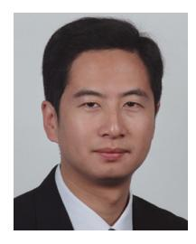

**F. Richard Yu** (Fellow, IEEE) received the Ph.D. degree in electrical engineering from the University of British Columbia in 2003. His research interests include connected/autonomous vehicles, artificial intelligence, blockchain, and wireless systems. He has been named in the Clarivate Analytics list of "Highly Cited Researchers" since 2019, and received several best paper awards from some first-tier conferences. He was a Board Member of the IEEE VTS and is the Editor-in-Chief of IEEE VTS Mobile World Newsletter. He is a Fellow of the Canadian

Academy of Engineering, Engineering Institute of Canada, and IET. He is a Distinguished Lecturer of IEEE in both VTS and ComSoc.