# A Survey on Approximate Edge AI for Energy Efficient Autonomous Driving Services

Dewant Katar[e](https://orcid.org/0000-0002-3412-7603) , *Gra[dua](https://orcid.org/0000-0002-4682-6882)te Student Member, IEEE*, Dieg[o](https://orcid.org/0000-0001-6211-8790) [P](https://orcid.org/0000-0001-6211-8790)erino [,](https://orcid.org/0000-0001-7693-7551) Jari Nurmi [,](https://orcid.org/0000-0003-2169-4606) *Senior Member, IEEE*, Martijn Warnier , *Member, IEEE*, Marijn Janssen , and Aaron Yi Din[g](https://orcid.org/0000-0003-4173-031X) , *Member, IEEE*

*Abstract***—Autonomous driving services depends on active sensing from modules such as camera, LiDAR, radar, and communication units. Traditionally, these modules process the sensed data on high-performance computing units inside the vehicle, which can deploy intelligent algorithms and AI models. The sensors mentioned above can produce large volumes of data, potentially reaching up to 20 Terabytes. This data size is influenced by factors such as the duration of driving, the data rate, and the sensor specifications. Consequently, this substantial amount of data can lead to significant power consumption on the vehicle. Similarly, a substantial amount of data will be exchanged between infrastructure sensors and vehicles for collaborative vehicle applications or fully connected autonomous vehicles. This communication process generates an additional surge of energy consumption. Although the autonomous vehicle domain has seen advancements in sensory technologies, wireless communication, computing and AI/ML algorithms, the challenge still exists in how to apply and integrate these technology innovations to achieve energy efficiency. This survey reviews and compares the connected vehicular applications, vehicular communications, approximation and Edge AI techniques. The focus is on energy efficiency by covering newly proposed approximation and enabling frameworks. To the best of our knowledge, this survey is the first to review the latest approximate Edge AI frameworks and publicly available datasets in energy-efficient autonomous driving. The insights from this survey can benefit the collaborative driving service development on low-power and memory-constrained systems and the energy optimization of autonomous vehicles.**

*Index Terms***—Approximate computing, connected vehicles, deep learning, edge computing, energy efficiency, intelligent vehicles, machine learning.**

# I. INTRODUCTION

**V**EHICLES have seen a growing trend in the utilization of sensors, advanced driver assistance systems (ADAS), and

Manuscript received 24 December 2021; revised 23 June 2022, 19 November 2022, 23 March 2023, and 23 June 2023; accepted 14 July 2023. Date of publication 9 August 2023; date of current version 22 November 2023. This work was supported by the European Union's Horizon 2020 Research and Innovation Programme, under Marie Skłodowska Curie Grant (APROPOS: Approximate Computing for Power and Energy Optimisation) under Agreement 956090, and in part by the SPATIAL Project under Grant 101021808. *(Corresponding authors: Dewant Katare; Aaron Yi Ding.)*

Dewant Katare, Marijn Janssen, and Aaron Yi Ding are with Department of Engineering Systems and Services, Delft University of Technology, 2628 BX Delft, The Netherlands (e-mail: d.katare@tudelft.nl; aaron.ding@tudelft.nl).

Diego Perino is with the Telefónica R&D, Telefónica, 08019 Barcelona, Spain.

Jari Nurmi is with the Faculty of Information Technology and Communication Sciences, Tampere University, 33100 Tampere, Finland.

Martijn Warnier is with Department of Multi-Actor Systems, Delft University of Technology, 2628 BX Delft, The Netherlands.

Digital Object Identifier 10.1109/COMST.2023.3302474

safety features. The latest progression is towards integrating these sensors with the state-of-the-art deep learning models based on the sense, think, and act model, which can assist or replace a driver by offering the highest level of autonomy [\[85\]](#page-34-0). The highest level of autonomy is described as the execution of driving processes that serve self-driving functionality from a source point to the destination point without any input or control from a human. Full automation can be achieved by integrating multiple sensors, such as camera, LiDAR, global navigation satellite system, radar, and communication modules with software-level solutions, thus providing the automotive driving features or the advanced driver assistance system [\[17\]](#page-33-0), [\[142\]](#page-35-0). The automotive industry has already been using several simple and complex ADAS features, improving the overall driver experience with the ultimate objective of providing better road safety [\[54\]](#page-33-1), [\[344\]](#page-39-0). Braking assistance, lane departure warning, adaptive cruise control, and global positioning system (GPS) based navigation are some of the features that have been used since its introduction between 1990-2000 [\[85\]](#page-34-0). The current trend involves incorporating deep learning and machine learning approaches within autonomous vehicles to provide maximum precision and human-level accuracy. These statistically-based learning algorithms aim to interpret the driver's surroundings when provided with impartial or neutral data. Based on the characteristics of the provided input, these algorithms classify or predict an output.

Several machine learning models have been proposed to replace traditionally used algorithms for applications such as collision-warning systems [\[58\]](#page-33-2), [\[81\]](#page-34-1), [\[132\]](#page-35-1), object detection [\[134\]](#page-35-2), [\[155\]](#page-35-3), [\[323\]](#page-39-1), path planning [\[19\]](#page-33-3), [\[136\]](#page-35-4), [\[302\]](#page-38-0), lane change assist [\[159\]](#page-35-5), [\[332\]](#page-39-2), localization and mapping [\[216\]](#page-37-0), [\[379\]](#page-40-0). Although these methods solve autonomy issues in vehicles, their scalable deployment on embedded and edge devices and rising computational complexity cannot be overlooked. Therefore, this survey reviews the AI algorithms for connected vehicle applications, Edge AI approaches, and vehicular frameworks. This survey focuses on energyefficient mechanisms and approximate techniques from the above-mentioned topics. Figure [4](#page-5-0) presents a dedicated taxonomy and classification of topics covered in this paper. The outline of the sections are as follows:

- 1) *Motivation and Background:* This section introduces research trends in vehicle-edge computing. Further content includes motivation, methodology, and research questions.
- 2) *AI and Autonomous Driving:* In this section, the fundamentals of machine learning & deep learning approaches are

described. Autonomous driving services such as perception, simultaneous localization and mapping (SLAM), and vehicleto-everything (V2X) are reviewed and compared.

- *3) Edge AI for Autonomous Driving:* This section discusses edge computing and edge intelligence paradigm. This section reviews articles published on cooperative driving, communication-efficient approaches, federated learning, Edge AI Inference, and Edge AI optimization methods.
- 4) *Enabling Frameworks:* The discussion includes legacy framework for autonomous driving and the Edge AI framework on computation, communication, and offloading capabilities. To the best of our knowledge, this survey is the first attempt to provide a review of the latest Edge AI frameworks for energy-efficient autonomous driving.
- 5) *Research Outlook and Open Problems:* This section summarises the survey by discussing open problems and potential challenges in deploying intelligent services within the vehicle-edge system. Further, this section contains information on approximation opportunities and enablers for edge intelligence approaches in autonomous driving services.

# II. MOTIVATION AND BACKGROUND

Autonomous vehicles have seen phenomenal growth. Manufacturers have also developed and received approval in recent years to produce and deploy level 3 autonomous vehicles [\[312\]](#page-39-3). However, there exist limitations in considering these vehicles as connected autonomous vehicles (CAV). The current vehicular technologies need significant development in reliable communication, efficient computation, collaborative intelligence, and paramount safety. This section discusses these research trends in CAV, approximation and Edge AI.

# *A. Research Trends*

The primary focus and key research areas in the automotive domain revolve around improving performance parameters and developing baseline models in object detection, SLAM, and vehicular communication. To show the research trends in the autonomous driving domain, a graph is generated using data collected from the Scopus database. For data collection, the search is refined using popular keywords, subject area (e.g., engineering science, mathematics, information systems), year range, and type of publication (e.g., conference paper, journal, books, chapters). The trend in the past decade, as shown in Figure [1,](#page-1-0) indicates that the primary focus was in the area of object detection (perception), owing to the advancements in neural networks and datasets. SLAM and vehicular communication have also evolved, with the latter catching up because of the recent developments in 5G/6G technology, next-generation (NG) cellular, and hybrid communication technologies. Energy-efficient techniques and Edge AI approaches are showing a slow increase. However, the number of publications on energy-efficient methods is still relatively small, as previous enablers and solutions for connected vehicles primarily focused on cloud computing.

*Energy-Efficient Keywords:* Energy-efficient Edge & Vehicles, AI model compression & approximation, TinyML, Energy-efficient Edge Framework, Vehicular communication compression & Sparsification, Low-power Vehicular-Edge.

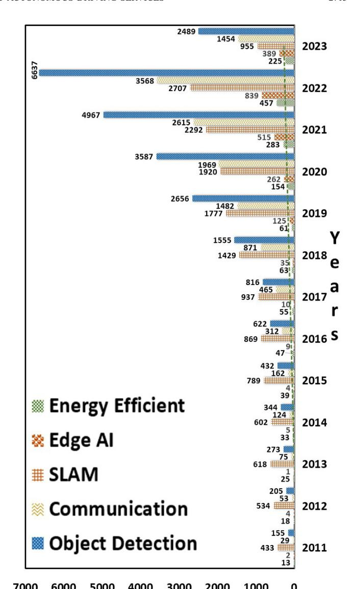

Fig. 1. Publication trend in autonomous driving between 2011 and May 2023 (Source: "scopus.com").

*Edge AI:* Vehicle-Edge-Cloud computing, Tiny Edge, Embedded intelligence, Edge artificial intelligence.

*SLAM Keywords:* SLAM, EKF, KF, visual-slam, deep SLAM, pose estimation, graph SLAM, vehicular localization, vehicular mapping, Edge-SLAM, Deep-SLAM, Graph SLAM.

*Communication Keywords:* V2X, V2V, V2I, C-V2X, 5G-V2X, DSRC, RSU, Vehicular communication, Inter-vehicular communication, WiMax, Vehicular Networking.

*Object Detection Keywords:* Perception, 2D and 3D object detection, edge analytics, traffic monitoring, classification, collaborative perception, cooperative perception, lane detection.

Further discussion includes a background of AI models applied in the context of autonomous driving, software approximation approaches, Edge Artificial Intelligence, and vehicular communication. Building upon this discussion, topics are followed by requirements and needs to address the energyefficient approximation in connected vehicular services.

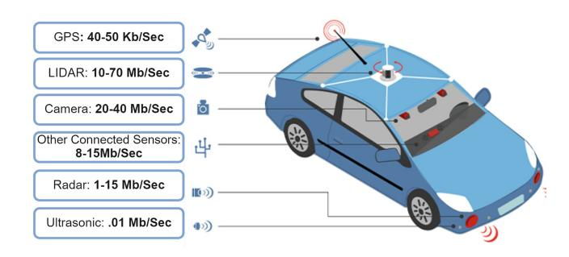

Fig. 2. Data generated by the automotive sensors.

## *B. Autonomous Driving*

Autonomy in vehicles is achieved by deploying ADAS features, which requires continuous sensing and computing within the vehicle. Some ADAS features proposed with AI models include adaptive cruise control, object classification, obstacle detection, mapping, path planning, and SLAM. These applications mostly depend on cameras, LiDAR, and radar sensors, which also generate a large amount of raw data currently processed by the vehicle computing unit. An example of the approximate data rate from vehicle sensors is shown in Figure [2.](#page-2-0) The data rate may vary based on the sensor's specification (e.g., generation, bit-rate, feature capture properties) and the data quality. At present, the autonomy in vehicles is defined in six levels [\[312\]](#page-39-3), and for these levels, the requirements and counts of the sensor are different as high-level autonomy expects no intervention from the driver. A count of approximate number of sensors [\[3\]](#page-32-0), according to autonomy levels 1-5 is shown in Table [II.](#page-3-0)

Studies from [\[147\]](#page-35-6), [\[297\]](#page-38-1) suggest that energy consumption from fully connected autonomous vehicles can be separated into three categories: 1) Consumption by an autonomous car (on-board sensors and computing devices). 2) Energy consumption caused due to Infrastructure sensors involving Vehicular communication and Networking. 3) Energy consumption at the backend such as Edge servers, local and central servers maintaining legacy data, and the global DNN model. Studies [\[188\]](#page-36-0) show that on-board energy consumption is higher than 1000's watts, and overall energy consumption from a single conditional automated diving vehicle combining all three categories could be around 2500 Wh per 100 km of driving [\[147\]](#page-35-6). High on-board energy consumption is due to the usage of compute-intensive algorithms and the processing devices such as graphics processors, which are essential for perception and visual applications.

The on-board computation approaches leading to power consumption [\[36\]](#page-33-4) demand the design of applications and energy-efficient Edge AI systems for automated driving services. Therefore, this survey paper focuses on identifying currently practised AI algorithms, computation, and communication approaches that lead to high energy consumption. Further, it includes a review of the design and implementation of edge computing approaches for autonomous driving tasks (e.g., Perception, HD Map, SLAM), datasets, edgeassisted techniques, and vehicle-edge frameworks. Lastly, based on the gathered requirement and research gaps, an

TABLE I LIST OF ACRONYMS USED IN THIS PAPER

| Acronym | Definition                                       |
|---------|--------------------------------------------------|
| 3GPP    | 3rd Generation Partnership Project               |
| 4G      | Fourth Generation Technology                     |
| 5G      | Fifth Generation Technology                      |
| AM      | Amplitude Modulation                             |
| ACC     | Adaptive Cruise Control                          |
| ADAS    | Advanced Driver Assistance Systems               |
| AEB     | Anti-Emergency Braking                           |
| AECC    | Automotive Edge Computing Consortium             |
| ANN     | Artificial Neural Network                        |
| BLE     | Bluetooth Low Energy                             |
| BPSK    | Binary Phase-shift Keying                        |
| CAN     | Controller Area Network                          |
| CAV     | Connected Autonomous Vehicle                     |
| CCK     | Complementary Code Keying                        |
| CNN     | Convolutional Neural Network                     |
| COFDM   | Coded Orthogonal Frequency-division Multiplexing |
| CPU     | Central Processing Unit                          |
| C-V2X   | Cellular Vehicle-to-Everything                   |
| DAB     | Digital Audio Broadcasting                       |
| DNN     | Deep Neural Network                              |
| DSRC    | Dedicated Short Range Communication              |
| EKF     | Extended Kalman Filter                           |
| ETSI    | European Telecommunications Standards Institute  |
| FDMA    | Frequency-Division Multiple Access               |
| FCC     | Federal Communications Commission                |
| FCW     | Forward Collision Warning                        |
| FL      | Federated Learning                               |
| FM      | Frequency Modulation                             |
| GFSK    | Gaussian Frequency Shift Keying                  |
| GNSS    | Global Navigation Satellite System               |
| GPS     | Global Positioning System                        |
| GPU     | Graphical Processing Unit                        |
| HD Map  | High-definition Map                              |
| IMU     | Inertial Measurement Unit                        |
| ITS     | Intelligent Transport Systems                    |
| KF      | Kalman Filter                                    |
| LTE     | Long Term Evaluation                             |
| M-QAM   | M-ary Quadrature Amplitude Modulation            |
| MANO    | Management and Orchestration                     |
| MFG     | Mean-Field Game                                  |
| MIMO    | Multiple-Input Multiple Output                   |
| ML      | Machine Learning                                 |
| NR      | New Radio                                        |
| NX      | Next Generation                                  |
| NRF     | Neural Radiance Field                            |
| O-QPSK  | Offset Quadrature Phase Shift Keying             |
| OBU     | On-board Unit                                    |
| OFDM    | Orthogonal Frequency Division Multiplexing       |
| QPSK    | Quadrature Phase Shift Keying                    |
| RNN     | Recurrent Neural Network                         |
| ROS     | Robot Operating System                           |
| RSU     | Road Side Unit                                   |
| SGD     | Stochastic Gradient Descent                      |
| SLAM    | Simultaneous Localization and Mapping            |
| TPU     | Tensor Processing Unit                           |
| UWB     | Ultra Wideband                                   |
| V2G     | Vehicle-to-Grid                                  |
| V2I     | Vehicle-to-Infrastructure                        |
| V2N     | Vehicle-to-Network                               |
| V2P     | Vehicle-to-Pedestrian                            |
| V2V     | Vehicle-to-Vehicle                               |
| V2X     | Vehicle-to-Everything                            |
| WiFi    | Wireless Fidelity                                |
| WiMAX   | Worldwide Interoperability for Microwave Access  |

Edge AI processing pipeline is proposed, which contains the higher-level abstraction of components involved in service implementation across vehicle-edge settings. In this survey, the levels of autonomy is referred from the International Society

TABLE II APPROXIMATE CONT OF SENSORS IN AN AUTONOMOUS CAR

| Sensors Count Approximately Present in an Autonomous Car |         |         |         |         |         |  |  |  |  |  |
|----------------------------------------------------------|---------|---------|---------|---------|---------|--|--|--|--|--|
| Sensor                                                   | Level 1 | Level 2 | Level 3 | Level 4 | Level 5 |  |  |  |  |  |
| Control Units                                            | 1       | 1       | 2       | 3       | 3       |  |  |  |  |  |
| Ultrasonic                                               | 5       | 5       | 9       | 9       | 9       |  |  |  |  |  |
| Radar                                                    | 2       | 4       | 4       | 8       | 8       |  |  |  |  |  |
| Camera                                                   | 0       | 2       | 5       | 5       | 5       |  |  |  |  |  |
| LiDAR                                                    | 0       | 0       | 1       | 2       | 2       |  |  |  |  |  |
| GPS/GNSS                                                 | 1       | 1       | 1       | 1       | 1       |  |  |  |  |  |
| DSRC                                                     | 0       | 1       | 1       | 1       | 1       |  |  |  |  |  |
| V2X Module                                               | 0       | 1       | 1       | 1       | 1       |  |  |  |  |  |

of Automotive Engineers (SAE), consisting of six levels [\[312\]](#page-39-3) of automation in driving, which are as follows:

- 1) *Level 0 No Automation:* Driver dependent driving.
- 2) *Level 1 Driver Assistance:* Driving tasks are carried by driver with little input from the vehicle sensors, this level introduces driving assist features.
- 3) *Level 2 Partial Automation:* Some driving tasks are carried by a computing unit placed in car by sensing the vehicle surrounding. Tasks include adaptive cruise control, autonomous emergency braking. This level still requires the driver to maintain control over driving tasks and regularly monitor the vehicle surrounding.
- 4) *Level 3 Conditional Automation:* Some tasks (sensing, actuation and control) are carried out by the sensors and the computing unit placed in the car, however the driver must be able to take control of the vehicle based on demand and situation.
- 5) *Level 4 High Automation:* Vehicle is capable of performing all driving tasks by initiating communication with other vehicles under certain conditions, but the driver has the option to take control of vehicle.
- 6) *Level 5 Full Automation:* Vehicle is capable of performing all driving tasks by communicating with other vehicles and infrastructure sensors under all conditions, but the driver may have the option to control the vehicle.

## *C. Approximate Techniques*

AI methods for implementing automated driving tasks, such as perception and SLAM, can be categorized as computationally intensive, high resource and energy-demanding, which also makes them expensive for deployment. An estimate of energy consumption within a vehicle by its components (e.g., the embedded device running DNN model, sensors such as LiDar, and camera) is shown in Table [III.](#page-3-1) For example, currently deployed level 3 autonomous vehicles [\[19\]](#page-33-3), [\[150\]](#page-35-7), [\[243\]](#page-37-1) primarily rely on vision sensors and GPU computing systems, consuming significant resources in terms of memory and energy, respectively. When integrating these ADAS features into resource-constrained [\[101\]](#page-34-2), [\[284\]](#page-38-2), [\[339\]](#page-39-4), [\[395\]](#page-40-1) and energy-constrained [\[178\]](#page-36-1), [\[361\]](#page-40-2), [\[378\]](#page-40-3), [\[386\]](#page-40-4) real-time autonomous systems, several challenges arise.

Firstly, processing a large volume of sensor data through DNN algorithms for autonomous driving services directly impacts the computing efficiency of embedded systems with limited memory. This necessitates the implementation

TABLE III ENERGY ESTIMATES FROM VEHICLE COMPONENTS [\[79\]](#page-34-3)

| Source              | Estimate (energy consumption) |
|---------------------|-------------------------------|
| Computing units     | (63 - 77) %                   |
| Camera              | (6 - 11) %                    |
| Radar               | (3 - 5) %                     |
| LiDAR               | (11 - 18) %                   |
| Communication units | (2 - 3) %                     |

of efficient on-board inference techniques to optimize the embedded device usage for better energy efficiency [\[162\]](#page-36-2), [\[229\]](#page-37-2), [\[271\]](#page-38-3), [\[282\]](#page-38-4). Secondly, the computing complexity and low latency requirements of applications like SLAM make it necessary to process the sensed data at the on-board computing unit rather than relying on cloud or edge servers. Approximate and adaptive computing and communication techniques, such as probabilistic/deterministic approximation, data aggregation, model compression, early-exit neural networks, adaptive networks, and sparsification can aid in improving on-board latency, inference and communication requirements. These topics are comprehensively covered in Section [IV.](#page-20-0)

## *D. Edge AI*

Edge AI or Edge Intelligence can be described as the combination of edge computing and artificial intelligence [\[402\]](#page-40-5). It has emerged due to the requirements of connected ecosystems developed for applications that require the processing of algorithms locally near the data source or edge-server. These algorithms [\[278\]](#page-38-5) utilize the data generated by the devices and make independent decisions for real-time applications without needing to connect to the centralized server or cloud for the decision-making process. A fully connected Level 5 autonomous car will be a result of collaboration between vehicles, vehicle-edge, edge-server, vehicle-edge-cloud communications and distributed computing systems. The current Level 1 to Level 3 autonomous vehicles highly rely on the Graphics Processing Unit (GPU) for their applications, and the GPU alone can consume up to 300-350Wh [\[19\]](#page-33-3), [\[36\]](#page-33-4), [\[147\]](#page-35-6) of energy per 100 km of driving, depending on the data rate and quality of the sensors. As shown in Table [II](#page-3-0) number of sensors increases for fully-connected autonomous vehicle compared to the current scenario; presented values are an approximate estimate depending on OEMs and fleets [\[3\]](#page-32-0), [\[19\]](#page-33-3), [\[150\]](#page-35-7).

Sensor numbers vary according to the sensor suite and related software technologies. The estimated power consumption of each vehicle can range from hundreds to thousands of watts, depending on the type of these sensory technologies. According to reports [\[269\]](#page-38-6), the amount of data transmitted between the vehicle and the cloud can reach 10 exabytes in the future, which is excessive compared to current practices. The present cloud and server infrastructure are not capable of handling and processing this in real-time within the expected latency. Therefore, AI on Edge and task offloading can be implemented for latency-tolerable tasks in the ecosystem.

These latency-tolerable applications can leverage the functionality of distributed devices and joint inference within the ecosystem. Models can quickly process sensor data and

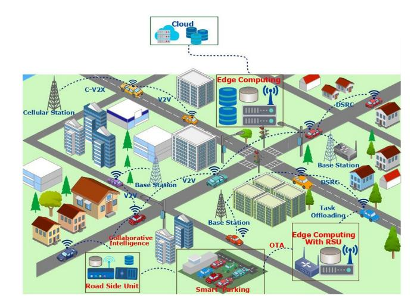

Fig. 3. Communications in vehicular ecosystem across vehicles, infrastructure, and road-side networks.

decision-making while ensuring the efficient delivery of tasks by running on specialized hardware. An example could be urban traffic optimization and route planning by deploying models on distributed edges located in close proximity to the vehicles. These systems can also provide strategies to enhance the driving experience by analysing traffic patterns and environmental conditions in real-time. Overall, AI at the edge empowers connected autonomous vehicles with the ability to process data locally, minimizing latency and enabling time-critical applications for enhanced safety and performance. Optimized Edge AI implementation can help in achieving better end-to-end accuracy while balancing performance and energy consumption. The Edge AI deployment process can/may involve sensing, re-training, decision-making, and collaborative learning/inference while enabling communication with other edge devices and servers in the environment.

## *E. Communications in Autonomous Vehicles*

Communication within vehicles and their ecosystem has been identified as a key enabler for deploying level 6 autonomy [\[116\]](#page-35-8). An example of connected vehicles, base stations, road-side units, edge-servers, infrastructure and remote cloud is shown in Figure [3.](#page-4-0) Several use-cases presented within the context of vehicle communication [\[22\]](#page-33-5), [\[52\]](#page-33-6), [\[96\]](#page-34-4), [\[212\]](#page-37-3), [\[218\]](#page-37-4), [\[252\]](#page-37-5), discuss directly benefiting the perception, planning, and control related use-cases using distributed or jointinference. However, little attention has been given to energy efficiency. Current communication are further categorized as: Inter-Vehicle Communication [\[45\]](#page-33-7), [\[48\]](#page-33-8) & Intra-Vehicle Communications [\[226\]](#page-37-6), [\[241\]](#page-37-7).

Intra-vehicle communication helps understand the vehicle's current state by exchanging information and signals between the sensors, actuators, and other electronic devices and components present within the vehicle. This communication is a combination of wired and wireless technologies. Commonly used wired technologies include Controller Area Networks (CAN), Digital Data Bus (D2B), Ethernet, FlexRay, Media Oriented System Transport (MOST), Low Voltage Differential Signaling (LVDS), Power Line Communication (PLC), Time-Triggered Fieldbus (TTP). Conversely, the wireless communication methods for Intra-vehicle communication include WIFI, BLE, Zigbee, and Ultra Wideband. Amongst the mentioned wireless technologies, BLE is one of the most commonly used by automotive manufacturers as it is a significantly proven technology and is relatively cheap compared to WiFi. It can transmit media relatively faster than Zigbee and comprises a good security layer. A comparison of these communication technologies is also shown in Table [VII.](#page-14-0)

An important factor for the high use of BLE technology is relatively low power consumption [\[185\]](#page-36-3), [\[328\]](#page-39-5) and it has a large installed base and a guaranteed latency, as well as a stable specification. Automobile components and modules, normally connected by electrical signal wires, are increasingly being replaced by wireless signals. A reduction of 50% in the number of signal wires is the goal of the automotive industry. Typically, an automobile contains about five kilometers of wiring, so there would be many wireless signals. A hybrid practice that uses both, wired clusters of automobile components and wireless inter-cluster connections is becoming more common. The infotainment panel at the vehicle dashboard is such an example. For Inter-Vehicle communication, the present human-driven or semi-autonomous vehicles are equipped with communication and radio modules, which receive information and signals mostly related to infotainment. The communication technology has evolved from AM, FM, DAB to HD Radio in which transmission method, media size, and quality of service have significantly improved. Since fully connected autonomous driving has wider communication and real-time processing requirements as the highperformance computing unit takes the decisions, researchers have proposed relevant technologies such as DSRC, V2V/V2I, WiMax, 5G-NR-V2X or C-V2X for local and long-range communication.

## *F. Taxonomy of Edge AI Technologies for CAV*

This subsection introduces the taxonomy used in this survey paper. First, legacy AI methods for autonomous driving are described. Second, Edge AI and computing applications are explained. Third, the approximation approaches and compression strategies are defined. Finally, energy-efficient mechanisms and requirements for vehicular ecosystems are discussed. A structure can be seen in Figure [4.](#page-5-0)

*1) AI Models & Autonomous Vehicles:* An autonomous vehicle is defined as an independent system capable of routing from source to destination by perceiving its surroundings using sensors and processing the sensed data on intelligent algorithms. Advancements in CAV can be associated with the progress of vehicle sensors, embedded devices and intelligent algorithms. These progressions have enhanced connectivity, infotainment systems, electrification, and automation. Perception sensors (camera, LiDAR, radar), positioning sensors (GPS, GNSS), and communication modules have been used to replace or assist driver using AI models.

*• Basic Model:* AI models proposed to automate/assist driving tasks can be divided as follows:

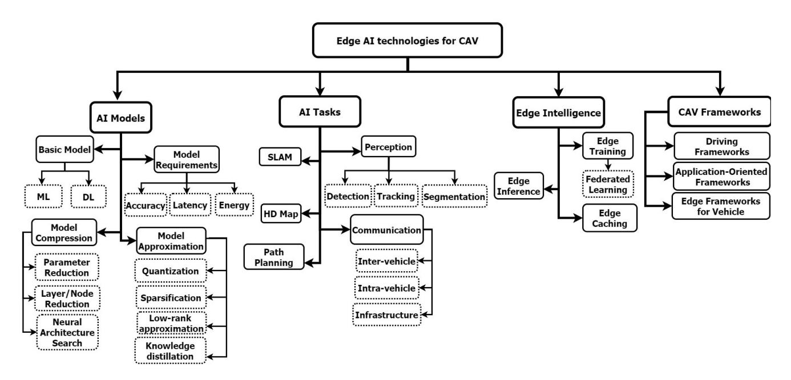

Fig. 4. Classification of Topics Covered in This Survey

- **–** *Machine Learning:* Supervised, unsupervised, and reinforcement are the popular techniques explored within autonomous driving.
- **–** *Deep Learning:* It is a subset of machine learning that consists of several types of neural networks trained on datasets to learn complex features from unstructured or structured data.
- *• Model Requirements:* AI models have specific requirements and guidelines depending on the driving tasks. For, e.g., localization, emergency braking, and detecting an obstacle/traffic sign should be highly accurate. Within the scope of this survey paper, the discussed model requirements are:
  - **–** *Accuracy:* The principle behind using AI models is to eliminate human error while driving and achieve an expected level of accuracy for the driving tasks. It is measured as a score of correct predictions/estimation with respect to the total predictions by a model.
  - **–** *Latency:* Each driving tasks have varied execution requirement. For, e.g., detection and localization have strict requirements of a few milliseconds(ms). For AI models, latency (in time) is used to characterize the performance of a model for a specific application.
  - **–** *Energy:* Desiring the highest level of accuracy for an AI model and fulfilling strict latency requirements for specific tasks generally leads to the use of highperformance computing units, which leads to energy consumption. Energy (Joules) can be estimated by capturing AI models' power consumption (Watts).
- *• AI Models Compression:* These techniques enable processing large data or AI models on resource-constrained devices with limited computation. Lossless and lossy compression has been explored in models and data for vehicular tasks. Popular compression approach includes:

- **–** *Parameter Reduction:* Reducing parameters from the model results in compression, which may lead to faster training or inference by addressing model complexity challenges. For, e.g., pruning non-contributing weights/layers leads model compression.
- **–** *Layer/Node Reduction:* To address compute and memory requirements of models, layer/node reduction has been used as a popular approach which also helps in balancing the model accuracy. An example is Minimal matrix operations and parameter-sharing.
- **–** *Neural Architecture Search:* This approach can be seen as optimizing the parameters/hyper-parameter of neural networks with a search dimension. Model downsizing and balancing high communication bandwidth demand within the vehicular environment can be such search dimensions.
- *• Approximate Techniques:* These techniques are unconventional approaches from the area of mathematics with known applications use-case in science and engineering (e.g., probabilistic circuits). In approximation, a balanced mechanism is used to trade-off metrics/parameters quantitatively for achieving fast computation (on-board latency) by trading-off computing performance (precision) [\[89\]](#page-34-5), [\[152\]](#page-35-9), [\[303\]](#page-38-7). Software and model compression approaches proposed for framework and AI models in connected autonomous vehicles can be categorized as approximate model or approximation techniques. However, this generalization do not address energy-efficiency (one of the three dimensions in approximate computing) from the viewpoint of computation and communication.
  - **–** *Quantization:* Vehicular applications are dependent on intelligent algorithms, which generally use 32-bit floating point precision for training the model and

- gradient estimate. The elements can be approximated using quantization to fewer bits, reducing the model size and decreasing the bandwidth load. The approach is inspired by the human nervous system, where information is stored in discrete form [\[306\]](#page-38-8).
- **–** *Sparsification:* In this approach, a vector is represented by its approximate form where the non-zero components are equal to the corresponding original vector. It is a compression technique often implemented in collaborative and distributed learning approaches such as federated learning which requires frequent communication between the devices, in this case, between the vehicle and edge or cloud.
- **–** *Low-Rank Approximation:* Another technique to implement reduced computation for AI models in low-rank approximation. Tucker or Canonical polyadic decomposition has been well used for CNN and DNN. The technique successfully reduces the model size, but it significantly affects model's accuracy.
- **–** *Knowledge Distillation:* An approach to approximately represent a larger DNN model in compressed/reduced form. Although the technique allows the development of approximate versions of AI models, maintaining performance is an open challenge.
- *2) AI Tasks:* Driving tasks implemented using AI models can be categorized as perception, SLAM, HD map, path/motion planning, and communication. In this paper, these tasks are further differentiated on the basis of data processing, feature extraction mechanisms, and hardware used.
  - *•* Perception applications provide scene understanding and are performed using sensors such as a camera or LiDar at the vehicle's on-board computing unit or at the sensor units present within the ecosystem (e.g., CCTV cameras). These applications are performed using CNN or DNN models deployed on the GPU. As the models largely consist of dense layers, the computational demand and energy cost for deployment are relatively high.
  - *•* SLAM application enables vehicles to localize in their surrounding using sensor data. AI models enabling SLAM applications are also memory and computeintensive. The complexity further increases because of the low inference requirement/processing of these algorithms.
  - *•* HD map sometimes also referred to as 3D map is an evolving service/feature, which provides 3D scene view of the vehicle surrounding. It is expected to be used with detection and localization tasks.
  - *•* Communication in the vehicular environment is dynamic and heterogeneous. It exists in three forms; in the vehicle, between vehicles and within the infrastructure. With the continuous evolution, it depends on the generation of hardware/software and sensory technologies. Highlevel autonomy is highly dependent on connected vehicles and smart infrastructure sharing raw data, weights, and algorithms. Similar to on-board computation, the complexity in vehicular communication arises due to the large volume of data and additional load on bandwidth.

- *•* Path/Motion Planning is a crucial AI task that enables the vehicle to navigate from source to destination by avoiding obstacles. A traditionally used algorithm is A-star. However, recent approaches involve using AI models with vision sensors, thus combining motion planning and path prediction by avoiding obstacles.
- *3) Edge AI and CAV:* Initially, cloud computing was proposed to facilitate computation, and decision-making for the connected vehicles [\[73\]](#page-34-6), [\[116\]](#page-35-8), [\[301\]](#page-38-9). However, the cloud computing approach had several challenges in transmitting high volume or flood of data from the vehicle to the cloud, data privacy and leakage, adversarial and poisoning attacks on the ground truth data, and algorithms present in the cloud [\[116\]](#page-35-8). Therefore, an approach to bring computation near the data source to tackle surplus data transmission to the cloud has been proposed in the form of edge computing. This technique has been further enhanced by proposing Edge-Intelligence, which allows the deployment of AI applications on Edge devices to facilitate inference near the data source. Edge AI improves data privacy and security and shows promising aspects in tackling the distributed computation and communication challenges for the connected vehicular ecosystem, which consists of services such as driver's assistance, infotainment, decisionmaking, and safety-critical applications. It is further divided into Edge training, Inference and Caching.
  - *• Edge Training:* As future vehicular applications will be carried out in dynamically distributed and connected environments, edge training can enable and facilitate collaborative/joint learning within participating devices using federated learning. It also allows re-training and updating models.
  - *• Edge Inference:* Edge inference enables deployment of AI model in resource-constrained devices. Considering the complexity of deploying fully connected autonomous vehicles and the severity, the following concerns should be addressed:
    - **–** *Latency:* The vehicular environment is complex, and many applications have strict latency requirements. In fully connected vehicles involving AI applications, latency includes sensor data processing, data fusion, algorithm processing or computation, and communication between devices.
    - **–** *Real-Time Inference:* Deploying real-time applications is essential for connected autonomous vehicles. The adjacency of computing to the data source tackles the low-latency and time-sensitive requirements. However, high computational and relative energy costs should be considered in such deployment cases.
    - **–** *Offloading:* For resource-constrained devices (low compute and battery powered), offloading data and computation to the nearest edge servers can facilitate local deployment, which also reduces the traffic amount from the vehicles/edge devices to the cloud.
    - **–** *Heterogeneity:* In a vehicle-edge-cloud ecosystem, heterogeneity exists in the sensed data, computing capabilities, communication devices, and protocols. This property poses significant challenges for deployment and resource management strategies.

| Previous Work                          | Topics Covered |      |      |        |         |         |                  |  |  |  |
|----------------------------------------|----------------|------|------|--------|---------|---------|------------------|--|--|--|
|                                        | Perception     | SLAM | Comm | HD Map | Dataset | Edge AI | Energy Efficient |  |  |  |
| This Survey                            | Y              | Y    | Y    | Y      | Y       | Y       | Y                |  |  |  |
| 2018 - Autonomous Driving Cars [362]   | Y              | Y    | Y    | N      | N       | Y       | N                |  |  |  |
| 2019 - Edge Computing System [186]     | N              | N    | Y    | N      | N       | Y       | N                |  |  |  |
| 2019 - Edge Computing For AD [190]     | Y              | Y    | Y    | Y      | N       | Y       | N                |  |  |  |
| 2019 - Edge Intelligence for IoV [381] | Y              | Y    | Y    | Y      | N       | Y       | N                |  |  |  |
| 2020 - AD: Common Practices [376]      | Y              | Y    | Y    | N      | Y       | N       | N                |  |  |  |
| 2020 - Deep Learning for AD [87]       | Y              | Y    | N    | N      | Y       | N       | N                |  |  |  |
| 2020 - Energy Aware [125]              | N              | N    | Y    | N      | Y       | Y       | Y                |  |  |  |
| 2020 - Communication-Efficient [278]   | Y              | N    | Y    | N      | N       | Y       | N                |  |  |  |
| 2021 - Edge Computing [40]             | N              | N    | Y    | N      | Y       | Y       | N                |  |  |  |
| 2021 - Edge-Benchmarking [314]         | N              | N    | V    | N      | N       | V       | V                |  |  |  |

TABLE IV COVERAGE AND COMPARISON OF PREVIOUSLY PUBLISHED SURVEY

- **–** *Reliability:* Possibility of deploying low-latency and real-time applications makes Edge AI reliable for vehicular applications. Also, it prevents sharing of sensitive and safety-critical data. However, rural or highway driving, communication, congestion, packet delay, and bandwidth requirement are concerns.
- *• Edge Caching:* As training/re-training, updating the weights, and model in a distributed environment require frequent data exchange, caching becomes an essential and important function, which deals with the collection, storing, processing, and real-time labelling of data.
- *4) CAV Frameworks:* Advancements in sensory technologies, AI models, driving tasks and on-board processors/computers have resulted in the development of autonomous driving frameworks. These driving frameworks can be currently categorized as driving task/assist oriented, independent application/service oriented or as compute-communication oriented frameworks.

## *G. Motivation and Methodology for Choosing Literature*

In past years, comprehensive surveys in emerging autonomous driving technologies [\[190\]](#page-36-4), [\[362\]](#page-40-6), common practices [\[376\]](#page-40-7), deep learning techniques [\[87\]](#page-34-7), and communication-efficient [\[278\]](#page-38-5) approaches have been published. Despite the increasing focus on connected autonomous vehicles, there has been a lack of attention towards energyefficient approaches and software approximation techniques specifically tailored for this domain. In [\[362\]](#page-40-6), an overview of current and emerging autonomous driving technologies is discussed by following the case-study approach. While discussing emerging technologies, the authors also briefly described the future research opportunities in connected autonomous vehicles.

A comprehensive study of edge computing systems and edge computing opportunities for autonomous driving is presented in [\[40\]](#page-33-9), [\[186\]](#page-36-5) and [\[190\]](#page-36-4) respectively. The review paper gives attention to computing architecture, software framework, privacy, and security in vehicular communication. In a similar context, [\[381\]](#page-40-8) presented a review of mobile edge intelligence techniques for vehicles and discussed edge-assisted perception, mapping, and open issues. Articles [\[87\]](#page-34-7), [\[376\]](#page-40-7) covered recent autonomous driving stateof-art AI models and techniques in detail. Key discussed topics were machine/deep learning models, driving safety features,

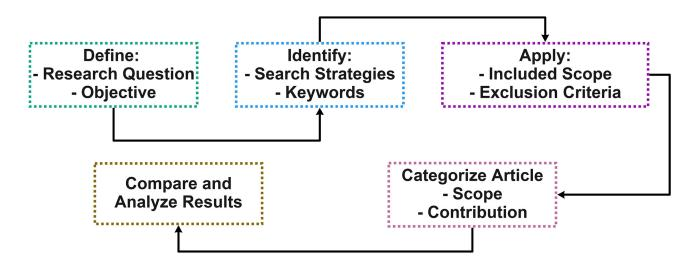

Fig. 5. Approach for systematic literature review adapted from Kitchenham and Charters [\[311\]](#page-39-6).

system components, and architecture. The review conducted in [\[125\]](#page-35-10) covers energy-aware approaches for hardware and software layers in the edge computing domain, focusing on the framework layer. Authors in [\[278\]](#page-38-5) presented a comprehensive review of communication-efficient techniques for edge computing systems by focusing on key communication challenges. In [\[314\]](#page-39-7), authors reviewed cloud-edge computing and frameworks that focus on application and optimization techniques and benchmarks.

Table [IV](#page-7-0) shows a comparison with related surveys. This comparison is based on coverage of topics: deep learning practices (perception), data & compute-intensive tasks (SLAM, Communication, High-definition Maps), datasets, applications of Edge Intelligence, and energy-efficient approaches. The review procedure used in preparing this literature survey is based on the SLR approach adapted from Kitchenham and Charters [\[311\]](#page-39-6), also shown in Figure [5.](#page-7-1) This approach initially demands defining research questions and objectives, followed by identifying the search strategies. While searching the relevant and related content, a connected paper search approach is followed, and the inclusion and exclusion criteria are applied with the keywords and terms to refine the article based on the scope and objectives. In the last two stages of the SLR approach, the collected articles are categorically divided based on the article's contribution toward approximation techniques, autonomous driving applications, and Edge Intelligence. Some approximation techniques overlap in multiple research questions. For this case, a quantitative approach is used.

*Key Questions Addressed:*

1) What are the current AI model development and deployment strategies for connected vehicular tasks/applications such as perception, SLAM, vehicular communications, and HD maps?

- 2) What are the recent communication-efficient approaches that are proposed in a vehicle-edge ecosystem for CAV?
- 3) Which approximation strategies are proposed as software-level solutions for communication and computation in vehicle-edge environments?
- 4) What are the techniques for developing energy-efficient vehicle-edge frameworks that enable vehicular services through joint inference?

# III. AI & AUTONOMOUS DRIVING

AI/Machine learning approaches and techniques have been widely used for autonomous driving tasks and services. Commonly used techniques are supervised learning, unsupervised learning and semi-supervised learning [\[25\]](#page-33-10), [\[117\]](#page-35-11). In supervised learning a machine learning model is trained with labelled dataset, while in unsupervised learning a machine learning model is trained with unlabeled dataset, with the common purpose of prediction or classification. In semi-supervised learning a machine learning model is trained with both labeled and unlabeled datasets. This approach is proposed to save training time and computational resources [\[62\]](#page-34-8), [\[123\]](#page-35-12).

## *A. Perception*

Autonomous vehicles driven using sensory technologies and AI algorithms can be seen in the form of taxies from Waymo, Zoox, Cruise etc. [\[3\]](#page-32-0), [\[82\]](#page-34-9). These vehicles are mostly dependent on Perception related tasks: segmentation, Object classification-detection and localization. These three tasks are currently considered as crucial element for the enablement of autonomous driving. The object detection task can be further divided into 2D or 3D detection, which are mainly reliable on the line-of-sight sensors such as High-Definition Camera [\[196\]](#page-36-6), [\[392\]](#page-40-9) and LiDAR [\[173\]](#page-36-7). 2D object detection task is generally carried using convolutional neural network and recurrent neural network architecture which involves feature detection and estimation of rectangle or square shaped bounding boxes *(x, y)* around the detected objects in an image or video frame, whereas the 3D detection involves estimating a cube shaped, three dimensional bounding box in an object, by estimating the position of the object in the 3D plane *(x, y, z)*.

Deep learning has been widely accepted as attractive or prominent technique for image and vision related applications because of development of the state-of-the-art neural network architectures [\[9\]](#page-32-1), [\[149\]](#page-35-13), [\[176\]](#page-36-8), and their delivered accuracy's. The object detector are classified into one-stage and twostage detectors depending upon the backbone of training and inference method used. Table [V](#page-9-0) covers popular and recently published object & lane detection approaches for autonomous driving. Table [V](#page-9-0) is formulated on AI model performance over the popular driving datasets (covered in Table [IX\)](#page-19-0), hardware implementation, detection methods, and speed (FPS) which is crucial for real-time deployment. For the 3D detection the initial approach and technique involves pre-processing of the 3D point clouds data and adopting them into the data structure required for the existing deep learning algorithms, thus providing an output based on the algorithm. Recent researches have proposed to process the LiDAR point clouds directly on deep neural network without converting them to any representations. For example [\[245\]](#page-37-8), [\[246\]](#page-37-9) proposed different form of deep neural net architectures, called as Pointnets and Frustum Pointnets respectively. These deep learning architectures have shown higher performance and have proved as benchmark for 3D perception based detection such as object classification and semantic segmentation. Pointnets++ architecture [\[247\]](#page-37-10) proposed by Qi et al. is capable of both classification and semantic segmentation of 3D point clouds by learning the local and global feature vector from the raw point clouds. Zhou et al. presented VoxelNet [\[401\]](#page-40-10), a deep learning architecture detecting 3D bounding boxes based on reading of LiDAR Point clouds, here the LiDAR point clouds were divided into 3D voxel spaced equally. The architecture successfully detects and gives high performance for the car, cyclist and pedestrians. The most prominent 3D object detector Frustum-Pointnet [\[245\]](#page-37-8) is presented by Qi et al., which predicts the bounding box on an object based on instance segmentation and the bounding box estimation. A similar method Pointfusion [\[345\]](#page-39-8) is proposed by Xu et al. which utilizes the Pointnet [\[246\]](#page-37-9) and ResNet [\[296\]](#page-38-10) architecture for estimating the 3D frustum and object classification.

*1) 2D Object Detection:* 2D object detection in an autonomous vehicles are primarily based on the single or multiple cameras connected to sense the environment or surrounding of the car. The 2D object detection architecture or algorithm requires the raw image as an input, and outputs the bounding box with the class or label of the detected object. In 2D object detection the bounding box is an axis-aligned rectangle, which is precisely estimated on the position of the multiple objects or classes in that image, here the bounding box can be parameterized as (xmin, xmax, ymin, ymax) where (xmin, ymin) are the pixel coordinates of the bottom-left bounding box corner, and (xmax, ymax) are the pixel coordinates of the top-right corner. An example of the un-annotated captured image and point cloud from the KITTI dataset [\[205\]](#page-36-9) is shown in Figure [10;](#page-20-1) the image shows the front camera view and the generated LiDAR point cloud.

Benchmarked 2D object detectors for real-time applications on camera frames include SqueezeNet [\[115\]](#page-35-14), SqueezeDet [\[337\]](#page-39-9), YOLOv7 [\[320\]](#page-39-10), and SSD [\[191\]](#page-36-10). These architectures utilize convolutional neural networks (CNNs) to process the image through filters and layers, extracting feature maps that encompass the entire image. The selected object regions are then mapped onto these feature maps and transformed into region feature vectors. Based on the class scores, these detectors predict the type of object and propose the corresponding bounding box. This process allows for efficient object detection and localization in real-time scenarios.

*2) 3D Object Detection:* 3D object detection is dependent upon sensors such as RGBD camera, 3D radars, LiDAR or combined sensed values, as they can represent the vehicle surrounding in 3D setting. For inference the raw sensed values are processed using the deep learning algorithm, which requires the image with length, width and depth information or the LiDAR point cloud in sparse or dense format as an input. The output from these deep learning algorithm are as follows: At first it detects and classifies the object present in the scene

TABLE V STATE-OF-THE-ART DNN ARCHITECTURES BENCHMARKED OVER KITTI AND COCO DATASETS. THE TABLE IS ARRANGED ACCORDING TO THE TIMELINE, DATA AND METHOD USED FOR COMPUTATION, AND ON-BOARD INFERENCE SPEED

| <b>Detection Type</b> | Ref                      | Year | Data    | Method  | Speed (fps)      | Analysis                                     |  |  |  |
|-----------------------|--------------------------|------|---------|---------|------------------|----------------------------------------------|--|--|--|
|                       | Faster R-CNN [255]       | 2016 | Camera  | 2Stage  | 17 (V100)        | -                                            |  |  |  |
|                       | SSD [191]                | 2016 | Camera  | 1 Stage | 22 (Titan X)     | Dependent on the single or multiple cameras  |  |  |  |
|                       | Yolo [320]               | 2023 | Camera  | 1 Stage | 161 (V100)       | Connected to sense the environment           |  |  |  |
|                       | SqueezeNet [115]         | 2017 | Camera  | 2 Stage | 17 (Titan X)     |                                              |  |  |  |
|                       | SqueezeDet [337]         | 2017 | Camera  | 2 Stage | 30               | Models are initially trained on powerful GPU |  |  |  |
| 2-D Object            | CornerNet [156]          | 2018 | Camera  | 2 Stage | 33 (Titan X)     | and later deployed on embedded device        |  |  |  |
| Ť                     | FSAF [405]               | 2019 | Camera  | 2 Stage | 38               |                                              |  |  |  |
|                       | CenterNet [66]           | 2019 | Camera  | 1 Stage | 28 (Titan Xp)    | Real-time inference and SW acceleration      |  |  |  |
|                       | Bottom-up [399]          | 2019 | Camera  | 1 Stage | 43 (Titan X)     | depends on DL frameworks                     |  |  |  |
|                       | Foveabox [145]           | 2020 | Camera  | 1 Stage | 35 (V100)        | •                                            |  |  |  |
|                       | IntPred [293]            | 2020 | Camera  | 1 Stage | 42.8 (GTX 1080)  |                                              |  |  |  |
|                       | Baidu [163]              | 2016 | LiDAR   | 2 Stage | ,                |                                              |  |  |  |
|                       | Vote3deep [67]           | 2017 | LiDAR   | 2 Stage | 28.6             |                                              |  |  |  |
|                       | MV3D [46]                | 2017 | Ca + Li | 2 Stage | 2.8              | Previous approach was to transform point     |  |  |  |
|                       | PointFusion [345]        | 2018 | Ca + Li | 2 Stage | 5                | clouds into images and later use them        |  |  |  |
|                       | VoxelNet [401]           | 2018 | Ca + Li | 2 Stage | 2                | on cnn architecture                          |  |  |  |
|                       | Deep 3D [177]            | 2018 | Ca + Li | 2 Stage | -                |                                              |  |  |  |
|                       | IPOD [359]               | 2018 | Ca + Li | 2 Stage | 37               |                                              |  |  |  |
|                       | PIXOR [356]              | 2018 | Ca + Li | 2 Stage | 28.6             | Frustum based approaches improved direct     |  |  |  |
|                       | Hdnet [355]              | 2018 | Ca + Li | 2 Stage | 20               | use of raw-point cloud on DNN however        |  |  |  |
|                       | Frustum PointNets [245]  | 2018 | Ca + Li | Fusion  | 2.9              | lacked processing speed for real-time        |  |  |  |
| 3-D Object            | Second [353]             | 2018 | Ca + Li | 2 Stage | 40               | embedded deployment & Applications           |  |  |  |
|                       | Squeezeseg [338]         | 2018 | Ca + Li | Fusion  | 50               | 1 7                                          |  |  |  |
|                       | Pointpilllars [155]      | 2019 | Ca + Li | 1 Stage | 25 (GTX 1080 Ti) |                                              |  |  |  |
|                       | PointRCNN [276]          | 2019 | Ca + Li | 1 Stage | 10               | Data Fusion pipelines improved the           |  |  |  |
|                       | Lasernet [206]           | 2019 | Ca + Li | 1 Stage | 83               | segmentation application on point clouds     |  |  |  |
|                       | Class-Balanced [404]     | 2019 | Ca + Li | 1 Stage | 42               | 8                                            |  |  |  |
|                       | Sparse-to-dense [360]    | 2019 | Ca + Li | Fusion  | 10               |                                              |  |  |  |
|                       | Mono3d++ [97]            | 2019 | Ca + Li | 1 Stage | 20               | Approaches such as machine-learned pillar    |  |  |  |
|                       | Pointpainting [319]      | 2020 | Ca + Li | 1 Stage | 2.5              | encoders are learned in an end-to-end manner |  |  |  |
|                       | SA-SSD [95]              | 2020 | Ca + Li | 1 Stage | 25               |                                              |  |  |  |
|                       | Infofocus [323]          | 2020 | Ca + Li | 1 Stage | 31 (GTX 1080 Ti) |                                              |  |  |  |
|                       | 3dSSD [358]              | 2020 | Ca + Li | 1 Stage | 25               | LiDAR 3d object detection networks heavily   |  |  |  |
|                       | SE-SSD [396]             | 2021 | Ca + Li | 1 Stage | 32               | rely on labeled training data                |  |  |  |
|                       | SPG [349]                | 2021 | Ca + Li | 1 Stage | 41.56            |                                              |  |  |  |
|                       | Voxel-Transformer [203]  | 2021 | Ca + Li | 1 Stage | 43               |                                              |  |  |  |
|                       | Pyramid-RCNN [201]       | 2021 | Ca + Li | 1 Stage | -                | Grid based methods converts the point-       |  |  |  |
|                       | Channel-wise [274]       | 2021 | Ca + Li | 1 Stage | 39               | cloud unstructured data to pixel & voxel     |  |  |  |
|                       | Voxel-To-Point [167]     | 2021 | Li      | 2 Stage | 41               | for 2D and 3D convolution processing         |  |  |  |
|                       | Voxel-RCNN [56]          | 2021 | Ca + Li | 1 Stage | 40.8             |                                              |  |  |  |
|                       | Multi-View to H-3D [57]  | 2021 | Ca + Li | 1 Stage |                  | Recent approach involves using encoders      |  |  |  |
|                       | SA-Det3D [29]            | 2021 | Ca + Li | 1 Stage | 36               | for detection refinement of far and distant  |  |  |  |
|                       | X-View [343]             | 2021 | Ca + Li | 1 Stage | 47               | objects, these decoders enhances the point   |  |  |  |
|                       | CenterPoint [367]        | 2021 | Ca + Li | Fusion  | 16               | feature through hierarchical aggregation.    |  |  |  |
|                       | Vpgnet [159]             | 2017 | Ca      | 2 Stage | 20               |                                              |  |  |  |
|                       | LaneNet [332]            | 2018 | Ca      | 2 Stage | 50               | Most DNN model uses RGB Images for input     |  |  |  |
| Lane                  | E2E Lane Det [223]       | 2018 | Ca      | 1 Stage | -                | which is challenging in real-world situation |  |  |  |
|                       | Spatial as Deep [233]    | 2019 | Ca + Li | 1 Stage | -                | as per changed weather & Light Condition     |  |  |  |
|                       | 3DLaneNet [78]           | 2019 | Ca + Li | 1 Stage | 53               |                                              |  |  |  |
|                       | Gen-LaneNet [91]         | 2020 | Ca + Li | 1 Stage | 60               | 3D lane detection improves constraints such  |  |  |  |
|                       | Real-time Lane-det [294] | 2021 | Ca      | 1 Stage | 48               | as making turns or merging to another lane   |  |  |  |
|                       | Low-light Lane [281]     | 2021 | Ca      | 1 Stage | -                | with inclusion of sensors: radar, LiDAR      |  |  |  |

and secondly it predicts a 3D bounding box for the detected objects in the line of sight. In the 3D object detection pipeline, the backbone of the architecture uses neural network with convolutional layers. The convolutional layers are responsible for feature extraction method from the scenes in the local feature map and the global feature map. The next stage comprises of deconvolution layer. The parameters weights obtained after the deconvolution layer are used for two process, in first it is fused together using probabilistic approach to generate and aggregate a score for the detected feature and they secondly they are processed on the pooling layer to fuse them further to obtain the detected object and the predicted bounding box. 3D bounding box can be parameterized as *(x, y, z, l, w, h,* θ). Here the *(x, y, z)* is the 3D coordinates of the bounding box center, the *(l, w, h)* is length, width and height, respectively of the bounding box, and θ is the yaw angle of the bounding box. Two different approaches of 3D object detection based on image and LiDAR point clouds is shown in Figure [6](#page-10-0) and Figure [7,](#page-10-1) where the object detection is used using fusion from the LiDAR point cloud and the respective camera image.

Most of the statistical or deep learning related algorithms for near real-time 3D object detection and semantic segmentation [\[133\]](#page-35-15), [\[134\]](#page-35-2) are based on PointNet [\[246\]](#page-37-9), the models proposed here are trained and evaluated on the KITTI dataset, which contains images and LiDAR point clouds collected from the forward facing stereo camera and velodyne LiDAR. Recent

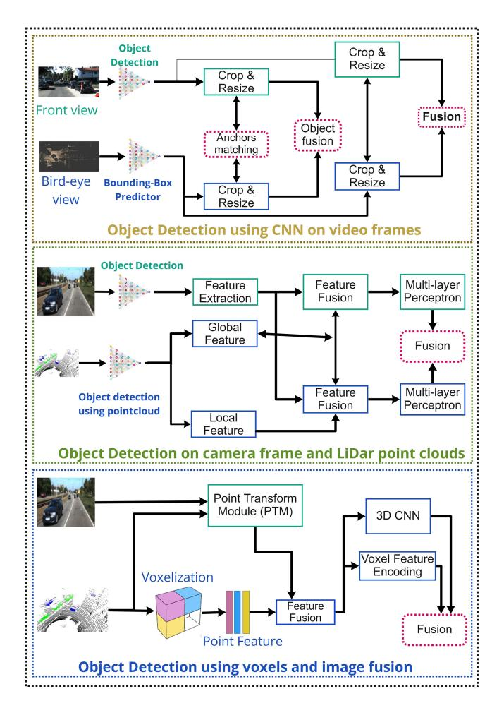

Fig. 6. DNN pipeline to show 3D object detection using video frames, bird-eye-view, and LiDAR point clouds.

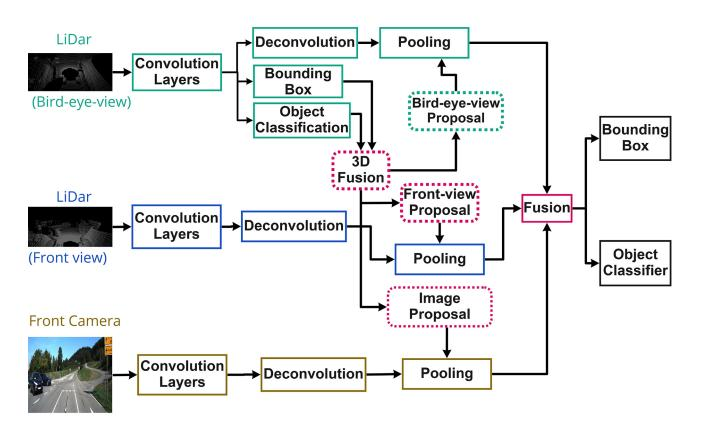

Fig. 7. Pipeline for the fusion of feature maps. The approach is used for LiDAR and Image-based detection.

point-cloud based architectures such as [\[46\]](#page-33-11), [\[154\]](#page-35-16), [\[155\]](#page-35-3), [\[275\]](#page-38-11), [\[367\]](#page-40-11) have made it easier to directly use the raw point cloud for efficient detection on hardware. As reviewed in this section, research in perception category have mainly focused on improving accuracy of the DNN model, multi-object detection and tracking, and implementation on embedded devices, the challenges and opportunities for energy efficient addressed from this sections are: high computational demand, data fusion, collaborative learning models.

## *Takeaways:*

- 1) *Computational Efficiency:* Existing models consist of sequential convolution and fully connected layers with a primary objective of achieving high accuracy on a driving dataset. Deployment of such models is strictly dependent on high-performance devices which increases the onboard, computing and energy costs. Processing such neural networks on a resource-constrained embedded device by maintaining benchmark accuracy remains an open challenge.
- 2) *Data Fusion:* Camera and LiDAR sensors data is used as independent or in combination to detect an object from the vehicular surroundings. However, the current practices remain to process data on individual pipelines and perform a fusion at the last stage. This leads to excessive use of computation resources for the same operation.
- 3) *Domain Gap:* Remarkable progress in object detection can be credited to intelligent algorithms trained on automotive datasets. The sensory technologies used for data collection frequently change in generations (e.g., LiDAR and improvement in resolution). However, little attention has been given to domain adaptation of these algorithms for the next generation of datasets.

## *B. HD Map*

High-definition map in an autonomous vehicle can provide dynamic and static conditions, such as semantic information, topology, and geometric information, from the vehicle surrounding using cameras and LiDAR sensors [\[127\]](#page-35-17). One of the key requirements in autonomous driving is to accurately localize itself with respect to its surroundings and the infrastructure, and gathered information from an HD map can be used to support this function including vehicle motion control, motion planning, and perception [\[249\]](#page-37-11), [\[250\]](#page-37-12). Therefore, maps are essential components for level 4 and beyond autonomous driving. Previously maps were used as a driver assistance feature [\[287\]](#page-38-12) to guide in navigation from source to destination. Google and Apple were the first of the few organization to collect street, city, and highway data which later enabled the flexible transportation and mobility by using GPS devices or map based applications on the regular smartphones. With the advancement in technology and algorithms the 3D maps of cities such as New York, Washington were created. HD maps for autonomous driving is the result of advancements in sensor and driving use-cases [\[127\]](#page-35-17), [\[287\]](#page-38-12).

Current HD maps lack specifications about the data type or standard guidelines, such as annotated information that should be stored while creating them. The automotive edge computing consortium (AECC) has proposed a version of an HD map consisting of four layers. This map version is based on Local Dynamic Map initially proposed by the European Telecommunications Standards Institute (ETSI). The layer includes two static and dynamic layers, which are further classified according to the timelines and changes expected within the vehicular ecosystem (Figure [8\)](#page-11-0). Current use-cases, includes creating an HD map from the raw sensor data and updating an existing map using crowd-sourced data from the

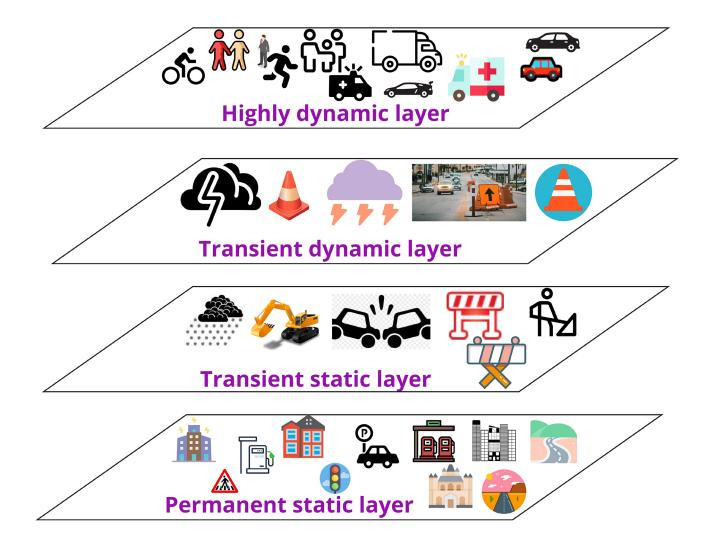

Fig. 8. HD-map layers representation in ecosystem.

vehicles and infrastructure sensors in the vehicle-edge-cloud setting. The four layers proposed in the AECC version [\[131\]](#page-35-18) are as follows:

- *•* Permanent static layer serves as the foundation by providing a static map of the surroundings. This layer consists of road maps, buildings, and roadside infrastructures. This layer consists of map data and information that does not change frequently.
- *•* Transient static layer contains information about scenarios that may be subject to change over a few days to a few hours. As shown in the Figure [8](#page-11-0) this layer may contain information on the change to static layer for, e.g., snowfall, road construction, maintenance and accidents.
- *•* Transient dynamic layer contains information on surrounding that frequently changes. Here, change can occur in a few minutes and last a few hours. It may contain information on road obstacles, heavy rainfall and storms.
- *•* Highly dynamic layer frequently changes; in a few seconds to a few minutes. Thus contains information about moving objects such as other vehicles, pedestrians and motorcyclists. This section has not included information requiring frequent updates that may be less than a second interval in an HD map.

Relevant work in HD maps in using deep neural networks includes: Hdnet, Vectornet, Exploiting sparse semantic HD maps [\[127\]](#page-35-17), [\[165\]](#page-36-11), [\[249\]](#page-37-11), [\[250\]](#page-37-12). Machine learning based approach and workflow for creation of high definition semantic map is presented in [\[127\]](#page-35-17). In this paper author discussed the steps from data capture using sensors, annotations, and map generation. Use-case such as pose estimation, traffic sign and line mapping, lane/road marking were also discussed. In the similar context a complete HD map framework for autonomous driving is presented in [\[250\]](#page-37-12). The authors comprehensively presented the HD map application by describing the pre-built maps, storage in cloud, locally built maps and update in the global map based on change in static semantic conditions. In this paper, the framework is distributed into on-vehicle mapping, user-end localization, and on-cloud mapping.

For on-vehicle mapping traditional semantic method, pose estimation, perspective transformation and local mapping have been used [\[216\]](#page-37-0), [\[250\]](#page-37-12), [\[305\]](#page-38-13). On-cloud mapping is responsible to merge and aggregate map data from multiple vehicles. Functions are used to merge local data timely such that the global map is up-to-date. As the size of data and volume is not fixed, a function to compress the map data is also implemented at the On-cloud mapping. Lastly, the user-end localization are vehicles requesting map information from the cloud. When the vehicle receives the map, an algorithm to decompress map data is implemented and data is further processed through a semantic localization pipeline.

Researchers have also predicted that around 10% of the roads or static conditions changes every year because of the construction and related scenarios. Therefore, crowd-sourcing based HD map update have been proposed to update the global map using individual vehicles [\[102\]](#page-34-10), [\[165\]](#page-36-11), [\[180\]](#page-36-12), [\[236\]](#page-37-13), [\[383\]](#page-40-12). In [\[383\]](#page-40-12), authors proposed to use sensors, such as GNSS, IMU and camera, to detect the change in the HD map using BiseNet architecture as semantic baseline and visual SLAM for localization and mapping. For experiment authors used arrow sign as an example from the surrounding and by using vectorization and matching approach detected the change in existing map data. Similar approach to update HD map using edgeservers is proposed in [\[165\]](#page-36-11). In this paper authors discussed the issue of diminishing marginal utility and premature convergence of map data from individual vehicles. To this end, task distribution mechanism which uses adaptive time period division mechanism is proposed. In the experiments using edge devices and computing unit the effectiveness is verifies using coverage, cost and efficiency.

A crowd-sourcing based approach to create HD map using graph-SLAM [\[23\]](#page-33-12) is proposed in [\[180\]](#page-36-12). The authors used GNSS, odometry, point cloud data, and land marking to be processed using a graph-SLAM algorithm. The authors used pose estimation, smoothing filter, trajectory alignment for the landmarks. Road model inference and lane geometry is used to create the functions for lane boundary lines, connections and point observations. To evaluate the approach, an experiment with the ground-truth data was implemented. Deep learning methods using crowd-source based HD map update is proposed in [\[102\]](#page-34-10), [\[236\]](#page-37-13). In [\[236\]](#page-37-13), authors proposed a change detection algorithm using boosted particle filter. The particle filters are applied during the localization along with a classification algorithm. In [\[102\]](#page-34-10), authors proposed a framework that maps the sensed image/frame from camera to probabilities of HD map change. As the HD map data consist of geometric information and lane marking, deep learning metric is used to reduce the domain gap. In experiments authors implemented object detector with a pixel-level change detection from the input/sensed image, evaluated on city-scale dataset. A combination of frames and point-cloud for mapping is proposed on a low-power ARM and FPGA platform. This approach improves performance through global map encoding, LiDAR localization, and multisensor fusion [\[340\]](#page-39-11). Experiment on public datasets such as Apollo shows reduced latency and power consumption compared to other acceleration methods, making it suitable for large-scale urban scenes.

Other interesting techniques that can be explored for HD map creation and development are neural radiance field [\[208\]](#page-36-13), [\[299\]](#page-38-14), and mean-field game [\[110\]](#page-34-11), [\[111\]](#page-35-19). Instead of using three coordinate system (x, y, z), in neural radiance field [\[208\]](#page-36-13) a five coordinate system including (x, y, z, α, φ) are used, where the last two are viewing direction. Authors used fully connected neural network to generate 3D scenes and frames based on the trained 2D images. For comparative study, performing techniques such as neural volumes, scene representation networks and local light field fusion is used to directly predict a multi-plane image for the input. The approach is very useful for 3d models of object captured from camera. Similar approach is proposed in block-nerf [\[299\]](#page-38-14) to represent surrounding in large scale view. In [\[299\]](#page-38-14), architecture layers are modified using pose refinement, generative latent optimization, to adapt image appearance embedding as different images could be captured in different environment conditions. For experiments and evaluation, authors reconstructed 3D scenes using 2.8 million images captured from camera. Interesting work using mean-field game is proposed in [\[110\]](#page-34-11), [\[111\]](#page-35-19). In [\[111\]](#page-35-19), authors proposed a computational framework by categorizing the scenario into microscopic and macroscopic perspective to control velocity for vehicles, and further develop traffic flow for autonomous vehicles. A comprehensive study is presented to characterize equilibrium solutions in both continuous MFGs and discrete differential games, a similar approach can be implemented in HD map creation and update, which requires strategic interaction between connected autonomous vehicles.

The challenges and opportunities in energy efficient approaches with HD map applications are as follows:

- 1) *Data Collection and Processing:* An hour of driving approximately corresponds to 1.5TB data from a car. Processing and interpretation of collected data requires efficient algorithms and high-end computational resources.
- 2) *Map Storage and Sharing:* One of the primary challenge is the design of common energy-efficient framework for edge servers which can store and share the HD map to the autonomous vehicle through local wireless (802.11p), cellular or hybrid communication approach.
- 3) *HD Map Update:* Approximately 10-15% of surrounding or street scenes are expected to change because of the development in infrastructure. Therefore an energyefficient approach and scheme to update the existing HD map, rather updating the database in periodic manner.
- 4) *Intelligent Driving:* The amount of information perceived by sensors in city and highway driving is different, intelligent algorithms developed for Edge server assisted HD map update can help to identify the sensory information needed to map and update.

*Takeaways:* HD map is essential and an emerging technique in autonomous driving. Present HD maps are available from the semantic and geometric perspective. HD maps can be created locally every-time using vehicular computing unit, but this tends to be compute intensive. NRF, MFG and deep learning techniques can be explored for data generation, map creation and global HD map update. Crowd-sourced map update is promising approach, however data merge, schedule and aggregation approaches should be regularly optimized.

## *C. SLAM*

Simultaneous Localization and Mapping often abbreviated as SLAM has been widely researched in robotics, and autonomous systems, including indoor applications focusing on warehouses and manufacturing units. In an autonomous vehicle, SLAM is a process utilizing algorithms to estimate the real-time position of the vehicle by continuously perceiving and sensing the environment using embodied sensors. The goal of using SLAM is to create a virtual environment for the vehicle by identifying the obstacles, and infrastructure, thus assisting in creating a path for safe navigation.

In [\[113\]](#page-35-20), [\[136\]](#page-35-4), authors have proposed maps [\[236\]](#page-37-13), [\[347\]](#page-39-12), [\[394\]](#page-40-13), also referred to as 3D maps, in combination with SLAM for efficient and precise localization. SLAM techniques are mostly dependent on algorithmic approaches such as probabilistic roadmap (PRM), rapidly-exploring random graph (RRG), rapidly-exploring random tree (RRT), and parti-game directed RRTs (PDRRTs). These algorithms are designed to accurately search the subset of euclidean space over the highdimensional geometry by randomly building a space-filling tree (RRT). SLAM application demands low latency (5ms or less) and high computational resources, thus consuming a significant amount of energy from on-board computing unit. Recent SLAM approaches have been proposed without the use of a Global Positioning System (GPS), and can be separated into two categories: Filter-based techniques and Optimizationbased techniques. The filter-based category is primarily built on the Bayes theorem, thus utilizing Probabilistic estimation using Bayesian filters.

Some of the commonly used approaches are: Kalman Filter, Extended Kalman Filter (EKF), Unscented Kalman Filter (UKF). In the same category other used techniques are particle-filters such as FastSLAM, Rao-Blackwellized Particle filters and Monte Carlo filters, commonly practised as learning algorithms for dynamic Bayesian networks. Table [VI](#page-13-0) shows a list of popular slam approaches that are based on line of sight sensors, radar, and their fusion. Recently visual or 3D SLAM approaches have been a popular method to localize the vehicle within the environment. The table categorizes the type of SLAM techniques such as 2D SLAM (Camera) or 3D SLAM (RGBD camera and LiDAR). Depending on the input data, a grid, voxel, or point cloud map is used for projection or visualization of SLAM methods. The Optimization-based category for SLAM is primarily based on Graph SLAM, which is also motivated by the Bayesian theorem and is primarily a graphical representation of it by utilizing the matrix form and thus relating the state of the vehicle within the environment. The matrix consists of values or information related to vehicle pose, which can be used to solve the localization problem.

The techniques utilizing Graph SLAM are: Oriented fast and Rotated Briefs-SLAM (ORB SLAM), Large-Scale Direct

TABLE VI THE TABLE SHOWS DEEP LEARNING MODELS PROPOSED FOR VEHICULAR SLAM APPLICATION. IT ALSO INCLUDES APPROACHES PROPOSED WITHIN THE INDOOR ENVIRONMENT, WHICH ARE SCALABLE FOR THE OUTDOOR SCENES

|                           | Com     | parison of SLAN | I techniques for Autor | nomous Driving | Services  |                  |                  |
|---------------------------|---------|-----------------|------------------------|----------------|-----------|------------------|------------------|
| Reference                 | Туре    | Method          | Projection             | Localization   | Real-time | Compute Power | Environment      |
| Real-time Loop [104]      | 2D SLAM | EKF             | Grid Map               | Good           | Yes       | Low              | Indoor           |
| Duality-based [39]        | 2D SLAM | Graph           | Grid Map               | Medium         | Yes       | Medium           | Indoor           |
| Particle Grid-mapping[88] | 3D SLAM | Particle        | Grid Map               | Good           | No        | -                | Outdoor          |
| Tiny SLAM [84]            | 3D SLAM | Particle        | Point Cloud Map        | Good           | Yes       | Low              | Indoor           |
| Rotating 3D SLAM[71]      | 3D SLAM | Particle        | Point Cloud Map        | Good           | Yes       | High             | Indoor           |
| Surfel-Based [23]         | 3D SLAM | Graph           | Point Cloud Map        | Medium         | Yes       | High             | -                |
| CPFG-SLAM [124]           | 2D SLAM | Probabilistic   | Grid Map               | Good           | Yes       | High             | Indoor           |
| IMLS-SLAM [60]            | 3D SLAM | Least-Square    | Point cloud            | Excellent      | No        | Low              | -                |
| MC2-SLAM [237]            | 3D SLAM | Scan-Map        | Point Cloud map        | Medium         | Yes       | High             | -                |
| LIMO [86]                 | 3D SLAM | Probabilistic   | Point Cloud Map        | Good           | Yes       | -                | -                |
| STEAM-L [302]             | 3D SLAM | Scan-Map        | Point Cloud Map        | Medium         | Yes       | -                | -                |
| M3RSM [228]               | 3D SLAM | Scan-Scan       | Point Cloud            | Good           | Yes       | Low              | Indoor + Outdoor |
| LOAM [379]                | 3D SLAM | Particle        | Point Cloud            | Excellent      | -         | Low              | Indoor           |
| V-LOAM [380]              | 3D SLAM | Particle        | Point Cloud            | Good           | Yes       | Low              | Indoor + Outdoor |
| ORB-SLAM [216]            | 3D SLAM | Graph           | Point Cloud            | Excellent      | Yes       | High             | Indoor + Outdoor |
| Deepfactors [54]          | 3D SLAM | Probabilistic   | Depth Map              | Good           | Yes       | High             | Indoor           |
| CodeSLAM [31]             | 2D SLAM | Keyframe        | Map                    | Good           | Yes       | Low              | Indoor           |
| Structured-SLAM [172]     | 2D SLAM | Graph           | Plane Segmentation     | Good           | Yes       | High             | Indoor           |
| CNN-SLAM [305]            | 3D SLAM | Graph           | Semantic               | Excellent      | Yes       | High             | Indoor           |
| LOAM Livox [181]          | 3D SLAM | Graph           | Point Cloud            | Good           | Yes       | High             | Outdoor          |
| F-LOAM [321]              | 3D SLAM | Map-matching    | Voxel                  | Excellent      | Yes       | Low              | Indoor + Outdoor |
| DV-Loam [329]             | 3D SLAM | Frame-Frame     | Point Cloud            | Excellent      | Yes       | High             | Outdoor          |
| LR-UNet-ResNet [68]       | 3D SLAM | Frame-Frame     | Semantic               | Excellent      | Yes       | Low              | Outdoor          |

Monocular SLAM (LSD-SLAM). Other commonly used techniques are based on deep learning practices such as: CNN-SLAM, DeepFusion, Deepfactors, Structured-SLAM, DRM-SLAM. These practices are promising bases on their evaluation and performance on driving datasets such as KITTI, however, they still pose a challenge based on efficient and faster computation scenarios required in non-identical practical driving situations. Compared to SLAM approaches involving point clouds, visual SLAM is a more preferred approach in terms of cost which uses significantly less expensive cameras compared to LiDARs. A low-rank convolutional neural network (CNN) architecture for real-time semantic segmentation in vehicle SLAM applications is proposed using a combination of UNet and ResNet model [\[68\]](#page-34-12). This method utilizes tensor decomposition techniques to achieve a balance between complexity and accuracy. The implementation is benchmarked on Raspberry Pi 4, NVIDIA Jetson Nano 2 GB to meet low-power, low-cost requirements while ensuring optimal performance. The model achieves test accuracy of 85.46%, with a device storage cost around 2 MB. However, visual SLAM may not be precise and as accurate as point clouds based SLAM approaches, but it is significantly faster on standard computing devices [\[329\]](#page-39-13). To overcome computing challenges: a low-complexity projection method and columnscanning scheduler, a high-parallel method for coarse-grain feature point detection, and a high-parallel conditional priority queue for fine-grain feature point selection is proposed in [\[289\]](#page-38-15). Experimental results on the KITTI dataset demonstrate superior accuracy and energy efficiency compared to state-of-the-art implementations on GPU and FPGA platforms, achieving 584 FPS and energy efficiency improvements of 11.7x and 9.0x, respectively.

A disadvantage of visual SLAM is being sensitive to the changes in the scenes, illumination and appearance. The accuracy and precision of proposed SLAM approaches could perform differently in dynamic or bad weather conditions. In terms of advantage, visual SLAM has better graphic coverage than point-clouds unless multiple LiDAR are used. Deployment of SLAM in Edge AI environment bring several challenges and opportunities, key points can be highlighted as:

*Takeaways:*

- 1) *Computation:* In general the SLAM application demands high computation cost for smaller maps, several problems with respect to processing and accuracy can be encountered with respect to non-ideal conditions and size of data captured for processing. At present powerful GPU devices are required for processing, which brings the overall cost of vehicles high.
- 2) *Latency Time:* For real-time execution, latency must be lower than 5 ms if incorporated using Edge or Cloud Computing.
- 3) *Algorithm:* DNN approaches used for SLAM makes it suitable to operate in familiar environment. However, change in location, weather and daylight conditions can bring additional complexities as the sensed output will be inconsistent and DNN model will not be able to process it.
- 4) *Execution:* Future connected vehicles are expected to execute services in distributed manner (at the vehicle, edge-server or cloud). With the current DNN algorithms, computational, latency and network bandwidth requirement, it is more realistic to process and execute SLAM at the vehicles on-board computing unit.

| Long Range Communication Technologies |           |                |              |                  |              |            |               |  |  |  |
|---------------------------------------|-----------|----------------|--------------|------------------|--------------|------------|---------------|--|--|--|
| Technology                            | Standard  | Spectrum       | Range        | Modulation       | Latency (ms) | Security   | Field Trial   |  |  |  |
| DSRC                                  | 802.11p   | 5.8 - 5.9 GHz  | 1 Km         | OFDM             | 100          | В          | Yes           |  |  |  |
| C-V2X                                 | 3GPP      | 800/1800 MHz   | 5 Km         | SC-FDMA          | 10           | В          | Yes           |  |  |  |
| WiMax                                 | 802.16    | 2.5 GHz        | 50 Km        | MIMO, OFDM       | 10           | В          | Yes           |  |  |  |
| 5G NR V2X                             | 3GPP      | 24 - 86 GHz    | 5 Km         | OFDM             | 1            | A          | Yes           |  |  |  |
|                                       |           | s              | hort Range C | ommunication wit | hin Vehicles |            |               |  |  |  |
| Technology                            | Standard  | Spectrum       | Range        | Modulation       | Latency (ms) | Security   | Bit rate      |  |  |  |
| WiFi                                  | 802.11 ac | 5 GHz          | 100 m        | 1, 2, 3, 5, 7    | NA           | 24-bit CRC | 1 Gb/s        |  |  |  |
| BLE                                   | 802.15.1  | 2.4 GHz        | 30 - 50 m    | 4                | 4 - 6        | 24-bit CRC | 1 - 24 Mb/s   |  |  |  |
| ZigBee                                | 802.15.4  | 2.4 GHz        | 75 - 100 m   | 1, 6             | 30           | 16-bit CRC | 20 - 250 Kb/s |  |  |  |
| UWB                                   | 802.15.3  | 3.1 - 10.6 GHz | 75 m         | 1, 7             | NA           | 32-bit CRC | 10 Mb/s       |  |  |  |

TABLE VII LONG RANGE COMMUNICATION TECHNOLOGIES FOR AUTONOMOUS DRIVING

## *D. Vehicular Communication*

Communication within vehicular environment plays a key role in self-driving functionality [\[283\]](#page-38-16). V2X or vehicle to everything communication is another key factor in the selfdriving vehicle ecosystem that allows and enables the communication between vehicles to any relevant entity in the environment for example pedestrians, traffic lights, data centres. V2X comprises of several sub-components and standards such as V2V (Vehicle to Vehicle Communication), V2I (Vehicle to infrastructure), V2P (Vehicle to Pedestrian), V2N (Vehicle to Network), and V2G (Vehicle to Grid) has also been included considering the electric vehicles, charging stations and their involvement in the infrastructure. The Ideal system in V2X communications comprises of pair of radio devices often called as On-Board units (OBU), and Road-side units (RSU). OBU's are placed in the car, sharing car-related information to the RSU and receiving the traffic or surrounding related information from it. Some of the popular modules include [\[295\]](#page-38-17), [\[313\]](#page-39-14) which has already been released in the past 4 years. Also hybrid communication approaches combined with cellular technology (CV2X) [\[248\]](#page-37-14), Dedicated Short-range communication modules (DSRC) [\[74\]](#page-34-13), [\[107\]](#page-34-14), [\[138\]](#page-35-21), also with the LTE based systems and 5G [\[1\]](#page-32-2), [\[215\]](#page-37-15), [\[218\]](#page-37-4), [\[286\]](#page-38-18) has been proposed. In [\[118\]](#page-35-22) authors explored reliable connected-vehicle services using wireless local area network, ad-hoc network or hybrid communication architectures using cellular connectivity. To estimate the time duration for connection establishment probabilistic model implementing single-hop communication link in vehicular networks [\[137\]](#page-35-23) is explored. To further ensure the reliability of communication in vehicular ecosystem a reliable emergency message dissemination scheme (REMD) [\[26\]](#page-33-13), has been presented by authors. Results from REMD scheme shows high reliability which is around 99% in each hop with low overhead, delivering the message for time-critical applications meeting the low-latency requirements for sensitive applications. The authors also employ the zero-correlated unipolar orthogonal codes to combat the hidden terminal problem. In the approach the periodic beacons are exploited, to precisely estimate the reception quality of 802.11p wireless link in each cell; then, uses this information to determine the optimal number of broadcast repetitions in each hop. In addition, to ensure reliability in multi-hop, cooperative communication within the network is also enabled, The simulation results show that REMD outperforms the existing well-known schemes for reliable communication.

The initial vehicular communication was developed considering the local wireless networks such as dedicated short-range communication or Wi-Fi (802.11p) which is an updated version of 802.11b to enable wireless access in a vehicular environment. However based on the scalability some other versions such as C-V2X [\[248\]](#page-37-14) were proposed which operates in both the 5.9GHz spectrum and also in the cellular spectrum thus providing channels for long-range communication between vehicles and the surroundings, Table [VII](#page-14-0) shows some of the popular long-range communication technologies. The solutions consisting of proposed combinations can provide low-latency, high reliability and throughput demand [\[107\]](#page-34-14). Also to overcome these challenges another approach such as next-generation V2X (NG V2X) or New radio technology (NR V2X) [\[218\]](#page-37-4) has been proposed, as per the results, these approaches overcome the challenges and have better network performance and parameters. Key communication technologies proposed for vehicular communication are discussed below.

*DSRC:* One of the initial technology proposed for mediumrange vehicular communication is dedicated short-range communication (DSRC). This technology can be used in autonomous vehicles to deploy applications within a transmission range of 25-100 meters. It is a sub-protocol within vehicle-to-everything (V2X) that can enable communication between vehicle-to-vehicle (V2V). V2V supports automated message propagation and exchange of vehicle information (e.g., velocity, acceleration, separation distance, the direction of travel) with nearby vehicles. The purpose of exchanging these messages and vehicle information is to improve traffic conditions and to implement safety applications, such as collision avoidance and safe overtaking [\[76\]](#page-34-15). With the increase in message transmission capability, recently proposed methods also include cooperative perception using V2V communication [\[105\]](#page-34-16), [\[369\]](#page-40-14). Potential driving and safety-critical applications developed and tested with DSRC are collision warning systems and emergency braking [\[8\]](#page-32-3), [\[107\]](#page-34-14), [\[138\]](#page-35-21). However, with the evolution of next-generation vehicular communication technologies and use-cases requiring highvolume data transmission, the technology has not been widely adopted by automotive manufacturers and communication providers. Approximately two decades ago for the development of communication applications, Federal Communications Commission (FCC) proposed reallocating spectrum in the 5.9 GHz band to serve the evolving needs of transportation communication better. The proposal designates the lower 45 MHz for unlicensed uses like Wi-Fi, allowing for larger channels and supporting innovative applications. The remaining 30 MHz would be reserved for transportation-related communications technologies, prioritizing automotive safety. Additionally, the upper 20 MHz would be allocated for Cellular Vehicle to Everything (C-V2X) technology, which enables direct communication between vehicles and other entities on the road. This proposal has received support from major stakeholders such as policymakers, consumer groups, and industry [\[256\]](#page-37-16).

*C-V2X:* Cellular-V2X is based on the sidelink LTE radio interface enabling point-to-point communication with nearby vehicles and devices. As described in 3GPP, C-V2X generally operates in two channels, i.e., 10 MHz or 20 MHz, and includes LTE-V2X and 5G-V2X [\[248\]](#page-37-14). C-V2X utilizes a timefrequency resource structure, where the time is divided into 1ms sub-frames, and the frequency channel is divided into 180 kHz wide resource blocks. These resource block exists in the same sub-frame and can be further clustered into subchannels [\[1\]](#page-32-2). Resource allocation schemes and optimization techniques were proposed in [\[1\]](#page-32-2), [\[248\]](#page-37-14) to improve network latency performance. Network performance measurements and scenario-in-loop field-testing method for 5G-V2X were presented in [\[292\]](#page-38-19), where applications for testing involved braking, obstacle detection, and tracking. A shortcoming in C-V2X technology, in comparison to DSRC is that the vehicles cannot process and exchange messages directly, as it is dependent on the LTE. Another flaw in the current approach is the inability to work in remote or geo-locations with poor cellular/network coverage.

*NR V2X:* New Radio (NR) V2X is designed to complement the applications that are not fully supported in C-V2X because of varied latency, bandwidth and throughput requirements [\[218\]](#page-37-4). NR V2X use-cases comprises of efficient and reliable delivery of aperiodic messages, which was not very well supported in C-V2X [\[22\]](#page-33-5), [\[252\]](#page-37-5). As compared to V2X, NR V2X also supports groupcast and broadcast transmission methods which are specifically required for applications such as vehicle platooning [\[22\]](#page-33-5), [\[52\]](#page-33-6), [\[218\]](#page-37-4). The development in this category will bring several opportunities for urban and highway driving services, such as platooning, predictive planning, and real-time edge analytics involving traffic flow management and forecasting. Several challenges

exist in vehicular communication in terms of latency, privacy, and reliability.

*Lessons Learned:*

- 1) *Latency:* In an urban driving scenario, multiple vehicles could be in the same location and will be communicating with the local edge server. This situation brings a challenge for real-time low latency applications such as SLAM, which requires transmission of huge data from vehicle sensor to edge server and vice versa.
- 2) *Privacy:* In vehicular communication, some sensitive information such as vehicle registration number, vehicle health, real-time status along with sensors data, and statistic models is shared. Sharing this information exposes a threat of data poisoning, model weights manipulation and adversarial attack on the system.
- 3) *Collaborative Application:* As mentioned a local edge server will be communicating with multiple vehicles, and the vehicle is also communicating with a peer vehicle for the applications implementing collaborative driving. The collaborative driving applications require data aggregation methods and processing practices at the edge server to combine similar data from multiple sensors sources and have a common prediction.

## *E. Energy Efficient Approaches in Autonomous Driving*

Autonomous systems such as robots, unmanned aerial vehicle are mostly powered by fixed battery source. The same assumption can be made for the future vehicles depending upon the availability of fuels and planning of the future sustainable transportation systems. For the current deployed autonomous vehicle, It is important to consider the energy required and used by sensors, automotive embedded processors and embedded devices, such as GPU, TPU and CPU while sensing the surrounding data and processing of algorithms. The energy consumed from the processor and devices can be derived by sampling the power consumption at the training of deep neural network model or architecture [\[77\]](#page-34-17). Another brute force method could be to use power measurement devices with the embedded devices during the inference, and log the power consumption over the processing of algorithm. However these approaches are not very much effective as the autonomous driving ecosystem consists of heterogeneous types of devices, in which some might not be equipped with TPU or GPU, therefore it is important to consider a neutral method to calculate the power usage, in which power consumption from each of these devices or nodes is categorically calculated [\[267\]](#page-38-20) based on the type of processor. To estimate the total power consumption for heterogeneous devices in distributed learning settings, a summation of the total training time on each of them can be used along with energy consumption through communication. However, the limitations can be encountered, as the training time between participating devices can significantly vary and the fundamental of federated learning is based on the communication rounds between the devices and the ultimate convergence rate.

Based on the computational ability, only certain available devices are chosen for training during each communication

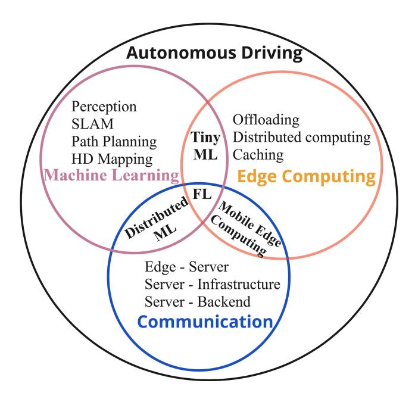

Fig. 9. Overlap of ML-Driving Services, Communication and Edge Computing.

round, as based on the specification the participating devices, they might not offer the equal computational capability [\[2\]](#page-32-4). Also another factor in case of distributed training is the total time needed to train the model as it highly depends upon the communication efficiency between the participating devices and the server. It is important to note that in addition to the onboard energy consumption, these approaches also brings into account the energy consumption caused due to communication between devices, network stations and server [\[147\]](#page-35-6). Figure [9](#page-16-0) is shown based on compare and contrast approach, to merge the content and show an overlap of energy-efficient methods covered in this survey paper. As shown the topics are divided into machine learning based application for autonomous driving services, Edge computing based methods for autonomous driving and the vehicular communication. As these approaches have varied system demands, based on latency, memory and computational requirement, an attempt to show the overlapped area where software approximation can be applied has been made. The emerging areas are Tiny ML (promotes deep learning in compressed form in embedded processors), Distributed Machine Learning & FL which implements collaborative training and inference among several embedded and edge devices. Mobile Edge computing has also emerged as a popular topic which allows processing of data and decision making process close to the Edge thus overcoming latency and memory drawbacks. Rest of this section discusses computing-efficiency and compression methods.

*1) Computing Efficiency:* DNN based vision oriented systems such as object classification, 3D object detection and SLAM are usually computational intensive, high resource and energy consuming tasks. The computing complexity relatively increases for real-time applications when these larger weight DNN are implemented on the embedded systems with limited memory [\[153\]](#page-35-24). For example the currently deployed level 3 autonomous vehicles [\[150\]](#page-35-7), [\[243\]](#page-37-1) are mostly dependent on vision sensors systems and consumes significant resources in terms of memory and energy. The scalability of these applications on embedded systems with fully connected cooperative autonomous vehicles is yet to be known incorporating full ADAS features. With the implementation of fully connected autonomous driving, the common assumption is the complex calculation and usage of deep/dense neural network will increase the calculation time, thus making some real-time applications difficult to process within the required latency, and on the other hand, the large weights of the neural network will also bring challenges to some embedded systems with limited memory [\[89\]](#page-34-5), [\[152\]](#page-35-9), [\[253\]](#page-37-17), [\[303\]](#page-38-7), [\[316\]](#page-39-15). Therefore, there is a need to implement and develop low-weight and compressed neural network for efficient and low-latency calculations.

*2) Compression:* Compression is an approximation technique which can be implemented for the model and the data to allow the real-time inference on resource constrained devices. Some of the popular compression technique in deep learning involves pruning, low-rank approximation, quantization, knowledge-distillation, sketching. Deep Compression [\[94\]](#page-34-18) proposed by Han et al., implements combination of pruning, quantization and Huffman coding on the state-of-art deep neural network such as Alexnet, VGG-16 by maintaining the architecture accuracy. In federated learning practices along with the deep learning approximation technique, the compression is also implemented in communication algorithms using sparsification of gradients. In this section this survey paper discusses these compression approaches by also mentioning some popular inference methods for resource constrained embedded devices.

*Low-Rank Approximation:* A direct mathematical approach to compress a dense neural network is low-rank approximation. As traditional neural network are developed on filters and layer comprising of several matrix, factorization [\[258\]](#page-37-18), [\[291\]](#page-38-21) and decomposition [\[14\]](#page-33-14), [\[59\]](#page-33-15), [\[90\]](#page-34-19), [\[117\]](#page-35-11), [\[119\]](#page-35-25), [\[158\]](#page-35-26), [\[334\]](#page-39-16), [\[351\]](#page-39-17) of these matrix has helped in reducing the parameters from the neural network, the popular approaches involves singular value decomposition [\[90\]](#page-34-19), [\[117\]](#page-35-11), tucker decomposition [\[141\]](#page-35-27) and canonical polyadic decomposition [\[21\]](#page-33-16). For decomposition the approach can be targeted to reduce the parameter for overall dimension reduction or targeting a channel through decomposing the relevant filter. In [\[90\]](#page-34-19) authors proposed a method in which convolutional filter with low rank are decomposed into several depth-wise and point-wise filter. With this approach the large scale model size is compressed and could be easily deployed on mobile and edge devices, however accuracy loss for the network is higher as few high ranked filter could still be decomposed in this approach based on the assumption from a neighbor low-ranked filter. Another approach to prevent accuracy loss is implementing sparse regularization [\[14\]](#page-33-14), [\[211\]](#page-37-19) in an hierarchical manner as this approach can enhance network learning by grouping the filter which can be decomposed based on magnitude. Other techniques [\[117\]](#page-35-11), [\[158\]](#page-35-26) involves finding kernel or filter with low magnitude during training to enhance the model learning (Accuracy) and later applying a singular value decomposition to achieve a better compression ratio.

*Pruning:* Pruning is originally a technique applied in agriculture or horticulture to remove certain parts of tree or plant (branch, leaves, stubs) which are not effectively contributing. Inspired from this idea, researcher has applied and implemented pruning in convolutional or deep neural network to compress and reduce the overall parameter of these neural networks and to enable deployment an easy process on resource constrained embedded device for real-time application which also requires smaller models with fast computation process. In current practice there are two popular approach for pruning, removal of weights [\[98\]](#page-34-20), [\[99\]](#page-34-21), [\[100\]](#page-34-22), [\[126\]](#page-35-28), [\[162\]](#page-36-2), [\[182\]](#page-36-14), [\[200\]](#page-36-15) and removal of neurons [\[164\]](#page-36-16), [\[166\]](#page-36-17), [\[194\]](#page-36-18), [\[197\]](#page-36-19), [\[219\]](#page-37-20), [\[298\]](#page-38-22), [\[372\]](#page-40-15) respectively. Removal of weights from neural network does not affect the accuracy of model as only those weights are removed which have a magnitude close to zero. Since the implementation of weights removal is based on sparse matrix computation, in some cases it requires dedicated processors to apply this method in neural network [\[162\]](#page-36-2), [\[200\]](#page-36-15). For these methods authors have also proposed Structured Sparsity Learning (SSL) framework designs for hardware (e.g., mobile computing, FPGA framework) [\[162\]](#page-36-2). In [\[98\]](#page-34-20), [\[99\]](#page-34-21) the approach covers pruning the soft-filter where filters are pruned while training a DNN model in iterative manner after the model has been trained for an epoch, based on the magnitude or score. The methodology used for scoring the filter is based on (*l*1 or *l*2) normalization. Once the model is pruned, there are changes in the hyperparameter and dimension of the network, therefore it is important to adjust them by reconstructing the pruned filter using forward and backward propagation. The second approach which involves removal of neurons is based on heuristic methods and directly impacts the accuracy and overall performance of the neural network however the model performance can be optimized with the fine-tuning [\[342\]](#page-39-18), [\[346\]](#page-39-19) or model retraining practices.

*Quantization:* Uniform and non-uniform quantization techniques are popular methods to compress an AI model. In the uniform quantization technique [\[49\]](#page-33-17), [\[72\]](#page-34-23), [\[398\]](#page-40-16), a linear approach is used to distribute the quantized values over the space uniformly. While in non-uniform quantization, the logarithmic or exponential approach is used to distribute the quantized values non-uniformly. Methods to quantize deep neural network non-uniformly is presented in [\[121\]](#page-35-29), [\[129\]](#page-35-30), [\[179\]](#page-36-20), [\[357\]](#page-39-20), which is based on quantization interval learning. Here the quantization intervals are parameterized over the intervals, and the obtained function is applied over the weights and activation of the deep neural network to achieve model compression. Quantization has also helped reduce CNN's overall weight and size, which consists of many convolutional layers. Quantization for layers has been proposed in [\[5\]](#page-32-5), [\[83\]](#page-34-24), [\[235\]](#page-37-21), [\[406\]](#page-40-17) by using the statistical parameter or scaling factor for the layer. This granular based approach can significantly reduce the model size, however it also results in relative loss of model accuracy as a kernel or filter containing important feature will loose its weights because of another kernel or filter with no feature present in the same layer. A better approach to counter this problem is quantization in group [\[272\]](#page-38-23), [\[374\]](#page-40-18), [\[375\]](#page-40-19), where kernel or filter with no feature or weights can be grouped together and removed. This approach maintains the architecture accuracy but requires additional scaling parameter for each layer. Recent used approach in granular quantization is with channels [\[112\]](#page-35-31), in this approach the length of activation and weights are scaled for each channel to reduce the overall weight [\[170\]](#page-36-21), [\[397\]](#page-40-20) for each convolution filter during training. The scaling factor is applied on input feature maps and output feature maps of the channels as they have different lengths, which results in parameter reduction without loss in accuracy. Some applications require to modify or rearrange the parameter of convolution or deep neural network after the model is trained, this approach is often termed as quantization aware training and post-training quantization. Quantization aware training process includes retraining the model with methods such as: straight through estimator [\[69\]](#page-34-25), [\[366\]](#page-40-21), [\[407\]](#page-40-22), target propagation [\[55\]](#page-33-18), [\[157\]](#page-35-32), [\[225\]](#page-37-22), regularization [\[220\]](#page-37-23), [\[262\]](#page-38-24).

*Knowledge-Distillation:* Another efficient approach of deploying large sized neural network to edge devices is Knowledge distillation. This technique [\[6\]](#page-32-6), [\[50\]](#page-33-19), [\[128\]](#page-35-33), [\[187\]](#page-36-22), [\[210\]](#page-37-24), [\[238\]](#page-37-25), [\[261\]](#page-38-25), [\[310\]](#page-39-21), [\[365\]](#page-40-23) consists of two processes, in first part the large model is trained over a complete set of dataset on high performing devices, which results in output feature maps predictions. In the second process a compressed version of the large model is trained over the dataset (sampled form + ground truth), which results in output feature maps predictions, which is then combined with the output feature maps of larger model thus providing knowledge (distilled) from larger model to the compressed one by still marinating accuracy and net loss. Some approaches involves [\[261\]](#page-38-25) direct correspondence between layer of large and smaller model sometimes also referred as utilising the soft probabilities from larger network to train smaller network rather than the ground truth, as this information not only contains the output feature maps but also the activation maps thus making the smaller network learning faster. This approach has shown potential for transferring the large models from high performance devices to edge devices or embedded processors, but to achieve high model compression ratio with soft probabilities or direct correspondence is still a challenge. As the other approaches such as pruning and quantization is capable of balancing a trade-off between accuracy and compression ratio. Some approaches [\[140\]](#page-35-34), [\[175\]](#page-36-23), [\[227\]](#page-37-26) also involves using combination of multiple compression techniques: knowledge distillation, pruning, and quantization to achieve better accuracy and compression ratio.

*3) Role of Edge AI:* This section discusses the influence of edge computing and related applications on autonomous driving. As the volume of data keeps on growing with the number of sensors, a research direction is focused on processing data near the sensing device. Cloud computing, cloud centralized intelligence [\[195\]](#page-36-24), [\[270\]](#page-38-26) was initially proposed as solution for fully connected autonomous driving, however the latency requirement for time sensitive applications and the expected bandwidth (Table [VIII](#page-18-0) shows comparison of Edge and Cloud intelligence) for data transmission became a challenge. To address this challenge Edge Intelligence has been proposed as a suitable solution, which allows processing of

| Parameters                 | Vehicular Edge Intelligence    | Cloud Intelligence  |  |  |
|----------------------------|-----------------------------------|------------------------|--|--|
| Architecture               | Heterogeneous ASIC Accelerator | CPU, GPU, TPU, FPGA |  |  |
| Computing Performance   | Medium                            | High                   |  |  |
| Storage                    | Limited                           | Highly Scalable        |  |  |
| Power Consumption          | Low                               | High                   |  |  |
| Context-Aware Computing | Applicable                        | Not Applicable         |  |  |
| Architecture Topology      | Distributed                       | Centralized            |  |  |
| Deployment Cost            | Low                               | High                   |  |  |
| Reliability                | High                              | High                   |  |  |
| Security                   | High                              | Limited                |  |  |

TABLE VIII EDGE INTELLIGENCE & CLOUD INTELLIGENCE PARAMETERS COMPARISON FOR SELF-DRIVING VEHICLES

data closer to the edge device rather than in a centralized cloud.

In [\[402\]](#page-40-5) the authors presented in detail about the motivation and benefits of using edge intelligence where the primary concepts highlighted and can be linked with autonomous vehicles are: the volume of data generated by vehicle senors at the edge device need machine and deep learning approaches for processing and decision making process thus proposing the concept of AI at the Edge. The concept has been proposed in several stages where the primary focus is on transmission of sensed data to the server or cloud for processing and decision making. The first stage contains the parameters of cloud intelligence shown in Table [VIII,](#page-18-0) thus allowing training and inference via a centralized cloud. The second stage comprises of edge-server joint training and inference. In this stage depending upon the requirement and processing ability the model can be jointly trained at the edge and server or at the server and inference occurs at both using distributed learning and computing methods.

The last stage of edge intelligence allows the training and inference occurrence on the device itself or near the device (edge) through data offloading and real-time compressed sensing approaches [\[387\]](#page-40-24). For autonomous driving applications Pi-Edge [\[301\]](#page-38-9) and AVe [\[73\]](#page-34-6) are the two initial proposed framework consisting of driving services with data offloading and resource allocation techniques. Later proposed edge AI framework for autonomous driving [\[300\]](#page-38-27), is also influenced by Pi-Edge and proposed data offloading and resource allocation scheme, thus allowing edge-server joint inference using hybrid communication architecture. However the framework misses energy saving mechanism and the assumptions on trade-off which data offloading and compression brings on the end-to-end accuracy of the model. In [\[259\]](#page-38-28), [\[260\]](#page-38-29) the authors propose intelligent edge architecture for autonomous driving vehicles with OpenStack and ETSI open-source MANO. Using the architecture the allocated and resources of edge devices can be visualized at the server or cloud and also allows managing of mutli-access edge and mobile computing, thus allowing to free edge device memory from raw data using offloading.

In [\[116\]](#page-35-8) the authors proposes an edge architecture with low latency communication and resource allocation scheme for compute intensive tasks. Using the reference architecture the authors designed an advanced autonomous driving communication protocol to enhance and facilitate communication between edge device, servers, data centers and the centralized cloud. Here the cloud contains legacy or ground truth data contributed from the vehicle sensors, servers, infrastructure sensors and the vehicular surrounding. For the decision making process a deep reinforcement learning approach is used for training and inference. The edge frameworks, offloading schemes and approximations are comprehensively covered in Sections [IV](#page-20-0) and [V.](#page-25-0)

## *F. An Overview of Dataset for Autonomous Driving*

An important requirement to develop machine/deep learning based autonomous driving services or tasks is dependent dataset. Several datasets has been made available by the universities research groups, and the automotive companies in the last decade. In this article an attempt to categorise these datasets has been made on the basis of sensors and the driving application which can be derived as a result. Based on convolutional neural network, one of the most researched topic is object detection containing several classes such as pedestrians, traffic signs, lane, vehicles (cars, truck, ambulance, school bus). The advancement in minor features recognition from the image or video frames also resulted in development of applications such as: vehicle model detection, license plate classifier, and other cooperative applications. Some of the commonly used datasets are KITTI [\[205\]](#page-36-9), Cityscapes [\[53\]](#page-33-20) and PASCAL VOC [\[317\]](#page-39-22). After 2017 high quality data comprising of multi sensors primarily camera and LiDAR has been collected and released for development of advanced applications targeting level 5 autonomy [\[106\]](#page-34-26), [\[290\]](#page-38-30) also shown in Figure [10.](#page-20-1)

To prevent developing biased AI models, the traffic scenes or data were also combined from multiple continents, countries and cities. The EU Long-term dataset [\[354\]](#page-39-23) is collected in several location within Europe, nuscenes [\[37\]](#page-33-21) collected in Singapore and USA, comprises of multi-sensor suite. Argoverse [\[41\]](#page-33-22) dataset collected by Ford is one of the unique datasets which also provides functionality to try and test the high definition map applications based on LiDAR and camera sensors. However, the class imbalance remains an open challenge that has not been addressed for training AI models [\[135\]](#page-35-35).

As the sensor/data fusion approach is being researched for low powered embedded devices, the driving tasks, such as adaptive cruise control, path planning, and SLAM has involved usage of radar sensor values with the LiDAR point clouds and the camera frames. Radarscenes [\[266\]](#page-38-31), Astyx HiRes [\[207\]](#page-36-25), Ford multi av [\[4\]](#page-32-7), Neolix [\[324\]](#page-39-24), Pixset [\[61\]](#page-33-23), are some datasets which provides the annotations on data based on these three sensors. Similarly another high quality dataset also comprising of HD Map annotation has been made publicly available by the Deep Route AI targeting the level 4+ Full-stack self-driving system. Table [IX](#page-19-0) shows list of open-sourced datasets available for the AI model development and testing.

TABLE IX PUBLICLY AVAILABLE DATASET FOR AUTONOMOUS DRIVING. URL'S WERE LAST ACCESSED ON 10-JUNE-2023

| Year         | Dataset Sensors Included                            |        |          |        |          |        |        |                          |  |
|--------------|-----------------------------------------------------|--------|----------|--------|----------|--------|--------|--------------------------|--|
|              |                                                     | Camera | LiDAR    | Radar  | GPS/GNSS | IMU    | HD MAP | URL                      |  |
| 2012 - 2022  | KITTI [205]                                         | Y      | Y        | N      | N        | Y      | N      | KITTI                    |  |
| 2015 - 2019  | KAIST Dataset [51] HD1K [143]                    | Y      | Y        | N      | Y        | Y      | N      | KAIST HD1K            |  |
| 2016         | CVC-14 [130]                                        | Y Y | Y N   | N N | N N   | N N | N N | CVC-14                   |  |
| 2016         | Brain4Cars [120]                                    | Y      | N        | Y      | Y        | N      | N      | Brain4Cars               |  |
| 2016         | JAAD [146]                                          | Y      | N        | N      | N        | N      | N      | JAAD                     |  |
| 2016         | Cityscapes [53]                                     | Y      | N        | N      | Y        | Y      | N      | CITYSCAPES               |  |
| 2016         | Udacity                                             | Y      | N        | N      | N        | N      | N      | UdaCity                  |  |
| 2016 - 2019  | comma.ai driving dataset [264]                      | Y      | N        | Y      | Y        | Y      | N      | Comma datasets           |  |
| 2017         | TRoM [192]                                          | Y      | N        | N      | N        | N      | N      | TRoM                     |  |
| 2017         | Raincouver [309]                                    | Y      | N        | N      | N        | N      | N      | Raincouver               |  |
| 2017         | VPGNet [159]                                        | Y      | N        | N      | Y        | N      | N      | VPGNet                   |  |
| 2017         | TuSimple                                            | Y      | N        | Y      | N        | N      | N      | TuSimple                 |  |
| 2017         | TorontoCity [326]                                   | Y      | Y        | N      | N        | N      | N      | TorontoCity              |  |
| 2017         | CityPersons                                         | Y      | N        | N      | N        | Y      | N      | CityPersons              |  |
| 2017 2017 | Mapillary Vistas [221]                              | Y      | N        | N      | N        | N      | N      | Mapillary Vistas         |  |
| 2017         | Multi-spectral (Univ of Tokyo) [92] CULane [233] | Y Y | N N   | Y N | N Y   | N Y | N N | Multi-spectral CULane |  |
| 2018         | DBNet [47]                                          | Y      | Y        | Y      | Y        | Y      | N      | DBNet                    |  |
| 2018         | IDD [315]                                           | Y      | N        | N      | N        | N      | N      | IDD                      |  |
| 2018         | MVSEC (U Penn) [403]                                | Y      | Y        | N      | N        | N      | N      | MVSEC                    |  |
| 2018         | NightOwls [222]                                     | Y      | N        | N      | N        | N      | N      | NightOwls                |  |
| 2018         | Road Damage [199]                                   | Y      | N        | N      | N        | N      | N      | Road Damage              |  |
| 2018         | Wilddash [377]                                      | Y      | N        | N      | N        | N      | N      | wildDash                 |  |
| 2018 - 2020  | BDD-100K [370]                                      | Y      | Y        | N      | Y        | Y      | N      | Berkeley                 |  |
| 2018 - 2020  | ApolloScape [113]                                   | Y      | Y        | N      | Y        | Y      | N      | Apollo                   |  |
| 2018 - 2020  | Honda Driving [239]                                 | Y      | Y        | N      | Y        | Y      | N      | HDD                      |  |
| 2019         | Argoverse [41]                                      | Y      | Y        | N      | N        | N      | Y      | Argo                     |  |
| 2019         | Astyx HiRes [207]                                   | Y      | Y        | N      | N        | N      | N      | Astyx                    |  |
| 2019         | BLVD [352] Boxy Driving [24]                     | Y      | Y N   | N N | N N   | N N | N N | BLVD BOSCH            |  |
| 2019         | EuroCity [34]                                       | Y      | N        | N      | N N      | N      | N      | Eurocity Persons         |  |
| 2019         | EU Long-term Dataset [354]                          | Y      | Y        | Y      | Y        | Y      | N      | EU Dataset               |  |
| 2019         | IceVisionSet [240]                                  | Y      | Y        | N      | Y        | N      | N      | IceVision                |  |
| 2019         | StreetLearn [209]                                   | Y      | N        | N      | N        | N      | N      | Street Learn             |  |
| 2019         | PandaSet                                            | Y      | Y        | N      | Y        | N      | N      | PandaSet                 |  |
| 2019         | WoodScape [368]                                     | Y      | Y        | N      | Y        | Y      | N      | WoodScape                |  |
| 2019         | Unsupervised Llamas - Bosch [25]                    | Y      | Y        | N      | Y        | N      | N      | Bosch                    |  |
| 2020         | 4-Seasons [336]                                     | Y      | N        | N      | Y        | Y      | N      | 4-Seasons                |  |
| 2020         | A*3D [242]                                          | Y      | Y        | N      | N        | N      | N      | ASTAR-3D                 |  |
| 2020         | nuScenes [37]                                       | Y      | Y        | Y      | Y        | Y      | Y      | nuscenes                 |  |
| 2020 2020 | POSS [234] DDD20 [108]                           | Y Y | Y N   | N N | N Y   | N Y | N N | POSS DDD20            |  |
| 2020         | Highway Driving [139]                               | Y      | N        | N      | N        | N      | N N | Kaist                    |  |
| 2020         | Lyft Level 5 [106]                                  | Y      | Y        | N      | N        | N      | Y      | lyft                     |  |
| 2020         | Brno Urban Dataset                                  | Y      | Y        | Y      | Y        | Y      | N      | BRNO                     |  |
| 2020         | Ford Multi AV [4]                                   | Y      | Y        | N      | Y        | Y      | Y      | Ford Seasonal            |  |
| 2020         | A2D2 [80]                                           | Y      | Y        | N      | N        | N      | N      | Audi                     |  |
| 2020         | LIBRE [38]                                          | Y      | Y        | Y      | Y        | Y      | N      | LIBRE                    |  |
| 2020         | Toronto-3D                                          | Y      | Y        | N      | Y        | Y      | N      | Toronto-3D               |  |
| 2021         | NEOLIX [324]                                        | Y      | Y        | Y      | Y        | Y      | N      | Neolix                   |  |
| 2021         | CADC [244]                                          | Y      | Y        | N      | Y        | Y      | N      | CADC                     |  |
| 2021         | RadarScenes [266]                                   | Y      | N        | Y      | Y        | Y      | N      | RadarScenes              |  |
| 2021         | CARRADA [230] <b>Waymo</b> [290]                 | Y Y | N Y   | Y N | N N   | N N | N Y | CARRADA Waymo Open    |  |
| 2021         | waymo [290]   SODA10M [93]                       | Y      | N        | N N | N N   | N N | N N    | SODA10M                  |  |
| 2021         | PixSet:LeddarTech [61]                              | Y      | Y        | Y      | Y        | Y      | N      | PixSet                   |  |
| 2021         | ONCE [202]                                          | Y      | Y        | N      | N        | N      | N      | ONCE                     |  |
| 2021         | Deep Route AI                                       | Y      | Y        | Y      | Y        | Y      | Y      | Deep Route               |  |
| 2021         | DurLAR[169]                                         | Y      | Y        | N      | Y        | Y      | N      | DurLAR                   |  |
| 2022         | MUAD[75]                                            | Y      | N        | N      | N        | N      | N      | MUAD                     |  |
| 2022         | SHIFT                                               | Y      | Y        | N      | N        | Y      | N      | SHIFT                    |  |
| 2022         | Rope3D[364]                                         | Y      | Y        | N      | Y        | N      | N      | Rope3D                   |  |
| 2022         | CODA[168]                                           | Y      | Y        | N      | Y        | N      | N      | CODA                     |  |
| 2022         | View-of-Delft [232]                                 | Y      | Y        | Y      | Y        | Y      | N      | Delft-View               |  |
| 2023         | LiDar-CS [70]                                       | N      | Y        | N      | N        | N      | Y      | LiDar-CS                 |  |
| 2023         | ZoD [11] Race-Car [151]                          | Y Y | Y        | N Y | Y        | Y      | N N | ZoD Race-Car          |  |
| 2023         | Kace-Car [151]                                      | Y      | <u> </u> | Y      | Y        | Y      | IN     | Race-Car                 |  |

## *Lessons Learned:*

1) *Adversity:* Popular datasets do not include unexpected or undesirable uncertainties, as it is difficult to estimate a ground truth for them. Similarly, there is a limited representation of diverse weather and light conditions in datasets. An AI model

- trained/validated on such a dataset might not be generalisable.
- 2) *Biases:* The majority of the datasets are collected from urban driving conditions. This does improve the accuracy and development of an AI model for urban driving scenarios but also brings significant challenges to the model's adaptability to diverse and dynamic conditions such as highway driving or severe weather conditions.
- 3) *Disparity:* A form of bias can be inherited in AI models due to the disparity of annotated classes. Popular driving datasets generally discuss the number of scenes, annotations, and bounding boxes covered for training-testing. However, they lack a discussion on diversity and the distribution of classes covered. For example, the annotations of vehicles, and traffic signs are much higher represented as compared to cyclists, motorcyclists, or pedestrians.
- 4) *Data Fusion and Collection Format:* Statistical models are developed and adapted as per the format of datasets. Current datasets vary in logging approaches which brings challenges to model or cross-data transformation which can also create a bias on the developed AI algorithm.

## IV. EDGE AI FOR AUTONOMOUS DRIVING

Edge computing systems have already been used and tested IoT use-cases or applications, which require relatively less computation, and power [\[174\]](#page-36-26), [\[389\]](#page-40-25). Hardware manufacturers such as Nvidia, IBM, Intel, Qualcomm, NXP has developed and released edge computing hardware with respect to the dedicated tasks such as speech recognition and vision based applications. For autonomous driving the edge intelligence demands data processing pipeline which should be capable of data management, analysis and data storage. Popularly used vehicle edge computing devices include Nvidia's Jetson and Xavier Platform. These devices are largely used in combination with on-board sensors such as: cameras, LiDAR, radar, IMU, GNSS and V2X module or router for communication with other devices and server. As per current description the subsystems required to enable fully connected autonomous vehicle comprises of: the autonomous vehicle containing cellular or edge connectivity, the roadside units connected with the infrastructure, Edge server, the micro data centers, and lastly the cloud or main server having connectivity with all the mentioned subsystem and the autonomous vehicle, a description and layers are shown in Figure [11.](#page-21-0) It is important to note that the introduction of vehicular edge computing and intelligence [\[373\]](#page-40-26), have further strengthened the scope and area of vehicle-to-everything communication (V2X) [\[1\]](#page-32-2), [\[212\]](#page-37-3). The key components for enabling edge artificial intelligence for autonomous driving includes edge training, inference, caching, optimization, and communication. Vehicular communication has already been covered in the previous section, however distributed approaches such as federated learning remains, therefore this section first discusses Edge training and inference, Edge computing-based applications for autonomous driving, and recently proposed

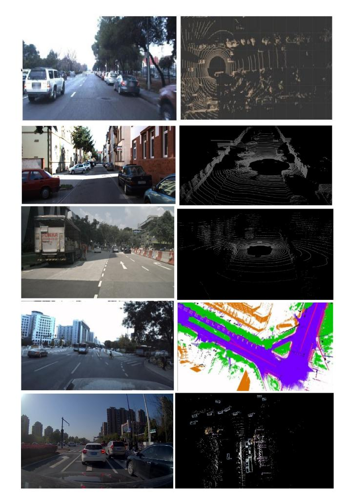

Fig. 10. Frames and point clouds from popular datasets. Images are from Lyft, KITTI, nuScenes, ApolloScape, and ONCE dataset [\[37\]](#page-33-21), [\[106\]](#page-34-26), [\[113\]](#page-35-20), [\[202\]](#page-36-27), [\[205\]](#page-36-9), respectively.

federated learning approaches, cooperative and collaborative autonomous driving.

## *A. Edge Computing and Intelligence*

The future of autonomy in vehicle has been previously proposed with centralized cloud [\[270\]](#page-38-26) and machine/deep learning algorithms deployed at cloud [\[195\]](#page-36-24), however transmitting the large volume data from the vehicle to cloud and receiving the model weights from cloud to vehicle brings latency issues for the time critical applications such as SLAM. This technical challenges leads to bringing artificial intelligence closer to the edge using distributed learning, in this context edge device (present in vehicle) and edge-server (present in vehicle surrounding), corresponding abstraction of Edge AI layer is shown in Figure [11.](#page-21-0) Some of the proposed collaborative applications and approaches includes perception [\[44\]](#page-33-24), SLAM [\[10\]](#page-32-8), [\[103\]](#page-34-27), [\[348\]](#page-39-25), HD map [\[383\]](#page-40-12), collision warning systems [\[58\]](#page-33-2), [\[81\]](#page-34-1) and path planning [\[308\]](#page-39-26).

In cooperative perception applications at edge, F-cooper [\[44\]](#page-33-24) provides collaborative object detection using high level fusion from multiple vehicles LiDAR point clouds. For object detection authors used voxel feature fusion

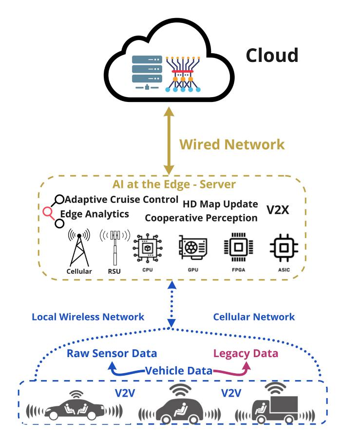

Fig. 11. Edge AI layers for connected vehicles.

(as shown in Figure [6\)](#page-10-0), and spatial feature fusion approach. The object detection methods were lightweight and allows the transmission and sharing over dedicated short range communication. The presented approach is deployed in the edge device and the method was tested using real-world data. Similar approach is presented in [\[20\]](#page-33-25), here the authors proposes an early fusion scheme and late fusion scheme. The early fusion scheme is used for detecting the objects and the late fusion scheme is used to propose the bounding box on the detected objects. For testing the proposed approach the authors used the synthetic dataset over a T-junction and roundabout vehicle environment. For evaluation of the proposed schemes the precision, communication cost and on-board computational latency has been compared. An approach based on value-anticipating networking is proposed in [\[105\]](#page-34-16), here the vehicle based on previous learning decides about transmitting the sensed information to other vehicle. Another cooperative perception [\[18\]](#page-33-26) is proposed using deep reinforcement learning for connected autonomous vehicles. The proposed model uses scheme to select sensed data for transmission amongst the connected vehicles. The authors further develops a cooperative vehicle simulation platform for object detection and communication.

Similar to perception, collaborative SLAM using edgeserver [\[348\]](#page-39-25) has been proposed for highly automated vehicles. As mentioned previously SLAM suffers with high computational demand and low latency requirement. To overcome computational requirement cloud-based SLAM has been

proposed [\[265\]](#page-38-32), however some drawbacks in centralized approach are the extreme low latency requirement and the current uplink bandwidth. Edge assisted SLAM [\[10\]](#page-32-8), [\[103\]](#page-34-27), [\[348\]](#page-39-25) approaches includes efficient computation, task scheduling algorithms, data offloading and sharing strategies. The backbone used in [\[10\]](#page-32-8), [\[348\]](#page-39-25) is ORB-SLAM [\[216\]](#page-37-0) and ORB-SLAM2 [\[217\]](#page-37-27) which provides the algorithm centimeter level localization accuracy. The approach uses distribution of SLAM block from ORB-SLAM2, across the edge-device and server thus overcoming the edge-device(on-board) computational complexity and processing the computation at the edge-server. To further improve the results and high precision, approaches involving crowd-source semantic mapping or fusing the results with HD map [\[180\]](#page-36-12) can be proposed.

## *B. Edge Training and Optimization*

In collaborative learning setting for autonomous driving, training or retraining a model will be common practice as edge devices present in vehicles collaborate to train, a deep neural network model with the help of server acting as mode of parameter or weight updates for edge devices. For autonomous driving the edge training and optimization model should consist of model that needs to be trained, training acceleration methods, optimization parameters and model uncertainty estimation. Inspired from this, an edge training and optimization process consist of training dataset present as either raw-sensed values or as the legacy data, and the tunable parameters. For edge devices training can be organized for an individual edge device or for group of edge devices [\[388\]](#page-40-27). While training a model on single edge device no inputs or parameters exchange occurs, however in group training the participating edge devices communicates and share the model weights and parameters as per the set iterations.

The computational demand and memory requirements for individual training is much higher, therefore using distributed and collaborative learning approach, attention has been given to group training [\[363\]](#page-40-28) to address the computational demand. In the group training of devices an attention is also given to communication-efficient approaches to better energy-efficiency, improve the communication round and decrease the training time. In [\[304\]](#page-38-33), authors proposed a stochastic gradient descent method for improving the convolutional neural network training on the edge devices. The approach consist of sparse methods to improve the convergence rate and overall performance parameters of the model. To implement compression the gradient sparsification methods are used, which reduces the communication cost by identifying the gradients needed to share. To counter the convergence rate, which can be caused by the frequent sparse updates, a momentum residual is proposed. For evaluation, a model training using MNIST dataset was implemented.

## *C. Edge Inference*

Edge inference is the process of converting raw sensed data into decision making task by processing them over the AI models deployed on edge device. As mentioned previously the approach is already being used for perception, SLAM,

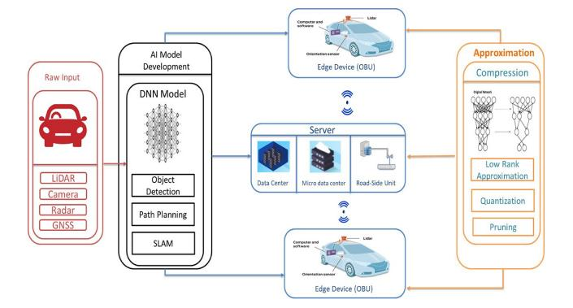

Fig. 12. Edge Assisted Autonomous Driving Inference.

HD map and video analytics applications. Data flow and process of edge inference is shown in Figure [12.](#page-22-0) As covered in Section [II](#page-1-1) most of the existing AI models for perception and SLAM are developed on the devices/machines which are powerful and consist of high-end graphic processing units and excessive memory. Therefore to make the AI model deployment possible on resource constrained embedded/edge device [\[160\]](#page-36-28), [\[327\]](#page-39-27), compression and software approximation approaches are implemented on the pre-trained models [\[307\]](#page-39-28).

Current Edge Inference practices for autonomous vehicles can be classified into three categories: local Inference on the edge device (vehicle), inference at Server, and jointinference at the vehicle and server [\[402\]](#page-40-5). In the case of local inference, the sensing and decision-making process is performed on-board, this approach is currently in practice and requires large memory space and expensive computation devices [\[116\]](#page-35-8). Local inference is very useful for lightweight applications such as on-board speech recognition. However, for heavy computational tasks, this approach suffers from computational complexity, data storage, and energy consumption problems. In server based inference, the sensing takes place on the vehicle or infrastructure sensors, and the data is uploaded to Server using wireless communication. The server is deployed with heterogeneous computing devices, processing the received data on the deep learning model, which are responsible for decision making process [\[114\]](#page-35-36). An example of analytics oriented applications are presented in [\[65\]](#page-34-28), [\[387\]](#page-40-24), which contains of edge framework deploying edge intelligence based on a hierarchical manner. The approach is very useful to bring down the on-board computational cost and energy consumption, however, this practice brings challenges based on latency for time-critical applications, privacy, and security of data and model which is being shared over a wireless channel. Also, communication delay can be encountered from a corresponding server if it is responsible for the processing of data from too many vehicles at the same time. Edge-Server joint inference for connected vehicular applications is proposed in [\[300\]](#page-38-27), [\[325\]](#page-39-29). In these proposed approaches, the sensing takes place on-board, and based on the available onboard computational resources, part of the computation and decision-making process takes place on-board, which contains a lightweight or compressed AI model, and the remaining takes place at the server, which contains the global or dense model. After the model weights are generated individually, using an aggregation approach the model weights are combined and the decision process takes place. Edge-assisted SLAM, perception, HD map updates are some practiced and proposed methods. Some of the frameworks and approaches proposed in this category are [\[42\]](#page-33-27), [\[43\]](#page-33-28). In these approaches, the common practice is to split and partition the deep neural network amongst the participating devices and server. Resource allocation scheme [\[198\]](#page-36-29), [\[224\]](#page-37-28), communicationefficient algorithms [\[122\]](#page-35-37), [\[278\]](#page-38-5), task scheduler [\[214\]](#page-37-29), [\[371\]](#page-40-29), early-exit models [\[152\]](#page-35-9), [\[316\]](#page-39-15) and heterogeneity-aware layer [\[189\]](#page-36-30), [\[382\]](#page-40-30) are proposed in Edge-Server joint inference to take advantage of on-board and server resource to implement energy-efficient approaches. For further optimization of joint inference methods, a hardware acceleration approach such as parallel computation using heterogeneous architecture device [\[193\]](#page-36-31), [\[378\]](#page-40-3) is proposed. In similar category, software acceleration approaches [\[224\]](#page-37-28), [\[267\]](#page-38-20) involve resource management, Edge AI pipeline design, approximating compilers, and compression of models.

*Lessons Learned From Subsections A, B and C:*

- 1) *Latency:* For functional-safety applications, latency is a key parameter. Applications such as obstacle detection, adaptive cruise control, emergency braking, localization requires strict latency. This property can be considered as one of reason for shift from vehicular cloud intelligence to edge computing and Edge AI applications.
- 2) *Heterogeneous Networks:* Connectivity within the ecosystem can be separated from short-range to long-range communication. Within the dynamic operational environment, proposed communication and delivery schemes should be capable of adapting to the diverse distributed network (Base stations, V2X, Cellular (4G/5G/6G), road-side units, edge-servers, cloud etc.).
- 3) *Resource Management:* Similar to a heterogeneous network, computing devices within the vehicle-edge ecosystem is also expected to be distributed. Devices may consist of distributed CPU, GPU, FPGA, TPU, and accelerators. Resource allocation and management schemes at the edge-server are required to process the sensed and transmitted data. Deployed resource allocation and management schemes can also counter other challenges such as excessive energy consumption from computing, data filtration, pseudo labeling, re-training approaches and update for the global AI model.
- 4) *Joint-Inference:* Strict latency, network bandwidth constraint and high volume data in connected vehicular applications provide an opportunity to focus on approaches that allows computation distributions at the vehicular and edge-server level. Early-exit DNN, federated learning, data aggregation and model partition approaches are the potential solutions when combined with communication-efficient AI approaches and mechanisms.

## *D. Federated Learning and Autonomous Driving*

Concept and applications of federated learning were initially proposed in [\[144\]](#page-35-38), [\[204\]](#page-36-32), with the aim of training a large machine learning model in a distributed manner across several devices to accelerate the process. In recent years exploration and scope of federated learning have been further extended to reducing the communication costs [\[42\]](#page-33-27), [\[122\]](#page-35-37), enabling privacy preserving methods and enhancing security of the model and data [\[33\]](#page-33-29), [\[63\]](#page-34-29), [\[224\]](#page-37-28), [\[363\]](#page-40-28), and resource allocation/management schemes for the participating devices [\[171\]](#page-36-33), [\[224\]](#page-37-28), [\[341\]](#page-39-30). For connected and autonomous driving applications federated learning have also been proposed with edge computing to jointly utilize the computation power of edge servers, and to take advantage training the model with dynamically distributed data over the edge devices, by further encouraging privacy preserving methods at the edge node or system level. Based on communication and computation approaches, the research topic covered below are further categorized as: "Communication efficient algorithms" [\[42\]](#page-33-27), [\[43\]](#page-33-28), [\[62\]](#page-34-8), [\[144\]](#page-35-38), [\[263\]](#page-38-34), [\[391\]](#page-40-31), "Resource constrained devices" [\[161\]](#page-36-34), [\[198\]](#page-36-29), [\[273\]](#page-38-35), [\[327\]](#page-39-27), [\[330\]](#page-39-31), [\[341\]](#page-39-30), "Heterogeneity aware" [\[43\]](#page-33-28), [\[63\]](#page-34-29), [\[171\]](#page-36-33), [\[224\]](#page-37-28), [\[307\]](#page-39-28), "Energy efficient approaches" [\[16\]](#page-33-30), [\[214\]](#page-37-29), [\[254\]](#page-37-30), [\[277\]](#page-38-36).

*Resource Constrained:* Edge device-server joint inference and optimization [\[273\]](#page-38-35), [\[330\]](#page-39-31), [\[341\]](#page-39-30), involving edge device computation capability and associated local model accuracy with minimum cost. The resource in this context is computation, power capability and communication overhead between edge device and server. Joint optimization is prioritized using vehicle parameters such as position and velocity to ensure a round of communication and parameter update with local edge server. The system [\[341\]](#page-39-30) comprises of connected autonomous vehicles where edge device handles the initial computation requiring less resources and offloads the heavy computational tasks to the distributed edge servers in the urban driving scenario, with local model training, selected model aggregation [\[363\]](#page-40-28), computation complexity and weights transmission as primary matrices. For computation optimization a selfadaptive global best harmony search (SGHS) algorithm is used. For on-device resource allocation combination of SGHS and on-board computing and transmission power optimization algorithm is used to enhance the local model accuracy.

*Heterogeneity Aware:* In collaborative driving the data obtained from multiple sources such as infrastructure sensors, legacy data available in server or from other vehicle sensors is of heterogeneous form [\[122\]](#page-35-37). This basis and requirement bring heterogeneity aware distributed learning as a primary criterion for fully connected autonomous driving. Federated learning by choosing edge devices is addressed by [\[43\]](#page-33-28), [\[224\]](#page-37-28), [\[307\]](#page-39-28) to counter the computational capability and communication bandwidth. In the approach edge server randomly chooses the client for model aggregation and requests for current communication and computation resource available for processing, based on the received information the edge server distributes the model parameters to the edge devices with high available resources for the model aggregation and which uses batch normalization approach for updating the global model. Another distributed approach is studied in [\[63\]](#page-34-29) where the heterogeneous data is combined in subsets to minimize the aggregation loss from edge devices and improve the convergence, combination of these approach is also followed in [\[171\]](#page-36-33), where low latency communication is ensured through quadratic convex functions.

*Communication Efficient:* A semi-supervised federated learning (SSFL) is proposed in [\[62\]](#page-34-8), to alternatively train the statistical model at the edge server with unlabeled data using semi-supervised fixmatch [\[123\]](#page-35-12), [\[390\]](#page-40-32) and mixmatch learning method [\[28\]](#page-33-31). For acceleration and better convergence of local model, static batch normalization technique is used which is adaptation of batch normalization [\[123\]](#page-35-12) and group normalization [\[390\]](#page-40-32). In alternative training the local model at edge server is aggregated by retraining with the ground truth or legacy data to enhance the model accuracy at each round of training and in the next round of communication between the node and server the aggregated model weights are transmitted to update the global model and legacy data. Similar joint learning method is proposed in [\[42\]](#page-33-27), [\[43\]](#page-33-28), where the local model is re-trained over edge devices and is transmitted over cellular network to the base stations for global model aggregation. To minimize the model learning loss and to collectively use the communication bandwidth, the base station categorically select the edge device using greedy approach by proposing a resource allocation and power allocation schemes at base station and edge device respectively. For the power allocation scheme at the edge devices two primary criteria: retraining of local model and power needed for model or weights transmission is considered. Other proposed method includes sparsification of data and gradient, quantization for minimizing communication bandwidth, which has been discussed below.

*1) Sparsification:* For collaborative or federated learning the commonly used approaches for sparsification is to compress the gradient and/or the data. Edge computing or processing near the edge is being adopted as a popular approach for an autonomous vehicle. Instead of transmitting the data or raw data, the model weights processed at the edge is transmitted to the devices participating in communication. Reducing the transmission time [\[15\]](#page-33-32) or using efficient delivery scheme, such as REMD is also proposed as communication-efficient approach in FL setting [\[118\]](#page-35-22). Another approach [\[333\]](#page-39-32), [\[400\]](#page-40-33) proposed in FL use-case is to use of a lower-limit value in which the gradients with certain magnitude and greater than the predefined lower-limit are sent from the edge to the server and the left-over gradients are not used to weight or model aggregation. Using this approach the compression on the up-link and down-link communication can be implemented. However, the challenge is to choose the favorable lower-limit value, as similar to soft-filter pruning, the quantization and selection of the wrong lower-limit value can directly impact the overall model aggregation, which may provide an overall reduced model size but decreases the accuracy.

To overcome the previous challenge, stochastic gradient descent with k-sparsification is proposed in [\[285\]](#page-38-37), by reducing the data and model size and also improving convergence through error compensation for the transmission taking place

between edge and server. A similar approach is used in [\[7\]](#page-32-9), the method proposes to fix the sparsity rate. The communication or transmission of the gradient is only enabled for a fraction of the gradient with the highest magnitudes and keeping the unused gradient in the container. The sparsity rate used by the authors is p = 0.001, and this approach has relatively less impact the learned model overall accuracy and performance. To further overcome this performance gap, authors in [\[184\]](#page-36-35) proposed modifications to the existing approach through deep gradient compression. Deep gradient compression uses approaches such as: momentum correction, local gradient clipping, for the convolutional neural network and recurrent neural network. Results show that gradients are compressed by ratio of 270-660 following a hierarchical approach, without slowing down the model convergence. Sparsification methods were initially proposed with the function of improving and promoting distributed and parallel training among the cloud and data-centers. However, these methods lacked model convergence and aggregation as a scope which is currently a most essential metrics for the federated and distributed machine learning. Similarly, attention should be given to the number of edge devices participating in the transmission and the server participating in collaborative training. As the study in [\[184\]](#page-36-35) shows the communication between the edge and server will not be compressed and reduced if the number of devices participating in training is less than the chosen sparsity value.

*2) Quantization:* Along with the usage for compression of deep neural network, the approach is also used in communication-efficient algorithms, with the goal of minimizing the communication bandwidth between the edge device and server. Quantization in communication applications with a federated learning setting, can approximate the weight updates on edge devices by limiting the update to a certain set of values. One such implemented approach on independent and identical distributed data is signSGD [\[27\]](#page-33-33). In the proposed method authors quantized each gradient update to the allocated binary sign and reduced the bit size, with a value of 32. It is important to note that signSGD also implements compression at the server by approximating the gradient received from edge devices and further contains investigation and theoretical analysis of algorithm in distributed machine-learning setting. In this approach the participating devices transmits the information of the associated gradient to the local server which transmits back the updated and aggregated gradient sign to the participating devices for the local model aggregation. The analysis shows that this approach achieve a similar variance score in comparison to other contemporary methods and has a better convergence rate to a stationary point of a general non-convex function. Similar approaches of scalar quantization through stochastic methods are proposed in PowerSGD [\[318\]](#page-39-33), ATOMO [\[322\]](#page-39-34), TernGrad [\[335\]](#page-39-35), QSGD [\[12\]](#page-32-10), [\[13\]](#page-33-34).

ATOMO [\[322\]](#page-39-34) and QSGD [\[12\]](#page-32-10) propose to quantize the gradients with a better convergence rate allowing faster distributed training of neural networks, which is highly suitable for enabling collaborative learning within the vehicleedge environment. However, the performance analysis in the vehicle-edge surrounding should consider trade-off such as accuracy-efficiency-reliability for safety-critical and real-time applications while accuracy-energy for the latency tolerable applications. While deploying such methods focus can be also given to compression ratio and convergence rate, as for communication and federated learning within autonomous vehicles it is necessary to consider compression in uplink and downlink transmission and communication. In [\[12\]](#page-32-10), [\[13\]](#page-33-34) authors theoretically analyse the quantized stochastic gradient descent to balance the trade-off with federated learning parameter: convergence and communication cost. In this approach, the edge devices are allowed to adjust the number of bits transmitted in each iteration of communication according to the variance. As shown in [\[12\]](#page-32-10) the device in a federated setting can transmit around 2.8n+32 bits in one communication round (here n is the number of parameters in model). This setting leads to 5x approximate bandwidth saving. Similarly, to speed up the training amongst participating devices an approach is presented by [\[268\]](#page-38-38) to perform gradient quantization using one bit, which can make the distributed training to be 10x faster. For evaluation in [\[268\]](#page-38-38), authors used neural network with speech recognition which is highly anticipated use-case in autonomous driving [\[300\]](#page-38-27), [\[301\]](#page-38-9).

Dedicated uplink compression has been explored in [\[279\]](#page-38-39) by using the quantization theory. In this work authors explores the transmission of trained model by identifying the available channel bandwidth through quantization scheme. The authors further propose an encoding-decoding approach consisting of partitioning, dithering, quantization and entropy coding at the encoding function and entropy decoding, dither subtraction, collecting and model recover at the decoding function. The evaluation of proposed quantization system is demonstrated through numerical study which shows error is mitigated through federated averaging and high federated learning performance gains. Contrary approach to scalar quantization methods, for the uplink and donwlink compression is vector quantization method [\[280\]](#page-38-40). As compare to scalar methods, vector quantization offers dimension reduction along with the quantization scheme in federated learning setting. In the vector quantization method [\[280\]](#page-38-40), numerical studies similar to [\[279\]](#page-38-39) were conducted. The method comprises of encoding strategy similar to [\[279\]](#page-38-39) and analysis using probabilistic quantization. However a different decoding step of dither subtraction is applied to reduce the distortion and minimize the error. The approach also involves using of lossless source coding scheme in entropy coding and entropy decoding to generate non-uniform distribution of the quantized outputs.

*Lessons Learned:*

- 1) *FL using Edge:* Collaborative or joint-learning applications, such as Edge computing and Edge AI, complements federated learning. The advantages of using these techniques in conjunction with each other allow a reduction in communication bandwidth to the cloud and also promote privacy by not sharing/transmitting sensitive data.
- 2) *Compression:* It is extremely challenging to implement traditional federated learning techniques within conventional edge devices. Model compression approaches have been explored to accelerate the training/inference

by reducing the computational complexity and requirement.

- 3) *Re-Training:* AI models deployed for connected vehicle applications can often encounter unseen data. Property of FL to retrain the model and update the weights through convergence benefits use-cases, such as HD map update.
- 4) *Communication Reduction:* Current federated learning approaches focus on reducing the communication overhead through compression by overlooking the exploration of protocols that are lightweight in nature.
- *3) Overcoming Communication Overhead:* An open challenge for autonomous vehicles in federated or distributed learning environment is overcoming the computational complexity and communication overhead. Federated averaging [\[204\]](#page-36-32) proposes methods to reduce the communication frequency to overcome communication delay by not initiating communication between device and server after every iteration. Rather the federated averaging method computes the weight for every participating device using multiple iterations of stochastic gradient descent. Implementing the approach on convolutional neural network and recurrent neural network, the analysis shows that communication between participating devices can be delayed upto 100 iterations by still maintaining the convergence rate. A key requirement for this convergence rate is that the data should be independent and identically distributed between the participating devices. The communication round can be further increased with a higher delay, but as a trade-off it increases the computational cost on participating devices. As shown in above subsections, the work to overcome communication overhead combines the use of sparsification and gradient quantization [\[33\]](#page-33-29), [\[171\]](#page-36-33), [\[307\]](#page-39-28). These methods however do not have a better convergence rate.

A ternary quantization-based federated learning approach is proposed in [\[273\]](#page-38-35) to overcome the communication overhead in uplink and downlink communication. The quantization method is implemented on the participating devices and the server thus implementing local training and global model update through weights. This approach also reduces the model complexity for the edge and server devices. For evaluation authors performed simulation considering the battery powered vehicle with connected autonomous driving capability to achieve fast inference and low communication overhead thus making inference possible on resource-constrained embedded and edge devices [\[62\]](#page-34-8), [\[198\]](#page-36-29).

*Challenges for Vehicular Services:* Distributed learning has been a popular approach to tackle computation and communication challenges. Federated learning has provided alternative methods to re-train and deploy AI models with low communication and computation cost in dynamically distributed heterogeneous settings. Deployment of connected autonomous driving services (e.g., OTA update, traffic monitoring, and forecast) using federated learning approaches will enhance the privacy of data used for training and can also prevent attacks on the AI model. However, for real-time applications such as vehicle localization, and mapping, challenges exist in terms of computational resource requirement, latency, and communication bandwidth. A typical SLAM application in the vehicular

application is deployed using large sensed data from a camera, LiDAR, and radar. The data size is approximately in gigabytes and should be processed by the AI model in less than 5ms, which also makes it challenging to transmit it to a nearest participating device for computation.

Deployment of FL using Edge AI for vehicles can be considered as an optimization problem. The complexity further increases when energy-efficiency is considered as a direct parameter. A major challenge currently encountered for optimizing such efficient applications with FL context is the unavailability of the real-world large-scale dataset. As the problem has to be tackled by considering the communication and computing cost.

## V. ENABLING FRAMEWORKS FOR AUTONOMOUS DRIVING SERVICES

Due to the limited computation, storage, and communication resources of edge nodes, as well as the privacy, security, low-latency, and reliability requirements of AI applications, a variety of autonomous driving oriented edge AI system architectures have been proposed and investigated for efficient training and inference. This section gives a comprehensive survey of different Edge AI frameworks and their related architecture. It starts with a general discussion on different architectures and categorically comparison.

## *A. Autonomous Driving Framework*

Since the development of deep neural network supporting perception and SLAM applications, researchers have focused on the design and development of simulators, software often referred to as a framework. Nvidia Drive [\[32\]](#page-33-35), Waymo [\[3\]](#page-32-0), ApolloAuto [\[19\]](#page-33-3) are some commercially released driving frameworks supporting vehicular applications. Autoware [\[136\]](#page-35-4) based on ROS is developed for an embedded platform that was released in 2018. OpenCDA [\[350\]](#page-39-36), is one of the recently released and most complete open-sourced driving frameworks consisting of communication modules, real-time feedback and a simulation environment, thus providing a platform for cooperative driving applications. Following section details the architecture and components of these frameworks.

*1) Autoware:* Autoware [\[136\]](#page-35-4) is ROS [\[251\]](#page-37-31) based framework. It is developed on the concept of the sense-think-act model, also shown in Figure [13.](#page-26-0) It is primarily designed for vehicles driving in urban areas. Autoware is dependent upon perception-based sensor suites such as cameras and LiDAR for enabling object detection, tracking, and localization using deep neural networks. The sensed information is fused from both sensors to also create 3D maps around the vehicle, which helps in precise localization by combining it with SLAM algorithms and sensors such as GNSS and IMU. The other major components are planning and control, which is based on probabilistic robotics utilizing deep neural networks. The software can be installed on the autonomous embedded platform containing Ubuntu operating system by using ros packages and dependencies to enable self-driving functionality in urban scenarios. Additional software module development and sensors

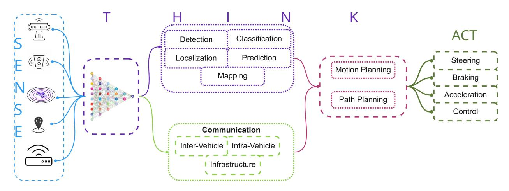

Fig. 13. Sense-Think-Act model, which has been used as a backbone for autonomous driving frameworks [\[136\]](#page-35-4), [\[350\]](#page-39-36).

integration such as radar is in progress which is required for the highway and related driving scenarios.

*2) Apollo Software Platform:* Apollo software platform has seen multiple revisions since its release, the currently available version integrates processing components: localization, perception, prediction, planning, control, and communication (V2X). At present, the platform incorporates deep learning models to perform major tasks through a dedicated computing unit comprising of CPU and GPU. One of the unique components of this platform is HD Map which can be also be tracked on the generic display monitor to perform and visualize accurate localization. The platform can be easily integrated with autonomous embedded platforms running UNIX operating systems. However, one of the important to calibrate with respect to the sensors and computing hardware installed on-board. The components in the apollo framework [\[19\]](#page-33-3):

*Perception:* The perception module majorly focuses on obstacle detection, traffic lights and lanes. The perception module is mostly performing 3D object detection and is implemented using a deep neural network focusing on the region of interest on the high precision map. The output from the object detection module comprises 3D bounding boxes around the object based on the class, height, width and probability of the detected object. In the background a detection to track algorithm is used in order to identify the individual objects with respect to the timestamps, this timestamp is logged in the system and later serve as feedback to improve the accuracy for the similar detected objects. The perception module utilises the data fusion strategy using the Kalman filter.

*Localization:* In the platform, multisensory fusion localization is used which is based on GPS, IMU, LiDAR, radar, and HD maps. The localization module is based on the fusion approach of the Kalman filter comprising of two-step prediction update cycle. It comprises of two major blocks, the GNSS localization which provides the position and velocity information and the LiDAR localization which provides the position and heading information. Finally, the inertial navigation solution is used for the prediction step of the Kalman filter, while the GNSS and LiDAR localization is used to update the measurement step of the Kalman filter.

*HD Map:* The high definition map [\[102\]](#page-34-10) component in apollo comprises legacy data collected by sensors containing information related to road definitions, intersections, lanes, traffic signals. It is used to reduce the computational demand of the hardware by integrating the existing information of the street or lane the vehicle is currently driving on. In the apollo platform, it is also used as a safety feature providing centimetre level accuracy in localization of the vehicle. The steps involved in the development and publication of HD Maps include sensor data sourcing, processing, object detection and manual verification. In case of road or lane change, the existing platform utilises updates of HD maps in data centres through crowd sourcing which can involve data collected by other autonomous vehicles, smartphones and other sensors on the intelligent map production platform.

*Simulation:* Along with the on-device implementation, apollo platforms also provides the function to virtually create the driving scenarios by choosing the above-mentioned modules, dedicated deep neural networks and test driving scenarios, validate, and optimise the existing models. The simulation results of the driving scenario can be logged which can be further utilised as feedback for the development of algorithms and tackling the false-positive scenarios.

*3) OpenCDA:* OpenCDA [\[350\]](#page-39-36) is one of the driving frameworks designed for cooperative driving with simulation and prototyping capability, it contains three major components which are: cooperative driving system, co-simulation tools and scenario manager. In the background the cooperative driving system is also based on the sense, think, act model and comprises of perception, communication, planning and control as the fundamental blocks to enable individual as well as cooperative driving. There is an application layer also present which is responsible for enabling cooperative perception, cooperative localization, platooning, and cooperative merge. For the second component, i.e., simulation part, this framework utilises CARLA [\[64\]](#page-34-30) for autonomous driving simulation and SUMO [\[148\]](#page-35-39) for traffic simulations, and with combined integration of these two, the traffic scenes and simulation can be created for example vehicle platooning, traffic merge. The simulation tools exchanges information with the sensor and processed data, it continuously provides the HD map data to the system and receives control commands. The third component which is scenario manager exchanges information with simulation tools and cooperative driving system, to evaluate the cooperative driving states, and trigger special event and provide it to the simulation tools. The framework is developed in python and is also scalable for the 64-bit OS UNIX system.

- *4) Openpilot:* This is another framework in the category of conditional or partial automation. The framework is developed by http://comma. ai/ [\[30\]](#page-33-36) and was released in 2017, and with revisions and additions of new features from 2017-2021, it is primarily dependent upon vision sensors and provides assistance to the driver with the driving services such as adaptive cruise control (ACC), forward collision warning (FCW), lane departure warning (LDW), and automated lane centring. The framework is dependent upon the services or components which can be divided as: Sensors and actuators, Neural network runners, Localization and calibration, Control, and System Logging & miscellaneous services. The versions of the framework can be integrated into embedded devices supporting the android or UNIX operating system.
- *5) Autopilot:* Autopilot [\[150\]](#page-35-7) provides assistance to the driver by sensing the environment around the vehicle through high definition automotive cameras and ultrasonic sensors. The software stack comprises of assistance and safety features such as automotive emergency braking, collision warning (front, rear and side), obstacle detection and also include smart navigation systems thus providing actuation and control. The framework on the backend uses a deep neural network performing object detection, semantic segmentation, and depth estimation to further provide the feedback and output for motion and path planning algorithm which suggests optimal route and actuate according to the destination set in the navigation. The software framework was initially designed to support the driver for highway driving scenarios and is also being tested for urban driving conditions.
- *6) CARMA:* This framework [\[35\]](#page-33-37) falls in the category of cooperative driving by enabling connected vehicles. The software stack is programmed in C++ programming languages and is configured using the ROS environment for the Ubuntu operating system. The framework utilises the Autoware citeAutoware for enabling level 3 automation capability and additionally contains a communication module in the sensing layer which includes DSRC, V2X and cellular connectivity, thus initiating communication and exchange of information with other vehicles, infrastructure and the cloud. The cooperative feature of this platform consists of four levels of planning for the vehicle which includes route planning, maneuver planning, trajectory planning and command planning.
- *7) AutoC2X:* AutoC2X [\[308\]](#page-39-26) is a cooperative driving framework that is a combination of two software: Autoware citeAutoware and OpenC2X citeOpenC2X developed for cooperative driving applications. OpenC2X is cooperative intelligent transport system software that is open source and is helpful for prototyping solutions such as traffic management, and platooning. AutoC2X setup comprises of pair of devices which is a computing unit and router, installed with AutoC2X-AW and AutoC2X-OC software at the car and

infrastructure respectively. The flow of information can be from car to infrastructure or from infrastructure to car. For the test experiment, the authors enabled cooperative driving services such as perception, coordinate transformation, localization, path planning through a proxy cooperative awareness V2X messages. The results from the experiment show that cooperative perception messages using AutoC2X were delivered within 100 ms.

*Lessons Learned:*

- 1) *Stack:* The discussed autonomous driving framework incorporates popular deep-learning algorithms to perform perception, localization, mapping and pathplanning tasks.
- 2) *Resource:* These frameworks require an onboard highperformance computing device with extensive memory capacity to process large-volume data and deploy intelligent algorithms such as CNN, DNN, or RNN.
- 3) *Energy:* The presence of extreme resources and computing devices results in high on-board energy consumption, which has been overlooked.
- 4) *Communication:* Initially proposed driving frameworks lacked the presence and usage of a communication unit/module, which is highly important to enable collaborative driving and fully autonomous vehicle.

## *B. Application Oriented Frameworks*

In autonomous driving frameworks, the other proposed approaches are tasks oriented and are strongly influenced by distributed or collaborative learning approaches. Popular research directions for an energy-efficient edge in these categories are data partition, model partition, Offloading, and communication. In the data partition method [\[270\]](#page-38-26), the collaborative compressed sensing approaches are used, which allows the distribution of data amongst participating devices, thus leveraging repetitive computational load on an individual device. Model partition approaches [\[288\]](#page-38-41) utilize resource allocation schemes [\[387\]](#page-40-24), which are based on the availability of computing resources at the participating devices. A large DNN model is split into smaller forms for collaborative training and inference. Using the server as the central or primary mode of communication in edge-server joint inference applications computation offloading-based edge inference systems [\[109\]](#page-34-31), [\[213\]](#page-37-32), [\[393\]](#page-40-34) has been proposed. The approach involves offloading data or offloading a part of the inference load or the entire task to the edge server in the surrounding. In this context, communication and resourceaware techniques are also implemented, which decides on choosing a server amongst the available server based on latency.

*Lessons Learned:*

1) The approach proposed in these application-oriented frameworks for connected vehicles considers either data reduction or model reduction, which can result in energy-saving mechanisms from either computation delay or communication perspective. However, for energy-efficient connected vehicles, both metrics need joint optimization and acceleration.

- 2) The communication approach proposed in these use-cases generally considers ideal conditions in communication. However, the communication in the vehicular ecosystem is often dynamic and heterogeneous, which consists of several low, and mid-range protocols with minor differences in distances. Therefore, another limitation of these frameworks is the inability to work in dynamic network conditions.
- 3) Similar shortcomings can be seen in computation as well. Edge in the vehicular ecosystem is constructed from heterogeneous devices with different computing abilities. AI models proposed in these applicationoriented frameworks does not account for computing heterogeneity which may lead to miscellaneous cost.

## *C. Energy-Efficient Edge Frameworks*

- *1) OpenVDAP:* Open vehicular data analytic platform (OpenVDAP) [\[384\]](#page-40-35) is a data analysis framework developed for connected autonomous vehicles (CAV) with the design requirements of edge computing. The services included in OpenVDAP are real-time diagnostics, advanced driver assistance systems, infotainment, and other quality-of-experience services. The platform is developed to deal with low latency applications in autonomous driving by collaborating with the other edge nodes (other vehicles), base stations, local servers, and the cloud in the driving environment. With respect to the application, the platform consists of on-board heterogeneous computing, a communication unit, an edge-based vehicle operating system (EdgeOS*v* ), a driving data integrator, and edge computing aware libraries for vehicular data processing. The primary purpose of using these components is to intelligently allocate the on-board computing resource to the algorithms for the data processing, implement the data offloading strategies and also enable communication between the vehicle and infrastructure.
- *2) CAVBench:* The benchmark suite [\[331\]](#page-39-37) was proposed to evaluate the performance of edge computing frameworks and software in connected autonomous driving services. Applications or services included in the CAVBench are object detection, tracking, SLAM, battery diagnostic, edge video analytics, and speech recognition, which are similar to the components included in OpenVDAP [\[384\]](#page-40-35). The services and deep learning algorithm associated are evaluated based on latency (on-device processing), and power consumed as these can help in the development of an end-to-end autonomous driving application. For the evaluation purpose, the state-of-art algorithms such SSD [\[191\]](#page-36-10), ORB-SLAM [\[216\]](#page-37-0) were implemented and resulted in observations such that the priority is to be given real-time applications with the latency demands for instances the demand for localization and processing is greater than the tracking. Therefore, the system demands a processing layer or container to execute the driving data and tasks in a hierarchical manner. The observation also shows end-to-end deep learning applications can decrease the processing latency of computing units with heterogeneous structures. Therefore, distributed algorithms can perform better than the baseline for some of the autonomous driving services.

- *3)* π*-Edge:* To enable the computational intensive tasks simultaneously on resource-constrained embedded systems, π-Edge [\[301\]](#page-38-9) is proposed which enables edge intelligence on the low powered embedded devices using the operating system π-OS. As the present embedded devices contain heterogeneous computing structure [\[257\]](#page-37-33), [\[389\]](#page-40-25), the authors proposed a heterogeneity aware run-time and scheduling layer to execute the tasks by targeting the on-board energy efficiency. The framework also contains a component that enables the communication between edge-node and server and also performs the data offloading tasks to save the on-board power consumption. For offloading experiments, authors used applications and data from object detection and speech recognition, as their latency demand (requires approx 100 ms) is more compared to SLAM applications (should be performed within 4-5 ms). The offloading algorithm is implemented through collaboration between edge-node(vehicle) and the server where it categorically searches for edge-node where data can be offloaded and estimate a time required for this application along with the needed computational resources. If the server is not capable of offloading the data the information is shared over the network with the purpose of executing the offloading task on the next available local server. The results were demonstrated by integrating the framework on Nvidia Jetson devices which consume 11 W of power.
- *4) MobileEdge:* As connected autonomous vehicles are processing and integrating multiple driving services at the same time, the vehicle computing unit can face significant load because of computational complexity. To address these issues several distributed computing approaches in the vehicular ecosystem has been proposed. MobileEdge [\[325\]](#page-39-29) is one such edge computing framework that utilises the main vehicle computing units and the other resource-constrained edge-node or devices such as raspberry pi or Hikey970, present in the vehicular ecosystem. The architecture of the MobileEdge framework consists of two processes one which is executed on the vehicle computing unit and the second process which occurs on the random edge-node. The vehicle computing unit further consists of a management system and device resource monitor, the on-board task scheduler and the task execution process. while the edge-node consists of resource monitor, task receiver and task execution process. The communication between the vehicle computing unit and edge-node is initiated over the local wireless network. The resource monitor on both devices is responsible to track the system usage and being aware of the power consumed. The task scheduler manages the incoming raw data from the sensors and passes them for execution or to offload it to free resources. The task executor process the driving services associated such as video analytics or speech recognition. Task receiver module which is present on the edge-node receives offloaded data from the vehicle-computing unit and pass it to task execution module of edge-node, by implementing the distributed computing application.
- *5) LoPECS:* LoPECS [\[300\]](#page-38-27) is another low power edge computing system for real-time autonomous driving. It has addressed the challenges of implementing computational intensive tasks on resource-constrained embedded devices and

can be considered as an extension of π-Edge as it replaces the π-OS with the real-time OS which is lightweight as compared to traditional used ROS. The architecture of LoPECS contains four major layers: services classification, runtime layer, heterogeneous aware layer and edge-server coordinator. The services classification layer helps in the identification of tasks and features which needs real-time execution and associated power consumption. The second layer is runtime which contains the real-time OS, architecture-aware scheduler and API. The architecture-aware scheduler can be further categorized into the inter-core scheduler and inner-core scheduler. This scheduler helps in processing the incoming data and acts as a data pipeline to the systems GPU, CPU, video and audio accelerator. The last layer is the edge-server coordinator and it performs the data and algorithm management strategies by enabling communication in the vehicular environment. This layer is also responsible to implement data offloading strategies. For the evaluation purpose, the framework combining SLAM, object detection and speech recognition is implemented on Nvidia Jetson TX1 (15 W capacity) with consuming 3.5 W on GPU, and 4.2 W on CPU from these tasks and still allows resource and memory for implementing other driving tasks.

*6) AC4AV:* AC4AV [\[385\]](#page-40-36) framework is designed for connected autonomous vehicles and proposes the access control techniques for the autonomous vehicle. The framework also utilises a data processing and abstraction method in which the sensed data from the sensors is identified and applied for access related applications. The primary purpose is to protect the sensed data from phishing attacks or being maligned from the vehicle environment. The architecture of AC4AV comprises of three-layer to prevent the raw sensor data from unauthorized access which are: access control engine, action control, and lastly a logger database. The access control engine provides dynamic authentication to access the data and also incorporates a data processing layer that identifies the type of data and its relevant use in the autonomous driving services, as the vehicle is sensing from several sensors and the same data can be used for multiple algorithms. The action control service layer is responsible for two tasks which are action capturing and responding. The last layer is the logger database which captures and records the actions. The information from the logger database can be used as an audit for future actions as it can help in improving latency for targeted applications. The implementation is based on publishing and subscribing, a classic approach for message and communication within an embedded environment. A similar framework autonomous vehicular edge [\[73\]](#page-34-6), is based on ant colony optimization, which includes offloading and task scheduling strategies with a decentralized approach. In this paper, the task scheduling strategies use a generalization assignment problem and is categorized according to the driving priority and latency demand. The computational complexity using a greedy algorithm and ant colony optimization were analysed in which the computational power is measured along with the latency and ant colony optimization results in latency less than 1 ms.

*Key Takeaways and Lessons Learned:*

- 1) *OS:* Traditional autonomous driving frameworks used ROS or similar open-source systems integrated with Unix to deploy CAV. In contrast to the on-board vehicular frameworks, the discussed edge frameworks are integrated using a custom lightweight OS to reduce computational delay for computing-intensive applications on resource-constrained devices.
- 2) *Scheduler:* As the vehicular services are hierarchyoriented and require execution within a short timeframe. These edge frameworks focused on integrating a scheduling algorithm also sometimes referred to as the runtime layer to optimize the data processing for vehicular services.
- 3) *Communication:* The discussed edge frameworks mostly used the combination of OBU and RSU to exchange vehicle data and model weights. A few frameworks also used local wireless networks (802.11b) installed customarily at the road intersection to initiate communication. However, the frameworks lacked testing the communication heterogeneity using the combination of edges such as base stations, RSU, cellular stations, and embedded devices integrated with wireless modules. Strict latency transmission of information to The communication approach proposed in these use-cases generally considers ideal conditions in communication. However, the communication in the vehicular ecosystem is very dynamic and heterogeneous, which consists of several low, and mid-range protocols with minor differences in distances. Therefore, another limitation of these frameworks is the inability to work in dynamic network conditions.
- 4) *Data:* A shortcoming in the edge frameworks is the inability to handle high-volume data from the vehicle sensors in case of collaborative inference between multiple vehicles. These frameworks do not propose any modules to offload or aggregate the sensed data at the edge. This may result in flood of data at the edge and repetitive computation for the redundant data.

## VI. RESEARCH OUTLOOK AND OPEN PROBLEMS

This survey studies a comprehensive and categorized review of approximation techniques and energy-efficient methods for autonomous driving services. The perspective and basis on selection of topics is based on previously and recently proposed AI and Edge Computing approaches for the driving services considering model size and real-time deployment for the low powered embedded devices, and the relevant conclusive factor of these approaches is based on the heavy computation complexity which results into high energy consumption on embedded devices. The main question asked in this survey is, What are the current approaches and trends which can promote the concept of Level 5 self-driving by enabling the Artificial Intelligence at the Edge Devices with an energy-efficient approach. During the process, some of the secondary questions related to development of model, Optimization and Inference approaches such as Federated learning were explored. However there are some research gaps and open problems which needs to be considered such as: Data management and process techniques on the Edge devices, Categorization for autonomous driving use-cases for real-time use-cases, autonomous driving tasks hierarchical categorization and energy implications of them. These topics are covered in the following subsections.

## *A. Connected Vehicle Service and Case-Study*

- *1) HD-Map:* Vehicle drivers has been regularly using 2-D map (for example: Google Maps, Apple Maps) with the cellular technologies to have a precise and short duration travel within or between the cities. For Self-driving vehicle this is been replaced by High Definition maps or 3D maps which are a result of mapping the roads and infrastructure using high definition cameras and LiDAR sensors to localize the vehicle precisely in the 3D environment and by saving the information over the data centers or cloud services. The average roads or dynamic scenes in a developed country changes only 5% - 13% [\[102\]](#page-34-10) over the year, due to construction or any other dynamic events. Therefore an approach can be implemented along with SLAM technique to update the previous captured HD Map in the cloud based on change in the scenarios. Lately, research approaches [\[383\]](#page-40-12) has been proposed to have a DNN model to update the HD map data available in the cloud from the crowd-sourced data.
- *2) Vehicular Networks and Communication:* For Edge-Assisted autonomous driving learning a cooperative approach needs to be implemented and practiced for collaborative decision making. Federated Learning has been proposed as potential solution for this problem, however open directions remains on the topics including common framework and deployment for heterogeneous vehicular networks, resource allocation using Federated Learning, communication, computing, and caching strategies for FL, data privacy and model security, collaborative intelligence.

## *B. Enablers for Edge Application in Autonomous Driving*

- *1) Data Management for Edge-Assisted Services:* The current autonomous driving practices involves individual implementation of tasks such as Classification, Detection or Localization. One of the reason associated with individual processing is non-availability of data management techniques and practices for the edge devices. If data management techniques can be proposed a heterogeneity aware layer can be integrated to serve as a data flow between the Sensor and DNN algorithm. Having Data Management techniques for the Edge-devices can simultaneously enhance the collaborative driving functionality and also improve the offloading strategy thus enabling each vehicle to make independent decisions and also share the output for cooperative driving use-case. Real-time compression of streaming data (from IoT/camera) and to be stored on the Edge for tracking or monitoring.
- *2) Collaborative Edge Intelligence:* The limited data bandwidth over wireless communication may lead to failure with decision making process in an autonomous cars as in

- case of cooperative driving the autonomous vehicle should continuously transmit data between the vehicle and the cloud. Implementing AI at the Edge on large scale can enable autonomous cars to efficiently process data and also enabling communication between vehicles, to overcome the network and communication related issues, distributed edge computing and federated learning approaches can be implemented which can enable the data processing and computation close or near to the vehicle as compare to the approaches in cloud computing where the processing and computation takes place in the centralized cloud. With the computation occurring close to the vehicle challenges and critical requirement such as accuracy, low-latency, reliability, power, and energy consumption, of autonomous vehicles [\[183\]](#page-36-36) can be achieved. However, bringing services near the vehicles' network where connectivity of the cars and their data is increasing at a tremendous rate often becomes highly crucial due to scalability issues in terms of functionality, administration, and load. Moreover, the connectivity among a large number of devices results in a flood of data production that can hinder the edge node to perform analytic on such a large-scale data by meeting strict latency requirements of autonomous cars. An adequate consideration must be given to resolve the edge-related issues for enabling successful deployment of autonomous cars.
- *3) Training and Inference at the Edge:* As covered in this survey, the volume of data from the sensors and the quality of data is rapidly changing and increasing depending upon the change in dynamic layer. To ensure the adaptability of Edge AI algorithm for a new or different data from the autonomous driving services environment, it becomes necessary to perform and implement AI model training and inference at the edge. As this will ensure the real-time update of legacy or groundtruth data available near Edge and will also ensure the timely update of global model by exchanging binary weights with the backend cloud. The training and inference approach at the edge device can counter two major challenges: Inference latency which can be caused when the model is trained over other device or system (for example cloud) and Secondly the privacy as on device training will prevent the data from being shared over cloud.
- *4) Common Edge Framework:* The implementation of approach such as Federated Learning, in autonomous driving demands a common Edge AI framework to be implemented across entities involved. A common edge framework across Vehicles, Edge Server, Infrastructure Sensors and Centralized cloud needs to be deployed to increase the efficiency and accuracy of applications. A common edge framework can bring the performance of individual devices to optimum level with needbasis collaboration from the vehicles and infrastructure sensor, Also it is important for privacy and security features.

# *C. Energy Efficiency Evaluation of DNN Implementation on Embedded Devices*

*Resource Constrained Devices:* Deep neural networks have delivered competitive accuracy for detection, segmentation, mapping and localization-related tasks for autonomous driving and with the advancement, in libraries and frameworks, they

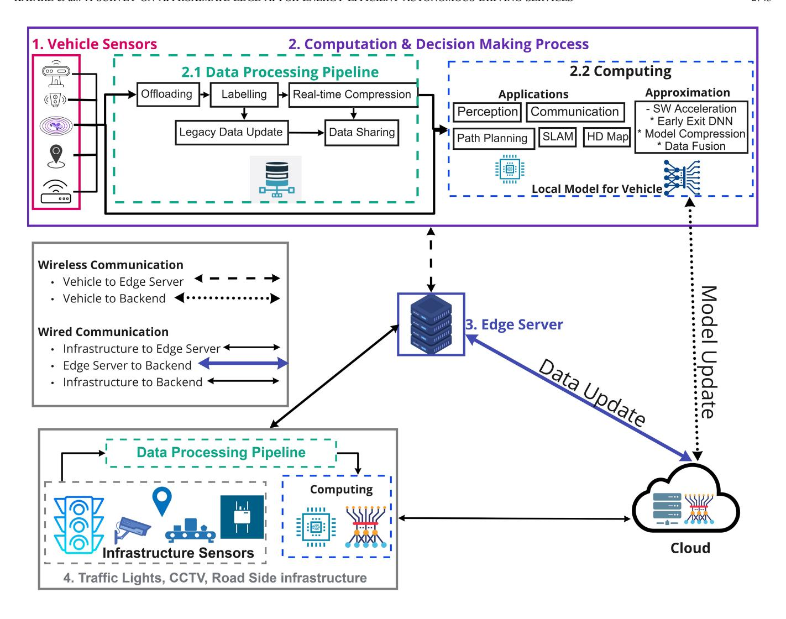

Fig. 14. Edge-assisted driving services: The pipeline consists of on-board vehicle sensors in the car, the computation and decision-making process, Edge-server, infrastructure sensors & devices, and the remote cloud.

have also been deployed on resource-constrained devices such as smartphones, FPGA. However, there are several drawbacks which cannot be overlooked. The best-in-class accuracy from the state-of-the-art DNN is delivered at the extreme computational cost caused during training and inference [\[231\]](#page-37-34) which significantly increases the overall energy consumption in the autonomous driving ecosystem. Literature covered in this survey shows several methods that have been proposed to improve the accuracy and speed of DNN processing by optimizing metrics involved, for example optimizing the binary weights and operations involved in complex layer such as convolutional, Fire modules. These approaches do not necessarily make a significant improvement on the embedded device deployment and applications. Therefore there is an open requirement to propose an efficient DNN model for autonomous driving training and inference applications which simultaneously tackle the problem of low latency applications by overcoming the challenge of data and the energy consumed.

Real-time applications such as SLAM or vision related tasks requires low latency and high precision by the embedded devices. The relevant literature covered in this survey mostly exploits high-end GPU which is cost-intensive for large scale deployment. To enable these tasks on edge embedded devices

a combined software and hardware acceleration approaches can be proposed which integrates data offloading strategies and energy or power saving techniques by simultaneously enhancing the accuracy and performance of these resourceconstrained devices.

## *D. Outlook of Edge AI Pipeline*

Takeaways and lessons learned from this survey highlight the need for an Edge AI processing pipeline that can process large volumes of data to carry out decision making processes. Figure [14](#page-31-0) shows an overview of the Edge AI processing pipeline envisioned for future connected autonomous driving services, where the design of this pipeline corresponds to the joint processing of data at the vehicle on-board computing unit and at the Edge-server. In the proposed scenario, the AI processing pipeline consists of four major components. The first component comprises of the sensing unit present in the vehicle (camera, LiDAR, radar, GPS, and the communication unit (on-board unit + cellular connectivity), which is capturing data from the vehicles surrounding.

The second component consists of computation and decision-making process, it involves an edge device placed in the vehicle processing the data through a deep neural network thus enabling driving services such as perception, SLAM and communications. The computation and decisionmaking process is a complex task while incorporating energyefficient autonomous driving service through edge intelligence. Therefore, it is necessary to highlight the process which consumes a significant amount of on-board energy. Further, the computation and decision-making process is divided into data processing pipeline and computing respectively. The data processing pipeline is assigned with tasks, such as offloading, labelling, real-time compression, legacy data update and sharing the refined data with other entities involved in the surrounding, such as other vehicles, or edge servers. The processes carried out in the data processing pipeline can solve the primary concern of memory and power for resourceconstrained edge embedded devices. The computing part involves processing the refined data over a deep neural network to generate the weights for driving applications. With the possibility of optimizing deep neural networks further acceleration and approximation techniques such as deep neural network model compression, data fusion or approaches such as early exit deep neural networks can be used. It is important to note that tasks such as SLAM, object-tracking, obstacle detection has low-latency and high bandwidth requirements, which makes it necessary and practical to process sensed data at the vehicle's on-board computing unit for these tasks instead of processing at the edge or remote cloud. Therefore, one of the inputs from the vehicle sensors bypasses the data processing pipeline and is directly used for computational purpose.

The third component of the proposed edge AI processing pipeline consists of an edge server that is responsible for the processing of large-volume data and enabling communication in the vehicular ecosystem. The communication here can be categorized as: vehicle to edge server (for sharing of raw data), Edge server to a vehicle (for sharing of DNN model weights and refined or processed data), Edge server to infrastructure, and lastly edge server to backend cloud. To reduce the extensive on-board energy consumption in an autonomous vehicle, it is important to process the computationally intensive tasks over the edge-server, which implements lossless compression, optimization, and software approximation approach, which can help in achieving overall end-to-end energy efficiency.

The fourth component consists of roadside infrastructure which includes a sensor suite (CCTV, traffic lights, LiDAR, communication unit, GPS) similar to the vehicle and helps in tasks and applications such as smart traffic flow, traffic monitoring, map update etc. As illustrated in Figure [14](#page-31-0) the component also comprises of similar data processing pipeline executing tasks such as offloading, labeling, real-time data compression and data or model sharing over wired communication with the edge server and backend cloud. The backend cloud is communicating with the vehicle, server and infrastructure sensors in case of DNN model update, or legacy data update. To improve the accuracy and enable collaborative driving, the model weights and data update should be shared between the backend cloud, vehicle and edge server over wireless and wired networks respectively.

## VII. CONCLUSION

This paper has explored and reviewed autonomous driving applications of perception, SLAM, HD map, vehicular communications, and inference approaches deployed on autonomous embedded platforms and edge devices. Attention has been given to exploring the currently available datasets and autonomous driving frameworks. Focusing on the impact of computational complexity and energy-efficiency on resourceconstrained devices, we highlight the communication efficient approaches and software approximation techniques, including low-rank approximation, pruning, quantization and sparsification, which aim at reducing the statistical model parameters for inference. In addition, we also covered the energy-efficient deployment of AI applications on resource-constrained devices using allocation schemes, heterogeneity-aware mechanisms and federated learning. Our purpose is to provide a dedicated review of energy-efficient approaches for connected autonomous driving, ranging from vehicular communication, edge computing, approximation techniques to novel softwarehardware frameworks. Besides identifying research gaps, we highlight the existing challenges and open problems that deserve further research investigations from the community. Finally, based on the identified gaps, we envision an Edge AI processing pipeline to share our outlook on potential development of energy-efficient applications for level 4 and beyond edge-assisted autonomous driving applications.

# REFERENCES

- [\[1\]](#page-14-1) F. Abbas, P. Fan, and Z. Khan, "A novel low-latency V2V resource allocation scheme based on cellular V2X communications," *IEEE Trans. Intell. Transp. Syst.*, vol. 20, no. 6, pp. 2185–2197, Jun. 2019.
- [\[2\]](#page-16-1) M. K. Abdel-Aziz, C. Perfecto, S. Samarakoon, M. Bennis, and W. Saad, "Vehicular cooperative perception through action branching and federated reinforcement learning," *IEEE Trans. Commun.*, vol. 70, no. 2, pp. 891–903, Feb. 2022.
- [\[3\]](#page-2-1) E. Ackerman, *What Full Autonomy Means for the Waymo Driver*, IEEE Spectr., San Mateo, CA, USA, Mar. 2021.
- [\[4\]](#page-18-1) S. Agarwal, A. Vora, G. Pandey, W. Williams, H. Kourous, and J. R. McBride, "Ford multi-AV seasonal dataset," *Int. J. Robot. Res.*, vol. 39, no. 12, p. 7, 2020.
- [\[5\]](#page-17-0) A. Aghasi, A. Abdi, N. Nguyen, and J. Romberg, "Net-Trim: Convex pruning of deep neural networks with performance guarantee," in *Proc. 31st Int. Conf. Neural Inf. Process. Syst.*, 2017, pp. 3180–3189.
- [\[6\]](#page-17-1) S. Ahn, S. X. Hu, A. Damianou, N. D. Lawrence, and Z. Dai, "Variational information distillation for knowledge transfer," in *Proc. IEEE/CVF Conf. Comput. Vis. Pattern Recognit.*, 2019, pp. 9163–9171.
- [\[7\]](#page-24-0) A. F. Aji and K. Heafield, "Sparse communication for distributed gradient descent," 2017, *arXiv:1704.05021*.
- [\[8\]](#page-15-0) M. A. Al-Absi, A. A. Al-Absi, and H. J. Lee, "Comparison between DSRC and other short range wireless communication technologies," in *Proc. 22nd Int. Conf. Adv. Commun. Technol. (ICACT)*, 2020, pp. 1–5.
- [\[9\]](#page-8-0) M. Al-Qizwini, I. Barjasteh, H. Al-Qassab, and H. Radha, "Deep learning algorithm for autonomous driving using GoogLeNet," in *Proc. IEEE Intell. Veh. Symp. (IV)*, 2017, pp. 89–96.
- [\[10\]](#page-20-2) A. J. B. Ali, Z. S. Hashemifar, and K. Dantu, "Edge-SLAM: Edgeassisted visual simultaneous localization and mapping," in *Proc. 26th Annu. Int. Conf. Mobile Comput. Netw.*, London, U.K., Sep. 2020, p. 76.
- [11] M. Alibeigi et al., "Zenseact open dataset: A large-scale and diverse multimodal dataset for autonomous driving," 2023, *arXiv:2305.02008*.
- [\[12\]](#page-24-1) D. Alistarh, D. Grubic, J. Li, R. Tomioka, and M. Vojnovic, "QSGD: Communication-efficient SGD via gradient quantization and encoding," in *Proc. Adv. Neural Inf. Process. Syst.*, vol. 30, 2017, pp. 1709–1720.

- [\[13\]](#page-24-1) D. Alistarh, T. Hoefler, M. Johansson, S. Khirirat, N. Konstantinov, and C. Renggli, "The convergence of sparsified gradient methods," 2018, *arXiv:1809.10505*.
- [\[14\]](#page-16-2) J. M. Alvarez and M. Salzmann, "Compression-aware training of deep networks," in *Proc. Adv. Neural Inf. Process. Syst.*, vol. 30, 2017,pp. 856–867.
- [\[15\]](#page-23-0) M. M. Amiri and D. Gündüz, "Machine learning at the wireless edge: Distributed stochastic gradient descent over-the-air," *IEEE Trans. Signal Process.*, vol. 68, pp. 2155–2169, 2020.
- [\[16\]](#page-23-1) M. M. Amiri, D. Gündüz, S. R. Kulkarni, and H. V. Poor, "Convergence of update aware device scheduling for federated learning at the wireless edge," *IEEE Trans. Wireless Commun.*, vol. 20, no. 6, pp. 3643–3658, Jun. 2021.
- [\[17\]](#page-0-0) M. M. Antony and R. Whenish, "Advanced driver assistance systems (ADAS)," in *Automotive Embedded Systems: Key Technologies, Innovations, and Applications*. Cham, Switzerland: Springer Int., 2021, pp. 165–181.
- [\[18\]](#page-21-1) S. Aoki, T. Higuchi, and O. Altintas, "Cooperative perception with deep reinforcement learning for connected vehicles," in *Proc. IEEE Intell. Veh. Symp.*, 2020, pp. 328–334.
- [\[19\]](#page-0-1) *Apolloauto/Apollo: An Open Autonomous Driving Platform*, ApolloAuto, El Monte, CA, USA, Oct. 2021.
- [\[20\]](#page-21-2) E. Arnold, M. Dianati, R. de Temple, and S. Fallah, "Cooperative perception for 3D object detection in driving scenarios using infrastructure sensors," *IEEE Trans. Intell. Transp. Syst.*, vol. 23, no. 3, pp. 1852–1864, Mar. 2022.
- [\[21\]](#page-16-3) M. Astrid and S. Lee, "CP-decomposition with tensor power method for convolutional neural networks compression," in *Proc. IEEE Int. Conf. Big Data Smart Comput. (BigComp)*, 2017, pp. 115–118.
- [\[22\]](#page-4-1) H. Bagheri et al., "5G NR-V2X: Toward connected and cooperative autonomous driving," *IEEE Commun. Stand. Mag.*, vol. 5, no. 1, pp. 48–54, Mar. 2021.
- [\[23\]](#page-11-1) J. Behley and C. Stachniss, "Efficient surfel-based SLAM using 3D laser range data in urban environments," in *Proc. Robot. Sci. Syst.*, 2018, pp. 1–10.
- [24] K. Behrendt, "Boxy vehicle detection in large images," in *Proc. IEEE/CVF Int. Conf. Comput. Vis. Workshops*, 2019, pp. 840–846.
- [\[25\]](#page-8-1) K. Behrendt and R. Soussan, "Unsupervised labeled lane markers using maps," in *Proc. IEEE/CVF Int. Conf. Comput. Vis. Workshops*, 2019, pp. 832–839.
- [\[26\]](#page-14-2) W. Benrhaiem, A. Hafid, and P. K. Sahu, "Reliable emergency message dissemination scheme for urban vehicular networks," *IEEE Trans. Intell. Transp. Syst.*, vol. 21, no. 3, pp. 1154–1166, Mar. 2020.
- [\[27\]](#page-24-2) J. Bernstein, Y. Wang, K. Azizzadenesheli, and A. Anandkumar, "SignSGD: Compressed optimisation for non-convex problems," in *Proc. Int. Conf. Mach. Learn.*, 2018, pp. 560–569.
- [\[28\]](#page-23-2) D. Berthelot, N. Carlini, I. Goodfellow, N. Papernot, A. Oliver, and C. Raffel, "MixMatch: A holistic approach to semi-supervised learning," 2019, *arXiv:1905.02249*.
- [29] P. Bhattacharyya, C. Huang, and K. Czarnecki, "SA-Det3D: Self-attention based context-aware 3D object detection," 2021, *arXiv:2101.02672*.
- [\[30\]](#page-27-0) R. Biasini, G. Hotz, S. Khalandovsky, E. Santana, and N. van der Westhuizen, "Comma.ai." Accessed: 2016. [Online]. Available: https://github.com/commaai/research
- [31] M. Bloesch, J. Czarnowski, R. Clark, S. Leutenegger, and A. J. Davison, "CodeSLAM—Learning a compact, optimisable representation for dense visual SLAM," in *Proc. IEEE Conf. Comput. Vis. Pattern Recognit.*, 2018, pp. 2560–2568.
- [\[32\]](#page-25-1) M. Bojarski et al., "End to end learning for self-driving cars," 2016, *arXiv:1604.07316*.
- [\[33\]](#page-23-3) K. A. Bonawitz et al., "Towards federated learning at scale: System design," in *Proc. Mach. Learn. Syst.*, Stanford, CA, USA, Mar./Apr. 2019, pp. 1–15.
- [34] M. Braun, S. Krebs, F. Flohr, and D. M. Gavrila, "Eurocity persons: A novel benchmark for person detection in traffic scenes," *IEEE Trans. Pattern Anal. Mach. Intell.*, vol. 41, no. 8, pp. 1844–1861, Aug. 2019.
- [\[35\]](#page-27-1) P. Bujanovic, T. Peterson, and D. Bakar, ´ *CARMA: Improving Traffic Flows and Safety at Active Work Zones: Public Roads*, vol. 85, Federal Highway Admin., Washington, DC, USA, 2021.
- [\[36\]](#page-2-2) A. Buzatu. "Autonomous car's big problem." Accessed: Nov. 24, 2021. [Online]. Available: https://www.teraki.com/blog/autonomous-cars-bigproblem/
- [\[37\]](#page-18-2) H. Caesar et al., "nuScenes: A multimodal dataset for autonomous driving," in *Proc. IEEE/CVF Conf. Comput. Vis. Pattern Recognit.*, Jun. 2020, pp. 11618–11628.

- [38] A. Carballo et al., "LIBRE: The multiple 3D LiDAR dataset," in *Proc. IEEE Intell. Veh. Symp.*, 2020, pp. 1094–1101.
- [39] L. Carlone and F. Dellaert, "Duality-based verification techniques for 2D SLAM," in *Proc. IEEE Int. Conf. Robot. Autom. (ICRA)*, 2015, pp. 4589–4596.
- [\[40\]](#page-7-2) G. Carvalho, B. Cabral, V. Pereira, and J. Bernardino, "Edge computing: Current trends, research challenges and future directions," *Computing*, vol. 103, pp. 993–1023, Jan. 2021.
- [\[41\]](#page-18-3) M. Chang et al., "Argoverse: 3D tracking and forecasting with rich maps," in *Proc. IEEE Conf. Comput. Vis. Pattern Recognit.*, Long Beach, CA, USA, Jun. 2019, pp. 8748–8757.
- [\[42\]](#page-22-1) M. Chen, N. Shlezinger, H. Poor, Y. C. Eldar, and S. Cui, "Communication-efficient federated learning," *Proc. Nat. Acad. Sci.*, vol. 118, no. 17, 2021, Art. no. e2024789118.
- [\[43\]](#page-22-1) M. Chen, Z. Yang, W. Saad, C. Yin, H. Poor, and S. Cui, "A joint learning and communications framework for federated learning over wireless networks," *IEEE Trans. Wireless Commun.*, vol. 20, no. 1, pp. 269–283, Jan. 2021.
- [\[44\]](#page-20-3) Q. Chen, X. Ma, S. Tang, J. Guo, Q. Yang, and S. Fu, "F-cooper: Feature based cooperative perception for autonomous vehicle edge computing system using 3D point clouds," in *Proc. 4th ACM/IEEE Symp. Edge Comput.*, Nov. 2019, pp. 88–100.
- [\[45\]](#page-4-2) S. Chen et al., "Vehicle-to-everything (V2X) services supported by LTE-based systems and 5G," *IEEE Commun. Stand. Mag.*, vol. 1, no. 2, pp. 70–76, Jul. 2017.
- [\[46\]](#page-10-2) X. Chen, H. Ma, J. Wan, B. Li, and T. Xia, "Multi-view 3D object detection network for autonomous driving," in *Proc. IEEE Conf. Comput. Vis. Pattern Recognit.*, 2017, pp. 6526–6534.
- [47] Y. Chen et al., "LiDAR-video driving dataset: Learning driving policies effectively," in *Proc. IEEE Conf. Comput. Vis. Pattern Recognit.*, Salt Lake City, UT, USA, Jun. 2018, pp. 5870–5878.
- [\[48\]](#page-4-2) X. Cheng, R. Zhang, and L. Yang, "Wireless toward the era of intelligent vehicles," *IEEE Internet Things J.*, vol. 6, no. 1, pp. 188–202, Feb. 2019.
- [\[49\]](#page-17-2) J. Choi, Z. Wang, S. Venkataramani, P. I.-J. Chuang, V. Srinivasan, and K. Gopalakrishnan, "PACT: Parameterized clipping activation for quantized neural networks," 2018, *arXiv:1805.06085*.
- [\[50\]](#page-17-1) Y. Choi, J. Choi, M. El-Khamy, and J. Lee, "Data-free network quantization with adversarial knowledge distillation," in *Proc. IEEE/CVF Conf. Comput. Vis. Pattern Recognit. Workshops*, 2020, pp. 710–711.
- [51] Y. Choi et al., "KAIST multi-spectral day/night data set for autonomous and assisted driving," *IEEE Trans. Intell. Transp. Syst.*, vol. 19, no. 3, pp. 934–948, Mar. 2018.
- [\[52\]](#page-4-1) B. Coll-Perales, L. Pescosolido, J. Gozalvez, A. Passarella, and M. Conti, "Next generation opportunistic networking in beyond 5G networks," *Ad Hoc Netw.*, vol. 113, Mar. 2021, Art. no. 102392.
- [\[53\]](#page-18-4) M. Cordts et al., "The cityscapes dataset for semantic urban scene understanding," in *Proc. IEEE Conf. Comput. Vis. Pattern Recognit.*, Las Vegas, NV, USA, Jun. 2016, pp. 3213–3223.
- [\[54\]](#page-0-2) J. Czarnowski, T. Laidlow, R. Clark, and A. J. Davison, "DeepFactors: Real-time probabilistic dense monocular SLAM," *IEEE Robot. Autom. Lett.*, vol. 5, no. 2, pp. 721–728, Apr. 2020.
- [\[55\]](#page-17-3) A. Demidovskij and E. Smirnov, "Effective post-training quantization of neural networks for inference on low power neural accelerator," in *Proc. Int. Joint Conf. Neural Netw. (IJCNN)*, 2020, pp. 1–7.
- [56] J. Deng, S. Shi, P. Li, W. Zhou, Y. Zhang, and H. Li, "Voxel R-CNN: Towards high performance voxel-based 3D object detection," in *Proc. AAAI*, 2021, pp. 1–9.
- [57] J. Deng, W. Zhou, Y. Zhang, and H. Li, "From multi-view to hollow-3D: Hallucinated hollow-3D R-CNN for 3D object detection," *IEEE Trans. Circuits Syst. Video Technol.*, vol. 31, no. 12, pp. 4722–4734, Dec. 2021.
- [\[58\]](#page-0-3) R. Deng, B. Di, and L. Song, "Cooperative collision avoidance for overtaking maneuvers in cellular V2X-based autonomous driving," *IEEE Trans. Veh. Technol.*, vol. 68, no. 5, pp. 4434–4446, May 2019.
- [\[59\]](#page-16-2) E. L. Denton, W. Zaremba, J. Bruna, Y. LeCun, and R. Fergus, "Exploiting linear structure within convolutional networks for efficient evaluation," in *Proc. Adv. Neural Inf. Process. Syst.*, 2014, pp. 1269–1277.
- [60] J. Deschaud, "IMLS-SLAM: Scan-to-model matching based on 3D data," in *Proc. IEEE Int. Conf. Robot. Autom. (ICRA)*, 2018, pp. 2480–2485.
- [\[61\]](#page-18-5) J. Déziel et al., "PixSet: An opportunity for 3D computer vision to go beyond point clouds with a full-waveform LiDAR dataset," 2021, *arXiv:2102.12010*.

- [\[62\]](#page-8-2) E. Diao, J. Ding, and V. Tarokh, "SemiFL: Communication efficient semi-supervised federated learning with unlabeled clients," 2021, *arXiv:2106.01432*.
- [\[63\]](#page-23-3) C. T. Dinh et al., "Federated learning over wireless networks: Convergence analysis and resource allocation," *IEEE/ACM Trans. Netw.*, vol. 29, no. 1, pp. 398–409, Feb. 2021.
- [\[64\]](#page-26-1) A. Dosovitskiy, G. Ros, F. Codevilla, A. Lopez, and V. Koltun, "CARLA: An open urban driving simulator," in *Proc. Conf. Robot Learn.*, 2017, pp. 1–16.
- [\[65\]](#page-22-2) S. Du, T. Huang, J. Hou, S. Song, and Y. Song, "FPGA based acceleration of game theory algorithm in edge computing for autonomous driving," *J. Syst. Archit.*, vol. 93, pp. 33–39, Feb. 2019.
- [66] K. Duan, S. Bai, L. Xie, H. Qi, Q. Huang, and Q. Tian, "CenterNet: Keypoint triplets for object detection," in *Proc. IEEE/CVF Int. Conf. Comput. Vis.*, 2019, pp. 6569–6578.
- [67] M. Engelcke, D. Rao, D. Z. Wang, C. H. Tong, and I. Posner, "Vote3Deep: Fast object detection in 3D point clouds using efficient convolutional neural networks," in *Proc. IEEE Int. Conf. Robot. Autom.*, 2017, pp. 1355–1361.
- [\[68\]](#page-13-1) L. Falaschetti, L. Manoni, and C. Turchetti, "A low-rank CNN architecture for real-time semantic segmentation in visual slam applications," *IEEE Open J. Circuits Syst.*, vol. 3, pp. 115–133, 2022.
- [\[69\]](#page-17-4) A. Fan et al., "Training with quantization noise for extreme model compression," 2020, *arXiv:2004.07320*.
- [70] J. Fang, D. Zhou, J. Zhao, C. Tang, C. Xu, and L. Zhang, "LiDAR-CS dataset: LiDAR point cloud dataset with cross-sensors for 3D object detection," 2023, *arXiv:2301.12515*.
- [71] Z. Fang, S. Zhao, and S. Wen, "A real-time and low-cost 3D SLAM system based on a continuously rotating 2D laser scanner," in *Proc. IEEE 7th Annu. Int. Conf. CYBER Technol. Autom., Control, Intell. Syst. (CYBER)*, 2017, pp. 454–459.
- [\[72\]](#page-17-2) L. Fangxin, Z. Wenbo, W. Yanzhi, D. Changzhi, and J. Li, "AUSN: Approximately uniform quantization by adaptively superimposing non-uniform distribution for deep neural networks," 2020, *arXiv:2007.03903*.
- [\[73\]](#page-6-0) J. Feng, Z. Liu, C. Wu, and Y. Ji, "AVE: Autonomous vehicular edge computing framework with ACO-based scheduling," *IEEE Trans. Veh. Technol.*, vol. 66, no. 12, pp. 10660–10675, Dec. 2017.
- [\[74\]](#page-14-3) A. Fitah, A. Badri, M. Moughit, and A. Sahel, "Performance of DSRC and WiFi for intelligent transport systems in VANET," *Procedia Comput. Sci.*, vol. 127, pp. 360–368, Mar. 2018.
- [75] G. Franchi et al., "MUAD: Multiple uncertainties for autonomous driving, a benchmark for multiple uncertainty types and tasks," 2022, *arXiv:2203.01437*.
- [\[76\]](#page-15-1) R. Fukatsu and K. Sakaguchi, "Automated driving with cooperative perception using millimeter-wave V2V communications for safe overtaking," *Sensors*, vol. 21, no. 8, p. 2659, 2021.
- [\[77\]](#page-15-2) E. García-Martín, C. F. Rodrigues, G. Riley, and H. Grahn, "Estimation of energy consumption in machine learning," *J. Parallel Distrib. Comput.*, vol. 134, pp. 75–88, Dec. 2019.
- [78] N. Garnett, R. Cohen, T. Pe'er, R. Lahav, and D. Levi, "3D-LaneNet: End-to-end 3D multiple lane detection," in *Proc. IEEE/CVF Int. Conf. Comput. Vis.*, 2019, pp. 2921–2930.
- [\[79\]](#page-3-2) J. H. Gawron, G. A. Keoleian, R. D. De Kleine, T. J. Wallington, and H. C. Kim, "Life cycle assessment of connected and automated vehicles: Sensing and computing subsystem and vehicle level effects," *Environ. Sci. Technol.*, vol. 52, no. 5, pp. 3249–3256, 2018.
- [80] J. Geyer et al., "A2D2: Audi autonomous driving dataset," 2020, *arXiv:2004.06320*.
- [\[81\]](#page-0-3) P. Ghorai, A. Eskandarian, and Y. Kim, "Study the effect of communication delay for perception and collision avoidance in cooperative autonomous driving," in *Proc. ASME Int. Mech. Eng. Congr. Expo.*, 2020, Art. no. V07BT07A015.
- [\[82\]](#page-8-3) S. Gibbs, *Google Sibling Waymo Launches Fully Autonomous Ride-Hailing Service*, Guardian, New York, NY, USA, 2017.
- [\[83\]](#page-17-0) S. Gluska and M. Grobman, "Exploring neural networks quantization via layer-wise quantization analysis," 2020, *arXiv:2012.08420*.
- [84] Z. Gong, J. Li, and W. Li, "A low cost indoor mapping robot based on TinySLAM algorithm," in *Proc. IEEE Int. Geosci. Remote Sens. Symp. (IGARSS)*, 2016, pp. 4549–4552.
- [\[85\]](#page-0-4) T. J. Gordon and M. Lidberg, "Automated driving and autonomous functions on road vehicles," *Veh. Syst. Dyn.*, vol. 53, no. 7, pp. 958–994, 2015.
- [86] J. Graeter, A. Wilczynski, and M. Lauer, "LIMO: LiDAR-monocular visual odometry," in *Proc. IEEE/RSJ Int. Conf. Intell. Robots Syst. (IROS)*, 2018, pp. 7872–7879.

- [\[87\]](#page-7-3) S. Grigorescu, B. Trasnea, T. Cocias, and G. Macesanu, "A survey of deep learning techniques for autonomous driving," *J. Field Robot.*, vol. 37, no. 3, pp. 362–386, 2020.
- [88] G. Grisetti, C. Stachniss, and W. Burgard, "Improved techniques for grid mapping with RAO-blackwellized particle filters," *IEEE Trans. Robot.*, vol. 23, no. 1, pp. 34–46, Feb. 2007.
- [\[89\]](#page-5-1) C. Guo, L. Zhang, X. Zhou, W. Qian, and C. Zhuo, "A reconfigurable approximate multiplier for quantized CNN applications," in *Proc. 25th Asia South Pacific Design Autom. Conf.*, Beijing, China, Jan. 2020, pp. 235–240.
- [\[90\]](#page-16-2) J. Guo, Y. Li, W. Lin, Y. Chen, and J. Li, "Network decoupling: From regular to depthwise separable convolutions," 2018, *arXiv:1808.05517*.
- [91] Y. Guo et al., "Gen-LaneNet: A generalized and scalable approach for 3D lane detection," in *Proc. 16th Eur. Conf. Comput. Vis.*, Glasgow, U.K., Aug. 2020, pp. 666–681.
- [92] Q. Ha, K. Watanabe, T. Karasawa, Y. Ushiku, and T. Harada, "MFNet: Towards real-time semantic segmentation for autonomous vehicles with multi-spectral scenes," in *Proc. IEEE/RSJ Int. Conf. Intell. Robots Syst.*, Vancouver, BC, Canada, Sep. 2017, pp. 5108–5115.
- [93] J. Han et al., "SODA10M: A large-scale 2D self/semi-supervised object detection dataset for autonomous driving," 2021, *arXiv:2106.11118*.
- [\[94\]](#page-16-4) S. Han, H. Mao, and W. J. Dally, "Deep compression: Compressing deep neural networks with pruning, trained quantization and Huffman coding," 2015, *arXiv:1510.00149*.
- [95] C. He, H. Zeng, J. Huang, X. Hua, and L. Zhang, "Structure aware single-stage 3D object detection from point cloud," in *Proc. IEEE Conf. Comput. Vis. Pattern Recognit.*, 2020, pp. 11870–11879.
- [\[96\]](#page-4-1) J. He, K. Yang, and H.-H. Chen, "6G cellular networks and connected autonomous vehicles," *IEEE Netw.*, vol. 35, no. 4, pp. 255–261, Jul./Aug. 2021.
- [97] T. He and S. Soatto, "Mono3D++: Monocular 3D vehicle detection with two-scale 3D hypotheses and task priors," in *Proc. 33rd AAAI Conf. Artif. Intell., AAAI, 31st Innov. Appl. Artif. Intell. Conf., IAAI, 9th AAAI Symp. Educ. Adv. Artif. Intell., EAAI*, 2019, pp. 8409–8416.
- [\[98\]](#page-17-5) Y. He, X. Dong, G. Kang, Y. Fu, C. Yan, and Y. Yang, "Asymptotic soft filter pruning for deep convolutional neural networks," *IEEE Trans. Cybern.*, vol. 50, no. 8, pp. 3594–3604, Aug. 2020.
- [\[99\]](#page-17-5) Y. He, G. Kang, X. Dong, Y. Fu, and Y. Yang, "Soft filter pruning for accelerating deep convolutional neural networks," in *Proc. 27th Int. Joint Conf. Artif. Intell.*, Stockholm, Sweden, Jul. 2018, pp. 2234–2240.
- [\[100\]](#page-17-5) Y. He, P. Liu, Z. Wang, Z. Hu, and Y. Yang, "Filter pruning via geometric median for deep convolutional neural networks acceleration," in *Proc. IEEE Conf. Comput. Vis. Pattern Recognit.*, 2019, pp. 4340–4349.
- [\[101\]](#page-3-3) Z. He, X. Zhang, Y. Cao, Z. Liu, B. Zhang, and X. Wang, "LiteNet: Lightweight neural network for detecting arrhythmias at resourceconstrained mobile devices," *Sensors*, vol. 18, no. 4, p. 1229, 2018.
- [\[102\]](#page-11-2) M. Heo, J. Kim, and S. Kim, "HD map change detection with crossdomain deep metric learning," in *Proc. IEEE/RSJ Int. Conf. Intell. Robots Syst.*, 2021, pp. 10218–10224.
- [\[103\]](#page-20-2) M. Herb, T. Weiherer, N. Navab, and F. Tombari, "Crowd-sourced semantic edge mapping for autonomous vehicles," in *Proc. IEEE/RSJ Int. Conf. Intell. Robots Syst.*, 2019, pp. 7047–7053.
- [104] W. Hess, D. Kohler, H. Rapp, and D. Andor, "Real-time loop closure in 2D LiDAR SLAM," in *Proc. IEEE Int. Conf. Robot. Autom. (ICRA)*, 2016, pp. 1271–1278.
- [\[105\]](#page-15-3) T. Higuchi, M. Giordani, A. Zanella, M. Zorzi, and O. Altintas, "Valueanticipating V2V communications for cooperative perception," in *Proc. IEEE Intell. Veh. Symp. (IV)*, 2019, pp. 1947–1952.
- [\[106\]](#page-18-6) J. Houston et al., "One thousand and one hours: Self-driving motion prediction dataset," 2020, *arXiv:2006.14480*.
- [\[107\]](#page-14-3) J. Hu et al., "Link level performance comparison between LTE V2X and DSRC," *J. Commun. Inf. Netw.*, vol. 2, no. 2, pp. 101–112, 2017.
- [108] Y. Hu, J. Binas, D. Neil, S. Liu, and T. Delbrück, "DDD20 end-toend event camera driving dataset: Fusing frames and events with deep learning for improved steering prediction," in *Proc. 23rd IEEE Int. Conf. Intell. Transp. Syst.*, 2020, pp. 1–6.
- [\[109\]](#page-27-2) C. Huang, M. Chiang, D. Dao, W. Su, S. Xu, and H. Zhou, "V2V data offloading for cellular network based on the software defined network (SDN) inside mobile edge computing (MEC) architecture," *IEEE Access*, vol. 6, pp. 17741–17755, 2018.
- [\[110\]](#page-12-0) K. Huang, X. Chen, X. Di, and Q. Du, "Dynamic driving and routing games for autonomous vehicles on networks: A mean field game approach," *Transp. Res. C, Emerg. Technol.*, vol. 128, Jul. 2021, Art. no. 103189.

- [\[111\]](#page-12-0) K. Huang, X. Di, Q. Du, and X. Chen, "A game-theoretic framework for autonomous vehicles velocity control: Bridging microscopic differential games and macroscopic mean field games," 2019, *arXiv:1903.06053*.
- [\[112\]](#page-17-6) Q. Huang et al., "CodeNet: Efficient deployment of input-adaptive object detection on embedded FPGAs," in *Proc. ACM/SIGDA Int. Symp. Field-Programmable Gate Arrays*, 2021, pp. 206–216.
- [\[113\]](#page-12-1) X. Huang, P. Wang, X. Cheng, D. Zhou, Q. Geng, and R. Yang, "The ApolloScape open dataset for autonomous driving and its application," *IEEE Trans. Pattern Anal. Mach. Intell.*, vol. 42, no. 10, pp. 2702–2719, Oct. 2020.
- [\[114\]](#page-22-3) J. Huh and Y. Seo, "Understanding edge computing: Engineering evolution with artificial intelligence," *IEEE Access*, vol. 7, pp. 164229–164245, 2019.
- [\[115\]](#page-8-4) F. N. Iandola, S. Han, M. W. Moskewicz, K. Ashraf, W. J. Dally, and K. Keutzer, "SqueezeNet: AlexNet-level accuracy with 50x fewer parameters and <0.5MB model size," 2016, *arXiv:1602.07360*.
- [\[116\]](#page-4-3) H. Ibn-Khedher et al., "Edge computing assisted autonomous driving using artificial intelligence," in *Proc. Int. Wireless Commun. Mobile Comput. (IWCMC)*, 2021, pp. 254–259.
- [\[117\]](#page-8-1) P. Indyk, A. Vakilian, and Y. Yuan, "Learning-based low-rank approximations," 2019, *arXiv:1910.13984*.
- [\[118\]](#page-14-4) H. R. Ismael et al., "Reliable communications for vehicular networks," *Asian J. Res. Comput. Sci.*, vol. 10, no. 2, pp. 33–49, 2021.
- [\[119\]](#page-16-2) M. Jaderberg, A. Vedaldi, and A. Zisserman, "Speeding up convolutional neural networks with low rank expansions," 2014, *arXiv:1405.3866*.
- [120] A. Jain, H. S. Koppula, S. Soh, B. Raghavan, A. Singh, and A. Saxena, "Brain4cars: Car that knows before you do via sensory-fusion deep learning architecture," 2016, *arXiv:1601.00740*.
- [\[121\]](#page-17-7) Y. Jeon, B. Park, S. J. Kwon, B. Kim, J. Yun, and D. Lee, "BiQGEMM: Matrix multiplication with lookup table for binary-coding-based quantized DNNs," in *Proc. Int. Conf. High Perform. Comput., Netw., Storage Anal.*, 2020, pp. 1–14.
- [\[122\]](#page-22-4) E. Jeong, S. Oh, H. Kim, J. Park, M. Bennis, and S. Kim, "Communication-efficient on-device machine learning: Federated distillation and augmentation under non-iid private data," 2018, *arXiv:1811.11479*.
- [\[123\]](#page-8-2) W. Jeong, J. Yoon, E. Yang, and S. J. Hwang, "Federated semisupervised learning with inter-client consistency & disjoint learning," 2020, *arXiv:2006.12097*.
- [124] K. Ji et al., "CPFG-SLAM: A robust simultaneous localization and mapping based on LiDAR in off-road environment," in *Proc. IEEE Intell. Vehicles Symp. (IV)*, 2018, pp. 650–655.
- [\[125\]](#page-7-4) C. Jiang et al., "Energy aware edge computing: A survey," *Comput. Commun.*, vol. 151, pp. 556–580, Feb. 2020.
- [\[126\]](#page-17-5) T. Jiang, X. Yang, Y. Shi, and H. Wang, "Layer-wise deep neural network pruning via iteratively reweighted optimization," in *Proc. IEEE Int. Conf. Acoust., Speech Signal Process.*, Brighton, U.K., May 2019, pp. 5606–5610.
- [\[127\]](#page-10-3) J. Jiao, "Machine learning assisted high-definition map creation," in *Proc. IEEE 42nd Annu. Comput. Softw. Appl. Conf.*, vol. 1, Jul. 2018, pp. 367–373.
- [\[128\]](#page-17-1) J. Jin, C. Liang, T. Wu, L. Zou, and Z. Gan, "KDLSQ-BERT: A quantized bert combining knowledge distillation with learned step size quantization," 2021, *arXiv:2101.05938*.
- [\[129\]](#page-17-7) S. Jung et al., "Learning to quantize deep networks by optimizing quantization intervals with task loss," in *Proc. IEEE/CVF Conf. Comput. Vis. Pattern Recognit.*, 2019, pp. 4350–4359.
- [130] T. Karasawa, K. Watanabe, Q. Ha, A. Tejero-de-Pablos, Y. Ushiku, and T. Harada, "Multispectral object detection for autonomous vehicles," in *Proc. Thematic Workshops ACM Multimedia*, Mountain View, CA, USA, Oct. 2017, pp. 35–43.
- [\[131\]](#page-11-3) D. Katare and A. Y. Ding, "Energy-efficient edge approximation for connected vehicular services," in *Proc. 57th Annu. Conf. Inf. Sci. Syst. (CISS)*, 2023, pp. 1–6.
- [\[132\]](#page-0-3) D. Katare and M. El-Sharkawy, "Collision warning system: Embedded enabled (RTMaps with NXP BLBX2)," in *Proc. IEEE Int. Symp. Signal Process. Inf. Technol. (ISSPIT)*, 2018, pp. 1–6.
- [\[133\]](#page-9-1) D. Katare and M. El-Sharkawy, "Autonomous embedded system enabled 3-D object detector: (With point cloud and camera)," in *Proc. IEEE Int. Conf. Veh. Electron. Saf. (ICVES)*, 2019, pp. 1–6.
- [\[134\]](#page-0-5) D. Katare and M. El-Sharkawy, "Real-time 3-D segmentation on an autonomous embedded system: Using point cloud and camera," in *Proc. IEEE Nat. Aerosp. Electron. Conf. (NAECON)*, 2019, pp. 356–361.

- [\[135\]](#page-18-7) D. Katare, N. Kourtellis, S. Park, D. Perino, M. Janssen, and A. Y. Ding, "Bias detection and generalization in AI algorithms on edge for autonomous driving," in *Proc. IEEE/ACM 7th Symp. Edge Comput. (SEC)*, 2022, pp. 342–348.
- [\[136\]](#page-0-1) S. Kato et al., "Autoware on board: Enabling autonomous vehicles with embedded systems," in *Proc. ACM/IEEE 9th Int. Conf. Cyber Phys. Syst. (ICCPS)*, 2018, pp. 287–296.
- [\[137\]](#page-14-5) K. Katsaros and M. Dianati, "A conceptual 5G vehicular networking architecture," in *Proc. 5G Mobile Commun.*, 2017, pp. 595–623.
- [\[138\]](#page-14-3) J. B. Kenney, "Dedicated short-range communications (DSRC) standards in the United States," *Proc. IEEE*, vol. 99, no. 7, pp. 1162–1182, Jul. 2011.
- [139] B. Kim, J. Yim, and J. Kim, "Highway driving dataset for semantic video segmentation," 2020, *arXiv:2011.00674*.
- [\[140\]](#page-17-8) J. Kim, S. Chang, and N. Kwak, "PQK: Model compression via pruning, quantization, and knowledge distillation," 2021, *arXiv:2106.14681*.
- [\[141\]](#page-16-5) Y. Kim, E. Park, S. Yoo, T. Choi, L. Yang, and D. Shin, "Compression of deep convolutional neural networks for fast and low power mobile applications," 2015, *arXiv:1511.06530*.
- [\[142\]](#page-0-0) J. Kocic, N. Jovi ´ ciˇ c, and V. Drndarevi ´ c, "Sensors and sensor fusion in ´ autonomous vehicles," in *Proc. 26th Telecommun. Forum (TELFOR)*, 2018, pp. 420–425.
- [143] D. Kondermann et al., "The HCI benchmark suite: Stereo and flow ground truth with uncertainties for urban autonomous driving," in *Proc. IEEE Conf. Comput. Vis. Pattern Recognit. Workshops*, 2016, pp. 19–28.
- [\[144\]](#page-23-4) J. Konecnˇ y, H. McMahan, F. X. Yu, P. Richtárik, A. T. Suresh, and ` D. Bacon, "Federated learning: Strategies for improving communication efficiency," 2016, *arXiv:1610.05492*.
- [145] T. Kong, F. Sun, H. Liu, Y. Jiang, L. Li, and J. Shi, "FoveaBox: Beyound anchor-based object detection," *IEEE Trans. Image Process.*, vol. 29, pp. 7389–7398, 2020.
- [146] I. Kotseruba, A. Rasouli, and J. K. Tsotsos, "Joint attention in autonomous driving (JAAD)," 2016, *arXiv:1609.04741*.
- [\[147\]](#page-2-3) M. Krail et al., *Energie-und Treibhausgaswirkungen des Automatisierten und Vernetzten Fahrens im Straßenverkehr*, Study Behalf German Federal Ministry Transport Digit. Infrastruct., Karlsruhe, Germany, 2019.
- [\[148\]](#page-26-2) D. Krajzewicz, "Traffic simulation with SUMO—Simulation of urban mobility," in *Fundamentals of Traffic Simulation* (International Series in Operations Research & Management Science), vol. 145, J. Barceló, Ed. New York, NY, USA: Springer, 2010.
- [\[149\]](#page-8-0) A. Krizhevsky, I. Sutskever, and G. E. Hinton, "ImageNet classification with deep convolutional neural networks," in *Proc. Adv. Neural Inf. Process. Syst.*, vol. 25, 2012, pp. 1097–1105.
- [\[150\]](#page-3-4) A. Krok. "Tesla trails Waymo, cruise and others in self-driving strategy, study claims." Accessed: 2020. [Online]. Available: https://www.cnet.com/roadshow/news/self-driving-study-navigant-Res. -teslawaymo-cruise/
- [151] A. Kulkarni et al., "RACECAR—The dataset for high-speed autonomous racing," 2023, *arXiv:2306.03252*.
- [\[152\]](#page-5-1) C. D. La Parra, A. Guntoro, and A. Kumar, "ProxSim: GPU-based simulation framework for cross-layer approximate DNN optimization," in *Proc. Design, Autom. Test Europe Conf. Exhibit.*, 2020, pp. 1193–1198.
- [\[153\]](#page-16-6) L. Lamberti, M. Rusci, M. Fariselli, F. Paci, and L. Benini, "Lowpower license plate detection and recognition on a RISC-V multi-core MCU-based vision system," in *Proc. IEEE Int. Symp. Circuits Syst. (ISCAS)*, 2021, pp. 1–5.
- [\[154\]](#page-10-2) S. Lan, R. Yu, G. Yu, and L. S. Davis, "Modeling local geometric structure of 3D point clouds using GEO-CNN," in *Proc. IEEE/CVF Conf. Comput. Vis. Pattern Recognit.*, 2019, pp. 998–1008.
- [\[155\]](#page-0-5) A. H. Lang, S. Vora, H. Caesar, L. Zhou, J. Yang, and O. Beijbom, "PointPillars: Fast encoders for object detection from point clouds," in *Proc. IEEE Conf. Comput. Vis. Pattern Recognit.*, Long Beach, CA, USA, Jun. 2019, pp. 12697–12705.
- [156] H. Law and J. Deng, "CornerNet: Detecting objects as paired keypoints," in *Proc. Eur. Conf. Comput. Vis. (ECCV)*, 2018, pp. 734–750.
- [\[157\]](#page-17-3) D. Lee, S. Zhang, A. Fischer, and Y. Bengio, "Difference target propagation," in *Proc. Eur. Conf. Mach. Learn. Knowl. Disc. Databases*, 2015, pp. 498–515.
- [\[158\]](#page-16-2) D. Lee, S. J. Kwon, B. Kim, and G. Wei, "Learning low-rank approximation for CNNs," 2019, *arXiv:1905.10145*.
- [\[159\]](#page-0-6) S. Lee et al., "VPGNet: Vanishing point guided network for lane and road marking detection and recognition," in *Proc. IEEE Int. Conf. Comput. Vis.*, Venice, Italy, Oct. 2017, pp. 1965–1973.

- [\[160\]](#page-22-5) S. Leroux, B. Li, and P. Simoens, "Automated training of locationspecific edge models for traffic counting," *Comput. Electr. Eng.*, vol. 99, Apr. 2022, Art. no. 107763.
- [\[161\]](#page-23-5) S. Leroux, T. Verbelen, P. Simoens, and B. Dhoedt, "Iterative neural networks for adaptive inference on resource-constrained devices," *Neural Comput. Appl.*, vol. 34, no. 13, pp. 10321–10336, 2022.
- [\[162\]](#page-3-5) B. Li, W. Wen, J. Mao, S. Li, Y. Chen, and H. H. Li, "Running sparse and low-precision neural network: When algorithm meets hardware," in *Proc. 23rd Asia South Pacific Design Autom. Conf.*, 2018, pp. 534–539.
- [163] B. Li, T. Zhang, and T. Xia, "Vehicle detection from 3D LiDAR using fully convolutional network," 2016, *arXiv:1608.07916*.
- [\[164\]](#page-17-9) C. Li, Z. Wang, X. Wang, and H. Qi, "Single-shot channel pruning based on alternating direction method of multipliers," 2019, *arXiv:1902.06382*.
- [\[165\]](#page-11-4) D. Li, J. Tang, and S. Liu, "Brief industry paper: An edge-based high-definition map crowdsourcing task distribution framework for autonomous driving," in *Proc. 27th IEEE Real-Time Embedded Technol. Appl. Symp.*, Nashville, TN, USA, May 2021, pp. 453–456.
- [\[166\]](#page-17-9) H. Li, A. Kadav, I. Durdanovic, H. Samet, and H. P. Graf, "Pruning filters for efficient ConvNets," 2016, *arXiv:1608.08710*.
- [167] J. Li, H. Dai, L. Shao, and Y. Ding, "From voxel to point: IoU-guided 3D object detection for point cloud with voxel-to-point decoder," in *Proc. 29th ACM Int. Conf. Multimedia (ACM MM)*, 2021, pp. 1–10.
- [168] K. Li et al., "CODA: A real-world road corner case dataset for object detection in autonomous driving," 2022, *arXiv:2203.07724*.
- [169] L. Li, K. N. Ismail, H. P. H. Shum, and T. P. Breckon, "DurLAR: A high-fidelity 128-channel LiDAR dataset with panoramic ambient and reflectivity imagery for multi-modal autonomous driving applications," in *Proc. Int. Conf. 3D Vis.*, Dec. 2021, pp. 1227–1237.
- [\[170\]](#page-17-10) R. Li, Y. Wang, F. Liang, H. Qin, J. Yan, and R. Fan, "Fully quantized network for object detection," in *Proc. IEEE/CVF Conf. Comput. Vis. Pattern Recognit.*, 2019, pp. 2810–2819.
- [\[171\]](#page-23-6) T. Li, A. K. Sahu, M. Zaheer, M. Sanjabi, A. Talwalkar, and V. Smith, "Federated optimization in heterogeneous networks," in *Proc. Mach. Learn. Syst.*, Austin, TX, USA, Mar. 2020, pp. 1–22.
- [172] Y. Li, N. Brasch, Y. Wang, N. Navab, and F. Tombari, "Structure-SLAM: Low-drift monocular SLAM in indoor environments," *IEEE Robot. Autom. Lett.*, vol. 5, no. 4, pp. 6583–6590, Oct. 2020.
- [\[173\]](#page-8-5) Y. Li and J. Ibanez-Guzman, "LiDAR for autonomous driving: The principles, challenges, and trends for automotive LiDAR and perception systems," *IEEE Signal Process. Mag.*, vol. 37, no. 4, pp. 50–61, Jul. 2020.
- [\[174\]](#page-20-4) Y. Li, W. Shi, C. Jiang, J. Zhang, and J. Wan, "Energy efficiency analysis of heterogeneous platforms: Early experiences," in *Proc. 7th Int. Green Sustain. Comput. Conf.*, Nov. 2016, pp. 1–6.
- [\[175\]](#page-17-8) Y. Li et al., "Mixmix: All you need for data-free compression are feature and data mixing," in *Proc. IEEE/CVF Int. Conf. Comput. Vis.*, 2021, pp. 4410–4419.
- [\[176\]](#page-8-0) M. Liang and X. Hu, "Recurrent convolutional neural network for object recognition," in *Proc. IEEE Conf. Comput. Vis. Pattern Recognit.*, 2015, pp. 3367–3375.
- [177] M. Liang, B. Yang, S. Wang, and R. Urtasun, "Deep continuous fusion for multi-sensor 3D object detection," in *Proc. 15th Eur. Conf. Comput. Vis.*, 2018, pp. 663–678.
- [\[178\]](#page-3-6) Y. Liang, X. Wang, Z. Yu, B. Guo, X. Zheng, and S. Samtani, "Energy-efficient collaborative sensing: Learning the latent correlations of heterogeneous sensors," *ACM Trans. Sens. Netw. (TOSN)*, vol. 17, no. 3, pp. 1–28, 2021.
- [\[179\]](#page-17-7) Z. Liao, R. Couillet, and M. W. Mahoney, "Sparse quantized spectral clustering," 2020, *arXiv:2010.01376*.
- [\[180\]](#page-11-2) M. Liebner, D. Jain, J. Schauseil, D. Pannen, and A. Hackelöer, "Crowdsourced HD map patches based on road model inference and graph-based SLAM," in *Proc. IEEE Intell. Veh. Symp.*, 2019, pp. 1211–1218.
- [181] J. Lin and F. Zhang, "Loam livox: A fast, robust, high-precision LiDAR odometry and mapping package for LiDARs of small FoV," in *Proc. IEEE Int. Conf. Robot. Autom. (ICRA)*, 2020, pp. 3126–3131.
- [\[182\]](#page-17-5) S. Lin et al., "Towards optimal structured CNN pruning via generative adversarial learning," in *Proc. IEEE Conf. Comput. Vis. Pattern Recognit.*, Long Beach, CA, USA, Jun. 2019, pp. 2790–2799.
- [\[183\]](#page-30-0) S. Lin et al., "The architectural implications of autonomous driving: Constraints and acceleration," in *Proc. 23rd Int. Conf. Archit. Support Program. Lang. Oper. Syst.*, 2018, pp. 751–766.
- [\[184\]](#page-24-3) Y. Lin, S. Han, H. Mao, Y. Wang, and W. J. Dally, "Deep gradient compression: Reducing the communication bandwidth for distributed training," 2017, *arXiv:1712.01887*.

- [\[185\]](#page-4-4) C. Liu, J. Li, W. Huang, J. Rubio, E. Speight, and X. Lin, "Powerefficient time-sensitive mapping in heterogeneous systems," in *Proc. Int. Conf. Parallel Archit. Compilation Techn.*, 2012, pp. 23–32.
- [\[186\]](#page-7-2) F. Liu, G. Tang, Y. Li, Z. Cai, X. Zhang, and T. Zhou, "A survey on edge computing systems and tools," *Proc. IEEE*, vol. 107, no. 8, pp. 1537–1562, Aug. 2019.
- [\[187\]](#page-17-1) L. Liu et al., "Exploring inter-channel correlation for diversitypreserved knowledge distillation," in *Proc. IEEE/CVF Int. Conf. Comput. Vis.*, 2021, pp. 8271–8280.
- [\[188\]](#page-2-4) L. Liu et al., "Computing systems for autonomous driving: State of the art and challenges," *IEEE Internet Things J.*, vol. 8, no. 8, pp. 6469–6486, Apr. 2021.
- [\[189\]](#page-22-6) L. Liu, S. Liu, Z. Zhang, B. Yu, J. Tang, and Y. Xie, "PIRT: A runtime framework to enable energy-efficient real-time robotic applications on heterogeneous architectures," 2018, *arXiv:1802.08359*.
- [\[190\]](#page-7-5) S. Liu, L. Liu, J. Tang, B. Yu, Y. Wang, and W. Shi, "Edge computing for autonomous driving: Opportunities and challenges," *Proc. IEEE*, vol. 107, no. 8, pp. 1697–1716, Aug. 2019.
- [\[191\]](#page-8-6) W. Liu et al., "SSD: Single shot multibox detector," in *Proc. Eur. Conf. Comput. Vis.*, 2016, pp. 21–37.
- [192] X. Liu, Z. Deng, H. Lu, and L. Cao, "Benchmark for road marking detection: Dataset specification and performance baseline," in *Proc. 20th IEEE Int. Conf. Intell. Transp. Syst.*, 2017, pp. 1–6.
- [\[193\]](#page-22-7) Y. Liu, C. Du, J. Chen, and X. Du, "Scheduling energy-conscious tasks in distributed heterogeneous computing systems," *Concurr. Comput. Pract. Exp.*, vol. 34, no. 1, 2022, Art. no. e6520.
- [\[194\]](#page-17-9) Y. Liu, K. Yang, Z. Yu, Z. Liu, Y. Shi, and C. Chen, "Pruning broad learning system based on adaptive feature evolution," in *Proc. Int. Joint Conf. Neural Netw. (IJCNN)*, 2021, pp. 1–9.
- [\[195\]](#page-17-11) X. Long, J. Wu, and L. Chen, "Energy-efficient offloading in mobile edge computing with edge-cloud collaboration," in *Proc. Algorithms Archit. Parallel Process. 18th Int. Conf. ICA3PP*, Guangzhou, China, Nov. 2018, pp. 460–475.
- [\[196\]](#page-8-7) F. Lourenço and H. Araujo, "Intel RealSense SR305, D415 and L515: Experimental evaluation and comparison of depth estimation.," in *Proc. VISIGRAPP (4:VISAPP)*, 2021, pp. 362–369.
- [\[197\]](#page-17-9) J. Luo, J. Wu, and W. Lin, "ThiNet: A filter level pruning method for deep neural network compression," in *Proc. IEEE Int. Conf. Comput. Vis.*, 2017, pp. 5058–5066.
- [\[198\]](#page-22-8) Z. Ma, Y. Xu, H. Xu, Z. Meng, L. Huang, and Y. Xue, "Adaptive batch size for federated learning in resource-constrained edge computing," *IEEE Trans. Mobile Comput.*, vol. 22, no. 1, pp. 37–53, Jan. 2023.
- [199] H. Maeda, T. Kashiyama, Y. Sekimoto, T. Seto, and H. Omata, "Generative adversarial network for road damage detection," *Comput. Aided Civ. Infrastruct. Eng.*, vol. 36, no. 1, pp. 47–60, 2021.
- [\[200\]](#page-17-5) J. Mao, H. Yang, A. Li, H. Li, and Y. Chen, "TPrune: Efficient transformer pruning for mobile devices," *ACM Trans. Cyber Phys. Syst.*, vol. 5, no. 3, p. 26, 2021.
- [201] J. Mao, M. Niu, H. Bai, X. Liang, H. Xu, and C. Xu, "Pyramid R-CNN: Towards better performance and adaptability for 3D object detection," 2021, *arXiv:2109.02499*.
- [202] J. Mao et al., "One million scenes for autonomous driving: ONCE dataset," 2021, *arXiv:2106.11037*.
- [203] J. Mao et al., "Voxel transformer for 3D object detection," in *Proc. ICCV*, 2021, pp. 1–12.
- [\[204\]](#page-23-4) B. McMahan, E. Moore, D. Ramage, S. Hampson, and B. A. y Arcas, "Communication-efficient learning of deep networks from decentralized data," in *Proc. 20th Int. Conf. Artif. Intell. Stat.*, vol. 54, 2017, pp. 1273–1282.
- [\[205\]](#page-8-8) M. Menze and A. Geiger, "Object scene flow for autonomous vehicles," in *Proc. IEEE Conf. Comput. Vis. Pattern Recognit.*, 2015, pp. 3061–3070.
- [206] G. P. Meyer, A. Laddha, E. Kee, C. Vallespi-Gonzalez, and C. K. Wellington, "LaserNet: An efficient probabilistic 3d object detector for autonomous driving," in *Proc. IEEE Conf. Comput. Vis. Pattern Recognit.*, Jun. 2019, pp. 12677–12686.
- [\[207\]](#page-18-8) M. Meyer and G. Kuschk, "Automotive radar dataset for deep learning based 3D object detection," in *Proc. 16th Eur. Radar Conf. (EuRAD)*, 2019, pp. 129–132.
- [\[208\]](#page-12-2) B. Mildenhall, P. P. Srinivasan, M. Tancik, J. T. Barron, R. Ramamoorthi, and R. Ng, "NeRF: Representing scenes as neural radiance fields for view synthesis," in *Proc. Eur. Conf. Comput. Vis.*, 2020, pp. 405–421.
- [209] P. Mirowski et al., "The StreetLearn environment and dataset," 2019, *arXiv:1903.01292*.

- [\[210\]](#page-17-1) A. Mishra and D. Marr, "Apprentice: Using knowledge distillation techniques to improve low-precision network accuracy," 2017, *arXiv:1711.05852*.
- [\[211\]](#page-16-7) K. Mitsuno, J. Miyao, and T. Kurita, "Hierarchical group sparse regularization for deep convolutional neural networks," in *Proc. Int. Joint Conf. Neural Netw. (IJCNN)*, 2020, pp. 1–8.
- [\[212\]](#page-4-1) M. Mizmizi et al., "6G V2X technologies and orchestrated sensing for autonomous driving," 2021, *arXiv:2106.16146*.
- [\[213\]](#page-27-2) D. Mochizuki, Y. Abiko, T. Saito, D. Ikeda, and H. Mineno, "Delaytolerance-based mobile data offloading using deep reinforcement learning," *Sensors*, vol. 19, no. 7, p. 1674, 2019.
- [\[214\]](#page-22-9) U. Mohammad and S. Sorour, "Adaptive task allocation for mobile edge learning," in *Proc. IEEE Wireless Commun. Netw. Conf. Workshop, WCNC Workshops*, Marrakech, Morocco, Apr. 2019, pp. 1–6.
- [\[215\]](#page-14-1) R. Molina-Masegosa and J. Gozalvez, "LTE-V for sidelink 5G V2X vehicular communications: A new 5G technology for short-range vehicle-to-everything communications," *IEEE Veh. Technol. Mag.*, vol. 12, no. 4, pp. 30–39, Dec. 2017.
- [\[216\]](#page-0-7) R. Mur-Artal, J. M. M. Montiel, and J. D. Tardos, "ORB-SLAM: A versatile and accurate monocular SLAM system," *IEEE Trans. Robot.*, vol. 31, no. 5, pp. 1147–1163, Oct. 2015.
- [\[217\]](#page-21-3) R. Mur-Artal and J. D. Tardós, "ORB-SLAM2: An open-source SLAM system for monocular, stereo, and RGB-D cameras," *IEEE Trans. Robot.*, vol. 33, no. 5, pp. 1255–1262, Oct. 2017.
- [\[218\]](#page-4-1) G. Naik, B. Choudhury, and J. Park, "IEEE 802.11bd & 5G NR V2X: Evolution of radio access technologies for V2X communications," *IEEE Access*, vol. 7, pp. 70169–70184, 2019.
- [\[219\]](#page-17-9) K. Nakadai, Y. Fukumoto, and R. Takeda, "Investigation of node pruning criteria for neural networks model compression with non-linear function and non-uniform network topology," in *Proc. IEEE Spoken Lang. Technol. Workshop (SLT)*, 2021, pp. 117–124.
- [\[220\]](#page-17-12) K. Nakata, D. Miyashita, J. Deguchi, and R. Fujimoto, "Adaptive quantization method for CNN with computational-complexity-aware regularization," in *Proc. IEEE Int. Symp. Circuits Syst. (ISCAS)*, 2021, pp. 1–5.
- [221] G. Neuhold, T. Ollmann, S. R. Bulò, and P. Kontschieder, "The mapillary vistas dataset for semantic understanding of street scenes," in *Proc. IEEE Int. Conf. Comput. Vis.*, Venice, Italy, Oct. 2017, pp. 5000–5009.
- [222] L. Neumann et al., "NightOwls: A pedestrians at night dataset," in *Proc. 14th Asian Conf. Comput. Vis., Perth, Aust.*, Dec. 2018, pp. 691–705.
- [223] D. Neven, B. D. Brabandere, S. Georgoulis, M. Proesmans, and L. V. Gool, "Towards end-to-end lane detection: An instance segmentation approach," in *Proc. IEEE Intell. Veh. Symp.*, Jun. 2018, pp. 286–291.
- [\[224\]](#page-22-8) T. Nishio and R. Yonetani, "Client selection for federated learning with heterogeneous resources in mobile edge," in *Proc. IEEE Int. Conf. Commun.*, Shanghai, China, May 2019, pp. 1–7.
- [\[225\]](#page-17-3) A. Nøkland, "Direct feedback alignment provides learning in deep neural networks," 2016, *arXiv:1609.01596*.
- [\[226\]](#page-4-5) A. Noonia, A. Dahiya, and A. Khunteta, "A hybrid vehicular networkinter-region & intra-region communication," in *Proc. 5th IEEE Int. Conf. Recent Adv. Innov. Eng. (ICRAIE)*, 2020, pp. 1–5.
- [\[227\]](#page-17-8) T. Okuno, Y. Nakata, Y. Ishii, and S. Tsukizawa, "Lossless AI: Toward guaranteeing consistency between inferences before and after quantization via knowledge distillation," in *Proc. 17th Int. Conf. Mach. Vis. Appl. (MVA)*, 2021, pp. 1–5.
- [228] E. Olson, "M3RSM: Many-to-many multi-resolution scan matching," in *Proc. IEEE Int. Conf. Robot. Autom. (ICRA)*, 2015, pp. 5815–5821.
- [\[229\]](#page-3-5) M. Osta, A. Ibrahim, L. Seminara, H. Chible, and M. Valle, "Low power approximate multipliers for energy efficient data processing," *J. Low Power Electron.*, vol. 14, no. 1, pp. 110–117, 2018.
- [230] A. Ouaknine, A. Newson, J. Rebut, F. Tupin, and P. Pérez, "CARRADA dataset: Camera and automotive radar with range- angle- doppler annotations," in *Proc. 25th Int. Conf. Pattern Recognit.*, 2021, pp. 5068–5075.
- [\[231\]](#page-31-1) S. Oymak, "Learning compact neural networks with regularization," in *Proc. 35th Int. Conf. Mach. Learn.*, vol. 80, 2018, pp. 3963–3972.
- [232] A. Palffy, E. Pool, S. Baratam, J. F. P. Kooij, and D. M. Gavrila, "Multi-class road user detection with 3+1D radar in the view-ofdelft dataset," *IEEE Robot. Autom. Lett.*, vol. 7, no. 2, pp. 4961–4968, Apr. 2022.
- [233] X. Pan, J. Shi, P. Luo, X. Wang, and X. Tang, "Spatial as deep: Spatial CNN for traffic scene understanding," in *Proc. 32nd AAAI Conf. Artif. Intell., 30th Innov. Appl. Artif. Intell. (IAAI-18), 8th AAAI Symp. Educ. Adv. Artif. Intell. (EAAI-18)*, 2018, pp. 7276–7283.
- [234] Y. Pan, B. Gao, J. Mei, S. Geng, C. Li, and H. Zhao, "SemanticPOSS: A point cloud dataset with large quantity of dynamic instances," 2020, *arXiv:2002.09147*.

- [\[235\]](#page-17-0) P. Panda, "QUANOS: Adversarial noise sensitivity driven hybrid quantization of neural networks," in *Proc. ACM/IEEE Int. Symp. Low Power Electron. Design*, 2020, pp. 187–192.
- [\[236\]](#page-11-2) D. Pannen, M. Liebner, and W. Burgard, "HD map change detection with a boosted particle filter," in *Proc. Int. Conf. Robot. Autom.*, Montreal, QC, Canada, May 2019, pp. 2561–2567.
- [237] C. Park, P. Moghadam, S. Kim, A. Elfes, C. Fookes, and S. Sridharan, "Elastic LiDAR fusion: Dense map-centric continuous-time SLAM," in *Proc. IEEE Int. Conf. Robot. Autom. (ICRA)*, 2018, pp. 1206–1213.
- [\[238\]](#page-17-1) W. Park, D. Kim, Y. Lu, and M. Cho, "Relational knowledge distillation," in *Proc. IEEE/CVF Conf. Comput. Vis. Pattern Recognit.*, 2019, pp. 3967–3976.
- [239] A. Patil, S. Malla, H. Gang, and Y. Chen, "The H3D dataset for fullsurround 3D multi-object detection and tracking in crowded urban scenes," in *Proc. Int. Conf. Robot. Autom.*, Montreal, QC, Canada, May 2019, pp. 9552–9557.
- [240] A. L. Pavlov, P. A. Karpyshev, G. V. Ovchinnikov, I. V. Oseledets, and D. Tsetserukou, "IceVisionSet: Lossless video dataset collected on Russian winter roads with traffic sign annotations," in *Proc. Int. Conf. Robot. Autom.*, 2019, pp. 9597–9602.
- [\[241\]](#page-4-5) H. Peng, L. Liang, X. Shen, and G. Y. Li, "Vehicular communications: A network layer perspective," *IEEE Trans. Veh. Technol.*, vol. 68, no. 2, pp. 1064–1078, Feb. 2019.
- [242] Q. Pham et al., "A\*3D dataset: Towards autonomous driving in challenging environments," in *Proc. IEEE Int. Conf. Robot. Autom.*, 2020, pp. 2267–2273.
- [\[243\]](#page-3-4) J. L. Pisarov and G. Mester, "The use of autonomous vehicles in transportation," *Tehnika*, vol. 76, no. 2, pp. 171–177, 2021.
- [244] M. Pitropov et al., "Canadian adverse driving conditions dataset," *Int. J. Robot. Res.*, vol. 40, nos. 4–5, pp. 1–11, 2021.
- [\[245\]](#page-8-9) C. R. Qi, W. Liu, C. Wu, H. Su, and L. J. Guibas, "Frustum PointNets for 3D object detection from RGB-D data," in *Proc. IEEE Conf. Comput. Vis. Pattern Recognit.*, Salt Lake City, UT, USA, Jun. 2018, pp. 918–927.
- [\[246\]](#page-8-9) C. R. Qi, H. Su, K. Mo, and L. J. Guibas, "PointNet: Deep learning on point sets for 3D classification and segmentation," in *Proc. IEEE Conf. Comput. Vis. Pattern Recognit.*, 2017, pp. 652–660.
- [\[247\]](#page-8-10) C. R. Qi, L. Yi, H. Su, and L. J. Guibas, "PointNet++: Deep hierarchical feature learning on point sets in a metric space," 2017, *arXiv:1706.02413*.
- [\[248\]](#page-14-6) W. Qi, B. Landfeldt, Q. Song, L. Guo, and A. Jamalipour, "Traffic differentiated clustering routing in DSRC and C-V2X hybrid vehicular networks," *IEEE Trans. Veh. Technol.*, vol. 69, no. 7, pp. 7723–7734, Jul. 2020.
- [\[249\]](#page-10-4) Y. Qi, Y. Zhou, Z. Pan, L. Liu, and J. Shi, "Crowd-sensing assisted vehicular distributed computing for HD map update," in *Proc. IEEE Int. Conf. Commun.*, Montreal, QC, Canada, Jun. 2021, pp. 1–6.
- [\[250\]](#page-10-4) T. Qin, Y. Zheng, T. Chen, Y. Chen, and Q. Su, "RoadMap: A light-weight semantic map for visual localization towards autonomous driving," 2021, *arXiv:2106.02527*.
- [\[251\]](#page-25-2) M. Quigley et al., "ROS: An open-source robot operating system," in *Proc. ICRA Workshop Open Source Softw.*, Kobe, Japan, 2009, pp. 1–5.
- [\[252\]](#page-4-1) T. R. Raddo, B. Cimoli, B. Sirbu, S. Rommel, T. Tekin, and I. T. Monroy, "An end-to-end 5G automotive ecosystem for autonomous driving vehicles," in *Proc. Broadband Access Commun. Technol. XIV*, 2020, Art. no. 1130705.
- [\[253\]](#page-16-8) A. Ranjan, A. Raha, V. Raghunathan, and A. Raghunathan, "Approximate memory compression," *IEEE Trans. Very Large Scale Integr. (VLSI) Syst.*, vol. 28, no. 4, pp. 980–991, Apr. 2020.
- [\[254\]](#page-23-1) J. Ren, G. Yu, and G. Ding, "Accelerating DNN training in wireless federated edge learning systems," *IEEE J. Sel. Areas Commun.*, vol. 39, no. 1, pp. 219–232, Jan. 2021.
- [255] S. Ren, K. He, R. Girshick, and J. Sun, "Faster R-CNN: Towards realtime object detection with region proposal networks," in *Proc. Adv. Neural Inf. Process. Syst.*, vol. 28, 2015, pp. 91–99.
- [\[256\]](#page-15-4) *Use of the 5.850-5.925 GHz Band, ET Docket No. 19-308*, Fed. Commun. Commiss., Washington, DC, USA, 2019.
- [\[257\]](#page-28-0) M. F. Reza, D. Zhao, and M. A. Bayoumi, "Power- thermal aware balanced task-resource co-allocation in heterogeneous many CPU-GPU cores NoC in dark silicon era," in *Proc. 31st IEEE Int. Syst.-Chip Conf.*, Arlington, VA, USA, 2018, pp. 260–265.
- [\[258\]](#page-16-9) T. N. Sainath, B. Kingsbury, V. Sindhwani, E. Arisoy, and B. Ramabhadran, "Low-rank matrix factorization for deep neural network training with high-dimensional output targets," in *Proc. IEEE Int. Conf. Acoust., Speech Signal Process.*, Vancouver, BC, Canada, May 2013, pp. 6655–6659.

- [\[259\]](#page-18-9) J. Santa, P. J. Fernández, J. Ortiz, R. Sanchez-Iborra, and A. F. Skarmeta, "Surrogates: Virtual OBUs to foster 5G vehicular services," *Electronics*, vol. 8, no. 2, p. 117, 2019.
- [\[260\]](#page-18-9) J. Santa et al., "MIGRATE: Mobile device virtualisation through state transfer," *IEEE Access*, vol. 8, pp. 25848–25862, 2020.
- [\[261\]](#page-17-1) F. Sarfraz, E. Arani, and B. Zonooz, "Knowledge distillation beyond model compression," in *Proc. 25th Int. Conf. Pattern Recognit. (ICPR)*, 2021, pp. 6136–6143.
- [\[262\]](#page-17-12) S. Sasaki, A. Maki, D. Miyashita, and J. Deguchi, "Post training weight compression with distribution-based filter-wise quantization step," in *Proc. IEEE Symp. Low Power High Speed Chips (COOL CHIPS)*, 2019, pp. 1–3.
- [\[263\]](#page-23-7) F. Sattler, S. Wiedemann, K. Müller, and W. Samek, "Robust and communication-efficient federated learning from non-iid data," 2019, *arXiv:1903.02891*.
- [264] H. Schafer, E. Santana, A. Haden, and R. Biasini, "A commute in data: The comma2k19 dataset," 2018, *arXiv:1812.05752*.
- [\[265\]](#page-21-4) P. Schmuck and M. Chli, "CCM-SLAM: Robust and efficient centralized collaborative monocular simultaneous localization and mapping for robotic teams," *J. Field Robot.*, vol. 36, no. 4, pp. 763–781, 2019.
- [\[266\]](#page-18-10) O. Schumann et al., "RadarScenes: A real-world radar point cloud data set for automotive applications," 2021, *arXiv:2104.02493*.
- [\[267\]](#page-15-5) A. Seewald, U. P. Schultz, E. Ebeid, and H. S. Midtiby, "Coarsegrained computation-oriented energy modeling for heterogeneous parallel embedded systems," *Int. J. Parallel Program.*, vol. 49, no. 2, pp. 136–157, 2021.
- [\[268\]](#page-24-4) F. Seide, H. Fu, J. Droppo, G. Li, and D. Yu, "1-bit stochastic gradient descent and its application to data-parallel distributed training of speech DNNs," in *Proc. 15th Annu. Conf. Int. Speech Commun. Assoc.*, 2014, pp. 1058–1062.
- [\[269\]](#page-3-7) Toyota. "Industry leaders to form consortium for network and computing infrastructure of automotive big data." Accessed: Oct. 8, 2021. [Online]. Available: https://global.toyota/en/detail/18135029/
- [\[270\]](#page-17-11) J. Shao, H. Zhang, Y. Mao, and J. Zhang, "Branchy-GNN: A deviceedge co-inference framework for efficient point cloud processing," in *Proc. Int. Conf. Acoust., Speech Signal Process. (ICASSP)*, 2021, pp. 8488–8492.
- [\[271\]](#page-3-5) J. Shao and J. Zhang, "Communication-computation trade-off in resource-constrained edge inference," *IEEE Commun. Mag.*, vol. 58, no. 12, pp. 20–26, Dec. 2020.
- [\[272\]](#page-17-13) S. Shen et al., "Q-BERT: Hessian based ultra low precision quantization of bert," in *Proc. AAAI Conf. Artif. Intell.*, 2020, pp. 8815–8821.
- [\[273\]](#page-23-5) S. Shen, C. Yu, K. Zhang, X. Chen, H. Chen, and S. Ci, "Communication-efficient federated learning for connected vehicles with constrained resources," in *Proc. Int. Wireless Commun. Mobile Comput. (IWCMC)*, 2021, pp. 1636–1641.
- [274] H. Sheng et al., "Improving 3D object detection with channel-wise transformer," 2021, *arXiv:2108.10723*.
- [\[275\]](#page-10-2) S. Shi et al., "PV-RCNN: Point-voxel feature set abstraction for 3D object detection," in *Proc. IEEE/CVF Conf. Comput. Vis. Pattern Recognit.*, 2020, pp. 10529–10538.
- [276] S. Shi, X. Wang, and H. Li, "PointRCNN: 3D object proposal generation and detection from point cloud," in *Proc. IEEE Conf. Comput. Vis. Pattern Recognit.*, Long Beach, CA, USA, Jun. 2019, pp. 770–779.
- [\[277\]](#page-23-1) W. Shi, S. Zhou, and Z. Niu, "Device scheduling with fast convergence for wireless federated learning," in *Proc. IEEE Int. Conf. Commun.*, Dublin, Ireland, Jun. 2020, pp. 1–6.
- [\[278\]](#page-3-8) Y. Shi, K. Yang, T. Jiang, J. Zhang, and K. B. Letaief, "Communicationefficient edge AI: Algorithms and systems," *IEEE Commun. Surveys Tuts.*, vol. 22, no. 4, pp. 2167–2191, 4th Quart., 2020.
- [\[279\]](#page-24-5) N. Shlezinger, M. Chen, Y. C. Eldar, H. Poor, and S. Cui, "Federated learning with quantization constraints," in *Proc. IEEE Int. Conf. Acoust., Speech Signal Process. (ICASSP)*, 2020, pp. 8851–8855.
- [\[280\]](#page-24-6) N. Shlezinger, M. Chen, Y. C. Eldar, H. Poor, and S. Cui, "UVeQFed: Universal vector quantization for federated learning," *IEEE Trans. Signal Process.*, vol. 69, pp. 500–514, 2020.
- [281] S. Song, W. Chen, Q. Liu, H. Hu, T. Huang, and Q. Zhu, "A novel deep learning network for accurate lane detection in low-light environments," *Proc. Inst. Mech. Eng. D, J. Automobile Eng.*, vol. 236, nos. 2–3, 2021, Art. no. 9544070211016254.
- [\[282\]](#page-3-5) R. Stahl, Z. Zhao, D. Mueller-Gritschneder, A. Gerstlauer, and U. Schlichtmann, "Fully distributed deep learning inference on resource-constrained edge devices," in *Proc. Int. Conf. Embedded Comput. Syst.*, 2019, pp. 77–90.
- [\[283\]](#page-14-7) R. Stahlmann, A. Festag, A. Tomatis, I. Radusch, and F. Fischer, "Starting European field tests for CAR-2-X communication: The drive C2X framework," in *Proc. 18th ITS World Congr. Exhibit.*, 2011, pp. 1–12.

- [\[284\]](#page-3-3) D. Stamoulis, E. Cai, D. Juan, and D. Marculescu, "HyperPower: Power- and memory-constrained hyper-parameter optimization for neural networks," in *Proc. Design, Autom. Test Europe Conf. Exhibit.*, Dresden, Germany, Mar. 2018, pp. 19–24.
- [\[285\]](#page-23-8) S. U. Stich, J. Cordonnier, and M. Jaggi, "Sparsified SGD with memory," 2018, *arXiv:1809.07599*.
- [\[286\]](#page-14-1) C. R. Storck and F. Duarte-Figueiredo, "5G V2X ecosystem providing entertainment on board using mmWave communications," in *Proc. IEEE 10th Latin-Amer. Conf. Commun. (LATINCOM)*, 2018, pp. 1–6.
- [\[287\]](#page-10-5) W. Strijbosch, "Safe autonomous driving with high-definition maps," *ATZ Worldwide*, vol. 120, no. 11, pp. 28–33, 2018.
- [\[288\]](#page-27-3) B. Sudharsan, J. G. Breslin, and M. I. Ali, "Edge2Train: A framework to train machine learning models (SVMs) on resource-constrained IoT edge devices," in *Proc. 10th Int. Conf. Internet Things*, Malmö, Sweden, Oct. 2020, pp. 1–8.
- [\[289\]](#page-13-2) H. Sun, Q. Deng, X. Liu, Y. Shu, and Y. Ha, "An energy-efficient stream-based FPGA implementation of feature extraction algorithm for LiDAR point clouds with effective local-search," *IEEE Trans. Circuits Syst. I, Reg. Papers*, vol. 70, no. 1, pp. 253–265, Jan. 2023.
- [\[290\]](#page-18-6) P. Sun et al., "Scalability in perception for autonomous driving: Waymo open dataset," in *Proc. IEEE/CVF Conf. Comput. Vis. Pattern Recognit. (CVPR)*, 2020, pp. 2443–2451.
- [\[291\]](#page-16-9) S. Swaminathan, D. Garg, R. Kannan, and F. Andres, "Sparse low rank factorization for deep neural network compression," *Neurocomputing*, vol. 398, pp. 185–196, Jul. 2020.
- [\[292\]](#page-15-6) Z. Szalay, D. Ficzere, V. Tihanyi, F. Magyar, G. Soós, and P. Varga, "5G-enabled autonomous driving demonstration with a V2X scenarioin-the-loop approach," *Sensors*, vol. 20, no. 24, p. 7344, 2020.
- [293] H. Tabani, M. Fusi, L. Kosmidis, J. Abella, and F. J. Cazorla, "IntPred: Flexible, fast, and accurate object detection for autonomous driving systems," in *Proc. 35th Annu. ACM Symp. Appl. Comput.*, 2020, pp. 564–571.
- [294] L. Tabelini, R. Berriel, T. M. Paixao, C. Badue, A. F. De Souza, and T. Oliveira-Santos, "Keep your eyes on the lane: Real-time attentionguided lane detection," in *Proc. IEEE/CVF Conf. Comput. Vis. Pattern Recognit.*, 2021, pp. 294–302.
- [\[295\]](#page-14-8) M. N. Tahir, K. Mäenpää, and T. Sukuvaara, "Evolving wireless vehicular communication system level comparison and analysis of 802, 11 p, 4G 5G," in *Proc. 2nd Int. Conf. Commun., Comput. Digit. Syst. (C-CODE)*, 2019, pp. 48–52.
- [\[296\]](#page-8-11) Y. Tai, J. Yang, and X. Liu, "Image super-resolution via deep recursive residual network," in *Proc. IEEE Conf. Comput. Vis. Pattern Recognit.*, 2017, pp. 3147–3155.
- [\[297\]](#page-2-3) M. Taiebat, S. Stolper, and M. Xu, "Forecasting the impact of connected and automated vehicles on energy use: A microeconomic study of induced travel and energy rebound," *Appl. Energy*, vol. 247, pp. 297–308, Aug. 2019.
- [\[298\]](#page-17-9) C. M. J. Tan and M. Motani, "DropNet: Reducing neural network complexity via iterative pruning," in *Proc. Int. Conf. Mach. Learn.*, 2020, pp. 9356–9366.
- [\[299\]](#page-12-2) M. Tancik et al., "Block-NeRF: Scalable large scene neural view synthesis," in *Proc. IEEE/CVF Conf. Comput. Vis. Pattern Recognit.*, 2022, pp. 8248–8258.
- [\[300\]](#page-18-11) J. Tang, S. Liu, L. Liu, B. Yu, and W. Shi, "LoPECS: A low-power edge computing system for real-time autonomous driving services," *IEEE Access*, vol. 8, pp. 30467–30479, 2020.
- [\[301\]](#page-6-0) J. Tang, S. Liu, B. Yu, and W. Shi, "PI-EDge: A low-power edge computing system for real-time autonomous driving services," 2019, *arXiv:1901.04978*.
- [\[302\]](#page-0-1) T. Y. Tang, D. J. Yoon, F. Pomerleau, and T. D. Barfoot, "Learning a bias correction for LiDAR-only motion estimation," in *Proc. 15th Conf. Comput. Robot Vis. (CRV)*, 2018, pp. 166–173.
- [\[303\]](#page-5-1) H. Tann, S. Hashemi, and S. Reda, "Lightweight deep neural network accelerators using approximate SW/HW techniques," in *Approximate Circuits*, S. Reda and M. Shafique, Eds. Cham, Switzerland: Springer, 2019.
- [\[304\]](#page-21-5) Z. Tao and Q. Li, "eSGD: Communication efficient distributed deep learning on the edge," in *Proc. USENIX Workshop Hot Topics Edge Comput. (HotEdge)*, 2018, pp. 1–6.
- [\[305\]](#page-11-5) K. Tateno, F. Tombari, I. Laina, and N. Navab, "CNN-SLAM: Realtime dense monocular slam with learned depth prediction," in *Proc. IEEE Conf. Comput. Vis. Pattern Recognit.*, 2017, pp. 6243–6252.
- [\[306\]](#page-6-1) J. Tee and D. P. Taylor, "A quantized representation of probability in the brain," *IEEE Trans. Mol., Biol. Multi-Scale Commun.*, vol. 5, no. 1, pp. 19–29, Oct. 2019.

- [\[307\]](#page-22-10) N. H. Tran, W. Bao, A. Y. Zomaya, M. N. H. Nguyen, and C. S. Hong, "Federated learning over wireless networks: Optimization model design and analysis," in *Proc. IEEE Conf. Comput. Commun.*, 2019, pp. 1387–1395.
- [\[308\]](#page-20-5) M. Tsukada, T. Oi, A. Ito, M. Hirata, and H. Esaki, "AutoC2X: Open-source software to realize V2X cooperative perception among autonomous vehicles," in *Proc. 92nd IEEE Veh. Technol. Conf.*, 2020, pp. 1–6.
- [309] F. Tung, J. Chen, L. Meng, and J. J. Little, "The Raincouver scene parsing benchmark for self-driving in adverse weather and at night," *IEEE Robot. Autom. Lett.*, vol. 2, no. 4, pp. 2188–2193, Oct. 2017.
- [\[310\]](#page-17-1) F. Tung and G. Mori, "Similarity-preserving knowledge distillation," in *Proc. IEEE/CVF Int. Conf. Comput. Vis.*, 2019, pp. 1365–1374.
- [311] M. Turner, B. Kitchenham, P. Brereton, S. Charters, and D. Budgen, "Does the technology acceptance model predict actual use? A systematic literature review," *Inf. Softw. Technol.*, vol. 52, no. 5, pp. 463–479, 2010.
- [\[312\]](#page-1-2) W. van der Aalst, "Six levels of autonomous process execution management (APEM)," 2022, *arXiv:2204.11328*.
- [\[313\]](#page-14-8) N. Varga, L. Bokor, A. Takács, J. Kovács, and L. Virág, "An architecture proposal for V2X communication-centric traffic light controller systems," in *Proc. 15th Int. Conf. ITS Telecommun. (ITST)*, 2017, pp. 1–7.
- [\[314\]](#page-7-6) B. Varghese et al., "A survey on edge benchmarking," 2020, *arXiv:2004.11725*.
- [315] G. Varma, A. Subramanian, A. M. Namboodiri, M. Chandraker, and C. V. Jawahar, "IDD: A dataset for exploring problems of autonomous navigation in unconstrained environments," in *Proc. IEEE Winter Conf. Appl. Comput. Vis.*, Waikoloa Village, HI, USA, Jan. 2019, pp. 1743–1751.
- [\[316\]](#page-16-8) A. Viale, A. Marchisio, M. Martina, G. Masera, and M. Shafique, "CarSNN: An efficient spiking neural network for event-based autonomous cars on the Loihi neuromorphic research processor," 2021, *arXiv:2107.00401*.
- [\[317\]](#page-18-12) S. Vicente, J. Carreira, L. Agapito, and J. Batista, "Reconstructing PASCAL VOC," in *Proc. IEEE Conf. Comput. Vis. Pattern Recognit.*, 2014, pp. 41–48.
- [\[318\]](#page-24-7) T. Vogels, S. P. Karinireddy, and M. Jaggi, "PowerSGD: Practical lowrank gradient compression for distributed optimization," in *Proc. Adv. Neural Inf. Process. Syst.*, vol. 32, 2019, pp. 1–23.
- [319] S. Vora, A. H. Lang, B. Helou, and O. Beijbom, "PointPainting: Sequential fusion for 3D object detection," in *Proc. IEEE/CVF Conf. Comput. Vis. Pattern Recognit.*, Seattle, WA, USA, Jun. 2020, pp. 4603–4611.
- [\[320\]](#page-8-12) C. Wang, A. Bochkovskiy, and H. Liao, "YOLOv7: Trainable bag-offreebies sets new state-of-the-art for real-time object detectors," in *Proc. IEEE/CVF Conf. Comput. Vis. Pattern Recognit.*, 2023, pp. 7464–7475.
- [321] H. Wang, C. Wang, C. Chen, and L. Xie, "F-LOAM: Fast LiDAR odometry and mapping," 2021, *arXiv:2107.00822*.
- [\[322\]](#page-24-8) H. Wang, S. Sievert, Z. Charles, S. Liu, S. Wright, and D. Papailiopoulos, "Atomo: Communication-efficient learning via atomic sparsification," 2018, *arXiv:1806.04090*.
- [\[323\]](#page-0-5) J. Wang, S. Lan, M. Gao, and L. S. Davis, "InfoFocus: 3D object detection for autonomous driving with dynamic information modeling," in *Proc. Comput. Vis. 16th Eur. Conf.*, Glasgow, U.K., Aug. 2020, pp. 405–420.
- [\[324\]](#page-18-13) L. Wang, L. Lei, H. Song, and W. Wang, "The NEOLIX open dataset for autonomousdriving," 2020, *arXiv:2011.13528*.
- [\[325\]](#page-22-11) L. Wang, Q. Zhang, Y. Li, H. Zhong, and W. Shi, "MobileEdge: Enhancing on-board vehicle computing units using mobile edges for CAVs," in *Proc. IEEE 25th Int. Conf. Parallel Distrib. Syst. (ICPADS)*, 2019, pp. 470–479.
- [326] S. Wang et al., "TorontoCity: Seeing the world with a million eyes," in *Proc. IEEE Int. Conf. Comput. Vis.*, 2017, pp. 3028–3036.
- [\[327\]](#page-22-5) S. Wang et al., "When edge meets learning: Adaptive control for resource-constrained distributed machine learning," in *Proc. IEEE Conf. Comput. Commun.*, 2018, pp. 63–71.
- [\[328\]](#page-4-4) T. Wang, K. Cao, J. Zhou, G. Zhang, and X. Wang, "Power-efficient layer mapping for cnns on integrated CPU and GPU platforms: A case study," in *Proc. 26th Asia South Pacific Design Autom. Conf.*, 2021, pp. 627–632.
- [\[329\]](#page-13-3) W. Wang, J. Liu, C. Wang, B. Luo, and C. Zhang, "DV-LOAM: Direct visual LiDAR odometry and mapping," *Remote Sens.*, vol. 13, no. 16, p. 3340, 2021.
- [\[330\]](#page-23-5) X. Wang, Y. Han, C. Wang, Q. Zhao, X. Chen, and M. Chen, "In-edge AI: Intelligentizing mobile edge computing, caching and communication by federated learning," *IEEE Netw.*, vol. 33, no. 5, pp. 156–165, Sep./Oct. 2019.

- [\[331\]](#page-28-1) Y. Wang, S. Liu, X. Wu, and W. Shi, "CAVBench: A benchmark suite for connected and autonomous vehicles," in *Proc. IEEE/ACM Symp. Edge Comput.*, 2018, pp. 30–42.
- [\[332\]](#page-0-6) Z. Wang, W. Ren, and Q. Qiu, "LaneNet: Real-time lane detection networks for autonomous driving," 2018, *arXiv:1807.01726*.
- [\[333\]](#page-23-9) W. Wen, C. Wu, Y. Wang, Y. Chen, and H. Li, "Learning structured sparsity in deep neural networks," in *Proc. Adv. Neural Inf. Process. Syst.*, vol. 29, 2016, pp. 2074–2082.
- [\[334\]](#page-16-2) W. Wen, C. Xu, C. Wu, Y. Wang, Y. Chen, and H. Li, "Coordinating filters for faster deep neural networks," 2017, *arXiv:1703.09746*.
- [\[335\]](#page-24-9) W. Wen et al., "TernGrad: Ternary gradients to reduce communication in distributed deep learning," 2017, *arXiv:1705.07878*.
- [336] P. Wenzel et al., "4Seasons: A cross-season dataset for multi-weather SLAM in autonomous driving," in *Proc. German Conf. Pattern Recognit. (GCPR)*, 2020, pp. 1–14.
- [\[337\]](#page-8-13) B. Wu, F. Iandola, P. H. Jin, and K. Keutzer, "SqueezeDet: Unified, small, low power fully convolutional neural networks for real-time object detection for autonomous driving," in *Proc. IEEE Conf. Comput. Vis. Pattern Recognit. Workshops*, 2017, pp. 129–137.
- [338] B. Wu, A. Wan, X. Yue, and K. Keutzer, "SqueezeSeg: Convolutional neural nets with recurrent CRF for real-time road-object segmentation from 3D LiDAR point cloud," in *Proc. IEEE Int. Conf. Robot. Autom.*, May 2018, pp. 1887–1893.
- [\[339\]](#page-3-3) C. Wu, L. Zhang, Q. Li, Z. Fu, W. Zhu, and Y. Zhang, "Enabling flexible resource allocation in mobile deep learning systems," *IEEE Trans. Parallel Distrib. Syst.*, vol. 30, no. 2, pp. 346–360, Feb. 2019.
- [\[340\]](#page-11-6) C. Xia et al., "Onboard sensors-based self-localization for autonomous vehicle with hierarchical map," *IEEE Trans. Cybern.*, vol. 53, no. 7, pp. 4218–4231, Jul. 2023.
- [\[341\]](#page-23-6) H. Xiao, J. Zhao, Q. Pei, J. Feng, L. Liu, and W. Shi, "Vehicle selection and resource optimization for federated learning in vehicular edge computing," *IEEE Trans. Intell. Transp. Syst.*, vol. 23, no. 8, pp. 11073–11087, Aug. 2022.
- [\[342\]](#page-17-14) X. Xiao and Z. Wang, "AutoPrune: Automatic network pruning by regularizing auxiliary parameters," in *Proc. Adv. Neural Inf. Process. Syst. (NeurIPS 2019)*, vol. 32, 2019, pp. 1–11.
- [343] L. Xie, G. Xu, D. Cai, and X. He, "X-view: Non-egocentric multi-view 3D object detector," 2021, *arXiv:2103.13001*.
- [\[344\]](#page-0-2) X. Xiong, J. Wang, F. Zhang, and K. Li, "Combining deep reinforcement learning and safety based control for autonomous driving," 2016, *arXiv:1612.00147*.
- [\[345\]](#page-8-14) D. Xu, D. Anguelov, and A. Jain, "PointFusion: Deep sensor fusion for 3D bounding box estimation," in *Proc. IEEE Conf. Comput. Vis. Pattern Recognit.*, 2018, pp. 244–253.
- [\[346\]](#page-17-14) D. Xu, I. En-Hsu Yen, J. Zhao, and Z. Xiao, "Rethinking network pruning—Under the pre-train and fine-tune paradigm," in *Proc. Conf. North Amer. Chapter Assoc. Comput. Linguist. Human Lang. Technol.*, 2021, pp. 2376–2382.
- [\[347\]](#page-12-3) H. Xu, C. Yang, and Y. Feng, "FD-SLAM: Real-time tracking and mapping in dynamic environments," in *Proc. IEEE Int. Conf. Unmanned Syst. Artif. Intell. (ICUSAI)*, 2019, pp. 166–171.
- [\[348\]](#page-20-2) J. Xu et al., "Edge assisted mobile semantic visual SLAM," in *Proc. 39th IEEE Conf. Comput. Commun.*, 2020, pp. 1828–1837.
- [349] Q. Xu, Y. Zhou, W. Wang, C. R. Qi, and D. Anguelov, "SPG: Unsupervised domain adaptation for 3D object detection via semantic point generation," 2021, *arXiv:2108.06709*.
- [\[350\]](#page-26-3) R. Xu, Y. Guo, X. Han, X. Xia, H. Xiang, and J. Ma, "OpenCDA: An open cooperative driving automation frameworkintegrated with cosimulation," 2021, *arXiv:2107.06260*.
- [\[351\]](#page-16-2) Y. Xu et al., "TRP: Trained rank pruning for efficient deep neural networks," 2020, *arXiv:2004.14566*.
- [352] J. Xue et al., "BLVD: Building a large-scale 5D semantics benchmark for autonomous driving," in *Proc. Int. Conf. Robot. Autom.*, Montreal, QC, Canada, May 2019, pp. 6685–6691.
- [353] Y. Yan, Y. Mao, and B. Li, "SECOND: Sparsely embedded convolutional detection," *Sensors*, vol. 18, no. 10, p. 3337, 2018.
- [\[354\]](#page-18-14) Z. Yan, L. Sun, T. Krajník, and Y. Ruichek, "EU long-term dataset with multiple sensors for autonomous driving," in *Proc. IEEE/RSJ Int. Conf. Intell. Robots Syst.*, 2021, pp. 10697–10704.
- [355] B. Yang, M. Liang, and R. Urtasun, "HDNET: Exploiting HD maps for 3D object detection," in *Proc. 2nd Annu. Conf. Robot Learn. Mach. Learn. Res.*, vol. 87, 2018, pp. 146–155.
- [356] B. Yang, W. Luo, and R. Urtasun, "PIXOR: Real-time 3D object detection from point clouds," in *Proc. IEEE Conf. Comput. Vis. Pattern Recognit.*, 2018, pp. 7652–7660.
- [\[357\]](#page-17-7) J. Yang et al., "Quantization networks," in *Proc. IEEE/CVF Conf. Comput. Vis. Pattern Recognit.*, 2019, pp. 7308–7316.

- [358] Z. Yang, Y. Sun, S. Liu, and J. Jia, "3DSSD: Point-based 3D single stage object detector," in *Proc. IEEE/CVF Conf. Comput. Vis. Pattern Recognit.*, 2020, pp. 11037–11045.
- [359] Z. Yang, Y. Sun, S. Liu, X. Shen, and J. Jia, "IPOD: Intensive pointbased object detector for point cloud," 2018, *arXiv:1812.05276*.
- [360] Z. Yang, Y. Sun, S. Liu, X. Shen, and J. Jia, "STD: Sparse-to-dense 3D object detector for point cloud," in *Proc. IEEE/CVF Int. Conf. Comput. Vis.*, 2019, pp. 1951–1960.
- [\[361\]](#page-3-6) Z. Yang, M. Chen, W. Saad, C. S. Hong, and M. Shikh-Bahaei, "Energy efficient federated learning over wireless communication networks," *IEEE Trans. Wireless Commun.*, vol. 20, no. 3, pp. 1935–1949, Mar. 2021.
- [\[362\]](#page-7-5) I. Yaqoob, L. U. Khan, S. Kazmi, M. Imran, N. Guizani, and C. S. Hong, "Autonomous driving cars in smart cities: Recent advances, requirements, and challenges," *IEEE Netw.*, vol. 34, no. 1, pp. 174–181, Jan./Feb. 2020.
- [\[363\]](#page-21-6) D. Ye, R. Yu, M. Pan, and Z. Han, "Federated learning in vehicular edge computing: A selective model aggregation approach," *IEEE Access*, vol. 8, pp. 23920–23935, 2020.
- [364] X. Ye et al., "Rope3D: The roadside perception dataset for autonomous driving and monocular 3D object detection task," in *Proc. IEEE/CVF Conf. Comput. Vis. Pattern Recognit. (CVPR)*, Jun. 2022, pp. 21341–21350.
- [\[365\]](#page-17-1) J. Yim, D. Joo, J. Bae, and J. Kim, "A gift from knowledge distillation: Fast optimization, network minimization and transfer learning," in *Proc. IEEE Conf. Comput. Vis. Pattern Recognit.*, 2017, pp. 4133–4141.
- [\[366\]](#page-17-4) P. Yin, J. Lyu, S. Zhang, S. Osher, Y. Y. Qi, and J. Xin, "Understanding straight-through estimator in training activation quantized neural nets," in *Proc. Int. Conf. Learn. Represent.*, 2019, pp. 1–30.
- [\[367\]](#page-10-2) T. Yin, X. Zhou, and P. Krähenbühl, "Center-based 3D object detection and tracking," 2020, *arXiv:2006.11275*.
- [368] S. Yogamani et al., "WoodsCape: A multi-task, multi-camera fisheye dataset for autonomous driving," in *Proc. IEEE/CVF Int. Conf. Comput. Vis.*, 2019, pp. 9308–9318.
- [\[369\]](#page-15-3) D. Yoon, B. Ayalew, and G. G. M. N. Ali, "Performance of decentralized cooperative perception in V2V connected traffic," *IEEE Trans. Intell. Transp. Syst.*, vol. 23, no. 7, pp. 6850–6863, Jul. 2022.
- [370] F. Yu et al., "BDD100K: A diverse driving dataset for heterogeneous multitask learning," in *Proc. IEEE/CVF Conf. Comput. Vis. Pattern Recognit.*, Seattle, WA, USA, Jun. 2020, pp. 2633–2642.
- [\[371\]](#page-22-9) H. Yu, Q. Wang, and S. Guo, "Energy-efficient task offloading and resource scheduling for mobile edge computing," in *Proc. IEEE Int. Conf. Netw., Archit. Storage (NAS)*, 2018, pp. 1–4.
- [\[372\]](#page-17-9) R. Yu et al., "NISP: Pruning networks using neuron importance score propagation," in *Proc. IEEE Conf. Comput. Vis. Pattern Recognit.*, Salt Lake City, UT, USA, Jun. 2018, pp. 9194–9203.
- [\[373\]](#page-20-6) Q. Yuan, H. Zhou, J. Li, Z. Liu, F. Yang, and X. S. Shen, "Toward efficient content delivery for automated driving services: An edge computing solution," *IEEE Netw.*, vol. 32, no. 1, pp. 80–86, Jan./Feb. 2018.
- [\[374\]](#page-17-13) Y. Yuan, C. Chen, X. Hu, and S. Peng, "EvoQ: Mixed precision quantization of DNNs via sensitivity guided evolutionary search," in *Proc. Int. Joint Conf. Neural Netw. (IJCNN)*, 2020, pp. 1–8.
- [\[375\]](#page-17-13) Y. Yuan, C. Chen, X. Hu, and S. Peng, "Towards low-bit quantization of deep neural networks with limited data," in *Proc. 25th Int. Conf. Pattern Recognit. (ICPR)*, 2021, pp. 4377–4384.
- [\[376\]](#page-7-7) E. Yurtsever, J. Lambert, A. Carballo, and K. Takeda, "A survey of autonomous driving: Common practices and emerging technologies," *IEEE Access*, vol. 8, pp. 58443–58469, 2020.
- [377] O. Zendel, K. Honauer, M. Murschitz, D. Steininger, and G. F. Domínguez, "Wilddash—Creating hazard-aware benchmarks," in *Proc. 15th Eur. Conf. Comput. Vis.*, 2018, pp. 407–421.
- [\[378\]](#page-3-6) Q. Zeng, Y. Du, K. Huang, and K. K. Leung, "Energy-efficient resource management for federated edge learning with CPU-GPU heterogeneous computing," *IEEE Trans. Wireless Commun.*, vol. 20, no. 12, pp. 7947–7962, Dec. 2021.
- [\[379\]](#page-0-7) J. Zhang and S. Singh, "LOAM: LiDAR odometry and mapping in real-time," in *Proc. Robot. Sci. Syst. X*, Jul. 2014, pp. 1–9.
- [380] J. Zhang and S. Singh, "Visual-LiDAR odometry and mapping: Lowdrift, robust, and fast," in *Proc. IEEE Int. Conf. Robot. Autom. (ICRA)*, 2015, pp. 2174–2181.
- [\[381\]](#page-7-8) J. Zhang and K. B. Letaief, "Mobile edge intelligence and computing for the Internet of Vehicles," *Proc. IEEE*, vol. 108, no. 2, pp. 246–261, Feb. 2020.
- [\[382\]](#page-22-6) K. Zhang et al., "Energy-efficient offloading for mobile edge computing in 5G heterogeneous networks," *IEEE Access*, vol. 4, pp. 5896–5907, 2016.

- [\[383\]](#page-11-2) P. Zhang, M. Zhang, and J. Liu, "Real-time HD map change detection for crowdsourcing update based on mid-to-high-end sensors," *Sensors*, vol. 21, no. 7, p. 2477, 2021.
- [\[384\]](#page-28-2) Q. Zhang et al., "OpenVDAP: An open vehicular data analytics platform for CAVs," in *Proc. 38th IEEE Int. Conf. Distrib. Comput. Syst.*, Jul. 2018, pp. 1310–1320.
- [\[385\]](#page-29-0) Q. Zhang, H. Zhong, J. Cui, L. Ren, and W. Shi, "AC4AV: A flexible and dynamic access control framework for connected and autonomous vehicles," *IEEE Internet Things J.*, vol. 8, no. 3, pp. 1946–1958, Feb. 2021.
- [\[386\]](#page-3-6) X. Zhang et al., "SkyNet: A hardware-efficient method for object detection and tracking on embedded systems," in *Proc. Mach. Learn. Syst.*, Austin, TX, USA, Mar. 2020, pp. 1–14.
- [\[387\]](#page-18-15) X. Zhang, Y. Wang, S. Lu, L. Liu, L. Xu, and W. Shi, "OpenEI: An open framework for edge intelligence," in *Proc. 39th IEEE Int. Conf. Distrib. Comput. Syst.*, Dallas, TX, USA, Jul. 2019, pp. 1840–1851.
- [\[388\]](#page-21-7) Y. Zhang, C. Wu, R. Roman, and H. Liu, "Guest editorial introduction of the special issue on edge intelligence for Internet of Vehicles," *IEEE Trans. Intell. Transp. Syst.*, vol. 22, no. 4, pp. 2178–2182, Apr. 2021.
- [\[389\]](#page-20-4) Y. Zhang, Y. Liu, X. Liu, and Q. Li, "Enabling accurate and efficient modeling-based CPU power estimation for smartphones," in *Proc. 25th IEEE/ACM Int. Symp. Qual. Service*, 2017, pp. 1–10.
- [\[390\]](#page-23-10) Z. Zhang, Y. Yang, Z. Yao, Y. Yan, J. E. Gonzalez, and M. W. Mahoney, "Improving semi-supervised federated learning by reducing the gradient diversity of models," 2020, *arXiv:2008.11364*.
- [\[391\]](#page-23-7) H. Zhao, Z. Li, and P. Richtárik, "FedPAGE: A fast local stochastic gradient method for communication-efficient federated learning," 2021, *arXiv:2108.04755*.
- [\[392\]](#page-8-7) S. Zhao, L. Zhang, Y. Shen, and Y. Zhai, "Research on benchmarking of smart camera based on hardware-in-loop (HiL)," in *Proc. IEEE 4th Inf. Technol., Netw., Electron. Autom. Control Conf. (ITNEC)*, vol. 1, 2020, pp. 1819–1823.
- [\[393\]](#page-27-2) X. Zhao et al., "Deep learning based mobile data offloading in mobile edge computing systems," *Future Gener. Comput. Syst.*, vol. 99, pp. 346–355, Oct. 2019.
- [\[394\]](#page-12-3) X. Zhao, C. Wang, and M. H. Ang, "Real-time visual-inertial localization using semantic segmentation towards dynamic environments," *IEEE Access*, vol. 8, pp. 155047–155059, 2020.
- [\[395\]](#page-3-3) Z. Zhao, Z. Jiang, N. Ling, X. Shuai, and G. Xing, "ECRT: An edge computing system for real-time image-based object tracking," in *Proc. 16th ACM Conf. Embedded Netw. Sens. Syst.*, Shenzhen, China, Nov. 2018, pp. 394–395.
- [396] W. Zheng, W. Tang, L. Jiang, and C. Fu, "SE-SSD: Self-ensembling single-stage object detector from point cloud," in *Proc. IEEE/CVF Conf. Comput. Vis. Pattern Recognit.*, 2021, pp. 14494–14503.
- [\[397\]](#page-17-10) Z. Zhong, H. Akutsu, and K. Aizawa, "Channel-level variable quantization network for deep image compression," 2020, *arXiv:2007.12619*.
- [\[398\]](#page-17-2) S. Zhou, Y. Wang, H. Wen, Q. He, and Y. Zou, "Balanced quantization: An effective and efficient approach to quantized neural networks," *J. Comput. Sci. Technol.*, vol. 32, no. 4, pp. 667–682, 2017.
- [399] X. Zhou, J. Zhuo, and P. Krahenbuhl, "Bottom-up object detection by grouping extreme and center points," in *Proc. IEEE/CVF Conf. Comput. Vis. Pattern Recognit.*, 2019, pp. 850–859.
- [\[400\]](#page-23-9) X. Zhou et al., "Addressing sparsity in deep neural networks," *IEEE Trans. Comput.-Aided Design Integr. Circuits Syst.*, vol. 38, no. 10, pp. 1858–1871, Oct. 2019.
- [\[401\]](#page-8-15) Y. Zhou and O. Tuzel, "VoxelNet: End-to-end learning for point cloud based 3D object detection," in *Proc. IEEE Conf. Comput. Vis. Pattern Recognit.*, Salt Lake City, UT, USA, Jun. 2018, pp. 4490–4499.
- [\[402\]](#page-3-9) Z. Zhou, X. Chen, E. Li, L. Zeng, K. Luo, and J. Zhang, "Edge intelligence: Paving the last mile of artificial intelligence with edge computing," *Proc. IEEE*, vol. 107, no. 8, pp. 1738–1762, Aug. 2019.
- [403] A. Z. Zhu, D. Thakur, T. Özaslan, B. Pfrommer, V. Kumar, and K. Daniilidis, "The multivehicle stereo event camera dataset: An event camera dataset for 3D perception," *IEEE Robot. Autom. Lett.*, vol. 3, no. 3, pp. 2032–2039, Jul. 2018.
- [404] B. Zhu, Z. Jiang, X. Zhou, Z. Li, and G. Yu, "Class-balanced grouping and sampling for point cloud 3D object detection," 2019, *arXiv:1908.09492*.
- [405] C. Zhu, Y. He, and M. Savvides, "Feature selective anchor-free module for single-shot object detection," in *Proc. IEEE/CVF Conf. Comput. Vis. Pattern Recognit.*, 2019, pp. 840–849.
- [\[406\]](#page-17-0) X. Zhu, W. Zhou, and H. Li, "Adaptive layerwise quantization for deep neural network compression," in *Proc. IEEE Int. Conf. Multimedia Expo (ICME)*, 2018, pp. 1–6.
- [\[407\]](#page-17-4) B. Zhuang, C. Shen, M. Tan, L. Liu, and I. Reid, "Towards effective low-bitwidth convolutional neural networks," in *Proc. IEEE Conf. Comput. Vis. Pattern Recognit.*, 2018, pp. 7920–7928.