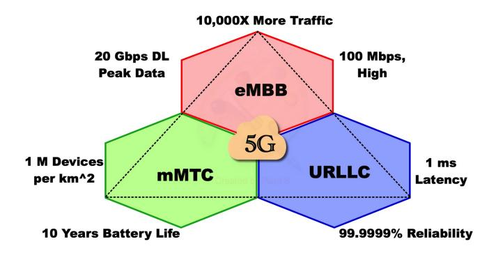
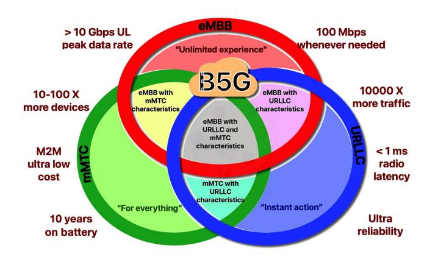
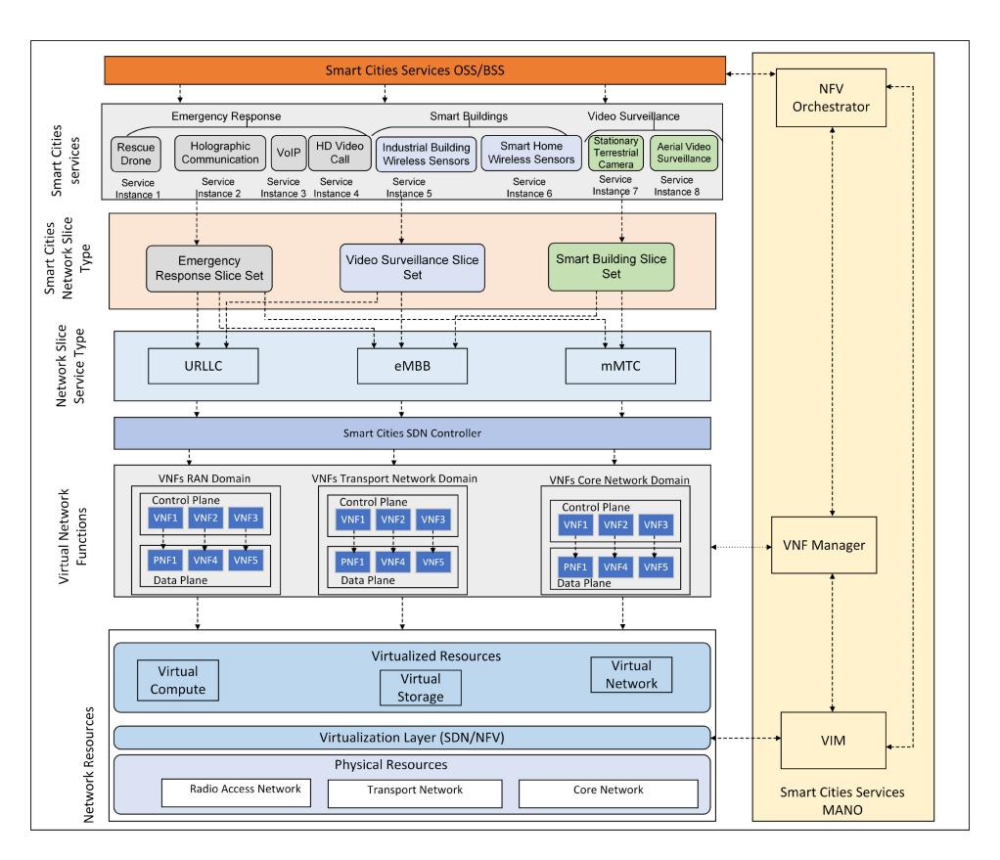
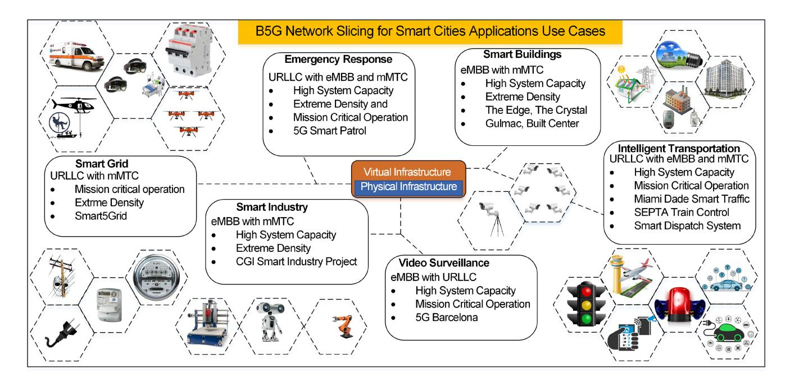
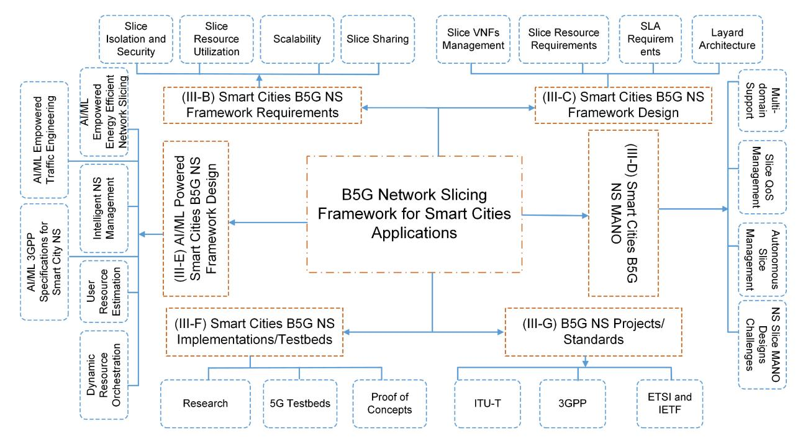
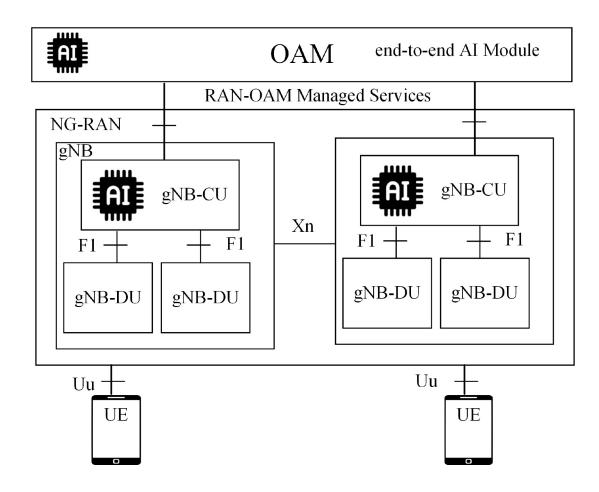
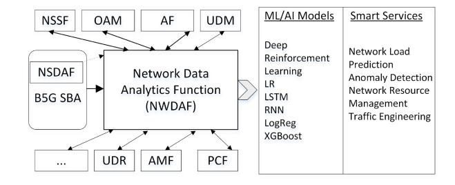
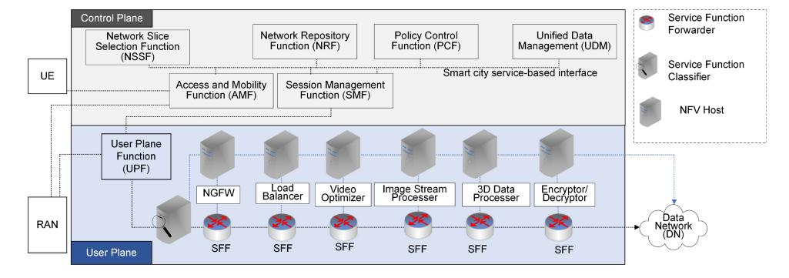

# A Survey on Beyond 5G Network Slicing for Smart Cities Applications

Wajid Rafique [,](https://orcid.org/0000-0003-0162-6921) Joyeeta Rani Bara[i](https://orcid.org/0009-0004-8778-8335) , Abraham O. Fapoj[uw](https://orcid.org/0000-0002-6098-4801)o [,](https://orcid.org/0000-0003-2577-3416) *Life Senior Member, IEEE*, and Diwakar Krishnamurthy

*Abstract***—Beyond fifth generation (B5G) is expected to tremendously improve network capabilities by using a higher frequency band compared to 5G, capable of delivering higher network capacity with much lower latency. It is expected that there will be around 30 billion connected objects by 2030, approximately 3.5 times the population then which underscores the pressing need for advanced network capabilities to support diverse applications ranging from smart transportation and energy management to healthcare and public safety. Network slicing enables sharing of network resources by transforming the physical network into logically independent networks, each specifically tailored to meet the requirements of heterogeneous services (e.g., Internet of Things applications, gaming services, holographic communication). Each slice is an end-to-end logical network comprising network, compute, and storage resources. Softwarization and virtualization are the main drivers for innovation in B5G, enabling network developers and operators to develop network-aware applications to match customer demands. Smart cities vertical offers unique service characteristics, performance requirements, and technical challenges in B5G network slicing. Therefore, this paper provides a comprehensive survey on B5G network slicing use cases, synergies, practical implementations and applications based on their quality of service parameters for smart cities applications. The paper gives a detailed taxonomy of the B5G network slicing framework requirements, design, dynamic intra-slice and inter-slice resource allocation techniques, management and orchestration, artificial intelligence/machine learning-empowered network slicing designs, implementation testbeds, 3GPP specifications and projects/standards for B5G network slicing. Furthermore, the paper provides a thorough discussion on the technical challenges that can arise when implementing B5G network slicing for smart cities applications and offers potential solutions. Finally, the paper discusses B5G network slicing current and future research directions for smart cities applications.**

*Index Terms***—Beyond 5G network slicing, AI/ML, 3GPP, NFV, SDN, smart cities.**

### I. INTRODUCTION

**S**INCE the first commercialization of fifth generation (5G) technology in 2019, global-scale commercialization has

Manuscript received 1 March 2024; accepted 2 June 2024. Date of publication 6 June 2024; date of current version 17 February 2025. This work was supported in part by Alberta Innovates Advance Grant, and in part by the Natural Sciences and Engineering Research Council of Canada Alliance Grant. *(Corresponding author: Wajid Rafique.)*

The authors are with the Department of Electrical and Software Engineering, University of Calgary, Calgary, AB T2N 1N4, Canada (e-mail: wajid.rafique@ucalgary.ca; joyeeta.barai@ucalgary.ca; fapojuwo@ ucalgary.ca; dkrishna@ucalgary.ca).

Digital Object Identifier 10.1109/COMST.2024.3410295

escalated in various parts of the world. Both the industry and academia are embracing 5G as the future network capable of supporting next-generation smart cities applications having different service requirements. Due to the available broadband bandwidth, 5G is capable of connecting 1 million devices per 0.38 square miles compared to 2000 connected devices in the same area using 4G [\[1\]](#page-29-0). 5G has reached the transmission levels with an expected peak data rate of 20 Gbps and a minimum latency of 1 millisecond [\[2\]](#page-29-1). The last decade has witnessed a massive increase in the use of smart cities applications. A recent report by Transform a Insights suggests that there will be around 29.4 billion Internet of Things (IoT) devices by 2030, which will be 3.5 times higher than the world's total population then growing with a compound annual growth rate of 12% [\[3\]](#page-29-2). These IoT devices are transforming the way humans used to live in the past by providing extremely sophisticated services in smart cities domain [\[4\]](#page-29-3). The ever-growing use of smart devices (e.g., devices for video surveillance, augmented reality (AR), virtual reality (VR), and holographic communication) causes a drastic increase in smart cities network traffic. The current smart cities applications (e.g., video surveillance, AR, VR, and holographic communication) require ultra-high bandwidth and extremely low latency creating challenges even for the state-ofthe-art 5G capabilities [\[5\]](#page-29-4). Today's 5G is unable to support a full-fledged form of these smart cities services. To enable these new and emerging smart cities services, B5G should provide a lot better performance than 5G, including a peak data rate of 1 Tbps which is 50 times higher than 5G, and air-link latency of 100 *µ*s which is 1/10th of 5G [\[6\]](#page-29-5). The commercialization of 5G has revealed its limited capability to support real-time services with stringent requirements, thus paving the way for research on beyond 5G (B5G) [\[7\]](#page-29-6).

# *A. B5G Smart Cities Vision*

B5G vision demands lower power consumption, increased coverage, cost-effectiveness, and higher security in smart cities applications. Many countries have proposed plans for B5G development during the past few years. For example, the Alliance for Telecommunications Industry Solutions (ATIS) has proposed a B5G vision for North America and has outlined six implementation goals (i.e., high trust, cost-efficiency, virtualization, artificial intelligence (AI)-native networks, and sustainability) for its implementation [\[8\]](#page-29-7). Finland initiated 6Genesis, an eight-year research plan through the collaboration of Nokia and the University of Oulu [\[9\]](#page-29-8). Europe is also accelerating its efforts on B5G deployment through the Horizon 2020 project, where Hexa-X, RISE-6G, 6G BRAINS, and DEDICAT-6G are some of the leading projects [10]. Japan, Korea, and China have established special working groups comprising research and development teams, universities, research institutes, and enterprises to escalate B5G implementation [11]. B5G vision will transform current cities into data-driven societies supported by unlimited wireless connectivity with excellent performance. B5G will operate in the Terahertz (THz) frequency band, and its application frequency ranges from  $0.1 \sim 0.3$  THz and  $0.1 \sim 10$  THz, respectively [12], [13]. This operational frequency range will improve the data rate, which is expected to be 100 to 1000 times faster than 5G. The multi-band high-spread spectrum will support 100 Gbps to Tbps links. In terms of connectivity, B5G will be able to efficiently connect upper trillion-level objects compared to the current billion-level objects using 5G, which will make the B5G network extremely dense that will help connect multitude of sensors in smart cities [5]. In terms of latency, B5G is expected to reach human reaction times, for instance, auditory reaction time ( $\sim 100ms$ ), visual reaction time ( $\sim 100ms$ ), and perceptual response time  $(\sim 1ms)$  that will support extended reality and multiverse smart cities applications [14]. However, the 1 ms latency requirement of 5G is too long for real-time haptic applications, video surveillance, emergency response, and autonomous vehicles requiring sub-millisecond latency [15]. The introduction of heterogeneous multiple input multiple output will enable the realization of a cell-free network architecture. Power consumption optimization is also an important factor in B5G. Although energy consumption per unit of data (joules per bit) is much less for 5G than for 4G, power consumption is much higher. In the 5G era, the maximum power of a 64T64R active antenna unit ranges between 1 to 1.4 kW to 2 kW for a baseband unit [16]. The 5G implementation and B5G vision have accelerated the use of high-quality smart cities services and applications, which demands changing network management in terms of abstraction, separation, control, and management of services (e.g., massive IoT, smart buildings, video surveillance, and holograms).

### B. Smart Cities B5G Network Slicing Enablers

Existing cellular network architectures are relatively monolithic, with a transport network carrying traffic to the end users. These architectures are unsuitable for a wider range of performance and scalability requirements [35]. A major challenge comes from the dedicated performance requirements in different smart cities use cases, for example, the remote medical surgeries use case, where doctors need to have an extremely low latency and extremely high reliability, which is challenging to achieve using the existing traditional networks. Currently, smart cities network operators need to configure completely independent networks for various purposes. For instance, operators providing vehicle to everything (V2X) services cannot accommodate the requirements of smart buildings and need to create separate networks for smart buildings, such as Sigfox, preventing collaboration among them [36].

Network slicing allows operators to share a common physical network and create multiple network slices corresponding to the characteristics required by different use cases and vertical industries. To realize the future B5G vision, the physical network must be sliced into various isolated logical networks of different sizes and structures dedicated to different smart cities services and applications. Network slicing segments the physical network into end-to-end logical networks specifically tailored to meet subscribers' and/or service requirements [37]. Slices of the network can be tailored for a specific purpose and act as its own independent network. Each slice can be optimized for the specific characteristics required by the service without wasting resources on things it doesn't need. Software-defined networking (SDN), network function virtualization (NFV), and cloud and edge computing are the enabling technologies for network slicing.

1) Software Defined Networking: SDN brings granular control and programmability to B5G networks that orchestrate services at a network-wide level. The SDN controller could be programmed to make automated decisions about the network to avoid traffic congestion, bypass faulty equipment, and overcome security challenges. SDN helps the network to adapt to changing network conditions or requirements from customers. For instance, new forwarding rules could be dynamically installed on the data plane devices to direct traffic to follow a certain path. SDN creates a virtualized control plane that can flexibly control network functions per the requirements. SDN provides a southbound interface (SBI) (e.g., OpenFlow, OpFlex, FoRCES [38]) to directly program network elements [39]. SBI standards define the interaction among the forwarding devices in the data plane and the elements in the control and application planes. The application plane of SDN provides an interface to develop applications based on customer needs. The application and control planes interact using a standardized northbound interface (NBI), for example, the representational state transfer (REST) [40].

2) Network Functions Virtualization: NFV is a technology that provides the necessary tools to implement network slicing. Virtualization technologies provide the basis for network slicing, enabling physical and virtual resources to meet the service requirements. NFV decouples physical network hardware equipment from the functions that run over them. This way, a network function (e.g., Router, Firewall, Domain Name System (DNS)) could be implemented as a piece of software (e.g., vRouter, vFirewall, vDNS) that run on cloud servers. This idea implements the functionality of many network equipment types onto high-volume servers located in data centers, distributed network nodes, and at the end-user premises [41]. Thus, an underlying service can be decomposed into virtual network functions (VNFs), defined as software implementation of network functions, that could be instantiated at different network locations without purchasing and installing expensive hardware. NFV brings three major innovations to enable network slicing, (i) decoupling software from hardware, (ii) providing greater flexibility to deploy network functions, and enabling dynamic network operation by adapting services based on customer demands.

| Reference               | Year | B5G | 6G       | IoT      | B5G QoS  | E2E Slicing | Slicing Management | Implementations/ Testbeds | Use Cases | Resource/ Orchestration | AI/ML    | 3GPP     |
|-------------------------|------|-----|----------|----------|----------|-------------|-----------------------|------------------------------|-----------|----------------------------|----------|----------|
| Foukas et al. [17]      | 2017 | ×   | ×        | ×        | ×        | ×           | ×                     | ×                            | ×         | ×                          | ×        | ×        |
| Kaloxy [18]             | 2018 | ×   | ×        | <b>V</b> | ×        | ×           | ×                     | ×                            | ×         | <b>√</b>                   | ×        | <b>V</b> |
| Afolabi et al. [19]     | 2018 | ×   | ×        | ×        | ×        | ×           | ×                     | ×                            | <b>√</b>  | ×                          | ×        | <b>V</b> |
| Su et al. [20]          | 2019 | ×   | ×        | ×        | ×        | ×           | ×                     | <b>√</b>                     | ×         | <b>√</b>                   | ×        | ×        |
| Barakabi et al. [21]    | 2020 | ×   | ×        | ×        | ×        | ×           | <b>√</b>              | <b>√</b>                     | <b>√</b>  | ×                          | ×        | ×        |
| Debbabi et al. [22]     | 2020 | ×   | ×        | ×        | ×        | ×           | <b>√</b>              | ×                            | ×         | ✓                          | ×        | ×        |
| Khan et al. [23]        | 2020 | ×   | ×        | <b>√</b> | ×        | ×           | ×                     | ×                            | ×         | ×                          | <b>√</b> | ×        |
| Chahbar et al. [24]     | 2021 | ×   | ×        | <b>√</b> | ×        | ×           | <b>√</b>              | ×                            | ×         | ✓                          | ×        | ×        |
| Wijethilaka et al. [25] | 2021 | ×   | ×        | <b>√</b> | ×        | ×           | ×                     | ✓                            | ×         | ✓                          | ✓        | ×        |
| Nadeem et al. [26]      | 2021 | ×   | ×        | ×        | ×        | ×           | <b>√</b>              | ×                            | <b>√</b>  | ×                          | ✓        | ×        |
| Wu et al. [27]          | 2022 | ×   | <b>√</b> | <b>√</b> | ×        | ×           | <b>√</b>              | ✓                            | <b>√</b>  | ×                          | ✓        | ×        |
| Javed et al. [28]       | 2022 | ×   | ×        | ×        | ×        | ×           | <b>√</b>              | ×                            | ×         | ×                          | ×        | ×        |
| Hurt et al. [29]        | 2022 | ×   | ×        | <b>√</b> | ×        | ×           | <b>√</b>              | ×                            | ×         | ×                          | <b>√</b> | ×        |
| Phyu et al. [30]        | 2023 | ×   | ×        | <b>√</b> | <b>√</b> | <b>√</b>    | ×                     | ×                            | ×         | ×                          | <b>√</b> | ×        |
| Park et al. [31]        | 2023 | ×   | <b>√</b> | ×        | <b>√</b> | <b>√</b>    | ×                     | ×                            | ×         | ×                          | <b>√</b> | ×        |
| Bouzid et al. [32]      | 2023 | ×   | <b>√</b> | ×        | <b>√</b> | <b>√</b>    | ×                     | ×                            | ×         | ×                          | <b>√</b> | ×        |
| Donatti et al. [33]     | 2023 | ×   | <b>√</b> | ×        | <b>√</b> | <b>√</b>    | ×                     | ×                            | ×         | <b>√</b>                   | ×        | <b>V</b> |
|                         |      |     |          |          |          |             |                       |                              |           |                            |          |          |

TABLE I COMPARISON OF THIS SURVEY (BASED ON B5G NETWORK SLICING ASPECTS COVERED IN THIS PAPER) WITH EXISTING SURVEYS

*3) Cloud Computing:* Cloud computing enables ondemand provisioning of resources, including computing, storage, networks, and applications. Cloud services are divided into Infrastructure as a Service (IaaS), Platform as a Service (PaaS), and Software as a Service (SaaS) [\[42\]](#page-30-0). Multiaccess Edge Computing (MEC) provides computational resources at the network's edge, which reduces the latency, reduces network traffic by limiting content to and from the central cloud, and lowers the infrastructure usage cost. MEC, with the help of network slicing, enables users to access cloud-based services at the edge of the network. Network slicing in this context could provide optimal edge resources to the users (e.g., ultra-low latency and high bandwidth requirements). MEC in network slicing provides (i) enhanced QoS/QoE to end users, (ii) optimizes resources by hosting computeintensive applications at the network edge, and (iii) transforms access nodes into intelligent service hubs where contextaware services (e.g., user location, cell load, and allocated bandwidth) can be provided with the help of RAN information.

### *C. Motivation of This Survey*

The key performance indicators of 5G/B5G/6G are to address a broader class of services which spans multiple vertical industries, e.g., autonomous vehicles, industrial IoT, healthcare, smart grid, smart agriculture, smart home, smart cities, et cetera. Clearly, the vertical industries are very diverse, each with different service characteristics, and the performance requirements of a vertical industry are dictated by the service characteristics of that vertical segment. We note that a network slicing survey paper that focuses on all the vertical industries will be too broad and make the paper unnecessarily too long. Hence, the existing network slicing survey papers have each focused on a specific vertical industry instead of focusing on all the vertical industries. For example, network slicing survey paper [\[27\]](#page-29-23) focused on the industrial IoT, and survey [\[41\]](#page-29-22) focused on the smart home vertical industry. Consistent with the previous network slicing surveys [\[27\]](#page-29-23), [\[41\]](#page-29-22), this survey paper focuses on one vertical industry, namely, the smart cities vertical industry, which is not yet covered in the literature, to the authors' best knowledge. The paper therefore complements the existing network slicing surveys. B5G network is envisioned to support diverse and massive use cases of smart cities applications [\[43\]](#page-30-1). This paper explores the role and impact of Artificial Intelligence/Machine Learning (AI/ML) techniques in facilitating dynamic resource management, predictive analytics, and tailored Quality of Service (QoS) for smart cities applications. The paper also discusses the 3GPP standards, essential for ensuring interoperability and standardization among different vendors and service providers in the implementation of B5G network slicing for smart cities applications. We compare this paper with the currently existing surveys in the following sub-section.

# *D. Comparison With Other Related Surveys*

From the start of the inception of the term 5G, many research papers have been published on approaches, use cases, architectures and applications. Table [I](#page-2-0) shows a comparison of this survey with the other related surveys. The comparison is based on the aspects covered in this paper. Dogra et al. [\[5\]](#page-29-4) present an overview of key performance indicators of 5G NR and outline issues caused by using higher modulation schemes and inter-RAT handover synchronization. Barakabritze et al. [\[21\]](#page-29-24) provide a comprehensive review on 5G network slicing using SDN and NFV. However, B5G network presents stringent requirements and slice-sharing characteristics that have not been covered by the authors. Chahbar et al. [\[24\]](#page-29-25) contributes an end-to-end (E2E) network slicing survey including radio access network (RAN), transport network (TN), and core network (CN), and explain the network slicing concept from service request order to the deployment of network slice. The authors propose an architecture of network slicing and then review different aspects of E2E slicing. Therefore, the survey [\[24\]](#page-29-25) is architecture-specific and does not cover QoS requirements of diverse network slicing applications. Kaloxylos [\[18\]](#page-29-26) presents a short survey on 5G network slicing covering abstract details of the network slicing enabling technologies. However, the survey [\[18\]](#page-29-26) provides only a high-level of discussion and doesn't dig deep into the concepts. Wu et al. [\[27\]](#page-29-23) gave a focused survey on intelligent network slicing approaches for three industrial applications of smart transportation, smart energy, and smart factory. They first present a general network slicing architecture and map the network slicing process of smart transportation, smart energy, and smart factory over it. Debbabi et al. [\[22\]](#page-29-27) present algorithmic and modeling aspects of network slicing in 5G and beyond networks. Nadeem et al. [\[26\]](#page-29-28) contribute a survey on 5G concepts, including device-to-device (D2D), network slicing, and MEC. Javed et al. [\[28\]](#page-29-29) present a survey on ledger technologies for network slicing to achieve slice isolation and security. Other related surveys include Afolabi et al. [\[19\]](#page-29-30) on network slicing and softwarization, Foukas et al. [\[17\]](#page-29-31) on general slicing architecture, Khan et al. [\[23\]](#page-29-32) on recent advances in network slicing, Su et al. [\[20\]](#page-29-33) on resource allocation, and Wijethilaka and Liyanage [\[25\]](#page-29-34) on network slicing for IoT. Although the aforementioned surveys provide discussion on various aspects of 5G network slicing, none of the existing surveys cover B5G network slicing for smart cities applications. The survey presented in this paper is unique because it provides a holistic approach to discussing various B5G network slicing aspects for smart cities applications. It discusses stringent requirements of B5G and QoS parameters based on the future vision of B5G. It provides a taxonomy of literature on B5G network slicing and explains key insights from the literature. It discusses key challenges that B5G network slicing research faces and provides future research directions.

### *E. Contributions of the Survey*

The contributions of this survey are the following.

- *•* The paper elaborates on the key performance indicators (KPIs), performance requirements, use cases, and realworld implementations of novel smart city applications supported by B5G network slicing.
- *•* The paper develops a taxonomy of B5G network slicing frameworks based on framework designs, MANO, AI/ML-driven network slicing, and adherence to 3GPP standards to achieve efficient resource allocation, QoS guarantees, and support for diverse smart city applications.
- *•* The paper provides a detailed discussion on technical challenges of dynamic, adaptive, and intent-based network slicing, while also exploring slicing security, management, and isolation within various smart city use cases.
- *•* The paper provides a comprehensive discussion on 3GPP specifications and AI/ML-empowered techniques for B5G network slicing.
- *•* Finally, the paper discusses challenges and their potential solutions and presents future research directions for B5G network slicing for smart cities.

### *F. Organization of the Survey*

Table [II](#page-4-0) shows the acronyms and their definitions used in the paper. The remainder of the paper is organized as follows. Section [II](#page-3-0) discusses the smart cities applications, and requirements using B5G network slicing. Section [III](#page-12-0) presents a taxonomy of B5G network slicing framework for smart cities applications. Section [IV](#page-21-0) provides technical challenges that could arise while using B5G network slicing from smart cities applications. Section [V](#page-24-0) discusses the current challenges and future research directions. Finally, Section [VI](#page-28-0) concludes the paper.

# II. B5G SMART CITIES APPLICATIONS AND REQUIREMENTS

This section discusses B5G smart cities applications and their performance requirements. The smart cities applications discussed include emergency response, smart buildings, video surveillance, smart transportation and autonomous vehicles, smart agriculture, and smart industry. As a prelude, we present the QoS requirements and their specified values in the literature for 5G, B5G, and 6G technologies.

### *A. Smart Cities QoS Requirements for 5G, B5G, and 6G*

The next era after 5G is B5G which will support different vertical industries, each developing smart solutions to address the communication challenges that service providers can embrace into their service offerings [\[25\]](#page-29-34). However, at present, B5G and 6G are somewhat new research concepts while 5G is still in the process of being commercialized. Hence, there are not many quantitative details available on the QoS requirements of the diverse B5G smart cities applications. Instead, researchers have provided more general and overall measurements of expected performance from B5G smart cities applications. Reported values in the literature on the smart cities KPIs of 5G, B5G, and 6G are summarized in Table [III,](#page-5-0) where "−" symbolizes the values not found. In 2020, an ITU survey resulted in the publication of various technical requirements for 5G and Beyond [\[5\]](#page-29-4), [\[44\]](#page-30-2) (as shown in Table [IV\)](#page-5-1). Many researchers have also provided different quantitative values for B5G or 6G attributes (as shown in Table [V\)](#page-6-0). Since B5G is the ending point of 5G and the starting point for 6G, for some applications, 5G or 6G standard values can be used as B5G thresholds if actual B5G values are not available.

At present, the COVID-19 pandemic has driven more companies' operations online and given rise to a "new normal" with a global workplace. This ensuing increase in Internet usage sheds light on the necessity for stronger connections in order to satisfy the rising demand for networks with stiffer QoS specifications. This is necessary to support latency-sensitive applications that depend on ultra-fast communication speeds, including health and disaster-related emergency response [\[50\]](#page-30-3), [\[51\]](#page-30-4), networked autonomous emergency rescue systems [\[52\]](#page-30-5), smart surveillance systems [\[53\]](#page-30-6), and smart building IoT sensors [\[54\]](#page-30-7), [\[55\]](#page-30-8). Regrettably, these rising demands are beyond the capabilities of the projected 5G networks [\[56\]](#page-30-9). This increases the necessity for B5G, the precursor of 6G. According to the ITU, 5G contains three key service categories: mMTC, eMBB, and URLLC [\[57\]](#page-30-10), illustrated by the 5G service triangle in Fig. [1.](#page-6-1) B5G can be envisioned as the modified version of the 5G service triangle.

TABLE II ACRONYMS AND DEFINITIONS

| Acronym    | Definition                                         | Acronym   | Definition                                                       |
|------------|----------------------------------------------------|-----------|------------------------------------------------------------------|
| ATIS       | Alliance for Telecommunications Industry Solutions | NFVI      | Network Function Virtualization Infrastructure                   |
| VXLAN      | Virtual Extensible Local Area Network              | GSMA      | Global System for Mobile Communications Association              |
| V2X        | Vehicle to Everything                              | DAT       | Deterministic Aperiodic Traffic                                  |
| 3GPP       | Third Generation Partnership Project               | NSSAI     | Network Slice Selection Assistance Information                   |
| 4G         | Fourth Generation                                  | NSSF      | Network Slice Selection Function                                 |
| 5G         | Fifth Generation                                   | NSSI      | Network Slice Subnetwork Instances                               |
| B5G        | Beyond 5G                                          | 6G        | 6th Generation                                                   |
| API        | Application Programming Interface                  | ORAN      | Open RAN                                                         |
| AR         | Augmented Reality                                  | OSS       | Operational Support Systems                                      |
| ATIS       | Alliance for Telecommunications Industry Solutions | os        | Operating System                                                 |
| B5G        | Beyond Fifth Generation                            | PaaS      | Platform as a Service                                            |
| NSI        | Network Slice Instance                             | PCF       | Policy and Charging Function                                     |
| BSC        | Base Station Controller                            | PCRF      | Policy and Charging Rule Function                                |
| BSS        | Business Support System                            | PDU       | Protocol Data Unit                                               |
| BW         | Bandwidth                                          | PNFs      | Physical Network Functions                                       |
| CAPEX      | Capital Expenditure                                | QoS       | Quality of Service                                               |
| E2E        | End-to-end                                         | RAN       | Radio Access Network                                             |
| COTS       | Commercial-of-the-Shelf                            | IETF      | Internet Engineering Task Force                                  |
| DDoS       | Distributed Denial of Service Attacks              | SBI       | Southbound Interface                                             |
| SA         | Service Architecture                               | SDN       | Software Defined Networking                                      |
| DN         | Data Network                                       | SFC       | Service Function Chaining                                        |
| DU         | Distributed Unit                                   | SLA       | Service Level Agreement                                          |
| E2E        | End-to-End                                         | DNS       | Domain Name Server                                               |
| eMBB       | Enhanced Mobile Broadband                          | ETSI      | European Telecommunications Standards Institute                  |
| GPS        | Global Positioning System                          | Terahertz | THz                                                              |
| HD         | High Definition                                    | TN        | Transport Network                                                |
| IaaS       | Infrastructure as a Service                        | Tbps      | Terabits per second                                              |
| IoT        | Internet of Things                                 | MIMO      | Multiple input Multiple output                                   |
| ITU        | International Telecommunication Union              | UE        | User Equipment                                                   |
| LTE        | Long Term Evolution                                | TTI       | Transmission Time Interval                                       |
| MANO       | Management and Orchestration                       | UDM       | Unified Data Management                                          |
| MCS        | Modulation and Coding Scheme                       | UE        | User Equipment                                                   |
| MEC        | Mobile Edge Computing                              | UL        | Uplink                                                           |
| PNF        | Physical Network Function                          | URLLC     | Ultra-Reliable and Low Latency Communication                     |
| MME        | Mobility Management Entity                         | V2X       | Vehicle to Everything                                            |
| mMTC       | Massive Machine Type Communication                 | VIM       | Virtual Infrastructure Manager                                   |
| MNO        | Mobile Network Operator                            | VR        | Virtual Reality                                                  |
| MEC        | Multiaccess Edge Computing                         | VNF       | Virtual Network Function                                         |
| DAT        | Deterministic Traffic                              | VNFM      | Virtual Network Function Manager                                 |
| NBI        | Northbound Interface                               | VoIP      | Voice over Internet Protocol                                     |
| NFV        | Network Function Virtualization                    | XR        | Extended Reality                                                 |
| V2P        | Vehicle to Pedestrian                              | V2I       | Vehicle to Infrastructure                                        |
| V2P V2N | Vehicle to Network                                 | 5G-ACIA   | 5G Alliance for Connected Industries and Automation              |
| BWP        | Bandwidth Part                                     | SDI       | Software-Defined Infrastructure                                  |
| IoST       |                                                    | UAV       | Unmanned Aerial Vehicles                                         |
| 1          | Internet of Space Things                           |           |                                                                  |
| t-MANO     | Tenant MANO                                        | c-MANO    | Central MANO  Mahilia Central Office Regrahitested as Detecentar |
| 5GTN       | 5G Test Network                                    | CORD      | Mobilie-Central Office Rearchitected as Datacenter               |
| BBF        | Broadband Forum                                    | ITU-T     | International Telecommunication Union-Telecommunication          |
| SG         | Study Group                                        | ONF       | Open Networking Foundation                                       |
| B2B        | Business to Business                               | B2C       | Business to Customers                                            |
| B2B2C      | Business to Business to Customers                  | NSaaS     | Network Slice as a Service                                       |

In the authors' view, the 5G service triangle will be modified into a Venn diagram allowing for overlaps among the 5G three main service categories. The modification is necessitated by the fact that some smart cities applications will require not just one of the 5G three key service classes but any combinations among the 5G three main service classes. Fig. [2](#page-6-2) shows service categories of 5G and B5G.

### *B. Emergency Response*

*1) The Significance of Emergency Response Applications in Smart Cities:* Rapid urbanization and smart cities are reshaping the globe and how we live: 3 million people worldwide move into cities each week and, by 2050, it's predicted that there will be an additional 2.5 billion people living in cities [\[58\]](#page-30-11). The frequency and severity of disasters can grow with a higher concentration of people and resources. By 2050, 68% of the world's population will reside in urban regions, according to UN estimates [\[59\]](#page-30-12). Municipalities invest in infrastructure and software as cities expand in order to enhance citizen operations, services, and the urban environment as a whole. Emergency response is one of the most important concerns in smart cities due to the increasing frequency and severity of disasters, which can be amplified by the high concentration of people and resources in urban areas. Smart cities require efficient and effective emergency response systems to ensure the safety and well-being of residents during emergencies.

| KPI                             | 5G                               | B5G           | 6G                   |
|---------------------------------|----------------------------------|---------------|----------------------|
| Peak data rate requirements     | 20 Gbps [45]                     | 100 Gbps [45] | 1 Tbps [45]          |
| Experienced data rate           | 0.1 Gbps [46]                    | -             | 1 Gbps [46]          |
| Peak spectral efficiency        | 30 b/s/Hz [46]                   | -             | 60 b/s/Hz [46]       |
| Experienced spectral efficiency | 0.3 b/s/Hz [45]                  | -             | 3 b/s/Hz [45]        |
| Bandwidth                       | 1 GHz [46]                       | -             | 100 GHz [46]         |
| Area traffic capacity           | 10 Mb/s/m 2 [46]      | -             | 1 Gb/s/ $m^2$ [46]   |
| End-to-End delay                | 5 ms [45]                        | 1 ms [45]     | <1 ms [45]           |
| Mobility                        | 500 kmph [46]                    | -             | 1000 kmph [46]       |
| Reliability                     | $1 - 10^{-5}$ [46]               | -             | $1 - 10^{-9}$ [46]   |
| Jitters                         | -                                | -             | 1μ s [46]            |
| Energy efficiency               | -                                | -             | 1 TbpJ [46]          |
| Connection density              | 106 devices/hm 2 [46] | _             | 108 devices/bm2 [46] |

TABLE III STANDARD SMART CITIES KPIS COMPARISON OF 5G, B5G, AND 6G - INSIGHTS FROM LITERATURE REFERENCES

TABLE IV COMPARISON OF B5G ATTRIBUTES FOR SMART CITIES -ASURVEY BY ITU [\[5\]](#page-29-4), [\[44\]](#page-30-2)

| Attributes       | Values                                          |
|------------------|-------------------------------------------------|
| Peak Data Rate   | DL: 20 Gbps                                     |
|                  | UL: 10 Gbps                                     |
| Peak Spectral    | DL: 30 bps/Hz                                   |
| Efficiency       | UL: 15 bps/Hz                                   |
| Area Traffic     | Indoor hotspot DL:                              |
| Capacity         | $10 \text{ Mb/s/}m^{2}$                         |
| User Plane       | eMBB: 4 ms                                      |
| Latency          | URLLC: 1 ms                                     |
| Control Plane    | max:20 ms                                       |
| Latency          | min: 10 ms                                      |
| Connection Den-  | $1M 	ext{ devices}/km^2$                        |
| sity             |                                                 |
| User experienced | DL: 100 Mbps                                    |
| Data Rate        | UL: UL: 50 Mbps                                 |
| BW               | >100 MHz                                        |
|                  | up to 1 GHz for above 6 GHz                     |
| Reliability      | $1-10^{-5}$                                     |
| 5th Percentile   | Indoor Hotspot: DL:0.3 bps/Hz, UL:0.21 bps/Hz   |
| User Spectral    | Dense Urban: DL:0.225 bps/Hz, UL: 0.15 bps/Hz   |
| Efficiency       | Rural: DL: 0.12 bps/Hz, UL: 0.045 bps/Hz        |
| Average          | Indoor Hotspot: DL: 9 bps/Hz/transmission re-   |
|                  | ception point (TRxP), UL: 6.75 bps/Hz/TRxP      |
| Spectral         | Dense Urban: DL: 7.8 bps/Hz, UL: 5.4            |
|                  | bps/Hz/TRxP                                     |
| Efficiency       | Rural: DL: 3.3 bps/Hz, UL: 1.6 bps/Hz           |
| Mobility         | Indoor Hotspot: 10 kmph (normalized data rate   |
|                  | 1.5 bps/Hz)                                     |
|                  | Dense Urban: 30 kmph (normalized data rate 1.12 |
|                  | bits/s/Hz)                                      |
|                  | Rural: 500 kmph (normalized data rate 0.45      |
|                  | bits/s/Hz)                                      |
| 3.6.1.71         | 120 kmph (normalized data rate 1.12 bps/Hz)     |
| Mobility         |                                                 |
| Interruption     | <1 $ms$                                         |
| Time             |                                                 |

*2) Traffic Type to Describe Emergency Response Applications:* Emergency response applications exhibit unpredictable packet generation patterns and lack periodicity in their traffic generation. The timing of packet generation cannot be accurately foreseen. However, once the packets are generated with a specific payload, they are subject to stringent latency constraints or time deadlines that dictate their delivery. Furthermore, these packets must achieve a high success rate in order to guarantee the quality, dependability, and consistency of the received data. This type of traffic emulates the anticipated traffic generated by emergency

response applications, which only produce data packets when an emergency situation arises. Consequently, predicting the timing of packet generation becomes impractical. Nevertheless, once the packets are generated, they carry a specific payload and adhere to strict transmission latency and reliability limitations, aiming to ensure a prompt and secure response. Among the three major service slices in this survey paper, emergency response traffic is accorded the highest priority. Based on the stated fact, according to the research in [\[60\]](#page-30-13), the deterministic aperiodic traffic (DAT) type can be used to describe the emergency response application traffic.

- *3) B5G Services Required for Emergency Response Applications:* Emergency response applications require support for all three essential 5G services: eMBB, URLLC, and mMTC. eMBB is needed to provide high bandwidth for applications such as HD video calls, holographic video communication, and other data-intensive operations, URLLC is essential to ensure ultra-low latency and high reliability for mission-critical systems, such as rescue drones and real-time communication during emergencies, and mMTC is required to support the massive machine-type communication generated by various emergency response devices and sensors.
- *4) Use Cases:* A practical example of emergency response for B5G network slicing is the Far EasTone Telecom's (FET) [\[61\]](#page-30-14) smart patrol car solution for the Kaohsiung City Police Department in Southern Taiwan [\[62\]](#page-30-15). Leveraging AI technology and Ericsson's comprehensive 5G network slicing [\[63\]](#page-30-16), this innovation marks the world's first implementation of a 5G smart patrol car solution for law enforcement agencies [\[64\]](#page-30-17). Another practical implementation of B5G network slicing for emergency response is the smart healthcare slicing project in Taiwan [\[65\]](#page-30-18). Taiwanese operator Chunghwa Telecom [\[66\]](#page-30-19) and Ericsson recently collaborated to implement network slicing for emergency healthcare services in Taiwan [\[65\]](#page-30-18). The Chunghwa Telecom developed connected ambulances using Ericsson's end-to-end network slicing. More examples of smart cities applications under the emergency response category are:
  - *•* Rescue drones: Drones equipped with cameras and sensors for search and rescue operations.
  - *•* Holographic video communication: Advanced communication technology for immersive and real-time collaboration during emergencies.

| Attribute      | [47]            | [45]        | [48]                | [49]        | [9]       | [14]       |
|----------------|-----------------|-------------|---------------------|-------------|-----------|------------|
| Peak data rate | 5 Tbps (VAR)    | 1 Tbps      | 1 Tbps              | 1 Tbps      | 1 Tbps    | 1 Tbps     |
| Back-haul data | =               | 10 Tbps     | 10 Tbps             | -           | -         | -          |
| rate           |                 |             |                     |             |           |            |
| Volumetric     | =               | variable    | -                   | 1-10        | variavle  | -          |
| capacity       |                 |             |                     | Gb/s/ $m^3$ |           |            |
| Operating      | 100 GHz to 10   | Up to 1 THz | up to 10 THz        | Sub THz     | 300 GHz + | 0.06 to 10 |
| frequency      | THz + Visible   | + VLF       |                     | band + VLF  | VLF       | THz        |
|                | light frequency |             |                     |             |           |            |
|                | (VLF)           |             |                     |             |           |            |
| Mobility       | 1000 kmph       | 1000 kmph   | ≥1000 kmph          | -           | -         | -          |
| Latency        | $\leq 1 ms$     | Control     | $0.01$ – $0.1 \ ms$ | 1ms         | ≤1ms      | ≤1ms       |
|                |                 | plane: ≤1ms |                     |             |           |            |
|                |                 | User plane: |                     |             |           |            |
|                |                 | <0.1ms      |                     |             |           |            |

TABLE V A COMPREHENSIVE SURVEY ON VARIOUS SMART CITIES ATTRIBUTES

Fig. 1. 5G three main service categories.

Fig. 2. 5G and B5G service categories.

- *•* Voice over Internet Protocol (VoIP): Internet-based voice communication for emergency calls and coordination.
- *•* HD video calls: Real-time video communication for emergency response coordination and remote assistance.
- *5) Assessing Performance Requirements and Advocating for B5G Support:* The performance requirements of each emergency response application outlined in Section [II-B4](#page-5-2) above can be compared with the performance capabilities of 5G, B5G, and 6G technologies presented in Table [III](#page-5-0) to determine the most suitable technology for each application.

Rescue drones require air latency of 10 to 100 *µ*s/device, reliability of 99.999999% [\[67\]](#page-30-20), a density of 107 devices per square kilometer [\[67\]](#page-30-20), mobility of 100 km/hr [\[67\]](#page-30-20), a peak data rate of 1 Tbps [\[67\]](#page-30-20), and an average flight time of 30 minutes per mission [\[67\]](#page-30-20). When comparing these requirements with the capabilities of 5G, B5G, and 6G, it can be observed that both B5G and 6G technologies can fulfill these demanding requirements. 6G is still not yet implemented and B5G is in its stepping stone. B5G provides the necessary peak data rate, low latency, high reliability, and support for dense device deployments, making it an excellent fit for the rescue drone application.

For holographic video communication, the latency requirement is less than 1 ms [\[67\]](#page-30-20), with an error rate of 10*−*9 and a peak data rate of 1 Tbps [\[67\]](#page-30-20). Additionally, an experienced data rate of 10 Gbps [\[67\]](#page-30-20) and a download speed of 6 Mbps [\[68\]](#page-30-21) (for HD 2D video conferencing) are needed. When comparing these requirements with the capabilities of 5G, B5G, and 6G, it can be argued that both B5G and 6G technologies are suitable for this application. B5G can meet the latency, error rate, and peak data rate requirements while also providing a highly experienced data rate. Therefore, B5G can effectively support this application.

Moving on to the VoIP application, which requires air latency of 1 to 4 *ms* [\[69\]](#page-30-22), a minimum data rate of 5 to 25 Mbps [\[68\]](#page-30-21), a download speed of 12 Mbps [\[68\]](#page-30-21), an upload speed of 4.71 Mbps per device [\[68\]](#page-30-21), packet loss below 1% [\[70\]](#page-30-23), jitter below 30 *ms* [\[70\]](#page-30-23), a one-way maximum latency of less than or equal to 150 *ms* [\[70\]](#page-30-23), and a guaranteed bandwidth of 150 bps per phone [\[70\]](#page-30-23). Comparing these requirements with the performance capabilities of 5G, B5G, and 6G, it can be inferred that B5G, along with 5G, can adequately support these requirements. B5G technologies provide the necessary latency, data rate, and reliability for this application.

Finally, for the HD video call application, requirements include DiffServ Code Point prioritization [\[71\]](#page-30-24), specific data rate (H.320: 64-1920K, H.323: 64X K, and H.324: *<*64K [\[72\]](#page-30-25)), bandwidth configurations (80K-2M, H.323: 80X K, and H.324: *<*80K) [\[72\]](#page-30-25)), SNR range (25 dB-40 *dB* [\[73\]](#page-30-26)), low packet loss lower than 1% [\[71\]](#page-30-24), end-to-end delay below 150 *ms* [\[71\]](#page-30-24), jitter below 30 *ms* [\[71\]](#page-30-24), and low loss and error rates of 0.01% [\[72\]](#page-30-25). When comparing these requirements with the capabilities of 5G, B5G, and 6G, it can be stated that B5G, along with 5G, is well-suited for the HD video call application. B5G technologies can effectively provide the necessary performance in terms of data rate, latency, and reliability.

Based on this comparison, it can be concluded that B5G technologies and the upcoming 6G, are suitable for supporting emergency response applications. B5G fills the gap between 5G and 6G, offering the necessary performance capabilities to meet the requirements of applications such as rescue drones, holographic video communication, VoIP, and HD video calls. Therefore, the introduction of B5G is crucial to ensure comprehensive support for all emergency response applications and facilitate a smooth transition to 6G in the future.

The increasing complexity and demands of smart cities emergency response systems require the adoption of B5G technologies because they provide any combinations of the 5G three main service categories. With near-instantaneous communication, ultra-reliable links, and the ability to handle vast amounts of data, B5G ensures the effectiveness and efficiency of emergency response in smart cities. The integration of B5G is crucial to support and enhance smart cities applications, particularly in the realm of emergency response, leading to safer and more responsive urban environments.

### *C. Smart Buildings*

*1) The Significance of Smart Buildings in Smart Cities:* Smart buildings are integral to the concept of smart cities as they significantly impact the lives of occupants, emphasizing their health, safety, well-being, and comfort [\[74\]](#page-30-27). These buildings are envisioned to be adaptable, interactive, and capable of learning from past experiences [\[75\]](#page-30-28). Various applications within smart buildings include temperature and humidity control sensors, smart locks, and fire alarms, all of which require security, dependability, and safety [\[76\]](#page-30-29). Security is a critical concern for IoT devices used in smart buildings, as they often have limited memory and can be susceptible to compromise. B5G network slicing provides slice isolation, effectively mitigating security breaches [\[77\]](#page-30-30). Smart buildings applications encompass wireless smart home systems and industrial building sensors, demanding high system capacity and support for extreme device density [\[76\]](#page-30-29), [\[77\]](#page-30-30).

*2) Traffic Type to Describe Smart Buildings Applications:* The traffic generated from applications categorized as Non-Deterministic Traffic (NDT) do not have a strict latency deadline for the reception of data packets [\[60\]](#page-30-13). Instead, the primary requirement for this type of traffic is to meet the requested data rate consistently. NDT traffic is specifically designed to simulate the anticipated traffic patterns expected from applications used in smart buildings. When considering smart buildings applications such as usage monitoring and asset tracking, the number of nodes that receive service with a fixed data rate and ensuring sufficient bandwidth to accommodate all nodes becomes more critical than minimizing latency. In other words, it is more important to provide enough bandwidth to support all the nodes with their data rate requirements rather than focusing on reducing the delay in transmitting data. As a result, the packets generated by smart building applications prioritize the assurance of successful transmission rather than adhering to strict transmission deadlines. The goal

is to ensure that the data packets are reliably delivered without loss or errors, rather than guaranteeing their arrival within a specific timeframe. Therefore, the traffic type NDT is often used to refer to traffic within smart buildings. This class of traffic is generally considered the lowest priority among the other smart cities applications, indicating that in situations where there is competition for network resources, other types of application traffic may receive higher priority over NDT traffic.

- *3) B5G Services Required for Smart Building Applications:* Smart building applications demand high system capacity and extreme device density, making it essential for them to support two key B5G services: mMTC (massive Machine-Type Communication) and eMBB (enhanced Mobile Broadband). mMTC enables seamless communication among the vast number of devices and sensors within smart buildings, facilitating efficient data exchange and interaction. Meanwhile, eMBB provides high data rates and wide coverage, ensuring the transmission of data-intensive applications. These services are crucial for meeting the performance requirements of smart building applications, supporting reliable connectivity, and enabling advanced functionalities within smart buildings. Few practical examples of B5G smart buildings are following.
- *4) Use Cases for Smart Buildings:* Some examples of smart cities applications under the smart buildings category are:
  - *• Industrial Buildings:* Industrial building sensors enable real-time monitoring and control of various parameters, such as temperature, humidity, air quality, and energy consumption, within industrial buildings. By collecting and analyzing data from these sensors, building operators can optimize energy usage, improve operational efficiency, and ensure a safe and comfortable environment for occupants.
  - *• Smart Homes:* Smart homes leverage IoT devices and automation technologies to enhance the living experience and improve energy management. With smart home systems, residents can remotely control and monitor various aspects of their homes, such as lighting, heating, ventilation, security systems, and appliances, using their smartphones or other connected devices. This level of control and automation not only provides convenience but also enables energy savings and promotes a sustainable lifestyle. The Edge, Amsterdam [\[78\]](#page-30-31), The Crystal, London [\[79\]](#page-30-32), Gulmac, Shanghai [\[79\]](#page-30-32), and Al Shera, Dubai [\[80\]](#page-30-33) are the practical implementation examples of smart buildings implementations using B5G network slicing [\[81\]](#page-30-34).
  - *• The Edge, Amsterdam:* This Deloitte office boasts over 28,000 sensors, enabling seamless management of meeting rooms, working spaces, and environmental conditions. Solar panels and smart blinds optimize energy consumption [\[78\]](#page-30-31).
  - *• The Crystal, London:* Built for sustainable city development, The Crystal reuses rainwater and employs sensors to manage lighting and monitor energy and water consumption, resulting in cost savings and data-driven insights [\[79\]](#page-30-32).

- *• Glumac, Shanghai:* This intelligent building in Shanghai enhances the well-being of its occupants through an IoT sensor system that monitors oxygen levels, air quality, and ventilation to combat the city's pollution [\[79\]](#page-30-32).
- *• Al Shera, Dubai:* Set to be completed in 2023, this government building will incorporate AI and IoT applications to optimize sustainability, energy efficiency, and cybersecurity. IoT sensors will monitor resource consumption, while biometric technology and intelligent video surveillance enhance security [\[80\]](#page-30-33).
- *5) Assessing Performance Requirements and Advocating for B5G Support:* The performance requirements of smart building applications can be compared with the capabilities of different wireless technologies to determine the most suitable technology for each use case.

For industrial buildings sensors, the requirements include a data rate of 2 Mbps per device [\[82\]](#page-30-35), end-to-end latency of 100 ms [\[82\]](#page-30-35), battery life of 10-15 years [\[82\]](#page-30-35), reliability of 99.99% [\[82\]](#page-30-35), a device density of 107 devices per square kilometer [\[82\]](#page-30-35), and a heavy uplink traffic pattern [\[82\]](#page-30-35). B5G technologies, with their high system capacity and support for extreme device density, can effectively meet these requirements.

In the case of wireless smart home systems, the required attributes vary for different devices. For example, water meters require a data rate of 0.0002 Mbps per device [\[83\]](#page-30-36), while Wi-Fi hotspots need 0.06 Mbps per user [\[83\]](#page-30-36). Additionally, the battery life for these devices ranges from 15 to 30 years [\[83\]](#page-30-36). B5G technologies, with their capacity to handle massive machine-type communication and support for high data rates, are well-suited for these diverse requirements.

By comparing the performance requirements of smart buildings use cases with the capabilities of different generations of wireless technologies, it becomes evident that B5G is best suited to support the diverse needs of smart buildings. B5G technologies fulfill smart buildings performance requirements by providing the necessary bandwidth, latency, reliability, and support for a high density of devices, making it the optimal choice for smart buildings applications in the context of smart cities. The integration of B5G will ensure comprehensive support for smart buildings use cases and further enhance the development of smart cities.

### *D. Video Surveillance*

*1) The Significance of Video Surveillance in Smart Cities:* Video surveillance has evolved significantly with advancements in high-definition video capabilities, augmented reality/virtual reality/haptic communication technologies, big data systems, and AI/ML. These innovations have enabled the creation of smart and adaptive video surveillance systems, offering enhanced user experiences that were previously unimaginable. The importance of video surveillance in law enforcement cannot be overstated, as it aids in identifying crime perpetrators and solving crimes. The widely known use of video footage following the 2013 Boston Marathon bombing serves as a notable example [\[84\]](#page-30-37), [\[85\]](#page-30-38). Studies have shown that the mere presence of video surveillance acts as a

- deterrent to criminal activity, although its effectiveness varies across different locations, with more significant advantages in areas such as parking lots compared to others [\[86\]](#page-30-39).
- *2) Traffic Type to Describe Video Surveillance Applications:* The nature of video surveillance traffic is considered Deterministic periodic Traffic (DPT) since packets are generated periodically and must be successfully received within specific latency limits. For instance, security cameras or drones continuously generate data packets in a periodic motion, as they are intended for 24/7 monitoring. The timely delivery of these packets to the security center is essential, given the critical role time plays in security systems. Therefore, video surveillance traffic can be classified as DPT.
- *3) B5G Services Required for Video Surveillance Applications:* Video surveillance applications encompass various scenarios, including stationary terrestrial cameras that transmit surveillance data. These applications demand high system capacity and operate as mission-critical systems. To support video surveillance effectively, two key 5G services are required: eMBB and URLLC. These services ensure high bandwidth, low latency, and high reliability, which are crucial for video surveillance applications.
- *4) Use Cases:* A pilot project, part of the 5G Barcelona Initiative [\[87\]](#page-30-40), is testing a standalone private 5G network. It involves two use cases, including augmented reality and Blockchain-based certification for additive manufacturing, aiming to enhance connectivity and secure peer-to-peer communication for 3D printing hubs in Barcelona. Key partners include Mobile World Capital Barcelona [\[88\]](#page-30-41), the Institute for Advanced Architecture of Catalonia [\[89\]](#page-30-42), and technology providers using Blockchain and identity credentials for secure interoperability [\[90\]](#page-30-43). Some more examples of video surveillance applications under the video surveillance category are:
  - *•* Stationary terrestrial cameras: Stationary terrestrial cameras are a fundamental component of video surveillance systems. They are typically installed in fixed locations, such as building entrances, parking lots, public spaces, and critical infrastructure sites. These cameras continuously monitor their surroundings, capturing video footage that can be used for various purposes, including crime prevention, investigation, and general security monitoring. The data generated by stationary terrestrial cameras need to be transmitted reliably and in real-time to a security center or monitoring station for analysis and response.
  - *•* Surveillance drones: Surveillance drones have gained increasing popularity in recent years for video surveillance applications. These unmanned aerial vehicles (UAVs) equipped with cameras can be deployed for monitoring large areas, crowd surveillance, event security, and emergency response. Surveillance drones offer the advantage of flexibility and mobility, allowing them to quickly navigate and capture video footage from different vantage points. They can provide valuable situational awareness, especially in scenarios where traditional stationary cameras are limited.
- *5) Assessing Performance Requirements and Advocating for B5G Support:* When evaluating the performance requirements

Fig. 3. A layered B5G network slicing architecture specifically tailored for end-to-end network slicing for smart cities applications.

for video surveillance applications, it is beneficial to refer to the QoS measures for applications under the Video Surveillance slice. For stationary terrestrial cameras, the required attributes include data rates ranging from 2 to 4 Mbps for economic video and 7.5 to 25 Mbps for high-end video, latency below 500 ms, reliability between 99% and 99.9%, heavy uplink traffic pattern, density depending on camera coverage, upload and download speeds above 2 Mbps, and a required bandwidth of 0.15 to 4 Mbps. Additionally, a battery life of two years and a jitter below 25 ms is necessary for optimal performance [82], [91], [92], [93].

For surveillance drones, the performance requirements include a reliability rate of 99.999999%, a density of  $10^7$  devices per square kilometer, mobility of 100 km/hr, a peak data rate of 1 Tbps, and an average flight time of 30 minutes per mission [67]. In terms of video transmission by drones, the required data rate varies depending on the quality, with 7.5 Mbps [82] for HD using CCTV and 10 Mbps for surveillance conducted in 8K [94] using drones. The reliability target is 99.9%, and the estimated density is 400,000 cameras considering the formula  $0.04 \times 1 \times 10^7$  [82], [94].

Based on the comparison between the performance requirements of video surveillance applications and the capabilities of 5G, B5G, and 6G technologies, it can be concluded that both B5G and future 6G technologies are suitable for supporting these applications. B5G technologies bridge the gap between 5G and 6G, offering the necessary performance capabilities, such as high data rates, low latency, high reliability, and support for mission-critical systems like video surveillance.

Therefore, the integration of B5G is vital to ensure comprehensive support for video surveillance applications and pave the way for a smooth transition to 6G in the future.

#### E. Smart Transportation and Autonomous Vehicles

Significance of Smart Transportation and Autonomous Vehicles in Smart Cities: Smart transportation and autonomous vehicles have emerged as key components in addressing mobility challenges and reducing traffic congestion within smart cities. Extensive research and development efforts have been focused on enhancing vehicular communication and establishing intelligent transportation systems (ITS). Vehicle communication in smart transportation encompasses various communication scenarios, including vehicle-to-vehicle (V2V), vehicle-to-pedestrian (V2P), vehicle-to-infrastructure (V2I), and vehicle-to-network (V2N) communications. These communication frameworks facilitate information exchange and enable coordinated actions between vehicles, pedestrians, transportation infrastructure, and network systems. The integration of B5G technologies in smart transportation can significantly enhance safety, efficiency, and user experience.

2) Traffic Type to Describe Smart Transportation and Autonomous Vehicles: The nature of smart transportation and autonomous vehicle traffic is considered DPT since packets are generated periodically and must be successfully received within specific latency limits. For instance, a self-driven car continuously generates data packets in a periodic motion. The timely delivery of these packets to the processing center is

essential to avoid any unwanted road disasters. Therefore, smart transportation and autonomous vehicle traffic can be classified as DPT.

- *3) B5G Services Required for Smart Transportation and Autonomous Vehicles:* The diverse range of transportation applications within smart cities has varying communication requirements in terms of latency, data rate, and reliability. Critical applications, such as collision avoidance systems and real-time traffic management, demand ultra-low latency and high reliability for timely and accurate data exchange. These applications require support for all three essential 5G services: eMBB, URLLC, and mMTC. Additionally, data storage, computing capabilities, and security measures are crucial for the effective deployment of smart transportation solutions. B5G networks and services can cater to these requirements by offering the necessary performance and capabilities for transportation applications.
- *4) Use Cases:* Autonomous driving is a key area within smart transportation that relies on a wide range of technologies, including vehicle mechanics, navigation systems, adaptive cruise control, machine vision, and vehicle automation. In autonomous driving scenarios, V2X communication (vehicle-to-everything) plays a crucial role. Autonomous vehicles need to establish reliable connections with transportation infrastructure to exchange information such as real-time navigation updates, traffic status, map data, and vehicle localization. V2X communication enables autonomous vehicles to make informed decisions, navigate complex road conditions, and optimize driving routes for improved safety and efficiency. Few examples of practical implementations of smart and autonomous vehicles is given in the following.
  - *• Miami Dade Smart Traffic Management:* In densely populated Miami Dade County [\[95\]](#page-31-4), the Advanced Traffic Management System utilizes 4G LTE cellular routers to optimize traffic flow, reduce congestion, and enhance mobility, managing a growing number of signalized intersections [\[96\]](#page-31-5).
  - *• SEPTA Positive Train Control:* Southeastern Pennsylvania Transportation Authority (SEPTA) [\[97\]](#page-31-6) oversees Philadelphia's rail and bus services, ensuring reliability and safety for over a million daily riders. The implementation of a positive train control system, powered by the Digi WR44-RR mobile access router [\[98\]](#page-31-7), enhances signaling, prevents accidents, and monitors train speed and safety [\[99\]](#page-31-8).
  - *• SMART Dispatch System:* The Suburban Mobility Authority for Rapid Transit (SMART) in Detroit [\[100\]](#page-31-9), responsible for managing and dispatching 300 buses, transitioned from an analog radio network to a digital system using the Digi WR44R mobile cellular router [\[98\]](#page-31-7). This upgrade provides real-time location tracking, speed monitoring, and maintenance data for each bus, enabling efficient dispatching and proactive maintenance, saving an estimated \$70,000 annually [\[101\]](#page-31-10).

Furthermore, vehicle infotainment is another aspect that can benefit from B5G technologies and V2X communication. By leveraging the high-performance capabilities of B5G V2X communication, transportation systems can deliver

- enhanced infotainment services to passengers. This includes high-definition video streaming for entertainment purposes, interactive applications, and real-time information delivery. The high data rates and low-latency communication offered by B5G enable seamless and immersive infotainment experiences during travel.
- *5) Advocating for B5G Support:* By harnessing the power of B5G networks and services, smart transportation and autonomous vehicle applications can achieve improved safety, efficiency, and connectivity. B5G technologies enable seamless V2X communication, enhancing the coordination and interaction between vehicles, pedestrians, and transportation infrastructure. With advanced features like ultra-low latency, high data rates, and reliable connectivity, B5G networks empower autonomous vehicles to navigate complex road scenarios and optimize their operations. Furthermore, the integration of B5G supports the delivery of immersive infotainment services, enhancing the overall travel experience for passengers.

### *F. Smart Grid*

- *1) The Significance of Smart Grids in Smart Cities:* The smart grid application category is indispensable in smart cities as it enables efficient energy management, integrates renewable energy sources, promotes demand response and load balancing, enhances grid resilience, supports the integration of electric vehicles, and facilitates data-driven decision-making. By providing real-time monitoring and control of energy generation, transmission, and consumption, smart grids optimize energy distribution, reduce wastage, and save costs. They also facilitate the seamless integration of renewable energy, incentivize consumers to adjust their energy usage, ensure stable electricity supply through load balancing, and quickly respond to faults or outages. Moreover, smart grids support the integration of electric vehicles into the city's infrastructure, manage charging infrastructure, and enable vehicle-to-grid technology. The wealth of data generated by smart grids enable informed decision-making, empowering city planners to optimize energy distribution, plan infrastructure upgrades, and implement sustainable practices. Overall, smart grids play a vital role in developing sustainable, resilient, and energyefficient smart cities.
- *2) Traffic Type to Describe Smart Grid:* The nature of smart grid traffic is considered DPT since packets are generated periodically and must be successfully received within specific latency limits. For instance, a smart grid sensor generates data packets in a periodic motion. The timely delivery of these packets to the security and management center is essential to support real-time energy transmission to detect dangerous transmission faults. Therefore, smart grid traffic can be classified as DPT.
- *3) B5G Services Required for Smart Grid:* In the context of a smart grid, communication requirements differ depending on the specific stage and function within the energy management lifecycle. For energy generation, low latency and highreliability are crucial to monitor power generation systems, detect faults, and ensure optimal performance. Communication

Fig. 4. B5G network slicing for smart cities traffic types and real-world use cases.

between power plants, renewable energy sources (such as wind or solar farms), and energy management centers requires fast and reliable data transmission.

During energy transmission, real-time monitoring and control are necessary to ensure efficient energy distribution across complex networks. This involves collecting electricity-load data, detecting system bottlenecks, and planning optimal routes for energy transmission. The communication infrastructure supporting these tasks needs to provide low-latency and high-bandwidth connections to facilitate quick decisionmaking and efficient energy flow.

At the consumer end, advanced metering infrastructure plays a significant role in enabling interactive services for energy usage monitoring and accurate billing. Bidirectional communication between energy providers and customers is essential to exchange information, such as energy consumption data, pricing, and demand-response signals. This communication should be secure, reliable, and capable of handling large volumes of data to support real-time monitoring and control of energy consumption.

*4) Use Cases of Smart Grid:* Fig. [4](#page-11-0) shows B5G smart cities network slicing applications and their real-world implementations. Smart grid systems generate vast amounts of data from various sources, including smart meters, sensors, and grid monitoring devices. Some examples of smart grid applications can be energy generator sensors, energy transmitter sensors, and consumption monitors. These use cases leverage advanced communication and data analytics capabilities to optimize energy management, improve grid efficiency, and enable sustainable practices. The Smart5Grid project, backed by funding from the EU Horizon 2020 program, aims to create a tailored 5G network platform designed for contemporary smart grids. The project envisions showcasing its outcomes through pilot initiatives in four nations: Italy, Spain, Bulgaria, and Greece [\[102\]](#page-31-11).

*5) Advocating for B5G Support:* The communication requirements in smart grid systems encompass low-latency, high-reliability, and high-bandwidth connections. Latency requirements can vary depending on the specific application, but they are generally more stringent for energy generation than for energy consumption. However, the maximum latency requirement for any smart grid communication typically remains below 1000 ms to ensure the timely and efficient operation of the energy management system. Hence, smart grid applications require support from two essential 5G services: eMBB and URLLC.

# *G. Smart Industry*

*1) The Significance of Smart Industry in Smart Cities:* The advent of B5G and the implementation of network slicing bring innovative solutions for digitization trends in the industrial sector, often referred to as Industry 4.0. In this era, smart machines and sensors generate vast amounts of data that can be leveraged to enhance industrial operations, including manufacturing processes that are safer, greener, and free of defects. The 5G Alliance for Connected Industries and Automation (5G-ACIA) and 3rd Generation Partnership Project (3GPP) have defined various industrial use cases, such as manufacturing control, production monitoring, automation, and maintenance [\[103\]](#page-31-12).

*2) Traffic Type to Describe Smart Industry Applications:* The nature of smart industry application traffic is considered a combination of DPT and DAT. In general, packets are generated periodically and must be successfully received within specific latency limits. However, in cases of emergencies in the factories, packets are generated unpredictably with stringent latency requirements. For instance, a smart industry production controller and sensor generate data packets in a periodic motion. The timely delivery of these packets to the control center is essential to detect or avoid any production failures or unwanted workplace accidents. This is essential for the workers' safety as well. Therefore, smart industry traffic can be classified as a combination of DPT and DAT.

- *3) 5G Services Required for Smart Industry Applications:* In terms of network slicing, smart industry necessitate the deployment of all three types of network slices: eMBB, mMTC, and URLLC. Each slice provides the necessary resources and capabilities to support the specific requirements of industrial applications. One crucial aspect of smart factory services automation is URLLC, which demands stringent requirements in terms of latency and reliability while not necessarily requiring high system capacity. Industries heavily rely on network connectivity to increase industrial efficiency and introduce new services. The network connectivity in smart industries needs to cater to different traffic types, dynamic resource requirements, and time-varying utilization. Network slicing enables the logical partitioning of the network, allowing the provisioning of QoS requirements specific to industrial services.
- *4) Use Cases:* Smart industry presents a range of use cases with diverse resource demands in terms of reliability, latency, scalability, and serviceability. Some examples of smart industry use cases can be manufacturing controllers, production monitors, automation controllers, maintenance monitors, and fault detectors. Consultants to Government and Industry [\[104\]](#page-31-13), a global IT and business consulting firm, will provide the testbed, featuring a 5G private network, enabling exploration of the latest network technologies [\[105\]](#page-31-14). It includes a smart education site and a manufacturing site to foster innovation and testing. The program also offers a manufacturing innovation challenge with a £75,000 grant and an open call for the Smart Nano Accelerator Programme to promote innovative concepts in manufacturing.
- *5) Advocating for B5G Support:* B5G services play a vital role in supporting the diverse use cases of smart industry vertical. B5G services bring substantial benefits to these industries, leading to improved productivity, efficiency, and safety. Leveraging real-time data empowers industrial processes to achieve optimal performance while proactively identifying and resolving potential issues. This data-driven approach enables industries to make informed decisions, streamline operations, and ensure seamless productivity. To fully leverage the benefits of harnessing real-time data for optimizing industrial processes and proactively addressing potential issues, the support of B5G services is crucial. B5G networks offer advanced features such as ultra-low latency, high data rates, and reliable connectivity that are essential for real-time data transmission and analysis. With B5G, industries can access the necessary network capabilities to process and transmit data in near real-time, enabling timely decision-making and proactive interventions.

### *H. Lessons Learned: Summary and Insights*

Table [VI](#page-13-0) depicts a summary of the stated smart cities application categories. In this section, we discussed the requirements and applications of smart cities network slicing. Fig. [3](#page-9-0) presents an extensive framework for B5G network slicing tailored for smart city applications, where physical

resources undergo virtualization and intelligent services are coordinated by higher-level layers. We compared the QoS parameters, and KPIs of 5G, B5G, and 6G. Then, we elaborate on different smart cities network slicing use cases. For each use case, we discussed its significance, traffic type, and B5G services required, assessing the performance and real-world examples of these use cases. In conclusion, this section provided a detailed discussion on implementing popular smart cities use cases using B5G network slicing.

# III. 5G AND BEYOND NETWORK SLICING FRAMEWORK FOR SMART CITIES APPLICATIONS

The B5G network slicing framework for smart cities builds upon the current capabilities of 5G network slicing and incorporates new technologies and features to further enhance the performance and efficiency of smart cities services. This section starts with a justification for B5G network slicing to support smart cities applications. Next, the section presents a taxonomy of the smart cities network slicing literature. The taxonomy discusses network slicing framework requirements, network slicing framework design considerations, network slicing management and orchestration (MANO), AI/ML-empowered network slicing framework designs, implementation testbed, and network slicing projects/standards.

# *A. Need for B5G Network Slicing for Smart Cities Applications*

Network slicing and softwarization technologies play a significant role in enhancing the efficiency and flexibility of smart cities applications. Network slicing allows the virtual partitioning of a physical network into multiple logical networks, each customized to meet the specific requirements of different smart cities applications. By allocating dedicated network resources to each slice, network slicing enables tailored communication services optimized for the diverse smart cities applications' use cases.

The implementation of B5G network slicing in smart cities brings several benefits. Firstly, it enables the coexistence of multiple smart cities applications' use cases with distinct characteristics on a shared communication infrastructure. Each service can have its own network slice with customized QoS guarantees, ensuring efficient and reliable data exchange.

Secondly, network slicing facilitates the dynamic allocation of network resources based on demand. As the communication requirements of smart cities applications can vary over time, network slicing allows for resource scaling and adaptation to meet changing needs. For example, during peak demand periods, additional network resources can be allocated to ensure uninterrupted data transmission and control actions.

Softwarization technologies, such as SDN and NFV, complement network slicing for smart cities applications. SDN separates the control plane from the data plane, centralizing network management and control functions. This centralized control enables efficient orchestration of network resources, simplified network management, and the ability to enforce QoS policies based on application requirements.

| Category                                     | Key Points                                                                           | B5G Services        |
|----------------------------------------------|--------------------------------------------------------------------------------------|---------------------|
| Emergency Response                           | - Required for increasing frequency and severity of disasters                        | - eMBB, URLLC, mMTC |
|                                              | - Unpredictable and stringent latency requirements                                   |                     |
|                                              | - DAT traffic type for emergency response applications                               |                     |
|                                              | - Use cases: rescue drones, HD video calls, VoIP, holographic video                  |                     |
|                                              | - B5G technologies suitable for performance requirements                             |                     |
| Smart Buildings                              | - Required for occupants' health, safety, and comfort                                | - mMTC, eMBB        |
| -                                            | - Security and dependability requirements for IoT devices                            |                     |
|                                              | - NDT traffic type for smart building applications                                   |                     |
|                                              | - Use cases: industrial buildings, smart homes                                       |                     |
|                                              | - B5G technologies fulfill performance requirements                                  |                     |
| Video Surveillance                           | - Required for law enforcement and crime prevention                                  | - eMBB, URLLC       |
|                                              | - Quality advancements and stringent latency requirements                            |                     |
|                                              | - DPT traffic type for video surveillance applications                               |                     |
|                                              | - Use cases: stationary terrestrial cameras and surveillance drones                  |                     |
|                                              | - B5G technologies enhance user experiences                                          |                     |
| Smart Transportation and Autonomous Vehicles | - Required to address mobility challenges and reduce traffic congestion              | - eMBB, URLLC, mMTC |
| -                                            | - V2V, V2P, V2I, and V2N communication requirements                                  |                     |
|                                              | - DPT traffic type for smart transportation and autonomous vehicles                  |                     |
|                                              | - Use cases: autonomous driving, V2X communication, vehicle infotainment             |                     |
|                                              | - Integration of B5G enhances safety, efficiency, and user experience                |                     |
| Smart Grid                                   | - Required for efficient energy management and integration of renewable sources      | - eMBB, URLLC       |
|                                              | - Real-time monitoring, load balancing, and data-driven decision-making requirements |                     |
|                                              | - Enhances grid resilience and supports electric vehicles                            |                     |
|                                              | - DPT traffic type for smart grid applications                                       |                     |
|                                              | - Use cases: energy generator sensor, transmission sensor, consumption monitor       |                     |
|                                              | - B5G technologies fulfill performance requirements                                  |                     |
| Smart Industry                               | - Required for the digitization trends in the industrial sector (Industry 4.0)       | - eMBB, URLLC, mMTC |
|                                              | - Network slicing and B5G support tailored to industrial requirements                |                     |
|                                              | - Enables data-driven operations, monitoring, and automation                         |                     |

TABLE VI B5G SMART CITIES APPLICATIONS KEY POINTS AND USE CASES

NFV, on the other hand, virtualizes network functions and deploys them as software instances on commodity hardware. By decoupling network functions from dedicated hardware appliances, NFV offers flexibility and scalability in deploying and managing network services. This reduces the reliance on specialized hardware, simplifies network maintenance, and enables rapid deployment and scaling of network functions in response to changing demand. The combination of network slicing, SDN, and NFV for support of smart cities applications results in a more agile and adaptable communication infrastructure. It allows for efficient resource utilization, dynamic allocation of network resources, and simplified network management. Hence B5G Network slicing and softwarization technologies are crucial enablers for the evolution of smart cities applications toward more intelligent, resilient, and automated smart cities applications management.

### *B. Smart Cities B5G NS Framework Requirements*

The network slicing framework requirements for smart cities depend on the specific smart cities applications and services that are being supported. Overall, the network slicing framework requirements for smart cities are driven by the need to support a wide range of diverse and complex applications and services, while ensuring efficient and effective deployment and management of network resources. The network slicing framework must provide a flexible, scalable, and secure platform for network slicing, and enable customization and efficient utilization of resources to meet the specific requirements of different smart cities applications and services. In this sub-section, we discuss the network slicing framework requirements for smart cities applications.

*1) Slice Isolation and Security:* Sathi et al. [\[106\]](#page-31-15) propose the requirements for slice isolation by managing the entire network slicing lifecycle, from creation to deletion. They propose that network segmentation can be used to achieve slice isolation, which involves dividing the network into different segments or zones, each with its own set of security policies and access controls. This helps to prevent unauthorized access to resources and data by limiting the scope of attacks. This includes ensuring that each slice has the necessary security policies and controls in place to protect it from potential attacks. Sharma et al. [\[107\]](#page-31-16) propose the network slicing framework security requirements, which include all stages of a network slicing's life cycle, including design, construction, deployment, modification, and deletion. Work [\[107\]](#page-31-16) states that virtualization technologies are capable of creating separate and independent logical network instances, each with its own set of resources and services.

*2) Slice Resource Utilization:* Subedi et al. [\[108\]](#page-31-17) propose virtualization of the underlying physical 5G infrastructure to enable network slicing in a 5G network. They propose to divide the virtual networks into different slices that can accommodate the needs of various slices. The increased demand for high-speed communication can therefore be met by slice sharing through abstracting from the physical resources to build virtual networks and then applying network slicing to these virtual networks. Boutiba et al. [\[109\]](#page-31-18) propose that new 5G networks are expected to fulfill network services with varying resource utilization needs, like low latency and high bandwidth. The authors propose the network slicing framework requirements for RAN. They suggest that RAN slicing can be difficult even though network slicing is becoming more sophisticated. This is especially true given the introduction of new physical features brought by 5G NR, such as Bandwidth Part (BWP) and physical numerology. They provide a brandnew framework called New Radio Flexibility, which solves the problem of 5G's RAN slicing challenges. Network slicing offers an efficient solution to dynamically allocate BWP to the running slices and their related UE.

- *3) Slice Sharing:* Campolo et al. [\[110\]](#page-31-19) propose network slicing framework requirements for vehicle-to-everything services focusing on slice-sharing requirements. They focus on RAN, CN, and user devices slicing to provide services in a resource-constrained and mobile environment. They state that slice sharing is achieved using multi-tenant network slicing. Zhang [\[111\]](#page-31-20) provides an overview of network slicing for smart cities. They design a conceptual framework of network slicing and an architecture of RAN slicing and discuss slicesharing requirements. They propose that slice sharing could be achieved through the use of multi-tenant network slicing where a single physical network is divided into multiple virtual network slices, each of which is dedicated to a specific user or group of users.
- *4) Scalability:* The study in [\[112\]](#page-31-21) propose network slicing framework scalability requirements with the help of several business scenarios which entail customers requesting different services from the network. They present a framework design that enables the automation of end-to-end network slicing MANO in various resource domains based on specific customer goals (of ordering and building end-to-end network slice instances (NSIs)) requirements gathered from industry and standardization associations (e.g., security, slice isolation, scalability, and user mobility). The design sheds light on the necessary interfaces and data structures between these two components. Filali et al. [\[113\]](#page-31-22) provide a scalable two-level RAN slicing technique to distribute the communication and computation RAN resources among URLLC end devices. They create a deep reinforcement learning system to address the resource-slicing problem as a singleagent Markov decision process for each level of the RAN. The effectiveness of the suggested approach in fulfilling the required standards for service quality is shown by simulation results.
- *5) Sub-Section Summary:* Network slicing solutions offer distinct advantages when numerous businesses with lowlatency requirements are integrated on premises in remote locations, far from well-developed connectivity infrastructure. In this sub-section, we discussed network-slicing framework requirements for smart cities applications. We discussed that slice sharing could be achieved through the use of multitenant network slicing, dynamic allocation and de-allocation of virtual network slices, and network slicing orchestration and management. These technologies enable efficient use of network resources while providing customized QoS parameters and security policies to support real-time communication between vehicles and infrastructure. Achieving slice security in a multi-tenant environment requires a comprehensive approach that includes network segmentation, authentication and authorization, encryption, intrusion detection and prevention, threat intelligence, and network slicing orchestration. By implementing these mechanisms, organizations can ensure that their network slicing environments are secure and protected from potential attacks.

### *C. Smart Cities B5G NS Framework Design*

Designing a smart cities network slicing framework involves careful consideration of several factors to ensure that the resulting virtual network is flexible, scalable, and efficient. It requires a comprehensive approach that takes into account the service requirements, resource allocation, virtualization technologies, orchestration and management, security and privacy, interoperability, scalability, and service level agreements (SLAs). By considering these factors, smart cities can create a network-slicing framework that is flexible, scalable, and efficient, and that meets the needs of their customers.

- *1) Layered Architecture:* Li et al. [\[114\]](#page-31-23) propose a design of a three-layer framework design for diverse smart cities application on a common physical infrastructure. They propose that a layered framework design ensures agility in supporting B5G smart cities applications. The proposed framework includes a software-defined infrastructure (SDI) layer, a virtual resource layer, an application and service layer, and a MANO component. They use local controllers to manage physical resources in different SDI domains. These local controllers converge to a global controller. They use MEC to host VNFs for low-latency applications. However, efficient strategies are required to share radio resources. This framework has also not been numerically evaluated for efficiency purposes. Togou et al. [\[115\]](#page-31-24) propose distributed blockchain-enabled network slicing framework for 5G. The main contribution of the proposed framework is global service provisioning which handles admission control and dynamic resource assignment for incoming requests. The main benefit of the proposed framework is that the admission control uses a blockchain bidding system instead of setting up a memorandum of understanding and formal contracts. This framework provides a flexible way for leasing and procuring network infrastructure autonomously reducing CAPEX and OPEX costs. However, the request from the tenant to lease network slicing goes through a complex blockchain bidding process which increases the latency of service provisioning.
- *2) SLA Requirements:* Kak and Akyildiz [\[116\]](#page-31-25) present a framework for integrated networks in the Internet of Space Things (IoST) that aims to enable efficient route computation and resource allocation while minimizing SLA violations. This framework consists of three layers: the infrastructure layer, the control and management layer, and the policy layer. The control and management layer, deployed at IoST hubs, is responsible for network control, management, and performance optimization. It includes the IoST network base, slice controller, network orchestration, and operations controller, which efficiently handles MANO tasks. However, a limitation of this framework is the absence of a separate MANO layer, which complicates slice management and resource orchestration [\[116\]](#page-31-25). Backerman et al. [\[117\]](#page-31-26) introduce the concept of the 5G network slice broker, which aims to facilitate dynamic resource leasing for mobile virtual network operators, over-the-top providers, and industry vertical market players based on their specific requirements. In the context of the factory of the future, the paper proposes the blockchain slice leasing ledger concept, which leverages the

5G network slice broker integrated with blockchain technology. The objective is to reduce service creation time and enable manufacturing equipment to autonomously and dynamically acquire the required network slice, leading to more efficient operations.

*3) Slice Resource Requirements:* Yuan and Muntean [\[118\]](#page-31-27) propose a network-slicing framework named AirSlice design for UAV applications with an aim to estimate the resource requirements and then allocate required resources. As part of the framework design, they propose resource estimation and allocation algorithms. The resource allocation algorithms strictly follow the QoS parameters of the UAV applications. However, a design consideration puts restrictions on the efficacy of the proposed framework which requires the network operator to maintain a list of supported UAV applications. Moreover, small-scale experiments with a limited number of slice-requesting users also raise questions about the scalability of the proposed framework. Benzaïd et al. [\[119\]](#page-31-28) present an AI/ML-supported autonomous network slicing framework design for secure network slicing. They suggest that the architecture of the network slicing for smart cities should address dual goals of resource allocation and route calculation with the fewest possible SLA breaches. They state that network-slicing framework designs should be fully automated and designed specifically for ultra-dense applications in smart cities. Other significant advancements made possible by this framework design include a solid SLA model for slice security, a fresh method of slice isolation, and a novel approach for e-admission control based on segment routing.

*4) Slice VNFs Management:* Domeke et al. [\[120\]](#page-31-29) perform a survey on edge-enabled network slicing research and propose an edge-enabled network slicing framework for low-latency and mission-critical applications. They discuss that the integration of MEC, AI/ML, and network slicing can provide efficient solutions for next-generation network services provisioning. In their proposed framework, they design a hierarchical SDN controller to manage slice VNFs where local SDN controllers control MEC devices that host mission critical, and latencysensitive applications. However, they do not describe the design of the proposed framework in detail, which becomes challenging to understand the placement of different layers and MANO characteristics. Ordonez-Lucena et al. [\[121\]](#page-31-30) introduce an SDN/NFV architecture with multitenancy support, aiming to enable network slice providers to deploy NSIs for multiple tenants in a dynamic and isolated manner. The authors adopt the Network Slice as-a-Service delivery model, allowing tenants to access a Service Catalog to choose the most suitable slice for their requirements and request its deployment. By implementing the proposed architecture and following the recommended stages, network slice providers can achieve rapid deployment, flexibility, and automation in operating slice instances. The presented work addresses critical challenges identified in the literature, empowering network slice providers to efficiently deliver and manage network slices for diverse tenant needs in a multi-domain infrastructure. However, one drawback of the above work by Ordonez et al. is the lack of detailed analysis or discussion on the scalability and performance implications of the proposed SDN/NFV architecture with multitenancy support.

*5) Sub-Section Summary:* Designing a B5G network slicing framework requires a comprehensive approach that takes into account several critical design elements to ensure that the resulting framework is flexible, scalable, efficient, and secure. In the section, we discussed that a B5G network slicing framework design should focus on developing a comprehensive and flexible architecture that can support multi-domain and multi-technology environments, dynamic resource allocation, network slicing security, QoS and SLA management, and AI/ML capabilities. By considering these critical design elements, organizations can create a network slicing framework that is optimized for beyond 5G networks and can meet the evolving needs of their customers.

### *D. Smart Cities B5G NS MANO*

Smart cities MANO functions are necessary in order to run and adapt complex services required by tenants, i.e., enterprises such as smart cities applications service provider, that places slice requests to the mobile network operator responsible for network slicing MANO. MANO handles the dynamic management of network slices. Smart cities MANO tasks include creating, configuring, deploying, monitoring, and terminating a network slice and its related VNFs. MANO supports VNFs operation on commodity hardware. It has three components: Network Functions Virtualization Orchestrator (NFVO), VNF Manager, and Virtual Infrastructure Manager (VIM). NFVO is responsible for the lifecycle management of network slices, whereas VNF Manager manages the VNFs. Smart cities MANO identifies the type and amount of resources required (e.g., VNFs) by a tenant. For instance, VNFs (Firewall, IDS, Load Balancer), are allocated by the VNF Manager that are executed on the VMs. Upon the completion of a service request, the VNFs' resources are deallocated and these VNFs are terminated. The VNF manager is responsible for the lifecycle management of VNFs, including installing, scaling, and terminating VNFs. Furthermore, it manages software upgrades of VNFs, the configuration of various complexities, and the reception of performance measurements and alarms at the VNF level. Therefore, MANO is the key part of designing a network-slicing framework in smart cities. The VIM is in charge of controlling and managing the computing, storage, and network resources of the NFV Infrastructure (NFVI), often inside one operator's infrastructure domain. Although there may be several instances of the VIM in a network, it is a specialized component of MANO. In this section, we discuss a taxonomy of the literature on MANO implementations for smart cities applications.

*1) Multi-Domain Support:* Maciel et al. [\[122\]](#page-31-31) develop a MANO prototype named NECOS for multi-domain network slicing capability support. In NECOS, network slicing-MANO uses softwarization capability to provide resources spanning across backhaul, fronthaul, and RAN infrastructures. The NECOS prototype uses edge/cloud in a multidomain environment. The resources are distributed across different locations. The NECOS prototype identifies the resources and selects

Fig. 5. A taxonomy of B5G network slicing framework literature for smart cities applications.

the efficient resource providers based on tenants' templates, classifies the resources, combines resource parts to make an end-to-end slice, deploys the application and network functions to run in a virtual mode, activates the slice parts, and monitors the performance. The proposed approach gets the slice request from the tenant, analyzes the resource requirements, and provides the slice to the tenant, which takes much time. The process could be efficient if a proactive strategy is used (e.g., AI/ML) for tenant resource prediction. The proposed platform also suffers from scalability issues.

*2) Slice QoS Management:* Yimla et al. [\[123\]](#page-31-32) compare OSM and ONAP MANO implementations using five key performance indicators including onboarding process delay, quality of decision, runtime orchestration delay, and deployment process delay. They suggested that OSM has an easier learning curve, and ONAP has a well-structured approach for different user roles whereas OSM has a better CLI which is based on OpenStack so anyone with an OpenStack background finds it easier to work on OSM. Yousaf et al. [\[124\]](#page-31-33) propose MANO as a services paradigm and discuss key benefits and implementation aspects when the MANO framework is abstracted into customized and distributed MANO instances. This technique provides a virtualized abstraction of European Telecommunications Standards Institute (ETSI) NFV MANO. They proposed Tenant-MANO (t-MANO) and Central-MANO (c-MANO) concepts where the tenant can customize their own resources and policies using t-MANO whereas the c-MANO is responsible for administrative control over the t-MANO. However, the control and semantics being exposed from c-MANO to tenants should be considered while completing the c-MANO platform more transparently. Moreover, the proposed approach does not have experimental backing which raises questions about the efficacy of the proposed approach.

*3) Autonomous Slice Management:* Kuklinski and ´ Tomaszewski propose a framework called DSAMO (distributed MANO) that utilizes distributed and autonomous slice MANO in conjunction with ETSI MANO and multiple autonomous management platforms deployed within the slices [\[125\]](#page-31-34). DSAMO aims to create distributed and automated network-slicing solutions by embedding management intelligence within slice nodes. This approach enables local management decisions, minimizing management delays and reducing management-related traffic. However, challenges such as the lack of implementation and the scalability of MANO orchestration remain to be addressed in this framework. Meneses et al. [\[126\]](#page-31-35) propose a framework called SliMANO for managing and orchestrating network slices consisting of a combination of physical and virtual network functions. This plugin-based system facilitates the request of network resources and coordinates the interaction between network orchestration entities to instantiate and chain the end-to-end slices. In contrast to OSM and ONAP, SliMANO provides an external solution that is independent of both the physical and virtual environments, allowing for the integration of various NFVOs, SDN controllers, and RAN controllers. However, the lack of experimentation conducted beyond the design of their approach raises concerns regarding its effectiveness.

*4) Network Slicing MANO Design:* Yannuzzi et al. [\[127\]](#page-31-36) highlighted ETSI MANO design challenges. The prestandardization solutions, according to them, were built on proprietary solutions, which can cause problems with interoperability. Additionally, while some of the initiatives are taking into account issues like security and resource management, others, like those mentioned before, have not yet received much attention. They assert that the autonomous management

Fig. 6. AI standard for 5G RAN modified from [\[136\]](#page-31-37).

of the network services will play a significant role in future network slicing. Chiu et al. [\[128\]](#page-31-38) utilize cloud-native technologies and develop a novel framework designed to manage and orchestrate network slicing within 5G networks. It efficiently allocates network resources and delivers optimized network slices for a wide range of services, ultimately enhancing the overall performance and flexibility of the 5G network. However, a limited experimental validation of the proposed framework causes comprehensive real-world validation issues when deployed in large-scale environments.

*5) Sub-Section Summary:* MANO is a critical component of the beyond 5G network slicing framework for smart cities applications. It is responsible for managing the entire lifecycle of network slices, including creation, instantiation, and termination. The MANO should provide capabilities for slice lifecycle management, resource management, orchestration, service assurance, security, and interoperability to ensure the successful deployment and operation of network slices for smart cities applications.

### *E. AI/ML-Powered Smart Cities B5G NS Framework Design*

AI/ML is continuously being used in a wide range of smart cities applications including, network resource allocation, resource management, and orchestration. One of the major advantages of AI/ML in smart cities is its ability to handle complex problems which makes it a powerful tool to manage complex and heterogeneous wireless networks. In this section, we discuss the literature on AI/ML-empowered network slicing framework designs. Fig. [6](#page-17-0) shows 5G AI standard for network slicing.

*1) Dynamic Resource Orchestration:* Liu et al. [\[129\]](#page-31-39) propose requirements for the AI/ML-powered dynamic resource orchestration and network slice management framework named CLARA to maximize network resource utilization. They model the resource allocation problem as a constrained Markov decision process and maximize long-run rewards such as throughput over time. CLARA framework resides in the NFV orchestrator and interacts directly with the OSS/BSS. They consider radio resource scenarios to maximize the throughput over time while satisfying latency and bandwidth constraints. Xiao et al. [\[130\]](#page-31-40) propose an AI/ML-based double deep Q-network-based network slicing algorithm for latencyaware services. They model optimal VNF placement to be a Markov decision process based on cost and service priority. They consider multi-edge service requests on a fat-tree topology having non-blocking architecture where every tier is connected with every other tier carrying equal bandwidth.

*2) User Resource Prediction:* Abbas et al. [\[131\]](#page-31-41) propose an AI-based network slicing framework for RAN and CN. Users only need to provide high-level requirements and the proposed system provides the required resources using AI/ML-based intent identification. The proposed framework uses a generative adversarial network to manage network resources. The application resides at the OSS/BSS layer and interacts with OSM MANO whereas, at the RAN side, they use the FLEX RAN controller for resource management. Gong et al. [\[132\]](#page-31-42) propose ML-enabled blockchain network slicing broker which predicts resource requests and allocates resources and schedules physical resources through smart contracts. All interactions involved in the resource provisioning are moderated by the blockchain using smart contracts which ensures security. They use deep reinforcement learning for network slice brokers to perform resource allocation. However, the network slice broker interacts with all the elements of OSS/BSS which increases traffic delay.

*3) Intelligent Network Slicing Management:* Singh et al. [\[133\]](#page-31-43) propose an AI/ML-based sub-slicing framework that further divides the slices into sub-slices each configured with different resource sets to accomplish customer requirements. They monitor the requirements of connected applications using support vector machines and identify the customization required from the network. Then they use K-means clustering to create sub-slice clusters based on the type of applications they can serve. Thantharate et al. [\[134\]](#page-31-44) proposed an AI-based secure 5G network slicing framework that ensures end-to-end security against incoming threats before they attack the network. Mason et al. [\[135\]](#page-31-45) propose a distributed network slicing framework using deep reinforcement learning. They propose that the physical resources are distributed at different locations. However, they don't provide any information on the design of the proposed framework.

*4) AI/ML Empowered Energy Efficient Network Slicing:* AI/ML techniques enhance the efficiency of network slicing by optimizing the allocation of resources for energy conservation, predicting network traffic patterns, and dynamically adjusting power usage based on real-time demand. AI/ML algorithms can analyze historical data to identify energyintensive network components and recommend energy-saving configurations, leading to more efficient resource utilization. The authors in [\[137\]](#page-31-46) propose federated learning-based analytic engine method for the optimization of 6G massive network slicing. This method is specifically designed to enhance energy efficiency while ensuring the seamless management of network resources at the slice level, in alignment with long-term SLA requirements. Thantharate et al. [\[138\]](#page-31-47) introduce the ECO6G model, which uses AI/ML for load forecasting, which substantially reduces the network slicing OPEX. However, this technique requires extensive computational resources for seamless operation. Azimi et al. [\[139\]](#page-32-0) introduce an energyefficient deep reinforcement resource allocation method, which combines deep learning and deep reinforcement learning techniques to allocate resources effectively. The approach simultaneously allocates power and resource blocks while ensuring slice isolation with low computational complexity. Rezazadeh et al. [\[140\]](#page-32-1) propose a novel knowledge plane-based MANO framework for B5G network slicing called KB5G. The framework utilizes continuous model-free deep reinforcement learning to optimize energy consumption and VNF instantiation costs. It also employs a twin-delayed double-Q soft Actor-Critic method to improve learning stability in network slicing. Overbeck et al. [\[141\]](#page-32-2) present an integrated architecture and a cellular energy testing setup, supported by an open-source 4G/5G software stack, allowing real-world simulations of complex networks. However, implementing and maintaining such a complex network infrastructure can be cost-intensive and require substantial technical expertise. AI/ML techniques provide efficient network slicing and reduce energy consumption; however, these techniques need substantial computational resources to implement complex AI/ML algorithms.

*5) AI/ML Empowered Data Analytics for Traffic Engineering:* This section discusses how AI/ML technologies can optimize the routing of data traffic within B5G network slicing, enhancing network efficiency, reliability, and QoS. Bega et al. [\[142\]](#page-32-3) address the challenge of dynamically managing network resources in multi-tenant mobile networks. They introduce DeepCog, a deep neural network architecture designed to predict traffic demands and the economic costs associated with overprovisioning and underprovisioning network resources. Kumar et al. [\[143\]](#page-32-4) introduce the deep reinforcement learning-based traffic scheduling model to address the challenge of optimizing network resources and performance. This method focuses on power control, core network slicing, and priority-based radio resource allocation. It offers three key components: traffic analysis and slice forecasting, network slice admission management, and adaptive load prediction. The authors in [\[144\]](#page-32-5) focus on three fundamental network slicing components: (i) traffic analysis and prediction per network slice, (ii) admission control decisions based on SLA, and (iii) adaptive correction of forecasted load. Shome and Kudeshia [\[145\]](#page-32-6) introduce an online Deep Q-learning approach for network slicing in 5G wireless networks. This technique optimizes resource allocation for diverse service requirements, considering QoE, price satisfaction, and spectral efficiency. Simulations based on next generation mobile network vertical use cases, including international roaming and intra-use case variations, demonstrate the effectiveness of this approach. The literature review shows that AI/ML optimizes traffic engineering for B5G network slicing; however, these approaches could be computationally complex due to the resources required for training and implementing AI/ML models, which should be considered for resource-constrained network environments.

*6) AI/ML 3GPP Specifications for Smart City NS:* Bhavsar et al. [\[146\]](#page-32-7) focus on customer-centric,

Fig. 7. Network Data Analytics Function (NWDAF) integration for smart cities services in B5G, enabling intelligent resource management and slicing capabilities.

high-throughput, low-latency, and scalable slicing using Network Slice Management Function (NSMF), Network Analytics and Management Function (NAMF), and Network Data Analytics Function (NWDAF). 3GPP's Release 15 [\[147\]](#page-32-8) and 16 [\[103\]](#page-31-12) define advanced use cases through elements like NWDAF, NSMF, and NAMF emphasizing a customer-driven and intelligent approach. Integration of AI/ML techniques on NWDAF, NSMF, and NAMF aims to offer Network Slice as a Service (N-SaaS), predict charging models, prevent outages, optimize resources, and forecast traffic, ultimately enhancing revenue and ensuring customer satisfaction within the operator's services. Fig. [7](#page-18-0) illustrates the integration of the NWDAF within smart cities networks operating on the 5G infrastructure. This integration empowers intelligent resource management and slicing capabilities, essential for optimizing services and ensuring efficient network operation within the complex environment of smart cities. Habibi et al. [\[148\]](#page-32-9) propose a design of network slicing emphasizing intelligent technologies, as well as an architectural framework for a fully slicing-aware future network. Abbas et al. [\[149\]](#page-32-10) explore the role of 3GPP's NWDAF and introduce a closed-loop method combining intent-based networking and data analytics. The authors utilize hybrid ensemble learning algorithms for resource utilization prediction and anomaly detection. One potential drawback of this approach could be the need for robust data collection and processing infrastructure, which might pose scalability and resource challenges in largescale B5G network deployments. The authors in [\[150\]](#page-32-11) address the challenges posed by the vast data generated by diverse applications in 5G network slicing and aim to enhance its efficiency using a hybrid learning algorithm based on NWDAF. The proposed model involves three key phases: data collection, Optimal Weighted Feature Extraction (OWFE), and slicing classification. The OWFE phase optimizes attribute values through a hybridization of two meta-heuristic algorithms, resulting in the glowworm swarm-based model. It leverages deep belief and neural networks to classify network slices (eMBB, mMTC, URLLC) for various devices. Yan et al. [\[151\]](#page-32-12) address the challenge of resource scheduling in 5G RAN slicing considering network dynamics, and performance isolation. The paper proposes an intelligent resource scheduling strategy (iRSS), which leverages a collaborative learning framework that combines deep learning with reinforcement learning. Depending on available historical traffic data, iRSS can adapt the balance between prediction and online decision modules, leading to improved resource utilization and performance isolation while meeting the demands of 5G RAN slicing.

*7) Sub-Section Summary:* The design of an AI/MLpowered network slicing framework requires a comprehensive approach that takes into account several critical design elements. Such a framework should be designed to enable dynamic resource allocation, multi-domain and multitechnology support, network slicing security, smart cities data analytics, QoS and SLA management, and AI/ML capabilities. The use of AI/ML in network slicing enables the framework to optimize network resource allocation, predict network behavior, estimate resources required, perform traffic engineering, and detect and mitigate security threats. Data analytics could be used for efficient resource allocation and network management. With these features, the AI/ML-powered network slicing framework can provide a flexible, scalable, efficient, and secure solution for the deployment and management of network slices in smart cities applications.

### *F. Smart Cities B5G NS Implementations/Testbeds*

When it comes to implementing network slicing in smart cities, there are some specific requirements for a testbed to validate the network slicing framework's design and functionalities. Testbeds provide technologies and infrastructure for the performance evaluation of new algorithms and frameworks. These testbeds are critical to analyzing how cutting-edge developments improve the user experience in B5G network slicing. A network slicing implementation testbed for smart cities should provide a realistic and flexible environment to test and validate the network slicing framework's functionalities in a smart cities environment. It should support different IoT devices, real-time monitoring, and provide multi-domain and multi-technology support, security, and efficient resource management. With these requirements, network operators can deploy network slicing in smart cities with confidence, knowing that the framework's design and functionalities have been thoroughly tested and validated.

*1) 5G Testbeds:* Shorov [\[152\]](#page-32-13) propose a network slicing testbed as a tool for network slicing research and development. The proposed testbed uses LTE technology and adds 5G elements by OpenAirInterface. They simulate UE and access the network using the OAI Simulator. They implement network slicing on Docker containers having preconfigured core networks. As opposed to the authors' claims of 5G network slicing testbed development, the efficiency of the proposed testbed could not be identified as it still uses LTE for experimentation. The proposed testbed uses OAI for both RAN and CN domain slicing and uses two CNs sharing radio resources of a single eNB in the RAN. This testbed implements a UE with NSSAI capability where two deployments of two CNs in containers provide CN slice isolation. 5G Test Network (5GTN) testbed [\[153\]](#page-32-14) is located at the Oulu University, where RAN operates on licensed LTE and 5G bands having MEC support whereas the CN, comprising IP multimedia, are implemented on OpenStack and VMWare. However, there is no RAN slicing implementation and each

base station in the RAN utilizes a single gateway to access a slice.

- *2) Proof of Concepts:* Koutlia et al. [\[154\]](#page-32-15) designed and developed a RAN testbed for network slicing. They proposed key design principles and implementation aspects of SD-RAN with a management framework based on 3GPP Release 15. They develop a RAN slicing management function that interacts with MANO, network operators, VNFs, and PNFs and provides automated RAN slicing management. They simulate admission control scenarios to share RAN resources and demonstrate the performance of the proposed testbed. However, they do not perform any experimental evaluation for performance validation, which raises questions about the efficiency of the proposed testbed. 5G Tactile Internet Platform [\[155\]](#page-32-16) provides a 5G testbed based on MEC, SDN, and NFV concepts. The target use case of the proposed framework is industrial IoT for secure and reliable E2E services. The backend of the testbed is based on OpenStackmanaged containers. Mosaic5G [\[156\]](#page-32-17) is another testbed that brings flexibility and scalability for service provisioning. It consists of 5 software modules, including OAI, FlexRAN, LL-MEC, Store, and JOX. FlexRAN is an SDN-RAN that controls several base stations through distributed controlling policies. The Store provides development functionalities for controlling and monitoring applications. Mosaic5G platform has been used for e-Health, V2X communication, and smart cities services.
- *3) Research Testbeds:* Orion [\[157\]](#page-32-18) provides dynamic slice isolation in RAN without degrading the performance of other slices by implementing an independent control plan and base station hypervisors for RAN. POSENS [\[158\]](#page-32-19) provides efficient resource utilization for creating independent and configurable E2E slices. MANO chains different VNFs and performs multiplexing for slices over shared resources. Other examples of network slicing testbed designs include UPC University Testbed [\[154\]](#page-32-15), Mobilie-Central Office Rearchitected as Datacenter (CORD) [\[159\]](#page-32-20), [\[160\]](#page-32-21), Dynamic Network Slicing for 5G IoT [\[161\]](#page-32-22), Transformable Resources Slicing Testbed for Deployment of Multiple VIMs [\[162\]](#page-32-23), and SliceNet testbed [\[163\]](#page-32-24).
- *4) Sub-Section Summary:* Table [VII](#page-20-0) shows a comparison of the available testbeds for network slicing. We compare these testbeds based on different performance parameters. This table helps in identifying a suitable testbed for research or deployment based on desired criteria. The discussed network slicing testbeds provide a blueprint to design future B5G network slicing testbeds considering IoT devices, real-time monitoring, multi-domain and multi-technology support, security, and efficient resource management requirements. Therefore, the selection of network elements (e.g., VNFs) and management functions should be made after a thorough investigation of the requirements of the underlying use cases.

### *G. B5G NS Projects/Standards*

There are several network slicing framework design projects and standards developed by different organizations to ensure the interoperability and standardization of network slicing in

| Testbed                        | SDN      | NFV      | MEC      | Multiple Domains | Multiple Tenants | MANO | E2E      | OpenSource | Scalability |
|--------------------------------|----------|----------|----------|------------------|------------------|------|----------|------------|-------------|
| Network Slicing Tesstbed [152] | <b>√</b> | <b>√</b> | ×        | ×                | ✓                | ×    | <b>√</b> | √          | <b>√</b>    |
| RAN Testbed [154]              | ×        | ×        | ×        | <b>√</b>         | √                | ×    | ×        | ×          | ×           |
| 5G Test Network [153]          | <b>√</b> | <b>√</b> | <b>√</b> | <b>√</b>         | ×                | ✓    | ×        |            | ✓           |
| 5G Tactile Internet [155]      | <b>√</b> | <b>√</b> | <b>√</b> | ✓                | ✓                | ✓    | <b>√</b> | ×          | <b>√</b>    |
| MOSAIC 5G [156]                | <b>√</b> | <b>√</b> | ×        | <b>√</b>         | √                | ✓    |          | ×          | ×           |
| Orion [157]                    | <b>√</b> | <b>√</b> | <b>√</b> | √                | √                | ✓    | ×        | ×          | ×           |
| 5GTNSE [152]                   | <b>√</b> | <b>√</b> | <b>√</b> | √                | ×                | ×    | <b>√</b> | ×          | ×           |
| POSENS [158]                   | <b>√</b> | <b>√</b> | <b>√</b> | ✓                | ✓                | ✓    | <b>√</b> | ✓          | <b>√</b>    |
| UPC University [154]           | <b>√</b> | ✓        | <b>√</b> | ×                | ×                | ×    | <b>√</b> | ✓          | ×           |
| SliceNet [163]                 | <b>√</b> | ✓        | ×        | ×                | √                | ×    | <b>√</b> | ×          | ✓           |
| CORD [159], [160]              | <b>√</b> | <b>√</b> | <b>√</b> | ×                | ×                | ×    | <b>√</b> | ✓          | ×           |
| Dynamic network slicing [161]  | <b>√</b> | <b>√</b> | <b>√</b> | ×                | ×                | ✓    | ×        | ✓          | ✓           |
| Transformable Slicing [162]    | <b></b>  | <b>√</b> | <b>_</b> | ×                | <b>√</b>         | ×    | X        | ×          | <b>√</b>    |

TABLE VII 5G AND BEYOND NETWORK SLICING IMPLEMENTATIONS/TESTBEDS FOR SMART CITIES APPLICATION

various network domains, i.e., radio access network, transport network, and core network domains. In this section, we will discuss projects/standards related to network slicing framework designs. A recently published white paper by Global System for Mobile Communications Association (GSMA) describes industries, operators, and vendors' requirements and a need to collaborate to achieve unified network slicing architecture. However, they discuss the requirements and design of network slicing architecture from a more theoretical and high-level perspective and review the implementation testbed.

*1) 3GPP Standards:* 3GPP [\[164\]](#page-32-25) encompasses several focus groups that are working on standardizing network slicing. They propose a detailed network slicing architecture that focuses on different elements of network slicing at various levels including RAN, TN, and CNs. They also propose the architecture of the MANO component of network slicing. Service Architecture (SA) 1 and SA 2 working groups of 3GPP focus on architectural components selection for network slicing whereas SA3 and SA5 are working with security and MANO and charging aspects. The 3GPP has embarked on groundbreaking work to standardize AI/ML in 5G RAN, focusing on cross-vendor interoperability and laying the foundation for standardized specifications. It aims to enable clear rules for communication and behavior among diverse AI/ML processes within 5G networks. This effort addresses the challenge of 'black box' AI/ML systems, striving to make these processes more transparent and agreed upon for enhanced cross-vendor performance. However, achieving interoperability and cooperation across various vendors remains a complex task, highlighting the need for simpler, interoperable solutions over complex, less reliable approaches. The ongoing research and development pave the way for a future 5G advanced standards, anticipating further enhancements and new use cases for AI/ML support within mobile networks. Following are few 3GPP standards and reports that support B5G network slicing.

- *• 3GPP TS 28.530:* Addresses the management and orchestration concepts and requirements and provides general management and orchestration concepts that can be applied to network slicing [\[165\]](#page-32-26).
- *• 3GPP TS 23.501:* Addresses the 5G systems architectures that can be applicable or serve as a foundation for evolving network slicing in B5G [\[166\]](#page-32-27).

- *• 3GPP TS 28.541:* Facilitates the dynamic allocation and management of resources and helps smart cities infrastructures to gain enhanced flexibility and scalability, enabling tailored network slices to accommodate varied applications such as smart transportation, healthcare, and energy management [\[167\]](#page-32-28).
- *• 3GPP TS 28.532:* Provides guidelines for managing network slice instances, including monitoring, configuration, and optimization, which are essential for ensuring the performance and reliability of smart cities services [\[168\]](#page-32-29).
- *• 3GPP TS 22.261:* Addresses the service requirements for designing tailored B5G systems, including latency, reliability, and throughput requirements [\[169\]](#page-32-30).
- *2) ETSI and IETF:* A network slicing white paper has been published by FCC Technological Advisory Council's 5G IoT Working Group [\[170\]](#page-32-31). They define network Slicing, discuss different services in network slicing, and elaborate on different use cases. They also elaborate on the lifecycle of network slicing and discuss that CSPs can provide their clients with network slice as a service, allowing those clients to add their own services on top of the network slice services. The optimization of 5G services, configuration, delivery, and deployment assurance are addressed by ETSI initiatives for 5G network slicing, enabling total automation [\[171\]](#page-32-32). Additionally, it offers storage and computing solutions. The development of the 5G network slicing architecture and its broad needs are addressed through the Internet Engineering Task Force (IETF) standardization activities [\[172\]](#page-32-33). Additionally, they take into account network slice MANO technologies. Their most recent work involves traffic-engineered networks' control of network slicing, abstraction, applicability, and gateway function for network slicing. The activities to define the slicing management architecture for transport networks are done by the Broadband Forum (BBF) [\[173\]](#page-32-34). Additionally, the BBF standardization operations include resource control assistance and the sharing of broadband network infrastructure amongst various service providers [\[174\]](#page-32-35).
- *3) ITU-T:* To address the client reliability issues, the International Telecommunication Union-Telecommunication (ITU-T) promotes various E2E network slicing functionalities. ITU-T features include softwarization, network capability exposure, mobility needs, a variety of E2E QoS with a distributed nature, support for edge clouds, control, and user plane

separations, and more. ITU-T Study Group 13 (SG13) [175] carries out standardization work in the areas of orchestration, network management, and horizontal slicing. Additionally, it specifies high-level network softwarization and discusses data plane programmability. The deliverable of an ITU-T SG13 Focus Group on AI/ML for Future Networks, including 5G (FG-ML5G) [176] specifies requirements, including information on interfacing, network architectures, protocols, algorithms, and data formats. The network slicing and AI/ML-related deliverables are the following [176]:

- • Architectural framework for AI/ML in future networks, including IMT-2020, ITU-T Y.3172 [177], ITU-T Y.3176, and [178].
-  Requirements, architecture, and design for AI/ML function orchestrator.
- AI/ML marketplace integration in future networks, including IMT-2020.
- Serving framework for AI/ML models in future networks, including IMT-2020.
- AI/ML Sandbox for future networks, including IMT-2020.
- Requirements and architecture framework.
- AI/ML-based end-to-end network slice MANO.
- Vertical-assisted network slicing based on a cognitive framework.

In order to study connections for high-capacity 5G services, the Open Networking Foundation (ONF) takes into account low latency and secure virtual subsets of the network [179].

### H. Lessons Learned: Summary and Insights

This section first provided a rationale for B5G network slicing to support smart cities applications, then followed by 6 subsections each providing a detailed taxonomy of the literature on B5G network slicing framework for smart cities applications. We created a taxonomy of the literature on B5 network slicing for smart cities applications. A depiction of the taxonomy is given in Fig. 5, which shows the taxonomy presenting the aspects discussed in this section. By leveraging the taxonomy discussed in the section, researchers can optimize resource utilization, enhance service quality, and accommodate the dynamic and diverse needs of different applications and stakeholders. However, challenges such as slice isolation, security, orchestration, and interoperability need to be addressed to fully realize the potential of B5G network slicing in smart cities. Ongoing research and development efforts are crucial for advancing the design, implementation, and deployment of B5G network slicing frameworks that can effectively support the complex and evolving requirements of smart cities applications, ultimately contributing to the realization of smarter, more connected, energy efficient, and sustainable cities.

# IV. TECHNICAL CHALLENGES OF B5G NETWORK SLICING FOR SMART CITIES APPLICATIONS

5G and beyond network slicing promises significant benefits to the stakeholders end users, enterprises, network operators, and developers. However, operators and developers still might face a lot of difficulties while implementing this technology. For instance, the existing RAN and core architectures need to be modified to support full E2E network slicing. Although efforts to standardize continue, there is still no complete industry agreement on how to install network slicing on B5G/6G networks with other architectural components. Additionally, virtual networks deployed over the same physical infrastructure might put operators under more strain. Common issues include managing spectrum slicing and allocation for extremely dynamic settings and guaranteeing SLA, QoS, and security assurance for each smart cities slice. Various open research problems and potential solutions for B5G smart cities network slicing are presented in this section.

# A. Smart Cities Dynamic NS Challenges

In smart cities, dynamic network slicing offers tailored virtual networks over shared infrastructure, catering to diverse service needs with customizable metrics like bandwidth, latency, throughput and security. Smart city network operators ensure efficient resource use and scalability, leveraging advanced management tools and slice isolation for enhanced security. However, in the context of smart cities, challenges such as potential discrimination under network neutrality legislation and cybersecurity risks necessitate innovative methodologies. Smart city researchers are thus developing new approaches, including federated learning, to preserve privacy and facilitate B5G/6G dynamic network slicing, vital for advancing technology in smart city environments [180].

Network slicing's main goal is to make sure that users have the option to select the best available solution to suit their varying needs. Here, the main challenge is that network slice prioritizing and differentiation may constitute discrimination under the network neutrality legislation, raising the possibility that a lack of legislative clarity could impede technological advancement [181]. Numerous factors, such as data transfer speed, packet loss, latency, and jitter, among others, are used to define the quality of mobile data services. Other than these, QoS is also influenced by several additional elements that may be outside of an operator's control. QoS is also impacted by signal strength, network load, user device, and application design. Hence, in the context of B5G, constantly shifting traffic patterns and congestion might have a significant impact on the overall performance of the network slices. The engagement of several resource carriers with varying levels of security in network slicing raises the susceptibility to cyber-attacks. Therefore, for researchers to analyze network slicing threats, new methodologies must be developed. It is necessary to adapt the analytical techniques methods for IoT and cloud computing analytics and combine them with brand-new analytical methods for B5G network slicing. Traditional AI/ML methods are a viable option for implementing dynamic network slicing [181]. However, it raises privacy preservation issues, which federated learning addresses [181]. Federated learning performs training without transferring user information from devices to a central server, protecting user privacy. Therefore, it will be useful to use federated learning to facilitate B5G/6G dynamic network slicing to address privacy challenges.

### *B. Mobility Management in Autonomous Vehicles*

In autonomous vehicles, resource allocation for network slicing faces significant challenges due to users' mobility across diverse network domains, particularly during handovers between access networks. These challenges are amplified when serving a large number of mobile users, especially considering the stringent QoS requirements, such as ultra-low latency, essential for autonomous vehicles. This variability in handover frequency is particularly pronounced across different applications within a single smart cities slice. For example, both rescue drones and holographic video calls are considered emergency response applications; however, in disaster scenarios, handovers are more frequent for rescue drones compared to holographic video call apps. Designing network slices in a B5G smart cities environment must account for these practical variations, which are essential yet challenging to address. Therefore, there is a pressing need for an on-demand mobilityspecific slicing model to effectively manage network resources for autonomous vehicles.

### *C. User Intent-Based Dynamic Spectrum Slicing and Sharing*

In 5G and beyond, the ever-increasing expectations of different smart city consumers vary significantly. Hence, it is vital to slice the available spectrum in order to effectively utilize it to fulfill the consumers' increasing expectations. Smart cities applications users may access or exit a specific tenant's system based on type of services. As a result, fixed spectrum allotment may therefore lead to under or overutilization of radio resources. Instead, intent-based dynamic spectrum slicing is essential to address these problems [\[23\]](#page-29-32). However, intent-based dynamic spectrum slicing comes with complex challenges when the traffic generated for a certain application is too random e.g., for emergency response slice, which requires prior estimation of traffic density. Moreover, the B5G smart cities network must allow spectrum sharing as well in cases of emergency connectivity. Moreover, spectrum sharing comes with a lot of security issues. For instance, defensive operations such as search and rescue or surveillance drones must not be hampered by unintentional or undesirable interference. Applications such as emergency response that call for high standards of security, dependability, and performance have not been taken into account in the business sphere yet. This makes B5G network slicing for smart cities a lot more challenging.

### *D. Smart City Applications-Based End-to-End Slice MANO*

How to get from a high-level service description of the smart cities applications to the actual slices in terms of infrastructure, physical network functions (PNFs), and VNFs is a key challenge for the realization of network slicing. However, creating domain-specific service models that allow for the thorough representation of service features, requirements, KPIs, and network element capabilities and needs while maintaining a simple and clear syntax is a probable solution to the stated issue. According to [\[17\]](#page-29-31), the adaptability to be utilized in multi-vendor situations and the flexibility to accept new network elements that may emerge in the future are two crucial qualities that such models should inherently provide. The majority of current MANO techniques concentrate on centralized solutions, which have scaling issues, especially when services are provided across numerous administrative domains [\[182\]](#page-32-43). This is mostly due to the communication costs and processing times involved in gathering and analyzing data from several diverse sources, which prohibits these operations from being carried out regularly. As a result, online reconfiguration operations are not possible due to the delay in understanding the condition of the services and resources. A potential solution to the issues of centralized solutions is the use of distributed MANO, distributed across the RAN, transport, and core network domains. The issue of the distributed approach is that of coordination, which may be handled when the three network domains are under the same administrative domain but which becomes increasingly difficult when the three network domains are under different administrative domains.

The considered B5G smart cities network slicing is not restricted to simple slice creation that maps slices to network components and statically assigns resources to each slice. Instead, it requires adaptive and flexible E2E management, orchestration, and control over all three domains of the network: RAN, transport, and core which fabricates difficulties for the service operators. The solution to these difficulties is effective monitoring mechanisms in order to provide remote management entities with the data they need to execute dynamic configuration changes, enabling them to respond more quickly to demand fluctuations as well as to shifting service needs. Moreover, comprehensive orchestration of all smart cities slices is also necessary so that each application under each slice satisfies its SLA criteria while simultaneously making effective management and efficient utilization of the underlying resources of the RAN, transport, and core domains.

### *E. Network Slice Isolation in Massive Digital Twining*

Network slice isolation is a crucial aspect of smart cities applications, involving the creation of distinct virtual networks within a shared physical framework. This strategy ensures that each slice receives dedicated resources and maintains privacy and security, guarding against unauthorized access and potential breaches. By implementing isolation, the integrity of the digital twin ecosystem is preserved, ensuring the confidentiality of data and the continuity of operations. Furthermore, this approach optimizes resource allocation by tailoring resources to specific requirements, thereby enhancing performance and reducing contention. In digital twin-enabled wireless systems, isolation encompasses twin objects isolation, core network isolation, and access network isolation [\[183\]](#page-32-44). Radio access network isolation involves utilizing the same access network for multiple twins without compromising the performance of others, achievable through effective management using radio resource virtualization. This entails a MVNO purchasing radio resources from multiple network operators and selling them to various twins based on their requirements, optimizing end users' QoS without the complexity of managing resources from multiple operators. Similarly, core network isolation, despite different from access network isolation due to the varied technologies involved, requires a hybrid scheme to perform resource partitioning efficiently. Twin objects isolation, vital for performance improvement and security, can be achieved using shared computing hardware such as cloud for multiple virtual machines running twin objects. Ensuring isolation prevents security attacks and operational disruptions, necessitating the utilization of schemes based on heuristic algorithms, matching games, and deep reinforcement learning for effective resource sharing, akin to radio access network resource sharing.

### *F. Smart City Resource Sharing and Security*

Network slicing-based approaches are instrumental in addressing privacy concerns within smart cities applications. These methods allow for the configuration of distinct security levels and policies tailored to the specific requirements of the applications deployed within smart cities. Consideration must be given to network ownership and orchestration in the realization of smart city applications, including the possibility of shared resources among multiple operators. Edge network deployment becomes crucial in this context, as it involves edge devices such as cache servers deployed by application providers. Ensuring interoperability between core network and radio network slices is imperative, allowing for seamless communication in both directions. Additionally, all network slices are linked to on-premises or cloud-based application servers to sustain their respective services and data transmission functionalities within smart city environments.

# *G. Adaptive End-to-End Network Virtualization*

- *1) RAN Domain:* The RAN presents the biggest obstacles to infrastructure virtualization when it comes to network slicing [\[17\]](#page-29-31). There exists some network virtualization approaches that provide radio resource isolation and enable the preallocation of different spectrum pieces to network slices. However, the drawback of those solutions is the ineffective utilization of radio resources. An alternative solution to that is dynamic spectrum sharing-based RAN virtualization. However, the difficulty with this strategy is achieving radio resource isolation which is necessary to maintain the performance of the network slices. Hence, virtualization of the E2E network with RAN resource isolation and optimum resource utilization is challenging. Since various RATs are likely to be supported by B5G smart cities networks, RAN virtualization systems must be able to support a variety of RATs. It is uncertain if several RATs may be multiplexed over the same potential commodity hardware or whether each requires its own dedicated hardware; the answer to this issue may depend on the collection of RATs under consideration. This offers an additional unresolved problem.
- *2) Core Network Domain:* Network virtualization challenges in the core network encompass aspects such as resource management, performance, security, and interoperability [\[184\]](#page-32-45). The core network plays a crucial role in efficiently managing virtualized resources, including virtual switches, routers, and

- network functions. Optimal resource allocation, load balancing, and scalability are essential to meet the diverse demands of different virtual networks [\[185\]](#page-32-46). The core network must address challenges related to resource management, such as efficient allocation and utilization of virtualized resources, as well as ensuring seamless interoperability and coordination between virtual network components and existing physical infrastructure. Additionally, maintaining high performance and low latency despite the overhead introduced by network virtualization is a critical challenge that needs to be addressed.
- *3) Edge Network Domain:* Network virtualization challenges in the edge network revolve around latency, resource constraints, service deployment, and mobility support [\[186\]](#page-33-0). The edge network, being near end-users and devices, demands low-latency communication. However, network virtualization can introduce overhead and potential latency due to the encapsulation and processing of network packets in software [\[187\]](#page-33-1). Addressing latency challenges and ensuring efficient performance at the edge is crucial to support realtime applications and services. Resource constraints, such as limited computing and storage capacity, pose challenges for hosting virtualized network functions and maintaining desired performance levels. Efficient service deployment and management in the dynamic and distributed edge environment can be complex, requiring effective orchestration and coordination mechanisms. Furthermore, ensuring seamless mobility support for users and devices as they move within the edge network presents additional challenges that need to be addressed [\[187\]](#page-33-1).
- *4) Transport Network Domain:* The transport network is responsible for efficiently carrying and delivering data packets across various physical links. However, implementing network virtualization in the transport network introduces challenges related to scalability, as virtual network demands may vary and require flexible allocation of transport resources. Maintaining optimal performance in terms of throughput, latency, and reliability is essential to ensure high-quality virtual network services. Interoperability becomes a challenge when integrating virtual networks with the existing transport infrastructure, as different virtualization technologies and protocols may need to coexist [\[188\]](#page-33-2). Additionally, network control mechanisms must be designed to effectively manage and control virtualized resources within the transport network.

# *H. Dynamic Service Function Chaining for Emergency Response*

Service function chaining (SFC) involves linking together a sequence of various independent VNFs such as firewalls, load balancing servers, intrusion detection systems, deep packet inspection tools, video optimizers, and network address translators. Given the diverse range of applications within smart cities, network operators face the task of automating SFCs to meet specific customer demands effectively. To streamline operations, operators may store pre-configured SFCs that can be readily deployed when needed, particularly to minimize latency during emergency scenarios. Identifying standardized QoS class identifiers tailored to smart city contexts entails assessing the criticality of services through techniques like

Fig. 8. A service-based architecture of emergency response holographic communication use case showing control plane and user plane functions using B5G network slicing in smart cities.

cloning VNFs and allocating reserved resources for optimized request queue management. The application of graph neural networks or deep learning methodologies can further refine this process by continuously updating the status of VNF nodes, enhancing resource allocation, accurately identifying availability statuses, and replicating instances experiencing heavy congestion [\[189\]](#page-33-3). Consequently, by implementing efficient request scheduling mechanisms, SFCs can be deployed more effectively, thereby reducing latency during critical situations. Fig. [8](#page-24-1) shows a deployment of emergency response holographic application in smart cities context. Control functions such as coordination, policy control, session management, and data management are housed within the control plane, while the data plane accommodates the service function forwarders, service function classifier, VNFs, and NFV hosts.

### *I. Lessons Learned: Summary and Insights*

This section provided a detailed discussion of the technical challenges of implementing B5G network slicing in smart cities. These technical challenges arise due to the software and hardware modifications required in RAN, TN, and CN to implement network slicing. This section addresses technical concerns and provides a discussion on how to overcome these challenges for effective B5G network slicing implementation for smart cities. Table [VIII](#page-25-0) shows a summary of the discussed technical challenges of B5G network slicing.

## V. CURRENT AND FUTURE RESEARCH DIRECTIONS

The comprehensive design and execution of the envisioned B5G network slicing lower business risk by distributing network resources in real-time upon service requests while keeping SLA guarantees. This would shorten the time to market for novel smart cities services in communities; therefore improving their livability, sustainability, and, ultimately, citizens' quality of life. One of the challenging parts of the B5G network slicing is developing the optimization models (e.g., resource allocation algorithms) for jointly allocating the multi-domain resources (e.g., RAN, TN, and CN resources) to maximize resource utilization to reduce cost. Moreover, determining the physical nodes to host the VNFs and the bandwidth of the physical links along each path between the physical nodes hosting any two sequential VNFs in an SFC is an NP-hard problem, affecting the efficiency and computation time of the network slicing process. The final challenge comes with the model implementation of the functional blocks in the envisioned B5G network slicing framework and the resource allocation algorithms. The strength and potential advantages of the envisioned B5G network slicing solution are its thorough design and implementation, which decreases business risk by allocating network resources in real-time in response to service requests while maintaining SLA guarantees. Software underpins the suggested approach, allowing for rapid and adaptable service generation and delivery. In this section, we discuss current challenges and future research directions. Table [IX](#page-26-0) summarizes limitations of current challenges and recommends future research directions to solve these limitations.

### *A. UE NS for Smart Cities*

In 5G and B5G networks, UEs are handled based on their QoS requirements. For instance, a UE belonging to the emergency response type class will be connected to the emergency response type slice and a UE belonging to the video surveillance type will be connected to the video surveillance slice. Moreover, B5G enables slice sharing which provides granular control over the different slicing resources.

Some recent research efforts introduce the concept of slicing at the UE, for portable and smart devices such as laptops, mobile phones, tablets, and iPads [\[108\]](#page-31-17). Slicing in the UE could bring more freedom, customization, and a huge range of applications. The concept of UE slicing is that it considers the UE smart devices as commodity hardware having installed platforms similar to hypervisors capable of accommodating, managing, and scheduling resources between multiple mobile OS entities. The OS could be installed on logical container partitions duly created by the middleware on smart hardware commodities and shall manage the resources between them. These logical partitions OS may act as platforms where slices of the different OS will be running. The OS would retain the configurable features allowing them to install and run their respective applications, which will enable end users with rich resources of applications running on slices of the UE.

In smart cities, the UE plays a crucial role in the network slicing architecture, prompting various research directions for enhancing its implementation and performance within smart city contexts. Future studies can delve into optimizing energy consumption specifically tailored for network slicing

| Title of the Technical Challenges                         | Description of the Challenges                                                                                                                                                                                                                                                  | Probable Solutions                                                                                                                                                                                                                                |
|-----------------------------------------------------------|--------------------------------------------------------------------------------------------------------------------------------------------------------------------------------------------------------------------------------------------------------------------------------|---------------------------------------------------------------------------------------------------------------------------------------------------------------------------------------------------------------------------------------------------|
| Smart Cities Dynamic NS Challenges                        | Prioritizing constitutes discrimination under the net neutrality legislation     Lack of legislative clarity impede technological advancement     Dynamic traffic patterns and congestion impact network performance     Raises privacy preservation issues                    | Combining techniques for IoT and cloud computing     Novel analytical methods for B5G network slicing     Adopt modifications over traditional AI/ML     Adopt Federated learning to protect user privacy                                         |
| Mobility Management in Autonomous Vehicles                | Difficulties brought on by handovers for various access networks     Handovers to serve a large number of mobile users     Handovers for the application with ultra-low latency QoS     User mobility might cause higher SLA violation                                         | - Adopt mobility prediction systems at RAN     - Adopt on-demand mobility-specific slicing models                                                                                                                                                 |
| User Intent-based Dynamic Spectrum Slicing and Sharing | Users may access or exit a specific tenant's system     Fixed spectrum allotment lead to under or over-utilization of resources     Randomly generated traffic might cause congestion                                                                                          | - Adopt dynamic network slicing     - Design spectrum slicing model considering traffic variation                                                                                                                                                 |
| Smart City Applications-based End-to-End Slice MANO       | - Converting high-level service description into actual slice infrastructure     - Existing centralised MANO solutions have inter-domain scaling issues     - The processing time increases for multi-domain MANO     - The communication cost increases for multi-domain MANO | Create domain-specific service models     Design adaptable and flexible multi-vendor service models     Design network model utilising open interface facilities     Adopt effective monitoring mechanisms     Provide remote management entities |
| Network Slice Isolation in Massive Digital Twining        | Diverse SLA required by different applications     Inter and intra-slice resource overlapping     Inter and intra-slice interference effecting their performances                                                                                                              | - Use independent customized SFCs                                                                                                                                                                                                                 |
| Smart City Resource Sharing and Security                  | Increased complexity of associated slice alignment and resource allocation     Resource sharing amongst slice tenants     Maximization of resource utilization while reducing the cost     Compromised user data security and privacy     Assuring required reliability        | - Adopt a reliable radio scheduling system for RAN     - Apply inter and intra- slice isolation     - Jointly optimize resource cost and usage     - Adopt optimization models to minimize loss                                                   |
| Adaptive End-to-End Network Virtualization                | Pre-allocation of spectrum cause ineffective utilization of resources     RAN radio resource isolation to maintain network performance     Develop novel RAN models to support a variety of RATs     Uncertainty of the multiplexed RATs                                       | - Apply dynamic spectrum sharing-based virtualization     - Deploy models considering the collection of RATs                                                                                                                                      |

TABLE VIII TECHNICAL CHALLENGES OF B5G NETWORK SLICING

at the UE, aiming to minimize power usage while ensuring sufficient network resources for smart city applications. Additionally, there's a need to explore methods to enhance security and privacy within network slicing at the UE in smart cities, preventing unauthorized access and safeguarding user data. Moreover, future research efforts should concentrate on establishing standardized interfaces and protocols for network slicing at the UE in smart cities, promoting interoperability and easing deployment across diverse smart city environments.

### *B. Precise Spatial Positioning*

In B5G network slicing for smart cities, precise spatial positioning emerges as a critical factor in navigating the mobility challenges posed by a multitude of users and diverse applications clamoring for network resources, a demand intensified compared to its predecessor, 5G. Spatial positioning intricately intertwines with the unique characteristics and stringent QoS requirements essential from both mobility and latency perspectives within B5G network slices. Varied mobility management prerequisites arise across smart city applications, exemplified by the rapid succession of handovers initiated by rescue drones within the B5G network, underscoring the necessity for agile spatial positioning strategies. Such rapid handovers, crucial for real-time services within B5G networks, wield direct influence over users' QoE. Additionally, certain network slices may not necessitate mobility support, such as fixed industrial sensors orchestrating machine motions, further emphasizing the tailored consideration of spatial positioning within mobility management frameworks when configuring network slices for disparate applications. Hence, the imperative emerges to devise mobility-aware QoS/QoE schemes fostering seamless operation within the intricate fabric of B5G network slicing.

# *C. Smart Cities NS Business Models*

B5G network slicing will support novel use cases in various vertical industrial applications to meet the stringent requirements of advanced use cases. Different applications will be able to order network slices using the NBI of Mobile Network Operators (MNOs). B5G network slicing will provide novel network capabilities which will increase the performance of existing network systems. Therefore, novel business models are required to manage services and applications, and customers in the B5G networks.

Business-to-business (B2B), business-to-customers (B2C), and business-to-business-to-customers (B2B2C) business models could be adopted in B5G network slicing. In B2B, B5G network resources are sold to the enterprises. In the B2C domain, customers purchase customized 5G network resources based on their requirements, which usually provide more revenue, for instance, for video streaming services or AR/VR and XR for a better video experience. However, it challenges MNO to provide a more robust business model that is adaptable when service model and billing metrics change. B2B2C business model targets novel markets and consumers by partnering with businesses that already have a large customer base. The B2B2C will sell its products to the business which will gain benefits by selling to the customers. This is achieved by MNO through a broker who interacts directly with the customers and provides required services to the customers.

In smart cities, the development of novel business models is crucial for the success of B5G network slicing, providing stakeholders with opportunities to explore new avenues and monetize their investments effectively within smart city contexts. Future research can delve into understanding how network slicing influences the costs and revenues of network operators, application providers, and end-users in smart cities, facilitating informed decision-making regarding its deployment. Moreover, future studies can focus on optimizing resource allocation and pricing mechanisms specific to network slicing in smart cities, ensuring that network operators can monetize their investments while providing application providers access to necessary resources at reasonable costs. Additionally, future research efforts can concentrate on

TABLE IX A TAXONOMY OF CURRENT AND FUTURE RESEARCH DIRECTIONS

| Title of Future Research Direction                                                | Limitations of Current Solutions                                                                                                                                                                                    | Future Research Direction                                                                                                                                                                                                                                    |
|-----------------------------------------------------------------------------------|---------------------------------------------------------------------------------------------------------------------------------------------------------------------------------------------------------------------|--------------------------------------------------------------------------------------------------------------------------------------------------------------------------------------------------------------------------------------------------------------|
| UE NS for Smart Cities                                                            | Network slice prioritization based on QoS and SLAs     Discrimination under the net neutrality legislation     Lack of legislative clarity     Challenges of QoS management     Cyber attack possibilities          | Federated learning for cyber attack detection     Centralized AI/ML with data update     Novel solutions development     IoT specific attack monitoring                                                                                                      |
| Precise Spatial Positioning                                                       | - Low latency applications     - Resource management under mobility     - Handover management     - SLA violations during handover                                                                                  | On-demand mobility management     Mobility-based network slicing designs     Novel handover management solution     Mobility patterns analysis                                                                                                               |
| Smart Cities NS Business Models                                                   | <ul> <li>- Mapping high level requirements to implementations</li> <li>- Old business models for service provisioning</li> <li>- Lack of adaptable business models</li> <li>- Non-robust business models</li> </ul> | - Adaptive and flexible business models     - Optimizing resource allocation and pricing mechanisms     - Business models for stakeholders collaboration     - Creation of regulatory bodies     - Mechanisms for testing and validating new business models |
| Emergency Response Slice Isolation                                                | Heterogeneous SLAs     Performance impact on concurrent slices     Slice QoS management delivering agreed SLAs     Malfunction and security breaches during execution                                               | - Monitoring and management of slice VNFs/PNFs     - Effective service chaining mechanisms     - Slice pairing and VNF/PNF sharing     - Security-aware MANO                                                                                                 |
| Slice Security in Public Safety and Surveillance                                  | Physical resource sharing     Sharing of VNFs/PNFs     Complexities in QoS and SLAs     Various levels of slice isolation and resource sharing                                                                      | - NSaaS business model implementation     - Multidomain security and risk management     - Identifying slice isolation points in the system     - Implementation of fault-tolerant solutions                                                                 |
| AI/ML Techniques for Slice Resource Management                                 | Privacy concerns in federated learning     Scalability challenges     Lack of robustness in resource optimization     Communication overhead in AI/ML techniques                                                    | Privacy-preserving federated learning     Optimized resource allocation strategies     Incentivizing participation and collaboration     Adaptability and generalizability in AI models                                                                      |
| Service Guarantee in Healthcare                                                   | Static network slicing     Limited predictive capabilities     Inadequate security measures     Resource allocation optimization                                                                                    | - Dynamic and adaptive network slicing     - Enhanced predictive models     - Cybersecurity solution     - Efficient resource allocation prioritization                                                                                                      |
| 3GPP Specifications for AI/ML in Network Slicing                                  | - Scalability concerns     - Limited adaptability to dynamic changes     - Privacy and security risks     - Interoperability issues                                                                                 | Enhanced scalability and efficiency     Dynamic adaptation and flexibility     Advanced privacy and security measures     Improved interoperability                                                                                                          |
| Dynamic Adaptation Strategies for ML Models in Diverse Smart City Applications | - Slow learning convergence     - Expert knowledge dependency     - Inefficient configuration optimization     - Fast learning strategies                                                                           | - Enhanced scalability and efficiency     - Real-time adaptive models     - Knowledge-free configuration     - Efficient optimization techniques                                                                                                             |

developing ecosystem models tailored for smart cities, fostering collaboration among stakeholders to create and deliver new services and applications within the network slicing ecosystem. This may involve forging partnerships and collaborations between network operators, application providers, and other smart city stakeholders to collectively generate value. Lastly, future research can explore the creation of regulatory and policy frameworks supportive of novel business models for network slicing in smart cities, including the establishment of regulatory sandboxes and other mechanisms to test and validate these models, ensuring compliance with relevant regulations and policies in smart city environments.

## *D. Emergency Response Slice Isolation*

Slice isolation is crucial in smart cities applications to ensure the security and privacy of sensitive data, particularly in scenarios like emergency response in medical care. For instance, in a smart city's medical care system, network slicing enables dedicated slices for emergency response services. Isolation ensures that critical patient data transmitted within this slice remains secure and separate from other network traffic, safeguarding patient privacy and enabling efficient and reliable communication between emergency responders and healthcare facilities. This ensures that during emergencies, such as natural disasters or accidents, medical professionals can swiftly access vital patient information without compromising privacy or facing interference from unrelated network activities within the smart city ecosystem. Network slice as a service (NSaaS) is a popular business model

to provide network slices to tenants. However, the tenantoriented paradigm requires multi-domain security and risk management. NSaaS shell provides various levels of isolation, including application segmentation isolation, VM isolation, and physical resource isolation. Furthermore, the tenants often demand that their network slices be fully independent mobile networks. However, network slicing is based on virtualization and containerization technologies and any faults could be easily propagated through the network. Due to these reasons, network slice isolation has become a core research direction to deploy secure NSaaS. For effective network slice isolation, it is very important to specify slice isolation points in the network. Using AI/ML techniques for slice isolation after a thorough understanding of different slice needs could be an interesting area of research.

In emergency response scenarios, complexities may arise in meeting slice QoS requirements and SLA constraints within smart city applications. For example, challenges may occur in allocating necessary VNFs and ensuring slice isolation. In the context of B5G, inter-slice operations can pose difficulties in isolating VNFs at both layer 2 and layer 3 levels. The GSMA recommends that network slicing instances be adequately isolated, either fully or partially, logically and/or physically, from one another. Network service providers must ensure sufficient slice isolation and communicate this effectively to customers, potentially leveraging isolation properties within the operator's infrastructure and network slice orchestration functions. Furthermore, utilizing mechanisms such as report aggregation and service assurance functions proposed by ETSI Next Generation Protocols can enhance slice isolation and sharing [\[190\]](#page-33-4). Leveraging paradigms like the IETF [\[24\]](#page-29-25) enables network slice customers to subscribe to Traffic Network (TN) slices and subnets sensor data, which could confirm network slicing isolation. Future framework designs should address this intriguing and challenging research area.

# *E. Slice Security in Public Safety and Surveillance*

From the standpoint of public safety and surveillance in B5G network slicing, tailored security measures are paramount to address the specific needs of users and uphold stringent security policies. Network slicing presents promising avenues for enhancing public safety and surveillance by offering improved QoS and QoE in various environments. However, ensuring robust slice isolation remains a formidable challenge in B5G network slicing, particularly crucial in contexts such as public safety and surveillance. This challenge is amplified in multitenant environments like smart cities, where multiple stakeholders share common network infrastructure, necessitating stringent security measures. Within the 3GPP architecture, user authentication is a prerequisite before assigning network slices, but each slice may require tailored security policies, especially concerning public safety and surveillance applications. Future research endeavors should focus on crafting zero-trust security architectures specifically tailored for B5G network slicing in smart cities, prioritizing complete slice isolation and security in public safety and surveillance scenarios. Additionally, exploring AI-driven security mechanisms holds promise for real-time threat detection and response, a critical aspect of ensuring public safety and surveillance in B5G network slicing environments. Rigorous security testing and validation processes are essential to guarantee the robustness and compliance of B5G network slicing in smart cities with relevant standards and regulations, especially concerning public safety and surveillance. Future efforts should aim to refine security testing and validation mechanisms to swiftly identify and mitigate potential security vulnerabilities within smart cities' network slicing infrastructure, further bolstering public safety and surveillance capabilities.

# *F. AI/ML Techniques for Slice Resource Management*

A typical intelligent 5G transceiver is anticipated to have more than 2000 adjustable characteristics [\[191\]](#page-33-5). As a result, in order to provide optimal radio resource allocation, it is necessary to train the transceivers using an efficient AI/ML model. AI/ML has a great importance in intelligent resource management, and policy control in future wireless networks. Therefore, the use of AI/ML will provide more opportunities for efficient network-slicing resource management, traffic engineering, service guarantee, MANO, and many other areas. AI/ML techniques in network slicing encompass a range of approaches, explained in the following.

Deep reinforcement learning enables autonomous resource allocation and real-time optimization, ensuring each network slice meets its specific QoS requirements [\[192\]](#page-33-6). Neural networks, including deep learning models, facilitate traffic prediction and anomaly detection, enabling network slices to identify patterns and make data-driven adjustments [\[193\]](#page-33-7). Natural language processing (NLP) techniques process textual data within network slices, such as user feedback and system logs, offering valuable insights for service quality enhancement. Predictive analytics, including time series analysis, empowers network slices to forecast traffic patterns and resource demands, enabling proactive resource allocation. Moreover, genetic algorithms optimize resource allocation strategies for intelligent network slicing. Automated ML platforms streamline the model selection and training process, simplifying the development and deployment of AI/ML models for various network slicing tasks. Reinforcement learning help network slices adapt dynamically to the ever-changing demands of urban environments. By using algorithms that learn from trial and error, network slices can autonomously allocate resources, optimize QoS, and enhance security based on real-time data. In smart cities, where diverse applications like autonomous transportation, public safety, and IoT devices coexist, reinforcement learning can ensure that resources are efficiently allocated, traffic is managed effectively, and QoS is continually improved. These AI/ML techniques collectively empower network slicing to adapt dynamically, allocate resources efficiently, maintain high service quality, and meet the diverse requirements of different applications in dynamic and complex network environments.

AI/ML techniques need to be robust and scalable to handle large-scale and complex network slicing scenarios. Future research can focus on developing robust and scalable AI/ML algorithms that can handle varying QoS requirements, traffic patterns, and network conditions. Future research can be focused on developing privacy-preserving and secure AI/ML algorithms that protect sensitive data while enabling accurate and efficient model training. Future research should explore network resource allocation optimization considering factors such as QoS requirements, network conditions, and energy efficiency. Future research can be focused on developing standards and protocols for AI/ML that enable different devices and networks to communicate and collaborate effectively.

# *G. Service Guarantee in Healthcare*

Service guarantee is vital in ensuring that the specific healthcare needs of smart cities are efficiently met. In healthcare, it takes on a new dimension where AI/ML algorithms can dynamically optimize and manage network slices, ensuring consistent SLA adherence. The implementation of AI/ML in B5G network slicing allows real-time monitoring of network performance and user behavior, facilitating predictive adjustments to resources for healthcare applications. For instance, AI/ML-driven analytics can assess healthcare data traffic patterns, anticipate demand surges, and autonomously allocate resources. This ensures service guarantee for critical healthcare systems within smart cities. Additionally, AI/ML enables intelligent resource allocation, prioritizing healthcare services during congestion or network failures, thus bolstering healthcare service guarantee in smart cities.

As future research directions, exploring advanced AI/ML techniques for more efficient network slicing management, fault prediction, and automated resource allocation will be essential to enhance service guarantees and support the complex and dynamic needs of smart cities applications. Future research endeavors are also expected to focus on refining the methodologies for creating dedicated network slices ensuring services guarantee to specific smart cities use cases. There is a need to develop dynamic resource allocation mechanisms, harnessing AI/ML-driven predictive models to optimize service delivery. With the integration of edge computing, IoT, and advanced analytics, service guarantee could be ensured to the low-latency smart cities services. Furthermore, service prioritization algorithms could be developed, ensuring that mission-critical applications, such as autonomous transportation and emergency response systems, receive the required service guarantees. As the smart cities of tomorrow take shape, the commitment to service guarantee is expected to be a driving force behind the realization of urban efficiency, sustainability, and superior quality of life for citizens.

### *H. 3GPP Specifications for AI/ML in Network Slicing*

A key driver behind the development of B5G network slicing applications in smart cities is the incorporation of 3GPP specifications. NWDAF is a key component of the 3GPP specifications, which is an essential characteristic specified in 3GPP Release 15 and later versions for 5G networks [\[147\]](#page-32-8). It is responsible for advanced data analytics and providing key insights which can be used for slice quality assurance, resource allocation, and fault detection and resolution. Specifically designed for the complexities of smart cities, it makes use of AI/ML techniques to enable efficient management of network slices and resources.

Future research should focus on exploring novel approaches to optimizing and dynamically adapting network slices in realtime needs of smart cities services by leveraging NWDAF's capabilities in intelligent data analytics. Future research should delve into refinement and extension of 3GPP specifications to accommodate the evolving demands of smart cities applications. Investigating novel methodologies to enhance interoperability, security, and resource management within the 3GPP-defined network slices will be pivotal. Moreover, understanding how 3GPP standards can seamlessly integrate with emerging technologies, such as IoT and AI/ML, is crucial to explore the full potential of B5G network slicing in smart cities. Exploring these avenues will be instrumental in shaping the future of smart cities connectivity and should be a key focus in upcoming research initiatives. Finally addressing AI/ML by following 3GPP specifications for B5G network slicing in smart cities should be considered an essential future research topic.

# *I. Dynamic Adaptation Strategies for ML Models in Diverse Smart City Applications*

B5G network slicing for smart cities using AI/ML techniques brings novel challenges such as managing network resources and slices in a continuously evolving network environment. The dynamic nature of these advanced networks introduces significant complexities, which can substantially impact the performance of AI/ML models. Therefore, techniques that detect drifts in real-time and adapt the AI/ML models to ensure the sustained QoS for smart cities applications are required. This challenge necessitates a comprehensive investigation into dynamic adaptation strategies that can effectively address the evolving conditions of B5G network slicing.

One promising future research lies in the development of adaptive ML models equipped to handle dynamic network environments. This involves the exploration of continuous monitoring mechanisms that detect changes in data, coupled with adaptive learning techniques that enable real-time adjustments to the ML models. Additionally, the establishment of proactive measures, such as predictive modeling and prioritization strategies for latency-sensitive applications, could enhance the resilience of ML models to network dynamics. Future research should focus on development and validation of these methodologies to assess their performance under diverse scenarios. One promising future research direction could be the development of adaptive AI/ML models tailored for dynamic network environments. A notable example illustrating the potential of such research is the application of dynamic adaptation strategies in the context of network slicing, a key enabler for future wireless networks. For instance, consider the challenges faced in current IEEE 802.11 (Wi-Fi) networks where network configuration is typically rule-based and optimized for a few parameters. Deep reinforcement learning in this domain can dynamically optimize the slice configuration of unplanned Wi-Fi networks without relying on expert knowledge [\[194\]](#page-33-8). Such techniques showcase the potential of adaptive ML models in addressing the evolving conditions of wireless networks, offering efficient solutions for dynamic scenarios and contributing to the reliability of smart cities applications and mission-critical services.

### VI. CONCLUSION

In this paper, we presented a comprehensive survey of B5G network slicing in smart cities, which comprises diverse vertical applications, each with different service characteristics and performance requirements. This paper explored the role of AI/ML in enabling dynamic resource management and QoS customization for smart city applications, emphasizing the significance of 3GPP standards for ensuring interoperability and standardization. We presented an in-depth analysis of B5G network slicing for various smart city applications, exploring use cases, real-world implementations, and their requirements. Furthermore, we developed a detailed taxonomy of existing literature on B5G network slicing for smart cities, covering topics such as framework designs, MANO, AI/MLdriven network slicing, and adherence to 3GPP standards to achieve efficient resource allocation, QoS guarantees, and support for diverse smart city applications. Deploying the B5G network slicing framework in smart cities requires addressing challenges related to slice isolation, security, interoperability, and scalability. Furthermore, we explored the technical challenges associated with dynamic, adaptive, and intentbased network slicing, while also delving into slicing security, management, and isolation from the perspective of various smart city use cases. Lastly, we discussed current challenges and future research directions, emphasizing the need for continued investigation into precise spatial location, business model development, slice isolation and security, dynamic adaptation strategies for network slicing, and the establishment of 3GPP standards for AI/ML network slicing. The paper has provided valuable insights into the technical challenges and future research directions, providing readers with a deeper understanding of open research areas that can be explored to unlock the full potential of smart cities, enabling the delivery of novel services and significantly improving the quality of life for citizens.

### REFERENCES

- [\[1\]](#page-0-0) E. Iradier, M. Fadda, M. Murroni, P. Scopelliti, G. Araniti, and J. Montalban, "Nonorthogonal multiple access and subgrouping for improved resource allocation in multicast 5G NR," *IEEE Open J. Commun. Soc.*, vol. 3, pp. 543–556, 2022.
- [\[2\]](#page-0-1) L. Notwell. "5G—Connection density—Massive IoT and so much more." Accessed: Oct. 5, 2022. [Online]. Available: https://www.cio.com/article/230940/5g-connection-density-massiveiot-and-so-much-more.html
- [\[3\]](#page-0-2) "Current IoT forecast highlights." Accessed: Oct. 5, 2022. [Online]. Available: https://transformainsights.com/research/forecast/highlights
- [\[4\]](#page-0-3) N. Mahmood, G. Berardinelli, E. J. Khatib, R. Hashemi, C. H. M. de Lima, and M. Latva-Aho, "A functional architecture for 6G special purpose industrial IoT networks," *IEEE Trans. Ind. Informat.*, vol. 19, no. 3, pp. 2530–2540, Mar. 2023.
- [\[5\]](#page-0-4) A. Dogra, R. K. Jha, and S. Jain, "A survey on beyond 5G network with the advent of 6G: Architecture and emerging technologies," *IEEE Access*, vol. 9, pp. 67512–67547, 2020.
- [\[6\]](#page-0-5) M. E. Morocho-Cayamcela, H. Lee, and W. Lim, "Machine learning for 5G/B5G mobile and wireless communications: Potential, limitations, and future directions," *IEEE Access*, vol. 7, pp. 137184–137206, 2019.
- [\[7\]](#page-0-6) J. Zhang, E. Björnson, M. Matthaiou, D. W. K. Ng, H. Yang, and D. J. Love, "Prospective multiple antenna technologies for beyond 5G," *IEEE J. Sel. Areas Commun.*, vol. 38, no. 8, pp. 1637–1660, Aug. 2020.
- [\[8\]](#page-0-7) "The global race toward 6G." Accessed: Oct. 5, 2022. [Online]. Available: https://www.communicationstoday.co.in/the-global-racetoward-6g
- [\[9\]](#page-0-8) W. Saad, M. Bennis, and M. Chen, "A vision of 6G wireless systems: Applications, trends, technologies, and open research problems," *IEEE Netw.*, vol. 34, no. 3, pp. 134–142, May/Jun. 2020.
- [\[10\]](#page-1-0) S. A. A. Hakeem, H. H. Hussein, and H. Kim, "Vision and research directions of 6G technologies and applications," *J. King Saud Univ. Comput. Inf. Sci.*, vol. 34, no. 6, pp. 2419–2442, Jun. 2022.
- [\[11\]](#page-1-1) N. Watanabe. "Race for 6G: South Korea and China off to early leads." Accessed: Oct. 5, 2022, [Online]. Available: https://asia.nikkei.com/Business/Technology/Race-for-6G-South-Korea-and-China-off-to-early-leads
- [\[12\]](#page-1-2) O. P. Falade, M. Ur-Rehman, X. Yang, G. A. Safdar, C. G. Parini, and X. Chen, "Design of a compact multiband circularly polarized antenna for global navigation satellite systems and 5G/B5G applications," *Int. J. RF Microw. Comput.-Aided Eng.*, vol. 30, no. 6, 2020, Art. no. e22182.
- [\[13\]](#page-1-2) K. Rikkinen, P. Kyosti, M. E. Leinonen, M. Berg, and A. Parssinen, "THz radio communication: Link budget analysis toward 6G," *IEEE Commun. Mag.*, vol. 58, no. 11, pp. 22–27, Nov. 2020.
- [\[14\]](#page-1-3) P. Yang, Y. Xiao, M. Xiao, and S. Li, "6G wireless communications: Vision and potential techniques," *IEEE Netw.*, vol. 33, no. 4, pp. 70–75, Jul./Aug. 2019.
- [\[15\]](#page-1-4) M. Salvato, N. Heravi, A. M. Okamura, and J. Bohg, "Predicting handobject interaction for improved haptic feedback in mixed reality," *IEEE Robot. Autom. Lett.*, vol. 7, no. 2, pp. 3851–3857, Apr. 2022.
- [\[16\]](#page-1-5) C. Dongxu and Y. Wanxiang, "5G power: Creating a green grid that slashes costs, emissions & energy use." Huawei. 2020. [Online]. Available: https://www.huawei.com/us/technology-insights/ publications/huawei-tech/89/5gpower-green-grid-slashes-costs-emiss ions-energy-use
- [\[17\]](#page-3-1) X. Foukas, G. Patounas, A. Elmokashfi, and M. K. Marina, "Network slicing in 5G: Survey and challenges," *IEEE Commun. Mag.*, vol. 55, no. 5, pp. 94–100, May 2017.

- [\[18\]](#page-2-1) A. Kaloxylos, "A survey and an analysis of network slicing in 5G networks," *IEEE Commun. Stand. Mag.*, vol. 2, no. 1, pp. 60–65, Mar. 2018.
- [\[19\]](#page-3-2) I. Afolabi, T. Taleb, K. Samdanis, A. Ksentini, and H. Flinck, "Network slicing and softwarization: A survey on principles, enabling technologies, and solutions," *IEEE Commun. Surveys Tuts.*, vol. 20, no. 3, pp. 2429–2453, 3rd Quart., 2018.
- [\[20\]](#page-3-3) R. Su et al., "Resource allocation for network slicing in 5G telecommunication networks: A survey of principles and models," *IEEE Netw.*, vol. 33, no. 6, pp. 172–179, Nov./Dec. 2019.
- [\[21\]](#page-2-2) A. A. Barakabitze, A. Ahmad, R. Mijumbi, and A. Hines, "5G network slicing using SDN and NFV: A survey of taxonomy, architectures and future challenges," *Comput. Netw.*, vol. 167, Feb. 2020, Art. no. 106984.
- [\[22\]](#page-3-4) F. Debbabi, R. Jmal, L. C. Fourati, and A. Ksentini, "Algorithmics and modeling aspects of network slicing in 5G and beyonds network: Survey," *IEEE Access*, vol. 8, pp. 162748–162762, 2020.
- [\[23\]](#page-3-5) L. U. Khan, I. Yaqoob, N. H. Tran, Z. Han, and C. S. Hong, "Network slicing: Recent advances, taxonomy, requirements, and open research challenges," *IEEE Access*, vol. 8, pp. 36009–36028, 2020.
- [\[24\]](#page-2-3) M. Chahbar, G. Diaz, A. Dandoush, C. Cérin, and K. Ghoumid, "A comprehensive survey on the E2E 5G network slicing model," *IEEE Trans. Netw. Service Manag.*, vol. 18, no. 1, pp. 49–62, Mar. 2021.
- [\[25\]](#page-3-6) S. Wijethilaka and M. Liyanage, "Survey on network slicing for Internet of Things realization in 5G networks," *IEEE Commun. Surveys Tuts.*, vol. 23, no. 2, pp. 957–994, 2nd Quart., 2021.
- [\[26\]](#page-3-7) L. Nadeem et al., "Integration of D2D, network slicing, and MEC in 5G cellular networks: Survey and challenges," *IEEE Access*, vol. 9, pp. 37590–37612, 2021.
- [\[27\]](#page-2-4) Y. Wu, H.-N. Dai, H. Wang, Z. Xiong, and S. Guo, "A survey of intelligent network slicing management for industrial IoT: Integrated approaches for smart transportation, smart energy, and smart factory," *IEEE Commun. Surveys Tuts.*, vol. 24, no. 2, pp. 1175–1211, 2nd Quart., 2022.
- [\[28\]](#page-3-8) F. Javed, K. Antevski, J. Mangues-Bafalluy, L. Giupponi, and C. J. Bernardos, "Distributed ledger technologies for network slicing: A survey," *IEEE Access*, vol. 10, pp. 19412–19442, 2022.
- [29] J. A. H. Sánchez, K. Casilimas, and O. M. C. Rendon, "Deep reinforcement learning for resource management on network slicing: A survey," *Sensors*, vol. 22, no. 8, p. 3031, 2022.
- [30] H. P. Phyu, D. Naboulsi, and R. Stanica, "Machine learning in network slicing—A survey," *IEEE Access*, vol. 11, pp. 39123–39153, 2023.
- [31] K. Park, S. Sung, H. Kim, and J.-I. Jung, "Technology trends and challenges in SDN and service assurance for end-to-end network slicing," *Comput. Netw.*, vol. 234, Oct. 2023, Art. no. 109908.
- [32] T. Bouzid, N. Chaib, M. L. Bensaad, and O. S. Oubbati, "5G network slicing with unmanned aerial vehicles: Taxonomy, survey, and future directions," *Trans. Emerg. Telecommun. Technol.*, vol. 34, no. 3, Art. no. e4721, 2023.
- [33] A. Donatti et al., "Survey on machine learning-enabled network slicing: Covering the entire life cycle," *IEEE Trans. Netw. Service Manag.*, vol. 21, no. 1, pp. 994–1011, Feb. 2024.
- [34] C. De Alwis, P. Porambage, K. Dev, T. R. Gadekallu, and M. Liyanage, "A survey on network slicing security: Attacks, challenges, solutions and research directions," *IEEE Commun. Surveys Tuts.*, vol. 26, no. 1, pp. 534–570, 1st Quart., 2024.
- [\[35\]](#page-1-6) A. Esmaeily, K. Kralevska, and D. Gligoroski, "A cloud-based SDN/NFV testbed for end-to-end network slicing in 4G/5G," in *Proc. 6th IEEE Conf. Netw. Softwarization (NetSoft)*, 2020, pp. 29–35.
- [\[36\]](#page-1-7) A. Ksentini and P. A. Frangoudis, "On extending ETSI MEC to support LoRa for efficient IoT application deployment at the edge," *IEEE Commun. Stand. Mag.*, vol. 4, no. 2, pp. 57–63, Jun. 2020.
- [\[37\]](#page-1-8) L. Lei, Y. Yuan, T. X. Vu, S. Chatzinotas, M. Minardi, and J. F. M. Montoya, "Dynamic-adaptive AI solutions for network slicing management in satellite-integrated B5G systems," *IEEE Netw.*, vol. 35, no. 6, pp. 91–97, Nov./Dec. 2021.
- [\[38\]](#page-1-9) M. Paliwal, D. Shrimankar, and O. Tembhurne, "Controllers in SDN: A review report," *IEEE Access*, vol. 6, pp. 36256–36270, 2018.
- [\[39\]](#page-1-10) R. Amin, M. Reisslein, and N. Shah, "Hybrid SDN networks: A survey of existing approaches," *IEEE Commun. Surveys Tuts.*, vol. 20, no. 4, pp. 3259–3306, 4th Quart., 2018.
- [\[40\]](#page-1-11) W. Zhou, L. Li, M. Luo, and W. Chou, "Rest API design patterns for SDN northbound API," in *Proc. 28th Int. Conf. Adv. Inf. Netw. Appl. Workshops*, 2014,pp. 358–365.
- [\[41\]](#page-1-12) L. Ben Azzouz and I. Jamai, "SDN, slicing, and NFV paradigms for a smart home: A comprehensive survey," *Trans. Emerg. Telecommun. Technol.*, vol. 30, no. 10, 2019, Art. no. e3744.

- [\[42\]](#page-2-5) T. A. L. Genez, L. F. Bittencourt, and E. R. M. Madeira, "Workflow scheduling for SaaS/PaaS cloud providers considering two SLA levels," in *Proc. IEEE Netw. Oper. Manage. Symp.*, 2012, pp. 906–912.
- [\[43\]](#page-2-6) E. A. Mazied, L. Liu, and S. F. Midkiff, "Towards intelligent RAN slicing for B5G: Opportunities and challenges," 2021, *arXiv:2103.00227*.
- [44] *Minimum Requirements Related to Technical Performance for IMT-2020 Radio Interface (s)*, ITU, Geneva, Switzerland, Rec. ITU-R M.2410, 2017.
- [45] F. Tariq, M. R. A. Khandaker, K.-K. Wong, M. A. Imran, M. Bennis, and M. Debbah, "A speculative study on 6G," *IEEE Wireless Commun.*, vol. 27, no. 4, pp. 118–125, Aug. 2020.
- [\[46\]](#page-3-9) Y. Chen, W. Liu, Z. Niu, Z. Feng, Q. Hu, and T. Jiang, "Pervasive intelligent endogenous 6G wireless systems: Prospects, theories and key technologies," *Digit. Commun. Netw.*, vol. 6, no. 3, pp. 312–320, 2020.
- [47] M. Giordani, M. Polese, M. Mezzavilla, S. Rangan, and M. Zorzi, "Toward 6G networks: Use cases and technologies," *IEEE Commun. Mag.*, vol. 58, no. 3, pp. 55–61, Mar. 2020.
- [48] Z. Zhang et al., "6G wireless networks: Vision, requirements, architecture, and key technologies," *IEEE Veh. Technol. Mag.*, vol. 14, no. 3, pp. 28–41, Sep. 2019.
- [49] E. C. Strinati et al., "6G: The next frontier: From holographic messaging to artificial intelligence using subterahertz and visible light communication," *IEEE Veh. Technol. Mag.*, vol. 14, no. 3, pp. 42–50, Sep. 2019.
- [50] H. Fang, S. Lo, and J. T. Y. Lo, "Building fire evacuation: An IoT-aided perspective in the 5G era," *Buildings*, vol. 11, no. 12, p. 643, 2021.
- [51] K. Antevski, L. Girletti, C. J. Bernardos, A. de la Oliva, J. Baranda, and J. Mangues-Bafalluy, "A 5G-based eHealth monitoring and emergency response system: Experience and lessons learned," *IEEE Access*, vol. 9, pp. 131420–131429, 2021.
- [52] A. D. Blaga, "Cellular-based search-and-rescue drone localization solutions," B.S. thesis, Escola d'Enginyeria de Telecomunicació i Aeroespacial de Castelldefels, Universitat Politècnica de Catalunya, Barcelona, Spain, 2022.
- [53] B. Shariati et al., "A latency-aware real-time video surveillance demo: Network slicing for improving public safety," in *Proc. Opt. Fiber Commun. Conf. Exhibition (OFC)*, 2021, pp. 1–3.
- [\[54\]](#page-3-10) A. Floris, S. Porcu, R. Girau, and L. Atzori, "An IoT-based smart building solution for indoor environment management and occupants prediction," *Energies*, vol. 14, no. 10, p. 2959, 2021.
- [\[55\]](#page-3-10) A. Kumar, S. Sharma, N. Goyal, A. Singh, X. Cheng, and P. Singh, "Secure and energy-efficient smart building architecture with emerging technology IoT," *Comput. Commun.*, vol. 176, pp. 207–217, Aug. 2021.
- [\[56\]](#page-3-11) S. Elmeadawy and R. M. Shubair, "6G wireless communications: Future technologies and research challenges," in *Proc. Int. Conf. Electr. Comput. Technol. Appl. (ICECTA)*, 2019, pp. 1–5.
- [\[57\]](#page-3-12) P. Arnold and D. Hugo, "Future integrated communication network architectures enabling heterogeneous service provision," *Adv. Radio Sci.*, vol. 16, pp. 59–66, Sep. 2018.
- [\[58\]](#page-3-13) S. Musa, "Smart cities—A roadmap for development," *J. Telecommun. Syst. Manage.*, vol. 5, no. 3, pp. 1–3, 2016.
- [\[59\]](#page-3-13) United Nations Department of Economic and Social Affairs. "2018 revision of world urbanization prospects, multimedia library." Accessed: Oct. 5, 2022. [Online]. Available: https://www.cio.com/ article/230940/5g-connection-density-massive-iot-and-so-much-more. html
- [\[60\]](#page-3-14) J. García-Morales, M. C. Lucas-Estañ, and J. Gozalvez, "Latencysensitive 5G RAN slicing for industry 4.0," *IEEE Access*, vol. 7, pp. 143139–143159, 2019.
- [\[61\]](#page-3-15) "Far EasTone telecommunications." Far EasTone Telecommunications Website. Accessed: Oct. 26, 2023. [Online]. Available: https://corporate.fetnet.net/content/corp/en/AboutUs/Introduction.html
- [\[62\]](#page-4-1) "Kaohsiung City Police Department." Accessed: Oct. 26, 2023. [Online]. Available: https://kcpd.kcg.gov.tw/en/
- [\[63\]](#page-4-2) "Network slicing—Ericsson," Ericsson. Accessed: Oct. 26, 2023. [Online]. Available: https://www.ericsson.com/en/network-slicing
- [\[64\]](#page-5-3) M. Alleven. "Ericsson use 5G slicing to deliver solution to Taiwan police." FET. Accessed: Oct. 26, 2023. [Online]. Available: https:// www.fiercewireless.com/tech/ericsson-deploys-network-slicing-smartpatrol-car-taiwan
- [\[65\]](#page-5-4) J. P. Tomás. "Chunghwa Telecom, Ericsson use 5G network slicing for healthcare sector." Accessed: Oct. 26, 2023. [Online]. Available: https://www.rcrwireless.com/20231017/healthcare/chunghwa-telecomericsson-use-5g-network-slicing-for-healthcare-sector
- [\[66\]](#page-5-5) "Chunghwa Telecom." Accessed: Oct. 26, 2023. [Online]. Available: https://www.cht.com.tw/en/home/cht

- [\[67\]](#page-5-6) R. Gupta, D. Reebadiya, and S. Tanwar, "6G-enabled edge intelligence for ultra-reliable low latency applications: Vision and mission," *Comput. Stand. Interfaces*, vol. 77, Aug. 2021, Art. no. 103521.
- [\[68\]](#page-5-7) K. Yunk, "VoIP bandwidth requirements: A small business guide," 2019. Accessed: Jul. 2022. [Online]. Available: https://www.8x8.com/ blog/voip-phone-bandwidth-requirements?locale=ca#::text=VoIP
- [\[69\]](#page-5-8) K. Tolly, "VoIP and IP telephony, what are the benefits of 5G VoIP?" TechTarget. 2019. Accessed: Jul. 2022. [Online]. Available: https://www.techtarget.com/searchunifiedcommunications/answer/Whatare-the-benefits-of-5G-VoIP#::text=Ultimatel
- [\[70\]](#page-5-9) C. S. Lewis and S. Pickavance, *Selecting MPLS VPN Services*. Indianapolis, IN, USA: Cisco Press, 2006.
- [\[71\]](#page-6-3) A. Gholamhosseinian, A. Khalifeh, and N. Z. Hajibagher, "QOS for multimedia applications with emphasize on video conferencing," Halmstad Univ., Halmstad, Sweden, 2011.
- [\[72\]](#page-6-4) Y. Chen, T. Farley, and N. Ye, "QoS requirements of network applications on the Internet," *Inf. Knowl. Syst. Manage.*, vol. 4, no. 1, pp. 55–76, 2004.
- [\[73\]](#page-6-5) "What is signal-to-noise ratio and how to measure it." NetSpot. 2020. Accessed: Jul. 19, 2022. [Online]. Available: https://www.netspotapp. com/wifi-troubleshooting/signal-to-noise-ratio.html
- [\[74\]](#page-6-6) G. Marques, C. R. Ferreira, and R. Pitarma, "A system based on the Internet of Things for real-time particle monitoring in buildings," *Int. J. Environ. Res. Public Health*, vol. 15, no. 4, p. 821, 2018.
- [\[75\]](#page-6-7) J. Al Dakheel, C. Del Pero, N. Aste, and F. Leonforte, "Smart buildings features and key performance indicators: A review," *Sustain. Cities Soc.*, vol. 61, Oct. 2020, Art. no. 102328.
- [\[76\]](#page-6-8) G. F. Huseien and K. W. Shah, "A review on 5G technology for smart energy management and smart buildings in Singapore," *Energy AI*, vol. 7, Jan. 2022, Art. no. 100116.
- [\[77\]](#page-6-9) M. Lefoane, I. Ghafir, S. Kabir, and I.-U. Awan, "Unsupervised learning for feature selection: A proposed solution for botnet detection in 5G networks," *IEEE Trans. Ind. Informat.*, vol. 19, no. 1, pp. 921–929, Jan. 2023.
- [\[78\]](#page-7-0) "The edge Amsterdam: Building the future with IoT." Accessed: Oct. 26, 2023. [Online]. Available: https://edge.tech/developments/theedge
- [\[79\]](#page-7-1) "Where technology meets sustainability." Accessed: Oct. 26, 2023. [Online]. Available: https://eventcomm.com/projects/the-crystala-sustainable-cities-initiative-by-siemens
- [\[80\]](#page-7-2) "Powering sustainability for the tallest, largest and smartest net zero-energy government building in the world." Accessed: Oct. 26, 2023, [Online]. Available: https://www.johnsoncontrols.com/insights/ 2021/case-study/al-shera-a-dubai-united-arab-emirates
- [\[81\]](#page-7-3) "The 5 smartest buildings in the world." Nexus Integra. Accessed: Oct. 26, 2023. [Online]. Available: https://nexusintegra.io/5-smartestbuildings-world/
- [\[82\]](#page-7-4) S. N. K. Veedu et al., "Toward smaller and lower-cost 5G devices with longer battery life: An overview of 3GPP release 17 RedCap," 2022, *arXiv:2203.05634*.
- [\[83\]](#page-7-5) D. Houseman. "How much bandwidth do you need?" 2021. Accessed: Jul. 2022. [Online]. Available: https://smartgrid.ieee.org/bulletins/ september-2021/how-much-bandwidth-do-you-need
- [84] D. S. Hunt and G. Jalette, "The Boston marathon bombings: A case study in visual framing ethics," *J. Media Ethics*, vol. 36, no. 2, pp. 111–126, 2021.
- [\[85\]](#page-7-6) J. Nhan, L. Huey, and R. Broll, "Digilantism: An analysis of crowdsourcing and the Boston Marathon bombings," *Brit. J. Criminol.*, vol. 57, no. 2, pp. 341–361, 2017.
- [\[86\]](#page-7-7) R. Socha and B. Kogut, "Urban video surveillance as a tool to improve security in public spaces," *Sustainability*, vol. 12, no. 15, p. 6210, 2020.
- [\[87\]](#page-8-0) "The smart networks project in isolated environments, One of the first private 5G SA networks with advanced slicing pilots in Spain," 5G Barcelona. Accessed: Oct. 26, 2023. [Online]. Available: https://mobileworldcapital.com/en/pressrelease/the-smart-networksproject-in-isolated-environments-one-of-the-first-private-5g-sa-networkswith-advanced-slicing-pilots-in-spain/
- [\[88\]](#page-8-1) "Mobile World Capital Barcelona." Accessed: Oct. 26, 2023. [Online]. Available: https://barcelona.mobileworldcapital.com/en/
- [\[89\]](#page-8-2) "Institute for Advanced Architecture of Catalonia (IAAC)." Accessed: Oct. 26, 2023. [Online]. Available: https://iaac.net/
- [\[90\]](#page-8-2) "5G Barcelona labs." Accessed: Oct. 26, 2023. [Online]. Available: [Online]. Available: https://5gbarcelona.org/news/the-smart-networksproject-in-isolated-environments-one-of-the-first-private-5g-sanetworks-with-advanced-slicing-pilots-in-spain/

- [\[91\]](#page-8-3) "How much Internet speed do you actually need?" unWired Broadband. Accessed: Jul. 2022. [Online]. Available: https://www.getunwired.com/ how-much-internet-speed-do-you-actually-need
- [\[92\]](#page-8-4) "Wire-free, battery powered security cameras: Pros and cons." SCW. 2019. Accessed: Jul. 2022. [Online]. Available: https://www.getscw.com/knowledge-base/wire-free-pros-cons
- [\[93\]](#page-8-5) "IP video surveillance White Papers," Cisco. 2017. Accessed: Jul. 2022. [Online]. Available: https://www.cisco.com/ip-videosurv/ipvs-pfr-int.html
- [\[94\]](#page-8-6) G. Yang et al., "A telecom perspective on the Internet of Drones: From LTE-advanced to 5G," 2018, *arXiv:1803.11048*.
- [\[95\]](#page-8-7) "Miami-Dade County Official Website." Accessed: Oct. 26, 2023. [Online]. Available: https://www.miamidade.gov/global/home.page
- [\[96\]](#page-9-1) H. H. Hochmair, E. Bardin, and A. Ahmouda, "Estimating bicycle trip volume for Miami-Dade county from Strava tracking data," *J. Transp. Geogr.*, vol. 75, pp. 58–69, Feb. 2019.
- [\[97\]](#page-9-1) "Southeastern Pennsylvania Transportation Authority (SEPTA)," Accessed: Oct. 26, 2023. [Online]. Available: https://www.septa.org/
- [\[98\]](#page-9-1) "Digi WR44 cellular routers support," Digi International. Accessed: Oct. 26, 2023. [Online]. Available: https://hub.digi.com/support/ products/cellular-routers/digi-wr44/
- [\[99\]](#page-9-2) A. Sharma and R. B. Battula, "The Internet of Things solutions for transportation," in *AI and IoT for Sustainable Development in Emerging Countries: Challenges and Opportunities*. Cham, Switzerland: Springer, 2022, pp. 291–324.
- [\[100\]](#page-10-0) "Suburban mobility authority for regional transportation (SMART)." Accessed: Oct. 26, 2023. [Online]. Available: https://www.smartbus.org/About/Our-Organization
- [\[101\]](#page-10-1) S. Malathy, C. N. Vanitha, and R. K. Dhanaraj, "Reinforcement learning in smart transportation," in *Artificial Intelligence for Future Intelligent Transportation*. Toronto, ON, Canada: Apple Academic Press, 2024, pp. 173–198.
- [\[102\]](#page-10-2) K. Gao, "Application of [5G] technology to smart grids." Accessed: Oct. 26, 2023. [Online]. Available: https://www.cigre.org/article/GB/ application-of-5g-technology-to-smart-grids
- [\[103\]](#page-10-3) "Technical specification group services and systems aspects; study on communication for automation in vertical domains (release 16)," 3GPP, Sophia Antipolis, France, Rep. TR 22.804, 2020.
- [\[104\]](#page-10-4) "Top consulting firms in Canada by industry expertise—Government." Consulting.ca. Accessed: Oct. 26, 2023. [Online]. Available: https://www.consulting.ca/rankings/top-consulting-firms-in-canada-byindustry-expertise/government
- [\[105\]](#page-10-5) J. O'Halloran. "Northern Ireland to open largest 5G testbed set for smart manufacturing." Accessed: Oct. 26, 2023. [Online]. Available: https://www.computerweekly.com/news/366553372/Northern-Irelandto-open-largest-5G-testbed-set-for-smart-manufacturing
- [\[106\]](#page-10-6) V. N. Sathi, M. Srinivasan, P. K. Thiruvasagam, and S. R. M. Chebiyyam, "A novel protocol for securing network slice component association and slice isolation in 5G networks," in *Proc. 21st ACM Int. Conf. Model., Anal. Simulat. Wireless Mobile Syst.*, 2018, pp. 249–253.
- [\[107\]](#page-11-1) S. Sharma, R. Miller, and A. Francini, "A cloud-native approach to 5G network slicing," *IEEE Commun. Mag.*, vol. 55, no. 8, pp. 120–127, Aug. 2017.
- [\[108\]](#page-11-2) P. Subedi et al., "Network slicing: A next generation 5G perspective," *EURASIP J. Wireless Commun. Netw.*, vol. 2021, no. 1, pp. 1–26, 2021.
- [\[109\]](#page-12-1) K. Boutiba, A. Ksentini, B. Brik, Y. Challal, and A. Balla, "NRflex: Enforcing network slicing in 5G new radio," *Comput. Commun.*, vol. 181, pp. 284–292, Jan. 2022.
- [\[110\]](#page-12-2) C. Campolo, A. Molinaro, A. Iera, and F. Menichella, "5G network slicing for vehicle-to-everything services," *IEEE Wireless Commun.*, vol. 24, no. 6, pp. 38–45, Dec. 2017.
- [\[111\]](#page-13-1) S. Zhang, "An overview of network slicing for 5G," *IEEE Wireless Commun.*, vol. 26, no. 3, pp. 111–117, Jun. 2019.
- [\[112\]](#page-13-2) A. Devlic, A. Hamidian, D. Liang, M. Eriksson, A. Consoli, and J. Lundstedt, "NESMO: Network slicing management and orchestration framework," in *Proc. IEEE Int. Conf. Commun. Workshops (ICC Workshops)*, 2017, pp. 1202–1208.
- [\[113\]](#page-13-3) A. Filali, B. Nour, S. Cherkaoui, and A. Kobbane, "Communication and computation O-RAN resource slicing for URLLC services using deep reinforcement learning," 2022, *arXiv:2202.06439*.
- [\[114\]](#page-13-4) X. Li et al., "Network slicing for 5G: Challenges and opportunities," *IEEE Internet Comput.*, vol. 21, no. 5, pp. 20–27, Sep. 2017.
- [\[115\]](#page-14-0) M. A. Togou et al., "DBNS: A distributed blockchain-enabled network slicing framework for 5G networks," *IEEE Commun. Mag.*, vol. 58, no. 11, pp. 90–96, Nov. 2020.

- [\[116\]](#page-14-1) A. Kak and I. F. Akyildiz, "Towards automatic network slicing for the Internet of Space Things," *IEEE Trans. Netw. Service Manag.*, vol. 19, no. 1, pp. 392–412, Mar. 2022.
- [\[117\]](#page-14-2) J. Backman, S. Yrjölä, K. Valtanen, and O. Mämmelä, "Blockchain network slice broker in 5G: Slice leasing in factory of the future use case," in *Proc. Internet Things Bus. Models, Users, Netw.*, 2017, pp. 1–8.
- [\[118\]](#page-14-3) Z. Yuan and G.-M. Muntean, "AirSlice: A network slicing framework for UAV communications," *IEEE Commun. Mag.*, vol. 58, no. 11, pp. 62–68, Nov. 2020.
- [\[119\]](#page-14-4) C. Benzaïd, T. Taleb, and J. Song, "AI-based autonomic and scalable security management architecture for secure network slicing in B5G," *IEEE Netw.*, vol. 36, no. 6, pp. 165–174, Nov./Dec. 2022.
- [\[120\]](#page-14-5) A. Domeke, B. Cimoli, and I. T. Monroy, "Integration of network slicing and machine learning into edge networks for low-latency services in 5G and beyond systems," *Appl. Sci.*, vol. 12, no. 13, p. 6617, 2022.
- [\[121\]](#page-14-6) J. Ordonez-Lucena et al., "The creation phase in network slicing: From a service order to an operative network slice," in *Proc. Eur. Conf. Netw. Commun. (EuCNC)*, 2018, pp. 1–36.
- [\[122\]](#page-14-7) D. B. Maciel et al., "Cloud-network slicing MANO towards an efficient IoT-cloud continuum," *J. Grid Comput.*, vol. 19, no. 4, pp. 1–25, 2021.
- [\[123\]](#page-15-0) G. M. Yilma, Z. F. Yousaf, V. Sciancalepore, and X. Costa-Perez, "Benchmarking open source NFV MANO systems: OSM and ONAP," *Comput. Commun.*, vol. 161, pp. 86–98, Sep. 2020.
- [\[124\]](#page-15-1) F. Z. Yousaf, V. Sciancalepore, M. Liebsch, and X. Costa-Perez, "Manoaas: A multi-tenant NFV MANO for 5G network slices," *IEEE Commun. Mag.*, vol. 57, no. 5, pp. 103–109, May 2019.
- [\[125\]](#page-15-2) S. Kuklinski and L. Tomaszewski, "DASMO: A scalable approach to ´ network slices management and orchestration," in *Proc. IEEE/IFIP Netw. Oper. Manag. Symp.*, 2018, pp. 1–6.
- [\[126\]](#page-15-3) F. Meneses, M. Fernandes, D. Corujo, and R. L. Aguiar, "SliMANO: An expandable framework for the management and orchestration of end-to-end network slices," in *Proc. IEEE 8th Int. Conf. Cloud Netw. (CloudNet)*, 2019, pp. 1–6.
- [\[127\]](#page-15-4) M. Yannuzzi et al., "Toward a converged OpenFog and ETSI MANO architecture," in *Proc. IEEE Fog World Congr. (FWC)*, 2017, pp. 1–6.
- [\[128\]](#page-16-1) Y.-S. Chiu, L.-H. Yen, T.-H. Wang, and C.-C. Tseng, "A cloud native management and orchestration framework for 5G end-to-end network slicing," in *Proc. IEEE Int. Conf. Service-Oriented Syst. Eng. (SOSE)*, 2022, pp. 69–76.
- [\[129\]](#page-16-2) Y. Liu, J. Ding, Z.-L. Zhang, and X. Liu, "CLARA: A constrained reinforcement learning based resource allocation framework for network slicing," in *Proc. IEEE Int. Conf. Big Data (Big Data)*, 2021, pp. 1427–1437.
- [\[130\]](#page-16-3) D. Xiao, S. Chen, W. Ni, J. Zhang, A. Zhang, and R. Liu, "A sub-action aided deep reinforcement learning framework for latencysensitive network slicing," *Comput. Netw.*, vol. 217, Nov. 2022, Art. no. 109279.
- [\[131\]](#page-16-4) K. Abbas, M. Afaq, T. A. Khan, A. Mehmood, and W.-C. Song, "IBNSlicing: Intent-based network slicing framework for 5G networks using deep learning," in *Proc. 21st Asia–Pacific Netw. Oper. Manage. Symp. (APNOMS)*, 2020, pp. 19–24.
- [\[132\]](#page-16-5) Y. Gong, S. Sun, Y. Wei, and M. Song, "Deep reinforcement learning for edge computing resource allocation in blockchain network slicing broker framework," in *Proc. IEEE 93rd Veh. Technol. Conf. (VTC-Spring)*, 2021, pp. 1–6.
- [\[133\]](#page-17-1) S. K. Singh, M. M. Salim, J. Cha, Y. Pan, and J. H. Park, "Machine learning-based network sub-slicing framework in a sustainable 5G environment," *Sustainability*, vol. 12, no. 15, p. 6250, 2020.
- [\[134\]](#page-17-2) A. Thantharate, R. Paropkari, V. Walunj, C. Beard, and P. Kankariya, "Secure5G: A deep learning framework towards a secure network slicing in 5G and beyond," in *Proc. 10th Annu. Comput. Commun. Workshop Conf. (CCWC)*, 2020, pp. 852–857.
- [\[135\]](#page-17-3) F. Mason, G. Nencioni, and A. Zanella, "Using distributed reinforcement learning for resource orchestration in a network slicing scenario," *IEEE/ACM Trans. Netw.*, vol. 31, no. 1, pp. 88–102, Feb. 2023.
- [\[136\]](#page-17-4) I. Pappa and A. Centonza, "The AI standard for 5G RAN: What it is, why it's needed, and how to get there." Accessed: Nov. 8, 2023. [Online]. Available: https://www.ericsson.com/en/blog/2023/11/ai-ml-5g-ran-3gpp
- [\[137\]](#page-17-5) H. Chergui et al., "Zero-touch AI-driven distributed management for energy-efficient 6G massive network slicing," *IEEE Netw.*, vol. 35, no. 6, pp. 43–49, Nov./Dec. 2021.
- [\[138\]](#page-17-6) A. Thantharate, A. V. Tondwalkar, C. Beard, and A. Kwasinski, "ECO6G: Energy and cost analysis for network slicing deployment in beyond 5G networks," *Sensors*, vol. 22, no. 22, p. 8614, 2022.

- [\[139\]](#page-17-7) Y. Azimi, S. Yousefi, H. Kalbkhani, and T. Kunz, "Energy-efficient deep reinforcement learning assisted resource allocation for 5G-RAN slicing," *IEEE Trans. Veh. Technol.*, vol. 71, no. 1, pp. 856–871, Jan. 2022.
- [\[140\]](#page-17-8) F. Rezazadeh, H. Chergui, L. Christofi, and C. Verikoukis, "Actorcritic-based learning for zero-touch joint resource and energy control in network slicing," in *Proc. IEEE Int. Conf. Commun.*, 2021, pp. 1–6.
- [\[141\]](#page-17-9) D. Overbeck, F. Kurtz, S. Böcker, and C. Wietfeld, "Design of a 5G network slicing architecture for mixed-critical services in cellular energy systems," in *Proc. IEEE Int. Conf. Commun., Control, Comput. Technol. Smart Grids (SmartGridComm)*, 2022, pp. 90–95.
- [\[142\]](#page-17-10) D. Bega, M. Gramaglia, M. Fiore, A. Banchs, and X. Costa-Perez, "DeepCog: Optimizing resource provisioning in network slicing with AI-based capacity forecasting," *IEEE J. Sel. Areas Commun.*, vol. 38, no. 2, pp. 361–376, Feb. 2020.
- [\[143\]](#page-17-11) P. M. Kumar, S. Basheer, B. S. Rawal, F. Afghah, G. C. Babu, and M. Arunmozhi, "Traffic scheduling, network slicing and virtualization based on deep reinforcement learning," *Comput. Electr. Eng.*, vol. 100, May 2022, Art. no. 107987.
- [\[144\]](#page-18-1) V. Sciancalepore, K. Samdanis, X. Costa-Perez, D. Bega, M. Gramaglia, and A. Banchs, "Mobile traffic forecasting for maximizing 5G network slicing resource utilization," in *Proc. IEEE INFOCOM Conf. Comput. Commun.*, 2017, pp. 1–9.
- [\[145\]](#page-18-2) D. Shome and A. Kudeshia, "Deep Q-learning for 5G network slicing with diverse resource stipulations and dynamic data traffic," in *Proc. Int. Conf. Artif. Intell. Inf. Commun. (ICAIIC)*, 2021, pp. 134–139.
- [\[146\]](#page-18-3) M. Bhavsar, P. Deshmukh, and K. Khairnar, "Machine learning and 5G charging function with network analytics function for network slice as a service," In *Proc. 4th Int. Conf. Adv. Comput., Commun. Control Netw. (ICAC3N)*, 2022, pp. 444–448.
- [\[147\]](#page-18-4) *5G NR Physical Layer Procedures for Control*, 3GPP Standard TS 38.213, Version 15.7.0, Release 15, 2019.
- [\[148\]](#page-18-5) M. A. Habibi et al., "Towards an open, intelligent, and end-to-end architectural framework for network slicing in 6G communication systems," *IEEE Open J. Commun. Soc.*, vol. 4, pp. 1615–1658, 2023.
- [\[149\]](#page-18-6) K. Abbas, T. A. Khan, M. Afaq, and W.-C. Song, "Ensemble learning-based network data analytics for network slice orchestration and management: An intent-based networking mechanism," in *Proc. IEEE/IFIP Network Oper. Manag. Symp.*, 2022, pp. 1–5.
- [\[150\]](#page-18-7) M. H. Abidi et al., "Optimal 5G network slicing using machine learning and deep learning concepts," *Compu. Stand. Interfaces*, vol. 76, Jun. 2021, Art. no. 103518.
- [\[151\]](#page-18-8) M. Yan, G. Feng, J. Zhou, Y. Sun, and Y.-C. Liang, "Intelligent resource scheduling for 5G radio access network slicing," *IEEE Trans. Veh. Technol.*, vol. 68, no. 8, pp. 7691–7703, Aug. 2019.
- [\[152\]](#page-18-9) A. Shorov, "5G testbed development for network slicing evaluation," in *Proc. IEEE Conf. Russian Young Res. Electr. Electron. Eng. (EIConRus)*, 2019, pp. 39–44.
- [\[153\]](#page-18-10) M. Arif, O. Liinamaa, I. Ahmad, A. Pouttu, and M. Ylianttila, "On the demonstration and evaluation of service-based slices in 5G test network using NFV," in *Proc. IEEE Wireless Commun. Netw. Conf. Workshop (WCNCW)*, 2019, pp. 1–6.
- [\[154\]](#page-18-11) K. Koutlia et al., "Design and experimental validation of a softwaredefined radio access network testbed with slicing support," *Wireless Commun. Mobile Comput.*, to be published.
- [\[155\]](#page-18-12) P.-V. Mekikis et al., "NFV-enabled experimental platform for 5G tactile Internet support in industrial environments," *IEEE Trans. Ind. Informat.*, vol. 16, no. 3, pp. 1895–1903, Mar. 2020.
- [\[156\]](#page-18-13) N. Nikaein, C.-Y. Chang, and K. Alexandris, "Mosaic5G: Agile and flexible service platforms for 5G research," *ACM SIGCOMM Comput. Commun. Rev.*, vol. 48, no. 3, pp. 29–34, 2018.
- [\[157\]](#page-19-0) X. Foukas, M. K. Marina, and K. Kontovasilis, "Orion: RAN slicing for a flexible and cost-effective multi-service mobile network architecture," in *Proc. 23rd Annu. Int. Conf. Mobile Comput. Netw.*, 2017, pp. 127–140.
- [\[158\]](#page-19-1) G. Garcia-Aviles, M. Gramaglia, P. Serrano, and A. Banchs, "POSENS: A practical open source solution for end-to-end network slicing," *IEEE Wireless Commun.*, vol. 25, no. 5, pp. 30–37, Oct. 2018.
- [\[159\]](#page-19-2) C.-Y. Huang, C.-Y. Ho, N. Nikaein, and R.-G. Cheng, "Design and prototype of a virtualized 5G infrastructure supporting network slicing," in *Proc. IEEE 23rd Int. Conf. Digit. Signal Process. (DSP)*, 2018, pp. 1–5.
- [\[160\]](#page-19-3) M. T. Abbas, T. A. Khan, A. Mahmood, J. J. D. Rivera, and W.-C. Song, "Introducing network slice management inside M-CORDbased-5G framework," in *Proc. IEEE/IFIP Netw. Oper. Manage. Symp.*, 2018, pp. 1–2.

- [\[161\]](#page-19-4) S. Costanzo, I. Fajjari, N. Aitsaadi, and R. Langar, "Dynamic network slicing for 5G IoT and EMBB services: A new design with prototype and implementation results," in *Proc. 3rd Cloudification Internet Things (CIoT)*, 2018, pp. 1–7.
- [\[162\]](#page-19-5) L. A. Freitas et al., "Slicing and allocation of transformable resources for the deployment of multiple virtualized infrastructure managers (VIMs)," in *Proc. 4th IEEE Conf. Netw. Softwarization Workshops (NetSoft)*, 2018, pp. 424–432.
- [\[163\]](#page-19-6) Q. Wang et al., "Enable advanced QoS-aware network slicing in 5G networks for slice-based media use cases," *IEEE Trans. Broadcast.*, vol. 65, no. 2, pp. 444–453, Jun. 2019.
- [\[164\]](#page-19-7) "5G Connection density—Massive IoT and so much more," 3GPP. Accessed: Jan. 13, 2023. [Online]. Available: https://www.3gpp.org/
- [\[165\]](#page-19-7) *NR; Architecture enhancements for Integrated Access and Backhaul (IAB) in the 5G System (5GS)*, 3GPP Standard TS 28.530, Sep. 2021.
- [\[166\]](#page-19-8) *System Architecture for the 5G System (5GS); Stage 2*, 3GPP Standard TS 23.501, Dec. 2020.
- [\[167\]](#page-19-9) *Management and Orchestration; 5G Network Resource Model (NRM)*, 3GPP Standard TS 28.541, 2022.
- [\[168\]](#page-19-10) *Management and Orchestration; Management Aspects of Network Slicing*, 3GPP Standard TS 28.532, 2018.
- [\[169\]](#page-20-1) *Service Requirements for the 5G System; Stage 1*, 3GPP Standard TS 22.261, 2021.
- [\[170\]](#page-20-2) J. Nasielski et al., "5G network slicing whitepaper FCC technological advisory council 5G IoT working group," Accessed: Jan. 13, 2023. [Online]. Available: https://www.3gpp.org/
- [\[171\]](#page-20-3) "3GPP, network functions virtualisation (NFV)—Report on network slicing support with ETSI NFV architecture framework," Eur. Telecommun. Stand. Inst., Sophia Antipolis, France, document GR NFV-EVE 012 v3.1.1, Dec. 2017. [Online]. Available: https://www.3gpp.org/
- [\[172\]](#page-20-4) A. Farrel et al., "Framework for ietf network slices," Internet-Draft-Ietf-Teas-Ietf-Network-Slices-04, IETF, Fremont, CA, USA, 2021 (Work in Progress). Accessed: Oct. 24, 2021. [Online]. Available: https://datatracker.ietf.org/doc/html/draft-ietf-teas-ietf-network-slices
- [\[173\]](#page-20-5) "broadband forum: Shaping the future of broadband," Broadband Forum, Accessed: Jan. 13, 2023, [Online]. Available: https://www.3gpp.org/
- [\[174\]](#page-20-6) C.-Y. Chang and N. Nikaein, "Closing in on 5G control apps: Enabling multiservice programmability in a disaggregated radio access network," *IEEE Veh. Technol. Mag.*, vol. 13, no. 4, pp. 80–93, Dec. 2018.
- [\[175\]](#page-20-7) "Progress of 5G studies in ITU-T: Overview of SG13 standardization activities," 3GPP, 2019. [Online]. Available: https://www.itu.int/en/ ITUT/Workshops-and-Seminars/20180604/Documents/Session1.pdf
- [\[176\]](#page-20-8) 3GPP, "Focus group on machine learning for future networks including 5G," 2019. [Online]. Available: https://www.itu.int/en/ITUT/f ocusgroups/ml5g/Pages/default.aspx
- [\[177\]](#page-20-9) "Machine learning marketplace integration in future networks including IMT-2020," ITU, Oct 2020. [Online]. Available: https://www.itu.int/rec/T-REC-Y.3176-202009-P
- [\[178\]](#page-20-10) "Architectural framework for machine learning in future networks including IMT-2020," ITU, Jun 2019. [Online]. Available: https://www.itu.int/rec/T-REC-Y.3172/en
- [\[179\]](#page-20-11) "Transport API (TAPI) 2.0 overview version," ONF, Aug. 2019. [Online]. Available: https://opennetworking.org/wpcontent/uploads/ 2017/08/TAPI-2-WP DRAFT.pdf
- [\[180\]](#page-21-1) R. Dangi, A. Jadhav, G. Choudhary, N. Dragoni, M. K. Mishra, and P. Lalwani, "Ml-based 5G network slicing security: A comprehensive survey," *Future Internet*, vol. 14, no. 4, p. 116, 2022.
- [\[181\]](#page-21-2) I. P. Chochliouros, A. S. Spiliopoulou, P. Lazaridis, A. Dardamanis, Z. Zaharis, and A. Kostopoulos, "Dynamic network slicing: Challenges and opportunities," in *Proc. Int. Conf. Artif. Intell. Appl. Innov.*, 2020, pp. 47–60.
- [\[182\]](#page-21-3) R. Mijumbi, J. Serrat, J.-L. Gorricho, S. Latre, M. Charalambides, and D. Lopez, "Management and orchestration challenges in network functions virtualization," *IEEE Commun. Mag.*, vol. 54, no. 1, pp. 98–105, Jan. 2016.
- [\[183\]](#page-21-4) L. U. Khan, Z. Han, W. Saad, E. Hossain, M. Guizani, and C. S. Hong, "Digital twin of wireless systems: Overview, taxonomy, challenges, and opportunities," *IEEE Commun. Surveys Tuts.*, vol. 24, no. 4, pp. 2230–2254, 4th Quart., 2022.
- [\[184\]](#page-21-5) B. Prakash and R. Tholeti, "Hypervisors, virtualization, and networking," in *Handbook of Fiber Optic Data Communication*. Amsterdam, The Netherlands: Elsevier, 2013, pp. 387–416.
- [\[185\]](#page-21-6) M. F. Bari et al., "Data center network virtualization: A survey," *IEEE Commun. Surveys Tuts.*, vol. 15, no. 2, pp. 909–928, 2013.

- [\[186\]](#page-21-7) W. Y. B. Lim et al., "Federated learning in mobile edge networks: A comprehensive survey," *IEEE Commun. Surveys Tuts.*, vol. 22, no. 3, pp. 2031–2063, 3rd Quart., 2020.
- [187] A. T. de Oliveira Filho, E. Freitas, P. R. X. do Carmo, D. H. J. Sadok, and J. Kelner, "An experimental investigation of round-trip time and virtualization," *Comput. Commun.*, vol. 184, pp. 73–85, Feb. 2022.
- [188] R. Nejabati, E. Escalona, S. Peng, and D. Simeonidou, "Optical network virtualization," in *Proc. 15th Int. Conf. Opt. Netw. Design Model.*, 2011, pp. 1–5.
- [\[189\]](#page-22-0) P. Tam, S. Kang, S. Ros, I. Song, and S. Kim, "Large-scale service function chaining management and orchestration in smart city," *Electronics*, vol. 12, no. 19, p. 4018, 2023.
- [\[190\]](#page-22-1) M. Chahbar, G. Diaz, and A. Dandoush, "Towards a unified network slicing model," in *Proc. 15th Int. Conf. Netw. Service Manage. (CNSM)*, 2019, pp. 1–5.
- [\[191\]](#page-23-0) L. U. Khan et al., "Federated learning for edge networks: Resource optimization and incentive mechanism," *IEEE Commun. Mag.*, vol. 58, no. 10, pp. 88–93, Oct. 2020.
- [\[192\]](#page-23-1) N. C. Luong et al., "Applications of deep reinforcement learning in communications and networking: A survey," *IEEE Commun. Surveys Tuts.*, vol. 21, no. 4, pp. 3133–3174, 4th Quart., 2019.
- [\[193\]](#page-23-2) N. Van Huynh, D. T. Hoang, D. N. Nguyen, and E. Dutkiewicz, "Optimal and fast real-time resource slicing with deep dueling neural networks," *IEEE J. Sel. Areas Commun.*, vol. 37, no. 6, pp. 1455–1470, Jun. 2019.
- [\[194\]](#page-23-3) S. de Bast, R. Torrea-Duran, A. Chiumento, S. Pollin, and H. Gacanin, "Deep reinforcement learning for dynamic network slicing in IEEE 802.11 networks," in *Proc. IEEE INFOCOM Conf. Comput. Commun. Workshops (INFOCOM WKSHPS)*, 2019, pp. 264–269.

**Joyeeta Rani Barai** received the B.Sc. degree in electrical and electronic engineering from American International University-Bangladesh and the M.Sc. degree in telecommunications from the Asian Institute of Technology, Thailand. She is currently pursuing the second M.Sc. degree in electrical and software engineering with the University of Calgary, Canada. She is a Researcher of Electrical and Electronic Engineering. Her research interests include 5G/B5G/6G networks and communications, network slicing, SDN and NFV technologies, smart systems, and smart cities.

**Abraham O. Fapojuwo** (Life Senior Member, IEEE) is a Professor of Electrical Engineering with the University of Calgary. His current research focus is on advanced fifth generation and sixth generation wireless technologies. He is a recipient of several Best Paper Awards, including the 2014 IEEE WCNC Best Paper on MAC and cross layer design.

**Wajid Rafique** is a Postdoctoral Associate with the Department of Electrical and Software Engineering, University of Calgary. He previously held a Postdoctoral Fellow position with the Montreal Blockchain Laboratory, University of Montreal. He has actively contributed to various cybersecurity projects in collaboration with Victoria University, Australia. His expertise spans diverse domains, encompassing wireless communication, softwaredefined networking/network function virtualization, network slicing, Internet of Things services, cyber-

security, and cloud computing.

**Diwakar Krishnamurthy** is currently a Professor with the University of Calgary. His research interests are mainly focused on testing, optimizing, and managing the performance of large-scale software systems. In this context, he is currently involved in research projects related to cloud computing, big data analytics, and extended reality.