# A Survey on Controller Area Network Reverse Engineering

Alessio Buscemi [,](https://orcid.org/0000-0003-2762-4123) *Member, IEEE*, Io[n](https://orcid.org/0000-0002-7374-3927) [T](https://orcid.org/0000-0002-7374-3927)urcan[u](https://orcid.org/0000-0001-9035-2592) , *Member, IEEE*, German [Cas](https://orcid.org/0000-0003-0086-8777)tignani, Andriy Panchenko, *Member, IEEE*, Thomas Engel , *Member, IEEE*, and Kang G. Shin , *Life Fellow, IEEE*

*Abstract***—Controller Area Network (CAN) is a masterless serial bus designed and widely used for the exchange of mission and time-critical information within commercial vehicles. In-vehicle communication is based on messages sent and received by Electronic Control Units (ECUs) connected to this serial bus network. Although unencrypted, CAN messages are not easy to interpret. In fact, Original Equipment Manufacturers (OEMs) attempt to achieve security through obscurity by encoding the data in their proprietary format, which is kept secret from the general public. As a result, the only way to obtain clear data is to reverse engineer CAN messages. Driven by the need for in-vehicle message interpretation, which is highly valuable in the automotive industry, researchers and companies have been working to make this process automated, fast, and standardized. In this paper, we provide a comprehensive review of the state of the art and summarize the major advances in CAN bus reverse engineering. We are the first to provide a taxonomy of CAN tokenization and translation techniques. Based on the reviewed literature, we highlight an important issue: the lack of a public and standardized dataset for the quantitative evaluation of translation algorithms. In response, we define a complete set of requirements for standardizing the data collection process. We also investigate the risks associated with the automation of CAN reverse engineering, in particular with respect to the security network and the safety and privacy of drivers and passengers. Finally, we discuss future research directions in CAN reverse engineering.**

*Index Terms***—CAN bus, reverse engineering, security, connected vehicles.**

# LIST OF ACRONYMS

| 5G   | Fifth Generation of Mobile Networks        |
|------|--------------------------------------------|
| 6G   | Sixth Generation of Mobile Networks        |
| ABS  | Anti-lock Braking System                   |
| ACTT | Automatic CAN Tokenization and Translation |

Manuscript received 21 October 2022; revised 27 February 2023; accepted 2 April 2023. Date of publication 5 April 2023; date of current version 23 August 2023. *(Corresponding author: Alessio Buscemi.)*

Alessio Buscemi and Thomas Engel are with the Faculty of Science, Technology and Medicine, University of Luxembourg, 4044 Esch-sur-Alzette, Luxembourg (e-mail: alessio.buscemi@uni.lu; thomas.engel@uni.lu).

Ion Turcanu is with the IT for Innovative Services Department, Luxembourg Institute of Science and Technology, 4362 Esch-sur-Alzette, Luxembourg (e-mail: ion.turcanu@list.lu).

German Castignani is with the Digital Twin Innovation Center, Luxembourg Institute of Science and Technology, 4362 Esch-sur-Alzette, Luxembourg (e-mail: german.castignani@list.lu).

Andriy Panchenko is with the Institute of Computer Science, Brandenburg University of Technology, 03046 Cottbus, Germany (e-mail: andriy.panchenko@b-tu.de).

Kang G. Shin is with the Department of Electrical Engineering and Computer Science, University of Michigan at Ann Arbor, Ann Arbor, MI 48104 USA (e-mail: kgshin@umich.edu).

Digital Object Identifier 10.1109/COMST.2023.3264928

ACK Acknowledge AD Anomaly Detection

AECC Automotive Edge Computing Consortium

AES Advanced Encryption Standard

AHC Agglomerative Hierarchical Clustering

AR Augmented Reality AST Abstract Syntax Tree BCM Body Control Module

BE Big Endian BFC Bit Flip Count BFR Bit Flip Rate

CAN Controller Area Network

CANH CAN High CANL CAN Low

CAV Connected and Autonomous Vehicle

CCAM Cooperative, Connected, and Automated

Mobility

CE Correctly Extracted

CNN Convolutional Neural Network CRC Cyclic Redundancy Check

CREFM Complete Reverse Engineering through Frame

Matching

CSI Critical Signals Identifier

DBC Database CAN

DBSCAN Density-based spatial clustering of applications

with noise

DES Data Encryption Standard

DID Diagnostic ID DL Deep Learning DLC Data Length Code DoS Denial of Service

DSRC Dedicated Short-Range Communication

EBCM Electronic Brake Control Module

ECM Engine Control Module ECU Electronic Control Unit EEG Electroencephalogram ELM Extreme Learning Machine

EOF End of Frame EV Electric Vehicle FD Flexible Data-Rate FM Fowlkes-Mallows FN False Negative FPR False Positive Rate FSM Finite State Machine GMM Gaussian Mixture Model GPS Global Positioning System HMM Hidden Markov Model

1553-877X c 2023 IEEE. Personal use is permitted, but republication/redistribution requires IEEE permission. See https://www.ieee.org/publications/rights/index.html for more information.

IDE Identifier extension bit IDS Intrusion Detection System

IFS Inter-frame spacing IMU Inertial Measurement Unit

IoT Internet-of-Things

ISO International Organization for Standardization

ISP Internet Service Provider IVI In-Vehicle Infotainment KWP Keyword Protocol LE Little Endian

LEAP Lightweight Encryption and Authentication

Protocol

LIN Local Interconnect Network lsb least significant bit

LSTM Long Short-Term Memory LTE Long Term Evolution MAC Message Authentication Code MANET Mobile Ad Hoc Network

MISAR Micro-Processed Sensing and Auto Regulation

ML Machine Learning MLP Multilayer Perceptron

MOST Media Oriented Systems Transport

msb most significant bit

NIST National Institute of Standards and Technology

NN Nearest Neighbor

NRMSE Normalized Root Mean Squared Error

OBD-II On-Board Diagnostics OBU On-Board Unit

OEM Original Equipment Manufacturer OSI Open Systems Interconnection

PAM Parking Assist Module

PID Parameters ID RC4 Rivest Cipher 4

READ Reverse Engineering of Automotive Data

frames

RF Random Forest

RMSE Root Mean Squared Error RPM Revolutions Per Minute RTR Remote Transmission Request

RSU Roadside Unit

SAE Society of Automotive Engineers

S2-CAN Sufficiently Secure CAN

SecOC Secure Onboard Communication

SHA Secure Hash Algorithm SoC Status of Charge SVM Support Vector Machine TANG Transition Aggregated N-Grams

TDBC Total number of signals in the DBC file

TE Total Extracted TPR True Positive Rate

UDS Unified Diagnostic Services

UI User Interface

UML Unified Modeling Language VANET Vehicular Ad Hoc Network V2X Vehicle-to-Everything.

#### I. INTRODUCTION

**I** N RECENT decades, automotive innovation has been driven primarily by the electrification and digitalization of the vehicle's internal components. While the cost of the electronic components represented only about 1 % of the total production cost of commercial vehicles in the 1950s, it grew to 35 % in 2018, and is expected to increase to 50 % by 2030 [\[1\]](#page-32-0). In addition, the global automotive data market, of which invehicle data is a large part, is estimated to be worth between 450–750 \$ billion by 2030 [\[2\]](#page-32-1).

Microcontrollers were first introduced to the automotive industry in 1978, with the introduction of the Cadillac Seville, a vehicle with an in-dash trip computer powered by a single Motorola 6801 chip [\[3\]](#page-32-2). This was the beginning of the era of intelligent vehicle systems.

Initially, the electronic processors/sensors integrated into a vehicle, known as ECUs, managed the various functions of the vehicle independently. In the 1980s, as the complexity of automobiles increased due to the introduction of new technologies (e.g., fuel injection, turbocharging, airbags, etc.), OEMs found it necessary to allow ECUs to interact with each other over a physical electronic network.

Introduced in 1991 by Bosch GmbH [\[4\]](#page-32-3), CAN [\[5\]](#page-32-4), [\[6\]](#page-32-5), [\[7\]](#page-32-6) is a peer-to-peer serial bus that allows ECUs to send and receive data without the need for an orchestrator node. In CAN, data is exchanged via CAN messages, or *frames*, which typically carry one or more signals. Signals encapsulate telemetry and vehicle function values that describe the real-time state of a vehicle. It quickly became popular in the automotive industry due to its low production cost and high robustness to electrical noise. In addition to its widespread use in vehicles, CAN is now being integrated into a variety of other domains, including elevators and escalators, medical equipment, industrial control, ships, railroad, aviation, and navigation equipment [\[8\]](#page-32-7).

Due to the stringent requirements of in-vehicle communications, only a limited number of networks are currently deployed in commercial vehicles, such as CAN, Local Interconnect Network (LIN), FlexRay, Media Oriented Systems Transport (MOST), and Automotive Ethernet [\[9\]](#page-32-8). Of these, CAN is still considered to be the *de facto* world standard for internal communication in commercial vehicles and trucks. When multiple networks are present in a vehicle, they are typically designed as sub-networks connected to a central CAN bus in the powertrain.

Until the beginning of this century, vehicles were considered to be closed systems. More recently, the automotive industry has begun to explore the possibility of using wireless communication technologies to provide road safety, navigation, and other services [\[10\]](#page-32-9), [\[11\]](#page-32-10). In this context, vehicles can use wireless technologies to interact with other vehicles (V2V) and with the infrastructure (V2I). The most prominent short-range wireless technologies for this scenario are Dedicated Short-Range Communication (DSRC) [\[12\]](#page-32-11) and cellular sidelink communication (LTE-V2X, NR-V2X) [\[13\]](#page-32-12). For the medium to long range, cellular technologies, such as 5G (and, in the future, 6G) will be used [\[14\]](#page-32-13). In the next decade, it is estimated that 95 % of vehicles on the road will be connected, and vehicle connectivity is expected to have a huge social and economic impact on mobility [\[15\]](#page-32-14).

To support the variety of services enabled by connected vehicles, from fleet management to cloud services [\[16\]](#page-32-15), [\[17\]](#page-32-16), aftermarket and telematics companies are making extensive use of in-vehicle data to monitor and predict the status of the vehicle and its components. Given the large number of vehicles on the road equipped with a CAN bus, the potential market enabled by CAN reverse engineering is in the tens of billions of U.S. dollars [\[18\]](#page-32-17).

However, interpreting the data by simply logging the traffic is not straightforward. The CAN protocol does not include any security features, such as encryption of the data payload or ECU authentication. However, the signals are encoded according to proprietary formats defined by each OEM, which are not available to the general public.

There are a few solutions that address the need for interpretable CAN data. In particular, a set of standards, SAE J1939 [\[19\]](#page-32-18), aim to provide a standardized data stream between ECUs. SAE J1939 has gained popularity in heavy-duty diesel vehicles, to the point where most of them are now equipped with it. Despite this, OEMs are still reluctant to provide access to commercial vehicle data. So, the only way to interpret CAN signals in vehicles today is through reverse engineering.

## *A. Introducing CAN Reverse Engineering*

CAN bus reverse engineering is the process of identifying signal boundaries within frames and decoding their semantic meaning and format. In recent years, the optimization and automation of this process has received considerable attention from the research community and automotive companies. Fast, standardized, and reliable reverse engineering is essential for basic research and service development based on CAN data.

There have been numerous approaches to automating CAN bus reverse engineering. They use different combinations of hardware equipment, but also algorithms from different domains, ranging from combinatorial optimization [\[20\]](#page-32-19), [\[21\]](#page-32-20), [\[22\]](#page-32-21) to Machine Learning (ML) [\[20\]](#page-32-19), [\[23\]](#page-33-0), [\[24\]](#page-33-1), [\[25\]](#page-33-2), [\[26\]](#page-33-3).

At the time of writing, a comprehensive comparative analysis of CAN reverse engineering techniques has not yet been published. As a result, the field of CAN reverse engineering is diverse and difficult to follow for non-experts. Thus, there is a growing need for a thorough survey of the CAN reverse engineering approaches proposed so far and their pros and cons.

## *B. Motivation and Related Work*

Between 80 and 100 million commercial vehicles are being produced each year [\[27\]](#page-33-4). All of them incorporate one or more CAN buses. Moreover, the CAN bus is predicted to remain as a system component in commercial vehicles despite the emergence of new in-vehicle networking technologies, such as Automotive Ethernet [\[28\]](#page-33-5). Thus, CAN reverse engineering will remain as an enabler of new vehicular services and business models, and will have a primary impact on intelligent transportation systems. For instance, a transportation company can use it to gain insights on the data transiting on a specific bus or truck model, which can then be collected in real time and analysed remotely to facilitate fleet management. Having access to the data shared in the CAN bus is also useful for diagnostics and the prevention of faults, and can be a valuable asset in forensics investigations.

The main motivation of this survey is to help readers from the research community and the automotive industry to develop a methodological understanding of the process, challenges, and opportunities of automated CAN bus reverse engineering.

In the following, we will describe and comment on the previously published surveys on CAN reverse engineering and related topics, with the intention of providing a summary of what is already available in the literature, identifying gaps, and supporting the motivations and objectives of our work.

Studnia et al. [\[29\]](#page-33-6) present a structured survey that provides an overview of in-vehicle networks security. The authors provide a thorough discussion of the various (possible) goals of an attacker. Their survey describes both physical and remote attacks. Remote attacks are specifically categorized based on the use of intermediary third-party devices (indirect if they use them, direct if they do not) and the distance from the vehicle (short range/long range). Finally, the authors summarize cryptographic protection techniques as well as Intrusion Detection System (IDS) and ECU software integrity. This scope allows for a discussion of the in-vehicle constraints that these solutions must meet.

Avatefipour and Malik [\[30\]](#page-33-7) discuss the five criteria that should be met in secure CAN communication: i) data integrity, ii) authentication, iii) confidentiality, iv) non-repudiation, and v) availability. The authors also provide a summary of the main related work on attacks on CAN. Bozdal et al. [\[31\]](#page-33-8) discuss related work on attacks affecting the integrity, confidentiality and availability of CAN.

Groza and Murvay [\[32\]](#page-33-9) provide an overview of the historical evolution of in-vehicle networks and their security to later focus on preventing attacks on CAN. In particular, the authors provide a classification of prevention techniques based on two complementary dimensions: cryptography-based vs. physical characteristics-based, and physical layer security vs. application layer security.

Several studies focus on presenting the characteristics of a diverse set of attacks, with emphasis on the classification of IDS proposed for CAN [\[33\]](#page-33-10), [\[34\]](#page-33-11), [\[35\]](#page-33-12). Lokman et al. [\[33\]](#page-33-10) first categorize related work on IDS based on the overall detection strategy (i.e., anomaly, specification, signature, or hybrid-based). The authors then subdivide each detection strategy according to the approach followed (e.g., time, frequency, statistical, or ML-based for anomaly-based detection) as well as the placement strategy, i.e., CAN vs. ECU.

Dupont et al. [\[34\]](#page-33-11), on the other hand, evaluate the differences between related works based on i) the number of frames composing each sample fed to the detection model, i.e., one frame, two consecutive frames, or a window of frames; ii) the data extracted from the frame, namely transmission frequency, ID, and/or payload; iii) the type of the model, *specified* if built manually based on vendor specifications, or *learned* if based on supervised ML.

Young et al. [\[35\]](#page-33-12) divide works related to IDS on CAN into seven categories describing the detection features used: i) message frequency, ii) message intervals, iii) signatures, iv) cyber-physical characteristics, v) entropy of the traffic, vi) CAN frames fields, and vii) ECU data. Their survey then focuses on the types of attacks detected by each related work, along with the testbed used for evaluation.

Gmiden et al. [\[36\]](#page-33-13) evaluate in depth six prominent cryptographic algorithms for attack prevention based on: authentication, integrity, confidentiality, backward compatibility, resistance to replay attacks, real-time requirements. Furthermore, the authors compare some IDS systems based on data source, detection method, location, frequency, and behavior. All of the above methods are tested on a real hardware testbed.

A doctoral thesis by Jafarnejad [\[37\]](#page-33-14) presents an exhaustive list of works on driver fingerprinting. While the author considers any type of data and environment (including driving simulators), a large part of the presented work includes CAN data. Methods for driver fingerprinting are compared based on the types of signals considered, the features extracted, and the ML algorithms used. Furthermore, related work is evaluated based on the number of drivers considered and the identification rate (accuracy). The author identifies several shortcomings in the literature, including unrealistic or impractical data collection, computational complexity, scalability, and classification under closed-world assumptions.

A recent survey by Jo and Choi [\[38\]](#page-33-15) categorizes the main attacks on CAN based on the attack surface: i) physical attacks requiring physical access, ii) wireless attacks requiring physical access, iii) wireless attacks. Each of these classes is further subdivided according to the specific access point. The authors then provide a detailed analysis of the proposed countermeasures, which are organized according to the following taxonomy.

- Preventive Protection Methods fuzzing and antianalysis methods. Fuzzing methods systematically send malformed input values to the target system. Antianalysis methods aim to hide CAN traffic through encryption or other obfuscation techniques.
- IDS the work is divided into CAN packet-based and ECU hardware characteristics-based approaches. Each of these categories has further subgroups.
- Message Authentication the work is divided into Authentication Key Sharing Methods and Transmission of Authentication Tag.
- Post Protection Methods the work is divided into Attack Identification, i.e., a combination of data logging and attestation, and Secure Patch, i.e., the release of timely firmware updates.

In order to promote a comparative analysis of the published research, the survey evaluates the advantages and drawbacks of each paper. With more than 60 reviewed studies, this survey provides the most complete knowledge on countermeasures against attacks on CAN at the time of this writing.

Verma et al. [\[21\]](#page-32-20) are the first to provide a classification of CAN reverse engineering methodologies. The authors describe 9 related studies and categorize them based on the signal properties that they can decode, i.e., boundaries, endianness, signedness and semantics. We argue that while this categorization provides a useful overview of the capabilities of reverse engineering tools, it is insufficient to describe the diversity of the existing approaches.

#### *C. Contributions of This Survey*

Table [I](#page-4-0) compares our survey with the related work presented in Section [I-B.](#page-2-0) As highlighted in the table, most of the related work focuses on defining and comparing security vulnerabilities, as well as categorizing and discussing potential countermeasures, with a particular emphasis on cryptography and IDS. According to Table [I,](#page-4-0) automated reverse engineering has been investigated less than other topics within the in-vehicle networking research area. Nevertheless, the popularity of CAN reverse engineering in academia and the industry is increasing, as evidence by the publication of multiple studies in recent years. Note that in this survey, all the tables providing a list of papers, including Table [I,](#page-4-0) are sorted in the chronological order of their publication.

We are the first to present a comprehensive overview of CAN reverse engineering approaches and a thorough discussion of future developments in this area. We also address the impact of automated CAN reverse engineering on security, driver privacy, and the success rate of high-risk attacks, providing an unprecedented overall perspective on opportunities and challenges of CAN, and vice versa.

The main contributions of this paper are:

- A review of other surveys on CAN reverse engineering and related topics, with the aim of highlighting their strengths and limitations;
- A review of the general taxonomy of reverse engineering methodologies and contextualization of CAN data decoding;
- A structured comparative study of state-of-the-art CAN bus reverse engineering methodologies, highlighting the advantages and disadvantages of each;
- A detailed analysis of the risks posed by CAN reverse engineering to automotive safety, drivers/passengers privacy, and OEMs intellectual property;
- A guideline for selecting the criteria for a standard dataset that can be used for comparative studies of CAN reverse engineering;
- An extensive discussion of potential future research directions;
- An in-depth discussion of the opportunities presented by CAN reverse engineering with respect to new use cases enabled by Cooperative, Connected, and Automated Mobility (CCAM) technologies.

# *D. Outline*

The rest of the paper is organized as shown in Figure [1.](#page-5-0) Section [II](#page-4-1) provides a theoretical background on reverse

TABLE I COMPARISON OF OUR SURVEY WITH RELATED WORK

| Work                       | Reverse Engineering                                                                                         | Security Threats                                                                                                    | Privacy Threats                                                                                               | Prevention                                                                                                                                    | <b>Intrusion Detection</b>                                                                                                |
|----------------------------|-------------------------------------------------------------------------------------------------------------|---------------------------------------------------------------------------------------------------------------------|---------------------------------------------------------------------------------------------------------------|-----------------------------------------------------------------------------------------------------------------------------------------------|---------------------------------------------------------------------------------------------------------------------------|
| Studnia et al. [29]        |                                                                                                             | Related work on at- tacks on CAN based on the attack surface.                                                 |                                                                                                               | Related work on prevention is briefly discussed.                                                                                              | Related work on IDS is briefly discussed.                                                                                 |
| Avatefipour and Malik [30] |                                                                                                             | The security proper- ties that should be met in CAN are listed and the attacks classified accordingly.  |                                                                                                               |                                                                                                                                               |                                                                                                                           |
| Bozdal et al. [31]         |                                                                                                             | The security properties that should be met in CAN are listed.                                                       |                                                                                                               |                                                                                                                                               | Related work on IDS is briefly discussed.                                                                                 |
| Groza and Murvay [32]      |                                                                                                             |                                                                                                                     |                                                                                                               |                                                                                                                                               | Related work on IDS is categorized according to two dimensions.                                                           |
| Lokman et al. [33]         |                                                                                                             | Related work on IDS is categorized based on the overall detection strategy.                                         |                                                                                                               |                                                                                                                                               |                                                                                                                           |
| Gmiden et al. [36]         |                                                                                                             | -                                                                                                                   |                                                                                                               | Related work on en- cryption for preven- tion against CAN at- tacks is evaluated ac- cording based on six security properties. |                                                                                                                           |
| Young et al. [35]          |                                                                                                             |                                                                                                                     |                                                                                                               |                                                                                                                                               | Related work on IDS is categorized according to the detection features.                                                   |
| Dupont et al. [34]         |                                                                                                             |                                                                                                                     |                                                                                                               |                                                                                                                                               | Related work on IDS is categorized based on the type of the model the and the in- put fed to it.              |
| Jafarnejad [37]            |                                                                                                             |                                                                                                                     | Related work on driver fingerprinting based on CAN data is compared.                                          |                                                                                                                                               | ^                                                                                                                         |
| Jo and Choi [38]           |                                                                                                             | Related work on at- tacks is categorized according to the at- tack surface and entry points.            | France.                                                                                                       | An extended taxonomy of prevention methods is provided.                                                                                       | IDS are divided into CAN traffic-based and ECU based. Each class has a number of subcategories. Related work is compared. |
| Verma et al. [21]          | Related work on CAN reverse engineering is compared based on the decoded signals properties.                |                                                                                                                     |                                                                                                               |                                                                                                                                               |                                                                                                                           |
| Our work                   | A taxonomy for re- lated work on reverse engineering is pro- vided. Related work is classified. | Related work on at- tacks is categorized and discussed, with a focus on the role re- verse engineering. | Related work on driver fingerprinting is discussed, with a focus on the role reverse engineering. | Related work on prevention against CAN attacks is categorized and discussed, with a focus on the impact on reverse engineering.               | Related work on IDS is categorized and briefly discussed.                                                                 |

engineering. Section [III](#page-7-0) introduces the CAN bus and the CAN signals, which are the target of reverse engineering. Section [IV](#page-10-0) reviews the existing literature on CAN reverse engineering, independently analyzing the methods for tokenization and translation. The implications that the automation of reverse engineering has on the security of CAN bus are examined in Section [V.](#page-19-0) Section [VI](#page-27-0) suggests possible directions for future research. In Section [VII,](#page-30-0) we explore the opportunities offered by CAN reverse engineering with respect to new automotive services, while final thoughts and conclusions are provided in Section [VIII.](#page-31-0)

## II. REVERSE ENGINEERING

Reverse engineering is a deductive process based on identifying the components of a target device, system, software, or process, and understanding how they interact with each other. Its ultimate goal is to create an abstract representation of the target based on the newly acquired knowledge [\[39\]](#page-33-16).

## *A. Fields of Application*

The history of reverse engineering is tied with the evolution of war technology. In 260 BC, the Romans used a shipwrecked

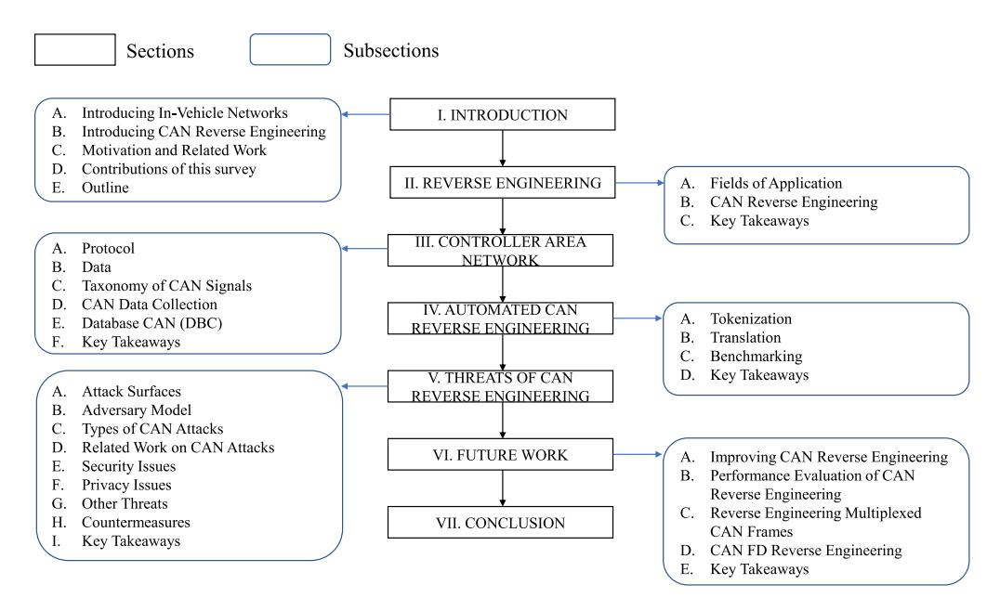

Fig. 1. Structure of the paper.

Carthaginian Quinquereme as a blueprint for the production of their new fleet of 120 warships, which largely contributed to their victory in the First Punic War [\[40\]](#page-33-17). During WWII, after making an emergency landing in the USSR, four Boeing B-29 Superfortress bombers were dismantled and reverse engineered in a large-scale operation. They were effectively used for the design and production of the Tupolev Tu-4 bomber [\[41\]](#page-33-18).

Reverse engineering is used in a variety of fields, such as computer, electronic and mechanical engineering, design, and systems biology, as well as for a multitude of research and commercial purposes, such as forensic investigations and competitor analysis [\[42\]](#page-33-19), [\[43\]](#page-33-20). Given the multitude of targets and their intrinsically different nature, the reverse engineering techniques reported in literature vary greatly. Nonetheless, it is possible to identify three general steps that are typically followed in the process.

- 1) *Information extraction* – The target is analyzed and its constituent components are identified;
- 2) *Modeling* The newly acquired information is conceptualized, i.e., an abstract model representing the whole structure is designed;
- 3) *Validation* The abstract model is tested in a multitude of scenarios to validate the findings.

Software engineering is the field reverse engineering has gained the most popularity. Often the information regarding the software design is lost over time and/or the software becomes obsolete, and thus incompatible with newer systems. In such cases, reverse engineering helps speed up the understanding of the source code and/or its re-purposing. This is also known as *design recovery* [\[44\]](#page-33-21).

Reverse engineering can be employed not only in an endproduct, but at any stage of software development. Its output is useful to take informed decisions during the software development by, for instance, offering a graphical representation of the code structure. This process is known as *redocumentation* [\[45\]](#page-33-22). A number of Unified Modeling Language

(UML) tools for the analysis of source code can be seen as reverse engineering processes for re-documentation [\[46\]](#page-33-23), [\[47\]](#page-33-24). Re-documentation provides more structured and higher-level understanding of software than the direct analysis of the source code. For this reason, it is employed for identifying flaws in the system design, as well as bugs and vulnerabilities.

Reverse engineering has also been widely adopted in illicit activities [\[48\]](#page-33-25). Similarly to software developers, black-hat hackers typically exploit reverse engineering techniques to detect vulnerabilities in operating systems or software in order to steal information or inject malware [\[49\]](#page-33-26). Another notable example is the removal of the copyright protection of the source code or media, also known as *cracking*. Reverse engineering can also be employed to discover unauthorized copies of the source code.

When the source code is not available, reverse engineering is performed on the machine code or bytecode and can be referred to as *reverse code engineering* [\[49\]](#page-33-26). This can be grouped into *decompilation*, *disassembly*, and *protocol reverse engineering*.

Decompilation makes use of *decompilers* that generate source code in a high-level language from the machine code of executable programs. This methodology typically produces imperfect results, leaving part of the code obfuscated. The success rate of decompilers depends largely on the availability of debugging data and metadata, e.g., produced by virtual machines. Examples of widely-used decompilers are JAD for Java [\[50\]](#page-33-27) and Reflector for.NET [\[51\]](#page-33-28). The usage of piracy prevention techniques, such as obfuscation, hinders the dynamic analysis that can produce unexpected results.

Disassembly is based on *disassemblers*, which are capable of translating binary code into assembly language to provide insights for humans. A notable disassembler is IDA Pro [\[52\]](#page-33-29).

Given a networking protocol whose formal specifications are unknown, the goal of *protocol reverse engineering* is to infer its parameters, formats, syntax and semantics [\[53\]](#page-33-30). It can

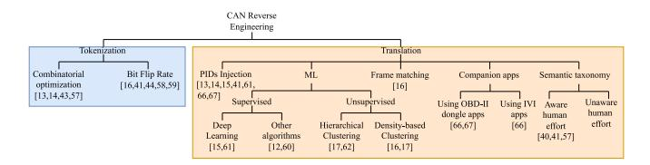

Fig. 2. Taxonomy of reverse engineering. The reverse engineering of CAN bus is a network trace-based protocol task.

be achieved by following two distinct approaches: (i) study the dynamic behavior of an application sending messages according to the protocol, and (ii) sniff and analyze the traffic exchanged between two or multiple hosts.

In the first approach, taint checking is employed to locate the code that parses the messages and correlate it with the messages. The output is called *execution trace* and is used to identify the fields and content type of messages. The main limitation of this approach is its high dependency on the type of system and programming language, making it difficult to generalize. Moreover, similarly to decompilation, this approach is often limited by the underlying privacy prevention techniques.

The second approach is based on logging the traffic transiting a network into a *network trace*, and identifying patterns and correlations between packets and messages in it. The decoding process is mostly composed of two steps: *syntax inference* and *semantic inference*. Inferring the syntax means discovering the field boundaries, also known as *tokenization*, as well as the *endianness* (see Section [III-B\)](#page-8-0) and format rules used to represent the information in the protocol. The semantic inference is the process of understanding the semantic meaning of the data. Reverse engineering based on network traces can be performed with the help of packet analyzer tools, such as Wireshark [\[54\]](#page-33-31), which allow manual inspection of the data. Researchers focused on automating this process with the aim of improving the performance and dealing with complex protocols. The most successful approaches reported in literature are based on Finite State Machine (FSM) automata and ML algorithms. The former are used to map sequences of messages and their relations [\[55\]](#page-33-32), while the latter are employed to find the underlying patterns and similarities between different messages or chunks of data [\[56\]](#page-33-33), [\[57\]](#page-33-34).

## *B. CAN Reverse Engineering*

CAN reverse engineering is the process of identifying the semantic meaning and format of signals contained in data payload by sniffing and analyzing traffic traces generated by ECUs connected to the CAN bus. It is based on network-protocol traces, and hence shares most of the characteristics of this process, including tokenization, and often implies the usage of ML techniques. However, due to its specific characteristics, the methodology for CAN reverse engineering can also diverge from other practices in literature for network-protocol based reverse engineering (see Section [IV\)](#page-10-0). In Figure [2,](#page-6-0) we describe our taxonomy of reverse engineering tasks in an effort to locate CAN reverse engineering within a broader context.

Traditionally, CAN bus reverse engineering has been performed *manually* by trained human operators, who trigger

|      | CAN L | ive IDs   |           |                 |       |       |    |    |    |    |    |    |    |           |  |
|------|-------|-----------|-----------|-----------------|-------|-------|----|----|----|----|----|----|----|-----------|--|
| Hide | Count | Frame No. | Time (s)  | Period Time (s) | CAN I | D D 0 | D1 | D2 | D3 | D4 | D5 | D6 | D7 | Frame No. |  |
|      | 30    | 23087     | 58.939999 | 1.997000        | 552   | 0a    | c5 | 91 | 44 | 04 | 00 | 00 | 00 | 22323     |  |
|      | 672   | 23238     | 59.344002 | 0.050000        | 432   | 81    | 50 | 48 | fe | 00 | 00 | 00 | 00 | 23219     |  |
|      | 322   | 23222     | 59.304001 | 0.299000        | 50e   | 00    | 00 | 00 | 84 | 00 | 00 | ff | 07 | 23111     |  |
|      | 390   | 22361     | 57.035000 | 0.039000        | 40d   | 00    | 00 | 00 | 00 | 00 | 00 | 00 | 00 | 22344     |  |
|      | 2568  | 23244     | 59.355000 | 0.010000        | 305   | 7f    | ff | ff | 07 | fü | 00 | 00 | 00 | 23239     |  |
|      | 1570  | 22714     | 57.946999 | 0.040000        | 228   | 79    | 00 | 00 | d6 | 00 | 00 | 00 | 00 | 22698     |  |
|      | 678   | 23220     | 59.294998 | 3.020000        | 34d   | 00    | 03 | fa | fa | 00 | 00 | 00 | ff | 22062     |  |
|      | 2007  | 22247     | 50 252000 | 0.040000        |       |       |    |    | -  | ~~ |    |    |    | 22222     |  |

Fig. 3. Example of manual reverse engineering via Wireshark. The CAN frames are grouped according to their ID and visualized in sequence on the same row. Changes in the payload bytes are highlighted in real time to support the identification of the signals boundaries by the human operator. A common strategy for the identification of signals related to the target vehicle functions is to activate the corresponding sensor and observe which bytes become highlighted.

events in the vehicle, e.g., by activating and deactivating sensors and/or the injection of Parameters IDs (PIDs) through the On-Board Diagnostics (OBD-II) port (see Section [III-D\)](#page-9-0), and analyze the changes in the CAN traffic [\[58\]](#page-33-35), [\[59\]](#page-33-36). The impact that such operations have on the data transiting on the CAN bus is monitored in real time with the help of specialized tools, such as Wireshark, CANtrace, and CANalyzer, etc. These tools filter the CAN data according to selected frame IDs (see Section [III-A\)](#page-7-1), thus providing a better understanding of the dynamics of semantically consecutive information. Figure [3](#page-6-1) shows an example of a CAN trace being processed in real time for manual reverse engineering.

Manual CAN bus reverse engineering has proven to be a reliable tool for understanding the CAN data, but it can take hours to days. In recent years, the automation of this process has drawn the attention of the scientific community and industrial players, who aim for standardized, fast and scalable solutions.

*Semi-automated* reverse engineering does not require the operator to be educated on CAN, but they must follow specific procedures so as to generate the events in the vehicle. *Full automation*, on the other hand, does not require any expertise/knowledge of reverse engineering or CAN, i.e., the individual inside the vehicle can be totally unaware of reverse engineering that is taking place. This is ideal for companies which have remote access to their clients' vehicles – i.e., through the installation of proprietary sensors – and can collect CAN data at any time and then process it offline.

The necessity for ground-truth information about driver characteristics, vehicle operations, road and traffic conditions is another relevant difference. In manual and semi-automated procedures, ground-truth data can be collected by manually inputting information or injecting diagnostic signals. Full automation minimizes this dependency and enables reverse engineering regardless of data-collection conditions/contexts.

Related work on semi-automated and automated reverse engineering has shown that the data-collection and decoding time can be reduced by, respectively, one and two orders-ofmagnitude over the manual approach [\[21\]](#page-32-20), [\[24\]](#page-33-1), [\[60\]](#page-33-37), [\[61\]](#page-33-38). Note, however, that, in the case of manual reverse engineering, the times for the two operations overlap, and hence should not be added up.

|                      | Manual        | Semi-Automated   | Fully-Automated                |
|----------------------|---------------|------------------|--------------------------------|
| Human expertise      | High          | Low              | None                           |
| Context              | Dependent     | Dependent        | Partially or fully independent |
| Data Collection Time | Hours to days | Minutes to hours | Seconds to minutes             |
| Decoding time        | Hours to days | Minutes          | Minutes                        |
| Scalability          | Low           | Medium           | High                           |

TABLE II CATEGORIZATION OF CAN REVERSE ENGINEERING INTO MANUAL, SEMI- AND FULLY-AUTOMATED

Finally, another element of distinction is scalability. In the manual approach, the same or equivalent manual actions must be performed for every target car, making it unscalable with the number of vehicle models. Semi- and fully-automated techniques, instead, become more accurate as more vehicles are processed [\[20\]](#page-32-19), [\[23\]](#page-33-0), [\[24\]](#page-33-1).

Table [II](#page-7-2) summarizes the characteristics of manual-, semiand fully-automated CAN bus reverse engineering. The table shows that the main differences among the three approaches is the level of human expertise and effort required.

## *C. Key Takeaways*

In this section, we presented reverse engineering, a process employed to extract hidden design information from systems and data. The goal of CAN reverse engineering is to determine the boundaries of the signals contained in the frames (known as tokenization) and discover their semantic meaning (translation). Then, we proceeded by discussing the transition from manual to fully automated CAN reverse engineering.

The most important takeaways from this section are:

- 1) CAN reverse engineering is network trace-based, i.e., the CAN traffic is logged and analyzed to find correlations among the data.
- 2) CAN reverse engineering can be manual, semiautomated or fully automated.

#### III. CONTROLLER AREA NETWORK

This section describes the CAN protocol and provides an overview of relevant aspects of the CAN data: description, taxonomy, collection process, and storage.

## *A. Protocol*

The CAN protocol covers the first two layers of the Open Systems Interconnection (OSI) model [\[62\]](#page-33-39), i.e., physical and data-link (see Figure [4\)](#page-7-3). At the physical layer, it consists of a pair of twisted wires, CAN High (CANH) and CAN Low (CANL), with a nominal characteristic impedance of 120 Ω. The data are transmitted as differential wired-AND signals.

There are two implementations of the physical layer of CAN 2.0: the *High Speed* (ISO 11898-2 [\[6\]](#page-32-5)) and *Low Speed* (ISO 11898-3 [\[7\]](#page-32-6)). The High Speed CAN baud rate ranges from 40 kbit*/*s to 1 Mbit*/*s (depending on the length of the wire/bus). The Low Speed CAN is characterized by baud rates ranging from 40 kbit*/*s to 125 kbit*/*s.

At bit-level, 0 represents the *dominant* state, while 1 encodes the *recessive* state. In the High Speed CAN, to transmit a dominant state, the wires reach a differential voltage of 2 V, with the CANH and CANL being driven, respectively,

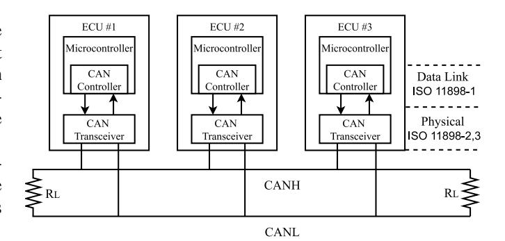

Fig. 4. An example of CAN bus with three ECUs attached.

towards 3*.*5 V and 1*.*5 V. To transmit the recessive state, the wires must have a differential voltage of less than 0*.*5 V.

Similarly to High Speed CAN, in Low Speed CAN the wires must reach a differential voltage of 2 V around 2*.*5 V to signal a dominant state. On the contrary, the recessive state is transmitted when the CANH and CANL are pushed, respectively, towards 5 V and 0 V. This standard is also known as Fault-Tolerant, since it can tolerate wiring failures.

At the Data-Link layer (ISO11898-1 [\[5\]](#page-32-4)), the communication on the CAN bus relies on messages/frames. Each ECU sends CAN frames periodically. The frames do not carry the address of the sender/receiver ECU. Due to the absence of a master node in charge of orchestrating the communication, if the bus is free, a frame is received by all the other ECUs. In contrast, when multiple ECUs transmit messages simultaneously, a collision occurs. The resolution of collision on CAN bus is handled through an arbitration process. The frame with the highest priority (the lowest ID) precedes lower-priority (larger ID) ones. This is achieved through the use of dominant bits overwriting the recessive ones. It follows that high priority IDs are those with low values, while low priority IDs have high values. The ECU sending the dominant frame completes the transmission, while the rest of the ECUs become receivers. When the bus is free again, the ECUs which lost the arbitration will attempt to re-transmit their messages.

A CAN frame is composed of several fields:

- *Start of frame* 1 bit
- *Identifier (ID)* 11 bit or 29 bit in the extended version, it identifies the frame and denotes its priority.
- *Remote Transmission Request (RTR)* 1 bit, it is dominant or recessive for, respectively, data and remote request frames.
- *Identifier extension bit (IDE)* 1 bit, it is dominant or recessive for, respectively, the standard 11-bit identifier and the extended version.
- *Reserved* 1 bit, reserved for future use.

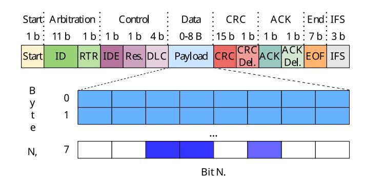

Fig. 5. Example of CAN frame with an 8 Byte payload. In the payload, different colors represent different signals.

- *Data Length Code (DLC)* 4 bit, it indicates the length of the payload, expressed in bytes.
- *Payload* between 0–8 Byte, it carries the actual content of the frame, encapsulated in bits.
- *Cyclic Redundancy Check (CRC)* 15 bit
- *Acknowledge (ACK)* 1 bit, recessive when the frame is sent.
- *End of Frame (EOF)* 7 bit
- *Inter-frame spacing (IFS)* 3 bit, must be recessive.

Figure [5](#page-8-1) shows an example of a CAN frame with a payload of 8 Byte.

Released in 2012 by Bosch, CAN Flexible Data-Rate (FD) – ISO11898-1:2015 [\[5\]](#page-32-4) – is an enhanced version of the CAN protocol. It was designed to meet the automotive industry's need for a higher bandwidth to support the steady increase in the number of ECUs present in vehicles. The main advantage of CAN FD over the original CAN is the dual bit-rate. While maintaining the same bit rate of the arbitration phase, the payload can be transmitted at a higher bit rate, allowing the payload length to increase from a maximum of 8 Byte to 64 Byte. As a consequence, CAN FD achieves a higher communication bandwidth up to 5 Mbit*/*s (with a 40 m-long bus). In addition, an improvement in the CRC field and algorithm makes CAN FD more reliable. Related work on reverse engineering has solely focused on CAN 2.0. Hence, CAN will henceforth refer only to the version 2.0.

## *B. Data*

OEMs encode CAN data using their proprietary format. The information related to the location and the interpretation of CAN *signals* is usually hidden from the general public. Signals are chunks of payload which describe the vehicle's behavior. Each signal provides real-time information related to the vehicle's telemetry or function, such as door status, current angle of the steering wheel, current speed. Every signal is characterized by:

- *Boundaries* represent the start and end bit of the signal within its frame. The interpretation of the position varies with the *endianness*.
- *Endianness* is the order in which data is sent over a communication channel. In the Big Endian (BE) format, the bytes are ordered from the most significant to the least significant. By contrast, according to the Little Endian

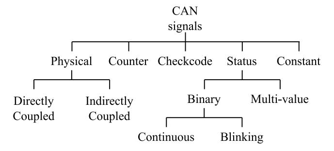

Fig. 6. Taxonomy of CAN signals.

(LE) format, the bytes appear from the least significant to the most significant. In BE, the bits follow the same order as the bytes, i.e., the most significant bit appears first and then the significance decreases until the last bit. So, this format is easy for humans to interpret because it is our usual way of reading decimal numbers. In contrast, in LE, the significance of the bits does not represent the significance of the bytes.

- *Semantic meaning* represents the telemetry/vehicle function that the signal encapsulates.
- *Signedness* indicates whether the signal is signed or not, i.e., if the first bit corresponds to the most significant bit or to the sign of the signal. Signals that are signed usually refer to telemetries that can have negative values, e.g., the outdoor temperature or the angle of the steering wheel.
- *Format* typically, the value *v* of a physical signal *s* is not immediately human-interpretable by parsing its value from binary/hexadecimal to decimal. Given the raw decimal value *r* , *v* can be obtained by applying a scale factor *f* and an offset *o* according to the formula:

$$v_s = f_s \cdot r_s + o_s \tag{1}$$

Note that scale factor and offset can be 1 and 0, respectively. In this case, a parsing to decimal value is sufficient to interpret the signal.

Additionally, frames associated with the same ID traditionally contain the same signals. Hence, once the position, meaning, and format of the signals related to a certain ID are known, its frames can be interpreted at any time.

#### *C. Taxonomy of CAN Signals*

According to [\[61\]](#page-33-38), [\[63\]](#page-33-40), [\[64\]](#page-33-41), signals can be grouped into the following categories (see Figure [6\)](#page-8-2):

• *Physical* – embed the dynamics of a vehicle. They are typically equal to, or longer than 6 bit and are mostly related to the activities in the powertrain. They carry information about telemetries related to critical real-time events, such as vehicle speed, steering wheel angle, and engine temperature. Physical signals can be divided into directly Signals that are directly coupled either share a common pattern of behavior (e.g., the wheel speed) or are linked by causation and effect (e.g., brake pedal and Revolutions Per Minute (RPM)). Indirectly coupled signals are ones in which the correlation with others physical signal must be deduced in a way that is not straightforward.

- *Status* represent a limited set of options, or *states*. Marchetti and Stabili [\[64\]](#page-33-41) divide the status signals into *multi-value* and *binary*. Multi-value signals are typically between 2–4 bit long and can represent more than two states. An example of multi-value status signal is the wiper speed. By contrast, binary status signals can represent only two options, e.g., on/off or open/closed. Recently, we further divided the binary signals into *continuous* and *blinking* [\[60\]](#page-33-37). Continuous status signals, once triggered, preserve their new status until they are deactivated. In contrast, blinking signals, once activated, continuously change their status from 0 to 1, and vice versa, until they are switched off.
- *Counters* behave like cyclic counters.
- *Checkcodes* checkcodes, or *checksum*, within the payload that complement the CRC field.
- *Constant/Unused* consecutive bits that never change their status and that do not encapsulate any vehicle function or telemetry. They are used as buffers between signals.

# *D. CAN Data Collection*

The most common way to log the data from the CAN bus is to physically connect a CAN *logger* to the bus. There are several models of CAN loggers commercially available, the most popular being the CLX000 series by CSS Electronics [\[65\]](#page-33-42), PCAN by PEAK System [\[66\]](#page-33-43) and Leaf by Kvaser [\[67\]](#page-33-44), as well as projects for open-source boards, such as Arduino [\[68\]](#page-33-45) and Raspberry Pi [\[69\]](#page-33-46).

CAN loggers are typically equipped with a male 16-pin (2x8) J1962 connector (ISO 15031-3 [\[70\]](#page-33-47)), have a timestamp resolution in the order of µs, and can automatically detect the bit rate of the CAN bus. In addition, some loggers have a USB or WiFi interface and can store data locally or on a cloud platform. A logger usually outputs a log, or *trace*, as a text file containing the list of received frames, sorted by the timestamp and reporting the DLC, ID, and payload (expressed in hexadecimal values). Figure [7](#page-9-1) provides an example of a CAN trace.

At the time of this writing, the most straightforward way to attach a logger to the CAN bus in most vehicles is through the OBD-II port. The OBD-II port is based on a female 16-pin (2x8) J1962 connector, and it is commonly located within 0*.*6 m from the steering wheel [\[71\]](#page-33-48). It is present in most modern gasoline-engine-powered vehicles worldwide as it was enforced in the U.S. and EU, respectively, in 1996 and 2001, and later in a number of other countries. Its purpose is to allow the diagnostic of emissions-related parameters from a vehicle by sending CAN messages, identified by OBD-II PIDs [\[72\]](#page-33-49). An example of OBD-II port is shown in Figure [8.](#page-9-2)

Unlike CAN IDs, OBD-II PIDs are defined by the OBD-II protocol. Most of OBD-II PIDs are public and therefore compatible with all the vehicles equipped with an OBD-II port. OBD-II typically allows the logging of both diagnostic and

| Messa  | ge Number |         |       |     |      |     |     |     |     |     |    |    |
|--------|-----------|---------|-------|-----|------|-----|-----|-----|-----|-----|----|----|
| 1      | Time 0    | ffset ( | ms)   |     |      |     |     |     |     |     |    |    |
| î      | 1         | Туре    |       |     |      |     |     |     |     |     |    |    |
| Ĩ      | 1         | 1       | ID (h | ex) |      |     |     |     |     |     |    |    |
| 1      | 1         | 1       | 1     | Da  | ta I | eng | gth |     |     |     |    |    |
| Ī      | 1         | 1       | 1     | 1   | Da   | ata | By  | tes | (he | ex) |    |    |
| 1      | 1         | 1       | 1     | 1   | 1    |     |     |     |     |     |    |    |
|  -+ | +         | +       | +     | +   | -+   |     |     |     |     |     |    |    |
| 1)     | 0.0       | Rx      | 036F  | 5   | F2   | F7  | FE  | FF  | 14  |     |    |    |
| 2)     | 1.8       | Rx      | 0512  | 8   | 00   | 00  | 00  | 00  | 9A  | 00  | 00 | 12 |
| 3)     | 4.1       | Rx      | 008F  | 8   | EF   | 0E  | 00  | 7D  | 9C  | 01  | FB | 90 |
| 4)     | 4.3       | Rx      | 00A5  | 8   | 87   | DE  | DO  | 07  | 7D  | 00  | 00 | B1 |
| 5)     | 4.6       | Rx      | 00D9  | 8   | BC   | FE  | 00  | 10  | 00  | E0  | 7F | C0 |
| 6)     | 6.6       | Rx      | 0197  | 4   | 72   | 09  | FF  | FC  |     |     |    |    |
| 7)     | 8.9       | Rx      | 05A9  | 8   | 13   | FF  | CO  | 29  | FF  | FF  | FF | FF |
| 8)     | 9.3       | Rx      | 008A  | 8   | 00   | 00  | 06  | 27  | 00  | F0  | АЗ | FF |
| 9)     | 10.1      | Rx      | 0302  | 7   | FF   | FA  | 44  | 84  | FC  | FF  | FF |    |
| 10)    | 11.9      | Rx      | 00EF  | 8   | 4C   | F5  | 00  | 7D  | 21  | 00  | 7D | FF |
| 11)    | 12.5      | Rx      | 01A1  | 5   | 70   | CB  | 00  | 00  | 8A  |     |    |    |
|        |           |         |       |     |      |     |     |     |     |     |    |    |

Fig. 7. Example of a CAN log extracted with a PCAN from a BMW X1, model year 2015.

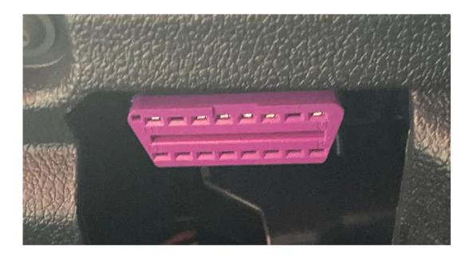

Fig. 8. OBD-II port in a Cupra Formentor, model year 2021.

general-purpose CAN frames. Recently, however, a number of OEMs have started placing a firewall between the OBD-II port and the CAN bus, thus preventing the logging of nondiagnostic CAN data. Extraction of data from vehicle models with such a restriction requires identification of the CAN wires and use of an insulation piercing clip or connector with an adaptor for the CAN logger.

# *E. Database CAN (DBC)*

The DBC file type is the standard to store the information for the interpretation of CAN signals from their raw format into a human readable version. Designed in the 1990s by Vector Informatic GmbH [\[73\]](#page-34-0), the DBC file type contains a complete description of the position, semantic, and format of CAN signals, as well as their minimum and maximum theoretical value and the unit of measurement. DBC files can be used as input in a variety of tools, such as CANtrace [\[74\]](#page-34-1) and CANalyzer [\[75\]](#page-34-2), that can convert the data and provide a real-time human-interpretable reading of signals transiting the bus. Figure [9](#page-10-1) provides an example of DBC file.

As discussed in Section [I,](#page-1-0) OEMs keep the instructions for the interpretation of CAN data hidden to the general public. The original DBC files owned by OEMs are typically unavailable to researchers and aftermarket companies. Thus, the only viable option to obtain the ground truth of a vehicle model CAN data is to acquire it from third-party technicians or expert

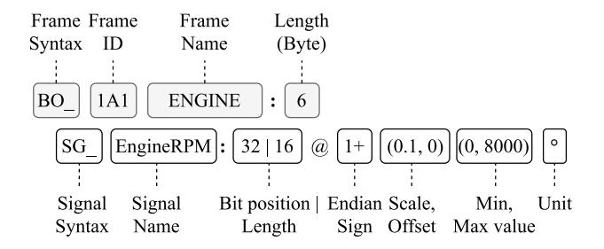

Fig. 9. An example of format description in a DBC file. The upper line of the figure represents the syntax of the frame, while the line below reports the signal EngineRPM within the frame.

Fig. 10. An example of wheel speed signals – front left (FL), front right (FR), rear left(RL) and rear right (RR)– from a generated DBC (OpenDBC) extracted from a Mazda 3, model year 2019.

companies in manual reverse engineering. We define a DBC obtained through manual reverse engineering as *generated*.

Generated DBC files are generally reliable, but signals and frames are not fully decoded, and hence they do not cover all the ground truth information related to the target vehicle.

Figure [10](#page-10-2) illustrates an example of generated DBC file from the known open repository Open DBC by Comma AI [\[76\]](#page-34-3). Note that the four wheel speeds have been almost fully reverse engineered except for the unit, while for others only the boundaries have been identified, with no information related to their semantic meaning (and, supposedly, scale factor and offset as well).

# *F. Key Takeaways*

In this section, we introduced the CAN protocol and provided background information on the data collection and storage process. The following is a list of the most important takeaways from this section:

- 1) The totality of today's vehicles are equipped with one or more CAN buses, which are the shared communication means for the vehicle's ECUs.
- 2) The data transiting on CAN bus is not encrypted and the ECUs are not authenticated.
- 3) The ECUs send messages or frames that contain multiple signals. Each signal contains one vehicle function. Despite the lack of encryption, each signal is not easily interpretable since it is encoded according to the proprietary format of the OEM.
- 4) The most popular entry point to the CAN bus is the OBD-II port, which is typically used for diagnostics. Nonetheless, many manufacturers are blocking

- indiscriminate access between this port and the CAN bus through secured gateways.
- 5) The background information related to CAN data formats, including the result of reverse engineering, is contained in DBC files.

## IV. AUTOMATED CAN BUS REVERSE ENGINEERING

The objective of CAN reverse engineering is to locate the position of signals within frames, also known as *tokenization*, and *translate* their semantic meaning and format, as presented in Section [III-B.](#page-8-0) Figure [11](#page-11-0) summarizes the CAN reverse engineering process.

In this section, we examine the literature about CAN tokenization and signals translation individually. This is due not just to the fact that numerous works focus simply on tokenization or translation, but also to highlight that these two processes are complementary and consecutive, and can therefore be evaluated separately. Figure [12](#page-11-1) provides a complete taxonomy of the work on CAN reverse engineering.

We conclude by comparing the techniques and outcomes of the presented studies.

#### *A. Tokenization*

The goal of tokenization is to identify the sequence of bits that correspond to each signal within the payload of the frames. The resulting output, the *tokens*, can be described as signals whose location in the payload is known but whose semantic meaning and format have yet to be translated.

The first step, common to all tokenization approaches, is the decomposition of the CAN trace in sub-traces, one for each ID. Each sub-trace is ordered according to the timestamp, and corresponds to the time series of frames associated with the same ID which, thus, carry semantically consecutive data. Figure [13](#page-11-2) illustrates the process of decomposing a CAN trace into multiple sub-traces.

As highlighted in Figure [12,](#page-11-1) after this step the related work proceeds following one of two approaches: (i) extract the set of tokens that maximizes a score function among a set of possible token combinations, or (ii) compute the Bit Flip Rate (BFR) array from the payload time series, and scan it to identify boundaries based on drops in the value.

*1) Tokenization Based on Combinatorial Optimization:* While developing an anomaly detection system, Markovitz and Wool [\[63\]](#page-33-40) were the first to design an algorithm for tokenization in CAN. They were also the first to identify different categories of signals: physical, constant/unused, multi-values, and counters. The authors proposed an approach based on a 64x64 triangular matrix, which is employed to evaluate all possible 2080 tokens within the frame payload (they considered only payloads with the maximum length of 8 Byte). For each candidate token, the number of distinct values assumed in the trace is calculated. Constant/unused portions of the trace are identified by the fact that they assume only one value throughout the trace, while multi-values are characterized by a limited number of values. According to the authors, physical signals and counters are signals with high *density*, i.e., a large number of values theoretically available are displayed by

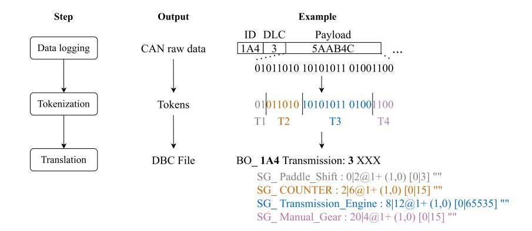

Fig. 11. CAN reverse engineering process.

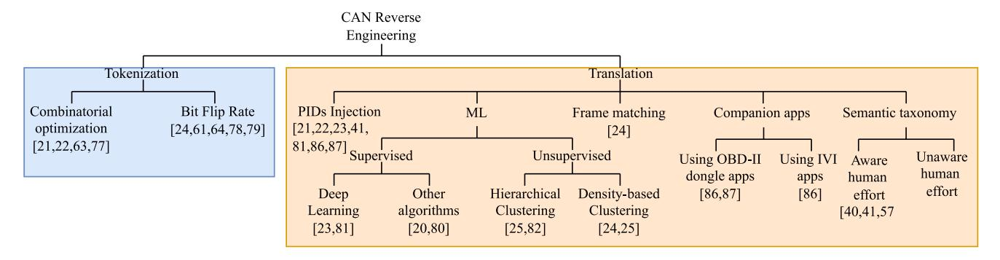

Fig. 12. Taxonomy of CAN reverse engineering.

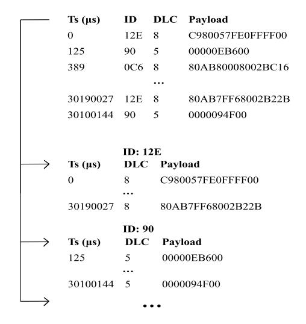

Fig. 13. Decomposition of a CAN trace into *N* sub-traces.

the signal during the trace. A score is attributed to each candidate signal based on the specific characteristics of its category. Through a greedy algorithm, the authors identify the final set of non-overlapping tokens according to their scores.

The primary limitation of this study is the brute force method used to analyze every potential token boundary combination, which incurs a considerable computational cost.

Verma et al. [\[22\]](#page-32-21) present Automatic CAN Tokenization and Translation (ACTT), an algorithm that performs tokenization and translation of the signals simultaneously. The method initially identifies the portions of the target trace triggered by PID requests injected through the OBD-II port during the driving session in the target vehicle and obtains labeled time series. The constant bits are then extracted for each ID and all the possible combinations of tokens are computed on the rest of the bits. A fitness score is calculated between the time-series of each token in the set and the Diagnostic IDs (DIDs) time series using a linear regression. Finally, a dynamic programmingbased scheduling algorithm outputs the set of non-overlapping tokens which maximizes the overall fitness score.

The main shortcoming of this work is the intrusiveness of injecting PID (in Section [IV-C](#page-17-0) we provide a detailed definition of intrusiveness in the context of CAN reverse engineering). Also, as recognized in the authors in a subsequent work [\[21\]](#page-32-20), ACTT tries to address the endianness, but erroneously consider the bit order instead of the byte-order, which truly defines the endianness in CAN bus [\[21\]](#page-32-20).

The AutoCAN tool proposed by Frassinelli et al. [\[77\]](#page-34-4) is equipped with a tokenizer based on a greedy approach. For each ID, the tokenizer starts from the first bit of the payload and iteratively adds bits to define the other boundary of the token. At every iteration, the algorithm evaluates the *plausibility* of the considered token by verifying that its properties match those of any of the signal categories (physical, counter, checksum, status). Assuming a token starting at position *i* and its currently investigated end bit be at position *j*, if the token (*i*, *j*) is plausible, a new bit is added and a new plausibility check is performed. Otherwise, a boundary is identified in position *j −* 1, and *j* is the start bit of the following token. Finally, he authors also refer to the littleendianness. However, they do not specify how to distinguish little-endian signals from big-endian signals, which were not mentioned.

This approach constitutes a major novelty in the field of combinatorial optimization-based tokenization, as it is the first to iteratively evaluate sequences of consecutive bits with a mono-directional scanning of the payload. The main benefit is a substantial reduction of the computational cost compared to previous works.

In their tool, CAN-D, Verma et al. [\[21\]](#page-32-20) propose an approach that considers the conditional probability of each bit *bi* flipping, and the difference between the conditional bit flip probabilities of the following two bits. Once the probability of each bit in the payload of being a signal boundary is calculated, the algorithm extracts the set of all possible valid tokens. This set includes also tokens in little-endian format, which have been extracted independently of each other. The authors evaluate the possibility that a single payload can contain tokens encoded according to different endianness. In fact, they observe that, while no case of signals within the same payload but with different endianness has been recorded, the CAN protocol does not indicate constraints regarding this possibility. An optimization algorithm aims to find the optimal balance between partitioning the payload into too many signals and allocating too many bits to the same signal.

This algorithm can provide distinct outputs. In this case, the solution that includes the highest number of signals overall and the highest number of big endianness signals is chosen as optimal. Both approaches were tested on 10 vehicles from different manufacturers and mostly validated against generated DBC files provided by OpenDBC. The results show an average F-Score, accuracy, and precision around or superior to 90 %.

The main constraint of this work is the ambiguity resulting in producing distinct outputs. The methodology selected by the authors to address this issue should be evaluated on a larger number of test vehicles.

*2) Tokenization Based on BFR:* Marchetti and Stabili [\[64\]](#page-33-41) and Nolan et al. [\[78\]](#page-34-5) introduce, respectively, Reverse Engineering of Automotive Data frames (READ) and Transition Aggregated N-Grams (TANG), which are tokenization algorithms based on the BFR.

For each ID time series, a *BFR array B* = [*b*0, *b*1*,..., bn*] is calculated, where *n* is the length of the frame payload. Each element *bi* corresponds to the BFR of the *ith* bit throughout the time series. A bit flip corresponds to a change in the status of a bit in a consecutive payload, from 0 to 1 or vice-versa. The total Bit Flip Count (BFC) is the number of times a bit flips throughout the time series. Let *F* be the number of consecutive payloads that constitute the time series. BFR is then calculated as BFC/(*F −* 1). The BFR array is then scanned from left to right looking for a significant drop in the BFR between *bi* and *bi*+1. When such a decrease in the BFR occurs, a boundary between two signals is found. Figure [14](#page-12-0) illustrates an example of tokenization based on BFR.

The underlying rationale behind this approach is that the least significant bits of physical signals usually flip more than the most significant bits, due to the deterministic and continuous nature of the phenomena that these signals represent. As a consequence, when a consistent decrease in the value is found between *bi* and *bi*+1, *bi* is likely to be the least significant

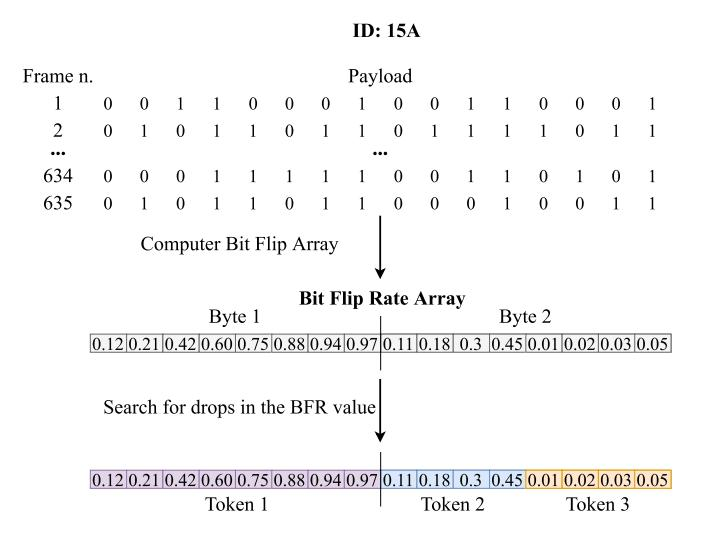

Fig. 14. Example of tokenization of the ID 15A. The BFR is calculated on the payloads of consecutive frames associated to the ID. The array is scanned from left to the right to look for drops in the BFR values. Through this technique, 3 tokens are found.

bit of the current signal, while *bi*+1 the most significant bit of the next signal. A difference between READ and TANG is the factor defining the minimum decrease in the bit flip to identify a boundary: 2 for TANG and 10 for READ.

Despite being early works in the field of CAN tokenization, READ and TANG provide convincing level of completeness. In fact, the majority of subsequent works on BFR-based tokenization apply tweaks and additions to the heuristics used by these two algorithms.

READ has been further improved by Pesé et al. [\[61\]](#page-33-38). Specifically, the authors express the decrease in two consecutive BFR as a percentage, which allows to identify the optimal threshold with a higher precision. In this work, the authors are the first to define two metrics, CE/TE and CE/TBDC, for the evaluation of tokenization algorithms. Correctly Extracted (CE)/Total Extracted (TE) is the ratio between the number of tokens CE and the total number of tokens extracted (TE) and measures the precision. CE/TBDC is the ratio between the number of tokens correctly extracted (CE) and the Total number of signals in the DBC file (TDBC) related to the target vehicle.

Buscemi et al. [\[24\]](#page-33-1) embed in their tool, CANMatch, a tokenization algorithm based on READ and LibreCAN [\[61\]](#page-33-38), which, unlike these two approaches, extracts the endianness of the tokens. Following the assumption of [\[78\]](#page-34-5), the authors evaluate the endianness for the whole payload. In this approach, when analyzing the BFR, two set of tokens are extracted, one following the assumption of little endianness and one based on big endianness.

When little endianness is taken into account, the order of the bits is inverted within the single bytes of the BFR array (not across the whole array as done in [\[22\]](#page-32-21), [\[78\]](#page-34-5)). Such a version of the BFR array is scanned from the end to the beginning and the tokens are extracted according to the same heuristic used for the big endianness, as illustrated in Figure [15.](#page-13-0) For the big endianness, instead, the tokens are extracted following LibreCAN's approach.

Once a subset of tokens is extracted assuming each endianness, a likelihood score is calculated to determine the final

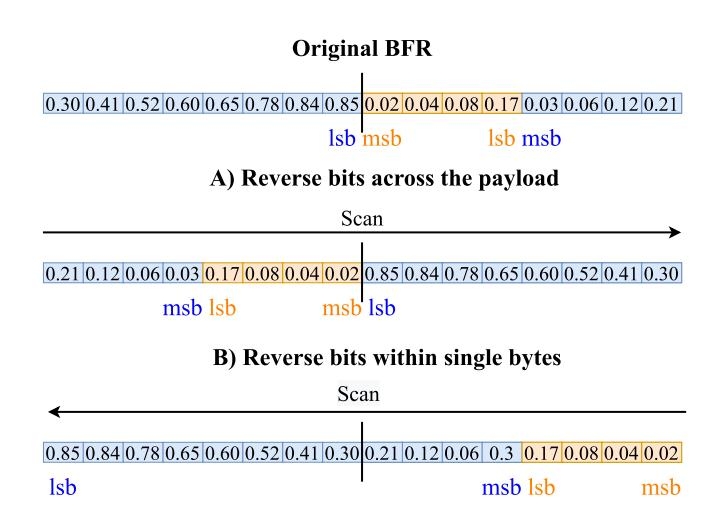

Fig. 15. Reversing the bits across the payload [\[22\]](#page-32-21), [\[78\]](#page-34-5) vs. reversing the bits within single bytes [\[24\]](#page-33-1) to extract little endian signals.

set of tokens. Note that, while the usage of a likelihood score recalls optimization-based algorithms, this step is solely employed to evaluate the endianness, not the boundaries. Hence, CANMatch is considered to be a BFR-based approach.

Based on a test set of 15 vehicles, CANMatch shows similar or same accuracy as [\[64\]](#page-33-41) and [\[61\]](#page-33-38) on big endian signals. Furthermore, the tool can tokenize little endian payloads with an accuracy of 60 %.

Choi et al. [\[79\]](#page-34-6) argued against the assumptions made by Marchetti and Stabili [\[64\]](#page-33-41) regarding the BFR of checkcodes and counters. Regarding the checkcodes, the authors observe the BFR values are not always distributed around 0.5. Their algorithm starts from a reference BFR of 0.3 and continuously checks whether this property is consistent throughout the trace. The algorithm simply observes whether the overall value of a counter has incremented by 1 at every new frame sending. The authors present a methodology to identify physical signals as well, which does not calculate the BFR array on the whole payload time-series. Following a sliding window approach, the algorithm generates multiple sub-time-series, or *windows*, and calculates a BFR array for each of them. Then, each bit is evaluated independently. The BFR related to the windows are put in one time-series for each single bit and a correlation with the following bit is searched. When correlations are found between two or multiple consecutive bits, they are labeled as belonging to the same signal.

Its main limitation is the assumption that the observed value of the counter increases by exactly 1 upon sending each frame. Counters related to physical phenomena, such as the fuel consumption counter, can speed up or slow down according to the progression of the telemetry taken into consideration. As a consequence, while displaying a clear cyclic behavior, i.e., a monotonic increase in the values followed by a reset, their value can change by more than 1 between sending of one frame and the next frame.

# *B. Translation*

The goal of translation is to disclose the signedness, offset, scale factor, and unit (in case of physical signals) of the found tokens. We propose to categorize the work related to

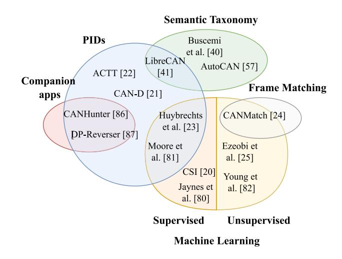

Fig. 16. Grouping related work on CAN translation based on the first layer of the taxonomy.

translation according to the methodology adopted: (i) based on PIDs, (ii) based on ML, (iii) based on semantic taxonomy, (iv) based on frame matching, (v) based on companion apps. We then divide each of these categories in subcategories to further distinguish the underlying logic followed in these approaches, as shown in Figure [12.](#page-11-1)

It is to be noted that a significant number of the studies presented in this survey are based on more than one approach. To better illustrate the differences and commonalities between these works, we group them according to the first layer of our taxonomy (see Figure [16\)](#page-13-1). However, for readability, in the following section we present each work in the category that describes its most distinctive characteristics.

*1) Translation Based on PIDs:* The algorithms belonging to this class are based on injecting PIDs through the OBD-II port and observing the subsequent changes in the traffic.

Huybrechts et al. [\[23\]](#page-33-0) were the first to exploit OBD-II PIDs in the scope of CAN reverse engineering. They log CAN data while driving in a dynamic context and injecting diagnostics requests. Then, the tool compares each byte (or combination of bytes) of the collected traffic with the triggered diagnostic signals and calculates the similarity between them. The semantic meaning of the chunk of traffic scoring the highest similarity is then identified. The tool is tested on two gas-fuelled vehicles and validated against a generated ground truth, managing to map around 10 % of the traffic in the two vehicles.

In their tool, CAN-D, Verma et al. [\[21\]](#page-32-20) are the first to introduce a translation method capable of decoding the signedness of the signals. The signedness is decoded based on the assumption that if a token is signed, both of its most significant bits flip from 0 to 1 when it goes from positive to negative values, and from 1 to 0 vice versa. The logic behind this approach is that signed signals have continuity in the value of two most significant bits while, in the case of unsigned signals, the flipping of such bits represents changes in the value of the signal which is unlikely to represent telemetries in the real world. The translation of the signals' format is a continuation of the work in [\[22\]](#page-32-21) (see Section [IV-A\)](#page-10-3) and consists of finding linear correlations between the extracted tokens and diagnostic messages. Based on a testing set composed of 10 vehicles, whose ground truth is available in CommaAI, CAN-D achieves a reduction of 20 % in the *l* 1 error between the translated signals and the ground truth compared to LibreCAN.

*Summary:* The injection of PIDs is a useful approach that can be employed to accurately translate a number of signals critical for the functioning of the vehicle. In particular, since the formats of the responding signals are publicly available, once the semantic of a signal has been correctly identified, its format becomes also known, and it can be used for the identification of other semantically related signals. The main limitation of this approach is that not all the signals can be triggered through diagnostic requests, in particular those not related to the powertrain.

*2) Translation Based on ML:* ML is used in the scope of CAN reverse engineering to identify the semantic of signals (supervised learning) or infer correlations between signals (unsupervised learning).

Jaynes et al. [\[80\]](#page-34-7) were the first to attempt fully automated reverse engineering of CAN bus. They propose an ML approach based on three features – ID, sending frequency, and payload – to identify the semantic meaning of the frames, i.e., what is the vehicle function that they carry. After training a variety of ML classifiers on frames related to five functions in nine vehicles, the authors achieved a precision and recall higher than 80 % with an Nearest Neighbor (NN) classifier against a generated ground truth. However, as indicated in [\[21\]](#page-32-20), since this work treats the frame payloads as a whole, this approach is not suitable for the translation of individual signals.

Buscemi et al. [\[20\]](#page-32-19) aim to fix the shortcomings of Jaynes et al. [\[80\]](#page-34-7) on fully automated semantic translation with ML supervised classification. The authors present Critical Signals Identifier (CSI), a tool based on training an ML classifier to label signals without external data (except for the notion that the vehicle is driven in a dynamic context and then parked). Unlike [\[80\]](#page-34-7), CSI is not applied on the whole payload but on independent signal. The signals are subdivided into four groups according to their length, and specific features are extracted for each group. The goal is to have a more accurate representation of the signals belonging to each group. The authors validate CSI on a set of 69 distinct vehicle functions present in eight test vehicles divided into *foreground* set (10), i.e., signals covering functions considered critical, and *background* set (59), i.e., the others. CSI correctly classifies the signals in the foreground set with a weighted accuracy of 93 %. However, all the tested signals are not obtained through tokenization but extracted from generated DBC files. Given that a CAN trace usually contains a larger number of signals, the accuracy achieved by the tool might be inferior in a real-world scenario.

Huybrechts et al. [\[23\]](#page-33-0) are the first to make use of Deep Learning (DL). The authors propose an alternative approach to the injection of PIDs, which makes use of Long Short-Term Memory (LSTM), a type of NN particularly suited for time-series classification. The LSTM is trained to identify the semantic meaning of signals in a target vehicle, based on their experience gained on CAN signals of known vehicles. In addition to the features extracted from the CAN traffic, the training samples of the LSTM model are built up with features generated from Global Positioning System (GPS) data, such as speed, heading, latitude, and longitude, etc. These additional GPS features aim at providing further knowledge of the vehicle status.

An accuracy of up to 90 % is achieved by this second approach. The main limitation of both approaches is the absence of tokenization. The authors wrongly assume a coincidence between signals and payload bytes, which does not make it suitable for signals that are shorter than one byte and/or whose boundaries are not the most significant bit and least significant bit of the bytes.

Moore et al. [\[81\]](#page-34-8) aimed to provide a full mapping of the time relations between the speed-related signals and distinguish the different states of the vehicle in a semi-supervised manner. The authors initially exploit PIDs to identify the speed-related signals. Subsequently, they employ a combination of Hidden Markov Model (HMM) and Convolutional Neural Network (CNN) to understand the causality between the actions of the driver and the observed data. The authors explore four states of the vehicle speed: acceleration, deceleration, maintain (the speed is constant) and idle (the vehicle is parked). The results show an average accuracy in the identification of the states higher than 90 %.

Ezeobi et al. [\[25\]](#page-33-2) and Young et al. [\[82\]](#page-34-9) adopt unsupervised ML techniques in the field of CAN reverse engineering. In [\[25\]](#page-33-2), the authors test several clustering techniques, such as Agglomerative Hierarchical Clustering (AHC) [\[83\]](#page-34-10) and Density-based spatial clustering of applications with noise (DBSCAN) [\[84\]](#page-34-11), to determine sets of frames which are semantically related. They evaluate their approach against a set of four vehicle models belonging to the same OEM. For validation, the authors employ generated DBC from OpenDBC. AHC identifies four distinct clusters related to an equal number of vehicle functions, achieving an Fowlkes-Mallows (FM) Index [\[85\]](#page-34-12) of over 70 %. Similarly to [\[20\]](#page-32-19) and [\[81\]](#page-34-8), this approach provides the semantic meaning of a limited number of signals. However, it is the first to show that clustering may be used to get a basic overview of the trace and focus reverse engineering on a restricted set of frame IDs.

In [\[82\]](#page-34-9), instead, the authors perform a series of operations within the vehicle at data collection time and manually label the CAN traffic in different time spans accordingly. The CAN log is split in sub-traces, one for each ID, and the time-status labels are used to find correlation between the time-series of an ID and a function of the vehicle. Then, an AHC algorithm is used to identify the similarity degree between different frame series. Following this approach, the authors manage to identify eight frames containing five distinct gas-fuelled vehicle functions. Similarly to [\[80\]](#page-34-7), this approach is limited, in the sense that the extracted information, while offering a high-level understanding of the frames, does not address the individual signals.

*Summary:* ML-based algorithms are useful to identify and/or group signals based on their semantics in a completely automated manner, and thus provide a clear overview of the dependencies in the data traffic. The main limitation of approaches based on supervised learning is that the translation performance also depends on the quality of the ground truth which in the case of manual labeling, is prone to human errors. By contrast, unsupervised learning can be employed in any circumstance, but the results can be difficult to interpret.

Note that data processing and feature engineering are very diverse among the presented translation methodologies. Given that the accuracy of ML models is highly affected by the quality of the data received in input, no conclusive results have been reached about which algorithms provide the best classification or clustering of CAN signals. Thus, this topic requires further investigation.

*3) Translation Based on Semantic Taxonomy:* This approach exploits the intrinsic properties of groups of semantically similar signals and the relations that link these groups. A deep understanding of the nature of signals is required, as well as the capability of transposing this knowledge into a software representation. Translation based on the taxonomy of signals requires operations performed in the vehicle that reflect the nature of the searched signals. A human operator is in charge of conducting a precise list of actions in order to complete the data collection. Hence, all work based on the taxonomy of signals is semi-automated.

A first attempt, called LibreCAN, to provide a complete CAN reverse engineering pipeline has been made by Pesé et al. [\[61\]](#page-33-38) which presents a three-phased algorithm. For the data collection, the authors employ a commercial mobile app, installed in the vehicle and duly aligned, to capture Inertial Measurement Unit (IMU) and GPS data related to the driving session. During the driving session, they inject OBD-II PIDs to trigger the responses in the bus. Additionally, another trace is collected, where a human operator is instructed through an app to perform specific procedures in the vehicle in order to activate body status signals, such as door locks, seat belts, etc. A reference trace, where no action is performed in the vehicle is also logged.

The semantic translation of the signals is performed by searching for correspondences between the extracted tokens, the PIDs and the IMU/GPS data, through *normalized crosscorrelation*. Once the semantic meaning of the signals is unveiled, LibreCAN performs a *linear regression* between the raw values of the signals and the ground truth data to decode the scale factor and offset. Finally, LibreCAN analyzes the difference between the reference trace and the trace related to the body in order to spot the status signals.

LibreCAN is evaluated on four commercial vehicles and validated against the original DBC files provided by the manufacturer. The tests achieve a precision of 82 % in the identification of powertrain signals (phase 2), and an accuracy of around 95 % in the decoding of body signals (phase 3). Furthermore, the authors investigate how the length of the CAN log influences the performance of the algorithm. The results show that driving a vehicle for 30 min in a dynamic context is sufficient to optimize the reverse engineering of the powertrain signals. Moreover, the human operator takes 10 min on average to perform all the due operations for the body signals related trace.

This is the first attempt at non-fully manual CAN reverse engineering that has been successful. By evaluating the ability of a number of people with precise instructions given, the authors have demonstrated that human expertise is no longer required to perform reverse engineering.

Frassinelli et al. [\[77\]](#page-34-4) present AutoCAN, an approach that is based on finding a chain of correlations between tokens. A small set of tokens (extracted with the methodology presented in Section [IV-A\)](#page-10-3) are initially decoded by finding correlations with ground truth data related to the current session, captured through external sensors. Then, a number of mathematical formulas are iteratively extracted through Abstract Syntax Tree (AST) and applied to transform the rest of the tokens time series and find correlations between the output of each of these transformation and the known signals. The underlying rationale is that signals represent telemetries and events in the real world, which are subject to the laws of physics. Hence, it is possible to infer the relations between two tokens by testing all the possible combinations of mathematical properties that link different measurements in a physical system. For example, the token related to the acceleration can be identified by calculating the integral of each token and finding the most convincing correlation with the vehicle speed (in this case, calculated through the Pearson coefficient).

AutoCAN is tested on three Electric Vehicles (EVs) and one fuel-propelled vehicle, and validated against generated DBC files obtained from various sources. Its main limitation is the assumption that all the reference signals, through which it is possible to decode the rest of the traffic, can always be easily identified. While this is a reasonable assumption for most of the powertrain signals (e.g., using the GPS to preliminarily identify the vehicle speed), it is not necessarily true for a number of other signals, such as those concerning the battery voltage. Finally, the authors report a data collection time of several hours for each of the tested vehicle, which would not qualify AutoCAN as a fully automated reverse engineering approach. Nonetheless, the authors have not studied how the performance varies with the length of the collected trace. There is ample room for reducing the length of the logs required to few minutes, while maintaining optimal or nearly optimal performance.

Buscemi et al. [\[60\]](#page-33-37) work on optimizing the semi-automated taxonomy-based reverse engineering process. Instead of logging one long trace, the authors suggest the collection of multiple short traces, one for each group of semantically correlated signals. Similarly to [\[61\]](#page-33-38), a trace related to a session where no action is performed is collected and used as reference. A tokenization algorithm is run for each of these traces producing different results. The final set of tokens is chosen through a likelihood score that takes into account the taxonomy of signals. Unlike [\[21\]](#page-32-20), the signedness is extracted by parsing values of the signal time series into raw positive decimals, and assessing whether the time behavior is consistent. The translation of physical signals is performed by computing the correlation degree of each token with external ground truth (e.g., GPS). Similarly to [\[61\]](#page-33-38), the data collection requires a (non-expert) human operator who has been provided precise instructions.

By testing this methodology on five vehicles from different OEMs, the tool correctly identified the semantics of 24 signals in about 70 % of cases, and achieved an error rate of less than 5 % in format translation, while cutting the data collection time to 5 min.

*Summary:* Translating signals based on taxonomy is the direct evolution of manual reverse engineering, making it sound and reliable. Its downside is the requirement of an attentive preliminary identification of the class of each vehicle function of interest according to the taxonomy, i.e., prior to identifying and translating the signal related to a certain vehicle function, it is necessary to know what is its class.

While the identification of the right signal class for a target vehicle function is intuitive for some signals, e.g., the fuel consumption counter is clearly contained in a counter signal, it might be non-trivial for many others. For example, is the wiper a status or a physical signal? If it is status signal, is it binary or multi-value? Furthermore, a semi-automated tool should be updated to address the evolution of the electrical components in the vehicle and the release of new mobility features and services on the market. Finally, it still takes a non-negligible amount of human effort and time for collecting the CAN data.

We believe that the full automation of taxonomy-based reverse engineering is possible through a combination of connectivity and prolonged training of ML models on CAN and environmental data. In principle, the driver could contribute to the reverse engineering *unaware* that the process is taking place. In Section [VI-A4,](#page-27-1) we discuss in detail the possible modalities and implications of this reverse engineering scenario.

*4) Translation Based on Frame Matching:* This approach finds a direct match between the frames of the target vehicle and the frames of other vehicles for which the ground truth is known. When a match occurs, the signals contained in the matched frame are attributed to the target frame, as well as their format.

Buscemi et al. [\[24\]](#page-33-1) proposed a tool, CANMatch, based on frame ID matching. It makes use of DBC files from a number of previously reverse-engineered vehicles. Following the analysis of a large dataset of DBC files and traces, the authors observe that an ECU model installed in any two vehicles does not only send frames with the same vehicle function, but also with the same ID. CANMatch consists of three phases. Phase 1 matches each frame in the target vehicle with frames of vehicles whose ground truth is known (e.g., through manual reverse engineering). The matching of frames is not always straightforward as frames with the same ID carry different contents. When there are multiple candidates for the match, CANMatch deals with the ambiguity by calculating a similarity score between the target frame and the candidate frames. Phase 2 performs the tokenization using the methodology presented in Section [IV-A.](#page-10-3) The goal of Phase 3 is to identify and translate redundant signals by correlating the tokens to the signals decoded in Phase 1. DBSCAN is used to speed up the identification process while a linear regression is employed to translate the format of the signals.

The authors test CANMatch on 1–2 min traces belonging to 15 different vehicles and a set of 477 generated DBC files for the initial matching. CANMatch achieves a maximum recall of up to 84 % and precision higher than 95 %. The validation is also based on generated ground truth.

*Summary:* The advantage of frame matching-based translation compared to other approaches is that it does not require any ground knowledge of the driving context nor the driver itself, and uses neither OBD-II PIDs nor external sensors. Its main limitation is the requirement for a large set of DBC files in input. Assuming that no or few original DBC files are available, to obtain such a ground truth set, it is necessary to generate it with a different methodology, thus limiting its overall benefit. In addition, its performance is tied with the quality and diversity of the DBC files employed.

*5) Translation Based on Companion Apps:* The goal of this reverse engineering approach is to exploit companion apps, which are mobile or desktop applications that actively interact with in-vehicle networks, to automatically detect and translate the signals.

Wen et al. [\[86\]](#page-34-13) developed CANHunter, the first tool automating CAN reverse engineering through the usage of car companion apps. The authors categorize these apps into In-Vehicle Infotainment (IVI), and OBD-II dongle apps. The former are the official apps released by car makers and are compatible only with a limited number of vehicles. They connect the mobile phone to the vehicle through cellular network or Bluetooth and offer a variety of features, from starting the engine to controlling the door locks. OBD-II dongle apps are typically developed by aftermarket companies (e.g., insurance companies) and require a dongle attached to the OBD-II port to allow communication between the phone and the CAN bus.

Since each app is built following a different logic and architecture, the first challenge that the authors tackle is to locate the *generation path*, i.e., to find the module sending the requests to the CAN bus and understand its functioning. They solve this problem by developing software that identifies the standardized network APIs (always present to enable the communication between the phone and the vehicle) and using *program slicing* to find the source of the CAN requests. Program slicing is a technique for streamlining programs by focusing on specific semantic characteristics. The slicing method removes elements of the program that have been judged to have no effect on the semantics of interest, thus allowing to focus on the relevant functionalities. After the generation path is understood, the next step is to infer automatically the syntax and semantic meaning of messages. CANHunter achieves syntax recovery through *forced execution*, i.e., the brute-force execution of commands in the generation path with generic inputs. For the semantics, clues are searched in the User Interface (UI) to relate the outputted strings with the hard-coded commands.

The authors do not test CANHunter on real/physical vehicles. Instead, they employ 236 free apps – 90 IVI and 146 dongle – that can be downloaded from online app stores, e.g., Google Play Store. Among those, 107 apps – 3 IVI and 104 dongle – are successfully exploited to identify and decode the semantic meaning of more than 150 000 signals. However, as highlighted in Yu et al. [\[87\]](#page-34-14), the majority of these apps are designed for common drivers who want to extract ordinary information from the vehicle. As a consequence, the majority of the signals that can be obtained through these apps are responses to PIDs, for which documents are already publicly available. In addition, CANHunter does not provide the format of the signals, thus disallowing the reuse of the extracted signals.

|                  | Approach     | Endianness approach                                | Physical | Counter  | Checksum | Status   | Constant/ Unused | Complexity              | Evaluation Metric                 |
|------------------|--------------|-------------------------------------------------------|----------|----------|----------|----------|---------------------|-------------------------|--------------------------------------|
| Markovitz [63]   | Optimization | _                                                     | <b> </b> | ✓        | _        | <b>√</b> | ✓                   | $O(n^2)$                | False Positive Rate (FPR)         |
| ACTT [22]        | Optimization | Reverse bit ordering                                  | <b>√</b> | ✓        | ✓        | _        | ✓                   | $\mathcal{O}(n \log n)$ | CE/total n. of PIDs triggered     |
| READ [64]        | BFR          | _                                                     | <b>√</b> | <b>√</b> | <b>√</b> | <b>√</b> | <b>√</b>            | $\mathcal{O}(n)$        | CE/TE                                |
| TANG [78]        | BFR          | Reverse bit ordering                                  | <b>√</b> | =        | ✓        | -        | -                   | $\mathcal{O}(n^2)$      | Anectodal evaluation                 |
| LibreCAN [61]    | BFR          | _                                                     | ✓        | ✓        | ✓        | ✓        | ✓                   | $\mathcal{O}(n)$        | CE/TE, CE/TDBC                    |
| AutoCAN [77]     | Optimization | _                                                     | <b>√</b> | ✓        | <b>√</b> | ✓        | ✓                   | $\mathcal{O}(n)$        | Mean bit-error, CE/TE, CE/TDBC |
| CAN-D [21]       | Optimization | Conditional probability of non-consecutive bits flips | <b>√</b> | ✓        | <b>√</b> | <b>√</b> | ✓                   | -                       | Mean signal error                 |
| CANMatch [24]    | BFR-based    | Reverse bits within single byte                       | ✓        | ✓        | ✓        | ✓        | ✓                   | $\mathcal{O}(n)$        | CE/TE, CE/TDBC                    |
| Choi et al. [79] | BFR-based    | _                                                     | <b>√</b> | <b>√</b> | <b>√</b> | <b>√</b> | <b>√</b>            | $\mathcal{O}(n)$        | Mean bit-error,                      |

TABLE III COMPARISON OF THE TOKENIZATION ALGORITHMS

Yu et al. [\[87\]](#page-34-14) proposed DP-Reverser, a tool that aims to fix the shortcomings of [\[86\]](#page-34-13) by exploiting apps that make use of diagnostics communication protocols to obtain the semantic and format of signals that are not publicly known. The authors focus on Keyword Protocol (KWP) 2000 (ISO 14230 [\[88\]](#page-34-15)) and Unified Diagnostic Services (UDS) (ISO 14229 [\[89\]](#page-34-16)), two widely known diagnostics communication protocols, which allow the standardized injection of PIDs as well as querying ECUs for other vehicle functions. The authors categorize the apps into (i) *professional handheld diagnostic equipment*, which includes all software and hardware necessary for the communication with CAN, (ii) *professional diagnostic software*, which is a desktop app with a UI that the user can consult, and (iii) *OBD-based telematics app*, a mobile phone app that connects to a diagnostic dongle attached to the OBD-II port.

To deal with the diversity of the diagnostic apps and bypass the security features often present, DP-Reverser makes use of a cyber-physical system emulating human interaction instead of trying to reverse engineer the apps as in [\[86\]](#page-34-13). This system is composed of two cameras that capture screenshots from the UI and a robotic arm, or *clicker*, which is trained to provide inputs to the platform. The events generated by the clicker are timely correlated with the observed changes in the traffic. For the translation of the format, DP-Reverser employs a genetic programming algorithm. The algorithm starts from a small set of randomly generated formulas to describe the format, and based on the evolutionary principle of the *survival of the fittest*, the next generation of formulas is calculated. The process continues until one of the formula fits the observed behavior of the signal.

In comparison to the linear regression adopted in related work [\[22\]](#page-32-21), [\[24\]](#page-33-1), [\[61\]](#page-33-38), this genetic approach adds a great deal of sophistication to CAN format translation. Further research is needed to investigate the full potential of this class of algorithms for CAN reverse engineering.

The authors test DP-Reverser on 18 vehicle models and four apps – two professional handheld diagnostic equipment and two professional diagnostic software. A total of 46 signals – 290 physical/counters and 156 status – are identified with an average precision of 98*.*3 %. Moreover, an accuracy of 100 % is obtained for the format decoding.

*Summary:* Apart from the evident complexity in the initial setting and calibration of all the components of companion apps-based methodologies, the main limitation of this approach concerns the apps themselves, which can be subject to a variety of bugs and errors. In this case, it is unclear how unexpected behavior of the apps can be handled or if this can potentially drive the algorithms to output wrong decoding results.

#### *C. Benchmarking*

The methodologies presented so far are very diverse in terms of requirements – such as software, hardware, and human effort – testbeds, and evaluation metrics. All the solutions have been tested on real CAN traces extracted from a diverse set of vehicles in terms of brand, market segment, etc. In addition, most of these projects have been developed in collaboration with industry partners and are therefore not open-source. Their technical details, as well as the models of the tested vehicles, are also often protected by non-disclosure agreements, thus making it difficult to reproduce them.

The analyzed studies focus on retrieving different information regarding the CAN signals. For example, some studies focus exclusively on finding the boundaries [\[63\]](#page-33-40), [\[64\]](#page-33-41), [\[78\]](#page-34-5), while others only seek to identify the semantic meaning of the frames [\[25\]](#page-33-2), [\[80\]](#page-34-7), [\[82\]](#page-34-9). In addition, the varying granularity of the decoding process in terms of extracted properties makes the quantitative comparison of the solutions presented in this survey difficult. Hereafter, we summarize and compare the main characteristics of the presented methodologies.

Table [III](#page-17-1) reports the types of tokens identified by the tokenization algorithms and the approach followed to deal with the endianness. All methodologies are listed according to their approach. The table shows that most of the tokenization algorithms are capable of identifying the majority of token types, while only few address the endianness.

|                        | Approach                        | Requirements                                                                                                | Automation | Intrusiveness | Required Time    | Evaluation Metric                                        |
|------------------------|---------------------------------|-------------------------------------------------------------------------------------------------------------|------------|---------------|---------------------|-------------------------------------------------------------|
| Jaynes et al. [80]     | Supervised ML                   | DBC files and CAN logs of a number of vehicle models                                                        | Full       | No            | < 1 min             | TPR, FPR, Precision, Recall, F-Score               |
| Huybrechts et al. [23] | Supervised ML, PIDs             | GPS data, PIDs requests via OBD-II                                                                       | Full       | High          | < 1 min             | TPR, FPR                                                 |
| ACTT [22]              | PIDs                            | PIDs requests via OBD-II                                                                                    | Full       | High          | 20 min              | Fitness score, matching bits                                |
| LibreCAN [61]          | Taxonomy, PIDs                  | GPS and IMU data, PIDs requests via OBD-II, instructions for a human operator regarding the data collection | Partial    | High          | 40 min              | Accuracy, Precision, Recall                           |
| Moore et al. [81]      | Supervised ML, PIDs             | PIDs requests via OBD-II                                                                                    | Partial    | High          | -                   | TPR, FPR                                                    |
| CSI [20]               | Supervised ML                   | DBC files and CAN logs of a number of vehicle models                                                        | Full       | No            | < 2 min             | Accuracy, Balanced Accuracy, F-Score, Balanced F-Score      |
| Ezeobi et al. [25]     | Unsupervised ML                 | _                                                                                                           | Full       | No            | _                   | FM Score                                                    |
| Young et al. [82]      | Unsupervised ML                 | _                                                                                                           | Full       | No            | _                   | Dendrogram                                                  |
| AutoCAN [77]           | Taxonomy                        | GPS data                                                                                                    | Full       | Moderate      | Hours               | TPR                                                         |
| CANHunter [86]         | Companion apps, PIDs            | Mobile apps installed on a mobile phone                                                                     | Full       | High          | Minutes to hours | TPR                                                         |
| CAN-D [21]             | PIDs                            | PIDs requests via OBD-II                                                                                    | Full       | High          | 4 min               | F-Score, Precision, Recall                               |
| CANMatch [24]          | Frame matching, unsupervised ML | DBC files of a large number of vehicle models                                                               | Full       | No            | 2-4 min             | Recall, FPR                                                 |
| Buscemi et al. [60]    | Taxonomy                        | GPS data, instructions for a human operator regarding the data collection                          | Partial    | Moderate      | 5 min               | Recall, Normalized Root Mean Squared Error (NRMSE) |
| DP-Reverser [87]       | Companion apps, PIDs            | Companion apps,                                                                                             | Full       | High          | Minutes             | Accuracy, TPR,                                              |

TABLE IV COMPARISON OF THE TRANSLATION ALGORITHMS

The table reports also the complexity of the algorithms and the metrics adopted to evaluate the methodologies. As highlighted in the table, the most popular metrics are CE/TE and CE/TDBC (they are called with different names in many works). However, it is to be noted that:

- There are different definitions of CE. For instance, according to Pesé et al. [\[61\]](#page-33-38) a token is correctly extracted only if start and end bits correspond to the information in the DBC file. By contrast, for tokens longer than 8 bits Buscemi et al. [\[24\]](#page-33-1) allow a margin of error up to the 4 least significant bits.
- CE/TDBC depends on the size and the reliability of the DBC files employed in the research.

Table [IV](#page-18-0) compares the translation methodologies. For each algorithm, it recaps the employed approach and outlines the requirements needed in terms of hardware, software and data. Note that the CAN dongles and the CAN data are omitted from the requirements column because they are employed in all methodologies.

The table also includes the level of automation achieved by these approaches and their degree of *intrusiveness*. Intrusiveness refers to the active and voluntary alteration of the traffic transiting on the bus. The traffic can be manipulated with the injection of messages or with the triggering of target ECUs by a human operator. Intrusive approaches present two main limitations: (i) they typically require additional equipment that must be physically attached in the vehicle, such as a diagnostic dongle to install on the OBD-II port, and (ii) the necessity for a human operator implies the risk that they would not be able to follow precisely the instructions, thus compromising the quality of the collected data.

Table [IV](#page-18-0) reports the total required time from data collection to translation and the evaluation metric employed. As highlighted in the table, the most popular evaluation metrics adopted in CAN reverse engineering are True Positive Rate (TPR), False Positive Rate (FPR), Accuracy, Precision, Recall and F-Measure.

The table highlights that taxonomy-based methodologies are the only ones to achieve partial automation, while the other approaches enable full automation of the reverse engineering process. However, Table [V,](#page-19-1) which reports all the properties decoded by each methodology, shows that taxonomy-based approach guarantees a more complete output compared to the majority of other approaches.

## *D. Key Takeaways*

In this section, we introduced related work on the automation of CAN reverse engineering. The studies on tokenization and translation were presented, discussed and compared separately. The following is a list of the most important takeaways from this section:

1) The approaches for CAN signal tokenization can be divided into 2 categories, i) using combinatorial optimization, and ii) BFR-based.

|                         | Boundaries | Endianness | Signedness | Semantic Meaning | Format       |
|-------------------------|------------|------------|------------|------------------|--------------|
| Jaynes et al. [80]      | -          | _          | _          | At frame level   | _            |
| Markovitz and Wool [63] | <b>√</b>   | _          | _          | =                | _            |
| Huybrechts et al. [23]  | _          | _          | <b>√</b>   | =                |              |
| TANG [78]               | <b>√</b>   | _          | _          | =                | _            |
| READ [64]               | <b>√</b>   | _          | _          | =                | _            |
| ACTT [22]               | _          | _          | <b>√</b>   | <b>√</b>         |              |
| LibreCAN [61]           | <b>√</b>   | _          | _          | ✓                | ✓            |
| Moore et al. [81]       | <b>√</b>   | _          | _          | <b>√</b>         | _            |
| CSI [20]                | _          | _          | _          | <b>√</b>         | _            |
| Ezeobi et al. [25]      | _          | _          | _          | At frame level   | _            |
| Young et al. [82]       | _          | _          | _          | At frame level   | _            |
| AutoCAN [77]            | <b>√</b>   | _          | <b>√</b>   | ✓                |              |
| CANHunter [86]          | <b>√</b>   | _          | _          | <b>√</b>         | _            |
| CAN-D [21]              | <b>√</b>   | <b>√</b>   | <b>√</b>   | <b>√</b>         |              |
| CANMatch [24]           | <b>√</b>   | <b>√</b>   | _          | ✓                | <b>√</b>     |
|                         | <b>√</b>   |            |            |                  |              |
| Buscemi et al. [60]     | (CANMatch  | ✓          | ✓          | $\checkmark$     | $\checkmark$ |
|                         | tokenizer) |            |            |                  |              |
| DP-Reverser [87]        | <b>√</b>   | _          | _          | <b>√</b>         | <b>√</b>     |

TABLE V PROPERTIES DECODED BY CAN REVERSE ENGINEERING METHODOLOGIES

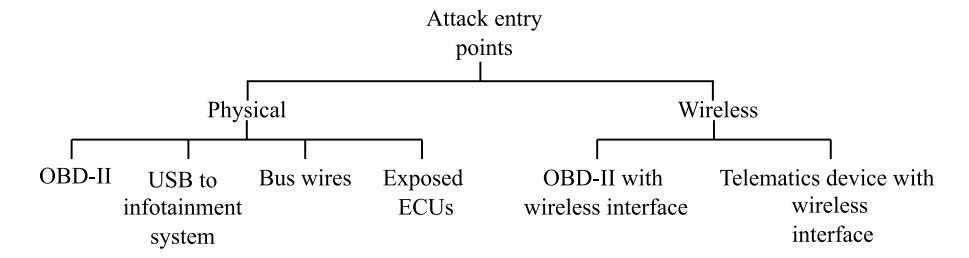

Fig. 17. Taxonomy of entry points for attacks on CAN.

- 2) The approaches for CAN translation can be divided into 5 categories according to the underlying strategy adopted, i) following the signals' semantic taxonomy, ii) based on frame matching, iii) using ML algorithms, iv) based on the injection PIDs, and v) exploiting companion apps.
- 3) Studies on CAN reverse engineering differ significantly from one another not only based on the followed approach, but also according to the requirements, the granularity of the decoded information and their intrusiveness.
- 4) Due to the absence of a standardized benchmark dataset and the highly diverse data collection and testing scenarios, a quantitative comparison of the related work seems unfeasible at the time of writing.

# V. THREATS OF CAN REVERSE ENGINEERING

CAN data have been used widely for academic research on vehicular systems and for innovations in the automotive industry. The progressive automation of CAN bus reverse engineering allows researchers and aftermarket companies to easily obtain CAN data from vehicles and develop innovative automotive services and use-cases. However, this automation also raises significant concerns regarding the security of vehicles, as well as the safety and privacy of drivers and passengers. We will henceforth discuss the main security issues and the potential attacks on the CAN bus and the violations of the privacy enabled by the exploitation of CAN data obtained via reverse engineering.

We also analyze the countermeasures proposed in the literature to prevent and detect attacks on the CAN bus, and preserve the privacy of the driver. We contextualize these countermeasures in the field of reverse engineering with the aim of understanding whether they suffice to prevent the decoding of CAN data formats as well.

#### *A. Attack Surfaces*

The surface on which CAN attacks can be conducted may be *physical* or *wireless*.

Physical entry points are i) the OBD-II port which, as explained in Section [III,](#page-7-0) grants direct access the bus in the absence of a gateway, ii) the USB port to an infotainment system, iii) the bus wiring, and iv) ECUs in accessible areas of the vehicle.

Wireless entry points are i) OBD-II dongle equipped with a Bluetooth, WiFi or cellular interface, ii) infotainment/telematics devices with a Bluetooth, WiFi or cellular interface. Figure [17](#page-19-2) shows the taxonomy of these entry points.

A number of physical access attacks have been demonstrated in related work (see Section [V-C\)](#page-20-0). We argue that, despite showing the dramatic impact of a diverse set of attacks on CAN, adversary scenarios based on physical entry points are unrealistic or very rare. In fact, they assume that the adversary is inside the vehicle during the attack or had prior access to the vehicle and re-flashed the target device to produce the attack at a specific time. In the first case, assuming that the adversary would not care for their own safety, they could still perform other less sophisticated and cyber-oriented hijackings. In the second case, the adversary would not have control over the actual driving session, thus making the success rate of the attack unpredictable.

As discussed in Section [V-C,](#page-20-0) the possibility of remotely accessing the CAN bus opens the door for a number of high-risk hijackings, as it facilitates real-time attacks and diminishes the risk of being caught in suspicious activities. Furthermore, recent advances in Vehicle-to-Everything (V2X) communication technologies and related use-cases [\[10\]](#page-32-9) are expected to boost the spread of Vehicular Ad Hoc Networks (VANETs) [\[90\]](#page-34-17), and thus the likelihood of remote attacks.

A VANET has two types of nodes, the On-Board Units (OBUs) and the Roadside Units (RSUs) [\[11\]](#page-32-10). An OBU is a dedicated module for connected mobility with a wireless interface installed in the vehicle. OBUs are typically connected to the central backbone network of the vehicle (CAN, as of today) or to the OBD-II port which, as explained in Section [III-D](#page-9-0) in most cases permits direct access to it. A RSU is a roadside computing device providing connectivity support for passing-by vehicles. It usually has multiple network interfaces to connect to the vehicles, other RSUs, and Internet Service Providers (ISPs).

In a VANET, vehicles communicate with each other and with infrastructure, sharing traffic, comfort, and entertainment information. As manufacturers are gradually moving to Zonal E/E Architecture, i.e., based on dividing the invehicle networks into zones interconnected by gateways, there will be new OBUs operating alongside legacy ECUs. As a consequence, not every vehicle function will require sensors with wireless interfaces in the future. However, we expect the number of OBUs to grow to address the rising needs of Internet-based services on the market. From the security perspective, this means an increase of the attack surface that an adversary can exploit to gain remote access to the CAN bus. In the absence of proper security mechanisms on the OBUs and/or between them and CAN, e.g., a firewall, accessing these controllers would grant the capability of injecting malicious frames in a similar fashion as [\[91\]](#page-34-18).

#### *B. Adversary Model*

The authors of Cho and Shin [\[92\]](#page-34-19) define two types of adversary:

- *Weak –* The attacker can suspend or stop the ECU from broadcasting particular frames or keep it in listen-only mode, but cannot fabricate frames.
- *Strong –* The attacker has complete control of the ECU and memory data. As a result, in addition to what a weak attacker can achieve, an attacker in control of a completely hacked ECU can launch attacks by inserting arbitrary messages. Even when preventive security mechanisms, such as Message Authentication Code (MAC), are incorporated into the ECUs, a strong attacker can deactivate them because they have complete access to

any data stored in their memory, including data necessary for implementing shared secret keys and other security mechanisms.

#### *C. Types of CAN Attacks*

The following attacks against CAN bus have been identified [\[92\]](#page-34-19):

- *Replay –* An attacker can override the actual value of telemetries and other vehicle functions by continuously replaying the same messages, thus sabotaging the correctly functioning vehicle. Due to the absence of authentication and security checks on the timestamp, the frames are typically accepted by the receiver ECUs.
- *Suspension –* An attacker weakly compromises an ECU, thus preventing it from sending CAN frames. Given that often an ECU requires to receive specific CAN frames from other ECUs to function properly, this attack might not only suspend the target ECU, but also others waiting for its data. In this case, the suspension attack causes Denial of Service (DoS).
- *Fabrication –* A strong adversary generates and injects frames with tampered ID, DLC and data. The purpose of this attack is to subvert any periodic signals that are transmitted by a legitimate safety-critical ECU in order to make the ECUs receiving them inoperable.
- *Masquerade –* It is the combination of a replay/fabrication attack and a suspension attack. To mount a masquerade attack, the adversary needs to compromise two ECUs as a weak and a strong attacker, respectively. The objective of this attack is to manipulate an ECU, while shielding the fact that an ECU is compromised. The adversary has to learn first which messages and at which frequency are sent by its weakly compromised ECU. Then, the adversary suspends/stops the transmission of its weak attacker and utilizes its strongly compromised ECU to inject tampered frames at the right frequency.
- *Flooding –* In this attack, the adversary continuously sends a large number of replayed or fabricated high priority CAN packets (i.e., with low ID), thus causing DoS.

Figure [18](#page-21-0) shows examples of suspension, fabrication and masquerade attacks.

Masquerade attacks have higher success rates than the replay and fabrication attacks [\[91\]](#page-34-18), [\[93\]](#page-34-20). According to our own hacking experience on a Renault Twizy, fabricated and replayed frames typically concur with the frames sent by the original ECU, thus making the attack unstable. The purpose of our attack experiment was to trick the electric vehicle's dashboard (and, therefore, the driver) into believing that it had a full Status of Charge (SoC) when, in reality, it only had a partial charge.

First, we decoded the SoC signals through reverse engineering. Then, by using a ECOM Green CAN logger attached to the OBD-II port and the CANCapture software, we continuously sent frames with tampered SoC at a rate 10 times higher than the original frames. The attack was partially successful: most of the time the SoC and the driving range appeared full

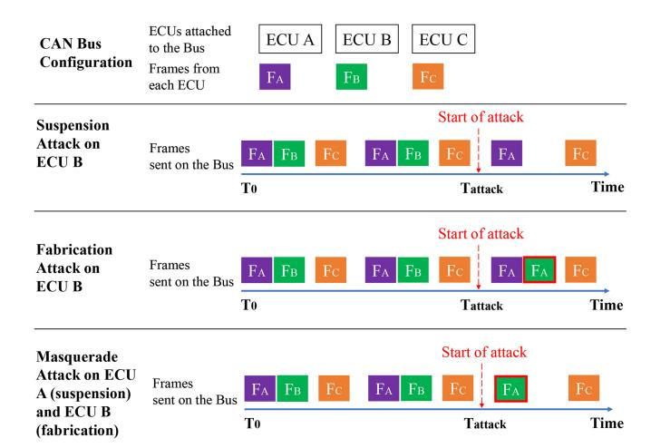

Fig. 18. Examples of CAN Bus with 3 ECU attached – A, B, C – sending frames *FA*, *FB* and *FC* , respectively. The figure illustrates the impact of suspension, fabrication and masquerade attacks on this network. The suspension attack is launched against ECU B. After the attack has started (at time *Tattack* ), the frames from ECU B are suspended from transiting on the bus. The fabrication attack is performed on ECU B to fabricate frames similar to those sent by ECU A. After the attack has started, on the network transit the *FA* frames sent legitimately by ECU A and those fabricated by ECU B. The masquerade attack is conducted on ECU A, which is suspended, and ECU B, which fabricates *FA* frames. After the attack has started, only fabricated *FA* frames sent by ECU B transit on the bus.

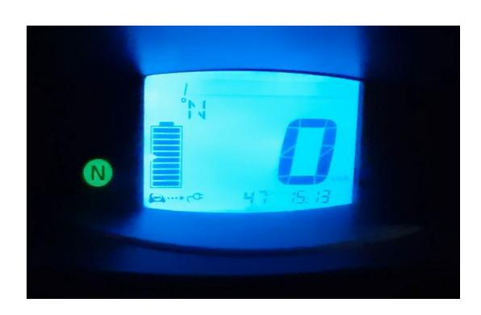

Fig. 19. Successful instance of the fabrication attack: the dashboard displays a full SoC and the maximum driving range (47 km).

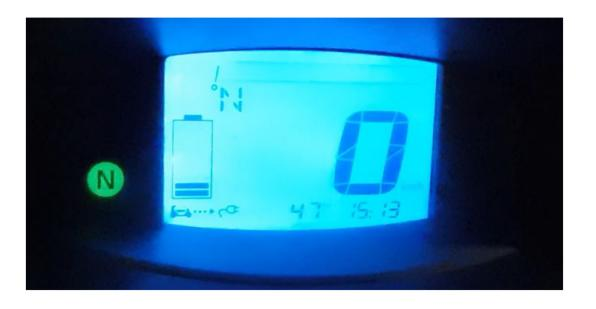

Fig. 20. Unsuccessful instance of the fabrication attack: the dashboard displays maximum driving range (47 km), but the original SoC.

(see Figure [19\)](#page-21-1), but the dashboard would occasionally display the real SoC (see Figure [20\)](#page-21-2) or the real driving range (see Figure [21\)](#page-21-3).

Furthermore, as demonstrated by Miller and Valasek [\[91\]](#page-34-18), some ECU may be programmed to unmount in the case they receive frames at a higher rate than expected. This causes DoS,

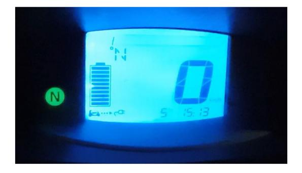

Fig. 21. Unsuccessful instance of the fabrication attack:the dashboard displays a full SoC, but the original remaining driving range (5 km).

but can prevent the more dramatic consequences of an attack targeting critical vehicle functions.

Note that replay and flooding attacks can be conducted without prior knowledge of the semantic of the frames payloads sent by the target ECU. By contrast, if one or more specific vehicle functions are the target of a suspension, fabrication or masquerade attack, a precise understanding of the CAN signals sent by the target ECUs is required. In such a case, an accurate reverse engineering of the frames associated with the target ECUs must be conducted prior to the attack.

Given the critical role that reverse engineering has for these high risk attacks, it is evident that the automation of this process might not only increase the likelihood of them being carried out successfully, but also be an incentive for attackers to achieve them. Furthermore, as detailed in Section [V-E,](#page-23-0) the advent of VANETs poses additional security threats related to automated reverse engineering.

# *D. Related Work on CAN Attacks*

An alarming number of physical and remote attacks against in-vehicle networks posing a threat for the safety of vehicles and passengers have been shown to be successful. Described below are the main attacks against the CAN bus of real vehicles.

In 2010, Koscher et al. [\[94\]](#page-34-21) conducted fabrication attacks targeting a variety of car components, namely the instrument cluster, Body Control Module (BCM), Electronic Brake Control Module (EBCM), and Engine Control Module (ECM). With the help of IdaPro [\[52\]](#page-33-29), a number of CAN signals were initially manually reverse engineered to acquire background information related to the target vehicles' functionalities. Through the OBD-II port, they conducted attacks on real moving vehicles. In the attacks targeting the instrument cluster, they observed an alteration of the fuel level and the speedometer readings. Furthermore, they managed to manipulate the parameters of the engine or disable it. Following a continuous fuzzing method, they also prevented the activation or the release of the brakes.

In 2013, Miller and Valasek [\[93\]](#page-34-20) conducted a series of attacks on a Ford Escape and a Toyota Prius to compromise the operation of a number of sensors. The authors, after completing a laborious process of manual reverse engineering, were able to interpret signals that are associated with a wide range of functions in both vehicles, particularly the speedometer,

| Work                       | Entry point                        | Adversary model | Type of Attack              | Testbed                              | Impact                                                                                                            |
|----------------------------|------------------------------------|-----------------|-----------------------------|--------------------------------------|-------------------------------------------------------------------------------------------------------------------|
| Koscher et al. [94]        | Physical access to the OBD-II port | Strong attacker | Fabrication                 | Real vehicle driven at speed         | Manipulation of the fuel level and the speedometer readings, disabling of the en- gine and the brakes |
| Miller and Valasek [93]    | Physical access to the OBD-II port | Strong attacker | Replay and Fabrica- tion | Real vehicle driven at speed         | A variety of hijack- ings to the dashboard, steering wheel and other vehicle func- tions              |
| Woo et al. [96]            | Remote access to the OBD-II port   | Strong attacker | Replay and Fabrica- tion | Software-hardware simulation testbed | Manipulation of the dashboard, the acceler- ation and the steering wheel, suspension of the engine    |
| Miller and Valasek [91] | Infotainment system                | Strong attacker | Masquerade                  | Real vehicle driven at speed         | The adversary drives the target vehicle from remote                                                               |
| Jafarnejad et al. [95]     | Remote access to the OBD-II port   | Strong attacker | Masquerade                  | Real vehicle driven at speed         | The adversary drives the target vehicle from remote                                                               |
| Palanca et al. [97]        | Physical access to the             | Weak attacker   | Fabrication of target       | Parked real vehicle                  | The target ECU enters                                                                                             |

TABLE VI COMPARISON OF WORKS ON CAN ATTACKS

the odometer, and the steering. Subsequently, they started the process of replacing the frames that were being sent by the authentic ECUs by adopting replay and fabrications attacks. Interestingly, they observed that the steering signals that were being transmitted by the Parking Assist Module (PAM) could not be spoofed to values that were too drastically different from the original value. Rather, for the attack to be successful, the changes had to take place gradually. In addition, the authors were successful in partially denying the service of the steering wheel by saturating the bus with higher-priority signals. As a result, the steering wheel would only turn to a maximum of 45◦.

In a subsequent work, Miller and Valasek [\[91\]](#page-34-18) drove a Jeep Cherokee off the road after gaining control of its infotainment system remotely and injecting messages in the CAN bus. Unlike their previous work [\[93\]](#page-34-20), the authors were unable to operate the Jeep Cherokee's brakes via the Anti-lock Braking System (ABS), which was the attack vector for engaging brakes, through a fabrication attack. In fact, the system was capable of recognizing the attack and turned off preventively. In response to this, they designed a masquerade attack capable of bypassing the ABS's security mechanism.

In a concurrent work, Jafarnejad et al. [\[95\]](#page-34-22) used a masquerade attack to take remote control of an electric vehicle, the Renault Twizy. The authors initially hacked into the Sevcon Gen4 of the vehicle – the main motor ECU – using a bruteforce approach. Then, following a manual reverse engineering approach, they identified the signals related to the throttle pedal, the gear (forward/back) and the brake pedal. Using an Android app connected to an OVMS tool attached to the OBD-II port, they were finally able to remotely drive the vehicle.

Woo et al. [\[96\]](#page-34-23) conducted replay and fabrication attacks related to a wide range of functionalities in a target vehicle, including the engine state, acceleration, speedometer, voice notification, and dash board readings. This was accomplished by decoding the content of frames associated with 7 CAN IDs through manual reverse engineering. Similarly to [\[95\]](#page-34-22), the attack was conducted remotely by using a mobile app communicating with a module attached to the OBD-II port.

In 2017, Palanca et al. [\[97\]](#page-34-24) proposed a type of suspension attack, called *bus-off attack*, which exploits CAN's error confinement policies. In this attack, a malicious node is synchronized to the period of the frames with the targeted ID and overrides recessive bits with dominant bits, thus causing an error frame. After a certain amount of errors, the original transmitter ECU enters the bus-off state and ceases to function. The authors demonstrated this attack against the parking sensors of a Romeo Giulietta.

Iehira et al. [\[98\]](#page-34-25) conducted a masquerade attack on the engine of a hybrid vehicle. In order to successfully substitute the frames of the target ECU, the authors generated three different types of bus-off suspension attacks, i) bit-error based (the same employed by Palanca et al. [\[97\]](#page-34-24)), ii) stuff-error based, and iii) one-frame based.

Table [VI](#page-22-0) summarizes and compares the presented attacks based on their type, the entry point, the adversary model, the testbed employed and their impact on the network.

Note that a number of other relevant attacks targeting ECUs, wireless keys and telematics mobile apps have been performed against vehicles [\[99\]](#page-34-26), [\[100\]](#page-34-27), [\[101\]](#page-34-28), [\[102\]](#page-34-29), [\[103\]](#page-34-30), [\[104\]](#page-34-31). These studies demonstrate the ease with which an adversary can access the vehicle's internal network, specifically the CAN bus. Other related work classifies and discusses security threats on the CAN bus under a theoretical perspective, i.e., without launching attacks on real vehicles [\[105\]](#page-34-32), [\[106\]](#page-34-33), [\[107\]](#page-34-34), [\[108\]](#page-34-35).

However, given that the focus of this survey is reverse engineering, we opted to highlight the attacks on real vehicles that demonstrate the risks directly associated with the exposure of CAN data formats.

## *E. Security Issues*

In the famous Jeep Cherokee attack [\[91\]](#page-34-18) described above, no work on the automation of CAN reverse engineering has yet been presented. As a consequence, the authors spent several months to achieve a precise understanding of the CAN encoding, which is necessary to carry out the attack exactly as it is designed. Additionally, such an attack requires the adversary to have constant access to a vehicle of the same model as the target vehicle during the whole reverse engineering process. Despite the fact that this attack caused initially public stir [\[109\]](#page-34-36), the difficulty and time required for its preparation made the interest of OEMs towards CAN security quickly fade away. As a result, contemporary vehicles are not yet equipped with a secure version of the CAN bus.

The automation of CAN bus reverse engineering, however, is a game changer with respect to the preparation of vehicular attacks. The easing of this process will likely encourage potential adversaries to design a number of new attacks. Similarly, reducing the data collection time implies that the attacker only needs access to a vehicle of the same model as the target vehicle for only a short time span.

This scenario appears even worse if we factor in the current massive reuse of the same ECUs across different vehicle brands and models. As highlighted in [\[24\]](#page-33-1), such a practice seems motivated by economies of scale. Assuming that in the near future the OEMs, following a similar business logic, would equip multitudes of vehicle models with the same OBUs, an attacker would need to compromise just few of them to gain remote access to the internal data of a high percentage of vehicles on the road.

By adopting fully automated reverse engineering techniques, adversaries could also reverse engineer the CAN bus of unknown vehicle models without physical access to them. In such a scenario, they can potentially reverse engineer multiple vehicles and then inject pre-designed vehicle-agnostic attacks in all of them in a single event.

The work in [\[110\]](#page-34-37) focuses on the impact that the reuse of CAN frames – a common practice among the OEMs according to [\[24\]](#page-33-1) (see Section [IV-B\)](#page-13-2) – has on this attack scenario. The possibility to undertake fully-automated remote reverse engineering in a few seconds without requiring any specific activity from the (unaware) driver enables favorable scenarios for large-scale attacks, e.g., a road intersection, a traffic light stop, or a parking lot. The authors demonstrate that simply anonymizing the frames, i.e., changing the IDs, is insufficient to prevent this type of reverse engineering, given they can be successfully deanonymized through ML classification. A subsequent work [\[111\]](#page-34-38) attempts to counteract this deanonymization through traffic mutation techniques, such as padding and morphing. The results show that the

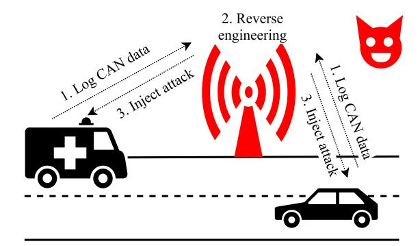

Fig. 22. Remote attacking scenario: a compromised RSU is exploited to log CAN data from two vehicles nearby, reverse engineer the data, and inject a pre-designed vehicle-agnostic attack.

deanonymization accuracy can be halved, but at the expenses of a consistent traffic overhead.

Figure [22](#page-23-1) illustrates an attack scenario in which an adversary reverse engineers and injects tampered messages fully and remotely through a compromised RSU in communication with vehicles on the road.

#### *F. Privacy Issues*

The translation of the CAN data format does not only help adversaries mount the attacks discussed in Section [V-C,](#page-20-0) but also exposes the privacy of the drivers. It has been shown that the signals transiting on the CAN bus can be effectively employed for driver fingerprinting [\[112\]](#page-34-39), [\[113\]](#page-34-40), [\[114\]](#page-34-41), [\[115\]](#page-34-42), [\[116\]](#page-34-43), [\[117\]](#page-34-44), [\[118\]](#page-34-45), [\[119\]](#page-34-46), [\[120\]](#page-34-47), [\[121\]](#page-34-48). Fingerprinting is the identification of single drivers among a pool of individuals based on their driving style.

Driver fingerprinting can be used as a tool for a number of services, including fleet monitoring, usage-based insurance, comfort features, anti-theft mechanisms, etc. However, when exploited by government authorities, insurance companies, or unknown adversaries, the driver fingerprinting enabled by the reverse engineering of CAN can have dramatic implications for the person behind the wheel. This is especially true if we consider the VANET scenarios presented in Section [V-A.](#page-19-3)

If it is reasonable to presume that security threats originate from people or groups with limited capabilities, the identification of drivers and the breach of their privacy on a large scale may be of interest to government agencies in totalitarian nations. Being in control of the road infrastructure, governments would have a privileged remote access to the vehicles all over the country. With the enhanced capabilities of reading clear CAN data offered by automated reverse engineering, they would be able to monitor the activities of the drivers.

In driver fingerprinting, a number of features representative of the driver's behavior are extracted from the CAN signals and external GPS/IMU. Examples of features extracted from CAN signals employed in a number of studies are the frontal acceleration, which is associated with the overall aggressiveness of the driver, and the speed, which is associated with the risk tolerance of the driver [\[113\]](#page-34-40), [\[117\]](#page-34-44), [\[119\]](#page-34-46). Typically, a supervised ML model is then trained to recognize a driver or a group of drivers based on these features.

| Work                      | CAN Signals                                                                 | Extra-CAN data                                 | Model                             | Dataset                                                          | Accuracy                                               |
|---------------------------|-----------------------------------------------------------------------------|------------------------------------------------|-----------------------------------|------------------------------------------------------------------|--------------------------------------------------------|
| Öztürk and Erzin [112] | Gas, brake pedal                                                            |                                                | Gaussian Mixture Model (GMM)   | Uyanik [122], 23 drivers                                      | 85.2 % for 3 drivers                                   |
| Zhang et al. [113]        | Acceleration, gas pedal, RPM                                                | GPS via smartphone                             | Support Vector Ma- chine (SVM) | Own dataset, 14 drivers                                       | 79.9 % for 14 drivers                                  |
| Martinez et al. [114]     | 12 features based on CAN                                                 | 6 features based on IMU sensors                | Extreme Learning Machine (ELM)    | Uyanik, 23 drivers                                               | 97% for 3 drivers, 84.4% for 11 drivers             |
| Hallac et al. [115]       | Steering, RPM, gas pedal, brake pedal, throttle pedal                 | Longitudinal and lati- tudinal acceleration | Random Forest (RF)                | Audi AG and Audi Electronics, 64 drivers                      | 50.1 % for 5 drivers, 76.9 % for 2 drivers             |
| Enev et al. [116]         | Powertrain signals, brake pedal, acceleration, steering               |                                                | RF                                | UCSD, 15 drivers                                                 | 100 % for 15 drivers                                   |
| Kwak et al. [117]         | Brake pedal, accelera- tion, steering                                    |                                                | RF                                | OCSLAB, 10 drivers                                               | 99.5 % for 10 drivers                                  |
| Wang et al. [118]         | RPM, gas pedal, steering wheel, long. and lat. acceleration, speed |                                                | RF                                | Own dataset, 30 drivers                                          | 100% on 30 drivers                                     |
| Jeong et al. [119]        | Acceleration, brake pedal, steering, speed, throttle pedal, RPM             | long. and lat. acceleration                    | CNN, LSTM                         | Own dataset, 4 drivers                                           | 90% for 4 drivers                                      |
| Ezzini et al. [120]       | Car state and dynamics, Electroencephalogram (EEG)                          | GPS via EEG and smartphone                     | RF                                | OCSLAB (10 drivers), HCI-Lab (10 drivers), UAH (6 drivers) | 90 % for OCSLAB, 100 % for HCI-Lab, 76 % for UAH |
| Lestyan et al. [121]      | Gas pedal, brake pedal, speed, RPM                                          |                                                | RF                                | Own dataset, 33 drivers                                       | 77% for 5 drivers                                      |

TABLE VII COMPARISON OF WORKS ON CAN FINGERPRINTING

Table [VII](#page-24-0)summarizes the main related work using CAN data for driver fingerprinting. The table lists the information that is gathered from the CAN signals and from external sensors, the classification model that was used, and the results that were attained in relation to the number of drivers involved in the tests.

As shown in Table [VII,](#page-24-0) the fingerprinting datasets are extremely diverse in terms of signals, number of drivers, and overall size. Consequently, a comparative examination of the related work is quite challenging.

In particular, the accuracy of the presented fingerprinting approaches when considering drivers at large-scale should be thoroughly investigated. Indeed, as discussed in the related work and widely demonstrated in other domains, the computational performance of ML models can consistently degrade as the number of labels increases (in the case of driver fingerprinting, the number of unique drivers) [\[123\]](#page-34-49). Maintaining multiple models, each trained on a restricted group of users based on geographical location and other characteristics, could be a solution for this limitation in the case of pool of drivers in the order of thousands. On the contrary, scalability is a major issue from the perspective of adversaries such as authoritarian governments interested in nationwide monitoring.

Data collection is another challenge associated with driver fingerprinting [\[37\]](#page-33-14). In fact, the entity interested in recognizing the driver at any given time should have data related to one or more of the target individual's driving sessions. A mandatory preliminary driving test can easily achieve this in the case of car fleet management, car rental, or insurance companies. Instead, from an adversary standpoint,

data collection is a significant challenge, particularly when considering remote scenarios.

#### *G. Other Threats*

Other than the violation of vehicle security and the drivers' privacy, there are two other types of fraudulent activities that involve reverse engineering on CAN, *tuning* and *theft of intellectual property*.

Tuning refers to the cases in which the attacker is also the owner of the target vehicle, whose objective is to make unauthorized changes to the code or data contained in one or more ECUs. For instance, the vehicle's owner might be interested in tuning the engine settings to increase its power, reducing the mileage on his car to increase its resale value, or installing unauthorized applications [\[124\]](#page-35-0). Additionally, the owner can attempt to circumvent a specific authentication procedure in order to install inexpensive aftermarket ECUs instead of the more expensive, manufacturer-approved ones.

In this scenario, the reverse engineering of the CAN data provides the user with insights into the functioning of the target ECUs that are useful for implementing the needed software modifications. In particular, automated reverse engineering seems appealing to this class of adversaries as it allows them to obtain the desired information requiring minimal knowledge of CAN and human effort. Other than breaching the sale contract with the vendor, such unauthorized operations (typically conducted by non-expert users) can result in serious safety concerns for the vehicle's passengers [\[125\]](#page-35-1).

If an innovation is not protected by a patent, reverse engineering is often recognized as a legitimate way to gain access to a trade secret under the legislation of the majority of countries [\[126\]](#page-35-2). Thus, the reverse engineering of CAN data can also be legitimately leveraged by OEMs in order to divulge trade secrets related to the operation of ECUs belonging to competitors.

#### *H. Countermeasures*

Numerous solutions have been proposed to secure the CAN bus. A first straightforward approach is *network segmentation* [\[127\]](#page-35-3). Its goal is to limit the damage caused by attacks by splitting the CAN bus into distinct sub-networks. If a subnetwork is compromised, the attack is contained therein and does not propagate to the rest of the network. A gateway handles the communication between sub-networks. This method is currently applied in a number of commercial vehicles, but it presents some evident limitations. Namely, if the gateway is compromised, the attack can be extended to the whole network. Moreover, this solution can increase the maintenance cost of the bus [\[128\]](#page-35-4).

*1) Cryptographic Algorithms:* A theoretically more robust way to ensure data confidentiality and ECU authentication is the use of cryptographic mechanisms for encryption. Although cryptography has been used extensively in traditional computer communication networks, its acceptance in the automotive sector is hampered by three significant problems:

- *Latency* In order to assure the vehicle's and the passengers' safety, some safety-critical control data are subject to stringent latency constraints. The maximum end-toend delay allowed for cyclic control data transferred on the CAN bus can range from few ms to 1 s [16]. Since strong encryption techniques add a non-negligible delay and might prevent the delivery of signals until they are fully encrypted, their deadlines can be missed.
- *Bus Load* To safeguard data integrity, authentication codes, such as MACs, must be attached to the data. However, due to the limited length of standard CAN frame payloads, these codes are likely to be sent in separate frames, thus raising the bus load. A high bus load can cause some CAN frames to miss their stringent deadlines, thus compromising safety. So, the bus load is recommended not to exceed 80 %.
- *Costs for the OEMs* ECUs are resource-constrained for cost reasons. Since the majority of safety-critical activities need simple computations and do not require high-performance hardware, the ECUs are well optimized for repetitive control operations. Typically, ECUs have a clock frequency of less than 100 MHz and a RAM capacity of about 1 MByte. Using cryptographic techniques for encryption would necessitate more powerful hardware, driving up the cost for OEMs. In addition to unit costs, introducing security protocols to legacy ECUs that have been used in vehicles for years without appropriate software updates would raise development costs [\[40\]](#page-33-17).

A number of cryptographic algorithms to ensure the confidentiality of the CAN traffic have been proposed at software and hardware level, such as Advanced Encryption Standard (AES)-128/256 [\[129\]](#page-35-5), [\[130\]](#page-35-6) and Triple Data Encryption Standard (DES) [\[131\]](#page-35-7). However, these algorithms incur unacceptable overload or latency, require modifications to the ECU hardware and/or are not backward-compatible. Furthermore, in these studies replay attacks have not been considered. Replay attacks can be effectively mitigated by simply adding a timestamp/counter in the payload prior to the encryption (at the expense of bus load), as discussed hereinafter.

To support authenticity, a multitude of approaches have been proposed to enable ECUs to verify the source of the frames [\[132\]](#page-35-8), [\[133\]](#page-35-9), [\[134\]](#page-35-10), [\[135\]](#page-35-11), [\[136\]](#page-35-12), [\[137\]](#page-35-13). In addition, AUTOSAR built a module, Secure Onboard Communication (SecOC), based on ECU authentication to prevent tampering and spoofing [\[138\]](#page-35-14). The majority of these algorithms also guarantee a defense against replay attacks through timestamp or counter-based freshness management. However, these algorithms do not provide confidentiality and/or a suitable level of security. In addition, they often cause excessive delay or traffic load [\[139\]](#page-35-15).

To fix the shortcomings of the aforementioned works with respect to bus load and latency, some lightweight cryptographic solutions for data confidentiality and ECU authentication have been proposed [\[140\]](#page-35-16), [\[141\]](#page-35-17). Lightweight cryptography is a kind of cryptography targeted for devices with little computing resources. Following the effort started in 2018 by the National Institute of Standards and Technology (NIST) to meet the requirements of the rising Internet-of-Things (IoT) applications, lightweight cryptography aims at reducing the usage of memory, processing power, and energy.

Halabi and Artail [\[140\]](#page-35-16) presented a lightweight protocol for securing the CAN bus inspired by the Blockchain technology [\[142\]](#page-35-18). Their technique ensures authenticity, freshness, and confidentiality via the combination of encryption and key creation using hash chains. The protocol was evaluated on a physical testbed and proved effective against replay and spoofing attacks. Given that CAN is susceptible to errors and that frame retransmission impacts latency, it is unclear how packet loss can be dealt with immutable hash chains.

In 2019, Lu et al. [\[141\]](#page-35-17) proposed Lightweight Encryption and Authentication Protocol (LEAP), a cryptographic protocol based on Rivest Cipher 4 (RC4), a lightweight stream cypher. To deal with the low security offered by RC4 alone, the authors implemented a process for key update and distribution based on AES and Secure Hash Algorithm (SHA). After the key update and distribution phase pairs of ECUs have a symmetric session key to lead an encryption and authentication process based on RC4. Other than traffic overload, the initialization and distribution of keys among pairs of ECUs might introduce the difficulty to scale.

Following a different approach, Pesé et al. [\[139\]](#page-35-15) proposed Sufficiently Secure CAN (S2-CAN), a software-based solution composed of two main phases that alternate iteratively (i) the handshake – during which a number of parameters are securely shared between the ECUs, and (ii) the operation phase – during which the ECUs send lightly encrypted and authenticated frames that are decoded by the receiver ECUs based on the parameters shared during the handshake. The main novelty of this approach is the circular shift of the bytes in the payload, i.e., the dynamic relocation of data content across the payload.

| Work                    | Protection                               | Issues                                                                                               | Impact on reverse engineering |
|-------------------------|------------------------------------------|------------------------------------------------------------------------------------------------------|-------------------------------|
| CANAuth [132]           | Authenticity, freshness                  | No confidentiality                                                                                   | No protection                 |
| CaCAN [133]             | Authenticity, freshness                  | High bus overload, low security level, no confidentiality                                            | No protection                 |
| VeCure [134]            | Authenticity, freshness                  | 2 bytes reserved in the payload, no confidentiality                                                  | No protection                 |
| IA-CAN [135]            | Authenticity, freshness                  | High Latency, low security level                                                                     | No protection                 |
| LeiA[143]               | Authenticity, freshness                  | High bus overload                                                                                    | No protection                 |
| VatiCAN [136]           | Authenticity, freshness                  | Medium-high bus overload, medium-high latency, no confidentiality                              | No protection                 |
| VulCAN [137]            | Authenticity, freshness                  | Medium-high bus overload, no confidentiality                                                         | No protection                 |
| Halabi and Artail [140] | Confidentiality, authenticity, freshness | Low resistance to packet loss                                                                        | Full protection               |
| Lu et al. [141]         | Confidentiality, authenticity, freshness | Medium bus overload, low scalability (?)                                                             | Full protection               |
| S2-CAN [139]            | Confidentiality, authenticity, freshness | Lack of key management, unclear support for little endianness, 2 bytes reserved in the payload | High level of protection      |

TABLE VIII SUMMARY OF COUNTERMEASURES AGAINST SECURITY AND PRIVACY THREATS

S2-CAN guarantees confidentiality, authenticity, and freshness, while ensuring high security, low latency, and low communication overload (it is introduced in the handshake phase only). S2-CAN also consistently hinders tokenization due to the dynamic changes in the position of the signals within the payload. However, three major aspects have to be addressed: (i) key management – the authors do not provide any clear indication on how the keys needed for the handshake should be securely embedded in the ECUs, (ii) endianness – it is not clear how little-endian data should be interpreted given the dynamic circular shifting of the bytes, and (iii) the payload length – 2 unused bytes, i.e., not containing signals, should always be present in the payload, as the freshness parameters are allocated in them. Table [VIII](#page-26-0) summarizes the main related work on CAN attacks prevention.

*2) Intrusion Detection Systems:* While the goal of encryption is to prevent attacks, intrusion detection serves as a reactive security mechanism. Similarly to other systems, a combination of prevention mechanisms and intrusion detection has been suggested for CAN. In particular, due to the aforementioned constraints of cryptography with respect to CAN, intrusion detection seems to be approach mostly investigated in the literature.

Two categories of IDS can be identified: *signature-based* and *anomaly-based*. Signature-based systems establish a taxonomy of known attacks and scan the CAN traffic to find a match with any of them. Anomaly-based systems, instead, observe the ECUs and CAN traffic in search of behaviors that deviate from the usual nature of the network. The methodologies for anomaly-based IDS can be grouped as (i) physical characteristics-based [\[92\]](#page-34-19), [\[144\]](#page-35-19), (ii) sending frequency-based [\[145\]](#page-35-20), [\[146\]](#page-35-21), [\[147\]](#page-35-22), (iii) feature-based [\[148\]](#page-35-23), [\[149\]](#page-35-24), or (iv) specification-based [\[150\]](#page-35-25), [\[151\]](#page-35-26). Anomaly-based IDSs generally achieve lower detection performance than the signaturebased ones but are capable of detecting previously unknown attacks.

IDSs are popular because they do not typically require substantial changes to the CAN protocol and add low or no overhead to the communication stream. While they have shown to be an efficient countermeasure against attacks on the CAN bus, they cannot prevent reverse engineering. In fact, the assumption of IDS is that adversaries have an *active* role in the attack, i.e., they actively inject tampered information into CAN. Similarly, authentication systems are not sufficient to prevent adversaries from sniffing the CAN traffic. On the contrary, the logging of data to perform automated reverse engineering is a *passive* task that does not alter the regular traffic. Hence, IDSs cannot detect suspicious activities.

In principle, it would be possible to adapt IDS to recognize the abnormal request of PIDs, as it implies an alteration of the traffic. However, diagnostics requests are a useful tool employed by car electricians in their daily job. We argue that it is unlikely that a tool would manage to distinguish between the usage of PIDs for diagnostic purposes and for reverse engineering, since the type and timing of the requests is highly arbitrary. Moreover, since most PIDs address emissions-related parameters, their usage could become limited with the advent of EVs.

In conclusion, more work is needed to identify solutions compliant with the constraints of CAN bus and the business logic of the OEMs.

## *I. Key Takeaways*

In this section, we introduced and structured related work on the threats against CAN. In particular, we assessed the impact that the exposure of CAN data format as a consequence of reverse engineering has on the security of the vehicles and the safety and privacy of drivers and passengers. The countermeasures proposed in the literature were discussed as well, with the intent of understanding whether they are sufficient to prevent attacks on CAN and further anonymize the data transiting on the bus.

The following is a list of the most important takeaways from this section:

- 1) Many physical and remote attacks against CAN have been demonstrated in the literature, targeting the availability and the proper operation of a variety of vehicle functions.
- 2) The insights on the data format provided by the reverse engineering is essential to launch suspension, fabrication and masquerade attacks. The latter type of attacks, in particular, allows an adversary to take full control of the vehicle.
- 3) The full automation of the reverse engineering process substantially eases the work of potential adversaries in VANETs, thus increasing the likelihood of attacks against the network. It also potentially paves the way to large-scale attacks.
- 4) Related work demonstrates that drivers can be identified based on the telemetries contained in CAN signals. Hence, exposing CAN signals formats through automated reverse engineering can leak information of a large number of drivers.
- 5) The CAN data formats obtained through reverse engineering can be exploited by hobbyists for the tuning of their vehicles, thus exposing them to safety risks.
- 6) CAN reverse engineering can be used by OEMs to discover the design secrets of the competitors related to a variety of vehicle components.
- 7) The countermeasures proposed so far do not seem to meet the constraints of CAN and/or the needs of the OEMs.

#### VI. FUTURE WORK

We discuss the possible future directions that the research on CAN reverse engineering could follow to improve the performance and optimize the procedures, based on our evaluation of the techniques proposed in the literature thus far.

#### *A. Improving CAN Reverse Engineering*

We have analyzed the state-of-the-art techniques for semiand fully-automated reverse engineering proposed in the literature. As discussed in Section [IV,](#page-10-0) the presented methodologies largely vary in terms of performance, number of properties of the signals decoded, requirements, as well as computational complexity and time needed for data collection. In what follows, we suggest three possible areas of improvement that should be investigated further.

*1) Generalization:* Work on CAN reverse engineering has produced promising results in real-world scenarios. As for tokenization, recall and precision higher than 80 % were achieved by multiple algorithms on different vehicles [\[21\]](#page-32-20), [\[24\]](#page-33-1), [\[61\]](#page-33-38), [\[79\]](#page-34-6). A high precision was also achieved when translating the semantics and/or the format of signals [\[21\]](#page-32-20), [\[24\]](#page-33-1), [\[61\]](#page-33-38). However, the performance consistently varies with vehicles. CAN reverse engineering should be reliable and consistent when considering any vehicle model.

Furthermore, little has been done on EVs, and none on motorbikes, hydrogen-propelled vehicles, and autonomous

cars. The types of ECUs embedded in these vehicle categories can differ substantially from the ones in classic vehicles, i.e., manual gas-propelled cars. As a consequence, supervised ML and taxonomy-based approaches need to be adapted to account for this diversity. Moreover, since PIDs were developed with the intent of monitoring emissions in oil and diesel vehicles, their usage is limited on EVs and hydrogen vehicles.

A comparative analysis should also be conducted to understand how the performance varies with the number of ECUs attached to the bus. Intuitively, fewer types of frames transmitted on the bus correspond to a lower number of ECUs, thus reducing the complexity of data to be analyzed and the translation mislabeling. Given that motorbikes have typically fewer ECUs than cars and trucks [\[152\]](#page-35-27), we can expect more accurate reverse engineering for them. On the other hand, the reverse engineering would likely be more difficult on autonomous vehicles due to the higher number of ECUs [\[153\]](#page-35-28), which are necessary to handle the complexity of autonomous driving. Moreover, the validation should be done while accounting for the market segment of the vehicle. In fact, high-end vehicles transmit a greater variety of CAN frames than low-end ones, due to more installed ECUs [\[154\]](#page-35-29). Further research is needed to extend the findings from classic cars to EVs, motorbikes, hydrogen vehicles, and autonomous cars, while taking into account their market segment.

- *2) Combination of Multiple Approaches:* To improve the automation, robustness and performance of reverse engineering, we recommend a combination of the approaches discussed thus far. PIDs could be used to preliminarily decode all vehicle functions for which ground truth is publicly available. A taxonomy-based approach could be employed to reverse engineer signals missed in the first step. Finally, unsupervised and/or supervised ML problems could identify the signals sharing redundant information with those already decoded. Using this combined approach, a diverse dataset of DBC files could be generated. Frame matching could be employed on new target vehicles to efficiently reverse engineer frames already known. The previously-used techniques could still be employed to augment the DBC dataset, and thus improve the performance of frame matching, as illustrated in Figure [23.](#page-28-0)
- *3) Modularity:* Every year, new ECUs are introduced on the market to offer the latest features and services in vehicles, ranging from infotainment to connectivity. These ECUs send frames containing novel signals carrying new information semantically different from what has been previously encountered. Reverse engineering tools should be designed following a modular architecture to allow the continuous release and integration of updated software to address these new frames. As an example, in supervised ML-based tools the models should address open set recognition [\[155\]](#page-35-30), i.e., being capable of discarding samples from unknown classes, or being iteratively re-trained/updated to include new classes of signals. In case of the taxonomy-based approach, this upgrade would involve not solely the software, but also the integration of additional steps in the data-collection pipeline.
- *4) Remote Reverse Engineering:* Until recently, CAN reverse engineering has been performed by having physical access to the vehicle. While most of the work analyzed in this

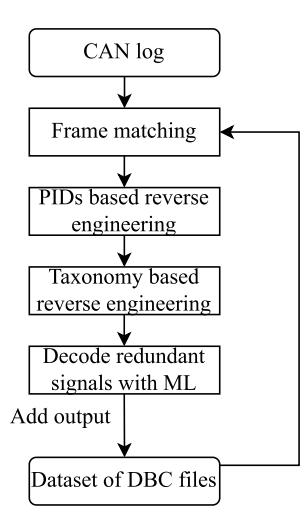

Fig. 23. Proposed pipeline for combined reverse engineering.

paper allows decoding the CAN traffic completely remotely once the log has been extracted, data collection has always been performed with the presence of an aware human operator inside the vehicle. Today, there are several dongles that allow remote collection of CAN data [\[156\]](#page-35-31). These dongles usually connect to the OBD-II port and send the data through a wireless interface to the cloud for processing and storage.

We argue that collecting CAN data remotely can improve the performance of reverse engineering, since it allows collection of traces in a variety of driving scenarios over time. This is especially true for taxonomy-based methodologies that would potentially not require anymore a proactive and aware user, as mentioned in Section [IV-B.](#page-13-2) Instead of having a human operator wittingly performing the actions needed to collect the data, it would be possible to identify scenarios where the same actions are carried out by logging the sessions of an unaware driver over a long period.

A context-aware model, i.e., a representation of typical driving scenarios, could help isolate subsets of signals and trigger the related function for their reverse engineering. Following the suggestion of combining multiple reverse engineering approaches, this context-aware model could be a supervised ML model. For example, it would be possible to isolate and decode the signals related to the wipers by comparing logs collected in sunny days with others in rainy days with the help of weather data.

#### *B. Performance Evaluation of CAN Reverse Engineering*

As mentioned in Section [IV-C,](#page-17-0) the approaches that have been presented in Section [IV](#page-10-0) are extremely varied in terms of the equipment requirements, testbeds, and evaluation metrics. Furthermore the majority of discussed works were developed in conjunction with industrial partners and are, thus, subject to non-disclosure agreements, which prevented the release of open source code and datasets. While the pseudocode of tokenization algorithms is sufficient to compare them against each other (as discussed in Sections [IV-A](#page-10-3) and [IV-C\)](#page-17-0), these aforementioned aspects largely contribute to the difficulty of reproducing experiments on CAN signals translation, thus hindering a fair comparative evaluation.

Unlike other research domains, at the time of this writing, there is a lack of publicly available datasets that serve as a widely accepted baselines against which evaluating CAN reverse engineering tools.

Comma AI were the first to release an extensive dataset of DBC files. While the collection of DBC files contained in Comma AI's open repository OpenDBC [\[76\]](#page-34-3) is remarkable (50+ vehicle models are included in the dataset), the files present inconsistencies in the format (some traces are even in different languages). Furthermore, since no CAN trace is present in the dataset, it is up to the researcher to collect the data from the vehicle model related to the DBC file of interest.

Zago et al. [\[157\]](#page-35-32) released a dataset of several hours of CAN traces related to 5 vehicle models suitable for reverse engineering. Nonetheless, no ground truth is associated to the traces, since the repository does not contain any DBC file. Unfortunately, OpenDBC does not contain any DBC related to the vehicle models present in this dataset. As a consequence, so far it is not possible to use these two datasets jointly.

For the aforementioned reasons, we urge the scientific community to cooperate for the open sourcing of an extensive and standardized dataset to allow a fair comparison of CAN reverse engineering methodologies.

The ideal dataset for the benchmarking of CAN reverse engineering should have the following characteristics:

- It should contain CAN traces collected from a real vehicle in a real driving scenario.
- It should contain CAN traces related to driving sessions in which a defined set of PID requests were made to the vehicle.
- Detailed information on the vehicle, such as model and year of production, should be provided.
- Information regarding the hardware and software employed to log CAN data from the vehicle should be given.
- Complementary GPS and IMU data related to the test driving session, as well as relevant information regarding the environmental, traffic and road conditions, should be provided. The aim of this data is to offer a complete overview of the driving session. Furthermore, this data is sometimes required for the functioning of the reverse engineering tools themselves, as presented in Section [IV.](#page-10-0)
- A DBC file should be associated to each CAN trace, to serve as ground truth. While it is unrealistic to demand that all the DBC files should be complete (i.e., to contain a complete mapping of the CAN traffic), ground information regarding a core set of vehicle functions should be always provided. The composition of this core set of reference should be defined beforehand by the open source community. Finally, the format of the DBC files should be standardized.

While the described dataset would not be sufficient to test all CAN reverse engineering approaches, e.g., companion appsbased tools still require additional hardware, it would cover the majority of current methodologies. Furthermore, the availability of such a dataset would consistently lower the entry barrier in the topic for newcomers. As of today, in fact, a researcher willing to work on CAN reverse engineering would need to i) physically access multiple vehicles, ii) have a CAN logging tool, iii) use other hardware for the collection of GPS/IMU data, iv) have access to DBC files of the target vehicles.

With a large, public, and standardized dataset, it would be finally feasible to explore a number of additional aspects, such as comparison of performance variation across different models, brands and market segments.

Intuitively, for instance, high-end vehicle models should be more difficult and/or require more time to reverse engineer than lower-end ones, due to the larger number of ECUs installed onboard, and thus signals transiting on the bus. Stateof-the-art reverse engineering solutions have been altogether tested on a large number of different vehicle models, thus making the validation of thesis like this achievable in principle. However, due to the diversity of requirements and testbeds in the individual works, it is impossible to aggregate their results to reach this conclusion.

DETROIT, a recent work by Pesé et al. [\[158\]](#page-35-33), is designed with the goal of becoming the first end-to-end framework to cover the collection, reverse engineering, and distribution of automotive data. It consists of a frontend, a backend, and an open-source developer portal. The tool was tested on two vehicles, showing promising results in terms of reverse engineering accuracy, usability and time performance.

A current constraint of DETROIT is that it relies solely on LibreCAN [\[61\]](#page-33-38) for reverse engineering. The framework's modularity and adaptability should be enhanced so that a variety of reverse engineering tools can be integrated, to enable the scientific community to perform independent, comparable research.

In conclusion, we believe that open source initiatives such as DETROIT will not only simplify quantitative comparison of existing reverse engineering techniques, but would also attract and motivate a broader audience to begin contributing to this topic.

#### *C. Reverse Engineering Multiplexed CAN Frames*

Some OEMs have recently started multiplexing different sets of signals in frames with the same ID [\[159\]](#page-35-34). In simple multiplexing, the value of a reference signal, called *multiplexor*, is used to identify the set of signals that can be found in the same frame. In extended multiplexing, there are multiple hierarchically-ordered multiplexors that define the contents of a frame. Similarly to the standard frames, frames with multiplexed payloads are sent periodically. However, in order to avoid collisions among frames associated with the same ID, each frame is sent according to a delay with respect to the base period of the cycle [\[160\]](#page-35-35). Figure [24](#page-29-0) shows an example of multiplexed frame with 4 multiplexor values (associated with the same number of contents), whose basic cycle is 100 µs.

So far, the reverse engineering of CAN has focused exclusively on simple CAN frames without multiplexed payloads. Multiplexing data in each CAN frame can greatly affect the performance of existing methodologies, in particular, tokenization. In fact, tokenization assumes that consecutive frames

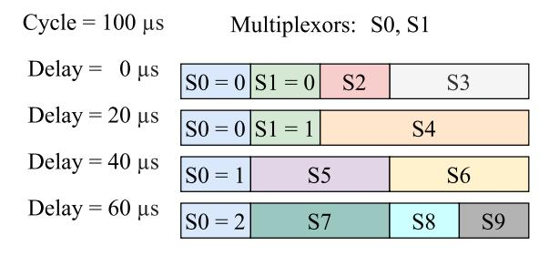

Fig. 24. Example of extended multiplexing. S0 and S1 correspond to the multiplexor signals. Each combination of values uniquely identify a subset of signals.

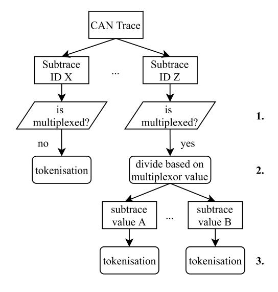

Fig. 25. Proposed pipeline for reverse engineering CAN with multiplex frames.

identified by the same ID carry the same signals within the same positions in the payload. This assumption is no longer valid in the case of multiplexing. All existing tokenization algorithms output a single set of tokens uniquely identified by their start and end position. Since different sets of tokens can be associated with the same ID in the case of multiplexing, they would produce spurious results. For instance, in case of BFR-based algorithms, the bits of the payload carrying different signals flip independently, thus leading to inconsistencies in the BFR array.

However, we argue that, by following the steps presented in Figure [25,](#page-29-1) current methodologies can be efficiently adapted to deal with multiplexing. Instead of evaluating the time series of an ID as a whole, one can first focus on preliminarily identifying whether the payload is multiplexed (step 1) and, if yes, locate the multiplexor signal(s). Step 1 could be achieved by looking for correlations between the flipping of certain bits of the payload, suspected of being the multiplexors, and the dynamicity of the rest of the payload. Assuming that the multiplexors are always located at the beginning of the payload, we could evaluate all the possible combinations of consecutive bits in the first byte to identify cyclical patterns. Once the multiplexor is known, it would be sufficient to split the time series into sub-time-series, each corresponding to one Level of Automation

0 - No Automation

tomation

1 – Driver Assistance

2 - Partial Driving Automa-

3 - Conditional Driving Au-

4 - High Driving Automation

5 - Full Driving Automation

| SAE CLASSIFICATION OF AUTONOMOUS VEHICLES                                                                   |
|-------------------------------------------------------------------------------------------------------------|
| Description                                                                                                 |
| The vehicle emits warnings and may act momentarily, but it lacks persistent control.                        |
| A singular automated system for driver assistance, such as steering or accelerating, is integrated into the |
| design of the vehicle (cruise control). The human driver continues to monitor the other parts of driving,   |
| such as steering and braking. Adaptive cruise control is considered to belong to this level.                |
| The vehicle can control both the steering and acceleration. The automation in this scenario is not quite    |
|                                                                                                             |

places and modalities defined by the legal framework and the technological infrastructure

the same as self-driving because a person is still in the driver's seat and has the ability to take control of

The vehicle is equipped with environmental detection and is able to make decisions on its own. The

driver is still responsible for maintaining vigilance and being prepared to take control in the event that

The vehicles can drive in full autonomy, but are limited by geofencing, i.e. they can be used only in

Geofencing is not applied and the vehicles are able to go anywhere and perform any task that can be

TABLE IX

value of the multiplexor (or combination of values in the case of multiple multiplexors) (step 2), and apply the target tokenization algorithm (step 3).

the vehicle at any time.

the system is unable to complete the assignment.

completed by an expert human driver.

#### D. CAN FD Reverse Engineering

As discussed in Section III, the major differences of CAN FD from CAN 2.0 are the higher data transfer rate and the presence of extended frames, whose payload length increases from a maximum of 8 Byte to 64 Byte. A higher data rate does not affect the reverse engineering process as long as the chosen dongle for data collection is capable of recording all the transiting CAN traffic without loss. As for the extended frames, all the techniques presented in this survey can be potentially adapted to take into account the increased length of the payload. However, the resources and time required for algorithms that have a high computational complexity may grow exponentially. As a consequence, we suggest that future research on CAN FD reverse engineering should also be conducted and benchmarked with a particular focus on the computational complexity.

#### E. Key Takeaways

In this section, we proposed possible directions for future research. The following is a list of the most important takeaways from this section:

- 1) CAN reverse engineering methodologies could be improved i) through generalization to make them more versatile, ii) by combining multiple complementary approaches proposed in the literature to increase the accuracy, iii) by designing them to be highly modular for adaptability to new ECUs, and iv) by making them entirely remote, to ease the process.
- 2) Researchers should work on building a standardized dataset to favor performance comparison among different studies and attract newcomers. Based on the requirements of the majority of published studies, we elaborated a complete list of features that such a dataset should have.
- 3) Reverse engineering should be studied on traffic containing multiplexed frames.

4) Reverse engineering should be studied on CAN FD traffic

#### VII. FUTURE OPPORTUNITIES

The automotive industry is undergoing significant changes. A variety of new mobility services are being implemented and will soon be offered, ranging from intelligent traffic management to platooning [161], [162]. The two main disruptions are brought by the progress in the level of automation in driving and the evolution of wireless V2X connectivity. In this section, we reflect on the strong interconnection between autonomous vehicles and in-vehicle networks and discuss how CAN reverse engineering can help realize the full potential of these two technologies.

#### A. Autonomous Vehicles

Autonomous vehicles are expected to bring disruptive changes to our daily lives and businesses [163], [164], [165]. Table IX describes the different levels of automation, as defined by the Society of Automotive Engineers (SAE) required to achieve fully driverless capabilities. As shown in the table, each level represents a consistent step toward fully automated driving. At the current stage, commercial vehicles are gradually shifting from Level 2 to Level 3 [166].

Levels 4 and 5 of automation are expected to bring significant benefits to society, such as a sharp decline in road fatalities (estimated at -90%) and a significant reduction in emissions of pollutants (estimated at -60%) [167]. In addition, billions of dollar are expected to be saved by consumers.

However, there are many challenges and concerns that need to be addressed before such levels of automation can be achieved [168], [169]. Yaqoob et al. [168] identify six key requirements that need to be addressed: i) high fault-tolerance, ii) strict latency, iii) robust architecture, iv) efficient resource management, v) fine-grained localization services, and vi) high levels of security and privacy.

## B. Wireless V2X Connectivity

When something unexpected happens, autonomous cars are pushed to their breaking point. If there is any ambiguity about the situation, the autopilot will make a decision to deactivate the device for safety reasons, and the task of driving would then be handed back to a human driver. However, critical situations could also be handled by remotely controlling the vehicle [\[170\]](#page-35-45). Currently, remote vehicle control is only possible with an adequate CCAM infrastructure supported by 5G.

In addition to offering significantly higher bandwidth and lower latency than LTE, 5G offers numerous advantages for inter-vehicle communications [\[13\]](#page-32-12), [\[171\]](#page-36-0), [\[172\]](#page-36-1), [\[173\]](#page-36-2). *Network slicing* is often considered to be one of the main innovations of 5G. Virtual network layers are separated within the core and radio access network. For autonomous vehicles, this means that safety-related data traffic will be prioritized over other non-safety services.

Another benefit is the data processing and storage in data centers located near transportation routes. These *edge* data centers allow the network to process data even faster. The virtual network layers and short transmission paths ensure the key quality features of 5G technology. This can improve traffic flow by, for example, allowing vehicles to move faster or slow down when necessary.

While trials of V2X connectivity based on 5G are underway around the world [\[174\]](#page-36-3), the scientific community and the mobile operators are working to define the characteristics of the next-generation cellular networks, i.e., 6G [\[175\]](#page-36-4), [\[176\]](#page-36-5). In addition to autonomous driving, 6G will be used to better support the automotive use-cases already enabled by 5G and many more [\[14\]](#page-32-13), [\[177\]](#page-36-6), [\[178\]](#page-36-7). The Automotive Edge Computing Consortium (AECC) identifies four areas where 6G can bring significant innovation [\[179\]](#page-36-8), as listed below:

- • Critical asset protection and public safety – the increased bandwidth and device density provided by the 6G infrastructure provides can support the ability to remotely detect threats and monitor the health of people and connected devices.
- Vehicle Sensing and Cyber-Physical Fusion the ability to quantitatively assess and explore the physical environment of cyberspace.
- Mobile Holograms Displays that show 3D holograms have the potential to usher in the next-generation of infotainment systems [\[180\]](#page-36-9).
- • Augmented Reality (AR) – Additional AR options will be available in the vehicle as a result of the increased wireless bandwidth and hardware capabilities brought about by 6G.

# *C. CAN Reverse Engineering for CAM*

Vehicle sensors are fundamental to achieving cooperative awareness in connected and automated driving scenarios. These sensors are, for example, intelligent camera systems that enable vehicles to detect and share data about obstacles, traffic, road conditions, and so on.

In addition to being equipped with wireless interfaces, these devices are also typically connected to other ECUs in the vehicle via wired networks to ensure a flow of real-time vehicle status information. Due to the superior data throughput

required to support these new applications, OEMs are investing heavily in Automotive Ethernet [\[181\]](#page-36-10), an adaptation of traditional Ethernet for in-vehicle networking, which provides high bandwidth and deterministic communication.

Nevertheless, as discussed in Section [I,](#page-1-0) CAN buses are expected to be integrated into new in-vehicle network architectures as subsystems connected to an Automotive Ethernet backbone network due to their unique characteristics: robustness, and low manufacturing and maintenance costs. CAN bus reverse engineering will thus enhance its role in helping aftermarket companies to read plaintext data from inside vehicles and to develop new commercial solutions.

As discussed in Section [VI-A,](#page-27-2) we anticipate that the evolution of the above technologies could significantly increase the complexity of CAN reverse engineering. A new generation of methodologies for automating this process is likely to emerge, further stimulating debate in the scientific community.

#### *D. Key Takeaways*

In this section, we discussed the impact of autonomous vehicles on the automation of CAN reverse engineering. The following is a list of key takeaways from this section:

- Autonomous vehicles and new generation cellular networks, such as 5G and 6G, are driving the definition of new services and business cases in the automotive sector;
- • Despite the rise of Automotive Ethernet as the backbone of in-vehicle networking systems, CAN will remain in the form of zonal subsystems;
- The new use-cases enabled by technologies in the areas of self-driving vehicles and cellular connectivity will increase the need to read real-time in-vehicle data to monitor the vehicle status. CAN reverse engineering will therefore continue to be a source of debate and innovation in academia and automotive industry.

#### VIII. CONCLUSION

With the advent of V2X wireless connectivity and the evolution of vehicular services and associated business models, aftermarket and telematics companies are hungry for in-vehicle data. This information is used to monitor and predict the health of vehicles and their components. Most of this data comes from CAN, the world's most widely recognized and deployed protocol for in-vehicle networks.

Since CAN data is not easily interpretable, CAN bus reverse engineering has emerged as a prominent research topic in the field of in-vehicle communication. Its purpose is to infer the location, semantic meaning, and format of signals transiting on the bus. This output can be used for real-time interpretation of CAN data, a valuable source of information for researchers and companies developing innovative solutions in the automotive sector.

In this survey, we identified the characteristics to define a reverse engineering approach manual, semi-automated or automated. We then presented a comprehensive review of the state-of-the-art methodologies in CAN bus reverse engineering. We provided the first categorization of tokenization and translation algorithms based on the common ground characteristics of the followed approaches. Furthermore, we identified the strengths and weaknesses of each of these approaches to provide a benchmark for future research. Due to the lack of a standardized dataset for quantitative comparison in the literature, we proceeded to evaluate the related work based on a number of criteria, including decoded properties, requirements, intrusiveness, and achieved level of automation.

We then discussed the implications of automated CAN reverse engineering for network security, driver safety and privacy, and OEM intellectual property infringement. Regarding network security threats, we summarized the major attacks on CAN in the literature. In particular, we highlighted the fundamental role that CAN reverse engineering plays in highimpact attacks. We then discussed the potential risks associated with fully automating the reverse engineering process in highly connected mobility scenarios. This analysis suggests that the automation of this process has a negative impact on the security of the network and can potentially lead to large-scale remote attacks.

Regarding driver privacy violation, we introduced and compared the main related work on driver fingerprinting exploiting CAN data. In this context, we concluded that the demonstrated ability of ML models to link CAN data to drivers, combined with the access to clear CAN data provided by reverse engineering, poses a threat to driver privacy. We have discussed the privacy concerns for drivers in highly connected mobility scenarios in authoritarian countries.

In this context, we evaluated whether the countermeasures proposed in the literature against security, safety, and privacy threats are sufficient to prevent not only the attacks, but also the reverse engineering. According to our analysis, these defenses are insufficient and/or not commercially viable.

Based on the results of our analysis, CAN reverse engineering is a double-edged sword. On the one hand, CAN reverse engineering is a truly beneficial tool for researchers and aftermarket companies, which can use it to explore and implement new services and solutions, thus contributing to the progress of intelligent transportation systems. On the other hand, it poses significant security and privacy threats that should be addressed by the OEMs.

Future research should aim to define the theoretical limits of automated CAN bus reverse engineering in terms of equipment requirements, time complexity, and output accuracy. In particular, researchers and companies should improve the current solutions to make them more reliable, faster, and more general. When it is applicable, a combination of multiple approaches could provide better performance than using each of them alone.

In addition, reverse engineering of new generation CAN-FD and multiplexed frames should be explored. We believe that with minor additional modifications it is possible to fully exploit all the proposed solutions. Future work should focus on validating our assumptions.

With the intention to facilitate future research and to attract new researchers to the topic, we have outlined the fundamental principles for the creation of a first standardized dataset for the quantitative comparison of CAN reverse engineering work.

Finally, we have presented the opportunities offered by CAN reverse engineering with respect to future technologies for CCAM. We believe that aftermarket and telematics companies will need access to real-time in-vehicle data describing the state of the vehicle in order to support their operations.

#### REFERENCES

- [\[1\]](#page-1-1) T. Derenda, M. Zanne, M. Zöldy, and A. Torok, "Automatization in road transport: A review," *Prod. Eng. Arch.*, vol. 20, pp. 3–7, Sep. 2018.
- [\[2\]](#page-1-2) M. Bertoncello, "Monetizing car data—New service business opportunities to create new customer benefits," McKinsey Company, Atlanta, GA, USA, 2016.
- [\[3\]](#page-1-3) S. Leibson. "A history of early microcontrollers, part 5: The Motorola 6801." 2022. [Online]. Available: https://www.eejournal.com/article/ahistory-of-early-microcontrollers-part-5-the-motorola-6801/
- [\[4\]](#page-1-4) "Robert bosch GmbH." Accessed: Feb. 10, 2023. [Online]. Available: https://www.boschautoparts.com/
- [\[5\]](#page-1-5) *Road Vehicles—Controller Area Network (CAN)—Part 1: Data Link Layer and Physical Signalling*, Int. Org. Standard., Standard ISO 11898-1:2015, Dec. 2015.
- [\[6\]](#page-1-5) *Road Vehicles—Controller Area Network (CAN)—Part 2: High-Speed Medium Access Unit*, Int. Org. Standard., Standard ISO 11898-2:2016, Dec. 2016.
- [\[7\]](#page-1-5) *Road Vehicles—Controller Area Network (CAN)—Part 3: Low-Speed, Fault-Tolerant, Medium-Dependent Interface*, Int. Org. Standard., Standard ISO 11898-3:2006, Jun. 2006.
- [\[8\]](#page-1-6) National Instruments Corp. "Controller area network (CAN) overview." Sep. 2020. [Online]. Available: https://www.ni.com/en-us/innovations/ white-papers/06/controller-area-network--can--overview.html
- [\[9\]](#page-1-7) A. Neumann, M. J. Mytych, D. Wesemann, L. Wisniewski, and J. Jasperneite, "Approaches for in-vehicle communication–An analysis and outlook," in *Proc. Int. Conf. Comput. Netw.*, Jun. 2017, pp. 395–411.
- [\[10\]](#page-1-8) R. G. Engoulou, M. Bellaiche, S. Pierre, and A. Quintero, "VANET security surveys," *Comput. Commun.*, vol. 44, pp. 1–13, May 2014.
- [\[11\]](#page-1-8) M. Lee and T. Atkison, "VANET applications: Past, present, and future," *Veh. Commun.*, vol. 28, Apr. 2021, Art. no. 100310.
- [\[12\]](#page-1-9) J. B. Kenney, "Dedicated short-range communications (DSRC) standards in the united states," *Proc. IEEE*, vol. 99, no. 7, pp. 1162–1182, Jul. 2011.
- [\[13\]](#page-1-10) M. H. C. Garcia et al., "A tutorial on 5G NR V2X communications," *IEEE Commun. Surveys Tuts.*, vol. 23, no. 3, pp. 1972–2026, 3rd Quart., 2021.
- [\[14\]](#page-2-1) X. Chen, Z. Huang, and S. Chen, "Vehicular communication channel measurement, modelling, and application for beyond 5G and 6G," *IET Commun.*, vol. 14, no. 19, pp. 3303–3311, 2020.
- [\[15\]](#page-2-2) O. Burkacky, M. Kellner, J. Deichmann, P. Keuntje, and J. Werra, "Software will be what differentiates players in the automotive industry within a few years. incumbents must make significant shifts in technology, competitive dynamics, and talent," McKinsey Company, Atlanta, GA, USA, 2021.
- [\[16\]](#page-2-3) U. Fugiglando et al., "Driving behavior analysis through CAN bus data in an uncontrolled environment," *IEEE Trans. Intell. Transp. Syst.*, vol. 20, no. 2, pp. 737–748, Feb. 2019.
- [\[17\]](#page-2-3) L. Nkenyereye and J.-W. Jang, "Integration of big data for querying CAN bus data from connected car," in *Proc. 9th Int. Conf. Ubiquitous Future Netw. (ICUFN)*, Jul. 2017, pp. 946–950.
- [\[18\]](#page-2-4) F. B. Insights. "Vehicle-telematics market size, share and COVID-19 impact." Accessed: Feb. 10, 2023. [Online]. Available: https://www. fortunebusinessinsights.com/vehicle-telematics-market-102071
- [\[19\]](#page-2-5) *Recommended Practice for A Serial Control and Communications Vehicle Network*, SAE Standard J1939, 2010.
- [\[20\]](#page-2-6) A. Buscemi, G. Castignani, T. Engel, and I. Turcanu, "A data-driven minimal approach for CAN bus reverse engineering," in *Proc. 3rd IEEE Connected Autom. Veh. Symp. (CAVS)*, Victoria, BC, Canada, Oct. 2020, pp. 1–5.
- [\[21\]](#page-2-6) M. E. Verma, R. A. Bridges, J. J. Sosnowski, S. C. Hollifield, and M. D. Iannacone, "CAN-D: A modular four-step pipeline for comprehensively decoding controller area network data," *IEEE Trans. Veh. Technol.*, vol. 70, no. 10, pp. 9685–9700, Oct. 2021.
- [\[22\]](#page-2-6) M. Verma, R. Bridges, and S. Hollifield, "ACTT: Automotive CAN tokenization and translation," in *Proc. Int. Conf. Comput. Sci. Comput. Intell. (CSCI)*, 2018, pp. 278–283.

- [\[23\]](#page-2-7) T. Huybrechts, Y. Vanommeslaeghe, D. Blontrock, G. Van Barel, and P. Hellinckx, "Automatic reverse engineering of CAN bus data using machine learning techniques," in *Proc. Int. Conf. P2P Parallel Grid Cloud Internet Comput.*, 2017, pp. 751–761.
- [\[24\]](#page-2-7) A. Buscemi, I. Turcanu, G. Castignani, R. Crunelle, and E. Thomas, "CANMatch: A fully automated tool for CAN bus reverse engineering based on frame matching," *IEEE Trans. Veh. Technol.*, vol. 70, no. 12, pp. 12358–12373, Dec. 2021.
- [\[25\]](#page-2-7) U. Ezeobi, H. Olufowobi, C. Young, J. Zambreno, and G. Bloom, "Reverse engineering controller area network messages using unsupervised machine learning," *IEEE Consum. Electron. Mag.*, vol. 11, no. 1, pp. 50–56, Jan. 2022.
- [\[26\]](#page-2-7) W. B. Moore, H. Tan, M. Sherr, and M. A. Maloof, "Multi-class traffic morphing for encrypted VoIP communication," in *Proc. Int. Conf. Finan. Cryptography Data Secur.*, 2015, pp. 65–85.
- [\[27\]](#page-2-8) Int. Org. Motor Vehicle Manufacturers. "2017 production statistics." 2018. [Online]. Available: https://www.oica.net/category/productionstatistics/
- [\[28\]](#page-2-9) O. Burkacky, J. Deichmann, and J. P. Stein, "Automotive software and electronics 2030," McKinsey Company, Atlanta, GA, USA, 2019.
- [\[29\]](#page-2-10) I. Studnia, V. Nicomette, E. Alata, Y. Deswarte, M. Kaâniche, and Y. Laarouchi, "Survey on security threats and protection mechanisms in embedded automotive networks," in *Proc. 43rd Annu. IEEE/IFIP Conf. Depend. Syst. Netw. Workshop (DSN-W)*, 2013, pp. 1–12.
- [\[30\]](#page-2-11) O. Avatefipour and H. Malik. "State-of-the-art survey on in-vehicle network communication (CAN-bus) security and vulnerabilities." 2018. [Online]. Available: http://arxiv.org/abs/1802.01725.
- [\[31\]](#page-2-12) M. Bozdal, M. Samie, and I. Jennions, "A survey on CAN bus protocol: Attacks, challenges, and potential solutions," in *Proc. Int. Conf. Comput. Electron. Commun. Eng. (iCCECE)*, 2018, pp. 201–205.
- [\[32\]](#page-2-13) B. Groza and P.-S. Murvay, "Security solutions for the controller area network: Bringing authentication to in-vehicle networks," *IEEE Veh. Technol. Mag.*, vol. 13, no. 1, pp. 40–47, Mar. 2018.
- [\[33\]](#page-2-14) S.-F. Lokman, A. T. Othman, and M.-H. Abu-Bakar, "Intrusion detection system for automotive controller area network (CAN) bus system: A review," *EURASIP J. Wireless Commun. Netw.*, vol. 2019, no. 1, pp. 1–17, 2019.
- [\[34\]](#page-2-14) G. Dupont, J. den Hartog, S. Etalle, and A. Lekidis, "A survey of network intrusion detection systems for controller area network," in *Proc. IEEE Int. Conf. Veh. Electron. Safety (ICVES)*, 2019, pp. 1–6.
- [\[35\]](#page-2-14) C. Young, J. Zambreno, H. Olufowobi, and G. Bloom, "Survey of automotive controller area network intrusion detection systems," *IEEE Design Test*, vol. 36, no. 6, pp. 48–55, Dec. 2019.
- [\[36\]](#page-3-0) M. Gmiden, M. H. Gmiden, and H. Trabelsi, "Cryptographic and intrusion detection system for automotive CAN bus: Survey and contributions," in *Proc. 16th Int. Multi-Conf. Syst. Signals Devices (SSD)*, 2019, pp. 158–163.
- [\[37\]](#page-3-1) S. Jafarnejad, "Machine learning-based methods for driver identification and Behavior assessment: Applications for CAN and floating car data," Ph.D. dissertation, Fac. Sci., Technol. Med., Univ. Luxembourg, Esch-sur-Alzette, Luxembourg, 2020.
- [\[38\]](#page-3-2) H. J. Jo and W. Choi, "A survey of attacks on controller area networks and corresponding countermeasures," *IEEE Trans. Intell. Transp. Syst.*, vol. 23, no. 7, pp. 6123–6141, Jul. 2022.
- [\[39\]](#page-4-2) E. J. Chikofsky and J. H. Cross, "Reverse engineering and design recovery: A taxonomy," *IEEE Softw.*, vol. 7, no. 1, pp. 13–17, Jan. 1990.
- [\[40\]](#page-5-1) A. Goldsworthy, *The Fall of Carthage: The Punic Wars, 265-146 BC*. London, U.K.: Cassel Military Paperbacks, 2006.
- [\[41\]](#page-5-2) National Museum U.S. Air Force. "Soviet union impounds and copies B-29." 2015. [Online]. Available: http://www.nationalmuseum.af.mil/ factsheets/factsheet.asp?id=1852
- [\[42\]](#page-5-3) V. Raja and K. Fernandes, *Reverse Engineering: A Industrial Perspective* (Springer Series in Advanced Manufacturing). London, U.K.: Springer, 2008.
- [\[43\]](#page-5-3) A. F. Villaverde and R. J. Banga, "Reverse engineering and identification in systems biology: Strategies, perspectives and challenges," *J. Roy. Soc. Interface*, vol. 11, no. 91, 2013, Art. no. 20130505.
- [\[44\]](#page-5-4) I. Pyle, "Software reuse and reverse engineering in practice," *Comput. Control Eng. J.*, vol. 4, p. 117, Jan. 1993.
- [\[45\]](#page-5-5) K. Wong, S. R. Tilley, H. A. Muller, and M.-A. Storey, "Structural redocumentation: A case study," *IEEE Softw.*, vol. 12, no. 1, pp. 46–54, Jan. 1995.
- [\[46\]](#page-5-6) R. Koschke, "Software visualization in software maintenance, reverse engineering, and re-engineering: A research survey," *J. Softw. Maintenance Evol. Res. Pract.*, vol. 15, no. 2, pp. 87–109, 2003.

- [\[47\]](#page-5-6) Microsoft. "Use UML to reverse-engineer visual studio.NET source code." 2010. [Online]. Available: https://support.microsoft.com/enus/office/use-uml-to-reverse-engineer-visual-studio-net-source-code-0c4fc969-daa6-4169-a214-e9f554bbeaf7
- [\[48\]](#page-5-7) C. Treude, F. M. Figueira Filho, M.-A. Storey, and M. Salois, "An exploratory study of software reverse engineering in a security context," in *Proc. 18th Work. Conf. Reverse Eng.*, 2011, pp. 184–188.
- [\[49\]](#page-5-8) E. Eilam, *Reversing: Secrets of Reverse Engineering*. Hoboken, NJ, USA: Wiley, 2005.
- [\[50\]](#page-5-9) E. Dupuy. "Java decompiler." [Online]. Available: http://javadecompiler.github.io/
- [\[51\]](#page-5-10) Redgate. ".NET reflector." [Online]. Available: https://www.red-gate. com/products/dotnet-development/reflector/
- [\[52\]](#page-5-11) Hex-Rays. "IDA-pro." [Online]. Available: https://hex-rays.com/idapro/
- [\[53\]](#page-5-12) B. D. Sija, Y.-H. Goo, K.-S. Shim, H. Hasanova, M.-S. Kim, and Z. Liu, "A survey of automatic protocol reverse engineering approaches, methods, and tools on the inputs and outputs view," vol. 2018, Feb. 2018, Art. no. 8370341.
- [\[54\]](#page-6-2) Wireshark. "Wireshark-go deep." Accessed: Feb. 10, 2023. [Online]. Available: https://www.wireshark.org/
- [\[55\]](#page-6-3) J. Antunes, N. Neves, and P. Verissimo, "Reverse engineering of protocols from network traces," in *Proc. 18th Work. Conf. Reverse Eng.*, 2011, pp. 169–178.
- [\[56\]](#page-6-4) W. Cui, J. Kannan, and H. J. Wang, "Discoverer: Automatic protocol reverse engineering from network traces," in *Proc. 16th USENIX Secur. Symp.*. Boston, MA, USA, Aug. 2007. [Online]. Available: https://www.usenix.org/conference/16th-usenix-security-symposium/ discoverer-automatic-protocol-reverse-engineering-network
- [\[57\]](#page-6-4) R. Lin, O. Li, Q. Li, and Y. Liu, "Unknown network protocol classification method based on semi-supervised learning," in *Proc. IEEE Int. Conf. Comput. Commun. (ICCC)*, 2015, pp. 300–308.
- [\[58\]](#page-6-5) A. Blin. "CAN bus reverse-engineering with Arduino and iOS." [Online]. Available: https://medium.com/@alexandreblin/can-busreverse-engineering-with-arduino-and-ios-5627f2b1709a
- [\[59\]](#page-6-5) C. Smith. "The car hacker's handbook: A guide for the penetration tester." Accessed: Feb. 10, 2023. [Online]. Available: https://publicism. info/engineering/penetration/6.html
- [\[60\]](#page-6-6) A. Buscemi, I. Turcanu, G. Castignani, R. Crunelle, and T. Engel, "Poster: A methodology for semi-automated CAN bus reverse engineering," in *Proc. 13th IEEE Veh. Netw. Conf. (VNC)*, Nov. 2021, pp. 125–126.
- [\[61\]](#page-6-6) M. D. Pesé, T. Stacer, C. A. Campos, E. Newberry, D. Chen, and K. G. Shin, "LibreCAN: Automated CAN message translator," in *Proc. ACM SIGSAC Conf. Comput. Commun. Secur. (CCS)*, 2019, pp. 2283–2300.
- [\[62\]](#page-7-4) *Information Processing Systems-Open Systems Interconnection-Basic Reference Model*, Int. Org. Standard., Standard ISO 7498-4:1989, Nov. 1989.
- [\[63\]](#page-8-3) M. Markovitz and A. Wool, "Field classification, modeling and anomaly detection in unknown CAN bus networks," *Veh. Commun.*, vol. 9, pp. 43–52, Jul. 2017.
- [\[64\]](#page-8-3) M. Marchetti and D. Stabili, "READ: Reverse engineering of automotive data frames," *IEEE Trans. Inf. Forensics Security*, vol. 14, no. 4, pp. 1083–1097, Apr. 2019.
- [\[65\]](#page-9-3) CSS Electronics. "CLX000 intro, release FW 5.83." 2021. [Online]. Available: https://canlogger.csselectronics.com/clx000 intro/CLX000Intro.pdf
- [\[66\]](#page-9-4) "PEAK System." 2020. [Online]. Available: https://www.peak-system. com/PCAN-USB-FD.365.0.html
- [\[67\]](#page-9-5) KVASER AB. "Kvaser leaf light v2 user's guide." 2014. [Online]. Available: https://www.kvaser.com/software/7330130980146/V2\_0\_0/ kvaser\_leaf\_light\_v2\_usersguide.pdf
- [\[68\]](#page-9-6) "Arduino." Accessed: Feb. 10, 2023. [Online]. Available: https://www. arduino.cc/
- [\[69\]](#page-9-7) "RaspberryPi." [Online]. Available: https://www.raspberrypi.org/
- [\[70\]](#page-9-8) *Road Vehicles—Communication Between Vehicle and External Equipment for Emissions-Related Diagnostics—Part 3: Diagnostic Connector and Related Electrical Circuits: Specification and Use*, Int. Org. Standard., Standard ISO 15031-3:2016, Apr. 2016.
- [\[71\]](#page-9-9) *Road Vehicles—Communication Between Vehicle and External Equipment for Emissions-Related Diagnostics—Part 4: External Test Equipment*, Standard ISO 15031-4:2014, Feb. 2014.
- [\[72\]](#page-9-10) Baltijos automobiliu diagnostikos sistemos. "OBD2 codes and meanings." Accessed: Feb. 10, 2023. [Online]. Available: https://bads. lt/en/obd2-codes-and-meanings-2/

- [\[73\]](#page-9-11) Vector. "Managing network and communication data with candb++." Accessed: Feb. 10, 2023. [Online]. Available: https://www.vector.com/ int/en/products/products-a-z/software/candb/
- [\[74\]](#page-9-12) Kvaser. "Cantrace–CAN bus analyzer software." Accessed: Feb. 10, 2023. [Online]. Available: https://www.kvaser.com/software/cantracepc/
- [\[75\]](#page-9-13) Vector. "Canalyzer." Accessed: Feb. 10, 2023. [Online]. Available: https://www.vector.com/int/en/products/products-a-z/software/ canalyzer/
- [\[76\]](#page-10-4) C. AI. "OpenDBC." Accessed: Feb. 10, 2023. [Online]. Available: https://github.com/commaai/opendbc
- [\[77\]](#page-11-3) D. Frassinelli, S. Park, and S. Nürnberger, "I know where you parked last summer: Automated reverse engineering and privacy analysis of modern cars," in *Proc. IEEE Symp. Security Privacy (SP)*, 2020, pp. 1401–1415.
- [\[78\]](#page-12-1) B. C. Nolan, S. Graham, B. Mullins, and C. S. Kabban, "Unsupervised time series extraction from controller area network payloads," in *Proc. IEEE 88th Veh. Technol. Conf. (VTC-Fall)*, 2018, pp. 1–5.
- [\[79\]](#page-13-3) W. Choi, S. Lee, K. Joo, H. J. Jo, and D. H. Lee, "An enhanced method for reverse engineering CAN data payload," *IEEE Trans. Veh. Technol.*, vol. 70, no. 4, pp. 3371–3381, Apr. 2021.
- [\[80\]](#page-14-0) M. Jaynes, R. Dantu, R. Varriale, and N. Evans, "Automating ECU identification for vehicle security," in *Proc. 15th Int. Conf. Mach. Learn. Appl. (ICMLA)*, 2016, pp. 632–635.
- [\[81\]](#page-14-1) M. R. Moore, R. A. Bridges, F. L. Combs, and A. L. Anderson, "Data-driven extraction of vehicle states from CAN bus traffic for cyberprotection and safety," *IEEE Consum. Electron. Mag.*, vol. 8, no. 6, pp. 104–110, Nov. 2019.
- [\[82\]](#page-14-2) C. Young, J. Svoboda, and J. Zambreno, "Towards reverse engineering controller area network messages using machine learning," in *Proc. IEEE 6th World Forum Internet Things (WF-IoT)*, 2020, pp. 1–6.
- [\[83\]](#page-14-3) W. H. Day and H. Edelsbrunner, "Efficient algorithms for agglomerative hierarchical clustering methods," *J. Classificat.*, vol. 1, no. 1, pp. 7–24, 1984.
- [\[84\]](#page-14-4) M. Ester, H.-P. Kriegel, J. Sander, and X. Xu, "A density-based algorithm for discovering clusters in large spatial databases with noise," in *Proc. KDD*, 1996, pp. 226–231.
- [\[85\]](#page-14-5) E. B. Fowlkes and C. L. Mallows, "A method for comparing two hierarchical clusterings," *J. Amer. Statist. Assoc.*, vol. 78, no. 383, pp. 553–569, 1983.
- [\[86\]](#page-16-0) H. Wen, Q. Zhao, Q. A. Chen, and Z. Lin, "Automated cross-platform reverse engineering of CAN bus commands from mobile apps," in *Proc. Netw. Distrib. Syst. Secur. Symp. (NDSS)*, 2020.
- [\[87\]](#page-16-1) L. Yu et al., "Towards automatically reverse engineering vehicle diagnostic protocols," in *Proc. USENIX Secur.*, 2022, pp. 1939–1956.
- [\[88\]](#page-17-2) *Road Vehicles—Diagnostic Systems—Keyword Protocol 2000—Part 3: Application Layer*, Int. Org. Standard., Standard ISO 14230-3:2020, 1999.
- [\[89\]](#page-17-3) *Road Vehicles—In-Vehicle Ethernet—Part 1: General Information and Definitions*, Int. Org. Standard., Standard ISO 14229-1:2020, Feb. 2020.
- [\[90\]](#page-20-1) D. J. Fagnant and K. Kockelman, "Preparing a nation for autonomous vehicles: Opportunities, barriers and policy recommendations," *Transp. Res. Part A Policy Pract.*, vol. 77, pp. 167–181, Jul. 2015.
- [\[91\]](#page-20-2) C. Miller and C. Valasek, "Remote exploitation of an unaltered passenger vehicle," *Black Hat USA*, vol. 2015, no. S-91, pp. 1–91, Aug. 2015.
- [\[92\]](#page-20-3) K.-T. Cho and K. G. Shin, "Fingerprinting electronic control units for vehicle intrusion detection," in *Proc. 25th USENIX Secur. Symp.*, 2016, pp. 911–927.
- [\[93\]](#page-20-4) C. Miller and C. Valasek, "Adventures in automotive networks and control units," *Def. Con.*, vol. 21, nos. 260–264, pp. 15–31, 2013.
- [\[94\]](#page-21-4) K. Koscher et al., "Experimental security analysis of a modern automobile," in *Proc. IEEE Symp. Secur. Privacy*, 2010, pp. 447–462.
- [\[95\]](#page-22-1) S. Jafarnejad, L. Codeca, W. Bronzi, R. Frank, and T. Engel, "A car hacking experiment: When connectivity meets vulnerability," in *Proc. IEEE Globecom Workshops (GC Wkshps)*, 2015, pp. 1–6.
- [\[96\]](#page-22-2) S. Woo, H. J. Jo, and D. H. Lee, "A practical wireless attack on the connected car and security protocol for in-vehicle CAN," *IEEE Trans. Intell. Transp. Syst.*, vol. 16, no. 2, pp. 993–1006, Apr. 2015.
- [\[97\]](#page-22-3) A. Palanca, E. Evenchick, F. Maggi, and S. Zanero, "A stealth, selective, link-layer denial-of-service attack against automotive networks," in *Proc. Int. Conf. Detect. Intrus. Malware Vulnerabil. Assessment*, 2017, pp. 185–206.
- [\[98\]](#page-22-4) K. Iehira, H. Inoue, and K. Ishida, "Spoofing attack using bus-off attacks against a specific ECU of the CAN bus," in *Proc. 15th IEEE Annu. Consum. Commun. Netw. Conf. (CCNC)*, 2018, pp. 1–4.

- [\[99\]](#page-22-5) Y. Lee, S. Woo, J. Lee, Y. Song, H. Moon, and D. H. Lee, "Enhanced android app-repackaging attack on in-vehicle network," *Wireless Commun. Mobile Comput.*, vol. 2019, 2019, Art. no. 5650245.
- [\[100\]](#page-22-5) A. K. Mandal, F. Panarotto, A. Cortesi, P. Ferrara, and F. Spoto, "Static analysis of android auto infotainment and on-board diagnostics II apps," *Softw. Pract. Exp.*, vol. 49, no. 7, pp. 1131–1161, 2019.
- [\[101\]](#page-22-5) H. Wen, Q. A. Chen, and Z. Lin, "{plug-N-Pwned}: Comprehensive vulnerability analysis of {OBD-II} dongles as a new {over-the-air} attack surface in automotive {IoT}," in *Proc. 29th USENIX Secur. Symp.*, 2020, pp. 949–965.
- [\[102\]](#page-22-5) H. J. Jo, W. Choi, S. Y. Na, S. Woo, and D. H. Lee, "Vulnerabilities of android OS-based telematics system," *Wireless Pers. Commun.*, vol. 92, no. 4, pp. 1511–1530, 2017.
- [\[103\]](#page-22-5) S. Nie, L. Liu, and Y. Du, "Free-fall: Hacking tesla from wireless to CAN bus," *Briefing Black Hat USA*, vol. 25, pp. 1–16, Jul. 2017.
- [\[104\]](#page-22-5) S. Mazloom, M. Rezaeirad, A. Hunter, and D. McCoy, "A security analysis of an {in-vehicle} Infotainment and App platform," in *Proc. 10th USENIX Workshop Offensive Technol. (WOOT)*, 2016, pp. 232–243.
- [\[105\]](#page-23-2) K. Kim, J. S. Kim, S. Jeong, J.-H. Park, and H. K. Kim, "Cybersecurity for autonomous vehicles: Review of attacks and defense," *Comput. Secur.*, vol. 103, Apr. 2021, Art. no. 102150.
- [\[106\]](#page-23-2) M. Jedh, L. B. Othmane, N. Ahmed, and B. Bhargava, "Detection of message injection attacks onto the CAN bus using similarities of successive messages-sequence graphs," *IEEE Trans. Inf. Forensics Security*, vol. 16, pp. 4133–4146, 2021.
- [\[107\]](#page-23-2) X. Duan, H. Yan, D. Tian, J. Zhou, J. Su, and W. Hao, "In-vehicle CAN bus tampering attacks detection for connected and autonomous vehicles using an improved isolation forest method," *IEEE Trans. Intell. Transp. Syst.*, vol. 24, no. 2, pp. 2122–2134, Feb. 2023.
- [\[108\]](#page-23-2) Q. Wang, Z. Lu, and G. Qu, "An entropy analysis based intrusion detection system for controller area network in vehicles," in *Proc. 31st IEEE Int. System-Chip Conf. (SOCC)*, 2018, pp. 90–95.
- [\[109\]](#page-23-3) Federal Bureau Investigat., "Motor vehicles increasingly vulnerable to remote exploits." Accessed: Feb. 10, 2023. [Online]. Available: https:// www.ic3.gov/Media/Y2016/PSA160317
- [\[110\]](#page-23-4) A. Buscemi, I. Turcanu, G. Castignani, and T. Engel, "On frame fingerprinting and controller area networks security in connected vehicles," in *Proc. IEEE 19th Annu. Consum. Commun. Netw. Conf. (CCNC)*, 2022, pp. 821–826.
- [\[111\]](#page-23-5) A. Buscemi, I. Turcanu, G. Castignani, and T. Engel, "Preventing frame fingerprinting in controller area network through traffic mutation," in *Proc. IEEE ICC Workshop-DDINS*, 2022, pp. 385–390.
- [\[112\]](#page-23-6) E. Öztürk and E. Erzin, "Driver status identification from driving behavior signals," in *Digital Signal Processing for In-Vehicle Systems And Safety*. New York, NY, USA: Springer, 2012, pp. 31–55.
- [\[113\]](#page-23-6) C. Zhang, M. Patel, S. Buthpitiya, K. Lyons, B. Harrison, and G. D. Abowd, "Driver classification based on driving behaviors," in *Proc. 21st Int. Conf. Intell. User Interfaces*, 2016, pp. 80–84.
- [\[114\]](#page-23-6) M. Martínez, J. Echanobe, and I. del Campo, "Driver identification and impostor detection based on driving behavior signals," in *Proc. IEEE 19th Int. Conf. Intell. Transp. Syst. (ITSC)*, 2016, pp. 372–378.
- [\[115\]](#page-23-6) D. Hallac et al., "Driver identification using automobile sensor data from a single turn," in *Proc. IEEE 19th Int. Conf. Intell. Transp. Syst. (ITSC)*, 2016, pp. 953–958.
- [\[116\]](#page-23-6) M. Enev, A. Takakuwa, K. Koscher, and T. Kohno, "Automobile driver fingerprinting," *Proc. Privacy Enhancing Technol.*, vol. 2016, no. 1, pp. 34–50, 2016.
- [\[117\]](#page-23-6) B. I. Kwak, J. Woo, and H. K. Kim, "Know your master: Driver profiling-based anti-theft method," in *Proc. 14th Annu. Conf. Privacy Secur. Trust (PST)*, 2016, pp. 211–218.
- [\[118\]](#page-23-6) B. Wang, S. Panigrahi, M. Narsude, and A. Mohanty, "Driver identification using vehicle telematics data," SAE Int., Warrendale, PA, USA, Rep. 2017-01-1372, 2017.
- [\[119\]](#page-23-6) D. Jeong et al., "Real-time driver identification using vehicular big data and deep learning," in *Proc. 21st Int. Conf. Intell. Transp. Syst. (ITSC)*, 2018, pp. 123–130.
- [\[120\]](#page-23-6) S. Ezzini, I. Berrada, and M. Ghogho, "Who is behind the wheel? driver identification and fingerprinting," *J. Big Data*, vol. 5, no. 1, pp. 1–15, 2018.
- [\[121\]](#page-23-6) S. Lestyan, G. Acs, G. Biczók, and Z. Szalay, "Extracting vehicle sensor signals from CAN logs for driver re-identification," 2019, *arXiv:1902.08956*.
- [122] H. Abut et al., "Data collection with "UYANIK": Too much pain; but gains are coming," Sabanci Univ., Tuzla, Turkey, 2007.
- [\[123\]](#page-24-1) W. Bi and J. Kwok, "Efficient multi-label classification with many labels," in *Proc. Int. Conf. Mach. Learn.*, 2013, pp. 405–413.

- [\[124\]](#page-24-2) The Mechanic Doctor. "ECU Remapping | what is it and is it safe for your car?" 2019. [Online]. Available: https://www.themechanicdoctor. com/what-is-ecu-remapping/
- [\[125\]](#page-24-3) Tuning Blog. "Not only positive-the chip tuning and its dangers." 2019. [Online]. Available: https://www.tuningblog.eu/en/kategorien/ tipps\_tuev-dekra-u-co/chiptuning-gefahren-241574/
- [\[126\]](#page-25-0) Legal Information Institute-Cornell University. "Reverse engineering." 2021. [Online]. Available: https://www.law.cornell.edu/wex/ reverse\_engineering
- [\[127\]](#page-25-1) R. Kammerer, B. Frömel, and A. Wasicek, "Enhancing security in CAN systems using a star coupling router," in *Proc. 7th IEEE Int. Symp. Ind. Embedded Syst. (SIES)*, 2012, pp. 237–246.
- [\[128\]](#page-25-2) M. Bozdal, M. Samie, S. Aslam, and I. Jennions, "Evaluation of CAN bus security challenges," *Sensors*, vol. 20, no. 8, p. 2364, 2020. [Online]. Available: https://www.mdpi.com/1424-8220/20/8/2364
- [\[129\]](#page-25-3) T. P. Doan and S. Ganesan, "CAN crypto FPGA chip to secure data transmitted through CAN FD bus using AES-128 and SHA-1 algorithms with a symmetric key," SAE Int., Warrendale, PA, USA, Rep. 2017-01-1612, 2017.
- [\[130\]](#page-25-3) A. S. Siddiqui, Y. Gui, J. Plusquellic, and F. Saqib, "Secure communication over CANBus," in *Proc. IEEE 60th Int. Midwest Symp. Circuits Syst. (MWSCAS)*, 2017, pp. 1264–1267.
- [\[131\]](#page-25-4) A. Hanacek and M. Sysel, "Design and implementation of an integrated system with secure encrypted data transmission," in *Proc. Comput. Sci. On-Line Conf.*, 2016, pp. 217–224.
- [\[132\]](#page-25-5) A. Van Herrewege, D. Singelee, and I. Verbauwhede, "CANAuth– A simple, backward compatible broadcast authentication protocol for CAN bus," in *Proc. ECRYPT Workshop Lightweight Cryptography*, vol. 2011, 2011, p. 20.
- [\[133\]](#page-25-5) R. Kurachi, Y. Matsubara, H. Takada, N. Adachi, Y. Miyashita, and S. Horihata, "CaCAN-centralized authentication system in CAN (controller area network)," in *Proc. 14th Int. Conf. Embedded Secur. Cars (ESCAR)*, 2014.
- [\[134\]](#page-25-5) Q. Wang and S. Sawhney, "VeCure: A practical security framework to protect the CAN bus of vehicles," in *Proc. Int. Conf. Internet Things (IOT)*, 2014, pp. 13–18.
- [\[135\]](#page-25-5) K. Han, A. Weimerskirch, and K. G. Shin, "A practical solution to achieve real-time performance in the automotive network by randomizing frame identifier," in *Proc. Eur. Embedded Secur. Cars (ESCAR)*, 2015, pp. 13–29.
- [\[136\]](#page-25-5) S. Nürnberger and C. Rossow, "VatiCAN–Vetted, authenticated CAN bus," in *Proc. Int. Conf. Cryptographic Hardw. Embedded Syst.*, 2016, pp. 225–237.
- [\[137\]](#page-25-5) J. Van Bulck, J. T. Mühlberg, and F. Piessens, "VulCAN: Efficient component authentication and software isolation for automotive control networks," in *Proc. 33rd Annu. Comput. Secur. Appl. Conf.*, 2017, pp. 225–237.
- [\[138\]](#page-25-6) Autosar. "Specification of secure onboard communication." Accessed: Feb. 10, 2023. [Online]. Available: https://www.autosar.org/fileadmin/ user\_upload/standards/classic/20-11/AUTOSAR\_SWS\_SecureOnboard Communication.pdf
- [\[139\]](#page-25-7) M. D. Pesé, J. W. Schauer, J. Li, and K. G. Shin, "S2-CAN: Sufficiently secure controller area network," in *Proc. Annu. Comput. Secur. Appl. Conf.*, New York, NY, USA, 2021, pp. 425–438. [Online]. Available: https://doi.org/10.1145/3485832.3485883
- [\[140\]](#page-25-8) J. Halabi and H. Artail, "A lightweight synchronous cryptographic hash chain solution to securing the vehicle CAN bus," in *Proc. IEEE Int. Multidiscipl. Conf. Eng. Technol. (IMCET)*, 2018, pp. 1–6.
- [\[141\]](#page-25-8) Z. Lu, Q. Wang, X. Chen, G. Qu, Y. Lyu, and Z. Liu, "LEAP: A lightweight encryption and authentication protocol for in-vehicle communications," in *Proc. IEEE Intell. Transp. Syst. Conf. (ITSC)*, 2019, pp. 1158–1164.
- [\[142\]](#page-25-9) S. Nakamoto. "Bitcoin: A peer-to-peer electronic cash system." Oct. 2008. Accessed: Feb. 10, 2023. [Online]. Available: https://bitcoin. org/bitcoin.pdf
- [143] A.-I. Radu and F. D. Garcia, "LeiA: A lightweight authentication protocol for CAN," in *Proc. Eur. Symp. Res. Comput. Secur.*, 2016, pp. 283–300.
- [\[144\]](#page-26-1) S. U. Sagong, X. Ying, A. Clark, L. Bushnell, and R. Poovendran, "Cloaking the clock: Emulating clock skew in controller area networks," in *Proc. ACM/IEEE 9th Int. Conf. Cyber-Phys. Syst. (ICCPS)*, 2018, pp. 32–42.
- [\[145\]](#page-26-2) A. Taylor, N. Japkowicz, and S. Leblanc, "Frequency-based anomaly detection for the automotive CAN bus," in *Proc. World Congr. Ind. Control Syst. Secur. (WCICSS)*, 2015, pp. 45–49.
- [\[146\]](#page-26-2) Y. Hamada, M. Inoue, H. Ueda, Y. Miyashita, and Y. Hata, "Anomalybased intrusion detection using the density estimation of reception

- cycle periods for in-vehicle networks," *SAE Int. J. Transp. Cybersecur. Privacy*, vol. 1, no. 1, pp. 39–56, 2018.
- [\[147\]](#page-26-2) H. Lee, S. H. Jeong, and H. K. Kim, "OTIDS: A novel intrusion detection system for in-vehicle network by using remote frame," in *Proc. 15th Annu. Conf. Privacy Secur Trust (PST)*, 2017, pp. 57–66.
- [\[148\]](#page-26-3) E. Seo, H. M. Song, and H. K. Kim, "GIDS: GAN based intrusion detection system for in-vehicle network," in *Proc. 16th Annu. Conf. Privacy Secur. Trust (PST)*, 2018, pp. 1–6.
- [\[149\]](#page-26-3) B. Groza and P.-S. Murvay, "Efficient intrusion detection with bloom filtering in controller area networks," *IEEE Trans. Inf. Forensics Security*, vol. 14, no. 4, pp. 1037–1051, Apr. 2019.
- [\[150\]](#page-26-4) U. E. Larson, D. K. Nilsson, and E. Jonsson, "An approach to specification-based attack detection for in-vehicle networks," in *Proc. IEEE Intell. Vehicles Symp.*, 2008, pp. 220–225.
- [\[151\]](#page-26-4) W. Si, D. Starobinski, and M. Laifenfeld, "Protocol-compliant DoS attacks on CAN: Demonstration and mitigation," in *Proc. IEEE 84th Veh. Technol. Conf. (VTC-Fall)*, 2016, pp. 1–7.
- [\[152\]](#page-27-3) G. Sadanand. "Motorcycle ECU (engine control unit) explained." 2019. [Online]. Available: https://www.bikedekho.com/news/motorcycle-ecuengine-control-unit-explained
- [\[153\]](#page-27-4) L. van Dijk. "Future vehicle networks and ecus: Architecture and technology considerations." 2017. [Online]. Available: https://www.nxp. com/docs/en/white-paper/FVNECUA4WP.pdf
- [\[154\]](#page-27-5) G. C. Congress. "IHS markit: Sales of automotive ECUs to hit \$211B in 2030,% CAGR." 2017. [Online]. Available: https://www.nxp.com/ docs/en/white-paper/FVNECUA4WP.pdf
- [\[155\]](#page-27-6) C. Geng, S. Huang, and S. Chen, "Recent advances in open set recognition: A survey," 2018, *arXiv:1811.08581*.
- [\[156\]](#page-28-1) C. Electronics. "CANedge2: 2x CAN bus data logger (SD + WiFi)." Accessed: Feb. 10, 2023. [Online]. Available: https://www. csselectronics.com/products/can-bus-data-logger-wifi-canedge2
- [\[157\]](#page-28-2) M. Zago et al. "ReCAN source–reverse engineering of controller area networks." Jan. 2020. [Online]. Available: https://github.com/ Cyberdefence-Lab-Murcia/ReCAN
- [\[158\]](#page-29-2) M. D. Pesé, D. Chen, A. Campos, A. Ying, T. Stacer, and K. G. Shin, "DETROIT: Data collection, translation and sharing for rapid vehicular app development," in *Proc. 19th Annu. IEEE Int. Conf. Sens. Commun. Netw. (SECON*, 2022, pp. 397–406.
- [\[159\]](#page-29-3) "Extended signal multiplexing in DBC databases," Application Note AN-ION-1-0521, Vector, Stuttgart, Germany, 2019.
- [\[160\]](#page-29-4) CANEasy. "Multiplex messages." Accessed: Feb. 10, 2023. [Online]. Available: https://www.caneasy.de/caneasyhelp/multiplex-botschaften. htm
- [\[161\]](#page-30-2) C. T. Barba, M. A. Mateos, P. R. Soto, A. M. Mezher, and M. A. Igartua, "Smart city for VANETs using warning messages, traffic statistics and intelligent traffic lights," in *Proc. IEEE Intell. Veh. Symp.*, 2012, pp. 902–907.
- [\[162\]](#page-30-2) D. Jia, K. Lu, J. Wang, X. Zhang, and X. Shen, "A survey on platoonbased vehicular cyber-physical systems," *IEEE Commun. Surveys Tuts.*, vol. 18, no. 1, pp. 263–284, 1st Quart., 2016.
- [\[163\]](#page-30-3) B. Paden, M. Cáp, S. Z. Yong, D. Yershov, and E. Frazzoli, "A survey of ˇ motion planning and control techniques for self-driving urban vehicles," *IEEE Trans. Intell. Vehicles*, vol. 1, no. 1, pp. 33–55, Mar. 2016.
- [\[164\]](#page-30-3) A. Faisal, M. Kamruzzaman, T. Yigitcanlar, and G. Currie, "Understanding autonomous vehicles: A systematic literature review on capability, impact, planning and policy," *J. Transp. Land Use*, vol. 12, no. 1, pp. 45–72, 2019.
- [\[165\]](#page-30-3) K. Jo, J. Kim, D. Kim, C. Jang, and M. Sunwoo, "Development of autonomous car—Part II: A case study on the implementation of an autonomous driving system based on distributed architecture," *IEEE Trans. Ind. Electron.*, vol. 62, no. 8, pp. 5119–5132, Aug. 2015.
- [\[166\]](#page-30-4) K. Kirkpatrick, "Still waiting for self-driving cars," *Commun. ACM*, vol. 65, no. 4, pp. 12–14, 2022.
- [\[167\]](#page-30-5) Thales. "7 benefits of autonomous cars." Accessed: Feb. 10, 2023. [Online]. Available: https://www.thalesgroup.com/en/markets/digitalidentity-and-security/iot/magazine/7-benefits-autonomous-cars
- [\[168\]](#page-30-6) I. Yaqoob, L. U. Khan, S. A. Kazmi, M. Imran, N. Guizani, and C. S. Hong, "Autonomous driving cars in smart cities: Recent advances, requirements, and challenges," *IEEE Netw.*, vol. 34, no. 1, pp. 174–181, Jan./Feb. 2019.
- [\[169\]](#page-30-6) S. Liu, L. Liu, J. Tang, B. Yu, Y. Wang, and W. Shi, "Edge computing for autonomous driving: Opportunities and challenges," *Proc. IEEE*, vol. 107, no. 8, pp. 1697–1716, Aug. 2019.
- [\[170\]](#page-31-1) J. M. Márquez-Barja et al., "Designing a 5G architecture to overcome the challenges of the teleoperated transport and logistics," in *Proc. IEEE 19th Annu. Consum. Commun. Netw. Conf. (CCNC)*, 2022, pp. 264–267.

- [\[171\]](#page-31-2) S. Chen et al., "Vehicle-to-everything (V2X) services supported by LTE-based systems and 5G," *IEEE Commun. Standards Mag.*, vol. 1, no. 2, pp. 70–76, Jul. 2017.
- [\[172\]](#page-31-2) W. Duan, J. Gu, M. Wen, G. Zhang, Y. Ji, and S. Mumtaz, "Emerging technologies for 5G-IoV networks: Applications, trends and opportunities," *IEEE Netw.*, vol. 34, no. 5, pp. 283–289, Sep./Oct. 2020.
- [\[173\]](#page-31-2) S. Gyawali, S. Xu, Y. Qian, and R. Q. Hu, "Challenges and solutions for cellular based V2X communications," *IEEE Commun. Surveys Tuts.*, vol. 23, no. 1, pp. 222–255, 1st Quart., 2020.
- [\[174\]](#page-31-3) R. Hussain, J. Lee, and S. Zeadally, "Trust in VANET: A survey of current solutions and future research opportunities," *IEEE Trans. Intell. Transp. Syst.*, vol. 22, no. 5, pp. 2553–2571, May 2021.
- [\[175\]](#page-31-4) W. Saad, M. Bennis, and M. Chen, "A vision of 6G wireless systems: Applications, trends, technologies, and open research problems," *IEEE Netw.*, vol. 34, no. 3, pp. 134–142, May/Jun. 2019.
- [\[176\]](#page-31-4) Z. Zhang et al., "6G wireless networks: Vision, requirements, architecture, and key technologies," *IEEE Veh. Technol. Mag.*, vol. 14, no. 3, pp. 28–41, Sep. 2019.
- [\[177\]](#page-31-5) D. C. Nguyen et al., "6G Internet of Things: A comprehensive survey," *IEEE Internet Things J.*, vol. 9, no. 1, pp. 359–383, Jan. 2022.
- [\[178\]](#page-31-5) F. Tang, Y. Kawamoto, N. Kato, and J. Liu, "Future intelligent and secure vehicular network toward 6G: Machine-learning approaches," *Proc. IEEE*, vol. 108, no. 2, pp. 292–307, Feb. 2020.
- [\[179\]](#page-31-6) Automotive Edge Computing Consortium. "CAN bus explained–A simple intro." 2019. [Online]. Available: https://aecc.org/6g-forautomotive-how-can-we-plan-when-we-are-only-just-getting-to-gripswith-5g/
- [\[180\]](#page-31-7) E. C. Strinati et al., "6G: The next frontier: From holographic messaging to artificial intelligence using subterahertz and visible light communication," *IEEE Veh. Technol. Mag.*, vol. 14, no. 3, pp. 42–50, Sep. 2019.
- [\[181\]](#page-31-8) B. Kraemer, "Automotive Ethernet," *IEEE Commun. Mag.*, vol. 54, no. 12, p. 4, Dec. 2016.

**Alessio Buscemi** (Member, IEEE) received the Ph.D. degree from the Faculty of Science, Technology and Medicine, University of Luxembourg in March 2022. His postdoctoral research with Secan-Lab focuses on CAN bus reverse engineering and time sensitive networking for automotive Ethernet.

**Ion Turcanu** (Member, IEEE) received the B.Sc. and M.Sc. degrees in engineering in computer science and the Ph.D. degree in information and communications technologies from the University of Rome Sapienza in 2011, 2014, and 2018, respectively. He is a Senior Researcher and a Group Leader of the Edge Computing and Networks (EDGE) Group, Luxembourg Institute of Science and Technology. Previously, he was a Postdoctoral Researcher with the Interdisciplinary Centre for Security, Reliability and Trust, University

of Luxembourg. His research focuses on next-generation cellular networks, multitechnology vehicular networks, wireless and mobile networks, and intelligent transportation systems.

**German Castignani** received the engineering degree in computer science from the University of Buenos Aires, Argentina, in 2009, and the Ph.D. degree in computer science from the Institut Mines-Telecom Atlantique, France, in 2012. He currently leads the Digital Twin Innovation Centre, Luxembourg Institute of Science and Technology. He is also an Adjunct Professor with the HEC-Liège-Luxembourg. He is a Co-Founder of Motion-S, the first spin-off of the Interdisciplinary Center for Security, Reliability, and Trust, University of

Luxembourg, in the field of mobility data analytics. His research interests include digital twins, vehicular technologies, connected and automated driving, risk assessment, and predictive modeling for energy and mobility systems.

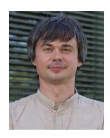

**Andriy Panchenko** (Member, IEEE) received the Ph.D. degree (with Distinction) in engineering from RWTH Aachen University, for which he got several prizes. He is a Full Professor and the Head of the Chair for IT Security, Brandenburg University of Technology, Germany. Before, he was a Research Scientist (permanent faculty) and the Deputy Head of the SECAN-Lab, Computer Science and Communications Research Unit (CSC/FSTC) and associated with the Interdisciplinary Centre for Security Reliability and Trust, University of

Luxembourg. His research interests include IT security, privacy enhancing technologies, and machine learning for IT security.

**Thomas Engel** (Member, IEEE) graduated in physics and computer science from Saarland University, Germany, in 1992, and received the title Dr. rer. nat. in 1996.

He is a Full Professor of Computer Networks and Telecommunications with the University of Luxembourg. From 1996 to 2003, as a Joint Founder, he was a member of the board of directors and the Vice-Director of the Fraunhofer-Guided Institute for Telematics e.V., Trier, Germany, co-responsible for the scientific orientation and development of the

institute, definition, acquisition, and realization of all research projects, which were 70% industry-financed. Since 2002, he has been teaching and conducting research as a Professor with the IST/University of Luxembourg. His SECAN-Lab Team deals with performance, privacy, and identity handling in next-generation networks. As a member of the European Security Research Advisory Board of the European Commission in Brussels, he advised the Commission on the structure, content, and implementation of the FP7 Security Research Programme. He was a Coordinator of three European projects, including the Integrated Project u-2010 with 16 partners, about next-generation networks using IPv6. He was appointed as a member of the Information and Communication Security Panel ICS of NATO from 2007to 2011 and a Civil High-Level Expert for Electronic Communications (representing Europe) of NATO CEP/CCPC from 2008 to 2018. From 2009 to 2016, he was the Vice- and Deputy-Director of the first Interdisciplinary Center, University of Luxembourg, named Security, Reliability and Trust. In 2019, he has been recognized as "IPv6 Evangelist" and inducted into the New Internet IPv6 Hall of Fame.

**Kang G. Shin** (Life Fellow, IEEE) is the Kevin and Nancy O'Connor Professor of Computer Science with the Department of Electrical Engineering and Computer Science, The University of Michigan at Ann Arbor. He was a Co-Founder of a couple of startups, licensed some of his technologies to industry, and served as an Executive Advisor for Samsung Research. He has supervised the completion of 91 Ph.D. students, and authored/coauthored close to 1000 technical articles, a textbook, and about 60 patents or invention disclosures. His current research

focuses on QoS-sensitive computing and networking as well as on embedded real-time and cyber–physical systems.

Dr. Shin received numerous awards, including the 2019 Caspar Bowden Award for Outstanding Research in Privacy Enhancing Technologies, the Best Paper Awards from the 2011 ACM International Conference on Mobile Computing and Networking, the 2011 IEEE International Conference on Autonomic Computing, and the 2010 and 2000 USENIX Annual Technical Conferences, the 2003 IEEE Communications Society William R. Bennett Prize Paper Award, and the 1987 Outstanding IEEE TRANSACTIONS OF AUTOMATIC CONTROL Paper Award. He has also received several institutional awards, including the Research Excellence Award in 1989, the Outstanding Achievement Award in 1999, the Distinguished Faculty Achievement Award in 2001, and the Stephen Attwood Award in 2004 from The University of Michigan (the highest honor bestowed to Michigan Engineering faculty); a Distinguished Alumni Award of the College of Engineering, Seoul National University in 2002; the 2003 IEEE RTC Technical Achievement Award; and the 2006 Ho-Am Prize in Engineering (the highest honor bestowed to Korean-origin engineers). He has chaired Michigan Computer Science and Engineering Division for three years starting 1991, and also several major conferences, including 2009 ACM MobiCom and 2005 ACM/USENIX MobiSys.