# A Survey on IEEE 802.11bn Wi-Fi 8: Advantages of Ultra High Reliability for Next Generation Wireless LANs

Wangzhong Ning, Graduate Student Member, IEEE, Fengxiao Tang, Senior Member, IEEE, Ming Zhao, Member, IEEE, and Nei Kato, Fellow, IEEE

*Abstract*—Although Wi-Fi 7 is able to achieve a maximum throughput of up to 30 Gbps, reliability shortfalls, high latency, and low signal transmission efficiency still exist in frontier domains such as the Industrial Internet, the Metaverse, and autonomous driving. To address these issues, the IEEE 802.11 working group initiated a new standard study, IEEE 802.11bn, also known as Ultra-High Reliability (UHR). This paper systematically surveys the UHR Task Group's research progress on the Physical (PHY) and Medium Access Control (MAC) layers, introducing specific technical enhancements including Distributed Resource Unit (DRU), Modulation and Coding Scheme (MCS), 2×Low-Density Parity-Check (2×LDPC), Cooperative Spatial Reuse (Co-SR), Cooperative Beamforming (Co-BF), Seamless Mobility Domain (SMD), High Priority Enhanced Distributed Channel Access (P-EDCA), Non-Primary Channel Access (NPCA), and Dynamic Subband Operation (DSO). Furthermore, through a survey of the IEEE 802.11 TIG Task Group and relevant literature, this paper also explores the potential use cases of AI/ML technology in the Wi-Fi standardization process. Finally, this paper proposes the challenges, open issues, and future directions for UHR standardization, contributing to the advancement of Wi-Fi.

*Index Terms*—IEEE 802.11bn, UHR, Wi-Fi 8, DRU, SMD, IEEE 802.11 TIG, AI/ML.

## I. INTRODUCTION

## *A. The Evolution of WLAN and Motivation*

O VER the past 20 years, wireless local area network (WLAN) technology has developed rapidly, from the moderate throughput of the early IEEE 802.11n (Wi-Fi 4) [1] to the extremely high throughput (EHT) of the current IEEE 802.11be (Wi-Fi 7) [2], and the number of wireless device connections has skyrocketed. According to the Wi-Fi Alliance's 2024 annual report [3], by the end of 2024, over 250 million Wi-Fi 7 devices (such as smartphones and access points) had been shipped globally, with large-scale deployments across various sectors including healthcare, automotive,

This work was supported in part by the National Natural Science Foundation of China under Grant 62302527, in part by Hunan Provincial Natural Science Foundation under Grant 2023jj40774, and in part by the High Performance Computing Center of Central South University.

Wangzhong Ning, and Ming Zhao are with the School of Computer Science and Engineering, Central South University, Changsha 410000, China (e-mail: ningwangzhong@csu.edu.cn; meanzhao@csu.edu.cn); Fengxiao Tang (\*Corresponding author) is with the School of Computer Science and Engineering, Central South University, Changsha 410000, China and with the Graduate School of Information Sciences, Tohoku University, Japan. (e-mail: tangfengxiao@csu.edu.cn) ; Nei Kato is with the Graduate School of Information Sciences, Tohoku University, Japan. (e-mail:nei.kato.d3@tohoku.ac.jp).

TABLE I LIST OF MAIN ABBREVIATION

| Abbreviation | Description                                        |  |
|--------------|----------------------------------------------------|--|
| AI/ML        | Artificial intelligence and machine learning       |  |
| CSI          | Channel State Information                          |  |
| Co-BF/Co-SR  | Cooperative beamforming/Cooperative spatial reuse  |  |
| DBW          | Distributed Bandwidth                              |  |
| DNN-AE       | Deep Neural Network Auto Encoder                   |  |
| DRU          | Distributed Resource Unit                          |  |
| DSO          | Dynamic Subband Operation                          |  |
| DT           | Digital Twin                                       |  |
| EQM/UEQM     | Equal modulation/Unequal modulation                |  |
| EHT          | Extremely High Throughput                          |  |
| ICF/ICR      | Initial Control Frame/Initial Control Response     |  |
| LDPC         | Low density parity-check                           |  |
| MAC          | Media Access Control                               |  |
| MAPC         | Multi-AP Coordination                              |  |
| MCS          | Modulation and Coding Scheme                       |  |
| MLD          | Multi-link devices                                 |  |
| MU-MIMO      | Multi-User Multiple-Input Multiple-Output          |  |
| NPCA         | Non-Primary Channel Access                         |  |
| NPCH         | Non-Primary Channel                                |  |
| OFDMA        | Orthogonal frequency division multiple access      |  |
| P-EDCA       | High Priority Enhanced Distributed Channel Access  |  |
| PHY          | Physical Layer                                     |  |
| PPDU         | physical layer protocol data unit                  |  |
| RL/DRL       | Reinforcement Learning/Deep Reinforcement Learning |  |
| SMD          | Seamless Mobility Domain                           |  |
| TXOP         | Transmission Opportunity                           |  |
| UHR          | Ultra-High Reliability                             |  |
| WLAN         | Wireless Local Area Network                        |  |

and enterprise. Wi-Fi has become a core component of global communication infrastructure, contributing 4.3 trillion dollars in value to the global economy. Compared to Wi-Fi 4, Wi-Fi 7 supports innovative technologies such as 320MHz bandwidth and multi-link channel access, enabling ultra-high peak rates of up to 30 Gbps to meet the actual needs of high-datarate applications such as smart homes, online gaming, and

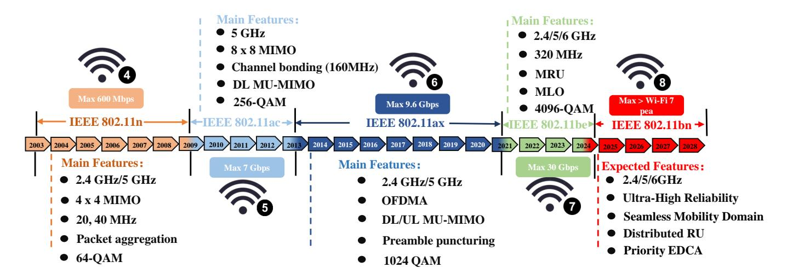

Fig. 1. Timeline of Wi-Fi standards evolution, highlighting key features and certification dates.

augmented reality and virtual reality (AR/VR) [4].

However, as the deployment density of WLAN devices continues to increase, particularly in high-density environments such as airports and sports arenas, challenges such as intercell interference (ICI), overlapping basic service sets (OBSS), and resource competition are becoming increasingly evident [5]. These challenges often disrupt the reliability and latency predictability of network services, leading to channel competition, data retransmissions, and increased latency. Although Wi-Fi 7's single Access Point (AP) optimization mechanism performs well in dynamic subchannel allocation and multi-band communication [2], its centralized, single-AP focus limits its ability to effectively coordinate interference between multiple APs in dynamic network topologies, leading to reduced network service quality and reliability. Additionally, nextgeneration applications require WLAN to provide ultra-high reliability, deterministic low latency, and seamless connectivity in dense environments—scenarios that Wi-Fi 7 cannot meet [6]. Therefore, the IEEE 802.11 Task Group has initiated the development of the next-generation Wi-Fi standard IEEE 802.11bn with UHR as the core objective, to provide technical support for future ultra-high reliability network communication scenarios. According to the IEEE 802.11bn Task Group's anticipated timeline, the Wi-Fi 8 standard is expected to be released in 2028. Fig. 1 provides an overview of the technical milestones and standardization timeline for Wi-Fi standards, highlighting the emphasis on reliability in Wi-Fi 8 to meet the demands of modern networks. To facilitate the introduction of the latest standardization progress of the IEEE 802.11bn Task Group, this paper alternates between using 802.11bn and UHR to represent Wi-Fi 8, similar to how 802.11be and EHT are used to introduce Wi-Fi 7.

Furthermore, alongside the advancement of 802.11bn technology, artificial intelligence (AI) and machine learning (ML) technologies are also rapidly evolving [7], [8], necessitating the recognition of the critical role AI/ML plays in this domain. As wireless WLAN technology continues to develop, network environments are becoming increasingly complex, and traditional optimization methods based on fixed rules fall short in adapting to dynamic and ever-changing network demands. As an emerging intelligent optimization paradigm, AI/ML possesses powerful data processing capabilities and pattern recognition capabilities, offering novel approaches and solutions to address the numerous challenges faced by Wi-Fi. Consequently, the IEEE 802 Task Group has established a dedicated task force focused on the integration of Wi-Fi with AI/ML, known as the IEEE 802.11 AI/ML Topic Interest Group (TIG). In this paper, we also provide a comprehensive overview of the key progress made by this task force.

# *B. Related Work*

In recent years, wireless network technology has undergone rapid innovation, particularly Wi-Fi technology, which has become the core foundation for building intelligent interconnected ecosystems due to its advantages of high bandwidth, wide coverage, and convenience. The academic and industrial communities have engaged in extensive research covering Wi-Fi's standard evolution, core technical updates, and application scenario expansion. In this context, numerous representative surveys have been published [9], [10], focusing either on the standard development and technical advancements of Wi-Fi or on the innovative applications of AI/ML in WLANs. To systematically position our work, Table II provides a detailed comparison of these key literature pieces. This comparison not only categorizes existing work but also explicitly highlights their limitations in comprehensively covering the latest 802.11bn standardization progress, its core UHR features, and the deep integration of AI/ML within the Wi-Fi 8 framework.

In terms of introducing Wi-Fi technology, Deng et al. [11] provide a comprehensive overview of the key technologies of Wi-Fi 7, including PHY enhancements such as extended bandwidth, support for multiple resource units (RUs), 4096- Quadrature Amplitude Modulation (QAM) modulation, and preamble design, as well as MAC layer features like multilink operation, Multiple Input Multiple Output (MIMO) enhancement, multi-AP coordination, and Hybrid Automatic Repeat Request (HARQ) mechanisms. The study also explores challenges and future research directions related to

TABLE II UPDATED COMPARISON OF REPRESENTATIVE SURVEYS ON WI-FI EVOLUTION AND AI/ML APPLICATIONS

| Category            | Ref.         | Publication year/Type | Target Standard   | Theme                                 | Technical Focus                                          | Contribution                                                                                                                                                             | Limitations                                                                                                                                                              |
|---------------------|--------------|--------------------------|-------------------|---------------------------------------|----------------------------------------------------------|--------------------------------------------------------------------------------------------------------------------------------------------------------------------------|--------------------------------------------------------------------------------------------------------------------------------------------------------------------------|
|                     | [11]         | 2020/Survey              | Wi-Fi 7 and WiGig | Wi-Fi 7 Evo lution                 | New Bandwidth Mode, HARQ, MLO                | Detailed survey on EHT's PHY/MAC enha ncements and potential future directions.                                                                           | Does not cover UHR; fo cuses on Wi-Fi 7 features and lacks analysis of the new IEEE 802.11bn spec ifications.                                                |
| Related             | [12]         | 2024/Survey              | Wi-Fi 7 (EHT)     | Multi-AP Coordination              | C-OFDMA, CSR, CBF, JTX                                | Comprehensive rev- iew of Multi-AP Coordina tion (MAP-Co) architec tures and scheduling ap proaches.                                                         | Narrow scope restricted to MAP-Co; does not cover other UHR features like DRU, 2xLDPC, or AI/ML integration.                                                 |
| to Wi-Fi            | [13]         | 2024/Primer              | Wi-Fi 8 (UHR)     | UHR Vision                            | Determinism, Distributed MLO                          | Introduces the UHR Study Group outcomes and the vision for distributed MLO and latency control.                                         | High-level primer; lacks detailed technical tutorials on PHY/MAC signaling flows and frame formats found in a full survey.                                   |
|                     | [14]         | 2025/Primer              | Wi-Fi 8 (IMMW)    | mmWave In tegration                | 60 GHz bands, Dual-band MLO                     | Discusses the integra tion of mmWave into Wi-Fi 8 (IMMW SG) and system-level simula tions.                                                             | Restricted scope to mm Wave; overlooks critical Sub-7 GHz UHR features and broader AI applica tions.                                                         |
|                     | [15]         | 2019/Survey              | Generic Wireless  | General ML Applications            | Resource Management, Networking, Localization   | Broad survey on ML techniques (supervised, RL) applied across var ious wireless networks (Cellular, WSN, Wi-Fi).                                 | Generic wireless focus; lacks specific analysis of how ML integrates with IEEE 802.11 specific frame structures and protocols. |
| Related to AI/ML | [16]         | 2019/Survey              | Generic Wireless  | Model-based vs. AI-based Design | PHY/MAC Optimization, Training methodologies    | Comprehensive framew ork integrating deep learning with traditional model-based wireless design.                                                    | Focuses on ML algorit hms/methodology rather than their standardization and implementation with in the IEEE 802.11 framework.                 |
| in Wi-Fi            | [17]         | 2022/Survey              | Wi-Fi 6/7         | Wi-Fi and ML                    | Channel access, Link adaptation, Coexistence | Extensive survey on ML optimizing core Wi-Fi features and connectiv ity management.                                                                       | Pre-dates Wi-Fi 8; does not address ML applica tions for new UHR fea tures like SMD, DSO, or DRU.                                                            |
|                     | [18]         | 2025/Primer              | Wi-Fi 8 (AI)      | AI-Native Wi-Fi                    | CSI compression, Roaming, CA                          | Outlines the roadmap towards AI-native Wi-Fi and summarizes the IEEE 802.11 AI/ML TIG findings.                                            | Brief article; provides a roadmap/vision but lacks the comprehensive techni cal depth of a tutorial on 802.11bn specifications.                              |
| Current             | This Work | 2025/Survey              | Wi-Fi 8 (UHR)     | Full UHR Enhance and AI      | DRU, 2xLDPC, SMD, NPCA, DSO                  | The first tutorial sur vey systematically in troduces the 802.11bn PHY/MAC layer, signal ing flows, and AI/ML standardization cases. | N/A (Comprehensive cov erage of current TGbn draft).                                                                                                      |

6GHz coexistence, high-low frequency integration, and machine learning-driven Quality of Service (QoS) assurance. In [12], the technical architecture, core mechanisms, and future challenges of multi-access point coordination (MAP-Co) in future wireless local area networks (WLANs) are systematically explored. This study specifically covers standards such as Wi-Fi 7 and WiGig, providing a comprehensive analysis from technical classification to open issues for highdensity network deployment problems. The reference [13] analyzes the technological evolution path of Wi-Fi 8 under the UHR objective and systematically reviews its standardization process driven by emerging applications. It also focuses on key mechanisms centered on multi-access point coordination within Wi-Fi and thoroughly explores their role in establishing UHR communications. Liu et al. [14] focus on exploring the feasibility and potential advantages of introducing millimeterwave (mmWave) technology. This work also analyzes the compatibility of new mmWave functionalities by reusing physical layer designs and algorithms from the sub-7GHz band.

In terms of introducing the potential applications of AI/ML in Wi-Fi, the reference [15] discusses the application of machine learning in wireless network performance optimization and analyzes the application of ML in the PHY and MAC layers. This review also systematically reviews the latest

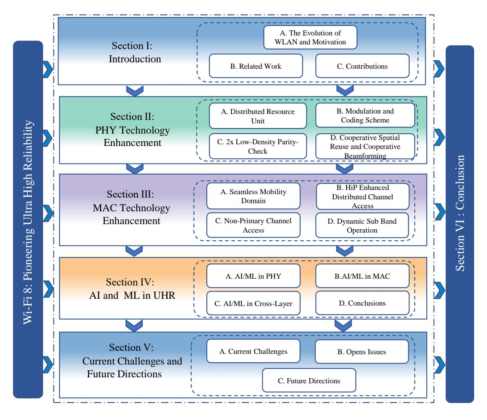

Fig. 2. The structure of this paper.

relevant results, introduces common algorithms and cases, and discusses deployment challenges and future directions. Zappone et al. [16] provide a fundamental framework for wireless network design in the deep learning era, focusing on the integration of theoretical models with data-driven approaches. It also systematically analyzes the trade-offs between traditional model-based methods and AI-based techniques, proposing hybrid strategies to optimize physical layer and resource management performance. In [17], the application directions of ML in enhancing Wi-Fi performance are comprehensively reviewed, covering core protocol optimization, emerging feature enhancement, network management, and cross-technology coexistence scenarios, providing a systematic technical framework and future directions for the integration of Wi-Fi and ML. The reference [18] introduces the application of AI/ML in IEEE 802.11 networks and the path to the evolution of AI/ML-native Wi-Fi. This work also analyzes the potential of ML/AL in areas such as network management and interference detection.

# *C. Contributions*

Despite considerable attention from academia and industry regarding 802.11bn research, there currently lacks a comprehensive review that systematically summarizes Wi-Fi 8 technological innovations, standardization progress, and crossdomain integration. Reference [19] reviews the evolution of Wi-Fi technology and proposes Wi-Fi 8 and possible future technical directions, but it is more of a visionary statement, lacking analysis of specific technical roadmaps, standardization challenges, and implementation bottlenecks. In [20], nextgeneration wireless broadband technologies 6G and Wi-Fi 7/8 are systematically compared and evaluated across technical, economic, and policy dimensions, but this article mentions the IEEE 802.11bn standardization process only briefly and does not explore the role of AI/ML in Wi-Fi 8. Reference [21] provides the first systematic introduction to AP power-saving mechanisms in Wi-Fi 8 and identifies key issues for future research and engineering implementation. However, it only focuses on AP power-saving mechanisms without analyzing other core technologies at the PHY and MAC layers in depth.Therefore, this paper focuses on providing a comprehensive overview of the latest advancements in UHR technology, highlighting the innovative technologies and solutions proposed by the 802.11bn Task Group to drive the development of the Wi-Fi 8 standard. Particular emphasis is placed on system innovations at the PHY and MAC layers, rather than merely introducing a single technology. Furthermore, we explore the potential role of AI/ML in advancing Wi-Fi 8, aiming to provide a comprehensive reference for the further development

TABLE III LIST OF PHY ENHANCEMENTS AND RELEVANT EFFORTS

| Category                                                                         | Ref.                                                                      | Type               | Contribution                                                                    | Description                                                          |  |
|----------------------------------------------------------------------------------|---------------------------------------------------------------------------|--------------------|---------------------------------------------------------------------------------|----------------------------------------------------------------------|--|
|                                                                                  | Draft Text on DRU[28]                                                     | Draft text         | Describes the technical details and specific rules of DRU.                      | Subcarrier spreading                                                 |  |
| Distributed Resource Unit (DRU)                                               | UHR-LTF Design for DRU-Further Results[33]                                | Simulation eval    | Argues that traditional DCM cannot bring additional gains in DRU scenarios.     | across wider bandwidth to bypass 6 GHz PSD limits in LPI mode. |  |
|                                                                                  | Adaptive power boosting design for DRU[34]                                | Ad-hoc discussion  | Proposes the concept of adaptive DRU power enhancement.                         | mints in LP1 mode.                                                   |  |
|                                                                                  | Analysis on UEQM and UEQ MCS[38]                                          | Ad-hoc discussion  | Verifies the throughput effect of UEQ-MCS using independent coding.             | New MCS sets with unequal error protection                           |  |
| Modulation and Coding Scheme (MCS)                                            | New MCS - Simulation Results[40]                                          | Simulation eval    | Evaluates four new combinations to fill the MCS gap.                            | (UEP) and ultra-low-rate (ELR)                                    |  |
|                                                                                  | Transmit and Receive Specifications for New MCS in 11bn[41]               | Simulation eval    | Provides the Tx EVM table for newly added non-ELR MCS.                          | options.                                                             |  |
| Low-Density Parity-Check (LDPC)                                               | 2x1944 LDPC Codes Performance Evaluation[48]                           | Ad-hoc discussion  | Proves the performance gains of 2xLDPC through simulation.                      | Enhanced LDPC code                                                   |  |
|                                                                                  | LDPC and Framing Settings for Ultra High Reliability[50]               | tection mechanism. |                                                                                 | with flexible rate matching and                                   |  |
|                                                                                  | Detailed text proposal on Longer block- length LDPC Coding feature[53] | Draft text         | Describes the LDPC encoding process and compatibility.                          | error-correction ability.                                            |  |
| Coordinated Spatial Reuse and Coordinated Beamforming (Co-SR and Co-BF) | PHY Version indications in Co-SR transmission[59]                         | Ad-hoc discussion  | Defines two transmission modes for Co-SR.                                       | Multi-AP joint                                                       |  |
|                                                                                  | Discussion on Overhead Reduction on Co-BF/Co-SR Signalling[61]            |                    | Proposes the use of differential indicators to balance the scope of indicators. | transmission with interference nulling and                           |  |
|                                                                                  | Co-BF PHY design consideration[68]                                        | Ad-hoc discussion  | Clarifies the Co-BF MU PPDU trigger process.                                    | spatial reuse.                                                       |  |

of IEEE 802.11 standards and academic research. This will help future WLAN technologies achieve higher performance and broader applications. Specifically, the contributions of this paper are as follows:

- To enable readers from diverse fields to gain a more effective understanding of Wi-Fi 8, this paper conducts the first detailed technical investigation into the specific signaling design and operational logic within the 802.11bn draft, rather than merely listing features conceptually. We systematically analyze the technical enhancements at the PHY and MAC layers and examine how these enhancements address the UHR requirements for deterministic latency and reliability in dense networks.
- Based on extensive research into the latest developments within the IEEE 802.11 AI/ML TIG and relevant literature, we explored the specific role of AI/ML within the Wi-Fi 8 standardization framework and analyzed precise use cases for AI/ML-supported UHR functionality. For instance, DNN-AE for CSI feedback compression in massive MIMO and RL-based distributed channel access for P-EDCA optimization bridge the gap between theoretical AI models and standardized protocol stacks.
- At the end of this paper, through a review of existing references, we propose several challenges, such as hardware nonlinearities in UHR-MCS, synchronization costs in Co-BF, and signaling overhead in NPCA. Additionally, we present forward-looking research directions, including active optimization based on digital twins and deeply integrated architectures for millimeter-wave and multiband operations, offering novel research topics for future academic and industrial communities.

As shown in Fig. 2, the remainder of this paper is structured as follows: Section II focuses on the main enhancement technologies at the PHY layer and describes potential future research directions for some of these technologies. Section III highlights enhancement technologies at the MAC layer. Section IV discusses the potential role of AI/ML technologies in the advancement of the Wi-Fi 8 technical standard. Section V outlines the future development directions for Wi-Fi 8. Section VI summarizes the entire paper. The main abbreviations used in this paper are also listed in alphabetical order in Table I.

## II. PHY TECHNOLOGY ENHANCEMENT

To meet the low latency and high throughput requirements of advanced scenarios such as industrial automation and metaverse interaction, UHR incorporates PHY enhancement technologies across multiple dimensions to enhance network performance. This section focuses on several PHY layer technological innovations, as outlined in Table III, based on the 802.11bn Task Group's PHY meeting documents [22]–[24] and relevant references [25], [26].

## A. Distributed Resource Unit

To meet the network requirements of high-throughput, low-latency applications such as AR/VR, 8K video streaming, and cloud gaming, IEEE 802.11ax introduces Orthogonal Frequency Division Multiple Access (OFDMA) and Multi-User MIMO (MU-MIMO) to enhance network efficiency. IEEE 802.11be further supports 320 MHz bandwidth, multi-link operation (MLO), and RU allocation to enhance network performance [2]. However, in low-power indoor (LPI) scenarios

| Data and pilot subcarrier indices for Distributed Tone Resources (DRUs) in a 20 MHz UHR PPDU |                                |                       |                         |                       |                      |  |
|----------------------------------------------------------------------------------------------|--------------------------------|-----------------------|-------------------------|-----------------------|----------------------|--|
| DRU Type                                                                                     | DRU index and subcarrier range |                       |                         |                       |                      |  |
|                                                                                              | DRU1                           | DRU2                  | DRU3                    | DRU1                  | DRU1                 |  |
| 26-tone DRU                                                                                  | [-120:9:-12, 6:9:114]          | [-116:9:-8, 10:9:118] | [-118:9:-10, 8:9:116]   | [-114:9:-6, 12:9:120] | [-120:9:-4, 5:9:113] |  |
| i=1:9                                                                                        | DRU6                           | DRU7                  | DRU8                    | DRU9                  |                      |  |
|                                                                                              | [-119:9:-11, 7:9:115]          | [-115:9:-7, 11:9:119] | [-117:9:-9, 9:9:117]    | [-113:9:-5, 4:9:112]  |                      |  |
|                                                                                              | DRU1                           |                       | DR                      |                       |                      |  |
| 52-tone DRU                                                                                  | 26-tone [DRU1, DRU2]           |                       | 26-tone [DRU3, DRU4]    |                       |                      |  |
| i=1:4                                                                                        | DRU3                           |                       | DRU4                    |                       |                      |  |
|                                                                                              | 26-tone [DRU6, DRU7]           |                       | 26-tone [DRU8, DRU9]    |                       |                      |  |
| 106-tone DRU                                                                                 | DRU1                           |                       | DRU1                    |                       |                      |  |
| i=1:2                                                                                        | 26-tone [DRU1 4][-3, 3]        |                       | 26-tone [DRU6 9][-2, 2] |                       |                      |  |

TABLE IV DRU SINGAL POINT DISTRIBUTION IN THE 20 MHZ BAND

in the 6 GHz band, power spectral density (PSD) constraints reduce the transmission power of uplink trigger base (TB) physical layer protocol data units (PPDUs), thereby limiting base station coverage and transmission efficiency. Additionally, frequency reuse issues in dense networks increase the complexity of multi-AP collaboration. Therefore, the 802.11bn Task Group proposed the DRU technology, and this section provides detailed introduction to its technical content [27].

- 1) DRU Design Objectives: In the vision of the 802.11bn Task Group, the core objective of DRU is to address PSD restrictions in the 6 GHz band LPI scenario while improving the transmission power of uplink TB PPDU and multi-user access efficiency. To achieve this, DRU distributes subcarriers across distributed bandwidth (DBW) [28] to reduce subcarrier density per MHz, thereby increasing total transmit power within PSD constraints to meet UHR requirements. Building on this foundation, the 802.11bn Task Group is advancing tone plans and UHR Long Training Field (UHR-LTF) designs to serve as the technical foundation for DRU to achieve power gains and compatibility.
- 2) Tone Plan: In the DRU's tone plan, the distribution pattern of subcarriers across different bandwidths is defined, directly impacting power gain and spectral efficiency. Specifically, the DRU adopts the subcarrier spacing of the EHT PHY, supporting DBW configurations of 20, 40, 60, and 80 MHz, ensuring compatibility with existing WLAN standards [28], [29]. Additionally, the DRU employs a hierarchical tone structure, where larger DRUs are composed of smaller DRUs plus a few additional subcarriers. The specific DRU configurations are as follows:
  - 20 MHz DBW: Supporting 26-tone, 52-tone, and 106-tone DRU, with large subcarrier spacing, which can reduce the subcarrier density per MHz and increase the transmission power. As pointed out in [30], 20 MHz DRU26 can achieve high power gain and is suitable for low-power devices in small RU.
  - 40/80 MHz DBW: Supporting larger DRUs, such as 242-tone and 484-tone, suitable for high-throughput scenarios.
  - 60 MHz DBW: In [29] and [31], it is recommended to supplement the tone plan with a 60 MHz DBW and define the subcarrier distribution for 52-tone and 106-

tone DRUs. However, the Peak-to-Average Power Ratio (PAPR) and packet error rate (PER) performance of the 60 MHz tone plan is not yet fully validated, and further simulations are needed to assess its applicability in real-world scenarios [32].

As shown in Table IV, distribution of DRU signal points in the 20 MHz band is presented, including data and pilot subcarrier indices for different types of DRUs (26-tone, 52- tone, and 106-tone), as well as the indices and subcarrier ranges for each DRU. To reduce signal interference, 802.11bn is also exploring the design of Direct Current (DC) and guard subcarriers within the DRU. For example, a 20 MHz DBW uses 3 DC subcarriers and 11 protection subcarriers. In wideband PPDUs of 160 or 320 MHz, DRUs support a hybrid Regular Resource Unit (RRU)/DRU mode. The advantage of this hybrid approach is that each 80 MHz subblock employs exclusively either the DRU or RRU (with a minimum RRU of 242 tones), thereby simplifying channel allocation and AP coordination. However, the scheduling complexity of this hybrid mode remains high in real-world environments, necessitating further optimization of the subcarrier allocation algorithm by the 802.11 Task Group to support dynamic bandwidth configuration.

- 3) UHR-LTF: To ensure high throughput, low latency, and UHR objectives in the 6 GHz LPI mode, the 802.11bn Task Group introduces the UHR-LTF within the DRU design. Specifically, the UHR-LTF is optimized for the sparse subcarrier distribution of the DRU to reduce the PAPR while maintaining compatibility with the Extremely High Throughput Long Training Field (EHT-LTF) sequence of 802.11be. Two UHR-LTF selection methods are proposed in [33], categorized as Method 1 and Method 2, as detailed below:
- a) Method 1: This scheme directly adopts the EHT-LTF sequence of Wi-Fi 7 without optimizing the dispersed tone distribution for DRUs. The advantage of this design is that it maximizes backward compatibility and reduces design complexity. In Wi-Fi 7, EHT-LTF is a standard RU, and by optimizing pilot position and phase rotation, it achieves low PAPR and efficient channel estimation. However, the sparse subcarrier distribution of DRU can lead to insufficient pilot density. In DRU scenarios, the PAPR of Method 1 is significantly higher than that of RRU. Although Method 1 is

simple to implement, its performance is limited in high-order modulation or high-spatial-stream scenarios, making it difficult to meet the ultra-high reliability requirements of 802.11bn.

*b) Method 2:* This mode optimizes the EHT-LTF sequence selection based on the dispersed tone distribution of the DRU to reduce PAPR. For example, at a 20 MHz DBW, Method 2 reduces the PAPR of 26-tone DRU to a level comparable to that of the RRU. Simulation results show that Method 2 outperforms Method 1 in PER performance across all DBW and DRU sizes, with the PER gap also narrowing.

Despite the significant progress of the UHR-LTF design achieved through Method 2, the specific optimization algorithm remains undisclosed. Furthermore, the 802.11bn Task Group is required to verify the performance of UHR-LTF under 60 MHz DBW and explore AI/ML adaptive UHR-LTF selection algorithms to meet UHR requirements.

- *4) Power Gain and PAPR Optimization:* In real-world environments, the 6 GHz LPI PSD limit restricts STA transmission power, requiring the use of DRU to disperse subcarriers in order to increase power gain. To this end, the 802.11bn Task Group has also been exploring the power gain mechanism of DRU, the impact of nonlinear PAs, and methods for optimization in its recent work.
- *a) DRU Power Gain Mechanism:* To reduce the extent to which single-carrier power is limited by PSD, the DRU distributes subcarriers across DBWs of 20 MHz, 40 MHz, 60 MHz, or 80 MHz, reducing the number of subcarriers per MHz and spreading them across a wider spectrum range to increase total transmit power. The 484-tone DRU (DRU484) achieves a power gain of 2.6 dB at an 80 MHz DBW. The 52-tone DRU with a 60 MHz DBW can achieve a power gain of up to 11.1 dB by using a 14× subcarrier spacing. However, the realization of power gain depends on the optimization of the tone plan. Specifically, the tone plan can be adjusted by modifying the pilot position to reduce PAPR and support higher power transmission. Additionally, adopting an adaptive DRU allocation scheme that dynamically adjusts RU and power based on channel/Station (STA) distance is another approach worth exploring [34].
- *b) The Impact of Nonlinear Power Amplifiers:* Nonlinear power amplifiers (PAs) are critical components in Wi-Fi devices, and their nonlinear distortion can affect DRU performance. Specifically, high PAPR requires PAs to operate at higher power levels to avoid signals entering the nonlinear region, but this can cause distortion. In [33], the Rationalfunction model is used to simulate the effects of nonlinear PAs, validating the distortion effects of DRU signals under high PAPR conditions. In their experiments, in the the 26 tone DRU with a 20 MHz DBW, Method 1 has a PAPR approximately 1.5 dB higher than RRU, resulting in increased nonlinear distortion and degraded PER. In contrast, Method 2 reduces the PAPR to a level close to that of the RRU by optimizing the LTF sequence selection, thereby reducing nonlinear distortion and significantly improving the PER.
- *5) Conclusions and Future Directions:* In general, the DRU technology introduced by 802.11bn breaks through the 6 GHz PSD power limit through distributed subcarrier allocation, achieving gains of 2.5 to 11 dB and signal smoothness

optimization of 3.8 to 5.5 dB. The tone plan supports flexible frequency band configuration and coordinates OFDMA to enhance multi-device networking efficiency. However, the future 802.11bn Task Group needs to refine the tone plan design for 60 MHz DBW to ensure compatibility with wide-and PPDU. Finally, we have summarized some key points about DRU to make it easier for readers to understand its characteristics.

## Key Takeaways:

- When to use: DRU is particularly effective in dense multi-AP deployments where flexible spectrum partitioning and interference coordination are needed.
- Typical gains: Provides noticeable improvement in network throughput and latency performance through dynamic resource allocation and coordination.
- Main trade-offs: Introduces additional signaling overhead and scheduling complexity to manage distributed RUs among APs and stations.
- Implementation readiness: Considered by the IEEE 802.11bn PHY Task Group as a fundamental component to enable UHR operation.

## *B. Modulation and Coding Scheme*

From IEEE 802.11n to 802.11be, WLAN throughput and spectral efficiency have seen significant improvements, primarily due to the introduction of technologies such as multipleinput multiple-output (MIMO), OFDMA, and multi-RU allocation [4]. However, in high-density networks, complex channel environments (such as the 6 GHz band), or low signalto-noise ratio (SNR) scenarios, the MCS design of 802.11be still has limitations in terms of reliability. Therefore, the IEEE 802.11bn Task Group further optimized MCS based on 802.11be, proposing new MCS, Enhanced Low Rate (ELR) MCS, Unequal Modulation (UEQM) , and Equal Modulation (EQM) MCS schemes to enhance actual performance in UHR scenarios. These enhancements improve the flexibility and adaptability of MCS, making it suitable for UHR scenarios.

- *1) Definition and Function of MCS:* Similar to DRU technology, MCS is one of the core technologies of the IEEE 802.11 standard physical layer, defining the combination of modulation types (such as BPSK, QPSK, 16-QAM to 4096- QAM) and forward error correction (FEC) coding rates (such as 1/2, 2/3, 5/6) for data transmission. Additionally, the design of MCS also impacts the performance of wireless communication systems, including data rate, transmission reliability, and spectral efficiency [35]–[37].
- *2) MCS Technology Enhancement:* In previous Wi-Fi standards, MCS 0-11 supported BPSK to 1024-QAM, with a maximum coding rate of 5/6, and applies only to 20/40/80/160 MHz bandwidths. However, with bandwidth expanded to 320 MHz, the 802.11bn Task Group plans to further expand the range and flexibility of MCS to provide a technical foundation for more complex application scenarios. The specific MCS enhancements are outlined as follows:
- *a) New MCS:* Fig. 3 shows the combinations of MCS in the IEEE 802.11be standard. The combinations within the yellow boxes are the MCS that have been used, while

the remaining white cells represent combinations that have not yet been used. It is observable that there is still room for expansion in the MCS of the IEEE 802.11be standard. Therefore, the 802.11bn Task Group introduced four new Ultra-High Reliability MCS (UHR-MCS 17, 19, 20, 23) to provide STAs with more precise rate selection options [38], [39].

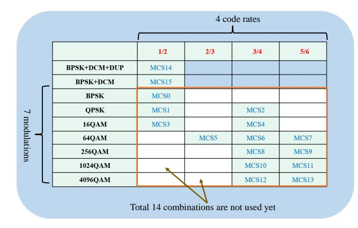

Fig. 3. Combinations of MCS in the IEEE 802.11be standard.

- UHR-MCS 17: Modulation scheme is QPSK, coding rate R=2/3, suitable for medium- and low-speed scenarios, providing higher transmission reliability, suitable for high-density networks with poor signal quality.
- UHR-MCS 19: Using 16-QAM modulation and a coding rate of R=2/3 to balance throughput and reliability, suitable for environments with moderate signal-to-noise ratios.
- UHR-MCS 20: Similar to UHR-MCS 19, it uses 16-QAM modulation with a coding rate of R=5/6, optimized for high throughput transmission under high SNR conditions, and is suitable for bandwidth-intensive applications.
- UHR-MCS 23: Using 256-QAM modulation with a coding rate of R=2/3. Designed specifically for high SNR environments, it provides higher data rates to support high-throughput scenarios such as cloud VR.

The Table V summarizes the characteristics of the four new MCSs, detailing the modulation order, data rate, and typical SNR conditions. Furthermore, it lists practical use cases and indicative data rates, thereby linking MCS design to specific application scenarios. Clearly, these new MCSs support both single-space-stream and multi-space-stream transmission, enabling greater flexibility in transmission methods. For example, under 26-tone RU and a 0.8 µs guard interval (GI), the data rate of UHR-MCS 17 is approximately 2.4 Mb/s, suitable for control signaling or low-speed data transmission. Under 4×996-tone RU and 4096-QAM (R=5/6), the data rate can reach 2,882.4 Mb/s, meeting the transmission requirements for 8K video streams and cloud VR. Additionally, these MCS designs fully consider compatibility with 802.11be's wide bandwidth and multi-RU allocation, significantly enhancing link adaptability by providing intermediate rate options [40], particularly enabling more precise responses to channel fluctuations in high-density networks.

- *b) Ultra-Low Rate MCS:* In high-density networks or complex channel environments, there is an increasing demand for low-rate but highly reliable transmission. To address this, the 802.11bn Task Group is considering the introduction of ELR MCS (UHR-MCS 0 and 1) [41]. These MCS are specifically designed for single spatial streams, aiming to enhance long-range transmission and interference resistance. Specifically, UHR-MCS 0 uses BPSK modulation with a coding rate R=1/2, achieving a data rate as low as 0.3 Mb/s. UHR-MCS 1 uses QPSK modulation with a coding rate R=1/2, achieving a data rate of approximately 0.6 Mb/s. Therefore, ELR-MCS can meet the reliable transmission requirements of low-power wide-area networks, particularly suitable for sensor data transmission in industrial Internet of Things (IoT) or signaling transmission in high-density networks. However, the extremely low data rate of ELR-MCS limits network throughput, necessitating its use in conjunction with higherorder MCS to address diverse network requirements.
- *3) Unequal Modulation and Equal Modulation MCS:* As WLAN networks continue to evolve, traditional EQM schemes lack flexibility in multi-spatial stream and multiresource unit scenarios, making it difficult to fully leverage performance potential under different channel conditions. To address this, 802.11bn introduced UEQM and EQM MCS schemes. These two schemes allow different spatial streams or RUs to adopt different modulation and coding schemes, dynamically adapting to changes in the channel environment.
- *a) UEQM:* UEQM allows different spatial streams to use different modulation orders within the same PPDU, such as [256-QAM, 64-QAM] or [4096-QAM, 256-QAM]. However, in UEQM, all spatial streams must maintain the same coding rate, are limited to 2–4 spatial streams, and are encoded using LDPC codes. Additionally, the modulation combinations supported by UEQM include [M, M-1], [M, M, M-1], etc., with modulation orders ranging from QPSK to 4096-QAM, enabling adaptation to varying channel quality across different spatial streams. For example, in high-interference environments, some spatial streams can use lower-order modulation to ensure reliability, while others use higher-order modulation to enhance throughput [42], [43].
- *b) UEQ MCS:* In the 802.11bn Task Group's discussion on UEQ MCS, UEQ MCS is divided into two categories: spatial domain UEQ MCS and frequency domain UEQ MCS.

In the spatial domain UEQ MCS, different spatial streams can use different MCSs, generating PSDUs (Physical Layer Service Data Units) via independent encoders, similar to a multi-carrier MIMO architecture. For example, one spatial stream may use 256-QAM (R=5/6) to achieve high throughput, while another spatial stream uses QPSK (R=1/2) to ensure reliability. According to simulation results from [38], the spatial domain UEQ MCS achieves 10%-15% higher throughput than UEQM and EQM under non-uniform channel conditions. However, implementing the spatial domain UEQ MCS requires multiple independent encoders and decoders, which increases hardware complexity and leads to higher processing latency.

In the frequency domain UEQ MCS, different RU or Multiple Resource Units (MRUs) are allowed to use different MCS. Each RU or MRU can perform independent coding, which is

| MCS Index  | Modulation | Code Rate | SNR Range (dB) | Use Case                        | Data Rate (20 MHz) |
|------------|------------|-----------|----------------|---------------------------------|--------------------|
| UHR-MCS 17 | QPSK       | 2/3       | ∼5 - 8         | Edge coverage, wall penetration | ∼29 Mbps           |
| UHR-MCS 19 | 16-QAM     | 2/3       | ∼10 - 13.5     | Medium-range reliability        | ∼58 Mbps           |
| UHR-MCS 20 | 16-QAM     | 5/6       | ∼13.5 - 16     | Medium-high SNR transition      | ∼73 Mbps           |
| UHR-MCS 23 | 256-QAM    | 2/3       | ∼18 - 21       | Short-range high rate           | ∼117 Mbps          |

TABLE V SUMMARY OF PROPOSED NEW UHR-MCS CANDIDATES FOR 11BN

particularly suitable for OFDMA scenarios. As proposed in [38], in narrowband interference scenarios, some RUs may use low-order MCS (BPSK, R=1/2) to enhance reliability, while other RUs employ high-order MCS (4096-QAM, R=5/6) to optimize throughput. The advantage of this mechanism is that it improves spectral efficiency by dynamically allocating MCS, particularly in high-density networks and heterogeneous coexistence scenarios in the 6 GHz band.

While UEQM and UEQ MCS significantly enhance the flexibility of MCS, their standardization and implementation face multiple challenges. First, to support UEQM and UEQ MCS, the Ultra-High Reliability Signal Field (UHR-SIG) in the physical layer signaling must be extended, but expanding signaling fields increases signaling overhead. Second, backward compatibility is a critical issue, as it is essential to ensure that 802.11ax/be devices can correctly parse PP-DUs containing UEQM/UEQ MCS. Additionally, the multiencoder architecture of UEQ MCS increases hardware costs and power consumption [42]. Therefore, we recommend that the 802.11bn Task Group focus on signaling compression, compatibility optimization, and low-power design to drive the practical deployment of UEQM and UEQ MCS.

- *4) Signaling Design:* With the introduction of new complex enhancement technologies such as MCS, ELR MCS, Unequal Modulation (UEQM), and Unequal Modulation and Coding (UEQ MCS) by the 802.11bn Task Group, the demand for flexibility and robustness in signaling design has also increased. Although Extremely High Throughput Signal Field (EHT-SIG) field in 802.11be optimizes signaling efficiency through compression coding and dynamic allocation, it still struggles to fully meet complex MCS requirements of 802.11bn. Therefore, 802.11bn proposes a signaling design based on the UHR-SIG field, which supports the complex requirements of new MCS and enhanced technologies by expanding the field structure and optimizing the coding method. The specific plan is as follows:
- *a) MCS Field Extension Signaling:* To support the newly added UHR-MCS, 802.11bn extends the MCS field from 4 bits in 802.11be to 5 bits (B11–B15) to cover a wider MCS index range. In MU-MIMO scenarios, the reserved bit (B15) is used to indicate the new MCS [35], and by reducing the Spatial Configuration field, 1 bit is released for MCS index expansion. For example, UHR-MCS 17 (QPSK, R=2/3) can be precisely indicated using a 5-bit field, ensuring that devices select an appropriate rate under moderate SNR conditions. However, the field expansion increases the bit count of UHR-SIG, potentially reducing preamble efficiency, especially in high-density networks, where compression coding is required

to optimize signaling overhead.

- *b) ELR MCS Signaling:* ELR MCS implements signaling through a dedicated ELR-SIG field. This field reduces control signaling overhead through simplified encoding. Additionally, the ELR-SIG field is combined with the 52-tone RU quadruple replication mechanism, which enhances signal robustness by repeatedly transmitting critical signaling information [41], enabling a minimum receive signal sensitivity of -82 dBm. To ensure backward compatibility, the signaling design of ELR MCS must align with the EHT-SIG structure of 802.11be.
- *c) UEQM Signaling:* In the signaling fields, a new 1 bit UEQM field (B19) is added to indicate whether the current transmission uses (EQM, 0) or (UEQM, 1). The specific modulation combination for each spatial stream is indicated by combining the NSS (number of spatial streams) and MCS fields. For example, in a MU-MIMO scenario with 2–4 spatial streams, UEQM allows different spatial streams to use different modulation orders. However, the complexity of UEQM signaling lies in the need to precisely indicate the modulation combination for each spatial stream, which not only increases the bit count of the UHR-SIG field but also imposes higher requirements on the real-time performance of signaling parsing. According to the simulation results in [35], in high-density multi-user scenarios, the additional overhead of UEQM signaling may cause the PPDU preamble length to increase by approximately 5%-10%, thereby reducing system throughput. Therefore, future signaling designs can explore context-based adaptive coding mechanisms to reduce redundant fields and improve signaling parsing efficiency.
- *d) UEQ MCS Signaling:* In the spatial domain UEQ MCS signaling design, each spatial stream must be assigned an independent MCS index, which can be indicated via the UHR-SIG or the User Info field in the trigger frame [41]. In the frequency domain UEQ MCS, the MCS allocation for different RU/MRUs must be explicitly specified in the trigger frame to ensure that the receiver can correctly parse the data for each RU or MRU. Additionally, the signaling complexity of UEQ MCS may cause delays in trigger frame parsing. The Task Group may consider optimizing the compression mechanism of the User Info (UI) field to mitigate this issue.
- *5) Conclusions and Future Directions:* MCS, as one of the core technologies of the IEEE 802.11 standard physical layer, achieves a balance between throughput, reliability, and spectral efficiency by optimizing modulation and coding rates. In 802.11bn, the newly added UHR-MCS 17, 19, 20, 23, ELR MCS, UEQM, and UEQ MCS enhance network performance, meeting the high reliability requirements of emerging applications such as cloud VR, industrial IoT, and high-density

networks. However, challenges such as signaling overhead, backward compatibility, and power management still need to be addressed. As demonstrated by experiments conducted by Hoefel et al. [44], the performance levels that hardware devices must achieve under different MCS configurations provide quantitative basis for MCS scheduling and selection. Therefore, future research should focus on signaling optimization, low-power design, and coexistence mechanisms in the 6 GHz band. We also conclude with a brief summary of the key takeaways from MCS.

## Key Takeaways:

- When to use: UHR-MCS levels are designed for high-SNR, low-latency scenarios requiring deterministic throughput and enhanced reliability.
- Typical gains: Offers noticeable improvement in spectral efficiency and link robustness compared with EHT MCS levels, while sustaining stringent reliability targets.
- Main trade-offs: Requires accurate channel estimation and mitigation of non-linear distortion; performance is sensitive to hardware impairments and PA back-off.
- Implementation readiness: Under evaluation in the IEEE 802.11bn PHY ad hoc for inclusion in forthcoming draft versions.

## *C. 2x Low-Density Parity-Check*

Since the introduction of Wi-Fi 4, error correction capability has been one of the core requirements in the development of WLAN [45]. In early Wi-Fi (such as 802.11n), LDPC coding is primarily used for simple data transmission [46]. The LDPC coding in EHT also cannot meet the network requirements of ultra-high reliability scenarios (such as industrial control, medical devices, and vehicle-to-everything communication) [47], [48]. Therefore, 802.11bn introduced 3,888-bit LDPC (2xLDPC) based on 802.11be, enhancing error correction capabilities by doubling the codeword length to meet the stringent requirements of mission-critical communications [49], [50].

- *1) Basic Concepts:* In the IEEE 802.11bn Task Group proposal, the 2xLDPC code word length is designed to be 3888 bits, which is a new type of low-density parity-check code encoding scheme. Compared with traditional LDPC encoding (648, 1296, and 1944 bits) [51], the 2xLDPC code word length is longer, which can improve the coding gain and error correction capability [52], [53].
- *2) Design Proposal:* Specifically, 2xLDPC supports multiple coding rates (1/2, 2/3, 3/4, 5/6). The parity-check matrix is defined by an exponential matrix (E(H), with degree Z=81) [54], [55], ensuring flexibility and efficiency in the coding structure. However, an increase in codeword length also implies an increase in decoding complexity and computational resources. Therefore, a new parity-check matrix with R=1/2 and N=3888 is proposed in [56]. This matrix achieves approximately 1 dB of SNR gain at a Bit Error Rate (BER) of 10−4 by optimizing the uniformity of row and column

- connection counts [55]. In the 2xLDPC coding parameter table, when the Number of Available Bits (Navbits) exceeds 3888, the 2xLDPC subfield (1-bit) explicitly controls whether to use the 3888-bit LDPC. This design offers the advantage of supporting scenarios with different bandwidths and packet sizes, providing greater flexibility for the network [57].
- *3) Encoding Process:* The 2xLDPC coding scheme is proposed in IEEE 802.11bn. Its coding process continues the LDPC coding framework of 802.11be, but adjustments are made to the codeword length and puncturing/shortening strategy [49], [51]. The specific coding process is as follows:
  - Input Processing: Input information bits are divided into 3888-bit code word information segments. If the coding rate is different, the length of the information segment will vary between 1944 and 3240 bits. This design ensures that the encoder can flexibly select the appropriate information bit length under different transmission requirements, thereby improving coding efficiency.
  - Parity Check Generation: To enhance the flexibility and error correction capabilities of the encoding, parity bits are generated based on the improved parity check matrix mentioned earlier. By expanding the small-sized basis matrix into a large-sized parity check matrix, the sparse characteristics of the LDPC code can be retained, thereby improving the encoding performance.
  - Punching and Shortening: Depending on the load size and effective bit count, punching or shortening operations are performed on the codewords. Punching operations improve transmission efficiency by discarding some of the encoded bits, while shortening operations optimize the encoding length by reducing the number of information bits. The advantage of these operations is that they maximize transmission efficiency while minimizing the impact on error correction performance.
  - Output Mapping: The encoded bits are mapped to modulation symbols for physical layer transmission. This process involves converting the encoded bit sequence into modulation symbols suitable for wireless channel transmission, such as QAM.

However, in actual operation, the 2xLDPC puncturing strategy needs to avoid discarding too many bits to prevent a decline in error correction performance. In addition, the encoding process also needs to support dynamic code word length switching (3888 bits or 1944 bits) to accommodate different packet sizes. For example, in short packet scenarios (such as sensor data in industrial IoT), the encoder can prioritize 1944 bit code words to reduce padding overhead.

- *4) 2xLDPC Signaling Mechanism:* To support the flexible application of 2xLDPC, the 802.11bn Task Group is exploring the introduction of a user-based signaling mechanism to accommodate the encoding/decoding capabilities of different devices. According to [51], [53], it is recommended to introduce a 1-bit subfield (Bit 22) in the user field to indicate whether the 3888-bit codeword is used. This subfield applies to non-MU-MIMO, MU-MIMO user fields, and trigger frames, with the following specific rules:
  - When the subfield is set to 1, the sender selects a 3888-bit 2xLDPC codeword, which is suitable for large payload

- (large packet) scenarios, such as high-definition video streaming and VR applications [49].
- When the subfield is set to 0, the LDPC process of EHT is followed, with codeword lengths of 648, 1296, or 1944 bits [53]. This design retains the flexibility of EHT 7 while providing an optimized coding scheme for short packet scenarios.

Additionally, to avoid performance degradation in short packet scenarios, when the payload bit count is less than 3888, the 2xLDPC subfield is also forced to 0, prioritizing the use of shorter codewords. This design closely coordinates with EHT's Multi-RU signaling and MCS fields, ensuring backward compatibility. For example, in MU-MIMO scenarios, the 2xLDPC subfield works in conjunction with the MCS and RU allocation fields in the user field to support dynamic selection of code word lengths by each user based on their device capabilities and channel conditions.

*5) Conclusions and Future Directions:* 802.11bn significantly enhances the error correction capability of WLANs by introducing 2xLDPC, meeting the requirements for high reliability. In the simulation results [49], 2xLDPC demonstrates a SNR gain of 0.2 to 1.0 dB under high MCS and complex channel conditions. However, in subsequent designs, it is necessary to further clarify the signaling design scheme for 2xLDPC and optimize the puncturing strategy. We conclude this subsection with a brief summary of the key takeaways from 2xLDPC.

## Key Takeaways:

- When to use: 2×LDPC is intended for ultra-reliable and high-throughput transmissions where single-layer LDPC cannot meet stringent BLER requirements.
- Typical gains: Provides improved coding gain and enhanced error resilience over baseline LDPC schemes, supporting stable operation under challenging channel conditions.
- Main trade-offs: Increases decoding complexity and memory demand; may require hardware acceleration to maintain real-time latency.
- Implementation readiness: Recognized within IEEE 802.11bn PHY studies as a promising forward-errorcorrection solution for UHR modes.
- *D. Cooperative Spatial Reuse and Cooperative Beamforming*

In the standardization of key PHY technologies for UHR, Co-SR and Co-BF are both included in the scope of discussion. This section draws on relevant references [25] and the latest discussions on IEEE 802.11bn [58]–[60] to provide a detailed explanation of the technical enhancements of Co-SR and Co-BF from three aspects: technical principles, operational processes, and key characteristics.

*1) Co-SR:* To utilize spectrum resources more efficiently, the 802.11bn Task Group proposes Co-SR technology, which builds upon Coordinated Spatial Reuse (CSR). Co-SR employs power control and resource allocation to enable multiple APs to transmit data to their respective STAs simultaneously using the same frequency resources, thereby improving spectrum efficiency and throughput.

- *a) Technical Principles:* The core of Co-SR technology lies in spatial isolation and power control, based on the CSR technology of EHT [2]. Co-SR achieves performance improvements through more refined coordination mechanisms and signal processing methods. The specific principles include the following aspects:
  - C-OFDMA: The Co-SR mechanism in 802.11bn extends OFDMA technology by dividing spectrum resources into multiple resource units, including 26-tone, 52-tone, 996 tone, 1992-tone, and 3984-tone, among others. In EHT, OFDMA technology only supports a single AP allocating RUs, which limits the efficiency of spectrum resource utilization in multi-AP scenarios. Therefore, the Co-SR mechanism in UHR enables multi-AP collaborative RU allocation, allowing them to be flexibly assigned to STAs under different APs, thereby achieving joint reuse across the three dimensions of time, frequency, and space.
  - Spatial Isolation and Dynamic Power Control: Co-SR dynamically adjusts the AP transmission power to ensure that the target STA's SNR meets the minimum decoding requirements while reducing interference to non-target STAs to background noise levels. Specific power values and SNR/SINR thresholds may vary depending on the actual application scenario and MCS mode. However, compared to the CSR mechanism in EHT, Co-SR introduces a real-time coordination mechanism between the main AP (M-AP) and the slave AP (S-AP), enabling the sharing of interference information and power allocation strategies via a high-speed backhaul link to optimize transmission performance.
  - BSS Color Mechanism Enhancement: In the CSR BSS (Basic Service Set) color mechanism, 6-8 bit identifiers are used to distinguish between different AP transmissions. The UHR Co-SR further optimizes the BSS color allocation method by ensuring that different APs use different color identifiers through coordination by the main AP. Additionally, Co-SR introduces dynamic BSS color switching, enabling APs to dynamically adjust their color identifiers based on real-time network status and channel conditions [61]. By combining BSS color and UHR-SIG fields, coordination for up to 64 APs can be supported, enhancing network efficiency.
- *b) Operating Procedure:* Fig. 4 illustrates the types of Co-SR, which are divided into bidirectional Co-SR coordination and unidirectional Co-SR coordination, enabling concurrent data transmission over the same channel. After clarifying the operational modes of unidirectional and bidirectional Co-SR, the operational process of Co-SR technology comprises three key stages: cross-BSS measurement stage, multi-AP coordination stage, and concurrent transmission stage. In the initial stage of the Co-SR operational process, each AP must perform precise measurements of the interference environment across basic service sets. Specifically, APs measure the interference intensity across BSS sites by transmitting NDPA frames and NDP frames [62], [63]. The transmission of these frames enables APs to collect detailed information about the signals transmitted by other APs, including key parameters

such as signal strength and interference levels. Through these measurements, APs can accurately assess the current utilization of spectrum resources and potential interference risks. To achieve efficient measurement data exchange, APs need to communicate via high-speed backhaul links. These backhaul links can be 10 Gbps Ethernet or 6 GHz wireless backhaul links. The use of high-speed backhaul links ensures that measurement data can be transmitted quickly and accurately between APs, providing a solid foundation for subsequent coordination efforts.

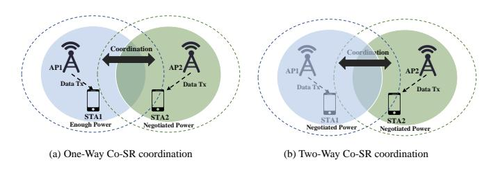

Fig. 4. Two types of Co-SR.

After the cross-BSS measurement phase is completed, Co-SR enters the multi-AP coordination phase. In this phase, one or more sharing APs (not limited to the main AP) send Co-SR Announce frames. These frames contain a list of APs participating in Co-SR transmission, power limits, and RU allocation information. With this information, each AP can clearly define its role and tasks, thereby coordinating their transmission parameters to ensure efficient data transmission on the same time and frequency resources.

Following preparation through cross-BSS measurement and multi-AP coordination phases, Co-SR enters the concurrent transmission phase. In this phase, each AP simultaneously transmits PPDUs on the same time-frequency resources. The signal fields of these PPDUs (such as L-SIG, U-SIG, and UHR-SIG) carry coordination parameters, including MCS, spatial stream count, and Transmission Opportunity (TXOP) duration. The inclusion of these parameters enables STAs to accurately understand the current transmission configuration, thereby achieving efficient data reception.

- c) Key Features: Co-SR technology further optimizes spectrum resource utilization and data transmission efficiency in multi-AP environments through a series of enhanced features. This section describes the key features of Co-SR, highlighting its technical enhancements, based on the comparison between the IEEE 802.11bn documents [64], [65] and EHT.
  - Hybrid PHY Version Support: 802.11bn's Co-SR technology ensures backward compatibility through two physical layer modes, divided into Mode 1 and Mode 2. In Mode 1 (UHR+EHT, EHT+UHR, or EHT+EHT), all APs participating in Co-SR transmission must maintain consistency in the L-SIG field to ensure that EHT devices can correctly parse the PPDU header, but the U-SIG field may vary to support new UHR features. In Mode 2 (UHR+UHR), all APs must maintain consistency in both the L-SIG and U-SIG fields, and the signal field optimized for a full UHR environment must also remain consistent to reduce decoding complexity. Additionally,

- 802.11bn can enhance compatibility and deployment flexibility between APs through dynamic mode switching.
- Flexible RU Allocation: Co-SR supports multiple RU combinations, ranging from 26-tone to 3984-tone. UHR dynamically allocates RUs through the main AP, enabling multiple APs to collaborate to optimize spectrum resources. Compared with EHT's static RU allocation, UHR's RU allocation is more flexible and can prioritize RUs based on user demand, improving spectrum efficiency in high-density scenarios.
- Based On the U-SIG Field Of EHT, 802.11bn introduces the UHR-SIG field to carry Co-SR-specific parameters. Additionally, the UHR-SIG field supports dynamic parameter updates, enabling real-time adjustment of signaling parameters based on channel conditions and system requirements. Compared to the U-SIG field in EHT, the UHR-SIG field supports coordination among multiple APs through optimized encoding structures and parameter compression.
- Efficient CSI Feedback Mechanism: Co-SR introduces an efficient Channel State Information (CSI) feedback mechanism that reduces feedback overhead by feeding back the amount of CSI variation over time or frequency. Compared to the explicit CSI feedback of EHT, the CSI feedback mechanism of UHR can further reduce overhead by optimizing the coding structure. The IEEE 802.11bn document also notes that efficient CSI feedback, combined with dynamic power control and RU allocation, can significantly improve Co-SR performance in high-density scenarios.
- 2) Co-BF: To further achieve high-reliability transmission, the 802.11bn Task Group introduced Co-BF technology, which is mainly a beamforming technology for EHT. Co-BF generates beam nulling through multi-AP collaboration, enhancing the signal strength of the target STA while suppressing interference to non-target STAs.
- a) Technical principles: Specifically, within a transmission cycle, Co-BF limits collaboration between a maximum of two APs, and the maximum spatial stream at the receiving site cannot exceed 2. By collaborating between the sharing AP and the shared AP, the signal direction can be adjusted to deliver data precisely to the STA while avoiding interference with other devices. Additionally, Co-BF relies on crossnetwork Channel State Information (CSI) to design delivery paths, ensuring that different APs can only transmit data to their associated STAs, thereby guaranteeing high reliability. In fact, the implementation of Co-SR is based on the following principles and technologies:
  - Beam Zeroing and Interference Suppression: Co-BF adjusts the phase and amplitude of the AP transmission signal through a precoding matrix, forming signal zero points in non-target STA directions, and achieves interference suppression through zero-space projection or minimum mean square error (MMSE) algorithms. Compared to EHT's single AP beamforming, Co-BF achieves distributed interference management through multi-AP collaboration, improving network performance.

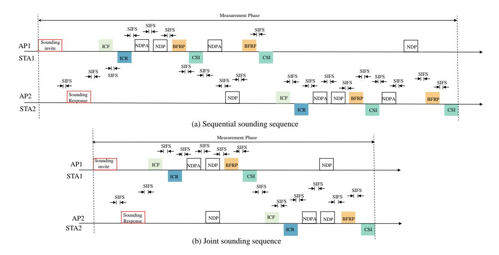

Fig. 5. An example of sequential detection and joint detection. Sequential detection involves the participating entities conducting detection in order of priority, while joint detection involves multiple entities conducting detection simultaneously in parallel.

- High-precision CSI Feedback: Co-BF relies on CSI detection to dynamically update the precoding matrix, ensuring the accuracy of beam zeroing. To further reduce feedback overhead, the 802.11bn Task Group is also considering introducing differential Given's Rotation and multicomponent feedback mechanisms to achieve efficient utilization of network resources [66].
- b) Operating Procedure: In terms of details, the Co-BF operation is divided into three phases: sounding, coordination, and transmission. It mainly relies on efficient signaling framework to achieve CSI collection and signal synchronization.

During the detection phase of Co-BF operations, the STA generates an accurate precoding matrix by receiving CSI across BSSs, thereby achieving beam zeroing and interference suppression [67]. As shown in the Fig. 5, detection includes two methods: sequential detection and joint detection. Specifically, each AP triggers the STA to measure the channel response from its own BSS and other BSS APs by sending NDP Announcement (NDPA) and Null Data Packet (NDP) frames. Then, the STA generates a compressed CSI report, which feeds back the amount of CSI change over time or frequency based on the differential Given's Rotation mechanism to reduce feedback overhead. The generated reports are transmitted to the main AP via a high-speed backhaul link, where the main AP processes the CSI to complete channel detection. UHR supports STA self-recommended CSI feedback, allowing STAs to proactively trigger CSI updates when detecting rapid channel changes. The detection cycle is optimized from EHT's every 20 ms to a more flexible cycle to adapt to dynamic environments. Additionally, [68] also suggests introducing a collaborative CSI detection sequence, where the main AP can coordinate the NDP transmission times of multiple APs to further avoid detection conflicts and improve CSI accuracy.

In the transmission phase, two routers coordinate data transmission through a three-frame handshake. Specifically,

the master AP first sends the invitation frame to share target STA information. Then, the slave AP responds immediately with a response frame to confirm participation and provide STA information. Concurrently, the frames synchronize timing, frequency, and transmit transmission parameters, initiating concurrent down-link PPDUs [69]. Finally, confirmation information is collected via sequential MU-BAR/BA. Additionally, the primary AP may aggregate the basic trigger frames within the down-link PPDU to reduce signaling overhead.

As illustrated in [68] and described earlier, Co-BF and Co-SR exhibit high similarity in the detection, coordination, and concurrent transmission phases. In practice, Co-SR also employs the identical Co-BF transmission frame sequence. To clearly demonstrate this complete process, the Fig 6 shows the full frame sequence of Co-BF/Co-SR operations.

- c) Key Features: Since the 802.11bn Task Group began promoting UHR research, Co-BF has gradually considered a series of key features. These features include strict signal consistency control and distributed MIMO optimization.
  - Signal Consistency: The Co-BF requirement of UHR stipulates that the pre-UHR portion of multi-user coordinated beamforming PPDUs must use a non-beamforming mode, with MCS fixed at MCS0, to ensure that all STAs can correctly parse the PPDU header [61]. The pre-UHR portion carries key coordination parameters (such as PPDU type, bandwidth, and number of spatial streams) to ensure signal consistency. The data portion applies the precoding matrix. Similar to Co-SR, Co-BF also supports two PHY modes: Mode 1 and Mode 2.
  - Distributed MIMO Optimization: In the design of the 802.11bn Task Group Co-BF, two APs share cross-BSS CSI via a high-speed backhaul link and jointly compute the precoding matrix. The advantage of this design is that it can precisely direct each spatial stream to target STA for precise transmission, while also performing spatial zeroing on non-target STAs to avoid interference. The

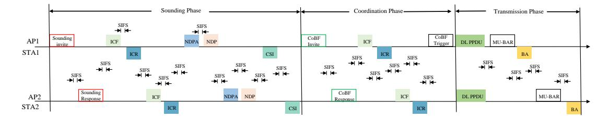

Fig. 6. Complete Frame Sequence for Co-BF/Co-SR Operation, Illustrating Sounding, Coordination, and Transmission Phases.

entire process is carried out in three frames to complete time synchronization and spatial configuration.

*3) Comparison and Synergy Between Co-SR and Co-BF:* In general, the 802.11bn Task Group is considering two technologies at the PHY layer: Co-SR and Co-BF, to optimize spectrum efficiency and signal quality and Key Takeaways also outline the key points of these technologies. Specifically, Co-SR achieves spatial multiplexing through dynamic power adjustment and C-OFDMA, enabling multiple APs to transmit concurrently on the same time-frequency resources. Additionally, Co-SR supports mixed PHY versions, such as UHR+EHT or UHR+UHR, with lower requirements for signal field consistency. In contrast, Co-BF suppresses interference through beam zeroing and enhances the target STA signal, making it suitable for low-latency and high-reliability scenarios. Co-SR requires high-precision time/phase synchronization, frequent CSI detection, and complex precoding matrix calculations. According to [20], Co-SR can improve throughput by 15%- 25% in mesh networks, while Co-BF can improve it by 20%-50%. The two complement each other in different scenarios, jointly enhancing network performance. Additionally, 802.11bn introduces a unified signaling framework, reusing EHT's BSRP GI3/M-BA frames, and supports dynamic mode switching via UHR-SIG [70].

## Key Takeaways:

- When to use: Co-SR and Co-BF are applied in dense or reliability-critical WLAN environments where single-AP operation cannot meet performance requirements.
- Typical gains: Both Co-SR and Co-BF improve overall system capacity, spectral efficiency, and reliability through coordination among multiple APs, enabling spatial reuse and coherent transmission.
- Main trade-offs: Require precise synchronization, accurate CSI exchange, and inter-AP coordination. System complexity and overhead increase with the number of cooperating APs.
- Implementation readiness: Being actively investigated within IEEE 802.11bn as key enablers for ultrahigh reliability and efficient spectrum reuse in UHR.

## *E. Summary of PHY Technology Enhancement*

To enable the new UHR physical layer to support ultra-high reliability, low latency, and multi-AP coordination scenarios, this section reviews key PHY layer enhancement technologies under discussion by the 802.11bn Task Group, including DRU, MCS, 2xLDPC, Co-SR, and Co-BF. The evolution from EHT to UHR in PHY layer standards reflects a design paradigm shift from single-link peak throughput to multi-link cooperative reliability. For instance, DRU technology, as a spectrum allocation method, overcomes the PSD power constraints in the 6 GHz band by sacrificing spectral density, thereby extending coverage for critical IoT devices. Furthermore, the proposed Co-SR and Co-BF technologies further mark a shift from competition-based optimization design to multi-AP coordinated resource management, which is crucial for reliability in dense environments.

However, bridging the gap between theory and deployment poses significant challenges. As highlighted in our subsequent open issues, the collaborative gains of Co-BF and Co-SR are offset by synchronization costs. The physical separation of APs demands microsecond-level phase synchronization and real-time CSI feedback, making the system vulnerable to CSI aging and backhaul latency. Furthermore, the introduction of higher-order UHR-MCS and discrete DRU tones exacerbates hardware nonlinearity issues such as high PAPR, forcing tradeoffs between theoretical rates and power amplifier efficiency in cost-sensitive commercial chips.

In the next section, we will focus on the enhanced technologies of the 802.11bn Task Group at the MAC layer.

# III. MAC TECHNOLOGY ENHANCEMENT

Similar to the PHY technology enhancements mentioned earlier, UHR is also advancing research on enhancements to the MAC layer. Based on a review of the 802.11bn meeting minutes and related literature, this section focuses on MAC layer technology enhancements, as shown in Table VI.

## *A. Seamless Mobility Domain*

With the continuous development of WLAN, fast and stable network connections have become an increasingly important practical requirement. In recent discussions on new MAC layer technologies by the IEEE 802.11 Task Group, SMD has emerged as a central topic. In essence, the key is to enable STAs to switch between different APs without interrupting the connection or needing to reconnect to the network.

*1) Key Architecture:* The 802.11bn Task Group introduced SMD as the core architecture supporting seamless roaming. Specifically, SMD covers multiple access points within the same Extended Service Set (ESS) for MLD, coordinated uniformly by the SMD Management Entity (SMD-ME). The

across 6 GHz.

Category Ref. Type Contribution Description Seamless Mobility Domain (SMD) Further Considerations on Seamless Roaming[72] Ad-hoc discussion Points out distributed MLO/Roaming-MLD architecture is highly complex. Multi-AP coordinated fast roaming with shared context and pre-authentication. Seamless roaming within a mobility domain[75] Ad-hoc discussion Sets keep-alive timeout to preserve context on the original AP side. PDT-CR MAC on Seamless Roaming Part 2[76] Draft text Describes the roaming process and handover mechanism for SMD. High Priority Enhanced Distributed Channel Access (P-EDCA) CC50 CR for P-EDCA[83] Draft text Proposes an improved P-EDCA mechanism to reduce latency. EDCA with dynamic contention window and high-priority TXOP protection EDCA for Non-Primary Channel Access[85] Simulation eval Defines the complete EDCA mechanism for non-primary channel access. Retry Timeout Adjustment during EDCA Periods[87] Simulation eval Proposes high-priority timeout to replace traditional CTS/ACK timeout. Non-Primary Channel Access (NPCA) Further considerations for NPCA operation[94] Ad-hoc discussion Extends NPCA switching conditions. Secondary channel access without primary channel contention. Channel Access Mechanisms for the NPCA Operation[95] Ad-hoc discussion Proposes the UL TXOP Restricted Duration Mechanism. DT-CR MAC-NPCA enablementdisablement-update[96] Draft text Defines the operational and update protocols for NPCA Dynamic Subband Operation (DSO) Performance benefits of DSO[104] Ad-hoc discussion Systematically organizes the DSO definition and trigger frame format. Flexible subband switching and bandwidth adaptation Service Period based Dynamic Subchannel Operation [108] Ad-hoc discussion Proposes an SP-based DSO mechanism.

TABLE VI LIST OF MAC ENHANCEMENTS AND RELEVANT EFFORTS.

design philosophy of this architecture is to integrate multiple access points into a single logical seamless coverage area, enabling smooth handover between different access points [71]. Additionally, the role of the SMD-ME extends beyond resource scheduling; it also ensures that Non-AP MLDs maintain their associated state when switching within the SMD, eliminating the need for re-authentication or re-association [72], [73].

As shown in Fig. 7, the SMD architecture is divided into two deployment methods: centralized and distributed. In the centralized deployment scheme, the logical SMD-ME is hosted on the Wireless LAN Controller (WLC). The WLC can provide SMD-level authentication (including 802.1X authentication), association, and Robust Security Network Association (RSNA) key management functions, which are suitable for non-AP MLDs. In a distributed deployment, the logical SMD-ME can be hosted on each AP MLD within the SMD. SMDlevel authentication and related functions for non-AP MLDs are managed in a distributed manner on the AP MLDs. The context for non-AP MLDs can also be seamlessly transferred between AP MLDs during roaming [74].

*2) SM Discovery Mechanism:* In the MLD seamless roaming architecture proposed by the 802.11bn Task Group, Non-AP MLD needs to efficiently and accurately discover SMD to ensure seamless handover between AP MLD within the same ESS. However, unlike the MLO in EHT, which primarily focuses on spectrum utilization and throughput optimization [2], the SMD discovery mechanism in UHR places greater emphasis on roaming efficiency and context continuity [75]. To this end, there are currently two main mechanisms that support Non-AP MLDs in quickly identifying and selecting suitable SMDs.

Conditions of DSO operation[109] Simulation eval Indicates whether the DSO ICF should carry

*a) SMDE:* SMD elements (SMDE) constitute a key signaling structure that includes SMD identifiers, capability information (such as supported data transmission types and resource reservation capabilities), and roaming-related parameters. This information is embedded in probe response frames, authentication frames, and association frames. The advantage of this approach is that Non-AP MLDs can directly obtain SMD-related information during the scanning process without the need for multiple scans or complex parsing processes. Compared to the channel discovery mechanism in 802.11be, SMDE not only provides basic BSS information but also includes context-based transmission support and SMD-level authentication indicators. Non-AP MLDs can quickly determine during the scanning process whether an AP belongs to their target SMD, thereby directly obtaining the context information required for roaming. This design reduces the scanning overhead of Non-AP MLDs and improves roaming preparation efficiency.

a downlink data indicator bit.

*b) Neighbor Report Enhancement:* UHR enhances the Neighbor Report (RNR) functionality of EHT by adding a same SMD indicator bit in the MLD or BSS parameters of RNR to identify whether an AP MLD belongs to the same SMD. For APs that are not in the same SMD, RNR provides a short SMD ID to assist non-AP MLDs in quickly filtering roaming targets. Using the same SMD indicator bit, non-AP MLDs can quickly determine whether an AP belongs to the current SMD, thereby avoiding unnecessary roaming attempts. As shown in Fig. 8, the roaming behavior of STAs within different SMDs is demonstrated, with the enhanced RNR functionality used to discover and identify AP MLDs

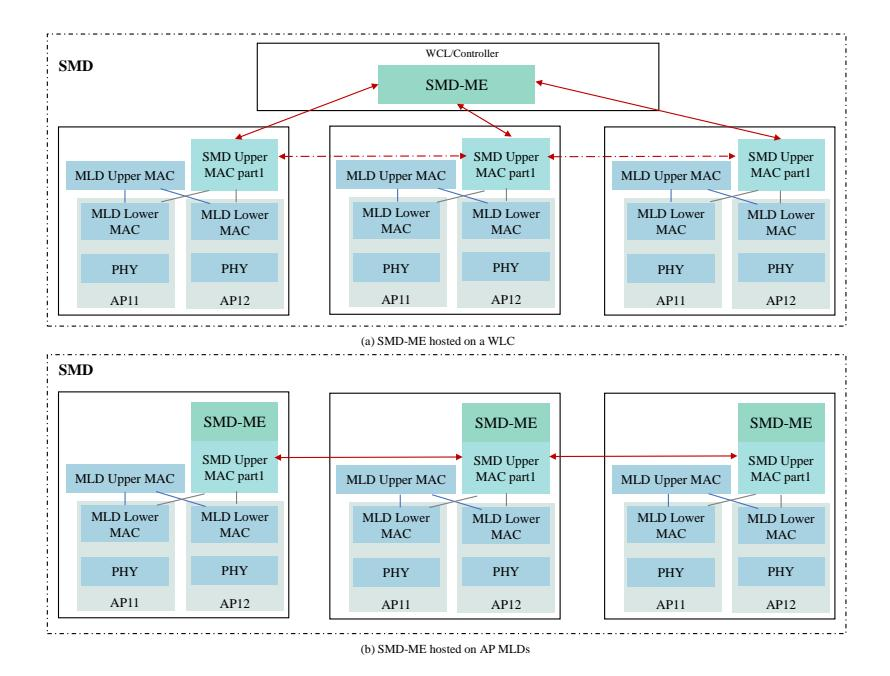

Fig. 7. SMD architecture, including centralized and distributed.

in different SMDs, enabling clients to select the appropriate AP for seamless roaming [71].

- *3) SM Process:* The 802.11bn MLD seamless roaming design aims to reduce data interruption and latency through a multi-stage process. The core of this design is to ensure the continuity and stability of network connections during roaming by preparing in advance and optimizing resource allocation [76]. The following is a detailed explanation of the three aspects of roaming preparation, execution, and cancellation.
- *a) Roaming Preparation:* The roaming preparation phase is the foundation of the UHR seamless roaming process, aiming to reduce latency and data interruption risks during roaming execution by pre-transmitting context and configuring the target AP MLD link. Unlike EHT's MLO, which primarily focuses on throughput optimization, the UHR roaming preparation phase emphasizes the efficiency of resource reservation and context management to support high-density networks and dynamic mobility scenarios [77]. In the initial discussions of the 802.11bn Task Group, this phase achieves efficient roaming preparation through the following key mechanisms:
  - EHT Link Reconfiguration Frame: UHR can extend the 802.11be EHT frame format and introduce the EHT Link Reconfiguration Frame. This frame can contain reconfiguration elements for multiple links, such as the MAC address of the target AP MLD, configuration files for each STA, SMD elements, and roaming control elements. These elements provide detailed configuration information for the roaming process, ensuring that non-AP MLDs can smoothly switch to the target AP MLD.
  - Multi-target Preparation: In complex scenarios, UHR recommends supporting non-AP MLD while preparing for 2-3 target AP MLDs and reserving link resources (such as bandwidth and time slots). This multi-target mechanism enhances roaming robustness by pre-allocating resources

- and context [78].
- Context Pre-transmission: To reduce signaling overhead during roaming execution, the roaming preparation phase can pre-transmit part of the context (such as sequence numbers and block acknowledgment protocol parameters) via the air interface or backend network. Compared with EHT context management, this mechanism places greater emphasis on cross-AP MLD uniformity and data continuity.
- *b) Roaming Execution:* The roaming execution phase is a critical step in the UHR seamless roaming process, determining the efficiency of AP MLD switching and the continuity of data transmission. EHT's multi-link fast switching focuses primarily on optimizing link switching throughput, while UHR optimizes context transfer and link activation mechanisms to reduce data interruption time and ensure stable data transmission.

Initially, a roaming request is triggered. The Non-AP MLD sends a roaming request frame to the current AP MLD as needed, pausing upstream data transmission to minimize the risk of data interruption during the roaming process. This frame includes the identifier of the target AP MLD to ensure roaming to the correct target AP MLD. Subsequently, the current AP MLD continues to send buffered downlink data within the downlink drain time to ensure that the data stream is transmitted as much as possible before the switch, thereby reducing the risk of data interruption. After the target AP MLD receives the context, it sends an acknowledgment frame to the non-AP MLD, updates the DS mapping, activates the target link, and opens the 802.1X port. The non-AP MLD can then send Class 3 frames to the target AP MLD to resume normal data communication.

*c) Roaming Cancellation:* In actual environments, the roaming process is not always stable. Non-AP MLDs may choose to cancel the roaming plan during the roaming preparation phase for a variety of reasons, such as changes in received signal strength indication, changes in mobility mode, or unavailability of resources on the target AP MLD. To address this, UHR also considers a roaming preparation cancellation mechanism to release the reserved link resources on the target AP MLD, improve resource utilization efficiency, and avoid invalid occupancy. The specific process of this mechanism is as follows:

- Cancellation Signaling: Non-AP MLDs notify the target AP MLD to release reserved resources by sending a roaming preparation cancellation request frame to the current AP MLD. The frame contains the target AP MLD's identifier and cancellation instructions to ensure accurate resource management.
- Confirmation Mechanism: After receiving the cancellation request, the target AP MLD responds with a confirmation frame to notify the Non-AP MLD that the resources have been released.
- Timeout Management: To prevent signaling loss or processing delays, 802.11bn also defines a timeout mechanism for cancellation requests. If no confirmation is received within a specified time, the current AP MLD can retransmit the cancellation request or take corresponding resource management measures.

Although the roaming cancellation mechanism of UHR is already reasonably designed, there is still room for improvement. In recent task group discussions, there has been no consensus on the priority handling of cancellation requests and the coordination mechanism for multi-target cancellations. Additionally, in high-density networks, frequent cancellation operations may lead to increased signaling overhead, and designing an efficient resource recovery strategy remains an unsolved issue. In future discussions, integrating AI/ML intelligent techniques is a key area of focus. By predicting the movement patterns of Non-AP MLDs, resource management can be further optimized to enhance resource utilization efficiency.

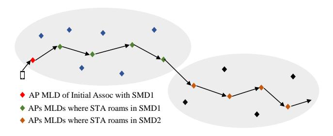

Fig. 8. STA roaming within different SMDs.

*4) Conclusions and Future Directions:* UHR's MLD seamless roaming technology provides a low-latency, highreliability connection experience for high-density network environments through the SMD architecture and context transfer mechanism. The following Key Takeaways summarize SMD's core features. Specifically, the SMD architecture achieves seamless handover across APs through unified MAC management and centralized coordination by the SMD-ME. The context transfer mechanism also ensures the continuity of data streams. Compared to EHT's MLO and multi-AP coordination technologies, these improvements have made progress in terms of reliability and handover efficiency. As mentioned in the paper, future research can focus on areas such as signaling overhead, efficient resource recovery strategies, and AI/MLbased intelligent methods [79].

## Key Takeaways:

- When to use: SMD is applicable in scenarios with frequent user mobility across overlapping BSSs, where continuous service and session persistence are critical.
- Typical gains: Enhances handover continuity and minimizes service interruption by enabling unified mobility control and context sharing among APs.
- Main trade-offs: Increases coordination overhead and signaling requirements for context synchronization, especially in multi-vendor deployments.
- Implementation readiness: Under active development in IEEE 802.11bn MAC Task Group as a foundation for seamless mobility in UHR WLANs.

# *B. HiP Enhanced Distributed Channel Access*

Traditional EDCA is the core QoS mechanism introduced by IEEE 802.11e, designed for WLAN scenarios where distinct priority requirements exist for different service types. During EDCA research, numerous scholars have analyzed and summarized its characteristics [80]–[82]. Overall, EDCA was originally designed to address the latency and jitter issues in real-time services caused by the traditional Distributed Coordination Function (DCF), which treats all traffic indiscriminately. However, EDCA's probabilistic, contention-based nature prevents it from providing strict deterministic delay guarantees for UHR applications. In densely deployed environments, even traffic with the highest priority (AC VO) may experience significant delays during contention, resulting in unpredictable delay spikes. This is unacceptable for mission-critical scenarios such as industrial automation or telemedicine.

To address such issues, the IEEE Task Group's recent discussions on MAC have led the 802.11bn Task Group to consider adopting P-EDCA in UHR scenarios. Specifically, the core concept of P-EDCA is to isolate these delay-sensitive STAs from the general contention pool. This mechanism allows eligible STAs (e.g., those with AC VO traffic after a first retransmission failure) to transmit a special MAC frame, such as DS-CTS, to declare a protected high-priority time slot. During this dedicated time slot, only P-EDCA STAs compete using an extremely short contention window, ensuring rapid channel acquisition. This failure-triggered logic also forms the basis for the subsequent HPTO fast retry mechanism. Therefore, this section details P-EDCA technology from the perspectives of trigger mechanisms, short contention period design, and channel protection strategies.

*1) Trigger Mechanism:* To protect low-latency traffic, P-EDCA initiates a short contention period by sending a short control frame DS-CTS [83]. The advantage of this initiation

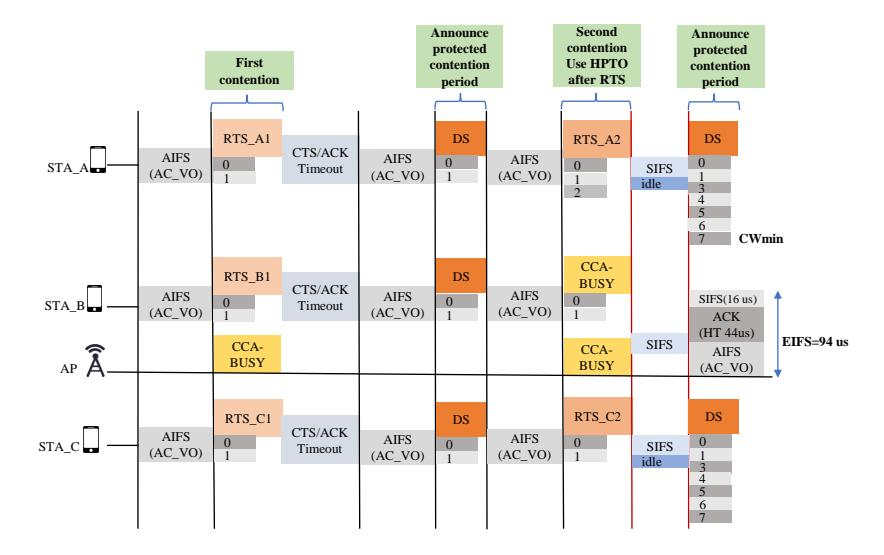

Fig. 9. An example of multiple STAs competing for an AP.

method is that it allows only the enhanced distributed channel access function of AC\_VO to participate in the contention, while other ACs (VI, BE, BK) temporarily cease contention. DS-CTS uses a non-high-throughput PPDU format with a transmission rate of 6 Mb/s and a duration of 97 µs to quickly seize the channel and set the network allocation vector. Specifically, the conditions for triggering P-EDCA include the following aspects:

- a) QSRC Counting Trigger: When the AC\_VO retransmission counter in the STA's AC\_VO queue reaches a specific threshold, it indicates that the AC\_VO traffic has experienced multiple retransmission failures, which triggers P-EDCA, allowing the STA to prioritize access to the channel. This trigger mechanism ensures that UHR can quickly respond to low-latency traffic requirements, but the threshold settings need to be optimized to avoid frequent triggering that could cause channel congestion.
- b) SCS Negotiation Trigger: To ensure that low-latency traffic is transmitted in a timely manner, P-EDCA has a Stream Classification Service (SCS) negotiation trigger mechanism [84]. Under this mechanism, STA and AP negotiate the transmission requirements for low-latency traffic and agree on the conditions for triggering P-EDCA, such as a latency requirement of less than 2 ms or packet priority. This negotiation mechanism enhances the adaptability of P-EDCA to different application scenarios.
- c) Channel State Trigger: When the AP detects intense competition on the PCH or non-NPCH or a busy channel, it can actively send a DS-CTS to initiate a short competition period for P-EDCA, prioritizing scheduling for low-latency STAs. This trigger mechanism can be combined with the results of channel idle assessment to enable the AP to dynamically select the channel for triggering P-EDCA [85], thereby improving channel utilization. However, frequent channel state triggers may increase the processing burden on the AP, and subsequent work can further optimize the trigger algorithm [86].

- 2) Short-term Competition: In traditional scenarios, there are multiple low-latency STAs competing for synchronization. To address such issues, P-EDCA introduces a short-term competition mechanism. This approach uses a smaller competition window, allowing only the enhanced distributed channel access functionality of AC\_VO to participate in the competition, thereby reducing the waiting time for low-latency traffic. Compared to the competition window in traditional EDCA, the smaller parameter design in P-EDCA significantly reduces the backoff time, ensuring that voice-like traffic (such as AR/VR or real-time communication) can quickly seize the channel. The specific process of this mechanism is as follows:
- a) Enter The Short Contention Period: When STA receives DS-CTS sent from P-EDCA, if the current network allocation vector has not been set and the channel remains idle during the point coordination function interval (PIFS), it enters a short contention period. Setting PIFS ensures that AC\_VO traffic has priority over other traffic in channel contention, while remaining compatible with the channel access mechanism of Wi-Fi 6/7.
- b) Back Off Count: After entering the short contention cycle, to reduce the STA's waiting time, the STA's backoff counter (BC) randomly selects a value from [0,CWmin] ([0,7]) and decrements it by one in each time slot. When the BC reaches 0, the STA initiates an Request to Send/Clear to Send (RTS/CTS) exchange to obtain the TXOP. In this mechanism, a smaller CWmin and a fixed CWmax reduce the randomness of the backoff time, thereby lowering tail latency, making it suitable for applications requiring millisecond-level latency.
- c) Competition Failure Handling: In fact, each STA may not necessarily obtain a TXOP within a short contention cycle. When contention fails, the STA needs to reduce the waiting time and quickly retry to obtain the channel [87]. One possible method is to use High Priority Timeout (HPTO) to determine when to resend the DS frame, as shown in Fig. 9. In the first round of channel contention, all STAs fail. In the second round, STA\_C succeeds in the competition, while the other

two STAs wait for the HPTO before sending the next DS frame. This design ensures that low-latency traffic can quickly retry after a competition failure, reducing retransmission wait time. However, multiple competition failures may increase the risk of channel conflicts, at which point the AP may need to intervene or dynamically adjust parameters to optimize the process.

*3) Channel Protection:* To ensure that low-latency traffic can be continuously transmitted within a single TXOP, the 802.11bn Task Group is considering implementing the DS-CTS and RTS/CTS mechanisms in the P-EDCA setting [88]. Specifically, the duration of the DS-CTS frame is calculated using a fixed formula, with the result ensuring coverage of the maximum possible backoff time during short contention periods. The advantage of this design is that it is compatible with the AC VO parameter of traditional EDCA, avoiding misunderstandings of NAV settings by traditional STAs during transmission [89]. Additionally, the duration of the DS-CTS frame is designed to be short, occupying less time on the channel. This design helps reduce the overall overhead of control frames across the network and enables rapid prereservation of the channel for low-latency traffic. When the STA's backoff counter reaches 0, it initiates an RTS/CTS exchange to ensure continuous transmission of the current TXOP. When using HPTO for competition failure handling, the HPTO mechanism allows the STA to quickly re-initiate DS-CTS even if it has not received a CTS, thereby reducing channel waste caused by RTS conflicts or channel interference.

Specifically, P-EDCA enhances fairness and quality of service in wireless networks by optimizing the access mechanism. Next, Key Takeaways also briefly summarize P-EDCA's main features and their impact on network performance.

# Key Takeaways:

- When to use: P-EDCA is designed for ultra-reliable and latency-sensitive traffic where conventional EDCA cannot ensure deterministic access performance.
- Typical gains: Improves access fairness and latency determinism by introducing high-priority contention windows, differentiated scheduling, and enhanced coordination mechanisms.
- Main trade-offs: May reduce overall channel efficiency if priority levels are misconfigured; requires accurate tuning of contention parameters.
- Implementation readiness: Proposed as a candidate MAC feature in IEEE 802.11bn for UHR access control and QoS differentiation.

# *C. Non-Primary Channel Access*

In previous 802.11 standards, Wi-Fi required access via the primary channel (Primary Channel Access, PCH). If the primary channel is busy, even if there are available nonprimary channels (Non-Primary Channel, NPCH), the station STA can not transmit, which reduces overall bandwidth efficiency. Therefore, IEEE 802.11bn introduces an innovative mechanism called NPCA. This mechanism allows APs and STAs to dynamically switch to idle secondary channels (such as 20/40/80 MHz) for data transmission when the primary channel is busy due to OBSS traffic (NAV settings).

In fact, some scholars have already analyzed the actual performance of NPCA in UHR scenarios. Reference [90] uses the Bianchi model to model the throughput and delay of the NPCA mechanism proposed for UHR, analyzes the performance impact of NPCA when coexisting with traditional networks, and verifies the excellent performance of NPCA. Regarding the overhead issue of NPCA, Wei et al. [91] points out that the delay overhead caused by NPCA channel switching is a significant concern. They incorporated switching delay into the analysis framework and designed a strategy that dynamically switches between NPCA and traditional mechanisms based on the load of the main channel. Reference [92] uses a continuous-time Markov chain (CTMC) to model the NPCA mechanism, proposing that NPCA can effectively mitigate the performance anomalies caused by low MCS OBSS slowing down the entire WLAN. Therefore, this section focuses on introducing the NPCA mechanism to help readers better understand its principles and operating mechanisms.

- *1) Basic Concepts:* NPCA is an innovative MAC layer mechanism proposed by the IEEE 802.11bn Task Group, aimed at addressing the issue of low spectrum resource utilization efficiency when the primary channel is busy due to OBSS traffic or other conditions (such as channel congestion or interference) [93]–[95]. Each BSS defines an NPCA primary channel, and STAs do not need to simultaneously detect or decode network allocation vector information from both the PCH and NPCH [96]. However, the implementation of NPCA must address critical issues such as channel switching triggers, Initial Control Frame (ICF) design, and channel competition on the NPCH.
- *2) Channel Switching Trigger Mechanism:* To achieve efficient spectrum resource utilization, NPCA triggers channel switching through a channel switching trigger mechanism and triggers STA switching to NPCH based on PCH status [97]. The channel switching in NPCA can be initiated by various trigger events, including OBSS control frames (such as RTS/CTS, MU-RTS/CTS), OBSS physical protocol data units (PPDU, such as HE/EHT/UHR PPDU), or specific signaling frames. These trigger events indicate the busy state of the PCH, prompting the STA to switch to the NPCH for data transmission. The specific channel switching trigger process is as follows:
  - Trigger Signaling Transmission: After completing the PCH assessment, if the PCH is determined to be unavailable, the AP sends a trigger signaling notification to the target STA to switch to the NPCH. To reduce interference to neighboring BSSs during STA transmission, low-power CTS frames utilize the channel indication information of the NPCH and ensure coverage only of the target STA by reducing the transmission power [98]. For example, in the 6 GHz band of EHT, low-power CTS frames can combine with the U-SIG field of EHT PPDU to transmit handover instructions.
  - PCH Transmission Blocking: To prevent un-switched STAs from continuing to transmit on the PCH and causing interference, low-power CTS frames are used to

block non-target STA transmission on the PCH by setting the network allocation vector (NAV). The Duration field of the NAV must be set precisely to cover the handover and communication time on the NPCH. This is because setting the Duration field too long may reduce PCH utilization, while setting it too short may cause OBSS conflicts.

- NPCH Initial Communication Establishment: After receiving the trigger signal, the STA switches to NPCH and sends an ICF to establish communication. The transmission of the ICF must be coordinated with the AP to ensure channel availability on the NPCH. However, if the target STA fails to switch over in time or the ICF does not receive a response (e.g., the Initial Control Response, ICR), communication may fail. Therefore, we recommend that the 802.11bn Task Group define explicit timeout and retry mechanisms in the future to complete the communication establishment between the STA and the AP.
- *3) ICF Design:* To ensure reliable channel access and data transmission initialization between the STA and AP, the ICF is a key control frame used in the NPCA mechanism to establish communication on the NPCH. Specifically, the ICF uses a non-HT PPDU or non-HT duplicate PPDU format, supporting transmission rates of 6 Mbps, 12 Mbps, or 24 Mbps, ensuring robustness under different channel conditions [99]. The primary functions of the ICF include conveying NPCH channel parameters to the AP or target STA, setting the NAV, and triggering the initial control response. These functions collectively ensure reliable channel access and data transmission initialization between the STA and AP over the NPCH.

However, the design of ICF needs to address complex issues such as frame structure definition, signaling overhead, response mechanisms, and compatibility with the EHT protocol. For example, the Duration field of ICF needs to be precisely set to cover the transmission protection time on NPCH, and STA needs to initiate a retry mechanism when ICR is not received, which increases the complexity of the protocol [100]. To this end, we can consider defining a clear timeout mechanism to standardize the behavior of STA in the absence of a response.

In addition, the ICF response mechanism is also a design challenge [101]. After receiving the ICF, the AP must send an ICR (such as an ACK or dedicated response frame) to confirm the establishment of the NPCH communication link. However, if the ICR is not delivered in a timely manner, the STA may misjudge the NPCH status, leading to transmission failure or collisions. To address this, [95] proposes a hybrid response mechanism combining trigger frames and EDCA, allowing the AP to allocate resources on the NPCH via trigger frames and prioritize responses to high-priority ICFs. This setup is similar to EHT's multi-user trigger mechanism, making ICF responses more flexible [102].

*4) Channel Access:* To address the complex channel competition environment in high-density networks, the 802.11 Task Group is considering advancing channel access optimization for NPCA to enhance spectrum efficiency and access fairness. Specifically, [95] proposes a hybrid channel access mode, namely triggered and enhanced distributed channel access. This mode allows APs to prioritize scheduling on the NPCH by controlling the transmission time of uplink transmissions and restricting non-AP STAs from transmitting on the PCH. However, this mechanism may increase signaling overhead, especially in high-density scenarios, where frequent trigger frames may lead to an excessive burden on control frames. Therefore, [94] further suggests guiding STA competition on the NPCH by setting a maximum NPCA handover delay parameter, combined with low-power CTS frames, to reduce conflicts on the NPCH. This method improves NPCH channel utilization by dynamically adjusting the contention window (CW) and switching time.

Compared to the multi-link channel access mechanism of 802.11be, NPCA's hybrid mode is more suitable for highdensity scenarios, capable of dynamically adapting to the channel states of PCH and NPCH. For example, EHT's multimaster channel access allows STAs to compete independently across multiple frequency bands, while NPCA uses the T-PCH mechanism to quickly switch to NPCH when PCH is busy, and can achieve similar multi-link effects by combining lowpower CTS frames. However, channel access on the NPCH requires addressing synchronization issues between multi-link channels. [102] proposes that NPCA can synchronize NPCH states in seamless roaming scenarios via UHR OM notification frames, and combine with EHT's fast session transfer mechanism to ensure continuity of channel access across frequency bands.

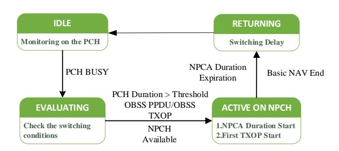

Fig. 10. State Transition Diagram for NPCA Operations. (a) Handover Threshold: The PCH occupancy duration must exceed a preset threshold for NPCA to activate. (b) NPCA Duration: Defines the total duration the STA operates on the NPCH. (c) Uplink TXOP Restriction: Access rules on the NPCH to prevent initial collisions on the NPCH anchor channel. (d) Handover Delay: The physical time required for the STA to return to the PCH.

To more intuitively illustrate the dynamic switching logic and decision-making process of NPCA, we present a state transition diagram of NPCA operations in Fig. 10. Specifically, this diagram describes how the STA begins in a monitoring state on the PCH and transitions to an evaluation state upon detecting PCH busy. After satisfying specific handover conditions (such as PCH occupancy exceeding the threshold and NPCH availability),the STA switches to the NPCH and activates NPCA operation. Finally, when the NPCA duration expires or the Basic Network Allocation Vector concludes, the STA returns to the PCH for monitoring via the return state.

*5) Conclusions and Future Directions:* Overall, NPCA, as a key technology introduced by the 802.11bn Task Group at the MAC layer, allows STAs to dynamically switch to NPCH for data transmission when the PCH is busy, providing an innovative solution for spectrum utilization in high-density networks. Through Key Takeaways, we summarize the core characteristics of the NPCA mechanism. However, the implementation of NPCA faces challenges such as channel switching latency, transmission conflicts, and protocol compatibility. Especially when integrating with EHT's MLO and multi-AP coordination, issues such as signaling overhead, synchronization, and OBSS interference need to be addressed. In the future, the 802.11bn Task Group should further discuss and research these issues to advance the standardization of UHR.

## Key Takeaways:

- When to use: NPCA enables stations to opportunistically transmit over non-primary subbands, suitable for spectrum-fragmented or interference-dominant environments.
- Typical gains: Increases spectrum utilization and throughput by allowing dynamic subband selection and concurrent channel access.
- Main trade-offs: Adds complexity in sensing, coordination, and collision avoidance; may require multichannel synchronization support.
- Implementation readiness: Considered within the IEEE 802.11bn MAC framework as a flexible mechanism for efficient multi-band operation.

## *D. Dynamic Subband Operation*

In WLANs, there is often a disparity in bandwidth capabilities between most STAs and APs, which can lead to reduced efficiency in AP bandwidth utilization. To address this issue, the IEEE 802.11bn Task Group proposed an innovative technology at the MAC layer known as DSO [103]. Unlike the TWT service period used in previous Wi-Fi standards, DSO allows Non-AP STAs to dynamically utilize subbands within the BSS bandwidth that exceed their operational bandwidth during the TXOP, thereby improving spectrum utilization.

- *1) Basic Concepts:* UHR's Non-AP STA-triggered DSO is an innovative spectrum management technology that uses flexible subband switching to address complex interference environments and improve UHR and spectrum utilization efficiency in wireless local area networks [104]. The core objectives of DSO include ultra-high reliability, ensuring data transmission success rates by quickly switching to non-interfering subchannels. Additionally, the UHR DSO design considers compatibility with EHT, reusing existing frame structures to support hybrid network environments. Meanwhile, the IEEE 802.11bn Task Group is standardizing the STA-triggered DSO mechanism to ensure the protocol's universality and scalability [105].
- *2) DSO Triggering Mechanism:* To achieve rapid coordination between STA and AP, the 802.11bn Task Group is considering designing an efficient signaling interaction process in DSO to deal with sudden interference. Currently, there are two ways to trigger DSO: AP-triggered DSO and STAtriggered DSO.

In the AP-triggered DSO mode, the AP is the controller of the TXOP and can schedule sub-band switching. Specifically, the AP first sends a BSRP trigger frame to initiate frame switching. This frame is carried as a non-HT duplicate PPDU and contains RU allocation information for the target DSO sub-band [106]. After the STA moves to the ICF, it switches to the specified sub-band after the short interframe space (SIFS) interval based on the pre-negotiated DSO handover delay parameter and immediately sends an ICR to confirm readiness. Then, the AP schedules downlink MU PPDUs or triggers uplink transmissions on the DSO sub-band, and the STA completes data transmission and reception within that sub-band. When frame switching ends or timeout conditions are met, the STA must return to the main channel within the DSO handover delay to ensure normal reception of subsequent management frames (such as Beacons). The entire process is centrally scheduled by the AP without requiring active requests from the STA, making it suitable for scenarios with parallel transmission among multiple users.

In the STA-triggered DSO mode, a Non-AP STA actively initiates a handover request after detecting interference on the primary sub-band. Specifically, the STA uses PHY signal processing technology to detect interference on the main subcarrier in real time, identify the source of interference, and assess its intensity and duration. Based on this, the STA classifies interference types based on their characteristics (e.g., periodicity, non-periodicity, duration). For example, IDC interference may exhibit short-duration high-intensity characteristics, while 5G NR interference may have a broader spectrum occupancy. The classification results assist the STA in selecting an appropriate target sub-channel [107]. The STA then sends a DSO request frame to the AP, carrying key fields: interference duration, target sub-channel, handover delay, and priority identifier. Upon receiving the STA's DSO request frame, the AP dynamically adjusts resource allocation based on the availability of the target sub-channel, network load, and the STA's priority, and returns the scheduling result via a DSO acknowledgment frame. If the STA currently holds a TXOP, it can directly initiate transmission on the target subchannel and notify the AP to adjust subsequent scheduling. After transmission is complete, the STA returns to the main sub-band based on AP signaling or a predefined fallback delay to receive management frames such as Beacons. This process grants the STA higher response autonomy, making it suitable for low-latency and interference-sensitive applications.

To improve transmission reliability, DSO avoids transmission on the main sub-band affected by interference by dynamically switching to a secondary subband. For example, when the main subband is affected by IDC interference, the STA can switch to the secondary subband for transmission, while the AP can simultaneously schedule other STAs to maximize spectrum utilization. Additionally, the DSO mechanism in UHR can be combined with hole-punching technology to partially shield interfered-with sub-bands while retaining available subbands for continued transmission [108]. However, frequent sub-band switching may lead to spectrum fragmentation, reducing overall network efficiency. Therefore, we suggest that future research could explore global spectrum planning for APs or AI-based resource allocation algorithm optimization for sub-band allocation strategies to mitigate the impact of fragmentation.

During transmission, if signaling is lost, the STA can resend the request via a retransmission mechanism to ensure that the request is received and processed by the AP. Meanwhile, the AP can also address request loss scenarios using a backup sub-channel list or default sub-channel allocation. When the target sub-channel suggested by the STA is unavailable, the AP can choose another secondary sub-channel or reject the request and notify the STA via an acknowledgment frame. Then, the STA can rescan and initiate a new DSO request to find an available sub-channel. However, in high-load scenarios, multiple STA DSO requests may cause channel competition conflicts. To address this, the AP can consider triggering frame allocation of dedicated time slots or dynamically adjusting the CW to reduce the probability of conflicts and optimize channel resource allocation [109].

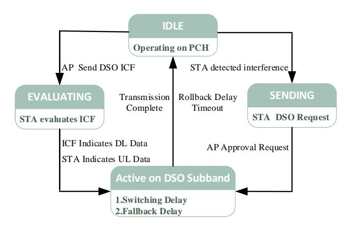

Fig. 11. State Transition Diagram for DSO Operations. (a) DL PPDU Presence Indication: The STA switches to the DSO subband only when the ICF indicates DL data is present or when the STA itself has UL data. (b) DSO Request Parameters: Key parameters reported by the STA in the SENDING state. (c) Handover Delay: Physical time overhead required for the STA to execute the handover. (d) Fallback Delay: Timer triggered after the DSO subband completes transmission to return to the IDLE state.

To more clearly illustrate the operational logic of the DSO, we present a state transition diagram in Fig. 11. Specifically, this diagram depicts the two primary methods for activating the DSO:

- AP Trigger Path: The AP (as TXOP holder) initiates the process by transmitting a DSO ICF frame. After entering the EVALUATING state, the STA determines whether to switch based on whether it has uplink data or if the ICF indicates downlink data.
- STA Trigger Path: STA detects interference in the IDL state and transitions to the SENDING state to send a DSO Request. Upon receiving approval from the AP, it switches to the DSO subband.

In summary, within the DSO subsection, we explored how to dynamically adjust subband operations to optimize spectrum utilization. The subsequent Key Takeaways section will briefly summarize the key points of DSO and outline its practical role in UHR.

## Key Takeaways:

- When to use: DSO is relevant in multi-band and multi-user networks requiring adaptive bandwidth allocation and interference mitigation.
- Typical gains: Improves spectral efficiency and load balancing by dynamically assigning subbands based on traffic demand and channel conditions.
- Main trade-offs: Involves real-time monitoring and frequent reconfiguration, which may increase signaling overhead and control complexity.
- Implementation readiness: Identified as an important enabler in IEEE 802.11bn MAC discussions for agile and adaptive resource management.

## *E. Summary of MAC Technology Enhancement*

Within the UHR standardization cycle, technical enhancements at the MAC layer continue to advance. This section highlights SMD, P-EDCA, NPCA, and DSO technologies to provide readers with a general understanding of these innovations. In fact, the MAC layer technical enhancements of 802.11bn are evolving from the random Carrier-Sense Multiple Access with Collision Avoidance (CSMA/CA) mechanism toward a deterministic access model similar to cellular networks. For instance, UHR introduces P-EDCA with negotiationbased triggers and short contention windows, ensuring latency bounds for time-sensitive traffic such as XR and industrial control.

However, the implementation of these protocols introduces complex scheduling challenges. While NPCA and DSO theoretically maximize spectral flexibility, in practical WLAN environments, they give rise to multi-dimensional optimization problems. As we discuss in the Challenges section, distributed decisions lacking a global perspective can lead to the pingpong effect where devices oscillate between subbands, resulting in spectral fragmentation rather than efficiency gains. Moreover, the computational burden of making these switching decisions within the SIFS constraint also poses a real-time processing bottleneck for existing AP processors.

As previously mentioned, AI/ML, as an intelligent optimization tool, possesses powerful data processing and pattern recognition capabilities, offering new approaches and solutions to address the numerous challenges faced by Wi-Fi. Therefore, in Part IV, we will explore potential use cases for AI/ML in the UHR standardization process.

## IV. AI/ML IN UHR

To systematically analyze the role of AI/ML in nextgeneration Wi-Fi, this section introduces potential use cases of AI/ML across different layers during the Wi-Fi 8 standardization process. This analysis is grounded in a focused review of literature on AI/ML's role in enhancing Wi-Fi performance and the work of the IEEE 802.11 TIG Task Group. Additionally, we analyze future directions for AI/ML in enhancing Wi-Fi performance to help readers understand the work remaining in this field. This paper does not focus on the specific principles of AI/ML. For readers seeking deeper understanding in this

#### TABLE VII LIST OF CSI AND RELEVANT EFFORTS

| Ref.                                                                                                  | Key Technique | Contribution                                                                                           |
|-------------------------------------------------------------------------------------------------------|---------------|--------------------------------------------------------------------------------------------------------|
| Overview of Deep Learning-Based CSI Feedback in Massive MIMO System [113]                             | Survey        | Comprehensively reviews DL-based CSI feedback architectures and identifies key future challenges.      |
| Variable Code Size Autoencoder (VCSA) Meets CSI Compression in Model Generalization [116]             | K-Means       | Proposes a variable code size autoencoder for adaptive compression without model retraining.           |
| Intelligent Feedback Overhead Reduction (iFOR) in Wi-Fi 7 and Beyond [117]                            | DNN-AE        | Proposes iFOR framework based on autoencoders to significantly reduce CSI feedback overhead for Wi-Fi. |
| Deep Learning-Based CSI Feedback for Beamforming in Single- and Multi-Cell Massive MIMO Systems [118] | DNN-AE        | Proposes EFNet to optimize feedback overhead in single- and multi-cell massive MIMO scenarios.         |
| Bayesian Hierarchical Sparse Autoencoder for Massive MIMO CSI Feedback [119]                          | DNN-AE        | Exploits channel sparsity via Bayesian hierarchical priors to improve reconstruction quality.          |
| Deep learning aided CSI feedback optimization with robust error recovery [120]                        | DNN-AE        | Develops a DL-based framework optimized for robust error recovery in noisy feedback channels.          |

domain, we recommend a three-step reading path. Specifically, high-quality reviews such as [15] and [17] provide detailed overviews of the overall AI/ML framework in Wi-Fi, while proposal [110] outlines the latest standardization developments for AI/ML in Wi-Fi. Reference [111] proposes and validates specific AI/ML technical solutions addressing practical challenges faced by Wi-Fi.

#### A. AI/ML in PHY

In the preceding introduction, we have focused on analyzing the key standardization directions pursued by the 802.11bn Task Group at the PHY layer and elaborated on the characteristics of these technologies. Building upon this foundation, we will now describe to readers the potential use cases for AI/ML in PHY enhancements.

1) CSI Feedback Compression: UHR inherits and extends the 16 spatial stream MIMO technology from EHT to support higher throughput and lower latency [110], [112]. However, within existing 802.11ac/ax/be architectures, this relies on explicit CSI feedback, wherein the beam receiver computes angle information  $(\phi, \psi)$  using singular value decomposition (SVD) and Givens rotations, then feeds it back to the beamformer. This explicit feedback technique suffers from exponential growth in feedback overhead as the number of antennas and cooperating APs increases, creating a severe data transmission bottleneck that may negate the throughput gains from higher-order MIMO. Consequently, discussions within the 802.11 TIG Task Group have identified AI/ML techniques as an innovative solution to address the CSI feedback compression bottleneck.

Specifically, research from the TIG Task Group and academia mainly focuses on Unsupervised Learning (UL) techniques. The core idea of this approach lies in learning and utilizing the inherent redundancy and correlation within high-dimensional CSI data to achieve efficient compression before transmission. As shown in Table VII, the relevant work and contributions in the field of CSI are summarized. Specifically, reference [113] systematically reviews CSI compression technical schemes, challenges, and standardization progress. Among these, mainstream UL strategies include clustering-

based methods and various forms of Deep Neural Network Autoencoders (DNN-AEs).

a) K-Means Clustering: During early academic explorations of CSI feedback solutions, K-Means clustering emerged as a primary unsupervised learning approach. Its core lies in leveraging the K-Means algorithm to perform offline clustering on large volumes of collected CSI angle vectors, thereby generating a codebook. In practical feedback, the STA only needs to transmit the index of the best-matching codeword, rather than the complete angle information. The advantage lies in its relatively simple implementation. The STA only needs to perform a lightweight online lookup task (i.e., calculating the distance between the current CSI and each codeword in the codebook, then finding the index with the smallest distance). Additionally, this method achieves extremely high compression rates. While traditional feedback might require tens of thousands of bits, K-Means only needs to send a single codeword index (e.g., 12 bits can index 4096 codewords). In [114] and [115], it is demonstrated that in an 8x2 SU-MIMO scenario, this approach achieves up to a 52% increase in system throughput while using only approximately 8% of the bits required by traditional 802.11ax mechanisms. In the method combining variable-length autocoders with CSI compression proposed in [116], the compression efficiency of CSI feedback is optimized by quantizing the autocoder output using the k-Means clustering algorithm. However, the k-Means clustering approach heavily relies on a static codebook trained offline. When the real-time channel environment (e.g., STA movement, emergence of new reflection paths) deviates from the distribution in the training dataset, the STA cannot find matching codewords in the codebook. This leads to severe codebook mismatch and quantization errors, significantly degrading beamforming accuracy and PER performance.

b) Deep Neural Network Autoencoders: In the 802.11 TIG Task Group discussions, the DNN-AE is one of the most promising mainstream directions. Specifically, the DNN-AE is an end-to-end nonlinear compression tool. It achieves joint training by having the Encoder on the STA side encode high-dimensional CSI data into a low-dimensional latent vector, and the Decoder on the AP side decode and reconstruct the original CSI from this latent vector. Fig. 12 illustrates the

CSL feedback framework based on DNN AE. Compared to the linear clustering of K-Means, the DNN-AE's nonlinear transformation capability can more effectively learn and utilize the complex structure within channel data, achieving lower reconstruction error at the same compression ratio. Furthermore, the DNN-AE possesses versatility, solving the issue of poor generalization in traditional Autoencoder (AE) models. References [117]–[120] all provide efficient compression solutions for CSI feedback in MIMO systems via DNN-AE, reducing the number of bits required for feedback and increasing the efficiency of wireless communication systems. In proposals from the TIG Task Group [121], a unified DNN-AE is demonstrated. This scheme, through simple preprocessing, allows a single, universal model architecture to handle all different CSI input types, bandwidths, and MIMO modes. Simulation results show that in MU-MIMO scenarios, this unified model achieves approximately a 50% overhead reduction while boosting network throughput by 30%, significantly reducing STA implementation complexity and cost.

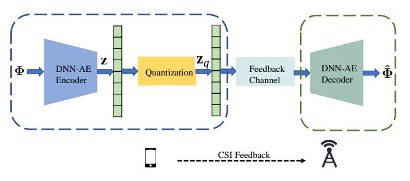

Fig. 12. The framework of DNN-AE-based CSI feedback.

However, DNN-AE increases computational complexity on the STA side. This is because the STA must possess the capability to perform DNN forward inference, an operation involving extensive matrix multiplication. Compared to the simple lookup table operations of K-Means, this demands significantly higher computational resources and power consumption. Furthermore, AE is not plug-and-play. The AP must distribute the trained Encoder and Decoder model parameters to the STA. This necessitates an entirely new standardized signaling mechanism, introducing additional signaling overhead and architectural design complexity.

# *B. AI/ML in MAC*

In this subsection, building upon the previously introduced MAC layer enhancements from the 802.11bn Task Group, we will focus on potential use cases for AI/ML-driven technical enhancements at the MAC layer.

*1) Distributed Channel Access:* As introduced previously, the 802.11bn Task Group extends and evolves the EDCA mechanism of 802.11be, introducing P-EDCA technology. The traditional EDCA mechanism, based on fixed Contention Window (CW) and static parameters, encounters efficiency bottlenecks in high-density deployment and dynamic channel environments, leading to numerous collisions, high latency, and short-term unfairness. Therefore, the TIG Task Group is exploring the use of AI/ML to optimize channel access parameters (specifically the CW) dynamically and in real-time to maximize throughput and guarantee low latency.

In fact, this distributed channel access optimization is an online, adaptive decision challenge. The TIG Task Group and relevant research are focusing on Reinforcement Learning (RL) to address it. Specifically, RL allows an agent (located at the AP or STA) to learn the optimal contention strategy through direct interaction with the network environment, thereby achieving optimal channel access performance.

- *a) Deep Reinforcement Learning:* In the early discussions of the TIG Task Group and related research, Deep Reinforcement Learning (DRL) is identified as the primary optimization tool [122], [123]. The core of this method lies in a centralized AI Agent (typically located at the AP) observing the network status (e.g., historical collision probability or STA count) as input. It then utilizes a DRL model (such as Deep Q-Network, DQN) to infer an optimal CW value and broadcast it to all STAs within the BSS. The benefit of this approach is that the AP possesses a global view and the decision logic is centralized and easy to manage. The CCOD scheme, cited in the TIG working group report [110], demonstrates that DRL-tuned CW can yield up to a 40% throughput improvement in dense scenarios with 50 STAs. However, this scheme of uniform CW distribution by the AP remains rigid. All STAs passively receive the same parameter, which limits the flexibility for individual STAs to optimize based on their own channel conditions and cannot effectively address the inter-AP interference problem in OBSS scenarios.
- *b) Multi-Agent Reinforcement Learning:* To address the limitations of DRL, the TIG Task Group further explores a more distributed Multi-Agent Reinforcement Learning (MARL) scheme. Specifically, MARL treats every STA (or every AP in OBSS scenarios) as an independent AI Agent [124]. Each Agent autonomously learns its optimal access strategy (e.g., CW, Arbitration Interframe Space (AIFS)). This distributed intelligence aligns better with the decentralized nature of 802.11. The QLBT (Q-Learning based Listen Before Talk) scheme, cited in the TIG report [110], shows that MARL can boost channel efficiency by 18%, while reducing average latency and jitter by 25% and 90%, respectively. However, MARL introduces more severe challenges. The first is the risk of Selfish Agents, where an optimal strategy learned by an Agent (e.g., selecting an extremely small CW) benefits the Agent but causes severe disruption to the fairness and stability of the overall network. The second is the coexistence problem. The TIG working group report [110] explicitly requires that AI schemes must coexist fairly with Legacy devices. MARL's aggressive exploration behavior can prevent Legacy devices from accessing the channel.

Despite the aforementioned challenges facing EDCA optimization, the TIG Task Group proposes a highly promising standardization direction in [125]: Model Reuse (MR). This is because a core Neural Network (NN) architecture, after appropriate input/output adjustments, may be applicable simultaneously to two distinct use cases: channel access and rate adaptation. Clearly, this approach significantly reduces STA implementation complexity, model storage overhead, and hardware costs. Naturally, this also imposes higher requirements on the standardization design of this universal model (e.g., the standardization of input/output formats).

*2) Roaming Enhancement:* As introduced previously, UHR introduces SMD to provide STAs in high-density AP environments with a low-latency, non-interrupting connection experience. However, SMD primarily focuses on the fundamental setup for initiating roaming. The roaming decisions for triggering scanning and switching APs are still controlled by simple heuristic algorithms internal to the STA in traditional Wi-Fi. These algorithms usually rely only on a static Received Signal Strength Indicator (RSSI) threshold, which prevents context awareness of the complex network and STA state, leading to network performance degradation. Therefore, the TIG working group is considering the use of AI/ML to replace this rigid heuristic logic, creating a context-aware, adaptive, intelligent roaming decision engine to reduce handover latency and roaming failure rate.

Specifically, the TIG Task Group is exploring an ML-driven, context-aware decision engine. This decision engine has two deployment modes: one is network-centric, where the AP makes the decision, and the other is user-centric, where the intelligent decision is transferred from the AP to the STA. The characteristics of these two approaches are as follows:

*a) AP-Side Reinforcement Learning:* In this approach, the AP or central network controller (WLC) possesses global topology and load information, which is used to train the AI/ML model. As stated in [126], the RL Agent on the AP side can learn the relationship between STA mobility patterns and network load, thereby calculating the optimal roaming strategy. The STA then roams according to the model parameters and policies trained by the AP.

In practice, AP-side Reinforcement Learning allows a single AP to perceive the real-time load and channel utilization of all neighboring APs, thereby making optimal decisions for the overall network. In this architecture, STA computational burden is low; it does not need to run complex AI models but only receives simple instructions issued by the AP. However, this scheme relies heavily on newly added standardized signaling. The AP requires a mechanism to deliver models or policies to the STA, and the STA requires a mechanism to provide feedback to the AP. This process necessitates extensions to the existing 802.11k (Neighbor Report) and 802.11v (BSS Transition Management) protocols. Furthermore, in this scheme, the AP also lacks crucial STA-side information. This information is highly crucial for roaming decisions, leading to low roaming efficiency.

- *b) Device-Side AI/LLM:* In this approach, the STA runs a lightweight AI model locally. This Agent can be a smallscale Large Language Model (LLM), which assists decisionmaking through structured context prompting. Specifically, the Agent obtains RSSI and channel metrics from the PHY layer, perceives device status, and, through AI inference, outputs an optimized decision to the MAC layer. [127] also defines two operation modes for the device side:
  - STA-Only Mode:The AI Agent makes autonomous decisions using local context only (e.g., RSSI trend, mobility, active applications).

• STA+AP Mode: The AI Agent fuses local context with standardized context from the network (802.11k Neighbor Reports and 802.11v Load Information), making a more comprehensive judgment.

Compared to the AP-side scheme, the Device-Side AI/LLM Agent provides more fine-grained context awareness. In STA-Only Mode, no privacy leakage occurs because all sensitive local context remains on the device side, and decisions are closed-loop locally. Furthermore, STA-Only Mode exhibits better backward compatibility: a STA supporting the Device-Side AI Agent can operate seamlessly in all existing Wi-Fi networks and achieve a superior roaming experience. However, integrating and running an AI/LLM model on the STA imposes high requirements on the device's computational capability and memory, and causes additional signaling overhead. This requires further resolution by the TIG working group.

*3) Multi-Access Point Coordination:* As we understand it, 802.11bn considers MAPC a key feature for resolving cochannel interference in high-density networks. By coordinating multiple APs, MAPC aims to reduce inter-user interference, optimize resource allocation, and enhance network coverage [128]. However, when multiple APs coordinate, channel state and traffic distribution fluctuate constantly. The network faces the challenges of selecting the APs and STAs to form the coordination set (protocol cluster), as well as the MAPC policy selection problem. Traditional fixed-rule methods cannot handle this complexity. Therefore, in 802.11 TIG Task Group discussions, the use of AI/ML technology emerges as a crucial element for realizing efficient MAPC decisions. As shown in Fig. 13, an example message exchange flow for AI/ML-enhanced Multi-Access Point Coordinated Transmission is presented. The MAPC exchange is triggered by the coordinating AP (AP 1), involving MAPC-RTS and MAPC-CTS exchanges among all APs scheduled for coordinated transmission.

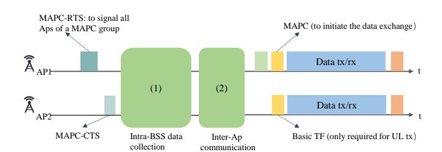

Fig. 13. An example message exchange flow for AI/ML-enhanced Multi-Access Point Coordinated Transmission.

Specifically, research from the TIG Task Group and academia mainly focuses on two AI paradigms within the MAPC decision chain: online decision-making and offline prediction. The core idea of this approach is to equip the APs with learning capability to autonomously adapt to complex network topologies and interference environments, thereby selecting a coordination scheme that maximizes network throughput and fairness.

*a) RL for Dynamic Decision-Making:* In TIG Task Group discussions, RL, particularly DRL, is considered an ideal tool for resolving such online resource optimization

| TABLE VIII      |               |              |  |  |
|-----------------|---------------|--------------|--|--|
| LIST OF DT IN A | I/MI AND RELE | VANT FEFORTS |  |  |

| Ref.                                                                                                  | Key Technique    | Contribution                                                                                                            |
|-------------------------------------------------------------------------------------------------------|------------------|-------------------------------------------------------------------------------------------------------------------------|
| Digital Twin of Wireless Systems: Overview, Taxonomy, Challenges, and Opportunities [131]             | Survey           | Reviews DT frameworks and resource management challenges in Wi-Fi 7/8.                                                  |
| AI-based CSI Feedback with Digital Twins: Real-World Validation and Insights [132]                    | Online Learning  | Validates DT-trained models and uses Online Learning to bridge the reality gap.                                         |
| Semi-Distributed Network Fault Diagnosis Based on Digital Twin Network [133]                       | Deep Learning    | Generates data using DTN to solve the problem of poor generalization to real-world scenarios caused by sample scarcity. |
| Multi-Link Operation and Wireless Digital Twin to Support Enhanced Roaming in Next-Gen Wi-Fi [134] | Digital Twin     | Proposes WiTwin architecture to optimize seamless roaming for MLO devices.                                              |
| UWB Assisted Digital Twin for Enhanced Spatial Reuse in Wi-Fi 7 [135]                                 | UWB Localization | Integrates UWB and ray tracing to enhance spatial reuse and throughput in Wi-Fi.                                        |

problems. The core of this approach is that the AI Agent (typically located at the AP) learns the optimal policy through real-time interaction with the environment (i.e., trial and error/exploration). The benefit of this is the high adaptability of the AI. Research cited in the TIG report [110] indicates that DRL Agents are capable of learning dynamic STA distributions, selecting the optimal Distributed MIMO (D-MIMO) coordination set, and delivering a 20% throughput boost. In Coordinated OFDMA (co-OFDMA) scenarios, DRL is also proven to increase average throughput by over 100% while reducing latency by 70%. However, a fundamental flaw of DRL lies in its exploration process. To learn new policies, the Agent must attempt suboptimal choices, which can lead to short-term network performance fluctuations or even connection interruptions. This inherently conflicts with the UHR objective. Furthermore, as stated in [129], Selfish AI Agents can also learn malicious competition strategies, undermining network fairness.

b) SL for Performance Prediction: Unlike the online trial-and-error paradigm of DRL, Supervised Learning (SL) is capable of predicting the potential outcomes of different decisions before the actual execution. Specifically, the Decision AP can leverage SL Models (such as Random Forest or Artificial Neural Network (ANN)) to offline predict the achievable throughput for Co-SR and Co-BF, respectively, after collecting all STA CSI. This approach avoids the exploration costs and instability inherent in DRL. However, SL Model accuracy is highly dependent on the quality and coverage of the training data. If the actual network environment (e.g., new interference sources or traffic patterns) deviates from the training distribution—resulting in poor generalization—the prediction results will be severely inaccurate, leading to suboptimal decisions.

## C. AI/ML in Cross-Layer

In the previous subsections, we have analyzed the AI/ML use cases for the PHY and MAC layers in UHR. However, AI/ML schemes in real-world Wi-Fi deployments suffer from the generalization problem. In real UHR environments, wireless channel characteristics, user mobility patterns, and interference constantly fluctuate. Traditional pre-trained models rely on static training datasets. When facing unknown, non-stationary real-world network environments, their inference performance drops sharply.

This generalization problem essentially constitutes a crosslayer issue: a robust AI/ML model cannot focus solely on single-layer metrics; it must establish a mapping from the instantaneous state of the PHY layer to the dynamic behavior of the MAC layer. Reference [130] also points out that most current research only regards AI as an offline analysis tool, lacking real-time closed-loop feedback between the physical network and the Digital Model (DM), preventing the model from adapting to the simulation-to-reality gap.

- 1) Digital Twin: To address the generalization problem, academia is exploring the integration of Digital Twins (DT) with AI/ML. Unlike traditional simulation methods, a DT serves as a real-time, high-fidelity virtual replica of the physical network, providing a safe evolutionary environment for the training and validation of AI models. As shown in Table VIII, the relevant literature on AI/ML for DT is summarized. Specifically, Reference [131] describes the architecture, taxonomy, and challenges of DT in wireless systems. Huang et al. [132] experimentally validate the generalization issues of DTtrained models and proposes Online Learning (OL) as a pivotal solution to bridge the simulation-to-reality gap. Furthermore, References [133] and [134] introduce DT into wireless networks, offering insights into resolving the challenge where AI models in dynamic heterogeneous networks struggle to generalize to real-world scenarios due to sample scarcity.
- a) Ray-Traced High-Fidelity PHY Modeling: Addressing the poor generalization of the PHY layer, Reference [135] proposes using ray tracing technology combined with Ultra-Wideband (UWB) assisted localization to construct a DT of the environment. Recent works have also explored UWB-assisted beam alignment to enhance spatial reuse reliability [136], constructing high-fidelity environment models. The advantage of this approach is the ability to generate site-specific datasets. Models pre-trained on such datasets can outperform traditional statistical channel models (e.g., CDL) in tasks highly sensitive to CSI accuracy, such as Coordinated Beamforming. However, ray-traced DTs constitute high-fidelity modeling, which entails significant computational overhead and deployment costs.
- b) Closed-Loop Feedback and Online Adaptation: To address the simulation-to-reality gap previously described, academia proposes a hybrid architecture combining DT pretraining and online fine-tuning. This architecture utilizes DT-provided large-scale synthetic data for model initialization,

and subsequently employs a small amount of real-world data for online fine-tuning. This methodology mitigates environmental mismatch and enables AI models to achieve robust reconstruction performance in real Wi-Fi scenarios. Furthermore, at the MAC layer, DTs can be used to simulate complex roaming scenarios, allowing STAs to model MLO switching strategies in a virtual environment to achieve zero-downtime seamless roaming [134]. However, this approach suffers from scalability and synchronization latency issues. This is because maintaining a real-time DT necessitates computational and storage resources that increase exponentially with network scale. The DT also relies on real-time data feedback from the physical network, and signaling congestion in high-density scenarios can lead to DT state lag, resulting in erroneous decisions based on stale information.

## *D. Conclusions and Future Directions*

Overall, the role of AI/ML-assisted technologies in Wi-Fi standard evolution remains under continuous discussion and research, and our overview cannot be exhaustive. However, it is undeniable that we are in an era where AI/ML technology is booming, and its role in Wi-Fi will become increasingly prominent. For instance, MR technology is still under investigation, and cross-use-case MR is also worth exploring. We focus on this content in the next section. In summary, deepening the research into these AI/ML applications in Wi-Fi can lead to a more intelligent next-generation network.

# V. CURRENT CHALLENGES AND FUTURE DIRECTIONS

In this section, building upon our understanding of the 802.11bn Task Group's work during the Wi-Fi 8 standardization process and the potential use cases for AI/ML in Wi-Fi 8 development, we will explore the current challenges, open issues, and future directions for Wi-Fi 8. This provides readers with insights into the future development of UHR.

## *A. Current Challenges*

Although the IEEE 802.11bn Task Group has theoretically constructed the path toward UHR, its translation from the standard protocol to commercial deployment will still encounter multi-dimensional engineering and physical bottlenecks.

*1) Distributed MIMO Synchronization and CSI Aging:* To implement Co-BF and Co-SR, physically independent APs must collaborate through strict phase and time synchronization to form joint beamforming or spatial nulls, achieving gains comparable to large-scale antenna arrays [137]. However, physically separated APs not only require microsecond-level phase synchronization to prevent beam nulling failure in high-frequency bands but must also address CSI aging and feedback delays in mobile scenarios to prevent precoder matrix mismatch caused by detection lag [138], [139]. Simultaneously, real-time exchange of massive collaborative data readily triggers backhaul bottlenecks in constrained networks, increasing signaling overhead and potentially negating theoretical throughput gains from multi-AP collaboration.

- *2) Distributed MIMO Synchronization and CSI Aging:* Computational and Real-Time Bottlenecks in Resource Scheduling: Enhanced technologies introduced in 802.11bn, such as DRU, DSO, and NPCA, improve system performance through granular resource scheduling and spectrum management. However, this pushes resource allocation toward the challenge of multidimensional dynamic joint optimization [140]. Specifically, these enhancements require APs to complete optimization solutions—covering DRU tone scheme selection, NPCA threshold determination, and MCS pairing—within extremely short SIFS time limits. Current algorithms struggle to achieve global optimization under microsecond constraints, often resulting in suboptimal performance. Furthermore, in distributed networks lacking a global perspective, blind switching by DSOs readily triggers pingpong effects and hidden node conflicts. This causes devices to oscillate repeatedly across multiple interfered subbands, failing to effectively avoid interference while severely degrading spectrum efficiency due to frequent handshake signaling overhead.
- *3) Physical Limitations of Hardware Nonlinearity on UHR-MCS:* As introduced earlier, Wi-Fi 8 introduced UHR-MCS to enhance transmission rates and reliability. However, these high-order modulation and high-data-rate requirements are closely tied to hardware nonlinearity issues, leading to signal distortion and bit error rate problems [141]. Specifically, the discrete spectral structure of DRU disrupts signal statistical properties and significantly elevates PAPR, forcing devices to perform substantial power backoff to prevent PA saturation distortion. This backoff negates the anticipated coverage gains. Furthermore, phase noise and I/Q imbalance in commercial chips struggle to meet UHR-MCS's stringent ultra-low EVM requirements, causing bit error rates to plateau even at high signal-to-noise ratios. This makes achieving theoretical maximum rates challenging in practical low-cost devices.
- *4) Challenges of Embedded AI/ML Deployment:* Although we have introduced various optimization schemes for Wi-Fi, APs are typically passively cooled and highly cost-sensitive devices. The limited computing power of embedded Neural Processing Units (NPUs) struggles to simultaneously process 320 MHz wideband baseband data and perform real-time inference (such as Transformer). Moreover, existing AI models lack lightweight designs tailored for Wi-Fi hardware, leading to poor model generalization [142]. Furthermore, fault samples required for UHR scenarios (e.g., sudden deep fading) are extremely scarce in reality [143]. This extreme long-tail data distribution severely limits the practicality of AI-assisted decision-making, as AI struggles to learn how to cope with critical faults.

# *B. Open Issues*

Despite the significant progress achieved by the IEEE 802.11bn working group and academia in UHR standardization, numerous issues still remain to be investigated concerning theoretical modeling and the design of general algorithms suitable for future heterogeneous network environments.

*1) Cross-Dimensional and Multi-Link CSI Compression Generalization:* Existing Deep Learning (DL)-based CSI compression schemes typically overfit specific hardware configurations (such as fixed 80 MHz bandwidth or 4 × 4 antenna arrays) and lack generalization capability in dynamic network environments [113]. Wi-Fi 8 devices are required to switch flexibly between variable bandwidths (20 MHz to 320 MHz) and diverse MIMO dimensions. Conventional Convolutional Neural Networks (CNNs) typically demand fixed input dimensions, failing to adapt to this dynamic variability. Therefore, developing a universal CSI compression model that can adaptively handle variable input dimensions and exploit the spatial correlation across multiple links is a critical open issue for achieving efficient feedback while avoiding retraining for every configuration.

- *2) Unified Modeling for Multi-Band NPCA and DSO Interaction:* Current research on NPCA and DSO is largely limited to single or simple dual-band scenarios, lacking a unified analytical framework capable of encompassing the heterogeneous characteristics of the 2.4, 5, and 6 GHz bands. These different bands possess distinct physical properties (e.g., the propagation loss in 6 GHz is significantly higher than in 2.4 GHz) and interference characteristics (e.g., 2.4 GHz is crowded, 6 GHz is sparse). Therefore, a notable research challenge remains in how to develop a mathematical model that can simultaneously quantify the propagation loss differences, interference distribution features, and the coupling effects of NPCA and DSO during spectrum switching, and subsequently derive a globally optimal cross-band traffic scheduling strategy.
- *3) Scalability Bottleneck for Co-BF in Large-Scale AP Clusters:* Current Co-BF protocol designs are primarily optimized for small clusters (such as 2–4 APs). In ultra-largescale deployments targeting stadiums or large campuses, the signaling overhead and scheduling complexity increase exponentially as the number of participating APs grows, posing a risk of mechanism failure [144]. Therefore, designing a scalable distributed MAC protocol to dynamically partition optimal cooperation sub-clusters (Clustering), while handling interference at cluster edges and controlling signaling overhead to a linear growth rate, is a necessary step for the practical implementation of large-scale Distributed MIMO.
- *4) Lightweighting and Standardization for Chip-Level Real-Time AI:* In real WLAN environments, Wi-Fi intelligent scheduling requires inference latency below 1 millisecond to adapt to rapidly changing wireless channels [145], [146]. However, this fundamentally conflicts with the large-parameter, mainstream AI models, which cannot run in real-time on constrained Wi-Fi baseband processors. Furthermore, the lack of standardized AI interfaces prevents chips from different vendors (e.g., Broadcom and Qualcomm) from exchanging AIpredicted interference information. Therefore, defining standardized AI model interfaces and signaling interaction formats, and designing ultra-lightweight model structures specifically for Wi-Fi PHY features (such as Binarized Neural Networks or structural pruning), is a gap that must be bridged to realize an AI-native Wi-Fi architecture and resolve the model interoperability issue between heterogeneous vendor chips.

## *C. Future Directions*

Based on the aforementioned challenges and open issues, the evolution of Wi-Fi 8 and its subsequent standards will not be confined to optimizing existing PHY and MAC layer technologies, but rather move towards multi-band fusion and intelligent autonomy. Following a review of relevant literature, we analyze the key related research directions for the future.

- *1) Deep Integration Architecture for Millimeter-Wave and Multi-band Operation:* To meet the stringent requirements of emerging applications like the Metaverse, Industrial IoT, and Ultra-High-Definition (UHD) video streaming, future Wi-Fi evolution will break the physical barriers between the Sub-7 GHz and 60 GHz mmWave bands to realize Ultra-High Throughput (UHT), Ultra-Low Latency (ULL), and High Reliability (HR) [147], [148]. Therefore, a cross-band fluid coordination framework can be developed. This architecture no longer treats different bands as independent links, but rather utilizes the broad coverage and penetration capabilities of the 2.4/5/6 GHz bands as a highly reliable control plane responsible for transmitting signaling, beam training feedback, and mobility management. Concurrently, the 60 GHz mmWave band is used as a pure data plane to carry burst high-bandwidth traffic. Based on this foundation, researching Location-Aware Fast Session Transfer (FST) algorithms that ensure microsecond-level lossless switching back to the lower bands when the mmWave link encounters human blockage [149], will be key to realizing full-house ultra-wideband coverage without dead zones.
- *2) Digital Twin-Based Proactive Network Optimization:* Traditional network optimization is reactive, often lagging behind actual failures. As previously discussed, DT technology plays a pivotal role in AI/ML. In fact, digital twin technology and data-driven forecasting approaches [150] can also drive WLAN operations from a reactive to a proactive, predictive paradigm. Specifically, a high-fidelity WLAN digital twin can be constructed to map channel states, user trajectories, and interference sources from the physical world in real time within a virtual space [151]. Through scenario analysis, it can pre-validate the effectiveness of MCS and power strategies before configuration deployment. LLMs [152], as one of the core breakthroughs in AI/ML, have achieved significant advancements in networking domains, such as LLM-assisted end-to-end intelligent network health management [153] and plug-and-play network information semantic fault diagnosis frameworks built using large models [154]. Therefore, integrating LLM-driven digital twins [155] can leverage the models' powerful generalization capabilities to automatically parse complex network logs and generate optimization scripts, as well as automatically produce fault diagnosis reports. This approach would significantly reduce operational complexity in UHR networks while enhancing system robustness.
- *3) AI-Native Wi-Fi Architecture:* Current AI technology is merely an add-on patch placed above the existing protocol stack. The next-generation WLAN standard is expected to be reconstructed from the bottom up, evolving toward an AI-Native architecture. This necessitates defining standardized AI signaling and interfaces, introducing dedicated neural layers within the protocol stack, and enabling chips from different

vendors to exchange compressed feature vectors rather than raw data. Furthermore, a more cutting-edge direction involves exploring transmission mechanisms based on semantic communication [156], [157]. Under extremely constrained channel conditions, instead of transmitting bits, AI extracts and transmits semantic features of images or speech. This enables effective information transmission efficiency surpassing the Shannon limit in low SNR environments.

- *4) Federated Learning and Privacy Protection Mechanisms:* As Wi-Fi increasingly is used for sensing and user behavior analysis, data privacy protection has become a constraint that cannot be ignored in network evolution. Future research will focus on deploying the Federated Learning (FL) framework at the WLAN edge, allowing APs to locally train models using user CSI and roaming history, uploading only model gradients to the cloud, thereby solving the data silo problem [158], [159]. Additionally, developing differential privacy (DP) algorithms suitable for wireless channels, which inject controlled noise into model updates to prevent reverse engineering attacks, will maximize data utilization value while protecting user privacy.
- *5) Vertical Integration of Heterogeneous Networks:* As the next-generation WLAN technology, UHR needs to achieve coordinated operation within the increasingly complex wireless communication ecosystem—including 6G , satellite communication, and other unlicensed band technologies (such as 5G NR-U)—to support diverse scenarios like smart cities, Vehicleto-Everything (V2X), and global coverage [160], [161]. A novel direction is to develop efficient cross-technology spectrum sharing and interference coordination mechanisms to optimize resource utilization and ensure QoS. For example, research can explore centralized management frameworks based on Software-Defined Networking (SDN) or cloud architecture, utilizing dynamic spectrum allocation and multi-AP coordination to realize UHR and 6G network coexistence in the 6 GHz band, thereby reducing interference and boosting network throughput. Furthermore, the trend toward protocol stack tailoring and optimization for specific vertical scenarios—such as anti-Doppler frequency shift mode designed for V2X and extreme energy-saving and small packet transmission modes customized for Industrial IoT (IIoT) —will promote the comprehensive penetration of Wi-Fi technology in wide-area and local-area settings.

# VI. CONCLUSION

This paper analyzes the key technical enhancements for the PHY and MAC layers during UHR standardization, based on a survey of the IEEE 802.11bn Task Group's progress and relevant references. In the discussion, we also analyze some possible future research directions for these technologies to provide a reference for related research. Undoubtedly, at this stage, a lot of work is still needed to develop a complete PHY and MAC protocol for UHR, but this is also a task that will make a significant contribution. In addition, we are in an era of continuous development of AI/ML technology, and the potential application of AI/ML in Wi-Fi is also worth studying. Therefore, after investigating the work of the IEEE 802.11 TIG Task Group, we discuss the potential cases of AI/ML in the Wi-Fi standardization process in conjunction with existing relevant references. Obviously, the standardization of UHR is still in progress, and many studies are worth further consideration. We hope this paper can serve as a reference to support the development of UHR standards.

## REFERENCES

- [1] Y. Xiao, "Ieee 802.11n: enhancements for higher throughput in wireless lans," *IEEE Wireless Communications*, vol. 12, no. 6, pp. 82–91, 2005.
- [2] C. Chen, X. Chen, D. Das, D. Akhmetov, and C. Cordeiro, "Overview and performance evaluation of wi-fi 7," *IEEE Communications Standards Magazine*, vol. 6, no. 2, pp. 12–18, 2022.
- [3] W. Alliance, "2024 annual report," Wi-Fi Alliance, Tech. Rep., 2024. [Online]. Available: https://www.wi-fi.org/zh-hans/node/48828
- [4] S. Chauhan, A. Sharma, S. Pandey, K. N. Rao, and P. Kumar, "Ieee 802.11 be: A review on wi-fi 7 use cases," in *2021 9th International Conference on Reliability, Infocom Technologies and Optimization (Trends and Future Directions)(ICRITO)*, Noida, India, 2021, pp. 1–7.
- [5] "Ieee draft standard for information technology–telecommunications and information exchange between systems local and metropolitan area networks–specific requirements - part 11: Wireless lan medium access control (mac) and physical layer (phy) specifications amendment: Enhancements for extremely high throughput (eht)," *IEEE P802.11be/D6.0, May 2024*, pp. 1–1075.
- [6] A. Garcia-Rodriguez, D. Lopez-P ´ erez, L. Galati-Giordano, and ´ G. Geraci, "Ieee 802.11be: Wi-fi 7 strikes back," *IEEE Communications Magazine*, vol. 59, no. 4, pp. 102–108, 2021.
- [7] M. Wang, W. Fu, X. He, S. Hao, and X. Wu, "A survey on largescale machine learning," *IEEE Transactions on Knowledge and Data Engineering*, vol. 34, no. 6, pp. 2574–2594, 2022.
- [8] M. Soori, B. Arezoo, and R. Dastres, "Artificial intelligence, machine learning and deep learning in advanced robotics, a review," *Cognitive Robotics*, vol. 3, pp. 54–70, 2023. [Online]. Available: https://www.sciencedirect.com/science/article/pii/S2667241323000113
- [9] B. Chen, J. Chen, Y. Gao, and J. Zhang, "Coexistence of lte-laa and wi-fi on 5 ghz with corresponding deployment scenarios: A survey," *IEEE Communications Surveys & Tutorials*, vol. 19, no. 1, pp. 7–32, 2017.
- [10] W. Ning, F. Tang, M. Zhao, and N. Kato, "Wi-fi 8: The next generation of wireless connectivity," *GetMobile: Mobile Comp. and Comm.*, vol. 29, no. 3, p. 18–23, Oct. 2025. [Online]. Available: https://doi.org/10.1145/3774505.3774513
- [11] C. Deng, X. Fang, X. Han, X. Wang, L. Yan, R. He, Y. Long, and Y. Guo, "Ieee 802.11be wi-fi 7: New challenges and opportunities," *IEEE Communications Surveys & Tutorials*, vol. 22, no. 4, pp. 2136– 2166, 2020.
- [12] S. Verma, T. K. Rodrigues, Y. Kawamoto, M. M. Fouda, and N. Kato, "A survey on multi-ap coordination approaches over emerging wlans: Future directions and open challenges," *IEEE Communications Surveys & Tutorials*, vol. 26, no. 2, pp. 858–889, 2024.
- [13] L. Galati-Giordano, G. Geraci, M. Carrascosa, and B. Bellalta, "What will wi-fi 8 be? a primer on ieee 802.11bn ultra high reliability," *IEEE Communications Magazine*, vol. 62, no. 8, pp. 126–132, 2024.
- [14] X. Liu, T. Chen, Y. Dong, Z. Mao, M. Gan, X. Yang, and J. Lu, "Wi-fi 8: Embracing the millimeter-wave era," *IEEE Communications Magazine*, vol. 63, no. 3, pp. 69–75, 2025.
- [15] Y. Sun, M. Peng, Y. Zhou, Y. Huang, and S. Mao, "Application of machine learning in wireless networks: Key techniques and open issues," *IEEE Communications Surveys & Tutorials*, vol. 21, no. 4, pp. 3072–3108, 2019.
- [16] A. Zappone, M. Di Renzo, and M. Debbah, "Wireless networks design in the era of deep learning: Model-based, ai-based, or both?" *IEEE Transactions on Communications*, vol. 67, no. 10, pp. 7331–7376, 2019.
- [17] S. Szott, K. Kosek-Szott, P. Gawłowicz, J. T. Gomez, B. Bellalta, ´ A. Zubow, and F. Dressler, "Wi-fi meets ml: A survey on improving ieee 802.11 performance with machine learning," *IEEE Communications Surveys & Tutorials*, vol. 24, no. 3, pp. 1843–1893, 2022.
- [18] F. Wilhelmi, S. Szott, K. Kosek-Szott, and B. Bellalta, "Machine learning and wi-fi: Unveiling the path toward ai/ml-native ieee 802.11 networks," *IEEE Communications Magazine*, vol. 63, no. 7, pp. 114– 120, 2025.

- [19] E. Reshef and C. Cordeiro, "Future directions for wi-fi 8 and beyond," *IEEE Communications Magazine*, vol. 60, no. 10, pp. 50–55, 2022.
- [20] E. Oughton, G. Geraci, M. Polese, V. Shah, D. Bubley, and S. Blue, "Reviewing wireless broadband technologies in the peak smartphone era: 6g versus wi-fi 7 and 8," *Telecommunications Policy*, vol. 48, no. 6, p. 102766, 2024. [Online]. Available: https://www.sciencedirect.com/science/article/pii/S0308596124000636
- [21] R. Sanchez-Vital, A. Belogaev, C. Gomez, J. Famaey, and E. Garcia-Villegas, "A primer on ap power save in wi-fi 8: Overview, analysis, and open challenges," *IEEE Wireless Communications*, pp. 1–9, 2025.
- [22] T. Wu, *Minutes TGbn PHY ad hoc Jan to March CC*, document IEEE 802.11, IEEE, Piscataway, NJ, USA, Feb. 2024. [Online]. Available: https://mentor.ieee.org/802.11/documents?is dcn=223&is group=00bn
- [23] S. Schelstraete, *802.11bn PHY ad-hoc minutes November 2024–January 2025*, document IEEE 802.11, IEEE, Piscataway, NJ, USA, Dec. 2024. [Online]. Available: https://mentor.ieee.org/802. 11/documents?is dcn=2057&is group=00bn
- [24] Sigurd Schelstraete, *802.11bn PHY Teleconferences ad-hoc minutes May–July*, document IEEE 802.11, IEEE, Piscataway, NJ, USA, Jul. 2025. [Online]. Available: https://mentor.ieee.org/802.11/documents? is dcn=1109&is group=00bn
- [25] Mediatek, "Pioneering the Future with Wi-Fi 8, Part One: Fast Efficient Spectrum," Mediatek, Tech. Rep., Oct. 2024. [Online]. Available: https://www.mediatek.com/hubfs/728015/MediaTek% 20Assets/PDFs/White Papers/MDT3011 Pioneering the Future with WiFi8 WhitePaper v6.pdf
- [26] Mediatek, "Pioneering the Future with Wi-Fi 8, Part Two: Reliable Communication," Mediatek, Tech. Rep., Feb. 2025. [Online]. Available: https://www.mediatek.com/hub/MediaTek%20Assets/PDFs/ White Papers/Wi-Fi8-2025%20Part2.pdf
- [27] E. Park, *DRU Proposal*, document IEEE 802.11, IEEE, Piscataway, NJ, USA, Nov. 2023. [Online]. Available: https://mentor.ieee.org/802. 11/documents?is dcn=1919&is group=00bn
- [28] J. Liu, *Draft Text on DRU*, document IEEE 802.11, IEEE, Piscataway, NJ, USA, Dec. 2024. [Online]. Available: https: //mentor.ieee.org/802.11/documents?is dcn=2046&is group=00bn
- [29] E. Park, *CC50 CR for 60 MHz DRU Tone Plan*, document IEEE 802.11, IEEE, Piscataway, NJ, USA, May 2025. [Online]. Available: https: //mentor.ieee.org/802.11/documents?is dcn=0612&is group=00bn
- [30] M. Hu, *Discussion on DCM of DRU Follow up*, document IEEE 802.11, IEEE, Piscataway, NJ, USA, May 2025. [Online]. Available: https://mentor.ieee.org/802.11/documents?is dcn=0885&is group=00bn
- [31] M. Kamel, *CC50 CR on DRU in 38.3.2.1 Group 2*, document IEEE 802.11, IEEE, Piscataway, NJ, USA, May 2025. [Online]. Available: https://mentor.ieee.org/802.11/documents?is dcn=0927&is group=00bn
- [32] A. Klein, *Discussion on Aspects in DRU Operation*, document IEEE 802.11, IEEE, Piscataway, NJ, USA, Jul. 2024. [Online]. Available: https://mentor.ieee.org/802.11/documents?is dcn=1058&is group=00bn
- [33] M. Kamel, *UHR-LTF Design for DRU Further Results*, document IEEE 802.11, IEEE, Piscataway, NJ, USA, Oct. 2024. [Online]. Available: https://mentor.ieee.org/802.11/documents?is dcn=1552&is group=00bn
- [34] S. Ali, *Adaptive Power Boosting Design for DRU*, document IEEE 802.11, IEEE, Piscataway, NJ, USA, Jun. 2025. [Online]. Available: https://mentor.ieee.org/802.11/documents?is dcn=1001&is group=00bn
- [35] S. Hu, *New MCSs for 11bn*, document IEEE 802.11, IEEE, Piscataway, NJ, USA, Mar. 2024. [Online]. Available: https: //mentor.ieee.org/802.11/documents?is dcn=0469&is group=00bn
- [36] J. Fang, *UHR Transmit and Receiver Specification for New MCSs-Follow Up*, document IEEE 802.11, IEEE, Piscataway, NJ, USA, Mar. 2025. [Online]. Available: https://mentor.ieee.org/802.11/documents? is dcn=721&is group=00bn
- [37] R. Cao, *PDT PHY Unequal Modulation (UEQM) and New MCS*, document IEEE 802.11, IEEE, Piscataway, NJ, USA, Jan. 2025. [Online]. Available: https://mentor.ieee.org/802.11/documents?is dcn= 1985&is group=00bn
- [38] R. J. Yu, *Analysis on UEQM and UEQ MCS*, document IEEE 802.11, IEEE, Piscataway, NJ, USA, Mar. 2024. [Online]. Available: https://mentor.ieee.org/802.11/documents?is dcn=433&is group=00bn
- [39] D. Lim, *Signaling for MCS and UEQM in 11bn*, document IEEE 802.11, IEEE, Piscataway, NJ, USA, Nov. 2024. [Online]. Available: https://mentor.ieee.org/802.11/documents?is dcn=1427&is group=00bn

- [40] R. Porat, *New MCS Simulation Results*, document IEEE 802.11, IEEE, Piscataway, NJ, USA, May 2024. [Online]. Available: https://mentor.ieee.org/802.11/documents?is dcn=753&is group=00bn
- [41] A. Chen, *Transmit and Receive Specifications for New MCS in 11bn*, document IEEE 802.11, IEEE, Piscataway, NJ, USA, Mar. 2025. [Online]. Available: https://mentor.ieee.org/802.11/documents?is dcn= 392&is group=00bn
- [42] R. Porat, *On UEQM and UEQ-MCS*, document IEEE 802.11, IEEE, Piscataway, NJ, USA, Jun. 2024. [Online]. Available: https://mentor.ieee.org/802.11/documents?is dcn=734&is group=00bn
- [43] R. Cao, *Comment-resolution-for-38.3.11-MCS-UEQM*, document IEEE 802.11, IEEE, Piscataway, NJ, USA, May 2025. [Online]. Available: https://mentor.ieee.org/802.11/documents?is dcn=846&is group=00bn
- [44] R. P. F. Hoefel, "Effects of phase noise and frequency offset on the performance of 4K-QAM and 16K-QAM in 802.11be and 802.11bn WLANs," in *2024 IEEE Wireless Communications and Networking Conference (WCNC)*, Dubai, United Arab Emirates, 2024, pp. 1–6.
- [45] Y. Zhang, *High level thoughts on LDPC rate matching design for 11bn*, document IEEE 802.11, IEEE, Piscataway, NJ, USA, Mar. 2024. [Online]. Available: https://mentor.ieee.org/802.11/documents? is dcn=510&is group=00bn
- [46] W. Lin, *Initial Discussion on Possible LDPC Improvements in WLAN*, document IEEE 802.11, IEEE, Piscataway, NJ, USA, May 2024. [Online]. Available: https://mentor.ieee.org/802.11/documents?is dcn= 924&is group=00bn
- [47] S. Hu, *Performance Evaluation of Longer LDPC for 11bn*, document IEEE 802.11, IEEE, Piscataway, NJ, USA, Jul. 2024. [Online]. Available: https://mentor.ieee.org/802.11/documents?is dcn=1190&is group=00bn
- [48] Y. Zhang, *2x1944 LDPC Codes Performance Evaluation*, document IEEE 802.11, IEEE, Piscataway, NJ, USA, Mar. 2024. [Online]. Available: https://mentor.ieee.org/802.11/documents?is dcn=1238&is group=00bn
- [49] J. Fang, *2xLDPC performance*, document IEEE 802.11, IEEE, Piscataway, NJ, USA, Jul. 2024. [Online]. Available: https://mentor. ieee.org/802.11/documents?is dcn=1248&is group=00bn
- [50] R. Strobel, *LDPC and Framing Settings for Ultra High Reliability*, document IEEE 802.11, IEEE, Piscataway, NJ, USA, Sep. 2024. [Online]. Available: https://mentor.ieee.org/802.11/documents?is dcn= 1487&is group=00bn
- [51] Y.-W. Chen, *11bn signaling design for extra MCS, UEQM, 2xLDPC*, document IEEE 802.11, IEEE, Piscataway, NJ, USA, Nov. 2024. [Online]. Available: https://mentor.ieee.org/802.11/documents?is dcn= 1695&is group=00bn
- [52] S. Hu, *2xLDPC Encoding Parameters*, document IEEE 802.11, IEEE, Piscataway, NJ, US, Nov. 2024. [Online]. Available: https: //mentor.ieee.org/802.11/documents?is dcn=1828&is group=00bn
- [53] R. Pulikkoonattu, *Detailed text proposal on Longer blocklength LDPC Coding feature*, document IEEE 802.11, IEEE, Piscataway, NJ, USA, Nov. 2024. [Online]. Available: https://mentor.ieee.org/802.11/ documents?is dcn=1984&is group=00bn
- [54] Rethna Pulikkoonattu, *PDT PHY Longer LDPC Coding*, document IEEE 802.11, IEEE, Piscataway, NJ, USA, Dec. 2024. [Online]. Available: https://mentor.ieee.org/802.11/documents?is dcn=1992&is group=00bn
- [55] R. Pulikkoonatt, *CRs on UHR LDPC*, document IEEE 802.11, IEEE, Piscataway, NJ, USA, May 2025. [Online]. Available: https://mentor.ieee.org/802.11/documents?is dcn=602&is group=00bn
- [56] Isabelle Siaud, *LDPC new matrix R=1/2*, document IEEE 802.11, IEEE, Piscataway, NJ, USA, Nov. 2025. [Online]. Available: https://mentor.ieee.org/802.11/documents?is dcn=805&is group=00bn
- [57] S. Hu, *Discussion on LDPC only for MU-MIMO in 11bn*, document IEEE 802.11, IEEE, Piscataway, NJ, USA, May 2025. [Online]. Available: https://mentor.ieee.org/802.11/documents?is dcn= 396&is group=00bn
- [58] G. Tsodik, *PDT PHY Coordinated Spatial Reuse*, document IEEE 802.11, IEEE, Piscataway, NJ, USA, Feb. 2025. [Online]. Available: https://mentor.ieee.org/802.11/documents?is dcn=250&is group=00bn
- [59] R. J. Yu, *PHY Version indications in Co-SR transmissions*, document IEEE 802.11, IEEE, Piscataway, NJ, USA, May 2025. [Online]. Available: https://mentor.ieee.org/802.11/documents?is dcn= 851&is group=00bn
- [60] H. Zhou, *Co-SR Power Control*, document IEEE 802.11, IEEE, Piscataway, NJ, USA, Mar. 2024. [Online]. Available: https: //mentor.ieee.org/802.11/documents?is dcn=541&is group=00bn
- [61] K. Zhong, *Discussion on Overhead Reduction on Co-BF/Co-SR Signalling*, document IEEE 802.11, IEEE, Piscataway, NJ, USA, Jun.

- 2025. [Online]. Available: https://mentor.ieee.org/802.11/documents? is dcn=1088&is group=00bn
- [62] A. Epstein, *Co-BF Sequence Optimization*, document IEEE 802.11, IEEE, Piscataway, NJ, USA, May 2025. [Online]. Available: https://mentor.ieee.org/802.11/documents?is dcn=574&is group=00bn
- [63] J. Minotani, *Consideration on Multi-AP framework for Co-SR*, document IEEE 802.11, IEEE, Piscataway, NJ, USA, May 2025. [Online]. Available: https://mentor.ieee.org/802.11/documents?is dcn= 343&is group=00bn
- [64] R. J. Yu, *Specification Framework for TGBn*, document IEEE 802.11, IEEE, Piscataway, NJ, USA, Jul. 2025. [Online]. Available: https://mentor.ieee.org/802.11/documents?is dcn=209&is group=00bn
- [65] S. Schelstraete, *802.11bn PHY ad-hoc minutes Warsaw May 2025 Interim Meeting*, document IEEE 802.11, IEEE, Piscataway, NJ, USA, Jul. 2025. [Online]. Available: https://mentor.ieee.org/802.11/ documents?is dcn=998&is group=00bn
- [66] J. Fang, *Co-BF PHY design consideration*, document IEEE 802.11, IEEE, Piscataway, NJ, USA, May 2025. [Online]. Available: https://mentor.ieee.org/802.11/documents?is dcn=401&is group=00bn
- [67] S. Helwa, *Co-BF Signaling Details*, document IEEE 802.11, IEEE, Piscataway, NJ, USA, May 2025. [Online]. Available: https://mentor.ieee.org/802.11/documents?is dcn=879&is group=00bn
- [68] S. Vermini, *CO-BF Design for UHF*, document IEEE 802.11, IEEE, Piscataway, NJ, USA, Dec. 2024. [Online]. Available: https: //mentor.ieee.org/802.11/documents?is dcn=1822&is group=00bn
- [69] A. Chen, *Information Exchange in the Co-BF Transmission Phase Follow-up*, document IEEE 802.11, IEEE, Piscataway, NJ, USA, Sep. 2024. [Online]. Available: https://mentor.ieee.org/802.11/documents? is dcn=842&is group=00bn
- [70] J. Yang, *Co-SR and Co-BF follow up*, document IEEE 802.11, IEEE, Piscataway, NJ, USA, Jul. 2025. [Online]. Available: https: //mentor.ieee.org/802.11/documents?is dcn=1022&is group=00bn
- [71] B. Gupta, *Seamless roaming signaling details*, document IEEE 802.11, IEEE, Piscataway, NJ, USA, Mar. 2025. [Online]. Available: https://mentor.ieee.org/802.11/documents?is dcn=656&is group=00bn
- [72] L. Lu, *Further Considerations on Seamless Roaming*, document IEEE 802.11, IEEE, Piscataway, NJ, USA, Apr. 2025. [Online]. Available: https://mentor.ieee.org/802.11/documents?is dcn=122&is group=00bn
- [73] Liuming Lu, *Signaling considerations for seamless roaming*, document IEEE 802.11, IEEE, Piscataway, NJ, USA, Jan. 2025. [Online]. Available: https://mentor.ieee.org/802.11/documents?is dcn=1884&is group=00bn
- [74] B. Gupta, *SMD Architecture*, document IEEE 802.11, IEEE, Piscataway, NJ, USA, Mar. 2025. [Online]. Available: https: //mentor.ieee.org/802.11/documents?is dcn=1894&is group=00bn
- [75] Binita Gupta, *Seamless roaming within a mobility domain*, document IEEE 802.11, IEEE, Piscataway, NJ, USA, Jan. 2024. [Online]. Available: https://mentor.ieee.org/802.11/documents?is dcn=2157&is group=00bn
- [76] D. Ho, *PDT-CR MAC on Seamless Roaming Part 2*, document IEEE 802.11, IEEE, Piscataway, NJ, USA, May 2025. [Online]. Available: https://mentor.ieee.org/802.11/documents?is dcn=736&is group=00bn
- [77] Duncan Ho, *Detailed text proposal on Seamless Roaming*, document IEEE 802.11, IEEE, Piscataway, NJ, USA, Dec. 2024. [Online]. Available: https://mentor.ieee.org/802.11/documents?is dcn=2044&is group=00bn
- [78] Y. Yoon, *Seamless Roaming Context Transfer*, document IEEE 802.11, IEEE, Piscataway, NJ, USA, Nov. 2024. [Online]. Available: https: //mentor.ieee.org/802.11/documents?is dcn=1516&is group=00bn
- [79] Z. Shi, *Thoughts on Context Transfer in Seamless Roaming*, document IEEE 802.11, IEEE, Piscataway, NJ, USA, Feb. 2025. [Online]. Available: https://mentor.ieee.org/802.11/documents?is dcn= 40&is group=00bn
- [80] A. Banchs, A. Azcorra, C. Garcia, and R. Cuevas, "Applications and challenges of the 802.11e edca mechanism: an experimental study," *IEEE Network*, vol. 19, no. 4, pp. 52–58, 2005.
- [81] C.-l. Huang and W. Liao, "Throughput and delay performance of ieee 802.11e enhanced distributed channel access (edca) under saturation condition," *IEEE Transactions on Wireless Communications*, vol. 6, no. 1, pp. 136–145, 2007.
- [82] J. Hui and M. Devetsikiotis, "A unified model for the performance analysis of ieee 802.11e edca," *IEEE Transactions on Communications*, vol. 53, no. 9, pp. 1498–1510, 2005.
- [83] D. Akhtemtcov, *CC50 CR for P-EDCA*, document IEEE 802.11, IEEE, Piscataway, NJ, USA, Apr. 2025. [Online]. Available: https://mentor.ieee.org/802.11/documents?is dcn=627&is group=00bn

- [84] K. Ryu, *P-EDCA Discussion*, document IEEE 802.11, IEEE, Piscataway, NJ, USA, Jul. 2025. [Online]. Available: https://mentor. ieee.org/802.11/documents?is dcn=873&is group=00bn
- [85] D. Cha, *EDCA for Non-Primary Channel Access*, document IEEE 802.11, IEEE, Piscataway, NJ, USA, May 2024. [Online]. Available: https://mentor.ieee.org/802.11/documents?is dcn=426&is group=00bn
- [86] Y. Qi, *EDCA Enhancement with AP support*, document IEEE 802.11, IEEE, Piscataway, NJ, USA, May 2025. [Online]. Available: https://mentor.ieee.org/802.11/documents?is dcn=380&is group=00bn
- [87] Y. Li, *TXOP in P-EDCA*, document IEEE 802.11, IEEE, Piscataway, NJ, USA, May 2025. [Online]. Available: https://mentor.ieee.org/802. 11/documents?is dcn=760&is group=00bn
- [88] M. Liubogoshchev, *High-Priority EDCA Management*, document IEEE 802.11, IEEE, Piscataway, NJ, USA, Jul. 2025. [Online]. Available: https://mentor.ieee.org/802.11/documents?is dcn=92&is group=00bn
- [89] B. Dezefouli, *Retry Timeout Adjustment during EDCA Periods*, document IEEE 802.11, IEEE, Piscataway, NJ, USA, Jul. 2025. [Online]. Available: https://mentor.ieee.org/802.11/documents?is dcn= 357&is group=00bn
- [90] D. Wei, L. Cao, L. Zhang, X. Gao, and H. Yin, "Non-primary channel access in IEEE 802.11 uhr: Comprehensive analysis and evaluation," in *2024 IEEE 100th Vehicular Technology Conference (VTC2024-Fall)*, Washington, DC, USA, 2024, pp. 1–6.
- [91] Wei, Dongyu and Cao, Liu and Zhang, Lyutianyang and Gao, Xiangyu and Yin, Hao, "Optimized non-primary channel access design in IEEE 802.11bn," in *GLOBECOM 2024 - 2024 IEEE Global Communications Conference*. Cape Town, South Africa: IEEE, 2024, pp. 4588–4593.
- [92] B. Bellalta, F. Wilhelmi, L. G. Giordano, and G. Geraci, "Modeling and performance analysis of non-primary channel access in wi-fi networks," *IEEE Open Journal of the Communications Society*, vol. 6, pp. 7782– 7794, 2025.
- [93] S. Byeon, *Some details on NPCA*, document IEEE 802.11, IEEE, Piscataway, NJ, USA, Oct. 2024. [Online]. Available: https: //mentor.ieee.org/802.11/documents?is dcn=1104&is group=00bn
- [94] V. Ratnam, *Further considerations for NPCA operation*, document IEEE 802.11, IEEE, Piscataway, NJ, USA, Apr. 2025. [Online]. Available: https://mentor.ieee.org/802.11/documents?is dcn=624&is group=00bn
- [95] S. Kim, *Channel Access Mechanisms for the NPCA Operation*, document IEEE 802.11, IEEE, Piscataway, NJ, USA, Jun. 2025. [Online]. Available: https://mentor.ieee.org/802.11/documents?is dcn= 864&is group=00bn
- [96] J. Chen, *DT-CR MAC-NPCA enablement-disablement-update*, document IEEE 802.11, IEEE, Piscataway, NJ, USA, May 2025. [Online]. Available: https://mentor.ieee.org/802.11/documents?is dcn= 996&is group=00bn
- [97] X. Gu, *An optimization for NPCA*, document IEEE 802.11, IEEE, Piscataway, NJ, USA, Jan. 2025. [Online]. Available: https://mentor.ieee.org/802.11/documents?is dcn=8&is group=00bn
- [98] S. Erkucuk, *Further Considerations on NPCA Switching Conditions*, document IEEE 802.11, IEEE, Piscataway, NJ, USA, Jul. 2025. [Online]. Available: https://mentor.ieee.org/802.11/documents?is dcn= 871&is group=00bn
- [99] J. Chen, *PDT-CR-MAC-NPCA-enablement-disablement-update*, document IEEE 802.11, IEEE, Piscataway, NJ, USA, May 2025. [Online]. Available: https://mentor.ieee.org/802.11/documents?is dcn= 871&is group=00bn
- [100] M. Fischer, *PDT-CR-MAC-NPCA-CC50*, document IEEE 802.11, IEEE, Piscataway, NJ, USA, Jul. 2025. [Online]. Available: https://mentor.ieee.org/802.11/documents?is dcn=936&is group=00bn
- [101] E. Genc, *Improvements for NPCA and Seamless Roaming interoperability*, document IEEE 802.11, IEEE, Piscataway, NJ, USA, Jul. 2025. [Online]. Available: https://mentor.ieee.org/802.11/ documents?is dcn=651&is group=00bn
- [102] L. Hong, *Discussion on NPCA switching delay*, document IEEE 802.11, IEEE, Piscataway, NJ, USA, Jul. 2025. [Online]. Available: https: //mentor.ieee.org/802.11/documents?is dcn=1021&is group=00bn
- [103] C. Luo, *Non AP STA Triggered DSO*, document IEEE 802.11, IEEE, Piscataway, NJ, USA, Jul. 2024. [Online]. Available: https://mentor.ieee.org/802.11/documents?is dcn=783&is group=00bn
- [104] K. Johnsson, *Performance benefits of DSO*, document IEEE 802.11, IEEE, Piscataway, NJ, USA, Nov. 2024. [Online]. Available: https: //mentor.ieee.org/802.11/documents?is dcn=1863&is group=00bn
- [105] S. Adhikari, *DSO configurations*, document IEEE 802.11, IEEE, Piscataway, NJ, USA, Oct. 2024. [Online]. Available: https: //mentor.ieee.org/802.11/documents?is dcn=1588&is group=00bn

- [106] M. Mehrnous, *PDT-MAC-DSO-Follow-Up*, document IEEE 802.11, IEEE, Piscataway, NJ, USA, May 2025. [Online]. Available: https://mentor.ieee.org/802.11/documents?is dcn=713&is group=00bn
- [107] Y. Li, *DSO follow up*, document IEEE 802.11, IEEE, Piscataway, NJ, USA, Apr. 2025. [Online]. Available: https://mentor.ieee.org/802.11/ documents?is dcn=737&is group=00bn
- [108] S. Byeon, *Service Period based Dynamic Subchannel Operation (SP-based DSO)*, document IEEE 802.11, IEEE, Piscataway, NJ, USA, Apr. 2025. [Online]. Available: https://mentor.ieee.org/802.11/ documents?is dcn=586&is group=00bn
- [109] S.-C. Noh, *Conditions of DSO operation*, document IEEE 802.11, IEEE, Piscataway, NJ, USA, Jul. 2025. [Online]. Available: https: //mentor.ieee.org/802.11/documents?is dcn=1007&is group=00bn
- [110] Z. Lin, *AIML TIG Technical Report Draft Text Update for CSI Feedback Compression Use Case*, document IEEE 802.11, IEEE, Piscataway, NJ, USA, Oct. 2023. [Online]. Available: https: //mentor.ieee.org/802.11/documents?is dcn=1677&is group=aiml
- [111] J. Guo, C.-K. Wen, S. Jin, and G. Y. Li, "Overview of deep learningbased csi feedback in massive mimo systems," *IEEE Transactions on Communications*, vol. 70, no. 12, pp. 8017–8045, 2022.
- [112] Y.-S. Jeon, *Deep Learning-Based Angle-Difference Feedback with Vector Quantization for MIMO WLAN Systems*, document IEEE 802.11, IEEE, Piscataway, NJ, USA, Jul. 2025. [Online]. Available: https: //mentor.ieee.org/802.11/documents?is dcn=1000&is group=aiml
- [113] J. Guo, C.-K. Wen, S. Jin, and G. Y. Li, "Overview of deep learningbased csi feedback in massive mimo systems," *IEEE Transactions on Communications*, vol. 70, no. 12, pp. 8017–8045, 2022.
- [114] S. Szott, *Wi-Fi Meets ML: Re-thinking Next-generation Wi-Fi Networks*, document IEEE 802.11, IEEE, Piscataway, NJ, USA, Jan. 2022. [Online]. Available: https://mentor.ieee.org/802.11/documents? is dcn=1443&is group=aiml
- [115] Z. Lin, *AI/ML Use Case*, document IEEE 802.11, IEEE, Piscataway, NJ, USA, Jan. 2022. [Online]. Available: https://mentor.ieee.org/802. 11/documents?is dcn=1563&is group=aiml
- [116] Y. Song, J. Roa, R. Zhao, Z. Rong, W. Xiao, J. Jalali, and B. Sheen, "Variable code size autoencoder (VCSA) meets CSI compression in model generalization," in *2024 International Conference on Computing, Networking and Communications (ICNC)*. Big Island, HI, USA: IEEE, 2024, pp. 209–214.
- [117] M. Deshmukh, M. Kamel, Z. Lin, R. Yang, H. Lou, and I. Guvenc¸, ¨ "Intelligent feedback overhead reduction (ifor) in wi-fi 7 and beyond," in *2022 IEEE 95th Vehicular Technology Conference: (VTC2022- Spring)*, Helsinki, Finland, 2022, pp. 1–5.
- [118] J. Guo, C.-K. Wen, and S. Jin, "Deep learning-based csi feedback for beamforming in single- and multi-cell massive mimo systems," *IEEE Journal on Selected Areas in Communications*, vol. 39, no. 7, pp. 1872– 1884, 2021.
- [119] H. Guo and V. K. N. Lau, "Bayesian hierarchical sparse autoencoder for massive mimo csi feedback," *IEEE Transactions on Signal Processing*, vol. 72, pp. 3213–3227, 2024.
- [120] B. Yang, Z. Zhou, N. Fan, F. Ke, J. Tang, and X. Y. Zhang, "Deep learning aided csi feedback optimization with robust error recovery," *Digital Communications and Networks*, 2025. [Online]. Available: https://www.sciencedirect.com/science/article/pii/S2352864825001762
- [121] E. Jeon, *Unified AutoEncoder based CSI Feedback in MU-MIMO for Next Generation WLANs - Follow Up*, document IEEE 802.11, IEEE, Piscataway, NJ, USA, Sep. 2025. [Online]. Available: https: //mentor.ieee.org/802.11/documents?is dcn=1493&is group=aiml
- [122] Y. Shao, Y. Cai, T. Wang, Z. Guo, P. Liu, J. Luo, and D. Gund ¨ uz, ¨ "Learning-based autonomous channel access in the presence of hidden terminals," *IEEE Transactions on Mobile Computing*, vol. 23, no. 5, pp. 3680–3695, 2024.
- [123] W. Wydmanski and S. Szott, "Contention window optimization in ´ ieee 802.11ax networks with deep reinforcement learning," in *2021 IEEE Wireless Communications and Networking Conference (WCNC)*, Nanjing, China, 2021, pp. 1–6.
- [124] J. Yu, L. Liang, Z. Guo, and S. Jin, "Heterogeneous multi-agent reinforcement learning for channel access in wlans," in *2025 IEEE Wireless Communications and Networking Conference (WCNC)*, Milan, Italy, 2025, pp. 1–6.
- [125] Z. Guo, *Follow-up Discussions on Neural Network Model Sharing for WLAN*, document IEEE 802.11, IEEE, Piscataway, NJ, USA, Jul. 2023. [Online]. Available: https://mentor.ieee.org/802.11/documents? is dcn=1182&is group=aiml
- [126] P. Liu, *RL-based Handoff for WLANs*, document IEEE 802.11, IEEE, Piscataway, NJ, USA, Jan. 2025. [Online]. Available: https: //mentor.ieee.org/802.11/documents?is dcn=1930&is group=aiml

- [127] J. Lee, *On-Device AI for Context-Aware WLAN Roaming Control at the STA*, document IEEE 802.11, IEEE, Piscataway, NJ, USA, Nov. 2025. [Online]. Available: https://mentor.ieee.org/802.11/documents? is dcn=2046&is group=aiml
- [128] K. Iizuka, H. Hashida, Y. Kawamoto, N. Kato, Y. Urabe, and H. Motozuka, "Performance evaluation of coordination function selection in multi-AP coordination for next-generation wireless LANs," in *2024 IEEE 100th Vehicular Technology Conference (VTC2024-Fall)*, Washington, DC, USA, 2024, pp. 1–5.
- [129] S. Szott, *Applying ML to 802.11: Current Research and Emerging Use Cases*, document IEEE 802.11, IEEE, Piscataway, NJ, USA, Jul. 2025. [Online]. Available: https://mentor.ieee.org/802.11/documents? is dcn=979&is group=aiml
- [130] J. Pulido, S. Fortes, and R. Barco, "Digital twin-based in nextgeneration Wi-Fi networks: Survey and future challenges," in *2025 IEEE 21st International Conference on Factory Communication Systems (WFCS)*, Bilbao, Spain, 2025, pp. 1–8.
- [131] L. U. Khan, Z. Han, W. Saad, E. Hossain, M. Guizani, and C. S. Hong, "Digital twin of wireless systems: Overview, taxonomy, challenges, and opportunities," *IEEE Communications Surveys & Tutorials*, vol. 24, no. 4, pp. 2230–2254, 2022.
- [132] T.-H. Huang, C.-K. Wen, S.-H. Tsai, and T. Q. Duong, "Ai-based csi feedback with digital twins: Real-world validation and insights," *IEEE Wireless Communications Letters*, vol. 14, no. 8, pp. 2396–2400, 2025.
- [133] F. Tang, L. Luo, Z. Guo, Y. Li, M. Zhao, and N. Kato, "Semidistributed network fault diagnosis based on digital twin network in highly dynamic heterogeneous networks," *IEEE Transactions on Mobile Computing*, vol. 24, no. 5, pp. 3979–3992, 2025.
- [134] S. Scanzio, M. Rosani, G. Formis, D. Cavalcanti, V. Frascolla, G. Marchetto, and G. Cena, "Multi-link operation and wireless digital twin to support enhanced roaming in next-gen Wi-Fi," in *2024 IEEE 20th International Conference on Factory Communication Systems (WFCS)*, Toulouse, France, 2024, pp. 1–4.
- [135] T. T. Sari, S. Mohanti, and G. Secinti, "Uwb assisted digital twin for enhanced spatial reuse in wi-fi 7," *IEEE Communications Magazine*, pp. 1–6, 2025.
- [136] S. S. Karakaya, T. T. Sarı, E. Ak, B. Canberk, and G. Sec¸inti, "Beam alignment for ieee 802.11be powered by task oriented indoor uwb localization," in *2024 IEEE 35th International Symposium on Personal, Indoor and Mobile Radio Communications (PIMRC)*, Valencia, Spain, 2024, pp. 1–6.
- [137] U. Kunnath Ganesan, R. Sarvendranath, and E. G. Larsson, "Beamsync: Over-the-air synchronization for distributed massive mimo systems," *IEEE Transactions on Wireless Communications*, vol. 23, no. 7, pp. 6824–6837, 2024.
- [138] W. Jiang and H. D. Schotten, "Impact of channel aging on zero-forcing precoding in cell-free massive mimo systems," *IEEE Communications Letters*, vol. 25, no. 9, pp. 3114–3118, 2021.
- [139] H. A. Ammar, R. Adve, S. Shahbazpanahi, G. Boudreau, and K. V. Srinivas, "User-centric cell-free massive mimo networks: A survey of opportunities, challenges and solutions," *IEEE Communications Surveys & Tutorials*, vol. 24, no. 1, pp. 611–652, 2022.
- [140] L. Zhang, H. Yin, S. Roy, L. Cao, X. Gao, and V. Sathya, "Ieee 802.11be network throughput optimization with multilink operation and ap controller," *IEEE Internet of Things Journal*, vol. 11, no. 13, pp. 23 850–23 861, 2024.
- [141] E. Bjornson, J. Hoydis, M. Kountouris, and M. Debbah, "Massive ¨ mimo systems with non-ideal hardware: Energy efficiency, estimation, and capacity limits," *IEEE Transactions on Information Theory*, vol. 60, no. 11, pp. 7112–7139, 2014.
- [142] Y. Abadade, A. Temouden, H. Bamoumen, N. Benamar, Y. Chtouki, and A. S. Hafid, "A comprehensive survey on tinyml," *IEEE Access*, vol. 11, pp. 96 892–96 922, 2023.
- [143] A. Paleyes, R.-G. Urma, and N. D. Lawrence, "Challenges in deploying machine learning: A survey of case studies," *ACM Comput. Surv.*, vol. 55, no. 6, Dec. 2022. [Online]. Available: https://doi.org/10.1145/3533378
- [144] J. Zheng, J. Zhang, H. Du, D. Niyato, B. Ai, M. Debbah, and K. B. Letaief, "Mobile cell-free massive mimo: Challenges, solutions, and future directions," *IEEE Wireless Communications*, vol. 31, no. 3, pp. 140–147, 2024.
- [145] S. Deng, H. Zhao, W. Fang, J. Yin, S. Dustdar, and A. Y. Zomaya, "Edge intelligence: The confluence of edge computing and artificial intelligence," *IEEE Internet of Things Journal*, vol. 7, no. 8, pp. 7457– 7469, 2020.

- [146] J. Shao and J. Zhang, "Communication-computation trade-off in resource-constrained edge inference," *IEEE Communications Magazine*, vol. 58, no. 12, pp. 20–26, 2020.
- [147] X. Chen, J. Tan, L. Kang, F. Tang, M. Zhao, and N. Kato, "Frequency selective surface toward 6g communication systems: A contemporary survey," *IEEE Communications Surveys & Tutorials*, vol. 26, no. 3, pp. 1635–1675, 2024.
- [148] M. G. Doone, J. Zhang, P. Zhang, O. Yurduseven, T. Q. Duong, and S. L. Cotton, "An analysis of 6 GHz, 60 GHz, and low-THz propagation for Wi-Fi 8 UHR in future factories," in *2025 IEEE International Symposium on Dynamic Spectrum Access Networks (DySPAN)*, London, UK, 2025, pp. 97–98.
- [149] F. Meneghello, C. Chen, C. Cordeiro, and F. Restuccia, "Toward integrated sensing and communications in ieee 802.11bf wi-fi networks," *IEEE Communications Magazine*, vol. 61, no. 7, pp. 128–133, 2023.
- [150] E. Ak and B. Canberk, "Forecasting quality of service for nextgeneration data-driven wifi6 campus networks," *IEEE Transactions on Network and Service Management*, vol. 18, no. 4, pp. 4744–4755, 2021.
- [151] X. Chen, L. Luo, F. Tang, M. Zhao, and N. Kato, "Aigc-based evolvable digital twin networks: A road to the intelligent metaverse," *IEEE Network*, vol. 38, no. 6, pp. 370–379, 2024.
- [152] S. Long, J. Tan, B. Mao, F. Tang, Y. Li, M. Zhao, and N. Kato, "A survey on intelligent network operations and performance optimization based on large language models," *IEEE Communications Surveys & Tutorials*, pp. 1–1, 2025.
- [153] F. Tang, X. Wang, X. Yuan, L. Luo, M. Zhao, T. Huang, and N. Kato, "Large language model(llm) assisted end-to-end network health management based on multi-scale semanticization," 2025. [Online]. Available: https://arxiv.org/abs/2406.08305
- [154] T. Tan, F. Tang, L. Luo, X. Wang, Z. Li, and M. Zhao, "Adapting network information into semantics for generalizable and plug-andplay multi-scenario network diagnosis," 2025. [Online]. Available: https://arxiv.org/abs/2501.16842
- [155] Z. Guo, F. Tang, L. Luo, M. Zhao, and N. Kato, "A survey on applications of large language model-driven digital twins for intelligent network optimization," *IEEE Communications Surveys & Tutorials*, pp. 1–1, 2025.
- [156] B. Narottama, A. U. Haq, J. A. Ansere, N. Simmons, B. Canberk, S. L. Cotton, H. Shin, and T. Q. Duong, "Quantum deep reinforcement learning for digital twin-enabled 6g networks and semantic communications: Considerations for adoption and security," *IEEE Transactions on Network Science and Engineering*, pp. 1–25, 2025.
- [157] F. Tang, L. Luo, Z. Guo, M. Zhao, and N. Kato, "Semantic twin network: Bridging real-world and virtual networks with semantics," *IEEE Wireless Communications*, pp. 1–8, 2025.
- [158] S. Niknam, H. S. Dhillon, and J. H. Reed, "Federated learning for wireless communications: Motivation, opportunities, and challenges," *IEEE Communications Magazine*, vol. 58, no. 6, pp. 46–51, 2020.
- [159] Y. Li, S. Wang, C.-Y. Chi, and T. Q. S. Quek, "Differentially private federated learning in edge networks: The perspective of noise reduction," *IEEE Network*, vol. 36, no. 5, pp. 167–172, 2022.
- [160] S. Long, F. Tang, Y. Li, T. Tan, Z. Jin, M. Zhao, and N. Kato, "6g comprehensive intelligence: Network operations and optimization based on large language models," *IEEE Network*, vol. 39, no. 4, pp. 192–201, 2025.
- [161] X. Yuan, F. Tang, M. Zhao, and N. Kato, "Joint rate and coverage optimization for the thz/rf multi-band communications of space-airground integrated network in 6g," *IEEE Transactions on Wireless Communications*, vol. 23, no. 6, pp. 6669–6682, 2024.

Fengxiao Tang (Senior Member, IEEE) is a full professor with the School of Computer Science and Engineering, Central South University, and a distinguished professor in the Graduate School of Information Sciences(GSIS), Tohoku University. He has been an Assistant Professor from 2019 to 2020 and an Associate Professor from 2020 to 2021 at the Graduate School of Information Sciences (GSIS) of Tohoku University. His research interests are unmanned aerial vehicle systems, IoT security, game theory optimization, network traffic control,

and machine learning algorithms. He was a recipient of the prestigious Dean's and President's Awards from Tohoku University in 2019, and several best paper awards at conferences, including IC-NIDC 2018/2023, GLOBECOM 2017/2018. He was also a recipient of the prestigious Funai Research Award in 2020, the IEEE ComSoc Asia-Pacific (AP) Outstanding Paper Award in 2020, and the IEEE ComSoc AP Outstanding Young Researcher Award in 2021.

Ming Zhao received the M.Sc. and Ph.D. degrees in computer science from Central South University, Changsha, China, in 2003 and 2007, respectively. He is currently a Professor at the School of Computer Science and Engineering, Central South University. His main research focuses on wireless networks. He is also a Member of the China Computer Federation.

Network (2015-2017).

Nei Kato (M'04-SM'05-F'13) is a full professor and the Dean of the Graduate School of Information Sciences, Tohoku University. He has been engaged in research on computer networking, wireless mobile communications, satellite communications, ad hoc and sensor and mesh networks, smart grid, AI, IoT, big data, and pattern recognition. He was the Vice-President (Member & Global Activities) of IEEE Communications Society (2018-2019), the Editor-in-Chief of IEEE Transactions on Vehicular Technology (2017-2020), and the Editor-in-Chief of IEEE

Wangzhong Ning received the Bachelor of Engineering in Internet of Things from Wuhan University of Technology, China in 2020, and the Master of Science in Computer Technology from Beijing University of Information Science and Technology, China in 2024. He is currently pursuing a Ph.D. in Computer Science and Technology at Central South University, with research interests including Wi-Fi, 6G, and network fault diagnosis.