# A Survey on Integration of Network Communication into Vehicle Real-Time Motion Control

Bo Deng®, Jinrui Nan, Wanke Cao®, and Wenwei Wang

Abstract—In the initial period of automobile development, the vast majority of researchers would never have guessed network communications would be applied to vehicles one day. After the advent of CAN, a tremendous amount of intra-vehicle network communication technologies have sprung up throughout the automobile industry. With the introduction of intelligent driving, inter-vehicle network communication technologies have been subsequently developed to complement intra-vehicle network communication technologies and achieve higher-level functions. However, communication and control seem to be advanced independently for a long time and are less connected in actual development. Thus, to promote the fusion of communication and control, this paper provides a comprehensive survey on vehicle real-time motion control considering the adverse influence of network communications (such as network-induced delay, packet dropout, and network congestion) from three aspects: intravehicle, inter-vehicle, and integration of these two. To benefit analysis and study, mainstream intra-vehicle and inter-vehicle network communication technologies are first summarized, also with their network architectures. As research is still emerging, several open issues and future challenges of Control over Communications (CoC) are emphasized for further development to enable intelligent driving in the true sense.

Index Terms—Vehicle real-time control, intra-vehicle network, inter-vehicle network, network communication, adverse influence, network-induced delay, integration, intelligent driving.

#### I. INTRODUCTION

NCE considered the unitary domain of mechanical engineering [1], vehicles have now received unprecedented advancements [2], [3], [4] in electrical and electronic engineering, communication engineering, computer science, etc. If retrospecting the evolutionary development and history of automobile technologies, one can figure out that multidisciplinary integration is always a hot issue for automotive researchers [5]. During more than 130 years of development, vehicles have become a melange of various engineering technologies and multitudinous scientific theories [6]; however,

Manuscript received 12 February 2023; revised 6 June 2023; accepted 11 July 2023. Date of publication 14 July 2023; date of current version 22 November 2023. This work was supported in part by the National Key Research and Development Program of China under Grant 2020YFB1600203. (Corresponding authors: Wanke Cao; Wenwei Wang.)

The authors are with the Shenzhen Automotive Research Institute, Beijing Institute of Technology, Shenzhen 518000, China, and also with the National Engineering Research Center of Electric Vehicles, Beijing Institute of Technology, Beijing 100081, China (e-mail: dengbo98@bit.edu.cn; nanjinrui@bit.edu.cn; caowanke@bit.edu.cn; bitev@bit.edu.cn).

Digital Object Identifier 10.1109/COMST.2023.3295384

the Gordian knot coordinating disparate disciplines might be arduous to cut effectively since most researchers may be engaged in a particular field. Recently, universities and research groups tried hard to explain the relationship between network communications and vehicle control [7], explored a better solution actively to mitigate network communication's impact on vehicle control [8], and put forward higher requirements for vehicular networks [9].

From the communication perspective, the implementation of information exchange in vehicles has evolved from simple point-to-point to complex end-to-end in order to deal with a thornier issue [10], [11], [12]. Sensors (e.g., image sensors, ultrasonic radars, millimeter-wave radars, vehicle state sensors, etc.), Electronic Control Units (ECUs) (vehicle control units, for instance), and actuators (such as motors, solenoid valves, and electric relays) have boosted dramatically along with increasing advanced functions, posing a significant challenge to the design and layout of the wire harness that might lower data rate, carry an incremental cost, and be adverse to lightweight. To break through this bottleneck, automotive bus technologies, namely general intra-vehicle networks, emerged as the times required. More sophisticated control functions, beyond capability but within recognition before, could thus be achieved effectively [13]. However, intra-vehicle network communications have their inherent blemish and localization, through which the data transmitted is all from the components in the vehicle itself. When it comes to intelligent driving, the information could be insufficient, and the components might be unreliable under specific scenarios [9], such as tunnel environments, severe weather conditions, and obscured pedestrian-vehicle conflict.

To offset this limitation, Vehicle-to-Everything (V2X) communications, also called the Internet of Vehicles (IoV) [14], have been introduced to realize an omnibearing and accurate connection between vehicles and surrounding devices [15], [16], [17]; for example, vehicles, infrastructures, pedestrians, and cloud networks. Correspondingly, V2X includes Vehicle-to-Vehicle (V2V), Vehicle-to-Infrastructure (V2I), Vehicle-to-Pedestrian (V2P), and Vehicle-to-Network (V2N) / Vehicle-to-Cloud (V2C) [18], where V2V, V2I, and V2P should support an extremely stringent communication with low latency and high reliability [19]. Specifically, the V2V applications, namely inter-vehicle network communications in a narrow sense, should provide real-time and effective information among Intelligent Vehicles (IVs), leading to more

1553-877X © 2023 IEEE. Personal use is permitted, but republication/redistribution requires IEEE permission. See https://www.ieee.org/publications/rights/index.html for more information.

reliable and safer driving [\[3\]](#page-28-2). For instance, pedestrians might be obstructed from the view of an IV; instead, with V2V communications or alternative V2P applications, other IVs could constantly obtain the pedestrians' proper location to prevent potential accidents [\[20\]](#page-28-19). With V2I that can substitute for acquiring valid information while V2V fails or V2P is not installed or popularized, IVs can exchange data or connect to the cloud server via distributed roadside infrastructures, named Road Side Units (RSUs) [\[21\]](#page-28-20). In a nutshell, these three types of V2X communications can be a mutual complement to assist and coordinate more cooperative maneuvers of intelligent driving [\[22\]](#page-28-21). In the latest technical specifications released by Third Generation Partnership Project (3GPP), comprehensive enhancements for platooning, advanced driving, and remote driving have been listed in detail [\[23\]](#page-28-22), including more rigorous functional requirements that cannot be realized by [\[19\]](#page-28-18). Henceforth, the implementation of vehicle control has a lower-layer physical foundation to design and optimize the upper-layer control strategies.

In recent years, applications of vehicular networks have constantly received researchers' attention [\[24\]](#page-28-23), [\[25\]](#page-28-24), [\[26\]](#page-28-25). Meanwhile, research on vehicle motion control schemes with vehicular networks, not only intra-vehicle but inter-vehicle, has also been vigorously pushed forward, most notably centered around simple applications [\[24\]](#page-28-23) and synthetical analysis [\[8\]](#page-28-7). Especially, the former only analyzes one of the vehicle motion control behavior and network communication performance while the other is utilized as an existing research tool, which might lose the inherent relevance of vehicle real-time control systems. To illustrate this issue, here, we take the Autonomous Emergency Braking (AEB) system (required to timely brake the vehicle when its distance from the obstacles is less than the safe distance [\[27\]](#page-28-26)) as an example. On August 10th, 2022, an accident related to intelligent driving occurred on the airport overpass in Ningbo, Zhejiang [\[28\]](#page-28-27). Afterward, the AEB system in the wrecked vehicle was suspected of malfunctioning. In fact, the AEB test standard published by the Insurance Institute for Highway Safety (IIHS) sets the maximum test speed as 40 km/h [\[27\]](#page-28-26); but this cannot meet the de facto driving requirements as the system reaction time decreases along with a higher speed [\[29\]](#page-28-28). The AEB system didn't consider its network influence at the beginning of the design and had no sufficient time or powerful functions to react when encountering an emergency. Aiming at these real-time issues, a majority of automotive researchers prefer to solve them only from the perspective of communication [\[30\]](#page-28-29) or control [\[31\]](#page-28-30) but do not pay enough attention to the network-induced influence in control. Admittedly, an optimal control scheme with pre-defined communication requirements in terms of delay, delay jitter, dropout rate, etc., can be well performed in most situations [\[32\]](#page-28-31), [\[33\]](#page-28-32), [\[34\]](#page-28-33). Also, communication researchers can work independently to ensure that these required Quality of Service (QoS) targets are met [\[35\]](#page-28-34), [\[36\]](#page-28-35), [\[37\]](#page-29-0). However, no matter how high these QoS targets are defined, communication cannot be ideal [\[38\]](#page-29-1); for instance, delay and delay jitter still exist and cannot be predicted accurately. For vehicles that require the highest level of safety in control systems, no accidents should occur [\[39\]](#page-29-2). As shown in

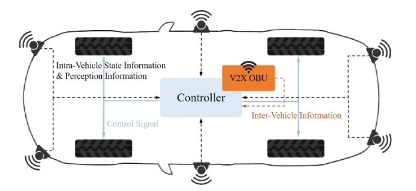

Fig. 1. Signal flows in vehicle control systems. The dotted lines stand for Sensor-to-Controller (S-C) communication channels, with the full lines for Controller-to-Actuator (C-A) signal routes.

Fig. [1,](#page-1-0) vehicle control systems include sensors, ECUs, and actuators, performing perception, decision-making, and execution, respectively [\[40\]](#page-29-3). These internal nodes are connected through the selected automotive buses and communicate with each other using correspondent networks [\[41\]](#page-29-4). In addition, vehicles are associated with other road devices by V2X On-Board Unit (OBU) and via inter-vehicle networks [\[42\]](#page-29-5). Every hop for information transmission in networked vehicle control systems would introduce a slight network impact and might eventually lead to a significant influence in end-toend communications, which could weaken vehicle real-time control performance (such as stability, smoothness, and reliability [\[43\]](#page-29-6), [\[44\]](#page-29-7), [\[45\]](#page-29-8)) distinctly in certain situations and thus should be considered and solved before practical applications [\[46\]](#page-29-9). However, tons of pioneering works towards vehicle motion control schemes using vehicular networks as communication mediums generally overlooked the influence induced by network communications (e.g., [\[47\]](#page-29-10), [\[48\]](#page-29-11)). In other words, most studies acquiesced in no delay, where the message flows in control loop systems are directly transmitted and received. Only recently have researchers begun to investigate how network communications affect vehicle real-time motion control performance and explore an optimal control scheme to minimize the network-induced influence, which is the main focus of this paper.

# *A. Related Surveys*

Many surveys have been published on vehicular network communication technologies or vehicle motion control schemes, respectively. Surveys about vehicular network communication technologies cover intra-vehicle [\[13\]](#page-28-12), [\[49\]](#page-29-12), [\[50\]](#page-29-13), [\[51\]](#page-29-14), inter-vehicle [\[3\]](#page-28-2), [\[52\]](#page-29-15), [\[53\]](#page-29-16), [\[54\]](#page-29-17), and a combination of these two [\[9\]](#page-28-8), [\[55\]](#page-29-18), [\[56\]](#page-29-19). Those about vehicle motion control schemes for intelligent driving cover single-vehicle control [\[57\]](#page-29-20), [\[58\]](#page-29-21), [\[59\]](#page-29-22), cooperative control [\[60\]](#page-29-23), [\[61\]](#page-29-24), [\[62\]](#page-29-25), [\[63\]](#page-29-26), [\[64\]](#page-29-27), and integration of these two [\[65\]](#page-29-28).

Regarding the intersection of the above two main topics, only a few surveys exist. As outlined above, this field uses vehicular network communications to enable more advanced control functions in intelligent driving. Some papers review studies on particular cases of vehicle motion control, such as cooperative lane changing [\[66\]](#page-29-29), cooperative intersection crossing [\[67\]](#page-29-30), and platooning [\[68\]](#page-29-31). Some review studies on special issues in vehicle control or vehicular communications,

|        |                           | Sc                        | cope                      |                        |                                                                                                                                                            |  |
|--------|---------------------------|---------------------------|---------------------------|------------------------|------------------------------------------------------------------------------------------------------------------------------------------------------------|--|
| Survey | Intra-Vehicle Networks | Inter-Vehicle Networks | Single-Vehicle Control | Cooperative Control | Relevance to Control over Communications                                                                                                                   |  |
| [66]   | ×                         | √                         | √                         | √                      | Lane changing maneuvers focusing on the V2V communication, decision and planning, and vehicle control algorithms.                                          |  |
| [67]   | ×                         | √                         | ×                         | √                      | Cooperative intersection management for vehicles able to communicate with each other and infrastructure.                                                   |  |
| [68]   | ×                         | √                         | ×                         | √                      | Cooperative platooning for trucks from the point of view of inter-vehicle wireless communications.                                                         |  |
| [69]   | √                         | √                         | √                         | ×                      | Attack detection and resilience in the intra-vehicle network, perception sensors, and inter-vehicle network from vehicle dynamics and control perspective. |  |
| [70]   | ×                         | √                         | √                         | √                      | Cooperative Adaptive Cruise Control (CACC) from the perspective of communication, driver characteristics, and control.                                     |  |
| [22]   | ×                         | √                         | ×                         | √                      | General cooperative architectures and maneuvers for vehicles using V2X services.                                                                           |  |
| Ours   | <b>√</b>                  | <b>√</b>                  | <b>√</b>                  | <b>√</b>               | First comprehesive research review on the topic of vehicle real-time motion control considering vehicular network communications                           |  |

TABLE I RELATED SURVEYS FROM THE FIELD OF CONTROL OVER COMMUNICATIONS IN INTELLIGENT DRIVING

e.g., attack detection and resilience [\[69\]](#page-29-32). Häfner et al. [\[22\]](#page-28-21) give a general and micro-scale survey on cooperative control over V2X communications by outlining the history of V2X communications, categorizing architectures for cooperative control, and comparing cooperative control schemes. However, these surveys do not take the influence of vehicular network communications into consideration. In [\[70\]](#page-29-33), inter-vehicle communication effects on control are mentioned incidentally; but, it does not consider intra-vehicle communications and the scope is limited to Cooperative Adaptive Cruise Control (CACC).

# *B. Contributions*

While existing papers survey how vehicular network communications assist vehicle motion control, this survey paper aims at an up-to-date and consolidated overview of vehicle real-time motion control schemes considering the adverse influence of network communications. Table [I](#page-2-0) gives an overview of the related surveys and how our paper's focus differs.

The major contributions of this survey paper can be generalized as follows.

- Mainstream intra-vehicle and inter-vehicle network communication technologies are summarized from development histories, performance parameters, and application scenarios. Furthermore, vehicular network architectures are detailed after introducing vehicular network communication technologies.
- A comprehensive literature survey on vehicle real-time motion control considering the influence of network communications (such as network-induced latencies, packet dropout, and network congestion) is provided and divided into three categories: vehicle control considering intravehicle networks, cooperative control considering intervehicle networks, and control integrating intra-vehicle and inter-vehicle networks.
- Several open issues and future challenges are pointed out, which can be considered as future research directions to promote further development and final deployment of intelligent driving.

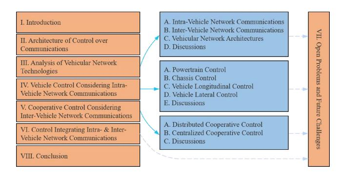

Fig. 2. Outline of this survey.

#### *C. Organization*

The remainder of this paper is structured as follows. In Section [II,](#page-2-1) an overview of the architecture of Control over Communications (CoC) is first presented. Section [III](#page-3-0) describes the evolution history, performance analysis, and parameter reference of vehicular network communication technologies along with their system architectures. Sections [IV–](#page-10-0)[VI](#page-22-0) separately review existing vehicle real-time motion control schemes considering the adverse influence of intra-vehicle networks, inter-vehicle networks, and the integration of these two. Later, several crucial open problems and future challenges are summarized in Section [VII.](#page-24-0) Finally, Section [VIII](#page-26-0) concludes this paper. For readability, the outline of this paper is presented in Fig. [2,](#page-2-2) and a list of the most used acronyms is provided in the Appendix.

# II. ARCHITECTURE OF CONTROL OVER COMMUNICATIONS

With the rapid development of Electric Vehicles (EVs) [\[71\]](#page-29-34), the powertrain systems in vehicles have undergone significant changes with other control systems slightly different from that of traditional petrol vehicles [\[72\]](#page-29-35), [\[73\]](#page-29-36), [\[74\]](#page-29-37). For instance, for braking systems, EVs use regenerative braking [\[75\]](#page-29-38), whereas petrol vehicles adopt friction braking [\[76\]](#page-29-39). As to accelerating control, EVs could respond faster with electric engines that can provide instant torque and smoother acceleration; in contrast,

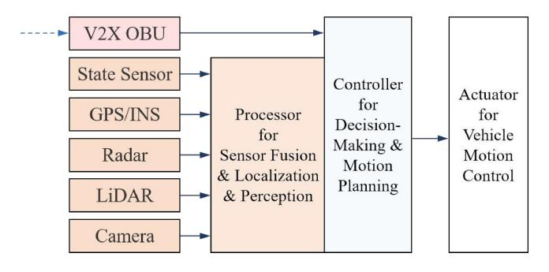

Fig. 3. A schematic composite framework for vehicle control system over network communications. The blue dotted lines represent inter-vehicle network communications, and the black full lines describe intra-vehicle network communications.

petrol vehicles usually need to wait for the engine to reach a certain speed to provide sufficient power [\[77\]](#page-29-40). In addition, EVs require a sophisticated energy management system to monitor the battery state and energy consumption [\[78\]](#page-29-41), which is not necessitated in traditional petrol vehicles. Despite such differences in control systems between petrol vehicles and EVs, the architecture of CoC for them, as visualized in Fig. [3,](#page-3-1) is identical [\[79\]](#page-30-0). Also, their requirement for communication in control is almost the same except for data capacity and data rate. Further, when it comes to intelligent driving, researchers tend to focus more on EVs [\[80\]](#page-30-1), [\[81\]](#page-30-2), [\[82\]](#page-30-3). Thus, unless otherwise specified, subsequent discussion will default vehicles to EVs and no longer distinguish between EVs and petrol vehicles.

For general vehicles without V2X OBUs (used for intervehicle network communications), some sensors are installed for environment perception, with another for state information detection inside vehicles [\[83\]](#page-30-4). All these sensors transmit the perceived information to specific controllers or processors through the feedback (S-C) channel of intra-vehicle network communications [\[84\]](#page-30-5). After calculation and analysis, relevant control instructions are obtained and distributed to the correspondent actuators via the forward (C-A) channel of intra-vehicle network communications to accomplish the desired motion behaviors [\[85\]](#page-30-6).

When it comes to intelligent driving, inter-vehicle network communications are indispensable jigsaws to make up for the functions that cannot be realized only by sensors [\[86\]](#page-30-7). It is widely known that most sensors for environment perception, such as cameras, work through the reflection of light [\[87\]](#page-30-8). When obstructions appear near the vehicle or the vehicle is in an extreme environment, these sensors will lose the original performance in most cases and cannot obtain accurate realtime information to make an emergency response [\[9\]](#page-28-8). Thus, inter-vehicle network communication technologies [\[88\]](#page-30-9) are developed to exchange information with each vehicle within a certain range in order to overcome the shortcomings of the operating principle of sensors [\[89\]](#page-30-10). Compared with general vehicles described above, only one V2X OBU is added to perform inter-vehicle network communications, with some minor changes in sensors and control functions [\[90\]](#page-30-11).

To achieve the final deployment of intelligent driving, both intra-vehicle and inter-vehicle network communications

cannot be dispensed with [\[91\]](#page-30-12). In this connection, vehicular network communication technologies must be detailed before research reviews on vehicle motion control considering network communications.

#### III. ANALYSIS OF VEHICULAR NETWORK TECHNOLOGIES

Initially, vehicular networks were developed to substitute for simple point-to-point connections and communications. With the development of automotive technologies, higher communication performance, such as data transmission rate, communication latency, reliability, etc., and new function requirements have been constantly put forward to assist in faster and more accurate control of intelligent driving [\[92\]](#page-30-13). Accordingly, intra-vehicle network technologies symbolize a diversified development trend and could complement each other under the state-of-the-art ideologies of Electrical and Electronic Architecture (EEA), for instance, domain-oriented, cross-domain-oriented, and zone-oriented architecture [\[2\]](#page-28-1). Furthermore, to support advanced collaborative Intelligent Transportation Systems (ITS), the concepts and theories of inter-vehicle communications have been gradually proposed and steadily evolved to occupy the vacant functions in intravehicle networks and meet the mandatory requirements of efficiency and safety for intelligent driving [\[42\]](#page-29-5). Similarly, the de facto driving control conditions with inter-vehicle networks also have abundant performance constraints, which should be thoroughly evaluated and demonstrated before deployment. To further clarify, the evolutionary development and feasibility analysis of mainstream vehicular network communication technologies already or potentially used in vehicles will be elaborated on in this section.

# *A. Intra-Vehicle Network Communications*

As an essential cornerstone of intelligent driving, intravehicle network communications can achieve the circuit transmission of state messages and control signals among sensors, ECUs, and actuators inside vehicles, unite disparate network technologies to constitute a reconfigurable connection architecture, and give assistance to more advanced functions in the vehicle real-time control systems, such as environment perception, dynamic decision, and motion implementation [\[9\]](#page-28-8). Here, we mainly investigate mainstream intra-vehicle network technologies and explain why they frequently appear in vehicle control systems, primarily concentrated on Controller Area Network (CAN) with its successor, CAN with Flexible Datarate (CAN-FD), Local Interconnect Network (LIN), FlexRay, Media Oriented System Transport (MOST), and automotive Ethernet, as listed in Table [II.](#page-4-0)

*1) CAN:* First proposed by Robert Bosch GmbH, CAN [\[93\]](#page-30-14) is designed as an asynchronous serial bus network to adapt to the dramatic variation of vehicle wire harnesses. It is one of the main vehicular network protocols in Europe [\[10\]](#page-28-9), [\[94\]](#page-30-15), standardized through ISO 11898 for High Speed (HS) needs [\[95\]](#page-30-16) and ISO 11519 for Low Speed (LS) applications [\[96\]](#page-30-17). Also, it is still one of the world's most prevalent field bus technologies, owing to several characteristics as follows.

TABLE II COMPARISONS FOR INTRA-VEHICLE NETWORK COMMUNICATIONS IN INTELLIGENT DRIVING

| Network                              | CAN                          | CAN-FD         | LIN                   | FlexRay                                        | MOST                                                                       | Ethernet                                                                                                                     |
|--------------------------------------|------------------------------|----------------|-----------------------|------------------------------------------------|----------------------------------------------------------------------------|------------------------------------------------------------------------------------------------------------------------------|
| Maximum Transmission Bandwidth | 1 Mb/s (HS) 125 Kb/s (LS) | 8 Mb/s         | 20 Kb/s               | 10 Mb/s                                        | 24.8Mb/s (MOST 25) 50 Mb/s (MOST 50) 150 Mb/s (MOST 150)    | 100 Mb/s (100BASE-T1) 1000 Mb/s (1000BASE-T1, 1000BASE-RH) 2.5, 5, and 10 Gb/s (2.5, 5, and 10GBASE-T1) |
| Maximum Load 8 Bytes                 |                              | 64 Bytes       | 8 Bytes               | 254 Bytes                                      | 60 Bytes (MOST 25) 120 Bytes (MOST 50) 370 Bytes (MOST 150) | 1500 Bytes                                                                                                                   |
| Delay Per Hop (Reference Only)    | 20 ms                        | 1 ms           | N/A                   | 50 μs (TDMA) 5 ms (FTDMA)                   | N/A                                                                        | 250 μs                                                                                                                       |
| Reliability                          | Medium                       | Medium         | Lowest                | High                                           | Low                                                                        | High                                                                                                                         |
| Access Mode                          | CSMA/CA                      | CSMA/CA        | UART/SCI              | TDMA/FTDMA                                     | TDMA                                                                       | CSMA/CD                                                                                                                      |
| Medium                               | Twisted Pair                 | Twisted Pair   | Single Wire           | Twisted Pair (STP or UTP), Optical Fiber | Optical Fiber                                                              | Twisted Pair, Optical Fiber                                                                                               |
| Cost and Effort                      | Low                          | Low            | Lowest                | High                                           | High                                                                       | Medium                                                                                                                       |
| Application                          | Soft Real-time               | Hard Real-time | Low Cost Low Speed | Hard Real-time                                 | Multimedia                                                                 | Hard Real-time                                                                                                               |

*First*, traditional CAN based on an event trigger mechanism can provide a maximum data transmission rate of 1 Mb/s within 40 m with CAN HS and 125 Kb/s with CAN LS. The former can meet the requirements of real-time vehicle control and large-flow data transmission, while the latter has a relatively lower cost and can be applied in body control systems such as seats [\[97\]](#page-30-18). *Second*, with non-destructive bit-by-bit arbitration, namely Carrier Sense Multiple Access with Collision Avoid (CSMA/CA), the nodes with lower priority will voluntarily suspend data transmission, and the node with higher priority can continue to deliver messages without being affected, ensuring real-time communication for comparatively important data information [\[98\]](#page-30-19). *Third*, commonly adopting a Shielded Twisted Pair (STP) cable rather than Unshielded Twisted Pair (UTP), the physical layer of CAN can provide extraordinary Electromagnetic Compatibility (EMC), suitable for high interference environments [\[99\]](#page-30-20). *Last*, satisfactory reliability can be exhibited with excellent error detection and handling mechanisms, e.g., Cyclic Redundancy Check (CRC).

CAN is commonly used in vehicle control systems such as body, powertrain, and chassis. For instance, Tesla chooses CAN in the body and powertrain control systems of its Model S/X/3 series with intelligent driving level 2.5 [\[100\]](#page-30-21). As the first level 3 IV, Audi A-8 D5 adopts CAN in its Adaptive Cruise Control (ACC) system [\[101\]](#page-30-22).

Although frequently appearing in the network architecture design schemes of automobile manufacturers, CAN still has some inherent limitations that have to be considered while constructing vehicle control systems. *First*, considering the dramatic increase in data throughput in vehicles and the higher requirements for advanced functions in intelligent driving, the bandwidth of traditional CAN is not enough. *Next*, the outstanding error detection and handling mechanism is a doubleedged sword in real-time communication. On the one hand, it can ensure the accuracy and integrity of data transmission; on the other, it may complicate the unpredictable end-to-end delay and even result in obnoxious network congestion. *Last*, high hardware costs and tedious software development make CAN lose absolute competitiveness in the low-end market. In a nutshell, the inherent defects of CAN make intra-vehicle networks flourish towards diversification.

*2) CAN-FD:* To adapt to explosive growth in data volume and bandwidth, CAN-FD, a successor of traditional CAN, has been explored [\[98\]](#page-30-19). It inherits traditional CAN's main characteristics [\[102\]](#page-30-23), such as non-destructive bit-by-bit arbitration, two-line serial communication, and reliable error detection and handling mechanism, and optimizes its bandwidth and data length. In terms of bandwidth, CAN-FD provides a variable data rate where the arbitration phase uses a standard bit rate of 1 Mb/s, while the data phase adopts an optional high bit rate of up to 8 Mb/s, with the maximum delay kept below 1 ms [\[103\]](#page-30-24). As to data length, CAN-FD readjusts it from the original 8 bytes to now available 64 bytes, signifying a higher and more efficient transmission load.

CAN-FD is usually utilized to take the place of traditional CAN in vehicle real-time control systems such as power, chassis, and active and passive safety control systems. For example, in the EEA report [\[104\]](#page-30-25) presented by Robert Bosch GmbH, CAN-FD is suggested to be the network connection of electronics inside power and body domains [\[105\]](#page-30-26). Moreover, Guangzhou Automobile group Company (GAC) Aion applies CAN-FD as a generic connection network for all controllers [\[106\]](#page-30-27).

*3) LIN:* To drive down costs, a new network bus, named LIN, using Universal Asynchronous Receiver/Transmitter (UART) and Serial Communication Interface (SCI) [\[107\]](#page-30-28), is developed as an alternative to CAN LS.

Due to its low cost and low rate (no more than 20 Kb/s), LIN is often used in body control systems such as lights, doors, seats, and air-conditioners, where the real-time requirements are not that decisive. Indeed, Audi A-8 D5 and Tesla Model S/X/3 [\[106\]](#page-30-27), [\[108\]](#page-30-29) employ LIN for simple low-end electronics control systems.

*4) FlexRay:* FlexRay [\[109\]](#page-30-30) is developed for proper communication with reliable transmission characteristics, a high transmission rate, and excellent fault tolerance. More specifically, it accepts two bus access mechanisms that can be flexibly configured as needed: Time Division Multiple Access (TDMA) for static transmission and Frequency and Time Division Multiple Access (FTDMA) for dynamic transmission. Further, FlexRay comes equipped with two mutually independent transmission channels to realize redundant or parallel data communication. Thus, it can not only operate as a singlechannel system like CAN and LIN but also as a dual-channel system. Compared with CAN, FlexRay has a relatively high cost but can provide a higher transmission rate (up to 10 Mb/s in one channel), implying that it's best employed on intravehicle hard real-time control and high safety applications, e.g., powertrain and passive safety systems. Audi A-8 D5, for instance, uses FlexRay in its safety-related control applications, such as headway distance adjustment, lane change assist, and safety airbag control systems.

Admittedly, FlexRay shows superior performance on transmission rate; however, it also has design defects. For instance, mostly adopting star topology, FlexRay only observes the channel level with a star coupler that does not have scheduling operations, which might result in insoluble collisions. Besides, expensive hardware selection and complex network configuration require more time, workforce, and money than other bus technologies. Meanwhile, strict data synchronization needs also push challenges to the ECU software process in FlexRay.

*5) MOST:* Regarding onboard multi-media installations such as traditional entertainment devices, mobile communication facilities, and navigation assist systems, the communication performance of intra-vehicle networks mentioned above might be insufficient. In order to meet higher demands of bandwidth, message synchronization, and EMC, a peculiar network bus technology called MOST was created.

To bolster exceedingly large-flow communication of multi-media applications, the most commonly used version,

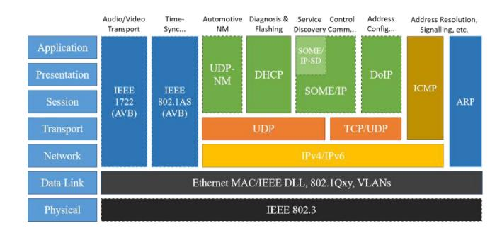

Fig. 4. Protocol overview for automotive Ethernet.

MOST 25 [\[110\]](#page-30-31), provides a maximum data transmission rate of 24.8 Mb/s [\[111\]](#page-30-32). More than that, its maximum data rate can be promoted to 50 Mb/s (MOST 50 [\[112\]](#page-30-33)) and even 150 Mb/s (MOST 150 [\[113\]](#page-30-34), [\[114\]](#page-30-35)). Further, using a ring topology, it can support up to 64 electronic devices simultaneously. However, it can only be applied to onboard multi-media systems of midto-high-end vehicles such as Audi A-8 D5, BMW 7 Series, and Mercedes E Series [\[9\]](#page-28-8), where real-time performance is not a primarily concerned criterion, and network-induced delays can generally be discounted in the whole message flow chain.

*6) Automotive Ethernet:* As a branch of traditional Ethernet, automotive Ethernet retains some parts of its setting but amends or changes others to meet particular requirements of complex environments inside vehicles [\[115\]](#page-30-36). The fundamental impetus for accepting Ethernet in vehicular architecture is the increased bandwidth and the existing mature technologies it offers [\[49\]](#page-29-12). At the time of this work, based on Carrier Sense Multiple Access with Collision Detection (CSMA/CD), several Ethernet physical layer technologies available for automobiles had been brought out (in order of completion): 100BASE-T1 (100 Mb/s over a single balanced twisted pair cable) [\[116\]](#page-30-37), 1000BASE-T1 (1000 Mb/s Ethernet using a single twisted-pair copper cable) [\[117\]](#page-30-38), 1000BASE-RH (Gigabit Ethernet over plastic optical fiber) [\[118\]](#page-30-39), 10BASE-T1S (a new variation that offers a bandwidth of 10 Mb/s and operates as a half-duplex channel with a single link partner over a single balanced pair of conductors up to at least 15 m to realize a supplemental connection to edge sensors and actuators that others cannot reach) [\[119\]](#page-30-40), and 2.5, 5, and 10GBASE-T1 (2.5 Gb/s, 5 Gb/s, and 10 Gb/s automotive electrical Ethernet full-duplex local area network for operation on a single balanced pair of conductors) [\[120\]](#page-30-41). However, it cannot be limited to the physical layer and Media Access Control (MAC) layer in light of the simplified Open System Interconnect (OSI) layer model of automotive Ethernet [\[121\]](#page-30-42), as depicted in Fig. [4.](#page-5-0) Countless existing and matured protocols in each layer also provide significant assurance for the acceptance of using Ethernet in vehicles. Automotive designers and developers could flexibly configure appropriate solutions for each layer depending on the given demands and also can exploit a new protocol for the specific layer due to well-defined interfaces between layers.

Compared with other intra-vehicle network technologies, automotive Ethernet has the following advantages in addition to the two main points described above. First, *lower*

| Network         DSRC (IEEE 802.11p)         LTE-V2X (3GPP R14/R15)         NR-V2X (3GPP R16/R17)         6G           Maximum Transmission Rate         54 Mb/s         30 Mb/s (R14) (R15)         1-10 Gb/s         1-10 Tb/s           Delay Budget (Reference Only)         100 ms         20 ms (R14) (R15)         3-10 ms (Delay-Critical GBR)         10-100 μs           Communication Range         100 m         320 m (R14) (R14) (Delay-Critical GBR)         1000 m         Global Coverage           Reliability         No Guarantee         > 90% (R14) (P15) (Delay-Critical GBR)         > 99.999% / 99.999% (Delay-Critical GBR)         > 99.99999% (Delay-Critical GBR)           Spectrum         5850 - 5925 MHz         5905 - 5925 MHz         410 - 7125 MHz (FR1) (P12) (MIS) (P12) (MIS) (P12) (MIS) (P13) (P13) (MIS) (P13) (MIS) (P13) (MIS) (MIS) (MIS) (MIS) (MIS) (MIS) (MIS) (MIS) (MIS) (MIS) (MIS) (MIS) (MIS) (MIS) (MIS) (MIS) (MIS) (MIS) (MIS) (MIS) (MIS) (MIS) (MIS) (MIS) (MIS) (MIS) (MIS) (MIS) (MIS) (MIS) (MIS) (MIS) (MIS) (MIS) (MIS) (MIS) (MIS) (MIS) (MIS) (MIS) (MIS) (MIS) (MIS) (MIS) (MIS) (MIS) (MIS) (MIS) (MIS) (MIS) (MIS) (MIS) (MIS) (MIS) (MIS) (MIS) (MIS) (MIS) (MIS) (MIS) (MIS) (MIS) (MIS) (MIS) (MIS) (MIS) (MIS) (MIS) (MIS) (MIS) (MIS) (MIS) (MIS) (MIS) (MIS) (MIS) (MIS) (MIS) (MIS) (MIS) (MIS) (MIS) (MIS) (MIS) (MIS) (MIS) (MIS) (MIS) (MIS) (MIS) (MIS) (MIS) (MIS) (MIS) (MIS) (MIS) (MIS) (MIS) (MIS) (MIS) (MIS) (MIS) (MIS) (MIS) (MIS) (MIS) (MIS) (MIS) (MIS) (MIS) (MIS) (MIS) (MIS) (MIS) (MIS) (MIS) (MIS) (MIS) (MIS) (MIS) (MIS) (MIS) (MIS) (MIS) (MIS) (MIS) (MIS) (MIS) (MIS) (MIS) (MIS) (MIS) (MIS) (MIS) (MIS) (MIS) (MIS) (MIS) (MIS) (MIS) (MIS) (                                                                                                                                                                                                                                                                                                                                                                          |             |                 |                     |                     |                    |
|--------------------------------------------------------------------------------------------------------------------------------------------------------------------------------------------------------------------------------------------------------------------------------------------------------------------------------------------------------------------------------------------------------------------------------------------------------------------------------------------------------------------------------------------------------------------------------------------------------------------------------------------------------------------------------------------------------------------------------------------------------------------------------------------------------------------------------------------------------------------------------------------------------------------------------------------------------------------------------------------------------------------------------------------------------------------------------------------------------------------------------------------------------------------------------------------------------------------------------------------------------------------------------------------------------------------------------------------------------------------------------------------------------------------------------------------------------------------------------------------------------------------------------------------------------------------------------------------------------------------------------------------------------------------------------------------------------------------------------------------------------------------------------------------------------------------------------------------------------------------------------------------------------------------------------------------------------------------------------------------------------------------------------------------------------------------------------------------------------------------------------|-------------|-----------------|---------------------|---------------------|--------------------|
| Maximum Transmission Rate         54 Mb/s         30 Mb/s (R14) 300 Mb/s (R15)         1-10 Gb/s         1-10 Tb/s           Delay Budget (Reference Only)         100 ms         20 ms (R14) 20 ms (R15)         3-10 ms (Delay-Critical GBR)         10-100 μs           Communication Range         100 m         320 m (R14) 320 m (R14)         1000 m         Global Coverage           Reliability         No Guarantee         > 90% (R14) 99.99% / 99.999% (Delay-Critical GBR)         > 99.99999%           Spectrum         5850 - 5925 MHz         5905 - 5925 MHz         410 - 7125 MHz (FR1) 24250 - 52600 MHz (FR2)         Sub 6 GHz, 28/38/60/73/77 GHz (mm-Wave Channel)           Resource Allocation         CSMA/CA         Sensing+Semi-Persistent-Scheduling, Dynamic Scheduling         Sensing+Semi-Persistent-Scheduling         Intelligent, Adaptive, and Collaborative Scheduling           Transmission         OFDM         SC-FDMA, OFDMA,         CP-OFDM, Massive         OAM Multiplexing,                                                                                                                                                                                                                                                                                                                                                                                                                                                                                                                                                                                                                                                                                                                                                                                                                                                                                                                                                                                                                                                                                                | Network     |                 |                     |                     | 6G                 |
| (Reference Only)100 ms10 ms (R15)(Delay-Critical GBR)10-100 μsCommunication Range100 m320 m (R14) 500 m (R15)1000 mGlobal CoverageReliabilityNo Guarantee> 90% (R14) > 95% (R15)99.99% / 99.999% (Delay-Critical GBR)> 99.99999% (Delay-Critical GBR)Spectrum5850 - 5925 MHz5905 - 5925 MHz410 - 7125 MHz (FR1) 24250 - 52600 MHz (FR2)Sub 6 GHz, 28/38/60/73/77 GHz (mm-Wave Channel)Resource AllocationCSMA/CASensing+Semi-Persistent-Scheduling, Dynamic Scheduling, Dynamic SchedulingSensing+Semi-Persistent-Scheduling SchedulingIntelligent, Adaptive, and Collaborative SchedulingTransmissionOFDMSC-FDMA, OFDMA,CP-OFDM, MassiveOAM Multiplexing,                                                                                                                                                                                                                                                                                                                                                                                                                                                                                                                                                                                                                                                                                                                                                                                                                                                                                                                                                                                                                                                                                                                                                                                                                                                                                                                                                                                                                                          |             | * /             | 30 Mb/s (R14)       | ,                   | 1-10 Tb/s          |
| Reliability  No Guarantee  Spectrum  Spectrum  Spectrum  Spectrum  Spectrum  Spectrum  Spectrum  Spectrum  Spectrum  Spectrum  Spectrum  Spectrum  Spectrum  Spectrum  Spectrum  Spectrum  Spectrum  Spectrum  Spectrum  Spectrum  Spectrum  Spectrum  Spectrum  Spectrum  Spectrum  Spectrum  Spectrum  Spectrum  Spectrum  Spectrum  Spectrum  Spectrum  Spectrum  Spectrum  Spectrum  Spectrum  Spectrum  Spectrum  Spectrum  Spectrum  Spectrum  Spectrum  Spectrum  Spectrum  Spectrum  Spectrum  Spectrum  Spectrum  Spectrum  Spectrum  Spectrum  Spectrum  Spectrum  Spectrum  Spectrum  Spectrum  Spectrum  Spectrum  Spectrum  Spectrum  Spectrum  Spectrum  Spectrum  Spectrum  Spectrum  Spectrum  Spectrum  Spectrum  Spectrum  Spectrum  Spectrum  Spectrum  Spectrum  Spectrum  Spectrum  Spectrum  Spectrum  Spectrum  Spectrum  Spectrum  Spectrum  Spectrum  Spectrum  Spectrum  Spectrum  Spectrum  Spectrum  Spectrum  Spectrum  Spectrum  Spectrum  Spectrum  Spectrum  Spectrum  Spectrum  Spectrum  Spectrum  Spectrum  Spectrum  Spectrum  Spectrum  Spectrum  Spectrum  Spectrum  Spectrum  Spectrum  Spectrum  Spectrum  Spectrum  Spectrum  Spectrum  Spectrum  Spectrum  Spectrum  Spectrum  Spectrum  Spectrum  Spectrum  Spectrum  Spectrum  Spectrum  Spectrum  Spectrum  Spectrum  Spectrum  Spectrum  Spectrum  Spectrum  Spectrum  Spectrum  Spectrum  Spectrum  Spectrum  Spectrum  Spectrum  Spectrum  Spectrum  Spectrum  Spectrum  Spectrum  Spectrum  Spectrum  Spectrum  Spectrum  Spectrum  Spectrum  Spectrum  Spectrum  Spectrum  Spectrum  Spectrum  Spectrum  Spectrum  Spectrum  Spectrum  Spectrum  Spectrum  Spectrum  Spectrum  Spectrum  Spectrum  Spectrum  Spectrum  Spectrum  Spectrum  Spectrum  Spectrum  Spectrum  Spectrum  Spectrum  Spectrum  Spectrum  Spectrum  Spectrum  Spectrum  Spectrum  Spectrum  Spectrum  Spectrum  Spectrum  Spectrum  Spectrum  Spectrum  Spectrum  Spectrum  Spectrum  Spectrum  Spectrum  Spectrum  Spectrum  Spectrum  Spectrum  Spectrum  Spectrum  Spectrum  Spectrum  Spectrum  Spectrum  Spectrum  Spectrum  Spectrum  Spectrum  | , ,         | 100 ms          | ` ′                 |                     | 10-100 μs          |
| Spectrum   Sensing Semi-Persistent-   Scheduling   Scheduling   Scheduling   Scheduling   Scheduling   Scheduling   Scheduling   Scheduling   Scheduling   Scheduling   Scheduling   Scheduling   Scheduling   Scheduling   Scheduling   Scheduling   Scheduling   Scheduling   Scheduling   Scheduling   Scheduling   Scheduling   Scheduling   Scheduling   Scheduling   Scheduling   Scheduling   Scheduling   Scheduling   Scheduling   Scheduling   Scheduling   Scheduling   Scheduling   Scheduling   Scheduling   Scheduling   Scheduling   Scheduling   Scheduling   Scheduling   Scheduling   Scheduling   Scheduling   Scheduling   Scheduling   Scheduling   Scheduling   Scheduling   Scheduling   Scheduling   Scheduling   Scheduling   Scheduling   Scheduling   Scheduling   Scheduling   Scheduling   Scheduling   Scheduling   Scheduling   Scheduling   Scheduling   Scheduling   Scheduling   Scheduling   Scheduling   Scheduling   Scheduling   Scheduling   Scheduling   Scheduling   Scheduling   Scheduling   Scheduling   Scheduling   Scheduling   Scheduling   Scheduling   Scheduling   Scheduling   Scheduling   Scheduling   Scheduling   Scheduling   Scheduling   Scheduling   Scheduling   Scheduling   Scheduling   Scheduling   Scheduling   Scheduling   Scheduling   Scheduling   Scheduling   Scheduling   Scheduling   Scheduling   Scheduling   Scheduling   Scheduling   Scheduling   Scheduling   Scheduling   Scheduling   Scheduling   Scheduling   Scheduling   Scheduling   Scheduling   Scheduling   Scheduling   Scheduling   Scheduling   Scheduling   Scheduling   Scheduling   Scheduling   Scheduling   Scheduling   Scheduling   Scheduling   Scheduling   Scheduling   Scheduling   Scheduling   Scheduling   Scheduling   Scheduling   Scheduling   Scheduling   Scheduling   Scheduling   Scheduling   Scheduling   Scheduling   Scheduling   Scheduling   Scheduling   Scheduling   Scheduling   Scheduling   Scheduling   Scheduling   Scheduling   Scheduling   Scheduling   Scheduling   Scheduling   Scheduling   Scheduling   Scheduling   Scheduling   Sche   |             | 100 m           | l ' '               | 1000 m              | Global Coverage    |
| Spectrum  Spectrum  Spectrum  Spectrum  Spectrum  Spectrum  Spectrum  Spectrum  Spectrum  Spectrum  Spectrum  Spectrum  Spectrum  Spectrum  Spectrum  Spectrum  Spectrum  Spectrum  Spectrum  Spectrum  Spectrum  Spectrum  Spectrum  Spectrum  Spectrum  Spectrum  Spectrum  Spectrum  Spectrum  Spectrum  Spectrum  Spectrum  Spectrum  Spectrum  Spectrum  Spectrum  Spectrum  Spectrum  Spectrum  Spectrum  Spectrum  Spectrum  Spectrum  Spectrum  Spectrum  Spectrum  Spectrum  Spectrum  Spectrum  Spectrum  Spectrum  Spectrum  Spectrum  Spectrum  Spectrum  Spectrum  Spectrum  Spectrum  Spectrum  Spectrum  Spectrum  Spectrum  Spectrum  Spectrum  Spectrum  Spectrum  Spectrum  Spectrum  Spectrum  Spectrum  Spectrum  Spectrum  Spectrum  Spectrum  Spectrum  Spectrum  Spectrum  Spectrum  Spectrum  Spectrum  Spectrum  Spectrum  Spectrum  Spectrum  Spectrum  Spectrum  Spectrum  Spectrum  Spectrum  Spectrum  Spectrum  Spectrum  Spectrum  Spectrum  Spectrum  Spectrum  Spectrum  Spectrum  Spectrum  Spectrum  Spectrum  Spectrum  Spectrum  Spectrum  Spectrum  Spectrum  Spectrum  Spectrum  Spectrum  Spectrum  Spectrum  Spectrum  Spectrum  Spectrum  Spectrum  Spectrum  Spectrum  Spectrum  Spectrum  Spectrum  Spectrum  Spectrum  Spectrum  Spectrum  Spectrum  Spectrum  Spectrum  Spectrum  Spectrum  Spectrum  Spectrum  Spectrum  Spectrum  Spectrum  Spectrum  Spectrum  Spectrum  Spectrum  Spectrum  Spectrum  Spectrum  Spectrum  Spectrum  Spectrum  Spectrum  Spectrum  Spectrum  Spectrum  Spectrum  Spectrum  Spectrum  Spectrum  Spectrum  Spectrum  Spectrum  Spectrum  Spectrum  Spectrum  Spectrum  Spectrum  Spectrum  Spectrum  Spectrum  Spectrum  Spectrum  Spectrum  Spectrum  Spectrum  Spectrum  Spectrum  Spectrum  Spectrum  Spectrum  Spectrum  Spectrum  Spectrum  Spectrum  Spectrum  Spectrum  Spectrum  Spectrum  Spectrum  Spectrum  Spectrum  Spectrum  Spectrum  Spectrum  Spectrum  Spectrum  Spectrum  Spectrum  Spectrum  Spectrum  Spectrum  Spectrum  Spectrum  Spectrum  Spectrum  Spectrum  Spectrum  Spectrum  Spectrum  Spectrum  Spectrum  Spectr | Reliability | No Guarantee    | ` ′                 |                     | > 99.99999%        |
| Resource Allocation  CSMA/CA Scheduling, Dynamic Scheduling, Dynamic Scheduling, Dynamic Scheduling Scheduling Scheduling Scheduling Scheduling OFDM  OFDM  OFDM  OFDM  OFDM  OFDM  OFDM  OFDM  OFDM  OFDM  OFDM  OFDM  OFDM  OFDM  OFDM  OFDM  OFDM  OFDM  OFDM  OFDM  OFDM  OFDM  OFDM  OFDM  OFDM  OFDM  OFDM  OFDM  OFDM  OFDM  OFDM  OFDM  OFDM  OFDM  OFDM  OFDM  OFDM  OFDM  OFDM  OFDM  OFDM  OFDM  OFDM  OFDM  OFDM  OFDM  OFDM  OFDM  OFDM  OFDM  OFDM  OFDM  OFDM  OFDM  OFDM  OFDM  OFDM  OFDM  OFDM  OFDM  OFDM  OFDM  OFDM  OFDM  OFDM  OFDM  OFDM  OFDM  OFDM  OFDM  OFDM  OFDM  OFDM  OFDM  OFDM  OFDM  OFDM  OFDM  OFDM  OFDM  OFDM  OFDM  OFDM  OFDM  OFDM  OFDM  OFDM  OFDM  OFDM  OFDM  OFDM  OFDM  OFDM  OFDM  OFDM  OFDM  OFDM  OFDM  OFDM  OFDM  OFDM  OFDM  OFDM  OFDM  OFDM  OFDM  OFDM  OFDM  OFDM  OFDM  OFDM  OFDM  OFDM  OFDM  OFDM  OFDM  OFDM  OFDM  OFDM  OFDM  OFDM  OFDM  OFDM  OFDM  OFDM  OFDM  OFDM  OFDM  OFDM  OFDM  OFDM  OFDM  OFDM  OFDM  OFDM  OFDM  OFDM  OFDM  OFDM  OFDM  OFDM  OFDM  OFDM  OFDM  OFDM  OFDM  OFDM  OFDM  OFDM  OFDM  OFDM  OFDM  OFDM  OFDM  OFDM  OFDM  OFDM  OFDM  OFDM  OFDM  OFDM  OFDM  OFDM  OFDM  OFDM  OFDM  OFDM  OFDM  OFDM  OFDM  OFDM  OFDM  OFDM  OFDM  OFDM  OFDM  OFDM  OFDM  OFDM  OFDM  OFDM  OFDM  OFDM  OFDM  OFDM  OFDM  OFDM  OFDM  OFDM  OFDM  OFDM  OFDM  OFDM  OFDM  OFDM  OFDM  OFDM  OFDM  OFDM  OFDM  OFDM  OFDM  OFDM  OFDM  OFDM  OFDM  OFDM  OFDM  OFDM  OFDM  OFDM  OFDM  OFDM  OFDM  OFDM  OFDM  OFDM  OFDM  OFDM  OFDM  OFDM  OFDM  OFDM  OFDM  OFDM  OFDM  OFDM  OFDM  OFDM  OFDM  OFDM  OFDM  OFDM  OFDM  OFDM  OFDM  OFDM  OFDM  OFDM  OFDM  OFDM  OFDM  OFDM  OFDM  OFDM  OFDM  OFDM  OFDM  OFDM  OFDM  OFDM  OFDM  OFDM  OFDM  OFDM  OFDM  OFDM  OFDM  OFDM  OFDM  OFDM  OFDM  OFDM  OFDM  OFDM  OFDM  OFDM  OFDM  OFDM  OFDM  OFDM  OFDM  OFDM  OFDM  OFDM  OFDM  OFDM  OFDM  OFDM  OFDM  OFDM  OFDM  OFDM  OFDM  OFDM  OFDM  OFDM  OFDM  OFDM  OFDM  OFDM  OFDM  OFDM  OFDM  OFDM  OFDM  OFDM  OFDM  OFDM  OFDM  OFDM  OFDM  OFDM  OFDM  OFDM  OFDM  OFDM  OFDM  OFDM  OFDM  OFDM  OFDM  OFDM  OFDM  OFDM  OFDM  OFDM   | Spectrum    | 5850 - 5925 MHz | 5905 - 5925 MHz     | ` ′                 | 28/38/60/73/77 GHz |
| I ()FDM   ' '   '   '   '   '   '   '   '   '                                                                                                                                                                                                                                                                                                                                                                                                                                                                                                                                                                                                                                                                                                                                                                                                                                                                                                                                                                                                                                                                                                                                                                                                                                                                                                                                                                                                                                                                                                                                                                                                                                                                                                                                                                                                                                                                                                                                                                                                                                                                                  |             | CSMA/CA         | Scheduling, Dynamic | Scheduling, Dynamic | and Collaborative  |
|                                                                                                                                                                                                                                                                                                                                                                                                                                                                                                                                                                                                                                                                                                                                                                                                                                                                                                                                                                                                                                                                                                                                                                                                                                                                                                                                                                                                                                                                                                                                                                                                                                                                                                                                                                                                                                                                                                                                                                                                                                                                                                                                | I OFDM I    |                 |                     | · '                 | 1 0,               |

TABLE III COMPARISONS FOR INTER-VEHICLE NETWORK COMMUNICATIONS IN INTELLIGENT DRIVING

*latency*. Two automotive Ethernet alternatives, Time-Sensitive Network (TSN) and Time-Triggered Ethernet (TTE), both introduce time-deterministic requirements and employ data shaping techniques to guarantee microsecond delay (no more than 250 microseconds per hop in general). Second, *more accurate time synchronization*. Traditional Ethernet works in asynchronous mode, whereas TTE and TSN add reliable time synchronization mechanisms, such as general Precision Time Protocol (gPTP), to support real-time data transmission. Third, *higher reliability*. During vehicle driving, electronic and electrical components inside vehicles have to suffer from miscellaneous complicated and severe external disturbances. All these factors will lead to decreases in components' work performance and service life, bringing higher requirements for interference immunity. In reality, the industrial market has proved that Ethernet can realize high robustness under extreme conditions [\[122\]](#page-30-43). Fourth, *higher safety and security*. Initially, most intra-vehicle network technologies were built for communication only inside vehicles and didn't need to manage information security technologies. When it comes to Intelligent Connected Vehicles (ICVs), however, in-vehicular information has to be exchanged with other external network devices. In this case, hackers can easily invade vehicle network systems and then commit crimes varied from privacy stealing to casualties by remote vehicle control. Fortunately, Ethernet has acquired much cyber security policy-related knowledge after years of sediment in the Internet Technology (IT) sector [\[123\]](#page-30-44). Some research fruits, such as AUTomotive Open Systems ARchitecture Secure Onboard Communication (AUTOSAR SecOC) [\[124\]](#page-30-45) and Society of Automotive Engineers (SAE) J3061 [\[125\]](#page-31-0), have already been declared. Last, *unique wireless connectivity*. The rapid popularization of automotive Ethernet will accelerate the introduction and development of Wireless Access in Vehicular Environments (WAVE) [\[126\]](#page-31-1) that can provide a new technical potential for V2X in ITS. As an indispensable jigsaw of intelligent driving, automotive Ethernet serves with access interfaces connecting intra-vehicle wired networks and inter-vehicle wireless networks, which is pretty arduous to achieve for other intra-vehicle real-time control networks due to their closure and limitation.

Considering the above advantages, automotive Ethernet is frequently used as the communication backbone of onboard network architectures. XPeng G9, for example, adopts gigabit Ethernet as its backbone network to realize faster data transmission, safety redundancy, and interconnection with other network buses. Besides, automotive Ethernet can also be utilized in vehicle real-time control systems. For instance, BMW 7 Series employs Ethernet in its ACC system, lane departure/change warning system, parking/reversing assist system, etc. With automotive Ethernet, intra-vehicle networks can be an enabler for vehicular functions rather than a limiting factor.

# *B. Inter-Vehicle Network Communications*

Vehicular Ad-hoc NETwork (VANET) is a multi-hop, distributed, and self-organized wireless communication system based on vehicular sensors and road infrastructures in response to the instant deployment of inter-vehicle network communications. As a complement of intelligent driving for IVs, inter-vehicle network communication technologies are recommended for high real-time applications dependent on frequent data exchanges between the vehicle and other surrounding devices, especially vehicles [\[127\]](#page-31-2), which have a significant potential for automotive manufacturer services, passenger infotainment, road safety, and traffic optimization [\[128\]](#page-31-3).

Different from the diversified development trend of intra-vehicle network technologies, inter-vehicle networks, as exhibited in Table [III,](#page-6-0) are advanced towards one worldwide universal communication. From the current situation, cellular networks gradually occupied the dominant position of V2X markets instead of Dedicated Short-Range Communication (DSRC).

DSRC is based on IEEE 802.11p [\[129\]](#page-31-4), [\[130\]](#page-31-5), [\[131\]](#page-31-6) and expands IEEE 802.11 against ITS-related applications in the spectrum of 5.850-5.925 GHz allocated by the Federal Communications Commission (FCC) [\[132\]](#page-31-7), [\[133\]](#page-31-8), [\[134\]](#page-31-9). It employs a sort of multi-carrier modulation, namely Orthogonal Frequency Division Multiplexing (OFDM) [\[135\]](#page-31-10), and supports the modulation types of Binary Phase Shift Keying (BPSK), Quadrature Phase Shift Keying (QPSK), and 16 or 64 Quadrature Amplitude Modulation (16/64QAM). Thus, DSRC can guarantee low latency (at least 100 ms) while providing a maximum data transmission rate of 54 Mb/s available for realtime V2V communications [\[136\]](#page-31-11). In an intermediate position of its protocol stack, DSRC adopts a set of standards defined by the IEEE 1609 task force [\[137\]](#page-31-12), including 1609.1 [\[138\]](#page-31-13) for resource management, 1609.2 [\[139\]](#page-31-14) for information security, 1609.3 [\[140\]](#page-31-15) for network services, and 1609.4 [\[141\]](#page-31-16) for channel switching. However, DSRC has various deficiencies, such as poor network coverage and connectivity, high deployment cost, and decreasing communication performance while its nodes get denser, which cannot adequately respond to the challenges posed by high-speed IoV communication [\[142\]](#page-31-17). Therefore, even its promoter, U.S. FCC, has renounced DSRC for V2X communications [\[143\]](#page-31-18).

Cellular V2X (C-V2X) technologies were advanced by Chen et al. [\[144\]](#page-31-19) and came into research with the rapid popularity of one of 4th Generation mobile communication technologies (4G), Time Division-Long Term Evolution (TD-LTE) [\[143\]](#page-31-18).

First-generation C-V2X technology, LTE-V2X, also called LTE for Vehicle (LTE-V), is specified by 3GPP Release 14 (R14) [\[145\]](#page-31-20) and Release 15 (R15) [\[146\]](#page-31-21). It makes innovative contributions to wireless transmission, resource allocation, and synchronization mechanisms. Specifically, LTE-V2X utilizes Single-Carrier Frequency Division Multiple Access (SC-FDMA) and Orthogonal Frequency Division Multiple Access (OFDMA) as its modulation and transmission technologies. In resource allocation, it supports User Equipment (UE) resource discretion using PC5 interfaces and base resource scheduling based on cellular communication base stations. In addition, its sidelink has four synchronization sources: Global Navigation Satellite System (GNSS), base stations, terminals sending SideLink Synchronization Signal (SLSS), and its internal clock. To better assist inter-vehicle real-time control, LTE-V2X can offer higher bandwidth (up to 300 Mb/s), lower latency (10 ms minimum for 3GPP R15), and higher reliability (at least 95% for R15) than DSRC. Even though LTE-V2X presents remarkable improvements compared with DSRC, its performance is still insufficient to satisfy real-time and reliable control for intelligent driving [\[147\]](#page-31-22).

Next-generation C-V2X technology [\[148\]](#page-31-23), [\[149\]](#page-31-24), [\[150\]](#page-31-25), [\[151\]](#page-31-26), New Radio for V2X (NR-V2X), has emerged with the ascent of cellular mobile communication systems from 4G to 5th Generation mobile communication technology (5G) [\[152\]](#page-31-27) to solve issues that LTE-V2X cannot [\[153\]](#page-31-28), [\[154\]](#page-31-29), [\[155\]](#page-31-30). NR-V2X is standardized by 3GPP Release 16 (R16) [\[156\]](#page-31-31) and Release 17 (R17) [\[157\]](#page-31-32). 3GPP R16 mainly strengthens three aspects on the basis of R15, briefly summarized as basic function enhancement, vertical industry capacity expansion, and operation automation and network intelligence enhancement. The sidelink specified by R16, for further explanation, introduces Cyclic Prefix OFDM (CP-OFDM) [\[158\]](#page-31-33), [\[159\]](#page-31-34), [\[160\]](#page-31-35) and spatial multiplexing Multiple-In Multiple-Out (MIMO) transmission mechanism to raise transfer rate and Hybrid Automatic Repeat reQuest (HARQ) feedback mechanism to improve reliability [\[161\]](#page-31-36), [\[162\]](#page-31-37), [\[163\]](#page-31-38). The distributed resource allocation mechanism is also further researched in R16 to reduce resource collision and make NR-V2X better applicable to non-periodic services in advanced IoV applications. As a result, NR-V2X with R16 can support advanced V2X services that require higher performance in terms of flexibility, reliability (soar to 99.999% for delaycritical Guaranteed Bit Rate (GBR)), bandwidth (top rate of 1Gb/s for general scenarios and 10 Gb/s for specific scenarios), and latency (about 3 ms for delay-critical GBR) [\[156\]](#page-31-31), [\[164\]](#page-31-39), [\[165\]](#page-31-40). Further, 3GPP R17 evolves previous 3GPP releases and is backward compatible [\[166\]](#page-31-41). For instance, R17 enhances the performance of ultra Reliable Low Delay Communication (uRLLC) and other vertical domains. A series of sidelink enhancements are also brought into IoV, such as resource selection and coordination, power-saving mechanisms, and Frequent Range (FR). With the popularization of worldwide 5G, the commercial use of R16 and the future deployment of R17 will be boosted and promoted soon.

Towards 2030 and beyond, the next generation of cellular network technologies, namely 6th Generation mobile networks (6G), will deepen the original three typical scenarios of 5G, including uRLLC, enhanced Mobile BroadBand (eMBB), and massive Machine Type Communication (mMTC), support human-centered immersive interaction, and expand service range to global coverage [\[167\]](#page-31-42). Moreover, 6G will sustainably extend communication capability boundaries, innovatively construct five typical application scenarios (including ultra wireless bandwidth, extremely reliable communication, super scale connection, communication perception fusion, and inclusive intelligent service), and comprehensively usher economic society transformation towards greenization, digitization, and intelligence [\[168\]](#page-31-43). More concretely, it utilizes Terahertz (THz) wireless communication, Orbital Angular Momentum (OAM) Multiplexing, and Spatial Modulation MIMO (SM-MIMO), to provide a peak data rate of at least 1 Tb/s, 100 times that of 5G NR-V2X, and 10Tb/s for some particular scenarios [\[169\]](#page-31-44), with an over-theair latency of 10-100 *µ*s [\[170\]](#page-31-45) and data-transmission reliability more than 99.99999% [\[171\]](#page-31-46). However, 6G is not a simple breakthrough in network communication performance but also a realization of the ultimate objective of the Internet of Everything (IoE). As envisaged, all data could be exchanged between UEs and clouds, and all information processing can be conducted in clouds with extensive use of Artificial Intelligence (AI) and quantum computing technologies [\[172\]](#page-31-47). It can be visualized that ITS, as a part of global network systems, will be perfectly actualized with 6G.

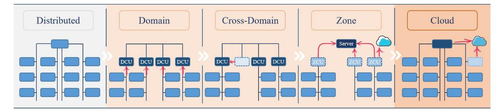

Fig. 5. Potential (r)evolution of automotive EEAs.

#### *C. Vehicular Network Architectures*

Nowadays, vehicle control systems are not connected through only one type of network communication. Instead, various network technologies are assembled to construct the whole vehicular communication network architecture to maximize competitive advantage and overall profit [\[173\]](#page-31-48).

Inside the vehicle, EEA is such a concept that effectively consolidates all the sensors, ECUs, and actuators via a systemintegrated network framework [\[2\]](#page-28-1), and organically combines hardware and software through an efficient power and signal distribution system. Under particular constraints such as cost, weight, and reliability, an excellent EEA can provide an optimal technical scheme to meet a vehicle's electronic and electrical requirements [\[50\]](#page-29-13). Robert Bosch GmbH [\[105\]](#page-30-26) has elaborated on the evolutionary development of EEAs, as described in Fig. [5.](#page-8-0)

In the early distributed EEA, each ECU is only responsible for controlling a single functional unit and processing its own functions. With all ECUs connected through specific network buses such as CAN or LIN, state information and control signals are exchanged by predefined communication protocols. Vehicle control functions in terms of complexity and range, however, have been increasing rapidly, propelled by industry inclinations such as intelligent driving. Furthermore, stimuli in compliance with vehicular technical specifications brought grand challenges for traditional automotive distributed EEA [\[2\]](#page-28-1). In other words, automotive distributed EEA was already outdated for the further evolution of automobile intelligence [\[174\]](#page-32-0).

In answer to requests constantly updated in the automobile industry, centralized solutions (i.e., domain-centralized, crossdomain-centralized, and zone-oriented architectures) quickly caught fire and spread throughout both academic institutions and automotive OEMs [\[175\]](#page-32-1). The new solutions are built on only a modest amount of high-performance processors to supersede a great quantity of distributed Micro Control Units (MCUs) in the past.

In the domain-centralized architecture, the concentration of automotive functions and the reduction of ECUs represent a separation of software and hardware from hundreds of ECUs originally carried in vehicles and a migration of functions into several Domain Control Units (DCUs) (generally divided into five domains: powertrain, chassis, body, intelligent driving, and intelligent cabin) through software [\[105\]](#page-30-26). Moreover, the introduction of automotive Ethernet significantly improves communication bandwidth and lowers transmission latency.

On the basis of domain architecture, the cross-domaincentralized stage emerges with further consolidation of different domain functions onto single ECUs called Cross-Domain Control Units (CDCUs) to cut costs and enhance collaboration. DCUs for powertrain, chassis, and body domains, for instance, can be integrated into one vehicle control CDCU [\[176\]](#page-32-2).

Through deeper fusion, the functional domain is gradually upgraded to a more general computing platform, carrying out a transition to zone-oriented architecture. In the zone-oriented architecture, vehicles are separated into several zones (one of the most common divisions: front-left, front-right, rear-left, and rear-right) [\[2\]](#page-28-1), individually controlled by a single Zone Control Unit (ZCU). Nevertheless, unlike DCUs, ZCUs do not need to process any automotive function. They only forward message frames once received from the corresponding zone to a more powerful central server that can process all the complex functions in vehicles. Furthermore, more complicated computational processing can be performed in clouds during peak hours of the intra-vehicle network communication system. On the premise of ensuring the stability of vehicular architecture and the extensibility of automotive functions, this architecture can achieve a reduction in wiring harness weight, communication interface, and cost.

With the diversion of functions from vehicles to clouds and the further simplification of vehicular architecture, EEA tends toward the vehicle-cloud cooperative architecture [\[177\]](#page-32-3), the most promising EEA available for intelligent driving, which can completely realize a seamless cohesion of intra-vehicle and inter-vehicle networks. In this architecture, intra-vehicular ECUs are used for real-time control with a cloud server as a supplement to support non-real-time data interaction. All sensors and actuators could be defined and controlled by software, enabling a thorough achievement of Software Defined Vehicles (SDVs) [\[178\]](#page-32-4).

Up to now, numerous automotive OEMs and Tier 1 suppliers have already released respective centralized EEA schemes that have been or will be adopted in their developed vehicles. These almost center on domain-centralized and zone-oriented architectures. To our best knowledge, however, no OEM or supplier has yet announced the application of a vehicle-cloud cooperative architecture which has occurred only in theoretical research and analysis reports.

As an innovator in automotive EEA [\[100\]](#page-30-21), Tesla developed its Model S Series with apparent functional domain divisions. Although its Model X Series further integrated several

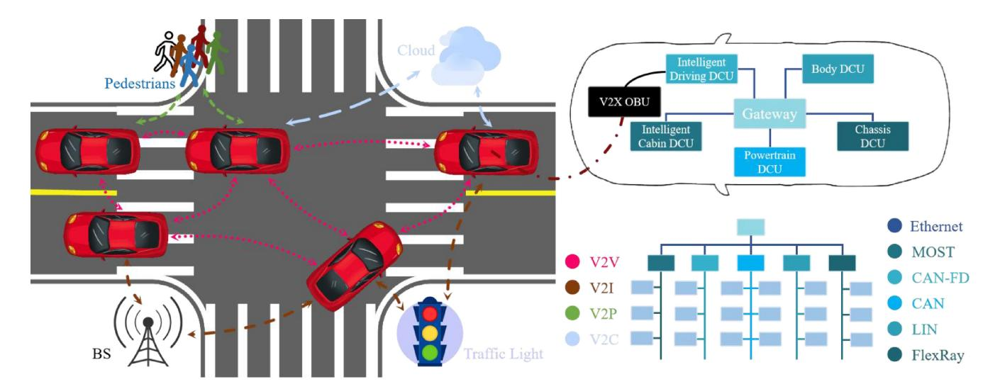

Fig. 6. Comprehensive architecture of vehicular network communications. The inter-vehicle communications use C-V2X technologies, and the linear density of dotted lines represents real-time requirements for related communications. The intra-vehicle network architecture accepts the domain-centralized architecture as an example.

modules, the traditional domain architecture can no longer meet the requirements of intelligent driving and SDV. Tesla Model 3 Series broke through a functional domain architecture and realized a zone architecture with central computing. In particular, Model 3 Series contains three core ZCUs: Central Computing Module (CCM), Body Control Module Left (BCM LH), and BCM Right (RH) [\[106\]](#page-30-27). BCM LH is in charge of steering, braking, etc., whereas BCM RH takes responsibility for chassis safety, power supply, thermal management, etc. As to CCM, it gathers infotainment, intelligent diving, and intra-&inter-vehicle communication connection modules. This architecture already has its rudiment but is still far from the end result since its communication is mainly based on CAN with the CCM only in form.

In summary, the appearance of centralized EEA not only deep decouples software and hardware but also reconstructs intra-vehicular network framework, breaking the constraint of traditional vehicle design thought and providing lower-layer supports for intelligent driving in IVs. Thus, there is nothing ambiguous that the centralized scheme is a long-term and prospective development direction for automotive EEA [\[2\]](#page-28-1).

After the introduction of intra-vehicle network architectures, an unabridged vehicular network architecture consolidating intra-vehicle and inter-vehicle networks could be instituted, as illustrated in Fig. [6,](#page-9-0) where intra-vehicle network architecture cites the domain-centralized EEA scheme as an example.

In vehicular network architecture, V2X OBU works as an adhesive between intra-vehicular wired networks and intervehicular wireless communications [\[90\]](#page-30-11). However, it performs message forwarding only and hands over the functions of processing, decision-making, and control. Data received by OBU is forwarded to the intelligent driving DCU in the domain-centralized EEA scheme and the central server in the zone-oriented EEA scheme. In the vehicle-cloud cooperative EEA scheme, the adhesive cannot be concluded yet, which may be a central server as same as the zone-oriented EEA or individual ECUs integrating all control functions owing to a quantum leap in chip computational capabilities and network communication performances.

Inside the vehicle, all electrical and electronic nodes are connected through vehicular bus networks configured by car designers [\[179\]](#page-32-5), which can refer to Section [III-A](#page-3-2) and the first half of Section [III-C.](#page-8-1) Certain vehicle state information can be broadcast to surrounding related networked devices via V2X OBU. Outside the vehicle, wireless communication networks would cover the whole available area and support several specific communication scenarios, such as V2V, V2I, V2P, and V2C/V2N [\[180\]](#page-32-6), where different scenarios have different requirements for communication performance. Specifically, V2V and V2P request the highest real-time level but also have differences. V2V must be conducted infallibly when vehicles cruise in top gear and/or under extreme conditions, whereas V2P only expects vehicles to build bridges with pedestrians in a relatively low-speed scene. But for pedestrian safety, V2P still claims a relatively high real-time performance to tackle some tough issues in urban roads [\[181\]](#page-32-7), such as obscured pedestrian-vehicle conflict. It follows that the realtime requirement for V2V might be as high as or slightly higher than that for V2P. On the contrary, V2C requests the lowest real-time performance due to the limitation of existing technologies and spatial deployments, which can only be used in non-real-time applications, e.g., navigation, infotainment, and remote monitoring. Besides, V2I provides soft real-time communication applications between vehicles and surrounding infrastructures, such as traffic management, information service, and Electronic Toll Collection (ETC).

#### *D. Discussions*

With the development of intelligent driving, IVs demand to deploy increasing sensors, ECUs, and actuators, making vehicular electronic systems more and more complex. This urgently calls for more advanced intra-vehicle network technologies that can meet appropriate requirements, e.g., high bandwidth, low latency, high flexibility, and low cost. CAN, one of the most widely used field buses, can provide excellent comprehensive performance for vehicle control systems. However, with the growing need for a higher transmission rate, it can no longer apply to large-flow data communication in intelligent driving. After years of research and exploration, the automotive Ethernet scheme, derived from traditional Ethernet, occurs in publications. Once launched, none can be compared with it in bandwidth, communication load, transmission latency, and reliability. More than this, automotive Ethernet supports multiple communication protocols with impressive shareability, interoperability, and compatibility. Furthermore, it also reserves access interfaces with wireless network communications, enabling other external network devices to connect to vehicles. Nonetheless, automotive Ethernet cannot be wholly adopted in vehicular network systems considering the limitation of costs. To achieve the optimal layout of intra-vehicle network communications, a centralized EEA scheme, composed of several well-performed network bus technologies, has been submitted and gradually optimized. In this scheme, every network bus could do its specific duties to minimize costs while meeting performance requirements. However, only intravehicle networks are not enough for intelligent driving due to a few extreme situations, such as severe weather conditions and obscured pedestrian-vehicle conflict. In order to make up for the inherent deficiencies of intra-vehicle networks and support more advanced application scenarios, inter-vehicle network communication technologies have been developed and experienced a process from weakness to mightiness. DSRC was first proposed as the only technology for vehicular wireless communications. With the depth of research, however, researchers were gradually conscious of its insufficient performance and poor development potential and explored a brand-new wireless communication scheme for vehicles, namely C-V2X. This scheme stems from the rapid popularity of cellular mobile communication networks, provided with extraordinary portability, compatibility, and scalability, with significant advancement opportunities and fantastic application prospects. C-V2X has undergone two-generation development, namely LTE-V2X and NR-V2X, between which the relationship is complementary rather than substitutional. NR-V2X continues to use the core technologies of LTE-V2X and improves it in various aspects to provide higher network communication performance and support more advanced intelligent driving scenarios (as abbreviated in Table [IV](#page-10-1) [\[23\]](#page-28-22), [\[164\]](#page-31-39)). Even so, it might still not be sufficient in case of an emergency or network failure. Therefore, researchers are now focusing on a more advanced wireless communication technology that can realize an impeccable communication presentation and fully support multitudinous vertical industries not limited to IoV. It can be envisioned that the concept of IoE will come to fruition one day.

Although vehicular network communication technologies have been well studied and gradually put into service, a series of vexed issues introduced by networks (e.g., uncertain delay, sudden congestion, and time asynchronization, where the first is the root of every dilemma) still perplex automotive researchers or might almost be neglected by control

TABLE IV MAXIMUM PERFORMANCE REQUIREMENTS FOR ADVANCED INTELLIGENT DRIVING

| Scenario            | Rate /Mb/s | Latency /ms | Reliability | Range /m |
|---------------------|---------------|----------------|-------------|-------------|
| Platooning          | < 65          | 10-25          | 99.99%      | 80-350      |
| Advanced Driving    | 10-53         | 3-100          | 99.999%     | 360-700     |
| Extended Sensors | 1000          | 3              | 99.999%     | 50-1000     |
| Remote Driving   | 25            | 5              | 99.999%     | N/A         |

algorithm engineers. Initially, the design intention of vehicular network communications was to better assist vehicle control systems, but researchers seemed to cut off the close association between these two parts. Specifically, engineers in the communication industry are devoted to continuous and incremental advancement of network performance, whereas engineers in the vehicle control domain aim to ameliorate system structure and improve control presentation, which should have been integrated for exploration and analysis. However, a strange phenomenon occurred: the development of vehicle control systems has been unable to keep up with the pace of vehicular network communications, especially intravehicle networks. As can be observed in the comparisons of intra-vehicle and inter-vehicle networks, the data transmission rate grows by a factor of over ten after each update, but the budgetary delay is not optimized as significantly as that. In practice, the network-induced time-varying delay is always a top priority in vehicle real-time control systems, as the data communication rate has already reached saturation. Even 100-megabit automotive Ethernet as a backbone network can fully meet all functions in a majority of vehicle control systems. Advanced intelligent driving can also be implemented entirely through one gigabit automotive Ethernet. Admittedly, the increasing data rate might be used in vehicles one day. But for now, it has developed into a state of insanity. As reported, Ethernet-related researchers have started pursuing a higher transmission rate of 10 Gb/s, 50 Gb/s, and even 100 Gb/s [\[182\]](#page-32-8), confusing some automotive engineers about deploying network technologies beyond expectations. The network-induced influence, especially time-varying delay, however, is rarely concerned about and seems to appear only in theories. Without considering the network-induced impact, vehicle control strategies might fail or be disabled under actual conditions. Thus, synthetic research on vehicular network communications and vehicle control strategies, instead of simple application of network technologies, has to be conducted to restore an experimental scene as realistically as possible.

# IV. VEHICLE CONTROL CONSIDERING INTRA-VEHICLE NETWORK COMMUNICATIONS

Control over intra-vehicle network communications treats the vehicle interior as a research system. The ECUs use the vehicle state and external environment information sensed by installed sensors to produce control instructions that actuators will execute, as can be seen in Fig. 1. These sensors, ECUs, and actuators, along with intra-vehicle networks, together form an intra-vehicular networked control system.

As a control machine requiring exceedingly high safety and reliability, vehicles have long been plagued by real-time issues [183] ubiquitous in the networked control system, which could lead to time-varying random delays, undesired network congestion, and inevitable time asynchronization. In particular, real-time presentation inside vehicles generally refers to end-to-end timing rather than the timing in a single communication network channel. For instance, the AEB control system uses radars to measure the distance between vehicles and obstacles and sends the braking instructions calculated by a specific ECU to the brake modules. Typically, radars and brake modules are not in the same domain, meaning the data must be transmitted through at least one gateway and via several communication networks. The end-to-end delays of these transmissions are pretty massive and cannot be overlooked. To optimize real-time performance, an effective network scheduling strategy and/or a delay-robust control scheme have to be established for a vehicle real-time networked control system with strong robustness [184].

Vehicle control systems with the requirement of hard realtime performance at runtime can be roughly classified into four categories: powertrain, chassis, vehicle longitudinal, and vehicle lateral control systems, as summarized in Table V.

Due to the strong nonlinear coupling characteristics of longitudinal, lateral, and vertical motions in vehicle dynamics, it is almost impractical to establish an uncomplicated but accurate whole vehicle dynamics model [185]. Therefore, several fundamental assumptions have to be made in specific control to simplify the pertinent research and analysis. Here, we cite longitudinal and lateral control as an example. First, ignore the deformation of vehicular wheels and suspensions, that is, no vertical motions for vehicles. Second, assume that the pitch and roll angles of the vehicular body are zero. Last, ignore the influence of the steering trapezoid and accept that the left and right wheels have the same rotation angle. Based on the above assumptions, a whole vehicle dynamics model [186], [187] with different degrees of freedom, as sketched in Fig. 7, can thus be instituted to be the guideline for the research and design of lower-layer controllers and upper-layer strategies.

# A. Powertrain Control

With the resurgence of EVs, several powertrain alternatives [188], such as centralized motor-driven and distributed motor-driven [189], have emerged and attracted increasing research efforts [190], [191]. The structures of centralized and distributed motor-driven powertrain systems bear almost no resemblance, but both suffer from varying degrees of delays. For centralized motor-driven EVs, the electric engine will directly supersede or assist the Internal-Combustion Engine (ICE), with other apparatus remaining unchanged. The electric engine is indirectly connected to the driving wheels through the automotive drivetrain, as featured in

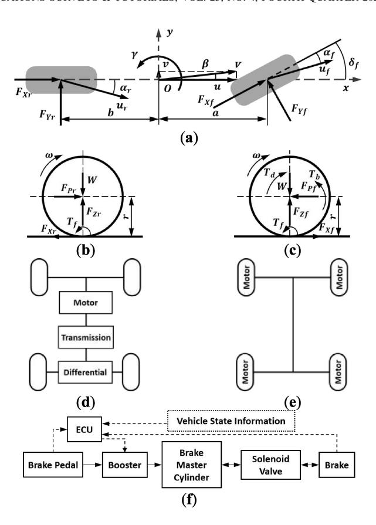

Fig. 7. Physics models of vehicle motion control. (a) Vehicle dynamics model with two degrees of freedom, where  $\beta$  and  $\gamma$  respectively represent the sideslip angle and yaw rate of the vehicle, a and b separately mean the distances from the center of vehicle mass to the vehicle front and rear axles, V denotes the velocity of vehicle centroid,  $u_f$  and  $u_r$  indicate the actual speed of the front and rear wheels,  $F_{
m Xf}$  and  $F_{
m Xr}$  accordingly symbolize the longitudinal forces of the front and rear wheels,  $F_{
m Yf}$  and  $F_{
m Yr}$  individually signify the lateral forces of the front and rear wheels,  $\delta_f$  is the front wheel angle, and  $\alpha_f$  and  $\alpha_T$  independently reveal the front and rear tire slip angles. (b) Force on driven wheels, where  $\omega$  serves as the angular velocity of wheels, W defines the vehicular sprung mass, r is the wheel radius,  $F_{Zr}$ and  $F_{Pr}$  stand for the normal and driving forces acting on the rear wheels respectively, and  $T_f$  denotes the rolling resistance moment. (c) Force on driving wheels, where  $F_{Zf}$  and  $F_{Pr}$  signify the normal and driving forces of front wheels, and  $T_d$  and  $T_b$  shows the driving and braking torques on the front wheels. (d) Centralized motor-driven powertrain system. (e) Distributed motor-driven powertrain system. (f) Electro-hydraulic braking system, where the solid lines represent mechanical or hydraulic signals, and the dotted lines symbolize the electrical signals.

Fig. 7(d). For distributed motor-driven EVs, such as Four-Wheel-Independent-Drive (FWID) EVs, the powertrain structure is pretty different from that of conventional vehicles. This kind of EV is directly actuated by distributed in-wheel motors [192], [193], generally integrated with transmissions, and abandons some mechanical components, including the differential and central driveshaft, as pictured in Fig. 7(e). Fast dynamics characterize the powertrain system, where driveline oscillations make frequent appearances with the absence of clutches [194].

Despite this division, both centralized and distributed motordriven layouts mainly adopt Integrated Motor-Transmission (IMT) powertrain systems, where the motor and transmission will be studied as a whole. The sensors, e.g., motor speed sensor, wheel speed sensor, and torsional angle sensor, collect the

TABLE V SUMMARY OF STUDIES ON CONTROL CONSIDERING INTRA-VEHICLE NETWORK COMMUNICATIONS

| Reference                      | Year | Control | Network       | Summary                                                                                                                                                                                     |
|--------------------------------|------|---------|---------------|---------------------------------------------------------------------------------------------------------------------------------------------------------------------------------------------|
| Caruntu <i>et al</i> . [196]   | 2011 | IMT     | CAN           | Real-time networked predictive control over CAN to damp driveline oscillations.                                                                                                             |
| Zhu <i>et al</i> . [197]       | 2014 | IMT     | CAN           | Energy-to-peak control to attenuate drivetrain oscillations and external disturbances with the linearized delay uncertainties.                                                              |
| Cao et al. [198]               | 2017 | IMT     | CAN           | Speed synchronization control over CAN, subject to network-induced delays and network congestion.                                                                                           |
| Liu et al. [199]               | 2018 | IMT     | CAN           | Speed tracking control coupled with the influence of CAN-bus-induced delays.                                                                                                                |
| Li et al. [200]                | 2020 | IMT     | CAN           | Energy-to-peak performance-based control considering mechanical-electric-network effects to ensure the torsional oscillation damping and vehicle speed tracking performance.                |
| Xu et al. [201]                | 2020 | IMT     | CAN           | Dynamic reset speed synchronization control satisfying energy-to-peak performance subject to delays induced by a Denial of Service (DoS) attack.                                            |
| Cao et al. [202]               | 2021 | IMT     | CAN           | Predictive control with a graphic-based delay boundary analysis to alleviate the drivetrain oscillations, subject to the multi-channel compounding-construction loop delays induced by CAN. |
| Song et al. [203]              | 2005 | TCS     | CAN           | CAN bus design for TCS control with good real-time and high reliability.                                                                                                                    |
| Shin et al. [204]              | 2006 | TCS     | CAN           | Network-based TCS considering temporal behaviors, such as network-induced and computation delays.                                                                                           |
| Başlamişli <i>et al.</i> [205] | 2007 | ABS     | N/A           | ABS control algorithm based on static-state feedback of longitudinal slip with tuning strategies to address unknown actuator delay and measurement noise.                                   |
| Horvath et al. [206]           | 2022 | TCS     | N/A           | Longitudinal wheel dynamics control subject to the feedback delays.                                                                                                                         |
| Ye et al. [207]                | 2022 | ABS     | CAN           | Systematic analysis method of stability and critical delay algorithm for time delay ABS.                                                                                                    |
| Edwards et al. [208]           | 2014 | AEB     | N/A           | Estimate of pedestrian AEB systems considering sensor and system delays, TTC, and brake ramp.                                                                                               |
| Chajmowicz et al. [209]        | 2019 | AEB     | N/A           | Effectiveness assessment of AEB with detection, transmission, and full braking delays.                                                                                                      |
| Cao et al. [210]               | 2022 | AEB     | Domain EEA | Safety-critical cyber-physical AEB system synthesizing the environment perception, vehicular control, and network communications.                                                           |
| Cao et al. [211]               | 2023 | ACC     | Domain EEA | Hierarchical cyber-physical control method for ACC with domain-centralized EEA suffering from heterogeneous-topology loop delays.                                                           |
| Shuai et al. [8]               | 2014 | DYC     | CAN           | H∞-based delay-tolerant LQR for AFS and DYC over CAN with time-varying delays.                                                                                                              |
| Shuai <i>et al</i> . [212]     | 2014 | DYC     | CAN           | Quadratic programming algorithm for DYC with dynamic message priority scheduling to minimize the adverse impact of CAN-induced delays.                                                      |
| Latrach et al. [213]           | 2014 | DYC     | N/A           | H∞ fuzzy control for DYC with communication limitations such as delays, dropouts, and capacities.                                                                                           |
| Wang et al. [214]              | 2016 | DYC     | CAN           | H∞ static output-feedback control considering network-induced delay and tire force saturation.                                                                                              |
| Cao et al. [215]               | 2017 | DYC     | CAN           | LQR control and fuzzy-based scheduling to deal with network congestion and network-induced delays.                                                                                          |
| Cao et al. [216]               | 2022 | DYC     | CAN           | Hybrid schedule-control framework to address the coupled impacts of multiple-package transmissions and time-varying network-induced delays.                                                 |

relevant state information and deliver it to the correspondent ECU. This ECU computes the required torque according to the desired velocity reference and vehicle state information and then passes it to the motor controller. Such a control system is a networked control system, as the messages must be transmitted via the feedback (S-C) and forward (C-A) channels, which would cause unpredictable time-varying delays in each communication channel. These delays will, in turn, affect the drivetrain control system and result in significant driveline oscillations. Further, time-varying delays in the distributed motor-driven powertrain systems would evolve into a tougher issue: four-wheel time synchronization. This synchronization issue lies not only in the feedback channel but also in the forward channel. In order to realize synchronization control [\[195\]](#page-32-21), the Transmission Control Unit (TCU) has to receive the related vehicle state information with the same timestamp from each sensor simultaneously and make the same motor control signals reach each motor controller at the same time. How to synchronize messages from sensors and to actuators is a precondition of applying these powertrain control systems and becomes an urgent problem to be solved.

This class of research was initially studied by Caruntu et al. [\[196\]](#page-32-22), [\[217\]](#page-33-0), who wrote a few papers in the drivetrain control over intra-vehicle network communications. They first built a networked closed-loop vehicle drivetrain control system, analyzed the time-varying delays induced by CAN, and designed a real-time control strategy based on the Model Predictive Control (MPC) methodology to damp driveline oscillations while mitigating the influence of CAN-induced delays on the closed-loop control performance. On the basis of this MPC controller, Caruntu et al. [\[218\]](#page-33-1), [\[219\]](#page-33-2) further presented a non-conservative Lyapunov-based predictive controller for the constructed continuous-time drivetrain model with time-varying delays, polytopic uncertainties, and hard constraints.

Zhu et al. [\[197\]](#page-32-23) further started research on integrating intravehicle network communications into the Integrated Motor-Transmission (IMT) powertrain control systems. In this work, they only studied the oscillation-damping issue and tried to attenuate the external disturbance with the energy-to-peak controller based on multi-variable Proportional-Integral (PI) control methodology. The nonlinear uncertainties induced by random network delays were depicted with the polytopic inclusion based on Taylor series expansion. In [\[220\]](#page-33-3), they further researched the speed synchronization control with random delays, where two modifications were given. One was the potential delays in the feedback and forward channels, which were modeled through two homogeneous Markov chains. Another was that the generalized PI control was transformed to a static output-feedback control with an iterative Linear Matrix Inequality (LMI) algorithm.

In Cao et al.'s [\[198\]](#page-32-24) work, not only the network-induced delays but also the network congestion was imposed into the control system. To deal with them, a co-design methodology on the fusion of active period scheduling and discrete-time Sliding Mode Control (SMC) was put forward to optimize speed synchronization control and restrict network congestion. In [\[221\]](#page-33-4), they extended the research to a more complex networked control environment. Apart from the time-varying delays, the network protocol restraints, such as package capability and utilization efficiency limitations, were also considered in the networked IMT powertrain control systems. The control scheme was rearranged into a new approach employing offline priority scheduling and SMC based on the Lyapunov stability criterion to overcome all the challenges and guarantee the stability of speed synchronization control.

Liu et al. [\[199\]](#page-32-25) came up with an innovative method utterly different from Zhu et al.'s and Cao et al.'s. In the analysis foundation of the IMT powertrain control system coupled with the CAN-induced delays, a system augmentation technique with the error integral was selected to achieve an optimal speed-tracking control performance. With the augmentation technique, to be specific, the speed-tracking control can be converted into a state-feedback control where the mixed H∞ and Linear Quadratic Regulator (LQR) performance was also considered in the tracking controller to regulate the control input.

Li et al. [\[200\]](#page-32-26) replicated the research on vehicle drivetrain control over network communications in more extensive studies. The torque fluctuations in the motor, nonlinear gear backlash and driveshaft flexibility in the driveline, and CAN-induced delays that might result in powertrain oscillation were utterly considered. They established a delay-free discrete model that could address the merging influences of the CANinduced delays and the event-driven manner of controllers. In addition, they also designed an energy-to-peak performancebased controller and a sliding mode compensator to constrict the torsional vibration and assure the vehicle speed tracking performance.

When it comes to an intelligent connected new era, an ICV might suffer from a tremendous amount of replay attack packages infused into the CAN bus through inter-vehicle network communications, which can degrade the vehicle realtime control performance and even invalidate the vehicle networked control systems. To maintain the performance of an IMT speed-tracking control system enduring attack-induced delays, Xu et al. [\[201\]](#page-32-27) designed a reset control unit to gain a relatively better transient response under massive network attacks and a delay-robust speed synchronization control unit that can reach the energy-to-peak performance. The attackinduced delays formulated by polytopic inclusion applying Taylor series expansion were used to characterize the uncertainties introduced by a replay attack. Consequently, a dynamic output-feedback control unit, in consideration of the uncertainties, was laid out for online speed tracking. In their design scheme, the after-reset value worked out by LMIs would override the dynamic state vector once the reset condition was fulfilled.

With a graphic-based constructional representation method to model the compounding-construction loop delays, Cao et al. [\[202\]](#page-32-28) adjusted Caruntu et al.'s control scheme and developed a robust MPC solution to improve the driveline oscillation control system robustness against the undesired network-induced delays. These MPC-based controllers were demonstrated to meet the required timing constraints in simulation and have the potential to satisfy the desired real-time control qualifications in reality.

#### *B. Chassis Control*

Chassis control systems are devised to ensure the driving stability of the vehicle under different road conditions, which can be concluded into two main aspects: Anti-lock Brake System (ABS) [\[222\]](#page-33-5) and Traction Control System (TCS) [\[223\]](#page-33-6), [\[224\]](#page-33-7).

For ABS, during vehicle braking, it can automatically adjust the braking forces or torques acting on wheels to maintain the slip ratio in an ideal state for better adhesion between wheels and ground. The wheels can thus obtain desired longitudinal braking and lateral forces under various braking conditions for optimal braking distance and vehicle stability. As to control methodologies, it mainly includes logic threshold control [\[225\]](#page-33-8), optimal control [\[226\]](#page-33-9), sliding mode variable structure control [\[227\]](#page-33-10), fuzzy control [\[228\]](#page-33-11), etc. Due to factors such as reliability and cost, the easy-to-accomplish logic threshold control method is most used in engineering practice, with wheel angular acceleration as the main threshold and wheel slip ratio as the supplementary threshold to eliminate the limitations of a single threshold. After designing the ABS algorithm, a large number of real vehicle tests are required to evaluate its control performance by two main characteristics, i.e., braking efficiency and direction steadiness. However, time-varying networked delays still exist between vehicle state input (vehicle speed, wheel angular speed, wheel angular acceleration, etc.) and vehicle braking response (wheel braking forces or torques) and will lower the vehicle braking performance.

Ba¸slami¸sli et al. [\[205\]](#page-32-29) considered an unknown latency introduced by the dynamics of the electromechanical actuator in their ABS control and set the delay time as 10 ms. They synthesized a static-state feedback control algorithm against nonlinearities of the selected braking model based on the Linear Parameter Varying (LPV) method. Through a general robustness analysis, further tuning strategies were given to deal with the design conflict induced by actuator delay and noise interference. To verify the effectiveness, the comparative delay time was set to 10 times the designed value. Unfortunately, they only analyzed the unknown actuator delay and did not further study its essence. In Savitski et al.'s work [\[229\]](#page-33-12), the CAN-induced delays were realized in the ABS control systems but were set to an ideal constant, namely 3 ms. Ye et al. [\[207\]](#page-32-30) then took both communication and controller delays into account and focused on the analysis of stability and critical delay method of the time delay ABS. They built a dynamic ABS model with delays and then derived the fulldelay stability interval and critical delay method employing the generalized Sturm criterion. Afterwards, the critical delay method and the stability of the time delay ABS considering diverse control parameters were validated by numerical simulations. In addition, Ishak and Khan [\[230\]](#page-33-13) also researched the internal or external attacks on the safety critical system using CAN as the communication medium on account of its security vulnerabilities. They presented a message authentication approach applied in a CAN-based networked ABS control system, which can utilize message authentication security characteristics to check each third-party intrusion.

For TCS, as the name suggests, it can control the slip ratio within a target threshold by the limitations of driving wheel slips to improve the utilization of ground adhesion. It is generally believed that when the slip ratio reaches 10% - 35%, the wheels could obtain larger longitudinal and lateral adhesion coefficients [\[185\]](#page-32-11). According to the vehicle speed and wheel angular speed from the corresponding sensors, the TCS controller can calculate the current slip ratio and the required control parameters of driving torque or braking interference transmitted to the corresponding actuators. In TCS control, the driving torque output by the engine responds slowly, but its smooth control effect is not easy to cause a sudden change in driving wheel speed. In contrast, the braking pressure produced by the brake devices can take immediate effect but result in substantial wheel speed fluctuation and poor comfort. Thus, under normal circumstances, the driving torque control is used on uniform low-adhesion roads to fully use road adhesion, the joint control of driving torque and braking interference is adopted on split roads to consider both the full utilization of road adhesion and the stability during vehicle acceleration, and the braking interference control is employed

on the driving wheel on the lower adhesion roadside to keep the wheel speed difference of driving wheels on lower and higher adhesion roadsides around the target value when one driving wheel slips on split roads. But in an actual running environment, uncertain network-induced delays are incurred in TCS and also a control impact factor that should be fully considered.

In the works of [\[203\]](#page-32-31) and [\[231\]](#page-33-14), one of the intra-vehicle network bus technologies, CAN, was accepted as the communication medium in TCS. Although the performance of the CAN communication and TCS control algorithm has been proven to be effective, the communication system and related controllers were analyzed, designed, and validated separately. Shin et al. then considered the temporal behaviors in their developed TCS [\[204\]](#page-32-32), [\[232\]](#page-33-15), such as network-induced and controller computation delays. By the proposed performance index derived from the performance difference between an ideal system and the networked system, the optimal periods and priorities for tasks and messages can be figured out through a genetic algorithm. In the networked TCS, the feedback delay was assumed as a constant ideal value (3 ms), and the controller computation delay used the worst-case response time of tasks and messages in various sets of periods and priorities. Besides, Horvath et al. [\[206\]](#page-32-33) analyzed the time-varying delays in the feedback channel of a longitudinal wheel dynamics control loop using a TCS as an example. They devoted two model alternatives to describe the feedback delays, where the continuous time model used constant delay and the semi-discrete model applied time-periodic point delay.

#### *C. Vehicle Longitudinal Control*

While driving, the designated vehicle shall keep a certain distance from other objects on the road, such as surrounding vehicles and pedestrians. This kept driving distance, usually referring to the longitudinal distance, counts on the vehicle driving speed, system reaction rate, real-time control performance, external environmental factors, etc. The vehicle driving speed determines the reaction time left for the designated vehicle, which must be pointed out in this part of studies. The system reaction rate denotes the rapidity from detecting obstacles to completing corresponding actions, while the real-time control performance stands for the presentation of controllers in the designated vehicle under time-varying random network-induced delays, that is, the central point in this work. Besides, external environmental factors might also place severe restrictions on the awareness abilities of vehicle realtime control systems, e.g., bad weather, dark situation, and visual dead angle, which could be tackled through cooperative network communications that will be mainly discussed later in Section [V.](#page-17-0)

In accordance with the vehicle running conditions on the road, longitudinal motion control can be categorized into two classes [\[58\]](#page-29-21): Active Safety Control (ASC) with transient emergencies and Adaptive Cruise Control (ACC) with steady-state driving conditions, where ACC focuses principally on the safe distance among vehicles and ASC mainly assists in collision avoidance between vehicle and obstacles. Despite their different concerns, the involved vehicular systems are the same, i.e., the drive and brake systems, as can be referred to in Fig. [7\(](#page-11-0)b) - [7\(](#page-11-0)f), where the wheel dynamics models are used to ensure that tires do not slip in longitudinal control.

*1) Transient Safety:* ASC systems are customarily associated with specific functions that can warn the driver in advance of a possible safety crisis or intervene spontaneously for a lower likelihood of an accident without a driver [\[233\]](#page-33-16). In vehicle longitudinal control, ASC is most centered around Autonomous Emergency Braking (AEB) system [\[27\]](#page-28-26).

For AEB, when an obstacle suddenly appears in front of the vehicle, if the driver fails to take correct collision avoidance behaviors in time due to human limitations in visual perception, mental state, and reaction capacity, its active braking function will autonomously intervene in vehicle control [\[27\]](#page-28-26). The performance of AEB is related to the degree of trust of a driver in the vehicle control system [\[185\]](#page-32-11). Therefore, during AEB design, the collision avoidance characteristics of drivers, i.e., driver reaction time and vehicle braking deceleration, should be fully acknowledged to make the active braking function conform to them. The driver reaction time consists of brain information processing time, accelerator pedal release time, and brake pedal depress time. The vehicle braking deceleration characterizes the braking intensity imposed by the driver for the dangerous degree of the current situation. The collision avoidance reaction time left to the driver, also named Time-To-Collision (TTC) in a broad sense, corresponds to the vehicle braking deceleration, where TTC increases with braking intensity. According to TTC, the core issue for AEB control can be converted to how to calibrate the forewarning and active braking thresholds. Furthermore, with intra-vehicle networks, another critical issue, namely real-time control problems, occurs and should also be taken into full consideration.

Edwards et al. [\[208\]](#page-32-34) became aware of the sensor and system delays apart from braking delay and TTC but didn't recognize their essence along with Lee et al. [\[234\]](#page-33-17). In their explanation, the sensor delay was defined as the time the AEB system took to sense an obstacle that should be braked for, and the system delay was described as the time it took to start braking from the decision. As a networked AEB system, this concept of sensor delay could be further divided into sensor sampling, feedback transmission, and ECU processing delays. The system delay could be rewritten as the networkinduced delay in the forward channel. In Chajmowicz et al.'s research [\[209\]](#page-32-35), the information transmission delay introduced by network communications was pointed out and then analyzed in their AEB system. Even though which intra-vehicle network they chose was not mentioned, it can be deduced as CAN according to its value setting. In addition to CAN, Cao et al. [\[210\]](#page-32-36) began to study the multi-hop communication network-induced delays of domain-centralized EEA in their proposed cyber-physical AEB system. To diminish the negative impacts imposed by road adhesion saturation and network-induced delays, a layered cyber-physical AEB control strategy was developed. At the upper layer, a *µ*adaptive TTC planning scheme was outlined to produce the

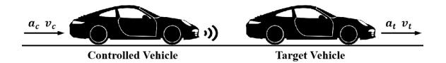

Fig. 8. ACC with only intra-vehicle network communications, where *ac* and *vc* represent the current acceleration and velocity of the controlled vehicle and *at* and *vt* stand for the current acceleration and velocity of the target vehicle.

required deceleration considering road adhesion saturation. At the lower layer, an H∞-LQR acceleration tracking controller was conceived for high robustness to the multi-hop networkinduced delays. It should be noted in their cyber-physical AEB system, the inter-vehicle network communications were slightly mentioned but not deeply analyzed.

*2) Steady-State Cruise:* For ACC, with the state information of the controlled vehicle and the target vehicle sensed by sensors and radars, as portrayed in Fig. [8,](#page-15-0) it can replace the driver to adjust the throttle position and brake pressure automatically. There are two main performance criteria for ACC, i.e., vehicle following characteristics and passenger occupant comfort. These two are mutually restrictive and must be balanced and coordinated in ACC design [\[185\]](#page-32-11). Apart from the consideration of relative movement between vehicles, its own vehicle dynamics characteristics should also be investigated. To solve these relatively independent control objectives, ACC systems tend to adopt a hierarchical control structure [\[235\]](#page-33-18). At the upper level, the relative movement in actual traffic flow was deliberated to obtain the desired longitudinal acceleration for the controlled vehicle. At the lower level, in light of the longitudinal dynamics of the controlled vehicle, the drive and brake systems were managed to achieve fast and accurate tracking between actual and desired accelerations against numerous disturbances, such as motor characteristics, aerodynamics, and tire dynamics. With the advent of intra-vehicle network communications, the time-varying delays induced by them also seriously interfere with ACC performance and should be regarded as a critical control factor in ACC.

This class of research was seldom studied, and most researchers preferred to analyze the influence of inter-vehicle networks or their synthesis, which will be discussed later. To our best knowledge, only Cao et al. [\[211\]](#page-32-37) investigated the communication delays induced by only intra-vehicle networks. In their networked ACC system, a domain-centralized EEA was accepted. All the upper-layer and lower-layer functions of ACC were integrated into the Advanced Driving Assistance System (ADAS) DCU. The sensors were subordinate to the ADAS domain using Ethernet as the communication medium, and the actuators were connected to the chassis DCU via CAN. The vehicle state information measured by sensors will be transmitted to the actuators through multiple nodes and different communication network links. Thus, they put forward a new concept of poly-service loop delay to characterize the time-varying delay in the heterogeneous network topology structure and utilized a mathematical expression to determine its boundary. The adverse effects of network issues, such as delays, were addressed in the low-layer functions of ADAS DCU.

# *D. Vehicle Lateral Control*

Through the vehicle steering system, as can be noticed in Fig. [7\(](#page-11-0)a), the road steering wheels can obtain a corresponding turning angle to cause vehicle steering and generate vehicle lateral motion that can directly involve vehicle handling and stability [\[236\]](#page-33-19), for which Direct Yaw-moment Control (DYC) is the most effective. When vehicle steering, DYC can distribute the longitudinal forces to each wheel to produce the yaw moment encircling the vehicular centroid and maximize vehicle handling and stability under extreme conditions by analyzing and processing the steering wheel state information sampled by sensors. While managing the yaw moment, two issues should be considered, i.e., the selection and the slip ratio control of controller wheels. Besides, there are two evaluation criteria for DYC, including the sideslip angle and yaw rate of the controlled vehicle. The sideslip angle can be adopted to judge whether the controlled vehicle understeers or oversteers, whereas the yaw rate can be applied to determine whether there is trajectory deviation. It is generally agreed that brake the inner-rear wheel when understeering or the outerfront wheel when oversteering, where the diagonal wheel can also be used to conduct differential braking or driving and form additional yaw moment. To keep the slip ratio within the optimal range, the ipsilateral wheel can be employed as an auxiliary redundancy to avoid excessive slip of a single wheel.

In the transmission of steering wheel state information and longitudinal force control signals, the time-varying delays introduced by intra-vehicle network communications always remain in the feedback and forward channels, which have been fully researched and addressed.

Shuai et al. [\[8\]](#page-28-7) were first engaged in this area. In their designed system, Active Front-wheel Steering (AFS) and DYC were combined in the lateral motion control of FWID EVs. The delay uncertainties induced by the CAN network were formulated as a polytope with Taylor series expansion. To deal with random CAN-induced delays and reach a real-time steady-state response, a delay-tolerant control associating H∞ and LQR was presented in the forward channel, where the feedback gains can be accessed using a sequence of LMIs.

Due to the effectiveness and efficiency of the H∞-based LQR control methodology, increasing studies, e.g., [\[237\]](#page-33-20), [\[238\]](#page-33-21), [\[239\]](#page-33-22), and [\[240\]](#page-33-23), began to adopt it in attenuation of the adverse impact of intra-vehicle network communications and brought continuous enhancements for better control performance. In particular, Zhu et al. [\[238\]](#page-33-21) made two improvements or innovations based on Shuai et al.'s approach. One was that the network-induced delays were researched not only in the forward channel but also in the feedback channel. Another was that the delays in two channels were modeled by two homogenous Markov chains rather than simple Taylor series expansion. In Cao et al.'s method [\[239\]](#page-33-22), the LQR control was used to guarantee the control effect of DYC and anti-slip control, and a communication mechanism based on scheduling was constructed to address some unexpected network issues such as asynchrony and delays. In [\[240\]](#page-33-23), Cao et al. further summarized the networked DYC system and proposed a new concept of the cyber-physical control system.

In addition to the H∞-based LQR control method, there have been various research studies on the other techniques, such as scheduling mechanisms [\[212\]](#page-32-38), fuzzy control [\[213\]](#page-32-39), and output-feedback control [\[214\]](#page-33-24), for DYC with intra-vehicle network communications.

In [\[212\]](#page-32-38), Shuai et al. abandoned their original DYC control scheme [\[8\]](#page-28-7). They used a torque allocation method based on quadratic programming to realize the reasonable utilization of road friction for each wheel and introduced a dynamic message priority scheduling mechanism to maximize the use of the limited bandwidth of CAN and attenuate the negative effect of the CAN-induced delays as much as possible. Besides, a generalized PI control was also applied at the upper layer to close the control loop. Shuju and Yingji [\[241\]](#page-33-25) came up with another idea and then worked out a data-reduction methodology by ordering four control messages into one to attenuate the adverse effect of CAN-induced delays in the DYC system of FWID EV.

Latrach et al. [\[213\]](#page-32-39) then devised a state feedback and observer-based control strategy based on the Takagi-Sugeno fuzzy logic for the stability of the closed-loop fuzzy system with an H∞ interference debilitation level. Meanwhile, they utilized fuzzy Lyapunov-Krasovski functional to deduce a radical delay-dependent criterion to deal with intra-vehicle communication conditions, e.g., network-induced delays, limited communication capacities, and data packet dropouts. In the similar way, Cao et al. [\[242\]](#page-33-26) developed a parameterdependent fuzzy SMC method using the vehicle real-time state information to handle network-induced delays.

In Wang et al.'s approach [\[214\]](#page-33-24), an H∞ output-feedback DYC scheme taking both tire force saturation and networkinduced delays into account was presented, where the H∞ control was selected to address these considerations for the regulation of vehicle lateral dynamics and the output-feedback control was accepted for better DYC control performance and less system cost. Likewise, Jing et al. [\[243\]](#page-33-27) also chose the H∞ output-feedback control in DYC with some interference, such as the parameter/state uncertainties, input saturation, actuator faults, and external disturbances.

Apart from time-varying network-induced delays, other factors, such as network congestion [\[215\]](#page-33-28) and message synchronization [\[216\]](#page-33-29), can also exert considerable effects on the DYC control performance and even paralyze the whole vehicle network system [\[244\]](#page-33-30), which has been taken into consideration in several research studies. In [\[215\]](#page-33-28), a co-design strategy was conceived with a period-dependent LQR controller and a dynamic period scheduler to reasonably distribute the network resource and alleviate the network congestion. In order to resolve the coupled impact of network-induced delays and multiple-package transmissions, Cao et al. [\[216\]](#page-33-29) advanced an H∞-based LQR method to restrict network uncertainties induced by communication delays and a synchronization mechanism using flexible time-triggered scheduling with a fractional-type basic period to synchronize the multiplepackage data.

With the steady development of automotive intelligence, only DYC is not enough in the vehicle lateral control systems. More advanced driving assistance or intelligent driving systems, such as Lane Keeping Assist (LKA) system [\[245\]](#page-33-31) and Lane Changing System (LCS) [\[246\]](#page-33-32), have constantly been investigated for decades but did not receive research on control considering and handling the adverse effect of network communications yet.

# *E. Discussions*

As research goes into intelligent driving, various intravehicle network communication technologies have been adopted to connect all the electrical and electronic components inside the vehicle, making it become a networked control system that would bring in a significant quantity of realtime communication issues, such as network-induced delays, multiple-package synchronization, and network congestion. These issues could deteriorate vehicle control performance and crumble the whole vehicle control system in an emergency that would cause potential human casualties or heavy property losses.

In this section, research on vehicle real-time control considering intra-vehicle network communications has been reviewed from four aspects: powertrain control, chassis control, vehicle longitudinal control, and vehicle lateral control, as tabled in Table [V,](#page-12-0) where vehicle vertical control does not pursue realtime performance and is dismissed in this paper. The existing literature shows that most works are studied well in their designated control scenarios but only focus on single and simple control instead of coupled analysis of multiple-control synthesis. As the whole vehicle control system is intricate, one cannot design an effective specific control without considering the coupling influence of others in reality [\[247\]](#page-33-33). For instance, when the vehicle is in lateral motion, the lateral acceleration and roll moment would have a subtle impact on its body attitude, which could, in turn, affect its longitudinal and vertical motion [\[248\]](#page-33-34). Besides, whether the vehicle is in longitudinal, lateral, and vertical motion, it will always involve powertrain and chassis control [\[249\]](#page-33-35). However, when one studies a specific control scenario, a lot of assumptions would be made to simplify the research, e.g., the degree of freedom with minimal impact on this control remains constant, the tire sideslip characteristics are always in a linear range, etc. Thus, future trends in vehicle real-time control considering intravehicle network communications could continuously expand the scope of control to construct a realistic experimental scenario.

As to the control methodologies against the adverse impact of intra-vehicle network communications, they can roughly be summarized as MPC, SMC, LQR, PI control, fuzzy control, output-feedback control, scheduling mechanism, etc. Among them, MPC, LQR, and PI control are several of the most common methodologies to reduce the adverse influence of network factors due to their good performance and ease of implementation. However, they also have some shortcomings that need to be considered before applications: MPC has poor real-time performance and requires a burden of extensive

computation; LQR has limited control ability for nonlinear systems and is affected by initial conditions; PI control cannot deal with the nonlinear characteristics and requires manual parameter adjustment. Besides, SMC can overcome system uncertainties and has strong robustness to disturbances, especially for nonlinear systems. However, it highly relies on the selection of sliding surfaces and has high requirements for sensors and actuators. Fuzzy control is also robust to system uncertainties and external disturbances but has computational complexity for large-scale control systems and needs expert knowledge or experience. Output-feedback control is easy to implement because no state estimation or filter is required. Still, its performance is extremely limited in output feedback and dynamic system response by measurement noise and constant deviation. The scheduling mechanism optimizes network communications used for control. It focuses on real-time control systems and can effectively manage system resources; however, it would introduce a certain amount of overhead that might consume system resources and reduce system performance. Further, machine learning can also be used for vehicular networks in control [\[250\]](#page-33-36). Compared with traditional control theories, machine learning is able to learn independently and solve more complex issues, but requires a large amount of computing resources. With the advancement of requirements and technologies, it would become a more efficient methodology. Nonetheless, in specific applications, it is necessary to comprehensively consider the advantages and disadvantages of each control and make reasonable choices based on the characteristics and requirements of the system.

For intra-vehicle network technologies in these studies, it can be concluded that CAN is most used and researched in vehicle real-time control systems because of its mature technologies and easy-to-accomplish framework. However, only CAN be used in intra-vehicle network architectures is an obsolete and uncommon scheme. As surveyed in Section [III,](#page-3-0) network communications inside vehicles are no longer via a single network bus but through a chain of diverse networks in a centralized EEA. Therefore, in recent years, the domaincentralized EEA using Ethernet as its backbone network is gradually accepted for more advanced functions and receiving increasing research on its multi-hop delays. But, even with the domain-centralized EEA, research on vehicle real-time control systems has also lagged as it has not yet reached a zoneoriented EEA that has already been deployed onboard. Also, only intra-vehicle network communications cannot meet the high requirements of intelligent driving. Thus, inter-vehicle network communications have stepped into advanced vehicle control, as can be viewed in the next section.

# V. COOPERATIVE CONTROL CONSIDERING INTER-VEHICLE NETWORK COMMUNICATIONS

Control over inter-vehicle network communications regards the whole vehicle as a research node and the surrounding environment within a certain range as a research system. Research in this field is mainly preoccupied with the relationship between the controlled vehicle and other V2X devices on the road. The entire ITS, including vehicles, pedestrians,

TABLE VI SUMMARY OF STUDIES ON CONTROL CONSIDERING INTER-VEHICLE NETWORK COMMUNICATIONS

| Reference                   | Year | Control | Network | Network Impact    | Methodology                                               | Objective                    |
|-----------------------------|------|---------|---------|-------------------|-----------------------------------------------------------|------------------------------|
| An et al. [260]             | 2018 | CLC     | DSRC    | Delay             | Cooperative protocol and path-generation module           | Safety                       |
| Xu et al. [261]             | 2019 | CLC     | N/A     | Delay             | Minimum Safety Spacing (MSS)                              | Safety                       |
| Hafner et al. [263]         | 2013 | CIC     | DSRC    | Delay             | Kalman filter algorithm                                   | Safety                       |
| Savic et al. [264]          | 2017 | CIC     | DSRC    | Delay             | Model-based distributed fault-tolerant method             | Safety                       |
| Zheng et al. [265]          | 2019 | CIC     | N/A     | Delay, Dropout    | Request-confirm-based transmission protocol               | Safety                       |
| Castiglione et al. [266]    | 2021 | CIC     | 5G      | Delay             | Finite-time distributed cooperative control over 5G       | Safety                       |
| Wang et al. [267]           | 2021 | CIC     | LTE-V2X | Delay, Dropout    | Model-based motion estimation algorithm                   | Safety                       |
| Yu et al. [268]             | 2022 | CIC     | N/A     | Delay             | Improved model-free adaptive predictive control           | Safety                       |
| Fernandes et al. [269]      | 2012 | НоР     | DSRC    | Delay, Congestion | Intra-platoon information management strategies           | Safety, Road capacity     |
| Gao et al. [270]            | 2015 | HeP     | N/A     | Delay             | H∞ control method                                         | Safety                       |
| Petrillo et al. [271]       | 2018 | НоР     | DSRC    | Delay             | Distributed adaptive collaborative control scheme         | Safety                       |
| Xu et al. [272]             | 2018 | HeP     | N/A     | Delay             | Lyapunov-Krasovskii functional-based H∞ control           | Safety                       |
| Zhang et al. [273]          | 2018 | CCC     | N/A     | Delay             | Hierarchical scheme with adaptive SMC                     | Safety                       |
| Zhang et al. [274]          | 2019 | CCC     | DSRC    | Delay             | Nonlinear range policy                                    | Safety                       |
| Ma et al. [275]             | 2019 | НоР     | N/A     | Delay             | Modified LQR control                                      | Safety, Road capacity     |
| Zhai <i>et al</i> . [276]   | 2020 | HeP     | N/A     | Delay             | Ecological CACC strategy with MPC for the tractor vehicle | Safety, Energy efficiency |
| Yang et al. [277]           | 2021 | НоР     | N/A     | Delay             | Hierarchical control framwork                             | Safety, Energy efficiency |
| Petrillo et al. [278]       | 2021 | НоР     | DSRC    | Delay, Security   | Synchronization control with a mitigation mechanism       | Safety                       |
| Reebadiya et al. [279]      | 2021 | НоР     | 5G      | Security, Delay   | Blockchain-based secure and sensing scheme                | Safety                       |
| Hu et al. [280]             | 2021 | НоР     | DSRC    | Delay             | Minimum safe distance model                               | Safety                       |
| Wang et al. [281]           | 2021 | НоР     | DSRC    | Delay             | Theoretical analysis model                                | Safety                       |
| Mahbub <i>et al</i> . [282] | 2021 | НоР     | N/A     | Delay             | Single-level constrained optimal control framework        | Safety, Energy efficiency |
| Wang et al. [283]           | 2022 | НоР     | DSRC    | Delay, Dropout    | Adaptive event-triggered threshold strategy               | Safety                       |
| Liu <i>et al</i> . [284]    | 2022 | НоР     | N/A     | Delay             | Discrete event-triggered stochastic stable control        | Safety                       |
| Sidorenko et al. [285]      | 2022 | CACC    | DSRC    | Delay             | Decentralized environmental notification messages         | Safety                       |
| Zhai <i>et al</i> . [286]   | 2022 | HeP     | N/A     | Delay             | Ecological CACC strategy                                  | Safety, Energy efficiency |

traffic infrastructures, and cloud platforms, crystallizes into an inter-vehicle networked control system realized by mutual negotiation.

In light of Table [III,](#page-6-0) the budgeted delays of inter-vehicle network communications are pretty hefty compared with that of intra-vehicle network communications in Table [II,](#page-4-0) as current technologies are only limited to DSRC and LTE-V2X, with NR-V2X just taking its shape. Thus, the adverse influence of inter-vehicle network communications on control primarily centers on the time-varying network-induced delays. But, most studies acquiesce in ultra-reliable communications with an ultra-low end-to-end latency, which is not practical and needs to be emphasized to consider in control. When it comes to wireless communications, another issue, namely network security, can also not be overlooked and has to be solved before deployment, which is not the main focus of this article and can refer to [\[251\]](#page-33-37) and [\[252\]](#page-33-38) if necessary.

In accordance with [\[22\]](#page-28-21), control over inter-vehicle network communications can be broadly categorized into two major scenarios: distributed and centralized cooperative control, as reviewed in Table [VI.](#page-18-0)

# *A. Distributed Cooperative Control*

In the distributed cooperative control mode, traffic participants are more or less equal entities and mainly broadcast information such as intents [\[22\]](#page-28-21). Road entities, such as roadside infrastructures, are unnecessary for routing information [\[253\]](#page-33-39). Every traffic participant is an independent entity that receives and broadcasts information.

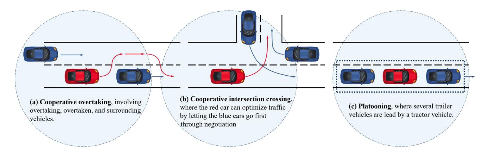

Fig. 9. Scenarios with inter-vehicle network communications, where arrows represent the driving intention of each vehicle and circles symbolize the wireless communication range of red cars.

There are two typical scenarios for distributed cooperative control: Cooperative Lane Changing (CLC) or overtaking [\[254\]](#page-33-40) and Cooperative Intersection Crossing (CIC) [\[255\]](#page-34-0).

*1) Cooperative Lane Changing (CLC) or Overtaking:* When a single, slower-moving vehicle appears at the front on a predetermined road [\[256\]](#page-34-1), the controlled vehicle could inform or negotiate with the front and surrounding vehicles within a specific range through inter-vehicle network communications to complete perfect overtaking, as displayed in Fig. [9\(](#page-19-0)a). Another situation is when the controlled vehicle has to change its lane according to its planned path to prepare for a bend or U-turn, it needs to detect the surrounding vehicles that might intervene in its movement trajectory, negotiate with them to obtain the related vehicle state information, and implement lane changing decision at the right time [\[257\]](#page-34-2).

According to the description above, overtaking can be delineated as a special scenario of lane changing, which requires lane changing positive and negative continuously twice. Besides, these two scenarios both call for accurate and correct vehicle state information received from surrounding vehicles through inter-vehicle network communications that could introduce time-varying delays [\[258\]](#page-34-3). But it is only limited to soft real-time requirements that may not influence the control performance of cooperative overtaking and lane changing in the vast majority of cases [\[259\]](#page-34-4). Thus, only a few studies have been conducted in this realm.

After the estimation of end-to-end communication delays, An and Jung [\[260\]](#page-34-5) devised a cooperative lane-change protocol based on DSRC using IEEE 802.11p/WAVE standard and a trajectory-generation module to manage the negative effect of V2V communication delays.

In Xu et al.'s [\[261\]](#page-34-6) scheme, an MSS model was constructed to figure out the safe distance between vehicles for each time point. According to this distance, a dynamic lane-change trajectory planning and re-planning approach was designed for safe trajectories. Last, the impact of different communication delays was analyzed through simulation.

*2) Cooperative Intersection Crossing (CIC):* When approaching, crossing, and leaving the intersection, as stated in Fig. [9\(](#page-19-0)b), vehicles can share individual state information through inter-vehicle network communications to predict and determine any conflicts with others trying to cross the intersection [\[262\]](#page-34-7). Suppose a potential collision is predicted by the corresponding processor of vehicles. In that case, a priority-based policy can be adopted so that an exact and repeatable precedence sequence in which vehicles cross the intersection can be founded. As a general rule, the priorities of vehicles are based on the synthesis of traffic regulations and a first-come-first-served basis.

The intersection, in most cases, is the region with the heaviest traffic. If only V2V communications are utilized, vehicular processors and wireless communication channels will become overwhelmed [\[287\]](#page-34-8), [\[288\]](#page-34-9), which requires a powerful enough processor in vehicles and a low-delay communication characteristic for inter-vehicle networks lest network congestion emerges [\[289\]](#page-34-10). But these two solutions could not be realized under current conditions. To effectively deal with these issues based on the current situation, an optimized control scheme should be employed to curtail the influence of network transmission (such as communication delays [\[290\]](#page-34-11) and packet losses [\[291\]](#page-34-12)), or V2I communications can be engaged to transfer the complicated data processing to infrastructures installed with powerful enough computers and issue scheduling instructions to those vehicles within the management scope.

Hafner et al. [\[263\]](#page-34-13) used DSRC technology to implement a cooperative intersection collision avoidance algorithm using Kalman filter with a state estimator to evaluate the V2V communication delays and model uncertainties. Savic et al. [\[264\]](#page-34-14) also based on DSRC to design a distributed model-based intersection crossing method against an unknown but finite number of failures induced by V2V communications, such as non-line-of-sight, jammers, and interference. To reduce delays caused by these failures and avoid a collision at intersections, motion state information and positions of surrounding vehicles were applied to adapt the driving maneuvers among each other.

For multi-vehicle cooperative intersection control suffering from V2V communication constraints, a centralized intelligent management system, receiving requests from approaching vehicles and sending out scheduling orders through V2I communications, can be set up at intersections. Zheng et al. [\[265\]](#page-34-15) put forward a delay-tolerant intelligent management protocol for multi-lane intersections that can meet deadlock-free,

liveness, and safety properties. Castiglione et al. [\[266\]](#page-34-16) built a control methodology based on the Hermes module over 5G communications with the objective of diminishing communication delays. Wang et al. [\[267\]](#page-34-17) then established a digital twin framework at non-signalized intersections with an enhanced FIFO slot reservation method to schedule the order for vehicles, a consensus dynamics control to figure out vehicle reference longitudinal dynamics, and a model-based motion estimation approach to cope with communication delays and packet losses caused by LTE-V2X communications.

The research above had a shot at the negative influence of inter-vehicle communications in CIC control. Still, timevarying delays and uncertain packet losses were yet to be well known in cyber-physical systems. To address these issues, Yu et al. [\[268\]](#page-34-18) proposed an improved model-free adaptive predictive control algorithm for networked non-linear multivehicle cooperative intersection systems where the control objectives were achieved through networked predictive control using edge computing.

# *B. Centralized Cooperative Control*

In the centralized cooperative control mode, a certain amount of vehicles form a group with a group leader as the main contributor to external communication. Besides, lots of communication can also happen among vehicles in this group to keep in contact for desired function realization.

One of the most concerned research subjects of this part lies in platooning [\[292\]](#page-34-19), which can significantly enhance the comfort and safety of passengers, increase road capacity, and reduce fuel consumption (or improve energy efficiency) [\[293\]](#page-34-20), [\[294\]](#page-35-0). A vehicle platoon can be regarded as a queue of vehicles that travel together while maintaining a specific distance with information from inter-vehicle network channels. As can be explored in Fig. [9\(](#page-19-0)c), the vehicle at the head of platooning, named tractor vehicle, regulates the platooning travel trajectory and transmits its vehicle motion state information to all other vehicles in the platoon (called trailer vehicles) directly or indirectly via inter-vehicle communications. Moreover, an approaching vehicle can apply to be part of platooning if the route is consistent, or a vehicle that needs to vary its route can apply to drop out of the platoon.

For further decomposition, platooning can be subdivided into two categories, namely Heterogeneous Platooning (HeP) and Homogeneous Platooning (HoP), where HoP requires that all vehicles in the platoon support the same functions and HeP allows vehicles with different configurations such as humandriven vehicles and vehicles without inter-vehicle network communications. Under normal conditions, platooning without any other explanation can be regarded as HoP or Cooperative ACC (CACC). In contrast, platooning with specific explanation that one or several vehicles in the researched vehicle platoon cannot perform inter-vehicle communications can be considered as HeP or Connected Cruise Control (CCC) [\[273\]](#page-34-21).

All these platooning scenarios require high real-time and accurate vehicle state information received from vehicles in platoon through inter-vehicle network communications. These communications, however, will inevitably introduce time-varying delays that can make control inputs lag behind current control, debilitate real-time control performance, and cause rear-end chain accidents [\[70\]](#page-29-33).

*1) Homogeneous Platooning (HoP):* To mitigate delays induced by inter-vehicle communication in HoP, Fernandes and Nunes [\[269\]](#page-34-22) first proposed an intra-platoon information management strategy for high safety and traffic flow. Apart from communication delays, they also chose proper algorithms when communication channels suffered from an intense load or network congestion. Upon emergency occurrences, the timely reaction of platooning can be guaranteed by dynamically increasing the weight of the tractor vehicle's data.

For multiple time-varying delays induced by inter-vehicle communications, Petrillo et al. [\[271\]](#page-34-23) considered HoP as a synchronization problem for multi-agent systems and devised a distributed adaptive collaborative control scheme that can excavate information coming from surrounding vehicles to synchronize the dynamics of all vehicles in the platoon to the reference imposed by the tractor vehicle. The stability of this control scheme was validated with a Lyapunov-Krasovskii approach. In [\[278\]](#page-34-24), they further considered different cyberattack scenarios in presence of heterogeneous communication delays. In this work, a resilient adaptive cooperative control that embeds a distributed mitigation mechanism of malicious information was advanced to tackle the challenging issue of tracking a time-varying motion of the tractor vehicle subject to different security vulnerabilities and network-induced phenomena.

Ma et al. [\[275\]](#page-34-25) then developed a modified LQR control approach to obtain a reasonable controller gain to meet the stability requirement against communication delays. The vehicle dynamics model was formulated by a linear integrator with delays. The distance control scheme was introduced with different communication topologies, i.e., predecessor follower, leader predecessor follower, two predecessor follower, leader two predecessor follower, bidirectional predecessor follower, and two bidirectional predecessor follower. In [\[295\]](#page-35-1), Ma et al. used the parameter-space-method-based cooperative control scheme for HoP considering the adverse influence of communication delays, where the parameter space method was utilized to optimize the cooperative control performance subject to network-induced delays.

Variable road conditions in the real world would significantly influence vehicle dynamics performance and fuel characteristics. On the premise of collision-free safety and energy efficiency, Yang et al. [\[277\]](#page-34-26) devised a hierarchical control framework for a HoP with uncertain time-varying dynamics and uniform communication delays, where a centralized ecological speed planning method at the upper layer was designed on dynamic programming to generate the fueloptimal and feasible speed profiles, and a distributed speed tracking control approach was utilized at the lower real-time control layer for collision avoidance.

To deal with the corrupted information that would cause undesired delays, of which a fraction of a second can result in a critical situation, Reebadiya et al. [\[279\]](#page-34-27) applied a secure and intelligent sensing strategy based on blockchain technology for vehicle activity tracking using beyond 5G communication network that can enable communications with ultra-low latency and ultra-high reliability to encounter the requirements of time-sensitive applications. In their strategy, vehicles sensed data for a specific situation with particular sensors, where intelligence was constructed for quick decision-making.

By considering communication delays, Hu et al. [\[280\]](#page-34-28) derived a minimum safe distance model to ensure the safety of HoP while emergency braking happens at accelerating, cruising, and decelerating states. In their method, the minimum safe distance was computed by a modified Gipps' model adapted to the dynamic model of a platoon. To this end, a series of field tests were carried out to measure the communication delay of DSRC.

For research on the intra-platoon message delivery delays in a platoon of vehicles, Wang et al. [\[281\]](#page-34-29) deduced a theoretical analysis model and considered a two-lane one-way road scenario where vehicles can transmit one message within the platoon in a hop-by-hop manner. The influences of main system parameters on the intra-platoon message delivery delays were studied through numerical results, including the number of platoons, the intra-platoon spacing, and the density of non-platoon vehicles.

To optimize fuel economy and travel time for HoP at a highway on-ramp merging, Mahbub et al. [\[282\]](#page-34-30) proposed a single-level constrained optimal control framework while satisfying the constraints of state, control, and safety. The influence of communication delays was also explored, and a robust coordination framework was designed for collision avoidance in the presence of bounded delays.

In order to solve the adverse influence of limited communication resources and packet dropout, Wang et al. [\[283\]](#page-34-31) worked out an adaptive event-triggered platoon control based on Ma et al.'s method [\[295\]](#page-35-1). After formulating the packet dropout and event-triggered mechanism, the parameter space method was accepted to map the control objectives to the boundaries in the parameter space. Particularly, the effect of packet dropout and communication delays was resolved through the event-triggered threshold strategy that can maintain high performance under unreliable communication conditions. In [\[296\]](#page-35-2), they again improved their methodology, a hybrid adaptive event-triggered platoon control scheme, to recognize the balanced coordination between communication resource utilization and vehicle-following performance considering the package dropout. To address the interference introduced by the event-triggered scheme, the parameter space method was selected to extract the feasible region from which cooperative control met the internal stability, distance accuracy, and string stability.

In [\[284\]](#page-34-32), Liu et al. proposed a stochastic stable control protocol based on a discrete event-triggered scheme for the stability of platooning under limited communication. The adverse impact of delays was investigated with the external interferences and equivalent information delays. Additionally, H∞ control was used with a stability theory of stochastic system to ensure platooning stability.

Using V2V communications, Sidorenko et al. [\[285\]](#page-34-33) implemented a safety analysis for emergency braking scenarios involving two vehicles and a constant-distance policy ACC. With the adoption of decentralized environmental notification messages, the minimum safe inter-vehicle distance can be shortened for rear-end collision avoidance subject to V2V communication delays. To deduce an explicit form of the minimum safe inter-vehicle distance, a 3-step method, i.e., minimum safe braking set, the derivation of trajectories, and the solutions of the two previous steps, was presented for emergency braking safety analysis.

*2) Heterogeneous Platooning (HeP):* When it comes to a HeP subject to uncertain dynamics and uniform communication delays, Gao et al. [\[270\]](#page-34-34) put forward an H∞ control method to guarantee string stability, robustness, and tracking performance. A delay-dependent LMI was deduced for various network communication topologies. Besides, the robustness and performance of platooning was analyzed with a delaydependent Lyapunov function. Further, in [\[297\]](#page-35-3), they expanded the scope of research to various uncertainties and disturbances in the real world. An H∞ control method was also used to deal with uncertain vehicle dynamics and uniform communication delays.

In [\[272\]](#page-34-35), Xu et al. exhibited a robust longitudinal control framework for HeP subject to varying road slopes, aerodynamic drag, and wireless communication latencies. The HeP was formulated with parameter uncertainties, equivalent communication delays, network-induced delays, and external disturbances. Besides, a Lyapunov-Krasovskii functional-based H∞ control was to guarantee inter-vehicle stability and string stability simultaneously. In [\[298\]](#page-35-4), they further expand the research scope to longitudinal and lateral dynamics. The whole platoon was described by three decoupled linear single-input and single-output systems, i.e., longitudinal, lateral, and yaw. An H∞ control method considering the adverse influence of stochastic communication latencies and interferences was utilized to ensure the steady-state stability of HeP on winding roads.

For CCC using wireless V2V communications to improve the mobility and safety of vehicles, Zhang et al. [\[273\]](#page-34-21) proposed a hierarchical control framework to lower the complexity of design and analysis. At the upper level, the connected vehicle following dynamics controller analyzed the dynamics information received from other vehicles in platooning and also considered the communication latencies introduced by V2V communications to obtain the desired longitudinal dynamics; at the lower level, a vehicle physics model was constructed and an adaptive SMC method that can actively regulate the engine torque was designed, for appropriate motion control in the presence of uncertainties and external interference. In their framework, the communication latencies caused by intra-vehicle network architectures were not considered, but the intra-vehicular control strategies were well studied.

Zhang et al. [\[274\]](#page-34-36) further presented a CCC framework considering the merging behaviors of the side vehicles, headto-tail string stability, and the impacts of communication delays. Through the design and adoption of a nonlinear range policy, driving safety and riding comfort can be significantly enhanced when the side-vehicle merging behavior suddenly occurs.

Considering the energy crisis and environmental issues, Zhai et al. [\[276\]](#page-34-37) introduced an ecological CACC strategy for HeP subject to time delays to realize platooning stability, fuel economy, and driving efficiency. In [\[286\]](#page-34-38), they took not only time delays but also input saturations into consideration. The ecological CACC strategy was also improved, including a distributed linear feedback control protocol for the following trailer vehicles and an MPC approach for the tractor vehicle. Specifically, the distributed linear feedback control protocol was modeled with state errors between an ego vehicle and its preceding one to ensure platooning stability. To realize fuel economy and driving efficiency without violating various input saturations of vehicles, a constrained fuel consumption optimization issue of the tractor vehicle was worked out with delay MPC. To speed up access to the delay MPC controller, an improved particle swarm optimization method was adopted to address the constrained fuel consumption optimization issue of the tractor vehicle.

# *C. Discussions*

As research on intelligent driving goes further, increasingly enhanced inter-vehicle network communication technologies have been put into service to connect the vehicle to other surrounding V2X units (including vehicles, infrastructures, pedestrians, and clouds) and transmit information that cannot be obtained via intra-vehicle network communications. But, compared with intra-vehicle network communications, intervehicle network communications have poorer communication performance, such as more immense network-induced delays, denser communication density, and more vulnerable network environments, which could result in information lag, lower real-time cooperative control performance, and devastate the entire inter-vehicle networked control systems.

In order to solve these problems, an enormous amount of research efforts go into cooperative control considering the adverse influence of inter-vehicle network communications, most notably centered around cooperative overtaking or CLC, CIC, and platooning, as noted in Table [VI.](#page-18-0) In these studies, various inter-vehicle communication technologies, different research concerns, and multifarious control schemes have been researched for a better real-time control performance.

For concerns in research objectives, road safety, such as inter-vehicle collision avoidance, is prioritized and considered in both distributed and centralized cooperative control. Further, road capacity and energy efficiency are two other priorities for optimization while ensuring road safety, especially in centralized cooperative control. These research objectives are several critical research concerns in vehicle cooperative control; however, intra-vehicle performance during a specific maneuver is rarely investigated in this part. Generally, vehicle cooperative control is only for optimal speed and acceleration at which the vehicle should be driven but does not consider whether vehicle performance can meet the actual requirements, e.g., vehicle handling and stability. In addition to these research objectives, inter-vehicle network impact, including communication latencies, package dropout, and network congestion, is also a part of research concerns. Interestingly, delays induced by network security issues are also considered in certain studies, contributing to a brand-new thought in network influence.

As to the control methodologies against the adverse impact of inter-vehicle network communications, they roughly cover MPC, SMC, LQR, H∞ control, cooperative scheduling mechanism, etc., pretty similar to the control methodologies against the negative influence of inter-vehicle network communications except for machine learning algorithms. As can be seen, several machine learning algorithms, such as the Kalman filter algorithm, have been adopted in this part due to their incomparable advantages in processing large-scale data, addressing complex issues, discovering insights and patterns, etc. However, they also have some common drawbacks, including strong data dependency, high computational requirements, and overfitting and generalization issues. Each control methodology has its advantages and disadvantages. Thus, while designing a vehicle real-time control system, it should first consider which control methodology is most suitable.

For inter-vehicle network technologies, although LTE-V2X and 5G have already been put into several studies, most research works still concentrate on the utilization and analysis of DSRC that has been renounced in V2X domains yet by its passionate advocate, the U.S. FCC, as detailed in Section [III-C.](#page-8-1) Also, even LTE-V2X cannot support any advanced control function in intelligent driving, which can only be used for several lower functions such as safety alarms and traffic information services. Provided that one day intelligent driving finally comes into practical use, 5G, NR-V2X, and beyond must be thoroughly researched and deployed due to their potential network communication performance to meet the requirements of intelligent driving. Further, in most studies, the server in automotive EEA is regarded as the main processing unit that can process any functions in intelligent driving, but that is not the case. The server, in reality, works as a gateway that performs forwarding only, and the information processing is conducted in the corresponding controllers. Thus, an S-C communication channel still exists between the server and the corresponding controllers. However, intra-vehicle network communications are generally ignored in research on cooperative control considering intervehicle networks, which means that the information processing and signal flow inside vehicles are not considered. If intelligent driving needs to develop further and deploy finally, the adverse influence of communications inside and outside vehicles has to be taken into consideration.

# VI. CONTROL INTEGRATING INTRA-&INTER-VEHICLE NETWORK COMMUNICATIONS

Control over only intra-vehicle network communications becomes known as single-vehicle intelligence, whereas control only considering inter-vehicle network communications is referred to as vehicle-infrastructure cooperation. However, the future trend of intelligent driving is bound to be the harmonious integration of single-vehicle intelligence and vehicle-infrastructure cooperation, which can complement each other, progress together, and develop coordinately. Therefore, neither intra-vehicle nor inter-vehicle network communications can be overlooked during the research on intelligent driving.

In real-life scenarios, inter-vehicle network communications can be considered as a unique information sampling process using V2X OBU, as with other sensors that can sense the road environment information within a certain range around the vehicle. Still, the difference is that inter-vehicle network communications might result in an extra end-to-end communication delay that runs well ahead of the information processing time of sensors and may be greater than or at the same level as the end-to-end communication latency induced by intra-vehicle network communications that act as a signal transmission tool inside the vehicle.

More specifically, the cooperative vehicle information received from surrounding V2X devices by the vehicular V2X OBU with inter-vehicle network communications and the road environment information sensed by sensors finally converged in the corresponding decision-making processors via the S-C channels of intra-vehicle network communications. These processors then issue the related control instructions to the designated actuators according to the received real-time information through the C-A channels of intra-vehicle network communications. Based on the above description, the adverse influences induced by networks exist in almost three communication channels that could degrade vehicle real-time control performance and cannot be neglected while designing control schemes. These three parts are inextricably linked and would restrict each other as the messages flow layer upon layer. How to analyze their correlation relationship and solve their negative impacts on vehicle real-time control becomes a hard nut to crack and will be a long and arduous process for optimal solutions.

In vehicle real-time control considering intra-vehicle and inter-vehicle network communications, the most common scenario lies in the combination of ACC and platooning, both vehicle-following modes with some similar issues.

In [\[299\]](#page-35-5), Ma et al. not only considered the nonideal communication condition induced by inter-vehicle network communications (such as time delay and dropout rate) but also took the latencies inside vehicles into account. Although the impact of intra-vehicle network communications was not explicitly pointed out in the text, it did start to get noticed in another form, namely actuator delays. In their control scheme, a hierarchical architecture was also established for vehicle platooning, where a controller parameter selection approach combined with an LQR control theory and a parameter space method was employed to ensure string stability and optimize control performance. The upper level was intended to access the requested acceleration according to the relationship with other vehicles in platooning. At the lower layer, a PI control was selected to track the acceleration requested at the upper level with the time-varying parameters of vehicle dynamics, feedback latencies, and external disturbances, where the impact of communication delays and packet losses was disclosed with the changing of string stable region.

In Wang et al.'s research [\[300\]](#page-35-6), the stochastic network communication delays inside and outside the vehicle were clearly stated in their designed CCC system, where the wireless V2V communications were a critical factor for comprehensive road environment awareness and the intra-vehicle network communications were used to transfer control inputs and outputs inside the vehicle. In their displayed timing diagram for vehicle control process with nonideal network conditions, the latencies of intra-vehicle network communications were divided into two parts: S-C and C-A delays; the stochastic latencies introduced by inter-vehicle network communications were recognized as a sampling interval for information from other vehicles in the vehicular platoon. In addition, the processing time of the controller was also considered in the control signal flow. To compensate for the adverse effects of these stochastic communication delays and advance an optimal control scheme for the CCC system, the vehicle dynamics with a vehicle following model developed with a heterogenous platoon architecture was analyzed first. In order to minimize the deviations of headway and velocity for vehicles under nonideal conditions including random delays, packet dropout, and state noise, a two-step optimal control algorithm was chosen in the discrete-time domain, where the optimal control gain was achieved with a backward recursion at the off-line step, and the uniform optimal control scheme was formulated as a function of current platooning states, optimal control gain, and previous control data at the on-line step. Furthermore, several issues, e.g., convergence analysis, stability analysis, and the influence of packet dropout and state noise on control, are discussed for an optimal control design.

Cao et al. [\[301\]](#page-35-7) came up with a CACC scheme to address the adverse influence of delays induced by both intra-vehicle and inter-vehicle network communications. In this scheme, a hetero-integration poly-net loop latency analysis approach is introduced for the clarification of latencies in CACC control system with intra- & inter-vehicle network communications. Accordingly, a cooperative Software Defined Network (SDN) strategic framework, including application/strategy, network-control, and network-data layers, is designed to address the poly-net loop delays. Specifically, a delay-tolerant MPC method is adopted in the application/strategy layer for decision-making with an H∞-LQR control method for acceleration tracking against intra-vehicle network delays, while a fraction-type basic period scheduling approach is presented in the network-control layer to reduce the adverse influence of the poly-net loop delays.

Compared with research on vehicle real-time control considering intra-vehicle or inter-vehicle networks, studies in vehicle real-time control considering the negative influence of intra-vehicle and inter-vehicle network communications under nonideal conditions appear to be particularly rare due to the complexity and arduousness of research tasks. But, they do make a significant contribution in vehicle real-time control systems and leave a brilliant thought to subsequent researchers. Nonetheless, there are still several deficiencies in these studies. First, the most concerned research points, such as network-induced delays and packet dropout rate, are commonly set as constants to compare the experimental results instead of time-varying variables that might change continuously or step by step in reality. Also, the change in network communications is random and cannot be predicted, which might suddenly have a massive impact on vehicle performance. If randomness is ignored at the beginning of the design, most control schemes will lose effectiveness sometimes and even cause severe accidents. Second, the devised control schemes against the adverse influence of communications are generally inherited from research on control considering intra-vehicle or inter-vehicle network communications and get some improvements on some minor points. Control theories in this domain have not reached breakthrough achievements. As discussed in Sections [IV-E](#page-17-1) and [V-C,](#page-22-1) each control methodology has advantages and disadvantages, which should be considered carefully before use. However, if each control uses different control schemes, it could occupy a large amount of memory and poses a considerable challenge to intra-vehicle processors. Last, the research scope in this part is just within the domain of platooning or CACC rather than relatively wide coverage like the other two categories. Thus, future research can be conducted further in a broader scenario, such as the integration of platooning, cooperative lane changing, vehicle longitudinal control, and vehicle lateral control. In a nutshell, it does show tremendous research potential as both intra-vehicle and inter-vehicle network communication technologies cannot be replaced by any other signal transmission mode in future intelligent and unmanned vehicles. For faster development and deployment of intelligent driving, neither intra-vehicle nor inter-vehicle network communications can be abandoned in the research and application of vehicle real-time control systems.

# VII. OPEN PROBLEMS AND FUTURE CHALLENGES

As research on vehicle real-time control considering the adverse influence of network communications has constantly emerged in recent years, various specific issues over future intelligent driving have also sprung up in research and practice. Here, several open directions concluded from the above three aspects of research studies are listed for further investigation.

# *A. Co-Development of Control and Communications*

Vehicle control and network communications have been independently developed for a long time. As characterized in Section [IV-D,](#page-16-0) the development of vehicle networked control systems is extremely mismatched with vehicular network communication technologies. Some of vehicular network communication technologies have been ahead of their time, and some are entirely inadequate for advanced functions.

*1) Control and Intra-Vehicle Network Communications:* Intra-vehicle network communication technologies have far exceeded the actual demands and vehicle control systems has been unable to keep up with the pace of them. Automotive Ethernet, for example, with a higher transmission rate of 5Gb/s, 10 Gb/s, 50 Gb/s, and even 100 Gb/s, has gradually launched in correspondent standards or specifications [\[182\]](#page-32-8). However, following actual applications, even 100-megabit automotive Ethernet can meet nearly all functions in current vehicle control systems, and one-gigabit automotive Ethernet could realize most of advanced intelligent driving functions. More bandwidth does not have such substantive assistance for vehicle real-time control but will introduce an incalculable cost of development, manufacturing, and testing in contrast. With the development of technologies and the change in requirements, stacking bandwidth is no longer an effective solution for vehicle networked control systems. Instead, the realtime performance of intra-vehicle network technologies [\[302\]](#page-35-8), including communication delay, delay jitter, dropout rate, etc. [\[303\]](#page-35-9), [\[304\]](#page-35-10), [\[305\]](#page-35-11), is more critical and urgently needed for optimization. For control in intelligent driving, data volume is not that large at present and will not increase such quickly, and fast and reliable data transmission is a crucial issue that always troubles real-time control design and has not been effectively resolved yet. For further development of intelligent driving, intra-vehicle network communication technologies with appropriate bandwidth, excellent reliability, and ultra-low latency at a microsecond level per hop should be further researched. Therefore, future research should center on real-time communication performance over existing technologies instead of the blind pursuit of data communication rate.

*2) Control and Inter-Vehicle Network Communications:* As to inter-vehicle network communications, existing technologies are not yet able to fully meet the requirements of intelligent driving. In accordance with the analysis of [\[143\]](#page-31-18), only the integration of NR-V2X and 5G can competently actualize most real-time control functions of intelligent driving, whereas the combination of LTE-V2X and 4G can only be used for non-real-time services such as safety alarms and traffic information services. The great majority of research studies in control over inter-vehicle communications, however, are still in the stage of using DSRC or LTE-V2X, where 5G only accounts for a small proportion, not to mention NR-V2X that has just been released for a few years and only appeared in some literature in fields of communication. Although this situation has been improved in recent years, the influence of LTE-V2X and 5G on vehicle real-time control did not receive as much research attention as DSRC, as can be checked in Section [V](#page-17-0) and Table [VI.](#page-18-0) Also, in practical applications, most V2X OBUs on sale and intelligent driving software tools for simulation and verification are now limited to supporting LTE-V2X and 5G, where NR-V2X is still under development. According to market research, even an intelligent driving simulator with selective purchasing of LTE-V2X and 5G could be sold for at least 10 million RMB, and a V2X OBU with LTE-V2X and 5G can be sold for about 50 thousand RMB, which most researchers are unable to afford while failing to meet appropriate requirements and thus hinders the advancement of intelligent driving. On balance, at least simultaneous use of NR-V2X and 5G should be adopted in future intelligent driving, where NR-V2X is employed for direct-connection real-time communication applications such as V2V and V2P, and 5G is generally applied for non-real-time communication services such as V2I and V2C. Besides, equipment and software related to inter-vehicle network communication technologies require further cost reduction for future research and deployment.

#### *B. Coevolution of Intra- & Inter-Vehicle Communications*

When it comes to communication, intra-vehicle and intervehicle network communication technologies have also not evolved in sync and have been cut off by researchers. Although both belong to the field of communication, there still exists considerable parameter gaps between intra-vehicle and intervehicle network communication technologies, most centered around sampling, modulation, access mechanism, etc. These parameter gaps, in turn, fling down a challenge to the compatibility of these two types of communications. Here, several parameters that might affect vehicle real-time control are stated for future consideration.

- *1) Sampling Frequency:* If the sampling frequencies of intra-vehicle and inter-vehicle network communication technologies used in the vehicle are individually set to completely different values, there will be a specific time difference that might result in additional time-varying delays apart from communication delays inside and outside the vehicle while controllers or processors transmit or receive V2X-related message frames. What is more, it might even lead to the loss of important information due to the inherent time difference. In emergency, vehicle motion control systems cannot respond in a timely manner, and then, a severe accident occurs. To avoid these issues, sampling synchronization should be considered at the beginning of the design of intra-vehicle and inter-vehicle network communication technologies.
- *2) Communication Latency:* As investigated in Tables [II](#page-4-0) and [III,](#page-6-0) there is a considerable difference in the magnitude of delays between intra-vehicle and intervehicle networks. Specifically, automotive Ethernet, one of the most excellent and promising intra-vehicle network technologies, can provide ultra-low latency at a microsecond level per hop. Even with end-to-end latency in centralized EEA, communications can also be completed within 3 ms inside the vehicle. In contrast, NR-V2X, one of the most critical links in future inter-vehicle network communications, could only provide a minimum latency of 3 ms. For vehicle control systems, inter-vehicle communications outside the vehicle using a V2X OBU are equivalent to collecting various information by sensors inside the vehicle, as can be seen in Fig. [3.](#page-3-1) However, inter-vehicle network communications bring more latency than the end-to-end latency induced by intra-vehicle network communications. Thus, inter-vehicle network communications should be further optimized and have lower latency.
- *3) Transmission Rate:* As demonstrated in Section [IV-D,](#page-16-0) intra-vehicle network communication technologies are experiencing a surge in data transmission rate, where a maximum data rate could reach 100Gb/s in theory and would continue to rise. In contrast, for inter-vehicle network communications, even NR-V2X can only provide a transmission rate of 1-10Gb/s, which means that the data transmission rate required

by vehicles does not need to be that high, as even CAN can complete the real-time data transmission inside vehicles at present. In future works, the data transmission rate of intravehicle and inter-vehicle network communications should be considered simultaneously to construct an appropriate vehicular network architecture to balance factors such as performance and cost.

# *C. Research Extension for Vehicle Real-Time Control*

As an intricate synthesis system integrating all necessary control behaviors, when the vehicle conducts a particular maneuver, it is inevitable to trigger some essential elements that another control requires.

- *1) Extension for Vehicle State Control:* Vehicle state control generally uses perceived environment information (such as vehicle location, surrounding obstacles, and road signposts) and monitored vehicle state information (e.g., longitudinal velocity, longitudinal acceleration, and yaw rate) to manage one or several specific vehicle states. As noticed in Section [IV,](#page-10-0) most research only focuses on single and simple control instead of coupled analysis of multiple-control synthesis. However, during vehicle driving, it typically involves various vehicle states controlled by different control systems. For instance, LKA and LCS in driving assistance systems involve steering operations that DYC constraints to improve vehicle lateral stability. AEB control for collision avoidance would cover ABS control's functions. For further investigation, research on vehicle state control can extend to coupling more control systems.
- *2) Extension for Cooperative Control:* Cooperative control commonly uses information transmitted via V2X communications (e.g., vehicle location, vehicle speed, and vehicle acceleration) to coordinate the relative motion among vehicles and other V2X devices, such as infrastructures and pedestrians. Similar to research on vehicle state control, research on cooperative control also has a problem in that this control is only performed on a single scenario and can thus be extended to coupling analysis of multiple-control scenarios such as cooperative overtaking under platooning, CLC under platooning, and CIC under platooning. Furthermore, traffic participants in this part can also extend from only vehicles to pedestrians and infrastructures.
- *3) Synthesis of Intra- & Inter-Vehicle Control:* With intervehicle network communications, cooperative control is introduced to assist control management inside vehicles. However, researchers rarely conducted experiments on the combination of these two. When cooperative ITS issues control instructions by effective analysis or two cooperative vehicles prepare to perform individual actions through negotiation, it will inevitably touch on the operation situations of various machines and electronic and electrical components inside the vehicle. Future, the combination of vehicle state control and cooperative control can be fully implemented by a comprehensive control scheme considering the integration of intra-vehicle and inter-vehicle network communications to realize intelligent driving in the real sense.

#### *D. Research Extension for Nonideal Communications*

As can be realized from Sections [IV](#page-10-0)[–VI,](#page-22-0) most research articles focus on the influence of packet dropout rate and communication delays on real-time control performance. Besides, network congestion and message synchronization are also discussed and analyzed but seem extremely rare in contrast. For further research, several issues introduced by nonideal communications that have not yet been or are rarely studied in vehicle real-time control systems are presented as follows.

- *1) Doppler Effect:* Doppler effect [\[306\]](#page-35-12), also called Doppler frequency motion, refers to a frequency difference phenomenon between wave source and observation, achieved by the observer doing specific relative movements opposite the wave source. During normal driving, the Doppler effect is bound to occur between two connected vehicles with relative motion using inter-vehicle network communications. The higher the relative velocity of these two vehicles, the more obvious the Doppler effect, namely, the more significant the frequency change. Whether the frequency change in intervehicle network communications would significantly influence vehicle real-time control performance could be further investigated.
- *2) System Crash:* System crash inevitably exists in communication systems inside and outside vehicles and may be introduced by several possible situations, including network congestion for a long time [\[307\]](#page-35-13), multi-channel convergence in a flash [\[308\]](#page-35-14), and aggressive cyber-attack by a scheming hacker [\[309\]](#page-35-15). Network congestion refers to a situation where the demand for network resources exceeds available network capacity, resulting in a degradation of network performance and a decrease in QoS. Multi-channel convergence integrates various communication channels into a unified network device, which might directly or indirectly lead to a system crash without an effective integration of compatible technologies. To deal with the issues caused by network congestion and multi-channel convergence, scheduling mechanisms, including prioritization, bandwidth allocation, queuing algorithms, and traffic shaping, can be implemented to manage and regulate communications. Further, cyber-attacks technically belong to network security issues and can be solved by robust security measures, access control and privilege management, and incident response and disaster recovery.
- *3) Network Security:* Actually, security issues [\[310\]](#page-35-16) have already been discussed in this survey. Still, most literature in this field concentrated on communication security and its solutions with specific control as an application scenario, which can be only classified as network security management [\[311\]](#page-35-17). Only a few research has been conducted on vehicle real-time control performance with network security issues, such as [\[278\]](#page-34-24). Network security issues generally include unauthorized access, DoS Attacks, network infrastructure vulnerabilities, malware and viruses, etc. In the near future, the influence of network security issues, especially DoS attacks, on vehicle real-time control performance should be concretely analyzed and fully overcome. For example, to what degree will cyber-attacks cause slight, medium, and relatively severe effects on vehicle real-time control systems

rather than a pure system crash? Also, a solution itself for network security issues, such as robust access control, encryption mechanisms, and network segmentation, might impact real-time performance and should be optimized further.

*4) Parameter Simulation:* In research on vehicle real-time control considering network communications, most communication parameters have been set as constants. However, the reality is that these parameters usually change randomly and have no rules. Specifically, network-induced latencies will not have such an impact on vehicle real-time control using a delay-tolerant scheme in a normal driving scenario but would lead to unpredictable results in emergencies, e.g., network congestion. Additionally, the packet dropout rate is generally ultra-low and will not explode in most scenarios. Still, in some specific scenarios, especially intersection, tunnel, and system failure, a surge of packet dropout rate emerges unexpectedly. Subsequently, establishing an effective model to restore a natural scene for vehicle real-time control systems will be a primary focus in the future.

# *E. Simulation and Reality*

Almost all solutions were validated by simulation instead of an actual vehicle. It can be learned from their experimental descriptions: simulation is commonly processed on a high-performance computer loaded with an efficient Central Processing Unit (CPU) and an effective Graphics Processing Unit (GPU) whose performance far exceeds the processing units embedded in vehicles. The environment of simulation is entirely different from that of reality, which cannot guarantee the validity of simulation experiments. Numerous accidents have proved that design deficiencies still exist even though the current vehicle control scheme is demonstrated to be effective in a specific test site for intelligent driving. Without a comprehensive experiment considering all essential impact factors, including but not limited to vehicle motion constraints, network communication insufficiencies, and software and hardware performance limitations, intelligent driving would not finally apply to actual use, which is a great challenge in the future.

# VIII. CONCLUSION

Intelligent driving uses various network communications to assist more advanced control functions in enabling a vehicle to navigate without intervention; however, these communications would, in turn, introduce a variety of adverse influences on control, such as communication delay, packet dropout, and network congestion. In contrast to existing related surveys that only focus on vehicle control or network communications, this paper provided a comprehensive survey on current research related to vehicle real-time motion control considering the adverse influence of vehicular network communications. The surveyed studies were reviewed from three aspects: real-time control considering intra-vehicle network communications, inter-vehicle network communications, and the integration of these two, and were discussed from the perspective of control scenarios, control methodologies, and communications.

GNSS Global Navigation Satellite System

HARQ Hybrid Automatic Repeat reQuest

IIHS Insurance Institute for Highway Safety

GBR Guaranteed Bit Rate

GPS Global Positioning System gPTP general Precision Time Protocol GPU Graphics Processing Unit

HeP Heterogeneous Platooning HoP Homogeneous Platooning ICE Inter-Combustion Engine

IMT Integrated Motor-Transmission INS Inertial Navigation System IoE Internet of Everything

To benefit further analysis and future research, multifarious intra-vehicle and inter-vehicle network communication technologies were first summarized with their communication performance and real-world applications. In addition, different network communication architectures were presented along with their potential development directions. However, given the relative infancy of this field, there are still a number of outstanding issues that require further research from the perspective of coevolution, extension, and experiment of vehicle real-time control and vehicular network communications. Through joint efforts, the final deployment of intelligent driving can be accelerated and will soon become a reality.

|                  |                                                      | IoV     | Internet of Vehicles                                        |
|------------------|------------------------------------------------------|---------|-------------------------------------------------------------|
|                  | APPENDIX                                             | ITS     | Intelligent Transportation System                           |
| List of Acronyms |                                                      | ICV     | Intelligent Connected Vehicles                              |
| 3GPP             | Third Generation Partnership Project                 | IV      | Intelligent Vehicle                                         |
| 4G               | 4th Generation mobile communication                  | LCS     | Lane Changing System                                        |
| 5G               | 5th Generation mobile communication                  | LIN     | Local Interconnect Network                                  |
| 6G               | 6th Generation mobile networks                       | LKA     | Lane Keeping Assist                                         |
| ABS              | Anti-lock Brake System                               | LMI     | Linear Matrix Inequality                                    |
| ACC              | Adaptive Cruise Control                              | LPV     | Linear Parameter Varying                                    |
| ADAS             | Advanced Driving Assistance System                   | LQR     | Linear Quadratic Regulator                                  |
| AEB              | Autonomous Emergency Braking                         | LTE     | Long Term Evolution                                         |
| AFS              | Active Front-wheel Steering                          | LTE-V   | LTE for Vehicle                                             |
| AI               | Artificial Intelligence                              | LTE-V2X | LTE for V2X                                                 |
| ASC              | Active Safety Control                                | MAC     | Media Access Control                                        |
| BPSK             | Binary Phase Shift Keying                            | MCU     | Micro Control Unit                                          |
| C-A              | Controller-to-Actuator                               | MIMO    | Multiple-In Multiple-Out                                    |
| CACC             | Cooperative ACC                                      | mMTC    | massive Machine Type Communication                          |
| CAN              | Controller Area Network                              | MOST    | Media Oriented System Transport                             |
| CAN-FD           | CAN with Flexible Data-rate                          | MPC     | Model Predictive Control                                    |
| CCC              | Connected Cruise Control                             | NR-V2X  | New Radio for V2X                                           |
| CIC              | Cooperative Intersection Crossing                    | OAM     | Orbital Angular Momentum                                    |
| CLC              | Cooperative Lane Changing                            | OBU     | On-Board Unit                                               |
| CoC              | Control over Communications                          | OEM     | Original Equipment Manufacturer                             |
|                  | CP-OFDM Cyclic Prefix OFDM                           | OFDM    | Orthogonal Frequency Division Multiplexing                  |
| CPU              | Central Processing Unit                              | OFDMA   | Orthogonal Frequency Division Multiple             |
| CRC              | Cyclic Redundancy Check                              |         | Access                                                      |
|                  | CSMA/CA Carrier Sense Multiple Access with Collision | OSI     | Open System Interconnect                                    |
|                  | Avoid                                                | PI      | Proportional-Integral                                       |
|                  | CSMA/CD Carrier Sense Multiple Access with Collision | QAM     | Quadrature Amplitude Modulation                             |
|                  | Detection                                            | QPSK    | Quadrature Phase Shift Keying                               |
| C-V2X            | Cellular V2X                                         | RSU     | Road Side Unit                                              |
| DCU              | Domain Control Unit                                  | SAE     | Society of Automotive Engineers                             |
| DoS              | Denial of Service                                    | S-C     | Sensor-to-Controller                                        |
| DSRC             | Dedicated Short-Range Communication                  |         | SC-FDMA Single-Carrier Frequency Division Multiple |
| DYC              | Direct Yaw-moment Control                            |         | Access                                                      |
| ECU              | Electronic Control Unit                              | SCI     | Serial Communication Interface                              |
| EEA              | Electrical and Electronic Architecture               | SDN     | Software Defined Network                                    |
| eMBB             | enhanced Mobile BroadBand                            | SDV     | Software Defined Vehicle                                    |
| EMC              | Electromagnetic Compatibility                        | SLSS    | SideLink Synchronization Signal                             |
| ETC              | Electronic Toll Collection                           | SMC     | Sliding Mode Control                                        |
| EV               | Electric Vehicle                                     | STP     | Shielded Twisted Pair                                       |
| FCC              | Federal Communications Commission                    | TCS     | Traction Control System                                     |
| FR               | Frequent Range                                       | TD-LTE  | Time Division-Long Term Evolution                           |
| FTDMA            | Frequency and Time Division Multiple Access          | TDMA    | Time Division Multiple Access                               |
| FWID             | Four-Wheel-Independent-Drive                         | TSN     | Time-Sensitive Network                                      |

TTC Time-To-Collision TTE Time-Triggered Ethernet

UART Universal Asynchronous Receiver / Transmitter

UE User Equipment

uRLLC ultra Reliable Low Delay Communication

UTP Unshielded Twisted Pair

V2C Vehicle-to-Cloud

V2I Vehicle-to-Infrastructure V2N Vehicle-to-Network V2P Vehicle-to-Pedestrian V2V Vehicle-to-Vehicle V2X Vehicle-to-Everything VANET Vehicular Ad-hoc NETwork

WAVE Wireless Access in Vehicular Environments

ZCU Zone Control Unit.

### REFERENCES

- [\[1\]](#page-0-0) R. Hussain and S. Zeadally, "Autonomous cars: Research results, issues, and future challenges," *IEEE Commun. Surveys Tuts.*, vol. 21, no. 2, pp. 1275–1313, 2nd Quart., 2019, doi: [10.1109/COMST.2018.2869360.](http://dx.doi.org/10.1109/COMST.2018.2869360)
- [\[2\]](#page-0-1) V. Bandur, G. Selim, V. Pantelic, and M. Lawford, "Making the case for centralized automotive E/E architectures," *IEEE Trans. Veh. Technol.* vol. 70, no. 2, pp. 1230–1245, Feb. 2021, doi: [10.1109/TVT.2021.3054934.](http://dx.doi.org/10.1109/TVT.2021.3054934)
- [\[3\]](#page-0-1) S. Zeadally, J. Guerrero, and J. Contreras, "A tutorial survey on vehicle-to-vehicle communications," *Telecommun. Syst.*, vol. 73, no. 3, pp. 469–489, 2020, doi: [10.1007/s11235-019-00639-8.](http://dx.doi.org/10.1007/s11235-019-00639-8)
- [\[4\]](#page-0-1) P. Kaur, Y. Kumar, and S. Gupta, "Artificial intelligence techniques for the recognition of multi-plate multi-vehicle tracking systems: A systematic review," *Archives Comput. Methods Eng.*, vol. 29, no. 7, pp. 4897–4914, 2022, doi: [10.1007/s11831-022-09753-4.](http://dx.doi.org/10.1007/s11831-022-09753-4)
- [\[5\]](#page-0-2) K. Reif, *Automotive Mechatronics: Automotive Networking, Driving Stability Systems, Electronics*. Wiesbaden, Germany: Springer, 2015.
- [\[6\]](#page-0-3) *Bosch Automotive Electrics and Automotive Electronics: Systems and Components, Networking and Hybrid Drive*, Bosch, Gerlingen, Germany, 2014.
- [\[7\]](#page-0-4) Z. Lu and G. Guo, "Control and communication scheduling co-design for networked control systems: A survey," *Int. J. Syst. Sci.*, vol. 54, no. 1, pp. 189–203, 2023, doi: [10.1080/00207721.2022.2097332.](http://dx.doi.org/10.1080/00207721.2022.2097332)
- [\[8\]](#page-0-5) Z. Shuai, H. Zhang, J. Wang, J. Li, and M. Ouyang, "Combined AFS and DYC control of four-wheel-independent-drive electric vehicles over CAN network with time-varying delays," *IEEE Trans. Veh. Technol.*, vol. 63, no. 2, pp. 591–602, Feb. 2014, doi: [10.1109/TVT.2013.2279843.](http://dx.doi.org/10.1109/TVT.2013.2279843)
- [\[9\]](#page-0-6) J. Wang, J. Liu, and N. Kato, "Networking and communications in autonomous driving: A survey," *IEEE Commun. Surveys Tuts.*, vol. 21, no. 2, pp. 1243–1274, 2nd Quart., 2019, doi: [10.1109/COMST.2018.2888904.](http://dx.doi.org/10.1109/COMST.2018.2888904)
- [\[10\]](#page-0-7) M. Farsi, K. Ratcliff, and M. Barbosa, "An overview of controller area network," *Comput. Control Eng. J.*, vol. 10, no. 3, pp. 113–120, 2014.
- [\[11\]](#page-0-7) H. Chen and J. Tian, "Research on the controller area network," in *Proc. Int. Conf. Netw. Digit. Soc.*, vol. 2, May 2009, pp. 251–254, doi: [10.1109/ICNDS.2009.142.](http://dx.doi.org/10.1109/ICNDS.2009.142)
- [\[12\]](#page-0-7) P. Hank, T. Suermann, and S. Müller, "Automotive Ethernet, a holistic approach for a next generation in-vehicle networking standard," in *Advanced Microsystems for Automotive Applications*, G. Meyer, Ed. Berlin, Germany: Springer, 2012, pp. 79–89.
- [\[13\]](#page-0-8) W. Zeng, M. A. S. Khalid, and S. Chowdhury, "In-vehicle networks outlook: Achievements and challenges," *IEEE Commun. Surveys Tuts.*, vol. 18, no. 3, pp. 1552–1571, 3rd Quart., 2016, doi: [10.1109/COMST.2016.2521642.](http://dx.doi.org/10.1109/COMST.2016.2521642)
- [\[14\]](#page-0-9) J. Cheng, J. Cheng, M. Zhou, F. Liu, S. Gao, and C. Liu, "Routing in Internet of Vehicles: A review," *IEEE Trans. Intell. Transp. Syst.*, vol. 16, no. 5, pp. 2339–2352, Oct. 2015, doi: [10.1109/TITS.2015.2423667.](http://dx.doi.org/10.1109/TITS.2015.2423667)
- [\[15\]](#page-0-10) M. Gerla, E.-K. Lee, G. Pau, and U. Lee, "Internet of Vehicles: From intelligent grid to autonomous cars and vehicular clouds," presented at the IEEE World Forum Internet Things (WF-IOT), 2014.

- [\[16\]](#page-0-10) L. Hobert, A. Festag, I. Llatser, L. Altomare, F. Visintainer, and A. Kovacs, "Enhancements of V2X communication in support of cooperative autonomous driving," *IEEE Commun. Mag.*, vol. 53, no. 12, pp. 64–70, Dec. 2015, doi: [10.1109/MCOM.2015.7355568.](http://dx.doi.org/10.1109/MCOM.2015.7355568)
- [\[17\]](#page-0-10) H. Zhou, W. Xu, J. Chen, and W. Wang, "Evolutionary V2X technologies toward the Internet of Vehicles: Challenges and opportunities," *Proc. IEEE*, vol. 108, no. 2, pp. 308–323, Feb. 2020, doi: [10.1109/JPROC.2019.2961937.](http://dx.doi.org/10.1109/JPROC.2019.2961937)
- [\[18\]](#page-0-11) M. H. C. Garcia et al., "A tutorial on 5G NR V2X communications," *IEEE Commun. Surveys Tuts.*, vol. 23, no. 3, pp. 1972–2026, 3rd Quart., 2021, doi: [10.1109/COMST.2021.3057017.](http://dx.doi.org/10.1109/COMST.2021.3057017)
- [\[19\]](#page-0-12) *Service Requirements for V2X Scenarios, Release 17*, 3GPP Standard TS 22.185, Apr. 2022.
- [\[20\]](#page-1-1) S. V. Balkus, H. Wang, B. D. Cornet, C. Mahabal, H. Ngo, and H. Fang, "A survey of collaborative machine learning using 5G vehicular communications," *IEEE Commun. Surveys Tuts.*, vol. 24, no. 2, pp. 1280–1303, 2nd Quart., 2022, doi: [10.1109/COMST.2022.3149714.](http://dx.doi.org/10.1109/COMST.2022.3149714)
- [\[21\]](#page-1-2) E. Ndashimye, S. K. Ray, N. I. Sarkar, and J. A. Gutierrez, "Vehicle-to-infrastructure communication over multi-tier heterogeneous networks: A survey," *Comput. Netw.*, vol. 112, pp. 144–166, Jan. 2017, doi: [10.1016/j.comnet.2016.11.008.](http://dx.doi.org/10.1016/j.comnet.2016.11.008)
- [\[22\]](#page-1-3) B. Häfner, V. Bajpai, J. Ott, and G. A. Schmitt, "A survey on cooperative architectures and maneuvers for connected and automated vehicles," *IEEE Commun. Surveys Tuts.*, vol. 24, no. 1, pp. 380–403, 1st Quart., 2022, doi: [10.1109/COMST.2021.3138275.](http://dx.doi.org/10.1109/COMST.2021.3138275)
- [\[23\]](#page-1-4) *Service Requirements for Enhanced V2X Scenarios, Release 17*, 3GPP Standard TS 22.186, Apr. 2022.
- [\[24\]](#page-1-5) K. H. Johansson, M. Törngren, and L. Nielsen, "Vehicle applications of controller area network," in *Handbook of Networked and Embedded Control Systems*, D. Hristu-Varsakelis and W. S. Levine Eds. Boston, MA, USA: Birkhäuser, 2005, pp. 741–765.
- [\[25\]](#page-1-5) P. Hank, S. Müller, O. Vermesan, and J. V. D. Keybus, "Automotive Ethernet: In-vehicle networking and smart mobility," in *Proc. Design Autom. Test Europe Conf. Exhibit. (DATE)*, Mar. 2013, pp. 1735–1739, doi: [10.7873/DATE.2013.349.](http://dx.doi.org/10.7873/DATE.2013.349)
- [\[26\]](#page-1-5) Z. Amjad, A. Sikora, B. Hilt, and J. P. Lauffenburger, "Low latency V2X applications and network requirements: Performance evaluation," in *Proc. IEEE Intell. Veh. Symp. (IV)*, Jun. 2018, pp. 220–225, doi: [10.1109/IVS.2018.8500531.](http://dx.doi.org/10.1109/IVS.2018.8500531)
- [\[27\]](#page-1-6) L. Yang et al., "A systematic review of autonomous emergency braking system: Impact factor, technology, and performance evaluation," *J. Adv. Transp.*, vol. 2022, Apr. 2022, Art. no. 1188089, doi: [10.1155/2022/1188089.](http://dx.doi.org/10.1155/2022/1188089)
- [\[28\]](#page-1-7) LeadingTechnology. "Xiaopeng P7 caused one person to die. Do you really use the driver assistance system as autonomous driving?" Accessed: Aug. 12, 2022. [Online]. Available: https://xueqiu.com/2381804930/227910863
- [\[29\]](#page-1-8) J. B. Cicchino, "Effects of automatic emergency braking systems on pedestrian crash risk," *Accident Anal. Prevent.*, vol. 172, Jul. 2022, Art. no. 106686, doi: [10.1016/j.aap.2022.106686.](http://dx.doi.org/10.1016/j.aap.2022.106686)
- [\[30\]](#page-1-9) F. Zhang, M. M. Wang, X. Bao, and W. Liu, "Centralized resource allocation and distributed power control for NOMA-integrated NR V2X," *IEEE Internet Things J.*, vol. 8, no. 22, pp. 16522–16534, Nov. 2021, doi: [10.1109/JIOT.2021.3075250.](http://dx.doi.org/10.1109/JIOT.2021.3075250)
- [\[31\]](#page-1-10) Y. He et al., "Adaptive cruise control strategies implemented on experimental vehicles: A review," *IFAC PapersOnLine*, vol. 52, no. 5, pp. 21–27, 2019, doi: [10.1016/j.ifacol.2019.09.004.](http://dx.doi.org/10.1016/j.ifacol.2019.09.004)
- [\[32\]](#page-1-11) P. Hang, X. Chen, and F. Luo, "LPV/H∞ controller design for path tracking of autonomous ground vehicles through four-wheel steering and direct yaw-moment control," *Int. J. Autom. Technol.*, vol. 20, no. 4, pp. 679–691, 2019, doi: [10.1007/s12239-019-0064-1.](http://dx.doi.org/10.1007/s12239-019-0064-1)
- [\[33\]](#page-1-11) P. Hang, X. Xia, and X. Chen, "Handling stability advancement with 4WS and DYC coordinated control: A gain-scheduled robust control approach," *IEEE Trans. Veh. Technol.*, vol. 70, no. 4, pp. 3164–3174, Apr. 2021, doi: [10.1109/TVT.2021.3065106.](http://dx.doi.org/10.1109/TVT.2021.3065106)
- [\[34\]](#page-1-11) Q. Sun, C. Wang, R. Fu, Y. Guo, W. Yuan, and Z. Li, "Lane change strategy analysis and recognition for intelligent driving systems based on random forest," *Exp. Syst. Appl.*, vol. 186, Dec. 2021, Art. no. 115781, doi: [10.1016/j.eswa.2021.115781.](http://dx.doi.org/10.1016/j.eswa.2021.115781)
- [\[35\]](#page-1-12) A. Sabry, A. Omar, M. Hammad, and N. Abdelbaki, "AVB/TSN protocols in automotive networking," in *Proc. 15th Int. Conf. Comput. Eng. Syst. (ICCES)*, Dec. 2020, pp. 1–7, doi: [10.1109/ICCES51560.2020.9334667.](http://dx.doi.org/10.1109/ICCES51560.2020.9334667)
- [\[36\]](#page-1-12) F. Belamri, S. Boulfekhar, and D. Aissani, "A survey on QoS routing protocols in vehicular ad hoc network (VANET)," *Telecommun. Syst.*, vol. 78, no. 1, pp. 117–153, 2021, doi: [10.1007/s11235-021-00797-8.](http://dx.doi.org/10.1007/s11235-021-00797-8)

- [\[37\]](#page-1-12) C. Ksouri, I. Jemili, M. Mosbah, and A. Belghith, "Towards general Internet of Vehicles networking: Routing protocols survey," *Concurrency Comput. Pract. Exp.*, vol. 34, no. 7, 2022, Art. no. e5994, doi: [10.1002/cpe.5994.](http://dx.doi.org/10.1002/cpe.5994)
- [\[38\]](#page-1-13) C. Zhao, X. Duan, L. Cai, and P. Cheng, "Vehicle platooning with nonideal communication networks," *IEEE Trans. Veh. Technol.*, vol. 70, no. 1, pp. 18–32, Jan. 2021, doi: [10.1109/TVT.2020.3046165.](http://dx.doi.org/10.1109/TVT.2020.3046165)
- [\[39\]](#page-1-14) R. Mariani, "An overview of autonomous vehicles safety," in *Proc. IEEE Int. Rel. Phys. Symp. (IRPS)*, Mar. 2018, pp. 6A.1-1–6A.1-6, doi: [10.1109/IRPS.2018.8353618.](http://dx.doi.org/10.1109/IRPS.2018.8353618)
- [\[40\]](#page-1-15) A. Shaout and K. McGirr, "Real-time systems in automotive applications: Vehicle stability control," *Elect. Eng. Res.*, vol. 1, no. 4, pp. 83–95, Oct. 2013.
- [\[41\]](#page-1-16) S. Brunner, J. Roder, M. Kucera, and T. Waas, "Automotive E/Earchitecture enhancements by usage of Ethernet TSN," in *Proc. 13th Workshop Intell. Solutions Embedded Syst. (WISES)*, Jun. 2017, pp. 9–13, doi: [10.1109/WISES.2017.7986925.](http://dx.doi.org/10.1109/WISES.2017.7986925)
- [\[42\]](#page-1-17) K. Kiela et al., "Review of V2X–IoT standards and frameworks for ITS applications," *Appl. Sci.*, vol. 10, no. 12, p. 4314, 2020, doi: [10.3390/app10124314.](http://dx.doi.org/10.3390/app10124314)
- [\[43\]](#page-1-18) Z. Wei, M. S. Branicky, and S. M. Phillips, "Stability of networked control systems," *IEEE Control Syst. Mag.*, vol. 21, no. 1, pp. 84–99, Feb. 2001, doi: [10.1109/37.898794.](http://dx.doi.org/10.1109/37.898794)
- [\[44\]](#page-1-18) M. Tabbara, D. Nesic, and A. R. Teel, "Stability of wireless and wireline networked control systems," *IEEE Trans. Autom. Control*, vol. 52, no. 9, pp. 1615–1630, Sep. 2007, doi: [10.1109/TAC.2007.904473.](http://dx.doi.org/10.1109/TAC.2007.904473)
- [\[45\]](#page-1-18) X. Ge, F. Yang, and Q.-L. Han, "Distributed networked control systems: A brief overview," *Inf. Sci.*, vol. 380, pp. 117–131, Feb. 2017, doi: [10.1016/j.ins.2015.07.047.](http://dx.doi.org/10.1016/j.ins.2015.07.047)
- [\[46\]](#page-1-19) X.-M. Zhang, Q.-L. Han, and X. Yu, "Survey on recent advances in networked control systems," *IEEE Trans. Ind. Informat.*, vol. 12, no. 5, pp. 1740–1752, Oct. 2016, doi: [10.1109/TII.2015.2506545.](http://dx.doi.org/10.1109/TII.2015.2506545)
- [\[47\]](#page-1-20) H. Zhang, L. Du, and J. Shen, "Hybrid MPC system for platoon based cooperative lane change control using machine learning aided distributed optimization," *Transp. Res. B Methodol.*, vol. 159, pp. 104–142, May 2022, doi: [10.1016/j.trb.2021.10.006.](http://dx.doi.org/10.1016/j.trb.2021.10.006)
- [\[48\]](#page-1-20) M. Tajalli, R. Niroumand, and A. Hajbabaie, "Distributed cooperative trajectory and lane changing optimization of connected automated vehicles: Freeway segments with lane drop," *Transp. Res. C Emerg. Technol.*, vol. 143, Oct. 2022, Art. no. 103761, doi: [10.1016/j.trc.2022.103761.](http://dx.doi.org/10.1016/j.trc.2022.103761)
- [\[49\]](#page-1-21) S. Tuohy, M. Glavin, C. Hughes, E. Jones, M. Trivedi, and L. Kilmartin, "Intra-vehicle networks: A review," *IEEE Trans. Intell. Transp. Syst.*, vol. 16, no. 2, pp. 534–545, Apr. 2015, doi: [10.1109/TITS.2014.2320605.](http://dx.doi.org/10.1109/TITS.2014.2320605)
- [\[50\]](#page-1-21) J. Walrand, M. Turner, and R. Myers, "An architecture for in-vehicle networks," *IEEE Trans. Veh. Technol.*, vol. 70, no. 7, pp. 6335–6342, Jul. 2021, doi: [10.1109/TVT.2021.3082464.](http://dx.doi.org/10.1109/TVT.2021.3082464)
- [\[51\]](#page-1-21) H. Ordouei, F. Gerfers, and S. Waldmann, "In-vehicle network standards—Overview and implementation examples," in *Proc. IEEE Int. Symp. Circuits Syst. (ISCAS)*, May/Jun. 2022, pp. 1023–1027, doi: [10.1109/ISCAS48785.2022.9938007.](http://dx.doi.org/10.1109/ISCAS48785.2022.9938007)
- [\[52\]](#page-1-22) S. Tsugawa, "Inter-vehicle communications and their applications to intelligent vehicles: An overview," in *Proc. IEEE Intell. Veh. Symp.*, vol. 2, Jun. 2002, pp. 564–569, doi: [10.1109/IVS.2002.1188011.](http://dx.doi.org/10.1109/IVS.2002.1188011)
- [\[53\]](#page-1-22) J. Luo and J.-P. Hubaux, "A survey of research in inter-vehicle communications," in *Embedded Security in Cars: Securing Current and Future Automotive IT Applications*, K. Lemke, C. Paar, and M. Wolf, Eds. Berlin, Germany: Springer, 2006, pp. 111–122.
- [\[54\]](#page-1-22) P. K. Singh, S. K. Nandi, and S. Nandi, "A tutorial survey on vehicular communication state of the art, and future research directions," *Veh. Commun.*, vol. 18, Aug. 2019, Art. no. 100164, doi: [10.1016/j.vehcom.2019.100164.](http://dx.doi.org/10.1016/j.vehcom.2019.100164)
- [\[55\]](#page-1-23) M. Faezipour, M. Nourani, A. Saeed, and S. Addepalli, "Progress and challenges in intelligent vehicle area networks," *Commun. ACM*, vol. 55, no. 2, pp. 90–100, 2012, doi: [10.1145/2076450.2076470.](http://dx.doi.org/10.1145/2076450.2076470)
- [\[56\]](#page-1-23) U. Shaikh and N. Thalkar, "Vehicle communication systems: Technology and review," in *Proc. Conf. Technol. Future Cities (CTFC)*, 2018, p. 19, doi: [10.2139/ssrn.3349639.](http://dx.doi.org/10.2139/ssrn.3349639)
- [\[57\]](#page-1-24) S. A. Nobe and W. Fei-Yue, "An overview of recent developments in automated lateral and longitudinal vehicle controls," in *Proc. IEEE Int. Conf. Syst. Man Cybern. e-Syst. e-Man Cybern. Cybersp.*, vol. 5, Oct. 2001, pp. 3447–3452, doi: [10.1109/ICSMC.2001.972053.](http://dx.doi.org/10.1109/ICSMC.2001.972053)
- [\[58\]](#page-1-24) A. Vahidi and A. Eskandarian, "Research advances in intelligent collision avoidance and adaptive cruise control," *IEEE Trans. Intell. Transp. Syst.*, vol. 4, no. 3, pp. 143–153, Sep. 2003, doi: [10.1109/TITS.2003.821292.](http://dx.doi.org/10.1109/TITS.2003.821292)

- [\[59\]](#page-1-24) T. Li, H. Ren, and C. Li, "Intelligent electric vehicle trajectory tracking control algorithm based on weight coefficient adaptive optimal control," *Trans. Inst. Meas. Control*, to be published, doi: [10.1177/01423312221141591.](http://dx.doi.org/10.1177/01423312221141591)
- [\[60\]](#page-1-25) D. Bevly et al., "Lane change and merge maneuvers for connected and automated vehicles: A survey," *IEEE Trans. Intell. Veh.*, vol. 1, no. 1, pp. 105–120, Mar. 2016, doi: [10.1109/TIV.2015.2503342.](http://dx.doi.org/10.1109/TIV.2015.2503342)
- [\[61\]](#page-1-25) Z. Wang, Y. Bian, S. E. Shladover, G. Wu, S. E. Li, and M. J. Barth, "A survey on cooperative longitudinal motion control of multiple connected and automated vehicles," *IEEE Intell. Transp. Syst. Mag.*, vol. 12, no. 1, pp. 4–24, 2020, doi: [10.1109/MITS.2019.2953562.](http://dx.doi.org/10.1109/MITS.2019.2953562)
- [\[62\]](#page-1-25) S. Malik, M. A. Khan, and H. El-Sayed, "Collaborative autonomous driving—A survey of solution approaches and future challenges," *Sensors*, vol. 21, no. 11, p. 3783, 2021, doi: [10.3390/s21113783.](http://dx.doi.org/10.3390/s21113783)
- [\[63\]](#page-1-25) G. Bao, L. Ma, and X. Yi, "Recent advances on cooperative control of heterogeneous multi-agent systems subject to constraints: A survey," *Syst. Sci. Control Eng.*, vol. 10, no. 1, pp. 539–551, 2022, doi: [10.1080/21642583.2022.2074169.](http://dx.doi.org/10.1080/21642583.2022.2074169)
- [\[64\]](#page-1-25) Y. Ma, Y. Liu, L. Zhao, and M. Zhao, "A review on cooperative control problems of multi-agent systems," in *Proc. 41st Chin. Control Conf. (CCC)*, Jul. 2022, pp. 4831–4836, doi: [10.23919/CCC55666.2022.9902761.](http://dx.doi.org/10.23919/CCC55666.2022.9902761)
- [\[65\]](#page-1-26) N. K. M'Sirdi, "Autonomous vehicle platooning and motion control," in *Proc. 2nd Int. Conf. Electron. Eng. Renew. Energy Syst.*, 2021, pp. 3–19.
- [\[66\]](#page-1-27) Z. Wang, X. Shi, and X. Li, "Review of lane-changing maneuvers of connected and automated vehicles: Models, algorithms and traffic impact analyses," *J. Indian Inst. Sci.*, vol. 99, no. 4, pp. 589–599, 2019, doi: [10.1007/s41745-019-00127-7.](http://dx.doi.org/10.1007/s41745-019-00127-7)
- [\[67\]](#page-1-28) J. Rios-Torres and A. A. Malikopoulos, "A survey on the coordination of connected and automated vehicles at intersections and merging at highway on-ramps," *IEEE Trans. Intell. Transp. Syst.*, vol. 18, no. 5, pp. 1066–1077, May 2017, doi: [10.1109/TITS.2016.2600504.](http://dx.doi.org/10.1109/TITS.2016.2600504)
- [\[68\]](#page-1-29) A. Balador, A. Bazzi, U. Hernandez-Jayo, I. de la Iglesia, and H. Ahmadvand, "A survey on vehicular communication for cooperative truck platooning application," *Veh. Commun.*, vol. 35, Jul. 2022, Art. no. 100460, doi: [10.1016/j.vehcom.2022.100460.](http://dx.doi.org/10.1016/j.vehcom.2022.100460)
- [\[69\]](#page-2-3) Z. Ju, H. Zhang, X. Li, X. Chen, J. Han, and M. Yang, "A survey on attack detection and resilience for connected and automated vehicles: From vehicle dynamics and control perspective," *IEEE Trans. Intell. Veh.*, vol. 7, no. 4, pp. 815–837, Dec. 2022, doi: [10.1109/TIV.2022.3186897.](http://dx.doi.org/10.1109/TIV.2022.3186897)
- [\[70\]](#page-2-4) K. C. Dey et al., "A review of communication, driver characteristics, and controls aspects of cooperative adaptive cruise control (CACC)," *IEEE Trans. Intell. Transp. Syst.*, vol. 17, no. 2, pp. 491–509, Feb. 2016, doi: [10.1109/TITS.2015.2483063.](http://dx.doi.org/10.1109/TITS.2015.2483063)
- [\[71\]](#page-2-5) Z. Jia, J. Li, X. P. Zhang, and R. Zhang, "Review on optimization of forecasting and coordination strategies for electric vehicle charging," *J. Mod. Power Syst. Clean Energy*, vol. 11, no. 2, pp. 389–400, 2023, doi: [10.35833/MPCE.2021.000777.](http://dx.doi.org/10.35833/MPCE.2021.000777)
- [\[72\]](#page-2-6) K. Poornesh, K. P. Nivya, and K. Sireesha, "A comparative study on electric vehicle and internal combustion engine vehicles," in *Proc. Int. Conf. Smart Electron. Commun. (ICOSEC)*, Sep. 2020, pp. 1179–1183, doi: [10.1109/ICOSEC49089.2020.9215386.](http://dx.doi.org/10.1109/ICOSEC49089.2020.9215386)
- [\[73\]](#page-2-6) S. P. Holland, E. T. Mansur, and A. J. Yates, "The electric vehicle transition and the economics of banning gasoline vehicles," *Amer. Econ. J. Econ. Policy*, vol. 13, no. 3, pp. 316–44, 2021, doi: [10.1257/pol.20200120.](http://dx.doi.org/10.1257/pol.20200120)
- [\[74\]](#page-2-6) N. Tiwari et al., "Converting gasoline vehicle into an electric vehicle (EV)—A review," *Mater. Today*, vol. 79, no. 2, pp. 379–388, Apr. 2023, doi: [10.1016/j.matpr.2022.12.161.](http://dx.doi.org/10.1016/j.matpr.2022.12.161)
- [\[75\]](#page-2-7) A. T. Hamada and M. F. Orhan, "An overview of regenerative braking systems," *J. Energy Storage*, vol. 52, Aug. 2022, Art. no. 105033, doi: [10.1016/j.est.2022.105033.](http://dx.doi.org/10.1016/j.est.2022.105033)
- [\[76\]](#page-2-8) N. M. Jamadar and H. T. Jadhav, "A review on braking control and optimization techniques for electric vehicle," *Proc. Inst. Mech. Eng. D J. Automobile Eng.*, vol. 235, no. 9, pp. 2371–2382, 2021, doi: [10.1177/0954407021996906.](http://dx.doi.org/10.1177/0954407021996906)
- [\[77\]](#page-3-3) A. Alagumalai, "Internal combustion engines: Progress and prospects," *Renew. Sustain. Energy Rev.*, vol. 38, pp. 561–571, Oct. 2014, doi: [10.1016/j.rser.2014.06.014.](http://dx.doi.org/10.1016/j.rser.2014.06.014)
- [\[78\]](#page-3-4) H. Rahimi-Eichi, U. Ojha, F. Baronti, and M. Y. Chow, "Battery management system: An overview of its application in the smart grid and electric vehicles," *IEEE Ind. Electron. Mag.*, vol. 7, no. 2, pp. 4–16, Jun. 2013, doi: [10.1109/MIE.2013.2250351.](http://dx.doi.org/10.1109/MIE.2013.2250351)

- [\[79\]](#page-3-5) X. M. Zhang et al., "Networked control systems: A survey of trends and techniques," *IEEE/CAA J. Automatica Sinica*, vol. 7, no. 1, pp. 1–17, Jan. 2020, doi: [10.1109/JAS.2019.1911651.](http://dx.doi.org/10.1109/JAS.2019.1911651)
- [\[80\]](#page-3-6) K. Ç. Bayindir, M. A. Gözüküçük, and A. Teke, "A comprehensive overview of hybrid electric vehicle: Powertrain configurations, powertrain control techniques and electronic control units," *Energy Convers. Manag.*, vol. 52, no. 2, pp. 1305–1313, 2011, doi: [10.1016/j.enconman.2010.09.028.](http://dx.doi.org/10.1016/j.enconman.2010.09.028)
- [\[81\]](#page-3-6) T. S. Haque et al., "A review on driving control issues for smart electric vehicles," *IEEE Access*, vol. 9, pp. 135440–135472, 2021, doi: [10.1109/ACCESS.2021.3116353.](http://dx.doi.org/10.1109/ACCESS.2021.3116353)
- [\[82\]](#page-3-6) M. S. H. Lipu et al., "Intelligent algorithms and control strategies for battery management system in electric vehicles: Progress, challenges and future outlook," *J. Cleaner Prod.*, vol. 292, Apr. 2021, Art. no. 126044, doi: [10.1016/j.jclepro.2021.126044.](http://dx.doi.org/10.1016/j.jclepro.2021.126044)
- [\[83\]](#page-3-7) L. Li, S. Jingyan, W. Fei-Yue, N. Wolfgang, and Z. Nan-Ning, "IVS 05: New developments and research trends for intelligent vehicles," *IEEE Intell. Syst.*, vol. 20, no. 4, pp. 10–14, Jul./Aug. 2005, doi: [10.1109/MIS.2005.73.](http://dx.doi.org/10.1109/MIS.2005.73)
- [\[84\]](#page-3-8) D. J. Yeong, G. Velasco-Hernandez, J. Barry, and J. Walsh, "Sensor and sensor fusion technology in autonomous vehicles: A review," *Sensors*, vol. 21, no. 6, p. 2140, 2021, doi: [10.3390/s21062140.](http://dx.doi.org/10.3390/s21062140)
- [\[85\]](#page-3-9) S. M. Veres, L. Molnar, N. K. Lincoln, and C. P. Morice, "Autonomous vehicle control systems—A review of decision making," *Proc. Inst. Mech. Eng. I J. Syst. Control Eng.*, vol. 225, no. 2, pp. 155–195, 2011, doi: [10.1177/2041304110394727.](http://dx.doi.org/10.1177/2041304110394727)
- [\[86\]](#page-3-10) Z. MacHardy, A. Khan, K. Obana, and S. Iwashina, "V2X access technologies: Regulation, research, and remaining challenges," *IEEE Commun. Surveys Tuts.*, vol. 20, no. 3, pp. 1858–1877, 3rd Quart., 2018, doi: [10.1109/COMST.2018.2808444.](http://dx.doi.org/10.1109/COMST.2018.2808444)
- [\[87\]](#page-3-11) A. Memedi and F. Dressler, "Vehicular visible light communications: A survey," *IEEE Commun. Surveys Tuts.*, vol. 23, no. 1, pp. 161–181, 1st Quart., 2021, doi: [10.1109/COMST.2020.3034224.](http://dx.doi.org/10.1109/COMST.2020.3034224)
- [\[88\]](#page-3-12) S. Gyawali, S. Xu, Y. Qian, and R. Q. Hu, "Challenges and solutions for cellular based V2X communications," *IEEE Commun. Surveys Tuts.*, vol. 23, no. 1, pp. 222–255, 1st Quart., 2021, doi: [10.1109/COMST.2020.3029723.](http://dx.doi.org/10.1109/COMST.2020.3029723)
- [\[89\]](#page-3-13) J. Van Brummelen, M. O'Brien, D. Gruyer, and H. Najjaran, "Autonomous vehicle perception: The technology of today and tomorrow," *Transp. Res. C Emerg. Technol.*, vol. 89, pp. 384–406, Apr. 2018, doi: [10.1016/j.trc.2018.02.012.](http://dx.doi.org/10.1016/j.trc.2018.02.012)
- [\[90\]](#page-3-14) L. Miao, J. J. Virtusio, and K.-L. Hua, "PC5-based cellular-V2X evolution and deployment," *Sensors*, vol. 21, no. 3, p. 843, 2021, doi: [10.3390/s21030843.](http://dx.doi.org/10.3390/s21030843)
- [\[91\]](#page-3-15) D. Yang et al., "Intelligent and connected vehicles: Current status and future perspectives," *Sci. China Technol. Sci.*, vol. 61, no. 10, pp. 1446–1471, 2018, doi: [10.1007/s11431-017-9338-1.](http://dx.doi.org/10.1007/s11431-017-9338-1)
- [\[92\]](#page-3-16) L. Lo Bello, G. Patti, and L. Leonardi, "A perspective on Ethernet in automotive communications—Current status and future trends," *Appl. Sci.*, vol. 13, no. 3, p. 1278, 2023, doi: [10.3390/app13031278.](http://dx.doi.org/10.3390/app13031278)
- [\[93\]](#page-3-17) *CAN Specification, Ver. 2.0*, Bosch, Gerlingen, Germany, 1991.
- [\[94\]](#page-3-18) M. E. Verma, R. A. Bridges, J. J. Sosnowski, S. C. Hollifield, and M. D. Iannacone, "CAN-D: A modular four-step pipeline for comprehensively decoding controller area network data," *IEEE Trans. Veh. Technol.*, vol. 70, no. 10, pp. 9685–9700, Oct. 2021, doi: [10.1109/TVT.2021.3092354.](http://dx.doi.org/10.1109/TVT.2021.3092354)
- [\[95\]](#page-3-19) *Road Vehicles—Controller Area Network (CAN)—Part 2: High-Speed Medium Access Unit*, ISO Standard 11898-2, 2016.
- [\[96\]](#page-3-20) *Road Vehicles—Low-Speed Serial Data Communication—Part 3: Vehicle Area Network (VAN)*, ISO Standard 11519-3, 1994.
- [\[97\]](#page-4-1) H. Taslimasa, S. Dadkhah, E. C. P. Neto, P. Xiong, S. Ray, and A. A. Ghorbani, "Security issues in Internet of Vehicles (IoV): A comprehensive survey," *Internet of Things*, vol. 22, Jul. 2023, Art. no. 100809, doi: [10.1016/j.iot.2023.100809.](http://dx.doi.org/10.1016/j.iot.2023.100809)
- [\[98\]](#page-4-2) M. Bozdal, M. Samie, S. Aslam, and I. Jennions, "Evaluation of CAN bus security challenges," *Sensors*, vol. 20, no. 8, p. 2364, 2020, doi: [10.3390/s20082364.](http://dx.doi.org/10.3390/s20082364)
- [\[99\]](#page-4-3) N. M. B. Lakhal, O. Nasri, L. Adouane, and J. B. H. Slama, "Controller area network reliability: Overview of design challenges and safety related perspectives of future transportation systems," *IET Intell. Transp. Syst.*, vol. 14, no. 13, pp. 1727–1739, 2020, doi: [10.1049/iet-its.2019.0565.](http://dx.doi.org/10.1049/iet-its.2019.0565)
- [\[100\]](#page-4-4) "Tesla's autopilot system is partially to blame for a fatal crash, federal investigators say." Oct. 2018. [Online]. Available: http://www.businessinsider.com/tesla-autopilot-fatal-crash-ntsb-2017-9

- [\[101\]](#page-4-5) "AUDI A8 2003 electrical components." Accessed: Oct. 2018. [Online]. Available: https://cardiagn.com/audi-a8-2003-electricalcomponents-self-study-programme-287/
- [\[102\]](#page-4-6) S. P. Velusamy, M. Y. Ghannam, and H. M. Kadry, "Automotive sensor infrastructure—Challenges and opportunities," in *Proc. IEEE Int. Symp. Circuits Syst. (ISCAS)*, May/Jun. 2022, pp. 1018–1022, doi: [10.1109/ISCAS48785.2022.9937749.](http://dx.doi.org/10.1109/ISCAS48785.2022.9937749)
- [\[103\]](#page-5-1) R. De Andrade, K. N. Hodel, J. F. Justo, A. M. Lagana, M. M. Santos, and Z. Gu, "Analytical and experimental performance evaluations of CAN-FD bus," *IEEE Access*, vol. 6, pp. 21287–21295, 2018, doi: [10.1109/ACCESS.2018.2826522.](http://dx.doi.org/10.1109/ACCESS.2018.2826522)
- [\[104\]](#page-5-2) *E/E-Architecture in a Connected World*, Bosch, Gerlingen, Germany, 2017. Accessed: Jul. 16, 2019.
- [\[105\]](#page-5-3) V. M. Navale, K. Williams, A. Lagospiris, M. Schaffert, and M. A. Schweiker, "(R)evolution of E/E architectures," presented at the SAE Int. J. Passenger Cars-Electron. Elect. Syst., 2015. [Online]. Available: https://doi.org/10.4271/2015-01-0196
- [\[106\]](#page-5-4) S. Xin. "Check the electronic and electrical architecture of Tesla, Volkswagen, Xiaopeng, etc." Jul. 2022. [Online]. Available: https://ee.ofweek.com/2022-07/ART-8110-2800-30567593.html
- [\[107\]](#page-5-5) *LIN Specification Package, Rev. 2.2A*, LIN Consortium, Freiburg, Germany, 2010.
- [\[108\]](#page-5-6) ICVNetwork. "Research report on automotive electronic and electrical architecture." Jul. 2022. [Online]. Available: https://mp.weixin. qq.com/s?\_\_biz=MzI1MjkzMTcwOQ==&mid=2247614799&idx= 6&sn=1b9e9d321c6e612719153ded88caab75&chksm=e9df7a5ddea8 f34b3ce5e2818a2c8c0ed004eba1cfa88ff629365030b6e8bd0620cc9757 e492&scene=27
- [\[109\]](#page-5-7) *The FlexRay Communications System Specifications, Ver. 2.1*, Flexray Consortium, London, U.K., 2005.
- [\[110\]](#page-5-8) *MOST Specification, Rev. 2.3*, MOST Cooper., New York, NY, USA, 2008.
- [\[111\]](#page-5-9) A. Gzemba, *MOST—The Automotive Multimedia Network—From MOST25 to MOST150*, MOST Cooper., New York, NY, USA, 2011.
- [\[112\]](#page-5-10) H. Schoepp. "In-vehicle networking today and tomorrow." Accessed: Jul. 2023. [Online]. Available: https://www.eetimes.com/in-vehiclenetworking-today-and-tomorrow/
- [\[113\]](#page-5-11) *MOST 150 Inauguration in Audi A3*, MOST Cooper., New York, NY, USA, Oct. 2012.
- [\[114\]](#page-5-11) *Daimler Adopts Microchip's MOST150 Devices With Coaxial Physical Layer for Future Infotainment Network System*, Microchip, Chandler, AZ, USA, Jan. 2017.
- [\[115\]](#page-5-12) K. Matheus and T. Königseder, *Automotive Ethernet*. Cambridge, U.K.: Cambridge Univ. Press, 2021.
- [\[116\]](#page-5-13) *IEEE Standard for Ethernet Amendment 1: Physical Layer Specifications and Management Parameters for 100 Mb/s Operation over a Single Balanced Twisted Pair Cable (100BASE-T1)*, IEEE Standard 802.3bw-2015, 2016, doi: [10.1109/IEEESTD.2016.7433918.](http://dx.doi.org/10.1109/IEEESTD.2016.7433918)
- [\[117\]](#page-5-14) *IEEE Standard for Ethernet Amendment 4: Physical Layer Specifications and Management Parameters for 1 Gb/s Operation over a Single Twisted-Pair Copper Cable*, IEEE Standard 802.3bp-2016, 2016, doi: [10.1109/IEEESTD.2016.7564011.](http://dx.doi.org/10.1109/IEEESTD.2016.7564011)
- [\[118\]](#page-5-15) *IEEE Standard for Ethernet Amendment 9: Physical Layer Specifications and Management Parameters for 1000 Mb/s Operation Over Plastic Optical Fiber*, IEEE Standard 802.3bv-2017, 2017, doi: [10.1109/IEEESTD.2017.7875375.](http://dx.doi.org/10.1109/IEEESTD.2017.7875375)
- [\[119\]](#page-5-16) *IEEE Standard for Ethernet—Amendment 5: Physical Layer Specifications and Management Parameters for 10 Mb/s Operation and Associated Power Delivery Over a Single Balanced Pair of Conductors*, IEEE Standard 802.3cg-2019, 2020, doi: [10.1109/IEEESTD.2020.8982251.](http://dx.doi.org/10.1109/IEEESTD.2020.8982251)
- [\[120\]](#page-5-17) *IEEE Standard for Ethernet—Amendment 8: Physical Layer Specifications and Management Parameters for 2.5 Gb/s, 5 Gb/s, and 10 Gb/s Automotive Electrical Ethernet*, IEEE Standard 802.3ch-2020, 2020, doi: [10.1109/IEEESTD.2020.9146430.](http://dx.doi.org/10.1109/IEEESTD.2020.9146430)
- [\[121\]](#page-5-18) L. Völker, "One for All—Interoperability from AUTOSAR to Genivi," in *Proc. 1st Ethernet&IP@ Automotive Day*, Munich, Germany, 2011, p. 10.
- [\[122\]](#page-6-1) S. Matsushima, T. Matsushima, T. Hisakado, and O. Wada, "Trends of EMC standards for automotive network devices and communication quality of Ethernet in relation to parameters of pulse disturbances," *IEEE Electromagn. Compat. Mag.*, vol. 7, no. 1, pp. 46–50, Jan. 2018, doi: [10.1109/MEMC.0.8339542.](http://dx.doi.org/10.1109/MEMC.0.8339542)
- [\[123\]](#page-6-2) R. Fischer, E. Halibozek, E. P. Halibozek, and D. Walters, *Introduction to Security*. Oxford, U.K.: Butterworth-Heinemann, 2012.
- [\[124\]](#page-6-3) *Specification of Secure Onboard Communication, Release 4.3.1*, AUTOSAR, Munich, Germany, Dec. 2017.

- [\[125\]](#page-6-4) *Cybersecurity Guidebook for Cyber-Physical Vehicle Systems, J3061*, SAE Int., Warrendale, PA, USA, 2016.
- [\[126\]](#page-6-5) *IEEE Guide for Wireless Access in Vehicular Environments (WAVE) Architecture*, IEEE Standard 1609.0-2019, 2019, doi: [10.1109/IEEESTD.2019.8686445.](http://dx.doi.org/10.1109/IEEESTD.2019.8686445)
- [\[127\]](#page-6-6) J. B. Kenney, "Dedicated short-range communications (DSRC) standards in the United States," *Proc. IEEE*, vol. 99, no. 7, pp. 1162–1182, Jul. 2011, doi: [10.1109/JPROC.2011.2132790.](http://dx.doi.org/10.1109/JPROC.2011.2132790)
- [\[128\]](#page-6-7) K. Abboud, H. A. Omar, and W. Zhuang, "Interworking of DSRC and cellular network technologies for V2X communications: A survey," *IEEE Trans. Veh. Technol.*, vol. 65, no. 12, pp. 9457–9470, Dec. 2016, doi: [10.1109/TVT.2016.2591558.](http://dx.doi.org/10.1109/TVT.2016.2591558)
- [\[129\]](#page-7-0) *IEEE Standard for Information Technology—Local and Metropolitan Area Networks—Specific Requirements—Part 11: Wireless LAN Medium Access Control (MAC) and Physical Layer (PHY) Specifications Amendment 6: Wireless Access in Vehicular Environments*, IEEE Standard 802.11p-2010, 2010, doi: [10.1109/IEEESTD.2010.5514475.](http://dx.doi.org/10.1109/IEEESTD.2010.5514475)
- [\[130\]](#page-7-0) *IEEE Standard for Telecommunications and Information Exchange Between Systems—LAN/MAN Specific Requirements—Part 11: Wireless Medium Access Control (MAC) and Physical Layer (PHY) Specifications: High Speed Physical Layer in the 5 GHz Band*, IEEE Standard 802.11a-1999, 1999, doi: [10.1109/IEEESTD.1999.90606.](http://dx.doi.org/10.1109/IEEESTD.1999.90606)
- [\[131\]](#page-7-0) Y. L. Morgan, "Notes on DSRC & WAVE standards suite: Its architecture, design, and characteristics," *IEEE Commun. Surveys Tuts.*, vol. 12, no. 4, pp. 504–518, 4th Quart., 2010, doi: [10.1109/SURV.2010.033010.00024.](http://dx.doi.org/10.1109/SURV.2010.033010.00024)
- [\[132\]](#page-7-1) *Dedicated Short Range Communications Report and Order*, Fed. Commun. Commission, Washington, DC, USA, 2003.
- [\[133\]](#page-7-1) J. Kane and W. Rinehart. "Use of the 5.850-5.925 GHz Band." Mar. 9, 2020. [Online]. Available: https://www.thecgo.org/research/use-of-the-5-850-5-925-ghz-band/
- [\[134\]](#page-7-1) A. R. Khan et al., "DSRC technology in vehicle-to-vehicle (V2V) and vehicle-to-infrastructure (V2I) IoT system for intelligent transportation system (ITS): A review," in *Recent Trends in Mechatronics Towards Industry 4.0*, A. F. A. Nasir, A. N. Ibrahim, I. Ishak, N. M. Yahya, M. A. Zakaria, and A. P. P. A. Majeed, Eds. Singapore: Springer, 2022, pp. 97–106.
- [\[135\]](#page-7-2) G. Naik, B. Choudhury, and J.-M. Park, "IEEE 802.11bd & 5G NR V2X: Evolution of radio access technologies for V2X communications," *IEEE Access*, vol. 7, pp. 70169–70184, 2019, doi: [10.1109/ACCESS.2019.2919489.](http://dx.doi.org/10.1109/ACCESS.2019.2919489)
- [\[136\]](#page-7-3) Y. Li, "An overview of the DSRC/WAVE technology," in *Quality, Reliability, Security and Robustness in Heterogeneous Networks*, X. Zhang and D. Qiao, Eds. Berlin, Germany: Springer, 2012, pp. 544–558.
- [\[137\]](#page-7-4) H. Hartenstein and K. P. Laberteaux, "A tutorial survey on vehicular ad hoc networks," *IEEE Commun. Mag.*, vol. 46, no. 6, pp. 164–171, Jun. 2008, doi: [10.1109/MCOM.2008.4539481.](http://dx.doi.org/10.1109/MCOM.2008.4539481)
- [\[138\]](#page-7-5) *Trial-Use Standard for Wireless Access in Vehicular Environments (WAVE)—Resource Manager*, IEEE Standard 1609.1-2006, 2006, doi: [10.1109/IEEESTD.2006.246485.](http://dx.doi.org/10.1109/IEEESTD.2006.246485)
- [\[139\]](#page-7-6) *IEEE Standard for Wireless Access in Vehicular Environments (WAVE)—Certificate Management Interfaces for End Entities*, IEEE Standard 1609.2.1-2022, 2022, doi: [10.1109/IEEESTD.2022.9810154.](http://dx.doi.org/10.1109/IEEESTD.2022.9810154)
- [\[140\]](#page-7-7) *IEEE Standard for Wireless Access in Vehicular Environments (WAVE)—Networking Services—Redline*, IEEE Standard 1609.3-2020, 2021.
- [\[141\]](#page-7-8) *IEEE Standard for Wireless Access in Vehicular Environments (WAVE)—Multi-Channel Operation—Corrigendum 1: Miscellaneous Corrections*, IEEE Standard 1609.4-2016/Cor 1-2019, 2019, doi: [10.1109/IEEESTD.2019.8875006.](http://dx.doi.org/10.1109/IEEESTD.2019.8875006)
- [\[142\]](#page-7-9) J. Hu et al., "Link level performance comparison between LTE V2X and DSRC," *J. Commun. Inf. Netw.*, vol. 2, no. 2, pp. 101–112, 2017, doi: [10.1007/s41650-017-0022-x.](http://dx.doi.org/10.1007/s41650-017-0022-x)
- [\[143\]](#page-7-10) S. Chen and J. Hu, *Cellular Vehicle-to-Everything (C-V2X)*, Posts & Telecom Press, Beijing, China, 2021.
- [\[144\]](#page-7-11) S. Chen, J. Hu, Y. Shi, and L. Zhao, "LTE-V: A TD-LTE-based V2X solution for future vehicular network," *IEEE Internet Things J.*, vol. 3, no. 6, pp. 997–1005, Dec. 2016, doi: [10.1109/JIOT.2016.2611605.](http://dx.doi.org/10.1109/JIOT.2016.2611605)
- [\[145\]](#page-7-12) "Study on LTE support for vehicle-to-everything (V2X) services, release 14," 3GPP, Sophia Antipolis, France, Rep. TR 22.885, 2015.
- [\[146\]](#page-7-13) "Release 15 description; summary of rel-15 work items, release 15," 3GPP, Sophia Antipolis, France, Rep. TR 21.915, 2019.

- [\[147\]](#page-7-14) S. Chen, J. Hu, Y. Shi, L. Zhao, and W. Li, "A vision of C-V2X: Technologies, field testing, and challenges with Chinese development," *IEEE Internet Things J.*, vol. 7, no. 5, pp. 3872–3881, May 2020, doi: [10.1109/JIOT.2020.2974823.](http://dx.doi.org/10.1109/JIOT.2020.2974823)
- [\[148\]](#page-7-15) *New SID: Study on NR V2X*, 3GPP, Sophia Antipolis, France, 2018.
- [\[149\]](#page-7-15) *New WID on 5G V2X With NR Sidelink*, 3GPP, Sophia Antipolis, France, 2019.
- [\[150\]](#page-7-15) *Revised WID on 5G V2X With NR Sidelink*, 3GPP, Sophia Antipolis, France, 2019.
- [\[151\]](#page-7-15) *Revised WID on 5G V2X With NR Sidelink*, 3GPP, Sophia Antipolis, France, 2020.
- [\[152\]](#page-7-16) S. Chen and S. Kang, "A tutorial on 5G and the progress in China," *Front. Inf. Technol. Electron. Eng.*, vol. 19, no. 3, pp. 309–321, 2018, doi: [10.1631/FITEE.1800070.](http://dx.doi.org/10.1631/FITEE.1800070)
- [\[153\]](#page-7-17) S. Chen and J. Zhao, "The requirements, challenges, and technologies for 5G of terrestrial mobile telecommunication," *IEEE Commun. Mag.*, vol. 52, no. 5, pp. 36–43, May 2014, doi: [10.1109/MCOM.2014.6815891.](http://dx.doi.org/10.1109/MCOM.2014.6815891)
- [\[154\]](#page-7-17) S. Chen et al., "Vehicle-to-everything (V2X) services supported by LTE-based systems and 5G," *IEEE Commun. Stand. Mag.*, vol. 1, no. 2, pp. 70–76, Jun. 2017, doi: [10.1109/MCOMSTD.2017.1700015.](http://dx.doi.org/10.1109/MCOMSTD.2017.1700015)
- [\[155\]](#page-7-17) I. Soto, M. Calderon, O. Amador, and M. Urueña, "A survey on road safety and traffic efficiency vehicular applications based on C-V2X technologies," *Veh. Commun.*, vol. 33, Jan. 2022, Art. no. 100428, doi: [10.1016/j.vehcom.2021.100428.](http://dx.doi.org/10.1016/j.vehcom.2021.100428)
- [\[156\]](#page-7-18) "Release 16 description; summary of rel-16 work items, ver.16.2.0," 3GPP, Sophia Antipolis, France, Rep. TR 21.916, 2022.
- [\[157\]](#page-7-19) "Release 17 description; summary of rel-17 work items," 3GPP, Sophia Antipolis, France, Rep. TR 21.917, 2022.
- [\[158\]](#page-7-20) *NR; User Equipment (UE) Radio Transmission and Reception, Release 15*, 3GPP Standard TS 38.101, 2017.
- [\[159\]](#page-7-20) *NR; Radio Resource Control (RRC); Protocol Specification, Release 17*, 3GPP Standard TS 38.331, 2022.
- [\[160\]](#page-7-20) A. Bazzi, A. O. Berthet, C. Campolo, B. M. Masini, A. Molinaro, and A. Zanella, "On the design of sidelink for cellular V2X: A literature review and outlook for future," *IEEE Access*, vol. 9, pp. 97953–97980, 2021, doi: [10.1109/ACCESS.2021.3094161.](http://dx.doi.org/10.1109/ACCESS.2021.3094161)
- [\[161\]](#page-7-21) *New WID on NR Sidelink Enhancement*, 3GPP, Sophia Antipolis, France, 2019.
- [\[162\]](#page-7-21) *WID Revision: NR Sidelink Enhancement*, 3GPP, Sophia Antipolis, France, 2020.
- [\[163\]](#page-7-21) N. Xia, H. H. Chen, and C. S. Yang, "Emerging technologies for machine-type communication networks," *IEEE Netw.*, vol. 34, no. 1, pp. 214–222, Jan./Feb. 2020, doi: [10.1109/MNET.001.1900132.](http://dx.doi.org/10.1109/MNET.001.1900132)
- [\[164\]](#page-7-22) "Study on enhancement of 3GPP support for 5G V2X services, release 16," 3GPP, Sophia Antipolis, France, Rep. TR 22.886, 2018.
- [\[165\]](#page-7-22) Rohde&Schwarz. "5G NR-V2X for enhanced automotive communications." May 2022. [Online]. Available: https://www.rohdeschwarz.com.cn/solutions/test-and-measurement/automotive/-/-5g-nr-v 2x-\_255741.html
- [\[166\]](#page-7-23) *3GPP Release 17 and UAV Applications*, 3GPP, Sophia Antipolis, France, Jul. 2022.
- [\[167\]](#page-7-24) S. Chen, S. Sun, and S. Kang, "System integration of terrestrial mobile communication and satellite communication—The trends, challenges and key technologies in B5G and 6G," *China Commun.*, vol. 17, no. 12, pp. 156–171, 2020.
- [\[168\]](#page-7-25) S. Chen, Y. Liang, S. Sun, S. Kang, W. Chen, and M. Peng, "Vision, requirements, and technology trend of 6G: How to tackle the challenges of system coverage, capacity, user data-rate and movement speed," *IEEE Wireless Commun.*, vol. 27, no. 2, pp. 218–228, Apr. 2020, doi: [10.1109/MWC.001.1900333.](http://dx.doi.org/10.1109/MWC.001.1900333)
- [\[169\]](#page-7-26) A. A. A. Boulogeorgos et al., "Terahertz technologies to deliver optical network quality of experience in wireless systems beyond 5G," *IEEE Commun. Mag.*, vol. 56, no. 6, pp. 144–151, Jun. 2018, doi: [10.1109/MCOM.2018.1700890.](http://dx.doi.org/10.1109/MCOM.2018.1700890)
- [\[170\]](#page-7-27) Z. Zhang et al., "6G wireless networks: Vision, requirements, architecture, and key technologies," *IEEE Veh. Technol. Mag.*, vol. 14, no. 3, pp. 28–41, Sep. 2019, doi: [10.1109/MVT.2019.2921208.](http://dx.doi.org/10.1109/MVT.2019.2921208)
- [\[171\]](#page-7-28) *5G Evolution and 6G*, NTTDocomo, Chiyoda, Japan, Jan. 2020.
- [\[172\]](#page-7-29) Y. Yang et al., "6G network AI architecture for everyone-centric customized services," *IEEE Netw.*, early access, Jul. 25, 2022, doi: [10.1109/MNET.124.2200241.](http://dx.doi.org/10.1109/MNET.124.2200241)
- [\[173\]](#page-8-2) A. Bucaioni and P. Pelliccione, "Technical architectures for automotive systems," in *Proc. IEEE Int. Conf. Softw. Archit. (ICSA)*, Mar. 2020, pp. 46–57, doi: [10.1109/ICSA47634.2020.00013.](http://dx.doi.org/10.1109/ICSA47634.2020.00013)

- [\[174\]](#page-8-3) V. Bandur, R. Kapinski, V. Pantelic, M. Lawford, and B. Wasacz. (SAE Int., Warrendale, PA, USA). *Aspects of Migrating From Decentralized to Centralized E/E Architectures*. (2022), doi: [10.4271/2022-01-0747.](http://dx.doi.org/10.4271/2022-01-0747)
- [\[175\]](#page-8-4) R. Isermann, "Electrical and electronic architectures of automobiles," in *Automotive Control: Modeling and Control of Vehicles*, R. Isermann Ed. Berlin, Germany: Springer, 2022, pp. 15–34.
- [\[176\]](#page-8-5) W. Haas and P. Langjahr, "Cross-domain vehicle control units in modern E/E architectures," in *Proc. 16th Internationales Stuttgarter Symp.*, 2016, pp. 1619–1627.
- [\[177\]](#page-8-6) G. Du, J. Chu, J. Ma, and S. Ning, "Design of vehicle-cloud collaborative framework for 5G cross-border multi-PLAN scenarios," in *Proc. 8th Annu. Int. Conf. Netw. Inf. Syst. Comput. (ICNISC)*, Sep. 2022, pp. 130–133, doi: [10.1109/ICNISC57059.2022.00036.](http://dx.doi.org/10.1109/ICNISC57059.2022.00036)
- [\[178\]](#page-8-7) J. Bhatia, Y. Modi, S. Tanwar, and M. Bhavsar, "Software defined vehicular networks: A comprehensive review," *Int. J. Commun. Syst.*, vol. 32, no. 12, 2019, Art. no. e4005, doi: [10.1002/dac.4005.](http://dx.doi.org/10.1002/dac.4005)
- [\[179\]](#page-9-1) M. Haeberle et al., "Softwarization of automotive E/E architectures: A software-defined networking approach," in *Proc. IEEE Veh. Netw. Conf. (VNC)*, Dec. 2020, pp. 1–8, doi: [10.1109/VNC51378.2020.9318389.](http://dx.doi.org/10.1109/VNC51378.2020.9318389)
- [\[180\]](#page-9-2) M. J. Khan, M. A. Khan, A. Beg, S. Malik, and H. El-Sayed, "An overview of the 3GPP identified use cases for V2X services," *Procedia Comput. Sci.*, vol. 198, pp. 750–756, Jan. 2022, doi: [10.1016/j.procs.2021.12.317.](http://dx.doi.org/10.1016/j.procs.2021.12.317)
- [\[181\]](#page-9-3) M. N. Tahir, P. Leviäkangas, and M. Katz, "Connected vehicles: V2V and V2I road weather and traffic communication using cellular technologies," *Sensors*, vol. 22, no. 3, p. 1142, 2022, doi: [10.3390/s22031142.](http://dx.doi.org/10.3390/s22031142)
- [\[182\]](#page-10-2) *IEEE Standard for Ethernet Amendment 7: Physical Layer Specifications and Management Parameters for Multi-Gigabit Glass Optical Fiber Automotive Ethernet*, IEEE Standard 802.3cz-2023, 2023, doi: [10.1109/IEEESTD.2023.10108538.](http://dx.doi.org/10.1109/IEEESTD.2023.10108538)
- [\[183\]](#page-11-1) B. Fu. "Real-time in vehicle control and its impact factors." Aug. 2022. [Online]. Available: https://mp.weixin.qq.com/s/gycNQesv8Yx3MYwWn6jKw
- [\[184\]](#page-11-2) Y. Tipsuwan and M. Y. Chow, "Control methodologies in networked control systems," *Control Eng. Practice*, vol. 11, no. 10, pp. 1099–1111, 2003, doi: [10.1016/S0967-0661\(03\)00036-4.](http://dx.doi.org/10.1016/S0967-0661(03)00036-4)
- [\[185\]](#page-11-3) M. Huang, H. Yu, and X. Pei, *Intelligent Vehicle Control Foundation*. Bejing, China: China Mach. Press, 2020.
- [\[186\]](#page-11-4) A. Pazooki, S. Rakheja, and D. Cao, "Modeling and validation of off-road vehicle ride dynamics," *Mech. Syst. Signal Process.*, vol. 28, pp. 679–695, Apr. 2012, doi: [10.1016/j.ymssp.2011.11.006.](http://dx.doi.org/10.1016/j.ymssp.2011.11.006)
- [\[187\]](#page-11-4) E. Kutluay and H. Winner, "Validation of vehicle dynamics simulation models—A review," *Veh. Syst. Dyn.*, vol. 52, no. 2, pp. 186–200, 2014, doi: [10.1080/00423114.2013.868500.](http://dx.doi.org/10.1080/00423114.2013.868500)
- [\[188\]](#page-11-5) C. Hong, G. Xun, H. Yun-Feng, L. Qi-Fang, G. Bing-Zhao, and G. Hong-Yan, "Automotive control: The state-of-the-art and perspective," *Acta Automatica Sinica*, vol. 39, no. 4, pp. 322–346, 2013, doi: [10.1016/S1874-1029\(13\)60033-6.](http://dx.doi.org/10.1016/S1874-1029(13)60033-6)
- [\[189\]](#page-11-6) W. Cao, Z. Yang, C. Lin, and Ieee, "The dynamic studies of dual-motor independent drive electric vehicle with network control," presented at the IEEE Transp. Elect. Conf. Expo (ITEC) Asia–Pac., 2014.
- [\[190\]](#page-11-7) D. A. Crolla and D. Cao, "The impact of hybrid and electric powertrains on vehicle dynamics, control systems and energy regeneration," *Veh. Syst. Dyn.*, vol. 50, no. s1, pp. 95–109, 2012, doi: [10.1080/00423114.2012.676651.](http://dx.doi.org/10.1080/00423114.2012.676651)
- [\[191\]](#page-11-7) L. Kumar and S. Jain, "Electric propulsion system for electric vehicular technology: A review," *Renew. Sustain. Energy Rev.*, vol. 29, pp. 924–940, Jan. 2014, doi: [10.1016/j.rser.2013.09.014.](http://dx.doi.org/10.1016/j.rser.2013.09.014)
- [\[192\]](#page-11-8) Y. Hori, "Future vehicle driven by electricity and control-research on four wheel motored 'UOT Electric March II,"' in *Proc. 7th Int. Workshop Adv. Motion Control*, Jul. 2002, pp. 1–14, doi: [10.1109/AMC.2002.1026883.](http://dx.doi.org/10.1109/AMC.2002.1026883)
- [\[193\]](#page-11-8) R. Wang, Y. Chen, D. Feng, X. Huang, and J. Wang, "Development and performance characterization of an electric ground vehicle with independently actuated in-wheel motors," *J. Power Sources*, vol. 196, no. 8, pp. 3962–3971, 2011, doi: [10.1016/j.jpowsour.2010.11.160.](http://dx.doi.org/10.1016/j.jpowsour.2010.11.160)
- [\[194\]](#page-11-9) H. Fu, G. Tian, Y. Chen, and Q. Chen, "A novel control scheme of propulsion motor for integrated powertrain of electric bus," in *Proc. IEEE Veh. Power Propulsion Conf.*, Sep. 2009, pp. 1496–1501, doi: [10.1109/VPPC.2009.5289551.](http://dx.doi.org/10.1109/VPPC.2009.5289551)
- [\[195\]](#page-12-1) J. Huang, J. Zhang, and C. Yin. (SAE Int., Warrendale, PA, USA). *Robust Speed Synchronization Control for an Integrated Motor-Transmission Powertrain System With Feedback Delay*. 2019, doi: [10.4271/2019-01-1206.](http://dx.doi.org/10.4271/2019-01-1206)

- [\[196\]](#page-12-2) C. F. Caruntu, D. Onu, F. C. Braescu, and C. Lazar, "Model predictive control for real-time simulation of a network-controlled vehicle drivetrain," presented at the 2nd Eastern Eur. Reg. Conf. Eng. Comput. Syst. (ECBS-EERC), 2011.
- [\[197\]](#page-13-0) X. Zhu, H. Zhang, D. Cao, and Z. Fang, "Robust control of integrated motor-transmission powertrain system over controller area network for automotive applications," *Mech. Syst. Signal Process.*, vols. 58–59, pp. 15–28, Jun. 2015, doi: [10.1016/j.ymssp.2014.11.011.](http://dx.doi.org/10.1016/j.ymssp.2014.11.011)
- [\[198\]](#page-13-1) W. Cao, H. Liu, C. Lin, Y. Chang, Z. Liu, and A. Szumanowski, "Speed synchronization control of integrated motor-transmission powertrain over CAN through active period-scheduling approach," *Energies*, vol. 10, no. 11, p. 1831, 2017, doi: [10.3390/en10111831.](http://dx.doi.org/10.3390/en10111831)
- [\[199\]](#page-13-2) Y. Liu, X. Zhu, H. Zhang, and M. Basin, "Improved robust speed tracking controller design for an integrated motor-transmission powertrain system over controller area network," *IEEE/ASME Trans. Mechatronics*, vol. 23, no. 3, pp. 1404–1414, Jun. 2018, doi: [10.1109/TMECH.2018.2812170.](http://dx.doi.org/10.1109/TMECH.2018.2812170)
- [\[200\]](#page-13-3) W. Li, W. Zhu, X. Zhu, and J. Guo, "Robust oscillation suppression control of electrified powertrain system considering mechanicalelectric-network effects," *IEEE Access*, vol. 8, pp. 56441–56451, 2020, doi: [10.1109/ACCESS.2020.2982317.](http://dx.doi.org/10.1109/ACCESS.2020.2982317)
- [\[201\]](#page-13-4) X. Xu, X. Li, P. Dong, Y. Liu, and H. Zhang, "Robust reset speed synchronization control for an integrated motor-transmission powertrain system of a connected vehicle under a replay attack," *IEEE Trans. Veh. Technol.*, vol. 70, no. 6, pp. 5524–5536, Jun. 2021, doi: [10.1109/TVT.2020.3020845.](http://dx.doi.org/10.1109/TVT.2020.3020845)
- [\[202\]](#page-13-5) W. Cao, L. Wang, J. Li, C. Peng, J. Zhou, and H. He, "Analysis and design of drivetrain control for the AEV with network-induced compounding-construction loop delays," *IEEE Trans. Veh. Technol.*, vol. 70, no. 6, pp. 5578–5591, Jun. 2021, doi: [10.1109/TVT.2021.3077355.](http://dx.doi.org/10.1109/TVT.2021.3077355)
- [\[203\]](#page-14-0) D. Song, J. Li, Z. Ma, Y. Li, J. Zhao, and W. Liu, "Application of CAN in vehicle traction control system," in *Proc. IEEE Int. Conf. Veh. Electron. Safety*, Oct. 2005, pp. 188–192, doi: [10.1109/ICVES.2005.1563639.](http://dx.doi.org/10.1109/ICVES.2005.1563639)
- [\[204\]](#page-14-1) M. Shin, J. Han, J. Youn, and M. Sunwoo, "Design of a networkbased traction control system considering temporal behaviors," in *Proc. IEEE Veh. Power Propulsion Conf.*, Sep. 2006, pp. 1–6, doi: [10.1109/VPPC.2006.364308.](http://dx.doi.org/10.1109/VPPC.2006.364308)
- [\[205\]](#page-14-2) S. Ç. Ba¸slami¸sli, ˙I. E. Köse, and G. Anla¸s, "Robust control of antilock brake system," *Veh. Syst. Dyn.*, vol. 45, no. 3, pp. 217–232, 2007, doi: [10.1080/00423110600882498.](http://dx.doi.org/10.1080/00423110600882498)
- [\[206\]](#page-14-3) A. Horvath, P. Beda, and D. Takacs, "Modelling and stability analysis of a longitudinal wheel dynamics control loop with feedback delay," *Veh. Syst. Dyn.*, vol. 60, no. 11, pp. 3765–3787, 2022, doi: [10.1080/00423114.2021.1975775.](http://dx.doi.org/10.1080/00423114.2021.1975775)
- [\[207\]](#page-14-4) Q. Ye, G. Chaojun, R. Wang, C. Zhang, and Y. Cai, "Stability analysis of the anti-lock braking system with time delay," *Proc. Inst. Mech. Eng. I J. Syst. Control Eng.*, vol. 236, no. 4, pp. 671–682, 2022, doi: [10.1177/09596518211056119.](http://dx.doi.org/10.1177/09596518211056119)
- [\[208\]](#page-15-1) M. Edwards, A. Nathanson, and M. Wisch, "Estimate of potential benefit for Europe of fitting autonomous emergency braking (AEB) systems for pedestrian protection to passenger cars," *Traffic Injury Prevention*, vol. 15, no. s1, pp. S173–S182, 2014, doi: [10.1080/15389588.2014.931579.](http://dx.doi.org/10.1080/15389588.2014.931579)
- [\[209\]](#page-15-2) H. Chajmowicz, J. Saadé, and S. Cuny, "Prospective assessment of the effectiveness of autonomous emergency braking in car-to-cyclist accidents in France," *Traffic Injury Prevention*, vol. 20, no. S2, pp. S20–S25, 2019, doi: [10.1080/15389588.2019.1679797.](http://dx.doi.org/10.1080/15389588.2019.1679797)
- [\[210\]](#page-15-3) W. Cao, M. Yang, Z. Wei, J. Wang, and X. Yang, "Autonomous emergency braking of electric vehicles with high robustness to cyber-physical uncertainties for enhanced braking stability," *IEEE Trans. Veh. Technol.*, vol. 72, no. 4, pp. 4426–4441, Apr. 2023, doi: [10.1109/TVT.2022.3222870.](http://dx.doi.org/10.1109/TVT.2022.3222870)
- [\[211\]](#page-15-4) W. Cao, S. Liu, J. Li, Z. Zhang, and H. He, "Analysis and design of adaptive cruise control for smart electric vehicle with domain-based poly-service loop delay," *IEEE Trans. Ind. Electron.*, vol. 70, no. 1, pp. 866–877, Jan. 2023, doi: [10.1109/TIE.2022.3148732.](http://dx.doi.org/10.1109/TIE.2022.3148732)
- [\[212\]](#page-16-1) Z. Shuai, H. Zhang, J. Wang, J. Li, and M. Ouyang, "Lateral motion control for four-wheel-independent-drive electric vehicles using optimal torque allocation and dynamic message priority scheduling," *Control Eng. Pract.*, vol. 24, pp. 55–66, Mar. 2014, doi: [10.1016/j.conengprac.2013.11.012.](http://dx.doi.org/10.1016/j.conengprac.2013.11.012)
- [\[213\]](#page-16-2) C. Latrach, M. Kchaou, A. Rabhi, and A. E. Hajjaji, "*H*∞ networked fuzzy control for vehicle lateral dynamic with limited communication," *IFAC Proc. Vol.*, vol. 47, no. 3, pp. 6313–6318, 2014, doi: [10.3182/20140824-6-ZA-1003.01953.](http://dx.doi.org/10.3182/20140824-6-ZA-1003.01953)

- [\[214\]](#page-16-3) R. Wang, H. Jing, J. Wang, M. Chadli, and N. Chen, "Robust outputfeedback based vehicle lateral motion control considering networkinduced delay and tire force saturation," *Neurocomputing*, vol. 214, pp. 409–419, Nov. 2016, doi: [10.1016/j.neucom.2016.06.041.](http://dx.doi.org/10.1016/j.neucom.2016.06.041)
- [\[215\]](#page-16-4) W. Cao, H. Liu, C. Lin, Y. Chang, Z. Liu, and A. Szumanowski, "Co-design based lateral motion control of all-wheel-independent-drive electric vehicles with network congestion," *Energies*, vol. 10, no. 10, p. 1641, 2017, doi: [10.3390/en10101641.](http://dx.doi.org/10.3390/en10101641)
- [\[216\]](#page-16-5) W. Cao, J. Liu, J. Li, Q. Yang, and H. He, "Networked motion control for smart EV with multiple-package transmissions and time-varying network-induced delays," *IEEE Trans. Ind. Electron.*, vol. 69, no. 4, pp. 4076–4086, Apr. 2022, doi: [10.1109/TIE.2021.3070499.](http://dx.doi.org/10.1109/TIE.2021.3070499)
- [\[217\]](#page-12-2) C. F. Caruntu, D. Onu, and C. Lazar, "Real-time simulation of a vehicle drivetrain controlled through CAN using a robust MPC strategy," in *Proc. 15th Int. Conf. Syst. Theory Control Comput.*, Oct. 2011, pp. 1–7.
- [\[218\]](#page-13-6) C. F. Caruntu, M. Lazar, R. H. Gielen, P. P. J. van den Bosch, and S. Di Cairano, "Lyapunov based predictive control of vehicle drivetrains over CAN," *Control Eng. Practice*, vol. 21, no. 12, pp. 1884–1898, 2013, doi: [10.1016/j.conengprac.2012.05.012.](http://dx.doi.org/10.1016/j.conengprac.2012.05.012)
- [\[219\]](#page-13-6) C. F. Caruntu and C. Lazar, "Network delay predictive compensation based on time-delay modelling as disturbance," *Int. J. Control*, vol. 87, no. 10, pp. 2012–2026, 2014, doi: [10.1080/00207179.2014.897372.](http://dx.doi.org/10.1080/00207179.2014.897372)
- [\[220\]](#page-13-7) X. Zhu, H. Zhang, and Z. Fang, "Speed synchronization control for integrated automotive motor-transmission powertrain system with random delays," *Mech. Syst. Signal Process.*, vols. 64–65, pp. 46–57, Dec. 2015, doi: [10.1016/j.ymssp.2015.04.001.](http://dx.doi.org/10.1016/j.ymssp.2015.04.001)
- [\[221\]](#page-13-8) W. Cao et al., "Speed synchronization control for integrated automotive motor-transmission powertrains over CAN through a codesign methodology," *IEEE Access*, vol. 6, pp. 14106–14117, 2018, doi: [10.1109/ACCESS.2018.2810941.](http://dx.doi.org/10.1109/ACCESS.2018.2810941)
- [\[222\]](#page-13-9) A. A. Aly, E.-S. Zeidan, A. Hamed, and F. Salem, "An antilock-braking systems (ABS) control: A technical review," *Intell. Control Autom.*, vol. 2, no. 3, p. 10, 2011, doi: [10.4236/ica.2011.23023.](http://dx.doi.org/10.4236/ica.2011.23023)
- [\[223\]](#page-13-10) L. Austin and D. Morrey, "Recent advances in antilock braking systems and traction control systems," *Proc. Inst. Mech. Eng. D J. Autom. Eng.*, vol. 214, no. D6, pp. 625–638, 2000, doi: [10.1243/0954407001527493.](http://dx.doi.org/10.1243/0954407001527493)
- [\[224\]](#page-13-10) N. Rittmannsberger, "Antilock braking system and traction control," in *Proc. Int. Congr. Transp. Electron.*, Oct. 1988, pp. 195–202, doi: [10.1109/ICTE.1988.753471.](http://dx.doi.org/10.1109/ICTE.1988.753471)
- [\[225\]](#page-13-11) V. Beiu, J. M. Quintana, and M. J. Avedillo, "VLSI implementations of threshold logic—A comprehensive survey," *IEEE Trans. Neural Netw.*, vol. 14, no. 5, pp. 1217–1243, Sep. 2003, doi: [10.1109/TNN.2003.816365.](http://dx.doi.org/10.1109/TNN.2003.816365)
- [\[226\]](#page-13-12) A. A. Locatelli and S. R. Sieniutycz, "Optimal control: An introduction," *Appl. Mech. Rev.*, vol. 55, no. 3, pp. B48–B49, 2002, doi: [10.1115/1.1470675.](http://dx.doi.org/10.1115/1.1470675)
- [\[227\]](#page-13-13) A. S. I. Zinober, "An introduction to sliding mode variable structure control," in *Variable Structure and Lyapunov Control*, A. S. I. Zinober Ed. Berlin, Germany: Springer, 1994, pp. 1–22.
- [\[228\]](#page-13-14) M. Sugeno, "An introductory survey of fuzzy control," *Inf. Sci.*, vol. 36, nos. 1–2, pp. 59–83, 1985, doi: [10.1016/0020-0255\(85\)90026-X.](http://dx.doi.org/10.1016/0020-0255(85)90026-X)
- [\[229\]](#page-14-5) D. Savitski, V. Ivanov, B. Shyrokau, T. Pütz, J. De Smet, and J. Theunissen, "Experimental investigations on continuous regenerative anti-lock braking system of full electric vehicle," *Int. J. Autom. Technol.*, vol. 17, no. 2, pp. 327–338, 2016, doi: [10.1007/s12239-016-0033-x.](http://dx.doi.org/10.1007/s12239-016-0033-x)
- [\[230\]](#page-14-6) M. K. Ishak and F. K. Khan, "Unique message authentication security approach based controller area network (CAN) for anti-lock braking system (ABS) in vehicle network," *Procedia Comput. Sci.*, vol. 160, pp. 93–100, Nov. 2019, doi: [10.1016/j.procs.2019.09.448.](http://dx.doi.org/10.1016/j.procs.2019.09.448)
- [\[231\]](#page-14-7) J. Ryu, M. Yoon, and M. Sunwoo, "Development of a network-based traction control system, validation of its traction control algorithm and evaluation of its performance using Net-HILS," *Int. J. Autom. Technol.*, vol. 7, no. 6, pp. 687–695, 2006.
- [\[232\]](#page-14-1) M. Shin, J. Han, J. Youn, and M. Sunwoo, "Design of a networked traction control system using a real-time operating system," *Proc. Inst. Mech. Eng. D J. Autom. Eng.*, vol. 222, no. 8, pp. 1395–1408, 2008, doi: [10.1243/09544070JAUTO619.](http://dx.doi.org/10.1243/09544070JAUTO619)
- [\[233\]](#page-15-5) A. H. Ahangarnejad, A. Radmehr, and M. Ahmadian, "A review of vehicle active safety control methods: From antilock brakes to semiautonomy," *J. Vib. Control*, vol. 27, nos. 15–16, pp. 1683–1712, 2020, doi: [10.1177/1077546320948656.](http://dx.doi.org/10.1177/1077546320948656)
- [\[234\]](#page-15-6) H. K. Lee, S. G. Shin, and D. S. Kwon, "Design of emergency braking algorithm for pedestrian protection based on multi-sensor fusion," *Int. J. Autom. Technol.*, vol. 18, no. 6, pp. 1067–1076, 2017, doi: [10.1007/s12239-017-0104-7.](http://dx.doi.org/10.1007/s12239-017-0104-7)

- [\[235\]](#page-15-7) L. Yu and R. Wang, "Researches on adaptive cruise control system: A state of the art review," *Proc. Inst. Mech. Eng. D J. Autom. Eng.*, vol. 236, nos. 2–3, pp. 211–240, 2021, doi: [10.1177/09544070211019254.](http://dx.doi.org/10.1177/09544070211019254)
- [\[236\]](#page-16-6) Y. Suzuki and M. Takeda, "An overview on vehicle lateral dynamics and yaw stability control systems," *J. Advances Vehicle Eng.*, vol. 2, no. 4, pp. 182–190, 2016.
- [\[237\]](#page-16-7) G. Qin and J. Zou, "*H*∞ control of four-wheel-independent-drive electric vehicles with random time-varying delays," *Math. Probl. Eng.*, vol. 2015, Sep. 2015, Art. no. 245493, doi: [10.1155/2015/245493.](http://dx.doi.org/10.1155/2015/245493)
- [\[238\]](#page-16-7) X. Zhu, H. Zhang, J. Wang, and Z. Fang, "Robust lateral motion control of electric ground vehicles with random network-induced delays," *IEEE Trans. Veh. Technol.*, vol. 64, no. 11, pp. 4985–4995, Nov. 2015, doi: [10.1109/TVT.2014.2383402.](http://dx.doi.org/10.1109/TVT.2014.2383402)
- [\[239\]](#page-16-7) W. Cao, Y. Wu, E. Zhou, J. Li, and J. Liu, "Reliable integrated ASC and DYC control of all-wheel-independent-drive electric vehicles over CAN using a co-design methodology," *IEEE Access*, vol. 7, pp. 6047–6059, 2019, doi: [10.1109/ACCESS.2018.2886994.](http://dx.doi.org/10.1109/ACCESS.2018.2886994)
- [\[240\]](#page-16-8) W. Cao, Z. Zhu, J. Nan, Q. Yang, G. Gu, and H. He, "An improved motion control with cyber-physical uncertainty tolerance for distributed drive electric vehicle," *IEEE Access*, vol. 10, pp. 770–778, 2022, doi: [10.1109/ACCESS.2021.3136573.](http://dx.doi.org/10.1109/ACCESS.2021.3136573)
- [\[241\]](#page-16-9) W. Shuju and L. Yingji, "Direct yaw-moment control of 4-wheelindependent-drive electric vehicle with network-induced delays through data-reduction techniques," in *Proc. 3rd Int. Forum Energy Environ. Sci. Mater. (IFEESM)*, Feb. 2018, pp. 1630–1635, doi: [10.2991/ifeesm-17.2018.296.](http://dx.doi.org/10.2991/ifeesm-17.2018.296)
- [\[242\]](#page-16-10) W. Cao, Z. Liu, Y. Chang, and A. Szumanowski, "Direct yawmoment control of all-wheel-independent-drive electric vehicles with network-induced delays through parameter-dependent fuzzy SMC approach," *Math. Probl. Eng.*, vol. 2017, Jan. 2017, Art. no. 5170492, doi: [10.1155/2017/5170492.](http://dx.doi.org/10.1155/2017/5170492)
- [\[243\]](#page-16-11) H. Jing, R. Wang, J. Wang, and N. Chen, "Robust *H*∞ dynamic outputfeedback control for four-wheel independently actuated electric ground vehicles through integrated AFS/DYC," *J. Franklin Inst.*, vol. 355, no. 18, pp. 9321–9350, 2018, doi: [10.1016/j.jfranklin.2017.10.031.](http://dx.doi.org/10.1016/j.jfranklin.2017.10.031)
- [\[244\]](#page-16-12) M. N. Ahangar, Q. Z. Ahmed, F. A. Khan, and M. Hafeez, "A survey of autonomous vehicles: Enabling communication technologies and challenges," *Sensors*, vol. 21, no. 3, p. 706, 2021, doi: [10.3390/s21030706.](http://dx.doi.org/10.3390/s21030706)
- [\[245\]](#page-17-2) A. Amditis et al., "A situation-adaptive lane-keeping support system: Overview of the SAFELANE approach," *IEEE Trans. Intell. Transp. Syst.*, vol. 11, no. 3, pp. 617–629, Sep. 2010, doi: [10.1109/TITS.2010.2051667.](http://dx.doi.org/10.1109/TITS.2010.2051667)
- [\[246\]](#page-17-3) Z. Zheng, "Recent developments and research needs in modeling lane changing," *Transp. Res. B Methodol.*, vol. 60, pp. 16–32, Feb. 2014, doi: [10.1016/j.trb.2013.11.009.](http://dx.doi.org/10.1016/j.trb.2013.11.009)
- [\[247\]](#page-17-4) J. K. Hedrick and D. Swaroop, "Dynamic coupling in vehicles under automatic control," *Veh. Syst. Dyn.*, vol. 23, no. s1, pp. 209–220, 1994, doi: [10.1080/00423119308969516.](http://dx.doi.org/10.1080/00423119308969516)
- [\[248\]](#page-17-5) H. Zhao, W. Chen, J. Zhao, Y. Zhang, and H. Chen, "Modular integrated longitudinal, lateral, and vertical vehicle stability control for distributed electric vehicles," *IEEE Trans. Veh. Technol.*, vol. 68, no. 2, pp. 1327–1338, Feb. 2019, doi: [10.1109/TVT.2018.2890228.](http://dx.doi.org/10.1109/TVT.2018.2890228)
- [\[249\]](#page-17-6) X. Shen and F. Yu, "Investigation on integrated vehicle chassis control based on vertical and lateral tyre behaviour correlativity," *Veh. Syst. Dyn.*, vol. 44, no. S1, pp. 506–519, 2006, doi: [10.1080/00423110600875252.](http://dx.doi.org/10.1080/00423110600875252)
- [\[250\]](#page-17-7) F. Tang, B. Mao, N. Kato, and G. Gui, "Comprehensive survey on machine learning in vehicular network: Technology, applications and challenges," *IEEE Commun. Surveys Tuts.*, vol. 23, no. 3, pp. 2027–2057, 3rd Quart., 2021, doi: [10.1109/COMST.2021.3089688.](http://dx.doi.org/10.1109/COMST.2021.3089688)
- [\[251\]](#page-18-1) J. Huang, D. Fang, Y. Qian, and R. Q. Hu, "Recent advances and challenges in security and privacy for V2X communications," *IEEE Open J. Veh. Technol.*, vol. 1, pp. 244–266, 2020, doi: [10.1109/OJVT.2020.2999885.](http://dx.doi.org/10.1109/OJVT.2020.2999885)
- [\[252\]](#page-18-2) V. Sharma, I. You, and N. Guizani, "Security of 5G-V2X: Technologies, standardization, and research directions," *IEEE Netw.*, vol. 34, no. 5, pp. 306–314, Sep./Oct. 2020, doi: [10.1109/MNET.001.1900662.](http://dx.doi.org/10.1109/MNET.001.1900662)
- [\[253\]](#page-18-3) I. Llatser, T. Michalke, M. Dolgov, F. Wildschütte, and H. Fuchs, "Cooperative automated driving use cases for 5G V2X communication," in *Proc. IEEE 2nd 5G World Forum (5GWF)*, Sep./Oct. 2019, pp. 120–125, doi: [10.1109/5GWF.2019.8911628.](http://dx.doi.org/10.1109/5GWF.2019.8911628)
- [\[254\]](#page-19-1) S. Dixit et al., "Trajectory planning and tracking for autonomous overtaking: State-of-the-art and future prospects," *Annu. Rev. Control*, vol. 45, pp. 76–86, Mar. 2018, doi: [10.1016/j.arcontrol.2018.02.001.](http://dx.doi.org/10.1016/j.arcontrol.2018.02.001)

- [\[255\]](#page-19-2) E. Namazi, J. Li, and C. Lu, "Intelligent intersection management systems considering autonomous vehicles: A systematic literature review," *IEEE Access*, vol. 7, pp. 91946–91965, 2019, doi: [10.1109/ACCESS.2019.2927412.](http://dx.doi.org/10.1109/ACCESS.2019.2927412)
- [\[256\]](#page-19-3) T. Shamir, "How should an autonomous vehicle overtake a slower moving vehicle: Design and analysis of an optimal trajectory," *IEEE Trans. Autom. Control*, vol. 49, no. 4, pp. 607–610, Apr. 2004, doi: [10.1109/TAC.2004.825632.](http://dx.doi.org/10.1109/TAC.2004.825632)
- [\[257\]](#page-19-4) F. Ma et al. "Trajectory planning and tracking for four-wheel-steering autonomous vehicle with V2V communication." 2020. [Online]. Available: https://doi.org/10.4271/2020-01-0114
- [\[258\]](#page-19-5) R. Toledo-Moreo, J. Santa, and M. Zamora-Izquierdo, "A cooperative overtaking assistance system," in *Proc. 3rd Workshop Plan. Percept. Navig. Intell. Veh.*, 2009, pp. 50–55.
- [\[259\]](#page-19-6) R. Deng, B. Di, and L. Song, "Cooperative collision avoidance for overtaking maneuvers in cellular V2X-based autonomous driving," *IEEE Trans. Veh. Technol.*, vol. 68, no. 5, pp. 4434–4446, May 2019, doi: [10.1109/TVT.2019.2906509.](http://dx.doi.org/10.1109/TVT.2019.2906509)
- [\[260\]](#page-19-7) H. An and J.-I. Jung, "Design of a cooperative lane change protocol for a connected and automated vehicle based on an estimation of the communication delay," *Sensors*, vol. 18, no. 10, p. 3499, 2018, doi: [10.3390/s18103499.](http://dx.doi.org/10.3390/s18103499)
- [\[261\]](#page-19-8) M. Xu, Y. Luo, G. Yang, W. Kong, and K. Li, "Dynamic cooperative automated lane-change maneuver based on minimum safety spacing model," in *Proc. IEEE Intell. Transp. Syst. Conf. (ITSC)*, Oct. 2019, pp. 1537–1544, doi: [10.1109/ITSC.2019.8917095.](http://dx.doi.org/10.1109/ITSC.2019.8917095)
- [\[262\]](#page-19-9) S. R. Azimi, G. Bhatia, R. R. Rajkumar, and P. Mudalige, "Vehicular networks for collision avoidance at intersections," *SAE Int. J. Passenger Cars Mech. Syst.*, vol. 4, pp. 406–416, Jan. 2011.
- [\[263\]](#page-19-10) M. R. Hafner, D. Cunningham, L. Caminiti, and D. D. Vecchio, "Cooperative collision avoidance at intersections: Algorithms and experiments," *IEEE Trans. Intell. Transp. Syst.*, vol. 14, no. 3, pp. 1162–1175, Sep. 2013, doi: [10.1109/TITS.2013.2252901.](http://dx.doi.org/10.1109/TITS.2013.2252901)
- [\[264\]](#page-19-11) V. Savic, E. M. Schiller, and M. Papatriantafilou, "Distributed algorithm for collision avoidance at road intersections in the presence of communication failures," in *Proc. IEEE Intell. Veh. Symp. (IV)*, Jun. 2017, pp. 1005–1012, doi: [10.1109/IVS.2017.7995846.](http://dx.doi.org/10.1109/IVS.2017.7995846)
- [\[265\]](#page-19-12) B. Zheng, C. Lin, S. Shiraishi, and Q. Zhu, "Design and analysis of delay-tolerant intelligent intersection management," *ACM Trans. Cyber Phys. Syst.*, vol. 4, no. 1, pp. 1–27, 2019, doi: [10.1145/3300184.](http://dx.doi.org/10.1145/3300184)
- [\[266\]](#page-20-0) L. M. Castiglione, P. Falcone, A. Petrillo, S. P. Romano, and S. Santini, "Cooperative intersection crossing over 5G," *IEEE/ACM Trans. Netw.*, vol. 29, no. 1, pp. 303–317, Feb. 2021, doi: [10.1109/TNET.2020.3032652.](http://dx.doi.org/10.1109/TNET.2020.3032652)
- [\[267\]](#page-20-1) Z. Wang, K. Han, and P. Tiwari, "Digital twin-assisted cooperative driving at non-signalized intersections," *IEEE Trans. Intell. Veh.*, vol. 7, no. 2, pp. 198–209, Jun. 2022, doi: [10.1109/TIV.2021.3100465.](http://dx.doi.org/10.1109/TIV.2021.3100465)
- [\[268\]](#page-20-2) J. Yu, F. Jiang, Y. Luo, and W. Kong, "Improved model-free adaptive predictive control-based cooperative driving control for connected and automated vehicles subject to time-varying communication delays and packet losses at signal-free intersections," *IET Intell. Transp. Syst.*, vol. 16, no. 10, pp. 1427–1440, 2022, doi: [10.1049/itr2.12222.](http://dx.doi.org/10.1049/itr2.12222)
- [\[269\]](#page-20-3) P. Fernandes and U. Nunes, "Platooning with IVC-enabled autonomous vehicles: Strategies to mitigate communication delays, improve safety and traffic flow," *IEEE Trans. Intell. Transp. Syst.*, vol. 13, no. 1, pp. 91–106, Mar. 2012, doi: [10.1109/TITS.2011.2179936.](http://dx.doi.org/10.1109/TITS.2011.2179936)
- [\[270\]](#page-21-0) F. Gao, D. Dang, and S. E. Li, "Control of a heterogeneous vehicular platoon with uniform communication delay," in *Proc. IEEE Int. Conf. Inf. Autom.*, Aug. 2015, pp. 2419–2424, doi: [10.1109/ICInfA.2015.7279692.](http://dx.doi.org/10.1109/ICInfA.2015.7279692)
- [\[271\]](#page-20-4) A. Petrillo, A. Salvi, S. Santini, and A. S. Valente, "Adaptive multi-agents synchronization for collaborative driving of autonomous vehicles with multiple communication delays," *Transp. Res. C Emerg. Technol.*, vol. 86, pp. 372–392, Jan. 2018, doi: [10.1016/j.trc.2017.11.009.](http://dx.doi.org/10.1016/j.trc.2017.11.009)
- [\[272\]](#page-21-1) L. Xu, W. Zhuang, G. Yin, and C. Bian, "Stable longitudinal control of heterogeneous vehicular platoon with disturbances and information delays," *IEEE Access*, vol. 6, pp. 69794–69806, 2018, doi: [10.1109/ACCESS.2018.2880572.](http://dx.doi.org/10.1109/ACCESS.2018.2880572)
- [\[273\]](#page-20-5) L. Zhang, J. Sun, and G. Orosz, "Hierarchical design of connected cruise control in the presence of information delays and uncertain vehicle dynamics," *IEEE Trans. Control Syst. Technol.*, vol. 26, no. 1, pp. 139–150, Jan. 2018, doi: [10.1109/TCST.2017.2664721.](http://dx.doi.org/10.1109/TCST.2017.2664721)
- [\[274\]](#page-21-2) T. Zhang, Y. Zou, X. Zhang, N. Guo, and W. Wang, "A cruise control method for connected vehicle systems considering side vehicles merging behavior," *IEEE Access*, vol. 7, pp. 6922–6936, 2019, doi: [10.1109/ACCESS.2018.2890134.](http://dx.doi.org/10.1109/ACCESS.2018.2890134)

- [\[275\]](#page-20-6) F. Ma, J. Wang, Y. Yang, L. Wu, and L. Yang, *Control Synthesis for Distributed Vehicle Platoon Under Different Topological Communication Structures*. SAE Int., Warrendale, PA, USA, 2019.
- [\[276\]](#page-22-2) C. Zhai, X. Chen, C. Yan, Y. Liu, and H. Li, "Ecological cooperative adaptive cruise control for a heterogeneous platoon of heavy-duty vehicles with time delays," *IEEE Access*, vol. 8, pp. 146208–146219, 2020, doi: [10.1109/ACCESS.2020.3015052.](http://dx.doi.org/10.1109/ACCESS.2020.3015052)
- [\[277\]](#page-20-7) Z. Yang, J. Huang, D. Yang, and Z. Zhong, "Collision-free ecological cooperative robust control for uncertain vehicular platoons with communication delay," *IEEE Trans. Veh. Technol.*, vol. 70, no. 3, pp. 2153–2166, Mar. 2021, doi: [10.1109/TVT.2021.3060808.](http://dx.doi.org/10.1109/TVT.2021.3060808)
- [\[278\]](#page-20-8) A. Petrillo, A. Pescapé, and S. Santini, "A secure adaptive control for cooperative driving of autonomous connected vehicles in the presence of heterogeneous communication delays and cyberattacks," *IEEE Trans. Cybern.*, vol. 51, no. 3, pp. 1134–1149, Mar. 2021, doi: [10.1109/TCYB.2019.2962601.](http://dx.doi.org/10.1109/TCYB.2019.2962601)
- [\[279\]](#page-20-9) D. Reebadiya, T. Rathod, R. Gupta, S. Tanwar, and N. Kumar, "Blockchain-based secure and intelligent sensing scheme for autonomous vehicles activity tracking beyond 5G networks," *Peer-to-Peer Netw. Appl.*, vol. 14, no. 5, pp. 2757–2774, 2021, doi: [10.1007/s12083-021-01073-x.](http://dx.doi.org/10.1007/s12083-021-01073-x)
- [\[280\]](#page-21-3) M. Hu, X. Zhao, F. Hui, B. Tian, Z. Xu, and X. Zhang, "Modeling and analysis on minimum safe distance for platooning vehicles based on field test of communication delay," *J. Adv. Transp.*, vol. 2021, May 2021, Art. no. 5543114, doi: [10.1155/2021/5543114.](http://dx.doi.org/10.1155/2021/5543114)
- [\[281\]](#page-21-4) B. Wang, J. Zheng, Q. Ren, Y. Wu, and C. Li, "Analysis of the intra-platoon message delivery delay in a platoon of vehicles," *IEEE Trans. Veh. Technol.*, vol. 70, no. 7, pp. 7012–7026, Jul. 2021, doi: [10.1109/TVT.2021.3076157.](http://dx.doi.org/10.1109/TVT.2021.3076157)
- [\[282\]](#page-21-5) A. M. Mahbub, B. Chalaki, and A. A. Malikopoulos, "A constrained optimal control framework for vehicle platoons with delayed communication," 2021, *arXiv:2111.08080*.
- [\[283\]](#page-21-6) J. Wang, F. Ma, Y. Yang, J. Nie, B. Aksun-Guvenc, and L. Guvenc, "Adaptive event-triggered platoon control under unreliable communication links," *IEEE Trans. Intell. Transp. Syst.*, vol. 23, no. 3, pp. 1924–1935, Mar. 2022, doi: [10.1109/TITS.2020.3030016.](http://dx.doi.org/10.1109/TITS.2020.3030016)
- [\[284\]](#page-21-7) Y. Liu, F. Yan, G. Cai, G. Yin, and L. Xu, "Robust event-triggered control of vehicular platoon under disturbances and information delay," in *Proc. 6th CAA Int. Conf. Veh. Control Intell. (CVCI)*, Oct. 2022, pp. 1–7, doi: [10.1109/CVCI56766.2022.9964814.](http://dx.doi.org/10.1109/CVCI56766.2022.9964814)
- [\[285\]](#page-21-8) G. Sidorenko, D. Plöger, J. Thunberg, and A. Vinel, "Emergency braking with ACC: How much does V2V communication help?" *IEEE Netw. Lett.*, vol. 4, no. 3, pp. 157–161, Sep. 2022, doi: [10.1109/LNET.2022.3190244.](http://dx.doi.org/10.1109/LNET.2022.3190244)
- [\[286\]](#page-22-3) C. Zhai et al., "Ecological cooperative adaptive cruise control for heterogenous vehicle platoons subject to time delays and input saturations," *IEEE Trans. Intell. Transp. Syst.*, vol. 24, no. 3, pp. 2862–2873, Mar. 2023, doi: [10.1109/TITS.2022.3222324.](http://dx.doi.org/10.1109/TITS.2022.3222324)
- [\[287\]](#page-19-13) R. Chen, W.-L. Jin, and A. Regan, "Broadcasting safety information in vehicular networks: Issues and approaches," *IEEE Netw.*, vol. 24, no. 1, pp. 20–25, Jan./Feb. 2010, doi: [10.1109/MNET.2010.5395779.](http://dx.doi.org/10.1109/MNET.2010.5395779)
- [\[288\]](#page-19-13) L. Le, A. Festag, R. Baldessari, and W. Zhang, "Vehicular wireless short-range communication for improving intersection safety," *IEEE Commun. Mag.*, vol. 47, no. 11, pp. 104–110, Nov. 2009, doi: [10.1109/MCOM.2009.5307473.](http://dx.doi.org/10.1109/MCOM.2009.5307473)
- [\[289\]](#page-19-14) L. Chen and C. Englund, "Cooperative intersection management: A survey," *IEEE Trans. Intell. Transp. Syst.*, vol. 17, no. 2, pp. 570–586, Feb. 2016, doi: [10.1109/TITS.2015.2471812.](http://dx.doi.org/10.1109/TITS.2015.2471812)
- [\[290\]](#page-19-15) Y. Zheng, L. Jin, L. Gao, K. Li, Y. Wang, and F. Wang, "Development of a distributed cooperative vehicles control algorithm based on V2V communication," *Procedia Eng.*, vol. 137, pp. 649–658, Feb. 2016, doi: [10.1016/j.proeng.2016.01.302.](http://dx.doi.org/10.1016/j.proeng.2016.01.302)
- [\[291\]](#page-19-16) Y. Zhang, L. Liu, Z. Lu, L. Wang, and X. Wen, "Robust autonomous intersection control approach for connected autonomous vehicles," *IEEE Access*, vol. 8, pp. 124486–124502, 2020, doi: [10.1109/ACCESS.2020.3002825.](http://dx.doi.org/10.1109/ACCESS.2020.3002825)
- [\[292\]](#page-20-10) P. Kavathekar and Y. Chen, "Vehicle platooning: A brief survey and categorization," presented at the Proc. ASME Int. Design Eng. Techn. Conf. Comput. Inf. Eng. Conf., Washington, DC, USA, 2011. [Online]. Available: https://doi.org/10.1115/DETC2011-47861
- [\[293\]](#page-20-11) D. Jia, K. Lu, J. Wang, X. Zhang, and X. Shen, "A survey on platoon-based vehicular cyber-physical systems," *IEEE Commun. Surveys Tuts.*, vol. 18, no. 1, pp. 263–284, 1st Quart., 2016, doi: [10.1109/COMST.2015.2410831.](http://dx.doi.org/10.1109/COMST.2015.2410831)

- [\[294\]](#page-20-11) F. Faten, T. Mohamed, and M. Mohamed, "Vehicle platooning systems: Review, classification and validation strategies," *Int. J. Netw. Distrib. Comput.*, vol. 8, no. 4, pp. 203–213, 2020, doi: [10.2991/ijndc.k.200829.001.](http://dx.doi.org/10.2991/ijndc.k.200829.001)
- [\[295\]](#page-20-12) F. Ma et al., "Stability design for the homogeneous platoon with communication time delay," *Autom. Innov.*, vol. 3, no. 2, pp. 101–110, 2020, doi: [10.1007/s42154-020-00102-4.](http://dx.doi.org/10.1007/s42154-020-00102-4)
- [\[296\]](#page-21-9) J. Wang, F. Ma, L. Wu, and G. Wu, "Hybrid adaptive event-triggered platoon control with package dropout," *Autom. Innov.*, vol. 5, no. 4, pp. 347–358, 2022, doi: [10.1007/s42154-022-00193-1.](http://dx.doi.org/10.1007/s42154-022-00193-1)
- [\[297\]](#page-21-10) F. Gao, S. E. Li, Y. Zheng, and D. Kum, "Robust control of heterogeneous vehicular platoon with uncertain dynamics and communication delay," *IET Intell. Transp. Syst.*, vol. 10, no. 7, pp. 503–513, 2016, doi: [10.1049/iet-its.2015.0205.](http://dx.doi.org/10.1049/iet-its.2015.0205)
- [\[298\]](#page-21-11) L. Xu, W. Zhuang, G. Yin, G. Li, and C. Bian, "Simultaneous longitudinal and lateral control of vehicle platoon subject to stochastic communication delays," *J. Dyn. Syst. Meas. Control*, vol. 141, no. 4, p. 9, 2018, doi: [10.1115/1.4042031.](http://dx.doi.org/10.1115/1.4042031)
- [\[299\]](#page-23-0) F. Ma et al., "Distributed control of cooperative vehicular platoon with nonideal communication condition," *IEEE Trans. Veh. Technol.*, vol. 69, no. 8, pp. 8207–8220, Aug. 2020, doi: [10.1109/TVT.2020.2997767.](http://dx.doi.org/10.1109/TVT.2020.2997767)
- [\[300\]](#page-23-1) Z. Wang, Y. Gao, C. Fang, L. Liu, H. Zhou, and H. Zhang, "Optimal control design for connected cruise control with stochastic communication delays," *IEEE Trans. Veh. Technol.*, vol. 69, no. 12, pp. 15357–15369, Dec. 2020, doi: [10.1109/TVT.2020.3040321.](http://dx.doi.org/10.1109/TVT.2020.3040321)
- [\[301\]](#page-23-2) W. Cao, G. Gu, L. Zhang, C. Peng, and H. He, "Analysis and synthesis of cooperative adaptive cruise control against the hetero-integration poly-net loop delays," *IEEE Trans. Ind. Electron.*, vol. 70, no. 12, pp. 12913–12925, Dec. 2023, doi: [10.1109/TIE.2023.3236081.](http://dx.doi.org/10.1109/TIE.2023.3236081)
- [\[302\]](#page-24-1) C. Zhang, W. Zhou, Y. Yin, Z. Li, J. Gong, and K. Zhang, "Deterministic communications for in-vehicle network: Overview and challenges," presented at the 2nd Int. Conf. Artif. Intell. Inf. Syst., Chongqing, China, 2021. [Online]. Available: https://doi.org/10.1145/3469213.3471361
- [\[303\]](#page-24-2) R. A. Gupta and M. Y. Chow, "Networked control system: Overview and research trends," *IEEE Trans. Ind. Electron.*, vol. 57, no. 7, pp. 2527–2535, Jul. 2010, doi: [10.1109/TIE.2009.2035462.](http://dx.doi.org/10.1109/TIE.2009.2035462)
- [\[304\]](#page-24-2) H. Yan, J. Wan, D. Li, Y. Tu, and P. Zhang, "Codesign of networked control systems: A review from different perspectives," in *Proc. IEEE Int. Conf. Cyber Technol. Autom. Control Intell. Syst.*, Mar. 2011, pp. 84–90, doi: [10.1109/CYBER.2011.6011769.](http://dx.doi.org/10.1109/CYBER.2011.6011769)
- [\[305\]](#page-24-2) M. K. Gautam et al., "A comprehensive review of the evolution of networked control system technology and its future potentials," *Sustainability*, vol. 13, no. 5, p. 2962, 2021, doi: [10.3390/su13052962.](http://dx.doi.org/10.3390/su13052962)
- [\[306\]](#page-26-1) D. Jordan, N. Kyte, S. Murray, M. A. Hoque, M. S. Ahmed, and A. Khattak, "Poster: Investigating doppler effects on vehicle-to-vehicle communication: An experimental study," presented at the Proc. 2nd ACM Int. Workshop Smart Auton. Connected Veh. Syst. Services Assoc. Comput. Mach., 2017.
- [\[307\]](#page-26-2) J. Singh and K. Singh, "Congestion control in vehicular ad hoc network: A review," in *Next-Generation Networks*, D. K. Lobiyal, V. Mansotra, and U. Singh, Eds. Singapore: Springer, 2018, pp. 489–496.
- [\[308\]](#page-26-3) A. Singh, S. Singh, and S. Prakash, "Critical comparative analysis and recommendation in MAC protocols for wireless mesh networks using multi-objective optimization and statistical testing," *Wireless Pers. Commun.*, vol. 129, no. 4, pp. 2319–2344, 2023, doi: [10.1007/s11277-023-10228-3.](http://dx.doi.org/10.1007/s11277-023-10228-3)
- [\[309\]](#page-26-4) S. K. Khan, N. Shiwakoti, P. Stasinopoulos, and Y. Chen, "Cyberattacks in the next-generation cars, mitigation techniques, anticipated readiness and future directions," *Accident Anal. Prevention*, vol. 148, Dec. 2020, Art. no. 105837, doi: [10.1016/j.aap.2020.105837.](http://dx.doi.org/10.1016/j.aap.2020.105837)
- [\[310\]](#page-26-5) S. Sharma and B. Kaushik, "A survey on Internet of Vehicles: Applications, security issues & solutions," *Veh. Commun.*, vol. 20, Dec. 2019, Art. no. 100182, doi: [10.1016/j.vehcom.2019.100182.](http://dx.doi.org/10.1016/j.vehcom.2019.100182)
- [\[311\]](#page-26-6) S. Kim and R. Shrestha, *Automotive Cyber Security*. Singapore: Springer, 2020.

**Bo Deng** received the B.S. degree in industrial design from the College of Automotive Engineering, Jilin University, Changchun, China, in 2020. He is currently pursuing the Doctoral degree with the School of Mechanical Engineering, Beijing Institute of Technology, Beijing, China. Meanwhile, he also receives cultivation from the Shenzhen Automotive Research Institute, Beijing Institute of Technology, Shenzhen, China. His research interests cover vehicle motion control, electrical/electronic architecture, machine learning, vehicular network technologies, and networked control system.

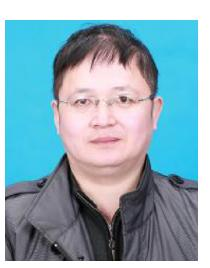

**Jinrui Nan** received the M.S. degree in agricultural engineering from Shanxi Agricultural University, China, in 2000, and the Ph.D. degree in vehicle engineering from the Beijing Institute of Technology, Beijing, China, in 2003. He is currently an Associate Professor with the National Engineering Research Center of Electric Vehicles, School of Mechanical Engineering, Beijing Institute of Technology. He has published more than 50 articles, written two books, and been granted more than 20 patents. His research interests include vehicular network technology, bat-

tery management technology, and vehicle control. He was a recipient of the Science and Technology Award of Beijing on the Key Technology and Industrialization of a series of Pure Electric Vehicles in 2014 and the Science and Technology Award of Ministry of Education of China in 2008.

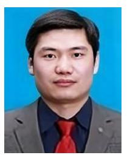

**Wanke Cao** received the B.S. degree in mechanical engineering and automation and the Ph.D. degree in vehicle engineering from Northeastern University, Shenyang, China, in 2003 and 2008, respectively. From 2008 to 2010, he was a Postdoctoral Researcher with the Department of Vehicle Engineering, Beijing Institute of Technology, Beijing, China. From 2015 to 2016, he was a Visiting Scholar with the Department of Multisource Propulsion Systems, Warsaw University of Technology, Warsaw, Poland. Since 2018, he

has been an Associate Professor with the National Engineering Research Center of Electric Vehicles and the School of Mechanical Engineering, Beijing Institute of Technology, where he has also been the Director of the Department of Vehicular Network Technologies, Shenzhen Automotive Research Institute since 2020. His current research interests include networked control of electric vehicles, vehicle dynamics and control, and in-vehicle network technologies.

**Wenwei Wang** received the Ph.D. degree from the School of Mechanical Engineering, Beijing Institute of Technology in 2007. He is currently a Professor with the School of Mechanical Engineering and the Deputy Director of the National Engineering Research Center of Electric Vehicles, Beijing Institute of Technology. He is also an Executive Associate Dean with the Shenzhen Automotive Research Institute, Beijing Institute of Technology. His current research interests include smart batteries and high-speed vehicular network and communication technologies.