# A Survey on IoT-Enabled Home Automation Systems: Attacks and Defenses

Zhibo Wang®, Senior Member, IEEE, Defang Liu, Yunan Sun, Xiaoyi Pang®, Graduate Student Member, IEEE, Peng Sun®, Feng Lin®, Senior Member, IEEE, John C. S. Lui®, Fellow, IEEE, and Kui Ren®, Fellow, IEEE

Abstract—With recent advances in communication technologies and Internet of Things (IoT) infrastructures, home automation (HA) systems have emerged as a new promising paradigm that provides convenient smart-home services to users. However, there exist various security risks during the deployment and application of HA systems, which pose severe security threats to users. On the one hand, traditional IoT security threats (e.g., device intrusion, protocol vulnerabilities, and so on) are inherent to HA systems. On the other hand, as the core of HA systems, the Trigger-Action Programming (TAP) model organizes cloud platforms, local hubs, and smart devices through user-customized rules, but the complex interactions involved bring new challenges to the security of HA systems. These two kinds of security issues have attracted widespread attention from both academia and industry, and explorations on both attack and defense have been made. However, there is not yet a survey that provides a summary of the overall HA systems' security research. In this paper, we conduct a comprehensive survey of the state-of-the-art literature on HA system security from aspects of attack and defense. We first give a brief introduction to the HA system architecture and present a general workflow of HA systems. Then, we review and classify the relevant attacks based on the HA architecture, with an explicit analysis of vulnerabilities exploited by these attacks. We further elaborate on the security requirements of HA systems and provide detailed descriptions and comparisons of existing defenses methods. Finally, we conclude with a thorough discussion of open issues for future research.

Manuscript received 26 February 2022; revised 1 July 2022; accepted 18 August 2022. Date of publication 29 August 2022; date of current version 22 November 2022. This work was supported in part by the National Natural Science Foundation of China under Grant 62122066, Grant U20A20182, and Grant 61872274; in part by the National Key Research and Development Program of China under Grant 2021ZD0112803; in part by the GRF's RIF under Grant R4032-18; and in part by the Key Research and Development Program of Zhejiang under Grant 2022C01018. (Corresponding author: Xiaoyi Pang.)

Zhibo Wang was with the School of Cyber Science and Engineering, Wuhan University, Wuhan 430072, China. He is now with the School of Cyber Science and Technology, Zhejiang University, Hangzhou 310027, China (e-mail: zhibowang@zju.edu.cn).

Defang Liu, Yunan Sun, and Xiaoyi Pang are with the Key Laboratory of Aerospace Information Security and Trusted Computing, Ministry of Education, School of Cyber Science and Engineering, Wuhan University, Wuhan 430072, China (e-mail: defangliu@whu.edu.cn; yunan.sun@whu.edu.cn; xypang@whu.edu.cn).

Peng Sun is with the College of Computer Science and Electronic Engineering, Hunan University, Changsha 410082, China (e-mail: sunpengzju@gmail.com).

Feng Lin and Kui Ren are with the School of Cyber Science and Technology, Zhejiang University, Hangzhou 310027, China, and also with the ZJU-Hangzhou Global Scientific and Technological Innovation Center, Hangzhou 311215, China (e-mail: flin@zju.edu.cn; kuiren@zju.edu.cn).

John C. S. Lui is with the Department of Computer Science and Engineering, The Chinese University of Hong Kong, Hong Kong (e-mail: cslui@cse.cuhk.edu.hk).

Digital Object Identifier 10.1109/COMST.2022.3201557

Index Terms—Home automation systems, IoT, security and privacy, cloud computing, data analysis.

#### I. Introduction

ITH ubiquitous sensing, communication, and computing capabilities, the Internet of Things (IoT) has been playing a critical role in connecting the physical world and cyberspace [1]. Benefiting from the integration and innovation of information and communication technologies such as 5G, cloud/edge computing, and artificial intelligence, IoT has empowered diverse services, such as industrial IoT, smart home, smart city, etc. [2], [3], [4], [5], [6], [7]. Smart Home, as one of the most important applications of IoT, builds an autonomous system for managing residential facilities and scheduling family affairs by allowing users to intelligently program and automatically control the IoT devices [8].

In recent years, we have witnessed the emergence and development of Home Automation (HA) systems as a new promising paradigm, which provides smart-home services to users through the comprehensive analysis of environmental information and user preferences. HA enables users to automatically manage home attributes (e.g., light intensity, climate conditions, etc.) and ensure home security (e.g., access control), with an ultimate goal of realizing automation for smart homes. Due to its great potential, HA has received a tremendous growth of popularity worldwide. According to Statista Research [9], the number of subscriptions for HA has reached about 290 million globally by 2022. Besides, the expedited technological advancements are booming the HA market. This market is projected to grow from 72.30 billion dollars in 2021 to 163.24 billion dollars in 2028 at a compound annual growth rate of 12.3% [10]. Thus far, many well-known commercial companies have developed HA platforms to provide desirable HA services, such as Samsung's SmartThings [11], Apple's HomeKit [12], Amazon AWS IoT [13], IFTTT [14], and Google Home [15], etc.

To empower smart home services, most HA systems adopt Trigger-Action Programming (TAP) model to organize cloud platforms, local hubs, smart devices and smart apps through user-customized automation rules. Specifically, in TAP model, end-users specify the behavior of triggers (e.g., system events) and corresponding actions (e.g., commands) when customizing automation rules. Once an event is triggered, one or more actions will be activated according to the preset automation rules, realizing automatic interactive operations of the devices.

In some cases, an additional *condition*, which enforces a condition that must be satisfied to run the triggered actions, is included in a rule. Thus, the form of a rule can be \(\lambda trigger\), action\(\rangle\) or \(\lambda trigger\), condition, action\(\rangle\). For example, a rule can be turning on the light (action) when the door lock is open (trigger) at 9 a.m. (condition) [16]. By customizing rules through the TAP model, users can easily control/manage a series of devices/services, promising a more convenient daily life.

Despite their great benefits, HA systems face serious security threats. An investigation from a consumer advocacy organization reported that more than 12,807 hacking or unknown scanning attacks against a smart home honeypot in a week [17]. On the one hand, HA systems are susceptible to traditional IoT vulnerabilities, such as side-channel information eavesdropping [18], device-level authentication deprivation [19], [20], and server-targeted DDoS attacks [21], [22]. On the other hand, the vulnerabilities of the TAP model caused by inconsistent device states, misconfiguration of automation rules, and the absence of cross-platform authentication mechanisms could lead to new security risks for HA systems. Specifically, [16], [23], [24] demonstrated that attackers can trigger unexpected actions or leak users' sensitive information by manipulating devices. References [25], [26], [27], [28] pointed out that adversaries can launch attacks when multiple automation rules jointly functionate, which may result in the misbehavior of devices, such as false alarms. Besides, many features of HA systems require cross-platform interaction support, such as accessing information from other platforms (e.g., stocks, weather, etc.), message push (e.g., SMS, Email, etc.), etc. Therefore, triggers and actions of the TAP model may come from different platforms. However, [29], [30], [31] revealed that triggers and actions of the TAP model from different platforms lack authentication. For example, the trigger of a rule on platform A may come from the Web services (e.g., location sharing services) under another platform B. Thus, when cross-platform interactions occur, an attacker can send unauthenticated, malicious triggers to another benign platform via the exploited Web services. For example, platform B can send a fake IP address to platform A without authentication via the location-sharing service. The incorrect location information received by platform A (e.g., the user is near home) can trigger a TAP rule to perform the wrong action (e.g., open the front door). The above security threats will significantly degrade the quality of service (QoS) for users, and finally hinder the deployment and promotion of HA systems.

Traditional defense methods for IoT systems usually depend on software upgrades [32], firmware encryption [33], [34], and machine learning-based anomaly detection techniques [35], [36]. However, devices in HA systems usually refer to sensors dedicated to data collection and actuators with limited functionality, such as temperature and humidity sensors, smart locks, etc. The communication and computing resources of these devices are usually constrained, making it impractical to afford those traditional defense mechanisms.

To address these issues, researchers have made efforts to provide various defenses for HA systems to thwart both the traditional IoT attacks and the TAP-based attacks. For example, [37], [38] blocked abnormal operations of devices through device behavior recognition and traffic filtering. They collected data traffic and device status of the HA system and then used the smartphone apps for malicious behavior detection. References [39], [40], [41] made the smart app perform only a limited number of operations by embedding tagging code on the app and setting some regulations on triggers/actions to eliminate the vulnerabilities of TAP rules. References [42], [43], [44] explicitly modeled HA systems by simulating the interactions between devices and performed data detection at HA platforms to ensure secure information exchange. All these methods are not directly deployed on resource-constrained end devices and do not use the computing/storage resources of the endpoints so that they can overcome the problem of resource constraints.

Up until now, efforts have been made to design effective attack and defense methods for HA systems, but these approaches are overly scattered, and there remains much room to explore. Hence, the aim of the paper is to conduct a comprehensive study on HA system security from the perspectives of both attacks and defenses so as to clarify the limitations of existing works and lay the foundation for future innovative studies.

#### A. Related Surveys

There are surveys about the issues of automation algorithms [45] and TAP model [46], [47] of HA systems. They mainly focus on the technologies and implementations of HA systems but largely neglect the relevant security issues. In terms of traditional security issues in HA systems, a few surveys discussed the attacks against the vulnerabilities of end-point devices [48], [49] and protocols [50], as well as the defenses based on integrity checks, hardware protection, and authentication mechanisms. However, the newly emerging security risks of HA systems arising from the TAP model and cross-platform interactions were not summarized in these surveys. Celik et al. [51] took the first step towards presenting the effectiveness of program analysis techniques in defending against TAP-based attacks. Nevertheless, they [51] only considered the behavior analysis of automation applications while the attacks against automation rules execution and crossplatform interactions have not been explicitly accounted for. We summarize the differences between the existing surveys and our survey in Table I. The comparison is made from the perspectives of HA systems' technologies & implementations, attacks, and defenses. As shown in Table I, each of the existing surveys reviewed and discussed the HA system from a narrow angle of view, only covering parts of technologies & implementations, attacks, and defenses. Technologies & implementations include the approaches of automation algorithm and TAP model. Attacks on HA systems refer to the device attack, the protocol attack, the TAP model attack, and the cross-platform attack. Defenses of HA systems include integrity check, hardware protection, communication supervision, authentication & authorization, rules protection, and cross-platform defense. There lacks a survey that can dissect

| Content                   | Approach                       | Liu et al. [45] | Soares et al. [46] | Ur et al. [47] | Komninos et al. [48] | Sikder et al. [49] | Zaidan et al. [50] | Celik et al. [51] | Our survey |
|---------------------------|--------------------------------|--------------------|-----------------------|-------------------|-------------------------|-----------------------|-----------------------|----------------------|---------------|
| Technologies&             | Automation alg. 1   | √                  | ×                     | ×                 | ×                       | ×                     | ×                     | ×                    | √             |
| Implementations           | TAP model                      | ×                  | $\checkmark$          | $\checkmark$      | ×                       | ×                     | ×                     | $\checkmark$         | $\checkmark$  |
|                           | Device attack                  | ×                  | X                     | ×                 | <b>√</b>                | √                     | ×                     | ×                    |               |
| Attacks of                | Protocol attack                | ×                  | ×                     | ×                 | ×                       | ×                     | $\checkmark$          | ×                    | $\checkmark$  |
| HA Systems                | TAP model attack               | ×                  | ×                     | ×                 | ×                       | ×                     | ×                     | ×                    | $\checkmark$  |
|                           | Cross-platform attack          | ×                  | ×                     | ×                 | ×                       | ×                     | ×                     | ×                    | $\checkmark$  |
|                           | Integrity check                | ×                  | <b>√</b>              | <b>√</b>          | <b>√</b>                | √                     | <b>√</b>              | √                    |               |
|                           | Hardware protection            | ×                  | ×                     | ×                 | $\checkmark$            | $\checkmark$          | $\checkmark$          | ×                    | $\sqrt{}$     |
| Defenses of HA Systems | Com. supervision 2  | ×                  | ×                     | ×                 | $\checkmark$            | $\checkmark$          | $\checkmark$          | ×                    | $\checkmark$  |
|                           | Authen. & Author. 3 | $\checkmark$       | ×                     | $\checkmark$      | $\checkmark$            | $\checkmark$          | $\checkmark$          | $\checkmark$         | $\checkmark$  |
|                           | Rules protection               | ×                  | ×                     | ×                 | ×                       | ×                     | ×                     | $\checkmark$         | $\checkmark$  |
|                           | Cross-platform defense         | ×                  | ×                     | ×                 | ×                       | ×                     | ×                     | ×                    | $\checkmark$  |

TABLE I A COMPARISON BETWEEN PREVIOUS SURVEYS AND OUR SURVEY ON HA SYSTEMS

HA systems in a systematic and comprehensive manner and fully cover the relevant works about HA system security. Therefore, this paper presents a more comprehensive and indepth tutorial on HA system security from two aspects (i.e., attacks and defenses). We aim to help interested researchers quickly grasp the motivations, challenges, and solutions for HA security.

## *B. Contributions*

In this paper, we systematically survey the state-of-theart literature of attacks and defenses in HA systems, and aim to highlight the security threats and defense requirements therein. We first present the basic 3-layer architecture of HA systems (i.e., perception layer, communication layer, and application layer) and give a brief introduction about how a HA system works. Afterwards, we summarize the security threats in each layer of the HA system including traditional IoT security issues and TAP-based security risks and review existing attacks that are based on those security threats. Then, we highlight the security requirements of HA systems in terms of integrity, confidentiality, and stability. Subsequently, we provide a detailed description of existing defense schemes and compare them from perspectives of technical principles and application scope. Finally, we conclude with a discussion on open research issues of attacks and defenses in HA systems.

The key contributions of this paper can be summarized as follows.

- 1) This is the first paper, which systematically summarizes the state-of-the-art literature on HA system security from two aspects of attacks and defenses. Detailed reviews and discussions on the existing works are provided to show their pros and cons.
- 2) This paper extensively analyzes the security threats of HA systems, with a special focus on the security risks induced by complex interactions in the TAP model. This paper also presents the security requirements of HA systems for better security protection.
- 3) This paper identifies critical challenges and promising trends for future research in terms of attacks and

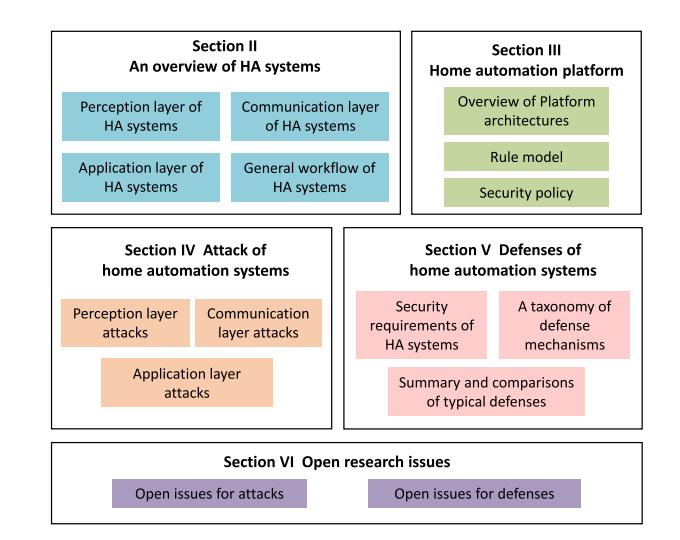

Fig. 1. A structural diagram of this survey.

defenses to encourage readers to explore more innovative and practical approaches.

The organization for the remainder of this paper is shown in Fig. [1.](#page-2-1) In Section [II,](#page-2-2) we provide a comprehensive overview of IoT-enabled HA systems and introduce the general HA workflow. Section [III](#page-5-0) introduces seven typical HA platforms, with a discussion of their rule models and security policies. In Section [IV,](#page-12-0) we present a detailed literature review of recent advanced attacks in the HA domain and classify them into three categories. We then comparatively and comprehensively summarize the security requirements of HA systems and corresponding defenses in Section [V.](#page-21-0) Afterwards, Section [VI](#page-29-0) highlights the open questions, challenges, and future research directions in HA systems. Finally, Section [VII](#page-31-35) concludes this paper.

# II. AN OVERVIEW OF HA SYSTEMS

HA are the most important technologies of IoT in recent years, which helps users achieve remote and automated control for end-point devices. In this section, we provide an overview

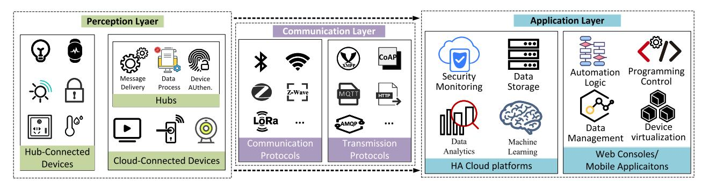

Fig. 2. The basic layered architecture of HA systems.

TABLE II LIST OF ACRONYMS FREQUENTLY USED IN THIS SURVEY

| Acronym | Definition                                     |  |  |
|---------|------------------------------------------------|--|--|
| IoT     | Internet of Things                             |  |  |
| HA      | Home automation                                |  |  |
| TAP     | Trigger-Action Programming                     |  |  |
| API     | Application Programming Interface              |  |  |
| NFC     | Near Field Communication                       |  |  |
| OSGi    | Open Service Gateway Initiative                |  |  |
| SNS     | Simple Notification Service                    |  |  |
| ADM     | Amazon Device Messaging                        |  |  |
| GCM     | Google Cloud Messaging                         |  |  |
| APNs    | Apple Push Notification service                |  |  |
| SSL/TLS | Secure Sockets Layer/ Transport Layer Security |  |  |
| CVE     | Common Vulnerabilities and Exposures           |  |  |
| DOM     | Document Object Model                          |  |  |
| SSP     | Bluetooth Secure Simple Pairing                |  |  |
| RFID    | Radio Frequency IDentification                 |  |  |
| CSRF    | Cross-Site Request Forgery                     |  |  |
| SMS     | Short Message Service                          |  |  |
| SQL     | Structured Query Language                      |  |  |
| NLP     | Natural Language Processing                    |  |  |
| ACLs    | Access Control Lists                           |  |  |
| MIMO    | Multiple-Input Multiple-Output                 |  |  |
| CSI     | Channel State Information                      |  |  |
| M2M     | Machine-to-Machine                             |  |  |
| RSS     | Received Signal Strength                       |  |  |
| OFDM    | Orthogonal Frequency Division Multiplexing     |  |  |

of the HA system. First, we present the basic 3-layer architecture of HA systems. As shown in Fig. [2,](#page-3-0) it contains the perception layer, communication layer, and application layer. For each layer, we not only describe its basic components but also introduce the characteristics developed for HA. After that, we give a brief introduction about how the components in each layer work together to support the general HA workflow. Table [II](#page-3-1) provides the list of acronyms.

# *A. Perception Layer of HA Systems*

The perception layer of HA systems is mainly composed of different smart devices, which can sense data and execute commands. These devices can be divided into *cloud-connected devices* and *hub-connected devices*. Cloudconnected devices communicate directly with the cloud through wireless connection protocols. Hub-connected devices are first connected to hubs/gateways through some energysaving wireless communication technologies (such as Z-Wave and ZigBee) and then communicate with HA cloud platforms through hubs/gateways [\[43\]](#page-32-7). Specifically, Hub is a special cloud-connected device, which can perform device controlling, geo-fencing, and rules-based automation.

In HA systems, a large number of sensors and actuators are deployed on devices. Each device has its pre-declared operations (e.g., turn on/off the light, adjust light intensity, change light color), which is defined as Devices' *Capabilities*. Capabilities can be broken down into attributes and commands. For sensors, attributes represent the state information or properties of the devices. For actuators, commands represent the way you can control or drive the device. Capabilities abstract specific devices into their underlying functions, allowing users to retrieve the state of a device or control a function of the device, rather than directly controlling physical attributes such as voltage and frequency. Therefore, a capability is not a device-level permission management mechanism, but a device-specific abstraction.

As a special cloud-connected device, a *Hub* can realize several messaging patterns that enable secure device-to-device and device-to-cloud communication. In addition, it can provide simple intelligence to support device authentication, uploading files from devices, and request-reply methods to control devices from the cloud. Generally speaking, Hub is essentially a relay node for resource-constrained devices that only support low-power communication protocols such as Bluetooth and ZigBee, and thus cannot directly connect to the cloud. For example, various have been developed, and some HA hubs (e.g., Hubitat [\[52\]](#page-32-16), Samsung SmartThings Hub v3 [\[53\]](#page-32-17), and Oomi Camera [\[54\]](#page-32-18)) now support automation even when the home is offline. Worth mentioning, voice assistant like AWS Alexa is a special kind of hub with the ability to enable humancomputer interaction and voice control of home devices [\[55\]](#page-32-19). If combined with Near Field Communication (NFC) [\[56\]](#page-32-20) technology and voice input technology, more automatic functions can be realized.

# *B. Communication Layer of HA Systems*

The communication layer ensures secure and reliable communication between devices and HA platforms through standardized network protocols. In this paper, we focus only on security issues in wireless technologies, where wired communications and power carriers are out of scope. Currently, there exist lots of wireless protocols for different purposes, which can be generally classified into two categories: one is the *communication protocol* and the other is the *transmission protocol*. Communication protocols like Wifi, Bluetooth, and Zigbee require chip module support (hardware support) and are mainly used for near-range wireless connection between devices within a subnet. Transmission protocols like HTTP, CoAP, and MQTT require interfaces to cloud platforms (software support) and are responsible for data exchange and remote communication between devices and servers over the TCP/IP Internet. Besides, the communication layer of HA considers end-to-end security assurance, including authentication, encryption, and open port protection.

Note that various communication protocols keep evolving, with the latest versions replacing the shortcomings of previous versions so to meet the requirements of HA systems in terms of security, power consumption, and connection numbers. Wi-Fi is particularly convenient because it does not require an additional hub and can be directly connected to the network. However, the high power consumption leads to its limited use in HA systems. For example. smart door locks, infrared forwarding controllers are not suitable to implement the Wi-Fi module. ZigBee protocol is acknowledged as one of the most suitable protocols available. It can communicate bidirectionally, not only to send commands to devices but also to send back the execution status. This is crucial to the end-user experience, especially for security devices. For example, if you send a command to close a door and the door does not send back a acknowledgement, this poses a significant security risk that the user does not know if it is actually locked. Another popular communication protocol is Bluetooth, which is a point-to-point, short-range communication method. Therefore, Bluetooth products are more suitable for personal services, such as headphones, smart scales, etc. Other protocols, such as Z-Wave, Lora, and NB-IOT, also excel in terms of long service life, far communication distance, and low deployment difficulty, but are not yet widely used in HA systems.

Most common transmission protocols for HA systems use a publish-subscribe mechanism to achieve the flow and forwarding of information. A sensor node uploads collected data to the network, which is equivalent to the publication of a message. This message needs to be based on a certain topic, such as the type of sensor. Other nodes that care about this topic can get the latest data in real-time by subscribing to messages on this topic. The publish/subscribe protocols solve the problems of event filtering, topic subscription, and service selfdiscovery of HA systems at the application layer. Considering the real-time communication needs, a suitable protocol needs to be selected. For example, for intelligent lighting control in HA systems, the XMPP protocol can be used to control the switching of lights. For inspection and maintenance of power lines, the MQTT protocol can be employed. For publishing the energy consumption query service of your own home to the Internet, REST/HTTP can be utilized to open API services.

## *C. Application Layer of HA Systems*

The application layer utilizes resources in the *HA cloud platforms* to store and analyze data collected from the perception layer, and *Web consoles/Mobile applications* to achieve real-time control of the physical world and scientific decisionmaking. The HA cloud platforms provide many practical functions, such as security monitoring, data storage, data analytics, machine learning, and so on. For example, when a device is connected to the platform, the security monitor in the platform audits device queues, detects abnormal device behavior, and alerts users to security issues promptly. Endusers manage their data and monitor device behaviors via user interfaces (i.e., Web consoles/Mobile applications) provided by platforms. HA cloud platforms build devices into extensions of automation applications through device virtualization technology. For example, TVs, wearable devices, and smart assistants are instantiated as screens, sensors and speakers for the application. An HA logic rule will be initiated and packaged as an automation app when a user customizes the triggers and actions in the Web consoles/Mobile applications.

With abundant resources and functions, HA cloud platforms provide external third-party developers and transaction partners with open application programming interfaces (APIs) to share their data and functionalities. The combination of different APIs releases the potential of HA systems in automation programming, location services, etc. Besides, HA platforms create device handlers for physical devices to enable the definition and delivery of control commands. Meanwhile, HA platforms abstract the information uploaded from the applications or hubs as events and store them in the database. In [\[16\]](#page-31-15), [\[51\]](#page-32-15), the authors defined five types of events for connecting specific sensor readings and handlers, including Device events, Timer events, App touch events, External events, and Mode events. Considering that Mode events and App touch events both need users to click the corresponding button in the apps so that both of them can be taken as Application click events. Based on that, we define four types of events, i.e., Device events, Timer events, Application click events, and External Web events. Compared to existing works [\[16\]](#page-31-15), [\[51\]](#page-32-15), we have made minor adjustments and supplements to the interpretation of External Web events and Application click events. Detailed definitions and examples are as follows:

- *Device events* are the most common representation in the system, which indicates the change of device status. For example, "the door opens" is a device event. When this event occurs, the event handler may change the state of another device, such as turning on the light.
- *Timer events* refer to the arrival of a predefined time or the occurrence of a specified time range. When a timer event happens, the event handler calls the corresponding action. For example, at eight in the morning, open the curtains.
- • *External Web events* are requests or instructions sent to/from external Web entities to the platform. Some platforms have access to external Web services (e.g., IFTTT can access weather forecasting services provided by Weather Underground [\[57\]](#page-32-21)) or allow the external access

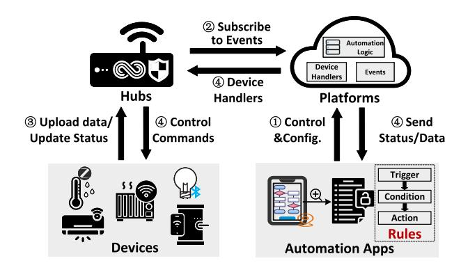

Fig. 3. General Workflow of HA Systems.

- of apps in another platform over the Web. For example, SmartThings is connected to the Home Assistant platform via an open API, which allows Home Assistant to access information about Samsung devices and control their execution.
- Application click events include remote control events and mode setting events. They both need users to click the corresponding button in the apps. Remote control events allow contact-less operation of another electronic device, such as turning on the light after clicking the button in a mobile application. Mode setting event requires multiple actions to be performed when the user clicks the corresponding button in the app. For example, when a user turns on "away" mode in the mobile application, all lights will turn off and the alarm will turn on.

Web Consoles/Mobile Applications are rule-based programs that allow users to customize device behavior, forming automation services. Rules are user pre-configured automation logic that reflects the will of users about HA. The form of a rule can be \langle trigger, action \rangle or \langle trigger, condition, action \rangle. Once an automatic scenario is activated by a trigger event and the condition is satisfied, one or more actions will be triggered according to the automation rules. Note that trigger, condition, and action are all event-driven. For example, a user sets the rule "when the *home* mode is on, every night at 6 pm, turn on the light". Here, the trigger is an application click event, the condition is a timer event, and action is a device event.

#### D. General Workflow of HA Systems

The HA system usually adopts a TAP model to organize each layer in the HA architecture and make them work together through user-customized automation rules. The most core part of TAP model is the cooperation among devices, hubs, platforms and automation apps. Even through different HA systems may contain different entities in each layer (e.g., different HA systems may deploy different smart-home devices and utilize different communication protocols), they structure the TAP model with the same *Device-Hub-Platform-App* workflow, as shown in Fig. 3. Specifically, a typical workflow of HA systems, which involves four main components (i.e., *devices*, *hubs*, *platforms*, and *automation apps*) is described as follows.

- A user first connects devices to HA platforms and defines the triggers and actions of rules in automation apps via the user interface (UI). Then, according to the customized rules, the user can control and configure the trigger/action devices remotely.
- The platform parses the user's configurations into the automation logic and subscribes to the relevant events of trigger devices and device handlers of action devices for automation apps.
- 3) When a trigger device uploads data or updates its status to hubs, the related events (i.e., the behaviors of the trigger device) will be fed back to platforms.
- 4) The platform will invoke the device handler of the corresponding action device according to the TAP model's Trigger-Action logic and deliver the handler to hubs. With this handler, hubs can send control commands to the action device, which will then behave as expected. In the meantime, the platform will send the device information update to automation apps, and the user will receive the latest device status.

Now, an HA function is implemented as the user desires. Next, we take the automation rule "When there is smoke in the home, the alarm should go on and send a message to me" on the mobile application as a concrete example to see how the TAP model realizes it through the above workflow. After the user sets the above rule, the platform will update the user's configuration and subscribe to the smoke sensor events in the database. When the smoke sensor is triggered, the platform sends the *smoke.off* command to the Hub, as well as the notification message to the mobile app. Then, the smoke alarm receives the command from Hub and goes on, and the user receives the alarm message via the mobile application.

#### III. HOME AUTOMATION PLATFORMS

HA platforms enable HA devices and automation apps belonging to different companies to interact jointly. Currently, there are numerous HA platforms active worldwide. All of them have different features and benefits. We investigate seven most popular open-source and commercial HA platforms to gain insight into their technical architectures (Section III-A), rules model (Section III-B), and security policies (Section III-C).

#### A. Overview of Platform Architectures

Samsung's SmartThings is a relatively mature HA platform, which aims to provide the whole house coordination service. It consists of four common elements, including SmartThings Cloud Backend, smart devices, SmartThings Hub, and SmartApps, as shown in Fig. 4. Among them, the Cloud Backend is the brain of the SmartThings and is responsible for coordinating all parties to realize HA and maintaining device health. It abstracts various sensor data and device operations into structured events and commands, and makes the corresponding execution decisions. The smart devices from different manufacturers are connected to the platform via the device SDK provided by Cloud Backend. SmartThings Hub

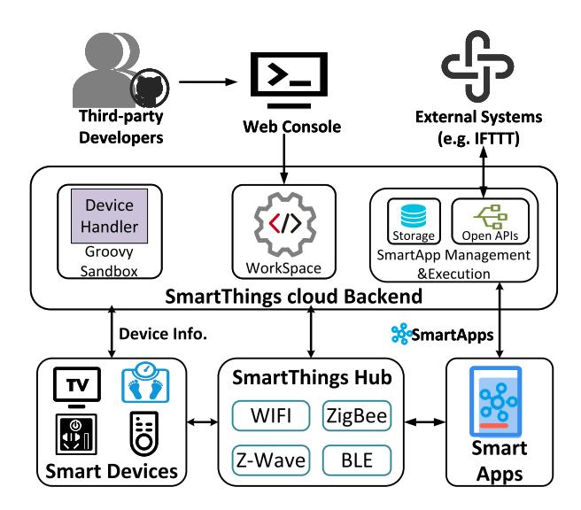

Fig. 4. SmartThings architecture [\[11\]](#page-31-10).

supports various radio protocols and is in charge of reporting device events to the cloud backend. Smartapps are usually installed via application markets in the cloud backend. They subscribe to the device handlers or predefined events to activate the user-customized rules to implement the trigger-action automation logic and realize remote control.

SmartThings provides a detailed classification of devices and lists the information about the available devices. For example, Type identifies what type of handler (Device Type Handler) the device uses to read or write data, and Execution Location indicates whether the device is running in the Cloud or locally. Unlike other platforms, SmartThings Hub [\[53\]](#page-32-17) adds support for native protocols, so that the application logic can be implemented not only in the cloud backend but also at the local hub. Therefore, even without the network, hub-based devices can still exchange information locally or perform predefined automatic actions via the hub. However, there are some limitations of the current hub offline operations since the user identity needs to be verified in the automation apps and the device cannot be controlled remotely from the apps without network support. It is worth noting that SmartApps are Groovy-based [\[58\]](#page-32-22) programs. SmartApps are often stored in the cloud backend and can be accessed by external systems through open APIs. Every SmartApp or Device Handler is an instance of an abstract executor class defined in SmartThings. Third-party developers can use the Groovy development tools to import or write their automation rules and device handlers that are not officially supported. Moreover, the cloud backend runs the device handler in a sandboxed environment and supports third-party service-connection like IFTTT through the Web console, which gives devices connected to SmartThings even more scope for use.

**Amazon Web Services (AWS) IoT** is a cloud-based platform that connects IoT devices with AWS cloud services. The four major components in AWS IoT are *Device Gateway*, *Rules Engine*, *Registry*, and *Device Shadows* [\[59\]](#page-32-23). Device Gateway and Rules Engine work like SmartThings Hub and Smart Apps. Besides, Registry is utilized to assign a unique

identity to each device, and Device Shadow records the status of the device and sends it to apps and other services.

The AWS IoT, the AWS IoT core works as a message broker and supports common communication protocols including MQTT, HTTPS, and LoRaWAN. Each device (physical or virtual) can register in the platform through SDKs and connect to other cloud service endpoints (e.g., Amazon DynamoDB [\[60\]](#page-32-24), Amazon S3 [\[61\]](#page-32-25), Amazon Machine Learning [\[62\]](#page-32-26), and others) through AWS IoT Core. Meanwhile, in AWS IoT, rules are defined using an SQL-like syntax. The data is stored in semi-structured formats (e.g., JSON, CSV) and can be used for machine learning purposes (e.g., monitoring and optimizing interactions between IoT devices). Device Shadow is a special service in AWS IoT, which provides reliable data storage for devices, applications, and other cloud services, and thus allows them to connect and disconnect without losing the state of the device. AWS IoT objects can have multiple named shadows so that there are more options to connect devices to other applications and services. Furthermore, AWS IoT allows users to use voice commands to access external Web services or control their devices. Alexa Voice Services (AVS), a new feature offered by AWS IoT Core, integrates connected products (Web services and physical devices) with the voice assistant Alexa, enabling device manufacturers to build any connected device as an Alexa built-in device.

**Google Home** is a representative service provider that uses smart voice assistants (such as Ali's Tmall Genie, Amazon's Alexa, and Apple's Siri) as home controllers. In Google Home, users are allowed to control their smart devices through *Google Assistant* and *Google Home app*. Specifically, *Google Assistant* works like SmartThings Hub and provides users with useful metadata (such as the status of specific devices). *Google Home app* can be used to download or customize automation rules (named as *routines*). *Cloud Engine* is the core of Google Home, and it works in a similar way as the SmartThings Cloud backend.

Different from other HA platforms, in Google Home, automation rules and external third-party services are collectively known as *Actions*. Most published *Actions* can be activated directly by Google Assistant once they have been certified by Google. Google Home *intents*, which are known as events, are simple messaging objects that describe actions to be performed by the smart home, such as turning on a light or playing audio. Google Home cloud Engine can not only receive device data and Web services but also maintain a database that stores home contextual data (know as *Home Graph*). A *Home Graph* contains information about structures (e.g., home or office), rooms (e.g., bedroom or living room), and devices (e.g., speaker or light bulb). It works like a logical map of the user home and is available for Google Assistant to execute user requests based on the appropriate context. As shown in Fig. [5,](#page-7-0) Google Home Cloud offers an assistant interface to accept user queries and filter out invalid segments (e.g., background noise, non-keyword) in user speech commands. Every change of device status and Web information (e.g., Google Search) will be updated to Home Graph, which will further be used by Google Assistant to trigger the corresponding *Actions* (most programmed in Java or Kotlin). When

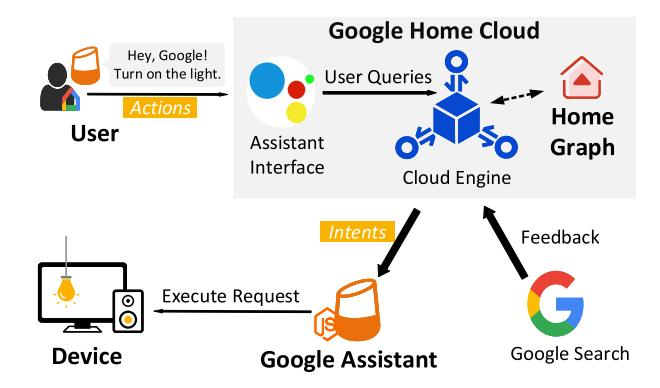

Fig. 5. Google Home's working mode [\[63\]](#page-32-27).

a user says a command to Google Assistant, it will get the automation rules in customized *Action* and send the execution requests therein to the specific device. Noticeably, Google Home pays more attention to the HA business and updates devices and software more frequently, about once every half a month.

**Apple's HomeKit** is a development kit that manages and controls compatible smart devices [\[41\]](#page-32-5). It allows users to centralize the management of HA devices through iOS devices. For better utilization of Homekit, Apple releases *Home*, a central application with functional modules of *accessories*, *scenes*, *rooms*, and *automation*. *Accessories* encapsulate the state of physical devices and represent the presence of a single device in *Home*. *Scenes* combine multiple devices and other services into one state, such as watching TV within a scene that contains closed curtains and dimmed lights. *Rooms* are a group of devices in the same physical space. *Automation* is a set of conditions that trigger automatic execution. Users can trigger automation rules through virtual assistant *Siri* or *Home* app [\[64\]](#page-32-28).

In Homekit, automation rules can be developed with swift or objective C language [\[65\]](#page-32-29). Third-party products connect to the Home App after accessing the HomeKit Accessory Protocol. HomeKit objects are stored in the user's iOS device and can be synced to other iOS devices via iCloud. The local hub acts as the core of Homekit, and all the automation rules are executed on the hub. When the user is at home with an iOS phone, the phone can temporarily become the hub. However, the high mobility of phones is inappropriate or insufficient as a part-time hub. Unfortunately, Apple has not launched a stylish hub yet and chooses other manufacturers as an alternative. Besides, HomeKit allows users to create one or more Home layouts. Each Home layout (HMHome) represents a home with several rooms and networked devices, with multiple accessories attached. The *Home* App uses the HMHomeManager to retrieve HMHomes and other related items from the HomeKit database. Remarkably, HomeKit has also taken an epic step forward in open source recently [\[66\]](#page-32-30).

**IFTTT**, namely "If This Then That", is an innovative Internet service designed to help people connect applications and devices from different developers through the open APIs of various external websites (such as Facebook and Twitter). Unlike other HA platforms, IFTTT does not have the key

components like hub and devices but provides a cloud platform to manage HA devices and applications.

In IFTTT, the Web services are called *Channels* [\[67\]](#page-32-31). "This" refers to *Trigger Channel* and "That" refers to *Action Channel*. When a Trigger Channel meets the trigger conditions then the action specified in the Action Channel will be executed. This kind of If-This-Then-That automation is called *Recipes* (also known as *Applets* now [\[68\]](#page-32-32)). Applets can be shared within the IFTTT community. IFTTT creates multiple parameters for the Applet, including a title, applet description, trigger/action definitions, filters, etc. When the user creates an Applet, IFTTT starts monitoring the endpoints specified by the trigger service. Users can also create some custom JavaScript code in the Applet to automatically filter actions. For example, if the user arrives after 6 p.m., a certain number of lights will be turned on in a specified location in the house, instead of all the lights. Each Applet runs in its separate process and uses a lightweight communication mechanism (usually an HTTPbased RESTful API) to exchange information. Usually, IFTTT uses the Kafka [\[69\]](#page-32-33) log analysis system to handle the massive volume of messaging services used for applets interactions and is deeply nested with AWS (i.e., AWS Redshift [\[70\]](#page-32-34), AWSData Pipeline [\[71\]](#page-32-35), AmazonRDS [\[72\]](#page-32-36), etc.) to help monitor the behavior of collaborating APIs.

**Home Assistant** is an open-source platform for HA. It is not a typical HA platform since it acts more as a hub to manage and control the devices. The outstanding features of Home Assistant are local control and privacy [\[73\]](#page-32-37), [\[74\]](#page-32-38). Specifically, it enables local control of smart devices without the cloud, so the HA system does not rely on remote servers or Internet connections, which means all user data will not be delivered to the cloud. Even when there is a need for recovering data from the last run after a disconnection, Home Assistant does not need to download data from the network. It extracts and loads the relevant configurations directly from local files [\[75\]](#page-32-39).

*Hassbian*, based on the official Raspberry Pi system, is often installed on a local server or the Raspberry Pi. *Hassbian* serves as a hub locally, running preset automation apps. It connects to a local router to discover all smart devices on the Wi-Fi frequency band and provides a clear console to make devices work together based on how and when the user wants the single command to be executed. Meanwhile, it supports devices and services from different manufacturers and platforms connecting to the Home Assistant directly or indirectly, which facilitates cross-platform interactions. However, the Home Assistant version changes very frequently, i.e., several times a month, which makes the research and development process difficult because developers need to constantly adapt their codes to the new specification. It's worth mentioning that Home Assistant has been so profitable in open source and has been listed in GitHub's "State of the Octoverse" 2020 report as it took second place in this year's Top-10 list of the Python packages with most active contributors [\[76\]](#page-32-40).

**OpenHAB** is an open-source automation platform with built-in eclipse IDE (Integrated Development Environment), which is fully based on Open Services Gateway Initiative (OSGi) [\[77\]](#page-32-41) and uses Jetty [\[78\]](#page-32-42) as a Web server. OpenHAB segments and compartmentalizes stateful services and physical

| Platform               | Category    | Architecture 1 | Apps running on 2 | Official Apps 3 | 3rd-party Apps 3 | Programming language          | System Stability (Latest Version)     |
|------------------------|-------------|---------------------------|---------------------------------|-------------------------------|--------------------------------|-------------------------------|------------------------------------------|
| SamSung SmartThings | Commercial  | Hub                       | Hub/Cloud                       | √                             | $\sqrt{}$                      | Groovy                        | Nearly once a month (1.7.57.23)          |
| AWS IoT             | Commercial  | Hub/Cloud                 | Cloud                           | $\checkmark$                  | $\sqrt{}$                      | SQL-like, (Java, Python,C) | N/A 4                         |
| Google Home         | Commercial  | Hub                       | Hub/Cloud                       | <b>√</b>                      | $\checkmark$                   | Kotlin, java                  | About once every half a month (2.32.1.5) |
| Apple's HomeKit     | Commercial  | Hub                       | Hub                             | ×                             | ×                              | Swift, Objective C            | N/A                                      |
| IFTTT                  | Commercial  | Cloud                     | Cloud                           | √                             | √                              | JavaScript                    | N/A                                      |
| Home Assistant      | Open-Source | Hub                       | Hub                             | ×                             | ×                              | python                        | More than once a month (2021.1.0)        |
| OpenHAB                | Open-Source | Hub                       | Hub                             |                               |                                | Xtend-based DSL               | Once a few months                        |

#### TABLE III AN OVERVIEW OF HA PLATFORMS

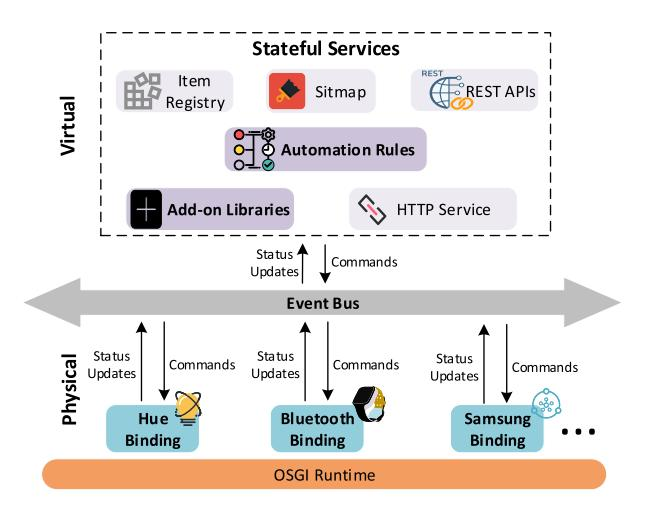

Fig. 6. Openhab core components.

connections, and the most important components of OpenHab are *Bindings*, *Add-on Libraries* and *Automation Rules*, as shown in Fig. [6.](#page-8-0) Bindings provide interfaces for devices, Addon Libraries work as different services, and Automation Rules play a similar role as SmartApps in SmartThings.

OpenHAB can connect various kinds of HA devices and provide vendor-independent technical support [\[79\]](#page-32-43). In OpenHAB, developers can design unique operator interfaces (known as *Sitemap*) to develop personalized HA scenarios. Different hardware devices and interface protocols are brought together through *Bindings*. These bindings can send/receive commands and update status via the *event bus*, which is used for inter-component communication. Therefore, various events (e.g., *ItemCommandEvent, ItemStateEvent, ItemAddedEvent, ThingStatusInfoEvent*, etc.) abstracted from *Items* are the core contents of communications in OpenHAB. Besides, *Addons* are installable enhancements that allow users to add or modify application functionality, or decorate the appearance with themes. Through the openHAB REST APIs [\[80\]](#page-32-44), other platforms can easily access most objects in OpenHAB, such as data related to *Items*, and the capabilities to invoke automation rules. Same with Home Assistant, *Openhabian* works like a local hub. Moreover, OpenHAB has official apps and third-party apps, which are programmed in Xtend-based Domain Specific Language (Once the SDK is installed, the Xtend program will be compiled into Java code by Eclipse in real-time). However, OpenHAB application update is relatively slow, usually once a few months.

The above seven platforms are the major platforms in the HA market [\[81\]](#page-32-45), we summarize their basic information in Table [III,](#page-8-1) and further highlight their characteristics as follows.

- 1) SmartThings and Homekit are committed to creating a multi-scenario integrated whole-house HA, which closely integrates devices and cloud services to provide more coherent services.
- 2) Google Home and AWS both use the company's powerful products (Google Search and AWS Cloud) to improve their data processing capabilities and are committed to developing voice assistants. Google focuses on partnering with other hardware companies, while Amazon prefers to launch more products with the Amazon bandage.
- 3) Unlike others, IFTTT focuses on gluing together fragmented online services (e.g., Twitter, Facebook, etc.) and solving the dilemma of users being forced to constantly jump between services. The open strategy enhances the user experience and extends the functionality of the service itself. However, it is somewhat limited by the opening degree of other applications, as other companies constantly adjust their API open strategy [\[82\]](#page-32-46). Meanwhile, the automated services (e.g., email, contacts access and modification, photos/videos access, etc.) offered by IFTTT require access to third-party platforms, a sensitive action that undoubtedly increases the security risk for users.

| Platform               | Support Conditions | Multiple Actions | Device Shadow Service | Virtual Device | Message Service | Third-party Platform Access | Rule Database |
|------------------------|-----------------------|---------------------|--------------------------|-------------------|--------------------|--------------------------------|------------------|
| Samsung SmartThings | <b>√</b>              | √                   | ×                        | √                 | N/A 1   | ×                              | $\checkmark$     |
| AWS IoT             | √                     | $\checkmark$        | $\checkmark$             | <b>√</b>          | SNS/ADM            | $\checkmark$                   | $\checkmark$     |
| Google Home         | $\checkmark$          | $\checkmark$        | ×                        | $\checkmark$      | GCM                | ×                              | $\checkmark$     |
| Apple's HomeKit     | ×                     | ×                   | ×                        | √                 | APNs               | $\checkmark$                   | ×                |
| IFTTT                  |                       | √                   | ×                        | ×                 | GCM                | $\checkmark$                   | ×                |
| Home Assistant      | <b>√</b>              | <b>√</b>            | ×                        | <b>√</b>          | N/A                | $\sqrt{}$                      | ×                |
| OpenHAB                | √                     | √                   | ×                        |                   | N/A                | $\checkmark$                   | ×                |

TABLE IV PROPERTIES OF SINGLE RULE IN DIFFERENT PLATFORMS

4) Home Assistant and openHAB aim to provide more open services to stimulate extensive collaboration among multiple platforms for the HA community. OpenHAB is more mature and stable, while Home Assistant is a more innovative and flexible platform to control smart devices. With Home Assistant, users will have more comprehensive permissions to decide whether data generated by sensors and actuators will be uploaded to the cloud, and can design customized services. However, the higher authority also means greater security risks.

#### *B. Rule Model*

Automation rules can be taken as the concrete programmatic representation of Trigger-Action logic. A user can set up automation rules to operate devices. All the HA platforms mentioned above use "if-then" rules to specify HA behaviors. Therefore, one can construct a rule model with many properties for each rule. This can be described as follow.

- *Support Conditions:* Some rules need to be implemented under specified conditions. For example, turn on the light every Sunday after 8 p.m, where the *condition* is every Sunday. Most platforms support conditions, except Homekit.
- *Multiple Actions:* A rule can have multiple actions. For instance, when the host comes home, HA systems should turn on the light and air conditioner at the same time. Most platforms such as SmartThings, AWS IoT, and Google Home support the creation of multiple-actions rules.
- *Device Shadow Service:* This service can collect and report the status of devices to applications when the device is offline [\[59\]](#page-32-23). For example, a rule is triggered, but the corresponding device for its action is offline. At this point, the application can update the shadow to request a change in the state of the device. Once the device reconnects, the device can update its state by accessing the shadow. Currently, only AWS IoT uses the device shadow service.

- *Virtual Device:* Unlike the device shadow, virtual devices are often used for rule simulation and system simulation. For researchers, the simulation of rules is helpful to the mining of security problems, as they can simulate the HA rules without a device. The seven mainstream platforms we studied all support virtual devices.
- *Message Service:* In addition to changing the state of devices, platforms transmit specified messages to the external points. For example, when a smoke alarm goes on, a fire message is sent to the user. Some platforms support messaging services, such as Amazon's SNS and ADM, Google's GCM, and Apple's APNs.
- *Third-party Platform Access:* For some commercial or open-source platforms, they provide interfaces or integrations, which can access or be accessed by third-party platforms. For example, all devices under HomeKit can be controlled through Home Assistant. Under this function, the association between devices changes from singleplatform to cross-platform, and the interaction of rules becomes more complex. At present, cross-platform collaboration can be realized in AWS IoT, IFTTT, Home Assistant, and OpenHAB.
- *Rule Database:* Both rules and relevant device data need to be stored, which helps the platform to quickly return to a pre-set state when the network connectivity is restored. SmartThings, AWS IoT, Google Home have their databases in the cloud. Other platforms that support rule storage don't have a cloud database, instead, they record the occurred events through local files.

We summarize how the above HA platforms build rule models in Table [IV,](#page-9-1) from which we can observe that not all platforms support all the attributes in the rule model. Some platforms do not implement device modelling (i.e., device shadow service, virtual device), external services (i.e., message service, third-party platform access, rule database) due to security and efficiency considerations or resource constraints.

In HA systems, many automation functions require interactions between rules [\[83\]](#page-32-47). For example, a wake-up automation scenario requires a chain reaction of rules from "alarm clock goes off at 8:00 am" to "lights on automatically after the

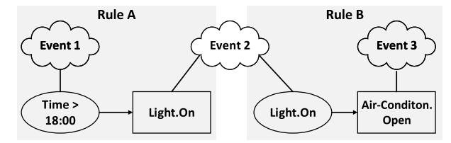

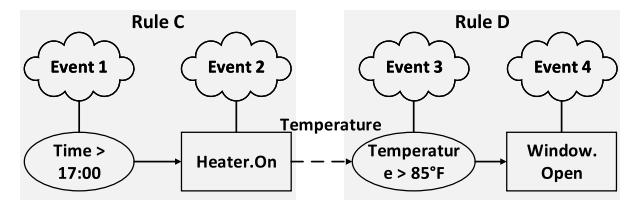

Fig. 7. Rule chain model [\[26\]](#page-31-25).

alarm clock goes off.". As a supplement to the rule model, the **Rule Chain Model** could express all these interactions between rules as a model to better analyze the workflow of HA systems. Thus, it is necessary to introduce the rule chain model to help readers better understand the architecture and workflow of the HA system. The rule chain model consists of two main parts: the automated rules (i.e., the rule model mentioned above) and the interaction channels between the rules. To be specific, interaction channels contain both system channels and physical channels, as described below.

- *System Channels:* The control commands and timing signals (e.g., various events, including time, location information, switches, locks, etc.) in HA systems form the system channels. These system channels can be shared by multiple automation rules on the same platform so that rules can be chained together.
- *Physical Channels:* The physical environment of a smart home is closely related to the triggering of rules, and the physical behavior of the device, e.g., raising the temperature can turn on the air conditioner. Therefore, the physical environment is an essential physical channel in rules interaction. Wang *et al.* [\[26\]](#page-31-25) used Natural Language Processing (NLP) techniques to perform linguistic analysis on the description of the official SmartThings application and Identified seven physical channels, i.e., Temperature, Humidity, Illumination, Location, Motion, Smoke.

These automation rules can be chained into explicit links or implicit links via the system or physical channels [\[26\]](#page-31-25), respectively, which is shown in Fig. [7.](#page-10-1) Specifically, Rule A and Rule B are explicitly linked through the system channel if the action of A and the trigger of B are the same events. In this case, the execution of A's action directly satisfies the trigger event of B. For example, in Fig. [7\(](#page-10-1)a), the action in Rule A is to turn on the light, and the trigger in Rule B is the light on. When Rule A fires, Rule B automatically executes, opening the Air Condition to make the room temperature rise or fall. In contrast, Rule C and rule D are implicitly linked since C and D are connected through a physical channel, and C's actions can control this channel to satisfy D's trigger. For example, in Fig. [7\(](#page-10-1)b), the action in Rule C is to turn on the heater, which changes the temperature of the room. The trigger in Rule D is to have a temperature above 85◦ F. Therefore, after 17:00, the window can be opened automatically through Rule C and D.

## *C. Security Policy*

HA systems usually deploy detailed security policies to maintain the orderly operation of automation rules. These security policies involve device/client authentication, cross account access, system logging, etc. We refer to the official security policy documents of the seven mentioned platforms [\[84\]](#page-32-48), [\[85\]](#page-32-49), [\[86\]](#page-32-50), [\[87\]](#page-32-51), [\[88\]](#page-32-52), [\[89\]](#page-32-53), [\[90\]](#page-33-0), [\[91\]](#page-33-1) and summarize their four most important types of security policies as follows.

- • *Authentication:* Authentication is a two-way verification process that allows a device (or client) to provide identity credentials to the HA platform and the platform to provide authentication information to the device (or client) [\[84\]](#page-32-48). Client authentication is the process where devices or other clients authenticate themselves with HA platforms. Server authentication is the process where devices or other clients ensure they are communicating with an actual HA platform endpoint. Most platforms will have dedicated engines to handle safety certificates and system authentication. For example, in AWS IoT, when the user's devices or other clients establish a TLS connection to an AWS IoT Core endpoint, AWS IoT Core presents a certificate chain for devices to verify whether they're communicating with AWS IoT Core.
- *Authorization:* Authorization is the process of granting permissions to authenticated identities (e.g., devices, clients, etc.). HA platforms usually provide two types of authorization to authenticated identities. One is at the control level, and devices or clients with such a kind of authorization are allowed to create or update certificates, rules, permission scopes, and other tasks. The other is at the data level, where devices or clients with such authorization are allowed to send data and receive data from the platform. Specifically, AWS IoT uses identity-based policies (such as IAM users, user groups, or roles) and access control lists (ACLs) to control which actions users and roles can perform on which resources under which conditions. For example, a user can set permissions in the platform to allow the device to access all MQTT topics or restrict its access to only one topic [\[84\]](#page-32-48).
- *Encryption and Data Protection:* HA systems need to continuously send and receive data that contains sensitive information in the network throughout the workflow. Therefore, security policies nowadays include encryption and data protection, which refers to protecting the data by using encryption and digital signatures both in in-transit (as it travels to and from platforms) and at rest (while it is stored on devices or platforms). Most platforms use the industry-standard SSL/TLS protocol to ensure the confidentiality of supported application protocols (MQTT, HTTP, and WebSocket) [\[88\]](#page-32-52). In Web socket

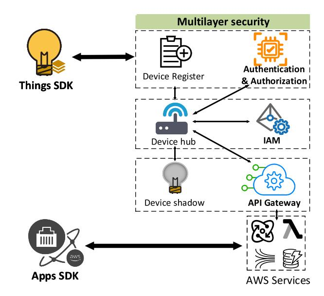

Fig. 8. AWS IoT's multi-layered security architecture.

communication, the built-in webserver of each platform attempts to use cryptographically supported HTTPS in preference to HTTP. For example, in Google Home, user Actions interaction with the Actions on Google APIs must use HTTPS [\[87\]](#page-32-51). In addition to encrypting transmission data, Homekit provides an encrypted disk image, which is a static secure container for users to store sensitive texts and other files [\[89\]](#page-32-53).

• *User Information Privacy:* User information privacy asks all the automation rules/apps to provide accurate and transparent descriptions of their functionality and perform as reasonably expected by the user. Unlike data protection, "user information privacy" protects personal information from inappropriate use, disclosure, or sharing. For example, Google Home asks all the Actions to provide a link to a privacy policy in the Directory's designated field. The privacy policy must, together with any in-Action disclosures, comprehensively disclose how your Action collects, uses, and shares user data, including the types of parties with whom it's shared. Actions are prohibited from requesting sensitive data (e.g., payment or financial data, healthcare data, etc.) via the conversational interface (text, image, or speech) in all scenarios [\[87\]](#page-32-51).

In addition to various commonly used security policies, each platform has its proprietary security mechanisms. In the following, we list some of the exclusive security policies of different platforms.

AWS IoT uses a multi-layered security architecture for device access and service output, which is shown in Fig. [8.](#page-11-0) When a device wants to get connected to the platform, AWS IoT provides three methods to verify its identity: X.509 certificate, AWS IAM user groups, and AWS Cognito authentication. AWS validates device credentials for devices and creates policies that match these subject devices and enforces strict credential management. These managements form the core of device authentication and authorization. After this, a device is accepted as AWS IoT connectable device. When a user controls a certificated device connected to the local hub, AWS Identity and Access Management (IAM) will apply fine-grained policies to assign permissions to users, groups, or devices, and define which actions these identities can perform on which resources. Finally, In AWS IoT, many services (e.g., AWS Lambda, Amazon DynamoDB, etc.) are provided and shared with other applications through the API. The platform controls access to the API using the API Gateway Resource Policy, which is a JSON policy document that AWS attaches to the API to control whether a specified delegate (usually an IAM user or role) can invoke the API. In AWS IoT communication, all traffic is encrypted through the SSL/TLS protocol, and AWS IoT Cloud allocates a private *home directory* for each legal user. In addition, AWS applies methods such as boundary protection, monitoring inbound and outbound sites, logging, monitoring and alerting, etc.

SmartThings use a *Capability model* [\[92\]](#page-33-2) to specify which devices the SmartApp can access and which properties on the device the SmartApp can access. A device has a series of capabilities. For example, a smart door lock can expose *capability.lock* and *capability.battery*. Smartapps must get enough permission authorized by users to access device capabilities. For example, a temperature management app can be authorized to access temperature sensor data and operate the air conditioner by the user. However, the disparity in importance between capabilities has not been noted. For example, opening and closing a lock are two unique capabilities, one of which is safe and the other is unsafe. The ability to open a lock is often authorized in the Lock-Off app, which can lead to security threats.

Homekit uses sandboxing technology to isolate each app's runtime environment and implements ASLR technology to prevent overflow and other vulnerability attacks. Automation rules need to be authorized by the user to access *Home app* data. As the security modules of the iOS system are integrated, only trusted codes can be run on the device to ensure secure communication. Besides, Apple has launched a standard protocol for its HA platform, named HomeKit Accessary Protocol (HAP). Only organizations that have passed the MFi (Made for iOS) certification can get the HAP protocol and design and produce compatible smart hardware devices for HomeKit. The certification process is very strict, with a 2% pass rate, and it is impossible to join as an individual developer. When no official certification can be obtained, a bridging hub is another way to access *Home*. Homebridge [\[93\]](#page-33-3) allows user to integrate with smart home devices that do not natively support HomeKit. There are over 2,000 Homebridge plugins supporting thousands of different *accessories*. The bridging hub communicates with iOS devices via the HomeKit protocol and with non-HomeKit peripherals using other wireless/transport protocols such as ZigBee, Z-Wave.

Note that we describe only part of the security mechanisms that distinguish each platform from the others, more details can be found in the technical documents on their official websites [\[84\]](#page-32-48), [\[85\]](#page-32-49), [\[86\]](#page-32-50), [\[87\]](#page-32-51), [\[88\]](#page-32-52), [\[89\]](#page-32-53), [\[90\]](#page-33-0), [\[91\]](#page-33-1).

Additionally, the above security policies are expected to provide confidentiality, integrity, and availability assurance.

TABLE V THE CATEGORY OF ATTACKS

| Attacks                   | Categories                                          |  |  |  |
|---------------------------|-----------------------------------------------------|--|--|--|
| Perception                | Remote Device Intrusion                             |  |  |  |
| Layer                     | Attackers Behind You: Smart Voice Assistants        |  |  |  |
|                           | Wireless Communication Disruption Attacks           |  |  |  |
| Communi- -cation Laver | Wireless Communication Manipulation attacks         |  |  |  |
|                           | Unsupervised Physical Channel                       |  |  |  |
|                           | Backdoor Attacks of Automation Apps                 |  |  |  |
| Application               | Over-privileged Capabilities of Apps                |  |  |  |
| Layer                     | Conflicting Interactions between Automation Rules   |  |  |  |
|                           | Fragile HA Platforms & Cross-Platforms Interactions |  |  |  |

However, they are insufficient to deal with all security threats in HA systems, especially the new threats from emerging TAP-based rule interactions and cross-platform links. Thus, adversaries can launch attacks by breaking these security policies. For better understanding, we have added some analysis of the relationship between attacks and security policies at the end of Sections [IV-A,](#page-12-1) [IV-B,](#page-14-0) and [IV-C.](#page-17-0)

#### IV. ATTACKS OF HOME AUTOMATION SYSTEMS

Home Automation Security Incident is now taken as one of the most important IoT security incidents [\[94\]](#page-33-4). Recent attacks against HA systems are not limited to traditional IoT vulnerabilities such as the takeover of individual devices [\[95\]](#page-33-5), [\[96\]](#page-33-6) or sniffing network traffic [\[97\]](#page-33-7), [\[98\]](#page-33-8) but can be launched through the TAP interaction model of HA systems [\[43\]](#page-32-7), [\[92\]](#page-33-2), [\[99\]](#page-33-9). In this section, we summarize state-of-art attacks and analyze the security threats involved. Corresponding to the HA architecture, we divide them into three categories: *perception layer attacks*, *communication layer attacks*, and *application layer attacks*. Specifically, as shown in Table [V,](#page-12-2) perception layer attacks are mainly initiated by remote device intrusion and defects of smart voice assistants. Communication layer attacks are mainly based on wireless communication disruption attacks, wireless communication manipulation attacks, and unsupervised physical channel. Application layer attacks are largely on account of backdoors of automation apps, overprivileged capabilities of apps, conflicting interactions between automation rules, and fragile HA Platforms & Cross-Platforms Interactions.

## *A. Perception Layer Attacks*

In HA systems, devices (i.e., sensors and actuators) in the perception layer can interact with the indoor/outdoor environments. There are two types of devices: cloud-connected devices and hub-connected devices. The former communicates directly with the cloud, and the latter first connects to the hub/gateway and then communicates with the cloud through the hub/gateway. However, some characteristics of devices (e.g., limited resources, no typing equipment) hamper the deployment of some classical safety methods, which gives

the attacker a chance to exploit the vulnerable devices to attack HA systems. Specifically, most devices do not have embedded security mechanisms and they are using risky outdated firmware [\[100\]](#page-33-10), [\[101\]](#page-33-11), [\[102\]](#page-33-12). Some devices lack typing equipment, leading to the failure of password-based authentication mechanisms [\[103\]](#page-33-13), [\[104\]](#page-33-14). Furthermore, it is worth noting that perception layer risks arise not only from the vulnerability of the device itself but also the interaction between devices and users, the latter exposing the device to a larger attack surface. For example, the open-access channels (e.g., voice interaction) of some devices (e.g., smart assistants) place new demands on security measures such as speech recognition, multi-factor authentication, and so on. Therefore, we elaborate on the attacks in the perception layer from two aspects according to their purpose.

*1) Remote Device Intrusion:* Before connecting to HA platforms, devices need to report their product version and device information according to different authentication methods to ensure that connected devices on the platforms can be trusted for what they claim to be. However, HA platforms often perform inadequate device authentication [\[105\]](#page-33-15), which leaves devices vulnerable to remote intrusion and leads to security threats for HA systems. For example, the publicly trusted SSL/TLS protocol used by some HA platforms for deviceside authentication only supports one-way authentication. This means that the device only verifies the cloud/server certificate, but the cloud cannot verify the device through the client certificate. What's worse, many devices don't use encrypted and verifiable identities such as the serial number and public key when communicating with platforms. This makes it more difficult for the platform to verify the identities of devices.

Device authentication relies on the uniqueness of the channel state information (CSI) on the transmitter-receiver channel. From the analysis in [\[106\]](#page-33-16), [\[107\]](#page-33-17), physical layer authentication is sensitive to impersonation attacks, where an attacker can obtain legitimate CSI in the vicinity of the device. Baracca *et al.* [\[108\]](#page-33-18) provided a fingerprint forgery strategy in multiple-input multiple-output (MIMO) systems, which minimizes the average time required to crack the authentication system. The attacker obtains the maximum likelihood estimate of the CSI of transmitter A-receiver B based on the observation and statistics of the CSI of other channels and uses this likelihood signal to connect B maliciously. Such a numerical estimation-based method can maximize the probability of successful attacks and reduce the attack overhead. On the other hand, physical layer authentication assumes that the estimation of CSI is always correct. However, Xiao *et al.* [\[109\]](#page-33-19) found this assumption was generally not valid because the channel response fades with time. An attacker can exploit the receiver's incorrect estimation of CSI in the channel and use the signaling device to construct many false connection requests to top off benign devices. Mukherjee and Swindlehurst [\[110\]](#page-33-20) examined the design of a full-duplex active eavesdropper in the wiretap channel, where all nodes are equipped with multiple antennas. The adversary intends to optimize its transmitting and receiving sub-arrays and jamming signal parameters so as to minimize the MIMO secrecy rate of the main channel.

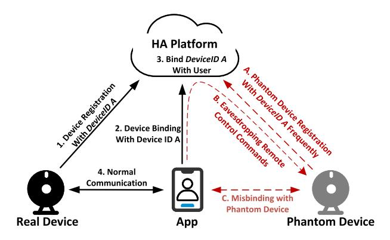

Fig. 9. Remote device misbinding attack.

In addition to the lack of authentication of devices, the weak password of devices also give chance to remote device intrusion. For example, since the initial credentials of remote management services for devices (e.g., SSH, FTP, etc.) are weakly secured in HA systems, and users rarely change their default passwords, attackers can crack passwords of devices through brute force or default factory passwords and thus penetrate the system [\[111\]](#page-33-21), [\[112\]](#page-33-22). Kumar *et al.* [\[95\]](#page-33-5) constructed a small dictionary of default credentials to initiate the *logintest attack* against the online devices with open FTP and Telnet services, and thereby login to the devices that allow weak default credential authentication. Besides, most devices lack the protection of login credentials. Ling *et al.* [\[113\]](#page-33-23) efficiently obtained the victim's authentication credentials (e.g., the plug's MAC address, username, and password) by reverseengineering the smart plug. Attackers can use these credentials to log in and perform false command injection attacks on the corresponding smart plug. Margulies [\[114\]](#page-33-24) demonstrated that an attack on a rolling code garage door opener can be accomplished by simply synchronizing a malicious remote controller with an existing remote control signal, followed by a few minutes of brute-force code.

To be mentioned, in TAP models, the device ID are propagated between the device and the app or stored in the app's logs. However, Zhou *et al.* [\[43\]](#page-32-7) found that the device ID can be obtained by attackers and then be used to launch a *Remote Device Misbinding Attack* based on the TAP model. In Fig. [9,](#page-13-0) we show the normal process of establishing a connection between a device and an app with black solid lines and show the process of *Remote Device Misbinding Attack* with dashed red lines. To establish a connection between a device and an app, the device ID is spread among the app and the platform. The malicious phantom device can obtain the device ID during this process and send a registration request to the cloud with the ID of the real device. The cloud can not distinguish between the real device and the phantom device, and may register a virtual device for them with the same device ID. At this time, the app binds both the phantom device and the real device, which are in fact competing for a connection to the platform. To win the competition, the attacker will configure the phantom device to log in very frequently. In this situation, the user still seems to "control" a device through its mobile application, even though the device has been replaced by a malicious phantom device. This attack can continuously upload fake device commands, and eavesdrop on the user's commands to analyze her habits.

Furthermore, as applications deployed on devices increasingly move to Web environments (e.g., IFTTT), some attackers have been trying to manipulate device and platform communication messages. Rauti *et al.* [\[115\]](#page-33-25) implemented a malicious browser extension (known as the MitB attack) on the Chrome Web browser to bypass user authentication. In this case, the attacker can modify data in HTTP requests or manipulate data using the Document Object Model (DOM) before it is sent to the server. This attack can alter user input in the smart home management console to manipulate IoT devices. Sethi *et al.* [\[116\]](#page-33-26) found that the Bluetooth Secure Simple Pairing (SSP) security mechanism can not validate the device name or other attributes of the device (e.g., make, model, and serial number). Thus, an attacker could configure a malicious device with the same name to impersonate a normal device. For example, when the user device attempts to get connected with device A, device A will receive a pairing code, and the user device needs to check whether the pairing code is correct. At this time, the attacker can construct a malicious device B with the same make and model around device A, which makes the user device mistakenly think that device B is the one that should be matched. Device B receives the pairing code and forwards it to Device A. The user device confirms the code displayed by device A and is gullible enough to believe that device A has properly connected.

*2) Attackers Behind You (Smart Voice Assistants):* Due to the rapid development of artificial intelligence technologies, speech control has become more prevalent in HA systems. In real life, people always think that the "smartest" thing will be safe, so they obtain external information such as weather and road conditions, play music, and control HA devices through voice interaction with voice assistants. However, smart voice assistants, which serve as the central interactive interface of HA systems, are different from the devices hidden behind the hub. They are exposed to the network (a fact is that most smart voice assistants are required to connect to the Internet directly) and perform actions frequently with high control privileges. Moreover, the voice channel is excessively vulnerable and lacks proper authentication between users and smart voice assistants. Thus, smart voice assistants are susceptible to various attacks.

Researchers proposed many attacks against the speech recognition system in voice assistants by constructing malicious speech samples. Zhang *et al.* [\[117\]](#page-33-27) attacked the speech recognition system by modulating voice commands on ultrasonic carriers which can not be heard by the human ear. By exploiting the non-linearity of the voice assistant's microphone circuitry, modulated low-frequency audio commands can be successfully demodulated and recovered so that the speaker could be completely controlled by any command without the user's knowledge. Yuan *et al.* [\[103\]](#page-33-13) utilized the loopholes of artificial intelligence algorithms of the speech recognition system to launch attacks. They integrated the malicious commands into a song and utilized the gradient descent method to find the local minimum between modified audio with the original one. This led to the situation where the command can be recognized by the speech recognition system, but can circumvent the detection from a human listener. Yan *et al.* [\[118\]](#page-33-28) exploited the unique properties of sound transmission in solid materials and extended the ultrasonic attack through an array of speakers. Such attacks allowed multiple rounds of interactions among acoustic devices at longer distances without the need to be in the line of sight, thus causing minimal alteration to the physical environment. These attacks compromised the authentication from smart voice assistants to the users and impersonated an authorized user to operate the smart voice assistant.

Furthermore, users can download and interact with the automation apps (e.g., *skills*, *actions*), which are published by some third-party developers,via the smart voice assistants. Thus, due to the ambiguity of voice commands (e.g., non-standard pronunciation, unclear semantics) and the user's misunderstanding of the service (e.g., skill invocation lifecycle), an attacker can publish malicious third-party skills on the app marketplace and mislead users to invoke them. Kumar *et al.* [\[119\]](#page-33-29) and Zhang *et al.* [\[31\]](#page-31-30) discovered some voice-based confusion attacks (*Skill Squatting Attack* and *Masquerading Attack*) on smart assistants. In *Squatting Attack*, when the user calls the normal app through voice assistants, the attacker hijacks the user's normal app by a malicious app containing words with similar pronunciation or meaning. For example, the user calls the voice assistant "Alexa, ask *Amex* to pay Bailey \$100." The malicious skill with the same pronunciation *Am X.* will respond "You need to log in. I've sent a card to your phone." to induce the user to enter private information. *Masquerading attack* refers to an attacker using a malicious app to disguise the voice of normal voice assistants (e.g., Siri, Alexa) during a conversation, making the user think they are communicating or giving commands to the normal voice assistant rather than an app developed by a third party. As a result, the malicious app can continue ping information about the user's surroundings. For example, when a user tries to switch apps or exit the current app, the malicious app does not exit, but masquerades as a voice assistant or another app and stays in conversation with the user. Zhang *et al.* [\[31\]](#page-31-30) further proposed the *paraphrased invocation name hijacking attacks*. In this attack, one may say "Alexa, open Capital One please", which normally opens the skill *Capital One*, but can also trigger a malicious skill *Capital One Please* once it is uploaded to the skill market [\[31\]](#page-31-30). The skill-calling mechanism of different platforms is still very fuzzy, and the defense of such attacks remains uninvestigated. Exploring ways to increase the success rate of such attacks is still a potential direction for researchers.

It is worth mentioning that these smart voice assistantsbased attacks are unique to HA systems, since smart voice assistants are used as a new interface of interaction to allow users to ask and save information, control smart appliances, and perform online operations (e.g., shopping, banking) in HA systems. The attackers exploited vulnerabilities of the interaction process between the user and the voice assistant to inject malicious commands and further propagate them in the HA system with the control authority of the smart voice assistant, thus misleading the above actions.

*Summary:* There are a wide variety of devices in HA systems, ranging from traditional embedded sensing devices to emerging AI-enabled voice assistants. The perception layer attacks bypass the platform's security policies on Authentication as well as Encryption and data protection (in Section [III-C\)](#page-10-0). By interfering or falsifying authentication information, attackers can register fake devices to HA platforms or introduce false commands to smart voice assistants. However, Exploiting vulnerabilities of Smarter Devices will be a challenge as HA embraces more vendors and more securely protected devices.

#### *B. Communication Layer Attacks*

Differing from traditional IoT systems, in HA systems, devices need to interact with the physical environment to realize monitoring and control of home attributes (e.g., temperature and humidity). Thus, the communication channel in HA systems contains not only network channels but also physical channels. The physical channel refers to the physical environments between device interactions, while the network channel ensures that the authenticated commands and sensor data can be transmitted securely with minimal overhead. We use the communication layer to represent these two kinds of channels. However, the chaotic communication environments of households and online services make it possible for a hacker to imperceptibly break into HA systems [\[23\]](#page-31-22), [\[120\]](#page-33-30), [\[121\]](#page-33-31).

*1) Wireless Communication Disruption Attacks:* The purpose of a disruption attack is to introduce disorder in the communication and/or sensing processes [\[122\]](#page-33-32). The manifestation of this attack is to disrupt the content and characteristics of the wireless signal by directing intentional interference to the communication/sensing system [\[123\]](#page-33-33). For example, in wireless communication, the power of the received signal must be greater than the overall power of the ambient noise and interference. Attackers intentionally increase the level of interference in the transmission channel, resulting in the disruption of legitimate transmissions [\[124\]](#page-33-34). The key to disruption attacks is to occupy the current communication channel or disrupt the associated communication protocol, which can significantly degrade the performance (e.g., network throughput and transmission delay) of wireless networks.

In addition to cutting off the wireless communication process [\[125\]](#page-33-35), [\[126\]](#page-33-36), an attacker could also forgery the interaction between HA platforms and the user by hijacking the communication protocol in HA systems. Ho *et al.* [\[23\]](#page-31-22) implemented two attacks on smart locks, i.e., *State Consistency Attacks* and *Unwanted Unlocking Attacks*, by exploiting vulnerabilities in Bluetooth. For *State Consistency Attacks*, they found that when the smart lock was in a device-gateway-cloud architecture, key revocation was pushed by the remote server to the revoked user. However, if the phone of revoked user went offline, the server was unable to push this information to the phone, which caused the lock to remain unaware of the revocation. Thus, the attacker can still able to maintain access to the smart lock using an offline phone that is previously registered. For *Unwanted Unlocking Attacks*, an attacker disguised himself as a smart lock and interacted with the user to grab the Bluetooth wireless packages, which will be replayed to the smart lock at the same time and achieved unlocking. This type of attack occurs because the platform is unable to confirm whether the user is at his network-identified affirmation, and the user monitors the devices via mobile apps or Web services without accessing the device physically [\[127\]](#page-33-37).

Besides, some attacks occurred due to the errors in the configuration and implementation of popular communication protocols (e.g., ZigBee, Zwave, RFID) or transmission protocols (e.g., MQTT, COAP). Fouladi and Ghanoun [\[98\]](#page-33-8) found that the key exchange process of the Z-wave protocol was vulnerable because the protocol did not provide confidentiality protection when transmitting the "network key" *Kn* over the network. By intercepting the authentication process between the "control device" and the "security device" as a man-in-themiddle, the attacker can restore the "network key" *Kn* therein. Therefore, an attacker can link the "security device" to the malicious network and open the Z-Wave door lock directly without a password, as long as he knows the *Home* and *Node* IDs of the "security device" during the key exchange process. Besides, Aghili *et al.* [\[128\]](#page-33-38) proved that the ultra-lightweight RFID protocol is vulnerable to DOS attack and desynchronization attack when the adversary can compromise a legitimate reader and obtain its secrets. Attackers make the authentication key stored in the server and the tag out of sync by disrupting the key negotiation process between the server and RFID tags. However, these attacks require decryption of network protocols (directly decrypting to the security information in them), or a compromised network (infecting the entire network with a malicious device).

*2) Wireless Communication Manipulation Attacks:* Wireless communication protocols are created to exchange data in networks and are the basis for communication between devices. Apart from adding meaningless jamming signals to the wireless channel or hijacking data packets to perform disruption attacks, attackers can also actively tamper or construct fake wireless signals to achieve wireless communication manipulation attacks. Manipulation attacks not only interfere with communication but also result in incorrect sensing and faulty data message [\[122\]](#page-33-32), [\[129\]](#page-33-39). For example, a wrong data message can pass an incorrect command to a device, leading to misbehavior in the HA system.

The protocol data packet is composed of the payload for authentication (i.e., device ID) and other field information (i.e., protocol header). However, some protocols are not well configured or implemented in HA systems, which can be maliciously Manipulated by attackers. There have been many works demonstrating that some protocols (e.g., HTTP, MQTT) do not encrypt messages where commands may be transmitted in plaintext, or even be expired and forged [\[130\]](#page-33-40), [\[131\]](#page-33-41). The vulnerabilities of the widely-used transmission protocol MQTT are also taken as the entry points by attackers. Since MQTT clients will occasionally disconnect ungracefully (e.g., loss of connection, empty batteries, disconnect without any *DISCONNECT message*), *Will message* is defined in MQTT specification as a response to an unordered disconnection. The *Will message* is a normal MQTT message with a topic, retained message flag, QoS, and payload. However, MQTT does not

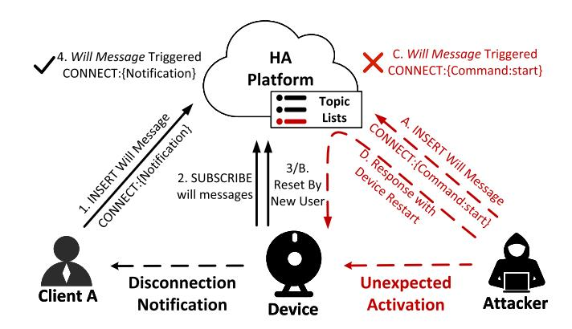

Fig. 10. Will message attack [\[132\]](#page-33-42).

have a detailed specification of will messages, such as what kind of client can send a will message, and restrictions on the content of a will message's payload, which can be maliciously exploited by attackers.

In HA systems, each client (device or user) can upload its constructed *Will message* topic or subscribe to any *Will message* topic when it first connects to a broker (HA platform). The HA platform stores the message until it detects that the client has disconnected ungracefully, the platform then sends the *Will message* to notify all subscribed clients. Jia *et al.* [\[132\]](#page-33-42) provided the first systematic study of the security vulnerabilities of the MQTT protocol in HA platforms and identified new attack scenarios. Fig. [10](#page-15-0) illustrates a typical will message attack based on the vulnerabilities of MQTT. This attack is based on the fact that some hotels (e.g., Airbnb, Hilton) are increasingly equipped with IoT devices and their guests are often granted temporary access to the devices, so the attacker can impersonate a normal user to check into a hotel and gain control of the device for a period of time. The attacker first logins in the broker (HA platform) and register a *Will Message* topic with a malicious payload, which includes a malicious command (Command:Start). After that, the attacker controls the Device in the hotel to subscribe to the *Will Message* topic. When the attacker checks out, he does not voluntarily release the device or log out of his account. Once a victim user (like the subsequent guest of the same hotel room) resets the Device (e.g., the door lock), the attacker's account will go offline ungracefully. Then, the *will message* will be activated and the commands in it will invoke the Device (i.e., the door lock will open automatically). What's worse, the MQTT topic structure is similar to a hierarchical file path (e.g., */doorlock/[device ID]/status*), some platforms do not have appropriate authentication and a hierarchical strategy for *topics*, which allows an attacker to subscribe to any MQTT topic through a compromised device [\[132\]](#page-33-42).

Adversaries can also take advantage of the non-robustness of network protocols to execute some malicious injection attacks [\[133\]](#page-33-43), [\[134\]](#page-33-44), [\[135\]](#page-33-45). Oren and Keromytis [\[136\]](#page-33-46) pointed out that the communication channel of broadcast data stream used by smart TVs was vulnerable, and an attacker could build a digital terrestrial television (DTT) transmitter to distribute malicious advertisements to thousands of potential

hosts through the broadcast channel. This attack is a variation of the traditional cross-site request forgery (CSRF) attack [\[137\]](#page-33-47) and since it is done with the help of a traditional broadcast channel, it does not leave a trail of activity in the form of IP or DNS transactions. Ronen *et al.* [\[22\]](#page-31-21) found a new type of threat that adjacent HA devices would infect each other with a worm through their built-in ZigBee wireless connectivity. Vidgren *et al.* [\[97\]](#page-33-7) demonstrated that an attacker could masquerade as a router or trust center and continuously send request messages to ZigBee-enabled devices. The devices' continuous response to the requests causes damage to the battery. This attack is similar to a DoS attack, but the limited resources of the end nodes make it much less difficult to execute, and the attack can be launched on multiple ZigBee devices at the same time. Esnaashari *et al.* [\[138\]](#page-34-0) found that the transmission protocol Universal Plug and Play (UPnP) in HA systems, which is designed for locally enabled wireless devices to redirect ports and services to the Internet, is vulnerable to various attacks. For example, an attacker could use a misconfigured UPnP service to inject malicious routes into the router's Network Address Translation (NAT) table, resulting in the situation that intranet devices are mapped into the public interface and exposed to the external network.

*3) Unsupervised Physical Channel:* The TAP model of HA systems enables devices to collect data from their respective environments and act on the physical environment according to app commands. However, malicious apps can interact indirectly through shared physical environments (e.g., air, temperature, and humidity) and lead to insecure/unsuspected states. For example, an app may turn on the heater to raise the indoor temperature, and when the temperature exceeds a threshold, another app might open the windows, which makes the whole house vulnerable to invasion. This cyber-physical interaction accelerates the transformation of cyber threats into physical incidents and makes it difficult to trace attackers because the point where the problem occurs is not the point where the attack is initialized.

Current HA systems do not provide any validation methods to check if sensor inputs are valid. Therefore, an attacker could maliciously change or control environmental parameters (e.g., light intensity, temperature, electromagnetic) in a targeted manner to construct fake sensor data, and then trigger malicious activity and disrupt the operation of the TAP model [\[24\]](#page-31-23), [\[139\]](#page-34-1), [\[140\]](#page-34-2). Sugawara *et al.* [\[96\]](#page-33-6) launched a new signal injection attack on smart speaker arrays simply by using a laser pointer. The attacker could shine a laser on the voice assistant and adjust the beam intensity of the electrical signal to induce the microphones to produce an electrical signal as if they were receiving real audio. Even though the attacker stands outside the house, he can shine the laser through the window. Bozzato *et al.* [\[141\]](#page-34-3) carried out a voltage glitch attack on the charging port of a device (e.g., a smart lock), which interferes with the power line (changing the chip pin current) to modify the execution flow of the device. Thus, an attacker can skip certain instructions or run incorrect operations. This attack can be carried out during the unlocking process to bypass authentication or can cause the lock logic to enter a confused state. Mao *et al.* [\[20\]](#page-31-19) found that current context-based device pairing schemes (e.g., using common events in the same trust domain) can not accurately identify events or resist contextual noise. They proposed a jamming-based attack called *pairjam* that prevents voice-controlled devices (e.g., microphone) from pairing with the user by injecting user environmental events (e.g., door closing) into the voice-controlled device. Specifically, a typical contextual pairing scheme is that the microphone will use the door closing event (i.e., the user entering the house) as the context for user authentication. The attacker prevents the normal signal (walking and door opening) from being recognized by injecting events of a single dimension into the voice-controlled device in a continuous manner, causing the attack signal to overlap with the normal signal. The continuous injection ensures that a sufficient number of normal events are swamped, and the voice-controlled device cannot recognize the correct context, causing the voice-controlled device to refuse to pair with the user.

In HA systems, sensors not only obtain information from the environment but also leak data into the physical space (e.g., sound, brightness, heat), which can also be exploited by attackers [\[142\]](#page-34-4), [\[143\]](#page-34-5). Xu *et al.* [\[144\]](#page-34-6) introduced an attack that used the radiation of light changes to reveal programs on smart TV. The attacker performs feature extraction from the recorded light emission variations of the smart TV and then uses a precomputed feature library to extract the corresponding video from the reference content. The attack is surprisingly robust to the variety of noisy signals that occur in realistic environments and is able to successfully identify what is being watched in a reference library of tens of thousands of videos in a matter of seconds. Faruque *et al.* [\[145\]](#page-34-7) implemented an attack to reconstruct the source code of a design sent to a 3D printer by placing a logger near the 3D printer to collect the run-time acoustic change information. The recorded files with acoustic change information can be processed to extract time and frequency domain features, and then cross-matched with the training datasets collected during the learning phase to infer the correct design.

In addition to the security threats posed by the direct interactions between devices and the physical environments, automation apps, which share the same physical environments, can also lead to security threats. Trimananda *et al.* [\[146\]](#page-34-8) found that many applications in SmartThings use their local (private) variables rather than global variables to track and update device states. For example, two apps (*Auto-Humidity-Vent* [\[147\]](#page-34-9), *Big-Turn-OFF* [\[148\]](#page-34-10)) in SmartThings may cause *invalid-local-state conflicts*. A user may use the *Big-Turn-OFF* app to turn off the fan, causing the room humidity to increase above the threshold. However, since local variable *state.fansOn* remains true in the *Auto-Humidity-Vent* app, *Auto-Humidity-Vent* will not run. When these apps are paired with other apps that update the same physical environment state, they can make the variables in these apps inconsistent with the physical environment state, ultimately making the system run on the wrong track.

In HA systems, devices and the physical environment interact frequently. On the one hand, devices sense and report changes in the physical environment constantly. On the other hand, device actions may lead to changes in the physical environment. Based on the Unsupervised Physical Channel, attackers can inject false physical signals into the HA system or steal information from the HA system. This is what distinguishes HA systems from other IoT systems, so such attacks are unique to HA.

*Summary:* The communication layer in the HA system allows data sharing, data reading, and control between different devices through various network protocols and physical channels. Communication layer attacks often violate the HA platform's security policy in terms of Authentication, Encryption and data protection (in Section [III-C\)](#page-10-0).

By decrypting or planting confusing data messages into the communication process between HA entities, an attacker can prevent the normal authentication process, eavesdrop on sensitive information or even forge communication data packages to manipulate the HA system operations.

The communication process has always been the most complicated part of HA systems. Various vendors apply different protocols, and additional components for handling mismatches between protocols are still lacking. Exploring new authentication vulnerabilities and data leakage schemes will be a challenging direction.

#### *C. Application Layer Attacks*

The application layer, which includes apps and platforms, is at the heart of HA systems. Apps provide a visual interface for users to design automation rules to control smart-home devices. However, malicious apps (including apps with backdoor and over-privileged apps) or unregulated rules settings can cause unexpected actions or leak sensitive information to third-parties. Besides, HA platforms store and process a large amount of sensor data and provide a series of services such as device and resource management to support HA. However, the unreasonable authorization mechanisms between platforms become a vulnerability for attackers to gain additional privileges, leading to a number of cross-platform threats.

*1) Backdoor Attacks of Automation Apps:* Rule-based HA platforms provide users with approachable configuration interfaces or allow users to install automation apps from thirdparty to support complex interactions. However, HA platforms do not have the same strong detection capabilities as the mobile application market, thus most third-party apps do not undergo thorough security checks [\[83\]](#page-32-47). In this permissive security environment, a large number of malicious apps are deliberately designed to cause illegal control of devices, leakage of sensitive information, and even the paralysis of entire HA systems.

It is commonly believed that devices can be protected from Internet attacks through the perimeter security provided by the hubs. However, it is possible for attackers to distribute malicious apps to circumvent the firewall protection provided by the home hub [\[149\]](#page-34-11), [\[150\]](#page-34-12). According to GeoEdge [\[151\]](#page-34-13), online broadcast devices (e.g., smart TVs) can be used as a distribution channel for attacks [\[152\]](#page-34-14). The attacker constructs a malicious app to inject malicious code into online display ads via an online broadcast network, resulting in the silent installation of the app on a home Wi-Fi connected device.

On the other hand, to covertly leak information to the outside world without being intercepted by the firewall in the Hub, Ronen and Shamir [\[153\]](#page-34-15) investigated the smart light brightness control methods and built a malicious app that generated light signals with private information by using an existing API to craft the duty cycle of the PWM signal (change the light brightness level). Since the light intensity switches between high and low frequencies very quickly, it is not perceptible to the human eye but is easily distinguishable by optical detectors. Besides, this attack cannot be detected by HA systems as the backdoor app does not generate abnormal electrical signals or send out interaction commands.

Usually, users judge whether to install the app by only the brief description of the app's function. However, they do not have access to the automation app source code and cannot check the app's internal settings (filter code or parameters) [\[154\]](#page-34-16). Therefore, malicious app developers can bypass the access control policies of the HA system by specially crafting filter code and parameters [\[155\]](#page-34-17), [\[156\]](#page-34-18). Bastys *et al.* [\[30\]](#page-31-29) found that automated apps (called applets) in IFTTT lacked censorship. An attacker could embed malicious payloads in the app's *Filter* (a JavaScript code with optional static types that can be used to configure the output actions of an app) as a backdoor to exfiltrate private information from IFTTT to an attacker-controlled server. They proposed two kinds of attacks called *URL upload attack* and *URL markup attack*. We show these two kinds of attacks in Fig. [11.](#page-18-0)

In a URL upload attack, an attacker can modify the sink of the action in the applet to make the user data upload to a malicious server. For example, as shown in Fig. [11\(](#page-18-0)a), in the IFTTT platform, there is an app that when "User uploads an iOS photo" is triggered, the date will be added to the photo name and the photo would be passed to Google Drive using an intermediate URL. The attacker changes the JavaScript code of the app's filter (adding an independent variable *attack*) to change this intermediate URL. This variable encapsulates the URL generated by IFTTT (*https://locker.ifttt.com/img.jpeg*) into a filename and adds the attacker's hostname information (*https://attacker.com?*). To make the attack undetectable, the attacker makes a simple setup on his own node.js server that logs the URL parameters when a request of the form *https://attacker.com?https://locker.ifttt.com/img.jpeg* is received and then forwards it to the original request.

In a URL markup attack, the attacker can plant a hidden HTML markup in the app (used to automatically put documents on the Web) to pass the data to the malicious server. For example, as shown in Fig. [11\(](#page-18-0)b), there is an app that takes "add to daily email digest" action from the Email Digest service to send an email digest containing the user's comments (remember to vote on Tuesday) when triggered by "The user says a phrase with a text component". The attacker creates an HTML markup (the independent variable *img*) and sets its length and width to 0px (invisible). *img* contains the user's information (notes) and specifies its target site as the attacker's host (*https://attacker.com?*). The user's notes and the *img* markup are sent as parameters to the email digest service via the *EmailDigest.sendDailyEmail.setMessage()* API. The markup can be part of the body of a post or email on

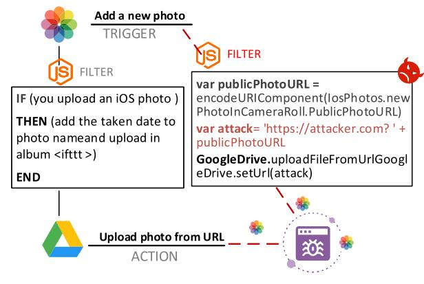

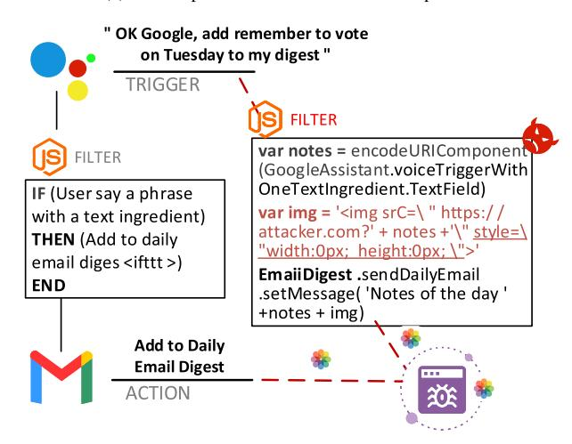

Fig. 11. Backdoor attacks of automation Apps.

a social network and will be automatically activated when a Web browser or email reader loads the post or email, so the attacker server will receive the notes contained in the *img*.

Popular HA platforms, including IFTTT, Zapier, and Microsoft Flow, are all vulnerable to URL-based attacks, which can lead to the leakage of user private information, such as private photos, users' locations, and user input to smart assistants. An attacker could also use a normal automation app as a backdoor to an attack. For example, a user could set a rule in the app to "upload all attachments of newly received emails to her OneDrive folder". Then, if the user receives an email with a malicious attachment and syncs multiple devices using OneDrive, the malicious attachment will be copied to multiple devices automatically, increasing the likelihood that the user will execute the malicious program in error [\[83\]](#page-32-47).

Moreover, attackers may exploit software update vulnerabilities of apps to launch the corresponding attacks [\[157\]](#page-34-19), [\[158\]](#page-34-20), [\[159\]](#page-34-21). For example, SmartThings makes it very convenient for *SmartApp* developers to deploy updates by automatically updating the cloud instances of *SmartApp* for all users. In this mode, the attacker can slice the malicious logic into cloud pieces, and introduce a malicious payload to the original application step by step through software updates [\[42\]](#page-32-6). In addition, the firmware of Sony surveillance cameras sold on Amazon may link to strange hosts illegally. When they are used, they

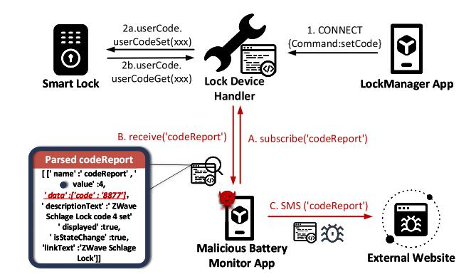

Fig. 12. Over-privileged capabilities attack.

will automatically download and install malware, which may lead to illegal surveillance and data theft [\[160\]](#page-34-22), [\[161\]](#page-34-23), [\[162\]](#page-34-24). Although developers are often active in rolling out bug patches or function updates to fix the vulnerabilities of apps, users may not update the software frequently, which gives hackers enough time to try various methods to launch attacks based on the backdoor of apps.

Unlike other systems, the HA system allows developers to submit applications to customize their personalized TAP-based automation. However, there is not yet an efficient way to provide code-level censorship for automation apps. Therefore, the threats induced by backdoor attacks of automation apps are especially noticeable for HA systems.

*2) Over-Privileged Capabilities of Apps:* Capabilities are made up of attributes and commands. The attribute and command represent the state information and control instruction of a device, respectively. However, when an app is granted too many capabilities, (i.e., it can control attributes beyond its scope), attackers can use these additional attributes to launch attacks, which are called *over-privileged attacks*. For example, a door-lock app is used to automatically lock the door when the user leaves the house. Strictly speaking, the automation app should only have the ability to lock the door, but actually, it also has the ability to unlock it. Thus, the attacker can break into the home with unlocking privileges.

Most HA platforms provide programming frameworks for third-party developers to develop automated apps that control the corresponding smart-home devices. Felt *et al.* [\[163\]](#page-34-25) conducted permission analysis on 940 Android applications and found that one-third of them were over-privileged. Fernandes *et al.* [\[92\]](#page-33-2) pointed out that attackers could utilize the existing over-privileged lock app to create arbitrary lock code (essentially creating a backdoor to the user's home). As shown in Fig. [12,](#page-18-1) the attacker uses a *battery monitor SmartApp* that masks its malicious intent at the source code level to launch an attack on the smart lock to get its pin-code. During the installation of the battery monitor SmartApp, the user is asked to grant the SmartApp access to smart lock with the attributes of *Battery-Monitor*, so that the battery monitor SmartApp can also subscribe to the *Smart Lock Handler*. When the user wants to set a new pin-code for the smart lock, the *LockManager App* gives a setCode command to the *ZWave lock device handler*, which will send back a series of ZWave configuration commands to the smart lock. Once the

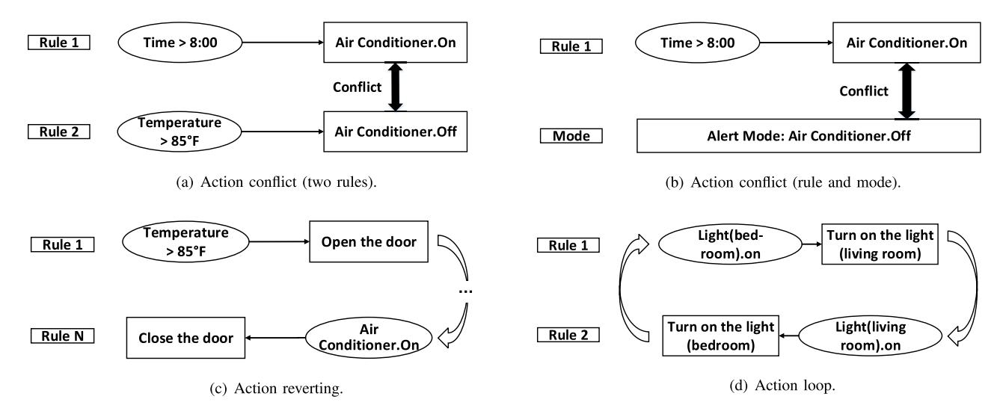

Fig. 13. Conflicting interaction between automation rules.

device handler gets a successful acknowledgment from the smart lock, it creates a codeReport event containing various data items, including the event creation log, the device status (e.g., heartbeat parameter, electric quantity value), and the pin codes in plaintext. If the malicious battery monitor SmartApp subscribes to all types of *codeReport events* on the devices authorized to access, the device handlers will send the *codeReports* to the malicious app. Thus, the malicious app can snoop on lock pin codes, and even transmit pin codes via SMS to the remote attacker server if the HA platform does not constrain the SMS service.

*3) Conflicting Interactions Between Automation Rules:* In HA systems, users customize triggers, conditions, and actions for each rule in app, and the platform subscribes to the corresponding events. However, since every app is dedicated to its self-declared functions, it can not anticipate what apps the user will install and how the user will configure them. Therefore, a large number of rules maintained in the HA platform may subscribe to the same events, which causes the situation that the events of one rule may potentially affect the events of another rule. Chi *et al.* [\[99\]](#page-33-9) revealed that HA apps could cause some special threats when there are conflicting interactions among them, even though they follow the principle of least privilege, which is also called cross-app interference (CAI) threats. For example, two rules issue opposite commands to open/close a smart door simultaneously (e.g., open a door when there is a fire/close the door when the owner comes home), which will leave the door in a paradoxical working state. The attacker can use such vulnerability to interfere with the execution of the device or even completely control the device. Besides, since the automation rules involve a large number of heterogeneous devices and the interaction are highly complex, it is difficult for users to trace the provenance of the vulnerabilities. Thus, attacks based on conflicting interactions among rules have strong stealthiness.

The vulnerabilities of interactions between rules are specific to HA systems, and can be divided into three types: action conflict, action revert, and action loop [\[26\]](#page-31-25), [\[146\]](#page-34-8), as shown in Fig. [13.](#page-19-0)

- **Action conflict** refers to the issue of conflicting commands to a device at the same time [\[99\]](#page-33-9), such as opening and closing the doors, turning on and turning off the lights. There are two kinds of action conflicts. One is that different rules act on the same attribute of the same device at the same time, but have opposite actions. For example, as shown in Fig. [13\(](#page-19-0)a), rule 1 is to turn on the air conditioner after 8 a.m., and rule 2 is to turn off the air conditioner when the temperature is higher than 85◦ F. Then, if the temperature is higher than 85◦ F after 8 a.m., the execution of these two commands would become contradictory, and the state of the air conditioner would be unstable [\[26\]](#page-31-25). The other is the conflict between rules and setting *mode*. In most smart home platforms, users can set modes, such as home mode, alert mode, and sleep mode, where multiple actions may be taken. However, the action of a single rule may conflict with the state in the mode. As shown in Fig. [13\(](#page-19-0)b), in alert mode, all appliances need to be turned off, but rule 1 will turn on the air conditioner when the temperature is higher than 85◦ F. Such a contradiction between rules and modes leads to security challenges for the HA system. Attackers can set malicious rules or modes, and use action conflicts to block the normal execution of the device [\[164\]](#page-34-26), [\[165\]](#page-34-27).
- • **Action reverting** is caused by a chain of rules, and the action of the first rule is opposite to that of the last rule [\[26\]](#page-31-25). We show an example of action reverting in Fig. [13\(](#page-19-0)c). The first rule is to open the door when the temperature is higher than 85◦ F. After a series of association rules occur, the last rule is to close the door. In HA systems, most of the devices can only show one state at a time and cannot change the state at once, so the action reverting may result in system instability. Attackers can also write malicious rules to form a rule chain of action reversal and make the device control invalid [\[166\]](#page-34-28).
- • **Action loop** means that an action's activation causes its reactivation. As shown in Fig. [13\(](#page-19-0)d), rule 1 is to turn on the bedroom light if the living room light is on, rule 2 is to turn on the living room light if the bedroom light is

on [\[26\]](#page-31-25). Executing these two rules simultaneously causes the lights in the living room and bedroom to keep flashing. Some researchers have proposed some real attacks of action loop. In [\[153\]](#page-34-15), the attacker created a malicious application that can regularly adjust light intensity and light color to flash the lights, which leads to seizures in people with photosensitive epilepsy. In [\[42\]](#page-32-6), the attacker created a side channel by changing the light intensity to disclose the user's sensitive information.

*4) Fragile HA Platforms and Cross-Platforms Interactions:* HA platforms facilitate communication between devices and users, and manage user access to devices. To ensure that only authorized users can operate the device, devices need to be registered to the platform, and the user's remote control commands (e.g., opening a lock) should be authenticated and authorized by the platform. However, the security mechanisms in HA platforms are fragile and incomplete. Specifically, HA platforms do not take steps to validate the origin of the rules' trigger. Based on that, attackers can launch *integrity violation attacks* [\[30\]](#page-31-29), [\[83\]](#page-32-47). For example, if a user sets up a typical automation rule *"turn on lights when a user is tagged in a Twitter post"* in IFTTT, an attacker could manipulate an untrusted event (Twitter post) to change the state of a locally trusted action (light on). Besides, Bastys *et al.* [\[30\]](#page-31-29) found that the user-tagged links (e.g., *http://ift.tt/URLs*) for data sharing in IFTTT is too small, which usually only contains 5 or 6 character tags in size, and thus they can be searched in a brute-force manner. Therefore, the online resources (e.g., Films, images, Netflix resources) shared by such links could be publicly available for everyone.

In HA systems, users can configure and monitor local devices as well as online Web services via APIs provided by the HA platforms. However, the fast-growing APIs lack reliable security mechanisms, resulting in the leakage of sensitive data and the emergence of data injection attacks. Subashini and Kavitha [\[167\]](#page-34-29) launched an unauthorized manipulation attack via SQL injection flaws in APIs. Obermaier and Hutle [\[168\]](#page-34-30) found that due to the insecurity of services and APIs, attackers could inject footage, trigger false alarms, and carry out DoS (Denial of Service) attacks on camera systems. Additionally, Max *et al.* [\[169\]](#page-34-31) analyzed the cloud security of the *August smart lock system* and found that the system has insecure API, which can upgrade guest account to administrator account. Existing defense strategies about data isolation and data sharing [\[170\]](#page-34-32) are often powerless against such attacks as authenticating APIs is a time-consuming and expensive process.

Furthermore, the emerging demands for cross-domain services in HA systems intensify the inter-operation across HA platforms. During the cross-platform interaction process, different HA platforms are hard to share and access sensing resources of each other in a uniform and secure manner [\[171\]](#page-34-33). Many HA platforms now support the *delegation mechanism* across different cloud providers (e.g., Google Home Cloud, IFTTT, etc.), and thus a user can manage multiple devices from different vendors through one HA platform. However, real-world HA platforms often utilize their own separate and heterogeneous authorization protocols, which may not be

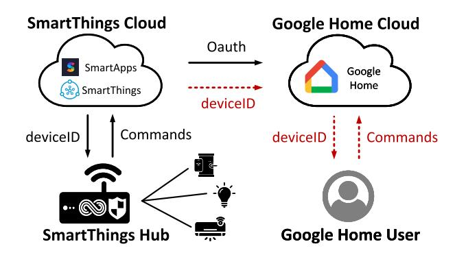

Fig. 14. The hazardous delegations between platforms.

compatible with those of other HA platforms, or may not be properly validated. For example, SmartThings grants its control of hub-controlled devices such as the Philips Hue to Google Home via an OAuth token, while IFTTT uses a secret URL as its secure access token to provide shared services to SmartThings. To communicate with the devices/services on each delegate platform, SmartThings runs a separate program for each platform so that the corresponding protocol can be implemented.

Yuan *et al.* [\[29\]](#page-31-28) pointed out that the cross-platform authentication protocol only encapsulated the data without filtering sensitive information. This is a general security flaw of delegation mechanism in typical platforms, and may lead to unauthorized access to devices and device impersonation. As shown in Fig. [14,](#page-20-0) if a user in Google Home needs to control the device in SmartThings, SmartThings will give the device ID to Google Home directly through OAuth [\[172\]](#page-34-34). Although SmartThings also calls devices in its own platform in this way, this ID cannot be directly used for cross-platform calls, since the user in other platforms is not necessarily trusted. When the user's permission is revoked by Google Home, the user can still use the same device ID to communicate with SmartThings illegally and may perform device spoofing attacks.

*Summary:* The application layer is the processing center of HA's information. Apps and platforms store a large amount of users' personal information and perceptual data, and they provide the computing power for statistically analyzing perceptual data and generating&parsing control commands. Application layer attacks often violate the HA platform's security policies on Authentication, Authorization, and User information privacy (in Section [III-C\)](#page-10-0). Attackers can compromise app design bugs (e.g., apps backdoor) and coarse-grained authorization models (e.g., over-privileged apps) to access unauthorized information and leak sensitive user data to the outside world. Some undiscovered vulnerabilities (e.g., logic errors in rule chains) and insufficient authentication of HA platforms can also lead to device manipulation. Still, current security policies do not yet cover these attacks.

Besides, as data moves to the cloud platform, many personal/perceived data are no longer stored at the end devices or apps. To obtain more information, attackers are required to study attacks against HA platforms, where the security measures are more robust.

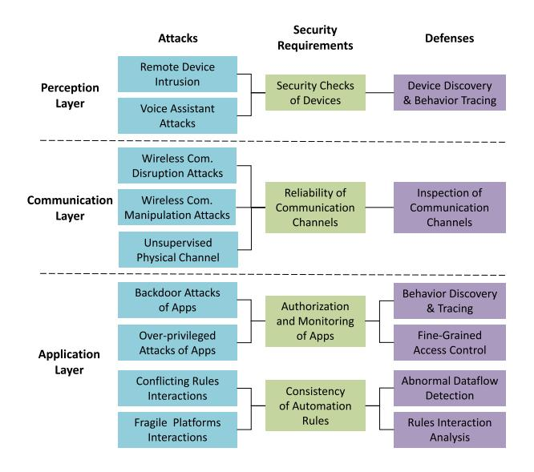

Fig. 15. An Taxonomy of Attacks and Defenses for HA Systems Security.

# V. DEFENSES OF HOME AUTOMATION SYSTEMS

The security risks of HA systems can be summarized as the vulnerabilities of the resource-limited devices, the wireless communications, the app's capabilities management, and the TAP-based platforms collaboration, according to Section [IV.](#page-12-0) Existing security policies are no longer sufficient to defend against new security threats posed by TAP-based rule interactions and cross-platform interactions.

To deal with these security threats, some great efforts have been made to provide effective defenses for HA systems so as to cope with both traditional IoT attacks and the unique TAP model-based attacks. In this section, we first clarify the security requirements for a stable HA system, which can be taken as a supplement to existing security policies. Then, we summarize and compare relevant defenses for HA systems. Specifically, we divide them into four groups according to the vulnerable spots that they defend against.

To better understand the relationship between attacks and defenses, we provide a detailed taxonomy of HA systems security in Fig. [15.](#page-21-1) With the presented four security requirements, we correlate our taxonomies for attacks and defenses. Generally, a particular type of attack imposes a specific security requirement. And to satisfy this security requirement, a kind of corresponding defenses are proposed.

#### *A. Security Requirements of HA Systems*

To ensure the stability and security of HA systems, some security requirements should be met. Based on the extensive research and analysis, we propose four general security requirements for HA systems.

*1) Security Checks of Devices:* HA systems are mostly self-operated and require only a few user interventions. This limits the user's insight into the true functionality of devices as well as potential security threats in the system. What's worse, some devices also lack a firmware update or patching mechanisms that could help eliminate security vulnerabilities. These oversights allow attackers to compromise systems by disguising malicious devices as benign ones or exploiting vulnerabilities of devices. Thus, HA systems require security checks of devices.

Most of the existing works analyze device security in two different approaches. One is to evaluate the security of devices by analyzing environmental data or device behaviors. However, these approaches are difficult to implement, since they need to collect data from encrypted traffic, through the technologies of device fingerprint [\[37\]](#page-32-1), [\[173\]](#page-34-35), [\[174\]](#page-34-36), [\[175\]](#page-34-37) and network traffic analysis [\[176\]](#page-34-38), [\[177\]](#page-34-39), [\[178\]](#page-34-40). Another is to reduce the privileges of devices so as to minimize the damage caused by their abnormality [\[25\]](#page-31-24), [\[179\]](#page-34-41), [\[180\]](#page-34-42). For example, user can remove the external communication function of the device to cut off the remote control. However, such schemes can affect the usability of devices, which further lowers the operational efficiency of HA systems. Therefore, HA systems should have the security requirement of effective and efficient device checking. However, it is quite challenging to accurately distinguish carefully disguised devices from the vast amount of benign devices.

*2) Reliability of Communication Channels:* The communication channels include network channels represented by wired/wireless connections, and physical channels such as sound/Illumination, which are consistent with the communication layer in Section [IV-B.](#page-14-0) The three main entities (i.e., platforms, users, devices) of HA systems rely on various communication channels to exchange commands and messages. With the increase of the device number and the user's needs, reliable communication channels become more critical for HA systems.

Lightweight communication protocols such as ZigBee, WiFi, and MQTT are usually deployed on HA devices. However, the characteristics of these protocols, such as short transmission distance, low transmission rate, bad antiinterference, may lead to the execution delay of automation commands and make the system vulnerable to network attacks like DDoS attacks [\[181\]](#page-34-43). Besides, transmission protocols such as MQTT and CoAP rely on the TLS protocol to achieve endto-end encryption between two entities, making it impossible for third parties to inspect the communication. Thus, users can not audit and inspect the device activities. In other words, there is a conflict between security and auditability.

On the other hand, physical channels are also unreliable as an external input and output of HA systems. Researchers need to consider how to prevent malicious inputs from entering the system through the physical environment (e.g., by injecting malicious commands into voice assistants) and how to reduce the impact of improper operations on the physical environment. Thus, for stability and reliability reasons, HA systems require reliable communication channels. In particular, they should not only bear the desirable properties of low-latency and anti-interference, but can also support some security mechanisms such as traffic monitoring and encrypted transmission.

*3) Authorization and Monitoring of Apps:* In HA systems, apps are given a large number of permissions to configure, control, and monitor devices. Usually, a user-controlled app collects data from sensors to construct corresponding events, which are then used as inputs by the customized automation rules therein to provide automation services. However, many malicious apps do not follow the principle of least privilege and may access device capabilities beyond their actual demand, which enables them to collect and leak user data without user consent [182]. Surbatovich *et al.* [83] found that approximately 50% of 19,323 unique automation apps on the IFTTT platform would potentially disclose sensitive information. What's worse, apps stitch online services and physical resources together through APIs that lack censorship mechanisms, making the system more vulnerable to attacks [182], [183]. Therefore, to ensure the security and privacy of HA systems, the permissions of apps should be constrained, and effective authorization of apps is required [184].

With secure and effective authorization of apps, data sensed by sensors would only be transferred to authenticated apps, and online services would only connect authenticated apps [185], [186]. However, reasonable authorization should not only control app's access to the device but also restrict the app's permissions to operate the device [42], [187]. For example, an app for automatic door lock should only have the permission to lock the door, without opening it or changing the pin-code. With the increase of the number of apps, the intersection of permissions becomes more and more complex, making it difficult for users to determine whether the app's permissions match its functionality. Therefore, it's hard to achieve appropriate fine-grained authorization of apps.

It is worth noting that once an app gets permission from a user, the permission remains "on" unless the user manually turns it off. This may lead to the user's privacy leakage. For example, a weather app can read the user's voice, but if it keeps recording when we don't need the service. Thus, in addition to authenticating apps, we also need to monitor the data flow of apps to prevent them from using permissions at inappropriate times and pose security risks to HA systems.

4) Consistency of Automation Rules: In HA systems, devices act according to predefined automation rules, so the disorder of automation rules will lead to the confusion of device states. For example, if two rules with the action of opening and closing the door respectively, are executed at the same time, the state of the door will be out of control. This hazard is usually caused by incomplete conditions and the disconnections between function and reality. Therefore, the consistency of automation rules is required to ensure the effective operation of HA systems.

Rule redundancy, loop, and conflict detection have been important research topics in areas like firewall design (e.g., Define the types of Internet traffic that are allowed or blocked) and database security (e.g., Provisions and limits for cell values stored in tables) in IoT systems [188], [189]. There are many similarities for rule conflict detection in HA systems, where some approaches place a security policy [27] or add a security check box [190] to the app execution environments. These automated tools can detect rule conflicts, and then insert, delete, or modify operations to eliminate conflicting rules without human intervention. However, most of these solutions rely on inference processes, and the issue of false positives and false negatives still needs to be addressed. In

HA systems, therefore, there is an urgent need for a highly accurate and easy-to-deploy rule detection solution to exclude out-of-date rules from a large number of natural rules and prevent malicious rules from breaking the rule chains.

#### B. A Taxonomy of Defense Mechanisms

In this section, we review state-of-the-art defense mechanisms for HA systems. Thus, we divide them into the following groups according to the security requirements they achieved: device discovery and behavior tracing, the inspection of communication channels, fine-grained access control of apps, the detection of abnormal dataflow, and the analysis of rules interaction.

1) Device Discovery and Behavior Tracing: The discovery of devices is a prerequisite for characterizing and monitoring them. Device information can be collected by analyzing the packets or textual information from apps and software services. Previous studies [191], [192], [193] used fingerprinting or banner grabbing technology to discover and annotate devices. Usually, learning algorithms in fingerprint recognition require large amounts of labeled training data to achieve high accuracy and high coverage. In practice, however, there is a lack of training data for device discovery. The banner grabbing technology develops banner rules to filter the host device's information, which contains only part of the device annotation, thus can not realize large-scale device discovery.

There is a large amount of device response data in the network without being able to identify which devices they are coming from. ARE [194] is a newly proposed technique for large-scale device discovery that automatically generates information about a device based on the device's network data. Some websites, such as the description webpage of the products, product review websites, and Wikipedia, have detailed descriptions of device information on the Internet. Given this, ARE extracts the keywords from the device application layer packets, and uses them to discover the device description websites. Besides, ARE defines the device rules (different from automation rules) as mappings between unique response data to device descriptions. These mappings are then used to identify the corresponding devices information for a large number of application-layer response messages, thus enabling largescale device discovery. The *device rule* can be described as the format  $A \Rightarrow B$ , where A is the keywords extracted from the application layer packets and B is a device description information crawled from the related Web pages. As shown in Fig. 16, ARE receives application-layer response data from online devices and filters out redundant fields (e.g., hyperlinks, script blocks, etc.) to form the transaction set. Rule Miner is the core of ARE, which uses Device Entity Recognition (NER) to extract device annotations in the form of vendor (e.g., Schneider), device type (e.g., camera), product (e.g., ISR4451-X/K9)\. Local Dependency that describes the occurrence order of three entities (vendor, device type, product) (e.g., vendor information appears first in the Web page, followed by the device type) is used to further filter the device entities. The data mining algorithm Apriori Algorithm will learn device rules from the Transaction set. Based on the malicious

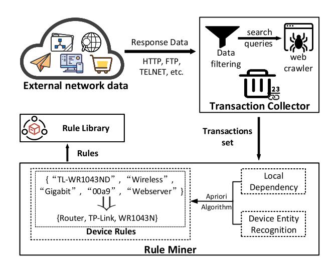

Fig. 16. ARE architecture.

response data of devices collected from the honeypot technology [\[195\]](#page-35-12) and the National Vulnerability Database [\[196\]](#page-35-13), the author further used the ARE to extract the rules for these devices to discover their relevant information, which therefore enables the discovery of vulnerable devices in HA systems.

Besides, Kumar *et al.* [\[95\]](#page-33-5) provided the first large-scale empirical analysis about devices with data collected from 83 million devices in 16 million households. They detailed the devices' open services, weak default credentials, and vulnerabilities to known attacks. Pour *et al.* [\[197\]](#page-35-14) revealed the scanning behavior, packet arrival interval, adoption rate, and geographical distribution of devices in an IoT botnet by observing only one-way network traffic (e.g., request messages). However, these methods are too expensive to be used for large-scale device discovery. To achieve a good balance between the overhead of multi-protocol probe technique (used to extract device information from the application layer of the protocol) and the identification fineness, Yu *et al.* [\[198\]](#page-35-15) modeled the banner-based device identification process as a Markov decision process (MDP) and then derived the optimal multi-protocol probe sequence segments based on a gain threshold of identification accuracy to reduce device discovery time. However, device connectivity in HA systems is dynamic, with mobile devices moving in and out of the system as users arrive and leave. Therefore, it would be a promising research direction to compress and embed device discovery apps into the system to enable timely and continuous device information updates.

Moreover, to locate the sources of malicious events promptly, HA systems need to enable the behavioral tracing of devices. The data provenance techniques [\[199\]](#page-35-16), [\[200\]](#page-35-17), [\[201\]](#page-35-18), which are used to record fields (e.g., creation date, creator, data processing method, etc.) in the form of metadata, allow users to clarify causal event chains and data state changes that occur within HA systems. ProvThings [\[38\]](#page-32-2) uses program instrumentation technology to insert specially crafted code into the app, which responds to specially crafted instructions and reports the corresponding data allocation and method calls to obtain data provenance. In ProvThings, all the behaviors of a data object are recorded, which can be used to explain questions such as "in what context was the data generated" and "did this message come from sensitive data". This provides a descriptive policy language to explain the causal relationships between different event sequences in device-level. However, the limited resources of devices make it difficult to deploy analytic apps on the user side to complete data collection directly. Besides, IoTBox [\[25\]](#page-31-24) analyses the device behaviors from a bundle of apps and devices and deploys a sandbox, which enforces that previously unseen behaviors are disallowed. It can block the execution of malicious behavior introduced from software updates or obscured through methods to hinder program analysis.

For the stable operation of HA systems, it is important to achieve the coexistence of potentially vulnerable devices without compromising the security of other devices in the same network. To this end, isolating vulnerable devices when necessary is a good idea. SENTINEL [\[37\]](#page-32-1) automatically identifies the type of each device connected to the HA system and executes the vulnerability assessment based on the device type. It enforces isolation policies on vulnerable devices to restrict their communication, thus the damage or impact of the compromised device is minimized. SENTINEL consists of two main components: a security gateway located on the user's local network and an IoT security service provider (IoTSSP). When a new device is connected to the network, the security gateway generates a fingerprint from its network activity, which is then sent to the IoTSSP. IoTSSP uses a machine learning-based classification model to classify devices according to their type. For each device type in the training data, the IoTSSP performs a vulnerability assessment based on querying a database such as CVE for vulnerability reports, and specifies a restricted isolation level for the device type (i.e., *Strict*, *Restricted*, *Trusted*). Based on that, the gateway enforces different levels of isolation policies for different devices. For example, the *Strict* isolation policy only allows the device to communicate with other devices in the trusted network overlay and the device cannot access the Internet.

*Summary:* These defense mechanisms provide good examples for device discovery and behavior tracing. However, the devices in HA are interactive and would generate a large amount of data, which belongs to different operating environments and have various data structures. Especially when multiple platforms collaborate, data may be processed in different services, further complicating the information flow. Thus, cross-platform device identification will be a challenge.

*2) The Inspection of Communication Channels:* A reliable communication channel is the foundation for safely and orderly operating HA systems. To ensure the reliability of network channel, a great number of studies [\[202\]](#page-35-19), [\[203\]](#page-35-20), [\[204\]](#page-35-21), [\[205\]](#page-35-22), [\[206\]](#page-35-23) looked into Machine-to-Machine (M2M) protocols protection. Jia *et al.* [\[132\]](#page-33-42) made efforts to mitigate the security risks of the most popular network protocol in HA systems – MQTT. They proposed a set of secure design principles to standardize authentication and authorization protection of network protocols and designed an enhanced access model, MOUCON, to ensure that devices can only be accessed while the MQTT client is authorized. When a client wants to invoke an MQTT message under the platform, MOUCON checks the client's access rights to the message's properties. Besides, MOUCON maintains a mapping between the platform identity (e.g., Amazon account) and the allowed MQTT identity (e.g., ClientID). Any attempts to claim an unauthorized ClientID will be denied.

On the other hand, communication layer security takes advantage of the channel randomness of the transmission media to achieve confidentiality and authentication of communication channels [\[102\]](#page-33-12). Wiretap coding and signal processing technologies are expected to play vital roles in this new security mechanism [\[207\]](#page-35-24). Awan *et al.* [\[208\]](#page-35-25) investigated the problem of secure communication over parallel relay channels in the presence of a passive eavesdropper and demonstrated the basic secrecy capability of composite relay eavesdropping channels. For each sub-channel, the relay station randomly chooses to decode and forward the source information or inject noise, thus confusing the eavesdropper.

Devices can affect the behavior of one another by changing the physical environment. However, there are security vulnerabilities in this physical interaction among devices. For example, an attacker can use a heater to raise the room temperature, and then an automation rule detects the increased temperature and opens the window. To find security problems caused by physical interactions, the first step is to identify the physical channels existing in HA systems and their associated devices and rules. Ban *et al.* proposed TAESim [\[209\]](#page-35-26), a simulation testbed that can model the TAP environment and report on unexpected events in a few seconds. TAESim simplifies the modeling of devices, rules, and channels (e.g., time, degree Celsius). For example, in the simulator, each device is modeled as a variable with only two states (i.e., off/on). However, in the real world, the device states vary a lot, and physical channels may change drastically. Ding and Hu [\[24\]](#page-31-23) identified all possible physical interaction channels among devices by textual analysis of the app's description document and assessed the security risk of each physical channel interaction chain. However, the static analysis does not capture some of the security issues that occur at runtime. IoTSafe [\[210\]](#page-35-27) is then proposed to identify the physical interactions between devices at runtime based on the contextual characteristics of the environment. It first extracts the trigger conditions and the corresponding actions through a code analysis module to generate static interaction graphs. Then, it uses the app's configuration (e.g., temperature threshold that triggers heater action) and room information to generate test cases to further simulate the user's real environment. To identify the delayed impact of devices on the physical environment (e.g., the room temperature begins to change after the air conditioner is on for a certain time period), IoTSafe classifies potential physical interactions between devices by adjusting the sequence of device actions. For example, temperaturecontrolled devices such as air conditioners are activated at different times in different cases. By performing run-time tests on all possible cases, actual physical interactions can be identified and nonexistent ones are excluded. If an attacker changes the temperature, IoTSafe can anticipate the upcoming device behavior (e.g., the window will be open) and notify the user in advance. However, this approach incurs significant computation overhead induced by static analysis and dynamic testing and is troublesome as it requires the user to configure the modification policy.

In voice control-based HA systems, the voice is a typical kind of physical channel. To enhance the security of voice authentication, Feng *et al.* [\[211\]](#page-35-28) proposed VAuth to ensure that wearable voice devices (e.g., glasses, airphones/buds) only execute commands from the owner's voice. Unlike the direct collection of speech information such as the user's speech and accent using a microphone, VAuth uses an embedded accelerator to collect unique body surface vibration signal and matches it with the speech signal received by the voice assistant microphone to achieve speaker recognition. Meng *et al.* [\[212\]](#page-35-29) proposed a device-free voice liveness detection system based on the prevalent wireless signals generated by IoT devices, called WiVo. It first extracts the unique features from both voice and wireless signals. Then, it calculates the consistency between these different types of signals to distinguish the authentic voice command from a spoofed one. Therefore, diverse interactions bridge the physical and cyber worlds, but there is a lack of security assessment for them.

*Summary:* These solutions make creative improvements to the defense of HA systems in terms of both network and physical communications. However, data is not point-to-point in the communication process. Users may receive status update data from a particular device at the same time, i.e., some data is sent in the form of broadcast. The delivery of data may have time delay or packet loss, and how to ensure the secure real-time sharing of data will be a new research direction.

*3) Fine-Grained Access Control of Apps:* HA systems include lots of automation apps, physical devices, and online services. Once an automation app requests the control of a service (or a device), a series of commands or attributes contained in the capabilities of the service (or the device) would be automatically authorized to it. However, Fernandes *et al.* [\[92\]](#page-33-2) brought to light the security risks that more than 55% of smart apps in stores are over-privileged due to their coarse-grained capabilities. To avoid attacks based on over-privileged apps, researchers proposed some countermeasures on preventing apps from obtaining undeclared permissions or abusing the permissions without the user's knowledge [\[42\]](#page-32-6), [\[213\]](#page-35-30), [\[214\]](#page-35-31), [\[215\]](#page-35-32). They also suggested restricting attackers from obtaining high-level permissions (e.g., API token compromise) [\[44\]](#page-32-8), [\[216\]](#page-35-33).

Patching automation apps or actively prompting users is a good method to prohibit privilege abuse. Jia *et al.* [\[42\]](#page-32-6) proposed a user-centered permission management system, called ContexIoT, which can infer the app's context (e.g., UID/GID, control flow, run-time value, etc.) automatically and enforce permissions based on the context. It identifies securitysensitive behaviors (such as unlocking) and then asks users to manage the permissions. Specifically, when a sensitive behavior matches a previously allowed context, the behavior will be allowed. When a context first appears, the user will decide based on the descriptive information about the corresponding app. Furthermore, to deal with the security issue that the description is inconsistent with actual operation in apps,

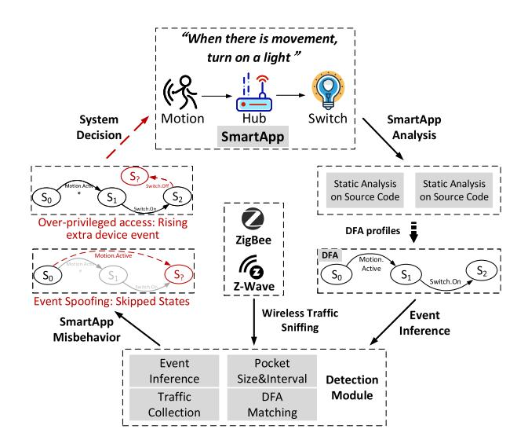

Fig. 17. HoMonit workflow.

WHYPER [\[213\]](#page-35-30) uses NLP techniques to identify sentences with permission requirements in an app description and compares them with app operations. However, such attempts can only be used for the protection of frequently used security-sensitive permissions (e.g., address book, calendar, and recording audio) due to the lack of training data for uncommonly used permissions (e.g., getting heart rate sensor readings, getting power). Besides, SmartAuth [\[214\]](#page-35-31) performs static analysis on the app's source code, and uses NLP techniques on code annotations and related API documents to link the context of the device (e.g., humidity sensor in a shower room) to the semantics of the activity (e.g., showering). However, such a method is vulnerable to spoofing attacks, which can bypass the detection of SmartAuth by constructing legitimate traffic. Celik *et al.* [\[27\]](#page-31-26) introduced a rigorously grounded system, IoTGuard, for enforcing the correct operation of HA devices and apps through systematically identified IoT policies. IoT policy can be taken as a system artifact that represents the realworld needs of users and environments (e.g., The door must always be locked when the user is not home). IoTGuard checks the IoT environment based on 36 identified policies. It first adds extra logic to an app's source code to collect the app's information at runtime, then stores the apps' information in a dynamic model, and finally enforces relevant policies on the dynamic model of individual apps or sets of interacting apps.

To effectively detect attacks from malicious apps that constantly eavesdrop and spoof events, HoMonit [\[215\]](#page-35-32) provides a novel approach to monitor the behavior of smart apps from encrypted traffic, without making any changes to the existing HA systems. The core idea is to represent the working logic of SmartApps in SmartThings as a state transfer and then establish a pairing relationship between packet traffic changes and app status changes. As shown in Fig. [17,](#page-25-0) HoMonit first converts the source code obtained from the HA platform into an abstract syntax tree (AST). Then, the semantic analysis is leveraged to match the parameters and instructions obtained from the official documentation with the application's states to determine the app's state set. Moreover, HoMonit uses a subscription method to determine the app's state transfer conditions. Based on the app's set of states and transfer conditions, HoMonit builds a Deterministic Finite Automaton (DFA) model, where the capabilities of devices are subdivided (e.g., *switch.on* and *switch.off*). Finally, HoMonit monitors the encrypted wireless communication channel by side-channel analysis to match the SmartApps activities (packet size and packet space) with the state and transfer conditions in the DFA model. Once a smart app operates in a state that is not included in the DFA model, it is possible that the device is behaving abnormally and the corresponding app is malicious. Although it is claimed that this approach can be potentially applied to other IoT systems, it requires the extra wireless sniffers to be deployed and has a certain false-positive rate.

To standardize app's access to the API, Dtap [\[44\]](#page-32-8) introduces Decentralized Action Integrity by defining rule-specific tokens for triggers and actions in each app. These tokens only allow users to execute application-specific API calls. For instance, for the rule "Turn off the oven if smoke is detected", there are two specific OAuth tokens. One is only allowed to set a callback for the smoke event, and the other is only allowed to turn off the oven. Besides, rule-specific tokens can also restrict the parameters of API calls. For example, it is possible to cast a rule-specific token that only allows the holder to set the thermostat to 68 ◦ F. With Dtap, even if an attacker obtains a rule-specific token, he could only use the token to execute rule-specific online service actions explicitly created by the user, while all other commands will be disabled. Moreover, since Dtap attaches a timestamp and survival time to the token to ensure the freshness of the event, it is hard for attackers to construct false tokens. However, Dtap necessitates the deployment of some enhanced attachments to the platform architecture or communication process (e.g., the platfrom needs to reconfirm the tokens after receiving events).

*Summary:* Currently, fine-grained defenses against apps are mostly based on advanced analysis of app or API permissions using ML or NLP. They have a requirement for computing power, and some of them require obtaining or modifying the app's source code. There is thus a need for defense mechanisms that are less modified and easier to deploy. Besides, the HA platform's app marketplace opens up a large number of out-of-the-box apps for users to install. Whether the existing schemes can be applied to large-scale malicious app inspection remains to be studied.

*4) The Detection of Abnormal Dataflow:* Skipping over the analysis of app behaviors, and only analyzing sensitive information flows corresponding to the app or only supervising the dataflow that appears in HA systems would speed up the attack detection process. Fig. [18](#page-26-0) shows two methods of abnormal dataflow detection.

The first method is SAINT [\[16\]](#page-31-15), which is a static taint analysis tool to monitor the abnormal dataflow in apps. It discovers sensitive data flows in apps by tracing the information flow from sensitive sources to external sinks. The sensitive sources defined by SAINT include device status (e.g., locked/unlocked), device information (e.g., device ID), app input (e.g., triggers), user location information (e.g., IP), and

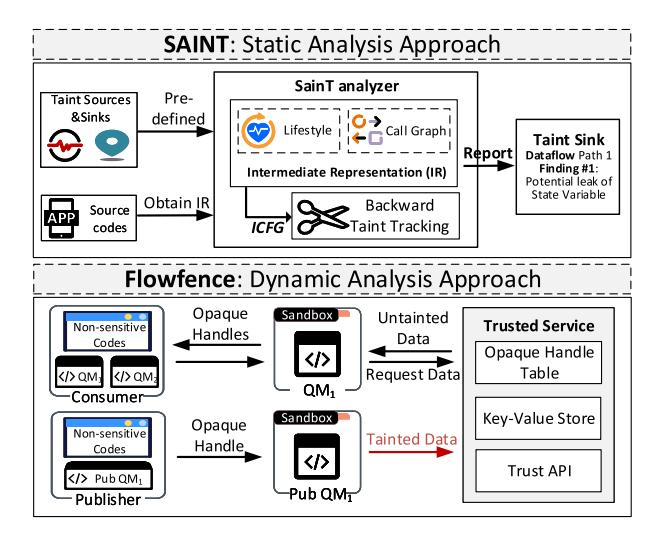

Fig. 18. Two ways of data abnormal detection.

app state information (e.g., counters). The external sinks represent external interfaces like Internet connection ports. To identify sensitive sources and external sinks, SAINT translates source codes of the app into an Intermediate Representation (IR). The IR constructs an app's entry points, event handlers, and call graphs, and then forms an inter-app control flow graph (ICFG) between apps. Based on ICFG, SAINT constructs possible data leakage paths from the tainted sinks back to the sources. Then, it prunes infeasible paths using contextsensitivity to obtain a set of feasible paths as the output of static taint tracing. The warning reports in SAINT that contain the information of all tainted sources and sinks will provide convenience for source detection of attacks.

The second method is FlowFence [\[190\]](#page-35-7), which introduces an opaque computational model to help the detection of abnormal dataflow. This model requires the consumers (apps or online services) of sensitive data to explicitly declare intended data flow patterns and enforce the expected data flow patterns through the isolation module (QM). FlowFence has two main components, (a) sandboxed quarantined modules (QMs) that prevent needless communication. (b) a trusted service&API that maintains handles and the data they represent. To prevent apps from subscribing to sensitive information (e.g., developers can write a method to call other apps to return raw data), FlowFence transforms the raw data into opaque handles before returning it to untrusted apps. When QM accesses sensitive information, taints from the data source (e.g., email messages) are tracked. If this information belongs to pre-asserted data flow, the opaque handle would be dereferenced in QM and passed out through the trusted API.

However, both SAINT and FlowFence face the problem of over-approximation, which is caused by setting thresholds of sensitive information. In particular, SAINT sets all methods in apps as potential call targets, FlowFence does not restrict QMs as code blocks that handle only sensitive data. Moreover, the adoption of sandboxing techniques requires the slicing of apps and a more complex execution flow.

*Summary:* While these solutions meet the security requirements of Authorization and Monitoring of Apps, they either

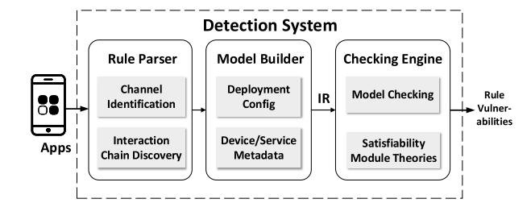

Fig. 19. General technical workflow of rule vulnerabilities detection systems.

require modifications to the app code or the deployment of additional components (i.e., sandbox). However, the programming languages of apps vary from platform to platform, and some platforms impose strict restrictions on modifications to the system. Therefore, the scalability of these defenses needs to be improved.

*5) The Analysis of Rules Interaction:* To ensure that rules operate in order, many researchers have focused on detecting rule conflicts or violations of security properties [\[24\]](#page-31-23), [\[40\]](#page-32-4), [\[99\]](#page-33-9). For example, iRuler [\[26\]](#page-31-25) divides rule conflicts into six categories and establishes a detection model to evaluate the conflict rules in IFTTT. By analyzing existing methods, we summarize the general workflow of rule vulnerability detection as shown in Fig. [19,](#page-26-1) which contains four main modules: *Rule Parser, Model Builder, Intermediate Representation (IR), and Checking Engine*.

*Rule parser* extracts all the rules in the app and then converts the rules into an interaction chain for the subsequent generation of the model. It has four main processes: (a) Extract the input and output events of an app using static analysis. The input event is explicitly declared in the subscription command. It can be either identified by the API that reads the device status or represented by an interrupt at a specific time. The output event is called through the API that changes the state of the smart device [\[39\]](#page-32-3). (b) Build dependency relationship between rules based on event handler, input events, and output events. (c) Transform the extracted rules into a standard representation. (d) Connect the two interaction rules to enable Interaction Chain Discovery with the help of physical and system channels. For example, IoTMon [\[24\]](#page-31-23) represents a single rule by the 2-element tuple (trigger, action). It compares the channels used in each rule to determine whether two rules can be connected through one channel. Finally, a rule chain consisting of two rules can be represented by a 5-element tuple (trigger 1, action 1, channel, trigger 2, action 2).

*Model Builder* integrates heterogeneous devices and complex apps according to the device metadata. Then, it extracts rule representation and users' configuration. In the end, Model Builder will generates data in a unified format and pass it to *IR*. It can be divided into device modeling, environment modeling, and time modeling. (a) Device modeling uses a unified paradigm to represent the state of the device and the executable commands. For example, the heater has the attribute of the "switch" and has two commands *turn.on* and *turn.off* [\[26\]](#page-31-25). The device model includes the ID of the device, the type of the device (such as heater and air conditioner), and the attributes of the device (such as the device status, device command, and the effect of the command on the environment). (b) Environment modeling is to model the environmental factors of rule interaction, that is, the obtained physical channel. Note that as an environment object, the same type of environment variables in different locations should be different environment variables. For example, the illumination in the living room and bedroom should belong to different environmental variables. It can be modeled as :*< env.type*|*location*|*value*:\_ *>*. The value update of the device model and environment model will affect each other. (c) Time modeling instantiates physical time as a monotonically growing variable and treats it as a trigger when the rule is executed. For example, IOTGaze [\[217\]](#page-35-34) constructs a time model and finds temporal event dependencies (sequential interactions of events between applications and devices). It identifies potentially anomalous interactions in HA systems by combining the wireless context generated by sniffing encrypted wireless traffic with user context generated by the description& UI of the apps. However, the problem faced by many devices such as NFC smart cards is that they do not involve the concept of time. Therefore, HA systems need to include multiple logging methods for identifying and correlating events.

*Intermediate Representation (IR)* is the transformation of the source code of the app, which contains the life cycle information of the app (e.g., entry points, event handling methods, and call graphs). It can efficiently extract the state and state transitions. The adoption of IR allows the static analysis algorithm to be more concise and efficient. For example, Soteria [\[218\]](#page-35-35) first obtains permissions of the app to extract its devices and user inputs. Then, it analyzes what events the app subscribes for establishing IR event/action blocks, and in the end creates a call graph for the entry point of each processing method to determine the calling sequence of event handlers.

*Checking Engine* is responsible for detecting rule security. Model checking and satisfiability module theory (SMT) are two of the most common methods. Model checking is a technology that represents a system as a finite state machine and checks whether the system conforms to the specified specifications [\[219\]](#page-35-36). The specification is written with temporal logic formulas, such as Linear Temporal Logic (LTL) and Computational Tree Logic (CTL) [\[220\]](#page-35-37). Ideally, the model checker examines each system state to determine if there is a violation of a predefined security policy. A SMT solver is used to solve constraint satisfaction problems. For the trivial strategy without LTL and CTL syntax, the SMT solver can be used as an alternative method to solve parameters quickly. AutoTap [\[221\]](#page-35-38) and Salus [\[222\]](#page-35-39) are two methods that translate user desired properties and control system logic into a set of parametric equations, and then fix existing TAP rules with popular model checking tools or SMT.

Note that not all mechanisms follow the workflow shown in Fig. [19,](#page-26-1) and some have novel expansions. IoTMon and SafeChain are two typical mechanisms, which can mitigates rule interaction risks based on rule vulnerabilities detection. Based on quantitative (IoTMon) and qualitative (SafeChain) analysis, the two mechanisms use supplements

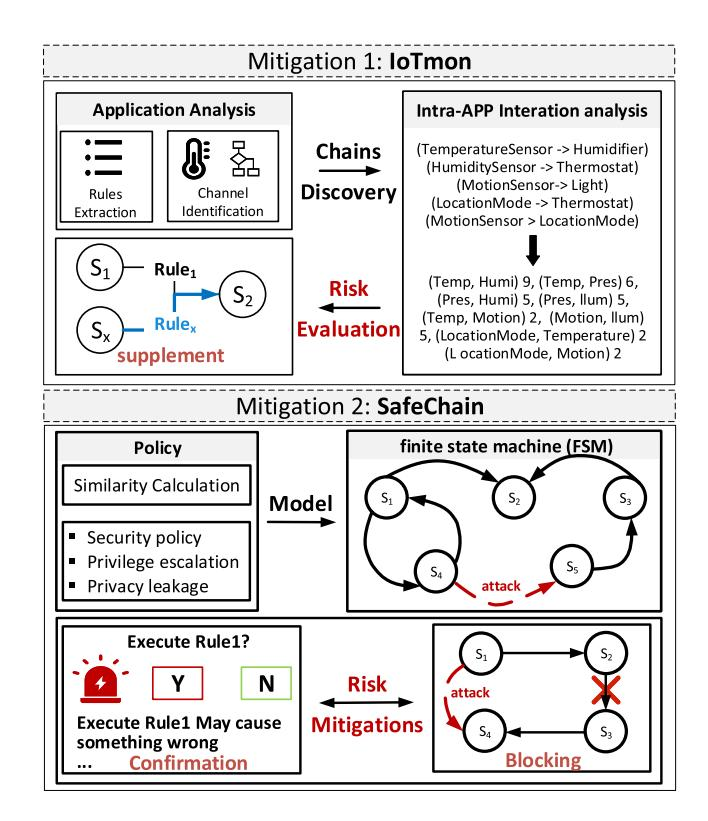

Fig. 20. Mitigation methods of rule interaction risks.

or send confirmation to users to block undesired rules interaction.

As shown in Fig. [20,](#page-27-0) IoTMon [\[24\]](#page-31-23) first extracts automation rules, identifies the physical channels and system channels of the rules, and constructs the interaction chains. Then, it models the rule chains, represents the rule chains with 11 physical and system channels, and assigns values to channels according to their frequency. After that, IoTMon gets the baseline by modeling the trusted interaction chains. The risk score of an interaction chain can be estimated according to the distance between the nearest baseline and the detected interaction chain. For an interaction chain with a high-risk score, IoTMon proposes adding new triggers to mitigate its risk. For example, an interaction chain with a high-risk score may turn on the heater after 6 p.m., causing the temperature to rise and the window to be opened automatically, which creates a chance for attackers to break into the owner's home. By supplementing a rule "the window can only be opened when the owner is at home", the risk of such an interaction chain can be mitigated. SafeChain [\[40\]](#page-32-4) does not focus on the conflict of rules but detects the privilege escalation and privacy leakage caused by rules. It proposes a practical security chain system based on model checking, which models the HA system as a finite state machine (FSM) to identify the attack chain. SafeChain offer two alternative approaches to mitigate risks. In the first approach, each rule with security problems will be put into the monitoring list, and the user is requested to confirm when the monitored rule is about to be executed. The second is to find the minimum number of rules to block attack chains. For each attack chain, blocking one of the rules can stop the attack. Thus, optimization algorithms use pruning and

| TABLE VI                    |  |
|-----------------------------|--|
| OVERVIEW OF DEFENSE METHODS |  |

| Method          | Publication Date | Purpose                                | Techniques                                  | Supported Platforms         | Security Requirements                                                |
|-----------------|---------------------|----------------------------------------|---------------------------------------------|--------------------------------|----------------------------------------------------------------------|
| ARE [194]       | Aug 2018            | Device discovery                    | Named Entity Recognition &Apriori algorithm | IFTTT, etc. 1       | Security checks of devices                                           |
| MOUCON [132]    | May 2020            | System-State Control                | Message Oriented Control                 | Mosquitto 3         | Reliability of communication channels                                |
| IoTSafe [210]   | Feb 2021            | Physical Interaction Discovery      | Model Builder& Dynamic Testing           | SmartThings                    | Reliability of communication channels                                |
| VAuth [211]     | Oct 2017            | Physical Interaction Discovery      | Speech Modeling& Feature Matching        | AWS IoT&Google Home&Homekit | Reliability of communication channels                                |
| FlowFence [190] | Aug 2016            | Data Leakage                        | Taint Analysis& Sandbox                  | SmartThings, etc.              | Authorization and Monitoring of Apps                              |
| ProvThings [38] | Feb 2018            | Device Provenance                   | Program Instrumentation                  | SmartThings                    | Security checks of devices&Authorization and Monitoring of Apps      |
| SAINT [16]      | Aug 2018            | Date Leakage                        | Taint Analysis                              | IFTTT                          | Authorization and Monitoring of Apps                              |
| HoMonit [215]   | Oct 2018            | Permission Abuse                    | DFA& Model Builder                       | SmartThings                    | Security checks of devices&Consistency of automation rules           |
| SmartAuth [214] | Aug 2018            | Permission Abuse                    | NLP& Program Analysis                    | SmartThings                    | Authorization and Monitoring of Apps&Consistency of automation rules |
| Soteria [218]   | July 2018           | Rules Interaction                   | IR& Model Builder                        | SmartThings                    | Consistency of automation rules                                      |
| IoTMon [24]     | Oct 2018            | Rule Conflict& Mitigation           | Model Builder                               | SmartThings                    | Consistency of automation rules                                      |
| AutoTap [221]   | May 2019            | Rule Attribute Violation&Mitigation | Model Checking &LTL                      | NaN 2               | Consistency of automation rules                                      |

grouping methods to ignore irrelevant rules or combine them with equivalence states to minimize blocking rules. However, SafeChain does not account for the physical interaction, which may lead to mis-blocking (false positives) and undetected attacks (false negatives) due to missing transitions in the FSM.

*Summary:* The main objective of defensive measures against rule vulnerabilities is to construct a secure rule interaction environment. These solutions generally use program analysis techniques to model the system, identify various system/physical channels, and monitor/restrict the information delivery. However, implementing system-level real-time monitoring is resource-intensive. Especially in HA systems, many devices are dynamic (e.g., device connection/disconnection, message backlog, etc.). How to cope with a large amount of real-time data is a promising direction to consider in the future.

## *C. Summary and Comparisons of Typical Defenses*

This section compares a few representative defense mechanisms mentioned above from the aspects of their purpose, techniques, supported platforms, and security requirements, as shown in Table [VI.](#page-28-0)

ARE [\[194\]](#page-35-11), MOUCON [\[132\]](#page-33-42), IoTSafe [\[210\]](#page-35-27), and VAuth [\[211\]](#page-35-28) are some extensions of the current internal data detection mechanisms for HA systems. Among them, ARE focuses more on adding security checks on devices, while MOUCON and IoTSafe examine the reliability of HA communication channels. ARE provides a malicious device discovery and filtering method to block attacks. Thus, it can effectively reduces the probability of a system entering an insecure state. MOUCON bridges the gap between cloud and local interactions, ensuring the consistency of the device state in the system with the actual state. Unlike IoTSafe, which provides a physical environment modeling (e.g., temperature, light, humidity, etc.) that allows apps to give apps a clearer picture of the system's operational state, VAuth [\[211\]](#page-35-28) focuses on the physical channel interaction between user and voice assistants. These three approaches broaden the defense horizons and make it more difficult for external cyber/physical attackers to invade.

FlowFence [\[190\]](#page-35-7), SAINT [\[16\]](#page-31-15) and ProvThings [\[38\]](#page-32-2) are all dataflow detection mechanisms, which can prevent insecure dataflow. However, FlowFence and ProvThings are dedicated to dynamic dataflow protection while SAINT is static taint analysis. FlowFence enforces the expected declared sensitive dataflow and prevents other undeclared flows. SAINT extracts the Intermediate Representation (IR) from the application source code, identifies the source, and performs static analysis to identify sensitive datastream. ProvThings, on the other hand, analyzes data flows to reverse locate the source of insecure logs. All these three mechanisms can be deployed on SmartThings, enhancing the

security of HA systems by meeting the security requirements for the app's authorization and monitoring. Besides, ProvThings also collects the device behavior and support the security check of end-point devices.

SmartAuth [\[214\]](#page-35-31), Soteria [\[218\]](#page-35-35) HoMonit [\[215\]](#page-35-32), IoTMon [\[24\]](#page-31-23) and AutoTap [\[221\]](#page-35-38) are designed to prevent undesired rules interaction. They generally use model checking or SMT technology to detect the rule conflict and security attribute violation, so as to meet the security requirements of consistency of automatic rules. Among them, SmartAuth analyzes the capabilities of individual apps to tighten control over apps permissions. HoMonit creates dynamic state transfer maps for apps, which are used to prevent inconsistencies between apps operations and the working state of devices. To address the security issues caused by multiple triggers in HA systems, Soteria and AutoTap add multiple impact factors to the model and construct call graphs for the interaction states between apps. Based on the constructed models, IoTMon and AutoTap propose their respective designs for repairing insecure rules. All these mechanisms are supported for deployment in smartThings, except AutoTap, as its experiments come from studies of recruited participants.

Most of the existing work focuses on data flow control and rule security detection, but a systematic study of security protocols and security APIs in HA systems remains underexplored. Note that this is one of the possible future research directions for HA systems that we summarize in Section [VI.](#page-29-0)

## VI. OPEN RESEARCH ISSUES

As we discussed above, many efforts have been made to design effective attack and defense methods for HA systems. However, there are still many issues that have not been well studied. This section provides some open issues from both attack and defense perspectives.

## *A. Open Issues for Attacks*

*1) Exploiting Vulnerabilities of Smarter Devices:* Existing attacks are generally restricted to low-intelligence devices, which are attached to HA hubs/gateways, and have only limited impact on HA systems if hijacked. However, recently, smarter devices are widely deployed in HA systems, which brings challenges for attackers since smarter devices have more resources to deploy firewalls or software protection. These devices, such as smart voice assistants, smart watches, and smart cameras, can analyze user data, read information and send messages to others, thus playing more important roles in HA systems than low-intelligence devices. Therefore, attacks on such smarter devices may be highly disruptive and may set off a chain reaction in HA systems. Hijacking smarter devices and posing a more serious threat to HA systems will be an attractive topic.

Smarter devices place more emphasis on human-machine interaction For example, sensor pieces developed on smarter devices are very conducive to interacting with users. Due to such interactions, users' sensitive information is often contained in sensor data, which provides chances for attackers to analyze sensor data to obtain user-sensitive information. For example, sensitive information (such as passwords and personal data) that users frequently type on mobile devices can be inferred from the motion sensors of wearable devices on users' wrists. However, such vulnerabilities have not received sufficient attention yet. It would be a good attempt for attackers to take advantage of AI techniques to analyze data from sensor pieces on smarter devices to infer user-sensitive information.

*2) Exploiting Vulnerabilities of Permission Sharing:* In many HA platforms, users are allowed to share their control over the residence. For example, Apple's HomeKit supports the user to invite others to take control of his/her home from anywhere and edit their permissions. Although permission sharing has been carefully delineated and systematically researched in other areas (e.g., operating systems, networked cloud drives, social media, etc.), it has not received sufficient attention in HA systems to guide users to properly manipulate shared permissions. The details of permission transfer are completely unknown to the user. Hence, exploiting the information gap to gain permissions is a promising idea for attackers. Also, it is feasible to cheat users to share permissions with attackers and then execute malicious rules. Very few attacks exploit the vulnerability of permission sharing in HA systems, so this will be a good direction for future efforts.

*3) Cracking New Authentication Mechanisms in Every Respect:* It is worth noting that as new devices enter the market, new authentication methods are introduced, including contextual matching and face recognition. Previous attacks can not crack these new authentication methods. Thus, It is necessary to propose new attacks to compromise or bypass these new authentication mechanisms.

Additionally, current authentication attacks are mostly focused on the device side, such as impersonating devices through theft of device credentials, weak password enumeration, etc. However, these attacks require extensive vulnerability analysis of devices and are easily blocked by firewalls or security patches. Therefore, it is an open issue to crack authentication mechanisms in every respect, i.e., launching attacks at the user or even the platform side. Once the user or the platform is compromised, the scope of data available to the attacker would expand to all the devices under the user's control, and such an attack would be highly threatening. Furthermore, current attacks on device authentication mechanisms are relatively isolated. Specifically, the attack only targets a product belonging to a certain brand and is not scalable to other brands. Future attacks need to account for scalibility and transferability.

*4) Expanding Breaches of Data Security and Privacy:* In HA systems, data security is mainly compromised by malicious information injection attacks. Existing attacks generally require the insertion of a Trojan device or application to distribute the malicious message. This will undermine the integrity of HA systems, and thus the attack is easily exposed to defense mechanisms. Hence, there is a need to find new methods of attack that can inject malicious data into the HA system from outside while no changes are made to the system itself. This kind of attack is feasible since it comes into play during the smart devices' interaction with the outside world. For example, by modifying information on external websites, smart voice assistants can obtain false information and achieve simple information injection without breaking any components of the HA system. Notably, the core issue of such attacks is how to inject more harmful information into HA systems from the outside and bypass the HA system's inspection of the injected data to expand breaches of data security.

The ubiquity of sensors in HA systems puts user privacy at great risk since the sensing data often contains the user's sensitive information. For example, wearable devices such as Apple Watch, Apple Health Kit, or Google Fido can collect sensitive information such as financial status and health conditions. The challenge for attackers is how to ferry sensitive information out. Existing attacks often require malicious programs to be installed in the system or specialized devices to be deployed around the home to receive timely information. This highly invasive behavior is easily detected by the firewall or the owner. Therefore, it is necessary to develop new sensitive data leakage attacks that are more covert and real-time, thus expanding breaches of data privacy.

*5) Abusing the Interaction Chains:* HA systems organize devices, users, and platforms together with the TAP model, and use automation rules to enable mutual communication and collaborative operation between devices/services. The combination of multiple automation rules can further form a long chain of devices/services interactions. Current attacks destroy HA systems by disrupting the availability of devices, which have a small impact and are limited to individual devices/services. In the future, attackers can consider abusing the interaction chains to extend the range of attacks. For example, constructing a malicious chain of interactions to pass the influence of misbehavior of a single (simple) device to other (secure) devices. In this case, the user/defender cannot directly replace the (security) device to fix the problem, nor can they quickly locate the attacked (simple) device. However, the great challenge for such attacks is to know the set of rules customized by users in different HA systems and use these rules to develop viable attacks. Besides, such attacks should consider how malicious automation rules can be introduced into HA systems proactively, as well as how to induce users to activate false rules, or construct malicious interaction chains in new ways.

#### *B. Open Issues for Defenses*

- *1) Monitoring Smart Voice Assistants:* Since smart voice assistants in HA systems are important devices as well as an important communication channel, they become a major target for attackers. Existing studies have shown that attackers can use inaudible voice commands to manipulate voice assistants due to their openness. Meanwhile, adversaries can easily record the user's voice commands and replay them to trick the voice assistant. However, the defenses of smart voice assistants have not been adequately studied. Future works should attach more importance to smart voice assistants monitoring and try to defend against attacks on voice assistants.
- *2) Protecting User Privacy Against Apps:* In HA systems, many automation apps can compromise user privacy without user consent. For example, some apps grant access to user

information (e.g., name, contact details, etc.) in their "default privacy settings". However, some of the existing defense mechanisms directly prevent automation apps from exchanging data, which harms the usability of the app. Others require extensive analysis and classification of system data, which incurs a certain level of computational overhead. Thus, to ensure better protection of user privacy, some lightweight defense mechanisms should be designed to allow users to gain full control over their private data. That is, users have the option to decide what data to share with whom under what conditions.

- *3) Ensuring Security of Data Sharing:* Cross-platform collaborations become common in HA systems for more open development environments. However, since the security of "cloud-cloud interconnection" between two platforms has not been adequately ensured, the data sharing between platforms can easily lead to the outflow of sensitive data. Some works tried to add a layer of protective measures at the interface of each platform to control data sharing and avoid insecure behaviors. However, such methods usually cause a significant decrease in the operation response speed. Thus, future research should try to achieve a better trade-off between data sharing security and user experience.
- *4) Verifying Physical Events:* Event spoofing attacks can abnormally trigger automation rules to indirectly control other devices and even the whole system. For example, if there is an automation rule that "when the door is opened, open the window", an attacker can construct a spoofed device response message to make the platform controller think that "the door has been opened". Then, the window will be opened at the wrong time. In this way, the attacker can indirectly control the window and even control the temperature in the HA system. However, until now, it is hard to judge whether there is an event spoofing attack or not. Thus, future works should pay attention to the open issue of event verification to implement appropriate defensive measures. To analyze the data from event sensors is a good way to determine whether the physical event is true, but it may require the additional deployment of a wealth of sensors, which seems impractical. Therefore, research in this field has great potential.
- *5) Designing Functional User Interfaces:* HA systems contain lots of devices and services, and the user interface is the only way that the user can get information about the status of devices and services. Nevertheless, the user interfaces of HA systems are too simple currently and can only provide very basic operations such as device controlling and rule sets. Some important security components such as device interaction monitoring and security tips have not been integrated. Therefore, to avoid security issues caused by unsafe operations of users, it is necessary to design a functional user interface that has a complete security guarantee. It is worth noting that users prefer the automation to be intuitive and easy-to-operate instead of the complex description and instructions of applications. Thus, future works on user interface design should avoid cockamamie and detailed user settings.

On the other hand, the current user interface is still very rudimentary in rule generation and acquisition. Specifically, users can only create rules for a single trigger and a single action, or directly download the pre-configured rules according to the instructions of the interface. There is no way for the user to self-check whether there exist conflicts between the sequence of rules being set or whether the downloaded rules correspond to the devices in the home. Hence, there is an urgent need to research and develop the ecosystem of automation rules (e.g., skills, SmartApps), so that we can understand the types of rules available, the capabilities they have, how they are used, and the sources of third-party developers, and thus design a satisfactory user interface.

#### VII. CONCLUSION

In this survey, we conduct a systematic and comprehensive review of attacks and defenses in HA systems. First, we provide an overview by introducing the architecture and workflow of HA systems and comparing some common HA platforms. Second, we summarize typical attacks against each layer of the HA system, including perception layer attacks, communication layer attacks, and application layer attacks. Furthermore, we shed light on the security risks exploited by these attacks, which contains not only traditional IoT vulnerabilities but also special TAP model-based vulnerabilities. Third, an in-depth review and discussion of security requirements and defense methods for HA systems is presented. In particular, we compare typical defense mechanisms from various aspects, such as their purpose, supported HA platforms and security requirements, etc. Finally, we clarify the current research bottlenecks and present some promising future research directions, and look forward to uplifting and inspiring more endeavors for further research towards the security of HA systems.

## REFERENCES

- [1] A. I. Al-Fuqaha, M. Guizani, M. Mohammadi, M. Aledhari, and M. Ayyash, "Internet of Things: A survey on enabling technologies, protocols, and applications," *IEEE Commun. Surveys Tuts.*, vol. 17, no. 4, pp. 2347–2376, 4th Quart., 2015.
- [2] J. M. Batalla, A. V. Vasilakos, and M. Gajewski, "Secure smart homes: Opportunities and challenges," *ACM Comput. Surveys*, vol. 50, no. 5, p. 75, 2017.
- [3] M. Usman, M. A. Jan, X. He, and J. Chen, "A survey on big multimedia data processing and management in smart cities," *ACM Comput. Surveys*, vol. 52, no. 3, p. 54, 2019.
- [4] V. Moustaka, A. Vakali, and L. G. Anthopoulos, "A systematic review for smart city data analytics," *ACM Comput. Surveys*, vol. 51, no. 5, p. 103, 2019.
- [5] J. Cao, X. Zhu, Y. Jiang, Y. Liu, and F. Zheng, "Short frame structure optimization for industrial IoT with heterogeneous traffic and shared pilot," in *Proc. IEEE Global Commun. Conf. (GLOBECOM)*, 2020, pp. 1–6.
- [6] S. Radhakrishnan and S. V. Kamarthi, "Convergence and divergence in academic and industrial interests on IOT based manufacturing," in *Proc. IEEE Int. Conf. Big Data (Big Data)*, 2016, pp. 2051–2056.
- [7] S. Figueroa, J. Añorga, and S. Arrizabalaga, "A survey of IIoT protocols: A measure of vulnerability risk analysis based on CVSS," *ACM Comput. Surveys*, vol. 53, no. 2, p. 44, 2020.
- [8] "Smart home: Everything you need to know." Investopedia. Accessed: Nov. 2017. [Online]. Available: https://www.infineon.com/cms/en/ discoveries/smart-home-basics/
- [9] "Number of subscriptions for smart home services worldwide from 2016 to 2022." Accessed: Mar. 17, 2022. [Online]. Available: https://www.statista.com/statistics/935850/worldwide-smart-homeservices-number-of-subscription/
- [\[10\]](#page-0-0) "Home automation market." Accessed: Jan. 2022. [Online]. Available: https://www.fortunebusinessinsights.com/industry-reports/homeautomation-market-100074
- [\[11\]](#page-0-1) "SmartThings, One simple home system. A world of possibilities." Accessed: 2022. [Online]. Available: https://www.smartthings.com/

- [\[12\]](#page-0-2) "Your home at your command." Apple. Accessed: 2022. [Online]. Available: http://www.apple.com/ios/home/
- [\[13\]](#page-0-3) "AWS, AWS IOT." Accessed: 2022. [Online]. Available: https://aws. amazon.com/iot/
- [\[14\]](#page-0-4) "Every thing works better together." IFTTT. Accessed: 2022. [Online]. Available: https://ifttt.com/
- [\[15\]](#page-0-5) "Google home." Google. Accessed: 2022. [Online]. Available: https: //madeby.google.com/home/
- [\[16\]](#page-1-0) Z. B. Celik *et al.*, "Sensitive information tracking in commodity IoT," in *Proc. USENIX Security Symp.*, 2018, pp. 1687–1704.
- [\[17\]](#page-1-1) "Which? How a smart home could be at risk from hackers." Accessed: Jul. 1, 2021. [Online]. Available: https://www.which.co.uk/news/article/ how-the-smart-home-could-be-at-risk-from-hackers-akeR18s9eBHU
- [\[18\]](#page-1-2) J. Liou, S. Jain, S. R. Singh, D. Taksinwarajan, and S. Seneviratne, "Side-channel information leaks of Z-wave smart home IoT devices: Demo abstract," in *Proc. 18th ACM Conf. Embedded Netw. Sensor Syst.*, 2020, pp. 637–638.
- [\[19\]](#page-1-3) A. M. Gamundani, A. Phillips, and H. N. Muyingi, "An overview of potential authentication threats and attacks on Internet of Things(IoT): A focus on smart home applications," in *Proc. IEEE Int. Conf. Internet Things (iThings), IEEE Int. Conf. Green Comput. Commun. (GreenCom), IEEE Cyber, Phys. Soc. Comput. (CPSCom), IEEE Smart Data (SmartData)*, 2018, pp. 50–57.
- [\[20\]](#page-1-3) J. Mao, S. Zhu, and J. Liu, "An inaudible voice attack to context-based device authentication in smart IoT systems," *J. Syst. Archit.*, vol. 104, Mar. 2020, Art. no. 101696.
- [\[21\]](#page-1-4) B. Asad and N. Saxena, "On the feasibility of DoS attack on smart door lock IoT network," in *Proc. Security Comput. Commun. (SSCC)*, 2020, pp. 123–138.
- [\[22\]](#page-1-4) E. Ronen, A. Shamir, A. Weingarten, and C. O'Flynn, "IoT goes nuclear: Creating a Zigbee chain reaction," *IEEE Security Privacy*, vol. 16, no. 1, pp. 54–62, Jan./Feb. 2018.
- [\[23\]](#page-1-5) G. Ho, D. Leung, P. Mishra, A. Hosseini, D. Song, and D. A. Wagner, "Smart locks: Lessons for securing commodity Internet of Things devices," in *Proc. ACM Asia Conf. Comput. Commun. Security (AsiaCCS)*, 2016, pp. 461–472.
- [\[24\]](#page-1-5) W. Ding and H. Hu, "On the safety of IoT device physical interaction control," in *Proc. ACM SIGSAC Conf. Comput. Commun. Security (CCS)*, 2018, pp. 832–846.
- [\[25\]](#page-1-6) H. J. Kang, S. Q. Sim, and D. Lo, "IoTBox: Sandbox mining to prevent interaction threats in IoT systems," in *Proc. IEEE Conf. Softw. Testing, Verif. Valid. (ICST)*, 2021, pp. 182–193.
- [\[26\]](#page-1-6) Q. Wang, P. Datta, W. Yang, S. Liu, A. Bates, and C. A. Gunter, "Charting the attack surface of trigger-action IoT platforms," in *Proc. ACM SIGSAC Conf. Comput. Commun. Security (CCS)*, 2019, pp. 1439–1453.
- [\[27\]](#page-1-6) Z. B. Celik, G. Tan, and P. D. McDaniel, "IoTGuard: Dynamic enforcement of security and safety policy in commodity IoT," in *Proc. Netw. Distrib. Syst. Security Symp. (NDSS)*, 2019, pp. 1–15.
- [\[28\]](#page-1-6) W. Brackenbury *et al.*, "How users interpret bugs in trigger-action programming," in *Proc. ACM Conf. Human Factors Comput. Syst. (CHI)*, 2019, p. 552.
- [\[29\]](#page-1-7) B. Yuan *et al.*, "Shattered chain of trust: Understanding security risks in cross-cloud IoT access delegation," in *Proc. USENIX Security Symp.*, 2020, pp. 1183–1200.
- [\[30\]](#page-1-7) I. Bastys, M. Balliu, and A. Sabelfeld, "If this then what? Controlling flows in IoT Apps," in *Proc. ACM SIGSAC Conf. Comput. Commun. Security (CCS)*, 2018, pp. 1102–1119.
- [\[31\]](#page-1-7) N. Zhang, X. Mi, X. Feng, X. Wang, Y. Tian, and F. Qian, "Dangerous skills: Understanding and mitigating security risks of voice-controlled third-party functions on virtual personal assistant systems," in *Proc. IEEE Symp. Security Privacy (SP)*, 2019, pp. 1381–1396.
- [\[32\]](#page-1-8) I. M. Ozcelik, N. Chalabianloo, and G. Gür, "Software-defined edge defense against IoT-based DDoS," in *Proc. IEEE Int. Conf. Comput. Inf. Technol. (CIT)*, 2017, pp. 308–313.
- [\[33\]](#page-1-9) P. Srivastava, H. Peng, J. Li, H. Okhravi, H. E. Shrobe, and M. Payer, "FirmFuzz: Automated IoT firmware introspection and analysis," in *Proc. ACM Workshop Security Privacy Internet Things*, 2019, pp. 15–21.
- [\[34\]](#page-1-9) Y. Zheng, A. Davanian, H. Yin, C. Song, H. Zhu, and L. Sun, "FIRM-AFL: high-throughput greybox fuzzing of IoT firmware via augmented process emulation," in *Proc. USENIX Security Symp.*, 2019, pp. 1099–1114.
- [\[35\]](#page-1-10) M. Abomhara and G. M. Køien, "Cyber security and the Internet of Things: Vulnerabilities, threats, intruders and attacks," *J. Cyber Security Mobility*, vol. 4, no. 1, pp. 65–88, 2015.

- [\[36\]](#page-1-10) M. A. Al-Garadi, A. Mohamed, A. K. Al-Ali, X. Du, I. Ali, and M. Guizani, "A survey of machine and deep learning methods for Internet of Things (IoT) security," *IEEE Commun. Surveys Tuts.*, vol. 22, no. 3, pp. 1646–1685, 3rd Quart., 2020.
- [\[37\]](#page-1-11) M. Miettinen, S. Marchal, I. Hafeez, N. Asokan, A. Sadeghi, and S. Tarkoma, "IoT SENTINEL: Automated device-type identification for security enforcement in IoT," in *Proc. IEEE Int. Conf. Distrib. Comput. Syst. (ICDCS)*, 2017, pp. 2177–2184.
- [\[38\]](#page-1-11) Q. Wang, W. U. Hassan, A. Bates, and C. A. Gunter, "Fear and logging in the Internet of Things," in *Proc. Netw. Distrib. Syst. Security Symp. (NDSS)*, 2018, pp. 1–15.
- [\[39\]](#page-1-12) D. T. Nguyen, C. Song, Z. Qian, S. V. Krishnamurthy, E. J. M. Colbert, and P. D. McDaniel, "IotSan: Fortifying the safety of IoT systems," in *Proc. ACM Int. Conf. Emerg. Netw. EXpert. Technol.*, 2018, pp. 191–203.
- [\[40\]](#page-1-12) K. Hsu, Y. Chiang, and H. Hsiao, "SafeChain: Securing trigger-action programming from attack chains," *IEEE Trans. Inf. Forensics Security*, vol. 14, pp. 2607–2622, 2019.
- [\[41\]](#page-1-12) M. Peroni, C. Stefini, and D. Fogli, "Smart home control through unwitting trigger-action programming," in *Proc. Int. Conf. Distrib. Multimedia Syst. (DMS)*, 2016, pp. 194–201.
- [\[42\]](#page-1-13) Y. J. Jia *et al.*, "ContexIoT: Towards providing contextual integrity to appified IoT platforms," in *Proc. Netw. Distrib. Syst. Security Symp. (NDSS)*, 2017, pp. 1–15.
- [\[43\]](#page-1-13) W. Zhou *et al.*, "Discovering and understanding the security hazards in the interactions between IoT devices, mobile apps, and clouds on smart home platforms," in *Proc. USENIX Security Symp.*, 2019, pp. 1133–1150.
- [\[44\]](#page-1-13) E. Fernandes, A. Rahmati, J. Jung, and A. Prakash, "Decentralized action integrity for trigger-action IoT platforms," in *Proc. Netw. Distrib. Syst. Security Symp. (NDSS)*, 2018, pp. 1–16.
- [\[45\]](#page-1-14) Q. Liu, W. Dannah, and X. Liu, "Intelligent algorithms in home energy management systems: A survey," in *Proc. IEEE SmartWorld, Ubiquitous Intell. Comput., Adv. Trusted Comput., Scalable Comput. Commun., Cloud Big Data Comput., Internet People Smart City Innov.*, 2019, pp. 296–299.
- [\[46\]](#page-1-15) D. Soares, J. P. Dias, A. Restivo, and H. S. Ferreira, "Programming IoT-spaces: A user-survey on home automation rules," in *Proc. Comput. Sci. (ICCS)*, 2021, pp. 512–525.
- [\[47\]](#page-1-15) B. Ur, E. McManus, M. P. Y. Ho, and M. L. Littman, "Practical triggeraction programming in the smart home," in *Proc. ACM Conf. Human Factors Comput. Syst. (CHI)*, 2014, pp. 803–812.
- [\[48\]](#page-1-16) N. Komninos, E. Philippou, and A. Pitsillides, "Survey in smart grid and smart home security: Issues, challenges and countermeasures," *IEEE Commun. Surveys Tuts.*, vol. 16, no. 4, pp. 1933–1954, 4th Quart., 2014.
- [\[49\]](#page-1-16) A. K. Sikder, G. Petracca, H. Aksu, T. Jaeger, and A. S. Uluagac, "A survey on sensor-based threats and attacks to smart devices and applications," *IEEE Commun. Surveys Tuts.*, vol. 23, no. 2, pp. 1125–1159, 2nd Quart., 2021.
- [\[50\]](#page-1-17) A. A. Zaidan *et al.*, "A survey on communication components for IoTbased technologies in smart homes," *Telecommun. Syst.*, vol. 69, no. 1, pp. 1–25, 2018.
- [\[51\]](#page-1-18) Z. B. Celik, E. Fernandes, E. Pauley, G. Tan, and P. D. McDaniel, "Program analysis of commodity IoT applications for security and privacy: Challenges and opportunities," *ACM Comput. Surveys*, vol. 52, no. 4, p. 74, 2019.
- [\[52\]](#page-3-2) "Hubitat elevation is a powerful home automation platform." Hubitat. Accessed: 2022. [Online]. Available: https://hubitat.com/pages/homeautomation-features
- [\[53\]](#page-3-3) B. Uel De La Cruz. "SmartThing's hub V3 review." Accessed: Jul. 22, 2020. [Online]. Available: https://homealarmreport.com/smart-home/ smartthings/
- [\[54\]](#page-3-4) "Oomi-camera." Accessed: Jul. 1, 2016. [Online]. Available: https:// www.lifedisc.info/smart-home-system-oomi.html
- [\[55\]](#page-3-5) R. A. Ramlee, M. A. Othman, M. Leong, M. M. Ismail, and S. Ranjit, "Smart home system using android application," in *Proc. Int. Conf. Inf. Commun. Technol. (ICoICT)*, 2013, pp. 277–280.
- [\[56\]](#page-3-6) V. Coskun, B. Ozdenizci, and K. Ok, "A survey on near field communication (NFC) technology," *Wireless. Pers. Commun.*, vol. 71, no. 3, pp. 2259–2294, 2013.
- [\[57\]](#page-4-0) "Connect the services and devices you love to hyperlocal weather data." Accessed: 2020. [Online]. Available: https://www.wunderground.com/
- [\[58\]](#page-6-1) "A multi-faceted language for the java platform." Accessed: 2021. [Online]. Available: https://groovy-lang.org/

- [\[59\]](#page-6-2) "AWS, AWS IoT device shadows." Accessed: 2022. [Online]. Available: https://docs.aws.amazon.com/zh\_cn/iot/latest/ developerguide/iot-device-shadows.html
- [\[60\]](#page-6-3) "Amazon, Amazon DynamoDB." Accessed: 2022. [Online]. Available: https://aws.amazon.com/dynamodb
- [\[61\]](#page-6-4) "AWS, Amazon S3." Accessed: 2022. [Online]. Available: https://aws. amazon.com/s3
- [\[62\]](#page-6-5) "Amazon, Amazon machine learning." Accessed: 2022. [Online]. Available: https://aws.amazon.com/machine-learning
- [\[63\]](#page-7-1) "Conversational Actions." Google. 2021. [Online]. Available: https:// developers.google.com/assistant/conversational/actions
- [\[64\]](#page-7-2) "iMore, HomeKit in iOS 8: Explained." Accessed: Aug. 27, 2014. [Online]. Available: https://forums.imore.com/imore-com-newsdiscussion-contests/297163-homekit-ios-8-explained.html
- [\[65\]](#page-7-3) "Apple, HomeKitADK." Accessed: Oct. 24, 2021. [Online]. Available: https://www.github.com/apple/HomeKitADK
- [\[66\]](#page-7-4) "What's new in HomeKit." HomeKit. Accessed: Dec. 18, 2019. [Online]. Available: https://developer.apple.com/homekit/whats-new/
- [\[67\]](#page-7-5) "IFTTT channels." IFTTT. Accessed: 2022. [Online]. Available: https: //ifttt.com/services
- [\[68\]](#page-7-6) "Creating applets." Accessed: 2022. [Online]. Available: https:// platform.ifttt.com/docs/applets
- [\[69\]](#page-7-7) "Kafka, APACHE KAFKA." Accessed: 2017. [Online]. Available: https://kafka.apache.org/
- [\[70\]](#page-7-8) "AWS, AWS redshift." Accessed: 2022. [Online]. Available: https:// aws.amazon.com/redshift/
- [\[71\]](#page-7-9) "Amazon, AWS data pipeline." Accessed: 2022. [Online]. Available: https://aws.amazon.com/datapipeline/
- [\[72\]](#page-7-10) "AWS, Amazon RDS." Accessed: 2022. [Online]. Available: https:// aws.amazon.com/rds/
- [\[73\]](#page-7-11) S. Lakshmanan. "House automation using home assistant." Accessed: May 26, 2020. [Online]. Available: https://towardsdatascience.com/ house-automation-using-home-assistant-191ee017027d
- [\[74\]](#page-7-11) "No privacy compromise home automation." Accessed: Jun. 9, 2017. [Online]. Available: https://www.jupiterbroadcasting.com/115566/noprivacy-compromise-home-automation/
- [\[75\]](#page-7-12) Marcin. "What is home assistant and what it can do?" Accessed: 2021. [Online]. Available: https://futurehousestore.co.uk/what-ishome-assistant-and-what-it-can-do
- [\[76\]](#page-7-13) "Octoverse." GitHub. Accessed: 2021. [Online]. Available: https:// octoverse.github.com/
- [\[77\]](#page-7-14) "The dynamic module system for Java." OSGi. Accessed: 2022. [Online]. Available: https://www.osgi.org/
- [\[78\]](#page-7-15) "The eclipse jetty project." ECLIPSE. Accessed: 2020. [Online]. Available: https://www.eclipse.org/jetty/
- [\[79\]](#page-8-2) "Empowering the smart home." openHAB. Accessed: 2022. [Online]. Available: https://www.openhab.org/
- [\[80\]](#page-8-3) "openHAB REST API." Accessed: 2022. [Online]. Available: https: //www.openhab.org/docs/configuration/restdocs.html
- [\[81\]](#page-8-4) "The best smart home systems 2022: Top ecosystems explained." Accessed: Jan. 5, 2022. [Online]. Available: https://www.the-ambient. com/guides/smart-home-ecosystems-152
- [\[82\]](#page-8-5) R. Whitwam. "Most IFTTT Gmail features will stop working next week." Accessed: Mar. 25, 2019. [Online]. Available: https://www.extremetech.com/internet/288305-most-ifttt-gmailfeatures-will-stop-working-next-week
- [\[83\]](#page-9-2) M. Surbatovich, J. Aljuraidan, L. Bauer, A. Das, and L. Jia, "Some recipes can do more than spoil your appetite: Analyzing the security and privacy risks of IFTTT recipes," in *Proc. ACM Int. Conf. World Wide Web (WWW)*, 2017, pp. 1501–1510.
- [\[84\]](#page-10-2) "Security in AWS IoT." AWS. [Online]. Available: https://docs.aws. amazon.com/iot/latest/developerguide/security.html
- [\[85\]](#page-10-2) "Authorization and permissions." SmartThings. 2022. [Online]. Available: https://developer-preview.smartthings.com/docs/advanced/ authorization-and-permissions
- [\[86\]](#page-10-2) "Data security and privacy on devices that work with assistant." 2022. [Online]. Available: https://support.google.com/googlenest/ answer/7072285?hl=en
- [\[87\]](#page-10-2) "Policies for actions on Google." Accessed: Mar. 11, 2021. [Online]. Available: https://developers.google.com/assistant/console/ policies/general-policies
- [\[88\]](#page-10-2) "Building trust takes more than just legal compliance." IFTTT. Accessed: Sep. 21, 2021. [Online]. Available: https://ifttt.com/terms
- [\[89\]](#page-10-2) "Apple platform security protection." Accessed: May 2021. [Online]. Available: https://support.apple.com/zh-cn/guide/security/welcome/ web

- [\[90\]](#page-10-2) "Securing access to openHAB." openHAB. Accessed: May 2021. [Online]. Available: https://www.openhab.org/docs/installation/security. html
- [\[91\]](#page-10-2) "Privacy policy." Accessed: Oct. 19, 2020. [Online]. Available: https: //www.home-assistant.io/privacy/
- [\[92\]](#page-11-1) E. Fernandes, J. Jung, and A. Prakash, "Security analysis of emerging smart home applications," in *Proc. IEEE Symp. Security Privacy (SP)*, 2016, pp. 636–654.
- [\[93\]](#page-11-2) "HomeKit support for the impatient." Homebridge. Accessed: 2022. [Online]. Available: https://homebridge.io/
- [\[94\]](#page-12-3) "CCIDconsulting, 2019 China cybersecurity development white paper." Accessed: Mar. 5, 2019. [Online]. Available: http://www.cctime.com/html/2019-3-5/1436043.html
- [\[95\]](#page-12-4) D. Kumar *et al.*, "All things considered: An analysis of IoT devices on home networks," in *Proc. USENIX Security Symp.*, 2019, pp. 1169–1185.
- [\[96\]](#page-12-4) T. Sugawara, B. Cyr, S. Rampazzi, D. Genkin, and K. Fu, "Light commands: Laser-based audio injection attacks on voice-controllable systems," in *Proc. USENIX Security Symp.*, 2020, pp. 2631–2648.
- [\[97\]](#page-12-5) N. Vidgren, K. Haataja, J. L. Patino-Andres, J. J. Ramirez-Sanchis, and P. J. Toivanen, "Security threats in ZigBee-enabled systems: Vulnerability evaluation, practical experiments, countermeasures, and lessons learned," in *Proc. IEEE Int. Conf. Syst. Sci. (HICSS)*, 2013, pp. 5132–5138.
- [\[98\]](#page-12-5) B. Fouladi and S. Ghanoun. "Security evaluation of the Z-wave wireless protocol." Accessed: 2013. [Online]. Available: https://sensepost.com/ cms/resources/conferences/2013/bh\_zwave/Security
- [\[99\]](#page-12-6) H. Chi, Q. Zeng, X. Du, and J. Yu, "Cross-App interference threats in smart homes: Categorization, detection and handling," in *Proc. IEEE Int. Conf. Depend. Syst. Netw. (DSN)*, 2020, pp. 411–423.
- [\[100\]](#page-12-7) R. Lecount. "Firmware attacks: What they are & how i can protect myself." Accessed: Feb. 25, 2020. [Online]. Available: https://www.thesslstore.com/blog/firmware-attacks-what-they-arehow-i-can-protect-myself/
- [\[101\]](#page-12-7) B. Choi, S. Lee, J. Na, and J. Lee, "Secure firmware validation and update for consumer devices in home networking," *IEEE Trans. Consum. Electron.*, vol. 62, no. 1, pp. 39–44, Feb. 2016.
- [\[102\]](#page-12-7) J. M. Hamamreh, H. M. Furqan, and H. Arslan, "Classifications and applications of physical layer security techniques for confidentiality: A comprehensive survey," *IEEE Commun. Surveys Tuts.*, vol. 21, no. 2, pp. 1773–1828, 2nd Quart., 2019.
- [\[103\]](#page-12-8) X. Yuan *et al.*, "CommanderSong: A systematic approach for practical adversarial voice recognition," in *Proc. USENIX Security Symp.*, 2018, pp. 49–64.
- [\[104\]](#page-12-8) L. P. Rondon, L. Babun, A. Aris, K. Akkaya, and A. S. Uluagac, "Survey on Enterprise Internet-of-Things systems (E-IoT): A security perspective," *Ad Hoc Netw.*, vol. 125, Feb. 2022, Art. no. 102728.
- [\[105\]](#page-12-9) W. Zhou *et al.*, "Logic bugs in IoT platforms and systems: A review," 2019, *arXiv:1912.13410*.
- [\[106\]](#page-12-10) B. Danev, H. Luecken, S. Capkun, and K. M. E. Defrawy, "Attacks on physical-layer identification," in *Proc. 3rd ACM Conf. Wireless Netw. Security*, 2010, pp. 89–98.
- [\[107\]](#page-12-10) Q. Xiong, Y. Liang, K. H. Li, and Y. Gong, "An energy-ratiobased approach for detecting pilot spoofing attack in multiple-antenna systems," *IEEE Trans. Inf. Forensics Security*, vol. 10, pp. 932–940, 2015.
- [\[108\]](#page-12-11) P. Baracca, N. Laurenti, and S. Tomasin, "Physical layer authentication over MIMO fading wiretap channels," *IEEE Trans. Wireless Commun.*, vol. 11, no. 7, pp. 2564–2573, Jul. 2012.
- [\[109\]](#page-12-12) L. Xiao, L. J. Greenstein, N. B. Mandayam, and W. Trappe, "Using the physical layer for wireless authentication in time-variant channels," *IEEE Trans. Wireless Commun.*, vol. 7, no. 7, pp. 2571–2579, Jul. 2008.
- [\[110\]](#page-12-13) A. Mukherjee and A. L. Swindlehurst, "A full-duplex active eavesdropper in mimo wiretap channels: Construction and countermeasures," in *Proc. Asilomar Conf. Signals, Syst. Comput. (ACSCC)*, 2011, pp. 265–269.
- [\[111\]](#page-13-1) M. Rahman, R. V. Sampangi, and S. Sampalli, "Lightweight protocol for anonymity and mutual authentication in RFID systems," in *Proc. IEEE Consum. Commun. Netw. Conf. (CCNC)*, 2015, pp. 910–915.
- [\[112\]](#page-13-1) A. Witkovski, A. O. Santin, V. Abreu, and J. E. Marynowski, "An IdM and key-based authentication method for providing single sign-on in IoT," in *Proc. IEEE Global Commun. Conf. (GLOBECOM)*, 2015, pp. 1–6.
- [\[113\]](#page-13-2) Z. Ling, J. Luo, Y. Xu, C. Gao, K. Wu, and X. Fu, "Security vulnerabilities of Internet of Things: A case study of the smart plug system," *IEEE Internet Things J.*, vol. 4, no. 6, pp. 1899–1909, Dec. 2017.

- [\[114\]](#page-13-3) J. Margulies, "Garage door openers: An Internet of Things case study," *IEEE Security Privacy*, vol. 13, no. 4, pp. 80–83, Jul./Aug. 2015.
- [\[115\]](#page-13-4) S. Rauti, S. Laato, and T. Pitkämäki, "Man-in-the-browser attacks against IoT devices: A study of smart homes," in *Proc. Int. Conf. Soft Comput. Pattern Recognit. (SoCPaR)*, 2020, pp. 727–737.
- [\[116\]](#page-13-5) M. Sethi, A. Peltonen, and T. Aura, "Misbinding attacks on secure device pairing and bootstrapping," in *Proc. ACM Asia Conf. Comput. Commun. Security (AsiaCCS)*, 2019, pp. 453–464.
- [\[117\]](#page-13-6) G. Zhang, C. Yan, X. Ji, T. Zhang, T. Zhang, and W. Xu, "DolphinAttack: Inaudible voice commands," in *Proc. ACM SIGSAC Conf. Comput. Commun. Security (CCS)*, 2017, pp. 103–117.
- [\[118\]](#page-14-1) Q. Yan, K. Liu, Q. Zhou, H. Guo, and N. Zhang, "SurfingAttack: Interactive hidden attack on voice assistants using ultrasonic guided waves," in *Proc. Netw. Distrib. Syst. Security Symp. (NDSS)*, 2020, pp. 1–18.
- [\[119\]](#page-14-2) D. Kumar *et al.*, "Skill squatting attacks on Amazon Alexa," in *Proc. USENIX Security Symp.*, 2018, pp. 33–47.
- [\[120\]](#page-14-3) A. A. Diro and N. K. Chilamkurti, "Distributed attack detection scheme using deep learning approach for Internet of Things," *Future Gener. Comput. Syst.*, vol. 82, pp. 761–768, May 2018.
- [\[121\]](#page-14-3) J. J. Kang, K. Fahd, S. Venkatraman, R. Trujillo-Rasua, and P. S. Haskell-Dowland, "Hybrid routing for man-in-the-middle (MITM) attack detection in IoT networks," in *Proc. IEEE Int. Telecommun. Netw. Appl. Conf. (ITNAC)*, 2019, pp. 1–6.
- [\[122\]](#page-14-4) H. M. Furqan, M. S. J. Solaija, H. Türkmen, and H. Arslan, "Wireless communication, sensing, and REM: A security perspective," *IEEE Open J. Commun. Soc.*, vol. 2, pp. 287–321, 2021.
- [\[123\]](#page-14-5) A. Mpitziopoulos, D. Gavalas, C. Konstantopoulos, and G. E. Pantziou, "A survey on jamming attacks and countermeasures in WSNs," *IEEE Commun. Surveys Tuts.*, vol. 11, no. 4, pp. 42–56, 4th Quart., 2009.
- [\[124\]](#page-14-6) Y. Zou, J. Zhu, X. Wang, and L. Hanzo, "A survey on wireless security: Technical challenges, recent advances, and future trends," *Proc. IEEE*, vol. 104, no. 9, pp. 1727–1765, Sep. 2016.
- [\[125\]](#page-14-7) L. Shi *et al.*, "VAHunt: Warding off new repackaged android malware in app-virtualization's clothing," in *Proc. ACM SIGSAC Conf. Comput. Commun. Security (CCS)*, 2020, pp. 535–549.
- [\[126\]](#page-14-7) M. A. N. Abrishamchi, A. H. Abdullah, A. D. Cheok, and K. S. Bielawski, "Side channel attacks on smart home systems: A short overview," in *Proc. IEEE Ind. Electron. Soc. (IECON)*, 2017, pp. 8144–8149.
- [\[127\]](#page-15-1) B. Ur, J. Jung, and S. E. Schechter, "Intruders versus intrusiveness: Teens' and parents' perspectives on home-entryway surveillance," in *Proc. ACM Conf. Ubiquitous Comput. (UbiComp)*, 2014, pp. 129–139.
- [\[128\]](#page-15-2) S. F. Aghili, M. Ashouri-Talouki, and H. Mala, "DoS, impersonation and de-synchronization attacks against an ultra-lightweight RFID mutual authentication protocol for IoT," *J. Supercomput.*, vol. 74, no. 1, pp. 509–525, 2018.
- [\[129\]](#page-15-3) M. Salimitari, S. Bhattacharjee, M. Chatterjee, and Y. P. Fallah, "A prospect theoretic approach for trust management in IoT networks under manipulation attacks," *ACM Trans. Sens. Netw.*, vol. 16, no. 3, p. 26, 2020.
- [\[130\]](#page-15-4) X. Xie, B. Wang, T. Wan, X. Jiang, W. Wang, and W. Tang, "Research and application of anomaly detection of industrial control system based on improved Zoe algorithm," in *Proc. ACM SIGSAC Conf. Comput. Commun. Security (CCS)*, 2019, pp. 3–12.
- [\[131\]](#page-15-4) J. Zheng and A. S. Namin, "Defending SDN-based IoT networks against DDoS attacks using Markov decision process," in *Proc. IEEE Int. Conf. Big Data*, 2018, pp. 4589–4592.
- [\[132\]](#page-15-5) Y. Jia *et al.*, "Burglars' IoT paradise: Understanding and mitigating security risks of general messaging protocols on IoT clouds," in *Proc. IEEE Symp. Security Privacy (SP)*, 2020, pp. 465–481.
- [\[133\]](#page-15-6) X. Zhang, G. Yang, and S. Wasly, "Man-in-the-middle attack against cyber-physical systems under random access protocol," *Inf. Sci.*, vol. 576, pp. 708–724, Oct. 2021.
- [\[134\]](#page-15-6) M. Mohammadpourfard, A. Sami, and A. R. Seifi, "A statistical unsupervised method against false data injection attacks: A visualizationbased approach," *Expert Syst. Appl.*, vol. 84, pp. 242–261, Oct. 2017.
- [\[135\]](#page-15-6) P. Bulusu, H. Shahriar, and H. M. Haddad, "Classification of lightweight directory access protocol query injection attacks and mitigation techniques," in *Proc. IEEE Int. Conf. Collaboration Technol. Syst. (CTS)*, 2015, pp. 337–344.
- [\[136\]](#page-15-7) Y. Oren and A. D. Keromytis, "From the aether to the Ethernet— Attacking the Internet using broadcast digital television," in *Proc. USENIX Security Symp.*, 2014, pp. 353–368.
- [\[137\]](#page-16-0) T. Alexenko, M. Jenne, S. D. Roy, and W. Zeng, "Cross-site request forgery: Attack and defense," in *Proc. IEEE Consum. Commun. Netw. Conf. (CCNC)*, 2010, pp. 1–2.

- [\[138\]](#page-16-1) S. Esnaashari, I. Welch, and P. Komisarczuk, "Determining home users' vulnerability to universal plug and play (UPnP) attacks," in *Proc. IEEE Int. Conf. Adv. Inf. Netw. Appl. Workshops (WAINA)*, 2013, pp. 725–729.
- [\[139\]](#page-16-2) M. O. Ozmen, X. Li, A. C. Chu, Z. B. Celik, B. Hoxha, and X. Zhang, "Discovering physical interaction vulnerabilities in IoT deployments," 2021, *arXiv:2102.01812*.
- [\[140\]](#page-16-2) V. R. Jakkula and D. J. Cook, "Detecting anomalous sensor events in smart home data for enhancing the living experience," in *Proc. AAAI*, 2011, pp. 33–37.
- [\[141\]](#page-16-3) C. Bozzato, R. Focardi, and F. Palmarini, "Shaping the glitch: Optimizing voltage fault injection attacks," *IACR Trans. Cryptogr. Hardw. Embed. Syst.*, vol. 2019, no. 2, pp. 199–224, 2019.
- [\[142\]](#page-16-4) J. Longo, E. D. Mulder, D. Page, and M. Tunstall, "SoC it to EM: ElectroMagnetic side-channel attacks on a complex system-on-chip," in *Proc. Cryptogr. Hardw. Embedded Syst. (CHES)*, 2015, pp. 620–640.
- [\[143\]](#page-16-4) K. Pongaliur, Z. Abraham, A. X. Liu, L. Xiao, and L. C. Kempel, "Securing sensor nodes against side channel attacks," in *Proc. IEEE High Assurance Syst. Eng. Symp. (HASE)*, 2008, pp. 353–361.
- [\[144\]](#page-16-5) Y. Xu, J. Frahm, and F. Monrose, "Watching the watchers: Automatically inferring TV content from outdoor light effusions," in *Proc. ACM SIGSAC Conf. Comput. Commun. Security (CCS)*, 2014, pp. 418–428.
- [\[145\]](#page-16-6) M. A. A. Faruque, S. R. Chhetri, A. Canedo, and J. Wan, "Acoustic side-channel attacks on additive manufacturing systems," in *Proc. IEEE Int. Conf. Cyber-Phys. Syst. (ICCPS)*, 2016, pp. 1–10.
- [\[146\]](#page-16-7) R. Trimananda, S. A. H. Aqajari, J. Chuang, B. Demsky, G. H. Xu, and S. Lu, "Understanding and automatically detecting conflicting interactions between smart home IoT applications," in *Proc. ACM Joint Eur. Softw. Eng. Conf. Symp. Found. Softw. Eng. (ESEC/FSE)*, 2020, pp. 1215–1227.
- [\[147\]](#page-16-8) "Auto humidity vent." GitHub. Accessed: 2014. [Online]. Available: https://github.com/SmartThingsCommunity/SmartThingsPublic/blob/ 61b864535321a6f61cf5a77216f1e779bde68bd5/
- [\[148\]](#page-16-9) "Big turn OFF." GitHub. Accessed: 2015. [Online]. Available: https://github.com/SmartThingsCommunity/SmartThingsPublic/blob/ 61b864535321a6f61cf5a77216f1e779bde68bd5/
- [\[149\]](#page-17-1) V. Sivaraman, D. Chan, D. Earl, and R. Boreli, "Smart-phones attacking smart-homes," in *Proc. ACM Conf. Security Privacy Wireless Mobile Netw. (WISEC)*, 2016, pp. 195–200.
- [\[150\]](#page-17-1) X. Xing *et al.*, "Understanding Malvertising through ad-injecting browser extensions," in *Proc. ACM Int. Conf. World Wide Web (WWW)*, 2015, pp. 1286–1295.
- [\[151\]](#page-17-2) "Your security partner for ad quality." GeoEdge. 2022. [Online]. Available: https://www.geoedge.com/
- [\[152\]](#page-17-3) "What is Malware in Ads or Malvertising?" GeoEdge. Accessed: 2022. [Online]. Available: https://www.geoedge.com/university/whatis-malvertising-or-malware-in-ads/
- [\[153\]](#page-17-4) E. Ronen and A. Shamir, "Extended functionality attacks on IoT devices: The case of smart lights," in *Proc. IEEE Eur. Symp. Security Privacy*, 2016, pp. 3–12.
- [\[154\]](#page-17-5) C. Lentzsch, S. J. Shah, B. Andow, M. Degeling, A. Das, and W. Enck, "Hey Alexa, is this skill safe? Taking a closer look at the Alexa skill ecosystem," in *Proc. ACM SIGSAC Conf. Comput. Commun. Security (CCS)*, 2021, pp. 1–18.
- [\[155\]](#page-17-6) J. M. Haney, Y. Acar, and S. Furman, "'It's the company, the government, you and I': User perceptions of responsibility for smart home privacy and security," in *Proc. USENIX Security Symp.*, 2021, pp. 411–428.
- [\[156\]](#page-17-6) I. Bastys, F. Piessens, and A. Sabelfeld, "Tracking information flow via delayed output—Addressing privacy in IoT and emailing apps," in *Proc. Nordic Conf.*, 2018, pp. 19–37.
- [\[157\]](#page-18-2) A. Lowenstein. "Apps for popular smart home devices contain security flaws." Accessed: Sep. 23, 2021. [Online]. Available: https://news.fit.edu/academics-research/apps-for-popular-smart-home- //devices-contain-security-flaws-new-research-finds/
- [\[158\]](#page-18-2) L. Abdullah, S. Hahn, and F. C. Freiling, "Achieving consistency of software updates against strong attackers," in *Proc. ACM Central Eur. Cybersecurity Conf. (CECC)*, 2019, p. 6.
- [\[159\]](#page-18-2) K. Alhamed, M. Silaghi, I. Hussien, R. Stansifer, and Y. Yang, "'Stacking the deck' attack on software updates: Solution by distributed recommendation of testers," in *Proc. IEEE Int. Conf. Intell. Agent Technol. (IAT)*, 2013, pp. 293–300.
- [\[160\]](#page-18-3) C. Osborne. "Surveillance cameras sold on amazon infected with malware." Accessed: Apr. 11, 2016. [Online]. Available: https://www.zdnet.com/article/amazon-surveillance-cameras-infectedwith-malware/

- [\[161\]](#page-18-3) C. Williams. "Sony kills off secret backdoor in 80 Internet-connected CCTV models." Accessed: Dec. 6, 2016. [Online]. Available: https: //www.theregister.com/2016/12/06/sony\_ip\_camera\_backdoor
- [\[162\]](#page-18-3) M. Bettayeb, Q. Nasir, and M. AbuTalib, "Firmware update attacks and security for IoT devices: Survey," in *Proc. ACM Int. Conf. Arab Women Comput. (ArabWIC)*, 2019, p. 4.
- [\[163\]](#page-18-4) A. P. Felt, E. Chin, S. Hanna, D. Song, and D. A. Wagner, "Android permissions demystified," in *Proc. ACM SIGSAC Conf. Comput. Commun. Security (CCS)*, 2011, pp. 627–638.
- [\[164\]](#page-19-1) K. Mahadewa *et al.*, "Identifying privacy weaknesses from multi-party trigger-action integration platforms," in *Proc. ACM SIGSOFT Int. Symp. Softw. Test. Anal. (ISSTA)*, 2021, pp. 2–15.
- [\[165\]](#page-19-1) M. Balliu, I. Bastys, and A. Sabelfeld, "Securing IoT apps," *IEEE Security Privacy*, vol. 17, no. 5, pp. 22–29, Sep./Oct. 2019.
- [\[166\]](#page-19-2) M. Balliu, M. Merro, M. Pasqua, and M. Shcherbakov, "Friendly fire: Cross-app interactions in IoT platforms," *ACM Trans. Privacy Security*, vol. 24, no. 3, p. 16, 2021.
- [\[167\]](#page-20-1) S. Subashini and V. Kavitha, "A survey on security issues in service delivery models of cloud computing," *J. Netw. Comput. Appl.*, vol. 34, no. 1, pp. 1–11, 2011.
- [\[168\]](#page-20-2) J. Obermaier and M. Hutle, "Analyzing the security and privacy of cloud-based video surveillance systems," in *Proc. ACM Int. Workshop IoT Privacy Trust Security (IoTPTS)*, 2016, pp. 22–28.
- [\[169\]](#page-20-3) "Jmaxxz, backdooring the frontdoor hacking a 'perfectly secure' smart lock." Accessed: 2016. [Online]. Available: https://media.defcon.org/ DEF
- [\[170\]](#page-20-4) J. Bacon, D. M. Eyers, T. F. J. Pasquier, J. Singh, I. Papagiannis, and P. R. Pietzuch, "Information flow control for secure cloud computing," *IEEE Trans. Netw. Service Manag.*, vol. 11, no. 1, pp. 76–89, Mar. 2014.
- [\[171\]](#page-20-5) S. Soursos, I. P. Zarko, P. Zwickl, I. Gojmerac, G. Bianchi, and G. Carrozzo, "Towards the cross-domain interoperability of IoT platforms," in *Proc. IEEE Eur. Conf. Netw. Commun. (EuCNC)*, 2016, pp. 398–402.
- [\[172\]](#page-20-6) "An open protocol to allow secure authorization in a simple and standard method from Web, mobile and desktop applications." OAuth. Accessed: 2022. [Online]. Available: https://oauth.net/
- [\[173\]](#page-21-2) V. F. Taylor, R. Spolaor, M. Conti, and I. Martinovic, "AppScanner: Automatic fingerprinting of Smartphone Apps from encrypted network traffic," in *Proc. IEEE Eur. Symp. Security Privacy (EuroSP)*, 2016, pp. 439–454.
- [\[174\]](#page-21-2) B. Bezawada, M. Bachani, J. Peterson, H. Shirazi, I. Ray, and I. Ray, "Behavioral fingerprinting of IoT devices," in *Proc. ACM Workshop Attacks Solut. Hardw. Security (ASHES)*, 2018, pp. 41–50.
- [\[175\]](#page-21-2) T. J. OConnor, R. Mohamed, M. Miettinen, W. Enck, B. Reaves, and A. Sadeghi, "HomeSnitch: Behavior transparency and control for smart home IoT devices," in *Proc. ACM Conf. Security Privacy Wireless Mobile Netw. (WiSec)*, 2019, pp. 128–138.
- [\[176\]](#page-21-3) M. L. Martín, B. Carro, A. Sánchez-Esguevillas, and J. Lloret, "Network traffic classifier with convolutional and recurrent neural networks for Internet of Things," *IEEE Access*, vol. 5, pp. 18042–18050, 2017.
- [\[177\]](#page-21-3) S. Marchal, M. Miettinen, T. D. Nguyen, A. Sadeghi, and N. Asokan, "AuDI: Toward autonomous IoT device-type identification using periodic communication," *IEEE J. Sel. Areas Commun.*, vol. 37, no. 6, pp. 1402–1412, Jun. 2019.
- [\[178\]](#page-21-3) J. Ortiz, C. H. Crawford, and F. Le, "DeviceMien: Network device behavior modeling for identifying unknown IoT devices," in *Proc. ACM Int. Conf. Internet Things Design Implement. (IoTDI)*, 2019, pp. 106–117.
- [\[179\]](#page-21-4) M. M. Williamson, "Throttling viruses: Restricting propagation to defeat malicious mobile code," in *Proc. IEEE Comput. Security Appl. Conf. (ACSAC)*, 2002, pp. 61–68.
- [\[180\]](#page-21-4) D. U. Pelaez, D. D. López, P. Nespoli, and F. G. Mármol, "TRIS: A three-rings IoT sentinel to protect against cyber-threats," in *Proc. IEEE Int. Conf. Internet Things Syst. Manag. Security (IoTSMS)*, 2018, pp. 123–130.
- [\[181\]](#page-21-5) R. Paudel, T. Muncy, and W. Eberle, "Detecting DoS attack in smart home IoT devices using a graph-based approach," in *Proc. IEEE Int. Conf. Big Data (BigData)*, 2019, pp. 5249–5258.
- [\[182\]](#page-22-0) S. Sicari, A. Rizzardi, L. A. Grieco, and A. Coen-Porisini, "Security, privacy and trust in Internet of Things: The road ahead," *Comput. Netw.*, vol. 76, pp. 146–164, Jan. 2015. [Online]. Available: https://doi.org/10. 1016/j.comnet.2014.11.008

- [\[183\]](#page-22-1) M. R. Rieback, B. Crispo, and A. S. Tanenbaum, "Is your cat infected with a computer virus?" in *Proc. IEEE Int. Conf. Pervasive Comput Commun. (PerCom)*, 2006, pp. 169–179. [Online]. Available: https:// doi.org/10.1109/PERCOM.2006.32
- [\[184\]](#page-22-2) X. Yao, Z. Chen, and Y. Tian, "A lightweight attribute-based encryption scheme for the Internet of Things," *Future Gener. Comput. Syst.*, vol. 49, pp. 104–112, Aug. 2015.
- [\[185\]](#page-22-3) F. A. Alaba, M. Othman, I. A. T. Hashem, and F. Alotaibi, "Internet of Things security: A survey," *J. Netw. Comput. Appl.*, vol. 88, pp. 10–28, Jun. 2017.
- [\[186\]](#page-22-3) M. R. Abdmeziem and D. Tandjaoui, "An end-to-end secure key management protocol for e-health applications," *Comput. Electr. Eng.*, vol. 44, pp. 184–197, May 2015.
- [\[187\]](#page-22-4) S. Prange, E. von Zezschwitz, and F. Alt, "Vision: Exploring challenges and opportunities for usable authentication in the smart home," in *Proc. IEEE Eur. Symp. Security Privacy Workshops (EuroSP)*, 2019, pp. 154–158.
- [\[188\]](#page-22-5) A. Mishra and A. Sureka, "A graph processing based approach for automatic detection of semantic inconsistency between BPMN process model and SBVR rules," in *Proc. Min. Intell. Knowl. Explor. (MIKE)*, 2015, pp. 115–129.
- [\[189\]](#page-22-5) J. S. dos Santos, J. de Oliveira Zahn, E. A. Silvestre, V. T. da Silva, and W. W. Vasconcelos, "Detection and resolution of normative conflicts in multi-agent systems: A literature survey," in *Proc. ACM Int. Conf. Auton. Agents MultiAgent Syst. (AAMAS)*, 2018, pp. 1306–1309.
- [\[190\]](#page-22-6) E. Fernandes, J. Paupore, A. Rahmati, D. Simionato, M. Conti, and A. Prakash, "FlowFence: Practical data protection for emerging IoT application frameworks," in *Proc. USENIX Security Symp.*, 2016, pp. 531–548.
- [\[191\]](#page-22-7) Z. Shamsi, D. B. H. Cline, and D. Loguinov, "Faulds: A non-parametric iterative classifier for Internet-wide OS fingerprinting," in *Proc. ACM SIGSAC Conf. Comput. Commun. Security (CCS)*, 2017, pp. 971–982.
- [\[192\]](#page-22-7) C. Fachkha, E. Bou-Harb, A. Keliris, N. D. Memon, and M. Ahamad, "Internet-scale probing of CPS: Inference, characterization and orchestration analysis," in *Proc. Netw. Distrib. Syst. Security Symp. (NDSS)*, 2017, pp. 1–15.
- [\[193\]](#page-22-7) "Search engine for the Internet of Everything." SHODON. Accessed: 2022. [Online]. Available: https://www.shodan.io/
- [\[194\]](#page-22-8) X. Feng, Q. Li, H. Wang, and L. Sun, "Acquisitional rule-based engine for discovering Internet-of-Thing devices," in *Proc. USENIX Security Symp.*, 2018, pp. 327–341.
- [\[195\]](#page-23-1) "Honeypot (computing)." Wikipedia. Accessed: Jun. 2014. [Online]. Available: https://en.wikipedia.org/wiki/Honeypot\_(computing)
- [\[196\]](#page-23-2) "National vulnerability database." NIST. Accessed: 2022. [Online]. Available: https://nvd.nist.gov/
- [\[197\]](#page-23-3) M. S. Pour *et al.*, "On data-driven curation, learning, and analysis for inferring evolving Internet-of-Things (IoT) botnets in the wild," *Comput. Security*, vol. 91, Apr. 2020, Art. no. 101707.
- [\[198\]](#page-23-4) D. Yu, P. Li, Y. Chen, Y. Ma, and J. Chen, "A time-efficient multi-protocol probe scheme for fine-grain IoT device identification," *Sensors*, vol. 20, no. 7, p. 1863, 2020.
- [\[199\]](#page-23-5) "SmartThings, ANDS." Accessed: 2022. [Online]. Available: https://smartthings.developer.samsung.com/docs/smartapps/smartappbasics.html
- [\[200\]](#page-23-5) R. Hu, Z. Yan, W. Ding, and L. T. Yang, "A survey on data provenance in IoT," *World Wide Web*, vol. 23, no. 2, pp. 1441–1463, 2020.
- [\[201\]](#page-23-5) M. N. Aman, K. C. Chua, and B. Sikdar, "Secure data provenance for the Internet of Things," in *Proc. ACM Int. Workshop IoT Priv. Trust Secur. (IoTPTS)*, 2017, pp. 11–14.
- [\[202\]](#page-23-6) M. Ryan, "Bluetooth: With low energy comes low security," in *Proc. USENIX Workshop Offensive Technol. (WOOT)*, 2013, pp. 1–7.
- [\[203\]](#page-23-6) "Test: Fitness wristbands reveal data." AVTEST. Accessed: Jun. 22, 2015. [Online]. Available: https://www.av-test.org/en/news/test-fitnesswristbands-reveal-data/
- [\[204\]](#page-23-6) V. Sivaraman, H. H. Gharakheili, A. Vishwanath, R. Boreli, and O. Mehani, "Network-level security and privacy control for smart-home IoT devices," in *Proc. IEEE Int. Conf. Wireless Mobile Comput. Netw. Communm. (WiMob)*, 2015, pp. 163–167.
- [\[205\]](#page-23-6) M. Hron. "Are smart homes vulnerable to hacking?" Accessed: Aug. 2018. [Online]. Available: https://blog.avast.com/mqttvulnerabilities-hacking-smart-homes
- [\[206\]](#page-23-6) T. Gu and P. Mohapatra, "BF-IoT: Securing the IoT networks via fingerprinting-based device authentication," in *Proc. IEEE Int. Conf. Mobile Ad Hoc Sens. Syst. (MASS)*, 2018, pp. 254–262.
- [\[207\]](#page-24-0) Y. Liu, H. Chen, and L. Wang, "Physical layer security for next generation wireless networks: Theories, technologies, and challenges," *IEEE Commun. Surveys Tuts.*, vol. 19, no. 1, pp. 347–376, 1st Quart., 2017.

- [\[208\]](#page-24-1) Z. H. Awan, A. Zaidi, and L. Vandendorpe, "Secure communication over parallel relay channel," *IEEE Trans. Inf. Forensics Security*, vol. 7, pp. 359–371, 2012.
- [\[209\]](#page-24-2) X. Ban, M. Ding, S. Liu, C. Chen, J. Zhang, and Y. Xiang, "TAESim: A Testbed for IoT security analysis of trigger-action environment," in *Proc. Comput. Security. Int. Workshops CyberICPS, SECPRE, ADIoT, SPOSE, CPS4CIP, CDT, SECOMANE*, 2021, pp. 218–237.
- [\[210\]](#page-24-3) W. Ding, H. Hu, and L. Cheng, "IoTSafe: Enforcing safety and security policy with real IoT physical interaction discovery," in *Proc. Netw. Distrib. Syst. Security Symp. (NDSS)*, 2021, pp. 1–18.
- [\[211\]](#page-24-4) H. Feng, K. Fawaz, and K. G. Shin, "Continuous authentication for voice assistants," in *Proc. ACM Int. Conf. Mobile Comput. Netw. (MobiCom)*, 2017, pp. 343–355.
- [\[212\]](#page-24-5) Y. Meng *et al.*, "WiVo: Enhancing the security of voice control system via wireless signal in IoT environment," in *Proc. ACM Int. Symp. Mobile Ad Hoc Netw. Comput. (MobiHoc)*, 2018, pp. 81–90.
- [\[213\]](#page-24-6) R. Pandita, X. Xiao, W. Yang, W. Enck, and T. Xie, "WHYPER: Towards automating risk assessment of mobile applications," in *Proc. USENIX Security Symp.*, 2013, pp. 527–542.
- [\[214\]](#page-24-6) Y. Tian *et al.*, "SmartAuth: User-centered authorization for the Internet of Things," in *Proc. USENIX Security Symp.*, 2017, pp. 361–378.
- [\[215\]](#page-24-6) W. Zhang, Y. Meng, Y. Liu, X. Zhang, Y. Zhang, and H. Zhu, "HoMonit: Monitoring smart home apps from encrypted traffic," in *Proc. ACM SIGSAC Conf. Comput. Commun. Security (CCS)*, 2018, pp. 1074–1088.
- [\[216\]](#page-24-7) R. Yang, W. C. Lau, and T. Liu, "Signing into one billion mobile app accounts effortlessly with oAuth2.0," in *Proc. Blackhat*, 2016, pp. 1–10.
- [\[217\]](#page-27-1) T. Gu, Z. Fang, A. Abhishek, H. Fu, P. Hu, and P. Mohapatra, "IoTGaze: IoT security enforcement via wireless context analysis," in *Proc. IEEE Conf. Comput. Commun. (INFOCOM)*, 2020, pp. 884–893.
- [\[218\]](#page-27-2) Z. B. Celik, P. D. McDaniel, and G. Tan, "Soteria: Automated IoT safety and security analysis," in *Proc. USENIX Security Symp.*, 2018, pp. 147–158.
- [\[219\]](#page-27-3) R. Jhala and R. Majumdar, "Software model checking," *ACM Comput. Surveys*, vol. 41, no. 4, p. 21, 2009.
- [\[220\]](#page-27-4) E. M. Clarke and E. A. Emerson, "Design and synthesis of synchronization skeletons using branching time temporal logic," in *Proc. 25 Years Model Checking History, Achievements, Perspect.*, 2008, pp. 196–215.
- [\[221\]](#page-27-5) L. Zhang, W. He, J. Martinez, N. Brackenbury, S. Lu, and B. Ur, "AutoTap: Synthesizing and repairing trigger-action programs using LTL properties," in *Proc. Int. Conf. Softw. Eng. (ICSE)*, 2019, pp. 281–291.
- [\[222\]](#page-27-6) C. M. Liang *et al.*, "Systematically debugging IoT control system correctness for building automation," in *Proc. ACM Int. Conf. Syst. Energy-Efficient Built Environ. (BuildSys)*, 2016, pp. 133–142.

**Zhibo Wang** (Senior Member, IEEE) received the B.E. degree in automation from Zhejiang University, China, in 2007, and the Ph.D. degree in electrical engineering and computer science from the University of Tennessee, Knoxville, in 2014. He is currently a Professor with the School of Cyber Science and Technology, Zhejiang University. His currently research interests include Internet of Things, AI security, data security, and privacy. He is a Senior Member of ACM.

**Defang Liu** received the B.E. degree in information security from Wuhan University, China, in 2020, where he is currently pursuing the master's degree with the School of Cyber Science and Engineering. His research interest focuses on privacy protection in Internet of Things and edge intelligence.

**Yunan Sun** received the B.E. degree in information security from Wuhan University, China, in 2020, where she is currently pursuing the master's degree with the School of Cyber Science and Engineering. Her research interest focuses on privacy protection in edge computing and Internet of Things.

**John C. S. Lui** (Fellow, IEEE) received the B.E. and Ph.D. degrees in computer science from the University of California at Los Angeles, USA. He is currently the Choh-Ming Li Chair Professor with the CSE Department, The Chinese University of Hong Kong. His current research interests are in Internet, network sciences with large data implications, machine learning on large data analytics, network/system security, network economics, large scale distributed systems, and performance evaluation theory. He received various departmental teach-

ing awards and the CUHK Vice-Chancellor's Exemplary Teaching Award and the CUHK Faculty of Engineering Research Excellence Award (2011–2012). He is a Fellow of ACM and Hong Kong Academy of Science and Engineering.

**Xiaoyi Pang** (Graduate Student Member, IEEE) received the B.E. degree in information security from Wuhan University, China, in 2018, where she is currently pursuing the Ph.D. degree with the School of Cyber Science and Engineering. Her research interest focuses on privacy protection in mobile crowdsensing systems and edge intelligence.

**Peng Sun** received the B.E. degree in automation from Tianjin University, China, in 2015, and the Ph.D. degree in control science and engineering from Zhejiang University, China, in 2020. He is currently an Associate Professor with the College of Computer Science and Electronic Engineering, Hunan University, China. His research interests include Internet of Things, mobile crowdsensing, and federated learning.

**Feng Lin** (Senior Member, IEEE) received the Ph.D. degree from the Department of Electrical and Computer Engineering, Tennessee Technological University, USA, in 2015. He is currently a Professor with the School of Cyber Science and Technology, College of Computer Science and Technology, Zhejiang University, China. He was an Assistant Professor with the University of Colorado Denver, USA, a Research Scientist with the State University of New York at Buffalo, USA, and an Engineer with Alcatel-Lucent (currently, Nokia). His current

research interests include mobile sensing, wireless sensing, Internet of Things security, biometrics, and AI security. He was a recipient of the ACM SIGSAC China Rising Star Award, the Best Paper Awards from ACM MobiSys'20, IEEE Globecom'19, IEEE BHI'17, the Best Demo Award from ACM HotMobile'18, and the Best Paper Award Nomination from SenSys'21 and INFOCOM'21. He serves as an Editor for IEEE NETWORK and IEEE ACCESS.

**Kui Ren** (Fellow, IEEE) received the Ph.D. degree from Worcester Polytechnic Institute. He was the SUNY Empire Innovation Professor with the State University of New York at Buffalo. He is currently a Professor and the Associate Dean with the College of Computer Science and Technology, Zhejiang University, where he also directs the School of Cyber Science and Technology. His H-index is 74, and his total publication citation exceeds 32000 according to Google Scholar. His current research interests include data security, IoT security, AI secu-

rity, and privacy. He received the Guohua Distinguished Scholar Award from ZJU in 2020, the IEEE CISTC Technical Recognition Award in 2017, the SUNY Chancellor's Research Excellence Award in 2017, the Sigma Xi Research Excellence Award in 2012, and the NSF CAREER Award in 2011. He has published extensively in peer-reviewed journals and conferences and received the Test-of-Time Paper Award from IEEE INFOCOM and many Best Paper Awards from IEEE and ACM including MobiSys'20, ICDCS'20, Globecom'19, ASIACCS'18, and ICDCS'17. He is a frequent reviewer for funding agencies internationally and serves on the editorial boards of many IEEE and ACM journals. He is a Fellow of ACM and a Clarivate Highly-Cited Researcher. He currently serves as the Chair of SIGSAC of ACM China.