# A Survey on Mobility of Edge Computing Networks in IoT: State-of-the-Art, Architectures, and Challenges

Forough Shirin [Abk](https://orcid.org/0000-0002-9749-7775)ena[r](https://orcid.org/0000-0003-0233-4306) , *Member, IEEE*, Parisa Ramezani [,](https://orcid.org/0000-0002-8822-6412) *Member, IEEE*, Saeid Iranmanesh , *Senior Member, IEEE*, Sarumathi Mural[i](https://orcid.org/0000-0002-3041-8155) , *Member, IEEE*, Donpiti Chulerttiyawon[g](https://orcid.org/0000-0001-6957-9231) , Xinyu Wan [,](https://orcid.org/0000-0003-3334-9922) Abbas Jamalipour [,](https://orcid.org/0000-0002-1807-7220) *Fellow, IEEE*, and Raad Raad [,](https://orcid.org/0000-0002-2347-4837) *Member, IEEE*

*Abstract***—Edge computing leverages computing resources closer to the end-users at the edge of the network, rather than distant cloud servers in the centralized IoT architecture. Edge computing nodes (ECNs), experience less transmission latency and usually save on energy while network overheads are mitigated. The ECNs can be fixed or mobile in their positions. We will focus on mobile ECNs in this survey. This paper presents a comprehensive survey on mobile ECNs and identifies some open research questions. In particular, mobile ECNs are classified into four categories, namely aerial, ground vehicular, spatial, and maritime nodes. For each specific group, any mutual basic terms used in the state-of-the-art are described, different types of nodes employed in the group are reviewed, the general network architecture is introduced, the existing methods and algorithms are studied, and the challenges that the group is scrimmaging against are explored. Moreover, the integrated architectures are surveyed, wherein two different categories of the aforementioned nodes jointly play the role of ECNs in the network. Finally, the research gaps, that are yet to be filled in the area of mobile ECNs, are discussed along with directions for future research and investigation in this promising area.**

*Index Terms***—Mobile edge computing nodes, aerial nodes, ground vehicular nodes, spatial nodes, maritime vessels, architectures, challenges, applications.**

# I. INTRODUCTION

**I** NTERNET of Things (IoT) refers to a collection of interconnected devices, sensors, and actuators connected to the Internet that sense the environment and communicate with each other and mostly without the need for human intervention. Ubiquitous and pervasive computing, embedded

Manuscript received 27 January 2022; revised 25 June 2022 and 23 August 2022; accepted 22 September 2022. Date of publication 4 October 2022; date of current version 22 November 2022. *(Corresponding author: Forough Shirin Abkenar.)*

Forough Shirin Abkenar, Parisa Ramezani, Sarumathi Murali, Donpiti Chulerttiyawong, Xinyu Wan, and Abbas Jamalipour are with the WiNG Lab, School of Electrical and Information Engineering, The University of Sydney, Sydney, NSW 2006, Australia (e-mail: forough. shirinabkenar@sydney.edu.au; parisa.ramezani@sydney.edu.au; smur0999@ uni.sydney.edu.au; mick.chulerttiyawong@sydney.edu.au; xinyu.wan@ sydney.edu.au; a.jamalipour@ieee.org).

Saeid Iranmanesh and Raad Raad are with the School of Electrical, Computer and Telecommunication Engineering, University of Wollongong, Wollongong, NSW 2522, Australia (e-mail: saeidim@uow.edu.au; raad@ uow.edu.au).

Digital Object Identifier 10.1109/COMST.2022.3211462

devices, communication technologies, sensor networks, and Internet protocols and applications are the main paradigms and technologies used in the IoT to make objects smart. The main objective of IoT applications is to provide the corresponding services *anytime* and *anywhere* for *anyone* [\[1\]](#page-33-0).

The conventional architecture of IoT is formed on the basis of cloud computing, also referred to as Cloud of Things (CoT), in which IoT nodes, also known as terminal nodes (TNs), are connected to the cloud through the Internet. However, in many applications, the long distance between the cloud servers and the TNs typically imposes large transmission delays on the tasks generated/sensed by TNs. Moreover, the terminal nodes may consume more power to transmit data while their onboard battery is highly constrained. It should be also noted that the cloud-based applications are usually highly distributed and are deployed separately over multiple clouds; this makes the inter-cloud communications necessary and considerably adds to the latency [\[2\]](#page-33-1), [\[3\]](#page-33-2), [\[4\]](#page-33-3). On the other hand, cloud servers are typically geographically distant from each other, which could result in large delays between TNs and distributed servers. As such, cloud computing at least at first glance might seem to be not ideal for delay-sensitives applications, where transmission latency is considered the most important network performance metric [\[3\]](#page-33-2). Typical IoT nodes generate small data packets usually infrequently and the cost (routing and processing) of shipping this data across the disparate geographical area is relatively high. Hence, it makes sense to process as much of this data as close as possible to the generating source.

To tackle the above-mentioned challenges, edge computing has been proposed as a promising paradigm to shift the computing resources towards the edge of the network. Edge computing is a promising paradigm that takes advantage of a decentralized architecture to provide and distribute computing, communication, and storage capabilities in the proximity of the TNs at the network edge. Edge computing utilizes different types of devices and servers, given a general name as edge computing nodes (ECNs), with respect to different operational and application scenarios. This enables the tasks generated by TNs to be processed by edge servers, closer to where they have been sensed or generated, rather than

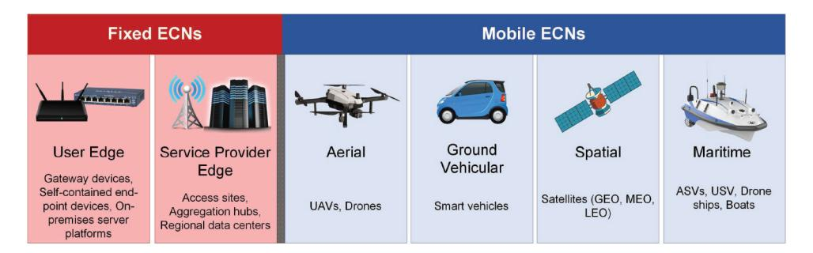

Fig. 1. Categories of ECNs.

forwarding them to the remote cloud servers. This implies that edge computing significantly reduces the transmission delay of the tasks, which is appealing for meeting the stringent delay requirements of delay-intolerant applications as in healthcare and disaster management scenarios for example. Also, due to the short communication range required, the energy-constrained TNs consume less energy to offload their tasks to the edge computing nodes at the edge of the network instead of the far-away cloud servers. As a result, the overhead and the backhaul costs related to the intermediate devices (e.g., routers) are reduced in edge computing compared with cloud computing [\[2\]](#page-33-1), [\[5\]](#page-33-4).

Edge computing encompasses a number of concepts and/or technologies, such as mobile cloud computing, cloudlet, multiaccess/mobile edge computing (MEC), and fog computing under its umbrella. All these concepts mainly focus on providing end-users (EUs) with robust and powerful computing resources in their local vicinity [\[5\]](#page-33-4). However, these technologies suffer from limitations, notably where the ECNs employed in the system are fixed in their location.

Figure [1](#page-1-0) illustrates two categories of ECNs, i.e., fixed ECNs and mobile ECNs. According to the report recently published by The Linux Foundation [\[6\]](#page-33-5), fixed ECNs are divided into two subcategories, namely user edge and service provider edge. User edge consists of three main groups: (i) gateway devices, such as switches, routers, and IoT aggregators; (ii) self-contained end-point devices, such as smartphones and wearables devices; and (iii) on-premises server platforms. On the other hand, service providers include access sites (e.g., cellular radio base stations), aggregation hubs, and regional data centers that provide powerful services to the EUs. The leverage of fixed ECNs at the network edge results in improving the performance of the IoT networks, especially in terms of latency, energy, and resource utilization.

Mobile ECNs, on the other hand, are divided into four categories: (i) aerial, such as unmanned aerial vehicles (UAVs); (ii) ground vehicular, including smart vehicles or the vehicles that are equipped with smart components, such as on-board units (OBU); (iii) spatial that consists of geosynchronous equatorial (or geostationary) orbit (GEO), medium earth orbit (MEO), and low earth orbit (LEO) satellites; and (iv) maritime, such as autonomous surface vehicles (ASVs), unmanned surface vehicles/vessels (USVs), and boats without crews but equipped with computation resources (e.g., drone ships, observation platforms, and buoy) which are used in marine applications. In particular, mobile ECNs feature the following advantages.

- *Mobility, flexibility, and versatility:* One of the main needs for mobile ECNs comes from the flexibility of ECNs in adjusting their distance with respect to EUs. Most advantages of mobile ECNs are mainly derived from their mobility and versatility. We point out the most important ones below:
  - **–** *High energy efficiency:* Mobility of the ECNs yields the distance to be adjusted in the favor of consuming less power for transmission, as well as more transmission rate, for the EUs to optimally upload the tasks to the corresponding ECNs.
  - **–** *Low latency:* Shortening the distance between the mobile ECNs and the EUs also leads to alleviating the processing delay of tasks generated by EUs. As such, the EUs can offload the task with a higher transmission rate to the mobile ECNs. Therefore, the speed of transmission increases, and hence, the tasks spend less time reaching the mobile ECNs.
  - **–** *Low interference:* The other problem that fixed ECNs might be facing is the amount of signal interference that cannot be controlled. However, this problem can be addressed by the use of mobile ECNs, where their optimal placement leads to reducing the amount of interference.
- *Resistant to single failure:* The other advantage of using mobile ECNs in the networks is their resistance to single failures. Fixed ECNs hard provide support to the dead spots (areas with the lost coverage) when a failure happens to a fixed ECN. This is while mobile ECNs can compensate for this limitation easier and faster than fixed ECNs so that a new replacement takes control of the services the failed node was provided to the corresponding EUs.
- *Applicability and availability:* Despite many applications that utilize fixed ECNs, a huge number of applications require mobile ECNs instead thanks to their mobility and flexibility. Such unique features make these nodes highly appropriate for applications where installing fixed ECNs will be costly or hard to set up such as disaster management or urban areas in mountains and valleys.

Mobile ECNs are versatile and flexible and hence can support many applications but this comes at a cost to fixed ECNs. Fixed ECNs usually have more reliable connections and offer

| Survey Technology Platform(s) |          |                   | Key Contributions                                                                                                                                                                                                                                                                                                  |  |
|-------------------------------|----------|-------------------|--------------------------------------------------------------------------------------------------------------------------------------------------------------------------------------------------------------------------------------------------------------------------------------------------------------------|--|
| [7]                           | MEC      | UAV               | Proposed a novel air-ground integrated mobile edge network (AGMEN); A study on the flexible deployment and schedule of the UAVs for assisting communication, caching, and MEC-enabled network.                                                                                                                     |  |
| [8]                           | MEC      | UAV               | Considered 5G high-speed satellite-terrestrial assisted mobile edge computing (SMEC) as flying MEC.                                                                                                                                                                                                                |  |
| [9]                           | Cloudlet | UAV               | A study on addressing aspects relevant to the processing of data collected by UAVs, and reviewing the potential of using cloudlets and computational offloading to suggest the solutions for the problem of resource restricted UAVs; A discussion on the architecture for the delivery of UAV based IoT services. |  |
| [10]                          | Fog      | Ground Vehicle | A discussion on the communication and computational infrastructures for vehicular fog computing.                                                                                                                                                                                                                   |  |
| [11]                          | Fog      | Ground            | Considered the task offloading in vehicular fog networks; Considered case studies based on learning-based task offloading in vehicular fog networks;                                                                                                                                                               |  |

TABLE I COMPARISON OF THE RELATED SURVEYS ON MOBILE EDGE-DRIVEN TECHNOLOGIES WITH OUR SURVEY

more stability, whereas the mobility of mobile ECNs reduces the reliability of connections established between these nodes and EUs. Maritime ECNs have the lowest reliable connections among ECNs. Moreover, the high mobility of the ECNs complicates their tracking in the network because they may leave the corresponding domain before that the task allocated to them is fully computed.

With all advantages and disadvantages that mobile ECNs bring to edge-driven IoT networks, it is critical to comprehensively review the effects these nodes have on the performance of the corresponding networks. To the best of our knowledge, only a few surveys and tutorials related to edge computing technologies consider mobile ECNs. In the following sections, we elaborate on how this work fills a gap in the existing surveys.

## *A. Existing Surveys on Mobile Edge Technologies*

A number of surveys have been published to review mobile ECNs and the corresponding challenges in edge-driven IoT networks. These are summarized in Table [I.](#page-2-0) In [\[12\]](#page-33-6), the fogassisted mobile IoT applications such as wireless body area network (WBAN), smart healthcare, disaster prediction, and surveillance are considered, and the authors have discussed the mobile FNs (mFNs) in their review by dividing them into four different types of ground vehicular-Fog, Marine Fog, UAV-Fog, and user equipment-based fog (UE-Fog). Different aspects of the mFNs are briefly discussed and the main focus is on the mobile applications and corresponding use cases and scenarios in the IoT networks.

In [\[7\]](#page-33-7), the architecture, challenges, and opportunities of deploying and scheduling UAVs to assist the communication, caching, and computing of the MEC-enabled networks are investigated. This two-layer networking architecture called an air-ground integrated mobile edge network (AGMEN) includes aerial and ground network layers. UAVs create the aerial network where the tasks include maintaining the connectivity of a wireless sensor network, data muling for delay tolerant networks (DTNs), traffic monitoring, and remote sensing. One of the challenges of this architecture, as discussed in the survey, is the use of heterogeneous nodes in both layers for which a multi-protocol environment needs to be considered. Another challenge investigated by the authors is the dynamic topology of the network that results in degradation to the quality of communication channels.

The authors in [\[9\]](#page-33-8) discuss the use cases of UAVs that act as cloudlets for the tasks generated by the TNs. By bringing computation resources close to TNs, UAVs can act as mobile cloudlet servers, letting TNs partially or wholly offload their tasks. As the resources of the UAV cloudlets are also limited compared to remote cloud data centers, the challenges and issues for proper and uninterrupted operation of UAV-assisted computation are investigated. The survey considers the optimal offloading amount of tasks, the energy consumption of the UAVs, and energy harvesting by the UAVs from the surrounding environment. However, the survey only focuses on UAVs whereas we have other types of mobile edge computing nodes that have different features. Moreover, The survey considers mobile cloudlets while the other edge computing technologies have different requirements to be met.

The authors in [\[10\]](#page-33-9) have reviewed the vehicular fog computing (VFC) architecture in urban areas, where the vehicles are utilized as the infrastructure for communication and computing. In the traditional fog computing architecture, vehicles were considered as end-users in the system and the other infrastructures, such as road side units (RSUs), take over the role of fog servers. However, the VFC has been only deployed in the urban areas and includes only parked and slow-moving vehicles, without considering the highly mobile and dense environments, in which the geo-distribution of vehicles dynamically varies in time intervals and vehicles enter the domains and leave them at different speeds [\[10\]](#page-33-9).

The authors in [\[11\]](#page-33-10) have shortly reviewed the architecture of vehicular fog networks (VeFNs) and have categorized the offloading mechanism into three methods that are vehicleto-vehicle, vehicle-RSU-vehicle, and pedestrian-RSU-vehicle offloading. In the architecture of VeFN, a client vehicle needs to offload the tasks generated by its passengers to either the neighboring fog vehicle or the RSU. If there is any neighboring fog vehicle with sufficient computation resources, the offloading is a type of vehicle to vehicle offloading; otherwise, the client vehicle offloads the tasks to the RSU for further processing. Since the contact time of pedestrians and vehicles is usually short, pedestrians first offload their tasks to the RSUs and RSUs accordingly decide about processing the request locally or offloading to the best fog vehicles.

Due to huge amount of data and explosive growth of delay-critical applications, there is an urgent need to improve the computation performance and address the challenges of traditional computation frameworks. MEC provides solutions for computation performance enhancement and delays minimization of the emerging IoT applications. However, ground-based MEC systems are not flexible and cannot respond to the dynamic computation needs of IoT services. Flying MEC systems can address this challenge because they can dynamically move close to the resource-constrained nodes to assist them. The authors of [\[8\]](#page-33-11) provide an overview of different flying MEC systems, their advantages over groundbased MEC systems, as well as shortcomings and open issues of these systems.

*1) Comparison of Existing Survey Papers and Our Survey Paper:* Table [I](#page-2-0) summarizes the main topic, platform, primary contribution, and features of the existing survey papers conducted in edge computing technologies in IoT networks. For each paper, "Technology" shows the edge computing technology that the paper covers. "Platform(s)" refers to the type of mobile ECN(s) that the paper considers. "Key Contributions" indicates the main contributions of the paper, as well as the features provided by the paper.

As shown in Table [I](#page-2-0) each paper particularly focuses on a specific edge-driven technology without considering other technologies. Reviews show that [\[10\]](#page-33-9), [\[11\]](#page-33-10), [\[12\]](#page-33-6) mainly focus on fog, while [\[7\]](#page-33-7), [\[8\]](#page-33-11) study MEC, and [\[9\]](#page-33-8) only considers cloudlet. Moreover, with the exception of [\[12\]](#page-33-6), which covers all types of vehicles as the fog nodes in the paper, other papers focus on one or two types of mobile nodes in the corresponding architecture. Besides, most of the papers do not review integrated architectures, i.e., aerial-ground vehicular integrated edge computing-enabled IoT networks, spatial-aerial integrated edge computing-enabled IoT networks, and maritimeaerial integrated edge computing-enabled IoT networks. Apart from the common criteria defined above, there are other drawbacks related to each paper as follows. Paper [\[12\]](#page-33-6) does not review the challenges related to data offloading and discuss the solutions for data offloading in mobile fog computing. The authors in [\[9\]](#page-33-8) do not address the issues and challenges faced by fixed and mobile edge-driven technologies in various applications. A discussion on the issues related to computational complexity, challenges, storage resources, and various infrastructures for vehicular fog computing is not provided in [\[10\]](#page-33-9). An illustration of the security vulnerabilities and threats in vehicular fog networks is missed in [\[11\]](#page-33-10). Moreover, the paper does not outline various cryptographic and blockchainbased security solutions for vehicular fog networks. Finally, the authors of [\[8\]](#page-33-11) do not address the spatial mobile edge computing-enabled IoT networks, various types of spatial nodes, and challenges in detail.

## *B. Contributions*

Despite the existing survey papers and articles reviewed in Section [I-A,](#page-2-1) a detailed and comprehensive review of edgedriven technologies, different types of mobile edge nodes, various network architectures, their applications, functions and features, and practical challenges in IoT networks is still missing in the literature. This paper aims to fill such a gap by thoroughly investigating mobile edge technologies in edge computing-enabled IoT networks. The main contributions of the paper are summarized as follows:

- We clearly define and explain the fundamentals of edge computing-enabled networks, their architecture, concepts, technologies, features and functions, and practical challenges. This way, we provide a useful resource for interested readers.
- • We provide an inclusive review of mobile edge computing nodes, their different types, architecture, mobility behavior, communication characteristics, and example of practical systems.
- We comprehensively study the integrated architectures, where two different classifications of ECNs jointly play the role of mobile edge nodes in the network to collaboratively improve the network performance.
- We find the research gaps that are yet to be filled in the area of mobile edge computing nodes and provide directions for future research and investigation in this promising area.

## *C. Organization*

For the readers' convenience, we provide the general organization of the topics discussed in this survey in Fig. [2.](#page-4-0) We also present a list of common abbreviations for reference in Table [II.](#page-4-1) The rest of this paper is organized as follows: Section [II](#page-3-0) provides a brief overview of the edge computingenabled IoT networks and comprehensively studies the mobile edge computing-enabled IoT networks architecture followed by different types of mobile ECNs. Different classifications of the mobile ECNs are provided in Sections [III-](#page-9-0)[VI.](#page-14-0) Section [VII](#page-15-0) compares different types of mobile ECNs. Section [VIII](#page-16-0) and Section [IX](#page-29-0) review the applications of the mobile ECNs for singular node type-supported networks and integrated networks, respectively. Future research directions are provided in Section [X.](#page-31-0) Finally, Section [XI](#page-32-0) brings the concluding remarks.

# II. BACKGROUND

## *A. Edge Computing Overview*

Edge computing is a promising paradigm that takes advantage of a decentralized architecture to provide and distribute

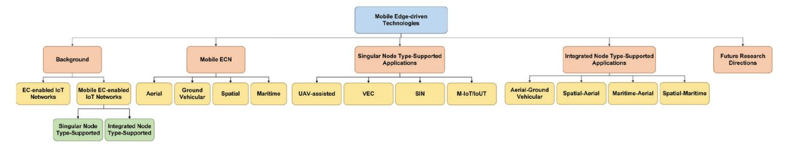

Fig. 2. General organization of the topics discussed in this survey.

#### TABLE II LIST OF COMMON ABBREVIATIONS

| Abbreviation | Description                                        |  |
|--------------|----------------------------------------------------|--|
| AIS          | Automatic Identification System                    |  |
| ASV          | Autonomous Surface Vehicle                         |  |
| BS           | Base Station                                       |  |
| DL           | Deep Learning                                      |  |
| ECN          | Edge Computing Node                                |  |
| EU           | End User                                           |  |
| FN           | Fog Node                                           |  |
| GEO          | Geosynchronous Equatorial (or Geostationary) Orbit |  |
| IoT          | Internet of Things                                 |  |
| IoV          | Internet of Vehicles                               |  |
| LEO          | Low Earth Orbit                                    |  |
| MC           | Machine-type Communication                         |  |
| MEC          | Multi-access (Mobile) Edge Computing               |  |
| MEO          | Medium Earth Orbit                                 |  |
| ML           | Machine Learning                                   |  |
| QoS          | Quality of Service                                 |  |
| RL           | Reinforcement Learning                             |  |
| RSU          | Road Side Unit                                     |  |
| SIN          | Space Information Network                          |  |
| SV           | Service Vehicle                                    |  |
| TN           | Terminal Node                                      |  |
| UAV          | Unmanned Aerial Vehicle                            |  |
| USV          | Unmanned Surface Vehicle/Vessel                    |  |
| UV           | User Vehicle                                       |  |
| VEC          | Vehicular Edge Computing                           |  |
| VFC          | Vehicular Fog Computing                            |  |
| VM           | Virtual Machine                                    |  |
| WPT          | Wireless Power Transfer                            |  |

computing, communication, and storage capabilities in the proximity of the TNs at the edge of networks. Figure [3](#page-4-2) shows the overall architecture of edge computing-enabled IoT networks, which ranges from the core, i.e., the cloud layer, to the edge, i.e., the IoT layer. Edge computing employs ECNs to provide the required services to the TNs at the network edge rather than the network core. Edge computing indeed shortens the distance (both logically—network distance and physically) between the TNs and the service-providing nodes, i.e., ECNs. Accordingly, TNs consume less energy to offload their tasks to the ECNs rather than data centers at the core of the network. Moreover, the transmission delay of the tasks generated by TNs is reduced. This reduction in

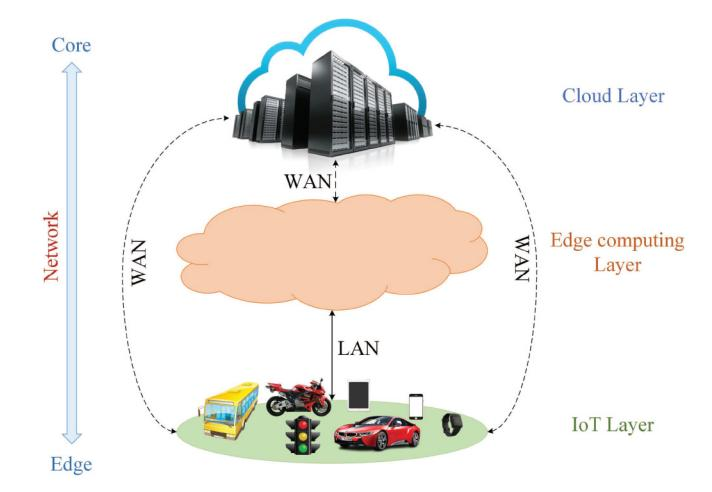

Fig. 3. Architecture of edge computing-enabled IoT networks, including three layers, namely IoT layer, edge computing layer, and cloud layer, where moving from the topmost layer, i.e., the cloud layer, to the lowest layer, i.e., the IoT layer, changes the network range from core to edge. Edge-cloud layers and IoT-cloud layers are interconnected through wide area network (WAN), such as Internet, whereas the local area network (LAN) is used to interconnect IoT-edge layers [\[2\]](#page-33-1), [\[13\]](#page-33-12).

transmission delay yields improvement in the performance of delay-sensitive and energy-constraint networks, especially the IoT network. The limited energy budget of TNs along with the delay-sensitivity of the tasks generated, impose constraints on the IoT networks and degrade network performance [\[2\]](#page-33-1), [\[3\]](#page-33-2), [\[4\]](#page-33-3), [\[13\]](#page-33-12).

In particular, edge computing can support and facilitate applications that do not fit well with the cloud networks such as [\[2\]](#page-33-1), [\[13\]](#page-33-12), [\[14\]](#page-33-13):

- • Geographically distributed applications such as pipeline monitoring and sensor networks.
- Fast mobile applications such as smart connected vehicles.
- Large-scale distributed control systems such as smart energy distribution and smart traffic lights.

## *B. Mobile Edge Computing-Enabled IoT Networks Overview*

The leverage of mobile ECNs in the edge layer of the edge computing-enabled IoT architecture improves the efficiency and performance of the corresponding networks. Expressively, mobile ECNs bring computing resources closer to the TNs than their fixed ECN counterparts. In the following, we review the architecture of mobile edge computing-enabled IoT networks and study the functions and features provided by these nodes to the corresponding networks.

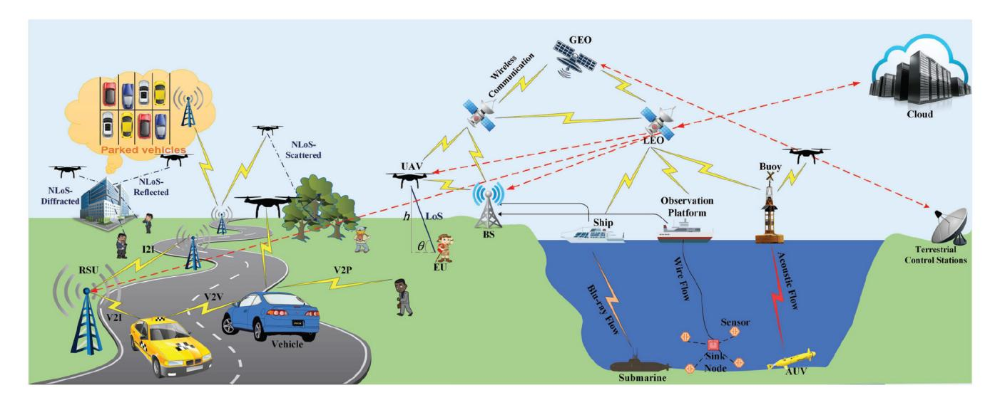

Fig. 4. The general architecture of IoT networks includes different types of mobile ECNs, i.e., aerial, ground vehicular, spatial, and maritime nodes. The figure shows the corresponding singular node type-supported architecture, wherein one specific type of mobile ECN provides services to the end-users; it also indicates the integrated node type-supported architecture, where two or more types of mobile ECNs collaborate to support the requests of end-users.

- *1) Architectures:* Figure [4](#page-5-0) indicates the general architecture of mobile edge computing-enabled IoT Networks, including different categories of mobile ECNs and the corresponding network architectures these nodes support. Overall, the architecture of the mobile edge computing-IoT networks is categorized into two main groups singular node type-supported architectures and integrated node type-supported architectures. In the former, only one type of mobile ECN is employed to cover the network, while the latter comprises two or more types of mobile ECNs collaboratively play the role of ECNs.
- *a) Singular node type-supported architectures:* According to the type and infrastructure of the mobile ECNs, these nodes are divided into four groups, namely aerial, ground vehicular, spatial, and maritime nodes, in this paper. Unmanned aerial vehicles (UAVs) and ground vehicles play the role of mobile ECNs in the UAV-assisted edge computing-enabled IoT networks and vehicular edge computing (VEC) networks, respectively. Satellites, including geosynchronous equatorial (or geostationary) orbit (GEO) and low earth orbit (LEO), provide computing services to the TNs at the edge of the spatial information networks (SIN). Ships, observation platforms, and buoys are equipped with sufficient computational capabilities to play the role of mobile ECNs for autonomous underwater vehicles (AUVs) and other sensors in the maritime IoT (M-IoT) and Internet of Underwater Things (IoUT). The details of all categories of the mobile ECNs are provided in Sections [III](#page-9-0) - [VI.](#page-14-0)
  - *UAV-assisted architecture:* In such an architecture, a UAV can act as a relay for which it needs to collect the information from the TNs and deliver them to the base station (BS) for further processes. Apart from playing the role of a relay, a UAV can be leveraged as an ECN. In this case, the UAV is responsible for processing the tasks offloaded by the TNs. In the UAV-assisted architecture, the UAVs and the TNs are interconnected via wireless communications. Moreover, the UAVs are wirelessly connected to the BSs if they play the role
- of relays to the BSs. Each UAV can establish either the line-of-sight (LoS) or the non-LoS (NLoS) propagation with the corresponding TN(s). Considering a direct path without any obstacles between a transmitter-receiver pair, LoS propagation makes the light able to travel the path in a straight line without being affected by any reflection and/or diffraction (the connection between the user and the UAV close to the sea in Fig. [4\)](#page-5-0). On the other hand, the light in NLoS propagation is partially obstructed by a physical obstacle between the transmitter and the receiver. The type of obstruction ranges from diffraction and reflection (the connection between the user and UAVs in front of the building in Fig. [4\)](#page-5-0) to scattering (the connection between the user and the UAV in front of trees in Fig. [4\)](#page-5-0) that degrades the quality of propagation [\[15\]](#page-33-14). In regards to computation, the UAV first receives the tasks from the TNs. Then, depending on the resource availability and other constraints as well as the specified QoS requirements, such as delay, the UAV decides to process the tasks locally, offload them to either a nearby UAV or the BS, or forward them to the cloud. The BS in this architecture is in charge of different responsibilities: (i) first, it receives the information from the UAVs, processes them locally, and transmits the processed information back to the UAVs; (ii) more importantly, the BS handles the communication between UAVs as the mobility of UAVs makes the direct connection between them vulnerable. The cloud forms the topmost layer that provides complementary computing resources when required [\[7\]](#page-33-7), [\[16\]](#page-33-15).
- • *Vehicular edge computing architecture:* Vehicular fog computing (VFC) [\[10\]](#page-33-9) and MEC-enabled vehicular networks [\[17\]](#page-33-16) are the main architectures provided by the newly developed VEC [\[18\]](#page-33-17) paradigm. VEC aims to exploit the plentiful resources of the ground vehicles in order to bring communication, computation, and storage services close to the TNs which can be in the form

- of vehicles, smart devices, sensors, etc. The main communication system in IoV is called vehicle-to-everything (V2X) by which a vehicle can connect to different parts of the traffic system around itself. Generally, the communication connectivities in IoV are categorized into four groups, namely vehicle-to-vehicle (V2V), vehicleto-infrastructure (V2I), vehicle-to-pedestrian (V2P), and vehicle-to-cloud (V2C). V2V is the connection between a vehicle and other vehicles in the network. V2I refers to the connection between a vehicle and the network infrastructures, such as RSUs, traffic lights, road sensors, and cameras. V2P is a direct connection between a vehicle and pedestrians in the proximity of the vehicle. Finally, V2C is used to refer to the wireless connection between a vehicle and the cloud (see the left-side of Fig. [4\)](#page-5-0) [\[19\]](#page-33-18). In such an architecture, RSUs are the fundamental components that are located aside from the road and support vehicles by connecting them to the communication infrastructures. Although future vehicles are expected to be designed in a way that they can process most of their own tasks, their processing resources are still limited, and offloading some of the vehicles' computations to the RSUs is inevitable. Each RSU covers a limited area based on its default coverage range. Each vehicle moving within a specific region can interact with the corresponding RSU in the area. If the number of incoming tasks to the RSU exceeds its capacity, the RSU becomes overloaded and would be unable to respond to the processing demands. Therefore, depending on the QoS constraints imposed on the network, the overloaded RSU may decide to offload some of the tasks to a nearby RSU or the central cloud [\[19\]](#page-33-18).
- *Space information networks architecture:* In the SIN architecture, users are the TNs in the IoT networks that generate the information. Satellite nodes comprise GEO and LEO satellites, equipped with multibeam antennas. Therefore, the inter-satellite and extra-satellite connections are supported by laser links. LEO nodes are responsible for receiving the information from the TNs, process them locally, or offload them to the neighbor LEO satellite, which is referred to as the virtual node in the corresponding paper. GEO satellites, on the other hand, are high-performance nodes with strong computation and communication capacities. However, GEO nodes are located in a fixed position to the ground, far away from TNs. This prevents GEO satellites from supporting the mobility of the network. Moreover, TNs suffer from a large delay regarding processing the tasks. Therefore, GEO nodes act as ECN managers to coordinate the task scheduling in the corresponding region and manage the LEO-ECNs for which they control the abnormality of any LEO-ECN and remove that node; replace another LEO-ECN when any failure happens to an LEO-ECN; and finally, report the operation data of the LEO-ECNs to the terrestrial control station. Cloud center is a complimentary resource for the SIN ECNs when the ECNs are not able to process the tasks and need more resources. The terrestrial control station is the main manager in the

- network that manages the entire SIN by communicating with GEO and LEO satellites (see the right-side of Fig. [4\)](#page-5-0) [\[20\]](#page-33-19).
- • *Maritime IoT architecture:* An automatic identification system (AIS) refers to a maritime communication device that transfers data via the very high frequency (VHF) radio broadcasting system. The vessels equipped with AIS are able to send and receive identifying information which can be displayed on different types of screens such as computer displays, electronic char, or compatible navigation radar. The main advantages of the AIS are to improve navigation safety and environmental protection. To this end, the AIS is able to manage over 2000 reports per minute and update the identifying information as often as every two seconds [\[21\]](#page-33-20). Different types of TNs, such as sensors, sink nodes, and submarines are employed in the access layer to sense the environment and collect and generate the corresponding data. The edge computing layer is composed of ECNs, such as ships, observation platforms, buoys, autonomous surface vehicles (ASVs), and unmanned surface vehicles/vessels (USVs) equipped with smart devices such as AIS transceiver devices, underwater acoustic communication devices, and mobile phones. Maritime ECNs are responsible for receiving the data from the TNs and processing them locally or forwarding them to the access BSs which are further transmitted to data centers and endusers through the backbone network (see the right-side of Fig. [4\)](#page-5-0) [\[22\]](#page-33-21).
- *b) Integrated node type-supported architectures:* Utilizing an integrated framework, wherein two or more mobile ECNs collaboratively provide computing resources to the TNs, enables IoT networks to expand and operate more efficiently with a robust integrated framework. In light of that, in the rest of this section, the integrated architectures, namely aerial-ground vehicular, spatial-aerial, maritime-aerial, and spatial-maritime are reviewed.
  - *Aerial-ground vehicular integrated architecture:* The high mobility and unpredictable movement of the vehicles cause the vehicles to leave a region before completing the processing of the tasks. Thus, the corresponding RSU needs to offload the tasks to the RSU of the region where the vehicle resides there. This handover leads to an extra communication delay that negatively affects network performance. Besides, the TNs are energy-limited nodes that need to consume the minimum energy for offloading the tasks to the corresponding ECN for further processing. To deal with the above-mentioned challenges, the UAVs are deployed in such networks to provide computational resources to the TN in collaboration with the RSU. Indeed, the flexibility and versatility of the UAVs make them enable to efficiently adjust their position with respect to the TNs and provide complementary resources to the ground vehicles and RSUs (see the left-side of Fig. [4\)](#page-5-0).
  - *Spatial-aerial integrated architecture:* Although the UAVs can significantly improve the performance of edge computing-enabled IoT networks in terms of energy

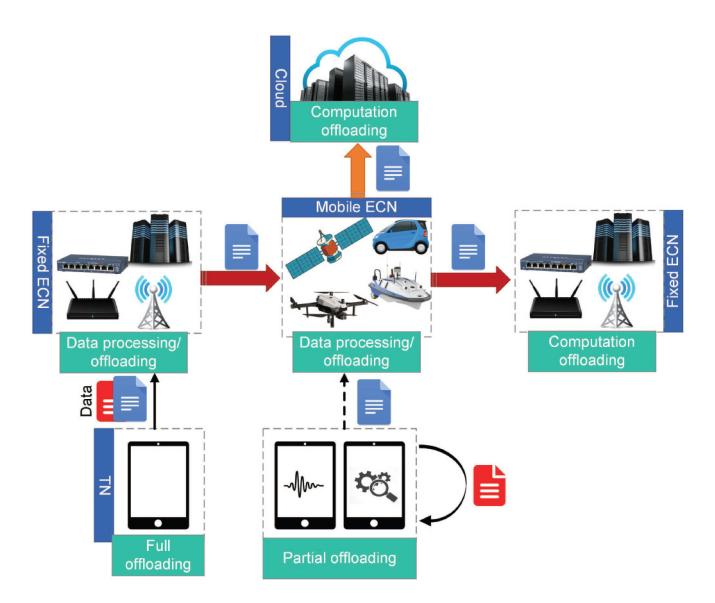

Fig. 5. Offloading function of mobile ECNs in edge computing-enabled IoT networks.

consumption and delay, these nodes may fail to provide the TNs with ubiquitous coverage in suburban, and rural areas, where the TNs are widely distributed and running battery-consuming/computation-intensive tasks. such as high-definition sound or video information; or in sparsely populated areas, where installing the terrestrial BSs is challenging/impossible to manage the UAVs. Satellites are good candidates to play the role of resource providers in such situations as they can provide a large coverage area for the TNs. However, these nodes suffer from a large communication delay due to their long distance from the TNs. Therefore, the introduction of the space-air-ground integrated network (SAGIN) in IoT networks [\[23\]](#page-33-22), [\[24\]](#page-33-23), namely SAG-IoT [\[25\]](#page-33-24), can be the primary solution for solving the aforementioned problems. The interconnections provided on the right side of Fig. [4,](#page-5-0) close to the sea, show the corresponding SAG architecture.

• *Maritime-aerial integrated architecture:* IoUT comprises a tremendous number of sensor nodes, i.e., TNs, and sink nodes, such as buoyant sink nodes, which are deployed underwater and on the water surface, respectively. The underwater TNs are responsible to sense the environment and collect information. Thereafter, the TNs send the collected tasks to the sink nodes via an acousticsignal link, as these signals lead to a lower attenuation than the electromagnetic links. Moreover, the acoustic signals cover a wide range underwater, from hundred meters to several kilometers. The sink nodes, on the other hand, act as relays that receive the information from the sensor nodes and transmit them to the offshore ECNs, such as ships and boats, for further processing. However, the computing resources of offshore ECNs are limited. Hence, the collected tasks must be offloaded to resourcerich onshore data processing centers. The straightforward but cost-ineffective solution is to establish and maintain the infrastructure that directly connects the IoUT to the

- onshore ECNs. Therefore, the UAVs can be employed to deliver the tasks generated by offshore sink nodes to the onshore ECNs [\[26\]](#page-33-25), [\[27\]](#page-33-26), [\[28\]](#page-33-27), [\[29\]](#page-33-28).
- *Spatial-maritime integrated architecture:* Similar to aerial and ground vehicular edge computing-enabled IoT networks, where the coverage range of the corresponding ECNs is limited, marine vessels also suffer from limited coverage areas in M-IoT networks. On the other hand, the communication delay between TNs and LEO satellites is large, while this delay is shorter between the marine vessels and the underwater TNs in M-IoT networks. To cope with such shortcomings, LEO satellites are leveraged as the access nodes in the access layer belong to the corresponding architecture of the M-IoT networks. The information provided on the right-side of Fig. [4](#page-5-0) indicates such interconnections between satellites and marine vessels.
- *2) Functions and Features:* Offloading and mobile edge intelligence (EI) are two functions wherein the efficiency of mobile ECNs privileges over their fixed counterparts.
- *a) Offloading:* The proliferation of the skyrocketing number and types of TNs results in a huge data volume generation. This is more critical to edge computing-enabled IoT networks when the number of generated tasks changes over time so that the resource-limited TNs are not able to process the tasks. On the other hand, the high cost of installing the fixed ECNs, as well as their gradual updating of the infrastructure, along with their limited computational capacity make them unsuitable candidates for computing purposes. Hence, the engagement of mobile ECNs in computation offloading is invaluable and efficient in this regard. Figure [5](#page-7-0) indicates the offloading procedure in edge computing-enabled IoT networks where the TNs might not be able to process the tasks locally. Hence, they prefer to fully or partially offload the tasks to both fixed/mobile ECNs. The mobile ECNs can process the tasks locally and/or offload them to other mobile/fixed ECNs available in the network if the available resources are limited to processing the tasks locally. They are also responsible to offload the tasks received from one/more fixed ECNs to other ECNs in such system models. In the worst case, where there are no available resources in the edge layer, they forward the tasks to the cloud for further processing. However, the engagement of mobile ECNs in computation offloading might lead to decreasing in the communication reliability between the TNs and the mobile ECNs. On the other hand, mobile ECNs also suffer from a limited energy budget that needs to be fully considered in such communications. Moreover, the mobile ECNs move fast between different regions so which degrades the efficiency of computation offloading. Therefore, optimal management of the task offloading in such highly dynamic environments is inevitable [\[30\]](#page-33-29), [\[31\]](#page-33-30), [\[32\]](#page-33-31).
- *b) Mobile edge intelligence:* Artificial intelligence (AI) embraces different ML technologies. ML approaches in the conventional CoT architecture follow a centralized data management whereby the TNs upload their data to the cloud servers for further processing. Upon the receipt of data, the cloud servers accordingly produce corresponding inference models to be trained by them. Despite the abundant computing

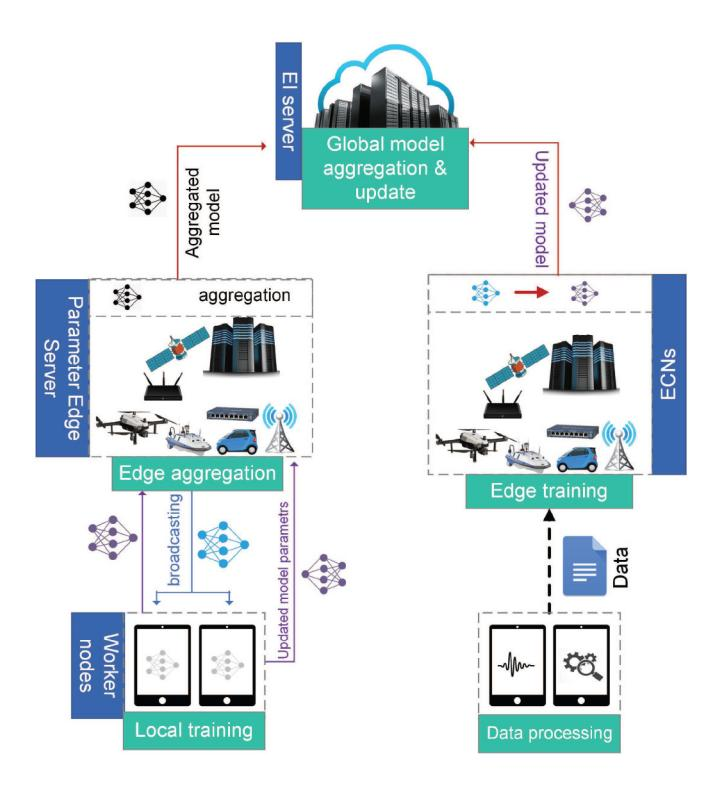

Fig. 6. Mobile edge intelligence function and its general procedure in mobile edge computing-enabled IoT networks.

resources that the servers provide to train the inferred models, the cloud center imposes a huge burden on the network backbone. Moreover, the large distance between the TNs and the cloud servers incurs long propagation delays in the task processing which subsequently increases network latency. Coupled with the privacy concerns of the data owners, the centralized training at the cloud servers is no longer sustainable and efficient for processing the information [\[33\]](#page-33-32), [\[34\]](#page-33-33).

Edge intelligence (EI), also known as edge AI, is a novel paradigm wherein AI is pushed into the edge devices in proximity of the TNs. As a result, a huge data volume gathered by edge devices is quickly analyzed with powerful AI techniques, and the corresponding models, patterns, and insights are extracted in real time. Figure [6](#page-8-0) shows the general procedure of EI where worker nodes (TNs) are responsible for providing the ECNs with the data and/or the updated model. In the former, the ECNs train an updated model based on the data received from the worker nodes and send it to the EI server, which is usually the cloud in such a system. In the latter, the ECNs play the role of parameter edge servers that first broadcast a global model to the worker nodes. Then, the worker nodes update the model itself using the data they sensed/generated and send the updated model to the edge server. Finally, the edge server aggregates the models and forwards the aggregated one to the EI server. EI involves different enabling technologies to improve its key performance indicators, i.e., training loss, convergence, privacy, communication cost, latency, and energy efficiency. The technologies are reviewed in the following [\[35\]](#page-33-34), [\[36\]](#page-33-35), [\[37\]](#page-33-36).

• *Federated learning:* Unlike the conventional cloudcentric training approaches in which the cloud or the ECNs are responsible for training data, federated learning (FL) follows a distributed approach whereby personal devices/TNs take over training data. In this regard, an edge server sends a training model to the corresponding TNs. The TNs accordingly train the model by using their own local data and offload the model updates, including the weights of the model, to the FL server. The server then aggregates the information for uploading to the cloud. This procedure is repeated until the expected accuracy is met. Thereby, less information is offloaded to the cloud. This subsequently reduces the burden on the backbone networks, as well as the communication costs. On the other hand, FL avoids uploading the raw data to the cloud, which keeps the data safe, especially for privacy-sensitive data. Finally, the proximity of TNs (or worker nodes) to the FL servers reduces the network latency compared to the cloud-centric approach. The replacement of fixed ECNs with mobile ECNs can improve the efficiency and performance of the corresponding networks because the mobile ECNs provide complementary resources at the closest distance to the TNs [\[33\]](#page-33-32), [\[38\]](#page-33-37).

- • *Aggregation frequency control:* The update aggregation in FL imposes a high overhead on communications. The main objective of the aggregation frequency control (AFC) method is to precisely manage both the aggregation content and frequency so that there exists a tradeoff between local update and global parameter aggregation.
- *Gradient compression:* Gradient vectors in the model update also increase the communication overhead. In sense of reducing such an overhead, gradient compression employs gradient quantization and gradient sparsification techniques. The former quantized the elements of the gradient vector to a finite-bit low precision value and the latter transmits a portion of the vectors rather.
- • *Deep neural network splitting:* Based on deep neural network (DNN) splitting [\[39\]](#page-34-0), the DNN is split into a head and a tail model executed respectively on the TNs and the edge servers.
- *Knowledge transfer learning:* This technique is complementary to the DNN splitting method, aiming at alleviating the energy consumption of DNN model training at the edge server. To this end, two networks, namely the teacher network and student network, are defined to play the role of base network and target network, respectively. First, the teacher network is trained on a base data set. Thereafter, the learned features are sent to the student network for further training.
- *Gossip training:* Gossip training takes advantage of gossip (epidemic) protocol to reduce the training latency. The gossip algorithms are types of distributed asynchronous algorithms wherein a node sends the information (literally a rumor) to a randomly chosen neighbor. As such, each node in the gossip training updates its own DNN model and then, shares the information with a randomly chosen node.

Studies in the literature review show that the leverage of EI can significantly improve the efficiency and performance of IoT networks. However, research studies conducted on the employment of mobile ECNs in EI are still in their early stage [\[40\]](#page-34-1), [\[41\]](#page-34-2).

# *C. Summary and Lessons Learned*

In this section, we reviewed the mobile edge computingenabled IoT networks from different aspects, including architectures, functions, and types of mobile ECNs employed in the corresponding networks. From this review, we gather the following lessons:

- The mobility of ECNs affects the network dynamicity and boosts it whereby the network conditions, notably channel models, change over time. The channel models for the fixed ECNs only may be affected by the fading coefficient of the channel and the subsequent interference derived from the other TNs. This is while the channel model for the mobile ECNs not only is under-effect of the aforementioned factors but also varies over the time-variant movement of the mobile ECNs. Thereby, optimizing the channel conditions under such ever-changing situations will be challenging and subsequently increase the network complexity. Nevertheless, studies show that the good condition management applied to the mobile ECNsdriven networks significantly improves the efficiency and performance of the networks compared to their fixed counterparts in terms of the processing latency of the tasks, the energy efficiency of the network, and network throughput.
- The versatility and flexibility of the mobile ECNs are paramount for their availability in even difficult-to-access areas. Moreover, the variety of mobile ECNs leads to the emergence of integrated architectures where two or more types of mobile ECNs collaborate to improve the efficiency of the networks.

# III. AERIAL NODES

UAVs are the most popular type of aerial nodes, which are commonly referred to as drones. While UAVs and drones are interchangeably used in the literature, there exists a subtle difference between these two. Generally, drone refers to all kinds of unmanned vehicles which are either autonomous or remotely controlled. Based on this definition, a water-based or land-based unmanned vehicle is also called a drone. Therefore, every UAV is a drone but not vice versa. For this reason, we use UAVs to refer to aerial nodes throughout this paper.

## *A. Mobility Behavior*

Routing is a paramount procedure in enhancing the efficiency and performance of communication networks. The prerequisites of the routing are mobility patterns that are themselves functions of mobility models of the nodes in the network. Exclusively, the mobility models provide the corresponding mobility patterns whereby the pathways are generated for the mobile nodes, such as UAVs. The mobility models of the UAVs are divided into four general groups as follows [\[42\]](#page-34-3), [\[43\]](#page-34-4), [\[44\]](#page-34-5), [\[45\]](#page-34-6):

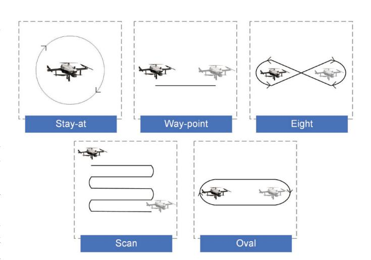

Fig. 7. Different patterns of paparazzi mobility model.

- • *Pure randomized mobility model (PRMM):* In PRMM, UAVs hover and move in random directions with random speed.
- *Time-dependent mobility model (TDMM):* In this model, the speed and direction of a UAV in the current time slot depend on the speed and direction of the UAV in the previous time slot.
- *Path-planned mobility model (PPMM):* In PPMM, UAVs follow a predefined path scheme provided to the network. At the end of each time slot, UAVs change the pattern randomly. Figure [7](#page-9-1) shows the most well-known mobility model in PPMM, so-called Paparazzi, which includes five patterns, namely stay-at, way-point, eight, scan, and oval. According to the stay-at pattern, the UAV hovers over a fixed position; in the case of way-point, eight, and scan, the UAV aims to move toward the destination using a straight path, an eightshape path, and a round path, respectively; finally, using the oval, the UAV shifts between two points in form of a round trip and turn around when passing the points.
- *Group mobility model (GMM):* The model provided by the GMM is different from the other mobility models of UAVs. A reference point is defined in the GMM, around which UAVs randomly move in a specific area.

# *B. Communications Channel Models*

Overall, the communication channel for UAVs is divided into two groups, namely the air-to-air (A2A) channel model and the air-to-ground (A2G) channel model. The former concerns the communications between a UAV and other nodes in the air, such as other UAVs and satellites. The latter, on the other hand, supports the corresponding communications between UAVs and the ground components, such as TNs and vehicles.

*1) A2A Channel Model:* Research studies show that Nakagami and Rice channel models are the models used in the connections between UAVs and other components in the network. The Rice model though is more suitable than the Nakagami model in the A2A applications as it considers the domination of both LoS and NLoS connections. The A2A channel model for aerial nodes is defined in terms of the power strength (in dBm) reached at the receiver in the communication as  $P_r = P_t - \mathcal{L} - p_\xi$ , wherein where  $P_t$  is the transmit power of the transmitter,  $\mathcal{L}$  indicates the path loss (so-called large scale effect), and  $p_\xi$  represents the Rice distribution (also known as small scale effect), all in dBm. The importance of  $p_\xi$  is due to its role in determining the Rice factor. Indeed, the Rice factor is a remarkable parameter that plays an important role in link-budget calculations and adaptive modulation. For a given  $x \geq 0$ ,  $p_\xi$  follows the Rician fading as [46]

$$p_{\xi}(x) = \frac{x}{\sigma_0^2} \exp\left(\frac{-x^2 - \rho^2}{2\sigma_0^2}\right) I_0\left(\frac{x\rho}{\sigma_0^2}\right),\tag{1}$$

where  $\rho$  and  $\sigma_0$  indicate the strength of the LoS and NLoS connections, respectively.  $p_{\xi}(x)$  follows the Rayleigh fading instead if there exists no LoS connections, i.e.,  $\rho = 0$  [46].

2) A2G Channel Model: Obstacles and weather conditions may affect the quality of the channel between the UAVs and the TNs. As such, a UAV can either establish a direct path, without any obstacles, with a TN, i.e., LoS connection, or make an NLoS connection, where the light is partially obstructed by physical obstacles between the UAV and the TN. Hence, based on the probabilistic path-loss model, the path-loss of the A2G link between a UAV and a TN comprises a probabilistic channel with respect to the LoS and the NLoS connections as [47]

$$\mathcal{L} = \underbrace{\frac{d^{-\alpha}}{1 + a \exp(-b[\theta - a])}}_{LoS} + \underbrace{\frac{\eta d^{-\alpha} a \exp(-b[\theta - a])}{1 + a \exp(-b[\theta - a])}}_{NLoS}, (2)$$

where a and b are the environment-related constants and  $\theta$  is the elevation angle in degrees. Considering h and d as the altitude of the UAV and the distance between the UAV-TN pair,  $\theta = (180/\pi) \sin^{-1}(h/d)$ . Further,  $\alpha$  denotes the pathloss exponent and  $\eta$  is an additional attenuation factor due to the NLoS connection [48].

#### C. Energy Consumption Model

The energy consumption of a UAV, acting as an ECN, mainly consists of two components, namely, propulsion energy and communication-computation-related energy. Each of these three components is overviewed in the following.

1) Propulsion Energy: Investigations indicate that the propulsion power consumption is derived from the drag force. There are three types of drag force, namely profile drag, induced drag, and parasitic draft. The frictional resistance of the blades when passing through the air leads to the profile drag. When the airflow circulates around the rotor blade, the induced drag is generated which creates lift. Finally, the parasite drag is a permanent drag during the UAV movement. The parasite drag is due to the non-lifting components of the UAV, such as the cabin, and has a direct relationship with the

airspeed [49], [50]. Based on the studies conducted in [51] and [52], the propulsion energy consumption for rotary-wing and fixed-wing UAVs are respectively given by

$$E_{prop,rot}(V) = T \left( \underbrace{P_0 \left( 1 + \frac{3V^2}{U_{tip}^2} \right)}_{\text{parasite}} + \underbrace{P_i \left( \sqrt{1 + \frac{V^4}{4v_0^4}} - \frac{V^2}{2v_0^2} \right)^{\frac{1}{2}}}_{\text{induced}} \right)$$

$$+ \underbrace{\frac{1}{2} d_0 \rho s A V^3}_{\text{parasite}} \right), \tag{3}$$

$$E_{prop,fix}(V) = T \left( \underbrace{c_1 V^3}_{\text{parasite}} + \underbrace{\frac{c_2}{V}}_{\text{parasite}} \right), \tag{4}$$

where  $P_0$  and  $P_i$  are the blade profile power and induced power in hovering status, respectively,  $v_0$  denotes the mean rotor induced velocity in hover,  $\rho$ , and A respectively indicate the air density and rotor disc area,  $U_{tip}$  represents the tip speed of the rotor blade, and  $d_0$  and s are the fuselage drag ratio and rotor solidity, respectively. Further,  $c_1$  and  $c_2$  are two constant parameters related to the UAV's weight, wing area, air density, etc., and T is the flight duration.

2) Communication-Computation-Related Energy: Communication-related energy is dominated by the energy spent by the UAV in signal transmission. On the other hand, the computation energy is spent by the UAV for task computing. The communication-computation energy of a UAV can be expressed as [53]

$$E_{comm-comp} = \underbrace{P_u \frac{L_v}{R_u}}_{\text{communication}} + \underbrace{\kappa f^3 t_{comp}}_{\text{computation}}, \quad (5)$$

where  $P_u$  and  $R_u$  indicate the transmit power and the transmission rate of the UAV, respectively.  $L_u$  reflects the size of the task transferred by the UAV. f is the computation resource allocated by the UAV (in CPU cycles per second).  $t_{comp}$  stands for the computation time. Finally,  $\kappa$  shows a coefficient depending on chip architecture.

When the UAV plays the role of an ECN for ground TNs receiving their raw data bits and sending them back the processed data, the communication-related energy is insignificant as compared to the other components of the UAV energy consumption. That's because the UAV can transmit the processed data in negligible time as the number of output bits is normally very small.

#### D. Examples of Practical Systems

UAVs are extremely used in practical scenarios, covering a wide range of applications ranging from military to civilian applications, such as disaster management, manufacturing, agriculture, etc. In this regard, different test-beds and platforms have been developed for the practical systems that we review the highly-used ones in the following.

An envisioned platform designed for UAVs is crowd surveillance in public places, such as stadiums, live concerts, parades, or even in sparse streets and urban areas, where the probability of crime is high and various dangers threaten people. UAVs fly over the places of interest and adopt face recognition approaches to track, detect, and recognize criminals [\[54\]](#page-34-15).

One of the most practical applications of UAVs is the advanced manufacturing technology (ATM), where the UAVs are employed to see (collect visual data in the forms of images and videos), sense (collect and transform data to information), and move (grab the objects and carry them out, or perform physical operations, such as spraying) [\[55\]](#page-34-16).

The other highly important application of UAVs is to manage the emergency condition in disasters, especially natural ones, i.e., forest fires, earthquakes, floods, volcanoes, landslides, rockfalls, and hurricanes. UAVs are leveraged in such scenarios to support different applications including disaster management, search and rescue, transportation, and training. In disaster management, the UAVs are responsible for collecting the required information and accordingly mapping their flight planning for monitoring the situation and assessing the damages that occurred to the system. In search and rescue scenarios, the UAVs take advantage of their mobility and versatility to pass over the difficult-to-access areas to search and collect the corresponding information (in the form of images). The other remarkable applicability of UAVs refers to their ability for transporting medical stuff or emergency supplies to the region in a cost-effective way by which the survival rate increases. In addition to the above-mentioned highly risked applications, UAVs can be used to train and prepare the personnel for the emergency medical services (EMS) in masscasualty incidents (MCI), where a large number of victims need emergency help [\[56\]](#page-34-17), [\[57\]](#page-34-18).

The flexibility of UAVs in reaching difficult-to-access areas along with the minimum disturbances these nodes provide in such areas make them suitable candidates for wildlife management. In such scenarios, the UAVs mainly focus on collecting information regarding the population of wild animals and other useful data on their species, habits, biodiversity, and life quality. The capability of UAVs in providing prompt responses to strange environment activities reduces the probability of permanent dangers that threaten the wild animals' life [\[58\]](#page-34-19).

Another area of interest in employing UAVs is agricultural applications. The test beds designed in the literature leverage UAVs for different purposes in agriculture. The UAVs can regularly perform mapping to check the quality of farmlands in terms of soil conditions and crop status. The UAVs can also be used in the spraying phase. This results in the efficient usage of pesticides, and thus, their wastage is prevented. The progress in the UAV industry led to the use of these vehicles for planning purposes. As such, the UAVs distribute seeds and plant nutrients when sowing. Besides, the UAVs are employed to monitor the quality of corps, control the irrigation where water is scarce, early diagnose insect pests, and conduct the artificial pollination of the honeybees by creating the wind field [\[59\]](#page-34-20), [\[60\]](#page-34-21).

## *E. Overall Insights and Summary*

UAVs could bring the data communication on all the x, y, and z axes. The 3D movement of UAVs enabled them to be quite fit for different applications specifically in disaster management. Moreover, they are highly flexible in the optimization of data communication such that the distance to other nodes can be optimized based on delay, energy, throughput, and other parameters. They are suitable for both LoS and NLoS communications. However, the high energy these nodes consume to fly over distances in the network is a major challenge for them to be part of the network for a long time.

## IV. GROUND VEHICULAR NODES

Internet of Vehicles (IoV) is one of the promising IoT applications wherein a network of connected intelligent vehicles provides different kinds of vehicular and non-vehicular services such as traffic congestion avoidance, environmental pollution control, autonomous driving, online gaming, AR, etc. In this regard, connected vehicles need to use communication technologies to establish connections with other vehicles and equipment in the network [\[19\]](#page-33-18).

Considering the explosive growth of intelligent devices and the huge amount of generated data, especially in urban areas, fixed ECNs may be unable to respond to the massive task computation demands required by smart applications. A solution to this problem is to deploy numerous fixed ECNs; however, this significantly adds to the cost and energy consumption of the system and leads to resource wastage during off-peak periods [\[61\]](#page-34-22). On the other hand, future smart vehicles will be equipped with powerful computing resources which will be underutilized if they are only used for the vehicles' own computation tasks. This is where the concept of vehicular edge computing (VEC) comes into place and VEC-enabled systems emerge.

## *A. Mobility Behavior*

Vehicular mobility models are classified into four main groups as follows [\[62\]](#page-34-23):

- • *Stochastic models:* For this model, the road topology is represented in the form of a graph, over which the vehicles randomly follow casual paths at random speed.
- *Traffic stream models:* This model treats the mobility of vehicles as a hydrodynamic phenomenon, where fundamental physics relationships are applied to the velocity, density, and out-flow of a fluid provided by the traffic models to evaluate the vehicles' speed.
- *Car-following models:* In the car-following model, a state is defined for each vehicle, including position, speed, and acceleration. Then, the system evaluates the behavior of each driver based on the state of the vehicle surrounded by.
- *Flows-interaction models:* This model characterizes the mobility of vehicles in regions where the vehicular flows are merged, such as intersections or highway ramps. For instance, the model is used to control the movement of vehicles at crossroads, where it evaluates the point at which the first vehicle needs to stop.

#### B. Communications Channel Models

The channel condition in vehicular-based scenarios is affected by different parameters namely path loss, delay dispersion, and Doppler spread. Path loss is the power attenuation between a transmitter and a receiver. Delay dispersion mostly focuses on quantifying the extent of the channel impulse response (CIR) for communications. And, Doppler spread quantifies the effects of the channel spreading on a transmitted tone in the frequency domain that is derived from the motions. All aforementioned parameters in IoV connections are under the domination of CIR [63], [64].

Overall, channel modeling has been barely studied for vehicular communications so there are few investigations on V2V and V2I channel modeling in the literature. In the following, we review those models.

1) V2V CIR: V2V is the connection between a vehicle and other vehicles in the network. For V2V communications, the channel response at time t to an impulse response at time  $t-\tau$  given by [64], [65]

$$h(\tau,t) = \sum_{l=1}^{L(t)} z_l(t)\alpha_l(t)e^{j\psi_l}\delta(\tau - \tau_l(t)), \tag{6}$$

where  $\alpha_l$  is the l-th path amplitude.  $\psi_l$  is a replacement for  $\omega_{D,l}(t)(t-\tau_l(t))-\omega_c(t)\tau_c(t)$ , wherein  $\omega_{D,l}$  and  $\omega_c$  reflect the angular frequency for Doppler frequency  $f_{D,l}=\omega_{D,l}/(2\pi)$  and carrier frequency  $f_c=\omega_c/(2\pi)$ , respectively. Finally,  $\delta$  represents the Dirack delta (impulse).

2) V2I CIR: V2I refers to the connection between a vehicle and the network infrastructures, such as RSUs, traffic lights, road sensors, and cameras. The V2I CIR follows the same model provided in (6) though with slight changes as follows [63]

$$h(\tau, t) = F_{LS} \sum_{l=1}^{L} \alpha_l e^{j\psi_l} s(\vartheta_l) \delta(\tau - \tau_l, t - \vartheta_l), \qquad (7)$$

where  $F_{LS}$  indicates the large-scale fading due to the shadowing effect.  $\alpha_l e^{j\psi_l}$  represents the complex gain.  $\tau_l$  and  $\vartheta_l$  show the excess delay and the elevation angle-of-arrival, respectively. Finally, for a reference point,  $s(\vartheta_l)$  is the phase shift that depends on the element placement and the incident angle.

#### C. Energy Consumption Model

Limited research efforts have been devoted to investigating the energy consumption models of vehicles in vehicular networks. Studies show that the major energy consumption in IoV networks refers to the energy consumption of infrastructures, i.e., RSUs or BSs, in the network. RSUs are the fundamental components of the IoV which are located aside from the road and support vehicles by connecting them to the communication infrastructures. Although future vehicles are expected to be designed in a way that they can process most of their own tasks, their processing resources are still limited, and offloading some of the vehicles' computations to the RSUs is inevitable. For an RSU, the power consumption model is expressed in terms of its power consumption in both sleep and

active models so that [42]

$$P_{RSU} = P_{sleep} + I_{active}(P_{add} + \eta P_{tx}), \tag{8}$$

where  $P_{sleep}$  is the constant power the RSU consumes in the sleep mode.  $P_{add}$  indicates the additional constant power the RSU consumes for computation, backhaul communication, and power supply in active mode.  $P_{tx}$  and  $\eta \in [0,1]$  reflect the maximum transmit power of the RSU and the usage rate, respectively. Notably,  $I_c(u)$  is an indicator function, where is equal to u if c is met, and zero otherwise.

Let us consider  $P_c$  and  $e_v$  as the circuit power of a vehicle and its energy consumption for processing one bit, respectively. Given t as the travel time of the vehicle, the energy consumption of a vehicle is given by [42]

$$E_v = P_v \frac{L_v}{R_v} + P_c t + e_v L_v, \tag{9}$$

where  $P_v$  and  $R_v$  are the transmit power and the transmission rate of the vehicle, respectively.  $L_v$  is also the size of the task the vehicle offloads to the RSU.

#### D. Examples of Practical Systems

Autonomous vehicles, also known as driverless connected cars, are the most realistic test-beds for the IoV nowadays. Owing to AI, cars can provide a high level of services to the TNs without human interaction. As such, travel and transportation would be safer, faster, and more suitable with fewer omitted greenhouse gasses. CarStream is a big data processing system in this regard that collects driving data, analyzes them, and accordingly provides the corresponding services. Uber and Tesla are the biggest companies in employing autonomous vehicles [66], [67].

Overall, the applications of ground vehicular nodes are divided into two primary categories, namely intelligent transportation systems (ITS) and smart cities. The former only considers the interconnection between vehicles wherein vehicles are responsible for car tracking and traffic management to avoid incidents and collisions at the intersections. They also are used to optimally manage the parking lots and traffic lights for avoiding congestion. The latter, however, mainly focuses on other objects available in the network. Indeed, the vehicles in smart cities scenarios take over different duties ranging from data sensing and collection to information analysis, processing, and storage [68], [69].

As an example of smart city applications, we can point out the HazeWatch project implemented in metropolitan Sydney to measure air pollution concentrations. The vehicles leveraged in this project are equipped with several low-cost mobile sensor units to measure air pollution concentrations. The users' mobile phones, on the other hand, tag the data and upload them in real-time over the Web. As a result, the pollution maps of the city are created in real-time by which the passengers choose the route so that the future exposure is alleviated [70].

The other practical system in this category is the structural health monitoring (SHM) of the Harvard bridge, where the data stream collected by the number of smartphones within cars traversing the bridge in a month was quantified to measure the crowdsensing bridge vibration. This platform subsequently leads to the automatic maintenance of the bridge [71].

MobEyes is another practical system designed for the smart healthcare sector in IoT networks. Vehicles in MobEyes are categorized into extractor vehicles and collector vehicles. Extractor vehicles are responsible for extracting the features from the data collected by the users to generate data summaries. Then, MobEyes collectors move toward the neighbor vehicles and opportunistically harvest summaries from them [72].

#### E. Overall Insights and Summary

The mobility of ground vehicle nodes is limited to x and y axes along the roads. It implies that there might be some spots that do not come within the communication range of such vehicle nodes, e.g., those who are in high raising towers or those who are close to a road. Generally, ground vehicle nodes contribute to the ITS and smart city applications, and the communication channels follow NLoS due to the presence of many obstacles between the nodes. Also, unlike UAVs, the energy budget is not constrained.

#### V. SPATIAL NODES

In sparsely populated areas, where installing terrestrial BSs are not cost-efficient, or wherever there is a need for servers that can cover a large area without any limitations, or even under special conditions when natural disasters damage the terrestrial BSs, satellites are introduced to play the role of ECNs in the network.

#### A. Mobility Behavior

The mobility behavior of satellites refers to the shape and the speed of a satellite that moves around Earth, so-called orbit. The orbit is affected by the height of the orbit, eccentricity, and inclination. The distance between the satellite and the surface of Earth defines the height of the orbit. The satellite's speed is directly affected by the height of the orbit for which the closer distance to Earth leads to faster movement of the satellite as the pull of gravity is stronger. Eccentricity and inclination form the shape of orbit so that low eccentricity and high eccentricity stand for a nearly circular orbit and an elliptical orbit, respectively. Inclination, on the other hand, is the angle of the orbit with respect to Earth's equator. Therefore, orbiting directly above the equator results in zero inclination, whereas orbiting from the north pole to the south pole yields 90 degrees inclination. Figure 8 shows different classes of satellites' orbit [73].

#### B. Communications Channel Models

In the space information networks (SIN) or satellite-terrestrial integrated network (STIN) [20], the TNs are connected to the satellites equipped with multibeam antennas. Let us consider a system including one Earth station (ES), one GEO/NGEO satellite (equipped with *N* antennas), and *M* TNs, where the ES feeds the GEO/NGEO satellites. Thereby, the TNs can send (receive) the information to (from) the GEO/NGEO satellite through the multibeam antenna pattern.

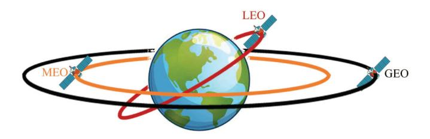

Fig. 8. Different classes of satellites' orbit [73], [74].

1) GEO Satellite-Based Channel Model: The channel coefficient between the ES and the k-th on-board beam for downlink is expressed as [75], [76]

$$f_k = \underbrace{\left(\frac{\lambda}{4\pi}\sqrt{\frac{G_k G_{ES}}{d_h^2 + d_0^2}}\right)}_{\text{radio propagation loss}} \underbrace{\frac{\text{random shadowed-Rician}}{(A\exp\left(j\vartheta\right) + Z\exp\left(j\psi\right))}, (10)$$

where  $\lambda$  is the carrier wavelength.  $d_h$  shows the distance between the ES and the k-th center beam.  $d_0=35786~km$  stands for the height of the GEO satellite. A and Z are the amplitudes of the scattering and the loss component that follows the Rayleigh and the Nakagami-m distributions, respectively.  $\vartheta$  stands for the stationary random phase which is uniformly distributed over  $[0,2\pi)$ .  $\psi$ , on the other hand, is the deterministic phase of the LoS part.  $G_k$  and  $G_{ES}$  respectively indicate the gain of the k-th satellite on-board beam and the ES's antenna, so that

$$G_{ES} \approx \begin{cases} \overline{G}_{max} & 0^{\circ} < \beta < 1^{\circ} \\ 32 - 25 \log \beta & 1^{\circ} < \beta < 48^{\circ} \\ -10 & 48^{\circ} < \beta \leq 180^{\circ}, \text{ and} \end{cases}$$

$$G_{k} \approx G_{max} \left( \frac{J_{1}(u_{k})}{2u_{k}} + 36 \frac{J_{3}(u_{k})}{u_{k}^{3}} \right)^{2},$$

where  $\overline{G}_{max}$  and  $G_{max}$  are the maximum beam gain at the boresight and the maximal beam gain, respectively.  $\beta$  shows the off-boresight angle.  $u_k$  is a replacement for  $2.07123\sin\theta_k/\sin(\theta_k)_{3dB}$ , wherein  $\theta_k$  represents the angle between the ES position and the k-the beam center. Moreover,  $(\theta_k)_{3dB}$  stands for the 3dB angle of the k-th on-board beam.  $J_1(\cdot)$  and  $J_3(\cdot)$  reflect the first-kind Bessel function of orders one and the third, respectively. Importantly,  $\theta_k \to 0$  gives the best system performance by which  $G_k = G_{max}$ .

2) NGEO Satellite-Based Channel Model: In such a system, the satellite broadcasts the superposition coded signal  $\mathbf{x}$  over the downlink channels, toward the TNs. Let us define  $\alpha_i$  intra-region power allocation factor of the *i*-the TN (so-denoted TNi), so that  $\sum_{i=1}^{M} \alpha_i \leq 1$ . For the given Gaussian distributed signal of unit norm  $s_i$  for TNi, we have  $\mathbf{x} = \mathbf{w} \sum_{i=1}^{m} \sqrt{\alpha_i} s_i$ , wherein  $\mathbf{w}$  indicates the N-dimensional spot beam based on the channel state information (CSI). Hence, the received signal at TNi is given by [77]

$$y_i = \left(\mathbf{b}_i^{1/2} \odot \mathbf{r}_i^{1/2} \odot \mathbf{q}_i\right) \mathbf{x} + n_i, \tag{11}$$

where  $n_i$  is the additive white Gaussian noise (AWGN) with variance  $\sigma^2$ .  $\mathbf{b}_i$  models the satellite antenna radiation pattern

and the path loss as

$$b_i^k = \left(\frac{\lambda}{4\pi d_0}\right)^2 \frac{G_{ik} D_i}{\kappa B \mathcal{T}},$$

where  $D_i$  and  $G_{ik}$  represent the received antenna gain at  $TN_i$  and the antenna gain between the k-th antenna in the satellite and the TN, respectively.  $\kappa$  stands for Boltzmann's constant. B and  $\mathcal{T}$  indicate the carrier bandwidth and the receive noise temperature, respectively. On the other hand,  $\mathbf{q}_i$  is the N-dimensional phase vector. Moreover,  $\mathbf{r}_i$  shows the N-dimensional rain attenuation coefficient, so that

$$r_i^k = \sqrt{10^{-\frac{z_i^k}{20}}},$$

where  $z_i^k$  is a random variable following the lognormal random distribution.

#### C. Energy Consumption Model

The only force affecting the satellites is the internal force of gravity. Hence, the external forces on the satellites are zero. This implies that the total mechanical energy of a satellite remains unchanged while orbiting the Earth. Therefore, the energy consumption model of satellites in SIN is expressed in terms of *N*-dimensional spot beam  $\mathbf{w}$  which is represented based on the CSI to coordinate the inter-region interference. Therefore, the energy consumption of the satellites is equal to  $\|\mathbf{w}\|^2$  [77].

#### D. Examples of Practical Systems

Satellite IoT is a newly emerged technology whereby a wider range of communications than the traditional cellular networks is provided to the TNs, even in urban and/or difficult-to-access areas. The Iridium network is a pioneer in satellite IoT technology that employs 66 LEO satellites to provide the IoT networks with reliable and ubiquitous coverage [78].

Utilizing satellite IoT technology is growing fast. For example, satellites are employed in the civil sector to efficiently connect different entities such as schools, hospitals, universities, malls, etc. An example of such a system is the Schoolap start-up that uses satellites to provide high-speed Internet connections between different entities in the Democratic Republic of Congo. Satellite IoT can also be used in banking and insurance to connect automated teller machines (ATMs) and other facilities of banks and insurance companies with a high level of reliability. Besides, satellite communications make remote monitoring of procedures in construction and mining possible [79].

Eutelsat ADVANCE company (briefly ADVANCE) is a developed company in satellite IoT communications that conduct different projects. For instance, currently, they are using satellites to support smart-grid connections. The future horizon of the company is to broaden the satellite communications to construct green, high-performance grids [80].

ADVANCE also provides wide coverage of satellite communications to the retail and hospitality sector, such as warehouses, hotels, and remote tourist sites. Moreover, the

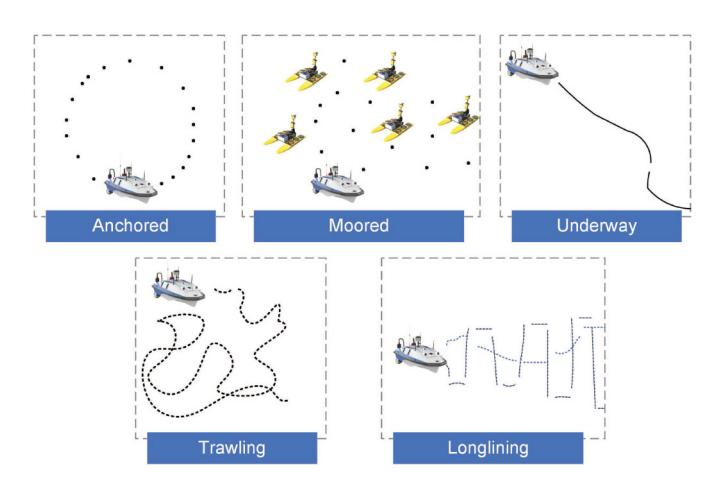

Fig. 9. Mobility patterns of vessels [82].

ADVANCE facilitates the remote monitoring of soil, sunlight, snow cover, moisture, drought, irrigation, and crop development for agricultural activities [79].

#### E. Overall Insights and Summary

The spatial nodes are mainly used for space research and have a wider footprint of network coverage over the earth. It is highly dependent on the level of orbit that these nodes are located. As the altitude increases the gravity reduces, and the spatial nodes do not need to consume too much power for their movement to overcome the gravity. However, the delay in a round trip increases. For example, for GEO Satellites which are 36,000 kilometers above the equator, a round trip delay is at least 250 milliseconds.

#### VI. MARITIME NODES

Marine IoT was introduced by United Nations chartered International Maritime Organization (IMO). These networks comprise different sensors deployed in the marine environment in order to sense, measure, and collect data for different purposes, such as water temperature and pressure, salinity, and wind direction and speed [81].

#### A. Mobility Behavior

Overall, as seen in Fig. 9, the mobility pattern of the maritime vessels is classified into five categories below [82]:

- Anchored: This model is affected by the wind, tide, or sea currents so that the vessels turn around an offshore anchor located at an anchorage area. This results in forming a circular or semi-circular pattern by the vessels.
- Moored: In this model, the vessels are eager to tether a
  permanent structure for which they anchor inside a port.
  In the moored model, the mobility of the vessel is limited
  by the mooring buoys. In fact, the mooring buoys act as
  hampers so that the vessels are stopped.
-  Underway: The underway model refers to a pattern wherein a vessel is continuously moving, without any anchoring.

- *Trawling:* In this model, the vessels move in different directions at a steady speed. This can last for a long time, from several hours to a few days.
- Longlining: In this model, the vessels first determine the moving directions. In light of that, the vessels, attached to the baited hooks, move at a steady speed to set the fishing lines. After determining all lines, the vessels follow them slowly.

#### B. Communications Channel Models

The communication between the nodes in the maritime IoT (M-IoT) follows the machine-type communication (MC), also known as machine-to-machine (M2M) communication, which are limited versions of communications such as Blu-ray and acoustic [83], [84].

In practical scenarios, different use-cases in the M-IoT follow various channel models. Nevertheless, the researchers could provide a unified model in this regard based on the time-variant channel responses h(t). Therefore, considering  $\tilde{N}_l, l \in s, b$  as the effective scatters likewise existing on the surface of the sea (l = s) and the bottom of the sea (l = b), we have [84]

$$h(t) = \sum_{n=1}^{\tilde{N}_l} c_n \exp\left[-2\pi j f_0 \left(t + \frac{\triangle L_n}{\nu_0}\right)\right] \delta(t - \triangle t_n),$$
(12)

where  $c_n$  is a function that covers the initial gain along with the subsequent losses.  $f_0$  and  $\nu_0$  represent the frequency and the speed of the acoustic wave in the water, respectively.  $\delta(\cdot)$  is the Dirac delta function. Finally,  $\triangle L_n$  and  $\triangle t_n$  reflect the difference in the propagation path length and the propagation delay, respectively.

#### C. Energy Consumption Model

When a maritime vessel accepts to receive the information for processing, it first listens for the pilot signal. Upon the receipt of the task, the vessel decides to either start the processing of the task locally or offload it to other vessels depending on its available computing resources. Therefore, the total energy consumption of a maritime vessel m can be expressed as [85], [86]

$$E_{m} = \underbrace{P_{m,L}t_{m,L}}_{\text{listening}} + \underbrace{P_{m,G}\frac{C_{m,G}}{S_{m,loc}}}_{\text{local}} + \underbrace{\left(2^{R_{m}/B} - 1\right)c_{m}^{-1}\sigma^{2}}_{\text{offloading}},$$
(13)

where  $P_{m,L}$  is the power of the vessel for listening during the listening period  $t_{m,L}$ .  $P_{m,G}$  and  $S_{m,loc}$  represent the executive power and the computing speed of the vessel, respectively.  $C_{m,G}$  shows the required computing resources for processing the task.  $R_m$  indicates the transmission rate of the vessel with respect to the channel condition  $c_m$ . Finally, B and  $\sigma^2$  stand for the bandwidth and the power of AWGN, respectively.

#### D. Examples of Practical Systems

Like other classifications of mobile ECNs, maritime vessels can be used in smart-healthcare scenarios, especially in remote and isolated areas. For example, a platform was developed to check the routine of prenatal examinations of pregnant women who resided in an isolated Amazon region in Brazil. Boats in this platform played the role of data mule nodes and collect medical ultrasound videos from isolated communities and carry them to the physicians. After that, the physicians performed remote analysis to follow up on the situations of the women [87].

Other main applications of maritime vessels in IoT networks are route optimization, asset tracking, and equipment maintenance. Daily, giant ships, carrying cargo, are traversing big oceans. Route Exchange is a software developed on the Horten-Moss IoT IoT@Sea Test-bed that indicates an interactive map of the ship. Using that, the captains can notice other seafarers with their route intentions, as well as an estimated arrival time, in real-time [88].

On the other hand, Ericsson's Maritime ICT Cloud is a platform designed for monitoring the expensive equipment of maritime vessels and fixing the corresponding problems. The package also contains services for fleet management, fuel consumption, engine monitoring, and route overseeing and navigation. Moreover, it provides integrated communications for the crew by which data are collected and reports are generated to ensure the wellbeing of the crew [89].

#### E. Overall Insights and Summary

The maritime nodes use acoustic waves that have the speed of sound with a very high frequency and that is why M2M communication is in place. This implies that the speed of data communication is less compared to the electromagnetic waves that have the speed of light for propagation and also LoS communication will be used in the communication between these nodes due to the very high frequency used.

## VII. COMPARISON OF DIFFERENT ECNS

In this section, we analyze the impact of all different groups of ECNs on the efficiency of the edge computing systems in IoT. Table III summarizes the overall comparison between different ECNs in the corresponding systems.

#### A. Mobility Pattern

Mobility and movement are the major features that give priority to mobile ECNs over their fixed counterparts in improving the efficiency of edge computing systems in IoT. However, the mobility pattern of ECNs is different from each other. Aerial and spatial nodes follow 3D movement that results in optimal adjusting of the distance with respect to the TNs so that delay, energy, throughput, and other parameters are optimized. However, aerial nodes are more flexible than spatial in optimizing their 3D placement because they are closer to the TNs. On the other hand, ground vehicular nodes and maritime nodes follow 2D directions which might lead to the reduction of network performance due to some spots that

TABLE III COMPARISON OF DIFFERENT ECNS

| Type of ECN      | Mobility Pattern | Coverage Area | Type of Communication | Speed of Communication |
|------------------|------------------|---------------|-----------------------|------------------------|
| Aerial           | 3D               | Medium        | LoS/NLoS              | Low-to-High            |
| Ground Vehicular | 2D               | Narrow        | LoS/NLoS              | Low-to-High            |
| Spatial          | 3D               | Wide          | LoS                   | Low                    |
| Maritime         | 2D               | Narrow        | LoS                   | Low                    |

do not come within the communication range of the nodes, e.g., those locating in high raising towers.

## *B. Coverage Area*

Coverage area is a function of altitude so that higher altitude leads to a wider coverage area. Therefore, the spatial nodes have the widest footprint of network coverage over the earth. Aerial nodes are in second place from this aspect. As such, both spatial and aerial nodes are leveraged in disaster management applications, where serving nodes need to cover wider areas. Ground vehicular and maritime nodes provide narrower coverage areas than the two other groups.

## *C. Communication Channel: Type and Speed*

Aerial and ground vehicular nodes can establish both LoS and NLoS communications. Therefore, the communication speed can vary from high to low from LoS to NLoS. Maritime nodes use acoustic waves whose speed is less compared to the electromagnetic waves that have the speed of light for propagation. Also, the very high frequency employed in acoustic waves causes maritime nodes to establish LoS communication with TNs. The communication speed of spatial nodes is highly dependent on the level of orbit that these nodes are located. As the altitude increases, the delay in a round trip increases. For example, for GEO Satellites which are 36,000 kilometers above the equator, a round trip delay is at least 250 milliseconds. Overall, the spatial nodes suffer from high-delayed communications.

## VIII. SINGULAR NODE TYPE-SUPPORTED APPLICATIONS

This section is divided into four sections with respect to the types of mobile ECNs. For each group, the state-ofthe-art is provided wherein existing methods, frameworks, schemes, and algorithms related to the corresponding architecture are reviewed. Each section is ended with a summary of the challenges that the group is scrimmaging against.

## *A. UAV-Assisted Edge Computing-Enabled IoT Applications*

Due to the distinctive features of UAVs, such as on-demand deployment, flexibility, scalability, and easy programmability, these nodes have received substantial interest in improving the performance of wireless networks and tackling the issues present in conventional terrestrial communication systems. Specifically, UAVs have been used as relays [\[90\]](#page-35-5), [\[91\]](#page-35-6), [\[92\]](#page-35-7), [\[93\]](#page-35-8), [\[94\]](#page-35-9), aerial BSs [\[51\]](#page-34-12), [\[95\]](#page-35-10), data collectors [\[96\]](#page-35-11), [\[97\]](#page-35-12), [\[98\]](#page-35-13), [\[99\]](#page-35-14), and cache servers [\[100\]](#page-35-15) in order to extend the coverage,

provide communication for the nodes placed in infrastructureless areas, improve the network throughput, reduce the communication latency, etc. Recently, the employment of UAVs as dynamic ECNs has attracted extensive research and UAVs have proved useful for providing on-demand and flexible computation services to ground TNs. This is especially important for systems with limited or no available infrastructure, where it is costly or impractical to deploy fixed ECNs. UAVs can also be used as ECNs in emergencies like an earthquake, where TNs cannot access fixed ECNs. Another important use-case of UAVs as ECNs is in hot-spot areas in which the high volume of offloading data overloads the fixed ECNs and the latency of task completion increases exponentially due to long waiting periods for the tasks to be processed. The location flexibility and easy deployment of UAVs have made them one of the most prominent classes of mobile ECNs which can offer timely services in various networking conditions. Therefore, this section aims to comprehensively review this class of mobile ECNs.

Here, we review the works on UAV-assisted edge computing systems, where the TNs rely on one or multiple UAVs to perform their computation-intensive tasks. We categorize the existing literature on UAV-aided edge computing systems into three groups, namely single-UAV-assisted edge computing systems, multi-UAV-assisted edge computing systems, and hybrid UAV-assisted edge computing systems. Figures [10](#page-17-0) - [12](#page-17-1) indicates the corresponding architectures. Specifically, many papers consider the employment of one single UAV to which the TNs can offload their computing jobs to be processed (see Fig. [10\)](#page-17-0). However, in some cases, for instance, in largescale networks, using only one UAV may not be sufficient to address the huge computation demands from the TNs. In such cases, using multiple UAVs (see Fig. [11\)](#page-17-2) or utilizing a hybrid system (see Fig. [12\)](#page-17-1) where one or more UAVs cooperate with fixed ECNs and/or a central cloud for responding to computation requests can substantially improve the performance of the system. Generally, offloading has two operation modes: partial offloading and binary offloading. In partial offloading, only a portion of a task is transmitted to the ECN(s), while in binary offloading, the task as a whole is offloaded to the ECN(s) for being executed. The typical variables that need to be optimized in a UAV-assisted edge computing system are the UAV placement and/or trajectory, communication and computation resource allocation, and task offloading decisions, i.e., whether a task should be offloaded or not and what portion of the task needs to be offloaded (in case of partial offloading). Furthermore, in multi-UAV-assisted edge computing systems, TN-to-UAV association is a key decision variable that determines which TNs are served by a specific UAV.

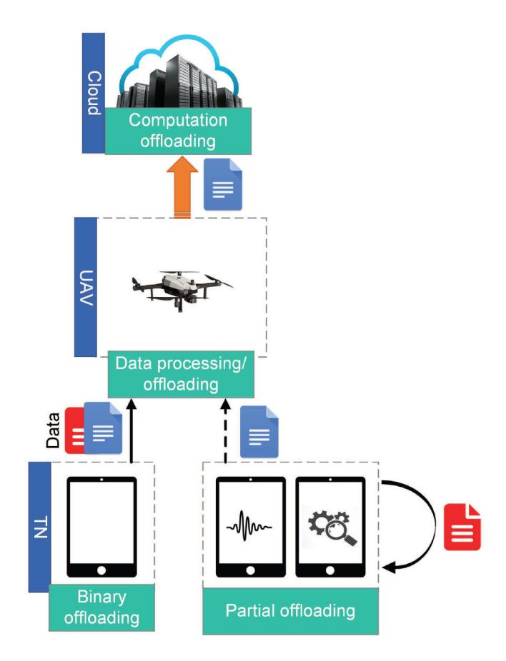

Fig. 10. Single-UAV-assisted architecture of edge computing systems.

*1) Single-UAV-Assisted Edge Computing Systems:* One of the most popular problems studied in single-UAV-assisted edge computing systems is the energy minimization problem. Many research work have investigated the minimization of energy expenditure at either the TNs or the UAV, and some researchers have considered minimizing the overall energy consumption of the whole system including the TNs and the UAV. Paper [\[101\]](#page-35-16) studies an energy minimization problem, where the objective is to minimize the overall energy consumption of the TNs. As binary offloading is considered, each TN has to either perform the computations locally or offload the whole task to the UAV. Therefore, for the TNs which opt for local computing, the energy consumption only includes the spent energy on performing the computations and as for those who offload their task to the UAV, only the energy spent on task offloading is considered. The authors impose constraints on the maximum permissible delay of each task and the energy consumption of the UAV to ensure that all the tasks are completed on time and the energy usage at the UAV does not exceed its energy budget. In particular, the energy usage at the UAV consists of three parts, namely, computation energy, hovering energy, and flying energy. The time frame is divided into time slots such that in each time slot, the location of the UAV is assumed to be fixed. The variables of interest are offloading decisions, UAV trajectory, and bit allocation, where the latter accounts for the number of bits that are transmitted to the UAV by each TN in each time slot. An alternating optimization (AO) algorithm is adopted for

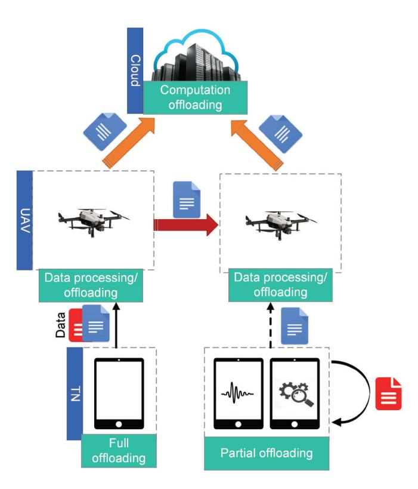

Fig. 11. Multi-UAV-assisted architecture of edge computing systems.

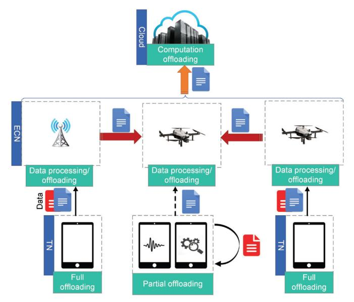

Fig. 12. Hybrid-UAV-assisted architecture of edge computing systems.

solving the energy minimization problem. The performance of the proposed framework is compared with two benchmarks; one is the scheme where all the TNs perform local computation and the other is the approach in which all the TNs offload their tasks to the UAV. The results show that the proposed scheme is superior to the benchmarks in saving energy consumption at the TNs. This work is extended in [\[102\]](#page-35-17) by taking into account the energy spent by the TNs for receiving the processed data in the downlink as well as the energy consumed by the UAV on data transmission and reception.

The UAV can also act as an energy source for the energyconstrained ground TNs. Using the technology of wireless power transfer (WPT), the UAV can charge TNs by transferring wireless energy signals in the downlink. In this light, a UAV-aided wireless powered edge computing network is considered in [\[103\]](#page-35-18), where the UAV is assumed to hover at a number of specified locations, remaining at each location for some time. Each TN selects one of the hovering locations and transmits its data to the UAV when the UAV hovers in the selected location. Therefore, more than one TN may be served by the UAV in each hovering position. The UAV serves the TNs in a sequential manner and can perform computations at the same as either WPT or data receiving; however, WPT and data reception at the UAV are not allowed simultaneously because the transmitted energy signal of the UAV would severely interfere with the received signal. The authors refer to the proposed scheme as a multi-workflow scheme. The objective of this work is to minimize the energy consumption of the UAV which consists of computation energy, hovering energy, and WPT energy. In specific, the aim is to find the optimal hovering durations, computation resource allocation, TN-to-UAV associations (i.e., which TNs are served by the UAV at each hovering location), and the service sequence of the TNs (i.e., the order based on which the TNs are served at each hovering position). The problem is solved by an AO algorithm and an adaptive method is also devised for properly choosing the initial point of the AO algorithm. Two benchmarks are considered for assessing the performance of the proposed mechanism. One is the scheme with a single workflow, where WPT and data reception cannot be performed concurrently with computation at the UAV. The second is a multi-workflow framework where the service sequence is not optimized in each hovering location. Based on the conducted numerical simulations, the proposed scheme outperforms the benchmarks in terms of UAV energy consumption. Further, the hovering time of the UAV in the proposed framework is smaller than in the other two approaches.

In contrast to [\[101\]](#page-35-16), [\[102\]](#page-35-17) and [\[103\]](#page-35-18) which consider the minimization of energy consumption either at the TNs' or at the UAV, the work in [\[104\]](#page-35-19) defines a new objective function which is the average weighted energy consumption of the TNs and the UAV. A stochastic model is assumed for the arrival of tasks at the TNs in which, each TN keeps a queue for the arriving tasks and the queued tasks are served on a first-in-first-out basis. Due to the task model, the studied problem is a stochastic optimization problem for solving which, the authors first utilize a Lyapunov-based method to remove the time coupling of variables and then propose an iterative online algorithm to find the optimal solution to the variables which are the task offloading portions, the number of CPU cycles required for executing the tasks at the TNs and the UAV, and the trajectory of the UAV. The proposed method is benchmarked against two schemes that only minimize the energy consumption of either the UAV or the TNs. The proposed method can process more tasks compared to the scheme which only considers the energy minimization at the UAV and saves more energy than the approach in which the energy consumption of the TNs is minimized. Therefore, this work can achieve a satisfactory balance between the system energy consumption and the number of served tasks.

Energy efficiency is another important metric in UAVassisted edge computing systems, where the number of computation bits per Joule of energy consumption is considered. An energy efficiency maximization problem in single-UAVassisted edge computing networks is studied in [\[105\]](#page-35-20), where the aim is to maximize the ratio of the total offloaded computation data to the UAV energy consumption. This work considers two main sources for the energy consumption of the UAV, namely, propulsion energy and computing energy. The communication energy of the UAV is ignored because the energy that the UAV spends for transmitting the processed information to the TNs is very small as the size of the output data is usually much smaller than that of the input data. A distributed algorithm is proposed which allows the UAV and ground TNs to solve the optimization problem in a cooperative manner. In particular, the original problem is first transformed into a more tractable form using the Dinkelbach and successive convex approximation (SCA) techniques; then, the problem is decomposed into sub-problems using the alternating direction method of multipliers (ADMM) technique. The power allocation optimization sub-problem is solved by the TNs, while the optimal computation load allocation and UAV trajectory are decided at the UAV. The authors also apply a spatial distribution estimation technique for predicting the place of the TNs. This predicted information is useful for solving the problem in scenarios where the knowledge of user mobility is limited. The considered optimization problems are subject to the computation offloading requirement at the TNs, implying that for each TN, there is a minimum amount of data that must be offloaded to the UAV. According to the simulation results, with tighter offloading requirements, the energy efficiency degrades because the UAV needs to move closer to the TNs to satisfy their requirements.

Similar to [\[103\]](#page-35-18), Zhou et al. study a UAV-assisted wireless powered edge computing system in [\[106\]](#page-35-21), where a UAV takes the dual roles of energy transmitter and ECN for the TNs. The collected energy by the TNs can be used for their local computation and data offloading. Here, the objective is to maximize a weighted sum of computation bits of all TNs. Both binary and partial offloading modes are considered in this paper and the authors propose AO-based algorithms to solve the optimization problems in which the CPU frequencies, offloading times, TNs' transmit power, and the UAV trajectory are optimized. Numerical evaluations demonstrate that a greater number of computation bits is achievable in the partial offloading mode as compared to the binary offloading mode because the TNs can flexibly determine the optimal portion of offloaded data to the UAV in the former.

In [\[107\]](#page-35-22), a time-slotted communication frame is considered and the TDMA protocol is utilized for scheduling the TNs' computation offloading to the UAV. In each time slot, the UAV can serve at most one TN; thus, some TNs do not succeed in transmitting their computation data to the UAV and have to perform all the computations locally. This work aims to minimize the sum of the maximum delay among TNs in each time slot. For the TN which offloads part of its computation

tasks to the UAV, the experienced delay is the maximum of two values, one of which is the summation of offloading time and computation time at the UAV and the other is the local computation time. The TN which is not served by the UAV only experiences the local computation delay. A novel penalty dual decomposition (PDD)-based algorithm is developed for solving the optimization problem which is inspired by the optimization framework in [\[108\]](#page-35-23). Briefly, the equality constraints are dualized and penalized into the objective function as augmented Lagrangian items and a PDD-based algorithm is proposed for finding the solution. The authors also propose a simplified *l*0-norm algorithm with reasonable performance and much lower complexity. Simulation results show the superiority of the PDD-based algorithm over the *l*0-norm-based scheme, which comes at the expense of higher computational complexity.

*2) Multi-UAV-Assisted Edge Computing Systems:* A multi-UAV-assisted edge computing network is proposed in [\[109\]](#page-35-24), where the objective is to maximize the computation efficiency of the system, defined as the ratio of the computation bits to the overall energy consumption. The considered computation efficiency maximization problem is similar to the energy efficiency maximization problem in [\[105\]](#page-35-20); thus, energy efficiency and computation efficiency can be interchangeably used in edge computing systems. The authors aim to optimize TNto-UAV associations, CPU cycle frequency allocation, power and spectrum allocation, and the trajectory of the UAVs. In order to guarantee the quality of computation services, a constraint on the minimum required computation bits for each TN is imposed on the problem. A two-layer algorithm is presented for solving the problem in which the outer layer exploits the Dinkelbach method and the inner layer consists of an alternative algorithm for iteratively optimizing TN-to-UAV associations, computation and communication resource allocation, and trajectory scheduling. The scheme with a fixed UAV trajectory is selected as a benchmark in simulations, where the results show that the benchmark exhibits very poor performance in terms of computation efficiency. The reason is that due to the fixed UAV trajectory, the quality of the channel between TNs and UAVs cannot be ensured which makes the TNs opt for local computation instead of offloading their computation data to the UAVs. However, because of the low computation capability of the TNs, the computed data is very small, leading to low computation efficiency. Another benchmark is the approach in which the number of computation bits is maximized regardless of the energy consumption. This scheme outperforms the proposed scheme in terms of the computation bits but has very high energy consumption.

Another multi-UAV-aided edge computing system is studied in [\[110\]](#page-35-25) where multiple UAVs are deployed having different roles in assisting the system. In particular, each deployed UAV can act as either an ECN or a relay depending on its capabilities and available resources. Specifically, some UAVs may not be equipped with computing capabilities; these UAVs can only be used as relays to forward the TNs' data to nearby UAVs which are able to perform computing. Moreover, as the available computing resources of the UAVs are typically limited, some UAVs may not be able to carry out the requested task executions from the TNs because their resources are already in use for executing other tasks. These UAVs can act as a relay to transfer the requested tasks to other UAVs with available computing resources. Each TN is associated with one UAV, called its home UAV, to which it offloads its computation data. The home UAV then decides whether to locally compute the tasks or to forward them to another UAV. The main objective of this work is to minimize the deployment and maintenance cost of the UAVs; therefore, the authors study the problem of minimizing the number of deployed UAVs while ensuring that all requested tasks are executed before their expected deadline. Besides the number of UAVs, this work also optimizes the UAVs' 3D placement, TN-to-UAV associations, and computation offloading decisions using an innovative method based on the motion of the ions optimization algorithm. This meta-heuristic method demonstrates a fast convergence and is hence suitable for large-scale networks. The simulation results compare the proposed solution with the one obtained by standard convex optimization techniques, which shows that the proposed scheme can deliver a close-to-optimal solution with much lower complexity than the standard method.

In a multi-UAV-assisted edge computing system where a large area is covered by multiple UAVs, it is very important to balance the loads among the UAVs in order to prevent some UAVs from being overloaded. An efficient task scheduling method must be able to effectively allocate a large number of tasks to different UAVs such that the latency of task execution is reduced. Inspired by this fact, [\[111\]](#page-35-26) studies the load-balancing and latency-aware task scheduling in a multi-UAV-aided edge computing network. A minimization problem is investigated, where the objective function consists of the average task slowdown, the load balancing metric, and the latency cost. The task slowdown for each task is defined as the ratio of the total task execution time to the ideal task completion time. A generalized assignment problem (GAP)-based algorithm is used for associating TNs to the UAVs, while deep reinforcement learning (DRL) is employed for assigning different types of UAV resources to the offloaded tasks. Then, the authors use differential evolution (DE)-based strategy for finding a near-optimal placement of the UAVs. The task slows down the performance of the proposed framework is evaluated by comparing it with three schemes, namely, firstcome-first-serve (FCFS), shortest job first (SJF), and round robin (RR) algorithms, and is shown to outperform all the three benchmarks.

Augmented reality (AR) is a real-time technology where the real physical world is enhanced and virtualized into the digital world by using digital visual elements, sound, and other technological sensory stimuli [\[112\]](#page-35-27), [\[113\]](#page-35-28). With the advent of AR-enabled smartphones and other devices around the world, AR applications are becoming more prevalent, rendering this technology an integral part of future business. The authors in [\[114\]](#page-35-29) propose a multi-UAV-aided edge computing framework where multiple UAVs are employed as cache-enabled ECNs to deliver delay-sensitive social AR services to the users in an energy-efficient manner. Two types of UAVs are defined: normal UAVs (nUAVs) which are responsible for data collection and processing for their associated TNs, and aid-UAV (aUAV) which replaces an nUAV when the nUAV has to give up its tasks to recharge its battery. The presence of aUAV prevents service outages and provides mobile users with an uninterrupted and sustainable AR experience. In the proposed framework, the TNs first offload data to the UAVs; the UAVs execute computation-intensive tasks and generate augmented information using the processed data together with the cached content; the augmented information is then pushed into users' mobile devices where the AR application resides. The 3D trajectory of the nUAVs and the 3D placement of the aUAV are optimized as well as the transmit power of the TNs for maximizing the energy efficiency and minimizing the maximum tolerable delay in order to deliver a satisfactory AR service, where the solution to the energy efficiency problem is optimally obtained and the SCA technique is exploited for solving the maximum delay minimization problem in order to find a near-optimal solution. A UAV-assisted spiral cruising data aggregation strategy is employed as a benchmark in the simulations. The proposed scheme exhibits a superior behavior in terms of energy efficiency and delay fairness.

Due to the mobility of the TNs, the tasks are unevenly distributed in a geographical area and network hot-spots may change from time to time. Therefore, taking the TNs' mobility into account can improve the system's performance in responding to time-varying task requests. Paper [\[115\]](#page-35-30) investigates the utilization of UAVs instead of fixed ECNs for dynamically handling non-uniform tasks. With the objective of maximizing the number of served tasks within a given time interval, the authors formulate a variable-sized bin-packing optimization problem. Then, a greedy dispatching algorithm is presented to determine the hovering locations of the UAVs in an online fashion. As compared to the case with fixed ECNs, the proposed mechanism substantially increases the number of served tasks and also improves server utilization. The authors also evaluate the performance of a hybrid scheme via numerical simulations, where UAVs are only employed for assisting those TNs which cannot be served by fixed ECNs. The hybrid scheme is shown to outperform the scheme with only UAVs as ECNs in terms of the number of served TNs and server utilization. Further, with the hybrid approach, less number of UAVs are required which can save on the operation and maintenance costs of UAVs. With this in mind, we focus on hybrid UAV-assisted edge computing systems in the following, where the works which employ both fixed ECNs and UAVs are comprehensively reviewed.

*3) Hybrid UAV-Assisted Edge Computing Systems:* Paper [\[116\]](#page-35-31) studies a hybrid UAV-assisted edge computing network where the TNs cannot directly access the ground edge computing servers due to terrestrial signal blockage and shadowing. A UAV is thus deployed for assisting the TNs by providing them with computing services and forwarding their data to fixed ground ECNs if necessary. The goal is to minimize a weighted sum of the service delay of all TNs and the energy consumption of the UAV. To be specific, four main components are considered for the service delay which are the transmission delays from TNs to the UAV and from UAV to the edge computing servers, as well as the computation delay at the UAV and edge computing servers. For the UAV energy consumption, the authors focus on computation and transmission energy consumption. It is assumed that the TNs are unable to perform any local computations; therefore, all the tasks are offloaded to the UAV which decides on the portion to be executed locally and the part to be forwarded to fixed edge computing servers. An SCA technique is adopted for optimizing the task splitting decisions, communication bandwidth allocation, UAV position, and computation resource allocation at the UAV and fixed ECNs. Based on the conducted simulations, the proposed scheme remarkably outperforms the schemes where either UAV or the fixed ECNs provide computation services as well as the scheme with fixed task splitting ratios where the UAV processes half of the tasks and forwards the other half to the ground ECNs.

Another hybrid UAV-aided edge computing system is considered in [\[117\]](#page-35-32) in which, similar to [\[116\]](#page-35-31), a UAV can be used both as an ECN for doing the computations and as a relay for forwarding the offloaded tasks to a ground edge computing server. In this work, however, the TNs can perform local computations. The paper aims to minimize the overall energy expenditure of the system, which is the summation of communication-related energy, computation-related energy, and the UAV's flying energy. The time period is divided into time slots and each time slot is further split into three sub-slots for data offloading to the UAV for computation, data offloading to the UAV for relaying, and data forwarding from the UAV to the ground fixed ECN. The variables to be optimized include the time-slot scheduling, the transmit power allocation for the TNs and the UAV, the UAV trajectory, and data allocation for local computing, computation at the UAV, and computation at the fixed ECN. The problem is decomposed into two sub-problems where the first sub-problem fixes the UAV trajectory and optimizes other variables using the Lagrange duality method and the second one optimizes the UAV trajectory via the SCA technique. Four benchmarks are selected for evaluating the performance of the proposed scheme; one is a scheme with a straight flight trajectory for the UAV, the second is the design with no fixed ECN where all computations must be handled by the TNs and the UAV, the third is the framework in which the UAV only acts as a relay for forwarding the offloaded data from the TNs to the fixed ECN, and the final benchmark is the approach where all tasks are locally computed. The simulation results show that the proposed model which utilizes the UAV as both an ECN and a relay outperforms all the benchmarks because in this hybrid model, the potentials of both the UAV and the fixed ECN are exploited for improving the computation performance and the computation, communication, and UAV trajectory are jointly designed.

The authors in [\[118\]](#page-35-33) study the deployment of UAVs in scenarios where ground edge computing servers shut down due to natural disasters or military attacks. They consider an edge computing network where TNs which are in the overlapping area of two edge computing servers rely on these servers for performing their computations. Suddenly, one of the servers breaks down. Therefore, a UAV is introduced to fill the void of the damaged edge computing server and help TNs in their computations. Binary offloading is considered in this work; thus, with the addition of the UAV, the TNs will have three options for task execution: they can execute the task locally, offload it to the UAV, or offload it to the existing undamaged edge computing server. On the one hand, the communication quality between the UAV and the TNs is better than that between the edge computing server and the TNs; thus, it is more appealing for the TNs to offload their tasks to the UAV. On the other hand, the UAV has limited computation resources compared to the edge computing server and cannot respond to the computation demands of a large number of TNs. Therefore, it is important to carefully design the offloading decisions to accomplish the task executions efficiently. The main objective is to minimize the weighted cost of energy consumption and latency, where the cost of each TN is defined as a linear combination of its energy consumption and time latency for processing the task. The authors propose a game-theoretic design that is able to achieve a satisfactory trade-off between energy consumption and latency. The authors also design two benchmark algorithms for finding the optimal and near-optimal solutions to their problem using centralized approaches. One of the designs is based on the traversal method which leads to the global optimal solution, and the other is the algorithm based on sequential tuning which achieves a near-optimal solution. According to the numerical simulations, the scheme based on the traversal method has the lowest system cost because it finds the optimal solution. However, its complexity is prohibitively high, especially when the number of TNs is large. Therefore, this method cannot be utilized in realistic large-scale networks. The game theory-based and sequential tuning-based designs achieve a near-optimal performance with much lower complexity than the traversal method. However, the sequential tuning-based method needs to collect the local parameters of each TN, which inevitably incurs an extra burden on the system and puts the TNs' privacy at risk.

Paper [\[119\]](#page-35-34) investigates a hybrid air-ground edge computing network with multiple ground edge computing servers and multiple UAVs providing computation services to the TNs. The network operates in a time-slotted manner, where the TNs perform binary offloading in each time slot. Hence, each TN decides whether to offload its task to one of the edge computing servers/UAVs or to execute the task locally in each time slot. The objective is to minimize the total energy consumption of the TNs including the energy for computation and communication. The optimization variables are the TN-to-ECN associations, uplink transmits power, bandwidth allocation, computation capacity allocation, and UAVs' 3D placement. A coordinate descent algorithm is utilized for solving the problem where the original problem is decomposed into several sub-problems for each of which the optimal solution is found. The numerical results show that with increasing the number of UAVs and the computation capacity of the UAVs and fixed edge computing servers, the TNs' energy consumption is reduced; this indicates that the energy the TNs spend on local computing is normally higher than the energy required for data offloading. Thus, when the number or the capacity of the edge computing servers increases, more TNs' can offload their computing data which reduces the computation energy consumption and the overall energy consumption of the TNs will be consequently decreased.

The work in [\[120\]](#page-35-35) proposes a cooperative framework, where a UAV collaborates with the central cloud to provide computation services to the TNs. For each TN, a mobile clone is deployed at the UAV and the central cloud which allows them to cooperatively execute the offloaded tasks via sharing data and services between the two mobile clones of the corresponding TN. With the objective of minimizing the overall UAV energy consumption for both fixed-wing and rotary-wing UAV models, the authors investigate the optimization of UAV's 3D trajectory together with communication and computation resources including bandwidth, transmit power, and computation capacities. The problem is subject to a latency requirement for each task. An AO-based algorithm is proposed for alternately optimizing the resource allocation and UAV trajectory. In particular, with a given UAV trajectory, the resource allocation is optimized using SCA and Lagrange duality techniques, and with fixed resource allocation, a series of quadratically constrained quadratic program (QCQP) problems are solved for finding the optimal UAV trajectory in 3D space. Two schemes are selected as benchmarks for performance evaluation. In the first scheme, the UAV flies close to the TNs to facilitate their data offloading. In the second scheme, the UAV chooses its velocity so as to minimize propulsion energy consumption. The first scheme leads to very high energy consumption at the UAV because it only focuses on improving the performance of data offloading without accounting for the UAV's energy consumption. Conversely, the second scheme is very conservative in terms of UAV's energy expenditure such that it sacrifices the latency requirement of the tasks for the sake of saving more energy at the UAV. The proposed framework is shown to have a good balance between UAV's energy consumption and the latency requirements.

Wei et al. investigate another UAV-cloud cooperative computation scenario in [\[121\]](#page-35-36). The goal is to minimize a weighted sum of the system energy consumption and delay. Specifically, the delay consists of queuing and processing delays at TNs, UAV, and the cloud, as well as transmission and propagation delays. For speeding up the decision-making process, the original problem is divided into sub-problems to be executed at the TNs or the UAV. The UAV first collects the information about the TNs' arrived tasks, adjusts its position, and determines the channels assigned to each TN. Then, each TN determines whether it wants the tasks to be processed locally, executed at the UAV, or executed in the cloud. It also optimizes its transmit power and processing frequency using the golden section search. The optimization results are transmitted to the UAV which accordingly decides on its transmit power and processing frequency, again via the golden section search method. The performance of the proposed scheme is compared with the approach with random values for all optimization variables and the schemes where only some of the variables are optimized. The results show the considerable gain of the proposed framework over the benchmarks.

A three-layer edge computing system is studied in [\[122\]](#page-35-37), where the bottom layer consists of sensors that collect raw data, the middle layer belongs to the UAVs which are equipped with processing capabilities, and the uppermost layer includes the central cloud which performs sophisticated computations. The authors propose a computation framework for distributed big data processing. Particularly, the UAVs are not intended for complete execution of the tasks; rather, they perform some initial computation steps for refining the offloaded data by removing the huge redundancies present in the raw data collected by the TNs, i.e., sensors. The refined data will then be transmitted to the central cloud for further complicated computations. This significantly mitigates the communication burden on the network because the size of the processed data at the UAV is much smaller than that of the raw offloaded data. The objective is to devise the path planning of the UAVs so as to enhance their coverage of the UAVs. To this end, an online UAV path planning algorithm is developed based on the DRL technique to enable UAVs to dynamically respond to unexpected environmental changes so that the data can be collected from the TNs efficiently. Further, a Lyapunov optimization framework is designed for dynamic processing capability management. The simulation results show the efficiency of the online path planning algorithm as compared to its offline counterparts. Further, the importance of cooperation between the UAVs and the central cloud is verified through numerical simulations, where the results show that if task processing is performed only at the UAVs or the central cloud, the system will eventually break down due to the huge volume of data.

- *4) Open Issues:* Despite the considerable research works on UAV-assisted MEC systems, there are still a number of unaddressed challenges that can hamper the wide-scale implementation of these systems in real-life. Here, some of these challenges are presented.
  - One of the main challenges in the implementation of UAV-assisted edge computing systems is selecting the right type of UAV in different scenarios. Considering the pros and cons of each type of UAV, choosing the best option is not a trivial task. Fixed-wing UAVs have a relatively long endurance; however, their inability to hover in one spot is a limiting factor. Rotary-wing UAVs are able to hover over TNs to efficiently collect their data, process them, and transmit the processed information back; yet, the operating time of rotary-wing UAVs is normally 10 to 20 minutes which may not be sufficient for serving a large number of TNs. Single-rotor UAVs possess the advantages of fixed-wing and rotary-wing UAVs to some degree but have high operating and maintenance costs. Hybrid fixed-wing UAVs may seem to be the best option but they have still a long way ahead to be developed to their perfect form. In studying UAV-assisted edge computing systems, the limitations and requirements of each type of UAV must be carefully accounted for.
  - Devising a reliable optimization framework is another challenge that hinders the large-scale implementation of UAV-assisted edge computing systems. Many optimization methods proposed in the literature involve alternating optimization and approximation techniques such as SCA. The reliability of these methods in real-life implementations, however, is questionable because they usually fail to find a global optimal solution. Therefore, the theoretical optimization frameworks must be validated

- by experiments that can very well resemble a real-life application scenario.
- One of the most challenging issues in UAV-aided systems is the mobility of the TNs and their location randomness. This issue directly affects the optimization of resource allocation, UAV trajectory and placement, and TN-to-UAV association. The location of the TNs is usually assumed fixed and known by the UAVs when optimizing the decision variables. For taking into account the changing location of the TNs, we need accurate mobility prediction models and robust online optimization frameworks [\[105\]](#page-35-20), [\[115\]](#page-35-30).
- Limited onboard energy of UAVs is a major concern that severely affects the performance of UAV-aided communication and computation systems. With the increasing number of TNs and the development of more computation-intensive applications, the short operating time of UAVs, especially rotary-wing UAVs, is a big challenge for providing seamless computation services. Energy harvesting can be a promising solution to deal with this challenge [\[103\]](#page-35-18), [\[106\]](#page-35-21), [\[123\]](#page-35-38); however, accurate modeling of the non-linearities of energy harvesting circuits is not trivial [\[124\]](#page-35-39), [\[125\]](#page-35-40), [\[126\]](#page-35-41). The low efficiency of radio frequency (RF)-based energy harvesting techniques is another issue as a result of which, collecting adequate energy entails long energy harvesting periods. We thus need more energy-efficient solutions for UAV-aided edge computing systems.
- • In the next-generation wireless systems, high volumes of data will be offloaded to MEC servers which may contain confidential information. It is crucial to maintain the security of data and make sure that information is safe from eavesdropping attacks. In the context of UAV-assisted edge computing systems, eavesdroppers can be ground TNs and/or illegitimate UAVs. Specifically, illegitimate UAVs can easily eavesdrop on the TNs' information due to the high possibility of having LoS channel with them. Security enhancement in UAV-assisted edge computing systems is an important open issue that needs more attention from the research community.
- *5) Insights and Summary:* In this section, we have provided an inclusive review of UAV-assisted edge computing networks, where the UAV is employed as an aerial ECN for aiding the TNs in performing their computation-intensive tasks. We have classified the related works into three categories that are single-UAV-assisted edge computing systems, multi-UAVassisted edge computing systems, and hybrid UAV-assisted edge computing systems. Based on the reviewed literature, the last architecture, i.e., hybrid UAV-assisted edge computing systems are more flexible and can provide better computation services for the TNs, while the first architecture cannot well adapt to the huge demands of realistic networks due to the limitations of a single UAV, and the second architecture may lead to excessive deployment costs because the number of required UAVs can be very large in dense networks. Table [IV](#page-23-0) categorizes the papers on UAV-assisted edge computing networks and summarizes the metrics each paper considers along with the main techniques each work uses for optimization.

| Туре       | Paper      | Metric(s)                                       | Technique(s)                    |
|------------|------------|-------------------------------------------------|---------------------------------|
| -          | [101, 102] | Energy consumption of the TNs                   | AO                              |
|            | [103]      | Energy consumption of the UAV                   | AO                              |
| Single-UAV | [104]      | Energy consumption of the TNs and the UAV       | Lyapunov optimization           |
| Single-UAV | [105]      | Energy efficiency                               | Dinkelbach algorithm, SCA, ADMM |
|            | [106]      | Computation bits                                | AO                              |
|            | [107]      | Delay                                           | PDD                             |
|            | [109]      | Computation efficiency                          | Dinkelbach algorithm, AO        |
|            | [110]      | Deployment cost of UAVs                         | Ions motion optimization        |
| Multi-UAV  | [111]      | Task slowdown, load balance, delay              | DRL, DE                         |
|            | [114]      | Energy efficiency, maximum tolerable delay      | SCA                             |
|            | [115]      | Number of served tasks                          | Greedy algorithm                |
|            | [116]      | Delay, energy consumption of the UAV            | SCA                             |
|            | [117]      | Overall energy consumption of the system        | Lagrange duality, SCA           |
|            | [118]      | Energy consumption of the TNs, delay            | Game theory                     |
| Hybrid UAV | [119]      | Energy consumption of the TNs                   | Coordinate descent              |
|            | [120]      | Energy consumption of the UAV                   | AO, SCA, Lagrange duality       |
|            | [121]      | Overall energy consumption of the system, delay | Golden section search           |
|            | [122]      | Coverage of the UAVs                            | DRI Lyapunov optimization       |

TABLE IV SUMMARY OF THE WORKS ON UAV-ASSISTED EDGE COMPUTING SYSTEMS

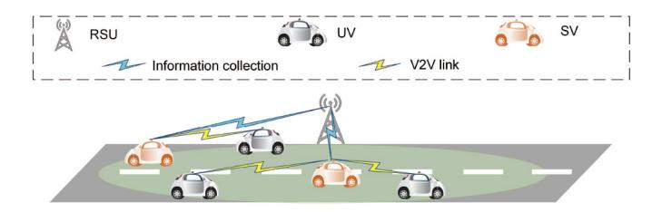

Fig. 13. VEC-enabled systems for vehicular applications.

# *B. Ground Vehicular Nodes*

In this section, we review the recent literature on VECenabled networks, where vehicles with sufficient resources take the role of ECNs for executing the computation-intensive tasks of other network devices. In this light, we classify the related works into two categories of *VEC-enabled systems for vehicular applications* and *VEC-enabled systems for nonvehicular applications*. As their names imply, the first category refers to the scenarios where the VEC framework is utilized for assisting in the resource-hungry task executions of other vehicles (see Fig. [13\)](#page-23-1) and the second group belongs to the case where vehicles act as ECNs for performing computations of non-vehicular applications, e.g., mobile applications (see Fig. [14\)](#page-23-2). In the remainder of the paper, the vehicles that are used as ECNs are called service vehicles (SVs), and the vehicles which are the generator of the tasks and require computation assistance are named user vehicles (UVs).

Before getting into the details of the works on VEC-enabled systems, it is useful to introduce a framework that has been developed for evaluating the performance of VEC-enabled networks, called vFog [\[127\]](#page-35-42). In this framework, designed on top of the OMNet++ network simulator, each SV periodically advertises its information including the available computing resources and the possible route of the SV through control messages. Each UV, upon receiving the advertisement from

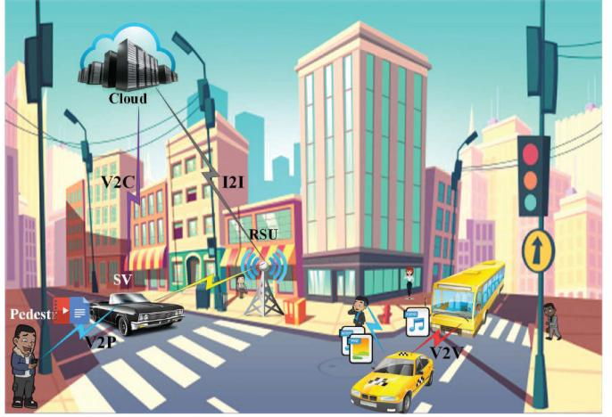

Fig. 14. VEC-enabled systems for non-vehicular applications.

all SVs in its direct transmission range, selects the most suitable SV, i.e., the SV with the faster execution of the task and good communication channel, as the designated SV. To reduce packet loss, a relaying mechanism is developed to deliver the computation result to the UV in a multi-hop fashion. Particularly, if the direct communication between the UV and the SV is lost before the offloaded task is completely executed, the SV adds a time-to-live (TTL) field to the result and broadcasts the packet. If the vehicle which receives this packet has the intended UV in its direct communication range, it sends the packet directly; otherwise, it reduces the TTL and broadcasts the packet.

*1) VEC-Enabled Systems for Vehicular Applications:* Wu et al. propose a VEC-enabled system formed by intelligent connected vehicles (ICVs) in [\[128\]](#page-35-43), where the task offloading problem is formulated as a semi-Markov decision process (SMDP). Considering that the SVs may depart the system before completing the execution of the assigned tasks, the goal is to determine the optimal offloading strategy to maximize the long-term reward of the system. Specifically, the objective is to decide whether the task generated by a vehicle should be forwarded to either the cloud server or the SVs, and if the latter is chosen, how many computing units have to be assigned for the processing of the task. The reward is the difference between the immediate income and the system cost, where energy consumption and task processing time are two important factors determining the system reward. A value iteration method is utilized for solving the problem through which the maximal state-value function is iteratively obtained for each state. Numerical results show that the probability of offloading tasks to the cloud server decreases in cases where 1) the number of SVs increases, and 2) the serving rate of the SVs increases. In contrast, the probability of the cloud server executing the tasks increases when the task arrival rate increases. This work also evaluates the performance of the proposed SMDP-based algorithm to the greedy scheme where the maximum number of available units is always allocated for task processing. As the cost of the greedy scheme is very high, the proposed SMDP-based approach always outperforms the greedy one in terms of long-term reward.

The authors in [\[129\]](#page-36-0) investigate a three-layer VEC-enabled architecture for vehicular entertainment services, where the cloud server resides at the very top of the architecture, RSUs are in the middle layer and SVs which consist of parked and moving vehicles constitute the bottom layer. A joint loadbalancing and task offloading optimization problem is studied with the objective being to minimize the overall system energy consumption. The original problem is decomposed into two sub-problems; the first one for balancing the load among the RSUs and the second for deciding how to offload the tasks to the cloud server and the SVs. An Edmonds-Karp algorithm is utilized for balancing the load, while the task offloading problem is solved via the DRL method. The performance evaluation is performed using the real-world traces of taxis in a specific area in Shanghai, China. The Edmonds-Karpbased load balancing scheme is shown to achieve a satisfactory load balancing performance, while also being energy-efficient. Further, the performance of the DRL-based task offloading scheme is evaluated against two benchmarks; the first one is the Q-learning-based task offloading scheme and the second one is a heuristic algorithm where the objective is to minimize the energy consumption of the RSUs. The overall energy consumption is measured as a function of task arrival rate, the number of parked vehicles, service rate of parked vehicles, and offloading data size. The proposed scheme demonstrates superiority over the benchmarks in all scenarios.

A mechanism for minimizing the average service delay and reducing the quality loss of results (QLR) is proposed in [\[130\]](#page-36-1), [\[131\]](#page-36-2) where the QLR is a novel metric that determines how far the quality of a delivered service is from the optimal quality. In the proposed model, an area is divided into different zones with a cellular BS being appointed as the zone head in each zone. The task assignment procedure is carried out in four steps. First, the UV broadcasts a one-hop discovery message; the SVs that respond to this message are put on the candidates' list of the UV. Then, the UV sends a request message to the zone head which contains information about the tasks and the candidates' list. In the third step, the zone head allocates the tasks to the appropriate SVs. The fourth step is only required when the connection between a UV and an SV is interrupted because the SV moves to another zone; in such a case, task migration is performed by the zone head to select another SV for resuming the task execution. Task allocation is formulated as a bi-objective optimization problem, where the authors employ linear programming and binary particle swarm optimization (BPSO) to solve it. Similar to [\[129\]](#page-36-0), real-world taxi traces are used for performance evaluation.

The work in [\[132\]](#page-36-3) studies the parallel task execution problem aiming to simultaneously execute different parts of a large task at several SVs. The UV first sends a message to the RSU asking for computation assistance. The RSU has sufficient information about its coverage area and can efficiently select suitable SVs for task execution. The objective of this paper is to minimize the service time if the task can be completed without requiring handovers or to maximize the number of completed subtasks if the UV moves away from the coverage of the RSU before the task is fully executed. The hidden Markov model (HMM) and Markov chain are used for selecting the SVs in each time slot while achieving mobility and computation capability awareness. The numerical simulations compare the performance of the proposed scheme with three benchmarks, one of them being the scheme with random SV selection, the second and the third being the schemes where the SV selection is respectively done based on only mobility awareness and computation capacity awareness. The proposed scheme outperforms the benchmarks in terms of both the average service delay and the number of finished tasks.

In [\[133\]](#page-36-4), VEC architecture for cooperative sensing among multiple adjacent vehicles driving in a platoon is proposed. The proposal aims to mitigate the sensing limitations of a single autonomous vehicle in a complex road traffic environment which are associated with problems such as sensing dead zones and frequent misdetections. Autonomous vehicles with similar speed and driving patterns form a platoon in which the members can efficiently communicate with each other and share information with low latency. The architecture uses greedy and supports vector machine (SVM) algorithms to improve sensing coverage and accuracy. In addition, it uses a light gated recurrent unit (Li-GRU) neural network distributed deep learning algorithm for predicting the trajectory and lane changes of the vehicles. The simulation results show that nine vehicles are sufficient to cover a four-lane road that is 100 meters long and 20 meters wide.

The authors in [\[134\]](#page-36-5) propose a VEC-enabled architecture for providing vehicular applications in large cities. The city is divided into regions and a VEC system is formed in each region consisting of a number of SVs and RSUs as well as a central resource manager running on the cloud. This work defines a metric, named service satisfaction, and aims to maximize the average service satisfaction of vehicular applications. This work proposes a heuristic algorithm based on the proximal policy optimization (PPO) algorithm and solves the resource allocation problem in the VEC-enabled network via the presented algorithm. The performance of the proposed method is compared with seven benchmark algorithms and the service satisfaction is evaluated for five different applications which are classified into safety and non-safety applications. According to the results, the proposed scheme has the highest service satisfaction due to efficient resource allocation and offloading decisions.

The authors in [\[135\]](#page-36-6) present an incentive mechanism based on the contract theory. Assuming a practical real-life scenario where vehicles are not willing to act as ECNs unconditionally, the authors in [\[135\]](#page-36-6) propose a framework in which the SVs obtain a reward based on the number of resources they put in for performing computations for other vehicles. The SV can then utilize the reward it gains for requesting additional wireless transmission bandwidth. Based on the developed incentive mechanism, a DRL method is adopted for optimizing task scheduling and resource management decisions. The considered performance metrics include system delay, energy consumption, and task completion rate.

Peng et al. propose a multi-attribute-based double auction mechanism for resource allocation in VEC-enabled networks in [\[136\]](#page-36-7). Unlike the popular auction mechanisms which only consider the price factor, the proposed mechanism also considers several non-price attributes, such as location, reputation, and computing power. First, all vehicles registered with the auctioneer using their personal information. The information about all SVs is then distributed to the UVs after which, the UVs and the SVs respectively submit their bids and ask the auctioneer. The auctioneer then runs an auction algorithm based on the received bids and asks to determine the winners. The metrics of interest are individual rationality (IR), truthfulness, and computational complexity and the proposed scheme demonstrates effective performance in terms of all the considered metrics. The authors also consider another performance metric, i.e., the number of winning pairs, to evaluate their proposed mechanism. They show that the presented multi-attribute-based double auction mechanism has superior performance to other auction mechanisms in terms of the number of winning pairs.

The authors in [\[137\]](#page-36-8) propose a framework including a hierarchical architecture in which vehicles form a cluster by using the Kubeadm clustering mechanism. Each cluster hosts microservices that use Docker technology as the complementary technology to efficiently process the task. The authors formulate a vehicular container placement (VCP) problem with the goal of optimally assigning the services to the set of available SVs. This problem is reduced to a bin-packing problem with the SVs taking the role of bins and the services being the bin items. A Memetic algorithm is adopted for solving the VCP problem. The two main objectives of the bin-packing problem are maximizing the number of assigned services and minimizing the number of used SVs.

Paper [\[138\]](#page-36-9) tries to address the reliability and security issues pertaining to the uncertainties that exist in a VEC environment in terms of vehicles' arrival and departure, amount of computation resources, etc. A trusted authority (TA) is co-located with the central cloud, the duty of which is to generate public and private keys for the RSUs and to issue tokens for verified

vehicles. When a UV or an SV intends to join the VECenabled network, it has to register with the TA and obtain a token. RSU is the manager of the VEC environment and assigns appropriate SVs to the authenticated UVs. Taking into account connectivity, confidentiality, integrity, and nonrepudiation requirements, the authors propose a mechanism for vehicular fog construction and vehicular fog service access, where container technology is utilized to ensure connectivity maintenance.

Blockchain is a peer-to-peer distributed ledger technology that provides a place for storing information in a decentralized manner, without requiring a third-party to be involved. The data are encrypted and stored in blocks; when a block is filled with data, it is linked to the previously filled block and the chain of the linked blocks forms what is known as the blockchain. Each block is identified by its hash value, which depends on the hash value of the previous block. Transparency is one of the most important features of the blockchain, where the stored data can be viewed and scrutinized by anyone, but cannot be manipulated. Anonymity is another significant property of the technology which allows people to make transactions with their real identities being hidden. Therefore, people who do not even know each other can make secure transactions without revealing their personal information, while their transaction records can be accessed by anyone [\[139\]](#page-36-10), [\[140\]](#page-36-11). The authors in [\[141\]](#page-36-12) propose a trust establishment strategy, using the bidding price-based transaction (BPT) method, for VEC-enabled networks in rural areas in order to minimize the number of dishonest and malicious actions. All vehicles including UVs and SVs have to register themselves to a fixed ECN before entering a rural area. During the registration phase, the vehicles are required to deposit some digital currency to be used for the bidding and as compensation for their possible malicious behavior. In rural areas, the UV and the SV must agree on a price as compensation for violating the transaction. After the trust establishment process between the two vehicles, the UV offloads its data to the SV and the SV performs the computation. The transaction is completed by issuing a transaction record signed by both sides. The record is then put into the blockchain of evaluation record so that vehicles are unable to forge or tamper with the recorded transaction.

*2) VEC-Enabled Systems for Non-Vehicular Applications:* Paper [\[142\]](#page-36-13) presents an integrated edge and vehicular edge computing framework for supporting non-vehicular applications. In this work, users directly send their task computation requests to the fixed ECN (e.g., the BS). When the number of requests exceeds the capacity of the fixed ECN, it will offload some of the tasks to the RSUs in its coverage. The RSUs are assumed to be incapable of doing the computations and their only role is to manage the task offloading to the SVs. The objective is to optimize the task offloading decisions in order to minimize the total computation cost. As the considered problem is a mixed integer programming (MIP) problem, the authors adopt an iterative greedy algorithm to solve it.

The work in [\[143\]](#page-36-14) classifies the mobile applications into two categories of high priority (HP) and low priority (LP) applications. The priority of the applications is specified based on their waiting time whereas the applications with strict delay requirements are labeled as HP applications. The authors present a scheme based on the game theory in which SVs are the players and have four different options for choosing their desired strategy. They can choose not to take part in any task execution, executing only LP tasks, executing only HP tasks, or sharing their resources between LP and HP task computations. If all the demands for task execution cannot be met by the SVs, some of the tasks must be offloaded to the cloud. The objective of the paper is to minimize the CPU usage and energy consumption, and maximize the number of executed HP tasks, Based on these targets, a utility function is defined and each player calculates the utility function value for the above-mentioned four strategies and adopts the strategy which has the maximum utility value.

Tang et al. develop a VEC-enabled architecture in [\[144\]](#page-36-15) aiming to minimize the total response latency for mobile users who offload their resource-intensive tasks to the nearest RSU. The RSU is responsible to make offloading decisions based on the availability of resources. In specific, RSU first searches for SVs with available resources to offload the tasks. If there is no SV that can take over the task execution, the RSU will offload the tasks to the central cloud. A scheduling method based on the greedy algorithm is proposed for solving the response latency minimization problem. The simulation results of the paper show that the proposed strategy is effective in scheduling tasks in nearly real-time.

The work in [\[61\]](#page-34-22) uses the concepts of contract theory and matching theory to exploit the resources of vehicles in peak hours of the day. These works propose a contract-theory-based incentive mechanism to persuade the vehicles to act as SVs when the fixed ECNs are overloaded due to the overwhelming amounts of offloaded tasks from the users. The fixed ECN designs a contract that contains numerous options for the SVs to choose from. Each option specifies the amount of required resources and the payment to the vehicle for sharing its resources. When a vehicle signs the contract, it accepts to take the role of an SV. Matching between the users and the SVs is then established to assign the best possible SV to each user taking into account the transmission and task execution latency, task size, and matching cost. The objective is to maximize the utility of the fixed ECN which is a linear function of the reduced computational delay, i.e., the delay difference between the scenario where the fixed ECN performs all the computations and the case where SVs assist in computation tasks. This work considers information asymmetry meaning that the fixed ECN does not know the exact information about the vehicles and only statistical knowledge is available to it. Numerical results show that the reward of the SVs is higher in the case of information asymmetry as compared to the information symmetry case because in the latter case, the fixed ECN would overexploit the SVs to further increase its own utility.

Paper [\[145\]](#page-36-16) presents a four-layer VEC-enabled architecture for responding to various types of demands from the end users. Layer 1 consists of a wide range of users including owners of smart devices, traffic authorities and airport administrators, sensors, etc. Layer 2 includes the SVs and layer 3 belongs to the fixed ECNs which are responsible for resource management and task migration. The central cloud constitutes layer 4 and provides complementary processing whenever needed. In the proposed architecture, some of the SVs are appointed as gateways through which other SVs can connect to the central cloud. The papers aim to choose the optimal set of gateways so as to minimize the use of network resources. The proposed gateway selection process is performed in two steps. In the first step, SVs use a fuzzy logic-based algorithm to estimate their suitability for being appointed as gateways. The second step refines the list of candidate gateway SVs via an ant colony-based approach. This mechanism reduces access to the central cloud and mitigates the collision rate and congestion. Simulation results show that exploitation of the historical data and exploration of new gateways are both important for reducing the number of gateways. It is also illustrated that the number of vehicles that can be connected to a gateway has a large impact on the optimum number of gateways. As expected, increasing the number of vehicles per gateway reduces the total gateway number because less number of gateways would be needed to serve the vehicles.

The authors in [\[146\]](#page-36-17) propose a novel architecture to enable the use of parked vehicles' computation resources when the computing service demands from the user side are much higher than what fixed ECNs can afford. An example is a big shopping center which would be more crowded than usual on weekends and public holidays. The set of parked vehicles act as SVs and constitute a VEC-enabled system together with the fixed ECNs. The proposed architecture consists of two main layers, namely, the applications and services layer, and the policy management layer. The first layer, as its name indicates, offers a variety of different real-time applications for end users. The second layer is responsible for making the task assignment decisions based on the computation cost and completion time of the tasks. In particular, the decision on whether to offload a given task to the fixed ECNs or SVs is made in the policy management layer, where a decision manager is utilized for determining the task assignment results.

- *3) Open Issues:* The VEC-enabled systems face several challenges which mainly stem from the high mobility of vehicles. Some of these challenges are presented in the following:
  - Centralized management is one of the principal challenges of VEC environments. The existing research on VEC-enabled networks normally assumes the existence of a central controller in the form of RSU, BS, etc. accountable for performing task assignments and resource management. However, in reality, vehicles remain in the coverage of the central controller for very short periods and the centralized mechanisms will require frequent handovers and redistribution of the tasks. This makes most of the proposed frameworks inapplicable to reallife scenarios. We need novel algorithms for distributed management to cope with this issue.
  - The mobility of the vehicles makes it difficult to guarantee connectivity between the UVs and the SVs. Therefore, it is very likely that two vehicles lose connection after the task is offloaded from the UV to the SV. The

| Type          | Paper      | Metric(s)                                               | Technique(s)                     |
|---------------|------------|---------------------------------------------------------|----------------------------------|
|               | [128]      | Energy consumption of the tasks, task processing time   | Value iteration algorithm        |
|               | [129]      | Overall energy consumption of the system                | Edmonds-Karp algorithm, DRL      |
|               | [130, 131] | Average service delay, QLR                              | Linear programming, BPSO         |
|               | [132]      | Service time, amount of completed subtasks              | HMM, Markov chain                |
|               | [133]      | Sensing coverage and accuracy                           | Greedy algorithm, SVM algorithm  |
| Vehicular     | [134]      | Service satisfaction                                    | PPO                              |
|               | [135]      | System delay, energy consumption, task completion rate  | DRL                              |
|               | [136]      | IR, truthfulness, computation complexity, winning pairs | Auction algorithm                |
|               | [137]      | Number of assigned services, number of used SVs         | Memetic algorithm                |
|               | [138]      | Reliability, security                                   | Container technology             |
|               | [141]      | Number of dishonest and malicous actions                | BPT                              |
|               | [142]      | Total computation cost                                  | Greedy algorithm                 |
|               | [143]      | CPU usage, energy consumption, number of HP tasks       | Game theory                      |
| Non-vehicular | [144]      | Total response latency                                  | Greedy algorithm                 |
|               | [61]       | Reduced computational delay                             | Contract theory, matching theory |
|               | [145]      | Usage of network resources                              | Fuzzy logic                      |

TABLE V SUMMARY OF THE WORKS ON VEC-ENABLED SYSTEMS

computation result can be transmitted from the SV to the UV via relaying strategies where intermediate vehicles forward the result hop by hop until it reaches the destined UV [\[127\]](#page-35-42). A challenge that arises in such situations is that some vehicles may be reluctant to take the relaying role. Thus, it is over-optimistic and unreasonable to develop relaying mechanisms assuming that all vehicles willingly cooperate. Incentive mechanisms can be considered to give vehicles some incentives to assist in data forwarding. However, this may make the problem complicated and hard to solve in real time. Lightweight and efficient solutions are thus needed to ensure timely delivery of computed data taking into account the incentive mechanisms.

- The lack of experimental results is one of the most serious concerns in VEC-enabled networks. To date, most of the conducted research in this area focuses on theoretical and simulation-based analyses. Hence, it remains unclear whether the developed theoretical frameworks are able to perform seamlessly in practice. Considering the current status of vehicles and fixed ECNs, conducting wide-scale testbed experiments is quite challenging at this stage and we still have to wait to see the practical flaws and imperfections of the proposed frameworks.
- As in the case of UAV-aided MEC systems, maintaining data security and confidentiality in VEC-enabled networks is an important concern that has been largely neglected in the literature. Novel schemes are needed to ensure secure connections between vehicles in VECenabled systems. That said, maintaining security in an open environment like a vehicular network is very challenging.
- *4) Insights and Summary:* This section presented a review of VEC-enabled networks, where the computation resources of smart vehicles are utilized for executing computation-intensive tasks. Specifically, two categories of applications have been discussed in this section with the first one being vehicular

applications and the second one representing non-vehicular applications. Though the two categories have similarities, they have major differences as well. For example, moving vehicles are better candidates for taking the role of SVs in vehicular applications, while parked vehicles are a better option for assisting the computations of non-vehicular applications. Table [V](#page-27-0) summarizes the works on VEC-enabled systems and specifies the metrics and methods studied in each work.

## *C. Spatial Nodes*

The main challenge of the proposed SIN architecture in [\[20\]](#page-33-19) refers to the reliability and stability of the communications between the TNs and the LEO-ECNs. Due to the high speed of LEO-ECNs, they move fast. This may lead to a disconnection between the TN and the corresponding LEO-ECN. Hence, corresponding communications are vulnerable to external threats. To tackle this issue, a lattice-based post-quantum authentication protocol is proposed by which all TNs and LEO-ECNs need to register to the terrestrial control station. Moreover, each TN must introduce its associated LEO-ECNs. Thereafter, the mutual authentication and negotiation key are taken between each TN-LEO-ECNs pair. If the nodes have met the authentication requirements, a key is established between the TN and the LEO-ECNs.

The authors in [\[147\]](#page-36-18) and [\[148\]](#page-36-19) propose another architecture for edge intelligent computing in satellite IoT, where satellites are divided into satellite ECNs and satellite cloud nodes. LEO satellites play the role of satellite ECNs while GEO satellites act as satellite cloud nodes thanks to their high-performance capabilities. Satellite ECNs receive the information from the terrestrial BSs or TNs and are responsible for processing the low-complexity computations individually or in cooperation with other nodes in the network. They can form clusters with other satellite ECNs and process the requests, or even request more resources from satellite cloud nodes and/or the ground cloud center. The satellite cloud nodes are equipped with heterogeneous resources, such as CPU and graphical processing unit (GPU) so as are higher performance nodes than the satellite ECNs and can perform high-complexity computations. The satellite cloud nodes play the role of the manager in the network which manages the satellite ECNs. The ground cloud center is the most powerful center with the highest computational capacity among all available nodes in the network. Both satellite ECNs and satellite cloud nodes can communicate with the ground cloud center and request more resources to complete the task scheduling and uncompleted computations. In such a system, both satellite ECNs and satellite cloud nodes take advantage of SDN/NFV technologies by which they can support network slicing, i.e., the data layer is separated from the control layer in satellite IoT nodes. This feature provides the opportunity of employing the distributed deep-learning mechanism on the satellite nodes to improve the efficiency, flexibility, and adaptability of the network. According to the assumptions of the proposed architecture, satellite cloud nodes are responsible to provide the satellite ECNs with the updated parameters of the models. The satellite ECNs, on the other hand, pre-train these updated parameters to optimize the model using the data they have already collected from the clients. They also calculate the gradient of the corresponding parameters and send it to the satellite cloud nodes for further updating procedures. Simulations and analysis performed on different neural networks, such as VGG-16, ResNet-50, wide residual network (WRN), MobileNet, ShuffleNet, and DenseNet, show that the lightweight neural networks with relatively small computational demands, such as MobileNet and ShuffleNet, lead to better performance of the system in terms of end-to-end delay, the total amount of computations, and training duration.

In a similar work in [\[149\]](#page-36-20), the authors propose a resource management mechanism for the SIN, which aims to minimize the average network delay. According to the proposed resource management mechanism, the TNs' tasks are divided into three separate groups as follows:

- *M1:* The image video class, on the basis of large-scale machine type communication (mMTC), in which a large amount of data is transmitted periodically for which a large amount of bandwidth is required.
- *M2:* The global communication class, which is derived from enhanced mobile broadband (eMBB). This class is a stationary random process with a small amount of data for transmission in which the statistical properties do not change over time.
- *M3:* The aerospace warning class, based on the ultrareliable low-latency communication (uRLLC), which is delay-sensitive. A moderate amount of the traffic is transmitted under this class but the traffic generation follows the high burst model.

A suitable computing offloading strategy is employed based on the task's types mentioned above and the current network status so that the appropriate computing node is selected to process the task. According to the proposed strategy, a satellite ECN receives the tasks from the TNs and classifies them based on the QoS requirements provided in each class mentioned above. In the case of M3, the tasks are processed at the satellite ECNs due to their delay-sensitive nature. If there are insufficient available resources at the satellite ECNs, the task is offloaded to the satellite cloud nodes. In the case of classes M1 and M2, the satellite ECNs act as a relay and offload the corresponding tasks to the satellite cloud nodes for further processing. Simulation results reveal that the proposed scheme can improve the QoS requirements in terms of average end-toend delay and jitter. Besides, since the scheme takes advantage of global computing and bandwidth resources, it improves the overall system throughput.

Although using satellite ECNs can improve the efficiency of edge computing-enabled IoT networks, these nodes have been designed in a way to provide specific services for the TNs. To cope with this impairment, Wang et al. [\[150\]](#page-36-21) propose the intelligence satellite (iSat) with a powerful standardized hardware platform, as well as a fault-tolerant and expandable operating system, which takes advantage of virtualization. This feature makes it compatible with satellite edge computing. According to the hardware and software developments performed for the iSat, the edge system can flexibly receive different applications from heterogeneous TNs and accordingly satisfy the QoS requirements in terms of total delay and energy consumption for processing tasks.

*1) Open Issues:* Although spatial ECNs provide a large coverage area for the TNs and are also appropriate serving nodes in sparse areas, they suffer from some fundamental challenges that we summarize below:

- The main problem of the spatial ECNs is the distance between these nodes and the TNs. GEO satellites are far away from TNs so that the leverage of these satellites as the ECNs significantly increases the communication latency of the network. On the other hand, LEO satellites are closer to the TNs and hence can lead to an improved network performance compared to the GEO satellites in terms of communication delay. However, the distance between the LEO satellites and the TNs is still large. Novel methods and ideas are required to ensure a satisfactory computation offloading from the TNs to the satellites.
- Apart from the large communication distance between the LEO satellites and the TNs, the high speed of the LEO satellites negatively affect the reliability and stability of the communications. The fast movement of LEO satellites may lead to frequent link interruptions which are undesirable when offloading huge amounts of data to the satellite. Robust mechanisms are needed to guarantee a high level of computation offloading reliability between TNs and satellite ECNs.
- The energy needed to offload data to the satellites is very high which again results from the large distance between the satellites and ground TNs. This issue may prevent the wide-scale application of satellite ECNs in future IoT networks because IoT devices are usually energy-constrained.
- *2) Insights and Summary:* In this section, we have comprehensively reviewed the papers wherein the satellites are used as the mobile ECNs in the IoT networks. Table [VI](#page-29-1) summarizes the metrics and techniques that each of the reviewed paper in the literature considers and employs to provide the QoS requirements and improve the system performance. Our study

| Paper      | Metric(s)                                                         | Technique(s)        |
|------------|-------------------------------------------------------------------|---------------------|
| [147, 148] | Total amount of computations, end-to-end delay, training duration | Network slicing, ML |
| [149]      | Average end-to-end delay, jitter, throughput                      | Network slicing     |
| [150]      | Total delay, total energy consumption                             | Virtualization      |

TABLE VI SUMMARY OF THE WORKS ON SATELLITE-ASSISTED EDGE COMPUTING SYSTEMS

shows that specific feature of satellites can provide network slicing, ML, and virtualization methods in such systems. Thus, complex computations can be performed by higher performance node. As a result, the network performance is improved compared to traditional schemes.

## *D. Maritime Nodes*

In most of the related research papers, e.g., [\[151\]](#page-36-22), [\[152\]](#page-36-23), ships play the role of TNs. This is while in a couple of works conducted in M-IoT networks, the maritime vessels act as ECNs. The authors in [\[153\]](#page-36-24), [\[154\]](#page-36-25) propose an edgecloud computing architecture in which USVs are able to form edge computing clusters in order to either process the tasks generated by TNs locally or forward them to the cloud center. Therefore, the energy consumption of TNs, as well as their tasks' processing delay, is minimized. However, these networks suffer from a highly dynamic topology as the mobility of USVs causes an unstable situation for the wireless channel states and available computing resources. To tackle the aforementioned challenges, the authors take the advantage of multi-armed bandit (MAB) theory and proposed a learningbased task offloading framework, in which the TNs aim to minimize the offloading delay by learning about the potential task offloading performance of their neighboring nodes. USVs in the clusters are divided into two categories, namely task nodes (ToN) and computation nodes (CoN). Former generates the data and can partially compute the tasks if the conditions are provided; Latter is considered as the ECN that is responsible for computing the tasks. Importantly, the role of ToN or CoN is not fixed for the vessels so that each USV can take over the role of ToN at a time slot, while playing the role of CoN at another time slot. The task offloading is run in a distributed manner for which the task is offloaded to multiple CoNs for further processing. According to the proposed framework, the ToNs are players of the learning-based mechanism that independently decide to process a task locally, offload it to the CoNs, or forward it to the cloud center.

- *1) Open Issues:* The main challenges of maritime edge computing IoT networks are listed as follows:
  - Maritime EC-enabled networks suffer from unreliable links between the marine ECNs and the TNs which stems from the high mobility of the marine ECNs. Indeed, the highly dynamic topology of such systems leads to unstable and unpredictable wireless connections between the nodes that negatively affect the quality of tasks' processing and subsequently, degrade the network performance.
  - Maritime communication is usually restricted by its low data rate which brings about issues for offloading high

volumes of computation-intensive data in such environments. Novel technologies are required to upgrade maritime communication systems and enhance their performance. Migrating to higher frequency bands is one possible option to achieve higher data rates which will be discussed in Section [X.](#page-31-0)

*2) Insight and Summary:* Although limited research effort has been devoted to the maritime ECNs in the literature, it is a promising area to widen the efficiency of edge computing in IoT networks, even in oceans, where the service providers are out of access. Our review shows that the employment of ML methods along with edge computing mechanisms, such as offloading, and the capabilities of vessels in maritime IoT networks can improve the performance of such networks in terms of accessibility, availability, and other QoS requirements.

## IX. INTEGRATED NODE TYPE-SUPPORTED APPLICATIONS

As discussed in the previous sections, each classification of mobile ECNs confronts challenges in improving the performance of IoT networks. To cope with such issues, utilizing an integrated framework enables IoT networks to expand and operate more efficiently a robust integrated framework. In light of that, in the rest of this section, the integrated frameworks, namely aerial-ground vehicular, spatial-aerial, maritime-aerial, and spatial-maritime are reviewed.

# *A. Aerial-Ground Vehicular Integrated Edge Computing-Enabled IoT Networks*

The proposed hybrid edge computing platform in [\[155\]](#page-36-26) is an example of using UAVs in the ground vehicle-assisted edge computing-enabled IoT networks. The platform includes terrestrial BSs, ground vehicles, and UAVs that act as ECNs. A hybrid deep-learning-based online offloading framework is proposed to minimize the energy consumption of all TNs. To this end, the projection of ground vehicles and UAVs are jointly optimized with the user association and resource allocation in real-time while taking into account the dynamic environment. The proposed problem is a type of mixed-integer nonlinear programming problem. Thus, a fuzzy membership matrix U-based particle swarm optimization algorithm is employed to solve the problem and generate sample data sets for the DNN. Since DNN can capture small-scale fading effects and mutual interference information, a DNN with the scheduling layer is proposed to enable user association and computing resource allocation under the realistic latency need of the tasks and limited available computing resources of the platform. Furthermore, only one TN's information is entered into the DNN at a time. This is ideal for scenarios where the number of TNs varies and avoids the DNN's dimensionality curse.

On the other hand, the RSUs suffer from limited computing resources by which the overloading probability of them is increased. In such situations, UAVs can be leveraged as flying ECNs to share their resources with the RSUs. However, since UAVs consume a lot of energy for flight, and also it may several RSUs are overloaded, there is a limitation on the lease time of UAVs. Therefore, two policies are considered in [\[156\]](#page-36-27) to determine the lease time of UAVs, namely local and global policies. If part of RSUs in the network is overloaded, then the local policy is employed to determine the lease time. On the other hand, i.e., in the situation that all RSUs are overloaded, the global policy is used to find the optimal lease time. It is worth mentioning that the lease time derived from the global policy is less than the corresponding lease time provided by the local policy. According to the proposed framework, each vehicle first estimates the average waiting time of the task in the corresponding RSU in the region. If it is less than the time of processing the task within the vehicle, the vehicle offloads the task to the RSU. If any RSU receives a large number of tasks in a short time period, it sends a request to the BS regarding assigning a flying FN to the RSU. After the association, the RSU sends the task to the corresponding UAV. The UAV, after completion of the process, sends the results back to the RSU. Due to the mobility of vehicles, a vehicle may not be in the range of the RSU anymore. Therefore, the RSU sends the results to the BS, which forwards it to the corresponding RSU nearby the vehicle.

Other major shortcomings of ground vehicle-assisted edge computing-enabled IoT networks refer to the resource-limited nature of the OBUs installed on the vehicles as well as the costly deployment of the RSUs. More importantly, in the case of the newly introduced paradigm, namely the social IoV (SIoV) [\[157\]](#page-36-28), which integrates social interactions into the context of vehicle-to-everything communications and aims to improve the travel experience for the drivers and the passengers. The aforementioned drawbacks hinder the progress of socially aware services of SIoV. To tackle such concerns, UAVs are used as moving RSUs for improving the computation performance in SIoV. The other objective behind leveraging UAVs as complementary resources is to achieve the energy-aware optimal resource allocation in such systems by jointly optimizing the transmit power of the vehicles and the UAV trajectory for maximizing the total utility in terms of the corresponding power and energy consumption.

# *B. Spatial-Aerial Integrated Edge Computing-Enabled IoT Networks*

SAGIN is suitable for different applications such as remote area monitoring, disaster management, disaster rescue, etc. Since the LEO satellites employed in the SAG-IoT take advantage of the seamless coverage, they are responsible for connecting the TNs to the cloud servers via satellite backbone networks. UAVs, on the other hand, are leveraged as ECNs to provide low-delay edge computing and edge caching capabilities to the TNs. Depending on the energy budget of the TNs, their computing resources, and the delay constraints imposed on the tasks, each TN decides to process its tasks locally, directly offload them to the UAVs, or forward them to the cloud through satellites. However, due to the limited energy budget of the TNs, they prefer to offload their computationintensive tasks to either the UAVs or the cloud for further processing. To enhance the UAVs' utilization, their computation resources are virtualized as VMs by which they can execute the offloaded tasks in parallel. Hence, the processing delay is alleviated. In this regard, the authors in [\[25\]](#page-33-24) propose a policy that aims at minimizing the average delay, energy consumption, and server usage cost. The efficient allocation of the computing resources to VMs and scheduling of the offloading tasks is based on a heuristic joint resource allocation and task scheduling approach. The computing offloading problem also is formulated as a Markov decision process (MDP) that an RLbased approach learns the network dynamics and the system state will be created accordingly. The convergence and efficiency of the SAGIN have been validated through simulation studies and the results show near-optimal performance with very low complexity and quick convergence.

Another advantage of integrating satellites with UAVs is to optimize the network throughput by wirelessly charging the UAVs when their energy budget is below a threshold. Hybrid-Hierarchical spatial-aerial-Terrestrial Edge-Centric (H2TEC) [\[158\]](#page-36-29) is a novel layered architecture that includes four tiers, namely IoT layer, fog layer, fog management layer, and cloud layer. The IoT layer includes the TNs that group together to form the corresponding clusters. UAVs are located in the fog layers to serve the TNs in the IoT layer. LEO satellites and the terrestrial BSs play the role of fog management role to manage the UAVs' operation. Finally, GEO satellites and the cloud are located at the cloud layer to manage the entire system and provide additional resources if required. In such a system, the Task allOcation Protocol (TOP) is responsible for efficiently adjusting the 3D placement of the UAVs and optimally assigning the tasks to the available server nodes in the network such that the network energy consumption is optimized, as well as delay. TOP comprises two phases that are 3D placement adjustment phase and the task allocation phase. According to the TOP's assumptions, each UAV is assigned to a cluster of TNs, each cluster is assigned to one and only one UAV in every time slot. Thus, the UAV must adjust its 3D placement, i.e., the horizontal projection and the flight altitude, such that the TNs consume the minimum energy for transmitting their tasks to the UAV. Moreover, the transmission rate of TNs within a cluster is adjusted in a way that the outage probability and the reliability requirements are met in the network. In the task allocation phase, the tasks can be either processed at the UAV locally or offloaded to the LEO satellites and or BS, depending on the delay threshold considered for each task. However, the UAV needs to consume a huge amount of energy for local processing. Considering the limited energy budget of the UAV, the TOP takes advantage of energy harvesting where the LEO satellites transfer the energy to the UAV when its energy level is less than a threshold. In this regard, the optimal amount of harvesting energy, as well as harvesting time, are set such that the network throughput is maximized.

Apart from satisfying the energy-efficient and real-time communications for the TNs over areas without terrestrial BS infrastructures, establishing reliable and stable connections to gather and cache data in these regions is also paramount. Satellite-UAV mobile edge caching system (SUMECS) [\[159\]](#page-36-30) is a system comprising satellites, UAVs, and sensor nodes which are divided into storage nodes and empty nodes. The storage nodes are sensors with limited caching and communication capabilities. On the other hand, the empty nodes are lacking from caching capabilities and only are used in the repair phase where the storage nodes are power exhausted. The main objective behind SUMECS is to address the reliability and stability-driven problems which threaten the IoT networks. The first step in guaranteeing network reliability is to broadcast the information to different nodes in the network. Due to the high mobility of the UAVs, these nodes cannot establish a stable connection with the satellites. Therefore, each LEO satellite directly broadcasts the IoT data to all storage nodes under its coverage. After receiving the tasks, they are protected with a fault-tolerant code in the storage nodes. Thereafter, UAVs collect data from dispersed storage nodes. However, the storage nodes may lose the data due to the power failure that increases the loss probability in the network. To deal with this challenge, the data is recovered by a repair strategy in which the corresponding LEO satellite broadcasts the data to the empty nodes. Then, the UAVs collect the information from the empty nodes. System availability and system communication cost can be defined using faulttolerant codes, coding settings, and system parameters. The probability that the IoT data will be effectively captured by the visiting UAVs throughout the satellite serve period is denoted as system availability. The expected energy consumption per unit time of the data transmitted by multiple communication processes, including failure data repair, UAV data collection, UAVs' monitoring storage node status, and satellite broadcasting during the LEO satellite's service period, is defined as the system communication cost. The use of intelligent optimizations of coding parameters and system parameters to achieve high system availability through appropriate coding parameters and reduce overall system communication cost via optimized system parameters is then offered.

# *C. Maritime-Aerial Integrated Edge Computing-Enabled IoT Networks*

The performance of such an architecture depends on two major factors: (i) the placement and deployment of the sink nodes; and (ii) the path connectivity from underwater TNs to the UAVs through both underwater acoustic links and air electromagnetic links. To address the aforementioned concerns, Wang et al. [\[26\]](#page-33-25) go beyond the other existing research in the marine-air integrated edge computing-enabled IoT networks. Hence, The grid-placement and the random-placement methods are adopted to deploy the sink nodes in the corresponding architecture. Accordingly, a theoretical framework is proposed to analyze the path connectivity via the intermediate sink node for both sink-node-deployment methods to ensure reliable data acquisition tasks. The simulation studies show the correlation between the path connectivity and the factors such as sink node placements, antenna beamwidth of UAVs, and wind speed.

# *D. Spatial-Maritime Integrated Edge Computing-Enabled IoT Networks*

In the only research conducted in the spatial-marine integrated edge computing-enabled IoT networks [\[22\]](#page-33-21), the author proposes an online computation scheduling algorithm that takes advantage of the compression mechanism. The main objective of the proposed algorithm is to optimally assign the communication resources to the tasks in a way that the average expected transmission error probability of all data packets is minimized. This is while other parameters, such as QoS, transmission resources, generated amount of data, and channel gain, also have a direct effect on the error probability. To this end, a cost function is defined to embody the corresponding effects.

## X. FUTURE RESEARCH DIRECTIONS

The evolution of wireless networks is moving towards the sixth generation (6G), where ubiquitous connectivity is expected to be available in terrestrial, aerial, spatial, and maritime domains. In such an environment, mobile ECNs will undoubtedly play a major role due to their flexible nature which allows all TNs including mobile TNs and those in isolated areas enjoy the computing services. However, as we have comprehensively reviewed in Sections [VIII,](#page-16-0) the utilization of mobile ECNs in various domains of wireless networks is not free of challenges. We, thus, emphasize that there is still a long road ahead before mobile ECNs are seamlessly integrated into different parts of future wireless systems. In this section, we present open issues and research directions, wishing to light up the way for researchers in their future endeavors in this promising field.

## *A. Moving to Millimeter Wave and Terahertz Bands*

In traditional MEC systems, the sub-6-GHz frequency band is used for computation offloading. Considering the massive number of TNs in future generations of wireless systems and the enormous amounts of generated data to be offloaded, relying on the bandwidth- and data rate- limited sub-6-GHz band is not practical. Therefore, migrating to higher frequencies like millimeter wave (mmWave) and terahertz (THz) bands seems to be inevitable. This urgent need calls for more research on using the aforementioned frequency bands for computation offloading in mobile edge computing-enabled IoT networks.

# *B. Using Blockchain for Secure Task Executions*

Due to the heterogeneity of TNs and the high volume of sensitive data, 6G may encounter serious security threats. These threats can be more severe in mobile edge computing-enabled networks than in fixed edge computing-enabled networks due to the mobility of the ECNs which makes it easier for unauthorized ECNs to illegally join the network. Efficient mechanisms are thus required to ensure that data offloading is performed in a secure manner and the ECN which performs task processing is trustworthy. In this regard, blockchain technology can be very helpful as it records all the information about task processing including which ECN performs the computations, what kind of operations are performed on the offloading data, etc [\[160\]](#page-36-31). Though a few works have investigated the application of blockchain for enhancing the security of data, further research needs to be done for developing robust blockchain-based frameworks for offloading sensitive data to mobile ECNs.

# *C. Using Reconfigurable Intelligent Surfaces for Performance Improvement*

Reconfigurable intelligent surface (RIS) is a newly-emerged technology that has been recently applied to various wireless systems and proved useful for improving the performance of these systems from the perspective of various metrics (e.g., throughput, energy efficiency, latency, etc) [\[161\]](#page-36-32), [\[162\]](#page-36-33). An RIS is a planar surface consisting of a large number of passive reflecting elements which can independently reflect the incident signals with a modified phase shift. The reflected signals by the RIS elements can be constructively combined with the signals coming from other paths such that the power of the received signal is increased at the destination. Utilization of RIS for enhancing the performance of fixed edge computing-enabled networks has been recently investigated in the literature [\[163\]](#page-36-34), [\[164\]](#page-36-35). Given the high potential of RIS for creating strong and reliable links between the TNs and mobile ECNs, it is worthwhile to investigate the application of this novel technology in mobile edge computing-enabled IoT networks, where the data offloading from the TNs to mobile ECNs and the transmission of processed data from the ECNs to the TNs are assisted by RIS.

# *D. Integrating FL With Data Analytics*

Data analytics refers to the employment of systematic computational analysis for interpreting meaningful data patterns. The marriage of FL and data analytics in edge computingenabled IoT networks results in the efficient federated analytics paradigm. Similar to the FL paradigm, wherein data training is provided in a privacy-preserving manner, federated analytics is a new distributed computing paradigm that provides privacy to data analytics [\[165\]](#page-36-36), [\[166\]](#page-36-37), [\[167\]](#page-36-38). As such, data analytics are performed locally at the corresponding TNs and the derived insights are forwarded to the edge server for further aggregation. Federated analytics can be a major actor in future generations of wireless networks, where maintaining the privacy of data is of paramount importance. The incorporation of federated analytics into mobile edge computing-enabled IoT networks is a promising direction for future research which has not yet been investigated in the literature.

## *E. Optimizing Load Balancing and Routing Jointly*

Load balancing and routing are two important design considerations in large-scale mobile edge computing-enabled IoT networks. Specifically, load balancing is of particular significance for balancing the energy consumption among ECNs to avoid their premature energy depletion and for minimizing the computation latency. Proper routing design is also pivotal in order to prevent congestion in the network. For example, in a large-scale UAV-assisted edge computing-enabled IoT network where multiple UAVs serve a large number of TNs, it is important to jointly decide on the optimal TN-to-UAV associations and the path through which each TN reaches its associated UAV. Though some research works exist on the optimization of TN-to-ECN associations, we need more efforts from the research community to jointly design the optimal TN-to-ECN associations and optimal routes in order to simultaneously achieve several objectives including load balancing, congestion avoidance, task completion minimization, etc.

## *F. Designing Efficient Task Migration Mechanisms*

Task migration will be an integral part of future mobile edge computing-enabled networks to ensure flawless task processing. Task migration may be needed as a result of the mobility of TNs and/or ECNs, sudden failure of some ECNs, degradation of the channel state between the TN and the ECN, etc. Some recent works have investigated task migration techniques for mobile edge computing-enabled networks, e.g., [\[145\]](#page-36-16), [\[168\]](#page-36-39). However, further investigations are needed to develop effective task migration mechanisms so as to ensure seamless service delivery for future TNs.

## *G. Integrating Edge Computing and Mobile Crowd Sensing*

Mobile crowd sensing (MCS) is a newly emerged sensing paradigm wherein data is gathered from the mobile devices of ordinary citizens along with the other sensing nodes, and aggregated at the cloud servers. Edge computing can improve the performance of MCS by providing the ECNs at the edge of MCS' architecture [\[169\]](#page-36-40). However, the employment of fixed ECNs in such a system might not be efficient as the mobility of nodes in MSC is high. To this end, human-driven edge computing (HEC) is introduced that utilizes the large-scale sensing ability of MCS and the power of MEC technology architecture in edge computing [\[170\]](#page-36-41). HEC reduces the potential limitations of having only fixed MEC entities by exploiting MCS to continuously monitor humans and their mobility patterns, as well as to dynamically re-identify hot locations for the new edges' deployment. Moreover, it enables the implementation and dynamic activation of offhand and impermanent mobile MEC entities that leverage the resources of local mobile devices. Hence, a mobile MEC is a local middleware proxy dynamically activated in a logical bounded location to predict where people tend to stay for a while [\[171\]](#page-36-42). HEC is still in its early stages of development. Limited research efforts devoted to this area improve resource allocation methods and network coverage in HEC. However, these methods lack important features such as fusion analysis, efficient resource usage, low latency communication, large-scale search, and data security and privacy that must be considered.

## XI. CONCLUSION

In this paper, we studied edge computing-enabled IoT networks, wherein the ECNs are divided into fixed and mobile nodes. Our studies indicated that fixed ECNs suffer from challenges such as the cost of expansion, limitation in the flexibility of addressing the network congestion, lack of mobility in dynamic network topologies, and reducing the amount of signal interference. We have considered and explored the use of mobile ECNs to address the above-mentioned challenges. In this regard, we comprehensively reviewed the mobile ECNs and classified them into four major groups, namely aerial, ground vehicular, spatial, and maritime nodes. For each group, terminology, types, and network architecture were studied; the state-of-the-are were comprehensively surveyed; and the challenges were summarized. Our studies states that one efficient approach to cope with the existing challenges of the above-mentioned classifications is to employ integrated architectures. In light of that, the aerial-ground vehicular, spatial-aerial, maritime-aerial, and spatial-maritime integrated architectures were explored. Finally, the open research directions were summarized regarding improving the performance of corresponding networks.

## REFERENCES

- [\[1\]](#page-0-0) A. Al-Fuqaha, M. Guizani, M. Mohammadi, M. Aledhari, and M. Ayyash, "Internet of Things: A survey on enabling technologies, protocols, and applications," *IEEE Commun. Surveys Tuts.*, vol. 17, no. 4, pp. 2347–2376, 4th Quart., 2015.
- [\[2\]](#page-0-1) C. Mouradian, D. Naboulsi, S. Yangui, R. H. Glitho, M. J. Morrow, and P. A. Polakos, "A comprehensive survey on fog computing: State-ofthe-art and research challenges," *IEEE Commun. Surveys Tuts.*, vol. 20, no. 1, pp. 416–464, 1st Quart., 2018.
- [\[3\]](#page-0-1) M. Mukherjee, L. Shu, and D. Wang, "Survey of fog computing: Fundamental, network applications, and research challenges," *IEEE Commun. Surveys Tuts.*, vol. 20, no. 3, pp. 1826–1857, 3rd Quart., 2018.
- [\[4\]](#page-0-1) P. Hu, S. Dhelim, H. Ning, and T. Qiu, "Survey on fog computing: Architecture, key technologies, applications and open issues," *J. Netw. Comput. Appl.*, vol. 98, pp. 27–42, Nov. 2017.
- [\[5\]](#page-1-1) CISCO. "What Is Edge Computing?" Accessed: 2022. [Online]. Available: https://www.cisco.com/c/en/us/solutions/computing/what-isedge-computing.html
- [\[6\]](#page-1-2) P. Marshall. "State of the Edge 2021." 2021. [Online]. Available: https: //stateoftheedge.com/reports/state-of-the-edge-report-2021/
- [\[7\]](#page-2-2) N. Cheng et al., "Air-ground integrated mobile edge networks: Architecture, challenges, and opportunities," *IEEE Commun. Mag.*, vol. 56, no. 8, pp. 26–32, Aug. 2018.
- [\[8\]](#page-3-1) V. Nguyen, T. T. Khanh, P. Van Nam, N. T. Thu, C. S. Hong, and E. Huh, "Towards flying mobile edge computing," in *Proc. Int. Conf. Inf. Netw. (ICOIN)*, 2020, pp. 723–725.
- [\[9\]](#page-2-3) N. H. Motlagh, T. Taleb, and O. Arouk, "Low-altitude unmanned aerial vehicles-based Internet of Things services: Comprehensive survey and future perspectives," *IEEE Internet Things J.*, vol. 3, no. 6, pp. 899–922, Dec. 2016.
- [\[10\]](#page-2-4) X. Hou, Y. Li, M. Chen, D. Wu, D. Jin, and S. Chen, "Vehicular fog computing: A viewpoint of vehicles as the infrastructures," *IEEE Trans. Veh. Technol.*, vol. 65, no. 6, pp. 3860–3873, Jun. 2016.
- [\[11\]](#page-3-2) S. Zhou, Y. Sun, Z. Jiang, and Z. Niu, "Exploiting moving intelligence: Delay-optimized computation offloading in vehicular fog networks," *IEEE Commun. Mag.*, vol. 57, no. 5, pp. 49–55, May 2019.
- [\[12\]](#page-2-5) C. Chang, A. Hadachi, J. Mass, and S. N. Srirama, *Mobile Fog Computing*. Hoboken, NJ, USA: Wiley, 2020, pp. 1–41.
- [\[13\]](#page-4-3) T. Taleb, K. Samdanis, B. Mada, H. Flinck, S. Dutta, and D. Sabella, "On multi-access edge computing: A survey of the emerging 5G network edge cloud architecture and orchestration," *IEEE Commun. Surveys Tuts.*, vol. 19, no. 3, pp. 1657–1681, 3rd Quart., 2017.
- [\[14\]](#page-4-4) A. C. Baktir, A. Ozgovde, and C. Ersoy, "How can edge computing benefit from software-defined networking: A survey, use cases, and future directions," *IEEE Commun. Surveys Tuts.*, vol. 19, no. 4, pp. 2359–2391, 4th Quart., 2017.
- [\[15\]](#page-5-1) A. Ghasemi, A. Abedi, and F. Ghasemi, *Line-of-Sight Propagation*. Cham, Switzerland: Springer Int., 2016, pp. 291–359.
- [\[16\]](#page-5-2) J. Hu, H. Zhang, L. Song, Z. Han, and H. V. Poor, "Reinforcement learning for a cellular Internet of UAVs: Protocol design, trajectory

- control, and resource management," *IEEE Wireless Commun.*, vol. 27, no. 1, pp. 116–123, Feb. 2020.
- [\[17\]](#page-5-3) Z. Ning, X. Wang, and J. Huang, "Mobile edge computing-enabled 5G vehicular networks: Toward the integration of communication and computing," *IEEE Veh. Technol. Mag.*, vol. 14, no. 1, pp. 54–61, Mar. 2019.
- [\[18\]](#page-5-4) S. Raza, S. Wang, M. Ahmed, and M. R. Anwar, "A survey on vehicular edge computing: Architecture, applications, technical issues, and future directions," *Wireless Commun. Mobile Comput.*, vol. 2019, pp. 1–19, Feb. 2019.
- [\[19\]](#page-6-0) Z. Mahmood, *Connected Vehicles in the Internet of Things*. Cham, Switzerland: Springer, 2020.
- [\[20\]](#page-6-1) J. Guo and Y. Du, "Fog service in space information network: Architecture, use case, security and challenges," *IEEE Access*, vol. 8, pp. 11104–11115, 2020.
- [\[21\]](#page-6-2) Australian Government—Australian Maritime Safety Authority. "About the Automatic Identification System." Accessed: Jul. 30, 2020. [Online]. Available: https://www.amsa.gov.au/safety-navigation/ navigation-systems/about-automatic-identification-system
- [\[22\]](#page-6-3) Y. Xu, "Gradient-free scheduling of fog computation for marine data feedback," *IEEE Internet Things J.*, vol. 8, no. 7, pp. 5657–5668, Apr. 2021.
- [\[23\]](#page-7-1) N. Zhang, S. Zhang, P. Yang, O. Alhussein, W. Zhuang, and X. S. Shen, "Software defined space-air-ground integrated vehicular networks: Challenges and solutions," *IEEE Commun. Mag.*, vol. 55, no. 7, pp. 101–109, Jul. 2017.
- [\[24\]](#page-7-1) T. H. Dinh, D. Niyato, and N. T. Hung, "Optimal energy allocation policy for wireless networks in the sky," in *Proc. IEEE Int. Conf. Commun. (ICC)*, 2015, pp. 3204–3209.
- [\[25\]](#page-7-2) N. Cheng et al., "Space/aerial-assisted computing offloading for IoT applications: A learning-based approach," *IEEE J. Sel. Areas Commun.*, vol. 37, no. 5, pp. 1117–1129, May 2019.
- [\[26\]](#page-7-3) Q. Wang, H. Dai, Q. Wang, M. K. Shukla, W. Zhang, and C. G. Soares, "On connectivity of UAV-assisted data acquisition for underwater Internet of Things," *IEEE Internet Things J.*, vol. 7, no. 6, pp. 5371–5385, Jun. 2020.
- [\[27\]](#page-7-3) C. A. Trasviña-Moreno, R. Blasco, A. Marco, R. Casas, and A. Trasviña-Castro, "Unmanned aerial vehicle based wireless sensor network for marine-coastal environment monitoring," *Sensors*, vol. 17, no. 3, p. 460, 2017.
- [\[28\]](#page-7-3) D. Palma, "Enabling the maritime Internet of Things: CoAP and 6LoWPAN performance over VHF links," *IEEE Internet Things J.*, vol. 5, no. 6, pp. 5205–5212, Dec. 2018.
- [\[29\]](#page-7-3) E. Sollesnes et al., "Towards autonomous ocean observing systems using miniature underwater gliders with UAV deployment and recovery capabilities," in *Proc. IEEE/OES Auton. Underwater Veh. Workshop (AUV)*, 2018, pp. 1–5.
- [\[30\]](#page-7-4) Z. Liao, Y. Ma, J. Huang, J. Wang, and J. Wang, "HOTSPOT: A UAV-assisted dynamic mobility-aware offloading for mobile-edge computing in 3-D space," *IEEE Internet Things J.*, vol. 8, no. 13, pp. 10940–10952, Jul. 2021.
- [\[31\]](#page-7-4) S. Zhu, L. Gui, D. Zhao, N. Cheng, Q. Zhang, and X. Lang, "Learningbased computation offloading approaches in UAVs-assisted edge computing," *IEEE Trans. Veh. Technol.*, vol. 70, no. 1, pp. 928–944, Jan. 2021.
- [\[32\]](#page-7-4) X. Diao, M. Wang, J. Zheng, and Y. Cai, "Fairness-aware offloading and trajectory optimization for multi-UAV enabled multi-access edge computing," *IEEE Access*, vol. 8, pp. 124359–124370, 2020.
- [\[33\]](#page-8-1) W. Y. B. Lim et al., "Federated learning in mobile edge networks: A comprehensive survey," *IEEE Commun. Surveys Tuts.*, vol. 22, no. 3, pp. 2031–2063, 3rd Quart., 2020.
- [\[34\]](#page-8-1) S. Abdulrahman, H. Tout, H. Ould-Slimane, A. Mourad, C. Talhi, and M. Guizani, "A survey on federated learning: The journey from centralized to distributed on-site learning and beyond," *IEEE Internet Things J.*, vol. 8, no. 7, pp. 5476–5497, Apr. 2021.
- [\[35\]](#page-8-2) Z. Zhou, X. Chen, E. Li, L. Zeng, K. Luo, and J. Zhang, "Edge intelligence: Paving the last mile of artificial intelligence with edge computing," *Proc. IEEE*, vol. 107, no. 8, pp. 1738–1762, Aug. 2019.
- [\[36\]](#page-8-2) D. Xu et al., "Edge intelligence: Empowering intelligence to the edge of network," *Proc. IEEE*, vol. 109, no. 11, pp. 1778–1837, Nov. 2021.
- [\[37\]](#page-8-2) S. Deng, H. Zhao, W. Fang, J. Yin, S. Dustdar, and A. Y. Zomaya, "Edge intelligence: The confluence of edge computing and artificial intelligence," *IEEE Internet Things J.*, vol. 7, no. 8, pp. 7457–7469, Aug. 2020.
- [\[38\]](#page-8-3) M. M. Amiri and D. Gündüz, "Federated learning over wireless fading channels," *IEEE Trans. Wireless Commun.*, vol. 19, no. 5, pp. 3546–3557, May 2020.

- [\[39\]](#page-8-4) Y. Matsubara, R. Yang, M. Levorato, and S. Mandt, "Supervised compression for resource-constrained edge computing systems," in *Proc. IEEE/CVF Winter Conf. Appl. Comput. Vis. (WACV)*, Jan. 2022, pp. 2685–2695.
- [\[40\]](#page-9-2) J. Zhang and K. B. Letaief, "Mobile edge intelligence and computing for the Internet of Vehicles," *Proc. IEEE*, vol. 108, no. 2, pp. 246–261, Feb. 2020.
- [\[41\]](#page-9-2) S. Lins et al., "Artificial intelligence for enhanced mobility and 5G connectivity in UAV-based critical missions," *IEEE Access*, vol. 9, pp. 111792–111801, 2021.
- [\[42\]](#page-9-3) J. Wang, K. Zhu, and E. Hossain, "Green Internet of Vehicles (IoV) in the 6G era: Toward sustainable vehicular communications and networking," *IEEE Trans. Green Commun. Netw.*, vol. 6, no. 1, pp. 391–423, Mar. 2022.
- [\[43\]](#page-9-3) A. H. Wheeb, R. Nordin, A. A. Samah, M. H. Alsharif, and M. A. Khan, "Topology-based routing protocols and mobility models for flying ad hoc networks: A contemporary review and future research directions," *Drones*, vol. 6, no. 1, p. 9, 2022.
- [\[44\]](#page-9-3) O. Bouachir, A. Abrassart, F. Garcia, and N. Larrieu, "A mobility model for UAV ad hoc network," in *Proc. Int. Conf. Unmanned Aircraft Syst. (ICUAS)*, 2014, pp. 383–388.
- [\[45\]](#page-9-3) E. Kuiper and S. Nadjm-Tehrani, "Mobility models for UAV group reconnaissance applications," in *Proc. Int. Conf. Wireless Mobile Commun. (ICWMC)*, 2006, p. 33
- [\[46\]](#page-10-0) N. Goddemeier and C. Wietfeld, "Investigation of air-to-air channel characteristics and a UAV specific extension to the rice model," in *Proc. IEEE Globecom Workshops (GC Wkshps)*, 2015, pp. 1–5.
- [\[47\]](#page-10-1) A. Al-Hourani, S. Kandeepan, and S. Lardner, "Optimal LAP altitude for maximum coverage," *IEEE Wireless Commun. Lett.*, vol. 6, no. 3, pp. 569–572, Dec. 2014.
- [\[48\]](#page-10-2) M. Mozaffari, W. Saad, M. Bennis, and M. Debbah, "Unmanned aerial vehicle with underlaid device-to-device communications: Performance and tradeoffs," *IEEE Trans. Wireless Commun.*, vol. 15, no. 6, pp. 3949–3963, Jun. 2016.
- [\[49\]](#page-10-3) S. A. Brandt, *Small UAV Design Development and Sizing*. Dordrecht, The Netherlands: Springer, 2015, pp. 165–180.
- [\[50\]](#page-10-3) (United States Dept. Transp., Fed. Aviation Admin., Oklahoma City, OK, USA). *Aerodynamics of Flight*. (2019). [Online]. Available: https://www.faa.gov/regulations\_policies/handbooks\_manuals/aviation/ helicopter\_flying\_handbook/media/hfh\_ch02.pdf
- [\[51\]](#page-10-4) Y. Zeng, J. Xu, and R. Zhang, "Energy minimization for wireless communication with rotary-wing UAV," *IEEE Trans. Wireless Commun.*, vol. 18, no. 4, pp. 2329–2345, Apr. 2019.
- [\[52\]](#page-10-5) Y. Zeng and R. Zhang, "Energy-efficient UAV communication with trajectory optimization," *IEEE Trans. Wireless Commun.*, vol. 16, no. 6, pp. 3747–3760, Jun. 2017.
- [\[53\]](#page-10-6) Y. Wang, M. Sheng, X.Wang, L.Wang, and J. Li, "Mobile-edge computing: Partial computation offloading using dynamic voltage scaling," *IEEE Trans. Commun.*, vol. 64, no. 10, pp. 4268–4282, Oct. 2016.
- [\[54\]](#page-11-0) N. H. Motlagh, M. Bagaa, and T. Taleb, "UAV-based IoT platform: A crowd surveillance use case," *IEEE Commun. Mag.*, vol. 55, no. 2, pp. 128–134, Feb. 2017.
- [\[55\]](#page-11-1) O. Maghazei and T. Netland, "Drones in manufacturing: Exploring opportunities for research and practice," *J. Manuf. Technol. Manag.*, vol. 31, no. 6, pp. 1237–1259, 2020.
- [\[56\]](#page-11-2) S. M. S. M. Daud et al., "Applications of drone in disaster management: A scoping review," *Sci. Justice*, vol. 62, no. 1, pp. 30–42, 2022.
- [\[57\]](#page-11-2) M. Inoue, Y. Owada, K. Hamaguti, and R. Miura, "Nerve net: A regional-area network for resilient local information sharing and communications," in *Proc. 2nd Int. Symp. Comput. Netw.*, 2014, pp. 3–6.
- [\[58\]](#page-11-3) A. Mitra, B. Bera, and A. K. Das, "Design and testbed experiments of public blockchain-based security framework for IoT-enabled droneassisted wildlife monitoring," in *Proc. IEEE INFOCOM Conf. Comput. Commun. Workshops (INFOCOM WKSHPS)*, 2021, pp. 1–6.
- [\[59\]](#page-11-4) J. Kim, S. Kim, C. Ju, and H. I. Son, "Unmanned aerial vehicles in agriculture: A review of perspective of platform, control, and applications," *IEEE Access*, vol. 7, pp. 105100–105115, 2019.
- [\[60\]](#page-11-4) Y. Wang and W. Zhang, "Four-rotor UAV virtual simulation system for agricultural sowing," in *Proc. IEEE 4th Inf. Technol. Mechatron. Eng. Conf. (ITOEC)*, 2018, pp. 1097–1101.
- [\[61\]](#page-11-5) Z. Zhou, P. Liu, J. Feng, Y. Zhang, S. Mumtaz, and J. Rodriguez, "Computation resource allocation and task assignment optimization in vehicular fog computing: A contract-matching approach," *IEEE Trans. Veh. Technol.*, vol. 68, no. 4, pp. 3113–3125, Apr. 2019.
- [\[62\]](#page-11-6) M. Fiore and J. Härri, "The networking shape of vehicular mobility," in *Proc. 9th ACM Int. Symp. Mobile Ad Hoc Netw. Comput. (MobiHoc)*, 2008, pp. 261–272.

- [\[63\]](#page-12-1) R. Zhang, Z. Zhong, J. Zhao, B. Li, and K. Wang, "Channel measurement and packet-level modeling for V2I spatial multiplexing Uplinks using massive MIMO," *IEEE Trans. Veh. Technol.*, vol. 65, no. 10, pp. 7831–7843, Oct. 2016.
- [\[64\]](#page-12-1) D. W. Matolak, "V2V communication channels: State of knowledge, new results, and what's next," in *Communication Technol. Vehicles*, M. Berbineau et al., Eds. Heidelberg, Germany: Springer, 2013, pp. 1–21.
- [\[65\]](#page-12-2) D. W. Matolak, I. Sen, and W. Xiong, "Channel modeling for V2V communications," in *Proc. 3rd Annu. Int. Conf. Mobile Ubiquitous Syst. Netw. Services*, 2006, pp. 1–7.
- [\[66\]](#page-12-3) A. Chalimov. "The Future of the Internet of Vehicles: Challenges and Use Cases." Accessed: Dec. 21, 2020. [Online]. Available: https://easternpeak.com/blog/the-future-of-the-internet-of-vehicleschallenges-and-use-cases/
- [\[67\]](#page-12-3) K. Kimachia. "IoV: The Pioneering Union of IoT and the Automotive Industry." Accessed: Sep. 30, 2021. [Online]. Available: https://www. itbusinessedge.com/cloud/iov-iot/
- [\[68\]](#page-12-4) L.-M. Ang, K. P. Seng, G. K. Ijemaru, and A. M. Zungeru, "Deployment of IoV for smart cities: Applications, architecture, and challenges," *IEEE Access*, vol. 7, pp. 6473–6492, 2019.
- [\[69\]](#page-12-4) M. Bonola, L. Bracciale, P. Loreti, R. Amici, A. Rabuffi, and G. Bianchi, "Opportunistic communication in smart city: Experimental insight with small-scale taxi fleets as data carriers," *Ad Hoc Netw.*, vol. 43, no. C, pp. 43–55, 2016.
- [\[70\]](#page-12-5) V. Sivaraman, J. Carrapetta, K. Hu, and B. G. Luxan, "HazeWatch: A participatory sensor system for monitoring air pollution in Sydney," in *Proc. 38th Annu. IEEE Conf. Local Comput. Netw. Workshops*, 2013, pp. 56–64.
- [\[71\]](#page-13-1) T. Matarazzo, M. Vazifeh, S. Pakzad, P. Santi, and C. Ratti, "Smartphone data streams for bridge health monitoring," *Procedia Eng.*, vol. 199, pp. 966–971, Sep. 2017. [Online]. Available: https://doi.org/10.1016/j.proeng.2017.09.203
- [\[72\]](#page-13-2) U. Lee, B. Zhou, M. Gerla, E. Magistretti, P. Bellavista, and A. Corradi, "Mobeyes: Smart mobs for urban monitoring with a vehicular sensor network," *IEEE Wireless Commun.*, vol. 13, no. 5, pp. 52–57, Oct. 2006.
- [\[73\]](#page-13-3) H. Riebeek. "Catalog of Earth Satellite Orbits." Accessed: Sep. 4, 2009. [Online]. Available: https://earthobservatory.nasa.gov/features/ OrbitsCatalog
- [\[74\]](#page-13-4) The European Space Agency. "Types of Orbits." Accessed: Mar. 30, 2020. [Online]. Available: https://www.esa.int/Enabling\_Support/ Space\_Transportation/Types\_of\_orbits
- [\[75\]](#page-13-5) B. Li, Z. Fei, C. Zhou, and Y. Zhang, "Physical-layer security in space information networks: A survey," *IEEE Internet Things J.*, vol. 7, no. 1, pp. 33–52, Jan. 2020.
- [\[76\]](#page-13-5) M. A. Vázquez et al., "Precoding in multibeam satellite communications: Present and future challenges," *IEEE Wireless Commun.*, vol. 23, no. 6, pp. 88–95, Dec. 2016.
- [\[77\]](#page-13-6) H. Huang, S. Guo, W. Liang, K. Wang, and A. Y. Zomaya, "Green data-collection from geo-distributed IoT networks through low-earthorbit satellites," *IEEE Trans. Green Commun. Netw.*, vol. 3, no. 3, pp. 806–816, Sep. 2019.
- [\[78\]](#page-14-2) Iridium. "What Is Satellite IoT and How Is It Used?" Accessed: Apr. 1, 2021. [Online]. Available: https://www.iridium.com/blog/2021/04/01/ what-is-satellite-iot-and-how-is-it-used/
- [\[79\]](#page-14-3) Eutelsat ADVANCE. "6 Industry Use Cases for Satellite." [Online]. Available: https://www.eutelsat.com/en/blog/6-industry-use-cases-forsatellite.html
- [\[80\]](#page-14-4) Skye Boag. "The Source of Power: How Satellite Imagery Propels the Energy Sector Into the Future." Accessed: Sep. 1, 2020. [Online]. Available: https://www.gim-international.com/case-study/the-sourceof-power-how-satellite-imagery-propels-the-energy-sector-into-thefuture
- [\[81\]](#page-14-5) G. Xu, Y. Shi, X. Sun, and W. Shen, "Internet of Things in marine environment monitoring: A review," *Sensors*, vol. 19, no. 7, p. 1711, 2019.
- [\[82\]](#page-14-6) I. Kontopoulos, A. Makris, D. Zissis, and K. Tserpes, "A computer vision approach for trajectory classification," in *Proc. 22nd IEEE Int. Conf. Mobile Data Manag. (MDM)*, 2021, pp. 163–168.
- [\[83\]](#page-15-1) J. Zhang, M. M. Wang, T. Xia, and L. Wang, "Maritime IoT: An architectural and radio spectrum perspective," *IEEE Access*, vol. 8, pp. 93109–93122, 2020.
- [\[84\]](#page-15-1) M. Jahanbakht, W. Xiang, L. Hanzo, and M. R. Azghadi, "Internet of Underwater Things and big marine data analytics—A comprehensive survey," *IEEE Commun. Surveys Tuts.*, vol. 23, no. 2, pp. 904–956, 2nd Quart., 2021.

- [\[85\]](#page-15-2) T. Yang, H. Feng, C. Yang, Y. Wang, J. Dong, and M. Xia, "Multivessel computation offloading in maritime mobile edge computing network," *IEEE Internet Things J.*, vol. 6, no. 3, pp. 4063–4073, Jun. 2019.
- [\[86\]](#page-15-2) T. Yang, L. Kong, N. Zhao, and R. Sun, "Efficient energy and delay tradeoff for vessel communications in SDN based maritime wireless networks," *IEEE Trans. Intell. Transp. Syst.*, vol. 22, no. 6, pp. 3800–3812, Jun. 2021.
- [\[87\]](#page-15-3) M. M. Coutinho, A. Efrat, T. Johnson, A. Richa, and M. Liu, "Healthcare supported by data mule networks in remote communities of the amazon region," *Int. Scholarly Res. Notices*, vol. 2014, Oct. 2014, Art. no. 730760.
- [\[88\]](#page-15-4) The Maritime CIO Forum 2015. "Building the Internet of Things @ Sea." Accessed: 2015. [Online]. Available: http://www.thedigitalship. com/conferences/presentations/2015oslo/7.pdf
- [\[89\]](#page-15-5) Phillip Tracy. "Industrial Internet of Things Maritime Use Cases." Accessed: Jul. 27, 2016. [Online]. Available: https://enterprise iotinsights.com/20160727/channels/use-cases/maritime-industrialinternet-of-things-tag31-tag99
- [\[90\]](#page-16-2) S. Iranmanesh, F. S. Abkenar, R. Raad, and A. Jamalipour, "Improving throughput of 5G cellular networks via 3D placement optimization of logistics drones," *IEEE Trans. Veh. Technol.*, vol. 70, no. 2, pp. 1448–1460, Feb. 2021.
- [\[91\]](#page-16-2) B. Wang, Y. Sun, Z. Sheng, H. M. Nguyen, and T. Q. Duong, "Inconspicuous manipulation for social-aware relay selection in flying Internet of Things," *IEEE Wireless Commun. Lett.*, vol. 8, no. 5, pp. 1394–1397, Oct. 2019.
- [\[92\]](#page-16-2) A. M. Almasoud and A. E. Kamal, "Data dissemination in IoT using a cognitive UAV," *IEEE Trans. Cogn. Commun. Netw.*, vol. 5, no. 4, pp. 849–862, Dec. 2019.
- [\[93\]](#page-16-2) S. Fu, Y. Tang, N. Zhang, L. Zhao, S. Wu, and X. Jian, "Joint unmanned aerial vehicle (UAV) deployment and power control for Internet of Things networks," *IEEE Trans. Veh. Technol.*, vol. 69, no. 4, pp. 4367–4378, Apr. 2020.
- [\[94\]](#page-16-2) R. Han, Y. Wen, L. Bai, J. Liu, and J. Choi, "Rate splitting on mobile edge computing for UAV-aided IoT systems," *IEEE Trans. Cogn. Commun. Netw.*, vol. 6, no. 4, pp. 1193–1203, Dec. 2020.
- [\[95\]](#page-16-3) Q. Wu and R. Zhang, "Common throughput maximization in UAVenabled OFDMA systems with delay consideration," *IEEE Trans. Commun.*, vol. 66, no. 12, pp. 6614–6627, Dec. 2018.
- [\[96\]](#page-16-4) M. Mozaffari, W. Saad, M. Bennis, and M. Debbah, "Mobile unmanned aerial vehicles (UAVs) for energy-efficient Internet of Things communications," *IEEE Trans. Wireless Commun.*, vol. 16, no. 11, pp. 7574–7589, Nov. 2017.
- [\[97\]](#page-16-4) Z. Wang, R. Liu, Q. Liu, J. S. Thompson, and M. Kadoch, "Energyefficient data collection and device positioning in UAV-assisted IoT," *IEEE Internet Things J.*, vol. 7, no. 2, pp. 1122–1139, Feb. 2020.
- [\[98\]](#page-16-4) M. Samir, S. Sharafeddine, C. M. Assi, T. M. Nguyen, and A. Ghrayeb, "UAV trajectory planning for data collection from time-constrained IoT devices," *IEEE Trans. Wireless Commun.*, vol. 19, no. 1, pp. 34–46, Jan. 2020.
- [\[99\]](#page-16-4) Z. Na, Y. Liu, J. Shi, C. Liu, and Z. Gao, "UAV-supported clustered NOMA for 6G-enabled Internet of Things: Trajectory planning and resource allocation," *IEEE Internet Things J.*, vol. 8, no. 20, pp. 15041–15048, Oct. 2021.
- [\[100\]](#page-16-5) B. Jiang, J. Yang, H. Xu, H. Song, and G. Zheng, "Multimedia data throughput maximization in Internet-of-Things system based on optimization of cache-enabled UAV," *IEEE Internet Things J.*, vol. 6, no. 2, pp. 3525–3532, Apr. 2019.
- [\[101\]](#page-17-3) J. Xiong, H. Guo, and J. Liu, "Task offloading in UAV-aided edge computing: Bit allocation and trajectory optimization," *IEEE Commun. Lett.*, vol. 23, no. 3, pp. 538–541, Mar. 2019.
- [\[102\]](#page-17-4) H. Guo and J. Liu, "UAV-enhanced intelligent offloading for Internet of Things at the edge," *IEEE Trans. Ind. Informat.*, vol. 16, no. 4, pp. 2737–2746, Apr. 2020.
- [\[103\]](#page-18-0) Y. Du, K. Yang, K. Wang, G. Zhang, Y. Zhao, and D. Chen, "Joint resources and workflow scheduling in UAV-enabled Wirelesslypowered MEC for IoT systems," *IEEE Trans. Veh. Technol.*, vol. 68, no. 10, pp. 10187–10200, Oct. 2019.
- [\[104\]](#page-18-1) J. Zhang et al., "Stochastic computation offloading and trajectory scheduling for UAV-assisted mobile edge computing," *IEEE Internet Things J.*, vol. 6, no. 2, pp. 3688–3699, Apr. 2019.
- [\[105\]](#page-18-2) M. Li, N. Cheng, J. Gao, Y. Wang, L. Zhao, and X. Shen, "Energyefficient UAV-assisted mobile edge computing: Resource allocation and trajectory optimization," *IEEE Trans. Veh. Technol.*, vol. 69, no. 3, pp. 3424–3438, Mar. 2020.

- [\[106\]](#page-18-3) F. Zhou, Y. Wu, R. Q. Hu, and Y. Qian, "Computation rate Maximization in UAV-enabled wireless-powered mobile-edge computing systems," *IEEE J. Sel. Areas Commun.*, vol. 36, no. 9, pp. 1927–1941, Sep. 2018.
- [\[107\]](#page-18-4) Q. Hu, Y. Cai, G. Yu, Z. Qin, M. Zhao, and G. Y. Li, "Joint offloading and trajectory design for UAV-enabled mobile edge computing systems," *IEEE Internet Things J.*, vol. 6, no. 2, pp. 1879–1892, Apr. 2019.
- [\[108\]](#page-19-0) Q. Shi, M. Hong, X. Fu, and T.-H. Chang, "Penalty dual decomposition method for nonsmooth nonconvex optimization—Part II: Applications," *IEEE Trans. Signal Process.*, vol. 68, pp. 4242–4257, 2020.
- [\[109\]](#page-19-1) J. Zhang et al., "Computation-efficient offloading and trajectory scheduling for multi-UAV assisted mobile edge computing," *IEEE Trans. Veh. Technol.*, vol. 69, no. 2, pp. 2114–2125, Feb. 2020.
- [\[110\]](#page-19-2) R. Islambouli and S. Sharafeddine, "Optimized 3D deployment of UAV-mounted cloudlets to support latency-sensitive services in IoT networks," *IEEE Access*, vol. 7, pp. 172860–172870, 2019.
- [\[111\]](#page-19-3) L. Yang, H. Yao, J. Wang, C. Jiang, A. Benslimane, and Y. Liu, "Multi-UAV-enabled load-balance mobile-edge computing for IoT networks," *IEEE Internet Things J.*, vol. 7, no. 8, pp. 6898–6908, Aug. 2020.
- [\[112\]](#page-19-4) M. Billinghurst, A. Clark, and G. Lee, *A Survey of Augmented Reality*. New York, NY, USA: Now Found. Trends, 2015.
- [\[113\]](#page-19-4) A. Hayes. "Augmented Reality." Accessed: Dec. 2, 2020. [Online]. Available: https://www.investopedia.com/terms/a/augmented-reality.asp
- [\[114\]](#page-19-5) Z. Tan, H. Qu, J. Zhao, S. Zhou, and W. Wang, "UAV-aided edge/fog computing in smart IoT community for social augmented reality," *IEEE Internet Things J.*, vol. 7, no. 6, pp. 4872–4884, Jun. 2020.
- [\[115\]](#page-20-0) J. Wang, K. Liu, and J. Pan, "Online UAV-mounted edge server dispatching for mobile-to-mobile edge computing," *IEEE Internet Things J.*, vol. 7, no. 2, pp. 1375–1386, Feb. 2020.
- [\[116\]](#page-20-1) Z. Yu, Y. Gong, S. Gong, and Y. Guo, "Joint task offloading and resource allocation in UAV-enabled mobile edge computing," *IEEE Internet Things J.*, vol. 7, no. 4, pp. 3147–3159, Apr. 2020.
- [\[117\]](#page-20-2) T. Zhang, Y. Xu, J. Loo, D. Yang, and L. Xiao, "Joint computation and communication design for UAV-assisted mobile edge computing in IoT," *IEEE Trans. Ind. Informat.*, vol. 16, no. 8, pp. 5505–5516, Aug. 2020.
- [\[118\]](#page-20-3) K. Zhang, X. Gui, D. Ren, and D. Li, "Energy-latency tradeoff for computation offloading in UAV-assisted multi-access edge computing system," *IEEE Internet Things J.*, vol. 8, no. 8, pp. 6709–6719, Apr. 2019.
- [\[119\]](#page-21-0) B. Shang and L. Liu, "Mobile-edge computing in the sky: Energy optimization for air–ground integrated networks," *IEEE Internet Things J.*, vol. 7, no. 8, pp. 7443–7456, Aug. 2020.
- [\[120\]](#page-21-1) H. Mei, K. Yang, Q. Liu, and K. Wang, "Joint trajectory-resource optimization in UAV-enabled edge-cloud system with virtualized mobile clone," *IEEE Internet Things J.*, vol. 7, no. 7, pp. 5906–5921, Jul. 2020.
- [\[121\]](#page-21-2) X. Wei, C. Tang, J. Fan, and S. Subramaniam, "Joint optimization of energy consumption and delay in cloud-to-thing continuum," *IEEE Internet Things J.*, vol. 6, no. 2, pp. 2325–2337, Apr. 2019.
- [\[122\]](#page-21-3) S. Wan, J. Lu, P. Fan, and K. B. Letaief, "Toward big data processing in IoT: Path planning and resource management of UAV base stations in mobile-edge computing system," *IEEE Internet Things J.*, vol. 7, no. 7, pp. 5995–6009, Jul. 2020.
- [\[123\]](#page-22-0) H. Xu, C. Pan, K. Wang, M. Chen, and A. Nallanathan, "Resource allocation for UAV-assisted IoT networks with energy harvesting and computation offloading," in *Proc. 11th Int. Conf. Wireless Commun. Signal Process. (WCSP)*, 2019, pp. 1–7.
- [\[124\]](#page-22-1) E. Boshkovska, D. W. K. Ng, L. Dai, and R. Schober, "Powerefficient and secure WPCNs with hardware impairments and non-linear EH circuit," *IEEE Trans. Commun.*, vol. 66, no. 6, pp. 2642–2657, Jun. 2018.
- [\[125\]](#page-22-1) P. Ramezani and A. Jamalipour, "Optimal resource allocation in backscatter assisted WPCN with practical energy harvesting model," *IEEE Trans. Veh. Technol.*, vol. 68, no. 12, pp. 12406–12410, Dec. 2019.
- [\[126\]](#page-22-1) P. Ramezani and A. Jamalipour, "Two-way dual-hop WPCN with a practical energy harvesting model," *IEEE Trans. Veh. Technol.*, vol. 69, no. 7, pp. 8013–8017, Jul. 2020.
- [\[127\]](#page-23-3) S. S. Shah, M. Ali, A. W. Malik, M. A. Khan, and S. D. Ravana, "vFog: A vehicle-assisted computing framework for delay-sensitive applications in smart cities," *IEEE Access*, vol. 7, pp. 34900–34909, 2019.
- [\[128\]](#page-23-4) Q. Wu, H. Ge, H. Liu, Q. Fan, Z. Li, and Z. Wang, "A task offloading scheme in vehicular fog and cloud computing system," *IEEE Access*, vol. 8, pp. 1173–1184, 2020.

- [\[129\]](#page-24-0) Z. Ning et al., "Deep reinforcement learning for Intelligent Internet of Vehicles: An energy-efficient computational offloading scheme," *IEEE Trans. Cogn. Commun. Netw.*, vol. 5, no. 4, pp. 1060–1072, Dec. 2019.
- [\[130\]](#page-24-1) C. Zhu, G. Pastor, Y. Xiao, Y. Li, and A. Ylae-Jaeaeski, "Fog following me: Latency and quality balanced task allocation in vehicular fog computing," in *Proc. 15th Annu. IEEE Int. Conf. Sens. Commun. Netw. (SECON)*, 2018, pp. 1–9.
- [\[131\]](#page-24-1) C. Zhu et al., "Folo: Latency and quality optimized task allocation in vehicular fog computing," *IEEE Internet Things J.*, vol. 6, no. 3, pp. 4150–4161, Jun. 2019.
- [\[132\]](#page-24-2) J. Xie, Y. Jia, Z. Chen, Z. Nan, and L. Liang, "Efficient task completion for parallel offloading in vehicular fog computing," *China Commun.*, vol. 16, no. 11, pp. 42–55, 2019.
- [\[133\]](#page-24-3) H. Du, S. Leng, F. Wu, X. Chen, and S. Mao, "A new vehicular fog computing architecture for cooperative sensing of autonomous driving," *IEEE Access*, vol. 8, pp. 10997–11006, 2020.
- [\[134\]](#page-24-4) S. S. Lee and S. Lee, "Resource allocation for vehicular fog computing using reinforcement learning combined with heuristic information," *IEEE Internet Things J.*, vol. 7, no. 10, pp. 10450–10464, Oct. 2020.
- [\[135\]](#page-25-0) J. Zhao, M. Kong, Q. Li, and X. Sun, "Contract-based computing resource management via deep reinforcement learning in vehicular fog computing," *IEEE Access*, vol. 8, pp. 3319–3329, 2020.
- [\[136\]](#page-25-1) X. Peng, K. Ota, and M. Dong, "Multiattribute-based double auction toward resource allocation in vehicular fog computing," *IEEE Internet Things J.*, vol. 7, no. 4, pp. 3094–3103, Apr. 2020.
- [\[137\]](#page-25-2) H. Sami, A. Mourad, and W. El-Hajj, "Vehicular-OBUs-as-on-demandfogs: Resource and context aware deployment of containerized microservices," *IEEE/ACM Trans. Netw.*, vol. 28, no. 2, pp. 778–790, Apr. 2020.
- [\[138\]](#page-25-3) Y. Yao, X. Chang, J. Mišic, and V. Miši ´ c, "Reliable and secure vehic- ´ ular fog service provision," *IEEE Internet Things J.*, vol. 6, no. 1, pp. 734–743, Feb. 2019.
- [\[139\]](#page-25-4) J. Xie, F. R. Yu, T. Huang, R. Xie, J. Liu, and Y. Liu, "A survey on the scalability of blockchain systems," *IEEE Netw.*, vol. 33, no. 5, pp. 166–173, Sep./Oct. 2019.
- [\[140\]](#page-25-4) B. Cao et al., "When Internet of Things meets blockchain: Challenges in distributed consensus," *IEEE Netw.*, vol. 33, no. 6, pp. 133–139, Nov./Dec. 2019.
- [\[141\]](#page-25-5) F. Dewanta and M. Mambo, "Bidding price-based transaction: Trust establishment for vehicular fog computing service in rural area," in *Proc. IEEE Int. Conf. Pervasive Comput. Commun. Workshops (PerCom Workshops)*, 2019, pp. 882–887.
- [\[142\]](#page-25-6) Y. Lin, J. Hu, B. Kar, and L. Yen, "Cost minimization with offloading to vehicles in two-tier federated edge and vehicular-fog systems," in *Proc. IEEE 90th Veh. Technol. Conf. (VTC-Fall)*, 2019, pp. 1–6.
- [\[143\]](#page-25-7) J. Klaimi, S. Senouci, and M. Messous, "Theoretical game approach for mobile users resource management in a vehicular fog computing environment," in *Proc. 14th Int. Wireless Commun. Mobile Comput. Conf. (IWCMC)*, 2018, pp. 452–457.
- [\[144\]](#page-26-0) C. Tang, X. Wei, C. Zhu, Y. Wang, and W. Jia, "Mobile vehicles as fog nodes for latency optimization in smart cities," *IEEE Trans. Veh. Technol.*, vol. 69, no. 9, pp. 9364–9375, Sep. 2020.
- [\[145\]](#page-26-1) I. Jabri, T. Mekki, A. Rachedi, and M. Ben Jemaa, "Vehicular fog gateways selection on the internet of vehicles: A fuzzy logic with ant colony optimization based approach," *Ad Hoc Netw.*, vol. 91, Aug. 2019, Art. no. 101879.
- [\[146\]](#page-26-2) M. Sookhak et al., "Fog vehicular computing: Augmentation of fog computing using vehicular cloud computing," *IEEE Veh. Technol. Mag.*, vol. 12, no. 3, pp. 55–64, Sep. 2017.
- [\[147\]](#page-27-1) J. Wei, J. Han, and S. Cao, "Satellite IoT edge intelligent computing: A research on architecture," *Electronics*, vol. 8, no. 11, p. 1247, 2019.
- [\[148\]](#page-27-2) J. Wei and S. Cao, "Application of edge intelligent computing in satellite Internet of Things," in *Proc. IEEE Int. Conf. Smart Internet Things (SmartIoT)*, 2019, pp. 85–91.
- [\[149\]](#page-28-0) C. Suzhi et al., "Space edge cloud enabling network slicing for 5G satellite network," in *Proc. 15th Int. Wireless Commun. Mobile Comput. Conf. (IWCMC)*, 2019, pp. 787–792.
- [\[150\]](#page-28-1) Y. Wang, J. Yang, X. Guo, and Z. Qu, "Satellite edge computing for the Internet of Things in aerospace," *Sensors*, vol. 19, no. 20, p. 4375, 2019.

- [\[151\]](#page-29-2) T. Yang et al., "Two-stage offloading optimization for energy–latency tradeoff with mobile edge computing in maritime Internet of Things," *IEEE Internet Things J.*, vol. 7, no. 7, pp. 5954–5963, Jul. 2020.
- [\[152\]](#page-29-2) T. Yang, H. Feng, C. Yang, Y. Wang, J. Dong, and M. Xia, "Multivessel computation offloading in maritime mobile edge computing network," *IEEE Internet Things J.*, vol. 6, no. 3, pp. 4063–4073, Jun. 2019.
- [\[153\]](#page-29-3) K. Cui, B. Lin, W. Sun, and W. Sun, "Learning-based task offloading for marine fog-cloud computing networks of USV cluster," *Electronics*, vol. 8, no. 11, p. 1287, 2019.
- [\[154\]](#page-29-3) K. Cui, W. Sun, and W. Sun, "Joint computation offloading and resource management for USVs cluster of fog-cloud computing architecture," in *Proc. IEEE Int. Conf. Smart Internet Things (SmartIoT)*, 2019, pp. 92–99.
- [\[155\]](#page-29-4) F. Jiang, K. Wang, L. Dong, C. Pan, W. Xu, and K. Yang, "Deeplearning-based joint resource scheduling algorithms for hybrid MEC networks," *IEEE Internet Things J.*, vol. 7, no. 7, pp. 6252–6265, Jul. 2020.
- [\[156\]](#page-30-0) N. Madan, A. W. Malik, A. U. Rahman, and S. D. Ravana, "On-demand resource provisioning for vehicular networks using flying fog," *Veh. Commun.*, vol. 25, Oct. 2020, Art. no. 100252.
- [\[157\]](#page-30-1) L. Zhang, Z. Zhao, Q. Wu, H. Zhao, H. Xu, and X. Wu, "Energyaware dynamic resource allocation in UAV assisted mobile edge computing over social Internet of Vehicles," *IEEE Access*, vol. 6, pp. 56700–56715, 2018.
- [\[158\]](#page-30-2) A. Jamalipour and F. S. Abkenar, "Efficient task allocation protocol for a hybrid-hierarchical spatial-aerial-terrestrial edge-centric IoT architecture," *IEICE Trans. Commun.*, vol. E105-B, no. 2, p. 19, 2021.
- [\[159\]](#page-31-1) S. Gu, Y. Wang, N. Wang, and W. Wu, "Intelligent optimization of availability and communication cost in satellite-UAV mobile edge caching system with fault-tolerant codes," *IEEE Trans. Cogn. Commun. Netw.*, vol. 6, no. 4, pp. 1230–1241, Dec. 2020.
- [\[160\]](#page-32-1) S. Luo et al., "Blockchain-based task offloading in drone-aided mobile edge computing," *IEEE Netw.*, vol. 35, no. 1, pp. 124–129, Jan./Feb. 2021.
- [\[161\]](#page-32-2) X. Cao et al., "Reconfigurable intelligent surface-assisted aerialterrestrial communications via multi-task learning," *IEEE J. Sel. Areas Commun.*, vol. 39, no. 10, pp. 3035–3050, Oct. 2021.
- [\[162\]](#page-32-2) P. Ramezani and A. Jamalipour, "Backscatter-assisted wireless powered communication networks empowered by intelligent reflecting surface," *IEEE Trans. Veh. Technol.*, vol. 70, no. 11, pp. 11908–11922, Nov. 2021.
- [\[163\]](#page-32-3) X. Hu, C. Masouros, and K.-K. Wong, "Reconfigurable intelligent surface aided mobile edge computing: From optimization-based to location-only learning-based solutions," *IEEE Trans. Commun.*, vol. 69, no. 6, pp. 3709–3725, Jun. 2021.
- [\[164\]](#page-32-3) Z. Li et al., "Energy efficient reconfigurable intelligent surface enabled mobile edge computing networks with NOMA," *IEEE Trans. Cogn. Commun. Netw.*, vol. 7, no. 2, pp. 427–440, Jun. 2021.
- [\[165\]](#page-32-4) D. Wang, S. Shi, Y. Zhu, and Z. Han, "Federated analytics: Opportunities and challenges," *IEEE Netw.*, vol. 36, no. 1, pp. 151–158, Jan./Feb. 2022.
- [\[166\]](#page-32-4) L. Zhao, M. Valero, S. Pouriyeh, L. Li, and Q. Z. Sheng, "Communication-efficient semi-hierarchical federated analytics in IoT networks," *IEEE Internet Things J.*, vol. 9, no. 14, pp. 12614–12627, Jul. 2022.
- [\[167\]](#page-32-4) D. Chen, D. Wang, Y. Zhu, and Z. Han, "Digital twin for federated analytics using a Bayesian approach," *IEEE Internet Things J.*, vol. 8, no. 22, pp. 16301–16312, Nov. 2021.
- [\[168\]](#page-32-5) T. Mekki, I. Jabri, A. Rachedi, and M. Ben Jemaa, "Towards multiaccess edge based vehicular fog computing architecture," in *Proc. IEEE Global Commun. Conf. (GLOBECOM)*, 2018, pp. 1–6.
- [\[169\]](#page-32-6) A. Capponi, C. Fiandrino, B. Kantarci, L. Foschini, D. Kliazovich, and P. Bouvry, "A survey on mobile crowdsensing systems: Challenges, solutions, and opportunities," *IEEE Commun. Surveys Tuts.*, vol. 21, no. 3, pp. 2419–2465, 3rd Quart., 2019.
- [\[170\]](#page-32-7) P. Bellavista, S. Chessa, L. Foschini, L. Gioia, and M. Girolami, "Human-enabled edge computing: Exploiting the crowd as a dynamic extension of mobile edge computing," *IEEE Commun. Mag.*, vol. 56, no. 1, pp. 145–155, Jan. 2018.
- [\[171\]](#page-32-8) L. Pappalardo, F. Simini, S. Rinzivillo, D. Pedreschi, F. Giannotti, and A.-L. Barabási, "Returners and explorers dichotomy in human mobility," *Nat. Commun.*, vol. 6, no. 1, p. 8166, 2015.