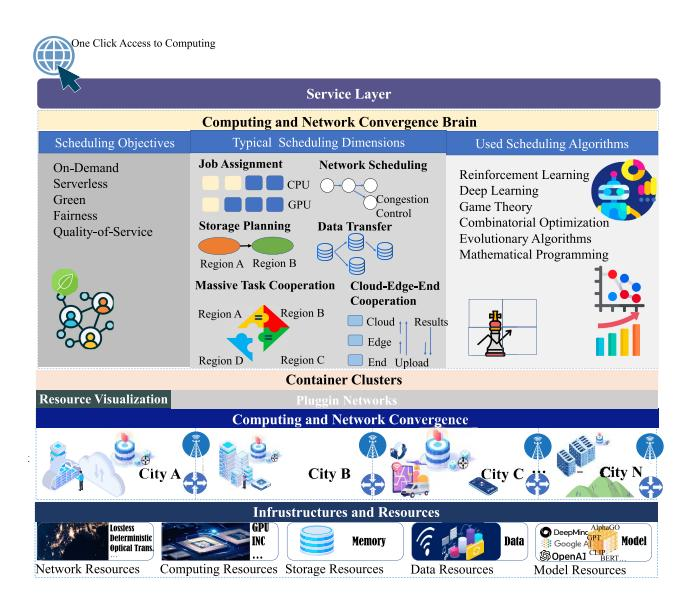
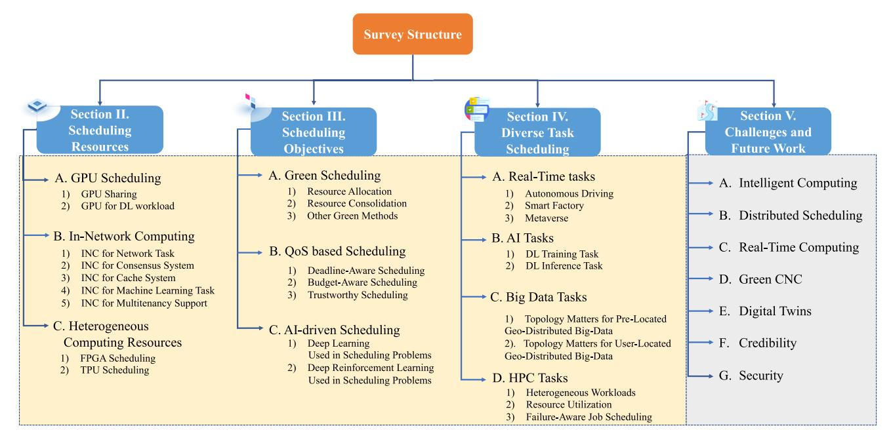
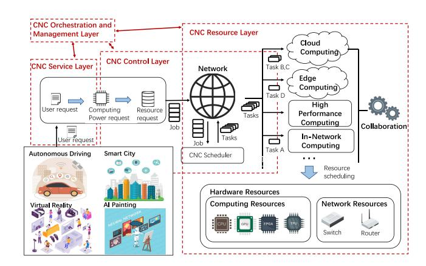
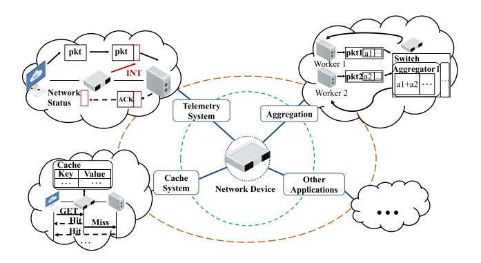
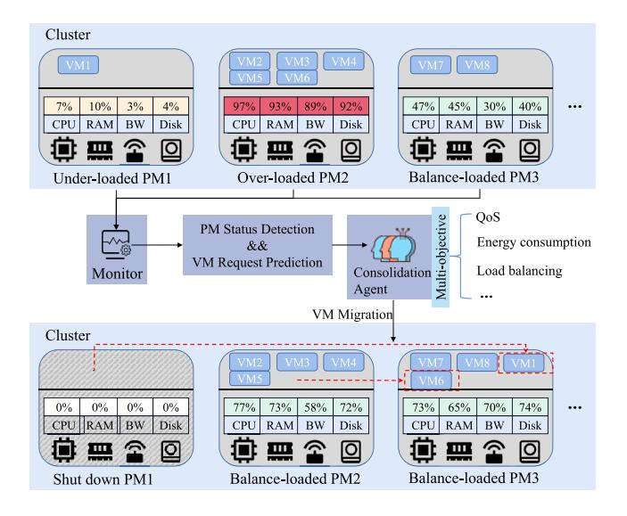
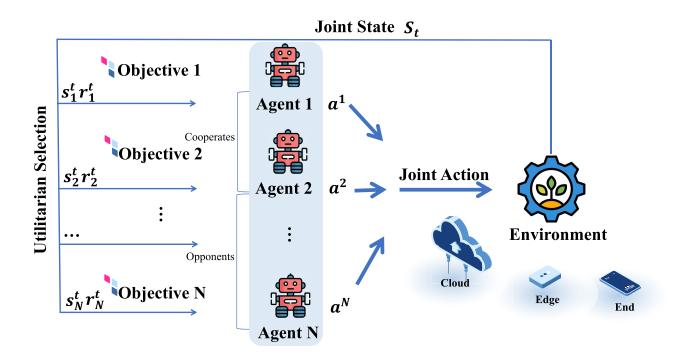
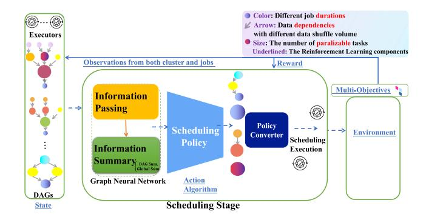
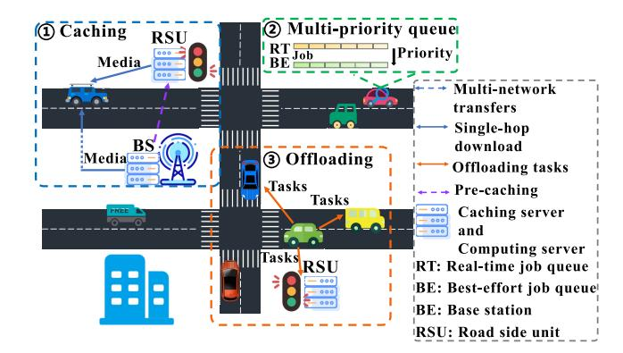
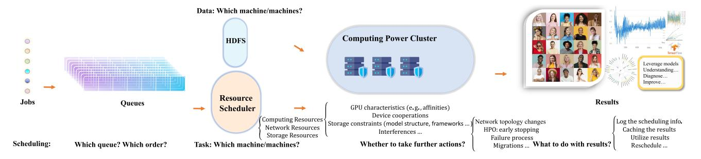
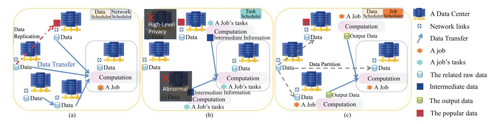

# A Survey on Scheduling Techniques in Computing and Network Convergence

Shujiong Tang®, Graduate Student Member, IEEE, Yue Yu®, Member, IEEE, Hui Wang, Guiliang Wang®, Wuhui Chen®, Member, IEEE, Zenglin Xu®, Senior Member, IEEE, Song Guo®, Fellow, IEEE, and Wen Gao®, Fellow, IEEE

Abstract—The computing demand for massive applications has led to the ubiquitous deployment of computing power. This trend results in the urgent need for higher-level computing resource scheduling services. The Computing and Network Convergence (CNC), a new type of infrastructure, has become a hot topic. To realize the visions of CNC, such as computing-network integration, ubiquitous collaboration, latency-free, and ready-touse, an intelligent scheduling strategy for CNC should integrate and collaborate with the network. However, the Computing and Network Convergence is built on the cloud, edge, and endless terminals, making the scheduling problem more difficult due to its wide-area requests, available flexibility arrangements, interconnections, and resource adaptations. In view of this, in this survey, we comprehensively review the literature on scheduling in various scenarios. We cover the scheduling problem of Computing and Network Convergence from heterogeneous resources, multiple-objective optimization, and diverse tasks. Possible explanations and implications are discussed. Finally, we point out important challenges for future work.

*Index Terms*—Computing and network convergence, scheduling, resource allocation, Internet technology.

Manuscript received 12 March 2023; revised 16 August 2023; accepted 13 October 2023. Date of publication 1 November 2023; date of current version 27 February 2024. This work was supported in part by the National Key Research and Development Program of China under Grant 2022ZD0115301; in part by the National Natural Science Foundation of China under Grant 62172453; in part by the National Natural Science Foundation of Guangdong Province under Grant 2022A1515010154; in part by the Major Key Project of PCL under Grant PCL2023AS7-1; and in part by the Pearl River Talent Recruitment Program under Grant 2019QN01X130. (Corresponding author: Yue Yu.)

Shujiong Tang is with the Department of Computer Science and Engineering, University of Electronic Science and Technology of China, Chengdu 611731, China, and also with the Department of Networked Intelligence, Pengcheng Laboratory, Shenzhen 518055, China (e-mail: shujiong.tang@std.uestc.edu.cn).

Yue Yu and Hui Wang are with the Department of Networked Intelligence, Pengcheng Laboratory, Shenzhen 518055, China (e-mail: yuy@pcl.ac.cn; wangh06@pcl.ac.cn).

Guiliang Wang and Wuhui Chen are with the School of Computer Science and Engineering and the National Engineering Research Center of Digital Life, Sun Yat-sen University, Guangzhou 510006, China (e-mail: wanggliang5@mail2.sysu.edu.cn; chenwuh@mail.sysu.edu.cn).

Zenglin Xu is with the School of Computer Science and Technology, Harbin Institute of Technology (Shenzhen), Shenzhen 518055, China (e-mail: xuzenglin@hit.edu.cn).

Song Guo is with the Department of Computer Science and Engineering, Hong Kong University of Science and Technology, Hong Kong, China (e-mail: songguo@cse.ust.hk).

Wen Gao is with the School of Computer Science, Peking University, Beijing 100084, China, and also with the Department of Networked Intelligence, Peng Cheng Laboratory, Shenzhen 518052, China (e-mail: wgao@pku.edu.cn).

Digital Object Identifier 10.1109/COMST.2023.3329027

### I. Introduction

ODERN society has entered the era of a digital economy All walks of the economy. All walks of life are undergoing digital transformation, and computing power has become the core productivity of this era. However, as Moore's Law tends to the limit, the construction of single-point computing facilities, such as large-scale computing centers, cannot fully meet computing power needs. The Computing and Network Convergence (CNC), alias Computing Force Network or Computing Power Network, connects various computing powers distributed in ubiquitous places through the network, making the services instantly available as water and electricity. Especially for large-scale high-computation geo-distributed services, such as Metaverse and foundation model training, CNC can intelligently break through the performance limit of single-point computing power with ubiquitous computing power and networks. With the foundational infrastructure for computing power, deterministic networks, and the fifth Generation (5G) widely deployed, CNC services now extend to approximately 300 cities and have been tested in various business scenarios, from mobile phone applications to large model training. In academia, the community primarily focuses on refining architecture, communication standards, schedulers, heterogeneity handling, and security.

Scheduling is the core technology of the CNC control plane and the key to reaching ultra-low-latency and ondemand computing. It determines which computing node the task is placed on and how resources are allocated. Figure 1 shows the scheduling overview in CNC. Specifically, CNC schedulers coordinate diverse geographically distributed data centers, clouds, edge devices, and terminals, linked by networks. Schedulers could assign the execution location of a task, affecting data and storage scheduling, network scheduling, computing performance, transmission delay, and cost. The computing resources (e.g., CPU) and network resources mainly determine the processing speed of the task. The scheduling algorithm requires a comprehensive set of capabilities. It should not only improve the success rate of task execution to ensure the availability of CNC but also reduce the task completion time to ensure user satisfaction. In addition, a superior scheduling algorithm can improve the efficiency of the computing center and save energy. Therefore, a smart, real-time-available, and green CNC is closely related to efficient scheduling algorithms. The CNC architecture

1553-877X © 2023 IEEE. Personal use is permitted, but republication/redistribution requires IEEE permission. See https://www.ieee.org/publications/rights/index.html for more information.

Fig. 1. The overview picture of CNC scheduling. CNC schedulers jointly optimize resources such as network, computing, and storage, achieving highlevel orchestration based on resource abstraction. ITU Telecommunication Standardization Sector (ITU-T) published the standard of CNC with ongoing studies (e.g., [\[1\]](#page-27-0), [\[2\]](#page-27-1), [\[3\]](#page-27-2), [\[4\]](#page-27-3), [\[5\]](#page-27-4)).

comprises multiple layers. Please see Figure [3](#page-3-0) in Section [II](#page-2-0) for the scheduling process under the architecture.

The current CNC resource schedulers present some challenges that must be addressed.

First of all, in CNC, the management of dynamic, diversified, and ubiquitous heterogeneous resources is challenging. CNC abstracts diverse resources into computing power and supports computing power through the network (e.g., the sixth Generation (6G) and the networks which could provide deterministic latency). To realize the goal of computing-network integration, it faces two primary challenges. One is the abstraction of computing resources. The CNC covers a variety of computing resources, including CPUs, GPUs, programmable network devices, Field Programmable Gate Arrays (FPGAs), Tensor Processor Units (TPUs), and other types. Abstraction is essential to provide a unified view of computing powers upward for further allocation. The other is cooperative scheduling. Heterogeneous computing resources with different characteristics have different workload preferences. Resource scheduling solely based on abstract computing power cannot adapt to scenarios with complex and diverse workloads. Meanwhile, to meet the Service Level Agreement (SLA) level, improve service quality, and reduce the costs of service providers, it is necessary to coordinate the scheduling of distributed computing resources. Besides, the CNC architecture supports using other available resources such as storage, data, and model resources, to speed up the computing process.

Secondly, the scheduler balances multiple dynamic scheduling objectives, such as different levels of latency, security, reliability, energy consumption, and cost requirements. On the one hand, the computing power providers need to save energy and improve scheduling efficiency. Users, on the other hand, expect their requests to be processed as quickly as possible at the lowest possible cost while meeting business requirements. It may be easy to optimize a single objective, but there may be contradictions among optimization objectives.

Finally, in CNC, diverse tasks need different scheduling considerations, increasing the complexity. An in-depth investigation of the task characteristics can better match specific types of workloads with more appropriate resources. Real-time tasks, for instance, must prioritize latency and deadlines. Therefore, schedulers tend to employ additional edge devices and In-Network Computing or set higher priority to preempt machines. Whereas Deep Learning (DL) tasks prioritize selecting suitable hardware for accelerating intensive and long-term computing with the resource affinity considered.

### *A. Related Works and Motivation*

Scheduling problems have been investigated by many researchers. Earlier surveys focused on cloud computing. For example, Khallouli and Huang [\[6\]](#page-27-5) summarized and classified the existing cluster scheduling frameworks from three aspects: scheduling architectures, goals, and methods. In addition, schemes for applying Machine Learning (ML) methods to resource scheduling in cloud computing are also investigated. Li et al. [\[7\]](#page-27-6) decomposed the serverless architecture into four layers and investigated the resource scheduling problem of serverless in the System Orchestration Layer. Recently, edge computing has also gradually attracted attention. For example, Luo et al. [\[8\]](#page-27-7) surveyed various SOTA scheduling algorithms in edge computing and proposed an edge-computing architecture. Moreover, cloud computing and fog computing are sometimes considered together. Rahimikhanghah et al. [\[9\]](#page-27-8) investigated cloud and fog computing scheduling techniques. For the scheduling techniques on geo-distributed Datacenters (DCs), Wang et al. [\[10\]](#page-27-9) surveyed the scheduling of data-intensive applications in computing clusters with a focus on data locality. Hogade and Pasricha [\[11\]](#page-27-10) investigated resource scheduling techniques using ML algorithms for these geographically dispersed DCs. Furthermore, some surveys analyzed the existing literature from the perspective of scheduling technology. For example, Garí et al. [\[12\]](#page-27-11) reviewed Reinforcement Learning (RL) methods to deal with the autoscaling problem in cloud computing, Soltani et al. [\[13\]](#page-27-12) summarized heuristic resource scheduling algorithms in cloud computing, and Soni and Kumar [\[14\]](#page-27-13) delved into applying ML methods in emerging cloud computing paradigms. Additionally, some surveys explored resource scheduling problems in specific application domains. For example, Afrin et al. [\[15\]](#page-27-14) surveyed resource scheduling in robotic applications.

In summary, the above studies address either cloud, edge, geo-distributed DCs, or specific scheduling issues only, while none of them focuses on the hierarchical scheduling issue with both the network and computing resources in CNC in a comprehensive way. The existing surveys focus on the architecture design of CNC [\[16\]](#page-27-15), [\[17\]](#page-27-16). To the best of our knowledge, this is the first systematic survey of the scheduling techniques of CNC. To fill this research gap, we review from multiple perspectives, including scheduling objects as resources, scheduling objectives such as green and Qualityof-Service (QoS) with Artificial Intelligence (AI) support, and diverse typical scheduling tasks in CNC. We present a comprehensive state-of-the-art survey for adapting the current scheduling techniques to the CNC architecture. Table [I](#page-2-1) shows

Fig. 2. Road map of the survey.

TABLE I COMPARISON OF RELATED CNC SURVEYS

| Car              | egories             | Survey [16] | Survey [17] | This survey |
|------------------|---------------------|-------------|-------------|-------------|
| -                | CNC                 | ✓           | ✓           | <b>√</b>    |
| INC              | resources           |             |             | <b>√</b>    |
|                  | Caching             |             |             | <b>√</b>    |
| Diverse          | Control             | ✓           | ✓           | ✓           |
| task scheduling  | Computation         | <b>√</b>    | <b>√</b>    | <b>√</b>    |
|                  | Communication       | <b>√</b>    | <b>✓</b>    | <b>✓</b>    |
| Dynamic          | Basic ML/Heuristics |             | ✓           | <b>✓</b>    |
| scheduling goals | cheduling goals DRL |             |             | <b>√</b>    |

a comparison of related surveys with ours, the scheduling including caching (e.g., cached data or services for fast response), control (e.g., load balance, migration), computation (e.g., tasks division, offloading), and communication (e.g., network scheduling, parameter synchronization).

### *B. Contribution and Organization*

This paper provides a comprehensive survey of CNC scheduling techniques with empirical, computational, and theoretical considerations discussed. For the convenience of readers, Figure [2](#page-2-2) outlines the structure of the survey. In particular, we analyze the following four aspects:

- *• Resources for Scheduling (Section [II\)](#page-2-0):* The typical resources included in the CNC are introduced in this chapter. Specifically, we consider GPU scheduling, In-Network Computing (INC), and two heterogeneous computing resource (i.e., FPGA, TPU) schedulers.
- *• Scheduling Objectives (Section [III\)](#page-9-0):* We review schedulers with different scheduling objectives. We mainly describe it from the aspects of green scheduling, QoS-based scheduling, and AI-driven scheduling, showing practical explorations to balance multiple objectives.
- *• Diverse Task Scheduling (Section [IV\)](#page-16-0):* We summarize various scheduling tasks in CNC, including scheduling

- in real-time tasks, AI training and inference tasks, big data applications with geographically distributed DCs, and High Performance Computing (HPC) tasks. The scheduling solutions for these scenarios with different characteristics are crucial to the realization of the CNC.
- *• Challenges and Future Work (Section [V\)](#page-25-0):* We consider the directions and challenges in scheduling to achieve CNC, including intelligent computing, distributed scheduling, real-time computing scheduling, green CNC, digital twins, credibility, and security concerns in case of possible data and job exposure.

The rest of this article is organized as follows. Section [II](#page-2-0) describes the resources included in the CNC. Then, Section [III](#page-9-0) classifies scheduling algorithms from the perspective of scheduling objectives, and Section [IV](#page-16-0) summarizes various scheduling tasks in CNC. Challenges and future work are described in Section [V.](#page-25-0) Finally, Section [VI](#page-27-17) draws conclusions.

# II. SCHEDULING RESOURCES

Offering computing results as soon as possible, CNC schedules massive services to heterogeneous computing nodes in different places on demand through the unified coordination of multi-dimensional resources. For example, run Metaverses for agriculture in several regions to provide control decisions. Multiple ML models should handle multi-modal (e.g., video), multi-dimensional (e.g., climate, soil), timely monitoring data from plan making, vegetative stage, and sale period. Schedulers analyze tasks and choose resources. INC is used to perform simple arithmetic operations in the network in advance to reduce latency and communication costs. GPUs are chosen with the scheduling characteristics considered. CPU supports GPU and FPGA. FPGAs may attend in sensor fusion, Input/Output, and acceleration. Besides, foundation models are introduced to support Metaverses by extracting features and long-term dependencies. For training of foundation models, schedulers decide whether to train in parallel in the same computing GPU/NPU cluster, separating models or data in multiple highly connected machines by high-speed links, or in multiple geo-distributed clusters cooperatively with privacyguaranteed intermediate information transferred. For inference tasks, models can be scheduled on GPUs and TPUs.

The introduction of network softwarization in CNC enables the allocation and management of network services, functions, and protocols to be separated from dedicated hardware, facilitating resource sharing, multi-tenancy, diversified services, and quick deployment. Software Defined Networking (SDN) decouples the data plane and control plane, and logically centralizes physical device control to enhance forwarding and network reliability. Network Functions Virtualization (NFV) decouples software functions and hardware, virtualizes resources, and enables the realization of Virtualized Network Functions (VNFs) on Virtual Machines (VMs) and containers. A comparison of SDN and NFV is discussed in [\[18\]](#page-27-18). Based on these key enablers, network slicing builds multiple logical virtual networks on a common infrastructure. Each slice is an end-to-end logical network with a group of network functions and its allocated resources [\[19\]](#page-27-19). These slices, which can be independently controlled and isolated, possess very different network performance indicators (e.g., use cases in 5G/6G, such as massive ultra-reliable and low-latency communications). Network slicing resource management can be divided into four phases (similar to [\[20\]](#page-27-20)). The initial phase, admission control of requests, balances resource utilization, network efficiency, SLAs, and profits. It leverages characteristic models of slices and users [\[21\]](#page-27-21) in admitting and ranking the requests. After that, resource allocators plan the resources of each slice, taking from Radio Access Network, core, transport, and edge networks (such as spectrum [\[22\]](#page-28-0), VNFs, and other computing, network resources). Subsequently, determine the exact usage of allocated resources for the admitted request, mainly from the time dimension due to the time constraints of service duration and resource reservation. Finally, orchestrators are responsible for the rapid [\[23\]](#page-28-1) adjustment of service chains [\[24\]](#page-28-2) and resources. This adjustment comes from the fluctuating service requirements, traffic, and resource availability, together with the need to keep satisfactory QoS for the related slices. Additionally, resource management needs to handle crossdomain slicing heterogeneity. A slice may have resources from different operators, such as in the smart factory scenario [\[25\]](#page-28-3). Besides, the phases affect each other and require cooperation.

Except for storage-only scheduling, storage often cooperates with other resources in scheduling, such as data placement (e.g., in geo-distributed DCs), caching policy maintenance, and capacity constraints [\[26\]](#page-28-4). SiloD [\[27\]](#page-28-5) reduces the cache or remote IO bottlenecks by co-designing the cache system with schedulers and considering the impacts of various storage resources. Figure [3](#page-3-0) shows the general scenario of resource scheduling in CNC. Multiple layers cooperate together in the scheduling process. In this section, we will review the typical computing resources modeled and scheduled in CNC based on their advantages, characteristics, and application scenarios.

Fig. 3. A general scenario of resource scheduling under the CNC architectures. The architecture has four layers (marked with dashed boxes). The Service Layer perceives the user's service request and converts it into the computing power demand of the corresponding service. The Control Layer maps computing power requirements to resource requirements according to the status of computing and network resources, and coordinates scheduling tasks in cloud computing, edge computing, high-performance computing, innetwork computing, and others. The Resource Layer provides the underlying resources upward, such as computing, network, and storage resources.

### *A. GPU Scheduling*

As a highly integrated system of computing and network, the primary problem of the CNC is computing immobility. AI tasks are bound to increase significantly such as the Internet of Things (IoT), smart city, immersive Extended Reality (XR), and all manner of ML tasks. CNC has to handle the large scale: (i) cooperatively training of foundation model; (ii) the large amount of tasks. In this case, GPUs are indispensable. The GPU is a graphics processing unit with thousands of cores designed for parallel processing. Unlike CPUs, GPUs excel in parallelism and calculating simple repetitive tasks. This makes them well-suited for AI tasks, which involve a large number of parallel matrix operations. GPUs accelerate parallel computations to solve massive multi-modal data. GPUs can flexibly combine with others, such as offloading in CPUs, and support various applications, such as multimedia, AI, and gaming. We will review works in terms of GPU sharing techniques and GPU resource scheduling under DL workloads.

*1) GPU Sharing:* Most of today's commercial GPU resource allocation is exclusive allocation, which means that schedulers can only assign each GPU to one application. This exclusive allocation method is conducive to the simplification of the GPU hardware design and makes the GPU efficient. However, this also brings two major problems: (i) the coarsegrained allocation paradigm lowers the GPU cluster manager's scheduling flexibility and compels the use of higher-cost methods, such as suspending and migrating jobs; (ii) the low utilization of GPU resources. Therefore, the scheduler should modify the allocation mode of GPU resources and share the GPU with multiple applications. Common GPU sharing technologies include GPU virtualization, Multi-Process Service (MPS), and NVIDIA Multi-Instance GPU (MIG).

Many works are based on GPU virtualization. There are three types of GPU virtualization: hardware-supported Virtualization, Application Programming Interface (API) remoting, and Para & full virtualization.

| Issue                                   | Ref.                         | Main Idea                                                                                                                                                     | Contributions                                                                                               | Limitations                              |
|-----------------------------------------|------------------------------|---------------------------------------------------------------------------------------------------------------------------------------------------------------|-------------------------------------------------------------------------------------------------------------|------------------------------------------|
| Inherent Heterogeneity                  | AlloX [41]                   | Transforms the multi-configuration schedule problem into a minimum-cost binary matching problem to realize GPU resource scheduling under heterogeneous tasks. | Considers DL task heterogeneity, dynamic allocation, and fairness.                                    | GPU heterogeneity                     |
|                                         | Gandiva fair [49] | Realizes high efficiency and fairness of DL task scheduling for different users in heterogeneous GPU clusters.                                                | Considers GPU heterogeneity, dynamic allocation, and fairness.                                        | DL task heterogeneity                 |
|                                         | SchedTune [51]               | Schedules heterogeneous DL tasks to heterogeneous GPU resources based on heterogeneity perception.                                                            | Considers DL task heterogeneity and GPU heterogeneity, dynamic allocation                          | Fairness                                 |
| Placement Sensitivity                   | Themis [54]                  | Uses a semi-optimistic auction-based approach to realize ML task scheduling of GPU cluster, taking into account fairness and efficiency.                      | Short-term efficiency, long-term fairness                                                                | Task characteristics consideration |
|                                         | Tiresias [55]                | Determines when to relax task placement constraints based on simple, externally observable, model-specific criteria.                                          | Considers resource utilization and efficiency under priorities.                                             | Fairness                                 |
| Iterative Process & Elastic Training | Gandiva [63]                 | Allocates GPU time slices based on task predictability and performs performance introspection and job migration.                                              | Increases efficiency with performance introspection and increases utilization with predictability. | GPU heterogeneity and fairness     |
| Elastic Training                        | Optimus [64]                 | Designs a dynamic scheduler based on the resource-performance model.                                                                                          | Low job completion time and makespan                                                                        | GPU heterogeneity                     |

TABLE II REPRESENTATIVE GPU SCHEDULERS

Hardware-supported virtualization allows the guest to directly access the GPU through the hardware features of Input/Output virtualization and maps the interrupts and data transmission to VMs. NVIDIA GRID [\[28\]](#page-28-6) made it possible for multiple VMs to share resources on a single GPU.

API remoting virtualizes the GPU at the library level of the GPU execution stack, enabling GPU calls to be intercepted and redirected for the remote process. Therefore, only the results are passed to the application. It is easy to implement and use, and thus more widely used. Relatively early API remoting methods include GVirtuS [\[29\]](#page-28-7) and vCUDA [\[30\]](#page-28-8). These methods focus on providing GPU virtualization services, which divide a physical GPU into multiple virtual GPUs. Unlike the former, GaiaGPU [\[31\]](#page-28-9) prefers GPU sharing rather than virtualization, providing a complete GPU sharing technology at the container level. Virtual CUDA in GaiaGPU is a GPU resource-limiting component that uses CUDA hijacking to realize memory isolation. The cGPU [\[32\]](#page-28-10) is also a GPU sharing scheme based on the container. It realizes the isolation of memory and computing power through kernel hijacking.

Para & full virtualization implements driver-level GPU virtualization by leveraging custom GPU drivers. The host exposes simulated virtual GPUs to the guest driver. Paravirtualization changes customer GPU drivers to improve performance, and full virtualization uses unmodified GPU drivers. VMware SVGA II [\[33\]](#page-28-11) uses the paravirtualization method. VMware uses the VMware SVGA Driver to replace the original GPU driver of the guest. It provides the guest with access to a virtual GPU created by the hypervisor, named VMware SVGA II. LoGV [\[34\]](#page-28-12), HSA [\[35\]](#page-28-13) realized the GPU resource virtualization by also modifying the GPU drivers of the guest. GPUvm [\[36\]](#page-28-14) implemented full virtualization and paravirtualization of GPU resources by using the Nouveau driver in the Xen hypervisor. To provide full virtualization, the GPUvm scanned the entire page table at each TLB refresh and generated a page error for each GPU access so that the hypervisor could simulate the access. However, performance issues arise mainly from the need for intercept access when using full virtualization techniques. Therefore, gVirt [\[37\]](#page-28-15) allowed each VM to reach related components in the GPU to bypass the hypervisor layer's intervention.

MPS [\[38\]](#page-28-16) is a GPU sharing component officially launched by Nvidia. It belongs to space multiplexing, while almost all GPU virtualization technologies use time multiplexing for GPU sharing. MPS shares GPU computing power by combining multiple tasks into a single context to execute computing cores submitted by multiple CPU processes. This overlap can lead to more thorough resource usage and better overall throughput. Similar to MPS, MIG [\[39\]](#page-28-17) also uses space multiplexing to share GPU resources. However, MIG is more suitable for running multiple computing cores with different users. This is due to the strict partitioning of resources by MIG, where each MIG instance has a guaranteed set of resources and is completely isolated.

- *2) GPU Scheduling for DL Workload:* As mentioned before, GPUs are perfectly suited to DL tasks. In this regard, for the scheduling problem of GPU resources, we conducted a survey based on the characteristics that highly affect the scheduling performance such as inherent heterogeneity, placement sensitivity, iterative process, and elastic training. We summarized the representative GPU schedulers in Table [II.](#page-4-0)
- *a) Inherent heterogeneity:* DL training workloads are heterogeneous because they target different application domains. Among them, GPU resources favor different workloads. In addition, memory use, CPU core utilization, and other factors such as algorithms, and job order [\[40\]](#page-28-18) also cause interference. Therefore, selecting the appropriate resource configuration based on job characteristics is necessary. The heterogeneous resources could be divided into GPUs with other resources and different GPU generations.

Resource fairness is widely discussed. Fairness tends to improve the utilization of complementary or previous ones. Some works are based on the assumption that CPU and GPU are interchangeable to serve the tasks. The authors in [\[41\]](#page-28-19) presented tables of interchangeability-support frameworks and incompatible resource managers. Multiple resource demands to accept for each job at run-time are made possible by interchangeable flexibility with alternatives to support and online analysis of workload characteristics, offering a new scheduling dimension. Allox [\[41\]](#page-28-19) models schedule as a minimum-cost binary matching problem. The results showed improvements in user equality, starvation prevention, and significantly reduced average Job Completion Time (JCT). TetriSched [\[42\]](#page-28-20) uses Mixed-Integer Linear Programming (MILP) and interchangeability to satisfy deadlines with combinatorial constraints [\[43\]](#page-28-21). Using the MILP may suggest that solutions cannot be found in polynomial time. Except for the interchangeable assumption, which is too strong, some schedulers assume CPUs and memories are auxiliary resources. The sensitivity of auxiliary resources could offer another factor in avoiding interference. SwapAdvisor [\[44\]](#page-28-22) focuses on GPU memory exhaustion problem and uses a genetic algorithm. It enables the models up to 12*×* limit. Mobius [\[45\]](#page-28-23) works on large models too. It supports fine-tuning, assists GPU with heterogeneous memory, and reduces communications. Synergy [\[46\]](#page-28-24), a round-based scheduler, models schedule as a fungible multi-dimensional bin-packing problem. Experimental results show an up to 3.4 *×* reduction in average JCT than GPU-proportional allocations which could hardly solve CPU-sensitive jobs with high demands on data pre-processing. However, it is designed in a homogeneous GPU cluster, and MinIO cache [\[47\]](#page-28-25) should be used for better profiling. Muri [\[48\]](#page-28-26) leverages the iterative process nature and enables concurrently running jobs by multi-resource interleaving rather than packing.

Most GPU clusters host multi-generation GPUs. The scheduler considers the user's demand, utilization rate, costs, and job characteristics. Gandivafair [\[49\]](#page-28-27) was claimed to schedule cluster-wide GPU time among users fairly by using an automatic trading mechanism. Meanwhile, it designs a load balancer based on ticket weighting. It distributes jobs evenly through the job migration mechanism to achieve fairness. Gavel [\[50\]](#page-28-28) can optimize multiple complex objectives, such as max-min fairness and finish-time fairness. It uses modified linear programming in each iteration, assuming jobs may be time-sliced across heterogeneous resources. For each type of accelerator, the throughput estimator measures its performance. It leverages MPS to share the GPU.

Schedulers could also deal with heterogeneous resources without considering fairness. For example, the scheduler [\[51\]](#page-28-29) uses memory requirements predicted by regression models whose inputs are features of the DL model and GPUs.

*b) Placement sensitivity:* Most distributed DL jobs are highly sensitive to GPU placement. Communication quality and delay between devices directly determine the completion time and even cause failure. In addition to adopting new communication technologies to provide a high order of magnitude of bandwidth, a location-aware allocation method

for GPU resources is also essential. For better placement arrangements, the straightforward idea is to use topology graph mapping. The authors in [\[52\]](#page-28-30) proposed a best-effort placement strategy mapping from DL training tasks' job graph to physical GPU topology with satisfactory communication requirements, less application interference, and minimal fragmentation. Recursive bi-partitioning [\[53\]](#page-28-31) is used to select the GPUs. Besides, they found that packing jobs to the same CPU socket is faster.

Generally, the placement sensitivity is combined with other characteristics. THEMIS [\[54\]](#page-28-32) combines it with long-run fairness, a typical scheduling goal to achieve balance, using a semi-optimistic auction-based approach. First, the scheduler picks the set of applications with the worst finish-time fairness and provides them with a capacity-and-location view of available GPUs. The location-advantaged application wins the auction. Experiments show that the average application completion time is lowered by 4.6% *−*55.5%. Although Tiresias [\[55\]](#page-28-33) has a lower comprehensive performance than THEMIS, it combined with the model structure and iterative characteristics without requiring users to provide any additional configuration. Besides, it is common to use a profiler, either online or offline, in DL training workload because of the long duration. When given the profiler, the scheduler obtains an estimation of running time and then adjusts the processing sequence. SCHED2 [\[56\]](#page-28-34) tries multiple placement strategies in profiling. Experiments indicate that DL training jobs will run much faster on the same GPU node than when they are distributively allocated. For example, VGG16 [\[57\]](#page-28-35) is 5.9*×* faster on one server than on two. Meanwhile, the closer distance in the allocated topology is preferred, especially for communication-intense jobs with a high transfercomputation ratio [\[58\]](#page-28-36). In short, the matching of locality sensitivity and cluster fragmentation is needed. SCHED2 uses Deep Q-Network (DQN) [\[59\]](#page-28-37), a Deep Reinforcement Learning (DRL) algorithm, and design states with topology information. For schedulers considering deadline, GENIE [\[60\]](#page-28-38) pre-processes the task sequence in the waiting queue. GENIE uses a lightweight-profiler-based prediction model in offline profiling. The model maps task information to processing rate and response latency, reducing the over-claimed number of GPUs. Best placements could be dynamically assigned according to the impact of occupied GPU topology. The authors observed that the large batch size and multi-task setting show less obvious local sensitivity, providing insights into different placement strategies. However, this algorithm could not be directly deployed to TensorFlow [\[61\]](#page-28-39) without default option modifications such as *allow\_growth*. Chronus [\[62\]](#page-28-40), a deadline-aware scheduler, uses online profiling. Chronus has dynamic capacity scaling mechanisms for clusters. A roundup placement strategy for Service Level Objective (SLO) guaranteed jobs and local search for jobs in the Best-effort queue. The Allocator for local search ranks the jobs by their potential, representing how much the run-time speed will improve compared to the optimal consolidation solution by profiling. An exhaustive search for the top-K jobs is executed while the others are still allocated in a quasi-consolidation manner.

- *c) Iterative process:* The DL training job iterates the forward propagation, backward propagation, and parameter update processes tens of millions of times. This feature makes it possible to predict job-level GPU resource usage (how many) and completion time (how long), and is therefore commonly used in scheduling. The scheduler attempts to distribute GPU resources properly by assessing prediction results. For example, Gandiva [\[63\]](#page-28-41) uses the predictability of jobs to allocate GPU time slices among multiple jobs to fully use GPU resources and reduce latency. This predictability is also used for performance introspection and job migration. Experimental results show a 26% improvement in clustering efficiency and a nearly 77% reduction in the early feedback time. In addition, the predictability of jobs enables SLO requirements based on job execution times.
- *d) Elastic training:* Many GPU resource scheduling systems currently try to employ elastic training, which can dynamically adjust the GPU numbers required to run training jobs. In the past, DL workloads were gang scheduled, where all tasks of the workload needed to use GPU resources simultaneously in an all-or-nothing manner. This may facilitate performance and QoS metrics, while the under-utilized fragments of GPU cluster resources lower resource utilization. The elasticity characteristic of DL training jobs allows running jobs to be paused and resumed through checkpoints. Gandiva [\[63\]](#page-28-41) introspects job performance based on the predictability of DL workloads. With job-switching techniques, when the GPU utilization is low, multiple jobs are packaged on the same GPU to shrink resources. When spare resources are available, job parallelism is opportunistically increased. Suspend-resume, migration, and grow-shrink mechanisms help to achieve this fine-grained GPU usage. Optimus [\[64\]](#page-28-42) designs a greedy scheduler supported by a resource-performance model, which enables dynamic adjustment of GPU allocations, increasing or decreasing the number of GPUs used by each job on the go.

### *B. In-Network Computing*

To make up for the shortage of end-side computing power and the limitation of network bandwidth, CNC must support INC. With INC, CNC can offload several computing tasks to network devices, which relieves the computing pressure, reduces data volume transmitted in the network, and improves the overall computing efficiency of the system. INC scheduling emphasizes network support and low latency (e.g., in-advance computation), while GPU scheduling focuses on high throughput, GPU cooperation, and specific characteristics such as gang scheduling and heterogeneity.

In the past decade, programmable network devices have been widely used to optimize the performance of distributed systems. These include programmable switches based on ASICs and FPGAs and new network hardware such as smart-NICs. Relying on their location advantage in network topology and extremely high processing speed, they have triggered research on INC. In addition to using INC to perform network tasks, many works apply it to aggregation, querying, caching, consensus, and so on. Some related works propose isolation mechanisms on a single network device and multi-tenant

Fig. 4. Typical application scenarios of INC. In the telemetry system, the switch embeds its own information into the packet according to different queries, and this information will be returned to the application as telemetry data to facilitate the execution of subsequent network tasks, such as congestion control. In the aggregation scenario, the aggregator in the switch is used to aggregate gradient updates from different workers. In the cache system, the hotspot key values are stored in the switch for subsequent quick access.

support, which are more suitable for CNC. Figure [4](#page-6-0) shows the typical application scenarios of INC. In this section, we will review INC for these applications.

*1) INC for Network Task:* One intuitive way to use the programmable network device is to perform network tasks to improve the network's overall performance. Telemetry technology should accurately and immediately locate network management problems such as high delay queues, load imbalances, and faulty nodes. Programmable network devices offer an option to improve telemetry techniques. For example, Sonata has been applied to telemetry tasks and it allows refined declarative queries to reduce the stream processor's workload, improving usage of switch memory, and allows network operators to apply familiar data flow operators to any combination of packet fields [\[65\]](#page-28-43). Except for combining with stream processors, programmable network equipment (such as a programmable switch, or a network interface card) can be directly used to design telemetry systems [\[66\]](#page-28-44). Based on traditional In-Band Network Telemetry, they proposed PINT which obtains only approximate telemetry data.

Furthermore, INC provides new ideas for network Congestion Control (CC). For large-scale high-speed networks, the authors in [\[67\]](#page-28-45) proposed a popular CC mechanism named HPCC. By using fine-grained network load information from INT, HPCC can quickly adjust traffic to achieve high utilization and congestion avoidance with only three independent parameters. In addition, HPCC limits the total number of transmitted bytes over busy links to solve INT message delay. Optionally leveraging INT information with combined per-ACK and per-RTT (end-to-end round-trip time) reactions supported by the reference rate, this design speeds up the reactions without going overboard. The experiments show a 95% reduction in the stream completion time compared with popular baselines. HPCC shows no obvious congestion even under large-scale incast. To achieve an approximate variant of congestion control and load balancing protocols, Sharma et al. [\[68\]](#page-28-46) addressed the problems of limited switch states, few supported types of operations, and insufficient computing resources per packet by designing building blocks that use approximation techniques.

*2) INC for Consensus System:* The coordination service, a basic building block of modern cloud systems, provides a strong consistency guarantee for different nodes to access shared resources. Different nodes first need to reach a consensus on the current access. However, the communication cost is unacceptable as the scale increases. One solution is to deploy a consensus protocol. For example, widely deploy Paxos consensus protocol in programmable network devices [\[69\]](#page-28-47) without many modifications. It improves transaction throughput with less message delay while relying on the network message ordering assumption. Another solution is to optimize lock acquisition, a critical bottleneck limiting the transaction throughput of coordination services, whose costs directly depend on the end-to-end round-trip time (RTT). Many large distributed systems alleviated this problem by relaxing the consistency semantics. NetChain [\[70\]](#page-29-0) improves transaction throughput significantly (e.g., 13333 *×* in experiments) compared with traditional server-based solutions such as ZooKeeper. It is deployed in the network data plane as a coordination method for data storage and query processing, using partitioning data on multiple switches for horizontal expansion and a fast failover algorithm for fault tolerance. For resource constraints, key-value items are stored in switch onchip memory. For consistency, it uses a variant protocol of chain replication.

*3) INC for Cache System:* CNC supports large-scale network systems and Internet services rely heavily on highperformance key-value storage. A common solution is caching. However, there are two main challenges. One is the load imbalance caused by different popularities of key-value pairs. The other challenge is the inefficiency of CPU-based key caching. To solve these problems, NetCache [\[71\]](#page-29-1) uses programmable switches to cache network data. The architecture manages hot-key items through a specially designed packet processing pipeline. NetCache keeps a per-key counter and a detector with filters for identifying popular key-value entries. Experimental results show that NetCache significantly reduces the query latency by up to 40% by half. However, NetCache does not support network computation for specific applications. INC requires a simple generic computing abstraction that can be easily integrated with an application to support a wide range of data center applications. In this regard, IncBricks [\[72\]](#page-29-2), an in-network cache structure, provides basic computing primitives. It combines hardware and software and supports programmable network devices. It can be divided into two modules. IncBox, a hybrid switch/network accelerator architecture that provides a key-value pair storage interface for application offloading, and IncCache, a network cache that maintains key-value pair consistency and provides basic computation primitives to support general task offloading.

*4) INC for Machine Learning:* ML tasks gradually become a major part of the workload. Traditional distributed ML training in data centers requires gradient aggregation through parameter servers, while its network devices (such as switches and routers) only realize common requirements such as routing and forwarding. This is bound to bring high communication costs in large model training. INC provides a solution to this problem. Specifically, some simple arithmetic operations of model parameters can be performed in advance through INC to reduce the data volume in network communication. SwitchML [\[73\]](#page-29-3) is a co-design of the end-host transport layer and ML frameworks for in-network aggregation. It breaks the parameter updates into blocks and pipelined them in the switch to support line-speed aggregation of model updates from multiple workers. It also addresses packet loss and floating-point values conversion. Experiments show that the training speed of SwitchML is 9.1 *×* faster than that of TCP. However, It is designed for a single-switch scenario. ATP [\[74\]](#page-29-4) extends it to multi-rack settings. ATP modifies the traditional IP packet field, and co-designs the switch logic and the end host networking stack to support multi-rack aggregation.

*5) INC for Multitenancy Support:* Supporting multitenancy is an inevitable trend in the development of INC. INC resources should be visible to users and shared by multiple tenants. The above INC works all pursue INC as a hidden accelerator rather than a visible computing resource. To make it visible, for a single network device [\[75\]](#page-29-5), space-sharing could be supported by components from compile-time and run-time. Compile-time components link multiple tenants' programs and run them simultaneously. The run-time component allocates and reclaims stateful memory from tenants for dynamic scheduling. However, this design ignores the different needs of users and the characteristics of INC resources. The design of HIRE [\[76\]](#page-29-6) comprehensively considers the challenges that INC encounters as a new computing resource paradigm, which is extremely consistent with the scenario of CNC. HIRE supports the offloading of applications to INC. Specifically, HIRE provides a resource model where tenants can specify their requirements for servers and INC resources by submitting a job formed from templates. The resource model translates the user-submitted requirements into different implementation options and provides more detailed job resource requirements.

### *C. Heterogeneous Computing Resources*

In addition to the aforementioned computing resources (GPU, programmable network device) that perfectly adapt the functions of CNC, there are also other heterogeneous computing resources, such as FPGAs for general designs, TPUs for TensorFlow [\[61\]](#page-28-39) acceleration, and so on. In this section, we review FPGA and TPU because of their prevalence.

*1) FPGA Scheduling:* Due to their high performance and flexibility, FPGA-based accelerators have been widely used. FPGA is reprogrammable and reconfigurable to support multiple types and functionalities, such as networking, solving Input/Output bottlenecks, and accelerating tasks. By using the partial reconfigurable mechanism of FPGA, FPGAs are abstracted and virtualized to users as cloud resources in general cloud frameworks [\[77\]](#page-29-7), [\[78\]](#page-29-8) to get rid of the hardware dependence. Specifically, the framework contains an abstract accelerator pool. Each FPGA has several predefined accelerator slots, each of which is a virtual resource. Both frameworks require the cloud provider to generate a partial bit stream for each accelerator and each partial reconfigurable slot. Besides, a single FPGA can host multiple applications, providing similar functions as VMs [\[79\]](#page-29-9). Putnam et al. [\[80\]](#page-29-10) adopted FPGA

TABLE III FEATURES OF MENTIONED RESOURCES

| Computing resource type | Features and functions                                                                                                                                                                              |
|-------------------------|-----------------------------------------------------------------------------------------------------------------------------------------------------------------------------------------------------|
| CPU                     | General-purpose processor; Support common programming languages; Handle basic operations and instructions                                                                                           |
| GPU                     | Graphics, DL accelerator; Excels in parallel computing; Low memory for large models; Characteristics such as inherent heterogeneity, placement sensitivity, iterative process, and elastic training |
| Programmable            | Programmable switches based on ASICs and FPGAs and new network hardware such as smartNICs; Support INC; Location advantage in                                                                       |
| Network Device          | network topology; High processing speed                                                                                                                                                             |
| FPGA                    | Reprogrammable and reconfigurable accelerator, customized; Sometimes, higher performance and lower latency than GPU                                                                                 |
| TPU                     | ML accelerator; Together with TensorFlow; Deterministic execution model; More on-chip memory; Expensive                                                                                             |

in Bing search algorithm and reached significant throughput improvement. Different from GPU and INC, scheduling key points of FPGA are closely related to the reconfiguration overhead, such as pre-fetching configuration [\[81\]](#page-29-11) and communication costs after structure changes. Similar to GPU, FPGA scheduling cares about placement fragments and AI tasks (FPGA is mainly used for acceleration [\[82\]](#page-29-12)).

*2) TPU Scheduling:* TPUs may work better than GPUs for DL inference tasks. To execute the exponentially growing DNN tasks in networks at a lower cost, Google designed an ASIC based on TensorFlow that focuses on neural network inference acceleration–TPU [\[83\]](#page-29-13). The core component of TPU provides high peak throughput and large on-chip memory. In addition, TPU also includes other units such as accumulators and weight FIFO (First In First Out). Compared with the time-varying optimization of GPU or CPU, the deterministic execution model of TPU achieves a 15-30 fold speed increase in inference tasks. Its power efficiency is 30 to 80 times higher than GPU and CPU. To meet the growing demand for computing edge ML tasks, Google further designed the Edge TPU, which is used to accelerate task execution in resource-constrained edge systems. Boroumand et al. [\[84\]](#page-29-14) analyzed inference execution of commercial Edge TPU and found that edge accelerators have obvious shortcomings in throughput, energy, and memory access processing. For this purpose, they proposed Mensa, an edge acceleration framework that integrates several heterogeneous ML edge accelerators. Specifically, Mensa incorporates and manages multiple on-chip and near-data accelerators, scheduling different layers to run on the appropriate accelerators based on layer heterogeneity. The deployment of edge DNN is a key problem in the edge system, which involves a problem of scheduling with limited resources. To solve this, Yin et al. [\[85\]](#page-29-15) designed a pipeline. The framework aims to provide a deterministic, optimal, and extensible scheduler by solving constraint problems. This approach bypasses the limitations of the learning-based scheduling approach, which lacks determinism and quality assurance. In practice, GPU scheduling is more generalizable than TPU in applicable tasks and frameworks.

### *D. Summary and Lesson Learned*

To conclude the discussions above, we surveyed several typical resources including GPU, the programmable network device, and other heterogeneous computing resources (FPGA, TPU). Table [III](#page-8-0) shows the mentioned resource features. We then identify some important lessons.

*1) Summary:* To provide ubiquitous and timely computing services, CNC must coordinate the management and scheduling of various heterogeneous computing resources to provide a unified view of computing power. This section focuses on the research of several promising computing resources. As a relatively early processing unit with high parallelism, GPU sharing schemes and scheduling algorithms have been widely studied. INC is a relatively new computing paradigm in recent years. Its research work includes solving the classical problems of networks, accelerating specific applications, and providing common computing services visible to users as a computing paradigm. In addition, new and efficient heterogeneous resources that can be generalized in the future also include FPGA, TPU, etc., and the current work mainly focuses on the acceleration function of these resources for specific applications. The coordination of multiple resources in CNC mainly falls into chip-wise, node, cluster, and distributed environments, involving dependence (e.g., CPU initiating the launching of CUDA kernels on the GPU [\[86\]](#page-29-16)), interference (e.g., VM interference affecting placement and consolidation [\[87\]](#page-29-17)), complementarity (e.g., upstream servers assisting in raising local admission control during server overload [\[88\]](#page-29-18)), and compensation (e.g., rescheduling, VM migration). The coordination spans from thread scheduling with data similarity patterns considered [\[89\]](#page-29-19) to a massive task executed across geo-distributed DCs (in Section [IV-C\)](#page-21-0).

*2) Lesson Learned:* The first insight is that INC does not support common AI task offloading, and cannot provide common computing services such as CPU and GPU computing resources. INC, as a relatively new computing paradigm, is a new direction to solve the problem of overall performance bottlenecks caused by network communication. In addition to applying INC to network functions, most relevant works have proposed new uses of INC to solve specific applications, such as aggregation, query, caching, and consensus. However, these efforts do not present INC as a new resource paradigm and remain invisible to users. In this regard, recent work focuses on the INC multi-tenant sharing or programming model, but only for simple tasks or some specific application scope.

Another insight is that most works do not involve the cooperative scheduling of various computing resources, and there is no common, abstract, and extensible resource model and scheduling framework for constructing complex and diverse heterogeneous systems. The resource heterogeneity considered in most works is limited to the performance and function heterogeneity of the same resource or the heterogeneity of a few different resources. These works are useful for further study of cooperative scheduling, but they cannot be directly applied to CNC with highly heterogeneous resources.

### III. SCHEDULING OBJECTIVES

CNC faces diverse tasks with varying objectives. Due to extensive computing power usage, the initial focus should be on environmental responsibility. Besides, QoS with practical concerns about deadlines, costs, and trustworthiness should be satisfied. Furthermore, exploring AI for hands-free, flexible schedulers that may achieve higher performance.

### *A. Green Scheduling*

The growing number of computing devices and demands brings about significant energy consumption and CO2 emissions. The energy problem is severe for computing centers consisting of heterogeneous servers, such as clusters, grids, and clouds. Green computing is an inevitable trend in the development of CNC. In this section, we will review the energy-saving schedulers in CNC following green methods: resource allocation, resource consolidation, and others.

- *1) Resource Allocation:* Due to the heterogeneity of resources, running the same VM job on different hosts may require more or less energy [\[90\]](#page-29-20). Placing VM requests on appropriate servers can reduce task running time, improve resource utilization, and save energy.
- *a) Resource utilization improvement:* In many cases, maximizing resource utilization and reducing energy consumption correlate positively or almost linearly. Therefore, optimizing one will often improve the other. The traditional approach to solving the energy consumption or resource utilization problem is to pack VMs into as few physical nodes as possible, similar to the multidimensional stacked box problem. Multi-granularity decomposition scheduling includes clouds, edge resources (stable and unstable), storage resources, and terminals by setting subtasks with network status considered. The authors in [\[26\]](#page-28-4) proposed to deploy the decomposed subtasks to the computing power of cloud and edge by maintaining a cloud edge decision coefficient. This coefficient considers factors such as time and monetary cost of cloud and edge separately under multiple constraints. The scheduling philosophy is to fully use fragmented resources and reduce the tasks deployed on the cloud as much as possible. When the task of the edge node fails, it can be quickly migrated to save time and money. Some previous work focus on clouds only. For example, schedulers could use a genetic algorithm for VM placement that designed server and network energy consumption into the fitness function [\[91\]](#page-29-21). For RL schedulers, the authors in [\[92\]](#page-29-22) combined the queueing model with Qlearning to reduce task response time. The scheduler first assigns requests to servers, and then prioritizes requests to maximize CPU utilization.

Federate learning may consume more energy than a Transformer [\[93\]](#page-29-23). Its green challenge revolves around communication, clients, servers, and training-related configurations. Communication cost accounts for the majority [\[94\]](#page-29-24), including solutions such as compression, frequency and uplink reduction, and pairing devices by energy availability and proximity

Fig. 5. A framework shows the resource consolidation of physical machines (PM) in a cluster through VM migration.

to the edge server. Regarding distance, the large-scale star-topology is deemed energy inefficient [\[95\]](#page-29-25) and may benefit from more flexible topologies [\[96\]](#page-29-26). On the client side, a client-oriented controller commonly dynamically decreases the processor clock frequencies which slows learning, balances energy units and data units used in training [\[97\]](#page-29-27), and chooses clients [\[98\]](#page-29-28). Client energy use can be monitored or profiled [\[99\]](#page-29-29). Sufficient energy and computing budgets should be provided; otherwise, the client will produce a low-accuracy local model that harms the global model. Furthermore, model aggregation energy [\[100\]](#page-29-30) guides aggregate decisions on placement and numbers in the MEC network. Concurrent active user numbers and running time are substantial-correlated factors of carbon footprint [\[94\]](#page-29-24). Additionally, the green scheduling of FL under the 6G network is more complicated [\[101\]](#page-29-31).

- *b) Run-time reduction:* The run-time is an indirect metric of energy consumption. To reduce the computational complexity, the authors in [\[102\]](#page-29-32) decomposed the scheduling process into VM assignment, server provisioning to perform simple scheduling, and refined scheduling. Then repeats the iterations in a negotiation manner [\[103\]](#page-29-33) until the total cost no longer decreases. The multi-staged structure has become popular due to its run-time saving, scalability, and ability to adapt to dynamically-changing user requests. In stage I, the scheduler allocates the task to a server farm. In stage II, it chooses an exact server to run this task. The authors in [\[104\]](#page-29-34) designed two DQN agents for each stage. They also tested in a largescale environment. DRL schedulers have made great progress in run-time savings compared to round-robin.
- *2) Resource Consolidation:* In CNC, not all servers are fully utilized, and by consolidating some servers, it is possible to reduce the number of hosts in use and thus reduce energy consumption. The resource consolidation of CNC is usually implemented by the migration of VM. The existing research has considered multi-type and multi-objective resource consolidation, as shown in Figure [5.](#page-9-1)
- *a) Multi-objective optimization:* Application service levels may drop during VM migration, live migration

should prevent SLA violations while consolidating resources. The VM consolidation can be achieved by maintaining a Pearson correlation factor to match and balance the load among multiple resources. The work in [\[105\]](#page-29-35) keeps minimal host shutdown and considers migration, energy, and SLA violations. It is common to use threshold. Xiao et al. [\[106\]](#page-29-36) proposed a multi-objective VM integration method based on a dual threshold and ant colony system. The consolidation is triggered and determined by dual thresholds of CPU utilization. During consolidation, the scheduler simultaneously selects source migration VMs and target hosts. It utilizes different selection strategies based on host load status. The strategy reduced energy usage and SLA violation rates while improving performance.

*b) Multi-type resource consolidation:* Considering more resource types, such as memory and network devices, in resource consolidation enhances energy model reliability for their influences on QoS metrics, and considers resource constraints, workload preferences, and interdependence. Aryania et al. [\[107\]](#page-29-37) proposed a meta-heuristic scheduler considering the utilization of processor and memory. For more resource types, the authors in [\[108\]](#page-29-38) considered common related resources including CPU, bandwidth, RAM, and disk. It optimizes three phases of VM consolidation, physical machine detection, VM selection, and placement. In the physical machine detection phase, the scheduler uses the Support Vector Machine for load prediction. In the VM selection phase, the modified minimization of migration policy selects VMs from overloaded physical machines. For VM placement, a modified Particle Swarm Optimization (PSO) is used to avoid getting trapped in local optima. Similarly, the authors in [\[109\]](#page-29-39) designed algorithms for three phases of dynamic VM consolidation. The basic ML models (e.g., decision tree regression) are used to predict the optimal host migration time for each VM. And then, the scheduler selects the to-migrate VMs with migration time and host CPU usage considered in a dictionary order. Finally, it uses Best-Fit decreasing algorithm to select the target hosts for the migrated VMs. They found that multi-resource consideration decreases the number of migrations.

*c) Migration energy cost considered:* The VM migration also consumes many resources, and this energy consumption is overlooked in traditional algorithms. The straightforward idea is to decrease VM migration numbers [\[110\]](#page-29-40). However, reducing it alone does not reduce the total energy consumption. The authors in [\[107\]](#page-29-37) used an ant colony system to solve the VM consolidation problem. It significantly reduces the number of migrated and active physical machines. However, the energy consumption during VM migration is only approximated by the size of the migrated VMs.

Improper VM migration can also increase the violation rate of SLAs and cause unnecessary energy consumption. Li et al. [\[111\]](#page-29-41) proposed a hybrid heuristic evolution-based approach for VM consolidation, focusing on VM placement while optimizing energy. It mitigates host overload risk and improves QoS. Farahnakian et al. [\[112\]](#page-29-42) pointed out that the ignorance of future resource requirements may backgenerate unnecessary VM migration. To this end, they used regression models to predict future resource utilization for VM consolidation.

- *3) Other Green Methods:* The above-mentioned resource allocation and resource integration reduce energy consumption from the perspective of resource management, however, it is necessary to point out that green computing solutions are not limited to resource management. Many schedulers use other methods to achieve green computing, such as scheduling computing nodes for on-demand sleep based on the tidal characteristics of the computing nodes [\[113\]](#page-29-43). The schedulers in this section lack practice results. This subsection presents some scheduling methods the Dynamic Voltage Frequency Scaling (DVFS) technique and using renewable energy.
- *a) Scheduling using DVFS:* DVFS is a typical energysaving technique in supercomputers. By lowering the operating frequency, it saves the energy consumption of complementary metal–oxide–semiconductor circuits. A number of schedulers support DVFS. Schedulers can combine with a genetic algorithm [\[114\]](#page-29-44). This algorithm first performs VM placement based on makespan metrics. Then, it sets different DVFS levels as a metric based on computational energy consumption. The CPU frequency reduction of some nodes saves energy consumption. Schedulers can combine with lists to improve convergence. The authors in [\[115\]](#page-29-45) claimed that a drop in operating frequency raises the circuit's error rate and reduces the system's reliability. System reliability can be improved by combining DVFS with checkpoints using rollback criteria. The checkpoint interval affects the overall performance [\[116\]](#page-29-46).
- *b) Scheduling using renewable energy:* By using electricity from renewable energy sources [\[117\]](#page-29-47), computing centers can reduce the significant carbon emissions that brown energy (e.g., fossil fuels such as oil) produces. To reduce greenhouse gas emissions from IP over wavelength-division multiplexing networks, Shen et al. [\[118\]](#page-29-48) proposed a "follow the sun, follow the wind" strategy to maximize the renewable energy utilization at each network node. However, the intermittent and fluctuating nature of renewable energy introduces challenges. For example, solar power is dependent on climate and time. When the generation suddenly drops, the scheduler reduces node frequency, defers jobs, raises interruption, or even fails jobs. Besides, energy storage occurs when produced power surpasses needs. Relying on the predictive simplicity of resources such as solar energy or the probability of oversupply [\[119\]](#page-29-49), the scheduler chooses renewable energy wherever possible [\[120\]](#page-30-0) or the best energy generator for each period, with resource types, supply statistics [\[121\]](#page-30-1), and energy storage costs considered. The objective is to minimize expenses, carbon emissions, and SLO violations. However, when the prediction is irregular, maintaining heterogeneous energy buffers, such as off-site grids, energy storage devices, and renewable energy sources [\[122\]](#page-30-2) with a dynamic server load ratio [\[123\]](#page-30-3) is also an option. Besides power supply, renewable resources also contribute to thermal management, including aisle containment, waste heat handling, and cooling from air, solar, geothermal, and water. Direct air-side economizers would greatly benefit the cool climate zones (e.g., 15–22% energy reduction is observed [\[124\]](#page-30-4)). However, it requires high

TABLE IV THE GREEN SCHEDULERS

| Method                    | Considerations                          | Ref.  | Strategies or Contributions                                                                                                                                                      | Limitations                                                                                 |  |
|---------------------------|-----------------------------------------|-------|----------------------------------------------------------------------------------------------------------------------------------------------------------------------------------|---------------------------------------------------------------------------------------------|--|
|                           | Resource                                | [26]  | Maintains cloud-edge decision coefficient. And then it                                                                                                                           | Heuristic algorithms may have local                                                         |  |
|                           | Utilization                             |       | deploys the decomposed subtasks to the cloud and the edge.                                                                                                                       | optimal concerns.                                                                           |  |
| Resource                  | Improvement                             | [91]  | Considers communication and utilization together.                                                                                                                                | The convergence speed and scalability.                                                      |  |
| Allocation                | improvement                             | [92]  | First, distributes requests to the server through a centralized scheduler using the queuing model, and then uses the Q-learning scheduler on the server for resource allocation. | Lacks experiments and evaluations in large-scale cloud environments.                        |  |
|                           | Run-Time Reduction                   | [102] | Reduces run time through three-stage decision-making of VM allocation, resource allocation, and task scheduling.                                                                 | Runs very slowly when the problem size is large.                                            |  |
|                           | Reduction                               | [104] | Uses DRL agents to optimize each stage of scheduling.                                                                                                                            | Lacks balance between energy and performance.                                               |  |
|                           | Multi-Objective Optimization            | [105] | Acts as a dynamic VM consolidation method to balance energy reduction, SLA violations, and VM migration.                                                                         | Only the number of migrations is considered, which is coarse-grained.                       |  |
| Resource Consolidation | Optimization                            | [106] | Simultaneous optimizes energy consumption and SLA violation rate using a dual-threshold and ant colony system-based multi-objective VM consolidation method.                     | The adaptive thresholds for variable workloads need further study.                          |  |
|                           | Multi-Type Resource Consolidation | [108] | Adds physical machine detection and load prediction for energy-aware multi-resource VM consolidation.                                                                            | Lacks support for emerging paradigms of cloud platforms.                                    |  |
|                           | Minneline                               | [110] | Reduces energy consumption by reducing the number of VM migrations.                                                                                                              | The reduction of migration numbers may not lead to energy consumption reduction.            |  |
|                           | Migration Energy Cost Considered     |       | Models the energy consumption during VM migration to approximate the size of the migrated VMs.                                                                                   | The energy modeling granularity of VM migration is not fine enough.                         |  |
|                           |                                         |       | Mitigating the risk of mainframe overload.                                                                                                                                       | Not optimizing resource utilization.                                                        |  |
|                           |                                         | [112] | Considers current and future resource utilization for VM consolidation.                                                                                                          | Lacks adaptability to generalize.                                                           |  |
|                           | Scheduling                              | [114] |                                                                                                                                                                                  | The drop in reliability that may be brought by the use of DVFS technology is ignored.       |  |
| Others                    | using DVFS                              | [115] | Combines DVFS technology with a list-based task scheduler while maintaining QoS.                                                                                                 | Insufficient consideration of the heterogeneity of user needs.                              |  |
|                           |                                         | [116] | Improves energy and system reliability through rollback-support checkpoints.                                                                                                     | The evaluation index of user service quality has not been considered.                       |  |
|                           | Scheduling using Renewable Energy       |       | Utilizes renewable energy to its fullest potential at each network node to reduce non-renewable energy usage.                                                                    | The challenge of intermittency in renewable energy generation is not adequately considered. |  |
|                           |                                         |       | Optimizes power management and load in DCs with multiple power types and diverse geographic distribution.                                                                        | The temporal variation of renewable energy is ignored.                                      |  |

standards of air humidity (which may cause machine aging), cleanliness (inappropriate for dusty cities), and temperature to tune the heat exchange and avoid extra process costs. The use of geographical records (e.g., desert, tundra, adjacent reservoirs) is more oriented to energy modeling, and it can be used to balance power-saving estimation and computing performance when assigning tasks to geo-distributed DCs. For a specific DC, scheduling and cooling system configuration (e.g., fan speed) can be jointly optimized [\[125\]](#page-30-5).

We summarized the main mentioned green schedulers in Table [IV.](#page-11-0)

## *B. QoS Based Scheduling*

Ensuring Quality-of-Service is an important goal of CNC scheduling, which directly relates to the service capability of the system as well as the user experience. When a job is scheduled, the user usually signs an appropriate servicelevel agreement with the computing service provider. The QoS requirements for job scheduling are specified in the SLA, including application deadlines, a budget for job scheduling, system reliability, and the security of the service. To improve user satisfaction with requested services in CNC, the authors in [\[126\]](#page-30-6) proposed a Bkd tree-based service optimization scheduling algorithm that integrates service response time, scheduling cost, availability, and success rate. In this section, we will review the schedulers for optimizing the QoS in CNC following three aspects of the user experience perspective: deadline-aware, budget-aware, and trustworthy.

- *1) Deadline-Aware Scheduling:* Most tasks in CNC, such as DL inference tasks, have deadline requirements. Besides real-time tasks with millisecond-level time requirements (as mentioned in Section [IV-A\)](#page-16-1), deadline-aware tasks can also have time constraints beyond seconds and even days [\[127\]](#page-30-7). This section focuses on deadline-aware schedulers using makespan objectives and deadline constraints.
- *a) Makespan as an objective:* Makespan, defined as the maximum completion time of a set of tasks, is a common metric for schedulers. Many schedulers improve user service quality by optimizing makespan. The scheduler in [\[128\]](#page-30-8) combines Q-Learning and ranking for quick decision-making, but their effectiveness depends on state and action space scale. Then earliest completion time strategy is used to reduce makespan while allocating processors. As the number of CNC users continues to grow, the need to execute more complex workflow applications has emerged. Providing schedulers for

these complex workflows to meet deadlines is challenging. Kumar and Kannan [\[129\]](#page-30-9) proposed a Q-Learning-based scheduler in a multi-tenant cloud. However, the resource allocation type of this model is relatively simple. Few approaches consider the case of providing multiple types of VM instances simultaneously. For this reason, Wang et al. [\[130\]](#page-30-10) proposed a multi-workflow scheduler. It aims to target multiple types of workflows by dynamically performing cloud resource scaling on multiple types of VM instances. A deep-first search coalition RL provisioning strategy is proposed to achieve dynamic provisioning of multi-type resources. It first transforms the input workflows into some queues and then performs coalition RL to generate multi-type VM instance bundles. Finally, the task branches are scheduled to the best VM instance. Theoretically and experimentally, the algorithm shows improvements in makespan and processing time.

- *b) Deadline as a constraint:* In addition to the direct optimization of makespan metrics, a number of works use the deadline as a constraint. It is common to use a deadline budget, for example, on heterogeneous servers with QoS considered [\[131\]](#page-30-11). Besides, schedulers use optimization solutions. The two deadline-sensitive schedulers in [\[132\]](#page-30-12) add the tightness of the deadline and improve the greedy scheduler with Ant Colony Optimization on having less energy cost and makespan. For workflow jobs, Arabnejad et al. [\[133\]](#page-30-13) ensured both deadline and cost budget constraints to improve algorithm stability and robustness. Furthermore, schedulers can use provision and de-provision guided by a heuristic algorithm just as per need [\[134\]](#page-30-14). It needs to monitor the status of each task.
- *2) Budget-Aware Scheduling:* Budget or cost is another issue that users are concerned about in QoS-aware scheduling.
- *a) Budget as a constraint:* Most contemporary schedulers incorporate both time and cost as restrictions. For dataintensive applications on heterogeneous systems, schedulers focus on task graph scheduling problem, which is always solved by heuristic algorithms. The authors in [\[135\]](#page-30-15) proposed a budget and deadline-aware scheduler to solve this scenario. Aiming at workflows on heterogeneous cloud systems, the authors in [\[136\]](#page-30-16) proposed a heuristic scheduler with levelwise pre-assigned budgets and deadline constraints. Some algorithms optimize processing time and makespan, together with budget. Schedulers are enabled to pick faster machines for critical jobs and assign non-critical tasks to low-cost machines [\[137\]](#page-30-17). Schedulers could also use multi-objective optimization with budget constraints added, such as combining PSO with Lion Optimization algorithms [\[138\]](#page-30-18). In addition, schedulers add more scheduling factors, such as fairness [\[139\]](#page-30-19).
- *b) Cost as an objective:* The scheduler could optimize the user's costs directly. Ma et al. [\[140\]](#page-30-20) presented a deadline and cost-aware scheduling algorithm for jobs in the IoT. It optimizes the execution cost of processes in an Infrastructure as a Service (IaaS) model under deadline constraints. Aiming at the cost minimization problem of workflow on cloud systems, Dong et al. [\[141\]](#page-30-21) proposed a knowledge scheduling algorithm based on task integration. To save transfer time of the workflow, sequential tasks could be optionally

- merged by vertical clustering. To minimize cost under deadline constraints, parallel tasks could be aggregated by horizontal clustering with greedy resource allocation.
- *3) Trustworthy Scheduling:* Availability, trustworthiness, privacy, and security are also important QoS parameters.
- *a) Fault tolerance support schedulers:* System failures may occur due to hardware defects, software errors, or unexpected events. CNC needs a fault tolerance mechanism to assure availability and resilience. According to [\[142\]](#page-30-22), fault tolerance contains active and reactive types. Predicting failures and replacing suspect components proactively prevents failures and mistakes. Reactive fault tolerance strategies such as checkpoints/restarts, replays, and retries lessen application failure effects in execution. Task replication could be used in fault tolerance, such as *r* copies of jobs can endure *r−*1 failures. Alternate tasks with checkpoints and retries [\[143\]](#page-30-23) could be adopted too. It is observed that alternative tasks with checkpoints can improve the reliability of grid systems more than alternative tasks with retries. Ranjbar et al. [\[144\]](#page-30-24) presented a task model for mixed-criticality systems and analyzed task abandonment-aware scheduling of single-processor MC systems to assure MC task safety in the case of failure. In workflow management system [\[145\]](#page-30-25), schedulers support QoS by converting user-submitted scientific data into scientific workflows. It experimentally achieves significant advantages in terms of makespan, cost, and meeting SLA constraints.
- *b) Trust and privacy support schedulers:* Users face the risk of private data and job exposure when using the CNC, such as for medical applications. The authors in [\[146\]](#page-30-26) divided the privacy algorithms into three categories: cryptography (e.g., differential privacy), which may raise computing, data accuracy, and time concerns in CNC; privacy protection theories with the support of AI and mathematics (e.g., federated learning); and trusted hardware. They could work collaboratively. Schedulers could consider the task and data privacy by solving the combinatorial optimization problem. Federated Learning (FL), a promising way to support edge intelligence in the 6G networks without revealing the raw data, could handle decentralized data with privacy concerns while cooperatively training global ML models. Zhou et al. [\[147\]](#page-30-27) proposed a server-led FL scheduler for training multiple jobs in parallel over heterogeneous edge devices (e.g., 100 devices). A Bayesian Optimization (BO) scheduler, supported by the Gaussian Process, and a policy-gradient DRL scheduler with LSTM device-relationship sharing are proposed to reduce costs while maintaining data fairness. The Bayesian Optimization scheduler is suited for simple jobs (e.g., CNN is simpler than VGG). This DRL scheduler outperforms others for complex jobs. The authors in [\[148\]](#page-30-28) further proposed a Meta-Greedy strategy to choose the cheapest schedulers executed in parallel (BO, DRL, Genetic, Random, FedCS, and Greedy). Meta-Greedy experimentally outperforms the single-job FL and other single schedulers. Nevertheless, a single-server, multiclient design may struggle in a larger setting with varying job priorities, inheriting FL's Byzantine, communication, heterogeneity of device and data, and security issues. With benefits of 6G networks such as latency and reliability [\[149\]](#page-30-29), CNC schedulers could also use decentralized learning, which

is oriented to device-to-device communications (e.g., swarm learning focuses on model exchange [\[150\]](#page-30-30)) and is affected by topology design. These schedulers support edge intelligence while handling the limitations raised by the centralized ML. More specifically, schedulers could also adopt methods such as combined privacy policies (e.g., federated learning, differential privacy, blockchain) for collaborative training in unmanned aerial vehicle networks [\[151\]](#page-30-31), the model split selection by computation between the edge devices and server for collaborative inference [\[152\]](#page-30-32), and edge node credibility rating [\[153\]](#page-30-33).

Additionally, schedulers could protect privacy with blockchain technology [\[154\]](#page-30-34). Tan et al. [\[155\]](#page-30-35) proposed a scheduler based on the energy blockchain network with enhanced data confidentiality and security. Besides, Baniata et al. [\[156\]](#page-30-36) proposed a scheduler using Ant Colony Optimization with Fog-enabled blockchain assistance. Furthermore, user privacy is protected by keeping blockchain miners' identities, locations, and tasks anonymous. The authors in [\[157\]](#page-30-37) used an improved particle swarm neural network to support the trust evaluation and management system. This design shows a solution to the trust evaluation of computing power cooperation in CNC. Meanwhile, malicious state nodes are detected to reduce the detection time. Furthermore, the authors in [\[158\]](#page-30-38) designed a lightweight model for off-chain routing in payment channel networkenabled IoT to address device size limitations during deployment.

*c) Security support schedulers:* Many security-aware CNC schedulers have emerged by leveraging isolation, access control, and periodic monitoring or updating. For example, the authors in [\[159\]](#page-30-39) designed a three-level security model for scheduling in industrial control systems. Accordingly, they used distributed PSO for resource allocation and dynamic adaptation of resources and workflows. Experiments indicated a balance between scheduling performance and security. Singh et al. [\[160\]](#page-30-40) proposed a real-time scheduler on the network edge to choose between micro DCs (close to users) and cloud DCs by considering network latency and security labels. For attacks, Afoulki et al. [\[161\]](#page-30-41) processed cross-VM attacks among hostile cloud users. The VM placement and migration processes are supported by security policies, enabling cloud subscribers to express their isolation requirements. Its core idea is to designate a group of hostile users and avoid placing VMs owned by hostile users on the same hardware host. The authors also introduced a fine-grained virtual network access control to enable a defined set of users to share the virtual network. Apart from designing schedulers, specific algorithms for components could provide security detection to schedulers, such as network anomaly detection [\[162\]](#page-30-42), [\[163\]](#page-30-43), or mitigate attacks, such as construct global models with INC [\[164\]](#page-30-44).

*d) Autoscaling schedulers:* Serverless is topical in CNC for autoscaling, allowing users to deploy services by simply uploading code. Serverless task instances are only constructed and loaded when a request arrives. And when the request traffic decreases, some will be released automatically. Instance position scheduling determines the physical node to build an instance of an application function instance, considering two factors: load balancing and locality. Load-balancing schedulers mainly use hash, matching instances and deployment nodes, and multi-objective. For example, maps the task to the consistent hashing ring, then selects the first usable invoker encountered as the deployment node. To avoid herd effect, caused by highly skewed and bursty function calls [\[165\]](#page-30-45), the scheduler could detect the popularity of functions when a task arrives [\[166\]](#page-30-46). The scheduler will randomly send burst workload to other servers and add random Gaussian noise to the high-load server. Due to multi-objective complexity, cloud service providers always choose hash-based schedulers.

The invocation modes always include internal invocation between functions and user-initiated external invocation with triggers. The scheduler should distinguish internal and external calls with enhanced function locality, which implies deploying functions of the same application onto the same physical node as much as possible to reduce end-to-end latency. Sand [\[167\]](#page-31-0), a fine-grained sandbox technique, significantly reduces latencies. It employs containers to isolate applications, and grain workers as templates to fork the instances of function. Complex applications can be represented by workflow modeled as a DAG. The authors in [\[168\]](#page-31-1) proposed a DAG engine, WUKONG, to statically schedule the application's DAG graph based on leaf nodes to get many subgraphs. Subgraphs are isolated by using the AWS lambda function. The scheduler further focuses on handling running conflicts. This DAG division enhances the fine-grained locality between functions with experiments on real-world DAG jobs proved.

# *C. AI-Driven Scheduling*

AI-driven schedulers have been used to make the scheduling automatic. The existing schedulers can be classified into three categories: heuristic, meta-heuristic, and learning-based. The first two face scalability issues and rely on manual efforts, and may not converge to the optimal solution. In this section, we will review the learning-based schedulers in CNC.

*1) Deep Learning Used in Scheduling Problems:* Besides the uninterpretability, DL algorithms are rarely used for direct scheduling decisions due to their reliance on sufficient, nonobsolete, clean prior knowledge in the training data. This requirement is challenging because of the varying distributions of environment, resources, and workloads. Instead, DL algorithms indirectly assist schedulers with prediction capabilities. For example, Ismayilov and Topcuoglu [\[169\]](#page-31-2) combined neural networks with a non-dominated sorting genetic algorithm. This algorithm pays attention to two aspects of workflow scheduling dynamics, the resource changes over time, such as hardware failures, and the changes in scheduling goals. Another example is the use of the knowledge graph to provide schedulers with predicted availability and relationships of resources [\[170\]](#page-31-3).

Deep learning could serve as a scheduling algorithm selector. For diverse tasks with different requirements, schedulers receive the predicted performance of a set of resource managers [\[171\]](#page-31-4) or choose the most cost-effective scheduler from schedulers in each scheduling interval [\[172\]](#page-31-5).

*2) Deep Reinforcement Learning Used in Scheduling Problems:* RL algorithms have become much more expressive

| Reference         | Algorithm                                                            | Objectives                                                                               | Strategies or Contributions                                                                                                                           | workflow |
|-------------------|----------------------------------------------------------------------|------------------------------------------------------------------------------------------|-------------------------------------------------------------------------------------------------------------------------------------------------------|----------|
| DeepRM [178]      | REINFORCE with baseline                                              | Makespan, average job slowdown, Job Completion Time, resource utilization | A classical automatic non-preemptive resource management using DRL with images as input                                                               |          |
| DeepRM_Plus [187] | us   With baseline +   time, cycling   are generated by following he |                                                                                          | Use CNN to process images; Behavior cloning traces are generated by following heuristic methods such as Shortest Job First                            |          |
| DeepJS [179]      | Policy Gradient                                                      | Makespan                                                                                 | Bin packing model; Obtain a fitness by policy gradient method; The state is a changing-length machine-task pair list other than images          |          |
| WSDRL [194]       | Actor-Critic + Pointer Network with attention                        |                                                                                          | Masked actions for dependency representation; A task sorting list guided by heterogeneous earliest-finish-time to maintain                            | <b>√</b> |
| [181]             | Multi-agent DQN                                                   | Makespan, cost                                                                           | Two agents for different objectives with concatenated actions as a joint policy                                                                       | <b>√</b> |
| Decima [177]      | REINFORCE with baseline + GNN                                  | Job Completion Time                                                                   | GNN for scalable state and DAG processing; Gradually-increasing episode length for stochastic job arrivals, it is also related to curriculum learning | <b>√</b> |

TABLE V
DEEP REINFORCEMENT LEARNING BASED SCHEDULING ALGORITHMS

after the breakthrough of DNNs. DNNs capture more underlying connections within the dynamic factors of CNC. DRL may perform better in situations where there are large solution spaces, difficulties in finding clear rules, and feature extraction is needed. Specifically, the DRL algorithm requires a steady state distribution and transition without many changes. Table V shows the DRL schedulers mentioned in this section. We only surveyed RL algorithms with great generalization ability to fit in the diversity of CNC. REINFORCE (a fundamental policy gradient algorithm) and DQN (requires discrete actions) are popular scheduling algorithm options with abundant parameter tuning experience offered. Besides, the actor-critic algorithm is promising as a research hotspot. Not only being an optimizer, DRL is also a supportive guide in choosing methods from the toolbox. For example, DQN could guide the selection process of meta-heuristic algorithms with better population diversity and quality [173]. The results indicated faster convergence, better asymptotic performance, and stronger search ability than traditional baselines.

a) Designing the DRL agents: We surveyed this because the DRL needs tricky parameter tuning. The design is essential for achieving fast convergence and flexible generalization. Usually, the state in DRL could be either in vectors or images, including characteristics of the resources and jobs. The action is always designed as a job or server allocation list. CNC has a much larger scheduling scale than traditional RL applications and cloud-edge scenarios. To reduce the state dimension, some works divide the jobs into separate groups by K-Means and classification [174]. Distributed or decentralized schedulers [175], state dropout alias oracle guiding [176], state compression [175] and embedding [177] assist in overcoming large state dimensions and the challenge of scalability. To reduce the action dimension, DRL schedulers always conduct multiple actions within one scheduling step [56], [178], [179]. To note, many works have similar state-and-action designs.

Reward-led Objectives: The reward is a supervision signal for the agent to learn. Also, sparse/dense supervision significantly influences the learning process and final performance. The reward design corresponds to the goal. The objective of DRL schedulers is always the cumulative reward, while the average reward is observed to gain better performance in [177]. Non-cumulative objectives, which can be used to solve bottleneck-affected problems in network routing and the largest reward identification problem, can be achieved by generalized objectives [180]. To accomplish various goals, the scheduler is designed as a single-agentsingle-goal setting with manual selection, a single agent with weighted goal-specific rewards, or multiple cooperative agents with separate objectives [104], [181]. Abstract metric formulation and automatic reward weight tuning need further investigation. For instance, the number of unfinished jobs could serve as an indicator of the average completion time at each timestep [178].

Exploration and Exploitation: Most works only tested their algorithms in simulators such as CloudSim [182], WorkflowSim [183], EdgeCloudSim [184] (Modularized. Multi-tier support with models such as network link, mobility, and edge server), iFogSim [185] (Edge/Fog), and the extensions. Therefore, for safety and cost considerations, the choice of  $\epsilon$  – greedy, which executes the random action with an  $\epsilon$  probability, must be carefully designed before real-world deployment. Similarly, most schedulers evaluate their reliabilities by inflexible retrospective metrics such as deviation from expected values. The risk-avoid agent design and offline RL pre-train [186] address partial risks in advance.

DRL Scheduling Overhead: The effort to minimize the overhead mainly focuses on reducing training time and providing flexible adaptation. Strategies such as offline RL pre-training [186], imitation learning [187], Q function decomposition [188], heuristic algorithm initialization [189], meta reinforcement learning [190], and following typical

configurations are taken. For less latency, some DRL agents could be replaced by heuristic methods [\[191\]](#page-31-24). In addition, the scheduler makes similar decisions [\[178\]](#page-31-11). Therefore, the historical data could be reused. To provide more samples because of the sample inefficiency nature of RL, synthetic data could be generated by sampling from a similar distribution [\[56\]](#page-28-34), Generative Adversarial Network (GAN), model-based RL, and simulators. The training sequence is better arranged from easy or average to challenging to achieve faster convergence and better performance [\[177\]](#page-31-10), [\[192\]](#page-31-25). However, when the DRL scheduler performs worse than the heuristic scheduler, try tuning parameters based on design and common settings in simple environments. Consider switching to the heuristic scheduler if it consistently underperforms in multiple environments. If it only underperforms in a few environments, consider using curriculum learning [\[193\]](#page-31-26).

*b) Makespan using DRL:* DeepRM [\[178\]](#page-31-11) is a classical DRL scheduler. The state is represented by images showing the job occupation slots. A policy gradient method REINFORCE with an average job slowdown baseline to reduce variance is used to form the scheduler. DeepRM\_Plus [\[187\]](#page-31-20) further introduces imitation learning to speed up convergence. However, the scheduler here could only handle easy scenarios without support for preemption, tasks with dependencies, and unavailable resource profiles. Also, the generalization ability of images may affect the state transfer ability when adding or removing machines and workload changes. Retraining is expensive and time-intensive. Schedulers could also combine with other optimization problems, for example, the multidimensional bin packing problem. The dimension is the number of resource types, such as memory. The work in [\[179\]](#page-31-12) uses policy gradient methods to compute the fitness, matching a machine and a task. Experimental results show a reduction in makespan on 75% of the job chunks. However, this framework only works on single-task settings. Schedulers could also combine with lists to solve the slow convergence. Schedulers in [\[194\]](#page-31-27) use the Pointer Network as the actor to predict the policy distribution of the task sorting list. Pointer Network uses RNN as an encoder and decoder with the merit of variable sequence sizes and attention mechanisms. When the list is made by a DRL agent, heterogeneous earliest-finish-time, a list-based heuristic algorithm mixed with a given policy, allocates the tasks to the server. Total makespan works as the reward to show the quality of the ranking list. Besides, the Mask scheme on actions could provide restraints such as dependency. This lowers the complexity of computation.

Multi-agent for different objectives balancing is common in RL settings [\[195\]](#page-31-28). For example, DQN agents are designed to optimize cost and makespan separately with the other's rewards and actions as an observation [\[181\]](#page-31-14). Then the actions of two agents are concatenated as a joint policy, as Figure [6](#page-15-0) shows. In this multiple-agent interaction environment, the scheduler always uses a utilitarian selection strategy, maximizing the sum of rewards from all agents in each state and achieving correlated equilibria. They tested various classical workflow templates such as Cybershake. It outperforms the baselines in terms of makespan with similar total costs. However, two agents with joint learning might still make the

Fig. 6. The framework of a DRL scheduler includes multiple DQN agents. Each agent optimizes its own objectives. It forms a joint action. The agents could cooperate or become opponents according to the reward setting. In this work, *N* = 2 and the agents cooperate through a Utilitarian Selection mechanism. This framework could be expanded to one or all of the diverse environments with hierarchical design.

environment unstationary and this could raise theoretical and practical issues. Furthermore, instead of cooperating with one another, agents could be adversarial opponents.

*c) Job completion time using DRL:* The average time to complete the best-effort jobs could represent the JCT. JCT could be estimated by online or offline profiling [\[50\]](#page-28-28), [\[196\]](#page-31-29) and prediction [\[197\]](#page-31-30). The prediction requires a high similarity between the source and target settings. For online profiling, the longer jobs get the iteration time to estimate the JCT without actually completing them. Offline profiling maintains a model.

*Workflow-Dependent Graph Neural Networks:* To ease the complexity of modeling generalizable time-varying task dependency, GNN is used to provide a better representation of nodes. For jobs with dependent tasks modeled by Directed Acyclic Graph (DAG), the input should include various task durations, parallelism, structures, and different attributions of nodes and edges. Decima [\[177\]](#page-31-10) models the intricate per-node, per-job, and global relationships using GNN as the input of RL to schedule computation stages and determine their levels of parallelism. The gradually-increasing episode length sampled from exponential distribution was introduced to improve the adaptation in the early exploration. Furthermore, it tries to solve the reward interference of the job arrival sequence using sequences separately trained [\[178\]](#page-31-11). Experimental results show great improvement by using this graph representation. Decima is limited to homogeneous servers and detachable jobs. DeepWeave [\[198\]](#page-31-31) further takes data transmission time into account to schedule coflow in the DAG. Figure [7](#page-16-2) shows the scheduling overview of GNNs combined with DRL. GNN could support the scheduling in communication networks too [\[199\]](#page-31-32) for its topology modeling ability.

## *D. Summary and Lesson Learned*

To conclude the discussions above, we surveyed typical scheduling objectives in CNC, including green scheduling, QoS-based scheduling, and AI-driven scheduling. We then identify some important lessons learned in this section.

*1) Summary:* Due to the large-scale nature of CNC and the increasing use of intelligent services, green scheduling could not be overlooked. We introduced schedulers to improve

Fig. 7. The overview of DRL schedulers supported by GNNs. Each node represents a computation stage, and each computation stage comprises parallelizable jobs. Each edge represents a dependency. Only after the previous node's completion could the current node start execution. Policy converter picks a scheduling policy from a list. The introduction of the GNN as a representation for the input of the DRL scheduler improves the ability to solve jobs with task dependencies.

resource utilization, power management, and renewable energy usage. Then, we surveyed schedulers that guarantee the service quality, reliability, privacy, and reduce user costs. Intelligent schedulers are topical. Many works use the predictive ability of DL for the perception and prediction of highly dynamic computing resources and user requests in CNC. DRL is promising for designing schedulers.

2) Lesson Learned: Task deadline and execution cost are two indicators that users are most concerned about. The main challenge here is multi-objective optimization. Besides, the schedulers should be adaptable to varying workloads with adjustable weights to different objectives. Otherwise, because of the requirement for retraining, the scheduler design would have to abandon using well-performed large models or advanced algorithms to remain lightweight.

Another insight is schedulers with privacy protection and task reliability need further investigation. The current distributed multi-backup redundant scheduling requires additional execution and update costs.

## IV. DIVERSE TASK SCHEDULING

### A. Scheduling for Real-Time Tasks

In 2009, Amazon found that every 100 millisecond of latency cost them 1% of their sales [200]. This becomes serious then. Real-time needs are sometimes vital. Content Delivery Networks, edge computing, and other technologies provide real-time infrastructure. Smart factories, autonomous driving, and Metaverse are classic real-time scenarios. Despite sufficient resources, the tasks can conflict and cause missed deadlines. Many real-time tasks exist in parallel. The hard real-time task has strict time constraints, and a delay always leads to a significant impact or even a catastrophe, while soft real-time tasks could bear the violation to some degree and the delay does not necessarily cause performance degradation. These two types are scheduled differently. For example, hard real-time tasks, such as car operation, preempt other tasks, such as media access. The scheduling key points are formulating priorities of hard real-time tasks, scenario characteristics such as mobility in Autonomous Vehicle (AV)

Fig. 8. Diagram of real-time tasks and their solutions. ① Caching: By precaching the media that passengers need to access from the MEC server in the Base Station (BS) to the Road Side Unit (RSU), the number of hops for passengers to access the media and the download delay are decreased; ② Multi-priority queue: Assign higher priority to real-time tasks. This enables real-time tasks to preempt the resources of non-real-time tasks; ③ Offloading: By offloading part of the computing tasks to nearby computing devices, such as other AVs or RSUs, the task completion time can be greatly reduced and kept below a certain threshold.

and smart factory, planning (e.g., pre-caching in Metaverse), and interaction. More theoretical guarantees are needed instead of purely using heuristics. In this section, we will review how the schedulers are equipped with real-time techniques (e.g., pre-caching, preemption, and workload offloading).

- 1) Autonomous Driving: A large data volume (about 4 TB per day [201]) challenges the data processing and network bandwidth. Real-time tasks handle varying time requirements. The infotainment services could bear up to 100 milliseconds latency while that of the regular driving operations, with hard constraint, is less than 1 millisecond [202]. Figure 8 shows the basic scheme for real-time tasks in the AV scene.
- a) Pre-caching in autonomous driving: When AV frees the driver, passengers spend more time having fun. However, retrieving content from DCs would incur a substantial endto-end delay. Media accessing is a soft real-time task. Ndikumana et al. [203] show a typical scheduling process using DL-based pre-caching techniques. Mobile Multi-access Edge Computing (MEC) devices localize the outputs of the Convolutional Neural Networks (CNNs) and Multi-Layer Perceptrons (MLP) trained in DC. The media content is cached locally according to the MLP output with the highest probability. When a vehicle passes by, the CNN will be downloaded to detect the characteristics of passengers. Based on these characteristics, the corresponding media content is pre-cached into the car's cache. This pre-caching policy, which could be optimized by the hit rate, greatly reduces end-to-end latency while requiring a high room for data/service cache.
- b) Single optimization in autonomous driving: It is critical and challenging to ensure safe driving. Specifically, AVs need to process large amounts of data (up to 2 GB/s) accurately in real-time at high speeds with rigorous latency requirements [204]. For example, collision detection requires rapid feedback from the CNN model deployed on AVs. On the resource side, some schedulers focus on GPU acceleration by preemptive strategies. The NVIDIA GPU in-order execution framework could be transformed into an event-driven one

by introducing semaphores and synchronization points [\[205\]](#page-31-38). The run list is updated according to signals without affecting the original architecture. On the design side, differentiated scheduling of real-time tasks and others is a popular option. DART [\[206\]](#page-31-39) divides workers into real-time and best-effort types with preemption allowance. However, it does not follow mainstream frameworks such as TensorFlow. It divides the DNN model into multiple stages and dynamically plans them according to the resource requirements of different stages. Methods are assigned to the nodes for pipelined execution.

- *c) Joint optimization in autonomous driving:* It is not enough to employ AVs' own computational capabilities to handle real-time activities while driving, therefore, schedulers use workload offloading to ensure the fast execution of tasks. Chekired et al. [\[202\]](#page-31-35) combined fog, edge, and cloud computing technologies to design a distributed and expandable SDN core network architecture. They sliced physical network infrastructure and AV functions to obtain network slices and service slices. Network slices are independently controlled and managed by slice owners, who run various service slices to ensure effective access. To achieve the low latency requirement, four logical layers are divided for the wireless network's base station (BS) to realize resource allocation, management, and sharing. Finally, based on the queuing system to calculate the processing and tail delay, a resource slice management algorithm is designed for the BS. But such paradigms, close to edge computing, rely on expensive and slow cellular networks. To this end, schedulers could adopt the distributed collaboration scheme among AVs [\[207\]](#page-31-40). AVs with insufficient resources are regarded as service requesters, and other AVs with idle resources are regarded as service providers. The service providers share the workload of service requesters. Furthermore, the tasks are classified and solved by integer programming using a greedy-based algorithm.
- *2) Smart Factory:* Industry 4.0, also known as the "smart factory", aims to increase factory productivity and utilize resources in real-time. Smart factories monitor real-time changes, generating a large volume of real-time data. The scheduler in the distribution system is inefficient for low calculation speed and weak exception handling. Therefore, we seek breakthroughs in the scheduling scheme.
- *a) Heuristic algorithm in smart factory:* The traditional two-tier (fog/edge and cloud) frameworks cannot meet realtime requirements, especially when many tasks get stuck in the Edge Server (ES) queue, there are two directions to solve it. One simple way is to handle both single-ES and multi-ES coordination by introducing intelligent network nodes and agent devices [\[208\]](#page-31-41). Besides, in a more complex remanufacturing factory environment, the scheduler could use Pareto methods based on PSO [\[209\]](#page-31-42) to handle the large population. The PSO solves the multi-objective problem and generates the optimal solution set. Then a Pareto model optimizes the maintenance and assembly scheduling of vehicle engines. The Pareto method minimizes total energy consumption, cost, and delay delivery rate. It balances the worker load rate. However, traditional heuristic methods are expensive in edge computing due to long computing duration and large data volumes.

- *b) Learning-based algorithm in smart factory:* Learningbased schedulers may be more suitable for smart factory scenarios than heuristic schedulers in handling high data volumes, emergencies, and adaptations [\[210\]](#page-31-43). The authors in [\[211\]](#page-31-44) proposed a multiple-dispatching-rule strategy. First, a two-layer self-organizing map network is used to pre-simulate all possible states of machines to determine the Q-table size. Then the Q-table is trained by Q-learning to continuously assign machines in real time. However, finite state representation of Q-tables cannot accurately distinguish the difference between machines and may cause misjudgments. Therefore, schedulers adopt DQN [\[212\]](#page-31-45) and multi-agent scheme combined with mechanisms, such as bargaining gamebased negotiation, for a large number of devices [\[213\]](#page-31-46).
- *3) Metaverse:* Metaverse, deeply connected with Virtual Reality (VR) and Augmented Reality (AR), enables geodispersed participants to immerse and interact in a virtual world. The immersive content should be streamed to users cheaply in real-time for Quality-of-Experience. The user feedback transmission speed needs to be ultra-high (e.g., motion-to-photon latency, between the user motion and video display, is 10 to 20 milliseconds [\[214\]](#page-32-0)). Also, the synchronization between physical and virtual should be seamless. The hard real-time requirement matters, such as exploring the images in medical AR during surgery or practice. The scheduling key points are low latency and high-resolution contents with highly dynamic start-end times, rich interactions, massive geo-distributed users, and heterogeneous devices.

It is common to add real-time requirements into the scheduling score as a waiting allowance. In multi-user wireless VR scheduling, a typical scheduler [\[214\]](#page-32-0) first prepares the payload data, such as weighting the video frame and processing overtime packets. Then, it weights the users by channel capacity, waiting allowance, frame type, and other characteristics such as requirements of frames per second and resolutions (e.g., multi-layered video coding for smooth video). The scheduler then decides link adaptation, choosing modulation and coding schemes, for each user. Besides, predictive schedulers on the server proactively update VR content [\[215\]](#page-32-1) or the possible user request information, using freshness metrics such as effective Age-of-Information [\[216\]](#page-32-2) or hit rate metrics. The user-feedback scheduling would be in multiple concurrent pipelines (e.g., hand, eye, audio).

To satisfy real-time requirements, schedulers could choose partial immersive content by predictions to reduce bandwidth consumption. For example, schedulers could track the user's Field of View (FoV) of interest and sacrifice the streaming quality of other unfocused areas. The scheduler in [\[217\]](#page-32-3) uses RNNs for prediction. Besides, it further considers user correlation, using clustering and adding initiative to arrange multicast transmission. Experimental results indicate that the high-overlapping user content reuse brought by multicast reduced the average latency by 12%, and the addition of proactiveness reduced the average latency by half. Apart from user's FOV, the scheduler could use user's movement patterns in the virtual world to pre-render images. The schedule is refined by user location. For example, the scheduler in [\[218\]](#page-32-4) supports a two-phase joint optimal policy for VR access

Fig. 9. The life cycle of DL tasks includes (i) incoming jobs; (ii) job placement and queueing; and (iii) job/task assignment and data placement with balanced computing power and job characteristics. The CNC scheduler should also consider the possible network topology changes (e.g., fast-reconfigurable optical switches); (iv) training progress with adjustments and completion.

TABLE VI COMMON BASIC SCHEDULING POLICIES IN DEEP LEARNING TASKS

| Scheduling policy                | Description                                                                                   |
|----------------------------------|-----------------------------------------------------------------------------------------------|
| FCFS                             | First come, first serve.                                                                      |
| Shortest Job First               | First solve the shortest job to reduce its time consumption                                   |
| Minimize Makespan                | Minimizing maximum duration of a batch of jobs                                                |
| Minimize average completion time | Reduce the number of unfinished jobs [178]                                                    |
| Minimize Cost                    | Maximize resource utilization efficiency; reduce resource occupancy;                          |
| Least Attained Service           | Weighted Max-min fairness. Give preference to the least-served jobs with preemption supported |
| Finish Time Fairness             | Shared finish time divides the independent exclusive finish time                              |
| Gittins index                    | Reducing average JCT given JCT distributions                                                  |
| Hierarchical                     | Multi-level policies with different priorities                                                |

points and divides the playback between two images into an active scheduling phase before getting the user location, and a deadline scheduling phase after getting the user location.

Some work focuses on platform design to realize real-time requirements, considering that Metaverse requires highperformance Computing, Caching, and Communication (3C) systems. The authors in [\[219\]](#page-32-5) believed that the emergence of Metaverse would necessitate a new NextG network platform integrating 3C technologies. They proposed a mathematical framework for end-to-end streaming flow control.

### *B. Scheduling for Artificial Intelligence Tasks*

AI tasks pursue minimizing loss and convergence time. In Section [II,](#page-2-0) we introduce the dependency of AI tasks on GPUs such as float-point computation intensity and related GPU characteristics, such as gang scheduling. In this section, we will survey typical AI training and inference tasks in CNC. The training workloads may last hours or even months, whereas the inference workloads usually pursue a real-time performance by using the trained model, pre-cached services, and historical results. The scheduler could better achieve this by balancing placement sensitivity and queueing delay, utilization rate and mutual interference, job characteristics and priorities. Figure [9](#page-18-0) shows the life cycle of Deep Learning tasks.

*1) Deep Learning Training Tasks:* DL training workloads have multiple characteristics, such as the iterative process, varied job types and sizes, and placement sensitivity. The scheduler should consider the algorithmic impacts too.

The scheduler should first obtain the resource requirements for each job. Generally, schedulers still utilize the user-submitted GPU requests. However, an energy-saving or automatic scheduler should forecast the optimal quota. Table [VI](#page-18-1) shows the common basic scheduling policies for DL workloads. The dependence on one metric may cause severe job starvation, unfairness, and poor generalization. When cluster sharing becomes popular, the clusters have to deal with diverse workloads for which the traditional predefined salient resource demands distribution could hardly be designed. The diverse workload type may be modeled in a meta-learning setting with the Deep Attentive Periodic Model [\[220\]](#page-32-6). However, even if the distribution is known, classical models may fail to solve such a high-dimensional setting (e.g., >10,000 [\[221\]](#page-32-7)). To solve this near-infinite job types problem without available resource demands distribution, the authors in [\[221\]](#page-32-7) proposed low-complexity schedulers based on Best-Fit and Universal Partitioning algorithms. Under their proof, a server should be empty in a limited time frame, achieved by techniques such as stalling [\[222\]](#page-32-8) when the server is inefficient. Experiments suggest this strategy can reach at least half of the theoretical maximum throughput with low complexity. Adhering to the standard training settings may lead to long queueing time and low GPU utilization (52% in a production cluster [\[223\]](#page-32-9)). Advanced techniques that use unique training configurations, such as shared training, elastic training, and heterogeneous training, are made possible by state-of-the-art technology [\[224\]](#page-32-10), [\[225\]](#page-32-11).

*a) Time varying factors:* Continuous, flexible scheduling of CNC services needs to adapt to temporal patterns of user demands, such as tidal patterns and peak hours with intense requests. For example, during business hours, the security system needs more cooperation among subsystems. ML methods could help in modeling temporal patterns with acceptable distribution shifts. The authors in [\[226\]](#page-32-12) proposed an environment-aware framework for the non-stationary environment in a DRL setting. Other techniques

include pre-designed classifications [\[174\]](#page-31-7), meta-learning, the Chinese restaurant process with expectation maximization, continual RL [\[227\]](#page-32-13), and time-series methods such as Long Short Term Memory (LSTM), Graph Neural Network (GNN), and Informer [\[228\]](#page-32-14). Prediction needs to exclude the effects of cancellations and failures for accuracy.

*Time Varying User Dynamics:* Instead of just assuming the online job arrivals are experimentally Poisson or Bernoulli distributed, the scheduler should consider timevariant user dynamics, such as continuous streaming, batching, and stochastic. The job arrival sequence greatly impacts DRL schedulers, which can be resolved by job sets fix [\[177\]](#page-31-10), attention model [\[229\]](#page-32-15), and a gradually increasing horizon [\[177\]](#page-31-10). Furthermore, for time-variant user arrivals, the scheduler could combine with a time series prediction model. Based on Deep Deterministic Policy Gradient, a DRL scheduler [\[230\]](#page-32-16) adds LSTM as a time series prediction technique and a Markov property supplement. Also, similar to constructing a hybrid action in RL [\[231\]](#page-32-17), the work shows a design with continuous price action and discrete VM selection action by dividing the actor's output. Experiments under multiple user arrival patterns and budget distributions show this design enhances provider profit by over 30% and user requests by 15% more. However, LSTM needs more time for training and is easy to overfit.

*Time Varying Resources:* Resource usage of some workloads changes significantly with time [\[232\]](#page-32-18), [\[233\]](#page-32-19). Algorithm phases, emergency tasks, sudden failures, and load changes could cause this [\[234\]](#page-32-20). The authors in [\[174\]](#page-31-7) proposed categorizing workloads. The reward includes a resource contention penalty to avoid possible simultaneous spikes by maintaining a lifetime resource vector. Also, workload equivalence classes mapping with time-shift adjustment helps to schedule this resource time-variability further. Most works employ general solutions in AI tasks such as periodic processing. CNC currently mainly collects the standby machine's prior information by carrying it in the packet header of the routing protocol. Besides, dynamic programming methods can offer utilization statistics to assist the scheduler in learning the fluctuating processing speed distribution online [\[235\]](#page-32-21).

*Time Varying Network Traffic:* Traditional heuristics may fail to match actual traffic, therefore, the GNNs are introduced for their support for relational reasoning and combinational generalization. GNNs mainly fall into node, edge, and graph levels. The typical problems might be retraining requirements, neighbor node weight, subgraph classification, and generalization. Although network traffic changes with time, it is still rather self-similar in most cases [\[236\]](#page-32-22).

*b) Foundation model training:* Large-scale machine learning frameworks care more about matrix computation and resource allocations with diverse underlying ML frameworks supported [\[237\]](#page-32-23). The algorithms, hardware designs, and network topology optimization further support the training acceleration [\[238\]](#page-32-24), [\[239\]](#page-32-25). Another challenge is the training of foundation models such as the Transformer series, whose parameter counts have reached hundreds of billions recently, requiring a large fortune of money that could barely be afforded by individuals and even companies. Therefore, researchers are seeking alternative solutions. It is mainly based on parallelism strategies. The existing techniques focus primarily on problems including memory capacity limitation [\[240\]](#page-32-26), computation burden, communication cost, and cooperatively training leveraging geographically distributed preemptible instances instead of dedicated highperformance clusters or supercomputers. Model parallelism provides an option to solve memory exhaustion. The frequent intra- and inter-server communications such as parameter synchronization [\[63\]](#page-28-41) provide a counterweight to latency, which could be alleviated by increasing batch size [\[52\]](#page-28-30), [\[60\]](#page-28-38) and fine-grained asynchronous pre-cache [\[241\]](#page-32-27). Besides, DL workloads could also be trained on the decentralized accelerators, edge [\[242\]](#page-32-28), mobile devices [\[243\]](#page-32-29), and even smartphones [\[244\]](#page-32-30) (BERT trainable). Using tensor partition to parallelize network layers on GPUs with limited memory is a popular option [\[245\]](#page-32-31), [\[246\]](#page-32-32).

The memory footprint is mainly occupied by gradients, hidden activations, frameworks, and the optimizer states [\[240\]](#page-32-26). CPU offloading allows temporarily unnecessary data transfer and retrieval using CPU memory, resulting in high swapping costs. Moreover, feature maps encoding [\[247\]](#page-32-33), gradient checkpoint [\[248\]](#page-32-34), data parallelism [\[249\]](#page-32-35), offloading to disks with NVMe used [\[250\]](#page-32-36), designed optimizers [\[251\]](#page-32-37), execute logic modification [\[252\]](#page-32-38), Mixture of Expert (MoE) [\[253\]](#page-32-39) still could not fully solve the exhaustion of memory.

The Mixture-of-Experts method uses a trainable gating network to sparsely select experts, the subsets of the network, to participate in generating outputs. SE-MOE [\[254\]](#page-32-40) places sparsely activated parameters that occupy a large proportion of the MoE model on SSD-Nodes, reducing the limitations of GPU storage. Other densely activated parameters follow Zero-3 data parallelism [\[250\]](#page-32-36). SE-MOE uses 2D prefetch scheduling with fusion communication over hierarchical storage in training. For inference, SE-MoE builds the CPU-GPU memory cooperatively into a ring of sections to load the model and computes using a round-robin scheduler. For complement to memory in inference, the tensor store is designed in Tetris [\[255\]](#page-32-41) for model load with the sharing of both tensor and run-time in serverless. Harmony [\[240\]](#page-32-26) focused on foundation model training on a single server. It uses the Wrap-Around pipeline and provides synchronous SGD semantics with a balanced load. Unlike the former, Whale [\[256\]](#page-32-42) is a distributed training framework. It creates two parallel primitives capable of expressing and implementing current parallel strategies (e.g., data, pipeline, tensor, model parallels) and their combinations. Meanwhile, Whale also supports a load-balancing algorithm suitable for heterogeneous GPUs, further improving parallel efficiency. However, the design of specific layers in MOE may not be compatible with all architectures.

It is a trend to use decentralized or distributed learning in foundation model training. It tends to be much cheaper and ecologically friendly. In this case, the schedulers consider more factors such as communication, varying prices, heterogeneous devices, and flexible machine availability. Meanwhile, the scheduler still focuses on typical foundation model scheduling factors such as parallel strategies, the design of forward and backward passes, and gradient aggregations.

| Ref. Strate      | Strategies                                | rategies Key contributions                                                                                                                  | The support for typical settings |                          | Network features | Suitable scenarios                                                                                                                                        | Challenging scenarios                                                                                                | Param.                                                                                                                 | Code                       |      |
|------------------|-------------------------------------------|---------------------------------------------------------------------------------------------------------------------------------------------|----------------------------------|--------------------------|------------------|-----------------------------------------------------------------------------------------------------------------------------------------------------------|----------------------------------------------------------------------------------------------------------------------|------------------------------------------------------------------------------------------------------------------------|----------------------------|------|
| KCI.             | Strategies                                | Key contributions                                                                                                                           | Training types                | Heterogeneous devices | Fault recovery   | Network readures                                                                                                                                          | Surable section                                                                                                      | chancinging section to                                                                                                 | T at ain.                  | Cour |
| Dorylus [257] | pipeline parallel                      | A design of a deep, bounded-asynchronous pipeline to hide the network latency by overlapping graph and tensor parallel tasks | distributed                      | No                       | No               | The bandwidth becomes smaller as more lambdas are started. Lambda optimization is needed                                                         | An affordable solution to train Large-scale GNNs by leveraging Lambdas at a low price                       | Small-dense graphs                                                                                                     | Billion- edge graphs | Yes  |
| Bamboo [258]  | pipeline parallel                      | Introduces redundant computation into pipeline parallel design                                                                        | distributed                      | No according to [261]    | Yes              | It may be highly related to the real configurations                                                                                                       |                                                                                                                      | Frequent and large-scale interruption; the contention for satisfying resources; not support model parallelism | 1.5 billion             | Yes  |
| [259]            | data parallel, pipeline parallel | The modeling of communication cost and the design of the local search strategy                                                     | decentralized                    | No                       | No               | Tested in multiple scenarios: data center using on-demand and spot instances, multiple DCs, regional and worldwide geo-distributed GPUs | A scenario of geo-distributed computing resources connected by heterogeneous network                        | Unstable communications; Multiple failed or evicted devices                                                      | 1.3 billion             | Yes  |
| SWARM [260]   | model parallel                         | The considerations of heterogeneous unreliable resources                                                                                    | decentralized                    | Yes                      | Yes              | Slow interconnect. Experimentally around 200 – 500Mbps                                                                                              | In a heterogeneous unreliable computing resources scenario without frequent and large-scale interruption | Small models; homogeneous networking; homogeneous reliable computing resources; low expected failures      | Around 1 billion        | Yes  |

TABLE VII TYPICAL DISTRIBUTED OR DECENTRALIZED SCHEDULERS USED IN FOUNDATION MODEL TRAINING

GNN is popular but has two main challenges in the training when it scales to large graphs: the large number of GPUs it requires and the limitation of GPU memory, which prevents the loading of large-scale graphs into memory at once. Dorylus [\[257\]](#page-32-43) is a distributed system designed for training GNNs with asynchronous execution pipelines. It leverages serverless computing to meet the low-cost and scalability requirements of GNNs training simultaneously and edge-cut for graph partition. Dorylus is a scalable solution and the experiments show improvements in speed and costsaving. However, the cost might be higher for some small dense graphs. Schedulers also support general neural networks. Bamboo [\[258\]](#page-32-44) is a distributed system for large model training, which significantly reduces training costs by effectively using preemptible instances instead of depending on on-demand instances. Some works explicitly extend to the geo-distributed scenario. The authors in [\[259\]](#page-32-45) proposed a bi-level scheduler to train foundation models on computing resources connected over heterogeneous, slow networks and distributed geographically. The scheduling objective is to minimize communication costs. Based on the constructed symmetric communication graph, the cost model is decomposed into the communication cost of data parallel and pipeline parallel. The authors use extended balanced graph partitioning, and joint graph matching together with the traveling salesman to model them separately. The scheduling problem is solved by proposing an evolutionary algorithm with a local search strategy. The experiments on physically located devices showed that schedulers could close the gap with data center training even using a slow interconnect. SWARM parallel [\[260\]](#page-32-46) further considers the heterogeneous unreliable computing resources and failure recovery (e.g., periodic rebalancing). It establishes randomized temporary connections between nodes. The authors used GPipe [\[261\]](#page-32-47) as the pipeline design because of its low communication cost.

We summarized the above works in Table [VII.](#page-20-0) The parameter numbers are found in the experiments. Most works use the pipeline parallel, it is communication efficient [\[259\]](#page-32-45). Decentralized or distributed learning brings problems such

as workload imbalance, communication cost, failure recovery, and model accuracy loss. Besides, the future scheduler should support the promising multimodal foundation models, which combine different modalities of data such as image and text.

- *c) Hyperparameter optimization tasks:* Hyperparameter Optimization jobs focus on searching for better parameter configurations. They have similar iterations with different hyperparameters. According to the achieved performance, some processes terminate early to save resources. The research on modeling the relation between hyperparameters and the training dynamical behaviors of neural networks would support this type of job [\[262\]](#page-32-48). TuPAQ [\[263\]](#page-32-49) uses a planning algorithm to search the hyperparameters automatically. It stops the bad-performed trials directly. Apart from the earlystopping and hyper-parameter search series, job packing separates the execution logic. Fluid designed an interface to represent the requirements [\[264\]](#page-32-50).
- *2) Deep Learning Inference Tasks:* Instead of selecting a training job, the inference scheduler tends to find a favorable model. Request density is important in arranging the models, requests, and resources. DL inference jobs are commonly used in online services. Therefore, schedulers should handle substantial dynamic queries and offer accurate and costefficient feedback within a real-time period. This leads to a choice between reusing the cached results and making an inference. The DL inference always copes with the queries in a batch-processing fashion due to the large amounts of demand and low GPU utilization. Compared with the training, the scheduler gradually tends to handle the inference tasks with TPUs, as mentioned in Section [II,](#page-2-0) but GPUs are currently still the primary accelerator for inference tasks. Due to the lack of synchronization, it is observed that the processing speed of inference jobs scales linearly with GPUs [\[60\]](#page-28-38). Also, it is common to deploy DL inference tasks on edge devices to achieve edge intelligence. Still, the constraint of memory capacity exists. This could be solved mainly by model partitioning such as parallelizable network layers [\[255\]](#page-32-41) and shared tensors [\[265\]](#page-33-0).

Fig. 10. Three typical scenarios of how geo-distributed DCs cooperate to solve big data tasks. Main schedulers are listed in the top right corner. (a): Related data is transferred directly or indirectly (e.g., store-and-forward) to one DC for processing. It necessitates bulk data transfer with network scheduling and privacy assurance. Data replication might happen in every scenario for easy retrieval or disaster recovery. (b): The tasks of one job are distributed in multiple DCs with privacy requirements considered. They send the intermediate information, which should be much smaller than the raw data, to one specific location. They could be data or gradients/parameters in a federated learning setting. The abnormal DC might be disrupted or maliciously attacked. This scenario mainly deals with fault tolerance, latency bottlenecks, and heterogeneity of servers and frameworks on various sites. (c): Distributed jobs with a single location for final outputs. Data is pre-located or transferred. For example, the data partition divides a large dataset into smaller ones for separate training in a user-located framework. All the schedulers should balance factors such as time, cost, privacy, user preferences, and utilization rate.

*a) Accurate results:* Accuracy is guaranteed by a trustworthy model and multiple calculations. AutoML could support this shared multi-device, multi-tenant scenario to make all users as happy as possible. The happy may refer to global happiness, such as average model accuracy [\[266\]](#page-33-1), or user happiness, such as fairness [\[267\]](#page-33-2). To choose the most trustworthy model with the best performance, the authors in [\[266\]](#page-33-1) proposed an automatic model recommendation framework ease.ml with hyper-parameter search in a multi-tenant setting. The user's declarative languages guide this automation. Each user has multiple candidate models, such as ResNet [\[268\]](#page-33-3). The best model is selected and sent for further computation using simple profiling. Previous algorithms for a single user could not be used here because of the dependency among the users. The ease.ml extends GP-UCB to multi-tenant instead of using multi-tenant GP-EI which follows the immediate model assignment of free devices [\[269\]](#page-33-4). For multiple calculations, the common algorithm is ensemble. The corresponding techniques used in DL inference are model abstraction [\[270\]](#page-33-5), model switching [\[271\]](#page-33-6), RL methods [\[272\]](#page-33-7), and bandit [\[266\]](#page-33-1), [\[270\]](#page-33-5).

*b) Real-time response:* DL inference services have strict latency requirements. At least 98% of inference queries must be completed within 200 milliseconds. Similar to what the previous section shows, the real-time inference is provided by pre-caching [\[270\]](#page-33-5), preempt priorities [\[273\]](#page-33-8), configuration automation [\[274\]](#page-33-9), and multiple parallel computations [\[275\]](#page-33-10). As an example of multiple parallel computations with reduced over-provisioning, MArk [\[275\]](#page-33-10) performs active scaling of instances by predicting the traffic model to reduce the latency caused by passive scaling. MArk also introduces Function as a Service (FaaS) for handling bursty traffic beyond prediction. In another work [\[276\]](#page-33-11), the authors used batch size and time-out (i.e., the maximum time to wait for a batch) as online-adjusted parameters to reduce the batching latency. The authors in [\[277\]](#page-33-12) further considered the batching of heterogeneous requests, i.e., requests of different sizes. It is worth noting that both papers put the inference tasks to be processed on the serverless platform to take advantage of its pay-per-use low cost and other advantages. Furthermore, sometimes the model size is too large for devices to respond in real-time, such as federated learning models, the schedulers could adopt weight tuning and sharing in such cases [\[278\]](#page-33-13). End-edge-cloud collaborative methods, such as model partitioning, early exiting, and caching, reduce the burden of cloud servers and transfers. They often use distillation and tailoring. Early exiting balances latency and job performance better [\[279\]](#page-33-14). Several exits are set separately in the middle layers to predict the results. This round of learning can be halted without running all the layers if this exit makes a strong prediction above the confidence metrics. Specifically, the scheduler first assigns the smallest sub-model to the device, and the threshold for forwarding to heterogeneous devices at the next level (edge, cloud) is the target confidence [\[280\]](#page-33-15). Terminating the inference process for samples that are too simple or complex, such as unanswered queries, saves money and time [\[279\]](#page-33-14).

# *C. Scheduling for Big Data Applications With Geographically-Distributed Data Centers*

The Internet, the Internet of Things, and other data sources make conventional data islands inefficient. With safety and privacy guaranteed, CNC aims to provide fast and cheap computation results by connecting geo-distributed DCs, providing the following benefits: (i) balancing service supply and demand; (ii) coordinating differentiated DCs; (iii) reducing costs by considering location advantages; and (iv) providing data backup and disaster recovery. To adapt to CNC, the scheduler will focus on data placement, heterogeneous link routing, machine capacity and computing power performance, and Wide Area Network (WAN) topology (e.g., GEANT [\[281\]](#page-33-16) in Europe). On the data side, moving computation to the vicinity of data and vice versa, known as data locality, is essential for reducing communication costs. However, it does not universally stand [\[282\]](#page-33-17). There are mainly two ways to distribute jobs and data across geographically distributed DCs [\[283\]](#page-33-18), the pre-located framework and the user-located framework. The former assigns jobs to DCs where the data is generated. The latter includes multiple scheduling dimensions. Figure [10](#page-21-1) shows three typical geo-distribution scenarios. Scheduling methods of the two frameworks are sometimes used in both types, such as Meta-MapReduce [\[284\]](#page-33-19). However, there is no ready solution for this topic in CNC currently. In this section, we will review the typical pre- or user-located frameworks which could be adapted to CNC.

*1) Topology Matters for Pre-Located Geo-Distributed Big-Data:* This pre-located framework is explored based partially on these observations: (i) data is generated much faster than it is transmitted [\[285\]](#page-33-20); (ii) only partial data participates in generating the outputs or summaries [\[284\]](#page-33-19); (iii) WAN bandwidth is insufficient, vary by region, and costly (e.g., nearly 17*×* higher in bandwidth between intra-region sites than that between long-distance ones in [\[286\]](#page-33-21)); (iv) the popular cloud computing systems do not directly support the geo-graphically distributed data [\[283\]](#page-33-18); (v) data transfer is costly. In this category, data is geo-distributed before computation and the topology heavily affects the scheduling process. The pre-located framework follows transferring computation to data. Users will distribute multiple jobs to multiple DCs. After separate computations, schedulers still need to pick one site and assign a specific job for aggregating all the results from related DCs since the limit of current single-cluster processing. This is a parallel process mapping problem in a distributed data analytic context.

Typical approaches to solve pre-located framework are G-Hadoop [\[287\]](#page-33-22), G-MR [\[288\]](#page-33-23), Nebula [\[289\]](#page-33-24) and Medusa [\[290\]](#page-33-25) for MapReduce, while SAGE [\[291\]](#page-33-26), Jetstream [\[292\]](#page-33-27), Iridium [\[293\]](#page-33-28) belong to the Spark-based framework. G-Hadoop uses a distributed file system manager called Gfarm [\[294\]](#page-33-29). The central master node of G-Hadoop, equipped with a global job tracker and a meta-data server, accepts and initializes the jobs. It then splits and obtains sub-jobs. The slave node, periodically requests sub-jobs from the global tracker, consists of an Input/Output server and trackers of task and local jobs. This master-slave architecture with a global table is pervasive in current settings. Reducers are randomly placed in related DCs. G-MR [\[288\]](#page-33-23) sets a GroupManager in one DC. The GroupManager maintains a data transformation graph supported by Dijkstra's shortest path algorithm [\[295\]](#page-33-30) to optimize the potential execution paths. For the outputs, the manager of jobs could send results to other DCs or aggregate them. However, Iridium ignores network congestion among DCs, while Nebula and Rout both focus on run-time savings without considering the data traffic. Moreover, centralized scheduling is riskier and more fragile for heavy dependence.

To increase the survivability of DCs, the scheduler tries explorations including: (i) duplication, e.g., increasing the number of sites [\[281\]](#page-33-16), real-time data backup [\[296\]](#page-33-31), job or task duplication [\[290\]](#page-33-25) in multiple sites or flow in multiple paths [\[297\]](#page-33-32) with different urgency levels [\[298\]](#page-33-33); (ii) rerouting and relocation, e.g., dynamic service protection [\[299\]](#page-33-34); (iii) infrastructure optimization, e.g., network designs, and spare power usage optimization [\[300\]](#page-33-35). Medusa and Chrysaor could be good examples of processing corruption, malicious attacks, and cloud outages for normal fault tolerance. These classical methods are always achieved by Integer Linear Programming (ILP) and heuristic methods. Moreover, the protection and recovery of key DCs are critical.

Various DCs have various privacy standards. The authors in [\[286\]](#page-33-21) proposed a process mapping solution under multiple privacy constraints with heterogeneous networks and fault tolerance. Parallel processes could be assigned to physical nodes of geo-distributed sites. The experiment indicated a 58% performance improvement over the privacy-unaware approach. However, homogeneous instance support is required in practice. A process, with the same privacy level of its data input, is mapped to multiple DCs. The scheduler first tests the network performance, and then uses the Forgy-initialized [\[301\]](#page-33-36) K-Means to group the sites by Euclidean distance according to their physical ordinates. The constraints include traffic, privacy, and capacity constraints. Thirdly, the scheduler maps the constrained process to the site by constraint tightness and possible intra-site communication quantity. The scheduler would remap the failed process adaptively from the last checkpoints or to a different site selected by costs. Finally, pick up the cheapest mapping solution. Both the real and simulated experiments show their effectiveness. In CNC, the scheduler could obtain information from the resource abstraction layer without days of calibration. Furthermore, more factors can be added, such as multi-dimensional costs and the site candidates with preferences.

*2) Topology Matters for User-Located Geo-Distributed Big-Data:* User-Located frameworks enable users to explicitly distribute or partition data and jobs to geo-locations prior to the start of the computation. Schedulers in this framework have multiple scheduling dimensions [\[302\]](#page-33-37) such as task assignment, data placement considering data volume and dependency, network routing and competition, transfer time slots and rate choice, and other constraints. Still, topology matters for schedulers. The following rationales could guide the scheduling, similar to those proposed in Geodis [\[303\]](#page-33-38): (i) keep the balance among data locality, low latency, and cost; (ii) the tasks of a job should be distributed to multiple DCs evenly; and (iii) balance the total load among DCs. Moreover, the current designs of MapReduce, Apache Hadoop, Spark, and Dryad are limited to a single data center with inter-DC homogeneous networks and computational capacities.

*a) Data scheduling:* Before the bulk data transfer, intelligent analysis is needed. On the traffic reduction side, this could be achieved by: (i) network scheduling (e.g., using prior knowledge of traffic patterns); (ii) task scheduling; (iii) using spatiotemporally inconsistent prices and characteristics of DCs; and (iv) reducing transfer data volume. There are a few directions to reduce the transfer data volume: (i) data routing; (ii) data dimension reduction (e.g., metadata in Meta-MapReduce, claimed to be exponentially smaller, is obtained by removing other data not involved in the final outputs [\[284\]](#page-33-19)); (iii) storing frequently accessed data in critical or all DCs, (iv) preferring to put the tasks in the DC with most input data or participate-in-the-final-output data.

Data replication has two categories: static and dynamic. Static replication is controlled by pre-defined host nodes and replication numbers, with triggers such as replication costs exceeding user budgets and multi-failure resilience. The dynamic replication strategy creates popular replicas near users, bandwidth, and storage. The common triggers are file unavailability, load variance, latency, QoS, energy, and a minimum number of replicas. This strategy supports prefetching and approximate object location. Data are transferred as Random Sample Partition (RSP) blocks across DCs. Large datasets can be stored as ready-to-use non-overlapping data blocks in the Hadoop Distributed File System (HDFS). These blocks could also be generated from other HDFS files. The authors in [\[304\]](#page-33-39) proposed two strategies for data analysis. One is storing data without replication, which requires randomly downloading several RSP blocks from other DCs to analyze the whole dataset. It separates storage and analysis levels. The other strategy is storing data with replication. Each DC has the important RSP blocks from other DCs to support immediate response [\[305\]](#page-33-40) and backup, enabling local learner models to perform ensemble learning, and when each DC provides the immediate value, federated learning. The data placement optimization problem, such as golden division on specific data distributions [\[306\]](#page-33-41), could be transformed into a block-dependent tree construction problem to optimize network traffic with the DC network topology considered. The block-dependent tree construction is then reduced to a graph partitioning issue. Volley [\[307\]](#page-33-42) provides a three-phase iterative process using SCOPE [\[308\]](#page-33-43) for log analysis: (i) put the data near users by IP address; (ii) correct the data placement by MapReduce; and (iii) relocate the less popular data to the closest datacenter if the current DC is (almost) overloaded. To minimize data transfer volume, latency, and avoid data congestion, Geodis also suggests beginning with the smallest chunks. Volley supports real-time parameters and end-to-end security. However, it does not consider bandwidth usage.

*b) Inter-DC WAN scheduling:* The scheduling characteristics of Inter-DC WAN focus on (i) bulk size (e.g., terabytes or petabytes); (ii) reducing cost and improving resource utilization; (iii) deadline-aware and fairness; and (iv) transfer time. The inter-DC transfer may be classified based on time demands into (i) delay-sensitive transfers such as interactive transfers (5%-15% of the whole traffic [\[309\]](#page-33-44)), though bursty but largely predictable; (ii) elastic transfers with strict deadlines (from milliseconds to days [\[310\]](#page-33-45)); and (iii) background transfers without the explicit time demands.

Optimizing bulk data transfers from one source point to multiple target points could be achieved in two ways: as multiple separate point-to-point unicast transfers with difficulties in deadline guarantee, or as integration such as gradually increasing trees with completed nodes re-used as sources [\[311\]](#page-33-46) and pruned to avoid bandwidth competition [\[312\]](#page-33-47), store-andforward or client-driven such as overlay network with limited control over routing. Overlay distribution trees with storageand-forward nodes serve together with pricing models [\[313\]](#page-33-48), experimentally saves 10%*−*60% cost.

For a fairness-deadline balancing scheduler in bandwidth, the authors in [\[314\]](#page-33-49) proposed Tina by allowing transfers between each pair of DCs to compete for the bandwidth resource freely. With admission control and different bandwidth requirements, the bandwidth competition is modeled as a modified EI Farol game. By deriving the solution of an asymmetric mixed Nash equilibrium, the scheduler could get the optimal sending probabilities. Also, the traffic load is kept within a threshold to prevent network congestion and collisions. Max-min fairness supports isolation [\[315\]](#page-33-50). It is also used in network scheduling. SWAN [\[316\]](#page-34-0) uses max-min fairness and allocates network resources hierarchically at the granularity of site and service. It shows the Inter-DC WAN bandwidth competition could be scheduled at multiple levels, such as link, site, service, and host. Weighted max-min fairness would be more expressive to present priorities. Game theory solutions need to reduce their computation complexity, while heuristic methods need further weight tuning.

To reduce WAN traffic, Hypergraph Partition-based Scheduling [\[317\]](#page-34-1), a resource allocation mechanism, models the task-data-DC dependencies as an enhanced hypergraph and solves it by graph partition approach. To reduce the makespan, it also employs a coordination system to assign network resources in close accordance with job needs.

*c) Job scheduling in user-located frameworks:* Job scheduling always uses estimated times as metrics. SWAG [\[318\]](#page-34-2) prioritizes jobs with the shortest expected makespan, computed by placing tasks from the same job in the longest-to-shortest order in the datacenter's shortest queue with the required data. However, SWAG could only assign jobs to the DCs containing required data without support for sending data requests. Geodis further considers the cost of data transfer. Flutter with max-min fairness [\[319\]](#page-34-3) prioritizes the job with the worst completion time. Also, the last task to be scheduled could be moved to a different DC [\[320\]](#page-34-4). Lube [\[321\]](#page-34-5) detects the bottlenecks at run-time by prediction and uses it in task reassignment. Kimchi [\[322\]](#page-34-6) also reassigns the task to other idle DCs when dynamic changes, such as bandwidth changes, are detected. The support to handle changes in workload and regional price consideration needs further investigation. HDM-MC [\[323\]](#page-34-7) plays as a decentralized scheduler, separately solving cluster coordination, plan making, and scheduling. It supports job stages such as datasets that are local, remote, or collaboratively located. The first layer schedules the job stages, and the second layer deals with tasks by delay scheduling, Min/Max with an estimated minimum completion time, and the Hungarian algorithm. Similar to Houtu [\[324\]](#page-34-8), a decentralized scheduler with single and collaborate modes using work-stealing parametrized delay scheduling, HDM-MC needs further modification to adapt to current big data frameworks.

### *D. Scheduling for High Performance Computing System*

HPC job scheduling is challenging due to its large scale, diverse workloads, high accuracy requirement, and error fidelity. Also, the cluster scheduler for HPC should give a fast response (15-30 seconds) to meet realistic needs [\[325\]](#page-34-9). Unlike the predominance of MPI models before, HPC systems have to deal with larger datasets, real-time or long-duration jobs, and user behaviors. The observations of HPC clusters may help design the scheduler [\[326\]](#page-34-10). The key points are the scheduler should be lightweight and easily maintainable, keeping the balance between job submission frequency and average times to converge to a placement decision in a cluster of nearly tens of thousands of nodes. In this section, we will review the HPC schedulers following three key points always raised in HPC system observations: heterogeneous workloads, resource utilization, and failure processing.

*1) Heterogeneous Workloads:* The HPC jobs could be classified into rigid, evolving, moldable, and malleable, depending on how to decide the node numbers. The first two job types follow the traditional user-commit route, while others are scheduled. During execution, as their names suggest, node numbers are allowed to be changed for evolving and malleable jobs. The malleable job is composed of small, loosely coupled tasks, and it can better support nodes shrinking and expanding. This flexibility of moldable and malleable jobs could improve utilization with less average response time. However, the assumption of homogeneity clusters, dense communications, the necessity of an instantly applicable scheduler, and the lack of simulator support [\[327\]](#page-34-11) make it hard for research and industrial HPC facilities to get deeper into these node changeable jobs. Therefore, in most circumstances, HPC still focuses on rigid jobs. The authors in [\[328\]](#page-34-12) proposed mechanisms for co-scheduling on-demand, malleable, and rigid jobs. The ondemand jobs that are time-critical get the highest priority for instant start. Advance notification, arrival (estimated and real), and completion are three critical scheduling time points for on-demand jobs. When reaching the first two time points, the scheduler collects available nodes from three sources: (i) free nodes; (ii) reserved nodes with time limits, or those temporarily being used for preemptable backfilling jobs; and (iii) released nodes after evenly shrinking malleable jobs. The scheduler decides whether to shrink (preferred) or directly preempt by the ranked rigid or malleable jobs (lower preemption overhead). Once the on-demand job is completed, the nodes should be returned to the leased jobs by immediate resume for in-queue jobs or expanding the malleable jobs if they are still running. It is observed that frequent checkpointing decreases preemption overhead and turnaround time for rigid jobs.

The workload may be predicted and served adaptively by its characteristics, such as (i) requested cores; (ii) wall time; (iii) run time; (iv) inter-arrival time; (v) degree of parallelism; and (vi) other information about queues and clusters. Similar to DL workloads, it would become much more difficult to predict workload distribution with the growing diversity of types. Fast adaptation to diverse workloads could be achieved by classification. DRAS [\[192\]](#page-31-25) adapts automatically to workload without human intervention. The reward is designed to be either capability-oriented or capacity-oriented. The former focuses on avoiding starvation, determining jobsize preferences, and improving utilization rates. The latter aims to reduce turnaround time and wait time. The designs are a hierarchical network to classify jobs into three types and a three-phase training from easy to hard. Similarly, RLScheduler [\[329\]](#page-34-13) proposed a hierarchical network with an in-horizon trajectory filter. The level-1 network selects immediate or reserved jobs from the waiting queue window by available nodes. The Level-2 network chooses a backfilling job candidate at each scheduling step. DRAS performed 45% better than baselines such as FCFS, Decima-PG, and Bin Packing. However, tuning the reward weight and retraining may be risky and costly.

The HPC scheduler should also use expert knowledge and previous best-performing policies. GARLSched [\[330\]](#page-34-14) uses GAN and PPO-Clip to extract expert knowledge. The policy is guided by experts progressively through learning a taskembedding discriminator. Besides, schedulers need to reduce performance variability [\[331\]](#page-34-15) and job order sensitivity [\[329\]](#page-34-13). HPC facilities may have multiple interrelated computing clusters. For example, the HPC system at Argonne National Laboratory consists of large-scale computation-intensive clusters, Mira and Theta, with large long jobs, and a visualization cluster, Cooley, with frequent short small-sized jobs [\[332\]](#page-34-16). Purpose determines priority. Some system schedulers prefer time-sensitive jobs [\[328\]](#page-34-12), and others may emphasize large jobs with extensive computations with no interference allowed, let alone preemption [\[333\]](#page-34-17). Also, a lightweight binary classification decision tree could predict cross-cluster migration and in-cluster workloads [\[332\]](#page-34-16).

- *2) Resource Utilization:* Low resource utilization caused by gaps is a design challenge for HPC schedulers. Resource gaps arise from the rigid resource demands of HPC tasks. The rigid demand makes it impossible to use time-division multiplexing to switch tasks. This causes resource gaps, meaning insufficient resources remaining to execute the next task selected by the sequencing policy. Backfilling the gap with less demanding jobs ahead reduces resource idleness. The HPC scheduling challenge involves designing an efficient backfilling policy.
- *a) Single objective scheduling:* Conservative [\[334\]](#page-34-18) and easy backfill [\[335\]](#page-34-19) are two classic backfill strategies. When a job arrives, conservative backfill iterates through the configuration list of running and queued tasks. Thus, a job finds an anchor point to insert. Conservative backfill prevents delays without considering the user's over-claimed task execution time, missing the resource gaps. Easy backfill only guarantees not to delay the tasks at the top of the queue. As a result, the resource gap can increase limitedly. For overestimation of the execution time, easy backfill tries to backfill again after job execution complete to exploit unforeseen resource gaps. Easy backfill or its variants are widely used in mainstream platforms. Gaussier et al. [\[336\]](#page-34-20) observed strategies achieved the lowest average waiting time varies with time. Therefore, changing the ordering strategy of easy backfill over time may increase the performance. The authors solved this by modeling a multi-armed slot machine problem. A greedy technique selects the strategy with the shortest expected wait time by calculating from historical trajectories. Experimentally, this strategy improves performance by 8%*−*46%.
- *b) Multi-objective scheduling:* Existing HPC scheduling policies are mainly CPU-centric, however, schedulers should consider emerging complexities. For example, data-intensive applications have high Input/Output requirements for HPC, forcing service providers to deploy additional burst buffers in the production system [\[337\]](#page-34-21). This makes burst buffers a new resource dimension for HPC schedulers. Fan et al. [\[326\]](#page-34-10) modeled the multi-resource scheduling as a multi-objective optimization problem. BBSched uses a genetic algorithm to derive a set of Pareto sets, determining the order of queued tasks. Each solution represents a trade-off between

different objectives (i.e., the choice of different resources). Experimental results show an up to 41% reduction in average job wait time. However, the computing complexity increased with the complexity of computing systems and the dynamics of workloads. To reduce the complexity, Domeniconi et al. [\[338\]](#page-34-22) proposed a DRL scheduler with a two-step hierarchical solution. It selects a waiting job to execute and then chooses an allocation policy. For training, the authors build the dataset using a cluster simulator based on real execution times.

- *c) Execution time prediction:* HPC systems rely on a pre-defined resource profile. When submitting a job, users often specify a larger running time estimate than required to avoid early termination. This is not conducive to the HPC backfilling policy since the size of the resource gap is always small. Therefore, an appropriate job execution time will improve HPC scheduling performance. The first work in our knowledge that attempted execution time prediction was [\[339\]](#page-34-23), in which a prediction method known as a template was developed. However, the experience dependency might lead to empirical inaccuracies. To uncover the hidden information from historical data, the optimal template can be selected using a greedy or genetic algorithm with a regression model fitting in execution time prediction [\[340\]](#page-34-24). However, a regression model for simple fitting contradicts the actual execution time variation. Lamar et al. [\[341\]](#page-34-25) observed that the execution time variation of the tasks is multimodal. Multimodal means that the actual execution time of the same function is switched between several fixed values. To process multimodal variation, the scheduler selects based on percentages (3% position is an intermediate value). To make the scheduler focus on the current modality, the method multiplies the actual execution time of each job by an exponentially declining discount factor.
- *3) Failure-Aware Job Scheduling:* Given that about 30% of the tasks failed in some HPC systems [\[342\]](#page-34-26), it is essential to design failure-aware schedulers. Analyzing the job logs may help identify the characteristics of these unsuccessful tasks. It is observed that in different clusters, identical job failure rates result in varying degrees of resource waste [\[234\]](#page-32-20). Probably related to how unsuccessful jobs are handled. Currently, many works also consider the resource waste caused by task failures. The checkpoint technique can save the program's state on a reliable device. When an error occurs in the task, it can run from the latest checkpoint, avoiding re-running the task from scratch. Fine-grained checkpointing [\[343\]](#page-34-27), updating ordering and allocation mechanisms [\[344\]](#page-34-28), and increasing the ratio of low-failure GPUs used in leadership jobs all improve job reliability. Different types of failures can occur on extremescale systems and affect applications differently. Except for checkpointing techniques, a RL-based scheduler (FARS) [\[345\]](#page-34-29) solves DL training task failures. It uses neural networks to encode clusters and training jobs. However, the performance is greatly affected by the cluster size.

### *E. Summary and Lesson Learned*

To conclude the discussions above, we surveyed four typical tasks, including real-time, AI, big-data tasks solved by geo-distributed DCs, and HPC tasks. We then identify some important lessons learned in this section.

- *1) Summary:* This section focuses on typical promising applications in CNC. We surveyed typical real-time applications and found that schedulers usually use pre-caching to satisfy soft real-time requirements and single/joint optimizations for hard real-time requirements. Typical AI tasks in CNC tend to emphasize large-scale training of the foundation model. For geo-distributed big-data tasks, the scheduler decides whether to transfer the raw data before computation. However, there is no ready solution for CNC schedulers to directly use in this topic. For HPC tasks, the current work mainly focuses on the heterogeneous workloads problem.
- *2) Lesson Learned:* The first insight is the characteristics of scheduling should be carefully considered. For example, the definitions of soft and hard constraints in real-time tasks, the temporal or spacial needs and profiler designs for AI tasks, and whether to use dedicated networks among DCs.

Another insight is that most works are only tested in simulators with specified datasets, which may lead to practical problems because of the gap between virtual and physical, especially for critical real-time tasks.

The third insight is that adaptations to diverse workloads, data storage types, and frameworks are critical for practical use. Schedulers use classification, attention, and algorithms such as partition to achieve automatic adaptation through characteristics, models, and task information. For frameworks and storage types, they need to be unified or converted to improve the utilization rates.

Finally, the CNC architecture could provide varying hierarchical information from multiple resources to schedulers in their information updating procedure conveniently. As for foundation models, CNC could easily get available computing resources and related information (e.g., communication information, memory budget) to support the decentralized training.

### V. CHALLENGES AND FUTURE WORK

In this section, we elaborate on important challenges and future work in CNC scheduling, including intelligent computing, distributed scheduling, real-time computing, green CNC, digital twins, credibility, and security. Each listed challenge is formidable and will bring about significant performance improvements to schedulers.

### *A. Intelligent Computing*

There are two ways to combine AI and CNC. One is applying AI to assist CNC construction, and the other is using CNC to support AI model training and deployment.

Designing intelligent schedulers is an essential direction of CNC construction. Intelligent schedulers generally offer improved capabilities in terms of generalization, continuous learning, finding the optimal solution, and discovering underlying relationships to manage diversity, heterogeneity, and other complexities more effectively. It is necessary to design a more intelligent scheduler. Few schedulers are based on AI, and even fewer are actually applied.

An important application scenario of the CNC is the training and deployment of AI models such as foundation models. There are challenges to accomplishing the above tasks on the CNC. First, in real-life scenarios, data is usually geographically dispersed. Due to large data volumes, storage limitations, costly bandwidth, and privacy issues, collecting data directly for centralized AI training is unsuitable. These scattered data are usually heterogeneous, with inconsistencies in formats and quality. Then, arranging data for effective AI training is a big challenge. In addition, limited network bandwidth, consistency-maintaining tables, and computing powers with different statuses lead to low collaboration efficiency in distributed training. Cross-device and cross-silo federated learning frameworks may help diverse models trained from both (Independent and Identically Distributed) IID and non-IID data [\[147\]](#page-30-27). Implementing efficient AI training under the above conditions is also a challenge.

### *B. Distributed Scheduling*

Centralized scheduling has achieved great success in scenarios where computing power nodes are closely connected, such as DCs, and can often approach the optimal solution of the scheduling problem. However, centralized scheduling has natural defects. Firstly, a processing bottleneck gradually emerges. When the network scale expands, the problem scale expands, and the time to obtain the scheduling plan may even increase exponentially. Moreover, a bandwidth bottleneck gradually emerges. The access bandwidth of the centralized scheduling platform is limited, which causes request delay and network congestion during the request peak and cannot meet the needs of tasks with hard time requirements such as deadlines. Therefore, the inherent flaws of the centralized scheduling model make it impossible to become the core model of a large-scale deployment of CNCs. Just as centralized cloud computing has to gradually give way to distributed edge computing, the scheduling algorithm of CNC also needs to be upgraded to distributed scheduling. Different from the centralized scheduling mode, distributed scheduling regards each network device, which can be a router or an end device, as an independent agent, and each agent will use the limited network and computing power information obtained by itself to assist or compete with neighboring agents to achieve suboptimal scheduling results. Due to the division of scheduling tasks, distributed algorithms generally have the advantages of being simple, flexible, easy to implement, and easy to expand. Distributed scheduling always gets inspiration from distribution heuristics and game theory.

However, distributed algorithms still have some open problems: (i) global optimal solution is hardly achievable. The distributed algorithm can only reach a slightly inferior local optimal solution compared with the centralized scheduling; (ii) unbalanced loads. In distributed scheduling, agents may follow the herd and schedule all requests to the same server. If tasks are distributed with a certain probability, the "table for bins" problem will occur; (iii) dynamic network changes. The user requests and network resources always vary, posing challenges to distributed schedulers such as game theory-based

ones. When a request arrives, all agents need to conduct a new round to reach Nash equilibrium.

# *C. Real-Time Computing Scheduling*

In practice, it is crucial to reduce the scheduling delay. The current scheduling latency needs to be lowered to improve the service. In autonomous driving, the computing power of the driving vehicle is not enough to process the data obtained. Therefore, obtaining additional computing power via the Internet of Vehicles is required. When the car is moving, it needs to respond quickly to its surroundings, which requires real-time scheduling. Virtual Reality has not yet been widely applied because of its latency. VR equipment needs to process a large quantity of real-time data, while the local computing power is generally insufficient. Therefore, creating and scheduling computing powers, data transmission, and network scheduling may significantly increase the delay.

### *D. Green CNC*

Computing consumes power. If the CNC considers energy use factors when scheduling, it can save significant electricity, reduce its budget, cut carbon emissions, and achieve the goal of a green CNC. There are many factors that affect energy consumption. At present, with the advancement of energy-saving technology and chips with energy-saving characteristics, running tasks on such chips can effectively save power. In addition, some newly built computing power centers use liquid cooling technology to dissipate heat instead of traditional air-cooling technology. Liquid cooling technology can better reduce power consumption. In addition to the above factors, the goal of reducing energy consumption can also be indirectly achieved by fully considering the improvement of resource utilization during scheduling.

### *E. Digital Twins*

In the CNC, the trial-and-error cost of resource scheduling is usually high. In addition, data collection is inconvenient and expensive, resulting in an insufficient volume of data, which is not conducive to the application of AI.

Using Digital Twins in a CNC can map its physical entities into a virtual digital space. In the digital space, operations such as modeling, simulation, and control can be performed. By analyzing its feedback results, the cost of CNC optimization can be reduced, and the stability of operation can be improved. In addition, data can be easily collected to promote the application of AI. ComNet [\[17\]](#page-27-16) is a prototype testbed of CNC based on a weighted DAG model with computing powers as nodes and networks as edges. Computation is mainly supported by graph theory. The graph design may lead to complex modeling and updating of heterogeneous resources. Currently, it supports K8S and ignores the network architecture update. Besides, the simulation-to-real gap could be reduced using a high-fidelity simulator and well-tuned parameters with online adjustment. Moreover, the existing security management for digital twins [\[346\]](#page-34-30) is still a long way from practical application.

### *F. Credibility*

The diversity of computing power sources affects credibility. Blockchain technologies such as smart contracts, rules for accessing key data and parameters can be introduced. Also, the behaviors of the CNC can be recorded, reviewed, and traced, which greatly improves the credibility of the data processed by the CNC. Through the unified coding of data transmission, data operation, and other information in the CNC, the comprehensive perception and management of data can be realized. In order to achieve the comprehensive credibility of the CNC, it is necessary to carry out credibility certification at each level, from physical devices to applications. The credibility of high-level applications can be based on the credibility of the underlying devices. The CNC schedulers could be designed to collect the hierarchical credibility information and further provide confidence in time and performance with quantified stability, safety (e.g., constraints on the undesired state or violation penalties), and robustness.

### *G. Security*

In CNC, owing to its ubiquity nature and collaborative requirements, there is a heightened need to fortify security across various dimensions. Beyond implementing common technologies of terminal security, data security, communication security, application security, and privacy protection, particular attention needs to be directed towards securing critical data centers. This involves considerations of physical, software, load handling, and rapid recovery technologies, with isolation provided when necessary. Immediate traceability and defense mechanisms within and between CNC layers should be maintained when designing the CNC architecture and standards. For key schedulers, they need to cooperate with security detection modules, assess the trustworthiness of resources, and guard against attacks on the scheduler design itself [\[347\]](#page-34-31). The work in [\[348\]](#page-34-32) discussed the security of using ML with attacks in data, algorithms, and models in 6G networks. Rapid detection and emergency response are pivotal in upholding CNC security.

# VI. CONCLUSION

In this survey, we deliver a comprehensive literature review on scheduling techniques in Computing and Network Convergence in typical scenarios. This survey aims to provide a review of scheduler designs to achieve the visions of CNC as one-click access to computing power with ultra-low latency. Reviewing explorations to achieve lightweight and easy-tomaintain schedulers, we identify the scheduling techniques based on resource abstraction and adaptation issues at multiple levels, including chips, terminals, edges, clouds, and their cooperations. We first review the scheduling objects, including advanced resources such as in-network resources and their features. Secondly, we provide a guideline for optimizing possible contradictory multiple scheduling goals, such as energy-saving, Quality-of-Service, and AI-driven. Furthermore, we provide scheduler reviews in typical scenarios such as realtime tasks, AI tasks, the cooperation of geo-distributed data centers, and high-performance systems with their contributions, advantages, and limitations. Finally, we outline the challenges and future research directions for stimulating continuous efforts toward fully realizing the CNC. In the future, we will optimize the scheduling systems of China Computing NET (C2NET) based on emerging research findings.

### REFERENCES

- [1] "Computing power network-framework and architecture," Int. Telecommun. Union, Geneva, Switzerland, ITU-Recommendation Y.2501, 2021.
- [2] "QoS assurance-related requirements and framework for computing and network convergence IMT-2020 and beyond," Int. Telecommun. Union, Geneva, Switzerland, ITU-Recommendation Y.IMT2020-QoS-CNC-req, 2022.
- [3] *Requirements of Computing and Network Convergence for IMT-2020 and Beyond*, Int. Telecommun. Union, Geneva, Switzerland, 2023.
- [4] "Management and orchestration related requirements and framework for computing and network convergence in IMT-2020 networks and beyond," Int. Telecommun. Union, Geneva, Switzerland, ITU-T SG 13, 2021.
- [5] "Use cases and requirements of computing-aware networking for future networks including IMT-2020," Int. Telecommun. Union, Geneva, Switzerland, ITU-Recommendation IMT-2020[S], 2020.
- [\[6\]](#page-1-1) W. Khallouli and J. Huang, "Cluster resource scheduling in cloud computing: Literature review and research challenges," *J. Supercomput.*, vol. 78, pp. 6898–6943, Apr. 2022.
- [\[7\]](#page-1-2) Z. Li, L. Guo, J. Cheng, Q. Chen, B. He, and M. Guo, "The serverless computing survey: A technical primer for design architecture," *ACM Comput. Surveys*, vol. 54, no. 10s, pp. 1–34, 2022.
- [\[8\]](#page-1-3) Q. Luo, S. Hu, C. Li, G. Li, and W. Shi, "Resource scheduling in edge computing: A survey," *IEEE Commun. Surveys Tuts.*, vol. 23, no. 4, pp. 2131–2165, 4th Quart., 2021.
- [\[9\]](#page-1-4) A. Rahimikhanghah, M. Tajkey, B. Rezazadeh, and A. M. Rahmani, "Resource scheduling methods in cloud and fog computing environments: A systematic literature review," *Clust. Comput.*, vol. 25, pp. 911–945, Apr. 2022.
- [\[10\]](#page-1-5) K. Wang, Q. Zhou, S. Guo, and J. Luo, "Cluster frameworks for efficient scheduling and resource allocation in data center networks: A survey," *IEEE Commun. Surveys Tuts.*, vol. 20, no. 4, pp. 3560–3580, 4th Quart., 2018.
- [\[11\]](#page-1-6) N. Hogade and S. Pasricha, "A survey on machine learning for geodistributed cloud data center management," 2022, *arXiv:2205.08072*.
- [\[12\]](#page-1-7) Y. Garí, D. A. Monge, E. Pacini, C. Mateos, and C. G. Garino, "Reinforcement learning-based application autoscaling in the cloud: A survey," *Eng. Appl. Artif. Intell.*, vol. 102, Jun. 2021, Art. no. 104288.
- [\[13\]](#page-1-8) N. Soltani, B. Soleimani, and B. Barekatain, "Heuristic algorithms for task scheduling in cloud computing: A survey," *Int. J. Comput. Netw. Inf. Security*, vol. 9, no. 8, pp. 16–22, 2017.
- [\[14\]](#page-1-9) D. Soni and N. Kumar, "Machine learning techniques in emerging cloud computing integrated paradigms: A survey and taxonomy," *J. Netw. Comput. Appl.*, vol. 205, Sep. 2022, Art. no. 103419.
- [\[15\]](#page-1-10) M. Afrin, J. Jin, A. Rahman, A. Rahman, J. Wan, and E. Hossain, "Resource allocation and service provisioning in multi-agent cloud robotics: A comprehensive survey," *IEEE Commun. Surveys Tuts.*, vol. 23, no. 2, pp. 842–870, 2nd Quart., 2021.
- [\[16\]](#page-1-11) X. Tang et al., "Computing power network: The architecture of convergence of computing and networking towards 6G requirement," *China Commun.*, vol. 18, no. 2, pp. 175–185, Feb. 2021.
- [\[17\]](#page-1-11) Y. Sun et al., "Computing power network: A survey," 2022, *arXiv:2210.06080*.
- [\[18\]](#page-3-1) A. A. Barakabitze, A. Ahmad, R. Mijumbi, and A. Hines, "5G network slicing using SDN and NFV: A survey of taxonomy, architectures and future challenges," *Comput. Netw.*, vol. 167, Feb. 2020, Art. no. 106984.
- [\[19\]](#page-3-2) *Description of Network Slicing Concept*, NGMN Alliance, Frankfurt, Germany, 2016.
- [\[20\]](#page-3-3) J. A. H. Sánchez, K. Casilimas, and O. M. C. Rendón, "Deep reinforcement learning for resource management on network slicing: A survey," *Sensors*, vol. 22, no. 8, p. 3031, 2022.
- [\[21\]](#page-3-4) B. Han, V. Sciancalepore, D. Feng, X. Costa-Pérez, and H. D. Schotten, "A utility-driven multi-queue admission control solution for network slicing," in *Proc. IEEE INFOCOM*, 2019, pp. 55–63.

- [\[22\]](#page-3-5) I. Afolabi, T. Taleb, K. Samdanis, A. Ksentini, and H. Flinck, "Network slicing and softwarization: A survey on principles, enabling technologies, and solutions," *IEEE Commun. Surveys Tuts.*, vol. 20, no. 3, pp. 2429–2453, 3rd Quart., 2018.
- [\[23\]](#page-3-6) C. Marquez, M. Gramaglia, M. Fiore, A. Banchs, and X. Costa-Pérez, "How should I slice my network? A multi-service empirical evaluation of resource sharing efficiency," in *Proc. 24th MobiCom*, 2018, pp. 191–206.
- [\[24\]](#page-3-7) Z. Luo, C. Wu, Z. Li, and W. Zhou, "Scaling geo-distributed network function chains: A prediction and learning framework," *IEEE J. Sel. Areas Commun.*, vol. 37, no. 8, pp. 1838–1850, Aug. 2019.
- [\[25\]](#page-3-8) Y. Wu, H. Dai, H. Wang, Z. Xiong, and S. Guo, "A survey of intelligent network slicing management for industrial IoT: Integrated approaches for smart transportation, smart energy, and smart factory," *IEEE Commun. Surveys Tuts.*, vol. 24, no. 2, pp. 1175–1211, 2nd Quart., 2022.
- [\[26\]](#page-3-9) Z. Wang et al., "Multi-granularity decomposition based task scheduling for migration cost minimization," in *Proc. Int. Conf. Service Sci.*, 2022, pp. 117–124.
- [\[27\]](#page-3-10) H. Zhao et al., "SiloD: A co-design of caching and scheduling for deep learning clusters," in *Proc. 18th Eur. Conf. Comput. Syst.*, 2023, pp. 883–898.
- [\[28\]](#page-4-1) A. Herrera, *NVIDIA Grid: Graphics Accelerated VDI with the Visual Performance of a Workstation*, NVIDIA Corp., Santa Clara, CA, USA, 2014.
- [\[29\]](#page-4-2) G. Giunta, R. Montella, G. Agrillo, and G. Coviello, "A GPGPU transparent virtualization component for high performance computing clouds," in *Proc. 16th Int. Euro-Par Conf.*, 2010, pp. 379–391.
- [\[30\]](#page-4-3) L. Shi, H. Chen, J. Sun, and K. Li, "vCUDA: GPU-accelerated highperformance computing in virtual machines," *IEEE Trans. Comput.*, vol. 61, no. 6, pp. 804–816, Jun. 2012.
- [\[31\]](#page-4-4) J. Gu, S. Song, Y. Li, and H. Luo, "GaiaGPU: Sharing GPUs in container clouds," in *Proc. ISPA/IUCC/BDCloud/SocialCom/SustainCom* 2018, pp. 469–476.
- [\[32\]](#page-4-5) (Aliyun, Singapore). "cGPU: GPU container sharing technology." Accessed: Feb. 17. 2023. [Online]. Available: https://help.aliyun.com/ document\_detail/203715.html
- [\[33\]](#page-4-6) M. Dowty and J. Sugerman, "GPU virtualization on VMWare's hosted I/O architecture," *ACM SIGOPS Oper. Syst. Rev.*, vol. 43, no. 3, pp. 73–82, 2009.
- [\[34\]](#page-4-7) M. Gottschlag, M. Hillenbrand, J. Kehne, J. Stoess, and F. Bellosa, "LoGV: Low-overhead GPGPU virtualization," in *Proc. IEEE Int. Conf. High Perform. Comput. Commun. & IEEE Int. Conf. Embedded Ubiquitous Comput.*, 2013, pp. 1721–1726.
- [\[35\]](#page-4-8) Y. Huang, H. Wu, Y. Chung, and W. Hsu, "Building a KVM-based hypervisor for a heterogeneous system architecture compliant system," in *Proc. 12th ACM SIGPLAN/SIGOPS Int. Conf. Virtual Execution Environ.*, 2016, pp. 3–15.
- [\[36\]](#page-4-9) Y. Suzuki, S. Kato, H. Yamada, and K. Kono, "GPUvm: Why not virtualizing GPUs at the hypervisor?" in *Proc. USENIX ATC*, 2014, pp. 109–120.
- [\[37\]](#page-4-10) K. Tian, Y. Dong, and D. Cowperthwaite, "A full GPU virtualization solution with mediated pass-through," in *Proc. USENIX ATC*, 2014, pp. 121–132.
- [\[38\]](#page-4-11) (NVIDIA, Santa Clara, CA, USA). "NVIDIA multi-process service." Accessed: Feb. 17. 2023. [Online]. Available: https://docs.nvidia.com/ deploy/mps/index.html
- [\[39\]](#page-4-12) (NVIDIA, Santa Clara, CA, USA). "Nvidia multi-instance GPU." Accessed: Feb. 17. 2023. [Online]. Available: https://www.nvidia.com/ en-us/technologies/multi-instance-gpu/
- [\[40\]](#page-4-13) X. Sun, T. N. Le, M. Chowdhury, and Z. Liu, "Fair allocation of heterogeneous and interchangeable resources," *Proc. ACM SIGMETRICS Perform. Eval. Rev.*, vol. 46, no. 2, pp. 21–23, 2019.
- [\[41\]](#page-5-0) T. N. Le, X. Sun, M. Chowdhury, and Z. Liu, "AlloX: Compute allocation in hybrid clusters," in *Proc. 15th Eur. Conf. Comput. Syst.*, 2020, pp. 1–16.
- [\[42\]](#page-5-1) A. Tumanov, T. Zhu, J. W. Park, M. A. Kozuch, M. Harchol-Balter, and G. R. Ganger, "TetriSched: global rescheduling with adaptive planahead in dynamic heterogeneous clusters," in *Proc. 11th Eur. Conf. Comput. Syst.*, 2016, p. 35.
- [\[43\]](#page-5-2) D. Narayanan et al., "Solving large-scale granular resource allocation problems efficiently with POP," in *Proc. ACM SOSP*, 2021, pp. 521–537.
- [\[44\]](#page-5-3) C.-C. Huang, G. Jin, and J. Li, "SwapAdvisor: Pushing deep learning beyond the GPU memory limit via smart swapping," in *Proc. 25th Int. Conf. Archit. Support Program. Lang. Operat. Syst.*, 2020, pp. 1341–1355.

- [\[45\]](#page-5-4) Y. Feng, M. Xie, Z. Tian, S. Wang, Y. Lu, and J. Shu, "Mobius: Fine tuning large-scale models on commodity GPU servers," in *Proc. 28th ACM Int. Conf. Archit. Support Program. Lang. Operat. Syst.*, 2023, pp. 489–501.
- [\[46\]](#page-5-5) J. Mohan, A. Phanishayee, J. Kulkarni, and V. Chidambaram, "Looking beyond GPUs for DNN scheduling on multi-tenant clusters," in *Proc. 16th USENIX Symp. Operat. Syst. Des. Implement.*, 2022, pp. 579–596.
- [\[47\]](#page-5-6) J. Mohan, A. Phanishayee, A. Raniwala, and V. Chidambaram, "Analyzing and mitigating data stalls in DNN training," *Proc. VLDB Endow.*, vol. 14, no. 5, pp. 771–784, 2021.
- [\[48\]](#page-5-7) Y. Zhao, Y. Liu, Y. Peng, Y. Zhu, X. Liu, and X. Jin, "Multi-resource interleaving for deep learning training," in *Proc. ACM SIGCOMM*, 2022, pp. 428–440.
- [\[49\]](#page-5-8) S. Chaudhary, R. Ramjee, M. Sivathanu, N. Kwatra, and S. Viswanatha, "Balancing efficiency and fairness in heterogeneous GPU clusters for deep learning," in *Proc. 15th EuroSys Conf.*, 2020, pp. 1–16.
- [\[50\]](#page-5-9) D. Narayanan, K. Santhanam, F. Kazhamiaka, A. Phanishayee, and M. Zaharia, "Heterogeneity-aware cluster scheduling policies for deep learning workloads," in *Proc. 14th USENIX Symp. OSDI*, 2020, pp. 481–498.
- [\[51\]](#page-5-10) H. Albahar, S. Dongare, Y. Du, N. Zhao, A. K. Paul, and A. R. Butt, "SchedTune: A heterogeneity-aware GPU scheduler for deep learning," in *Proc. 22nd IEEE Int. Symp. Clust. Cloud Internet Comput. (CCGRID)*, 2022, pp. 695–705.
- [\[52\]](#page-5-11) M. Amaral, J. Polo, D. Carrera, S. R. Seelam, and M. Steinder, "Topology-aware GPU scheduling for learning workloads in cloud environments," in *Proc. Int. Conf. High Perform. Comput. Netw. Storage Anal.*, Denver, CO, USA, 2017, p. 17.
- [\[53\]](#page-5-12) F. Erçal, J. Ramanujam, and P. Sadayappan, "Task allocation onto a hypercube by recursive mincut bipartitioning," in *Proc. 3rd Conf. Hypercube Concurrent Comput. Appl. Archit. Softw. Comput. Syst. Gen. Issues*, 1988, pp. 210–221.
- [\[54\]](#page-5-13) K. Mahajan et al., "THEMIS: Fair and efficient GPU cluster scheduling," in *Proc. USENIX NSDI*, 2020, pp. 289–304.
- [\[55\]](#page-5-14) J. Gu et al., "Tiresias: A GPU cluster manager for distributed deep learning," in *Proc. USENIX NSDI*, 2019, pp. 485–500.
- [\[56\]](#page-5-15) Y. Luan, X. Chen, H. Zhao, Z. Yang, and Y. Dai, "Sched2: Scheduling deep learning training via deep reinforcement learning," in *Proc. IEEE Global Commun. Conf.*, 2019, pp. 1–7.
- [\[57\]](#page-5-16) K. Simonyan and A. Zisserman, "Very deep convolutional networks for large-scale image recognition," in *Proc. 3rd Int. Conf. Learn. Represent.*, 2015, pp. 1–14.
- [\[58\]](#page-5-17) P. Sun, Y. Wen, R. Han, W. Feng, and S. Yan, "GradientFlow: Optimizing network performance for large-scale distributed DNN training," *IEEE Trans. Big Data*, vol. 8, no. 2, pp. 495–507, Apr. 2022.
- [\[59\]](#page-5-18) V. Mnih et al., "Playing Atari with deep reinforcement learning," 2013, *arXiv:1312.5602*.
- [\[60\]](#page-5-19) Z. Chen et al., "Deep learning research and development platform: Characterizing and scheduling with QoS guarantees on GPU clusters," *IEEE Trans. Parallel Distrib. Syst.*, vol. 31, no. 1, pp. 34–50, Jan. 2020.
- [\[61\]](#page-5-20) M. Abadi et al., "TensorFlow: A system for large-scale machine learning," in *Proc. 12th USENIX Symp. OSDI*, 2016, pp. 265–283.
- [\[62\]](#page-5-21) W. Gao, Z. Ye, P. Sun, Y. Wen, and T. Zhang, "Chronus: A novel deadline-aware scheduler for deep learning training jobs," in *Proc. ACM SoCC*, 2021, pp. 609–623.
- [\[63\]](#page-6-1) W. Xiao et al., "Gandiva: Introspective cluster scheduling for deep learning," in *Proc. 13th USENIX OSDI*, 2018, pp. 595–610.
- [\[64\]](#page-6-2) Y. Peng, Y. Bao, Y. Chen, C. Wu, and C. Guo, "Optimus: An efficient dynamic resource scheduler for deep learning clusters," in *Proc. 13th EuroSys Conf.*, 2018, p. 3.
- [\[65\]](#page-6-3) A. Gupta, R. Harrison, M. Canini, N. Feamster, J. Rexford, and W. Willinger, "Sonata: Query-driven streaming network telemetry," in *Proc. ACM Special Interest Group Data Commun.*, 2018, pp. 357–371.
- [\[66\]](#page-6-4) R. B. Basat, S. Ramanathan, Y. Li, G. Antichi, M. Yu, and M. Mitzenmacher, "PINT: Probabilistic in-band network telemetry," in *Proc. Annu. Conf. ACM Special Interest Group Data Commun. Appl. Tech. Archit. Protocols Comput. Commun.*, 2020, pp. 662–680.
- [\[67\]](#page-6-5) Y. Li et al., "HPCC: High precision congestion control," in *Proc. ACM Special Interest Group Data Commun. (SIGCOMM)*, 2019, pp. 44–58.
- [\[68\]](#page-6-6) N. K. Sharma et al., "Evaluating the power of flexible packet processing for network resource allocation," in *Proc. 14th USENIX NSDI*, 2017, pp. 67–82.
- [\[69\]](#page-7-0) H. T. Dang, D. Sciascia, M. Canini, F. Pedone, and R. Soulé, "NetPaxos: consensus at network speed," in *Proc. ACM SIGCOMM Symp. Softw. Defined Netw. Res.*, 2015, p. 5.

- [\[70\]](#page-7-1) X. Jin et al., "NetChain: Scale-free sub-RTT coordination," in *Porc. 15th USENIX NSDI*, 2018, pp. 35–49.
- [\[71\]](#page-7-2) X. Jin et al., "Netcache: Balancing key-value stores with fast in-network caching," in *Proc. 26th Symp. Operat. Syst. Princ.*, 2017, pp. 121–136.
- [\[72\]](#page-7-3) M. Liu, L. Luo, J. Nelson, L. Ceze, A. Krishnamurthy, and K. B. Atreya, "IncBricks: Toward in-network computation with an innetwork cache," in *Proc. 22nd Int. Conf. Arch. Support Program. Lang. Oper. Syst*, 2017, pp. 795–809.
- [\[73\]](#page-7-4) A. Sapio et al., "Scaling distributed machine learning with in-network aggregation," in *Proc. 18th USENIX NSDI*, 2021, pp. 785–808.
- [\[74\]](#page-7-5) C. Lao et al., "ATP: In-network aggregation for multi-tenant learning," in *Proc. 18th USENIXNSDI*, 2021, pp. 741–761.
- [\[75\]](#page-7-6) T. Wang et al., "Multitenancy for fast and programmable networks in the cloud," in *Proc. 12th USENIX Workshop Hot Topics Cloud Comput.*, 2020, p. 10.
- [\[76\]](#page-7-7) M. Blöcher, L. Wang, P. Eugster, and M. Schmidt, "Switches for HIRE: Resource scheduling for data center in-network computing," in *Proc. ACM Int. Conf. Archit. Support Program. Lang. Operat. Syst.*, 2021, pp. 268–285.
- [\[77\]](#page-7-8) F. Chen et al., "Enabling FPGAs in the cloud," in *Proc. Comput. Front. Conf.*, 2014, p. 3.
- [\[78\]](#page-7-8) S. Byma, J. G. Steffan, H. Bannazadeh, A. L. Garcia, and P. Chow, "FPGAs in the cloud: Booting virtualized hardware accelerators with openstack," in *Proc. 22nd IEEE Annu. Int. Symp. Field-Program. Custom Comput. Mach. FCCM*, 2014, pp. 109–116.
- [\[79\]](#page-7-9) J. Weerasinghe, F. Abel, C. Hagleitner, and A. Herkersdorf, "Enabling FPGAs in hyperscale data centers," in *Proc. 12th UIC-ATC-ScalCom*, 2015, pp. 1078–1086.
- [\[80\]](#page-7-10) A. Putnam et al., "A reconfigurable fabric for accelerating large-scale datacenter services," *Commun. ACM*, vol. 59, no. 11, pp. 114–122, 2016.
- [\[81\]](#page-8-1) S. Hauck, "Configuration prefetch for single context reconfigurable coprocessors," in *Proc. 6th ACM/SIGDA Int. Symp. FPGA*, 1998, pp. 65–74.
- [\[82\]](#page-8-2) G. Dinelli, G. Meoni, E. Rapuano, T. Pacini, and L. Fanucci, "MEM-OPT: A scheduling and data re-use system to optimize on-chip memory usage for CNNs on-board FPGAs," *IEEE J. Emerg. Sel. Topics Circuits Syst.*, vol. 10, no. 3, pp. 335–347, Sep. 2020.
- [\[83\]](#page-8-3) N. P. Jouppi et al., "In-datacenter performance analysis of a tensor processing unit," in *Proc. 44th Annu. Int. Symp. Comput. Archit. (ISCA)*, 2017, pp. 1–12.
- [\[84\]](#page-8-4) A. Boroumand et al., "Mitigating edge machine learning inference bottlenecks: An empirical study on accelerating google edge models," 2021, *arXiv:2103.00768*.
- [\[85\]](#page-8-5) J. Yin, Z. Zhang, and C. Yu, "Exact memory-and communication-aware scheduling of DNNs on pipelined edge TPUs," in *Proc. ACM/IEEE Symp. Edge Comput.*, 2022, pp. 203–215.
- [\[86\]](#page-8-6) F. Huang, U. N. Niranjan, M. U. Hakeem, and A. Anandkumar, "Online tensor methods for learning latent variable models," *J. Mach. Learn. Res.*, vol. 16, no. 86, pp. 2797–2835, 2015.
- [\[87\]](#page-8-7) W. Lin, C. Xiong, W. Wu, F. Shi, K. Li, and M. Xu, "Performance interference of virtual machines: A survey," *ACM Comput. Surveys*, vol. 55, no. 12, p. 254, 2023.
- [\[88\]](#page-8-8) H. Zhou et al., "Overload control for scaling WeChat microservices," in *Proc. ACM SoCC*, 2018, pp. 149–161.
- [\[89\]](#page-8-9) H. Kim and W. J. Song, "LAS: Locality-aware scheduling for GEMMaccelerated convolutions in GPUs," *IEEE Trans. Parallel Distrib. Syst.*, vol. 34, no. 5, pp. 1479–1494, May 2023.
- [\[90\]](#page-9-2) M. Zakarya, "Energy, performance and cost efficient datacenters: A survey," *Renew. Sustain. Energy Rev.*, vol. 94, pp. 363–385, Oct. 2018.
- [\[91\]](#page-9-3) G. Wu, M. Tang, Y.-C. Tian, and W. Li, "Energy-efficient virtual machine placement in data centers by genetic algorithm," in *Proc. Int. Conf. Neural Inf. Process.*, 2012, pp. 315–323.
- [\[92\]](#page-9-4) D. Ding, X. Fan, Y. Zhao, K. Kang, Q. Yin, and J. Zeng, "Q-learning based dynamic task scheduling for energy-efficient cloud computing," *Future Gener. Comput. Syst.*, vol. 108, pp. 361–371, Jul. 2020.
- [\[93\]](#page-9-5) C.-J. Wu et al., "Sustainable AI: Environmental implications, challenges and opportunities," in *Proc. MLSys*, vol. 4, 2022, pp. 795–813.
- [\[94\]](#page-9-6) A. Yousefpour et al., "Green federated learning," 2023, *arXiv:2303.14604*.
- [\[95\]](#page-9-7) Q. Ma, Y. Xu, H. Xu, Z. Jiang, L. Huang, and H. Huang, "FedSA: A semi-asynchronous federated learning mechanism in heterogeneous edge computing," *IEEE J. Sel. Areas Commun.*, vol. 39, no. 12, pp. 3654–3672, Dec. 2021.
- [\[96\]](#page-9-8) S. Huang, S. Wang, R. Wang, and K. Huang, "Joint topology and computation resource optimization for federated edge learning," in *Proc. IEEE Globecom Workshops*, 2021, pp. 1–6.

- [\[97\]](#page-9-9) T. T. Anh, N. C. Luong, D. Niyato, D. I. Kim, and L. Wang, "Efficient training management for mobile crowd-machine learning: A deep reinforcement learning approach," *IEEE Wireless Commun. Lett.*, vol. 8, no. 5, pp. 1345–1348, Oct. 2019.
- [\[98\]](#page-9-10) B. Luo, X. Li, S. Wang, J. Huang, and L. Tassiulas, "Cost-effective federated learning design," in *Proc. IEEE INFOCOM*, 2021, pp. 1–10.
- [\[99\]](#page-9-11) D. J. Beutel et al., "Flower: A friendly federated learning research framework," 2020, *arXiv:2007.14390*.
- [\[100\]](#page-9-12) Z. Xu et al., "Energy or accuracy? near-optimal user selection and aggregator placement for federated learning in MEC," *IEEE Trans. Mobile Comput.*, early access, Mar. 29, 2023, doi: [10.1109/TMC.2023.3262829.](http://dx.doi.org/10.1109/TMC.2023.3262829)
- [\[101\]](#page-9-13) B. Zhao et al., "Green concerns in federated learning over 6G," *China Commun.*, vol. 19, no. 3, pp. 50–69, Mar. 2022.
- [\[102\]](#page-9-14) H. Li, J. Li, W. Yao, S. Nazarian, X. Lin, and Y. Wang, "Fast and energy-aware resource provisioning and task scheduling for cloud systems," in *Proc. 18th Int. Symp. Qual. Electron. Des.*, 2017, pp. 174–179.
- [\[103\]](#page-9-15) J. Li, Y. Wang, X. Lin, S. Nazarian, and M. Pedram, "Negotiationbased resource provisioning and task scheduling algorithm for cloud systems," in *Proc. 17th Int. Symp. Qual. Electron. Des.*, 2016, pp. 338–343.
- [\[104\]](#page-9-16) M. Cheng, J. Li, and S. Nazarian, "DRL-cloud: Deep reinforcement learning-based resource provisioning and task scheduling for cloud service providers," in *Proc. 23rd Asia South Pac. Des. Autom. Conf.*, 2018, pp. 129–134.
- [\[105\]](#page-10-0) J. P. B. Mapetu, L. Kong, and Z. Chen, "A dynamic VM consolidation approach based on load balancing using pearson correlation in cloud computing," *J. Supercomput.*, vol. 77, no. 6, pp. 5840–5881, 2021.
- [\[106\]](#page-10-1) H. Xiao, Z. Hu, and K. Li, "Multi-objective VM consolidation based on thresholds and ant colony system in cloud computing," *IEEE Access*, vol. 7, pp. 53441–53453, 2019.
- [\[107\]](#page-10-2) A. Aryania, H. S. Aghdasi, and L. M. Khanli, "Energy-aware virtual machine consolidation algorithm based on ant colony system," *J. Grid Comput.*, vol. 16, no. 3, pp. 477–491, 2018.
- [\[108\]](#page-10-3) R. Zolfaghari, A. Sahafi, A. M. Rahmani, and R. Rezaei, "An energyaware virtual machines consolidation method for cloud computing: Simulation and verification," *Softw. Pract. Exp.*, vol. 52, no. 1, pp. 194–235, 2022.
- [\[109\]](#page-10-4) S. M. Moghaddam, M. O'Sullivan, C. Walker, S. F. Piraghaj, and C. P. Unsworth, "Embedding individualized machine learning prediction models for energy efficient VM consolidation within cloud data centers," *Future Gener. Comput. Syst.*, vol. 106, pp. 221–233, May 2020.
- [\[110\]](#page-10-5) M. M. Taheri and K. Zamanifar, "2-phase optimization method for energy aware scheduling of virtual machines in cloud data centers," in *Proc. Int. Conf. Internet Tech. Secured Trans.*, 2011, pp. 525–530.
- [\[111\]](#page-10-6) Z. Li, X. Yu, L. Yu, S. Guo, and V. Chang, "Energy-efficient and quality-aware VM consolidation method," *Future Gener. Comput. Syst.*, vol. 102, pp. 789–809, Jan. 2020.
- [\[112\]](#page-10-7) F. Farahnakian, T. Pahikkala, P. Liljeberg, J. Plosila, N. T. Hieu, and H. Tenhunen, "Energy-aware VM consolidation in cloud data centers using utilization prediction model," *IEEE Trans. Cloud Comput.*, vol. 7, no. 2, pp. 524–536, Apr.-Jun. 2019.
- [\[113\]](#page-10-8) R. Pang, H. Li, Y. Ji, G. Wang, and C. Cao, "Energy-saving mechanism based on tidal characteristic in computing and network convergence," in *Proc. IEEE Int. Conf. Netw. Netw. Appl.*, 2021, pp. 150–154.
- [\[114\]](#page-10-9) J. Kolodziej, S. U. Khan, and F. Xhafa, "Genetic algorithms for energyaware scheduling in computational grids," in *Proc. Int. Conf. P2P Parallel Grid Cloud Int. Comput.*, 2011, pp. 17–24.
- [\[115\]](#page-10-10) M. Safari and R. Khorsand, "Energy-aware scheduling algorithm for time-constrained workflow tasks in DVFS-enabled cloud environment," *Simulat. Modell. Pract. Theory*, vol. 87, pp. 311–326, Sep. 2018.
- [\[116\]](#page-10-11) H. A. Hassan, S. A. Salem, and E. M. Saad, "A smart energy and reliability aware scheduling algorithm for workflow execution in DVFS-enabled cloud environment," *Future Gener. Comput. Syst.*, vol. 112, pp. 431–448, Nov. 2020.
- [\[117\]](#page-10-12) X. Dong, T. El-Gorashi, and J. M. Elmirghani, "IP over WDM networks employing renewable energy sources," *J. Lightw. Technol.*, vol. 29, no. 1, pp. 3–14, Jan. 2011.
- [\[118\]](#page-10-13) G. Shen, Y. Lui, and S. K. Bose, ""Follow the sun, follow the wind" lightpath virtual topology reconfiguration in IP over WDM network," *J. Lightw. Technol.*, vol. 32, no. 11, pp. 2094–2105, Jun. 2014.
- [\[119\]](#page-10-14) H. Shen, H. Wang, J. Gao, and R. Buyya, "An instability-resilient renewable energy allocation system for a cloud datacenter," *IEEE Trans. Parallel Distrib. Syst.*, vol. 34, no. 3, pp. 1020–1034, Mar. 2023.

- [\[120\]](#page-10-15) I. de Courchelle, T. Guérout, G. D. Costa, T. Monteil, and Y. Labit, "Green energy efficient scheduling management," *Simulat. Model. Pract. Theory*, vol. 93, pp. 208–232, May 2019.
- [\[121\]](#page-10-16) B. Acun et al., "Carbon explorer: A holistic framework for designing carbon aware datacenters," in *Proc. 28th ACM Int. Conf. Archit. Support Program. Lang. Operat. Syst.*, 2023, pp. 118–132.
- [\[122\]](#page-10-17) X. Deng, D. Wu, J. Shen, and J. He, "Eco-aware online power management and load scheduling for green cloud datacenters," *IEEE Syst. J.*, vol. 10, no. 1, pp. 78–87, Mar. 2016.
- [\[123\]](#page-10-18) L. Liu et al., "HEB: Deploying and managing hybrid energy buffers for improving datacenter efficiency and economy," in *Proc. 42nd ACM Annu. Int. Symp. Comput. Archit.*, 2015, pp. 463–475.
- [\[124\]](#page-10-19) S. Xu, H. Zhang, and Z. Wang, "Thermal management and energy consumption in air, liquid, and free cooling systems for data centers: A review," *Energies*, vol. 16, no. 3, p. 1279, 2023.
- [\[125\]](#page-11-1) Y. Ran, H. Hu, X. Zhou, and Y. Wen, "DeepEE: Joint optimization of job scheduling and cooling control for data center energy efficiency using deep reinforcement learning," in *Proc. 39th IEEE ICDCS*, 2019, pp. 645–655.
- [\[126\]](#page-11-2) Y. Dong, C. Guan, Y. Chen, K. Gao, L. Lu, and Y. Fu, "Optimization of service scheduling in computing force network," in *Proc. Int. Conf. Service Sci.*, 2022, pp. 147–153.
- [\[127\]](#page-11-3) R. Tolosana-Calasanz, J. D. Montes, O. F. Rana, and M. Parashar, "Feedback-control & queueing theory-based resource management for streaming applications," *IEEE Trans. Parallel Distrib. Syst.*, vol. 28, no. 4, pp. 1061–1075, Apr. 2017.
- [\[128\]](#page-11-4) Z. Tong, X. Deng, H. Chen, J. Mei, and H. Liu, "QL-HEFT: A novel machine learning scheduling scheme base on cloud computing environment," *Adv. Parallel Distrib. Comput. Neural Comput.*, vol. 32, no. 10, pp. 5553–5570, 2020.
- [\[129\]](#page-12-0) D. S. Kumar and R. J. Kannan, "Reinforcement learning-based controller for adaptive workflow scheduling in multi-tenant cloud computing," *Int. J. Electr. Eng. Educ.*, vol. 60, no. 1, 2020, Art. no. 0020720919894199.
- [\[130\]](#page-12-1) X. Wang, J. Cao, and R. Buyya, "Adaptive cloud bundle provisioning and multi-workflow scheduling via coalition reinforcement learning," *IEEE Trans. Comput.*, vol. 72, no. 4, pp. 1041–1054, Apr. 2023.
- [\[131\]](#page-12-2) M. A. Alworafi and S. Mallappa, "A collaboration of deadline and budget constraints for task scheduling in cloud computing," *Clust. Comput.*, vol. 23, no. 2, pp. 1073–1083, 2020.
- [\[132\]](#page-12-3) A. Tarafdar, M. Debnath, S. Khatua, and R. K. Das, "Energy and makespan aware scheduling of deadline sensitive tasks in the cloud environment," *J. Grid Comput.*, vol. 19, no. 2, pp. 1–25, 2021.
- [\[133\]](#page-12-4) V. Arabnejad, K. Bubendorfer, and B. Ng, "Budget and deadline aware e-science workflow scheduling in clouds," *IEEE Trans. Parallel Distrib. Syst.*, vol. 30, no. 1, pp. 29–44, Jan. 2019.
- [\[134\]](#page-12-5) W. Ahmad, B. Alam, S. Ahuja, and S. Malik, "A dynamic VM provisioning and de-provisioning based cost-efficient deadline-aware scheduling algorithm for big data workflow applications in a cloud environment," *Clust. Comput.*, vol. 24, no. 1, pp. 249–278, 2021.
- [\[135\]](#page-12-6) H. Djigal, L. Liu, J. Luo, and J. Xu, "BUDA: Budget and deadline aware scheduling algorithm for task graphs in heterogeneous systems," in *Proc. IEEE/ACM 30th Int. Symp. Qual. Service*, 2022, pp. 1–10.
- [\[136\]](#page-12-7) N. Rizvi and D. Ramesh, "HBDCWS: Heuristic-based budget and deadline constrained workflow scheduling approach for heterogeneous clouds," *Soft Comput.*, vol. 24, no. 24, pp. 18971–18990, 2020.
- [\[137\]](#page-12-8) R. Ghafouri, A. Movaghar, and M. Mohsenzadeh, "A budget constrained scheduling algorithm for executing workflow application in infrastructure as a service clouds," *Peer Peer Netw. Appl.*, vol. 12, no. 1, pp. 241–268, 2019.
- [\[138\]](#page-12-9) H. Li, D. Wang, J. R. Cañizares Abreu, Q. Zhao, and O. B. Pineda, "PSO+LOA: Hybrid constrained optimization for scheduling scientific workflows in the cloud," *J. Supercomput.*, vol. 77, no. 11, pp. 13139–13165, 2021.
- [\[139\]](#page-12-10) N. Rizvi and D. Ramesh, "Fair budget constrained workflow scheduling approach for heterogeneous clouds," *Clust. Comput.*, vol. 23, no. 4, pp. 3185–3201, 2020.
- [\[140\]](#page-12-11) X. Ma, H. Gao, H. Xu, and M. Bian, "An IoT-based task scheduling optimization scheme considering the deadline and cost-aware scientific workflow for cloud computing," *EURASIP J. Wireless Commun. Netw.*, vol. 2019, no. 1, pp. 1–19, 2019.
- [\[141\]](#page-12-12) M. Dong, L. Fan, and C. Jing, "ECOS: An efficient task-clustering based cost-effective aware scheduling algorithm for scientific workflows execution on heterogeneous cloud systems," *J. Syst. Softw.*, vol. 158, Dec. 2019, Art. no. 110405.

- [\[142\]](#page-12-13) K. Ganga and S. Karthik, "A fault tolerent approach in scientific workflow systems based on cloud computing," in *Proc. Int. Conf. Pattern Recognit. Inf. Mobile Eng.*, 2013, pp. 387–390.
- [\[143\]](#page-12-14) K. Qureshi, F. G. Khan, P. Manuel, and B. Nazir, "A hybrid fault tolerance technique in grid computing system," *J. Supercomput.*, vol. 56, no. 1, pp. 106–128, 2011.
- [\[144\]](#page-12-15) B. Ranjbar, B. Safaei, A. Ejlali, and A. Kumar, "FANTOM: Fault tolerant task-drop aware scheduling for mixed-criticality systems," *IEEE Access*, vol. 8, pp. 187232–187248, 2020.
- [\[145\]](#page-12-16) Z. Ahmad, B. Nazir, and A. Umer, "A fault-tolerant workflow management system with quality-of-service-aware scheduling for scientific workflows in cloud computing," *Int. J. Commun. Syst.*, vol. 34, no. 1, 2021, Art. no. e4649.
- [\[146\]](#page-12-17) Y. Zhang, S. Guo, H. Geng, L. Su, and F. Liu, "Research on security of business scenario in computing force network," in *Proc. Int. Conf. Artif. Intell. Internet Digit. Econ.*, 2022, pp. 1201–1209.
- [\[147\]](#page-12-18) C. Zhou et al., "Efficient device scheduling with multi-job federated learning," in *Proc. 36th AAAI Conf Artif. Intell.*, 2022, pp. 9971–9979.
- [\[148\]](#page-12-19) J. Liu et al., "Multi-job intelligent scheduling with cross-device federated learning," 2022, *arXiv:2211.13430*.
- [\[149\]](#page-12-20) L. Chang et al., "6G-enabled edge AI for metaverse: Challenges, methods, and future research directions," *J. Commun. Inf. Netw.*, vol. 7, no. 2, pp. 107–121, Jun. 2022.
- [\[150\]](#page-13-0) S. Warnat-Herresthal et al., "Swarm learning for decentralized and confidential clinical machine learning," *Nature*, vol. 594, no. 7862, pp. 265–270, 2021.
- [\[151\]](#page-13-1) Y. Wang, Z. Su, N. Zhang, and A. Benslimane, "Learning in the air: Secure federated learning for UAV-assisted crowdsensing," *IEEE Trans. Netw. Sci. Eng.*, vol. 8, no. 2, pp. 1055–1069, Apr.-Jun. 2021.
- [\[152\]](#page-13-2) E. Li, L. Zeng, Z. Zhou, and X. Chen, "Edge AI: On-demand accelerating deep neural network inference via edge computing," *IEEE Trans. Wireless Commun.*, vol. 19, no. 1, pp. 447–457, Jan. 2020.
- [\[153\]](#page-13-3) M. Hao, D. Ye, S. Wang, B. Tan, and R. Yu, "URLLC resource slicing and scheduling for trustworthy 6G vehicular services: A federated reinforcement learning approach," *Phys. Commun.*, vol. 49, Dec. 2021, Art. no. 101470.
- [\[154\]](#page-13-4) K. Gai, J. Guo, L. Zhu, and S. Yu, "Blockchain meets cloud computing: A survey," *IEEE Commun. Surveys Tuts.*, vol. 22, no. 3, pp. 2009–2030, 3rd Quart., 2020.
- [\[155\]](#page-13-5) S. Tan, X. Wang, and C. Jiang, "Privacy-preserving energy scheduling for ESCOs based on energy blockchain network," *Energies*, vol. 12, no. 8, p. 1530, 2019.
- [\[156\]](#page-13-6) H. Baniata, A. Anaqreh, and A. Kertesz, "PF-BTS: A privacyaware fog-enhanced blockchain-assisted task scheduling," *Inf. Process. Manag.*, vol. 58, no. 1, 2021, Art. no. 102393.
- [\[157\]](#page-13-7) C. Yu, G. Xia, and Z. Wang, "Trust evaluation of computing and network convergence based on improved particle swarm neural network," in *Proc. 17th Int. Conf. Mobil. Sens. Netw.*, 2021, pp. 718–725.
- [\[158\]](#page-13-8) Z. Li, W. Su, M. Xu, R. Yu, D. Niyato, and S. Xie, "Compact learning model for dynamic off-chain routing in blockchain-based IoT," *IEEE J. Sel. Areas Commun.*, vol. 40, no. 12, pp. 3615–3630, Dec. 2022.
- [\[159\]](#page-13-9) S. Meng et al., "Security-aware dynamic scheduling for real-time optimization in cloud-based industrial applications," *IEEE Trans. Ind. Informat.*, vol. 17, no. 6, pp. 4219–4228, Jun. 2021.
- [\[160\]](#page-13-10) A. Singh, N. Auluck, O. Rana, A. Jones, and S. Nepal, "Scheduling real-time security aware tasks in fog networks," *IEEE Trans Services Comput.*, vol. 14, no. 6, pp. 1981–1994, Nov./Dec. 2019.
- [\[161\]](#page-13-11) Z. Afoulki, A. Bousquet, and J. Rouzaud-Cornabas, "A securityaware scheduler for virtual machines on IaaS clouds," Laboratoire d'Informatique Fondamentale d'Orléans, Univ. D'orleans, Orléans, France, Rep. RR-2011-08, 2011.
- [\[162\]](#page-13-12) Y. Zhao, J. Chen, D. Wu, J. Teng, and S. Yu, "Multi-task network anomaly detection using federated learning," in *Proc. 10th Int. Symp. Inf. Commun. Technol.*, 2019, pp. 273–279.
- [\[163\]](#page-13-12) M. Wang, T. Zhu, T. Zhang, J. Zhang, S. Yu, and W. Zhou, "Security and privacy in 6G networks: New areas and new challenges," *Digit. Commun. Netw.*, vol. 6, no. 3, pp. 281–291, 2020.
- [\[164\]](#page-13-13) S. Kianpisheh and T. Taleb, "A survey on in-network computing: Programmable data plane and technology specific applications," *IEEE Commun. Surveys Tuts.*, vol. 25, no. 1, pp. 701–761, 1st Quart., 2023.
- [\[165\]](#page-13-14) A. Fuerst and P. Sharma, "Locality-aware load-balancing for serverless clusters," in *Proc. 31st Int. Symp. High-Perform. Parallel Distrib. Comput.*, 2022, pp. 227–239.
- [\[166\]](#page-13-15) C. A. Waldspurger, N. Park, A. T. Garthwaite, and I. Ahmad, "Efficient MRC construction with SHARDS," in *Proc. 13th USENIX Conf. File Storage Tech.*, 2015, pp. 95–110.

- [\[167\]](#page-13-16) I. E. Akkus et al., "SAND: Towards high-performance serverless computing," in *Proc. USENIX ATC*, 2018, pp. 923–935.
- [\[168\]](#page-13-17) B. Carver, J. Zhang, A. Wang, and Y. Cheng, "In search of a fast and efficient serverless DAG engine," in *Proc. IEEE/ACM 4th Int. Parallel Data Syst. Workshop*, 2019, pp. 1–10.
- [\[169\]](#page-13-18) G. Ismayilov and H. R. Topcuoglu, "Neural network based multiobjective evolutionary algorithm for dynamic workflow scheduling in cloud computing," *Future Gener. Comput. Syst.*, vol. 102, pp. 307–322, Jan. 2020.
- [\[170\]](#page-13-19) Y. Bi, Y. Long, Y. Jin, S. Zheng, H. Liu, and H. Wang, "Automatic scheduling technology of computing and network convergence driven by knowledge graph," in *Proc. Int. Conf. Services Sci.*, 2022, pp. 154–160.
- [\[171\]](#page-13-20) D. Fernández-Cerero, J. A. Troyano, A. Jakóbik, and A. Fernández-Montes, "Machine learning regression to boost scheduling performance in hyper-scale cloud-computing data centres," *J. King Saud Univ.-Comput. Inf. Sci.*, vol. 34, pp. 3191–3203, Jun. 2022.
- [\[172\]](#page-13-21) S. Tuli, G. Casale, and N. R. Jennings, "MetaNet: Automated dynamic selection of scheduling policies in cloud environments," 2022, *arXiv:2205.10642*.
- [\[173\]](#page-14-1) Z. Han, Y. Yang, and H. Ye, "A deep reinforcement learning based multiple meta-heuristic methods approach for resource constrained multi-project scheduling problem," in *Proc. 7th Int. Conf. Intell. Comput. Signal Process.*, 2022, pp. 26–29.
- [\[174\]](#page-14-2) S. S. Mondal, N. Sheoran, and S. Mitra, "Scheduling of time-varying workloads using reinforcement learning," in *Proc. 35th AAAI Conf. Artif. Intell.*, 2021, pp. 9000–9008.
- [\[175\]](#page-14-3) N. Liu et al., "A hierarchical framework of cloud resource allocation and power management using deep reinforcement learning," in *Proc. 37th IEEE Int. Conf. Distrib. Comput. Syst.*, 2017, pp. 372–382.
- [\[176\]](#page-14-4) J. Li et al., "Suphx: Mastering mahjong with deep reinforcement learning," 2020, *arXiv:2003.13590*.
- [\[177\]](#page-14-5) H. Mao, M. Schwarzkopf, S. B. Venkatakrishnan, Z. Meng, and M. Alizadeh, "Learning scheduling algorithms for data processing clusters," in *Proc. ACM SIGCOMM*, 2019, pp. 270–288.
- [\[178\]](#page-14-6) H. Mao, M. Alizadeh, I. Menache, and S. Kandula, "Resource management with deep reinforcement learning," in *Proc. 15th ACM Workshop Hot Topics Netw.*, 2016, pp. 50–56.
- [\[179\]](#page-14-6) F. Li and B. Hu, "DeepJS: Job scheduling based on deep reinforcement learning in cloud data center," in *Proc. 4th Int. Conf. Big Data Comput.*, 2019, pp. 48–53.
- [\[180\]](#page-14-7) W. Cui and W. Yu, "Reinforcement learning with non-cumulative objective," *IEEE Trans. Mach. Learn. Commun. Netw.*, vol. 1, pp. 124–137, Jun. 2023.
- [\[181\]](#page-14-8) Y. Wang et al., "Multi-objective workflow scheduling with deep-Q-network-based multi-agent reinforcement learning," *IEEE Access*, vol. 7, pp. 39974–39982, 2019.
- [\[182\]](#page-14-9) R. N. Calheiros, R. Ranjan, A. Beloglazov, C. A. F. De Rose, and R. Buyya, "Cloudsim: a toolkit for modeling and simulation of cloud computing environments and evaluation of resource provisioning algorithms," *Softw. Pract. Exp.*, vol. 41, no. 1, pp. 23–50, 2011.
- [\[183\]](#page-14-10) W. Chen and E. Deelman, "Workflowsim: A toolkit for simulating scientific workflows in distributed environments," in *Proc. 8th IEEE Int. Conf. E-Sci.*, 2012, pp. 1–8.
- [\[184\]](#page-14-11) C. Sonmez, A. Ozgovde, and C. Ersoy, "EdgeCloudSim: An environment for performance evaluation of edge computing systems," *Trans. Emerg. Telecommun. Technol.*, vol. 29, no. 11, 2018, Art. no. e3493.
- [\[185\]](#page-14-12) H. Gupta, A. V. Dastjerdi, S. K. Ghosh, and R. Buyya, "iFogSim: A toolkit for modeling and simulation of resource management techniques in the Internet of Things, edge and fog computing environments," *Softw. Pract. Exp.*, vol. 47, no. 9, pp. 1275–1296, 2017.
- [\[186\]](#page-14-13) V. Venkataswamy, J. Grigsby, A. Grimshaw, and Y. Qi, "LaunchPad: Learning to schedule using offline and online RL methods," 2022, *arXiv:2212.00639*.
- [\[187\]](#page-14-14) W. Guo, W. Tian, Y. Ye, L. Xu, and K. Wu, "Cloud resource scheduling with deep reinforcement learning and imitation learning," *IEEE Internet Things J.*, vol. 8, no. 5, pp. 3576–3586, Mar. 2021.
- [\[188\]](#page-14-15) X. Chen, H. Zhang, C. Wu, S. Mao, Y. Ji, and M. Bennis, "Optimized computation offloading performance in virtual edge computing systems via deep reinforcement learning," *IEEE Internet Things J.*, vol. 6, no. 3, pp. 4005–4018, Jun. 2019.
- [\[189\]](#page-14-16) H. Wang, Z. Liu, and H. Shen, "Job scheduling for large-scale machine learning clusters," in *Proc. 16th Int. Conf. Emerg. Netw. EXp. Tech.*, 2020, pp. 108–120.

- [\[190\]](#page-14-17) J. Wang, J. Hu, G. Min, A. Y. Zomaya, and N. Georgalas, "Fast adaptive task offloading in edge computing based on meta reinforcement learning," *IEEE Trans. Parallel Distrib. Syst.*, vol. 32, no. 1, pp. 242–253, Jan. 2021.
- [\[191\]](#page-15-1) S. Shakya and S. Shakya, "Resource allocation and power management in cloud servers using deep reinforcement learning," in *Sentimental Analysis and Deep Learning*. Singapore: Springer, 2022, pp. 789–798.
- [\[192\]](#page-15-2) Y. Fan, Z. Lan, J. T. Childers, P. Rich, W. E. Allcock, and M. E. Papka, "Deep reinforcement agent for scheduling in HPC," in *Proc. 35th IEEE Int. Parallel Distrib. Process. Symp.*, 2021, pp. 807–816.
- [\[193\]](#page-15-3) Z. Xia, Y. Zhou, F. Y. Yan, and J. Jiang, "GeNet: Automatic curriculum generation for learning adaptation in networking," in *Proc. ACM SIGCOMM*, 2022, pp. 397–413.
- [\[194\]](#page-15-4) T. Dong, F. Xue, C. Xiao, and J. Zhang, "Workflow scheduling based on deep reinforcement learning in the cloud environment," *J. Ambient Intell. Humaniz. Comput.*, vol. 12, no. 12, pp. 10823–10835, 2021.
- [\[195\]](#page-15-5) R. Radulescu, P. Mannion, D. M. Roijers, and A. Nowé, "Multiobjective multi-agent decision making: A utility-based analysis and survey," *Auton. Agents Multi Agent Syst.*, vol. 34, no. 1, p. 10, 2020.
- [\[196\]](#page-15-6) Y. Peng, Y. Bao, Y. Chen, C. Wu, and C. Guo, "Optimus: An efficient dynamic resource scheduler for deep learning clusters," in *Proc. 13th EuroSys Conf.*, 2018, p. 3.
- [197] S. A. Jyothi et al., "MorPheus: Towards automated SLOs for enterprise clusters," in *Proc. 12th USENIX Symp. OSDI* 2016, pp. 117–134.
- [\[198\]](#page-15-7) P. Sun, Z. Guo, J. Wang, J. Li, J. Lan, and Y. Hu, "DeepWeave: Accelerating job completion time with deep reinforcement learningbased coflow scheduling," in *Proc. 29th Int. Joint Conf. Artif. Intell.*, 2020, pp. 3314–3320.
- [\[199\]](#page-15-8) W. Jiang, "Graph-based deep learning for communication networks: A survey," *Comput. Commun.*, vol. 185, pp. 40–54, Mar. 2022.
- [\[200\]](#page-15-9) Y. Einav. "Amazon found every 100ms of latency cost them 1% in sales." Accessed: Jan. 20, 2023. [Online]. Available: https://www. gigaspaces.com/blog/amazon-found-every-100ms-of-latency-costthem-1-in-sales
- [\[201\]](#page-16-4) A. Aissioui, A. Ksentini, A. M. Guéroui, and T. Taleb, "On enabling 5G automotive systems using follow me edge-cloud concept," *IEEE Trans. Veh. Technol.*, vol. 67, no. 6, pp. 5302–5316, Jun. 2018.
- [\[202\]](#page-16-5) D. A. Chekired, M. A. Togou, L. Khoukhi, and A. Ksentini, "5Gslicing-enabled scalable SDN core network: Toward an ultra-low latency of autonomous driving service," *IEEE J. Sel. Areas Commun.*, vol. 37, no. 8, pp. 1769–1782, Aug. 2019.
- [\[203\]](#page-16-6) A. Ndikumana, N. H. Tran, D. Kim, K. T. Kim, and C. S. Hong, "Deep learning based caching for self-driving cars in multi-access edge computing," *IEEE Trans. Intell. Transp. Syst.*, vol. 22, no. 5, pp. 2862–2877, May 2021.
- [\[204\]](#page-16-7) S. Liu, J. Tang, Z. Zhang, and J. Gaudiot, "Computer architectures for autonomous driving," *Computer*, vol. 50, no. 8, pp. 18–25, Aug. 2017.
- [\[205\]](#page-16-8) N. Capodieci, R. Cavicchioli, M. Bertogna, and A. Paramakuru, "Deadline-based scheduling for GPU with preemption support," in *Proc. IEEE Real-Time Syst. Symp.*, 2018, pp. 119–130.
- [\[206\]](#page-17-0) Y. Xiang and H. Kim, "Pipelined data-parallel CPU/GPU scheduling for multi-DNN real-time inference," in *Proc. IEEE Real-Time Syst. Symp.*, 2019, pp. 392–405.
- [\[207\]](#page-17-1) Z. Su, Y. Hui, and T. H. Luan, "Distributed task allocation to enable collaborative autonomous driving with network softwarization," *IEEE J. Sel. Areas Commun.*, vol. 36, no. 10, pp. 2175–2189, Oct. 2018.
- [\[208\]](#page-17-2) X. Li, J. Wan, H. Dai, M. Imran, M. Xia, and A. Celesti, "A hybrid computing solution and resource scheduling strategy for edge computing in smart manufacturing," *IEEE Trans. Ind. Informat.*, vol. 15, no. 7, pp. 4225–4234, Jul. 2019.
- [\[209\]](#page-17-3) Y. Zhang et al., "The 'Internet of Things' enabled real-time scheduling for remanufacturing of automobile engines," *J. Clean. Prod.*, vol. 185, pp. 562–575, Jul. 2018.
- [\[210\]](#page-17-4) N. C. Luong et al., "Applications of deep reinforcement learning in communications and networking: A survey," *IEEE Commun. Surveys Tuts.*, vol. 21, no. 4, pp. 3133–3174, 4th Quart., 2019.
- [\[211\]](#page-17-5) Y. Shiue, K. Lee, and C. Su, "Real-time scheduling for a smart factory using a reinforcement learning approach," *Comput. Ind. Eng.*, vol. 125, pp. 604–614, Nov. 2018.
- [\[212\]](#page-17-6) S. Lang, F. Behrendt, N. Lanzerath, T. Reggelin, and M. Müller, "Integration of deep reinforcement learning and discrete-event simulation for real-time scheduling of a flexible job shop production," in *Proc. Winter Simulat. Conf.*, 2020, pp. 3057–3068.
- [\[213\]](#page-17-7) J. Wang, Y. Zhang, Y. Liu, and N. Wu, "Multiagent and bargaininggame-based real-time scheduling for Internet of Things-enabled flexible job shop," *IEEE Internet Things J.*, vol. 6, no. 2, pp. 2518–2531, Apr. 2019.

- [\[214\]](#page-17-8) M. Huang and X. Zhang, "MAC scheduling for multiuser wireless virtual reality in 5G MIMO-OFDM systems," in *Proc. IEEE Int. Conf. Commun. Workshops*, 2018, pp. 1–6.
- [\[215\]](#page-17-9) M. Xu et al., "A full dive into realizing the edge-enabled metaverse: Visions, enabling technologies, and challenges," *IEEE Commun. Surveys Tuts.*, vol. 25, no. 1, pp. 656–700, 1st Quart., 2023.
- [\[216\]](#page-17-10) B. Yin et al., "Only those requested count: Proactive scheduling policies for minimizing effective age-of-information," in *Proc. IEEE Conf. Comp. Commun. (INFOCOM)*, 2019, pp. 109–117.
- [\[217\]](#page-17-11) C. Perfecto, M. S. Elbamby, J. Del Ser, and M. Bennis, "Taming the latency in multi-user vr 360◦: A QoE-aware deep learningaided multicast framework," *IEEE Trans. Commun.*, vol. 68, no. 4, pp. 2491–2508, Apr. 2020.
- [\[218\]](#page-17-12) I.-H. Hou, N. Z. Naghsh, S. Paul, Y. C. Hu, and A. Eryilmaz, "Predictive scheduling for virtual reality," in *Proc. IEEE INFOCOM Conf. Comput. Commun.*, 2020, pp. 1349–1358.
- [\[219\]](#page-17-13) Y. Cai, J. Llorca, A. M. Tulino, and A. F. Molisch, "Compute-and data-intensive networks: The key to the metaverse," in *Proc. 1st Int. Conf. 6G Netw. (6GNet)*, 2022, pp. 1–8.
- [\[220\]](#page-18-2) S. Xue et al., "A meta reinforcement learning approach for predictive autoscaling in the cloud," in *Proc. KDD*, 2022, pp. 4290–4299.
- [\[221\]](#page-18-3) K. Psychas and J. Ghaderi, "High-throughput bin packing: Scheduling jobs with random resource demands in clusters," *IEEE/ACM Trans. Netw.*, vol. 29, no. 1, pp. 220–233, Feb. 2021.
- [\[222\]](#page-18-4) K. Psychas and J. Ghaderi, "On non-preemptive VM scheduling in the cloud," *Proc. ACM Meas. Anal. Comput. Syst.*, vol. 1, no. 2, p. 35, 2017.
- [\[223\]](#page-18-5) M. Jeon, S. Venkataraman, J. Qian, A. Phanishayee, W. Xiao, and F. Yang, "Multi-tenant GPU clusters for deep learning workloads: Analysis and implications," Microsoft Res., Redmond, WA, USA, Rep. MSR-TR-2018-13, 2018.
- [\[224\]](#page-18-6) C. Hwang, T. Kim, S. Kim, J. Shin, and K. Park, "Elastic resource sharing for distributed deep learning," in *Proc. USENIX NSDI*, 2021, pp. 721–739.
- [\[225\]](#page-18-7) Y. Wu et al., "Elastic deep learning in multi-tenant GPU clusters," *IEEE Trans. Parallel Distrib. Syst.*, vol. 33, no. 1, pp. 144–158, Jan. 2022.
- [\[226\]](#page-18-7) P. Hamadanian, M. Schwarzkopf, S. Sen, and M. Alizadeh, *Reinforcement Learning in Time-Varying Systems: An Empirical Study*, Massachusetts Inst. Technol., Cambridge, MA, USA, 2022.
- [\[227\]](#page-18-8) K. Khetarpal, M. Riemer, I. Rish, and D. Precup, "Towards continual reinforcement learning: A review and perspectives," 2020, *arXiv:2012.13490*.
- [\[228\]](#page-19-0) H. Zhou et al., "Informer: Beyond efficient transformer for long sequence time-series forecasting," in *Proc. 35th AAAI Conf. Artif. Intell.*, 2021, pp. 11106–11115.
- [\[229\]](#page-19-1) Y. Bao, Y. Peng, and C. Wu, "Deep learning-based job placement in distributed machine learning clusters with heterogeneous workloads," *IEEE/ACM Trans. Netw.*, vol. 31, no. 2, pp. 634–647, Apr. 2023.
- [\[230\]](#page-19-2) B. Du, C. Wu, and Z. Huang, "Learning resource allocation and pricing for cloud profit maximization," in *Proc. 33rd AAAI Conf. Artif. Intell.*, 2019, pp. 7570–7577.
- [\[231\]](#page-19-3) Z. Fan, R. Su, W. Zhang, and Y. Yu, "Hybrid actor-critic reinforcement learning in parameterized action space," in *Proc. 28th Int. Joint Conf. Artif. Intell.*, 2019, pp. 2279–2285.
- [\[232\]](#page-19-4) A. K. Mishra, J. L. Hellerstein, W. Cirne, and C. R. Das, "Towards characterizing cloud backend workloads: Insights from google compute clusters," *SIGMETRICS Perform. Eval. Rev.*, vol. 37, no. 4, pp. 34–41, 2010.
- [\[233\]](#page-19-5) H. Tian, Y. Zheng, and W. Wang, "Characterizing and synthesizing task dependencies of data-parallel jobs in Alibaba cloud," in *Proc. ACM Symp. Cloud Comput.*, 2019, pp. 139–151.
- [\[234\]](#page-19-5) G. Amvrosiadis, J. W. Park, G. R. Ganger, G. A. Gibson, E. Baseman, and N. DeBardeleben, "On the diversity of cluster workloads and its impact on research results," in *Proc. USENIX Annu. Tech. Conf.*, 2018, pp. 533–546.
- [\[235\]](#page-19-6) H. Zhao, S. Deng, F. Chen, J. Yin, S. Dustdar, and A. Y. Zomaya, "Learning to schedule multi-server jobs with fluctuated processing speeds," *IEEE Trans. Parallel Distrib. Syst.*, vol. 34, no. 1, pp. 234–245, Jan. 2023.
- [\[236\]](#page-19-7) W. E. Leland, M. S. Taqqu, W. Willinger, and D. V. Wilson, "On the self-similar nature of Ethernet traffic (extended version)," *IEEE/ACM Trans. Netw.*, vol. 2, no. 1, pp. 1–15, Feb. 1994.
- [\[237\]](#page-19-8) X. Meng et al., "MLlib: Machine learning in Apache spark," *J. Mach. Learn. Res.*, vol. 17, p. 34, Apr. 2016.
- [\[238\]](#page-19-9) A. Fawzi et al., "Discovering faster matrix multiplication algorithms with reinforcement learning," *Nature*, vol. 610, no. 7930, pp. 47–53, 2022.

- [\[239\]](#page-19-10) W. Wang et al., "TopoOpt: Co-optimizing network topology and parallelization strategy for distributed training jobs," 2022, *arXiv:2202.00433*.
- [\[240\]](#page-19-10) Y. Li, A. Phanishayee, D. Murray, J. Tarnawski, and N. S. Kim, "Harmony: Overcoming the hurdles of GPU memory capacity to train massive DNN models on commodity servers," *Proc. VLDB Endow.*, vol. 15, no. 11, pp. 2747–2760, 2022.
- [\[241\]](#page-19-11) X. Miao et al., "HET: Scaling out huge embedding model training via cache-enabled distributed framework," *Proc. VLDB Endow.*, vol. 15, no. 2, pp. 312–320, 2021.
- [\[242\]](#page-19-12) G. Drainakis, P. Pantazopoulos, K. V. Katsaros, V. Sourlas, and A. Amditis, "On the distribution of ML workloads to the network edge and beyond," in *Proc. IEEE Conf. Comput. Commun. Workshops INFOCOM*, 2021, pp. 1–6.
- [\[243\]](#page-19-13) J. Liu, J. Liu, W. Du, and D. Li, "Performance analysis and characterization of training deep learning models on mobile device," in *Proc. IEEE 25th Int. Conf. Parallel Distrib. Syst.*, 2019, pp. 506–515.
- [\[244\]](#page-19-14) S. G. Patil, P. Jain, P. Dutta, I. Stoica, and J. Gonzalez, "POET: Training neural networks on tiny devices with integrated rematerialization and paging," in *Proc. Int. Conf. Mach. Learn.*, 2022, pp. 17573–17583.
- [\[245\]](#page-19-15) Z. Jia, S. Lin, C. R. Qi, and A. Aiken, "Exploring hidden dimensions in parallelizing convolutional neural networks," in *Proc. 35th Int. Conf. Mach. Learn.*, 2018, pp. 2279–2288.
- [\[246\]](#page-19-16) M. Wang, C. Huang, and J. Li, "Supporting very large models using automatic dataflow graph partitioning," in *Proc. 14th EuroSys Conf.*, 2019, p. 26.
- [\[247\]](#page-19-16) A. Jain, A. Phanishayee, J. Mars, L. Tang, and G. Pekhimenko, "Gist: Efficient data encoding for deep neural network training," in *Proc. 45th ACM/IEEE Annu. Int. Symp. Comput. Archit.*, 2018, pp. 776–789.
- [\[248\]](#page-19-17) T. Chen, B. Xu, C. Zhang, and C. Guestrin, "Training deep nets with sublinear memory cost," 2016, *arXiv:1604.06174*.
- [\[249\]](#page-19-18) S. Rajbhandari, J. Rasley, O. Ruwase, and Y. He, "ZeRO: Memory optimizations toward training trillion parameter models," in *Proc. Int. Conf. High Perform. Comput. Netw. Stor. Anal.*, 2020, p. 20.
- [\[250\]](#page-19-19) S. Rajbhandari, O. Ruwase, J. Rasley, S. Smith, and Y. He, "ZeROinfinity: breaking the GPU memory wall for extreme scale deep learning," in *Proc. Int. Conf. High Perform. Comput. Netw. Stor. Anal.*, 2021, p. 59.
- [\[251\]](#page-19-20) H. Tang et al., "1-bit Adam: Communication efficient large-scale training with Adam's convergence speed," in *Proc. Int. Conf. Mach. Learn.*, 2021, pp. 10118–10129.
- [\[252\]](#page-19-21) M. N. Rabe and C. Staats, "Self-attention does not need *o*(*n*2) memory," 2021, *arXiv:2112.05682*.
- [\[253\]](#page-19-22) S. Rajbhandari et al., "DeepSpeed-MoE: Advancing mixture-of-experts inference and training to power next-generation AI scale," in *Proc. Int. Conf. Mach. Learn.*, 2022, pp. 18332–18346.
- [\[254\]](#page-19-23) L. Shen et al., "SE-MoE: A scalable and efficient mixture-of-experts distributed training and inference system," 2022, *arXiv:2205.10034*.
- [\[255\]](#page-19-24) J. Li, L. Zhao, Y. Yang, K. Zhan, and K. Li, "Tetris: Memory-efficient serverless inference through tensor sharing," in *Proc. USENIX ATC*, 2022, pp. 1–17.
- [\[256\]](#page-19-25) X. Jia et al., "Whale: Efficient giant model training over heterogeneous GPUs," in *Proc. USENIX ATC*, 2022, pp. 673–688.
- [\[257\]](#page-19-26) J. Thorpe et al., "Dorylus: Affordable, scalable, and accurate GNN training with distributed CPU servers and serverless threads," in *Proc. 15th USENIX OSDI* , 2021, pp. 495–514.
- [\[258\]](#page-20-1) J. Thorpe et al., "Bamboo: Making preemptible instances resilient for affordable training of large DNNs," 2022, *arXiv:2204.12013*.
- [\[259\]](#page-20-2) B. Yuan et al., "Decentralized training of foundation models in heterogeneous environments," in *Proc. Neural Inf. Process. Syst.*, 2022, pp. 1–14.
- [\[260\]](#page-20-3) M. Ryabinin, T. Dettmers, M. Diskin, and A. Borzunov, "SWARM parallelism: Training large models can be surprisingly communicationefficient," 2023, *arXiv:2301.11913*.
- [\[261\]](#page-20-4) Y. Huang et al., "GPipe: Efficient training of giant neural networks using pipeline parallelism," in *Proc. Neural Inf. Process. Syst.*, 2019, pp. 103–112.
- [\[262\]](#page-20-5) T. Luo, Z. J. Xu, Z. Ma, and Y. Zhang, "Phase diagram for two-layer ReLU neural networks at infinite-width limit," *J. Mach. Learn. Res.*, vol. 22, p. 71, Feb. 2021.
- [\[263\]](#page-20-6) E. R. Sparks, A. Talwalkar, D. Haas, M. J. Franklin, M. I. Jordan, and T. Kraska, "Automating model search for large scale machine learning," in *Proc. ACM SoCC*, 2015, pp. 368–380.
- [\[264\]](#page-20-7) P. Yu, J. Liu, and M. Chowdhury, "FLUID: Resource-aware hyperparameter tuning engine," in *Proc. MLSys*, 2021, pp. 1–15. [Online]. Available: https://mlsys.org

- [\[265\]](#page-20-8) J. Jarachanthan, L. Chen, F. Xu, and B. Li, "AMPS-inf: Automatic model partitioning for serverless inference with cost efficiency," in *Proc. 50th Int. Conf. Parallel Process.*, 2021, p. 14.
- [\[266\]](#page-20-9) T. Li, J. Zhong, J. Liu, W. Wu, and C. Zhang, "Ease.ML: Towards multi-tenant resource sharing for machine learning workloads," *Proc. VLDB Endow.*, vol. 11, no. 5, pp. 607–620, 2018.
- [\[267\]](#page-21-2) H. Zhang, L. Stafman, A. Or, and M. J. Freedman, "SLAQ: Qualitydriven scheduling for distributed machine learning," in *Proc. ACM SoCC*, 2017, pp. 390–404.
- [\[268\]](#page-21-3) K. He, X. Zhang, S. Ren, and J. Sun, "Deep residual learning for image recognition," in *Proc. IEEE Conf. Comput. Vis. Pattern Recognit.*, 2016, pp. 770–778.
- [\[269\]](#page-21-4) C. Yu, B. Karlas, J. Zhong, C. Zhang, and J. Liu, "AutoML from service provider's perspective: Multi-device, multi-tenant model selection with GP-EI," in *Proc. 22nd Int. Conf. Artif. Intell. Statist.*, 2019, pp. 2829–2838.
- [\[270\]](#page-21-5) D. Crankshaw, X. Wang, G. Zhou, M. J. Franklin, J. E. Gonzalez, and I. Stoica, "Clipper: A low-latency online prediction serving system," in *Proc. USENIX NSDI*, 2017, pp. 613–627.
- [\[271\]](#page-21-6) J. Zhang, S. Elnikety, S. Zarar, A. Gupta, and S. Garg, "Model-switching: Dealing with fluctuating workloads in machinelearning-as-a-service systems," in *Proc. 12th USENIX Workshop Hot Topics Cloud Comput.*, 2020, p. 5.
- [\[272\]](#page-21-7) W. Wang et al., "Rafiki: Machine learning as an analytics service system," *Proc. VLDB Endow.*, vol. 12, no. 2, pp. 128–140, 2018.
- [\[273\]](#page-21-8) P. Thinakaran, J. R. Gunasekaran, B. Sharma, M. T. Kandemir, and C. R. Das, "Kube-knots: Resource harvesting through dynamic container orchestration in gpu-based datacenters," in *Proc. IEEE Int. Conf. Clust. Comput.*, 2019, pp. 1–13.
- [\[274\]](#page-21-9) L. Wang et al., "Morphling: Fast, near-optimal auto-configuration for cloud-native model serving," in *Proc. ACM SoCC*, 2021, pp. 639–653.
- [\[275\]](#page-21-10) C. Zhang, M. Yu, W. Wang, and F. Yan, "MArk: Exploiting cloud services for Cost-Effective, SLO-Aware machine learning inference serving," in *Proc. USENIX ATC*, 2019, pp. 1049–1062.
- [\[276\]](#page-21-11) A. Ali, R. Pinciroli, F. Yan, and E. Smirni, "BATCH: Machine learning inference serving on serverless platforms with adaptive batching," in *Proc. Int. Conf. High Perform. Comput. Netw. Stor. Anal.*, 2020, pp. 1–15.
- [\[277\]](#page-21-12) A. Ali, R. Pinciroli, F. Yan, and E. Smirni, "Optimizing inference serving on serverless platforms," *Proc. VLDB Endow.*, vol. 15, no. 10, pp. 2071–2084, 2022.
- [\[278\]](#page-21-13) Y. Liu, X. Yuan, Z. Xiong, J. Kang, X. Wang, and D. Niyato, "Federated learning for 6G communications: Challenges, methods, and future directions," *China Commun.*, vol. 17, no. 9, pp. 105–118, Sep. 2020.
- [\[279\]](#page-21-14) F. Ilhan, S. F. Tekin, S. Hu, T. Huang, K. H. Chow, and L. Liu, "Hierarchical deep neural network inference for device-edge-cloud systems," in *Proc. ACM Web Conf. Companion*, 2023, pp. 302–305.
- [\[280\]](#page-21-15) S. Teerapittayanon, B. McDanel, and H. T. Kung, "Distributed deep neural networks over the cloud, the edge and end devices," in *Proc. IEEE Int. Conf. Distrib. Comput. Syst.*, 2017, pp. 328–339.
- [\[281\]](#page-21-16) R. S. Couto, S. Secci, M. E. M. Campista, and L. H. M. K. Costa, "Latency versus survivability in geo-distributed data center design," in *Proc. IEEE Global Commun. Conf.*, 2014, pp. 1102–1107.
- [\[282\]](#page-21-17) K. Oh, A. Raghavan, A. Chandra, and J. B. Weissman, "Redefining data locality for cross-data center storage," in *Proc. 2nd Int. Workshop Softw.-Defined Ecosyst.*, Portland, Oregon, USA, 2015, pp. 15–22.
- [\[283\]](#page-21-18) S. Dolev, P. Florissi, E. Gudes, S. Sharma, and I. Singer, "A survey on geographically distributed big-data processing using MapReduce," *IEEE Trans. Big Data*, vol. 5, no. 1, pp. 60–80, Mar. 2019.
- [\[284\]](#page-21-19) F. N. Afrati, S. Dolev, S. Sharma, and J. D. Ullman, "Meta-MapReduce: A technique for reducing communication in MapReduce computations," 2015, *arXiv:1508.01171*.
- [\[285\]](#page-22-0) H. Li, M. Dong, K. Ota, and M. Guo, "Pricing and repurchasing for big data processing in multi-clouds," *IEEE Trans. Emerg. Topics Comput.*, vol. 4, no. 2, pp. 266–277, Apr.-Jun. 2016.
- [\[286\]](#page-22-1) A. C. Zhou, Y. Xiao, Y. Gong, B. He, J. Zhai, and R. Mao, "Privacy regulation aware process mapping in geo-distributed cloud data centers," *IEEE Trans. Parallel Distrib. Syst.*, vol. 30, no. 8, pp. 1872–1888, Aug. 2019.
- [\[287\]](#page-22-2) L. Wang, J. Tao, R. Ranjan, H. Marten, A. Streit, J. Chen, and D. Chen, "G-Hadoop: Mapreduce across distributed data centers for data-intensive computing," *Future Gener. Comput. Syst.*, vol. 29, no. 3, pp. 739–750, 2013.
- [\[288\]](#page-22-3) C. Jayalath, J. J. Stephen, and P. Eugster, "From the cloud to the atmosphere: Running MapReduce across data centers," *IEEE Trans. Comput.*, vol. 63, no. 1, pp. 74–87, Jan. 2014.

- [\[289\]](#page-22-4) M. Ryden, K. Oh, A. Chandra, and J. B. Weissman, "Nebula: Distributed edge cloud for data intensive computing," in *Proc. Int. Conf. Cloud Eng.*, Boston, MA, USA, 2014, pp. 57–66.
- [\[290\]](#page-22-5) P. A. R. S. Costa, X. Bai, F. M. V. Ramos, and M. Correia, "Medusa: An efficient cloud fault-tolerant MapReduce," in *Proc. IEEE/ACM 16th Int. Symp. Clust. Cloud Grid Comput.*, 2016, pp. 443–452.
- [\[291\]](#page-22-6) R. Tudoran, G. Antoniu, and L. Bougé, "SAGE: Geo-distributed streaming data analysis in clouds," in *Proc. IEEE Int. Symp. Parallel Distrib. Process. Workshops*, 2013, pp. 2278–2281.
- [\[292\]](#page-22-7) A. Rabkin, M. Arye, S. Sen, V. S. Pai, and M. J. Freedman, "Aggregation and degradation in jetstream: Streaming analytics in the wide area," in *Proc. USENIX NSDI*, 2014, pp. 275–288.
- [\[293\]](#page-22-8) Q. Pu et al., "Low latency geo-distributed data analytics," in *Proc. ACM SIGCOMM*, 2015, pp. 421–434.
- [\[294\]](#page-22-9) O. Tatebe, K. Hiraga, and N. Soda, "Gfarm grid file system," *New Gener. Comput.*, vol. 28, no. 3, pp. 257–275, 2010.
- [\[295\]](#page-22-10) E. W. Dijkstra, "A note on two problems in connexion with graphs," *Numer. Math.*, vol. 1, no. 1, pp. 269–271, Dec. 1959.
- [\[296\]](#page-22-11) L. Ma, W. Su, B. Wu, and X. Jiang, "Real-time data backup in geodistributed data center networks against progressive disaster," *Photonic Netw. Commun.*, vol. 41, no. 3, pp. 211–221, 2021.
- [\[297\]](#page-22-12) P. Li et al., "Traffic-aware geo-distributed big data analytics with predictable job completion time," *IEEE Trans. Parallel Distrib. Syst.*, vol. 28, no. 6, pp. 1785–1796, Jun. 2017.
- [\[298\]](#page-22-13) M. Stoer and F. Wagner, "A simple min-cut algorithm," *J. ACM*, vol. 44, no. 4, pp. 585–591, 1997.
- [\[299\]](#page-22-14) L. Ma, W. Su, B. Wu, B. Yang, and X. Jiang, "Early warning disasteraware service protection in geo-distributed data centers," *Comput. Netw.*, vol. 180, Oct. 2020, Art. no. 107419.
- [\[300\]](#page-22-15) Z. H. Nasralla, T. E. H. El-Gorashi, A. Hammadi, M. O. I. Musa, and J. M. H. Elmirghani, "Blackout resilient optical core network," *IEEE/ACM Trans. Netw.*, vol. 30, no. 4, pp. 1795–1806, Aug. 2022.
- [\[301\]](#page-22-16) G. Hamerly and C. Elkan, "Alternatives to the k-means algorithm that find better clusterings," in *Proc. ACM CIKM*, 2002, pp. 600–607.
- [\[302\]](#page-22-17) J. H. Wang, J. Wang, C. An, and Q. Zhang, "A survey on resource scheduling for data transfers in inter-datacenter WANs," *Comput. Netw.*, vol. 161, pp. 115–137, Oct. 2019.
- [\[303\]](#page-22-18) M. W. Convolbo, J. Chou, C. Hsu, and Y. Chung, "GEODIS: Towards the optimization of data locality-aware job scheduling in geodistributed data centers," *Computing*, vol. 100, no. 1, pp. 21–46, 2018.
- [\[304\]](#page-22-19) T. Z. Emara and J. Z. Huang, "Distributed data strategies to support large-scale data analysis across geo-distributed data centers," *IEEE Access*, vol. 8, pp. 178526–178538, 2020.
- [\[305\]](#page-23-0) E. B. Edwin, P. U. Maheswari, and M. R. Thanka, "An efficient and improved multi-objective optimized replication management with dynamic and cost aware strategies in cloud computing data center," *Clust. Comput.*, vol. 22, no. 5, pp. 11119–11128, 2019.
- [\[306\]](#page-23-1) W. Chen, B. Liu, I. Paik, Z. Li, and Z. Zheng, "QoS-aware data placement for MapReduce applications in geo-distributed data centers," *IEEE Trans. Eng. Manag.*, vol. 68, no. 1, pp. 120–136, Feb. 2021.
- [\[307\]](#page-23-2) S. Agarwal, J. Dunagan, N. Jain, S. Saroiu, and A. Wolman, "Volley: Automated data placement for geo-distributed cloud services," in *Proc. 7th USENIX NSDI*, 2010, pp. 17–32.
- [\[308\]](#page-23-3) J. Zhou, N. Bruno, M. Wu, P. Larson, R. Chaiken, and D. Shakib, "SCOPE: Parallel databases meet MapReduce," *VLDB J.*, vol. 21, no. 5, pp. 611–636, 2012.
- [\[309\]](#page-23-4) H. Zhang et al., "Guaranteeing deadlines for inter-datacenter transfers," in *Proc. 10th Eur. Conf. Comput. Syst.*, 2015, p. 20.
- [\[310\]](#page-23-5) A. Roy, H. Zeng, J. Bagga, G. Porter, and A. C. Snoeren, "Inside the social network's (datacenter) network," in *Proc. ACM Special Interest Group Data Commun., SIGCOMM*, 2015, pp. 123–137.
- [\[311\]](#page-23-6) L. Luo, H. Yu, and Z. Ye, "Deadline-guaranteed point-to-multipoint bulk transfers in inter-datacenter networks," in *Proc. IEEE INFOCOM*, 2018, pp. 1–6.
- [\[312\]](#page-23-7) H. Kang, C. Hung, and C. H. Wen, "SAFCast: Smart inter-datacenter multicast transfer with deadline guarantee by store-and-forwarding," in *Proc. IEEE INFOCOM*, 2020, pp. 1034–1042.
- [\[313\]](#page-23-8) J. L. García-Dorado and S. G. Rao, "Cost-aware multi data-center bulk transfers in the cloud from a customer-side perspective," *IEEE Trans. Cloud Comput.*, vol. 7, no. 1, pp. 34–47, Jan.-Mar. 2019.
- [\[314\]](#page-23-9) X. Dong, W. Li, X. Zhou, K. Li, and H. Qi, "TINA: A fair interdatacenter transmission mechanism with deadline guarantee," in *Proc. IEEE INFOCOM*, 2020, pp. 2017–2025.
- [\[315\]](#page-23-10) A. Kumar et al., "BwE: Flexible, hierarchical bandwidth allocation for WAN distributed computing," in *Proc. ACM Conf. Special Interest Group Data Commun. (SIGCOMM)*, 2015, pp. 1–14.

- [\[316\]](#page-23-11) C. Hong et al., "Achieving high utilization with software-driven WAN," in *Proc. ACM SIGCOMM*, 2013, pp. 15–26.
- [\[317\]](#page-23-12) L. Zhao, Y. Yang, A. Munir, A. X. Liu, Y. Li, and W. Qu, "Optimizing geo-distributed data analytics with coordinated task scheduling and routing," *IEEE Trans. Parallel Distrib. Syst.*, vol. 31, no. 2, pp. 279–293, Feb. 2020.
- [\[318\]](#page-23-13) C. Hung, L. Golubchik, and M. Yu, "Scheduling jobs across geodistributed datacenters," in *Proc. 6th ACM SoCC*, 2015, pp. 111–124.
- [\[319\]](#page-23-14) L. Chen, S. Liu, B. Li, and B. Li, "Scheduling jobs across geo-distributed datacenters with max-min fairness," in *Proc. IEEE INFOCOM*, 2017, pp. 1–9.
- [\[320\]](#page-23-15) Y. Jin, Y. Gao, Z. Qian, M. Zhai, H. Peng, and S. Lu, "Workloadaware scheduling across geo-distributed data centers," in *Proc. IEEE Trustcom/BigDataSE/ISPA*, 2016, pp. 1455–1462.
- [\[321\]](#page-23-16) H. Wang and B. Li, "Lube: Mitigating bottlenecks in wide area data analytics," in *Proc. 9th USENIX Workshop Hot Topics Cloud Comput.*, 2017, p. 1.
- [\[322\]](#page-23-17) K. Oh, M. Zhang, A. Chandra, and J. Weissman, "Network cost-aware geo-distributed data analytics system," *IEEE Trans. Parallel Distrib. Syst.*, vol. 33, no. 6, pp. 1407–1420, Jun. 2022.
- [\[323\]](#page-23-18) D. Wu, S. Sakr, L. Zhu, and H. Wu, "Towards big data analytics across multiple clusters," in *Proc. 17th IEEE/ACM Int. Symp. Clust. Cloud Grid Comput.*, 2017, pp. 218–227.
- [\[324\]](#page-23-19) X. Zhang et al., "Towards reliable (and efficient) job executions in a practical geo-distributed data analytics system," 2018, *arXiv:1802.00245*.
- [\[325\]](#page-23-20) A. Verma, L. Pedrosa, M. Korupolu, D. Oppenheimer, E. Tune, and J. Wilkes, "Large-scale cluster management at google with borg," in *Proc. 10th Eur. Conf. Comput. Syst.*, 2015, p. 18.
- [\[326\]](#page-23-21) Y. Fan et al., "Scheduling beyond CPUs for HPC," in *Proc. 28th Int. Symp. High-Perform. Parallel Distrib. Comput.*, 2019, pp. 97–108.
- [\[327\]](#page-23-22) P. Dutot, M. Mercier, M. Poquet, and O. Richard, "Batsim: A realistic language-independent resources and jobs management systems simulator," in *Proc. 19th 20th Int. Workshops Job Sched. Strat. Parallel Process.*, 2016, pp. 178–197.
- [\[328\]](#page-24-0) Y. Fan, Z. Lan, P. Rich, W. E. Allcock, and M. E. Papka, "Hybrid workload scheduling on HPC systems," in *Proc. IEEE Int. Parallel Distrib. Process. Symp.*, 2022, pp. 470–480.
- [\[329\]](#page-24-1) D. Zhang, D. Dai, Y. He, F. S. Bao, and B. Xie, "RLScheduler: An automated HPC batch job scheduler using reinforcement learning," in *Proc. Int. Conf. High Perform. Comput. Netw. Stor. Anal.*, 2020, p. 31.
- [\[330\]](#page-24-2) J. Li, X. Zhang, J. Wei, Z. Ji, and Z. Wei, "Garlsched: Generative adversarial deep reinforcement learning task scheduling optimization for large-scale high performance computing systems," *Future Gener. Comput. Syst.*, vol. 135, pp. 259–269, Oct. 2022.
- [\[331\]](#page-24-3) D. Nichols, A. Marathe, K. Shoga, T. Gamblin, and A. Bhatele, "Resource utilization aware job scheduling to mitigate performance variability," in *Proc. IEEE Int. Parallel Distrib. Process. Symp.*, 2022, pp. 335–345.
- [\[332\]](#page-24-4) T. Patel, D. Tiwari, R. Kettimuthu, W. E. Allcock, P. Rich, and Z. Liu, "What does inter-cluster job submission and execution behavior reveal to us?" in *Proc. IEEE Int. Conf. Cluster Comput.*, 2022, pp. 35–46.
- [\[333\]](#page-24-5) W. E. Allcock, P. Rich, Y. Fan, and Z. Lan, "Experience and practice of batch scheduling on leadership supercomputers at Argonne," in *Proc. 21st Int. Workshop Job Sched. Strategies Parallel Process.*, 2017, pp. 1–24.
- [\[334\]](#page-24-6) A. M. Weil and D. G. Feitelson, "Utilization, predictability, workloads, and user runtime estimates in scheduling the IBM SP2 with backfilling," *IEEE Trans. Parallel Distrib. Syst.*, vol. 12, no. 6, pp. 529–543, Jun. 2001.
- [\[335\]](#page-24-7) J. Skovira, W. Chan, H. Zhou, and D. A. Lifka, "The EASY loadleveler API project," in *Proc. Job Sched. Strat. Parallel Process. Workshop*, 1996, pp. 41–47.
- [\[336\]](#page-24-8) É. Gaussier, J. Lelong, V. Reis, and D. Trystram, "Online tuning of EASY-backfilling using queue reordering policies," *IEEE Trans. Parallel Distrib. Syst.*, vol. 29, no. 10, pp. 2304–2316, Oct. 2018.
- [\[337\]](#page-24-9) N. Liu et al., "On the role of burst buffers in leadership-class storage systems," in *Proc. IEEE 28th Symp. Mass Stor. Syst. Technol.*, 2012, pp. 1–11.
- [\[338\]](#page-24-10) G. Domeniconi, E. K. Lee, V. Venkataswamy, and S. Dola, "CUSH: Cognitive scheduler for heterogeneous high performance computing system," in *Proc. Workshop Deep Reinforcement Learning Knowl. Discov. (DRL4KDD)*, 2019, pp. 1–7.
- [\[339\]](#page-25-1) R. Gibbons, "A historical application profiler for use by parallel schedulers," in *Proc. Job Sched. Strat. Parallel Process. Workshop*, 1997, pp. 58–77.

- [\[340\]](#page-25-2) W. Smith, I. T. Foster, and V. E. Taylor, "Predicting application run times with historical information," *J. Parallel Distrib. Comput.*, vol. 64, no. 9, pp. 1007–1016, 2004.
- [\[341\]](#page-25-3) K. Lamar, A. V. Goponenko, C. L. Peterson, B. A. Allan, J. M. Brandt, and D. Dechev, "Backfilling HPC jobs with a multimodal-aware predictor," in *Proc. IEEE Int. Conf. Clust. Comput.*, 2021, pp. 618–622.
- [\[342\]](#page-25-4) M. Jeon, S. Venkataraman, A. Phanishayee, J. Qian, W. Xiao, and F. Yang, "Analysis of large-scale multi-tenant GPU clusters for DNN training workloads," in *Proc. USENIX ATC*, 2019, pp. 947–960.
- [\[343\]](#page-25-5) B. Ghit and D. Epema, "Better safe than sorry: Grappling with failures of in-memory data analytics frameworks," in *Proc. 26th Int. Symp. High-Perform. Parallel Distrib. Comput.*, 2017, pp. 105–116.
- [344] C. Zimmer, D. Maxwell, S. McNally, S. Atchley, and S. S. Vazhkudai, "GPU age-aware scheduling to improve the reliability of leadership jobs on titan," in *Proc. Int. Conf. High Perform. Comput. Netw. Stor. Anal.*, 2018, pp. 83–93.
- [\[345\]](#page-25-6) K. Yang, R. Cao, Y. Zhou, J. Zhang, E. Shao, and G. Tan, "Deep reinforcement agent for failure-aware job scheduling in high-performance computing," in *Proc. IEEE 27th Int. Conf. Parallel Distrib. Syst.*, 2021, pp. 442–449.
- [\[346\]](#page-25-7) C. Alcaraz and J. López, "Digital twin: A comprehensive survey of security threats," *IEEE Commun. Surveys Tuts.*, vol. 24, no. 3, pp. 1475–1503, 3rd Quart., 2022.
- [\[347\]](#page-25-8) Q. Liu, P. Li, W. Zhao, W. Cai, S. Yu, and V. C. M. Leung, "A survey on security threats and defensive techniques of machine learning: A data driven view," *IEEE Access*, vol. 6, pp. 12103–12117, 2018.
- [\[348\]](#page-26-0) V. Nguyen, P. Lin, B. Cheng, R. Hwang, and Y. Lin, "Security and privacy for 6G: A survey on prospective technologies and challenges," *IEEE Commun. Surveys Tuts.*, vol. 23, no. 4, pp. 2384–2428, 4th Quart., 2021.

**Shujiong Tang** (Graduate Student Member, IEEE) received the bachelor's degree from the University of Electronic Science and Technology of China in 2017, where she is currently pursuing the Ph.D. degree with the School of Computer Science and Engineering (School of Cyber Security). Her research interests focus on reinforcement learning, meta learning, federated learning, and edge/cloud computing.

**Yue Yu** (Member, IEEE) is a Researcher with Pengcheng Lab and an Associate Professor with the College of Computer, National University of Defense Technology. His research findings have been published on IEEE TRANSACTIONS ON SOFTWARE ENGINEERING, IEEE TRANSACTIONS ON INSTRUMENTATION AND MEASUREMENT, CHI, CSCW, ICSE, FSE, and ACL. His current research interests include cloud computing, software engineering, and artificial Intelligence. He is a Technical Committee Member of OpenI Community.

**Hui Wang** received the Ph.D. degree in systems engineering from the National University of Defense Technology, Changsha, Hunan, China, in 2005. He is currently a Researcher with Peng Cheng Laboratory, Shenzhen, Guangdong, China. His main research interests include distributed machine learning, federated learning, computing power networks, NLP, and application.

**Guiliang Wang** received the bachelor's degree from Sichuan University, Chengdu, China, in 2018, and the master's degree from the University of Electronic Science and Technology of China, Chengdu, China, in 2021. He is currently pursuing the Ph.D. degree with the School of Computer Science and Engineering, Sun Yat-sen University, Guangzhou. From 2021 to 2022, he worked as an Algorithm Engineer with Pengcheng Lab. He is proactively working on foundation models training and inference optimization, and foundation models system software.

**Wuhui Chen** (Member, IEEE) received the bachelor's degree from Northeast University, Shenyang, China, in 2008, and the master's and Ph.D. degrees from The University of Aizu, Aizuwakamatsu, Japan, in 2011 and 2014, respectively. From 2014 to 2016, he was a Research Fellow with the Japan Society for the Promotion of Science, Japan. From 2016 to 2017, he was a Researcher with The University of Aizu. He is currently an Associate Professor with Sun Yat-sen University, Guangzhou, China. His research interests include edge/cloud

computing, cloud robotics, and blockchain.

**Zenglin Xu** (Senior Member, IEEE) received the Ph.D. degree in computer science and engineering from the Chinese University of Hong Kong. He is currently a Full Professor with the Harbin Institute of Technology (Shenzhen), Shenzhen. He has been working with Michigan State University; the Cluster of Excellence with Saarland University and the Max Planck Institute for Informatics; Purdue University; and the University of Electronic Science and Technology of China. His research interests include machine learning and its applications in

computer vision, health informatics, and natural language processing. He currently serves as an Associate Editor of *Neural Networks* and *Neurocomputing*. He is the recipient of the Outstanding Student Paper honorable mention of AAAI 2015, the Best Student Paper Runner Up of ACML 2016, and the 2016 Young Researcher Award from APNNS.

**Song Guo** (Fellow, IEEE) received the Ph.D. degree in computer science from the University of Ottawa. He is currently a Full Professor with the Department of Computer Science and Engineering, The Hong Kong University of Science and Technology (HKUST). Before joining HKUST in 2023, he was a Professor with The Hong Kong Polytechnic University. His research interests are big data, cloud computing, mobile computing, and distributed systems. As a Highly Cited Researcher (Clarivate Web of Science), he published many

papers in top venues with wide impact in these areas and received over a dozen Best Paper Awards from IEEE/ACM conferences, journals and technical committees, Gold Medal in 2023 Geneva Inventions Expo, the Gold Award in 2023 AsiaWorld-Expo, and the Intellectual Property Ambassador Award in 2020 Hong Kong Social Enterprise Competition. He is a worldrenowned leader who made fundamental and pioneering contributions to the development of novel edge intelligence architectures, algorithms, and systems over ubiquitous mobile, IoT, and wearable devices. His work on edge AI, cloud-edge computing, and resilient computing has created significant impact from generation of new scientific knowledge to creation of innovative technologies, as featured widely in prominent public media. He is a Fellow of the Canadian Academy of Engineering, a Member of Academia Europaea, and a Fellow of Asia–Pacific Artificial Intelligence Association.

**Wen Gao** (Fellow, IEEE) received the Ph.D. degree in electronics engineering from The University of Tokyo, Tokyo, Japan, in 1991. He is currently a Professor of Computer Science with the School of Electronic Engineering and Computer Science, Institute of Digital Media, Peking University, Beijing, China. Before joining Peking University, he was a Professor of Computer Science with the Harbin Institute of Technology, Harbin, China, from 1991 to 1995 and a Professor with the Institute of Computing Technology, Chinese Academy of

Sciences, Beijing. He has authored or coauthored extensively, including five books and more than 600 technical articles in refereed journals and conference proceedings in the areas of image processing, video coding and communication, pattern recognition, multimedia information retrieval, multimodal interfaces, and bioinformatics. He served or serves on the editorial board for several journals, such as IEEE TRANSACTIONS ON CIRCUITS AND SYSTEMS FOR VIDEO TECHNOLOGY, IEEE TRANSACTIONS ON MULTIMEDIA, IEEE TRANSACTIONS ON AUTONOMOUS MENTAL DEVELOPMENT, *EURASIP Journal of Image Communications*, and *Journal of Visual Communication and Image Representation*. He is the Chair of a number of prestigious international conferences on multimedia and video signal processing, such as the IEEE International Conference on Multimedia and Expo and ACM Multimedia, and served on the advisory and technical committees for numerous professional organizations. He is a member of the China Engineering Academy.