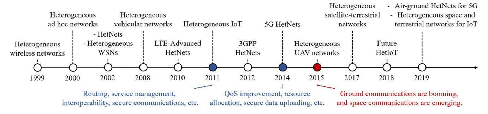
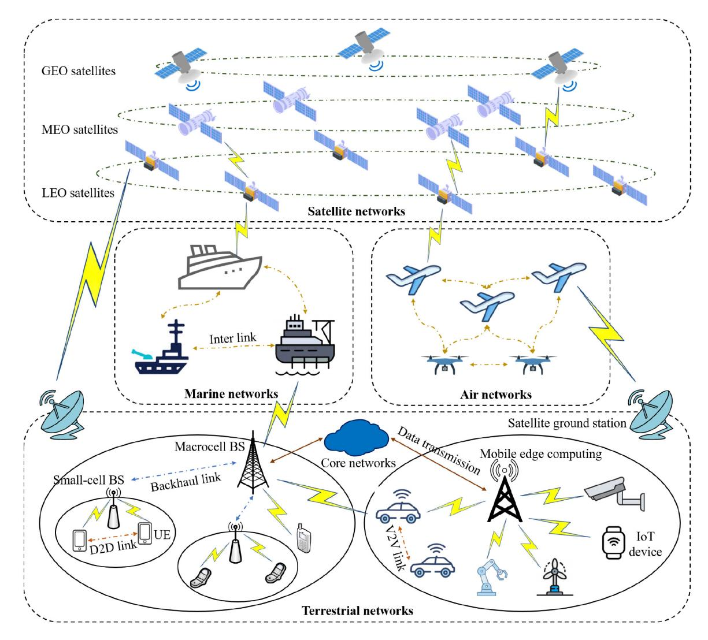
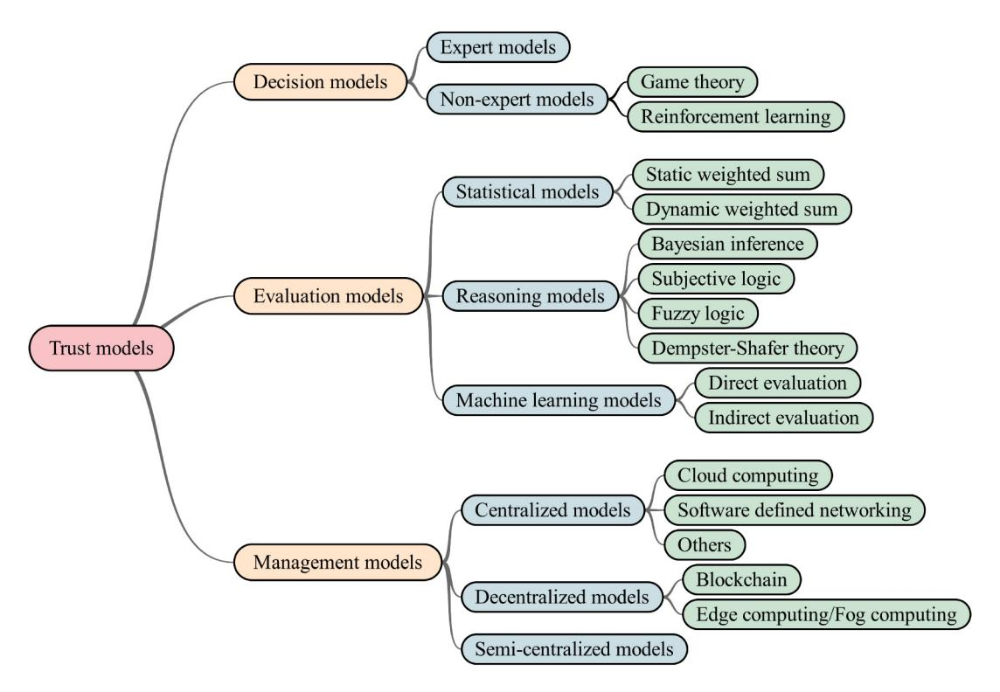
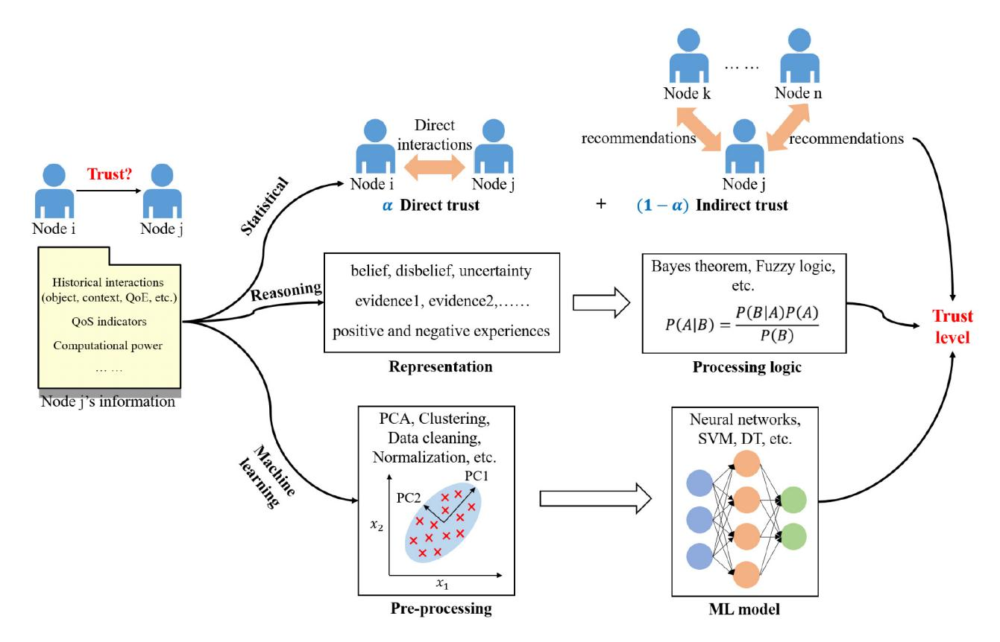
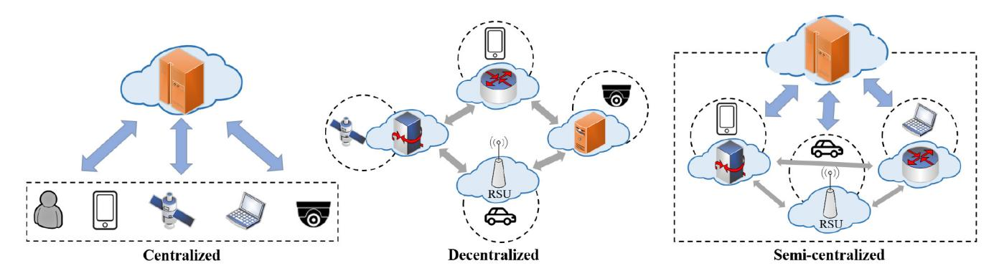

# A Survey on Trust Models in Heterogeneous Networks

Jie Wang®, Zheng Yan®, Senior Member, IEEE, Haiguang Wang, Senior Member, IEEE, Tieyan Li®, Member, IEEE, and Witold Pedrycz®, Life Fellow, IEEE

Abstract—Heterogeneous networks (HetNets) merge different types of networks into an integrated network system, which has become a hot research area in recent years towards nextgeneration communication networks. HetNets aim to effectively exploit network resources and provide seamless connectivity for heterogeneous objects. Unlike other networks, HetNets hold such characteristics as heterogeneity, openness, distribution, multidomain involvement, thus are susceptible to various security threats and attacks. Traditional security approaches are not sufficiently effective in defending against them. With extensive study and practice, researchers found that trust models offer effective measures to enhance the security and reliability of a network system. However, there still lacks a comprehensive survey on the recent advances of trust models in HetNets. In this paper, we fill this gap. We first retrospect the history of HetNets research and introduce important concepts related to trust. Then, we propose a set of criteria that a sound trust model should satisfy, which can also serve as a measure to evaluate the quality of a trust model, i.e., Quality of Trust (QoT). We provide taxonomies of trust models and their applications, and continue with a thorough review on trust models in HetNets. Based on the review, a list of open issues is highlighted, and corresponding future research directions are suggested to advance the research on trustworthy

Index Terms—Trust models, heterogeneous networks, trust, quality of trust, trust management.

#### I. INTRODUCTION

THE FIFTH-GENERATION (5G) mobile communication technologies are being rapidly developed and progressively commercialized, making the Internet of everything and heterogeneous connections increasingly common [1]. Recently, researchers are beginning to discuss 6G, which

Manuscript received 18 June 2021; revised 22 February 2022 and 6 June 2022; accepted 17 July 2022. Date of publication 21 July 2022; date of current version 22 November 2022. This work was supported in part by the National Natural Science Foundation of China under Grant 62072351; in part by the Open Research Project of Zhejiang Lab under Grant 201PD0AB01; in part by the Shaanxi Innovation Team Project under Grant 2018TD-007; in part by the 111 Project under Grant B16037; and in part by the Huawei Technologies Group Company Ltd. (Corresponding author: Zheng Yan.)

Jie Wang and Zheng Yan are with the State Key Laboratory on Integrated Services Networks, School of Cyber Engineering, Xidian University, Xi'an 710071, China (e-mail: jiewang.xidian@foxmail.com; zyan@xidian.edu.cn).

Haiguang Wang and Tieyan Li are with the Shield Laboratory, Huawei Technologies, Singapore 138588 (e-mail: wang.haiguang.shieldlab@huawei.com; li.tieyan@huawei.com).

Witold Pedrycz is with the Department of Electrical and Computer Engineering, University of Alberta, Edmonton, AB T6R 2V4, Canada (e-mail: wpedrycz@ualberta.ca).

Digital Object Identifier 10.1109/COMST.2022.3192978

could be a large-scale heterogeneous network (LS-HetNet). Such a network comprises different types of networks, e.g., satellite networks, air networks, marine networks and terrestrial networks, intending to support anywhere and anytime networking with high Quality of Service (QoS). The specific characteristics of LS-HetNet, such as heterogeneity, openness, distribution and multi-domain involvement, introduce new challenges about trust, security and privacy, including crossdomain communications, identity management, trustworthy routing, etc. Traditional security solutions (e.g., Public Key Infrastructure (PKI)) are not sufficient to address them. For example, traditional security solutions can only resist external attacks but fail to cope with internal ones [2]. This is because external attacks are carried out by entities that do not belong to a network [3]. External attackers perform extrinsic behaviors (e.g., eavesdropping on information and injecting erroneous data) to disrupt the normal operation of a network, which can be mitigated by setting up a defensive line, such as encryption and authentication [4]. On the contrary, internal attacks come from compromised entities that are part of a network. Internal attackers can pass through traditional safeguards and then behave maliciously. And further, in comparison with external attacks, the impacts of internal attacks are more severe as insiders may possess privileged access rights and know where sensitive information is stored. Fortunately, trust can empower a network system to defend against internal attacks by continuously monitoring and evaluating the current and historical behaviors of each entity. It also addresses the poor scalability and low flexibility of traditional security solutions.

Trust can be defined as the belief of one entity over another entity regarding a specific task or action [5], [6]. In the communication and networking field, it aims to mitigate potential risks in a network. The 6G White Paper advocates that the 6G network must support embedded trust to eliminate national security concerns [7]. ITU-T recommends that trustworthy networking is needed to provide a trustable environment in HetNets [8]. To establish trustworthy networking, trust evaluation is needed to determine whether an entity is trustworthy or not. All in all, trust is becoming more and more important for future LS-HetNets. The variety of network entities involved in such networks expands the scope of trust (e.g., communication trust and data trust [9]) and increases the difficulty of enabling and maintaining trust. Hence, it is worth investigating trust models that describe the whole process of trust establishment and discuss how trust decisions are made. The trust model helps in digitalizing and managing trust in a system and can

| Paper      | Year | Type   | Covered topics                                                   | 1 | 2 | 3 | 4 | 5 | 6 |
|------------|------|--------|------------------------------------------------------------------|---|---|---|---|---|---|
| [15]       | 2019 | IoT    | Trust calculation components and trust-related attacks           | • |   | 0 | • |   |   |
| [16]       | 2017 | IoT    | Design dimensions of a trust calculation model                   |   |   | 0 | • |   |   |
| [17]       | 2019 | IoT    | Data perception trust, communication trust and data fusion trust | • |   | 0 | • |   |   |
| [18]       | 2019 | IoT    | Trust applications, calculation schemes, metrics and attacks     |   |   | • | • | • |   |
| [19]       | 2018 | IoT    | A systematic description of popular TM techniques                |   |   |   |   |   |   |
| [20]       | 2020 | IoT    | TM in social IoT                                                 |   |   | 0 | • |   |   |
| [21]       | 2019 | IoT    | Taxonomy of TM techniques and criteria                           | • |   | 0 | • |   |   |
| [22]       | 2020 | IoT    | Applications and challenges of TM in IoT                         | • |   | 0 | • | • |   |
| [23]       | 2016 | MANET  | TM techniques dealing with trust-related attacks                 | • |   | 0 | • |   |   |
| [24]       | 2016 | VANET  | Survey trust models in VANET based on adversary models           |   |   | • | 0 |   |   |
| [25]       | 2018 | VANET  | Security services, location privacy and TM in VANET              | • |   | 0 | • |   |   |
| [26]       | 2020 | VANET  | Traditional and emerging TM techniques in VANET                  |   |   |   | • | • | 0 |
| [27]       | 2022 | IoV    | AI-enabled and emerging TM techniques in IoV                     | • |   | 0 | • |   |   |
| [28]       | 2020 | 5G     | Trust and reputation management in 5G access networks            | • |   | 0 | • |   |   |
| [9]        | 2021 | 5G/B5G | Trust dimensions and trust enablers in 5G and its beyond         |   |   |   | • |   |   |
| [29]       | 2022 | 5G/B5G | Pre-standardization proposals of 5G/B5G trust models             | • |   |   |   |   |   |
| This paper | 2022 | HetNet | Trust models in HetNets and quality of trust                     | • | • | • | • | • | • |

TABLE I COMPARISON OF OUR SURVEY WITH OTHER EXISTING SURVEYS

be applied to achieve many goals, such as access control [\[10\]](#page-30-9), intrusion detection [\[11\]](#page-30-10), service management [\[12\]](#page-30-11) and secure routing [\[13\]](#page-30-12), [\[14\]](#page-30-13).

Many researchers have surveyed trust and trust models in different fields with distinctive perspectives. Researchers in [\[15\]](#page-30-14) and [\[16\]](#page-30-15) focused on the design dimensions of a trust calculation model in Internet of Things (IoT). Souissi *et al.* [\[17\]](#page-30-16) reviewed trust models from the aspects of data perception trust, communication trust and data fusion trust in Wireless Sensor Network (WSN) assisted IoT. Ahmed *et al.* [\[18\]](#page-31-0) summarized all trust-related elements in IoT, such as trust properties, Trust Management (TM) levels and trust metrics. Some popular TM schemes in IoT and Social IoT (SIoT) were systematically analyzed and evaluated in [\[19\]](#page-31-1) and [\[20\]](#page-31-2), respectively. The classification and application of TM techniques were presented in [\[21\]](#page-31-3) and [\[22\]](#page-31-4), respectively. Movahedi *et al.* [\[23\]](#page-31-5) focused on TM schemes dealing with attacks on trust in Mobile Ad hoc NETworks (MANETs). Vehicular Ad hoc NETwork (VANET), as a specific example of MANET, has been extensively studied with regard to its trust models. Some researchers classified trust models in VANETs into data-oriented, entity-oriented and hybrid models [\[24\]](#page-31-6), [\[25\]](#page-31-7). Hussain *et al.* [\[26\]](#page-31-8) reviewed traditional and emerging TM techniques for VANETs. Hbaieb *et al.* [\[27\]](#page-31-9) discussed TM in Internet of Vehicles (IoV). In addition, Ahmad *et al.* [\[28\]](#page-31-10) presented a survey on trust and reputation management in 5G and traditional networks. Benzaïd *et al.* [\[9\]](#page-30-8) explored trust dimensions (e.g., trust in AI models and NFV) that should be considered in 5G and its beyond, as well as discussed potential trust enablers. Valero *et al.* [\[29\]](#page-31-11) presented a review on trust models in previous standardization proposals of 5G/Beyond 5G (B5G). However, these surveys only focus on a single type of network and are not comprehensive. Regarding integrated HetNets that are supported by multiple different networking techniques, few previous surveys cover their trust models. Moreover, existing related surveys are absorbed in summarizing trust modeling techniques and exploring related challenges, but neglect the trustworthiness of trust models (i.e., Quality of Trust (QoT)) and how to evaluate it. In order to clarify the difference and novelty of our survey, a detailed comparison between our survey and highly related surveys is given in Table [I.](#page-1-0) We can see that our survey is the only one that defines QoT and specifies the criteria to evaluate it, as well as thoroughly review the trust models related to integrated HetNets. Other excellent surveys about HetNets do not touch trust although relate to different scenarios of HetNets, e.g., heterogeneous vehicular networking [\[30\]](#page-31-12), heterogeneous architectures for ad hoc networks [\[31\]](#page-31-13) and IoT [\[32\]](#page-31-14), and resource allocation for 5G HetNets [\[33\]](#page-31-15). Therefore, a comprehensive survey on the recent advances of trust models in HetNets is urgently expected in the literature to help researchers and practitioners to understand the current state of arts, open issues and future research directions towards realizing trustworthy networking in 6G.

Based on the history of HetNets research, we first focus on homogeneous networks with heterogeneity, including IoT and 5G networks. The heterogeneity of IoT is particularly evident in devices regarding their capabilities, characteristics and

Fig. 1. Timeline of HetNets.

communication requirements [\[34\]](#page-31-16). The 5G network is characterized by heterogeneity at the network cell level, which covers different types of network cells, such as macro, pico and femto cells [\[28\]](#page-31-10). After the literature review about the trust models in the field of IoT and 5G networks, we further discuss integrated HetNets enabled by heterogeneous networking technologies, such as 5G-based vehicular networks and Integrated Space-Terrestrial Networks (ISTN). By doing this, we can summarize the similarities and differences of existing trust models as well as identify the challenges that trust models may face when being applied into future LS-HetNets.

To the best of our knowledge, this paper is the first to investigate trust models in HetNets. We first give a general definition of HetNets by retrospecting the development history of HetNets, and introduce important concepts related to trust including trust, reputation, trust models and trustworthy networking. At the same time, we illustrate the concept of QoT that indicates the quality of a trust model. Then, we propose a set of criteria that a sound trust model is expected to meet. For studying the robustness of trust models, we summarize mainstream attacks on trust models and corresponding defense methods. After that, we propose a taxonomy of trust models based on their design goals, including decision models, evaluation models and management models. We also summarize the main applications of existing trust models. Based on the taxonomy and the proposed evaluation criteria, we thoroughly review trust models in HetNets and analyze their pros and cons. In the end, we shed light on some unsolved issues and suggest future research directions. To summarize, the main contributions of this paper are as below:

- *•* We propose a set of criteria that should be satisfied by a sound trust model to establish a trustworthy HetNet system, which can also serve as a measure to evaluate the quality of trust models (i.e., QoT).
- *•* We propose taxonomies of trust models and their applications in HetNets. We also explain the nature of each application in the context of HetNets and illustrate the importance of trust in it.
- *•* We retrospect the history of HetNets research and conduct an in-depth review on existing trust models in HetNets by employing the proposed criteria to analyze their pros and cons.
- *•* We identify a list of open issues and further propose future research directions to promote dedicated efforts to realize trustworthy HetNets.

TABLE II ABBREVIATIONS IN THIS PAPER

| Abbreviation | Explanation                                  |
|--------------|----------------------------------------------|
| 5G           | Fifth Generation Mobile Communication System |
| 6G           | Sixth Generation Mobile Communication System |
| AI           | Artificial Intelligence                      |
| ANN          | Artificial Neural Network                    |
| B5G          | Beyond 5G                                    |
| BS           | Base Station                                 |
| D2D          | Device-to-Device                             |
| DST          | Dempster-Shafer Theory                       |
| DDoS         | Distributed Denial of Service                |
| GEO          | Geosynchronous Earth Orbit                   |
| HetNet       | Heterogeneous Network                        |
| ICN          | Information-Centric Networking               |
| IoT          | Internet of Things                           |
| IoV          | Internet of Vehicles                         |
| ISTN         | Integrated Space-Terrestrial Network         |
| LEO          | Low Earth Orbit                              |
| LS-HetNet    | Large-scale HetNet                           |
| MEO          | Medium Earth Orbit                           |
| ML           | Machine Learning                             |
| NFV          | Network Function Virtualization              |
| PCA          | Principal Component Analysis                 |
| PKI          | Public Key Infrastructure                    |
| QoE          | Quality of Experience                        |
| QoS          | Quality of Service                           |
| QoT          | Quality of Trust                             |
| RL           | Reinforcement Learning                       |
| RPL          | Routing Protocol for Low-Power and           |
| RPL          | Lossy Networks                               |
| RSU          | Road Side Unit                               |
| SDN          | Software Defined Networking                  |
| SVM          | Support Vector Machine                       |
| TMS          | Trust Management System                      |
| UAV          | Unmanned Aerial Vehicle                      |
| V2V          | Vehicle-to-Vehicle                           |
| VANET        | Vehicular Ad Hoc Network                     |
| VNF          | Virtual Network Function                     |
| WSN          | Wireless Sensor Network                      |
|              |                                              |

The remainder of this survey is organized as follows. In the next section, we make an overview of HetNets and explain the important concepts related to trust. In Section [III,](#page-5-0) we provide a set of criteria for evaluating the performance of existing trust models. Section [IV](#page-7-0) presents taxonomies of trust models and their applications, followed by a thorough review on trust models in HetNets in Section [V.](#page-11-0) On the basis of the literature review, we identify open issues and point out future research directions in Section [VI.](#page-28-0) Finally, we draw a conclusion in the last section. Table [II](#page-2-0) provides all abbreviations used in this paper.

#### II. PRELIMINARIES

In this section, we first cover the basics of HetNets, trust and trust models. Then, we give a definition of QoT, which can be used to evaluate whether a trust model is trustworthy. Finally, we explain the meaning of trustworthy networking and its importance.

#### *A. Heterogeneous Networks*

The development history of HetNets research in the field of communication networks is presented in Fig. [1.](#page-2-1) We find that "heterogeneous" first appeared in [\[35\]](#page-31-17), which refers to different types of wireless networks. The authors in [\[35\]](#page-31-17) proposed policy-based handoff strategies to help users choose the best network in heterogeneous wireless networks. Dattatreya *et al.* [\[36\]](#page-31-18) studied a heterogeneous ad hoc network, where nodes have different transmission capabilities so that some links are longer than others. Wu *et al.* [\[37\]](#page-31-19) stated that 4G should be HetNets that support multiple wireless access technologies so that seamless communication services are enabled. Duarte-Melo and Liu [\[38\]](#page-31-20) first defined a heterogeneous WSN as a network consisting of a variety of sensors, which differ in sensing, computation, communication and power. Compared with identical sensors with equal capability in a homogeneous WSN, sensors with different capabilities can collaborate to achieve more complex tasks in a so-called heterogeneous WSN. Hung *et al.* [\[39\]](#page-31-21) presented a heterogeneous vehicular network, where each vehicle is equipped with IEEE 802.11 and IEEE 802.16 interfaces. HetNet development of Long Term Evolution (LTE)-Advanced was discussed in [\[40\]](#page-31-22). The HetNet was considered as a mixture of high power cells (e.g., macro) and low power cells (e.g., pico, femto and relay) [\[40\]](#page-31-22). The same definition was given by the 3rd Generation Partnership Project (3GPP) in [\[41\]](#page-31-23). In 2011, Zhang [\[42\]](#page-31-24) studied the heterogeneity of IoT. He classified IoT devices as high performance, medium performance and low performance based on their processing and communication capabilities to achieve different communication distances. Since then, numerous efforts have been made to solve the challenges caused by the diversity of IoT devices, in terms of routing [\[43\]](#page-31-25), service management [\[44\]](#page-31-26), interoperability [\[45\]](#page-31-27) and secure communications [\[46\]](#page-31-28). In 2014, Hu and Qian [\[47\]](#page-31-29) explored a new framework of cooperative green HetNets, which consists of nodes with different transmission powers and coverage sizes, to balance and optimize energy efficiency, spectrum efficiency and QoS in 5G. Since then, a lot of studies focused on improving QoS [\[48\]](#page-31-30), resource allocation [\[49\]](#page-31-31), [\[50\]](#page-31-32) and secure data uploading [\[51\]](#page-31-33) in 5G HetNets. In a word, the above HetNets focus on different types of nodes that are distinguished in terms of transmission power, processing power, battery life, storage size, etc. Meanwhile, ground communications are dominant. Coming to 2015, Si *et al.* [\[52\]](#page-31-34) studied a heterogeneous unmanned aerial vehicle (UAV) network, where heterogeneity is mainly reflected in nodes, including UAVs, ground stations and satellites. Data transmission requirements and communication resources are also heterogeneous. Since then, space communications are emerging, such as low-altitude communications and deep-space communications. Feng *et al.* [\[53\]](#page-31-35) presented a flexible network architecture for the integration of satellite and terrestrial networks. Qiu *et al.* [\[32\]](#page-31-14) proposed a four-layer heterogeneous IoT (HetIoT) architecture, where both ground communications and space communications are involved. Qiu *et al.* [\[54\]](#page-31-36) proposed a hierarchical air-ground network for 5G to support ubiquitous communication services. Chien *et al.* [\[55\]](#page-31-37) integrated space networks into terrestrial networks to achieve global network access anytime and anywhere. To sum up, according to the development trend of future networks, the HetNet is evolving into a large-scale integrated network that consists of such networks as satellite networks, air networks, marine networks and terrestrial networks. Fig. [2](#page-4-0) illustrates a future large-scale integrated HetNet (i.e., an integrated space-terrestrial-marine network). It aims to achieve network connection, data transmission, and cross-network-domain collaboration with high performance, global coverage, and optimized resource utilization [\[55\]](#page-31-37). Heterogeneity, multiple-operator domains, dynamic topology and openness are the unique characteristics of such a HetNet.

Based on the history of HetNets research, we can see that the HetNets include homogeneous networks with heterogeneity and integrated HetNets. The former contains networks with heterogeneous nodes, while the latter includes networks that are enabled by heterogeneous networking technologies. Regarding the homogeneous network with heterogeneity, our review focuses on IoT and 5G networks in this paper since they have been studied a lot, as shown in Fig. [1.](#page-2-1) Heterogeneity is one of the key characteristics of IoT, which is especially evident in devices regarding their capabilities, characteristics and communication requirements [\[34\]](#page-31-16). In addition, the 5G network also features with heterogeneity, which contains rich types of network cells at the cell level and user equipment at the user side [\[28\]](#page-31-10). Based on our search, we find that the literature has made many efforts on trust models in homogeneous networks with heterogeneity, there are few trust models studied in integrated HetNets (e.g., 5G-VANET and ISTN). Therefore, in this paper, we first review trust models in IoT and 5G and summarize their pros and cons, as well as explore whether they can be applied to future HetNets. Then, we review trust models in integrated HetNets to identify the challenges regarding trust models, aiming to support future trustworthy networking in LS-HetNets.

#### *B. Trust and Reputation*

*1) Trust:* Although trust exists everywhere in real life, it is difficult to grasp and define it properly. The term trust can be explained from the perspective of different fields, such as sociology, philosophy, psychology and computer science [\[18\]](#page-31-0), [\[56\]](#page-31-38). Despite the variety of trust definitions, there are some elements that a majority of scholars agree on, e.g., the characteristics of trust, which play a crucial role in trust modeling. Among these characteristics, subjectivity, dynamicity and context-awareness are the main representatives, which are explained in detail in Section [III.](#page-5-0) We define trust as a subjective view of

Fig. 2. An illustration of a large-scale integrated HetNet.

an entity towards another entity in a specific context through direct interactions or indirect recommendations from others [\[57\]](#page-31-39).

*2) Reputation:* Similar to trust, a standard definition of reputation is also lacking. Jøsang *et al.* [\[58\]](#page-31-40) stated that "Reputation is what is generally said or believed about a person's or thing's character or standing." Reputation is strongly associated with trust and is usually used interchangeably. However, there is a subtle difference between trust and reputation, i.e., trust is active while reputation is passive [\[59\]](#page-31-41). In detail, trust is an entity's belief in the trust qualities (e.g., honesty and goodness) of a peer, thus being extended from an entity to its peers [\[60\]](#page-31-42). Conversely, reputation is the perception of an entity formed by peers in the same community, which is globally visible to the community as a whole. As discussed in [\[58\]](#page-31-40), an entity *S* can trust another entity *P* because of *P*'s good reputation. *S* can also trust *P* regardless of *P*'s bad reputation. This is because trust is a personal and subjective phenomenon, whereas reputation can be considered as an objective and acknowledged score in a specific community [\[61\]](#page-31-43).

#### *C. Trust Models*

A trust model describes what trust evidence is used, how this data is collected, processed, stored and distributed among the stakeholders, and decides how trust relationships are made [\[62\]](#page-31-44). Generally, the trust model can be classified into certificate-based and behavior-based ones [\[60\]](#page-31-42). The former aims to define implicit trust relationships using the certificates that are independently or cooperatively distributed, maintained and managed by some parties [\[63\]](#page-31-45). Trust decisions can thus be made based on a valid certificate, which proves the trustworthiness of a target entity through a certificate authority or other trusted parties. This type of trust model is mostly static, i.e., some trust relationships are assumed to exist and remain unchanged, since certificate revocation and update is not a trivial task. This, however, does not match the dynamic nature of trust. Moreover, certificate-based trust models typically make binary decisions (i.e., trust and distrust), which is not feasible to be applied in practice [\[64\]](#page-31-46). On the contrary, in behaviorbased trust models, each entity evaluates trust based on direct observations and indirect recommendations by continuously monitoring the behaviors of a target entity (i.e., trustee) [\[6\]](#page-30-5). In this way, it is possible to identify legitimate entities with malicious behaviors, which cannot be handled in certificate-based trust models. The main purpose of behavior-based trust models is to translate the subjective concept of trust into a language that machines can understand by evaluating trust through trustbehavior study. In other words, this type of model can aid digitally processing trust [\[65\]](#page-31-47), which makes it possible to gain fine-grained trust levels in order to understand security status and act accordingly. In this paper, we mainly focus on the latter trust model as it reflects the nature of trust since trust is subjective, dynamically changed, and impacted by context. Such behavior-based trust models are more flexible, reactive and powerful than certificate-based models.

#### *D. Quality of Trust*

A number of studies employed QoS (e.g., packet delivery/forwarding rate and energy consumption) to demonstrate the effectiveness of their trust models [\[11\]](#page-30-10), [\[66\]](#page-32-0)–[\[68\]](#page-32-1). However, the scope of this validation seems to be narrow. A trust model related to networking should not only maximize network performance but also satisfy other criteria such as privacy preservation. Li *et al.* [\[69\]](#page-32-2) proposed QoT in face of unexplainable and non-transparency of AI algorithms. They quantified the trust of an AI model into physical trust and emotional trust. The physical trust is related to the accuracy, robustness and explainability of the model, while the emotional trust is evaluated by users' experiences. Different from these authors, we define QoT as a description or measurement of the quality (e.g., security, dependability, maintainability, reliability and credibility) of a trust evaluation/decision/management result, i.e., the trustworthiness of trust evaluation/decision/management models. To qualitatively and quantitatively measure QoT, we propose a set of evaluation criteria that affect QoT in Section [III.](#page-5-0)

#### *E. Trustworthy Networking*

Trustworthy networking is a promising technology that can be deployed over 5G/B5G or 6G networks with the goal of providing satisfying networking services as expected by users [\[62\]](#page-31-44). ITU-T proposed a conceptual model of trustworthy networking [\[8\]](#page-30-7). In this model, all network elements should be identified first. And then a trustor evaluates the trustworthiness of a trustee with the help of trust evaluation techniques. At last, communication links between these two elements can be established. In conclusion, trustworthy networking aims to provide a trustable environment where all the network elements can communicate with each other in a secure and reliable way.

#### III. EVALUATION CRITERIA ON TRUST MODELS

In this section, we propose a set of evaluation criteria through which we can discover the pros and cons of existing trust models, no matter they are used for trust evaluation, decision making and trust management. This set of criteria is also a measure for evaluating the quality of trust models, i.e., QoT.

#### *A. Subjectivity (Su)*

Subjectivity is an inherent nature of trust, which is reflected by a great deal of evidence. Some of the evidence may be uncertain, incomplete and conflicting in reality [\[56\]](#page-31-38). Meanwhile, different people may hold different opinions on trust even under the same situation and condition. Therefore, the process of trust modeling and decision-making is expected to reflect the subjective opinion of a trustor. In this way, trust can be expressed in a precise way, and decisions derived from trust models are practically significant. No matter the trust model is used for trust evaluation, decision making, or trust management, it should support subjectivity, which is one of the fundamental characteristics of trust. The subjective factors that influence trust can be classified into two categories, i.e., trustee's subjective properties and trustor's subjective properties [\[18\]](#page-31-0), [\[65\]](#page-31-47), [\[70\]](#page-32-3). The former consists of honesty, benevolence and goodness. The latter is composed of confidence, expectations, probability, willingness, belief, etc.

#### *B. Dynamicity (Dy)*

Dynamicity is one of the characteristics of trust. In general, trust evolves over time or events [\[16\]](#page-30-15). It is not only affected by the states of trustors and trustees, but also by changing contexts. In other words, trust may disappear or rebuild at any time. Trust often decays over time even though there is no new event occurs. This is because an entity's resource may decay over time [\[56\]](#page-31-38). What's more, recent trust evidence stands at a more important position than historical one [\[71\]](#page-32-4), [\[72\]](#page-32-5). Therefore, a trust model should capture dynamic trust relationships and then make adjustments.

#### *C. Context-Awareness (Ca)*

Context refers to any information that can be used to describe the background or situation of involved entities [\[73\]](#page-32-6), while the ability to identify and adapt to contexts is regarded as context-awareness [\[74\]](#page-32-7), [\[75\]](#page-32-8), which is also a specific characteristic of trust. Trust differs in different contexts. That is, an entity trusts another entity in a specific context about its behaviors [\[65\]](#page-31-47), [\[76\]](#page-32-9). When the context changes, the trust relationship may change also. For example, a person is trusted to do what is relevant to his profession but may not be trusted to do other things. Thus, when an application scenario or context changes, a trust model should be aware of it and quickly adjust itself to fit into a new context. In other words, trust models are expected to evolve as the context changes. The context usually refers to a task type, a purpose, an objective, or an execution environment [\[77\]](#page-32-10). For example, in network scenarios, context can be channel conditions, networking requirements and location [\[78\]](#page-32-11), [\[79\]](#page-32-12).

#### *D. Privacy Preservation (PP)*

Privacy disclosure may happen during the execution of trust models. On one hand, it is inevitable to acquire user data for evaluating trust, making decisions and managing trust. However, some of the collected data is sensitive and requires a high degree of privacy, e.g., trust-behavior data of

TABLE III DEFENSE METHODS OF TRUST-RELATED ATTACKS

| Category                       | Attacks                | Defense methods                                                                                                                                                                                                                                                                                                                                    |  |  |  |  |  |  |  |
|--------------------------------|------------------------|----------------------------------------------------------------------------------------------------------------------------------------------------------------------------------------------------------------------------------------------------------------------------------------------------------------------------------------------------|--|--|--|--|--|--|--|
|                                | Bad-mouthing attack    | <ol> <li>Filtering recommendations, such as based on nodes' similarity [80]–[82], the reputation of nodes [83]–[85], and deviation [86];</li> <li>Adjust the weights of recommendations [44], [66];</li> <li>Distinguish between the trust value given to a node and the confidence of its recommen-</li> </ol>                                    |  |  |  |  |  |  |  |
| Recommendation-related attacks | Ballot-stuffing attack | dations [83], [85]; 4. Once an interaction is established between two nodes, recommendations from others are discarded [87]; 5. Statistical outlier detection [88].                                                                                                                                                                                |  |  |  |  |  |  |  |
|                                | Self-promoting attack  | 1. It is stipulated that each node cannot recommend itself [80], [87]; 2. Dynamically adjust the weight of direct trust [44].                                                                                                                                                                                                                      |  |  |  |  |  |  |  |
| Identity-related attacks       | Sybil attack           | <ol> <li>Assign more weights to recent events [86], [89];</li> <li>Design an identity registration scheme where a node can only register itself for one time based on its hardware information [90];</li> <li>Resource testing [91];</li> <li>Set the initial trust value of a newly joined node as zero [92].</li> </ol>                          |  |  |  |  |  |  |  |
| identity-related attacks       | White-washing attack   | 1. Assign a newly joined node a low trust value [83]; 2. Store the trust information of each identity and decrease the trust value of a node who is inactive for a period [66], [93]; 3. Design an identity registration scheme where a node can only register itself for one time based on its hardware information [90].                         |  |  |  |  |  |  |  |
|                                | Blackhole attack       | 1. A normal node can overhear and monitor its neighbor's transmission to check its honesty                                                                                                                                                                                                                                                         |  |  |  |  |  |  |  |
| Routing-related attacks        | Grayhole attack        | [89]; 2. Combine several routing metrics (e.g., delay and packet delivery ratio) and social trust for                                                                                                                                                                                                                                           |  |  |  |  |  |  |  |
|                                | Rank attack            | trust evaluation [86], [94].                                                                                                                                                                                                                                                                                                                       |  |  |  |  |  |  |  |
| Others                         | On-off attack          | 1. Employ a fast trust update mechanism [18]; 2. Pay attention to the change of trust all the time or in a predefined time interval [72], [95], [96]; 3. Trust information is time-stamped [97] and kept permanently or for a long time using sliding windows [98]–[100]; 4. Randomly check a node's behavior even though it is trustworthy [101]. |  |  |  |  |  |  |  |
|                                | Discrimination attack  | 1. Consider cooperativeness and community-interest as trust metrics [93]; 2. Treat discriminators as rational ones by considering the degree of similarity and social proximity [102].                                                                                                                                                             |  |  |  |  |  |  |  |

a user for online payment. Thus, Data Privacy (DP), such as interaction statistics and interaction feedback, should be preserved in the process of data collection, transmission, storage, fusion and analysis [\[103\]](#page-32-13). On the other hand, through user trust identification, an untrusted user should be controlled for network/service/data access. But linking user trust information to a real identity could cause threats to network nodes or users [\[104\]](#page-32-14), e.g., highly trusted nodes could become the targets of Distributed Denial of Service (DDoS) attacks. Thus, Identity Privacy (IP), such as name and address, should be preserved. Anonymity may be a feasible way to protect user identity [\[104\]](#page-32-14), [\[105\]](#page-32-15). To summarize, a trust model, whether used for trust evaluation, decision making, or trust management, should be capable of preventing DP and IP from disclosure. This is also due to government policies (e.g., the EU General Data Protection Regulation (GDPR) [\[106\]](#page-32-16)) and user requirements [\[107\]](#page-32-17).

#### *E. Scalability (Sc)*

Scalability is correlated to processing time and processing load [\[17\]](#page-30-16). In HetNets, billions of heterogeneous network nodes are connected with each other, leading to a huge amount of data being generated [\[32\]](#page-31-14). How to deal with them in an effective way is a key consideration of trust models. Specifically, the performance of a trust model should be preserved regardless of network size. Besides, the situation where devices join or leave a HetNet occurs frequently. To sum up, a trust model for either trust evaluation, decision making or trust management needs to handle large-scale networks and runs normally when adding or removing devices, as they affect the practical deployment of the trust model [\[108\]](#page-32-18).

# *F. Robustness (Ro)*

In HetNets, ubiquitous network connectivity on devices and poor interoperability between different network domains create new probabilities for attackers to disrupt trust models, thereby making their outcomes meaningless. For example, an on-off attacker may perform deceptive behaviors to cause an incorrect output of trust models, resulting in a negative impact and a huge loss. Therefore, the trust model should highly support robustness since it is an essential property to sustain the functionality of trust in HetNets, no matter whether it is related to trust evaluation, decision making, or trust management.

A number of trust-related attacks targeted to network nodes, networking services and communications have been identified [\[15\]](#page-30-14). They can also be categorized into biased recommendations, inconsistent behaviors and identity attacks, as illustrated in [\[18\]](#page-31-0). For studying the robustness of existing trust models, we classify some popular trust-related attacks into four categories: recommendation-related, identity-related, routing-related and others, based on the subjects of the attacks. Table [III](#page-6-0) summarizes their corresponding defense methods. The four categories of trust-related attacks are introduced as below.

- *1) Recommendation-Related Attacks:* Attackers can boost or ruin the reputation of others by providing well-planned recommendations. In *bad-mouthing attacks*, a malicious node can ruin the reputation of a well-behaved node by providing bad recommendations [\[23\]](#page-31-5). Likewise, in *balloting-stuffing attacks* (i.e., *good-mouthing attacks*), it can boost the reputation of its friend node by providing good recommendations. These biased and dishonest recommendations have a bad impact on good nodes, e.g., the chance of them being chosen as service providers could decrease [\[44\]](#page-31-26). In *self-promoting attacks*, a malicious node manufactures good recommendations about itself to achieve certain goals. After that, it can behave maliciously instead [\[93\]](#page-32-19).
- *2) Identity-Related Attacks:* Attackers can disturb the normal operation of a Trust Management System (TMS) by using different identities. In *Sybil attacks*, a malicious node having multiple identities is able to provide different types of ratings on the same node. In other words, it has a huge and unfair influence on final ratings [\[109\]](#page-32-20). In *white-washing attacks* (i.e., *newcomer attacks*), a malicious node can exit a network when its reputation is lower than a threshold. Then, it rejoins the network using a new identity in order to wash its bad reputation.
- *3) Routing-Related Attacks:* Attackers can destroy routing processes by dropping packets or publishing false routing paths. In *blackhole attacks*, malicious nodes drop all received packets, which causes a low packet delivery ratio. In *grayhole attacks* (i.e., *selective forwarding attacks*), malicious nodes drop some of the received packets, which is a specific form of the blackhole attack [\[94\]](#page-32-21). In *rank attacks*, a malicious node publishes a false favorable routing path by changing its rank, thereby attracting neighbor nodes to send traffic through this path [\[89\]](#page-32-22), [\[110\]](#page-32-23).
- *4) Others:* In *on-off attacks*, consider a smart attacker, who is behaving well and badly alternatively such that trust is always redeemed just before another attack occurs [\[98\]](#page-32-24). In *discrimination attacks*, a malicious node can behave differently regarding the nodes in different groups, causing conflicting opinions and eventually leading to inaccurate trust evaluation results [\[60\]](#page-31-42).

#### *G. Overhead (O)*

To maintain a trustworthy environment, devices need to calculate trust and store trust information (e.g., trust metrics, trust values, trust policies and blacklists, as well as the data used for trust modeling). Nevertheless, they usually have limited processing power and storage capacity, such that they cannot arrange many resources for trust evaluation, decision making or trust management while ignoring their main tasks. Besides, instantaneity is required in many situations, e.g., vehicles in VANETs are normally moving at high speed [\[25\]](#page-31-7), [\[111\]](#page-32-25). This requires trust models to calculate trust quickly, make a timely decision, and perform management on trust in an efficient way. High Computational Overhead (CO) and Storage Overhead (SO) will degrade both network performance and device performance. Hence, a trust model should take the overhead into design consideration instead of only focusing on other criteria. We use big *O* to describe each trust model's time and space complexity.

#### *H. Explainability (Ex)*

It means that trust models should be able to explain their outputs in some ways that human beings can understand (e.g., processing logic and how trust metrics affect trust) [\[112\]](#page-32-26). Yan *et al.* [\[113\]](#page-32-27) conducted a user study on trust information visualization on mobile application usage and discovered that users expected to know how trust and reputation values are generated and the reason for the difference between these two values. Thus, it is imperative to investigate the impact of different trust metrics on the outcome of an evaluation model. Besides, in some safety-critical contexts, any decision may cause a huge impact, which requires the result (e.g., policies and trust values) inferred by a trust model should have its basis, otherwise it is hard to convince. What is more, it becomes essential to give sufficient explanations on why the trust should be managed with this way, not another way at some specific time, location and context. Explainability is also helpful in providing a guideline on how to collect and monitor entity data [\[114\]](#page-32-28). Specifically, if an explainable result shows that contextual information contributes a lot to trust, we can allocate special resources in a TMS to automatically collect contextual data of entities, thereby decreasing the load of human-computer interactions.

#### *I. User Acceptance (UA)*

User acceptance refers to a user's recognition of a trust model. The trust model aims to provide effective security and privacy management for ordinary users rather than computer experts in many cases [\[115\]](#page-33-0). Thus, human-centric trust models should be explored. Meanwhile, users' real and subjective opinions are convincing factors to measure the quality of trust models, and thus they cannot be ignored. User acceptance is influenced by QoS, quality of experience (QoE) and user preference (e.g., brand, habit). It can be evaluated through a questionnaire on user experiences [\[69\]](#page-32-2). It plays a crucial role in a trust model, which involves multiple human-computer interactions.

#### IV. TAXONOMIES OF TRUST MODELS AND APPLICATIONS

A large number of trust models have been proposed to enhance trust in a network system. In this section, we first propose a taxonomy of trust models based on their design goals. The aim is to explore the characteristics of different types of trust models. Then, we summarize the main applications of trust models and illustrate the nature of each application in HetNets.

#### *A. Taxonomy of Trust Models*

A trust model describes the lifecycle of the trust status of an entity [\[7\]](#page-30-6). It encompasses several steps to embed trust in a network system. For a better comparison of existing

Fig. 3. Taxonomy of trust models.

trust models, we classify them into decision, evaluation and management models based on their design goals, as shown in Fig. [3.](#page-8-0) From these three perspectives, we summarize the technologies and architectures used in the three types of models.

- *1) Decision Models:* This type of model is designed to make appropriate decisions in an extremely complex environment based on certain policies, rules and strategies. For example, a requesting entity can be considered as trustworthy as long as its credential is verified, and it satisfies some predefined policies [\[116\]](#page-33-1), [\[117\]](#page-33-2). According to whether human intervention is required, we divide the decision models into the following two categories.
- *a) Expert models:* In expert models, human experts are responsible for defining some policies representing the ground truth in a network system. For example, it is likely to get untrustworthy data if the environmental temperature is beyond a normal range. The policies can be updated if the human experts notice any environmental change [\[88\]](#page-32-29). Expert models consider people's opinions and standards and are close to reality. However, sometimes only a binary decision is made, and trust relationships do not be distinguished specifically, which indicates flexibility is lacked [\[64\]](#page-31-46), [\[104\]](#page-32-14).
- *b) Non-expert models:* In non-expert models, policies and strategies are derived by algorithms. For example, Rani *et al.* [\[118\]](#page-33-3) presented a dynamic game model to compute the Nash equilibrium representing the best strategy for cluster heads to perform malicious node detection. Game theory and Reinforcement Learning (RL) are widely used in this type of model. Game theory helps entities make the best decisions by constructing a game where all possible outcomes are analyzed based on the entities' information (e.g., trust,

- energy and actions) [\[119\]](#page-33-4). RL enables an entity to make optimal decisions by observing and learning from operating environments [\[120\]](#page-33-5). Non-expert models do not require expert monitoring and are therefore more flexible than expert models.
- *2) Evaluation Models:* This type of model aims to evaluate trust by employing certain attributes of an entity, which stands at an important position in trust models. These attributes can also be called trust composition or trust metrics, which refer to what components to consider in trust computation (i.e., trust evaluation) [\[16\]](#page-30-15). The components usually involve social trust (e.g., honesty and cooperativeness) and QoS trust (e.g., packet delivery rate and resource availability) [\[93\]](#page-32-19). We can further classify the evaluation models into the following categories based on used techniques. Besides, the pros and cons of popular trust evaluation techniques are summarized in Table [IV.](#page-9-0)
- *a) Statistical models:* In statistical models, some computations are adopted in order to calculate the impact of feedback (i.e., trust evidence) on trust [\[22\]](#page-31-4), [\[124\]](#page-33-6). Among them, weighted sum is a common technique for evidence aggregation. The greater the impact of evidence on trust, the higher its weight in trust calculation. Weighted voting [\[125\]](#page-33-7) is one type of weighted sum. It sums up all the votes towards an entity/event with each vote weighted by the corresponding trust level of the voter. Weighted sum can be further divided into static and dynamic classes according to whether the weights assigned to each evidence can be adjusted dynamically [\[16\]](#page-30-15). Statistical models are simple and intuitive and are widely used. However, there are several drawbacks, including (i) lack of guidance on appropriate weight selection [\[126\]](#page-33-8), and (ii) hard to consider all trust metrics that affect trust.

TABLE IV COMPARISON OF TRUST EVALUATION TECHNIQUES

| Techniques                   | Advantages                                                                                                                                              | Disadvantages                                                                                                                                      |  |  |  |  |  |
|------------------------------|---------------------------------------------------------------------------------------------------------------------------------------------------------|----------------------------------------------------------------------------------------------------------------------------------------------------|--|--|--|--|--|
| Static weighted sum          | Simple and intuitive;     Can adjust weights based on different contexts;                                                                               | Hard to select appropriate weights;     Hard to select all metrics affecting trust so that the fit                                                 |  |  |  |  |  |
| Dynamic weighted sum         | 3. Can involve multiple metrics affecting trust.                                                                                                        | trust value may be biased.                                                                                                                         |  |  |  |  |  |
| Bayesian inference           | Simple, efficient and effective in analyzing prior knowledge [74]                                                                                       | <ol> <li>Cannot deal with the uncertainty of trust;</li> <li>Rely on some hypotheses;</li> <li>Prior knowledge is hard to obtain [121].</li> </ol> |  |  |  |  |  |
| Dempster-Shafer theory       | Suitable for cases with uncertainty or without prior knowledge [122].                                                                                   | <ol> <li>The adopted evidence should be independent;</li> <li>Lack a well-established decision theory.</li> </ol>                                  |  |  |  |  |  |
| Fuzzy logic                  | Suitable in real-world applications.                                                                                                                    | Difficult to set up membership functions and rules [74].                                                                                           |  |  |  |  |  |
| Subjective logic             | Realistically model real-world situations.                                                                                                              | Difficult to define operators.                                                                                                                     |  |  |  |  |  |
| Logistic regression          | Simple and efficient;     Good explainability, i.e., the weight of each dimension indicates its degree of influence on a final trust evaluation result. | <ol> <li>Easy to underfit;</li> <li>Sensitive to training data, e.g., unbalanced and nonlinear data are not applicable.</li> </ol>                 |  |  |  |  |  |
| Decision tree                | Simple and easy to use;     Can be visualized so that explainability is supported.                                                                      | Poor generalization, i.e., easy to overfit;     Cannot process the data of which features have strong correlations.                                |  |  |  |  |  |
| Support vector machine       | Applicable to high dimensional and nonlinear data;     Good generalization ability.                                                                     | Difficult to select kernels;     Poor explainability.                                                                                              |  |  |  |  |  |
| Artificial neural networks   | High accuracy;     Have strong robustness and fault tolerance ability.                                                                                  | Time consuming;     Require a large amount of training data;     Very poor explainability.                                                         |  |  |  |  |  |
| K-means                      | Simple and efficient;     Helpful in obtaining labeled data [123].                                                                                      | Need to know the number of clusters previously;     Sensitive to initial cluster centers;     Cannot directly predict trust values.                |  |  |  |  |  |
| Principal component analysis | Can achieve dimensionality reduction;     Helpful in visualizing the results of trust evaluation.                                                       | Cannot directly predict trust values.                                                                                                              |  |  |  |  |  |

- *b) Reasoning models:* In reasoning models, trust is first expressed from multiple dimensions (e.g., belief, disbelief and uncertainty) and then inferred through rules (e.g., Bayes theorem). The basic idea of reasoning is to use the correlation between entities and collected data to infer trust values in trust evaluation [\[127\]](#page-33-9). Bayesian Inference [\[128\]](#page-33-10), Dempster-Shafer Theory (DST) [\[129\]](#page-33-11), Fuzzy Logic [\[130\]](#page-33-12) and Subjective Logic [\[131\]](#page-33-13) fall into this category. Reasoning models are applicable in many real-world situations, but have some drawbacks, including (i) hard to obtain prior knowledge, (ii) hard to set up rules, and (iii) dependent on some pre-assumptions.
- *c) Machine learning models:* In Machine Learning (ML) models, ML algorithms are applied to trust evaluation. They can be classified into supervised learning (e.g., logistic regression, Support Vector Machine (SVM), decision tree, Artificial Neural Network (ANN), etc.), unsupervised learning (e.g., k-means, Principal Component Analysis (PCA), etc.), semisupervised learning and reinforcement learning [\[123\]](#page-33-14), [\[132\]](#page-33-15). ML is popular in many fields due to its strong learning ability. It can help in predicting future trust relationships and intelligently detect malicious attacks. We further classify ML models into two categories based on their functions [\[107\]](#page-32-17). One is direct evaluation where trust-related data are regarded as inputs of ML algorithms for trust evaluation. The other is indirect evaluation where ML algorithms are used to preprocess the data or obtain labeled trust-related data when they are missing in order to assist trust evaluation [\[126\]](#page-33-8), [\[133\]](#page-33-16). Direct evaluation can automatically select weights and achieve high accuracy [\[123\]](#page-33-14), [\[132\]](#page-33-15). However, its shortcomings include (i)
- high computational overhead, (ii) rely on a large amount of data, and (iii) suffer from low explainability. Indirect evaluation can solve the problems of high data dimensionality and lack of labeled data. Nevertheless, it is only applied as an auxiliary tool and cannot directly predict trust.
- *3) Management Models:* This type of model is built on top of some architectures (e.g., blockchain, edge networks, Software Defined Networking (SDN), etc.) for trust management that is a useful means to control and maintain trust in digital systems [\[76\]](#page-32-9). These architectures confer different rights on different entities and help to construct a TMS. The TMS is a broad concept, which usually consists of five modules, namely information collection, trust-related content storage, trust modeling, trust transferring, and decision making [\[72\]](#page-32-5). Decision policies and trust evaluation techniques are generally used in these models. Based on deployment modes, we further divide the management models into the following categories. Besides, the pros and cons of popular management architectures are summarized in Table [V.](#page-10-0)
- *a) Centralized models:* In centralized models, a central authority or a high processing server is chosen for executing trust management. For example, a cloud server periodically evaluates the trustworthiness of all devices and maintains their trust values [\[80\]](#page-32-30). A device can query the cloud to obtain the trust value of another device. According to used techniques, we further classify the centralized models into three categories, i.e., cloud computing-based, SDN-based and others. Centralized models can provide a global view of a network system, but suffer from single point of failures and low scalability.

| TABLE V                                      |
|----------------------------------------------|
| COMPARISON OF TRUST MANAGEMENT ARCHITECTURES |

| Techniques                  | Advantages                                                                                                                                                                                                                                                         | Disadvantages                                                                                                                                                                                                                                                                                   |  |  |  |  |
|-----------------------------|--------------------------------------------------------------------------------------------------------------------------------------------------------------------------------------------------------------------------------------------------------------------|-------------------------------------------------------------------------------------------------------------------------------------------------------------------------------------------------------------------------------------------------------------------------------------------------|--|--|--|--|
| Software defined networking | <ol> <li>Provide flexibility and simplicity in network programming, thus providing ease of management [135], [136];</li> <li>Enable consistent policies and global management [134];</li> <li>Good at dealing with heterogeneity and scalability [121].</li> </ol> | 1. Require a complete reconfiguration of the network when deploying SDN [137]; 2. While a single SDN controller faces a single point of failure, federated ones face the challenge of achieving a consistent view of the whole network and rapid synchronization of network events [68], [137]. |  |  |  |  |
| Cloud computing             | Can maintain a global database where all trust-related information can be stored due to the abundant resources of the cloud, i.e., providing a global view.                                                                                                        | <ol> <li>Cannot provide timely trust services as the cloud is far from other network nodes [138].</li> <li>High latency when facing too many trust management requests, thus QoS is impacted [139].</li> <li>Suffer from a single point of failure.</li> </ol>                                  |  |  |  |  |
| Edge/Fog computing          | Decentralization;     Support real-time trust services, thanks to the mobility of edge/fog nodes [140];     Support scalability as edge/fog nodes are responsible for trust management instead of all nodes [141].                                                 | Increase the possibility of being attacked, i.e., the trust-worthiness of edge/fog nodes cannot be ensured;     Cannot provide a global view.                                                                                                                                                   |  |  |  |  |
| Blockchain                  | Decentralization;     Tamper-proof and traceability [99];     Consistency, i.e., every node maintains a consistent database where trust-related information is stored [139].                                                                                       | 1. High resource consumption, i.e., miners need an amount of computing power for consensus [142]; 2. Low scalability, i.e., cannot support a large number of nodes due to low consensus efficiency [143].                                                                                       |  |  |  |  |

- *b) Decentralized models:* In decentralized models, a centralized authority does not exist. Trust is calculated by every node or a set of nodes. For example, in an edge computing architecture, mobile edge nodes with strong computing and storage capabilities can conduct trust evaluation for sensor nodes and share the evaluation results across the network [\[127\]](#page-33-9). Blockchain is also a promising technology to achieve decentralization. In detail, trust-related information stored in blockchain is tamper-resistant and traceable and thus it can be used for ensuring trustworthy execution of trust evaluation [\[92\]](#page-32-31). Based on used techniques, we further classify the decentralized models into two categories, i.e., blockchainbased and edge/fog computing-based. Decentralized models can eliminate the single point of failure, but inevitably impose burden on the nodes that have to perform trust management tasks.
- *c) Semi-centralized models:* In semi-centralized models, there exists a logical central authority who is responsible for global management while some distributed nodes (e.g., Road Side Unit (RSU)) manage trust within their respective domains. For instance, an SDN controller is responsible for rule generation, resource allocation and mobility management, whereas blockchain acts as a decentralized database to store trust-related data in a tamper-resistant way [\[68\]](#page-32-1). Among them, RSUs can be election nodes in blockchain, which execute trust management within their own areas [\[134\]](#page-33-17). Semi-centralized models try to make use of the advantages of both centralized and decentralized ones, thus can overcome their shortcomings to some extent.

#### *B. Taxonomy of Applications*

Trust models can be embedded into HetNets to achieve a specific goal. There are two main applications: serviceoriented and security-oriented [\[18\]](#page-31-0). The former focuses on ensuring service quality provided by a system or an entity, and thus it is crucial to consider QoS indicators as trust

- composition. The latter is more concerned with threats that could ruin a TMS. Hence, trust models in the latter need to monitor the behaviors of entities and punish or reward them based on trust values. A fine-grained classification of trust model applications in HetNets is given as below.
- *1) Secure Routing (SR):* The intrinsic characteristic of HetNets is heterogeneity, regarding either network itself or network devices [\[22\]](#page-31-4). Routing in HetNets can be either intradomain or inter-domain, where the former occurs in a homogeneous network (e.g., ad hoc networks or WSNs), while the latter spans across multiple network domains, e.g., operated by different operators. In the intra-domain routing, a malicious device may perform internal attacks, such as blackhole attacks and rank attacks, to disrupt routing processes. Likewise, in the inter-domain routing, mutual distrust and competition among different network operators constrain the proper operation of routing. For example, a network domain operator may provide false topology information and network status in order to attract traffic for gaining extra profits. The diversity of devices in terms of processing power, operating systems, etc. also increases the difficulty in securing routing [\[144\]](#page-33-18). To achieve secure routing, cryptography-based methods (e.g., encryption and authentication) are widely used [\[18\]](#page-31-0). Nevertheless, they are only effective in countering external attacks but fail to counter internal ones [\[145\]](#page-33-19). Moreover, they usually incur a high computational cost, which is not applicable in resourceconstrained devices, e.g., IoT devices. Trust is a feasible way to address the above issues. Trust models can first isolate malicious devices based on their past behaviors and then select a reliable route [\[18\]](#page-31-0), [\[22\]](#page-31-4), [\[146\]](#page-33-20). They can also offer different levels of trust to meet various routing requirements by considering the limitation caused by different routers, which may not be supported by cryptography-based methods [\[89\]](#page-32-22). Furthermore, they are more efficient since they do not contain complex encryptions and hash operations.
- *2) Service Management (SM):* HetNets aim to seamlessly support anywhere and anytime networking with high QoS. A

large number of service providers offer heterogeneous services via such a network. In 5G HetNets, the deployment of shortrange small cells within macro cells can support huge data traffic [\[147\]](#page-33-21). A small cell can serve as a service provider and provide timely services for users. However, it may be compromised by attackers, damaging the interests of users, e.g., stealing user privacy. In service-oriented IoT, each device can become a service provider by offering services or sharing resources [\[44\]](#page-31-26), [\[148\]](#page-33-22). Nevertheless, misbehaving devices may perform trust-related attacks to benefit their own. For example, they can use their strong social ties to monopoly a series of services [\[16\]](#page-30-15), [\[80\]](#page-32-30), [\[93\]](#page-32-19). Therefore, it is of great importance to capture these misbehaviors before taking any decision over received services [\[22\]](#page-31-4). In integrated HetNets, there exist numerous network domains and corresponding operators. For devices, they may move from one network to another with the goal of seamless connectivity anywhere. Since the network operators could provide malicious services, how to select a trustworthy operator is a crucial issue [\[18\]](#page-31-0). Trust models can deal with the above issues by dynamically examining the behaviors of involved entities including the operators to evaluate their trust levels, maintain their trust and make decisions or selections accordingly.

- *3) Resource Management (RM):* Resource constraints exist in many different contexts. For example, IoT devices are limited in terms of their energy, storage, computing, etc. [\[15\]](#page-30-14), [\[18\]](#page-31-0). Resource management becomes critical for them. Performing security operations may reduce their lifespan and deviate them from their main tasks [\[85\]](#page-32-32). To reduce resource consumption, they can perform security operations only on low-trust devices as trust evaluation is usually more efficient than security operations. Thus, trust models can be used by devices for reasonably allocating their resources [\[84\]](#page-32-33), [\[149\]](#page-33-23). In addition, trust models can guide network operators for resource configuration [\[150\]](#page-33-24), [\[151\]](#page-33-25). For example, devices with a high trust level are given a higher priority for resource allocation, and vice versa [\[152\]](#page-33-26). In this way, trustworthy devices can hold most of the network resources, thus reducing internal attacks to some extent. To sum up, in this category, any decision with regard to resource-related operations is associated with trust. The advantage is that trust-based operations are generally more efficient and effective than other operations, e.g., cryptographic algorithms.
- *4) Entity Identification and Authentication (EIA):* The diversity of network types, access methods and entities in HetNets creates a larger threat landscape than ever before. Trust models of this category strive to detect malicious entities and identify trustworthy ones that are unlikely to pose any serious risks [\[87\]](#page-32-34). Thus, trust-related attacks in Table [III](#page-6-0) are paid much attention. Access control, intrusion detection and entity cooperation fall into this category.
- *a) Access control:* The ubiquity and heterogeneity of HetNets cause frequent changes in network attributes and management domains related to an entity [\[153\]](#page-33-27). Access control is helpful in limiting the operations that an authenticated entity can perform in a system. Trust and reputation values can be additional attributes to control access to data, resources and services [\[60\]](#page-31-42), [\[154\]](#page-33-28)–[\[156\]](#page-33-29). Trust models can

prevent malicious entities from being granted access rights by considering their trust values and other attributes (e.g., hardware specification) [\[90\]](#page-32-35).

- *b) Intrusion detection:* The openness of HetNets and the lack of interoperability between different networks allow attackers to conduct internal attacks. Thus, intrusion detection becomes a necessity for network operators to maintain trustworthy networks, which is one of the essential defenses against malicious entities [\[11\]](#page-30-10). Trust can be used as a basis for constructing an effective intrusion detection system (IDS) [\[60\]](#page-31-42), [\[157\]](#page-33-30)–[\[160\]](#page-33-31). It can be combined with traditional pattern matching to improve accuracy [\[161\]](#page-33-32). Trust models are received significant attention in this category because of their resiliency against uncertainty and resource-friendly nature [\[11\]](#page-30-10). In addition, IDS itself can help entities to evaluate the trust of others [\[60\]](#page-31-42).
- *c) Entity cooperation:* In some cases, entities are required to collaborate in order to complete a complex task or provide high-quality services [\[51\]](#page-31-33), [\[136\]](#page-33-33). However, most of the collaborating entities among different networks are unknown to each other, which introduces severe security risks, e.g., privacy disclosure [\[87\]](#page-32-34). In this case, trust models can help in selecting trustworthy entities to collaborate with each other in an adaptive way by continuously monitoring them and making adjustments if someone is compromised during collaboration [\[162\]](#page-33-34).
- *5) Secure Transactions (ST):* A transaction in HetNets denotes a message [\[68\]](#page-32-1), [\[163\]](#page-34-0), trust-related information [\[99\]](#page-32-36) or interaction [\[126\]](#page-33-8) transferred between entities. For example, in 5G-enabled vehicular networks, a typical transaction is the traffic event sent from one vehicle to another vehicle or RSUs. Transactions are usually transmitted in an open wireless environment, which allows attackers to tamper with them. Meanwhile, the openness of HetNets allows any entity to be a transaction provider [\[164\]](#page-34-1). Traditional PKI can provide identity authentication but fails to distinguish untrusted entities from all authorized ones [\[163\]](#page-34-0). As a result, the trustworthiness of transactions sent from an authorized but untrusted entity cannot be guaranteed. Tampered transactions could result in misleading decisions, thus should be detected [\[115\]](#page-33-0). Trust models can determine the trustworthiness of exchanged transactions by considering the trust value of the sender and the trust relationship between entities [\[68\]](#page-32-1). For example, the trustworthiness of a transaction is highly related to the trustworthiness of the sender. In addition, thanks to the advanced features of blockchain (e.g., tamper-proof and traceability), a blockchain-based trust model enables secure storage and auditing of transactions [\[99\]](#page-32-36).

#### V. TRUST MODELS IN HETEROGENEOUS NETWORKS

In this section, we survey the literature advances on trust models in HetNets. We focus on the papers published from 2016 to 2020. We use the following databases: Web of Science, Google Scholar, IEEE Xplore and ACM library to search papers based on the keywords: trust, trust model, trust management, heterogeneous networks, integrated networks, 5G, IoT and integrated space-terrestrial networks. By employing the proposed criteria, we review existing trust models structured based on the taxonomy shown in Fig. [3](#page-8-0) and HetNet types (i.e., IoT, 5G and integrated HetNets). We aim to identify the pros and cons of each type of trust model and discuss how it can be applied into future LS-HetNets.

#### *A. Decision Models in HetNets*

The main purpose of decision models is to make appropriate decisions based on policies, rules and strategies. For example, by applying the contextual information collected in HetNets to security policies, a decision model can make a binary decision on entities (i.e., trustworthy or malicious) or access to resources (i.e., authorized or unauthorized) according to whether related policies can be satisfied. A HetNet is extremely complex due to the heterogeneity of nodes, networks, applications, etc. Facing complex and changeable network conditions, decision models aim to provide an automatic response [\[21\]](#page-31-3). Policies are necessary for this process. On one hand, they can be defined by human experts to represent the ground truth in the HetNet. On the other hand, they can be derived by algorithms by considering the behaviors of different nodes in the HetNet. In this subsection, we discuss how expert models and non-expert models generate these policies and integrate them with trust.

*1) Expert Models:* In this part, we discuss expert models for making trust decisions.

*IoT:* Li *et al.* [\[88\]](#page-32-29) proposed a policy-based secure and trustworthy sensing scheme called RealAlert for detecting malicious nodes in IoT. This scheme consists of four components, i.e., data collection, policy management, malicious node detection and trust management. The trustworthiness of data and IoT nodes is assessed based on anomalous IoT data and contextual information (e.g., velocity, temperature and location) with the help of a set of subjective policies defined by experts. To represent the contextual information in an accurate way, multiple policies are adopted to specify how to evaluate the trustworthiness in different contexts. These policies can be further adjusted when human experts notice any experimental change. In this way, dynamicity and context-awareness are well captured. Nevertheless, the effectiveness of RealAlert depends on the defined policies, which require a great deal of experience to formulate and are hard to keep up with the times [\[21\]](#page-31-3). Experimental results demonstrate that RealAlert takes less time to find malicious nodes than the method without any security policy. RealAlert can also scale to a number of nodes. Furthermore, it can defend against bad-mouthing, ballot-stuffing and on-off attacks through a statistical outlier approach. However, it cannot support PP, Ex and UA. SO was not mentioned.

- *2) Non-Expert Models:* In this part, we discuss non-expert models for making trust decisions based on used techniques, i.e., game theory and reinforcement learning.
- *a) Game theory:* It is an effective means of studying strategies to build cooperative trust with the aim of maximizing each party's payoff [\[76\]](#page-32-9). It can be used to analyze the behavioral strategies adaptively adopted by different parties in a system.

*IoT:* Existing trust models pay little attention to energy consumption, and the heterogeneity of IoT may cause sensor nodes to behave uncooperatively. To solve these problems, Rani *et al.* [\[118\]](#page-33-3) proposed a lightweight trust model based on game theory. The model consists of intra-cluster and inter-cluster trust evaluation. The former is performed in a centralized way, where each cluster head is responsible for calculating trust of its cluster members. Direct and indirect trust of a cluster member are the subjective beliefs received from underlying trustors and others. The latter is performed in a distributed way, where trust evaluation between two clusters can be achieved with the help of cluster heads and a BS. Trust update is time-driven. Employing the calculated trust, the authors presented three dilemma games to obtain Nash equilibrium, which represents the best strategy to detect malicious nodes and reduce needless transmissions. Experimental results show that the model is resilient to three types of internal attacks, but the DDoS attack is not considered, i.e., the central BS is easily attacked. The model consumes 4 milliseconds (ms) and 10ms for trust evaluation of 2 and 20 nodes, respectively, which is lower than the model in [\[165\]](#page-34-2) and shows good scalability. However, it cannot achieve the goals of Ca, PP, Ex and UA. SO was not mentioned.

*5G:* Militano *et al.* [\[51\]](#page-31-33) proposed a social-aware trust model to enhance content uploading services in Device-to-Device (D2D) communications. In this model, an eNodeB is responsible for supporting coalition formation among the D2D nodes that are willing to upload contents to the eNodeB. It stores a player trust matrix containing trust information of every device. The trust information consists of reliability, reputation and subjective contents (i.e., expectations) and is used to determine the level of trust for a link. Trust update is event-driven, so that dynamicity is met. The authors constructed a coalition formation game where both coverage and trust constraints are considered with the goal of evicting malicious devices. The eNodeB adopts the best policy derived from the game to facilitate device cooperation. Experimental results show that the proposed model remains effective as the number of devices increases and thus scalability is satisfied. The model can isolate malicious devices that drop all the incoming data, but overlooks that they can also forward false data, indicating robustness is partially supported. It does not achieve the goals of Ca, PP, Ex and UA. SO was not discussed.

Edge computing-enabled small cell base stations (ECSBSs) emerge to mitigate the burdens of macro cell BSs and offload data from mobile users. However, mobile users cannot obtain desired contents if cached contents are removed by malicious ECSBSs. To address this issue, Xu *et al.* [\[147\]](#page-33-21) proposed a secure caching scheme in the combination of macro cells and small cells. They designed a trust evaluation mechanism to guarantee the reliability of ECSBSs. Mobile users can provide subjective evaluations to determine the direct trust of ECSBSs based on satisfaction with interactions. The credibility of recommendations is also considered to prevent false feedback provided by malicious users. Nevertheless, there is a lack of objective factors (e.g., QoS factors) to represent trust. Trust decays with time such that dynamicity is realized. Combining with the trust value of mobile users on each

| Category       | Ref   | Туре | App | Tech   | Su | Dy | Ca | PP | Sc | Ro | СО | so | Ex | UA | Limitations                                |
|----------------|-------|------|-----|--------|----|----|----|----|----|----|----|----|----|----|--------------------------------------------|
| Expert         | [88]  | ІоТ  | EIA | Policy | •  | •  | •  |    | •  | •  | -  |    |    |    | Policy formulation is not flexible         |
| Non- expert | [118] | ІоТ  | RM  | GT     | •  | •  |    |    | •  | •  | -  |    |    |    | Suffer from the DDoS attack                |
|                | [51]  | 5G   | EIA | GT     | •  | •  |    |    | •  | 0  |    |    |    |    | Malicious devices could forward false data |
|                | [147] | 5G   | SM  | GT     | •  | •  |    |    | •  | 0  |    |    |    |    | Lack objective trust metrics               |
|                | [120] | 5G   | SR  | RL     |    | •  |    |    |    |    |    |    |    |    | Lack experiments to validate effectiveness |

TABLE VI SUMMARY AND COMPARISON OF DECISION MODELS IN HETNETS

ECSBS, a Stackelberg game is formulated to derive the best strategy for maximizing the profit of each party. As shown in experimental results, their scheme is scalable since it runs normally with different numbers of edge nodes. Robustness is partially met as only one type of malicious behavior of ECSBSs is considered. The scheme cannot support Ca, PP, Ex and UA. O was not discussed.

- *b) Reinforcement learning:* It is a branch of ML that focuses on deducing the optimal decision. It has a strong ability to learn complex functions and optimize decisionmaking [\[166\]](#page-34-3).
- *5G:* Ahmad *et al.* [\[120\]](#page-33-5) presented a hybrid trust model for securing routing in 5G networks. In this model, distributed entities located in pico and femto cells make proper routing decisions based on reinforcement learning (RL), which enables an entity to observe and learn from environments [\[167\]](#page-34-4). RL has three representations, including state, action and reward. Specifically, in this trust model, RL first observes the network environment, which is the state, i.e., trust values derived based on entities' behaviors such as packet drop rate. Then, it takes an action, e.g., selecting or ignoring a forwarder. Finally, it gets reward reflected in network performance, e.g., successful packet transmission rates. Since both trustworthy and malicious entities can use the RL model to maximize their interests, a centralized entity located in a macro cell with network-wide trust-related data is needed to manage and control network activities, e.g., punishing malicious entities and rewarding trustworthy entities. Subjectivity is not met since only objective QoS factors are considered. Trust relationships change over time so that dynamicity is achieved. There are no experiments to validate the effectiveness of the proposed model. To sum up, the model can only satisfy Dy and overlook other criteria. O was not explored.
- *3) Discussion:* Table [VI–](#page-13-0)[VIII](#page-27-0) give a summary and comparison of different types of trust models in HetNets. Regarding the proposed criteria, denotes a trust model fully supports corresponding criteria, denotes a trust model partially supports the corresponding criterion, and *None* denotes a trust model does not support corresponding criterion. Other explanations are as follows:

# *•* Context-awareness:

- : The trust model can dynamically adapt to different contexts, i.e., it evolves as the context changes.
- : The trust model only considers the contextual information of a specific context but cannot evolve as the context changes.
- *None*: The trust model does not consider the contextual information of a specific context.
- *•* Privacy Preservation:
  - : The trust model can preserve both data privacy and identity privacy.
  - : The trust model can preserve data privacy or identity privacy.
  - *None*: The trust model overlooks privacy preservation.

# *•* Robustness:

- : The trust model is resistant to more than two attacks.
- : The trust model is resistant to one or two attacks.
- *None*: The trust model cannot counter any attacks.

# *•* Overhead:

- : We use big *O* to express the time and space complexity of a trust model. *N* refers to the total number of nodes in a network, whereas *n* refers to a small portion of nodes (e.g., cluster heads). Generally, *n << N*. *m* denotes the data stored in each node. Some works do not provide concrete algorithms, but they validate their efficiency through comparison experiments. We use "*−*" to mark this criterion.

All proposed evaluation criteria in Section [III](#page-5-0) are applicable for evaluating the performance of a trust decision model. Subjectivity, dynamicity and context-awareness are the inherent nature of trust, thus should be considered when making a trust-related decision. Some policies and rules are derived based on trust information [\[51\]](#page-31-33), which relates to privacy and needs to be preserved. Robustness is also crucial as false trust information could lead to a non-ideal decision. Scalability and overhead are two significant criteria for the practical design of a trust decision model. In other words, the operation of the trust decision model is expected to maximize HetNets performance without consuming too many resources [\[152\]](#page-33-26). Some decision policies or strategies are derived by complex algorithms [\[120\]](#page-33-5), [\[152\]](#page-33-26), which may not be human-friendly and easily deployed in practice. Hence, explainability and user acceptance evaluate a decision model from a human perspective. It is required that trust-related decisions should be easily understandable and acceptable by human beings.

There are only few studies focusing on generating policies and rules, which is due to the difficulty and time-consuming of rule formulation. According to Table [VI,](#page-13-0) we find that all of the decision models support dynamicity as trust relationships change over time and contexts. However, all of them overlook privacy preservation, storage overhead and user acceptance. They do not explain how policies are generated and why they are important for constructing trust. Thus, explainability is missed. These shortcomings will probably decrease the trustworthiness of trust models.

Expert models support subjectivity quite well. This is because policies inevitably contain people's opinions. For example, in [\[168\]](#page-34-5), each entity can define one or more personalized policies to perform decision-making. Furthermore, expert models fully support context-awareness as experts can make adjustments based on contexts [\[88\]](#page-32-29). However, it is hard to define a complete set of policies, that is the defined rules are sometimes biased and cannot represent the whole ground truth in a network system. All of the non-expert models fail to achieve the goal of context-awareness, which may limit their applications in HetNets. The non-expert models that adopt game theory to mathematically model behaviors of each entity aim to eliminate uncooperative behaviors and maintain a trustworthy atmosphere [\[4\]](#page-30-3), [\[76\]](#page-32-9). However, game theory is only effective in a situation where bidirectional behaviors exist [\[4\]](#page-30-3). The non-expert models that adopt RL can help each entity select actions or strategies to obtain an optimal long-term reward [\[169\]](#page-34-6). However, RL algorithms are time-consuming and data-dependent. The combination of trust models and RL is still in its fancy and worth exploring by considering trust properties. On the basis of the above analysis, it can be concluded that expert models are close to the real world but suffer from low self-adaption. Comparatively, non-expert models are more flexible but face such problems as constrained applications (Game theory) and high computational overhead (RL).

Future networks are evolving into a large-scale integrated network that consists of different types of networks. Manually set policies may be helpful for providing constraints or guidelines in a global manner. Nevertheless, it is difficult to update them frequently in the face of new and diverse contexts. RL becomes promising as it can make optimal decisions (e.g., selecting a routing path [\[120\]](#page-33-5)) intelligently due to its strong learning ability [\[166\]](#page-34-3)

#### *B. Evaluation Models in HetNets*

The main purpose of evaluation models is to use a set of attributes to compute, quantify or evaluate trust. These attributes are regarded as trust composition or trust metrics [\[16\]](#page-30-15), [\[18\]](#page-31-0), which directly affect the level of trust. Trust models in different application scenarios have different trust composition. For example, it is necessary for a trust model to select routing factors (e.g., packet delivery ratio) as trust composition when its goal is to maintain a trustworthy routing process. A HetNet consists of diverse nodes, e.g., service providers, service consumers, software suppliers, etc. [\[29\]](#page-31-11). Lack of trust between the nodes leads to uncooperative behaviors, which affect QoS and QoE. How to establish trust relationships between them is covered by evaluation models. Among them, trust values indicate the reliability levels of nodes, services, etc. in HetNet interactions [\[148\]](#page-33-22). There are many ways to evaluate trust. In this subsection, we review trust models based on used evaluation techniques, i.e., statistical models, reasoning models and ML models. The main process of these models is shown in Fig. [4.](#page-15-0)

- *1) Statistical Models:* In this part, we discuss statistical models for trust evaluation according to whether the weight assigned to each trust metric can be dynamically changed, i.e., static weighted sum and dynamic weighted sum.
- *a) Static weighted sum:* A trust model sums up all trust metrics by weighting each metric a fixed or static rate. The rates or weights are often set empirically but may be inaccurate.

*IoT:* Chen *et al.* [\[93\]](#page-32-19) proposed an adaptive trust model for service management in IoT systems. They selected honesty, cooperativeness and community-interest as metrics for trust evaluation. Among them, honesty refers to the belief of a node in another node, which shows that the model can capture the subjectivity of trust. Each node adopts an event-driven way to update trust and thus dynamicity is satisfied. However, a trust decay function is missed, which is quite important since trust is temporal in nature [\[87\]](#page-32-34). To represent the latter two metrics, a one-way hash function is employed to compute common friends between two nodes, which can preserve data privacy. Several parameters are required in trust formation. The authors did a lot of experiments and stored the best parameters in a lookup table in response to changing environments. This strategy may be effective but requires significant manual involvement. Experimental results demonstrate that the model can defend against such attacks as self-promoting, badmouthing and ballot-stuffing attacks. Regarding overhead, the storage overhead per node is *O*(*N*), where *N* is the number of nodes. When *N* is sufficiently large, the model is not scalable, which can be mitigated by storing some information in the cloud [\[80\]](#page-32-30). The model is applicable in IoT environments since the heterogeneity of nodes and services, and resource constraints are considered. However, it cannot support Ca, IP, Sc, Ex and UA. CO was overlooked.

Rafey *et al.* [\[83\]](#page-32-37) proposed a trust model for achieving reliable service management in IoT. The trust model integrates direct interactions and indirect recommendations, transaction context, owner trust and social relationships. Each node has an owner who has an impact on the trust value of the node. Trust is calculated based on node transaction factors (e.g., node computation power, context importance, confidence and feedback) and node social relationship factors. The weights assigned for each trust composition need to be adjusted manually, which is impractical. The subjectivity of trust is well reflected as subjective information (i.e., confidence) is considered in trust calculation. Trust is updated after a transaction is completed,

Fig. 4. Different techniques used in evaluation models.

and thus the model supports dynamicity. Experimental results demonstrate that the model provides resiliency against a series of attacks such as Sybil, ballot-stuffing and bad-mouthing attacks. The model can be applied into a multi-context environment since it assigns different weights to different contexts. It also achieves scalability as a node can randomly join or disjoin the IoT system. As for storage overhead, each node only stores the information of nodes with high trust values and that have recently interacted with it. Thus, each node consumes less than *O*(*N* ) for storage. This strategy was first proposed in [\[170\]](#page-34-7) and has been applied in many other works [\[44\]](#page-31-26). However, the proposed model cannot deal with PP, Ex and UA. CO was overlooked.

Some works regard trust as a static notion, which is narrow. Lin and Dong [\[77\]](#page-32-10) regarded trust as a dynamic process that involves trustor, trustee, and context. They proposed a comprehensive trust model for service management in IoT. Five characteristics of the trust model were illustrated: (1) bilateral trust evaluation of the trustor and trustee is needed to protect the trustee. This inevitably causes high overhead. (2) inferential transfer of trust with similar tasks, (3) context-based trust transitivity, (4) update trust according to both positive and negative factors of delegation results, and (5) trust is affected by dynamic environments. In this model, trust is evaluated in four aspects, including expected success rate (subjective), gain, cost and environment. Trust update is event-driven and hence dynamicity is satisfied. Context-awareness is well captured since the influence of contexts is modeled in trust evaluation. The model supports explainability because how trust is affected and transferred, and how to update trust according to the delegation results are well clarified. However, its robustness is not compared with other models. PP, Sc and UA are also lost. O was overlooked.

Airehrour *et al.* [\[89\]](#page-32-22) designed a trust-based Routing Protocol Low-power and lossy networks (RPL) based on their previous work called SecTrust [\[171\]](#page-34-8) which consists of five components and provides secure route information among IoT nodes. The main contributions of SecTrust can be described as follows. First, trust is computed on the basis of direct observations (e.g., number of packets sent and received) and indirect recommendations. Unfortunately, the uncertainty of recommendations is not considered, which may cause bad-mouthing attacks and has been solved in [\[86\]](#page-32-38), [\[172\]](#page-34-9). Second, trust is updated after a given time or an event occurs, and thus dynamicity is satisfied. Third, a trust rating system is adopted so that the nodes with high trust levels are more likely chosen for secure routing. Fourth, SecTrust focuses on rank and Sybil attacks. Finally, a trust backup/recuperation is responsible for solving accidents (e.g., depleted battery). The authors embedded SecTrust into RPL routing protocol as its trust engine. In this way, all nodes could make their optimal decisions about routing based on the trust levels of other nodes. Experimental results show that rank and Sybil attacks can be well defended. The authors also demonstrated that their method could scale to large networks. However, IoT nodes are assumed to be stationary in this work, which is not applicable in real world especially in the context of mobility. Su, Ca, PP, Ex and UA are also overlooked. O was not explored.

Hashemi and Aliee [\[86\]](#page-32-38) proposed a dynamic and comprehensive trust model for IoT and integrated it into RPL to defend against routing attacks and overcome the problem that the standard RPL using a single metric cannot maximize network performance. In this model, there are three metrics affecting trust, including quality of peer-to-peer communication, QoS and contextual information. Trustors' subjective opinions towards trustees are modeled using the concept of entropy. Trust can be updated in both periodic and eventdriven ways, and thus the model supports dynamicity. The final trust value of a node is the equally-weighted sum of the above three metrics. Five-tuple trust levels are designed to make proper routing decisions. It should be noted that the model can include other metrics to adapt to different contexts and hence context-awareness is well supported. Experimental results demonstrate that the model is resistant to several attacks such as Sybil, rank and blackhole attacks. However, the model fails to deal with PP, Sc, Ex and UA. It is not lightweight since too much historical information needs to be processed.

Awan *et al.* [\[173\]](#page-34-10) designed a trust model to support cross-domain communications and robustness in IoT. In the model, trust is divided into three components including knowledge, reputation and experience. Each component consists of multiple trust metrics for evaluation. Among them, the honesty of a trustee that shows whether the node is honest or not is a subjective metric. By introducing the experience component, IoT nodes can calculate their experiences and use them for knowledge building. Trust propagation and aggregation are employed to help the model combine past information with new data. To formulate an overall trust, all the trust metrics are combined by applying a sigma function. The model supports dynamicity since trust is updated when an event occurs between two nodes. Nevertheless, it overlooks the mobility of nodes and cannot be adaptive to changes in dynamic environments. Experimental results show that the model provides better protection against good-mouthing, bad-mouthing and on-off attacks than GroupTrust [\[174\]](#page-34-11), however, consumes more energy since it needs to evaluate three components. It supports scalability as a node only stores the result of the experience component. PP, Ex and UA are not supported. O was not analyzed.

*5G:* Niu *et al.* [\[175\]](#page-34-12) proposed a trust model for 5G network slicing. The model is used to measure whether the network slicing services provided meet expectations or not. In this model, subjective trust of a slice is obtained by weighted sum of each Virtual Network Function (VNF) subjective trust that is calculated using cloud theory [\[176\]](#page-34-13). Each VNF security weight can be adjusted manually in different application scenarios and thus context-awareness is fully supported. Historical trust is calculated to consider users' service experiences. Based on the component of reward and punishment, trust values increase over time and decline rapidly when some security problems occur. Hence, the model captures the dynamicity of trust relationships. Users can utilize the calculated trust values to configure the network slices. Experimental results show that the proposed model runs normally as the number of users increases, indicating scalability is fulfilled. The security of network slices is not seriously solved. Meanwhile, the effectiveness of the model relies on weight selection. In summary, the model overlooks PP, Ro, Ex and UA. O was not mentioned.

*Integrated HetNets:* The integration between VANET and different infrastructure networks is achieved through a static gateway deployed along the road. However, this is not applicable in VANET due to the high mobility of vehicles and high costs to deploy a number of gateways. To address the issue, Sharef *et al.* [\[177\]](#page-34-14) designed a routing protocol that utilizes the characteristics of vehicle movements and varies routing parameters to select an appropriate mobile gateway (i.e., vehicle) in an integrated VANET-UMTS network. In their protocol, trust is served as the second condition in selecting the gateway. It is calculated by the weighted sum of direct trust and indirect trust. In the calculation of trust, only satisfaction is considered, which indicates that subjectivity is satisfied, but is incomplete. Trust is updated periodically so that dynamicity is fulfilled. Experimental results indicate that the protocol remains effective with different numbers of vehicles such that it achieves scalability. However, trust-related attacks are not covered. Ca, PP, Ex and UA cannot be addressed, either. O was overlooked.

*b) Dynamic weighted sum:* A trust model sums up all trust metrics by weighting each metric a dynamically changed rate according to subjective opinions [\[87\]](#page-32-34), contexts [\[85\]](#page-32-32) or some specific algorithms [\[44\]](#page-31-26).

*IoT:* Adewuyi *et al.* [\[87\]](#page-32-34) proposed a trust model called CTRUST to promote node collaborations in IoT. In this model, a trustor calculates the trust value of a trustee according to its past and current direct interactions and recommendations from others. Trust is composed of several objective (QoS indicators) or subjective (e.g., honesty, cooperativeness, friendliness) metrics relevant to a context. Hence, the model can be adaptable to several collaborative contexts. Each trustor assigns different weights for each trust metric based on its subjective opinions during a set of interactions. A recommendation function is designed to determine the acceptance of recommendations by considering several metrics, which is different from most existing trust models (e.g., [\[84\]](#page-32-33)) considering only the reputation of recommenders. Trust values degrade over time since trust is temporal in nature and changes whenever an event occurs, indicating that dynamicity is well met. Experimental results show that the model can well address self-promotion, good-mouthing, ballot-stuffing attacks, etc. thanks to the welldesigned recommendation function. The authors mentioned that the model takes a little energy to compute trust, but they did not conduct experiments to demonstrate it. Moreover, the increase in network size may make the model unavailable, which should be investigated. The model fails to deal with PP, Sc, Ex and UA. O was not considered.

*Integrated HetNets:* Hellaoui *et al.* [\[85\]](#page-32-32) proposed an end-toend adaptive security approach in 5G-based IoT by considering dynamics of IoT and 5G. In this approach, trust serves as a condition for whether to verify the authentication of a received message. In detail, messages sent by nodes with high trust values will not be validated with a certain probability. In this way, energy consumption can be reduced. To counter on-off attacks, an adaptive function is designed. Trust is calculated based on a trustor's own experiences, observations and recommendations received from others. Weighting parameters are adaptive with the help of a relevance function to show the importance of each trust component at different moments. Trust is updated when an event occurs and thus dynamicity is satisfied. The heterogeneity of nodes is considered in this approach such that different capabilities of heterogeneous nodes can be modeled. Nevertheless, the authors did not compare the approach with others in terms of energy consumption. Experimental results indicate that it has resiliency against on-off and bad-mouthing attacks. It can also scale to a set of nodes but ignore the goals of Su, Ca, PP, Ex and UA. O was not explored.

*2) Reasoning Models:* In this part, we discuss reasoning models for trust evaluation based on used techniques, i.e., Bayesian inference, subjective logic, fuzzy logic and Dempster-Shafer theory.

*a) Bayesian inference:* It treats trust as a random variable following a probabilistic distribution (e.g., beta distribution) [\[16\]](#page-30-15), [\[72\]](#page-32-5), and a trust value is calculated based on the occurrence of events. It cannot express the uncertainty of trust, which can be handled by Dempster-Shafer theory.

*IoT:* Chen *et al.* [\[44\]](#page-31-26) designed an adaptive and scalable trust model for service-oriented IoT systems. In the model, trust is evaluated based on direct satisfaction experiences and recommendations from others. Thus, the subjectivity of trust is well reflected. The authors employed Bayesian inference to evaluate direct trust and introduced social similarity to calculate indirect trust. They proposed an approach that adjusts the weights of both direct and indirect trust dynamically based on adaptive filtering [\[178\]](#page-34-15). Trust is updated periodically or as an event occurs such that dynamicity is fulfilled. Hash functions are adopted to prevent data that do not overlap between two devices from being revealed. This model is scalable to large IoT systems since a storage management strategy for capacity-limited devices was proposed. A shortcoming is that a device may not often encounter others to exchange recommendations. Experimental results show that the model can defend against attacks such as bad-mouthing, ballot-stuffing and selfpromoting attacks. Storage overhead per node is *O*(*N*), where *N* is the number of nodes since every node needs to store data related to service quality experiences and recommendations. Explainability is met as the authors presented a figure where the importance of each trust metric to user satisfaction is shown. However, the model cannot support Ca, IP and UA. CO was not discussed.

Qureshi *et al.* [\[179\]](#page-34-16) proposed a trust model for secure routing in IoT. The model consists of five modules, including attack model, trust and behavior analysis, additive metric function, decision-making module, and predictive module. The attack model defines three node states based on packet drop and data rates in order to counter malicious behaviors. The trust model employs Bayesian inference to calculate direct trust and indirect trust by considering such metrics as packet data rate, packet drop rate and delay, which are all objective. Trust is updated periodically and thus dynamicity is fulfilled. Based on trust values, the trust model is able to identify malicious or selfish nodes and forecast the most trustworthy path to forward and transmit data. The malicious nodes will be eliminated from routing tables. Experimental results show that their model can handle on-off, bad-mouthing and Denial of Service (DoS) attacks with a detection rate of over 80% with varying numbers of malicious nodes, which is higher than baseline methods. Nevertheless, the model causes a high false positive rate. It remains effective under different numbers of nodes without much performance degradation, and thus scalability is met. However, Su, Ca, PP, Ex and UA cannot be addressed. There is no discussion on O.

*b) Subjective logic:* It expresses trust by three variables, i.e., belief, disbelief and uncertainty, which could reflect one's opinions.

*IoT:* Khan *et al.* [\[67\]](#page-32-39) were the first to introduce a trustworthy RPL routing approach in IoT. In this approach, trust values are derived based on positive and negative experiences with a trustee by using Subjective logic. To derive an overall rating for a given node, a selected node collects all evaluations towards this node from others and combines the evaluations. The quality of recommendations is neglected in this process. If the rating value falls below a predefined threshold, the node will be regarded as suspicious and removed from the network. The detection rate of bad nodes can reach nearly 80% after just five simulated rounds. However, the approach suffers from high false positives, which implies that it treats some good nodes as bad ones. It supports scalability as its performance is not degraded with different network sizes. It only has resiliency against malicious nodes that drop out all incoming traffic, but is weak to other trust-related attacks. To summarize, the proposed approach only supports subjectivity and scalability but ignores other criteria. O was not discussed.

*c) Fuzzy logic:* It deals with approximate rather than exact reasoning [\[65\]](#page-31-47), and trust is represented as a fuzzy measure with membership functions that describe the degrees of trust.

*IoT:* The standard routing protocol RPL has low protection against attacks and is not suitable in dynamic environments. To address these issues, Hashemi and Aliee [\[172\]](#page-34-9) proposed a multistage fuzzy model that can be integrated into the RPL. There are two stages in this model. In the first stage, the model calculates trust from three dimensions, including quality of peer-to-peer communication, QoS and contextual information. Each dimension has an independent fuzzy inference system. Direct observations and beliefs are considered to calculate trust so that subjectivity is fulfilled. Contextual information, such as mobility of things and security capabilities, is involved in trust calculation. The model is not limited to these dimensions but also other properties depending on different contexts, indicating that context-awareness is fully met. In the second stage, the outputs derived from all dimensions are regarded as the input to a final fuzzy inference system. The output of this system is a five-tuple trust level in [0, 1]. Trust update can be both time-driven and event-driven, and thus dynamicity is realized. Experimental results demonstrate that the performance loss of the proposed model is not significant in large-scale networks and hence scalability is met. The model is also resilient against blackhole, rank and Sybil attacks. However, it leads to the instability of the network topology, resulting in high overhead. Moreover, it fails to support PP, Ex and UA. O was not discussed.

*d) Dempster-Shafer theory:* It is also known as belief theory or evidence theory. It introduces belief and plausibility to represent uncertainty in the real world and enables dynamically reasoning [\[74\]](#page-32-7).

*IoT:* Fang *et al.* [\[72\]](#page-32-5) designed a trust model called FETMS for Information-Centric Networking (ICN) that is a new networking paradigm in IoT. ICN faces numerous security threats, of which internal attacks are far more harmful than external ones. This trust model aims to efficiently detect an intelligent internal attack, i.e., an on-off attack. It calculates trust using beta distribution over positive and negative interactions. Trust is updated over time and hence dynamicity is supported. Meanwhile, an aging weight is added to indicate that recent information for trust and reputation is more important than past information. By using DST, trust can be expressed in a formal way. To defend against on-off attacks, the authors defined several time intervals and proposed some rules regarding the change of trust values. Simulation results show that their model can quickly detect and remove on-off attackers. However, the model does not cover other trustrelated attacks and hence robustness is partially satisfied. In summary, it only considers subjectivity and dynamicity, but cannot satisfy other criteria. O was not mentioned.

Yu *et al.* [\[162\]](#page-33-34) presented a quantitative trust model in order to monitor or detect nodes' behaviors in IoT, thereby maintaining successful collaboration between nodes. They selected a variety of trust metrics related to the behaviors of sensor nodes to calculate direct trust, including packet forwarding capacity, repetition rate, consistency of packet contents, delay and integrity. To avoid subjective weight settings, the weight of each trust metric is determined using information entropy theory. If direct trust is insufficient to support a decision, indirect recommendations are included by employing DST, which is good at tackling both random and uncertainty in trust evaluation. Experimental results show that the model has good resiliency to bad-mouthing, data forgery and selective forwarding attacks since the trust degree of malicious nodes never exceeds 0.35. Scalability is fulfilled as the model performance is not severely affected by the number of nodes. The model can also capture the dynamicity of trust relationships as trust update is event-driven, but fails to support Ca, PP, Ex and UA. The authors assumed that IoT nodes are static, which is unrealistic. O was not considered.

- *3) Machine Learning Models:* In this part, we discuss ML models for trust evaluation based on the functionality of ML algorithms, i.e., direct evaluation and indirect evaluation.
- *a) Direct evaluation:* It employs ML algorithms to calculate trust values directly or to judge whether an entity is trustworthy or not based on trust metrics [\[107\]](#page-32-17).

*IoT:* A cold start problem means there is no information about new users or items, which is a big challenge in a TMS [\[180\]](#page-34-17). To solve this problem, Asiri and Miri [\[82\]](#page-32-40) applied probabilistic neural networks (PNNs) to predict ratings for newly joined devices based on their characteristics and learn over time. The main goal of their trust model is to classify trustworthy and malicious nodes in IoT. In the model, the nodes with high energy are selected as alpha nodes that are responsible for computational tasks. IoT nodes need to provide ratings in terms of their experiences upon completion of a transaction and hence subjectivity is satisfied. These ratings associated with a timestamp are included in trust evaluation. The alpha nodes update the rating matrix for all nodes constantly. Therefore, the dynamicity of trust relationships can be well reflected. The average rating of devices is assigned for newcomers to tackle the cold start problem. PNNs are employed to classify trustworthy nodes from malicious ones using ratings, trust values and node historical behaviors. The main drawback is the lack of experiments to demonstrate the effectiveness of the model. Through theoretical analysis, it can be found that the model allows nodes to join and leave a network randomly without affecting performance, which indicates scalability is satisfied. Furthermore, the model can counter bad-mouthing, good-mouthing and ballot-stuffing attacks by considering the quality of the ratings. However, it cannot achieve the goals of Ca, PP, Ex and UA. O was not discussed. Similarly, Wang *et al.* [\[181\]](#page-34-18) proposed a dynamic trust model for predicting trust based on Markov chain. The reasons for trust prediction are twofold. One is that the transmission of reputation may lag behind nodes' current true trust values. The other is that too much dependence on reputation may lead to malicious activities (e.g., report fake reputation values).

Caminha *et al.* [\[100\]](#page-32-41) introduced a smart trust-based method that could automatically assess the trustworthiness of IoT devices with the help of ML and an elastic slide window. The main goal is to detect on-off attacks. The metadata of an IoT device is preprocessed and then sent to an SVM classifier. The classifier identifies the data's class (i.e., accepted values and out-of-range values) and returns a decision value used to determine the size of the elastic slide window. The elastic slide window enhances trust by using time frame analysis. Its size is dynamically adjusted based on the behaviors of devices, similar to reward and punishment mechanisms. The authors validated their method in terms of precision, recall and F1 score based on both real-world and simulated data. Experimental results indicate this method requires 5 minutes to identify on-off attackers with a precision up to 96%, which is 95% faster than the scheme in [\[182\]](#page-34-19). As for other trust-related attacks, the authors did not cover them. Thus, its robustness is limited. It cannot satisfy all other criteria. SO was not explored. The trust model presented in [\[183\]](#page-34-20) focused on detecting different attacks but fail to identify their attack types. Masmoudi *et al.* [\[184\]](#page-34-21) addressed this problem by adopting Multi-Layer Perceptron (MLP) to achieve multi-class classification. However, this model is static, that is it only works at a moment but cannot evolve as context changes.

Jayasinghe *et al.* [\[126\]](#page-33-8) proposed a trust computational model based on [\[185\]](#page-34-22) to determine whether an interaction is trustworthy in IoT. First, they presented a holistic model, which portrays the formation of trust from raw data to the final value. Then, they adopted knowledge information consisting of relationship, credibility, temporal and spatial as trust metrics, which are all objective. Third, they employed ML algorithms to evaluate trust. This is because traditional methods (e.g., weighted sum) rely on the selection of weights, which is a complex task. More specifically, K-means clustering algorithm is first applied to classify data into two clusters (trustworthy and untrustworthy) due to the lack of labeled data, and then the data are used by SVM to obtain an evaluation model. As shown in experimental results, their model achieves 100 percent recall and 0 percent false negative rate, which are better than baseline methods (i.e., logistic regression [\[186\]](#page-34-23) and weighted sum [\[12\]](#page-30-11)). It can also adapt to the changes in interactions over time so that dynamicity is realized. Regarding explainability, the authors visualized the effects of trust metrics on trust values and provided the corresponding explanations. However, the processing logic of SVM is bad and thus explainability is just partially supported. Moreover, the model only considers the knowledge trust metric but neglects indirect trust, which makes trust evaluation not comprehensive. Other criteria cannot be supported. O was overlooked.

To solve the problem that indirect recommendations are not considered in [\[126\]](#page-33-8), Sagar *et al.* [\[187\]](#page-34-24) regarded trust as direct trust and indirect trust, where direct trust is the weighted sum of friendship similarity, community of interest, cooperativeness and reward/punishment, and indirect trust is derived by other nodes. These features are employed as an input of ML models. The authors adopted K-means clustering to label data into trustworthy, untrustworthy and neutral in face of lacking labeled data. They then used 80% data to train a random forest classifier and 20% data to test it. It can be observed from experimental results that community of interest contributes more to the overall trust score than other features. The authors analyzed that this is because entities that belong to the same group tend to be more trustworthy and interact more frequently. Hence, explainability is supported. They proposed a strategy to prevent good-mouthing and ballot-stuffing attacks, but there is no experiment on malicious node detection. Thus, robustness cannot be well provided. Due to the lack of comparison experiments under different metrics, it is difficult to judge the effectiveness of the proposed model. Moreover, personal experiences are not involved in trust evaluation. To sum up, the model only supports explainability and robustness but overlooks other criteria. O was not discussed.

*5G:* Wong [\[188\]](#page-34-25) defined two levels of trust models for service management in 5G architecture. One is related to stakeholders (e.g., service providers, subscribers, end users, etc.), and the other is related to network entities (e.g., softwaredefined mobile networking controllers). He utilized a directed acyclic graph and Bayesian Network to derive the direct trust between objects. Specifically, the trustworthiness of a stakeholder is evaluated based on customers' expectations, service interruptions, security events or other events, and thus subjectivity is realized. Three types of reasoning techniques, including casual reasoning, evidential reasoning and intercausal reasoning, are applied to formulate the explainable trust of stakeholders. The author also explained how network security attributes, e.g., the availability of service connectivity, affect the trustworthiness of network entities. Thus, explainability is well satisfied in this model. However, there is no concrete experiment to validate the effectiveness of trust models, which may decrease QoT. To summarize, the trust models support subjectivity and explainability, but overlook other criteria. O was not explored.

Saxena *et al.* [\[189\]](#page-34-26) introduced a distributed method for trustworthy D2D relay selection in 5G networks. They employed three different graphs, i.e., communication graph, social graph and social-communication graph, to model the interplay between D2D communications and social relationships. The trust value of a device is evaluated in a social graph using previous transaction history, peer opinions and the centrality of a device, and thus subjectivity is fulfilled. Based on trust values, each device can identify a set of feasible relay nodes. The dynamicity of trust is analyzed using a Markov process. The authors proposed both proactive and reactive ways to establish trustworthy social D2D communications, where a device can act as a relay or a user. Data privacy is preserved using a privacy protocol. Experimental results indicate that the method remains effective with the increasing number of devices, thus scalability is fulfilled. The method is applicable in 5G networks since the heterogeneity of devices and variability are considered. As for overhead, its time complexity is directly proportional to the number of nearby devices. It overlooks energy consumption. Ca, IP, Ro, Ex and UA are also not considered. SO was not discussed.

*b) Indirect evaluation:* It regards ML algorithms as auxiliary tools, e.g., data pre-processing, label acquisition and result analysis [\[126\]](#page-33-8), [\[187\]](#page-34-24), in the process of trust evaluation.

Compared with direct evaluation, indirect evaluation attracts less attention. Mainstream ML-based indirect evaluation techniques consist of clustering algorithms and PCA [\[126\]](#page-33-8), [\[155\]](#page-33-35), [\[187\]](#page-34-24). Clustering algorithms play an auxiliary role in trust evaluation. To address the problem that there is a lack of trust-related labeled data, they are adopted in the pre-processing process. Specifically, they can cluster raw data based on its inherent features into different clusters. The data point in the same cluster will be assigned the same label and vice versa. In this way, labeled data are obtained and then sent to supervised algorithms such as ANN and SVM to serve as training data. Regarding PCA, it plays an important role in the analysis of experimental results. In the process of trust evaluation, training data usually have multiple features such that it is difficult to explore the relationships between features through a figure. PCA is a technology of feature dimension. It is able to extract the main feature components of high-dimensional data, making it possible to visualize the relationships between different features. Thus, PCA contributes a lot to the explainability of trust models.

*4) Discussion:* All proposed evaluation criteria in Section [III](#page-5-0) are also applicable for evaluating the performance of a trust evaluation model. Trust metrics are the key to evaluation models [\[16\]](#page-30-15), which should cover implicit trustors' subjective views. Meanwhile, trust values need to be updated timely regarding a specific context. These are emphasized in three evaluation criteria on trust models, i.e., subjectivity, dynamicity and context-awareness. Privacy preservation requires that trust metrics and related data for trust evaluation models should be protected to avoid unexpected privacy leakage. Robustness needs to be paid special attention since most trust-related attacks target to trust evaluation algorithms.

TABLE VII SUMMARY AND COMPARISON OF EVALUATION MODELS IN HETNETS

| Category            | Ref   | Туре           | App | Tech      | Su | Dy | Ca | PP | Sc | Ro | СО   | so   | Ex | UA | Limitations                                           |
|---------------------|-------|----------------|-----|-----------|----|----|----|----|----|----|------|------|----|----|-------------------------------------------------------|
|                     | [93]  | ІоТ            | SM  | SWS       | •  | •  |    | 0  |    | •  |      | O(N) |    |    | Need a lot of experiments to setup weights in advance |
|                     | [83]  | ІоТ            | SM  | SWS       | •  | •  | •  |    | •  | •  |      | O(N) |    |    | Suffer from the weight selection problem              |
|                     | [77]  | ІоТ            | SM  | sws       | •  | •  | •  |    |    |    |      |      | •  |    | Overhead is high due to bilateral trust evaluation    |
|                     | [89]  | ІоТ            | SR  | SWS       |    | •  |    |    | •  | 0  |      |      |    |    | The mobility of IoT nodes is overlooked               |
|                     | [86]  | ІоТ            | SR  | sws       | •  | •  | •  |    |    | •  |      |      |    |    | Need to process an amount of trust-related data       |
| Statistical         | [173] | ІоТ            | EIA | SWS       | •  | •  |    |    | •  | •  |      |      |    |    | Energy consumption is high and adaptability is lacked |
|                     | [175] | 5G             | SM  | sws       | •  | •  | •  |    | •  |    |      |      |    |    | Network slice security is lacked                      |
|                     | [177] | VANET -UMTS | SR  | sws       | •  | •  |    |    | •  |    |      |      |    |    | Trust metrics are incomplete                          |
|                     | [87]  | ІоТ            | EIA | DWS       | •  | •  | •  |    |    | •  |      |      |    |    | Energy consumption and scalability are not solved     |
|                     | [85]  | 5G-IoT         | RM  | DWS       |    | •  |    |    | •  | 0  |      |      |    |    | Lack experiments for comparison                       |
|                     | [44]  | ІоТ            | SM  | BI        | •  | •  |    | 0  | •  | •  |      | O(N) | •  |    | Recommendations cannot often be provided              |
|                     | [179] | ІоТ            | SR  | BI        |    | •  |    |    | •  | •  |      |      |    |    | Suffer from high false positives                      |
| Reasoning           | [67]  | ІоТ            | SR  | SL        | •  |    |    |    | •  | 0  |      |      |    |    | Suffer from high false positives                      |
| Reasoning           | [172] | ІоТ            | SR  | FL        | •  | •  | •  |    | •  | 0  |      |      |    |    | High overhead and instable network topology           |
|                     | [72]  | ІоТ            | EIA | DST       | •  | •  |    |    |    | 0  |      |      |    |    | Can only counter on-off attacks                       |
|                     | [162] | ІоТ            | EIA | DST       | •  | •  |    |    | •  | •  |      |      |    |    | The mobility of nodes is overlooked                   |
|                     | [82]  | ІоТ            | EIA | PNN       | •  | •  |    |    | •  | •  |      |      |    |    | Lack experiments to validate effectiveness            |
|                     | [181] | ІоТ            | EIA | MN        | •  | •  |    |    |    | 0  |      |      |    |    | Suffer from the weight selection problem              |
|                     | [100] | ІоТ            | EIA | SVM       |    |    |    |    |    | 0  | -    |      |    |    | Can only counter on-off attacks                       |
| Machine Learning | [126] | ІоТ            | ST  | KM SVM |    | •  |    |    |    |    |      |      | 0  |    | Indirect trust is overlooked                          |
|                     | [187] | ІоТ            | ST  | KM,RF     |    |    |    |    |    | 0  |      |      | •  |    | Lack a metric and experiments for comparison          |
|                     | [188] | 5G             | SM  | BN        | •  |    |    |    |    |    |      |      | •  |    | Lack experiments to validate effectiveness            |
|                     | [189] | 5G             | SM  | MN        | •  | •  |    | 0  | •  |    | O(n) |      |    |    | Energy consumption is overlooked                      |

In addition, facing a large number of entities in HetNets, it is worth noting that trust evaluation efficiency should be ensured to achieve practicability, which is the same for scalability and overhead. Explainability offers the reasons on how trust metrics affect trust values, which greatly influences user acceptance of a trust evaluation model.

Based on Table [VII,](#page-20-0) we can observe that subjectivity and dynamicity are well supported in evaluation models, especially in statistical and reasoning models. This is because trust is a subjective concept such that trustors' opinions are definitely effective in trust modeling. Meanwhile, trust relationships are dynamic and change as time goes by or after an event occurs. Scalability and robustness are the focus of evaluation models. A number of trust models have resiliency against at least three trust-related attacks [\[44\]](#page-31-26), [\[82\]](#page-32-40), [\[83\]](#page-32-37), [\[86\]](#page-32-38), [\[87\]](#page-32-34), [\[93\]](#page-32-19), [\[162\]](#page-33-34), [\[173\]](#page-34-10), [\[179\]](#page-34-16). The most popular attack is the bad-mouthing attack, which is due to the importance of recommendations in trust evaluation. Researchers made numerous efforts on filtering recommendations based on node similarity [\[80\]](#page-32-30)–[\[82\]](#page-32-40), reputation [\[83\]](#page-32-37)–[\[85\]](#page-32-32), etc. Context-awareness is lost in some trust models. Privacy preservation, overhead, explainability and user acceptance are not well studied in the past works, which needs further efforts. Regarding storage overhead, only [\[44\]](#page-31-26), [\[83\]](#page-32-37) and [\[93\]](#page-32-19) take it into account, and the storage overhead per node in these works is *O*(*N* ), where *N* is the number of nodes in a network. Such overhead is not applicable in resource-constrained devices. Although [\[44\]](#page-31-26) and [\[83\]](#page-32-37) adopt a storage strategy of storing only important information, they sacrifice some precision.

Statistical models can satisfy the basic characteristics of trust quite well, especially context-awareness when compared with other types of evaluation models. This is because it is simple for statistical models to contain several trust metrics, e.g., contextual information. Nevertheless, weight selection regarding each trust metric is usually biased and difficult [\[107\]](#page-32-17), [\[126\]](#page-33-8). All of the reasoning models take robustness into account, but most of them ignore privacy preservation. We also find that fuzzy logic is suitable for routing. This is because fuzzy logic can deal with different levels of trust, which can be used to achieve personalized routing [\[89\]](#page-32-22), [\[172\]](#page-34-9). Nevertheless, defining membership functions and rules is not easy [\[74\]](#page-32-7). In addition, ML models pay much attention to evaluation accuracy, and sometimes they can achieve high accuracy, e.g., the model in [\[126\]](#page-33-8) achieves 100% recall on a classification task. This is due to their strong learning ability and the ability to handle big data [\[107\]](#page-32-17). However, ML models hardly satisfy the basic characteristics of trust since they only predict the trust level of a node at a moment [\[184\]](#page-34-21) using objective data. Context-awareness is overlooked in all ML models. This is not reasonable as trust metrics may vary from context to context [\[190\]](#page-34-27). Moreover, ML algorithms especially those based on neural networks show low explainability and require high overhead. To summarize, statistical models are simple and easy to understand but suffer from the difficulty of weight selection. Reasoning models are good at solving the uncertainty of trust using evidence but require sufficient prior knowledge. ML models divide trust evaluation into three steps, i.e., data pre-processing, model selection and model inference, which is intuitive. However, they rely on an amount of training data and are time-consuming. We summarize the advantages and disadvantages of mainstream trust evaluation techniques in Table [IV.](#page-9-0)

Trust evaluation that quantifies trust by analyzing relevant data is widely used in different types of networks such as VANETs, UAV networks and underwater acoustic sensor networks [\[103\]](#page-32-13), [\[191\]](#page-34-28). It also plays a promising role to support the trust of a large-scale integrated HetNet because it has been proven as effective in the above sub-networks. As stated by ITU-T [\[8\]](#page-30-7), trust evaluation is the basis to create a trustworthy heterogeneous communication environment. By offering fine-grained trust levels, trust evaluation assists network management of different networks with diverse requirements, which is hard to be supported by traditional cryptography-based security methods [\[192\]](#page-34-29).

# *C. Management Models in HetNets*

The main purpose of management models is to enable, enhance and maintain trust in a network system. That is to perform trust management, which covers a wide area. Trust management is concerned with four parts [\[76\]](#page-32-9). The first is trust establishment between a trustor and a trustee. The second is trust monitoring, which aims to collect useful evidence by monitoring the behavior of trustees. The third is trust assessment, which consists of trust evaluation and decision making. The last is trust control and re-establishment, which indicate that trust relationships are dynamically changing. These four parts promote the automation of a TMS. It is challenging to provide trust management in a HetNet due to its complex networking environment. Hence, it is necessary to assign different rights for different types of entities to execute each part. In this subsection, we review existing trust models based on their deployment modes, i.e., centralized models, decentralized models and semi-centralized models. The key idea of the three types of models is shown in Fig. [4.](#page-15-0)

*1) Centralized Models:* In this part, we discuss centralized models for trust management on top of used techniques, i.e., cloud computing, SDN and others.

*a) Cloud computing:* It offers resources (e.g., computation, storage and software) at the cloud over the Internet to end users (e.g., organizations and individuals) [\[104\]](#page-32-14). Cloud servers, occupying abundant computing and storage resources, are responsible for trust management. For example, they evaluate trust in a global manner and maintain a database where information (e.g., trust values) about all entities are stored.

*IoT:* Chen *et al.* [\[80\]](#page-32-30) designed a 3-iter hierarchical trust management protocol called IoT-HiTrust, which is extended from their previous work [\[193\]](#page-34-30). IoT-HiTrust is composed of cloud servers, cloudlets and devices, aiming to achieve scalability and reliable service management. In IoT-HiTrust, cloud servers are fixed and sitting at the top tier. Cloudlets are formed by some heavyweight and trustworthy IoT devices, representing a middle layer between devices and cloud servers. A user can report its subjective ratings on a service completed by a device to its home cloud server through the cloudlet. He can also query the trust values of other devices from its cloud server. The cloud server computes the trust of devices by combining the user's own experiences and others' rating reports. It periodically evaluates the trustworthiness of devices in a cloudlet region. Thus, dynamicity is satisfied. Since social similarity of users is helpful in filtering recommendations, the authors employed hash functions and secret session keys to find the common elements between users, thereby preserving data privacy. Experimental results show that IoT-HiTrust can handle such attacks as bad-mouthing, ballot-stuffing and self-promoting attacks. Theoretical analysis demonstrates that scalability is supported as a device storage cost remains the same (i.e., *O*(1) per node) no matter how many devices are in the system. This is due to the fact that the data are stored in the cloud. However, the communication cost of IoT-HiTrust is higher than [\[12\]](#page-30-11) and [\[44\]](#page-31-26) as devices have to send trust queries to the cloud. Ca, IP, Ex and UA are overlooked. CO was not explored.

Mahmud *et al.* [\[194\]](#page-34-31) proposed a cloud-based trust model to ensure reliable data transmission between nodes in IoT. The cloud is responsible for access control, data storage and analysis. The trust level of a node is formed by summing up its behavioral and data trust. Regarding behavioral trust,

Fig. 5. Different deployment modes of management models.

the authors considered relative frequency of interaction, intimacy and honesty as trust metrics. Honesty is calculated using subjective information. These trust metrics are regarded as inputs of a fuzzy inference system whose output is a trust level ranging from 0 to 1. Data trust is evaluated based on the deviation between instantaneous data and historical data. The model captures the dynamicity of trust relationships by updating trust values periodically or after an interaction is completed. It also supports explainability as behavioral trust is plotted against trust metrics. However, it is only resistant to one attack and susceptible to other attacks, especially DDoS attacks. Recommendations are not involved in trust evaluation, which is incomplete. Ca, PP, Sc and UA cannot be achieved. O was not mentioned.

*b) Software defined networking:* It decouples control planes and data planes to enhance network programmability [\[195\]](#page-34-32). It is a useful means to deal with programmability and flexibility, thus providing ease of network management [\[135\]](#page-33-36), [\[136\]](#page-33-33). A centralized controller in the control plane can provide a global view of the underlying HetNet. Trust management and other functional modules can be embedded into the controller to realize different corresponding goals [\[196\]](#page-34-33).

*IoT:* Clustering-based communication is promising for handling billions of heterogeneous devices. In [\[197\]](#page-34-34), the authors considered all nodes in the process of cluster head (CH) election, incurring high communication and computational overhead. Instead, Kalkan *et al.* [\[196\]](#page-34-33) proposed an SDN-based secure clustering method in IoT by introducing priority, trust, power, etc. They designed a hierarchical architecture where a controller has several modules such as key distribution and cluster head (CH) election modules, while some switches are responsible for concrete operations. A number of heterogeneous devices are grouped into clusters, and each cluster has its CH managed by a switch. In the process of CH election, not only QoS factors (e.g., latency and network lifetime) but also QoE factor (i.e., user preference or priority) is considered. Thus, the method can achieve the goals of subjectivity and user acceptance. Trust helps determine whether a candidate node is compromised and is calculated based on other nodes' grades towards packet drop rate, etc. It is updated periodically so that dynamicity is fulfilled. Experimental results show that network connectivity of the proposed method is lower than a baseline method [\[197\]](#page-34-34) as it does not consider coverage. Their

method is resistant to an external attack since a switch can determine whether a CH is compromised by asking all the nodes under the CH. It is scalable thanks to its cluster structure. However, it cannot support Ca, PP and Ex. O was not mentioned. Likewise, based on SDN, Chen *et al.* [\[121\]](#page-33-37) put forward a trust architecture to meet IoT requirements such as heterogeneity and flexibility. They claimed that the architecture provides scalability and generality to support different types of applications thanks to the deployment of SDN.

*5G:* Yan *et al.* [\[136\]](#page-33-33) proposed a security and trust framework called NFVI-TP for 5G networks based on NFV, SDN and cloud computing. The NFVI-TP aims to ensure network devices collaborate with each other in a trustworthy way and can be embedded into a NFVI (NFV infrastructure) by an authorized party. It ensures every component built upon it is trusted by employing a root trusted module (RTM). The RTM can support a middleware layer that comprises several security and trust components (e.g., trust evaluation) to ensure the trustworthiness of VNFs. A variety of security functions and trust functions, such as cryptographic computation, identity management functions and intrusion detection functions, can be deployed as VNFs to provide data privacy, identity privacy and robustness. Subjectivity is well supported since the policy of sustaining trust is defined by a trustor (e.g., VNF) and ensured by embedding the policy into the RTM of a trustee in order to maintain the trust relationship dynamically based on the trustor's expectation. The proposed framework applies adaptive trust evaluation and is suitable in different networking contexts. It also supports scalability with the help of SDN. However, it cannot achieve the goals of Ex and UA. Moreover, it is not validated through implementation. O was not analyzed.

*Integrated HetNets:* Existing routing approaches in ISTN focus on QoS indicators but overlook network attacks (i.e., the trustworthiness of nodes) [\[198\]](#page-34-35), [\[199\]](#page-34-36). To solve this problem, Guo *et al.* [\[200\]](#page-34-37) introduced a trusted routing model in ISTN, which is composed of satellite networks, terrestrial networks, and cellular networks. In this model, an SDN controller can construct a trusted resource matrix (TRM) based on entropy estimation by collecting the state information of each node, including IP address, service request and throughput. It is also promising to explore other available state information. Different weights can be dynamically set for the above objective information to form a trusted routing model, which is able to determine whether a routing node is trusted. How to select the optimal weights is also worth special efforts. TRM is updated by some real-time traffic characteristics. Thus, dynamicity is fulfilled. The authors also proposed a hybrid routing model (HRM) that combines resource availability with TRM. Experimental results show that the packet pass rate of HRM is about 52.1% higher than a traditional QoS routing method. However, HRM can only counter DDoS attacks, thus robustness is not well supported. Other criteria are overlooked. O was not discussed.

*c) Others:* There exists a central authority to execute trust management in this class. The central authority (e.g., data center) is often assumed trustworthy and has certain computing and storage resources [\[163\]](#page-34-0).

*IoT:* A scalable hybrid trust and reputation model for trustworthy service provider selection in social IoT was presented by Kokoris-Kogias *et al.* [\[201\]](#page-34-38). The model consists of two parts, where a central entity (platform) acts like a human authority and distributed entities resemble the social circle of a person. Each distributed entity (i.e., IoT device) has log files where satisfaction, weights and fading factors are stored. It aims to select a suitable service provider based on trust and reputation. Among them, trust is computed by itself using a subjective attribute, namely satisfaction with a certain service. Reputation is derived from neighbors or the platform. Objective trust metrics are overlooked in trust calculation. The fading factors make new interactions more important than old ones such that the model can capture dynamic trust relationships. The authors assumed that IoT devices have enough storage and computing power, which is unreasonable in practice. Experimental results show that the model has a resiliency against three types of malicious behaviors, indicating robustness is fully supported. Scalability is satisfied since the model allows entities to enter or exit the platform randomly and can scale to a large number of entities. The computational overhead per entity is only *O*(1) as each entity only computes the latest interactions, however, this may cause trust calculation results inaccurate. The model cannot satisfy the criteria of Ca, PP, Ex and UA. SO was not discussed.

Alshehri *et al.* [\[108\]](#page-32-18) presented a cluster-based trust management solution for reliable service provision in IoT, which consists of cluster nodes, master nodes and a super node. The master node (MN) stores trust values for all cluster nodes within its cluster, while the super node (SN) manages the trust values of all MNs. This solution allows for central trust management and also creates a distributed system where cluster nodes can communicate with each other, thus enabling scalability. Four algorithms were proposed to achieve trust computation. The first algorithm helps the SN allocate trust value thresholds and memory thresholds for MNs. The second one manages the movement of cluster nodes based on trust values. The third one aims to defend against bad-mouthing attacks using a statistical outlier technique, thus robustness is partially supported. The authors further improved this solution by using fuzzy logic and the same architecture in [\[202\]](#page-34-39) to successfully detect three trust-related attacks. The last one updates and checks the trust values of cluster nodes to support dynamic trust relationships. This solution lacks comparison experiments and has inadequate performance metrics. To sum up, it only supports Dy, Sc and Ro but fails to meet other criteria. O was not explored.

Awan *et al.* [\[203\]](#page-34-40) proposed a holistic cross-domain trust model called HoliTrust to achieve cross-domain service management in IoT. HoliTrust consists of three types of central authorities: community server, domain server and trust server. The community server, composed of numerous IoT nodes with similar interests, is responsible for trust calculation. Both direct and indirect trust evaluations are considered. Some subjective information (e.g., trustors' expectations) is involved in the calculation process. The domain server consisting of communities works as a bridge to compute the cross-domain trust of nodes. The trust server is able to estimate the trust degree of every domain and assign trust certificates to trustworthy domains. Domains with trust certificates are allowed to communicate across domains. Both event-driven and time-driven updates are adopted to sense dynamic trust relationships. Context-awareness is supported as task types are considered in trust evaluation. The proposed model supports scalability with the help of multiple central authorities, however, it cannot satisfy other criteria. The authors adopted a set of criteria [\[70\]](#page-32-3) to quantitatively evaluate their model against other models, but did not provide a concrete implementation. O cannot be evaluated.

*5G:* Existing studies choose velocity, speed and direction to perform trust evaluation on mobile vehicular fogs (v-fogs), which is not applicable in off-street v-fogs. To address this issue, Rahman *et al.* [\[204\]](#page-34-41) focused on quantifying the trust values of off-street v-fogs for service management. V-fogs help to reduce the investment of deploying fog computing infrastructures and are applicable in 5G networks. The authors considered physical (main broker (MB)) and logical (local broker (LB)) clustering concepts, where the former is based on a v-fog's trust domain [\[205\]](#page-34-42) and the latter is based on a v-fog's trust value. The MB is deployed into a 5G BS and manages a group of LBs. When a v-fog reaches a trust domain, the LB of the trust domain calculates the trust value of the v-fog from three aspects, i.e., security, reputation and availability (parking duration), using fuzzy logic. Thus, context-awareness is partially supported. Based on trust values, the LB assigns v-fogs into different logical clusters for achieving tasks with different trust requirements. A v-fog can be dynamically assigned to different logical clusters as its trust value changes over time. The number of LBs under one MB has an impact on overall performance, which is not explored. This method supports scalability with the help of LBs. Its computational complexity is *O*(*n*), where *n* is the number of logical clusters. However, it overlooks Su, PP, Ro, Ex and UA. SO was not mentioned.

*Integrated HetNets:* Traditional PKI can provide protection for identities but fail to distinguish untrusted entities from authorized ones. As a result, the credibility of messages cannot be guaranteed [\[206\]](#page-34-43). Cui *et al.* [\[163\]](#page-34-0) proposed a reputation system for 5G-enabled vehicular networks to deal with this problem. The system consists of four entities, i.e., a global reputation center, a trusted authority (TA), 5G BSs and vehicles. The reputation system managed by the TA is responsible for valid feedback collection, reputation collection and reputation update. The reputation score of a vehicle is calculated based on the effectiveness of its message and its current and historical reputation using weighted sum. Subjective information, i.e., the effective level of a message, is considered in this process. Reputation is updated over time and as feedback occurs and thus dynamicity is satisfied. When the reputation of a vehicle is below a given threshold, it will be added to a blacklist by the TA. Data privacy is preserved using xor operations, and identity privacy is preserved using pseudonyms. Security analysis shows that the proposed system is able to resist common attacks, such as replay, impersonation and modify attacks. The time complexity of reputation calculation is *O*(*n*3), where *n* is the number of vehicles participating in feedback. The authors used 3-D graphs to explain how reputation is influenced by vehicles' behaviors and the number of vehicles, thus explainability is supported. However, they assumed that the time in the networks is kept synchronized, which is hard to achieve. Ca, Sc and UA cannot be supported. SO was not explored.

Existing trust models pay little attention to data relevance and consistency as well as lack effective methods to capture real data [\[66\]](#page-32-0). To address these problems, Huang *et al.* [\[164\]](#page-34-1) presented a Collaboration Trust Interconnections System (CITS) integrating UAVs, Mobile Vehicles (MVs) and IoT devices for Space, Air, Ground and Sea (SAGS) networks. The CITS uses a UAV to collect baseline IoT data to verify the data sent by MVs. Based on the baseline data, a data center can also calculate the trust of MVs in a global manner using subjective logic, and then assign rewards and punishments. Meanwhile, the data center encrypts the baseline data and distributes them to MVs to help perform local verification and trust evaluation. Thus, data privacy is guaranteed. According to local trust, MVs can decide whether to interact with others. Trust decays over time to mitigate malicious attacks, and it is also updated based on the reported data. Hence, dynamic trust relationships can be captured. Experimental results show that CITS can counter several attacks, such as blackhole and grayhole attacks, thus robustness is fully met. Computational overhead per MV is *O*(*mn*), where *m* is the number of data packets stored in each MV, and *n* refers to the number of interacted MVs. The main drawback is that the proposed method overlooks the trustworthiness of UAVs. Ca, IP, Sc, Ex and UA cannot be achieved. SO was not discussed.

- *2) Decentralized Models:* In this part, we discuss decentralized models for trust management based on used techniques, i.e., blockchain and edge computing/fog computing.
- *a) Blockchain:* It is one of the disruptive techniques that enables distributed nodes to jointly maintain a consistent tamper-proof ledger without the need of a central authority [\[139\]](#page-33-38). Its advanced features bring many benefits to trust management. For example, trust-related data stored in the blockchain cannot be tampered and malicious behaviors can be traced through the blockchain.

*IoT:* Kouicem *et al.* [\[141\]](#page-33-39) proposed a hierarchical trust management architecture based on blockchain, aiming to select trustworthy service providers and achieve scalability in IoT. The architecture has two layers. The first layer consists of numerous heterogeneous IoT nodes that can provide services to each other. The second layer is composed of a set of fog nodes that are responsible for trust management. Each IoT node periodically reports its subjective ratings of service providers to its home fog node after being served by them. Hence, dynamicity can be supported. Trust-related data are disseminated and stored with a public blockchain to guarantee their availability. Meanwhile, they are maintained by fog nodes to make them accessible anywhere. Each IoT device is identified by its public key without revealing its real identity so that identity privacy is preserved. The authors claimed that the proposed architecture can efficiently support a large number of nodes with good scalability. This is because IoT nodes do not need to exchange and manage trust-related data, instead the whole process is handled by distributed mobile fog nodes [\[140\]](#page-33-40). They listed several trust-related attacks but did not provide any defense strategies. Experimental validation is also missing. To summarize, the architecture cannot satisfy the criteria of Ca, DP, Ro, Ex and UA. O was not analyzed. The authors further improved and implemented this architecture in [\[140\]](#page-33-40) called BC-trust. In this work, IoT nodes with high trust values are more likely to play the role of consensus nodes, which improves the scalability of blockchain but weakens decentralization to some extent. They provided guidelines for choosing trust parameters in face of different contexts. As for overhead, BC-trust requires *O*(*N* ) of storage overhead, and reduces computational overhead to *O*(1) as compared to [\[12\]](#page-30-11) and [\[93\]](#page-32-19).

Lahbib *et al.* [\[99\]](#page-32-36) designed a blockchain-based trust architecture with the purpose of securely storing and sharing trust-related data of each device in IoT. The architecture consists of three parts: a device layer, a system management layer and a service layer. The device layer is used to collect and process data. The system management layer is composed of trust managers, authenticators and miners. Each device is connected to a trust manager that is responsible for assessing the trustworthiness of IoT devices. A number of miners receiving trust-related data aim to create and broadcast blocks into the blockchain. The service layer is oriented to practical applications. Trust is calculated based on direct observations and recommendations given by neighboring nodes using static weighted sum, but how to decide weights is a practical issue. Both objective (e.g., packet delivery ratio) and subjective (e.g., honesty) metrics are maintained in each device for trust evaluation. The architecture considers dynamicity since trust is updated periodically. Data privacy is preserved by the Advanced Encryption Standard (AES) algorithm, and identity privacy is guaranteed by the authenticator. Experimental results show that robustness is well supported thanks to the traceability of the blockchain. However, Ca, Sc, Ex and UA are overlooked. O was not discussed.

Putra *et al.* [\[90\]](#page-32-35) proposed a trust and reputation system based on blockchain for IoT access control. The system considers three main smart contracts for attribute validation, trust computation, and access policy validation. Specifically, a requester should register its attributes (e.g., hardware specification, trust and reputation values) before requesting access to resources. Trust is computed by a trustor based on its previous positive and negative interactions with a given trustee, which captures the subjectivity of trust. Reputation is built by aggregating a trustee's interactions from multiple trustors and recorded in the blockchain. Both trust and reputation updates are event-driven and thus dynamicity can be fulfilled. A dynamic access control policy is adopted to evaluate whether an access requester's attributes are satisfied. Identity privacy is preserved since only the attributes are stored. The system is able to counter several attacks, especially identity-related attacks (e.g., Sybil attacks). The reason is that an attribute authority records the relationship between attributes and actual device information such that a node cannot re-register itself. Experimental results demonstrate that the system is scalable. However, the authors assumed that IoT nodes have sufficient power to perform asymmetric cryptography, which is not reasonable. Moreover, Ca, DP, Ex and UA are not supported. O was not analyzed.

*Integrated HetNets:* Existing solutions to tackle trustless content suffer from some problems, such as the lack of finegrained trust level evaluation and incentive mechanisms. To deal with the problems, Pan *et al.* [\[166\]](#page-34-3) presented an intelligent blockchain-based trust model called TrustCoin in ICN for B5G. In TrustCoin, each user has trust coins (i.e., reputation), which can be dynamically adjusted based on his behaviors. Thus, dynamicity is fulfilled. Coin transactions are recorded in a traceable manner with the help of blockchain. Once a user's coins fall below a threshold, he will be punished. Identity privacy is ensured by adopting pseudonyms. To enable endogenous trust and promote content trust in the proposed method, deep RL is introduced to decide the credibility of a content (interval [0,1]) and automatically distribute rewards. This mechanism incents users to publish trustworthy content proactively. To summarize, TrustCoin only satisfies Dy and IP, while other criteria are ignored. O was not discussed.

*b) Edge/fog computing:* It is an enabling technique that moves computation and storage to the edge of a network, which is closer to end users [\[207\]](#page-34-44). The edge/fog nodes have certain computing power and can support mobility [\[84\]](#page-32-33), [\[104\]](#page-32-14). There is a subtle difference between edge computing and fog computing [\[207\]](#page-34-44), which is out of our scope. An edge/fog-based trust model can provide timely trust management, which is difficult for cloud-based trust models [\[138\]](#page-33-41). Furthermore, in node-based trust evaluation, nodes evaluate the trust of others through direct and indirect trust and store results by their own. In this process, the accuracy of indirect trust is worse than that of direct trust as the former relies on the trustworthiness of neighbors. The edge/fog-based trust model can avoid such uncertain trust delivery by increasing the ratio of direct trust, thanks to the mobility of edge/fog nodes.

*IoT:* Yuan and Li [\[208\]](#page-34-45) designed a reliable and lightweight trust mechanism for cooperation of IoT edge devices. Its system model includes a broker layer used to perform trust calculation, and a device layer containing various IoT devices. Devices with similar locations and features are managed by the same edge broker. Trust calculation is completed by edge brokers and devices without the participation of a central platform. Trust is divided into direct trust and feedback trust, where the former is a subjective evaluation based on historical interactions between devices, while the latter comes from edge brokers aggregating multiple devices' feedback. Global trust is formulated based on an objective information entropy theory, which avoids manual weight selection. Trust is changed over time such that dynamicity is realized. Experimental results show that the mechanism can only counter bad-mouthing attacks but overlooks other trust-related attacks. The mechanism is able to scale to a large number of devices since each device does not need to store others' feedback. Regarding overhead, assuming an average of *n* devices on average under each edge broker, the computational overhead of global trust calculation is no more than *O*(*n*2). The mechanism fails to support Ca, PP, Ex and UA. SO was not explored.

Wang *et al.* [\[209\]](#page-34-46) proposed an edge-based IoT-Cloud architecture with the aim of overcoming internal attacks and service efficiency problems. The edge computing layer in this architecture comprises two parts where an edge network is built on underlying edge nodes and is parallel to the IoT, and an edge platform consisting of edge servers is located between the cloud and IoT. Trust is calculated based on some direct evidence including device routing failure rate, device residual energy, etc. Indirect recommendations are not considered. The edge network needs to periodically update and store the trust value of every device, and thus dynamicity is fulfilled. It proactively detects each device's behaviors by observing the change in its trust value. The edge platform is responsible for ensuring data credibility and addressing hidden data attacks using data correlations. Experimental results demonstrate that the architecture performs better than baseline methods in four malicious environments and thus robustness is satisfied. The service execution time of using trust evaluation is much lower than without it. This architecture is flexible and scalable with the help of edge computing. Nevertheless, communication overhead is a bit high since several interactions are needed in trust evaluation. Su, Ca, PP, Ex and UA are not met. O was not discussed.

Wang *et al.* [\[84\]](#page-32-33) applied trust evaluation into data collection to reduce invalid data based on mobile fog computing in IoT, thereby minimizing energy consumption. First, trust is calculated from two aspects: direct trust and indirect trust. Direct trust consists of node communication interactions, residual energy and packet loss rate, which are all objective and modeled mathematically. Indirect trust is calculated on the basis of direct trust. A recommended node is assigned a weight to mitigate malicious recommendations. Trust values change over time and thus dynamicity is satisfied. Second, with the help of trust values, mobile fog nodes can filter out untrusted nodes and sequentially access all trusted cluster head nodes in the network to collect data, which greatly reduces node energy consumption. It is obvious that fog nodes play an important role in the network, but their trustworthiness is not explored. Finally, experimental results indicate that their method supports scalability and requires the lowest delay with different numbers of nodes when compared with baseline methods. The reason is the method only accesses the path of trusted cluster head nodes rather than the entire network. The overall time complexity is *O*(*N* 3), where *N* is the number of nodes in the network. The method cannot support Su, Ca, PP, Ro, Ex and UA. SO was not discussed. Wang *et al.* [\[127\]](#page-33-9) also proposed a similar trust model based on edge computing to assess the trustworthiness of sensor nodes in IoT. In this model, mobile edge nodes with strong computation and storage capabilities are responsible for trust management.

*Integrated HetNets:* Cui *et al.* [\[152\]](#page-33-26) proposed a trust-based malicious UE detection method for edge-empowered heterogeneous B5G networks, which integrate terrestrial networks, aerial networks and satellite networks. In this method, each edge server has a UE monitor network function (E-UMF), so that it can score each UE's trust value based on objective factors (i.e., transmission power and packet patterns) and recommend indirect trust value to the core network. Trust decays with age and is updated in response to events, thus dynamicity is fulfilled. To eliminate unreliable trust values reported by corrupted E-UMFs, the authors designed a RLbased refreshing scheme. The key idea is to make the E-UMFs dependable by refreshing E-UMFs with a probability. Since the refreshing operation requires resource consumption, the goal of this scheme is to find an optimal probability (or policy) that maximizes the payoff from the perspective of the network operator. Experimental results indicate that the proposed method achieves a higher detection rate than a baseline, thanks to highly reliable trust values with the aid of the refreshing scheme. Nevertheless, the method does not involve direct trust and cannot satisfy other criteria. O was not analyzed.

*3) Semi-Centralized Models:* In this part, we discuss semicentralized models for trust management.

*Integrated HetNets:* Xie *et al.* [\[134\]](#page-33-17) presented a semicentralized TMS for assessing the credibility of vehicular messages in an SDN and blockchain-enabled 5G-VANET architecture. This architecture contains heterogeneous nodes including 5G BSs, RSUs and on-board units. A centralized SDN controller is in charge of global policies, including authentication and mobility/traffic management. When a vehicle reports a message, it is required to upload a traffic condition tag at the same time. The tag is broadcasted and then scored by nearby vehicles. Subjectivity is well satisfied in this process. The scores along with trustors' information are encrypted and then uploaded to the nearby RSU. Hence, the system can preserve data and identity privacy. The RSU calculates the trust value of the tag based on locations (contextual information) and scores received from vehicles and packs it into blocks using PoW and PoS consensus protocols, which incur high energy costs [\[68\]](#page-32-1). The trust value of each vehicle can be calculated based on the records in the blockchain. It is updated after a predefined period of time such that dynamicity is realized. Experimental results and security analysis show that the system can counter recommendation-based attacks launched by both malicious vehicles and RSUs using the idea of voting. Regarding other trust-related attacks, there is no discussion. Scalability is supported as transaction delay is not severely affected by the number of vehicles. However, Ex and UA cannot be supported. O was missed.

Gao *et al.* [\[68\]](#page-32-1) presented an architecture that integrates blockchain and SDN for IoV in 5G and fog computing paradigms. In this work, SDN acts like a centralized authority that is responsible for resource allocation, mobility management and rule generation. Fog computing can help avoid frequent handovers, thereby ensuring effective bandwidth utilization. Blockchain is introduced to achieve decentralized management, enable data sharing and provide traceability. It records all transactions generated in the network with the aim of enhancing trust among vehicles. Trust is established using weighted aggregation, that is the trustworthiness of a message is the sum of a set of vehicles' judgments (i.e., confidence) on it. The subjectivity of trust is thus satisfied, but some objective trust metrics are neglected. Trust update is eventdriven. Contextual information (i.e., location) is included in the message. Context-awareness is partially supported as the architecture is only designed for IoV. Identity privacy is preserved using PKI. However, data are broadcasted in plain text and thus data privacy cannot be guaranteed. Scalability is not well satisfied since the packet delivery ratio decreases rapidly as the number of vehicles increases. Moreover, DP, Ro, Ex and UA are overlooked. O was not mentioned.

*4) Discussion:* Similarly, all proposed evaluation criteria in Section [III](#page-5-0) are applicable for evaluating the performance of a trust management model. Management models cover a wide range of aspects [\[72\]](#page-32-5), [\[76\]](#page-32-9) and are built upon certain architectures. Trust evaluation techniques and decision policies can help control and maintain trust such that they are generally embedded into a trust management model. Therefore, all the proposed evaluation criteria are applicable for evaluating the quality and effectiveness of a trust management model.

In comparison with decision models and evaluation models, management models can meet the proposed criteria better. This is because trust management not only concerns with how to make decisions or evaluate trust accurately, but also how to control, enhance and maintain trust in a network system. Thus, management models cover much wider issues. It is not surprising that subjectivity and dynamicity are well supported as they are two fundamental characteristics of trust. Context-awareness is generally overlooked. Although privacy preservation has been studied in management models, only four works [\[99\]](#page-32-36), [\[134\]](#page-33-17), [\[136\]](#page-33-33), [\[163\]](#page-34-0) fully support it, which inspires us to make more efforts on it. Management models spend great efforts on scalability to allow different nodes to leave and join a network system at will. However, most of them fail to deal with overhead, explainability and user acceptance. As for computational overhead, each node in [\[140\]](#page-33-40) and [\[201\]](#page-34-38) only requires *O*(1). This is because each node performs trust evaluation only using a fixed number of recent interactions [\[201\]](#page-34-38), which may cause inaccurate trust values. Moreover, the number is hard to determine. Fog nodes or other high-power nodes can also help decrease computational overhead [\[140\]](#page-33-40).

Centralized models support dynamicity very well since a central authority can store the trust value of each node and update it based on observed evidence. They rely on a central authority, but only [\[200\]](#page-34-37) demonstrates that its trust model is resistant to DDoS attacks. Decentralized models can well satisfy scalability. This is because some nodes with strong abilities only need to manage trust within their own areas, which is more efficient than centralized models [\[138\]](#page-33-41). However, all of them overlook context-awareness. Semi-centralized models integrate SDN with blockchain to

TABLE VIII SUMMARY AND COMPARISON OF MANAGEMENT MODELS IN HETNETS

| Category             | Ref   | Type         | App | Tech         | Su | Dy | Ca | PP | Sc | Ro | CO       | so   | Ex | UA | Limitations                                                  |
|----------------------|-------|--------------|-----|--------------|----|----|----|----|----|----|----------|------|----|----|--------------------------------------------------------------|
|                      | [80]  | ІоТ          | SM  | Cloud        | •  | •  |    | 0  | •  | •  |          | O(1) |    |    | Communication cost is a bit high                             |
|                      | [194] | ІоТ          | EIA | Cloud        | •  | •  |    |    |    | 0  |          |      | •  |    | Recommendations are not considered                           |
|                      | [196] | ІоТ          | SM  | SDN          | •  | •  |    |    | •  | 0  |          |      |    | •  | Network connectivity is poor                                 |
|                      | [121] | ІоТ          | EIA | SDN          |    | •  | •  |    | •  | •  |          |      |    |    | Cannot counter trust-related attacks                         |
|                      | [136] | 5G           | EIA | SDN Cloud | •  | •  | •  | •  | •  | •  |          |      |    |    | Lack experiments to validate effectiveness                   |
|                      | [200] | ISTN         | SR  | SDN          |    | •  |    |    |    | 0  |          |      |    |    | Suffer from the weight selection problem                     |
| Centralized          | [201] | IoT          | SM  | CA           | •  | •  |    |    | •  | •  | O(1)     |      |    |    | Objective trust metrics are missing. Unreasonable assumption |
|                      | [108] | ІоТ          | SM  | CA           |    | •  |    |    | •  | 0  |          | -    |    |    | Lack comparison experiments                                  |
|                      | [203] | ІоТ          | SM  | CA           | •  | •  | •  |    | •  |    |          |      |    |    | Lack experiments to validate effectiveness                   |
|                      | [204] | 5G           | SM  | CA           |    | •  | 0  |    | •  |    | O(n)     |      |    |    | The optimal number of LBs is not explored                    |
|                      | [163] | 5G- VANET | ST  | CA           | •  | •  |    | •  |    | •  | $O(n^3)$ |      | •  |    | Hard to achieve time synchronization                         |
|                      | [164] | SAGS         | ST  | CA           | •  | •  |    | 0  |    | •  | O(mn)    |      |    |    | The trustworthiness of UAVs is overlooked                    |
|                      | [141] | ІоТ          | SM  | BC,FC        | •  | •  |    | 0  | •  |    |          |      |    |    | Lack experiments to validate effectiveness                   |
|                      | [140] | ІоТ          | SM  | BC,FC        | •  | •  |    | 0  | •  | •  | O(1)     | O(N) | •  |    | Weak decentralization due to trust-based election            |
|                      | [99]  | ІоТ          | ST  | ВС           | •  | •  |    | •  |    | •  |          |      |    |    | Suffer from the weight selection problem                     |
| ъ.                   | [90]  | ІоТ          | EIA | ВС           | •  | •  |    | 0  | •  | •  |          |      |    |    | Overlook the resource constraints of IoT devices             |
| De- centralized   | [166] | B5G          | ST  | BC,EC        |    | •  |    | 0  |    |    |          |      |    |    | The details of trust evaluation are missing                  |
|                      | [208] | ІоТ          | EIA | EC           | •  | •  |    |    | •  | 0  | $O(n^2)$ |      |    |    | Cannot counter several trust-related attacks                 |
|                      | [209] | ІоТ          | RM  | EC           |    | •  |    |    | •  | •  |          |      |    |    | Indirect trust is missing and communication cost is high     |
|                      | [84]  | ІоТ          | RM  | FC           |    | •  |    |    | •  |    | $O(N^3)$ |      |    |    | The credibility of mobile fog nodes is overlooked            |
|                      | [152] | B5G          | EIA | EC           |    | •  |    |    |    | 0  |          |      |    |    | Direct trust is not involved                                 |
| Semi- centralized | [134] | 5G- VANET | ST  | SDN BC    | •  | •  | 0  | •  | •  | 0  |          |      |    |    | Only focus on recommend- ation related attacks            |
|                      | [68]  | 5G- VANET | ST  | SDN BC,FC | •  | •  | 0  | 0  |    |    |          |      |    |    | Robustness is overlooked                                     |

obtain flexible management. In summary, centralized models can oversee the whole operation of a system, but they are vulnerable to DDoS attacks, thereby causing a single point of failure [\[68\]](#page-32-1), [\[134\]](#page-33-17). Decentralized models can eliminate the single point of failure and provide efficient trust evaluation. However, they require several nodes with strong processing and storage abilities. Semi-centralized models integrate the advantages of both centralized and decentralized models and thus are more suitable in a complex network system. The pros and cons of mainstream architectures of management models are presented in Table [V.](#page-10-0)

While nodes and sub-networks in HetNets are completely heterogeneous, management models can support unified management for heterogeneous and multi-domain HetNets [\[21\]](#page-31-3). This is because trust relationships existing between different network entities can be monitored, evaluated and controlled in a formal way. All security, privacy and trust issues of HetNet services can be regarded as a trust management problem [\[168\]](#page-34-5). Therefore, it becomes significant to deploy trust management models in the context of HetNets.

#### VI. OPEN ISSUES AND FUTURE RESEARCH DIRECTIONS

Based on the review and comparison of the literature, in this section, we identify several open issues and further point out future research directions to motivate the research on trustworthy HetNets.

#### *A. Heterogeneity and Context-awareness*

*1) Open Issues:* Although there are several works [\[127\]](#page-33-9), [\[138\]](#page-33-41) that address trust issues in the context of heterogeneous nodes with diverse capabilities and characteristics, few works focus on trust issues arising from heterogeneous architectures, networking technologies and protocols. Nevertheless, such heterogeneity is common in future integrated HetNets and poses severe challenges. For example, a node may frequently roam from one network domain to another. Since different networks may hold different security requirements, it is hard to evaluate, transfer and maintain trust among different network operators regarding roaming. This calls for a context-aware trust model that can adapt itself in different contexts [\[26\]](#page-31-8). Unfortunately, contextual information (including network types and security requirements) is not well considered in the composition of trust in existing trust models in HetNets. These models are considered incomplete as context-awareness is one of the key characteristics of trust. Moreover, most trust models are designed for a specific context [\[44\]](#page-31-26), [\[93\]](#page-32-19). They only focus on trust metrics with regard to the specific context so that they fail to evolve as the context changes. This also impacts its practical applications in reality.

*2) Future Research Directions:* How to design an adaptive and dynamic trust model is worth exploring as HetNets contain heterogeneous contexts. One attractive solution is to collect sufficient contextual information (e.g., network types and the requirements for networking) rather than traditional information (e.g., location). For example, trust evaluation models in VANETs are required to be real-time due to the high mobility of vehicles. By treating this requirement as contextual information, a trust model should be correspondingly adjusted, e.g., by adopting an efficient trust evaluation strategy. To summarize, features or requirements of different networks should be considered as contextual information to meet different operators' demands. The influence of contexts modeled in a formal way can also help construct an adaptive trust model [\[77\]](#page-32-10). Furthermore, blockchain can serve as an auxiliary tool to deal with heterogeneity. Trust and corresponding contextual information can be stored in the blockchain to provide a reference to network operators. The blockchain's consensus mechanism and tamper-resistant feature offer the operators trustworthy trust information about nodes, which can greatly support efficient roaming authentication and fast foreign network access.

#### *B. Privacy Preservation*

*1) Open Issues:* Privacy preservation is not well supported in existing studies. Most of them pay attention to trust convergence, accuracy and robustness while lacking concerns about data privacy. However, the data used for trust evaluation are usually sensitive and should not be leaked according to government policies (e.g., GDPR [\[106\]](#page-32-16)) or the expectations of participants [\[107\]](#page-32-17). Although some studies employ cryptographic techniques (e.g., private set intersection [\[44\]](#page-31-26), [\[80\]](#page-32-30), [\[93\]](#page-32-19) and homomorphic encryption [\[210\]](#page-35-0)) to preserve data privacy, they suffer from high computational overhead especially in the case of numerous nodes. Some studies [\[140\]](#page-33-40), [\[166\]](#page-34-3) adopt pseudonyms to preserve identity privacy. However, they do not provide formal proof of unlinkability. Moreover, it turns out that attackers can still launch a reputation link attack, which means that they can link pseudonyms by linking their attached reputations, even if the pseudonyms are dynamically changed [\[211\]](#page-35-1). There is a conflict between trust evaluation and privacy preservation.

*2) Future Research Directions:* Privacy-preserving trust evaluation is a significant research topic, which deserves special efforts. It has been proven that ML can achieve accurate trust evaluation. Nevertheless, the learning process requiring direct access to data may lead to serious privacy disclosure [\[103\]](#page-32-13). Federated learning, as an emerging learning framework, can achieve effective ML among multiple participants without leaking local data privacy [\[212\]](#page-35-2), which can be applied into HetNets composed of multiple network domains. In addition, Trusted Execution Environment (TEE) is regarded as a promising technique to protect data from unauthorized access and tampering even in the presence of a highly privileged malicious hypervisor [\[9\]](#page-30-8). Deploying TEE can help achieve reliable trust management in a centralized management model. For preserving identity privacy, fuzzification of reputation scores and trust thresholds is a common way, but it inevitably incurs false positives [\[213\]](#page-35-3). A trade-off should be balanced between trust evaluation and privacy preservation, which needs further investigation.

#### *C. Overhead*

- *1) Open Issues:* Overhead is not seriously considered in existing studies. Most networks and devices are resourceconstrained [\[15\]](#page-30-14), [\[18\]](#page-31-0). A device cannot consume all its resources to calculate trust without completing other tasks. If trust evaluation occupies a lot of resources, users may deny it in practice. In addition, a real-time calculation is required in some cases, e.g., VANETs [\[25\]](#page-31-7).
- *2) Future Research Directions:* Future research should investigate a lightweight trust model suitable for various contexts of HetNets. There are two strategies that could reduce the overhead on devices. One is to reduce the amount of storage per device, e.g., by only storing data from highly trusted nodes and recently interacted nodes as these nodes are more likely to share trust evidence [\[14\]](#page-30-13), [\[44\]](#page-31-26), [\[170\]](#page-34-7). This is helpful in reducing overhead as each device only needs to store and process a limited amount of information, however, this may lead to inaccurate trust evaluation results. Another is to move some of the computation and storage tasks to those devices with sufficient resources [\[84\]](#page-32-33), [\[127\]](#page-33-9). Nevertheless, this strategy inevitably increases communication costs. Relying on some

highly powerful devices may suffer from single point of failures, which introduce additional challenges. Consequently, it is necessary to make trade-offs between overhead and other metrics, such as accuracy and QoS.

#### *D. Explainability*

- *1) Open Issues:* The literature still lacks a comprehensive study on explainable trust models. Explainability plays an important role in many scenarios, especially in safetycritical scenarios where any trust decision will exert a great impact [\[69\]](#page-32-2). Thus, it requires sufficient confidence on the decisions made. GDPR [\[106\]](#page-32-16) also proposes "right to explanation" that requests trust models to describe how decisions are made and what factors affect the decisions. In general, explainability is highly correlated to practical deployment [\[214\]](#page-35-4). However, only few works take this issue into account.
- *2) Future Research Directions:* Explainable trust models should be investigated to support trustworthy HetNets for easy user understanding and acceptance. Explainability has been widely studied in AI, as presented in [\[214\]](#page-35-4). Some of the explainability tools (e.g., visualization, model simplification and feature relevance) could be applied into trust models. For example, feature relevance clarifies the inner functionality of a trust model by exploring relevance scores for its covered trust metrics. This can motivate entities to pay attention to the trust metric with high relevance score so as to improve their trust values. Explainable trust models can steer trust behaviors, thus worth special study to realize trustworthy HetNets with a specific goal.

#### *E. User Acceptance*

- *1) Open Issues:* User acceptance is almost ignored in existing studies. Instead, they focus on using objective metrics (e.g., QoS) to construct trust models and prove their effectiveness [\[11\]](#page-30-10), [\[66\]](#page-32-0)–[\[68\]](#page-32-1). However, trust is a subjective concept, suggesting that subjective metrics are essential in constructing a trust model and proving it. Also, trust models are designed for ordinary users rather than experts [\[115\]](#page-33-0). Therefore, user acceptance should be considered to improve the practicality of trust models. The subjective properties of trustors (i.e., HetNet users) at the application layer [\[70\]](#page-32-3) should be paid special attention to enhance QoT from the user perspective.
- *2) Future Research Directions:* As a result, it is important to investigate user experiences and feedback on trust models. There are two possible ways to enhance user acceptance. One is to consider user preference as trust composition during the construction of trust models [\[196\]](#page-34-33). The other is to analyze human-computer interactions in HetNet environments and explore user experiences and feedback after trust model usage in order to further optimize it [\[69\]](#page-32-2).

#### *F. Quality of Trust*

*1) Open Issues:* There is a lack of standardized discussion on QoT, including but not limited to its definition, the factors affecting it, and how to measure it, especially in a quantitative way. Existing studies focus on the functionality of trust models [\[100\]](#page-32-41), [\[126\]](#page-33-8), [\[184\]](#page-34-21), e.g., detecting malicious nodes with

- high accuracy, but overlook the trustworthiness of detection. This may not be applicable to safety-critical contexts, such as autonomous driving and manufacturing. As stated in [\[69\]](#page-32-2), people have moved their focus from QoS and QoE to QoT due to the increasing demand for massive autonomy in 6G. Hence, it is of great importance to consider QoT in the context of trustworthy HetNets. Unfortunately, the research on QoT is still in its infancy. Although we define QoT as the quality of trust models and provide a set of criteria that can be applied to evaluate QoT in this paper, a uniform standard is still missed.
- *2) Future Research Directions:* More efforts on QoT study are needed. Yan *et al.* [\[70\]](#page-32-3) summarized the objectives of trust management, which have been adopted as qualitative criteria in several studies [\[203\]](#page-34-40) for comparing the performance of trust models. These objectives or criteria are significant and can be regarded as the factors affecting QoT though the authors' focus is not on QoT. It is also valid to consider the factors that impact QoT from the perspective of trust properties. As for the quantification of QoT, there are two direct ways. One is non-ML based methods, e.g., weighted sum by assigning different weights to each factor and regarding their sum as the value of QoT. The other is adopting ML models by considering the factors as the input of a ML model. By training the model, we can obtain an output that indicates QoT. However, most ML models [\[100\]](#page-32-41), [\[187\]](#page-34-24) cannot support subjectivity, dynamicity and context-awareness. Thus, it is worth studying a precise method to obtain a quantified QoT value with convinced explanation by considering the basic properties of trust. It is also noted that different contexts attach different importance to the factors. For example, user acceptance plays a great role in the context that requires human intervention. In addition, fine-grained QoT measurement is promising. This is because binary differentiation may be limited in many contexts where entities have diverse QoT demands [\[215\]](#page-35-5).

# *G. Cold Start*

*1) Open Issues:* Cold start (or trust bootstrapping) is still a challenge in the research of trust models. It refers to the fact that when a newcomer joins a TMS, it is hard to calculate its initial trust value since related information to the newcomer is not available. Existing solutions to cold start can be divided into two categories including cold start with default value assignment [\[66\]](#page-32-0), [\[82\]](#page-32-40) and cold start with adaptive value assignment [\[216\]](#page-35-6), [\[217\]](#page-35-7). The former assigns a default trust value for each newcomer. But how to set this value is challenging. If the default trust value is high, it encourages malicious nodes to launch white-washing attacks, i.e., to constantly join the TMS with new identities to wash their bad reputation. If the value is low, it is unfair to honest newcomers. The latter assigns initial trust values based on the similarity between the features of newcomers and those of existing nodes. In essence, the latter is more reasonable than the former. Nevertheless, it is still vulnerable to white-washing attacks [\[216\]](#page-35-6), where malicious newcomers can be associated with high trust value nodes disguised in advance.

*2) Future Research Directions:* How to solve the cold start problem in a secure way requires further research. One possible way is to integrate identity management with cold start solutions. As discussed above, cold start solutions are mainly subject to identity-related attacks. Therefore, it becomes quite important to prevent identity impersonation and duplication. Putra *et al.* [\[90\]](#page-32-35) designed an identity registration scheme where a node can only register itself for one time based on its hardware information, which is helpful in solving this problem. In addition, in order to initialize accurate trust values, more research on adaptive initial trust value assignment is needed. Alishev *et al.* [\[217\]](#page-35-7) initialized trust through Analytic Hierarchy Process (AHP) using social parameters. The cold start problem could also be addressed by collecting and fusing fragmented pre-knowledge about the trust of a node.

#### *H. Trust Verification*

- *1) Open Issues:* In the prior arts, trust evaluation is not verified with consensus in the whole HetNet. Most trust models compute trust based on feedback by relying on cooperation among nodes and/or with the help of authorities [\[26\]](#page-31-8). This type of model is passive, which cannot be applied into complex HetNets [\[164\]](#page-34-1). One of the reasons is that it causes poor accuracy due to the existence of illegal collusion and malicious recommenders. Despite many efforts on solving this issue, existing studies have not yet addressed it completely. For example, some studies [\[83\]](#page-32-37)–[\[85\]](#page-32-32) filter recommendations (i.e., feedback) based on the reputation of recommenders. However, reputation evaluation itself also faces the same issue. The unilateral and opaque feedback information will lead to unfair trust decisions [\[66\]](#page-32-0).
- *2) Future Research Directions:* How to verify the correctness and completeness of trust evaluation remains a challenge that needs to be studied in depth. Blockchain may be a promising technology for achieving trust verification owing to its advanced features such as tamper-proofing and traceability. The information recorded in blockchain cannot be tampered with after reaching a consensus, which enables auditing for trust evaluation results and malicious behaviors. Furthermore, blockchain provides a feasible way to keep data consistency in decentralized networks [\[139\]](#page-33-38). This can be applied to enhance the cooperation among multiple network domains in HetNets and maintain a trustworthy environment. It is also important to consider scalability when integrating the blockchain with a trust model, as this may affect the efficiency of the trust evaluation and its consensus [\[143\]](#page-33-42).

### VII. CONCLUSION

HetNets are facing severe security, privacy and trust issues due to their unique characteristics. Trust models are promising to address these issues as trust can cope with uncertain risks in a network. This paper gives a thorough review on existing trust models in HetNets. We first retrospected the history of HetNets research and covered the basic concepts related to trust. Meanwhile, we introduced QoT that indicates the quality of a trust model. Then, we proposed a set of criteria that can be applied to evaluate QoT. After that, we presented a taxonomy

of trust models including decision models, evaluation models and management models, while each type is further classified. We also summarized the main applications of trust models and explained the nature of each in HetNets. By employing our proposed criteria, we thoroughly reviewed existing trust models in HetNets based on the taxonomy of trust models and HetNet types. Based on the comprehensive review, we highlighted a number of open issues and proposed a list of interesting directions to guide future research on trustworthy HetNets.

It is undeniable that trust plays a crucial role in future HetNets. Potential risks and national security concerns in a network system can be eliminated with the help of trust. Therefore, efforts should be made to design a credible trust model that is expected to be adaptable, privacy-preserving, lightweight, explainable, human-centric, cold start resistant and auditable to make the forthcoming large-scale HetNets meet people's demands.

#### REFERENCES

- [1] J. Cao *et al.*, "A survey on security aspects for 3GPP 5G networks," *IEEE Commun. Surveys Tuts.*, vol. 22, no. 1, pp. 170–195, 1st Quart., 2019.
- [2] A. Mahmood, W. E. Zhang, Q. Z. Sheng, S. A. Siddiqui, and A. Aljubairy, "Trust management for software-defined heterogeneous vehicular ad hoc networks," in *Security, Privacy and Trust in the IoT Environment*. Cham, Switzerland: Springer, 2019, pp. 203–226.
- [3] B. Wu, J. Chen, J. Wu, and M. Cardei, "A survey of attacks and countermeasures in mobile ad hoc networks," in *Wireless Network Security*. New York, NY, USA: Springer, 2007, pp. 103–135.
- [4] Y. Yu, K. Li, W. Zhou, and P. Li, "Trust mechanisms in wireless sensor networks: Attack analysis and countermeasures," *J. Netw. Comput. Appl.*, vol. 35, no. 3, pp. 867–880, 2012.
- [5] S. Sagar, A. Mahmood, J. Kumar, and Q. Z. Sheng, "A timeaware similarity-based trust computational model for social Internet of Things," in *Proc. IEEE Global Commun. Conf. (GLOBECOM)*, 2020, pp. 1–6.
- [6] H. Li and M. Singhal, "Trust management in distributed systems," *Computer*, vol. 40, no. 2, pp. 45–53, 2007.
- [7] M. Ylianttila *et al.*, "6G white paper: Research challenges for trust, security and privacy," 2020, *arXiv:2004.11665*.
- [8] "Framework of trustworthy networking with trust-centric network domains," ITU Recommandation Y.3053, 2018.
- [9] C. Benzaïd, T. Taleb, and M. Z. Farooqi, "Trust in 5G and beyond networks," *IEEE Netw.*, vol. 35, no. 3, pp. 212–222, May/Jun. 2021.
- [\[10\]](#page-1-1) P. N. Mahalle, P. A. Thakre, N. R. Prasad, and R. Prasad, "A fuzzy approach to trust based access control in Internet of Things," in *Proc. Wireless VITAE*, 2013, pp. 1–5.
- [\[11\]](#page-1-2) F. Bao, R. Chen, M. Chang, and J.-H. Cho, "Hierarchical trust management for wireless sensor networks and its applications to trust-based routing and intrusion detection," *IEEE Trans. Netw. Service Manag.*, vol. 9, no. 2, pp. 169–183, Jun. 2012.
- [\[12\]](#page-1-3) M. Nitti, R. Girau, and L. Atzori, "Trustworthiness management in the Social Internet of Things," *IEEE Trans. Knowl. Data Eng.*, vol. 26, no. 5, pp. 1253–1266, May 2014.
- [\[13\]](#page-1-4) G. Zhan, W. Shi, and J. Deng, "Design and implementation of TARF: A trust-aware routing framework for WSNS," *IEEE Trans. Depend. Secure Comput.*, vol. 9, no. 2, pp. 184–197, Mar./Apr. 2011.
- [\[14\]](#page-1-4) H. Xia, Z. Jia, X. Li, L. Ju, and E. H.-M. Sha, "Trust prediction and trust-based source routing in mobile ad hoc networks," *Ad Hoc Netw.*, vol. 11, no. 7, pp. 2096–2114, 2013.
- [\[15\]](#page-1-5) A. Altaf, H. Abbas, F. Iqbal, and A. Derhab, "Trust models of Internet of Smart Things: A survey, open issues, and future directions," *J. Netw. Comput. Appl.*, vol. 137, pp. 93–111, Jul. 2019.
- [\[16\]](#page-1-6) J. Guo, R. Chen, and J. J. Tsai, "A survey of trust computation models for service management in Internet of Things systems," *Comput. Commun.*, vol. 97, pp. 1–14, Jan. 2017.
- [\[17\]](#page-1-7) I. Souissi, N. B. Azzouna, and L. B. Said, "A multi-level study of information trust models in WSN-assisted IoT," *Comput. Netw.*, vol. 151, pp. 12–30, Mar. 2019.

- [\[18\]](#page-1-8) A. I. A. Ahmed *et al.*, "Trust and reputation for Internet of Things: Fundamentals, taxonomy, and open research challenges," *J. Netw. Comput. Appl.*, vol. 145, Nov. 2019, Art. no. 102409.
- [\[19\]](#page-1-9) I. U. Din, M. Guizani, B.-S. Kim, S. Hassan, and M. K. Khan, "Trust management techniques for the Internet of Things: A survey," *IEEE Access*, vol. 7, pp. 29763–29787, 2018.
- [\[20\]](#page-1-10) R. K. Chahal, N. Kumar, and S. Batra, "Trust management in Social Internet of Things: A taxonomy, open issues, and challenges," *Comput. Commun.*, vol. 150, pp. 13–46, Jan. 2020.
- [\[21\]](#page-1-11) B. Pourghebleh, K. Wakil, and N. J. Navimipour, "A comprehensive study on the trust management techniques in the Internet of Things," *IEEE Internet Things J.*, vol. 6, no. 6, pp. 9326–9337, Dec. 2019.
- [\[22\]](#page-1-12) A. Sharma, E. S. Pilli, A. P. Mazumdar, and P. Gera, "Towards trustworthy Internet of Things: A survey on trust management applications and schemes," *Comput. Commun.*, vol. 160, pp. 475–493, Jul. 2020.
- [\[23\]](#page-1-13) Z. Movahedi, Z. Hosseini, F. Bayan, and G. Pujolle, "Trust-distortion resistant trust management frameworks on mobile ad hoc networks: A survey," *IEEE Commun. Surveys Tuts.*, vol. 18, no. 2, pp. 1287–1309, 2nd Quart., 2016.
- [\[24\]](#page-1-14) C. A. Kerrache, C. T. Calafate, J.-C. Cano, N. Lagraa, and P. Manzoni, "Trust management for vehicular networks: An adversary-oriented overview," *IEEE Access*, vol. 4, pp. 9293–9307, 2016.
- [\[25\]](#page-1-14) Z. Lu, G. Qu, and Z. Liu, "A survey on recent advances in vehicular network security, trust, and privacy," *IEEE Trans. Intell. Transp. Syst.*, vol. 20, no. 2, pp. 760–776, Feb. 2019.
- [\[26\]](#page-1-15) R. Hussain, J. Lee, and S. Zeadally, "Trust in VANET: A survey of current solutions and future research opportunities," *IEEE Trans. Intell. Transp. Syst.*, vol. 22, no. 5, pp. 2553–2571, May 2021.
- [\[27\]](#page-1-16) A. Hbaieb, S. Ayed, and L. Chaari, "A survey of trust management in the Internet of Vehicles," *Comput. Netw.*, vol. 203, Feb. 2022, Art. no. 108558.
- [\[28\]](#page-1-17) I. Ahmad, K.-L. A. Yau, M. H. Ling, and S. L. Keoh, "Trust and reputation management for securing collaboration in 5G access networks: The road ahead," *IEEE Access*, vol. 8, pp. 62542–62560, 2020.
- [\[29\]](#page-1-18) J. M. J. Valero, P. M. S. Sánchez, M. G. Pérez, A. H. Celdrán, and G. M. Pérez, "Toward pre-standardization of reputation-based trust models beyond 5G," *Comput. Stand. Interfaces*, vol. 81, Apr. 2022, Art. no. 103596.
- [\[30\]](#page-1-19) K. Zheng, Q. Zheng, P. Chatzimisios, W. Xiang, and Y. Zhou, "Heterogeneous vehicular networking: A survey on architecture, challenges, and solutions," *IEEE Commun. Surveys Tuts.*, vol. 17, no. 4, pp. 2377–2396, 4th Quart., 2015.
- [\[31\]](#page-1-20) T. Qiu, N. Chen, K. Li, D. Qiao, and Z. Fu, "Heterogeneous ad hoc networks: Architectures, advances and challenges," *Ad Hoc Netw.*, vol. 55, pp. 143–152, Feb. 2017.
- [\[32\]](#page-1-21) T. Qiu, N. Chen, K. Li, M. Atiquzzaman, and W. Zhao, "How can heterogeneous Internet of Things build our future: A survey," *IEEE Commun. Surveys Tuts.*, vol. 20, no. 3, pp. 2011–2027, 3rd Quart., 2018.
- [\[33\]](#page-1-22) Y. Xu, G. Gui, H. Gacanin, and F. Adachi, "A survey on resource allocation for 5G heterogeneous networks: Current research, future trends and challenges," *IEEE Commun. Surveys Tuts.*, vol. 23, no. 2, pp. 668–695, 2nd Quart., 2021.
- [\[34\]](#page-2-2) F. Hussain, S. A. Hassan, R. Hussain, and E. Hossain, "Machine learning for resource management in cellular and IoT networks: Potentials, current solutions, and open challenges," *IEEE Commun. Surveys Tuts.*, vol. 22, no. 2, pp. 1251–1275, 2nd Quart., 2020.
- [\[35\]](#page-3-0) H. J. Wang, R. H. Katz, and J. Giese, "Policy-enabled handoffs across heterogeneous wireless networks," in *Proc. IEEE 2nd Workshop Mobile Comput. Syst. Appl. (WMCSA)*, 1999, pp. 51–60.
- [\[36\]](#page-3-1) G. R. Dattatreya, S. S. Kulkarni, H. Martinez, and R. Soto, "Adaptive control of heterogeneous ad hoc networks," in *Proc. IEEE Int. Conf. Syst. Man Cybern.*, 2000, pp. 3431–3436.
- [\[37\]](#page-3-2) G. Wu, M. Mizuno, and P. J. Havinga, "Mirai architecture for heterogeneous network," *IEEE Commun. Mag.*, vol. 40, no. 2, pp. 126–134, Feb. 2002.
- [\[38\]](#page-3-3) E. J. Duarte-Melo and M. Liu, "Analysis of energy consumption and lifetime of heterogeneous wireless sensor networks," in *Proc. Global Telecommun. Conf. (GLOBECOM)*, vol. 1, 2002, pp. 21–25.
- [\[39\]](#page-3-4) C.-C. Hung, H. Chan, and E. H.-K. Wu, "Mobility pattern aware routing for heterogeneous vehicular networks," in *Proc. IEEE Wireless Commun. Netw. Conf.*, 2008, pp. 2200–2205.
- [\[40\]](#page-3-5) A. Khandekar, N. Bhushan, J. Tingfang, and V. Vanghi, "LTEadvanced: Heterogeneous networks," in *Proc. Eur. Wireless Conf. (EW)*, 2010, pp. 978–982.

- [\[41\]](#page-3-6) "Evolved universal terrestrial radio access (e-UTRA); mobility enhancements in heterogeneous networks (v11.1.0)," 3GPP, Sophia Antipolis, France, Rep. TR 36.839, 2012.
- [\[42\]](#page-3-7) L. Zhang, "An IoT system for environmental monitoring and protecting with heterogeneous communication networks," in *Proc. 6th Int. ICST Conf. Commun. Netw. China (CHINACOM)*, 2011, pp. 1026–1031.
- [\[43\]](#page-3-8) S. M. Oteafy, F. M. Al-Turjman, and H. S. Hassanein, "Pruned adaptive routing in the heterogeneous Internet of Things," in *Proc. IEEE Global Commun. Conf. (GLOBECOM)*, 2012, pp. 214–219.
- [\[44\]](#page-3-9) R. Chen, J. Guo, and F. Bao, "Trust management for SOA-based IoT and its application to service composition," *IEEE Trans. Services Comput.*, vol. 9, no. 3, pp. 482–495, May/Jun. 2016.
- [\[45\]](#page-3-10) G. Xiao, J. Guo, L. Da Xu, and Z. Gong, "User interoperability with heterogeneous IoT devices through transformation," *IEEE Trans. Ind. Informat.*, vol. 10, no. 2, pp. 1486–1496, May 2014.
- [\[46\]](#page-3-11) L. Marin, M. P. Pawlowski, and A. Jara, "Optimized ECC implementation for secure communication between heterogeneous IoT devices," *Sensors*, vol. 15, no. 9, pp. 21478–21499, 2015.
- [\[47\]](#page-3-12) R. Q. Hu and Y. Qian, "An energy efficient and spectrum efficient wireless heterogeneous network framework for 5G systems," *IEEE Commun. Mag.*, vol. 52, no. 5, pp. 94–101, May 2014.
- [\[48\]](#page-3-13) S. Sun, L. Gong, B. Rong, and K. Lu, "An intelligent SDN framework for 5G heterogeneous networks," *IEEE Commun. Mag.*, vol. 53, no. 11, pp. 142–147, Nov. 2015.
- [\[49\]](#page-3-14) K. Zhang *et al.*, "Energy-efficient offloading for mobile edge computing in 5G heterogeneous networks," *IEEE Access*, vol. 4, pp. 5896–5907, 2016.
- [\[50\]](#page-3-14) J. An, K. Yang, J. Wu, N. Ye, S. Guo, and Z. Liao, "Achieving sustainable ultra-dense heterogeneous networks for 5G," *IEEE Commun. Mag.*, vol. 55, no. 12, pp. 84–90, Dec. 2017.
- [\[51\]](#page-3-15) L. Militano, A. Orsino, G. Araniti, M. Nitti, L. Atzori, and A. Iera, "Trust-based and social-aware coalition formation game for multihop data uploading in 5G systems," *Comput. Netw.*, vol. 111, pp. 141–151, Dec. 2016.
- [\[52\]](#page-3-16) P. Si, F. R. Yu, R. Yang, and Y. Zhang, "Dynamic spectrum management for heterogeneous UAV networks with navigation data assistance," in *Proc. IEEE Wireless Commun. Netw. Conf. (WCNC)*, 2015, pp. 1078–1083.
- [\[53\]](#page-3-17) B. Feng *et al.*, "HetNet: A flexible architecture for heterogeneous satellite-terrestrial networks," *IEEE Netw.*, vol. 31, no. 6, pp. 86–92, Nov./Dec. 2017.
- [\[54\]](#page-3-18) J. Qiu, D. Grace, G. Ding, M. D. Zakaria, and Q. Wu, "Air-ground heterogeneous networks for 5G and beyond via integrating high and low altitude platforms," *IEEE Wireless Commun.*, vol. 26, no. 6, pp. 140–148, Dec. 2019.
- [\[55\]](#page-3-19) W.-C. Chien, C.-F. Lai, M. S. Hossain, and G. Muhammad, "Heterogeneous space and terrestrial integrated networks for IoT: Architecture and challenges," *IEEE Netw.*, vol. 33, no. 1, pp. 15–21, Jan./Feb. 2019.
- [\[56\]](#page-3-20) J.-H. Cho, K. Chan, and S. Adali, "A survey on trust modeling," *ACM Comput. Surveys*, vol. 48, no. 2, pp. 1–40, 2015.
- [\[57\]](#page-4-1) Y. Sun, Z. Han, and K. R. Liu, "Defense of trust management vulnerabilities in distributed networks," *IEEE Commun. Mag.*, vol. 46, no. 2, pp. 112–119, Feb. 2008.
- [\[58\]](#page-4-2) A. Jøsang, R. Ismail, and C. Boyd, "A survey of trust and reputation systems for online service provision," *Decis. Support Syst.*, vol. 43, no. 2, pp. 618–644, 2007.
- [\[59\]](#page-4-3) Z. Liu, A. W. Joy, and R. A. Thompson, "A dynamic trust model for mobile ad hoc networks," in *Proc. 10th IEEE Int. Workshop Future Trends Distrib. Comput. Syst. (FTDCS)*, 2004, pp. 80–85.
- [\[60\]](#page-4-4) J.-H. Cho, A. Swami, and R. Chen, "A survey on trust management for mobile ad hoc networks," *IEEE Commun. Surveys Tuts.*, vol. 13, no. 4, pp. 562–583, 4th Quart., 2010.
- [\[61\]](#page-4-5) D. Chen, G. Chang, D. Sun, J. Li, J. Jia, and X. Wang, "TRM-IoT: A trust management model based on fuzzy reputation for Internet of Things," *Comput. Sci. Inf. Syst.*, vol. 8, no. 4, pp. 1207–1228, 2011.
- [\[62\]](#page-4-6) R. Kantola, "Trust networking for beyond 5G and 6G," in *Proc. 2nd 6G Wireless Summit (6G SUMMIT)*, 2020, pp. 1–6.
- [\[63\]](#page-4-7) E. Aivaloglou, S. Gritzalis, and C. Skianis, "Trust establishment in sensor networks: Behavior-based, certificate-based and a combinational approach," *Int. J. Syst. Syst. Eng.*, vol. 1, nos. 1–2, pp. 128–148, 2008.
- [\[64\]](#page-4-8) F. Yunfang, "Adaptive trust management in MANET," in *Proc. IEEE Int. Conf. Comput. Intell. Security (CIS)*, 2007, pp. 804–808.
- [\[65\]](#page-5-1) Z. Yan, *Trust Management in Mobile Environments: Autonomic and Usable Models: Autonomic and Usable Models*. New York, NY, USA: IGI Global, 2013.

- [\[66\]](#page-5-2) A. Alnasser, H. Sun, and J. Jiang, "Recommendation-based trust model for vehicle-to-everything (V2X)," *IEEE Internet Things J.*, vol. 7, no. 1, pp. 440–450, Jan. 2020.
- [\[67\]](#page-5-2) Z. A. Khan, J. Ullrich, A. G. Voyiatzis, and P. Herrmann, "A trust-based resilient routing mechanism for the Internet of Things," in *Proc. 12th Int. Conf. Availability Rel. Security*, 2017, pp. 1–6.
- [\[68\]](#page-5-2) J. Gao *et al.*, "A blockchain-SDN-enabled Internet of Vehicles environment for fog computing and 5G networks," *IEEE Internet Things J.*, vol. 7, no. 5, pp. 4278–4291, May 2020.
- [\[69\]](#page-5-3) C. Li, W. Guo, S. C. Sun, S. Al-Rubaye, and A. Tsourdos, "Trustworthy deep learning in 6G-enabled mass autonomy: From concept to qualityof-trust key performance indicators," *IEEE Veh. Technol. Mag.*, vol. 15, no. 4, pp. 112–121, Dec. 2020.
- [\[70\]](#page-5-4) Z. Yan, P. Zhang, and A. V. Vasilakos, "A survey on trust management for Internet of Things," *J. Netw. Comput. Appl.*, vol. 42, pp. 120–134, Jun. 2014.
- [\[71\]](#page-5-5) W. Lin and B. Li, "Medley: Predicting social trust in time-varying online social networks," in *Proc. IEEE INFOCOM Conf. Comput. Commun.*, 2021, pp. 1–10.
- [\[72\]](#page-5-5) W. Fang, M. Xu, C. Zhu, W. Han, W. Zhang, and J. J. Rodrigues, "FETMS: Fast and efficient trust management scheme for informationcentric networking in Internet of Things," *IEEE Access*, vol. 7, pp. 13476–13485, 2019.
- [\[73\]](#page-5-6) A. K. Dey, "Understanding and using context," *Pers. Ubiquitous Comput.*, vol. 5, no. 1, pp. 4–7, 2001.
- [\[74\]](#page-5-7) W. Ding, X. Jing, Z. Yan, and L. T. Yang, "A survey on data fusion in Internet of Things: Towards secure and privacy-preserving fusion," *Inf. Fusion*, vol. 51, pp. 129–144, Nov. 2019.
- [\[75\]](#page-5-7) C. Perera, A. Zaslavsky, P. Christen, and D. Georgakopoulos, "CA4IoT: Context awareness for Internet of Things," in *Proc. IEEE Int. Conf. Green Comput. Commun.*, 2012, pp. 775–782.
- [\[76\]](#page-5-8) Z. Yan and S. Holtmanns, "Trust modeling and management: From social trust to digital trust," in *Computer Security, Privacy and Politics: Current Issues, Challenges and Solutions*. London, U.K.: IGI Global, 2008, pp. 290–323.
- [\[77\]](#page-5-9) Z. Lin and L. Dong, "Clarifying trust in Social Internet of Things," *IEEE Trans. Knowl. Data Eng.*, vol. 30, no. 2, pp. 234–248, Feb. 2018.
- [\[78\]](#page-5-10) J. Guo *et al.*, "TROVE: A context-awareness trust model for VANETs using reinforcement learning," *IEEE Internet Things J.*, vol. 7, no. 7, pp. 6647–6662, Jul. 2020.
- [\[79\]](#page-5-10) Y. Wang *et al.*, "CATrust: Context-aware trust management for serviceoriented ad hoc networks," *IEEE Trans. Services Comput.*, vol. 11, no. 6, pp. 908–921, Nov./Dec. 2016.
- [\[80\]](#page-9-1) R. Chen, J. Guo, D.-C. Wang, J. J. Tsai, H. Al-Hamadi, and I. You, "Trust-based service management for mobile cloud IoT systems," *IEEE Trans. Netw. Service Manag.*, vol. 16, no. 1, pp. 246–263, Mar. 2018.
- [\[81\]](#page-20-1) W. Li and H. Song, "ART: An attack-resistant trust management scheme for securing vehicular ad hoc networks," *IEEE Trans. Intell. Transp. Syst.*, vol. 17, no. 4, pp. 960–969, Apr. 2016.
- [\[82\]](#page-18-0) S. Asiri and A. Miri, "An IoT trust and reputation model based on recommender systems," in *Proc. IEEE 14th Annu. Conf. Privacy Security Trust (PST)*, 2016, pp. 561–568.
- [\[83\]](#page-14-0) S. E. A. Rafey, A. Abdel-Hamid, and M. A. El-Nasr, "CBSTM-IoT: Context-based social trust model for the Internet of Things," in *Proc. IEEE Int. Conf. Sel. Topics Mobile Wireless Netw. (MoWNeT)*, 2016, pp. 1–8.
- [\[84\]](#page-11-1) T. Wang, L. Qiu, A. K. Sangaiah, G. Xu, and A. Liu, "Energy-efficient and trustworthy data collection protocol based on mobile fog computing in Internet of Things," *IEEE Trans. Ind. Informat.*, vol. 16, no. 5, pp. 3531–3539, May 2020.
- [\[85\]](#page-11-2) H. Hellaoui, M. Koudil, and A. Bouabdallah, "Energy efficiency in security of 5G-based IoT: An end-to-end adaptive approach," *IEEE Internet Things J.*, vol. 7, no. 7, pp. 6589–6602, Jul. 2020.
- [\[86\]](#page-15-1) S. Y. Hashemi and F. S. Aliee, "Dynamic and comprehensive trust model for IoT and its integration into RPL," *J. Supercomput.*, vol. 75, no. 7, pp. 3555–3584, 2019.
- [\[87\]](#page-11-3) A. A. Adewuyi, H. Cheng, Q. Shi, J. Cao, Á. MacDermott, and X. Wang, "CTRUST: A dynamic trust model for collaborative applications in the Internet of Things," *IEEE Internet Things J.*, vol. 6, no. 3, pp. 5432–5445, Jun. 2019.
- [\[88\]](#page-8-1) W. Li, H. Song, and F. Zeng, "Policy-based secure and trustworthy sensing for Internet of Things in smart cities," *IEEE Internet Things J.*, vol. 5, no. 2, pp. 716–723, Apr. 2018.
- [\[89\]](#page-7-1) D. Airehrour, J. A. Gutierrez, and S. K. Ray, "*SecTrust*-RPL: A secure trust-aware RPL routing protocol for Internet of Things," *Future Gener. Comput. Syst.*, vol. 93, pp. 860–876, Apr. 2019.

- [\[90\]](#page-11-4) G. D. Putra, V. Dedeoglu, S. S. Kanhere, and R. Jurdak, "Trust management in decentralized IoT access control system," in *Proc. IEEE Int. Conf. Blockchain Cryptocurrency (ICBC)*, 2020, pp. 1–9.
- [91] D. Mónica, J. Leitao, L. Rodrigues, and C. Ribeiro, "On the use of radio resource tests in wireless ad hoc networks," in *Proc. 3rd WRAITS*, 2009, pp. 21–26.
- [\[92\]](#page-10-1) Z. Yan, L. Peng, W. Feng, and L. T. Yang, "Social-chain: Decentralized trust evaluation based on blockchain in pervasive social networking," *ACM Trans. Internet Technol.*, vol. 21, no. 1, pp. 1–28, 2021.
- [\[93\]](#page-7-2) R. Chen, F. Bao, and J. Guo, "Trust-based service management for Social Internet of Things systems," *IEEE Trans. Depend. Secure Comput.*, vol. 13, no. 6, pp. 684–696, Nov./Dec. 2015.
- [\[94\]](#page-7-3) N. Khanna and M. Sachdeva, "A comprehensive taxonomy of schemes to detect and mitigate blackhole attack and its variants in MANETs," *Comput. Sci. Rev.*, vol. 32, pp. 24–44, May 2019.
- [95] Z. Yan, Y. Chen, and Y. Shen, "PerContRep: A practical reputation system for pervasive content services," *J. Supercomput.*, vol. 70, no. 3, pp. 1051–1074, 2014.
- [96] Z. Yan, X. Li, and R. Kantola, "Controlling cloud data access based on reputation," *Mobile Netw. Appl.*, vol. 20, no. 6, pp. 828–839, 2015.
- [97] Z. Yan, Y. Chen, and Y. Shen, "A practical reputation system for pervasive social chatting," *J. Comput. Syst. Sci.*, vol. 79, no. 5, pp. 556–572, 2013.
- [\[98\]](#page-7-4) Y. Chae, L. C. DiPippo, and Y. L. Sun, "Trust management for defending on–off attacks," *IEEE Trans. Parallel Distrib. Syst.*, vol. 26, no. 4, pp. 1178–1191, Apr. 2015.
- [\[99\]](#page-11-5) A. Lahbib, K. Toumi, A. Laouiti, A. Laube, and S. Martin, "Blockchain based trust management mechanism for IoT," in *Proc. IEEE Wireless Commun. Netw. Conf. (WCNC)*, 2019, pp. 1–8.
- [\[100\]](#page-18-1) J. Caminha, A. Perkusich, and M. Perkusich, "A smart trust management method to detect on–off attacks in the Internet of Things," *Security Commun. Netw.*, vol. 2018, Apr. 2018, Art. no. 6063456.
- [101] H. Hellaoui, A. Bouabdallah, and M. Koudil, "TAS-IoT: Trust-based adaptive security in the IoT," in *Proc. IEEE 41st Conf. Local Comput. Netw. (LCN)*, 2016, pp. 599–602.
- [102] B. Jafarian, N. Yazdani, and M. S. Haghighi, "Discrimination-aware trust management for Social Internet of Things," *Comput. Netw.*, vol. 178, Sep. 2020, Art. no. 107254.
- [\[103\]](#page-6-1) X. Wang, S. Garg, H. Lin, G. Kaddoum, J. Hu, and M. M. Hassan, "Heterogeneous blockchain and Ai-driven hierarchical trust evaluation for 5G-enabled intelligent transportation systems," *IEEE Trans. Intell. Transp. Syst.*, early access, Dec. 1, 2021, doi: [10.1109/TITS.2021.3129417.](http://dx.doi.org/10.1109/TITS.2021.3129417)
- [\[104\]](#page-6-2) D. Liu, Z. Yan, W. Ding, and M. Atiquzzaman, "A survey on secure data analytics in edge computing," *IEEE Internet Things J.*, vol. 6, no. 3, pp. 4946–4967, Jun. 2019.
- [\[105\]](#page-6-3) C. A. Kerrache *et al.*, "TACASHI: Trust-aware communication architecture for Social Internet of Vehicles," *IEEE Internet Things J.*, vol. 6, no. 4, pp. 5870–5877, Aug. 2019.
- [\[106\]](#page-6-4) P. Voigt and A. Von dem Bussche, "The EU general data protection regulation (GDPR)," in *A Practical Guide*, vol. 10, 1st ed. Cham, Switzerland: Springer Int., 2017, Art. no. 3152676.
- [\[107\]](#page-6-5) J. Wang, X. Jing, Z. Yan, Y. Fu, W. Pedrycz, and L. T. Yang, "A survey on trust evaluation based on machine learning," *ACM Comput. Surveys*, vol. 53, no. 5, pp. 1–36, 2020.
- [\[108\]](#page-6-6) M. D. Alshehri, F. K. Hussain, and O. K. Hussain, "Clustering-driven intelligent trust management methodology for the Internet of Things (CITM-IoT)," *Mobile Netw. Appl.*, vol. 23, no. 3, pp. 419–431, 2018.
- [\[109\]](#page-7-5) A. Jøsang and J. Golbeck, "Challenges for robust trust and reputation systems," in *Proc. 5th Int. Workshop Security Trust Manag. (SMT)*, vol. 5. Saint Malo, France, 2009, pp. 1–9.
- [\[110\]](#page-7-1) A. Le, J. Loo, A. Lasebae, A. Vinel, Y. Chen, and M. Chai, "The impact of rank attack on network topology of routing protocol for low-power and lossy networks," *IEEE Sensors J.*, vol. 13, no. 10, pp. 3685–3692, Oct. 2013.
- [\[111\]](#page-7-6) F. Ahmad, A. Adnane, F. Kurugollu, and R. Hussain, "A comparative analysis of trust models for safety applications in IoT-enabled vehicular networks," in *Proc. Wireless Days (WD)*, 2019, pp. 1–8.
- [\[112\]](#page-7-7) W. Guo, "Explainable artificial intelligence for 6G: Improving trust between human and machine," *IEEE Commun. Mag.*, vol. 58, no. 6, pp. 39–45, Jun. 2020.
- [\[113\]](#page-7-8) Z. Yan, C. Liu, V. Niemi, and G. Yu, "Exploring the impact of trust information visualization on mobile application usage," *Pers. Ubiquitous Comput.*, vol. 17, no. 6, pp. 1295–1313, 2013.
- [\[114\]](#page-7-9) Z. Yan, Y. Dong, V. Niemi, and G. Yu, "Exploring trust of mobile applications based on user behaviors: An empirical study," *J. Appl. Soc. Psychol.*, vol. 43, no. 3, pp. 638–659, 2013.

- [\[115\]](#page-7-10) B. Yu, J. Wright, S. Nepal, L. Zhu, J. Liu, and R. Ranjan, "IoTchain: Establishing trust in the Internet of Things ecosystem using blockchain," *IEEE Cloud Comput.*, vol. 5, no. 4, pp. 12–23, Jul./Aug. 2018.
- [\[116\]](#page-8-2) C. Esposito, A. Castiglione, F. Palmieri, and M. Ficco, "Trust management for distributed heterogeneous systems by using linguistic term sets and hierarchies, aggregation operators and mechanism design," *Future Gener. Comput. Syst.*, vol. 74, pp. 325–336, Sep. 2017.
- [\[117\]](#page-8-2) M. Blaze, J. Feigenbaum, and J. Lacy, "Decentralized trust management," in *Proc. IEEE Symp. Security Privacy*, 1996, pp. 164–173.
- [\[118\]](#page-8-3) R. Rani, S. Kumar, and U. Dohare, "Trust evaluation for light weight security in sensor enabled Internet of Things: Game theory oriented approach," *IEEE Internet Things J.*, vol. 6, no. 5, pp. 8421–8432, Oct. 2019.
- [\[119\]](#page-8-4) C. Esposito, O. Tamburis, X. Su, and C. Choi, "Robust decentralised trust management for the Internet of Things by using game theory," *Inf. Process. Manag.*, vol. 57, no. 6, 2020, Art. no. 102308.
- [\[120\]](#page-8-5) I. Ahmad, K.-L. A. Yau, and S. L. Keoh, "A hybrid reinforcement learning-based trust model for 5G networks," in *Proc. IEEE Conf. Appl. Inf. Netw. Security (AINS)*, 2020, pp. 20–25.
- [\[121\]](#page-22-0) J. Chen, Z. Tian, X. Cui, L. Yin, and X. Wang, "Trust architecture and reputation evaluation for Internet of Things," *J. Ambient Intell. Humanized Comput.*, vol. 10, no. 8, pp. 3099–3107, 2019.
- [122] M. Raya, P. Papadimitratos, V. D. Gligor, and J.-P. Hubaux, "On datacentric trust establishment in ephemeral ad hoc networks," in *Proc. IEEE INFOCOM 27th Conf. Comput. Commun.*, 2008, pp. 1238–1246.
- [\[123\]](#page-9-2) M. A. Al-Garadi, A. Mohamed, A. K. Al-Ali, X. Du, I. Ali, and M. Guizani, "A survey of machine and deep learning methods for Internet of Things (IoT) security," *IEEE Commun. Surveys Tuts.*, vol. 22, no. 3, pp. 1646–1685, 3rd Quart., 2020.
- [\[124\]](#page-8-6) A. Sharma, E. S. Pilli, A. P. Mazumdar, and M. Govil, "A framework to manage trust in Internet of Things," in *Proc. Int. Conf. Emerg. Trends Commun. Technol. (ETCT)*, 2016, pp. 1–5.
- [\[125\]](#page-8-7) M. A. Azad, S. Bag, S. Parkinson, and F. Hao, "TrustVote: Privacypreserving node ranking in vehicular networks," *IEEE Internet Things J.*, vol. 6, no. 4, pp. 5878–5891, Aug. 2019.
- [\[126\]](#page-8-8) U. Jayasinghe, G. M. Lee, T.-W. Um, and Q. Shi, "Machine learning based trust computational model for IoT services," *IEEE Trans. Sustain. Comput.*, vol. 4, no. 1, pp. 39–52, Jan.–Mar. 2018.
- [\[127\]](#page-9-3) T. Wang, H. Luo, W. Jia, A. Liu, and M. Xie, "MTES: An intelligent trust evaluation scheme in sensor-cloud-enabled Industrial Internet of Things," *IEEE Trans. Ind. Informat.*, vol. 16, no. 3, pp. 2054–2062, Mar. 2020.
- [\[128\]](#page-9-4) J. Pearl, *Probabilistic Reasoning in Intelligent Systems: Networks of Plausible Inference*. Amsterdam, The Netherlands: Elsevier, 2014.
- [\[129\]](#page-9-5) G. Shafer, *A Mathematical Theory of Evidence*. vol. 42. Upper Saddle River, NJ, USA: Princeton Univ. Press, 1976.
- [\[130\]](#page-9-6) T. K. Kim and H. S. Seo, "A trust model using fuzzy logic in wireless sensor network," *World Acad. Sci. Eng. Technol.*, vol. 42, no. 6, pp. 63–66, 2008.
- [\[131\]](#page-9-7) A. Jøsang, "A logic for uncertain probabilities," *Int. J. Uncertainty Fuzziness Knowl. Based Syst.*, vol. 9, no. 3, pp. 279–311, 2001.
- [\[132\]](#page-9-2) X. Jing, Z. Yan, and W. Pedrycz, "Security data collection and data analytics in the Internet: A survey," *IEEE Commun. Surveys Tuts.*, vol. 21, no. 1, pp. 586–618, 1st Quart., 2018.
- [\[133\]](#page-9-8) G. Han, Y. He, J. Jiang, N. Wang, M. Guizani, and J. A. Ansere, "A synergetic trust model based on SVM in underwater acoustic sensor networks," *IEEE Trans. Veh. Technol.*, vol. 68, no. 11, pp. 11239–11247, Nov. 2019.
- [\[134\]](#page-10-2) L. Xie, Y. Ding, H. Yang, and X. Wang, "Blockchain-based secure and trustworthy Internet of Things in SDN-enabled 5G-VANETs," *IEEE Access*, vol. 7, pp. 56656–56666, 2019.
- [\[135\]](#page-22-1) S. Hameed *et al.*, "A scalable key and trust management solution for IoT sensors using SDN and blockchain technology," *IEEE Sensors J.*, vol. 21, no. 6, pp. 8716–8733, Mar. 2021.
- [\[136\]](#page-11-6) Z. Yan, P. Zhang, and A. V. Vasilakos, "A security and trust framework for virtualized networks and software-defined networking," *Security Commun. Netw.*, vol. 9, no. 16, pp. 3059–3069, 2016.
- [137] R. Amin, M. Reisslein, and N. Shah, "Hybrid SDN networks: A survey of existing approaches," *IEEE Commun. Surveys Tuts.*, vol. 20, no. 4, pp. 3259–3306, 4th Quart., 2018.
- [\[138\]](#page-25-0) T. Wang *et al.*, "Mobility based trust evaluation for heterogeneous electric vehicles network in smart cities," *IEEE Trans. Intell. Transp. Syst.*, vol. 22, no. 3, pp. 1797–1806, Mar. 2021.
- [\[139\]](#page-24-0) Z. Yang, K. Yang, L. Lei, K. Zheng, and V. C. M. Leung, "Blockchainbased decentralized trust management in vehicular networks," *IEEE Internet Things J.*, vol. 6, no. 2, pp. 1495–1505, Apr. 2019.

- [\[140\]](#page-24-1) D. E. Kouicem, Y. Imine, A. Bouabdallah, and H. Lakhlef, "A decentralized blockchain-based trust management protocol for the Internet of Things," *IEEE Trans. Depend. Secure Comput.*, vol. 19, no. 2, pp. 1292–1306, Mar./Apr. 2022.
- [\[141\]](#page-24-2) D. E. Kouicem, A. Bouabdallah, and H. Lakhlef, "An efficient architecture for trust management in IoE based systems of systems," in *Proc. IEEE 13th Annu. Conf. Syst. Syst. Eng. (SoSE)*, 2018, pp. 138–143.
- [142] G. Liu, Z. Yan, W. Feng, X. Jing, Y. Chen, and M. Atiquzzaman, "SeDID: An SGX-enabled decentralized intrusion detection framework for network trust evaluation," *Inf. Fusions*, vol. 70, pp. 100–114, Jun. 2021.
- [\[143\]](#page-30-17) X. Chen, J. Ding, and Z. Lu, "A decentralized trust management system for intelligent transportation environments," *IEEE Trans. Intell. Transp. Syst.*, vol. 23, no. 1, pp. 558–571, Jan. 2022.
- [\[144\]](#page-10-3) S. M. Muzammal, R. K. Murugesan, and N. Jhanjhi, "A comprehensive review on secure routing in Internet of Things: Mitigation methods and trust-based approaches," *IEEE Internet Things J.*, vol. 8, no. 6, pp. 4186–4210, Mar. 2021.
- [\[145\]](#page-10-4) N. Djedjig, D. Tandjaoui, F. Medjek, and I. Romdhani, "Trust-aware and cooperative routing protocol for IoT security," *J. Inf. Security Appl.*, vol. 52, Jun. 2020, Art. no. 102467.
- [\[146\]](#page-10-5) R. Chen, F. Bao, M. Chang, and J.-H. Cho, "Dynamic trust management for delay tolerant networks and its application to secure routing," *IEEE Trans. Parallel Distrib. Syst.*, vol. 25, no. 5, pp. 1200–1210, May 2014.
- [\[147\]](#page-11-7) Q. Xu, Z. Su, Q. Zheng, M. Luo, B. Dong, and K. Zhang, "Game theoretical secure caching scheme in multihoming edge computingenabled heterogeneous networks," *IEEE Internet Things J.*, vol. 6, no. 3, pp. 4536–4546, Jun. 2019.
- [\[148\]](#page-11-8) A. Arabsorkhi, M. S. Haghighi, and R. Ghorbanloo, "A conceptual trust model for the Internet of Things interactions," in *Proc. IEEE 8th Int. Symp. Telecommun. (IST)*, 2016, pp. 89–93.
- [\[149\]](#page-11-1) L. Chen, Z. Yan, W. Zhang, and R. Kantola, "TruSMS: A trustworthy SMS spam control system based on trust management," *Future Gener. Comput. Syst.*, vol. 49, pp. 77–93, Aug. 2015.
- [\[150\]](#page-11-9) Y. Ruan, A. Durresi, and S. Uslu, "Trust assessment for Internet of Things in multi-access edge computing," in *Proc. IEEE 32nd Int. Conf. Adv. Inf. Netw. Appl. (AINA)*, 2018, pp. 1155–1161.
- [\[151\]](#page-11-9) R. Di Pietro, X. Salleras, M. Signorini, and E. Waisbard, "A blockchainbased trust system for the Internet of Things," in *Proc. 23nd ACM Symp. Access Control Models Technol.*, 2018, pp. 77–83.
- [\[152\]](#page-11-10) Q. Cui, Z. Zhu, W. Ni, X. Tao, and P. Zhang, "Edge-intelligenceempowered, unified authentication and trust evaluation for heterogeneous beyond 5G systems," *IEEE Wireless Commun.*, vol. 28, no. 2, pp. 78–85, Apr. 2021.
- [\[153\]](#page-11-11) M. S. Farash, M. Turkanovic, S. Kumari, and M. Hölbl, "An efficient ´ user authentication and key agreement scheme for heterogeneous wireless sensor network tailored for the Internet of Things environment," *Ad Hoc Netw.*, vol. 36, pp. 152–176, Jan. 2016.
- [\[154\]](#page-11-12) Z. Yan, X. Li, M. Wang, and A. V. Vasilakos, "Flexible data access control based on trust and reputation in cloud computing," *IEEE Trans. Cloud Comput.*, vol. 5, no. 3, pp. 485–498, Jul.–Sep. 2015.
- [\[155\]](#page-11-12) S. Sagar, A. Mahmood, Q. Z. Sheng, M. Zaib, and W. E. Zhang, "Towards a machine learning-driven trust evaluation model for social Internet of Things: A time-aware approach," 2021, *arXiv:2102.10998*.
- [\[156\]](#page-11-12) Z. Yan, P. Wang, and W. Feng, "A novel scheme of anonymous authentication on trust in pervasive social networking," *Inf. Sci.*, vols. 445–446, pp. 79–96, Jun. 2018.
- [\[157\]](#page-11-13) L. Zhang, Z. Yan, and R. Kantola, "Privacy-preserving trust management for unwanted traffic control," *Future Gener. Comput. Syst.*, vol. 72, pp. 305–318, Jul. 2017.
- [\[158\]](#page-11-13) S. Ma and Z. Yan, "Psncontroller: An unwanted content control system in pervasive social networking based on trust management," *ACM Trans. Multimedia Comput. Commun. Appl.*, vol. 12, no. 1s, pp. 1–23, 2015.
- [\[159\]](#page-11-13) Y. Shen, Z. Yan, and R. Kantola, "Analysis on the acceptance of global trust management for unwanted traffic control based on game theory," *Comput. Security*, vol. 47, pp. 3–25, Nov. 2014.
- [\[160\]](#page-11-13) Z. Yan, R. Kantola, and Y. Shen, "A generic solution for unwanted traffic control through trust management," *New Rev. Hypermedia Multimedia*, vol. 20, no. 1, pp. 25–51, 2014.
- [\[161\]](#page-11-14) F. Wang, C. Huang, J. Zhao, and C. Rong, "IDMTM: A novel intrusion detection mechanism based on trust model for ad hoc networks," in *Proc. IEEE 22nd Int. Conf. Adv. Inf. Netw. Appl. (AINA)*, 2008, pp. 978–984.
- [\[162\]](#page-11-15) Y. Yu, Z. Jia, W. Tao, B. Xue, and C. Lee, "An efficient trust evaluation scheme for node behavior detection in the Internet of Things," *Wireless Pers. Commun.*, vol. 93, no. 2, pp. 571–587, 2017.

- [\[163\]](#page-11-16) J. Cui, X. Zhang, H. Zhong, Z. Ying, and L. Liu, "RSMA: Reputation system-based lightweight message authentication framework and protocol for 5G-enabled vehicular networks," *IEEE Internet Things J.*, vol. 6, no. 4, pp. 6417–6428, Aug. 2019.
- [\[164\]](#page-11-17) S. Huang, Z. Zeng, K. Ota, M. Dong, T. Wang, and N. N. Xiong, "An intelligent collaboration trust interconnections system for mobile information control in ubiquitous 5G networks," *IEEE Trans. Netw. Sci. Eng.*, vol. 8, no. 1, pp. 347–365, Jan.–Mar. 2020.
- [\[165\]](#page-12-0) J. Duan, D. Gao, D. Yang, C. H. Foh, and H.-H. Chen, "An energyaware trust derivation scheme with game theoretic approach in wireless sensor networks for IoT applications," *IEEE Internet Things J.*, vol. 1, no. 1, pp. 58–69, Feb. 2014.
- [\[166\]](#page-13-1) Q. Pan, J. Wu, J. Li, W. Yang, and Z. Guan, "Blockchain and ai empowered trust-information-centric network for beyond 5G," *IEEE Netw.*, vol. 34, no. 6, pp. 38–45, Nov./Dec. 2020.
- [\[167\]](#page-13-2) M. H. Ling, K.-L. A. Yau, J. Qadir, and Q. Ni, "A reinforcement learning-based trust model for cluster size adjustment scheme in distributed cognitive radio networks," *IEEE Trans. Cogn. Commun. Netw.*, vol. 5, no. 1, pp. 28–43, Mar. 2019.
- [\[168\]](#page-14-1) L. Gu, J. Wang, and B. Sun, "Trust management mechanism for Internet of Things," *China Commun.*, vol. 11, no. 2, pp. 148–156, 2014.
- [\[169\]](#page-14-2) R. Xing, Z. Su, N. Zhang, Y. Peng, H. Pu, and J. Luo, "Trustevaluation-based intrusion detection and reinforcement learning in autonomous driving," *IEEE Netw.*, vol. 33, no. 5, pp. 54–60, Sep./Oct. 2019.
- [\[170\]](#page-15-2) F. Bao, R. Chen, and J. Guo, "Scalable, adaptive and survivable trust management for community of interest based Internet of Things systems," in *Proc. IEEE 11th Int. Symp. Auton. Decentralized Syst. (ISADS)*, 2013, pp. 1–7.
- [\[171\]](#page-15-3) D. Airehrour, J. Gutierrez, and S. K. Ray, "A lightweight trust design for IoT routing," in *Proc. IEEE 14th Int. Conf. Depend. Auton. Secure Comput. 14th Int. Conf. Pervasive Intell. Comput. 2nd Int. Conf. Big Data Intell. Comput. Cyber Sci. Technol. Congr. (DASC/PiCom/DataCom/CyberSciTech)*, 2016, pp. 552–557.
- [\[172\]](#page-15-1) S. Y. Hashemi and F. S. Aliee, "Fuzzy, dynamic and trust based routing protocol for IoT," *J. Netw. Syst. Manag.*, vol. 28, no. 2, pp. 1248–1278, 2020.
- [\[173\]](#page-16-0) K. A. Awan, I. U. Din, A. Almogren, M. Guizani, A. Altameem, and S. U. Jadoon, "RobustTrust—A pro-privacy robust distributed trust management mechanism for Internet of Things," *IEEE Access*, vol. 7, pp. 62095–62106, 2019.
- [\[174\]](#page-16-1) X. Fan, L. Liu, M. Li, and Z. Su, "GroupTrust: Dependable trust management," *IEEE Trans. Parallel Distrib. Syst.*, vol. 28, no. 4, pp. 1076–1090, Apr. 2017.
- [\[175\]](#page-16-2) B. Niu, W. You, H. Tang, and X. Wang, "5G network slice security trust degree calculation model," in *Proc. 3rd IEEE Int. Conf. Comput. Commun. (ICCC)*, 2017, pp. 1150–1157.
- [\[176\]](#page-16-3) D. Li, D. Cheung, X. Shi, and V. Ng, "Uncertainty reasoning based on cloud models in controllers," *Comput. Math. Appl.*, vol. 35, no. 3, pp. 99–123, 1998.
- [\[177\]](#page-16-4) B. Sharef, R. Alsaqour, M. Alawi, M. Abdelhaq, and E. Sundararajan, "Robust and trust dynamic mobile gateway selection in heterogeneous VANET-UMTS network," *Veh. Commun.*, vol. 12, pp. 75–87, Apr. 2018.
- [\[178\]](#page-17-0) Z. Huang, D. Zeng, and H. Chen, "A comparison of collaborativefiltering recommendation algorithms for e-commerce," *IEEE Intell. Syst.*, vol. 22, no. 5, pp. 68–78, Sep./Oct. 2007.
- [\[179\]](#page-17-1) K. N. Qureshi, A. Iftikhar, S. N. Bhatti, F. Piccialli, F. Giampaolo, and G. Jeon, "Trust management and evaluation for edge intelligence in the Internet of Things," *Eng. Appl. Artif. Intell.*, vol. 94, Sep. 2020, Art. no. 103756.
- [\[180\]](#page-18-2) B. Lika, K. Kolomvatsos, and S. Hadjiefthymiades, "Facing the cold start problem in recommender systems," *Exp. Syst. Appl.*, vol. 41, no. 4, pp. 2065–2073, 2014.
- [\[181\]](#page-18-3) E. K. Wang, C.-M. Chen, D. Zhao, W. H. Ip, and K. L. Yung, "A dynamic trust model in Internet of Things," *Soft Comput.*, vol. 24, no. 8, pp. 5773–5782, 2020.
- [\[182\]](#page-18-4) C. V. Mendoza and J. H. Kleinschmidt, "Mitigating on-off attacks in the Internet of Things using a distributed trust management scheme," *Int. J. Distrib. Sensor Netw.*, vol. 11, no. 11, 2015, Art. no. 859731.
- [\[183\]](#page-18-5) W. Abdelghani, C. A. Zayani, I. Amous, and F. Sèdes, "Trust evaluation model for attack detection in social Internet of Things," in *Proc. Int. Conf. Risks Security Internet Syst.*, 2018, pp. 48–64.
- [\[184\]](#page-18-6) M. Masmoudi, W. Abdelghani, I. Amous, and F. Sèdes, "Deep learning for trust-related attacks detection in Social Internet of Things," in *Proc. Int. Conf. e-Bus. Eng.*, 2019, pp. 389–404.

- [\[185\]](#page-18-7) U. Jayasinghe, H.-W. Lee, and G. M. Lee, "A computational model to evaluate honesty in Social Internet of Things," in *Proc. Symp. Appl. Comput.*, 2017, pp. 1830–1835.
- [\[186\]](#page-19-0) Y. Wang, Y.-C. Lu, I.-R. Chen, J.-H. Cho, A. Swami, and C.-T. Lu, "LogitTrust: A Logit regression-based trust model for mobile ad hoc networks," in *Proc. 6th ASE Int. Conf. Privacy Security Risk and Trust*, Boston, MA, USA, 2014, pp. 1–10.
- [\[187\]](#page-19-1) S. Sagar, A. Mahmood, Q. Z. Sheng, and W. E. Zhang, "Trust computational heuristic for Social Internet of Things: A machine learning-based approach," in *Proc. IEEE Int. Conf. Commun. (ICC)*, 2020, pp. 1–6.
- [\[188\]](#page-19-2) S. Wong, "The fifth generation (5G) trust model," in *Proc. IEEE Wireless Commun. Netw. Conf. (WCNC)*, 2019, pp. 1–5.
- [\[189\]](#page-19-3) N. Saxena, F. H. Kumbhar, and A. Roy, "Exploiting social relationships for trustworthy D2D relay in 5G cellular networks," *IEEE Commun. Mag.*, vol. 58, no. 2, pp. 48–53, Feb. 2020.
- [\[190\]](#page-21-0) J. López and S. Maag, "Towards a generic trust management framework using a machine-learning-based trust model," in *Proc. IEEE Trustcom/BigDataSE/ISPA*, vol. 1, 2015, pp. 1343–1348.
- [\[191\]](#page-21-1) Z. Yan, Q. Zheng, L. T. Yang, and R. H. Deng, "Data fusion for trust evaluation," *Inf. Fusion*, vol. 76, pp. 187–188, Aug. 2021.
- [\[192\]](#page-21-2) R. A. Shaikh, H. Jameel, B. J. d'Auriol, H. Lee, S. Lee, and Y.-J. Song, "Group-based trust management scheme for clustered wireless sensor networks," *IEEE Trans. Parallel Distrib. Syst.*, vol. 20, no. 11, pp. 1698–1712, Nov. 2008.
- [\[193\]](#page-21-3) J. Guo, R. Chen, and J. J. Tsai, "A mobile cloud hierarchical trust management protocol for IoT systems," in *Proc. 5th IEEE Int. Conf. Mobile Cloud Comput. Services Eng. (MobileCloud)*, 2017, pp. 125–130.
- [\[194\]](#page-21-4) M. Mahmud *et al.*, "A brain-inspired trust management model to assure security in a cloud based IoT framework for neuroscience applications," *Cogn. Comput.*, vol. 10, no. 5, pp. 864–873, 2018.
- [\[195\]](#page-22-2) I. Farris, T. Taleb, Y. Khettab, and J. Song, "A survey on emerging SDN and NFV security mechanisms for IoT systems," *IEEE Commun. Surveys Tuts.*, vol. 21, no. 1, pp. 812–837, 1st Quart., 2018.
- [\[196\]](#page-22-3) K. Kalkan, "SUTSEC: SDN utilized trust based secure clustering in IoT," *Comput. Netw.*, vol. 178, Sep. 2020, Art. no. 107328.
- [\[197\]](#page-22-4) G. V. Crosby, N. Pissinou, and J. Gadze, "A framework for trust-based cluster head election in wireless sensor networks," in *Proc. 2nd IEEE Workshop Depend. Security Sensor Netw. Syst.*, 2006, p. 10.
- [\[198\]](#page-22-5) T. Li, H. Zhou, H. Luo, and S. Yu, "SERVICE: A software defined framework for integrated space-terrestrial satellite communication," *IEEE Trans. Mobile Comput.*, vol. 17, no. 3, pp. 703–716, Mar. 2018.
- [\[199\]](#page-22-5) K. Lin, D. Wang, L. Hu, M. S. Hossain, and G. Muhammad, "Virtualized QoS-driven spectrum allocation in space-terrestrial integrated networks," *IEEE Netw.*, vol. 33, no. 1, pp. 58–63, Jan./Feb. 2019.
- [\[200\]](#page-22-6) K. Guo, D. Wang, H. Zhi, Y. Lu, and Z. Jiao, "A trusted resource-based routing algorithm with entropy estimation in integrated space-terrestrial network," *IEEE Access*, vol. 8, pp. 122456–122468, 2020.
- [\[201\]](#page-23-0) E. Kokoris-Kogias, O. Voutyras, and T. Varvarigou, "TRM-SIoT: A scalable hybrid trust & reputation model for the Social Internet of Things," in *Proc. IEEE 21st Int. Conf. Emerg. Technol. Factory Autom. (ETFA)*, 2016, pp. 1–9.
- [\[202\]](#page-23-1) M. D. Alshehri and F. K. Hussain, "A fuzzy security protocol for trust management in the Internet of Things (Fuzzy-IoT)," *Computing*, vol. 101, no. 7, pp. 791–818, 2019.
- [\[203\]](#page-23-2) K. A. Awan, I. U. Din, M. Zareei, M. Talha, M. Guizani, and S. U. Jadoon, "HoliTrust—A holistic cross-domain trust management mechanism for service-centric Internet of Things," *IEEE Access*, vol. 7, pp. 52191–52201, 2019.
- [\[204\]](#page-23-3) F. H. Rahman, S. S. Newaz, T. W. Au, W. S. Suhaili, and G. M. Lee, "Off-street vehicular fog for catering applications in 5G/B5G: A trustbased task mapping solution and open research issues," *IEEE Access*, vol. 8, pp. 117218–117235, 2020.
- [\[205\]](#page-23-4) H. Oh, T. Um, and J. Choi, *Trust Provisioning for Future ICT Infrastructures and Services*, ITU, Geneva, Switzerland, 2016.
- [\[206\]](#page-23-5) X. Chen and L. Wang, "A trust evaluation framework using in a vehicular social environment," in *Proc. IEEE Conf. Comput. Commun. Workshops (INFOCOM WKSHPS)*, 2017, pp. 1004–1005.
- [\[207\]](#page-25-1) A. Yousefpour *et al.*, "All one needs to know about fog computing and related edge computing paradigms: A complete survey," *J. Syst. Archit.*, vol. 98, pp. 289–330, Sep. 2019.
- [\[208\]](#page-25-2) J. Yuan and X. Li, "A reliable and lightweight trust computing mechanism for IoT edge devices based on multi-source feedback information fusion," *IEEE Access*, vol. 6, pp. 23626–23638, 2018.
- [\[209\]](#page-25-3) T. Wang, G. Zhang, A. Liu, M. Z. A. Bhuiyan, and Q. Jin, "A secure IoT service architecture with an efficient balance dynamics based on cloud and edge computing," *IEEE Internet Things J.*, vol. 6, no. 3, pp. 4831–4843, Jun. 2019.

- [\[210\]](#page-28-1) Z. Yan, W. Ding, V. Niemi, and A. V. Vasilakos, "Two schemes of privacy-preserving trust evaluation," *Future Gener. Comput. Syst.*, vol. 62, pp. 175–189, Sep. 2016.
- [\[211\]](#page-28-2) J. Wang, Y. Zhang, Y. Wang, and X. Gu, "RPREP: A robust and privacy-preserving reputation management scheme for pseudonymenabled VANETs," *Int. J. Distrib. Sensor Netw.*, vol. 12, no. 3, 2016, Art. no. 6138251.
- [\[212\]](#page-28-3) Y. Sun, J. Liu, J. Wang, Y. Cao, and N. Kato, "When machine learning meets privacy in 6G: A survey," *IEEE Commun. Surveys Tuts.*, vol. 22, no. 4, pp. 2694–2724, 4th Quart., 2020.
- [\[213\]](#page-28-4) Z. Liu *et al.*, "PPTM: A privacy-preserving trust management scheme for emergency message dissemination in space-air-ground integrated vehicular networks," *IEEE Internet Things J.*, vol. 9, no. 8, pp. 5943–5956, Apr. 2022.
- [\[214\]](#page-29-0) A. B. Arrieta *et al.*, "Explainable artificial intelligence (XAI): Concepts, taxonomies, opportunities and challenges toward responsible AI," *Inf. Fusion*, vol. 58, pp. 82–115, Jun. 2020.
- [\[215\]](#page-29-1) Y. Zhang and Y. Fang, "A fine-grained reputation system for reliable service selection in peer-to-peer networks," *IEEE Trans. Parallel Distrib. Syst.*, vol. 18, no. 8, pp. 1134–1145, Aug. 2007.
- [\[216\]](#page-29-2) O. A. Wahab, R. Cohen, J. Bentahar, H. Otrok, A. Mourad, and G. Rjoub, "An endorsement-based trust bootstrapping approach for newcomer cloud services," *Inf. Sci.*, vol. 527, pp. 159–175, Jul. 2020.
- [\[217\]](#page-29-2) D. Alishev, R. Hussain, W. Nawaz, and J. Lee, "Social-aware bootstrapping and trust establishing mechanism for vehicular social networks," in *Proc. IEEE 85th Veh. Technol. Conf. (VTC Spring)*, 2017, pp. 1–5.

**Haiguang Wang** (Senior Member, IEEE) received the bachelor's degree from Peking University in 1996 and the Ph.D. degree in computer engineering from the National University of Singapore in 2009. He is an Expert on communication network security and cryptography and a Technology Generalist on systems, communications and networks. He is currently doing research on digital identity management, security automation, IP/communication network infrastructure security and trust management framework for future digital world, and

previously on 5G communication network security and V2X security with Shield Laboratory, Singapore Research Center, Huawei Technologies. He has been a Research Engineer/Scientist with the Institute for Infocomm Research since 2001, I2R Singapore, and doing research on communication and network protocol design, innovation and practical development. He joined Huawei International in 2013 and doing research on security area since then. He has published/filed more than 60 research papers and patents together. He has been actively contributed to various standard, including IEEE 802.16, IEEE 802.11, 3GPP SA3 and ITU-T SG-17, and IETF. His current research topics include: identity management and automation, security protocol design, and network infrastructure security.

**Jie Wang** received the B.S. degree in network engineering from Xidian University in 2020, where he is currently pursuing the Ph.D. degree with the School of Cyber Engineering. His research interests include trust management, machine learning, and blockchain.

**Tieyan Li** (Member, IEEE) received the Ph.D. degree in computer science from the National University of Singapore. He is an Expert on security and applied cryptography and a Technology Generalist on applications, systems and networks. He is currently leading Digital Trust Research, on building the trust infrastructure for future digital world, and previously on mobile security, IoT security, and AI security with Shield Laboratory, Singapore Research Center, Huawei Technologies. He is also the Director of Trustworthy AI C-TMG

and the Vice-Chairman of ETSI ISG SAI. He has more than 20 years experiences and is proficient in security design, architect, innovation and practical development. He was also active in academic security fields with tens of publications and patents. His current research topics include: trustworthy AI, trustworthy computing, trustworthy identity, and future network infrastructure. He has served as the PC members for many security conferences, and is an Influential Speaker in industrial security forums.

**Zheng Yan** (Senior Member, IEEE) received the D.Sc. degree in technology from the Helsinki University of Technology, Espoo, Finland, in 2007. She is currently a Professor with the School of Cyber Engineering, Xidian University, Xi'an, China and a Visiting Professor and a Finnish Academy Fellow with Aalto University, Helsinki, Finland. Her research interests are in trust, security, privacy, and security-related data analytics. She received several awards in recent years, including the Distinguished Inventor Award of Nokia, N2Women: Stars in

Computer Networking and Communications, the Aalto ELEC Impact Award, the Best Journal Paper Award issued by IEEE Communication Society Technical Committee on Big Data and the Outstanding Associate Editor of 2017 and 2018 for IEEE ACCESS. She is an Area Editor or an Associate Editor of IEEE INTERNET OF THINGS JOURNAL, *Information Fusion*, *Information Sciences*, IEEE ACCESS, and *Journal of Network and Computer Applications*. She served as the General Chair or the Program Chair for numerous international conferences, including IEEE TrustCom 2015 and IFIP Networking 2021. She is a Founding Steering Committee Co-Chair of IEEE Blockchain Conference.

**Witold Pedrycz** (Life Fellow, IEEE) is a Professor and the Canada Research Chair of Computational Intelligence with the Department of Electrical and Computer Engineering, University of Alberta, Edmonton, Canada. He is also with the Systems Research Institute of the Polish Academy of Sciences, Warsaw, Poland. He is a Foreign Member with the Polish Academy of Sciences and a Fellow with the Royal Society of Canada.

He was a recipient of several awards, including the Norbert Wiener Award from the IEEE

SYSTEMS, MAN, AND CYBERNETICS SOCIETY, the IEEE Canada Computer Engineering Medal, the Cajastur Prize for Soft Computing from the European Centre for Soft Computing, the Killam Prize, the Fuzzy Pioneer Award from the IEEE Computational Intelligence Society, and the 2019 Meritorious Service Award from the IEEE Systems Man and Cybernetics Society. His main research directions involve computational intelligence, granular computing, knowledge discovery, data science, and knowledge-based neural networks among others. He is involved in editorial activities. He is an Editor-in-Chief of *Information Sciences* and *WIREs Data Mining and Knowledge Discovery* (Wiley) and a Co-Editor-in-Chief of *International Journal of Granular Computing* (Springer) and *Journal of Data, Information and Management* (Springer).