# A Systematic Review of Human Activity Recognition Based on Mobile Devices: Overview, Progress and Trends

Yafeng Yin®, Member, IEEE, Lei Xie®, Senior Member, IEEE, Zhiwei Jiang®, Member, IEEE, Fu Xiao®, Member, IEEE, Jiannong Cao®, Fellow, IEEE, and Sanglu Lu®, Member, IEEE

Abstract—Due to the ever-growing powers in sensing, computing, communicating and storing, mobile devices (e.g., smartphone, smartwatch, smart glasses) become ubiquitous and an indispensable part of people's daily life. Until now, mobile devices have been adopted in many applications, e.g., exercise assessment, daily life monitoring, human-computer interactions, user authentication, etc. Among the various applications, Human Activity Recognition (HAR) is the core technology behind them. Specifically, HAR gets the sensor data corresponding to human activities based on the built-in sensors of mobile devices, and then adopts suitable recognition approaches to infer the type of activity based on sensor data. The last two decades have witnessed the ever-increasing research in HAR. However, new challenges and opportunities are emerging, especially for HAR based on mobile devices. Therefore, in this paper, we review the research of HAR based on mobile devices, aiming to advance the following research in this area. Firstly, we give an overview of HAR based on mobile devices, including the general rationales, main components and challenges. Secondly, we review and analyze the research progress of HAR based on mobile devices from each main aspect, including human activities, sensor data, data preprocessing, recognition approaches, evaluation standards and application cases. Finally, we present some promising trends in HAR based on mobile devices for future research.

*Index Terms*—Human activity recognition, mobile devices, human activities, sensor data, data preprocessing, recognition approaches, evaluation standards, application cases.

Manuscript received 28 December 2022; revised 5 July 2023 and 18 November 2023; accepted 21 December 2023. Date of publication 23 January 2024; date of current version 23 May 2024. This work was supported in part by National Key Research and Development Program of China under Grant 2022YFB3303900; in part by the National Natural Science Foundation of China under Grant 62172208 and Grant 62272216; in part by the National Science Fund for Distinguished Young Scholars of China under Grant 62125203; in part by the Jiangsu Provincial Key Research and Development Program under Grant BE2020001-4; in part by the Hong Kong RGC Theme-based Research Fund under Grant T41-603/20-R; in part by the Hong Kong RGC Research Impact Fund under Grant R5034-18; and in part by the Collaborative Innovation Center of Novel Software Technology and Industrialization. (Corresponding author: Lei Xie.)

Yafeng Yin, Lei Xie, Zhiwei Jiang, and Sanglu Lu are with the State Key Laboratory for Novel Software Technology, Nanjing University, Nanjing 210023, China (e-mail: yafeng@nju.edu.cn; lxie@nju.edu.cn; jzw@nju.edu.cn; sanglu@nju.edu.cn).

Fu Xiao is with the School of Computer Science, Nanjing University of Posts and Telecommunications, Nanjing 210023, China (e-mail: xiaof@njupt.edu.cn).

Jiannong Cao is with the Department of Computing, The Hong Kong Polytechnic University, Hong Kong, China (e-mail: csjcao@comp.polyu.edu.hk).

Digital Object Identifier 10.1109/COMST.2024.3357591

#### I. INTRODUCTION

S A UBIQUITOUS and smart device, the mobile device (e.g., smartphone, smartwatch, smart glasses) is small size, low cost and integrated with a variety of modules for sensing, computing, communicating, etc. Until now, mobile devices have brought a new way of life and have become an indispensable part of people's daily life. People have applied mobile devices in a rich set of applications, especially for human-centered applications, e.g., exercise assessment, daily life monitoring, motion sensing games, etc. Usually, these human-centered applications are based on a core technology, i.e., Human Activity Recognition (HAR), which gets the sensor data from the device's embedded sensors (e.g., accelerometer, microphone) and then infers the corresponding human activity. Take daily activity monitoring (e.g., walking) as a typical example, when the user is walking, we can get the sensor data like acceleration and angular velocity from mobile device, then we need to process the data and recognize the human activity corresponding to the data as walking.

The research work on human activity recognition can date back to the late 90s [1], [2], and the early work mainly consisted of vision-based HAR [3], [4] and sensor-based HAR [2], [5], [6]. The former one mainly relies on the fixed cameras to capture human activities, and then recognizes the activities from images or videos. The latter one utilizes the sensor nodes (e.g., accelerometer) deployed in environments, attached to objects or worn by users to capture human activities, and then processes the sensor data for activity recognition. In later studies, the radio signals generated from the devices like RFID systems [7], [8] and WiFi devices [9], [10] were adopted to sense and recognize human activities. In recent years, due to the enrichment of embedded sensors like accelerometers, microphones and cameras of mobile deices, more and more research work turn to mobile device-based HAR. In regard to this kind of research work, it utilizes the built-in sensors of mobile devices to sense human activities, and then recognizes activities in the device or transmits the sensor data to a server for activity recognition. In this paper, we focus on the HAR research work based on mobile devices.

Different from fixed devices like cameras, RFID systems or WiFi devices mounted/placed in fixed positions, mobile devices can be carried everywhere, thus the sensor data is easily affected by unexpected activities and environmental

1553-877X © 2024 IEEE. Personal use is permitted, but republication/redistribution requires IEEE permission. See https://www.ieee.org/publications/rights/index.html for more information.

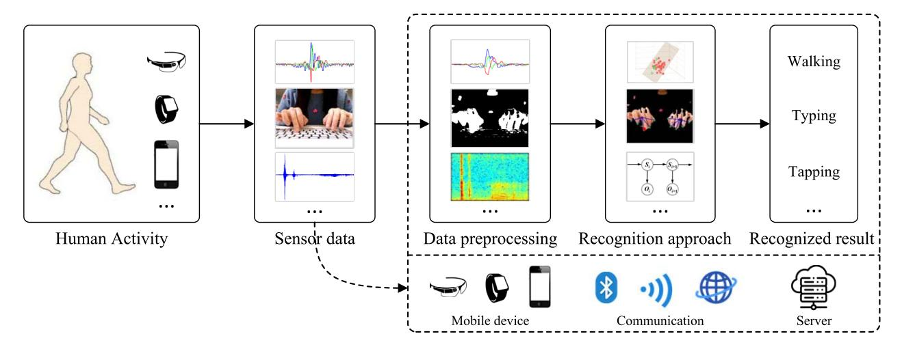

Fig. 1. The workflow and main components of human activity recognition.

noises. In addition, mobile devices are also different from sensor nodes which are mainly used for data collection, e.g., accelerometers attached on a glove. Mobile devices have a higher computational power than sensor nodes, thus have a chance to locally process data and recognize activities on the device. Specifically, a mobile device is a pocket-sized computing device [\[11\]](#page-34-10), which can be hold and operated in the hand. It usually has a displayer and provides a touchscreen interface with buttons or keyboards for input [\[11\]](#page-34-10). Usually, mobile devices have the following characteristics: (1) *Integrated with sensing modules*: a mobile device is often integrated with many sensors, such as accelerometer, gyroscope, microphone, camera, GPS module, light sensor, and so on. (2) *Accessible to network*: mobiles devices can communicate with other devices/servers with Bluetooth, WiFi, or mobile data network, thus can transmit or receive data through network. (3) *Limited computational resources:* due to the limitation of size, the performance of processor, memory, storage in a mobile device is inferior to that in a desktop computer. (4) *Limited battery life*: mobile devices are battery powered, thus difficult to work for a long time without recharging. (5) *Running on an operating system*: mobile devices often run on a separate system, e.g., Android or iOS, and the user can install or uninstall the third-party application on the device. (6) *Lightweight and portable:* the small-size and lightweight mobile devices are easy to carry everywhere and work at different time and places. For mobile devices, the rich embedded sensing modules bring new opportunities for HAR. However, the limited resources and the interferences caused by movements of devices bring new challenges for HAR at the same time. The opportunities and challenges motivate the everincreasing research work on HAR based on mobile devices. Unless otherwise specified, the mobile devices in this paper refer to smartphones, smartwatches and smart glasses.

In regard to human activity recognition based on mobile devices, it consists of five main components, as shown in Fig. [1.](#page-1-0) When the user performs an activity, the mobile device worn, carried, or close to her/him will record the human activity with the embedded sensors (e.g., accelerometer, microphone, camera). Then, we can get the corresponding sensor data like acceleration, acoustic signals, images, etc. After that, we preprocess the sensor data to obtain the suitable data corresponding to human activities. Finally, we use appropriate recognition approaches to recognize the preprocessed sensor data as a type of activity, e.g., walking, typing or tapping. It is worth noting that all of five components have a chance to be performed on mobile devices. However, when considering the limited resources of mobile devices, by transmitting the sensor data to a server through network (e.g., Bluetooth, WiFi, mobile data network), data preprocessing, recognition approaches, and recognized results can also be performed and obtained in a server. When referring to the five main components, they have the following characteristics: (1) *Human activities*: they include many kinds of activities like daily activities and exercise activities, involving activities with different granularities, e.g., body movements, arm movements, hand movements, finger gestures, vital sign changes, etc. (2) *Sensor data*: the data generated by sensors includes inertial sensor data, acoustic signals, images, touch sensor data, and so on. The sensor data used for HAR can be unimodal data generated from the same sensor or multimodal data generated from different sensors. (3) *Data preprocessing*: it usually includes denoising, data segmentation and data transformation (e.g., coordinate system transformation, Fourier transform, color space conversion), to provide suitable data for activity recognition. (4) *Recognition approaches*: they process the sensor data and infer the type of human activity from sensor data, while using data-driven approaches, knowledge-driven approaches or hybrid approaches. (5) *Recognized results*: it is a type of activity, e.g., walking, typing, tapping. Usually, there is a set of candidate activities and we need to determine the recognized result as one type of activity from the set. Considering the main components in HAR, in this paper, we will review the existing HAR research work from the aspects of human activities, sensor data, data preprocessing, and recognition approaches. Besides, we will also present the evaluation standards as well as the typical HAR application cases based on mobile devices.

### *A. Comparisons With Previous Reviews*

There have been some related reviews on human activity recognition, mainly including vision-based, radio-based and sensor-based HAR reviews. The similarity and difference between the existing reviews and this review will be described.

*Vision-based reviews:* They mainly focus on the image (or video) based recognition approaches for human activities [\[19\]](#page-34-11), [\[20\]](#page-34-12), [\[21\]](#page-34-13), while paying little attention to the sources of sensor data, the computation overhead, etc. Aggarwal and Ryoo [\[4\]](#page-34-3) reviewed the single-layered recognition approaches for simple human actions and hierarchical recognition approaches for high-level activities. Sargano et al. [\[20\]](#page-34-12) surveyed the research work in different phases of HAR, including image segmentation, feature extraction and activity classification. While in our review, the sensor data may come from different sensors, not just that from camera. Thus data processing methods for different types of sensor data will be provided. Besides, considering the unexpected movements of devices, the limited resources of mobile devices, and the differences of application scenarios, the recognition approaches in this review can be different from those in vision-based reviews.

*Radio-based reviews:* They mainly focus on the HAR work based on radio signals, e.g., RFID signals, WiFi signals, etc. Wang and Zhou [\[22\]](#page-34-14) investigated the HAR work based on ZigBee signals, WiFi signals, RFID signals and other signals. Liu et al. [\[9\]](#page-34-8) surveyed the existing work using wireless signals (e.g., WiFi) for human activity sensing. The radio signals from mobile devices are rarely used for HAR, thus these reviews are different from our review in almost every aspect, including sensor data, data preprocessing methods, recognition approaches, and so on.

*Sensor-based reviews:* They reviewed the HAR research work using sensors deployed in environments, attached to objects, worn by users, integrated in smartphones [\[16\]](#page-34-15), and so on [\[23\]](#page-34-16), [\[24\]](#page-34-17), [\[25\]](#page-34-18). Chen et al. [\[5\]](#page-34-4) investigated the major approaches in HAR based on the sensors within environments, sensors attached to objects and wearable sensors. Lara and Labrador [\[2\]](#page-34-1), Bulling et al. [\[6\]](#page-34-5), Attal et al. [\[26\]](#page-34-19) and Wang et al. [\[27\]](#page-34-20) reviewed the HAR research work based on wearable sensors. Nweke et al. [\[28\]](#page-34-21), Wang et al. [\[29\]](#page-34-22) and Chen et al. [\[30\]](#page-34-23) focused on the deep learning approaches for sensor-based HAR. When using the embedded sensors in smartphones, Su et al. [\[13\]](#page-34-24), Abdullah et al. [\[12\]](#page-34-25), Shoaib et al. [\[14\]](#page-34-26) and Sunny et al. [\[15\]](#page-34-27) reviewed the core data mining techniques, classification algorithms, online research work or applications in HAR, respectively. The sensor-based reviews are close to but different from our review. Firstly, different from a sensor node, the mobile device concerned in this review is often integrated with multiple types of sensors and can provide multimodal sensor data for HAR. Secondly, a sensor node is often used for sensing and data processing is usually performed in a server. While a mobile device can not only provide sensor data, but also have a chance to process the data locally for activity recognition.

Thirdly, mobile devices not only include smartphones, but also include the newly-emerging smartwatches and smart glasses. In addition, the existing reviews mainly focused on recognition approaches [\[24\]](#page-34-17), [\[31\]](#page-34-28), [\[32\]](#page-34-29), while paying little attention to computation and resource overhead, which can be an important consideration in designing HAR approaches for mobile devices. Therefore, the HAR research work based on mobile devices can be different from that based on sensors, especially when considering the data fusion, computation overhead, implementation ways, etc.

In Table [II,](#page-3-0) we summarize the main differences between these kinds of reviews. Due to the difference between mobile device and camera, wireless device, sensor node, the mobile device based HAR work is different from vision-based, radiobased, sensor-based HAR work, including collected sensor data, data preprocessing methods, recognition approaches, application scenarios, and so on. Therefore, it is necessary to provide a mobile device based HAR review in particular, especially nowadays when lots of mobile devices emerge and mobile device based HAR work becomes popular.

#### *B. Article Scope and Contributions*

Until now, there still lacks of a systematic review summarizing the HAR research work based on mobile devices, which refer to smartphones, smartwatches and smart glasses. From the perspective of sensor data's sources, the closest reviews are smartphone-based reviews, which surveyed the HAR research work based on smartphones. However, among the smartphonebased reviews, the early ones [\[12\]](#page-34-25), [\[13\]](#page-34-24), [\[14\]](#page-34-26), [\[15\]](#page-34-27) focused on the research work published before (or in) 2015. The latest ones [\[16\]](#page-34-15), [\[17\]](#page-34-30), [\[18\]](#page-34-31) tended to review the HAR work from a certain point of view and might bring some limitations, e.g., reviewing HAR in a certain area (i.e., health research) [\[16\]](#page-34-15), mainly focusing on inertial sensor based HAR [\[17\]](#page-34-30), comparing a small number of (i.e., 20) papers [\[18\]](#page-34-31). In fact, in addition to smartphones, there emerge a lot of new mobile devices, e.g., smartwatches and smart glasses, and the mobile devices have been adopted in a large amount of HAR work and applied in a wide range of areas. Besides, mobile devices contain not only inertial sensors but also other sensors like touch sensor and microphone, which are often adopted in HAR. Moreover, the advancement of activity recognition technology, especially deep learning based technology, has contributed to a lot of new HAR work. Therefore, it is necessary to review HAR studies based on mobile devices in recent years, to advance the further research in this area. The main differences between existing reviews and this paper can be found in Table [I.](#page-3-1) We can find that our paper reviews both the previous and the latest research work (i.e., from January 2011 to July 2023), takes more mobile devices (not just smartphone) into consideration, provides a systematic review on each main component of HAR instead of focusing on one or two aspects, and surveys quite a lot of research work (i.e., 154 papers) to demonstrate the research progress of mobile device-based HAR.

In this review, we aim to provide a first systematic review on HAR using commercial off-the-shelf (COTS) mobile devices, i.e., only using the on-board sensors from mobile devices to

| TABLE I                                     |
|---------------------------------------------|
| COMPARISON OF HAR REVIEWS USING SMARTPHONES |

|        |      |               |          |        |         | Main co   | mpon        | ent |                      |    |                                                               |             |       |    |
|--------|------|---------------|----------|--------|---------|-----------|-------------|-----|----------------------|----|---------------------------------------------------------------|-------------|-------|----|
|        |      |               |          | App    | roach   |           |             |     | - -               | DW |                                                               |             |       |    |
| Review | Year | Device        | Activity | Sensor | Preproc | Knowledge | Data-driver |     | Evaluation Applicati |    | Evaluation Applicatio                                         | Application | Focus | RW |
|        |      |               |          |        |         | -driven   | ML          | DL  | -                    |    |                                                               |             |       |    |
| [12]   | 2012 | SP            | 0        | •      | 0       | 0         | •           | 0   | 0                    | •  | Classification algorithms                                     | 22          |       |    |
| [13]   | 2014 | SP            | •        | •      | •       | 0         | •           | 0   | 0                    | •  | Data mining techniques                                        | < 78        |       |    |
| [14]   | 2015 | SP            | •        | •      | 0       | 0         | •           | 0   | •                    | 0  | Online activity recognition                                   | 30          |       |    |
| [15]   | 2015 | SP            | 0        | 0      | 0       | 0         | 0           | 0   | 0                    | •  | Applications and challenges                                   | < 18        |       |    |
| [16]   | 2021 | SP            | 0        | •      | •       | 0         | •           | •   | •                    | 0  | Health research                                               | 108         |       |    |
| [17]   | 2021 | SP            | 0        | 0      | •       | 0         | •           | •   | •                    | 0  | Inertial sensor based HAR                                     | < 137       |       |    |
| [18]   | 2021 | SP            | •        | 0      | 0       | 0         | •           | •   | 0                    | 0  | Comparison of research work                                   | 20          |       |    |
| Our    | 2023 | SP, SW, SG | •        | •      | •       | •         | •           | •   | •                    | •  | A systematic review on each component, challenges, and trends | 154         |       |    |

SP: Smartphone, SW: Smartwatch, SG: Smart glasses, Preproc: Preprocessing, ML: Traditional machine learning, DL: Deep learning, RW: Reviewed works

get sensor data and performing activity recognition in the mobile device or a server. Considering the characteristics of mobile devices, we first analyze the challenges of HAR based on mobile devices. Then, we review the existing research work from six aspects, i.e., human activities, sensor data, data preprocessing, recognition approaches, evaluation standards and application cases, as shown in Fig. 2. Specifically, we give a categorization of human activities based on activity granularities, demonstrate the common sensors used in HAR, show the preprocessing methods for different types of sensor data, analyze the data-driven (e.g., supervised learning, semi-supervised learning, unsupervised learning) and knowledge-driven recognition approaches, describe the public data sets and evaluation metrics in HAR, and conclude the typical HAR application cases. Besides, we also provide the analysis and comparison of existing work from different aspects. Finally, we summarize some promising directions for future research.

We make the following contributions in this review.

- To the best of our knowledge, we are the first to provide a systematic review on mobile device based HAR research work from each main aspect, including human activities, sensor data, data preprocessing, recognition approaches, evaluation standards, and application cases.
- We demonstrate the challenges and promising directions in mobile device based HAR, while considering the particularity of mobile devices.
- We present a new categorization method for human activities, from the perspective of activity granularities.
- We provide deep analysis and comparison of the existing work from each main aspect in HAR, especially in the aspect of recognition approaches.

#### II. OVERVIEW OF HUMAN ACTIVITY RECOGNITION

# A. Problem Definition

As defined in [2], the input for human activity recognition is sensor data, while the output is a type of activity. In this paper, we use  $D = [d_1, d_t]$  to represent the collected sensor data.

TABLE II COMPARISON WITH COMMON HAR REVIEWS

| Review       | Sensors                              | Data          | Computation     |
|--------------|--------------------------------------|---------------|-----------------|
| Vision-based | Camera                               | Images/videos | Server          |
| Radio-based  | RFID, WiFi, Zig- Bee devices, etc | Radio signals | Server          |
| Sensor-based | External sensors, wearable sensors   | Varied        | Server          |
| Our          | On-board sensors of mobile devices   | Varied        | Local or server |

Here,  $d_i, i \in [1, t]$  represents the sensor data at time i, it can be time-series data (e.g., acceleration), image frames, or multimodal data (e.g., images and acoustic signals). According to the beginning and the ending of an activity, the sensor data D is split into m segments  $\{D_j|j\in[1,m]\}$  in sequence. Here,  $D_j=[d_{j_\alpha},d_{j_\beta}], 1\leq j_\alpha< j_\beta\leq t$  and  $(j-1)_\beta< j_\alpha$ . In regard to human activities, we use  $\{y_k|k\in[1,c]\}$  to represent the set of c possible activities, i.e., c classes of activities. Then, the goal of HAR can be described as recognizing the data segment  $D_j$  as one type of activity  $y_k$ . It is worth noting that the objective of HAR is to recognize activities, i.e., activity classification. Therefore, the research work focusing on object detection, indoor localization and activity tracking does not belong to the scope of this paper, and will not be surveyed in this review.

# B. Research Challenges

Considering the uncertainty of human activities, the mobility of mobile devices, the interferences of environment noises and other factors, there are several challenges in human activity recognition based on mobile devices, as shown below.

(1) Difference among intra-class activities: For activities belonging to one type, they can be different in sensor data. Take 'running' as an example, different users can run with different speeds, step lengths, foot-lifting heights, etc. Even for the same user, the same type of activity can be performed

○: Not researched, •: Partially researched, •: Researched

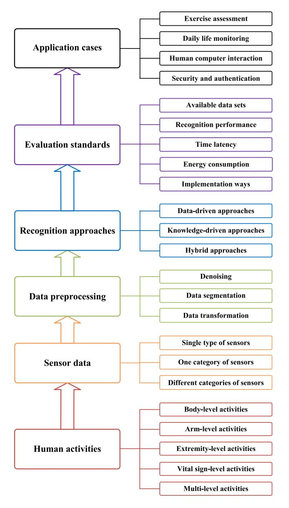

Fig. 2. The framework of this review.

differently. Therefore, the sensor data corresponding to the same type of activity may have differences in duration, amplitude, frequency, etc. To solve this challenge, the recognition approaches are expected to focus on key common features from different sensor data, while ignoring the differences of intra-class activities.

- (2) *Similarity among inter-class activities:* For activities belonging to different types, they can be similar in sensor data. Take 'walking' and 'climbing stairs' as examples, their accelerations are similar. When comparing the waveforms of accelerations, it is difficult to distinguish the two activities. To solve this challenge, it is expected to introduce appropriate algorithms to enlarge the key differences between different activities, while reducing the similarity of inter-class activities.
- (3) *Interference from null-class activities:* The mobile devices are often worn/carried or close to the user, even the user performs interference activities or keeps stationary, the

device may continuously record the sensor data of unexpected activities, i.e., null-class activities [\[6\]](#page-34-5). Thus during a period of time, the sensor data of target activities and that of unexpected activities can interlace with each other, making it difficult to obtain the sensor data of target activities. To solve this challenge, it is expected to introduce appropriate activity detection methods to extract the sensor data corresponding to target activities, while eliminating null-class activities.

- (4) *Fixed classes of recognized activities:* In a real world scenario, there are a great many classes of human activities. However, in the existing HAR research work, the classes of recognized activities are often fixed. That is to say, these HAR approaches can only recognize the seen/known activities, while unable to recognize a new-class activity, thus the applicable scenario of a HAR approach can be very limited. To solve this challenge, it is expected to research the incremental HAR algorithm, which has the ability to recognize both the old-class and new-class activities.
- (5) *Heterogeneity of multimodal sensor data:* The mobile device is often integrated with many different sensing modules, thus the sensor data used for HAR can be multimodal, e.g., acoustic signals and images. Different from unimodal sensor data, multimodal sensor data is heterogeneity and often has different sampling rates, different data representation, different data processing methods, etc. To solve this challenge, it is expected to appropriately fuse multimodal data and tolerate the difference of sensor data in different modalities.
- (6) *Difficulty of data segmentation:* The human activities occur in a continuous way, it is challenging to detect the start or the end of an activity, especially for fine-grained activities with tiny movements. Besides, when multiple activities occur in the same duration, e.g., performing hand gestures while walking, it is difficult to extract the sensor data corresponding to a specific activity. In addition, some composite activities like washing and cooking consist of a series of atomic activities, it is also challenging to exactly segment the sensor data corresponding to a composite activity. To solve this challenge, it is expected to consider the application scenario, perform data transformation, filter interference data etc to segment data.
- (7) *Large cost of data annotation:* When the user performs an activity with the mobile device, the sensor data corresponding to the activity can be generated. However, obtaining a great deal of sensor data for training and testing means that we need to invite a large number of users and annotate the sensor data corresponding to each activity. The labor cost can be huge. To solve this challenge, it is expected to propose lightweight recognition approaches without training or training with a small number of samples.
- (8) *Uncertainty from different domains:* Considering the effects of environment noises, different user habits, and different device types, the distribution of sensor data corresponding to human activities may change every now and then. Thus the HAR approach suitable for one domain (e.g., the environments, users and devices are fixed) may not work well in another domain (e.g., at least one aspect of environments, users and devices changes). To solve this challenge, it is expected to study the HAR algorithm with domain adaptation, to ensure

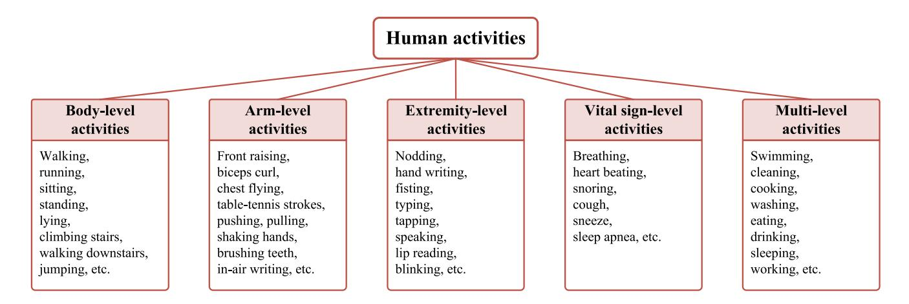

Fig. 3. Human activities in HAR research work.

the HAR approach works in different domains or adapts to new/unseen domains.

(9) *Noises from device movements:* A mobile device is often carried/worn by user, thus when the user moves, the device often moves as well. That is to say, the status of mobile device can change from time to time, thus introducing unexpected noises. These noises may make the collected sensor data of human activities deviate from the original/actual data, leading to unstable or poor performances of HAR. To solve this challenge, it is expected to introduce denoising methods, or appropriately use noisy sensor data to improve the noise tolerance of HAR approach.

(10) *Limited resources of mobile devices:* As mentioned before, the computing capability of mobile devices cannot be compared with desktop computers. In addition, the running time of a mobile device is often limited by the battery. Consequently, some approaches adopted in desktop computers, e.g., deep learning-based recognition approaches with high requirement of resource, can hardly work on mobile devices. Therefore, it is expected to propose lightweight recognition approaches for mobile devices, to recognize human activities in high accuracy, low latency and low energy consumption.

# III. HUMAN ACTIVITIES

In recent years, we have witnessed the development of human activity recognition technology. At first, people focused on recognizing simple and coarse-grained activities, e.g., sitting, walking, running, climbing stairs, etc. Nowadays, people pay more attention to complex and fine-grained activities, e.g., typing with fingers, lip reading, breathing, etc. Usually, the fine-grained activity recognition can be more challenging, since the sensor data is more easily buried in noises. In this section, we will review the research work based on the granularities of activities, i.e., body-level activities, arm-level activities, extremity-level activities, vital sign-level activities and multi-level activities, as shown in Fig. [3.](#page-5-0)

# *A. Body-Level Activities*

Body-level activities refer to the activities mainly caused by the movement of torso, such as walking, running, climbing stairs, lying, sitting, and so on. Most of body-level activities can be found in transportation [\[33\]](#page-34-32), [\[34\]](#page-34-33), and daily life [\[35\]](#page-34-34), [\[36\]](#page-34-35). The accelerometer [\[37\]](#page-34-36) and the 6-axis inertial sensor (i.e., the combination of accelerometer and gyroscope) [\[38\]](#page-34-37) are often used for body-level activity recognition. For example, Hemminki et al. [\[39\]](#page-34-38) adopted the accelerometer of smartphone to detect transportation modes like walking, taking a bus, taking a train, riding the metro, and taking a tram. Suarez et al. [\[40\]](#page-35-0) used the accelerometer of a smartphone to recognize the activities like walking, walking upstairs, walking downstairs, sitting, standing and lying, while the recognition accuracy achieved 95%. Gong et al. [\[41\]](#page-35-1) utilized the 6-axis inertial sensor of a smartphone or smartwatch to recognize the activities including walking, running, climbing stairs, jumping, etc. Considering that the device's (i.e., sensor's) placement can affect the HAR performance, Brajdic and Harle [\[37\]](#page-34-36) researched walk detection and step counting with unconstrained smartphones. Chang et al. [\[36\]](#page-34-35) presented unsupervised domain adaptation (UDA) algorithms to address the problem of wearing diversity of wearable sensors. In regard to the recognized body-level activity, e.g., gaits, it can also be used for user authentication [\[42\]](#page-35-2), assessing brain health [\[43\]](#page-35-3), or other scenarios.

# *B. Arm-Level Activities*

Arm-level activities refer to the activities mainly caused by the movement of arms, including doing the front raise [\[44\]](#page-35-4), using the steering wheel [\[45\]](#page-35-5), [\[46\]](#page-35-6), brushing teeth [\[47\]](#page-35-7), writing in the air [\[48\]](#page-35-8), etc. Many arm-level activities can be found in fitness exercises [\[44\]](#page-35-4), [\[49\]](#page-35-9), daily life [\[47\]](#page-35-7) and human-computer interactions [\[48\]](#page-35-8). The 6-axis inertial sensors (i.e., the combination of accelerometer and gyroscope) [\[50\]](#page-35-10), 9-axis inertial sensors (i.e., the combination of accelerometer, gyroscope and magnetometer) [\[51\]](#page-35-11) and microphones [\[52\]](#page-35-12) are often used for arm-level activity recognition. In regard to the device, to capture arm movements, the smartwatch containing inertial sensors was often used and worn on the wrist. For example, a wrist-worn smartwatch containing the 6-axis inertial sensor was used to recognize free-weight exercises (e.g., front raise, bench press, etc) and daily gestures (e.g., shaking hands, drinking the water, etc). A wrist-worn smartwatch containing the 9-axis inertial sensor was adopted to capture the moving trajectory [\[49\]](#page-35-9), angles [\[51\]](#page-35-11) and contours [\[48\]](#page-35-8) in arm-level activities for table-tennis stroke recognition [\[49\]](#page-35-9), steering wheel usage tracking [\[51\]](#page-35-11) and in-air handwritten character recognition [\[48\]](#page-35-8). In addition to smartwatch, the smartphone placed nearby the body was also adopted for arm-level activity recognition. Specifically, Xu et al. [\[53\]](#page-35-13) utilized the microphone of smartphone to recognize inattentive driving events including fetching forward, picking up drops, turning back, and eating or drinking, and achieved the accuracy of 94.80%. Korpela et al. [\[52\]](#page-35-12) utilized the microphone of smartphone to recognize a series of activities in toothbrushing, e.g., brushing front teeth outer surface, brushing front teeth inner surface, brushing back teeth outer surface, and brushing back teeth inner surface, to evaluate tooth brushing performance.

### *C. Extremity-Level Activities*

Extremity-level activities refer to the activities caused by head [\[54\]](#page-35-14), hands [\[55\]](#page-35-15), [\[56\]](#page-35-16), fingers [\[57\]](#page-35-17), [\[58\]](#page-35-18), lips [\[59\]](#page-35-19), [\[60\]](#page-35-20), tongue [\[61\]](#page-35-21), eyes [\[62\]](#page-35-22), etc. When comparing with the macro body movements or arm movements, extremity-level activities usually belong to micro movements and often occur in human-computer interactions, e.g., handwriting [\[63\]](#page-35-23), [\[64\]](#page-35-24), hand vibration [\[65\]](#page-35-25), finger-level writing [\[66\]](#page-35-26), typing [\[67\]](#page-35-27), [\[68\]](#page-35-28), swiping on the touch screen [\[69\]](#page-35-29), [\[70\]](#page-35-30), lip reading [\[71\]](#page-35-31), tongue-jaw moving [\[61\]](#page-35-21), blinking [\[72\]](#page-35-32), [\[73\]](#page-35-33) etc, as shown in Fig. [3.](#page-5-0) Many types of sensors, e.g., the 6-axis inertial sensor [\[74\]](#page-35-34), [\[75\]](#page-35-35), microphone [\[71\]](#page-35-31), [\[76\]](#page-35-36), camera [\[77\]](#page-35-37), [\[78\]](#page-35-38) and touch sensor [\[79\]](#page-35-39), were used in extremity-level activity recognition. For example, Yi et al. [\[54\]](#page-35-14) utilized the 6-axis inertial sensor of smart glasses to recognize eight head gestures (e.g., nod, shake, left, right 3 times, etc), and achieved the accuracy of 96%. Lin et al. [\[80\]](#page-35-40) utilized the 6-axis inertial sensor of smart watch to recognize the handwritten characters. It is worth noting that due to the difference of application scenarios, even for the same kind of activities, it is possible to adopt different types of sensors for recognition. Take finger gesture recognition as an example, the 6-axis inertial sensor of a smartwatch was used to infer typing activities on a laptop keyboard [\[75\]](#page-35-35) with the keystroke detection rate of 94.6%, and the embedded camera of a smartphone was used to recognize typing activities on a paper keyboard [\[77\]](#page-35-37) with an accuracy of 95%. While for the same type of sensor (e.g., microphone), it can also be used for recognizing different kinds of activities (e.g., handwriting [\[81\]](#page-35-41), lip reading [\[82\]](#page-35-42)). However, to recognize tiny eye movements, e.g., gaze gestures, the camera rather than other sensors was often used to capture the activities in pixel levels [\[78\]](#page-35-38), [\[83\]](#page-35-43). In regard to the recognized extremity-level activities, besides for human-computer interactions, they were also used in security issues [\[67\]](#page-35-27), [\[84\]](#page-35-44) and user authentication [\[85\]](#page-36-0), [\[86\]](#page-36-1).

#### *D. Vital Sign-Level Activities*

Vital sign-level activities refer to the very micro activities caused by human organs, e.g., breathing [\[87\]](#page-36-2), heart beating [\[88\]](#page-36-3), cough [\[89\]](#page-36-4), sleep apnea [\[90\]](#page-36-5), etc. To detect vital sign-level activities, the devices were often worn [\[91\]](#page-36-6) by the user or placed close to [\[92\]](#page-36-7) the target organ. The sensors like accelerometer [\[92\]](#page-36-7), 6-axis inertial sensor [\[91\]](#page-36-6), microphone [\[89\]](#page-36-4) and camera [\[88\]](#page-36-3) have been used for monitoring vital sign changes. For example, Sun et al. [\[87\]](#page-36-2) used the microphone of a smartphone to recognize soundrelated respiratory symptoms, e.g., sneeze, cough, sniffle, throat clearing, where more than 82% of respiratory symptoms were correctly classified. Wang et al. [\[92\]](#page-36-7) utilized the accelerometer of smartphone to capture heartbeat signals for user authentication, and achieved the accuracy of 96.49%. Chen et al. [\[93\]](#page-36-8) utilized the accelerometer of smartwatch to detect sleep apnea. Considering that different users have different vital sign changes, thus vital signs like breathing [\[94\]](#page-36-9), heart beating [\[92\]](#page-36-7) and cardiac biometrics [\[88\]](#page-36-3) were often used for user authentication.

### *E. Multi-Level Activities*

In the previous subsections, human activities are mainly classified into four categories, i.e., body-level, arm-level, extremity-level and vital sign-level activities. However, in fact, human activities may not be limited in one of the four categories, they can be a combination of any two, three, or four categories of the above activities. Correspondingly, the human activities are called multi-level activities, which can occur in exercises [\[95\]](#page-36-10), [\[96\]](#page-36-11), daily life [\[97\]](#page-36-12), [\[98\]](#page-36-13) and human-computer interactions [\[99\]](#page-36-14), [\[100\]](#page-36-15). For fitness exercises, the activity like swimming [\[101\]](#page-36-16) consists of both body movements and arm movements. While for a set of fitness activities, they can consist of both body movements like running and rowing as well as arm movements like barbell bench press and dumbbell raise. For example, Guo et al. [\[102\]](#page-36-17) utilized the 6-axis inertial sensor of smartwatch to recognize fitness exercises (e.g., running, rower, dumbbell bench press, cable crossover, etc), and the recognition accuracy achieved above 90%. In daily life, human activities are more complex, e.g., cleaning [\[103\]](#page-36-18), cooking [\[104\]](#page-36-19), washing dishes [\[105\]](#page-36-20), drinking [\[106\]](#page-36-21), sleeping [\[107\]](#page-36-22) etc, they are the combination of multiple categories of activities. For example, Voigt et al. [\[103\]](#page-36-18) utilized the depth camera of smartphone to recognize nine complex daily activities, including working on a laptop, watching TV, reading a book, operating a phone, cleaning, sleeping, cooking, eating, and washing dishes. Chang et al. [\[108\]](#page-36-23) utilized the inertial sensor, microphone and light sensor of smartwatch to monitor sleeping, which includes body rollovers, arm raising, hand moving, snoring, coughing, and so on. In human-computer interactions, take sign language [\[109\]](#page-36-24) as an example, it includes arm movement, hand movement, finger movement, etc. Specifically, Part et al. [\[110\]](#page-36-25) utilized the depth camera of smartphone to recognize 50 sign language words and achieved the accuracy of 91%, aiming to reduce the communication gap between verbal communication and sign language. Until now, many kinds of sensors, including accelerometer [\[111\]](#page-36-26), 6-axis inertial sensor [\[109\]](#page-36-24), [\[112\]](#page-36-27), 9-axis inertial sensor [\[113\]](#page-36-28), microphone [\[114\]](#page-36-29), camera [\[99\]](#page-36-14), [\[110\]](#page-36-25) etc, have been used for multi-level activity recognition.

TABLE III CHARACTERISTICS OF ACTIVITIES IN DIFFERENT LEVELS

| Activity         | Commonly-adopted sensor | Device     | Placement                                             | Granularity | Recognition | Application  |
|------------------|-------------------------|------------|-------------------------------------------------------|-------------|-------------|--------------|
| Body-Level       | A, 6-axis IMU           | SP, SW     | Hand, pocket, bag, waist, wrist                       | Coarse      | Easy        | DLM          |
| Arm-Level        | 6-axis IMU, 9-axis-IMU  | SP, SW     | Wrist                                                 | Medium      | Moderate    | EA, DLM, HCI |
| Extremity-Level  | A, MC, C, T, 6-axis IMU | SP, SW, SG | Head, near the hand/finger, wrist, hand, finger       | Fine        | Hard        | HCI, S&A     |
| Vital Sign-Level | A, MC, C, 6-axis IMU    | SP, SW     | Wrist, near the body, pocket, backpack, chest, finger | Very fine   | Very hard   | DLM, S&A     |
| Multi-Level      | A, 6-axis IMU           | SP, SW, SG | Wrist, ankle, head, chest, hand                       | Mixed       | Variable    | EA, DLM, HCI |

#### *F. Learned Lessons About Human Activities*

*Characteristics of activities in different levels:* In Table [III,](#page-7-0) we analyze the characteristics of activities in different levels from multiple aspects. *On the aspect of adopted sensors*, whichever level the activities belong to, they often adopted inertial sensors for activity sensing. Besides, coarsegrained activities (i.e., body-level activities) tended to use accelerometer for sensing, while fine-grained activities (e.g., extremity-level activities) tended to use microphone for sensing. In regard to multi-level activities, they tended to adopt multiple sensors to get richer data for activity sensing. *On the aspect of adopted devices*, whichever level the activities belong to, they often adopted smartphone and smartwatch for activity recognition. Only extremity-level activities and multi-level activities adopted smart glasses for head or eye movement recognition. *On the aspect of device placement*, smartphone can be placed in many positions (e.g., hand, pocket, waist, other positions on or near the body), smartwatch was often worn on the wrist, while smart glasses were often worn on the head. *On the aspect of activity granularities*, from bodylevel activities to vital sign-level activities, the granularity of activity changes from coarse to very fine, i.e., the granularity becomes smaller and smaller. In regard to multi-level activities, they can contain activities in different granularities. *On the aspect of recognition difficulty*, as the granularity of activity decreases, the recognition difficulty increases, since the sensor data of very fine-grained activities is easily affected or buried by noises. In regard to multi-level activities, the recognition difficulty is affected by activities in different levels. *On the aspect of application scenarios*, most of activities (e.g., bodylevel, arm-level, vital sign-level, and multi-level activities) were used for daily life monitoring, while extremity-level activities were often used for human-computer interactions, security and user authentication. Sometimes, arm-level (e.g., free weight exercises, in-air writing) and multi-level activities (e.g., exercises, cross-device gestures) also occurred in exercise assessment or human-computer interactions, while the vital sign-level activities with uniqueness also occurred in security and user authentication.

*Researched activities over time:* In Fig. [4\(](#page-7-1)a), we provide the statistics of researched activities from reviewed works. We can find that extremity-level activities were the most

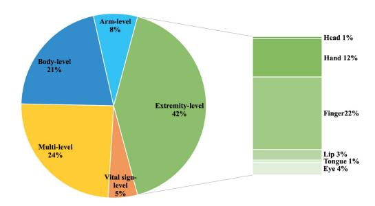

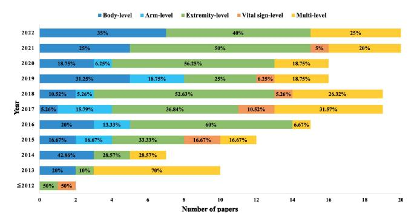

Fig. 4. Researched human activities.

popular activities in previous research, especially finger gestures and hand gestures, while the body-level and multi-level activities were also paid good attention. In regard to the armlevel or vital sign-level activities, they were less researched. This is mainly caused by the demand of application, since human-computer interactions based on hand or finger gestures, and daily life monitoring based on locomotions or complex/specific activities often attract a lot of attention. To further analyze the research trends in human activities, we also provide the statistics of researched activities in each year. As shown in Fig. [4\(](#page-7-1)b), more and more mobile device based HAR research work emerged over time, especially after 2016. Besides, the levels of activities in research also changed over time. *Earlier* (i.e., before 2015), the number of HAR research work based on mobile devices was limited, and many of the researched activities belonged to coarse-grained body-level or

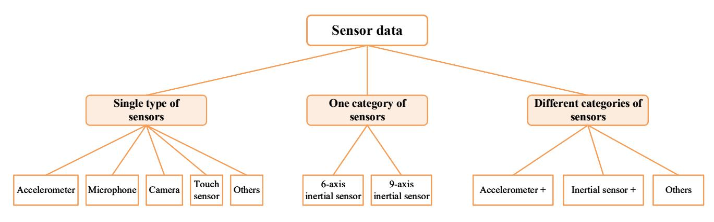

Fig. 5. Sensors adopted in HAR research work.

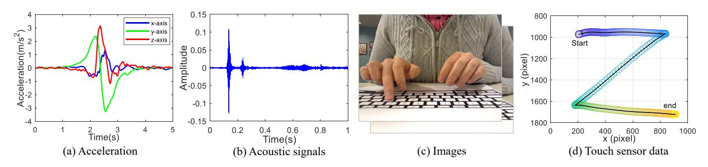

Fig. 6. Typical sensor data.

multi-level activities. *Later* (i.e., after 2015), the number of HAR research work based mobile devices increased apparently, and most of researched activities changed to fine-grained extremity-level activities. *Recently* (i.e., after 2020), the number/ratio of body-level activities increased, this is because recent HAR work tended to adopt public datasets which are usually consisted of body-level activities. Nevertheless, the extremity-level activities, especially hand or finger gestures, had attracted enough attention in HAR research work.

Open problems: In the existing research work, the researched activities usually belonged to fixed classes, and each activity was recognized as one class. However, in practice, all kinds of activities occur uncertainly, thus detecting the target activities from continuous sensor data while getting rid of the effect from interference activities is rather challenge and has not been studied well. Besides, sometimes, multiple activities can occur at the same time, e.g., eating while watching TV. In this case, should the activity during this time be classified with two classes/labels (i.e., eating, watching TV)? That is to say, whether HAR can be formalized as a multi-label classification problem or not, it still needs further research.

#### IV. SENSOR DATA

Due to the development of sensing modules, mobile devices often contain a variety of sensors, e.g., accelerometer, microphone, camera, touch sensor, etc. Usually, one type of sensor generates one type of data. Consequently, we can get the sensor data of acceleration, acoustic signals, images/videos, touch sensor data, etc. To obtain rich sensor data for HAR, one or more types of sensors can be used. According to the

difference in sensor types, the sensors adopted in HAR can be classified into single type of sensors and multiple types of sensors, where the latter can be further classified as one category of sensors and multiple categories of sensors. In this section, we will review the research work based on the category of sensors adopted in HAR, as shown in Fig. 5.

#### A. Single Type of Sensors

Choosing single type of sensors can reduce the complexity in sensing, data fusion and computation, and it can be found in a lot of HAR research work. It is worth noting that the sensors belong to one type, while the number of sensors can be one or more. Among the sensors, accelerometer, microphone, camera and touch sensor were often used as single type of sensors for HAR, as described below.

Accelerometer: Accelerometer measures the acceleration along three axes of the coordinate system in mobile device. The raw readings from the accelerometer contain the acceleration of gravity. If we want to describe the motion of device, we need to get the linear acceleration by removing the acceleration of gravity, as the linear acceleration of arm gestures shown in Fig. 6(a). Accelerometer is a common and low-cost sensor, which is embedded in almost every mobile device. Usually, one device only contains one accelerometer, thus using multiple accelerometers often needs multiple devices [115], [116]. Until now, accelerometer has been used in much HAR research work, including coarsegrained transportation mode detection [39], body movement recognition [40], [42], hand gesture recognition [117], finegrained heartbeat sensing [92], sleep apnea detection [93], and complex daily activity recognition [97], [104]. Due to the

difference of recognition tasks and the limitation of devices, the adopted sampling rate of accelerometer can be different, e.g., 16 Hz [\[118\]](#page-36-33), 20 Hz [\[115\]](#page-36-30), 25 Hz [\[97\]](#page-36-12), 30 Hz [\[40\]](#page-35-0), [\[104\]](#page-36-19), 30-35 Hz [\[117\]](#page-36-32), 50 Hz [\[40\]](#page-35-0), [\[42\]](#page-35-2), 60 Hz [\[39\]](#page-34-38), 100 Hz [\[37\]](#page-34-36), [\[92\]](#page-36-7). Usually, high sampling rates are expected for finegrained activity recognition.

*Microphone:* Microphone is also a commonly-used sensor and often used to collect acoustic signals. The sound caused by human activities can be captured by microphone, as the sound caused by a keystroke shown in Fig. [6\(](#page-8-1)b), where the unique features in sounds can be used for activity recognition. Besides, the microphone is often used together with a speaker, which emits acoustic signals (e.g., ultrasound), and the microphone receives the acoustic signals. The changes of acoustic signals caused by human activities, e.g., phase changes, can be used for activity recognition. The microphone has been adopted in a lot of research work [\[52\]](#page-35-12), [\[119\]](#page-36-34), and most of activities in these works belong to extremity-level and vital sign-level activities. For example, handwriting on a paper [\[81\]](#page-35-41), handwriting on the desk [\[63\]](#page-35-23), in-air hand gestures [\[76\]](#page-35-36), touch gestures [\[85\]](#page-36-0), swiping gesture [\[120\]](#page-36-35), in-air finger movement/gestures [\[121\]](#page-36-36), lip reading [\[60\]](#page-35-20), [\[71\]](#page-35-31), tongue-jaw moving [\[61\]](#page-35-21), blinking [\[73\]](#page-35-33), sleeping [\[90\]](#page-36-5), [\[107\]](#page-36-22), sound-related respiratory symptoms [\[87\]](#page-36-2) and coughs [\[89\]](#page-36-4). The fine-grained activities often occur in human-computer interactions [\[121\]](#page-36-36), [\[122\]](#page-36-37), security issues [\[123\]](#page-36-38) and user authentication [\[85\]](#page-36-0), [\[94\]](#page-36-9). In regard to the sampling rate of a microphone, it can be set to 8 kHz [\[94\]](#page-36-9), 16 kHz [\[87\]](#page-36-2), 32 kHz [\[89\]](#page-36-4), 44.1 kHz [\[59\]](#page-35-19), [\[119\]](#page-36-34), 48 kHz [\[114\]](#page-36-29), [\[123\]](#page-36-38), which are much higher than that of an accelerometer.

*Camera:* Considering the rich information in images or videos, camera was also adopted in HAR. As shown in Fig. [6\(](#page-8-1)c), an image consists of pixels and provides space information, it is quite different from the time-series data in Fig. [6\(](#page-8-1)a) and Fig. [6\(](#page-8-1)b). To monitor human activities during a period of time, consecutive image frames or videos are often used. However, due to the heavy computation overhead in image processing, the images can be transmitted to a computer or remote server for processing [\[83\]](#page-35-43). Otherwise, optimization for image processing in mobile devices is expected [\[77\]](#page-35-37). Until now, the camera has mainly been adopted in human-computer interactions [\[78\]](#page-35-38), [\[100\]](#page-36-15) and user authentications [\[62\]](#page-35-22), [\[88\]](#page-36-3), while the human activities are often associated with fine-grained activities. For example, doing sign languages [\[110\]](#page-36-25), recognizing typing activities [\[77\]](#page-35-37), sensing eye movements [\[83\]](#page-35-43), capturing gaze patterns [\[62\]](#page-35-22) or cardiac motion patterns in fingertips [\[88\]](#page-36-3) for user authentication. When referring to the frame rate of a camera, it can be set to 15 Hz [\[77\]](#page-35-37), 30 Hz [\[83\]](#page-35-43), 60 Hz [\[88\]](#page-36-3), etc.

*Touch sensor:* The mobile device is often configured with a touch screen for interactions. When touching the screen with a fingertip, the touch sensor can provide the coordinate of a fingertip, the touch size, etc. Thus the touch sensor can provide coordinate/size changes along time, as the trajectory of a slide operation over time shown in Fig. [6\(](#page-8-1)d). The touch sensor has been used for human-computer interactions [\[69\]](#page-35-29), [\[79\]](#page-35-39) and user authentication [\[124\]](#page-36-39), [\[125\]](#page-36-40). For example, using the touchpad of Google glass to provide 1D handwriting

interface [\[69\]](#page-35-29), using the touch gesture of a mobile device for user authentication [\[125\]](#page-36-40). In regard to the sampling rate of a touch sensor, the default sampling rate (e.g., 60 Hz in Samsung Galaxy Note8 smartphone) supported by the device was often adopted.

*Others:* In addition to the above popular sensors, other sensors like magnetometer [\[55\]](#page-35-15), barometer [\[33\]](#page-34-32) and depth camera [\[103\]](#page-36-18) were also adopted as a single sensor in HAR.

# *B. One Category of Sensors*

One category of sensors refer to the sensors generating sensor data in a similar format, e.g., time-series data. In addition, the sensors are often used together and the sensor data can be processed with similar ways. The inertial sensor is a typical example which belongs to one category of sensors and often used to sense motion states or attitudes of targets. According to the difference in combination of sensors, there are 6-axis inertial sensor and 9-axis inertial sensor. The 6 axis inertial sensor means the combination of accelerometer and gyroscope, while the 9-axis inertial sensor means the combination of accelerometer, gyroscope and magnetometer, as described below.

*6-axis inertial sensor:* The 6-axis inertial sensor measures the motion, i.e., the acceleration and angular velocity, along three axes of the coordinate system in mobile device. The accelerometer can describe the velocity and displacement, while the gyroscope can measure the rotation of target. The 6-axis inertial sensor has been deployed in smartphones [\[50\]](#page-35-10), [\[112\]](#page-36-27), smartwatches [\[126\]](#page-36-41) and smartglasses [\[54\]](#page-35-14), and widely adopted in HAR to measure the movements of bodies [\[41\]](#page-35-1), arms [\[50\]](#page-35-10), hands [\[65\]](#page-35-25), fingers [\[66\]](#page-35-26), [\[127\]](#page-36-42) and even vital sign changes [\[91\]](#page-36-6). The 6-axis inertial sensor based HAR has benefited a variety of applications, including exercise assessment [\[44\]](#page-35-4), [\[102\]](#page-36-17), daily activity monitoring [\[35\]](#page-34-34), [\[106\]](#page-36-21), human-computer interactions [\[80\]](#page-35-40), [\[109\]](#page-36-24), and user authentication [\[57\]](#page-35-17), [\[128\]](#page-36-43). In addition, the 6-axis inertial sensor was also used to infer human activities in security attacks, especially in password [\[74\]](#page-35-34), [\[84\]](#page-35-44) or text input inference [\[75\]](#page-35-35), which motivated us to improve the security mechanism of mobile devices.

*9-axis inertial sensor:* When comparing with the 6-axis inertial sensor, 9-axis inertial sensor can additionally get the magnetic field intensity, due to the introduction of magnetometer, which can be alternatively called as compass. By using the 9-axis inertial sensor, it is possible to infer the earth coordinate system based on the directions of geomagnetic field and gravity. Consequently, the 9-axis sensor data can be transformed into a fixed coordinate system [\[47\]](#page-35-7) to calculate trajectories [\[49\]](#page-35-9), contours [\[48\]](#page-35-8), angles [\[51\]](#page-35-11), [\[129\]](#page-37-0) caused by human activities for exercise recognition [\[49\]](#page-35-9), [\[129\]](#page-37-0), humancomputer interactions [\[48\]](#page-35-8), daily activity monitoring [\[47\]](#page-35-7), etc.

#### *C. Different Categories of Sensors*

Different categories of sensors refer to the combination of sensors which generate sensor data in different formats, e.g., acoustic signals and images. Besides, the sensor data is often processed with different methods. In current HAR research

TABLE IV
CHARACTERISTICS OF EACH TYPE OF SENSOR

| Sensor           | Measurement                          | Data        | Device       | Commonly-sensed Activities                                                                                                                            | Sampling Rate | FU     | CO     |
|------------------|--------------------------------------|-------------|--------------|-------------------------------------------------------------------------------------------------------------------------------------------------------|---------------|--------|--------|
| Accelerometer    | Acceleration along x, y, z-axis      | TS data     | SP, SW, SG   | Body-level: transportations, locomotions; Extremity-level: hand gestures; Vital sign-level: heart beat, sleep; Multi-level: daily activities | 16Hz-100Hz    | High   | Low    |
| Gyroscope        | Angular velocity along x, y, z-axis  | TS data     | SP, SW, SG   | All levels: (used with accelerometer)                                                                                                                 | 8Hz-500Hz     | High   | Low    |
| Magnetometer     | Geomagnetic field along x, y, z-axis | TS data     | SP, (SW), SG | <b>Arm-level:</b> brushing, interactions, fitness (used with accelerometer and gyroscope)                                                             | 50Hz-100Hz    | Medium | Low    |
| Microphone       | Acoustic signal                      | TS data     | SP, SW, SG   | Extremity-level: handwriting, finger gestures, lip reading, blinking; Vital sign-level: respiratory, coughs                                           | 8kHz-48kHz    | High   | Medium |
| Camera           | Surroundings in pixels               | Image/video | SP, SG       | Extremity-level: typing, eye movements; Vital sign-level: cardiac motion patterns                                                                  | 15Hz-60Hz     | Medium | High   |
| Touch sensor     | Touch size, coordinate, pressure     | TS data     | SP, SW, SG   | Extremity-level: handwriting, touch gestures                                                                                                          | 60Hz          | Medium | Low    |
| GPS              | Geographical location                | TS data     | SP, SW, SG   | Multi-level: daily life activities (used with other sensors)                                                                                          | 1Hz           | Low    | Low    |
| Barometer        | Atmospheric pressure                 | TS data     | SP, SW       | Body-level: transportation mode; Multi-level: exercises (used with other sensors)                                                                  | 1Hz-25Hz      | Low    | Low    |
| Proximity sensor | Distance or proximity                | TS data     | SP, SG       | Body-level: daily activities; Extremity-level: finger gestures, eye movements; Multi-level: interactions (used with other sensors)              | 100Hz         | Low    | Low    |
| Light sensor     | Ambient light level                  | TS data     | SP, SW, SG   | Extremity-level: finger gestures, Multi-level: exercises, daily life activities (used with other sensors)                                       | 33Hz-100Hz    | Low    | Low    |

SP: Smartphone, SW: Smartwatch, SG: Smart glasses, TS: Time-series, FU: Frequency of usage, CO: Computation overhead

work, the accelerometer, 6-axis inertial sensor, 9-axis inertial sensor are often used with other sensors to form a combination of different categories of sensors, e.g., the combination of accelerometer and touch sensor, the combination of 6-axis inertial sensor and microphone, the combination of 9-axis inertial sensor, barometer and ambient light sensor.

Accelerometer +: Due to the popularity of accelerometer, the combination of accelerometer and other sensors, which is represented as "accelerometer +", was adopted in HAR research work, to get richer sensor data. Usually, the touch sensor was added to sense touch gestures [130], the microphone was added to capture the acoustic signals [131], the GPS module was added to infer the location [105], the magnetometer was added to calculate the orientation [132], while other sensors like camera [111] and infrared proximity sensor [72] were introduced for specific recognition tasks. The combination "accelerometer +" has been applied in rehabilitation training [132], daily life monitoring [72], [105], security attacks (e.g., handwriting eavesdropping [131]), user authentication [130], etc.

Inertial sensor +: For convenience, we use "inertial sensor +" to represent the combination of inertial sensor and other sensors, where the inertial sensor can be "6-axis inertial sensor" or "9-axis inertial sensor". Among the combinations, a microphone [98], [133] was often used together with the 6-axis inertial sensor in human-computer interactions [134], security attacks [67], etc. While other sensors like GPS module [46], [113], proximity sensor [99], touch sensor [70], [86], gravity sensor [64], camera [108], [113], ambient light sensor [101], [108], barometer [101] etc were adopted together with the 6-axis or 9-axis inertial sensor based on the specific application scenarios, e.g., driving behavior sensing [46],

[113], sleeping monitoring [108], rehabilitation [96], swimming recognition [101], user authentication [86], etc.

Others: In addition to the previous combinations depending on accelerometer and inertial sensor, other combinations were also proposed for HAR. For example, combining gyroscope, microphone, proximity sensor and ambient light sensor to sense a user's finger movement [58], using microphone and camera to track fingers in 3D space [135], combining microphone and gyroscope for typing activity detection and recognition [68]. The combination of sensors can be affected by many factors, e.g., the application scenario, the recognition task, the configuration of device, etc.

#### D. Learned Lessons About Sensor Data

Characteristics of common sensors: In Table IV, we analyze the characteristics of common sensors from different aspects. On the aspect of measurements from sensors, the accelerometer, gyroscope, and magnetometer provide the sensor data along each axis of the device's coordinate system, and they were usually adopted for motion state sensing. The microphone provides the acoustic signals along time, and it was often used to collect the audible sounds or receive the reflected acoustic signals generated from speaker. The camera provides the visual and spatial information about surroundings. The touch sensor provides the sensor data like touch sizes and coordinates of on-screen operations. These six sensors were often used in HAR research work, while other sensors were usually adopted for specific tasks. Specifically, the GPS module provides the geographical location of device. The barometer provides the atmospheric pressure, and it can be used to infer the altitude. The proximity sensor provides the

TABLE V COMPARISON OF SENSORS IN SINGLE TYPE, ONE CATEGORY AND DIFFERENT CATEGORIES

|      | Single type                                                                                                                            | One category                                                                                                                                                                                                       | Different categories                                                                                                                                                                                                                                                                    |
|------|----------------------------------------------------------------------------------------------------------------------------------------|--------------------------------------------------------------------------------------------------------------------------------------------------------------------------------------------------------------------|-----------------------------------------------------------------------------------------------------------------------------------------------------------------------------------------------------------------------------------------------------------------------------------------|
| Pros | <b>Processing:</b> The sensor data is in the same format. The complexity of data collection and data processing is low.                | Sensing: The sensors can provide complementary sensor data and improve the understanding of some activities.  Processing: The data in similar formats can be processed with similar methods.                       | Sensing: The sensors can provide multi-modal sensor data from different aspects for activity sensing, thus are possible to improve the understanding of human activities and improve the performance of activity recognition.                                                           |
| Cons | <b>Sensing:</b> The unimodal sensor data may limit the range of recognized activities and affect the activity recognition performance. | Sensing: The sensor data in a category still can not provide a full understanding of many human activities.  Sampling and fusion: The synchronization of data sampling and the fusion of sensor data are expected. | Sampling and fusion: It needs to synchronize sensors in different sampling rates, fuse sensor data in multi-modals, and balance the possible conflicting measurements from different sensors.  Processing: Sensor data in different formats needs to be processed in different methods. |

distance or proximity to the device. The light sensor provides the light level, and it was used to sense the environment. We can find that each sensor provides the unique measurement and sensors are difficult to be replaced with each other. *On the aspect of data format*, most of sensor data belongs to time-series data, while visual data captured by camera is represented as images/videos which also contain spatial domain information. *On the aspect of device containing sensors*, a smartphone is often configured with all common sensors, a smartwatch is often lack of camera and proximity sensor, and smart glasses are often lack of barometer. Besides, due to differences in models, the same type of device may be configured with different sensors, e.g., LG Watch Urbane has a magnetometer while Motorola Moto 360 smartwatch does not have a magnetometer. Thus the device model should also be considered in sensor selection. *On the aspect of sensed activities by each sensor*, the accelerometer, gyroscope, magnetometer can be used together to recognize many activities, from coarse-grained body-level activities to very fine-grained vital sign-level activities. The microphone, camera, touch sensor were often used for extremity-level or vital sign-level activity recognition. In regard to GPS, barometer, proximity sensor, and light sensor, they were often used to get richer information about devices and environments for multi-level or specific activity recognition. *On the aspect of sampling rates*, most of sensors often adopted the sampling rate ranging in [20, 100]Hz. Differently, the microphone often worked in a high sampling rate (i.e., [8*k*, 48*k*]Hz), while the GPS and barometer often worked in a low sampling rate (i.e., below 20Hz). *On the aspect of frequency of usage*, the accelerometer, gyroscope, and microphone were most frequently used sensors, the magnetometer, camera, and touch sensor were also commonly used sensors, while GPS, barometer, proximity sensor, and light sensor were less commonly used. *On the aspect of computation overhead*, the images/videos captured by camera often require high computation overhead, the acoustic signals captured by microphone cause a moderate computation overhead, while other sensor data often has a low computation overhead. To adopt suitable sensors for activity recognition, the characteristics of sensors are often considered.

*Comparisons of sensors in different categories:* In Table [V,](#page-11-0) we analyze the advantage and disadvantage of adopting sensors in single type, one category or different categories, from the aspects of sensing mechanism, processing method, sampling mode and data fusion strategy. Usually, using single type of sensor can reduce the overhead of data processing and fusion, but the unimodal sensor may limit the recognition performance and application scenario. When using one category of sensors, it is possible to get richer sensor data and process the data with similar methods, but sensors in one category may still not provide enough information of human activities and require further computation for data fusion. When using different categories of sensors, it is possible to get enough information of human activities and improve recognition performance, but the sensors in different modalities often bring the difficulty of data synchronization, data processing, data fusion and more computation overhead. Considering both the advantage and disadvantage of choosing sensors in single type, one category and different categories, it is difficult to conclude which is the best choice for sensor selection. Usually, the balance between performance and overhead should also be considered in sensor selection.

*Adopted sensors over time:* In Fig. [7\(](#page-12-0)a), we provide the statistics of adopted sensors from reviewed works. It can be found that single type of sensor was most frequently used in HAR work, especially the accelerometer and microphone. The one category of sensors were also commonly used, especially the 6-axis inertial sensor (i.e., 6-axis IMU), which is the most popular sensor unit in HAR work. In addition, the different categories of sensors were also used for HAR, where the combination "inertial sensor +" was popular. To further analyze the research trends in adopted sensors, we also provide the statistics of adopted sensors in each year. As shown in Fig. [7\(](#page-12-0)b), from the past to the present, the single sensor is aways popular in mobile device based HAR work, where the accelerometer was often adopted during these years while microphone was mainly adopted from 2015. The single category of sensors, especially the 6-axis inertial sensor unit, were mainly adopted after 2015 and had become a mainstream sensor unit in recent years. In regard to the different categories of sensors, especially the combination "inertial sensor+", they had been adopted in HAR work and attracted more attention after 2018. Currently, the accelerometer, microphone, inertial sensor unit, or the combination "inertial sensor+" have been widely adopted and can be found in most of HAR work.

*Location of sensor data:* The collected sensor data of human activity can be placed on the mobile device or sent to a server. The location of sensor data is usually affected by the stage in HAR and the adopted recognition approach. Firstly, before

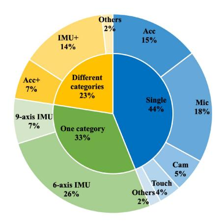

(a) Distribution of adopted sensors (Note: Acc. Accelerometer, Mic: Microphone, Cam: Camera, IMU: Inertial Measurement Unit)

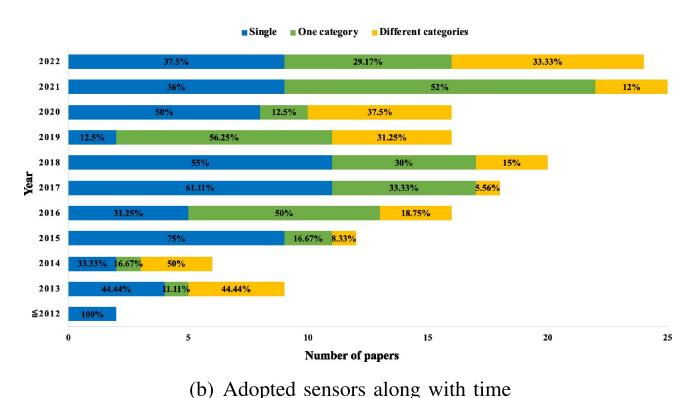

Fig. 7. Adopted sensors.

the beginning of HAR, the collected sensor data is often sent to a server for establishing the training dataset or training a model for HAR. Secondly, during the process of HAR, if the adopted recognition approach is an online approach, the sensor data is processed on mobile device. If the adopted recognition approach is an offline approach, the sensor data is sent to a server for processing. Thirdly, after the ending of HAR, the sensor data can be stored on the mobile device or a server, or even canceled. In regard to transmitting the sensor data to a sever, the Bluetooth, WiFi, and mobile data network can be adopted for communications.

Open problems: Although many devices (i.e., sensors) are available in daily life, how to collect large-scale sensor data for activity recognition is still challenging. Thus researchers tended to invite some subjects (i.e., usually less than 50 people) to provide sensor data or participant into HAR, which may decrease the generalization of HAR. Besides, although many kinds of sensors can be adopted to provide multimodal data for activity recognition, the existing work tended to combine the recognition results based on unimodal sensor data, thus how to fuse the multimodal data at early stage has not been studied well. In addition, considering the advantage and disadvantage of a sensor, how to utilize the sensor in one modality to assist the sensor in another modality for better HAR still deserves further study.

#### V. DATA PREPROCESSING

When getting the sensor data, it is necessary to preprocess the raw data and provide appropriate data for following activity recognition. Usually, we first need to remove noises or outliers from raw sensor data. Then, we need to extract the data segment corresponding to human activities, i.e., data segmentation. After that, we need to adopt suitable data transformation methods for different types of sensor data. In Fig. 8, we summarize the common methods used for data preprocessing in mobile device-based HAR, including denoising, data segmentation and data transformation.

#### A. Denoising

Due to the uncertainty of human activities, the drift of sensor data, the movement of sensing devices and the interferences from environments, the raw sensor data often contains noises, which should be removed. The moving average smoothing method [37], [112] was widely used to remove the high-frequency noise from raw sensor data. Suppose the sensor data is  $\mathbf{x}=(x_1,x_2,\ldots,x_i,\ldots,x_{n-1},x_n),\ i\in[1,n]$ , then we can use the moving average method with the window size m to calculate the denoised sensor data  $\mathbf{x}'=(x_1',x_2',\ldots,x_i',\ldots,x_{n-1}',x_n')$ , as shown in Eq. (1).

$$x_{i}' = \begin{cases} \frac{\sum_{j=-\frac{m-1}{2}}^{\frac{m-1}{2}} x_{i+j}}{\frac{m}{m}} & m = 2k+1, k \in \mathbb{N} \\ \frac{\sum_{j=-\frac{m}{2}}^{m} x_{i+j}}{m} & m = 2k+2, k \in \mathbb{N} \end{cases}$$
 (1)

As shown in Fig. 9(a), by applying the moving average smoothing method for the raw data (i.e., blue line), we get the smoothed sensor data (i.e., red line), which replaced the raw data by averaging several adjacent data points to reduce noises. When changing the weights of data points, the exponentially-weighted moving average (EMA) filter [97] was proposed. In addition, the Savitzky-Golay filter [84] and other low-pass filters [47], [91] were also proposed to remove the high frequency noises [84]. In fact, besides highfrequency noises, the low-frequency noises may also need to be removed, thus the high-pass filter [57], [90] was proposed. While the Butterworth filter [59] and total variation filter (TV filter) [118] were adopted to remove both high-frequency and low-frequency noises. When moving to a specific application scenario, the noise model can be used to track the noise characteristics [107] for better understanding the noises. In regard to the outlier data, the Hampel filter [84] can be used to remove it. The above methods were usually used for timeseries data, e.g., inertial sensor data.

#### B. Data Segmentation

To extract the data corresponding to human activities, we need to segment the denoised sensor data. Usually, a sliding window moving along with time can be used to extract the segment based on thresholding or other metrics. The existing HAR research work often used a fixed-size [47], [84], [118] sliding window, while the window size m and the overlap between sliding windows were determined based on the sampling rate and the recognition task. Usually, the

#### **Data preprocessing** Data segmentation Denoising **Data transformation** Motion sensor data Acoustic signal Image Moving average smoothing, Sliding window, peak point detection Savitzky-Golay filter, Coordinate system Fast Fourier transform, Color space conversion, triangle filter, valley point detection. short-term Fourier transform, transformation. edge detection. band-pass filter. thresholding, Doppler effect, skin segmentation, integral, Butterworth filter, crossing correlations, etc. discrete wavelet transform. mel-frequency cepstral coefficients, Hough transformation, total variation filter, fast Fourier transform, etc. amplitude spectrum density, Six-segmented Hampel filter, etc. frequency modulated continuous wave, Rectangular filter, etc.

Fig. 8. Data preprocessing methods in HAR research work.

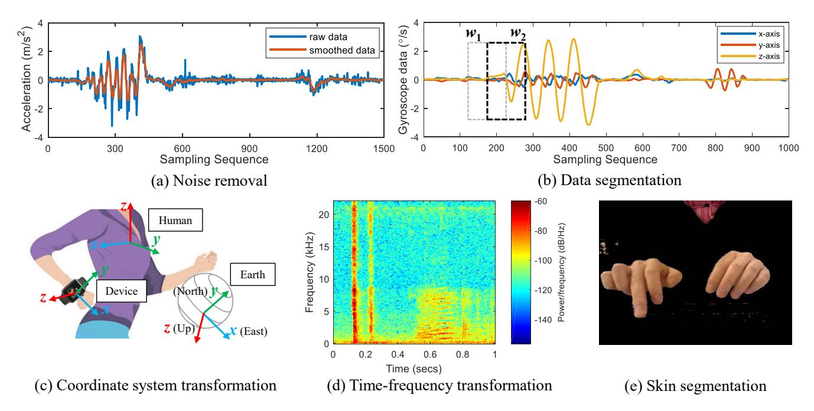

Fig. 9. Typical data preprocessing techniques.

50% overlap [52], [106], [126] was adopted. Considering that the fixed-size window may split the sensor data of an activity into different segments, detecting the start and the end of an activity for data segmentation was proposed. Specifically, to determine the occurrence of an activity, the extreme points like the peak/valley point [91] and the local minimum point [102] were often used. Suppose the sensor data is  $\mathbf{x} = (x_1, x_2, \dots, x_i, \dots, x_{n-1}, x_n), i \in [1, n]$ , then we can use Eq. (2) and Eq. (3) to detect the local maximum and local minimum in a window, respectively. Then, the time point corresponding to local maximum (or local minimum) can be used to split the data into segments.

$$x_i - x_j \ge 0, \forall j \in [i - m, i + m] \tag{2}$$

$$x_i - x_i \le 0, \forall j \in [i - m, i + m] \tag{3}$$

In addition, comparing the signal [57], energy levels [123], variances [112], angle changes [129] or average amplitude [45] with a certain threshold were also used to detect the start, occurrence or end of an activity. Take the

average amplitude as an example, for the sensor data  $\mathbf{x} = (x_1, x_2, \dots, x_i, \dots, x_{n-1}, x_n), \ i \in [1, n],$  we can use Eq. (4) to calculate the average amplitude in a window. If  $\bar{x} \geq \epsilon$ , then we detect the start of an activity. After that, if  $\bar{x} < \epsilon$ , we detect the end of the activity. Here,  $\epsilon$  is a predefined threshold.

$$\bar{x} = \frac{1}{m} \sum_{i=k+1}^{k+m} \sqrt{x_i^2}, k \in [0, n-m]$$
 (4)

As shown in Fig. 9(b), the start or end of activity is detected by comparing the average amplitude of sensor data in a window with a defined threshold. The threshold can be a fixed value or adjusted at times, e.g., twice the maximum sensor data [68]. Moreover, instead of calculating the numerical value of sensor data at some point or in a sliding window, the template based method [92] was proposed to use cross-correlations on continuous signals for data segmentation, and the pre-trained Support Vector Domain Description [61] was adopted to select the target activity from sensor data.

#### C. Data Transformation

In addition to denoising and data segmentation, it is often necessary to further preprocess the sensor data, e.g., coordinate system transformation, time-frequency transformation, color space conversion, to provide appropriate data for activity recognition. Take the common sensor data (i.e., motion sensor data, acoustic signal, image/video) as the example, we summarize some typical data preprocessing methods for each type of sensor data.

Motion sensor data: Motion sensor data is the general term for the data generated from accelerometer, gyroscope or magnetometer, it can be one type of these data or the combination of two or three types of these data. The motion sensor data obtained from sensor is measured in the device coordinate system, as shown in Fig. 9(c), which changes every now and then. It is difficult to analyze the sensor data under ever-changing coordinate systems. Therefore, coordinate system transformation [44], [84], [102] was often adopted to make the motion sensor data in a uniform coordinate system, which can be the earth coordinate system [136] or a userdefined coordinate system, as shown in Fig. 9(c). Specifically, we use x,  $q_{de}$  to represent the sensor data and quaternion provided by the mobile device, where  $\mathbf{x}$  is measured in the device coordinate system and the quaternion describes the transformation from device to earth coordinate system. Then, we can use Eq. (5) to get the transformed sensor data x' in the earth coordinate system, where  $q_{de}^{-1}$  is a conjugate quaternion

$$x' = q_{de}xq_{de}^{-1} \tag{5}$$

In addition, we can further use Eq. (6) to transform the sensor data from device coordinate system to a defined coordinate system, e.g., human coordinate system in Fig. 9(c), where the quaternion  $\mathbf{q_{he}}$  represents the transformation from human to earth coordinate system. The  $\mathbf{q_{he}}$  is determined by the relative orientation between human and earth coordinate system, and can be calculated with Euler angles in the earth coordinate system [102].

$$x'' = \left(q_{he}^{-1}q_{de}\right)x\left(q_{he}^{-1}q_{de}\right)^{-1} \tag{6}$$

After the data is transformed to a unified coordinate system, it can be used to calculate the velocity [44], rotation angle [129], moving distance [84] etc of the target. In addition to coordinate system transformation, Discrete Wavelet Transform (DWT) [92] was used to decompose the sensor data into multiple levels of wavelet coefficients to detect the expected activity pattern, and Fast Fourier Transform (FFT) was used to transform the sensor data into frequency domain for analysis [109]. Furthermore, to combine multiple sensors working with different sampling rates or locating on different devices, resampling and synchronization could be adopted. Besides, considering different scales and units in sensor data, the data normalization was introduced, especially for machine learning based methods. In Eq. (7), we show the popular minmax scaling in data normalization, which can scale the data to a specified range and eliminate scale differences, where

 $x_{max}$ ,  $x_{min}$  mean the max, min value of sensor data  $\mathbf{x} = (x_1, x_2, \dots, x_i, \dots, x_{n-1}, x_n), i \in [1, n].$ 

$$x_i = \frac{x_i - x_{min}}{x_{max} - x_{min}} \tag{7}$$

Acoustic signal: Acoustic signal means one-dimensional time-series data collected by microphone, while the source generating the acoustic signal can be sounds, or sinusoid signals [114], predefined Training Sequence Code [76], Zadoff-Chu (ZC) sequence [85], customized Frequency Modulated Continuous Waves (FMCW) [90] emitted from the speaker. To enhance the collected acoustic signals, the beamforming technology from dual microphones can be adopted [71]. In regard to the microphone, it often works in high sampling rate, e.g., 44.1kHz, thus the acoustic signals were often analyzed in frequency domain. Specifically, suppose the sensor data is  $\mathbf{x} = (x_0, x_1, \dots, x_t, \dots, x_{n-2}, x_{n-1})$ ,  $t \in [0, n-1]$ , then we can use Fourier transform to transform the data as  $X_k$ ,  $k \in [0, n-1]$  in frequency domain, as shown in Eq. (8).

$$X_k = \sum_{t=0}^{n-1} x_t \cdot e^{-\frac{2\pi j}{n}kt}$$
 (8)

Similarly, Fast Fourier Transform (FFT) [45], [119] was also used to transform the signal into frequency domain, and Short-Term Fourier Transform (STFT) was proposed to obtain the time-frequency feature of the acoustic signal clip [81], as shown in Fig. 9(d). To mitigate frequency selective fading and avoid signal interference, frequency-hopping mechanism was proposed [76]. To analyze the data in frequency domain, the Doppler effect [45], [59], Amplitude Spectrum Density (ASD) [68], Mel Frequency Cepstral Coefficients (MFCCs) [52], [123] were proposed to depict the frequency change, describe the frequency-domain acoustic channel profile, extract cepstral features for the sounds, respectively. In addition to these, other data transformation [61] or preprocessing methods were often designed based on the specific recognition task. After preprocessing, these characteristics of acoustic signals in frequency domain can be mapped to human activities.

Image/video: Images or videos are generated from camera, and they are quite different from time-series data. The video is consisted of consecutive images and video processing is often transformed into image processing. An image is consisted of a series of pixels in two-dimensional space, where the pixel is usually described in RGB channels. In fact, besides RGB space, the image can also be transformed into HSV color space [100], YCrCb space [77], and so on. The color channel component can be used to segment the target from image [77] or detect the variation in pixels caused by human activities [88]. For an image, the approaches like edge detection [77], skin segmentation [77], [100] and Hough transformation [77], [83] were often used to extract the target area from the image. As shown in Fig. 9(e), the hands were segmented from the image based on skin segmentation. In addition, other methods like the Six-Segmented Rectangular (SSR) filter and the regions of interest (ROI) were proposed to detect a specific part of human body (e.g., face or eyes) [62].

TABLE VI CHARACTERISTICS OF DATA PREPROCESSING METHODS

| Met            | thod            | Key focus                        | Difficulty | FU     | СО     |
|----------------|-----------------|----------------------------------|------------|--------|--------|
| Deno           | oising          | Noise reduction                  | Easy       | High   | Low    |
| Data seg       | mentation       | Activity extraction              | Easy       | High   | Low    |
| Data           | Motion data     | Coordinate system transformation | Moderate   | Medium | Low    |
| transformation | Acoustic signal | Frequency-domain analysis        | Moderate   | Medium | Medium |
|                | Image           | Object extraction                | Moderate   | Low    | Medium |

#### *D. Learned Lessons About Data Preprocessing*

*Characteristics of data preprocessing methods:* In Table [VI,](#page-15-0) we analyze the main data preprocessing methods from different aspects. *From the aspect of key focus*, denoising was adopted to reduce the effect of noises, data segmentation was used to extract the data segment corresponding to an activity from sensor data, while data transformation was used to get appropriate data for following activity recognition. Specifically, the data transformation on motion data, acoustic signals, and images focus on coordinate system transformation, frequency-domain analysis and object extraction, respectively. *From the aspect of computational difficulty*, it is usually easy to perform denoising and data segmentation, while harder to perform the complex data transformation. *From the aspect of frequency of usage*, denoising and data segmentation were often adopted in a lot of research work, since it is essential to extract clean and efficient sensor data corresponding to human activity. In regard to data transformation, whether adopting it or not depends on the need of recognition task, recognition approaches, and so on. Usually, the knowledge-driven approaches or traditional machine learning based approaches had higher requirements of data transformation, while deep learning based approaches had lower requirements of data transformation. *From the aspect of computation overhead*, the overhead of denoising, data segmentation, and data transformation of motion data was usually low, while the overhead about data transformation of acoustic signals and images was usually medium, since the high sampling rate of acoustic signals and very finegrained pixel-level information of images often brought more computation. Nevertheless, although the computation cost is different, almost all of the methods can be performed on mobile device, and the computation cost of data preprocessing is usually acceptable for mobile device. Apparently, all these data preprocessing methods can also be performed on a server, and the computation cost on a server is negligible. Based on the characteristics of common data preprocessing methods, we can use one or more of them as needed to provide the highquality data for following activity recognition.

*Usage of data preprocessing:* When considering the noises in sensor data, the uncertainty in the starting and ending time of an activity, and the changeable formats of the same data in different coordinates or domains, it is usually necessary to preprocess sensor data in HAR, before inputting the sensor data into model/classifier. When adopting data preprocessing,

HAR solutions usually can achieve a better performance. However, adopting data preprocessing also means bringing extra computation cost. Nevertheless, according to Table [VI,](#page-15-0) the computation cost is usually acceptable, and data preprocessing can be performed on the mobile device or a server. Choosing the mobile device or a server depends on the working mode (i.e., online or offline) of a HAR solution. Usually, data preprocessing and activity recognition are often performed at the same place, i.e., both on mobile device for an online HAR solution, or both on a server for an offline HAR solution. It is rare that data preprocessing is performed on the mobile device (or server), while activity recognition is performed on a server (mobile device). Consequently, the data preprocessing cost is usually small and acceptable for an online solution on the mobile device, and it is negligible for an offline solution on a powerful server. Therefore, when considering the higher performance and acceptable computation cost caused by data preprocessing, it is usually encouraged to adopt data preprocessing to achieve a better recognition performance.

#### VI. RECOGNITION APPROACHES

With the preprocessed sensor data, the recognition approaches will be adopted to map the sensor data into one type of activity. Usually, the recognition approaches can be classified into three categories, i.e., data driven approaches which use training data to obtain classifiers or clusters for activity recognition, knowledge driven approaches which utilize domain knowledge to process sensor data for activity recognition, and hybrid approaches which consist of both data driven and knowledge driven approaches, as shown in Fig. [10.](#page-16-0)

### *A. Data-Driven Approaches*

Due to the difficulty of human activity analysis, data driven approaches which mainly depend on training data instead of domain knowledge, have been largely used in HAR. According to how the training data is labeled, data driven approaches can be further classified into supervised learning, semi-supervised learning and unsupervised learning based approaches, where the training data is all labeled, partly labeled or not labeled.

*1) Supervised Learning:* Nowadays, most of the existing HAR work based on mobile devices adopt the supervised learning based approaches, which utilize the labeled data to train a machine learning model and use the trained model to predict/recognize the class of test data. The basic principle of these approaches is shown in Fig. [11.](#page-16-1) Firstly, we get the sensor data *D* = [*d*1, *dt*] corresponding to human activities. Secondly, we adopt the data preprocessing methods to get the preprocessed data segment *Wj* = [*wj*α , *wj*β ], 1 ≤ *j*α &lt; *j*β ≤ *t* of an activity. Thirdly, we use the feature selection method to extract the feature vector *Xj* = (*f*1,..., *fu* ,..., *fn*), *u* ∈ [1, *n*] from each data segment *Wj* . Fourthly, if in the training phase, we use the training data set {(*Xj* , *lj*)|*j* ∈ [1, *N* ]} to train the classifier, where *Xj* is a feature vector and *lj* is the label (i.e., class) of *Xj* . Otherwise, if in the testing phase, the feature vector *Xj* will be sent to the trained model to get the prediction probabilities {*pjk* |*k* ∈ [1, *c*]}, where *pjk* means the probability

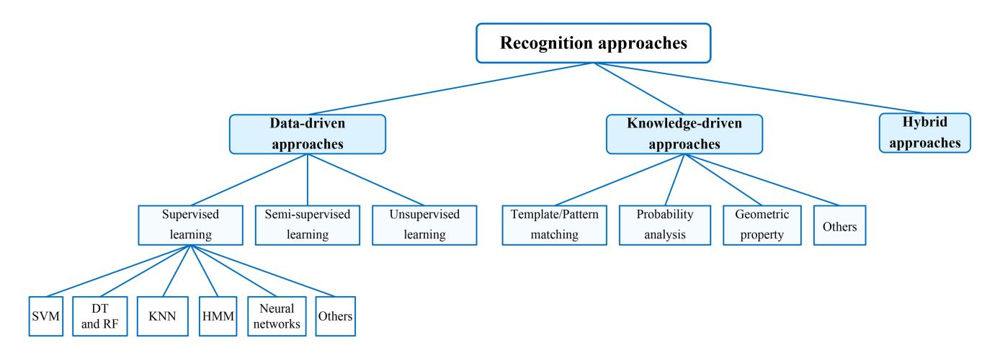

Fig. 10. Recognition approaches in mobile device-based HAR work, including data-driven approaches, knowledge-driven approaches, and hybrid approaches.

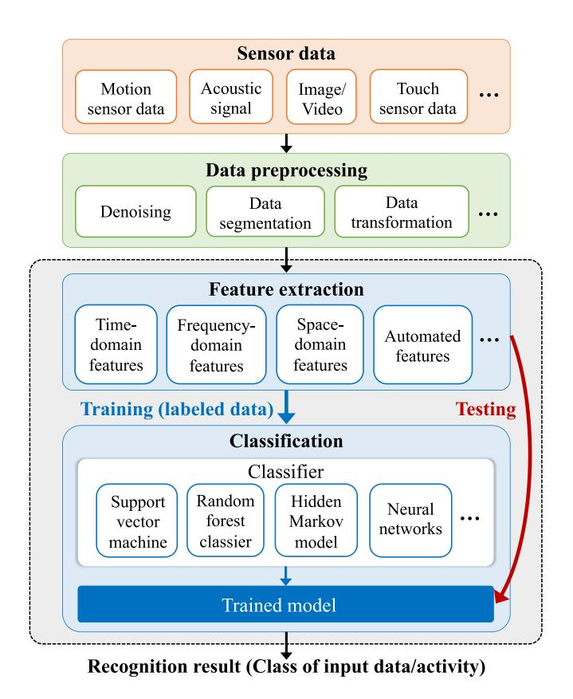

Fig. 11. Supervised learning based HAR.

that *Xj* is predicted as the class *yk* , *k* ∈ [1, *c*]. Here, *c* means the number of classes, and *lj* ∈ {*yk* }. Finally, we choose the class *yk* with the maximum probability *pjk* as the activity recognition result for *Xj* . It is worth noting that in Fig. [11,](#page-16-1) the independent feature extraction module and classification module usually appear in traditional machine learning based methods, while being merged into a single module in recent deep learning based methods. That is to say, in deep learning based HAR methods, the preprocessed sensor data rather than extracted feature is adopted to train the deep learning model, and the trained model is used to predict/recognize the class of preprocessed sensor data in test.

TABLE VII HANDCRAFTED FEATURES

| Domain                    | Features                                                                                                                                                                                                                              |  |  |  |
|---------------------------|---------------------------------------------------------------------------------------------------------------------------------------------------------------------------------------------------------------------------------------|--|--|--|
| Time-domain features      | Mean, standard deviation, max, min, root mean square, kurtosis, skewness, median absolute deviation, zero-crossing rate, inter-quartile range, variance, trimmean, pairwise correlation, local slope, etc.                            |  |  |  |
| Frequency-domain features | Bandwidth, pitch frequency, number of large frequency peaks, Mel Frequency Cepstrum Coefficients, the orthogonal features extracted by principal components analysis, frequency power, the dominant frequency, spectral entropy, etc. |  |  |  |
| Space-domain features     | Eccentricity, orientation, center of an ellipse, the mean distance of points in a cell, width, height, area ratio of the upper section to the lower section of the binarized image, coordinate vectors, etc.                          |  |  |  |

*Feature selection:* To provide a good representation of sensor data for training, it is necessary to extract appropriate features from sensor data at first. Previous research work has paid enough attention on feature engineering, aiming to extract efficient features based on data analysis. This kind of features are called as *handcrafted features*. Recently, due to the development of deep learning, *automated features* were introduced for activity recognition. Next, we will describe the handcrafted features and automated features used in HAR.

*Handcrafted features:* In mobile device-based HAR, the common handcrafted features can be classified into three categories, i.e., time-domain features, frequency-domain features and space-domain features, as shown in Table [VII.](#page-16-2) *Among time-domain features*, the statistical features [\[95\]](#page-36-10), [\[97\]](#page-36-12), [\[126\]](#page-36-41) were widely used, which include the mean, standard deviation, max, min, root mean square, kurtosis, skewness, median absolute deviation, zero-crossing rate, inter-quartile range, variance, trimmean, pairwise correlation, local slope, and so on. Besides, other features [\[49\]](#page-35-9), [\[92\]](#page-36-7), [\[130\]](#page-37-1) like energy, duration, inter-axis correlation, average peak-to-peak amplitude, peak number, the correlation of data, the coefficients calculated from Discrete Wavelet Transform, and the probabilities of the hidden states in a Hidden Markov Model were also introduced based on the recognition tasks. *Among the frequency-domain features*, the statistical features [\[127\]](#page-36-42) like

TABLE VIII
CALCULATION OF TYPICAL HANDCRAFTED FEATURES

| Time-domain  | Formula                                                        | Description                                    |
|--------------|----------------------------------------------------------------|------------------------------------------------|
| Maximum      | $\max\{x_i\}, i \in [1, n]$                                    | Maximum of a segment in a dimension            |
| Minimum      | $\min\{x_i\}, i \in [1, n]$                                    | Minimum of a segment in a dimension            |
| Mean         | $\bar{x} = \frac{1}{n} \sum_{i=1}^{n} x_i$                     | Mean of a segment in a dimension               |
| Std          | $s = \sqrt{\frac{1}{n-1} \sum_{i=1}^{n} (x_i - \bar{x})^2}$    | Standard deviation of a segment in a dimension |
| Var          | $s^{2} = \frac{1}{n-1} \sum_{i=1}^{n} (x_{i} - \bar{x})^{2}$   | Variance of a segment in a dimension           |
| Skewness     | $\frac{\frac{1}{n}\sum_{i=1}^n(x_i-\bar{x})^3}{{}_83}$         | Skewness of a segment in a dimension           |
| Kurtosis     | $\frac{\frac{1}{n}\sum_{i=1}^{n}(x_{i}-\bar{x})^{4}}{s^{4}}-3$ | Kurtosis of a segment in a di- mension      |
| RMS          | $\sqrt{\frac{1}{n} \sum_{i=1}^{n} x_i^2}$                      | Root mean square of a segment in a dimension   |
| Sum          | $\sum_{i=1}^{n} x_i$                                           | Sum of a segment in a dimension                |
| Freq-domain  | Formula                                                        | Description                                    |
| Bandwidth    | $\max\{\mathcal{F}_i\} - \min\{\mathcal{F}_i\}$                | Range of frequencies                           |
| Entropy      | $-\sum_{i=1}^{n} p(\mathcal{F}_i) \log_2 p(\mathcal{F}_i)$     | Entropy of discrete FFT components             |
| Mean FFT     | $\frac{1}{n}\sum_{i=1}^{n}\mathcal{F}_{i}$                     | Mean of FFT distribution                       |
| Space-domain | Formula                                                        | Description                                    |
| Coordinate   | $(x_i, y_i)$                                                   | Coordinate of a point                          |
| Vector       | $(x_i - x_j, y_i - y_j)$                                       | Vector formed by two points                    |
| Distance     | $\sqrt{(x_i - x_j)^2 + (y_i - y_j)^2}$                         | Distance between two points                    |

Freq: Frequency,  $\mathcal{F}_i$ : frequency (FFT component)

mean, standard deviation, max, min etc were often used. Other features [45], [52], [131] like bandwidth, pitch frequency, number of large frequency peaks, Mel Frequency Cepstrum Coefficients (MFCCs), the orthogonal features extracted by Principal Components Analysis, frequency power, the dominant frequency and spectral entropy etc were also used based on the specific recognition tasks. Among the space-domain features, the statistical features [62] like max, min, standard deviation, root mean square etc were also used. Besides, other features [79], [103], [119] like eccentricity, orientation, center of an ellipse in an image, the mean distance of points in a cell, area ratio of the upper section to the lower section in the binarized image, coordinate vectors etc were proposed based on the recognition tasks. In Table VIII, we provide the calculation of some typical handcrafted features. After all features are obtained, we can get a feature vector  $\mathbf{f} =$  $(f_1, f_2, \dots, f_i, \dots, f_{m-1}, f_m)$ , where  $f_i$  means the *i*th feature and m means the number of features. The feature vector will be input to classifiers for the following classification.

Automated features: These features are often automatically generated by deep learning models, e.g., convolutional neural network (CNN) [81], recurrent neural network (RNN) [44], [128], long short-term memory (LSTM) model [47], etc. The automated features may capture the hierarchical nature of an activity [38], the unique characteristics of long continuous

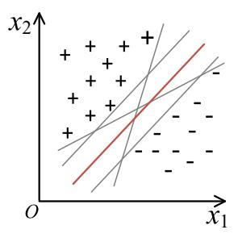

Fig. 12. SVM classifier.

motion [74], the high-level motion features [109], the comprehensive feature from multiple kinds of input data [67], etc. Usually, it is hard to explain the specific meaning of an element in the automated feature vector. However, when given enough training samples, deep learning models can extract more efficient features. Take the challenge of extracting features from multi-modal sensor data as an example, deep learning approaches have adopted the attention mechanism [137], GCN-based dynamic inter-sensor correlations learning framework [138], fusion strategies in different levels [133], [139], data augmentation with different-modal data [98] to get efficient multi-modal features. Besides, to further improve the feature representation, multi-task strategy [140] and combination of both handcrafted and automated features were also proposed [141].

Classification: In supervised learning, when getting the extracted features, we can use one or more classifiers, e.g., Support Vector Machine (SVM), Decision Tree (DT), Random Forest (RF), K-Nearest Neighbor (KNN), Hidden Markov Model (HMM) and Neural Network (NN), for activity classification, as described below. In regard to the research work using these classifiers, they can be found in Table IX, X, XI.

SVM: The SVM is a maximum margin classifier [13], which aims to find a hyperplane to classify the data points in a high dimensional space [26], [142]. As shown in Fig. 12, SVM aims to find a plane, i.e., the red plane, to separate the '+' class and the '-' class as far as possible. Suppose the N training samples for SVM are  $\mathcal{D} = \{(\mathbf{x}_1, y_1), \dots, (\mathbf{x}_i, y_i), (\mathbf{x}_N, y_N)\}$ , and the hyperplane is described with Eq. (9). Here,  $\mathbf{x}_i$  means the feature vector of the *i*th sample, while  $y_i \in \{+1, -1\}$  is the label of  $\mathbf{x}_i$ . In the training stage, the classifier is trained with the optimization goal shown in Eq. (10). When the training process finishes, the  $\omega$  and  $\mathbf{b}$  of hyperplane can be determined. After that, in the testing stage, when given a sample  $\mathbf{x}_t$ , we can use Eq. (11) to infer the class  $\hat{y}$  of  $\mathbf{x}_t$ . If  $f(\mathbf{x}_t) \geq 0$ ,  $\hat{y} = 1$ . Otherwise,  $\hat{y} = -1$ .

$$f(\mathbf{x}) = \omega^{\mathbf{T}} \mathbf{x} + \mathbf{b} = \mathbf{0}$$
  

$$\min \quad 0.5 \cdot ||\omega||^2$$
(9)

$$s.t., \quad y_i \left( \omega^{\mathbf{T}} \mathbf{x_i} + \mathbf{b} \right) \ge 1, \forall i$$
 (10)

$$f(\mathbf{x_t}) = \operatorname{sign}\left(\omega^{\mathbf{T}}\mathbf{x_t} + \mathbf{b}\right) \tag{11}$$

Traditionally, SVM is a binary classifier. When used for multi-class classification, pairwise classifications with SVM were often used [26], e.g., training binary SVM classifiers

TABLE IX RESEARCH WORK USING TRADITIONAL CLASSIFIERS

| Year | Work  | Activities           | Classes  | Subjects  | Sensors     | Device | Location        | Features            | Classifier   | Dataset | Accuracy                          | Imp | App |
|------|-------|----------------------|----------|-----------|-------------|--------|-----------------|---------------------|--------------|---------|-----------------------------------|-----|-----|
| 2013 | [130] | Finger gestures      | 10       | 50        | A, T        | SP     | Hand            | TFs                 | SVDE         | SC      | EER: 0.5%                         | On  | S&A |
| 2013 | [95]  | Exercises            | 10       | 20        | A, G        | SP, SW | Arm, wrist, hip | TFs                 | SVM          | SC      | 79%                               | Off | EA  |
| 2015 | [147] | Hand gestures        | 1        | 200       | A           | SP     | Hand            | TFs                 | SVM          | SC      | FPR: 15%; FNR: 8%                 | On  | S&A |
| 2016 | [126] | Finger gestures      | 2, 4, 8  | 12        | A, G        | SW     | Wrist           | TFs                 | SVM          | SC      | 88.7%-99.4%                       | Off | HCI |
| 2016 | [62]  | Eye movements        | 4        | 20        | C           | SP     | Hand            | 27 TFs              | SVM          | SC      | 88%                               | On  | S&A |
| 2016 | [131] | Hand gestures        | Variable | 9         | A, MC       | SP     | Near the hand   | FFs                 | SVM          | SC      | 50%-60%                           | Off | S&A |
| 2016 | [122] | Lip motions          | 10       | 8         | MC          | SW     | Wrist           | 78 FFs              | SVM          | SC      | 90.50%                            | On  | HCI |
| 2017 | [102] | Exercises            | 12       | 12        | A, G, QV    | SW     | Wrist           | 27 TFs              | SVM          | SC      | 93%                               | Off | EA  |
| 2017 | [45]  | Driving activities   | 4        | 8         | MC          | SP     | Near the body   | 2 PFs               | SVM          | SC      | 94.80%                            | On  | DLM |
| 2017 | [148] | Finger gestures      | Variable | 86        | T           | SP     | Hand            | TFs                 | SVDE         | SC      | EER: 0.5%-0.52%                   | Off | S&A |
| 2017 | [149] | Shaking              | Variable | 20        | A, G, CM    | SP     | Hand            | TFs                 | SVM          | SC      | EER: 1.2%                         | On  | S&A |
| 2018 | [92]  | Heart beating        | 1        | 20        | A           | SP     | Chest           | 56 DFs              | SVM          | SC      | 96.49%                            | On  | S&A |
| 2018 | [53]  | Driving              | 4        | 8         | MC          | SP     | Near the body   | FFs                 | SVM          | SC      | 94.80%                            | On  | DLM |
| 2018 | [59]  | Lip motions          | Variable | 48        | MC          | SP     | Near the mouth  | AFs                 | SVM, SVDD | SC      | 90.21%, 93.1%                     | On  | S&A |
| 2020 | [56]  | Hand gestures        | 14, 5, 5 | 9, 10, 10 | A, G, M, MC | SW     | Wrist           | TFs, FFs            | SVM          | SC      | 94.6%, 98.4%, 96.3%               | Off | HCI |
| 2020 | [150] | Eye movements        | Variable | 26        | C           | SP     | Hand            | SFs                 | SVC          | SC      | 77.89%-84.38%                     | Off | S&A |
| 2021 | [70]  | Finger gestures      | 4        | 77        | A, G, RV, T | SP     | Hand            | 80 TFs, FFs, AFs | SVM          | SC      | Above 95%                         | Off | S&A |
| 2011 | [89]  | Cough                | 9        | 17        | MC          | SP     | Chest           | FFs                 | RF           | SC      | TPR: 92%, FPR: 0.5%               | Off | DLM |
| 2015 | [97]  | Daily activities     | 11       | 7, 1      | A           | sw     | Wrist           | TFs                 | RF           | SC      | F1: 76.1%, 71.3%                  | Off | DLM |
| 2017 | [79]  | Finger gestures      | 3        | 29        | T           | SP     | Wrist           | SFs                 | RF           | SC      | 93%-98%                           | On  | HCI |
| 2018 | [119] | Hand gestures        | 6        | 8         | MC          | SP, SW | Hand, wrist     | 19 FFs              | RF           | SC      | 68.9%-87.1%                       | Off | HCI |
| 2018 | [49]  | Table tennis strokes | 6        | 10, 15    | A, G, M     | SW     | Wrist           | TFs, HMM states  | RF           | SC      | 92%-95%                           | Off | EA  |
| 2018 | [103] | Daily activities     | 9        | 16        | DC          | SP     | Chest           | TFs, SFs            | RF           | SC      | 60.6%-94.6%                       | Off | DLM |
| 2021 | [61]  | Tongue movements     | 6        | 12        | MC          | SP     | On the ear      | 12 TFs              | RF           | SC      | Precision: 95%, Recall: 94.84% | Off | HCI |
| 2021 | [93]  | Apnea                | 1        | 20        | A           | SW     | Wrist           | TFs                 | RF           | SC      | F1: 96.49%                        | Off | DLM |
| 2013 | [107] | Daily activities     | 3        | 7         | MC          | SP     | Near the body   | 3 TFs               | DT           | SC      | Above 90%                         | On  | DLM |
| 2014 | [72]  | Head gestures        | 5        | 8         | A, P        | SG     | Head            | 4 TFs               | DT           | SC      | 82%                               | Off | DLM |
| 2016 | [50]  | Table tennis strokes | 3        | 9         | A, G        | SP     | Wrist           | TFs                 | DT           | SC      | 77.21%, 69.63%                    | On  | EA  |
| 2019 | [57]  | Finger gestures      | 12       | 128       | A, G        | SW     | Wrist           | FFs                 | KNN          | SC      | 96%                               | On  | S&A |
| 2021 | [145] | Finger gestures      | 12       | 128       | A, G        | SW     | Wrist           | FFs                 | KNN          | SC      | 96%                               | On  | HCI |
| 2015 | [52]  | Tooth brushing       | 7        | 14        | MC          | SP     | Near the body   | 39 FFs              | HMM          | SC      | Above 45.1%                       | Off | DLM |

for paired events and using a voting mechanism to form a multi-classifier [\[45\]](#page-35-5). It was also possible to use multiple SVM classifiers to recognize activities step by step [\[126\]](#page-36-41) or recognize activities in different clusters separately [\[131\]](#page-37-2). Until now, SVM classifiers have been adopted in a lot of HAR research work, to recognize exercise activities [\[102\]](#page-36-17), hand-to-hand gestures [\[56\]](#page-35-16), fine-motor finger gestures [\[127\]](#page-36-42), cross-device interactions [\[115\]](#page-36-30), non-invoice acoustic input [\[122\]](#page-36-37), and so on. When used for detecting unseen new activities [\[95\]](#page-36-10) or user authentication [\[54\]](#page-35-14), [\[62\]](#page-35-22), [\[70\]](#page-35-30), one-class SVM classifier was often used. Take user authentication as an example, the one-class SVM classifier [\[54\]](#page-35-14), [\[62\]](#page-35-22) only had training data from the legitimate user, while needing to differentiate the legitimate user and attackers. However, if the legitimate user and attackers were treated as two classes [\[124\]](#page-36-39), i.e., positive class and negative class, the two-class classifier [\[92\]](#page-36-7) can be used for user authentication with the training data from both positive and negative classes.

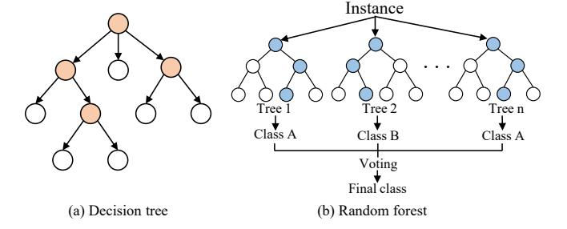

Fig. 13. Decision tree and random forest classifiers.

*Decision tree and random forest:* Decision tree (DT) [\[143\]](#page-37-14) builds a tree model consisting of nodes and edges, as shown in Fig. [13\(](#page-18-1)a). The choice of a child node is based on information entropy, and each branch from the root to a leaf node is a classification rule [\[2\]](#page-34-1). Suppose the *N* training samples for DT are D = {(**x1**, *y*1),...,(**xi**, *yi*),...,(**xN**, *yN* )}, where **xi** is a

TABLE X RESEARCH WORK USING NEURAL NETWORKS

| Year         | Work          | Activities  | Classes | Subjects   | Sensors     | Device   | Location        | Features              | Classifier              | Dataset            | Accuracy            | Imp        | App          |
|--------------|---------------|-------------|---------|------------|-------------|----------|-----------------|-----------------------|-------------------------|--------------------|---------------------|------------|--------------|
| 2015         | [152]         | DAs         | 6       | 30         | A, G        | SP       | Waist           | AFs                   | CNN                     | HAR                | 94.79%              | Off        | DLM          |
| 2016         | [153]         | DAs         | 6, 5    | 30, 3      | A, G        | SP       | Pocket, hand    | AFs                   | CNN                     | SC, MobiAct        | Above 93%           | Off        | DLM          |
| 2018         | [81]          | HW          | V       | 10         | MC          | SW       | Nearby hand     | AFs                   | CNN                     | SC                 | 79.80%              | Off        | HCI          |
| 2019         | [41]          | DAs         | 9, 6    | 10, 9      | A, G        | SP, SW   | Hand, wrist,    |                       | CNN                     | SC, HHAR           | Above 65%           | Off        | DLM          |
| 2017         | [71]          | DAS         | ٥, ٥    | 10, )      | Λ, Ο        | 51, 511  | pocket, waist   | 711 3                 | CIVIT                   | SC, IIIIIK         | 1100VC 0570         | OII        | DLM          |
| 2019         | [134]         | HGs         | 9       | 16         | A, G, MC    | SW       | Wrist           | AFs                   | CNN                     | SC                 | 97.20%              | On         | HCI          |
| 2019         | [101]         | SW          | 4       | 40         | A, G, M, B, |          | Wrist           | AFs                   | CNN                     | SC                 | F1: 97.4%           | Off        | EA           |
| 2017         | [IUI]         | 5 11        | 7       | 70         | L L         | 511      | **1150          | ALS                   | CIVIV                   | 30                 | 11. 57.476          | On         | LA           |
| 2020         | [55]          | HW          | 26      | 5          | M           | SP       | Nearby hand     | AFs                   | CNN                     | SC                 | Above 80%           | Off        | S&A          |
| 2021         | [110]         | SL          | 50      | 20         | DC          | SP       | Nearby body     | AFs                   | CNN                     | SC                 | 91%                 | Off        | HCI          |
| 2022         | [157]         | DAs         | 17, 6   | 30, 30     | A; A, G     | SP       | Pocket, waist   | AFs                   | CNN                     | SHAR, HAR          | Above 60%           | Off        | DLM          |
| 2022         | [158]         | HGs, FGs    | 16      | 20         | A, G        | SW       | Wrist           | AFs                   | CNN                     | SC SC              | 55.3%-87.2%         | On         | HCI          |
| 2022         | [159]         | SM          | 1       | 19         | MC          | SP       | Nearby body     | AFs                   | CNN                     | SC                 | 93.44%              | On         | DLM          |
| 2022         | [160]         | HGs, FGs    | 12      | 10         | MC          | SP       | Nearby hand     | AFs                   | CNN                     | SC                 | 99%                 | Off        | HCI          |
| 2023         | [34]          | TR          | 7       | 10         | A, MC       | SP       | V               | AFs                   | CNN                     | SC                 | 97.44%              | On         | DLM          |
| 2021         | [139]         | Sleep       | 3       | 31         | A, HR       | SW       | Wrist           | TFs, AFs              | ResDeepCNN              | AWSS               | 78.20%              | Off        | DLM          |
| 2022         | [98]          | DAs         | 26      | 20         | A, G, O, MC |          | Wrist           | AFs                   | CNN, VGG                | SC                 | 92.20%              | Off        | DLM          |
| 2022         | [154]         | HGs, FGs    | 6       | 10         | MC          | SP       | Nearby hand     | TFs, AFs              | ResNet18                | SC                 | 96%                 | Off        | HCI          |
| 2022         | [155]         | DAs         | 8       | 15         | A, G, M,    |          | On the body     | AFs                   | AIP-Net                 | RealWorld          | Added by 20%        | Off        | DLM          |
| 2022         | [133]         | DAS         | o       | 13         | GPS, P, MC  | 51, 5 11 | On the body     | Als                   | An-Net                  | Real World         | Added by 20%        | On         | DLWI         |
| 2018         | [128]         | FGs         | 6       | 155        | A, G        | SW       | Wrist           | AFs                   | RNN                     | SC                 | Above 90%           | On         | S&A          |
| 2018         | [74]          | FGs         | V       | 362        | A, G        | SW       | Wrist           | AFs                   | RNN                     | SC                 | 28%-68%             | Off        | S&A          |
| 2019         | [44]          | EXs, DAs    | 10, 7   | 7          | A, G        | SW, SG   | Wrist, head     | AFs                   | RNN                     | SC                 | 92.7%, 91.4%        | On         | EA,          |
|              | L · · · 3     |             | , .     |            | ,           | ,        | ,               |                       |                         |                    |                     |            | DLM          |
| 2019         | [109]         | SL          | 26, 104 | 5, 16      | A, G        | SW       | Wrist           | TFs, FFs, AFs         | LSTM                    | SC                 | Above 99%           | Off        | HCI          |
| 2020         | [63]          | HW          | 26      | 24         | MC          | SP       | Nearby hand     | TFs, AFs              | LSTM                    | SC                 | 64.96%-94.86%       | Off        | HCI          |
| 2021         | [66]          | FGs         | 10, 26  | 15         | A, G        | SW       | Wrist           | AFs                   | GRU                     | SC                 | 90%, 91%            | On         | HCI          |
| 2022         | [161]         | DAs         | 6       | 29         | A           | SP       | Pocket          | AFs                   | Transformer             | WISDM              | 98.89%              | Off        | DLM          |
| 2022         | [161]         | DAs         | 6, 8    | 3-30       | A, G, etc   | SP, SW   | V               | AFs                   | Transformer             | HAR, SHL,          |                     | Off        | DLM          |
| 2022         | [102]         | DAS         | 0, 0    | 3-30       | A, O, etc   | 31, 3 W  | •               | AIS                   | Transformer             | MotionSense,       | 92.070-90.7270      | On         | DLW          |
|              |               |             |         |            |             |          |                 |                       |                         | RealWorld, HHAR    |                     |            |              |
|              |               |             |         |            |             |          |                 |                       |                         | Real World, TITTAK |                     |            |              |
| 2018         | [35]          | DAs         | 12      | 30         | A, G        | SP       | Waist           | TFs, FFs, PFs, AFs | DBN                     | HAPT               | 95.85%              | Off        | DLM          |
| 2020         | [71]          | LMs         | 45      | 5          | MC          | SP       | Hand            | AFs                   | DNN                     | SC                 | WER: 8.33%          | Off        | HCI          |
| 2020         | [137]         | DAs         | 8       | 15         | A, G, M, L  | SP, SW   | V               | AFs                   | DNN                     | RealWorld          | 86.11%              | Off        | DLM          |
| 2022         | [138]         | DAs         | 8       | 13         | A, G, M,    | SP, SW   | v               | AFs                   | DNN                     | RealWorld          | Above 75%           | Off        | DLM          |
| 2022         | [150]         | Ditio       | Ü       | 10         | GPS, L, MC  | 51, 511  | •               | 711 5                 | Ditt                    | Tear World         | 1100.0 7570         | On         | DEM          |
| 2022         | [163]         | DAs, FD     | V       | V          | A           | SP       | V               | AFs                   | SAN                     | SHO, SHL, SC       | Above 83%           | Off        | DLM          |
| 2023         | [164]         | DAs         | 6, 17   | 30, 30     | A, G; A     | SP       | Waist           | AFs                   | BNN                     | HAR, SHAR          | 98.2%, 93.6%        | Off        | DLM          |
| 2023         | [165]         | HW          | V       | 10         | A           | SP       | Near the hand   | AFs                   | TSNN                    | SC                 |                     | Off        | HCI          |
|              |               |             |         |            |             |          |                 |                       |                         |                    | 79%                 |            |              |
| 2023         | [166]         | LO          | 6, 8, 5 | 10, 3, 13  | A, G, M;    | SP       | V               | AFs                   | DNN                     | SC, SHL, TMD       | 59.41%-94.21%       | Off        | DLM          |
|              |               |             |         |            | MS; A, G,   |          |                 |                       |                         |                    |                     |            |              |
|              |               |             |         |            | M, O        |          |                 |                       |                         |                    |                     |            |              |
| 2021         | [60]          | LMs         | 20, 70  | 12         | MC          | SP       | Nearby mouth    | AFs                   | CNN, E-D                | SC                 | Acc: 91.2%;         | Off        | HCI          |
|              |               |             |         |            |             |          | •               |                       |                         |                    | WER: 7.1%           |            |              |
| 2021         | [64]          | HW          | 250     | 12         | A, G, GR    | SW       | Wrist           | AFs                   | CNN, E-D                | SC                 | CER: 9.3%,          | Off        | HCI          |
| 2022         | [114]         | TW/c        | V       | 1.1        | ۸           | sw       | Weigt           | A Ec                  | LOS Not E.D.            | SC.                | 3.8% Above 50%   | Off        | Other        |
| 2022 2022 | [116] [43] | IWs Gait | V 6  | 11 1405 | A A, G   | SW SP | Wrist Pocket | AFs TFs, AFs       | LOS-Net, E-D RiskNet | SC SC           | Above 50% 80.10% | Off Off | Other DLM |
|              |               | FGs         |         | 7          | ,           | SP SP | Hand            | FFs, AFs              | CNN, E-D                | SC                 | 83.8%-92.2%         | Off        | S&A          |
| 2023         | [167]         | rus         | 26      | 1          | MC          | or       | пани            | rrs, Ars              | CNN, E-D                | 30                 | 63.6%-92.2%         | OII        | 3&A          |
| 2019         | [67]          | FGs         | V       | 20         | A, G, MC    | SW       | Nearby hand     | AFs                   | CNN, RNN                | SC                 | 27%-41.8%           | Off        | S&A          |
| 2020         | [76]          | HGs         | 15      | 8          | MC          | SP       | Nearby hand     | AFs                   | CNN, LSTM               | SC                 | 98.40%              | Off        | HCI          |
| 2021         | [168]         | DAs         | 5       | 121        | A, G, M     | SP       | V               | AFs                   | DNN, CNN                | SC                 | Above 80%           | Off        | DLM          |
| 2021         | [169]         | DAs         | 11, 6   | 61, 30     | A, G        | SP       | Pocket          | AFs                   | CNN,                    | MobiAct, HAR       | F1: 81.13%,         | Off        | DLM          |
|              |               |             |         |            |             |          |                 |                       | Transformer             |                    | 91.14%              |            |              |
| 2022         | [170]         | DAs         | 7       | 5          | A, G, GR,   | SP, SW,  | Pocket, wrist,  | AFs                   | DNN,                    | CogAge             | 73.36%              | Off        | DLM          |
|              |               |             |         |            | LA          | SG       | head            |                       | Transformer             |                    |                     |            |              |
| 2022         | [171]         | DAs         | 8       | 19         | A, HR       | SW       | Wrist           | AFs                   | CNN,                    | harAGE             | Recall: 75.9%       | Off        | DLM          |
|              |               |             |         |            | •           |          |                 |                       | Transformer             |                    |                     |            |              |
| 2022         | [172]         | DAs         | 6-12    | 1-61       | A, G, etc   | SP       | Waist, pocket   | AFs                   | CNN,                    | HAPT, SHL2018,     | F1: 78.55%-         | Off        | DLM          |
|              |               |             |         |            | •           |          |                 |                       | Transformer             | MotionSense,       | 95.66%              |            |              |
|              |               |             |         |            |             |          |                 |                       |                         | HHAR, MobiAct      |                     |            |              |
|              |               |             |         |            |             |          |                 |                       |                         |                    |                     |            |              |

feature vector, *yi* ∈ [1, *C* ] and it is the label of **xi**. In the training stage, we use Eq. [\(12\)](#page-19-1) and Eq. [\(13\)](#page-19-1) to calculate the information gain *G*(*D*, *a*) of the *a*th feature. Here, *pk* is the proportion of samples in class *k*, *Dv* means the split subset of training samples whose value is *v* on the *a*th feature.

$$E(D) = -\sum_{k=1}^{k=C} p_k \cdot \log_2(p_k)$$
 (12)

| Year | Work  | Activities | Classes | Subjects | Sensors                  | Device | Location                  | Features      | Classifier                                                         | Dataset       | Accuracy                           | Imp        | App |
|------|-------|------------|---------|----------|--------------------------|--------|---------------------------|---------------|--------------------------------------------------------------------|---------------|------------------------------------|------------|-----|
| 2017 | [94]  | BR         | 3       | 3        | MC                       | SP     | Nearby mouth              | GFCCS         | GMM                                                                | SC            | Above 94%                          | Off        | S&A |
| 2018 | [106] | DAs        | 8, 4    | 70       | A, G                     | SW     | Wrist                     | 6 TFs, 7 TFs  | CRF                                                                | SC            | Above 83%                          | On         | DLM |
| 2022 | [65]  | HGs        | 1       | 112      | A, G                     | SP     | Hand                      | TFs, FFs      | LR                                                                 | SC            | 92.57%                             | Off        | S&A |
| 2013 | [39]  | TR         | 6       | 16       | A                        | SP     | Pocket, bag               | 78 TFs, FFs   | DT, AdaBoost                                                       | SC            | Above 80%                          | On         | DLM |
| 2013 | [113] | DR         | V       | 12       | A, G, CM, C, GPS      | SP     | Nearby body               | SFs, TFs      | AdaBoost, SVM, DT, BB                                              | SC            | R: 83%, R: 75%                     | On         | DLM |
| 2015 | [87]  | RE         | 4       | 16       | MC                       | SP     | Desk, pocket, backpack | TFs, FFs      | Coarse classifier, SVM                                             | SC            | Above 82%                          | On         | DLM |
| 2015 | [40]  | DAs        | 6       | 30       | A                        | SP     | Waist                     | TFs           | KNN, DT, JRip, NB                                                  | HAR           | 95%                                | Off        | DLM |
| 2016 | [127] | FGs        | 5       | 10       | A, G, GR                 | SW     | Wrist                     | 357 TFs, FFs  | SVM, NB, LR, KNN                                                   | SC            | F1: 87%                            | Off        | HCI |
| 2017 | [115] | AGs, HGs   | 24      | 12       | A                        | SP, SW | Hand, wrist               | 63 TFs, FFs   | SVM, DT, RF, MLP                                                   | SC            | Above 80%                          | On         | HCI |
| 2018 | [108] | DAs        | V       | 15       | A, G, MC, L, O        | SW     | Wrist                     | TFs, FFs      | KNN, C4.5 DT, HMM                                                  | SC            | Above 80%                          | On         | DLM |
| 2018 | [173] | EXs        | 15      | 22       | A, G, GR                 | SW     | Wrist                     | TFs, FFs      | CRF, HMM, DT, RF, SVM                                              | SC            | Above 90%                          | On         | EA  |
| 2018 | [174] | FGs        | V       | 12       | LA                       | SW     | Wrist                     | 155 TFs, FFs  | SLR, RF, KNN, SVM, BDT                                          | SC            | 63%-94%                            | Off        | S&A |
| 2020 | [86]  | FGs        | 30      | 41       | A, G, T                  | SP     | Hand                      | TFs, SFs      | OCSVM, MT-KNN                                                      | SC            | EER: 4.9%                          | On         | S&A |
| 2013 | [105] | DAs        | 8, 4    | 22       | A, MC, GPS            | SP     | Chest, pocket, wrist   | TFs, FFs      | SVM, NN                                                            | SC            | F1: 89.5%- 93.8%                | Off        | DLM |
| 2016 | [38]  | DAs        | 11, 7   | 10, 10   | A, G                     | SW, SP | Wrist                     | AFs           | DNN, SVM                                                           | SC, Shoaib | 98.90%                             | Off        | DLM |
| 2017 | [80]  | HW         | 62      | 10       | A, G                     | SW     | Wrist                     | 46 TFs, FFs   | DT, RF, SVM, MLP, NB, NN, KNN                                   | SC            | 99.90%                             | On         | HCI |
| 2017 | [175] | DR         | 6       | 20       | A, O                     | SP     | Nearby body               | TFs           | SVM, NN                                                            | SC            | 95.36%, 96.88%                  | On         | DLM |
| 2018 | [83]  | EMs        | 3       | 70       | C                        | SP     | Head                      | SFs, AFs      | SVM, CNN                                                           | SC            | 81.4%-100%                         | Off        | HCI |
| 2019 | [99]  | AGs, HGs   | 6       | 12       | A, G, GR, P, T, C, MC | SP     | Nearby mouth              | TFs, AFs      | SVM, DenseNet, C4.5 DT                                          | SC            | Above 93%                          | On         | HCI |
| 2019 | [48]  | AW         | 26      | 14       | A, G, M                  | SW     | Wrist                     | SFs, AFs      | RF, CNN                                                            | SC            | 91.6%, 94.3%                       | Off, On | HCI |
| 2019 | [47]  | ТВ         | 13, 15  | 10       | A, G, M                  | SW     | Wrist                     | TFs, AFs      | KNN, SVM, DT, AT- LSTM                                          | SC            | Above 90%                          | Off        | DLM |
| 2022 | [141] | FGs        | V       | 161      | T                        | SP     | Hand                      | TFs, SFs, AFs | ResNet-50, BiLSTM, KNN                                          | TFST          | EER: below 2%                      | Off        | S&A |
| 2022 | [133] | DAs        | 23      | 15, 5    | A, G, MC                 | SW     | Wrist                     | TFs, FFs, AFs | RF, NB, AdaBoost, Dep- pConvLSTM, CNN, At- tend&Discriminate | SC            | F1: 89.7%- 94.3%; 30%- 55.8% | Off        | DLM |

BR: Breathing, DA: Daily activity, TR: Transportation, DR: Driving, RE: Respiratory, AG: Arm gesture, HG: Hand gesture, FG: Finger gesture, EX: Exercise, HW: Handwriting, EM: Eye movement, AW: Air writing, TB: Tooth brushing;

CRF: Conditional random field, GMM: Gaussian Mixtures Model, BB: Binary Bayesian, SLR: Simple linear regression, BDT: Bagged decision trees, MT: Multi-threshold; TFST: Touching with fingers straight and together, SC: Self-collected, Imp: Implementation, On: Online, Off: Offline, App: Application; EA: Exercise assessment, DLM: Daily life monitoring, HCI: Human-computer interaction, S&A: Security and authentication

$$G(D, a) = E(D) - \sum_{v} \frac{|D_v|}{|D|} E(D_v)$$
 (13)

After that, we select the feature with highest information gain, and create a decision node of the tree. By recursively creating the nodes until the samples in a node belong to the same class, we get the decision tree through training. In the testing stage, the test sample  $x_t$  starts from the root node, follows the branch based on the decision on each node, and reaches the leaf node. The class of the leaf node is the classification result of xt. The decision tree has been used for tabletennis stroke recognition [50], sleep quality monitoring [107] and daily activity recognition [72]. In regard to random forest [144], it consists of multiple decision trees and often adopts a majority voting mechanism for activity classification, as shown in Fig. 13(b). When comparing with a single-tree classifier, random forest usually can improve the classification performance [26]. The random forest classifier was welcome in much research work, especially for fine-grained activity and multi-level activity recognition, e.g., in-air hand gesture recognition [119], finger touch identification [79], tongue-jaw movement recognition [61], personal cough detection [89], sleep apnea detection [93], and daily activity recognition [97], [98], [103].

KNN: The KNN classifier infers the class of a sample by measuring the similarities between the sample and its K nearest neighbors. Suppose the N training samples for KNN are  $\mathcal{D} = \{(\mathbf{x_1}, y_1), \dots, (\mathbf{x_i}, y_i), \dots, (\mathbf{x_N}, y_N)\}$ , where  $\mathbf{x_i}$  is a feature vector with m features  $\mathbf{x_i} = (x_{i_1}, \dots, x_{i_j}, \dots, x_{x_m}), j \in [1, m]$ , and  $y_i$  is the label of  $\mathbf{x_i}$ . For the test sample  $\mathbf{x_t}$ , it calculates the distance, e.g., the Euclidean distance shown in Eq. (14), between each training sample. Then, the test sample selects K nearest neighbors with K smallest distances. After that, the class occurring most frequently in the K nearest neighbors is selected as the classification result of test sample  $\mathbf{x_t}$ .

$$d_i = \sqrt{\left(x_{i_j} - x_{t_j}\right)^2} \tag{14}$$

As shown in Fig. 14, the test sample (black node) infers its class as 'Class 3' based on the five nearest neighbors, where 'Class 3' occurs most frequently. KNN classifier was adopted to recognize daily activities [40] and finger gestures [127], and

V: Variable; A: Accelerometer, G: Gyroscope, M: Magnetometer, C: Camera, O: Orientation sensor, P: Proximity sensor, L: Light sensor, T: Touch sensor, MC: Microphone, CM: Compass, LA: Linear accelerometer, GR: Gravity; SP: Smartphone, SW: Smartwatch;

TF: Time-domain feature, FF: Frequency-domain feature; SF: Space-domain features, AF: Automated feature, GFCC: Gammatone Frequency Cepstral Coefficient;

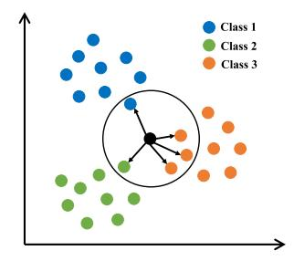

Fig. 14. KNN classifier.

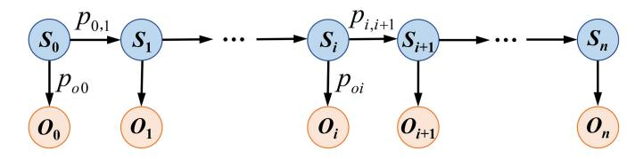

Fig. 15. HMM classifier.

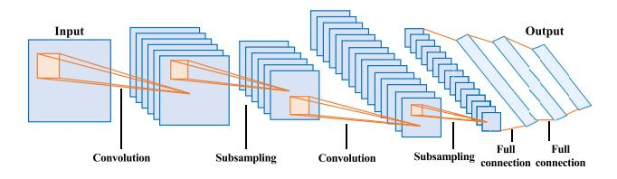

(a) Convolutional Neural Network

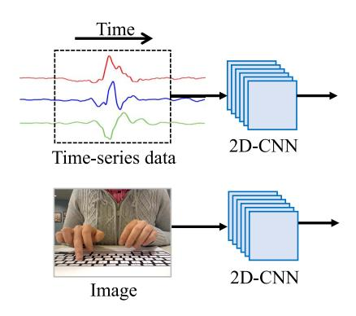

(b) Input to Convolutional Neural Network

Fig. 16. Convolutional neural network and the input.

can be used for daily life monitoring [108], user authentication [57] and human-computer interactions [145].

HMM: The HMM [146] assumes that the observed sequence is governed by a hidden state sequence. As shown in Fig. 15, ' $O_i$ ' represents the observed sensor data (or feature), ' $S_i$ ' represents the hidden state in an activity, and a HMM model is used to calculate the probability that the hidden states generate the observations. The unknown output probability  $p_{o_i}$  and state transition probability  $p_{i,i+1}$  can be obtained when training a HMM classifier. For activity classification, we need to train a HMM classifier for each activity class [52]. Then, when given the observed data, the activity will be classified into that class, whose HMM classifier achieves the highest probability of generating the observed data. The HMM classifiers have been used for recognizing tooth brushing activities [52], gestures in table tennis early [49], and so on.

Neural network: Neural networks are loosely modeled on human brain, propagating activation signals and encoding knowledge in the network links [2]. Different from previous classifiers, neural networks can automatically extract features for classification, without the need of inputting feature vectors. Recently, the deep neural networks [35], [38] have contributed to a lot of HAR research work. As one of the most popular neural network, Convolutional Neural Network (CNN) [151] mainly captures the spatial information from input data. As shown in Fig. 16, the CNN utilizes convolutions and subsampling to extract features, which are flatten to a feature vector and input to a classifier (e.g., softmax) for activity classification. Suppose the N training samples for CNN are  $\mathcal{D} = \{(\mathbf{x_1}, y_1), \dots, (\mathbf{x_i}, y_i), \dots, (\mathbf{x_N}, y_N)\}$ , where  $\mathbf{x_i} \in \mathcal{R}^{h \cdot w \cdot c}$ , and  $y_i$  is the label of  $\mathbf{x_i}$ . If the input data belongs to time-series data, then h means the number of dimensions (e.g., 6-axis inertial sensor has 6 dimensions), w means the length of activity segment (i.e., number of data points), c = 1. If the input data belongs to an image, then h, w and c mean the height, weight and channels of  $x_i$ . Usually, the sample  $x_i$  is sent to convolutional layers to get feature maps, as shown in Eq. (15), where  $A^{(l)}$  means the feature map after the *l*th convolutional layer and  $A^{(0)} = \mathbf{x_i}$ ,  $W^{(l)}$  is a convolution kernel,  $b^{(l)}$  is the bias, \* is the convolutional operation,  $f(\cdot)$  is the activation function. Besides, the pooling layers are adopted to reduce the size of feature map, as shown in Eq. (16), where  $pool(\cdot)$  can be max or average pooling. After that, the feature map is sent to the fullyconnected layer to get the feature vector  $Z^{(l)}$ , as shown in Eq. (17). Finally, the feature vector  $Z^{(l)}$  is applied with the activation function to get the predicted probability vector  $A^{(L)} = f(Z^{(l)})$ , as shown in Eq. (18). In the training stage, the prediction vector is compared with true labels with loss functions  $L = loss(A^{(L)}, y_i)$ , and the backpropagation will be adopted to update the model parameters. In the testing stage, the prediction vector will be used to infer the class  $\hat{y}$  with highest probability in  $A^{(L)}$ .

$$A^{(l)} = f\left(W^{(l)} * A^{(l-1)} + b^{(l)}\right)$$
 (15)

$$P^{(l)} = \text{pool}(A^{(l)})$$

$$Z^{(l)} = W^{(l)} \cdot P^{(l)} + b^{(l)}$$
(16)
(17)

$$Z^{(l)} = W^{(l)} \cdot P^{(l)} + b^{(l)} \tag{17}$$

$$A^{(L)} = f\left(Z^{(l)}\right) \tag{18}$$

The CNN [110] has been adopted in much research work, to recognize daily activities [41], [152], [153], swimming styles [101], sign languages [110], sound-emitting gestures [134] or handwriting [55], [64], [81]. In addition to the typical CNN, the variants of CNN like ResNet, VGG or selfdesigned network based on CNN were also adopted for HAR. For example, ResNet18 [154] was used to recognize hand and finger gestures for human-computer interactions, VGG [98] and self-designed networks [155] were adopted to recognize daily activities. Here, ResNet is a specific type of CNN by introducing residual connections to address the degradation problem, VGG utilizes multiple stacked convolutional layers with small receptive fields to get a deeper network, while selfdesigned network is proposed for the specific recognition task.

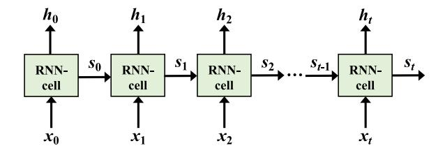

(a) Recurrent Neural Network

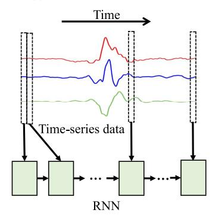

(b) Input to Recurrent Neural Network

Fig. 17. Recurrent neural network and the input.

In addition to CNN, Recurrent Neural Network (RNN) [156] was also popular in HAR and it mainly captures the sequence information from input data. Thus RNN was usually adopted to process time-series data. As shown in Fig. 17, it consists of RNN cells over time. In RNN, the input is split into T steps, where T means the length of activity segment. At the tth step, the input is  $\mathbf{x_t} = (x_{t_1}, x_{t_2}, \dots, x_{t_j}, \dots, x_{t_{m-1}}, x_{t_m})^T$ , where  $x_{t_i}$  means the sensor data in the jth dimension and m means the number of dimensions. Take the 6-axis inertial sensor data as an example,  $\mathbf{x_t} = (a_x(t), a_y(t), a_z(t), g_x(t), g_y(t), g_z(t))^T$ , where  $a_x(t)$ ,  $a_y(t)$ ,  $a_z(t)$ ,  $g_x(t)$ ,  $g_y(t)$ ,  $g_z(t)$  means the acceleration and angular velocity along x-axis, y-axis, z-axis at the tth time, respectively. For the tth RNN cell, it receives both the input vector  $\mathbf{x}_t$  at the tth step and the output vector from the previous cell  $s_{t-1}$ , and then outputs the hidden state  $h_t$ , as shown in Eq. (19), where U and W are trainable weight matrices, b is the bias vector,  $\sigma$  is an activation function,  $\mathbf{h}_{t-1} = \mathbf{s}_{t-1}$ . When t = T, we can get the predicted result  $\hat{y}_t$ at the tth/last step, as shown in Eq. (20), where V is a weight matrix, c is a bias vector, and softmax is a classifier. In the training stage, we will calculate the loss  $L(\hat{y}_t, y_t)$  between predicted  $\hat{y}_t$  and true label  $y_t$ , and adopt backpropagation to update the model parameters, where  $L(\cdot)$  can be the crossentropy loss function. In the testing stage, we infer the class of test sample as the class with highest value in predicted vector  $\hat{y}_t$ .

$$\mathbf{h_i} = \sigma(U\mathbf{x_i} + W\mathbf{h_{i-1}} + b) \tag{19}$$

$$\hat{y}_t = \operatorname{softmax}(V\mathbf{h_t} + c) \tag{20}$$

The RNN has been used for tracking 3D arm skeletons and recognizing arm gestures [44], inferring passwords on the smartwatch [74], extracting subtle finger motion signatures as behavioral biometrics for user authentication [128], and so on. However, as the number of cells increases, the final

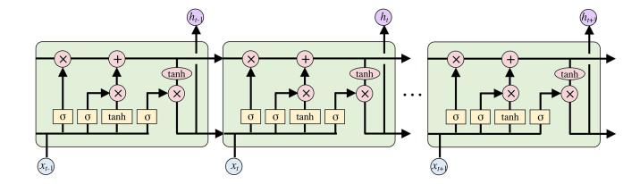

Fig. 18. Long Short-Term Memory Network.

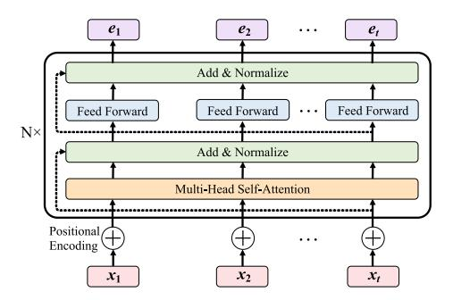

(a) Transformer Encoder

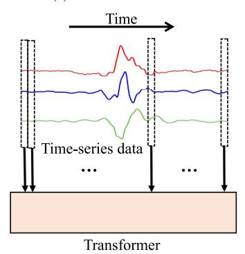

(b) Input to Transformer Encoder

Fig. 19. Transformer encoder and the input.

RNN cell may lose the information of initial cells, thus Long Short-Term Memory (LSTM) based model [47], [109] or the variant of LSTM (e.g., Inception-LSTM [63]) was proposed to mitigate the problem. As shown in Fig. 18, a LSTM unit introduces the input gate, output gate, forget gate, cell state to deal with the vanishing gradient problem in RNN and track long-term dependencies for activity recognition. Nevertheless, considering the complexity of LSTM, Gated Recurrent Unit (GRU) [66] which has fewer gates (reset and update gates) than LSTM was proposed.

Different from CNN and RNN, Transformer was recently introduced for HAR. Transformer introduces a self-attention mechanism to capture global dependencies in the input sequence, and it is possible to get more efficient sequence information from time-series data. As shown in Fig. 19, in Transformer, the positional encoding incorporates positional information into input sequence, the self-attention calculates attention weights and assigns importance to input sequence in different positions, the multi-head attention adopts multiple parallel self-attention heads to capture multiple representations, while the feed-forward network transforms the self-attention outputs. Among them, self-attention is the

essential component of Transformer, and it can be described with Eq. (21), where X is the input sequence,  $W_q$ ,  $W_k$ ,  $W_v$  are weight matrices,  $d_k$  is the dimension.

$$Q = XW_q, K = XW_k, V = XW_v$$
 Attention $(Q, K, V) = \operatorname{softmax}\left(\frac{QK^T}{\sqrt{d_k}}\right)V$  (21)

In Transformer, the input  $X = (\mathbf{x_1}, \dots \mathbf{x_t}, \dots \mathbf{x_T})$  is split into T parts, where T means the length of activity segment. At the th part, the input is  $\mathbf{x_t} = (x_{t_1}, x_{t_2}, \dots, x_{t_j}, \dots, x_{t_{m-1}}, x_{t_m})^T$ , where  $x_{t_i}$  means the sensor data in the jth dimension and m means the number of dimensions. Specifically, as shown in Fig. 19(a), when given the input vectors  $\mathbf{x_t}$ ,  $t \in [1, T]$ , Transformer which contains the self-attention mechanism takes into account every vector of the entire input to generate the embedding  $e_t$  for each vector  $x_t$ . With the embeddings  $e_t, t \in [1, T]$ , a fully-connected layer and a softmax function are adopted for activity classification. It worth noting that Transformer is often used with an encoder-decoder architecture to generate output sequence. However, in HAR work, Transformer can be used as an encoder and connected with some classifier for classification, as described above. Recently, Raza et al. [161] proposed a lightweight transformer for daily activity recognition. EK et al. [162] presented Human Activity Recognition Transformer (HART) specifically adapted to the domain of inertial sensors for daily activity recognition.

When considering the specificity of a recognition task, other networks were also proposed. For example, a deep learning network EchoNet modified by the popular MobileNet V2 was proposed for lip reading [71], a deep neural network with attention mechanisms was proposed to fuse multi-sensor data for daily activity recognition [137], a hierarchical CNN and a multi-task encoder-decoder network were proposed for word-level and sentence-level lip reading [60], a Lightweight Ordered-work Segmentation Network (LOS-Net) was proposed for recognition of ordered works [116], a siamese key activity attention network (SAN) was proposed to detect the exact regions of key activities [163]. Besides, instead of only using one neural network, the combination of CNN and RNN was proposed to snoopy keystrokes occurring on a physical keyboard [67], the combination of CNN and LSTM was adopted for gesture recognition [76], the combination of CNN and other encoder-decoder modules was proposed for lip reading [60], handwritten character recognition [64], industrial work recognition [116], gait recognition [43] and keystroke inference [167], the combination of CNN and Transformer was adopted for daily activity recognition [170], [171], [172]. Moreover, after building neural works, carefully designing a suitable loss [157] and enlarging training dataset by augmentation [76] can also be adopted to further improve the HAR performance of neural works.

Others: In addition to the above classifiers, other classifiers like logistic regression (LR) [65], naive Bayes (NB) [127], multilayer perceptron (MLP) [115], [141] were also used in HAR. In the specific recognition tasks, some customized classifiers were proposed, e.g., a density-based one-class classifier was used for secure text input [57], a two-level classification

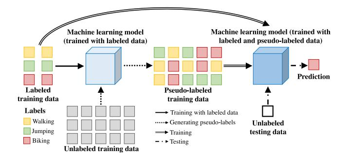

Fig. 20. Semi-supervised learning based HAR.

approach based on the conditional random field was used for drinking activity recognition [106]. Besides, instead of using one classifier, some research work adopted several classifiers [59], [80], [99] for activity recognition. For example, combining a convolutional neural network and a SVM classifier [83], using a random forest classifier and a CNN for online and offline recognition respectively [48], testing the performance with different classifiers [40], [115], studying both baseline machine learning models and deep learning models for daily activity recognition [133]. In addition to these combinations, other combinations were proposed for the specific recognition tasks, e.g., multi-level classifiers for sound-related respiratory symptom detection [87], three-stage hierarchical classifiers for transportation mode detection [39].

2) Semi-Supervised Learning: In supervised learning, each training data has its label (i.e., the type of activity). However, due to the large cost of data annotation, labeling all the data is rather difficult. Therefore, semi-supervised learning was adopted to combine a small amount of labeled data and a large amount of unlabeled data for HAR [176], [177]. As shown in Fig. 20, semi-supervised learning based HAR usually first uses the labeled data to train a machine learning model, then utilizes the trained model to generate the pseudo labels for unlabeled data. After that, adopting both the labeled data and pseudo-labeled data to train a new machine learning model, which will be used to recognize the class of test data. In semi-supervised learning, autoencoder [178], [179] and convolutional neural networks [179], [180] were often adopted to learn the feature representation. For example, Balabka et al. [178] proposed a deep semi-supervised learning method using adversarial autoencoder and employing convolutional networks for feature extraction, and combined unlabeled data and a small amount of labeled data for training, to recognize locomotion and transportation activities. In addition, to fully utilize unlabeled data, self-supervised training [181], [182], [183] which extracts features from unlabeled data was also adopted. For example, adopting self-supervised training to extract features from unlabeled data, while using supervised training with labeled data to train the classifier, to recognize daily activities [181].

Because semi-supervised learning methods can appropriately utilize unlabeled data for HAR, they were often adopted for cross-domain activity recognition, where the labels of training data in new domains are unavailable. For example, using unsupervised domain adaptation (UDA) algorithms based on

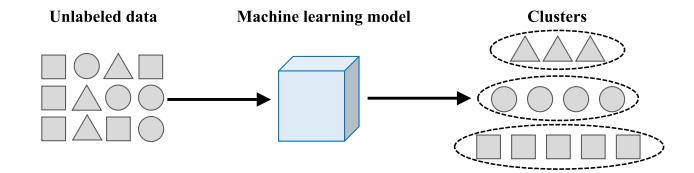

Fig. 21. Unsupervised learning based HAR.

feature matching and confusion maximization, to recognize activities which are collected with sensors worn in different ways [\[36\]](#page-34-35); using an unsupervised online domain adaptation algorithm by normalizing the input, to recognize activities from new user [\[184\]](#page-38-8); proposing an Adaptive Spatial-Temporal Transfer Learning (ASTTL) approach by selecting similar source domains and transferring knowledge, to recognize activities in a different dataset [\[185\]](#page-38-9).

*3) Unsupervised Learning:* In unsupervised learning, there is only unlabeled data while no labeled data. Therefore, clustering [\[186\]](#page-38-10), [\[187\]](#page-38-11) was often adopted to group the data with shared attributes (e.g., activities in the same class), where the actual class of each cluster is unknown, as shown in Fig. [21.](#page-24-0) To get the clusters, Lu et al. [\[188\]](#page-38-12) utilized the density for clustering, Bai et al. [\[189\]](#page-38-13) proposed a deep learning variational autoencoder model Motion2Vector, which learns the representation of activities with unlabeled sensor data and groups the activities based on Euclidean distance. To achieve unsupervised HAR, Ma et al. [\[190\]](#page-38-14) firstly applied a CNN-BiLSTM autoencoder to form a compressed latent feature representation, then applied a K-means clustering algorithm to allocate pseudo labels for instances and trained a deep neural network (DNN) with pseudo labels for activity recognition. If we want to map the pseudo label into actual class, more information is often needed. For example, by using the temporal structure of period motifs and action motifs as well as utilizing an existing process instruction document for operation recognition, Xia et al. [\[191\]](#page-38-15) proposed a robust unsupervised factory activity recognition method.

#### *B. Knowledge-Driven Approaches*

Different from data driven approaches depending on training data, knowledge driven approaches utilize domain knowledge, i.e., analyzing the mechanism of human activities, to classify activities without training. Usually, the knowledge driven approaches utilize template/pattern matching, probability analysis and geometric properties for HAR, as described below.

*Template/Pattern matching:* The template/pattern matching based recognition approaches compare the processed data with templates or specific patterns for activity classification. If the processed data has the highest similarity to the template or pattern of an activity, it will be classified into that type of activity. Sometimes, there may be more than one template of an activity, then the voting mechanism [\[85\]](#page-36-0) can be adopted. In regard to the template, it can be composed of sensor data [\[91\]](#page-36-6), amplitude spectrum density features [\[68\]](#page-35-28), metaactivities [\[129\]](#page-37-0), multipath effect features [\[85\]](#page-36-0), etc. The patterns can be moving patterns of gazes [\[78\]](#page-35-38), a sinusoidal motion pattern of sensor data [\[132\]](#page-37-3), etc. To match with the templates

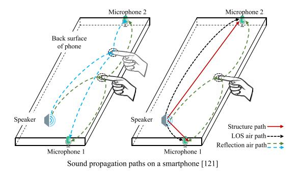

Fig. 22. Geometric property based recognition approach.

or patterns, the Dynamic Time Warping (DTW) [\[91\]](#page-36-6) was used to measure the similarity between two temporal data segments which can vary in speed and length, while the contour-based template matching [\[100\]](#page-36-15) method was proposed to find the target region in an image. In regard to the similarity, it can be represented with Euclidean distance [\[68\]](#page-35-28), [\[88\]](#page-36-3), edit distance [\[129\]](#page-37-0), etc. Usually, the smaller distance means higher similarity. The template/pattern matching based approaches have been used in exercise activity recognition [\[129\]](#page-37-0), [\[132\]](#page-37-3), hand/foot gesture recognition [\[100\]](#page-36-15), typing activity recognition [\[68\]](#page-35-28), gaze gesture recognition [\[78\]](#page-35-38), vital sign sensing [\[88\]](#page-36-3), [\[91\]](#page-36-6), and user authentication [\[85\]](#page-36-0).

*Probability analysis:* The probability analysis based recognition approaches calculate the probability of classifying the processed data into an activity class, and then select the activity class with the highest probability. The probability is usually calculated based on the constraints (e.g., the stroke composition in a letter [\[69\]](#page-35-29), the character composition in a word [\[75\]](#page-35-35)) in activities. For example, estimating the posterior probability to infer the typed letters based on observed unistroke gestures [\[69\]](#page-35-29), using a Bayesian inference model to infer words from possible typed letters based on the language model [\[75\]](#page-35-35), combining the pronunciation rules and contextbased error correction to recognize lip-reading sentences with the maximum probability [\[82\]](#page-35-42).

*Geometric property:* The geometric property based recognition approaches utilize the specific geometric property, e.g., the topological structure, the transmission path, to recognize activities. For example, considering the fixed structure of a steering wheel, when the hands griped the steering wheel, the hand movement was mapped with the steering wheel rotation to track steering wheel usage and turning angles [\[51\]](#page-35-11). In regard to the changes of signal's transmission path, they can be used to infer human activities causing the changes, as the reflection path changes caused by taps in Fig. [22,](#page-24-1) where the structureborne sounds and air-borne sounds in propagation paths were proposed to recognize finger taps and movements on the back of mobile devices [\[121\]](#page-36-36).

*Others:* In addition to the previous approaches, other knowledge-driven approaches utilizing the specific characteristics of recognition tasks were also proposed. These kinds of approaches were often tightly coupled with the problem. For example, detecting the variation of sensor data, e.g., the peaks [\[33\]](#page-34-32), [\[90\]](#page-36-5), sudden spikes [\[90\]](#page-36-5), waveform changes [\[46\]](#page-35-6), local extreme value [\[73\]](#page-35-33), to recognize transportation modes [\[33\]](#page-34-32), sleep apnea [\[90\]](#page-36-5), vehicle steering [\[46\]](#page-35-6), eye blink [\[73\]](#page-35-33), etc. When processing images, the finger's movement was mapped with the fingertip's coordinate and a key's occluded area for typing activity recognition [\[77\]](#page-35-37). In addition, instead of using one knowledge driven approach, it was also possible to combine multiple knowledge driven approaches in different steps for activity recognition. For example, using time-difference of arrival measurements to cluster keystrokes, and then calculating the correlation between acoustic features to separate keystrokes in a cluster for typing activity recognition [\[123\]](#page-36-38). When splitting the recognition task into subtasks, each subtask can adopt an approach [\[117\]](#page-36-32), e.g., calculating the correlation between written stroke and ideal stroke for stroke recognition, introducing a grammar tree to recognize strokes as characters, using edit distance to correct the recognized words, etc. When combining multi-modal sensor data, different recognition approaches were also used [\[135\]](#page-37-6), e.g., using image processing to track fingers in 2D space, while using phase changes of ultrasound to track the depth of fingers in 3D space, to provide a depthaware tapping scheme.

### *C. Hybrid Approaches*

Instead of only using data-driven approaches or knowledgedriven approaches, the combinations of these two kinds of approaches were also used in HAR research work. Usually, these research works often had multiple recognition tasks, e.g., monitoring respiratory rate and recognizing body positions [\[118\]](#page-36-33), where different recognition tasks adopted different recognition approaches. For example, using the standard deviation in 6 axis inertial sensor data to distinguish gazing and walking while using a TextonBoost classifier to detect reaching out activity [\[111\]](#page-36-26), using a neural network to learn the finger's position while using the generalized likelihood ratio test to detect a tapping event [\[58\]](#page-35-18), using Dynamic Time Warping (DTW), direction changes of sensor data and a SVM classifier to recognize body-level, arm-level and wrist-level activities respectively [\[112\]](#page-36-27), using a robust authentication model based on CNN-LSTM for user identification while adopting one-class SVM for spoofer detection [\[120\]](#page-36-35). In addition to these different activities, the same activities in different scenarios were also recognized with different approaches. For example, a Euclidean distance-based model and a training-free inference algorithm were proposed to infer the PINs/patterns in mobile payment when the smartwatch and the smartphone were worn on different hands, while a Support Vector Machine (SVM) classifier was proposed to infer the PIN entries when the smartwatch and the smartphone were worn on a single hand [\[84\]](#page-35-44). For the gait patterns sensed with the same sensor data, the weighted Pearson correlation coefficient was proposed for user verification in the user-centric way, while a Support Vector Machine classifier was proposed for user verification in the server-centric way [\[42\]](#page-35-2).

#### *D. Learned Lessons About Recognition Approaches*

*Uniqueness of adopting machine learning in HAR:* (1) *Input data*: The sensor data in mobile device-based HAR is diversified, including inertial sensor data, acoustic signals, images, and so on. When considering the different modalities of sensor data, it is needed to carefully design different input formats for different sensor data or transform the sensor data to get a uniform input format, as described in Section VI-A1). Besides, the sampling rate of sensor data can also be different, and it is needed to resample and synchronize the input sensor data. While in typical tasks using machine learning, they often focus on fixed modalities (e.g., images, texts), and are rarely affected by sampling rate. (2) *Data preprocessing*: When considering the noises in sensor data, the uncertainty in the starting and ending time of an activity, and the changeable formats of the same data in different coordinates or domains, it is usually necessary to preprocess sensor data in HAR, before inputting the sensor data into model/classifier, aiming to achieve a higher recognition performance with higher-quality preprocessed data. While in typical tasks using machine learning (e.g., image classification), traditional methods tended to adopt data preprocessing like denoising to get higher-quality data for handcrafted feature extraction, the newly-emerging deep learning based methods tended to adopt data preprocessing like resizing images to get the appropriate input format for network. (3) *Model design*: Collecting and labeling sensor data of human activity needs a high labor cost, thus a HAR model is expected to work with a small training dataset. Besides, the sensor data of human activity contains time information, thus a HAR model is expected to capture the time feature from sensor data. In addition, the resource of mobile device is limited, thus a HAR model is expected to be small and have a chance to work on mobile device. While in typical tasks using machine learning (e.g., image classification), it may be convenient to collect a large number of samples (e.g., downloading from the Internet). Besides, the samples (e.g., images) often have no time information and the model does not need to capture time features. In regard to the complexity of model, it is rarely considered, since these models are often performed on a server. (4) *Computation overhead*: The computational resource and battery life of mobile device are limited. Therefore, when designing a HAR solution (especially a deep learning based solution), in addition to the recognition performance, the computation overhead is also considered. Besides, in the HAR applications requiring real-time feedbacks (e.g., motion sensing games), the time latency should also be considered. The large computation cost or time latency may hinder the application of a HAR solution based on mobile device. While in typical tasks using machine learning, they mainly focus on the performance like accuracy while paying little attention to computation overhead or time latency.

*Characteristics about common classifiers:* In Table [XII,](#page-26-0) we provide the characteristics of common classifiers, i.e., the traditional classifiers SVM, RF, KNN and HMM as well as the recent neural networks, from different aspects. *On the aspect of input*, the traditional classifiers usually adopted feature vectors as input, while neural networks usually adopted preprocessed sensor data as input. *On the aspect of features*, the traditional classifiers usually adopted handcrafted features, while the neural network usually automatically extracted features

TABLE XII CHARACTERISTICS OF COMMON CLASSIFIERS

| Classifier | Input          | Feature                    | Focus              | Training size | Performance       | Scalability | Overhead | Imp      | FU     |
|------------|----------------|----------------------------|--------------------|---------------|-------------------|-------------|----------|----------|--------|
| SVM        | Feature vector | Handcrafted (or automated) | Feature extraction | Small         | Good              | Low         | Low      | Easy     | High   |
| RF         | Feature vector | Handcrafted (or automated) | Feature extraction | Small         | Good              | Low         | Low      | Easy     | Medium |
| KNN        | Feature vector | Handcrafted (or automated) | Feature extraction | Small         | Good              | Low         | Low      | Easy     | Low    |
| НММ        | Feature vector | Handcrafted (or automated) | Feature extraction | Medium        | Good              | Low         | Medium   | Moderate | Low    |
| NN         | Sensor data    | Automated                  | Model design       | Large         | Good or excellent | High        | High     | Hard     | High   |

TABLE XIII COMPARISON OF RECOGNITION APPROACHES

|      | Data-driven approaches                                                                                                                                                                                                                                                                                                         | Knowledge-driven approaches                                                                                                                                                                                                                                                      |
|------|--------------------------------------------------------------------------------------------------------------------------------------------------------------------------------------------------------------------------------------------------------------------------------------------------------------------------------|----------------------------------------------------------------------------------------------------------------------------------------------------------------------------------------------------------------------------------------------------------------------------------|
| Pros | Activity analysis: They allow activity recognition without understanding the complex mechanisms of human activities.  Performance: Given enough training data, the activity recognition performance can be improved.                                                                                                           | Processing: They get rid of the dependence of training data, and the computation overhead is usually limited.  Implementation: It is easier to implement the approaches on the mobile device in an online way.                                                                   |
| Cons | Processing: A lot of manpower cost can be consumed in collecting and labeling training data.  Performance: The activity recognition performance can be affected by the selected features and the size of training data.  Implementation: Some deep learning based approaches are difficult to be implemented in an online way. | Activity analysis: They require domain knowledge to provide a comprehensive understanding of human activities. It can be very challenging, due to the the complexity of human activities.  Performance: The performance is usually affected by the analysis of human activities. |

by themselves. Sometimes, the traditional classifiers may also adopt the automated features extracted by other neural networks. *On the aspect of key focus*, the traditional classifiers like SVM, RF, KNN and HMM often focused on getting efficient features, while neural networks focused on designing efficient models/networks. *On the aspect of training size*, the size of training data adopted in SVM, RF, KNN is usually small, the training size in HMM is moderate, while the training size in neural network is usually large. The neural networks often require enough samples for model training. Usually, whatever for traditional classifiers or neural networks, the collected sensor data was often sent to a server through Bluetooth, WiFi or mobile data network for model training, since model training with heavy computation was often performed on a server instead of mobile devices. In regard to the trained classifier/model, it can be deployed on the mobile device or a server. When considering the model size and computational overhead, the traditional classifiers like SVM, RF and KNN can be deployed on mobile device for HAR, while the trained model of neural network was often deployed on a server. Therefore, when adopting neural networks for HAR, the sensor data was usually transmitted to a server for processing and classification. *On the aspect of recognition performance*, both the traditional classifiers and neural networks can achieve a good performance in activity recognition, when given efficient features or carefully-designed models. However, when there were sufficient training samples, neural networks usually achieved a higher performance. *On the aspect of scalability*, the traditional classifiers have low scalability, since they depended on extracted features, which could be different from one dataset to another dataset. When applying the same classifier to another scenario (or dataset), it needed to extract new features again. Differently, neural networks have higher scalability, because they can automatically extract features

from sensor data, thus can be more easily applied to another activity recognition tasks (datasets). As shown in Table [X,](#page-19-0) the neural network based approaches often worked on different datasets. *On the aspect of computation overhead*, the SVM, RF, KNN often have a low overhead, HMM has a medium overhead, while neural networks often bring a high computation overhead. *On the aspect of implementation difficulty*, the traditional classifiers are easier to be implemented, especially the SVM, RF and KNN were often adopted for lightweight devices. In regard to neural networks, they often run on a server and are hard to be implemented on mobile vices. If a neural network was expected to work on mobile devices, the model compression and optimization are often adopted to simplify the network. *On the aspect of frequency of usage*, the SVM and neural network were most frequently adopted, the RF was also commonly used, while KNN and HMM were less commonly used. These characteristics of common classifiers are expected to be considered, when selecting or designing classifiers for activity recognition.

*Comparisons of data-driven and knowledge-driven approaches:* In Table [XIII,](#page-26-1) we analyze the pros and cons of data driven approaches and knowledge driven approaches from the aspects of activity analysis, data processing, recognition performance and implementation way. *From the aspect of activity analysis*, data driven approaches usually do not require the mechanism analysis of activities, while knowledge driven approaches need to analyze human activities for recognition. *From the aspect of data processing*, data driven approaches often require non-negligible labor cost in labeling training data and enough resources for model training. To get the training dataset and train the model, the collected sensor data from mobile devices is often sent to a server through Bluetooth, WiFi, or mobile data network. Differently, knowledge driven approaches do not need training data and

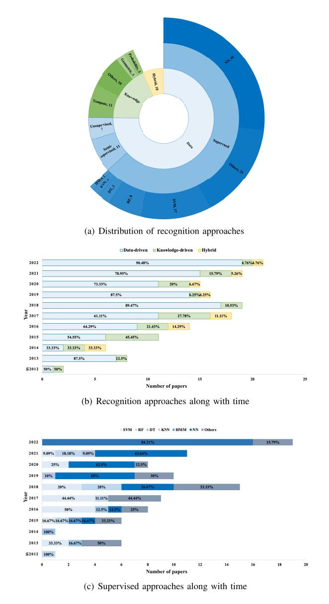

Fig. 23. Researched recognition approaches.

can process data with limited overhead. *From the aspect of performance*, data driven approaches, especially deep learning based methods, can achieve a high performance. Differently, the performance of knowledge driven approaches is usually affected by the analysis of human activities. *From the aspect of implementation way*, data driven approaches, especially deep learning based methods which adopt large models, often work in an offline way, i.e., the sensor data is sent to a server through network for processing. Differently, knowledge driven approaches are usually easy to be implemented and can work on mobile devices in an online way.

*Recognition approaches over time:* In Fig. [23\(](#page-27-0)a), we provide the statistics of recognition approaches, including data-driven, knowledge-driven and hybrid approaches. It can be found that a lot of research work preferred to adopt data-driven approaches, especially supervised learning based approaches, which often have the common workflow, as shown in Fig. [11.](#page-16-1) In supervised learning, the neural networks which have a good

ability of feature extraction were most frequently used. The SVM classifier which has a lower computation overhead was also popular. Besides, the combination of multiple classifiers was also commonly used for different recognition tasks and performance comparisons. Different from the most popular supervised learning based methods, the semi-supervised learning based and unsupervised learning based methods occurred sporadically and were rarely adopted. In regard to the knowledge-driven approaches or hybrid approaches, they were less commonly adopted and usually designed for specific tasks. To further analyze the research trends in recognition approaches, we also provide the statistics of existing approaches in each year. As shown in Fig. [23\(](#page-27-0)b), the data-driven approaches become more and more popular, especially after 2015. The knowledge-driven approaches were mainly adopted from 2015 to 2017, while paid less attention from 2018. In regard to the hybrid approaches, they were rarely adopted, from the past to the present. When considering the popularity of supervised learning based methods in data-driven approaches, we also provide the statistics of supervised learning based approaches in each year. As shown in Fig. [23\(](#page-27-0)c), the traditional classifiers were often adopted in previous years (i.e., before 2018), while less used in recent years. Differently, from 2018, the neural networks attracted more and more attention, and had been widely adopted in these years. Nowadays, most of research work had adopted neural networks for HAR. In regard to other approaches using different or multiple classifiers, they were adopted as needed, and received good attention during these years. The above uniqueness, characteristics, comparisons and research trends of recognition approaches can be used as a guidance for designing solutions for mobile device-based HAR.

*Open problems:* Firstly, to train a classifier for HAR, it is often necessary to provide enough training samples, especially for deep learning based methods. However, collecting and labeling sensor data of human activity requires a high labor cost. How to reduce the cost of data annotation is rather meaningful for HAR, and it deserves further study. Secondly, the existing HAR approaches can only recognize activities in fixed classes, they can not recognize new-class activities. However, in a real life scenario, there are a lot of classes of activities, thus recognizing new-class activities is important and meaningful. It is a challenging task and has not been studied well. Thirdly, considering the difference of users, environments and devices, a HAR solution is expected to work under different scenarios. However, the existing approaches were often evaluated with a limited number of scenarios. The generalization of HAR approaches is expected to be paid more attention. Fourthly, considering the limited resources of mobile devices, many existing approaches (especially deep learning based approaches) process data offline and can hardly work on mobile device. To provide a timely feedback of HAR, the mobile device and the server running HAR approach are encouraged to keep connected for data transmission. Besides, it is also expected to design lightweight models, which can work on mobile devices for HAR.

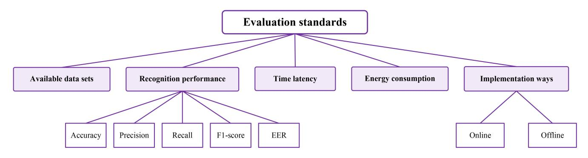

Fig. 24. Performance evaluation in HAR research work.

TABLE XIV AVAILABLE DATA SETS

| Dataset                               | Year | Activity      | Classes | Subjects | Instance                                   | Sensors                           | Sampling rate       | Devices      | Locations                                                   | Environments               |
|---------------------------------------|------|---------------|---------|----------|--------------------------------------------|-----------------------------------|---------------------|--------------|-------------------------------------------------------------|----------------------------|
| WISDM [198]                           | 2011 | DAs           | 6       | 29       | 4526                                       | A                                 | 20Hz                | SP           | Pocket                                                      | Controlled                 |
| ActiTracker [194]                     | 2011 | DAs           | 6       | 29       | _                                          | A                                 | 20Hz                | SP           | Pocket                                                      | Out of Lab                 |
| Siirola 2012 [202]                    | 2012 | DAs           | 5       | 8        | _                                          | A                                 | 40Hz                | SP           | Pocket                                                      | Out of Lab                 |
| UCI HAR [192]                         | 2013 | DAs           | 6       | 30       | 10299                                      | A, G                              | 50Hz                | SP           | Waist                                                       | Controlled                 |
| Shoaib 2013 [203]                     | 2013 | DAs           | 6       | 4        | 12755                                      | A, G, M                           | 50Hz                | 4 SPs        | Pocket, belt, arm, wrist                                 | Controlled                 |
| Shoaib 2014 [204]                     | 2014 | DAs           | 7       | 10       | -                                          | A, G, M, LA                       | 50Hz                | 5 SPs        | Left pocket, right pocket, belt, upper arm, wrist     | Controlled                 |
| HHAR [193]                            | 2015 | DAs           | 6       | 9        | 43930257                                   | A, G                              | Highest             | 8 SPs, 4 SWs | Waist, arm                                                  | Out of Lab                 |
| HAPT [199]                            | 2016 | DAs           | 12      | 30       | _                                          | A, G, M                           | 50Hz                | SP           | Waist                                                       | Controlled                 |
| MobiAct [205]                         | 2016 | DAs, Falls | 13      | 57       | -                                          | A, G, O                           | Highest             | SP           | Pocket                                                      | Controlled                 |
| RealWorld [200]                       | 2016 | DAs           | 8       | 15       | -                                          | A, G, M, GPS, P, MC            | 50Hz                | 6 SPs, 1 SW  | Head, chest, upper arm, waist, fore- arm, thigh, shin | Controlled                 |
| SBHAR [199]                           | 2016 | DAs           | 12      | 30       | 10929                                      | A, G                              | 50Hz                | SP           | Waist                                                       | Controlled                 |
| Shoaib 2016 [206]                     | 2016 | DAs           | 13      | 10       | _                                          | A, G, LA                          | 50Hz                | 2 SPs        | Pocket, wrist                                               | Controlled                 |
| UniMiB-SHAR [196]                  | 2017 | DAs, Falls | 17      | 30       | 11771                                      | A                                 | 50Hz                | SP           | Pocket                                                      | Controlled                 |
| ExtraSensory [197]                    | 2017 | DAs, SAs   | 116     | 60       | 308320                                     | SP: A, G, MC, PS; SW: A        | 25Hz-40Hz, 22kHz | SP, SW       | Free                                                        | Out of Lab                 |
| Song 2017 [207]                       | 2017 | MGs           | _       | 161      | _                                          | T                                 | 60Hz                | SP           | Hand                                                        | Controlled                 |
| MotionSense [195]                     | 2018 | DAs           | 6       | 24       | _                                          | A, G                              | 50Hz                | SP           | Pocket                                                      | Controlled                 |
| SHL [201]                             | 2018 | LO, TR     | 8       | 3        | =                                          | MS                                | Highest             | 4 SPs        | Hand, chest, pocket, backpack                            | Out of Lab                 |
| TMD [208]                             | 2018 | TR            | 5       | 13       | 3725                                       | A, G, M, GR, L, P, MC, PR, etc | 20Hz                | SP           | Variable                                                    | Controlled                 |
| Apple watch sleep dataset [209] [210] | 2019 | Sleep         | 5       | 31       |                                            | A, HR                             | 50Hz, below 1Hz     | SW           | Wrist                                                       | Controlled                 |
| Yin 2020 [63]                         | 2020 | HW            | 26      | 24       | 3962                                       | MC                                | 44.1kHz, 48kHz      | SP           | Near the hand                                               | Controlled                 |
| HARBox [168]                          | 2021 | DAs           | 5       | 121      | -                                          | A, G, M                           | 50Hz                | SP           | Variable                                                    | Out of Lab                 |
| harAGE [211]                          | 2021 | DAs           | 8       | 19       |                                            | A, G, M A, HR                  | 25Hz, 1Hz           | SW           | Wrist                                                       | Controlled                 |
| CogAge [212]                          | 2021 | DAs           | 61,7    | 8, 6     | 9029, 890                                  | A, G, M, LA, GR; A, G; A       | 20Hz-200Hz          | SP, SW, SG   | Pocket, wrist, head                                         | Controlled                 |
| Park 2021 [110]                       | 2021 | SL            | 50      | 20       | 5000                                       | DC                                | 8Hz                 | SP           | Near the body                                               | Controlled                 |
| Zhang 2021 [60]                       | 2021 | LPs           | 20, 70  | 12       | Lab: 19200, 33600 Wild: 24000, 23800 | MC                                | 48kHz               | SP           | Near the mouth                                              | Controlled, in-the-wild |
| Zhang 2021[64]                        | 2021 | HW            | 250     | 12       | 22500                                      | A, G, GR                          | 200Hz               | SW           | Wrist                                                       | Controlled                 |
| OpenPack [116]                        | 2022 | IWs           | 10      | 16       | 20129                                      | A                                 | 30Hz                | SW           | Wrist                                                       | Out of Lab                 |
| Bhattacharya 2022                     | 2022 | DAs           | 23      | 20       |                                            | A, G, MC                          | 50Hz, 22.05kHz      | sw           | Wrist                                                       | Semi-naturalisti           |
| [133] Mollyn 2022 [98]             | 2022 | DAs           | 26      | 20       | _                                          | A, G, O, MC                       | 50Hz, 16kHz         | SW           | Wrist                                                       | Out of Lab                 |

# VII. EVALUATION STANDARDS

To evaluate the performance of an activity recognition approach, the data set, recognition performance, time latency, energy consumption and implementation way will be considered, as shown in Fig. [24.](#page-28-0) Here, the time latency and the energy consumption are two metrics used to measure the computation overhead, since the resource of mobile devices is limited.

# *A. Available Data Sets*

Until now, there have been some public HAR data sets, whose sensor data is collected by mobile devices, as shown in Table [XIV.](#page-28-1) Among the data sets, most of them provide the sensor data corresponding to daily activities, e.g., UCI HAR [\[192\]](#page-38-16), HHAR [\[193\]](#page-38-17), ActiTracker [\[194\]](#page-38-18), MotionSense [\[195\]](#page-38-19), etc. Other activities like falls [\[196\]](#page-38-20), specific activities [197], sign language [110] were proposed in some data sets. Besides, most of the data sets adopt motion sensors (i.e., accelerometer, gyroscope, magnetometer or combination of them) for data collection, e.g., WISDM [198], SBHAR [199], HARBox [168], etc. Other sensors like proximity sensor [200], microphone [63], depth camera [110] were used as needed. In regard to the mobile device, smartphone [192], [199], [201], smartwatch [98], [133] or the combination of smartphone and smartwatch [193], [197], [200] were often used. The details of each data set can be found in Table XIV.

#### B. Recognition Performance

To measure the recognition performance of HAR, the following metrics [2] including accuracy [44], [81], [131], precision [106], [123], recall [106], [123] and F1-score [95], [102] are often adopted. For illustration, we use  $C_{ij}$  to represent the number of activity instances in class i classified into class  $i, i, j \in [1, n]$ . If i = j, the activity instance is correctly classified. Otherwise, the activity instance is wrongly classified. For all activity instances, we use the sum TP = $\sum_{i=1}^{i=n} C_{ii}$  to represent the true positives, i.e., the number of activity instances that are correctly classified. Then, we can calculate the recognition accuracy of human activities with Eq. (22).

$$Accuracy = \frac{\sum_{i=1}^{i=n} C_{ii}}{\sum_{i=1}^{i=n} \sum_{j=1}^{j=n} C_{ij}}$$
 (22)

For each class, take class i as an example, we use  $TP_i$  $C_{ii}$  to represent the *true positives*, i.e., the activity instances belonging to class i are correctly classified into class i, while using  $TN_i = \sum_{k=1}^{k=n} \sum_{j=1}^{j=n} C_{kj}, k \neq i, j \neq i$  to represent the true negatives, i.e., the activity instances not belonging to class i are classified into other classes. Besides, we use  $FP_i$  $\sum_{k=1}^{k=n} C_{ki}, k \neq i, k \in [1, n]$  to represent the false positives, i.e., the activity instances not belonging to class i are wrongly classified into class i, while using  $FN_i = \sum_{k=1}^{k=n} C_{ik}$ ,  $i \neq k$  to represent false negatives, i.e., the activity instances belonging to class i are wrongly classified into other classes. Then, we can calculate the precision, recall, F1-score for class i, based on Eq. (23), (24) and (25).

$$Precision_i = \frac{TP_i}{TP_i + FP_i} \tag{23}$$

$$Recall_i = \frac{TP_i}{TP_i + FN_i} \tag{24}$$

$$Recall_{i} = \frac{TP_{i}}{TP_{i} + FN_{i}}$$

$$F1 - score_{i} = 2 \times \frac{Precision_{i} \times Recall_{i}}{Precision_{i} + Recall_{i}}$$
(24)

For all the classes, the average precision can be calculated as  $Precision = \frac{1}{n} \sum_{i=1}^{i=n} Precision_i$ , the average recall can be calculated as  $Recall = \frac{1}{n} \sum_{i=1}^{i=n} Recall_i$ . In regard to the average F1-score, we can calculate it as  $F1-score=\frac{1}{n}\sum_{i=1}^{i=n}F1-score_i$  or  $F1-score=2\times\frac{Precision\times Recall}{Precision+Recall}$ . Among the performance metrics, accuracy means the ratio of activity instances correctly classified to all activity instances, and it is often used to evaluate the overall classification performance. The  $precision_i$  means the ratio of activity instances belonging to class i and correctly classified to all the activity instances classified into class i. The recalli means the ratio of activity instances belonging to class i and correctly classified to all the activity instances belonging to class i. It is hard to achieve both a high precision and a high recall at the same time. Thus the F1-score combines precision and recall, to provide a trade-off.

In addition to the above metrics, Equal Error Rate (EER)is often adopted for binary-classification tasks, especially for user authentication [86], [141]. To get EER, it is necessary to calculate the False Positive Rate (FPR) and False Negative Rate (FNR) at first, as shown in Eq. (26) and Eq. (27). Here, TN means the number of negative instances correctly classified as negative, FP means the number of negative instances wrongly classified as positive, while TP means the number of positive instances correctly classified as positive, FN means the number of positive instances wrongly classified as negative. Consequently, FPR means the proportion of negative instances wrongly classified as positive, FNP means the proportion of positive instances wrongly classified as negative. When FRP = FNR, we can get EER with Eq. (28). When using EER for classification, the lower EER, the better.

$$FPR = \frac{FP}{TN + FP}$$

$$FNR = \frac{FN}{TP + FN}$$
(26)

$$FNR = \frac{FN}{TP + FN} \tag{27}$$

$$EER = FRP = FNR \tag{28}$$

#### C. Time Latency

When considering the limited computing power of mobile devices, the time cost in HAR will be considered. Specifically, there are time cost for activity sensing, data processing, activity classification and overall time cost for HAR approach. Different application scenarios may have different requirements of time cost. For example, in human-computer interactions, unnoticeable time latency (i.e., below human response time [68]) is expected. Usually, the time cost is affected by the type of sensor data and the recognition approach. For example, the time cost of processing image frames is much larger than that of processing time-series data. Thus the optimizations like multiple threads [77] for image processing were used to reduce the time latency.

### D. Energy Consumption

Mobile devices are battery powered devices, thus the energy consumption (or power consumption) of devices is often considered in human activity recognition. There are energy consumption of activity sensing, data processing, activity classification and overall energy consumption of a HAR system. To measure the power consumption, the Monsoon power monitor [213], the software tool PowerTutor [214] and "Battery Historian" from Google [57] can be used. When guaranteeing the recognition performance, the lower energy consumption the better.

|                                   | Recognition                                                                   | Time     | Power            | Imp     | Dev |
|-----------------------------------|-------------------------------------------------------------------------------|----------|------------------|---------|-----|
| Typing: Mic [123]                 | Acy: 85.5% - 97.6%; Pre: 87%, Rec: 85%                                        |          | _                |         | SP  |
| Typing: Cam [77]                  | Acy: 95.0%; FPR: 4.8%                                                         | 50 ms    | 1729 mW          | Online  | SP  |
| Typing: IMU [75]                  | Detection rate: 94.6%                                                         | _        | _                | Offline | SW  |
| Typing: Mic, gyro [68]            | Acy: 95%                                                                      | 51.4 ms  | 194.7 mW         | Online  | SP  |
| Daily activities: Acc [40]        | Acy: about 95%; Pre: 90.19%                                                   | _        | _                | Offline | SP  |
| Handwriting: Acc [117]            | Acy: 91.9%                                                                    | _        | 100 mW (Sensing) | Offline | SP  |
| Heartbeating: Acc [92]            | Acy: 96.49%                                                                   | 48.35 ms | 153.2 mW         | Online  | SP  |
| Sleeping: Acc [118]               | Lab: F: 76.1%, Pre: 66.7%; Rec: 88.8%; Wild: F: 71.3%; Pre: 65.2%; Rec: 78.6% | <u> </u> | _                | Offline | SW  |
| Snooping pwds: IMU; RNN [128]     | Acy: 87%-93%; Pre: 67%-79%; Rec: 84%-88%; F: 71%-82%                          | <0.5s    | _                | Online  | SW  |
| Snooping pwds: IMU; Euc-dist [84] | Top-5 success rate: 92%                                                       | _        | _                | Offline | SW  |

TABLE XV EXAMPLES OF PERFORMANCE METRICS USED IN HAR

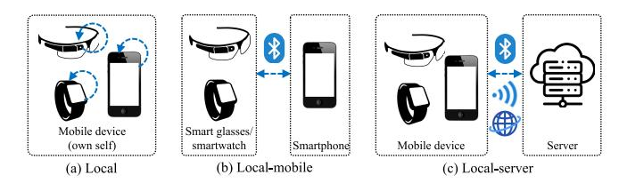

Fig. 25. Implementation ways of mobile device-based HAR.

#### *E. Implementation Ways*

Due to the limited resources of mobile devices, some HAR research work transmitted sensor data from the mobile device to a more powerful computer or server for further computation. Consequently, according to whether the HAR approach works on the mobile device, we can classify the existing HAR approaches into two categories, i.e., online approaches [\[57\]](#page-35-17), [\[86\]](#page-36-1), [\[121\]](#page-36-36) and offline approaches [\[47\]](#page-35-7), [\[60\]](#page-35-20), [\[63\]](#page-35-23). As shown in Fig. [25\(](#page-30-0)a), a mobile device (i.e., smartphone, smartwatch or smart glasses) performs all steps (except for model training) of HAR on the device locally. This is an online HAR approach. In regard to the approaches shown in Fig. [25\(](#page-30-0)b) and Fig. [25\(](#page-30-0)c), they belong to offline approaches. However, there is some difference between the implementation ways in Fig. [25\(](#page-30-0)b) and Fig. [25\(](#page-30-0)c). In Fig. [25\(](#page-30-0)b), the HAR approach is performed in "local-mobile" way, where the smartwatch (or smart glasses) usually sends the collected sensor data to smartphone through Bluetooth and the smartphone processes data for HAR. In Fig. [25\(](#page-30-0)c), the HAR approach is performed in "local-server" way, where the mobile device sends the collected sensor data to a computer/server through Bluetooth, WiFi, or mobile data network and then the server processes data for HAR. Whatever in online or offline approaches, the training process can be done offline, i.e., training in a computer or server. The machine learning tool WEKA [\[215\]](#page-38-28) was often adopted for offline training traditional classifiers, while the server configured with GPUs was often adopted for offline training deep learning models. In regard to the trained model, it can be deployed on the mobile device or a computer/server.

Consequently, 'online' approaches mean that the processes of activity sensing, data processing and activity classification of HAR are done locally on mobile devices [\[14\]](#page-34-26). On the contrary, 'offline' approaches mean that the processes of data processing or activity classification are done out of the mobile device. Usually, the 'offline' research work uses the mobile devices as sensing modules, while processing sensor data in a powerful computer/server. In Table [XV,](#page-30-1) we show the implementation ways of some HAR research work. When the work is implemented online, the recognition performance, time cost and energy consumption are often measured. Otherwise, the work is mainly evaluated with recognition performance.

# *F. Learned Lessons About Evaluation Standards*

*Characteristics of evaluation metrics:* To measure the recognition performance of HAR work, the metrics of accuracy, precision, recall, F1-score and equal error rate were often adopted. Among these metrics, the accuracy was designed to evaluate the overall classification performance, and was most frequently used. In regard to precision, recall, F1-score and equal error rate, they were used to provide a further detailed evaluation of recognition performance from different aspects. Besides, considering that mobile devices are resourcelimited, the time latency and power consumption were also introduced for performance evaluation. However, only a small part of HAR research work reported the metrics of time latency and power consumption. This is because that only HAR approaches implemented in an online way can be measured with time latency and power consumption, while most of HAR work were implemented in an offline way and could not be measured with the two metrics.

*Fairness in performance comparison:* In Table [XV,](#page-30-1) we show the recognition performance of the same activity using different sensors, different activities using the same sensor, and the same activity using the same sensor while adopting different recognition approaches. It is worth noting that the application scenario, specific recognition task and sensor data in each work can be different. It can be inappropriate to directly compare the recognition performance of different HAR research work. For example, the recognition accuracy of daily activities in [\[40\]](#page-35-0) is about 95%, while recognition accuracy of handwriting in [\[117\]](#page-36-32) is 91.9%, but we can not claim that the recognition performance of [\[40\]](#page-35-0) is better than that of [\[117\]](#page-36-32), because the recognized activities are different. To achieve a fair comparison, it is meaningful to compare the performance of HAR research work using the same data set. In the past, the research work tended to use self-collected data for performance evaluation, and reproduced the approaches in other work for comparison. Recently, more and more datasets were made public, and more and more research work adopted public datasets for fair comparisons.

# VIII. APPLICATION CASES

Due to the popularization and intelligence of mobile devices, human activity recognition based on mobile devices has been adopted in daily life. Until now, HAR are mainly applied in the following scenarios: exercise assessment, daily life monitoring, human-computer interactions, security and authentication, as described below.

# *A. Exercise Assessment*

Exercise assessment aims to evaluate how the user does exercises, e.g., which kind of exercise the user is doing, how much time is used for each exercise, how well an activity is performed. Human activity recognition is the core technology for exercise assessment, it is often used to detect and recognize exercise activities, e.g., barbell bench press, rower, dumbbell bench press, running, etc. The applications include COPDTrainer [\[132\]](#page-37-3), FitCoach [\[102\]](#page-36-17), MAR [\[129\]](#page-37-0), ArmTroi [\[44\]](#page-35-4), RehabPhone [\[96\]](#page-36-11) were proposed to exploit the typical repetitive structure of motion exercises, recognize fitness exercises to achieve effective workout and prevent injury, recognize complex activities in exercises, recognize free-weight exercises, realize home-based rehabilitation, respectively. The application system NuActiv [\[95\]](#page-36-10) was proposed to recognize unseen new exercise activities. In addition to different exercise activities, other applications were also proposed to recognize the specific activities in a kind of sports, e.g., strokes in table tennis [\[49\]](#page-35-9), [\[50\]](#page-35-10), activity styles in swimming [\[101\]](#page-36-16).

#### *B. Daily Life Monitoring*

Daily life monitoring can benefit many application scenarios, e.g., logging daily activities [\[13\]](#page-34-24), providing a healthy life styles, detecting dangerous events like falls. The activities in daily life include the common activities [\[44\]](#page-35-4), [\[97\]](#page-36-12), [\[98\]](#page-36-13), [\[104\]](#page-36-19) like walking, walking upstairs and downstairs, jogging, watching TV, eating, washing dishes, shaking hands, making a call etc; a series of activities in a specific scenario (e.g., activities in drinking [\[106\]](#page-36-21) or toothbrushing [\[52\]](#page-35-12)); and the vital sign changes [\[89\]](#page-36-4) like breathing, heartbeating and coughs. For example, Lasagna [\[38\]](#page-34-37) was proposed to recognize the common daily activities to provide deep understanding of arbitrary activities and semantic searching of activities, FluidMeter [\[106\]](#page-36-21) was proposed to recognize a series of activities in drinking, while Hygiea [\[47\]](#page-35-7) was proposed to recognize a series of fine-grained activities in toothbrushing. In regard to daily activities related to vital sign changes, SleepMonitor [\[118\]](#page-36-33), SleepGuard [\[108\]](#page-36-23), iSleep [\[107\]](#page-36-22), ApneaApp [\[90\]](#page-36-5), SymDetector [\[87\]](#page-36-2) were proposed to detect sleep related events, e.g., body movements [\[108\]](#page-36-23), [\[118\]](#page-36-33), snore [\[107\]](#page-36-22), [\[108\]](#page-36-23), cough [\[107\]](#page-36-22), [\[108\]](#page-36-23), sleep apnea [\[90\]](#page-36-5), [\[93\]](#page-36-8). In addition to sleeping, MindfulWatch [\[91\]](#page-36-6) and SymDetector [\[87\]](#page-36-2) were proposed to sense respiration related events, e.g, respiration rate [\[91\]](#page-36-6), sneeze [\[87\]](#page-36-2), sniffle [\[87\]](#page-36-2).

#### *C. Human-Computer Interaction*

Human-computer interactions (HCI) allow people to interact with devices based on human gestures, which include both coarse-grained and fine-grained gestures. Due to the limited screen of mobile devices, many kinds of interaction modes [\[61\]](#page-35-21), [\[114\]](#page-36-29), [\[119\]](#page-36-34), [\[134\]](#page-37-5) were proposed to interact with devices, especially input modes [\[68\]](#page-35-28), [\[77\]](#page-35-37). For example, AirContour [\[48\]](#page-35-8), PhonePoint Pen [\[117\]](#page-36-32), SHOW [\[80\]](#page-35-40), SignSpeaker [\[109\]](#page-36-24), WordRecorder [\[81\]](#page-35-41), WritingRecorder [\[63\]](#page-35-23), and WriteAS [\[64\]](#page-35-24) were proposed to recognize arm or hand gestures to provide gesture-based input or interaction methods for devices. The gesture based input methods can transform gestures as text. Unlike arm or hand gestures, GlassGesture [\[54\]](#page-35-14) was proposed to provide a head gesture based user interface. Besides, to provide finegrained interaction methods, the applications UbiTouch [\[58\]](#page-35-18), VSkin [\[121\]](#page-36-36), Dolphins [\[135\]](#page-37-6), UbiK [\[68\]](#page-35-28), CamK [\[77\]](#page-35-37), Serendipity [\[127\]](#page-36-42), WatchOut [\[126\]](#page-36-41), TriTap [\[79\]](#page-35-39), 1D Handwriting [\[69\]](#page-35-29), and ViFin [\[66\]](#page-35-26) were proposed to provide finger gesture based input or interaction methods for mobile devices. In addition to gestures from arms, heads, hands or fingers, the micro lip motions, tongue movements [\[61\]](#page-35-21) and eye movements [\[73\]](#page-35-33) were also proposed for HCI. For example, ProxiTalk [\[99\]](#page-36-14), Whoosh [\[122\]](#page-36-37), SilentTalk [\[82\]](#page-35-42), EchoWhisper [\[71\]](#page-35-31), and SoundLip [\[60\]](#page-35-20) were proposed to assist for the input of speech. EyeSpyVR [\[83\]](#page-35-43) and GazeSpeak [\[78\]](#page-35-38) were proposed to provide eye/gaze gesture based interaction methods with devices. Instead of interacting with a single device, SynCro [\[115\]](#page-36-30) was proposed to provide cross-device interactions.

#### *D. Security and Authentication*

As mentioned before, mobile devices have come into people's daily life and they often contain a lot of sensitive personal information, thus it is essential to protect the security of mobile devices. Until now, the existing work mainly focused on the issues of breaking the security [\[67\]](#page-35-27), [\[123\]](#page-36-38) and user authentication [\[42\]](#page-35-2), [\[70\]](#page-35-30), [\[92\]](#page-36-7). In regard to the security issues, MoLe [\[75\]](#page-35-35) was proposed to infer the typed information on a laptop keyboard while wearing a smart watch, WritingHacker [\[131\]](#page-37-2) and MagHacker [\[55\]](#page-35-15) were proposed to eavesdrop the handwriting information, while WristSpy [\[84\]](#page-35-44) and Snoopy [\[74\]](#page-35-34) were proposed to infer the PIN or pattern performed on the mobile device. In regard to user authentication, GlassGesture [\[54\]](#page-35-14) was proposed to recognize head gestures for user authentication. HoldPass [\[65\]](#page-35-25) was proposed to utilize

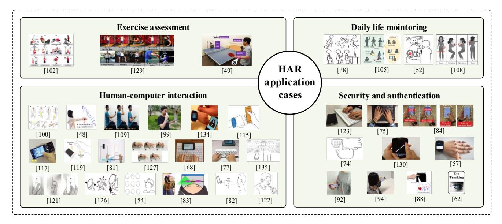

Fig. 26. HAR application cases.

hand vibration in response to the cardiac cycle for user authentication. GEAT [130], Garda [125], DeepAuth [128], RhyAuth [124], Taprint [57], TouchPrint [85], TouchID [86], and SwipePass [120] were proposed to utilize finger gestures on touch screens or the back of hand for user authentication. EyeVeri [62] and LipPass [59] were proposed to utilize the micro eye movements and lip motions for user authentication. BreathPrint [94] and CardioCam [88] were proposed to utilize vital sign changes like breathing and cardiac biometrics for user authentication.

#### E. Learned Lessons About Application Cases

Characteristics of applications: We show the typical HAR application cases in Fig. 26. In exercise assessment, the researched activities mainly belonged to fitness exercises (especially free-weight exercises) and specific activities in some kinds of sports. The application scenarios of different research work can be similar. In daily life monitoring, the researched activities often belonged to locomotions, sleeping, brushing, drinking, etc. Although there were a lot of research work on daily life monitoring, the application scenarios of them were similar. Besides, due to the public datasets on daily life, the application scenarios of research work using the same public datasets could be the same. In human-computer interactions, each research work had its own specific scenario. As shown in Fig. 26, there were a lot of specific scenarios in HCI, and the specific scenario in one work was different from that in another work. The reason may be that HCI is not limited to fixed scenarios and can be achieved in a variety of ways. In regard to security and authentication, they were similar to HCI and could be achieved in many different ways. It is worth noting that in daily life monitoring and humancomputer interactions, real-time feedback is often needed, thus the sensor data or HAR recognition result often needs to be transmitted through network between mobile devices and servers.

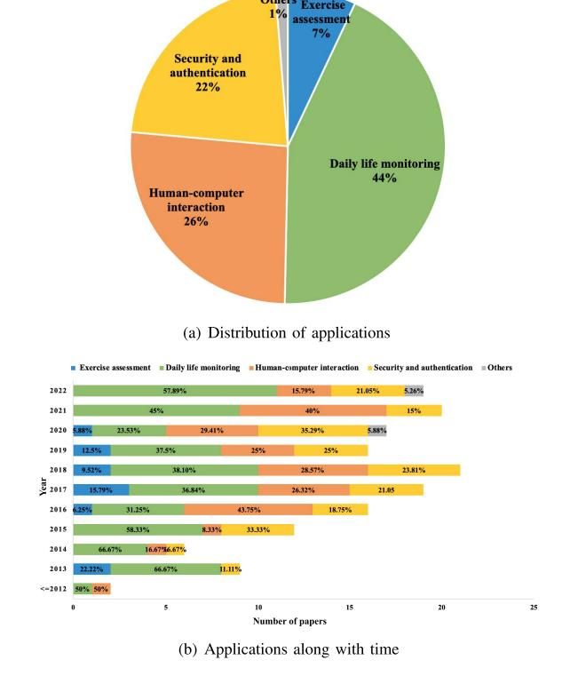

Fig. 27. HAR Applications.

Researched applications over time: In Fig. 27(a), we provide the statistics of HAR applications. It can be found that the most of application scenarios belonged to daily life monitoring. One reason may be that daily life contains a lot of human activities to be researched, e.g., locomotions, transportations, working, washing, cooking, sleeping, etc. The other reason may be that the activities in most of public datasets belong to daily life activities, and the increased use of public datasets will bring more HAR work on daily life monitoring. When

moving to human-computer interactions as well as security and authentication, they were also common applications. In regard to exercise assessment or other applications, there were less studied. To further analyze the research trends in applications, we also provide the statistics of HAR applications in each year. As shown in Fig. [27\(](#page-32-1)b), daily life monitoring was alway paid high attention, from the past to the present. Exercise assessment was researched in several years, but it attracted little attention in recent two years. Human-computer interactions had attracted wide attention, especially from 2016. Security and authentication were also studied well from 2015. In regard to other applications, they were rarely researched and occurred sporadically.

*Open problems:* Although a lot of effort has been made in HAR, there is still a gap between the researched HAR and the real application. Firstly, the sensor data of human activities is usually collected by users manually in controlled environments, thus the noises and unexpected interferences are limited. Besides, manually controlling the start and the end of collection process can also reduce the difficulty of data segmentation. However, in a real scenario, the sensor data of an activity can be affected by many factors, and the sensor data may contain all kinds of activities or interferences in a continuous manner, thus increasing the difficulty of data preprocessing and activity recognition. Secondly, the subjects recruited for experiments are usually college students, who may be different from the subjects (e.g., elderly people) in real applications. The different patterns of activities between recruited subjects and real users may make the HAR approach hard to work in real applications. Thirdly, many HAR approaches focus on data processing and activity recognition performance, while paying little attention to system implementation. However, the real applications may require real-time feedback of HAR. Therefore, more effort is expected to apply HAR approaches in real applications.

# IX. FUTURE RESEARCH CONSIDERATIONS

Based on the review of existing research work, we also summarize some potential research directions in human activity recognition based on mobile devices, from the aspects of human activities, sensing ways, recognition approaches and evaluation standards, as described below.

*Complex activity recognition:* Due to the advancement of HAR, more and more attention is paid to the more challenging recognition task, e.g., recognizing the very fine-grained activities like heartbeating. However, in fact, in addition to the fine-grained activities, there are a lot of complex activities like cooking and cleaning, which bring in new challenges in HAR. For example, in complex activities, different types of activities can occur in a same duration, people can switch from one activity to another in a seamless way, interference activities can occur among complex activities. Therefore, further research is expected for complex activity recognition.

*New-class activity recognition:* The existing research work usually focuses on recognizing fixed types of activities, i.e., the number of activity classes is fixed. Thus they often fail to recognize activities in new classes. However, in a real scenario, there are a large number of human activities, recognizing a few fixed activities may limit the application of HAR approaches. To address this problem, few-shot learning is expected to be adopted in the future research for recognizing new-class activity, while incremental learning is expected to be adopted for recognizing both new-class and old-class activities.

*Multi-modal sensing and fusion:* As the sensing modules of mobile devices become richer, it is possible to get multiple types of sensor data in activity sensing. Usually, each type of sensor has its own advantage, thus combining multi-modal sensor data for activity sensing can contribute to a better recognition performance. However, each sensor also has its limitation, combining all sensors may lead to data conflict and increase the sensing and computation overhead. Therefore, more research is expected to select suitable sensors for sensing and design appropriate methods for multi-modal data fusion.

*Low requirement of data annotation:* The existing work usually adopts supervised learning based approaches for HAR, thus often depends on enough labeled data for model training. However, collecting and annotating training data are labor intensive and time consuming. To reduce the requirement of data annotation, data augmentation and automatic data annotation scheme are expected to generate labeling data with low cost. Besides, semi-supervised learning approaches using a small amount of labeled data and unsupervised learning approaches not using labeled data are expected to be adopted for mobile device-based HAR.

*Cross-domain recognition approaches:* Since mobile devices can be easily carried anytime anywhere, the phone states, environments, user states can change from time to time in HAR. Consequently, the data distribution of human activities can also change, and it may lead to poor HAR performances. To make HAR approaches work under different conditions, the cross-domain recognition approaches are expected. Specifically, we can introduce domain adaptation technologies to make the HAR approaches designed in source domains adapt to target domain. Besides, we can also introduce domain generalization technologies to make HAR approaches ignore the differences among different domains.

*Light-weight recognition approaches:* Due to the development of Artificial Intelligence (AI), a lot of machine learning based algorithms were proposed for HAR, especially the deep learning based algorithms proposed in recent years. However, due to the complexity, deep learning based algorithms were often implemented in an offline way. In fact, a lot of HAR work based on mobile devices is expected to work online, especially in human-computer interactions. Therefore, further research is expected to design light-weight algorithms to improve the recognition performance of HAR while making the algorithm work in an online way.

*Standardization for comparison:* Until now, there has been a lot of HAR research work based on mobile devices. However, due to the difference in recognition tasks, sensor data sets, experiment settings and evaluation metrics, the activity recognition performance in one paper is different from that in other papers and it is difficult to make a fair comparison between papers. Therefore, the standardization of HAR research work based on mobile devices is expected. For example, the public data sets, the standardized experiment settings and the common evaluation metrics are encouraged to be adopted.

#### X. CONCLUSION

In this paper, we reviewed the research work on human activity recognition based on COTS mobile devices, which refer to smartphones, smartwatches and smart glasses. These work only used the on-board sensors of mobile devices for sensing, and performed activity recognition online or offline. We systematacially reviewed the existing work from the main components in HAR, i.e., human activities, sensor data, data preprocessing, recognition approaches, evaluation standards and application cases. Besides, we also provide deep analysis and comparison of the work from each main aspect of HAR. Finally, we demonstrate some potential directions in future research for mobile device-based HAR.

#### REFERENCES

- [\[1\]](#page-0-0) F. Foerster, M. Smeja, and J. Fahrenberg, "Detection of posture and motion by accelerometry: A validation study in ambulatory monitoring," *Comput. Human Behav.*, vol. 15, no. 5, pp. 571–583, 1999.
- [\[2\]](#page-0-0) O. D. Lara and M. A. Labrador, "A survey on human activity recognition using wearable sensors," *IEEE Commun. Surveys Tuts.*, vol. 15, no. 3, pp. 1192–1209, 3rd Quart., 2013.
- [\[3\]](#page-0-1) J. K. Aggarwal and Q. Cai, "Human motion analysis: A review," *Comput. Vis. Image Understand.*, vol. 73, no. 3, pp. 428–440, 1999.
- [\[4\]](#page-0-1) J. K. Aggarwal and M. S. Ryoo, "Human activity analysis: A review," *ACM Comput. Surveys*, vol. 43, no. 3, p. 16, 2011.
- [\[5\]](#page-0-2) L. Chen, J. Hoey, C. D. Nugent, D. J. Cook, and Z. Yu, "Sensor-based activity recognition," *IEEE Trans. Syst., Man, Cybern. C, Appl. Rev.*, vol. 42, no. 6, pp. 790–808, Nov. 2012.
- [\[6\]](#page-0-2) A. Bulling, U. Blanke, and B. Schiele, "A tutorial on human activity recognition using body-worn inertial sensors," *ACM Comput. Surveys*, vol. 46, no. 3, p. 33, 2014.
- [\[7\]](#page-0-3) L. Xie, C. Wang, A. X. Liu, J. Sun, and S. Lu, "Multi-touch in the air: Concurrent micromovement recognition using RF signals," *IEEE/ACM Trans. Netw.*, vol. 26, no. 1, pp. 231–244, Feb. 2018.
- [\[8\]](#page-0-3) Y. Tian, G.-H. Lee, H. He, C.-Y. Hsu, and D. Katabi, "RF-based fall monitoring using convolutional neural networks," *Proc. ACM Interact. Mobile Wearable Ubiquitous Technol.*, vol. 2, no. 3, p. 137, 2018.
- [\[9\]](#page-0-4) J. Liu, H. Liu, Y. Chen, Y. Wang, and C. Wang, "Wireless sensing for human activity: A survey," *IEEE Commun. Surveys Tuts.*, vol. 22, no. 3, pp. 1629–1645, 3rd Quart., 2019.
- [\[10\]](#page-0-4) F. Zhang et al., "Towards a diffraction-based sensing approach on human activity recognition," *Proc. ACM Interact. Mobile Wearable Ubiquitous Technol.*, vol. 3, no. 1, p. 33, 2019.
- [\[11\]](#page-1-1) F. Rodríguez-Díaz, N. P. Zea, and M. Cabrera, "Monitoring the learning process through the use of mobile devices," in *Handbook of Research on Mobility and Computing: Evolving Technologies and Ubiquitous Impacts*. London, U.K.: IGI Global, 2011, pp. 368–380.
- [\[12\]](#page-2-0) M. F. A. B. Abdullah, A. F. P. Negara, M. S. Sayeed, D.-J. Choi, and K. S. Muthu, "Classification algorithms in human activity recognition using smartphones," *Int. J. Comput. Inf. Eng.*, vol. 6, nos. 77–84, p. 106, 2012.
- [\[13\]](#page-2-1) X. Su, H. Tong, and P. Ji, "Activity recognition with smartphone sensors," *Tsinghua Sci. Technol.*, vol. 19, no. 3, pp. 235–249, 2014.
- [\[14\]](#page-2-2) M. Shoaib, S. Bosch, O. D. Incel, H. Scholten, and P. J. Havinga, "A survey of online activity recognition using mobile phones," *Sensors*, vol. 15, no. 1, pp. 2059–2085, 2015.
- [\[15\]](#page-2-3) J. T. Sunny, S. M. George, J. J. Kizhakkethottam, J. T. Sunny, S. M. George, and J. J. Kizhakkethottam, "Applications and challenges of human activity recognition using sensors in a smart environment," *Int. J. Innov. Res. Sci. Technol.*, vol. 2, no. 4, pp. 50–57, 2015.
- [\[16\]](#page-2-4) M. Straczkiewicz, P. James, and J.-P. Onnela, "A systematic review of smartphone-based human activity recognition methods for health research," *NPJ Digit. Med.*, vol. 4, no. 1, pp. 1–15, 2021.
- [\[17\]](#page-2-5) A. Ferrari, D. Micucci, M. Mobilio, and P. Napoletano, "Trends in human activity recognition using smartphones," *J. Rel. Intell. Environ.*, vol. 7, no. 3, pp. 189–213, 2021.

- [\[18\]](#page-2-5) A. K. Aboo, "Survey on human activity recognition using smartphone," *AL-Rafidain J. Comput. Sci. Math.*, vol. 15, no. 1, pp. 55–61, 2021.
- [\[19\]](#page-2-6) M. Vrigkas, C. Nikou, and I. A. Kakadiaris, "A review of human activity recognition methods," *Front. Robot. AI*, vol. 2, p. 28, Nov. 2015.
- [\[20\]](#page-2-6) A. B. Sargano, P. Angelov, and Z. Habib, "Vision based human activity recognition: A review," in *Proc. Adv. Comput. Intell. Syst.*, 2016, pp. 341–371.
- [\[21\]](#page-2-6) V.-T. Le, K. Tran-Trung, and V. T. Hoang, "A comprehensive review of recent deep learning techniques for human activity recognition," *Comput. Intell. Neurosci.*, vol. 2022, Apr. 2022, Art. no. 8323962.
- [\[22\]](#page-2-7) S. Wang and G. Zhou, "A review on radio based activity recognition," *Digit. Commun. Netw.*, vol. 1, no. 1, pp. 20–29, 2015.
- [\[23\]](#page-2-8) F. Kulsoom, S. Narejo, Z. Mehmood, H. N. Chaudhry, A. Butt, and A. K. Bashir, "A review of machine learning-based human activity recognition for diverse applications," *Neural Comput. Appl.*, vol. 34, no. 21, pp. 18289–18324, 2022.
- [\[24\]](#page-2-8) K. Chen, D. Zhang, L. Yao, B. Guo, Z. Yu, and Y. Liu, "Deep learning for sensor-based human activity recognition: Overview, challenges, and opportunities," *ACM Comput. Surveys*, vol. 54, no. 4, pp. 1–40, 2021.
- [\[25\]](#page-2-8) E. Ramanujam, T. Perumal, and S. Padmavathi, "Human activity recognition with smartphone and wearable sensors using deep learning techniques: A review," *IEEE Sensors J.*, vol. 21, no. 12, pp. 13029–13040, Jun. 2021.
- [\[26\]](#page-2-9) F. Attal, S. Mohammed, M. Dedabrishvili, F. Chamroukhi, L. Oukhellou, and Y. Amirat, "Physical human activity recognition using wearable sensors," *Sensors*, vol. 15, no. 12, pp. 31314–31338, 2015.
- [\[27\]](#page-2-10) Y. Wang, S. Cang, and H. Yu, "A survey on wearable sensor modality centred human activity recognition in health care," *Exp. Syst. Appl.*, vol. 137, pp. 167–190, Dec. 2019.
- [\[28\]](#page-2-11) H. F. Nweke, Y. W. Teh, M. A. Al-garadi, and U. R. Alo, "Deep learning algorithms for human activity recognition using mobile and wearable sensor networks: State of the art and research challenges," *Exp. Syst. Appl.*, vol. 105, pp. 233–261, Sep. 2018.
- [\[29\]](#page-2-12) J. Wang, Y. Chen, S. Hao, X. Peng, and L. Hu, "Deep learning for sensor-based activity recognition: A survey," *Pattern Recognit. Lett.*, vol. 119, pp. 3–11, Mar. 2019.
- [\[30\]](#page-2-13) K. Chen, D. Zhang, L. Yao, B. Guo, Z. Yu, and Y. Liu. "Deep learning for sensor-based human activity recognition: Overview, challenges and opportunities." 2020. [Online]. Available: https://arxiv.org/abs/2001.07416
- [\[31\]](#page-2-14) S. K. Yadav, K. Tiwari, H. M. Pandey, and S. A. Akbar, "A review of multimodal human activity recognition with special emphasis on classification, applications, challenges and future directions," *Knowl. Based Syst.*, vol. 223, Jul. 2021, Art. no. 106970.
- [\[32\]](#page-2-14) L. M. Dang, K. Min, H. Wang, M. J. Piran, C. H. Lee, and H. Moon, "Sensor-based and vision-based human activity recognition: A comprehensive survey," *Pattern Recognit.*, vol. 108, Dec. 2020, Art. no. 107561.
- [\[33\]](#page-5-1) K. Sankaran, M. Zhu, X. F. Guo, A. L. Ananda, M. C. Chan, and L.-S. Peh, "Using mobile phone barometer for low-power transportation context detection," in *Proc. 12th ACM Conf. Embedded Netw. Sensor Syst.*, 2014, pp. 191–205.
- [\[34\]](#page-5-1) S. Lee, J. Lee, and K. Lee, "DeepVehicleSense: An energy-efficient transportation mode recognition leveraging staged deep learning over sound samples," *IEEE Trans. Mobile Comput.*, vol. 22, no. 6, pp. 3270–3286, Jun. 2023.
- [\[35\]](#page-5-2) M. M. Hassan, M. Z. Uddin, A. Mohamed, and A. Almogren, "A robust human activity recognition system using smartphone sensors and deep learning," *Future Gener. Comput. Syst.*, vol. 81, pp. 307–313, Apr. 2018.
- [\[36\]](#page-5-2) Y. Chang, A. Mathur, A. Isopoussu, J. Song, and F. Kawsar, "A systematic study of unsupervised domain adaptation for robust humanactivity recognition," *Proc. ACM Interact. Mobile Wearable Ubiquitous Technol.*, vol. 4, no. 1, pp. 1–30, 2020.
- [\[37\]](#page-5-3) A. Brajdic and R. Harle, "Walk detection and step counting on unconstrained smartphones," in *Proc. ACM Int. Joint Conf. Pervasive Ubiquitous Comput.*, 2013, pp. 225–234.
- [\[38\]](#page-5-4) C. Liu, L. Zhang, Z. Liu, K. Liu, X. Li, and Y. Liu, "Lasagna: Towards deep hierarchical understanding and searching over mobile sensing data," in *Proc. 22nd Annu. Int. Conf. Mobile Comput. Netw.*, 2016, pp. 334–347.
- [\[39\]](#page-5-5) S. Hemminki, P. Nurmi, and S. Tarkoma, "Accelerometer-based transportation mode detection on smartphones," in *Proc. 11th ACM Conf. Embedded Netw. Sensor Syst.*, 2013, pp. 1–14.

- [\[40\]](#page-5-6) I. Suarez, A. Jahn, C. Anderson, and K. David, "Improved activity recognition by using enriched acceleration data," in *Proc. ACM Int. Joint Conf. Pervasive Ubiquitous Comput.*, 2015, pp. 1011–1015.
- [\[41\]](#page-5-7) T. Gong, Y. Kim, J. Shin, and S.-J. Lee, "MetaSense: Few-shot adaptation to untrained conditions in deep mobile sensing," in *Proc. ACM 17th Conf. Embedded Netw. Sensor Syst.*, 2019, pp. 110–123.
- [\[42\]](#page-5-8) Y. Ren, Y. Chen, M. C. Chuah, and J. Yang, "User verification leveraging gait recognition for smartphone enabled mobile healthcare systems," *IEEE Trans. Mobile Comput.*, vol. 14, no. 9, pp. 1961–1974, Sep. 2015.
- [\[43\]](#page-5-9) H. Li et al., "NeuralGait: Assessing brain health using your Smartphone," *Proc. ACM Interact. Mobile Wearable Ubiquitous Technol.*, vol. 6, no. 4, pp. 1–28, 2022.
- [\[44\]](#page-5-10) Y. Liu, Z. Li, Z. Liu, and K. Wu, "Real-time arm skeleton tracking and gesture inference tolerant to missing wearable sensors," in *Proc. 17th Annu. Int. Conf. Mobile Syst. Appl. Services*, 2019, pp. 287–299.
- [\[45\]](#page-5-11) X. Xu et al., "ER: Early recognition of inattentive driving leveraging audio devices on smartphones," in *Proc. IEEE Conf. Comput. Commun.*, 2017, pp. 1–9.
- [\[46\]](#page-5-11) D. Chen, K.-T. Cho, S. Han, Z. Jin, and K. G. Shin, "Invisible sensing of vehicle steering with smartphones," in *Proc. ACM 13th Annu. Int. Conf. Mobile Syst. Appl. Services*, 2015, pp. 1–13.
- [\[47\]](#page-5-12) C. Luo et al., "Brush like a dentist: Accurate monitoring of toothbrushing via wrist-worn gesture sensing," in *Proc. IEEE Conf. Comput. Commun.*, 2019, pp. 1234–1242.
- [\[48\]](#page-5-13) Y. Yin, L. Xie, T. Gu, Y. Lu, and S. Lu, "AirContour: Building contourbased model for in-air writing gesture recognition," *ACM Trans. Sensor Netw.*, vol. 15, no. 4, p. 44, 2019.
- [\[49\]](#page-5-14) T. H. Vu, A. Misra, Q. Roy, K. C. T. Wei, and Y. Lee, "Smartwatchbased early gesture detection and trajectory tracking for interactive gesture-driven applications," *Proc. ACM Interact. Mobile Wearable Ubiquitous Technol.*, vol. 2, no. 1, p. 39, 2018.
- [\[50\]](#page-5-15) W. Viyanon, V. Kosasaeng, S. Chatchawal, and A. Komonpetch, "SwingPong: Analysis and suggestion based on motion data from mobile sensors for table tennis strokes using decision tree," in *Proc. Int. Conf. Intell. Inf. Process.*, 2016, p. 18.
- [\[51\]](#page-5-16) C. Karatas et al., "Leveraging wearables for steering and driver tracking," in *Proc. IEEE Int. Conf. Comput. Commun.*, 2016, pp. 1–9.
- [\[52\]](#page-5-17) J. Korpela, R. Miyaji, T. Maekawa, K. Nozaki, and H. Tamagawa, "Evaluating tooth brushing performance with smartphone sound data," in *Proc. ACM Int. Joint Conf. Pervasive Ubiquitous Comput.*, 2015, pp. 109–120.
- [\[53\]](#page-6-0) X. Xu, J. Yu, Y. Chen, Y. Zhu, S. Qian, and M. Li, "Leveraging audio signals for early recognition of inattentive driving with smartphones," *IEEE Trans. Mobile Comput.*, vol. 17, no. 7, pp. 1553–1567, Jul. 2018.
- [\[54\]](#page-6-1) S. Yi, Z. Qin, E. Novak, Y. Yin, and Q. Li, "GlassGesture: Exploring head gesture interface of smart glasses," in *Proc. IEEE Int. Conf. Comput. Commun.*, 2016, pp. 1–9.
- [\[55\]](#page-6-2) Y. Liu, K. Huang, X. Song, B. Yang, and W. Gao, "MagHacker: Eavesdropping on stylus pen writing via magnetic sensing from commodity mobile devices," in *Proc. 18th Int. Conf. Mobile Syst. Appl. Services*, 2020, pp. 148–160.
- [\[56\]](#page-6-2) Y. Lu, B. Huang, C. Yu, G. Liu, and Y. Shi, "Designing and evaluating hand-to-hand gestures with dual commodity wrist-worn devices," *Proc. ACM Interact. Mobile Wearable Ubiquitous Technol.*, vol. 4, no. 1, pp. 1–27, 2020.
- [\[57\]](#page-6-3) W. Chen et al., "TaPrint: Secure text input for commodity smart wristbands," in *Proc. 25th Annu. Int. Conf. Mobile Comput. Netw.*, 2019, pp. 1–16.
- [\[58\]](#page-6-3) E. Wen, W. Seah, B. Ng, X. Liu, and J. Cao, "UbiTouch: Ubiquitous smartphone touchpads using built-in proximity and ambient light sensors," in *Proc. ACM Int. Joint Conf. Pervasive Ubiquitous Comput.*, 2016, pp. 286–297.
- [\[59\]](#page-6-4) L. Lu et al., "LipPass: Lip reading-based user authentication on smartphones leveraging acoustic signals," in *Proc. IEEE Conf. Comput. Commun.*, 2018, pp. 1466–1474.
- [\[60\]](#page-6-4) Q. Zhang, D. Wang, R. Zhao, and Y. Yu, "SoundLip: Enabling word and sentence-level lip interaction for smart devices," *Proc. ACM Interactive Mobile Wearable Ubiquitous Technol.*, vol. 5, no. 1, pp. 1–28, 2021.
- [\[61\]](#page-6-5) Y. Cao, H. Chen, F. Li, and Y. Wang, "CanalScan: Tongue-jaw movement recognition via ear canal deformation sensing," in *Proc. IEEE Conf. Comput. Commun.*, 2021, pp. 1–10.
- [\[62\]](#page-6-6) C. Song, A. Wang, K. Ren, and W. Xu, "Eyeveri: A secure and usable approach for smartphone user authentication," in *Proc. IEEE Int. Conf. Comput. Commun.*, 2016, pp. 1–9.

- [\[63\]](#page-6-7) H. Yin, A. Zhou, G. Su, B. Chen, L. Liu, and H. Ma, "Learning to recognize handwriting input with acoustic features," *Proc. ACM Interact. Mobile Wearable Ubiquitous Technol.*, vol. 4, no. 2, pp. 1–26, 2020.
- [\[64\]](#page-6-7) Q. Zhang, D. Wang, R. Zhao, Y. Yu, and J. Jing, "Write, attend and spell: Streaming end-to-end free-style handwriting recognition using smartwatches," *Proc. ACM Interact. Mobile Wearable Ubiquitous Technol.*, vol. 5, no. 3, pp. 1–25, 2021.
- [\[65\]](#page-6-8) K. Jiokeng, G. Jakllari, and A.-L. Beylot, "I want to know your hand: Authentication on commodity mobile phones based on your hand's vibrations," *Proc. ACM Interact. Mobile Wearable Ubiquitous Technol.*, vol. 6, no. 2, p. 58, 2022.
- [\[66\]](#page-6-9) W. Chen, L. Chen, M. Ma, F. S. Parizi, S. Patel, and J. Stankovic, "ViFin: Harness passive vibration to continuous micro finger writing with a commodity smartwatch," *Proc. ACM Interact. Mobile Wearable Ubiquitous Technol.*, vol. 5, no. 1, pp. 1–25, 2021.
- [\[67\]](#page-6-10) T. Giallanza et al., "Keyboard snooping from mobile phone arrays with mixed convolutional and recurrent neural networks," *Proc. ACM Interact. Mobile Wearable Ubiquitous Technol.*, vol. 3, no. 2, p. 45, 2019.
- [\[68\]](#page-6-10) J. Wang, K. Zhao, X. Zhang, and C. Peng, "Ubiquitous keyboard for small mobile devices: Harnessing multipath fading for fine-grained keystroke localization," in *Proc. 12th Annu. Int. Conf. Mobile Syst. Appl. Services*, 2014, pp. 14–27.
- [\[69\]](#page-6-11) C. Yu, K. Sun, M. Zhong, X. Li, P. Zhao, and Y. Shi, "One-dimensional handwriting: Inputting letters and words on smart glasses," in *Proc. ACM CHI Conf. Human Factors Comput. Syst.*, 2016, pp. 71–82.
- [\[70\]](#page-6-11) D. Shi et al., "Fine-grained and context-aware behavioral biometrics for pattern lock on smartphones," *Proc. ACM Interact. Mobile Wearable Ubiquitous Technol.*, vol. 5, no. 1, pp. 1–30, 2021.
- [\[71\]](#page-6-12) Y. Gao, Y. Jin, J. Li, S. Choi, and Z. Jin, "EchoWhisper: Exploring an acoustic-based silent speech interface for smartphone users," *Proc. ACM Interact. Mobile Wearable Ubiquitous Technol.*, vol. 4, no. 3, pp. 1–27, 2020.
- [\[72\]](#page-6-13) S. Ishimaru et al., "In the blink of an eye: Combining head motion and eye blink frequency for activity recognition with Google glass," in *Proc. ACM 5th Augmented Human Int. Conf.*, 2014, pp. 1–4.
- [\[73\]](#page-6-13) J. Liu, D. Li, L. Wang, and J. Xiong, "BlinkListener: 'Listen' to your eye blink using your smartphone," *Proc. ACM Interact. Mobile Wearable Ubiquitous Technol.*, vol. 5, no. 2, pp. 1–27, 2021.
- [\[74\]](#page-6-14) C. X. Lu et al., "Snoopy: Sniffing your smartwatch passwords via deep sequence learning," *Proc. ACM Interact. Mobile Wearable Ubiquitous Technol.*, vol. 1, no. 4, p. 152, 2018.
- [\[75\]](#page-6-14) H. Wang, T. T.-T. Lai, and R. R. Choudhury, "Mole: Motion leaks through smartwatch sensors," in *Proc. ACM 21st Annu. Int. Conf. Mobile Comput. Netw.*, 2015, pp. 155–166.
- [\[76\]](#page-6-15) Y. Wang, J. Shen, and Y. Zheng, "Push the limit of acoustic gesture recognition," *IEEE Trans. Mobile Comput.*, vol. 21, no. 5, pp. 1798–1811, Jul. 2020.
- [\[77\]](#page-6-16) Y. Yin, Q. Li, L. Xie, S. Yi, E. Novak, and S. Lu, "CamK: A camerabased keyboard for small mobile devices," in *Proc. 35th Annu. IEEE Int. Conf. Comput. Commun.*, 2016, pp. 1–9.
- [\[78\]](#page-6-16) X. Zhang, H. Kulkarni, and M. R. Morris, "Smartphone-based gaze gesture communication for people with motor disabilities," in *Proc. CHI Conf. Human Factors Comput. Syst.*, 2017, pp. 2878–2889.
- [\[79\]](#page-6-17) H. Gil, D. Lee, S. Im, and I. Oakley, "TriTap: Identifying finger touches on smartwatches," in *Proc. ACM CHI Conf. Human Factors Comput. Syst.*, 2017, pp. 3879–3890.
- [\[80\]](#page-6-18) X. Lin, Y. Chen, X. Chang, X. Liu, and X. Wang, "SHOW: Smart handwriting on watches," *Proc. ACM Interact. Mobile Wearable Ubiquitous Technol.*, vol. 1, no. 4, pp. 1–23, 2017.
- [\[81\]](#page-6-19) H. Du, P. Li, H. Zhou, W. Gong, G. Luo, and P. Yang, "WordRecorder: Accurate acoustic-based handwriting recognition using deep learning," in *Proc. IEEE Conf. Comput. Commun.*, 2018, pp. 1448–1456.
- [\[82\]](#page-6-20) J. Tan, C.-T. Nguyen, and X. Wang, "SilentTalk: Lip reading through ultrasonic sensing on mobile phones," in *Proc. IEEE Conf. Comput. Commun.*, 2017, pp. 1–9.
- [\[83\]](#page-6-21) K. Ahuja, R. Islam, V. Parashar, K. Dey, C. Harrison, and M. Goel, "EyeSpyVR: Interactive eye sensing using off-the-shelf, smartphonebased VR headsets," *Proc. ACM Interact. Mobile Wearable Ubiquitous Technol.*, vol. 2, no. 2, p. 57, 2018.
- [\[84\]](#page-6-22) C. Wang, J. Liu, X. Guo, Y. Wang, and Y. Chen, "WristSpy: Snooping Passcodes in mobile payment using wrist-worn wearables," in *Proc. IEEE Conf. Comput. Commun.*, 2019, pp. 2071–2079.

- [\[85\]](#page-6-23) H. Chen, F. Li, W. Du, S. Yang, M. Conn, and Y. Wang, "Listen to your fingers: User authentication based on geometry biometrics of touch gesture," *Proc. ACM Interact. Mobile Wearable Ubiquitous Technol.*, vol. 4, no. 3, pp. 1–23, 2020.
- [\[86\]](#page-6-23) X. Zhang, Y. Yin, L. Xie, H. Zhang, Z. Ge, and S. Lu, "TouchID: User authentication on mobile devices via inertial-touch gesture analysis," *Proc. ACM Interact. Mobile Wearable Ubiquitous Technol.*, vol. 4, no. 4, pp. 1–29, 2020.
- [\[87\]](#page-6-24) X. Sun, Z. Lu, W. Hu, and G. Cao, "SymDetector: Detecting soundrelated respiratory symptoms using smartphones," in *Proc. ACM Int. Joint Conf. Pervasive Ubiquitous Comput.*, 2015, pp. 97–108.
- [\[88\]](#page-6-25) J. Liu, C. Shi, Y. Chen, H. Liu, and M. Gruteser, "CardioCam: Leveraging camera on mobile devices to verify users while their heart is pumping," in *Proc. 17th Annu. Int. Conf. Mobile Syst. Appl. Services*, 2019, pp. 249–261.
- [\[89\]](#page-6-26) E. C. Larson, T. Lee, S. Liu, M. Rosenfeld, and S. N. Patel, "Accurate and privacy preserving cough sensing using a low-cost microphone," in *Proc. ACM 13th Int. Conf. Ubiquitous Comput.*, 2011, pp. 375–384.
- [\[90\]](#page-6-27) R. Nandakumar, S. Gollakota, and N. Watson, "Contactless sleep APNEA detection on smartphones," in *Proc. ACM 13th Annu. Int. Conf. Mobile Syst. Appl. Services*, 2015, pp. 45–57.
- [\[91\]](#page-6-28) T. Hao, C. Bi, G. Xing, R. Chan, and L. Tu, "MindfulWatch: A smartwatch-based system for real-time respiration monitoring during meditation," *Proc. ACM Interact. Mobile Wearable Ubiquitous Technol.*, vol. 1, no. 3, pp. 1–19, 2017.
- [\[92\]](#page-6-29) L. Wang et al., "Unlock with your heart: Heartbeat-based authentication on commercial mobile phones," *Proc. ACM Interact. Mobile Wearable Ubiquitous Technol.*, vol. 2, no. 3, pp. 1–22, 2018.
- [\[93\]](#page-6-30) X. Chen, Y. Xiao, Y. Tang, J. Fernandez-Mendoza, and G. Cao, "ApneaDetector: Detecting sleep apnea with smartwatches," *Proc. ACM Interact. Mobile Wearable Ubiquitous Technol.*, vol. 5, no. 2, pp. 1–22, 2021.
- [\[94\]](#page-6-31) J. Chauhan, Y. Hu, S. Seneviratne, A. Misra, A. Seneviratne, and Y. Lee, "BreathPrint: Breathing acoustics-based user authentication," in *Proc. ACM 15th Annu. Int. Conf. Mobile Syst. Appl. Services*, 2017, pp. 278–291.
- [\[95\]](#page-6-32) H.-T. Cheng, F.-T. Sun, M. Griss, P. Davis, J. Li, and D. You, "Nuactiv: Recognizing unseen new activities using semantic attributebased learning," in *Proc. ACM 11th Annu. Int. Conf. Mobile Syst. Appl. Services*, 2013, pp. 361–374.
- [\[96\]](#page-6-32) H. Zhang et al., "RehabPhone: A software-defined tool using 3D printing and smartphones for personalized home-based rehabilitation," in *Proc. 18th Int. Conf. Mobile Syst. Appl. Services*, 2020, pp. 434–447.
- [\[97\]](#page-6-33) E. Thomaz, I. Essa, and G. D. Abowd, "A practical approach for recognizing eating moments with wrist-mounted inertial sensing," in *Proc. ACM Int. Joint Conf. Pervasive Ubiquitous Comput.*, 2015, pp. 1029–1040.
- [\[98\]](#page-6-33) V. Mollyn, K. Ahuja, D. Verma, C. Harrison, and M. Goel, "SAMoSA: Sensing activities with motion and subsampled audio," *Proc. ACM Interact. Mobile Wearable Ubiquitous Technol.*, vol. 6, no. 3, pp. 1–19, 2022.
- [\[99\]](#page-6-34) Z. Yang, C. Yu, F. Zheng, and Y. Shi, "ProxiTalk: Activate speech input by bringing smartphone to the mouth," *Proc. ACM Interact. Mobile Wearable Ubiquitous Technol.*, vol. 3, no. 3, pp. 1–25, 2019.
- [\[100\]](#page-6-34) Z. Lv, A. Halawani, S. Feng, S. Ur Réhman, and H. Li, "Touch-less interactive augmented reality game on vision-based wearable device," *Pers. Ubiquitous Comput.*, vol. 19, nos. 3–4, pp. 551–567, 2015.
- [\[101\]](#page-6-35) G. Brunner, D. Melnyk, B. Sigfússon, and R. Wattenhofer, "Swimming style recognition and lap counting using a smartwatch and deep learning," in *Proc. ACM 23rd Int. Symp. Wearable Comput.*, 2019, pp. 23–31.
- [\[102\]](#page-6-36) X. Guo, J. Liu, and Y. Chen, "FitCoach: Virtual fitness coach empowered by wearable mobile devices," in *Proc. IEEE Conf. Comput. Commun.*, 2017, pp. 1–9.
- [\[103\]](#page-6-37) P. Voigt, M. Budde, E. Pescara, M. Fujimoto, K. Yasumoto, and M. Beigl, "Feasibility of human activity recognition using wearable depth cameras," in *Proc. ACM Int. Symp. Wearable Comput.*, 2018, pp. 92–95.
- [\[104\]](#page-6-38) Z. Yan, D. Chakraborty, S. Mittal, A. Misra, and K. Aberer, "An exploration with online complex activity recognition using cellphone accelerometer," in *Proc. ACM Conf. Pervasive Ubiquitous Comput. Adjunct Publ.*, 2013, pp. 199–202.
- [\[105\]](#page-6-39) K. Ouchi and M. Doi, "Smartphone-based monitoring system for activities of daily living for elderly people and their relatives etc," in *Proc. ACM Conf. Pervasive Ubiquitous Comput. Adjunct Publ.*, 2013, pp. 103–106.

- [\[106\]](#page-6-40) T. Hamatani, M. Elhamshary, A. Uchiyama, and T. Higashino, "FluidMeter: Gauging the human daily fluid intake using smartwatches," *Proc. ACM Interact. Mobile Wearable Ubiquitous Technol.*, vol. 2, no. 3, pp. 1–25, 2018.
- [\[107\]](#page-6-41) T. Hao, G. Xing, and G. Zhou, "iSleep: Unobtrusive sleep quality monitoring using smartphones," in *Proc. 11th ACM Conf. Embedded Netw. Sensor Syst.*, 2013, p. 4.
- [\[108\]](#page-6-42) L. Chang et al., "SleepGuard: Capturing rich sleep information using smartwatch sensing data," *Proc. ACM Interact. Mobile Wearable Ubiquitous Technol.*, vol. 2, no. 3, pp. 1–34, 2018.
- [\[109\]](#page-6-43) J. Hou et al., "SignSpeaker: A real-time, high-precision SmartWatchbased sign language translator," in *Proc. 25th Annu. Int. Conf. Mobile Comput. Netw.*, 2019, pp. 1–15.
- [\[110\]](#page-6-44) H. Park, Y. Lee, and J. Ko, "Enabling real-time sign language translation on mobile platforms with on-board depth cameras," *Proc. ACM Interact. Mobile Wearable Ubiquitous Technol.*, vol. 5, no. 2, pp. 1–30, 2021.
- [\[111\]](#page-6-45) S. Rallapalli, A. Ganesan, K. Chintalapudi, V. N. Padmanabhan, and L. Qiu, "Enabling physical analytics in retail stores using smart glasses," in *Proc. 20th Annu. Int. Conf. Mobile Comput. Netw.*, 2014, pp. 115–126.
- [\[112\]](#page-6-46) Y. Yin, L. Xie, Y. Fan, and S. Lu, "Tracking human motions in photographing: A context-aware energy-saving scheme for smart phones," *ACM Trans. Sensor Netw.*, vol. 13, no. 4, p. 29, 2017.
- [\[113\]](#page-6-47) C.-W. You et al., "Carsafe app: Alerting drowsy and distracted drivers using dual cameras on smartphones," in *Proc. 11th Annu. Int. Conf. Mobile Syst. Appl. Services*, 2013, pp. 13–26.
- [\[114\]](#page-6-48) X. Wang, K. Sun, T. Zhao, W. Wang, and Q. Gu, "Dynamic speed warping: Similarity-based one-shot learning for device-free gesture signals," in *Proc. IEEE Conf. Comput. Commun.*, 2020, pp. 556–565.
- [\[115\]](#page-8-2) Y. Kubo, R. Takada, B. Shizuki, and S. Takahashi, "Exploring context-aware user interfaces for smartphone-smartwatch cross-device interaction," *Proc. ACM Interact. Mobile Wearable Ubiquitous Technol.*, vol. 1, no. 3, p. 69, 2017.
- [\[116\]](#page-8-2) N. Yoshimura, T. Maekawa, T. Hara, A. Wada, and Y. Namioka, "Acceleration-based activity recognition of repetitive works with lightweight ordered-work segmentation network," *Proc. ACM Interact. Mobile Wearable Ubiquitous Technol.*, vol. 6, no. 2, pp. 1–39, 2022.
- [\[117\]](#page-8-3) S. Agrawal, I. Constandache, S. Gaonkar, R. R. Choudhury, K. Caves, and F. DeRuyter, "Using mobile phones to write in air," in *Proc. ACM 9th Int. Conf. Mobile Syst. Appl. Services*, 2011, pp. 15–28.
- [\[118\]](#page-9-0) X. Sun, L. Qiu, Y. Wu, Y. Tang, and G. Cao, "Sleepmonitor: Monitoring respiratory rate and body position during sleep using smartwatch," *Proc. ACM Interact. Mobile Wearable Ubiquitous Technol.*, vol. 1, no. 3, pp. 1–22, 2017.
- [\[119\]](#page-9-1) H. Watanabe and T. Terada, "Improving ultrasound-based gesture recognition using a partially shielded single microphone," in *Proc. ACM Int. Symp. Wearable Comput.*, 2018, pp. 9–16.
- [\[120\]](#page-9-2) Y. Chen, T. Ni, W. Xu, and T. Gu, "SwipePass: Acoustic-based secondfactor user authentication for smartphones," *Proc. ACM Interact. Mobile Wearable Ubiquitous Technol.*, vol. 6, no. 3, pp. 1–25, 2022.
- [\[121\]](#page-9-3) K. Sun, T. Zhao, W. Wang, and L. Xie, "Vskin: Sensing touch gestures on surfaces of mobile devices using acoustic signals," in *Proc. ACM 24th Annu. Int. Conf. Mobile Comput. Netw.*, 2018, pp. 591–605.
- [\[122\]](#page-9-4) G. Reyes et al., "Whoosh: Non-voice acoustics for low-cost, hands-free, and rapid input on smartwatches," in *Proc. ACM Int. Symp. Wearable Comput.*, 2016, pp. 120–127.
- [\[123\]](#page-9-5) J. Liu, Y. Wang, G. Kar, Y. Chen, J. Yang, and M. Gruteser, "Snooping keystrokes with mm-level audio ranging on a single phone," in *Proc. ACM 21st Annu. Int. Conf. Mobile Comput. Netw.*, 2015, pp. 142–154.
- [\[124\]](#page-9-6) Y. Chen, J. Sun, R. Zhang, and Y. Zhang, "Your song your way: Rhythm-based two-factor authentication for multi-touch mobile devices," in *Proc. IEEE Conf. Comput. Commun.*, 2015, pp. 2686–2694.
- [\[125\]](#page-9-6) C. Liu, G. D. Clark, and J. Lindqvist, "Where usability and security go hand-in-hand: Robust gesture-based authentication for mobile systems," in *Proc. CHI Conf. Human Factors Comput. Syst.*, 2017, pp. 374–386.
- [\[126\]](#page-9-7) C. Zhang, J. Yang, C. Southern, T. E. Starner, and G. D. Abowd, "WatchOut: Extending interactions on a smartwatch with inertial sensing," in *Proc. ACM Int. Symp. Wearable Comput.*, 2016, pp. 136–143.
- [\[127\]](#page-9-8) H. Wen, J. R. Rojas, and A. K. Dey, "Serendipity: Finger gesture recognition using an off-the-shelf smartwatch," in *Proc. CHI Conf. Human Factors Comput. Syst.*, 2016, pp. 3847–3851.
- [\[128\]](#page-9-9) C. X. Lu et al., "Deepauth: *In-situ* authentication for smartwatches via deeply learned behavioural biometrics," in *Proc. ACM Int. Symp. Wearable Comput.*, 2018, pp. 204–207.

- [\[129\]](#page-9-10) L. Xie, X. Dong, W. Wang, and D. Huang, "Meta-activity recognition: A wearable approach for logic cognition-based activity sensing," in *Proc. IEEE Conf. Comput. Commun.*, 2017, pp. 1–9.
- [\[130\]](#page-10-1) M. Shahzad, A. X. Liu, and A. Samuel, "Secure unlocking of mobile touch screen devices by simple gestures: You can see it but you can not do it," in *Proc. ACM 19th Annu. Int. Conf. Mobile Comput. Netw.*, 2013, pp. 39–50.
- [\[131\]](#page-10-2) T. Yu, H. Jin, and K. Nahrstedt, "Writinghacker: Audio based eavesdropping of handwriting via mobile devices," in *Proc. ACM Int. Joint Conf. Pervasive Ubiquitous Comput.*, 2016, pp. 463–473.
- [\[132\]](#page-10-3) G. Spina, G. Huang, A. Vaes, M. Spruit, and O. Amft, "COPDTrainer: A smartphone-based motion rehabilitation training system with realtime acoustic feedback," in *Proc. ACM Int. Joint Conf. Pervasive Ubiquitous Comput.*, 2013, pp. 597–606.
- [\[133\]](#page-10-4) S. Bhattacharya, R. Adaimi, and E. Thomaz, "Leveraging sound and wrist motion to detect activities of daily living with commodity smartwatches," *Proc. ACM Interact. Mobile Wearable Ubiquitous Technol.*, vol. 6, no. 2, pp. 1–28, 2022.
- [\[134\]](#page-10-5) V. Becker, L. Fessler, and G. Sörös, "GestEar: Combining audio and motion sensing for gesture recognition on smartwatches," in *Proc. 23rd Int. Symp. Wearable Comput.*, 2019, pp. 10–19.
- [\[135\]](#page-10-6) K. Sun, W. Wang, A. X. Liu, and H. Dai, "Depth aware finger tapping on virtual displays," in *Proc. ACM 16th Annu. Int. Conf. Mobile Syst. Appl. Services*, 2018, pp. 283–295.
- [\[136\]](#page-14-4) Android Open Source Project. "Definition of the coordinate system used by the SensorEvent API." 2015. [Online]. Available: https://developer.android.com/reference/android/hardware/SensorEvent
- [\[137\]](#page-17-3) S. Liu et al., "Giobalfusion: A global attentional deep learning framework for multisensor information fusion," *Proc. ACM Interact. Mobile Wearable Ubiquitous Technol.*, vol. 4, no. 1, pp. 1–27, 2020.
- [\[138\]](#page-17-4) S. Miao, L. Chen, R. Hu, and Y. Luo, "Towards a dynamic intersensor correlations learning framework for multi-sensor-based wearable human activity recognition," *Proc. ACM Interact. Mobile Wearable Ubiquitous Technol.*, vol. 6, no. 3, pp. 1–25, 2022.
- [\[139\]](#page-17-5) B. Zhai, Y. Guan, M. Catt, and T. Plötz, "Ubi-SleepNet: Advanced multimodal fusion techniques for three-stage sleep classification using ubiquitous sensing," *Proc. ACM Interact. Mobile Wearable Ubiquitous Technol.*, vol. 5, no. 4, pp. 1–33, 2021.
- [\[140\]](#page-17-6) T. Sheng and M. Huber, "Weakly supervised multi-task representation learning for human activity analysis using wearables," *Proc. ACM Interact. Mobile Wearable Ubiquitous Technol.*, vol. 4, no. 2, pp. 1–18, 2020.
- [\[141\]](#page-17-7) Y. Song and Z. Cai, "Integrating handcrafted features with deep representations for Smartphone authentication," *Proc. ACM Interact. Mobile Wearable Ubiquitous Technol.*, vol. 6, no. 1, pp. 1–27, 2022.
- [\[142\]](#page-17-8) M. E. Mavroforakis and S. Theodoridis, "A geometric approach to support vector machine (SVM) classification," *IEEE Trans. Neural Netw.*, vol. 17, no. 3, pp. 671–682, May 2006.
- [\[143\]](#page-18-2) S. R. Safavian and D. Landgrebe, "A survey of decision tree classifier methodology," *IEEE Trans. Syst., Man, Cybern.*, vol. 21, no. 3, pp. 660–674, May/Jun. 1991.
- [\[144\]](#page-20-2) B. Van Essen, C. Macaraeg, M. Gokhale, and R. Prenger, "Accelerating a random forest classifier: Multi-core, GP-GPU, or FPGA?" in *Proc. 20th Int. Symp. Field Program. Custom Comput. Mach.*, 2012, pp. 232–239.
- [\[145\]](#page-21-4) K. Wu et al., "Power saving and secure text input for commodity smart watches," *IEEE Trans. Mobile Comput.*, vol. 20, no. 6, pp. 2281–2296, Jun. 2021.
- [\[146\]](#page-21-5) R. Al-Hajj, C. Mokbel, and L. Likforman-Sulem, "Combination of HMM-based classifiers for the recognition of arabic handwritten words," in *Proc. 9th Int. Conf. Document Anal. Recognit. (ICDAR)*, vol. 2, 2007, pp. 959–963.
- [147] L. Yang et al., "Unlocking smart phone through handwaving biometrics," *IEEE Trans. Mobile Comput.*, vol. 14, no. 5, pp. 1044–1055, May 2015.
- [148] M. Shahzad, A. X. Liu, and A. Samuel, "Behavior based human authentication on touch screen devices using gestures and signatures," *IEEE Trans. Mobile Comput.*, vol. 16, no. 10, pp. 2726–2741, Oct. 2017.
- [149] H. Zhu, J. Hu, S. Chang, and L. Lu, "ShakeIn: Secure user authentication of smartphones with single-handed shakes," *IEEE Trans. Mobile Comput.*, vol. 16, no. 10, pp. 2901–2912, Oct. 2017.
- [150] Y. Wang, W. Cai, T. Gu, and W. Shao, "Your eyes reveal your secrets: An eye movement based password inference on smartphone," *IEEE Trans. Mobile Comput.*, vol. 19, no. 11, pp. 2714–2730, Nov. 2020.
- [\[151\]](#page-21-6) S. Lawrence, C. L. Giles, A. C. Tsoi, and A. D. Back, "Face recognition: A convolutional neural-network approach," *IEEE Trans. Neural Netw.*, vol. 8, no. 1, pp. 98–113, Jan. 1997.

- [\[152\]](#page-21-7) C. A. Ronao and S. Cho, "Deep convolutional neural networks for human activity recognition with smartphone sensors," in *Proc. Int. Conf. Neural Inf. Process.*, Part IV, LNCS 9492, 2015, pp. 46–53.
- [\[153\]](#page-21-7) C. A. Ronao and S.-B. Cho, "Human activity recognition with smartphone sensors using deep learning neural networks," *Exp. Syst. Appl.*, vol. 59, pp. 235–244, Oct. 2016.
- [\[154\]](#page-21-8) P. Wang, R. Jiang, and C. Liu, "Amaging: Acoustic hand imaging for self-adaptive gesture recognition," in *Proc. IEEE Conf. Comput. Commun.*, 2022, pp. 80–89.
- [\[155\]](#page-21-9) K. Tanigaki, T. C. Teoh, N. Yoshimura, T. Maekawa, and T. Hara, "Predicting performance improvement of human activity recognition model by additional data collection," *Proc. ACM Interact. Mobile Wearable Ubiquitous Technol.*, vol. 6, no. 3, pp. 1–33, 2022.
- [\[156\]](#page-22-4) M. Schuster and K. K. Paliwal, "Bidirectional recurrent neural networks," *IEEE Trans. Signal Process.*, vol. 45, no. 11, pp. 2673–2681, Nov. 1997.
- [\[157\]](#page-23-2) W. Lu, J. Wang, Y. Chen, S. J. Pan, C. Hu, and X. Qin, "Semanticdiscriminative mixup for generalizable sensor-based cross-domain activity recognition," *Proc. ACM Interact. Mobile Wearable Ubiquitous Technol.*, vol. 6, no. 2, pp. 1–19, 2022.
- [158] X. Xu et al., "Enabling hand gesture customization on wrist-worn devices," in *Proc. CHI Conf. Human Factors Comput. Syst.*, 2022, pp. 1–19.
- [159] Y. Xie, F. Li, Y. Wu, S. Yang, and Y. Wang, "HearSmoking: Smoking detection in driving environment via acoustic sensing on smartphones," *IEEE Trans. Mobile Comput.*, vol. 21, no. 8, pp. 2847–2860, Aug. 2022.
- [160] K. Ling, H. Dai, Y. Liu, A. X. Liu, W. Wang, and Q. Gu, "Ultragesture: Fine-grained gesture sensing and recognition," *IEEE Trans. Mobile Comput.*, vol. 21, no. 7, pp. 2620–2636, Jul. 2022.
- [\[161\]](#page-23-3) A. Raza, K. P. Tran, L. Koehl, S. Li, X. Zeng, and K. Benzaidi, "Lightweight transformer in federated setting for human activity recognition," 2022, *arXiv:2110.00244*.
- [\[162\]](#page-23-4) S. EK, F. Portet, and P. Lalanda, "Lightweight transformers for human activity recognition on mobile devices," 2022, *arXiv:2209.11750*.
- [\[163\]](#page-23-5) X. You, L. Zhang, H. Yu, M. Yuan, and X. Li, "KATN: Key activity detection via inexact supervised learning," *Proc. ACM Interact. Mobile Wearable Ubiquitous Technol.*, vol. 5, no. 4, pp. 1–26, 2021.
- [164] F. Luo, S. Khan, Y. Huang, and K. Wu, "Binarized neural network for edge intelligence of sensor-based human activity recognition," *IEEE Trans. Mobile Comput.*, vol. 22, no. 3, pp. 1356–1368, Mar. 2023.
- [165] D. Ding, L. Yang, Y.-C. Chen, and G. Xue, "Handwriting recognition system leveraging vibration signal on smartphones," *IEEE Trans. Mobile Comput.*, vol. 22, no. 7, pp. 3940–3951, Jul. 2023.
- [166] R. Mishra, A. Gupta, and H. P. Gupta, "Locomotion mode recognition using sensory data with noisy labels: A deep learning approach," *IEEE Trans. Mobile Comput.*, vol. 22, no. 6, pp. 3460–3471, Jun. 2023.
- [\[167\]](#page-23-6) Z. Xiao, T. Chen, Y. Liu, J. Li, and Z. Li, "Keystroke recognition with the tapping sound recorded by mobile phone microphones," *IEEE Trans. Mobile Comput.*, vol. 22, no. 6, pp. 3407–3424, Jun. 2023.
- [\[168\]](#page-29-3) X. Ouyang, Z. Xie, J. Zhou, J. Huang, and G. Xing, "ClusterFL: A similarity-aware federated learning system for human activity recognition," in *Proc. 19th Annu. Int. Conf. Mobile Syst. Appl. Services*, 2021, pp. 54–66.
- [169] B. Khaertdinov, E. Ghaleb, and S. Asteriadis, "Contrastive selfsupervised learning for sensor-based human activity recognition," in *Proc. IEEE Int. Joint Conf. Biometrics (IJCB)*, 2021, pp. 1–8.
- [\[170\]](#page-23-7) G. Augustinov et al., "Transformer-based recognition of activities of daily living from wearable sensor data," in *Proc. 7th Int. Workshop Sensor Activity Recognit. Artif. Intell.*, 2022, pp. 1–8.
- [\[171\]](#page-23-7) G. Sharma, A. Dhall, and R. Subramanian, "A transformer based approach for activity detection," in *Proc. 30th ACM Int. Conf. Multimedia*, 2022, pp. 7155–7159.
- [\[172\]](#page-23-7) Y. Zhang, L. Wang, H. Chen, A. Tian, S. Zhou, and Y. Guo, "IF-ConvTransformer: A framework for human activity recognition using IMU fusion and ConvTransformer," *Proc. ACM Interact. Mobile Wearable Ubiquitous Technol.*, vol. 6, no. 2, pp. 1–26, 2022.
- [173] C. Shen, B.-J. Ho, and M. Srivastava, "Milift: Efficient smartwatchbased workout tracking using automatic segmentation," *IEEE Trans. Mobile Comput.*, vol. 17, no. 7, pp. 1609–1622, Jul. 2018.
- [174] A. Maiti, M. Jadliwala, J. He, and I. Bilogrevic, "Side-channel inference attacks on mobile keypads using smartwatches," *IEEE Trans. Mobile Comput.*, vol. 17, no. 9, pp. 2180–2194, Feb. 2018.
- [175] J. Yu, Z. Chen, Y. Zhu, Y. Chen, L. Kong, and M. Li, "Fine-grained abnormal driving behaviors detection and identification with smartphones," *IEEE Trans. Mobile Comput.*, vol. 16, no. 8, pp. 2198–2212, Aug. 2017.

- [\[176\]](#page-23-8) L. Yao, F. Nie, Q. Z. Sheng, T. Gu, X. Li, and S. Wang, "Learning from less for better: Semi-supervised activity recognition via shared structure discovery," in *Proc. ACM Int. Joint Conf. Pervasive Ubiquitous Comput.*, 2016, pp. 13–24.
- [\[177\]](#page-23-8) M. Lv, L. Chen, T. Chen, and G. Chen, "Bi-view semi-supervised learning based semantic human activity recognition using Accelerometers," *IEEE Trans. Mobile Comput.*, vol. 17, no. 9, pp. 1991–2001, Sep. 2018.
- [\[178\]](#page-23-9) D. Balabka, "Semi-supervised learning for human activity recognition using adversarial autoencoders," in *Proc. ACM Int. Joint Conf. Pervasive Ubiquitous Comput. ACM Int. Symp. Wearable Comput. (UbiComp/ISWC)*, 2019, pp. 685–688.
- [\[179\]](#page-23-9) A. Zahin, L. T. Tan, and R. Q. Hu, "Sensor-based human activity recognition for smart healthcare: A semi-supervised machine learning," in *Proc. Int. Conf. Artif. Intell. Commun. Netw.*, 2019, pp. 450–472.
- [\[180\]](#page-23-10) M. Zeng, T. Yu, X. Wang, L. T. Nguyen, O. J. Mengshoel, and I. Lane, "Semi-supervised convolutional neural networks for human activity recognition," in *Proc. IEEE Int. Conf. Big Data*, 2017, pp. 522–529.
- [\[181\]](#page-23-11) H. Xu, P. Zhou, R. Tan, M. Li, and G. Shen, "LIMU-BERT: Unleashing the potential of unlabeled data for IMU sensing applications," in *Proc. 19th ACM Conf. Embedded Netw. Sensor Syst.*, 2021, pp. 220–233.
- [\[182\]](#page-23-11) H. Haresamudram, I. Essa, and T. Plötz, "Contrastive predictive coding for human activity recognition," *Proc. ACM Interact. Mobile Wearable Ubiquitous Technol.*, vol. 5, no. 2, pp. 1–26, 2021.
- [\[183\]](#page-23-11) C. I. Tang, I. Perez-Pozuelo, D. Spathis, S. Brage, N. Wareham, and C. Mascolo, "SelfHAR: Improving human activity recognition through self-training with unlabeled data," *Proc. ACM Interact. Mobile Wearable Ubiquitous Technol.*, vol. 5, no. 1, pp. 1–30, 2021.
- [\[184\]](#page-24-2) A. Mazankiewicz, K. Böhm, and M. Bergés, "Incremental real-time personalization in human activity recognition using domain adaptive batch normalization," *Proc. ACM Interact. Mobile Wearable Ubiquitous Technol.*, vol. 4, no. 4, pp. 1–20, 2020.
- [\[185\]](#page-24-3) X. Qin, Y. Chen, J. Wang, and C. Yu, "Cross-dataset activity recognition via adaptive spatial-temporal transfer learning," *Proc. ACM Interact. Mobile Wearable Ubiquitous Technol.*, vol. 3, no. 4, pp. 1–25, 2019.
- [\[186\]](#page-24-4) C. Dobbins and R. Rawassizadeh, "Towards clustering of mobile and smartwatch Accelerometer data for physical activity recognition," *Informatics*, vol. 5, no. 2, p. 29, 2018.
- [\[187\]](#page-24-4) Y. Kwon, K. Kang, and C. Bae, "Unsupervised learning for human activity recognition using smartphone sensors," *Exp. Syst. Appl.*, vol. 41, no. 14, pp. 6067–6074, 2014.
- [\[188\]](#page-24-5) Y. Lu, Y. Wei, L. Liu, J. Zhong, L. Sun, and Y. Liu, "Towards unsupervised physical activity recognition using smartphone accelerometers," *Multimedia Tools Appl.*, vol. 76, no. 8, pp. 10701–10719, 2017.
- [\[189\]](#page-24-6) L. Bai, C. Yeung, C. Efstratiou, and M. Chikomo, "Motion2Vector: Unsupervised learning in human activity recognition using wristsensing data," in *Proc. ACM Int. Joint Conf. Pervasive Ubiquitous Comput. ACM Int. Symp. Wearable Comput. (UbiComp/ISWC)*, 2019, pp. 537–542.
- [\[190\]](#page-24-7) H. Ma, Z. Zhang, W. Li, and S. Lu, "Unsupervised human activity representation learning with multi-task deep clustering," *Proc. ACM Interact. Mobile Wearable Ubiquitous Technol.*, vol. 5, no. 1, pp. 1–25, 2021.
- [\[191\]](#page-24-8) Q. Xia, J. Korpela, Y. Namioka, and T. Maekawa, "Robust unsupervised factory activity recognition with body-worn accelerometer using temporal structure of multiple sensor data motifs," *Proc. ACM Interact. Mobile Wearable Ubiquitous Technol.*, vol. 4, no. 3, pp. 1–30, 2020.
- [\[192\]](#page-28-2) D. Anguita, A. Ghio, L. Oneto, X. Parra, and J. L. Reyes-Ortiz, "A public domain Dataset for human activity recognition using smartphones," in *Proc. 21st Eur. Symp. Artif. Neural Netw. (ESANN)*, vol. 3, 2013, p. 3.
- [\[193\]](#page-28-3) A. Stisen et al., "Smart devices are different: Assessing and mitigatingmobile sensing heterogeneities for activity recognition," in *Proc. 13th ACM Conf. Embedded Netw. Sensor Syst.*, 2015, pp. 127–140.
- [\[194\]](#page-28-4) J. W. Lockhart, G. M. Weiss, J. C. Xue, S. T. Gallagher, A. B. Grosner, and T. T. Pulickal, "Design considerations for the WISDM smart phone-based sensor mining architecture," in *Proc. 5th Int. Workshop Knowl. Disc. Sensor Data*, 2011, pp. 25–33.
- [\[195\]](#page-28-5) M. Malekzadeh, R. G. Clegg, A. Cavallaro, and H. Haddadi, "Protecting sensory data against sensitive inferences," in *Proc. 1st Workshop Privacy Design Distrib. Syst.*, 2018, pp. 1–6.
- [\[196\]](#page-28-6) D. Micucci, M. Mobilio, and P. Napoletano, "UniMiB SHAR: A dataset for human activity recognition using acceleration data from smartphones," *Appl. Sci.*, vol. 7, no. 10, p. 1101, 2017.
- [\[197\]](#page-29-4) Y. Vaizman, K. Ellis, and G. Lanckriet, "Recognizing detailed human context in the wild from smartphones and smartwatches," *IEEE Pervasive Comput.*, vol. 16, no. 4, pp. 62–74, Oct.–Dec. 2017.

- [\[198\]](#page-29-5) J. R. Kwapisz, G. M. Weiss, and S. A. Moore, "Activity recognition using cell phone accelerometers," *ACM SigKDD Explor. Newslett.*, vol. 12, no. 2, pp. 74–82, 2011.
- [\[199\]](#page-29-6) J.-L. Reyes-Ortiz, L. Oneto, A. Samà, X. Parra, and D. Anguita, "Transition-aware human activity recognition using smartphones," *Neurocomputing*, vol. 171, pp. 754–767, Jan. 2016.
- [\[200\]](#page-29-7) T. Sztyler and H. Stuckenschmidt, "On-body localization of wearable devices: An investigation of position-aware activity recognition," in *Proc. IEEE Int. Conf. Pervasive Comput. Commun. (PerCom)*, 2016, pp. 1–9.
- [\[201\]](#page-29-8) H. Gjoreski et al., "The university of sussex-Huawei locomotion and transportation Dataset for multimodal analytics with mobile devices," *IEEE Access*, vol. 6, pp. 42592–42604, 2018.
- [202] P. Siirtola and J. Röning, "Recognizing human activities userindependently on smartphones based on accelerometer data," *Int. J. Interact. Multimedia Artif. Intell.*, vol. 1, no. 5, pp. 38–45, 2012.
- [203] M. Shoaib, H. Scholten, and P. J. Havinga, "Towards physical activity recognition using smartphone sensors," in *Proc. IEEE 10th Int. Conf. Ubiquitous Intell. Comput. 10th Int. Conf. Auton. Trust. Comput.*, 2013, pp. 80–87.
- [204] M. Shoaib, S. Bosch, O. D. Incel, H. Scholten, and P. J. Havinga, "Fusion of smartphone motion sensors for physical activity recognition," *Sensors*, vol. 14, no. 6, pp. 10146–10176, 2014.
- [205] G. Vavoulas, C. Chatzaki, T. Malliotakis, M. Pediaditis, and M. Tsiknakis, "The mobiact dataset: Recognition of activities of daily living using smartphones," in *Proc. Int. Conf. Inf. Commun. Technol. Ageing Well e-Health*, vol. 2, 2016, pp. 143–151.
- [206] M. Shoaib, S. Bosch, O. D. Incel, H. Scholten, and P. J. Havinga, "Complex human activity recognition using smartphone and wrist-worn motion sensors," *Sensors*, vol. 16, no. 4, p. 426, 2016.
- [207] Y. Song, Z. Cai, and Z. Zhang, "Multi-touch authentication using hand geometry and behavioral information," in *Proc. IEEE Symp. Security Privacy*, 2017, pp. 357–372.
- [208] C. Carpineti, V. Lomonaco, L. Bedogni, M. Di Felice, and L. Bononi, "Custom dual transportation mode detection by smartphone devices exploiting sensor diversity," in *Proc. IEEE Int. Conf. Pervasive Comput. Commun. Workshops (PerCom Workshops)*, 2018, pp. 367–372.
- [209] O. Walch. "Motion and heart rate from a wrist-worn wearable and labeled sleep from polysomnography (version 1.0.0)." 201. [Online]. Available: https://doi.org/10.13026/hmhs-py35
- [210] O. Walch, Y. Huang, D. Forger, and C. Goldstein, "Sleep stage prediction with raw acceleration and photoplethysmography heart rate data derived from a consumer wearable device," *Sleep*, vol. 42, no. 12, 2019, Art. no. zsz180.
- [211] A. Mallol-Ragolta, A. Semertzidou, M. Pateraki, and B. Schuller, "HarAGE: A novel multimodal smartwatch-based dataset for human activity recognition," in *Proc. 16th IEEE Int. Conf. Autom. Face Gesture Recognit. (FG)*, 2021, pp. 01–07.
- [212] M. A. Nisar, K. Shirahama, F. Li, X. Huang, and M. Grzegorzek, "Rank pooling approach for wearable sensor-based ADLs recognition," *Sensors*, vol. 20, no. 12, p. 3463, 2020.
- [\[213\]](#page-29-9) Monsoon Solutions Inc. "Monsoon power monitor." 2015. [Online]. Available: https://www.msoon.com/LabEquipment/PowerMonitor/
- [\[214\]](#page-29-10) L. Zhang et al., "Accurate online power estimation and automatic battery behavior based power model generation for smartphones," in *Proc. IEEE/ACM/IFIP 8th Int. Conf. Hardw. Softw. Codesign Syst. Synth.*, 2010, pp. 105–114.
- [\[215\]](#page-30-2) Machine Learning Group, University of Waikato. "WEKA: The workbench for machine learning." 2020. [Online]. Available: https://www.cs.waikato.ac.nz/ml/weka/

**Yafeng Yin** (Member, IEEE) received the Ph.D. degree in computer science from Nanjing University, China, in 2017, where she is currently an Assistant Professor with the School of Intelligent Software and Engineering. She has published over 40 papers in IEEE COMMUNICATIONS SURVEYS AND TUTORIALS, IEEE TRANSACTIONS ON MOBILE COMPUTING, IEEE TRANSACTIONS ON COMPUTERS, ACM UbiComp, IEEE INFOCOM, and ACM MM. Her research interests include human activity recognition, mobile sensing, and wearable computing.

**Lei Xie** (Senior Member, IEEE) received the B.S. and Ph.D. degrees in computer science from Nanjing University, China, in 2004 and 2010, respectively, where he is currently a Professor with the Department of Computer Science and Technology. He has published over 100 papers in IEEE COMMUNICATIONS SURVEYS AND TUTORIALS, ACM/IEEE TRANSACTIONS ON NETWORKING, IEEE TRANSACTIONS ON MOBILE COMPUTING, IEEE TRANSACTIONS ON PARALLEL AND DISTRIBUTED SYSTEMS, *ACM*

*Transactions on Sensor Networks*, ACM MobiCom, ACM UbiComp, ACM MobiHoc, IEEE INFOCOM, IEEE ICNP, and IEEE ICDCS.

**Jiannong Cao** (Fellow, IEEE) received the Ph.D. degree in computer science from Washington State University, Pullman, Washington, in 1990. He is currently the Otto Poon Charitable Foundation Professor of Data Science and the Chair Professor of Distributed and Mobile Computing with the Department of Computing, Hong Kong Polytechnic University, Hong Kong. His research interests include parallel and distributed computing, wireless sensing and networks, pervasive and mobile computing, and big data. He is a member of Academia

Europaea, a Fellow of China Computer Federation, and an ACM Distinguished Member.

**Zhiwei Jiang** (Member, IEEE) received the Ph.D. degree in computer science from Nanjing University, China, in 2018, where he is currently an Assistant Professor with the School of Intelligent Software and Engineering. His research interests include natural language processing and machine learning.

**Fu Xiao** (Member, IEEE) received the Ph.D. degree in computer science and technology from the Nanjing University of Science and Technology, Nanjing, China, in 2007. He is currently a Professor and the Ph.D. Supervisor with the School of Computer Science, Nanjing University of Posts and Telecommunications, Nanjing. His main research interests include wireless sensor networks and mobile computing. He is a member of the IEEE Computer Society and the Association for Computing Machinery.

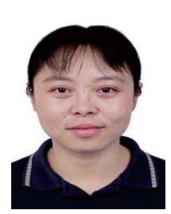

**Sanglu Lu** (Member, IEEE) received the B.S., M.S., and Ph.D. degrees in computer science from Nanjing University, China, in 1992, 1995, and 1997, respectively, where she is currently a Professor with the Department of Computer Science and Technology. Her research interests include distributed computing and pervasive computing.