# A Systematic Survey on Security in Anonymity Networks: Vulnerabilities, Attacks, Defenses, and Formalization

Daichong Chao®, Dawei Xu®, Feng Gao®, Chuan Zhang®, Member, IEEE, Weiting Zhang®, Member, IEEE, and Liehuang Zhu®, Senior Member, IEEE

Abstract—The importance of safeguarding individuals' privacy rights in online activities is unmistakable in today's anonymity networks. Since the introduction of Mixnet by Chaum, numerous anonymity networks with different objectives and design principles have emerged, providing a diverse range of applications for privacy-conscious users. However, security issues in anonymity networks have persistently existed and continue to impact their survival and development. Each anonymity network presents distinct security challenges, making it more challenging for researchers to achieve a comprehensive and systematic understanding of their security. The current literature exhibits some unavoidable gaps, including the lack of vulnerability perspectives, a unified understanding of diverse attack types, defense perspectives, and theoretical perspectives. To address these gaps, we investigate prevailing attacks targeting anonymity networks from the viewpoint of network designers and operators. We use Tor, I2P, and Freenet (arguably the three most popular anonymity networks) as case studies. Starting with these attacks, we conduct an in-depth analysis of the vulnerabilities underlying them and explore related defense mechanisms and formal security. Specifically, we classify vulnerabilities into external and internal categories, utilizing the protocol stack of an anonymity network to guide the categorization of internal vulnerabilities. Furthermore, we examine their root causes. In addition to these aspects, we emphasize the importance of formal security in researching the security of anonymity networks by integrating the investigated vulnerabilities, attacks, and defenses. Through this comprehensive, thorough, and unified approach, this paper aims to provide insights into the security of anonymity networks and offer general research findings. Finally, we discuss ongoing challenges and future directions in this specific area.

Manuscript received 25 May 2023; revised 22 September 2023 and 18 November 2023; accepted 1 January 2024. Date of publication 4 January 2024; date of current version 23 August 2024. This work was supported in part by the National Defense Basic Scientific Research Program of China under Grant JCKY2019602B013 and Grant JCKY2018602B015. (Corresponding authors: Dawei Xu; Chuan Zhang.)

Daichong Chao is with the School of Computer Science and Technology, Beijing Institute of Technology, Beijing 100081, China (e-mail: chaodaichong@163.com).

Dawei Xu is with the School of Computer Science and Technology, Beijing Institute of Technology, Beijing 100081, China, and also with the College of Cybersecurity, Changchun University, Changchun 130022, China (e-mail: xudw@ccu.edu.cn).

Feng Gao, Chuan Zhang, and Liehuang Zhu are with the School of Cyberspace Science and Technology, Beijing Institute of Technology, Beijing 100081, China (e-mail: gaofengbit@foxmail.com; chuanz@bit.edu.cn; liehuangz@bit.edu.cn).

Weiting Zhang is with the School of Electronic and Information Engineering, Beijing Jiaotong University, Beijing 100044, China (e-mail: wtzhang@bjtu.edu.cn).

Digital Object Identifier 10.1109/COMST.2024.3350006

Index Terms—Anonymity network, attack, vulnerability, defense, formal security.

#### I. Introduction

TODAY, online privacy is drawing more public attention. On the public Internet, users' communication identities (such as Internet Protocol (IP) addresses) are inherently susceptible to exposure such that an eavesdropper can trivially determine who is communicating with whom, let alone in a censored setting. Adversaries, such as state-level intelligence agencies, can conduct global-scale pervasive surveillance anywhere on the public Internet [1], including the throttling of traffic to and from designated sites. The centralized service paradigm (client-server paradigm) also incurs frequent data leakage on the service provider side (giant corporations) [2], [3]. In such a case, the user's online activities will become devoid of any secrecy. Consequently, the open nature of the Internet hardly constitutes a basis for trust, especially for those who seek to keep anonymous online [4].

The strong pursuit of privacy preservation motivates the emergence of anonymity networks (also referred to as anonymous communication systems in the literature). Anonymity networks are network systems designed to conceal user identities and communication content within the shared public network environment. Its primary objective is to safeguard user identity privacy, allowing them to engage in anonymous communication and browsing on the Internet without being tracked, monitored, or identified. Since the seminal work by Chaum [5], which proposed the idea of hiding the email communication between the user and the server by using several relay servers (called mix), dozens of anonymity networks (either concepts or public products) have been proposed, based on different anonymous mechanisms. Technically, in anonymity networks, original messages are transformed into anonymous messages through anonymous techniques: the content of the messages can be protected by data encryption algorithms and data privacy techniques; while the metadata of the messages can be concealed through proxying, tunneling, pooling, randomization, broadcasting, and other techniques. Consequently, with the support of anonymity networks, users can engage in various activities, such as anonymously browsing the public Internet [6], sending instant messaging [7] or emails [5], participating in anonymous voting [8], sharing

1553-877X © 2024 IEEE. Personal use is permitted, but republication/redistribution requires IEEE permission. See https://www.ieee.org/publications/rights/index.html for more information.

censored content [\[9\]](#page-47-8). Thereby, this helps protect individual privacy and prevents third parties from tracking or monitoring their online activities. On the other hand, based on the anonymity mechanisms provided by anonymity networks, many anonymous services have been provided that are not indexed by public Internet search engines. These services are exclusively accessible through specialized software, such as the Tor browser. Such services offer various types of resources, including Web hosting, anonymous blogs, anonymous forums, Internet Relay Chat (IRC), file sharing, and more, forming a well-known cyberspace beneath the public Internet, namely the darknet (sometimes referred to as the dark Web [\[10\]](#page-47-9)).

Different anonymity networks have distinct anonymity objectives, design principles, network structures, routing strategies, adversary models, performance, and application scenarios. Among diverse classification criteria, routing characteristics essentially reflect the technical principles of anonymity networks. According to the literature [\[11\]](#page-47-10), anonymity networks can be categorized into Mixnet related, the Onion Router (Tor) related, random walk and distributed hash table (DHT)-based related, DCnet related, and some miscellaneous.

- *•* Mixnet related. Mixnet [\[5\]](#page-47-4), the seminal work for anonymous communication, uses mix nodes to transform messages cryptographically and shuffle them. Thereby, the input-output relation between individual messages is hidden. In Chaumian Mixnet, the mix node does output the messages when a threshold of messages is collected (corresponding to a process called flushing), thus introducing a delay in message transmission. Due to the variations in mix selection strategies and flushing strategies during the routing process, several follow-up anonymity networks were proposed, including high-latency (e.g., Babel [\[12\]](#page-47-11), Mixmaster [\[13\]](#page-47-12), Mixminion [\[14\]](#page-47-13), and Loopix [\[15\]](#page-47-14)) and low-latency (e.g., Java Anon Proxy (JAP) [\[16\]](#page-47-15)) networks, catering to different application scenarios.
- *•* Tor (onion routing) related. Unlike Mixnet, based on onion routing [\[17\]](#page-47-16), Tor [\[6\]](#page-47-5) provides connection-oriented low-latency communication. The user initiates the process by establishing a (virtual) circuit through multiple proxies, known as onion routers. This is achieved by selecting these routers as intermediate nodes and sequentially negotiating symmetric session keys with each of them. Then a message is encrypted multiple times with the negotiated symmetric keys, instead of the public-private keys in mix nodes. In the Tor network, several directory authorities collect and distribute global network state. It also supports hidden services, providing anonymity for receivers. Thanks to its low latency and versatility, Tor is currently the most widely used anonymity network. It is even used to support privacy protection in other fields [\[18\]](#page-47-17). Due to the variations in routing strategies and scalability, some variants [\[19\]](#page-47-18), [\[20\]](#page-47-19), [\[21\]](#page-47-20) appeared also.
- *•* Random walk and DHT-based related. Unlike the sourcerouted approach in Mixnet and Tor, random walk and DHT-based follow the hop-by-hop routed approach. Typically, in a random walk related anonymity network,

- when a node receives a message, it would select a relaying node randomly and then forward the message to that node with a fixed forward probability, thus resembling random walking. Such anonymity networks (e.g., Crowds [\[22\]](#page-47-21), the Anonymizing Peer-to-Peer Proxy (AP3) [\[23\]](#page-47-22), and Tarzan [\[24\]](#page-47-23)) are often combined with peer-to-peer (P2P) network structures. However, due to (highly) random walking, routing efficiency is one of the main problems in them. To improve routing efficiency, a distributed hash table can be adopted to manage the distributed nature of the data (relaying nodes or distributed storage) in the network, aiming at efficient searching (thus efficient routing). Among these DHTbased anonymity networks, Freenet [\[9\]](#page-47-8) is famous for its anonymous distributed file-sharing.
- *•* DCnet related. DCnet related follows the broadcast routing type. The idea of DCnet was first proposed by Chaum [\[25\]](#page-47-24), inspired by the dining cryptographers problem. Three cryptographers sit together for dinner and try to identify whether the dinner is paid for by the National Security Agent (NSA) or one of them, following an information-theoretically secure approach. The significant feature of DCnet is to provide information-theoretically secure anonymity, by offering broadcast anonymous communication and enabling all participants to verify the final outcome. Also, due to the broadcast nature, DCnet incurs high bandwidth costs. Meanwhile, the introduced timing coordination among participants makes it high-latency. To improve efficiency and performance, some variants appeared, e.g., Herbivore [\[26\]](#page-47-25), Dissent [\[27\]](#page-47-26).
- *•* Miscellaneous. A few anonymity networks do not fit into the aforementioned categories, For example, the Invisible Internet Project (I2P) [\[7\]](#page-47-6), a well-known distributed peerto-peer anonymity network. In terms of managing and administrating network state, it adopts the DHT approach, thus making itself distributed. Yet, for the routing process, it adopts the source-routed approach, closely mimicking onion routing.

## *A. Motivation*

Undoubtedly, security is crucial for anonymity networks. A secure anonymity network provides users with the necessary confidence, and only through ensuring its security can the network thrive and expand. However, due to the complexity of anonymity networks themselves and external interference, they often face the dual impact of internal and external vulnerabilities. Consequently, ensuring the security of anonymity networks is a challenging task. Furthermore, some welldeployed anonymity networks demonstrate that many attackers have targeted them, putting them in a precarious position.

Commonly, an anonymity network is an (overlay) distributed system with a whole stack of software and hardware. It involves many participants with mutual weak trust. Consequently, diversified attacks have been customized against them since their birth by exploiting some vulnerabilities around them [\[28\]](#page-47-27), [\[29\]](#page-47-28), [\[30\]](#page-48-0), [\[31\]](#page-48-1), [\[32\]](#page-48-2), [\[33\]](#page-48-3). These attacks

TABLE I ABBREVIATIONS USED THROUGHOUT THE PAPER

| Abbr    | Description                                         | Abbr    | Description                                                     |
|---------|-----------------------------------------------------|---------|-----------------------------------------------------------------|
| 1W-AKE  | one-way authenticated key exchange                  | LHE     | length hidden encryption                                        |
| AP3     | the Anonymizing Peer-to-Peer Proxy                  | ML      | machine learning                                                |
| AS      | autonomous system                                   | NSA     | the National Security Agent                                     |
| AES     | Advanced Encryption Standard                        | MAC     | message authentication code                                     |
| BGP     | Border Gateway Protocol                             | MLaaS   | machine learning as a service                                   |
| CNN     | convolutional neural network                        | OW-CCA  | one-way against chosen ciphertext attack                        |
| DH      | Diffie-Hellman                                      | OW-CPA  | one-way against chosen plaintext attack                         |
| DHT     | distributed hash table                              | OR      | onion router                                                    |
| DL      | deep learning                                       | OP      | onion proxy                                                     |
| DNN     | deep neural network                                 | PKIC    | public-key-independent ciphertext                               |
| DA      | directory server                                    | PIR     | private information retrieval                                   |
| DNS     | Domain Name System                                  | P2P     | peer-to-peer                                                    |
| DF      | deep fingerprint                                    | RUP     | release of unverified plaintexts                                |
| FREAK   | the factoring the server's export-grade RSA key     | RSA     | Rivest-Shamir-Adleman                                           |
| FNR     | false negative rate                                 | RF      | Robust Fingerprinting                                           |
| GCM     | Galois/Counter Mode                                 | RP      | rendezvous point                                                |
| GAN     | generative adversarial network                      | SVM     | Support Vector Machine                                          |
| HTTP    | Hypertext Transfer Protocol                         | SDN     | software-defined networking                                     |
| HSDir   | hidden service                                      | SHA-256 | Secure Hash Algorithm 256-bit                                   |
| HS      | hidden service                                      | SURB    | single-use reply block                                          |
| HTL     | hops-to-live                                        | SDA     | stacked denoising autoencoder                                   |
| ISP     | Internet Service Provider                           | SGX     | Software Guard Extensions                                       |
| InP     | introduction point                                  | TAM     | traffic aggregation matrix                                      |
| IP      | Internet Protocol                                   | TCP     | Transmission Control Protocol                                   |
| IRC     | Internet Relay Chat                                 | TPR     | true positive rate                                              |
| I2P     | the Invisible Internet Project                      | Tor     | the Onion Router                                                |
| IND-CPA | Indistinguishability under Chosen-Plaintext Attack  | TLS     | Transport Layer Security                                        |
| IND-CCA | Indistinguishability under Chosen-Ciphertext Attack | TAP     | the tor authentication protocol                                 |
| IXP     | internet exchange point                             | UID     | unique identifier                                               |
| JAP     | Java Anon Proxy                                     | UTC     | Coordinated Universal Time                                      |
| KB      | kilobyte                                            | UC      | Universal Composability                                         |
| KEM     | key encapsulation mechanism                         | US      | United States                                                   |
| k-NN    | k-Nearest Neighbors                                 | WF      | website fingerprint                                             |
| LRU     | Least Recently Used                                 | WTF-PAD | Website Traffic Fingerprinting Protection with Adaptive Defense |
| LSTM    | long short-term memory                              | XOR     | eXclusive OR                                                    |

involve sybil attacks [\[34\]](#page-48-4), correlation attacks [\[35\]](#page-48-5), [\[36\]](#page-48-6), [\[37\]](#page-48-7), denial-of-service attacks [\[38\]](#page-48-8), watermarking attacks [\[39\]](#page-48-9), [\[40\]](#page-48-10), website fingerprint (WF) attacks [\[41\]](#page-48-11), [\[42\]](#page-48-12), [\[43\]](#page-48-13), bridge discovery attacks [\[44\]](#page-48-14), eclipse attacks [\[45\]](#page-48-15), autonomous system (AS)/state-level adversary attacks [\[46\]](#page-48-16), etc. More specifically, taking Tor as an example, we can derive the following observations:

*•* In terms of internal vulnerabilities, as a persistent and common feature of distributed systems, protocol attacks against Tor utilize vulnerabilities within protocol design or implementation, thus covering many specific attack types. This poses a fundamental impact on Tor's security and is worsened by the complexity of the Tor protocol stack. A non-rigorous protocol design is often exploited by sophisticated adversaries to launch elaborate attacks, such as the denial-of-service attack on the Dream Market (the largest marketplace for illegal money in the Dark Web) [\[33\]](#page-48-3), and the "relay early" attack that aims to deanonymize onion services or users [\[32\]](#page-48-2).

*•* In terms of external vulnerabilities, Tor does not strongly hide data-flow metadata, thus allowing the flourishing of WF attacks in recent years [\[41\]](#page-48-11), [\[42\]](#page-48-12), [\[43\]](#page-48-13), [\[47\]](#page-48-17), [\[48\]](#page-48-18), [\[49\]](#page-48-19), [\[50\]](#page-48-20), [\[51\]](#page-48-21). When transmitted on the Internet, packets' number, size, direction, and timestamp can be trivially captured by a WF adversary. The adversary can exploit this side-channel leakage to train a classification model by combining machine learning (ML) or deep learning (DL) algorithms. Using that classifier, the adversary can determine which website the user visits with high accuracy, even without corrupting any onion routers (OR). The easy availability of attacking conditions and the high performance of WF attacks pose a severe challenge to the anonymity claimed by that anonymity network.

*•* Furthermore, due to its overlay nature, Tor faces challenges in evading threats from AS/state-level adversaries. Exploiting the untrusted nature of the public Internet, an AS/state-level adversary can easily send fake routing advertisements, leading to routing black holes or routing off-path. This broadens the adversary's network view and makes a de-anonymization attack more likely. Real-world Border Gateway Protocol (BGP) prefix hijacking attacks, such as the "Indosat 2014" [\[30\]](#page-48-0) and "Canadian Bitcoin 2014" [\[31\]](#page-48-1) incidents, have highlighted this issue, making the claimed anonymity doubtful.

Since there are various types of attacks against anonymity networks, a profound question needs to be considered further: *How can we thoroughly and systematically comprehend the security of anonymity networks?* This is in order to provide strong support for evaluating their effectiveness in protecting user privacy and data security, identifying and addressing potential threats and attacks, enhancing user experience, increasing user trust, and promoting their improvement and development.

However, although a few previous works [\[52\]](#page-48-22), [\[53\]](#page-48-23), [\[54\]](#page-48-24), [\[55\]](#page-48-25), [\[56\]](#page-48-26) have tried to provide a picture of this area, and have investigated a wide variety of attacks, the aforementioned question is not answered adequately. These works [\[52\]](#page-48-22), [\[53\]](#page-48-23), [\[54\]](#page-48-24), [\[55\]](#page-48-25), [\[56\]](#page-48-26) often selectively introduce attacks from varying perspectives, potentially overlooking crucial insights for the security of anonymity networks. We identify the following gaps that impede the progress of securing anonymity networks:

- *• Gap 1: lacking vulnerability perspectives*. Vulnerability is the basis for an adversary to launch an attack, and its root cause constrains the actual security level. However, the current literature tends to focus on the introduction of attacks, overlooking the introduction and analysis of vulnerabilities behind them. However, different anonymity networks have varying settings, anonymity objectives, and adversary models, resulting in a wide range of attacks targeting them. Even within a single anonymity network, there may be diverse attack types. This situation implies that without drawing an insightful understanding of the vulnerabilities on which these attacks depend, it is easy to remain on the surface of security. This poses a significant obstacle to enhancing the security of anonymity networks.
- *• Gap 2: lacking a unified understanding of diverse attack types*. An attack exploits certain specific vulnerabilities with some strategy. The attacks against anonymity networks are diverse. Due to variations in vulnerabilities,

- threat models, attack objectives, and methods employed, these attacks often seem unrelated and independent, especially when an anonymity network has a multi-layer protocol stack. Despite the existing literature providing insights into attacks from different perspectives, they rarely distill the commonalities among these attacks. Researchers may raise such a question: *What are the prevailing threats to this anonymity network, and do they operate in isolation, or are they interdependent?* Unfortunately, the existing literature's taxonomy methods do not adequately address this question.
- *• Gap 3: lacking defense perspectives*. Defense is an essential aspect of security and indicates the possible ways for a defender. When several defense methods are at hand, it is vital to compare the pros and cons to optimize a feasible solution. However, the defenses against attacks in anonymity networks are not well provided in the current literature, thus hindering the understanding of securing anonymity networks. Besides, many works have already aimed to provide some solutions for a special case, thus needing an elaborate systematization.
- *• Gap 4: lacking theoretical perspectives*. A theoretical work would draw reliable conclusions on why security is guaranteed, or what extent of security is guaranteed. When unexplained doubts are gathered from empirical studies, it is imperative to get theoretical insights to guide attacks and defenses in practice. Indeed, in terms of the security of anonymity networks, it still has some tricky problems from both attacks and defenses. Such a case would call for a systematization of formal security, thus promoting practical security in anonymity networks.

In summary, vulnerability, attack, defense, and formal security are fundamental components of security. Only by comprehensively examining these four aspects together can researchers systematically understand the security of an anonymity network, offering a comprehensive perspective on anonymity network security.

# *B. Our Contributions*

In this paper, we aim to narrow the above gaps and understand the vulnerabilities, attacks, defenses, and formal security in anonymity networks in a unified manner. (The works investigated are up to September 2023.) Figure [1](#page-4-0) depicts this motivation intuitively and guides our work. In the investigation, given that the attacks targeting anonymity networks are primarily focused on Tor, I2P, and Freenet, we have chosen these three as our investigation cases to provide a broad perspective of security in anonymity networks. Yet, in comparison, there is noticeably less research on the security of I2P and Freenet compared to Tor. Therefore, we have placed more emphasis on systematizing the security of Tor. It should be emphasized that although the investigation only covers three use cases, our bottom-up & top-down investigation approach (refer to Section [II-F\)](#page-13-0) can provide valuable insights and guidance for other anonymity networks. Therefore, our investigation results do not lose their generality. The contributions of this paper are as follows:

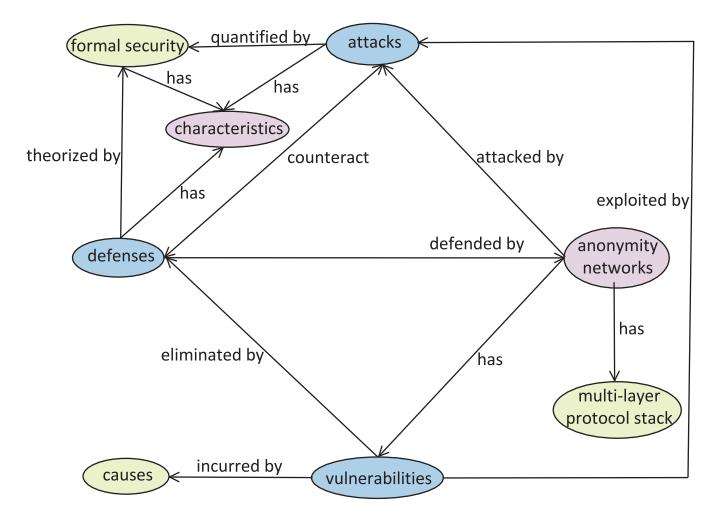

Fig. 1. An ontology of the security in anonymity networks through the perspectives of vulnerabilities, attacks, defenses, and formal security (The formalism here borrows from literature [\[57\]](#page-48-27).). An anonymity network is abstracted by a multi-layer protocol stack, has vulnerabilities, is attacked by attacks, and is defended by defenses; vulnerabilities have root causes, are exploited by attacks, and are addressed by defenses; attacks and defenses counteract each other; formal security theorizes defenses, quantifies attacks; attacks, defenses, and formal security, all have their characteristics. This ontology guides our investigation.

- *• Vulnerabilities*. We investigated the vulnerabilities associated with prevailing attacks targeting anonymity networks, by analyzing them based on relevant attack literature. Furthermore, we examined the root causes of them. Specifically, we classified the vulnerabilities into external vulnerabilities and internal vulnerabilities, categorizing the internal vulnerabilities based on the protocol stack of an anonymity network. This approach contributes to a deeper understanding of security and holds significant importance for formulating defense strategies, and guiding security improvements in anonymity networks.
- *• Attacks*. We investigated the prevailing attacks targeting anonymity networks, selecting and organizing them based on the perspective of the designers and operators of anonymity networks. In particular, for attacks targeting Tor, we categorized the prevailing attacks into three types: protocol attacks, AS/state-level adversary attacks, and WF attacks. By analyzing these attacks, we aimed to provide insights into their characteristics and enhance our understanding of them.
- *• Defenses*. We investigated the defenses against prevailing attacks targeting anonymity networks. By analyzing these defenses, we aimed to provide insights into their characteristics and enhance our understanding of them.
- *• Formal security*. Through the analysis of attacks and defenses in anonymity networks, we have highlighted the importance of formal security in research on the security of anonymity networks. Additionally, we have provided insights into them.
- *• Chanllenges, future directions, and evolution trends*. Based on the findings of our investigation in this paper, we have discussed and analyzed the unresolved issues in anonymity networks, and provided future research

directions, possible solutions, and potential evolution trends in anonymity networks.

#### *C. Comparisons With Other Works*

Table [II](#page-5-0) summarizes the comparison of contributions between our paper and other survey literature on anonymity networks (since 2015).

A limited number of works focus on specific aspects of anonymity networks, such as routing mechanisms [\[11\]](#page-47-10) and anonymity measurement [\[58\]](#page-48-28). In [\[11\]](#page-47-10), the authors investigated the routing mechanisms of anonymity networks and proposed a comprehensive taxonomy of them, encompassing various characteristics related to routing. Utilizing this taxonomy as a linking factor, the authors discussed the impact of the choice of routing mechanism on the performance, scalability, and security of anonymous networks. However, the central focus of the literature [\[11\]](#page-47-10) is not security, as it did not provide a detailed discussion on the prevailing attacks in anonymity networks. Comparatively, we investigated the prevailing attacks targeting anonymity networks, such as protocol attacks, AS/state-level adversary attacks, and WF attacks in Tor. At the same time, we also discussed related vulnerabilities, defenses, and formal security. Literature [\[58\]](#page-48-28) examined the anonymity notions and metrics in anonymity networks, which is relevant to formal security called in our paper. The authors also discuss the differences and limitations of those anonymity metrics and notions. Although the investigated anonymity metrics and notions have some degree of overlap with our paper, literature [\[58\]](#page-48-28) did not provide investigations into other aspects, such as attacks, vulnerabilities, and so forth. Furthermore, when discussing formal security, we provided more detailed explanations regarding cryptographic protocol treatment and WF defense.

Meanwhile, some works [\[53\]](#page-48-23), [\[54\]](#page-48-24), [\[55\]](#page-48-25), [\[56\]](#page-48-26) provide a comprehensive review of a single anonymity network (i.e., Tor), offering limited investigations into security. In terms of security, these works primarily focus on attacks, providing limited defense and narrowing the scope of the investigation. Moreover, those works often do not explicitly identify the prevailing attacks in anonymity networks and lack in-depth analysis of the attacks. Further, they overlook the perspectives of vulnerabilities and formal security. Literature [\[56\]](#page-48-26) reviewed the attacks, ethical vulnerabilities, and financial vulnerabilities in Tor. In terms of attacks, it mentioned only five protocol attacks and seven WF attacks, thus failing to identify the prevailing attacks in the Tor context. Furthermore, literature [\[56\]](#page-48-26) overlooked other security perspectives such as vulnerabilities, defenses, and formal security. We provided a detailed discussion on these missing aspects. Literature [\[53\]](#page-48-23) reviewed Tor's design weaknesses, performance improvements, and attacks. In terms of security, it introduced a variety of attack types based on active attacks and passive attacks. These attacks involve four protocol attacks and a handful of WF attacks and defenses. Therefore, literature [\[53\]](#page-48-23) did not adequately introduce the prevailing attacks in Tor and their corresponding defenses. Meanwhile, it overlooked other security perspectives such as vulnerabilities and formal security. Comparatively, we

TABLE II COMPARISONS WITH RECENT SURVEYS RELATED TO ANONYMITY NETWORKS

| Ref.      | Key contributions                                                                                                                                                                                                                                                                                                                                                                                                                                           | Main limitations                                                                                                                                                                                                                                                                                                                                                                                                                                                                                                                                                                                                                                                                                                                                                                                                                                                                                 |
|-----------|-------------------------------------------------------------------------------------------------------------------------------------------------------------------------------------------------------------------------------------------------------------------------------------------------------------------------------------------------------------------------------------------------------------------------------------------------------------|--------------------------------------------------------------------------------------------------------------------------------------------------------------------------------------------------------------------------------------------------------------------------------------------------------------------------------------------------------------------------------------------------------------------------------------------------------------------------------------------------------------------------------------------------------------------------------------------------------------------------------------------------------------------------------------------------------------------------------------------------------------------------------------------------------------------------------------------------------------------------------------------------|
| [11]      | <ul> <li>Topic: Routing mechanisms in anonymity networks.</li> <li>Investigate routing mechanisms in anonymity networks, providing a taxonomy of anonymity networks based on them.</li> <li>Analyze the performance, scalability, and security of anonymity networks with routing mechanisms as the linking factor.</li> </ul>                                                                                                                              | Lack extensive introduction to attacks, thus falling short in providing a landscape of prevailing attacks in anonymity networks.                                                                                                                                                                                                                                                                                                                                                                                                                                                                                                                                                                                                                                                                                                                                                                 |
| [58]      | <ul> <li>Topic: Anonymity notions and metrics in anonymity networks.</li> <li>Dimensions: Formal security (√)</li> <li>Provide a comprehensive survey on the anonymity metrics and notions and categorize the relevant methods.</li> <li>Discuss the differences and limitations of these anonymity metrics and notions.</li> </ul>                                                                                                                         | Overlook other security perspectives, like vulnerabilities, attacks, defenses.                                                                                                                                                                                                                                                                                                                                                                                                                                                                                                                                                                                                                                                                                                                                                                                                                   |
| [59]      | <ul> <li>Topic: Security in anonymity networks.</li> <li>Dimensions: Attacks (√), defenses (√)</li> <li>Scope: Tor(√), I2P(√), Freenet(√)</li> <li>Review the crimes, threat intelligence techniques, and attacks in the dark web.</li> <li>Provide a small number of defenses.</li> </ul>                                                                                                                                                                  | <ul> <li>Not attempt to investigate prevailing attacks in anonymity networks adequately.</li> <li>Lack insights into attacks, let alone providing the relevant vulnerabilities and other perspectives.</li> </ul>                                                                                                                                                                                                                                                                                                                                                                                                                                                                                                                                                                                                                                                                                |
| [56]      | <ul> <li>Topic: Security in anonymity networks.</li> <li>Dimensions: Attacks (✓)</li> <li>Scope: Tor(✓)</li> <li>Review the attacks, ethical vulnerabilities, and financial vulnerabilities in Tor.</li> </ul>                                                                                                                                                                                                                                              | <ul> <li>Not attempt to identify the prevailing attacks in Tor.</li> <li>Overlook other security perspectives.</li> </ul>                                                                                                                                                                                                                                                                                                                                                                                                                                                                                                                                                                                                                                                                                                                                                                        |
| [53]      | <ul> <li>Topic: Performance and security in anonymity networks.</li> <li>Dimensions: Attacks (✓), defenses (✓)</li> <li>Scope: Tor(✓)</li> <li>Review the design weaknesses, performance improvements, and attacks in Tor.</li> </ul>                                                                                                                                                                                                                       | <ul> <li>Not introduce the prevailing attacks in Tor adequately, thus the relevant defenses.</li> <li>Overlook other security perspectives.</li> </ul>                                                                                                                                                                                                                                                                                                                                                                                                                                                                                                                                                                                                                                                                                                                                           |
| [52]      | <ul> <li>Topic: Security in anonymity networks.</li> <li>Dimensions: Attacks (√)</li> <li>Scope: Tor(√), I2P(√)</li> <li>Review the application and network-level attacks in Tor, I2P.</li> </ul>                                                                                                                                                                                                                                                           | <ul> <li>Not introduce the prevailing attacks in Tor adequately.</li> <li>Lack the relevant insights into attacks, especially the general implications for anonymity networks.</li> <li>Overlook other security perspectives.</li> </ul>                                                                                                                                                                                                                                                                                                                                                                                                                                                                                                                                                                                                                                                         |
| [55]      | <ul> <li>Topic: Study distribution in anonymity networks.</li> <li>Dimensions: Attacks (✓)</li> <li>Scope: Tor(✓)</li> <li>Review and classify the research topics on the Tor network over a long period, showing that 'security' and 'anonymity' are the most frequent keywords.</li> </ul>                                                                                                                                                                | <ul> <li>Not introduce the prevailing attacks in Tor adequately.</li> <li>Lack the relevant insights into attacks.</li> <li>Overlook other security perspectives.</li> </ul>                                                                                                                                                                                                                                                                                                                                                                                                                                                                                                                                                                                                                                                                                                                     |
| [54]      | <ul> <li>Topic: Security in anonymity networks.</li> <li>Dimensions: Attacks (√), defenses (√)</li> <li>Scope: Tor(√)</li> <li>Review the de-anonymization attacks on Tor.</li> <li>Analyse the practicality of these attacks.</li> </ul>                                                                                                                                                                                                                   | <ul> <li>Not introduce the prevailing attacks in Tor explicitly.</li> <li>Lack the relevant insights into attacks, especially their characteristics.</li> <li>Not introduce the defenses in Tor adequately.</li> <li>Overlook other security perspectives.</li> </ul>                                                                                                                                                                                                                                                                                                                                                                                                                                                                                                                                                                                                                            |
|           | <ul> <li>Topic: Security in anonymity networks.</li> <li>Dimensions: Vulnerabilities, attacks (√), defenses (√), formal securit</li> <li>Scope: Tor(√), I2P(√), Freenet(√)</li> </ul>                                                                                                                                                                                                                                                                       | ty (🗸)                                                                                                                                                                                                                                                                                                                                                                                                                                                                                                                                                                                                                                                                                                                                                                                                                                                                                           |
|           | Overlapping contributions                                                                                                                                                                                                                                                                                                                                                                                                                                   | Distinct contributions                                                                                                                                                                                                                                                                                                                                                                                                                                                                                                                                                                                                                                                                                                                                                                                                                                                                           |
| Our paper | <ul> <li>Partial instances of prevailing attacks surveyed in this paper, especially WF attacks against Tor compared to literature [54] and protocol attacks against Tor which are classified into different taxonomies in these surveys.</li> <li>Few and miscellaneous defenses against the attacks surveyed in this paper.</li> <li>Several formal security works with literature [58], especially on anonymity analysis called in this paper.</li> </ul> | <ul> <li>Identify the prevailing attacks in Tor explicitly.</li> <li>Investigate the vulnerabilities associated with prevailing attacks, providing a deep understanding of the attacks, especially based on philosophical considerations (external vulnerabilities and internal vulnerabilities) and protocol stack.</li> <li>Provide an elaborate investigation into the defenses against prevailing attacks.</li> <li>Highlight the importance of formal security, providing a review focusing on cryptographic protocol analysis, defense against WF fingerprint attacks, and anonymity analysis.</li> <li>Simultaneously consider Tor, I2P, Freenet, and other anonymity networks to enhance the generality of the provided understanding of security.</li> <li>Provide extensive discussions on the ongoing challenges, future work, and evolution trends in anonymity networks.</li> </ul> |

provided a systematic discussion on protocol attacks and WF attacks and their defenses in Tor. Additionally, we investigated the security of I2P and Freenet to provide general findings. Literature [\[55\]](#page-48-25) reviewed and classified the research topics on

the Tor network over a long period, highlighting "security" and "anonymity" as the most frequent keywords. However, it also did not introduce the prevailing attacks in Tor adequately and overlooked other security perspectives as well. Literature [\[54\]](#page-48-24) attempted to conduct a comprehensive review of Tor's security by focusing on de-anonymization, with a rich survey of WF attacks. The authors also analyzed the practicality of these attacks. However, literature [\[54\]](#page-48-24) did not explicitly introduce the prevailing attacks in Tor and lacked relevant insights into attacks and other security perspectives (such as vulnerabilities, defenses, and formal security). In comparison, we consider protocol attacks, AS/state-level adversary attacks, and WF attacks as prevailing attacks against Tor and provide a systematic discussion of these attacks and their related defenses. Since literature [\[53\]](#page-48-23), [\[54\]](#page-48-24), [\[55\]](#page-48-25), [\[56\]](#page-48-26) solely focuses on Tor, they lack general insights into anonymity networks, which are crucial for an in-depth understanding of the security of anonymity networks.

Compared to literature [\[53\]](#page-48-23), [\[54\]](#page-48-24), [\[55\]](#page-48-25), [\[56\]](#page-48-26), literature [\[52\]](#page-48-22), [\[59\]](#page-48-29) extend their investigation scope on security to more anonymity networks, rather than a single one. Nevertheless, they did not thoroughly investigate the prevailing attacks, provide sufficient insights, or address other security aspects comprehensively. Literature [\[52\]](#page-48-22) reviewed the application and network-level attacks in Tor and I2P, but inadequately examined the prevailing attacks in Tor. It also lacked relevant insights into attacks, particularly the general implications for anonymity networks, and overlooked other security perspectives. In comparison, we extensively discussed protocol attacks, AS/state-level adversary attacks, and WF attacks in Tor, providing summaries and lessons learned for each. Additionally, we have systematically addressed vulnerabilities, defenses, and formal security. Given our adoption of a bottom-up & top-down investigation approach, our findings are more profound and general. Literature [\[59\]](#page-48-29) examined crimes, threat intelligence techniques, and attacks in the dark Web, providing a limited number of defenses. However, in a similar vein, it lacked a comprehensive investigation encompassing various security perspectives, such as vulnerabilities, defenses, and formal security.

The aforementioned factors result in a lack of thorough investigation into the security of anonymity networks, thus providing a limited (not general) understanding of security. Furthermore, the ongoing challenges, future directions, and evolution trends in anonymity networks have not been comprehensively addressed and updated by the current literature. Our paper aims to address these gaps. For more detailed comparisons, please refer to Table [II.](#page-5-0)

#### *D. Scope of the Survey*

The rest scope of the survey is shown in Figure [2.](#page-7-0) Section [II](#page-6-0) introduces the relevant background, including Tor (Section [II-A\)](#page-6-1), I2P (Section [II-B\)](#page-9-0), Freenet (Section [II-C\)](#page-10-0), other notable anonymity networks (Section [II-D\)](#page-10-1), formal security (Section [II-E\)](#page-13-1), and the survey methodology used in this paper (Section [II-F\)](#page-13-0). Especially, we introduce Tor in more detail, including its protocol stack, traffic processing, and threat model. Section [III](#page-14-0) introduces the vulnerabilities in anonymity networks from two aspects: internal vulnerabilities and external vulnerabilities, including protocol vulnerabilities (Section [III-A\)](#page-14-1), metadata leakage (Section [III-B\)](#page-17-0), and the overlay nature (Section [III-C\)](#page-18-0) in Tor, and the vulnerabilities in I2P and Freenet (Section [III-D\)](#page-19-0) respectively. Section [IV](#page-20-0) introduces the prevailing attacks in anonymity networks. Firstly, protocol attacks (Section [IV-A\)](#page-20-1), WF attacks (Section [IV-B\)](#page-24-0), and AS/state-level adversary attacks (Section [IV-C\)](#page-26-0) in Tor are introduced respectively. It then introduces the attacks in I2P and Freenet (Section [IV-D\)](#page-27-0). In Section [V,](#page-28-0) the defenses against protocol attacks (Section [V-A\)](#page-29-0), WF attacks (Section [V-B\)](#page-30-0), and AS/state-level adversary attacks (Section [V-C\)](#page-33-0) in Tor are introduced respectively. Then the defenses against attacks in I2P and Freenet (Section [V-D\)](#page-36-0) are introduced. Section [VI](#page-36-1) starts with a discussion of the very importance of formal security for anonymity networks (Section [VI-A\)](#page-36-2) by analyzing the vulnerabilities, attacks, and defenses mentioned in Section [III,](#page-14-0) Section [IV,](#page-20-0) Section [V,](#page-28-0) and introduces the formal security research of anonymity networks from three aspects: cryptographic protocol treatment (Section [VI-B\)](#page-37-0), WF defenses (Section [VI-C\)](#page-39-0), and anonymity analysis (Section [VI-D\)](#page-40-0). Importantly, we provide a summary and lessons learned in each subsection of Sections [III](#page-14-0)[-VI.](#page-36-1) Section [VII](#page-41-0) discusses the challenges, future directions, and potential evolution trends in anonymity networks. Section [VIII](#page-47-29) summarizes this paper.

#### II. BACKGROUND

#### *A. Tor*

*1) Overview of Tor:* Tor is an overlay network consisting of thousands of volunteer nodes on the Internet and provides anonymous channels based on the notion of onion routing [\[17\]](#page-47-16). Remarkably, Tor has low latency characteristics and customized support for onion services [\[60\]](#page-48-30). On the one hand, Tor allows users to access Internet services to preserve their identity privacy, namely user-side anonymity. On the other hand, Tor facilitates Transmission Control Protocol (TCP) services as onion services to offer service-side anonymity [\[61\]](#page-48-31). This nature allows operators to publish services without revealing their site locations, crucially breeding a novel cyberspace: the Dark Web [\[10\]](#page-47-9). So far, Tor has more than 6,000 onion nodes and bears more than 150,000 onion services, with over two million daily users [\[62\]](#page-48-32).

Tor is composed of many nodes in several roles. The volunteer nodes are called onion routers. The clients on the user side are called onion proxies (OP). The sites that anonymously provide online services are called onion services or hidden services (HS). In addition, several semi-trusted directory servers serve as the authoritative directory servers (DA) to collect router descriptors from OR nodes, generate consensus on router descriptors and network states, and provide the downloading service of consensus to both clients and OR nodes.

Before delving further into Tor, let's first explore two core terms related to Tor, onion routing and onion encryption.

*Onion routing*. Onion routing is a privacy technology that conceals the identities of message senders and recipients, as well as message content. It works by enveloping a message in multiple layers, akin to "onion skins", with each layer processed by a different OR. As the message travels through the

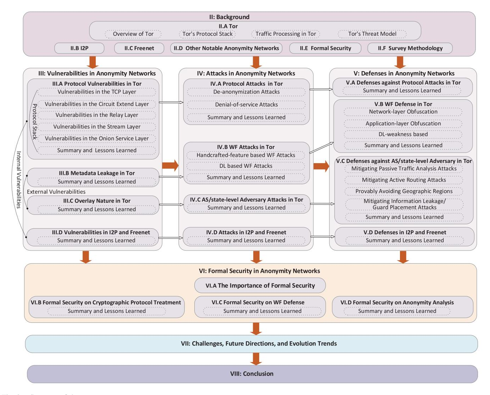

Fig. 2. Structure of the survey.

Tor network, each intermediate OR can only remove one layer, revealing solely the next destination without knowledge of the source or final recipient. Ultimately, the message reaches the last OR, which fully unwraps it and delivers it to the intended recipient. This approach effectively safeguards communication privacy and anonymity, rendering it challenging to trace or identify participants.

*Onion encryption*. Onion encryption, often paired with onion routing, safeguards data by encrypting it multiple times in layers, like onion skins. Each layer uses a unique key, and only its corresponding decryption key can decrypt it. As data traverses Tor, intermediate ORs decrypt one layer and pass it to the next OR, with the final node decrypting all layers and delivering the original data.

Clients get the information of OR nodes from consensus files and access the Internet or onion services by creating onion-routing circuits. In that way, the application layer traffic is encrypted with multiple onion layers at OPs (following onion encryption) and sent over the circuit in fixedsize (512) cells. Each OR decrypts cells using symmetric keys and then forwards cells to the next-hop OR in the circuit.

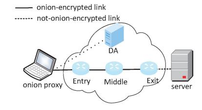

Fig. 3. Tor's general circuit.

*General circuit*. Figure [3](#page-7-1) depicts a scenario where a user accesses the Internet service with a three-hop circuit. The OP randomly selects three OR nodes from the consensus file and creates a circuit, which can be called a general circuit for the sake of distinction. These three OR nodes are commonly referred to as the entry/guard node, middle node, and exit node, respectively.

*Accessing an onion service*. Figure [4](#page-8-0) depicts a scenario where a user accesses an onion service with a six-hop circuit. Commonly, the OP calculates the responsible hidden service directories (HSDir) of the onion service based on the consensus file and then establishes a six-hop circuit between

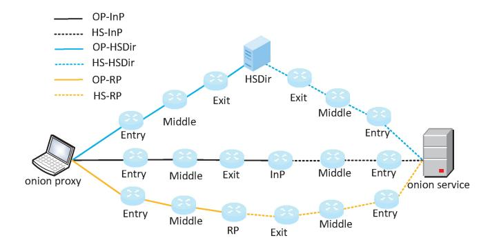

Fig. 4. Tor's onion service.

the OP and the onion service after several steps. The above process involves several circuit types, including OP-HSDir, HS-HSDir, OP-InP, HS-InP, OP-RP, and HS-RP. The relevant abbreviations are explained as follows. InP refers to the introduction point (InP) responsible for receiving the access request from OP and can be regarded as the pre-service agent of onion service. RP refers to the rendezvous point (RP) responsible for receiving access replies from HS. In particular, HSDir is responsible for mapping an HS descriptor to its introduction points and, therefore, can be viewed as the HS's Domain Name System (DNS) server.

*2) Tor's Protocol Stack:* Since Tor's protocol vulnerabilities are examined in Section [III-A,](#page-14-1) the protocol stack of Tor is presented here to guide the classification of protocol vulnerabilities.

Tor contains many protocols and different protocols have different functions. Yet, a protocol may include several subprotocols. Based on the invocation or support relationships, the protocol stack involved in a general circuit can be shown in Figure [5-](#page-9-1)(a). The key protocols within the Tor protocol stack are explained below:

*TCP protocol*. TCP helps to build the TCP channel between OR nodes on the Internet. Several mechanisms within TCP (e.g., timeout retransmission) guarantee the reliable transmission of Tor's application data on the Internet [\[63\]](#page-48-33).

*Transport Layer Security (TLS) protocol*. TLS is located on top of TCP and establishes a TLS connection between OR/OP and OR to provide confidentiality and integrity on the Internet [\[64\]](#page-48-34). TLS provides an interface for the core Tor protocol to establish secure channels between OP/OR and OR.

*Core Tor protocol*. The Core Tor protocol is the main protocol of the Tor system and specifies the functions of onion routing and circuit building. supporting the main requirements as shown in Figure [3](#page-7-1) [\[65\]](#page-48-35). It includes multiple sub-protocols with different functions, as shown in Figure [5-](#page-9-1)(b). Each subprotocol has different functions. (1) *link protocol*: responsible for establishing a secure channel using TLS for all Tor traffic. It consists of multiple parts that achieve congestion control, traffic access, traffic obfuscation, and other goals. (2) *circuit extend protocol*: responsible for establishing a multihop tunnel, called a circuit, between sender and receiver and exchanging key materials required for onion encryption using public-key cryptography. It includes two instances, the tor authentication protocol (TAP) and nTor, which are used for circuit establishment only (Not for the entire life cycle, so we represent it in a narrow box in Figure [5-](#page-9-1)(b)). (3) *relay protocol*: responsible for onion routing and circuit management, including Advanced Encryption Standard (AES) counter mode and end-to-end integrity mechanisms for onion encryption/decryption and integrity checking, respectively. (4) *stream protocol*: responsible for building TCP data channels, or streams, between sender and receiver. A circuit can carry multiple streams, each with different destinations.

*Onion service protocol*. The Onion Service protocol, noted by "\*" in Figure [5-](#page-9-1)(b), is one of the main protocols of the Tor system, which is used to provide onion services. It is built on top of the core Tor protocol and specifies the release and acquisition of onion services, supporting the requirements shown in Figure [4](#page-8-0) [\[60\]](#page-48-30). The Onion Service protocol utilizes the anonymity properties of the Tor network to achieve multiple anonymous targets, such as keeping the OP anonymous to the HSDir (i.e., not revealing who requested a particular HS descriptor), keeping the OP and HS anonymous to the InP, and keeping the OP/HS anonymous to the RP.

In terms of the data unit, different protocols/sub-protocols have different cell types. Link protocol involves versions cell, certs cell, etc. Circuit extend protocol involves create/created cell, relay\_extend/extended cell, etc. Relay protocol involves relay\_data cell, relay\_sendme cell, etc. For more cell types and related semantics, we recommend Tor's protocol specifications [\[60\]](#page-48-30), [\[65\]](#page-48-35).

*3) Traffic Processing in Tor:* This section briefly introduces how the Tor system processes data as a supplementary to Tor's protocol stack.

To start, the operating system stores incoming packets in socket input buffers of the kernel, where each socket corresponds to a TCP connection. Each TCP connection is an object that can send and receive network events and has an input buffer and an output buffer. Tor uses the libevent library to poll the socket's input or output buffer. In each reading event, data is transferred from the socket input buffer to TLS, and then a decryption operation is done. Then the core Tor protocol starts to work, transferring data from TLS to the connection input buffer. These data are read in cell size and then onion-decrypted and transferred to the corresponding circuit queue. It is worth noting that, cells from the same connection input buffer may enter different circuit queues as the TLS channel between two ORs may carry several circuits concurrently. Besides, different circuit types may contain different amounts of streams. The circuit corresponding to one onion service has only one stream, yet the general circuit may have several streams. Tor uses a circuit scheduler to select cells from circuit queues on a priority basis and then write them to the connection output buffer. For each writing event, sending data from the connection output buffer to the outside link performs the inverse process. For more details, please refer to literature [\[66\]](#page-48-36).

*4) Tor's Threat Model:* Tor's threat model assumes that a local adversary can observe or control a portion of the network/nodes and generate, modify, delete, or delay traffic (non-protocol factors). If an adversary observes both ends of a circuit, the circuit's anonymity would be comprised by

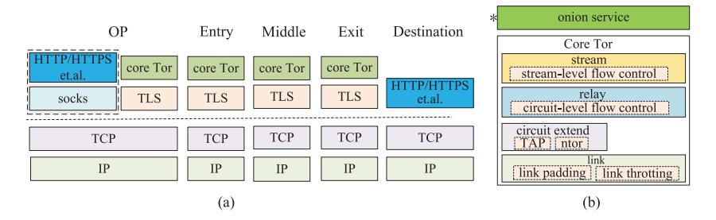

Fig. 5. Tor's protocol stack. (a) represents the protocol stack for the general circuit case; (b) details the core Tor protocol and shows the onion service protocol.

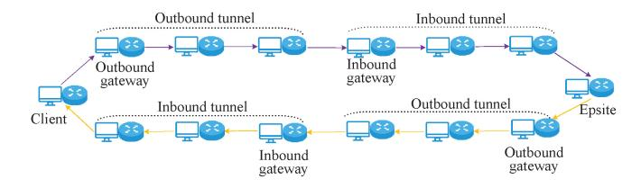

Fig. 6. Basic communication between two I2P peers using Garlic-routing.

passively observing traffic patterns or actively introducing traffic patterns. If the adversary controls a *f* portion of the network, the probability of compromising a circuit is *f* 2, which is expected to be acceptable [\[53\]](#page-48-23). Besides the above deanonymization attacks, attackers may try other attack forms, such as key compromising, handshake replaying, tagging attacks, subverting DAs, and website fingerprinting attacks.

# *B. I2P*

I2P [\[7\]](#page-47-6) is a message-oriented anonymity network, facilitating a wide range of applications, e.g., anonymous Web-hosting (called Eepsite in I2P), Web browsing, file-sharing, email, and more. I2P consists of nodes peers (also referred to as peers, relays, or routers) running the I2P router software that allows them to communicate with each other. All I2P nodes (except Eepsites) also participate in the network as relays, routing traffic for other nodes. Unlike the bidirectional circuit in onion routing, I2P utilizes unidirectional garlic-routing tunnels for incoming and outgoing messages. In addition, to effectively manage and provide information about nodes in the network, I2P utilizes a DHT-based directory service mechanism.

*Inbound tunnel* and *outbound tunnel*. An I2P client uses two types of communication tunnels: inbound tunnel and outbound tunnel. Accordingly, a round-trip communication between two parties needs four tunnels, as shown in Figure [6.](#page-9-2) When Alice wants to communicate with Bob, she sends messages through her outbound tunnel, which is then received by the gateway node of Bob's inbound tunnel. Alice learns the address of Bob's gateway node by querying the network database. To respond to Alice, Bob follows the same process by sending reply messages through his outbound tunnel towards the gateway of Alice's inbound tunnel. The anonymity of both Alice and Bob is preserved since they only know the addresses of the gateways, but not each other's real addresses. In I2P, new tunnels are formed every ten minutes.

*Garlic routing.* Garlic routing is a routing technology employed within the I2P network. It is an enhanced variation of the onion routing method designed to safeguard users' communication privacy and anonymity. In garlic routing, data is encapsulated within multi-layered messages known as "garlic cloves". Each layer employs a distinct encryption key. Unlike Tor, multiple garlic cloves can be bundled together in a single garlic message. When they are unveiled at the outbound tunnel endpoint, each garlic clove carries its unique delivery instructions for different recipients. When a garlic clove passes from an outbound tunnel to an inbound tunnel, garlic encryption (i.e., ElGamal/AES) is employed by the originator, adding an additional layer of end-to-end encryption to conceal the message information. This multilayered encryption and multiplexing approach significantly complicates tracking or analysis of message transmission, while concurrently enhancing the security and performance of the anonymity network.

*DHT-based directory service.* The network database in I2P, called netDb, plays a vital role in the I2P network, allowing peers to query for information about other peers and hidden services (Epsites). This network database is implemented as a DHT using a variation of the Kademlia algorithm [\[67\]](#page-48-37). A newly joining peer initially learns a small portion of the netDb through a bootstrapping process, by fetching information about other peers in the network from a set of hard-coded reseed servers. Unlike Tor's DAs, these reseed servers do not have a complete view of the whole network. They are essentially equivalent to any other peer in the network, just with the additional capability to provide newly joining peers with information about a small portion of known routers.

Queries for the netDb are answered by a group of special floodfill routers, which participate in the management of the netDb. One of their main responsibilities is to store information about peers and hidden services (Eepsites) in the network in a decentralized fashion using their indexing keys. These keys are calculated as a Secure Hash Algorithm 256-bit (SHA-256) hash value of a 32-byte binary search key which is concatenated with a Coordinated Universal Time (UTC) date string. As a result, these hash values change every day at UTC 00:00.

The netDb contains two types of network metadata: LeaseSets and RouterInfos. To illustrate, Bob's LeaseSet tells Alice the contact information of the tunnel gateway of Bob's inbound tunnel. On the other hand, a RouterInfo provides contact information about a particular I2P peer, including its key, capacity, address, and port. To publish a LeaseSets, Bob sends a DatabaseStoreMessage encapsulating his LeaseSets to several floodfill routers. To query Bob's LeaseSet information, Alice would send a DatabaseLookupMessage to those floodfill routers.

#### *C. Freenet*

Freenet is a DHT-based anonymity network serving as a distributed datastore, where each participating node anonymously contributes key-value storage to encrypted blocks of data [\[68\]](#page-48-38). In Freenet, nodes form a small-world network with each node connecting to partial other nodes called peers or neighbors, following the peer-to-peer paradigm. Unlike Tor, Freenet users do not attempt to hide their IP addresses behind proxy nodes. Instead, nodes attempt to merge their traffic with the traffic generated by other nodes. Freenet has two operational modes: darknet and opennet. In the darknet mode, nodes only connect to peers explicitly given trust. In the opennet mode, nodes connect to other opennet nodes, which are discovered from well-known seed nodes or other nodes. Opennet allows neighbors to exchange information with their own peers, thus enabling the network to self-organize effectively. Since the attacks described in this paper are in the opennet mode, we focus exclusively on opennet in this paper.

*Uploading and downloading.* Next, we will introduce the mechanisms for uploading and downloading files in Freenet. For a file to become available to other users (nodes), an inserting node (or requester) first uploads (or inserts) it into the network. To this end, the requester divides the file into encrypted 32-kilobyte (KB) content blocks. Then it distributes the blocks to its peers. A peer may place the received block in its own storage, or send the block to its own peers instead, mainly depending on the routing process. After that, the requester inserts a separately encrypted 32-KB manifest block, which holds the key and decryption key of each of the content blocks (A key is the SHA-256 hash of one block.). Finally, the requester returns a human-readable manifest key to the user.

When downloading a file from the network, an inverse process will be undergone. The downloading node, also known as the requester, first retrieves and decrypts the manifest block, thereby getting the hash and encryption keys of the corresponding content blocks. The requester then retrieves and decrypts the content blocks, and finally reconstructs the file.

*Peer selection and routing.* Recall that Freenet uses a DHT structure to enable efficient routing, even when the peers of a DHT structure keep only a partial subset of key-value pairs of the DHT structure and partial information of other nodes. Before that, the peer should be examined. In Freenet, every node and block is assigned a location, which is a 64-bit floating point number (between 0 and 1) on a circular id space. Accordingly, the distance between any two locations is the length of the shortest arc between the two points. A persistent location is randomly assigned to each node, and each block's key can be deterministically converted to a location. A node selects the majority of its peers from among nodes close to its

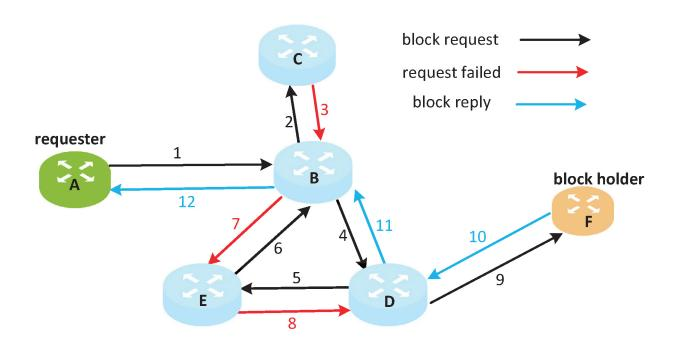

Fig. 7. A descriptive example of the routing mechanism in Freenet.

own location, with the remaining peers randomly distributed throughout the circle.

As for routing, a node sends a request by selecting a neighbor node closest to the block's location. Freenet performs friend-of-a-friend routing thus avoiding local minimum in the network topology. If a request by the first selected node is unsuccessful, the next closest peer is tried, once again taking the friend-of-a-friend routing into account (A descriptive example of the routing mechanism is shown in Figure [7.](#page-10-2)). A peer may choose to reject a request due to resource constraints. In that case, a node may mark its peer as being backed off, temporarily removing the peer from the routing table.

## *D. Other Notable Anonymity Networks*

In this subsection, we present an overview of other anonymity networks. As evident from the subsequent content, these networks display considerable diversity, characterized by distinct routing features, application scenarios, performance metrics (such as latency), anonymity objectives, adversary models, and more. Particularly, we focus on their specific anonymity objectives and adversary models, which reflect the authors' envisioned security levels of them. Given the multitude of anonymity networks, we have chosen to selectively employ some notable examples for discussion. Table [III](#page-11-0) summarizes these notable anonymity networks (for comparison, including the previously introduced Tor, I2P, and Freenet).

Before delving into the detailed introduction, we first explain certain characteristics used in Table [III.](#page-11-0) The potential application scenarios of anonymity networks include anonymous email, anonymous browsing, anonymous filesharing, and others. The latency of anonymity networks can be categorized as high latency, middle latency, and low latency. The structure of anonymity networks can be divided into client/server, peer-to-peer, and hybrid (a combination of both). According to the classification method proposed by [\[69\]](#page-48-39), anonymity notions of anonymity networks can be categorized into sender anonymity, receiver anonymity, sender unobservability, and receiver unobservability. Sender (receiver) anonymity refers to the adversary's inability to identify the sender (receiver) from an anonymity set based on message metadata, while still allowing the adversary to observe the actual number of messages sent (received) by the sender (receiver). Sender (receiver) unobservability, on the other hand, denotes that the adversary cannot identify the sender (receiver)

|                                                                                             |  |  | TABLE III |  |  |  |  |  |
|---------------------------------------------------------------------------------------------|--|--|-----------|--|--|--|--|--|
| A GLANCE OF OTHER NOTABLE ANONYMITY NETWORKS INVOLVING THEIR DISTINGUISHING CHARACTERISTICS |  |  |           |  |  |  |  |  |
|                                                                                             |  |  |           |  |  |  |  |  |
|                                                                                             |  |  |           |  |  |  |  |  |

| Category                          | Name      | Network structure | Latency | Scalability | Application  | Adversary model                  | Anonymity objectives |
|-----------------------------------|-----------|-------------------|---------|-------------|--------------|----------------------------------|----------------------|
|                                   | Mixnet    | Client/server     | High    | Weak        | @            | Global passive                   | SA                   |
| Mixnet related                    | Mixmaster | Client/server     | High    | Weak        | @            | Global passive                   | SA                   |
|                                   | Mixminion | Client/server     | High    | Weak        | @            | Global passive                   | SA & RA              |
|                                   | Tor*      | Hybrid            | Low     | Weak        | e            | Local active                     | SA & RA              |
| Tor related                       | PIR-Tor   | Hybrid            | Low     | Middle      | e            | Local active                     | SA                   |
|                                   | MTor      | Hybrid            | Low     | Weak        | *            | Local active                     | SA                   |
|                                   | Crowds    | Peer-to-peer      | Low     | Weak        | e            | Local active                     | SA                   |
| Random walk and DHT-based related | AP3       | Peer-to-peer      | Low     | strong      | €@           | Local active                     | SA                   |
|                                   | Freenet*  | Peer-to-peer      | Low     | Strong      | <b>L</b>     | Local active                     | SA                   |
|                                   | DCnet     | Peer-to-peer      | High    | Weak        | <b></b>      | Global passive                   | SU & RU              |
| DCnet related                     | Herbivore | Peer-to-peer      | Middle  | Weak        | <b>&gt;</b>  | Global passive                   | SU & RU              |
|                                   | Dissent   | Peer-to-peer      | High    | Weak        |              | Global passive & local active | SU & RU              |
|                                   | I2P*      | Peer-to-peer      | Low     | Strong      | @ <b>L</b> & | Local active                     | SA & RA              |
| Miscellaneous                     | Riposte   | Client/server     | High    | Weak        | ≥ /          | Global passive & local active | SU                   |
|                                   | Riffle    | Client/server     | High    | Weak        |              | Global passive                   | SU & RU              |

from an anonymous set based on message metadata, and at the same time, cannot observe the actual number of messages sent (received) by the sender (receiver). Sender (receiver) unobservability is a stronger security notion compared to sender (receiver) anonymity. In terms of the adversary model, two types are considered here: global passive and local active. The first type refers to an adversary capable of observing all traffic on the network. The second type refers to an adversary who can only observe a portion of the network's traffic and may operate or compromise a subset of nodes in the network, with the ability to generate, modify, delete, or delay traffic on the network.

*Mixnet related*. Mixnet [\[5\]](#page-47-4) was introduced for sending anonymous emails. In this seminal work, a threshold-based flushing strategy was proposed: the mix collects a batch of messages and then sends out the decrypted messages in a rearranged order. For a passive adversary, as they do not have knowledge of the reordering inside the mix, they cannot determine the input-output corresponding relation between individual messages. As a result, sender anonymity is ensured. However, trusting a single mix is risky. To distribute trust, Chaum suggested relaying messages through a fixed sequence of mix nodes, known as a mix cascade. In this case, even an adversary, controlling n-1 mix nodes (where n is the total number of mix nodes), cannot compromise sender anonymity. However, mix cascades suffer from single points of failure, and the maximum anonymity they can provide is limited by the capacity of the weakest node in the cascade.

Consequently, Mixmaster [\[13\]](#page-47-12) and later Mixminion [\[14\]](#page-47-13) were proposed, allowing users to freely choose the composition path of mixes and have a larger anonymity set. Moreover, both Mixmaster [\[13\]](#page-47-12) and Mixminion [\[14\]](#page-47-13) adopt the timed dynamic pool as the flushing strategy, thereby avoiding the situation of having a particularly small anonymity set during periods of low traffic. Compared to Mixmaster, Mixminion has achieved notable security enhancements. Firstly, Mixminion introduces a novel feature known as a single-use reply block (SURB), enabling support for anonymous recipients and thereby ensuring receiver anonymity. Additionally, Mixminion incorporates a small group of synchronized directory servers to provide users with uniform topology information, thereby mitigating partitioning attacks.

*Tor (onion routing) related*. Compared to Mixnet-related networks, Tor-related networks lack defense against global passive adversaries. The low-latency nature of onion routing inherently results in smaller anonymity sets compared to the slower, message-based services offered by Mixnet related networks when facing a global passive adversary. Consequently, Tor-related networks only consider local active adversaries.

As mentioned in Section [VII-E1,](#page-45-0) Tor faces significant scalability challenges. In response, PIR-Tor [\[20\]](#page-47-19) was introduced to tackle Tor's scalability concerns. It proposes two novel architectures based on information-theoretic private information retrieval (PIR) technology and computational PIR technology, respectively. These architectures aim to reduce communication overhead by downloading information about only a few relays. In the former architecture, any relay node can serve as a PIR database, while in the latter architecture, users' guard nodes collectively act as a PIR database. As PIR technology conceals the actual retrieval content, PIR-Tor can defend against partitioning attacks resulting from inconsistent topology information, an attack that is also defended by Tor. Literature [\[20\]](#page-47-19) demonstrates that, based on informationtheoretic PIR technology, PIR-Tor introduces a communication overhead that is at least an order of magnitude smaller than a full download of topology. However, PIR-Tor does not discuss support for onion services.

MTor [\[21\]](#page-47-20) is an anonymous group communication system built on top of Tor, harnessing Tor's low-latency characteristics and the anonymity it provides. MTor achieves bandwidth efficiency for group communication by constructing multi-source multicast trees. Additionally, it employs a key-blinding signature scheme to ensure unlinkability between group sessions. MTor recommends the incorporation of high-bandwidth ORs into circuits, which could potentially narrow the anonymity set of group communication users. Furthermore, due to its reliance on a broadcast tree structure, MTor's sender anonymity is not significantly stronger than vanilla Tor, particularly in the presence of an adversary controlling the multicast root OR.

*Random walk and DHT-based related*. Compared to the source-routed approach employed by Mixnet related and Tor related anonymity networks, one advantage of the hop-byhop routed approach used in this category is its potential for constructing highly scalable peer-to-peer anonymity networks. However, this routing approach may also introduce new anonymity challenges. Typically, such networks consider local active adversaries due to their low latency characteristics, similar to Tor related anonymity networks.

Crowds [\[22\]](#page-47-21), an early anonymity network designed for anonymous browsing, is based on random walk. In Crowds, all nodes are divided into groups known as crowds. Nodes within a crowd are aware of each other and communicate via the random walk manner. However, adversaries can easily determine all nodes within a crowd, making Crowds susceptible to the intersection attack, a type of statistical de-anonymization attack. Additionally, Crowds relies on a centralized server called a blender for managing and administering nodes. As a result, Crowds exhibits poor scalability, especially as the number of nodes increases.

In contrast, AP3 [\[23\]](#page-47-22) introduces a DHT table for node management and employs the Pastry algorithm as the routing lookup strategy, thus ensuring high scalability. However, in DHT-based anonymity networks, nodes typically only possess partial information about other nodes. Therefore, DHT-based anonymity networks often need to address the challenge of locating nodes reliably in their routing lookup strategies to prevent biasing path selection introduced by colluding nodes, which could significantly impact anonymity. Furthermore, literature [\[70\]](#page-48-40) also points out that AP3's routing lookup mechanism has issues with information leakage, thereby enhancing the effectiveness of passive attacks.

*DCnet related*. DCnet related anonymity networks complement the aforementioned types of anonymity networks. Perhaps the most fundamental advantage of these networks is that they typically provide anonymity with informationtheoretic security or computational security (more accurately, sender unobservability or receiver unobservability) when facing a global passive adversary, which is particularly desirable. In these networks, all nodes (users) logically perform the same actions in each communication round. Passive observers cannot determine if a node is sending or intending to receive data, thus ensuring sender unobservability or receiver unobservability.

In DCnet [\[25\]](#page-47-24), a node masks its real messages by XORing them with the keys that the node shares pairwise with all other nodes. When pairwise keys are reused between rounds, computational security is provided. When one-time-use pairwise keys are used in each round, information-theoretic security is provided. However, DCnet has some drawbacks. Firstly, DCnet assumes that all nodes execute the protocol honestly. When malicious nodes introduce disruptions, such as sending many messages that others may not send, the correctness of the protocol will be directly compromised. Additionally, as each node needs to process all messages, DCnet incurs a large communication overhead and does not scale well.

Herbivore [\[26\]](#page-47-25) is constructed on top of DCnets to offer improved communication efficiency and scalability. It divides nodes into smaller groups called cliques. Within each clique, nodes are arranged in a star topology, with the central node acting as a relay for all messages between clique members. For communication between cliques, they are interconnected in a ring topology. Consequently, a message can only be traced to the corresponding clique but not to the corresponding sender/receiver within that clique. However, this feature leads to Herbivore having a smaller anonymity set compared to DCnet.

Dissent [\[27\]](#page-47-26) is the first anonymity network to provide accountability for a small group, thus protecting against disruptions incurred by malicious nodes. It is also built upon DCnets. Dissent consists of two sub-protocols: a shuffle protocol and a bulk protocol, respectively. The former addresses the challenge of sending variable-length messages efficiently. The latter provides anonymity and accountability. In terms of accountability, Dissent essentially offers one-toone correspondence between members and messages, thus making malicious nodes initiating denial-of-service attacks traceable. However, Dissent has poor scalability. A variant [\[71\]](#page-48-41) adopts a grouping design to enhance its scalability.

*Miscellaneous*. The design philosophy of anonymity networks is highly diverse and often accompanied by flexible applications and combinations of technologies. Besides I2P, we introduce two other anonymity networks here, namely Riposte [\[72\]](#page-48-42) and Riffle [\[73\]](#page-48-43).

Perhaps the most prominent feature of Riposte [\[72\]](#page-48-42) is its reverse application of PIR technology. Typically, PIR technology allows retrieving a database without disclosing the retrieved content to the PIR servers, ultimately achieving receiver anonymity. In Riposte, senders reverse this process by writing messages to the PIR database without revealing to the servers the specific position where the message has been written. Simultaneously, Riposte draws inspiration from the client/server architecture of DCnets, using secret-sharing to send messages to PIR servers. This approach aims to counter traffic-analysis attacks and malicious servers. Moreover, by encouraging read-only users to submit "empty" writes to the system, the sender's anonymity set is further expanded. Similar to DCnet related networks, Riposte is well-suited for supporting latency-tolerant applications.

Riffle [\[73\]](#page-48-43) combines PIR technology and verifiable Mixnet with the objective of simultaneously ensuring sender unobservability and receiver unobservability while enhancing user available bandwidth. Specifically, a verifiable Mixnet is employed for sending messages, while PIR technology is used for retrieving messages. In more detail, PIR servers simultaneously act as both mix nodes and PIR replicas. A sender selects a PIR server as the primary server and submits ciphertext to it. The ciphertext is then transmitted among these servers using a verifiable Mixnet approach, and the exit server then broadcasts the plaintext to all servers. However, both Riposte and Riffle adopt a client/server structure, which imposes limitations on their scalability.

#### *E. Formal Security*

Formal security, also known as formal methods or formal verification, is an approach used in computer science and information security to formally analyze and verify the security properties of a system. Currently, it has achieved significant success in ensuring the security of computer systems at various abstraction levels [\[74\]](#page-48-44). Formal security involves the application of mathematical techniques and logic to rigorously analyze the behavior of a system and ensure that it satisfies specific security requirements (against potential attacks). This contrasts with informal methods that rely on informal reasoning, intuition, or testing. Formal security techniques often involve the use of formal languages, formal logic, and formal proof methods to model and reason about various aspects of a system, such as its algorithms, and cryptographic protocols. These techniques can also help identify vulnerabilities, validate security properties, and detect flaws or errors. For example, researchers discovered the factoring the server's export-grade RSA (RSA: Rivest-Shamir-Adleman) key (FREAK) vulnerability in Secure Sockets Layer (SSL)/TLS servers through formal methods [\[75\]](#page-48-45).

As for anonymity networks, it roughly contains security proof and security-bound analysis.

Security proof plays a vital role in cryptographic protocol treatment. Its typical working manner is to construct a game-based security definition. A definition associates the adversary's hostile behavior with the system's behavior and specifies the desired security goal precisely. For example, chosen-plaintext attacks security (IND-CPA) aims at data confidentiality under a chosen-plaintext attacks case and chosen-ciphertext attacks security (IND-CCA) aims at data confidentiality under a case where a decryption oracle is provided additionally [\[76\]](#page-48-46). Then, suitable proof techniques such as game-hopping and security reduction are adopted based on the problem to be proved. The advent of the Universal Composability (UC) framework [\[77\]](#page-48-47) promotes modular analysis and design within complex cryptography protocols, thus providing a proof paradigm for general composable environments. Nowadays, game-hopping, security reduction, and UC framework have become the main techniques for cryptographic protocol treatment.

In addition, security-bound analysis plays a crucial role in understanding security. In many cases, we need to determine whether a security metric (typically anonymity metrics) in anonymity networks falls within the acceptable (allowed) bound. In such cases, modeling system elements and security metrics is the first step. Subsequently, rigorous analysis and derivation of security metrics are required. This process may involve logical analysis, probability analysis, and optimization techniques. Furthermore, given the diverse nature of security metrics, such as differential privacy, k-anonymity, game theory, and the complex adversary models in anonymity networks, security metrics remain an open research problem. In principle, a security metric holds theoretical significance if it can effectively align with potential real-world needs.

#### *F. Survey Methodology*

Determining an appropriate starting point and scope for the investigation has a direct impact on the research findings. With anonymity networks existing for over forty years and a vast amount of literature available, gaining deep insights into them has become increasingly challenging. The Freehaven website (https://www.freehaven.net/anonbib/date.html), managed by designers and operators of anonymity networks, serves as a valuable resource for collecting key literature within the anonymity network community. By browsing through the literature on the website starting from 2010, we selected the papers most relevant to security. Honestly speaking, examining every single security issue in a survey paper for anonymity networks is nearly impossible, given the multitude of security issues involved. Therefore, we sought to identify the prevailing attacks and used them as a starting point to investigate the vulnerabilities underlying those attacks, as well as the related defenses and formal security. For Tor, we identified four key areas: protocol attacks, WF attacks, AS/state-level adversary attacks, and censorship attacks. Since censorship resistance is relatively independent of Tor's core architecture (onion routing and onion service) and is another non-trivial open issue [\[78\]](#page-49-0), we selectively excluded censorship attacks to establish the appropriate scope for our work.

*Top-down approach.* We use the ontology diagram, Figure [1,](#page-4-0) to guide our investigation. The core of Figure [1](#page-4-0) delineates the essential elements constituting security. Thus, we can approach the inquiry with questions such as what the core security issues and their relations are (attack), why these security issues arise (vulnerability), how to address them (defense), and to what extent these security issues are resolved. Combining these considerations, we systematically search, analyze, and filter materials in the process of expanding our investigation. This approach enables us to organize the materials in a clear and systematic manner. Additionally, it facilitates a comparative reference across different anonymity networks, thereby generalizing our research findings.

Bottom-up approach. We integrate vulnerability analysis into our investigation process. Therefore, we can achieve a more fundamental understanding of security issues, moving beyond the surface-level manifestations of the problems. As vulnerabilities represent the bottom layer of security, a systematic understanding of vulnerabilities and their root causes aids in establishing a profound observation of security issues, even drawing connections among security issues in different anonymity networks. To the best of our knowledge, there is currently no comprehensive survey discussing the vulnerabilities of security issues in anonymity networks. Our bottom-up approach enhances the depth and generality of research findings.

#### III. VULNERABILITIES IN ANONYMITY NETWORKS

The vulnerabilities in anonymity networks are the root cause of launched attacks. We classify these vulnerabilities into two categories at a high level: internal vulnerabilities and external vulnerabilities. Internal vulnerabilities often result from design or implementation flaws inherent to the anonymity network itself, while external vulnerabilities emphasize certain external conditions or advantages that adversaries can exploit. In the case of Tor, protocol vulnerabilities(Section III-A) correspond to protocol attacks (Section IV-A) and fall under internal vulnerabilities. On the other hand, metadata leakage (Section III-B) and overlay nature (Section III-C) are examples of external vulnerabilities. The vulnerabilities in I2P and Freenet, investigated in Section III-D, also fall under internal vulnerabilities. Technically, protocol vulnerabilities indicate unwanted characteristics in protocol interactions. These vulnerabilities may seem utterly unrelated, thus calling for an elaborate systematization. Metadata leakage indicates the weak metadata-protected feature of Tor and is exploited in WF attacks. The overlay nature reflects the risks from the public Internet infrastructure, which are beyond Tor's original estimate. The vulnerabilities examined in this section are derived based on the attacks presented in Section IV after analysis. Due to the relatively smaller number of vulnerabilities, we consolidate the vulnerabilities in I2P and Freenet into a single subsection.

#### A. Protocol Vulnerabilities in Tor

The protocol vulnerabilities span across different layers and may take seemingly unrelated forms. To conduct a selfcontained systematization, we first draw some observations on them. We note the following aspects:

*Location*. The protocol layer is the initial position of some vulnerability. Tor has a multi-layer protocol stack. Different protocol layers have different amounts of vulnerabilities.

Algorithm/mechanism. Indeed, a protocol layer may have multiple vulnerabilities. These vulnerabilities may correspond to different algorithms/mechanisms. It means that, even within one protocol layer, adversaries may have different perspectives and exploit different characteristics.

*Cryptographic*. Some protocol vulnerabilities are highly related to cryptography techniques. These vulnerabilities may correspond to different cryptography techniques, e.g., the TAP

handshake mechanism for initiating a Diffie-Hellman (DH) key exchange in the circuit extend layer [38], [79] and AES counter mode for onion encryption in the relay layer [35] (Further details are provided in the following subsections.). As cryptography plays a critical role in protocol security, the characteristics of those cryptographic techniques in the Tor setting should be treated seriously.

Root cause. Deriving the root causes of protocol vulnerabilities is beneficial to gaining a deep understanding of attacks, especially for defenders. We find that different protocol vulnerabilities may have different root causes. The root causes can be categorized into several classes (For more details, refer to Section III-A6.).

In our systematization, we organize these vulnerabilities by their layers and algorithms/mechanisms. When within one same algorithm/mechanism, we organize them case by case, depending on the specific characteristics of the algorithm/mechanism. In this paper, a total of 23 protocol vulnerabilities are sorted out and are notated as  $V_1, \ldots, V_{23}$ , respectively. Table IV provides a summary of protocol vulnerabilities. Next, we would provide specific protocol vulnerabilities first and then discuss their root causes for a sketch.

1) Vulnerabilities in the TCP Layer: The vulnerabilities in the TCP layer are across the TCP timeout retransmission mechanism and TCP window mechanism. While these vulnerabilities exist in the TCP layer, they are not directly caused by Tor. Despite this, a skilled adversary may exploit these vulnerabilities by leveraging their unique characteristics to launch an attack. Specifically:

TCP timeout retransmission mechanism. The TCP timeout retransmission mechanism ( $V_1$ ) is designed to enhance the transmission reliability of a TCP connection. Given that reliability, an adversary can deliberately discard TCP packets, thus obtaining a larger keepalive interval. Then he can use that time window for a watermark attack [39].

TCP window mechanism. The TCP window field  $(V_2)$  indicates the receiver's ability to receive data. Unusually, an adversary can continue to send cells even when notified of a zero window. Henceforth he can introduce congestion at the application layer in OR nodes, facilitating a denial-of-service attack [80].

2) Vulnerabilities in the Circuit Extend Layer: The vulnerabilities in the TCP layer are across the TAP handshake mechanism and circuit extending procedure. Technically, the former belongs to the latter. With that separation, the circuit extending procedure indicates more outer characteristics in circuit extending.

TAP handshake mechanism. The TAP protocol is the early version of the handshake mechanism in circuit extending. It utilizes RSA encryption to encrypt the former part of the DH handshake, aiming for secure key exchange. However, an adversary still captures some vulnerabilities, including asymmetry in RSA encryption/decryption and non-rigorous cryptographic parameters. For the former  $(V_3)$ , an adversary maliciously sends many DH handshake requests to the target OR, significantly consuming its computing power [38]. For the latter  $(V_4)$ , an adversary deliberately utilizes the unwanted

TABLE IV SUMMARY OF PROTOCOL VULNERABILITIES IN TOR (IDENTIFIED IN SECTION [III-A\)](#page-14-1) INVOLVING THEIR LOCATIONS, RELATED ALGORITHMS/MECHANISMS, TREATMENT STATES, AND ROOT CAUSES

| Location             | Algorithm/mechanism                  | Index    | Crypto |   | R       | oot ca  | use     |         | State |
|----------------------|--------------------------------------|----------|--------|---|---------|---------|---------|---------|-------|
| Location             | Aigoritim/mechanism                  | muex     | Стурго | L | С       | A       | LC      | V       | State |
| TCP layer            | TCP timeout retransmission mechanism | $V_1$    | 0      | • | •       | 0       | 0       | 0       |       |
| TCF layer            | TCP window mechanism                 | $V_2$    | 0      | • | •       | 0       | 0       | 0       |       |
|                      | TAP handshake mechanism              | $V_3$    | •      | 0 | 0       | •       | 0       | 0       |       |
|                      | 1A1 handshake meenamsiii             | $V_4$    | •      | 0 | 0       | 0       | •       | 0       |       |
| Circuit extend layer |                                      | $V_5$    | 0      | 0 | 0       | 0       | •       | 0       |       |
|                      | Circuit extending procedure          | $V_6$    | 0      | 0 | 0       | 0       | •       | 0       |       |
|                      |                                      | $V_7$    | 0      | 0 | $\circ$ | $\circ$ | •       | $\circ$ | ?     |
|                      | Relay procedure                      | $V_8$    | 0      | 0 | $\circ$ | $\circ$ | •       | $\circ$ |       |
|                      | Relay procedure                      | $V_9$    | 0      | • | •       | 0       | 0       | 0       | ?     |
| Relay layer          | AES counter mode                     | $V_{10}$ | •      | • | •       | 0       | 0       | 0       |       |
| Relay layer          | ALS council mode                     | $V_{11}$ | •      | 0 | 0       | 0       | 0       | •       |       |
|                      | End-to-end integrity mechanism       | $V_{12}$ | •      | • | •       | $\circ$ | 0       | $\circ$ |       |
|                      | Congestion control mechanism         | $V_{13}$ | 0      | 0 | $\circ$ | $\circ$ | •       | $\circ$ |       |
| Stream layer         | Congestion control mechanism         | $V_{14}$ | 0      | • | $\circ$ | $\circ$ | 0       | $\circ$ |       |
| Stream layer         | Congestion control incentanism       | $V_{15}$ | 0      | 0 | $\circ$ | $\circ$ | •       | $\circ$ |       |
|                      | HS descriptor distributing algorithm | $V_{16}$ | •      | 0 | $\circ$ | $\circ$ | $\circ$ | •       |       |
|                      |                                      | $V_{17}$ | 0      | 0 | $\circ$ | •       | $\circ$ | $\circ$ |       |
|                      |                                      | $V_{18}$ | 0      | • | 0       | $\circ$ | 0       | •       |       |
| Onion service layer  | Service accessing procedure          | $V_{19}$ | 0      | 0 | •       | 0       | 0       | 0       |       |
|                      |                                      | $V_{20}$ | 0      | • | 0       | 0       | 0       | 0       |       |
|                      |                                      | $V_{21}$ | 0      | 0 | 0       | 0       | •       | 0       | ?     |
|                      |                                      | $V_{22}$ | 0      | 0 | 0       | 0       | •       | 0       |       |
|                      | Padding mechanism                    | $V_{23}$ | 0      | • | •       | 0       | 0       | $\circ$ |       |

*g*0 as the handshake material, thus facilitating a man-in-themiddle attack on the circuit [\[79\]](#page-49-1).

*Circuit extending procedure*. The circuit extending procedure indicates a process in which an OP successfully creates a circuit hop by hop. This process involves a sequence of cells that are expected to comply. However, there are some vulnerabilities that adversaries can exploit due to relaxed constraints. An adversary may exploit the feature of circuits having an unlimited length (*V*5) to create long circuits arbitrarily, i.e., a circuit with multiple loops, thus significantly consuming a node's processing resources [\[81\]](#page-49-3) or amplifying congestion [\[82\]](#page-49-4). An adversary may utilize the characteristics of unlimited circuit extending times in the TLS channel (*V*6) to send amounts of DH handshake requests to the target node, thus facilitating a denial-of-service attack [\[38\]](#page-48-8). In addition, an adversary may utilize the characteristics of unconstrained relay early cell's order (*V*7) to send a relay early cell unexpectedly, resulting in a significantly abnormal cell sequence for correlation attack [\[83\]](#page-49-5).

*3) Vulnerabilities in the Relay Layer:* The vulnerabilities in the relay layer are across the relay procedure, the AES counter mode, the end-to-end integrity mechanism, and the congestion control mechanism. Technically, the former includes the latter three. With that separation, the relay procedure indicates more outer characteristics in the relay process.

*Relay procedure*. The relay procedure indicates a process in which a cell is routed from the OP to the exit successfully and correctly. However, there are some characteristics of cell validity rightly exploited by adversaries. An adversary may use the characteristics of unconstrained relay early cell's direction (*V*8) to send a relay early cell in the inbound direction unexpectedly, thus facilitating a de-anonymization attack [\[32\]](#page-48-2). An adversary may exploit the characteristics of forward compatibility (*V*9) to send dummy cells, thus generating abnormal signals for a de-anonymization attack [\[84\]](#page-49-6).

*AES counter mode*. The AES counter mode is adopted for onion encryption/decryption. In fact, its algorithm characteristics can be exploited by adversaries. First, the monotone increasing of the counter (*V*10) makes it sensitive to replaying, deleting, and inserting cells [\[35\]](#page-48-5). If an entry node does that, the circuit would be destroyed doubtlessly for de-anonymization. Second, the lack of non-malleable property (*V*11) makes it vulnerable to a covert tagging attack. It does mean that two accordant operations of XOR could be used to embed some secret pattern for de-anonymization [\[83\]](#page-49-5).

*End-to-end integrity mechanism*. The end-to-end integrity in onion routing (*V*12) ensures that any cell tampering by malicious intermediate nodes is detected by OP or exit. As a side effect, the adversary can deliberately introduce circuit abnormalities and generate abnormal flow patterns, to launch a de-anonymization attack [\[35\]](#page-48-5).

*Congestion control mechanism*. The congestion control in the relay layer limits each circuit to up to 1,000 flying cells. However, Tor initially does not abandon any cell even when congested (*V*13). In consequence, an adversary can trick the sender into sending cells continuously, introducing more significant congestion in the target OR for a denial-of-service attack [\[80\]](#page-49-2).

- *4) Vulnerabilities in the Stream Layer: Congestion control mechanism*. In addition to the vulnerabilities in the relay layer, there are also vulnerabilities in the stream layer that can be exploited by adversaries. The congestion control mechanism in the stream layer aims to limit the impact of an individual stream on circuit-level congestion. It bounds the stream-level flying cells that may be stuck in an OR node. Yet that mechanism helps mitigate network congestion; some tricks may be adopted. By deliberately discarding the relay\_sendme cells (*V*14), an adversary may cause traffic to stop shortly, thus facilitating the modulation of watermarking on the HS circuit [\[39\]](#page-48-9). By continuously sending relay\_sendme cells to the exit (*V*15), an adversary can make the exit inject cells into the circuit, thus enabling the possibility of a denial of service attack [\[80\]](#page-49-2) or introducing significantly varying flow patterns for de-anonymization attacks [\[40\]](#page-48-10), [\[85\]](#page-49-7).
- *5) Vulnerabilities in the Onion Service Layer:* These vulnerabilities are across the HS descriptor distributing algorithm, the service accessing procedure, and the padding mechanism. Technically, the service accessing procedure includes the other two. With that separation, the service accessing procedure indicates more outer characteristics in accessing an HS. We have chosen to separate these vulnerabilities in this way, mainly to reflect the temporal logic of the HS access process. An HS first distributes its descriptors to the responsible HSDirs. Then, an OP can launch an accessing attempt. When the HS circuit is built successfully, the padding mechanism can be applied.

*HS descriptor distributing algorithm*. The HS descriptor distributing algorithm aims to upload the HS descriptors to the responsible HSDirs to provide the necessary information for OPs. Yet, the HS descriptor distribution algorithm is initially deterministic (*V*16). In that case, the locations of the responsible HSDirs would be predictable. An attacker can prepare the appropriate identity keys in advance to match the right positions, thus enabling an eclipse attack on HS [\[45\]](#page-48-15).

*Onion service accessing procedure*. In this item, we first consider the overall characteristics of accessing an HS, then move to the related specific steps. To successfully access an HS, the following steps are required: (i) The OP first sends a rend-cookie to the RP as the session credential between the OP and the HS. (ii) The OP contacts the InP and sends a relay\_introduce1 cell as a request. (iii) The InP forwards that request to the HS in the form of relay\_introduce2 cell. (iv) The HS contacts the RP and sends a relay\_rendezvous1 cell as a reply. (v) The RP checks that reply (session credential) and forwards it to the OP in the form of relay\_rendezvous2 cell. (vi) The OP sends a relay\_begin cell to HS to open an HS stream. (vii) The HS replies with a relay\_connected cell to accept. As a result of this procedure, the resource consumption of the HS is significantly higher than that of the OP (*V*17). As a result, a malicious client can initiate amounts of requests to the target HS, thus facilitating a denial-of-service attack [\[86\]](#page-49-8).

In terms of specific steps, these characteristics should be noted: First, as the rend-cookie can be specified arbitrarily by the OP (*V*18), an adversary can generate a handcrafted one to instruct the watermarking at RP for de-anonymization [\[87\]](#page-49-9). Then, as the entry of an HS on the HS-InP circuit can deliberately delay the relay\_introduce2 cell (*V*19) without the HS perceiving this situation, an adversary can modulate the temporal signal for a de-anonymization attack [\[88\]](#page-49-10). Further, the above procedure (i-vi) is deterministic. An adversary may reverse the bits of the cell (i.e., relay\_begin cell) at the corrupted RP or send a destroy cell to HS (*V*20), thus introducing a deterministic abnormal pattern for de-anonymization attacks [\[45\]](#page-48-15), [\[89\]](#page-49-11), [\[90\]](#page-49-12). Furthermore, until receiving a relay\_connected cell, the relay\_data cell with stream id zero sent by HS is discarded by OP without destroying the circuit (*V*21). Thus an adversary can introduce abnormal traffic patterns for a de-anonymization attack [\[91\]](#page-49-13). Moreover, if the OP sends a relay\_begin cell without port information, the HS is unable to process such stream requests and responds to the OP with a relay\_end cell, thus not destroying the circuit (*V*22). This feature allows adversaries to modulate traffic signals. For instance, sending a relay\_begin cell without port information represents 0, while sending two consecutive relay\_begin cells without port information represents 1, which can be used for a de-anonymization attack [\[92\]](#page-49-14).

*Padding mechanism*. Tor introduces a padding mechanism, aiming to obscure traffic patterns with cover traffic to defend against both external and internal observers. Tor supports two types of cover traffic: link-level padding and circuitlevel padding. In terms of the latter (*V*23), the relay\_drop cell is allowed to be sent to any circuit node while remaining invisible to other nodes. That is precisely used by the adversary to generate special traffic patterns on the circuit [\[45\]](#page-48-15), [\[90\]](#page-49-12).

- *6) Summary and Lessons Learned:* The various protocol vulnerabilities mentioned earlier pose significant challenges to the security of Tor. At the same time, due to the generally complex protocol designs in anonymity networks, it also serves as a good example of the potential situations other anonymity networks may face. Therefore, gaining a deeper understanding of the patterns and underlying causes of protocol vulnerabilities will provide valuable insights into the security of other anonymity networks. Here, we outline five root causes behind these vulnerabilities.
  - *• Low latency*. Low latency introduces many vulnerabilities, even when some related original functionality works

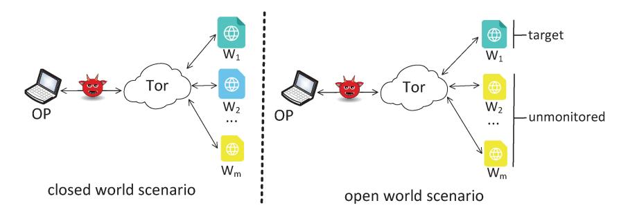

Fig. 8. Closed world scenario and open world scenario in WF attacks within Tor.

well. For example, TCP's timeout retransmission  $V_1$  and window mechanism  $V_2$  successfully guarantee reliable transmission. However, both of them can be utilized to control traffic behavior for watermarking and denial of service attacks, respectively. Given these vulnerabilities, attackers invariably consider how to utilize them from a time perspective.

- Combination with other features. Some vulnerabilities are enabled in combination with other vulnerabilities, yet they do not directly constitute a usable attack vector. These vulnerabilities include the TCP timeout retransmission mechanism V1, the TCP window mechanism V2, the forward compatibility in the relay layer V9, the monotonicity of AES counter mode V10, the endto-end integrity mechanism V12, etc. Taking the TCP timeout retransmission mechanism V1 as an example, literature [39] makes use of it and the congestion control mechanism in the stream layer V14. That is, only by combining these two mechanisms can the adversary modulate a watermark.
- Symmetry. Asymmetry seems to be an unavoidable problem. These vulnerabilities include asymmetry in public-key cryptographic calculations when circuit building  $V_3$ , and asymmetry in resource consumption between malicious OP and HS  $V_{17}$ .
- Loose constraints (parameters, bound, mechanism). In practice, it is difficult for developers to consider every aspect, and loosely constrained vulnerabilities seem unavoidable. For example, no rigorous checking of cryptographic parameters in the circuit extending procedure  $V_7$  causes a man-in-the-middle attack, and no restriction on circuit length in the circuit extending procedure  $V_5$  causes a denial of service attack.
- Volunteer nature. Tor is composed of volunteer nodes, which may also introduce vulnerability. For example, empirically, IND-CPA security combined with a message authentication code (MAC) mechanism may achieve IND-CCA security and prevent ciphertext from being tampered with. Due to the volunteer nature, a tagging attack can break that belief when an adversary occupies both a circuit's entry and exit [35]. It is significantly different from a common security channel.

It is evident that the advantages of anonymity networks can also be exploited as vulnerabilities by adversaries. In the case of Tor, its low latency is a notable advantage, but it also leads to the development of several vulnerabilities under such a condition. Additionally, an adversary may combine multiple vulnerabilities within the system to form attack vectors. This highlights the challenges anonymity networks face in providing security, as the complex protocol stack increases their attack surface. Furthermore, rigorous protocol design will help mitigate the security risks faced by anonymity networks.

#### B. Metadata Leakage in Tor

Yet Tor is initially optimistic about defending against WF attacks; metadata leakages make it challenging.

Communication metadata. Communication metadata refers to information related to communication activities, typically encompassing structural attributes and descriptive characteristics of the communication while excluding the actual content. These metadata provide crucial details about communication activities, including information about participants, timestamps, duration, location, data volume, and other relevant aspects.

Metadata leakage. First, Tor does not hide the fields in the TCP and IP header. Second (perhaps more crucially), Tor has little control over the underlying transport. It means that the temporal and spatial characteristics of transport on the Internet are of their natural. Further, Tor aims for low latency, thus with little shuffle and cover traffic. Given this case, an adversary could extract metadata (the number, size, direction, inter-arrival time, etc.) from observed packets and then learn the communication relations. This situation facilitates traffic analysis attacks, which are viewed as the basic weakness of Tor [72], [93], [94]. Particularly, WF attacks are a special type of traffic analysis attack and have an unexpected impact. We stress this fact as flows:

In a WF attack, an adversary can identify which site is visited by users. Indeed, the adversary only needs to passively observe the traffic from an OP to its entry node to launch a WF attack. In this case, the confidentiality of user data is compromised to some extent, effectively affecting the anonymity of communication, particularly the unlinkability between the sender and receiver. A WF attack typically corresponds to a supervised ML/DL problem and uses prior knowledge (a trained classifier) to identify the (unknown) visiting website. WF attacks commonly include two scenarios (shown in Figure 8):

 Closed world. In the closed world, users are allowed access to a limited set of websites, and the adversary has traffic patterns of all these sites. *• Open world*. The open-world scenario reflects a more realistic case. An adversary has only the fingerprints of the interested site, while the user may access unlimited sites.

Although WF adversaries are considered among the weakest ones against Tor (as their attack conditions are easy to satisfy, compared with other types of adversaries). Several studies in recent years have systematically demonstrated the increasing effectiveness (e.g., classification accuracy and diverse task types) of WF attacks. Literature [\[51\]](#page-48-21) achieved approximately 98.4% accuracy in a closed world scenario containing 95 websites and a precision of 0.99% in an open-world setting. An adversary can use limited data to identify traces from large amounts of candidate websites [\[42\]](#page-48-12), [\[50\]](#page-48-20), [\[95\]](#page-49-17), showing the potential feasibility in the real world.

*1) Summary and Lessons Learned:* Different anonymity networks have varying degrees of protection for communication metadata. In the case of Tor, its low latency largely contributes to metadata leaks and WF attacks. Although this exceeds Tor's initial expectations, it highlights the need to validate the security of anonymity networks through practical and external condition testing. Mixnets, on the other hand, employ a mix cascade design and introduce high latency at each mix node, naturally countering global adversaries' traffic analysis attacks at the expense of increased latency. In such an environment, it becomes significantly challenging for adversaries to collect traffic and launch WF attacks. Additionally, DCnets introduce a requirement for time synchronization, dividing the communication process into rounds where all nodes must perform prescribed operations within each round, thereby formally avoiding metadata leaks but at the cost of higher latency and bandwidth. Other strongly metadata-protected anonymity networks like Riposte [\[72\]](#page-48-42) or Express [\[94\]](#page-49-16) also have different design choices compared with Tor. With the continuous development of ML and DL technologies, WF attacks will remain a challenge for Tor to address. These scenarios demonstrate that the design of anonymity networks often involves trade-offs and requires addressing challenges from the external environment.

## *C. Overlay Nature in Tor*

Tor is an overlay network and relies on the Internet to underlie onion routing, simultaneously introducing certain risks. Tor initially assumes an (acceptable) local network adversary, who observes a small portion of the traffic and conducts traffic analysis attacks. To minimize that threat, Tor expects the diversity of node locations. More precisely, that diversity should ensure the Internet paths pass through enough routing management domains (ASes), thus limiting an adversary's view as small as possible. Yet, that hope is fragile in the real world. Some works [\[46\]](#page-48-16), [\[96\]](#page-49-18), [\[97\]](#page-49-19) show that AS/state-level adversaries have more abilities to perform traffic analysis attacks than expected. An AS-level adversary (controlling at least one AS) may engage in the following actions:

*• Passive traffic analysis attacks*. As for passive traffic analysis attacks, an AS/state-level adversary is more

- likely to appear on both ends of a circuit than expected. An AS may be a service provider, a corporate network, or even a university, collaboratively managing the Internet's routes. Basically, he is considered to be able to launch traffic analysis attacks: such as correlation attacks, watermarking attacks, or WF attacks. Literature [\[98\]](#page-49-20) asserted that against a single AS adversary, approximately 100% of users in some common places are deanonymized within three months.
- *• Active traffic analysis attacks*. As for active traffic analysis attacks, an AS/state-level adversary can manipulate the Internet's routes to increase the probability of appearing on both ends of a circuit, magnifying the former case. Precisely, an AS adversary can send bogus routing advertisements, resulting in deviated routing decisions for other ASes. He can hijack (BGP hijack attack [\[97\]](#page-49-19), [\[99\]](#page-49-21)) or intercept (BGP interception attack [\[100\]](#page-49-22)) a user's path to a target node into his domain, even if none of the OR nodes are located in his administrative domain. The authors in literature [\[99\]](#page-49-21) claimed that they successfully executed a BGP interception attack against a live Tor relay, and they discovered that more than 90% of Tor relays are vulnerable to the proposed attack.

Specifically, a state-level adversary commonly involves multiple ASes and can be considered an enhanced ASlevel adversary. Additionally, Internet exchange points (IXP) typically host network connections from multiple ASes and facilitate direct data exchange among them. An adversary controlling an IXP can be considered a unique type of ASlevel adversary.

Furthermore, an AS/state-level adversary may exploit protocol vulnerabilities and metadata leakage to enhance his ability. Note that many protocol vulnerabilities aim to make an identifiable traffic signal for a de-anonymization attack, rightly conforming to the needs of an AS/state-level adversary where he/she can exploit such signal to facilitate a correlation attack. Besides, the results of a WF attack can be utilized as knowledge of the observed traffic, thus promoting traffic analysis. Given known protocol vulnerabilities and metadata leakage, he may launch more sophisticated attacks. In other words, protocol attacks and WF attacks would facilitate AS/state-level adversary attacks.

*1) Summary and Lessons Learned:* Without loss of generality, anonymity networks operate on the public Internet. When built upon the public Internet as the underlying infrastructure, external vulnerabilities may arise. However, different anonymity networks are affected to varying extents by network-level adversaries. For instance, Tor's low latency and unique three-hop circuit design make it susceptible to AS/state-level adversaries who are interested in observing traffic between communication end segments. In contrast, for the I2P network, AS/state-level adversaries may have less interest. On one hand, I2P operates as a peer-to-peer network with a larger and highly dynamic set of peer nodes, making it challenging for adversaries to obtain the global network topology. This increases the analysis difficulty for AS/state-level adversaries. On the other hand, I2P's garlic routing design provides better protection for the identity of service providers, significantly reducing the analysis value for them. If adversaries wish to enhance their traffic observation capabilities, a more reasonable approach would be to introduce additional peers into the network or gain more control over the network. The aforementioned scenarios indicate that different anonymity networks have distinct threat models, requiring effective designs and defensive measures tailored to their specific threat models.

#### *D. Vulnerabilities in I2P and Freenet*

The vulnerabilities in I2P and Freenet exploited by adversaries are concentrated in the routing topology, with one exception. Recall that both I2P and Freenet are P2P networks and their corresponding topology characteristics have a significant impact on anonymity and performance. However, some design and implementation choices related to routing topology facilitate some exploitable vulnerabilities. These vulnerabilities involve peer selection [\[101\]](#page-49-23) for preparing a topology, peer replacement for updating a topology [\[102\]](#page-49-24), undocumented function [\[102\]](#page-49-24), loop-preventing mechanism [\[103\]](#page-49-25), and routing characteristics [\[104\]](#page-49-26). The exception focuses on the directory service mechanism of an anonymity network [\[105\]](#page-49-27).

*Peer selection.* Recall that I2P adopts a tier-based peer selection mechanism where the peers for building client tunnels are selected based on peer profiling. Only those peers with high throughput (in the fast tier) are chosen randomly for constructing inbound and outbound channels; while those peers in the high-capacity tier are eligible to serve as their backups. In fact, the peers in the high-capacity tier are updated if some peer participated in tunnels and then failed. In that case, the peer failing to serve a tunnel is ineligible to appear in the fast layer anymore. Therefore, an adversary can overload the peers specified in the leaseSet of a particular Eepsite and thus promote its peers to the fast layer of that Eepsite. In consequence, an adversary can launch an attack determining the identity of Eepsite peers in the network [\[101\]](#page-49-23).

*Peer replacement.* Freenet adopts a Least Recently Used (LRU) replacement policy to update the direct peers of a peer and thus increase anonymity strength. Namely, a peer replaces its LRU peer with another peer after it has successfully responded to a pre-configured number of requests. When an adversary actively launches a number of requests via some particular peer and performs a controlled broadcast announcement for an adversarial peer, that particular peer would accept the adversarial peer as its direct peer. Consequently, an adversary can launch a routing table insertion attack [\[102\]](#page-49-24).

*Undocumented function.* In Freenet, there is an undocumented function called *probe*. It takes a data location as an argument, routes a probe request, and ultimately returns the node location of all the nodes it passes through. However, this function violates the original motivation of Freenet to allow peers to only have local topology. An adversary can use this feature to expand its network view, thus facilitating the routing table insertion attack in [\[102\]](#page-49-24).

*Loop-preventing mechanism.* In Freenet, the unique identifier (UID) in a content request message is used to uniquely

identify a message and to prevent routing loops. When a node receives a request message, it checks if it has seen this UID before. If it does, a specified message will be sent back to the upstream peer, indicating a routing loop occurs. Yet, this feature is exploited in a traceback attack relying on the routing table insertion attack introduced in [\[102\]](#page-49-24), breaking a content retriever's anonymity [\[103\]](#page-49-25).

*Routing characteristics.* Recall that Freenet randomizes decrementing the initial hops-to-live (HTL) value of a message to conceal the identity of a message sender. Yet, this feature would introduce an exponential variance for a passive observer. By introducing reasonable priori assumptions, an adversary can determine whether it is a direct peer of some peer, in scenarios where large files are requested [\[104\]](#page-49-26).

*Directory service mechanism.* In I2P, the floodfill nodes responsible for mapping leaseSets and routerInfos to netDB keys include the current date. This results in the keyspace changing every day at midnight. Consequently, those floodfill nodes clustered at a certain point in the keyspace on one day will be distributed randomly on another day. However, this feature does not change the determinism of the directory service mechanism. An adversary can compute huge quantities of peer identities in advance and then promote its nodes as the responsible floodfill nodes of an arbitrary Eepsite or user. This feature enables an eclipse attack against Eepsites and possibly a de-anonymization attack against I2P users [\[105\]](#page-49-27).

*1) Summary and Lessons Learned:* The vulnerabilities in I2P and Freenet listed above have their own unique characteristics. We notice that, although I2P and Freenet also belong to overlay networks in technical form, the overlay nature in them is rarely mentioned and utilized. The reason behind this is likely because the latter two have significant differences from Tor in terms of design paradigm, routing policy, and function positioning. I2P and Freenet are P2P networks, with lower participation costs compared to Tor. Consequently, an adversary has more freedom to obtain observed traffic. Meanwhile, I2P adopts the garlic routing mechanism with inbound and outbound tunnels. This feature makes it more difficult for a passive adversary to analyze traffic. Furthermore, Freenet aims at an anonymous distributed file-sharing system; its file-fragmentation mechanism and more-hops routing would introduce more barriers to traffic analysis. On the other hand, the design and implementation choices of I2P and Freenet have introduced some vulnerabilities, even leading to dilemmas. For example, the adopted LRU peer replacement mechanism in Freenet aims to improve performance and thus facilitates the routing table insertion attack introduced in [\[102\]](#page-49-24). However, if Freenet does not introduce such a mechanism, the efficiency of the forwarding capability offered by a peer would be will be affected. A similar case applies to randomly decrementing the initial HTL of a message. If randomized methods are not used, protecting the identity of the actual sender will be impossible. In such situations, a more careful and thoughtful design becomes particularly important. We will introduce the characteristics of attacks against I2P and Freenet in Section [IV-D.](#page-27-0)

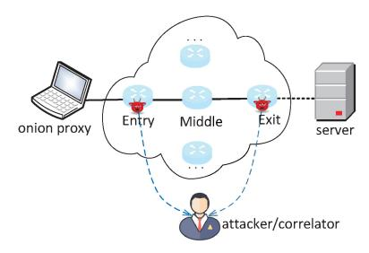

Fig. 9. A typical attack model of protocol attacks in Tor. In this showing case, an attacker corrupts both the entry and exit and conducts some correlation after protocol manipulation.

#### IV. ATTACKS IN ANONYMITY NETWORKS

This section presents the prevailing attacks against anonymity networks, including protocol attacks (Section [IV-A\)](#page-20-1), WF attacks (Section [IV-B\)](#page-24-0), AS/state-level adversary attacks (Section [IV-C\)](#page-26-0) against Tor, as well as attacks specific to I2P and Freenet (Section [IV-D\)](#page-27-0). Technically, at a high level, the three types of attacks in Tor share a vital intersection, their objectives: deanonymization (Exceptionally, a small portion of protocol attacks aim denial-of-service.). Thus, to some extent, the three are complementary. Especially, both protocol attacks and WF attacks facilitate AS/state-level adversary attacks. Simultaneously, the three have their own characteristics. The protocol attacks involve diversified specific goals and have more flexible forms, thus calling for an elaborate systematization. The WF attacks rely heavily on datasets and ML/DL techniques and tend to obtain a high classification accuracy in the closed world and open world. The AS/statelevel adversary attacks directly depend on the accurate path inference algorithms or BGP routing attacks and aim to amplify their view as much as possible. Due to the relatively smaller number of attacks, we consolidate the attacks in I2P and Freenet into a single subsection.

#### *A. Protocol Attacks in Tor*

Protocol attacks in this paper refer to attacks that exploit vulnerabilities in Tor's protocol stack. Conceptually, protocol attacks fall under the category of active attacks, and the term "protocol" specifically limits the scope to attacks that rely on protocol interactions. This excludes some active attacks in literature [\[106\]](#page-49-28), [\[107\]](#page-49-29), [\[108\]](#page-49-30), [\[109\]](#page-49-31), [\[110\]](#page-49-32), that make little use of such vulnerabilities. Protocol attacks encompass various attack types, including Sybil attacks [\[34\]](#page-48-4), correlation attacks [\[35\]](#page-48-5), [\[36\]](#page-48-6), [\[37\]](#page-48-7), denial-of-service attacks [\[38\]](#page-48-8), watermarking attacks [\[39\]](#page-48-9), [\[40\]](#page-48-10), and others. The goal of considering protocol attacks in this paper is to emphasize the importance of having a secure protocol to minimize weaknesses.

The protocol attacks investigated are across different causes and effects (A typical attack model of protocol attacks is shown in Figure [9.](#page-20-2)). Thus, a united view of them deserves some consideration. We identify some key indicators as follows:

*De-anonymization/denial-of-service*. The corresponding motivations fall into two categories: de-anonymization and denial-of-service. The former aims to de-anonymize a specific

target in the Tor setting, e.g., a general circuit, an HS, or an OP accessing some HS. When a specific target's identity is associated to their observed activities through traffic signals, the anonymity mechanism of an anonymity network is compromised. This situation poses a threat to the reputation of an anonymity network, and users will no longer remain truly anonymous. The latter aims to deny the service of an OR/HS. When certain critical ORs/HSs are subjected to denial of service, it directly impacts the availability of the anonymity network. For instance, the proposed attack in literature [\[80\]](#page-49-2) could incapacitate all of the top 20 exit relays within just 29 minutes. In such a case, the anonymity of users would also be significantly weakened. Indeed, the number of the de-anonymization is significantly higher than the denial-ofservice, probably because Tor's appeal is directly related to its anonymity.

*Specific target*. As Tor involves many components, it should identify the specific attack target, thus understanding the attacker's interests accurately. The forms and methods of attacks may vary depending on the attack's specific target.

*Attack resources*. Indeed, given the same specific target, the attack methods may have different resource requirements. For instance, to de-anonymize a circuit, a man-in-the-middle attack [\[79\]](#page-49-1) only requires a controlled entry node; yet a tagging attack [\[111\]](#page-49-33) requires a controlled entry node and an exit node simultaneously. Conversely, different resources are required, and corresponding attack methods would be different. This indicator is highly related to feasibility, evaluating attack performance intuitively.

*Attack entrance*. To establish a connection to the vulnerabilities in Section [III-A,](#page-14-1) we identify the entrance position in every attack. Indeed, an attack exploiting cross-layer vulnerabilities may only manipulate one vulnerability in practice. Such an example is referred to literature [\[39\]](#page-48-9) (This example is notated as *A*9 in Section [IV-A\)](#page-20-1).

*Covertness*. Covertness is an important indicator of attack performance. If an attack is covert, the attacker would be exempt from accountability. Several studies aim to do so.

Next, we organize these protocol attacks by their motivations and specific targets. When within one specific target, we organize them based on the required attack resources. In this paper, a total of 24 protocol attacks are sorted out and are notated as *A*1, ..., *A*24, respectively. Table [V](#page-21-0) provides a summary of protocol attacks directly.

*1) De-Anonymization Attacks:* At a high level, a deanonymization attack probably corresponds to a correlation action. An adversary may simultaneously control two vantage locations on the circuit and identify their relationship by some dedicated information, i.e., a watermark. Further, given different specific targets, the information forms would vary. Next, we identify these specific targets.

*General circuit*. De-anonymizing a general circuit initially attracts research interest in protocol attacks. Its basic goal is to identify the communication relationship between an OP and a destination (server). Based on the required resources, it includes three types: (i) *One OP and multiple ORs*. In Tor's early stage, the number of ORs is small. Based on the vulnerability of no restriction on circuit length in the circuit extending

TABLE V
Summary of Protocol Attacks in Tor (Identified in Section IV-A) Involving Their Motivations, Specific Targets,
Required Resources, Attack Entrance, Vulnerabilities, and Covertness

| Category          | Specific target | Index    | Year | Resource                | Entrance             | Vulnerability                    | Covertness |
|-------------------|-----------------|----------|------|-------------------------|----------------------|----------------------------------|------------|
|                   |                 | $A_1$    | 2018 | OP, ORs                 | Circuit extend layer | $V_5$                            | 0          |
|                   |                 | $A_2$    | 2005 | Entry                   | Circuit extend layer | $V_7$                            | •          |
|                   | General circuit | $A_3$    | 2009 | Entry, exit             | Relay layer          | $V_{10}, V_{12}$                 | 0          |
|                   | General elleuit | $A_4$    | 2012 | Entry, exit             | Relay layer          | $V_{11}$                         | •          |
|                   |                 | $A_5$    | 2019 | Entry, exit             | Circuit extend layer | $V_7$                            | •          |
|                   |                 | $A_6$    | 2018 | Entry, exit             | Relay layer          | $V_9$                            | 0          |
|                   | Entry node      | $A_7$    | 2009 | OP, ORs, server         | Circuit extend layer | $V_5$                            | 0          |
|                   | Linty node      | $A_8$    | 2009 | OP, exit                | Stream layer         | $V_{15}$                         | 0          |
|                   |                 | $A_9$    | 2018 | OP, the entry of HS     | TCP layer            | $V_1, V_{14}$                    | 0          |
|                   |                 | $A_{10}$ | 2019 | OP, the entry of HS     | Stream layer         | $V_{15}$                         | •          |
| De-anonymization  | HS              | $A_{11}$ | 2020 | OP, the entry of HS     | Onion service layer  | $V_{19}$                         | •          |
|                   |                 | $A_{12}$ | 2022 | OP, the entry of HS     | Onion service layer  | $V_{22}$                         | 0          |
|                   |                 | $A_{13}$ | 2014 | HSDir, the entry of HS  | Relay layer          | $V_9$                            | 0          |
|                   |                 | $A_{14}$ | 2013 | OP, RP, the entry of HS | Onion service layer  | $V_{12}, V_{20}, V_{23}$         | 0          |
|                   |                 | $A_{15}$ | 2013 | OP, RP, the entry of HS | Onion service layer  | $V_{20}$                         | 0          |
|                   | HS's entry      | $A_{16}$ | 2019 | OP, RP, ORs             | Onion service layer  | $V_{12}, V_{20}, V_{23}, V_{18}$ | 0          |
|                   | 110 3 chtry     | $A_{17}$ | 2018 | OP                      | Relay layer          | $V_9$                            | •          |
|                   |                 | $A_{18}$ | 2016 | Entry, HS               | Onion service layer  | $V_{12}, V_{20}$                 | 0          |
|                   | HS's user       | $A_{19}$ | 2017 | Entry, HS               | Onion service layer  | $V_{21}$                         | •          |
|                   |                 | $A_{20}$ | 2016 | Entry, InP              | Onion service layer  | $V_{23}$                         | •          |
|                   | OR              | $A_{21}$ | 2013 | OP                      | Circuit extend layer | $V_3, V_6$                       | 0          |
| Denial-of-service |                 | $A_{22}$ | 2014 | Entry, HS               | Stream layer         | $V_2, V_{13}, V_{15}$            | •          |
| Demai-or-service  | HS              | $A_{23}$ | 2013 | HSDirs                  | Onion service layer  | $V_{16}$                         | 0          |
|                   | 110             | $A_{24}$ | 2019 | OPs                     | Stream layer         | $V_{17}$                         | •          |

procedure  $V_5$ , the adversary spins packets to consume the processing power of the legitimate ones, disabling them from accepting new circuit-building requests. After that, the probability of selecting collusive ORs would be increased  $(A_1)$  [81]. (ii) One entry node. An adversary exploits the vulnerability of no rigorous checking of cryptographic parameters in the circuit extending procedure  $V_7$  to generate all "legitimate" cells and sees everything in the circuit  $(A_2)$  [79]. In such a man-in-the-middle attack, anonymity, confidentiality, and data integrity are compromised. (iii) Both the entry and exit *node*. There are two classes of methods here, cryptographic and sending unexpected cell types, respectively. In terms of the former: Focusing on the monotonicity of AES counter mode  $V_{10}$  and the end-to-end integrity mechanism  $V_{12}$  in onion routing  $(A_3)$  [35], the adversary manipulates the cell at the entry node and witnesses a decryption failure at the exit node. In that way, a tagging attack may be conducted. Further, as an improvement, proposal 202 [111]  $(A_4)$  mentioned that the malleability of AES counter mode  $V_{11}$  can be used to implement a covert tagging attack. The covertness is achieved by tagging cells at the entry node and untagging the cells at the exit node, thereby preserving the normal operation of the circuit. Literature [83]  $(A_5)$  considered relay early cell as an unexpected cell type and utilized the vulnerability of the no rigorous checking of cryptographic parameters in the circuit extending procedure  $V_7$  to de-anonymize the general circuit. This operation also has the effect of "one cell is enough". Since this attack does not disrupt the normal operation of the circuit, unlike the circuit teardown in  $A_3$ , it possesses a certain degree of covertness. Literature [84]  $(A_6)$  utilized the forward compatibility in the relay layer  $V_9$  to de-anonymize the general circuit, by injecting several dummy cells as an abnormal signal.

Entry node. De-anonymizing the entry node of a general circuit is another vital progress. Once the entry node is determined, the anonymity of a user is severely weakened. Indeed, earlier on, a series of works [112], [113], [114] focus on this aspect, commonly by measuring side-channel information (throughput and latency). In [82]  $(A_7)$ , the vulnerability of no restriction on circuit length in the circuit extending procedure  $V_5$  was also exploited to increase the effectiveness of delay measurement. In [85]  $(A_8)$ , another enhancement method was proposed. In this attack, the adversary throttles the circuit periodically, through holding control cells  $V_{15}$ , and then measures the varying effect of the throughput, of the target circuit. Repeatedly performing throttling operations, the adversary would effectively reduce the candidate set of entry nodes and refine the previous schemes. The authors demonstrated that

congestion control significantly impacts security and suggest that Tor performance improvements be considered carefully.

HS. De-anonymizing an HS is a fundamental hazard to Tor, as it directly undermines the receiver anonymity. A series of works have tried this target. (i) OP, the entry of HS. Literature [39] assumes a scenario where an adversary uses an OP to download large files from the target HS  $(A_9)$ . Based on the TCP timeout retransmission mechanism  $V_1$  and the congestion control mechanism in the stream layer  $V_{14}$ , the adversary deliberately drops TCP packets outbound at a predetermined interval. In that way, he generates watermarks that are expected to be observed at the guard of the targeted HS. The authors claimed to have achieved a true positive rate (TPR) of 90% to 98% in experiments on the live Tor network. Further, a watermarking technique with track-hiding characteristics was introduced based on the congestion control mechanism in the stream layer  $V_{15}$  to de-anonymize HS in [40] when the adversary controls the entry node of the target HS  $(A_{10})$ . The important thing here is that the adversary dilutes the watermark at the controlled entry so that the target HS cannot perceive its existence, realizing a covert effect. The authors claim that their attack achieved a TPR exceeding 94% and a false positive rate (FPR) lower than 0.05%. Note that this attack utilizes an empirically computed Markov model to emulate the normal transmission of traffic (without introducing delays), in order to deceive the target HS into not detecting any anomalies.  $A_{10}$  has been defended against by the sendme authentication scheme introduced in Tor 0.4.1.1-alpha [115], as this scheme incorporates a validation for the legitimacy of relay sendme cells. Specifically, literature [88]  $(A_{11})$  utilizes the vulnerability of delaying relay\_introduce2 cells in the onion service accessing procedure  $V_{19}$  to encode HS's IP address at the HS's entry node covertly. The adversary would decode this information at OP, meaning that the adversary would know HS's IP. In order to estimate the timing slot used for encoding information, the authors conducted numerous visits to HSs using several OPs, ultimately settling on a timing slot of 10 seconds. The authors claimed to achieve a precision of 99.35% and a recall of 99.19%. In response to the covertness of attack  $A_{11}$ , one possible solution is for InP nodes to add timestamps and signatures to each relay\_introduce2 cell. However, this approach would significantly increase the workload of InP nodes. In addition, in  $A_{11}$  the adversary uses an ML classifier to identify the HS-InP circuit online, indicating the evolving complexity of the attack technique. Additionally, based on the vulnerability of relay\_begin cells without port information in the onion service protocol  $V_{22}$ , literature [92]  $(A_{12})$  proposed a de-anonymization attack against HS. This attack merely requires an adversary at the OP to send a relay\_begin cell or two consecutive relay\_begin cells, effectively encoding information for correlation at the entry of HS. Intuitively, compared to the approach in [88], this attack achieves higher encoding efficiency and is operationally simpler. Literature [92] claimed that the proposed attack achieves a TPR of 99.25% and a zero FPR, which presents an appealing outcome. (ii) HSDir, the entry of HS. In 2014, the Tor Project announced a traffic confirmation attack called "relay early" [32]  $(A_{13})$ . Based on the vulnerability

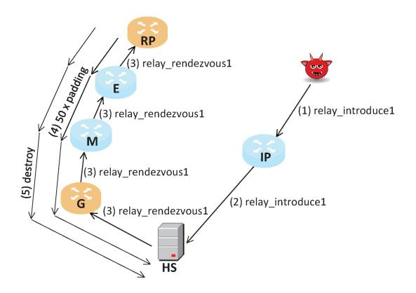

Fig. 10. The de-anonymization attack  $A_{14}$  introduced in literature [45]. In this attack, different steps may correspond to different cell types, and an attacker uses padding cells to create observable traffic patterns.

of unconstrained relay\_early cell's direction in the relay procedure  $V_9$ , the adversary aims to de-anonymize HS or OP that accesses HS. The adversary implants a set of ORs in live Tor. These implanted ORs gain the HSDir flag or Guard flag. By injecting a signal (a hybrid sequence of relay cells and relay early cells) at the HSDir node, he would detect that signal at the guard node. (iii) OP, RP, the entry of HS. Based on the end-to-end integrity mechanism  $V_{12}$ , the vulnerability of malicious ciphertext manipulation at RP  $V_{20}$ , and the padding mechanism in the onion service layer  $V_{23}$ , literature [45] proposed a method to generate a special traffic pattern at the RP point  $(A_{14})$ . By sending 50 padding cells and a destroy cell skillfully, a determinate cell pattern would be observed. Based on the vulnerability of malicious ciphertext manipulation at RP  $V_{20}$ , literature [89] proposed another method  $(A_{15})$ . By manipulating the cell at RP, some protocol-level characteristics would be observed (The steps of  $A_{14}$  are shown in Figure 10). It is worth noting that although both literature [45] and [89] make use of the vulnerability of malicious ciphertext manipulation at RP  $V_{20}$ , they utilize its features in different ways. In literature [45], the adversary sends a destroy cell through the RP point before the OP and HS establish a connection, thereby increasing the uniqueness of the traffic signal. On the other hand, in literature [89], the adversary flips a specific bit of a cell (leveraging end-to-end integrity checking) after the OP and HS have established a connection, possibly abruptly. Despite these detailed differences, the underlying ideas of both methods are similar, and their efficiency is comparable.

HS's entry. De-anonymizing the entry of an HS is a prerequisite to de-anonymizing that HS. The Tor project has listed the guard discovery attack as one of the most significant threats [116]. Based on the end-to-end integrity mechanism  $V_{12}$ , the vulnerability of malicious ciphertext manipulation at RP  $V_{20}$ , the padding mechanism in the onion service layer  $V_{23}$ , and the vulnerability of arbitrary rend-cookie  $V_{18}$ , literature [87] proposed a de-anonymizing technique that can de-anonymize the entry nodes of multiple onion services simultaneously  $(A_{16})$ . The authors demonstrated that a significant portion of hidden services, around 89%, relies on just 20% of entry nodes, highlighting the heightened vulnerability of most hidden

services to this limited set of guard relays. Specifically, a handcrafted rend-cookie is used to embed the HS identifier, and relay\_drop cells are used to encode the HS identifier, creating a distinctive watermark that can be used to identify the HS. In [84]  $(A_{17})$ , based on the forward compatibility in the relay layer  $V_9$ , the adversary creates multiple circuits to the target HS and sends amounts of dummy cells on these circuits. By saturating the bandwidth, he would identify the entry node with public bandwidth measurement information. In addition, the technique described in  $A_{14}$  may help to de-anonymize an entry node of the HS side, as claimed in [45].

HS's user. De-anonymizing a user of some HS may help regulatory enforcement, especially after compromising that HS. (i) Entry, HS. Literature [90] proposed a protocol-feature based method  $(A_{18})$ , utilizing the end-to-end integrity mechanism  $V_{12}$  and the vulnerability of malicious ciphertext manipulation at RP  $V_{20}$ . In this attack, the adversary first manipulates a cell (e.g., flipping one bit) at the colluded entry node, causing the decryption failure of HS. Literature [91] proposed another approach  $(A_{19})$ , with the vulnerability of the relay\_data cell with stream id zero  $V_{21}$  utilized. (ii) Entry, InP. Literature [117] utilized the padding mechanism in the onion service layer  $V_{23}$  to generate special traffic patterns due to the particularity of the OP-InP circuit  $(A_{20})$ . In that way, the adversary could correlate the traffic information of the collusive entry node, thus identifying the OP with high accuracy.

2) Denial-of-Service Attacks: Disrupting the Tor network's regular operation is another type of protocol attack. By the way, given amounts of critical components disturbed, the claimed anonymity would be severely weakened.

OR. Disrupting any OR would significantly affect the confidence of operators. Based on the vulnerability of publickey cryptographic calculations when circuit building  $V_3$  and the vulnerability of unlimited circuit extending times in the TLS channel  $V_6$ , an attack method was proposed in [38]  $(A_{21})$ . In this attack, the adversary uses an OP to continuously send onionskins, causing ORs to have no resources to process the legitimate ones. The adversary would simply send the create cell repeatedly, without preparing a new onionskin each time. That technique can deny service to key ORs in live Tor (e.g., high bandwidth, long online time). The authors estimated that halving the processing power of 62% of the most commonly used ORs would cost only 2.6 to 9.76 Mb/s per router. In another work [80]  $(A_{22})$ , the adversary utilizes the TCP window mechanism  $V_2$ , the congestion control mechanism in the relay layer  $V_{13}$ , and one vulnerability in the stream layer  $V_{15}$  to take any OR offline. By continuously flooding the application layer queue, eventually, the Tor process of the target OR is killed by the memory manager. The authors estimated the threat against the live Tor network at that time and found that a strategic adversary could disable all of the top 20 exit relays within just 29 minutes, demonstrating a serious threat to Tor. Moreover, this attack possesses a certain degree of covertness. When the adversary selects the victim node as the exit node, due to the characteristics of onion routing, the victim node is unaware of which OP initiated the attack. Currently, this attack has been defended against using the introduced mechanisms of the out-of-memory manager [118] and the sendme authentication scheme [115].

HS. Disrupting an HS would significantly affect the confidence of onion service operators. Literature [45] first considers the vulnerability in the distribution of HS descriptors  $V_{16}$ , aiming to launch eclipse attacks on HS  $(A_{23})$ . In that attack, the attacker inserts multiple nodes as the HSDirs, rejects HS descriptor requests from OPs, makes the target HS unavailable, or launches a de-anonymization attack on the HS. Similar to [45], literature [119] provides a more specific description of the eclipse attack and formally analyzes the attack effect. Further, the asymmetry in resource consumption between malicious OP and HS  $V_{17}$  can be utilized to deny HS  $(A_{24})$  [86]. It's worth noting that  $A_{24}$  possesses a certain degree of covertness, as the onion routing mechanism conceals which OPs initiated a large number of requests to the target HS. Several attacks of this type have occurred in the past few years, i.e., the attack on the Dream Market [33]. Tor is considering fundamental solutions to such threats [120].

- 3) Summary and Lessons Learned: We draw the following conclusions on protocol attacks in Tor.
  - The proportion of de-anonymization attacks is high, and the proportion of attacks against HS related is higher than that against the general circuit, probably because onion services are related to diverse illegal activities. This point is supported by the temporal analysis of the works. We find that de-anonymization attacks on the general circuit attract more attention in the early years, and then studies on onion service become a focus. The de-anonymization goals related to onion service include HS, the entry node of the HS side, and OP accessing HS. This likely reflects the reality that the Dark Web is rife with illegal transactions and requires adequate techniques to combat cybercrime.
  - Some attacks exploit multiple vulnerabilities across different layers, resulting in a usable attack vector by combination, indicating that securing Tor systems is an intractable challenge. For example, literature [39] and [80] consider congestion control at the TCP layer and the stream layer respectively. Interestingly, literature [39]  $(A_9)$  affects the stream-level congestion control by manipulating the TCP layer (Recall that  $A_9$  utilizes the TCP timeout retransmission mechanism  $V_1$  and the congestion control mechanism in the stream layer  $V_{14}$ . The adversary drops TCP packets to incur discarding the relay\_sendme cells, thereby creating a disruption in the traffic.); the lower layer drives the upper layer. Literature [80]  $(A_{22})$  affects the TCP layer by manipulating the stream layer: the upper layer drives the lower layer (Recall that  $A_{22}$  utilizes the TCP window mechanism  $V_2$ , the congestion control mechanism in the relay layer  $V_{13}$ , and one vulnerability in the stream layer  $V_{15}$ . The adversary continuously sends relay\_sendme cells to the collusive exit, ultimately leading to an overflow of the TCP socket buffer at the victim entry node.), showing the complex aspect of system security.
  - The attack techniques evolve to higher levels, pursuing covertness and functionality (e.g., transmitting

| ır | Main focus                                       | Classifie |
|----|--------------------------------------------------|-----------|
| S  | SUMMARY OF WF ATTACKS IN TOR (IDENTIFIED IN SECT | ION IV-B) |
|    | TABLE VI                                         |           |

| Category            | Ref   | Year | Main focus                                                                                                 | Classifier        | Data | aset so | urce | Scenario    |
|---------------------|-------|------|------------------------------------------------------------------------------------------------------------|-------------------|------|---------|------|-------------|
| Category            | Rei   | Tear | Main rocus                                                                                                 | Classifici        | P    | S       | Н    | Sechario    |
|                     | [121] | 2009 | First conducting a WF attack in the Tor setting.                                                           | naive Bayes       | 0    | •       | 0    | Closed      |
|                     | [122] | 2011 | Improving the performance significantly and studying the feasibility in the open world for the first time. | SVM               | 0    | 0       | •    | Closed/open |
|                     | [49]  | 2012 | Improving the classification performance.                                                                  | SVM               | 0    | •       | 0    | Closed      |
| Handcrafted-feature | [123] | 2013 | Improving the classification performance.                                                                  | SVM               | 0    | 0       | •    | Closed/open |
| based WF attacks    | [43]  | 2014 | Improving the classification performance in large open world setting.                                      | k-NN              | 0    | •       | 0    | Open        |
|                     | [48]  | 2016 | Improving the classification performance.                                                                  | SVM               | 0    | 0       | •    | Closed/open |
|                     | [124] | 2016 | Improving the classification performance with new feature representation method and classifier algorithm.  | random forest     | 0    | 0       | •    | Closed/open |
|                     | [125] | 2016 | First applying a DL method to WF attack.                                                                   | SDA               | •    | 0       | 0    | Closed/open |
|                     | [47]  | 2018 | Systematically explored the performance of DL methods.                                                     | LSTM              | 0    | •       | 0    | Closed/open |
|                     | [41]  | 2018 | Improving the classification performance in both closedworld and open-world scenarios.                     | CNN               | 0    | •       | 0    | Closed/open |
|                     | [42]  | 2019 | Reducing the amount of training data.                                                                      | ResNet            | •    | 0       | 0    | Closed/open |
| DL based WF attacks | [95]  | 2019 | Reducing the amount of training data.                                                                      | CNN               | •    | 0       | 0    | Closed/open |
|                     | [51]  | 2020 | Improving the classification performance.                                                                  | CNN               | 0    | 0       | •    | Closed/open |
|                     | [50]  | 2021 | Studying the effectiveness of non-index page WF attack with low training data for the first time.          | GAN               | 0    | 0       | •    | Closed/open |
|                     | [126] | 2023 | Proposing a novel attack method against state-of-the-art WF defenses.                                      | CNN               | •    | 0       | 0    | Closed/open |
|                     | [127] | 2023 | Proposing a novel multi-tab WF attack to eliminate eliminate the reliance on prior knowledge.              | CNN & transformer | 0    | •       | 0    | Closed/open |
|                     | [128] | 2022 | First conducting an evaluation of WF attacks under a true open world.                                      | CNN               | 0    | •       | 0    | Closed/open |

Dataset source includes three types: public dataset (P), self-collected dataset (S), and hybrid dataset (H). • Positive ( Negative

information) and adopting advanced techniques (e.g., ML). By checking the evolution of attacks, we find that the initial attacks may simply achieve a basic target, while other targets (e.g., covertness and functionality) are not taken seriously. For example,  $A_3$  indicates the feasibility of launching a de-anonymization attack by tagging a cell, while  $A_4$  considers the covertness additionally.  $A_{15}$  starts to de-anonymize HS, while  $A_{11}$ utilizes delay as a signal for covertness. In addition,  $A_{13}$ ,  $A_{11}$ , and  $A_{16}$  all take information coding into account, making the modulated signal not only able to be used in correlation attacks but also transmit helpful information. In addition, as a representative of the adoption of advanced techniques,  $A_{11}$  utilizes ML to identify HS-InP circuits, to facilitate the actual stage of the attack.

The above situations indicate that the security of anonymity networks is not inherent; adversaries can exploit complex attack strategies and employ advanced techniques to achieve their attack objectives.

#### B. WF Attacks in Tor

Table VI provides a summary of these works. (A typical attack model of WF attacks is shown in Figure 11.) Earlier

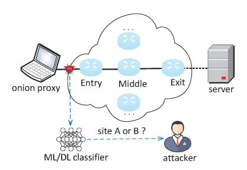

Fig. 11. A typical attack model of WF attacks within Tor. An adversary collects Tor traffic and trains a classifier to identify the traffic of interest.

works on WF attacks explore various domain-oriented features and classifier models, and these models are usually based on traditional ML algorithms. Due to the dominant advantages of DL in automatic feature extraction, WF attacks based on DL have become a major concern. Hence we categorize WF attacks into two types: handcrafted-feature based and DL based.

1) Handcrafted-Feature Based WF Attacks: WF attack in the Tor setting was carried out for the first time by literature [121] in 2009. In that work, a naive Bayes classifier and the frequency distribution features of IP packet size are considered, yet achieving an average accuracy rate of only 3%

in the closed world, primarily due to the uniformity of cell length. After that, with the same closed-world dataset in [\[121\]](#page-49-43), literature [\[122\]](#page-49-44) utilized new features of volume, time, and direction of packets, and a Support Vector Machine (SVM) classifier, thus achieving an accuracy rate of nearly 55%. In addition, the feasibility in the open world was first studied as well. Next, literature [\[49\]](#page-48-19) and [\[123\]](#page-49-45) further improved the accuracy of WF attacks. In [\[49\]](#page-48-19), an edit-distance kernel based SVM was adopted to process packet-order features, achieving an accuracy rate of over 86% on a closed-world dataset of 100 sites. Further, literature [\[123\]](#page-49-45) improved the accuracy to 90% on the same dataset by using a new edit distance and trace representation method. In [\[43\]](#page-48-13), the k-Nearest Neighbors (k-NN) algorithm was applied to a large open-world task (100 monitored versus 5000 unmonitored) with a TPR of 85% and an FPR of 0.6%. Then literature [\[48\]](#page-48-18) adopted an SVM classifier based on the radial basis function kernel and certain cumulative features of packet length and achieved a better performance than literature [\[43\]](#page-48-13) on a newer and more realistic dataset in both the open world and closed world. The underlying reason behind that is likely that cumulative features for the SVM classifier carry more useful information. Further, literature [\[124\]](#page-49-46) used the random forest to encode features in another vector space, and then these new features were input to the k-NN algorithm. Experiment results showed that the proposed method is as effective as in [\[41\]](#page-48-11), achieving comparable accuracy with the same number of websites.

Overall, high-quality features and appropriate classifiers are critical factors for achieving significant performance in this work style. Some advanced work [\[43\]](#page-48-13), [\[48\]](#page-48-18), [\[124\]](#page-49-46) has achieved 91-96% accuracy in the setting of 100 traces *×* 100 sites.

*2) DL Based WF Attacks:* The deep neural network (DNN) uses multiple layers to get different abstraction levels of input data and fit an arbitrary function, demonstrating the advantage in feature extraction and classifier construction over the handcrafted-feature based approach [\[129\]](#page-50-0).

The first attempt to apply a DL based approach to WF attacks was literature [\[125\]](#page-50-1), which uses the dataset in [\[43\]](#page-48-13) to evaluate the performance of the stacked denoising autoencoder (SDA) classifier. Yet the lack of enough data led to not outperforming some advanced feature-based methods; they achieved 88% accuracy in a closed world of 100 categories. Then literature [\[47\]](#page-48-17) systematically explored the performance of DL for the first time. It tries SDA, convolutional neural network (CNN), and long short-term memory (LSTM) and collects the largest dataset at that time, in which the closedworld dataset consists of 900 websites and the open-world dataset consists of 400,000 unknown sites and 200 monitored sites. Experiments showed that DL methods outperformed the feature based method in [\[48\]](#page-48-18), both in closed-world and openworld scenarios. Compared with [\[47\]](#page-48-17), literature [\[41\]](#page-48-11) adopted an improved CNN structure and proposed a more powerful method, deep fingerprint (DF). DF achieves more than 95% accuracy in both the closed-world (95 sites) and open-world (20,000 unmonitored sites) scenarios, demonstrating a severe threat to some defense schemes (WTF-PAD [\[130\]](#page-50-2) (WTF-PAD: Website Traffic Fingerprinting Protection with Adaptive Defense) and Walkie-Talkie [\[131\]](#page-50-3)). Literature [\[51\]](#page-48-21) studied the effect of raw time information and then proposed a new attack method, TiK-tok, by combining the raw time information with the direction information. Tik-tok improved the attack performance compared to [\[41\]](#page-48-11), in both closed-world and openworld settings However, the performance improvement of literature [\[41\]](#page-48-11), [\[47\]](#page-48-17), [\[51\]](#page-48-21) requires large amounts of training data, thus affecting the feasibility of the attack.

To further prove that even a weak adversary can compromise Tor user privacy, literature [\[42\]](#page-48-12), [\[50\]](#page-48-20), [\[95\]](#page-49-17) use a more advanced DL model, to optimize the attack effect yet with limited training data. By integrating dilated causal convolutions into the ResNet model and taking the cumulative features of packet sequence and time information features as auxiliary inputs, literature [\[42\]](#page-48-12) achieved 97.8% accuracy when only 100 training instances *×* 100 sites were used. In [\[95\]](#page-49-17), a new method based on N-shot learning, triple fingerprint, was proposed. Utilizing pre-training on a large dataset, only a small number of fresh examples are needed to achieve high accuracy. Further, literature [\[50\]](#page-48-20) proposed an architecture (called GANDaLF) based on generative adversarial networks, which utilize generators to generate additional data to improve the performance of the discriminator. In addition, literature [\[50\]](#page-48-20) first studied the effectiveness of non-index page cases with low training data. Experiments showed that 87% accuracy is achieved in the case of 20 training instances *×* 100 sites in a closed world, and the performance under the case of the non-index page is better than literature [\[42\]](#page-48-12), [\[95\]](#page-49-17).

In order to enhance performance across various defense schemes, literature [\[126\]](#page-50-4) proposes a WF attack referred to as Robust Fingerprinting (RF) based on a robust traffic representation method. To achieve this, the authors employed the information leakage metric defined in [\[132\]](#page-50-5) to compare the varying degrees of information leakage before and after defense for different traffic representations, capturing critical features of Tor traces. By constructing a traffic aggregation matrix (TAM) that consolidates multi-dimensional information (packet direction, count, and time), RF outperforms other state-of-the-art WF attacks when evaluated against state-ofthe-art WF defenses. Specifically, RF achieves an average accuracy enhancement of 8.9% over the best existing WF attack (i.e., Tik-Tok).

WF attacks come with various underlying assumptions. In [\[127\]](#page-50-6), an enhanced multi-tab WF attack is introduced. In the multi-tab WF attack, the observed traffic blends the network traffic generated by different Web pages, requiring the attacker to discern which Web pages correspond to the observed traffic. This attack form is more challenging than the typical WF attacks. The authors proposed an adaptive approach referred to as ARES, framing the multi-tab WF attack as a multi-label classification problem. This formulation eliminates the need for the adversary to possess prior knowledge about the number of tabs opened during a browsing session. In the ARES scheme, the authors transformed the complex multilabel classification problem into a multiple-independent binary classification problem. This division assigns each classifier the task of determining the possibility that a corresponding monitored website has been visited. ARES achieves an F1-score exceeding 90%, indicating a likely state-of-the-art in the realm of multi-tab WF attacks.

Most WF attack studies have the problem of synthetic traffic generation, due to the existence of onion encryption. A WF adversary situated at the entry relay has no ground truth about the websites accessed by Tor users. Consequently, adversaries are compelled to generate their own training data via automated browsers at an OP. However, this data fails to capture the genuine distribution of user traffic in live Tor, potentially leading to an overestimation of the WF attack accuracy. In order to evaluate the real-world performance of WF attacks, literature [\[128\]](#page-50-7) for the first time collected traffic at live Tor exit nodes to reflect the genuine distribution of user traffic. The authors introduced an updated WF attack model that involves online updating of the model using actual exit node traffic and subsequently deploying the model to an entryside observation point (such as an entry node) for practical attacks. This approach aids in mitigating the problem of synthetic traffic generation while also addressing concept drift through online learning. The authors found that an adversary can achieve a classification accuracy exceeding 95% when monitoring a small set of 5 popular websites in an open-world scenario. However, the classification accuracy experiences a rapid decline as the monitored set expands.

*3) Summary and Lessons Learned:* Overall, the focus of WF attacks extends to more real-world scenarios, aiming to achieve high classification accuracy in both closed-world and open-world settings. However, researchers have started considering additional factors beyond accuracy. In the context of real-world feasibility, literature [\[133\]](#page-50-8) has highlighted the negative impact of multi-tab browsing, continuous changes in Web content, and variations in browser versions. Multitab browsing introduces the challenge of overlapping traffic traces when a user opens a new tab while other tabs are still loading elements. This overlapping traffic alters the traffic patterns, increasing statistical uncertainty. In response, literature [\[134\]](#page-50-9) has made efforts to address some of these challenges. Interestingly, literature [\[135\]](#page-50-10) has studied the impact of the dynamic Tor network composition and performance on WF attacks.

Moreover, there is a diversification trend in the research on WF attacks. Recent studies have explored various aspects, including reducing the adversary's cost [\[42\]](#page-48-12), [\[50\]](#page-48-20), [\[95\]](#page-49-17), reducing the FPR in the open-world setting using network oracles [\[136\]](#page-50-11), incorporating the base ratio of non-sensitive to sensitive Web pages in accuracy metrics to correct evaluation bias [\[137\]](#page-50-12), studying the applicability of circuit fingerprinting [\[138\]](#page-50-13), [\[139\]](#page-50-14), investigating the applicability of fingerprint attacks for keyword queries [\[140\]](#page-50-15), examining the feasibility of WF attacks on middle OR nodes [\[141\]](#page-50-16), and exploring the feasibility of WF attacks in a multi-tab setting [\[142\]](#page-50-17). These efforts contribute to the further development of WF techniques and amplify the threats to existing defense mechanisms.

The above discussion indicates that once a prevailing attack against anonymity networks is initiated, researchers will follow up and enhance the attack. These improvements may include changing attack targets, varying attack locations, increasing

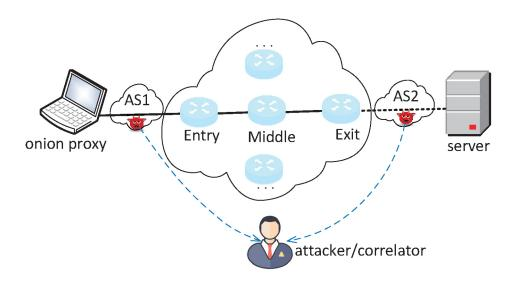

Fig. 12. A typical attack model of AS/state-level adversary attacks in Tor. An attacker controls AS1 and AS2, thus correlating observations of the first segment and the last segment.

attack performance, reducing attack costs, and enhancing the applicability of the attack, among other aspects.

#### *C. AS/State-Level Adversary Attacks in Tor*

Table [VII](#page-27-1) provides a summary of AS/state-level adversary attacks. (A typical attack model of AS/state-level attacks is shown in Figure [12.](#page-26-1))

In the past two decades, several empirical studies have investigated the threat of AS-level adversaries in Tor, using various methodologies and datasets. Reference [\[46\]](#page-48-16) first proposed a location-independent metric to estimate the probability of an AS observing both ends of a connection, using a public BGP routing dataset and an AS-level path inference algorithm. The authors found that a single backbone Internet Service Provider (ISP) can observe up to 30% of the connections, raising concerns about privacy and security. Subsequent studies, such as [\[96\]](#page-49-18), [\[97\]](#page-49-19), [\[98\]](#page-49-20), [\[99\]](#page-49-21), [\[143\]](#page-50-18) further refined the analysis and addressed some of the limitations of earlier work. For example, literature [\[96\]](#page-49-18) studied the threat of an adversary with access to IXP. Literature [\[143\]](#page-50-18) used a larger and more recent BGP dataset to account for the evolution of the Tor network over time, and found that the impact of nodeselection strategies on the independence of the AS-level path is negligible. Literature [\[98\]](#page-49-20) developed a realistic Tor path simulator and various user and adversary models to capture the diversity of network conditions and behaviors, and showed that collusive AS-level adversaries can significantly improve their efficiency in traffic analysis attacks. Literature [\[99\]](#page-49-21) explored the asymmetric nature of Internet routing and how AS-level adversaries can exploit it to increase their chances of observing user traffic, and found that even a passive adversary can achieve 95% accuracy in correlation attacks. However, active adversaries who engage in BGP hijacking or interception can further increase the risk of traffic analysis attacks, as demonstrated in [\[97\]](#page-49-19). Overall, these studies demonstrate the ongoing threat of AS-level adversaries to the privacy and security of Tor users and highlight the need for more effective defenses and countermeasures.

Differing from most previous studies that often rely on BGP updates and route prediction to measure the capabilities of AS-level adversaries, literature [\[144\]](#page-50-19) presents a more realistic approach based on active measurements. It utilized a global measurement network, namely the RIPE Atlas framework [\[145\]](#page-50-20), which encompasses over 11,000 probes.

TABLE VII SUMMARY OF AS/STATE-LEVEL ADVERSARY ATTACKS IN TOR (IDENTIFIED IN SECTION [IV-C\)](#page-26-0)

| Ref   | Year | Main focus                                                                                                                       | То | pology  | type | Adversary Type                          |
|-------|------|----------------------------------------------------------------------------------------------------------------------------------|----|---------|------|-----------------------------------------|
| KCI   | Icai | Main locus                                                                                                                       | PI | RM      | AM   | Auversary Type                          |
| [46]  | 2004 | The threat of AS-level adversary in the Tor setting was empirically studied for the first time.                                  | •  | 0       | 0    | Passive AS-level adversary              |
| [96]  | 2007 | The threat of adversary with access to Internet exchange points (IXP) was studied.                                               | 0  | 0       | •    | Passive IXP adversary                   |
| [143] | 2009 | Reevaluated the threat posed by AS-level adversary when Tor grew.                                                                | •  | $\circ$ | 0    | Passive AS-level adversary              |
| [98]  | 2013 | The security against AS-level adversaries was evaluated with user-friendly metrics.                                              | •  | 0       | 0    | Passive AS/IXP -level adversary         |
| [99]  | 2015 | The capabilities of AS-level adversaries were further developed, including route asymmetry, route churn, and BGP prefix attacks. | •  | •       | 0    | Passive/active AS-level adversary       |
| [97]  | 2016 | Quantified the threats of the asymmetric AS-level adversary and collusive AS-level adversary.                                    | •  | 0       | 0    | Asymmetric/collusive AS-level adversary |
| [144] | 2023 | Proposed a realistic approach based on active measurement to update the threat of passive AS-level adversary.                    | 0  | 0       | •    | Passive AS-level adversary              |

Specifically, it employed probes from this network to traceroute the Internet paths traversed by Tor traffic and, and then estimated the correlation probability of AS-level adversaries based on the collected data. The measurement results indicated the presence of a few ASes with the potential to successfully deanonymize Tor users, although the corresponding count may vary over time. Moreover, for the first time, literature [\[144\]](#page-50-19) investigates the capabilities of AS-level adversaries in an IPv6 environment. The study claimed that it could not identify an increased threat of deanonymization for users that use Tor over IPv6, neither in Germany nor America, nor in Russia.

*1) Summary and Lessons Learned:* Next, we will discuss AS/state-level adversary attacks. Overall, the threat of AS/state-level adversaries is evaluated under multiple adversary models. Evaluating such threats typically requires a BGP routing dataset to model the Internet topology. Besides, the path inference algorithm is also important. An inaccurate path inference algorithm would affect the evaluation effect. For example, literature [\[146\]](#page-50-21) doubted the accuracy of the Qiu and Gao path inference algorithm, which may affect the reliability of evaluation results in [\[98\]](#page-49-20), [\[143\]](#page-50-18). Consequently, using advanced topology modeling methods and path inference algorithms can accurately characterize the threat of AS/statelevel adversaries. However, inferring network paths (network topology) is a complex problem influenced by various factors. Firstly, it requires utilizing the latest Internet topology map. Additionally, incorporating background knowledge such as network interconnections and routing policies is necessary for the modeling (inference) process. The complex business relationships between ASes introduce uncertainty to the paths, and the collusion between sybil ASes may involve information sharing, altering the attack surface. Regardless, accurate path inference enables effective assessment of the threat posed by AS adversaries and provides a reliable basis for mitigating such threats. Therefore, the development of advanced path inference techniques and Internet measurement techniques will have a direct impact on this field. Furthermore, extensive and precise active measurements can offer more realistic estimations [\[144\]](#page-50-19).

The above discussion underscores the inherent importance of accurately evaluating attacks against anonymity networks, which typically involves considering various real-world factors. Precisely assessing the threat posed by attacks is crucial for enhancing the security of anonymity networks and devising effective threat mitigation strategies.

## *D. Attacks in I2P and Freenet*

In Section [III-D,](#page-19-0) we have surveyed the relevant vulnerabilities in I2P and Freenet. In this section, we will show the attacks exploiting those vulnerabilities against these two anonymity networks. In comparison to Section [IV-A,](#page-20-1) similarly and not coincidentally, these attacks also mainly target deanonymization, exhibiting their own unique characteristics. Besides, an eclipse attack [\[105\]](#page-49-27) (denial-of-service) against Eepsites was proposed, making those services unavailable to users. Last but not least, a routing table insertion attack [\[102\]](#page-49-24) was introduced, thus facilitating a relevant de-anonymization attack. Next, we will review these attacks by highlighting their methods.

The authors in [\[105\]](#page-49-27) proposed an eclipse attack against Eepsites in the I2P network. In this attack, an adversary exploits the determinism of the directory service mechanism in I2P, computing huge quantities of peer identities in advance. Then the adversary implants several (about ten) nodes with appropriate identities with respect to a victim Eepsite into the network, preemptively serving as its responsible floodfill nodes. When a user makes queries on that Eepsite, the adversary can send a reply claiming to not know the corresponding service information, making the targeting Eepsite unavailable [\[105\]](#page-49-27).

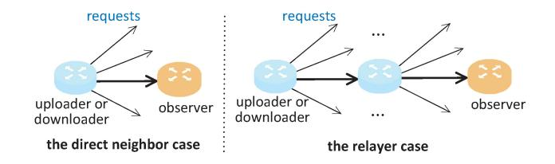

Fig. 13. The two scenarios are to be distinguished by the investigator (observer) in literature [\[104\]](#page-49-26).

The authors in [\[102\]](#page-49-24) proposed a routing table insertion attack in Freenet. First, the adversary exploits the undocumented function *probe* to probe network topology. With several attack nodes at hand, the adversary can merge the topological information and build a (partial) network topology. Then the adversary uses that topology to select a targeting peer and request the premeditated file keys, where the route path rightly involves that targeting peer. Given the LRU replacement policy of Freenet, the adversary thus performs a controlled broadcast announcement for an adversarial peer and makes it a direct peer of the targeting peer [\[102\]](#page-49-24). As a result, many other attacks can be launched to break the anonymity, e.g., the traceback attack introduced in [\[103\]](#page-49-25).

In terms of de-anonymization, attacks targeting Eepsites [\[101\]](#page-49-23) and users (content requesters) [\[103\]](#page-49-25), [\[104\]](#page-49-26) were proposed respectively. In [\[101\]](#page-49-23), an adversary divides its attack into three steps. Firstly, the adversary distributes its monitoring nodes over many /16 networks, thus increasing the probability of being selected in a tunnel of the targeting Eepsite. Then, the adversary overloads the peers specified in the leaseSet of the targeting Eepsite. Given I2P's profiling-based peer selection mechanism, some monitoring nodes would be promoted to the fast layer of that Eepsite, thus exploited by its client channels. Lastly, the adversary uses another peer to send a periodic Hypertext Transfer Protocol (HTTP) request, creating an identifiable statistical pattern. In [\[103\]](#page-49-25), the adversary exploits the loop-preventing mechanism, the unique UID in a message on its forwarding path, launching a traceback attack identifying the originating content request peer. Recall that the routing table insertion attack introduced in [\[102\]](#page-49-24) enables an adversary to implant a peer as a direct neighbor of a targeting peer, thus facilitating the adversary to query the neighbors of that direct neighbor. Backtracking the forwarding path of a message, the adversary can query its neighbor of a suspect node (on the path) if it has seen a content request message with a particular UID value. If that neighbor peer has seen it, the adversary can query the neighbor peers of that neighbor iteratively, until a neighbor has no neighbor peers that have seen that UID value. The authors in [\[103\]](#page-49-25) claimed that they could identify 24% to 43% the originating peers in their experiment. In [\[104\]](#page-49-26), the authors proposed a forensic approach investigating the downloaders and uploaders who distribute and consume child sexual abuse materials in Freenet, distinguishing whether or not a neighbor peer is the actual uploader or downloader of a particular file or merely a relayer (shown in Figure [13\)](#page-28-1). Their technique exploits a simple observation of Freenet: requests associated with a manifest key are divided among neighbors uniformly, and counts of requests fall exponentially with each hop from the original uploader or downloader. Accordingly, the authors proposed a Bayesian hypothesis test and used real-world in situ measurements to statistically validate it. They obtained an FPR of 0.002 *±* 0.003 for identifying downloaders.

*1) Summary and Lessons Learned:* Similar to attacks against Tor, the attacks against I2P and Freenet also comprise de-anonymization and denial-of-service, reflecting the commonality of attacks against anonymity networks. However, different anonymity networks have varying goals for deanonymization. For I2P, Eepsites hosting HTTP services anonymously are suspected of supporting illegal activities likewise Tor's onion services. Hence, deanonymizing an Eepsite is deemed valuable, as done in [\[101\]](#page-49-23). Yet, Freenet is an anonymous distributed file-sharing system, with many available illegal contents. Accordingly, identifying a content downloader and uploader appears to be appealing. Literature [\[103\]](#page-49-25) and [\[104\]](#page-49-26) have done work in this aspect. However, these two works still have differences. The approach of literature [\[103\]](#page-49-25) is relatively heavyweight, requiring active maneuvering and traffic probing; while literature [\[104\]](#page-49-26) only requires passive observation and analysis. In addition, we notice that the eclipse attacks in [\[105\]](#page-49-27) (I2P) and [\[45\]](#page-48-15) (Tor) follow the same idea, both exploiting the determinism and predictability of the directory service algorithm. This suggests that attacks against different anonymity networks may adopt identical or similar ideas or techniques. Therefore, studying the security of one anonymity network is of significant reference value for researching the security of other anonymity networks.

#### V. DEFENSES IN ANONYMITY NETWORKS

To briefly recap, in Section [III,](#page-14-0) we examined the vulnerabilities present in anonymity networks: protocol vulnerabilities, metadata leakage, overlay nature in Tor, and vulnerabilities in I2P and Freenet. In Section [IV,](#page-20-0) corresponding to the aforementioned vulnerabilities, we presented prevailing attacks against anonymity networks, including protocol attacks, WF attacks, AS-state/level adversary attacks in Tor, and attacks in I2P and Freenet. In response to these attacks (vulnerabilities), this section will introduce the defenses against them, including defenses against protocol attacks (Section [V-A\)](#page-29-0), defenses against WF attacks (Section [V-B\)](#page-30-0), defenses against AS/state-level adversary attacks (Section [V-C\)](#page-33-0) in Tor, and defenses against attacks in I2P and Freenet (Section [V-D\)](#page-36-0). Technically, unlike some intersections in the attack objectives in Section [IV,](#page-20-0) the defenses reviewed in this section remain highly divergent, probably due to the differences in root causes of attacks. Especially, the defenses of protocol attacks are highly diversified due to the different attack forms. Most schemes aim for a specific problem with little universality. Comparatively speaking, the defenses of WF attacks and AS/state-level adversary attacks have concentrated ideas and categories. Due to the lack of defenses against attacks in I2P and Freenet, we make an effort to provide a parallel subsection to enhance the research depth.

| Ref   | Year | Main focus                                                                                                     | Sou | ırce   | Defense scope         | Defende | d category | Adopted ? |
|-------|------|----------------------------------------------------------------------------------------------------------------|-----|--------|-----------------------|---------|------------|-----------|
| Kei   | Itai | Main focus                                                                                                     | TC  | AP     | Defense scope         | D1      | D2         | Adopted : |
| [118] | 2014 | Destroy the circuit that occupies too much memory to prevent memory-targeted denial-of-service attacks.        | •   | 0      | $A_{22}$              | •       | 0          | <b>√</b>  |
| [115] | 2016 | Add a token to the payload of the relay_sendme cell to ensure the authenticity of that special cell type.      | •   | 0      | $A_7, A_{22}, A_{10}$ | •       | •          | <b>√</b>  |
| [60]  | 2015 | Add two random parameters to the consensus mechanism to circumvent the predictability of HSDir's location.     | •   | 0      | $A_{23}$              | •       | 0          | <b>√</b>  |
| [147] | 2008 | Prevents the circuit building of arbitrary length.                                                             | •   | 0      | $A_1, A_7$            | 0       | •          | ✓         |
| [65]  | -    | Further restrict the relay early cell's direction to mitigate traffic confirmation attacks (no specific time). | •   | 0      | $A_{13}$              | 0       | •          | ✓         |
| [148] | 2018 | Optimize socket algorithm to mitigate network congestion.                                                      | •   | 0      | $A_1, A_7$            | 0       | •          | ✓         |
| [149] | 2018 | Propose a method to mitigate guard discovery attacks.                                                          | •   | 0      | $A_{16}$              | 0       | •          |           |
| [150] | 2015 | Propose an onion encryption scheme with non-malleable property to defend against the tagging attack.           | •   | 0      | $A_4$                 | 0       | •          |           |
| [151] | 2018 | Utilize authentication encryption GCM-RUP to defend against the tagging attack.                                | •   | 0      | $A_4$                 | 0       | •          |           |
| [152] | 2019 | Propose an improved solution to defend against tagging attacks while supporting the leaky-pipes mechanism.     | •   | 0      | $A_4$                 | 0       | •          |           |
| [153] | 2020 | Introduce proof-of-work on the introduction circuit to defend against denial-of-service attacks against HS.    | •   | 0      | $A_{24}$              | •       | 0          |           |
| [154] | 2021 | A token mechanism based on RSA blind signature is proposed to defend against denial-of-service attacks against | •   | $\cap$ | $A_{24}$              | •       | $\cap$     |           |

TABLE VIII SUMMARY OF PROTOCOL DEFENSES IN TOR (IDENTIFIED IN SECTION [V-A\)](#page-29-0)

#### *A. Defenses Against Protocol Attacks in Tor*

This section lists some of the defenses related to protocol attacks. Table [VIII](#page-29-1) provides the summary of these defenses. They are mainly from Tor proposals or academic articles. Among them, Tor proposals are some protocol-related schemes exhibited by the Tor project, aiming to fix bugs and update functions in Tor release, possibly involving deployed measures or deep considerations. As these objectives are diversified, we enumerate them.

*Out-of-memory manager*. Tor introduced the out-of-memory manager in the Tor 0.2.4.18-rc version, for destroying the circuit that occupies memory too much [\[118\]](#page-49-40). It realizes the adaptive management of the circuit's memory and is used to defend against *A*22.

*The authentication scheme in relay\_sendme cell*. The sendme authentication scheme was introduced in Tor 0.4.1.1 alpha [\[115\]](#page-49-37). It enables the package edge to verify the validity of the relay\_sendme cell sent by the delivery edge, thus mitigating *A*7, *A*22, and *A*10. In that scheme, the delivery edge adds a token to the payload of the circuit-level relay\_sendme cell to prove that it has received the cells to be confirmed. To prevent the client from foreseeing the cells, the package edge randomly selects a relay cell and sets the last byte as a random value.

*Nondeterministic HS descriptor distributing*. Proposal 250 added two parameters "shared-rand-previous-value" and "shared-rand-current-value" to the consensus file to defend against eclipse attacks. These two parameters are shared random values generated by DAs and updated at least once every HSDir period [\[60\]](#page-48-30), thus limiting the predictability of HSDir's location.

*Limiting circuit's length*. The Tor project adopted proposal 110 [\[147\]](#page-50-22), which introduces the relay early cell to prevent circuit building of arbitrary length. It is designed to mitigate the congestion problem through long circuits (*A*1, *A*7).

*Limiting relay early cell's direction*. The "relay early" attack (*A*13) caused Tor to restrict the direction of the relay early cell to outbound only. Tor also implements that feature on the OP-RP-HS circuit to prevent RP from sending relay early cells in either direction. This improvement defends against *A*13.

*Mitigating congestion*. Congestion is an important attack vector in the attack instances *A*1 and *A*7. As Tor has grown, congestion has become a key factor that affects both its performance and security. Literature [\[148\]](#page-50-23) found two factors that significantly contribute to Tor's congestion, which do not take into account the status of other sockets. Literature [\[148\]](#page-50-23) improved Tor's socket management algorithm, using real-time kernel information to consider all circuits with writable sockets and dynamically calculate the number of cells to write. The proposed scheme reduces circuit congestion and promotes network growth, thus improving Tor's anonymity.

*Mitigating the guard discovery attack*. Proposal 292 [\[149\]](#page-50-24) proposed a method to mitigate the guard discovery attack (*A*16). The basic idea is to limit the amounts of second and third-hop ORs within a period rather than guard nodes merely to shift the attacker's cost to corrupting more ORs. This proposal is currently accepted.

*Defending against the covert tagging attack*. Several proposals have been put forward to defend against the covert tagging attack (*A*4) in Tor. Proposal 261 [\[150\]](#page-50-25) constructed a new onion encryption scheme using an AEZ primitive [\[156\]](#page-50-26) to avoid the malleable property of the AES counter mode. introduced a new onion encryption scheme using the AEZ primitive to avoid the malleability property of the AES counter mode. This scheme adopts the XOR between the plaintext and ciphertext of the previous cell as a source of randomness, so any damaged cell will damage all subsequent cells. Proposal 295 [\[151\]](#page-50-27) proposed another onion routing scheme that retains the AES counter mode but uses a new authenticated encryption technique, GCM-RUP [\[157\]](#page-50-28) (GCM: Galois/Counter Mode; RUP: release of unverified plaintexts), to logically associate the nonce with the ciphertext. This ensures that any modification by an intermediate node will change the nonce, resulting in garbage ciphertext and authentication failure. Proposal 308 [\[152\]](#page-50-29) aimed to improve on these schemes by using only a block cipher with counter mode and a universal hash function, providing improved computational efficiency and support for "leaky pipes".

*Defending against denial-of-service attacks on HS*. There are two proposals aiming to mitigate the risk of denial-ofservice attacks targeting hidden services (*A*24), with different specific goals. The former, proposal 327 [\[153\]](#page-50-30) aimed to defend against lightweight adversaries by introducing a dynamic proof-of-work protocol. This scheme considers the diversity of user types and places the responsibility of accessing HS on the user's strong motivation and the bearable workload. The latter, proposal 331 [\[154\]](#page-50-31) sought to defend against powerful adversaries through a token mechanism. In this scheme, before accessing a target HS, the client first requests a token (RSA blind signature) from a third party. Then the client sends that signature to the target HS. Once the target HS validates, the normal process of accessing the hidden service can proceed. At present, the plan is still in a draft state.

*Providing a trusted execution environment for Tor components*. Literature [\[155\]](#page-50-32) proposed a new idea, using trusted hardware Intel Software Guard Extensions (SGX) [\[158\]](#page-50-33) to defend against protocol attacks. By migrating the DAs, OPs, and ORs to the SGX environment, the DAs can check the validity of the Tor programs of OP and OR. This approach can prevent any protocol attack and cover instances (*A*1 *A*24). However, this proposal may face challenges as Tor relies on volunteer nodes, which may create obstacles for volunteer operators. Additionally, the use of SGX introduces potential security risks, such as side-channel leakage, which may impact the effectiveness of this approach.

*1) Summary and Lessons Learned:* Next, we provide a discussion on the above schemes. The above schemes provide

defense methods for different targets. However, defending against protocol attacks is not a trial task. Literature [\[155\]](#page-50-32) presents an outwardly attractive work that shifts the trust in protocol entities to SGX hardware, thus creating a significant obstacle for protocol adversaries. Yet, that scheme has significant limitations and does not directly attempt to solve the protocol stack problems. Beyond that, we see that the rest of the solutions try to solve part of the problems, and there is no one-size-fits-all solution. For example, proposals 261 [\[150\]](#page-50-25), 295 [\[151\]](#page-50-27), and 308 [\[152\]](#page-50-29) aim at defending against the covert tagging attack (*A*4), corresponding to the root cause in the Relay layer and not taking into account other attacks. If different vulnerabilities are unrelated to each other, they can be effectively addressed through modularized patching. In a worse scenario, the vulnerabilities are interconnected, or fixing one vulnerability inadvertently introduces new vulnerabilities by altering the attack surface. In that case, protocol defenses always try to match protocol attacks, with the former catching up with the latter through patches. Besides, we note that a proper defense may not be ready-made but requires deep security analysis and efficiency considerations. For example, proposal 261 [\[150\]](#page-50-25) is questioned for its performance, as it may result in higher latency and increased computational cost. These factors indicate that the defenses against protocol attacks in anonymity networks are long-term work, which is still worth the effort in the future.

## *B. WF Defense in Tor*

Table [IX](#page-31-0) summarizes the works in this section. Generally speaking, a WF defense may change the traffic observed by padding, delaying, and rerouting packets, thus making it difficult to predict the traffic trace with known knowledge. These defenses can be categorized into application layer obfuscation, network layer obfuscation, and DL-weakness based. Intuitively, application-layer obfuscation and networklayer obfuscation are often based on heuristic noise, while DL based weakness explicitly considers the vulnerability of the DL model.

*1) Network-Layer Obfuscation:* These schemes are designed to pad dummy packets or increase latency in a network trace and can be categorized into traffic morphing, constant-rate padding, improved padding, supersequence, and splitting on multi-path.

*Traffic morphing*. Literature [\[159\]](#page-50-34) utilized traffic morphing to mimic the trace of another page. However, traffic morphing requires timely preparation and updating of the Web template library at high maintenance costs. Some WF techniques [\[124\]](#page-49-46), [\[160\]](#page-50-35) have cracked such a scheme.

*Constant-rate padding*. Early works [\[160\]](#page-50-35), [\[161\]](#page-50-36), [\[162\]](#page-50-37) adopted constant-rate padding to reduce the influence of time gap and traffic size on the classifier. Literature [\[160\]](#page-50-35) proposed a scheme called BuFLO, which hides information such as time, bandwidth usage, and burst mode by sending packets at a fixed rate over a long fixed interval. Despite the effectiveness, BuFLO introduces significant bandwidth overhead (over 400% bandwidth overhead with a success rate of 5% against the then-best attack). Then literature [\[162\]](#page-50-37) proposed

TABLE IX SUMMARY OF WF DEFENSES IN TOR (IDENTIFIED IN SECTION [V-B\)](#page-30-0)

| Group                         | Category                                                                                                                   | Ref                                                                                                  | Year | Main focus                                                                                                                    | Datas | set type |
|-------------------------------|----------------------------------------------------------------------------------------------------------------------------|------------------------------------------------------------------------------------------------------|------|-------------------------------------------------------------------------------------------------------------------------------|-------|----------|
| Group                         | Category                                                                                                                   | Kei                                                                                                  | Tear | Main focus                                                                                                                    | S     | Е        |
|                               | Traffic morphing                                                                                                           | [159]                                                                                                | 2009 | Utilized traffic morphing to mimic the trace of another page.                                                                 | •     | 0        |
|                               |                                                                                                                            | [160]                                                                                                | 2012 | Proposed a constant-rate padding scheme called BuFLO.                                                                         | •     | 0        |
|                               | Constant-rate padding                                                                                                      | [161]                                                                                                | 2014 | Proposed a scheme optimizing the padding bandwidth of upstream and downstream.                                                | •     | 0        |
|                               |                                                                                                                            | [162]                                                                                                | 2014 | Proposed a scheme and introduced congestion sensitivity and rate adaptation.                                                  | 0     | •        |
|                               |                                                                                                                            | [163]                                                                                                | 2018 | Proposed a scheme to provide a better trade-off between safety and efficiency.                                                | •     | 0        |
| Network-layer                 |                                                                                                                            | [130]                                                                                                | 2016 | Proposed an adaptive padding scheme by inserting packets in a large time gap to obfuscate inter-arrival time features.        | •     | 0        |
| obfuscation                   | Improved padding                                                                                                           | [164]                                                                                                | 2020 | Proposed a lightweight scheme selectively padding the feature-rich front part of the trace.                                   | •     | 0        |
|                               |                                                                                                                            | [165]                                                                                                | 2014 | Proposed a scheme that defines supersequence and the corresponding heuristic computing algorithm.                             | •     | 0        |
|                               | Supersequence [43] 2014 Proposed a similar solution, clustering different traces from different sites into anonymity sets. |                                                                                                      |      |                                                                                                                               |       | 0        |
|                               |                                                                                                                            | [131]                                                                                                | 2017 | Proposed a solution for the open-world scenario, changing the full-duplex mode of the browser to half-duplex mode.            | •     | 0        |
|                               |                                                                                                                            | [166] 2020 Proposed a lightweight scheme splitting the traffic of a trace over multiple entry nodes. |      |                                                                                                                               |       | 0        |
|                               | Splitting on multi-path                                                                                                    | [167]                                                                                                | 2020 | Proposed a multi-host based scheme splitting the traffic of a trace over multiple carrier networks.                           | •     | 0        |
|                               | Randomization/                                                                                                             | [122]                                                                                                | 2011 | Utilized a browser plugin to introduce noise by loading another random page in parallel.                                      | 0     | •        |
| Application-layer obfuscation | obfuscation                                                                                                                | [168]                                                                                                | 2011 | Proposed a client-side defense scheme utilizing some basic characteristics of TCP and HTTP.                                   | 0     | •        |
|                               |                                                                                                                            | [169]                                                                                                | 2017 | Proposed an HS-side scheme and a lightweight client-side scheme.                                                              | 0     | •        |
|                               |                                                                                                                            | [170]                                                                                                | 2021 | Proposed a scheme that introduces randomness into the searching process to reduce the predictability of adversarial examples. | •     | 0        |
|                               |                                                                                                                            | [171]                                                                                                | 2020 | Proposed a scheme that combines GAN and WF classifier to generate adversarial examples.                                       | •     | 0        |
|                               | Adversarial perturbation                                                                                                   | [172]                                                                                                | 2020 | Proposed a scheme introducing two burst injection techniques as the perturbation generating algorithms.                       | •     | 0        |
| DL-weakness based             |                                                                                                                            | [173]                                                                                                | 2021 | First studied how to defeat DNN-based WF attack by using general adversarial perturbation in the real-time setting.           | 0     | •        |
|                               |                                                                                                                            | [174]                                                                                                | 2022 | Proposed a novel WF defense scheme based on a genetic programming-based search technique.                                     | •     | 0        |
|                               |                                                                                                                            | [175]                                                                                                | 2022 | Proposed a deployment-oriented WF defense scheme employing GAN to generate sending patterns.                                  | 0     | •        |
|                               | Adversarial patch                                                                                                          | [176]                                                                                                | 2021 | Proposed a scheme based on adversarial patch, where the adversarial patch is secret-based.                                    | •     | 0        |

a scheme called CS-BuFLO, which adjusts the BuFLO, and introduces congestion sensitivity and rate adaptation to solve some performance and practicality problems in BuFLO, with an evaluation conducted in an SSH-based implementation. The authors claimed that their scheme exhibited a bandwidth ratio of 2.8, a latency ratio of 3.45, and a success rate of 23.4% against the attack in [\[122\]](#page-49-44) within a closed-world setting of 120 websites. In addition, literature [\[161\]](#page-50-36) proposed a scheme called Tamaraw, which also adjusts the BuFLO, optimizes the upstream and downstream bandwidth allocation,

and attempts to hide more features. Literature [\[163\]](#page-50-38) proposed another scheme called DynaFlow, which adjusts packets to fixed bursts, pads them to a fixed number of bursts, and allows dynamic changes in packet intervals. Compared to CS-BuFLO and Tamaraw, DynaFlow adjusts the introduced overhead to provide a better balance between safety and efficiency (reducing the overhead of previous methods by more than 40% while attaining comparable security assurances). However, these methods introduce high bandwidth overhead and high latency, thus are not conducive to practical deployment.

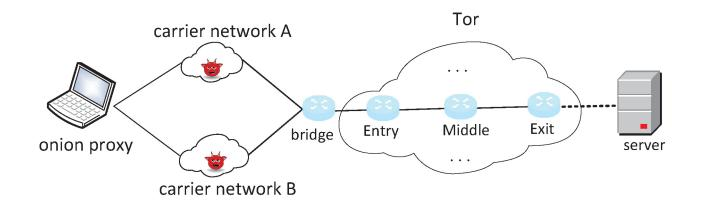

Fig. 14. The multi-host based WF defense scheme introduced in literature [\[167\]](#page-50-39).

*Improved padding*. These improvements attempt to reduce overhead further. Literature [\[130\]](#page-50-2) proposed an adaptive padding scheme called WTF-PAD to achieve obfuscation with low latency and moderate bandwidth overhead. It significantly inserts packets in large time gaps to prevent large gaps and stops padding in burst mode. Literature [\[164\]](#page-50-40) proposed a zero-delay and lightweight scheme called FRONT, which selectively pads the front part of the trace due to the belief that the front part contains more important features. Their experiments demonstrated that with a 33% bandwidth overhead, FRONT performs better than WTF-PAD, which shares a similar bandwidth overhead. However, these two defenses are still not effective against strong WF attacks.

*Supersequence*. Another defense type is to find a supersequence of traces of different sites, which is expected to be a longer packet trace. Thus the defender needs only a small amount of traffic to complete the supersequence, forcing the adversary to identify the target from a cluster. Literature [\[165\]](#page-50-41) proposed a scheme called glove, which groups the traces into different clusters according to the network-level features in the training stage, and then prepares a trace copy for each cluster to guide the cover traffic padding in the defense stage. Similarly, literature [\[43\]](#page-48-13) clustered different sites into anonymity sets and extracted the shortest common supersequence accordingly. Literature [\[131\]](#page-50-3) proposed a scheme called Walkie-Talkie to meet defense requirements in the open-world scenario for Tor. Specifically, it adjusts the fullduplex mode to the half-duplex mode to reduce information leakage and bandwidth overhead by combining burst molding. The experimental results indicated that the proposed method achieves a better trade-off compared to literature [\[43\]](#page-48-13). The former incurs a bandwidth overhead of 31%, a time overhead of 34%, and a classification accuracy of 28%, while the latter entails a bandwidth overhead of 222%, a time overhead of 112%, and a classification accuracy of 5%. However, these schemes are still insufficient to defend against advanced DNNbased WF attacks, and the maintenance costs of the Web template library are high.

*Splitting on multi-path*. Literature [\[166\]](#page-50-42) proposed a lightweight scheme called TrafficSliver, which splits the traffic of a trace into multiple entry nodes of a user to limit the data observed at a single entry node. TrafficSliver performed better than WTF-PAD without introducing any artificial delay or dummy traffic. Similarly, literature [\[167\]](#page-50-39) proposed a multi-host based scheme, HyWF, which splits the traffic of a trace into multiple carrier networks without inserting any dummy traffic (The defense scheme is shown in Figure [14\)](#page-32-0). The experiments in a closed-world scenario demonstrated that, while achieving

comparable TPR, compared to Walkie-Talkie [\[131\]](#page-50-3), the latter requires an additional bandwidth overhead of 31% and a time overhead of 34%. However, literature [\[166\]](#page-50-42), [\[167\]](#page-50-39) are likely to be unable to defend against adversaries at the middle OR. In addition, these schemes require significant changes to Tor and even the TCP stack, introducing high implementation costs.

Overall, network-layer obfuscation schemes either introduce high bandwidth overhead, provide undesirable defense effects, or may even require significant changes to the Tor/TCP stack, making them unattractive to implement.

*2) Application-Layer Obfuscation: Randomization/ obfuscation*. Literature [\[122\]](#page-49-44) proposed a scheme that uses a browser plugin to load another random page concurrently to introduce noise. However, the defense effect may be undesirable if the bandwidth overhead is not high enough. Literature [\[169\]](#page-50-43) proposed two schemes, the former called ALPaCA, an HS-side defense scheme, and the latter called LLaMA, a lightweight client-side defense scheme. ALPaCA modifies the index pages to an 'average' page by doing statistics on the content type's distribution of the index pages of onion services. LLaMA randomizes HTTP requests by introducing delay and redundant requests. Literature [\[168\]](#page-50-44) proposed another client-side scheme, HTTPOS, which modifies the flow-related features and utilizes some basic protocol characteristics of TCP and HTTP. However, the HSside scheme lacks scalability, and the client-side scheme still cannot defend against advanced WF attacks.

*3) DL-Weakness Based:* DL-weakness based defenses can be categorized into two types: adversarial perturbation and adversarial patch.

*Adversarial perturbation*. Adversarial perturbation aims to generate adversarial examples by adding small perturbations to the original input [\[177\]](#page-51-0). Currently, the adversarial example is considered a fundamental vulnerability of DNN [\[178\]](#page-51-1), [\[179\]](#page-51-2) and it is utilized to defend against WF attacks. Literature [\[170\]](#page-50-45) studied how to generate reliable adversarial examples under an adversarial training setting. This work proposed a scheme called Mockingbird to reduce the predictability of adversarial examples in the reverse process by introducing randomness into the searching process. That technique significantly reduced the advantage of adversarial training while introducing a bandwidth overhead of 58% (lower than the Walkie-Talkie). Literature [\[171\]](#page-51-3) proposed a scheme called WF-GAN, which combines the generative adversarial network (GAN) and WF classifier, using the joint evaluation of the WF classifier and discriminator to guide the generator's training. It significantly outperforms Walkie-Talkie in the untargeted defense setting, with a 90% success rate and 5%-15% cost. Additionally, literature [\[172\]](#page-51-4) proposed a novel scheme called DFD, which introduces two burst injection techniques as perturbationgenerating algorithms. These two techniques originate from the observation of the vulnerability in [\[130\]](#page-50-2), [\[131\]](#page-50-3): burst sequence features can be captured by DL models. DFD achieved an 86.02% misclassification rate in the open world setting with only 14.43% of bandwidth overhead. Furthermore, literature [\[174\]](#page-51-5) introduces a novel WF defense scheme based on a genetic programming-based search technique, which aims to identify the suitable cover traffic. In this search technique, multiple mutation operations are executed, guided by a feature distance-based fitness function. The detection rate of the proposed scheme is 0.4% with a mere 8.1% bandwidth overhead against the WF attack in [\[41\]](#page-48-11), under an open-world scenario.

However, literature [\[170\]](#page-50-45), [\[171\]](#page-51-3), [\[172\]](#page-51-4), [\[174\]](#page-51-5) all need to generate an adversarial trace after the original trace, obviously far from the deployment. Literature [\[173\]](#page-51-6) first studied how to defeat DNN-based WF attacks with adversarial perturbation in a real-time setting. The proposed scheme uses a remapping function to force various constraints on traffic patterns, thus universally meeting the need for the real-time setting. Besides, literature [\[180\]](#page-51-7) did similar work as [\[173\]](#page-51-6), and verified the applicability under the adversarial training setting. Literature [\[175\]](#page-51-8) proposed another deployment-oriented WF defense scheme called Surakav. Surakav employs GAN to generate sending patterns and regulates buffered data based on the generated patterns. Essentially, GAN is utilized to learn the distribution of realistic traffic patterns, thus enabling the random generation of sending patterns. Experimental results demonstrate that Surakav is capable of decreasing the attacker's TPR by 57% with a 55% bandwidth overhead and a 16% time overhead under the one-page setting (The one-page setting is introduced in [\[181\]](#page-51-9)). This results in a 42% reduction in bandwidth overhead compared to FRONT in [\[164\]](#page-50-40).

*Adversarial patch*. Different from [\[170\]](#page-50-45), [\[171\]](#page-51-3), [\[173\]](#page-51-6), literature [\[176\]](#page-51-10) proposed a scheme called Dolos, which is based on adversarial patch [\[182\]](#page-51-11). Unlike an adversarial example, an adversarial patch can be applied to multiple inputs. Specifically, Dolos pre-calculates patches for each user-site pair and adds patches to the real-time traffic. In addition, Dolos designs a secret-based parameterization mechanism for adversarial patches, thus making it difficult for the adversary to initiate adversarial training. The author evaluated Dolos in a variety of settings, including adversarial training. Dolos offered more than 94% protection against the attack. When compared to the defenses in [\[164\]](#page-50-40), [\[170\]](#page-50-45), it outperformed significantly in both bandwidth overhead and protection success rate.

*4) Summary and Lessons Learned:* Next, we provide a discussion on the WF defenses. The schemes mentioned above are proposed from different perspectives and take reducing the WF accuracy as the basic goal. Certain works (e.g., application and network layer defenses) rely on expert knowledge or heuristic methods. DL-weakness based defenses, on the other hand, are more focused and heavily rely on DL development. Furthermore, DL-weakness based defenses show transferability in defending against handcrafted-feature based WF attacks. In terms of effect, most schemes introduce bandwidth and latency or even deployment costs. It is noticed that many works are done in simulation experiments with datasets, yet not in the real environment. It should be noted that simulated experiments on datasets may not fully translate to real-world experiments. For example, the transition from undefended trace to defended trace should be real-time or input-independent, which is not well addressed in some works. In addition, WF defenses are faced with other problems, such as indicator definition (e.g., information leakage [\[132\]](#page-50-5)), adversarial training, and more advanced WF attacks, which add challenges to a reliable defense.

Furthermore, it should be noted that even though the DL-weakness based WF defenses mentioned in this paper leverage the vulnerabilities inherent in DL (such as adversarial perturbation and adversarial patch), these schemes themselves should also be wary of the threats posed by adversarial ML/DL, especially poisoning attacks. Poisoning attacks, as attacks that significantly compromise the integrity of ML/DL models, involve adversaries subverting the predictions of ML/DL systems by interfering with the training phase through data poisoning or model poisoning [\[183\]](#page-51-12). In recent years, poisoning attacks have expanded to impact a wide range of models (from simple ML algorithms [\[184\]](#page-51-13), [\[185\]](#page-51-14) to DL [\[186\]](#page-51-15), [\[187\]](#page-51-16), and federated learning [\[188\]](#page-51-17)) and application domains (including recommendation systems [\[189\]](#page-51-18), malware detection [\[190\]](#page-51-19), and industrial control systems [\[191\]](#page-51-20)). As a result, a robust WF defense solution should aim to be as immune as possible to poisoning attacks. Firstly, defenders should source trustworthy data to build their defense models, in order to avoid incorporating malicious third-party poisoned data. Currently, much of the defense research relies on public datasets, which can be susceptible to poisoning attacks. Additionally, defenders should try to minimize their use of third-party platforms, like platforms of machine learning as a service (MLaaS), to reduce the risk of data poisoning or model poisoning. Defenders should also keep a close watch on the progress of defense against poisoning attacks, such as data cleaning and robust training, to maintain a proactive stance against poisoning attacks.

The above discussion indicates that defenses in anonymity networks often introduce additional overhead, such as bandwidth and latency, making it crucial to achieve a good trade-off. In this process, accurately evaluating defense solutions is a core problem, typically influenced by various factors. Furthermore, when implementing a defense solution, it is important to avoid introducing secondary issues, which should also be a concern for the defenders.

## *C. Defenses Against AS/State-Level Adversary in Tor*

In principle, a defense against an AS/state-level adversary aims to provide better location diversity to reduce the probability that the adversary is on both ends of the circuit. These defenses include four objectives: mitigating passive traffic analysis attacks, mitigating active routing attacks, provably avoiding geographic regions, and mitigating information leakage/guard placement attacks.

*1) Mitigating Passive Traffic Analysis Attacks:* Regarding this type, the path selection algorithm should first avoid selecting two ORs belonging to the same AS and avoid selecting ORs to cause an AS to appear on both sides of a circuit. Literature [\[143\]](#page-50-18) proposed an AS-aware path selection scheme, where an OP receives a pre-calculated AS topology snapshot from DA, to avoid the high computation and storage cost in a full AS-level path inference algorithm. The client calculates multiple pairs of AS-level paths from the OP to the entry and the exit to the server, respectively. If these two sets

TABLE X SUMMARY OF DEFENSES ON AS/STATE-LEVEL ADVERSARY IN TOR (IDENTIFIED IN SECTION [V-C\)](#page-33-0)

| Defense target                                  | Ref   | Year | Main focus                                                                                                                                      | Evaluation approach | Adversary Type                                           |
|-------------------------------------------------|-------|------|-------------------------------------------------------------------------------------------------------------------------------------------------|---------------------|----------------------------------------------------------|
|                                                 |       |      |                                                                                                                                                 | E T                 |                                                          |
|                                                 | [143] | 2009 | Proposed an AS-aware path selection scheme, using the pre-calculated AS topology snapshot to reduce computation and storage costs.              | • 0                 | Passive AS-level adversary                               |
| Passive traffic analysis                        | [19]  | 2012 | Proposed an AS-aware client to reduce communication delay and defend against correlation attacks by AS adversaries.                             | • 0                 | Passive AS-level adversary                               |
| attacks                                         | [97]  | 2016 | Proposed an AS-aware client, considering bandwidth constraints and taking the asymmetric/collusive AS-level adversaries into account.           | • 0                 | Asymmetric/collusive AS-level adversary                  |
|                                                 | [192] | 2016 | Proposed an AS-aware path selection algorithm to reduce the time of circuit building by pre-building circuits.                                  | • 0                 | Asymmetric AS-level adversary                            |
|                                                 | [193] | 2016 | First studied the impact of BGP prefix attacks and proposed a data-plane solution.                                                              | • 0                 | Active AS-level adversary                                |
| Active routing attacks                          | [194] | 2017 | Proposed an active defense to BGP prefix attacks and a reactive defense to BGP hijacking attacks.                                               | • 0                 | Active AS-level adversary                                |
| December 11 to 11 to 1                          | [195] | 2017 | Proposed two provable avoidance methods based on physical constraints.                                                                          | • •                 | State-level adversary                                    |
| Provably avoiding geographic regions            | [196] | 2019 | Proposed a prototype system for actual deployment, correcting three design flaws in the previous study.                                         | • •                 | State-level adversary                                    |
|                                                 | [197] | 2017 | Proposed a trust-aware path selection algorithm considering multiple adversary resources and information leakage in OP.                         | • 0                 | Probabilistic global adversary /state-level adversary |
| Information leakage/ guard placement attacks | [198] | 2019 | Conducted an improvement by considering the worst-case of max-divergence and using differential privacy to constrain the privacy loss. | • 0                 | Adversary with some relays /active AS-level adversary    |
|                                                 | [199] | 2020 | Proposed a general framework to design the client-location-aware path selection al- gorithm for the trade-off of different goals.         | • 0                 | Adversary with some relays /active AS-level adversary    |
|                                                 | [200] | 2023 | Reexamined the security and information leakage of the solutions proposed in [201] and [197].                                                   | • 0                 | Active AS-level adversary /adversary with some relays |

do not intersect, the entry-exit pair is available. The authors claim that the proposed scheme reduces the probability of AS-level adversaries observing both ends of communication from 17.81% to 6.23%, as compared to the native Tor. Literature [\[19\]](#page-47-18) proposed a new Tor client, LASTor, which integrates an improved path selection algorithm. By considering the geographical location of nodes and related ASes, the communication delay is reduced. Specifically, LASTor develops a lightweight snooping AS detection method to predict the AS set where a pair of IP addresses probably pass, to meet the requirements of low storage and lightweight computing on the client side. The author claimed that, when compared to the default Tor client, LASTor reduces median latencies by 25% and also decreases the false negative rate (FNR) of not detecting a potential snooping AS from 57% to 11%. However, literature [\[97\]](#page-49-19) pointed out that literature [\[19\]](#page-47-18) does not consider the node bandwidth constraints, which may lead to an overload of a few nodes, thus affecting Tor's performance. Therefore, literature [\[97\]](#page-49-19) proposed a novel AS-aware client, Astoria, to consider the node bandwidth constraints. In particular, the adversary model in [\[97\]](#page-49-19) also considers asymmetric ASlevel adversaries and collusive AS-level adversaries. To avoid the high delay caused by destination-wise circuit building in [\[19\]](#page-47-18), [\[97\]](#page-49-19), [\[143\]](#page-50-18), literature [\[192\]](#page-51-21) proposed a new ASaware path selection algorithm, where the Qiu and Gao path inference algorithm is used to determine the suspicious AS set and exclude these ASes when pre-creating circuits. Experiments showed that algorithm could reduce Tor stream vulnerability by 74%, and the response time of a page is comparable to that of native Tor.

*2) Mitigating Active Routing Attacks:* Literature [\[193\]](#page-51-22) first quantified the advantage of an adversary launching an active routing attack. Then literature [\[193\]](#page-51-22) proposed a data-plane detection scheme to periodically run traceroute to detect BGP longest prefix attacks. However, that method cannot proactively protect those users already under attack. In addition, the reliability of the traceroute would also affect the detection effect. Literature [\[194\]](#page-51-23) quantified the resilience of Tor against BGP hijacking attacks and BGP interception attacks based on Internet topology and consensus data. The so-called resilience refers to the probability that the route from the client to the entry passes through the adversary AS under the above attacks. The results showed that ASes with high Tor bandwidth have lower resilience and AS resilience changes with the variation of the client's position. Based on that finding, literature [\[194\]](#page-51-23) proposed a proactive improvement to defend against the above attacks to ensure both security and performance by adapting the guard selection algorithm while considering bandwidth as well. Further, literature [\[194\]](#page-51-23) proposed a reactive defense approach based on a real-time monitoring system by collecting BGP updates and consensus data in real-time. Experiments showed that their proactive approach achieved an average improvement of up to 36% in the probability of OPs being resilient to a prefix hijack attack on guard relay, while the reactive approach could detect real-world BGP hijacking attacks, and the FPR can be ignored.

*3) Provably Avoiding Geographic Regions:* In terms of this defense approach, to some extent, it can be seen as an upgrade to defending against passive/active AS adversaries. Specially, when a circuit is theoretically proven not to pass through a suspicious region, an adversary has no opportunity to launch an attack. Literature [\[195\]](#page-51-24) pointed out that Tor's threat model needs to adapt to the adversaries at the nation-state level. Inspired by [\[201\]](#page-51-25), literature [\[195\]](#page-51-24) used geographical distance and light-speed constraints to prove the impossibility of passing through a physical area, such as the heavily monitored United States (US). Literature [\[195\]](#page-51-24) proposed two provable avoidance strategies: never-once and never-twice. The former means that the packet never passes through the geographical region, and the latter means that the geographical region never appears on two discontinuous segments within a circuit. Experiments showed that both of these strategies are feasible. Furthermore, literature [\[196\]](#page-51-26) pointed out three limitations in [\[195\]](#page-51-24): failing to consider the diversity of Tor infrastructure, incorrect assumptions on the ground truth information, and not considering the constraints of real-world deployment. Therefore literature [\[196\]](#page-51-26) proposed a solution to correct the above flaws and proposed TrilateraTor, a prototype system for real-world deployment. The authors claimed that with this modification, the proposed approach resulted in 22% fewer rejected circuits, thus maintaining an average of 27 MB/s more advertised bandwidth per circuit.

*4) Mitigating Information Leakage/Guard Placement Attacks:* In terms of this type, it can be seen as an adjustment to defending against passive/active AS adversaries because it involves mitigating information leakage or guard placement attacks in addition to defending against passive/active AS adversaries. Information leakage refers to the fact that the defense algorithm is often related to the client's position, which may be obtained by the observer [\[202\]](#page-51-27). Literature [\[197\]](#page-51-28) indicated that even an adversary with moderate resources against Astoria [\[97\]](#page-49-19) can identify a client's AS within seconds. To take that factor into account, literature [\[197\]](#page-51-28) represented the adversary as a general probability model, which can then be converted into a trust policy by taking multiple adversary resources into account and allowing users to specify the probability of the adversary appearing at each location. The author proposed TAPS, a trust-aware path selection algorithm, to minimize the probability of observing the circuit and reduce information leakage by introducing an aggregation mechanism. Literature [\[198\]](#page-51-29) used max-divergence to quantify the information leakage of the guard selection algorithm in [\[194\]](#page-51-23) and highlighted the poor performance in the worst case. Due to this problem, literature [\[198\]](#page-51-29) modifies the approach of [\[194\]](#page-51-23), considers max-divergence in the worst case, and uses differential privacy to restrain information leakage in the worst case. Experiments showed that the improved scheme significantly increases the Shannon entropy of guard nodes after multiple guard node selections (245% increase in worst case after 5 guard selections). Yet, literature [\[200\]](#page-51-30) reexamined the security and information leakage of the solutions proposed in [\[198\]](#page-51-29) and [\[194\]](#page-51-23). It found that the claimed resilience to BGP routing attacks provided by the scheme proposed in [\[198\]](#page-51-29) did not meet its originally stated level. Additionally, literature [\[200\]](#page-51-30) also pointed out that the solutions proposed in [\[198\]](#page-51-29) and [\[194\]](#page-51-23) may result in the potential leakage of locations for certain users. For instance, approximately 20% of users select an entry node from their own country.

On the other hand, because the client preferentially selects guard nodes at some advantageous positions for passive AS adversary defenses, the adversary can then place his nodes conversely [\[203\]](#page-51-31). For example, literature [\[203\]](#page-51-31) proposed a guard placement attack against [\[192\]](#page-51-21), where the probability of being selected can increase by 964 times. Thereafter, literature [\[203\]](#page-51-31) proposed a security definition θ-GP, indicating that the selected probability of the adversarial node increases at most with the coefficient θ compared with the native Tor. To solve the problems of information leakage, guard placement attack, and load imbalance introduced by passive AS adversary, literature [\[199\]](#page-51-32) proposed a general framework CLAPS to design the client-location-aware path selection algorithm. Specifically, literature [\[199\]](#page-51-32) uses a linear programming framework and introduces multiple path-selection tools to achieve different objectives. With evaluations on schemes in [\[192\]](#page-51-21), [\[194\]](#page-51-23), CLAPS was shown to have improved in both performance and security. In terms of security, an adversary could achieve a maximum advantage of 7 times in [\[194\]](#page-51-23) and 40 times in [\[192\]](#page-51-21), while CLAPS achieves a maximum advantage of only 2 times.

*5) Summary and Lessons Learned:* Next, we discuss these defenses against an AS/state-level adversary. The above four categories are specific-target oriented, and the basic consideration is to minimize the probability of the appearance at both ends of the circuit. However, there may be some problems resolved not well, such as practicality, conflicting with other metrics. Worse, due to the openness of defense algorithms and the dependency on the client location, new attack vectors (information leakage/guard placement attacks) are introduced. Intuitively, the defense effect against a specific target may decline when a scheme balances multiple metrics concurrently. As a new defense option, provably avoiding geographic regions inevitably introduces the attempts to build a usable circuit, thus impacting the user experience. It is worth noting that AS/state-level adversaries are not seriously considered in Tor's current path selection specification [\[204\]](#page-51-33) or guard node specification [\[205\]](#page-51-34), calling for more exploration in this area.

The above discussion suggests that defenses for anonymity networks may require navigating trade-offs among different threats and metrics and need continuous evolution and improvement.

#### *D. Defenses Against Attacks in I2P and Freenet*

In Section [IV-D,](#page-27-0) we have surveyed the relevant attacks against anonymity networks I2P and Freenet. In this subsection, we review the defenses against those attacks for them. Unfortunately, the relevant defenses in the literature for I2P and Freenet are scarce, due to the fact that the relevant attacks are scarce antecedently. We try our best to provide this section for completeness.

The authors in [\[206\]](#page-51-35) proposed a defense method against the traceback attack in [\[103\]](#page-49-25). Recall that the traceback attack is done hop-by-hop reversely based on the loop-preventing mechanism in Freenet, a unique UID on a forwarding path. Hence, to provide the unlinkability of UID, the UID with respect to a content request message is changed dynamically at the initial portion of the forwarding path. Consequently, the adversary can only trace back a message to the peer where the UID value is last changed. As a setting-specific consideration for Freenet, the authors validated that the proposed method had negligible impacts on the performance of locating content.

As our consideration of the eclipse attack in [\[101\]](#page-49-23), we come up with a defense method, which exploits the public random source from some blockchain platform. Recall the root cause of that eclipse attack, the determinism and predictability of the directory service algorithm. Without loss of generality, for example, we can use the SHA-256 value of the last one hundred bytes of the first block after 11:00 PM from the Bitcoin platform [\[207\]](#page-51-36), thus making the appropriate identities wholly unpredictable for the adversary. Therefore, the adversary has a negligible probability of taking over the responsible floodfill peers.

*1) Summary and Lessons Learned:* Defenses are based on the premise of attacks. Since there is little research on attacks against I2P and Freenet, naturally, there are fewer defenses. This situation may hinder anonymity networks from achieving real security. We note that the defenses for an anonymity network cannot ignore the original goals of that network, or at least cannot conflict with them seriously. Literature [\[206\]](#page-51-35) provides an example of this point. Although the proposed defense method defends against the traceback attack, it does not significantly affect the performance of locating files, which is important for Freenet. In addition, we also note similar defense methods can be taken against attacks caused by similar or the same vulnerabilities in different anonymity networks. The Tor team has proposed the use of shared random values to achieve unpredictability, which is similar to our method of using a common random source in concept. Therefore, it is also necessary to conduct a horizontal comparative analysis of defense methods for different anonymity networks.

#### VI. FORMAL SECURITY IN ANONYMITY NETWORKS

The continuing counteraction between the attacks identified in Section [IV](#page-20-0) and the defenses identified in Section [V](#page-28-0) in anonymity networks causes a lot of confusion for defenders. *A central problem is that defenders want to know whether a defense is reliable*. After a defense mechanism is proposed, we expect the existing attacks to become ineffective (or mitigated) and make it difficult for attackers to launch new attacks. This objective holds significant importance for the security of anonymity networks. In this regard, formal security can provide us with theoretical explanations and reliable conclusions. Therefore, this section will discuss the formal security in anonymity networks, in order to provide readers with a deeper understanding of relevant topics, techniques, and implications. To achieve this, we will first elaborate on the importance of formal security in Section [VI-A](#page-36-2) by reexamining the aforementioned vulnerabilities (Section [III\)](#page-14-0), attacks (Section [IV\)](#page-20-0), and defenses (Section [V\)](#page-28-0). Subsequently, we formally introduce the research on formal security in anonymity networks in Sections [VI-B](#page-37-0)[–VI-D,](#page-40-0) respectively. Due to the lack of formal research on I2P and Freenet, we use Tor as a case study in this section, without losing generality with respect to anonymity networks.

In terms of the investigation scope, the introduced formal security works are categorized into three aspects: (i) The cryptographic protocol treatment under the Tor setting (Section [VI-B\)](#page-37-0), studies the security attributes of protocol modules, accompanied by a cryptographic proof. (ii) WF defense analysis (Section [VI-C\)](#page-39-0) quantifies the lower bound of WF classification error. (iii) The anonymity analysis in the Tor setting (Section [VI-D\)](#page-40-0) tends to embed anonymity into a specific model and quantify the guarantee of anonymity in the worst case. In scope, the first entirely corresponds to protocol attacks/defenses in Tor, the second entirely corresponds to WF attacks/defenses in Tor, and the third intersects with both protocol attacks/defenses and AS/state-level adversary attacks/defenses in Tor. Table [XI](#page-38-0) provides an overview of these efforts.

#### *A. The Importance of Formal Security*

Next, we will underscore the importance of formal security by examining the tricky problems of defenses against the prevailing attacks in Tor, thereby recapping the aforementioned vulnerabilities (Section [III\)](#page-14-0), attacks (Section [IV\)](#page-20-0), and defenses (Section [V\)](#page-28-0).

*1) Tricky Problems of Defenses on Protocol Attacks:* The following facts are noted from the interaction between protocol attacks in Section [IV-A](#page-20-1) and defenses in Section [V-A.](#page-29-0)

First, some fixes fix the original problem yet also introduce new ones. For example, *A*1 and *A*7 initially demonstrate the need to limit the circuit length. Then Proposal 110 succeeds in limiting the circuit's length, but *A*13 indicates new vulnerabilities due to a lack of constraints on the cell's direction. Further, literature [\[83\]](#page-49-5) indicates that design lacks constraints on cell order. In principle, a good patch fixes previous vulnerabilities and minimizes new risks. However, the complexity of the Tor protocol stack makes this problematic.

Besides, by analyzing the time characteristics of some attacks, we derive a set of contradictory conclusions, which cannot be explained easily. As described in Section IV-A, sending cells of a special type can generate unique traffic patterns, showing that both the flexibility and determinacy of the protocol can generate attack vectors.  $A_6$ ,  $A_{14}$ ,  $A_{20}$ , and  $A_{16}$  all use relay\_drop cell to introduce observable traffic patterns, indicating the protocol flexibility.  $A_{15}$ ,  $A_{14}$ ,  $A_{18}$ ,  $A_{20}$ ,  $A_{19}$  all use destroy cells to destroy circuits, indicating the determinism of the protocol. The reasons behind that are difficult to explain by experimental results thoroughly, and more powerful tools are needed to support the defenders.

Furthermore, for one scheme, the security property may no longer be valid due to the environment's variance; without formal security, we cannot ensure that the scheme is secure. For example,  $A_4$  indicates that the onion routing scheme does not have the non-malleable attribute, allowing the ciphertext to be modified midway. In contrast, that case will fail for a general end-to-end IND-CCA secure channel. Intuitive security does not mean security and requires rigorous methodological analysis.

2) Tricky Problems of WF Defenses: From Sections IV-B and V-B, we learn that a novel WF defense would not provide people much confidence, even though it works well against some advanced attack schemes. that phenomenon seems to run through the whole process of WF defenses. For example, literature [124], [160] questioned the traffic morphing scheme [159]. Then DF [41] shows significant effects against WTF-PAD and Walkie-Talkie, which were proposed in 2016 and 2017, respectively. When a new defense is proposed without solid evidence, it can seriously undermine people's trust, especially when such phenomena have been occurring continually. The point is that we need to theoretically quantify the bound of defense capabilities, particularly the upper bound where a WF attack is most effective. If the upper bound is within the acceptable range, we can confidently apply the relevant defense.

3) Tricky Problems of AS/state-Level Adversary Defenses: Like WF defense, we are concerned about the maximum impact that the adversary can make on anonymity. In Section V-C, several defenses are proposed to provide different objectives. Metrics in experimental scenarios can partially evaluate the defense before it is actually applied. However, empirical evidence is often non-complete, probably limited by experimental parameters and policies. Due to the uncertainty of the adversary's resources, it is difficult to accurately know the adversary's configuration or capability in advance, making it impossible for us to analyze the attack impact by an exhaustive method. Therefore, the key challenge in this area is to quantify the adversary threat adequately. More precisely, we need to rigorously analyze the maximum attack impact of a static or adaptive adversary, which corresponds to a core target of the defender.

After a thorough examination of the tricky problems of defenses against the prevailing attacks in Tor, we are now convinced of the vital role that formal security plays in anonymity networks. This importance has been largely neglected by the majority of prior research. Moving forward, we will systematically introduce the three aforementioned aspects.

#### B. Formal Security on Cryptographic Protocol Treatment

The works on cryptographic protocol treatment involve multiple protocol modules under multiple adversary models across different goals. We identify these goals, respectively.

Securing circuit extending. In this term, the TAP protocol and the nTor protocol are checked respectively. Literature [208] focused on the TAP protocol and proved its security under the random oracle model. The security here means the authentication of OR nodes to prevent the man-inthe-middle attack initiated at entry nodes to counter the attack  $(A_2)$  introduced in [79]. In that paper, a security definition indicates that an adversary with a corrupted OR can only make a correct DH handshake response with negligible probability, thus unsuccessfully negotiating the key with the client. If the RSA encryption scheme satisfies the IND-CPA property and the weak plaintext aware property, TAP would comply with that definition through security reduction. Further, literature [209] focused on the security guarantee of key secrecy and one-way anonymity of the nTor protocol. Key secrecy means that the key generated cannot be distinguished from a randomly generated key by the adversary. One-way anonymity implies that only the target OR can authenticate its identity to the client during circuit building, yet the reverse is forbidden. Based on the discovery of the man-in-the-middle vulnerability of [224], the authors proposed nTor protocol that conforms to the above definitions, and provided the corresponding security reduction. Following literature [209], literature [214] provides post-quantum alternatives to ensure security in the quantum era. The authors proposed generic constructions in both the random oracle model and the standard model, respectively, following the security definitions in [209]. The former is constructed based on a one-way against chosen ciphertext attack (OW-CCA) secure key encapsulation mechanism (KEM) and a one-way against chosen plaintext attack (OW-CPA) secure KEM with public-key-independent ciphertext KEM (PKIC-KEM). The latter is constructed based on an IND-CCA secure KEM and an IND-CPA secure PKIC-KEM.

Securing the onion encryption. Two works have examined the security of onion encryption from different perspectives. Literature [211] proposed a security definition specifying two expected properties. The first is that the ciphertext output by the encryption oracle and decryption oracle cannot be distinguished from random bits. The second is that when manipulation occurs on the circuit, the exit will capture an authentication error with probability 1. This definition implies a feature that prevents passive observers from determining the client's identity based on ciphertext alone. More importantly, it guarantees the recognition of abnormal cases on the circuit. The author analyzed the LBE scheme [111] and proved that the LBE conforms to the proposed definition. Further, literature [212] studied the anonymity effect of

TABLE XI SUMMARY OF FORMAL SECURITY IN TOR (IDENTIFIED IN SECTION [VI\)](#page-36-1)

| Group                            | Ref   | Year | Main focus                                                                                                                                                                      | C        | ontribu | tion t | ype | Theoretical essentials                       |
|----------------------------------|-------|------|---------------------------------------------------------------------------------------------------------------------------------------------------------------------------------|----------|---------|--------|-----|----------------------------------------------|
| Group                            | Kei   | Tear | Main locus                                                                                                                                                                      | N        | M1      | F      | M2  | Theoretical essentials                       |
|                                  | [208] | 2006 | Proved the security of the TAP protocol against man-in-the-middle attacks under the random oracle model.                                                                        | ✓        |         |        |     | Security reduction                           |
|                                  | [209] | 2013 | Proved the key secrecy and one-way anonymity property of the nTor protocol.                                                                                                     | <b>√</b> |         |        |     | Security reduction                           |
|                                  | [210] | 2012 | First analyzed the onion routing protocol based on the UC framework.                                                                                                            | <b>√</b> |         |        |     | Simulation-based proof                       |
| Cryptographic protocol treatment | [211] | 2018 | Proposed a security definition, which means the randomness of onion ciphertext and the determinacy of authentication failure under the manipulation case.                       | <b>√</b> |         |        |     | Security reduction                           |
|                                  | [212] | 2018 | Proposed a security definition against covert tagging attacks and then proved proposal 261 conforms to it.                                                                      | <b>√</b> |         |        |     | Security reduction                           |
|                                  | [213] | 2014 | Integrating time factors into the UC framework, proposed a theoretical framework TUC for rigorously analyzing time-sensitive attacks.                                           |          |         | ✓      |     | UC framework                                 |
|                                  | [214] | 2022 | Proposed two post-quantum alternatives against literature [212], in the random oracle model and the standard model, respectively.                                               |          |         |        | ✓   | Security reduction                           |
|                                  | [215] | 2021 | Proposed four post-quantum key-blinding signature schemes in the random oracle model.                                                                                           |          |         |        | ✓   | Security reduction                           |
|                                  | [213] | 2014 | Based on the TUC framework, proved a theoretical method to defend against WF attack.                                                                                            |          |         |        | ✓   | TUC framework                                |
| WF defense analysis              | [161] | 2014 | First focused on a provably secure evaluation method for WF defense, deducing the minimum error based on an idealized lookup-table adversary.                             |          |         |        | ✓   |                                              |
| wir defense anarysis             | [216] | 2017 | Provided a method for calculating the minimum classification error as to feature set.                                                                                           |          |         |        | ✓   | Empirical estimation of the Bayes error      |
|                                  | [217] | 2022 | Proposed a new concept of length-hiding encryption and quantified the maximum attack benefit of WF adversary for a specific application.                                        |          | ✓       |        |     | Probability theory                           |
|                                  | [218] | 2007 | First abstracted the onion routing protocol with a formal model and analyzed the anonymity provided rigorously.                                                                 | <b>√</b> |         |        |     | I/O automata                                 |
|                                  | [219] | 2012 | Based on a black-box model, quantify the lower bound of anonymity of a single user under the influence of other users.                                                    |          | ✓       |        |     | Probability theory &mathematical analysis |
| Anonymity analysis               | [220] | 2013 | Proposed AnoA, a general framework for defining and quantifying the anonymity of anonymous com- munication system, particularly for complex crypto- graphic protocols. |          | ✓       | ✓      |     | Differential privacy                         |
|                                  | [221] | 2014 | Proposed an anonymity analysis framework, MA-TOR, takes into account more realistic factors, such as path selection algorithm and consensus data.                               |          | ✓       | ✓      |     | Differential privacy                         |
|                                  | [222] | 2016 | Proposed an anonymity-bound calculation method within the MATOR framework for various structured attacks.                                                                       |          | ✓       |        | ✓   | Differential privacy                         |
|                                  | [223] | 2018 | Studied the trilemma among strong anonymity, low bandwidth overhead, and low latency in anonymous communication protocols.                                                |          |         |        |     | Petri Nets                                   |

proposal 261 against covert tagging attacks. To that end, literature [\[212\]](#page-51-40) proposed a security definition, circuit-hiding, which is specified by an indistinguishable game (An example is shown in Figure [15\)](#page-39-1). In that game, the adversary, possessing statically corrupted nodes, is tasked with guessing which of the two networks (worlds) he interacts with after his adaptive manipulation. This is under the condition that the two networks appeared identical to the adversary a priori. Due to the non-malleable property in the proposal, if the adversary manipulates a cell midway, the subsequent nodes will randomly reset the ciphertext, thus making the ciphertext received by the exit distinguishable from a truly random string.

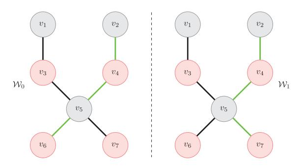

Fig. 15. The basic indistinguishable game for *circuit-hiding* notion introduced in literature [212]. A red node represents a corrupted OR.

Literature [212] proved proposal 261 conforms to the above definition with the game-hopping technique.

Securing onion services. The key-blinding signature technique is employed to secure onion services and prevent them from being blocked [215]. For this purpose, Tor derives perepoch keys that are utilized for signing and verifying HS descriptors, ensuring the unlinkability of per-epoch public keys of onion services. Specifically, in each epoch, an onion service with a long-term key pair (sk, pk) employs a fresh blinding key bk to blind its public key pk. Consequently, having knowledge of pk, the blinding key bk, and the epoch allows one to verify any signature generated for that epoch and associate it with the long-term identity pk of the corresponding onion service. Without this knowledge, such an association would not be feasible. Literature [215] proposed four fully post-quantum key-blinding signature schemes and proved the unlinkability and unforgeability of all schemes in the randomoracle model.

Theoverall security of onion routing protocol. Literature [210] conducted the first overall security analysis of onion routing protocol, based on the UC framework [77]. It studied the two stages: circuit building and onion routing. It proposed an ideal function denoted as  $\mathcal{F}_{OR}$ .  $\mathcal{F}_{OR}$  represents the functionality of the network when Tor operates securely.  $\mathcal{F}_{OR}$  involves the interaction with both adversary  $\mathcal{A}$  and the network function  $\mathcal{F}_{NET^q}$ . Specifically,  $\mathcal{F}_{NET^q}$  allows  $\mathcal{A}$  to be a local-global adversary, corrupting not only some ORs but also q links adaptively. Further, the security attributes of the circuit building and onion routing stages are proposed. In the former stage, the nTor protocol satisfies the one-way authenticated key exchange (1W-AKE) primitive, indicating the key secrecy and the anonymity of the client to OR. In the later stage, the definition of a predictable malleable encryption scheme describes the malleable property of onion encryption. The author checked the protocol implementation of Tor and confirmed that it meets the above requirements.

Time simulation in the UC framework. Literature [213] extended [210] and proposed a theoretical framework TUC that could strictly analyze time-sensitive attacks by adding time into the UC framework [77]. Specifically, TUC sets the global time as the reference clock for each protocol party and the local time for each machine. A machine determines the advanced range of the clock according to the number of computing steps. Further, simulation proof is carried out from

positive and negative directions to prove its rationality and integrity, following the protocol description and ideal function in [210].

1) Summary and Lessons Learned: Next, we provide a discussion on the above works. We make the following observations: (i) Most investigated works have focused on the onion routing protocol, probably as it constitutes the heart of Tor and adopts cryptography intensively. For example, literature [208], [209] focuses on key secrecy and anonymity within the circuit extend layer. Literature [210] pays attention to several security attributes within the relay layer. To be sure, the circuit extend layer and relay layer adopt more cryptography and are more prominent on the Tor stack. (ii) As protocol attacks evolve, the expected security attributes are likely to evolve too. The security attribute of predictable malleable encryption scheme in [210] indicates that tagging attacks  $(A_4/V_{11})$  are allowed. As awareness of such threats grows, we see conflicting security attributes in [211], [212]. Yet, the security attributes mentioned in [211], [212] are stronger. Therefore, when certain attacks break through the existing security capability, researchers may tend to pursue stronger security attributes. (iii) The post-quantum security of anonymity networks has started to receive researchers' attention. Literature [214] delves into the one-way authenticated key exchange protocol in the Tor context, while literature [215] addresses key-blinding signatures suitable for protecting the identity privacy of onion services. These works contribute to inspiring researchers to invest more attention in the postquantum security of anonymity networks.

### C. Formal Security on WF Defense

The formal security of WF defense focuses on determining the lower bound of the classification error of WF attacks, which represents the minimum classification error generated by any WF classifier. For a simple example, consider n Web pages generating the same traffic (having the same input features for the WF classifier) with equal probability a prior. Without a doubt, for an optimal WF classifier, any page will be correctly classified only with 1/n probability. This situation directly impacts the performance evaluation of the WF classifier, yielding a theoretically minimal classification error. Literature [161], [213], [216], [217] provide exploration from different perspectives.

Theoretical method to defend against WF attacks. In [213], based on the TUC framework, the authors demonstrated a theoretical approach to defend against WF attacks. It assumes that an adversary corrupts at most one of the client's entry nodes or one of the links to the entry node. Further, the targets visited by the client are static pages. In that method, the exit performs the page request at intervals tbuf and returns the entire Web page. Also, the exit maintains a list of token buckets, each with a fixed page size. The page is sliced to a finite number of token buckets, which may be filled with padding bytes. When tbuf is large enough, anonymity is well provided. However, the above method does not apply to Tor due to the severe introduced congestion.

*Minimum classification error*. Several works have been approached from different perspectives. Literature [\[161\]](#page-50-36) first focused on a provable security evaluation method for WF defense and derived the minimum error based on an idealized lookup-table adversary. In this case, the idealized lookuptable adversary knows exactly the network traffic generated by all Web pages, so he would only encounter an error if multiple Web pages generate the same traffic. However, that approach has some shortcomings. First, network noise can easily affect the observed traffic, resulting in similar traffic being misclassified. In addition, that method is only suitable for deterministic defense, not for probabilistic defense. In contrast to [\[161\]](#page-50-36) computing minimum classification error for a dataset, literature [\[216\]](#page-52-3) aimed for a feature set. The feature set here represents the features to be calculated when given a dataset, thus corresponding to a feature calculation method. The main idea here is to reduce the WF attack to an ML classification problem to estimate the minimum Bayesian error. This error is the lower bound of the classification error of any ML algorithm for arbitrary data distribution under the iid assumption. Specifically, some methods exist to estimate Bayesian errors. In this way, we can determine the lower error bound of WF classifiers in the black-box way. Besides, that method can help compare different feature sets under WF attacks. In addition, literature [\[217\]](#page-52-4) aimed to accurately quantify an application's security against WF attacks given the message length distribution. As shown in [\[225\]](#page-52-5), packet length contains useful information for WF classification. To eliminate that information leakage, the concept of length hidden encryption (LHE) is proposed in [\[226\]](#page-52-6). Further, literature [\[217\]](#page-52-4) proposed a new LHE concept, which determines the optimal length hiding parameters based on the message length distribution of the application. Specifically, literature [\[217\]](#page-52-4) proposed a CCA security model by considering the application message distribution and complex WF attack factors. Then literature [\[217\]](#page-52-4) constructed a trivial advantage representing the maximum benefit of WF attacks. literature [\[217\]](#page-52-4) applies that quantization method to multiple WF attack scenarios. Unfortunately, that work does not involve evaluation experiments under the Tor setting.

*1) Summary and Lessons Learned:* Next, we provide a discussion on this subsection. In a sense, the works related to WF defenses have another style [\[227\]](#page-52-7), [\[228\]](#page-52-8), where the fingerprint is modeled as the information leakage on the channel in an information-theory manner. Due to space reasons, we leave out that part of the introduction. Literature [\[213\]](#page-51-42) suggests that high delay is a favorable factor in resisting WF attacks, rightly consistent with the anonymity trilemma proposed in [\[223\]](#page-52-9). We note that several practical factors influence the quantification of WF defense. For example, Bayesian error estimation is affected by the empirical error of the nearest neighbor classifier [\[216\]](#page-52-3), and the trivial advantage in [\[217\]](#page-52-4) is affected by the application message distribution. That characteristic seems slightly different from cryptographic-style security, which is fundamentally rooted in a more rigorous mathematical foundation. Additionally, literature [\[161\]](#page-50-36), [\[216\]](#page-52-3), [\[217\]](#page-52-4) have other limitations. The method for computing lower bounds in literature [\[161\]](#page-50-36) is susceptible to network noise interference and is only suitable for deterministic defense, which restricts its accuracy and applicability. Literature [\[216\]](#page-52-3)'s method is specific to a particular feature set, leading to incomplete lower bound calculations. Meanwhile, the method for computing lower bounds in literature [\[217\]](#page-52-4) is solely based on the size of observed ciphertexts, which results in highly constrained lower bounds. Therefore, the development of methods for accurately calculating and continuously improving these lower bounds, thereby contributing to the enhancement of WF defense, is essential for future work.

The above discussion indicates that formal security research in anonymity networks allows for diversity and complexity and necessitates continuous exploration of new directions to enrich research findings.

#### *D. Formal Security on Anonymity Analysis*

Overall, anonymity analysis focuses on Tor's anonymity in the worst case (the lower bound of anonymity), which is expected to be as high as possible. Next, we introduce the works.

*Formal expression of anonymity provided by Tor*. Literature [\[218\]](#page-52-10) described Tor's onion routing protocol with a formal model for the first time and strictly analyzed the anonymity provided. In that model, an adversary is allowed to corrupt nodes and perform arbitrary manipulation on them. To specify anonymity, the authors propose a definition, the indistinguishability of run configurations, which means that views of information generated by running instances in two topologies are indistinguishable. Based on the above definition, the author defined sender anonymity, receiver anonymity, and unlinkable. Yet, literature [\[218\]](#page-52-10) provides no quantitative conclusions on anonymity.

*The anonymity guarantee of an individual user*. Literature [\[219\]](#page-52-11) highlighted the relational anonymity of an individual user, then quantified its lower bound, where other users may influence it. Here, the Tor network is treated as a black box, and the adversary corrupts ORs of proportion *b* (1 &lt; *b* &lt; 1). Accordingly, the adversary observes both the user and the user's target with probability *b*. Further, the adversary knows the access habits of all users, which correspond to the probability distribution of the access target. With the observed results, the adversary can calculate a posterior probability of accessing a particular target. Based on the analysis of that probability, the authors drew some conclusions on the defined anonymity. However, literature [\[219\]](#page-52-11) ignores the real characteristics of the Tor path selection algorithm and simply selects nodes uniformly, thus affecting the reliability of the results.

*Quantifying anonymity in a game-based framework*. This item aims to provide a unified and expressive framework for quantifying anonymity. By the way, the basis for the challengeresponse game is vital and considered to be guaranteed cryptographically. Literature [\[220\]](#page-52-12) proposed AnoA, a general framework for defining and quantifying anonymous communication systems' anonymity for complex cryptographic protocols. Here, the anonymity definition follows the differential privacy paradigm and is measured by the response bits in an indistinguishable game. Literature [\[220\]](#page-52-12) instantiated sender anonymity, receiver anonymity, and relationship anonymity, and discussed their relationships. In addition, simple heuristic rules are adopted to derive the bounds of these definitions. However, the heuristic rules in [\[220\]](#page-52-12) do not match the Tor path algorithm; thus, the results may not be practical. As an alternative, literature [\[221\]](#page-52-13) proposed MATOR, a new framework. MATOR considers more practical factors, such as path selection algorithm, consensus data, and user preferences, to build a real-time anonymity monitor. MATOR extends AnoA, by introducing the concepts of adversary classes and adaptive user behavior. The former limits powerful adversaries to appropriate adversaries. The latter specifies user actions as atomic steps, thus supporting the semantic expression of user behavior in interactive scenarios. Based on the real path selection algorithm and consensus data, literature [\[221\]](#page-52-13) deduced the corresponding anonymity bounds. However, literature [\[221\]](#page-52-13) still adopts inaccurate heuristics and thus overestimates the anonymity bound. Besides, it only considers a k-collusive adversary, limiting the generality of the results. As a further improvement, literature [\[222\]](#page-52-14) proposed a new anonymity-bound calculation method, which is expected to be more reliable and applicable to various structured attacks. As for structural attacks, the authors introduced the concept of the budget adversary, which refers to adversary types under budget constraints. These adversary types include kcollude adversary, predicate adversary, bandwidth adversary, and financial adversary, reflecting different adversary strategies in reality. The proposed method regards the bound calculation as an optimization problem under the restriction of adversary type. That method takes into account both direct and indirect observations, thus correcting the deviation of some works [\[219\]](#page-52-11), [\[220\]](#page-52-12). Notably, the proposed method takes a path selection algorithm as an input parameter; therefore, the relevant path selection algorithms against AS/state-level adversaries can be evaluated.

*Constraint relationship of anonymity, bandwidth overhead, delay*. Different from the above works, literature [\[223\]](#page-52-9) studied the constraint relationship among three key vectors (strong anonymity, low bandwidth overhead, low delay) involved in anonymous communication protocols and proposed the anonymity trilemma. Literature [\[223\]](#page-52-9) showed that anonymous communication protocols can achieve only two of the three objectives simultaneously. For that purpose, the author studied anonymity under two threat models: the adversary with global passive-eavesdropping capability and the adversary with partially corrupted nodes additionally. The authors considered two types of user distribution: synchronized and unsynchronized users. The former indicates that all users jointly decide the sending order of messages, while the latter indicates that users send messages independently. Further, the lower bound of anonymity in each case is analyzed, and the necessary conditions satisfying the strong anonymity are deduced. As for Tor, the delay overhead is θ(1) level, and the bandwidth overhead is θ(1/*N* ) level, where N is the number of users, not meeting the strong anonymity definition. As a supplement, literature [\[229\]](#page-52-15) extended the trilemma to user-coordinated anonymous communication networks as well.

*1) Summary and Lessons Learned:* Next, we provide a discussion on the works mentioned above. The main goal of anonymity analysis is to derive the worst-case anonymity lower bound, but achieving this goal is non-trivial. Basically, we need to determine the specific position of the worst case. Due to the limitations of the modeling of the analytical model, the realistic factors to be considered, and the completeness of the bound derivation, the analysis work is often nontrivial. For the anonymity analysis of the k-collude adversary, literature [\[220\]](#page-52-12), [\[221\]](#page-52-13), [\[222\]](#page-52-14) provides different quantitative considerations. Fortunately, the analysis of the latter [\[222\]](#page-52-14) is more reliable than that of the former [\[220\]](#page-52-12), [\[221\]](#page-52-13), as it is derived from a more rigorous analysis. In addition, anonymity analysis is carried out under certain conditions, and different adversary types and de-anonymization need customized analysis, which means that anonymity analysis should be reality-oriented.

The above discussion indicates that formal security research in anonymity networks is challenging. Accurate modeling of real-world factors and correct analysis of the derivation process are necessary.

## VII. CHALLENGES, FUTURE DIRECTIONS, AND EVOLUTION TRENDS

In Sections [III](#page-14-0)[–VI,](#page-36-1) we respectively investigated vulnerabilities, attacks, defenses, and formal security in anonymity networks, providing relevant lessons learned throughout various parts. A basic insight gained from these sections is that ensuring the security of anonymity networks is a challenging task. For researchers, it is vital to acknowledge challenges and open issues that have yet to be addressed, thus advancing the security of anonymity networks. Therefore, in this section (Sections [VII-A–](#page-41-1)[VII-D\)](#page-44-0), we will discuss the challenges and open issues in vulnerabilities, attacks, defenses, and formal security, highlighting our general findings and specific considerations. Subsequently, in Section [VII-E,](#page-45-1) we address three additional issues highly related to security to enhance researchers' understanding of the security of anonymity networks. Finally, in Section [VII-F,](#page-46-0) we discuss the future prospects of anonymity networks, aiming to gain a better understanding of their evolution.

#### *A. Complex Vulnerabilities in Anonymity Networks*

In Section [III,](#page-14-0) we have separately examined the vulnerabilities corresponding to prevailing attacks in Tor and some vulnerabilities in I2P and Freenet, establishing several specific observations. These observations indicate that identifying vulnerabilities in anonymity networks is not that easy. Before vulnerabilities are discovered, they remain concealed within the system, presenting a chance for a potential adversary to exploit. To ensure the security of anonymity networks, it is necessary to thoroughly identify their vulnerabilities, thus requiring overcoming the challenges in the following aspects.

*1) The Complex Protocol Stack in Anonymity Networks:* Anonymity networks are typically overlay networks, this implies that they may have a complex, multi-layer protocol stack. In Section [III-A,](#page-14-1) we systematically presented the protocol vulnerabilities (in Tor) utilized in the current literature. Tor has a multi-layer protocol stack. When the protocol stack becomes more complex, the attack surface naturally expands, and strategies exploiting protocol vulnerabilities become more flexible. As corroborated by the root causes for Tor protocol vulnerabilities discussed in Section [III-A6,](#page-16-0) adversaries can attempt to introduce vulnerabilities from various aspects such as low latency, combination with other features, symmetry, loose constraints, volunteer nature, etc. Taking "combination with other features" as an example, when the protocol stack becomes complex, adversaries naturally have more chances to combine different protocol features to discover new vulnerabilities. Additionally, regarding "loose constraints," it is difficult for developers to rigorously consider every aspect of code implementation. As the codebase of a product increases, bugs naturally multiply, providing adversaries with more chances. Therefore, new vulnerability detection techniques need to be considered to enable efficient and automated detection of vulnerabilities in anonymity networks. For example, automatic vulnerability detection techniques [\[230\]](#page-52-16) can be employed to comprehend code patterns and semantics indicative of vulnerable code characteristics. Furthermore, researching domain-specific best practices for programming anonymous communication software may be desirable.

*2) Similar Vulnerabilities Across Different Anonymity Networks:* In Sections [III-A](#page-14-1) and [III-D,](#page-19-0) we introduced protocol vulnerabilities in the Tor network, as well as vulnerabilities in I2P and Freenet. In fact, the most investigated vulnerabilities in I2P and Freenet also fall under protocol vulnerabilities. We discovered that strategies exploiting protocol vulnerabilities are similar across different anonymity networks. For instance, the eclipse attacks in [\[105\]](#page-49-27) (I2P) and [\[45\]](#page-48-15) (Tor) follow the same idea, both exploiting the determinism and predictability of the directory service algorithm. This suggests that attacks against different anonymity networks may adopt identical or similar ideas or techniques. From the perspective of network designers and operators, understanding the similarities in vulnerabilities across different anonymity networks has direct implications for making informed design choices. When a vulnerability in one anonymity network is exposed, adversaries may attempt to search for similar vulnerabilities in another anonymity network to launch attacks. However, this aspect seems to be overlooked in the current literature. Therefore, from a perspective of rigorously ensuring the security of anonymity networks, a key research question that still needs to be addressed is the utilization of vulnerabilities from other existing anonymity networks as heuristic guidelines to check the security of a specific anonymity network further. To this end, studying an evaluation framework that allows security practitioners to leverage insights from one anonymity network to enhance security in another may help.

*3) Uniqueness of Vulnerabilities in Anonymity Networks:* On the other hand, by comparing the impact of metadata leakage and overlay nature on Tor, I2P, and Freenet, we confirmed differences in vulnerabilities across different anonymity networks. Different anonymity networks operate in varying settings, employ different technical choices, and consider

TABLE XII COMPARISONS WITH VULNERABILITIES (ATTACKS) ACROSS DIFFERENT ANONYMITY NETWORKS SURVEYED IN THIS PAPER

|                                             | Tor      | I2P | Freenet |
|---------------------------------------------|----------|-----|---------|
| Protocol vulnerabilities (protocol attacks) | ✓        | ✓   | ✓       |
| Metadata leakage (WF attacks)            | <b>√</b> | ×   | ×       |
| Overlay nature (AS/state-level attacks)     | <b>√</b> | ×   | ×       |

different adversary models, naturally resulting in unique vulnerabilities for themselves. Although I2P and Freenet are also overlay networks, their overlay nature is rarely discussed or utilized (See Table [XII](#page-42-0) for their comparisons). The main reason for this is that these two anonymity networks differ significantly from Tor in terms of design paradigm, routing policy, and function positioning. In I2P and Freenet, an adversary has more freedom to obtain observed traffic. However, due to the dynamic and incomplete nature of network topology, the AS-level adversary's ability to observe paths is weakened. Meanwhile, I2P and Freenet's unique routing mechanisms make traffic analysis more challenging. This situation also extends to metadata leakage. Therefore, from a perspective of rigorously ensuring the security of anonymity networks, a key research question that still needs to be addressed is conducting customized vulnerability analysis for anonymity networks, by considering various factors such as their security goals, external environment, technical choices, code implementations, and more.

## *B. Emerging Attacks in Anonymity Networks*

In Section [IV,](#page-20-0) we have sequentially examined the prevailing attacks in Tor and some attacks in I2P and Freenet. One obvious observation is that anonymity networks are typically targeted by attacks accompanied by complex attack strategies, continuously evolving advanced techniques, and a variety of adversary models. In Section [IV-A,](#page-20-1) we noticed some protocol attacks [\[39\]](#page-48-9), [\[80\]](#page-49-2) that exploit multiple vulnerabilities across different layers. In Section [IV-B,](#page-24-0) we observed that WF attacks have expanded from the conventional single-tab setting to keyword queries [\[140\]](#page-50-15), middle OR [\[141\]](#page-50-16), multi-tab [\[127\]](#page-50-6) settings, and have advanced from simple ML techniques to advanced DL techniques. In Section [IV-C,](#page-26-0) we noted that AS/state-level adversaries are always attempting to expand their capabilities, moving from simple passive observation to active manipulation of Internet routing (like BGP hijacking attacks and BGP interception attacks). Additionally, in Section [IV-D,](#page-27-0) we observed that even with the same attack objectives, identifying content downloaders and uploaders, different attacks [\[103\]](#page-49-25), [\[104\]](#page-49-26) employ significantly different strategies. Therefore, it is essential to maintain continued vigilance against attacks and promptly make corrections and adjustments to anonymity networks. To achieve this, it is necessary to overcome challenges in the following aspect.

*1) Lack of Rigorous Assessment of Attacks:* As a reflection on the attacks surveyed in this paper, we have noticed a significant gap in current research. That is, there are still problems with idealized and abstracted evaluations in attacks. This may impact the accurate and comprehensive understanding of the effects of attacks. For example, in Section [IV-A,](#page-20-1) within protocol attacks in Tor, while some attacks [\[40\]](#page-48-10), [\[88\]](#page-49-10) claim to achieve covert effects, they do not employ covertness metrics to measure corresponding effects. These attacks, as forms of covert communication in specific environments, should reference or adopt relevant metrics to rigorously validate their research conclusions. In Section [IV-B,](#page-24-0) within WF attacks, there are common problems related to synthetic traffic generation, concept drift, etc., which affect the credibility of their real-world effectiveness [\[128\]](#page-50-7). Furthermore, the dynamic composition and performance of the Tor network also add to the challenge of accurately evaluating WF attacks [\[135\]](#page-50-10). In Section [IV-C,](#page-26-0) AS/state-level attacks often rely on BGP routing datasets, and their measurement results are susceptible to factors such as time fluctuations and complex business relationships between ASes. In comparison, evaluation based on active measurements [\[144\]](#page-50-19) seems to provide more reliable results. Therefore, from a perspective of rigorously ensuring the security of anonymity networks, a key research question that still needs to be addressed is to conduct a rigorous assessment of the actual impact of attacks on anonymity networks. For example, developing a rigorous and standardized evaluation framework for a certain type of attack, encompassing complete evaluation metrics may help.

#### *C. Insufficient Defenses in Anonymity Networks*

In Section [V,](#page-28-0) we sequentially examined the defenses against the prevailing attacks in Tor and the defenses against the attacks in I2P and Freenet. An obvious observation is that defenses in anonymity networks often play catch-up with attacks. This phenomenon is likely because defenders are not aware of what to defend against in advance. In Section [V-A,](#page-29-0) we noticed that multiple defenses [\[150\]](#page-50-25), [\[151\]](#page-50-27), [\[152\]](#page-50-29) against tagging attacks have been proposed successively since they were introduced. Before that, onion encryption schemes were generally considered secure. In Section [V-B,](#page-30-0) we observed that new WF defenses keep emerging as updated WF attacks continue to perform well against existing defenses. In Section [V-C,](#page-33-0) we observed that the defense scheme [\[194\]](#page-51-23) against active AS/state-level adversaries was confirmed to have serious information leakage issues by literature [\[202\]](#page-51-27), leading to the proposal of scheme in [\[198\]](#page-51-29). These situations serve as a reminder to network designers and operators not to attempt a one-size-fits-all solution in the face of attackers. Therefore, to provide more sufficient defense to anonymity networks, it is necessary to address the following aspects.

*1) Trade-Offs Under Multiple Factors:* Technically, the proposed defense schemes in anonymity networks often face trade-offs. In Section [V-B,](#page-30-0) WF defenses usually have to balance between attack accuracy, bandwidth overhead, and communication latency. This situation could be very challenging for designers and operators aiming for highly scalable, low-latency anonymity networks. Meanwhile, in Section [V-C,](#page-33-0) an ideal path selection algorithm that achieves load balancing and defends against passive AS/state-level adversaries, and active AS/state-level adversaries, and minimizes information leakage might be hard to achieve. For example, literature [\[194\]](#page-51-23) proposed a solution to defend against BGP hijacking attacks and BGP interception attacks. Subsequently, literature [\[198\]](#page-51-29) enhanced the scheme proposed in literature [\[194\]](#page-51-23) by considering information leakage in the worst case. However, literature [\[200\]](#page-51-30) questioned the performance of the solution presented in literature [\[198\]](#page-51-29) in defending against BGP hijacking attacks and BGP interception attacks and mitigating information leakage. In such cases, adaptive and tunable defense schemes could be a viable choice.

*2) Unreliable Evaluations of Defense Schemes:* Concurrently, we have noted the problem of unreliable evaluations of defense schemes within anonymity networks, with a particular focus on weaknesses in WF defenses. Notably, many WF defenses overlook adversarial training, a critical factor. If a defense scheme is deterministic, an adversary could potentially reverse-engineer the defense scheme once they gain relevant knowledge. Furthermore, many WF defenses lack comprehensive evaluation metrics, often ignoring factors like information leakage [\[132\]](#page-50-5). Additionally, it's worth noting that many works are conducted through simulation experiments with datasets rather than a real environment. Literature [\[128\]](#page-50-7) points out that this approach often introduces issues like synthetic traffic generation and concept drift. Consequently, ensuring the security of anonymity networks requires addressing a crucial research question: the establishment of a reliable and comprehensive evaluation framework for defense schemes. Therefore, researching methods to accurately calculate and continually improve the minimum classification error generated by any WF classifier for a specific dataset holds significant relevance as it aligns with the goals of WF defenders. Moreover, considering that adversaries would likely launch adversarial training when the defense algorithm is made public, the stability of evaluation results should be a serious consideration. In such cases, the concept of cryptographic security can be introduced, as emphasized by Kerckhoffs' principle [\[231\]](#page-52-17).

*3) Countering Traffic Analysis Attacks in Low-Latency Anonymity Networks:* In Section [IV,](#page-20-0) we have surveyed the attacks against anonymity networks. In fact, many of them can be viewed as a traffic analysis attack, e.g., many kinds of protocol attacks against Tor in Section [IV-A,](#page-20-1) WF attacks against Tor [IV-B,](#page-24-0) AS/state-level Adversary attacks against Tor in Section [IV-C,](#page-26-0) all of which require analyzing the pattern of traffic to obtain a meaningful result. Although some anonymity networks are robust against traffic analysis attacks due to their unique design mechanisms, e.g., DCnet-based anonymity networks, an adversary may try its best to succeed. A remarkable example is the forensic attack [\[104\]](#page-49-26) investigating the downloaders and uploaders who distribute and consume child sexual abuse materials in Freenet. Seemingly, Freenet's probabilistic routing mechanism can hide the actual sender of a message. However, the relevant attack merely exploits a simple observation on file requests and achieves a very low FPR. Considering the applicability of this attack, its impact on regular Freenet users cannot be ignored. This reminds us that traffic analysis attacks against anonymity networks should not be underestimated, especially for low-latency anonymous networks, which may be vulnerable to continuously evolving correlation attacks [\[37\]](#page-48-7), [\[232\]](#page-52-18).

As for Tor, WF attacks have become an important threat. Literature [\[213\]](#page-51-42) puts forward a theoretical form of WF defense, in which high delay is especially required. However, it may not be feasible to introduce a significant delay in practice. Besides, many WF defense schemes have drawbacks such as high bandwidth, latency overhead, or difficulty in practical deployment, as mentioned in Section [V-B.](#page-30-0) The Tor team has been trying to introduce traffic obfuscation schemes [\[233\]](#page-52-19) and has proposed some schemes [\[234\]](#page-52-20), [\[235\]](#page-52-21). However, these schemes are successively breached by more advanced WF attacks in [\[41\]](#page-48-11), [\[42\]](#page-48-12), [\[47\]](#page-48-17), [\[50\]](#page-48-20), [\[95\]](#page-49-17). Moreover, when considering both the continued advances in ML/DL techniques and the reasonable obfuscation cost, a reliable WF defense may become increasingly important. Here we provide two possible countermeasures.

- *•* From a theoretical perspective, given that the game between WF attacks and WF defenses is basically in the empirical-research stage, it is vital to obtain more theoretical support from DL itself [\[236\]](#page-52-22), [\[237\]](#page-52-23), thus making a robust defense possible. One potential way to do that is to uncover the black-box nature of DL, facilitated by human-level explainability methods. Hence, a more fine-grained and tailored method can be proposed.
- *•* From a practical perspective, defenses against traffic analysis attacks on anonymity networks can be deployed at the network, protocol, and application layers respectively.

## *D. Insufficient Formal Security in Anonymity Networks*

In Section [VI,](#page-36-1) we investigated the formal security of anonymity networks, using Tor as a case study. One clear observation is that formal security is not static. While formal security often yields reliable conclusions under certain conditions (assumptions), these conditions (assumptions) and the objectives they pursue need to be aligned with reality and often vary. In Section [VI-B,](#page-37-0) we noticed that the security attribute of a predictable malleable encryption scheme in [\[210\]](#page-51-41) indicates that tagging attacks (*A*4/*V*11) are allowed. As awareness of such threats increases, conflicting security attributes are evident in [\[211\]](#page-51-39), [\[212\]](#page-51-40). In Section [VI-D,](#page-40-0) we noticed that anonymity analysis is carried out under certain conditions. Typically, a comprehensive conclusion can only be drawn when more real-world factors are considered in the analysis methods, although this often adds complexity to the analysis. This situation reminds network designers and operators to exercise caution and rigorous treatment in formal security. Additionally, we recognize that the current formal security for anonymity networks is insufficient. To further promote the security of anonymity networks, several aspects need to be addressed.

*1) Research Imbalance in the Formal Security of Anonymity Networks:* Formal security plays a vital role in the security of anonymity networks. If an anonymity network has a sufficient level of formal security, it would provide a clear basis for researchers, as well as boost their interest and promote postdeployment security. In fact, the level of formal security research varies greatly among different anonymity networks. Tor undoubtedly attracts the most formal security research, while I2P and Freenet have received little, and even lack a formal definition of the desired anonymity. As stated on the official I2P website [\[238\]](#page-52-24), I2P benefits from much of the research into Tor and onion routing, but there is little dedicated research interest into the theory behind I2P, and the choices and trade-offs that the network makes. This situation may hinder the secure development of an anonymity network.

- *2) Insufficient Security Definitions:* As a manifestation of the evolution of formal security, updated (sometimes stronger) security definitions in more settings are expected. Security definitions reflect security properties under a certain adversary model. As adversary models evolve, security definitions naturally change as well. Particularly, when considering a stronger adversary model, the corresponding security definition provides stronger security guarantees. Literature [\[212\]](#page-51-40) considers an anonymity definition against static corrupting adversaries without considering an anonymity definition against dynamic (adaptive) adversaries. Clearly, anonymity definitions against adaptive adversaries are a more attractive security assurance. For the Tor setting, there are more and stronger security definitions to be explored. For example, ensuring the sender anonymity while also guaranteeing the data integrity between sender and receiver is crucial to defend against malicious exit nodes tampering with data [\[239\]](#page-52-25). Although stronger security definitions often imply higher computational overhead for cryptographic schemes, good definitions often provide a fresh start. Furthermore, with the upgrading of the UC framework, developing security definitions within the UC framework will enhance the modular design of an anonymity network.
- *3) Insufficient Anonymity Metrics:* In terms of formal anonymity metrics for anonymity networks, there is currently no universal one suitable for all anonymity networks, mainly due to their varying anonymity goals, network settings, and adversary types. The primary problems with existing anonymity metrics for anonymity networks include coarsegrained behavior description, insufficient formalization of the adversary model, unnatural and inaccurate reasoning, and a single evaluation perspective, which affects their applicability [\[58\]](#page-48-28). The anonymity metrics are closely related to both the mechanisms and attack models of anonymity networks. At the same time, the mechanisms of the anonymity network may lead to differences in attack models, and the methods used in attack models can also lead to differences in anonymity metrics. In early research on anonymity metrics, information theory based methods such as normalized Shannon entropy [\[240\]](#page-52-26), conditional entropy [\[241\]](#page-52-27), and relative entropy [\[242\]](#page-52-28) were susceptible to outliers and could not accurately measure the effectiveness of attacks, nor could they measure specific users or incorporate complex attack strategies. Therefore, more comprehensive metric methods have been proposed, which incorporate probability analysis [\[243\]](#page-52-29), game theory [\[244\]](#page-52-30), indistinguishability based on differential privacy [\[220\]](#page-52-12), k-anonymity [\[245\]](#page-52-31), and provable measurement technologies [\[219\]](#page-52-11), [\[220\]](#page-52-12), [\[221\]](#page-52-13), making anonymity metrics

more granular. However, due to the different settings of anonymity networks and the complexity of attack models, more granular and acceptable anonymity metric methods need to be developed. One potential approach is to combine existing methods in a reasonable way to make an anonymity metric more complete.

### *E. Other Notable Challenges in Anonymity Networks*

Due to space constraints, this paper does not delve into all security issues of anonymity networks. In fact, anonymity networks also confront other challenges highly related to security. In this subsection, we briefly touch upon these discussions to provide readers with a more comprehensive picture of the security landscape of anonymity networks.

*1) Scalability in Anonymity Networks:* Scalability is one of the key criteria of anonymity networks. It is closely related to routing organizing strategy, security, performance, and anonymity of anonymity networks. Since distributing global routing information in a network implies consuming more bandwidth and network resources, a routing organizing strategy with a partial network view often improves the scalability of the network. This is reflected in anonymity networks based on DHT-based management of distributed data (relay nodes or distributed storage), such as I2P and Freenet. At the same time, that approach often makes anonymity networks more robust in the face of denial-of-service attacks. In contrast, anonymity networks based on DCnets [\[25\]](#page-47-24) provide information-theoretic security anonymity based on logical broadcast, but at the cost of amounts of communication overhead. Therefore, their scalability is often limited. Next, we will mainly use Tor as a case study to illustrate the importance of scalability and potential solutions.

Recall that Tor is a centrally designed anonymity network that relies on nine semi-honest DAs for distributing consensus. Due to the small number of DAs, on the one hand, they are vulnerable to corruption [\[246\]](#page-52-32). Additionally, due to the availability of attack resources [\[247\]](#page-52-33), they are vulnerable to a denial-of-service attack. In terms of consensus traffic on the network, when the number of clients increases, more relays must be added to supply bandwidth, thus exacerbating the total load on the network quadratically with the number of new relays. As highlighted in literature [\[248\]](#page-52-34), while today's Tor network requires approximately half a percent of its total bandwidth to serve network information, increasing the number of clients and relays by two orders of magnitude would result in consuming half of the total bandwidth. This is unacceptable for the Tor network. Despite the provision of relevant solutions in several works [\[20\]](#page-47-19), [\[248\]](#page-52-34), [\[249\]](#page-52-35), they do not fundamentally change the centralized design and overlook the load of DAs incurred by relays. This is notable even when relay nodes merely use the public Internet to periodically download the consensus. In that case, the DAs are still vulnerable to corruption [\[246\]](#page-52-32) and denial-of-service attacks. One potential solution is migrating DAs to a smart contract [\[250\]](#page-52-36), e.g., Ethereum [\[251\]](#page-52-37). As the contract will be run, verified, and maintained by all nodes [\[252\]](#page-52-38), the corresponding directory service will be more reliable. Alternatively, by managing Tor relays as a DHT table and using the Kademlia algorithm for directory retrieval, the scalability would be significantly improved. However, in that case, it will be necessary to ensure that clients are protected against route capture and epistemic attacks. Thus an appropriate consense algorithm may be required.

*2) Privacy in Anonymity Networks:* While anonymity networks have emerged as a solution to enable individuals to conceal their online identities, they also face the dilemma of privacy protection. Firstly, it should be noted that anonymity networks do not protect against privacy leaks caused by users themselves. Unfortunately, users may provide their name or other revealing information (e.g., email credentials) by themselves, use a torrent file-sharing application, or enable browser plugins when using Tor Browser. The authors in literature [\[253\]](#page-52-39) reveal a persistent form of leakage of .i2p queries in the public DNS infrastructure (the A and J root servers), which are probably caused by user misconception and misconfigurations. According to their observation, from October 2013 to January 2014, there were more than 6.4 million queries, over 50.5 thousand queries made each day on average. In such cases, anonymous networks themselves are usually powerless and users need to take responsibility for their non-compliant actions.

On the other hand, although anonymity networks offer privacy protection to users, they can also be exploited by illegal or malicious individuals to share and access illegal content or services on the Dark Web. Literature [\[254\]](#page-52-40) showed that 57% of activities on the Dark Web are illegal, including data breaches, drug trafficking, pornography, human trafficking, and other illegal activities. For instance, 1.4 billion stolen personal records were sold on the Dark Web in 2017 alone, while more than 30% of request traffic on Freenet relates to child sexual content [\[104\]](#page-49-26). To tackle illegal activities on the Dark Web, several research areas can be explored. Firstly, it is essential to investigate the principles of Dark Web services provided by different anonymity networks, including routing topology mechanisms, protocol operation principles, and advanced watermarking techniques. Effective methods for locating and tracking illegal users can then be proposed without jeopardizing the privacy of legitimate users. In such a case, some de-anonymization attacks may be considered. Secondly, it is necessary to analyze various Dark Web architectures and explore techniques for discovering Dark Web sites and obtaining their content. By analyzing the distribution patterns of relevant content, we can automatically and collaboratively collect content in both public and Dark Web areas. Technologies such as natural language processing, knowledge graphs, and artificial intelligence can be utilized to analyze Dark Web data and discover new terminology, events, semantic relations, and other relevant information. Ultimately, this information can be used to trace illegal providers from the perspective of content dissemination.

*3) Censorship-Resilience in Anonymity Networks:* An important purpose of anonymity networks is to serve as a tool, assisting individuals in some regions to bypass local Internet censorship and engage in online activities freely. However, this has not deterred censors from making efforts to prevent the use of them. Some censorship techniques by censors include DNS hijacking, TCP packet injection, deep packet inspection, keyword filtering, and IP address blocking. For centrally designed anonymity networks, e.g., Tor, censors can easily disrupt their normal usage by blocking the IP addresses of directory servers and the nodes' IP addresses provided in the consensus file, given the absence of anti-censorship techniques. However, even in the case of distributed-design anonymity networks, such as P2P anonymity networks (e.g., I2P), censors can block connections by exploiting the fact that the relevant bootstrap process involves some public reseed servers [\[255\]](#page-52-41), [\[256\]](#page-53-0). This situation highlights the requirement for reliable anticensorship mechanisms in anonymity networks, to ensure normal network access. Taking Tor as an example, various pluggable transport plugins have been proposed successively, such as obfs4 [\[257\]](#page-53-1), meek [\[258\]](#page-53-2), snowflake [\[259\]](#page-53-3), utilizing results from the anti-censorship community (e.g., the domain fronting technique [\[260\]](#page-53-4)). Researching key technologies that enable anonymity networks to efficiently bypass censorship is an essential task. Possible solutions can be outlined from the following perspectives.

- *•* Firstly, researching efficient, trustworthy, and usable censorship detection techniques is crucial. One possible approach is to utilize censorship measurement infrastructure (like ICLab [\[261\]](#page-53-5) and Iris [\[262\]](#page-53-6)) with broad coverage and high availability to detect censorship mechanisms [\[256\]](#page-53-0). By integrating automation techniques, big data analysis, data modeling, knowledge graph, and other approaches, the underlying principles of censorship techniques can be extracted, providing technical references for the development of novel anti-censorship technologies.
- *•* Next, based on a solid understanding of censorship techniques, researching intelligent and robust anti-censorship techniques is necessary, with the help of artificial intelligence technologies such as ML, DL, digital twin [\[263\]](#page-53-7), and reinforcement learning (For example, reinforcement learning plays a crucial role in the intelligent decision-making in networks [\[264\]](#page-53-8), [\[265\]](#page-53-9), [\[266\]](#page-53-10), [\[267\]](#page-53-11), [\[268\]](#page-53-12), [\[269\]](#page-53-13).). To achieve this, covert, adaptive, and efficient traffic obfuscation techniques, traffic padding, and other anonymity enhancement techniques should be considered seriously.
- *•* Additionally, as a complementary option, researching resilient, highly covert, and user-friendly out-of-band distribution techniques for distributing bridge nodes and reseed servers, will provide users with more choices. To this end, some enabling technologies, such as covert communication [\[270\]](#page-53-14) and blockchain, may be needed. Therefore, in extreme situations, users can manually configure their anonymity tools to perform bootstrapping and establish connections to anonymity networks.

# *F. Evolution Trends in Anonymity Networks*

Since the introduction of the seminal Mixnet, anonymity networks have undergone over 40 years of development. However, with the changing network environment and technological ecosystem, anonymity networks are also showing potential trends in their evolution. We have summarized several aspects that could have a significant impact on anonymity networks, hoping to provide readers with a better understanding of their evolution.

- *• Innovations in anonymity service architecture*. Currently, most anonymity networks, as discussed in this article, are overlay networks. The anonymity services they provide typically correspond to the application layer. As a result, these anonymity networks often come with a complex protocol stack and high processing overhead, leading to high latency and low scalability. The emergence of next-generation Internet architectures (such as softwaredefined networking (SDN) [\[271\]](#page-53-15) and SCION [\[272\]](#page-53-16)) makes it possible to construct lightweight networklayer anonymous communication services relying on network infrastructure. Next-generation Internet architectures achieve this by separating the control plane from the data plane, providing programmability, thus offering more flexible, configurable, secure, and high-performance network services. By embedding anonymous communication services into the data plane as one network infrastructure service, rather than relying on overlay nodes, it becomes possible to reduce the cost of routing, thereby providing low latency and good scalability. Presently, there are already some efforts [\[273\]](#page-53-17), [\[274\]](#page-53-18), [\[275\]](#page-53-19), [\[276\]](#page-53-20), [\[277\]](#page-53-21), [\[278\]](#page-53-22), [\[279\]](#page-53-23) underway to provide lightweight anonymous communication services tailored to next-generation Internet architectures. For instance, the LAP scheme in [\[273\]](#page-53-17) is capable of achieving real-time bidirectional anonymous communication. It achieves this by establishing an encrypted path contained in the packet header to guide route forwarding. However, whether or not lightweight anonymous communication schemes will be widely deployed in a next-generation Internet context is heavily influenced by political factors. Nevertheless, they constitute a promising approach for large enterprise networks to decrease information leakage and thus more effectively safeguard their critical resources. For example, a lightweight anonymous communication scheme [\[280\]](#page-53-24) is proposed, utilizing SDN technology to anonymize application services.
- *• Post-quantum security*. The threat posed by quantum computers to modern cryptography has spurred the development of post-quantum cryptography [\[281\]](#page-53-25). This situation raises concerns that the fundamental objectives of anonymity networks, encompassing their anonymity and other security goals, could be compromised. In essence, cryptography underpins various facets of anonymity networks. For instance, digital signatures are used to ensure the authenticity of topology information, one-way authenticated key exchange protocols are employed to negotiate the necessary key material for the routing stage, key-blinding signatures ensure the unlinkability of onion services, and zero-knowledge proofs are used to construct verifiable Mixnets, and so on. However, the underlying hard assumptions (such as large number factorization, one-way hash function, discrete

logarithm) upon which these cryptographic tools rely have been compromised by quantum algorithms, including Shor's algorithm [\[282\]](#page-53-26) and Grover's algorithm [\[283\]](#page-53-27). Novel post-quantum cryptographic schemes resistant to quantum algorithm attacks, such as those based on lattice [\[284\]](#page-53-28) or isogeny [\[285\]](#page-53-29), need to be considered. We note that the emerging field of post-quantum blockchain is gaining attention from researchers [\[286\]](#page-53-30), [\[287\]](#page-53-31), [\[288\]](#page-53-32), [\[289\]](#page-53-33), a trend toward replacing the cryptographic components of current blockchains with post-quantum cryptography solutions. However, there is currently a relative scarcity of research on post-quantum security for anonymity networks. Literature [\[214\]](#page-52-1) delves into the one-way authenticated key exchange protocol in the Tor context, while literature [\[215\]](#page-52-2) addresses key-blinding signatures suitable for protecting the identity privacy of onion services. Given that numerous cryptographic solutions must be customized to fit the specific context and design objectives of anonymity networks, further research in this direction is imperative.

#### VIII. CONCLUSION

Anonymity networks, born out of the human quest for privacy and security, wield a profound impact on people's Internet activities. These networks inherently require security and ongoing attention to ensure their effectiveness. In this paper, we aim to bridge the existing gap in the research community regarding security by emphasizing the importance of examining vulnerabilities, attacks, defenses, and formal security unitedly. Specifically, we focus on the investigation of Tor, I2P, and Freenet as representative cases to provide more general insights. Additionally, we discuss the challenges, future research directions, and potential evolution trends in anonymity networks. Through this study, we contribute to advancing the understanding and development of securing anonymity networks, catering to the needs of individuals seeking privacy and security in their online interactions.

#### REFERENCES

- [\[1\]](#page-0-0) D. Xue et al., "Throttling Twitter: An emerging censorship technique in Russia," in *Proc. ACM Internet Meas. Conf.*, 2021, pp. 435–443. [Online]. Available: https://doi.org/10.1145/3487552.3487858
- [\[2\]](#page-0-1) "Facebook's data-sharing deals exposed." BBC. 2018. [Online]. Available: https://www.bbc.com/news/technology-46618582
- [\[3\]](#page-0-1) "Where in the world is my data and how secure is it?" BBC. 2016. [Online]. Available: https://www.bbc.com/news/business-36854292
- [\[4\]](#page-0-2) "About history." Tor Project. 2022. [Online]. Available: https://www. torproject.org/about/history/
- [\[5\]](#page-0-3) D. Chaum, "Untraceable electronic mail, return addresses, and digital pseudonyms," *Commun. ACM*, vol. 24, no. 2, pp. 84–88, 1981. [Online]. Available: http://doi.acm.org/10.1145/358549.358563
- [\[6\]](#page-0-4) R. Dingledine, N. Mathewson, and P. F. Syverson, "Tor: The secondgeneration onion router," in *Proc. 13th USENIX Security Symp.*, 2004, pp. 303–320. [Online]. Available: http://www.usenix.org/publications/ library/proceedings/sec04/tech/dingledine.html
- [\[7\]](#page-0-5) "The invisible Internet project (I2P)." I2P. 2022. [Online]. Available: https://geti2p.net/en/
- [\[8\]](#page-0-6) M. Jakobsson, A. Juels, and R. L. Rivest, "Making mix nets robust for electronic voting by randomized partial checking," in *Proc. 11th USENIX Security Symp.*, San Francisco, CA, USA, Aug. 2002, pp. 339–353. [Online]. Available: http://www.usenix.org/publications/ library/proceedings/sec02/jakobsson.html

- [\[9\]](#page-1-0) "Freenet." Freenetproject. 2022. [Online]. Available: https:// freenetproject.org/
- [\[10\]](#page-1-1) A. Greenberg. "Hacker lexicon: What is the dark Web?" 2014. [Online]. Available: https://www.wired.com/2014/11/hacker-lexiconwhats-dark-web/
- [\[11\]](#page-1-2) F. Shirazi, M. Simeonovski, M. R. Asghar, M. Backes, and C. Díaz, "A survey on routing in anonymous communication protocols," *ACM Comput. Surv.*, vol. 51, no. 3, p. 51, 2018. [Online]. Available: https: //doi.org/10.1145/3182658
- [\[12\]](#page-1-3) C. Gülcü and G. Tsudik, "Mixing email with babel," in *Proc. Symp. Netw. Distrib. Syst. Security*, 1996, pp. 2–16. [Online]. Available: https: //doi.org/10.1109/NDSS.1996.492350
- [\[13\]](#page-1-4) U. Moeller, L. Cottrell, P. Palfrader, and L. Sassaman, "Mixmaster protocol version 2," Internet Eng. Task Force, Internet-Draft draftsassaman-mixmaster-03.txt, 2004. [Online]. Available: https://www. ietf.org/archive/id/draft-sassaman-mixmaster-03.txt
- [\[14\]](#page-1-5) G. Danezis, R. Dingledine, and N. Mathewson, "Mixminion: Design of a type III anonymous remailer protocol," in *Proc. IEEE Symp. Security Privacy (SP)*, Berkeley, CA, USA, 2003, pp. 2–15. [Online]. Available: https://doi.org/10.1109/SECPRI.2003.1199323
- [\[15\]](#page-1-6) A. M. Piotrowska, J. Hayes, T. Elahi, S. Meiser, and G. Danezis, "The Loopix anonymity system," in *Proc. 26th USENIX Security Symp.*, Vancouver, BC, Canada, Aug. 2017, pp. 1199–1216. [Online]. Available: https://www.usenix.org/conference/usenixsecurity17/ technical-sessions/presentation/piotrowska
- [\[16\]](#page-1-7) O. Berthold, H. Federrath, and S. Köpsell, "Web MIXes: A system for anonymous and unobservable Internet access," in *Proc. Int. Workshop Design Issues Anonymity Unobservability Design. Privacy Enhanc. Technol.*, Berkeley, CA, USA, Jul. 2000, pp. 115–129. [Online]. Available: https://doi.org/10.1007/3-540-44702-4\_7
- [\[17\]](#page-1-8) M. G. Reed, P. F. Syverson, and D. M. Goldschlag, "Anonymous connections and onion routing," *IEEE J. Sel. Areas Commun.*, vol. 16, no. 4, pp. 482–494, May 1998.
- [\[18\]](#page-1-9) Y. Chen, Y. Su, M. Zhang, H. Chai, Y. Wei, and S. Yu, "FedTor: An anonymous framework of federated learning in Internet of Things," *IEEE Internet Things J.*, vol. 9, no. 19, pp. 18620–18631, Oct. 2022. [Online]. Available: https://doi.org/10.1109/JIOT.2022. 3162826
- [\[19\]](#page-1-10) M. Akhoondi, C. Yu, and H. V. Madhyastha, "LASTor: A lowlatency AS-aware Tor client," *IEEE/ACM Trans. Netw.*, vol. 22, no. 6, pp. 1742–1755, Dec. 2014.
- [\[20\]](#page-1-10) P. Mittal, F. G. Olumofin, C. Troncoso, N. Borisov, and I. Goldberg, "PIR-Tor: Scalable anonymous communication using private information retrieval," in *Proc. 20th USENIX Security Symp.*, San Francisco, CA, USA, Aug. 2011, pp. 1–16. [Online]. Available: http://static.usenix.org/events/sec11/tech/full\_papers/Mittal.pdf
- [\[21\]](#page-1-10) D. Lin, M. Sherr, and B. T. Loo, "Scalable and anonymous group communication with MTor," in *Proc. Priv. Enhanc. Technol.*, vol. 2016, 2016, pp. 22–39, doi: [10.1515/popets-2016-0003.](http://dx.doi.org/10.1515/popets-2016-0003)
- [\[22\]](#page-1-11) M. K. Reiter and A. D. Rubin, "Crowds: Anonymity for Web transactions," *ACM Trans. Inf. Syst. Security*, vol. 1, no. 1, pp. 66–92, 1998. [Online]. Available: https://doi.org/10.1145/290163.290168
- [\[23\]](#page-1-12) A. Mislove, G. Oberoi, A. Post, C. Reis, P. Druschel, and D. S. Wallach, "AP3: Cooperative, decentralized anonymous communication," in *Proc. 11st ACM SIGOPS Eur. Workshop*, Leuven, Belgium, Sep. 2004, p. 30. [Online]. Available: https://doi.org/10.1145/1133572.1133578
- [\[24\]](#page-1-13) M. J. Freedman and R. T. Morris, "Tarzan: A peer-to-peer anonymizing network layer," in *Proc. 9th ACM Conf. Comput. Commun. Security*, Washington, DC, USA, Nov. 2002, pp. 193–206. [Online]. Available: https://doi.org/10.1145/586110.586137
- [\[25\]](#page-1-14) D. Chaum, "The dining cryptographers problem: Unconditional sender and recipient untraceability," *J. Cryptol.*, vol. 1, no. 1, pp. 65–75, 1988. [Online]. Available: https://doi.org/10.1007/BF00206326
- [\[26\]](#page-1-15) S. Goel, M. Robson, M. Polte, and E. Sirer, "Herbivore: A scalable and efficient protocol for anonymous communication," Dept. Comput. Sci., Cornell Univ., Ithaca, NY, USA, Rep. TR2003-1890, 2003.
- [\[27\]](#page-1-16) H. Corrigan-Gibbs and B. Ford, "Dissent: Accountable anonymous group messaging," in *Proc. 17th ACM Conf. Comput. Commun. Security*, 2010, pp. 340–350. [Online]. Available: https://doi.org/10. 1145/1866307.1866346
- [\[28\]](#page-1-17) J. Ball, B. Schneier, and G. Greenwald. "NSA and GCHQ target Tor network that protects anonymity of Web users." 2013. [Online]. Available: https://www.theguardian.com/world/2013/oct/04/tor-attacksnsa-users-online-anonymity
- [\[29\]](#page-1-17) A. Hern. "Operation onymous may have exposed flaws in Tor, developers reveal." 2014. [Online]. Available: https://www.theguardian.com/ technology/2014/nov/11/operation-onymous-flaws-tor

- [\[30\]](#page-1-17) A. Toonk. "Hijack event today by indosat." 2014. [Online]. Available: http://www.bgpmon.net/hijack-event-today-by-indosat
- [\[31\]](#page-1-17) J. Stewart. "BGP hijacking for cryptocurrency profit." 2014. [Online]. Available: http://www.secureworks.com/cyber-threat-intelligence/ threats/bgp-hijacking-for-cryptocurrency-profit
- [\[32\]](#page-1-17) "Tor security advisory: 'Relay early' traffic confirmation attack." ARMA. 2014. [Online]. Available: https://blog.torproject.org/torsecurity-advisory-relay-early-traffic-confirmation-attack/
- [\[33\]](#page-1-17) C. Cimpanu. "Tor project to fix bug used for DDoS attacks on onion sites for years." 2019. [Online]. Available: https://www.zdnet.com/ article/tor-project-to-fix-bug-used-for-ddos-attacks-on-onion-sitesfor-years/
- [\[34\]](#page-2-0) P. Winter, R. Ensafi, K. Loesing, and N. Feamster, "Identifying and characterizing Sybils in the Tor network," in *Proc. 25th USENIX Security Symp.*, 2016, pp. 1169–1185.
- [\[35\]](#page-2-1) X. Fu, Z. Ling, J. Luo, W. Yu, W. Jia, and W. Zhao, "One cell is enough to break Tor's anonymity," in *Proc. Black Hat Tech. Security Conf.*, 2009, pp. 578–589.
- [\[36\]](#page-2-1) G. O'Gorman and S. Blott, "Improving stream correlation attacks on anonymous networks," in *Proc. ACM Symp. Appl. Comput. (SAC)*, Mar. 2009, pp. 2024–2028.
- [\[37\]](#page-2-1) M. Nasr, A. Bahramali, and A. Houmansadr, "DeepCorr: Strong flow correlation attacks on Tor using deep learning," in *Proc. ACM SIGSAC Conf. Comput. Commun. Security*, 2018, pp. 1962–1976.
- [\[38\]](#page-2-2) M. V. Barbera, V. P. Kemerlis, V. Pappas, and A. D. Keromytis, "CellFlood: Attacking Tor onion routers on the cheap," in *Proc. 18th Eur. Symp. Res. Comput. Security Comput. Security*, 2013, pp. 664–681.
- [\[39\]](#page-2-3) A. Iacovazzi, S. Sarda, and Y. Elovici, "Inflow: Inverse network flow watermarking for detecting hidden servers," in *Proc. IEEE INFOCOM Conf. Comput. Commun.*, 2018, pp. 747–755.
- [\[40\]](#page-2-3) A. Iacovazzi, D. Frassinelli, and Y. Elovici, "The DUSTER attack: Tor onion service attribution based on flow watermarking with track hiding," in *Proc. 22nd Int. Symp. Res. Attacks, Intrusions Defenses*, Beijing, China, Sep. 2019, pp. 213–225.
- [\[41\]](#page-2-4) P. Sirinam, M. Imani, M. Juárez, and M. Wright, "Deep fingerprinting: Undermining Website fingerprinting defenses with deep learning," in *Proc. ACM SIGSAC Conf. Comput. Commun. Security*, Toronto, ON, Canada, Oct. 2018, pp. 1928–1943.
- [\[42\]](#page-2-4) S. Bhat, D. Lu, A. Kwon, and S. Devadas, "Var-CNN: A data-efficient Website fingerprinting attack based on deep learning," *Proc. Priv. Enhanc. Technol.*, vol. 2019, no. 4, pp. 292–310, 2019.
- [\[43\]](#page-2-4) T. Wang, X. Cai, R. Nithyanand, R. Johnson, and I. Goldberg, "Effective attacks and provable defenses for Website fingerprinting," in *Proc. 23rd USENIX Security Symp.*, San Diego, CA, USA, Aug. 2014, pp. 143–157.
- [\[44\]](#page-2-5) Z. Ling, J. Luo, W. Yu, M. Yang, and X. Fu, "Tor bridge discovery: Extensive analysis and large-scale empirical evaluation," *IEEE Trans. Parallel Distrib. Syst.*, vol. 26, no. 7, pp. 1887–1899, Jul. 2015.
- [\[45\]](#page-2-6) A. Biryukov, I. Pustogarov, and R.-P. Weinmann, "Trawling for Tor hidden services: Detection, measurement, deanonymization," in *Proc. IEEE Symp. Security Privacy*, 2013, pp. 80–94.
- [\[46\]](#page-2-7) N. Feamster and R. Dingledine, "Location diversity in anonymity networks," in *Proc. ACM Workshop Privacy Electron. Soc.*, Washington, DC, USA, Oct. 2004, pp. 66–76.
- [\[47\]](#page-2-8) V. Rimmer, D. Preuveneers, M. Juárez, T. van Goethem, and W. Joosen, "Automated Website fingerprinting through deep learning," in *Proc. 25th Annu. Netw. Distrib. Syst. Security Symp.*, San Diego, CA, USA, Feb. 2018, pp. 1–15.
- [\[48\]](#page-2-8) A. Panchenko et al., "Website fingerprinting at Internet scale," in *Proc. 23rd Annu. Netw. Distrib. Syst. Security Symp.*, San Diego, CA, USA, Feb. 2016, pp. 1–15.
- [\[49\]](#page-2-8) X. Cai, X. C. Zhang, B. Joshi, and R. Johnson, "Touching from a distance: Website fingerprinting attacks and defenses," in *Proc. ACM Conf. Comput. Commun. Security*, 2012, pp. 605–616.
- [\[50\]](#page-2-8) S. E. Oh, N. Mathews, M. S. Rahman, M. Wright, and N. Hopper, "GANDaLF: GAN for data-limited fingerprinting," *Proc. Priv. Enhanc. Technol.*, vol. 2021, no. 2, pp. 305–322, 2021.
- [\[51\]](#page-2-8) M. S. Rahman, P. Sirinam, N. Mathews, K. G. Gangadhara, and M. Wright, "Tik-Tok: The utility of packet timing in website fingerprinting attacks," *Proc. Priv. Enhanc. Technol.*, vol. 2020, no. 3, pp. 5–24, 2020.
- [\[52\]](#page-3-0) E. Erdin, C. Zachor, and M. H. Gunes, "How to find hidden users: A survey of attacks on anonymity networks," *IEEE Commun. Surveys Tuts.*, vol. 17, no. 4, pp. 2296–2316, 4th Quart., 2015. [Online]. Available: https://doi.org/10.1109/COMST.2015.2453434

- [\[53\]](#page-3-0) M. AlSabah and I. Goldberg, "Performance and security improvements for Tor: A survey," *ACM Comput. Surv.*, vol. 49, no. 2, p. 32, 2016.
- [\[54\]](#page-3-0) I. Karunanayake, N. Ahmed, R. Malaney, R. Islam, and S. K. Jha, "De-anonymisation attacks on Tor: A survey," *IEEE Commun. Surveys Tuts.*, vol. 23, no. 4, pp. 2324–2350, 4th Quart., 2021.
- [\[55\]](#page-3-0) S. Saleh, J. Qadir, and M. U. Ilyas, "Shedding light on the dark corners of the Internet: A survey of Tor research," *J. Netw. Comput. Appl.*, vol. 114, pp. 1–28, Mar. 2018.
- [\[56\]](#page-3-0) HansSchouten. "Thirteen years of Tor attacks." 2019. [Online]. Available: https://github.com/Attacks-on-Tor/Attacks-on-Tor
- [57] H. Chen, M. Pendleton, L. Njilla, and S. Xu, "A survey on Ethereum systems security: Vulnerabilities, attacks, and defenses," *ACM Comput. Surv.*, vol. 53, no. 3, p. 67, 2021.
- [\[58\]](#page-4-1) T. Lu, Z. Du, and Z. J. Wang, "A survey on measuring anonymity in anonymous communication systems," *IEEE Access*, vol. 7, pp. 70584–70609, 2019. [Online]. Available: https://doi.org/10.1109/ ACCESS.2019.2919322
- [\[59\]](#page-6-2) J. Saleem, R. Islam, and M. A. Kabir, "The anonymity of the dark Web: A survey," *IEEE Access*, vol. 10, pp. 33628–33660, 2022. [Online]. Available: https://doi.org/10.1109/ACCESS.2022.3161547
- [\[60\]](#page-6-3) Tor Project. "Tor rendezvous specification-version 3." 2015. [Online]. Available: https://gitweb.torproject.org/torspec.git/tree/rend-spec-v3.txt
- [\[61\]](#page-6-4) "Tor: Overview." Tor Project. 2019. [Online]. Available: https://2019. www.torproject.org/about/overview.html.en
- [\[62\]](#page-6-5) "Tor metrics." Tor Project. 2021. [Online]. Available: https://metrics. torproject.org/
- [\[63\]](#page-8-1) "Transmission control protocol," IETF, RFC 793, 1981. [Online]. Available: https://datatracker.ietf.org/doc/rfc793/
- [\[64\]](#page-8-2) "The transport layer security (TLS) protocol version 1.2," RFC 5246, IETF, 2008. [Online]. Available: https://datatracker.ietf.org/doc/html/ rfc5246
- [\[65\]](#page-8-3) R. Dingledine and N. Mathewson. "Tor protocol specification." 2022. [Online]. Available: https://gitweb.torproject.org/torspec.git/tree/ tor-spec.txt
- [66] "Data flow in the Tor process." Tor Project. 2022. [Online]. Available: https://src-ref.docs.torproject.org/tor/dataflow.html
- [\[67\]](#page-8-4) P. Maymounkov and D. Mazières, "Kademlia: A peer-to-peer information system based on the XOR metric," in *Proc. 1st Int. Workshop Peer-to-Peer Syst.* 2002, pp. 53–65. [Online]. Available: https://doi.org/10.1007/3-540-45748-8\_5
- [\[68\]](#page-9-3) I. Clarke, O. Sandberg, B. Wiley, and T. W. Hong, "FreeNet: A distributed anonymous information storage and retrieval system," in *Proc. Int. Workshop Design Issues Anonymity Unobservability Design. Privacy Enhanc. Technol.*, Berkeley, CA, USA, Jul. 2000, pp. 46–66. [Online]. Available: https://doi.org/10.1007/3-540-44702-4\_4
- [\[69\]](#page-10-3) A. Hevia and D. Micciancio, "An indistinguishability-based characterization of anonymous channels," in *Proc. 8th Int. Symp. Privacy Enhancing Technol.*, 2008, pp. 24–43. [Online]. Available: https://doi. org/10.1007/978-3-540-70630-4\_3
- [\[70\]](#page-10-4) P. Mittal and N. Borisov, "Information leaks in structured peer-to-peer anonymous communication systems," in *Proc. ACM Conf. Comput. Commun. Security*, 2008, pp. 267–278. [Online]. Available: https://doi. org/10.1145/1455770.1455805
- [\[71\]](#page-12-0) D. I. Wolinsky, H. Corrigan-Gibbs, B. Ford, and A. Johnson, "Dissent in numbers: Making strong anonymity scale," in *Proc. 10th USENIX Symp. Oper. Syst. Design Implement.*, 2012, pp. 179–182. [Online]. Available: https://www.usenix.org/conference/osdi12/technicalsessions/presentation/wolinsky
- [\[72\]](#page-12-1) H. Corrigan-Gibbs, D. Boneh, and D. Mazières, "Riposte: An anonymous messaging system handling millions of users," in *Proc. IEEE Symp. Security Privacy*, 2015, pp. 321–338.
- [\[73\]](#page-12-2) A. Kwon, D. Lazar, S. Devadas, and B. Ford, "Riffle: An efficient communication system with strong anonymity," *Proc. Priv. Enhanc. Technol.*, vol. 2016, no. 2, pp. 115–134, 2016. [Online]. Available: https://doi.org/10.1515/popets-2016-0008
- [\[74\]](#page-12-3) S. Chong et al., "Report on the NSF workshop on formal methods for security," 2016, *arXiv:1608.00678*.
- [\[75\]](#page-13-2) B. Beurdouche et al., "A messy state of the union: Taming the composite state machines of TLS," in *Proc. IEEE Symp. Security Privacy*, 2015, pp. 535–552. [Online]. Available: https://doi.org/10. 1109/SP.2015.39
- [\[76\]](#page-13-3) J. Katz and Y. Lindell, *Introduction to Modern Cryptography*. Boca Raton, FL, USA: CRC Press, 2020.
- [\[77\]](#page-13-4) R. Canetti, "Universally composable security: A new paradigm for cryptographic protocols," in *Proc. 42nd IEEE Symp. Found. Comput. Sci.*, 2001, pp. 136–145.

- [\[78\]](#page-13-5) "Bridges." Tor Project. 2022. [Online]. Available: https://tb-manual. torproject.org/bridges/
- [\[79\]](#page-13-6) R. Dingledine. 'Tor security advisory: DH handshake flaw." 2005. [Online]. Available: https://archives.seul.org/or/announce/Aug-2005/ msg00002.html
- [\[80\]](#page-14-2) R. Jansen, F. Tschorsch, A. Johnson, and B. Scheuermann, "The sniper attack: Anonymously deanonymizing and disabling the Tor network," in *Proc. 21st Annu. Netw. Distrib. Syst. Security Symp.*, San Diego, CA, USA, Feb. 2014, pp. 1–15.
- [\[81\]](#page-14-3) V. Pappas, E. Athanasopoulos, S. Ioannidis, and E. P. Markatos, "Compromising anonymity using packet spinning," in *Proc. 11th Int. Conf. Inf. Security*, 2008, pp. 161–174.
- [\[82\]](#page-15-1) N. S. Evans, R. Dingledine, and C. Grothoff, "A practical congestion attack on Tor using long paths," in *Proc. 18th USENIX Security Symp.*, 2009, pp. 33–50.
- [\[83\]](#page-15-2) J. Lin, J. Gao, Z. Wu, C. Si, and B. Sun, "Deanonymizing Tor in a stealthy way," in *Proc. IEEE 38th Int. Perform. Comput. Commun. Conf. (IPCCC)*, 2019, pp. 1–8.
- [\[84\]](#page-15-3) F. Rochet and O. Pereira, "Dropping on the edge: Flexibility and traffic confirmation in onion routing protocols," *Proc. Priv. Enhanc. Technol.*, vol. 2018, no. 2, pp. 27–46, 2018.
- [\[85\]](#page-15-4) J. Geddes, R. Jansen, and N. Hopper, "How low can you go: Balancing performance with anonymity in Tor," in *Proc. 13th Int. Symp. Privacy Enhanc. Technol.*, Bloomington, IN, USA, Jul. 2013, pp. 164–184.
- [\[86\]](#page-16-1) C. Döpmann, V. Franck, and F. Tschorsch, "Onion pass: Token-based denial-of-service protection for Tor onion services," in *Proc. IFIP Netw. Conf. (IFIP Netw.)*, 2021, pp. 1–9.
- [87] M. Chen, X. Wang, T. Liu, J. Shi, Z. Yin, and B. Fang, "SignalCookie: Discovering guard relays of hidden services in parallel," in *Proc. IEEE Symp. Comput. Commun. (ISCC)*, 2019, pp. 1–7.
- [\[88\]](#page-16-2) M. Chen, X. Wang, J. Shi, C. Zhao, M. Wang, and B. Fang, "Napping guard: Deanonymizing Tor hidden service in a stealthy way," in *Proc. IEEE 19th Int. Conf. Trust, Security Privacy Comput. Commun. (TrustCom)*, 2020, pp. 699–706.
- [\[89\]](#page-16-3) Z. Ling, J. Luo, K. Wu, and X. Fu, "Protocol-level hidden server discovery," in *Proc. IEEE INFOCOM*, 2013, pp. 1043–1051.
- [\[90\]](#page-16-4) R. Wang, Q. Wen, H. Zhang, and X. Li, "A novel protocol-feature attack against Tor's hidden service," *IEICE Trans. Inf. Syst.*, vol. 99, no. 4, pp. 839–849, 2016.
- [\[91\]](#page-16-5) Y. Ma and X. Xu, "Locating Tor's hidden service clients based on protocol feature," in *Proc. IEEE 2nd Inf. Technol., Netw., Electron. Autom. Control Conf. (ITNEC)*, 2017, pp. 282–285.
- [\[92\]](#page-16-5) Y. Qin, T. Zheng, Y. Wu, and F. Zou, "Tracing Tor hidden service through protocol characteristics," in *Proc. Int. Conf. Comput. Commun. Netw. (ICCCN)*, 2022, pp. 1–9.
- [\[93\]](#page-16-6) J. van den Hooff, D. Lazar, M. Zaharia, and N. Zeldovich, "Vuvuzela: Scalable private messaging resistant to traffic analysis," in *Proc. 25th Symp. Operating Syst. Princ.*, 2015, pp. 137–152.
- [\[94\]](#page-16-7) S. Eskandarian, H. Corrigan-Gibbs, M. Zaharia, and D. Boneh, "Express: Lowering the cost of metadata-hiding communication with cryptographic privacy," in *Proc. 30th USENIX Security Symp.*, 2021, pp. 1775–1792.
- [\[95\]](#page-17-2) P. Sirinam, N. Mathews, M. S. Rahman, and M. Wright, "Triplet fingerprinting: More practical and portable Website fingerprinting with N-shot learning," in *Proc. ACM SIGSAC Conf. Comput. Commun. Security*, 2019, pp. 1131–1148.
- [\[96\]](#page-17-2) S. J. Murdoch and P. Zielinski, "Sampled traffic analysis by Internetexchange-level adversaries," in *Proc. 7th Int. Symp. Privacy Enhancing Technol.*, 2007, pp. 167–183.
- [\[97\]](#page-18-1) R. Nithyanand, O. Starov, P. Gill, A. Zair, and M. Schapira, "Measuring and mitigating AS-level adversaries against Tor," in *Proc. 23rd Annu. Netw. Distrib. Syst. Security Symp.*, 2016, pp. 1–15.
- [\[98\]](#page-18-2) A. Johnson, C. Wacek, R. Jansen, M. Sherr, and P. F. Syverson, "Users get routed: Traffic correlation on Tor by realistic adversaries," in *Proc. ACM SIGSAC Conf. Comput. Commun. Security*, 2013, pp. 337–348.
- [\[99\]](#page-18-2) Y. Sun et al., "RAPTOR: Routing attacks on privacy in Tor," in *Proc. 24th USENIX Security Symp.*, Washington, DC, USA, Aug. 2015, pp. 271–286.
- [\[100\]](#page-18-3) H. Ballani, P. Francis, and X. Zhang, "A study of prefix hijacking and interception in the Internet," in *Proc. ACM SIGCOMM Conf. Appl., Technol., Archit., Protocols Comput. Commun.*, 2007, pp. 265–276.
- [\[101\]](#page-18-4) M. Herrmann and C. Grothoff, "Privacy-implications of performancebased peer selection by onion-routers: A real-world case study using I2P," in *Proc. 11th Int. Symp. Privacy Enhanc. Technol.*, 2011, pp. 155–174. [Online]. Available: https://doi.org/10.1007/978-3-642- 22263-4\_9

- [\[102\]](#page-18-5) T. Baumeister, Y. Dong, Z. Duan, and G. Tian, "A routing table insertion (RTI) attack on Freenet," in *Proc. ASE Int. Conf. Cyber Security*, Alexandria, VA, USA, Dec. 2012, pp. 8–15. [Online]. Available: https: //doi.org/10.1109/CyberSecurity.2012.8
- [\[103\]](#page-19-1) G. Tian, Z. Duan, T. Baumeister, and Y. Dong, "A traceback attack on Freenet," in *Proc. IEEE INFOCOM*, Turin, Italy, Apr. 2013, pp. 1797–1805. [Online]. Available: https://doi.org/10.1109/INFCOM. 2013.6566978
- [\[104\]](#page-19-2) B. N. Levine, M. Liberatore, B. Lynn, and M. Wright, "A forensically sound method of identifying downloaders and uploaders in Freenet," in *Proc. CCS*, 2020, pp. 1497–1512. [Online]. Available: https://doi.org/ 10.1145/3372297.3417876
- [\[105\]](#page-19-3) C. Egger, J. Schlumberger, C. Kruegel, and G. Vigna, "Practical attacks against the I2P network," in *Proc. 16th Int. Symp. Res. Attacks, Intrusions, Defenses*, 2013, pp. 432–451. [Online]. Available: https:// doi.org/10.1007/978-3-642-41284-4\_22
- [\[106\]](#page-19-4) S. J. Murdoch, "Hot or not: Revealing hidden services by their clock skew," in *Proc. 13th ACM Conf. Comput. Commun. Security*, Alexandria, VA, USA, 2006, pp. 27–36.
- [\[107\]](#page-19-5) K. S. Bauer, D. McCoy, D. Grunwald, T. Kohno, and D. C. Sicker, "Low-resource routing attacks against Tor," in *Proc. ACM Workshop Privacy Electron. Soc.*, Alexandria, VA, USA, Oct. 2007, pp. 11–20.
- [\[108\]](#page-20-3) D. Arp, F. Yamaguchi, and K. Rieck, "Torben: A practical side-channel attack for deanonymizing Tor communication," in *Proc. 10th ACM Symp. Inf., Comput. Commun. Security*, 2015, pp. 597–602.
- [\[109\]](#page-20-3) Z. Ling, J. Luo, W. Yu, X. Fu, D. Xuan, and W. Jia, "A new cellcounting-based attack against Tor," *IEEE/ACM Trans. Netw.*, vol. 20, no. 4, pp. 1245–1261, Aug. 2012.
- [\[110\]](#page-20-3) S. Matic, P. Kotzias, and J. Caballero, "CARONTE: Detecting location leaks for deanonymizing Tor hidden services," in *Proc. 22nd ACM SIGSAC Conf. Comput. Commun. Security*, Denver, CO, USA, Oct. 2015, pp. 1455–1466.
- [\[111\]](#page-20-3) N. Mathewson. "Two improved relay encryption protocols for Tor cells." 2019. [Online]. Available: https://gitweb.torproject.org/torspec. git/tree/proposals/202-improved-relay-crypto.txt
- [\[112\]](#page-20-3) N. Hopper, E. Y. Vasserman, and E. Chan-Tin, "How much anonymity does network latency leak?" *ACM Trans. Inf. Syst. Security*, vol. 13, no. 2, p. 13, 2010.
- [\[113\]](#page-20-4) P. Mittal, A. Khurshid, J. Juen, M. Caesar, and N. Borisov, "Stealthy traffic analysis of low-latency anonymous communication using throughput fingerprinting," in *Proc. 18th ACM Conf. Comput. Commun. Security*, 2011, pp. 215–226. [Online]. Available: https://doi.org/10. 1145/2046707.2046732
- [\[114\]](#page-21-1) S. J. Murdoch and G. Danezis, "Low-cost traffic analysis of Tor," in *Proc. IEEE Symp. Security Privacy*, 2005, pp. 183–195.
- [\[115\]](#page-21-1) R. Jansen, R. Dingledine, and D. Goulet. "Authenticating sendme cells to mitigate bandwidth attacks." 2016. [Online]. Available: https: //gitweb.torproject.org/torspec.git/tree/proposals/289-authenticatedsendmes.txt
- [\[116\]](#page-21-1) Mikeperry. "Tor's open research topics: 2018 edition." 2018. [Online]. Available: https://blog.torproject.org/tors-open-research-topics-2018 edition
- [\[117\]](#page-22-1) R. Wang, Q. Wen, H. Zhang, S. Qin, and W. Li, "Transparent discovery of hidden service," *IEICE Trans. Inf. Syst.*, vol. 99-D, no. 11, pp. 2817–2820, 2016.
- [\[118\]](#page-22-2) Robgjansen. "New Tor denial of service attacks and defenses." 2014. [Online]. Available: https://blog.torproject.org/new-tor-denial-serviceattacks-and-defenses/
- [\[119\]](#page-23-0) Q. Tan, Y. Gao, J. Shi, X. Wang, B. Fang, and Z. Tian, "Toward a comprehensive insight into the eclipse attacks of Tor hidden services," *IEEE Internet Things J.*, vol. 6, no. 2, pp. 1584–1593, Apr. 2019.
- [\[120\]](#page-23-1) ASN. "How to stop the onion denial (of service)." 2020. [Online]. Available: https://blog.torproject.org/stop-the-onion-denial
- [\[121\]](#page-23-2) D. Herrmann, R. Wendolsky, and H. Federrath, "Website fingerprinting: Attacking popular privacy enhancing technologies with the multinomial naïve-Bayes classifier," in *Proc. 1st ACM Cloud Comput. Security Workshop*, 2009, pp. 31–42.
- [\[122\]](#page-23-3) A. Panchenko, L. Niessen, A. Zinnen, and T. Engel, "Website fingerprinting in onion routing based anonymization networks," in *Proc. 10th Annu. ACM Workshop Privacy Electron. Soc.*, 2011, pp. 103–114.
- [\[123\]](#page-24-3) T. Wang and I. Goldberg, "Improved Website fingerprinting on Tor," in *Proc. 12th Annu. ACM Workshop Privacy Electron. Soc.*, 2013, pp. 201–212.
- [\[124\]](#page-25-0) J. Hayes and G. Danezis, "k-fingerprinting: A robust scalable website fingerprinting technique," in *Proc. 25th USENIX Security Symp.*, 2016, pp. 1187–1203.

- [\[125\]](#page-25-1) K. Abe and S. Goto, "Fingerprinting attack on Tor anonymity using deep learning," *Proc. Asia–Pacific Adv. Netw.*, vol. 42, 2016, pp. 15–20.
- [\[126\]](#page-25-2) M. Shen, K. Ji, Z. Gao, Q. Li, L. Zhu, and K. Xu, "Subverting website fingerprinting defenses with robust traffic representation," in *Proc. 32nd USENIX Security Symp.*, 2023, pp. 607–624. [Online]. Available: https: //www.usenix.org/conference/usenixsecurity23/presentation/shen-meng
- [\[127\]](#page-25-3) X. Deng et al., "Robust multi-tab website fingerprinting attacks in the wild," in *Proc. 44th IEEE Symp. Security Privacy*, San Francisco, CA, USA, May 2023, pp. 1005–1022. [Online]. Available: https://doi.org/ 10.1109/SP46215.2023.10179464
- [\[128\]](#page-25-4) G. Cherubin, R. Jansen, and C. Troncoso, "Online website fingerprinting: Evaluating website fingerprinting attacks on Tor in the real world," in *Proc. 31st USENIX Security Symp.*, Boston, MA, USA, Aug. 2022, pp. 753–770. [Online]. Available: https://www.usenix.org/ conference/usenixsecurity22/presentation/cherubin
- [\[129\]](#page-25-5) S. E. Oh, S. Sunkam, and N. Hopper, "p1-FP: Extraction, classification, and prediction of website fingerprints with deep learning," *Proc. Priv. Enhanc. Technol.*, vol. 2019, no. 3, pp. 191–209, 2019.
- [\[130\]](#page-26-2) M. Juárez, M. Imani, M. Perry, C. Díaz, and M. Wright, "Toward an efficient website fingerprinting defense," in *Proc. 21st Eur. Symp. Res. Comput. Security*, Heraklion, Greece, Se. 2016, pp. 27–46.
- [\[131\]](#page-25-6) T. Wang and I. Goldberg, "Walkie-talkie: An efficient defense against passive website fingerprinting attacks," in *Proc. 26th USENIX Security Symp.*, 2017, pp. 1375–1390. [Online]. Available: https: //www.usenix.org/conference/usenixsecurity17/technical-sessions/ presentation/wang-tao
- [\[132\]](#page-25-7) S. Li, H. Guo, and N. Hopper, "Measuring information leakage in website fingerprinting attacks and defenses," in *Proc. ACM SIGSAC Conf. Comput. Commun. Security*, Toronto, ON, Canada, Oct. 2018, pp. 1977–1992.
- [\[133\]](#page-25-8) M. Juárez, S. Afroz, G. Acar, C. Díaz, and R. Greenstadt, "A critical evaluation of website fingerprinting attacks," in *Proc. ACM SIGSAC Conf. Comput. Commun. Security*, Scottsdale, AZ, USA, Nov. 2014, pp. 263–274.
- [\[134\]](#page-25-9) T. Wang and I. Goldberg, "On realistically attacking Tor with website fingerprinting," *Proc. Priv. Enhanc. Technol.*, vol. 2016, no. 4, pp. 21–36, 2016.
- [\[135\]](#page-26-3) R. Jansen and R. Wails, "Data-explainable website fingerprinting with network simulation," *Proc. Priv. Enhanc. Technol.*, vol. 2023, no. 4, pp. 559–577, 2023. [Online]. Available: https://doi.org/10.56553/ popets-2023-0125
- [\[136\]](#page-26-4) T. Pulls and R. Dahlberg, "website fingerprinting with website oracles," *Proc. Priv. Enhanc. Technol.*, vol. 2020, no. 1, pp. 235–255, 2020.
- [\[137\]](#page-26-5) T. Wang, "High precision open-world website fingerprinting," in *Proc. IEEE Symp. Security Privacy*, San Francisco, CA, USA, May 2020, pp. 152–167.
- [\[138\]](#page-26-6) A. Kwon, M. AlSabah, D. Lazar, M. Dacier, and S. Devadas, "Circuit fingerprinting attacks: Passive deanonymization of Tor hidden services," in *Proc. 24th USENIX Security Symp.*, 2015, pp. 287–302.
- [\[139\]](#page-26-7) G. Kadianakis, T. Polyzos, M. Perry, and K. Chatzikokolakis, "PCP: Preemptive circuit padding against Tor circuit fingerprinting," 2021, *arXiv:2103.03831*.
- [\[140\]](#page-26-8) S. E. Oh, S. Li, and N. Hopper, "Fingerprinting keywords in search queries over Tor," *Proc. Priv. Enhancing Technol.*, vol. 2017, no. 4, pp. 251–270, 2017.
- [\[141\]](#page-26-8) R. Jansen, M. Juárez, R. Galvez, T. Elahi, and C. Díaz, "Inside job: Applying traffic analysis to measure Tor from within," in *Proc. 25th Annu. Netw. Distrib. Syst. Security Symp.*, San Diego, CA, USA, Feb. 2018, pp. 1–15.
- [\[142\]](#page-26-9) Y. Xu, T. Wang, Q. Li, Q. Gong, Y. Chen, and Y. Jiang, "A multi-tab website fingerprinting attack," in *Proc. 34th Annu. Comput. Security Appl. Conf.*, 2018, pp. 327–341.
- [\[143\]](#page-26-10) M. Edman and P. F. Syverson, "As-awareness in Tor path selection," in *Proc. ACM Conf. Comput. Commun. Security*, 2009, pp. 380–389.
- [\[144\]](#page-26-11) G. K. Gegenhuber et al., "An extended view on measuring Tor AS-level adversaries," *Comput. Security*, vol. 132, Sep. 2023, Art. no. 103302. [Online]. Available: https://doi.org/10.1016/j.cose.2023.103302
- [\[145\]](#page-26-12) R. N. Staff, "Ripe atlas: A global Internet measurement network," *Internet Protocol J.*, vol. 18, no. 3, pp. 2–26, 2015.
- [\[146\]](#page-26-13) J. Juen, A. Johnson, A. Das, N. Borisov, and M. Caesar, "Defending Tor from network adversaries: A case study of network path prediction," *Proc. Priv. Enhancing Technol.*, vol. 2015, no. 2, pp. 171–187, 2015. [Online]. Available: https://doi.org/10.1515/popets-2015-0021
- [\[147\]](#page-26-14) R. Dingledine. "Avoiding infinite length circuits." 2007. [Online]. Available: https://gitweb.torproject.org/torspec.git/tree/proposals/110 avoid-infinite-circuits.txt

- [\[148\]](#page-27-2) R. Jansen, M. Traudt, J. Geddes, C. Wacek, M. Sherr, and P. Syverson, "KIST: Kernel-informed socket transport for Tor," *ACM Trans. Priv. Security*, vol. 22, no. 1, pp. 3, pp. 1–3:37, 2019.
- [\[149\]](#page-29-2) G. Kadianakis and M. Perry. "Mesh-based vanguards." 2018. [Online]. Available: https://gitweb.torproject.org/torspec.git/tree/proposals/292 mesh-vanguards.txt
- [\[150\]](#page-29-3) N. Mathewson. "Aez for relay cryptography." 2015. [Online]. Available: https://gitweb.torproject.org/torspec.git/tree/proposals/261 aez-crypto.txt
- [\[151\]](#page-30-1) T. Ashur, O. Dunkelman, and A. Luykx. "Using ADL for relay cryptography (solving the crypto-tagging attack)." 2020. [Online]. Available: https://gitweb.torproject.org/torspec.git/tree/proposals/295 relay-crypto-with-adl.txt
- [\[152\]](#page-30-2) M. Stam, J. P. Degabriele, and A. Melloni. "Counter Galois onion: A new proposal for forward-secure relay cryptography." 2019. [Online]. Available: https://gitweb.torproject.org/torspec.git/tree/ proposals/308-counter-galois-onion.txt
- [\[153\]](#page-30-3) G. Kadianakis, M. Perry, and D. Goulet, "A first take at pow over introduction circuits." Tevador. 2020. [Online]. Available: https:// gitweb.torproject.org/torspec.git/tree/proposals/327-pow-over-intro.txt
- [\[154\]](#page-30-4) G. Kadianakis, M. Perry, D. Goulet, "Res tokens: Anonymous credentials for onion service DoS resilience." Tevador. 2021. [Online]. Available: https://gitweb.torproject.org/torspec.git/tree/proposals/331 res-tokens-for-anti-dos.md
- [\[155\]](#page-30-5) S. M. Kim, J. Han, J. Ha, T. Kim, and D. Han, "Enhancing security and privacy of Tor's ecosystem by using trusted execution environments," in *Proc. 14th USENIX Symp. Netw. Syst. Design Implement.*, Boston, MA, USA, Mar. 2017, pp. 145–161.
- [\[156\]](#page-30-6) V. T. Hoang, T. Krovetz, and P. Rogaway, "Robust authenticatedencryption AEZ and the problem that it solves," in *Proc. 34th Annu. Int. Conf. Theory Appl. Cryptograph. Techn.*, 2015, pp. 15–44.
- [\[157\]](#page-30-7) T. Ashur, O. Dunkelman, and A. Luykx, "Boosting authenticated encryption robustness with minimal modifications," in *Proc. 37th Annu. Int. Cryptol. Conf.*, Santa Barbara, CA, USA, 2017, pp. 3–33.
- [\[158\]](#page-30-8) "Intel SGX." Intel. 2022. [Online]. Available: https://www.intel. com/content/www/us/en/developer/tools/software-guard-extensions/ overview.html
- [\[159\]](#page-30-9) C. V. Wright, S. E. Coull, and F. Monrose, "Traffic morphing: An efficient defense against statistical traffic analysis," in *Proc. Netw. Distrib. Syst. Security Symp.*, San Diego, CA, USA, 2009, pp. 1–14.
- [\[160\]](#page-30-10) K. P. Dyer, S. E. Coull, T. Ristenpart, and T. Shrimpton, "Peek-a-boo, I still see you: Why efficient traffic analysis countermeasures fail," in *Proc. IEEE Symp. Security Privacy*, San Francisco, CA, USA, 2012, pp. 332–346.
- [\[161\]](#page-30-11) X. Cai, R. Nithyanand, T. Wang, R. Johnson, and I. Goldberg, "A systematic approach to developing and evaluating website fingerprinting defenses," in *Proc. 2014 ACM SIGSAC Conf. Comput. Commun. Security*, Scottsdale, AZ, USA, Nov. 2014, pp. 227–238.
- [\[162\]](#page-30-12) X. Cai, R. Nithyanand, and R. Johnson, "CS-BuFLO: A congestion sensitive website fingerprinting defense," in *Proc. 13th Workshop Privacy Electron. Soc.*, Scottsdale, AZ, USA, Nov. 2014, pp. 121–130.
- [\[163\]](#page-30-13) D. Lu, S. Bhat, A. Kwon, and S. Devadas, "DynaFlow: An efficient website fingerprinting defense based on dynamically-adjusting flows," in *Proc. Workshop Privacy Electron. Soc.*, Toronto, ON, Canada, Oct. 2018, pp. 109–113.
- [\[164\]](#page-30-13) J. Gong and T. Wang, "Zero-delay lightweight defenses against website fingerprinting," in *Proc. 29th USENIX Security Symp.*, Aug. 2020, pp. 717–734.
- [\[165\]](#page-31-1) R. Nithyanand, X. Cai, and R. Johnson, "Glove: A bespoke website fingerprinting defense," in *Proc. 13th Workshop Privacy Electron. Soc.*, 2014, pp. 131–134.
- [\[166\]](#page-32-1) W. D. la Cadena et al., "TrafficSliver: Fighting website fingerprinting attacks with traffic splitting," in *Proc. CCS*, 2020, pp. 1971–1985.
- [\[167\]](#page-32-2) S. Henri, G. Garcia-Aviles, P. Serrano, A. Banchs, and P. Thiran, "Protecting against website fingerprinting with multihoming," *Proc. Priv. Enhanc. Technol.*, vol. 2020, no. 2, pp. 89–110, 2020.
- [\[168\]](#page-32-3) X. Luo, P. Zhou, E. W. W. Chan, W. Lee, R. K. C. Chang, and R. Perdisci, "HTTPOS: Sealing information leaks with browser-side obfuscation of encrypted flows," in *Proc. Netw. Distrib. Syst. Security Symp.*, San Diego, CA, USA, 2011, pp. 1–20.
- [169] G. Cherubin, J. Hayes, and M. Juárez, "website fingerprinting defenses at the application layer," *Proc. Priv. Enhanc. Technol.*, vol. 2017, no. 2, pp. 186–203, 2017.
- [170] M. S. Rahman, M. Imani, N. Mathews, and M. Wright, "Mockingbird: Defending against deep-learning-based website fingerprinting attacks with adversarial traces," *IEEE Trans. Inf. Forensics Security*, vol. 16, pp. 1594–1609, 2021.

- [\[171\]](#page-32-4) C. Hou, G. Gou, J. Shi, P. Fu, and G. Xiong, "WF-GAN: Fighting back against website fingerprinting attack using adversarial learning," in *Proc. IEEE Symp. Comput. Commun. (ISCC)*, 2020, pp. 1–7.
- [\[172\]](#page-32-5) A. Abusnaina, R. Jang, A. Khormali, D. Nyang, and D. Mohaisen, "DFD: Adversarial learning-based approach to defend against website fingerprinting," in *Proc. IEEE INFOCOM Conf. Comput. Commun.*, 2020, pp. 2459–2468.
- [\[173\]](#page-32-6) M. Nasr, A. Bahramali, and A. Houmansadr, "Defeating DNNbased traffic analysis systems in real-time with blind adversarial perturbations," in *Proc. 30th USENIX Security Symp.*, 2021, pp. 2705–2722. [Online]. Available: https://www.usenix.org/ conference/usenixsecurity21/presentation/nasr
- [\[174\]](#page-32-7) Z. Ling, G. Xiao, W. Wu, X. Gu, M. Yang, and X. Fu, "Towards an efficient defense against deep learning based website fingerprinting," in *Proc. IEEE INFOCOM Conf. Comput. Commun.*, London, U.K., May 2022, pp. 310–319. [Online]. Available: https://doi.org/10.1109/ INFOCOM48880.2022.9796685
- [\[175\]](#page-32-8) J. Gong, W. Zhang, C. Zhang, and T. Wang, "Surakav: Generating realistic traces for a strong website fingerprinting defense," in *Proc. 43rd IEEE Symp. Security Privacy*, San Francisco, CA, USA, May 2022, pp. 1558–1573. [Online]. Available: https://doi.org/10.1109/SP46214. 2022.9833722
- [\[176\]](#page-33-1) S. Shan, A. N. Bhagoji, H. Zheng, and B. Y. Zhao, "A real-time defense against website fingerprinting attacks," 2021, *arXiv:2102.04291*.
- [\[177\]](#page-32-9) I. J. Goodfellow, J. Shlens, and C. Szegedy, "Explaining and harnessing adversarial examples," 2014, *arXiv:1412.6572*.
- [\[178\]](#page-33-2) A. Ilyas, S. Santurkar, D. Tsipras, L. Engstrom, B. Tran, and A. Madry, "Adversarial examples are not bugs, they are features," in *Proc. Adv. Neural Inf. Process. Syst.*, 2019, pp. 125–136.
- [\[179\]](#page-33-3) A. Shafahi, W. R. Huang, C. Studer, S. Feizi, and T. Goldstein, "Are adversarial examples inevitable?" in *Proc. 7th Int. Conf. Learn. Represent.*, New Orleans, LA, USA, May 2019, pp. 1–17.
- [\[180\]](#page-32-10) A. M. Sadeghzadeh, B. Tajali, and R. Jalili, "AWA: Adversarial website adaptation," *IEEE Trans. Inf. Forensics Security*, vol. 16, pp. 3109–3122, 2021.
- [\[181\]](#page-32-11) T. Wang, "The one-page setting: A higher standard for evaluating website fingerprinting defenses," in *Proc. CCS*, 2021, pp. 2794–2806. [Online]. Available: https://doi.org/10.1145/3460120.3484790
- [\[182\]](#page-32-11) T. B. Brown, D. Mané, A. Roy, M. Abadi, and J. Gilmer, "Adversarial patch," 2017, *arXiv:1712.09665*.
- [\[183\]](#page-33-4) Z. Wang, J. Ma, X. Wang, J. Hu, Z. Qin, and K. Ren, "Threats to training: A survey of poisoning attacks and defenses on machine learning systems," *ACM Comput. Survey*, vol. 55, no. 7, p. 134, 2023. [Online]. Available: https://doi.org/10.1145/3538707
- [\[184\]](#page-33-5) S. Mei and X. Zhu, "Using machine teaching to identify optimal training-set attacks on machine learners," in *Proc. 29th AAAI Conf. Artif. Intell.*, 2015, pp. 2871–2877.
- [\[185\]](#page-33-6) S. Liu et al., "Min-max optimization without gradients: Convergence and applications to black-box evasion and poisoning attacks," in *Proc. 37th Int. Conf. Mach. Learn.*, vol. 119, 2020, pp. 6282–6293. [Online]. Available: http://proceedings.mlr.press/v119/liu20j.html
- [\[186\]](#page-33-7) W. R. Huang, J. Geiping, L. Fowl, G. Taylor, and T. Goldstein, "MetaPoison: Practical general-purpose clean-label data poisoning," in *Proc. 34th Int. Conf. Neural Inf. Process. Syst.*, 2020, pp. 1–12.
- [\[187\]](#page-33-8) A. Shafahi et al., "Poison frogs! Targeted clean-label poisoning attacks on neural networks," in *Proc. Annu. Conf. Neural Inf. Process. Syst.*, 2018, pp. 6106–6116. [Online]. Available: https://proceedings.neurips. cc/paper/2018/hash/22722a343513ed45f14905eb07621686-Abstract. html
- [\[188\]](#page-33-8) D. Cao, S. Chang, Z. Lin, G. Liu, and D. Sun, "Understanding distributed poisoning attack in federated learning," in *Proc. IEEE 25th Int. Conf. Parallel Distrib. Syst. (ICPADS)*, Los Alamitos, CA, USA, Dec. 2019, pp. 233–239. [Online]. Available: https://doi. ieeecomputersociety.org/10.1109/ICPADS47876.2019.00042
- [\[189\]](#page-33-9) M. Fang, N. Z. Gong, and J. Liu, "Influence function based data poisoning attacks to top-N recommender systems," in *Proc. WWW*, 2020, pp. 3019–3025. [Online]. Available: https://doi.org/10.1145/3366423. 3380072
- [\[190\]](#page-33-9) S. Chen et al., "Automated poisoning attacks and defenses in malware detection systems: An adversarial machine learning approach," *Comput. Security*, vol. 73, pp. 326–344, Mar. 2018. [Online]. Available: https: //doi.org/10.1016/j.cose.2017.11.007
- [\[191\]](#page-33-10) M. Kravchik, B. Biggio, and A. Shabtai, "Poisoning attacks on cyber attack detectors for industrial control systems," in *Proc. 36th Annu. ACM Symp. Appl. Comput.*, New York, NY, USA, 2021, pp. 116–125. [Online]. Available: https://doi.org/10.1145/3412841.3441892

- [\[192\]](#page-33-11) A. Barton and M. Wright, "DeNASA: Destination-naive AS-awareness in anonymous communications," *Proc. Priv. Enhanc. Technol.*, vol. 2016, no. 4, pp. 356–372, 2016.
- [\[193\]](#page-33-12) H. Tan, M. Sherr, and W. Zhou, "Data-plane defenses against routing attacks on Tor," *Proc. Priv. Enhanc. Technol.*, vol. 2016, no. 4, pp. 276–293, 2016.
- [\[194\]](#page-33-13) Y. Sun, A. Edmundson, N. Feamster, M. Chiang, and P. Mittal, "Counter-RAPTOR: Safeguarding Tor against active routing attacks," in *Proc. IEEE Symp. Security Privacy*, San Jose, CA, USA, May 2017, pp. 977–992. [Online]. Available: https://doi.org/10.1109/ SP.2017.34
- [\[195\]](#page-34-0) Z. Li, S. Herwig, and D. Levin, "DeTor: Provably avoiding geographic regions in Tor," in *Proc. 26th USENIX Security Symp.*, Vancouver, BC, Canada, Aug. 2017, pp. 343–359. [Online]. Available: https: //www.usenix.org/conference/usenixsecurity17/technical-sessions/ presentation/li
- [\[196\]](#page-34-1) K. Kohls, K. Jansen, D. Rupprecht, T. Holz, and C. Pöpper, "On the challenges of geographical avoidance for Tor," in *Proc. 26th Annu. Netw. Distrib. Syst. Security Symp.*, San Diego, CA, USA, Feb. 2019, pp. 1–15. [Online]. Available: https://www.ndss-symposium.org/ndsspaper/on-the-challenges-of-geographical-avoidance-for-tor/
- [\[197\]](#page-35-0) A. Johnson, R. Jansen, A. D. Jaggard, J. Feigenbaum, and P. Syverson, "Avoiding the man on the wire: Improving Tor's security with trustaware path selection," in *Proc. 24th Annu. Netw. Distrib. Syst. Security Symp.*, San Diego, CA, USA, 2017, pp. 1–17.
- [\[198\]](#page-35-1) H. Hanley, Y. Sun, S. Wagh, and P. Mittal, "DPSelect: A differential privacy based guard relay selection algorithm for Tor," *Proc. Priv. Enhanc. Technol.*, vol. 2019, no. 2, pp. 166–186, 2019.
- [\[199\]](#page-35-2) F. Rochet, R. Wails, A. Johnson, P. Mittal, and O. Pereira, "CLAPS: client-location-aware path selection in Tor," in *Proc. CCS*, 2020, pp. 17–34.
- [\[200\]](#page-35-3) A. Mitseva, M. Aleksandrova, and A. Panchenko, "Security and performance implications of BGP rerouting-resistant guard selection algorithms for Tor," *Comput. Security*, vol. 132, Sep. 2023, Art. no. 103374. [Online]. Available: https://doi.org/10.1016/j.cose. 2023.103374
- [\[201\]](#page-35-4) D. Levin et al., "Alibi routing," in *Proc. ACM Conf. Special Interest Group Data Commun.*, London, U.K., Aug. 2015, pp. 611–624.
- [\[202\]](#page-35-5) R. Wails, Y. Sun, A. Johnson, M. Chiang, and P. Mittal, "Tempest: Temporal dynamics in anonymity systems," *Proc. Priv. Enhanc. Technol.*, vol. 2018, no. 3, pp. 22–42, 2018.
- [\[203\]](#page-35-6) G. Wan, A. Johnson, R. Wails, S. Wagh, and P. Mittal, "Guard placement attacks on path selection algorithms for Tor," *Proc. Priv. Enhanc. Technol.*, vol. 2019, no. 4, pp. 272–291, 2019.
- [\[204\]](#page-35-7) R. Dingledine and N. Mathewson, "Tor path specification." 2022. [Online]. Available: https://gitweb.torproject.org/torspec.git/tree/pathspec.txt
- [\[205\]](#page-35-8) I. Lovecruft, G. Kadianakis, O. Bini, and N. Mathewson. "Tor guard specification." 2022. [Online]. Available: https://gitweb.torproject.org/ torspec.git/tree/guard-spec.txt
- [\[206\]](#page-35-9) G. Tian, Z. Duan, T. Baumeister, and Y. Dong, "Thwarting traceback attack on Freenet," in *Proc. IEEE Global Commun. Conf.*, Atlanta, GA, USA, Dec. 2013, pp. 741–746. [Online]. Available: https://doi.org/10. 1109/GLOCOM.2013.6831161
- [\[207\]](#page-36-3) S. Nakamoto, "Bitcoin: A peer-to-peer electronic cash system," in *Proc. Decentralized Bus. Rev.*, 2008, Art. no. 21260.
- [\[208\]](#page-36-4) I. Goldberg, "On the security of the Tor authentication protocol," in *Proc. 6th Int. Workshop Privacy Enhanc. Technol.*, 2006, pp. 316–331.
- [\[209\]](#page-36-5) I. Goldberg, D. Stebila, and B. Ustaoglu, "Anonymity and one-way authentication in key exchange protocols," *Des. Codes Cryptogr.*, vol. 67, no. 2, pp. 245–269, 2013.
- [\[210\]](#page-36-6) M. Backes, I. Goldberg, A. Kate, and E. Mohammadi, "Provably secure and practical onion routing," in *Proc. 25th IEEE Comput. Security Found. Symp.*, Cambridge, MA, USA, Jun. 2012, pp. 369–385.
- [\[211\]](#page-37-1) P. Rogaway and Y. Zhang, "Onion-AE: Foundations of nested encryption," *Proc. Priv. Enhanc. Technol.*, vol. 2018, no. 2, pp. 85–104, 2018.
- [\[212\]](#page-37-2) J. P. Degabriele and M. Stam, "Untagging Tor: A formal treatment of onion encryption," in *Proc. 37th Annu. Int. Conf. Theory Appl. Cryptograph. Techn.*, 2018, pp. 259–293.
- [\[213\]](#page-39-2) M. Backes, P. Manoharan, and E. Mohammadi, "TUC: Timesensitive and modular analysis of anonymous communication," in *Proc. IEEE 27th Comput. Security Found. Symp.*, Vienna, Austria, 2014, pp. 383–397.

- [\[214\]](#page-37-3) R. Ishibashi and K. Yoneyama, "Post-quantum anonymous onesided authenticated key exchange without random oracles," in *Proc. 25th IACR Int. Conf. Pract. Theory Public-Key Cryptograph.*, 2022, pp. 35–65. [Online]. Available: https://doi.org/10.1007/978-3- 030-97131-1\_2
- [\[215\]](#page-37-4) E. Eaton, D. Stebila, and R. Stracovsky, "Post-quantum key-blinding for authentication in anonymity networks," in *Proc. 7th Int. Conf. Cryptol. Inf. Security*, 2021, pp. 67–87. [Online]. Available: https://doi. org/10.1007/978-3-030-88238-9\_4
- [\[216\]](#page-39-3) G. Cherubin, "Bayes, not naïve: Security bounds on website fingerprinting defenses," *Proc. Priv. Enhanc. Technol.*, vol. 2017, no. 4, pp. 215–231, 2017.
- [\[217\]](#page-37-5) K. Gellert, T. Jager, L. Lyu, and T. Neuschulten, "On fingerprinting attacks and length-hiding encryption," in *Proc. Topics Cryptol. Cryptograph. Track*, 2022, pp. 345–369.
- [\[218\]](#page-39-4) J. Feigenbaum, A. Johnson, and P. F. Syverson, "A model of onion routing with provable anonymity," in *Proc. 11th Int. Conf. Financ. Cryptograph. Security*, 2007, pp. 57–71.
- [\[219\]](#page-39-5) J. Feigenbaum, A. Johnson, and P. F. Syverson, "Probabilistic analysis of onion routing in a black-box model," *ACM Trans. Inf. Syst. Security*, vol. 15, no. 3, p. 14, 2012.
- [\[220\]](#page-39-5) M. Backes, A. Kate, P. Manoharan, S. Meiser, and E. Mohammadi, "AnoA: A framework for Analyzing anonymous communication protocols," in *Proc. IEEE 26th Comput. Security Found. Symp.*, New Orleans, LA, USA, Jun. 2013, pp. 163–178.
- [\[221\]](#page-40-1) M. Backes, A. Kate, S. Meiser, and E. Mohammadi, "(Nothing else) MATor(s): Monitoring the anonymity of Tor's path selection," in *Proc. ACM SIGSAC Conf. Comput. Commun. Security*, Scottsdale, AZ, USA, Nov. 2014, pp. 513–524.
- [\[222\]](#page-40-2) M. Backes, S. Meiser, and M. Slowik, "Your choice MATor(s): Large-scale quantitative anonymity assessment of Tor path selection algorithms against structural attacks," *Proc. Priv. Enhanc. Technol.*, vol. 2016, no. 2, pp. 40–60, 2016.
- [\[223\]](#page-40-3) D. Das, S. Meiser, E. Mohammadi, and A. Kate, "Anonymity trilemma: Strong anonymity, low bandwidth overhead, low latency—Choose two," in *Proc. IEEE Symp. Security Privacy*, 2018, pp. 108–126.
- [\[224\]](#page-41-2) L. Øverlier and P. F. Syverson, "Improving efficiency and simplicity of Tor circuit establishment and hidden services," in *Proc. 7th Int. Symp. Privacy Enhanc. Technol.*, 2007, pp. 134–152.
- [\[225\]](#page-41-3) J. Yan and J. Kaur, "Feature selection for website fingerprinting," *Proc. Priv. Enhanc. Technol.*, vol. 2018, no. 4, pp. 200–219, 2018.
- [\[226\]](#page-40-4) K. G. Paterson, T. Ristenpart, and T. Shrimpton, "Tag size does matter: Attacks and proofs for the TLS record protocol," in *Proc. 17th Int. Conf. Theory Appl. Cryptol. Inf. Security Adv. Cryptol.*, Seoul, South Korea, Dec. 2011, pp. 372–389.
- [\[227\]](#page-37-6) M. H. R. Khouzani and P. Malacaria, "Leakage-minimal design: Universality, limitations, and applications," in *Proc. 30th IEEE Comput. Security Found. Symp.*, Santa Barbara, CA, USA, Aug. 2017, pp. 305–317.
- [\[228\]](#page-40-5) Z. He, P. P. K. Chan, D. S. Yeung, W. Pedrycz, and W. W. Y. Ng, "Quantification of side-channel information leaks based on data complexity measures for Web browsing," *Int. J. Mach. Learn. Cybern.*, vol. 6, no. 4, pp. 607–619, 2015.
- [\[229\]](#page-40-6) D. Das, S. Meiser, E. Mohammadi, and A. Kate, "Comprehensive anonymity trilemma: User coordination is not enough," *Proc. Priv. Enhanc. Technol.*, vol. 2020, no. 3, pp. 356–383, 2020.
- [\[230\]](#page-40-7) G. Lin, S. Wen, Q.-L. Han, J. Zhang, and Y. Xiang, "Software vulnerability detection using deep neural networks: A survey," *Proc. IEEE*, vol. 108, no. 10, pp. 1825–1848, Oct. 2020. [Online]. Available: https://doi.org/10.1109/JPROC.2020.2993293
- [\[231\]](#page-40-7) J. Katz and Y. Lindell, *Introduction to Modern Cryptography*, 2nd ed. Boca Raton, FL, USA: CRC Press, 2014. [Online]. Available: https://www.crcpress.com/Introduction-to-Modern-Cryptography-Second-Edition/Katz-Lindell/p/book/9781466570269
- [\[232\]](#page-41-4) S. E. Oh et al., "DeepCoFFEA: Improved flow correlation attacks on Tor via metric learning and amplification," in *Proc. 43rd IEEE Symp. Security Privacy*, San Francisco, CA, USA, May 2022, pp. 1915–1932. [Online]. Available: https://doi.org/10.1109/SP46214.2022.9833801
- [\[233\]](#page-42-1) "Experimental defense for website traffic fingerprinting." mikeperry. 2011. [Online]. Available: https://blog.torproject.org/blog/ experimental-defense-website-traffic-fingerprinting
- [\[234\]](#page-43-0) M. Perrymikeperry. "Padding negotiation." 2015. [Online]. Available: https://gitweb.torproject.org/torspec.git/tree/proposals/254-paddingnegotiation.txt
- [\[235\]](#page-44-1) G. Kadianakis and M. Perry. "Hiding onion service clients using padding." 2015. [Online]. Available: https://gitweb.torproject.org/ torspec.git/tree/proposals/302-padding-machines-for-onion-clients.txt

- [\[236\]](#page-44-2) A. Das and P. Rad, "Opportunities and challenges in explainable artificial intelligence (XAI): A survey," 2020, *arXiv:2006.11371*.
- [\[237\]](#page-44-3) Y. Chou, C. Moreira, P. Bruza, C. Ouyang, and J. A. Jorge, "Counterfactuals and causability in explainable artificial intelligence: Theory, algorithms, and applications," *Inf. Fusion*, vol. 81, pp. 59–83, May 2022. [Online]. Available: https://doi.org/10.1016/j.inffus.2021. 11.003
- [\[238\]](#page-44-3) "Research on the I2P network." I2P2. 2018. [Online]. Available: http: //i2p2.de/en/research
- [\[239\]](#page-44-4) C. Kuhn, D. Hofheinz, A. Rupp, and T. Strufe, "Onion routing with replies," in *Proc. 27th Int. Conf. Theory Appl. Cryptol. Inf. Security*, 2021, pp. 573–604. [Online]. Available: https://doi.org/10.1007/978-3- 030-92075-3\_20
- [\[240\]](#page-44-4) C. Díaz, S. Seys, J. Claessens, and B. Preneel, "Towards measuring anonymity," in *Proc. 2nd Int. Workshop Privacy Enhanc. Technol.*, 2002, pp. 54–68. [Online]. Available: https://doi.org/10.1007/3-540- 36467-6\_5
- [\[241\]](#page-44-5) C. Díaz, C. Troncoso, and G. Danezis, "Does additional information always reduce anonymity?" in *Proc. ACM Workshop Privacy Electron. Soc.*, Alexandria, VA, USA, Oct. 2007, pp. 72–75. [Online]. Available: https://doi.org/10.1145/1314333.1314347
- [\[242\]](#page-44-6) Y. Deng, J. Pang, and P. Wu, "Measuring anonymity with relative entropy," in *Proc. 4th Int. Workshop Formal Aspects Security Trust*, 2006, pp. 65–79. [Online]. Available: https://doi.org/10.1007/978-3- 540-75227-1\_5
- [\[243\]](#page-44-7) S. J. Murdoch and R. N. M. Watson, "Metrics for security and performance in low-latency anonymity systems," in *Proc. 8th Int. Symp. Privacy Enhanc. Technol.*, 2008, pp. 115–132. [Online]. Available: https://doi.org/10.1007/978-3-540-70630-4\_8
- [\[244\]](#page-44-8) P. Venkitasubramaniam and L. Tong, "A game-theoretic approach to anonymous networking," *IEEE/ACM Trans. Netw.*, vol. 20, no. 3, pp. 892–905, Jun. 2012. [Online]. Available: https://doi.org/10.1109/ TNET.2011.2176511
- [\[245\]](#page-44-9) L. von Ahn, A. Bortz, and N. J. Hopper, "k-anonymous message transmission," in *Proc. 10th ACM Conf. Comput. Commun. Security*, Washington, DC, USA, Oct. 2003, pp. 122–130. [Online]. Available: https://doi.org/10.1145/948109.948128
- [\[246\]](#page-44-10) R. Dingledine. "Tor project infrastructure updates in response to security breach." 2010. [Online]. Available: https://archives.seul.org/or/ talk/Jan-2010/msg00161.html
- [\[247\]](#page-44-11) R. Jansen, T. Vaidya, and M. Sherr, "Point break: A study of bandwidth denial-of-service attacks against Tor," in *Proc. 28th USENIX Security Symp.*, Santa Clara, CA, USA, Aug. 2019, pp. 1823–1840.
- [\[248\]](#page-44-12) C. Komlo, N. Mathewson, and I. Goldberg, "Walking onions: Scaling anonymity networks while protecting users," in *Proc. 29th USENIX Security Symp.*, 2020, pp. 1003–1020.
- [\[249\]](#page-45-2) S. Sasy and I. Goldberg, "ConsenSGX: Scaling anonymous communications networks with trusted execution environments," *Proc. Priv. Enhanc. Technol.*, vol. 2019, no. 3, pp. 331–349, 2019. [Online]. Available: https://doi.org/10.2478/popets-2019-0050
- [\[250\]](#page-45-3) A. Greubel, A. Dmitrienko, and S. Kounev, "SmarTor: Smarter Tor with smart contracts: Improving resilience of topology distribution in the Tor network," in *Proc. 34th Annu. Comput. Security Appl. Conf.*, San Juan, PR, USA, Dec. 2018, pp. 677–691.
- [\[251\]](#page-45-4) "A next-generation smart contract and decentralized application platform." Ethereum Project. 2022. [Online]. Available: https://ethereum. org/en/whitepaper/
- [252] B. Hu et al., "A comprehensive survey on smart contract construction and execution: Paradigms, tools, and systems," *Patterns*, vol. 2, no. 2, 2021, Art. no. 100179. [Online]. Available: https://doi.org/10.1016/j. patter.2020.100179
- [\[253\]](#page-45-5) S. H. Jeong, A. R. Kang, J. Kim, H. K. Kim, and A. Mohaisen, "A longitudinal analysis of .i2p leakage in the public DNS infrastructure," in *Proc. ACM SIGCOMM Conf.*, Florianopolis, Brazil, Aug. 2016, pp. 557–558. [Online]. Available: https://doi.org/10.1145/ 2934872.2960423
- [\[254\]](#page-45-6) S. Nazah, M. S. Huda, J. H. Abawajy, and M. M. Hassan, "Evolution of dark Web threat analysis and detection: A systematic approach," *IEEE Access*, vol. 8, pp. 171796–171819, 2020. [Online]. Available: https: //doi.org/10.1109/ACCESS.2020.3024198
- [\[255\]](#page-45-7) N. P. Hoang, P. Kintis, M. Antonakakis, and M. Polychronakis, "An empirical study of the I2P anonymity network and its censorship resistance," in *Proc. Internet Meas. Conf.*, Boston, MA, USA, Oct. 2018, pp. 379–392. [Online]. Available: https://dl.acm.org/citation.cfm?id= 3278565

- [\[256\]](#page-45-8) N. P. Hoang, S. Doreen, and M. Polychronakis, "Measuring I2P censorship at a global scale," in *Proc. 9th USENIX Workshop Free Open Commun. Internet*, Santa Clara, CA, USA, Aug. 2019. [Online]. Available: https://www.usenix.org/conference/foci19/presentation/ hoang
- [\[257\]](#page-45-9) "Obfs4—The obfourscator." Tor Project. 2023. [Online]. Available: https://gitlab.torproject.org/tpo/anti-censorship/pluggable-transports/ obfs4
- [\[258\]](#page-45-10) "Meek." 2023. Tor Project. [Online]. Available: https://gitlab.torproject. org/legacy/trac/-/wikis/doc/meek
- [\[259\]](#page-46-1) "Snowflake." Tor Project. 2023. [Online]. Available: https://gitlab. torproject.org/tpo/anti-censorship/pluggable-transports/snowflake/-/ wikis/Technical
- [\[260\]](#page-46-1) D. Fifield, C. Lan, R. Hynes, P. Wegmann, and V. Paxson, "Blockingresistant communication through domain fronting," *Proc. Priv. Enhanc. Technol.*, vol. 2015, no. 2, pp. 46–64, 2015. [Online]. Available: https: //doi.org/10.1515/popets-2015-0009
- [\[261\]](#page-46-2) A. A. Niaki et al., "ICLab: A global, longitudinal Internet censorship measurement platform," in *Proc. IEEE Symp. Security Privacy*, San Francisco, CA, USA, May 2020, pp. 135–151. [Online]. Available: https://doi.org/10.1109/SP40000.2020.00014
- [\[262\]](#page-46-3) P. Pearce et al., "Global measurement of DNS manipulation," in *Proc. 26th USENIX Security Symp.*, Vancouver, BC, Canada, Aug. 2017, pp. 307–323. [Online]. Available: https://www.usenix.org/conference/ usenixsecurity17/technical-sessions/presentation/pearce
- [\[263\]](#page-46-4) Y. Wu, K. Zhang, and Y. Zhang, "Digital twin networks: A survey," *IEEE Internet Things J.*, vol. 8, no. 18, pp. 13789–13804, Sep. 2021. [Online]. Available: https://doi.org/10.1109/JIOT.2021. 3079510
- [\[264\]](#page-46-5) J. Chen et al., "Multiple-agent deep reinforcement learning for avatar migration in vehicular metaverses," in *Proc. Compan. ACM Web Conf.*, Austin, TX, USA, 2023, pp. 1258–1265. [Online]. Available: https: //doi.org/10.1145/3543873.3587573
- [\[265\]](#page-46-6) M. Xu et al., "Privacy-preserving intelligent resource allocation for federated edge learning in quantum Internet," *IEEE J. Sel. Top. Signal Process.*, vol. 17, no. 1, pp. 142–157, Jan. 2023. [Online]. Available: https://doi.org/10.1109/JSTSP.2022.3224591
- [\[266\]](#page-46-7) M. Xu, D. Niyato, J. Kang, Z. Xiong, C. Miao, and D. I. Kim, "Wireless edge-empowered metaverse: A learning-based incentive mechanism for virtual reality," in *Proc. IEEE Int. Conf. Commun.*, 2022, pp. 5220–5225. [Online]. Available: https://doi.org/10.1109/ICC45855. 2022.9838736
- [\[267\]](#page-46-8) Y. Cheng, J. Lu, D. Niyato, B. Lyu, J. Kang, and S. Zhu, "Federated transfer learning with client selection for intrusion detection in mobile edge computing," *IEEE Commun. Lett.*, vol. 26, no. 3, pp. 552–556, Mar. 2022. [Online]. Available: https://doi.org/10.1109/LCOMM.2022. 3140273
- [\[268\]](#page-46-9) Z. Xiong, Y. Zhang, D. Niyato, R. Deng, P. Wang, and L.-C. Wang, "Deep reinforcement learning for mobile 5G and beyond: Fundamentals, applications, and challenges," *IEEE Veh. Technol. Mag.*, vol. 14, no. 2, pp. 44–52, Jun. 2019. [Online]. Available: https://doi. org/10.1109/MVT.2019.2903655
- [\[269\]](#page-46-9) Z. Xiong et al., "UAV-assisted wireless energy and data transfer with deep reinforcement learning," *IEEE Trans. Cogn. Commun. Netw.*, vol. 7, no. 1, pp. 85–99, Mar. 2021. [Online]. Available: https://doi. org/10.1109/TCCN.2020.3027696
- [\[270\]](#page-46-9) Z. Chen et al., "Blockchain meets covert communication: A survey," *IEEE Commun. Surveys Tuts.*, vol. 24, no. 4, pp. 2163–2192, 4th Quart., 2022. [Online]. Available: https://doi.org/10.1109/COMST. 2022.3204281
- [\[271\]](#page-46-9) D. Kreutz, F. M. V. Ramos, P. E. Veríssimo, C. E. Rothenberg, S. Azodolmolky, and S. Uhlig, "Software-defined networking: A comprehensive survey," *Proc. IEEE*, vol. 103, no. 1, pp. 14–76, Jan. 2015.
- [\[272\]](#page-46-10) X. Zhang, H. Hsiao, G. Hasker, H. Chan, A. Perrig, and D. G. Andersen, "SCION: Scalability, control, and isolation on nextgeneration networks," in *Proc. 32nd IEEE Symp. Security Privacy*, 2011, pp. 212–227. [Online]. Available: https://doi.org/10.1109/SP. 2011.45
- [\[273\]](#page-46-10) H. Hsiao et al., "LAP: Lightweight anonymity and privacy," in *Proc. IEEE Symp. Security Privacy*, 2012, pp. 506–520. [Online]. Available: https://doi.org/10.1109/SP.2012.37
- [\[274\]](#page-46-11) J. Sankey and M. K. Wright, "Dovetail: Stronger anonymity in nextgeneration Internet routing," in *Proc. 14th Int. Symp. Privacy Enhanc. Technol.*, Amsterdam, The Netherlands, Jul. 2014, pp. 283–303. [Online]. Available: https://doi.org/10.1007/978-3-319-08506-7\_15

- [\[275\]](#page-46-12) C. Chen and A. Perrig, "PHI: Path-hidden lightweight anonymity protocol at network layer," *Proc. Priv. Enhanc. Technol.*, vol. 2017, no. 1, pp. 100–117, 2017. [Online]. Available: https://doi.org/10.1515/ popets-2017-0007
- [\[276\]](#page-46-13) C. Chen, D. E. Asoni, D. Barrera, G. Danezis, and A. Perrig, "HORNET: High-speed onion routing at the network layer," in *Proc. 22nd ACM SIGSAC Conf. Comput. Commun. Security*, Denver, CO, USA, Oct. 2015, pp. 1441–1454. [Online]. Available: https://doi.org/ 10.1145/2810103.2813628
- [\[277\]](#page-46-14) C. Chen, D. E. Asoni, A. Perrig, D. Barrera, G. Danezis, and C. Troncoso, "TARANET: Traffic-analysis resistant anonymity at the network layer," in *Proc. IEEE Eur. Symp. Security Privacy*, London, U.K., Apr. 2018, pp. 137–152. [Online]. Available: https://doi.org/10. 1109/EuroSP.2018.00018
- [\[278\]](#page-46-14) A. Bajic and G. T. Becker, "dPHI: An improved high-speed networklayer anonymity protocol," *Proc. Priv. Enhanc. Technol.*, vol. 2020, no. 3, pp. 304–326, 2020. [Online]. Available: https://doi.org/10.2478/ popets-2020-0054
- [\[279\]](#page-46-14) Y. Yoshinaka, J. Takemasa, Y. Koizumi, and T. Hasegawa, "Design and analysis of lightweight anonymity protocol for host- and ASlevel anonymity," *Comput. Netw.*, vol. 222, Feb. 2023, Art. no. 109559. [Online]. Available: https://doi.org/10.1016/j.comnet.2023.109559
- [\[280\]](#page-46-14) B. Rauf et al., "CACS: A context-aware and anonymous communication framework for an enterprise network using SDN," *IEEE Internet Things J.*, vol. 9, no. 14, pp. 11725–11736, Jul. 2022. [Online]. Available: https://doi.org/10.1109/JIOT.2021.3132030
- [\[281\]](#page-46-14) Z. Yang, M. Zolanvari, and R. Jain, "A survey of important issues in quantum computing and communications," *IEEE Commun. Surveys Tuts.*, vol. 25, no. 2, pp. 1059–1094, 2nd Quart., 2023.
- [\[282\]](#page-46-14) P. W. Shor, "Polynomial-time algorithms for prime factorization and discrete logarithms on a quantum computer," *SIAM Rev.*, vol. 41, no. 2, pp. 303–332, 1999. [Online]. Available: https://doi.org/10.1137/ S0036144598347011
- [\[283\]](#page-46-14) L. K. Grover, "A fast quantum mechanical algorithm for database search," in *Proc. 28th Annu. ACM Symp. Theory Comput.*, Philadelphia, PA, USA, May 1996, pp. 212–219. [Online]. Available: https://doi.org/ 10.1145/237814.237866
- [\[284\]](#page-46-15) C. Peikert, "A decade of lattice cryptography," *Found. Trends Theor. Comput. Sci.*, vol. 10, no. 4, pp. 283–424, 2016. [Online]. Available: https://doi.org/10.1561/0400000074
- [\[285\]](#page-46-16) L. D. Feo, "Mathematics of isogeny based cryptography," 2017, *arXiv:1711.04062*.
- [\[286\]](#page-47-30) Y. Gao, X. Chen, Y. Chen, Y. Sun, X. Niu, and Y. Yang, "A secure cryptocurrency scheme based on post-quantum blockchain," *IEEE Access*, vol. 6, pp. 27205–27213, 2018. [Online]. Available: https://doi. org/10.1109/ACCESS.2018.2827203
- [\[287\]](#page-47-31) D. Aggarwal, G. Brennen, T. Lee, M. Santha, and M. Tomamichel, "Quantum attacks on Bitcoin, and how to protect against them," *Ledger*, vol. 3, pp. 68–90, Oct. 2018. [Online]. Available: https://www. ledgerjournal.org/ojs/ledger/article/view/127
- [\[288\]](#page-47-32) N. A. Alkadri et al., "Deterministic wallets in a quantum world," in *Proc. ACM SIGSAC Conf. Comput. Commun. Security*, 2020, pp. 1017–1031. [Online]. Available: https://doi.org/10.1145/3372297. 3423361
- [\[289\]](#page-47-33) X. Chen, S. Xu, Y. Cao, Y. He, and K. Xiao, "AQRS: Antiquantum ring signature scheme for secure epidemic control with blockchain," *Comput. Netw.*, vol. 224, Apr. 2023, Art. no. 109595. [Online]. Available: https://doi.org/10.1016/j.comnet.2023.109595

**Daichong Chao** is currently pursuing the Ph.D. degree with the School of Cyberspace Science and Technology, Beijing Institute of Technology. His current research interests include Tor and anonymous communication.

**Dawei Xu** is currently pursuing the Ph.D. degree with the School of Cyberspace Science and Technology, Beijing Institute of Technology. He engages in science research and education work with the College of Cybersecurity, Changchun University. His current research interests include blockchain technology, anonymous communication, big data privacy protection, and machine learning.

**Weiting Zhang** (Member, IEEE) received the Ph.D. degree in communication and information systems from Beijing Jiaotong University, Beijing, China, in 2021. From November 2019 to November 2020, he was a visiting Ph.D. student with the BBCR Group, Department of Electrical and Computer Engineering, University of Waterloo, Waterloo, ON, Canada. He is currently an Associate Professor with the School of Electronic and Information Engineering, Beijing Jiaotong University. His research interests include Industrial Internet of Things, edge intelligence, and

machine learning for wireless networks.

**Feng Gao** received the Ph.D. degree in computer science and technology from the Beijing Institute of Technology, China, in 2018. His research interests include blockchain and cybersecurity.

**Chuan Zhang** (Member, IEEE) received the Ph.D. degree in computer science from the Beijing Institute of Technology, Beijing, China, in 2021. From September 2019 to September 2020, he worked as a visiting Ph.D. student with the BBCR Group, Department of Electrical and Computer Engineering, University of Waterloo, Canada. He is currently an Assistant Professor with the School of Cyberspace Science and Technology, Beijing Institute of Technology. His research interests include secure data services in cloud computing,

applied cryptography, machine learning, and blockchain.

**Liehuang Zhu** (Senior Member, IEEE) received the Ph.D. degree in computer science from the Beijing Institute of Technology, Beijing, China, in 2004, where he is currently a Professor with the School of Cyberspace Science and Technology. He has published more than 100 peer-reviewed journal or conference papers, including a dozen of IEEE/ACM Transactions papers (IEEE TRANSACTIONS ON INFORMATION FORENSICS AND SECURITY, IEEE TRANSACTIONS ON INDUSTRIAL INFORMATICS, IEEE TRANSACTIONS ON VEHICULAR

TECHNOLOGY, IEEE TRANSACTIONS ON SMART GRID, and IEEE NETWORK). His research interests include blockchain, security protocol analysis and design, and cloud computing. He has been granted a number of IEEE Best Paper Awards, including IWQoS'17 and TrustCom'18.