# A Top-Down Survey on Optical Wireless Communications for the Internet of Things

Abdulkadir Celik®, Senior Member, IEEE, Imene Romdhane®, Graduate Student Member, IEEE, Georges Kaddoum®, Senior Member, IEEE, and Ahmed M. Eltawil, Senior Member, IEEE

Abstract—The Internet of Things (IoT) is a transformative technology marking the beginning of a new era where physical, biological, and digital worlds are integrated by connecting a plethora of uniquely identifiable smart objects. Although the Internet of Terrestrial Things (IoTT) has been at the center of our IoT perception, it has been recently extended to different environments, such as the Internet of Underwater Things (IoWT), the Internet of Biomedical Things (IoBT), and Internet of Underground Things (IoGT). Even though radio frequency (RF) based wireless networks are regarded as the default means of connectivity, they are not always the best option due to the limited spectrum, interference limitations caused by the ever-increasing number of devices, and severe propagation loss in transmission mediums other than air. As a remedy, optical wireless communication (OWC) technologies can complement, replace, or co-exist with audio and radio wave-based wireless systems to improve overall network performance. To this aim, this paper reveals the full potential of OWC-based IoT networks by providing a top-down survey of four main IoT domains: IoTT, IoWT, IoBT, and IoGT. Each domain is covered by a dedicated and self-contained section that starts with a comparative analysis, explains how OWC can be hybridized with existing wireless technologies, points out potential OWC applications fitting best the related IoT domain, and discusses open communication and networking research problems. More importantly, instead of presenting a visionary OWC-IoT framework, the survey discloses that OWC-IoT has become a reality by emphasizing ongoing proof-of-concept prototyping efforts and available commercial off-the-shelf (COTS) OWC-IoT products.

Index Terms—Free space optical, optical wireless communication, visible light communication, optical camera communication, Internet of Things, Internet of Terrestrial Things, Internet of Underwater Things, Internet of Biomedical Things, Internet of Underground Things.

#### I. Introduction

THE INTERNET of Things (IoT) is a revolutionary technology to integrate the physical and digital worlds by interconnecting uniquely identifiable smart objects. By paving the way for a wide variety of applications, the IoT era imposes a profound paradigm shift in our understanding of almost

Manuscript received 16 June 2022; revised 12 September 2022; accepted 4 November 2022. Date of publication 8 November 2022; date of current version 24 February 2023. This work was supported in part by the King Abdullah University of Science and Technology (KAUST) and in part by KAUST Smart-Health Initiative (SHI). (Corresponding author: Abdulkadir Celik.)

Abdulkadir Celik and Ahmed M. Eltawil are with the Computer, Electrical and Mathematical Sciences and Engineering Division, King Abdullah University of Science and Technology, Thuwal 23955-6900, Saudi Arabia (e-mail: abdulkadir.celik@kaust.edu.sa).

Imene Romdhane and Georges Kaddoum are with the Département de génie électrique, École de technologie supérieure, Montreal, QC H3C 0L7, Canada. Digital Object Identifier 10.1109/COMST.2022.3220504

all verticals, e.g., science, education, industry, public health and safety, business, energy, transportation, media, logistics, and so on. Recent research published by Transforma Insights1 revealed that the number of IoT devices connected globally is expected to jump from 7.6 billion in 2019 to 24.1 billion in 2030, thereby generating revenue of more than \$1.5 trillion. When the value captured by consumers and customers of IoT products and services are also taken into account, McKinsey & Company forecasts that the IoT could enable \$5.5 trillion to \$12.6 trillion in value globally by 2030.2

However, the massive traffic generated by a plethora of devices with diverse quality of service (QoS) requirements necessitates ubiquitous connectivity among anyone/anything at any place/time for any service over any network [1]. The International Data Corporation's recent report expects 22 billion active IoT devices in 2018 to attain 41.6 billion in 2025, generating 79.4 zettabytes of data. Wireless communication technologies have become an indisputable means of connectivity among IoT devices, considering the practical limitations and challenges of wired infrastructure. Cisco's 2018-2023 Annual Internet Report states that more than two-thirds of total traffic is generated by mobile/wireless devices.

Wireless communication can operate on electromagnetic (EM) spectrum, which is depicted in Fig. 1 with various bands along with corresponding frequency ranges and wavelengths. The inverse relationship between frequency and wavelength plays an essential role in signal propagation characteristics as well as hardware complexity and size, which are mainly determined by the size of the radio front-end, which includes all the circuitry between the receiver input and the mixer stage, the size of the antenna, and battery. Existing wireless technologies are designed to extensively exploit the sub-6 GHz region of the microwave bands (300 MHz - 30 GHz) mainly due to their ability to penetrate objects (e.g., windows, walls, ceilings, etc.), thereby causing interference and co-existence issues among devices operating on the same band. For this reason, the use of sub-6 GHz bands is strictly controlled by regulatory bodies (e.g., the Federal Communications Commission and the Body of European Regulators for Electronic Communications)

&lt;sup>1https://transformainsights.com/news/iot-market-24-billion-usd15-trillion-revenue-2030

&lt;sup>2https://www.mckinsey.com/business-functions/mckinsey-digital/our-insights/iot-value-set-to-accelerate-through-2030-where-and-how-to-capture-it

&lt;sup>3https://www.idc.com

4https://www.cisco.com/c/en/us/solutions/executive-perspectives/annual-Internet-report/index.html

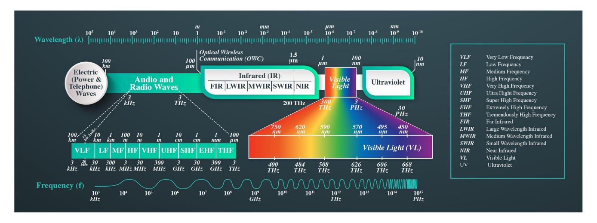

Fig. 1. Electromagnetic spectrum and bands along with corresponding frequency and wavelengths.

and licensed to telecommunication companies. Albeit exclusive use of the licensed spectrum, spectrum scarcity and interference management prolong to be core problems of future generations of cellular networks. Therefore, the cellular networks still face formidable challenges to provide provisioned three major service classes [\[2\]](#page-34-1): enhanced mobile broadband (eMBB) for bandwidth-hungry applications; massive machine-type communications (mMTC) for device-todevice applications; and ultra-reliable low-latency communications (URLLC) for mission-critical applications. In the sub-6 GHz, only industrial, scientific and medical (ISM) bands are reserved internationally for license-free use and are heavily utilized by today's most common and mature wireless technologies such as Wi-Fi, Bluetooth, ZigBee, etc. Although the ISM band is a first-choice if IoT devices' low-cost and low-complexity nature is taken into account, it becomes overcrowded and interference-limited due to the ever-increasing number of IoT devices.

Recently, the millimeter wave (mmWave) band (30– 300 GHz) has received lots of attention to help next-generation wireless networks overcome spectrum scarcity issues. Shorter wavelengths allow a large number of antenna elements to be placed on small aperture sizes and provide substantial directivity gain to tackle severe path loss experienced by mmWave systems [\[3\]](#page-34-2). To enable and promote multigigabit wireless networks, the 60 GHz (57-71 GHz) mmWave band is globally considered as an unlicensed band that is already considered as an integral part of WI-FI technology and standardized under IEEE 802.11ad Standard [\[4\]](#page-34-3). On the other hand, 70 GHz (71-76 GHz), 80 GHz (81-86 GHz), and 90 GHz (92-95 GHz) are generally licensed on a shared basis with the Federal Government operations[.5](#page-1-1) Moreover, the terahertz (THz) band between 300 GHz and 3 THz is the most recent topic of interest to support joint sensing and communication applications to reap the full benefits of the so-called "THz gap" [\[5\]](#page-34-4). Although THz experiences a more severe propagation loss than the mmWave, it is expected to be compensated by a higher directivity gain by packing more antennas due to the reduced wavelength. However, THz systems are far-fetched due to required joint advancements in channel characterization, digital signal processing, and optical/electronic/plasmonic transceiver design. Albeit abundant spectrum and considerable antenna array gain, the cost and complexity of mmWave and THz systems may not be suitable to the spirit of low cost and complexity IoT hardware. Therefore, all these endeavors towards exploiting extremely higher frequencies with ample spectrum have limited direct applicability to the IoT hardware. As a consequence, most, if not all, IoT networks are designed to utilize microwave bands, at least over the long haul.

The above discussions implicitly focus on the suitability of the radio frequency (RF) spectrum for over-the-air communications taking place in indoor/outdoor terrestrial environments. Nowadays, the use of IoT expanded to a wide-variety of environments and new variations of IoT are presented in *Internet of X-Things* format where X may stand for underwater [\[6\]](#page-34-5), underground [\[7\]](#page-34-6), biomedical [\[8\]](#page-34-7), space [\[9\]](#page-34-8), etc. Are RF signals always the best choice for transmission mediums other than air? Let us seek an answer for this critical question through some examples: Even though RF signals are more tolerant of water's turbid and turbulent nature, water conductivity restricts their operational bandwidth and communication range to 30–300 Hz and 10 m, respectively. Thus, underwater RF systems are typically power-hungry, costly, and bulky with large antennas. Alternatively, acoustic communication has become a proven and widespread underwater communication technology thanks to its several kilometers long transmission range. Nonetheless, acoustic systems suffer from high latency and low data rates due to the low propagation speed (1500 m/s) and limited bandwidth (10-30 kHz), respectively [\[10\]](#page-34-9). Moreover, the RF channel attenuation dynamics in-on-and-around the human body are quite distinct from regular off-body RF channels because of the human body's lossy, heterogeneous, and dielectric nature. Since the body parts become comparable to RF wavelengths over frequencies higher than 100 MHz, the body

5https://www.fcc.gov/millimeter-wave-708090-ghz-service

antenna effects cause peculiar channel variations due to bioelectromagnetic features of tissues and irregular body shapes [\[1\]](#page-34-0).

Since the 1970s, fiber optic communications (FOC) have played a vital role in the advent of the information age and transformed the telecommunications industry by high bandwidth, long-distance, or immunity to electromagnetic interference (EMI) advantages over electrical transmission. Unlike the FOC, optical wireless communications (OWC) has come into prominence over the last two decades to reap the full benefits of FOCs and the flexibility of wireless communications. To this aim, the OWC systems transmit modulated visible/invisible light beams in an unguided medium in lieu of audio or radio waves. As shown in Fig. [1,](#page-1-0) the OWC can operate on a broad unregulated spectrum spanning over infrared (IR) band between 3 THz and 300 THz, visible light (VL) band between 300 THz and 3 PHz, and ultraviolet (UV) bands between 3 PHz and 300 PHz, each has its own virtues and drawbacks as explained in the next section. All these OWC modalities pave the way for a broad range of IoT applications at no cost of spectrum licensing. Therefore, the OWC can be considered as a promising IoT technology since most of the optical components used in OWC transceivers enable a better size, weight, and power-cost (SWaP-C) design compared to that of RF transceivers [\[11\]](#page-34-10), [\[12\]](#page-34-11), [\[13\]](#page-34-12). Nonetheless, the OWC systems are subject to limitations such as high dependency on line-of-sight (LoS); performance degradation due to the characteristics of transmission medium and environment (e.g., atmospheric events, water turbidity, irregular shape of reflectors, etc.); the need for pointing, acquisitioning, and tracking to overcome misalignment; reliability issues caused by sudden blockage of connections; interference created by ambient/nearby light sources, etc.

The fundamental takeaway conclusion from the above comparative analysis is that no communication technology is the best fit under all circumstances, especially considering various transmission mediums and environments. This promotes the hybridization of wireless technologies to converge offered advantages to improve the overall performance of IoT networks. To this aim, this survey focuses on exploiting OWC technologies to complement, replace, or co-exist with audio and radio wave-based wireless systems to enable a wide range of IoT applications in various mediums and environments.

## *A. Survey Contributions and Organization*

In the literature, many surveys contribute to the field by focusing on different aspects of OWC technology for a specific environment. The terrestrial OWC technologies are covered in the following studies: communication and informationtheoretic foundations are discussed in [\[11\]](#page-34-10), emerging technologies and research trends are pointed out by [\[12\]](#page-34-11), a survey on various challenges faced by ground-to-satellite and intersatellite free space optical (FSO) links and their mitigation techniques are presented in [\[13\]](#page-34-12), technical aspects of optical camera communications (OCC) are reviewed in [\[14\]](#page-35-0), and VL communication, sensing, and localization is surveyed from a

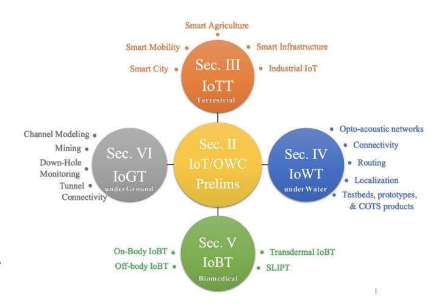

Fig. 2. Survey organization and content.

communication and networking perspective in [\[15\]](#page-35-1). On the other hand, Physical (PHY) layer aspects of underwater OWC are covered by [\[16\]](#page-35-2), [\[17\]](#page-35-3), which are followed by another survey focusing more on networking and localization aspects of underwater OWC [\[18\]](#page-35-4). A tutorial-style review on various important topics required to develop and research next generation FSO technologies was recently published [\[19\]](#page-35-5). The benefits of installing FSO systems on top of existing RF infrastructure was discussed in [\[20\]](#page-35-6). The most of surveys and reviews, if not all, presented in [\[11\]](#page-34-10), [\[12\]](#page-34-11), [\[13\]](#page-34-12), [\[14\]](#page-35-0), [\[15\]](#page-35-1), [\[16\]](#page-35-2), [\[17\]](#page-35-3), [\[18\]](#page-35-4) mainly focus on replacing existing wireless infrastructure with OWC technologies instead of providing a hybrid framework to show how OWC systems can complement or co-exist with alternative wireless technologies. Moreover, they mainly focus on PHY layer aspects of OWC without delving into higher layer networking issues, which are crucial to realize an OWC-based IoT network.

The main contributions of this survey can be summarized as follows: To reveal the full potential of OWC-based IoT networks, we follow a holistic presentation by focusing on four main IoT domains based on the underlying environment; Internet of Terrestrial Things (IoTT), Internet of Underwater Things (IoWT), Internet of Biomedical Things (IoBT), and Internet of Underground Things (IoGT). As shown in Fig. [2,](#page-2-0) each domain is covered by a dedicated and self-contained section that starts with a comparative analysis and explains how OWC can replace, complement or co-exist with existing wireless technologies. After that, each section points out potential OWC applications fitting best the related IoT domain and discusses challenges related to communication and networking aspects of OWC infrastructure. More importantly, instead of presenting a visionary OWC-IoT framework, the survey discloses that OWC-IoT has become a reality by emphasizing ongoing proof-of-concept prototyping efforts and available COTS products. Each section is concluded with summary, insights, and future research directions related to the OWC-IoT domain of interest. Since existing OWC standards introduced in Section [II](#page-3-0) are mostly designed for the IoTT domain, each section also concludes how these standards

TABLE I LIST OF ABBREVIATIONS

| AAD     | A C A D C                                              |
|---------|--------------------------------------------------------|
| AAP     | Acoustic Access Point                                  |
| ACK     | Acknowledgment                                         |
| AMI     | Active Medical Implant                                 |
| AP      | Access Point                                           |
| APD     | Avalanche Photodiode                                   |
| AUV     | Autonomous Underwater Vehicle                          |
| BCC     | Body Channel Communication                             |
| BER     | Bit Error Rate                                         |
| CFR     | Camera Frame                                           |
| CSK     | Color-Shift Keying                                     |
| CSMA    | Carrier Sense Multiple Access                          |
| CSMA/CA | Carrier Sense Multiple Access with Collision Avoidance |
| DCF     | Distributed Coordination Function                      |
| DLL     | Data Link Layer                                        |
| ECG     | Electrocardiography                                    |
| EMI     | Electromagnetic Interference                           |
| FC-LC   | Fiber-coupled Luminescent Concentrators                |
| FOC     | Fiber Optic Communications                             |
| FoCS    | First-order Channel Statistics                         |
| FoV     | Field of View                                          |
| FSO     | Free Space Optical                                     |
| HVAC    | Heating, Ventilation, and Air Conditioning             |
| IM/DD   | Intensity Modulation/ Direct Detection                 |
| IoBT    | Internet of Biomedical Things                          |
| IoGT    | Internet of Underground Things                         |
| IoT     | Internet of Things                                     |
| IoTT    | Internet of Terrestrial Things                         |
| IoWT    | Internet of Underwater Things                          |
| IrDA    | Infrared Data Association                              |
| IR      | Infrared                                               |
| ISI     | Inter-Symbol Interference                              |
| ISM     | Industrial, Scientific, and Medical                    |
| LD      | Laser Diode                                            |
| LED     | Light-Emitting Diode                                   |
| LiFi    | Light Fidelity                                         |
| LIFS    | Laser-Induced Fluorescence Spectrum                    |
| LoS     | Line-of-Sight                                          |
| LPT     | Lightwave Power Transfer                               |
| MAC     | Medium Access Control                                  |
| MAI     | Multiple Access Interference                           |
| MIMO    | Multiple Input Multiple Output                         |

*(Continued.)*

can be extended to support OWC-IoT in other domains as well.

# II. PRELIMINARIES ON OWC SYSTEMS, NETWORKS, AND STANDARDS

This section provides readers with preliminaries on OWC systems, networks, and standards to establish a fundamental background on the topic and facilitate a better perception of discussions and analyses. To this aim, we first introduced the basics of OWC systems by covering various types of transceiver components and comparing them in terms of key performance metrics. Then, a brief overview of OWC networks is presented in a layer-by-layer fashion. Finally, available communication and networking standards on the OWC technology are listed and compared. Even though basic principles of various communication technologies are briefly pointed out throughout the survey, we assume reader has a background on existing wireless communication and networking technologies, which are already extensively covered in the literature [\[3\]](#page-34-2), [\[21\]](#page-35-7), [\[22\]](#page-35-8).

TABLE I *(Continued.)* LIST OF ABBREVIATIONS

| mmWave MP2MP | millimeter Wave                                       |
|-----------------|-------------------------------------------------------|
|                 | Multipoint-to-Multipoint                              |
| NIR             | Near-IR                                               |
| NLoS            | Non-Line-of-Sight                                     |
| NPT             | Neuroprosthetic Telemetry                             |
| OBS             | Optical Base Station                                  |
| OCC             | Optical Camera Communications                         |
| OFDM            | Orthogonal Frequency-Division Multiplexing            |
| OOK             | On-Off Keying                                         |
| OWC             | Optical Wireless Communications                       |
| P2MP            | Point-to-Multipoint                                   |
| P2P             | Point-to-Point                                        |
| PD              | Photodiode                                            |
| PHY             | Physical                                              |
| PLC             | Power Line Communication                              |
| PPM             | Pulse Position Modulation                             |
| PWM             | Pulse Width Modulation                                |
| QoS             | Quality of Service                                    |
| RF              | Radio Frequency                                       |
| RoI             | Region of Interest                                    |
| ROV             | Remotely Operated Underwater Vehicle                  |
| RR              | Retro-Reflective                                      |
| SiPM            | Silicon Photo Multipliers                             |
| SLIPT           | Simultaneous Lightwave Information and Power Transfer |
| SNR             | Signal-to-Noise Ratio                                 |
| SoCS            | Second-order Channel Statistics                       |
| SPI             | Serial Peripheral Interface                           |
| THz             | Terahertz                                             |
| UDP             | User Datagram Protocol                                |
| URLLC           | Ultra-Reliable Low-Latency Communications             |
| UV              | Ultraviolet                                           |
| V2I             | Vehicle-to-Infrastructure                             |
| V2V             | Vehicle-to-Vehicle                                    |
| VCSEL           | Vertical-Cavity Surface-Emitting Laser                |
| VL              | Visible Light                                         |
| VLC             | Visible Light Communications                          |
| WBAN            | Wireless Body Area Network                            |
|                 |                                                       |

# *A. A Taxonomy of OWC Systems*

The OWC follows different naming conventions in the literature depending on operational wavelength, underlying environment, and hardware, which are explained in the sequel.

*1) OWC Transceivers:* The transmitter of an OWC-IoT source node can utilize a single laser diode (LD), a single lightemitting diode (LED), or an array of LDs/LEDs. LDs emit high-bandwidth coherent and razor-sharp light beams with a very narrow divergence angle, typically in the order of milliradians. On the other hand, LEDs are wide-beam light sources and enable multipoint communications, thus typically suitable for short-range multicasting or broadcasting applications. Even though LEDs generally deliver a data rate performance far below LDs, recent advances in photonics technology have shown that LED performance can be improved with more complex modulation techniques, discussed in the next subsection. Regardless of the light source type, the operational wavelength of OWC systems is determined based on the characteristics of the transmission medium and surrounding environment.

On the other hand, OWC receivers generally use photodiodes (PDs), also known as photodetectors, which absorb photons and generate an electrical current in proportion to the received light intensity. Positive-intrinsic-negative (PIN) diodes and avalanche photodiodes (APDs) are the two most common PD types [\[23\]](#page-35-9): PIN diodes are suitable for low-cost low-rate OWC applications as they are cheap PDs tolerant to temperature fluctuations and low bias. On the other hand, APDs operate at a very high reverse bias and experience a higher signal-to-noise ratio (SNR), which makes them suitable for high-speed applications with limited ambient noise. However, APDs are relatively expensive and their performance is susceptible to temperature variations [\[24\]](#page-35-10). A recent interesting research direction is using solar panels as PDs and energy harvester for a prolonged operational lifetime, which is especially critical for IoT nodes placed in hard to reach locations [\[25\]](#page-35-11). Furthermore, modulating retro-reflectors (MRRs) are enablers of optical back-scatter communications, where an MRR receiver passively modulates a high intensity light emitted by an interrogator and reflect back the modulated signal [\[26\]](#page-35-12).

Another practical OWC receiver is an image sensor, e.g., complementary metal-oxide-semiconductor (CMOS) camera with a rolling or global shutter built-in most consumer-grade electronic devices. The shutter type determines how images are captured; although a global shutter develops the entire image in a single shot, a rolling shutter captures one row of pixels at a time, working across the frame to develop the entire image. The image sensor transforms the light emitted from the source node into an electrical signal, quantize into an image, and finally compress to a specific image format. The projected result at the camera's image plane is processed using image processing techniques, and the information corresponding to the considered application is extracted. The maximum rate of an image sensor depends on shutter speed and camera frame (CFR) rate, which typically range between 30-60 frames per second, limiting image sensors to low-rate communications. Nonetheless, image sensors still offer several advantages over the aforementioned receiver types, such as the larger field of view (FoV), spatial separation of light, and wavelength separation [\[14\]](#page-35-0).

- *2) Free-Space Optics:* Considering the inverse relation between light diffusion and range, LDs are mostly preferred in FSO systems to establish point-to-point (P2P) ultra-highspeed and long-range outdoor links. LDs are generally subject to emission power requirements, especially for indoor applications, since the high-power focused nature of laser beams can be harmful to the eyes. While terrestrial FSO links typically use the IR band, underwater FSO links prefer blue or green parts of the VL band based on water type and depth.
- *3) Visible Light Communications (VLC):* On the other hand, VLC typically refers to LED-based indoor and outdoor communications, where an access point (AP) equipped with an array of LEDs serves to communicate with OWC-IoT devices by establishing multi-point communications, which is also referred to as Light-Fidelity (Li-Fi) technology taking a cue from Wi-Fi standard. Although the VLC-APs generally emit white light to provide a good quality of lighting and communication at the same time, the uplink communication avoids eye discomfort by exploiting the IR spectrum, which

is categorized into three bands: IR-A (780 nm-1.4 μm), IR-B (1.4-3 μm), and IR-C, also known as far-IR (3 μm-1 mm). Like underwater FSO, underwater VLC systems prefer blue or green parts of the VL band based on water type and depth. Micro-LEDs can also be implemented for high bandwidth and high density communications. LEDs are known to be stable and low-cost light sources and have minimal hazards to human health since they are using light that is harmless to human body.

*4) Optical Camera Communications (OCC):* Another form of OWC is OCC, where images and information are momentarily detected through camera sensors whose operational wavelengths are typically on VL, and IR bands [\[14\]](#page-35-0). The OCC can be considered a low-cost OWC solution given that omnipresence cameras are already deployed for several purposes, such as surveillance cameras, vehicle cameras, smartphones, etc. Even though OCC supports a low bit rate due to the limitation, the image sensor can serve a large number of users by mapping the information into a large number of pixels. The OCC can be used for a wide range of IoT applications such as localization, navigation, motion recognition, and augmented reality.

# *B. An Overview of OWC Networks*

- *1) Physical (PHY) Layer:* The PHY layer is the lowest and most fundamental layer of OWC networks as it deals with the bit-level data transmission over the transmission medium. Therefore, the PHY layer is responsible for many essential communication functions, including channel estimation, modulation, power control, signal processing, and coding. For reliable communication, these functions should account for medium and environment-dependent propagation characteristics of optical waves such as absorption, scattering, turbulence, pointing, alignment, etc. In the subsequent sections, these phenomena will be further brought to readers' attention to explain the medium and environment-specific nature of OWC technologies. As shown in Fig. [3,](#page-5-0) there exists three main physical links [\[18\]](#page-35-4):
  - In a LoS link, light wave travel in a direct path from the transceiver to the receiver.
  - If LoS link is blocked by an obstacle, non-line-of-sight (NLoS) link may be indirectly established outside of the direct path between transceivers, typically reflecting through nearby objects/surfaces.
- A retro-reflective (RR) link in case of MMR usage. In what follows, we provide a brief overview of typical modulation schemes suitable for OWC-IoT devices.

Intensity modulation and direct detection (IM/DD) is the most common modulation framework that varies the light intensity without the need for phase information. Its noncoherent nature does not require a local oscillator, reducing the cost and complexity of IoT devices. The IM/DD can be implemented through various modulation schemes: On-Off keying (OOK) is the most straightforward and common scheme, which turns on and off the light source according to the information bits. Its simplicity makes OOK suitable for low-cost and low-complexity IoT devices with mild QoS

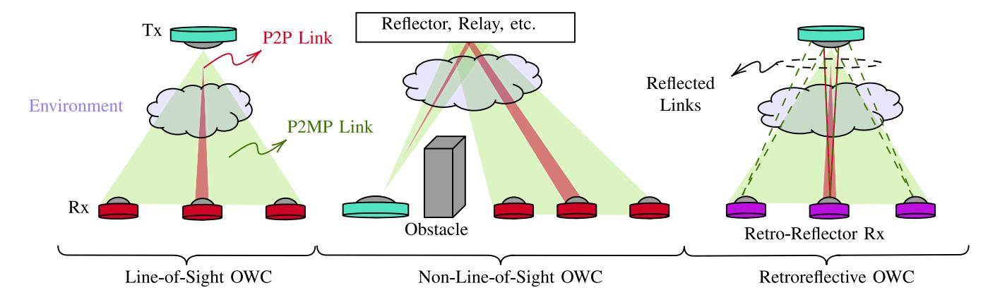

Fig. 3. Illustration of OWC link types.

requirements. At the cost of time-domain equalization complexity, a wide variety of pulse modulation schemes with better performance than OOK can also be considered for OWC-IoT nodes, such as pulse width modulation (PWM), pulse position modulation (PPM), and pulse amplitude modulation (PAM). These single-carrier modulation schemes have low spectral efficiency and suffer from inter-symbol interference (ISI) at higher bit rates. To boost spectral efficiency and mitigate detrimental ISI effects, subcarrier intensity modulation (SIM) drives the optical source by adding a DC bias to a pre-modulated signal to reach an all positive amplitude [\[27\]](#page-35-13). Therefore, wavelength division multiplexing (WDM) and orthogonal frequency-division multiplexing (OFDM) are most commonly used multi-subcarrier intensity modulation (MSIM) delivering higher performance as more subcarrier involved. However, this increases the required non-information DC bias, yields a higher peak-to-average power ratio (PAPR), and finally deteriorates the power efficiency [\[28\]](#page-35-14). Even though the PAPR can be alleviated by reduction techniques and pre/postdistortion compensation methods [\[29\]](#page-35-15), the light source nonlinearity still stays as a source of interference among the subcarriers and Inter-Modulation Distortion (IMD) [\[30\]](#page-35-16). The adversarial impacts of the nonlinearity can be reduced by utilizing spatial diversity or fewer subcarriers at the cost of hardware complexity and reduced bitrate, respectively [\[31\]](#page-35-17).

It is worth noting that aforementioned modulation schemes are typically faster than the CFR. Even if it is reduced to the CFR, the frequency would be less than the human flicker fusion threshold (FFT), which is usually taken between 60 and 90 Hz, though in certain cases can reach up to 500 Hz [\[32\]](#page-35-18), and cause visual inconvenience. To enable flicker free communication, three main class of OCC modulation schemes are proposed [\[33\]](#page-35-19): 1) screen-based modulation schemes use visible (QR-like) or invisible (embedded) codes to modulate a 2D array of LEDs; 2) Color-based (e.g., color shift keying (CSK), color intensity modulation, or their combination), polorization-based (e.g., binary CSK) and rolling shutter-based (e.g., frequency shift keying) are oversamples the received signal during modulation; and 3) undersampled schemes modulate light source at a frequency higher than the FFT by transforming signals from baseband to passband. A more comprehensive discussion of modulation schemes is beyond the scope of this work and we kindly refer readers to the surveys mentioned in Section [I](#page-0-4) for a more in-depth discussion of the matter.

- *2) Data Link Layer (DLL):* The DLL provides the functional and procedural means to transfer data. Since it is concerned with the local delivery of frames, frame collisions may occur if the medium is simultaneously used by several nodes across an OWC network segment. In such a case, the DLL is also responsible to reduce, prevent, detect and correct errors that may occur in the PHY layer. Based on aforementioned physical links, the OWC can support following logical topologies:
  - P2P topology is formed by a unicast (one-to-one) link between two nodes. One of them behaves as the coordinator/master and is typically authorized to communicate first on the channel.
  - Point-to-multipoint (P2MP) topology consists of P2P between a reference node (e.g., coordinator, master, endpoint, etc.) and neighboring nodes. The P2MP can be further divided into the following subcategories:
    - 1) In star topology, the reference node receives from the rest of the nodes in an all-to-one fashion.
    - 2) In broadcast topology, the reference node transmits the same data frame to the rest of nodes in a oneto-all fashion.
    - 3) In multicast topology, the data frame is transmitted only for intended nodes in one-to-many or manyto-one fashions.
  - Multipoint-to-multipoint (MP2MP) topology contains several P2P, broadcast, multicast, and star topologies.
  - Relay topology involves a cooperative node to connect nodes who cannot establish any of the above topologies due to the lack of coverage.

Having all these logical links operating in the same medium inevitably causes multiple access interference (MAI), having detrimental impacts on the overall IoT network performance. Therefore, the DLL comprises two sub-layers: The medium access control (MAC) lower layer and logical link control (LLC) upper layer tackle flow control and multiplexing in the transmission medium and logical links, respectively. Together, these sub-layers are responsible for eliminating the collisions of data frames concurrently transmitted and controlling the use of the transmission medium. The MAC layer ensures control by employing optical multiple access schemes by multiplexing nodes in time, code, space, or frequency domains. In this way, the MAC layer makes PHY layer complexities invisible to the LLC and upper layers of the network stack by providing a control abstraction.

- *3) Network and Transport Layers:* The network layer is responsible for transferring variable-length network packets from a source to a destination host by means of packet forwarding and routing through intermediate routers. Being placed between data link and transport layer, the network layer translates service requests from transport layer and issues them to the DLL. On the other hand, transport layer provides services such as connection-oriented communication, reliability, flow control, and multiplexing. Transmission Control Protocol (TCP) and User Datagram Protocol (UDP) are two most common transport protocols used for connection-oriented and connectionless data transmission, respectively.
- *4) Application Layer:* The application layer specifies shared interface methods and communications protocols IoT nodes use in an OWC network. It is an abstraction layer that standardizes communication and depends on the transport layer protocols to establish node-to-node connections and manage data exchange. Therefore, this layer introduces application-specific QoS requirements to the network and requires lower layers to configure the network and allocate resources accordingly. To conclude, the data link, transport, and application layers of the OWC network described in this section are very similar to the layers in RF communications.

# *C. OWC Standards*

In the light of the recent increase in interest in OWC, several standardization attempts have been made. We will summarize the most important ones in this section.

*1) Infrared Data Association (IrDA) Standard [\[34\]](#page-35-20):* The IrDA standard was initially defined by the IrDA, which is a group of over 160 companies worldwide that intends to issue standards for wireless IR communications. The first version, IrDA 1.0, was issued in April 1994 and regularized the PHY and DLLs. It included the specifications of the serial IR link, the IR link access protocol (IrLAP), and the IR link management protocol. It supported communications with speeds ranging from 2400 bps to 115 Kbps. The second version of the standard, named IrDA 1.1, was released in October 1995 to improve communication speeds by extending the data rate to 4 Mbps. It supports short-range communications up to 1m distance. IrDA 1.1 uses the 4PPM modulation scheme, which sends four encoded message bits in a single pulse in one of 16 possible time shifts. This standard is designed for infrared emitting diodes (IREDs) operating in the 850-900nm band and supports ad-hoc and walk-up connections. The IrLAP frame contains three fields: the address field (A) of the receiver, the control field (C) specifying the type of frame, and field I containing the transmitted information. Field C can have one of the following three values defining the three possible frame types:

- *Unnumbered (U):* It is used for data link management, responsible for link connection/disconnection, error reporting, and data transmission.
- *Supervisory (S):* It supervises information transfer by acknowledging the packet reception, the channel state (ready or busy), and reporting the frame-sequencing errors.
- • *Information transfer (I):* It contains the transmitted information.
- *2) IEEE 802.11 [\[35\]](#page-35-21):* This standard was defined by IEEE in 1997 and focuses on the PHY and MAC layers. It depicts a single MAC control to be deployed for any PHY layer. Unlike the IrDA standard, IEEE 802.11 supports diffuse communication with one or more receivers, which permits only P2P communication. However, it is considered more sophisticated than IrDA, with increased hardware cost and complexity. IEEE 802.11 supports two frequency bands: frequency hopping (FHSS) and a direct sequence spread spectrum (DSSS) in the 2.4GHz band (i.e., WiFi), and the 316-353 THz band, which corresponds to IR-OWC, with a communication range of 10m. Although IEEE 802.11 provides 1 Mbps and 2 Mbps speeds in basic and optional modes, respectively, the commercial infrared implementations at the 316-353 THz band do not exist [\[4\]](#page-34-3). This standard divides the PHY layer into two sublayers: the PHY layer convergence procedure (PLCP) and the physical medium (PMD). The PLCP ensures error-free transmission and simplifies data reception by adding a header and a preamble to the transmitted packet. The PMD defines the signal's format and the communication requirements. The adopted modulation schemes are 4PPM and 16PPM with supported data rates of 1Mbps and 2Mbps, respectively. IEEE 802.11 consists of basic service sets, defined as a group of stations interconnected with a distribution system. It supports the AP-oriented star topology, the ad hoc topology, asynchronous and time-critical traffic (named time-bounded services in the standard), and power management. This standard adopts three main access methods:
  - The distributed coordination function (DCF): The DCF is based on a carrier sense multiple access (CSMA) with collision avoidance (CSMA/CA) protocol. In IEEE 802.11, the information is transmitted using the MAC protocol data unit (MPDU) frame. It is a complete data unit sent from the MAC to the PHY layer. It contains the transmitted information, the payload, and a 32-bit cyclic redundancy check (CRC).
  - The DCF with handshaking: Before starting a transmission, the transmitter sends a request to send (RTS) frame, and the receiver sends back a clear to send (CTS) frame. The control frames are used to limit the issue of hidden stations.
  - The point coordination function: In this case, only one station per cell has priority access to the medium at each time.

In July 2017, the IEEE 802.11bb initiative was created to make the needed changes to the MAC layer in IEEE 802.11 to use light as a wireless communication medium. This standard considers bandwidths ranging from 380 to 5000 nm with a single-link throughput of 10 Mbps and a minimum of 5 Gbps

| TABLE II      |
|---------------|
| OWC STANDARDS |

| Standard       | Year | Band      | Range (m)   | Topology                                            | Modulation         | MAC protocol | Frame types                                                       | Security                      |
|----------------|------|-----------|-------------|-----------------------------------------------------|--------------------|--------------|-------------------------------------------------------------------|-------------------------------|
| IrDA           | 1994 | IR        | 1           | ad/hoc walk-up                                   | 4PPM               | N/A          | U/S/I                                                             | N/A                           |
| IEEE 802.11    | 1997 | IR        | 10          | AP oriented ad-hoc                                  | 4PPM 16PPM      | CSMA/CA      | MPDU RTS CTS                                                | N/A                           |
| Jeita CP-1222  | 2007 | VLC       | N/A         | N/A                                                 | SC-4PPM            | N/A          | N/A                                                               | N/A                           |
| IEEE 802.15.7  | 2018 | VLC/IR/UV | Short range | Peer-to-peer Star Broadcast                   | OOK VPPM CSK | CSMA/CA      | Beacon Data Acknowledgement MAC command CVD                       | Symmetric-key cryptography |
| IEEE 802.15.13 | 2021 |           | 200         |                                                     |                    |              |                                                                   |                               |
| ITU G. VLC     | 2019 | VLC/IR    | N/A         | P2P P2MP MP2MP Relayed mode Centralized | OFDM               | N/A          | MAP/RMAP MSG ACK RTS CTS STMG PROBE ACKRQ GMSG BACK ACTMG IND FTE | N/A                           |

for at least one operation mode. For a more in-depth discussion on the historical evolution of IEEE 802.11, we refer interested readers to [\[4\]](#page-34-3).

*3) JEITA CP 1221 and 1222 [\[36\]](#page-35-22):* The JEITA CP 1221 and JEITA CP 1222 standards were proposed by the Visible Light Communication Consortium in 2007. While the first standard is designed mainly for VLC systems, the second is intended for VL ID systems. The two standards adopt the sub-carrier pulse modulation scheme, whith JEITA CP 1222 specifically suggesting using the sub-carrier 4PPM (SC-4PPM). In JEITA CP 1221, only the 15kHz to 40kHz frequency range is used for communication purposes, where the data rate is around 4.8 Kbps with a subcarrier frequency of 28.8kHz. JEITA CP 1221 is mainly proposed for localization applications, but it can also be extended to other applications. JEITA CP 1222 differs slightly from JEITA CP 1221 by restricting the subcarrier frequency to 28.8 kHz and specifying the modulation scheme to be SC-4PPM. It also demands CRC for error detection and correction.

*4) IEEE 802.15.7 [\[37\]](#page-35-23):* This standard is defined by IEEE and defines the PHY and MAC layers for short-range VLC for local and metropolitan area networks. The first version, IEEE 802.15.7-2011, was released in 2011. Then, a revision was approved in 2018, and a revised version (IEEE 802.15.7-2018) was released. Unlike IEEE 802.15.7-2011, which mainly regularizes VLC communications, IEEE 802.15.7-2018 is extended to IR, near-UV, and OCC. IEEE 802.15.7 supports the P2P, star, and broadcast topologies. Moreover, the PHY layer in this standard can be divided into six classes:

• PHY I supports data rates ranging from 11.67 Kbps to 266.6 Kbps and adopts the OOK and variable PPM (VPPM) schemes. It is mainly used for outdoor applications characterized by low rates and long distances, such as vehicular communications.

- PHY II supports data rates ranging from 1.25 Mbps to 96 Mbps. It is modeled for indoor and P2P applications requiring high data rates.
- PHY III supports data rates ranging from 12 Mbps to 96 Mbps. It is dedicated to multiple optical sources and adopts the CSK modulation scheme. It is optimized for indoor P2P applications in which multiple LEDs are joined to produce white light.
- PHY IV supports data rates up to 22Kbps and is intended for use with discrete light sources.
- PHY V supports data rates up to 5.71Kbps and is used with diffused surface light sources.
- PHY VI supports data rates in the order of Kbps and is deployed for video displays.

In this standard, the MAC layer is responsible for generating network beacons (in the case of a network coordinator), synchronizing with network beacons, and providing a reliable link between two peer MAC entities. It also supports unique optical wireless personal area network association and dissociation, color function, visibility, dimming, visual indication of device status and channel quality, device security, and mobility. This standard has four random access methods: unslotted random access, slotted random access, unslotted CSMA/CA, and slotted CSMA/CA. It can support different optical clock rates to enlarge the range of admissible optical transmitters and receivers. Considering the independence between the transmitter and receiver in a device, the standard supports asymmetric clock rates between two devices. IEEE 802.15.7 adopts symmetric-key cryptography to reinforce communication security where higher layers provide the key. The standard's frame structure can be summarized as follows: a beacon frame is used by the coordinator to send beacons; a data frame is used for data transfer; an acknowledgment (ACK) frame is sent to confirm successful reception of the data; a MAC command frame is responsible for dealing with all MAC peer entity control transfers; and a color visibility dimming (CVD) frame controls the light intensity between data frames to support dimming and visually provide information such as communication status and channel quality to the user.

*5) IEEE 802.15.13 [\[38\]](#page-35-24):* This standard is mainly a revision of the IEEE 802.15.7 standard. It is designed for high-speed and bidirectional mobile communications such as audio and video multimedia services. It supports data rates of up to 10 Gbps over a range of 200 m. It mainly regularizes the PHY and MAC layers for VLC communications. The Task Group 13 focused on two types of PHY operations: a low-power pulsed modulation PHY using OOK with frequency-domain equalization and a high-bandwidth PHY based on OFDM adopted from ITU-T G.9991. The group also focused on the user mobility by considering APs and users within the environment as inputs and outputs of a distributed D-MIMO system. Thus, 802.15.13 aims at supporting D-MIMO natively with a minimalistic design, suitable for specialty applications, and implementable on low-cost FPGAs and off-the-shelf computing hardware. This standard can be used in a variety of scenarios, such as smart homes, industrial environments, and vehicular communications.

*6) ITU G.VLC [\[39\]](#page-35-25):* This standard is also known as ITU G.1991. It specifies the system architecture, the PHY layer, and the DLL for high-speed VLC and IR communications. This standard uses the OFDM modulation scheme and can support data rates of up to 1.7 Gbps. ITU G.VLC is suitable for the following topologies: P2P, P2MP, MP2MP, relay, and centalized, where a global master coordinates different P2MP and MP2MP domains. Moreover, different frame types are defined for this standard, such as MAP/RMAP frames; unidirectional/bidirectional message (MSG)/(BMSG) frames; control frames (e.g., ACK, RTS, CTS); ACK retransmission request frame (ACKRQ); probe frames (PROBE), etc.

## *D. Summary, Insights, and Open Problems*

In this section, we first provided OWC transceiver types and pointed out their suitability for different applications by comparing their virtues and drawbacks from key performance metrics. A taxonomy of OWC technologies is also introduced to facilitate discussions in the subsequent sections. Then, we briefly explained OWC networks based on a simple 5-layer approach and presented available standards on OWC technologies.

It is worth noting that only IEEE standards provide both PHY and MAC layer specifications, while the rest is merely designed for the PHY layer. Why do not the IEEE standards offer a whole network protocol stack and limit themselves to PHY and MAC layers? The main reason is that OWC specific part of the network occurs in the first two layers and higher layers follow the wired Internet backbone protocols. At this point, it is important to note that two critical aspects limit all these standards: 1) they merely focus on terrestrial networks and are not designed to define other mediums and environments, and 2) they are designed for a pure OWC network and are not suitable for the hybrid operation of OWC networks with existing RF-based wireless networks. Therefore, we believe future standardization efforts should take these two main limitations of existing standards into account to integrate OWC technologies with the existing RF-based wireless access technologies to meet the ever increasing QoS demand of future networks. In the rest of the paper, we further discuss these issues based on the underlying transmission medium and environment.

## III. INTERNET OF TERRESTRIAL THINGS (IOTT)

Lately, we have witnessed an upsurge in smart devices that are used by almost everyone. These smart devices are interconnected through the Internet, which emphasizes the importance of the IoTT in our era. IoTT is omnipresent in many agricultural, smart city, and commercial applications. Figures [4,](#page-9-0) [5,](#page-10-0) [6,](#page-10-1) and [7](#page-12-0) present a detailed overview of the different IoTT applications.

## *A. The OWC-IoTT in Smart Agriculture*

*1) The OWC-IoTT for Smart Farming:* To meet the expected food demand of the ever-increasing human population, agricultural production is required to be doubled by 2050 [\[40\]](#page-35-26). The agriculture sector must achieve such a challenging goal under a diverse set of significant difficulties, such as land degradation, lack of farmable land, labor force shortage, and climate change threats (e.g., frequent and intense drought, storms, and heatwaves) [\[40\]](#page-35-26). Therefore, IoTT can help achieving this goal by enabling smart and precision farming to improve the quality and quantity of polyhouse/greenhouse vegetation, increase cost efficiency, better manage the resources such as water and soil, and manage crops. The current IoTT devices developed for agriculture mostly, if not all, exploit RF waves [\[41\]](#page-35-27), [\[42\]](#page-35-28), which have harmful impacts on the health condition and growth of plants [\[43\]](#page-35-29), [\[44\]](#page-35-30). On the contrary, OWC can be extremely helpful as lightwaves at specific wavelengths have been shown to improve crop productivity, quality, and taste. This section discusses how LEDs and optical cameras can facilitate smart and precision farming together and facilitate a safe, reliable, and energy-efficient OWC-IoTT infrastructure, as depicted in Fig. [4,](#page-9-0) requiring little or no additional cost. In Fig. [4,](#page-9-0) OWC-IoTT nodes are deployed in the pots for measure soil, air, and light quality monitoring through a set of sensors. Sensor readings are shared by dual functional ceiling APs which provide illumination at various wavelengths required by plants and transfer the data collected from OWC-IoTT nodes to a smart agriculture cloud. As an alternative to APs, dual functional camera can decode the light information emitted by OWC-IoTT nodes and visually monitor plants for precise farming in a joint optical sensing and communication fashion. The data

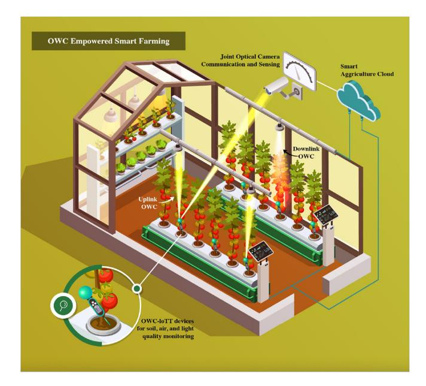

Fig. 4. OWC-IoTT based smart farming.

processed in the cloud may allow taking necessary actions and measurements to improve the productivity of the smart farm.

- *Leveraging LEDs and Cameras on Smart Farms:* Before discussing how the OWC-IoTT can facilitate smart and precision farming, let us first explain how LED-based colored illumination and optical camera sensing can boost overall productivity. Investigations on the response of tomato leaves' photosynthetic capacity under different light wavelengths have shown that a combination of white, red, and blue lights improves photosynthetic efficiency, while red and purple light increases crop yield [\[45\]](#page-35-31). Another study found that a mixture of red and blue light or red, green, and blue light optimized the performance of the photosynthetic apparatus. Moreover, an increase in the proportion of blue light in the red and blue light mixture induced the yield growth [\[46\]](#page-35-32). The impact of illumination with different wavelengths oncherry tomato quality was tested at different growth stages of the cultivar in [\[47\]](#page-35-33). It was demonstrated that the red light illumination significantly improves the quality and other health-related elements of the cherry tomato cultivar at the green-mature stage. Similar studies have been conducted for other types of vegetables and herbs. For instance, it has been found that purple light obtained by combining red and blue light speeded the growth of lettuce plants [\[48\]](#page-35-34). Likewise, a blue, red, and farred light mixture and blue and red light mixture boost the growth of the sweet basil yield compared to white illumination [\[49\]](#page-35-35). All these illumination benefits can be leveraged by using low-cost LEDs, which are recognized to be more energyefficient than traditional light sources and allow fast-and-easy color change. Since LEDs are already an integral part of VLC transmitters, VLC-APs can facilitate both plant illumination and communication simultaneously.

The precision agriculture mainly collects crop growth and health indicators through various sensing methodologies and exploit data analytics to make decisions for breeding, pruning,

fertilizer and pesticide management, and automated harvesting. In particular, optical cameras can estimate phenotyping variables from intensity, spectral, and volumetric measurements to characterize plants, detect plants/fruits, and assess plant physiology [\[40\]](#page-35-26). As mentioned in previous sections, optical cameras can be used beyond sensing and imaging purposes. Modulated light beams emitted from VLC-APs are reflected from plants and received by the camera as images, thereby allowing optimal cameras to be used for joint sensing and communication.

- *Integrating VLC, OCC, and FC-LC:* In light of the above discussions, overall crop productivity and quality can be improved significantly by leveraging low-cost LEDs and optical cameras for smart and precision farming. Indeed, combining the two opens up a new perspective on OWC research that has not yet been fully explored. To the best of our knowledge, OWC-IoTT-based smart farming has been only considered in [\[50\]](#page-35-36), [\[51\]](#page-35-37), and [\[52\]](#page-35-38). In [\[50\]](#page-35-36), Javed et al. exploit VLC and OCC technology to create a smart farm where white ceiling LEDs provide both downlink signaling and grow lights needed for photosynthesis, while optical cameras capture the modulated green light reflected by the vegetables in the uplink. Although the authors demonstrate a very appealing and complete OWC-IoTT system that integrates VLC and OCC technologies in an indoor smart farming scenario, they do not harness the true potential of LEDs and cameras by reaping the aforementioned benefits. The authors in [\[52\]](#page-35-38) propose using VLC to sense the temperature, humidity, soil moisture level, and luminosity in an environment. The data collected by sensors is processed in the cloud for business intelligence and analytics to automate polyhouse countermeasures and fertilizer suggestions for automated and sustainable polyhouse farming. In [\[51\]](#page-35-37), the authors investigate the performance of an outdoor OCC-based wireless sensor network (WSN) that is implemented in an emulated farm environment and linked to the Internet. They found that scalable and low-cost communication with a 100 m range is feasible under a 7.5 bps rate.

An interesting future research direction is the design of energy self-sufficient OWC-IoTT in an indoor farming environment, where plants are constantly illuminated by LEDs that also wirelessly powers OWC-IoTT nodes located across the polyhouse. This concept can be further extended to simultaneous lightwave information and power transfer (SLIPT) for better results. Another potential OWC technology is fibercoupled luminescent concentrators (FC-LC), mainly designed to harvest sunlight and convert its energy into electricity. In [\[53\]](#page-35-39), Makarov et al. used FC-LC technology for lower canopy lighting and reported a 7% boost in tomato yield. Since they are adjustable to deliver peak photoluminescence at different wavelengths, FC-LCs can also be excited by VLC-APs to deliver light to lower canopy, i.e., delivery of both light connection and power to shaded areas. More importantly, the authors also developed an LC detector to show how FC-LC can be used for both illumination and communication at the same time.

The OCC is another promising technology for smart farming, considering the omnipresence of cameras on farms for

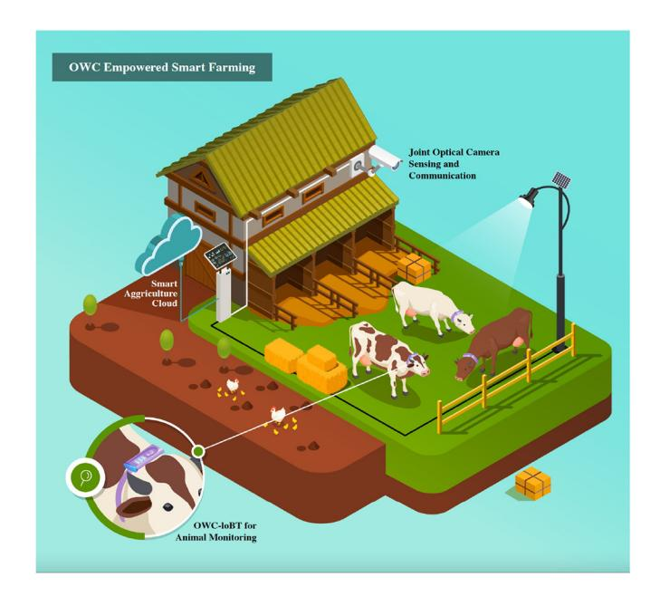

Fig. 5. OWC-IoTT based smart livestock farming.

surveillance purposes or in the mobile phones everyone carries. In [\[54\]](#page-35-40), three optical sensing instruments, namely the Agriserver, the Agrigadget, and the laser-induced fluorescence spectrum (LIFS) monitor. Agriserver sensing nodes in farms include single reflex lens cameras and are controlled remotely (in laboratories) over the Internet. The use of cameras ensures detailed remote tracking of the farm by capturing high-definition images that can detect an insect measuring less than 1cm long over 10 m away. The Agrigadget, on the other hand, is designed for instant mobile tracking of farms via a smartphone-based spectroscopic device and a hand framing camera. The farmer can scan the color spectrum of the plant's surface using his phone to evaluate the quality of the product, such as the maturity and growth of the fruit. The collected data can be processed using existing online agriculture software applications. As for the LIFS monitor, it assembles the physiological characteristics of vegetation. To be able to use this technology for outdoor farms, mobile LIFS monitor and LIFS light detection and ranging (Lidar) are proposed. They are used to instantly diagnose plants in their natural environment using solely chlorophyll fluorescence to retrieve real-time information with no use of sampling plants or chemical treatments. The mobile LIFS monitor irradiates the plant with a UV laser and detects in return the data that is transmitted by cell phone to the cloud. As for the LIFS lidar, it is rather used to supervise the plants that are not physically accessible from a distance up to 65m. The detection of the fluorescence data using the LIFS lidar is performed using a UV laser and an intensified CCD equipped with a filter.

*2) The OWC-IoTT for Smart Livestock Farming:* As illustrated in Fig. [5](#page-10-0) and Fig. [6,](#page-10-1) another important agriculture field for OWC-IoTT is animal and fish farming, respectively. In these figures, OWC-IoTT nodes are deployed on animals/fish and in the surrounding environment to monitor animals/fish

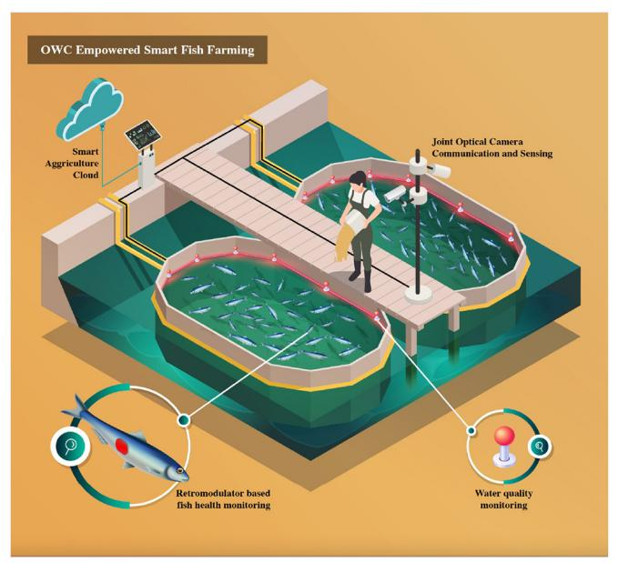

Fig. 6. OWC-IoTT based smart fish farming.

and environment, respectively. Sensor readings are shared by dual functional APs which provide required illumination at various wavelengths and transfer the data collected from nodes to a smart animal/fish farming cloud. As an alternative to APs, dual functional cameras can decode the light information emitted by the nodes and visually monitor plants for precise farming in a joint optical sensing and communication fashion. The data processed in the cloud may allow taking necessary actions and measurements to improve the productivity of the smart animal/fish farming. Global demand for animal products is expected to increase by 40% in the next 15 years, which emphasizes the urgency of ensuring production sustainability and safety in this sector. However, animals are threatened by stock theft and illness, which can sometimes be detected too late and leads to the loss of the animal. According to the United States Department of Agriculture, almost 3.9 million cattle and calves died from various causes in 2015, resulting in a loss of \$3.87 billion loss [\[55\]](#page-35-41). Several works have been performed in the literature have investigated smart animal farming for the supervision and care of livestock. IoT has been used on smart farms to monitor animals and their environment. For instance, an IoT-based monitoring system has been proposed in [\[56\]](#page-35-42) that enables remote control of the farm using wireless sensors by filling feed and water containers, tracking temperature and humidity, exhausting biogas produced by the animals' waste, detecting potential fires, and surveilling the farm via an IP camera. Animal health can also be diagnosed remotely through Internet using wireless sensors that collect physiological information about the animal such as its temperature, heart rate, and rumination with surrounding temperature and humidity [\[57\]](#page-35-43). IoT solutions have been introduced for smart aquaculture farming as well [\[58\]](#page-35-44), [\[59\]](#page-35-45), [\[60\]](#page-35-46). Huy et al. proposed a WSN that automates, remotely controls, and monitors shrimp farms to limit energy consumption and human intervention and ensure a quick response to changes in the production pond [\[58\]](#page-35-44). Farmers can also remotely monitor water parameters in fish farming ponds such as the pH level, temperature, luminosity, and water level [\[59\]](#page-35-45), [\[60\]](#page-35-46).

- *Leveraging LEDs and Cameras in Livestock Farming:* Scientific results have shown that light conditions can improve animal's health, behavior, and physiology, and thereby significantly impact business profitability [\[61\]](#page-36-0), [\[62\]](#page-36-1), [\[63\]](#page-36-2), [\[64\]](#page-36-3), [\[65\]](#page-36-4), [\[66\]](#page-36-5). Light plays an essential role in the development and functioning of poultry's reproductive system. The intensity and color of light, and the duration of exposure to it can be tuned to optimize the bird's maturity and egg production depending on its age and type [\[61\]](#page-36-0). It has also been proven that light characteristics affect the welfare and health of poultry [\[62\]](#page-36-1). Moreover, studies have shown that an optimal photoperiod has a remarkable impact on dairy production, reproduction, feed efficiency, and maturity [\[63\]](#page-36-2). Light can also be beneficial for marine life. For instance, Jung et al. demonstrated that green light LEDs are useful for improving the health of goldfish when exposed to thermal stress by enhancing their antioxidant capacity and reducing oxidative stress [\[64\]](#page-36-3). The work in [\[65\]](#page-36-4) proved that the blue and white light spectrums play a vital role in manipulating the acute stress response of the sea bass fish. The impact of blue, green, red, and white light on the performance of Atlantic cod and turbot are investigated in [\[66\]](#page-36-5), where blue light has the best effect on the growth of the larvae for both considered species and the use of light improves the performance of the larval and its survival. Furthermore, good lighting improves the working conditions in the barn. It relieves farmers' eyes, simplifies animal control, and reduces the risk of occupational accidents. In addition, modern, efficient light fittings with a long service life reduce energy and maintenance costs.

Even though smart farming applications proposed in [\[57\]](#page-35-43), [\[58\]](#page-35-44), [\[59\]](#page-35-45), [\[60\]](#page-35-46) exploit RF-IoTT solutions, the illumination advantages mentioned above highlight the importance of light in animal farming, proving the eligibility of introducing OWCbased IoTT solutions for smart animal farming. To the extent of our knowledge, no work has proposed an OWC-IoTT based system for smart animal farming yet. Similar to smart farming, the LEDs deployed for illumination purposes can be used as an AP to provide connectivity to OWC-IoTT nodes located in the surrounding environment as well as nodes placed on animals to track their physiological signs. It is worth noting that OWC-IoTT nodes placed on farm animals' bodies experience different channel characteristics and require various considerations. Therefore, we refer readers to Section [V](#page-25-0) for more details to understand how OWC around a body is different from regular OWC. For OWC-IoT nodes placed on fish, it is better to communicate with an AP deployed underwater, which falls into the realm of OWC-IoWT presented in Section [IV.](#page-18-0)

Precision animal farming introduces process engineering techniques to ensure the real-time management of animals' wellbeing and production. Specifically, optical cameras can supervise dairy cows to detect potential lameness, which affects almost a quarter of dairy cows. They can also be used to monitor the behavior and weight of birds and notify the farmers about potential problems in the poultry house [\[67\]](#page-36-6), [\[68\]](#page-36-7). Furthermore, 2D/3D cameras can be used to supervise pigs' behavior in barns to identify a potential illness at an early stage [\[69\]](#page-36-8). As previously mentioned, cameras deployed to surveil/monitor animal farms can be used for OCC systems, where the light emitted by LEDs situated on an animal's body or reflected on it from the ceiling can be detected by the camera to ensure hybrid sensing and communication.

# *B. The OWC-IOTT in Smart Cities*

Smart cities are one of the most prominent digital ecosystems where IoTT devices can facilitate a convenient life through applications tailored for indoor or outdoor digital services. For indoor services, the IoTT integrates smart homes; residential, commercial, industrial, and educational buildings; and essential city services such as public health and safety (e.g., hospitals, fire/police departments), smart grid, and smart water. Likewise, the IoT can consolidate the mobility ecosystem for outdoor services by facilitating vehicular networks interconnected with traffic signs and smart infrastructures mentioned above. This is useful in protecting pedestrians, avoiding potential traffic accidents, collecting up-to-date traffic information, and optimizing the quality of transportation systems [\[70\]](#page-36-9). However, the remarkable increase in these devices and applications requires much more bandwidth than what the RF spectrum can provide. Also, RF bands have limited use in specific environments where healthrelated concerns are prioritized [\[71\]](#page-36-10). At this point, OWC-IoTT devices can be a perfect fit for specific smart city applications and environments where the required infrastructure is readily available. Accordingly, this section will focus on how OWC-IoTT can complement its RF counterparts, offload traffic, and reduce the ever-increasing radio interference, which is illustrated in Fig. [7](#page-12-0) where vehicles are equipped with lights (headlights, tail lights, turn lights, etc.), allowing for vehicle-to-people (V2P), vehicle-to-devices (V2D), vehicle-to-infrastructure (V2I), vehicle-to-power grid (V2G), or vehicle-to-everything (V2X).

*1) Smart Infrastructures:* Smart homes include various IoT devices and applications that provide a wide variety of services such as environment control (lighting, heating, water, and gas), climate sensing, health monitoring, camera surveillance, energy management, to name a few [\[72\]](#page-36-11). Smart home technology aims to comfort human life; provide independent living for the elderly, disabled people, and rehabilitating patients; and protect occupants from home accidents and home invasion crimes (e.g., burglary, robbery, and trespassing). Smart homes are further extended to smart building applications that collect information from various IoT sensors to reduce the energy cost of heating, ventilation, and air conditioning (HVAC); facilitate residential security and surveillance; provide fire safety; improve and optimize lighting; and protect from natural disasters (e.g., earthquakes, floods, etc.). Although RF-IoT devices are heavily employed for smart homes and buildings, OWC-IoTT devices can be a viable alternative because illumination is already needed and Internet connectivity is readily available in smart homes and buildings. Moreover, OWC is known to be safer and healthier than RF waves and can provide a higher level of PHY layer security as the light does not go

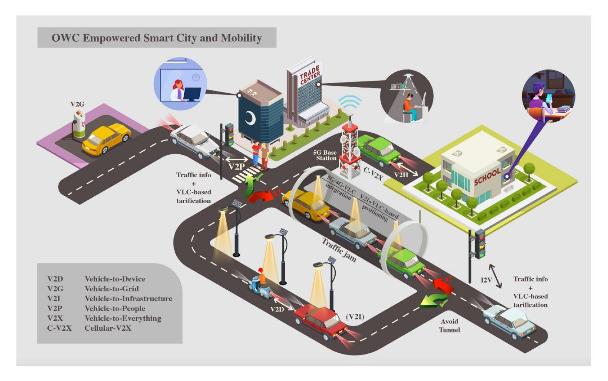

Fig. 7. OWC-IoTT based smart city and mobility.

through walls, which ensures the privacy and confidentiality of information exchanged indoor space [\[73\]](#page-36-12), [\[74\]](#page-36-13), [\[75\]](#page-36-14).

VLC, OCC, and IR communications are the three main OWC technologies used for indoor systems. Since cameras and energy-efficient LED lamps are already required in smart homes and buildings for surveillance and illumination purposes, respectively, the cost of their use for communication and networking can be expected to be minimal. Moreover, a VLCbased smart home system guarantees better data rates, bit error rates (BER), and power efficiency compared to RF-based smart home systems [\[76\]](#page-36-15). Besides, using optical waves to deploy smart home technologies minimizes the interference with RF devices. For these reasons, OWC is a suitable means of communication for smart homes and buildings. The rest of this sub-section discusses how VLC, OCC, and IR communications can be leveraged for indoor communication, positioning, tracking, and navigation.

- *VLC-Based Smart Homes and Buildings:* In the past few years, a variety of solutions have been proposed in the literature for controlling smart home appliances using VLC. It includes smart temperature and HVAC monitoring [\[77\]](#page-36-16), [\[78\]](#page-36-17), [\[79\]](#page-36-18), smart lighting [\[80\]](#page-36-19), smart door lock [\[81\]](#page-36-20), and different other services. The work in [\[82\]](#page-36-21) proposed a VLC and augmented reality-based monitoring application for smart home devices in airbnb rentals. The presence of various solutions in the same indoor environment leads to MAI that can degrade the signal quality and hence the performance of these technologies. For this, multiple access solutions are stated in the literature to overcome this challenge. Time division duplexing

is one procedure that ensures the interconnection between the various sensors of a home automation system [\[83\]](#page-36-22), [\[84\]](#page-36-23). Orthogonal code-based wavelength division and color-coded multiple access schemes can also ensure multi-device bidirectional communication and inter-device synchronization for smart home technologies [\[85\]](#page-36-24), [\[86\]](#page-36-25). The KNX communication standard is another option for intercommunication between the different technologies existing in smart homes, such as the HVAC and lighting [\[87\]](#page-36-26), [\[88\]](#page-36-27).

Similar to the role of Ethernet for WiFi, power line communications (PLCs) can be used as a backbone network for VLC-based smart home systems. Power lines can transmit data to LEDs in the room's ceiling or in-wall sockets. Afterward, the forwarded information reaches users through a VLC link [\[89\]](#page-36-28). With the use of PLC, no implementation of new cables is needed. Hence, they are easier andless expensive to deploy. However, since power line networks were not designed initially for communication purposes, their transmission suffers from low data rates. Some works in the literature have focused on integrated PLC/VLC systems for smart homes and invested improving the communication by proposing adequate modulation schemes such as the discrete multitone quadrature amplitude modulation (DMT-QAM) and OFDM [\[90\]](#page-36-29), [\[91\]](#page-36-30).

Furthermore, VLC systems can be used for detection in smart homes and buildings. Authors in [\[92\]](#page-36-31) showed that an LED-based VLC system could detect the presence of people in a building and their activities. This is done by combining the detected information with available human activity models and automating parameters such as lighting, heating, ventilation, and security. Since light is a safe wave, VLC solutions are convenient for health-related applications. They are used to protect human lives by monitoring microscopic entities such as particulate matter [\[93\]](#page-36-32), [\[94\]](#page-36-33). In RF-free environments, biomedical data can be transmitted using VLC in a simple, safe, and cost-effective way to ensure real-time medical signal monitoring [\[95\]](#page-36-34). It became possible to provide secure and constant assistance of disabled people and the elderly using LED-based sensors that transmit the collected information using VLC links [\[96\]](#page-36-35), [\[97\]](#page-36-36).

- *IR-Based Smart Homes and Buildings:* Moreover, IR communications are another promising solution for smart homes. Since IR provides reliable communication for both daytime and nighttime, it helps avoid eye discomfort that may be caused by VL during the night or coming from locations other than the ceiling [\[98\]](#page-36-37), which makes IR transceivers common for uplink communications. IR sensors have been widely used to remotely control smart home appliances such as the AC, TV, and projector [\[99\]](#page-36-38). In [\[100\]](#page-36-39), a low-cost human-detection method is proposed using IR temperature sensors for smart home systems. The IR sensors are placed at the entrance of a room to detect the entry of a person by distinguishing the human body temperature from the room temperature. IR temperature sensors are also used to supervise objects and ambient room temperature. The collected data can be accessed through a Web application [\[101\]](#page-36-40). IR analyzers are also deployed to control the air quality by tracking the CO2 level [\[102\]](#page-36-41). In [\[103\]](#page-36-42), IR array sensors are used to monitor building occupancy. IR sensors can also replace cameras in situations where privacy is a point of concern by detecting human activity without needing images [\[104\]](#page-36-43). Human posture is also detected using low-resolution IR sensors and a deep convolutional neural network [\[105\]](#page-36-44). Authors in [\[106\]](#page-36-45) proposed a home appliance automation system for severely disabled people that supervises residents by analyzing the frequency of the operation of these appliances. Near-IR (NIR) cameras are utilized to remotely monitor the heart rate using facial video data [\[107\]](#page-36-46). IR communications can also be handy for biomedical data transmission in hospitals and nursing homes [\[108\]](#page-37-0). Information such as the electrocardiography (ECG), blood pressure, and body temperature of each patient can be transmitted periodically using IR-LEDs and IR-PDs.

IR communications can also be combined with other technologies. For instance, a joint VL-IR communication can be integrated with PLC for indoor positioning applications in hospitals [\[109\]](#page-37-1). A combined RF-IR fingerprint identification method for multi-resident homes is proposed in [\[110\]](#page-37-2). Residents are identified by measuring the RF received signal strength and tracking the timing information provided by wall-mounted RF transceivers and IR sensors, respectively. In [\[111\]](#page-37-3), a joint RF-IR indoor high-definition video streaming is proposed where the uplink and downlink are done using RF and IR waves, respectively. Passive IR sensors are also used along with ultrasonic sensors to detect motion by being connected to a Web camera located at the home doorstep. This is done using a face recognition algorithm to reinforce the security of the house [\[112\]](#page-37-4).

- - *OCC-Based Smart Homes and Buildings:* OCC is another adequate means of communication in smart homes. It is efficient at detecting human presence indoors. A low-cost communication solution can be implemented using ceiling-mounted LEDs and the camera of a smartphone to automatically control the different parameters of the room [\[113\]](#page-37-5). It is used in environment monitoring as well where temperature, humidity, and CO2 sensors can transmit information to cameras using LEDs [\[114\]](#page-37-6), [\[115\]](#page-37-7), [\[116\]](#page-37-8).
- - *OWC-Based Indoor Positioning, Tracking, and Navigation:* OWC is especially suitable for positioning, tracking, and navigation in private and public indoor spaces, shopping centers, factories, airports, and healthcare units [\[117\]](#page-37-9). VLC systems can be used for indoor positioning applications where various LEDs send their location to a PD placed on the user's device or the object to be located [\[118\]](#page-37-10), [\[119\]](#page-37-11), [\[120\]](#page-37-12). VLC-based positioning systems are also feasible in situations where the transmitter [\[121\]](#page-37-13) or receiver [\[122\]](#page-37-14), [\[123\]](#page-37-15) is tilted. Similarly, VLC systems are implemented for indoor tracking applications such as remotely controlling a mobile robot or tracking an intruder for security purposes [\[124\]](#page-37-16), [\[125\]](#page-37-17). Moreover, VLC-based navigation services proved to be safe and reliable support for blind people to find objects and locations in an unfamiliar indoor environment. The light signals sent by the fixed transmitters on the different angles of the room enables the blind person to continuously relocate himself [\[126\]](#page-37-18).

IR sensors are another alternative for positioning applications. Pyroelectric IR sensors mounted on the ceiling are used for non-terminal indoor localization systems where the user is not equipped with a terminal device [\[127\]](#page-37-19), [\[128\]](#page-37-20). Alternatively, IR-based localization can be achieved by placing IR-LEDs on moving objects that emit IR light, which is detected by receivers on the ceiling [\[129\]](#page-37-21). In a similar fashion, IR sensors are deployed for indoor tracking applications [\[130\]](#page-37-22), [\[131\]](#page-37-23), [\[132\]](#page-37-24).

Cameras are equally convenient for indoor positioning applications. The position information emitted from VL LEDs is detected by a camera, aiming to localize the user or the device [\[133\]](#page-37-25), [\[134\]](#page-37-26). Indoor localization is also possible using IR cameras equipped with IR-LEDs and markers attached to walls in the indoor space. The person is detected when he passes in front of the camera and blocks the propagation of the emitted IR light [\[135\]](#page-37-27). Otherwise, indoor positioning can be performed using smartphone IR-LEDs as transmitters and surveillance cameras as receivers [\[136\]](#page-37-28).

Although OWC solutions for localization, tracking, and navigation have been widely investigated in the literature recently [\[137\]](#page-37-29), [\[138\]](#page-37-30), these technologies still face challenges. First comes the LoS problem where the presence of any object between the transmitter and the receiver can fail the communication. Leveraging shadows can improve the system performance, but it still does not reach the LoS performance [\[139\]](#page-37-31). Hence, more extensive future research should consider this problem. Interference is another challenge that arises in the presence of multiple light sources and threatens the detection accuracy of these systems. It is still considered an open problem to be investigated. Eventually, machine learning-based solutions have been proposed recently for VLC-based indoor localization. For instance, some researchers used the K-nearest neighbour (KNN) classification algorithm [\[140\]](#page-37-32), [\[141\]](#page-37-33), [\[142\]](#page-37-34), some used the neural network [\[143\]](#page-37-35), [\[144\]](#page-37-36), [\[145\]](#page-37-37), while others used deep long shortterm memory (LSTM) model [\[146\]](#page-37-38). Considering the impact machine learning techniques, including deep learning and reinforcement learning, have had on detection techniques such as smart sensing, we believe that these techniques should be further incorporated into indoor optical localization, tracking, and navigation technologies.

*2) Smart Mobility:* Recently, the remarkable increase in means of transportation has aggravated problems such as delays caused by traffic congestion, fatal accidents, fuel and energy consumption, and pollution. Hence, an essential section of smart city technologies is focused on intelligent transportation systems [\[147\]](#page-37-39), [\[148\]](#page-37-40) to improve road safety, solve traffic problems, and make driving easier thanks to vehicle-toeverything (V2X) communications [\[149\]](#page-37-41), [\[150\]](#page-37-42). The majority of the work that has been led in this field has focused on the use of RF microwave and mmWave based cellular-V2X solutions [\[151\]](#page-37-43), [\[152\]](#page-37-44). Since vehicle sizes do not impose form factor restrictions on transceiver and antenna array size, mmWave communications may particularly be preferable to utilize desirable bandwidth and directivity gain of massive MIMO systems. Despite the long-range communication offered by radio waves, it suffers from limited spectrum, transmission delays, and security issues. Consequently, OWC technologies can be seen as an excellent complement to RF for vehicular communications. The omnipresence of light sources (e.g., headlights, tail lights, turn signal lights, etc.) and surveillance cameras in vehicles and roads makes the implementation of OWC easier and cheaper. Also, it affords much larger bandwidth and faster communication compared to RF, which allows high data rates. However, OWCs suffer from short ranges and are highly affected by several challenges related to the nature of light and the surrounding environment [\[153\]](#page-37-45), [\[154\]](#page-37-46). The rest of this subsection discusses how VLC, OCC, and FSO communications can be leveraged for vehicular communications considering the faced challenges.

- *VLC-Based Vehicular Communication:* Unlike the indoor environment, VLC-based vehicular communications face challenges related to the nature of light propagation and the surrounding environment. First, VLC links are strongly dependent on the light source [\[155\]](#page-37-47), [\[156\]](#page-38-0), [\[157\]](#page-38-1). For instance, standard headlights have an irregular and more challenging radiation pattern than taillamps [\[158\]](#page-38-2). In fact, even the presence of some dirt in front of the light source may change the shape of the radiation pattern, which affects the quality of the communication [\[159\]](#page-38-3), [\[160\]](#page-38-4). Second, the reflection of emitted light on different objects like walls, cars, and the ground creates NLoS links that affect the overall performance [\[161\]](#page-38-5), [\[162\]](#page-38-6). Also, the mobility of vehicles and the road conditions constitute other challenges for VLC-based vehicular communications, as they introduce instability in the distance and orientation between the source and the receiver as well as alignment problems [\[163\]](#page-38-7), [\[164\]](#page-38-8). Furthermore, outdoor ambient light sources as well as MAI affect the quality of the communication depending on the power strength of the light that may saturate the receiver [\[162\]](#page-38-6), [\[165\]](#page-38-9). The interference can also happen between different vehicular VLC systems located in the same area, especially during rush hours, which may lead to packet loss and link quality deterioration [\[166\]](#page-38-10). Weather conditions are another significant outdoor challenge faced by VLC-based vehicular communications [\[167\]](#page-38-11). The presence of fog, rain, snow, turbulence, and solar irradiance leads to the divergence and attenuation of the light signal, which degrades the range and reliability of the VLC link [\[167\]](#page-38-11), [\[168\]](#page-38-12), [\[169\]](#page-38-13), [\[170\]](#page-38-14), [\[171\]](#page-38-15), [\[172\]](#page-38-16).

In the light of these challenges, several works have proposed VLC-based solutions for vehicular communication. In [\[173\]](#page-38-17), Kobbert focused on enhancing road safety at night by assessing the effect of various automotive headlamp parameters on drivers and optimizing the light intensity depending on the driving distance. In [\[174\]](#page-38-18), a highly linear transceiver system is presented for VLC-based vehicular communications using white LED headlights. The problem of strong background radiation is addressed in [\[175\]](#page-38-19) by introducing a vehicular VLC solution that enables dynamic saturation control by using adjustable attenuators (i.e., density filters). To maintain a reliable link despite cars' mobility, a dynamic PHY layer design that predicts real-time SNR values considering the current location of vehicles [\[176\]](#page-38-20). The MAI issue is addressed in the literature as well. The interference experienced in vehicular VLC can be reduced at the receiver end by implementing a liquid-crystal-panel spatial light modulator or integrating CMOS current mirroring to filter ambient light [\[177\]](#page-38-21), [\[178\]](#page-38-22). It can also be diminished using matrix headlights-based adaptive front lighting systems that identify the most convenient LEDs of the headlight to communicate with the receiver [\[179\]](#page-38-23). Increasing the FoV of photonic detectors can offer resilience to such problems and further support user mobility [\[180\]](#page-38-24) Singlephoton avalanche diodes (SPADs), characterized by their high sensitivity, can withstand adverse weather conditions when used in vehicular VLC systems [\[181\]](#page-38-25). Moreover, the low latency of light propagation makes VLC an adequate tool to communicate safety-related and critical messages [\[182\]](#page-38-26).

Several vehicular VLC standards have been defined lately, namely the IEEE 802.15.13 [\[183\]](#page-38-27) and the IEEE 802.15.7 [\[184\]](#page-38-28), [\[185\]](#page-38-29). The implementation of vehicular VLC using the IEEE 802.11 WiFi standard has also been tested in the literature. In [\[186\]](#page-38-30), an IEEE 802.11-compliant vehicular VLC system is tested by integrating custom-made driver hardware, commercial vehicle light modules, and an open-source implementation in GNU Radio.

VLC solutions have been proposed in the literature for vehicle-to-vehicle (V2V) communications [\[187\]](#page-38-31). Using car lights, the 2019 Consumer Electronic Show presented an OWC system that enables intercommunication between vehicles [\[188\]](#page-38-32) using OFDM modulation. In [\[189\]](#page-38-33), Béchadergue et al. evaluated the reliability of V2V VLC in real-world driving scenarios and compared the performances of OFDM and OOK modulations. The short communication range problem is also fixed by a multi-hop vehicular

VLC, where relay vehicles are included in the transmission [\[190\]](#page-38-34), [\[191\]](#page-38-35), [\[192\]](#page-38-36). VLC can also be implemented for vehicle-to-infrastructure (V2I), and infrastructure-to-vehicle (I2V) communications where cars communicate with traffic lights and street lamps to exchange information [\[193\]](#page-38-37), [\[194\]](#page-38-38). Furthermore, a cascaded I2V and V2V VLC communication system has also been investigated where the first vehicle receives safety messages from an LED traffic light and forwards them to the next car [\[195\]](#page-38-39), [\[196\]](#page-38-40). Bidirectional communications are also studied for V2V, and V2I VLC, where a full-duplex communication is enabled between communicating vehicles and between individual vehicles and traffic lights [\[197\]](#page-38-41), [\[198\]](#page-38-42), [\[199\]](#page-38-43). In [\[200\]](#page-39-0), Demir et al. proposed a dynamic soft handover technique based on coordinated multipoint transmission. A vehicle speed estimation system based on sensing the headlamp's VL variation is tested in [\[201\]](#page-39-1). For path-control purposes, vehicles can keep track of the distance between them via exchanging a clock signal contained in Manchester-encoded signals [\[202\]](#page-39-2). VLC also supports the exchange of kinetic information between cars via the use of a control area network bus implemented on each vehicle to collect data from the car's sensors, and actuators [\[203\]](#page-39-3). In [\[204\]](#page-39-4), Shen et al. proposed a VLC-based solution for smart parking that performs three functions, namely cars, free parking spots identification, and positioning.

VLC solutions have also been proposed for platooning, an application of intelligent transportation system that aims to enhance road safety and increase road capacity by grouping driving cars. VLC systems showed to be convenient for minimizing transmission latency, which is a critical factor for such applications [\[205\]](#page-39-5). VLC interference is another challenge faced in platooning, mainly because of the small distances between the grouped vehicles. Implementing spatial multiplexing for modern adaptive front-lighting decreases interference and increases the robustness and reliability for VLC platooning technologies [\[206\]](#page-39-6).

- *OCC-Based Vehicular Communications:* Over the previous years, the deployment of OCC for vehicular communication has been studied by researchers [\[207\]](#page-39-7). Considering the dynamicity included in vehicular communication scenarios, increasing the data rate is crucial to maintain fast communications [\[208\]](#page-39-8), [\[209\]](#page-39-9), [\[210\]](#page-39-10), [\[211\]](#page-39-11). Also, outdoor environments are characterized by the presence of sunlight and various artificial light sources, which intensify the interference issue for OCC links. Specific modulation schemes and constellations are suggested in the literature to solve the interference problem and increase the data reception accuracy [\[212\]](#page-39-12), [\[213\]](#page-39-13), [\[214\]](#page-39-14). Interference can equally be reduced by limiting the camera's FoV or by adapting a region selection approach in capturing images [\[209\]](#page-39-9), [\[215\]](#page-39-15). In [\[216\]](#page-39-16), a bit detection algorithm based on the average greyscale ratio and the gradient radial inwardness is evaluated to improve the detection accuracy. Furthermore, the region of interest (RoI) tracking is a considerable challenge faced by OCC due to the mobility of vehicles. It can be resolved using the Bayesian tracking technique, or a neural network-based encoding and decoding mechanism [\[217\]](#page-39-17), [\[218\]](#page-39-18), [\[219\]](#page-39-19). In [\[220\]](#page-39-20), Sturniolo et al. proposed a new RoI technique that fixes the signal distortion and diminishes the packet loss for bursty channels. Moreover, omitting the flickering problem at the transmitter and decreasing the packet error rate at the receiver are significant matters in OCC systems. Implementing a low-frame-rate camera-based solution that increases the transmission bandwidth and applies undersampling techniques proved to be a good solution for the flickering problem [\[221\]](#page-39-21), [\[222\]](#page-39-22). But to the extent of our knowledge, the issue of high error rates in bursty channels and bad weather conditions has not yet been covered in the literature. In [\[223\]](#page-39-23), the case of blurred image detection is addressed using an Artificial Intelligence based decoding method. Additionally, new positioning and detection methods and algorithms are proposed in the literature for vehicular OCC [\[224\]](#page-39-24), [\[225\]](#page-39-25), [\[226\]](#page-39-26). In [\[227\]](#page-39-27), a traffic sign detection technique is proposed for a V2I OCC communication using dual cameras. Finally, hybrid VLC/OCC scenarios are also treated in literature where hybrid modulation schemes and RoI-signalling techniques are discussed [\[228\]](#page-39-28), [\[229\]](#page-39-29).

- *FSO-Based Vehicular Communications:* FSO communications is another possible solution for vehicular communication. In [\[230\]](#page-39-30), an FSO-based real-time recognition and tracking system is proposed for vehicular networks. Authors in [\[231\]](#page-39-31) presented a laser alignment technique for FSO-based vehicular communication, considering the effects of vehicle mobility, tilting, and vibration. Most of FSO-based vehicular communications are jointly using RF waves as well. These solutions are discussed in more details in the following section.

We witnessed the lack of IR-based vehicular communication solutions in literature. Considering the characteristics of IR waves, we believe it would be a convenient solution for vehicular communications.

- *OWC*+*RF for Vehicular Communications:* Considering the advantages and limitations of RF and VLC communications, it is convenient to hybridize these two technologies in the same platform [\[232\]](#page-39-32). A joint VLC+RF V2X system can be used where high-speed critical information is transmitted using VL [\[233\]](#page-39-33). Driving supervision can also be offered to drivers using a combined VLC and Bluetooth solution. Preinformation about the road, like speed breakers situated on the road to slowdown cars and sudden cracks, is exchanged between cars through VLC. Then the instruction is sent through Bluetooth to an Android app that performs a textto-speech task and alerts the driver [\[234\]](#page-39-34). Hybrid VLC+RF solutions proved to be robust for platooning applications in treating urban environment scenarios [\[235\]](#page-39-35), [\[236\]](#page-39-36) or in improving security issues [\[237\]](#page-39-37).

FSO+RF is another promising combination for vehicular communication. In [\[238\]](#page-39-38), an FSO-based vehicular communication system is proposed where vehicles interchange their coordinates using RF waves to align their laser sources. A hybrid FSO+RF communication is also implemented to optimize the throughput in multi-hop vehicular ad-hoc networks [\[239\]](#page-39-39).

Eventually, we can state in literature various works that used vehicular communications between garbage bins and garbage collection tracks to monitor waste management [\[240\]](#page-39-40), [\[241\]](#page-39-41), [\[242\]](#page-39-42). Yet to the extent of our knowledge, all these solutions use RF waves. Hence, we believe that leveraging OWC into smart waste treatment by proposing joint RF/OWC solutions may benefit smart cities considering the benefits introduced by light-based communications.

*3) Smart Shopping:* In the past decade, we have witnessed the integration of IoT into the commercial field. This latter is constantly evolving by incorporating new options and facilities that make it easier to access. Most of the IoT-based commercial solutions proposed in the literature use RF waves. However, due to the lack of available RF bandwidth and its related interference problems, optical waves appear to be a good complement to RF for commercial solutions. This section covers the most relevant optical solutions proposed for shopping systems.

Optical communication proved to be convenient for smart shopping. In [\[243\]](#page-39-43), [\[244\]](#page-39-44), Light Fidelity (LiFi)-based solutions for item detection and smart payment are proposed. Navigation and indoor positioning in supermarkets, as well as product recommendation, are also possible using VLC [\[245\]](#page-40-0), [\[246\]](#page-40-1). Furthermore, a joint VLC+RF solution for 5G, called the Internet of radio-light, has been developed for supermarkets where the customer can find directions and access the Internet and cloud-based services [\[247\]](#page-40-2). In [\[248\]](#page-40-3), a hybrid RF identification (RFID)/IR solution is proposed for the smart and effective organization and extraction of items in a store. It is important to mention here that most of the existing smart shopping solutions in literature use RF wave [\[249\]](#page-40-4), [\[250\]](#page-40-5), [\[251\]](#page-40-6), [\[252\]](#page-40-7), [\[253\]](#page-40-8) and that the leveraging of optical waves for smart shopping has been explored only very recently and to a limited extent. Hence, we believe that researchers in the field should further analyze the use of optical waves in smart shopping.

*4) Smart Industry:* Industry is a vital sector in every country. Also known as Industry 4.0, the modern industry requires reliable high-speed communication links. Although the majority of the smart industry solutions are based on RF communications, this technology suffers from low data rates (up to 250 kbps [\[254\]](#page-40-9)) and EMI that limit the performance of production-related applications. Consequently, VLC has recently made its way into industry, considering its large bandwidth spectrum, low latency, relatively high security, and absence of interference with RF waves. Furthermore, the ubiquity of LEDs for illumination purposes makes the VLC solutions cheap to implement. Nevertheless, OWC systems face some challenges when applied in industrial environments. The main challenge is light's limited coverage, primarily when implemented in large warehouses with high ceilings [\[255\]](#page-40-10). Also, the pollution existing in industrial environments can degrade the performance of VLC systems [\[256\]](#page-40-11). The industrial VLC-based solutions reported in the literature are limited compared to those offered for the smart city. VLC-based applications for smart industry can be fruitful in manufacturing [\[257\]](#page-40-12). For instance, robot manufacturing has gained particular attention in recent years. This is reflected in the fast growth of the robot market [\[258\]](#page-40-13). VLC-based solutions have been proposed in the literature for the automotive industry. The OWICELLS (Optical Wireless networks for flexible car manufacturing CELLS) project considered implementing a VLC system in car manufacturing cells. Although this solution needs further improvement to be commercialized, it

succeeded in maintaining fast transmissions [\[259\]](#page-40-14). The work in [\[260\]](#page-40-15) investigated the possibility of implementing a VLCbased solution for mobile assembly lines where LEDs can serve for both illumination and communication with the central controller. Furthermore, the feasibility of using VLC systems in industrial production environments has been examined in literature [\[261\]](#page-40-16), [\[262\]](#page-40-17). In [\[263\]](#page-40-18), [\[264\]](#page-40-19), the performance of VLC-based systems for multi-user MIMO architectures is investigated.

# *C. COTS Products*

The recent interest in the OWC-IoTT has led to an upsurge of several COTS products as listed in Table [III.](#page-17-0) For instance, Signify, one of the leading companies in professional lighting, has proposed the Trulifi series, which comes with four products, namely the Trulifi 6002.2, Trulifi 6013, Trulifi 6014.02, and Trulifi 6800. The Trulifi 6002.2 AP has data rates of 220 Mbps for download and 160 Mbps for upload over a range of up to 2.8 meters. The Trulifi 6013 Securelink guarantees reliable high-speed optical communication with less than two milliseconds latency over an 8 m range. Its data rate is 250 Mbps for both uplink and downlink. The 6014.02 AP/endpoint system is characterized by a high data rate reaching 845 Mbps over a distance of 0.5 m and 12 m. The latency of this communication system is less than three milliseconds. The CitySwan BrightSites C7001 luminaire is another product from Signify that ensures 15 Gbps communication over a range of 300 m.

Oledcomm, a company that focuses on LiFi solutions, has also proposed several products in this vein. One is the LiFiMax set composed of an AP and a dongle. It affords LiFi-based communication with data rates of 70 Mbps for download and 60 Mbps for upload for up to 16 users.

VLNComm is another company specialized in LiFi solutions and has proposed products worth mentioning in this section. The first is the Luminex LiFi-enabled LED panel. Unlike the previously mentioned products that use the IR band, this product proposes a hybrid VL/IR communication with a 70 Mbps rate for download and 60 Mbps for upload to up to 15 users per AP. The second product is the Lumi Stick 2, which connects devices to LiFi with data rates of 108 Mbps for download and 53 Mbps for upload. It uses the waveband 420-680nm for downlink and 800-875nm for uplink.

The French company Lucibel also offers LiFi-based products for smart homes. The first product is the LifiCup, which enables a high-speed bidirectional connection with a data rate of up to 54 Mbps. It can support up to 16 simultaneous LiFi USB keys while offering mobile users a handover service between different LiFi luminaires. The LiFi USB key is another product of this company through which users can connect to the LiFiCup with a data rate of up to 42 Mbps for uplink. This LiFiCup / LiFi USB key communication system uses VL for downlink and IR for uplink. Lucibel's Barentino and LuciPanel solutions ensure a bidirectional communication with a data rate reaching 100 Mbps for 16 users simultaneously.

TABLE III TECHNICAL SPECIFICATIONS OF COMMERCIAL OWC-IOTT PRODUCTS

| Company   | Product        | ıt.              | Ref.  | Size [mm]                   | Weight [g] | Range [m] | Coverage [m 2 ] | Power [W] | Wavelength [nm]                    | Rate [Mbps]                | Modulation | Latency [ms] | Angle Tx/Rx | Transmission mode | Operation mode |
|-----------|----------------|------------------|-------|-----------------------------|------------|-----------|----------------------------|-----------|------------------------------------|----------------------------|------------|--------------|-------------|-------------------|----------------|
|           |                | 6002.2           | [265] | N/A                         | N/A        | 1.2 - 2.8 | 1.3 - 7.1                  | 35        | 940 (IR)                           | 220 download 160 upload | N/A        | N/A          | N/A         | Half duplex       | M2P            |
| Signify   | Trulifi        | 6013             | [266] | 130×75×35                   | 380        | ∞         | N/A                        | 4         | N/A                                | 250 download 250 upload | OFDM       | < 2          | 8/17        | TDMA              | P2P/P2M        |
|           | •              | 6014.02          | [267] | 146×106×37                  | 430        | 0.5 - 12  | 5.0 - 60.0                 | > 5       | 940                                | 845 Mbps                   | OFDM       | > 3          | 9/01        | TDMA              | P2P/P2M        |
|           | •              | 0089             | [368] | N/A                         | N/A        | N/A       | N/A                        | N/A       | N/A                                | N/A                        | N/A        | N/A          | N/A         | N/A               | P2M            |
| •         | BrightSites    | CitySwan         | [569] | 190×725                     | 18000      | 300       | N/A                        | 35        | N/A                                | 15000                      | N/A        | N/A          | N/A         | TDD/TDMA          | P2P/P2M/Mcsh   |
|           | I ifMov        | Access Point     | [270] | Ø110 ×25                    | 400        | N/A       | 11                         | < 5       | 040                                | 100 download               | N/A        | N/A          | N/A         | TDMA              | / 16 mass      |
| Oledcomm  | LIIIMIAA       | Dongle           | [270] | ø63×17                      | 100        | UNI       | 71                         | 2.5       | 0+6                                | 40 upload                  | N/A        | N/A          | N/A         | N N N             | croen or /     |
| •         | MyLiFi         |                  | [271] | N/A                         | N/A        | N/A       | N/A                        | 13        | N/A                                | 23                         | N/A        | N/A          | N/A         | N/A               | N/A            |
| PureLiFi  | Lift-XC        | C                | [272] | N/A                         | N/A        | N/A       | N/A                        | N/A       | IR                                 | 42                         | N/A        | N/A          | V/A         | N/A               | < 8 stations   |
| VLNComm   | Luminex        | ×                | [273] | 7029.45×7029.45×93.345      | N/A        | 2.13      | 37                         | 35        | Visible Light and IR            | 70 download 60 upload   | HCM        | < 0.4        | N/A         | N/A               | < 15           |
| •         | Lumi Stick 2   | ık 2             | [274] | 59×35×10.8                  | N/A        | N/A       | N/A                        | 1.7       | 420-680 Downlink 800-875 Uplink | 108 Download 53 Upload  | N/A        | N/A          | 120         | N/A               | N/A            |
|           | LIFICUP        | Т                | [275] | Ø200×104                    | 1500       | 3         | 38.48                      | 30        | White                              | 54                         | N/A        | N/A          | 92          | N/A               | < 16 users     |
| lodion    | LIFI USB Key   | Key              | [276] | 29.4×10.2×85                | 42         | N/A       | N/A                        | 2.5       | N/A                                | 42                         | N/A        | N/A          | N/A         | N/A               | N/A            |
| racioei   | Barentino      | 01               | [277] | 595×595×13                  | 3000       | 3         | 95                         | 28        | White                              | 100                        | N/A        | N/A          | 99          | N/A               | < 16 users     |
|           | Lucipanel      |                  | [278] | 595×595×45                  | 4500       | 3         | 95                         | 30        | White                              | 100                        | N/A        | N/A          | 120         | N/A               | < 16 users     |
| AIRLINX   | Canobeam       | DT-110 DT-120 | [279] | 246 ×168× 487               | 0008       | 20-500    | N/A                        | 20        | (FSO)                              | 25-156 25-156           | N/A        | N/A          | N/A         | N/A               | N/A            |
|           | DI-100         | DT-130           |       |                             |            | 100-1000  |                            |           |                                    | 1250                       |            |              |             |                   |                |
|           |                | $1250-E^{+}$     |       |                             |            | 200-3600  |                            |           |                                    | 1250                       |            |              |             |                   |                |
| fSONA     | SONABEAM $E^+$ | $2500-E^{+}$     | [280] | $250 \times 330 \times 460$ | 8000       | 500-2900  | N/A                        | 40        | 1550                               | 2500                       | N/A        | N/A          | N/A         | Full-Duplex       | N/A            |
|           |                | $10G-E^+$        |       |                             |            | 100-1000  |                            |           |                                    | 10000                      |            |              |             |                   |                |
| ı         | EL-1GL         | ر                | [281] | $480 \times 300 \times 285$ | 0006       | 4400      | N/A                        | 40-67     | 1550                               | 1250                       | N/A        | < 0.125      | N/A         | Full duplex       | N/A            |
| EC System | EC-1GS         | S                | [282] | 480×300×285                 | 0006       | 1200      | N/A                        | 40-50     | 1550                               | 1250                       | N/A        | < 0.125      | N/A         | Full duplex       | N/A            |
|           | EL-10G         | 7                | [283] | $480 \times 300 \times 285$ | 0006       | 1500      | N/A                        | 37-67     | 1550                               | 10312,5                    | N/A        | 0.02-0.05    | N/A         | Full duplex       | N/A            |
|           | EL-10gex       |                  | [284] | 480×285×300                 | 9400       | 1300      | N/A                        | N/A       | 1550                               | 10312,5-30937,5            | N/A        | < 0.005      | N/A         | Full duplex       | N/A            |
|           | •              | G200             |       | 478×233×139                 | 4200       | 200       |                            | 40        |                                    |                            |            |              |             |                   |                |
|           | Gigabit Range  | G700/G1000       | [285] | 531×391×211                 | 0006       | 700/1000  | N/A                        | 45        | 780                                | 1500                       | N/A        | N/A          | A/X         | K/N               | N/A            |
|           | 0              | G1500            |       | 531×391×211                 | 0006       | 1500      | <u>-</u>                   | 45        |                                    |                            |            |              |             |                   |                |
|           |                | G2000            |       | 531×391×211                 | 0006       | 2000      |                            | 45        |                                    |                            |            |              |             |                   |                |
| •         |                | A1000-LH         |       |                             |            | 1000      |                            |           |                                    | 100                        |            |              |             |                   |                |
| CohloBuss | Access Range   | A1000            | [386] | 522.5×371×211               | 0006       | 1000      | N/A                        | 25-35     | 086                                | 155                        | N/A        | N/A          | N/A         | N/A               | N/A            |
| Cablerie  | •              | A2000            |       |                             | _          | 2000      |                            |           |                                    | 551                        |            |              |             |                   |                |
|           |                | A4000            |       | 478×933×139                 | 4200       | 200       |                            | 40        |                                    | 623                        |            |              |             |                   |                |
|           |                | 11 1 00010       |       | 00000000                    | 0001       | 000       |                            | 9         |                                    | 220                        |            |              |             |                   |                |
|           | •              | CF200-LH         |       | 4/8×233×139 478~933×130  | 4200       | 007       |                            | 04        |                                    | 001                        |            |              |             |                   |                |
|           | FSO 622        | 00000            | [287] | 4/8/2007                    | 0075       | 000       | N/A                        | P S       | 780                                | 770                        | N/A        | N/A          | N/A         | N/A               | N/A            |
|           | •              | CF500-LH         |       | 478×233×139                 | 4200       | 200       |                            | 9 %       |                                    | 100                        |            |              |             |                   |                |
|           | •              | CF1000           |       | \$22.5×37.1×211             | 0006       | 1000      | _                          | 09        |                                    | 779                        |            |              |             |                   |                |
|           |                | CF1500           |       | 522.5×371×211               | 0006       | 1500      | _ _ _                | 09        |                                    | 779                        |            |              |             |                   |                |

The aforementioned off-the-shelf products can be classified as LiFi products that use VL or IR LEDs. Meanwhile, several companies commercialized laser-based FSO products in the market. These products are designed for outdoor use and are characterized by long range. For instance, AIRLINX proposes the CANOBEAM DT-100 series that include four FSO products that guarantee a high data rate communication reaching 1250 Mbps over a distance up to 1 Km. The company fSONA offers the SONABEAM *E*2 series that includes three products ensuring up to 10 Gbps communication for a reach extending to 1 Km and 1.25 Gbps for a distance of 3.6 Km. The company EC System offers four products. The product EL-1GL establishes a communication up to 4.4 Km with a 1.25 Gbps data rate, while the product EL-10gex guarantees a high-speed communication exceeding 30 Gbps for a range of 1.3 Km. Eventually, CableFree comes with three product series: 'Gigabit Range,' 'Access Range,' and 'FSO 622.' The Gigabit Range series ensures communication over up to 2 Km with a 1.5 Gbps data rate. The Access Range series offers a link that can extend up to 4 Km with a 155 Mbps data rate. The FSO 622 series guarantees a data rate of up to 622 Mbps for up to 1.5 Km distance.

## *D. Summary, Insights, and Open Problems*

With the omnipresence of smartphones in the present era, smart applications have taken over modern life on different levels. From smart agriculture to smart cities, IoT-based applications have been introduced to facilitate people's lives, whether on farms, at home, or outdoors. IoT solutions are implemented to monitor plants, livestock, homes, hospitals, road traffic, supermarkets, and warehouses. Most of the solutions proposed in this vein are based on RF communications. However, this latter suffers from several limitations, such as the limited bandwidth and excessive interference caused by ultra-densification of APs, devices, and users. Considering the fact that a substantial portion of RF spectrum is regulated by governments all around the world, the license-free optical bands with abundant spectrum are a good complement, yielding high data rates ranging between Mbps and Gbps. The OWC solutions ensure high-speed and low-latency connectivity due to the fast propagation of light. The lightwaves guarantees certain physical layer security indoors since light does not go through walls. The OWC also has a low implementation cost considering the omnipresence of light sources in daily life. Lately, researchers have proposed OWC-based IoT solutions in various fields. These solutions are classified as VLC, IR, or FSO solutions. Moreover, several companies have commercialized OWC-based off-the-shelf products for various purposes, whether for indoor or outdoor use. In the remainder, we discuss some interesting future research directions: Project Loon-[X6](#page-18-1) of Google Inc. has been seeking a way to establish an FSO link between balloons flying over 100 km distance apart. Following a successful demonstration, the team focused on Taara-[X7](#page-18-2) project that aims at extending terrestrial connectivity to places with fiber deployment complications. The OWC transceivers of Taara-X can reach >20 Gbps rates over 20 km of distance. The Taara-X project and alike may integrate OWC technology with current wired (e.g., fiber) and wireless (e.g., cellular) infrastructure. We believe it is worth investigating optimizing the Taara-X network's deployment and realizing indoor and outdoor OWC-IoTT applications in this setting.

Another topic that did not receive the attention it reserved is OWC-IoTT-based smart farming and agriculture. An interesting problem would be designing an energy selfsustainable OWC-IoTT network for indoor farming, where LEDs are used simultaneously to illuminate the plants and power OWC-IoTT nodes positioned across the polyhouse. Also, introducing OWC to smart animal farming is another open field to tackle. Even though the integration of OWC solutions into smart cities is relatively advanced compared to smart agriculture, future work should focus on introducing OWC into smart waste management and smart shopping.

As being in the center of numerous cutting-edge technologies, data centers (DCs) are required to store and process gigantic volumes of data as more and more technologies (e.g., 5G, IoT, social media, content streaming, big data, artificial intelligence, etc.) are being cloudified. Noting that current DCs with hundreds of thousands of servers interconnected with fixed capacity wired links, the dynamic nature of DC traffic may cause some links to be congested while some others to be underutilized. At this point, OWC transceivers can create on-demand lightpaths among congested server racks to augment sporadic congestion [\[288\]](#page-40-20). In addition to DC topology design approaches trying to establish LoS links between OWC transceivers deployed in DCs [\[289,](#page-40-21) and references therein], there are also works considering flow classification [\[290\]](#page-40-22), [\[291\]](#page-41-0), [\[292\]](#page-41-1) and traffic grooming [\[293\]](#page-41-2), [\[294\]](#page-41-3) to dynamically control OWC network to reap the full benefits of OWC infrastructure deployed on top of a wired DC. Despite their potential, the OWC-based DCs have not received the attention it deserves from society. Many problems related to physical and virtual topology optimization are not studied in-depth [\[295\]](#page-41-4).

# IV. INTERNET OF UNDERWATER THINGS (IOWT)

Oceans and seas form a continuous body of water covers 71 percent of Earth's surface to provide humanity with abundantbenefits such as natural resources, food supply, climate regulation, transportation, medicine, and recreation. Early efforts and interests in IoT research, development, and commercialization efforts have mostly focused on the aforementioned terrestrial indoor and outdoor applications. Likewise, creating a network of IoWT devices could mark the beginning of a new era for scientific, industrial, and military underwater applications such as offshore exploration, environmental monitoring, disaster prevention, assisted navigation, and tactical surveillance.

Nonetheless, an underwater network built upon traditional RF and acoustic underwater communication paradigms may not be sufficient to realize an effective IoWT ecosystem due to the following reasons [\[18\]](#page-35-4). Since RF signals are more tolerant to water's turbid and turbulent nature, they can support

6https://x.company/projects/loon/

7https://x.company/projects/taara/

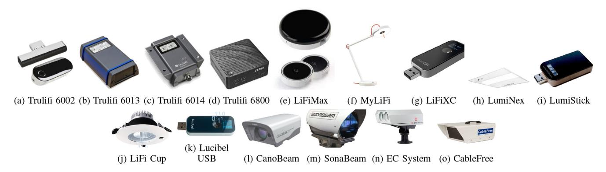

Fig. 8. Illustration of commercial OWC-IoTT products listed in Table III.

a low transmission delay by reaching a desirable propagation speed. Nonetheless, water conductivity mainly restricts their operational bandwidth to 30–300 Hz and communication range to 10 m. Therefore, underwater RF systems are typically power-hungry, costly, and bulky with large antennas. For these reasons, they cannot be used for deep-sea communications and are limited to work in sea surface interface systems. Thanks to its long transmission range of several kilometers, acoustic communication is a proven and wide-spread technology used for underwater systems. Nevertheless, acoustic systems suffer from high latency and low data rates due to the low propagation speed (1500 m/s) and limited bandwidth (10-30 KHz), respectively [10]. Acoustic systems are also prone to Doppler spread, ambient noise caused by hydrodynamics and vessel traffic, and multi-path fading.

At the expense of a limited communication range (50-100 m), underwater optical wireless communications can support high data rates in the order of Gbps and very low latency thanks to the speed of light in the water ( $\approx 2.55 \times 10^8$  m/s). The superposition of absorption and scattering effects constitutes the extinction coefficient that primarily characterizes the propagation loss of the aqua's light waves. The extinction-level depends on wavelength, water depth, water, and types (e.g., pure, clear, coastal, harbor) [16]. For instance, blue and green lights exhibit better propagation characteristics in clear and coastal waters, respectively. On the other hand, the divergence angle (i.e., directivity) of the light source beamwidth governs the fundamental trade-off between range and beamwidth. For example, LEDs can reach many nearby nodes thanks to its wide-beam, collimated beams of LDs can communicate with far away nodes at desirable rates. UOWC also suffers from channel impairments such as turbulence, pointing errors, misalignment [17]. Albeit its advantages, limited range, and highly directed nature of OWC are the main limitations, especially when the sparsity of underwater networks are considered. At this point, the hybridization of optic and acoustic systems can reap the full benefit of these systems as they complement one another's disadvantages.

In this section, we first explain a hybrid optic and acoustic, namely opto-acoustic, network architecture to explain how integration of these technologies can enable an IoWT network architecture. Then, we discuss technical challenges of OWC-IoWT systems and networks and present recent

advances towards prototypes, testbeds, and commercial OWC-IoWT products. Lastly, we conclude the section with a summary, insights, open problems, and future research directions.

## A. An Opto-Acoustic IoWT Network Architecture

Although IoTT devices can be integrated with existing indoor/outdoor wired/wireless network infrastructure, there is not a readily available underwater network infrastructure for ubiquitous connectivity of IoWT devices. Therefore, a hybrid IoWT network architecture is necessary, which can be designed in either an ad hoc or infrastructural, or mixed structure as demonstrated in Fig. 9 [6]. In the ad-hoc fashion, IoWT nodes are distributed across the network are connected through the participation of IoWT nodes along a routing path, which is dynamically calculated centrally or distributively as per the network conditions. On the other hand, infrastructure networks deploy acoustic APs (AAPs) and optical base stations (OBSs) to serve as a gateway for nodes located in their coverage regions. In the mixed architecture, the available coverage provided by the infrastructure can be extended through multi-hop communications between ad hoc IoWT nodes in both horizontal and vertical directions.

The backbone network of mixed architecture may consist of wired or wireless links between OBSs, AAPs, surface stations, and underwater data/cloud centers. OBSs can be designed as multi-faceted spheres that can provide 360° connectivity using transceivers built on each face. Indeed, OBSs are already implemented in [296], and a cellular UOWC network is conceptualized in [297]. Sea-bed OBSs can communicate with each other via fiber optical cables and/or horizontal collimated light beams (i.e., H-Haul links) and/or in the seabed. Similarly, vertical collimated light beams (i.e., V-Haul links) can be used to reach the central/surface OBS via intermediate OBSs that are hung on the tether of buoys along with AAPs down to the moor at the seabed. The recent breakthroughs in LD based UOWC systems listed in Table V show that both V-Haul and H-Haul links can be realized by using long-range and high data rate laser beams. If the tethered buoys are equipped with solar-panels and RF modules, they can supply power and connectivity to AAPs and intermediate OBSs through power+data cables on the tether. Likewise, a tidal turbine could also power

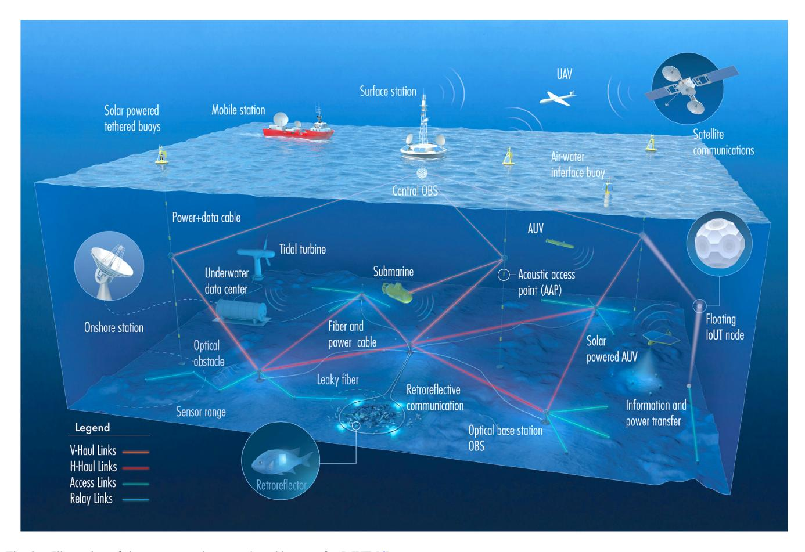

Fig. 9. Illustration of the opto-acoustic network architecture for IoWT [\[6\]](#page-34-5).

the fixed infrastructural network elements on the seabed by means of power cable lay-down along with fibers. Moreover, solar-powered floating buoys can also be used as an alternative mobile air-water interface. The interconnection between the seabed and sea-surface systems enables the integration of IoWT and IoTT ecosystems via mobile stations, unmanned aerial vehicles (UAVs), and satellites.

The access network may be comprised of IoWT devices which may have 1) actuators to interact with the environment; 2) sensors that measure multiple physical phenomena (e.g., temperature, pollution, pH levels, salinity, etc.), and 3) autonomous underwater vehicles (AUVs) to carry out collaborative mobile tasks. As an alternative to active transceivers, low-cost IoWT devices with limited size and battery may have passive transceivers such as acoustic tags, optical retro-reflectors, and passive integrated transponders. AUVs are generally powered by batteries that can be charged by onboard solar panels and can operate at different depths depending on hardware specifications. They are sophisticated platforms equipped with several subsystems such as positioning-acquisitioning-and-tracking (PAT) mechanisms and navigation systems, onboard data processing, and various sensors/actuators.

Interestingly, an underwater data/cloud center can orchestrate the mixed-structure hybrid opto-acoustic underwater network illustrated in Fig. [9.](#page-20-0) Microsoft has recently launched

project Natick[8](#page-20-1) where a cylindrical tube-shaped data center is sunk into the sea. Although the purpose of this project is to reduce cooling costs and benefit from offshore renewable energy sources, this concept can also be used to provide necessary computational power and data storage for the IoWT ecosystem as well as its integrity with terrestrial telecommunication infrastructure.

## *B. Technical Challenges of OWC-IoWT Networking*

In order to understand OWC-IoWT networking challenges, it is important to provide a background on fundamental tradeoffs between key UOWC performance metrics. Based on the Beer-Lambert channel model, the opposite behavior of data rate and BER is illustrated with respect to increasing distance in Fig. [10\(](#page-21-0)a), where the default values of BER and rate are set to forward error correction (FEC) threshold (3.8 × 10−8) and 1 Mbps, respectively. Fig. [10\(](#page-21-0)a) also shows that data rate and BER performs differently at different divergence angles (i.e., beamwidths). For instance, 1 Mbps rate is achievable at ranges 80 m and 90 m by setting the minimum and maximum divergence angles to θmin = 0.25 radian and θmax = 100 milliradian, respectively. Therefore, Fig. [10\(](#page-21-0)b) shows how communication range decreases as the divergence angle and data rate increase. One can deduce from the 1 Kbps curve

8https://natick.research. microsoft.com

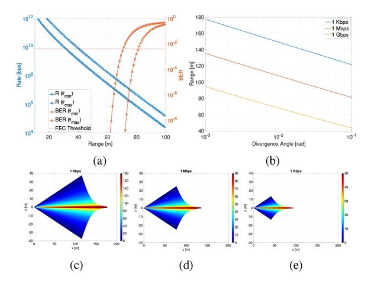

Fig. 10. Fundamental tradeoffs between key UOWC performance metrics [\[298\]](#page-41-7): a) range vs. rate and BER, b) range vs. divergence angle, c) coverage region at 1 Kbps, d) coverage region at 1 Mbps, and e) coverage region at 1 Gbps.

TABLE IV LITERATURE ON CONNECTIVITY, RELIABILITY, ROUTING, AND LOCALIZATION ASPECTS OF OPTO-ACOUSTIC IOWT NETWORKS

| Ref.  | Year | Topic        | Network | Description                                                                                     |
|-------|------|--------------|---------|-------------------------------------------------------------------------------------------------|
| [299] | 2018 | Connectivity | Optic   | A graph theoretic connectivity analysis                                                         |
| [300] | 2018 | Connectivity | Optic   | Impacts of limited connectivity on localization accuracy                                        |
| [301] | 2020 | Localization | Optic   | Performance analysis for connectivity and localization                                          |
| [6]   | 2020 | Connectivity | Hybrid  | Degree of connectivity under various beam widths                                                |
| [302] | 2019 | Reliability  | Optic   | Distributed URLLC routing protocol                                                              |
| [303] | 2020 | Routing      | Optic   | End-to-end performance analysis of relaying and routingtechniques under location uncertainty    |
| [304] | 2012 |              | Hybrid  | Multi-level Q-learning based routing protocol                                                   |
| [305] | 2018 | D (          | Optic   | Modeling and performance analysis of decode and amplify relaying based relaying protocol     |
| [306] | 2019 | Routing      | Optic   | Sector-based distributed opportunistic routing protocol                                         |
| [307] | 2019 |              | Optic   | Multi-agent reinforcement learning routing protocol                                             |
| [298] | 2020 |              | Hybrid  | Opportunistic routing protocol tailored for maximum rate, minimum delay and energy consumption. |
| [6]   | 2020 |              | Hybrid  | Widest-path routing for maximum capacity                                                        |
| [308] | 2018 |              | Optic   | Robust 3D Localization via Low Rank Matrix Completion                                           |
| [309] | 2018 |              | Hybrid  | Energy harvesting impacts on network localization                                               |
| [310] | 2018 | Localization | Optic   | 3D outlier detection and optimal anchor placement                                               |
| [311] | 2020 | Localization | Optic   | Analysis of 3D localization with uncertain anchor positions                                     |
| [312] | 2020 |              | Optic   | Localization of energy harvesting empowered networks                                            |
| [6]   | 2020 |              | Hybrid  | Impacts of divergence angle on network localization                                             |

in Fig. [10\(](#page-21-0)b) that UOWC does not deliver significantly better performance than acoustic systems, which can already reach several Kbps over several hundred meters. In Fig. [10\(](#page-21-0)c)[-10\(](#page-21-0)e), the coverage region of a transmitter located at the origin is shown for data rates of 1 Kbps, 1 Mbps, and 1 Gbps, respectively. The colorful shape is obtained by a combination of sector shapes, which are obtained by changing the divergence angle from 1 milliradian to 0.1 rad, and color represents the radius of the coverage region at a given beam width. It can be seen that the coverage region expands as the data requirement is relaxed. It can be concluded from Fig. [10](#page-21-0) that UOWC range and coverage is a subjective metric that closely depends on hardware parameters as well as required QoS levels. In light of this background, we next discuss the major technical challenges faced by OWC-IoWT networking. We refer interested readers to Table [IV](#page-21-1) for a list of references covered in the following subsections.

*1) Connectivity:* The IoWT node density is expected to be low due to the cost and deployment challenges. The node sparsity directly impacts the degree of connectivity that determines

the interwoven relations among basic network performance metrics such as routing, localization, and reliability. No matter what kind of optimal routing algorithm employed, there is no way to find a multi-hop communication path if the network is partitioned [\[305\]](#page-41-8), [\[306\]](#page-41-9). On the other hand, network localization accuracy is proportional to the degree of connectivity as well-connected network yields more pair-wise range measurements, which naturally reduces the localization error [\[299\]](#page-41-10), [\[300\]](#page-41-11), [\[301\]](#page-41-12). Since the highly directed nature of OWC requires LoS links, the node location is the most critical information for the P2P link performance between OWC-IoWT nodes, which intuitively affect the overall performance of the OWC-IoWT network [\[303\]](#page-41-13).

Considering this challenge, a reinforcement learning-based solution for a P2P UOWC system has been recently proposed in [\[335\]](#page-42-0) to solve PAT problems by defining a beam adaptation method that includes both beamwidth and beam orientation adaptation to improve the link quality while maintaining a high success rate. Extended FoV photonic receivers can also ease the PAT requirements for UOWC links, such as those based on scintillating fibers [\[336\]](#page-42-1). Using off-the-shelf large-area solar panels to decode information and harvest energy simultaneously can equally offer resilience to underwater propagation effects, as discussed in [\[337\]](#page-42-2).

*2) Routing:* Since one of the main disadvantages of UOWC is its short communication in comparison with the network area, multi-hop communication is a must to boost network connectivity by extending the communication range, improve the end-to-end system performance by expanding the coverage area, decrease latency, and increase energy efficiency [\[303\]](#page-41-13). The full benefits of multi-hop communications can only be attained with an expeditious routing algorithm that accounts for the underwater channel characteristics. Although there are many routing protocols developed for underwater acoustic networks [\[338\]](#page-42-3), none of them is applicable for IoWT devices due to the directivity of OWC.

As shown in Table [IV,](#page-21-1) new protocols have recently been developed to account for the aforementioned fundamental tradeoffs of UOWC. In [\[6\]](#page-34-5), authors employ the widest-path algorithm to find a route with the maximum end-to-end capacity and evaluate its performance at different divergence angles. In [\[304\]](#page-41-14) and [\[307\]](#page-41-15), authors propose routing protocols based on multi-level and multi-agent reinforcement learning, respectively. In [\[305\]](#page-41-8), modeling and performance analysis of decode-and-forward and amplify-and-forward based multihop communications. In [\[306\]](#page-41-9), Celik et al. develop a sector-based opportunistic routing by leveraging the broadcast nature of OWC propagation. The opportunistic routing has shown been to improve overall reliability and reduce the total number of retransmission since another node can take over the forwarding responsibility if the selected forwarder fails in reception. This opportunistic routing scheme is further extended to both distributed and centralized schemes in [\[298\]](#page-41-7) where the protocol can be tailored for maximum rate, minimum delay, and minimum energy consumption objectives.

The directivity and short-communication range of UOWC also causes performance degradation in routing performance. Therefore, the authors of [\[304\]](#page-41-14) and [\[298\]](#page-41-7) mitigate such

|                              | Study                  |              |                          | IoT | Band        |                  |            |            | OWC            |                            |                 |                | Comp.        | Higher            |
|------------------------------|------------------------|--------------|--------------------------|-----|-------------|------------------|------------|------------|----------------|----------------------------|-----------------|----------------|--------------|-------------------|
| Ref.                         | Type                   | Year         | Application              | MWL | [nm] (C)    | Topology         | Tx Type | Rx Type | Data Rate   | Error Rate              | Distance [m] | Mod.           | Tech.        | Layers            |
| [313]                        |                        | 2016         | Tap Water Tank        | N/A | В           | P2P              | LD         | PD         | 2 G 1G      | 2.8E-5 3.0E-3           | 12 20        | ООК            | N/A          | N/A               |
| [314]                        |                        | 2017         | Tap Water Tank        | N/A | G           | P2P              | LD         | PD         | 3.5 G 2.7 G | FEC                        | 21 35        | ООК            | N/A          | N/A               |
| [315]                        |                        | 2017         | Air-Water Interface   | N/A | G           | P2P              | LD         | PD         | 5.5 G          | 2.6E-3 2.4E-3           | 5 (A) 21 (W) | OFDM 32-QAM | FSO          | N/A               |
| [316]                        |                        | 2017         | Tap Water Tank        | N/A | R G B | P2P              | VCSEL      | PD         | 25 G           | 2.2E-3 2.0E-3 2.3E-3 | 5               | WDM QAM     | N/A          | N/A               |
| [317]                        |                        | 2018         | Turbid Water Tank     | N/A | В           | P2P              | VCSEL      | PD         | 25 G           | 3.0E-9                     | 5               | ООК            | N/A          | N/A               |
| [318]                        | nts                    | 2015         | Tap/Turbid Water Tank | N/A | В           | P2P              | LD         | PD         | 7.3 G          | 3.5E-3                     | 15              | DMT            | N/A          | N/A               |
| [319]                        | perime                 | 2019         | Tap Water Tank        | N/A | G           | P2P              | LD         | PD         | 0.5 G          | 2.5E-3                     | 100             | оок            | N/A          | N/A               |
| [320]                        | Labaratory Experiments | 2019         | Tap Water Tank        | N/A | В           | P2P              | LD         | PD         | 9 G            | 1.0E-9                     | 82              | PAM4           | FSO Fiber | N/A               |
| [321]                        | abarat                 | 2019         | Tap Water Tank        | N/A | В           | P2P              | LD         | PD         | 2.5 G          | 3.5E-3                     | 60              | ООК            | N/A          | N/A               |
| [322]                        | 1                      | 2020         | Tap Water Tank        | N/A | G           | P2P              | LD         | PD         | 3.3 G          | 3.8E-3                     | 56              | OFDM 32-QAM | N/A          | N/A               |
| [323], [324]                 |                        | 2006         | ROV                      | N/A | В           | P2P              | LD         | PD         | 1 M            | N/A                        | 100             | OOK            | N/A          | N/A               |
| [325]                        |                        | 2007         | ROV OBS               | N/A | В           | P2P Broadcast | LED        | PD         | 10 M           | N/A                        | 10              | N/A            | N/A          | N/A               |
| [326], [327] [328], [329] | se                     | 2010 2013 | ROV Video Stream      | N/A | В           | P2P              | LED        | PD         | 1.2 M 2.8 M | N/A                        | 30 50        | ASK DPIM    | N/A          | UDP SPI        |
| [330], [331]                 | otyF                   | 2016         | Modem                    | N/A | В           | P2P              | LED        | PD         | 10 M           | N/A                        | 10              | N/A            | Acoustic     | SDN               |
| [332]                        | Prototypes             | 2017         | Modem                    | N/A | В           | P2P              | LED        | SiPM       | 3 M            | N/A                        | 17-60           | OOK            | N/A          | N/A               |
| [333]                        | P.                     | 2018         | Modem                    | N/A | R/G/B       | P2P              | LD         | PD         | 12.5 M         | N/A                        | 46              | N/A            | N/A          | RS232C TCP/UDP |
| [334]                        |                        | 2018         | ROV                      | N/A | В           | P2P              | LED        | PD         | 10 M           | N/A                        | 10              | N/A            | N/A          | SDN               |

TABLE V LABORATORY TESTBEDS AND PROTOTYPES FOR OWC-IOWT

shortcomings by leveraging the omni-directional long-range propagation of acoustic systems for node discovery, network control, and node coordination purposes.

*3) Localization:* The network localization is of utmost importance since the data gathered by an IoWT node is useful only if it refers to a geographical location. It is also necessary for applications such as target/intruder detection, data tagging, routing protocols. For UOWC, it is particularly a must as misalignment, and pointing errors caused by location uncertainty deteriorate the performance significantly [\[303\]](#page-41-13). Unfortunately, the GPS cannot be used for underwater applications as its weak signals cannot propagate through the water.

The recent advances in optic and opto-acoustic localization techniques are listed in Table [IV.](#page-21-1) Since the range measurement based localization methods depends on received signal strength information and not associated with data rate at all, the hybrid localization approach was shown to perform much better than purely acoustic or optic algorithms [\[6\]](#page-34-5), [\[309\]](#page-41-16). Since the energy availability directly impacts the node density and degree connectivity of underwater networks, the localization accuracy of the energy harvesting empowered IoWT nodes are also considered in [\[309\]](#page-41-16), [\[312\]](#page-41-17). Since anchor locations are typically considered to be given and important to convert local network position to the global coordinates, a precise and stable anchor position is needed. Different from the above works, there are also efforts on 3D localization methods that investigate localization robustness [\[308\]](#page-41-18), optimal anchor placement to improve localization errors [\[310\]](#page-41-19), and impact of anchor location uncertainty on the localization performance [\[311\]](#page-41-20).

## *C. Testbeds, Prototypes, and COTS Products*

In the last decade, there has been a growing interest in developing proof of concept testbeds and prototypes to address technical challenges of developing OWC-IoWT devices and demonstrate their performance in water tanks, swimming pools, rivers, and the sea. The interest in academy finally ended up with several commercially available OWC-IoWT devices. In the consequent subsections, we preset the recent advances that evolved OWC-IoWT concept into a reality.

*1) Laboratory Testbeds:* As shown in Table [V,](#page-22-0) the majority of laboratory testbeds are developed with laser transmitters and experiments are conducted in water tanks. Although it is not possible to make a fair comparison between these works as testbed are not identical, following conclusions can be drawn from the reported throughput and BER values along with the channel length: A narrow beam OWC-IoWT system can reach several Gbps rate over several ten meters while keeping the BER below the FEC threshold. This is reduced to several hundreds Mbps if the distance is in the order of hundred meters. Albeit their remarkable performance, the narrow-beam OWC-IoWT systems require efficient PAT mechanism for precise alignment between the transceivers, which limits their use to fixed terminals and advanced mobile terminals (e.g., remotely operated underwater vehicles (ROVs), AUVs, etc.). That is, they are not suitable for relatively lost-cost and low formfactor ad-hoc IoWT devices. Indeed, reported performances in Table [V](#page-22-0) supports the idea of using V-Haul and H-Haul links between infrastructure based IoWT network elements (e.g., OBS) to provide high-speed connectivity.

Noting that the testbeds listed in Table [V](#page-22-0) is not exhaustive, we would like to emphasize the following two works: In [\[315\]](#page-41-21), Chen et al. developed an FSO-UOWC interface system that can reach a gross bit rate 5.5 Gbps over 5 m and 21 m air and water channel distance, respectively. Since the bottleneck of the entire system is the underwater link, the same endto-end system performance could be reached over a longer air channel distance. Indeed, this work can be regarded as a proof of air-water interface shown in Fig. [9.](#page-20-0) A similar interface is developed in [\[320\]](#page-41-22) where Li et al. develop a system that can reach 9 Gbps gross bit rate over 50 m FSO link, 30 m gradedindex fiber, and 2 m UOWC links. Such a system is especially useful to provide UOWC to ROVs/AUVs by extending fiber links from a surface station.

*2) Prototypes:* One of the earliest example of UOWC system were developed by Farr et al. in [\[323\]](#page-41-23) where authors implement a hemispherical omni-directional OWC transceiver that can achieve 10 Mbps rate over 100 m by using six blue LEDs. In addition to mounting the developed modem to a ROV, authors conceptualized their use as OBSs moored to the sea bed. In [\[324\]](#page-41-24), the developed systems are further exploited for untethered ROV that muling data from sea floor borehole observatories equipped with developed hemispherical OWC transceivers.

To the best of our knowledge, the cellular OWC concept and its implementation is presented by Baiden and Bissiri in [\[325\]](#page-41-25), which is based on a project supported by The Canadian Research Chair, The National Science Foundation (NSF), and The National Aeronautics and Space Administration (NASA) in 2002. Throughout the project, authors developed an icosahedrons shaped underwater optical OBS to provide 360◦ coverage and achieved 10 Mbps rates over 10 m distance after several trials between a floating laboratory and the OBS placed at the lake bed. Considering both the promising results achieved by this early proof of concept, we believe more effective OBS systems can be developed thanks to technological advances seen in photonics in the last two decades.

In [\[326\]](#page-41-26), Doniec et al. developed AquaOptical system that is capable of reaching 1.2 Mbps up to 30 m using blue LEDs and PDs. In [\[328\]](#page-41-27), this system is upgraded to bidirectional AquaOptical II that can achieve 2.28 Mbps up to 50 m using discrete pulse interval modulation (DPIM). Both systems are designed to use UDP over a serial peripheral interface (SPI). Authors also demonstrated applications of both AquaOptical and AquaOptical II in [\[327\]](#page-41-28) and [\[329\]](#page-41-29), respectively. AquaOptical is used for the control of AMOUR VI ROV in [\[327\]](#page-41-28) where various system performance metrics (e.g., delay, packet loss, etc.) were tested at various distances inside a swimming pool. On the other hand, AquaOptical II is used for robust real-time underwater digital video streaming in [\[329\]](#page-41-29) where authors tested frame success rate at different image quality, resolution, and channel distances also in a swimming pool.

In [\[352\]](#page-42-4), Mora et al. developed sensorbots, an omnidirectional ad-hoc UOWC system consisting of several LEDs encapsulated in a transparent sphere. Noting that sensorbots are able to operate at 2 km water depths, they are very

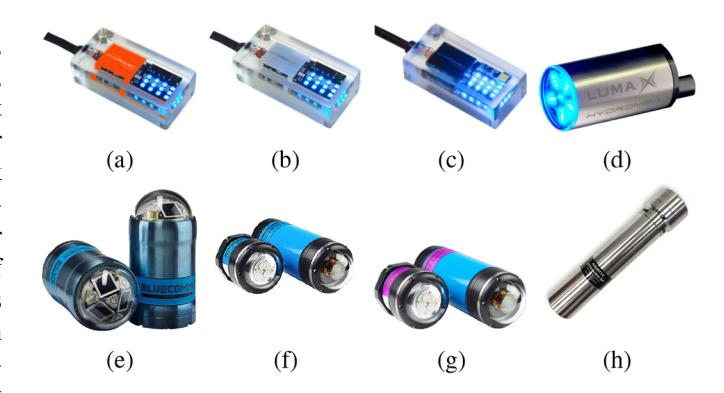

Fig. 11. Commercial OWC-IoWT products of Hydromea [a) LUMA 100, b) LUMA 250, c) LUMA 500ER, and d) LUMA-X], Sonardyne e) Bluecomm 100, f) Bluecomm 200, g) Bluecomm 200 UV]; and Auquatech [h) Op2/Op2L].

interesting examples of floating OWC-IoWT devices illustrated in Fig. [9.](#page-20-0) Since there is no mention to rates and range, [\[352\]](#page-42-4) is not included in Table [V.](#page-22-0)

In [\[330\]](#page-41-30), Bartolini et al. developed an UOWC modem, namely OptoComm, that can achieve 10 Mbps over 10 m distance using LEDs and PDs. In [\[331\]](#page-41-31), authors then hybridized OptoComm with an acoustic modem and integrated under the SUNSET framework, a whole software defined protocol stack with capability of supporting different protocols at different layers. Although OptoComm is similar to other prototypes listed in Table [V,](#page-22-0) its hybridization and integration within a software defined networking (SDN) framework is quite inspiring and revolutionary. The developed whole protocol stack system was able to transfer up to 1.5 GBytes of data in a short duration of time. The SDN based hybrid opto-acoustic system developed in [\[331\]](#page-41-31) is further improved and integrated to a ROV system in [\[334\]](#page-42-5) where numerical results showed 10 Mbps is achievable over 10 m distance in sea water trials.

In [\[332\]](#page-41-32), Leon et al. developed a prototype that can achieve 3 Mbps over 17 m and 60 m distance under Jerlov 1 and Jerlov 5 water classification, respectively. Different from other prototypes in Table [V,](#page-22-0) authors developed an omnidiretional receiver by using silicon photo multipliers (SiPM). Notice in Table [V](#page-22-0) that all prototypes are built on LED transmitter, excluding [\[333\]](#page-41-33) where RBG LD is shown to achieve 12.5 Mbps over 46 m channel length.

*3) COTS Products:* The growing scientific interest in OWC-IoWT systems has continued with many successful commercial products as listed in Table [VI,](#page-24-0) some of which are also shown in Fig. [11.](#page-23-0) Hydromenia offers LUMA product series, which come with four different types: LUMA 100 [\[339\]](#page-42-6), LUMA 250 [\[340\]](#page-42-7), LUMA 500ER [\[341\]](#page-42-8), and LUMA X [\[342\]](#page-42-9). LUMA products support RS232, RS485, and Ethernet interface and communicate over a LED/PD transmitter/receiver in waters as deep as 6 km. LUMA 500 ER is an extended range (>50 m) version of LUMA 100 (2 m) and LUMA 200 (7 m). All these three products have a very small form factor compared to LUMA X, which can provide 10 Mbps speed over 50 m. One can observe that the packaging size and transmission power requirements increases as data rate and range increases.

| Company     | Pro          | oduct      | Ref.  | Size [cm]           | Weight [g] | Depth [m] | Range [m] | Rate [bps] | Tx/Rx Type | Power Tx. [W] | Wavelength [nm] (Color) | Angle Tx/Rx | Comm. & Netw. Interface |     |        |
|-------------|--------------|------------|-------|------------------------|---------------|--------------|--------------|---------------|---------------|------------------|----------------------------|----------------|----------------------------|-----|--------|
|             |              | 100        | [339] |                        |               |              | 2            | 100 K         |               | 1-2              |                            |                | DC 222                     |     |        |
| Hydromea    | LUMA         | 250LP      | [340] | $10 \times 5 \times 3$ | 250           | 6000         | 7            | 250-600 K     | LED/PD        | 2-5              | N/A (B)                    | 60/60          | RS 232 RS 485           |     |        |
| пушошеа     | LUMA         | 500ER      | [341] |                        |               | 0000         | >50          | 500 K         | LED/FD        | 2-5              | N/A (b)                    | 00/00          | Ethernet                   |     |        |
|             |              | X          | [342] | 10 ×ø 6                | 650           |              | >50          | 10 M          |               | 2-5              |                            |                | Ethernet                   |     |        |
|             |              | 100        | [343] | 24 ×ø 12               | 5200          |              | 15           | 1-5 M         | LED/PD        | 6                | 450 (B)                    | 60/60          | DL/UL,                     |     |        |
|             |              | 200 (Tx)   | [344] | 20 ×ø 14               | 3600          |              | 150          | 2.5-10 M      | LED           | 6                |                            | Omni D.        | TDMA,                      |     |        |
| Sonardyne   | BlueComm     | 200 (Rx)   | [344] | 38 ×ø 14               | 7100          | 4000         | 150          | 2.5-10 WI     | PD            | N/A              | 400-800                    | Ollilli D.     | UDP.                       |     |        |
| Soliaruylic | BlueCollilli | 200UV (Tx) | [345] | 20 ×ø14                | 3600          | 4000         | 75           | 2.5-10 M      | LED           | 6                | (B/W)                      | Omni D.        | TCP/IP,                    |     |        |
|             |              | 200UV (Rx) | [545] | 38 ×ø 14               | 7100          |              | 13           | 2.5-10 WI     | PD            | N/A              |                            | Ollilli D.     | Ethernet                   |     |        |
|             |              | 5000       | [346] | N/A                    | N/A           |              | 7            | 500 M         | LD/PD         | N/A              | N/A                        | Focused        | Ethernet                   |     |        |
| Aquatec     | Aqua         | Op2        | [347] | 28 ×ø 7                | 4000          | 3500         | 3500         | 3500          | 00 1          | 80 K             | LED/PD                     | 9-             | N/A (B)                    | N/A | RS 232 |
| Aquatec     | Modem        | Op2L       | [348] | 20 00 /                | 1000          | 500          | 1            | 80 K          | LED/TD        | 36               | N/A (b)                    | N/A            | RS 485                     |     |        |
| UON         | O            | MM         | [349] | 21 ×ø 14               | N/A           | 4000         | 15           | 115 K         | LED/PD        | 3.3              | N/A (B)                    | Omni D.        | RS 232                     |     |        |
| A 1 1       | 101          | 1201       | [250] | 28 ×ø 10               | 2500          | C1           | 40           | 10 M          | LED/PD        | NT/A             | N/A (D)                    | 25/25          | Ethernet/TCP               |     |        |
| Ambalux     | 10.          | 13C1       | [350] | 20 × Ø 10              | 2300          | 61           | 40           | 10 M          | LED/PD        | N/A              | N/A (B)                    | ± 5            | IP/UDP                     |     |        |
| Shimadzu    | MO           | C100       | [351] | 25 × ø 13              | 2850          | 3500         | >10          | 95 M          | LD/PD         | N/A              | 450-640 (B/G)              | Focused        | N/A                        |     |        |

TABLE VI COMMERCIAL OWC-IOWT PRODUCTS

Sonardyne is another company that offers a wide variety of products: Bluecomm 100 [\[343\]](#page-42-10), Bluecomm 200 [\[344\]](#page-42-11), Bluecomm 200UV [\[345\]](#page-42-12), and Bluecomm 5000 [\[346\]](#page-42-13). Bluecomm 100 has LED transmitters and PD receivers installed together to provide 15 Mbps bi-directional communications over 5 meters. On the other hand, Bluecomm 200 UV and Bluecomm 200 can provide up to 10 Mbps over 75 m and 150 m channel length, respectively. Of course, this performance enhancement is achieved at the expense of separate transmitter and receiver units and extra power consumption. Even if Sonardyne mentions another product that can achieve 500 Mbps using LD transmitter, no further information is provided in their website. Bluecomm products support a wide range of communication protocols and interfaces (time division multiple access (TDMA), UDP, TCP/IP, Ethernet) and designed especially for OWC-IoWT vehicles (e.g., ROV/AUC).

Aquatec also developed two OWC-IoWT modes: Op2 [\[347\]](#page-42-14) and its lighter version Op2L [\[348\]](#page-42-15). Although they have the same performance, the operational depth of Op2L is limited reduced from 4 km to 1 km. As can be seen from Table [VI](#page-24-0) that these products weight several kilograms in the air, while their weight in water is much lower. Their size and weight is mostly because of the waterproof materials and fabrication.

# *D. Summary, Insights, and Open Problems*

Even though IoWT could mark the beginning of a new era for scientific, industrial, and military underwater applications, realizing IoWT is an engineering challenge due to the harsh aquatic environment and its peculiar impacts on wireless channels regardless of the underlying communication technology. Therefore, there is no best-fit wireless method to facilitate IoWT networks as each has its virtues and drawbacks. While an RF system can support a low transmission delay by reaching a desirable propagation speed, thanks to their tolerance to water's turbid and turbulent nature, their operational bandwidth to 30–300 Hz and communication range to 10 m. Therefore, RF systems are mostly considered to serve as an air-water interface at the sea surface stations. On the other hand, acoustic communication is a proven and widespread technology used for underwater systems thanks to its long transmission range of several kilometers. Nonetheless, acoustic systems suffer from low data rates and high delay due to limited bandwidth and low propagation speed, respectively.

On the contrary, UOWC systems can transmit at rates ranges between Mbps and Gbps over several tens and hundreds of meters, respectively. This is because the beamwidth of the light source mainly governs the communication range and rates. Moreover, UOWC does not suffer from transmission delays since the speed of light in the aqua is very close to lightspeed in the air. Therefore, UOWC can enable a high-speed and low-latency infrastructure for IoWT networks. Although OWC-IoWT networks are possible for small-scale cellular applications through OBSs with omnidirectional transceivers [c.f. Fig. [9\]](#page-20-0), their extension to largescale IoWT networks requires effective routing mechanisms, which is especially challenging when the directivity of UOWC systems is taken into account. At this point, future works should concentrate on the hybridization of the optical and acoustic systems to mitigate the directivity/range and bandwidth/delay limitations of optic and acoustic systems, respectively.

The academic interest in the OWC-IoWT concept has finally ended up with several commercially available OWC-IoWT devices. However, available COTS products are mainly suitable for P2P communication purposes for fixed and mobile platforms (e.g., AUVs). To the best of the authors' knowledge, these products are not exploited to build a small or large scale OWC-IoWT network and integrated with terrestrial networks yet. The indoor and outdoor OWC-IoTT networks are supported by various standards [c.f., Table [II\]](#page-7-0), which embrace many OWC technologies (VLC, IR, UV, OCC, etc.) by defining different device classes (infrastructure, mobile, vehicle) with five different PHY types for different QoS requirements. Unfortunately, none of them recognizes aqua as a transmission medium as well as its specific PHY and MAC layer distinctions, which requires future standardization efforts to specify PHY and MAC layer operations. Unlike the OWC-IoTT devices which can be integrated to terrestrial wired/wireless network infrastructure, there is no readily available underwater network for OWC-IoWT devices. Therefore, OWC-IoWT networks also requires a different approach at higher layers due to the aforementioned challenges in connectivity, reliability, localization, and routing. Therefore, we believe that the extension of these standards to include UOWC systems will pave the way for OWC-IoWT networks.

## V. INTERNET OF BIOMEDICAL THINGS (IOBT)

The IoBT, also referred to as Internet of Bodies, broadly pertains to wearable, implantable, ingestible, and injectable IoT devices which can be used for a broad scope of applications such as medicine, wellness, sport/fitness, entertainment, to name but a few [\[1\]](#page-34-0). Having its root in wireless body area networks (WBANs) [\[353\]](#page-42-16), the IoBT is an imminent extension to the vast IoT domain and has been recognized as a critical technology for revolutionizing the public health and safety sector, which has been proven to be inadequate during the humanitarian and economic crisis caused by the novel coronavirus pandemic (a.k.a, COVID-19) [\[354\]](#page-42-17). IoBT differs from their indoor/outdoor IoTT counterparts because of the distinctive QoS/Quality of Experience (QoE) demands of medical applications as well as peculiar and dynamic channel impairments in-on-and-around the human body. In particular, IoBT designed for patient monitoring applications has stringent reliability, latency, and security requirements as it handles users' critical and sensitive physiological data. However, miniaturization efforts to improve QoE of implantable, ingestible, and injectable IoBT devices leave a limited room for the battery size. Therefore, limited energy availability stands as the major obstacle in the way of fulfilling these multiple and conflicting QoS demands at the same time.

Accordingly, this section first provides a comparative analysis to provide valuable insights into how OWC can complement traditional RF-IoBT. Then, we present subtle issues related to in/on/off-body OWC-IoBT and survey the literature. Since operational lifetime is one of the primary design issues, SLIPT is also covered. Lastly, we conclude the section with a summary, insights, open problems, and future research directions.

## *A. A Comparative Analysis of RF-IoBT and OWC-IoBT*

The RF channel attenuation dynamics in-on-and-around the human body are quite distinct from regular RF channels because of the lossy, heterogeneous, and dielectric nature of the human body. Different tissue types exhibit various propagation phenomena (e.g., reflection, refraction, diffraction, absorption, scattering) at different frequencies with varying levels. In-body channel gains are primarily determined by the distance between the transceivers as well as dielectric properties of tissues and organs along the propagation path. On the other hand, placement of on/off-body RF-IoBT directly determines the link distance and type (LoS or NLoS) as a result of irregular body shapes and curvatures. These factors have a significant impact on the first-order channel statistics (FoCS),i.e., path loss and shadowing. Unlike the in-body RF-IoBT devices, on/off-body RF-IoBT devices are also susceptible to the dynamic changes in the body postures/gaits and surrounding environment. Therefore, both intentional and involuntary

mobility of the human body yield time-variant changes in path loss and shadowing effects, which determines the second-order channel statistics (SoCS) such as delay spread, power delay profile, level crossing rate, average fade duration, autocorrelation) channel statistics. Since FoCS/SoCS follow different distributions at different frequency bands and channel mediums (air, skin, deep tissue), the IEEE 802.15.6 standard specified a wide variety of narrowband (NB) and ultra-wideband (UWB) channels for the use of WBANs [\[355\]](#page-42-18). Next, we provide a comparative analysis between NB/UWB RF-IoBT and OWC-IoBT from different aspects:

- • The radio front end is one of the most complex and power-hungry sub-systems of RF-IoBT devices. Hence, it limits the operational lifetime per charging cycle and necessitates a larger battery capacity. This naturally requires a larger packaging and frequent replacement, which is not a viable option, especially for implantable, ingestible, and injectable IoBT. Alternatively, OWC-IoBT transceivers can have package size in millimeter-scale thanks to available pico LEDs with less than 1 mm3 and PD arrays of several mm2 area. Moreover, recent advances in LED fabrication has made it possible to have wall-plug efficiency more than unity. For example, authors of [\[356\]](#page-42-19) reported 69 pW of light using 30 pW of supplied electrical power. By also using simple light modulation schemes, miniature and energy-efficient OWC-IoBT can provide very high bit/joule levels for long-life yet high-performance IoBT devices desired by many applications.
- • RF-IoBT modules are susceptible to interference and co-existence issues with the nearby IoT devices operating on the same band, which exacerbates in crowded license-free RF bands. For example, IoT devices are typically designed to operate on ISM bands for two reasons: 1) there is no associated licensing fee, and 2) the ISM compatible RF front end modules are cheap and readily available. Considering the ever-increasing number of IoT devices, interference and co-existence problems are non-trivial for IoBT applications that require URLLC. Noting that light spectrum is also license-free, interference and co-existence issues for OWC-IoBT is minimal thanks to the vast spectrum availability, high directivity, and low penetration attributes of lightwaves. Even though on/off-body OWC-IoBT transceivers operating at VL spectrum are susceptible to ambient light sources, NIR transceivers are preferable by in/on/offbody OWC-IoBT thanks to their innate immunity to ambient light as well as favorable channel gains inside the body.
- As a result of highly radiative and omnidirectional RF propagation, RF-IoBT inadvertently permits eavesdroppers to intercept or even alter the original data. Thus, it is crucial to guard confidentiality and privacy of sensitive physiological information against eavesdropping, overheard, and cyber-attacks. However, adding extra security measures increases both hardware complexity and monetary cost, negatively impacting the miniature, low-cost, and ultra-low-power design goals. Alternatively, high

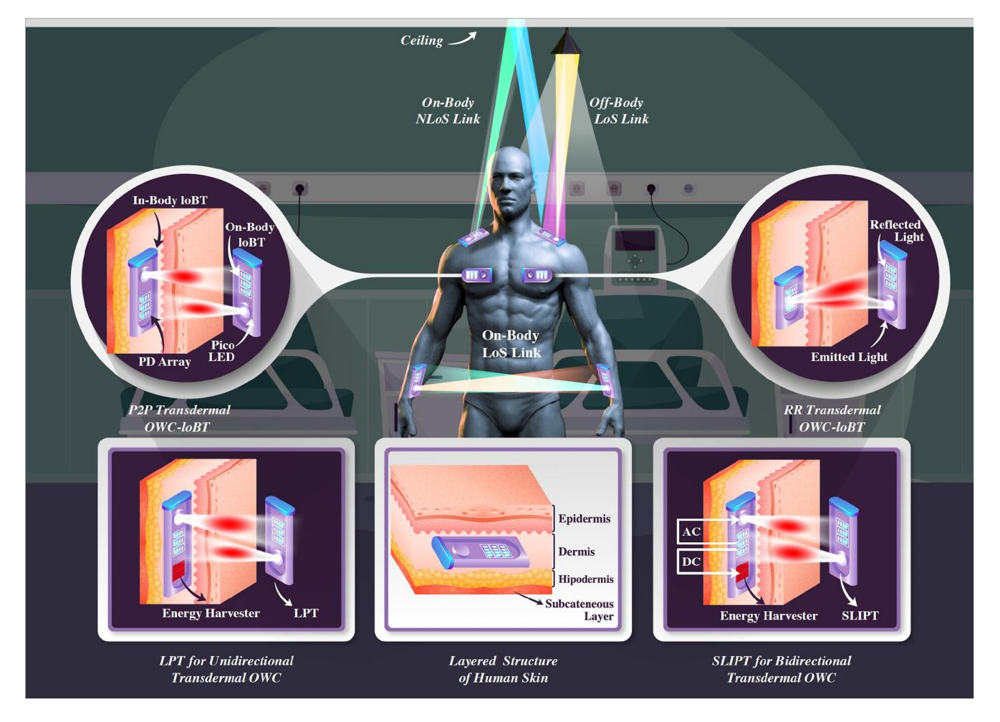

Fig. 12. Illustration of LoS, NLoS, and RR link configurations for in/on/off-body OWC-IoBT.

directivity and low penetration features of lightwaves also provide inherent PHY layer security.

• Exposing the body to excessive electromagnetic radiation causes tissue burnt due to the increasing heat, raises the likelihood of developing cancer and body rejection of the implanted/injected devices. In fact, the International Agency of Research on Cancer (IARC) evaluation report in 2011 concluded that RF waves can possibly increase the risk of human brain tumors [\[357\]](#page-42-20). Therefore, RF-IoBT devices are subject to stringent specific absorption rate constraints, which stands as a main delimiter of the overall communication performance. Alternatively, the human safety regulations are relatively more lenient for the light emission since a very limited electrical energy transferred to heat thanks to the aforementioned high wall-plug efficiency.

The IEEE 802.15.6 has also defined body channel communication (BCC), a.k.a. intrabody communication, as a third PHY layer option, where transmission is confined to the human body by coupling electrostatic or magnetostatic signals to the skin through electrodes [\[18\]](#page-35-4), [\[358\]](#page-42-21), [\[359\]](#page-42-22), [\[360\]](#page-42-23), [\[361\]](#page-42-24). In addition to being more energy-efficient than RF-IoBT, the BCC also has relatively better PHY layer security due to less signal leakage. However, the BCC can merely be used for onbody IoBT devices and may not provide very high throughput as it is limited to 10 kHz-100 MHz band. Albeit its inherent virtues described above, OWC-IoBT should not be considered as a competitor or replacement technology of the RF-IoBT. For example, OWC-IoBT can be quite attractive solution for on/off-body applications. However, its functionality for the inbody applications are limited to transdermal telemetry as the penetration depth of lightwaves are very limited for deep tissue communications. In what follows, we discuss where and how OWC-IoBT can complement RF-IoBT devices in detail.

# *B. On-Body and Off-Body OWC-IoBT*

As shown in Fig. [12,](#page-26-0) on-body OWC-IoBT devices can intercommunicate in three ways: 1) on-body LoS links, 2) on-body NLoS links through a nearby reflecting surface, and 3) traversing an AP by means of off-body LoS/NLoS links. However, due to the aforementioned dynamic channel conditions on and around the human body, regular indoor OWC channel models used by indoor OWC-IoTT devices are not directly applicable to these three cases. One can observe from Fig. [12](#page-26-0) that onbody links can be realized by a time-variant combination of the first and second case since having LoS links may not always be possible as a result of node orientation and deployment on the body. A comprehensive study on channel characterization and modeling for on/off-body OWC channels has recently investigated FoCS and SoCS by considering both body-part movement (local mobility) and whole-body movement (global

| IoBT         | Study          | Ref.   | Year     | Application       | IoT       | Band           |               |               | ov       | VC         |            |         | Comp.      | Higher |
|--------------|----------------|--------|----------|-------------------|-----------|----------------|---------------|---------------|----------|------------|------------|---------|------------|--------|
| Type         | Type           | Kei.   | Year     | Application       | MWL       | Danu           | Topology      | Tx            | Rx       | Data       | Distance   | Mod.    | Tech.      | Layers |
|              |                |        |          |                   |           |                | Topology      | Type          | Type     | Rate       | Distance   | Mod.    |            |        |
| <u>&gt;</u>  | ıt.            | [362]  | 2017     | EEG               | N/A       | VL             | Broadcast     | LED           | OC       | 2.4 K      | 4.5 m      | OOK     | N/A        | N/A    |
| ) gg         | meı            | [95]   | 2017     | ECG               | Custom    | VL             | Broadcast     | LED           | PD       | 40 K       | 8 m        | OOK     | RF         | N/A    |
| Off-Body     | Implement.     | [108]  | 2019     | e-Health          | N/A       | NIR            | Broadcast     | LED           | PD       | 6.4 M      | 1.5 m      | OOK     | N/A        | N/A    |
| 0 %          | ΙI             | [363]  | 2019     | e-Health          | N/A       | VL             | Broadcast     | LED           | OC       | 1 K        | 1 m        | N/A     | N/A        | N/A    |
|              | uc             | [364]  | 2015     | e-Health          | N/A       | NIR            | Star          | LED           | PD       | 118 K      | 5-7 m      | OOK     | N/A        | OCDMA  |
| On-Body      | Simulation     | [365]  | 2015     | e-Health          | N/A       | NIR            | Star          | LED           | PD       | <1 M       | 5-7 m      | OOK     | N/A        | N/A    |
| 1 =          | mu             | [366]  | 2017     | e-Health          | N/A       | VL             | Broadcast     | LED           | PD       | N/A        | N/A        | OOK     | N/A        | N/A    |
| 0            | Si             | [367]  | 2019     | ECG               | N/A       | VL             | Broadcast     | LED           | OC       | N/A        | 4 m        | N/A     | BLE        | N/A    |
|              |                | [368]  | 1992     | VAD               | N/A       | NIR            | P2P           | LED           | PD       | 9.6 K      | 15 mm      | FSK     | N/A        | N/A    |
| OWC)         |                | [369]  | 2001     | SLIPT             | N/A       | IR             | P2P           | L(E)D         | PD       | 1 M        | 10 mm      | Phase   | N/A        | N/A    |
| 6            |                | [370]  | 2004     | NPT               | N/A       | NIR            | P2P           | LED           | PD       | 40 M       | 4 mm       | AM      | RF         | N/A    |
| nal          |                | [371]  | 2004     | e-Health          | N/A       | NIR            | P2P           | LED           | PD       | 1 M        | 24 mm      | IrDA    | N/A        | N/A    |
| ern          | ou             | [372]  | 2005     | VAD               | N/A       | NIR            | P2P           | LED           | PD       | 9.6 K      | 45 mm      | ASK     | N/A        | N/A    |
| (Transdermal | Implementation | [373]  | 2008     | NPT               | N/A       | NIR            | P2P           | LD            | PD       | 16 M       | 2-8 mm     | N/A     | N/A        | N/A    |
| r <u>r</u>   | mer            | [374]  | 2012     | AMI               | N/A       | NIR, VL        | P2P, RR       | L(E)D         | PD       | N/A        | 1 mm       | OOK     | N/A        | N/A    |
| _            | ple            | [375]  | 2012     | NPT               | N/A       | NIR            | P2P           | VCSEL         | PD       | 50 M       | 2-6 mm     | OOK     | N/A        | N/A    |
| IoBT         | II.            | [375]  | 2014     | NPT               | N/A       | NIR            | P2P           | VCSEL         | PD       | 75 M       | 2-6 mm     | OOK     | N/A        | N/A    |
| y I          |                | [376]  | 2014     | NPT               | N/A       | NIR            | P2P           | VCSEL         | PD       | 100 M      | 2-6 mm     | OOK     | N/A        | N/A    |
| In-Body      |                | [377]  | 2015     | BCI               | N/A       | NIR            | P2P-UL        | VCSEL         | PD       | 100 M      | 2 mm       | OOK     | N/A        | WDM    |
| ] =          |                |        |          |                   |           | VL             | P2P-DL        |               |          | 1 M        |            |         |            |        |
|              |                | [378]  | 2017     | BCI               | N/A       | NIR            | P2P           | LED           | PD       | N/A        | 0.2 mm     | PWM     | N/A        | N/A    |
|              |                | [379]  | 2020     | ECG               | N/A       | IR             | P2P           | LED           | PD       | 4 K        | 4-16 mm    | UPIM    | N/A        | UART   |
| Les          | zend           | BCI: B | rain Con | nputer Interface, | NPT: neur | oprosthetic te | elemetry, VAI | D:ventricular | assistan | ce device. | L(E)D: LED | & LD, K | : Kbps, M: | Mbps   |

 $\begin{tabular}{ll} TABLE\ VII\\ THE\ MAJOR\ OWC-IOBT\ STUDIES\ BASED\ ON\ NODE\ LOCATIONS \end{tabular}$ 

mobility) [380]. Although it has been shown that node placement and orientation along with the body geometry have a significant impact on channel statistics, the overall channel gain was observed to be frequency non-selective, and ISI was negligible. Unlike 0.2-4 dB attenuation changes caused by the local mobility, the global mobility was the primary determinant of the high attenuation and random variations. Moreover, Gamma distributions were found to provide the best Akaike-Information criteria fit models for the channel attenuation. On the other hand, time-variations were shown to change with node locations on the body and overall smaller than its RF counterparts. In what follows, we present major research efforts on on/off-body OWC-IoBT, which are categorized based on research type (e.g., implementation, simulation) and tabulated in Table VII.

In [362], Rachim et al. created an experimental LED/OCC setup for transmitting electroencephalogram (EEG) data. This study used a single white LED to transmit over LoS to a smartphone located on a tripod stand within the same room. By consuming 3 W power, they achieved an error-free transmission with an upload speed of 2.4 Kbps at a distance of 4 meters. They claimed that this type of data transfer may replace common RF protocols used by wearable devices as a physiologically safer alternative. Even though the authors discussed no application protocol, the transmitted EEG data could be wrapped in an IoT application protocol to enable aggregation and automated healthcare monitoring to further improve its utility in IoT.

In another implementation by An et al., an LED/PD link was used to transmit data from multiple ECGs to a custom made dashboard for cardiac health monitoring of patients [95]. By using lenses with the LEDs, the authors were able to send data at 40 Kbps at a distance of 8 m. This implementation explored

time hopping as a way to send multiple signals to the same PD receiver. The authors also considered using RF technology to supplement the link when the LoS link is broken.

Dhatchayeny et al. expanded their previous work in [366] and offered a new use case in [108] for biomedical sensors to transmit via IR-LED to reduce crowding of the RF spectrum within hospitals and allow high data rate transmission in RF sensitive environments. They implemented an LED/PD link to transmit patient's biomedical data from multiple health sensors to a single overhead receiver, which allows multiple patients to be monitored in the same room by using a transmission scheduling scheme. An IR-LED choice means that there is no VL to disturb patients or health-care providers, but retains high data rate and secure LoS communications while not causing RF interference. The real-time information can be monitored by a server and send alerts to providers when coupled with an IoT application protocol. The experimental setup enabled transmission at 1.5 m at 6.4 Mbps, but no IoT Network layer application protocol was tested in the research.

The same authors also propose an experimental LED/OCC link in [363] that can be used to transmit vital sign data. The main consideration was that the link would have a lower BER to ensure that critical health data remains accurate over the link. The setup involved a 4  $\times$  4 panel of RGB LEDs to transmit 48 bits per frame and a 30 fps rolling shutter camera. The experimental setup demonstrated a low BER value transmission of  $1.2\times10^{-4}$  with a rate of 960 bps at a distance of 1 m. The transmissions were directly translated into vital sign data, but an application protocol could be utilized over such a link to enable data aggregation.

In [364], Chevalier et al. investigated the BER performance of a star OWC-IoBT network topology. Theoretical analyses are validated by a simulation set up where a patient is moving

in a hospital room. Since they consider multiple nodes randomly located on the patient's body, they exploit optical code division multiple access (OCDMA) to avoid MAI among the nodes. In [\[365\]](#page-42-29), the same authors provide outage performance analysis for NLoS communications based on a similar simulation setup. They developed a fast, simple, and adaptive method to consider mobility and the presence of obstacles within an indoor environment.

In [\[366\]](#page-42-26), Dhatchayeny et al. simulated an LED/PD link that sent vital sign measurements to a gateway. The simulation did not mention BER or distances but instead focused on SNR versus BER. The team found that they were able to transmit four different signals to the same receiver with a minimal BER when the SNR value is around 12 dB, which shows that the MIMO healthcare data aggregation is reliable under the considered conditions.

In [\[367\]](#page-42-30), Hasan et al. simulated a hybrid OWC/RF link system to improve the reliability of the signal from healthcare devices while lowering the amount of RF transmission. The OWC link simulated is an LED/OCC link, and the main component studied was the reliability of the link. When the OCC link becomes unreliable, the RF channel was utilized instead. The authors found that increasing the number of cameras in the room decreased the need to switch to the RF channel and that the OCC link was viable up to 4 meters.

# *C. Transdermal OWC for In-Body IoBT*

The injected and implanted in-body IoBT devices can be at depths from a few millimeters to a few centimeters. In comparison with its on/off-body counterparts, in-body IoBT has more stringent contradictory design requirements such as small form-factor for users' comfort and long battery life, which requires ultra-low-power consumption at μW levels. As shown in Fig. [12,](#page-26-0) the in-body OWC-IoBT devices can communicate with on-body devices through P2P or RR transdermal (a.k.a., transcutaneous) OWC links. Unfortunately, among many other tissue types, the skin has the most complex structure and the highest absorbing losses due to its layered and relatively low-water content. As shown in Fig. [12,](#page-26-0) the skin tissue consists of four main layers: epidermis, dermis, hypodermis, and transcutaneous layer. Fortunately, lightwaves within a specific wavelength range can penetrate the skin with significantly low absorption losses. The absorption losses [dB/mm] of various tissue types at different wavelengths are shown in Fig. [13](#page-28-0) where a favorable channel gain window can be observed through the end (600-750 nm) and at the beginning (750-900 nm) of VL and NIR spectrum, respectively. Since commercial LEDs are readily available at these wavelengths, there are considerable theoretical and experimental research efforts on both VL and NIR based transdermal OWC-IoBT. Although in-body OWC links experience a much higher path loss compared to over the air on/off-body OWC links, they are more stable and reliable due to their isolation from body mobility and environmental changes. In what follows, we present major research efforts on transdermal OWC for in-body IoBT, which are also tabulated in Table [VII.](#page-27-0) The main applications of transdermal OWC can be exemplified as various implants (e.g.,

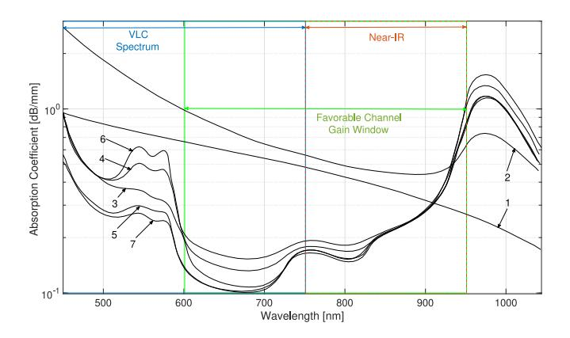

Fig. 13. Absorption levels of human skin tissues at VLC and NIR wavelengths (reproduced after [\[381\]](#page-43-1)): 1. stratum corneum; 2. living epidermis; 3. papillary dermis; 4. upper blood net dermis; 5. reticular dermis; 6. deep blood net dermis; 7. subcutaneous fat.

cochlear, retinal, cortical, foot drop, etc.), the gastric stimulators, the wireless capsule endoscope, the insulin pumps, and the implantable orthopedic devices [\[382\]](#page-43-2).

The earliest example of an LED/PD OWC link in IoT is the work presented by Miller et al. [\[368\]](#page-42-31). In this work, IR-LEDs are utilized to transmit data to and from a ventricular assistance device (VAD) through an implanted PD. The application is capable of maintaining an error-free link of 9600 bps at 150 mm. This paper's main focus is to have the LED/PD transceiver implanted in the patient to allow a wireless link with the VAD. Using an LED/PD link Abita and Schneider created a link that sent data through porcine skin samples at 1 Mbps [\[371\]](#page-42-32). They used an IR-LED and PD transceiver to send and receive data with an Active Medical Implant (AMI) at a distance of 24 mm. The AMI can be used in many different situations and can allow care providers to receive patient health information after the AMI is implanted quickly. The authors did not discuss higher-level applications, such as aggregating patient data over time. However, the AMI devices used were capable of storing up to 512 Kbps so that longer-term data could be given to the care provider or wearer regularly. Another example of transcutaneous LED/PD communication was found in [\[372\]](#page-42-33), where Okamoto et al. tested both IR and VL LEDs. They found that both IR and VL were able to transmit unhindered at 9600 bps, but the IR-LED transmitted without error at a distance of 45 mm while the VL-LED was capable of transmitting error-free up to 20 mm.

In [\[370\]](#page-42-34), Guillory et al. developed a hybrid RF/IR neuroprosthetic telemetry (NPT) system that uses constantfrequency RF inductive links for energy and amplitude modulated transcutaneous IR signals for data transfer. Numerical results showed that with commercially available IR components, data rates of up to 40 Mbps can be transmitted through 5 mm skin with an internal device power dissipation under 100 mW and a BER of 10−14. In [\[373\]](#page-42-35), Parmentier et al. developed an IR-LD-based NPT system and evaluated its performance in various operating conditions. The system can transmit at data rates up to 16 Mbps through a skin thickness of 2-8 mm while achieving a BER of 10−9 with a consumption of 10 mW or less. In [\[374\]](#page-42-36), Gil et al. explored the feasibility of P2P and RR transdermal OWC links through both mathematical models and experimental validations. The P2P and RR link measurements showed that an 800-950 nm wavelength window is desirable for transdermal OWC. Although authors did not specify achievable data rates, OOK modulation achieve a 10−5 BER over P2P and RR link by consuming 0.3 μW and 4 mW transmission power, respectively. Since authors considered a 1 mm skin sample, the presented results could be optimistic for the AMI placed in deeper tissues.

In [\[375\]](#page-42-37), Liu et al. develop an NPT system by using verticalcavity surface-emitting lasers (VCSELs) in both transmitter and implanted receiver modules. For a power consumption less than 4.1 mW, the developed system is capable of achieving a 50 Mbps data rate through a 4 mm tissue with a BER less than 10−5 and a tolerance of 2 mm misalignment. In [\[383\]](#page-43-3), authors improved the system throughput up to 75 Mbps by consuming 2.8 mW, which is almost half of the reported value in [\[375\]](#page-42-37). In [\[376\]](#page-43-4), by conducting an in-vivo test on a sheepskin, authors further improved the data rates up to 100 Mbps with a BER of 2×10−7 while limiting the power consumption to 2.1 mW. In [\[377\]](#page-43-5), Liu et al. also developed a bi-directional brain-computer interface (BCI) using transdermal OWC links by utilizing a VL-VCSEL and NIR-VCSEL in downlink and uplink directions, respectively. In-vitro experiments on a 2 mm porcine skin showed that the developed OWC-BCI system could achieve 1 and 100 Mbps rates in downlink and uplink directions by consuming 290 μW and 3.2 mW, respectively.

In [\[378\]](#page-43-6), Takehara et al. developed an injectable image sensor of size 400 × 1200 μ*m*2, which can modulate a small NIR-LED with PWM. The modulated signal was transmitted through a mouse skull bone of 200 μm thickness, which successfully received the 2700 pixel/frame image. Most recently, Sohn et al. developed an ultra-low-power AMI with a small form factor of 10 × 10 × 1 mm3 in [\[379\]](#page-43-7). The authors developed an unsynchronized pulseinterval-modulation (UPIM) along with a new protocol to account for the sparse, low-rate, but delay-sensitive nature of transdermal OWC.

In the last couple of years, there is also a growing interest in theoretical transdermal OWC studies such as performance analysis and signal quality assessment in the presence of misalignment [\[384\]](#page-43-8), [\[385\]](#page-43-9), [\[385\]](#page-43-9); modeling and analysis of optical cochlear implants based on key performance indicators such as the probability of hearing and neural damage [\[386\]](#page-43-10), [\[387\]](#page-43-11); and developing diversity techniques to improve outage performance in the presence of pointing errors for P2P links [\[388\]](#page-43-12) and RR links [\[389\]](#page-43-13), [\[390\]](#page-43-14). Although understanding the fundamental issues through theoretical studies is important, we believe their true impact can be unleashed only if proposed models are validated by experimental setups.

## *D. SLIPT Towards Energy Self-Sustainable OWC-IoBT*

In addition to the ultra-low-power design goal, in-body IoBT also requires energy self-sustainability through energy harvesting techniques. The lightwave power transfer (LPT) has already been considered as an effective solution for wireless charging of body implants [\[391\]](#page-43-15), [\[392\]](#page-43-16), [\[393\]](#page-43-17), [\[394\]](#page-43-18), [\[395\]](#page-43-19). A generic LPT system is shown in Fig. [12](#page-26-0) where an external light source emits a DC lightwave, which is received by a PD and fed into an energy harvester circuit. The harvested energy is then used for transmitting information to the external device. Therefore, the LPT is limited to unidirectional (i.e., uplink) transdermal OWC. The earliest example of LPT was presented in [\[391\]](#page-43-15), where a 10 ×10 mm PD was charged by an IR-LD to empower a pacemaker that consumes about 2 mW. In [\[392\]](#page-43-16), Moon et al. developed 1-10 mm2 silicon photovoltaic (PV) cells and achieved a power conversion efficiency of more than 17% for 660-nW/mm2 illumination at 850 nm. They further extended this work in [\[393\]](#page-43-17), where PV cells were able to harvest energy from both VL and IR resources in the range of 650-950 nm wavelengths. Although these prototypes show the feasibility of energy harvesting of implanted devices from external light sources, they do not consider the information and power transfer together.

For applications that require real-time and interactive communications with the in-body IoBT devices, a more practical approach is realizing bidirectional transdermal OWC by means of SLIPT technology [\[396\]](#page-43-20). In the SLIPT [c.f. Fig. [12\]](#page-26-0), the transmitted lightwave has both AC and DC components. At the receiver side, AC and DC components are split in parallel by using an inductor and a capacitor at the energy harvester and decoder branches, respectively [\[25\]](#page-35-11). Unlike its RF counterpart (i.e., simultaneous wireless information and power transfer), the SLIPT does not require switching between modes since the DC bias is always necessary for IM/DD. However, the literature on transdermal SLIPT is limited to [\[369\]](#page-42-38), where Goto et al. extended their previous IR-LPT systems in [\[394\]](#page-43-18), [\[395\]](#page-43-19) to an IR-SLIPT system where two implanted PDs receive IR-LD irradiation. The carrier wave generated by the first PD is phase modulated and fed into the transmitter implanted NIR-LED, which is powered by the second PD. The size and the weight of the implanted OWC-IoBT were 14 x 12 x 4 mm and 1.1 g, respectively.

## *E. Summary and Insights*

The IoBT devices are expected to play an important role in the post-COVID-19 world to make health-care more affordable and reachable for everyone. However, commercially available IoBT devices mostly operate on RF bands and share common disadvantages such as i) limited operational lifetime due to complex and power-hungry radio front ends, ii) reliability and latency issues due to interference from co-existing devices on the same band, iii) vulnerability to security threats as a result of highly radiative nature of RF propagation, iv) and being restricted by stringent safety regulations on electromagnetic radiation in and on the human body. As noted above, OWC-IoBT devices can be a viable alternative since they are not affected from such drawbacks. Accordingly, this section provided a taxonomy of OWC-IoBT devices based on node locations and present theoretical, numerical, and experimental advances in various aspects. The state-of-the-art is also tabulated in Table [VII](#page-27-0) which categorizes literature based on study and application type, spectrum, topology, Tx/Rx types, achieved rates, link distance, modulation type, complementary technology, and protocols used in higher layers. Indeed, Table [VII](#page-27-0) helped us to gain deep insights into the open research challenges and future research directions, which are discussed in detail below.

*1) The Need for an IoBT Protocol Stack:* It is obvious from Table [VII](#page-27-0) that most of the existing works merely focus on PHY aspects without accounting for its impacts on higher layer functionalities. Considering the ultra-low-power and URLCC requirements of IoBT applications, there is a dire need for a protocol stack that integrates OWC to higher layers. For example, the majority of works reported above employed OOK modulation for its simplicity at the expense of higher power consumption. Although commercial modules that follow IrDA standards employ return-to-zero modulation with shorter pulse duration, they still fail to satisfy μW power consumption levels. Alternatively, the pulse interval modulation (PIM) was shown to consume much less transmission power since it uses a single short pulse to encode a symbol while OOK roughly generates pulses as many as the 50% of the transmitted bits [\[379\]](#page-43-7).

Even though some of the works in Table [VII](#page-27-0) report very high data rates, these may not be practical for physiological data which is small in size but sensitive to delay by its nature. Therefore, more emphasis should be on tradeoff between throughput, BER, delay, and overall reliability. In this regard, Sohn et al. also developed an OWC protocol to address both energy efficiency and delay sensitivity based on asynchronous PIM. The experimental results on developed prototype showed that their cross-layer protocol can deliver a significantly lower power consumption (392 μW) than IrDA and Bluetooth Low Energy (BLE).

Another important but unexplored area is investigating effective and simple multiple access schemes. This is especially necessary for several on/off-body OWC-IoBT devices operating within the same environment. Excluding OCDMA in [\[364\]](#page-42-28) and WDM in [\[377\]](#page-43-5), existing implementations mostly deal with broadcast topology without paying attention on potential access schemes for MAI. We believe more comprehensive theoretical and experimental work is needed for the sake of standardization of PHY and MAC layer functionalities of OWC-IoBT.

*2) Standardization and Commercialization Efforts:* Although IEEE 802.15.4 standard specifies PHY and MAC layer aspects of generic wireless personal area networks, it has been realized that it is not adequate to fulfill the requirements of WBAN. Therefore, the IEEE 802.15.6 standard has been developed as a PHY and MAC layer standard for ultralow-power and secure communications and networking for RF-IoBT devices. Unfortunately, the IEEE 802.15.6 standard does not recognize OWC as one of its PHY techniques.

As discussed in Section [II,](#page-3-0) IEEE 802.15.7 has been developed to embrace many OWC technologies (VLC, IR, UV, OCC, etc.) by defining different device classes (infrastructure, mobile, vehicle) with five different PHY types for different QoS requirements. Unfortunately, IEEE 802.15.7 does not recognize IoBT devices as well as their specific PHY and MAC layer distinctions. In its current form, it is similar to IEEE 802.15.4 and a new standard is needed for OWC-IoBT similar to IEEE 802.15.6. We believe an OWC-IoBT standard can be developed based on lessons learned from IEEE 802.15.6 and IEEE 802.15.7 standards. This new standard will eventually pave the way for commercialization of OWC-IoBT devices, which is mostly within the interest of academy.

*3) Conflation of RR and SLIPT Concepts:* Even though the LPT is studied well in the literature, the potential of SLIPT concept for OWC-IoBT devices is waiting to be unleashed. Since the LPT is nothing but the foundation of the SLIPT, we believe there are many open research problems in developing prototypes and algorithms to coordinate energy harvesting and communications for energy self-sustainable OWC-IoBT devices. To the best of author's vision, conflation of RR communication and SLIPT is a promising and interesting direction. As shown in Fig. [12,](#page-26-0) the RR-OWC consists of skin-surface light source and an implanted reflector. Similar to backscatter communication RF systems, the reflector modulates the continuous light beam emitted from the source and reflect it back to the receiver [\[374\]](#page-42-36). Since the modulation power is negligible, the energy harvested by SLIPT would be sufficient to design energy self-sufficient design.

## VI. INTERNET OF UNDERGROUND THINGS (IOGT)

The IoGT has recently been recognized to revolutionize the mining industry to overcome daunting challenges posed by extreme underground mine conditions. Indeed, large mining companies have already started to embrace IoGT solutions for the digitalization of daily management of mining operations, which can be exemplified as follows:

- Monitoring the mining machinery through IoGT devices can substantially reduce the operational cost and enhance productivity. For example, the Canadian mining company Dundee Precious Metals installed sensors to lighting/conveyor belts and RFID tags to miner helmets for better asset tracking, which yielded an overall 400% production increase in 2014[.9](#page-30-0)
- The strict mining regulations of governmental bodies have made miners' occupational health and safety a key business priority. In this regard, the constant monitoring of the underground environment for toxicity and ventilation levels can ensure people and equipment's safety by enabling timely first aids and efficient evacuations in case of emergencies. By equipping miners' vests with physiological sensors, IoBT devices can also constantly monitor the vital signs and identify a need for rest or medical support to avoid accidents.
- Another crucial need in the underground mine is the localization of miners. Indeed, tracking miners' position is of utmost importance for first aid as well as search and rescue operations after explosions and collapses.
- Indeed, analyzing collecting such big data may lead to discoveries of more cost and time-efficient ways of running underground mines. Instead of deadly and costly reactive decisions, IoT-based data analytics can enable

9https://www.i-scoop.eu/internet-of-things-guide/industrial-internetthings-iiot-saving-costs-innovation/industrial-internet-mining-case/

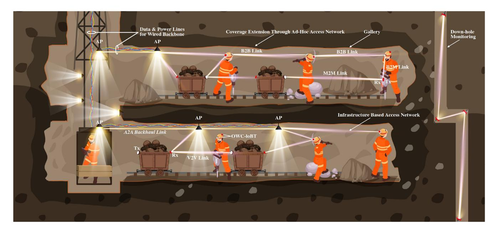

Fig. 14. Illustration of OWC-IoGT infrastructures with conceptual use cases.

proactive measures through preventive and predictive maintenance.

In order to reap these benefits, IoGT devices and network infrastructure must overcome many real-life challenges. For example, the underground mine environment is hot, humid, dusty, and full of vibration, which reduces IoGT devices' lifetime. Moreover, they are complex in structure and dark with poor visibility, have constrained space availability, and offer limited accessibility. Unlike its regular indoor counterparts, the interior layouts dynamically change as new ore bodies are exploited, and old ones are exhausted. These peculiar conditions translate into different challenges (e.g., signal propagation, reliability, latency, coverage, etc.) and require a different modeling and design approach than indoor terrestrial IoT devices in terms of hardware, communication, and networking aspects. From this point of view, there is no unique communication solution to meet the need for effective and reliable connectivity among IoGT nodes.

Wired communication was an early system used to facilitate connectivity in the underground mines, including magneto (crank ringer) phones, voice-powered phones, paging phones, and dial&page phones. On the other hand, data communication was implemented through PLC Ethernet and carrier current systems (e.g., trolley railways and hoist-ropes) at low rates. Even though the wired communication systems do not suffer from harsh channel impediments, they are prone to line breaks, cannot offer mobile communication and localization, and not suitable for IoT concepts. Therefore, RF communication techniques have been recognized as a modern alternative and adapted widely for in-mine network infrastructure. However, in-mine RF communication is known to suffer from poor BER, low data rates, and high delay spread [\[397\]](#page-43-21). This is mainly because of the highly attenuating and irregular electromagnetic propagation characteristics as a result of uneven and rough walls, different size and shape of galleries, tunnels with various form of turns (u-turn, wide/narrow, angle turn), and the presence of pillars to support ceilings [\[398\]](#page-43-22). In-mine RF communication is also affected by EMI due to metal substances and running electrical machinery in the surrounding environment.

Thanks to its inherent attributes, OWC can be a promising complement technology to existing RF-based in-mine communication infrastructure. In particular, VLC technology is quite suitable since there is already a dire need for sufficient illumination to meet regulatory bodies' occupational health and safety standards. Therefore, an IoGT network infrastructure can be built, as shown in Fig. [14,](#page-31-0) where the backbone network is formed by hybridizing wired and wireless technologies. While the former is constructed by laying down coaxial/fiber cables power lines together, the latter is possible through P2P OWC links (illustrated with red-colored light beams) between APs, which are used for both illumination and communication purposes. On the other hand, the access network consists of OWC-IoGT devices installed on machinery, vehicles, and miners. Similarly, the access network can be realized by hybridizing infrastructure and ad-hoc topologies. OWC-IoGT devices located on miners, machinery, and vehicles directly communicate with a nearby AP in the former. However, mines' dynamic interior layout may eventually cause some coverage gaps as new ore bodies are exploited, and old ones are exhausted. In such a case, the coverage can be extended through a wide variety of link combinations, e.g., V2V, body-to-body, body-to-machine, and vehicle-tomachine, etc. Integrating the envisioned OWC-IoGT network with existing in-mine communication systems can yield a more reliable and well-connected environment. Based on the hybrid network architecture shown in Fig. [14,](#page-31-0) OWC-IoGT devices can increase redundancy and ensure reliable connectivity by complementing existing in-mine communication systems.

| Env.        | Study       | Application           | Ref.  | Year | IoT    | Band     |                            |          | O        | WC             |          |       | Comp. | Higher |
|-------------|-------------|-----------------------|-------|------|--------|----------|----------------------------|----------|----------|----------------|----------|-------|-------|--------|
| Type        | Type        | Аррисации             | Kei.  | icai | MWL    | Danu     | Topology                   | Tx       | Rx       | Data           | Distance | Mod.  | Tech. | Layers |
|             |             |                       |       |      |        |          |                            | Type     | Type     | Rate           |          |       |       |        |
| 9           |             | Alarm/ Positioning | [399] | 2016 | N/A    | VL IR | Broadcast (DL) P2P (UL) | LED      | PD       | N/A            | 3-5 m    | OOK   | PLC   | N/A    |
| Mine        | Implement.  | PMU/                  | [400] | 2020 | N/A    | VL       | Broadcast (DL)             | LED      | PD       | N/A            | 5-10 m   | OOK   | RF    | N/A    |
| <u> </u>    |             | Positioning           | []    | 2020 | 1,111  | UHF      | P2P (UL)                   | RF       | RF       | 100 K          | 10-20 m  | GFSK  |       | 11     |
| Underground |             | Mine Cage Safety   | [401] | 2020 | Custom | VL IR | Broadcast                  | LED      | PD       | N/A            | 3-5 m    | PWM   | N/A   | N/A    |
| nde         |             | Alarm                 | [402] | 2017 | N/A    | VL       | Broadcast                  | LED      | PD       | N/A            | 30 m     | OOK   | PLC   | N/A    |
| Ď           |             | Intf. Mang.           | [403] | 2020 | N/A    | VL       | Broadcast                  | LED      | ADR      | 120-250 M      | 5-10 m   | OOK   | N/A   | N/A    |
|             | Simulation  |                       | [404] | 2016 | N/A    | VL       | Broadcast                  | LED      | PD       | N/A            | 3-5 m    | OOK   | N/A   | N/A    |
|             |             | Localization          | [405] | 2019 | N/A    | VL       | Broadcast                  | LED      | PD       | N/A            | 5-7 m    | IM/DD | N/A   | N/A    |
|             |             |                       | [406] | 2019 | N/A    | VL       | Broadcast                  | LED      | PD       | N/A            | 3-5 m    | N/A   | N/A   | N/A    |
|             | Simulation  | Perf. Anal.           | [407] | 2014 | N/A    | VL       | P2P                        | LED      | SPAD     | 1-5 K          | 400 m    | OOK   | N/A   | N/A    |
| l jį        | Simulation  | ren. Anai.            | [408] | 2018 | N/A    | VL       | P2P                        | LED      | PD       | 8 M            | 22 m     | M-PAM | N/A   | N/A    |
| Pipeline    | Implement.  | Image Trans.          | [409] | 2019 | N/A    | VL       | P2P                        | LED      | PD       | 50 K           | 3.5 m    | PWM   | N/A   | N/A    |
| F           | impicinent. | Robot Relay           | [410] | 2019 | N/A    | VL       | P2P                        | LED      | PD       | 10 K           | 3.6 m    | PWM   | N/A   | N/A    |
|             | Legend      | PLC: Power Li         |       |      |        | _        | ersity Receiver, SPA       | D: Singl | e-Photon | Avalanche Dioc | le,      | •     | •     |        |

TABLE VIII THE MAJOR OWC-IOGT STUDIES BASED ON ENVIRONMENT

TABLE IX CHANNEL MODELS FOR OWC-IOGT APPLICATIONS

|       |            |      |                    | Channel I         | mpairment I       | actors    |            |
|-------|------------|------|--------------------|-------------------|-------------------|-----------|------------|
| Ref.  | Model      | Year | Tilt & Rotation | Dust Particles | Non-Flat Walls | Shadowing | Scattering |
| [411] |            | 2015 | X                  | ✓                 | Х                 | ×         | ✓          |
| [412] | tiar       | 2018 | X                  | X                 | ×                 | ✓         | ✓          |
| [413] | per        | 2019 | ✓                  | X                 | ×                 | ×         | ×          |
| [414] | Lambertian | 2020 | X                  | X                 | ×                 | ×         | ✓          |
| [415] |            | 2020 | ✓                  | <b>√</b>          | ✓                 | ✓         | ✓          |

Another potential use of OWC depicted in Fig. [14](#page-31-0) is in the oil and gas industry, where the connectivity between surface and down-hole equipment plays a major role in optimizing the well performance and enhancing production efficiency. Although using armored cables and wirelines is common today, installing and maintaining wired solutions is technically challenging and expensive as it requires a costly halt of production. Therefore, various wireless technologies (mud-pulse telemetry, low-frequency RF, and acoustic systems) have been developed. However, their performance has not been found satisfactory for down-hole monitoring systems. Down-hole OWC is also substantially different from regular indoor OWC due to the presence of different types of gases/liquids and the pipes' shape and inner coating material.

Since channel characteristics play a major role in the overall performance of OWC systems, this section first provides a general overview of OWC channel modeling in underground environments by emphasizing its main distinctions from regular indoor OWC channels, which are summarized in Table [IX.](#page-32-0) Then, we provide recent advances in OWC-IoGT in terms of various application scenarios, localization, and tracking techniques, as well as its potential use in mines and gas pipelines, which are summarized in Table [VIII.](#page-32-1)

# *A. OWC-IoGT Channel Modeling*

Although there are many models that precisely characterize indoor OWC channels, they are not readily applicable for inmine OWC channels due to the following real-life factors:

- 1) signal degradation due to the dust particles on the air and transceivers,
- 2) channel variations caused by shadowing and scattering caused by irregular tunnel shapes and non-flat tunnel surfaces,
- 3) impact of location and angular orientation of transceivers as APs may not always be installed on the ceiling and OWC modules installed on the miners' helmet may randomly tilt and rotate.

In Table [IX,](#page-32-0) we categorize the in-mine OWC channel modeling efforts in terms of counting in such factors. The impact of tilt/rotation is considered in [\[413\]](#page-43-23), [\[415\]](#page-43-24), the dust particle effects are studied in [\[411\]](#page-43-25), [\[415\]](#page-43-24), the light propagation though non-flat walls are modeled in [\[415\]](#page-43-24), and shadowing/scattering are modeled in [\[411\]](#page-43-25), [\[412\]](#page-43-26), [\[414\]](#page-43-27), [\[415\]](#page-43-24). Notice that all these factors are comprehensively modeled and analyzed only in [\[415\]](#page-43-24).

To the best of the authors' knowledge, the only OWC channel model for gas pipelines was presented in [\[408\]](#page-43-28) where Miramirkhani et al. use ray tracing to investigate the propagation characteristics of the down-hole VLC channels. The authors used Zemax to create the simulation environment, which accounts for computer-aided design models of pipeline/transceivers, the interior coating, and gas specifications to construct the channel impulse response (CIR) at white/blue/red colors and FoV angles. Based on CIRs, they also present the maximum communication range to ensure a given BER.

# *B. OWC-IoGT Applications*

In [\[399\]](#page-43-29), an alarm and positioning system are demonstrated by hybridizing PLC Ethernet and OWC technologies. In case of an emergency, a central unit sends a warning/alarm to APs (e.g., LED lamps) through a PLC network, which is then broadcast to the receivers located at miners' helmets. Once the warning is received, the helmet sounds an alarm and returns a beacon, which may include the miner's ID, through the IR system that operates on IrDA standard. Based on the ID and location of AP receiving this beacon, the central unit determines the location of the miner. By periodically transmitting alarm signals, the central unit can constantly monitor the miner's location and identity. As this system is not designed for data communication, the authors do not provide any information regarding BER and data rate performance. In [\[402\]](#page-43-30), Farahneh et al. also proposed an alarm system by hybridizing PLC Ethernet and OWC technologies. Noting that authors did not specify any data rate values and did not validate results with experiments, they presented the BER performance under different levels of shadowing.

In [\[400\]](#page-43-31), Soto et al. implement a hybrid VLC-RF scheme to communicate with a portable phasor measurement unit (PMU), which digitizes voltage, current, and phasors synchronously to the coordinated universal time (UTC). In the DL, VLC-APs broadcast UTC information to PMUs, which returns measured electrical power system parameters through UHF-RF modules in the UL. The VLC was also used for positioning based on AP locations. The developed system has been shown to deliver low error rates for both phase and position estimation tasks. Unfortunately, the authors do not provide any information regarding BER and data rate performance.

Mine cages [c.f. elevator in Fig. [14\]](#page-31-0) has safety several safety problems such as overloading with people/trolleys or accidents caused by the outreach of human limbs. In [\[401\]](#page-43-32), Yang et al. proposed a solution using existing lighting equipment and equipping the mine cage and miners' helmets with cheap LEDs/PDs. Each transceiver broadcasts its PWM modulated information over a dedicated frequency that also represents the transceiver's identity. The developed system reaches more than 95% accuracy in overloading judgment and detection of limb outreach. As this system is not designed for data communication, the authors do not provide any information regarding BER and data rate performance.

In [\[403\]](#page-43-33), Játiva et al. proposed a solution to mitigate intercell interference in underground mining VLC system, where LED lamps to communicate with miners' helmet equipped with angle diversity receiver. Authors evaluate the solution by reporting various performance metrics such as RMS delay spread in the order of 10−4 − 10−6, data rate between 120 and 250 Mbps, BER as lows as 10−5, and distribution of signal-to-interference-plus-noise ratio (SINR) values.

In [\[407\]](#page-43-34), Li et al. demonstrate the continuous downhole monitoring for the first time. The light emitted from a LED is received by a 4 km away SPAD that counts photons efficiently thanks to the absence of ambient light within the pipeline. For 1, 2, and 5 Kbps of data rates, the analytical and simulation results showed that 10−6 BER at transmitting SNRs of 12, 15, and 18 dBm, respectively. Since the channel model in [\[407\]](#page-43-34) did not consider real-life pipeline characteristics, Miramirkhani et al. evaluate the performance considering a more realistic environment such as the presence of methane gas, interior coating, and different LED color and FoV angles in [\[408\]](#page-43-28). Authors evaluated the BER performance under these scenarios with M-PAM modulation and determined maximum transmission for 10−6 BER.

Two interesting downhole monitoring systems are implemented by Zhao et al. in [\[409\]](#page-43-35), [\[410\]](#page-43-36). In [\[409\]](#page-43-35) authors implement an image transfer system over a pipeline (with and without water) of length 3.5 m. Since the pipeline has two 90*o* corners, two relay nodes are placed to amplify and forward the previous node's signal. Numerical results show that the developed system was able to reconstruct transmitted images with sufficiently high quality. In their follow-up work, authors extend this system to a mobile scenario where pipeline inspection robots form a multi-hop relay to convey information to a source node.

# *C. OWC-IoGT Localization*

Similar to the positioning system developed in [\[399\]](#page-43-29), [\[400\]](#page-43-31), an AP-ID positioning system is also proposed in [\[404\]](#page-43-37) where authors controlled the number of light sources (i.e., APs) by turning them on and off through OOK to increase the positioning accuracy by manipulating the overlapping AP coverages. The numerical results showed that the maximum position error in each cell may be fixed to obtain a positioning system with constant accuracy.

In [\[405\]](#page-43-38), Firoozabadi et al. proposed a VLC localization based on three-dimensional trilateration methods. Unlike the AP-ID positioning approaches above, the proposed system estimates the location based on range estimation from multiple APs and their known location. The localization error was shown to be 3.5 for nodes closer to the APs and up to 16.4 as nodes go far way from APs. A similar approach is considered in [\[406\]](#page-43-39) where location obtained by triangulation of three light sources is put into GPS format. Notice in [\[399\]](#page-43-29), [\[400\]](#page-43-31), [\[404\]](#page-43-37), [\[405\]](#page-43-38), [\[406\]](#page-43-39) that authors do not report in any BER or data rate information as these work were aiming at localization rather than data communications.

# *D. Summary, Insights, and Open Problems*

The underground mines, pipelines, and tunnels pose more complicated and peculiar problems than regular indoor environments. For instance, underground mines are hot, humid, dusty, and full of vibration. Moreover, they are complex in structure and dark with poor visibility, have constrained space availability, and offer limited accessibility. In addition, unlike its regular indoor counterparts, the interior layouts dynamically change as new ore bodies are exploited and old ones are exhausted. Likewise, the OWC channel within pipelines is different from its regular indoor counterpart due to varying types of gases/liquids and the pipes' shape and inner coating material. Such peculiarities translate into different research challenges (e.g., signal propagation, reliability, latency, coverage, etc.) and demand an alternative modeling and design approach in terms of hardware, communication, and networking aspects. For example, the commercial products available for indoor environments can be used for IoGT applications if they are put into a heavy-duty form with increased node lifetime and durability.

Similar to the integration of the OWC-IoTT ecosystem with existing terrestrial wired/wireless infrastructure, the OWC-IoGT networks can also be integrated with enterprise underground networks. If there is no available network infrastructure, the IoGT network infrastructure can be built merely based on OWC technology [c.f. Fig] or in a hybridized manner with the support of RF and wired networks. However, we should note that existing indoor OWC standards do not account for channel impediments of underground environments. Therefore, these standards are required to be extended through channel characterization campaigns to enable the OWC-IoGT ecosystem.

# VII. CONCLUSION

This survey paper provides readers with a top-down approach to an IoT ecosystem assisted by the OWC communication and networking technologies. Considering the ever-increasing number of IoT devices and the limited electromagnetic spectrum, the OWC can complement existing wired and wireless technologies by granting abundant unlicensed light spectrum access. In this way, the OWC can overcome spectrum scarcity, mitigate interference limitations, and support IoT applications with high QoS demands.

This complementary approach requires integrating existing network infrastructure with the OWC technology, which behaves distinctly from existing wireless technologies at different transmission mediums. Therefore, our survey started with concepts and preliminaries on IoT network architecture and OWC technologies, which is especially necessary to build a solid discussion about how OWC technologies can be combined with available IoT infrastructure in different domains. That is, the first part of this work helps lay the background and explains how and where the OWC technology fits in the IoT architecture. On the other hand, the second part focused on the challenges and advances of using the OWC in different domains such as IoTT, IoWT, IoBT, and IoGT. In each section, we first explain the opportunities opened up by the OWC, the challenges in hybridizing OWC with currently available technologies, and recent advances dealing with mentioned challenges. Although each section is concluded with its own summary and insights, we believe it is better to provide interested readers with notable take aways, which are summarized below:

Regardless of the IoT domains, it is found that most of the research done that includes the use of OWC in IoT applications does not consider the IoT's full-stack to observe the effects of OWC on the full system performance. Instead, an OWC link is used in a specific application, and the higher layers of the stack are theorized. However, observing how OWC may enable new types of IoT applications necessitates the creation of full-stack systems because the limitations of OWC may affect the IoT solution under consideration. For instance, IoTT devices can be integrated with the available wired and wireless networking infrastructure. Therefore, current OWC standards mainly focus on PHY and MAC layer specifications without paying sufficient attention to how higher layers should be revised to reap the full benefits of OWC technologies. For example, higher layers can be redesigned with specific protocols and middleware concepts to better assist underlying applications with enhanced end-to-end network performance by reaping the full benefits of OWC integration. Moreover, these standards do not account for environment-specific challenges even if the OWC channels and related difficulties are non-trivial and distinct in IoWT, IoBT, and IoGT domains. Although IoBT can be integrated with existing infrastructure similar to IoTT, there might not be a readily available infrastructure for IoWT and IoGT domains. Therefore, a full-stack protocol might be necessary to realize IoT in such extreme conditions. It is also important to note that this protocols should be tailored to the SWaP-C constraints of IoT devices, which are quite distinct at different IoT domains and applications. Finally, complementing or replacing existing wireless technologies with OWC may require extra hardware and software stacks, yielding an additional monetary cost and calling for a deployment planning to maximize the price performance index of hybrid network architectures presented throughput the survey.

## ACKNOWLEDGMENT

Fig. [1,](#page-1-0) Figs. [4](#page-9-0)[–7,](#page-12-0) Fig. [12,](#page-26-0) and Fig. 15 were produced by Aysenur Kucuksari, a freelancer scientific illustrator (e-mail: aysenurkucuksari22@gmail.com). Fig. [9](#page-20-0) was produced by Xavier Pita, scientific illustrator at KAUST (e-mail: xavier.pita@kaust.edu.sa).

## REFERENCES

- [\[1\]](#page-0-5) A. Celik, K. N. Salama, and A. M. Eltawil, "The Internet of Bodies: A systematic survey on propagation characterization and channel modeling," *IEEE Internet Things J.*, vol. 9, no. 1, pp. 321–345, Jan. 2022.
- [\[2\]](#page-1-2) A. Celik, A. Chaaban, B. Shihada, and M.-S. Alouini, "Topology optimization for 6G networks: A network information-theoretic approach," *IEEE Veh. Technol. Mag.*, vol. 15, no. 4, pp. 83–92, Dec. 2020.
- [\[3\]](#page-1-3) Y. Niu, Y. Li, D. Jin, L. Su, and A. V. Vasilakos, "A survey of millimeter wave communications (mmWave) for 5G: Opportunities and challenges," *Wireless Netw.*, vol. 21, no. 8, pp. 2657–2676, 2015.
- [\[4\]](#page-1-4) G. R. Hiertz, D. Denteneer, L. Stibor, Y. Zang, X. P. Costa, and B. Walke, "The IEEE 802.11 universe," *IEEE Commun. Mag.*, vol. 48, no. 1, pp. 62–70, Jan. 2010.
- [\[5\]](#page-1-5) H. Sarieddeen, N. Saeed, T. Y. Al-Naffouri, and M.-S. Alouini, "Next generation terahertz communications: A rendezvous of sensing, imaging, and localization," *IEEE Commun. Mag.*, vol. 58, no. 5, pp. 69–75, May 2020.
- [\[6\]](#page-1-6) A. Celik, N. Saeed, B. Shihada, T. Y. Al-Naffouri, and M. Alouini, "A software-defined opto-acoustic network architecture for Internet of Underwater Things," *IEEE Commun. Mag.*, vol. 58, no. 4, pp. 88–94, Apr. 2020.
- [\[7\]](#page-1-7) N. Saeed, M.-S. Alouini, and T. Y. Al-Naffouri, "Toward the Internet of Underground Things: A systematic survey," *IEEE Commun. Surveys Tuts.* vol. 21, no. 4, pp. 3443–3466, 4th Quart., 2019.
- [\[8\]](#page-1-8) C. A. Da Costa, C. F. Pasluosta, B. Eskofier, D. B. Da Silva, and R. da Rosa Righi, "Internet of Health Things: Toward intelligent vital signs monitoring in hospital wards," *Artif. Intell. Med.*, vol. 89, pp. 61–69, Jul. 2018.
- [\[9\]](#page-1-9) I. F. Akyildiz and A. Kak, "The Internet of Space Things/CubeSats: A ubiquitous cyber-physical system for the connected world," *Comput. Netw.*, vol. 150, pp. 134–149, Feb. 2019.
- [\[10\]](#page-1-10) I. F. Akyildiz, D. Pompili, and T. Melodia, "Underwater acoustic sensor networks: Research challenges," *Ad Hoc Netw.*, vol. 3, no. 3, pp. 257–279, 2005.
- [\[11\]](#page-2-1) M. A. Khalighi and M. Uysal, "Survey on free space optical communication: A communication theory perspective," *IEEE Commun. Surveys Tuts.* vol. 16, no. 4, pp. 2231–2258, 4th Quart., 2014.
- [\[12\]](#page-2-1) Z. Ghassemlooy, S. Arnon, M. Uysal, Z. Xu, and J. Cheng, "Emerging optical wireless communications-advances and challenges," *IEEE J. Sel. Areas Commun.*, vol. 33, no. 9, pp. 1738–1749, Sep. 2015.
- [\[13\]](#page-2-1) H. Kaushal and G. Kaddoum, "Optical communication in space: Challenges and mitigation techniques," *IEEE Commun. Surveys Tuts.*, vol. 19, no. 1, pp. 57–96, 1st Quart., 2017.

- [\[14\]](#page-2-2) N. Saeed, S. Guo, K.-H. Park, T. Y. Al-Naffouri, and M.-S. Alouini, "Optical camera communications: Survey, use cases, challenges, and future trends," *Phys. Commun.*, vol. 37, Dec. 2019, Art. no. 100900.
- [\[15\]](#page-2-3) P. H. Pathak, X. Feng, P. Hu, and P. Mohapatra, "Visible light communication, networking, and sensing: A survey, potential and challenges," *IEEE Commun. Surveys Tuts.*, vol. 17, no. 4, pp. 2047–2077, 4th Quart., 2015.
- [\[16\]](#page-2-4) H. Kaushal and G. Kaddoum, "Underwater optical wireless communication," *IEEE Access*, vol. 4, pp. 1518–1547, 2016.
- [\[17\]](#page-2-4) Z. Zeng, S. Fu, H. Zhang, Y. Dong, and J. Cheng, "A survey of underwater optical wireless communications," *IEEE Commun. Surveys Tuts.*, vol. 19, no. 1, pp. 204–238, 1st Quart., 2017.
- [\[18\]](#page-2-5) N. Saeed, A. Celik, T. Y. Al-Naffouri, and M.-S. Alouini, "Underwater optical wireless communications, networking, and localization: A survey," *Ad Hoc Netw.*, vol. 94, 2019, Art. no. 101935. [Online]. Available: https://www.sciencedirect.com/science/article/pii/ S1570870518309776
- [\[19\]](#page-2-6) A. Trichili, M. A. Cox, B. S. Ooi, and M.-S. Alouini, "Roadmap to free space optics," *J. Opt. Soc. Amer. B*, vol. 37, no. 11, pp. A184–A201, Nov. 2020. [Online]. Available: http://opg.optica.org/josab/abstract. cfm?URI=josab-37-11-A184
- [\[20\]](#page-2-7) A. Trichili et al., "Retrofitting FSO systems in existing RF infrastructure: A non-zero-sum game technology," *IEEE Open J. Commun. Soc.*, vol. 2, pp. 2597–2615, 2021.
- [\[21\]](#page-3-1) M. Agiwal, A. Roy, and N. Saxena, "Next generation 5G wireless networks: A comprehensive survey," *IEEE Commun. Surveys Tuts.*, vol. 18, no. 3, pp. 1617–1655, 3rd Quart., 2016.
- [22] Z. Chen et al., "A survey on terahertz communications," *China Commun.*, vol. 16, no. 2, pp. 1–35, 2019.
- [\[23\]](#page-3-1) J. Kahn and J. Barry, "Wireless infrared communications," *Proc. IEEE*, vol. 85, no. 2, pp. 265–298, Feb. 1997.
- [\[24\]](#page-4-0) Y. Su, C. Chang, and T. Wu, "Temperature dependent characteristics of a PIN avalanche photodiode (APD) in ge, Si and GaAs," *Opt. Quant. Electron.*, vol. 11, no. 2, pp. 109–117, 1979.
- [\[25\]](#page-4-1) Z. Wang, D. Tsonev, S. Videv, and H. Haas, "On the design of a solar-panel receiver for optical wireless communications with simultaneous energy harvesting," *IEEE J. Sel. Areas Commun.*, vol. 33, no. 8, pp. 1612–1623, Aug. 2015.
- [\[26\]](#page-4-2) G. C. Gilbreath, S. R. Bowman, W. S. Rabinovich, C. H. Merk, and H. Senasack, "Modulating retroreflector using multiple quantum well technology," U.S. Patent 6 154 299, Aug. 2000.
- [\[27\]](#page-4-3) A. Bekkali, C. B. Naila, K. Kazaura, K. Wakamori, and M. Matsumoto, "Transmission analysis of OFDM-based wireless services over turbulent radio-on-FSO links Modeled by gamma–gamma distribution," *IEEE Photon. J.*, vol. 2, no. 3, pp. 510–520, Jun. 2010.
- [\[28\]](#page-5-1) M. Z. Hassan, M. J. Hossain, J. Cheng, and V. C. Leung, "Subcarrier intensity modulated optical wireless communications: A survey from communication theory perspective," *ZTE Commun.*, vol. 14, no. 2, pp. 2–12, 2019.
- [\[29\]](#page-5-2) Z. Yu, R. J. Baxley, and G. T. Zhou, "Iterative clipping for PAPR reduction in visible light OFDM communications," in *Proc. IEEE Mil. Commun. Conf.*, 2014, pp. 1681–1686.
- [\[30\]](#page-5-3) D. Tsonev, S. Sinanovic, and H. Haas, "Complete modeling of nonlinear distortion in OFDM-based optical wireless communication," *J. Lightw. Technol.*, vol. 31, no. 18, pp. 3064–3076, Sep. 2013.
- [\[31\]](#page-5-4) J. B. Carruthers and J. M. Kahn, "Multiple-subcarrier modulation for nondirected wireless infrared communication," *IEEE J. Sel. Areas Commun.*, vol. 14, no. 3, pp. 538–546, Apr. 1996.
- [\[32\]](#page-5-5) J. Davis, Y.-H. Hsieh, and H.-C. Lee, "Humans perceive Flicker artifacts at 500 hz," *Sci. Rep.*, vol. 5, no. 1, p. 7861, 2015.
- [\[33\]](#page-5-6) P. Luo, M. Zhang, Z. Ghassemlooy, S. Zvanovec, S. Feng, and P. Zhang, "Undersampled-based modulation schemes for optical camera communications," *IEEE Commun. Mag.*, vol. 56, no. 2, pp. 204–212, Feb. 2018.
- [\[34\]](#page-5-7) A. Santamaria, J. Vento-Álvarez, J. Rabadán, and R. Pérez-Jiménez, *The IrDA Standard*, 2001.
- [\[35\]](#page-6-0) *IEEE Standard for Information Technology—Telecommunications and Information Exchange Between Systems Local and Metropolitan Area Networks—Specific Requirements—Part 11: Wireless LAN Medium Access Control (MAC) and Physical Layer (PHY) Specifications*, IEEE Standard 802.11-2016, 2016.
- [\[36\]](#page-6-1) C. Pohlmann, "Visible light communication," in *Seminar Kommunikationsstandards der Medizintechnik*. Cham, Switzerland: Springer, 2010, pp. 1–14.
- [\[37\]](#page-7-1) *IEEE Standard for Local and Metropolitan Area Networks—Part 15.7: Short-Range Optical Wireless Communications*, IEEE Standard 802.15.7-2018, 2019.

- [\[38\]](#page-7-2) *IEEE Draft Standard for Multi-Gigabit Per Second Optical Wireless Communications (OWC), With Ranges Up to 200 Meters, for Both Stationary and Mobile Devices*, IEEE Standard P802.15.13/D6.0, Jan. 2022.
- [\[39\]](#page-8-0) *VLC High Speed Indoor Visible Light Communication Transceiver— System Architecture, Physical Layer and Data Link Layer Specification*, ITU, Geneva, Switzerland, 2018.
- [\[40\]](#page-8-1) F. Y. Narvaez, G. Reina, M. Torres-Torriti, G. Kantor, and F. A. Cheein, "A survey of ranging and imaging techniques for precision agriculture phenotyping," *IEEE/ASME Trans. Mechatronics*, vol. 22, no. 6, pp. 2428–2439, Dec. 2017.
- [\[41\]](#page-8-2) M. A. Zamora-Izquierdo, J. Santa, J. A. Martínez, V. Martínez, and A. F. Skarmeta, "Smart farming IoT platform based on edge and cloud computing," *Biosyst. Eng.*, vol. 177, pp. 4–17, Jan. 2019.
- [\[42\]](#page-8-3) R. Dagar, S. Som, and S. K. Khatri, "Smart farming—IoT in agriculture," in *Proc. Int. Conf. Inventive Res. Comput. Appl. (ICIRCA)*, 2018, pp. 1052–1056.
- [\[43\]](#page-8-3) M. Havas and M. S. Symington, "Effects of wi-Fi radiation on germination and growth of broccoli, pea, red clover and garden cress seedlings: A partial replication study," *Current Chem. Biol.*, vol. 10, no. 1, pp. 65–73, 2016.
- [\[44\]](#page-8-4) P. Liptai, B. Dolník, and V. Gumanová, "Effect of Wi-Fi radiation on seed germination and plant growth-experiment," *Ann. Factory Eng. Hunedoara*, vol. 15, no. 1, p. 109, 2017.
- [\[45\]](#page-8-4) X. Yang, H. Xu, L. Shao, T. Li, Y. Wang, and R. Wang, "Response of photosynthetic capacity of tomato leaves to different LED light wavelength," *Environ. Exp. Botany*, vol. 150, pp. 161–171, Jun. 2018.
- [\[46\]](#page-9-1) A. F. Yousef et al., "Photosynthetic apparatus performance of tomato seedlings grown under various combinations of LED illumination," *PLoS ONE*, vol. 16, no. 4, 2021, Art. no. e0249373.
- [\[47\]](#page-9-2) B. Ngcobo, I. Bertling, and A. Clulow, "Post-harvest alterations in quality and health-related parameters of cherry tomatoes at different maturity stages following irradiation with red and blue LED lights," *J. Horticultural Sci. Biotech.*, vol. 96, no. 3, pp. 383–391, 2021.
- [\[48\]](#page-9-3) G. H. Marín, R. P. Ixtaina, and M. Ruscitti, "Quick growth of lettuce plants using purple LED illumination devices," *J. Agronomy*, vol. 16, no. 2, pp. 87–93, 2017.
- [\[49\]](#page-9-4) M. M. Rahman, M. Vasiliev, and K. Alameh, "LED illumination spectrum manipulation for increasing the yield of sweet basil (Ocimum basilicum L.)," *Plants*, vol. 10, no. 2, p. 344, 2021.
- [\[50\]](#page-9-5) S. Javed, L. Issaoui, S. Cho, and H. Chun, "Utilization of LED grow lights for optical wireless communication-based RF-free smart-farming system," *Sensors*, vol. 21, no. 20, p. 6833, 2021.
- [\[51\]](#page-9-6) V. Matus, V. Guerra, C. Jurado-Verdu, S. Zvanovec, J. Rabadan, and R. Perez-Jimenez, "Design and implementation of an optical camera communication system for wireless sensor networking in farming fields," in *Proc. IEEE 32nd Annu. Int. Symp. Pers. Indoor Mobile Radio Commun. (PIMRC)*, 2021, pp. 1–6.
- [\[52\]](#page-9-6) K. Kadam, G. Chavan, U. Chavan, R. Shah, and P. Kumar, "Smart and precision polyhouse farming using visible light communication and Internet of Things," in *Proc. Intell. Comput. Inf. Commun*, 2018, pp. 247–256.
- [\[53\]](#page-9-7) N. S. Makarov et al., "Fiber-coupled luminescent concentrators for medical diagnostics, agriculture, and telecommunications," *ACS Nano*, vol. 13, no. 8, pp. 9112–9121, 2019.
- [\[54\]](#page-9-8) Y. Saito and K. Kobayashi, "Proposal of optical farming: Development of several optical sensing instruments for agricultural use," in *Proc. Sens. Tech. Biomater. Food Agricult.*, vol. 8881, 2013, Art. no. 888109.
- [\[55\]](#page-10-2) USDA. "Death Loss in U.S. Cattle and Calves Due to Predator and Nonpredator Causes." 2015. [Online]. Available: https://www. aphis.usda.gov/animal\_health/nahms/general/downloads/cattle\_calves\_ deathloss\_2015.pdf
- [\[56\]](#page-10-3) M. H. Memon, W. Kumar, A. Memon, B. S. Chowdhry, M. Aamir, and P. Kumar, "Internet of Things (IoT) enabled smart animal farm," in *Proc. 3rd Int. Conf. Comput. Sustain. Global Develop. (INDIACom)*, 2016, pp. 2067–2072.
- [\[57\]](#page-10-4) S. Kumari and S. K. Yadav, "Development of IoT based smart animal health monitoring system using Raspberry Pi," *Int. J. Adv. Stud. Sci. Res.*, vol. 3, no. 8, p. 508, 2018.
- [\[58\]](#page-10-5) T. N. Huy, K. N. Tuan, and T. T. Trung, "An application of WSN in smart aquaculture farming," in *Intelligent Computing in Engineering*. Singapore: Springer, 2020, pp. 975–984.
- [\[59\]](#page-10-6) S. Nocheski and A. Naumoski, "Water monitoring IoT system for fish farming ponds," *Int. Sci. J.*, vol. 3, no. 2, pp. 77–79, 2018.
- [\[60\]](#page-10-6) S. U. Kiruthika, S. Kanaga, and R. Jaichandran, "IoT based automation of fish farming," *J. Adv. Res. Dyn. Control Syst.*, vol. 9, no. 1, p. 19, 2017.

- [\[61\]](#page-10-6) S. Patel, A. Patel, M. Patel, and J. Patel, "Significance of light in poultry production: A review," *Adv. Life Sci.*, vol. 500, no. 4, p. 50, 2016.
- [\[62\]](#page-11-0) C. Manser, "Effects of lighting on the welfare of domestic poultry: A review," *Animal Welfare*, vol. 5, no. 4, pp. 341–360, 1996.
- [\[63\]](#page-11-0) "The Effects of Lighting Manipulation on Dairy Cattle Management." Accessed: Nov. 14, 2022. [Online]. Available: https://afs.ca.uky.edu/ dairy/effects-lighting-manipulation-dairy-cattle-management
- [\[64\]](#page-11-0) S. J. Jung, Y. J. Choi, N. N. Kim, J. Y. Choi, B.-S. Kim, and C. Y. Choi, "Effects of melatonin injection or green-wavelength LED light on the antioxidant system in goldfish (Carassius auratus) during thermal stress," *Fish Shellfish Immunol.*, vol. 52, pp. 157–166, May 2016.
- [\[65\]](#page-11-0) N. Karakatsouli et al., "Acute stress response of european sea bass Dicentrarchus labrax under blue and white light," *Aquaculture*, vol. 364, pp. 48–52, Aug. 2012.
- [\[66\]](#page-11-0) R. Sierra-Flores, A. Davie, B. Grant, S. Carboni, T. Atack, and H. Migaud, "Effects of light spectrum and tank background colour on atlantic cod (gadus morhua) and turbot (Scophthalmus maximus) larvae performances," *Aquaculture*, vol. 450, pp. 6–13, Jan. 2016.
- [\[67\]](#page-11-0) D. Berckmans, "Precision livestock farming technologies for welfare management in intensive livestock systems," *Rev. Sci. Tech.*, vol. 33, no. 1, pp. 189–196, 2014.
- [\[68\]](#page-11-1) N. Li, Z. Ren, D. Li, and L. Zeng, "Automated techniques for monitoring the behaviour and welfare of broilers and laying hens: Towards the goal of precision livestock farming," *Animal*, vol. 14, no. 3, pp. 617–625, 2020.
- [\[69\]](#page-11-1) E. Arulmozhi, A. Bhujel, B.-E. Moon, and H.-T. Kim, "The application of cameras in precision pig farming: An overview for swine-keeping professionals," *Animals*, vol. 11, no. 8, p. 2343, 2021.
- [\[70\]](#page-11-2) A. Devare, A. Hande, A. Jha, S. Sanap, and S. Gawade, "A survey on Internet of Things for smart vehicles," *Int. J. Innov. Res. Sci. Eng. Technol.*, vol. 5, no. 2, pp. 1212–1217, 2016.
- [\[71\]](#page-11-3) J. C. Lin, "Human exposure to RF, microwave, and millimeter-wave electromagnetic radiation [health effects]," *IEEE Microw. Mag.*, vol. 17, no. 6, pp. 32–36, Jun. 2016.
- [\[72\]](#page-11-4) R. Kadam, P. Mahamuni, and Y. Parikh, "Smart home system," *Int. J. Innov. Res. Adv. Eng.*, vol. 2, no. 1, pp. 81–86, 2015.
- [\[73\]](#page-11-5) Y. U. Lee, K.-Y. Kang, and G. Choi, "Secure visible light encryption communication technique for smart home service," in *Proc. IEEE 9th Annu. Comput. Commun. Workshop Conf. (CCWC)*, 2019, pp. 827–831.
- [\[74\]](#page-12-1) I. Romdhane and H. Yuksel, "A low-complexity security technique in physical layer for fixed LiFi communication systems," *J. Inf. Security Appl.*, vol. 53, Aug. 2020, Art. no. 102514.
- [\[75\]](#page-12-1) Y. M. Al-Moliki, M. T. Alresheedi, and Y. Al-Harthi, "Physicallayer security against known/chosen plaintext attacks for OFDM-based VLC system," *IEEE Commun. Lett.*, vol. 21, no. 12, pp. 2606–2609, Dec. 2017.
- [\[76\]](#page-12-1) M. T. Niaz, F. Imdad, and H. S. Kim, "Power consumption efficiency evaluation of multi-user full-duplex visible light communication systems for smart home technologies," *Energies*, vol. 10, no. 2, p. 254, 2017.
- [\[77\]](#page-12-2) S. Kadirvelu and V. Baba, "Temperature data transfer using visible light communication," in *Computer Communication Networking and Internet Security*. Heidelberg, Germany: Springer, 2017, pp. 23–33.
- [\[78\]](#page-12-3) K. Swain, M. Prasad, G. Palai, J. Sahoo, and M. Mohanty, "Exploiting VLC technique for smart home automation using Arduino," in *Artificial Intelligence and Evolutionary Computations in Engineering Systems*. Singapore: Springer, 2017, pp. 211–220.
- [\[79\]](#page-12-3) S. Ismail, N. Ahmad, and I. Arshad, "Implementation of Li-Fi based home automation system," in *Proc. IOP Conf. Mater. Sci. Eng.*, vol. 767, 2020, Art. no. 012051.
- [\[80\]](#page-12-3) K. Warmerdam, A. Pandharipande, D. Caicedo, and M. Zuniga, "Visible light communications for sensing and lighting control," *IEEE Sensors J.*, vol. 16, no. 17, pp. 6718–6726, Sep. 2016.
- [\[81\]](#page-12-4) S.-J. Song and H. Nam, "Visible light identification system for smart door lock application with small area outdoor interface," *Current Opt. Photon.*, vol. 1, no. 2, pp. 90–94, 2017.
- [\[82\]](#page-12-5) T. Gecevicius, Y. Chuang, and J. An, "Smart ARbnb: Smarthome ˇ interface for Airbnb with augmented reality and visible light communication," in *Proc. CHIIoT*, 2021, pp. 1–5.
- [\[83\]](#page-12-6) A. Jabeena, S. P. Kumar, S. Harsha, R. R. Chowdhury, and S. B. Goswami, "Automation of home appliances using visible light communication," in *Proc. Int. Conf. Intell. Sustain. Syst. (ICISS)*, 2017, pp. 110–115.
- [\[84\]](#page-12-7) S. V. Tiwari, A. Sewaiwar, and Y.-H. Chung, "Smart home technologies using visible light communication," in *Proc. IEEE Int. Conf. Consum. Electron. (ICCE)*, 2015, pp. 379–380.

- [\[85\]](#page-12-7) S. V. Tiwari, A. Sewaiwar, and Y.-H. Chung, "Smart home multi-device bidirectional visible light communication," *Photon. Netw. Commun.*, vol. 33, no. 1, pp. 52–59, 2017.
- [\[86\]](#page-12-8) S. V. Tiwari, A. Sewaiwar, and Y.-H. Chung, "Color coded multiple access scheme for bidirectional multiuser visible light communications in smart home technologies," *Opt. Commun.*, vol. 353, pp. 1–5, Oct. 2015.
- [\[87\]](#page-12-8) J. Vanus, T. Stratil, R. Martinek, P. Bilik, and J. Zidek, "The possibility of using VLC data transfer in the smart home," *IFAC PapersOnLine*, vol. 49, no. 25, pp. 176–181, 2016.
- [\[88\]](#page-12-9) P. Šul'aj, R. Haluška, L. Ovseník, S. Marchevsky, A. Firouzian, and ` V. Kramar, "An example of Li-Fi technology implementation for home automation," in *Proc. IEEE World Symp. Digit. Intell. Syst. Mach. (DISA)*, 2018, pp. 183–187.
- [\[89\]](#page-12-9) H. Ma, L. Lampe, and S. Hranilovic, "Integration of indoor visible light and power line communication systems," in *Proc. IEEE 17th Int. Symp. Power Line Commun. Appl.*, 2013, pp. 291–296.
- [\[90\]](#page-12-10) K. P. Pujapanda, "LiFi integrated to power-lines for smart illumination cum communication," in *Proc. Int. Conf. Commun. Syst. Netw. Technol.*, 2013, pp. 875–878.
- [\[91\]](#page-12-11) J. Song et al., "Indoor hospital communication systems: An integrated solution based on power line and visible light communication," in *Proc. IEEE Faible Tension Faible Consommation*, 2014, pp. 1–6.
- [\[92\]](#page-12-11) Y. E. Kalay, H. Sathyanarayanan, D. Schaumann, A. Wang, G. Chen, and R. G. Pai, "VLC-enabled human-aware building management system," in *Proc. Int. Conf. Human–Comput. Interact.*, 2020, pp. 207– 222.
- [\[93\]](#page-12-12) M. A. S. Sejan and W.-Y. Chung, "Indoor fine particulate matter monitoring in a large area using bidirectional Multihop VLC," *IEEE Internet Things J.*, vol. 8, no. 9, pp. 7214–7228, May 2021.
- [\[94\]](#page-13-0) M. A. S. Sejan, M. H. Rahman, and W.-Y. Chung, "MPPM based bi-directional long range visible light communication for indoor particulate matter monitoring," in *Proc. IEEE 3rd Int. Conf. Comput. Commun. Eng. Technol. (CCET)*, 2020, pp. 263–266.
- [\[95\]](#page-13-0) J. An, N. Q. Pham, and W.-Y. Chung, "Multiple bio-monitoring system using visible light for electromagnetic-wave free indoor healthcare," *Opt. Commun.*, vol. 405, pp. 107–113, Dec. 2017. [Online]. Available: http://www.sciencedirect.com/science/article/pii/S0030401817306855
- [\[96\]](#page-13-1) M. Szankin et al., "Long distance vital signs monitoring with person identification for smart home solutions," in *Proc. 40th Annu. Int. Conf. IEEE Eng. Med. Biol. Soc. (EMBC)*, 2018, pp. 1558–1561.
- [\[97\]](#page-13-2) D. R. Dhatchayeny, W. A. Cahyadi, and Y.-H. Chung, "An assistive VLC technology for smart home devices using EOG," *Wireless Pers. Commun.*, vol. 98, no. 1, pp. 81–89, 2018.
- [\[98\]](#page-13-2) L. Pescosolido, E. Ancillotti, and A. Passarella, "Testing off-the-shelf optical wireless LANs for smart city environments," *Sensors*, vol. 21, no. 16, p. 5451, 2021.
- [\[99\]](#page-13-3) T. Adiono et al., "Prototyping design of IR remote controller for smart home applications," in *Proc. TENCON IEEE Region 10 Conf.*, 2017, pp. 1304–1308.
- [\[100\]](#page-13-4) K. Dimitrov, V. Shterev, and T. Valkovski, "Low-cost system for recognizing people through infrared arrays in smart home systems," in *Proc. XXIX Int. Sci. Conf. Electron. (ET)*, 2020, pp. 1–4.
- [\[101\]](#page-13-5) G. Marques and R. Pitarma, "Non-contact infrared temperature acquisition system based on Internet of Things for laboratory activities monitoring," *Procedia Comput. Sci.*, vol. 155, pp. 487–494, 2019.
- [\[102\]](#page-13-6) T.-V. Dinh, J.-Y. Lee, J.-W. Ahn, and J.-C. Kim, "Development of a wide-range non-dispersive infrared Analyzer for the continuous measurement of CO2 in indoor environments," *Atmosphere*, vol. 11, no. 10, p. 1024, 2020.
- [\[103\]](#page-13-7) Y. Yuan, X. Li, Z. Liu, and X. Guan, "Occupancy estimation in buildings based on infrared array sensors detection," *IEEE Sensors J.*, vol. 20, no. 2, pp. 1043–1053, Jan. 2020.
- [\[104\]](#page-13-8) L. Tao, T. Volonakis, B. Tan, Y. Jing, K. Chetty, and M. Smith, "Home activity monitoring using low resolution infrared sensor," 2018, *arXiv:1811.05416*.
- [\[105\]](#page-13-9) M. Gochoo, T.-H. Tan, T. Batjargal, O. Seredin, and S.-C. Huang, "Device-free non-privacy invasive indoor human posture recognition using low-resolution infrared sensor-based wireless sensor networks and DCNN," in *Proc. IEEE Int. Conf. Syst. Man Cybern. (SMC)*, 2018, pp. 2311–2316.
- [\[106\]](#page-13-10) S.-C. Chen, C.-M. Wu, Y.-J. Chen, J.-T. Chin, and Y.-Y. Chen, "Smart home control for the people with severe disabilities," in *Proc. Int. Conf. Appl. Syst. Innov. (ICASI)*, 2017, pp. 503–506.
- [\[107\]](#page-13-11) Q. Zhang, Y. Zhou, S. Song, G. Liang, and H. Ni, "Heart rate extraction based on near-infrared camera: Towards driver state monitoring," *IEEE Access*, vol. 6, pp. 33076–33087, 2018.

- [\[108\]](#page-13-12) D. R. Dhatchayeny, S. Arya, and Y. H. Chung, "Infrared-based multiple-patient monitoring in indoor optical wireless healthcare systems," *IEEE Sensors J.*, vol. 19, no. 14, pp. 5594–5599, Jul. 2019.
- [\[109\]](#page-13-13) T. Lang et al., "Integrated design of low complexity RSS based visible light indoor positioning and power-line communication system for smart hospitals," in *Proc. IEEE Int. Conf. Consum. Electron. (ICCE)*, 2021, pp. 1–5.
- [\[110\]](#page-13-14) E. R. Schafermeyer et al., "Multi-resident identification using devicefree IR and RF fingerprinting," in *Proc. 37th Annu. Int. Conf. IEEE Eng. Med. Biol. Soc. (EMBC)*, 2015, pp. 5481–5484.
- [\[111\]](#page-13-15) T. Koonen et al., "Indoor optical/radio wireless communication— Demonstration of high-def video streaming using steerable infrared beams," in *Proc. Int. Topics Meeting Microw. Photon. (MWP)*, 2018, pp. 1–4.
- [\[112\]](#page-13-16) S. Pawar, V. Kithani, S. Ahuja, and S. Sahu, "Smart home security using IoT and face recognition," in *Proc. 4th Int. Conf. Comput. Commun. Control Autom. (ICCUBEA)*, 2018, pp. 1–6.
- [\[113\]](#page-13-17) M. D. Thieu and H. N. Nguyen, "Implementation of optical camera communication for indoor presence detection system in smart home concept," in *Proc. IEEE 8Int. Conf. Commun. Electron. (ICCE)*, 2021, pp. 391–396.
- [\[114\]](#page-13-18) T. Zhou, X. Lee, and L. Chen, "Temperature monitoring system based on hadoop and VLC," *Procedia Comput. Sci.*, vol. 131, pp. 1346–1354, 2018.
- [\[115\]](#page-13-19) Z. Ong and W.-Y. Chung, "Long range VLC temperature monitoring system using CMOS of mobile device camera," *IEEE Sensors J.*, vol. 16, no. 6, pp. 1508–1509, Mar. 2016.
- [\[116\]](#page-13-19) Z. Ong, V. P. Rachim, and W.-Y. Chung, "Novel electromagneticinterference-free indoor environment monitoring system by mobile camera-image-sensor-based VLC," *IEEE Photon. J.* vol. 9, no. 5, pp. 1–11, Oct. 2017.
- [\[117\]](#page-13-19) Y. Zhuang et al., "A survey of positioning systems using visible LED lights," *IEEE Commun. Surveys Tuts.*, vol. 20, no. 3, pp. 1963–1988, 3rd Quart., 2018.
- [\[118\]](#page-13-20) K. Gligoric, M. Ajmani, D. Vukobratovi ´ c, and S. Sinanovi ´ c, "Visible ´ light communications-based indoor positioning via compressed sensing," *IEEE Commun. Lett.*, vol. 22, no. 7, pp. 1410–1413, Jul. 2018.
- [\[119\]](#page-13-21) M. Vieira, M. Vieira, P. Louro, P. Vieira, and A. Fantoni, "Fine-grained indoor localization: Optical sensing and detection," in *Proc. Opt. Sens. Detection V*, vol. 10680, 2018, Art. no. 106800H.
- [\[120\]](#page-13-21) S. Juneja and S. Vashisth, "Indoor positioning system using visible light communication," in *Proc. Int. Conf. Comput. Commun. Tech. Smart Nation (IC3TSN)*, 2017, pp. 79–83.
- [\[121\]](#page-13-21) N. Chaudhary, O. I. Younus, L. N. Alves, Z. Ghassemlooy, S. Zvanovec, and H. Le-Minh, "An indoor visible light positioning system using tilted LEDs with high accuracy," *Sensors*, vol. 21, no. 3, p. 920, 2021.
- [\[122\]](#page-13-22) T. Huang et al., "Visible light indoor positioning fashioned with a single tilted optical receiver," in *Proc. 14th Int. Conf. Opt. Commun. Netw. (ICOCN)*, 2015, pp. 1–4.
- [\[123\]](#page-13-23) M. H. Rahman, M. A. S. Sejan, J.-J. Kim, and W.-Y. Chung, "Reduced tilting effect of smartphone CMOS image sensor in visible light indoor positioning," *Electronics*, vol. 9, no. 10, p. 1635, 2020.
- [\[124\]](#page-13-23) S. Li, Z. Wang, L. Shi, and X. Zhang, "Experimental indoor tracking testbed based on visible light communication," in *Proc. 26th IEEE Int. Conf. Electron. Circuits Syst. (ICECS)*, 2019, pp. 129–130.
- [\[125\]](#page-13-24) F. M. Alsalami, Z. Ahmad, S. Zvanovec, P. A. Haigh, O. C. Haas, and S. Rajbhandari, "Indoor intruder tracking using visible light communications," *Sensors*, vol. 19, no. 20, p. 4578, 2019.
- [\[126\]](#page-13-24) M. Pravin and T. V. P. Sundararajan, "VLC based indoor blind navigation system," in *Proc. 9th Int. Conf. Comput. Commun. Netw. Technol. (ICCCNT)*, 2018, pp. 1–6.
- [\[127\]](#page-13-25) S. Lee, K. N. Ha, and K. C. Lee, "A pyroelectric infrared sensorbased indoor location-aware system for the smart home," *IEEE Trans. Consum. Electron.*, vol. 52, no. 4, pp. 1311–1317, Nov. 2006.
- [\[128\]](#page-13-26) K.-C. Lai, B.-H. Ku, and C.-Y. Wen, "Using cooperative PIR sensing for human indoor localization," in *Proc. 27th Wireless Opt. Commun. Conf. (WOCC)*, 2018, pp. 1–5.
- [\[129\]](#page-13-26) T. Arai, T. Yoshizawa, T. Aoki, K. Zempo, and Y. Okada, "Evaluation of indoor positioning system based on attachable infrared beacons in metal shelf environment," in *Proc. IEEE Int. Conf. Consum. Electron. (ICCE)*, 2019, pp. 1–4.
- [\[130\]](#page-13-27) D. Yang, B. Xu, K. Rao, and W. Sheng, "Passive infrared (PIR)-based indoor position tracking for smart homes using accessibility maps and a-star algorithm," *Sensors*, vol. 18, no. 2, p. 332, 2018.
- [\[131\]](#page-13-28) B. Yang and F. Liu, "A dual-typed and omnidirectional infrared perceptual network for indoor human tracking," *Meas. Sci. Technol.*, vol. 32, no. 11, 2021, Art. no. 115124.

- [\[132\]](#page-13-28) Y. Kobiyama, Q. Zhao, R. Ota, and S. Ichimura, "Recognition of frequently appeared locations/activities based on infrared sensor array," in *Proc. 3rd IEEE Int. Conf. Cybern. (CYBCONF)*, 2017, pp. 1–5.
- [\[133\]](#page-13-28) Y. Li, Z. Ghassemlooy, X. Tang, B. Lin, and Y. Zhang, "A VLC Smartphone camera based indoor positioning system," *IEEE Photon. Technol. Lett.*, vol. 30, no. 13, pp. 1171–1174, Jul. 1, 2018.
- [\[134\]](#page-13-29) A. Kabiri and F. S. Tabataba, "Large scale indoor VLC positioning using image sensor with limited field of view," in *Proc. 29th Iran. Conf. Elect. Eng. (ICEE)*, 2021, pp. 859–863.
- [\[135\]](#page-13-29) H. Santo, T. Maekawa, and Y. Matsushita, "Device-free and privacy preserving indoor positioning using infrared retro-reflection imaging," in *Proc. IEEE Int. Conf. Pervasive Comput. Commun. (PerCom)*, 2017, pp. 141–152.
- [\[136\]](#page-13-30) W. A. Cahyadi, Y. H. Chung, and T. Adiono, "Infrared indoor positioning using invisible beacon," in *Proc. 11th Int. Conf. Ubiquitous Future Netw. (ICUFN)*, 2019, pp. 341–345.
- [\[137\]](#page-13-31) A. Rahman, T. Li, and Y. Wang, "Recent advances in indoor localization via visible lights: A survey," *Sensors*, vol. 20, no. 5, p. 1382, 2020.
- [\[138\]](#page-13-32) J. Wang, E. Liu, Y. Geng, X. Qu, and R. Wang, "A survey of 17 indoor travel assistance systems for blind and visually impaired people," *IEEE Trans. Human–Mach. Syst.*, vol. 52, no. 1, pp. 134–148, Feb. 2022.
- [\[139\]](#page-13-32) V. Nguyen, M. Ibrahim, S. Rupavatharam, M. Jawahar, M. Gruteser, and R. Howard, "EyeLight: Light-and-shadow-based occupancy estimation and room activity recognition," in *Proc. IEEE INFOCOM Conf. Comput. Commun.*, 2018, pp. 351–359.
- [\[140\]](#page-13-33) Z. Zhao, J. Wang, X. Zhao, C. Peng, Q. Guo, and B. Wu, "NaviLight: Indoor localization and navigation under arbitrary lights," in *Proc. IEEE INFOCOM Conf. Comput. Commun.*, 2017, pp. 1–9.
- [\[141\]](#page-14-0) T. Wenge, M. T. Chew, F. Alam, and G. S. Gupta, "Implementation of a visible light based indoor localization system," in *Proc. IEEE Sens. Appl. Symp. (SAS)*, 2018, pp. 1–6.
- [\[142\]](#page-14-0) B. Munir and V. Dyo, "Passive localization through light flicker fingerprinting," *IEEE Sensors J.*, vol. 19, no. 24, pp. 12137–12144, Dec. 2019.
- [\[143\]](#page-14-0) I. Alonso-González, D. Sánchez-Rodríguez, C. Ley-Bosch, and M. A. Quintana-Suárez, "Discrete indoor three-dimensional localization system based on neural networks using visible light communication," *Sensors*, vol. 18, no. 4, p. 1040, 2018.
- [\[144\]](#page-14-1) H. Zhang et al., "High-precision indoor visible light positioning using modified momentum back propagation neural network with sparse training point," *Sensors*, vol. 19, no. 10, p. 2324, 2019.
- [\[145\]](#page-14-1) X. Li, Y. Cao, and C. Chen, "Machine learning based high accuracy indoor visible light location algorithm," in *Proc. IEEE Int. Conf. Smart Internet Things (SmartIoT)*, 2018, pp. 198–203.
- [\[146\]](#page-14-1) X. Wang, Z. Yu, and S. Mao, "DeepML: Deep LSTM for indoor localization with smartphone magnetic and light sensors," in *Proc. IEEE Int. Conf. Commun. (ICC)*, 2018, pp. 1–6.
- [\[147\]](#page-14-2) J. E. Siegel, D. C. Erb, and S. E. Sarma, "A survey of the connected vehicle landscape—Architectures, enabling technologies, applications, and development areas," *IEEE Trans. Intell. Transp. Syst.*, vol. 19, no. 8, pp. 2391–2406, Aug. 2018.
- [\[148\]](#page-14-3) N.-E. El Faouzi, H. Leung, and A. Kurian, "Data fusion in intelligent transportation systems: Progress and challenges—A survey," *Inf. Fusion*, vol. 12, no. 1, pp. 4–10, 2011.
- [\[149\]](#page-14-3) G. Karagiannis et al., "Vehicular networking: A survey and tutorial on requirements, architectures, challenges, standards and solutions," *IEEE Commun. Surveys Tuts.*, vol. 13, no. 4, pp. 584–616, 4th Quart., 2011.
- [\[150\]](#page-14-4) C. Sommer and F. Dressler, *Vehicular Networking*. Cambridge, U.K.: Cambridge Univ. Press, 2014.
- [\[151\]](#page-14-4) V. Va, T. Shimizu, G. Bansal, and R. W. Heath Jr, "Millimeter wave vehicular communications: A survey," *Found. Trends Netw.*, vol. 10, no. 1, pp. 1–118, 2016.
- [\[152\]](#page-14-5) S. Chen et al., "Vehicle-to-everything (V2X) services supported by LTE-based systems and 5G," *IEEE Commun. Stand. Mag.*, vol. 1, no. 2, pp. 70–76, 2017.
- [\[153\]](#page-14-5) A.-M. Cailean and M. Dimian, "Current challenges for visible light ˘ communications usage in vehicle applications: A survey," *IEEE Commun. Stand. Mag.*, vol. 19, no. 4, pp. 2681–2703, 2017.
- [\[154\]](#page-14-6) A. Memedi and F. Dressler, "Vehicular visible light communications: A survey," *IEEE Commun. Surveys Tuts.*, vol. 23, no. 1, pp. 161–181, 1st Quart., 2021.
- [\[155\]](#page-14-6) A. Memedi, C. Tebruegge, J. Jahneke, and F. Dressler, "Impact of vehicle type and headlight characteristics on vehicular VLC performance," in *Proc. IEEE Veh. Netw. Conf. (VNC)*, 2018, pp. 1–8.

- [\[156\]](#page-14-7) F. M. Alsalami et al., "Impact of vehicle headlights radiation pattern on dynamic vehicular VLC channel," *IEEE Commun. Surveys Tuts.*, vol. 39, no. 10, pp. 3162–3168, 1st Quart., 2021.
- [\[157\]](#page-14-7) H. B. Eldeeb et al., "Vehicular VLC: A ray tracing study based on measured radiation patterns of commercial taillights," *J. Lightw. Technol.*, vol. 33, no. 16, pp. 904–907, May 15, 2021.
- [\[158\]](#page-14-7) H.-Y. Tseng, Y.-L. Wei, A.-L. Chen, H.-P. Wu, H. Hsu, and H.-M. Tsai, "Characterizing link asymmetry in vehicle-to-vehicle visible light communications," in *Proc. IEEE Veh. Netw. Conf. (VNC)*, 2015, pp. 88–95.
- [\[159\]](#page-14-8) P. Luo, Z. Ghassemlooy, H. L. Minh, E. Bentley, A. Burton, and X. Tang, "Performance analysis of a car-to-car visible light communication system," *Appl. Opt.*, vol. 54, no. 7, pp. 1696–1706, 2015.
- [\[160\]](#page-14-9) A. Memedi, H.-M. Tsai, and F. Dressler, "Impact of realistic light radiation pattern on vehicular visible light communication," in *Proc. GLOBECOM IEEE Global Commun. Conf.*, 2017, pp. 1–6.
- [\[161\]](#page-14-9) C. Tebruegge, A. Memedi, and F. Dressler, "Empirical characterization of the NLOS component for vehicular visible light communication," in *Proc. IEEE Veh. Netw. Conf. (VNC)*, 2019, pp. 1–4.
- [\[162\]](#page-14-10) B. Turan, G. Gurbilek, A. Uyrus, and S. C. Ergen, "Vehicular VLC frequency domain channel sounding and Characterization," in *Proc. IEEE Veh. Netw. Conf. (VNC)*, 2018, pp. 1–8.
- [\[163\]](#page-14-10) L. Cheng, W. Viriyasitavat, M. Boban, and H.-M. Tsai, "Comparison of radio frequency and visible light propagation channels for vehicular communications," *IEEE Access*, vol. 6, pp. 2634–2644, 2018.
- [\[164\]](#page-14-11) A.-L. Chen, H.-P. Wu, Y.-L. Wei, and H.-M. Tsai, "Time variation in vehicle-to-vehicle visible light communication channels," in *Proc. IEEE Veh. Netw. Conf. (VNC)*, 2016, pp. 1–8.
- [\[165\]](#page-14-11) K. Cui, G. Chen, Z. Xu, and R. D. Roberts, "Traffic light to vehicle visible light communication channel characterization," *Appl. Opt.*, vol. 51, no. 27, pp. 6594–6605, 2012.
- [\[166\]](#page-14-12) A. Memedi, C. Sommer, and F. Dressler, "On the need for coordinated access control for vehicular visible light communication," in *Proc. 14th Annu. Conf. Wireless On-Demand Netw. Syst. Services (WONS)*, 2018, pp. 121–124.
- [\[167\]](#page-14-13) G. Singh, A. Srivastava, and V. A. Bohara, "Impact of weather conditions and interference on the performance of VLC based V2V communication," in *Proc. 21st Int. Conf. Transp. Opt. Netw. (ICTON)*, 2019, pp. 1–4.
- [\[168\]](#page-14-14) M. Elamassie, M. Karbalayghareh, F. Miramirkhani, R. C. Kizilirmak, and M. Uysal, "Effect of fog and rain on the performance of vehicular visible light communications," in *Proc. IEEE 87th Veh. Technol. Conf. (VTC Spring)*, 2018, pp. 1–6.
- [\[169\]](#page-14-15) E. Eso, A. Burton, N. B. Hassan, M. M. Abadi, Z. Ghassemlooy, and S. Zvanovec, "Experimental investigation of the effects of fog on optical camera-based VLC for a vehicular environment," in *Proc. 15th Int. Conf. Telecommun. (ConTEL)*, 2019, pp. 1–5.
- [\[170\]](#page-14-15) G. Singh, A. Srivastava, and V. A. Bohara, "On feasibility of VLC based car-to-car communication under solar irradiance and fog conditions," in *Proc. 1st Int. Workshop Commun. Comput. Connected Veh. Platooning*, 2018, pp. 1–7.
- [\[171\]](#page-14-15) R. Martinek, L. Danys, and R. Jaros, "Visible light communication system based on software defined radio: Performance study of intelligent transportation and indoor applications," *Electronics*, vol. 8, no. 4, p. 433, 2019.
- [\[172\]](#page-14-15) S.-H. Lin, J.-Y. Wang, X. Bao, and Y. Li, "Outage performance analysis for outdoor vehicular visible light communications," in *Proc. 9th Int. Conf. Wireless Commun. Signal Process. (WCSP)*, 2017, pp. 1–5.
- [\[173\]](#page-14-15) J. Kobbert, *Optimization of Automotive Light Distributions for Different Real Life Traffic Situations*, Technische Universität Darmstadt, Darmstadt, Germany, 2019.
- [\[174\]](#page-14-16) S. Kruse et al., "Design of an automotive visible light communications link using an off-the-shelf LED headlight," in *Proc. ANALOG 16th GMM/ITG-Symp.*, 2018, pp. 1–5.
- [\[175\]](#page-14-17) C. Tu, W. Liu, and Z. Xu, "Mitigation of strong background radiation with attenuation diversity for vehicular visible light communication," in *Proc. 11th Int. Conf. Wireless Commun. Signal Process. (WCSP)*, 2019, pp. 1–5.
- [\[176\]](#page-14-18) G. Gurbilek, M. Koca, A. Uyrus, B. Soner, E. Basar, and S. Coleri, "Location-aware adaptive physical layer design for vehicular visible light communication," in *Proc. IEEE Veh. Netw. Conf. (VNC)*, 2019, pp. 1–4.
- [\[177\]](#page-14-19) C. Tebruegge, Q. Zhang, and F. Dressler, "Optical interference reduction with spatial filtering receiver for vehicular visible light communication," in *Proc. IEEE Intell. Transp. Syst. Conf. (ITSC)*, 2019, pp. 3055–3061.

- [\[178\]](#page-14-20) M. Ahmed and A. Bermak, "A CMOS current mirroring integration based visible light receiver for intelligent transport systems," in *Proc. IEEE 62nd Int. Midwest Symp. Circuits Syst. (MWSCAS)*, 2019, pp. 556–569.
- [\[179\]](#page-14-20) C. Tebruegge, A. Memedi, and F. Dressler, "Reduced multiuserinterference for vehicular VLC using SDMA and matrix headlights," in *Proc. IEEE Global Commun. Conf. (GLOBECOM)*, 2019, pp. 1–6.
- [\[180\]](#page-14-21) O. Alkhazragi, A. Trichili, I. Ashry, T. K. Ng, M.-S. Alouini, and B. S. Ooi, "Wide-field-of-view optical detectors using fused fiber-optic tapers," *Opt. Lett.*, vol. 46, no. 8, pp. 1916–1919, Apr. 2021. [Online]. Available: http://opg.optica.org/ol/abstract.cfm?URI=ol-46-8-1916
- [\[181\]](#page-14-22) M. Karbalayghareh, F. Miramirkhani, M. Safari, and M. Uysal, "Vehicular visible light communications with SPAD receivers," in *Proc. IEEE Wireless Commun. Netw. Conf. (WCNC)*, 2019, pp. 1–5.
- [\[182\]](#page-14-23) T. Nawaz, M. Seminara, S. Caputo, L. Mucchi, and J. Catani, "Lowlatency VLC system with fresnel receiver for I2V ITS applications," *J. Sens. Actuator Netw.*, vol. 9, no. 3, p. 35, 2020.
- [\[183\]](#page-14-24) B. Turan, S. C. Ergen, O. Narmanlioglu, M. Uysal, and F. Hu, "IEEE 802.15. 13-compliant visible light communications in vehicular networks," in *Vehicle-to-Vehicle and Vehicle-to-Infrastructure Communication*. Hoboken, NJ, USA: CRC Press, 2018, pp. 125–140.
- [\[184\]](#page-14-25) A.-M. Cailean and M. Dimian, "Impact of IEEE 802.15.7 standard on visible light communications usage in automotive applications," *IEEE Commun. Mag.*, vol. 55, no. 4, pp. 169–175, Apr. 2017.
- [\[185\]](#page-14-26) B. Turan, O. Narmanlioglu, S. C. Ergen, and M. Uysal, "Physical layer implementation of standard compliant vehicular VLC," in *Proc. IEEE 84th Veh. Technol. Conf. (VTC-Fall)*, 2016, pp. 1–5.
- [\[186\]](#page-14-26) M. S. Amjad et al., "An IEEE 802.11 compliant SDR-based system for vehicular visible light communications," in *Proc. IEEE Int. Conf. Commun. (ICC)*, 2019, pp. 1–6.
- [\[187\]](#page-14-27) W.-H. Shen and H.-M. Tsai, "Testing vehicle-to-vehicle visible light communications in real-world driving scenarios," in *Proc. IEEE Veh. Netw. Conf. (VNC)*, 2017, pp. 187–194.
- [\[188\]](#page-14-28) B. Béchadergue, C. Dominguez, A. Pesala, P. Chandra, G. Allegretto, and S. Richer, "Vehicle-to-vehicle optical wireless communication with the smart corner—Automotive headlamp," in *Proc. Global LIFI Congr. (GLC)*, 2019, pp. 1–5.
- [\[189\]](#page-14-29) B. Béchadergue, W.-H. Shen, and H.-M. Tsai, "Comparison of OFDM and OOK modulations for vehicle-to-vehicle visible light communication in real-world driving scenarios," *Ad Hoc Netw.*, vol. 94, Nov. 2019, Art. no. 101944.
- [\[190\]](#page-14-30) O. Narmanlioglu, B. Turan, S. C. Ergen, and M. Uysal, "Cooperative MIMO-OFDM based inter-vehicular visible light communication using brake lights," *Comput. Commun.*, vol. 120, pp. 138–146, May 2018.
- [\[191\]](#page-15-0) B. Aly, M. Elamassie, and M. Uysal, "Experimental characterization of multi-hop vehicular VLC systems," in *Proc. IEEE 32nd Annu. Int. Symp. Pers. Indoor Mobile Radio Commun. (PIMRC)*, 2021, pp. 1–6.
- [\[192\]](#page-15-0) R. Mitra, F. Miramirkhani, V. Bhatia, and M. Uysal, "Low complexity least minimum symbol error rate based post-distortion for vehicular VLC," *IEEE Trans. Veh. Technol.*, vol. 69, no. 10, pp. 11800–11810, Oct. 2020.
- [\[193\]](#page-15-0) E. Eso et al., "Experimental demonstration of vehicle to road side infrastructure visible light communications," in *Proc. 2nd West Asian Colloq. Opt. Wireless Commun. (WACOWC)*, 2019, pp. 85–89.
- [\[194\]](#page-15-1) M. Vieira, M. Vieira, P. Louro, and P. Vieira, "Connected cars: Road-to-vehicle communication through visible light," in *Proc. Next Gener. Opt. Commun. Compon. Sub Syst. Syst. VIII*, vol. 10947, 2019, Art. no. 109470F.
- [\[195\]](#page-15-1) H. B. Eldeeb, M. Elamassie, and M. Uysal, "Performance analysis and optimization of cascaded I2V and V2V VLC links," in *Proc. 17th Int. Symp. Wireless Commun. Syst. (ISWCS)*, 2021, pp. 1–6.
- [\[196\]](#page-15-2) T. Nawaz, M. Seminara, S. Caputo, L. Mucchi, F. S. Cataliotti, and J. Catani, "IEEE 802.15.7-compliant ultra-low latency relaying VLC system for safety-critical ITS," *IEEE Trans. Veh. Technol.*, vol. 68, no. 12, pp. 12040–12051, Dec. 2019.
- [\[197\]](#page-15-2) M. Meucci, M. Seminara, T. Nawaz, S. Caputo, L. Mucchi, and J. Catani, "Bidirectional vehicle-to-vehicle communication system based on VLC: Outdoor tests and performance analysis," *IEEE Trans. Intell. Transp.*, vol. 23, no. 8, pp. 11465–11475, Aug. 2022.
- [\[198\]](#page-15-3) B. M. Masini, A. Bazzi, and A. Zanella, "Vehicular visible light networks with full duplex communications," in *Proc. 5th IEEE Int. Conf. Models Technol. Intell. Transp. Syst. (MT-ITS)*, 2017, pp. 98–103.
- [\[199\]](#page-15-3) D. J. Cuba-Zúñiga, S. B. Mafra, and J. R. Mejía-Salazar, "Cooperative full-duplex V2V-VLC in rectilinear and curved roadway scenarios," *Sensors*, vol. 20, no. 13, p. 3734, 2020.

- [\[200\]](#page-15-3) M. S. Demir, H. B. Eldeeb, and M. Uysal, "CoMP-based dynamic handover for vehicular VLC networks," *IEEE Commun. Lett.*, vol. 24, no. 9, pp. 2024–2028, Sep. 2020.
- [\[201\]](#page-15-4) H. Abuella, F. Miramirkhani, S. Ekin, M. Uysal, and S. Ahmed, "ViLDAR—Visible light sensing-based speed estimation using vehicle headlamps," *IEEE Trans. Veh. Technol.*, vol. 68, no. 11, pp. 10406–10417, Nov. 2019.
- [\[202\]](#page-15-5) B. Béchadergue, L. Chassagne, and H. Guan, "Simultaneous visible light communication and distance measurement based on the automotive lighting," *IEEE Trans. Intell. Veh.*, vol. 4, no. 4, pp. 532–547, Dec. 2019.
- [\[203\]](#page-15-6) V. Matus et al., "Implementation of a low-cost vehicular VLC system and CAN bus interface," in *Proc. 11th Int. Symp. Commun. Syst. Netw. Digit. Signal Process. (CSNDSP)*, 2018, pp. 1–5.
- [\[204\]](#page-15-7) Y. Shen, G. Chen, X. Xu, C. Xu, G. Shen, and J. Li, "Poster: A VLC solution for smart parking," in *Proc. 23rd Annu. Int. Conf. Mobile Comput. Netw.*, 2017, pp. 579–581.
- [\[205\]](#page-15-8) B. Béchadergue, L. Chassagne, and H. Guan, "Suitability of visible light communication for platooning applications: An experimental study," in *Proc. Global LIFI Congr. (GLC)*, 2018, pp. 1–6.
- [\[206\]](#page-15-9) M. Schettler, A. Memedi, and F. Dressler, "The chosen one: Combating VLC interference in platooning using matrix headlights," in *Proc. IEEE Veh. Netw. Conf. (VNC)*, 2019, pp. 1–4.
- [\[207\]](#page-15-10) M. K. Hasan, M. O. Ali, M. H. Rahman, M. Z. Chowdhury, and Y. M. Jang, "Optical camera communication in vehicular applications: A review," *IEEE Trans. Intell. Transp.*, vol. 23, no. 7, pp. 6260–6281, Jul. 2022.
- [\[208\]](#page-15-11) Y. Goto et al., "A new automotive VLC system using optical communication image sensor," *IEEE Photon. Lett.*, vol. 8, no. 3, pp. 1–17, Jun. 2016.
- [\[209\]](#page-15-12) S. Teli, W. A. Cahyadi, and Y. H. Chung, "High-speed optical camera V2V communications using selective capture," *Photon. Netw. Commun.*, vol. 36, no. 2, pp. 210–216, 2018.
- [\[210\]](#page-15-12) C. J. Rapson, B.-C. Seet, P. H. J. Chong, and R. Klette, "Applying NOMA to undersampled optical camera communication for vehicular communication," in *Proc. 11th Int. Conf. Mobile Comput. Ubiquitous Netw. (ICMU)*, 2018, pp. 1–6.
- [\[211\]](#page-15-12) T.-H. Do and M. Yoo, "Multiple exposure coding for short and long dual transmission in vehicle optical camera communication," *IEEE Access*, vol. 7, pp. 35148–35161, 2019.
- [\[212\]](#page-15-12) S. Kassir, J. A. Rahal, and Z. Dawy, "On the performance of camera receivers for V2V visible light communication systems," in *Proc. GLOBECOM IEEE Global Commun. Conf.*, 2017, pp. 1–7.
- [\[213\]](#page-15-13) S. Pergoloni, M. Biagi, S. Rinauro, S. Colonnese, R. Cusani, and G. Scarano, "Merging color shift keying and complementary pulse position modulation for visible light illumination and communication," *J. Lightw. Technol.*, vol. 33, no. 1, pp. 192–200, Jan. 1, 2015.
- [\[214\]](#page-15-13) S. Halawi, E. Yaacoub, S. Kassir, and Z. Dawy, "Performance analysis of circular color shift keying in VLC systems with camera-based receivers," *IEEE Trans. Commun.*, vol. 67, no. 6, pp. 4252–4266, Jun. 2019.
- [\[215\]](#page-15-13) C. B. Liu, B. Sadeghi, and E. W. Knightly, "Enabling vehicular visible light communication (V2LC) networks," in *Proc. 8th ACM Int. Workshop Veh. Inter-Netw.*, 2011, pp. 41–50.
- [\[216\]](#page-15-14) T.-H. Do and M. Yoo, "A multi-feature LED bit detection algorithm in vehicular optical camera communication," *IEEE Access*, vol. 7, pp. 95797–95811, 2019.
- [\[217\]](#page-15-15) P. Huynh, T.-H. Do, and M. Yoo, "A probability-based algorithm using image sensors to track the LED in a vehicle visible light communication system," *Sensors*, vol. 17, no. 2, p. 347, 2017.
- [\[218\]](#page-15-16) T. Nguyen, A. Islam, and Y. M. Jang, "Region-of-interest signaling vehicular system using optical camera communications," *IEEE Photon. Lett.*, vol. 9, no. 1, pp. 1–20, Feb. 2017.
- [\[219\]](#page-15-16) D. N. Choi, S. Y. Jin, J. Lee, and B. W. Kim, "Deep learning technique for improving data reception in optical camera communication-based V2I," in *Proc. 28th Int. Conf. Comput. Commun. Netw. (ICCCN)*, 2019, pp. 1–2.
- [\[220\]](#page-15-16) A. Sturniolo et al., "ROI assisted digital signal processing for rolling shutter optical camera communications," in *Proc. 11th Int. Symp. Commun. Syst. Netw. Digit. Signal Process. (CSNDSP)*, 2018, pp. 1–6.
- [\[221\]](#page-15-17) P. Luo et al., "Experimental demonstration of RGB LED-based optical camera communications," *IEEE Photon. Lett.*, vol. 7, no. 5, pp. 1–12, Oct. 2015.
- [\[222\]](#page-15-18) P. Luo, Z. Ghassemlooy, S. Zvanovec, S. Feng, P. Zhang, and M. Zhang, "Experimental demonstration of undersampled color-shift keying optical camera communications," in *Proc. IEEE/CIC Int. Conf. Commun. China (ICCC Workshops)*, 2017, pp. 1–6.

- [\[223\]](#page-15-18) T. L. Pham, H. Nguyen, T. Nguyen, and Y. M. Jang, "A novel neural network-based method for decoding and detecting of the DS8-PSK scheme in an OCC system," *Appl. Sci.*, vol. 9, no. 11, p. 2242, 2019.
- [\[224\]](#page-15-19) M. Hossan et al., "A new vehicle localization scheme based on combined optical camera communication and photogrammetry," *Mobile Inf. Syst.*, vol. 2018, Apr. 2018, Art. no. 8501898.
- [\[225\]](#page-15-20) V. T. B. Tram and M. Yoo, "Vehicle-to-Vehicle distance estimation using a low-resolution camera based on visible light communications," *IEEE Access*, vol. 6, pp. 4521–4527, 2018.
- [\[226\]](#page-15-20) A. Islam, M. T. Hossan, T. Nguyen, and Y. M. Jang, "Adaptive spatial–temporal resolution optical vehicular communication system using image sensor," *Int. J. Distrib. Sens. Netw.*, vol. 13, no. 11, p. 19, 2017.
- [\[227\]](#page-15-20) M. K. Hasan, M. Shahjalal, M. Z. Chowdhury, N. Tuan Le, and Y. M. Jang, "Simultaneous traffic sign recognition and real-time communication using dual camera in ITS," in *Proc. Int. Conf. Artif. Intell. Inf. Commun. (ICAIIC)*, 2019, pp. 517–520.
- [\[228\]](#page-15-21) T. L. Pham, M. Shahjalal, V. Bui, and Y. M. Jang, "Deep learning for optical vehicular communication," *IEEE Access*, vol. 8, pp. 102691–102708, 2020.
- [\[229\]](#page-15-22) M. D. Thieu, T. L. Pham, T. Nguyen, and Y. M. Jang, "Optical-RoI-signaling for vehicular communications," *IEEE Access*, vol. 7, pp. 69873–69891, 2019.
- [\[230\]](#page-15-22) J. Zhang, W. Xia, and T. Kane, "Vehicular FSO communication systems applying real-time recognition and tracking," in *Proc. Front. Opt. Opt. Soc. America*, 2018, p. 77.
- [\[231\]](#page-15-23) M. Brambilla, D. Tagliaferri, M. Nicoli, and U. Spagnolini, "Sensor and map-aided cooperative beam tracking for optical V2V communications," in *Proc. IEEE 91st Veh. Technol. Conf. (VTC-Spring)*, 2020, pp. 1–7.
- [\[232\]](#page-15-24) E. Zadobrischi, "System prototype proposed for vehicle communications based on VLC-RF technologies adaptable on infrastructure," in *Proc. Int. Conf. Develop. Appl. Syst. (DAS)*, 2020, pp. 78–83.
- [\[233\]](#page-15-25) D. Marabissi et al., "Experimental measurements of a joint 5G-VLC communication for future vehicular networks," *J. Sens. Actuator Netw.*, vol. 9, no. 3, p. 32, 2020.
- [\[234\]](#page-15-26) T. Nadu, "Visible light communication: A innovate system for automobile emergency safety and security alert," *Int. Res. J. Eng. Technol.*, vol. 5, no. 4, pp. 475–477, 2018.
- [\[235\]](#page-15-27) T. Hardes and C. Sommer, "Towards heterogeneous communication strategies for urban platooning at intersections," in *Proc. IEEE Veh. Netw. Conf. (VNC)*, 2019, pp. 1–8.
- [\[236\]](#page-15-28) M. Schettler, A. Memedi, and F. Dressler, "Deeply integrating visible light and radio communication for ultra-high reliable platooning," in *Proc. 15th Annu. Conf. Wireless On-Demand Netw. Syst. Services (WONS)*, 2019, pp. 36–43.
- [\[237\]](#page-15-28) S. Ucar, S. C. Ergen, and O. Ozkasap, "IEEE 802.11p and visible light hybrid communication based secure autonomous platoon," *IEEE Trans. Veh. Technol.*, vol. 67, no. 9, pp. 8667–8681, Sep. 2018.
- [\[238\]](#page-15-29) M. Brambilla, A. Matera, D. Tagliaferri, M. Nicoli, and U. Spagnolini, "RF-assisted free-space optics for 5G vehicle-to-vehicle communications," in *Proc. IEEE Int. Conf. Commun. Workshops (ICC Workshops)*, 2019, pp. 1–6.
- [\[239\]](#page-15-30) K. Zhou, C. Gong, N. Wu, and Z. Xu, "Distributed channel allocation and rate control for hybrid FSO/RF vehicular ad hoc networks," *J. Opt. Commun. Netw.*, vol. 9, no. 8, pp. 669–681, 2017.
- [\[240\]](#page-15-31) S. Murugaanandam, V. Ganapathy, and R. Balaji, "Efficient IOT based smart bin for clean environment," in *Proc. Int. Conf. Commun. Signal Process. (ICCSP)*, 2018, pp. 715–720.
- [\[241\]](#page-15-32) H. L. Vu, K. T. W. Ng, B. Fallah, A. Richter, and G. Kabir, "Interactions of residential waste composition and collection truck compartment design on GIS route optimization," *Waste Manag.*, vol. 102, pp. 613–623, Feb. 2020.
- [\[242\]](#page-15-32) T. Kanchanabhan, J. A. Mohaideen, S. Srinivasan, and V. L. K. Sundaram, "Optimum municipal solid waste collection using geographical information system (GIS) and vehicle tracking for Pallavapuram municipality," *Waste Manag. Res.*, vol. 29, no. 3, pp. 323–339, 2011.
- [\[243\]](#page-15-32) C. Ezhilazhagan, R. Adithya, Y. L. Burhanuddin, and F. Charles, "Automatic product detection and smart billing for shopping using Li-Fi," in *Proc. IEEE Int. Conf. Recent Trends Electron. Inf. Commun. Technol. (RTEICT)*, 2016, pp. 1723–1726.
- [\[244\]](#page-16-0) H. Pangasa and S. Aggarwal, "An analysis of Li-Fi based prevalent automated billing systems in shopping malls," in *Proc. 3rd Int. Conf. Comput. Methodol. Commun. (ICCMC)*, 2019, pp. 449–453.

- [\[245\]](#page-16-0) J. Villegas and S. Saito, "Assisting system for grocery shopping navigation and product recommendation," in *Proc. IEEE 6th Global Conf. Consum. Electron. (GCCE)*, 2017, pp. 1–4.
- [\[246\]](#page-16-1) D. H. Mai and A. T. Pham, "Implementation and evaluation of VLCbased indoor positioning systems for smart supermarkets," in *Proc. 9th Int. Conf. Awareness Sci. Technol. (iCAST)*, 2018, pp. 273–278.
- [\[247\]](#page-16-1) J. Cosmas et al., "5G Internet of radio light services for supermarkets," in *Proc. 14th China Int. Forum Solid-State Light. Int. Forum Wide Bandgap Semicond. China (SSLChina: IFWS)*, 2017, pp. 69–73.
- [\[248\]](#page-16-2) R. Singh, S. Verma, and M. Kriti, "RFID and IR based smart shopping mart management system," in *Proc. Int. Conf. Adv. Comput. Commun. Control Netw. (ICACCCN)*, 2018, pp. 536–540.
- [\[249\]](#page-16-3) P. K. Khairnar and D. H. Gawali, "Innovative shopping cart for smart cities," in *Proc. 2nd IEEE Int. Conf. Recent Trends Electron. Inf. Commun. Technol. (RTEICT)*, 2017, pp. 1067–1071.
- [\[250\]](#page-16-4) M. S. Wahab et al., "Data transmission using RFID system on smart shopping carts for checkout process efficiency in supermarket at indonesia," *Procedia Comput. Sci.*, vol. 179, pp. 902–912, 2021.
- [\[251\]](#page-16-4) S. R. Subudhi and R. N. Ponnalagu, "An intelligent shopping cart with automatic product detection and secure payment system," in *Proc. IEEE 16th India Council Int. Conf. (INDICON)*, 2019, pp. 1–4.
- [\[252\]](#page-16-4) S. Keerthana, S. A. Inaya, and S. Abarna, "Design of smart shopping enabler for visually challenged people," *Biomed. Pharmacol. J.*, vol. 11, no. 4, pp. 2143–2149, 2018.
- [\[253\]](#page-16-4) P. Ramya, C. Aravind, N. Mouriya, and S. Pavithra, "Smart shopping for vishually impaird using RFID," *Int. J. Inf. Comput.*, vol. 6, no. 3, p. 9, 2019.
- [\[254\]](#page-16-4) M. Raza, N. Aslam, H. Le-Minh, S. Hussain, Y. Cao, and N. M. Khan, "A critical analysis of research potential, challenges, and future directives in industrial wireless sensor networks," *IEEE Commun. Surveys Tuts.*, vol. 20, no. 1, pp. 39–95, 1st Quart., 2018.
- [\[255\]](#page-16-5) Y. Almadani, M. Ijaz, S. Rajbhandari, B. Adebisi, and U. Raza, "Application of visible light communication in an industrial environment," in *Proc. 11th Int. Symp. Commun. Syst. Netw. Digit. Signal Process. (CSNDSP)*, 2018, pp. 1–6.
- [\[256\]](#page-16-6) S. Riurean, M. Leba, A. Ionica, O. Stoicuta, and C. Buioca, "Visible light wireless data communication in industrial environments," in *Proc. IOP Conf. Mater. Sci. Eng.*, vol. 572, 2019, Art. no. 012095.
- [\[257\]](#page-16-7) Y. Almadani et al., "Visible light communications for industrial applications—Challenges and potentials," *Electronics*, vol. 9, no. 12, p. 2157, 2020.
- [\[258\]](#page-16-8) W. Robotics, "Executive summary world robotics 2016 industrial robots," in *Proc. Int. Feder. Robot.*, 2016, pp. 1–5. [Online]. Available: https://ifr.org/downloads/press/02\_2016/Executive\_Summary\_Service\_ Robots\_2016.pdf
- [\[259\]](#page-16-9) P. W. Berenguer et al., "Real-time optical wireless mobile communication with high physical layer reliability," *J. Lightw. Technol.*, vol. 37, no. 6, pp. 1638–1646, Mar. 15, 2019.
- [\[260\]](#page-16-10) V. Georlette, J. S. Melgarejo, S. Bette, N. Point, and V. Moeyaert, "Potential and challenges of visible light communication for industrial assembly lines with mobile workstations," in *Proc. IEEE Int. Conf. Ind. Artif. Intell. Commun. Technol. (IAICT)*, 2021, pp. 228–234.
- [\[261\]](#page-16-11) P. W. Berenguer et al., "Real-time optical wireless communication: Field-trial in an industrial production environment," in *Proc. Eur. Conf. Opt. Commun. (ECOC)*, 2018, pp. 1–3.
- [\[262\]](#page-16-12) P. W. Berenguer, D. Schulz, J. K. Fischer, and V. Jungnickel, "Optical wireless communications in industrial production environments," in *Proc. IEEE Photon. Conf. (IPC)*, 2017, pp. 125–126.
- [\[263\]](#page-16-12) V. Jungnickel et al., "LiFi for industrial wireless applications," in *Proc. Opt. Fiber Commun. Conf. Exhibit. (OFC)*, 2020, pp. 1–3.
- [\[264\]](#page-16-13) K. L. Bober et al., "Distributed multiuser MIMO for LiFi in industrial wireless applications," *J. Lightw. Technol.*, vol. 39, no. 11, pp. 3420–3433, Jun. 2021.
- [\[265\]](#page-16-13) "Trulifi access point," Data Sheet, Signify, Eindhoven, The Netherlands. Accessed: Nov. 14, 2022. [Online]. Available: https:// www.assets.signify.com/is/content/Signify/Assets/signify/global/ 20211216-Trulifi-system-technical-specification-2.pdf
- [266] "Trulifi system," Data Sheet, Signify, Eindhoven, The Netherlands. Accessed: Nov. 14, 2022. [Online]. Available: https://www.assets. signify.com/is/content/Signify/Assets/signify/global/20210212-trulifi-6013-technical-specification.pdf
- [267] "Trulifi system," Data Sheet, Signify, Eindhoven, The Netherlands. Accessed: Nov. 14, 2022. [Online]. Available: https://www.assets. signify.com/is/content/Signify/Assets/signify/global/20210702-4422- 952-17362-590-a-trulifi-6014-02-system-technical-specification.pdf

- [268] "Controller unit controller application," Data Sheet, Signify, Eindhoven, The Netherlands. Accessed: Nov. 14, 2022. [Online]. Available: https://www.assets.signify.com/is/content/Signify/ Assets/signify/global/20210702-4422-952-15619-590-c-trulifi-6800 controller-technical-specification.pdf
- [269] "CitySwan BrightSites C7001 luminaire with Gbit technology," Data Sheet, Signify, Eindhoven, The Netherlands. Accessed: Nov. 14, 2022. [Online]. Available: https://www.assets.signify.com/is/content/ Signify/Assets/signify/global/20211116-c7001-luminaire-with-gbittechnology-spec-sheet.pdf
- [270] "High speed Internet through invisible light," Data Sheet, Oledcomm, Paris, France, Accessed: Nov. 14, 2022. [Online]. Available: https://lifi. co/wp-content/uploads/2021/08/Brochure-LiFiMax-pdf-HD-24062018. pdf
- [271] "MyLiFi bidirectional desk lamp," Data Sheet, Oledcomm, Paris, France. Accessed: Nov. 14, 2022. [Online]. Available: https://lifi.co/ lifi-products/mylifi-bidirectional-desk-lamp/
- [272] "LiFi-XC." Data Sheet, PureLiFi, Edinburgh, U.K. Accessed: Nov. 14, 2022. [Online]. Available: https://lifi.co/lifi-products/lifi-xc/
- [273] "Luminex LiFi enabled LED panel." Data Sheet, VLNComm, Charlottesville, VA, USA. Accessed: Nov. 14, 2022. [Online]. Available: https://vlncomm.com/pdfs/LumiNex-Datasheet-VLNComm. pdf
- [274] "USB Stick for Li-Fi connectivity," Data Sheet, VLNComm, Charlottesville, VA, USA. Accessed: Nov. 14, 2022. [Online]. Available: https://vlncomm.com/pdfs/Lumi-Stick-2-Datasheet
- [275] "LIFICUP technical datasheet." Data Sheet, Lucibel, Paris, France. Accessed: Nov. 14, 2022. [Online]. Available: https://www.lucibel.io/ wp-content/uploads/2020/01/FT-LiFi-LiFiCup-EN-26032019.pdf
- [276] "LIFI USB key technical datasheet," Data Sheet, Lucibel, Paris, France. Accessed: Nov. 14, 2022. [Online]. Available: https://www.lucibel.io/ wp-content/uploads/2020/01/FT-LiFi-Cle-USB-LiFi-EN-24062019.pdf
- [277] "Barentino technical datasheet," Data Sheet, Lucibel, Paris, France. Accessed: Nov. 14, 2022. [Online]. Available: https:// www.lucibel.io/wp-content/uploads/Produits/Fiches-techniques/01- Encastres&Plafonniers/Gamme
- [278] "Lucipanel technical datasheet," Data Sheet, Accessed: Nov. 14, 2022. Lucibel, Paris, France. [Online]. Available: https://www.lucibel.io/wpcontent/uploads/Produits/Fiches-techniques/01-Encastres&Plafonniers/ Gamme
- [279] "Free space optics canobeam DT-100 series," Data Sheet, AIRLINX, Chicago, IL, USA. Accessed: Nov. 14, 2022. [Online]. Available: http://www.airlinx.com/files/AIRLINX20Canobeam20DT-100Series20Data20Sheet200606.pdf
- [280] "FSONA SONABEAM E+ series," Data Sheet, fSONA, Rome, Italy. Accessed: Nov. 14, 2022. [Online]. Available: http://www.fsona.com/ prod/SONAbeam\_E\_Plus.pdf
- [281] "EL-1GL specification sheet," Data Sheet, EC Syst., Denver, CO, USA. Accessed: Nov. 14, 2022. [Online]. Available: http://www.ecsystem.cz/ ec\_system/download/el-1gl.pdf
- [282] "EC-1GS specification sheet," Data Sheet, EC Syst., Denver, CO, USA. Accessed: Nov. 14, 2022. [Online]. Available: http://www.ecsystem.cz/ e\_system/download/el-1gs.pdf
- [283] "EL-10G specification sheet," Data Sheet, EC Syst., Denver, CO, USA. Accessed: Nov. 14, 2022. [Online]. Available: http://www.ecsystem.cz/ ec\_system/download/el-10g.pdf
- [284] "EL-10gex specification sheet," Data Sheet, EC Syst., Denver, CO, USA. Accessed: Nov. 14, 2022. [Online]. Available: http://www. ecsystem.cz/ec\_system/download/el-10gex.pdf
- [285] "CableFree gigabit range overview," Data Sheet, CableFree, Oxford, U.K. Accessed: Nov. 14, 2022. [Online]. Available: https://www. cablefree.net/pdf/CableFree
- [286] "CableFree access range overview," Data Sheet, CableFree, Oxford, U.K. Accessed: Nov. 14, 2022. [Online]. Available: https://www. cablefree.net/pdf/CableFree
- [287] "CableFree FSO 622 overview," Data Sheet, CableFree, Oxford, U.K. Accessed: Nov. 14, 2022. [Online]. Available: https://www.cablefree. net/pdf/CableFree
- [288] A. Celik, B. Shihada, and M.-S. Alouini, "Optical wireless data center networks: Potentials, limitations, and prospects," in *Proc. Broadband Access Commun. Technol. XIII*, vol. 10945, 2019, Art. no. 109450I. [Online]. Available: https://doi.org/10.1117/12.2507643
- [\[289\]](#page-18-3) A. S. Hamza, J. S. Deogun, and D. R. Alexander, "Wireless communication in data centers: A survey," *IEEE Commun. Surveys Tuts.*, vol. 18, no. 3, pp. 1572–1595, 3rd Quart., 2016.
- [\[290\]](#page-18-4) A. AlGhadhban, A. Celik, B. Shihada, and M.-S. Alouini, "LightFD: A lightweight flow detection mechanism for traffic grooming in optical

- wireless DCNs," in *Proc. IEEE Global Commun. Conf. (GLOBECOM)*, 2018, pp. 1–6.
- [\[291\]](#page-18-5) A. AlGhadhban, A. Celik, B. Shihada, and M.-S. Alouini, "LightFDG: An integrated approach to flow detection and grooming in optical wireless DCNs," *IEEE Trans. Netw. Service Manag.*, vol. 17, no. 2, pp. 1153–1166, Jun. 2020.
- [\[292\]](#page-18-5) A. AlGhadhban, A. Celik, B. Shihada, and M.-S. Alouini, "SoftFG: A dynamic load balancer for soft reconfiguration of wireless data centers," in *Proc. IEEE Wireless Commun. Netw. Conf. (WCNC)*, 2020, pp. 1–5.
- [\[293\]](#page-18-5) A. Celik, A. Al-Ghadhban, B. Shihada, and M.-S. Alouini, "Design and provisioning of optical wireless data center networks: A traffic grooming approach," in *Proc. IEEE Wireless Commun. Netw. Conf. (WCNC)*, 2018, pp. 1–6.
- [\[294\]](#page-18-6) A. Celik, A. AlGhadhban, B. Shihada, and M.-S. Alouini, "Design and provision of traffic grooming for optical wireless data center networks," *IEEE Trans. Commun.*, vol. 67, no. 3, pp. 2245–2259, Mar. 2019.
- [\[295\]](#page-18-6) A. Celik, B. Shihada, and M. Alouini. "Wireless Data center Networks: Advances, Challenges, and Opportunities." 2018. [Online]. Available: http://arxiv.org/abs/1811.11717
- [\[296\]](#page-18-7) G. Baiden, Y. Bissiri, and A. Masoti, "Paving the way for a future underwater omni-directional wireless optical communication systems," *Ocean Eng.*, vol. 36, no. 9, pp. 633–640, 2009.
- [297] F. Akhoundi, M. V. Jamali, N. B. Hassan, H. Beyranvand, A. Minoofar, and J. A. Salehi, "Cellular underwater wireless optical CDMA network: Potentials and challenges," *IEEE Access*, vol. 4, pp. 4254–4268, 2016.
- [298] A. Celik, N. Saeed, B. Shihada, T. Y. Al-Naffouri, and M.-S. Alouini, "Opportunistic routing for opto-acoustic Internet of Underwater Things," *IEEE Internet Things J.*, vol. 9, no. 3, pp. 2165–2179, Feb. 2022.
- [\[299\]](#page-19-0) N. Saeed, A. Celik, T. Y. Al-Naffouri, and M. Alouini, "Connectivity analysis of underwater optical wireless sensor networks: A graph theoretic approach," in *Proc. IEEE Int. Conf. Commun. Workshops (ICC Workshops)*, Kansas City, MO, USA, 2018, pp. 1–6. [Online]. Available: https://doi.org/10.1109/ICCW.2018.8403740
- [\[300\]](#page-19-1) N. Saeed, A. Celik, T. Y. Al-Naffouri, and M. Alouini, "Underwater optical sensor networks Localization with limited connectivity," in *Proc. IEEE Int. Conf. Acoust. Speech Signal Process. (ICASSP)*, Calgary, AB, Canada, 2018, pp. 3804–3808. [Online]. Available: https://doi.org/10.1109/ICASSP.2018.8461567
- [301] N. Saeed, A. Celik, M. Alouini, and T. Y. Al-Naffouri, "Performance analysis of connectivity and Localization in multi-hop underwater optical wireless sensor networks," *IEEE Trans. Mobile Comput.*, vol. 18, no. 11, pp. 2604–2615, Nov. 2019. [Online]. Available: https://doi.org/ 10.1109/TMC.2018.2878672
- [\[302\]](#page-21-2) R. Alghamdi, N. Saeed, H. Dahrouj, M. Alouini, and T. Y. Al-Naffouri, "Towards ultra-reliable low-latency underwater optical wireless communications," in *Proc. IEEE 90th Veh. Technol. Conf. (VTC-Fall)*, 2019, pp. 1–6.
- [\[303\]](#page-21-2) A. Celik, N. Saeed, B. Shihada, T. Y. Al-Naffouri, and M. Alouini, "End-to-end performance analysis of underwater optical wireless relaying and routing techniques under location uncertainty," *IEEE Trans. Wireless Commun.*, vol. 19, no. 2, pp. 1167–1181, Feb. 2020.
- [\[304\]](#page-21-2) T. Hu and Y. Fei, "MURAO: A multi-level routing protocol for acoustic-optical hybrid underwater wireless sensor networks," in *Proc. 9th Annu. IEEE Commun. Soc. Conf. Sensor Mesh Ad Hoc Commun. Netw. (SECON)*, 2012, pp. 218–226.
- [305] A. Celik, N. Saeed, T. Y. Al-Naffouri, and M. Alouini, "Modeling and performance analysis of multihop underwater optical wireless sensor networks," in *Proc. IEEE Wireless Commun. Netw. Conf. (WCNC)*, Barcelona, Spain, Apr. 2018, pp. 1–6.
- [\[306\]](#page-21-3) A. Celik, N. Saeed, B. Shihada, T. Y. Al-Naffouri, and M. Alouini, "SectOR: Sector-based opportunistic routing protocol for underwater optical wireless networks," in *Proc. IEEE Wireless Commun. Netw. Conf. (WCNC)*, Marrakesh, Morocco, 2019, pp. 1–6.
- [\[307\]](#page-21-4) X. Li, X. Hu, W. Li, and H. Hu, "A multi-agent reinforcement learning routing protocol for underwater optical sensor networks," in *Proc. IEEE Int. Conf. Commun. (ICC)*, 2019, pp. 1–7.
- [\[308\]](#page-21-5) N. Saeed, A. Celik, T. Y. Al-Naffouri, and M. Alouini, "Robust 3D localization of underwater optical wireless sensor networks via low rank matrix completion," in *Proc. IEEE Int. Workshop Signal Process. Adv. Wireless Commun. (SPAWC)*, Kalamata, Greece, 2018, pp. 1–5. [Online]. Available: https://doi.org/10.1109/SPAWC.2018.8445953
- [\[309\]](#page-21-5) N. Saeed, A. Celik, T. Y. Al-Naffouri, and M. Alouini, "Energy harvesting hybrid acoustic-optical underwater wireless sensor networks localization," *Sensors*, vol. 18, no. 1, p. 51, 2018.

- [\[310\]](#page-21-6) N. Saeed, T. Y. Al-Naffouri, and M.-S. Alouini, "Outlier detection and optimal anchor placement for 3-D underwater optical wireless sensor network localization," *IEEE Trans. Commun.*, vol. 67, no. 1, pp. 611–622, Jan. 2018.
- [\[311\]](#page-22-1) N. Saeed, A. Celik, M.-S. Alouini, and T. Y. Al-Naffouri, "Analysis of 3D localization in underwater optical wireless networks with uncertain anchor positions," *Sci. China Inf. Sci.*, vol. 63, no. 10, pp. 1–8, 2020.
- [\[312\]](#page-22-2) N. Saeed, A. Celik, T. Y. Al-Naffouri, and M. Alouini, "Localization of energy harvesting empowered underwater optical wireless sensor networks," *IEEE Trans. Wireless Commun.*, vol. 18, no. 5, pp. 2652–2663, May 2019. [Online]. Available: https://doi.org/10. 1109/TWC.2019.2906309
- [\[313\]](#page-22-3) C. Shen et al., "20-meter underwater wireless optical communication link with 1.5 Gbps data rate," *Opt. Exp.*, vol. 24, no. 22, pp. 25502–25509, Oct. 2016.
- [\[314\]](#page-22-4) X. Liu et al., "34.5 m underwater optical wireless communication with 2.70 Gbps data rate based on a green laser diode with NRZ-OOK modulation," *Opt. Exp.*, vol. 25, no. 22, pp. 27937–27947, Oct. 2017.
- [\[315\]](#page-22-5) Y. Chen et al., "26 m/5.5 Gbps air-water optical wireless communication based on an OFDM-modulated 520-nm laser diode," *Opt. Exp.*, vol. 25, no. 13, pp. 14760–14765, Jun. 2017.
- [316] M. Kong et al., "10-m 9.51-Gb/s RGB laser diodes-based WDM underwater wireless optical communication," *Opt. Exp.*, vol. 25, no. 17, pp. 20829–20834, Aug. 2017.
- [317] C. Li et al., "A 5 m/25 Gbps underwater wireless optical communication system," *IEEE Photon. J.*, vol. 10, no. 3, pp. 1–9, Jun. 2018.
- [\[318\]](#page-23-1) C. Fei, J. Zhang, G. Zhang, Y. Wu, X. Hong, and S. He, "Demonstration of 15-M 7.33-Gb/s 450-nm underwater wireless optical discrete multitone transmission using post nonlinear equalization," *J. Lightw. Technol.*, vol. 36, no. 3, pp. 728–734, Feb. 1, 2018.
- [319] J. Wang, C. Lu, S. Li, and Z. Xu, "100 m/500 Mbps underwater optical wireless communication using an NRZ-OOK modulated 520 nm laser diode," *Opt. Exp.*, vol. 27, no. 9, pp. 12171–12181, Apr. 2019.
- [320] C. Li et al., "An 82-m 9 gb/s PAM4 FSO-POF-UWOC convergent system," *IEEE Photon. J.*, vol. 11, no. 1, pp. 1–9, Feb. 2019.
- [321] C. Lu, J. Wang, S. Li, and Z. Xu, "60m/2.5Gbps underwater optical wireless communication with NRZ-OOK modulation and digital nonlinear equalization," in *Proc. Conf. Lasers Electro Opt. (CLEO)*, 2019, pp. 1–2.
- [322] X. Chen, W. Lyu, Z. Zhang, J. Zhao, and J. Xu, "56-m/3.31-Gbps underwater wireless optical communication employing Nyquist single carrier frequency domain equalization with noise prediction," *Opt. Exp.*, vol. 28, no. 16, pp. 23784–23795, Aug. 2020.
- [\[323\]](#page-23-2) N. Farr et al., "Optical modem technology for seafloor observatories," in *Proc. OCEANS*, 2006, pp. 1–6.
- [324] N. Farr, A. Bowen, J. Ware, C. Pontbriand, and M. Tivey, "An integrated, underwater optical/acoustic communications system," in *Proc. OCEANS IEEE SYDNEY*, 2010, pp. 1–6.
- [325] G. Baiden and Y. Bissiri, "High bandwidth optical networking for underwater untethered TeleRobotic operation," in *Proc. OCEANS*, 2007, pp. 1–9.
- [\[326\]](#page-23-3) M. Doniec, C. Detweiler, I. Vasilescu, M. Chitre, M. Hoffmann-Kuhnt, and D. Rus, "AquaOptical: A lightweight device for high-rate longrange underwater point-to-point communication," *Marine Technol. Soc. J.*, vol. 44, no. 4, pp. 55–65, 2010.
- [\[327\]](#page-23-4) M. Doniec, C. Detweiler, I. Vasilescu, and D. Rus, "Using optical communication for remote underwater robot operation," in *Proc. IEEE/RSJ Int. Conf. Intell. Robots Syst.*, 2010, pp. 4017–4022.
- [\[328\]](#page-23-5) M. Doniec and D. Rus, "BiDirectional optical communication with AquaOptical II," in *Proc. IEEE Int. Conf. Commun. Syst.*, 2010, pp. 390–394.
- [\[329\]](#page-23-6) M. Doniec, A. Xu, and D. Rus, "Robust real-time underwater digital video streaming using optical communication," in *Proc. IEEE Int. Conf. Robot. Autom.*, 2013, pp. 5117–5124.
- [\[330\]](#page-23-7) A. Bartolini et al., "OptoCOMM: Development and experimentation of a new optical wireless underwater modem," in *Proc. OCEANS MTS/IEEE Monterey*, 2016, pp. 1–5.
- [\[331\]](#page-23-8) A. Caiti et al., "OptoCOMM and SUNSET to enable large data offloading in underwater wireless sensor networks," in *Proc. OCEANS MTS/IEEE Monterey*, 2016, pp. 1–5.
- [\[332\]](#page-23-9) P. Leon et al., "A new underwater optical modem based on highly sensitive silicon photomultipliers," in *Proc. OCEANS Aberdeen*, 2017, pp. 1–6.
- [\[333\]](#page-23-10) T. Sawa, N. Nishimura, and S. Ito, "Wireless optical Ethernet modem for underwater vehicles," in *Proc. 15th IEEE Annu. Consum. Commun. Netw. Conf. (CCNC)*, 2018, pp. 1–4.

- [\[334\]](#page-23-11) G. Cossu et al., "Sea-trial of optical Ethernet modems for underwater wireless communications," *J. Lightw. Technol.*, vol. 36, no. 23, pp. 5371–5380, Dec. 1, 2018.
- [\[335\]](#page-23-12) I. Romdhane and G. Kaddoum, "A reinforcement learning based beam adaptation for underwater optical wireless communications," *IEEE Internet Things J.*, vol. 9, no. 20, pp. 20270–20281, Oct. 2022.
- [\[336\]](#page-23-13) C. H. Kang et al., "Ultraviolet-to-blue color-converting scintillatingfibers photoreceiver for 375-nm laser-based underwater wireless optical communication," *Opt. Exp.*, vol. 27, no. 21, pp. 30450–30461, Oct. 2019. [Online]. Available: http://opg.optica.org/oe/abstract.cfm? URI=oe-27-21-30450
- [\[337\]](#page-23-14) J. I. de Oliveira Filho, A. Trichili, B. S. Ooi, M.-S. Alouini, and K. N. Salama, "Toward self-powered Internet of Underwater Things devices," *IEEE Commun. Mag.*, vol. 58, no. 1, pp. 68–73, Jan. 2020.
- [\[338\]](#page-21-7) N. Li, J.-F. Martínez, J. M. Meneses Chaus, and M. Eckert, "A survey on underwater acoustic sensor network routing protocols," *Sensors*, vol. 16, no. 3, p. 414, 2016.
- [\[339\]](#page-21-8) "LUMA-100 ultra-efficient wireless optical node," Data Sheet, Hydromea, Renens, Switzerland. Accessed: Nov. 14, 2022. [Online]. Available: https://www.hydromea.com/wp-content/uploads/2020/08/ Hydromea\_LUMA\_100\_datasheet.pdf
- [\[340\]](#page-21-9) "LUMA-250LP ultra-efficient wireless optical node," Data Sheet, Hydromea, Renens, Switzerland. Accessed: Nov. 14, 2022. [Online]. Available: https://www.hydromea.com/wp-content/uploads/2020/08/ Hydromea\_LUMA\_250LP\_datasheet.pdf
- [\[341\]](#page-21-10) "LUMA-500ER long range optical modem," Data Sheet, Hydromea, Renens, Switzerland. Accessed: Nov. 14, 2022. [Online]. Available: https://www.hydromea.com/wp-content/uploads/2020/ 08/Hydromea\_LUMA\_500ER\_datasheet.pdf
- [\[342\]](#page-23-15) "LUMA-X high-speed long-range wireless optical modem," Data Sheet, Hydromea, Renens, Switzerland. Accessed: Nov. 14, 2022. [Online]. Available: https://www.hydromea.com/wp-content/uploads/ 2020/10/Hydromea\_LUMA\_X\_datasheet.pdf
- [\[343\]](#page-23-16) "BlueComm 100—Optical communications system," Data Sheet, Sonardyne, Yateley, U.K. Accessed: Nov. 14, 2022. [Online]. Available: https://www.sonardyne.com/app/uploads/2016/06/ Sonardyne\_8360\_BlueComm\_100.pdf
- [\[344\]](#page-23-17) "BlueComm 200—Optical wireless underwater video and vehicle control," Data Sheet, Sonardyne, Yateley, U.K. Accessed: Nov. 14, 2022. [Online]. Available: https://www.sonardyne.com/app/uploads/2016/06/ Sonardyne\_8361\_BlueComm\_200.pdf
- [\[345\]](#page-23-18) "BlueComm-200 UV—Optical wireless underwater video and vehicle control," Data Sheet, Sonardyne, Yateley, U.K. Accessed: Nov. 14, 2022. [Online]. Available: https://www.sonardyne.com/app/uploads/ 2016/06/Sonardyne\_8361\_BlueComm\_200\_UV.pdf
- [\[346\]](#page-24-1) "BlueComm 5000—Optical communications system," Data Sheet, Sonardyne, Yateley, U.K. Accessed: Nov. 14, 2022. [Online]. Available: https://www.sonardyne.com/app/uploads/2016/06/ Sonardyne-BlueComm.pdf
- [\[347\]](#page-24-2) "AQUAmodem Op2—Subsea optical modem," Data Sheet, Aquatec, Canonsburg, PA, USA. Accessed: Nov. 14, 2022. [Online]. Available: https://www.aquatecgroup.com/images/products/ AQUAmodemOp2Datasheet.pdf
- [\[348\]](#page-24-3) "AQUAmodem Op2L—Subsea optical modem," Data Sheet, Aquatec, Canonsburg, PA, USA. Accessed: Nov. 14, 2022. [Online]. Available: https://www.aquatecgroup.com/images/products/ AQUAmodemOp2LDatasheet.pdf
- [\[349\]](#page-24-4) "UON—Optical modem module," Data Sheet, UON, Nairobi, Kenya. Accessed: Nov. 14, 2022. [Online]. Available: http://www. uontechnologies.com/products.php
- [\[350\]](#page-24-5) "Ambalux 1013C1—High-bandwidth underwater transceiver," Data Sheet, Ambalux, Tucson, AZ, USA. Accessed: Nov. 14, 2022.
- [\[351\]](#page-24-6) "MC100—Underwater optical wireless communication modem," Data Sheet, Shimadzu, Kyoto, Japan. Accessed: Nov. 14, 2022. [Online]. Available: https://www.shimadzu.com/news/g16mjizzgbhz3--y.html
- [352] A. Mora et al., "Ad-hoc multi-hop underwater optical network for deep ocean monitoring," in *Proc. OCEANS San Diego*, 2013, pp. 1–5.
- [353] S. Movassaghi, M. Abolhasan, J. Lipman, D. Smith, and A. Jamalipour, "Wireless body area networks: A survey," *IEEE Commun. Surveys Tuts.*, vol. 16, no. 3, pp. 1658–1686, 3rd Quart., 2014.
- [354] N. Saeed, A. Bader, T. Y. Al-Naffouri, and M.-S. Alouini, "When wireless communication faces COVID-19: Combating the pandemic and saving the economy," 2020, *arXiv:2005.06637*.
- [\[355\]](#page-23-19) *IEEE Standard for Wireless Body Area Networks*, IEEE Standard 802.15.6-2012, Feb. 2012.

- [\[356\]](#page-25-1) P. Santhanam, D. J. Gray, and R. J. Ram, "Thermoelectrically pumped light-emitting diodes operating above unity efficiency," *Phys. Rev. Lett.*, vol. 108, Feb. 2012, Art. no. 097403. [Online]. Available: https://link. aps.org/doi/10.1103/PhysRevLett.108.097403
- [\[357\]](#page-25-2) Research on Cancer. "IARC Classifies Radiofrequency Electromagnetic Fields As Possibly Carcinogenic To Humans." 2011 [Online]. Available: https://www.iarc.who.int/wp-content/uploads/2018/07/ pr208\_E.pdf
- [\[358\]](#page-25-3) A. Celik and A. Eltawil, "The Internet of Bodies: The Human Body As an Efficient and Secure Wireless Channel." 2022. [Online]. Available: https://www.techrxiv.org/articles/preprint/The\_Internet\_of\_ Bodies\_The\_Human\_Body\_as\_an\_Efficient\_and\_Secure\_Wireless\_ Channel/16615894
- [\[359\]](#page-25-4) A. Alamoudi, A. Celik, and A. M. Eltawil, "Energy efficient capacitive body channel access schemes for Internet of Bodies," in *Proc. IEEE Global Commun. Conf. (GLOBECOM)*, 2021, pp. 1–7.
- [\[360\]](#page-26-1) A. Celik and A. M. Eltawil, "Enabling the Internet of Bodies through capacitive body channel access schemes," *IEEE Internet Things J.*, vol. 9, no. 17, pp. 15901–15914, Sep. 2022.
- [\[361\]](#page-26-2) A. AlAmoudi, A. Celik, and A. Eltawil. "Cooperative body channel communications for energy efficient Internet of Bodies." TechRxiv. Jun. 2022. doi: [10.36227/techrxiv.19996061.v1.](http://dx.doi.org/10.36227/techrxiv.19996061.v1)
- [\[362\]](#page-26-2) V. P. Rachim, Y. Jiang, H.-S. Lee, and W.-Y. Chung, "Demonstration of long-distance hazard-free wearable EEG monitoring system using mobile phone visible light communication," *Opt. Exp.*, vol. 25, no. 2, pp. 713–719, Jan. 2017. [Online]. Available: http://www.opticsexpress. org/abstract.cfm?URI=oe-25-2-713
- [\[363\]](#page-26-2) D. R. Dhatchayeny and Y. H. Chung, "Optical extra-body communication using smartphone cameras for human vital sign transmission," *Appl. Opt.*, vol. 58, no. 15, pp. 3995–3999, May 2019. [Online]. Available: http://ao.osa.org/abstract.cfm?URI=ao-58-15-3995
- [\[364\]](#page-26-2) L. Chevalier, S. Sahuguede, and A. Julien-Vergonjanne, "Optical wireless links as an alternative to radio-frequency for medical body area networks," *IEEE J. Sel. Areas Commun.*, vol. 33, no. 9, pp. 2002–2010, Sep. 2015.
- [\[365\]](#page-27-1) L. Chevalier, S. Sahuguede, and A. Julien-Vergonjanne, "Performance evaluation of wireless optical communication for mobile body area network scenario with blocking effects," *IET Optoelectron.*, vol. 9, no. 5, pp. 211–217, 2015.
- [366] D. R. Dhatchayeny, W. A. Cahyadi, S. R. Teli, and Y. Chung, "A novel optical body area network for transmission of multiple patient vital signs," in *Proc. 9th Int. Conf. Ubiquitous Future Netw. (ICUFN)*, Jul. 2017, pp. 542–544.
- [367] M. K. Hasan, M. Shahjalal, M. Z. Chowdhury, and Y. M. Jang, "Real-time Healthcare data transmission for remote patient monitoring in patch-based hybrid OCC/BLE networks," *Sensors*, vol. 19, no. 5, p. 1208, 2019. [Online]. Available: https://www.mdpi.com/1424-8220/ 19/5/1208
- [\[368\]](#page-27-2) J. Miller, G. Belanger, I. Song, and F. Johnson, "Transcutaneous optical telemetry system for an implantable electrical ventricular heart assist device," *Med. Biol. Eng. Comput.*, vol. 30, no. 3, pp. 370–372, May 1992.
- [\[369\]](#page-27-3) K. Goto, T. Nakagawa, O. Nakamura, and S. Kawata, "Near-infrared light transcutaneous telemetry system having an implantable transmitter driven by external laser irradiation," *Rev. Sci. Instrum.*, vol. 72, no. 7, pp. 3079–3085, 2001.
- [\[370\]](#page-28-1) K. S. Guillory, A. K. Misener, and A. Pungor, "Hybrid RF/IR transcutaneous telemetry for power and high-bandwidth data," in *Proc. 26th Annu. Int. Conf. IEEE Eng. Med. Biol. Soc.*, vol. 2, 2004, pp. 4338–4340.
- [\[371\]](#page-27-4) J. L. Abita and W. Schneider, "Transdermal optical communications," *Johns Hopkins Appl. Tech. Dig.*, vol. 25, no. 3, pp. 261–268, 2004.
- [\[372\]](#page-28-2) E. Okamoto, Y. Yamamoto, Y. Inoue, T. Makino, and Y. Mitamura, "Development of a bidirectional transcutaneous optical data transmission system for artificial hearts allowing long-distance data communication with low electric power consumption," *J. Artif. Organs*, vol. 8, no. 3, pp. 149–153, Sep. 2005. [Online]. Available: https://doi.org/10. 1007/s10047-005-0299-7
- [\[373\]](#page-28-3) S. Parmentier, R. Fontaine, and Y. Roy, "Laser diode used in 16 Mb/s, 10 mW optical transcutaneous telemetry system," in *Proc. IEEE Biomed. Circuits Syst. Conf.*, 2008, pp. 377–380.
- [\[374\]](#page-29-0) Y. Gil, N. Rotter, and S. Arnon, "Feasibility of retroreflective transdermal optical wireless communication," *Appl. Opt.*, vol. 51, no. 18, pp. 4232–9, 2012.
- [\[375\]](#page-28-4) T. Liu, U. Bihr, S. Anis, and M. Ortmanns, "Optical transcutaneous link for low power, high data rate telemetry," in *Proc. Annu. Int. Conf. IEEE Eng. Med. Biol. Soc.*, 2012, pp. 3535–3538.

- [\[376\]](#page-28-5) T. Liu, U. Bihr, J. Becker, J. Anders, and M. Ortmanns, "*In vivo* verification of a 100 Mbps transcutaneous optical telemetric link," in *Proc. IEEE Biomed. Circuits Syst. Conf. (BioCAS)*, 2014, pp. 580–583.
- [\[377\]](#page-28-6) T. Liu, J. Anders, and M. Ortmanns, "Bidirectional optical transcutaneous telemetric link for brain machine interface," *Electron. Lett.*, vol. 51, no. 1, pp. 1969–1971, 2015.
- [\[378\]](#page-28-7) H. Takehara et al., "Implantable micro-sized image sensor for data transmission with intra-vital optical communication," *J. Eng.*, vol. 2017, no. 1, pp. 4–6, 2017.
- [\[379\]](#page-29-1) I. Sohn, Y. H. Jang, and S. Lee, "Ultra-low-power implantable medical devices: Optical wireless communication approach," *IEEE Commun. Mag.*, vol. 58, no. 5, pp. 77–83, May 2020.
- [\[380\]](#page-29-2) O. Haddad, M. Khalighi, S. Zvanovec, and M. Adel, "Channel characterization and modeling for optical wireless body-area networks," *IEEE Open J. Commun. Soc.*, vol. 1, pp. 760–776, 2020.
- [\[381\]](#page-29-3) I. V. Meglinski and S. J. Matcher, "Quantitative assessment of skin layers absorption and skin reflectance spectra simulation in the visible and near-infrared spectral regions," *Physiol. Meas.*, vol. 23, no. 4, p. 741, 2002.
- [\[382\]](#page-29-4) A.-A. A. Boulogeorgos, S. E. Trevlakis, and N. D. Chatzidiamantis, "Optical wireless communications for in-body and transdermal biomedical applications," 2020, *arXiv:2005.00405*.
- [\[383\]](#page-29-5) T. Liu, U. Bihr, J. Anders, and M. Ortmanns, "Performance evaluation of a low power optical wireless link for biomedical data transfer," in *Proc. IEEE Int. Symp. Circuits Syst. (ISCAS)*, 2014, pp. 870–873.
- [\[384\]](#page-29-6) S. E. Trevlakis, A. A. Boulogeorgos, and G. K. Karagiannidis, "Outage performance of transdermal optical wireless links in the presence of pointing errors," in *Proc. IEEE 19th Int. Workshop Signal Process. Adv. Wireless Commun. (SPAWC)*, 2018, pp. 1–5.
- [\[385\]](#page-27-5) S. E. Trevlakis, A.-A. A. Boulogeorgos, and G. K. Karagiannidis, "Signal quality assessment for transdermal optical wireless communications under pointing errors," *Technologies*, vol. 6, no. 4, p. 109, 2018.
- [386] S. E. Trevlakis, A.-A. A. Boulogeorgos, P. C. Sofotasios, S. Muhaidat, and G. K. Karagiannidis, "Optical wireless cochlear implants," *Biomed. Opt. Exp.*, vol. 10, no. 2, pp. 707–730, Feb. 2019.
- [\[387\]](#page-28-8) S. E. Trevlakis, A. A. Boulogeorgos, N. D. Chatzidiamantis, and G. K. Karagiannidis, "All-optical cochlear implants," *IEEE Trans. Mol., Biol. Multi-Scale Commun.*, vol. 6, no. 1, pp. 13–24, Jul. 2020.
- [388] G. K. Varotsos, H. E. Nistazakis, G. S. Tombras, K. Aidinis, F. Jaber, and K. K. M. Rahman, "On the use of diversity in transdermal optical wireless links with nonzero boresight pointing errors for outage performance estimation," in *Proc. 8th Int. Conf. Modern Circuits Syst. Technol. (MOCAST)*, 2019, pp. 1–4.
- [\[389\]](#page-29-7) G. K. Varotsos, H. E. Nistazakis, K. Aidinis, G. D. Roumelas, F. Jaber, and K. K. M. Rahman, "Modulated retro-reflector transdermal optical wireless communication systems with wavelength diversity over skininduced attenuation and pointing errors," in *Proc. IEEE Int. Symp. Signal Process. Inf. Technol. (ISSPIT)*, 2019, pp. 1–5.
- [\[390\]](#page-29-8) G. K. Varotsos et al., "Average BER estimation of retroreflective transdermal optical wireless links with diversity, attenuation and spatial jitter," in *Proc. 9th Int. Conf. Modern Circuits Syst. Technol. (MOCAST)*, 2020, pp. 1–4.
- [\[391\]](#page-29-8) K. Murakawa, M. Kobayashi, O. Nakamura, and S. Kawata, "A wireless near-infrared energy system for medical implants," *IEEE Eng. Med. Biol. Mag.*, vol. 18, no. 6, pp. 70–72, Nov./Dec. 1999.
- [\[392\]](#page-29-9) E. Moon, D. Blaauw, and J. D. Phillips, "Small-area Si photovoltaics for low-flux infrared energy harvesting," *IEEE Trans. Electron Devices*, vol. 64, no. 1, pp. 15–20, Jan. 2017.
- [\[393\]](#page-29-9) E. Moon, D. Blaauw, and J. D. Phillips, "Subcutaneous photovoltaic infrared energy harvesting for bio-implantable devices," *IEEE Trans. Electron Devices*, vol. 64, no. 5, pp. 2432–2437, May 2017.
- [\[394\]](#page-29-10) K. Goto, T. Nakagawa, O. Nakamura, and S. Kawata, "An implantable power supply with an optically rechargeable lithium battery," *IEEE Trans. Biomed. Eng.*, vol. 48, no. 7, pp. 830–833, Jul. 2001.
- [\[395\]](#page-29-11) K. Goto, T. Nakagawa, O. Nakamura, and S. Kawata, "Near-infrared light power/information transmission for implantable medical devices," in *Tech. Dig. Summaries Papers Presented at Conf. Lasers Electro-Opt. Postconf. Tech. Dig.*, 2001, p. 313.
- [\[396\]](#page-29-11) P. D. Diamantoulakis, G. K. Karagiannidis, and Z. Ding, "Simultaneous lightwave information and power transfer (SLIPT)," *IEEE Trans. Green Commun. Netw.*, vol. 2, no. 3, pp. 764–773, Sep. 2018.
- [\[397\]](#page-29-12) S. Yarkan, S. Guzelgoz, H. Arslan, and R. R. Murphy, "Underground mine communications: A survey," *IEEE Commun. Surveys Tuts.*, vol. 11, no. 3, pp. 125–142, 3rd Quart., 2009.

- [\[398\]](#page-29-12) C. Zhou, T. Plass, R. Jacksha, and J. A. Waynert, "RF propagation in mines and tunnels: Extensive measurements for vertically, horizontally, and cross-polarized signals in mines and tunnels," *IEEE Antennas Propag. Mag.*, vol. 57, no. 4, pp. 88–102, Aug. 2015.
- [\[399\]](#page-29-12) G. Wu and J. Zhang, "Demonstration of a visible light communication system for underground mining applications," in *Proc. DEStech Trans. Eng. Technol. Res.*, 2016, pp. 1–9.
- [\[400\]](#page-29-12) I. Soto et al., "A hybrid VLC-RF portable phasor measurement unit for deep tunnels," *Sensors*, vol. 20, no. 3, p. 790, 2020.
- [\[401\]](#page-29-12) X. Yang, M. Pang, P. Li, P. Chen, and Q. Niu, "A novel mine cage safety monitoring algorithm utilizing visible light," *Sensors*, vol. 20, no. 14, p. 3920, 2020.
- [\[402\]](#page-29-13) H. Farahneh, F. Hussain, and X. Fernando, "A new alarming system for an underground mining environment using visible light communications," in *Proc. IEEE Canada Int. Humanitarian Technol. Conf. (IHTC)*, 2017, pp. 213–217.
- [403] P. P. Játiva et al., "Interference mitigation for visible light communications in underground mines using angle diversity receivers," *Sensors*, vol. 20, no. 2, p. 367, 2020.
- [\[404\]](#page-31-1) N. Krommenacker, O. C. Vásquez, M. D. Alfaro, and I. Soto, "A self-adaptive cell-ID positioning system based on visible light communications in underground mines," in *Proc. IEEE Int. Conf. Automatica (ICA-ACCA)*, 2016, pp. 1–7.
- [\[405\]](#page-31-2) A. D. Firoozabadi et al., "A novel frequency domain visible light communication (VLC) three-dimensional trilateration system for localization in underground mining," *Appl. Sci.*, vol. 9, no. 7, p. 1488, 2019.
- [\[406\]](#page-32-2) I. Soto, P. Adasme, E. S. Juan, C. Valencia, and C. A. Meza, "New triangular VLC cell plus protocol to uplink the data in VSAT/GPS format," in *Proc. IEEE CHILEAN Conf. Elect. Electron. Eng. Inf. Commun. Technol. (CHILECON)*, 2019, pp. 1–5.
- [\[407\]](#page-33-0) Y. Li, S. Videv, M. Abdallah, K. Qaraqe, M. Uysal, and H. Haas, "Single photon avalanche diode (SPAD) VLC system and application to downhole monitoring," in *Proc. IEEE Global Commun. Conf.*, 2014, pp. 2108–2113.
- [\[408\]](#page-33-1) F. Miramirkhani, M. Uysal, O. Narmanlioglu, M. Abdallah, and K. Qaraqe, "Visible light channel modeling for gas pipelines," *IEEE Photon. J.*, vol. 10, no. 2, pp. 1–10, Apr. 2018.
- [\[409\]](#page-33-2) W. Zhao, M. Kamezaki, K. Yamaguchi, M. Konno, A. Onuki, and S. Sugano, "A preliminary experimental analysis of in-pipe image transmission based on visible light relay communication," *Sensors*, vol. 19, no. 21, p. 4760, 2019.
- [\[410\]](#page-33-3) W. Zhao et al., "A coordinated wheeled gas pipeline robot chain system based on visible light relay communication and illuminance assessment," *Sensors*, vol. 19, no. 10, p. 2322, 2019.
- [\[411\]](#page-33-4) Y. Zhai and S. Zhang, "Visible light communication channel models and simulation of coal workface energy coupling," *Math. Problems Eng.*, vol. 2015, Dec. 2015, Art. no. 271352.
- [\[412\]](#page-33-5) J. Wang, A. Al-Kinani, W. Zhang, C. Wang, and L. Zhou, "A general channel model for visible light communications in underground mines," *China Commun.*, vol. 15, no. 9, pp. 95–105, 2018.
- [\[413\]](#page-33-6) M. M. Céspedes and A. García Armada, "Characterization of the visible light communications during the construction of tunnels," in *Proc. 16th Int. Symp. Wireless Commun. Syst. (ISWCS)*, 2019, pp. 356–360.
- [\[414\]](#page-33-7) S. Riurean, O. Stoicuta, M. Leba, A. Ionica, and Á. Rocha, "Underground channel model for visible light wireless communication based on neural networks," in *Trends Innovations Information Systems Technology*. Cham, Switzerland: Springer Int., 2020, pp. 293–305.
- [\[415\]](#page-32-3) P. P. Játiva et al., "A VLC channel model for underground mining environments with scattering and shadowing," *IEEE Access*, vol. 8, pp. 185445–185464, 2020.

**Abdulkadir Celik** (Senior Member, IEEE) received the first M.S. degree in electrical engineering, the second M.S. degree in computer engineering, and the Ph.D. degree in co-majors of electrical engineering and computer engineering from Iowa State University, Ames, IA, USA, in 2013, 2015, and 2016, respectively. He was a Postdoctoral Fellow with the King Abdullah University of Science and Technology from 2016 to 2020, where is currently a Research Scientist with Communications and Computing Systems Laboratory. His research

interests are in the areas of wireless communication systems and networks. He has been a Technical Committee Member of various symposia at flagship conferences of the IEEE Communications Society and IEEE Vehicular Technology Society. He is currently an Editor for the IEEE WIRELESS COMMUNICATION LETTERS and an Associate Editor for FRONTIERS IN COMMUNICATIONS AND NETWORKS.

**Imene Romdhane** (Graduate Student Member, IEEE) received the B.S. degree in telecommunication engineering from the École Supérieure de Communications de Tunis, Aryanah, Tunisia, in 2016, and the M.S. degree in electrical and electronics engineering from Bogazici University, Istanbul, Turkey, in 2019. She is currently pursuing the Ph.D. degree in electrical engineering with the École de Technologie Supeérieure, Universiteé du Queébec, Montreal, QC, Canada. During her studies, she has focused on optical communications, including fiber

communications, wireless optical communications, and underwater optical wireless communications. Also, she has shown interest in artificial intelligent by applying machine learning techniques, including reinforcement learning, to the optical field.

**Georges Kaddoum** (Senior Member, IEEE) received the bachelor's degree (with Hons.) in electrical engineering from the École Nationale Supérieure de Techniques Avancées, Brest, France, the M.S. degree in telecommunications and signal processing (circuits, systems, and signal processing) from the Université de Bretagne Occidentale and Telecom Bretagne, Brest, in 2005, and the Ph.D. degree (with Hons.) in signal processing and telecommunications from the National Institute of Applied Sciences, University of Toulouse,

Toulouse, France, in 2009. He is currently a Full Professor, the Tier 2 Canada Research Chair, and the Ultra TCS Industrial Research Chair with the Éole de technologie supérieure (ÉTS), Université du Québec, Montreal, Canada. He has published over 300+ journals, conference papers, two chapters in books, and has eight pending patents. His recent research activities cover wireless communication networks, tactical communications, resource allocations, and security. In 2014, he was awarded the ÉTS Research Chair in physical-layer security for wireless networks. Since 2010, he has been a Scientific Consultant in the field of space and wireless telecommunications for several U.S. and Canadian companies. He received the Best Papers Awards at the 2014 IEEE International Conference on Wireless and Mobile Computing, Networking, Communications, with three coauthors, and at the 2017 IEEE International Symposium on Personal Indoor and Mobile Radio Communications, with four coauthors. Moreover, he received IEEE Transactions on Communications Exemplary Reviewer Award in 2015, 2017, and 2019. In addition, he received the research excellence award of the Université du Québec in 2018. In 2019, he received the Research Excellence Award from ÉTS in recognition of his outstanding research outcomes. In 2022, he has been awarded the ADRIQ Partnership Prize with Ultra Electronics TCS. He is currently serving as an Area Editor for the IEEE TRANSACTIONS ON MACHINE LEARNING IN COMMUNICATIONS AND NETWORKING and an Associate Editor for IEEE TRANSACTIONS ON INFORMATION FORENSICS AND SECURITY, IEEE TRANSACTIONS ON COMMUNICATIONS, and IEEE COMMUNICATIONS LETTERS.

**Ahmed M. Eltawil** (Senior Member, IEEE) received the B.Sc. and M.Sc. degrees (Hons.) from Cairo University, Giza, Egypt, in 1999 and 1997, respectively, and the Ph.D. degree from the University of California at Los Angeles, Los Angeles, CA, USA, in 2003. Since 2019, he has been a Professor with the Computer, Electrical and Mathematical Science and Engineering Division, King Abdullah University of Science and Technology, Thuwal, Saudi Arabia. Since 2005, he has been with the Department of Electrical Engineering and Computer Science,

University of California at Irvine, where he founded the Wireless Systems and Circuits Laboratory. His research interests are in the general area of low power digital circuit and signal processing architectures with an emphasis on mobile systems. He has been on the technical program committees and steering committees for numerous workshops, symposia, and conferences in the areas of low power computing and wireless communication system design. He received several awards, as well as distinguished grants, including the NSF CAREER Grant supporting his research in low power systems.