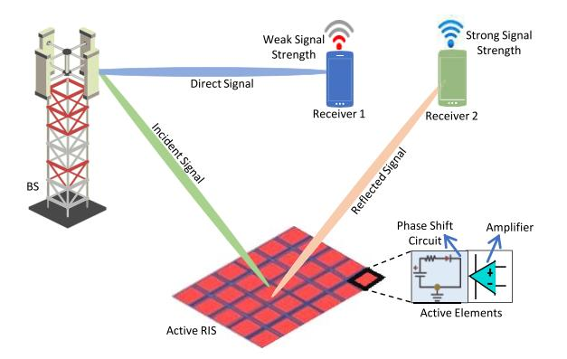
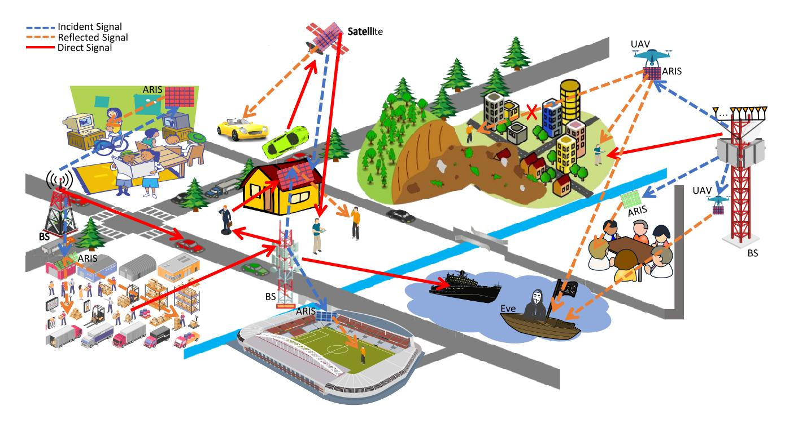
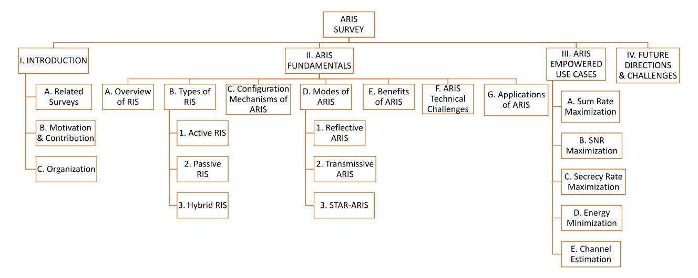
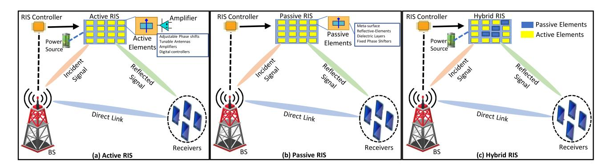
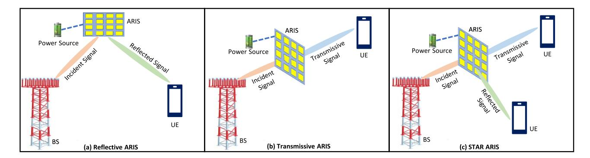
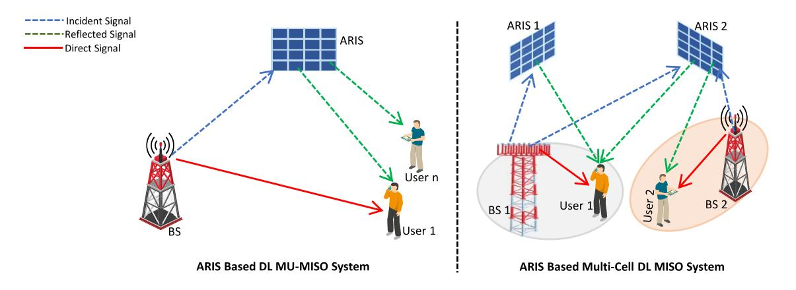
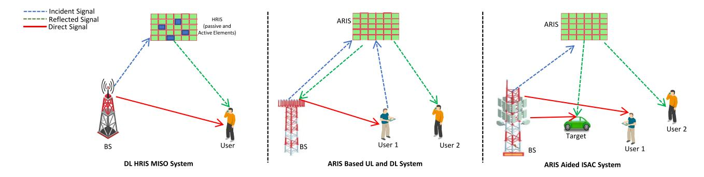
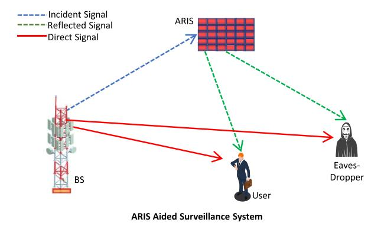
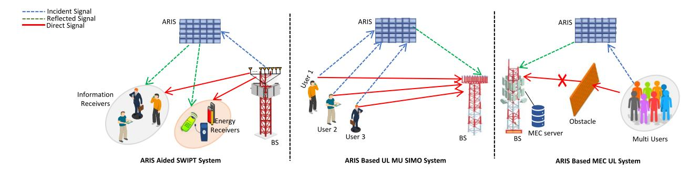
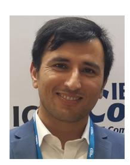

# Active Reconfigurable Intelligent Surfaces: Expanding the Frontiers of Wireless Communication-A Survey

Manzoor Ahmed®, Salman Raza®, Aized Amin Soofi®, Feroz Khan, Wali Ullah Khan®, Syed Zain Ul Abideen®, Fang Xu®, and Zhu Han®, Fellow, IEEE

Abstract—The swift progress of metasurface technology, enabling meticulous manipulation of the propagation environment, is anticipated to bring a transformative impact on sixth-generation (6G) wireless communications efficiency. Utilizing metasurface elements presents a promising opportunity for achieving passive scattering at sub-wavelength scales, facilitating intelligent radio settings' advancement. Active Reconfigurable Intelligent Surfaces (ARIS) have gained significant interest in emergent metasurface technology. In contrast to passive RIS, which exhibits a certain degree of performance enhancement but encounters restrictions arising from the "double fading" phenomenon in the phase response, ARIS emerges as a highly promising alternative to counter such restrictions. This study provides a complete examination of ARIS, particularly emphasizing current improvements and its various uses within the context of 6G wireless networks. The review commences by laying a robust foundation in RIS technology, covering the various types and modes of RIS. Following this, we will explore the benefits and practical implementations of ARIS. Through a systematic examination, we categorize different approaches within

Manuscript received 16 October 2023; revised 17 May 2024; accepted 1 July 2024. Date of publication 4 July 2024; date of current version 2 May 2025. This work was supported in part by the Ministry of Education of China (MOE) Project of Humanities and Social Sciences under Grant 23YJAZH169; in part by the Hubei Provincial Department of Education Outstanding Youth Scientific Innovation Team Support Foundation under Grant T2020017; in part by the NSF under Grant CNS-2107216, Grant CNS-2128368, Grant CMMI-2222810, and Grant ECCS-2302469; in part by the U.S. Department of Transportation; in part by Toyota; in part by Amazon; and in part by the Japan Science and Technology Agency (JST) Adopting Sustainable Partnerships for Innovative Research Ecosystem (ASPIRE) under Grant JPMJAP2326. (Corresponding author: Salman Raza.)

Manzoor Ahmed and Fang Xu are with the School of Computer and Information Science and the Institute for AI Industrial Technology Research, Hubei Engineering University, Xiaogan 432000, China (e-mail: manzoor.achakzai@gmail.com; xf@hbeu.edu.cn).

Salman Raza is with the Department of Computer Science, National Textile University Faisalabad, Faisalabad 38000, Pakistan (e-mail: salmanraza@ntu.edu.pk).

Aized Amin Soofi is with the Department of Computer Science, National University of Modern Languages Faisalabad, Faisalabad 38000, Pakistan (e-mail: aizedamin@gmail.com).

Feroz Khan is with the Balochistan University of Information Technology Engineering and Management Sciences Quetta, Quetta 87300, Pakistan (e-mail: ferozkhan687@gmail.com).

Wali Ullah Khan is with the Interdisciplinary Centre for Security, Reliability, and Trust, University of Luxembourg, 1855 Luxembourg City, Luxembourg (e-mail: waliullah.khan@uni.lu).

Syed Zain Ul Abideen is with the College of Computer Science and Technology, Qingdao University, Qingdao 266071, China (e-mail: zain208shah@gmail.com).

Zhu Han is with the Department of Electrical and Computer Engineering, University of Houston, Houston, TX 77004 USA, and also with the Department of Computer Science and Engineering, Kyung Hee University, Seoul 446-701, South Korea (e-mail: hanzhu22@gmail.com).

Digital Object Identifier 10.1109/COMST.2024.3423460

ARIS-enabled use cases. These scenarios include optimizing the sum rate and signal-to-noise ratio, attaining maximum secrecy rate, energy minimization, and ensuring channel estimation. Additionally, we provide a summary and lessons learned along with a summary table for each category to describe, contrast, and evaluate the existing literature regarding setup, channel characteristics, methodologies, and objectives. We highlight the crucial role of ARIS in defining the landscape of wireless communications in the 6G era by outlining the open research problems in this emerging area and exploring the attractive future prospects.

*Index Terms*—Reconfigurable intelligent surfaces, active RIS, IRS, smart radio environment, sixth-generation (6G).

#### I. Introduction

R ECENT innovations in wireless communications have spurred significant transformations across numerous sectors, substantially improving global quality of life [1]. There have been several enablers of 6G technologies that got attention with the potential to meet ultra-high data rates, low energy consumption, and minimal latency demands [2], [3]. Reconfigurable intelligent surfaces (RIS) have emerged as a focal point in this technological evolution, garnering attention from both the academic and engineering communities [4]. Positioned at the cutting edge, RIS technology is reshaping wireless network infrastructures by dynamically manipulating the propagation environment [5], [6]. Unlike traditional systems that depend mainly on transmitter and receiver efficiencies [7], RIS adds an intelligent element to the network, optimizing the way signals are handled and propagated. This innovative approach has proven effective in various settings, enhancing both indoor and outdoor communications, extending into Internet of Things (IoT) deployments [8], and advancing the capabilities of sixth-generation (6G) and future network technologies [9], [10], [11]. RIS can operate in both passive and active modes, as well as in hybrid mode. The capacity of RIS to significantly enhance connection quality and network efficiency while also reducing energy usage has sparked considerable interest in the research community [12]. RIS technology offers substantial improvements in communication coverage and reliability, providing robust service in diverse environmental conditions [13], [14]. Additionally, its ability to intelligently navigate around physical barriers and minimize signal loss through controlled reflection and phase adjustments enhances connectivity and user experience [15].

1553-877X © 2024 IEEE. Personal use is permitted, but republication/redistribution requires IEEE permission. See https://www.ieee.org/publications/rights/index.html for more information.

Fig. 1. Depiction of ARIS-based scenario, where ARIS REs include phase shift controlling circuit and amplifier to boost signal amplitude.

Passive RIS shows potential in addressing the challenges of traditional wireless networks by enhancing performance, *yet it faces significant obstacles due to the "double fading" or "multiplicative fading" effect [\[16\]](#page-26-6), [\[17\]](#page-26-7). This phenomenon occurs in RIS technology where the path loss between the transmitter (Tx), the RIS, and the receiver (Rx) is the product of the individual path losses from Tx to RIS and RIS to Rx. Consequently, this compounded path loss is often significantly greater—sometimes by orders of magnitude—than the path loss of the direct link, limiting the capacity gains achievable by passive RIS in various wireless communication settings [\[17\]](#page-26-7).* To address this limitation, potential strategies include deploying a greater number of passive reflective elements (REs) or strategically positioning the passive RIS closer to either the transmitter or the receiver [\[18\]](#page-26-8). However, these solutions introduce practical difficulties, such as increased complexity in deployment and elevated training requirements for channel estimation and system optimization, which may hinder practical implementation [\[19\]](#page-26-9).

In this context, active RIS (ARIS) emerges as a cuttingedge solution designed to actively counteract the "double fading" effect in wireless communications, enhancing signal propagation [\[20\]](#page-26-10). ARIS advances beyond traditional passive RIS technology by not only adjusting the phase response of signals but also amplifying them, as shown in the Fig. [1.](#page-1-0) ARIS incorporates REs with active-load impedance, functioning as active reflectors that directly amplify incident electromagnetic (EM) signals [\[21\]](#page-26-11). These active-load REs use negative resistance components like tunnel diodes to boost signals by converting direct current (DC) bias power into radio frequency (RF) power, effectively enhancing signal strength without substantially increasing the power budget [\[22\]](#page-26-12). This approach allows ARIS to achieve the desired SNR using fewer REs than passive RIS, effectively overcoming double-fading attenuation. Each RE in ARIS can independently adjust both amplitude and phase of the incident signal, providing flexible beamforming capabilities [\[23\]](#page-26-13). This dual-control enables precise manipulation of reflective coefficient phases and amplitudes, significantly improving adaptability across various wireless propagation environments [\[24\]](#page-26-14).

In scenarios where the direct link between the Tx and Rx is strong, ARIS can outperform passive RIS. Unlike passive RIS, which suffers from the "double fading" effect and results in a weaker absolute signal strength, the amplified signals from ARIS make a significant impact, enhancing the total received signal's SNR [\[25\]](#page-26-15). Realistic evaluations show that the SNR of an ARIS-enabled system can exceed that of a passive RIS by 40 dB when REs equals 256, indicating that far fewer REs are required for an ARIS to achieve performance equivalent to that of a passive system under similar conditions [\[26\]](#page-26-16), [\[27\]](#page-26-17). To corroborate further, in a prototype-based study [\[27\]](#page-26-17), the authors developed a signal model for ARIS equipped with an integrated reflection-type amplifier, verified through experimental data. This model was applied to an active RIS-enabled multi-user multiple-input single-output (MU-MISO) system, introducing a combined strategy for transmit beamforming and reflect precoding. The simulations indicate that ARIS can substantially increase network capacity, achieving a sum-rate gain of 130% and successfully countering the "multiplicative fading" effect, a significant improvement over the 22% gain observed with passive RIS. In another prototype [\[26\]](#page-26-16), 2x2 ARIS exhibits an 8.5 dB higher received power than a comparable passive RIS. This enhancement highlights ARIS's potential for highcapacity wireless systems and its capability to address the "double fading" challenge in 6G communication networks.

RIS technology including ARIS primarily functions within the analog RF domain, manipulating EM waves via phase shifts and amplitude adjustments through amplifiers [\[28\]](#page-26-18). This is typically accomplished using analog components like varactors or PIN diodes embedded in each element of the ARIS. These components facilitate the real-time alteration of RF signals, optimizing the signal path without converting these signals into digital formats. ARIS optimizes reflection coefficient amplitudes to enhance spectral efficiency (SE) and energy efficiency (EE), making it suitable for space-limited scenarios where large passive RIS arrays are impractical [\[29\]](#page-26-19), [\[30\]](#page-26-20). This attribute not only elevates link quality under restricted power conditions but also contributes to the network's EE, aligning with the goals of future wireless communications. The integration of active components within ARIS introduces complexities related to power management and heat dissipation, crucial for maintaining the reliability and scalability of large-scale ARIS arrays. Addressing these technical challenges requires developing robust power systems and effective thermal management strategies to ensure seamless ARIS operation in modern communication infrastructures [\[31\]](#page-26-21).

The ARIS system effectively tackles the challenges encountered by conventional wireless networks by enabling real-time manipulation (i.e., phase control and amplitude) of EM waves [\[32\]](#page-26-22), as shown in Fig. [2.](#page-2-0) In contrast to passive surfaces, ARIS can actively reconfigure its EM properties, facilitating meticulous manipulation of signal transmission, reflection, and absorption [\[33\]](#page-26-23). With the help of this transformative capacity, ARIS can customize its behavior to maximize communication parameters like signal strength, coverage area, and interference reduction. Incorporating dynamic adaptability into the wireless communication infrastructure through ARIS can potentially bring about significant changes in network creation, implementation, and optimization. Table [I](#page-2-1) is given for important acronyms.

Fig. 2. Future reconfigurable intelligent wireless communications enabled by ARIS.

TABLE I SUMMARY OF IMPORTANT ACRONYMS

| Notation | Definition                                 | Notation | Definition                                           |
|----------|--------------------------------------------|----------|------------------------------------------------------|
| ARIS     | Active reconfigurable intelligent surfaces | SRE      | Smart radio environment                              |
| RIS      | Reconfigurable intelligent Ssurfaces       | STAR     | Simultaneously transmitting and reflecting           |
| SNR      | Signal-to-noise ratio                      | UAV      | Unmanned aerial vehicle                              |
| RF       | Radio frequency                            | LoS      | Line of sight                                        |
| RE       | Reflecting element                         | SR       | Secrecy rate                                         |
| EM       | Electromagnetic                            | SWIPT    | Simultaneous wireless information and power transfer |
| IoT      | Internet of things                         | MISO     | Multiple-input single-output                         |
| CE       | Channel estimation                         | MU-MISO  | Multi user-multiple-input single-output              |
| CSI      | Channel state information                  | DFA      | Double faced active                                  |
| HRIS     | Hybrid reconfigurable intelligent surface  | SE       | Spectral efficiency                                  |
| PEPCs    | Per-element power constraints              | ADMM     | Alternating direction method of multiplier           |
| QCQP     | Quadratic constraint quadratic programming | SCA      | Sequential convex approximation                      |
| BTI      | Bernstein-type inequality                  | RSMA     | Rate splitting multiple access                       |
| SDR      | Semi define relaxation                     | FP       | Fractional programming                               |
| BCD      | Block coordinate descent                   | NOMA     | Non-orthogonal multiple access                       |
| DL       | Downlink                                   | UL       | Uplink                                               |
| BS       | Base station                               | AO       | Alternating optimization                             |
| KKT      | Karush-kuhn-tucker                         | ISAC     | Integrated sensing and communication                 |
| MM       | Majorize minimization                      | UE       | User Equipment                                       |
| MRR      | Maximum ratio reflecting                   | UDR      | Ultimate detection resolution                        |
| EGR      | Equal gain reflecting                      | SOP      | Secrecy outage probability                           |
| MIMO     | Multiple input multiple output             | HDR      | Half duplex relay                                    |
| FDR      | Full duplex relay                          | MCL      | Maximum computational latency                        |
| PF       | Particle filtering                         | RA       | Reflection amplifier                                 |
| RIOS     | Reconfigurable intelligent omni-surface    | ADMM     | Alternating direction method of nultipliers          |
| EE       | Energy efficiency                          | JBRA     | Joint beamforming and resource allocation            |
| OMP      | Orthogonal matching pursuit                | LSTM     | Long short-term memory                               |
| DNN      | Deep neural network                        | SRR      | Selective ratio reflecting                           |
| DC       | Direct current                             | VLC      | Visible light communication                          |
| PLS      | Physical layer security                    | IOS      | Intelligent omni-surface                             |
| WSR      | weighted sum rate                          | PDD      | penalty dual decomposition                           |

## *A. Related Surveys*

Academic literature extensively covers RIS from various angles, as seen in Table [II.](#page-3-0) It's worth noting that the field of RIS research has benefited greatly from the valuable contributions of numerous researchers. However, it's crucial to emphasize that the *existing body of research has primarily focused on passive RIS, leaving a notable gap in the literature with no comprehensive survey or study dedicated to the emerging area of ARIS*. In [\[34\]](#page-26-24), the investigation's primary focus was measuring performance improvements that

TABLE II COMPARISON OF ACTIVE-RIS RELATED SURVEY PAPERS

| RIS           | Ref.          | F         | unda      | nenta         |                   | ARIS Use Cases |                                                           |          |                |                   |            | ons | səs | Main Contribution                                                                                                                                                                                                                                                                                                                                                                                                                                                                                                                                                           |  |  |
|---------------|---------------|-----------|-----------|---------------|-------------------|----------------|-----------------------------------------------------------|----------|----------------|-------------------|------------|-----|-----|-----------------------------------------------------------------------------------------------------------------------------------------------------------------------------------------------------------------------------------------------------------------------------------------------------------------------------------------------------------------------------------------------------------------------------------------------------------------------------------------------------------------------------------------------------------------------------|--|--|
| Туре          |               | RIS Types | RIS Modes | ARIS Benefits | ARIS Applications | Sum-Rate Max.  | SNR Max. Secracy-Rate Max. Energy Min. Channel Estimation |          | Lesson Learned | Future Directions | Challenges |     |     |                                                                                                                                                                                                                                                                                                                                                                                                                                                                                                                                                                             |  |  |
|               | [34]          | Х         | 1         | Х             | X                 | Х              | Х                                                         | X        | Х              | ×                 | Х          | 1   | 1   | Backscatter communications and reflecting relays are used to measure RIS performance gains, hardware deployments, and applications.                                                                                                                                                                                                                                                                                                                                                                                                                                         |  |  |
|               | [35]          | Х         | Х         | Х             | Х                 | Х              | Х                                                         | Х        | Х              | Х                 | Х          | Х   | 1   | The article introduced RIS as a tool for SRE, explored its features, and reviewed current SRE research.                                                                                                                                                                                                                                                                                                                                                                                                                                                                     |  |  |
|               | [36]          | /         | 1         | Х             | Х                 | X              | /                                                         | Х        | Х              | Х                 | Х          | 1   | /   | This article covers communication theory and essential technology for RIS-                                                                                                                                                                                                                                                                                                                                                                                                                                                                                                  |  |  |
| Reflective    | [37]          | Х         | ×         | Х             | Х                 | X              | X                                                         | ×        | Х              | X                 | Х          | 1   | 1   | enabled wireless networks, SNR optimization and other research topics.  The article reviewed recent uses and design elements of RISs in wireless                                                                                                                                                                                                                                                                                                                                                                                                                            |  |  |
| RIS           | [38]          | X         | Х         | Х             | Х                 | X              | ×                                                         | ×        | 1              | X                 | Х          | 1   | 1   | networks, and explored emerging use cases.  Provided a smart cities concept for prospective communication networks, applications and use cases. Highlighted the prospective advantages of RIS                                                                                                                                                                                                                                                                                                                                                                               |  |  |
|               | [39]          | X         | 1         | Х             | Х                 | X              | X                                                         | Х        | X              | X                 | Х          | /   | Х   | adoption and energy minimization promising research prospects.  Presented hardware strategies for SRE, studied channel features, and identified difficulties and potential in RIS-aided wireless networks.                                                                                                                                                                                                                                                                                                                                                                  |  |  |
|               | [40]          | Х         | Х         | Х             | Х                 | Х              | X                                                         | Х        | Х              | 1                 | Х          | 1   | 1   | A tutorial on RIS-enhanced wireless technology addressed technical issues in communication.                                                                                                                                                                                                                                                                                                                                                                                                                                                                                 |  |  |
|               | [41]          | Х         | X         | Х             | Х                 | X              | X                                                         | Х        | X              | X                 | Х          | Х   | 1   | A review of RIS-aided wireless communications was presented, covering vision, cases, and key performance metrics. The new communication model, hardware design, and competitive benefits are introduced.                                                                                                                                                                                                                                                                                                                                                                    |  |  |
|               | [42]          | Х         | X         | Х             | Х                 | ×              | 1                                                         | Х        | х              | X                 | Х          | 1   | Х   | Future applications, deployment methods, and design concerns for RIS devices in underground, underwater, Industry 4.0, and emergency networking were investigated. Provide a hardware framework and assess signal quality gains with more RIS parts and potential concerns.                                                                                                                                                                                                                                                                                                 |  |  |
|               | [43]          | Х         | X         | Х             | Х                 | Х              | X                                                         | Х        | X              | X                 | Х          | Х   | 1   | State-of-the-art approaches to three physical layer issues in wireless networks after integrating RIS are described. This includes CSI gathering, passive exchange of data, and low-complexity phase shifting minimization.                                                                                                                                                                                                                                                                                                                                                 |  |  |
|               | [44]          | 1         | 1         | Х             | Х                 | 1              | Х                                                         | Х        | Х              | Х                 | Х          | Х   | 1   | Presented an investigation on performance evaluation, handling of resources, and machine learning methods for RIS-aided wireless communication, including prospective possibilities.                                                                                                                                                                                                                                                                                                                                                                                        |  |  |
|               |               | Х         | 1         | Х             | Х                 | Х              | Х                                                         | Х        | Х              | Х                 | Х          | 1   | 1   | RIS prototype and experimental results along with tutorial on RIS-aided sensing and localization to address technical problems is presented.                                                                                                                                                                                                                                                                                                                                                                                                                                |  |  |
|               | [46]          | Х         | Х         | Х             | Х                 | Х              | ×                                                         | Х        | Х              | 1                 | Х          | Х   | Х   | An overview of RIS basics and current signal processing research had been focused, covering localization, sensing and communication.                                                                                                                                                                                                                                                                                                                                                                                                                                        |  |  |
|               | [47]          | Х         | ×         | Х             | Х                 | X              | X                                                         | Х        | Х              | 1                 | X          | Х   | Х   | Presented a comprehensive overview on RIS-aided communication, including potential techniques for channel estimates and beamforming.                                                                                                                                                                                                                                                                                                                                                                                                                                        |  |  |
|               | [48]          | Х         | Х         | Х             | Х                 | X              | X                                                         | Х        | Х              | X                 | /          | /   | /   | discussed how RIS technology solves line-of-sight (LoS) blockage and device oriented concerns in indoor VLC systems.                                                                                                                                                                                                                                                                                                                                                                                                                                                        |  |  |
|               | [49]          | Х         | X         | Х             | Х                 | X              | X                                                         | <b>-</b> | X              | X                 | Х          | 1   | 1   | The article covered ML-based techniques for RIS and intelligent spectrum allocation in IoT systems. Additionally, discussed combining ML methods and applying them to technical difficulties.                                                                                                                                                                                                                                                                                                                                                                               |  |  |
| Star RIS   | [50]          | Х         | Х         | Х             | Х                 | Х              | X                                                         | Х        | Х              | Х                 | Х          | 1   | 1   | The IOS concept allows full-dimensional communication by serving users on both sides of the outermost layer. A new composite beamforming method for IOS-based wireless communications was proposed.                                                                                                                                                                                                                                                                                                                                                                         |  |  |
|               | [51]          | Х         | 1         | Х             | Х                 | Х              | Х                                                         | Х        | Х              | Х                 | 1          | 1   | 1   | A thorough IOS examination covers future cellular network applications, design concepts, beamforming, channel modeling, and practical execution.                                                                                                                                                                                                                                                                                                                                                                                                                            |  |  |
|               | [52]          | 1         | Х         | Х             | Х                 | 1              | Х                                                         | Х        | 1              | Х                 | Х          | 1   | 1   | STAR-RIS is reviewed for its recent approaches to 6G networks, resource allocation, and performance evaluation. STAR-RIS protocols, benefits, and applications were discussed.                                                                                                                                                                                                                                                                                                                                                                                              |  |  |
| Active RIS | This study | 1         | 1         | ✓             | 1                 | 1              | ✓                                                         | <b>√</b> | 1              | 1                 | ✓          | ✓   | 1   | Our survey commences by providing an in-depth exploration of RIS, covering fundamental aspects such as RIS types, ARIS modes, benefits, and wide-ranging applications. Our survey focuses on ARIS, where we delve into its multifaceted applications. This includes optimizing sum rates, enhancing SNR, bolstering secrecy rates, and promoting EE in diverse communication scenarios. Finally, our survey concludes by summarizing key insights, charting the course for future research endeavors, and spotlighting the prevailing challenges within this dynamic field. |  |  |

can be achieved by deploying RIS. Additionally, the study provided a comprehensive analysis of the operational modes of RIS, including the potential directions they may take in the future. The authors of [\[35\]](#page-26-25) examined the current advancements in meta-material-based surfaces in smart radio environment (SRE). To provide a clearer understanding of the actual uses of RIS technology, the study conducted by [\[36\]](#page-26-26) explored several applications, emphasizing the enhancement of SNR optimization.

Additionally, the authors [\[37\]](#page-26-27) explored the complexities of RIS design, discussing the accompanying difficulties and potential future directions. In [\[38\]](#page-26-28), a detailed exploration was conducted to enhance further the discourse on the merits of implementing RIS in the framework of smart cities, with a specific emphasis on minimizing energy consumption. The authors of [\[39\]](#page-26-29) provided a comprehensive analysis of the fundamental elements of RIS, operational modes, and future hardware methods for SRE. In [\[40\]](#page-26-30), a comprehensive investigation was undertaken on RIS-enabled wireless technology, specifically focusing on the crucial aspect of channel estimation. The authors of [\[41\]](#page-26-31) thoroughly examined the current communication model, hardware design paradigms, and competitive issues faced by RIS. The exploration extended beyond the terrestrial realm, [\[42\]](#page-26-32) delved into the domain of undersea applications and Industry 4.0, with a specific focus on optimizing SNR. The authors of [\[43\]](#page-26-33) conducted a thorough analysis of the complexities of integrating RIS into wireless networks, with particular attention given to the accompanying complexity at the physical layer. The study [\[44\]](#page-26-34) focused on exploring machine learning approaches in the context of RIS-enabled wireless communication. Specifically, the main objective was to maximize the sum rate while also considering various types of RIS, different modes of operation, and the challenges associated with RIS technology. The authors of [\[45\]](#page-26-35) prioritized signal processing issues when examining wireless communications enhanced by RIS. Similarly, [\[46\]](#page-26-36) and [\[47\]](#page-26-37) focused on channel estimation approaches. The full examination of the necessity for RIS solutions in addressing line of sight (LoS) obstruction and visible light communication (VLC) systems was conducted [\[48\]](#page-26-38).

To enhance levels of confidentiality, the study conducted by [\[49\]](#page-26-39) examined machine learning methods within the RIS framework. Intelligent omni-surface (IOS) communication enables comprehensive communication for users on both sides of the surface and was first introduced in [\[50\]](#page-26-40). The examination conducted in [\[51\]](#page-26-41) provided a thorough analysis of IOS, focusing on its applicability in cellular networks, design paradigms, channel modeling complexities, and practical implementations. Furthermore, a detailed analysis conducted by [\[52\]](#page-26-42) has extensively examined the STAR-RIS technology, exploring its various applications, including enhancing coverage, improving physical layer security (PLS), maximizing sum rates, augmenting EE, and mitigating interference. The academic literature listed above highlights the broad and diverse field of RIS research. Our study on ARIS occupies a unique and valuable position within this field, adding to the growing body of knowledge in this dynamic area.

## *B. Motivation and Contribution*

As 6G technology advances, a thorough study of ARIS is essential. We aim to contribute to ARIS knowledge, promoting deeper understanding and continued progress in this dynamic field.

Following are our review's key contributions:

- *•* This study provides a comprehensive and current examination of ARIS, incorporating the most recent developments in this area of research. A thorough overview of diverse types and modes of RIS establishes a solid foundation for conducting a complete review.
- *•* Our primary focus is on ARIS's applications and transformative capabilities within the context of future 6G networks. We illustrate how ARIS can revolutionize wireless communication by showcasing its adaptability and effectiveness across various network setups. We systematically classify and evaluate usage scenarios that

- leverage ARIS to optimize parameters like sum rate, SNR, secrecy rate (SR), and channel estimation.
- *•* In this review, we undertake a comprehensive comparative analysis, carefully examining different schemes, system models, scenarios, RIS types, modes, channel characteristics, techniques, and proposed solutions. Additionally, we summarize each sub-category and draw valuable lessons from these analyses. To aid comprehension, we provide a concise summary table that elucidates the nuances and advantages of each scheme.
- *•* We also identify the primary research problems that need to be solved in the dynamic field of ARIS. This information motivates researchers to look into fresh and exciting directions for future research. Ultimately, we highlight ARIS's critical role in determining the wireless communications landscape in the 6G era and provide insights into possible future possibilities.

### *C. Organization*

The subsequent sections of the survey are organized in the following manner. Section [II](#page-4-0) provides an overview of RIS technology, its types, and modes. Followed by ARIS benefits, applications, and technical challenges. We categorize the stateof-the-art approaches in Section [III](#page-9-0) in compliance with the use case scenarios, which encompass maximizing sum rate, SNR, and SR, followed by energy minimization and accurate channel estimation. Moreover, each subsection is supported with a summary and lessons learned. In Section [IV,](#page-23-0) we enumerate a selection of open problems and propose potential avenues for future investigation. Section [V](#page-25-9) concludes the ARIS review. Our survey taxonomy is depicted in Fig. [3.](#page-5-0)

## II. ARIS FUNDAMENTALS

### *A. Overview of RIS*

In recent years, academia and industry have shown great interest in RIS due to the rapid expansion of wireless communication technology [\[53\]](#page-26-43). RIS is recognized as a cutting-edge paradigm for signal modulation, EM wave manipulation, and adaptive radio environment reconfiguration [\[54\]](#page-27-0), [\[55\]](#page-27-1). RIS is a two-dimensional intelligent metasurface with regular or irregular subwavelength electrostatic or magnetic resonators that exhibit flexible transmission phase and amplitude responses [\[56\]](#page-27-2). By changing the phase, amplitude, and polarization of EM waves that pass through them, RIS can control and improve how wireless signals travel in a smart and adaptable way [\[39\]](#page-26-29). The dynamic reconfiguration ability of RIS is a distinguishing characteristic that sets it apart from conventional passive reflecting surfaces [\[36\]](#page-26-26), [\[57\]](#page-27-3). By changing with shifting environmental conditions, RIS can achieve optimal signal transmission, expand coverage, reduce interference, and enhance overall system performance [\[39\]](#page-26-29), [\[56\]](#page-27-2), [\[58\]](#page-27-4). RIS technology's adaptability and versatility make it viable for various wireless communication scenarios, such as cellular networks, indoor and outdoor environments, IoT deployments, and contemporary wireless systems such as 6G and beyond [\[46\]](#page-26-36), [\[59\]](#page-27-5), [\[60\]](#page-27-6).

Fig. 3. Taxonomy of the proposed active RIS survey.

Fig. 4. Illustration of RIS Types: (a) Active, (b) Passive, and (c) Hybrid-RIS.

This section delves into the different types of RIS, starting with ARIS, passive RIS, and hybrid RIS. Subsequently, it explores the configuration mechanisms of ARIS, various operational modes of ARIS, alongside their benefits, technical challenges, and applications, illustrating how each plays a crucial role in enhancing modern communication systems.

## *B. Types of RIS*

*1) ARIS:* ARIS marks a significant advancement over passive RIS by incorporating the ability not only to adjust the phase of signals but also to amplify them. This dual capability, facilitated by integrated active-load impedance, significantly enhances overall system performance, as depicted in Fig. [4a](#page-5-1) [\[61\]](#page-27-7). Unlike passive systems that merely reflect signals, ARIS dynamically controls signal's phase and amplitude, thus boosting signal intensity, extending coverage, reducing interference, and enabling precise beamforming [\[62\]](#page-27-8). Each RE within ARIS operates independently and includes sophisticated electronic devices like phase shifters and amplifiers. These components are finely tuned to modify EM wave characteristics—such as phase and amplitude—in real-time, offering unprecedented control over signal propagation [\[63\]](#page-27-9), [\[64\]](#page-27-10). ARIS offers the following key advancements and strategic enhancements.

- *• Counteracting Double Fading:* ARIS actively mitigates the "double fading" effect, ARIS significantly improves signal propagation in challenging wireless environments [\[17\]](#page-26-7), [\[20\]](#page-26-10).
- *• Advanced REs:* ARIS employs REs with active-load impedances that amplify incident EM signals directly, utilizing energy-efficient components like tunnel diodes to enhance signal strength without a substantial power increase.
- *• Optimal Signal Management:* Achieves superior SNR with fewer elements than passive systems and provides flexible, precise beamforming to adapt effectively across diverse propagation scenarios [\[24\]](#page-26-14).
- *• Energy and Spectrum Efficiency:* Optimizes reflection coefficient amplitudes, making ARIS suitable for areas where space constraints limit the deployment of large passive arrays, and enhancing overall network efficiency [\[29\]](#page-26-19), [\[30\]](#page-26-20), [\[65\]](#page-27-11).
- *• Amplification gains:* ARIS units incorporate built-in amplifiers that can increase signal strength significantly often enhancing signal power by up to 30 dB. This contrasts with passive RIS, which does not alter signal power but only the phase of the signals it reflects [\[26\]](#page-26-16).
- *• Efficiency Gains:* Active control over both amplitude and phase allows for more precise optimization of signal

paths, which can improve overall network efficiency by up to 40% compared to systems that utilize passive RIS technologies [\[26\]](#page-26-16), [\[66\]](#page-27-12).

- *• Reduced Physical Footprint:* Thanks to their signal amplification capabilities, ARIS can achieve desired communication effects with fewer elements, potentially reducing the necessary surface area by approximately 25% compared to passive setups.
- *• Functional Flexibility:* ARIS can operate in both active and passive modes, providing versatility in energy usage and functionality—crucial for adapting to varying operational demands and power availability.
- *2) Passive RIS:* Passive RIS uses metasurfaces, specially made surfaces of many small elements that can reflect and change radio waves [\[27\]](#page-26-17), as shown in Fig. [4b](#page-5-1). There are no baseband units for processing in passive RIS. Since there are no measurements at the RIS, the Channel Estimation (CE) can only be done at the base station (BS) (i.e., uplink) or the mobile station (i.e., downlink) [\[67\]](#page-27-13). By altering the wavefronts of EM radiation, passive RIS systems can accomplish various objectives, including boosting the signal's strength, expanding coverage, enhancing dependability, lowering interference, and enabling secure communication [\[68\]](#page-27-14). By adjusting the reflection matrix results in high array gain, which can boost the receiver's SNR [\[60\]](#page-27-6).

Although passive RIS provides a trustworthy reflection link for signal transmission in addition to the direct link, signals received over the reflection link are always subject to a double fading effect [\[69\]](#page-27-15). Passive RISs can sometimes only add negligible capacity when the direct link is strong [\[17\]](#page-26-7). Moreover, passive RIS also suffers from limitations, including the restricted ability to change the signal's characteristics due to a lack of active components like amplifiers [\[70\]](#page-27-16). ARIS has been introduced to overcome some of the limitations of passive RIS.

*3) Hybrid RIS:* A hybrid RIS (HRIS) system combines passive and active elements, offering a versatile approach to enhance wireless communication systems, as illustrated in Fig. [4c](#page-5-1). HRIS harnesses the strengths of both passive and active RIS components to optimize signal manipulation [\[71\]](#page-27-17), [\[72\]](#page-27-18). Active elements within HRIS provide additional means to modify signals, including beamforming, and amplification, while passive elements contribute to signal reflection, dispersion, or rerouting, as highlighted in studies like [\[73\]](#page-27-19). Nevertheless, HRIS frameworks represent an ongoing area of research, where various optimization algorithms, control strategies, and hardware configurations are under investigation. These efforts aim to unlock the full potential of merging passive and active elements, further improving the adaptability and performance of HRIS systems. Table [III](#page-6-0) shows the comparison of different characteristics of different types of RIS.

#### *C. Configuration Mechanisms of ARIS*

Configuration of ARIS is overseen by a sophisticated control system, often integrated within a network's BS or operating as an autonomous network management unit. This system

TABLE III COMPARISON OF DIFFERENT RIS CHARACTERISTICS

| Characteristics         | Passive RIS | Active RIS  | Hybrid RIS  |  |  |
|-------------------------|-------------|-------------|-------------|--|--|
| Power Requirement       | None        | Required    | Required    |  |  |
| Signal Manipulation     | Phase       | P & A       | P & A       |  |  |
| Adaptability            | Limited     | High        | High        |  |  |
| Energy Efficiency       | High        | Moderate    | Moderate    |  |  |
| Complexity              | Low         | High        | Moderate    |  |  |
| Coverage                | 180 degrees | 180 degrees | 180 degrees |  |  |
| Real-time Adaptation    | Yes         | Yes         | Yes         |  |  |
| Interference Mitigation | Limited     | High        | Balanced    |  |  |
| Spectral Efficiency     | Limited     | High        | High        |  |  |
| Capacity Improvement    | Limited     | High        | High        |  |  |
| System Complexity       | Low         | High        | Moderate    |  |  |
| Cost                    | Low         | High        | Moderate    |  |  |

interfaces with the ARIS to modify its settings based on ongoing network conditions and predefined optimization algorithms [\[23\]](#page-26-13). The configuration process encompasses several key aspects:

- *1) Dynamic Phase Adjustment:* Each element of the ARIS adjusts the phase of reflected signals via electronic mechanisms that alter the voltage across components like varactors. This capability enables precise manipulation of signal trajectories, enhancing constructive interference at the receiver or reducing unwanted signal interference [\[36\]](#page-26-26).
- *2) Amplitude Modulation Capabilities:* ARIS models include active elements that can modulate the amplitude of signals. This functionality enhances the metasurface's ability to fine-tune the signal environment, significantly boosting its utility in diverse communication scenarios.
- *3) Algorithmic Configuration Optimization:* Configuration optimization in ARIS is significantly enhanced by the use of adaptive algorithms. These algorithms utilize machine learning to refine ARIS parameters continuously, optimizing for various performance metrics based on real-time data regarding user demands and environmental conditions.
- *4) Feedback-Driven Adjustments:* The ARIS configuration is further refined through feedback from both environmental sensors and user devices, which enables the ARIS to adapt to changes such as user movement, varying environmental conditions, and fluctuating signal qualities [\[23\]](#page-26-13), [\[36\]](#page-26-26).
- *5) Role of Automation:* The primary application of ARIS technology is to improve signal coverage and quality within wireless networks, particularly in areas where communication is typically challenging. The deployment of ARIS significantly extends network reach and enhances EE. Automation in ARIS configuration reduces the necessity for manual adjustments, ensuring that the system can adapt seamlessly to maintain optimal communication conditions at all times.

#### *D. Modes of ARIS*

*1) Reflective ARIS Mode:* Reflective ARIS configuration is equipped with REs of metasurfaces organized in a two-dimensional layout, as illustrated in Fig. [5a](#page-7-0). These components are engineered to engage with and modify the

Fig. 5. Depiction of ARIS Modes: (a) Reflective, (b) Transmissive, and (c) STAR-ARIS.

trajectory of incoming signals [\[64\]](#page-27-10). In contrast to the traditional passive reflective RIS that depends on the energy of incident signals, reflective ARIS includes integrated power sources, facilitating enhanced control over wave manipulation. This capability has elevated reflective ARIS to a prominent position for boosting transmission quality, widening coverage areas, and fostering the development of novel applications. Typically, both the BS and the user need to be located on the same side of the ARIS, which may restrict deployment options based on physical location [\[74\]](#page-27-20). To address these spatial limitations, advancements in transmissive RIS technologies have been introduced [\[75\]](#page-27-21).

- *2) Transmissive Mode:* Unlike reflective RIS, which primarily redirects signals, transmissive RIS permits signals to pass through, creating directed beams, as shown in Fig. [5b](#page-7-0). This unique feature positions transmissive RIS as a potential solution for addressing coverage gaps that reflective RIS may leave behind [\[76\]](#page-27-22). This mode of RIS operation is designed to combat signal attenuation, expand coverage, and enhance overall wireless communication performance. It achieves these enhancements by precisely adjusting the amplitude and phase of both reflected and transmitted waves, a concept thoroughly explored in [\[77\]](#page-27-23). One of the standout characteristics of transmissive RIS is its EE and adaptability, as underscored by [\[78\]](#page-27-24). The ability to reconfigure the phase is a critical feature of a transmissive RIS. Each element of the RIS typically incorporates solid-state electronic devices that allow for dynamic adjustment of its phase properties. Continuous phase modifications are facilitated through the use of analog devices such as varactor diodes, PIN diodes, and microelectro-mechanical systems (MEMS) switches [\[79\]](#page-27-25).
- *3) STAR Mode:* Traditional RIS relies on having both transmitter and receiver on the same side for effective operation. However, this limits adaptability when users are on both ends and use a half-space SRE [\[80\]](#page-27-26). To overcome this, STAR-ARIS simultaneously transmits and reflects signals, offering greater flexibility in signal control [\[50\]](#page-26-40), [\[81\]](#page-27-27), as shown in Fig. [5c](#page-7-0). STAR-ARIS systems provide greater autonomy in controlling signal propagation, offering developers increased flexibility to meet rigorous communication requirements [\[81\]](#page-27-27). It's important to note that STAR-ARIS systems have a more intricate design, as their elements can support both electric and magnetic currents [\[82\]](#page-27-28), [\[83\]](#page-27-29). Next, we will discuss its uplink, downlink, and combined operations.

- *• Upstream Operation:* In the upstream context, STAR-ARIS significantly enhances the uplink communication from user devices to the BS. It actively manipulates the phase, amplitude, and direction of incoming signals, optimizing their paths towards the BS [\[84\]](#page-27-30). This capability is invaluable in scenarios where obstacles block direct paths or where signals degrade over distances. By refining how signals propagate, STAR-ARIS improves the signal quality received by the BS, leading to enhanced network throughput and reduced error rates.
- *• Downstream Operation:* For downstream communication, STAR-ARIS ensures efficient signal transmission from the BS to users [\[85\]](#page-27-31). It utilizes its dual transmission and reflection abilities to direct customized signal beams toward specific users, maximizing coverage and minimizing signal interference. This functionality is essential in areas with high user density or complex geographic layouts, ensuring all users receive robust and clear communication [\[86\]](#page-27-32).
- *• Comprehensive Role in Network Performance:* By integrating both upstream and downstream capabilities, STAR-ARIS optimizes the entire communication network. Its ability to support robust bidirectional communication enhances overall system efficiency, making it indispensable in advanced communication infrastructures that demand high capacity and reliable connectivity [\[86\]](#page-27-32).

#### *E. Benefits of ARIS*

ARIS represents a nascent technological advancement with the capacity to transform wireless communication systems profoundly. ARIS refers to intelligent surfaces that can alter and regulate EM waves actively. This unique characteristic enables ARIS to offer notable benefits regarding wireless communication coverage and functionality. Enhanced coverage is one of the core benefits of ARIS. The improved capabilities of active RIS can address the limitation of limited coverage in passive RIS. Some of the potential benefits of ARIS are given as follows:

*•* The ARIS system can actively augment the signal strength and improve wireless communication quality through the reflection, refraction, and focusing of EM waves [\[87\]](#page-27-33). Consequently, there is an enhancement in

- network coverage within regions characterized by weak signal strength or locations where signals are absent.
- *•* ARIS provides the feature of real-time dynamic adaption that allows it to alter its transmitted signals in real-time. This adaptability can result in enhanced efficiency under variable or unforeseeable wireless conditions.
- *•* ARIS optimizes signal coverage and reduces interference in crowded areas by adapting to user positions using targeted beamforming techniques [\[88\]](#page-27-34).
- *•* The ARIS system dramatically extends the coverage range of wireless networks by intelligently rerouting signals to bypass obstacles, reflecting them over longer distances, and mitigating signal degradation from interference and propagation losses [\[32\]](#page-26-22).
- *•* ARIS optimizes signal pathways and phases to reduce interference [\[89\]](#page-27-35), resulting in enhanced network performance.
- *•* ARIS can boost device efficiency with amplified signals [\[90\]](#page-27-36), reducing energy consumption in weak signal conditions.
- *•* ARIS can concentrate signal energy towards certain regions or devices, enhancing signal strength ratio to background noise. This targeted approach improves the communication link's reliability and data rate within the designated area.
- *•* ARIS can be easily installed and deployed in various settings like buildings, public areas, and transit hubs [\[91\]](#page-27-37), enabling rapid connection improvements and coverage extension without major infrastructure changes.
- *•* ARIS can be programmed to provide tailored coverage patterns that align with precise communication requirements. The versatility of this technology enables it to achieve optimized coverage in various settings, including but not limited to indoor and outdoor locations, as well as urban and rural places.
- *•* Using ARIS can significantly impact the progress of 6G and future wireless networks by addressing signal attenuation issues in mmWave/THz frequencies through strategic signal redirection and concentration.
- *•* A major advantage of ARIS is that it can optimize its transmitted signals to improve overall communication efficiency and change with varying channel conditions.
- *•* ARIS improved the spectrum use by mitigating the necessity for increased transmit power to establish communication with remote devices [\[92\]](#page-27-38). This phenomenon results in the enhanced utilization of the spectrum of resources that are now accessible.
- *•* ARIS can communicate by transmitting and reflecting incoming signals. This two-way communication feature can facilitate more flexible and dynamic communication situations.

#### *F. ARIS Technical Challenges*

Following are the ARIS technical challenges:

*• Noise Amplification Issues:* The amplification process in ARIS also increases noise levels, typically raising the noise floor by around 5 dB, which can compromise

- the SNR. Addressing this requires sophisticated noise reduction techniques.
- *• Complexity and Cost:* Integrating active components increases design complexity and necessitates advanced engineering to prevent interference, manage heat, and maintain component integrity under operational stresses. For example, in [\[26\]](#page-26-16), the complexity and cost of ARIS element derive from its three components: the antenna, phase shifter, and reflection amplifier. The antenna and amplifier are fixed components with no reconfigurability post-manufacture, simplifying their integration. In contrast, the phase shifter's complexity escalates with the number of control bits required, increasing the complexity of system control as the number of elements grows. To manage this, their design uses a two-bit phase shifter to limit complexity, though channel estimation for each element adds to the overall system demands. Cost considerations for the ARIS include power and fabrication expenses. In [\[26\]](#page-26-16), the antenna consumes no power, and the phase shifter uses a negligible amount, with only 0.066 mW needed for the switches. The reflection amplifier is the primary power consumer, needing about 17.5 mW per element, totaling approximately 1.12 watts for a 64-element array. Fabrication costs are influenced by the prices of circuit boards and components like switches and transistors.
- *• Network Compatibility:* Integrating ARIS into existing wireless networks poses challenges, particularly with ensuring minimal latency impacts. Active processing can introduce additional delays, which must be managed to avoid degrading network performance.
- *• Power and Thermal Management:* Active elements in RIS increase power consumption—requiring as much as 20 watts per square meter—and generate significant heat. Effective power management strategies and cooling solutions are essential for sustainable operation [\[93\]](#page-27-39).
- *• Scalability Issues:* As the number of elements increases, so does the complexity in managing them, particularly in synchronization and power distribution. Each element needs exact phase control and efficient power management, adding complexity to larger arrays.

#### *G. Applications of ARIS*

- *•* The utilization of ARIS has been seen in unmanned aerial vehicle (UAV) communication to enhance the radio connection between the receiver and the transmitter by regulating the challenging propagation environment [\[94\]](#page-27-40). Due to the stochastic and time-varying nature of radio circumstances in UAVs, it is quite probable that the LoS connection between the transmitter and receiver may encounter obstructions, leading to a degradation in communication performance [\[95\]](#page-27-41).
- *•* In contrast to network layer security, PLS is widely recognized as a fundamental mechanism that ensures secure wireless communication between the destination and the source. Nevertheless, a significant obstacle in physical layer security lies in guaranteeing a commendable

SR level. Generating an artificial noise can effectively preserve the SR [\[96\]](#page-27-42); nevertheless, it also incurs an additional power dissipation, limiting its applicability within energy-constrained systems [\[97\]](#page-28-0). Therefore, deploying RIS can effectively address the issue of power consumption while enhancing the wireless system's security [\[98\]](#page-28-1), [\[99\]](#page-28-2).

- *•* Backscatter communication, often known as Backcom, is an energy-efficient technique with significant value for deployment in the IoT networks [\[100\]](#page-28-3). Despite the considerable advantage of its simplicity as a technology, the limited operational range of this technology continues to provide challenges for researchers seeking to implement it on a large scale [\[101\]](#page-28-4). Therefore, ARIS can be a desirable option to facilitate ongoing communication between the two devices.
- *•* Simultaneous wireless information and power transfer (SWIPT) represents a novel and transformative approach within wireless communications. This approach involves energy transmission to the intended recipient using intermediary wireless devices. However, it is anticipated that the effectiveness and range of SWIPT will be insufficient for long-distance transmission, mostly due to the significant route loss [\[102\]](#page-28-5). However, ARIS can potentially address the transmission loss arising from long-distance communication. Integrating ARIS with SWIPT technology offers significant advantages, namely enhancing the transmission efficiency of low-power devices and expanding the range of transmission of wireless devices [\[103\]](#page-28-6).
- *•* In the context of smart cities, the implementation of ARIS technology enables the establishment of wireless communication zones that can dynamically adjust to accommodate the diverse requirements of various IoT devices, autonomous vehicles, and sensors. The use of this approach has the potential to enhance the efficacy of traffic management, enhance public safety measures, and optimize energy consumption.

## III. ACTIVE RIS EMPOWERED USES CASES

This section delves into an extensive exploration of ARIS applications and their impact on communication efficiency across diverse scenarios. The literature is meticulously categorized into distinct contexts, including sum rate optimization, SNR improvement, SR enhancement, energy minimization, and channel estimation. ARIS emerges as a multifaceted technology that can revolutionize wireless networks by addressing specific objectives within these real-world applications [\[104\]](#page-28-7).

These applications are divided into subsections, each presenting unique objectives and challenges [\[105\]](#page-28-8). In pursuing "Sum Rate Maximization," ARIS takes center stage, significantly boosting data throughput by optimizing signal propagation. Transitioning to "SNR Maximization," the emphasis shifts towards elevating SNR to enhance interference management and wireless connectivity quality. In "SR Maximization," ARIS demonstrates its prowess in fortifying data privacy and security through dynamic EM wave phase control and amplitude manipulation. Moving forward, "Energy Minimization" explores strategies to foster sustainable and energy-efficient wireless communication, underscoring ARIS's role in optimizing algorithms, power management, and surface configurations. Lastly, "Channel Estimation" reveals how ARIS-enabled techniques reshape precise wireless channel assessment, enabling adaptability to dynamic channel conditions for superior communication performance. These subsections offer valuable insights into ARIS's transformative potential across diverse domains, addressing specific goals and intricate challenges. ARIS emerges as a dynamic and revolutionary force within the ever-evolving wireless communication landscape, poised to enhance data throughput, boost SNR, fortify security, conserve energy, and refine channel estimation.

Our exploration of various use cases has provided essential lessons about ARIS's capabilities and possibilities. The dynamic reconfiguration it offers opens new avenues for more effective, secure, and high-performance wireless networks. We provide comprehensive summary tables at the end of each subsection to facilitate a concise understanding and comparison of each use case's key findings, benefits, and challenges. ARIS is a groundbreaking technology with the potential to reshape wireless connectivity in the 6G era, inspiring further research and development in this transformative field.

#### *A. Sum Rate Maximization*

In wireless communication, optimizing the total data transmission rate, sometimes called "sum rate maximization," holds significant importance, particularly in 6G [\[106\]](#page-28-9). The ARIS technology utilizes intelligent and dynamically adjustable surfaces to modify EM waves, optimizing wireless connections as shown in Fig. [6.](#page-10-0) The fundamental objective of sum rate maximization is to attain the maximum aggregate data transmission rate across many communication channels in an ARIS-enabled network. ARIS research aims to advance the field by creating intelligent algorithms, optimization techniques, and signal-processing strategies that effectively utilize reconfigurable surfaces. These surfaces can significantly improve wireless communication systems' overall throughput and efficiency. The increasing prevalence of ARIS in the domain of wireless communication has prompted a significant focus on the pursuit of maximizing the sum rate. This objective plays a pivotal role in furthering the potential and utilization of this revolutionary technology.

This subsection explores advanced techniques for sumrate maximization within wireless communication systems employing ARIS. These approaches encompass cutting-edge algorithms and structural design considerations aimed at enhancing sum rates effectively. We categorize these innovative approaches into downlink/uplink MISO systems and downlink/uplink non-orthogonal multiple access (NOMA), radar, and UAV systems, respectively.

*1) Downlink MISO Systems' Sumrate Maximization:* A novel approach using deep learning techniques to develop a strategy for the design of active and passive beamforming has been suggested in [\[107\]](#page-28-10). A simple way to figure out both the phase shift matrix and the beamforming matrix was to use a single neural network. An "Adam optimizer" method was

Fig. 6. Illustration of ARIS-based sum rate maximization network scenarios: DL MU-MISO system and multi-cell DL MISO system.

used to change the weights for network training. The results of the simulation show that the working of the baseline approach depends heavily on the number of iterations. But with a small number of iterations, the baseline approach gets worse. Therefore, the successful implementation of the proposed technique requires a large number of iterations because the "Adam optimizer" method is prone to overfitting for small datasets.

To overcome one of the main limitations of passive RIS, known as "multiplicative fading," and achieve a comprehensive understanding of the autonomous channel state information (CSI) of RIS reflection channels, technique [\[108\]](#page-28-11) was introduced. An algorithm based on bernstein-type inequality (BTI) and semidefinite relaxation (SDR) techniques was used to address the mentioned issues. However, this technique can lead to inaccurate results because BTI assumes that random variables are identically distributed, but practically random variables may be correlated or have dissimilar distributions.

To overcome the fading effect, an active RIS-aided SWIPT system was proposed [\[109\]](#page-28-12). The proposed system aims to optimize the aggregate data rate of the information receivers by considering several constraints. These constraints include ensuring that the power received at all energy receivers is over a certain threshold, satisfying the power amplification constraint at the ARIS, and adhering to the optimal transmit power limitation at the BS. However, it is important to consider that the proposed system is built on a framework for alternating optimization (AO), which may not always lead to optimal solutions.

*2) Downlink Multi-User MISO Systems' Sumrate Maximization:* The authors [\[110\]](#page-28-13) proposed a simple iterative algorithm. In which the nonconvex optimization problem is efficiently solved by combining block coordinate ascent with consecutive convex approximation. It was considered to use a hybrid active-passive RIS to aid in a multi-user multipleinput single-output (MU-MISO) communications system. The numerical findings show that the system's performance can be improved by up to 80% by using a hybrid RIS consisting of four active elements out of 50 components, with a power budget of *−*1 dBm. A passive RIS, on the other hand, improves performance by only 27%. The research presents the idea of a hybrid active-passive RIS and investigates its potential benefits in a multi-user MISO system that employs RIS semi-passive beamforming and sequential convex approximation.

To address the "double fading" issue in passive RIS-assisted systems and optimize the overall sum rate of an ARIS-assisted MU-MISO system. In [\[111\]](#page-28-14), it was suggested that a subconnected structure could drive multiple nearby phase-shifter elements with just one amplifier. Transmit precoding and reflection beamforming are designed together while power limits are considered. This method is meant to lower many active components' costs and power needs. Simulation results show that the sub-connected structure is better than the fully connected scheme and prove that the suggested algorithm works. Although the results reflect the validity of the proposed approach, transmit precoding and reflection beamforming usually need correct and up-to-date information about the channel state. Reliable CSI may require user input or complex estimation algorithms. Incorrect or outdated CSI can lead to suboptimal system performance and reduced sum rates.

The double fading effect and convention single-faced structure have been discussed in [\[112\]](#page-28-15). A new Double-Faced Active (DFA)-RIS framework has been suggested. This new design amplifies and refracts the signal to provide 360-degree fullspace coverage. Furthermore, the research has explored the joint design of transmit beamforming and DFA-RIS configuration to maximize SE in a MU-MISO system. It is widely thought that per-element power constraints (PEPCs) accurately represent the restricted amplification capabilities of individual RIS elements, making the defined problem extremely challenging due to many constraints. The researchers developed an algorithm based on analysis that can be extensively parallelized for processing and guarantees convergence to tackle this problem.

The inability of conventional passive RIS to supply adequate strength and signal coverage for receivers is discussed in [\[113\]](#page-28-16). To greatly increase signal coverage and QoS for all users, a novel architectural proposal is put forth that has the potential to achieve both reflection and transmission characteristics while incorporating active amplifying of signals. The study area pertains to RIS-enhanced MU-MISO systems, specifically emphasizing the challenge of integrating simultaneous transmit beam-forming and dual-functional ARIS design. The nonconvex problems were broken down into design challenges that could efficiently be handled using FP and Riemannian manifold optimization algorithms. The suggested dual-functional active RIS architecture and its accompanying algorithms are superior to several benchmark methods in computer simulations.

Improving the efficacy of rate-splitting multiple access (RSMA) communication within the RIS control scheme requires meticulous planning. To overcome, a problem is formulated to maximize the sum rate by jointly optimizing beamforming vectors, rate allocation vectors, and RIS precoding matrices. A fractional programming (FP) and quadratic constraint quadratic programming (QCQP)-based iterative algorithm [\[114\]](#page-28-17) was suggested to tackle the nonconvex sum-rate maximization issue. The proposed algorithm begins by decomposing the primary problem into two subproblems: 1) optimizing beamforming and rate allocation and 2) optimizing active RIS precoding. Sequential convex approximation (SCA) and block coordinate descent (BCD) techniques optimize each subproblem's variables. The proposed active RIS-assisted RSMA system achieves a 45% maximum sum-rate increase compared to the conventional passive RIS-assisted RSMA system, with the same energy consumption.

The problem of maximizing the weighted sum rate (WSR) was formulated in [\[66\]](#page-27-12) by simultaneously optimizing the beamforming matrix at the BS and the reflecting coefficient matrices at the two ARISs. This optimization was performed while considering power constraints at both the BS and ARISs, as well as the maximum amplification gain constraints of the ARISs. In order to address this non-convex issue, the authors employed the FP approach to convert the problem into a more manageable format. The issue may be transformed into an equivalent form that can be solved using a low-complexity penalty dual decomposition (PDD) approach by using auxiliary variables. The simulation findings demonstrate the need of taking into account the inter-excitation impact between ARISs when designing beamforming for communication systems that are assisted by double-ARIS.

To enhance the efficacy of wireless communication, reflection-type amplifiers were used in a hardware model called active STAR-RISs [\[115\]](#page-28-18). The authors figure out the amplitude gains of the STAR element in two different situations: when the phase shift is linked and when it is independent. They look at a two-user downlink communication system that a live STAR-RIS helps determine how likely the system will go down in both cases. Also, the scaling laws and diversity orders for both users were figured out. This shows active and passive STAR-RIS users can get the same diversity orders but with different scaling laws. The paper concluded that active STAR-RISs outperformed passive ones in outage probability, especially with fewer elements. However, it's important to acknowledge that the proposed model and analysis rely on certain assumptions and simplifications that may not be universally applicable.

*3) Downlink/Uplink NOMA, Radar, and UAV Systems' Sumrate Maximization:* In [\[116\]](#page-28-19), a framework was proposed for STAR-RIS to improve spectrum efficiency. An AO-based algorithm was proposed for the joint active and passive

beamforming design with a given downlink NOMA decoding order. The system uses NOMA in downlink (DL) and uplink (UL) communications. The proposed scheme achieves higher performance gains compared to baseline schemes employing conventional RISs or space division multiple access. A more efficient NOMA user ordering system was created to mitigate the potential computational complexity associated with extensive searching of all the NOMA decoding orders. Although it is stated that there is a trade-off between DL and UL transmissions, no additional information or analysis is provided. It would be beneficial to comprehend the specific causes of the DL performance decline and the magnitude of the UL sum rate improvement.

RIS introduces a new degree of adaptability to monostatic radars, which can be advantageous. A method in [\[117\]](#page-28-20) entails synthesizing an active RIS-assisted monostatic transmit beam pattern. The objective is to reduce the sidelobe levels. To simplify the nonconvex constraints, auxiliary variables are introduced initially. Then, an alternating direction method of multipliers (ADMM) is utilized to optimize two variables iteratively. This procedure leads to the derivation of optimal solutions in close form. Numerical findings demonstrate that the active RIS-assisted radar obtains substantially decreased sidelobe levels compared to traditional monostatic radars. A lack of particular details, such as the benchmark utilized for comparison, makes it hard to evaluate the robustness and generalizability of the findings, even though the outcomes of the suggested technique produce better results.

In [\[118\]](#page-28-21), an active RIS-aided uplink multi-antenna NOMA system capable of manipulating phase shifts and amplifying incident signal amplitudes was proposed. Due to the doublefading effect for the BS-RIS user channel, the proposed technique overcomes the limitations of conventional passive RIS-assisted NOMA systems. The proposed research formulates and decomposes this system's sum rate maximization problem into three subproblems: equalizer optimization, power allocation, and active RIS beamforming design. Simulation results indicate that the proposed active RIS-assisted NOMA system can effectively enhance the sum rate compared to several benchmark schemes. However, the research might benefit from a deeper understanding of the double-fading phenomena and how the proposed approach reduces its effects.

To find the best place for UAVs and RIS and to distribute their power fairly to all users. A hybrid active-passive RIS was suggested in [\[119\]](#page-28-22) as a new way for UAVs to talk to each other. The optimization problem is complicated and not convex, but BCD and SCA methods work well to solve it. The results of the experiments show that an HRIS with only four active elements and a power budget of 0 dBm improves the minimum rate by 52.08%. In contrast, a passive RIS with the same number of elements improves the minimum rate by 18.06%. However, in the suggested approach, no attempt is made to directly compare the proposed hybrid RIS system to other current communication techniques or systems; only the numerical verifiability of the results is provided.

*4) Summary and Lessons Learned:*

*Summary:* This subsection examines how ARIS technologies enhance data transmission rates across diverse

Fig. 7. Illustration of ARIS-based SNR maximization network scenarios: DL HRIS MISO system, UL/DL system, and ISAC system.

wireless system configurations, including downlink/uplink MISO, NOMA, radar, and UAV systems. The section outlines the application of deep learning for adaptive beamforming in downlink MISO systems, utilizing neural networks optimized by Adam optimizers for both active and passive setups [\[107\]](#page-28-10). It also addresses techniques to combat "multiplicative fading" through Bernstein-Type Inequality and Semidefinite Relaxation [\[108\]](#page-28-11), while highlighting the optimization of data rates in ARIS-enhanced SWIPT systems amid stringent power constraints [\[109\]](#page-28-12).

Further discussions in multi-user MISO systems focus on hybrid active-passive RIS configurations that streamline optimization challenges and boost overall performance [\[110\]](#page-28-13). These systems benefit from sub-connected structures that enhance power efficiency and cost-effectiveness [\[111\]](#page-28-14), alongside innovative DFA-RIS and dual-functional RIS architectures that expand coverage and SE [\[112\]](#page-28-15), [\[113\]](#page-28-16). The exploration extends to RSMA, where advancements in beamforming, rate allocation, and RIS precoding significantly lift sum rates [\[114\]](#page-28-17). Methods to optimize WSR, such as adjusting beamforming and reflecting coefficients through Penalty Dual Decomposition, are particularly noted for their efficiency [\[66\]](#page-27-12). The impact of active STAR-RIS models on reducing outage probabilities and bolstering reliability is also assessed [\[115\]](#page-28-18).

Moreover, enhancements in NOMA, radar, and UAV systems through ARIS are discussed, spotlighting both active and passive beamforming techniques [\[116\]](#page-28-19), advanced radar methods to minimize sidelobe levels [\[117\]](#page-28-20), and strategies to improve the sum rate and reliability in uplink NOMA and UAV communications [\[118\]](#page-28-21), [\[119\]](#page-28-22). Overall, the section underscores ARIS's capability to significantly elevate efficiency and performance in a wide range of wireless communication settings, showcasing its transformative potential in the industry. At the end of the subsection, we present a summary Table [IV](#page-13-0) to enable comparison and contrast of various schemes.

#### *Lessons Learned*

Integrating ARIS into wireless networks for maximizing sum rates yields important insights about using programmable elements to dynamically alter the propagation environment. This strategic deployment is crucial for enhancing network performance through careful management of ARIS components, user spatial distribution, and channel conditions. Following are the essential key lessons from deploying ARIS to maximize sum rates:

- *•* Optimal Configuration of Components: Effective placement and configuration of ARIS components are vital. This strategic setup can significantly influence signal propagation, optimizing sum rates across the network.
- *•* Attention to User Distribution: Accurately mapping the spatial distribution of users is crucial for targeting ARIS enhancements efficiently. Ensuring that signal enhancements are directed where needed most helps in maximizing the network's overall performance.
- *•* Dynamic Adjustment to Channels and Interference: Continuously monitoring and adapting to changes in channel conditions and interference patterns is essential. ARIS should employ advanced beamforming techniques to adjust dynamically, fostering constructive interference and maximizing sum rates.
- *•* Real-time Responsiveness: ARIS's ability to adapt in real-time to changes in user positions and channel conditions is a key feature that maintains optimal network performance. This responsiveness is crucial in dynamic and fluctuating wireless environments.
- *•* Seamless Network Integration: For ARIS to be effective, it must integrate seamlessly with existing network protocols and management systems. This ensures interoperability and scalability, enabling ARIS to function effectively within the existing network infrastructure.

#### *B. SNR Maximization*

The pursuit of SNR maximization has emerged as a pivotal objective within the domain of 6G to elevate the performance of wireless communication systems [\[120\]](#page-28-23). ARIS technology, distinguished by its intelligent EM wave phase control and amplitude manipulation capabilities, offers a unique avenue for optimizing SNR in many wireless connections, as shown in Fig. [7.](#page-12-0) The path toward SNR maximization necessitates the development of intricate algorithms, adaptive beamforming methodologies, and dynamic surface configurations. These elements amplify signal strength in varying background noise levels, enhancing communication reliability. At its core, ARIS research is fundamentally focused on harnessing the potential of reconfigurable surfaces to mitigate interference and reduce noise, leading to overall performance augmentation within

TABLE IV SUMMARY OF ACTIVE-RIS BASED SCHEMES FOR SUMRATE MAXIMIZATION IN DIFFERENT SCENARIOS

|       |      |       |            | Model    |            | Network                                   | RIS Nos. |   | р        | IS M | Indoc    |             | Channel (          | Characteristics    |                                                            |                                                                                                                                |
|-------|------|-------|------------|----------|------------|-------------------------------------------|----------|---|----------|------|----------|-------------|--------------------|--------------------|------------------------------------------------------------|--------------------------------------------------------------------------------------------------------------------------------|
| Ref   | Year | S.A.  | BS M.A. | S.A.     | JE M.A. | Scenario                                  | S        | D | R        | T    | STAR     | CSI         | AP-UE              | RIS-UE             | Methods                                                    | Proposed Solutions                                                                                                             |
| [107] | 2020 | 5.71. | √          | <i>✓</i> | 111.21     | DL MISO system                         | 1        |   | <i>x</i> |      | Бин      | Perfect     | Rician fading   | Rician fading   | Neural net- work with BCD                            | Predicts effective channel and phase shift matrices using a neural network                                               |
| [108] | 2022 |       | 1          | 1        |            | DL MISO system                         | 1        |   | 1        |      |          | Statistical | Rayleigh fading | Rician fading   | AO algorithm                                            | Use BTI and SDR to solve the rate outage constrained beamforming problem                                                       |
| [109] | 2023 |       | 1          | 1        |            | DL MISO system                         | 1        |   | 1        |      |          | Imperfect   | Rician fading   | Rician fading   | AO algorithm                                            | Breaks down the goal function using fractional programming (FP) and alternatively tackles two sub-problems         |
| [110] | 2022 |       | 1          | 1        |            | DL MU- MISO system                  | 1        |   | 1        |      |          | Perfect     | Rayleigh fading | Rician fading   | BCA and SCA algorithm                                | Improving transmit beam- forming vectors and RIS reflecting/amplifying co- efficients                                 |
| [111] | 2022 |       | 1          | 1        |            | DL MU- MISO system                  | 1        |   | 1        |      |          | Imperfect   | Rician fading   | Rayleigh fading | LDT, QT and MM algorithm                             | One amplifier drives several phase-shifter elements                                                                      |
| [112] | 2022 |       |            | 1        |            | DL MU- MISO system                  | 1        |   | 1        | 1    |          | Perfect     | Rician fading   | Rayleigh fading | DFA-RIS algorithm                                       | Iteratively adjusting vari- ous blocks of variables to get the optimal solution                                          |
| [113] | 2023 |       | <b>✓</b>   | 1        |            | DL MU- MISO system                  | 1        |   |          |      | 1        | Perfect     | Rayleigh fading | Rician fading   | Riemannian- manifold- based Phase-Shift Design | Reflection and transmis- sion functions with active signal amplification to im- prove signal coverage and user QoS |
| [114] | 2023 |       | 1          | 1        |            | DL MU- MISO RSMA system          | 1        |   |          |      | 1        | Perfect     | Rayleigh fading | Rayleigh fading | BCD, SCA, FP, and QCQP                               | Increase the sum-rate by up to 45% over the conventional passive RIS-aided RSMA system                                |
| [66]  | 2024 |       | 1          | 1        |            | DL MU- MISO system                  |          | 1 | 1        |      |          | Perfect     | Rician fading   | Rayleigh fading | FP, and PDD algorithm                                | Create a feedback model to analyze the signal with inter-excitation impact.                                                    |
| [115] | 2023 | 1     |            |          |            | DL two user system                  | 1        |   |          |      | 1        | Perfect     | Rayleigh fading | Rician fading   | active STARRIS                                          | Scaling rules and diverse orders are derived for users                                                                         |
| [116] | 2023 |       | 1          |          | 1          | DL active and UL passive BackCom | 1        |   |          |      | <b>✓</b> | Imperfect   | Rayleigh fading | Rician fading   | AO and penalty- based algorithm                   | Combined active and passive beamforming architecture using NOMA decoding sequence                                              |
| [117] | 2023 |       |            |          |            | UL Monos- tatic radar               | 1        |   | 1        |      |          | NA          | Rayleigh fading | Rician fading   | ADMM                                                       | Jointly optimizing transmitter beamforming weights, phase shift, and active RIS amplification matrix               |
| [118] | 2023 |       | 1          | 1        |            | UL NOMA system                      | 1        |   | 1        |      |          | Perfect     | Rayleigh fading | Rician fading   | AO algorithm                                            | Iteratively optimizes the equalizers, power allocation, and beamforming of the active RIS                                      |
| [119] | 2022 |       |            | 1        |            | UAV- based system                   | 1        |   | 1        |      |          | Imperfect   | Rayleigh fading | Rician fading   | BCD and SCA algorithm                                | Utilizing block coordinate descend and successive convex approximation                                                         |

wireless communication systems. The sustained dedication to SNR optimization remains the cornerstone of ARIS's transformative potential. This unwavering commitment propels the evolution of technologies poised to reshape wireless connectivity, ushering in an era of unparalleled efficiency and performance capabilities.

This subsection explores several pioneering works that enhance the SNR in wireless communication leveraging ARIS. Due to its phase control and amplitude manipulation of EM waves, the ARIS technology addresses key challenges and opens up new possibilities for improved wireless network performance and sensing capabilities. Despite variations in their specific applications and methodologies, these works collectively aim to elevate SNR as a fundamental metric in ARIS technology.

A new approach [\[121\]](#page-28-24) was suggested to improve secure wireless communication in multi-antenna systems with an active RIS. The method involves a proficient AO algorithm that optimizes the beamforming vector at the transmitter and the reflecting matrix at the RIS. The simulation outcomes demonstrate that the proposed algorithm reduces the negative impact of "double fading" and improves the secrecy rate. However, the suggested approach employed the Karush-Kuhn-Tucker (KKT) solution to optimize the secrecy rate. Still, it should be noted that the KKT conditions are susceptible to the initial conditions of the optimization problem. Even slight variations in the initial conditions can result in significantly different solutions.

To improve the speed of wireless networks, especially for the 6G networks of the future, three high-rate beamforming methods were proposed [\[122\]](#page-28-25). These methods include maximum-ratio-reflecting (MRR), selective-ratio-reflecting (SRR), and maximum approximate-SNR (Max-ASNR). Regarding rate, the study shows that the proposed methods work much better than the current Equal-Gain Reflecting (EGR) approach. The best success rate comes from the Max-ASNR method, followed by MRR and SRR. The authors claim that the recommended MRR and SRR methods are better than EGR by about one bit per second. However, it does not give any more information or analysis about the exact situations or conditions in which these performance gains are made.

A technique for increasing the SNR of active and passive elements in HRISs at the user's end has been presented in [\[123\]](#page-28-26). The technique uses channel knowledge to strategically position the HRIS's active components to achieve optimal SNR. The proposed work introduced an alternating optimization solver for a low-complexity underlying combinatorial non-convex optimization problem. The suggested approach outperforms communication systems with no RIS, a fully inert RIS, and an HRIS with randomly positioned active elements while frequently delivering comparable or superior performance to systems with fully active RISs. However, there is a high chance that the proposed techniques will not perform well for large-scale systems because of combinatorial nonconvex optimization problems.

To improve the radar output SNR, it is necessary to build a combination transmit beamformer, ARIS reflection, and radar receive filter for an ARIS-assisted integrated sensing and communication (ISAC) system, as discussed in [\[124\]](#page-28-27). The goal was to maximize the SNR at the radar's output while maintaining the signal-to interference-plus-noise ratios (SINRs) specified for the communication users. The suggested approach solved the non-convex issue, which employs BCD, Dinkelbach's transform, and majorize-minimization (MM). Simulation findings show that an active RIS-assisted ISAC system can improve radar SNR by as much as 32 dB compared to a passive RIS-assisted ISAC system.

In [\[125\]](#page-28-28), closed-form expressions were derived by evaluating the illumination power on an estimated scattered surface area of the target, resulting in an estimated detection probability for target sensing. To optimize the SNR at the user equipment (UE) while simultaneously upholding a minimum level of detection probability. A fresh and innovative approach to optimization has been devised. The suggested bisectionsearch-based method obtained communication and sensing beamformer solutions by deriving the best receive combining vector from the relevant Rayleigh-quotient problem. They validated the proposed beamforming design through comprehensive simulations, revealing key trade-offs: balancing communication and sensing, and the trade-off between ultimate detection resolution (UDR) and sensing duration.

#### *1) Summary and Lessons Learned:*

*Summary:* This subsection section focuses on leveraging ARIS to enhance SNR in various wireless communication systems, highlighting a suite of optimization techniques tailored to different scenarios. In multi-antenna systems, an AO algorithm is employed to refine beamforming vectors and reflecting matrices, significantly improving secure communications by mitigating double fading effects and increasing secrecy rates [\[121\]](#page-28-24). The section also introduces advanced beamforming methods such as MRR, SRR, and Max-ASNR, which are designed to accelerate network speeds in anticipation of 6G technologies [\[122\]](#page-28-25). For systems incorporating HRISs, strategies have been developed to optimize SNR by strategically placing active components, effectively enhancing performance compared to systems with no or randomly placed elements [\[123\]](#page-28-26). Additionally, in ISAC systems, a combination of optimized transmit beamforming, ARIS reflection, and radar receive filters are used to maximize radar output SNR while maintaining communication SINRs, employing methods such as BCD, Dinkelbach's transform, and MM to navigate the complex non-convex optimization landscape [\[124\]](#page-28-27). Lastly, the integration of a novel beamforming optimization approach balances communication efficiency and detection accuracy, optimizing SNR at the UE and ensuring a specific detection probability [\[125\]](#page-28-28). These collective efforts underscore the transformative potential of ARIS in significantly boosting SNR, thereby enhancing the performance and efficiency of wireless communication systems. Furthermore, a summary Table [V](#page-15-0) has been incorporated after the subsection to facilitate comparisons among different schemes.

*Lessons Learned:* Integrating ARIS into wireless networks to enhance SNR provides valuable lessons on balancing EE with performance improvements. ARIS significantly boosts SNR, yet it's essential to manage the energy requirements of its reconfigurations prudently to maintain overall network efficiency.

Following are the insights from implementing ARIS for SNR maximization:

- *•* Balancing Energy and Performance: It's critical to strike a balance between the energy consumed during ARIS reconfiguration and the SNR improvements achieved. Ensuring that energy use remains efficient while enhancing SNR is key to sustaining network performance.
- *•* Adaptability to Network Dynamics: Given the dynamic nature of wireless environments—marked by user movement and environmental fluctuations—ARIS systems must adapt in real-time. This responsiveness is crucial for continuously optimizing SNR under varying conditions.
- *•* Enhancing Network Capabilities: The dynamic optimization of SNR via ARIS can significantly elevate network functionality. This includes improvements in signal quality, expanded network coverage, and enhanced overall communication reliability.
- *•* Seamless Network Integration: Effective deployment of ARIS for SNR maximization depends on its seamless integration with existing network protocols and infrastructure. Proper integration ensures that ARIS enhancements are compatible and scalable throughout the network.

|       |      |      | System | Model    |          | Network                                     | RIS Nos. |   | т | ote v | Iodes    |         | Channel (          | Characteristics    |                                                       |                                                                                                                                                                |
|-------|------|------|--------|----------|----------|---------------------------------------------|----------|---|---|-------|----------|---------|--------------------|--------------------|-------------------------------------------------------|----------------------------------------------------------------------------------------------------------------------------------------------------------------|
| Ref   | Year |      | BS     |          | JE       | Scenario                                    |          |   |   |       |          | CSI     | AP-UE              | RIS-UE             | Methods                                               | Proposed Solutions                                                                                                                                             |
|       |      | S.A. | M.A.   | S.A.     | M.A.     | Section                                     | S        | D | R | T     | STAR     |         |                    | 1115 015           |                                                       |                                                                                                                                                                |
| [121] | 2021 |      | 1      |          | <b>✓</b> | DL Wireless comm. system           | 1        |   | 1 |       |          | Perfect | Rayleigh fading | Rician fading   | AO and SDR al- gorithm                          | Concurrently modify- ing phase shift and amplitude to guaran- tee transmission                                                                        |
| [122] | 2023 | 1    |        | <b>/</b> |          | DL and UL Wireless comm. system | 1        |   | 1 |       |          | Perfect | Rayleigh fading | Rayleigh fading | MRR, SRR and Max- ASNR                    | Employs an alternating iterative architecture to modify the beamforming vector standard and normalized vector                                                  |
| [123] | 2023 |      | 1      | 1        |          | DL HRIS, MISO system                  | 1        |   | 1 |       |          | Perfect | Rayleigh fading | Rayleigh fading | AO algorithm                                          | Create the transmit precoder, determine the coefficients HRIS, and select the positions of both active and passive elements                  |
| [124] | 2023 |      | 1      | 1        |          | DL ISAC system                           | 1        |   |   |       | <b>/</b> | Perfect | Blocked            | Rayleigh fading | BCD, Dinkel- bach's trans- form and MM | Jointly design the transmit beamformer, the active RIS reflection, and the radar receive filter                                                    |
| [125] | 2023 |      | 1      | 1        |          | DL ISAC system                           | 1        |   | 1 |       |          | Perfect | Rayleigh fading | Rician fading      | Bisection- search based method               | Convexify probability constraint identifica- tion using matrix cal- culations and a first- order Taylor expan- sion with real coeffi- cients |

TABLE V SUMMARY OF ACTIVE-RIS BASED SCHEMES FOR SNR MAXIMIZATION IN DIFFERENT SCENARIOS

#### *C. Secrecy Rate Maximization*

This subsection delves into strategies to elevate secrecy rates, addressing challenges like double-fading, and explores methodologies for enhancing PLS in different systems and scenarios, emphasizing ARIS's multifaceted contributions to the field. In the context of secure wireless communication, PLS is a cybersecurity strategy that capitalizes on the inherent traits of communication channels, notably noise and fading, to reinforce data protection without overemphasizing encryption [\[126\]](#page-28-29). PLS incorporates methods such as secure beamforming, interference generation, and adaptive antennas, facilitating accurate data decoding by legitimate recipients while creating formidable hurdles for unauthorized eavesdroppers [\[127\]](#page-28-30), [\[128\]](#page-28-31). This approach's flexibility in adapting to evolving environmental conditions renders it indispensable in sectors where data confidentiality is paramount, such as defense, critical infrastructure, and financial systems, thus playing a pivotal role in upholding data integrity by applying fundamental wireless communication principles [\[129\]](#page-28-32). In parallel, ARIS offers a robust means of ensuring the security of confidential data transmission over wireless channels, even in the presence of potential eavesdroppers. This approach revolves around minimizing the information accessible to unauthorized receivers by capitalizing on the inherent variability of noise and channel fading conditions, significantly enhancing the efficacy of PLS protocols, as shown in Fig. [8.](#page-15-1) The unique property of the ARIS channel, where confidential transmissions from a user on one side cannot inadvertently reach eavesdroppers on the same side, establishes a highly secure communication pathway, particularly advantageous in wireless networks where preserving data privacy is paramount.

Fig. 8. Depiction of secrecy rate maximization network scenario.

Moving forward, within the context of ARIS technology, the pursuit of "secrecy rate maximization" takes center stage, enabling dynamic phase control and amplitude manipulation of EM waves to enhance data communication confidentiality. The imperative to maximize secrecy rates within the ARIS framework is underscored by the prevalence of cyber risks and data breaches in our interconnected society, ushering in a new era of secure and reliable wireless communication systems.

To solve the problem of double-fading that occurs in conventional communication circumstances, an active RIS [\[130\]](#page-28-33) was proposed. The effectiveness of the active RIS-aided system was analyzed by the outage probability and the secrecy outage probability (SOP). Monte Carlo simulations validated the results. According to the simulation results, the proposed active RIS technique drastically reduces the elements needed to reach a targeted performance. However, Monte Carlo simulations utilize random sampling from the probability distribution of the modeled system or process. Therefore, a certain amount of sampling error is inevitably associated with the simulation outcomes.

Unlike the work in [\[130\]](#page-28-33), which considers perfect CSI assuming Rayleigh fading between AP-UE and RIS-UE, the authors [\[131\]](#page-28-34) assumed imperfect CSI and Rician fading for AP-UE and RIS-UE links emphasizing to increase the secrecy rate that an authorized user can achieve in an MISO system by employing an active RIS. The study tackles the bounded estimation error caused by the RIS and eavesdropper having imperfect CSI. The study [\[131\]](#page-28-34) proposes a non-convex robust secrecy rate optimization problem to address this issue. An effective AO approach was suggested that combines successive approximation with a line search algorithm to optimize both the transmitter's optimal beamformer and the receiver's optimal amplification and phase shift coefficients simultaneously. Numerical examples show that the proposed approach achieves better secrecy rate performance in the active RIS situation than the benchmark scheme in the passive RIS case. In the suggested approach, the beamformer at the transmitter and the amplification and phase shift coefficients at the RIS are all optimized simultaneously. It lacks details about optimization assumptions or restrictions. To fully understand the algorithm, they must discuss joint optimization's specific constraints and trade-offs.

To improve the level of PLS in a MU-MISO ISAC system in the presence of a potential eavesdropping threat posed by a malicious UAV, an approach [\[132\]](#page-28-35) was proposed. In which an ARIS was utilized to optimize the SR of a given system. The optimization problem at hand pertains to the simultaneous design of radar receive beamformers, the active reflection coefficients matrix of the RIS, and the transmit beamformers at the dual-function BS within the ISAC system. The consideration of constraints of the minimal SNR for radar detection and the allocation of the total power budget was incorporated. To tackle the resultant optimization problem, the study utilizes FP and MM methodologies to identify a feasible solution. The numerical findings of the study indicate that ARIS exhibits superior performance compared to passive RIS and an ISAC system lacking an RIS in attaining the intended security objectives. It was noted, however, that passive RIS can still be a viable solution, albeit one that necessitates a larger form factor, especially with reduced power budgets.

In deviation from these research articles, [\[130\]](#page-28-33), [\[131\]](#page-28-34), [\[132\]](#page-28-35), considering unblocked AP-UE link, the authors [\[133\]](#page-28-36) considered blocked AP-UE link and investigated ARIS to reconstruct satellite downlinks and eliminate the "double fading" effect in the presence of an eavesdropper. The goal was to maximize EE at the cost of minimal concealment while adhering to transmit power limits. An alternative optimization approach was proposed, which uses SCA and the S-Lemma to find an optimal solution to the optimization issue. The proposed system has been shown to perform better than existing benchmark methods in simulations.

Effective proactive eavesdropping at the physical layer was made possible by adjusting the suspicious receiver's SNR and the legitimate monitor. To circumvent this problem, the authors [\[134\]](#page-28-37) formulate the optimization problem to maximize the eavesdropping rate to acquire the active RIS's most effective reflecting coefficient matrix. The formulation of the optimization problem is nonconvex fractional programming, which is difficult to solve. It was possible to solve the problem by considering it as a series of convex constraints. The simulation results confirm the efficacy of the recommended surveillance scheme and demonstrate that the approach with active RIS performs better in terms of espionage rate than the scheme with passive RIS. While the results validate the proposed approach, real-world factors like signal interference, noise, hardware constraints, and practical challenges may affect its performance.

#### *1) Summary and Lessons Learned:*

*Summary:* This subsection emphasizes the transformative role of ARIS in pushing forward secrecy rates within wireless communication systems, significantly contributing to the field of secure communications. As shown in the aforementioned text, how ARIS combats double-fading in ISAC systems, significantly enhancing secrecy rates and system efficiency. This effectiveness is demonstrated through Monte Carlo simulations that show marked performance improvements [\[130\]](#page-28-33). Challenges associated with imperfect CSI and complex Rician fading are addressed by employing robust optimization strategies that adjust beamforming and RIS configurations to maximize secrecy [\[131\]](#page-28-34). Additionally, the optimization of both radar and communication beamformers within ISAC systems illustrates the extensive benefits of ARIS in PLS, clearly outperforming passive systems [\[132\]](#page-28-35). The narrative also explores strategies for overcoming blocked communication links and enhancing satellite downlinks with ARIS, implementing optimization solutions that strike a balance between EE and security requirements [\[133\]](#page-28-36). Furthermore, the section delves into proactive eavesdropping scenarios where optimizing ARIS's reflecting coefficient matrix significantly boosts eavesdropping rates, showcasing the advantages of active over passive RIS configurations [\[134\]](#page-28-37). Furthermore, a summary Table [VI](#page-17-0) has been included at the end of the subsection to facilitate easy comparison between various schemes.

*Lessons Learned:* Incorporating ARIS into wireless communication systems markedly improves confidentiality by optimizing secrecy rates, enhancing security capabilities significantly. Yet, this integration introduces challenges that must be managed meticulously to fully leverage ARIS's benefits. Following are the essential lessons from deploying ARIS to boost security:

- *•* Implementing Strong Security Measures: A critical takeaway from using ARIS is the importance of robust security measures. Ensuring that ARIS systems have stringent authentication protocols in place is vital. This ensures that only authorized personnel can modify system configurations and attributes, crucial for maintaining communication integrity and confidentiality.
- *•* Accuracy in Channel Estimation: A significant challenge in utilizing ARIS to enhance secrecy rates is managing sampling errors due to inaccuracies in channel estimates. These inaccuracies can severely impact the effectiveness

|       |      |      |                               | Model      |          | Network                            | RIS | Nos. | D | IS M | lodes |           | Channel Characteristics |                    |                                               |                                                                                                                               |
|-------|------|------|-------------------------------|------------|----------|------------------------------------|-----|------|---|------|-------|-----------|-------------------------|--------------------|-----------------------------------------------|-------------------------------------------------------------------------------------------------------------------------------|
| Ref   | Year | S.A. | BS UE   M.A.   S.A.   M.A. | JE M.A. | Scenario | S                                  | D   | R    | T | STAR | CSI   | AP-UE     | RIS-UE                  | Methods            | Proposed Solutions                            |                                                                                                                               |
| [130] | 2021 | 1    |                               | 1          |          | DL Wireless comm. system  | 1   |      | 1 |      |       | Perfect   | Rayleigh fading      | Rayleigh fading | Use of active elements                        | Boosts the mirrored signal instead of just reflecting it                                                                      |
| [131] | 2022 |      | 1                             | 1          |          | DL MISO system                  | 1   |      | 1 |      |       | Imperfect | Rician fading        | Rician fading   | AO and line search algorithm                  | Jointly optimize the optimal beamformer at Tx, the optimal amplification and phase shift coefficient at RIS                   |
| [132] | 2022 |      | 1                             | 1          |          | DL ISAC system                  | 1   |      |   |      | 1     | Perfect   | Rayleigh fading      | Rician fading   | AO algorithm                               | Design the radar receive beamformers, the active RIS reflection coefficients matrix, and the transmit beamformers |
| [133] | 2022 |      |                               | 1          |          | DL Satel- lite comm.            | 1   |      | 1 |      |       | Imperfect | Blocked                 | Rician fading   | AO algorithm                               | Acquire the beamforming weight vectors with a constant reflection factor                                                      |
| [134] | 2022 |      |                               | 1          |          | Four nodes surveil- lance | 1   |      | 1 |      |       | Perfect   | Rayleigh fading      | Rician fading   | Geometrical features based algorithm | The reflecting coefficients of the ARIS were optimized                                                                        |

TABLE VI SUMMARY OF ACTIVE-RIS BASED SCHEMES FOR SECRECY-RATE MAXIMIZATION IN DIFFERENT SCENARIOS

of secrecy rate enhancements, underscoring the need for accurate channel estimation.

- *•* Balancing Optimization and Practicality: Addressing the limitations related to ARIS, such as the finite resources available for surface reconfiguration and the complexity of computations, requires a balanced approach. It is essential to align the drive for optimal security enhancements with the practicalities of system implementation.
- *•* Refinement of ARIS Technologies: Optimizing the performance of ARIS involves refining the technology to minimize errors and improve resource utilization. These improvements are crucial for maximizing ARIS's contribution to system security.
- *•* Developing Comprehensive Strategies: To realize the full potential of ARIS in enhancing wireless communication security, a comprehensive strategy addressing both technological and operational challenges is necessary. Such a strategy should focus on overcoming obstacles effectively, ensuring that ARIS deployments meet the required security standards efficiently.

#### *D. Energy Minimization*

Energy efficiency is one of the key targets in 6G in order to connect massive devices to the network [\[135\]](#page-28-38), [\[136\]](#page-28-39). In ARIS, the concept of "energy minimization" plays a pivotal role in addressing the growing demand for sustainable and efficient wireless communication networks. ARIS technology offers a unique opportunity to manipulate EM waves intelligently, thereby enhancing EE in wireless systems. Efforts to reduce energy consumption in ARIS involve the development of novel algorithms, power management strategies, and surface configurations, all aimed at minimizing the energy footprint associated with communication activities. This objective holds particular significance in today's context, where environmental considerations and EE are paramount.

As ARIS gains prominence, there is a growing emphasis on researching energy minimization strategies. This research direction holds great promise for mitigating the ecological impact of wireless infrastructure, extending the lifespan of battery-powered devices, and fostering the development of more environmentally friendly and sustainable communication ecosystems. To delve deeper into these advancements and strategies, it's essential to highlight recent developments in energy minimization within the ARIS domain, specifically focusing on sustainable and efficient wireless communication networks. Researchers are actively addressing EE challenges through a range of innovative approaches given below.

*1) Downlink/Uplink SIMO Systems' Energy Minimization:* Traditionally, to mitigate the dual-fading attenuation in the connection facilitated by the RIS, a substantial quantity of passive REs are typically utilized. However, this approach necessitates a large surface area and results in notable power consumption within the circuitry. The authors in [\[25\]](#page-26-15) proposed that the AO algorithm was put out to tackle this matter. The closed-form solution for receive beamforming was derived based on the linear minimum-mean-square-error (MMSE) criterion. On the other hand, the reflecting coefficient matrix was derived through the resolution of a sequence of SCA problems. Differing from the downlink scenario in [\[25\]](#page-26-15), which considered reflective RIS, the authors in [\[137\]](#page-28-40) considered the uplink MISO scenario for reflective RIS's element optimization. Conventional modulation techniques to address reflective element optimization reduce the amplitude of the reflected signal. To resolve this problem, the study [\[137\]](#page-28-40) suggests continually turning on the reflection amplifiers (RA), no matter the switching load state. The suggested plan is tested in two ways. In one, the RA compensates for highimpedance loads; in the other, the RA runs all the time. The situations are compared regarding performance metrics like SNR, insertion loss, noise figure, communication range, and power-added efficiency. Numerical examples show that the proposed continuous activation method works better than compensating for high-impedance loads. However, it fails to describe anything about the specific situations or settings where this approach would be helpful. This makes it hard to apply the results to other situations.

*2) Downlink/Uplink MISO Systems' Energy Minimization:* An algorithm [\[138\]](#page-28-41) was proposed using the FP technique based on quadratic transforms to maximize the EE in a MU-MISO communication system. For the comparison of simulation results, full-duplex relay (FDR), half-duplex relay (HDR), and passive RIS were considered, and results of the proposed approach were compared with other systems in which the proposed approach provides 20% more EE in case of FDR and 45% EE in case of PRIS. This work obtained results using a specific number of antennas and dissipated power at each relay antenna. However, an increase or decrease in the number of antennas and dissipated power may affect the results. It may also impact the effectiveness and reliability of the obtained results. In contrast to [\[138\]](#page-28-41) that considered single antenna UE and Rayleigh fading between RIS and UE, the authors in [\[139\]](#page-28-42) considered multi-antenna UE and Rician fading between RIS and UE. To get around the fact that passive RIS can not improve speed when users are far away because of the "double fading" effect. A novel sub-connected active RIS architecture [\[139\]](#page-28-42) has been proposed, in which multiple EM elements are driven by a single amplifier, leading to enhanced hardware and EE. An enhanced and accurate signal model for the sub-connected active RIS architecture was created in the suggested method. Various optimization techniques, including FP, BCD, second-order cone programming (SOCP), ADMM, and MM techniques, were used to solve problems involving both sum-rate maximization and power minimization. Extensive simulation results reveal the benefits of the proposed sub-connected active RIS compared to the conventional fully-connected structure. The sub-connected architecture accomplishes significant hardware cost and power consumption reductions while enhancing performance, especially when the power budget at the RIS is constrained. However, dynamic power allocation, dependence between incident signal power and amplification factor, optimal clustering strategy, EE analysis, channel estimation, and hardware implementation are some of the issues the proposed method raises that must be addressed properly.

A method for improving the detection performance of wireless communication systems using an active RIS for spectrum sensing has been proposed in [\[140\]](#page-28-43). In the proposed method, authors derive mathematical expressions for the detection performance metrics and optimize the reflecting precoding to increase EE. The proposed method uses an active RISassisted spectrum sensing mechanism, the AO algorithm, and the quadratic transform (QT) to solve the multidimensional FP issue. Each active element's phase shift and amplification coefficient are optimized using Sequential Rotation and an enhanced differential evolution (DE) algorithm. The authors use convex optimization theory to derive a closed-form solution for the optimal detection parameter. By optimizing the reflecting precoding, simulation results demonstrate that the proposed active-RIS mechanism outperforms the conventional passive-RIS mechanism, achieving substantially improved detection performance gains and higher EE. It's worth noting that the proposed active RIS-assisted spectrum sensing requires multiple active RISs, which may not always be feasible due to cost and practical constraints.

The authors [\[141\]](#page-29-0) compared active and passive RISs in wireless networks regarding system EE. To address the issue of EE, two algorithms that maximize EE while ensuring convergence and computational feasibility were devised. In which multiple parameters, including the reflection coefficients of the RIS, transmit voltages, and linear receive filters, were optimized. This work used numerical analysis to assess the efficacy of the proposed methodologies and examine the specific operational conditions that favor the utilization of energy-efficient active or passive RISs. The suggested technique relies on network assumptions, including the random distribution of mobile users around the RIS, fixed distances between RIS and BS, and random user heights with fixed RIS and BS heights. While these assumptions simplify the scenario, they may not capture the complexities of real-world deployments.

*3) Downlink/Uplink MIMO Systems' Energy Minimization:* To overcome the "multiplicative fading effect" that non-active RIS causes. The current fully-connected design of active RIS uses a lot of power because the active parts are built in. To solve this problem, the authors [\[142\]](#page-29-1) suggest a sub-connected architecture in which multiple parts share a single power amplifier. This reduces the amount of power used but makes beamforming design less flexible. The study shows that the sub-connected architecture has a small effect on performance, which means it uses less energy. It also discusses how a problem was made to maximize energy economy and how a joint beamforming design was made for both architectures. Simulation results endorse the sub-connected architecture for energy-efficient active RIS utilization. However, simultaneous or rapid message transmission is necessary when multiple parts share a power amplifier. This can lead to message interference, particularly if they coincide on the same energyefficient frequency.

EE and SE are important performance measures in future industrial IoT networks, and finding an appropriate balance between them is important [\[150\]](#page-29-2). To address this issue, an innovative integration of RSMA and RIS into cellular systems was examined [\[143\]](#page-29-3). A two-stage system for optimization was put in place. In the inner stage, the sum rate of the system was roughly modeled as a linear function. Then, an AO algorithm that uses the PDD method was suggested to optimize the BS precoding and RIS beamforming in a series of steps. The proposed approach outperformed benchmark methods in simulations, primarily focusing on resource efficiency to achieve a tradeoff between SE and EE. Notably, the study did not address crucial factors like latency, reliability, or scalability, which are essential for a comprehensive evaluation.

Similarly, in [\[144\]](#page-29-4), the user localization problem in a single-user and single-cell uplink scenario with an active RIS was discussed, which differs from downlink scenarios in [\[142\]](#page-29-1), [\[143\]](#page-29-3). The study examines the design considerations in deciding how much power should come from the BS and

Fig. 9. Illustration of ARIS-based energy minimization network scenarios: SWIPT system, UL SIMO system, and MEC UL system.

how much should go to the active RIS. It suggests a position estimator based on multiple signal transmissions and particle filtering (PF). It uses the expanded functionality and range of motion made possible by an active RIS over a passive one. The research uses extensive numerical simulations to back up the theoretical performance bounds it generates for the proposed method. Simulations validate the proposed method against a passive RIS-based solution. While they affirm the technique's validity, it's likely that the system will require frequent adjustments for reliable localization results due to the position estimator.

*4) Energy Minimization considering IoT, Vehicular, CSTN, MEC, Cell-Free Networks:* A framework in [\[145\]](#page-29-5) has been proposed to reduce the energy consumed by RIS panels' active and passive components in IoT setups. In the proposed approach, the time frame was divided into two slots. The first time slot was occupied by an IoT gadget that derives its power from BS RF transmissions. The second time slot was used for data transmission from the IoT device to the BS via the RF signals that were captured earlier. However, only modest active and passive elements exhibited reduced energy consumption in the proposed method.

Unlike the reflective-RIS and low mobility scenarios in these investigations [\[25\]](#page-26-15), [\[137\]](#page-28-40), [\[138\]](#page-28-41), [\[139\]](#page-28-42), [\[140\]](#page-28-43), [\[141\]](#page-29-0), [\[142\]](#page-29-1), [\[143\]](#page-29-3), [\[144\]](#page-29-4), [\[145\]](#page-29-5), the study [\[146\]](#page-29-6) proposed a method for dealing with the double fading experienced by signals on reconfigurable intelligent omni-surface (RIOS)-aided cascaded links, as well as the difficulty in acquiring CSI due to high mobility in vehicular communications using RIS. A new sort of RIS, the active RIOS, was introduced to deal with these issues. In contrast to the passively reflected RIS, the incident signal is transmitted, reflected, and amplified by active loads at each RIOS device. The study first offers an efficient transmission technique that modifies the time-scale of CSI acquisition, enabling high active RIOS beamforming gain with low channel training overhead by decreasing the frequency at which channel information is updated. Then, two algorithms were created to solve the issue of resource allocation in dynamic RIOS. The AO-based and CSSCA-based techniques use AO to approximate a function more closely. The benefits and drawbacks of each algorithm are covered in the study. Simulation results are provided to show how active RIOS outperforms the baseline systems. The AO-based approach cannot ensure monotonic convergence since the viable zone shifts throughout the iteration.

In [\[147\]](#page-29-7), the authors proposed an approach that is a novel cooperative beamforming technique supported by ARIS, aiming to enhance the security and reliability associated with cognitive satellite-terrestrial networks. Due to the effect of ARIS, the effect of inaccurate CSI was also looked at again. An ARIS increases interference on an eavesdropper and decreases interference on a satellite user from a BS on the ground. This ensures satellite users in a main network can send and receive data securely. A good AO method was made based on the non-convex cooperative beamforming problem. The results show ARIS can save power under secure and reliable cognitive satellite-to-ground transmission.

Similarly, the authors in [\[148\]](#page-29-8) considered the MEC paradigm and presented a joint computing and communication design strategy for minimizing the maximum computational latency (MCL) while considering phase shift and edge computing capability constraints. The BCD and SCA methods are used to optimize the four subproblems. Simulation results indicate that the ARIS offers a greater performance boost than the passive RIS operating with the same power budget.

Diverging from these cell-based scenarios in these studies [\[25\]](#page-26-15), [\[137\]](#page-28-40), [\[138\]](#page-28-41), [\[139\]](#page-28-42), [\[140\]](#page-28-43), [\[141\]](#page-29-0), [\[142\]](#page-29-1), [\[143\]](#page-29-3), [\[144\]](#page-29-4), [\[145\]](#page-29-5), [\[146\]](#page-29-6), [\[147\]](#page-29-7), [\[148\]](#page-29-8), the authors in [\[149\]](#page-29-9) studied ARIS-assisted cell-free network to enhance channel capacity while maintaining cost-effectiveness and minimizing power consumption. This proposed solution has the potential to alleviate the bottleneck that exists within the present network design. The authors propose the concept of an ARIS-aided cell-free network to enhance the effectiveness of the RISassisted cell-free network. In a conventional cell-free network employing RIS technology, the role of passive RIS is replaced by ARIS. The proposed methodology employed AO and FP techniques to develop a joint beamforming and resource allocation (JBRA) approach. Simulations show that the suggested active RIS-aided cell-free network and the JBRA algorithm are good ideas for making a cell-free network that uses less energy and has a large network capacity.

#### *5) Summary and Lessons Learned:*

*Summary:* The energy minimization subsection underscores the significant role of ARIS in advancing sustainable solutions within the realm of wireless communications. It emphasizes innovative algorithms, power management techniques, and surface configurations that collectively aim to diminish the energy footprint associated with communication activities. This focus is driven by the necessity to mitigate the environmental impact of wireless infrastructures, enhance the lifespan of battery-powered devices, and foster eco-friendly communication technologies. Notable innovations such as sub-connected architectures, time-slot-based IoT methods, and RIS-aided cell-free networks contribute significantly to more sustainable network operations.

In practice, various system configurations illustrate the application of these innovations. For instance, in SIMO systems, employing an AO algorithm to optimize receive beamforming and reflecting coefficients cuts down power consumption significantly, a crucial advancement over traditional setups that rely heavily on passive reflecting elements [\[25\]](#page-26-15). MISO systems benefit from the continuous activation of reflection amplifiers, enhancing key performance metrics like SNR and power-added efficiency, thus overcoming limitations posed by conventional modulation techniques [\[137\]](#page-28-40). This system also implements an FP-based algorithm to improve EE, markedly outperforming traditional relay systems [\[138\]](#page-28-41). Further, to address issues like the double fading effect inherent in passive RIS, sub-connected active RIS architectures have been developed, boosting both hardware and EE [\[139\]](#page-28-42).

In wireless systems, exploring spectrum sensing with active RIS to optimize reflecting precoding enhances detection performance, achieving greater EE than passive RIS mechanisms [\[140\]](#page-28-43). Comparative analyses also highlight the superior EE of active over passive RIS, focusing on optimizing parameters such as reflection coefficients and transmit voltages [\[141\]](#page-29-0). MIMO systems are exploring sub-connected architectures that share a single power amplifier across multiple components, effectively reducing energy consumption while maintaining communication efficacy. This approach not only conserves energy but also addresses the challenge of multiplicative fading through optimized joint beamforming strategies [\[142\]](#page-29-1). Moreover, broader applications include integrating RSMA and RIS into cellular systems to fine-tune the balance between EE and SE [\[143\]](#page-29-3), enhancing user localization in uplink scenarios with active RIS [\[144\]](#page-29-4), and optimizing RIS operations in IoT setups to manage energy consumption more effectively [\[145\]](#page-29-5).

Addressing emerging challenges, RIOS technologies in high mobility vehicular communications enhance beamforming gains with minimal training overhead by tackling double fading and CSI acquisition issues [\[146\]](#page-29-6). ARIS is also employed in cognitive satellite-terrestrial networks to optimize cooperative beamforming, reducing power consumption while ensuring secure and reliable communications [\[147\]](#page-29-7). Additionally, in the MEC context, strategies are developed to minimize computational latency, showcasing the advantages of ARIS over passive RIS [\[148\]](#page-29-8). Lastly, ARIS-assisted cell-free networks aim to enhance channel capacity and minimize power consumption through innovative beamforming and resource allocation strategies [\[149\]](#page-29-9).

These efforts collectively demonstrate ARIS's transformative impact in promoting energy-efficient wireless communication solutions across various platforms, highlighting its essential role in advancing environmentally conscious technologies. A summary Table [VII](#page-21-0) at the end of the subsection provides an easy comparison among different schemes, further illustrating the breadth of ARIS applications in energy minimization.

*Lessons Learned:* Integrating ARIS into wireless communication systems significantly boosts EE by optimizing signal transmission, which in turn reduces energy consumption across network components, fostering more sustainable and cost-effective operations. ARIS enhances network efficiency through phase control and amplitude manipulation of EM waves, allowing for precise and efficient signal propagation. This targeted approach not only improves communication quality but also decreases the energy needed to maintain strong signal coverage and connectivity, which is essential for modern communication demands.

Following are the insights from implementing ARIS for energy minimization:

- *•* Reducing System Complexity: A crucial lesson from deploying ARIS is the importance of reducing system complexity. Simplifying these systems can enhance usability and lower operational costs, which is vital for their practical application in real-world scenarios.
- *•* Enhancing Power Efficiency: Optimizing the power efficiency of ARIS systems is essential. It's important to manage the energy used for reconfigurations effectively to ensure that energy reduction efforts are both impactful and sustainable.
- *•* Cost Management: Effective cost management is critical in the implementation of ARIS. Balancing the initial investment and operational expenses with the need to maintain system quality is essential for long-term sustainability and efficiency.
- *•* Managing Interference: Addressing interference within the network is another significant challenge in deploying ARIS. Proper interference management is crucial to maintaining optimal communication quality throughout the network.
- *•* Continuing Research and Development: To fully realize the potential of ARIS for energy reduction, ongoing research and development are crucial. This includes refining the technology to minimize errors and improve resource utilization, aligning with global goals for energy conservation.

#### *E. Channel Estimation*

In the field of ARIS, "channel estimation" is a key part of trying to make radio communication work better. The effectiveness of ARIS technology, which possesses the distinct capability to alter EM waves, largely depends on the accurate understanding of channel characteristics to provide efficient signal processing and beamforming. The channel estimation process in ARIS entails using advanced algorithms and methodologies to effectively deduce the characteristics of the channel, such as path loss, signal intensity, and propagation delays, among several other factors. The inclusion of this vital information enables ARIS systems to flexibly adjust their configurations, effectively reducing interference, improving signal quality, and optimizing overall communication performance. Gaining a comprehensive comprehension of channel estimates

TABLE VII SUMMARY OF ACTIVE-RIS BASED SCHEMES FOR ENERGY MINIMIZATION IN DIFFERENT SCENARIOS

|       |      |       |          | Model    |            | Network                            | RIS Nos.    |             | D | IS M | odes |           | Channel (          | Characteristics    |                                               |                                                                                                                                      |
|-------|------|-------|----------|----------|------------|------------------------------------|-------------|-------------|---|------|------|-----------|--------------------|--------------------|-----------------------------------------------|--------------------------------------------------------------------------------------------------------------------------------------|
| Ref   | Year | S.A.  | M.A.     | S.A.     | JE M.A. | Scenario                           | S           | D D         | R | T    | STAR | CSI       | AP-UE              | RIS-UE             | Methods                                       | Proposed Solutions                                                                                                                   |
| [25]  | 2021 | 5.24. | √        | <i>J</i> | 1711/2     | DL SIMO system                  | √ ·         |             | 1 | •    | SIII | Available | Rayleigh fading | Rayleigh fading | AO and SCA Al- gorithm                  | Closed-form receive beamforming and SCA-solved reflecting coefficient matrix are achieved                                |
| [137] | 2022 |       | 1        | 1        |            | UL SIMO system                  | >           |             | 1 |      |      | Available | Blocked            | Rician fading   | optimizing strategy                        | Activating Reflection Amplifiers (RAs) independent of switching load state to improve RIS elements                                   |
| [138] | 2022 |       | 1        | 1        |            | DL MU- MISO system           | >           |             | 1 |      |      | Perfect   | Rician fading   | Rayleigh fading | matrix design algo- rithm with QT | Decouple the EE and facilitate the RIS reflection design                                                                             |
| [139] | 2022 |       | 1        |          | 1          | DL MU- MISO system           | <b>&gt;</b> |             | 1 |      |      | Available | Rician fading   | Rician fading   |                                               | n-Partitioning the RIS array ominto numerous sub-arrays with flexible on/off con- trols                                     |
| [140] | 2023 |       | 1        | 1        |            | DL MISO system                  |             | <b>&gt;</b> | 1 |      |      | Perfect   | Rician fading   | Rician fading   | AO algorithm and QT method                    | Phase shift and amplifying factor are optimized, and a closed-form solution de- termines the ideal detect- ing parameter |
| [141] | 2023 |       | 1        | 1        |            | UL MU- MISO system           | <b>\</b>    |             | 1 |      |      | Perfect   | Blocked            | Rician fading   | AO and BCD al- gorithms                 | Optimization of reflection coefficients of the RIS, the transmit powers, and the linear receive filters                     |
| [142] | 2021 |       | 1        | 1        |            | DL MIMO system               | <b>&gt;</b> |             | 1 |      |      | Perfect   | NA                 | NA                 | AO and Dinkel- bach's algo- rithm | Alternately optimizes se- lected/few variables with the remaining variables fixed                                           |
| [143] | 2023 |       | <b>✓</b> |          |            | Two layers RIS DL MU- MIMO network | >           |             | 1 |      |      | Imperfect | Rayleigh fading | Rician fading   | AO algorithm with PDD method                  | Adopting the RE as the performance metric to achieve a tradeoff between the SE and EE performances                                   |
| [144] | 2022 |       | <b>✓</b> |          | ✓          | UL MIMO system               | >           |             | 1 |      |      | Perfect   | Rician fading   | Rician fading   | location esti- mator algo- rithm  | Reduces the computational burden of a ML estimator's exhaustive search by initializing some channel parameters                       |
| [145] | 2021 | 1     |          | 1        |            | UL IoT network                  | <b>&gt;</b> |             | 1 |      |      | Available | Rician fading   | Rician fading   | time slots division                     | IoT gadget gets power from nearby BS and sends bits to the BS using the power                                               |
| [146] | 2022 |       |          | 1        |            | DL Vehicular comm. system | >           |             |   |      | 1    | Imperfect | Rician fading   | Rician fading   | AO and CSSCA algo- rithm             | Optimize CSI acquisition time to maximize active RIOS beamforming gain while minimizing channel training overhe          |
| [147] | 2022 |       | 1        | 1        |            | DL CSTN system                  | <b>&gt;</b> |             | 1 |      |      | Imperfect | Rician fading   | Rician fading   | AO algorithm                                  | Improve SU reflective pathways and reduce terrestrial network interference for the PU                                                |
| [148] | 2022 | 1     |          | 1        |            | UL MEC system                   | <b>✓</b>    |             | 1 |      |      | Perfect   | Rician fading   | Rician fading   | SCA Algorithm                                 | Optimizes variables alter- natively and initializes the number of iterations, max- imum iterations, and error tolerance  |
| [149] | 2023 |       | 1        |          | 1          | UL Cell- free network        |             | 1           | 1 |      |      | Perfect   | Rayleigh fading | Rician fading   | JBRA and AO algo- rithm              | Continuously controlled the phase shift of RIS elements                                                                        |

in the context of ARIS is crucial for fully realizing the technology's capabilities and transforming our perception and utilization of wireless communication. This part focuses on an in-depth analysis of channel estimate approaches specifically designed for ARIS, examining recent improvements and the associated issues.

A RIS architecture for transparent calculation of the channel gains has been proposed in [\[151\]](#page-29-10). The proposed architecture consisted of passive reflecting elements, a controller for regulating configuration, and an RF chain. In which RIS unit element output was connected to a single reception RF chain. The results were calculated by simulation and compared with the orthogonal matching pursuit (OMP) algorithm. The proposed method outperforms other approaches despite requiring fewer training symbols.

The challenge of achieving an accurate channel estimation in double-RIS-aided systems was addressed in [\[152\]](#page-29-11). A unique multi-user two-timescale channel estimate approach was presented to reduce pilot overhead. In the first step, an uplink training scheme was introduced to tackle the double-reflection channel estimation issue in slow timevarying channels. The second step presented a low-complexity framework based on singular value decomposition multiple measurement vector-based compressive sensing (SVD-MMV-CS) for channel parameter recovery. This framework utilized a LoS-aided off-grid MMV expectation maximization-based generalized approximate message passing (M-EM-GAMP) algorithm. The simulation outcomes substantiate the efficacy of the suggested multi-user two-timescale estimation technique and low-complexity Bayesian compressive sensing architecture.

An active sensing issue related to beam alignment maintenance has been addressed in [\[153\]](#page-29-12). The method employed a long short-term memory (LSTM) neural network design. The LSTM cell automatically collects the time-varying channel information by summarizing periodically received pilots into a state vector. Two further deep neural networks (DNNs) use this state vector to calculate the RIS reflection coefficients for downlink data transmission and uplink pilot receiving. Simulation results indicate that the suggested active sensing technique outperforms traditional data-driven methods that rely entirely on channel statistics for effectively maintaining beam alignment. Although the text asserts that the suggested active sensing-based technique yields interpretable solutions, it does not provide any specific facts or analyses to substantiate this assertion.

The thermal noise of RIS amplifiers and RIS phase shift noise have been investigated in [\[154\]](#page-29-13) to analyze the performance of ARIS-aided wireless systems in an environment of actual channel estimation errors. Researchers formulate the linear minimal mean square error estimator for ARIS-aided wireless systems and estimate the mean square error of the instantaneous received signal-to-interference-plusnoise ratio using the Gamma distribution. The present study aims to calculate the closed-form probability of outages and ergodic channel capacity considering the influence of practical channel estimate errors, thermal noise originating from RIS amplifiers, and RIS phase shift noise. In addition, the work describes the performance degradation caused by channel estimation error and RIS phase noise. However, the proposed method performs poorly in a multi-cell multiple input multiple output (MIMO) system environment.

The design and analysis of a phase-reconfigurable reflection amplifier-based RIS was discussed in [\[26\]](#page-26-16). The suggested ARIS elements were a two-layer patch antenna and a phasereconfigurable reflection amplifier. This was done by chaining

together a phase shifter and a reflection amplifier. The key design factors were figured out by using theoretical and numerical analysis. This shows that there needs to be a tradeoff between the gain of the reflection amplifier and the loss of the phase shifter's return and insertion. Certain design values are reached, such as a reflection amplifier with a gain of 13 dB and a 2-bit phase shifter with an insertion loss of 1.9 dB and a return loss of -25 dB. The result is an ARIS element with a gain of 8.5 dB, four phases that can be changed, and small root mean square (RMS) mistakes in gain and phase. It is suggested that the ARIS can be used to determine how the scattered pattern is made. The received power of a prototype 2x2 ARIS is about 8.5 dB higher than that of an passive RIS with the same number of elements. These results show that it can gain in ARISs and be used in high-capacity wireless communication systems and can be a promising contender for 6G communication networks in resolving the "double fading" problem encountered by traditional RIS.

#### *1) Summary and Lessons Learned:*

*Summary:* The channel estimation part underscores the pivotal role of precise channel estimation in enhancing the performance of ARIS-enhanced wireless communication systems. Significant advancements include a RIS architecture that simplifies the calculation of channel gains, demonstrating improved performance with fewer training symbols than the OMP algorithm [\[151\]](#page-29-10). Additionally, a unique two-timescale channel estimation approach for double-RIS systems significantly reduces pilot overhead and enhances channel recovery through innovative compressive sensing techniques [\[152\]](#page-29-11). Other innovations include an LSTM-based network that optimizes RIS reflection coefficients to maintain beam alignment more effectively than traditional models [\[153\]](#page-29-12). Another paper also explores the effects of thermal noise and phase shift noise on ARIS systems, developing estimators to evaluate the performance impact in multi-cell MIMO settings [\[154\]](#page-29-13). Furthermore, the exploration of a phase-reconfigurable reflection amplifier-based RIS shows it can significantly enhance received power and address the "double fading" issue, making it a promising enhancement for future 6G networks [\[26\]](#page-26-16). All these developments highlight the importance of advanced channel estimation in fully exploiting ARIS technology to revolutionize wireless communications. Additionally, a summary Table [VIII](#page-23-1) is included at the end of the subsection to enhance comparability among different schemes.

*Lessons Learned:* Integrating ARIS into channel estimation, ensuring more accurate and reliable wireless communication systems. This strategic integration pushes the boundaries of what is possible in modern telecommunications, enhancing system capabilities through advanced calibration and precise signal manipulation. The essential lessons from implementing ARIS are as follows:

*•* Importance of Calibration and Synchronization: One critical takeaway from using ARIS is the need for meticulous calibration and synchronization. Accurate channel estimation hinges on ensuring that ARIS components are perfectly aligned and calibrated. This precision is vital for maintaining the integrity and quality of communications.

|       |      | System M |            | Model |            | Network                                 | DIC | S Nos. | г | ote M | Iodes |     | Channel          | Characteristics    |                                                                   |                                                                                                                               |
|-------|------|----------|------------|-------|------------|-----------------------------------------|-----|--------|---|-------|-------|-----|------------------|--------------------|-------------------------------------------------------------------|-------------------------------------------------------------------------------------------------------------------------------|
| Ref   | Year | S.A.     | BS M.A. | S.A.  | JE M.A. | Scenario                                | S   | D      | R | T     | STAR  | CSI | AP-UE            | RIS-UE             | Methods                                                           | Proposed Solutions                                                                                                            |
| [151] | 2020 | 1        |            | 1     |            | Sparse wireless channels          | 1   |        |   |       |       | -   | Blocked          | Rayleigh fading | Single- RF RIS Channel Esti- mation algo- rithm | Utilized the singular value threshold and pseudo- inverse operations                                                    |
| [152] | 2023 | ✓        |            | 1     |            | UL Multi- user wireless system |     | 1      |   |       | 1     | -   | Blocked          | Rayleigh fading | M-EM- GAMP algo- rithm                                   | Double RIS aided systems with only one radio fre- quency (RF) chain                                                     |
| [153] | 2023 | 1        |            | 1     |            | DL Wireless comm. system       | 1   |        | 1 |       |       | -   | Blocked          | Rician fading   | LSTM- based RNN                                             | Modified RIS sensing vec- tors and downlink reflec- tion coefficients for each transmission frame based on pilots |
| [154] | 2023 | 1        |            | 1     |            | DL Wireless comm. system       | 1   |        | 1 |       |       | -   | Rician fading | Rician fading   | Moment- matching method                                     | The Gamma distribution approximates the immediate received signal-to-interference-plus-noise ratio                            |
| [28]  | 2023 |          |            |       |            | NA                                      |     |        |   |       |       | -   | NA               | NA                 | prototype                                                         | Theoretical and numerical investigations to develop and quantify important parameters for phase-reconfigurable reflection     |

TABLE VIII SUMMARY OF ACTIVE-RIS BASED SCHEMES FOR CHANNEL ESTIMATION IN DIFFERENT SCENARIOS

- *•* Managing Estimation Errors: Addressing inaccuracies in channel estimation presents a significant challenge. Misalignments or errors in the synchronization and calibration of ARIS components can substantially impact the system's ability to accurately analyze channel dynamics, potentially leading to compromised communication performance.
- *•* Optimizing ARIS Deployment: To maximize the benefits of ARIS in channel estimation, it's crucial to balance the drive for technological enhancements with practical system implementation. Refining ARIS technologies to minimize errors and enhance real-time performance is key to this optimization.
- *•* Developing Comprehensive Strategies: Achieving the full potential of ARIS for channel estimation necessitates a comprehensive strategy that tackles both technological and operational challenges. This strategy should aim to effectively address synchronization, calibration, and realtime adaptation challenges.

#### IV. FUTURE RESEARCH DIRECTIONS AND CHALLENGES

It is imperative to acknowledge that although ARIS technology exhibits considerable potential, its current state of research and adoption remains nascent. Like any technological advancement, certain obstacles must be addressed, encompassing financial implications, the ability to expand efficiently, compatibility with current networks, and the establishing of standardized protocols. Nevertheless, if these issues are effectively resolved, ARIS can provide significant coverage benefits within wireless communication networks.

*• Channel Estimation:* ARISs can actively control the reflection of signals, which opens up new possibilities for channel estimation [\[47\]](#page-26-37). However, this also introduces

- new challenges, such as estimating the CSI of the RISassisted links to improve the performance of wireless networks. Furthermore, to attain effective channel estimates, it is essential to appropriately tackle the obstacles posed by a dynamic environment, high dimensionality, pilot design, and spatial resolution. It is recommended that research endeavors investigate novel approaches for precisely estimating CSI in dynamic and swiftly evolving settings, considering variables such as user mobility and alterations in ARIS configuration.
- *• Beamforming:* To design beamforming vectors that can effectively utilize the ARIS to improve the performance of wireless networks is also a challenging issue. In the context of beamforming, it is essential to consider the challenges associated with complexity, interference control, channel knowledge, and resource allocation. ARIS utilizes beamforming techniques to direct signals towards targeted regions or individual users [\[155\]](#page-29-14). To achieve accurate beamforming in dynamic environments, whereby user locations change, it is imperative to make real-time adjustments that consider both the evolving positions of users and the altering configuration of ARIS elements. The problem lies in guaranteeing precise and dependable beamforming under such circumstances.
- *• STAR-ARIS Complexity:* While STAR-ARISs offer significant enhancements over traditional RIS technologies, developing transmission and reflection coefficients (TARCs) for them presents unique challenges [\[52\]](#page-26-42). Unlike the simpler reflection-only beamforming, transmission-reflection beamforming in STAR-ARIS requires a more sophisticated approach. This complexity arises because the electric and magnetic impedances, which depend on the electromagnetic properties of

the STAR components, do not allow for independent manipulation of TARCs. The coupled nature of transmit and reflect coefficients demands a hybrid control scheme that integrates both continuous and discrete phase-shift adjustments. Given these complexities, and considering that existing optimization and machine learning approaches are typically designed to handle either continuous or discrete variables, crafting solutions for transmission and reflection beamforming in STAR-ARISs becomes particularly challenging. Therefore, there is a pressing need to develop hybrid algorithms that can efficiently manage these smaller action dimensions and effectively address the unique requirements of STAR-ARIS beamforming.

- *• Multihop Communication with ARIS:* In vehicular networks, timely emergency notifications like accident alerts require effective communication over large areas, often necessitating multi-hop communications, especially challenging with limited-range THz communications. Employing ARIS is crucial for extending communication ranges and facilitating multi-hop paths, particularly in environments dense with obstacles [\[38\]](#page-26-28). Strategically positioned ARIS units can collaboratively create cascaded LoS links between APs and users. However, this approach faces significant challenges. Firstly, an effective strategy is needed for selecting optimal ARIS units to ensure efficient relay and range extension. Secondly, it is critical to mitigate interference among ARIS units to maintain signal integrity across the network. Successfully addressing these issues is essential for enhancing the capabilities of vehicular communication networks through ARIS.
- *• ARIS Dimensions Optimization:* The sizing of ARIS for 6G networks depends heavily on the use case. In indoor scenarios, smaller ARIS are preferable due to the proximity of communication devices, prioritizing costefficiency and signal integrity [\[43\]](#page-26-33), [\[156\]](#page-29-15). In contrast, outdoor settings, such as urban or rural areas, require larger ARIS to provide sufficient coverage and combat signal degradation. For vehicular applications like autonomous driving, ARIS need to be compact and light to support vehicle dynamics and safety, catering to specific needs such as vehicle-to-vehicle or vehicle-toinfrastructure communications. For drone operations, it's crucial to minimize ARIS dimensions to avoid affecting maneuverability or flight time. Essentially, the size and number of reflective elements in an ARIS must be customized for each application to optimally balance performance, cost, and physical limitations.
- *• Nonlinear Distortion with ARIS:* The research on "Nonlinear Distortion Issues" outlines key challenges for advancing wireless communications. It emphasizes the need for controlling nonlinear distortions caused by amplifiers in ARIS systems, requiring mitigation techniques for distortions both within and outside the signal band to preserve signal integrity. In [\[157\]](#page-29-16) the complexity introduced by the impact of reception angles on distortion, necessitating sophisticated control and modeling to optimize signal quality for varying user scenarios.

- Additionally, it underscores the necessity for adaptive system architectures to accommodate changes in environmental and signal conditions. As ARIS moves toward real-world deployment, integrating these systems into existing networks efficiently is crucial. Future research should focus on developing scalable, cost-effective solutions to enhance network performance and reliability, facilitating the broader adoption of ARIS in upcoming wireless network generations.
- *• Imperfect Phase Shifts in ARIS:* In communication systems, the impact of phase noise stemming from imperfect phase shift configurations in ARIS often goes unnoticed. There remains a substantial gap in understanding how to seamlessly integrate ARIS into extensive MIMO systems while effectively mitigating phase noise. This uncharted territory presents an exciting opportunity for enhancing the practical performance of ARIS-empowered communication systems [\[158\]](#page-29-17).
- *• Quantum-Enhanced ARIS Technologies:* Exploring the integration of quantum computing and quantum information science in ARIS could open new avenues for enhancing security and computational capabilities [\[159\]](#page-29-18). Quantum technologies could potentially revolutionize the way ARIS processes information and secures data, making it an exciting area for future research.
- *• User-Centric Network Optimization:* Future research should also focus on user-centric optimization strategies where the network dynamically adapts to the needs of individual users or user groups. This involves not only enhancing signal quality but also optimizing network resources and ARIS configurations based on real-time user data and predictive analytics.
- *• Interference Management:* With the widespread deployment of ARIS in dense urban areas, managing interference between overlapping ARIS deployments becomes crucial [\[27\]](#page-26-17). Interference can significantly reduce the efficacy of ARIS in enhancing wireless network performance. Research should focus on developing interference mitigation techniques that can dynamically adjust based on the specific ARIS configurations and the prevailing network conditions [\[160\]](#page-29-19).
- *• Mobility management:* ARISs can be used to improve the coverage and performance of wireless networks for mobile users [\[90\]](#page-27-36). However, the mobility of users introduces new challenges for RIS-assisted networks, such as how to track the movement of users and how to adjust the reflection coefficients of the RISs accordingly. Due to the complexity of switching ARIS setups or nearby ARIS systems, appropriate handover procedures are needed. These complexities arise from the requirement to coordinate dynamic alterations in beamforming and signal propagation. Additionally, the research community must make a significant contribution when allocating resources for mobility management. The allocation of resources, including transmit power, beamforming weights, and frequency resources, to mobile users is a significant challenge.

- *• Security & Privacy:* ARISs can be used to improve the security of wireless networks by creating secure communication channels. However, the active nature of RISs also introduces new security challenges, such as how to prevent unauthorized users from controlling the RISs [\[161\]](#page-29-20). Unauthorized configuration modification, interference attacks, impersonation attacks, secure channel management, authentication and authorization, secure software and firmware, and network integration security can improve wireless network coverage and security in ARIS [\[162\]](#page-29-21). Moreover, research endeavors should focus on exploring and advancing sophisticated encryption methodologies, authentication protocols, and intrusion detection systems specifically designed for ARIS.
- *• Cost and Scalability:* ARIS requires more complex hardware than passive RISs, which could make them more expensive. The factors that need to be considered critically to make the ARIS system cost-effective include hardware complexity, power consumption, and testing and calibration. The huge number of RISs needed to cover an extensive area can make RIS-assisted networks hard to scale up. Integrating ARIS with current network topologies and protocols while preserving functioning might be problematic as the network expands [\[27\]](#page-26-17). Thus, the main research goal should be to develop cost-effective manufacturing methods, materials, and hardware designs to reduce ARIS element production costs. Research must also examine scalable network planning methods that coordinate, manage, and regulate more ARIS components while optimizing coverage.
- *• The impact of environmental factors:* ARISs are impacted by temperature, humidity, weather, and dust [\[39\]](#page-26-29). Rainfall, fog, and atmospheric conditions can attenuate signals and alter propagation patterns [\[163\]](#page-29-22). Weatherrelated signal loss may need ARIS setup modifications. Environmental changes can affect ARIS system calibration and adaption accuracy. Implementing resilient calibration methods that can handle fluctuating environmental conditions is crucial. This must be considered when planning and deploying RIS-assisted networks.
- *• The need for standardization:* The process of standardization assumes a pivotal role in the establishment of a shared framework, rules, and protocols that facilitate the seamless integration, compatibility, and peaceful cohabitation of various ARIS deployments with both other deployments and pre-existing network infrastructure [\[61\]](#page-27-7), [\[164\]](#page-29-23). There is currently no standard for active RISs. This makes interoperating RISs and integrating RIS-assisted networks with wireless networks problematic [\[165\]](#page-29-24), [\[166\]](#page-29-25). Thus, research should build comprehensive standardization frameworks for ARIS hardware, software, protocols, and security.
- *• The need for efficient algorithms:* The development and use of ARIS depend on efficient algorithms. ARIS systems improve wireless communication by dynamically adapting and optimizing signal propagation via algorithms [\[44\]](#page-26-34). Effective channel estimation, beamforming, and network optimization are needed to control ARISs.

To employ active RISs in real-world applications, these algorithms must be created. Thus, efficient algorithms are essential for ARIS's latency, energy conservation, and complicated operation management [\[93\]](#page-27-39).

#### V. CONCLUSION

This review has provided a deep dive into the revolutionary possibilities of ARIS in wireless communications and their rapid development. ARIS has emerged as a highly promising solution among emergent metasurface concepts, addressing the limitations of passive RIS and offering a gamechanging opportunity to improve 6G wireless communication systems. ARIS has the potential to revolutionize future wireless communication systems, allowing for greater intelligence and connectivity. First, we look at ARIS's different types and modes, including passive RIS, ARIS, reflective RIS, transmissive RIS, and STAR-RIS. We have demonstrated the significance of ARIS in molding the future of wireless communications by gaining a grasp of its benefits and real-world applications. Our thorough classification of ARIS techniques, based on various use case scenarios, has shown its flexibility in minimizing energy usage while optimizing for sum rate, SNR, SR, and channel estimation. This survey's summary tables give readers a high-level understanding of the schemes presented and critical insights into the advantages and applicability of each technique for various use cases. Additionally, our crucial comparison of existing literature has provided a complete picture of the current state of ARIS research. Finally, we highlight open issues and future research direction.

## REFERENCES

- [\[1\]](#page-0-0) W. U. Khan, M. A. Javed, T. N. Nguyen, S. Khan, and B. M. Elhalawany, "Energy-efficient resource allocation for 6G backscatter-enabled NOMA IoV networks," *IEEE Trans. Intell. Transp. Syst.*, vol. 23, no. 7, pp. 9775–9785, Jul. 2022.
- [\[2\]](#page-0-1) W. U. Khan et al., "Learning-based resource allocation for backscatteraided vehicular networks," *IEEE Trans. Intell. Transp. Syst.*, vol. 23, no. 10, pp. 19676–19690, Oct. 2022.
- [\[3\]](#page-0-1) J. Liu et al., "RL/DRL meets vehicular task offloading using edge and vehicular cloudlet: A survey," *IEEE Internet Things J.*, vol. 9, no. 11, pp. 8315–8338, Jun. 2022.
- [\[4\]](#page-0-2) T. Zhang, P. Ren, D. Xu, and Z. Ren, "RIS Subarray optimization with reinforcement learning for green symbiotic communications in Internet of Things (IoT)," *IEEE Internet Things J.*, vol. 10, no. 22, pp. 19454–19465, Apr. 2023.
- [\[5\]](#page-0-3) T. Guo et al., "Joint communication and sensing design in coal mine safety monitoring: 3-D phase beamforming for RIS-assisted wireless networks," *IEEE Internet Things J.*, vol. 10, no. 13, pp. 11306–11315, Jul. 2023.
- [\[6\]](#page-0-3) R. Ma, J. Tang, X. Zhang, K.-K. Wong, and J. A. Chambers, "Energy efficiency optimization for mutual-coupling-aware wireless communication system based on RIS-enhanced SWIPT," *IEEE Internet Things J.*, vol. 10, no. 22, pp. 19399–19414, Jan. 2023.
- [\[7\]](#page-0-4) W. U. Khan, F. Jameel, T. Ristaniemi, S. Khan, G. A. S. Sidhu, and J. Liu, "Joint spectral and energy efficiency optimization for downlink NOMA networks," *IEEE Trans. Cogn. Commun. Netw.*, vol. 6, no. 2, pp. 645–656, Jun. 2020.
- [\[8\]](#page-0-5) W. U. Khan, J. Liu, F. Jameel, V. Sharma, R. Jäntti, and Z. Han, "Spectral efficiency optimization for next generation NOMAenabled IoT networks," *IEEE Trans. Veh. Technol.*, vol. 69, no. 12, pp. 15284–15297, Dec. 2020.
- [\[9\]](#page-0-6) L. Dai and X. Wei, "Distributed machine learning based downlink channel estimation for RIS assisted wireless communications," *IEEE Trans. Commun.*, vol. 70, no. 7, pp. 4900–4909, Jul. 2022.

- [\[10\]](#page-0-6) Z. Chu et al., "RIS assisted wireless powered IoT networks with phase shift error and transceiver hardware impairment," *IEEE Trans. Commun.*, vol. 70, no. 7, pp. 4910–4924, Jul. 2022.
- [\[11\]](#page-0-6) W. Khalid, M. A. U. Rehman, T. Van Chien, Z. Kaleem, H. Lee, and H. Yu, "Reconfigurable intelligent surface for physical layer security in 6G-IoT: Designs, issues, and advances," *IEEE Internet Things J.*, vol. 11, no. 2, pp. 3599–3613, Jul. 2024.
- [\[12\]](#page-0-7) C. Zhou et al., "Energy-efficient maximization for RIS-aided MISO symbiotic radio systems," *IEEE Trans. Veh. Technol.*, vol. 72, no. 10, pp. 13689–13694, Oct. 2023.
- [\[13\]](#page-0-8) H. Jing, W. Cheng, and X.-G. Xia, "Fast transceiver design for RIS-assisted MIMO mmWave wireless communications," *IEEE Trans. Wireless Commun.*, vol. 22, no. 12, pp. 9939–9954, Dec. 2023.
- [\[14\]](#page-0-8) H. Xie, B. Gu, D. Li, Z. Lin, and Y. Xu, "Gain without pain: Recycling reflected energy from wireless-powered RIS-aided communications," *IEEE Internet Things J.*, vol. 10, no. 15, pp. 13264–13280, Aug. 2023.
- [\[15\]](#page-0-9) W. Jiang and H. D. Schotten, "Capacity analysis and rate maximization design in RIS-aided uplink multi-user MIMO," in *Proc. IEEE Wireless Commun. Netw. Conf. (WCNC)*, 2023, pp. 1–6.
- [\[16\]](#page-1-1) B. Zhuo, J. Gu, W. Duan, G. Zhang, M. Wen, and F. Gao, "RIS-IoE for data-driven networks: New mentalities, trends and preliminary solutions," *IEEE Internet Things Mag.*, vol. 6, no. 2, pp. 102–107, Jun. 2023.
- [\[17\]](#page-1-1) M. Najafi, V. Jamali, R. Schober, and H. V. Poor, "Physics-based modeling and scalable optimization of large intelligent reflecting surfaces," *IEEE Trans. Commun.*, vol. 69, no. 4, pp. 2673–2691, Apr. 2021.
- [\[18\]](#page-1-2) A. Mahmood, T. X. Vu, W. U. Khan, S. Chatzinotas, and B. Ottersten, "Optimizing computational and communication resources for MEC network empowered UAV-RIS communication," in *Proc. IEEE Globecom Workshops (GC Wkshps)*, 2022, pp. 974–979.
- [\[19\]](#page-1-3) H. Wang, P. Xiao, and X. Li, "Channel parameter estimation of mmWave MIMO system in urban traffic scene: A training channelbased method," *IEEE Trans. Intell. Transp. Syst.*, vol. 25, no. 1, pp. 754–762, Jan. 2024.
- [\[20\]](#page-1-4) Y. Guo, Y. Liu, Q. Wu, Q. Shi, and Y. Zhao, "Enhanced secure communication via novel double-faced active RIS," *IEEE Trans. Commun.*, vol. 71, no. 6, pp. 3497–3512, Jun. 2023.
- [\[21\]](#page-1-5) W. U. Khan, A. Mahmood, C. K. Sheemar, E. Lagunas, S. Chatzinotas, and B. Ottersten, "Reconfigurable intelligent surfaces for 6G nonterrestrial networks: Assisting connectivity from the sky," *IEEE Internet Things Mag.*, vol. 7, no. 1, pp. 34–39, Jan. 2024.
- [\[22\]](#page-1-6) W. U. Khan, M. A. Javed, S. Zeadally, E. Lagunas, and S. Chatzinotas, "Intelligent and secure radio environments for 6G vehicular aided HetNets: Key opportunities and challenges," *IEEE Commun. Stand. Mag.*, vol. 7, no. 3, pp. 32–39, Sep. 2023.
- [\[23\]](#page-1-7) C.-Y. Liu, F. Yang, S. Xu, and M. Li, "Reconfigurable metasurface: A systematic categorization and recent advances," *Electromagn. Sci.*, vol. 1, no. 4, pp. 1–23, Dec. 2023. [Online]. Available: https://api. semanticscholar.org/CorpusID:255372633
- [\[24\]](#page-1-8) H. Niu et al., "Joint beamforming design for secure RIS-assisted IoT networks," *IEEE Internet Things J.*, vol. 10, no. 2, pp. 1628–1641, Jan. 2022.
- [\[25\]](#page-1-9) R. Long, Y.-C. Liang, Y. Pei, and E. G. Larsson, "Active reconfigurable intelligent surface-aided wireless communications," *IEEE Trans. Wireless Commun.*, vol. 20, no. 8, pp. 4962–4975, Aug. 2021.
- [\[26\]](#page-1-10) J. Rao, Y. Zhang, S. Tang, Z. Li, C.-Y. Chiu, and R. Murch, "An active reconfigurable intelligent surface Utilizing phase-reconfigurable reflection amplifiers," *IEEE Trans. Microw. Theory Tech.*, vol. 71, no. 7, pp. 3189–3202, Jul. 2023.
- [\[27\]](#page-1-10) Z. Zhang et al., "Active RIS vs. passive RIS: Which will prevail in 6G?" *IEEE Trans. Commun.*, vol. 71, no. 3, pp. 1707–1725, Mar. 2023.
- [28] W. U. Khan, E. Lagunas, A. Mahmood, S. Chatzinotas, and B. Ottersten, "RIS-assisted energy-efficient LEO satellite communications with NOMA," *IEEE Trans. Green Commun. Netw.*, vol. 8, no. 2, pp. 780–790, Jun. 2024.
- [\[29\]](#page-1-11) L. Dong, Y. Li, W. Cheng, and Y. Huo, "Robust and secure transmission over active reconfigurable intelligent surface aided multi-user system," *IEEE Trans. Veh. Technol.*, vol. 72, no. 9, pp. 11515–11531, Mar. 2023.
- [\[30\]](#page-1-12) C. Huang, G. Chen, J. Tang, P. Xiao, and Z. Han, "Machinelearning-empowered passive beamforming and routing design for multi-RIS-assisted multihop networks," *IEEE Internet Things J.*, vol. 9, no. 24, pp. 25673–25684, Dec. 2022.
- [\[31\]](#page-1-12) K. Zhi, C. Pan, H. Ren, K. K. Chai, and M. Elkashlan, "Active RIS versus passive RIS: Which is superior with the same power budget?" *IEEE Commun. Lett.*, vol. 26, no. 5, pp. 1150–1154, 2022.

- [\[32\]](#page-1-13) R. Chen, M. Liu, Y. Hui, N. Cheng, and J. Li, "Reconfigurable intelligent surfaces for 6G IoT wireless positioning: A contemporary survey," *IEEE Internet Things J.*, vol. 9, no. 23, pp. 23570–23582, Dec. 2022.
- [\[33\]](#page-1-14) S. Dinh-Van, T. M. Hoang, R. Trestian, and H. X. Nguyen, "Unsupervised deep-learning-based reconfigurable intelligent surfaceaided broadcasting communications in industrial IoTs," *IEEE Internet Things J.*, vol. 9, no. 19, pp. 19515–19528, Oct. 2022.
- [\[34\]](#page-1-15) Y.-C. Liang, R. Long, Q. Zhang, J. Chen, H. V. Cheng, and H. Guo, "Large intelligent surface/antennas (LISA): Making reflective radios smart," *J. Commun. Inf. Netw.*, vol. 4, no. 2, pp. 40–50, Jun. 2019.
- [\[35\]](#page-2-2) M. D. Renzo et al., "Smart radio environments empowered by reconfigurable AI meta-surfaces: An idea whose time has come," *EURASIP J. Wireless Commun. Netw.*, vol. 2019, no. 1, pp. 1–20, May 2019.
- [\[36\]](#page-3-1) M. Di Renzo et al., "Smart radio environments empowered by reconfigurable intelligent surfaces: How it works, state of research, and the road ahead," *IEEE J. Sel. Areas Commun.*, vol. 38, no. 11, pp. 2450–2525, Nov. 2020.
- [\[37\]](#page-3-2) S. Gong et al., "Toward smart wireless communications via intelligent reflecting surfaces: A contemporary survey," *IEEE Commun. Surveys Tuts.*, vol. 22, no. 4, pp. 2283–2314, 4th Quart., 2020.
- [\[38\]](#page-3-3) S. Kisseleff, W. A. Martins, H. Al-Hraishawi, S. Chatzinotas, and B. Ottersten, "Reconfigurable intelligent surfaces for smart cities: Research challenges and opportunities," *IEEE Open J. Commun. Soc.*, vol. 1, pp. 1781–1797, 2020.
- [\[39\]](#page-3-4) M. A. Elmossallamy, H. Zhang, L. Song, K. G. Seddik, Z. Han, and G. Y. Li, "Reconfigurable intelligent surfaces for wireless communications: Principles, challenges, and opportunities," *IEEE Trans. Cogn. Commun. Netw.*, vol. 6, no. 3, pp. 990–1002, Sep. 2020.
- [\[40\]](#page-3-5) Q. Wu, S. Zhang, B. Zheng, C. You, and R. Zhang, "Intelligent reflecting surface-aided wireless communications: A tutorial," *IEEE Trans. Commun.*, vol. 69, no. 5, pp. 3313–3351, May 2021.
- [\[41\]](#page-3-6) W. Long, R. Chen, M. Moretti, W. Zhang, and J. Li, "A promising technology for 6G wireless networks: Intelligent reflecting surface," *J. Commun. Inf. Netw.*, vol. 6, no. 1, pp. 1–16, Mar. 2021.
- [\[42\]](#page-4-1) S. Kisseleff, S. Chatzinotas, and B. Ottersten, "Reconfigurable intelligent surfaces in challenging environments: Underwater, underground, industrial and disaster," *IEEE Access*, vol. 9, pp. 150214–150233, 2021.
- [\[43\]](#page-4-2) X. Yuan, Y.-J. A. Zhang, Y. Shi, W. Yan, and H. Liu, "Reconfigurableintelligent-surface empowered wireless communications: Challenges and opportunities," *IEEE wireless Commun.*, vol. 28, no. 2, pp. 136–143, Apr. 2021.
- [\[44\]](#page-4-3) Y. Liu et al., "Reconfigurable intelligent surfaces: Principles and opportunities," *IEEE Commun. Surveys Tuts.*, vol. 23, no. 3, pp. 1546–1577, 3rd Quart., 2021.
- [\[45\]](#page-4-4) H. Zhang, B. Di, K. Bian, Z. Han, H. V. Poor, and L. Song, "Toward ubiquitous sensing and localization with reconfigurable intelligent surfaces," *Proc. IEEE*, vol. 110, no. 9, pp. 1401–1422, Sep. 2022.
- [\[46\]](#page-4-5) E. Björnson, H. Wymeersch, B. Matthiesen, P. Popovski, L. Sanguinetti, and E. de Carvalho, "Reconfigurable intelligent surfaces: A signal processing perspective with wireless applications," *IEEE Signal Process. Mag.*, vol. 39, no. 2, pp. 135–158, Mar. 2022.
- [\[47\]](#page-4-6) B. Zheng, C. You, W. Mei, and R. Zhang, "A survey on channel estimation and practical passive beamforming design for intelligent reflecting surface aided wireless communications," *IEEE Commun. Surveys Tuts.*, vol. 24, no. 2, pp. 1035–1071, 2nd Quart., 2022.
- [\[48\]](#page-4-7) S. Aboagye, A. R. Ndjiongue, T. M. N. Ngatched, O. A. Dobre, and H. V. Poor, "RIS-assisted visible light communication systems: A tutorial," *IEEE Commun. Surveys Tuts.*, vol. 25, no. 1, pp. 251–288, 1st Quart., 2023.
- [\[49\]](#page-4-8) S. K. Das et al., "Comprehensive review on ML-based RIS-enhanced IoT systems: Basics, research progress and future challenges," *Comput. Netw.*, vol. 224, Apr. 2023, Art. no. 109581.
- [\[50\]](#page-4-9) H. Zhang et al., "Intelligent omni-surfaces for full-dimensional wireless communications: Principles, technology, and implementation," *IEEE Commun. Mag.*, vol. 60, no. 2, pp. 39–45, Feb. 2022.
- [\[51\]](#page-4-10) H. Zhang and B. Di, "Intelligent Omni-surfaces: Simultaneous refraction and reflection for full-dimensional wireless communications," *IEEE Commun. Surveys Tuts.*, vol. 24, no. 4, pp. 1997–2028, 4th Quart., 2022.
- [\[52\]](#page-4-11) M. Ahmed et al., "A survey on STAR-RIS: Use cases, recent advances, and future research challenges," *IEEE Internet Things J.*, vol. 10, no. 16, pp. 14689–14711, Aug. 2023.
- [\[53\]](#page-4-12) W. U. Khan et al., "Opportunities for physical layer security in UAV communication enhanced with intelligent reflective surfaces," *IEEE Wireless Commun.*, vol. 29, no. 6, pp. 22–28, Dec. 2022.

- [\[54\]](#page-4-13) W. Tang et al., "MIMO transmission through reconfigurable intelligent surface: System design, analysis, and implementation," *IEEE J. Sel. Areas Commun.*, vol. 38, no. 11, pp. 2683–2699, Nov. 2020.
- [\[55\]](#page-4-14) W. Tang et al., "Wireless communications with reconfigurable intelligent surface: Path loss modeling and experimental measurement," *IEEE Trans. Wireless Commun.*, vol. 20, no. 1, pp. 421–439, Jan. 2021.
- [\[56\]](#page-4-14) C. Huang, B. Sun, W. Pan, J. Cui, X. Wu, and X. Luo, "Dynamical beam manipulation based on 2-bit digitally-controlled coding metasurface," *Sci. Rep.*, vol. 7, no. 1, Feb. 2017, Art. no.42302.
- [\[57\]](#page-4-15) A. Taha, M. Alrabeiah, and A. Alkhateeb, "Enabling large intelligent surfaces with compressive sensing and deep learning," *IEEE Access*, vol. 9, pp. 44304–44321, 2021.
- [58] J. Wang et al., "Interplay between RIS and AI in wireless communications: Fundamentals, architectures, applications, and open research problems," *IEEE J. Sel. Areas Commun.*, vol. 39, no. 8, pp. 2271–2288, Aug. 2021.
- [\[59\]](#page-4-16) Y.-C. Liang et al., "Reconfigurable intelligent surfaces for smart wireless environments: Channel estimation, system design and applications in 6G networks," *Sci. China Inf. Sci.*, vol. 64, pp. 1–21, Jul. 2021.
- [\[60\]](#page-4-17) E. Basar, M. Di Renzo, J. De Rosny, M. Debbah, M.-S. Alouini, and R. Zhang, "Wireless communications through reconfigurable intelligent surfaces," *IEEE Access*, vol. 7, pp. 116753–116773, 2019.
- [\[61\]](#page-4-18) M. Jian et al., "Reconfigurable intelligent surfaces for wireless communications: Overview of hardware designs, channel models, and estimation techniques," *Intell. Converg. Netw.*, vol. 3, no. 1, pp. 1–32, Mar. 2022.
- [\[62\]](#page-4-18) W. Lv, J. Bai, Q. Yan, and H. M. Wang, "RIS-assisted green secure communications: Active RIS or passive RIS?" *IEEE Wireless Commun. Lett.*, vol. 12, no. 2, pp. 237–241, Feb. 2023.
- [\[63\]](#page-5-2) M. Eskandari and A. V. Savkin, "SLAPS: Simultaneous localization and phase shift for a RIS-equipped UAV in 5G/6G wireless communication networks," *IEEE Trans. Intell. Veh.*, vol. 8, no. 12, pp. 4722–4733, Dec. 2023.
- [\[64\]](#page-5-3) S. Zheng et al., "On DoF of active RIS-assisted MIMO interference channel with arbitrary antenna configurations: When will RIS help?" *IEEE Trans. Veh. Technol.*, vol. 72, no. 12, pp. 16828–16833, Dec. 2023.
- [\[65\]](#page-5-4) V. Sharma, A. Paul, S. K. Singh, K. Singh, and S. Biswas, "Robust transmission for energy-efficient sub-connected active RISassisted wireless networks: DRL versus traditional optimization," *IEEE Trans. Green Commun. Netw.*, early access, Feb. 27, 2024, doi: [10.1109/TGCN.2024.3370691.](http://dx.doi.org/10.1109/TGCN.2024.3370691)
- [\[66\]](#page-5-4) B. Wang et al., "Beamforming design for double-active-RIS-aided communication systems with inter-excitation," 2024, *arXiv:2403.11061*.
- [\[67\]](#page-5-5) R. Schroeder, J. He, and M. Juntti, "Passive RIS vs. hybrid RIS: A comparative study on channel estimation," in *Proc. IEEE 93rd Veh. Technol. Conf. (VTC)*, 2021, pp. 1–7.
- [\[68\]](#page-6-1) M. Di Renzo, F. H. Danufane, and S. Tretyakov, "Communication models for reconfigurable intelligent surfaces: From surface electromagnetics to wireless networks optimization," *Proc. IEEE*, vol. 110, no. 9, pp. 1164–1209, Sep. 2022.
- [\[69\]](#page-6-2) W. U. Khan, E. Lagunas, A. Mahmood, B. M. ElHalawany, S. Chatzinotas, and B. Ottersten, "When RIS meets GEO satellite communications: A new sustainable optimization framework in 6G," in *Proc. IEEE 95th Veh. Technol. Conf. (VTC)*, 2022, pp. 1–6.
- [\[70\]](#page-6-3) Z. Peng, X. Liu, C. Pan, L. Li, and J. Wang, "Multi-pair D2D communications aided by an active RIS over spatially correlated channels with phase noise," *IEEE Wireless Commun. Lett.*, vol. 11, no. 10, pp. 2090–2094, Oct. 2022.
- [\[71\]](#page-6-4) I. Yildirim, F. Kilinc, E. Basar, and G. C. Alexandropoulos, "Hybrid RIS-empowered reflection and decode-and-forward relaying for coverage extension," *IEEE Commun. Lett.*, vol. 25, no. 5, pp. 1692–1696, May 2021.
- [\[72\]](#page-6-5) Y. Ju, S. Gong, H. Liu, C. Xing, J. An, and Y. Li, "Beamforming optimization for hybrid active-passive RIS assisted wireless communications: A rate-Maximization perspective," *IEEE Trans. Commun.*, early access, Apr. 4, 2024, doi: [10.1109/TCOMM.2024.3384951.](http://dx.doi.org/10.1109/TCOMM.2024.3384951)
- [\[73\]](#page-6-6) J. He, N. T. Nguyen, R. Schroeder, V. Tapio, J. Kokkoniemi, and M. Juntti, "Channel estimation and hybrid architectures for RISassisted communications," in *Proc. Joint Eur. Conf. Netw. Commun. 6G Summit (EuCNC/6G Summit)*, 2021, pp. 60–65.
- [\[74\]](#page-6-6) J. Xu, Y. Liu, X. Mu, and O. A. Dobre, "STAR-RISs: Simultaneous transmitting and reflecting reconfigurable intelligent surfaces," *IEEE Commun. Lett.*, vol. 25, no. 9, pp. 3134–3138, Sep. 2021.
- [\[75\]](#page-6-7) *DOCOMO Conducts World'S First Successful Trial of Transparent Dynamic Metasurface*, NTT DOCOMO, Tokyo, Japan, 2020.

- [\[76\]](#page-7-1) J. Tang, M. Cui, S. Xu, L. Dai, F. Yang, and M. Li, "Transmissive RIS for 6G communications: Design, prototyping, and experimental demonstrations," 2022, *arXiv:2206.15133*.
- [\[77\]](#page-7-2) J. Tang, S. Xu, F. Yang, and M. Li, "Recent developments of transmissive reconfigurable intelligent surfaces: A review," *ZTE Commun.*, vol. 20, no. 1, pp. 21–27, Mar. 2022.
- [\[78\]](#page-7-3) A. C. Pogaku, D.-T. Do, B. M. Lee, and N. D. Nguyen, "UAV-assisted RIS for future wireless communications: A survey on optimization and performance analysis," *IEEE Access*, vol. 10, pp. 16320–16336, 2022.
- [\[79\]](#page-7-4) C. Huang, W. Pan, X. Ma, B. Zhao, J. Cui, and X. Luo, "Using reconfigurable transmitarray to achieve beam-steering and polarization manipulation applications," *IEEE Trans. Antennas Propag.*, vol. 63, no. 11, pp. 4801–4810, Nov. 2015.
- [\[80\]](#page-7-5) X. Mu, Y. Liu, L. Guo, J. Lin, and N. Al-Dhahir, "Exploiting intelligent reflecting surfaces in NOMA networks: Joint beamforming optimization," *IEEE Trans. Wireless Commun.*, vol. 19, no. 10, pp. 6884–6898, Oct. 2020.
- [\[81\]](#page-7-6) Y. Liu et al., "STAR: Simultaneous transmission and reflection for 360◦ coverage by intelligent surfaces," *IEEE Wireless Commun.*, vol. 28, no. 6, pp. 102–109, Dec. 2021.
- [\[82\]](#page-7-7) S. Zhang et al., "Intelligent omni-surfaces: Ubiquitous wireless transmission by reflective-refractive metasurfaces," *IEEE Trans. Wireless Commun.*, vol. 21, no. 1, pp. 219–233, Jan. 2021.
- [\[83\]](#page-7-8) A. Papazafeiropoulos, P. Kourtessis, and S. Chatzinotas, "STAR-RIS-assisted communication radar coexistence: Analysis and optimization," *IEEE Trans. Veh. Technol.*, early access, Apr. 29, 2024, doi: [10.1109/TVT.2024.3394521.](http://dx.doi.org/10.1109/TVT.2024.3394521)
- [\[84\]](#page-7-9) J. Xu, X. Mu, J. T. Zhou, and Y. Liu, "Simultaneously transmitting and reflecting (STAR)-RISs: Are they applicable to dual-sided incidence?" *IEEE Wireless Commun. Lett.*, vol. 12, no. 1, pp. 129–133, Jan. 2023.
- [\[85\]](#page-7-9) J. Xu, J. Zuo, J. T. Zhou, and Y. Liu, "Active simultaneously transmitting and reflecting (STAR)-RISs: Modeling and analysis," *IEEE Commun. Lett.*, vol. 27, no. 9, pp. 2466–2470, Sep. 2023.
- [\[86\]](#page-7-10) X. Mu, Y. Liu, J. Xu, L. Guo, and J. Lin, "Joint beamforming optimization for simultaneously transmitting and reflecting (STAR) RIS aided communications: (Invited paper)," in *Proc. 55th Asilomar Conf. Signals, Syst., Comput.*, Pacific Grove, CA, USA, 2021, pp. 709–714.
- [\[87\]](#page-7-11) S. Tripathi, O. J. Pandey, L. R. Cenkeramaddi, and R. M. Hegde, "Optimal active elements selection in RIS-assisted edge networks for improved QoS," in *Proc. IEEE 12th Sensor Array Multichannel Signal Process. Workshop (SAM)*, 2022, pp. 21–25.
- [\[88\]](#page-7-12) W. Hao, H. Shi, G. Sun, and C. Huang, "Joint beamforming design for active RIS-aided THz ISAC systems with delay alignment modulation," *IEEE Wireless Commun. Lett.*, vol. 12, no. 10, pp. 1816–1820, Oct. 2023.
- [\[89\]](#page-7-13) A. M. Nor, O. Fratu, and S. Halunga, "The human blockage impact on ARIS assisted D2D communication systems," in *Proc. 12th Int. Conf. Modern Circuits Syst. Technol. (MOCAST)*, 2023, pp. 1–4.
- [\[90\]](#page-8-0) S. Basharat, M. Khan, M. Iqbal, U. S. Hashmi, S. A. R. Zaidi, and I. Robertson, "Exploring reconfigurable intelligent surfaces for 6G: State-of-the-art and the road ahead," *IET Commun.*, vol. 16, no. 13, pp. 1458–1474, 2022.
- [\[91\]](#page-8-1) I. Ahmad, R. Narmeen, Z. Becvar, and I. Guvenc, "Machine learningbased beamforming for unmanned aerial vehicles equipped with reconfigurable intelligent surfaces," *IEEE Wireless Commun.*, vol. 29, no. 4, pp. 32–38, Aug. 2022.
- [\[92\]](#page-8-2) F. Yang, P. Pitchappa, and N. Wang, "Terahertz reconfigurable intelligent surfaces (RISs) for 6G communication links," *Micromachines*, vol. 13, no. 2, p. 285, Feb. 2022.
- [\[93\]](#page-8-3) W. Souza Jr., J. C. Marinello, and T. Abrão, "Active element selection for energy efficiency optimization in RIS-aided massive MIMO systems," 2024, *arXiv:2402.14994*.
- [\[94\]](#page-8-4) S. Li, B. Duo, X. Yuan, Y.-C. Liang, and M. Di Renzo, "Reconfigurable intelligent surface assisted UAV communication: Joint trajectory design and passive beamforming," *IEEE Wireless Commun. Lett.*, vol. 9, no. 5, pp. 716–720, May 2020.
- [\[95\]](#page-8-5) S. Faramarzi et al., "Meta reinforcement learning for resource allocation in aerial active-RIS-assisted networks with rate-splitting multiple access," *IEEE Internet Things J.*, early access, May 8, 2024, doi: [10.1109/JIOT.2024.3397007.](http://dx.doi.org/10.1109/JIOT.2024.3397007)
- [\[96\]](#page-8-6) S. Hong, C. Pan, H. Ren, K. Wang, and A. Nallanathan, "Artificial-noise-aided secure MIMO wireless communications via intelligent reflecting surface," *IEEE Trans. Commun.*, vol. 68, no. 12, pp. 7851–7866, Sep. 2020.

- [\[97\]](#page-8-7) J. Duan, Y. Zhang, J. Gu, L. Zhang, and W. Duan, "Physical layer security for AI-generated content: Power and elements allocation for active RIS," *IEEE Trans. Consum. Electron.*, vol. 70, no. 1, pp. 839–848, Feb. 2024.
- [\[98\]](#page-9-1) Y. Wang and J. Peng, "Physical-layer secure wireless transmission via active reconfigurable intelligent surfaces," in *Proc. IEEE 4th Int. Conf. Power, Intell. Comput. Syst. (ICPICS)*. Shenyang, China, 2022, pp. 285–289.
- [\[99\]](#page-9-2) G. Sun, H. Shi, B. Shang, and W. Hao, "Secure transmission for active RIS-assisted THz ISAC systems with delay alignment modulation," *IEEE Commun. Lett.*, vol. 28, no. 5, pp. 1019–1023, May 2024.
- [\[100\]](#page-9-3) W. U. Khan, A. Ihsan, T. N. Nguyen, Z. Ali, and M. A. Javed, "NOMA-enabled backscatter communications for green transportation in automotive-industry 5.0," *IEEE Trans. Ind. Informat.*, vol. 18, no. 11, pp. 7862–7874, Nov. 2022.
- [\[101\]](#page-9-3) W. U. Khan, X. Li, M. Zeng, and O. A. Dobre, "Backscatter-enabled NOMA for future 6G systems: A new optimization framework under imperfect SIC," *IEEE Commun. Lett.*, vol. 25, no. 5, pp. 1669–1672, May 2021.
- [\[102\]](#page-9-4) I. Krikidis, S. Timotheou, S. Nikolaou, G. Zheng, D. W. K. Ng, and R. Schober, "Simultaneous wireless information and power transfer in modern communication systems," *IEEE Commun. Mag.*, vol. 52, no. 11, pp. 104–110, Nov. 2014.
- [\[103\]](#page-9-5) Q. Wu and R. Zhang, "Towards smart and reconfigurable environment: Intelligent reflecting surface aided wireless network," *IEEE Commun. Mag.*, vol. 58, no. 1, pp. 106–112, Jan. 2020.
- [\[104\]](#page-9-6) W. U. Khan et al., "Integration of NOMA with reflecting intelligent surfaces: A multi-cell optimization with SIC decoding errors," *IEEE Trans. Green Commun. Netw.*, vol. 7, no. 3, pp. 1554–1565, Sep. 2023.
- [\[105\]](#page-9-7) W. U. Khan et al., "Opportunities for intelligent reflecting surfaces in 6G-empowered V2X communications," 2022, *arXiv:2210.00494*.
- [\[106\]](#page-9-8) M. Ahmed et al., "A survey on vehicular task offloading: Classification, issues, and challenges," *J. King Saud Univ. Comput. Inf. Sci.*, vol. 34, no. 7, pp. 4135–4162, 2022. [Online]. Available: https://www.sciencedirect.com/science/article/pii/S1319157822001653
- [\[107\]](#page-9-9) H. Song, M. Zhang, J. Gao, and C. Zhong, "Unsupervised learningbased joint active and passive beamforming design for reconfigurable intelligent surfaces aided wireless networks," *IEEE Commun. Lett.*, vol. 25, no. 3, pp. 892–896, Mar. 2021.
- [\[108\]](#page-9-10) G. Zhou, C. Pan, and H. Ren, "Active reconfigurable intelligent surface aided communication with partial CSI," in *Proc. 14th Int. Conf. Wireless Commun. Signal Process. (WCSP)*. Nanjing, Chin, 2022, pp. 1137–1143.
- [\[109\]](#page-9-11) H. Ren, Z. Chen, G. Hu, Z. Peng, C. Pan, and J. Wang, "Transmission design for active RIS-aided simultaneous wireless information and power transfer," *IEEE Wireless Commun. Lett.*, vol. 12, no. 4, pp. 600–604, Apr. 2023.
- [\[110\]](#page-10-1) N. T. Nguyen, V.-D. Nguyen, Q. Wu, A. Tölli, S. Chatzinotas, and M. Juntti, "Hybrid active-passive reconfigurable intelligent surfaceassisted multi-user MISO systems," in *Proc. IEEE 23rd Int. Workshop Signal Process. Adv. Wireless Commun. (SPAWC)*, 2022, pp. 1–5.
- [\[111\]](#page-10-2) Q. Zhu, M. Li, Y. Liu, and Q. Liu, "Joint beamforming design for subconnected active reconfigurable intelligent surface," in *Proc. IEEE 12th Sensor Array Multichannel Signal Process. Workshop (SAM)*, 2022, pp. 266–270.
- [\[112\]](#page-10-3) Y. Liu, Y. Ma, M. Li, Q. Wu, and Q. Shi, "Spectral efficiency Maximization for double-faced active reconfigurable intelligent surface," *IEEE Trans. Signal Process.*, vol. 70, pp. 5397–5412, Nov. 2022.
- [\[113\]](#page-10-4) Y. Ma, M. Li, Y. Liu, Q. Wu, and Q. Liu, "Optimization for reflection and transmission dual-functional active RIS-assisted systems," *IEEE Trans. Commun.*, vol. 71, no. 9, pp. 5534–5548, Sep. 2023.
- [\[114\]](#page-10-5) X. Li, T. Wang, H. Tong, Z. Yang, Y. Mao, and C. Yin, "Sum-rate maximization for active RIS-aided downlink RSMA system," 2023, *arXiv:2301.12833*.
- [\[115\]](#page-10-6) J. Xu, J. Zuo, J. T. Zhou, and Y. Liu, "Active simultaneously transmitting and reflecting (STAR)-RISs: Modelling and analysis," *IEEE Commun. Lett.*, vol. 27, no. 9, pp. 2466–2470, Sep. 2023.
- [\[116\]](#page-11-0) A. Huang, X. Mu, and L. Guo, "STAR-RIS assisted Downlink active and uplink backscatter communications with NOMA," *IEEE Trans. Veh. Technol.*, vol. 72, no. 11, pp. 14516–14530, Nov. 2023.
- [\[117\]](#page-11-1) L. Ran, S. Chen, and F. Xi, "Beampattern synthesis for active RISassisted radar with sidelobe level minimization," *Signal Process.*, vol. 206, May 2023, Art. no. 108925.
- [\[118\]](#page-11-2) X. Yang, H. Wang, and Y. Feng, "Sum rate maximization for active RIS-aided uplink multi-antenna NOMA systems," *IEEE Wireless Commun. Lett.*, vol. 12, no. 7, pp. 1149–1153, Jul. 2023.

- [\[119\]](#page-11-3) N. T. Nguyen, V.-D. Nguyen, Q. Wu, A. Tölli, S. Chatzinotas, and M. Juntti, "Hybrid active-passive reconfigurable intelligent surfaceassisted UAV communications," in *Proc. IEEE Global Commun. Conf.*, 2022, pp. 3126–3131.
- [\[120\]](#page-11-4) H. Wang, F. H. Memon, X. Wang, X. Li, N. Zhao, and K. Dev, "Machine learning-enabled MIMO-FBMC communication channel parameter estimation in IIoT: A distributed CS approach," *Digit. Commun. Netw.*, vol. 9, no. 2, pp. 306–312, 2023.
- [\[121\]](#page-11-5) L. Dong, H.-M. Wang, and J. Bai, "Active reconfigurable intelligent surface aided secure transmission," *IEEE Trans. Veh. Technol.*, vol. 71, no. 2, pp. 2181–2186, Feb. 2022.
- [\[122\]](#page-12-1) F. Shu et al., "Three high-rate beamforming methods for active IRSaided wireless network," *IEEE Trans. Veh. Technol.*, vol. 72, no. 11, pp. 15052–15056, Nov. 2023.
- [\[123\]](#page-13-1) R. P. Sankar and S. P. Chepuri, "Channel-aware placement of active and passive elements in hybrid RIS-assisted MISO systems," *IEEE Wireless Commun. Lett.*, vol. 12, no. 7, pp. 1229–1233, Apr. 2023.
- [\[124\]](#page-14-0) Q. Zhu, M. Li, R. Liu, and Q. Liu, "Joint transceiver beamforming and reflecting design for active RIS-aided ISAC systems," *IEEE Trans. Veh. Technol.*, vol. 72, no. 7, pp. 9636–9640, Jul. 2023.
- [\[125\]](#page-14-1) Z. Xing, R. Wang, and X. Yuan, "Joint active and passive beamforming design for reconfigurable intelligent surface enabled integrated sensing and communication," *IEEE Trans. Commun.*, vol. 71, no. 4, pp. 2457–2474, Apr. 2023.
- [\[126\]](#page-14-2) F. Xu et al., "Beyond encryption: Exploring the potential of physical layer security in UAV networks," *J. King Saud Univ. Comput. Inf. Sci.*, vol. 35, no. 8, Sep. 2023, Art. no. 101717.
- [\[127\]](#page-14-3) M. Ahmed, Y. Li, Z. Yinxiao, M. Sheraz, D. Xu, and D. Jin, "Secrecy ensured socially aware resource allocation in device-to-device communications underlaying HetNet," *IEEE Trans. Veh. Technol.*, vol. 68, no. 5, pp. 4933–4948, May 2019.
- [\[128\]](#page-15-2) M. Ahmed, H. Shi, X. Chen, Y. Li, M. Waqas, and D. Jin, "Socially aware secrecy-ensured resource allocation in D2D underlay communication: An overlapping coalitional game scheme," *IEEE Trans. Wireless Commun.*, vol. 17, no. 6, pp. 4118–4133, Jun. 2018.
- [\[129\]](#page-15-3) M. Waqas, M. Ahmed, Y. Li, D. Jin, and S. Chen "Social-aware secret key generation for secure device-to-device communication via trusted and non-trusted relays," *IEEE Trans. Wireless Commun.*, vol. 17, no. 6, pp. 3918–3930, Jun. 2018.
- [\[130\]](#page-15-3) M. H. Khoshafa, T. M. Ngatched, M. H. Ahmed, and A. R. Ndjiongue, "Active reconfigurable intelligent surfaces-aided wireless communication system," *IEEE Commun. Lett.*, vol. 25, no. 11, pp. 3699–3703, Nov. 2021.
- [\[131\]](#page-15-4) L. Dong and W. Yan, "Active reconfigurable intelligent surface (RIS) aided secure wireless transmission under a shared power source between transmitter and RIS," in *Proc. 14th Int. Conf. Wireless Commun. Signal Process. (WCSP)*, 2022, pp. 996–1000.
- [\[132\]](#page-15-5) A. A. Salem, M. H. Ismail, and A. S. Ibrahim, "Active reconfigurable intelligent surface-assisted MISO integrated sensing and communication systems for secure operation," *IEEE Trans. Veh. Technol.*, vol. 72, no. 4, pp. 4919–4931, Apr. 2023.
- [\[133\]](#page-16-0) Y. Wang et al., "Secure satellite transmission with active reconfigurable intelligent surface," *IEEE Commun. Lett.*, vol. 26, no. 12, pp. 3029–3033, Dec. 2022.
- [\[134\]](#page-16-1) X. Hu, Y. Yi, K. Li, H. Zhang, and C. Kai, "Active reconfigurable intelligent surface aided surveillance scheme," *IEEE Wireless Commun. Lett.*, vol. 12, no. 2, pp. 356–360, Feb. 2023.
- [\[135\]](#page-16-2) H. Wang, L. Xu, Z. Yan, and T. A. Gulliver, "Low-complexity MIMO-FBMC sparse channel parameter estimation for industrial big data communications," *IEEE Trans. Ind. Informat.*, vol. 17, no. 5, pp. 3422–3430, May 2021.
- [\[136\]](#page-16-3) F. Xu et al., "The state of AI-empowered backscatter communications: A comprehensive survey," *IEEE Internet Things J.*, vol. 10, no. 24, pp. 21763–21786, Dec. 2023.
- [\[137\]](#page-17-1) M. I. Khalil, "Enhancing active reconfigurable intelligent surface," *Intell. Converg. Netw.*, vol. 3, no. 4, pp. 351–363, Dec. 2022.
- [\[138\]](#page-17-1) Y. Ma, M. Li, Y. Liu, Q. Wu, and Q. Liu, "Active reconfigurable intelligent surface for energy efficiency in MU-MISO systems," *IEEE Trans. Veh. Technol.*, vol. 72, no. 3, pp. 4103–4107, Mar. 2023.
- [\[139\]](#page-17-2) Y. Zhu, Y. Liu, M. Li, Q. Wu, and Q. Shi, "Power saving design of active reconfigurable intelligent surface—A sub-array architecture," in *Proc. IEEE Global Commun. Conf.*, 2022, pp. 3132–3137.
- [\[140\]](#page-18-0) X. Li, Q. Zhu, T. Yu, and Y. Chen, "Active RIS assisted spectrum sharing: Able to achieve energy-efficient notable detection performance gains," *IEEE Trans. Veh. Technol.*, vol. 72, no. 9, pp. 11668–11684, Sep. 2023.

- [\[141\]](#page-18-1) R. K. Fotock, A. Zappone, and M. Di Renzo, "Energy efficiency in RIS-aided wireless networks: Active or passive RIS?" 2023, *arXiv:2303.04505*.
- [\[142\]](#page-18-2) K. Liu, Z. Zhang, L. Dai, S. Xu, and F. Yang, "Active reconfigurable intelligent surface: Fully-connected or sub-connected?" *IEEE Commun. Lett.*, vol. 26, no. 1, pp. 167–171, Jan. 2022.
- [\[143\]](#page-18-3) H. Niu et al., "Active RIS assisted rate-splitting multiple access network: Spectral and energy efficiency tradeoff," *IEEE J. Sel. Areas Commun.*, vol. 41, no. 5, pp. 1452–1467, May 2023.
- [\[144\]](#page-18-4) G. Mylonopoulos, C. D'Andrea, and S. Buzzi, "Active reconfigurable intelligent surfaces for user localization in mmWave MIMO systems," in *Proc. IEEE 23rd Int. Workshop Signal Process. Adv. Wireless Commun. (SPAWC)*, 2022, pp. 1–5.
- [\[145\]](#page-18-5) S. Ahmed, A. E. Kamal, and M. Y. Selim, "Adding active elements to reconfigurable intelligent surfaces to enhance energy harvesting for IoT devices," in *Proc. IEEE Mil. Commun. Conf. (MILCOM)*. San Diego, CA, USA, 2021, pp. 297–302.
- [\[146\]](#page-18-6) Y. Chen, Y. Wang, Z. Wang, and P. Zhang, "Robust beamforming for active reconfigurable intelligent omni-surface in vehicular communications," *IEEE J. Sel. Areas Commun.*, vol. 40, no. 10, pp. 3086–3103, Oct. 2022.
- [\[147\]](#page-19-0) Y. Ge and J. Fan, "Active reconfigurable intelligent surface assisted secure and robust cooperative beamforming for cognitive satelliteterrestrial networks," *IEEE Trans. Veh. Technol.*, vol. 72, no. 3, pp. 4108–4113, Mar. 2023.
- [\[148\]](#page-19-1) Z. Peng, R. Weng, Z. Zhang, C. Pan, and J. Wang, "Active reconfigurable intelligent surface for mobile edge computing," *IEEE Wireless Commun. Lett.*, vol. 11, no. 12, pp. 2482–2486, Dec. 2022.
- [\[149\]](#page-19-2) Y. Wang and J. Peng, "Energy efficiency fairness of active reconfigurable intelligent surfaces-aided cell-free network," *IEEE Access*, vol. 11, pp. 5884–5893, 2023.
- [\[150\]](#page-19-3) W. U. Khan et al., "Rate splitting multiple access for next generation cognitive radio enabled LEO satellite networks," *IEEE Trans. Wireless Commun.*, vol. 22, no. 11, pp. 8423–8435, Nov. 2023.
- [\[151\]](#page-19-4) G. C. Alexandropoulos and E. Vlachos, "A hardware architecture for reconfigurable intelligent surfaces with minimal active elements for explicit channel estimation," in *Proc. IEEE Int. Conf. Acoust., Speech Signal Process. (ICASSP)*, 2020, pp. 9175–9179.
- [\[152\]](#page-18-7) S. Yang, W. Lyu, Y. Xiu, Z. Zhang, and C. Yuen, "Active 3D double-RIS-aided multi-user communications: Two-timescale-based separate channel estimation via Bayesian learning," *IEEE Trans. Commun.*, vol. 71, no. 6, pp. 3605–3620, Jun. 2023.
- [\[153\]](#page-21-1) H. Han, T. Jiang, and W. Yu, "Active beam tracking with reconfigurable intelligent surface," in *Proc. IEEE Int. Conf. Acoust., Speech Signal Process. (ICASSP)*, 2023, pp. 1–5.
- [\[154\]](#page-22-0) Q. Li, M. El-Hajjar, I. Hemadeh, D. Jagyasi, A. Shojaeifard, and L. Hanzo, "Performance analysis of active RIS-aided systems in the face of imperfect CSI and phase shift noise," *IEEE Trans. Veh. Technol.*, vol. 72, no. 6, pp. 8140–8145, Jun. 2023.
- [\[155\]](#page-22-1) L. Ibrahim, M. N. Mahmud, M. F. M. Salleh, and A. Al-Rimawi, "Joint beamforming optimization design and performance evaluation of RIS-aided wireless networks: A comprehensive state-of-the-art review," *IEEE Access*, vol. 11, pp. 141801–141859, 2023.
- [\[156\]](#page-22-2) G. C. Alexandropoulos, N. Shlezinger, and P. del Hougne, "Reconfigurable intelligent surfaces for rich scattering wireless communications: Recent experiments, challenges, and opportunities," *IEEE Commun. Mag.*, vol. 59, no. 6, pp. 28–34, Jun. 2021.
- [\[157\]](#page-23-2) N. Kolomvakis and E. Björnson, "Nonlinear distortion issues created by active reconfigurable intelligent surfaces," in *Proc. 18th Eur. Conf. Antennas Propag. (EuCAP)*, 2024, pp. 1–5.
- [\[158\]](#page-24-0) Z. Peng et al., "Active RIS-aided massive MIMO with imperfect CSI and phase noise," 2024, *arXiv:2405.03300*.
- [\[159\]](#page-24-1) S. Abadal, C. Han, V. Petrov, L. Galluccio, I. F. Akyildiz, and J. M. Jornet, "Electromagnetic nanonetworks beyond 6G: From wearable and implantable networks to on-chip and quantum communication," *IEEE J. Sel. Areas Commun.*, early access, May 10, 2024, doi: [10.1109/JSAC.2024.3399253.](http://dx.doi.org/10.1109/JSAC.2024.3399253)
- [\[160\]](#page-24-2) A. de Jesus Torres, L. Sanguinetti, and E. Björnson, "Electromagnetic interference in RIS-aided communications," *IEEE Wireless Commun. Lett.*, vol. 11, no. 4, pp. 668–672, Apr. 2022.
- [\[161\]](#page-24-3) M. H. Khoshafa et al., "RIS-assisted physical layer security in emerging RF and optical wireless communication systems: A comprehensive survey," 2024, *arXiv:2403.10412*.
- [\[162\]](#page-24-4) X. Li, Y. Pei, X. Yue, Y. Liu, and Z. Ding, "Secure communication of active RIS assisted NOMA networks," *IEEE Trans. Wireless Commun.*, vol. 23, no. 5, pp. 4489–4503, May 2024.

- [\[163\]](#page-25-10) G. C. Trichopoulos et al., "Design and evaluation of reconfigurable intelligent surfaces in real-world environment," *IEEE Open J. Commun. Soc.*, vol. 3, pp. 462–474, 2022.
- [\[164\]](#page-25-11) R. Liu, G. C. Alexandropoulos, Q. Wu, M. Jian, and Y. Liu, "How can reconfigurable intelligent surfaces drive 5G-advanced wireless networks: A standardization perspective," in *Proc. IEEE/CIC Int. Conf. Commun. China (ICCC Workshops)*, 2022, pp. 221–226.
- [\[165\]](#page-25-12) R. Liu, Q. Wu, M. Di Renzo, and Y. Yuan, "A path to smart radio environments: An industrial viewpoint on reconfigurable intelligent surfaces," *IEEE Wireless Commun.*, vol. 29, no. 1, pp. 202–208, Feb. 2022.
- [\[166\]](#page-25-13) N. Li, J. Zhu, P. Li, B. Wang, X. She, and P. Chen, "Considerations on potential standardization work for reconfigurable intelligent surface," in *Proc. IEEE 8th Int. Conf. Comput. Commun. (ICCC)*, 2022, pp. 320–324.

**Manzoor Ahmed** received the Ph.D. degree in communication and information systems from the Beijing University of Posts and Telecommunications, China, in 2015. From 1997 to 2000, he was a Lecturer with Balochistan Engineering University and a Telecomm Engineer with government-owned telecommunication service provider NTC, Pakistan, from 2000 to 2011. He was a Postdoctoral Researcher with the Electrical Engineering Department, Tsinghua University, China, from 2015 to 2018. He worked as an

Associate Professor with the Department of Computer Science and Technology, Qingdao University. He is currently working as a Professor with the School of Computer and Information Science and also with the Institute for AI Industrial Technology Research, Hubei Engineering University, Xiaogan. He has several research publications in IEEE top journals and conferences. His research interests include resource allocation and offloading in vehicular communications and networking, fog and edge computing, physical layer security, RIS, backscattering, and UAV communication. He received several awards, including the Distinction Award from the President of Pakistan, the Best Employee Award from NTC, and the Excellent Paper and Best Paper Awards from Intelligent and Converged Networks and the GameNets Conference in 2023 and 2014, respectively.

**Salman Raza** received the M.C.S. degree with a Distinction (Gold Medal) in computer science from Bahauddin Zakariya University, Multan, Pakistan, in 2009, the M.S degree in computer science from the G.C. University, Faisalabad, Pakistan, in 2014, and the Ph.D. degree from the State Key Laboratory of Networking and Switching Technology, Beijing University of Posts and Telecommunications, China, in 2017. He is currently working as an Assistant Professor with National Textile University Faisalabad. His current

research interests include mobile edge computing, vehicular networks, task offloading, and deep reinforcement learning.

**Aized Amin Soofi** received the B.S. degree in electrical engineering from Riphah International University, Islamabad, Pakistan, and the M.S. degree in computer science from the Government College University, Faisalabad, Pakistan. He is currently pursuing the Ph.D. degree in computer science with National Textile University, Pakistan. His research interest includes machine learning, IoT security, reconfigurable intelligent surface and wireless communication.

**Feroz Khan** received the B.S. degree in electronics engineering and the M.S. degree in telecommunication engineering from the Balochistan University of Information Technology Engineering and Management Sciences (BUITEMS) Quetta Balochistan, Pakistan, in 2016 and 2018, respectively. He is currently looking to pursue Ph.D. degree. His current research interests include wireless communications, physical layer security, reconfigurable intelligent surface, machine learning, and 6G technologies.

**Fang Xu** received the M.S. and Ph.D. degrees from Wuhan University, Wuhan, China, in 2009 and 2016, respectively. He is currently working as a Professor with the School of Computer and Information Science and also with the Institute for AI Industrial Technology Research, Hubei Engineering University, Hubei, China. His research interests include network information theory, network privacy and security, artificial intelligence, and Internet of Things.

**Wali Ullah Khan** received the master's degree in electrical engineering from COMSATS University Islamabad, Pakistan, in 2017, and the Ph.D. degree in Information and Communication Engineering from Shandong University, Qingdao, China, in 2020. He is currently working with the Interdisciplinary Centre for Security, Reliability and Trust, University of Luxembourg, Luxembourg. He has authored/coauthored more than 120 publications, including international journals, peerreviewed conferences, and book chapters. His

research interests include convex/nonconvex optimizations, non-orthogonal multiple access, reconfigurable intelligent surfaces, ambient backscatter communication, terahertz communication, low-resolution transceiver design, joint sensing and communication, Internet of Things, intelligent transportation systems, satellite communication, unmanned aerial vehicles, physical layer security, and applications of machine learning.

**Syed Zain Ul Abideen** received the B.Sc. degree in software engineering from the University of Science and Technology Bannu, Pakistan, in 2018, and the master's degree in software engineering from the College of Computer Science and Technology, Qingdao University, Qingdao, China, in 2024. Since 2018, he has been working as a Full Stack Developer in various companies, mastering a wide range of programming languages. His main research interests include wireless communication, machine learning, deep learning, physical layer security, reconfigurable

intelligent surface, and backscatter communication.

**Zhu Han** (Fellow, IEEE) received the B.S. degree in electronic engineering from Tsinghua University in 1997, and the M.S. and Ph.D. degrees in electrical and computer engineering from the University of Maryland at College Park, College Park, in 1999 and 2003, respectively. From 2000 to 2002, he was an R&D Engineer with JDSU, Germantown, MD, USA. From 2003 to 2006, he was a Research Associate with the University of Maryland. From 2006 to 2008, he was an Assistant Professor with Boise State University, Boise, ID, USA. He is currently

a John and Rebecca Moores Professor with the Electrical and Computer Engineering Department as well as with the Computer Science Department, University of Houston, Houston, TX. USA. His main research targets on the novel game-theory related concepts critical to enabling efficient and distributive use of wireless networks with limited resources. His other research interests include wireless resource allocation and management, wireless communications and networking, quantum computing, data science, smart grid, carbon neutralization, security, and privacy. He received the NSF Career Award in 2010, the Fred W. Ellersick Prize of the IEEE Communication Society in 2011, the EURASIP Best Paper Award for the Journal on Advances in Signal Processing in 2015, the IEEE Leonard G. Abraham Prize in the field of Communications Systems (Best Paper Award in IEEE JOURNAL ON SELECTED AREAS IN COMMUNICATIONS) in 2016, the IEEE Vehicular Technology Society 2022 Best Land Transportation Paper Award, and several best paper awards in IEEE conferences. He is also the winner of the 2021 IEEE Kiyo Tomiyasu Award (an IEEE Field Award), for outstanding early to mid-career contributions to technologies holding the promise of innovative applications, with the following citation: "for contributions to game theory and distributed management of autonomous communication networks." He is a 1% highly cited researcher since 2017 according to Web of Science. He was an IEEE Communications Society Distinguished Lecturer from 2015 to 2018 and an ACM Distinguished Speaker from 2022 to 2025. He has been an AAAS Fellow since 2019, and an ACM Fellow since 2024.