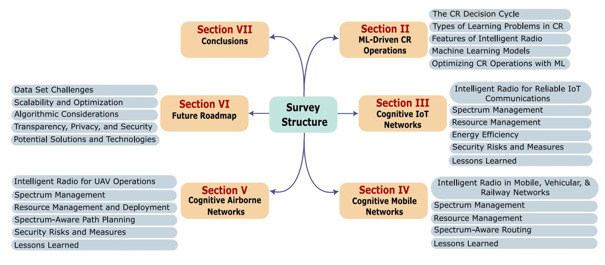
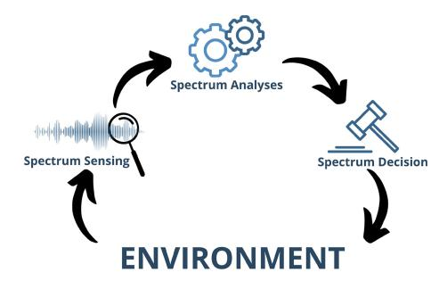
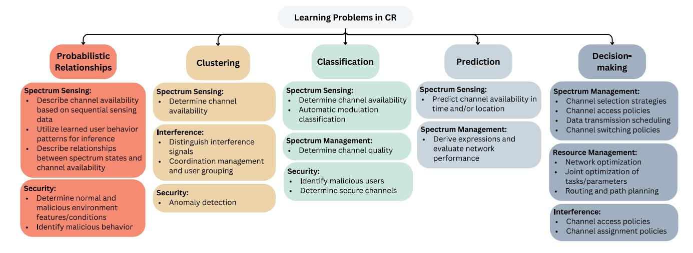
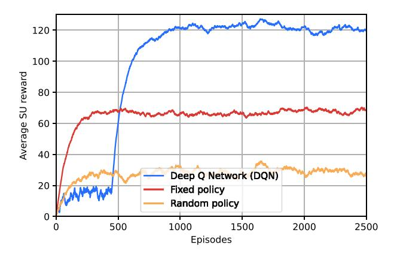
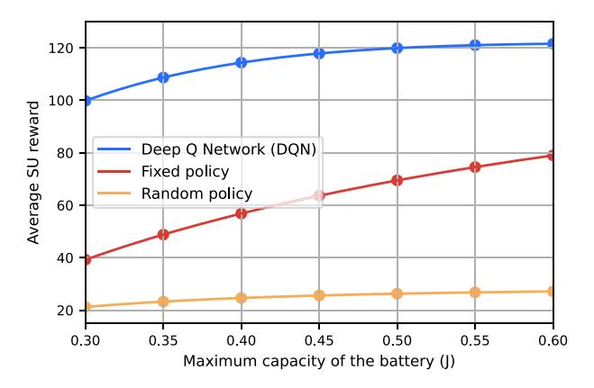
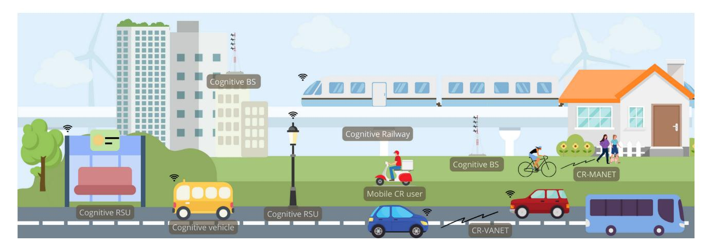
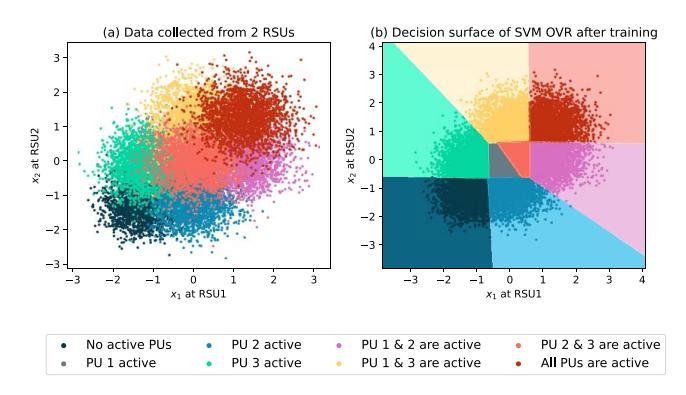
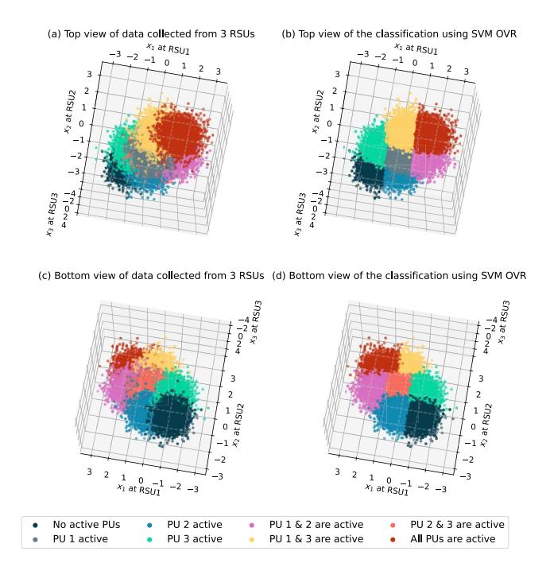
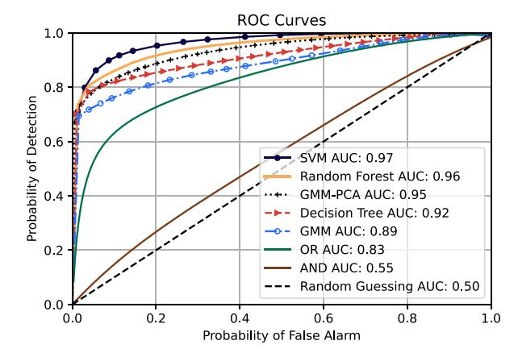
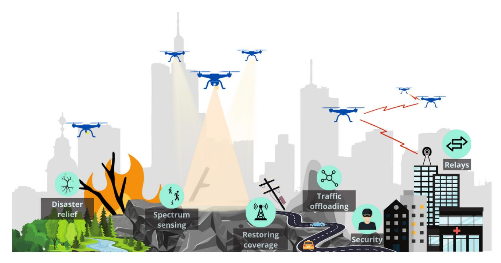

# Advances in Machine Learning-Driven Cognitive Radio for Wireless Networks: A Survey

Nada Abdel Khalek®, *Student Member, IEEE*, Deemah H. Tashman, *Member, IEEE*, and Walaa Hamouda®, *Senior Member, IEEE* 

Abstract-The next frontier in wireless connectivity lies at the intersection of cognitive radio (CR) technology and machine learning (ML), where intelligent networks can provide pervasive connectivity for an ever-expanding range of applications. In this regard, this survey provides an in-depth examination of the integration of ML-based CR in a wide range of emerging wireless networks, including the Internet of Things (IoT), mobile communications (vehicular and railway), and unmanned aerial vehicle (UAV) communications. By combining ML-based CR and emerging wireless networks, we can create intelligent, efficient, and ubiquitous wireless communication systems that satisfy spectrum-hungry applications and services of next-generation networks. For each type of wireless network, we highlight the key motivation for using intelligent CR and present a full review of the existing state-of-the-art ML approaches that address pressing challenges, including energy efficiency, interference, throughput, latency, and security. Our goal is to provide researchers and newcomers with a clear understanding of the motivation and methodology behind applying intelligent CR to emerging wireless networks. Moreover, problems and prospective research avenues are outlined, and a future roadmap is offered that explores possibilities for overcoming challenges through trending concepts.

Index Terms—Machine learning (ML), deep learning (DL), reinforcement learning (RL), cognitive radio (CR), intelligent communications, Internet of Things (IoT), vehicular communications, railway communications, unmanned aerial vehicle (UAV).

# I. INTRODUCTION

THE JOURNEY from Morse code to fifth-generation (5G) networks has remarkably revolutionized the way humans communicate. Looking back at the last two decades, the rapid development of wireless communications has fuelled many technological advancements that changed people's lives. From mobile gadgets and linked cars to drone missions, emerging technologies have been on the rise. These innovations lead to a smartly connected future with spectrum-hungry applications. While the story of how emerging wireless networks are constantly changing the world we live in, the impact of those

Manuscript received 13 June 2023; revised 15 September 2023 and 3 November 2023; accepted 4 December 2023. Date of publication 21 December 2023; date of current version 23 May 2024. This work was supported in part by the Natural Sciences and Engineering Research Council of Canada (NSERC) under Grant 00881, and in part by the Fonds de Recherche du Québec - Nature et Technologies (FRQNT). (Corresponding author: Walaa Hamouda.)

Nada Abdel Khalek and Walaa Hamouda are with the Department of Electrical and Computer Engineering, Concordia University, Montreal, QC H3G 1M8, Canada (e-mail: n\_abdelk@ece.concordia.ca; hamouda@ece.concordia.ca).

Deemah H. Tashman is with the Department of Computer and Software Engineering, Polytechnique Montreal, Montreal, QC H3T 1J4, Canada (e-mail: deemah.tashman@polymtl.ca).

Digital Object Identifier 10.1109/COMST.2023.3345796

innovations on spectrum congestion is becoming increasingly clear. The demand for frequency spectrum is exponentially increasing with the rising number of connections in next-generation wireless networks, including the 5G and beyond. These networks are expected to provide ubiquitous access to a wide range of communication services, such as autonomous driving and drone guidance. Therefore, the fixed spectrum allocation strategies are no longer a viable option since they lead to severe degradation of the spectral utilization efficiency.

Cognitive radio (CR) technology was proposed as an innovative solution to address the aforementioned problem by enabling unlicensed users to access and borrow licensed spectrum bands. A CR system is a system that is aware of its spectral environment and reacts to statistical fluctuations with two main goals in mind, reliable communication and spectral utilization efficiency. CR was designed with the vision of creating brain-powered wireless devices that are able to perceive and understand their surroundings to act accordingly. In fact, according to Ericsson's recent analysis of future technology trends in wireless communication, CR is poised to play a critical role in next-generation networks by instilling autonomy at the heart of the network [1]. Nevertheless, merely being aware and responsive to the environment is not sufficient for a CR node to be truly *cognitive*. True cognition necessitates the ability to learn from past experiences and adapt behavior accordingly. This is where machine learning (ML) comes into play within cognitive radio networks (CRNs). By integrating ML, CRs can actively and intelligently monitor their environment, learning and predicting the development of several environmental aspects, e.g., channel dynamics, and licensed user patterns, and effectively take actions that maximize their chances for borrowing spectrum resources.

Learning plays a pivotal role in CR systems, especially in situations where the precise effects of the inputs on the outputs are unknown. In such situations, learning techniques can be employed to estimate the input-output function of the system. In wireless communications, for example, the wireless channels are non-optimal and are highly dynamic. Thus, learning approaches can be used to allow efficient adaptation of CR nodes without complete awareness of the environment characteristics or network topology. Furthermore, if the CR nodes are working in unknown environments, standard decision-making techniques may be impractical since they require comprehensive system information. For example, the CR decision-making cycle can be modeled as a Markov decision process (MDP), which is traditionally solved using dynamic programming. However, it is feasible to arrive at the best

1553-877X © 2023 IEEE. Personal use is permitted, but republication/redistribution requires IEEE permission. See https://www.ieee.org/publications/rights/index.html for more information.

solution by using learning techniques such as reinforcement learning (RL) [\[2\]](#page-31-1), [\[3\]](#page-31-2), [\[4\]](#page-31-3), [\[5\]](#page-32-0), [\[6\]](#page-32-1) without knowing the state transition probabilities of the model. ML optimization can provide *self-management* solutions for a broad range of problems within the context of network optimization and resource management [\[7\]](#page-32-2). Moreover, employing lowcomplexity learning methods, characterized by their simple structure and computational efficiency, can significantly reduce the complexity of the CR system.

Spectrum scarcity presents a critical challenge in emerging wireless networks, spanning across Internet of Things (IoT), mobile networks (vehicular and railway), and unmanned aerial vehicle (UAV) networks. These networks are grappling with an ever-growing demand for wireless connectivity and services, placing significant strain on available spectrum resources. As per the most recent data, IoT networks are currently estimated to comprise around 43 billion connected devices in 2023 [\[8\]](#page-32-3), and this figure is expected to persistently continue on its upward trajectory in the years ahead. Consequently, this leads to spectrum congestion in the allocated bands for IoT services, which are shared with other radio frequency (RF) technologies like Bluetooth and Wi-Fi [\[9\]](#page-32-4). In vehicular networks, the existing dedicated short-range communications (DSRC) frequency bands prove inadequate to handle the projected data volumes [\[10\]](#page-32-5). UAVs and railway networks, on the other hand, typically operate in unlicensed frequency bands like the Industrial, Scientific, and Medical (ISM) bands, which are shared with various other wireless technologies and applications [\[11\]](#page-32-6). This shared spectrum environment intensifies the competition for available spectrum resources, introducing interference and potential disruptions to communications. Consequently, the inherent spectrum scarcity, coupled with the escalating demand for higher data speeds, necessitates the implementation of more efficient spectrum access techniques for spectrum-hungry wireless networks.

The integration of ML-driven CR in emerging wireless networks offers a promising avenue for developing novel solutions that effectively tackle spectrum scarcity. ML-driven CR enables intelligent and agile spectrum management, facilitating efficient resource allocation and improved coexistence among different wireless systems. ML-powered cognitive IoT devices, for instance, can proactively *self-manage* spectrum and energy resources to improve quality of service (QoS) [\[12\]](#page-32-7), [\[13\]](#page-32-8), [\[14\]](#page-32-9). The utilization of ML techniques empowers cognitive mobile ad-hoc networks to efficiently determine the most favorable routes for transmitting packets that minimize the end-to-end queuing delay, while simultaneously achieving energy efficiency objectives and satisfying interference constraints [\[15\]](#page-32-10), [\[16\]](#page-32-11), [\[17\]](#page-32-12), [\[18\]](#page-32-13). In scenarios with rapidly changing channels such as in CR-powered vehicular and UAV networks, ML can provide a framework for modeling channel behavior, enabling CR users to use the spectrum adaptively and boost data rates on open channels [\[19\]](#page-32-14), [\[20\]](#page-32-15). Therefore, through the integration of ML-driven CR, we can pave the way for intelligent, efficient, and adaptive wireless communication systems that meet the demands of next-generation networks.

#### *A. Related Works*

Surveys such as [\[21\]](#page-32-16), [\[22\]](#page-32-17), [\[23\]](#page-32-18), [\[24\]](#page-32-19), [\[25\]](#page-32-20), [\[26\]](#page-32-21), [\[27\]](#page-32-22), [\[28\]](#page-32-23), [\[29\]](#page-32-24), [\[30\]](#page-32-25) explore the use of ML methods to overcome particular challenges in CRNs. Qin et al. [\[21\]](#page-32-16) discussed the evolution from cognitive to intelligent radio through the use of artificial intelligence (AI) in the last two decades. The main CR sensing and sharing algorithms were reviewed, along with the recent developments in AI-enabled CR. Abbas et al. [\[22\]](#page-32-17) provided an overview of CRNs, covering network resources, objectives, and obstacles. Additionally, a review of ML approaches relevant to CR, such as neural networks, RL, and support vector machine (SVM), along with their challenges were presented. Bkassiny et al. [\[23\]](#page-32-18) included types of learning problems in CR, namely classification and decision-making, and discussed ML approaches that address them and their respective advantages. The authors also provide a list of learning challenges that arise in CRNs and potential solutions. Gavrilovska et al. [\[24\]](#page-32-19) concentrated on the learning and reasoning capabilities of CR. The most prevalent learning processes within CRNs are described, particularly, ML techniques and game-theoretic analyses. In addition, the reasoning techniques most applicable to CRNs and their key benefits and drawbacks were covered. Wasilewska et al. [\[26\]](#page-32-21) summarized AI/ML techniques for context learning and management in CRNs. Wang et al. [\[27\]](#page-32-22) surveyed the applications of modelfree learning methodologies to various problems in CR. An overview of the learning algorithms in the fields of singleagent systems, multi-agent systems, and multiplayer games was provided. Ayanoglu et al. [\[28\]](#page-32-23) surveyed the application of generative adversarial networks (GANs) in next-generation communications, specifically within cognitive networks. The study investigates GANs' utility in addressing spectrum sharing, anomaly detection, and security attack mitigation. Wong et al. [\[29\]](#page-32-24) surveyed the intersection of deep learning (DL) and CR to enhance spectrum awareness applications. It also highlights crucial considerations like trust, security, and hardware requirements that are often overlooked in deploying deep learning-based CR systems for real-world wireless communication. Jdid et al. [\[30\]](#page-32-25) surveyed the integration of DL models into automatic modulation recognition (AMR) methods and provided an extensive review of learning-base AMR methods for both single-input-single output (SISO) and multiple-input-multiple-output (MIMO) systems. The authors underscored the critical role of AMR methods in spectrum sensing within the context of CR.

Surveys such as [\[31\]](#page-32-26), [\[32\]](#page-32-27), [\[33\]](#page-32-28) only examined intelligent CR in a certain section of the paper. For instance, Wang et al. [\[31\]](#page-32-26) reviewed the application of ML techniques, in wireless networks, such as CR, IoT, machine-to-machine (M2M), and others. Wang et al. [\[32\]](#page-32-27) presented an assessment of the current progress of ML-based spectrumsharing approaches, the most crucial security challenges, and the accompanying defense mechanisms. The survey looked into cutting-edge methodologies for improving the performance of spectrum-sharing communication systems in a variety of critical areas, such as ML-based CRNs, MLbased database-assisted spectrum-sharing networks, ML-based ambient backscatter networks, and others. Pirayesh and Zeng [\[33\]](#page-32-28) surveyed jamming attacks and anti-jamming strategies across various wireless network types, including cellular networks, CRNs, ZigBee networks, Bluetooth networks, and others. Liu et al. [\[34\]](#page-32-29) surveyed articles that address the issue of adversarial samples in ML models in wireless and mobile systems, spanning from the physical layer to network and application layers. However, the discussions about adversarial ML in mobile CRNs were very limited. Sun et al. [\[35\]](#page-32-30) conducted an extensive survey focusing on the utilization of ML in wireless communication. Their survey spans various domains, including resource management at the MAC layer, networking and mobility management at the network layer, and localization within the application layer. The survey's scope encompasses resource management issues like power control, spectrum management through CR, backhaul management, cache management, and beamformer design. Additionally, the authors promote the adoption of ML-based methodologies for tasks like base station switching control, user association, and routing.

Awin et al. [\[36\]](#page-32-31) surveyed cognitive IoT (CIoT) systems, specifically examining the frameworks and technologies related to CIoT. The survey reviews recent approaches to spectrum sensing and sharing within CIoT, categorizing and evaluating these methods while also considering design factors. It also suggests the integration of emerging technologies such as blockchain and ML with CIoT systems for additional capabilities such as robust security, autonomy, and intelligent architecture. Qadri et al. [\[37\]](#page-32-32) surveyed the impact of the IoT on the healthcare industry addressing both hardware and software platform developments. The survey highlighted key enabling technologies, including communication systems between sensors and processors, data processing algorithms, and their augmentation with newer technologies. The survey included a section to discuss the role of ML in enhancing Healthcare IoT systems in addressing various challenges. Al-Garadi et al. [\[38\]](#page-32-33) provided a comprehensive survey of ML and recent DL advancements for IoT security, addressing various security threats, attack surfaces, and the corresponding threats. It also discusses the opportunities, advantages, and limitations of ML/DL methods, along with the associated challenges, offering potential future research directions in IoT security. Hussain et al. [\[39\]](#page-32-34) conducted a systematic review of IoT network security requirements, attacks, and current security solutions. It identifies gaps in existing security measures that can be addressed through ML and DL, which embed intelligence in IoT devices and networks. Cao et al. [\[40\]](#page-32-35) surveyed recent developments in energy-efficient wireless networking technologies designed to address the challenges posed by big data in IoT and WSN such as acquisition, communication, storage, and computation. The survey also investigates emerging approaches such as ML and big data analytics to enhance the energy efficiency of wireless networks. Alsheikh et al. [\[41\]](#page-32-36) surveyed the application of ML methods to common challenges in WSNs. The paper evaluates the advantages and disadvantages of each algorithm in addressing specific problems and provides a comparative guide to assist WSN designers in selecting suitable ML solutions for their application challenges.

Works like [\[42\]](#page-32-37), [\[43\]](#page-32-38) investigated the application of ML techniques in mobile CRNs. To illustrate, Medhat Salih et al. [\[42\]](#page-32-37) exclusively surveyed routing protocols in mobile CRNs. In addition, the survey proposed using ML to design a cross-layer framework for smart routing in mobile CRNs. Hlophe and Maharaj [\[43\]](#page-32-38) explored the application of DL architectures to spectrum management in mobile and wireless CRNs. Furthermore, the survey also covered model selection procedures and how different deep architectures might be customized to CR to obtain better performance in complicated environments. Zhang et al. [\[44\]](#page-32-39) surveyed the use of DL to handle agile and efficient network resource management in complex and heterogeneous mobile environments. The authors discussed tools and platforms for deploying DL on mobile systems. Rodriguez et al.[\[45\]](#page-32-40)surveyed cybersecurity challenges in mobile and wireless networks, highlighting the limitations of traditional cybersecurity systems in detecting complex attacks and preserving user privacy. Moreover, the survey also explores the integration of DL models into cybersecurity to tackle and address infrastructure threats, software attacks, and privacy preservation.

Hossain et al. [\[46\]](#page-32-41) presented a survey that discusses the integration of ML in CR-based vehicular ad-hoc networks (CR-VANETs). The authors provided an overview of ML, CR, VANET, and CR-VANET topologies, functionalities, problems, and unresolved challenges. The applications of ML algorithms in CR-VANET settings were discussed. There were also insights on the usage of ML for autonomous or driverless vehicles. Balkus et al. [\[47\]](#page-33-0) surveyed how ML can address challenges in 5G vehicular networks such as wireless data transmission, management of shared data, utilization of shared data for improved environment perception, enhanced safety and efficiency through shared data, and privacy protection and cybersecurity measures for shared data. Mao et al. [\[48\]](#page-33-1) surveyed the use of DL algorithms across various network layers, encompassing physical layer modulation/coding, data link layer access control/resource allocation, routing layer path search, and traffic balancing. The authors provide a section that discusses the use of DL in vehicular networks for scheduling, data reduction, security, and resource allocation.

Hassija et al. [\[49\]](#page-33-2) surveyed security challenges in UAVs. The survey covers security-critical drone applications and communication challenges, including denial of service (DoS) attacks, Man-in-the-middle attacks, and De-Authentication attacks. The paper also explores potential solutions, such as blockchain for data security, ML for malicious drone detection and safe route identification, software-defined networking (SDN) for network reliability, and fog/edge computing for efficient computation near drones. Mozaffari et al. [\[50\]](#page-33-3) provided a tutorial on UAVs that discusses the advantages and applications of UAVs in wireless communications. Furthermore, it discusses analytical frameworks and mathematical tools, including optimization theory, ML, stochastic geometry, transport theory, and game theory, for addressing unique challenges in UAV-based wireless communication system analysis, optimization, and design.

TABLE I

Comparison Between Our Survey and Previously Published Surveys. ✓ Represents Full In-Depth Discussion, ★ Represents Discussions in Section/Part, ▲ Represents Scattered Discussions, and ● Represents Limited Discussions

| Refere | Reference Details |          | ning Ap | proach | Issue in CR            |                        |                           | Application           |                      |     |        |           |         |          |
|--------|-------------------|----------|---------|--------|------------------------|------------------------|---------------------------|-----------------------|----------------------|-----|--------|-----------|---------|----------|
| Year   | Ref.              | ML       | DL      | RL     | Spectrum Management | Resource Management | Spectrum-aware Routing | Security & Privacy | Energy Efficiency | IoT | Mobile | Vehicular | Railway | UAVs     |
| 2023   | Our Survey     | 1        | 1       | 1      | 1                      | ✓                      | ✓                         | ✓                     | ✓                    | 1   | 1      | ✓         | 1       | ✓        |
|        | [32]              | 1        |         |        | /                      | /                      |                           | ✓                     |                      |     |        |           |         |          |
|        | [28]              |          | 1       |        | ✓                      |                        |                           | ✓                     |                      |     |        |           |         |          |
| 2022   | [33]              |          |         |        |                        |                        |                           | ✓                     |                      |     |        |           |         |          |
|        | [34]              |          | 1       |        |                        |                        |                           | •                     |                      |     | ✓      | ,         |         |          |
|        | [47]              |          | 1       | /      |                        |                        |                           |                       |                      |     |        | ✓         |         |          |
|        | [29]              |          | 1       | ,      | · /                    | ,                      |                           | ✓                     | ,                    |     | ,      |           |         |          |
|        | [43] [26]      |          | 1       | /      | /                      | 1                      |                           |                       | ✓                    |     | 1      | •         |         |          |
| 2021   | [49]              | <b>✓</b> | *       | •      | ,                      |                        |                           |                       |                      |     |        |           |         | /        |
|        | [30]              | × /      | ×       |        | •                      |                        |                           |                       |                      |     |        |           |         |          |
|        | [45]              |          | /       |        |                        |                        |                           |                       |                      |     | /      |           |         |          |
|        | [37]              | *        | *       | *      |                        |                        |                           |                       |                      | /   | •      |           |         |          |
|        | [42]              | 1        |         |        |                        |                        | /                         |                       |                      |     | /      |           |         |          |
| 2020   | [46]              | 1        | 1       | /      | 1                      | ✓                      | ✓                         | /                     | /                    |     |        | /         |         |          |
| 2020   | [31]              | 1        | /       | /      | •                      |                        |                           |                       |                      | •   |        | •         |         |          |
|        | [21]              | 1        | 1       | /      | ✓                      | ✓                      |                           |                       |                      |     |        |           |         |          |
|        | [38]              | /        | 1       | 1      |                        |                        |                           |                       |                      | /   |        |           |         |          |
|        | [39]              | 1        | /       | ✓      |                        |                        |                           |                       |                      | 1   |        |           |         |          |
|        | [35]              | /        | 1       | ✓      | <b>A</b>               | <b>A</b>               | <b>A</b>                  |                       |                      |     |        |           |         |          |
| 2019   | [44]              |          | 1       |        |                        |                        |                           | ,                     |                      | ,   | ✓      |           |         |          |
|        | [36]              |          |         |        | <b>✓</b>               | ✓                      | ✓                         | ✓                     |                      | 1   |        |           |         | ,        |
|        | [50]              |          |         |        |                        |                        |                           |                       |                      |     |        |           |         | <b>√</b> |
| 2018   | [48] [40]      | <b>A</b> | /       |        |                        |                        |                           |                       |                      | 1   |        | ,         |         |          |
| 2016   | [27]              |          |         | /      | /                      | /                      | /                         |                       | <u> </u>             |     |        | <u> </u>  |         |          |
| 2015   | [22]              | 1        | /       | /      | /                      | /                      | •                         |                       |                      |     |        |           |         |          |
| 2014   | [41]              | 1        | 1       | /      |                        |                        |                           |                       |                      | 1   |        |           |         |          |
| 2013   | [24]              |          |         | /      | <b>✓</b>               | ✓                      |                           |                       |                      |     |        |           |         |          |
| 2013   | [23]              | 1        | 1       | /      | ✓                      | ✓                      |                           |                       |                      |     |        |           |         |          |

#### B. Motivation

Given the various surveys examined in the related survey section, it is critical to highlight the distinguishing characteristics that set apart our survey from those previously published, as well as explain the driving motivation behind it. Previous publications examine the approach, motivation, and application of ML in CR in part or in full. In the IoT domain, no survey to date has explored the integration of ML-driven CR in IoT networks. For instance, Awin et al. [36] examined CIoT but did not delve into ML applications, suggesting it as a future avenue. Qadri et al. [37] focused on healthcare IoT, missing the CIoT and ML integration. Al-Garadi et al. [38] and Hussain et al. [39] concentrated on ML in IoT security, and Cao et al. [40] explored energy-efficient IoT, but broader IoT challenges and CR's potential remained unexplored. Meanwhile, Alsheikh et al. [41] surveyed ML in addressing WSN challenges.

In mobile networks, several researchers have specialized in distinct aspects. For instance, Medhat Salih et al. [42] exclusively examined ML's role in routing protocols within mobile CRNs. Simultaneously, Hlophe and Maharaj [43] concentrated solely on DL's application in spectrum management within mobile CRNs. Conversely, researchers like Zhang et al. [44] explored ML's utility in managing resources within complex and heterogeneous mobile environments, without exploring CR's integration. Rodriguez et al. [45] surveyed cybersecurity concerns in mobile networks, emphasizing DL's use to combat threats, but omitted any discussion regarding the incorporation of CR. While in vehicular networks, Hossain et al. [46] conducted a survey that primarily delved into the application of ML techniques within cognitive vehicular ad-hoc networks (CR-VANETs). On the other hand, surveys such as Balkus et al. [47] and Mao et al. [48] examined ML's usage in vehicular networks either partially or comprehensively, but they did not specifically tackle challenges related to CR. In the literature on UAV networks, it is noteworthy that only two surveys, those by Hassija et al. [49] and Mozaffari et al. [50], have explored the field UAV communications. Importantly, neither of these surveys addressed CR, with only Mozaffari et al. exploring the utilization of ML in UAV networks.

The proliferation of spectrum-hungry wireless networks necessitates efficient spectrum utilization and improved network performance. However, it is noteworthy that, up to this point, no prior research has undertaken a comprehensive and thorough survey of the application of ML-driven CR in IoT, mobile, vehicular, railway, and UAV systems. Moreover, previous surveys conducted in these domains have not taken into consideration the unique challenges presented by each of these networks, nor have they thoroughly examined the specific challenges associated with CR. Therefore, our survey is essential for providing a comprehensive understanding of applying ML-driven CR to spectrum-hungry wireless networks. Notably, we provide a unique contribution by consolidating these diverse network types into one resource, enabling readers to identify the differences and nuances in their requirements. Table I showcases the distinctive features that set our survey apart from previous works, highlighting its originality. In summary, this survey serves as an invaluable resource for researchers, practitioners, and policymakers involved in CR, ML, and spectrum-hungry wireless networks, equipping them with a solid foundation to advance this field.

#### C. Key Contributions

In light of the prevalent issue of spectrum scarcity in emerging wireless networks, our survey aims to comprehensively examine the potential of ML-driven CR to address

this challenge. We investigate how ML-driven CR can enable ubiquitous access and meet diverse requirements across different network types, thereby promoting the development of efficient and intelligent networks. The key contributions of this study include:

- *•* We present a complete discussion of the working principles of CR, detailing its definition, access models, and operations. Additionally, we highlight the role of learning algorithms in facilitating the development from cognitive to intelligent radio.
- *•* We provide an introductory overview of essential ML paradigms prominently used in CRNs. This encompasses supervised learning, unsupervised learning, reinforcement learning, deep learning, and others. We augment this with a detailed taxonomy highlighting unique characteristics in each ML category and their applicability to CRNs, supported by practical examples. We also classify the diverse learning challenges in CRNs and discuss how ML-driven CR can address spectrum scarcity and congestion issues in emerging wireless networks.
- *•* Next, we explore different spectrum-hungry network types, including IoT, mobile (both vehicular and railway), and UAV networks. We address network-specific challenges within each category before conducting a comprehensive survey of the existing literature on ML-driven CR solutions designed to mitigate these challenges. Additionally, we extract valuable insights from this literature, presenting lessons learned that shed light on current limitations, open problems, and key takeaways.
- *•* Finally, we discuss problems and potential future research areas. In addition, we provide a visionary roadmap that looks ahead toward unexplored possibilities for addressing the challenges through trending concepts such as blockchain, distributed machine learning, reconfigurable intelligent surfaces, and others.

Table [II](#page-4-0) summarizes the most commonly used abbreviations in this paper to improve clarity.

## *D. Structure of the Survey*

The remainder of the survey is structured as follows; Section [II](#page-5-0) introduces CR technology and emphasizes the importance of incorporating learning capabilities into CRNs. This section also covers prominent ML paradigms used in CRNs. Section [III](#page-11-0) addresses the spectrum scarcity problem in IoT networks and how CR and ML can help overcome this challenge and other obstacles in IoT networks. Section [IV](#page-16-0) presents different mobile networking scenarios, including general, vehicular, and high-speed railway mobility, and discusses their respective deployment challenges, as well as the role of CR and ML in overcoming these challenges. Section [V](#page-23-0) discusses the obstacles to implementing UAV communications and how ML-driven CR can help overcome these challenges. A future roadmap that identifies challenges, opportunities, and solutions in the integration of ML-powered CR and spectrum-hungry wireless networks is

TABLE II LIST OF ACRONYMS

| Acronym  | Definition                                                            |
|----------|-----------------------------------------------------------------------|
| 5G       | Fifth-generation                                                      |
| AC       | Actor-critic                                                          |
| AMC      | Automatic modulation classification                                   |
| AWGN     | Additive white Gaussian noise                                         |
| CBS      | Cognitive base station                                                |
| CIoT     | Cognitive Internet of things                                          |
| CR       | Cognitive radio                                                       |
| CNN      | Convolutional neural network                                          |
| CUAV     | Cognitive UAV                                                         |
| DDPG     | Deep deterministic policy gradient                                    |
| DT       | Decision tree                                                         |
| DAE      | Deep autoencoder                                                      |
| DL       | Deep learning                                                         |
| DNN      | Deep neural network                                                   |
| DQN      | Deep Q-network                                                        |
| DRL      | Deep reinforcement learning                                           |
| DBN      | Dynamic Bayesian network                                              |
| EE       | Energy efficiency                                                     |
| EH       | Energy harvesting                                                     |
| FL       | Federated learning                                                    |
| FC       | Fusion center                                                         |
| GRU      | Gated recurrent unit                                                  |
| GMM      | Gaussian mixture model                                                |
| GAN      | Generative adversarial network                                        |
| HMM      | Hidden Markov model                                                   |
| HSR      | High-speed railway                                                    |
| IoT      | Internet of things                                                    |
| KNN      | K-nearest neighbour                                                   |
| LoS      | Line-of-sight                                                         |
| LR       | Logistic regression                                                   |
| LSTM     | Long short-term memory                                                |
| MANET    | Mobile ad-hoc network                                                 |
| MARL     | Multi-agent reinforcement learning                                    |
| MAB      | Multi-armed bandit                                                    |
| MDP      | Markov decision process                                               |
| MJPF     | Markov jump particle filter                                           |
| ML       | Machine learning                                                      |
| MIMO     | Multiple input multiple output                                        |
| NB       | Naive Bayes                                                           |
| NOMA     | Non-orthogonal multiple access                                        |
| PCA      | Principal component analysis                                          |
| PU       | Primary user                                                          |
| QML      | Quantum machine learning                                              |
| QoS      | Quality of Service                                                    |
| QL DE | Q-learning                                                            |
| RF RL | Radio frequency                                                       |
| ROC      | Reinforcement learning                                                |
| RIS      | Receiver operating characteristics Reconfigurable intelligent surface |
| RNN      | Recurrent neural network                                              |
| R-CNN    | Region-convolutional neural network                                   |
| RSU      | Roadside unit                                                         |
| SAE      | Stacked autoencoder                                                   |
| SNR      | Signal-to-noise ratio                                                 |
| SSDF     | Spectrum sensing data falsification                                   |
| SSL      | Semi-supervised learning                                              |
| SU       | Secondary user                                                        |
| SVM      | Support vector machine                                                |
| T-SNE    | T-distributed stochastic embedding                                    |
| UAV      | Unmanned aerial vehicle                                               |
| UCB      | Upper confidence bound                                                |
| VAE      | Variational autoencoder                                               |
| VANET    | Vehicular ad-hoc network                                              |
|          |                                                                       |

presented in Section [VI.](#page-27-0) Finally, Section [VII](#page-31-4) concludes our survey and presents our final remarks. Fig. [1](#page-5-1) displays a detailed organization of the paper's structure to aid with survey follow-up.

Fig. 1. Organization of the survey.

#### II. LEARNING IN COGNITIVE RADIO: PRELIMINARIES

Over the past 20 years, the field of CR has witnessed a significant transformation. This evolution is primarily driven by the application of ML techniques to CR systems, which has enabled them to become more flexible, adaptable, and efficient. In this section, we will explore the key features of intelligent CR. We will also discuss some prominent ML paradigms that aided the evolution from cognitive to intelligent radio.

#### *A. The Cognitive Radio Decision Cycle*

Wireless networks today and in the future face the critical problem of spectrum shortage and congestion. The constant inflow of data streams from a plethora of real-time monitoring devices has already resulted in, and will likely continue to result in, an exponential increase in wireless traffic. Over the years, the fixed spectrum assignment policy adopted by regulatory bodies, such as the Federal Communications Commission (FCC), has introduced prominent spectrum under-utilization concerns. The contradiction between spectrum scarcity and under-utilization has prompted the development of opportunistic spectrum access or dynamic spectrum access (DSA) using CR technology. This type of spectrum access is also known as licensed CR, where licensed refers to the licensed spectrum. Under this access type, unlicensed secondary users (SUs) opportunistically reuse or share spectrum bands allocated to licensed primary users (PUs). Examples of licensed spectrum include TV white spaces (TVWS) and cellular bands. However, CRs can also invoke unlicensed spectrum access to share the spectrum in unlicensed spectrum bands with other RF technologies like Wi-Fi, Bluetooth, and WiMAX. Examples of unlicensed spectrum include ISM bands, as well as unlicensed LTE bands like LTE-U and LAA. Each CR access type possesses distinct characteristics and design considerations. Licensed access involves CR systems functioning as SUs alongside PUs who own the licenses. Consequently, it is imperative to establish efficient spectrum access methods, such as spectrum sensing and analysis, to guarantee that CR systems do not interfere with the communications of PUs while still meeting the needs of the users. In contrast, the unlicensed CR focuses on implementing mechanisms that effectively address congestion and interference reduction to facilitate coexistence with other unlicensed technologies and optimize the utilization of available spectrum resources. Although both approaches hold significance in the field of CR research and applications, our survey primarily concentrates on the topic of opportunistic licensed spectrum access using DSA. In this regard, we discuss design considerations and challenges that define opportunistic spectrum access by CR systems.

Overlay, underlay, and interweave are the three main access mechanisms available under licensed CR spectrum access [\[51\]](#page-33-4), [\[52\]](#page-33-5), [\[53\]](#page-33-6). To obtain spectrum access privileges, SUs functioning in an overlay CRN need to collaborate with PUs. The SUs can, for example, relay the PUs' transmissions so that they can exploit the licensed band for their own data transmissions [\[54\]](#page-33-7). Simultaneous access to the radio spectrum is permitted in underlay CRNs provided that SUs' transmissions do not interfere with the PUs' communication. As a result, SUs must modify their transmit power such that they do not exceed the PU receiver's interference threshold. In an interweave CRN, SUs are only authorized to access the PUs' bands if and only if they are vacant, i.e., simultaneous transmissions with the PUs are not permitted. In this scenario, SUs begin by sensing the licensed bands to obtain radio environment information and discover potential spectrum gaps that they can use [\[55\]](#page-33-8). If the PUs reappear, the SUs have to vacate the channel and search for other idle bands to occupy.

Prior to the development of the CR networking paradigm, perception and reasoning mechanisms were not typically integrated into wireless network architectures. Rather, hard-coded rules within the terminals' firmware guided and supported the observations and actions. Fig. [2](#page-6-0) depicts the three major phases in the CR cycle: spectrum sensing, spectrum analyses, and spectrum decision. First, *perception* is achieved through spectrum sensing and monitoring, which allow the CR node to identify ongoing activities in its surroundings. Spectrum

Fig. 2. Cognition cycle of CR devices.

sensing is a critical step, as the following steps in the cycle depend on the reliability and accuracy of the sensing information. Moreover, SUs must be informed of the PU's abrupt reappearance by monitoring the spectrum bands. A CR node then uses its *reasoning* capability to understand the obtained sensing data. This occurs in the spectrum analysis stage, where the SU begins to evaluate and analyze the sensing information. In this stage, the available spectrum bands are characterized to match them to the requirements of the services. Signal-to-noise ratio (SNR), error rate, path-loss, holding time, and interference are some of the main estimated band characteristics during this phase. The last step in the process is spectrum decision, where the CR node invokes its *judgment* capabilities to determine which band the SU will utilize based on its properties and the demands of the user. In addition to determining the band of communication, the SU also sets the transmission characteristics, such as modulation type and data rate. As highlighted in [\[23\]](#page-32-18), intelligence has three primary conditions: perception, learning, reasoning, and judgment. Therefore, for a CR to draw reasoning and judgment from perception, it must have the capacity for learning. Learning necessitates that present actions be based on previous and present observations of the environment. Thus, past experiences must play a significant role in the CR cognition cycle.

#### *B. From Cognitive to Intelligent Radio*

The word *cognitive* suggests the notions of awareness, perception, thinking, and decision-making. As previously stated, for a CR node to extract reasoning and judgment from perception, it must be capable of learning. Learning entails basing present actions on past and current observations of the environment. In the context of CR, ML can enable devices to actively learn patterns and behaviors across different network modalities/topologies, which can lead to better network performance in new and unfamiliar settings without prior knowledge [\[56\]](#page-33-9), [\[57\]](#page-33-10). This flexibility is a key characteristic of intelligence. Traditional optimization approaches in CR fall short of being inherently adaptable to new and unfamiliar settings. This is because they often rely on predefined models and parameters not suitable for rapidly changing environments or unforeseeable events. Moreover, traditional methods are based on mathematical models, which often involve approximations due to system complexity. In contrast, ML allows the CR network to learn directly from historical observations, bypassing the need for approximations [\[58\]](#page-33-11). This enables the system to adaptively optimize multiple network parameters simultaneously, a challenge with traditional optimization techniques [\[59\]](#page-33-12). However, it is important to note that some learning models, like deep Q networks in RL, use approximations for instance when updating Q-values. With this simplification, it is important to recognize that achieving convergence to "optimal" performance is not guaranteed in every case; there exists the potential for the learning algorithm to diverge. Researchers should carefully consider factors such as available data, the choice of learning models, and algorithm complexity. The selection of a learning algorithm is pivotal and it is contingent on the CR problem's nature. When data is limited, real-time adaptable approaches like RL or online learning are more practical than offline-trained ML or DL techniques. Moreover, it is crucial to match the learning model's complexity with device capabilities, ensuring resource-constrained devices like IoT or UAVs perform optimally.

Intelligent CR goes beyond just learning to extract reasoning and judgment, it has several features that enable it to become truly intelligent. Below are some of the key defining features of intelligent radio. Firstly, by leveraging their intelligence and predictive capabilities, intelligent CRs effectively utilize massive volumes of sensing and monitoring data, leading to the creation of a comprehensive knowledge map of the spectral environment. This knowledge serves as a valuable resource for optimizing multiple network parameters concurrently, thereby maximizing the network's ability to access and utilize available spectral resources. Additionally, intelligent CRs can predict future events, such as changes in traffic patterns [\[60\]](#page-33-13), network congestion [\[61\]](#page-33-14), amount of energy to be harvested [\[62\]](#page-33-15), and spectrum availability [\[63\]](#page-33-16), based on the acquired knowledge. To illustrate, instead of relying on traditional automatic modulation classification techniques for spectrum sensing that demand perfect channel state information (CSI) and exhibit performance linked to the exponential increase in received samples, CRs can adopt a learning-based classifier. This classifier can exploit the temporal features of received constellations to detect the modulation type used by PUs. In the absence of temporal PU data correlation, intelligent CR systems can still extract and learn relevant properties from other radio environment data. This adaptive strategy optimizes network settings while improving overall performance. In geographically dispersed CRNs, for instance, the availability of channels varies across different locations, leading to location-dependent sensing outcomes and assignments. When SUs lack location-finding technology, it becomes challenging for the base station to fuse sensing outcomes effectively to determine the best spectrum sensing assignments for the next sensing cycle. However, the use of a learning model within the network enables the prediction of PUs' dynamic channel occupancy [\[64\]](#page-33-17).

Secondly, intelligent CR encompasses an advanced resource management framework that addresses various challenges in diverse wireless networks, including power control and resource allocation. Unlike traditional distributed optimization techniques performed offline or in a semi-offline manner, ML empowers intelligent radios to achieve decentralized action coordination in real-time, enabling more efficient collaboration [\[65\]](#page-33-18). This dynamic decision-making capability, supported by continual improvement and learning, forms a fundamental aspect of intelligent CR. The integration of ML in CR is particularly crucial for enabling real-time, low-latency operations in IoT services, especially in contexts such as vehicular and railway networks, as well as UAV missions. In dynamic scenarios, adaptability becomes pivotal for goal attainment. Occasionally, CRs must engage in a search or optimization process to identify the optimal configuration for a specific environment. While these tasks can consume time and computational resources, ML models offer a solution by learning and retaining past case-solution pairs, streamlining future decisionmaking processes [\[66\]](#page-33-19). Therefore, the intelligence provided by ML allows for adaptive and responsive behavior, essential for meeting the demands of these time-sensitive applications.

Thirdly, ML-driven CR can possess *self-organizing*, *selfhealing*, and *self-optimizing* capabilities that contribute to addressing a wide range of challenges, including security and energy efficiency. Intelligent CRs can autonomously enhance their security and privacy by effectively detecting and mitigating various types of smart attacks, thus enhancing the robustness and reliability of wireless networks. To illustrate, CRs possess the capability to address a critical question: When is it time to recognize that the existing learning model no longer suits the new environment and requires an update? The answer lies in identifying current signals while leveraging previously acquired knowledge. CR nodes can learn the typical behavior in the RF environment and consequently, when deviations from this learned environment occur, the CR network can infer the potential presence of security threats [\[67\]](#page-33-20). Additionally, ML-driven CR can optimize energy consumption and storage by intelligently harvesting energy from diverse sources based on their availability, such as PUs, the radio environment, or ambient sources. Take, for example, energy-harvesting CRs. These systems can develop the capability to fine-tune their transmission strategy, with the goal of maximizing their data transfer rates. This capacity helps them to make choices regarding their energy source, deciding between SUs and PUs based on their respective availability [\[68\]](#page-33-21). This adaptive energy management approach significantly extends the battery life of wireless devices in networks like IoT, reducing the need for frequent battery replacements or recharging, which can be costly and impractical in hazardous environments. Thus, ML-based CRs can operate more efficiently and sustainably, ensuring optimal performance and resource utilization.

Fourthly, the integration of ML in CR proves particularly valuable in large and heterogeneous network scenarios, surpassing the limitations of classical centralized and distributed optimization methods that struggle with the scale and heterogeneity of the network. By employing learning approaches like RL, CR agents can consider multiple vital factors, such as dynamic and uncertain channel conditions, in their decision-making. This holistic approach, as opposed to isolating individual components or engaging in complex joint optimization, allows CR agents to work towards achieving both their individual and collective goals [\[19\]](#page-32-14). Consequently,

ML-driven CR enables the more extensive and efficient utilization of available spectrum resources, ensuring improved network performance across diverse environments.

Finally, in intelligent CR systems, one important aspect is the ability to learn and understand the behavior and preferences of PUs in spectrum-sharing scenarios, such as overlay or hybrid modes. By analyzing and modeling the interactions between PUs and SUs, intelligent CRs can adapt their spectrum access strategies to optimize the utilization of available spectrum resources. By learning the behavior [\[69\]](#page-33-22) and preferences of PUs [\[70\]](#page-33-23), intelligent CRs can make more informed decisions regarding spectrum allocation, power control, and access protocols. This enables a personalized and efficient use of the spectrum, taking into account the specific requirements and usage patterns of the primary network. For instance, in overlay CR, SUs can acquire the capability to balance their own transmissions with the provision of relaying services to PUs. This decision-making process can take into account multiple factors such as the available spectrum, channel quality, and the expected network lifetime [\[70\]](#page-33-23), [\[71\]](#page-33-24). As a result, both the primary and secondary networks can benefit from improved performance, reduced interference, and enhanced overall spectral efficiency.

Fig. [3](#page-8-0) provides a detailed taxonomy of the types of learning problems in CR, serving as a resource for readers to gain a comprehensive understanding of these CR issues prior to exploring the applicable ML models in the following subsection.

*1) Machine Learning Models:* ML algorithms can be classified into four types based on the nature of the training data or environment: supervised learning, unsupervised learning, and reinforcement learning. The three types of algorithms will be described briefly in the following subsections. Table [III](#page-9-0) offers a thorough compilation of the most prominent learning techniques in the context of CRNs. The table examines the appropriateness of each ML technique for CRNs and includes an example of their deployment in a CR context.

*Supervised Learning:* Given a set of inputs and their corresponding outputs, the outcome of executing a supervised learning algorithm may be described as a function *y* = *f*(**x**) that takes a new input **x** and produces an output *y*. The precise shape of the function *y* = *f*(**x**) is determined during the training phase, also known as the learning phase. Supervised learning problems are applicable whenever CR nodes have some prior knowledge about the environment that is encapsulated in a labeled data format. This type of learning is also known as learning by *instruction* [\[23\]](#page-32-18), which requires the training data to consist of input feature vectors **x** and their associated target labels *y* so that the learning algorithm can estimate the function *y* = *f*(**x**). In interweave CRNs, supervised learning is sometimes used to decide whether the channel is vacant or not [\[72\]](#page-33-25). Such problems are called *classification* problems. Fig. [3](#page-8-0) outlines a series of CR classification problems that can be effectively tackled using supervised learning methods. SVM, decision tree (DT), and random forests are examples, among many, of supervised learning algorithms. In the domain of supervised learning, graphical models offer a probabilistic perspective for modeling complex relationships between input

Fig. 3. Taxonomy of learning problems in cognitive radio.

features and target labels. While traditional supervised learning algorithms aim to map inputs to outputs using a predefined function *y* = *f*(**x**), graphical models take a different approach. They represent these relationships through a probabilistic graphical structure, allowing them to capture dependencies and uncertainties more comprehensively. One widely used graphical model for supervised learning is the Bayesian network (BN). In a BN, nodes represent variables, and edges indicate probabilistic dependencies. Therefore, graphical models, including BNs, assist CR systems in learning essential probabilistic relationships crucial for tasks like spectrum sensing, as highlighted in Fig. [3.](#page-8-0)

*Unsupervised Learning:* In unsupervised learning, the training data is a set of input vectors **x** that do not have any matching target labels *y* (unlabeled data). The purpose of such learning may be to find clusters of similar samples within the data, which is known as *clustering*, or to identify the distribution of the input space, which is known as *probability density estimation*. Unsupervised learning is ideal for CR nodes that operate in an unknown environment. In this situation, autonomous unsupervised learning allows CR nodes to explore the environmental properties and *self-adapt* without any prior knowledge [\[73\]](#page-33-26). Fig. [3](#page-8-0) showcases a variety of clustering challenges in CR networks that can be effectively tackled with unsupervised learning. Examples of unsupervised learning algorithms include k-means and the Gaussian mixture model (GMM). Unsupervised learning could also be used to perform dimensionality reduction of high-dimensional input spaces onto low-dimensional spaces for *visualization* purposes. Examples of such algorithms include *t*-distributed stochastic neighbor embedding (T-SNE) and principal component analysis (PCA). Furthermore, graphical models like Hidden Markov Models (HMMs) have found extensive use in sequential data modeling. HMMs capture temporal dependencies between observations, enabling them to model sequences effectively. This is especially significant for CR systems as they strive to utilize temporal spectrum data for the purpose of learning patterns and trends. The importance of graphical models becomes evident when considering the need for CRs to acquire insights into specific probabilistic relationships illustrated in Fig. [3.](#page-8-0)

*Reinforcement Learning:* Reinforcement learning (RL), is concerned with determining the appropriate actions an agent can take in a given environment to maximize its reward. In contrast to supervised learning, the algorithm is not given explicit knowledge of optimal outputs and must instead discover the optimal set of actions by *trial-and-error*. This is also known as model-free learning. Typically, the agent interacts with its environment through a series of states and actions. The reward (feedback from the environment) can be positive or negative, indicating to the agent how good or bad of an action it had taken. In many circumstances, the present action influences not only the immediate reward but also the reward at all following time steps. On the other hand, model-based learning involves using a model of the environment to simulate scenarios and plan future actions. The trade-off between *exploration* and *exploitation* is a general element of RL. Exploration involves the system trying out new types of behaviors to determine how effective they are, while exploitation involves the system using activities that are known to provide the maximum reward. A heavy emphasis on either exploration or exploitation will produce unsatisfactory outcomes. RL is commonly applied for decision-making within CR networks. Fig. [3](#page-8-0) outlines the various decision-making challenges within CR that can be successfully addressed through RL techniques. Table [III](#page-9-0) presents a compilation of RL techniques, notably Qlearning (QL), deep Q-network (DQN), and actor-critic (AC). These algorithms hold substantial prominence in the domain of ML-driven CR.

In the realm of RL, algorithm selection is pivotal for success across various CR applications. Each RL algorithm possesses distinct strengths and characteristics, necessitating careful consideration of problem-specific requirements. Consider QL, which is well-matched for situations featuring discrete action spaces and well-defined dynamics. In the context of CR, QL is frequently favored due to its close resemblance to the cognitive decision-making cycle [\[19\]](#page-32-14). On the other hand, DQNs are apt for tasks involving high-dimensional state spaces and discrete

TABLE III LEARNING TECHNIQUES IN COGNITIVE RADIO NETWORKS

| Lear | ning Technique | Suitability                                                                                                                                                                      | CR Deployment Example                                                                                                                                                       | Ref.                             |
|------|----------------|----------------------------------------------------------------------------------------------------------------------------------------------------------------------------------|-----------------------------------------------------------------------------------------------------------------------------------------------------------------------------|----------------------------------|
|      | SVM            | Supervised classification or regression tasks for small to medium data sets.                                                                                                     | A classifier for identifying malicious sensing reports at the fusion center in cooperative CR.                                                                              | [25], [72] [75]–[78]          |
| ML   | DT             | Supervised classification or regression. Can handle mixed-data types.                                                                                                            | A classifier for classification of low and high channel quality                                                                                                             | [77] [79], [80]               |
|      | RF             | Supervised classification or regression. Can handle mixed data types (categorical and numerical).                                                                          | Spectrum hole detection based on sensing data collected by cooperating SUs.                                                                                                 | [77], [80]                       |
|      | K-means        | Unsupervised clustering based on similarity.                                                                                                                                     | Grouping SUs through clustering to selectively permit transmission by designated nodes, thus mitigating interference.                                                       | [81], [82]                       |
|      | GMM            | Unsupervised clustering. Suitable for multi-modal data.                                                                                                                       | Clustering received signals such that interference signals are identified and canceled.                                                                                     | [80], [83] [25], [84] [72] |
|      | PCA            | An unsupervised approach for dimensionality reduction.                                                                                                                           | Map spectrum sensing data in a large-scale CRN to a low-dimensional feature space to reduce computational complexity.                                                       | [80]                             |
|      | НММ            | A statistical model suitable for sequential data analysis and pattern recognition.                                                                                               | Describe the relationship between the number of available channels and observed spectrum sensing data.                                                                      | [10], [85]                       |
|      | BN             | A probabilistic graphical model which can handle complex dependencies and perform probabilistic reasoning. It can handle both discrete and continuous variables.                 | Learn the behavior of the network under no attacks, such that the network can detect deviations from normal behavior.                                                       | [56], [67] [86]–[89]          |
| DL   | DNN            | A fully connected ANN that is suitable for a variety of tasks including classification and regression.                                                                           | Given the non-linearity of EH circuits, use a DNN to predict end-to-end throughput and based on the prediction, infer optimal EH relay selection.                           | [90], [91]                       |
|      | CNN            | A type of neural network suitable for processing two-dimensional data such as images. It is suitable for tasks involving spatial hierarchies and feature extraction. | Spectrum hole identification using a CNN trained on spectrograms.                                                                                                           | [76], [92]                       |
|      | RNN            | A type of neural network suitable for processing sequential data.                                                                                                                | Exploit temporal features of PU signals using RNN to determine the availability of the spectrum.                                                                            | [69]                             |
|      | AE             | A type of neural network used for representation learning and dimensionality reduction.                                                                                          | A representation space is learned for sensing data such that malicious sensing data can be discovered.                                                                      | [58]                             |
|      | QL             | An agent taking actions in an MDP to maximize its cumulative reward.                                                                                                             | Learn to select a transmit power level that maximizes the SU's data rate while avoiding interference with other devices operating on the same band.                         | [93]–[99]                        |
| RL   | DQN            | Combines QL with DNNs to so that an agent is able to handle decision-making in complex and non-linear environments.                                                     | Optimize energy consumption and throughput by learning to choose the best transmission power and frequency based on current device battery level.                           | [5], [17], [96] [100]–[104]   |
|      | AC             | Uses two neural networks, one that learns a policy to select actions (actor), and one evaluates the policy (critic). Designed to handle discrete and continuous action spaces.   | Optimize the CRN's security by learning a policy that minimizes the risk of interference and unauthorized access.                                                           | [105]–[109]                      |
|      | DDPG           | An AC algorithm that is designed to handle discrete and continuous high-dimensional action spaces.                                                                               | Optimize beamforming amidst interference, while maximizing SINR and minimizing transmit power, with CR nodes adjusting beam direction and power based on channel conditions | [68], [74] [110]–[115]        |

action spaces, such as resource allocation in large-scale CR networks, improving coverage and spectral efficiency [\[14\]](#page-32-9). AC methods, like deep deterministic policy gradients (DDPG), shine in continuous action spaces, catering to both deterministic and stochastic environments. They are a go-to choice when striking a balance between exploration and exploitation is vital, as seen in spectrum allocation optimization, where an AC framework can efficiently allocate spectrum, enhance coverage, and accommodate CR devices [\[12\]](#page-32-7). DDPG can be employed for example in joint spectrum allocation and energy resource optimization [\[74\]](#page-33-27), reducing data losses while complying with battery, transmission, storage, and PU data rate constraints. This is because DDPG is effective in handling continuous, multi-dimensional action spaces. Therefore, to select the right RL algorithm, factors like action and state space characteristics, prior environment knowledge, and training stability should be considered.

*2) Other Notable Subfields of ML: Deep Learning:* Deep learning (DL) is an ML approach developed by drawing heavily on our understanding of the human brain, statistics, and applied mathematics. At its core, DL allows devices to learn and recognize patterns through a hierarchical process of concept-building. Neural networks, also known as multilayer perceptron (MLP) or artificial neural networks (ANN), are central to the DL paradigm. A neural network comprises multiple interconnected layers of *neurons*, and when a neural network has more than one layer, it is referred to as a deep neural network (DNN). DNNs can be used to perform classification or regression tasks, such as predicting the actions of primary users in a CRN, to optimize goals like QoS, reliability, and throughput. There are several architectures for neural networks, such as recurrent neural networks (RNNs) and convolutional neural networks (CNNs), each applicable to specific types of data. For instance, RNNs are ideal for time sequence data, such as the location information of mobile cognitive users, while CNNs are well-suited for wideband sensing tasks by CR nodes [\[116\]](#page-34-0). DL can be performed in either an unsupervised or supervised fashion, with unsupervised approaches, like representation learning or dimensionality reduction, being applicable when unlabeled data is available. Common unsupervised DL architectures include autoencoders (AEs), variational autoencoders (VAEs), and generative adversarial networks (GANs). On the other hand, when labeled training data is available, a variety of DL network architectures can be used, such as CNN, RNN, long short-term memory (LSTM), and gated recurrent unit (GRU). Fig. [3](#page-8-0) shows the types of clustering, classification, and prediction problems in CR networks that can be efficiently addressed through DL techniques.

*Transfer learning:* Transfer learning is an ML technique that allows a model that has been trained in one domain to be converted for usage in another but similar area. It entails leveraging knowledge learned from addressing one problem to improve learning or performance on a related but distinct one. Transfer learning can be utilized to harness knowledge learned from one CR system and apply it to another CR system with distinct characteristics and constraints. A model trained to recognize certain signals in one CR environment, for example, can be utilized as a starting point for training a model to recognize signals in another but related CR environment. As a result, transfer learning can help to reduce the quantity of training data, speed up the training [\[108\]](#page-34-1), [\[117\]](#page-34-2), and improve the generalization capacity of the second model [\[66\]](#page-33-19), while also improving signal detection and classification accuracy in the new environment.

*Online learning:* Instead of utilizing a fixed data set to train the model, online learning trains the model continually as fresh data becomes available. The model is updated iteratively in online learning, making it especially effective in circumstances where new data is continually being generated, and the model needs to be adapted to changes in the environment. Online learning can use a variety of algorithms, including supervised learning, unsupervised learning, and RL. In CR, online learning can be used to continually learn the band features [\[118\]](#page-34-3). Furthermore, it can also be used to identify the most trustworthy sensing data from various CR users and determine the optimal fusion rule for such data [\[119\]](#page-34-4). Additionally, online learning techniques can be leveraged to learn the best transmission policy, even when there is no prior knowledge of the RF environment [\[120\]](#page-34-5).

In summary, each learning approach is best suited for a specific task or environment. Supervised learning is most appropriate when the CR node has to function in a partially known RF environment where obtaining labeled data is a viable option, whereas unsupervised learning and RL are beneficial in unknown alien environments. The use of DL is recommended whenever the CR node can obtain a large amount of historical data so that a DNN is able to split any difficult problem into numerous simpler problems, making the learning process more effective. In the upcoming subsection, we will explore the capabilities of ML-based CR in addressing the spectrum scarcity challenge and improving the overall performance of spectrum-hungry wireless networks.

#### *C. Optimizing CR Operations With ML*

The integration of ML with CR technology has revolutionized numerous applications, spanning IoT, mobile, vehicular, railway, and UAV networks. IoT networks function in unlicensed frequency bands, posing potential limitations on the large-scale communications typically expected from such networks. Additionally, IoT devices share spectrum space with RF technologies like Bluetooth and Wi-Fi, leading to massive congestion. CR technology introduces a transformative approach by enabling devices to opportunistically access underutilized licensed bands, paving the way for CIoT networks [\[9\]](#page-32-4). Nevertheless, CIoT networks grapple with complexities, including scalability, device heterogeneity, and resource management. For example, optimizing relay selection in multi-hop CIoT networks demands maximization algorithms that rely on precise CSI. As the number of hops increases, the complexity increases accordingly. However, to navigate this intricacy and adapt dynamically, ML algorithms shine by autonomously addressing such challenges through environment learning and network performance optimization [\[90\]](#page-34-6). Additionally, ML speeds up and simplifies decentralized action coordination within distributed CIoT networks, enhancing collaborative efficiency [\[121\]](#page-34-7). Furthermore, ML can effectively manage device heterogeneity within CIoT, enhancing decision-making and mitigating the impact of weaker devices [\[119\]](#page-34-4), [\[121\]](#page-34-7).

Mobile networks such as vehicular and railway networks grapple with the pervasive issue of spectrum scarcity. In vehicular networks, the assigned licensed frequency bands prove insufficient in meeting the escalating data requirements essential for providing uninterrupted services and regularly transmitting critical traffic information [\[122\]](#page-34-8). When vehicle traffic rises, these dedicated channels become congested, exacerbating the spectrum scarcity challenge. While highspeed railway (HSR) systems require continuous, high-speed wireless connectivity, with data rate requirements to continue offering services such as video monitoring and railway emergency communications with expected data rates between 0.5 Gbps and 5 Gbps [\[11\]](#page-32-6). Here, ML-driven CR solutions prove invaluable by intelligently predicting and identifying available spectrum resources. This not only serves to enhance user experiences and operational safety but also optimizes spectrum utilization in these high-demand environments. MLdriven CR promises a future where vehicles autonomously improve safety, reliability, and efficiency [\[15\]](#page-32-10), [\[19\]](#page-32-14), [\[81\]](#page-33-28). It also benefits railway operations by enhancing link performance [\[2\]](#page-31-1), [\[123\]](#page-34-9) and managing interference effectively [\[65\]](#page-33-18), [\[124\]](#page-34-10).

In UAV networks, the surge in connected UAVs presents a critical spectrum access challenge [\[125\]](#page-34-11). UAVs primarily utilize unlicensed spectrum for data transmission [\[126\]](#page-34-12), [\[127\]](#page-34-13). Consequently, they contend for spectrum access amidst IoT devices, smartphones, and tablets operating on widespread wireless networks like Wi-Fi, WiMAX, and Bluetooth [\[128\]](#page-34-14). As the number of these connections increases, the available bands face increasing congestion. Effectively accessing these constrained frequency bands without causing interference to authorized users poses a significant and ongoing challenge [\[93\]](#page-34-15). ML-driven CR comes to the forefront in UAV networks, delivering solutions across a spectrum of challenges, including spectrum access [\[20\]](#page-32-15), [\[129\]](#page-34-16), data transmission [\[70\]](#page-33-23), [\[71\]](#page-33-24), network coverage [\[92\]](#page-34-17), path-planning [\[85\]](#page-33-29), energy efficiency [\[92\]](#page-34-17), and security [\[56\]](#page-33-9), [\[57\]](#page-33-10). ML aids in assessing channel availability with reduced computational complexity and energy consumption compared to conventional methods [\[92\]](#page-34-17). Furthermore, it enables the prediction of channel availability along a UAV's flight path, improving spectrum utilization [\[85\]](#page-33-29). By utilizing ML-driven spectrum-sharing algorithms, UAVs maximize throughput and flight time despite limited onboard batteries.

In the following sections, we delve deeper into the challenges faced by IoT, mobile, vehicular, railway, and UAV networks. We will explore how ML-driven CR addresses challenges in each type of network through a comprehensive survey of the existing literature.

# III. COGNITIVE IOT

The Internet of Things (IoT) has ushered in a profound transformation in our interaction with the world. With an ever-increasing number of linked devices, the IoT has opened up new avenues for remote monitoring, automation, and the creation of smart cities. IoT is not just about connecting a massive number of devices; it is about endowing these devices with capabilities such as sensing, communication, and computing. IoT networks are characterized by their heterogeneous distributed nature, with numerous devices with varied capabilities. Moreover, these IoT devices can join and leave the network in an ad-hoc manner [\[119\]](#page-34-4). As an unlicensed network, IoT can only use a few public frequency bands, which may not support massive-scale communications. Compounding this, IoT devices must coexist within the spectrum alongside other RF technologies, such as Bluetooth and Wi-Fi [\[9\]](#page-32-4), inevitably leading to spectrum congestion in the allocated IoT bands. For example, currently, industrial IoT can only use some unlicensed spectrum such as the 2.4 GHz frequency band resulting in terrible quality of service for industrial services [\[83\]](#page-33-30). Another example is narrowband (NB)-IoT, a low-power widearea technology that is allotted the spectrum from 180 KHz to 200 KHz, yet is insufficient to accommodate the exponential increase in the size of NB-IoT devices [\[14\]](#page-32-9).

The combination of IoT and CR technology has emerged as an exciting research area, presenting a potential solution for spectrum congestion. However, CIoT networks face challenges such as scalability, resource management, and heterogeneity, to mention a few. To illustrate, CIoT networks may experience significant growth in both size and complexity, posing challenges in effective management and scalability. Traditional optimization methods may prove inadequate in addressing these scalability concerns, primarily due to their reliance on intricate mathematical models necessitated by the multitude of system variables involved [\[90\]](#page-34-6). Additionally, CIoT devices often operate with limited power resources (e.g., sensors) and must be energy-efficient to ensure long battery life [\[90\]](#page-34-6). Another challenge is the heterogeneity of CIoT networks since they involve a wide range of devices, technologies, and applications that vary in terms of their capabilities, functions, and requirements. This can lead to different types of spectrum detectors in the network, which can oftentimes lead to performance degradation and jeopardized throughput or QoS [\[121\]](#page-34-7). In addition, heterogeneity can lead to devices with various levels of security measures, which can threaten and weaken the entire network if targeted by an attacker. Compounding this, CIoT devices may need to work together in a decentralized manner to accomplish a specific task or goal, but they may be owned by different users or organizations with different priorities and requirements. Other times, CIoT devices compete against one another since they have varied requirements, ranging from ultra-reliable and lowlatency communications (URLLCs) to minimum data rate [\[12\]](#page-32-7), creating fairness and interference challenges.

ML empowers CIoT devices to acquire knowledge from their surroundings without requiring explicit programming. Intelligent CIoT devices continually learn, refine their understanding, and take actions based on their observations and assessments. For instance, CIoT nodes can utilize statistical characteristics of the environment to discern the patterns of normal behavior within that environment and distinguish them from potentially malicious behavior [\[67\]](#page-33-20). Furthermore, CIoT can autonomously determine when it is required to retrain their ML models due to significant changes in the environment [\[56\]](#page-33-9). Instead of depending on mathematical models, which often necessitate simplifications and approximations, ML offers CIoT networks a data-driven approach to tackle mathematically infeasible expressions. For instance, obtaining a closed-form analytical expression for the ergodic capacity of a CIoT system can be extremely challenging due to the complex nature of the communication system [\[130\]](#page-34-18). Therefore, ML serves as a practical alternative for handling such mathematically intractable problems. The upcoming subsections provide a comprehensive review of studies that have explored the application of ML in CIoT networks to enhance their performance and overcome the aforementioned network challenges. By doing so, we aim to provide a detailed analysis of the latest research findings and highlight the most significant contributions to this intersection.

# *A. Spectrum Management*

To learn about the presence of the PUs and determine the availability of the spectrum band, Ghasemzadeh et al. utilized a series of stacking Quasi-recurrent neural network (S-QRNN) layers and gated recurrent units (GRUs) that together exploit the temporal features of PU signals [\[69\]](#page-33-22). QRNN layers utilize convolutional operations to regulate recurrence. The authors used the RadioML 2018.01.A data set that contains 24 digital and analog modulation schemes, each with 4096 signal waveforms at individual SNR points. Each signal waveform includes 1024 separate complex IQ samples (2 *×* 1024). Given the dynamic radio environment, Krayani et al. were curious about when the CIoT network could independently recognize that its current learning model had become obsolete, leading to the initiation of retraining. In [\[86\]](#page-33-31), Krayani et al. used several generalized dynamic Bayesian networks (GDBNs) to learn various RF signals under different modulation schemes. GDBNs extend the traditional dynamic Bayesian network model by allowing for more complex and dynamic relationships among variables, including cyclic and feedback loops, which are typical in CIoT networks. A modified Markov jump particle filter (MJPF) is used to select the GDBN that best explains the received RF signal and its modulation type.

Channel quality classification is essential in detecting and reacting in noisy environments. If the channel is low quality, CIoT devices can activate their fault tolerance scheme or react in accordance with the user's requirements, ultimately leading CIoT nodes to understand their environment better. Torres-Alvarado et al. examined multiple ML techniques, including random forest, DT, MLP, CNN, logistic regression, and SVM, in [\[77\]](#page-33-32) for the classification of low and high channel quality. The study takes into account errors caused by noise and radiation during the hardware implementation of secondary IoT devices. The authors use the eurecom/elasticmon5G2019 data set, which contains 4G/5G media access control (MAC), radio resource control (RRC), packet data convergence protocol (PDCP) statistics, and monitoring with 100 features per measurement for a total of 26,082 examples. The findings demonstrate that the random forest classifier is the most appropriate for the classification of low and high channel quality for CIoT networks.

The heterogeneity of CIoT devices can lead to a variety of spectrum detectors, which may cause system performance degradation. Gharib et al. [\[121\]](#page-34-7) proposed a scheduling scheme for sensing activation in a cooperative distributed CIoT network that can overcome the heterogeneity of CIoT nodes. The sensing procedure consists of two phases: SU leader selection in each band and the selection of the SUs that will sense the bands. Each SU senses a subset of channels and then exchanges this information with other SUs. A correct choice of SUs will lead to increased system performance and reduced latency, since each SU has a different sensing capability. The leader selection task is formulated as an optimization problem and solved in parallel for all bands. A unified optimization problem is formulated for selecting the cooperating SUs for all the channels. Both optimization problems were solved using the branch & bound (B&B) algorithm. Then diffusion-based learning is used by SUs to decide on the availability of channels. In diffusion learning, data is represented as a network, with each data point acting as a node. The algorithm then uses the network structure to propagate information between nodes, allowing it to learn the underlying relationships and patterns in the data. The authors concluded that the proposed sensing strategy enhances detection performance as the size of CIoT increases while maintaining fair energy consumption across all channels. However, it faces drawbacks in terms of computational complexity and power consumption for small CIoT devices.

Nayak et al. [\[119\]](#page-34-4) proposed a centralized cooperative spectrum sensing approach for CIoT networks. Hedge-based online learning is employed to determine a combination rule that merges the sensing data of heterogeneous SUs in a manner that is dependent on the quality of the sensing data they provide. Given the variation in sensing capacities among individual nodes, hedge learning is an appropriate option, since it involves assigning normalized weights to SUs based on their historical detection performance. The weights obtained by hedge learning are used by the fusion center (FC) to decide whether to deactivate SUs or not, thereby conserving energy and increasing the network's lifetime. The authors suggest that a learning-based sensing approach has the potential to be expanded to networks with diverse signal conditions and a high number of devices. Additionally, this approach can effectively manage situations in which SUs randomly disconnect from the network.

#### *B. Resource Management*

*1) Quality of Service (QoS):* One of the main objectives of CIoT devices is to meet QoS requirements to ensure that the network operates effectively and efficiently and provides a level of service that the user expects. QoS requirements vary depending on the type of application or service that is being used. For example, a real-time communication application, such as video conferencing, requires low latency and high reliability, while a file transfer application may prioritize high throughput over low latency. To this end, Muteba et al. [\[14\]](#page-32-9) explored how to improve QoS in terms of spectrum efficiency for narrowband CIoT networks. The authors seek to efficiently allocate spectrum to all the CIoT devices and enhance transmission coverage without wasting spectrum by transmission repetition. To reduce the number of repeated transmissions and increase the number of IoT devices in the network, the authors use a DQN to learn an optimal spectrum allocation strategy.

Yang et al. [\[12\]](#page-32-7) proposed a QoS-driven socially aware network for a D2D CIoT that meets users' network requirements. In a socially aware CIoT network, SUs can create their own social connections in a way that emulates human behavior, enabling *self-cooperation* and *self-management*. This study employs D2D communications to establish social connections, which permits SUs to reuse the radio resources of cellular devices while operating under interference constraints. To simultaneously address radio resource allocation and power control between D2D pairs, a joint optimization problem is formulated. The optimization problem is solved using actorcritic (AC)-based multi-agent reinforcement learning (MARL), which produces an optimal policy to enhance energy efficiency (EE) and meet QoS requirements, including reliability and latency. Centralized resource allocation mechanisms can lead to high network costs and low resource utilization. To efficiently utilize channels, Wang et al. proposed a resource allocation mechanism with a fully distributed policy in CIoT networks [\[13\]](#page-32-8). In the proposed scenario, PUs are sellers and SUs are buyers. Both auction theory and game theory are leveraged to formulate a distributed price decision problem. Subsequently, Q-probabilistic MARL (QPML) is utilized by PUs to devise a resource pricing policy, while SUs employ QPML to develop a resource bidding policy. In addition, the authors compare their technique to traditional learning automation algorithms and prove the superiority of their approach.

*2) Interference:* When a very large number of CIoT nodes try to acquire a free channel for transmission, it can result in collision and data loss because of uncoordinated spectrum sensing. Zhu et al. [\[131\]](#page-34-19) proposed a fair channel access scheme for unknown WSN CIoT environments. The channel access problem is modeled as a multi-armed bandit (MAB) problem, where the number of channels is less than the number of cognitive users. A CIoT agent must decide which arm (action/channel) to pull in order to maximize its total reward over time (throughput). Each arm provides a stochastic reward, and the agent's goal is to learn which arm is the most rewarding. UCBT-*K* learning algorithm is used to assign a set of channels for each SU. The UCBT-*K* is built on the principle of optimism in the face of uncertainty, which means that it chooses actions with the highest UCB based on the estimated reward and uncertainty of each action. The UCBT-*K* algorithm extends the standard UCB algorithm by adding a parameter *K* that governs the exploration-exploitation trade-off and a parameter *T* that introduces variance in the UCB index. The experimental results show that the proposed approach is successful in addressing SU collisions, enhancing the utilization of available spectrum, and ensuring equitable channel selection among SUs.

In CIoT networks, interference can arise from either PUs or SUs since they share the channel, resulting in a degradation of signal quality and reduced performance. Liu et al. [\[83\]](#page-33-30) proposed a learning-based iterative detection framework for non-coordinated concurrent channel access of SUs and PUs. The detection approach consists of a linear estimator, a clustering module, and a demodulation and decoding module. The clustering module is implemented using a GMM that is trained using the expectation maximization (EM) algorithm without any CSI knowledge. The clustering module estimates and cancels the interference by solely utilizing the fact that the interference signals reside on a given unknown discrete constellation. Liu et al. [\[132\]](#page-35-0) extended the work in [\[83\]](#page-33-30) by substituting the GMM clustering module with an affinity propagation (AP) algorithm. The AP algorithm is used in ML and data analysis to cluster the data without specifying the number of clusters beforehand. The CIoT system benefits from using AP in this paper, as it enables the system to maintain high detection performance even in the presence of multiple interference sources.

Multiple access schemes are also another approach to reducing interference in CIoT networks. Liu et al. [\[133\]](#page-35-1) proposed a QL-based spectrum access strategy for cognitive industrial IoT (CIIoT) to improve the transmission performance of CIoT nodes and avoid interference to the PUs in three access modes: orthogonal multiple access (OMA), non-orthogonal multiple access (NOMA), and underlay spectrum access. According to the paper's findings, the proposed QL-based NOMA access strategy guarantees the throughput of PUs and decreases interference and outage probability. Vu et al. [\[130\]](#page-34-18) designed a cognitive NOMA IoT (C-NOMA-IoT) network with the goal of improving the performance of cell-edge users. The authors studied the influence of perfect and imperfect successive interference cancellation (SIC) on the outage probability and EE of the network. Since the derivation of closed-form analytical expression for the ergodic capacity of the proposed system is rather infeasible due to the high complexity of the communication system, a DNN was used to predict the ergodic capacity of the C-NOMA-IoT with low latency and high accuracy. In terms of outage probability, system throughput, and EE, numerical findings demonstrated that the suggested system outperformed the OMA method. Vu et al. [\[134\]](#page-35-2) combined NOMA CIoT with short-packet communications to enhance spectral utilization efficiency and reduce latency under imperfect CSI and SIC. Closed-form expressions of the block error rate, goodput, EE, latency, and reliability were given. A multi-output DL architecture was used to predict the block error rates (BLERs) and goodputs of users and configure the CIoT system in real-time. The numerical evaluations indicate that the proposed system outperforms OMA systems with respect to BLER and goodput.

CR user grouping strategies can help reduce interference in CIoT networks by increasing spectrum coordination and management. It is feasible to optimize spectrum allocation and limit the likelihood of interference by grouping CR users based on their characteristics, such as transmission power, modulation system, or frequency band. A grouping strategy for CIoT nodes that uses the k-means algorithm is designed in Liu et al. [\[82\]](#page-33-33). The goal of the strategy is to reduce interference to the PUs by only allowing the nodes within a particular group to transmit data in the allotted time slot. This suggests that CIoT devices cannot simultaneously broadcast, which leads to decreased interference with PUs and improved transmission rates.

#### *C. Energy Efficiency*

Regular replacement of batteries is critical for low-power devices like sensors that may be located in harsh environments where human intervention is not possible. Maintaining consistent connectivity with low-cost, eco-friendly, and energyefficient CIoT devices is a significant deployment challenge. However, all of these features may be attained by adopting energy harvesting (EH) [\[135\]](#page-35-3), [\[136\]](#page-35-4), [\[137\]](#page-35-5), [\[138\]](#page-35-6), [\[139\]](#page-35-7). EH is utilized to enhance the energy content by collecting energy from different sources, such as solar, wind, or RF signals. Shi et al. [\[74\]](#page-33-27) designed a framework to intelligently manage spectral and energy resources for EH non-orthogonal multiple access (NOMA) CIoT systems. The framework's goal is to reduce the number of lost data packets while adhering to constraints such as maximum charging battery capacity, maximum transmitting power, maximum buffer capacity, and minimum PU data rate. Moreover, given that the goal is to dynamically manage energy and time resources, the stateaction space is continuous and multidimensional. Therefore, DDPG is used to solve this non-convex optimization problem. DDPG is a model-free RL algorithm, therefore, it requires no prior knowledge of the system dynamics. Furthermore, to prevent the battery from overcharging, a simple and practical action adjuster is used. The authors demonstrated through simulations that the proposed approach is approximately four times faster than DDPG and has an average number of lost packets that is approximately eight times lower than the greedy algorithm. Ho et al. [91] studied an EH NOMA-CIoT system under imperfect CSI and SIC. The CR transmitter can harvest energy from a dedicated power beacon to broadcast short packets to other SUs. A DNN is employed to estimate the average block error rate and goodput of CR users when the number of antennas at the power beacon, and the PUs and SUs replacement are generated randomly. Guo and Zhao [68] used DDPG to obtain an optimal transmission policy for RFpowered CIoT networks that maximizes the uplink throughput. The SUs can harvest energy from the PUs' signals or other SUs' signals. Moreover, in terms of convergence speed, the authors show that the proposed DRL algorithm converges at an acceptable speed under a different number of CIoT devices and PU channels.

To prolong a cognitive wireless sensor network's (WSN) lifetime and minimize the energy consumption of spectrum sensing, Stamatakis et al. [140] proposed an RL-based sensing policy. Using a semi-MDP, the sensing time period for data sensing is described while taking into account both the state of the PU and the energy required. Semi-MDPs are an extension of MDPs, where the state transitions are not purely dependent on the current state and action, but also on the time spent in the current state. Using this strategy, the authors realized a substantial increase in learning speed, hence conserving energy for energy-constrained IoT devices. Wu et al. [141] presented an optimal policy for an SU to choose between spectrum sensing, channel probing, or transmission depending on the energy and fading condition of the channel when their distributions are unknown. The SU can gather energy from a variety of ambient sources, including solar and wind. The problem is formulated as a two-stage continuous state MDP and solved using an RL algorithm that uses stochastic approximation. Based on the average data rate and channel access probability, the proposed algorithm was proven to enhance the SU's throughput.

With a multitude of CIoT nodes in play, the task of choosing the best relay and destination in a multi-hop CIoT scenario can present significant challenges, both in terms of complexity and computational demands for the CIoT nodes. Nguyen et al. [90] proposed a data-driven relay selection strategy based on DL that aims to maximize the throughput of the CIoT network. A DNN is utilized to predict the end-to-end throughput under the non-linearity of EH circuits and random deployment of relays. Based on the DNN's predictions, the optimal EH relay is selected. The authors' findings indicate that the proposed approach outperforms conventional relay

selection and attains the same performance as optimal relay selection. Zhu et al. [102] developed a transmission scheduling strategy that takes into account the power required for packet transmission and packet loss to optimize the throughput of a CIoT system. An MDP is utilized to formulate the transmission scheduling problem for packets across several channels. To determine the optimal scheduling strategy, QL is applied. A stacked autoencoder (SAE) is used to learn the relation between states and actions to reduce computational complexity. The findings of the paper indicate that while the proposed method has lower performance than the strategy iteration algorithm, it comes with the benefit of reduced computational complexity.

Xie et al. introduced a DRL framework in [5] that considers the dynamic aspects of spectrum occupancy, channel gain, and energy availability. This framework enables an SU with a finite capacity battery  $B_{\text{max}}$  to find an optimal policy that decides whether to transmit data or harvest energy from the RF environment (action) and adjusts its transmission power based on changes in the CR environment (state). The goal of the SU is to maximize the achievable throughput (reward) while considering the interference to the PU and the available energy. In the original parameter configuration of [5], the CR agent was penalized uniformly with a constant penalty of -m for all mistakes. However, we believe that not all errors should carry the same weight. For instance, we believe that errors related to PU interference should incur a more substantial penalty compared with harvesting beyond the battery capacity  $B_{\text{max}}$ . Consequently, we assign a penalty of -k for PU interference and -m for other error types. The optimization problem is formulated as a model-free MDP and solved using a DQN [5].

Fig. 4 shows the average achievable reward of the SU agent at each episode of training. Each episode represents a slotted time frame of N slots where the PU occupies M slots. At each slot of the episode, the SU uses a policy to decide whether to transmit data or harvest energy and accordingly, it adjusts its transmission power  $P_s^t$ . The simulation parameters to generate the results are taken from [5]. To highlight the performance gains produced by deep reinforcement learning (DRL), we compare the performance of the obtained policy via the DQN to a fixed policy and a random policy. Under the fixed policy, the SU makes a decision at each state of the environment regarding data transmission. If the SU's energy level is sufficient, it opts to transmit data with a power level  $P_s^t = P_I/g_{ps}^t$ , where  $P_I$  represents the interference threshold, and  $g_{ps}^t$  stands for the channel power gain between the PU transmitter and SU receiver. If, on the other hand, the SU's energy is insufficient, it chooses to prioritize energy harvesting instead. The fixed policy is similar to a policy utilized by a pure cognitive system that lacks intelligence. Using the random policy, at each state of the environment, the SU will choose a random action  $a_t$  (transmit/harvest), i.e., no cognition or intelligence. We consider  $B_{\text{max}} = 0.5$  and later we test its effect on the performance of the EH-enabled CRN.

Fig. 4 showcases that the DQN converges to a policy that maximizes the achievable SU reward compared with the fixed and random policies. At the beginning of training, the SU tends to be penalized while choosing actions for different states of

Fig. 4. Average achievable reward of the SU in an EH-enabled CRN having maximum battery capacity  $B_{\rm max}=0.5$ . The results presented are derived from the parameter configurations outlined in [5], along with our modified penalty scheme for the CR agent.

the environment and stays in an unstable exploration stage, resulting in worse performance than the fixed and random policies. Over time, the agent learns to maximize its reward using the learned DQN policy and gradually outperforms the fixed and random policies. Finally, it converges and becomes stable. This is because the DQN considers long-term performance, resulting in more efficient resource utilization and a higher sum rate. Fig. 5 shows the effect of increasing the maximum battery capacity  $B_{\rm max}$  on the achievable average reward of the SU. As  $B_{\rm max}$  increases, the energy harvested also increases, allowing the SU to transmit data at higher transmission powers. Moreover, increasing  $B_{\rm max}$  results in reducing battery overflow (choosing to harvest energy more than  $B_{\rm max}$ ) which reduces the number of penalties incurred by the SU.

By using a DQN, the results above indicate that an SU can obtain a power control strategy that maximizes its throughput and minimizes interference to the PU. By using experience and interacting with the RF environment, the SU agent can achieve autonomous decision-making in real-time. Moreover, thanks to self-adaptation, a model-free learner is able to reduce the amount of required apriori knowledge about the RF environment as well as the level of overhead due to explicit information. Xie et al. [5] demonstrated that in modelfree MDPs, it is possible to arrive at a solution using RL approaches such as DQN without knowing the state transition probabilities between the states of the MDP. However, it is important to note that, since [5] used a neural network to approximate the Q-value-updating function. With such simplification, the convergence to an optimal strategy is not always guaranteed. Indeed, in some cases, DQNs could diverge during training and cease to operate. In addition, DQNs are designed to maximize the expected cumulative reward over time. However, in some complex radio environments, the optimal policy may involve taking actions that result in shortterm negative rewards but lead to long-term positive rewards. DQNs may not always be able to discover such policies. Therefore, it is crucial to conduct further analysis to ensure that the optimal solution is in fact discovered by DQNs.

Fig. 5. Average achievable reward of the SU in an EH-enabled CRN under different maximum battery capacity  $B_{\rm max}$  values. The results displayed are based on the parameters in [5] and our modified penalty for the CR agent.

#### D. Security

CIoT networks suffer from various jamming attacks due to their heterogeneous nature. Farrukh et al. [67] used a dynamic Bayesian network (DBN) network to learn the behavior of the CIoT network under no attacks from orthogonal frequencydivision multiplexing (OFDM) data transmissions. To detect deviations from normal behavior, an MJPF is employed, utilizing the learned DBN for inference. The key strength of the suggested detection approach is that it recognizes single or many affected symbols of an OFDM subcarrier that are attacked by a jammer with either high or low power. Hossain and Miah [75] designed an SVM classifier for identifying malicious users in cooperative CIoT networks. Similarly, Abdalzaher et al. [58] developed a strategy for detecting malicious users in CIoT networks. The authors of [58] designed a DL-based strategy called DAE-TRUST to detect malicious jammers in CIoT networks. The strategy relies on a deep autoencoder (DAE) that has convolutional layers and is trained to identify the malicious sensing reports sent to the FC. A malicious report is detected if the mean squared error between the input and output of the DAE is greater than a certain threshold. The authors constructed a lifelike simulation model to create an authentic data set. In this model, the fusion center (FC) utilized Tmote Sky nodes, adhering to the IEEE 802.15.4 standard commonly used in IoT applications, to assess the spectrum's condition, while factoring in the influence of shadow fading. The results suggest that the strategy's detection performance is independent of the environment, as the authors have evaluated DAE-TRUST in outdoor, indoor, and underground propagation scenarios. Nallarasan and Kottursamy [142] adopted a similar approach by using a DAE to detect malicious jammers. However, [142] specifically tackles the detection of discrete jamming. Under a discrete jamming attack, the jammer does not continuously emit harmful signals; rather, it transmits jamming signals for a period of time before stopping and then repeating the process. Therefore, it is difficult to detect such attacks through the received signal strength measurement approach. If the mean absolute error between the input and output of the DAE is greater than a certain threshold, then the presence of a

discrete jammer is identified. Salameh et al. [\[143\]](#page-35-11) proposed a security-aware routing protocol for multi-hop CIoT networks. The protocol makes use of an ensemble of classifiers to assign the most secure channel for each hop within the CIoT. The ensemble is composed of three ML techniques K-NN, Bayesian, and random forest, and the final decision is based on a majority voting rule.

Given that the FC serves as a central point of failure for the entire network in cooperative CIoT systems, ensuring its security and protection is a critical task. Luo et al. [\[78\]](#page-33-35) proposed a strategy for defending the FC against intelligent attackers that wish to limit the effect of each CR node on the FC's decision (influence-limiting). The presented strategy is based on the "divide and conquer" method to discover the greatest number of attackers. The approach was to divide the sensing nodes into two subsets randomly, and then evaluate the decision-flipping influence of each subset. Under a normal scenario, the decision of flipping each subset would be very similar to other subsets. The process continues each time, dividing each subset into smaller subsets until the subsets become empty. Following the determination of legitimate and malicious sensing data, an SVM classifier is employed at the FC to make decisions regarding channel availability. Miah et al. [\[79\]](#page-33-36) proposed replacing the FC in cooperative CIoT with a blockchain. By doing so, the security and efficiency of the CRN are enhanced. A DT model is used to identify and cluster malicious CIoT users. Only legitimate SUs can become miner participants in the blockchain that perform the process of validating and adding new sensing data to the blockchain.

# *E. Lessons Learned*

- *•* Given the heterogeneous nature of CIoT networks with devices possessing diverse capabilities, there is a need for a thoughtful selection of ML techniques that are able to enhance decision-making in CIoT while effectively mitigating the impact of low-quality data originating from CIoT devices with limited resources.
- *•* By nature, CIoT is a multipart-distributed network offering various services that have diverse requirements. The challenge lies in implementing intelligent decisionmaking, facilitated by ML, to harmonize individual device goals, such as QoS or latency, while simultaneously addressing collaborative objectives like spectrum hole discovery.
- *•* Efficiently processing vast amounts of data from CIoT devices demands careful consideration of the network's architecture. Centralized architectures can introduce substantial communication overhead, necessitating the transmission of sensing data from CIoT nodes to a central controller. A prospective avenue for future research is the exploration of distributed ML approaches that decentralize the training process and ultimately the decision-making process. In this context, devices are not required to transmit their entire sensing data to the central controller for processing.

*•* DL and RL algorithms hold the potential for handling complex data in CIoT networks, but they necessitate tailored enhancements for CIoT contexts. The computational demands of combining RL and DL into DRL can impose burdens in terms of computation and storage on CIoT devices. Consequently, while these approaches offer performance benefits, they may not be ideal for resourceconstrained CIoT devices.

### IV. COGNITIVE MOBILE NETWORKS

The number of individuals who continuously use mobile devices has been constantly increasing over the last two decades. This fast adoption, as well as the growing popularity of mobile networks and services, place unprecedented strains on the radio spectrum resources. With the proliferation of mobile devices and the explosive growth of data-intensive applications, the available RF spectrum is becoming increasingly congested, leading to poor network performance. Existing licensed frequency bands are insufficient to handle massive amounts of data in vehicular communications. For example, IEEE 802.11p (or IEEE 1609), also known as the DSRC standard, has allotted 75 MHz of bandwidth for intelligent transportation systems in the frequency range of 5.895-5.925 GHz [\[122\]](#page-34-8). Vehicles regularly transmit traffic information over dedicated channels, including speed, coordinates, and the vehicle's next coordinates. When vehicle traffic rises, these dedicated channels become congested. For high-speed railway (HSR) systems, on the other hand, seamless high-speed wireless connectivity is required to provide services such as high-definition video monitoring and railway emergency communications for enhancing train operational safety. The estimated required data rate for fundamental HSR communications is 40 Mbps, while the eventual recommended peak data rate is expected to be between 0.5 and 5 Gbps [\[11\]](#page-32-6). In addition, unlicensed frequencies, such as the ISM bands, are susceptible to interference given that they are available for free usage. Therefore, the inherent spectrum scarcity coupled with the rising demand for data speeds necessitates a solution for more efficient deployment of various types of mobile networks.

To meet the escalating demands of mobile traffic, adopting agile spectrum management, particularly with ML-driven CR, becomes imperative. This integration of ML-driven CR into next-generation mobile networks facilitates autonomous learning, resulting in enhanced efficiency, safety, reliability, cost-effectiveness, and robustness. Fig. [6](#page-17-0) illustrates the usage of CR in several forms of transportation, including general mobility, in which mobile users can be pedestrians or bike riders, automotive mobility, and finally train mobility. Cognitive mobile users implementing ML techniques can collect sensing data [\[64\]](#page-33-17), [\[144\]](#page-35-12), [\[145\]](#page-35-13) and transmit it to a cognitive base station (CBS) that trains a learning model to predict the PU's dynamic behavior [\[64\]](#page-33-17) or predict available channels to improve the sensing performance [\[81\]](#page-33-28). A CBS can also train a learning model to select the best data transmission channels for mobile CR users [\[19\]](#page-32-14). On the sidewalk, mobile cognitive users can form infrastructure-less

Fig. 6. Illustration of the application of cognitive radio technology in different types of mobile networks.

mobile ad hoc networks (CR-MANETs), in which users efficiently *self-manage* their limited spectrum and energy resources by utilizing learning-based spectrum aware routing that meets QoS requirements and avoids interference to the PUs [\[15\]](#page-32-10), [\[16\]](#page-32-11), [\[17\]](#page-32-12), [\[18\]](#page-32-13), [\[103\]](#page-34-22). On the road, we can witness cognitive vehicles that can also build infrastructure-less networks, known as vehicular ad hoc networks (CR-VANETs) [\[3\]](#page-31-2), [\[10\]](#page-32-5), [\[146\]](#page-35-14) that attempt to maximize their spectrum resources to continue providing a wide variety of services. Furthermore, vehicles can share information about spectrum occupancy patterns with cognitive roadside units (RSUs) for processing and learning. The RSUs are positioned along a road or pedestrian walkway and are equipped with DSRC transceivers, allowing them to communicate with passing vehicles. Spectrum sensing [\[3\]](#page-31-2), [\[25\]](#page-32-20), [\[80\]](#page-33-37), [\[147\]](#page-35-15), and spectrum prediction [\[10\]](#page-32-5) can also be handled by cognitive RSUs. Finally, CBSs can be deployed along the rail line to efficiently allocate available spectrum to passing cognitive trains, significantly decreasing wireless spectrum switching [\[2\]](#page-31-1), [\[123\]](#page-34-9). CBSs along the rail line can cooperate to jointly manage the spectrum resources, improving the likelihood of successful data transmissions [\[148\]](#page-35-16).

In the subsections that follow, we move into greater detail about the synergies created between ML-driven CR and various types of mobile networks, including generic mobile, vehicular, and railway. Table [IV](#page-18-0) provides a comprehensive comparison of works in the literature focusing on generic mobility, vehicular mobility, and railway mobility. The table highlights key aspects such as the main challenges addressed, technical considerations, and the types of machine learning methods employed.

#### *A. General Mobile Networks*

*1) Spectrum Management:* Mobile environments are highly dynamic, with CRs moving through different physical locations and changing radio conditions. This variability in signal strength and interference levels requires adaptive techniques for noise management. Abusubaih and Khamayseh [\[81\]](#page-33-28) used k-means to determine channel availability in cooperative mobile CRNs under noisy environments with severe fading. The authors showed that learning-based sensing offers performance enhancements over traditional approaches such as AND-based and OR-based. Additionally, the paper's findings emphasize that cooperation among SUs enhances the sensing performance. Yau et al. [\[19\]](#page-32-14) proposed a dynamic channel selection approach in intelligent mobile CRNs which considers the presence of multiple channels, each characterized by varying attributes, including PU usage ratio, error rate, and transmission range. Within this framework, a CBS employs QL to make informed decisions regarding data transmission channel selection. The authors endorsed the use of RL since its simple modeling is similar to the cognition cycle of a CR node. QL allows the BS to observe key factors such as uncertain and varying channel conditions in decision-making, rather than addressing a single element at a time. Additionally, they demonstrated that the use of QL improves the throughput of mobile CR nodes compared with random access approaches.

The issue of mobility complicates the prediction of spectrum availability since, in this context, spectrum accessibility changes across both time and physical locations. This problem becomes more challenging in large-scale mobile CRNs, where a CBS is responsible for assigning sensing tasks to geographically disbursed mobile SUs without knowing their location. Shahrasbi et al. [\[64\]](#page-33-17) tackled the aforementioned problem by proposing a coordinated spectrum sensing approach that maximizes the channel discovery ratio. The authors first propose a metric for clustering mobile SUs at the CBS based on the similarity of spectrum gaps that they may discover. Moreover, the CBS uses an adaptive learning approach for learning and predicting the PU's dynamic channel occupancy. Adaptive learning is a type of ML that involves adjusting the learning process based on the learner's performance and needs. Finally, the CBS uses a graph-theory-based approach to assign sensing tasks to mobile SUs with the highest chance of being vacant. Tackling the same problem, Xu et al. [\[144\]](#page-35-12) exploited the mobility of SUs to collect spatial-temporal spectrum sensing data. Then, to capture the spatio-temporal correlation in the obtained spectrum data, a beta process hidden Markov model (BP-HMM) is employed. A BP-HMM, or Belief Propagation Hidden Markov Model, is a probabilistic model employed for the examination of sequential data. In this context, it is

TABLE IV COMPARATIVE ANALYSIS OF LITERATURE WORKS ON DIFFERENT TYPES OF MOBILE COGNITIVE RADIO NETWORKS

| Mobility Type | Ref.           | Main Challenge                                                                        | Propagation Environment                                                    | SUs               | Mobile PUs | Speed (m/s)            | Learning Type                                                        | Data set or Simulator                                            |
|------------------|----------------|---------------------------------------------------------------------------------------|-------------------------------------------------------------------------------|-------------------|---------------|------------------------|----------------------------------------------------------------------|---------------------------------------------------------------------|
|                  | [81]           | Spectrum sensing                                                                      | $\kappa-\mu$ fading                                                           | Mobile            | х             | -                      | k-means                                                              | NS-3.30 and Python programming                                |
|                  | [144]          | Spectrum sensing in heterogeneous networks                                            | Gaussian                                                                      | Mobile            | х             | Low speed              | Beta process HMM (BP-HMM) and Bayesian inference            | -                                                                   |
|                  | [145]          | Spectrum sensing in heterogeneous networks                                            | Gaussian                                                                      | Mobile            | ×             | Low speed              | Beta process sticky HMM (BP-SHMM) and Bayesian inference | -                                                                   |
|                  | [64]           | Multiband spectrum sensing in geographically dispersed mobile CR networks | Rayleigh, Rician, and Nakagami- <i>m</i> fading.                              | Mobile            | -             | Low speed              | k-means                                                              | -                                                                   |
| Generic          | [19]           | Dynamic channel selection                                                             | Shadowing, channel selective fading, and path-loss are considered | Mobile            | -             | $\mathcal{N}(20, 8^2)$ | QL                                                                   | OMNeT++                                                             |
|                  | [103]          | QoS multicast routing                                                                 | -                                                                             | Mobile            | 1             | 5.56-22.22             | DQN                                                                  | -                                                                   |
|                  | [15]           | QoS routing protocol                                                                  | -                                                                             | Mobile            | 1             | 5.56-22.22             | DQN                                                                  | Python programming                                                  |
|                  | [18]           | QoS routing protocol                                                                  | -                                                                             | Mobile            | 1             | 5.56-22.22             | DQN                                                                  | Python programming                                                  |
|                  | [17]           | QoS routing protocol                                                                  | Rayleigh fading                                                               | Mobile            | 1             | 5.56-22.22             | DQN                                                                  | Python programming                                               |
|                  | [149]          | QoS routing protocol                                                                  | -                                                                             | Mobile            | 1             | 5.56-22.22             | DQN                                                                  | Python programming                                                  |
|                  | [150]          | Spectrum sensing and road segmentation management                            | Rayleigh fading                                                               | Vehicles          | х             | 0-30                   | Tri-agent QL and fuzzy naive Bayes                             | OMNeT++ and SUMO                                                 |
|                  | [3]            | Spectrum sensing                                                                      | Nakagami- <i>m</i>                                                            | RSUs              | -             | 10-50                  | DQN                                                                  | Openstreetmap, SUMO, and NS-2.34                              |
|                  | [76]           | Spectrum sensing                                                                      | Rayleigh fading                                                               | Vehicles          | Х             | High Speed             | CNN & SVM                                                            | MATLAB                                                              |
|                  | [147]          | Modelling PU traffic and predicting spectrum availability                       | Rayleigh fading                                                               | Vehicles          | 1             | 0-30                   | Temporal difference learning                                         | SUMO and NS-3                                                    |
|                  | [10]           | Predicting spectrum availability                                                      | Rayleigh fading                                                               | Vehicles          | X             | 33.33                  | НММ                                                                  | -                                                                   |
| Vehicular        | [151] [152] | Adaptive channel selection                                                            | path-loss is considered                                                    | Vehicles          | 1             | 0-10                   | QL                                                                   | Spectrum measurement data collected on a travelling car |
| Ve               | [4]            | Channel selection                                                                     | -                                                                             | Vehicles          | 1             | High speed             | QL                                                                   | -                                                                   |
|                  | [65]           | Channel access                                                                        | Large-scale path-loss effect and small-scale fading                  | Vehicles          | -             | 10-15                  | LSTM and DQN                                                      | -                                                                   |
|                  | [124]          | Spectrum allocation strategy                                                          | -                                                                             | Vehicles          | -             | -                      | QL                                                                   | PTV Vissim and C++ programming                                |
|                  | [146]          | Data transmission scheduling                                                          | path-loss is considered                                                    | RSUs and vehicles | -             | 27.78                  | DQN                                                                  | -                                                                   |
| way              | [2] [123]   | Data transmission and spectrum switching                                        | -                                                                             | Base station      | -             | 10                     | QL-based MARL                                                     | NS-2 and C++ programming                                      |
| Railway          | [148]          | Data transmission and spectrum switching                                        | -                                                                             | Base station      | -             | 100                    | Bayesian QL- based MARL                                           | NS-2 and C++ programming                                      |

applied to analyze the sensing data gathered as SUs traverse the network. It is a type of non-parametric Bayesian model, which means that it can handle complex and flexible data structures without requiring a fixed number of parameters. Finally, Bayesian inference is used to cluster the sensing data into several global spectrum states. Xu et al. [\[145\]](#page-35-13) extended the work in [\[144\]](#page-35-12) by proposing a refinement mechanism to predict spectrum availability based on the inference results. This allows newly joining SUs to immediately access the spectrum without any spectrum sensing.

*2) Spectrum-Aware Routing:* A MANET allows mobile devices, to dynamically form network topologies without relying on infrastructure. Emerging real-time multimedia applications in MANETs require efficient management of limited resources to meet QoS requirements. Tran et al. [\[15\]](#page-32-10) designed a QoS routing protocol called DQR for CR-powered MANETs (CR-MANETs) based on a DQN. The DQR protocol uses a trained DQN to choose the best QoS route with the least end-to-end queuing delay and avoids the affected PU regions. It was shown that the DQR protocol outperforms adhoc on-demand distance vector (AODV) routing in terms of control overhead, packet delivery ratio, and delay. Similarly, Nguyen et al. [\[18\]](#page-32-13) used a DQN together with cross-layer design to develop a QoS routing protocol in CR-MANETs that strikes a balance between an SU's energy consumption and its speed on a route. The findings in [\[18\]](#page-32-13) show that the proposed RL-based routing protocol consumes less energy than AODV routing. Nguyen et al. [\[17\]](#page-32-12) builds on the works in [\[15\]](#page-32-10), [\[18\]](#page-32-13) by incorporating EH in the DQR routing protocol. SUs in the CR-MANET harvest energy from multiple antennas power beacons for routing and transmission. When SUs have enough energy, DQR is invoked to solve the cross-layer design optimization that strikes a balance between QoS, energy consumption, and the SU's speed, yielding link quality values for the routing process. Results suggest that EH-enabled DQR routing outperforms conventional connected dominated set routing and AODV routing in terms of routing energy consumption. Reference [\[149\]](#page-35-17) provides an efficient approach to unicast routing that takes into account the number of hops, link stability, and residual energy while avoiding the PU channel. The framework relies on a DQN to solve the optimization problem of establishing efficient QoS routes that have minimum end-to-end queuing delay under QoS constraints. The results in [\[149\]](#page-35-17) suggest that the proposed DRL-based routing scheme outperforms AODV and CRD protocols in terms of control overhead, packet delivery ratio, delay, and energy consumption.

Extending the unicast routing scenario in [\[15\]](#page-32-10) to multicast routing, Tran et al. [\[103\]](#page-34-22) proposed a multicast routing protocol called DQN design for QoS multicast-routing (DQMR) based on a DQN and a game-based channel-time slot allocation model. Subject to QoS, the DQMR protocol builds the shortest-path multicast trees with the lowest end-to-end cost while preventing interference and avoiding regions of the PU. Reference [\[103\]](#page-34-22) proved that high packet delivery ratio, low routing latency, and low control overhead are all guaranteed by the DQMR protocol. Reference [\[16\]](#page-32-11) compared the performance of the DQMR protocol to multicast ad-hoc on-demand distance vector (MAODV) routing and proved that the DQMR outperforms MAODV in terms of routing delay, control overheads, and packet delivery ratio.

# *B. Vehicular Networks*

Vehicular networks, such as vehicular ad-hoc networks (VANETs), have emerged as a critical component of intelligent transportation systems (ITS), enabling vehicles to communicate with each other and with roadside infrastructure. On-board units (OBUs) within vehicles and roadside units (RSUs) along highways facilitate this communication, utilizing protocols like DSRC and cellular networks. Vehicular networks support a wide array of applications, including safety, traffic management, and entertainment. However, the sustainability and effectiveness of vehicular networks must contend with the challenge of spectrum scarcity, a hurdle that CR technology, coupled with ML, seeks to overcome. Vehicular environments differ significantly from general mobile environments due to the high speeds, predictable traffic patterns, and large-scale network range involved. Vehicles can traverse a broad spectrum of speeds, from 15 m/s in congestion to approximately 40 m/s on highways. The unique characteristics of vehicular networks, coupled with challenges like Doppler shift and fast handoff at high speeds, necessitate innovative solutions to ensure stable performance [\[2\]](#page-31-1).

In the subsequent subsections, we conduct an overview of the body of research on intelligent CR in vehicular networks and explore how ML can provide solutions to address certain challenges encountered in this intersection. However, prior to moving further, we would like to clarify certain terminology. VANETs are sometimes referred to as the Internet of Vehicles (IoV) [\[4\]](#page-31-3). The integration of CR technology with IoV is referred to as CIoV [\[4\]](#page-31-3). However, some researchers use CIoV to describe the integration of cognitive computing with IoV [\[153\]](#page-35-18). We would like to emphasize that this subsection only discusses the use of CR technology in vehicular networks and not cognitive computing.

*1) Spectrum Management:* Good spectrum sensing in vehicular networks necessitates precision, rapidity, agility, and resilience to noise. These attributes are particularly critical due to the unique characteristics of vehicular networks, such as high mobility, rapidly changing channel conditions, unpredictable traffic patterns, and the presence of multiple moving nodes. To achieve precise spectrum sensing using supervised ML approaches, it is imperative to possess an ample set of data features, enabling accurate inferences about the PU's channel occupancy status. Fig. [7](#page-20-0) (a) shows an example of normalized spectrum energy levels collected by two RSUs [*x*1, *x*2] to jointly train a multiclass SVM that uses the one-versus-rest (OVR) approach, and decision regions of the SVM OVR model after training are depicted in Fig. [7](#page-20-0) (b). The OVR approach trains several binary SVM classifiers, that each attempt to classify a particular class *c* versus all non-*c* classes. The parameters that were used to generate the figure were taken from [\[25\]](#page-32-20). Each RSU contributes a feature to the training data, hence Fig. [7](#page-20-0) is two-dimensional. The RSUs attempt to sense the presence of three intermittently active PUs, which means that there are 23 possible channel occupancy states. From Fig. [7](#page-20-0) (a) we can only observe 7 classes. Yet, looking at Fig. [7](#page-20-0) (b) we can see that the middle class has been divided into two classes, the gray class "PU 1 active" and the orange class "PU 2 & 3 are active". This is because the gray class is hidden behind the orange class, and the classifier cannot differentiate between them. As one can notice, the classifier has divided this region almost equally between the two classes.

Fig. 7. (a) Normalized spectrum energy data collected by two cooperating RSUs (*x*1, *x*2) in a radius of 500 meters. (b) The RSUs train a multiclass SVM OVR model on the collected data to determine the channel occupancy status of the primary network based on the obtained decision regions of the classifier.

Fig. 8. Normalized spectrum energy data collected by 3 RSUs [*x*1, *x*2, *x*3] that jointly train a multiclass SVM OVR model to determine the channel occupancy status of the primary network [\[25\]](#page-32-20).

However, by adding a third RSU to collect sensing data, we get a higher degree of freedom for the learning model and better detection performance of the CRN. In Fig. [8,](#page-20-1) we observe the normalized spectrum energy levels [*x*1, *x*2, *x*3] with the introduction of a third RSU into the same network discussed above. The key distinction between Fig. [8](#page-20-1) and Fig. [7](#page-20-0) lies in the incorporation of this additional cooperating RSU. Observing the top and bottom view of the three-dimensional data obtained by 3 RSUs in Fig. [8](#page-20-1) (a) and (c), we can deduce that the orange and gray classes are floating on top of one another in 3-D space. The classification outcomes by the SVM OVR model of the top and bottom views are shown in Fig. [8](#page-20-1) (b) and (d). We can observe that the classifier is no longer classifying the two clusters in half, given the sensing data by the third RSU, yielding a more accurate decision boundary and better detection performance for the CRN.

Fig. 9. ROC plotted for various supervised and unsupervised learning techniques, as well as classical fusion techniques for cooperative spectrum sensing by 25 RSUs positioned in an area that covers 16 *Km*2 [\[80\]](#page-33-37).

As shown in Fig. [8,](#page-20-1) having more cooperating RSUs (more sensing data features) improves the detection performance of learning-based CRNs, consistent with previous research [\[81\]](#page-33-28). Nevertheless, the benefits of increasing the number of cooperating RSUs should be carefully balanced against potential drawbacks. Substantial growth in the number of cooperating RSUs may lead to a curse of dimensionality. To address such a challenge, it becomes imperative to explore techniques for dimensionality reduction and consider the implementation of more suitable ML approaches. Moreover, it is important to recognize that incorporating numerous cooperating RSUs into vehicular networks may not be ideal in certain deployment scenarios. For instance, in urban areas and along busy highways, RSUs are typically spaced at intervals ranging from a few hundred meters to a few kilometers. In densely populated urban environments with heavy traffic, shorter RSU intervals ensure seamless connectivity and low-latency communication. Therefore, introducing RSUs located at greater distances into the decision-making process could potentially degrade sensing performance, emphasizing the importance of strategic choices of RSUs.

Applying supervised learning in the context of CR-enabled vehicular networks can be challenging due to its dependency on labeled data, where data features are associated with specific outcome(s). However, the scarcity of labeled data, driven by privacy concerns within the wireless communications domain, presents a significant hurdle. As a more practical approach, unsupervised learning techniques, which train solely on unlabeled data features, become preferable. Nevertheless, achieving the same level of performance as supervised learning using unsupervised techniques remains a challenge. Khalek and Hamouda [\[80\]](#page-33-37) offered a cooperative sensing strategy based on a GMM that trains solely on unlabeled data and does not require any prior knowledge about the environment. Moreover, to reduce the computational complexity of data processing and maximize the training performance of the GMM, PCA was used to map the sensing data to a low-dimensional subspace.

Fig. [9](#page-20-2) shows the receiver operating characteristics (ROC) and the area under the ROC curve (AUC) showcased in [\[80\]](#page-33-37). The ROC is a common performance metric used for assessing the quality of spectrum sensing. For completeness, we compare the paper's findings with some well-known data fusion techniques, namely the AND rule and the OR rule (no learning just cognition). The reader is encouraged to go back and review the original reference for further information on the performance comparisons and simulation parameters. Fig. [9](#page-20-2) compares supervised learning techniques, namely SVM, random forest, and DT, to unsupervised learning of the GMM with and without PCA. Considering that supervised learning methods are trained on labeled data, Fig. [9](#page-20-2) shows the considerable performance difference between them and the GMM. Training the GMM with high-dimensional energy vectors (25 dimensions) leads to a model with poor generalization capability (overfit), lowering the CRN's overall sensing performance. SVM, random forest, and DT, on the other hand, can handle high dimensional data and thus may create superior classification models, as illustrated in Fig. [9.](#page-20-2) The GMM-PCA, on the other hand, achieves equivalent performance to random forest by lowering the dimensionality of the training energy vectors to 2 dimensions.

In a dynamically changing environment like vehicular networks, achieving precise detection of PU activities requires a thorough understanding of how to optimize spectrum sensing accuracy. Chembe et al. sought to train a learning model on RSUs capable of accurately representing the dynamic nature of PU activity, in contrast to the static ON/OFF PU models commonly employed in existing literature [\[147\]](#page-35-15). Within their framework, the RSUs modeled PU traffic patterns through the application of a finite-horizon MDP. In a finite-horizon MDP, RSUs must take an action in a finite number of time steps. That is, the RSUs need to maximize the expected total reward over a fixed time rather than an infinite time in the case of standard MDPs. Temporal difference (TD) learning is used to solve the MDP to predict the free channels. TD learns a value function for the MDP which estimates the expected cumulative reward from a given state taking into account future rewards and action. The RSUs then transmit expected unoccupied PU channels to vehicles during congestion. Before occupying the channels, adaptive sensing is used by the vehicles to confirm channel availability. The authors claim that the proposed RL-based spectrum prediction approach performs better than standard energy detectors in fading environments and reduces the sensing delay overall [\[147\]](#page-35-15).

Rapidity in spectrum sensing is paramount for the optimal functioning of vehicular networks. In the fast-paced and swift decision-making is critical for ensuring real-time safety, efficient resource allocation, and the adaptability of communication systems to changing conditions. Hossain et al. [\[66\]](#page-33-19) aimed to provide a framework for faster convergence of QL in CR-VANETs to reduce sensing time, and to provide energy-efficient and improved QoS. The learning framework incorporates case-based reasoning (CBR) and teacher-student transfer learning (TSTL) with QL. Using CBR, a vehicle reuses its past solutions to solve a current similar problem, while using TSTL an experienced vehicle (teacher) shares its sensing information with a new learning vehicle (student). Hossain et al. [\[150\]](#page-35-19) proposed a segment-based CR-enabled

vehicular ad hoc network (Seg-CR-VANET) architecture in which the roads are separated into equal segments, that are further subdivided by a probability-based management strategy. Their approach eliminates the time needed to select cluster heads in centralized cooperative sensing tasks, thereby reducing the associated delay, energy, and dedicated computing. Using fuzzy-naive Bayes (NB) and taking into account SNR and noise power, individual vehicles (SUs) select the most suitable spectrum sensing technique to produce localized sensing results. Tri-agent QL is then used by the segment sensing agents for the global sensing decision. Tri-agent RL is a type of MARL, where three agents interact with each other in a shared environment. In this approach, each segmentsensing agent learns to optimize its own reward function by observing the actions and rewards of the other agents. Available channels are then allocated to vehicles. The proposed architecture improves spectrum detection, throughput, and packet delivery ratio, as well as lowers delay and packet loss, increases accuracy, and provides a high convergence rate.

To improve the agility of spectrum sensing in vehicular environments with constantly changing channel availability, a prediction method is provided in Huang et al. [\[10\]](#page-32-5). The proposed framework identifies the channel with the greatest chance of availability while fulfilling QoS requirements of urgent communications and preventing conflict with PUs. Unlike [\[3\]](#page-31-2), [\[147\]](#page-35-15) where RSUs are responsible for the sensing task, in [\[10\]](#page-32-5) sensing is performed by vehicles. The sensing data is then exploited by an access point on the road that invokes a Dirichlet process (DP) to model the probability distribution of channel availability. A non-parametric hidden Markov model (HMM) is employed to describe the relationship between the number of available channels and observed spectrum sensing data, since the number of hidden channel states is unknown. Based on this, using Bayesian theory, the channel with the greatest probability of being available is inferred and broadcasted to vehicles. Pal et al. [\[3\]](#page-31-2) employed RSUs to proactively perform spectrum sensing. Clusters of RSUs along a road jointly train a DQN to implement an optimal channel selection strategy that chooses the channel where the PU occupancy is minimal. On-demand, the RSUs then distribute available channels to passing vehicles. Results suggest that the DRL-based channel selection approach improves packet delivery ratio, reduces delays, and minimizes collisions with PUs.

Given the high degree of mobility for highway vehicles, as well as the spatially varying spectrum allocation throughout a broad geographical region, a vehicle must be capable of adjusting to the environment. Chen et al. [\[152\]](#page-35-20) described the use of DSA using CR technology in vehicular networking (VDSA) and proposed an architecture that implements RL and CBR for improving the overall performance of VDSA. The authors envision VDSA being realized through a mix of software-defined radio (SDR) technology, spectrum occupancy databases, and ML approaches for network automation. Chen et al. [\[151\]](#page-35-21) used the proposed learning architecture in [\[152\]](#page-35-20) through a case study in which --greedy QL is used to achieve intelligent channel selection within a realistic VDSA environment. is used to control the trade-off between environment exploration and knowledge exploitation by the vehicle. The authors prove that the learning approach facilitates intelligent channel selection that reduces channel switching times and interference and improves throughput. A QL-based spectrum selection method is presented by Liu et al. [\[4\]](#page-31-3) for CIoV. The selection method takes into account both detection and false alarm probability to intelligently pick the ideal channel, bandwidth, and transmit power under dynamic spectrum states and variable spectrum sensing performance. QL was proven to enhance the transmission performance and throughput of CIoV, limit the interference to the PUs, and improve spectral efficiency [\[4\]](#page-31-3). Ahmed et al. [\[76\]](#page-33-38) proposed a learning-based spectrum sensing approach for 5G IoV networks. The authors use the RadioML data set that contains a wide range of real-world modulated signals. A cluster-based approach is employed, where an intelligent cluster head uses a CNN trained on spectrograms from the data set to decide on the vacant channels. Spectrograms are a visual depiction of the frequency domain representation of a signal as it changes over time. SVM is then used to decide on the optimal channel to occupy based on the mobility and location of the IoV.

*2) Resource Management:* Fair channel access is crucial in cognitive vehicular networks because it ensures that each vehicle has an equal opportunity to access the available communication channels and transmit its data. Le and Kaddoum [\[65\]](#page-33-18) addressed decentralized channel access by CR-powered vehicles while taking into account vehicle competition for access and collision avoidance with PUs. The channel access problem involving the characteristics of the environment is formulated as an MDP. To estimate system states and promote smart channel access to cognitive vehicles, a DQN with an LSTM layer is employed. Using the proposed reward function, the DQN balances cooperative and competitive objectives of spectrum-sharing vehicles, enabling efficient and effective spectrum utilization. Ghanshala et al. [\[124\]](#page-34-10) proposed a spectrum allocation strategy that achieves economic and social sustainability in CR-VANETs based on QL. Vehicles connecting to the VANET request spectrum resources from the CR system management based on a demand priority level. Moreover, the CR system manager uses QL to design an optimal policy for vehicle spectrum allocation, which considers aspects such as fair access to public services, spectrum costs, and communication delays. Results suggest that the proposed learning-based spectrum management strategy effectively reduces latency and improves QoS for vehicles. Zhang et al. [\[146\]](#page-35-14) employed RSUs to detect and report spectrum holes to a control center. The control center used a DQN to create an efficient data transmission scheduling strategy for cognitive vehicles that minimizes transmission costs while fully enabling multiple communication modalities, such as vehicle-to-vehicle and vehicle-to-infrastructure. Analytical results show that the suggested vehicular data transmission strategy efficiently minimizes transmission costs and aids data delivery under delay limitations.

## *C. Railway Networks*

It is envisioned that future high-speed railway (HSR) systems will bring about a new era in which infrastructure, trains, travelers, and cargo will become increasingly interconnected to maximize door-to-door mobility, improve railroad safety, and ensure higher operational efficiency of rail transit [\[123\]](#page-34-9). Wireless communication is critical in railroad transportation operations. When train speeds reach 350 kilometers per hour, various issues, such as Doppler shift and quick handoff, are unavoidable [\[2\]](#page-31-1). Because of these uncertainties, as well as the inherent shortage of spectrum, the vast majority of the literature on cognitive railroad wireless communications focuses on intelligent spectrum management approaches to eliminate inefficiencies.

*1) Spectrum Management:* The concept of CBSs was proposed by Wu et al. [\[2\]](#page-31-1) to solve key issues of railway wireless communication, including opportunistic spectrum access and spectrum efficiency enhancement in motion. The chainlike deployment of base stations across rail lines is transformed into CBSs, which are in charge of assigning spectrum holes to train passengers in their coverage area. An MDP is used to model channel selection of the independent multi-agent CBS system. Dual --greedy QL is used by the CBS agents to optimally assign spectrum holes to train passengers in their coverage based on PU activity and spectrum assignment of other CBSs on the rail-line. The learning algorithm introduces two distinct exploration rates: one for optimistic exploration and another for realistic exploration. This is beneficial in scenarios where exploration is crucial, and the reward is uncertain or noisy. Using the proposed learning approach, the optimization of action behaviors does not only satisfy the performance requirements of the current CBS but also accounts for the overall optimization objectives of the entire rail line. Similarly, Wu et al. [\[123\]](#page-34-9) addressed the spectrum management problem of railway CR. The authors assume that perfect channel sensing has been carried out by CBSs. A QL-based MARL approach is used by CBSs to maximize the rate of successful transmission and minimize the number of channel switches by train passengers. The experimental results in [\[2\]](#page-31-1), [\[123\]](#page-34-9) revealed that the CBS multi-agent system dramatically increases the transmission success rate of railway wireless communication and drastically decreases the frequency of wireless spectrum switching. Wu et al. [\[148\]](#page-35-16) investigated the cooperation of CBSs among the railroad for distributed joint spectrum management. Unlike [\[2\]](#page-31-1), [\[123\]](#page-34-9), each CBS in [\[148\]](#page-35-16) achieves local optimality on its own, without relying on global optimality across all CBSs on the rail line. Therefore, the channel selection problem is formulated as a partially observable MDP (POMDP). Bayesian QL-based MARL is used to solve the cooperative distributed channel selection problem. Bayesian QL is a probabilistic technique that enables the CBS to update its beliefs about the environment and alter its behaviors as needed. The findings of [\[148\]](#page-35-16) prove that a CBS multi-agent cascade cooperative system can significantly improve the likelihood of successful data transmission and drastically decrease wireless spectrum handovers.

## *D. Lessons Learned*

*•* Mobile cognitive networks are highly unpredictable and dynamic. Therefore, there is a growing need to develop

- spectrum management strategies that can take into account radio environment factors such as shadowing, fading, path-loss, and channel heterogeneity.
- *•* Utilizing ML in cognitive vehicular networks presents unique challenges, including ad hoc connectivity, continually shifting traffic patterns, high-speed mobility, and dynamic environments. Effectively mastering and predicting these dynamics for reliable communications poses an ongoing research challenge. Furthermore, investigating the adaptation of conventional centralized ML methods to distributed contexts is essential, taking into account factors such as information-sharing overhead, algorithm complexity, and sensitivity to delays, all of which are critical for collective intelligent decisionmaking.
- *•* Existing work on cognitive vehicular and railway networks with learning-based approaches often neglects essential security measures. These measures should focus on key concerns such as reducing latency, conserving energy, optimizing resources, and enhancing computational efficiency. Balancing these interconnected challenges poses a significant research hurdle. Potential solutions include leveraging data-driven algorithms, combining blockchain technology with machine learning, and exploring innovative techniques like transfer learning.
- *•* Current literature on cognitive railways systems focuses solely on spectrum management approaches, specifically ones that tackle channel switching. However, there is a strong need to develop dedicated solutions to meet the demanding requirements of QoS, capacity, reliability, and latency for passengers, which is a critical future research direction. Moreover, there is a need for additional research on ML approaches that can leverage train position data for improved spectrum management design, incorporating aspects like future spectrum availability prediction.

# V. COGNITIVE AIRBORNE NETWORKS

With the consolidation of the IoT, applications for unmanned aerial vehicles (UAVs), also known as drones, are currently exploding. UAVs were originally created for military purposes, but have now found several civilian applications, including surveillance, traffic control, disaster relief [\[154\]](#page-35-22), search and rescue [\[70\]](#page-33-23), wildlife monitoring, and wireless connectivity [\[60\]](#page-33-13), [\[155\]](#page-35-23). UAVs can be autonomous or remotely controlled and are capable of moving within a designated airspace. Furthermore, UAVs often form ad hoc networks, allowing them to establish direct communication links with nearby drones or ground central stations without relying on fixed infrastructure. This flexibility is crucial for scenarios where infrastructure may be absent or unreliable. UAVs have several advantages over ground-based infrastructures, including flexibility, agility, a wide field view, and a low deployment cost. Scalability is essential for applications that involve a large fleet of UAVs, such as agricultural monitoring or environmental surveillance. A group of UAVs forming a decentralized communication system is often referred to in the literature as a flying ad-hoc network (FANET) [\[156\]](#page-35-24). Moreover, a large group of dispensable UAV agents forming a network is often referred to as a swarm UAV network [\[157\]](#page-35-25).

Most stakeholders believe that stable connection is essential for the UAV ecosystem to succeed. According to the Federal Aviation Administration (FAA), the fleet of connected UAVs more than doubled from 1.1 million units in 2017 to 2.4 million by 2022 [\[125\]](#page-34-11). The IEEE S-Band, IEEE L-Band, and ISM Bands are all unlicensed spectrum bands that can be used by UAVs [\[126\]](#page-34-12), [\[127\]](#page-34-13). Therefore, UAVs compete for spectrum access with IoT devices, smartphones, and tablets operating using popular wireless networks, e.g., Wi-Fi, WiMAX, and Bluetooth [\[128\]](#page-34-14). As these connections grow, these bands become increasingly congested. How to access these limited frequency bands without interfering with other authorized users remains a potent challenge [\[93\]](#page-34-15). UAVs can be CUAVs that use the CR cognition cycle to borrow or share spectrum resources [\[20\]](#page-32-15), [\[60\]](#page-33-13), [\[85\]](#page-33-29), [\[92\]](#page-34-17), [\[126\]](#page-34-12), [\[127\]](#page-34-13), [\[129\]](#page-34-16) or helper UAVs to ground secondary networks (UAVassisted CRNs) [\[59\]](#page-33-12), [\[93\]](#page-34-15), [\[158\]](#page-35-26). Fig. [10](#page-24-0) depicts various use cases for CUAVs in future wireless networks. Because of the growing need for data and the increasing number of UAV deployments, some researchers believe that CR offers an enhancement to spectrum resources available to UAV networks [\[60\]](#page-33-13), [\[154\]](#page-35-22), [\[159\]](#page-35-27), while others suggest that CR is required to secure spectrum resources in the first place since UAVs do not have a dedicated frequency band for their operations [\[20\]](#page-32-15), [\[129\]](#page-34-16).

UAV networks immensely benefit from the combination of CR and ML in several areas, including data transmission and processing, network coverage, EE, and security. Before transmitting any data, CUAVs must look for available spectrum bands by sensing the channel. Learning-based sensing approaches improve sensing robustness even in noisy and uncertain UAV environments [\[20\]](#page-32-15), [\[129\]](#page-34-16). When detecting several channels, a CUAV can employ ML to assess channel availability with less computational complexity and less energy consumption than standard procedures [\[92\]](#page-34-17). Learning may also be used to predict channel availability on a UAV's flight path before sensing the channel [\[85\]](#page-33-29). Intelligent CUAVs may borrow spectrum to offload traffic at network hotspots [\[60\]](#page-33-13). Furthermore, they may be utilized as flying base stations to improve wireless network stability, coverage, and capacity in the event of natural disasters [\[126\]](#page-34-12), [\[127\]](#page-34-13). Given the restricted onboard battery, CUAVs that employ ML to create spectrum sharing algorithms are able to maximize their throughput and flight time. Additionally, applying learning strategies to identify jamming signals or to enhance the anti-jamming capabilities of CUAVs may boost the security of secondary UAV networks [\[56\]](#page-33-9), [\[57\]](#page-33-10). In UAV-assisted CRNs, UAVs can act as cooperative jammers [\[158\]](#page-35-26) or relays [\[59\]](#page-33-12) to improve network security.

In summary, Table [V](#page-25-0) provides an overview of the works we will discuss in the following subsections. We aim to offer readers a concise overview of intelligent CUAV use cases in future wireless networks, while comparing key contributions and limitations. The table categorizes references based on the CR cognition cycle. In the upcoming subsections, we explore

Fig. 10. The role of cognitive unmanned aerial vehicles in future wireless networks.

the importance of integrating ML-driven CR in UAV networks, discussing state-of-the-art approaches in tackling spectrum and resource management, deployment, path planning, energy efficiency (EE), and security challenges.

#### *A. Spectrum Management*

The communication channels of a UAV are constantly changing during flight time, resulting in varying noise power and SNR levels. This uncertainty can have a substantial effect on the spectrum sensing performance of an individual CUAV. To address this issue, a CUAV employed GRU as a learningbased sensing technique, as described in [\[20\]](#page-32-15). The GRU facilitated the temporal modeling of the normalized power spectrum. Luo and Wang [\[129\]](#page-34-16) extended the work in [\[20\]](#page-32-15) to multi-UAV scenarios by incorporating a centralized cooperation model, where UAVs locally use GRU-based sensing and send the outcome of the learning model to an FC that makes the final decision on the status of the channel. The role of the FC is played alternately by CUAVs according to the available energy at each CUAV, overcoming the problem of a single point of failure of conventional centralized cooperative sensing approaches. The goal is to exploit the spatial diversity of scattered CUAVs to accurately sense the presence of PUs and enhance EE for longer flight times.

Monitoring multiple channels or employing a channel scanning strategy with CUAVs can pose computational challenges. Consequently, Xu et al. have introduced a learning-based multichannel scanning strategy that utilizes the concept of object detection [\[92\]](#page-34-17). Their approach integrates the determination of detection thresholds implicitly into the learning process, thus eliminating the traditional requirement for prior knowledge of detection thresholds commonly associated with cyclostationary feature detection approaches. A CNN based on GoogleNet architecture was used to detect and extract spectrum holes [\[92\]](#page-34-17). A spectral correlation function is used on OFDM signal spectrograms to extract cyclic features. Then a region proposal function based on edge box search is used to provide region proposals (region of interests) on the extracted features for the CNN to train on. The CNN-based detection technique was proven to lower the computational complexity incurred by traditional multichannel scanning approaches. The authors applied the proposed learning-based sensing technique to both SISO and MIMO systems and proved that it was robust to additive white Gaussian noise (AWGN).

Mission-critical applications often demand the acquisition of high throughput imaging data. To ensure the availability of spectrum resources and extend the UAV network's lifetime, Shamsoshoara et al. introduced a spectrum leasing scheme in [\[70\]](#page-33-23). In this scheme, UAVs borrow spectrum resources and, in return, provide relay services to the primary terrestrial network. A UAV controller first determines which CUAVs will sense the spectrum and which CUAVs will aid the terrestrial primary network through relaying services. Additionally, the controller determines each UAV's relocation strategy at any time. An MDP is used to model the environment of each single UAV agent. QL-based MARL is then used to optimize UAV location and task selection while considering factors such as ground-based nodes, quality of channels, and expected lifetime of the UAV. The results suggest that the proposed QL-based MARL approach converges to the ideal locations and tasks for the primary and secondary networks. Unlike [\[70\]](#page-33-23), [\[71\]](#page-33-24) employs a distributed QL-based MARL approach so that CUAVs are able to make fully autonomous decisions about whether to join the relaying or transmission UAV groups, without information exchange among UAVs or relying on a controller. That is, each CUAV

TABLE V A SUMMARY OF THE USE CASES OF INTELLIGENT CUAVS

| Task                            | Ref.                                             | The problem                                                                            | ML           | Proposed Solutions                                                                                                                                                                       | Key Findings                                                                                                                                                 | Limitations                                                                                                                                                                                                                                                                                                                                                                                                                                                                                                                                                                                                                                                                                                                                                                                                                                                                                                                                                                                                                                                                                                                                                                                                                                                                                                                                                                                                                                                                                                                                                                                                                                                                                                                                                                                                                                                                                                                                                                                                                                                                                                               |
|---------------------------------|--------------------------------------------------|----------------------------------------------------------------------------------------|--------------|------------------------------------------------------------------------------------------------------------------------------------------------------------------------------------------|--------------------------------------------------------------------------------------------------------------------------------------------------------------|---------------------------------------------------------------------------------------------------------------------------------------------------------------------------------------------------------------------------------------------------------------------------------------------------------------------------------------------------------------------------------------------------------------------------------------------------------------------------------------------------------------------------------------------------------------------------------------------------------------------------------------------------------------------------------------------------------------------------------------------------------------------------------------------------------------------------------------------------------------------------------------------------------------------------------------------------------------------------------------------------------------------------------------------------------------------------------------------------------------------------------------------------------------------------------------------------------------------------------------------------------------------------------------------------------------------------------------------------------------------------------------------------------------------------------------------------------------------------------------------------------------------------------------------------------------------------------------------------------------------------------------------------------------------------------------------------------------------------------------------------------------------------------------------------------------------------------------------------------------------------------------------------------------------------------------------------------------------------------------------------------------------------------------------------------------------------------------------------------------------------|
| uo                              | [92]                                             | Computational cost of wideband sensing                                                 | R-CNN        | A wideband sensing approach that combines traditional cyclostationary sensing with an R-CNN GoogleNet.                                                                          | For both SISO and MIMO systems, the R-CNN identifies the presence of spectrum holes in wideband.                                                             | Training GoogleNet on a UAV is computationally intensive.     Spectrum holes are assumed to have periodic behaviour.                                                                                                                                                                                                                                                                                                                                                                                                                                                                                                                                                                                                                                                                                                                                                                                                                                                                                                                                                                                                                                                                                                                                                                                                                                                                                                                                                                                                                                                                                                                                                                                                                                                                                                                                                                                                                                                                                                                                                                                                      |
| d Prediction                    | [20]                                             | Noise uncertainty in spectrum sensing environment                                      | GRU          | Combining normalized power spectrum data with GRU sensing.                                                                                                                               | Compared with LSTM-based sensing, GRU-based sensing can be performed much faster.                                                                            | <ul> <li>Presents a limited scenario of a single PU and a single CUAV.</li> <li>Synthetic training data.</li> </ul>                                                                                                                                                                                                                                                                                                                                                                                                                                                                                                                                                                                                                                                                                                                                                                                                                                                                                                                                                                                                                                                                                                                                                                                                                                                                                                                                                                                                                                                                                                                                                                                                                                                                                                                                                                                                                                                                                                                                                                                                       |
| ensing an                       | [129]                                            | Noise uncertainty in spectrum sensing environment                                      | GRU          | Cooperative spectrum sensing using individual GRU sensing.                                                                                                                               | Combining separate UAV GRU sensing at the FC uses 25% less energy and performs marginally better than LSTM-based sensing.                                    | <ul> <li>The ground-aerial channel is AWGN.</li> <li>Centralized sensing is used in a highly dynamic environment.</li> </ul>                                                                                                                                                                                                                                                                                                                                                                                                                                                                                                                                                                                                                                                                                                                                                                                                                                                                                                                                                                                                                                                                                                                                                                                                                                                                                                                                                                                                                                                                                                                                                                                                                                                                                                                                                                                                                                                                                                                                                                                              |
| Spectrum Sensing and Prediction | [85]                                             | Age of information in spectrum prediction                                              | НММ          | HMM and Homotopy theory are used to discover space relationships that allow CUAVs to predict spectrum holes for multiple locations.                                                      | The HMM approach is effective in predicting spectrum availability without prior knowledge.                                                                   | The trajectory of the UAV is a predefined fixed route.                                                                                                                                                                                                                                                                                                                                                                                                                                                                                                                                                                                                                                                                                                                                                                                                                                                                                                                                                                                                                                                                                                                                                                                                                                                                                                                                                                                                                                                                                                                                                                                                                                                                                                                                                                                                                                                                                                                                                                                                                                                                    |
|                                 | [ <del>70</del> ]                                | Heavy computation and decision-making load on individual UAVs                 | MARL QL   | A high capacity drone is used for task allocation between sensing and relaying UAVs and trajectory optimization using MARL.                                                              | MARL was shown to converge to an optimal state, which is a win-win for both the primary terrestrial network and the secondary UAV network.                   | Takes time to master large grids.     This centralized system is not scalable and relies on the central controller having real-time network and UAV information.  The UAV controller having real-time network and the property of the property of the property of the property of the property of the property of the property of the property of the property of the property of the property of the property of the property of the property of the property of the property of the property of the property of the property of the property of the property of the property of the property of the property of the property of the property of the property of the property of the property of the property of the property of the property of the property of the property of the property of the property of the property of the property of the property of the property of the property of the property of the property of the property of the property of the property of the property of the property of the property of the property of the property of the property of the property of the property of the property of the property of the property of the property of the property of the property of the property of the property of the property of the property of the property of the property of the property of the property of the property of the property of the property of the property of the property of the property of the property of the property of the property of the property of the property of the property of the property of the property of the property of the property of the property of the property of the property of the property of the property of the property of the property of the property of the property of the property of the property of the property of the property of the property of the property of the property of the property of the property of the property of the property of the property of the property of the property of the property of the property of the property of the property of the property of the property of the property of the pro |
| Spectrum Sharing                | [71] Task allocation in dispersed CUAV networks. |                                                                                        | QL           | A distributed task allocation approach using a QL.                                                                                                                                       | Using QL, CUAVs can autonomously decide between relaying PU data or transmiting data.                                                               | The UAVs are stationary. This strategy may be useful when UAVs cannot communicate reliably, but a fully distributed approach to task allocation with no message exchange is not optimum.                                                                                                                                                                                                                                                                                                                                                                                                                                                                                                                                                                                                                                                                                                                                                                                                                                                                                                                                                                                                                                                                                                                                                                                                                                                                                                                                                                                                                                                                                                                                                                                                                                                                                                                                                                                                                                                                                                                                  |
| Spec                            | [154]                                            | Spectrum sharing while considering battery life, location, and throughput. | QL           | A central controller assigns regions to CUAVs. RL is used by CUAVs to fine tune their location in those regions while optimizing throughput and network lifetime.                        | QL was proven to converge to an optimal strategy that maximizes throughput while reducing energy consumption of CUAVs.                           | UAVs hover in a fixed altitude during the mission.                                                                                                                                                                                                                                                                                                                                                                                                                                                                                                                                                                                                                                                                                                                                                                                                                                                                                                                                                                                                                                                                                                                                                                                                                                                                                                                                                                                                                                                                                                                                                                                                                                                                                                                                                                                                                                                                                                                                                                                                                                                                        |
| s                               | [60]                                             | Schedule CUAVs to offload traffic in network hotspots.                                 | DDQN         | CUAVs use DRL to autonomously determine the optimal joint trajectory, time, and spectrum availability strategy based on modeled traffic demand and spectrum availability.                | The DDQN helped CUAVs take the best joint trajectory, time, and spectrum availability strategy, allowing them to offload traffic in network hotspots.        | Perfect knowledge of traffic demand and spectrum availability is frequently difficult to obtain, and may deviate from theoretical models.                                                                                                                                                                                                                                                                                                                                                                                                                                                                                                                                                                                                                                                                                                                                                                                                                                                                                                                                                                                                                                                                                                                                                                                                                                                                                                                                                                                                                                                                                                                                                                                                                                                                                                                                                                                                                                                                                                                                                                     |
| Spectrum Access                 | [93]                                             | Transmission by multiple SUs competing for idle channels.                     | QL           | Terrestrial SUs use a QL-based DSA framework. UAVs serve as relays or cluster heads to make global spectrum decisions based on learning outcomes.                                        | QL-based spectrum access quickly converges, ensuring stable network capacity and low power consumption without interfering with PUs and SUs.                 | RL becomes unstable and fails to converge with an exponential increase in states and actions due to more channels.     The assumption is that UAVs and SUs are close enough to have a reliable communication channel.                                                                                                                                                                                                                                                                                                                                                                                                                                                                                                                                                                                                                                                                                                                                                                                                                                                                                                                                                                                                                                                                                                                                                                                                                                                                                                                                                                                                                                                                                                                                                                                                                                                                                                                                                                                                                                                                                                     |
|                                 | [126] [127]                                   | Energy consumption and delay considerations in UAV deployment.                | DNN          | A DL-aided optimization that speeds up execution time and improves EE.                                                                                                                   | The DL-based optimization can promptly optimize UAV deployment to restore network coverage in large-scale disaster scenarios.                                | Sufficient training data is necessary for learning-based optimization to outperform traditional methods.                                                                                                                                                                                                                                                                                                                                                                                                                                                                                                                                                                                                                                                                                                                                                                                                                                                                                                                                                                                                                                                                                                                                                                                                                                                                                                                                                                                                                                                                                                                                                                                                                                                                                                                                                                                                                                                                                                                                                                                                         |
|                                 | [157]                                            | Spectrum congestion and interference in swarm networks.                                | KL- UCB++ | An RL-based anti-jamming channel selection strategy.                                                                                                                                     | The RL-based channel selection strategy enhances the anti-jamming capability of cognitive swarm UAV networks in complex electromagnetic jamming environment. | The jamming-free channels are assumed to be known through spectrum sensing.                                                                                                                                                                                                                                                                                                                                                                                                                                                                                                                                                                                                                                                                                                                                                                                                                                                                                                                                                                                                                                                                                                                                                                                                                                                                                                                                                                                                                                                                                                                                                                                                                                                                                                                                                                                                                                                                                                                                                                                                                                               |
| Reliability                     | [158]                                            | Establishing covert communication with partial channel distribution information.       | GAN          | A model driven-GAN is used for joint optimization of a UAV jammer's trajectory and transmit power to maximize covert rate and the probability of detection errors at the malicious user. | GANs can provide near-optimal solutions for UAVs' trajectory and transmit power optimization for covert communications.                          | The UAV's initial and final destination are known beforehand.  The UAV knows the exact locations of the PUs and SUs on the ground.                                                                                                                                                                                                                                                                                                                                                                                                                                                                                                                                                                                                                                                                                                                                                                                                                                                                                                                                                                                                                                                                                                                                                                                                                                                                                                                                                                                                                                                                                                                                                                                                                                                                                                                                                                                                                                                                                                                                                                                        |
| Security and Reliability        | [56] [57]                                     | Detecting low JSR smart jamming.                                                       | DBN          | A DBN is used to model the jamming signals' behaviour and an MJPF is used to detect the smart jamming attacks.                                                                           | Successful in detecting low JSR control commands and locating jamming attacks in time and frequency.                                                | An AWGN channel model is used assuming LoS communication link between the base station and UAV.                                                                                                                                                                                                                                                                                                                                                                                                                                                                                                                                                                                                                                                                                                                                                                                                                                                                                                                                                                                                                                                                                                                                                                                                                                                                                                                                                                                                                                                                                                                                                                                                                                                                                                                                                                                                                                                                                                                                                                                                                  |
| Se                              | [59]                                             | Optimal UAV deployment while considering security.                                     | DQN          | A DQN-based secure transmission strategy that jointly optimizes SU jamming power and relay UAV deployment.                                                                      | DQN was shown to sufficiently approximate optimal location deployment of relay UAV and improve security.                                            | A single eavesdropper was considered.                                                                                                                                                                                                                                                                                                                                                                                                                                                                                                                                                                                                                                                                                                                                                                                                                                                                                                                                                                                                                                                                                                                                                                                                                                                                                                                                                                                                                                                                                                                                                                                                                                                                                                                                                                                                                                                                                                                                                                                                                                                                                  |

locally stores and updates a Q-table that contains possible actions and their corresponding potential rewards. By relying on a previously established concept [\[160\]](#page-35-28), the authors assumed that if each agent independently selects the optimal action, the resulting outcome would be equivalent to a global optimal decision. The algorithm was shown to converge to an optimal policy for task selection and partitioning. Additionally, convergence analyses were conducted under different scenarios to verify the convergence of the distributed MARL approach.

#### *B. Resource Management and Deployment*

To offload network traffic, UAVs can dynamically be deployed in hotspots such that they are able to gather data traffic from users within a short distance and transmit it to the BS on line-of-sight (LoS) connections with higher performance. However, in order to transmit this data to the BS, a UAV must borrow spectrum by exploiting CR technology. Li et al. [\[60\]](#page-33-13) proposed a joint trajectory, time division between tasks, and spectrum access (*T*2*S*) strategy to maximize offloaded traffic in network hotspots. Based on the *T*2*S* strategy, a double DQN (DDQN) was employed so that CUAVs can autonomously determine how much traffic needs to be offloaded. A standard DQN uses a DNN to select actions based on the maximum predicted Q-value. A DDQN uses two separate DNNs, one for action selection, and another for Q-value prediction based on the selected action. Using the *T*2*S* framework, CUAVs are able to make intelligent decisions at each time step regarding their next movement, data collection, transmission duration, and access to bands, even in an unpredictable environment.

UAVs can be utilized as flying base stations to improve wireless network stability, coverage, and capacity in the event of natural disasters [\[126\]](#page-34-12). When a crisis arises, a flying UAV BS is deployed to build a small cell, serving SUs in the disaster region. To re-establish services in a largescale disaster scenario, the UAV BS in Duong et al. [\[126\]](#page-34-12) used CR technology to borrow spectrum from the cellular network (primary network) in the safety zone. The authors propose a practical learning-based real-time joint optimization of execution time and EE in the deployment of UAV base stations. The optimization technique relies on a DNN to significantly reduce the execution time of mix-integer optimization programming. Reference [\[127\]](#page-34-13) builds on the work of [\[126\]](#page-34-12) by imposing a strict optimization constraint on the maximum tolerable interference to the PUs. Results suggest that the proposed optimization approach is able to swiftly deploy UAVs to serve SUs in disaster relief missions while avoiding interference with the PUs. Huang et al. utilized UAVs as relays and cluster heads to help a ground secondary network. These UAVs played a crucial role in coordinating global spectrum decisions and preventing interference with other terrestrial SUs and PUs [\[93\]](#page-34-15). The SUs employ QL to learn a transmission strategy that improves the QoS performance of their multimedia transmissions in terms of network capacity, collisions, power consumption, and end-to-end latency. The simulation results demonstrate that the proposed spectrum access approach can rapidly converge and provide stable network capacity and power consumption without interfering with PUs and other SUs.

Offering edge computing services to a network is crucial since they allow real-time processing and analysis of data at the network's edge, without the need to transmit large amounts of data to a centralized cloud server. CUAVs can borrow spectrum to offer edge computing services to IoT devices in a reliable and efficient manner. Sabuj et al. [\[161\]](#page-35-29) proposed a federated learning (FL) framework for CUAV-enabled edge networks. FL is an ML approach where multiple devices

collaboratively train a shared model without exchanging raw data with a central server. In [\[161\]](#page-35-29), each CIoT device trains a local learning model. Furthermore, at times when there is no connection between the CIoT devices and the base station, the CUAV aggregates the parameters and broadcasts them to the CIoT devices. In doing so, the authors aimed to minimize the latency of the FL model-based edge network.

#### *C. Spectrum-Aware Path Planning*

CUAVs commonly operate in dynamic and unexpected conditions, with fluctuating spectrum availability. As a result, predicting spectrum availability along a UAV path can aid in optimizing communication performance and avoiding any interference or congestion issues. However, to ensure successful spectrum prediction, it is necessary to account for spectrum availability in both dimensions of time and space. Zhao et al. [\[85\]](#page-33-29) employed a joint space-time strategy for spectrum prediction using an HMM. Standard HMM prediction involves making predictions for the state of the same location. Therefore, in [\[85\]](#page-33-29), Homotopy theory is used to define the spatial relationships between different locations to calculate the distance between a known location and a new location. Then, the HMM is used to predict the spectrum state of the new location. The authors demonstrated that their spectrum prediction approach performs well in UAV communications by using both synthetically generated data and real data collected by a resistor transfer logic-software-defined radio (RTL-SDR) radio receiver.

Shamsoshoara et al. [\[154\]](#page-35-22) adopted a hybrid centralizeddistributed approach to finding the best solution for spectrum borrowing and location optimization of CUAVs. A central controller uses a search algorithm to determine the priority regions of operation in disaster scenarios and assigns UAVs to them. Subsequently, CUAVs utilize real-time observations during flight to determine the optimal position within their designated coverage area, employing QL to maximize throughput and prolong the operational lifespan of both terrestrial primary and secondary networks. By doing so, a MARL approach is simplified into multiple single-agent RL sub-problems. The authors present proof of convergence as well as simulation results to demonstrate the system's performance in terms of throughput and lifespan maximization with a minimum number of steps.

#### *D. Security*

The dynamic and LoS nature of CR in UAVs pose significant security challenges, making CUAVs vulnerable to various attacks, including deliberate jamming. Enhancing the security of CUAVs against low jamming-signal-power ratio (JSR) jamming attacks, Krayani et al. [\[56\]](#page-33-9) proposed a learning-based jamming detection approach that uses a DBN and an MJPF. The DBN is used to model and analyze the state changes of the environment and their relation to the CR cognition cycle. Additionally, the MJPF is utilized for predicting the jamming attacks. The framework was proven successful in detecting low JSR signals, outperforming energy detection approaches. Krayani et al. [\[89\]](#page-33-39) proposed a joint jamming detection and modulation classification approach in the presence of multiple jammers. A generalized DBN (GDBN) is used to encode the radio environment. Unlike traditional DBNs, which are limited to binary inputs, GDBNs can handle a wide range of input types, such as continuous, discrete, and mixed data. Given the changing radio environment, various GDBNs are built which represent various jamming signals under different modulation schemes. Thus, a CUAV has a reference GDBN representing the command signals that the UAV expects to receive in a typical radio environment and a set of multiple GDBNs representing jammers' behaviors incrementally learned from previous experiences under various modulation schemes in abnormal radio situations. A modified MJPF is used as an abnormality measure, which facilitates the selection of the best-fit GDBN model that well explains the detected jammer and recognizes the used modulation scheme. The results of [\[89\]](#page-33-39) suggest that GDBN-based automatic jamming signal classification not only has a superior performance compared with DL approaches but also has a higher interpretability.

Anti-jamming techniques can improve the robustness and security of communication systems against jamming attacks. These methods help ensure that communication systems can maintain their functionality and effectiveness even in harsh and challenging environments. Qiu et al. [\[157\]](#page-35-25) designed an anti-jamming channel selection approach for CUAV swarm networks. The problem was formulated as a MAB problem and the KL-UCB++ RL algorithm was used to arrive at the optimal selection strategy. The algorithm uses Kullback-Leibler (KL) divergence as a measure of uncertainty to select actions and balance exploration and exploitation. KL-UCB++ builds on the original KL-UCB algorithm by incorporating a variable step size and a bias correction term, resulting in improved performance and faster convergence. The strategy was proven effective in improving the anti-jamming capability of CUAV swarm networks in complex electromagnetic jamming environments and reducing the number of collisions on available channels.

# *E. Lessons Learned*

- *•* Despite the promising roles of CUAVs, a number of design challenges need to be considered. In fact, each role that can be played by CUAVs has its own challenges and opportunities. For instance, for cognitive flying BS, one prominent challenge is to maximize network performance under unique CUAV features and constraints such as flight time, spectrum availability, and air-to-ground channel models. Meanwhile, in cognitive FANETs, routing, and path planning for CUAVs are among the important design challenges to be considered.
- *•* The development of CUAV networks is influenced by the choice of channel models employed for air-to-ground and air-to-air communications. Channel modeling in CUAV communications represents a prospective avenue for research and can be effectively approached through the utilization of ML techniques.
- *•* In order to optimize the trajectory of CUAVs, several constraints and parameters must be considered. The

TABLE VI SUMMARY OF CHALLENGES AND POTENTIAL SOLUTIONS IN IMPLEMENTING ML-DRIVEN CR SYSTEMS

| Challenge                         | Description                                                                                                                                           | Potential Solutions                                                                              |
|-----------------------------------|-------------------------------------------------------------------------------------------------------------------------------------------------------|--------------------------------------------------------------------------------------------------|
| Data Considerations            | <ul> <li>Scarcity of genuine data sets</li> <li>Data quality or heterogeneity</li> <li>Incomplete/missing data features</li> </ul>                    | Meta-learning     Few-shot learning     zero-shot learning                                       |
| Algorithmic Considerations     | <ul> <li>No-size-fits all approach to ML</li> <li>Effective RL reward design</li> <li>Computational efficiency</li> <li>Memory and storage</li> </ul> | - Case-based reasoning - Transfer learning                                                    |
| Interpretability & Uncertainty | <ul> <li>Probabilistic nature of ML</li> <li>Demystifying black-box ML</li> <li>Detecting and correcting biases</li> </ul>                            | <ul><li>Interpretable architectures</li><li>Model-specific methods</li><li>Blockchains</li></ul> |
| Scalability & Optimization        | Convergence of decentralized decision-making     Trade-off between accuracy, model complexity, and computing efficiency                               | - Distributed optimization - Transfer learning - QML - RIS                              |
| Privacy & Security             | <ul> <li>Adversarial ML attacks</li> <li>Centralized decision-making with single point vulnerability</li> </ul>                                       | - DML - Blockchains - RIS                                                                        |

CUAV's trajectory is determined based on the users' QoS requirements, spectrum availability, as well as the CUAV's energy consumption.

*•* Considering the constrained onboard energy resources of CUAVs, it is crucial to give thorough attention to the energy efficiency aspects of CUAV network operations. The performance of the network is notably influenced by the flight time and transmit power limitations inherent to CUAVs. To mitigate CUAV energy consumption, the development of energy-efficient deployment and pathplanning strategies is of paramount importance.

# VI. FUTURE ROADMAP: NAVIGATING CHALLENGES AND OPPORTUNITIES OF INTELLIGENT CR IN WIRELESS NETWORKS

As discussed in the above sections, ML demonstrates its increasingly significant role in supporting CR and its application in emerging spectrum-hungry wireless networks. Therefore, research efforts should be directed toward tackling underlying issues and investigating new implementation boundaries of ML-powered CR, while keeping future wireless network requirements in mind. In this section, we will first examine major challenges facing ML-based CR, followed by a list of promising directions for future research that address issues related to spectral efficiency, latency, EE, security and privacy, and reliability. Moreover, we will identify cutting-edge approaches that can help mitigate the challenges. Table [VI](#page-27-1) provides a concise overview of the challenges ahead, along with the prospective solutions that will receive more in-depth coverage within this section.

# *A. Obstacles to Success: Challenges in Implementing ML-Based CR Systems*

*1) Data Challenges:* The scarcity of labeled data in CR communications is primarily due to data privacy concerns and the high cost of data labeling. Moreover, the availability of the spectrum varies dynamically over time and space due to changes in the number of users, interference, and environmental factors. This variability makes it difficult to obtain accurately labeled data that represents the full spectrum of possible scenarios. As a result, researchers often resort to synthetic data generation techniques [\[20\]](#page-32-15), [\[81\]](#page-33-28), [\[129\]](#page-34-16) or transfer learning approaches [\[66\]](#page-33-19) to address the limitations of labeled data. Synthetic data generation involves creating model-driven artificial data that is similar to real-world data, but which can be generated more easily and cheaply. Transfer learning, on the other hand, involves using pre-trained ML models on a related task to bootstrap the training of a new model with limited labeled data. However, it is important to note that the lack of real-world labeled data can limit the effectiveness and generalizability of these approaches. Synthetic data may not accurately capture the complexity of the real-world RF environment, which can lead to models that perform poorly in practice. Similarly, transfer learning may not be effective if the pre-trained models are not well-suited to the specific problem being addressed. While certain studies, such as [\[58\]](#page-33-11), opt for the creation of lifelike wireless environments using laboratory equipment and subsequently curate data sets, others in the field of mobile and vehicular networks take a different route. They leverage environment simulators like Openstreetmap, SUMO, and NS-3 to virtually replicate the environment [\[3\]](#page-31-2), [\[147\]](#page-35-15). However, simulating scenarios in the lab with equipment offers a valuable alternative for data collection but may not fully replicate real-world conditions, while the use of virtual simulators is a reasonable compromise to generate data in controlled environments, but it may lack some real-world fidelity. Therefore, the limitation lies in the inherent trade-offs between data realism and practicality. Researchers need to balance the constraints of available resources and data quality when choosing their data generation approach. Potential avenues to mitigate data scarcity are few-shot learning, which equips ML models to make precise predictions with minimal training examples (few per class), and zeroshot learning, which extends this capability to recognize and classify novel objects or concepts that were not encountered during training.

Data quality is critical for the success of ML algorithms in CRNs. This means that the sensors and CR devices generating the data must be accurate and reliable. Any errors or inconsistencies in the data can lead to inaccurate or incomplete models, which can limit the effectiveness of ML-based CR. Therefore, it is important to develop ML algorithms that can account for data inconsistency or erroneous data. Furthermore, ML algorithms should be able to adapt to changes in data quality over time. This can be achieved through techniques such as adaptive learning, which allows the model to update its parameters in response to changes in the data distribution. While certain studies within the literature of CIoT have focused on ML frameworks designed to identify lowquality sensing data from nodes and facilitate the activation or deactivation of nodes [\[119\]](#page-34-4) or CIoT node selection that maximizes network performance [\[121\]](#page-34-7), it is worth noting that none of these investigations have addressed the challenge of handling missing or incomplete data during the training of ML models. These investigations are of paramount importance due to the unique nature of CIoT devices, which are resourceconstrained and may face challenges such as limited battery life. Addressing the issue of how the network will continue to operate and make decisions in the event of missing data is a critical question that must be addressed.

- *2) Algorithmic Considerations:*
- *• Algorithm Selection:* ML techniques are not onesize-fits-all because each CR problem has its unique characteristics, data, and features. The performance of an ML model depends on the quality and quantity of the data used for training, the choice of algorithms, hyperparameters tuning, and the feature engineering techniques used to preprocess the data. Therefore, a model trained to solve a specific problem may not generalize well to a different problem domain, even if they appear to be similar.
- *• Problem Design:* RL relies on the concept of reward to train a CR agent to take optimal actions. The reward function is a critical component of the RL algorithm because it defines the objective that the system aims to achieve. However, designing an appropriate reward function for CRNs can be challenging due to the dynamic and unpredictable nature of the radio environment. A poorly designed reward function can result in slow convergence, sub-optimal performance, or even unstable behavior of the learning algorithm. For example, the reward function could be defined as maximizing the SU's throughput or minimizing the interference to PUs. However, the network's complex and changing conditions, such as channel fading, interference, and traffic load, can make it challenging to design a reward function that accurately captures the system's objectives. Therefore, in order to develop effective RL-based approaches for CRNs, it is important to carefully design the reward function that reflects the network's objectives and dynamics. This involves considering various factors such as the network topology, the radio environment, and the type of services being provided. Furthermore, researchers must also explore novel techniques such as meta-learning to transfer knowledge from one domain to another and improve the learning efficiency and convergence speed of the algorithm.
- *• Efficiency:* Computational efficiency is crucial when choosing an ML algorithm to perform tasks, particularly when dealing with large amounts of data. ML algorithms can be computationally intensive, which can strain the resources of devices in the CRN. This can be particularly challenging for energy-constrained devices such as those found in CIoT networks or CUAVs. To address this challenge, researchers must develop ML algorithms that are optimized for low-power devices, with a focus on minimizing memory and energy usage. Convergence speed and memory requirements should also be considered, as they affect the overall computational efficiency of the algorithm. [\[66\]](#page-33-19), [\[140\]](#page-35-8) focused on improving the convergence speed of RL. For example, RL algorithms often require a longer convergence time, which can make them unsuitable for real-time applications. In safetycritical systems, delays are not acceptable, and time is of the essence. While Hossain et al. [\[66\]](#page-33-19) have introduced the idea of leveraging case-based reasoning and transfer

learning to expedite RL convergence while balancing EE and QoS in vehicular networks, the existing literature falls short in conducting thorough investigations concerning practical implementation or comprehensive performance evaluation to empirically validate this concept in realworld scenarios. Overall, choosing an efficient ML algorithm can help prolong the battery life of energyconstrained devices and ensure the efficient operation of CRNs. Therefore, finding the right balance between accuracy and speed is a key challenge for implementing ML techniques in CRNs.

*3) Interpretability and Uncertainty:* The problem of uncertainty in ML arises from the fact that many ML models produce probabilistic predictions, rather than deterministic ones. This means that the models provide a range of possible outcomes, rather than a single answer. Uncertainty can arise due to various factors, such as missing or noisy data, model complexity, or the inherent stochasticity of the learning algorithm. The problem of interpretability in ML refers to the challenge of understanding how a model arrived at its predictions. This is particularly important when the decisions based on the model's predictions can have significant consequences, such as in autonomous CR systems. Interpretability is essential for building trust in the model, ensuring fairness and accountability, and detecting and correcting biases. However, many ML models are often too complex or black-box, making it difficult to understand the decision-making process. As a result, there is a growing interest in developing methods for improving the interpretability and transparency of ML models. Krayani et al. [\[89\]](#page-33-39) have suggested that leveraging graphical models like GDBNs holds the potential to enhance interpretability. These models represent relationships among variables using a graph structure, which in turn simplifies the comprehension of dependencies and causality. Other notable ML models with inherent interpretability advantages are decision trees (DTs) and CNNs. DTs offer the advantage of easy visualization, providing insights into the model's decisionmaking process. Similarly, CNNs can employ techniques to identify significant regions that influence the final predictions, contributing to their interpretability. However, it is worth noting that the applicability of these models may be limited in specific problem domains. Consequently, the exploration of uncertainty in ML is still in its early stages.

*4) Scalability and Optimization:* Scalability and optimization are two major challenges facing learning algorithms in CRNs. As the number of agents increases, the computation, and communication costs of both collaborative and multi-agent learning can become prohibitively high, and the convergence of the learning process can be slow. For example, RL agents in a QL algorithm are often required to frequently update the Q-values. However, in complex networks with many CR nodes and PU channels, this can be computationally heavy, especially if the RL agent needs to keep track of the state of other nodes in the network and the status of PU channels. DQNs can overcome this problem since they use a neural network to approximate the state-action values of QL. However, DQNs are not guaranteed to arrive at optimal solutions. In complex RF environments, the optimal strategy may involve actions that result in negative short-term benefits but favorable long-term rewards. Such policies may not always be discoverable by DQNs. Approaches such as distributed RL can be explored to reduce the computation requirements and enable parallel learning across multiple agents. One approach to realizing this is to assume that if each single agent takes an optimal action, it will lead to the same outcome as if multiple agents collaborated to take a globally optimal action [\[71\]](#page-33-24), [\[160\]](#page-35-28). Another approach is to use distributed optimization algorithms, which can decompose the global optimization problem into smaller sub-problems that can be solved locally by each agent, and then combine the local solutions to obtain a globally optimal solution.

DL has emerged as an important tool for optimizing CRN performance, particularly in terms of EE. DL models may learn complicated patterns and correlations in wireless channels and adjust radio parameters adaptively to improve network performance. However, because DL models often require considerable quantities of computing and memory resources, deploying them in energy-constrained CR devices creates scalability concerns. To solve this issue, academics have employed a number of optimization strategies, like dimensionality reduction [\[80\]](#page-33-37), that minimize the complexity of DL models without sacrificing accuracy. Another issue is training speed, which might be prohibitively slow for realtime applications. To address this issue, a number of strategies have been proposed, including transfer learning [\[108\]](#page-34-1), [\[117\]](#page-34-2), which can use knowledge and experience gained from training similar models or data sets to accelerate the training process. However, the utilization of transfer learning from large DL models and the storage of this knowledge entails significant memory resources. Furthermore, DL models must be regularly updated and retrained to adapt to changing network conditions, which necessitates efficient data collecting, processing, and feedback techniques and protocols. Overall, the deployment of DL models in CRNs necessitates a careful balance of accuracy, complexity, and computing efficiency, and more research is needed to build scalable and optimized DL techniques that can fulfill the special needs of CR applications.

*5) Privacy and Security:* ML algorithms offer significant performance gains when applied to CRNs. However, they also present various security vulnerabilities. While securitypreserving techniques have been developed to secure the layers of communications, privacy-preserving techniques are necessary to protect the learning algorithms themselves. Any type of ML model can be stolen, as its functionality can be recovered by stealing its trained parameters or decision boundaries. A model can be represented as an equation, *y* = *f*(*x*, *w*), where *x* is an input and *y* is an output, and *w* are the model's unknown parameters. By presenting numerous samples to the target model and storing its responses, attackers can gather enough equations to construct an equation system that is solvable, with *w* as the unknown variables to find. This makes the model susceptible to adversarial attacks, where attackers can deceive the learning model by introducing carefully crafted inputs designed to fool the model, leading to incorrect predictions and compromising system security and performance.

In addition to the security and privacy challenges, relying on learning algorithms to be the heart and body of the CRN is risky because it introduces a single point of failure for the system. If an attacker can successfully compromise the learning algorithm, they could potentially control the entire network. To mitigate these risks, decentralized ML models can be used [\[161\]](#page-35-29), where the learning takes place on multiple devices or nodes, reducing the impact of a single compromised node. However, while this approach effectively mitigates the communication overhead associated with transmitting training data, it simultaneously introduces fresh challenges, including the additional overhead of sending and receiving model updates among participating nodes, efficiently aggregating updates, and synchronization issues.

## *B. Solutions and Technologies for Overcoming Challenges in ML-Based CR Systems*

*1) Unlocking the Power of Quantum Computing Through Quantum Machine Learning:* Quantum machine learning (QML) is an exciting new interdisciplinary framework that combines both the advantages of quantum computing (QC) and ML. QC offers accelerated training speeds for legacy ML algorithms [\[162\]](#page-35-30), [\[163\]](#page-35-31), [\[164\]](#page-35-32). The immense amount of parallelism offered by QC is derived from quantum physics concepts of qubit, entanglement, and superposition. A qubit can hold both 0 and 1 at the same time. Therefore, qubits can represent 2*n* simultaneous states. Together with QC, ML algorithms will be able to manipulate high-dimensional data to find meaningful representations and patterns. Additionally, QC has the inherent security of quantum entanglement, which cannot be duplicated or accessed without tinkering with it.

With communication networks becoming larger and more complex, the future of CRs appears to be in sensing and optimization via the use of advanced ML algorithms. QML can provide exponential speed-ups compared to classical ML techniques [\[163\]](#page-35-31), [\[164\]](#page-35-32), allowing for faster and more efficient decision-making in CRNs. This can lead to better utilization of the available spectrum, resulting in increased spectral efficiency and reduced interference. Moreover, QML has the potential to improve the accuracy and robustness of CR. For example, QML-based algorithms have been shown to enhance the detection performance of CRNs under low SNR environments [\[165\]](#page-35-33). ML can also offer reduced memory consumption and enhanced computational efficiency. Additionally, quantum algorithms, such as quantum neural networks (QNNs) and quantum support vector machines (QSVMs), can be designed to perform CR tasks more efficiently and with fewer resources than classical ML algorithms [\[166\]](#page-35-34). Therefore, QML holds an enormous promise for delivering full intelligence to CRNs, resulting in hundreds of fold increases in volumetric spectral and EE (bps/Hz/*m*3), as well as improved processing robustness and learning abilities. There is a lot of room for research on QML to develop AI tools that can empower future CRNs.

*2) Trust, Transparency, and Security in Decision-Making With Blockchain:* Blockchains are decentralized databases of ordered events, called blocks, that can be updated safely and over time. The fundamental operation of blockchains relies on aggregating many transactions and keeping them in a block, encrypted by a hash signature. Each subsequent block is then time-stamped and linked to the prior block, forming a long chain of encrypted transactions in chronological order. Changing the content of a block requires the consensus of all nodes connected to the chain. No one controls the data store, it is controlled by users, and it is not governed by any trusted third party or central regulatory entity.

Adopting blockchain technology in intelligent CRNs is a promising approach for enhancing communication security and avoiding a central point of system failure [\[167\]](#page-35-35). In blockchain-enabled CR, each SU is viewed as a node in the blockchain, and the immutability of the blockchain is employed to secure the network against hostile attackers. Blockchain's authentication feature can be utilized to check whether the SU has been subjected to malicious attacks, in order to prevent the propagation of fraudulent commands that lead to the entire network being compromised. Moreover, blockchains have the potential to create fair and flexible spectrum access [\[168\]](#page-35-36) and promote decentralization in intelligent CRNs. Blockchains can also help increase the interpretability of ML algorithms used by CRs by creating transparent and auditable records of the data and decisions made during the training process. This can help prevent biases and ensure a fair and transparent training process, ultimately increasing the trustworthiness and reliability of ML models. Therefore, blockchains can be a new step toward intelligent CRNs that allow flexible and secure spectrum sharing.

*3) Efficient Learning in the Face of Data Scarcity With Meta-Learning:* Meta-learning, also known as learning to learn, mimics the human ability to learn by observing how different ML approaches perform on a variety of learning tasks. Then based on the metadata of prior tasks, such as data patterns, learning problem attributes, and algorithm performance, meta-learning understands how to learn new tasks more effectively given a limited collection of data. As a consequence, the ML model can achieve human-level performance and surpass existing learning methodologies. In the context of CRNs, meta-learning can help overcome data heterogeneity by allowing SUs to learn from data collected from other SUs in different geographic locations, with different propagation conditions and environmental factors. By leveraging meta-learning, SUs can better adapt to the variations in the collected data, leading to more accurate spectrum sensing and prediction tasks. More importantly, meta-learning can help CRNs overcome erroneous or inconsistent data by adapting to different learning environments. However, it is important to note that meta-learning is not a silver bullet for all problems related to erroneous data. The effectiveness of meta-learning in overcoming errors in data depends on the nature and severity of the errors, as well as the complexity of the learning task. Additionally, meta-learning can improve CR spectrum monitoring capabilities by allowing the detection of abnormal spectrum states such as malicious interference or unauthorized spectrum occupation utilizing a limited collection of data samples [\[169\]](#page-35-37). Meta-learning can also facilitate efficient wideband spectrum sensing by allowing a CR agent to learn about the occupancy of a few bands and then use this knowledge to generalize to other bands [\[170\]](#page-35-38). Given the prior discussion, meta-learning emerges as a possible solution to overcoming data scarcity in CRNs [\[171\]](#page-35-39).

*4) Balancing Privacy and Performance Through Federated Learning:* Federated learning (FL) has brought revolutionary changes as a distributed machine learning solution. FL was recently developed by Google [\[171\]](#page-35-39) to coordinate various devices to undertake ML training without sharing raw data to protect privacy and conserve network resources required for data transmission. The local learning model parameters are then sent to the edge/cloud server for global model aggregation. The global model parameters are then transmitted back to the end devices. Therefore, FL uses fewer communication resources than centralized learning since it sends only learning model changes rather than the entire data set. A variety of emerging wireless networks has adopted FL to solve important problems such as security and reliability [\[172\]](#page-35-40), [\[173\]](#page-35-41), energy consumption and communication cost [\[174\]](#page-35-42), utilization efficiency and fairness [\[175\]](#page-36-0), paving the way for its application in CRNs.

FL can significantly increase learning scalability and overcome security vulnerabilities by allowing many devices to train a learning model in parallel. This is particularly useful in scenarios where the data set is too large to be stored or processed centrally, or when data privacy concerns prohibit data sharing. By allowing CR devices to train the model locally and only send small updates to an FC, FL reduces the communication overhead and makes it possible to train a model using a vast amount of spectrum data [\[172\]](#page-35-40), [\[173\]](#page-35-41). Moreover, FL can help optimize the learning process by allowing the model to learn from heterogeneous data sources. This can improve the generalizability of the model and reduce the risk of overfitting to a specific data distribution. Furthermore, the model can continuously improve as new data is collected from different devices, without requiring a central authority to collect, store, and process all the data. These advantages make FL a promising approach for improving the performance and security of CRNs and highlight the importance of considering privacy and security concerns in the design of intelligent CR systems.

*5) Building Smarter, More Agile Networks Through Reconfigurable Intelligent Surfaces:* A reconfigurable intelligent surface (RIS) is a two-dimensional material structure composed of numerous low-complexity reflecting elements. Without the need for a power amplifier, each component is capable of independently producing a phase shift in the incident signal [\[176\]](#page-36-1). RISs have been identified as a potential solution that can significantly improve the performance of 5G and beyond networks [\[177\]](#page-36-2), [\[178\]](#page-36-3). In RIS-aided networks, terminal devices can increase the received signal strength of a desired signal and can mitigate interference at another. Current research contributions have demonstrated that RISenhanced wireless networks may achieve tunable channel gains [\[179\]](#page-36-4), higher QoS [\[180\]](#page-36-5), increased coverage range, enhanced physical layer security [\[181\]](#page-36-6), [\[182\]](#page-36-7), [\[183\]](#page-36-8), [\[184\]](#page-36-9), [\[185\]](#page-36-10) and lower energy dissipation [\[186\]](#page-36-11).

In large-scale CRNs, RISs have the potential to enhance coverage by reflecting transmitted signals to hard-to-reach places. For learning-based CRNs, ML algorithms can improve the RIS design to maximize coverage area and aid in resource optimization. This entails decreasing interference and maximizing spectrum utilization, with ML algorithms learning frequency usage trends and adjusting the RIS configuration accordingly. Additionally, RISs can improve EE by lowering the power required for communication. Energy consumption can also be reduced by optimizing the RIS setup, which is especially helpful for energy-constrained CR devices like CIoT or UAVs, as it can increase their battery life. Learning techniques may maximize an RIS-aided CRN's security. For example, ML models can be used to maximize the secrecy rate of RIS-aided CRNs by jointly optimizing the beamforming and phase shift matrices under different time-varying channel conditions. Given the previous discussions, it is worth pointing out that no prior studies have examined learning strategies and RISs for CRNs. Therefore, we believe that the synergetic integration of ML with RIS-aided CRNs is an interesting future research direction to maximize network security, throughput, and EE.

#### VII. CONCLUSION

In this comprehensive survey, we have examined the role of ML-driven CR in IoT, mobile, vehicular, railway, and UAV networks. We initiated our study by establishing a foundation in CR fundamentals and shedding light on the pivotal role of ML in CR operations. Within each network category, we explored the motivations driving the adoption of MLdriven CR and conducted a thorough analysis of the latest research trends. A recurring theme that emerged throughout this survey was the effectiveness of ML in navigating the challenges and complexities of these networks. ML exhibited its potential to elevate emerging cognitive networks to a higher level of intelligence, enabling autonomous decisionmaking while also providing them with self-management, self-assessment, and self-correction capabilities. Throughout this survey, our focus was on distilling valuable insights and identifying notable research gaps. We also proposed potential solutions, positioning this survey as a valuable resource for researchers and practitioners alike. In conclusion, the future of wireless networks will evidently rely on artificial intelligence, and this research serves as a step in understanding the tools required to construct such a new breed of intelligent and spectrum-agile wireless networks.

# REFERENCES

- [\[1\]](#page-0-0) "Technology trends-cognitive networks." Mar. 2022. [Online]. Available: https://youtu.be/iWas4WXdFeI
- [\[2\]](#page-1-0) C. Wu, Y. Wang, and Z. Yin, "Realizing railway cognitive radio: A reinforcement base-station multi-agent model," *IEEE Trans. Intell. Transp. Syst.*, vol. 20, no. 4, pp. 1452–1467, Apr. 2019.
- [\[3\]](#page-1-0) R. Pal, N. Gupta, A. Prakash, R. Tripathi, and J. J. Rodrigues, "Deep reinforcement learning based optimal channel selection for cognitive radio vehicular ad-hoc network," *IET Commun.*, vol. 14, no. 19, pp. 3464–3471, 2020.
- [\[4\]](#page-1-0) X. Liu, C. Sun, M. Zhou, B. Lin, and Y. Lim, "Reinforcement learning based dynamic spectrum access in cognitive Internet of Vehicles," *China Commun.*, vol. 18, no. 7, pp. 58–68, Jul. 2021.

- [\[5\]](#page-1-0) H. Xie, R. Lin, J. Wang, M. Zhang, and C. Cheng, "Power allocation of energy harvesting cognitive radio based on deep reinforcement learning," in *Proc. 5th Int. Conf. Commun. Inf. Syst. (ICCIS)*, 2021, pp. 45–49.
- [\[6\]](#page-1-0) D. H. Tashman, S. Cherkaoui, and W. Hamouda, "Performance optimization of energy-harvesting underlay cognitive radio networks using reinforcement learning," in *Proc. Int. Wireless Commun. Mobile Comput. (IWCMC)*, 2023, pp. 1160–1165.
- [\[7\]](#page-1-1) M. Chen, U. Challita, W. Saad, C. Yin, and M. Debbah, "Artificial neural networks-based machine learning for wireless networks: A tutorial," *IEEE Commun. Surveys Tuts.*, vol. 21, no. 4, pp. 3039–3071, 4th Quart., 2019.
- [\[8\]](#page-1-2) B. Marr. "The top 4 Internet of Things trends in 2023." Nov. 2022. [Online]. Available: https://www.forbes.com/sites/bernardmarr/2022/ 11/07/the-top-4-internet-of-things-trends-in-2023/?sh=1c506a22aea1
- [\[9\]](#page-1-3) F. Li, K.-Y. Lam, X. Li, Z. Sheng, J. Hua, and L. Wang, "Advances and emerging challenges in cognitive Internet-of-Things," *IEEE Trans. Ind. Informat.*, vol. 16, no. 8, pp. 5489–5496, Aug. 2020.
- [\[10\]](#page-1-4) X.-L. Huang, J. Wu, W. Li, Z. Zhang, F. Zhu, and M. Wu, "Historical spectrum sensing data mining for cognitive radio enabled vehicular adhoc networks," *IEEE Trans. Depend. Secure Comput.*, vol. 13, no. 1, pp. 59–70, Jan./Feb. 2016.
- [\[11\]](#page-1-5) T. Zhou, H. Li, Y. Wang, L. Liu, and C. Tao, "Channel modeling for future high-speed railway communication systems: A survey," *IEEE Access*, vol. 7, pp. 52818–52826, 2019.
- [\[12\]](#page-1-6) H. Yang, W.-D. Zhong, C. Chen, A. Alphones, and X. Xie, "Deepreinforcement-learning-based energy-efficient resource management for social and cognitive Internet of Things," *IEEE Internet Things J.*, vol. 7, no. 6, pp. 5677–5689, Jun. 2020.
- [\[13\]](#page-1-6) D. Wang, W. Zhang, B. Song, X. Du, and M. Guizani, "Marketbased model in CR-IoT: A Q-probabilistic multi-agent reinforcement learning approach," *IEEE Trans. Cogn. Commun. Netw.*, vol. 6, no. 1, pp. 179–188, Mar. 2020.
- [\[14\]](#page-1-6) K. Muteba, K. Djouani, and T. O. Olwal, "Deep reinforcement learning based resource allocation for narrowband cognitive radio-IoT systems," *Procedia Comput. Sci.*, vol. 175, pp. 315–324, Jan. 2020.
- [\[15\]](#page-1-7) T. N. Tran, T.-V. Nguyen, K. Shim, and B. An, "DQR: A deep reinforcement learning-based QoS routing protocol in cognitive radio mobile ad hoc networks," in *Proc. Int. Conf. Electron. Inf. Commun. (ICEIC)*, 2021, pp. 1–4.
- [\[16\]](#page-1-7) T. N. Tran, T.-V. Nguyen, K. Shim, and B. An, "An optimal QoS multicast routing protocol in IoT enabling cognitive radio MANETs: A deep Q-learning approach," in *Proc. Int. Conf. Artif. Intell. Inf. Commun. (ICAIIC)*, 2021, pp. 279–283.
- [\[17\]](#page-1-7) T.-V. Nguyen, T.-N. Tran, and B. An, "A deep q-learning design for energy harvesting QoS routing in IoT-enabled cognitive MANETs," in *Proc. Int. Conf. Artif. Intell. Inf. Commun. (ICAIIC)*, 2021, pp. 401–406.
- [\[18\]](#page-1-7) T.-V. Nguyen, T.-N. Tran, T. Huynh-The, and B. An, "An efficient QoS routing protocol in cognitive radio MANETs: Cross-layer design meets deep reinforcement learning," in *Proc. Int. Conf. Electron. Inf. Commun. (ICEIC)*, 2021, pp. 1–4.
- [\[19\]](#page-1-8) K.-L. A. Yau, P. Komisarczuk, and P. D. Teal, "Performance analysis of reinforcement learning for achieving context awareness and intelligence in mobile cognitive radio networks," in *Proc. IEEE Int. Conf. Adv. Inf. Netw. Appl.*, 2011, pp. 1–8.
- [\[20\]](#page-1-8) Z. Luo et al., "UAV spectrum sensing of normalized spectrum based on GRU network," in *Proc. IEEE Int. Conf. Unmanned Syst. (ICUS)*, 2021, pp. 328–333.
- [\[21\]](#page-1-9) Z. Qin, X. Zhou, L. Zhang, Y. Gao, Y.-C. Liang, and G. Y. Li, "20 years of evolution from cognitive to intelligent communications," *IEEE Trans. Cogn. Commun. Netw.*, vol. 6, no. 1, pp. 6–20, Mar. 2020.
- [\[22\]](#page-1-9) N. Abbas, Y. Nasser, and K. E. Ahmad, "Recent advances on artificial intelligence and learning techniques in cognitive radio networks," *EURASIP J. Wireless Commun. Netw.*, vol. 2015, no. 1, pp. 1–20, 2015.
- [\[23\]](#page-1-9) M. Bkassiny, Y. Li, and S. K. Jayaweera, "A survey on machinelearning techniques in cognitive radios," *IEEE Commun. Surveys Tuts.*, vol. 15, no. 3, pp. 1136–1159, 3rd Quart., 2013.
- [\[24\]](#page-1-9) L. Gavrilovska, V. Atanasovski, I. Macaluso, and L. A. DaSilva, "Learning and reasoning in cognitive radio networks," *IEEE Commun. Surveys Tuts.*, vol. 15, no. 4, pp. 1761–1777, 4th Quart., 2013.
- [\[25\]](#page-1-9) N. A. Khalek and W. Hamouda, "From cognitive to intelligent secondary cooperative networks for the future Internet: Design, advances, and challenges," *IEEE Netw.*, vol. 35, no. 3, pp. 168–175, May/Jun. 2021.
- [\[26\]](#page-1-9) M. Wasilewska et al., "Artificial intelligence for radio communication context-awareness," *IEEE Access*, vol. 9, pp. 144820–144856, 2021.

- [\[27\]](#page-1-9) W. Wang, A. Kwasinski, D. Niyato, and Z. Han, "A survey on applications of model-free strategy learning in cognitive wireless networks," *IEEE Commun. Surveys Tuts.*, vol. 18, no. 3, pp. 1717–1757, 3rd Quart., 2016.
- [\[28\]](#page-1-9) E. Ayanoglu, K. Davaslioglu, and Y. E. Sagduyu, "Machine learning in NextG networks via generative adversarial networks," *IEEE Trans. Cogn. Commun. Netw.*, vol. 8, no. 2, pp. 480–501, Jun. 2022.
- [\[29\]](#page-1-9) L. J. Wong, W. H. Clark, B. Flowers, R. M. Buehrer, W. C. Headley, and A. J. Michaels, "An RFML ecosystem: Considerations for the application of deep learning to spectrum situational awareness," *IEEE Open J. Commun. Soc.*, vol. 2, pp. 2243–2264, 2021.
- [\[30\]](#page-1-9) B. Jdid, K. Hassan, I. Dayoub, W. H. Lim, and M. Mokayef, "Machine learning based automatic modulation recognition for wireless communications: A comprehensive survey," *IEEE Access*, vol. 9, pp. 57851–57873, 2021.
- [\[31\]](#page-1-10) J. Wang, C. Jiang, H. Zhang, Y. Ren, K.-C. Chen, and L. Hanzo, "Thirty years of machine learning: The road to Pareto-optimal wireless networks," *IEEE Commun. Surveys Tuts.*, vol. 22, no. 3, pp. 1472–1514, 3rd Quart., 2020.
- [\[32\]](#page-1-10) Q. Wang, H. Sun, R. Q. Hu, and A. Bhuyan, "When machine learning meets spectrum sharing security: Methodologies and challenges," *IEEE Open J. Commun. Soc.*, vol. 3, pp. 176–208, 2022.
- [\[33\]](#page-1-10) H. Pirayesh and H. Zeng, "Jamming attacks and anti-jamming strategies in wireless networks: A comprehensive survey," *IEEE Commun. Surveys Tuts.*, vol. 24, no. 2, pp. 767–809, 2nd Quart., 2022.
- [\[34\]](#page-2-0) J. Liu, M. Nogueira, J. Fernandes, and B. Kantarci, "Adversarial machine learning: A multilayer review of the state-of-the-art and challenges for wireless and mobile systems," *IEEE Commun. Surveys Tuts.*, vol. 24, no. 1, pp. 123–159, 1st Quart., 2022.
- [\[35\]](#page-2-1) Y. Sun, M. Peng, Y. Zhou, Y. Huang, and S. Mao, "Application of machine learning in wireless networks: Key techniques and open issues," *IEEE Commun. Surveys Tuts.*, vol. 21, no. 4, pp. 3072–3108, 4th Quart., 2019.
- [\[36\]](#page-2-2) F. A. Awin, Y. M. Alginahi, E. Abdel-Raheem, and K. Tepe, "Technical issues on cognitive radio-based Internet of Things systems: A survey," *IEEE Access*, vol. 7, pp. 97887–97908, 2019.
- [\[37\]](#page-2-3) Y. A. Qadri, A. Nauman, Y. B. Zikria, A. V. Vasilakos, and S. W. Kim, "The future of healthcare Internet of Things: A survey of emerging technologies," *IEEE Commun. Surveys Tuts.*, vol. 22, no. 2, pp. 1121–1167, 2nd Quart., 2020.
- [\[38\]](#page-2-4) M. A. Al-Garadi, A. Mohamed, A. K. Al-Ali, X. Du, I. Ali, and M. Guizani, "A survey of machine and deep learning methods for Internet of Things (IoT) security," *IEEE Commun. Surveys Tuts.*, vol. 22, no. 3, pp. 1646–1685, 3rd Quart., 2020.
- [\[39\]](#page-2-5) F. Hussain, R. Hussain, S. A. Hassan, and E. Hossain, "Machine learning in IoT security: Current solutions and future challenges," *IEEE Commun. Surveys Tuts.*, vol. 22, no. 3, pp. 1686–1721, 3rd Quart., 2020.
- [\[40\]](#page-2-6) X. Cao, L. Liu, Y. Cheng, and X. Shen, "Towards energyefficient wireless networking in the big data era: A survey," *IEEE Commun. Surveys Tuts.*, vol. 20, no. 1, pp. 303–332, 1st Quart., 2017.
- [\[41\]](#page-2-7) M. A. Alsheikh, S. Lin, D. Niyato, and H.-P. Tan, "Machine learning in wireless sensor networks: Algorithms, strategies, and applications," *IEEE Commun. Surveys Tuts.*, vol. 16, no. 4, pp. 1996–2018, 4th Quart., 2014.
- [\[42\]](#page-2-8) Q. Medhat Salih, M. A. Rahman, F. Al-Turjman, and Z. R. M. Azmi, "Smart routing management framework exploiting dynamic data resources of cross-layer design and machine learning approaches for mobile cognitive radio networks: A survey," *IEEE Access*, vol. 8, pp. 67835–67867, 2020.
- [\[43\]](#page-2-8) M. C. Hlophe and B. T. Maharaj, "AI meets CRNs: A prospective review on the application of deep architectures in spectrum management," *IEEE Access*, vol. 9, pp. 113954–113996, 2021.
- [\[44\]](#page-2-9) C. Zhang, P. Patras, and H. Haddadi, "Deep learning in mobile and wireless networking: A survey," *IEEE Commun. Surveys Tuts.*, vol. 21, no. 3, pp. 2224–2287, 3rd Quart., 2019.
- [\[45\]](#page-2-10) E. Rodriguez, B. Otero, N. Gutierrez, and R. Canal, "A survey of deep learning techniques for cybersecurity in mobile networks," *IEEE Commun. Surveys Tuts.*, vol. 23, no. 3, pp. 1920–1955, 3rd Quart., 2021.
- [\[46\]](#page-2-11) M. A. Hossain, R. M. Noor, K.-L. A. Yau, S. R. Azzuhri, M. R. Z'aba, and I. Ahmedy, "Comprehensive survey of machine learning approaches in cognitive radio-based vehicular ad hoc networks," *IEEE Access*, vol. 8, pp. 78054–78108, 2020.

- [\[47\]](#page-2-12) S. V. Balkus, H. Wang, B. D. Cornet, C. Mahabal, H. Ngo, and H. Fang, "A survey of collaborative machine learning using 5G vehicular communications," *IEEE Commun. Surveys Tuts.*, vol. 24, no. 2, pp. 1280–1303, 2nd Quart., 2022.
- [\[48\]](#page-2-13) Q. Mao, F. Hu, and Q. Hao, "Deep learning for intelligent wireless networks: A comprehensive survey," *IEEE Commun. Surveys Tuts.*, vol. 20, no. 4, pp. 2595–2621, 4th Quart., 2018.
- [\[49\]](#page-2-14) V. Hassija et al., "Fast, reliable, and secure drone communication: A comprehensive survey," *IEEE Commun. Surveys Tuts.*, vol. 23, no. 4, pp. 2802–2832, 4th Quart., 2021.
- [\[50\]](#page-2-15) M. Mozaffari, W. Saad, M. Bennis, Y.-H. Nam, and M. Debbah, "A tutorial on UAVs for wireless networks: Applications, challenges, and open problems," *IEEE Commun. Surveys Tuts.*, vol. 21, no. 3, pp. 2334–2360, 3rd Quart., 2019.
- [\[51\]](#page-5-2) D. H. Tashman, and W. Hamouda, "Physical-layer security on maximal ratio combining for SIMO cognitive radio networks over cascaded κ-μ fading channels," *IEEE Trans. Cogn. Commun. Netw.*, vol. 7, no. 4, pp. 1244–1252, Dec. 2021.
- [\[52\]](#page-5-2) D. H. Tashman and W. Hamouda, "Physical-layer security for cognitive radio networks over cascaded rayleigh fading channels," in *Proc. IEEE Glob. Commun. Conf.*, 2020, pp. 1–6.
- [\[53\]](#page-5-2) D. H. Tashman and W. Hamouda, "Security in physical layer of cognitive radio networks," *Phys. Layer Secur. Wireless Sens. Commun.*, pp. 261–293, Dec. 2022.
- [\[54\]](#page-5-3) D. H. Tashman, W. Hamouda, and J. M. Moualeu, "Overlay cognitive radio networks enabled energy harvesting with random AF relays," *IEEE Access*, vol. 10, pp. 113035–113045, 2022.
- [\[55\]](#page-5-4) N. A. Khalek and W. Hamouda, "Unsupervised two-stage learning framework for cooperative spectrum sensing," in *Proc. IEEE Int. Conf. Commun.*, 2021, pp. 1–6.
- [\[56\]](#page-6-1) A. Krayani, M. Baydoun, L. Marcenaro, Y. Gao, and C. S. Regazzoni, "Smart jammer detection for self-aware cognitive UAV radios," in *Proc. IEEE 31st Annu. Int. Symp. Pers. Indoor Mobile Radio Commun.*, 2020, pp. 1–7.
- [\[57\]](#page-6-1) A. Krayani, M. Baydoun, L. Marcenaro, A. S. Alam, and C. Regazzoni, "Self-learning Bayesian generative models for jammer detection in cognitive-UAV-radios," in *Proc. IEEE Glob. Commun. Conf.*, 2020, pp. 1–7.
- [\[58\]](#page-6-2) M. S. Abdalzaher, M. Elwekeil, T. Wang, and S. Zhang, "A deep autoencoder trust model for mitigating jamming attack in IoT assisted by cognitive radio," *IEEE Syst. J.*, vol. 16, no. 3, pp. 3635–3645, Sep. 2022.
- [\[59\]](#page-6-3) N. Liu, X. Tang, D. Xu, D. Wang, D. Zhai, and R. Zhang, "A learning approach towards secure cognitive networks with UAV relaying and active jamming," in *Proc. 13th Int. Conf. Wireless Commun. Signal Proc. (WCSP)*, 2021, pp. 1–6.
- [\[60\]](#page-6-4) X. Li, S. Cheng, N. Zhao, and N. Yao, "A joint strategy for CUAVbased traffic offloading via deep reinforcement learning," in *Proc. IEEE Glob. Commun. Conf. (GLOBECOM)*, 2021, pp. 1–6.
- [\[61\]](#page-6-5) M. C. Hlophe and B. T. Maharaj, "QoS provisioning and energy saving scheme for distributed cognitive radio networks using deep learning," *J. Commun. Netw.*, vol. 22, no. 3, pp. 185–204, Jun. 2020.
- [\[62\]](#page-6-6) Y. Fan, W. Xu, C.-H. Lee, S. Wu, F. Yang, and P. Zhang, "Machine learning-based energy-spectrum two-dimensional cognition in energy harvesting CRNs," *IEEE Access*, vol. 8, pp. 158911–158927, 2020.
- [\[63\]](#page-6-7) A. Paul and S. P. Maity, "Machine learning for spectrum information and routing in multihop green cognitive radio networks," *IEEE Trans. Green Commun. Netw.*, vol. 6, no. 2, pp. 825–835, Jun. 2022.
- [\[64\]](#page-6-8) B. Shahrasbi, N. Rahnavard, and A. Vosoughi, "Cluster-CMSS: A cluster-based coordinated spectrum sensing in geographically dispersed mobile cognitive radio networks," *IEEE Trans. Veh. Technol.*, vol. 66, no. 7, pp. 6378–6387, Jul. 2017.
- [\[65\]](#page-7-0) T.-D. Le and G. Kaddoum, "LSTM-based channel access scheme for vehicles in cognitive vehicular networks with multi-agent settings," *IEEE Trans. Veh. Technol.*, vol. 70, no. 9, pp. 9132–9143, Sep. 2021.
- [\[66\]](#page-7-1) M. A. Hossain et al., "Faster convergence of Q-learning in cognitive radio-VANET scenario," in *Advances in Electronics Engineering*, Z. Zakaria and R. Ahmad, Eds. Singapore: Springer, 2020, pp. 171–181.
- [\[67\]](#page-7-2) M. Farrukh, A. Krayani, M. Baydoun, L. Marcenaro, Y. Gao, and C. S. Regazzoni, "Learning a switching Bayesian model for jammer detection in the cognitive-radio-based Internet of Things," in *Proc. IEEE 5th World Forum Internet Things (WF-IoT)*, 2019, pp. 380–385.
- [\[68\]](#page-7-3) S. Guo and X. Zhao, "Deep reinforcement learning optimal transmission algorithm for cognitive Internet of Things with RF energy harvesting," *IEEE Trans. Cogn. Commun. Netw.*, vol. 8, no. 2, pp. 1216–1227, Jun. 2022.

- [\[69\]](#page-7-4) P. Ghasemzadeh, M. Hempel, and H. Sharif, "GS-QRNN: A highefficiency automatic modulation classifier for cognitive radio IoT," *IEEE Internet Things J.*, vol. 9, no. 12, pp. 9467–9477, Jun. 2022.
- [\[70\]](#page-7-5) A. Shamsoshoara, M. Khaledi, F. Afghah, A. Razi, J. Ashdown, and K. Turck, "A solution for dynamic spectrum management in missioncritical UAV networks," in *Proc. 16th Annu. IEEE Int. Conf. Sens. Commun. Netw. (SECON)*, 2019, pp. 1–6.
- [\[71\]](#page-7-6) A. Shamsoshoara, M. Khaledi, F. Afghah, A. Razi, and J. Ashdown, "Distributed cooperative spectrum sharing in UAV networks using multi-agent reinforcement learning," in *Proc. 16th IEEE Annu. Consum. Commun. Netw. Conf. (CCNC)*, 2019, pp. 1–6.
- [\[72\]](#page-7-7) N. A. Khalek and W. Hamouda, "Learning-based cooperative spectrum sensing in hybrid underlay-interweave secondary networks," in *Proc. IEEE Glob. Commun. Conf.*, 2020, pp. 1–6.
- [\[73\]](#page-8-1) N. A. Khalek and W. Hamouda, "DEAP learning: A data-driven approach to unsupervised cooperative spectrum sensing," in *Proc. IEEE Glob. Commun. Conf.*, 2023, pp. 1–6.
- [\[74\]](#page-9-1) Z. Shi, X. Xie, H. Lu, H. Yang, J. Cai, and Z. Ding, "Deep reinforcement learning-based multidimensional resource management for energy harvesting cognitive NOMA communications," *IEEE Trans. Commun.*, vol. 70, no. 5, pp. 3110–3125, May 2022.
- [\[75\]](#page-15-2) M. S. Hossain and M. S. Miah, "Machine learning-based malicious user detection for reliable cooperative radio spectrum sensing in cognitive radio-Internet of Things," *Mach. Learn. Appl.*, vol. 5, Sep. 2021, Art. no. 100052.
- [\[76\]](#page-22-0) R. Ahmed, Y. Chen, B. Hassan, L. Du, T. Hassan, and J. Dias, "Hybrid machine-learning-based spectrum sensing and allocation with adaptive congestion-aware modeling in CR-assisted IoV networks," *IEEE Internet Things J.*, vol. 9, no. 24, pp. 25100–25116, Dec. 2022.
- [\[77\]](#page-12-0) A. Torres-Alvarado, L. A. Morales-Rosales, and I. Algredo-Badillo, "A channel-quality classification analysis for IoT communication based on machine learning," in *Proc. Mex. Int. Conf. Comput. Sci. (ENC)*, 2021, pp. 1–4.
- [\[78\]](#page-16-1) Z. Luo, S. Zhao, R. Duan, Z. Lu, Y. E. Sagduyu, and J. Xu, "Low-cost influence-limiting defense against adversarial machine learning attacks in cooperative spectrum sensing," in *Proc. 3rd ACM Workshop Wireless Secur. Mach. Learn.*, New York, NY, USA, 2021, pp. 55–60. [Online]. Available: https://doi.org/10.1145/3468218.3469051
- [\[79\]](#page-16-2) M. S. Miah, M. S. Hossain, and A. G. Armada, "Machine learningbased malicious users detection in blockchain-enabled CR-IoT network for secured spectrum access," in *Proc. IEEE Int. Symp. Broadband Multimedia Syst. Broadcast. (BMSB)*, 2022, pp. 1–6.
- [\[80\]](#page-17-1) N. A. Khalek and W. Hamouda, "Intelligent spectrum sensing: An unsupervised learning approach based on dimensionality reduction," in *Proc. IEEE Int. Conf. Commun.*, 2022, pp. 171–176.
- [\[81\]](#page-10-0) M. A. Abusubaih and S. Khamayseh, "Performance of machine learning-based techniques for spectrum sensing in mobile cognitive radio networks," *IEEE Access*, vol. 10, pp. 1410–1418, 2021.
- [\[82\]](#page-13-0) X. Liu, M. Jia, and H. Ding, "Uplink resource allocation for multicarrier grouping cognitive Internet of Things based on *K*-means learning," *Ad Hoc Netw.*, vol. 96, Jan. 2020, Art. no. 102002.
- [\[83\]](#page-11-1) Y. Liu, X. Kuai, X. Yuan, Y.-C. Liang, and L. Zhou, "Learning-based iterative interference cancellation for cognitive Internet of Things," *IEEE Internet Things J.*, vol. 6, no. 4, pp. 7213–7224, Aug. 2019.
- [84] N. A. Khalek and W. Hamouda, "DeepSense: An unsupervised deep clustering approach for cooperative spectrum sensing," in *Proc. IEEE Int. Conf. Commun.*, 2023, pp. 1868–1873.
- [\[85\]](#page-11-2) Y. Zhao, S. Luo, Z. Yuan, and R. Lin, "A new spectrum prediction method for UAV communications," in *Proc. IEEE 5th Int. Conf. Comput. Commun. (ICCC)*, 2019, pp. 826–830.
- [\[86\]](#page-12-1) A. Krayani, A. S. Alam, M. Calipari, L. Marcenaro, A. Nallanathan, and C. Regazzoni, "Automatic modulation classification in cognitive-IoT radios using generalized dynamic Bayesian networks," in *Proc. IEEE 7th World Forum Internet Things (WF-IoT)*, 2021, pp. 235–240.
- [87] A. Krayani, A. S. Alam, L. Marcenaro, A. Nallanathan, and C. Regazzoni, "An emergent self-awareness module for physical layer security in cognitive UAV radios," *IEEE Trans. Cogn. Commun. Netw.*, vol. 8, no. 2, pp. 888–906, Jun. 2022.
- [88] A. Krayani, A. S. Alam, L. Marcenaro, A. Nallanathan, and C. Regazzoni, "A novel resource allocation for anti-jamming in cognitive-UAVs: An active inference approach," *IEEE Commun. Lett.*, vol. 26, no. 10, pp. 2272–2276, Oct. 2022.
- [\[89\]](#page-26-0) A. Krayani, A. S. Alam, L. Marcenaro, A. Nallanathan, and C. Regazzoni, "Automatic jamming signal classification in cognitive UAV radios," *IEEE Trans. Veh. Technol.*, vol. 71, no. 12, pp. 12972–12988, Dec. 2022.

- [\[90\]](#page-10-1) T.-V. Nguyen, T.-N. Tran, K. Shim, T. Huynh-The, and B. An, "A deep-neural-network-based relay selection scheme in wireless-powered cognitive IoT networks," *IEEE Internet Things J.*, vol. 8, no. 9, pp. 7423–7436, May 2021.
- [\[91\]](#page-14-0) C. D. Ho, T.-V. Nguyen, T. Huynh-The, T.-T. Nguyen, D. B. da Costa, and B. An, "Short-packet communications in wireless-powered cognitive IoT networks: Performance analysis and deep learning evaluation," *IEEE Trans. Veh. Technol.*, vol. 70, no. 3, pp. 2894–2899, Mar. 2021.
- [\[92\]](#page-11-3) Z. Xu, I. Petrunin, A. Tsourdos, and S. Ayub, "Learning based spectrum hole detection for cognitive radio communication," in *Proc. IEEE/AIAA 38th Digit. Avionics Syst. Conf. (DASC)*, 2019, pp. 1–7.
- [\[93\]](#page-11-4) X.-L. Huang, Y.-X. Li, Y. Gao, and X.-W. Tang, "*Q*-learningbased spectrum access for multimedia transmission over cognitive radio networks," *IEEE Trans. Cogn. Commun. Netw.*, vol. 7, no. 1, pp. 110–119, Mar. 2021.
- [94] M. A. Hossen and S.-J. Yoo, "Q-learning based multi-objective clustering algorithm for cognitive radio ad hoc networks," *IEEE Access*, vol. 7, pp. 181959–181971, 2019.
- [95] I. AlQerm and B. Shihada, "Enhanced online Q-learning scheme for energy efficient power allocation in cognitive radio networks," in *Proc. IEEE Wireless Commun. Netw. Conf. (WCNC)*, 2019, pp. 1–6.
- [96] P. K. H. Nguyen, V. H. Nguyen, and V. L. Do, "A deep double-Q learning-based scheme for anti-jamming communications," in *Proc. 28th Eur. Signal Process. Conf. (EUSIPCO)*, 2021, pp. 1566–1570.
- [97] R. Apurva, S. Couturier, and M. Reyer, "Comparison of Q-learning and genetic algorithm for narrow-band cognitive radio networks," in *Proc. Int. Conf. Mil. Commun. Inf. Syst. (ICMCIS)*, 2021, pp. 1–8.
- [98] Y. Zhou, F. Zhou, Y. Wu, R. Q. Hu, and Y. Wang, "Subcarrier assignment schemes based on Q-learning in Wideband cognitive radio networks," *IEEE Trans. Veh. Technol.*, vol. 69, no. 1, pp. 1168–1172, Jan. 2020.
- [99] W. Jun and Z. Jinzhou, "Q-learning based radio resources allocation in cognitive satellite communication," in *Proc. Int. Symp. Netw. Comput. Commun. (ISNCC)*, 2022, pp. 1–5.
- [100] F. Ye, Y. Zhang, Y. Li, T. Jiang, and Y. Li, "Power control based on deep Q network with modified reward function in cognitive networks," in *Proc. IEEE USNC-CNC-URSI North Amer. Radio Sci. Meeting (Joint AP-S Symp.)*, 2020, pp. 11–12.
- [101] M. A. Aref and S. K. Jayaweera, "Spectrum-agile cognitive radios using multi-task transfer deep reinforcement learning," *IEEE Trans. Wireless Commun.*, vol. 20, no. 10, pp. 6729–6742, Oct. 2021.
- [102] J. Zhu, Y. Song, D. Jiang, and H. Song, "A new deep-Q-learningbased transmission scheduling mechanism for the cognitive Internet of Things," *IEEE Internet Things J.*, vol. 5, no. 4, pp. 2375–2385, Aug. 2018.
- [\[103\]](#page-14-1) T.-N. Tran, T.-V. Nguyen, K. Shim, D. B. Da Costa, and B. An, "A new deep Q-network design for QoS multicast routing in cognitive radio MANETs," *IEEE Access*, vol. 9, pp. 152841–152856, 2021.
- [\[104\]](#page-17-2) Z. Ali, Z. Rezki, and H. Sadjadpour, "Deep-Q reinforcement learning for fairness in multiple-access cognitive radio networks," in *Proc. IEEE Wireless Commun. Netw. Conf. (WCNC)*, 2022, pp. 2023–2028.
- [105] W. Liang, S. X. Ng, J. Shi, L. Li, and D. Wang, "Energy efficient transmission in underlay CR-NOMA networks enabled by reinforcement learning," *China Commun.*, vol. 17, no. 12, pp. 66–79, Dec. 2020.
- [106] S. Talekar and S. Terdal, "Reinforcement learning based channel selection for design of routing protocol in cognitive radio network," in *Proc. 4th Int. Conf. Comput. Syst. Inf. Technol. Sustain. Solut. (CSITSS)*, 2019, pp. 1–6.
- [107] N. Mishra, S. Srivastava, and S. N. Sharan, "RADDPG: Resource allocation in cognitive radio with deep reinforcement learning," in *Proc. Int. Conf. Commun. Syst. Netw. (COMSNETS)*, 2021, pp. 589–595.
- [108] H. T. Thien, V.-H. Vu, and I. Koo, "A transfer games actor-critic learning framework for anti-jamming in multi-channel cognitive radio networks," *IEEE Access*, vol. 9, pp. 47887–47900, 2021.
- [\[109\]](#page-10-2) A. M. Koushik, F. Hu, and S. Kumar, "Intelligent spectrum management based on transfer actor-critic learning for Rateless transmissions in cognitive radio networks," *IEEE Trans. Mobile Comput.*, vol. 17, no. 5, pp. 1204–1215, May 2018.
- [110] F. Fredj, Y. Al-Eryani, S. Maghsudi, M. Akrout, and E. Hossain, "Distributed beamforming techniques for cell-free wireless networks using deep reinforcement learning," *IEEE Trans. Cogn. Commun. Netw.*, vol. 8, no. 2, pp. 1186–1201, Jun. 2022.
- [111] C. Zhong et al., "Deep reinforcement learning-based optimization for IRS-assisted cognitive radio systems," *IEEE Trans. Commun.*, vol. 70, no. 6, pp. 3849–3864, Jun. 2022.

- [112] S. A. Ullah, S. Zeb, A. Mahmood, S. A. Hassan, and M. Gidlund, "Deep RL-assisted energy harvesting in CR-NOMA communications for NextG IoT networks," in *Proc. IEEE Globecom Workshops (GC Wkshps)*, 2022, pp. 74–79.
- [113] K. Zheng, X. Jia, K. Chi, and X. Liu, "DDPG-based joint time and energy management in ambient backscatter-assisted hybrid underlay CRNs," *IEEE Trans. Commun.*, vol. 71, no. 1, pp. 441–456, Jan. 2023.
- [114] Z. Ding, R. Schober, and H. V. Poor, "No-pain no-gain: DRL assisted optimization in energy-constrained CR-NOMA networks," *IEEE Trans. Commun.*, vol. 69, no. 9, pp. 5917–5932, Sep. 2021.
- [115] E. M. El-Guindy, K. G. Seddik, A. A. El-Sherif, and T. Elbatt, "Feedback-based access schemes in CR networks: A reinforcement learning approach," in *Proc. IEEE 18th Annu. Consum. Commun. Netw. Conf. (CCNC)*, 2021, pp. 1–6.
- [116] H. Franco, C. Cobo-Kroenke, S. Welch, and M. Graciarena, "Wideband spectral monitoring using deep learning," in *Proc. 2nd ACM Workshop Wireless Security Mach. Learn.*, New York, NY, USA, 2020, pp. 19–24. [Online]. Available: https://doi.org/10.1145/3395352.3402620
- [117] H. Hu, C. Yang, D. Wu, and R. Q. Hu, "DNN-based resource allocation for cooperative CR networks with energy harvesting," in *Proc. IEEE 93rd Veh. Technol. Conf. (VTC-Spring)*, 2021, pp. 1–6.
- [\[118\]](#page-10-3) S. J. Darak, H. Zhang, J. Palicot, and C. Moy, "An efficient policy for D2D communications and energy harvesting in cognitive radios: Go Bayesian!" in *Proc. 23rd Eur. Signal Process. Conf. (EUSIPCO)*, 2015, pp. 1231–1235.
- [\[119\]](#page-10-2) N. Nayak, V. Raj, and S. Kalyani, "Leveraging Online learning for CSS in frugal IoT network," *IEEE Trans. Cogn. Commun. Netw.*, vol. 6, no. 4, pp. 1350–1364, Dec. 2020.
- [\[120\]](#page-10-4) N. V. Huynh, D. T. Hoang, D. N. Nguyen, E. Dutkiewicz, D. Niyato, and P. Wang, "Reinforcement learning approach for RF-powered cognitive radio network with ambient backscatter," in *Proc. IEEE Glob. Commun. Conf. (GLOBECOM)*, 2018, pp. 1–6.
- [\[121\]](#page-10-5) A. Gharib, W. Ejaz, and M. Ibnkahla, "Scalable learning-based heterogeneous multi-band multi-user cooperative spectrum sensing for distributed IoT systems," *IEEE Open J. Commun. Soc.*, vol. 1, pp. 1066–1083, 2020.
- [\[122\]](#page-10-6) "Dedicated Short Range Communications (DSRC) service," Sep. 2002. [Online]. Available: https://www.fcc.gov/wireless/bureau-divisions/ mobility-division/dedicated-short-range-communications-dsrc-service
- [\[123\]](#page-10-7) C. Wu, Y. Wang, and Z. Yin, "Distributed sequential decision in rail transit cognitive radio," in *Proc. IEEE 29th Int. Conf. Tools Artif. Intell. (ICTAI)*, 2017, pp. 892–898.
- [\[124\]](#page-10-8) K. K. Ghanshala, S. Sharma, S. Mohan, L. Nautiyal, P. Mishra, and R. C. Joshi, "Self-Organizing sustainable spectrum management methodology in cognitive radio vehicular Adhoc network (CRAVENET) environment: A reinforcement learning approach," in *Proc. 1st Int. Conf. Secure Cyber Comput. Commun. (ICSCCC)*, 2018, pp. 168–172.
- [\[125\]](#page-11-5) A. Fotouhi et al., "Survey on UAV cellular communications: Practical aspects, Standardization advancements, regulation, and security challenges," *IEEE Commun. Surveys Tuts.*, vol. 21, no. 4, pp. 3417–3442, 4th Quart., 2019.
- [\[126\]](#page-11-6) T. Q. Duong, L. D. Nguyen, H. D. Tuan, and L. Hanzo, "Learning-aided realtime performance optimisation of cognitive UAV-assisted disaster communication," in *Proc. IEEE Glob. Commun. Conf. (GLOBECOM)*, 2019, pp. 1–6.
- [\[127\]](#page-11-7) M.-H. T. Nguyen, E. Garcia-Palacios, T. Do-Duy, L. D. Nguyen, S. T. Mai, and T. Q. Duong, "Spectrum-sharing UAV-assisted missioncritical communication: Learning-aided real-time optimisation," *IEEE Access*, vol. 9, pp. 11622–11632, 2021.
- [\[128\]](#page-11-8) G. M. D. Santana, R. S. Cristo, C. Dezan, J.-P. Diguet, D. P. M. Osorio, and K. R. L. J. C. Branco, "Cognitive radio for UAV communications: Opportunities and future challenges," in *Proc. Int. Conf. Unmanned Aircr. Syst. (ICUAS)*, 2018, pp. 760–768.
- [\[129\]](#page-11-8) Z. Luo and X. Wang, "A high-efficiency collaborative spectrum sensing with gated recurrent unit for multi-UAV network," in *Proc. 31st Int. Telecommun. Netw. Appl. Conf. (ITNAC)*, 2021, pp. 180–187.
- [\[130\]](#page-11-9) T.-H. Vu, T.-V. Nguyen, and S. Kim, "Wireless powered cognitive NOMA-based IoT relay networks: Performance analysis and deep learning evaluation," *IEEE Internet Things J.*, vol. 9, no. 5, pp. 3913–3929, Mar. 2022.
- [131] J. Zhu, Y. Song, D. Jiang, and H. Song, "Multi-armed bandit channel access scheme with cognitive radio technology in wireless sensor networks for the Internet of Things," *IEEE Access*, vol. 4, pp. 4609–4617, 2016.

- [\[132\]](#page-11-10) Y. Liu, X. Yuan, Y.-C. Liang, and Z. Han, "Machine learning based iterative detection and multi-interference cancellation for cognitive IoT," *IEEE Commun. Lett.*, vol. 24, no. 9, pp. 1995–1999, Sep. 2020.
- [\[133\]](#page-11-11) X. Liu, C. Sun, W. Yu, and M. Zhou, "Reinforcement-learning-based dynamic spectrum access for software-defined cognitive industrial Internet of Things," *IEEE Trans. Ind. Informat.*, vol. 18, no. 6, pp. 4244–4253, Jun. 2022.
- [\[134\]](#page-13-1) T.-H. Vu, T.-V. Nguyen, T.-T. Nguyen, and S. Kim, "Performance analysis and deep learning design of wireless powered cognitive NOMA IoT short-packet communications with imperfect CSI and SIC," *IEEE Internet Things J.*, vol. 9, no. 13, pp. 10464–10479, Jul. 2022.
- [\[135\]](#page-13-2) D. H. Tashman, and W. Hamouda, "An overview and future directions on physical-layer security for cognitive radio networks," *IEEE Netw.*, vol. 35, no. 3, pp. 205–211, May/Jun. 2021.
- [\[136\]](#page-13-3) D. H. Tashman and W. Hamouda, "Secrecy analysis for energy harvesting-enabled cognitive radio networks in cascaded fading channels," in *Proc. IEEE Int. Conf. Commun.*, 2021, pp. 1–6.
- [\[137\]](#page-13-4) D. H. Tashman, W. Hamouda, and J. M. Moualeu, "On securing cognitive radio networks-enabled SWIPT over cascaded κ-μ fading channels with multiple eavesdroppers," *IEEE Trans. Veh. Technol.*, vol. 71, no. 1, pp. 478–488, Jan. 2022.
- [\[138\]](#page-13-5) D. H. Tashman and W. Hamouda, "Towards improving the security of cognitive radio networks-based energy harvesting," in *Proc. IEEE Int. Conf. Commun.*, 2022, pp. 3436–3441.
- [\[139\]](#page-13-5) D. H. Tashman, W. Hamouda, and I. Dayoub, "Securing cognitive radio networks via relay and jammer-based energy harvesting on cascaded channels," in *Proc. IEEE Int. Conf. Commun.*, 2023, pp. 3246–3251.
- [\[140\]](#page-13-5) G. Stamatakis, E. Z. Tragos, and A. Traganitis, "Periodic collection of spectrum occupancy data by energy constrained cognitive IoT devices," in *Proc. Int. Wireless Commun. Mobile Comput. Conf. (IWCMC)*, 2015, pp. 880–885.
- [\[141\]](#page-13-5) K. Wu, H. Jiang, and C. Tellambura, "Sensing, probing, and transmitting policy for energy harvesting cognitive radio with two-stage after-state reinforcement learning," *IEEE Trans. Veh. Technol.*, vol. 68, no. 2, pp. 1616–1630, Feb. 2019.
- [\[142\]](#page-13-5) V. Nallarasan and K. Kottursamy, "Cognitive radio jamming attack detection using an autoencoder for CRIoT network," *Wireless Pers. Commun.*, vol. 127, no. 3, pp. 2267–2283, 2021.
- [\[143\]](#page-14-2) H. B. Salameh, S. Otoum, M. Aloqaily, R. Derbas, I. Al Ridhawi, and Y. Jararweh, "Intelligent jamming-aware routing in multi-hop IoTbased opportunistic cognitive radio networks," *Ad Hoc Netw.*, vol. 98, Mar. 2020, Art. no. 102035.
- [\[144\]](#page-14-3) Y. Xu, P. Cheng, Z. Chen, Y. Hu, Y. Li, and B. Vucetic, "Mobile Bayesian spectrum learning for heterogeneous networks," in *Proc. IEEE Int. Conf. Acoust. Speech Signal Proc. (ICASSP)*, 2018, pp. 2631–2635.
- [\[145\]](#page-15-3) Y. Xu, P. Cheng, Z. Chen, Y. Li, and B. Vucetic, "Mobile collaborative spectrum sensing for heterogeneous networks: A Bayesian machine learning approach," *IEEE Trans. Signal Process.*, vol. 66, no. 21, pp. 5634–5647, Nov. 2018.
- [\[146\]](#page-16-3) K. Zhang, S. Leng, X. Peng, L. Pan, S. Maharjan, and Y. Zhang, "Artificial intelligence inspired transmission scheduling in cognitive vehicular communications and networks," *IEEE Internet Things J.*, vol. 6, no. 2, pp. 1987–1997, Apr. 2019.
- [\[147\]](#page-16-4) C. Chembe, D. Kunda, I. Ahmedy, R. M. Noor, A. Q. M. Sabri, and M. A. Ngadi, "Infrastructure based spectrum sensing scheme in VANET using reinforcement learning," *Veh. Commun.*, vol. 18, Aug. 2019, Art. no. 100161.
- [\[148\]](#page-16-4) C. Wu, C. Wang, J. Sheng, and Y. Wang, "Cooperative learning for spectrum management in railway cognitive radio network," *IEEE Trans. Veh. Technol.*, vol. 68, no. 6, pp. 5809–5819, Jun. 2019.
- [149] T.-N. Tran, T.-V. Nguyen, K. Shim, D. B. da Costa, and B. An, "A deep reinforcement learning-based QoS routing protocol exploiting crosslayer design in cognitive radio mobile ad hoc networks," *IEEE Trans. Veh. Technol.*, vol. 71, no. 12, pp. 13165–13181, Dec. 2022.
- [\[150\]](#page-17-3) M. A. Hossain et al., "Machine learning-based cooperative spectrum sensing in dynamic segmentation enabled cognitive radio vehicular network," *Energies*, vol. 14, no. 4, p. 1169, 2021.
- [\[151\]](#page-17-1) S. Chen, R. Vuyyuru, O. Altintas, and A. M. Wyglinski, "On optimizing vehicular dynamic spectrum access networks: Automation and learning in mobile wireless environments," in *Proc. IEEE Veh. Netw. Conf. (VNC)*, 2011, pp. 39–46.
- [\[152\]](#page-17-4) S. Chen, R. Vuyyuru, O. Altintas, and A. M. Wyglinski, "Learning in vehicular dynamic spectrum access networks: Opportunities and challenges," in *Proc. Int. Symp. Intell. Signal Proc. Commun. Syst. (ISPACS)*, 2011, pp. 1–6.

- [\[153\]](#page-19-0) H. Lu, Q. Liu, D. Tian, Y. Li, H. Kim, and S. Serikawa, "The cognitive Internet of Vehicles for autonomous driving," *IEEE Netw.*, vol. 33, no. 3, pp. 65–73, May/Jun. 2019.
- [\[154\]](#page-21-0) A. Shamsoshoara, F. Afghah, A. Razi, S. Mousavi, J. Ashdown, and K. Turk, "An autonomous spectrum management scheme for unmanned aerial vehicle networks in disaster relief operations," *IEEE Access*, vol. 8, pp. 58064–58079, 2020.
- [\[155\]](#page-21-1) X. Wang et al., "Machine learning empowered spectrum sharing in intelligent unmanned swarm communication systems: Challenges, requirements and solutions," *IEEE Access*, vol. 8, pp. 89839–89849, 2020.
- [\[156\]](#page-21-2) N. I. Mowla, N. H. Tran, I. Doh, and K. Chae, "Federated learningbased cognitive detection of jamming attack in flying ad-hoc network," *IEEE Access*, vol. 8, pp. 4338–4350, 2020.
- [\[157\]](#page-19-1) Q. Qiu, H. Li, H. Zhang, and J. Luo, "Bandit based dynamic spectrum anti-jamming strategy in software defined UAV swarm network," in *Proc. IEEE 11th Int. Conf. Softw. Eng. Service Sci. (ICSESS)*, 2020, pp. 184–188.
- [\[158\]](#page-23-1) Z. Li, X. Liao, J. Shi, L. Li, and P. Xiao, "MD-GAN-based UAV trajectory and power optimization for cognitive covert communications," *IEEE Internet Things J.*, vol. 9, no. 12, pp. 10187–10199, Jun. 2022.
- [\[159\]](#page-23-2) F. Shen, G. Ding, Z. Wang, and Q. Wu, "UAV-based 3D spectrum sensing in spectrum-heterogeneous networks," *IEEE Trans. Veh. Technol.*, vol. 68, no. 6, pp. 5711–5722, Jun. 2019.
- [\[160\]](#page-23-3) M. Lauer and M. A. Riedmiller, "An algorithm for distributed reinforcement learning in cooperative multi-agent systems," in *Proc. Int. Conf. Mach. Learn.*, 2000, pp. 535–542.
- [\[161\]](#page-23-4) S. R. Sabuj, M. Elsharief, and H.-S. Jo, "A partial federated learning model in cognitive UAV-enabled edge computing networks," in *Proc. 13th Int. Conf. Inf. Commun. Technol. Converg. (ICTC)*, 2022, pp. 1437–1440.
- [\[162\]](#page-23-5) S. J. Nawaz, S. K. Sharma, S. Wyne, M. N. Patwary, and M. Asaduzzaman, "Quantum machine learning for 6G communication networks: State-of-the-art and vision for the future," *IEEE Access*, vol. 7, pp. 46317–46350, 2019.
- [\[163\]](#page-23-6) S. Nuuman, D. Grace, and T. Clarke, "A quantum inspired reinforcement learning technique for beyond next generation wireless networks," in *Proc. IEEE Wireless Commun. Netw. Conf. Workshops (WCNCW)*, 2015, pp. 271–275.
- [\[164\]](#page-25-1) P. Rebentrost, M. Mohseni, and S. Lloyd, "Quantum support vector machine for big data classification," *Phys. Rev. Lett.*, vol. 113, no. 13, 2014, Art. no. 130503.
- [\[165\]](#page-26-1) K. Liu, "Optimization algorithm of cognitive radio spectrum sensing based on quantum neural network," *Automat. Control Comput. Sci.*, vol. 50, no. 5, pp. 324–331, 2016.
- [\[166\]](#page-30-0) S. Y.-C. Chen, C.-H. H. Yang, J. Qi, P.-Y. Chen, X. Ma, and H.-S. Goan, "Variational quantum circuits for deep reinforcement learning," *IEEE Access*, vol. 8, pp. 141007–141024, 2020.
- [\[167\]](#page-30-0) Y. Dai, D. Xu, S. Maharjan, Z. Chen, Q. He, and Y. Zhang, "Blockchain and deep reinforcement learning empowered intelligent 5G beyond," *IEEE Netw.*, vol. 33, no. 3, pp. 10–17, May/Jun. 2019.
- [\[168\]](#page-30-0) K. Kotobi and S. G. Bilen, "Secure Blockchains for dynamic spectrum access: A decentralized database in moving cognitive radio networks enhances security and user access," *IEEE Veh. Technol. Mag.*, vol. 13, no. 1, pp. 32–39, Mar. 2018.
- [\[169\]](#page-30-1) C. Peng, M. Zhang, W. Hu, and L. Wang, "Cross-band spectrum prediction algorithm based on transfer learning and Meta learning," in *Proc. 7th Int. Conf. Comput. Commun. (ICCC)*, 2021, pp. 2303–2307.
- [\[170\]](#page-30-2) C. Peng, M. Zhang, W. Hu, and L. Wang, "A fast cross-band spectrum anomaly detection algorithm based on meta-learning," in *Proc. 7th Int. Conf. Intell. Comput. Signal Proc. (ICSP)*, 2022, pp. 420–424.
- [\[171\]](#page-30-3) S. Hu, X. Chen, W. Ni, E. Hossain, and X. Wang, "Distributed machine learning for wireless communication networks: Techniques, architectures, and applications," *IEEE Commun. Surveys Tuts.*, vol. 23, no. 3, pp. 1458–1493, 3rd Quart., 2021.
- [\[172\]](#page-30-4) Z. Chen, Y.-Q. Xu, H. Wang, and D. Guo, "Federated learning-based cooperative spectrum sensing in cognitive radio," *IEEE Commun. Lett.*, vol. 26, no. 2, pp. 330–334, Feb. 2022.
- [\[173\]](#page-30-5) Y. Zhang, Q. Wu, and M. Shikh-Bahaei, "Vertical federated learning based privacy-preserving cooperative sensing in cognitive radio networks," in *Proc. IEEE Globecom Workshops (GC Wkshps)*, 2020, pp. 1–6.
- [\[174\]](#page-31-5) M. C. Hlophe, B. T. Maharaj, and M. M. Sande, "Energy-efficient transmissions in federated learning-assisted cognitive radio networks," in *Proc. IEEE 21st Int. Conf. Commun. Technol. (ICCT)*, 2021, pp. 216–222.

- [\[175\]](#page-31-6) Z. Gao, A. Li, Y. Gao, B. Li, Y. Wang, and Y. Chen, "FedSwap: A federated learning based 5G decentralized dynamic spectrum access system," in *Proc. IEEE/ACM Int. Conf. Comput. Aided Des. (ICCAD)*, 2021, pp. 1–6.
- [\[176\]](#page-31-7) Y. Liu et al., "Reconfigurable intelligent surfaces: Principles and opportunities," *IEEE Commun. Surveys Tuts.*, vol. 23, no. 3, pp. 1546–1577, 3rd Quart., 2021.
- [\[177\]](#page-31-7) M. Al-Quraan et al., "Edge-native intelligence for 6G communications driven by federated learning: A survey of trends and challenges," 2021, *arXiv:2111.07392*.
- [\[178\]](#page-31-8) B. Yang et al., "Federated spectrum learning for reconfigurable intelligent surfaces-aided wireless edge networks," *IEEE Trans. Wireless Commun.*, vol. 21, no. 11, pp. 9610–9626, Nov. 2022.
- [\[179\]](#page-31-9) Z. Ding and H. Vincent Poor, "A simple design of IRS-NOMA transmission," *IEEE Commun. Lett.*, vol. 24, no. 5, pp. 1119–1123, May 2020.
- [\[180\]](#page-31-10) M. Cui, G. Zhang, and R. Zhang, "Secure wireless communication via intelligent reflecting surface," *IEEE Wireless Commun. Lett.*, vol. 8, no. 5, pp. 1410–1414, Oct. 2019.
- [\[181\]](#page-31-11) N. D. Nguyen, A.-T. Le, and M. Munochiveyi, "Secrecy outage probability of reconfigurable intelligent surface-aided cooperative underlay cognitive radio network communications," in *Proc. 22nd Asia-Pac. Netw. Oper. Manag. Symp. (APNOMS)*, 2021, pp. 73–77.
- [\[182\]](#page-31-11) V. N. Vo, N. Q. Long, V.-H. Dang, C. So-In, A.-N. Nguyen, and H. Tran, "Physical layer security in cognitive radio networks for IoT using UAV with reconfigurable intelligent surfaces," in *Proc. 18th Int. Joint Conf. Comput. Sci. Softw. Eng. (JCSSE)*, 2021, pp. 1–5.
- [\[183\]](#page-31-12) H. Shen, W. Xu, S. Gong, Z. He, and C. Zhao, "Secrecy rate maximization for intelligent reflecting surface assisted multi-antenna communications," *IEEE Commun. Lett.*, vol. 23, no. 9, pp. 1488–1492, Sep. 2019.
- [\[184\]](#page-31-13) X. Yu, D. Xu, Y. Sun, D. W. K. Ng, and R. Schober, "Robust and secure wireless communications via intelligent reflecting surfaces," *IEEE J. Sel. Areas Commun.*, vol. 38, no. 11, pp. 2637–2652, Nov. 2020.
- [\[185\]](#page-31-14) J. Chen, Y.-C. Liang, Y. Pei, and H. Guo, "Intelligent reflecting surface: A programmable wireless environment for physical layer security," *IEEE Access*, vol. 7, pp. 82599–82612, 2019.
- [\[186\]](#page-31-14) A. S. de Sena et al., "What role do intelligent reflecting surfaces play in multi-antenna non-orthogonal multiple access?" *IEEE Wireless Commun.*, vol. 27, no. 5, pp. 24–31, Oct. 2020.

**Nada Abdel Khalek** (Student Member, IEEE) received the B.Sc. degree (magna cum laude) in electronics and communications engineering from American University in Cairo, Egypt, in 2018, and the M.Sc. degree in electrical and computer engineering from Concordia University, Montreal, QC, Canada, in 2020, where she is currently pursuing the Ph.D. degree with the Department of Electrical and Computer Engineering. Her research focuses on intelligent wireless communications, including deep learning and reinforcement learning-driven network

operations, cognitive and cooperative communications, and spectrum sharing. She is a recipient of the Fonds de Recherche du Québec - Nature and Technologies Doctoral Fellowship in 2022. She is a recipient of the Best Paper Award from IEEE Globecom 2023.

**Deemah H. Tashman** (Member, IEEE) received the Bachelor of Science and the Master of Science degrees (with distinguished rating) in electrical engineering from the Jordan University of Science and Technology, Irbid, Jordan, in 2014 and 2017, respectively, and the Ph.D. degree in electrical and computer engineering from Concordia University, Montreal, QC, Canada, in 2022. She was a Research and Teaching Assistant with the Jordan University of Science and Technology, Jordan, from 2014 to 2017, and with Concordia University from 2017

to 2022. She is currently a Postdoctoral Fellow with Polytechnique Montreal University, Montreal, Canada. Her areas of research interest encompass cooperative communications, multiple-input–multiple-output systems, physical-layer security, energy harvesting, and cognitive radio networks within the domain of wireless communications. Her main research areas of interest are reinforcement learning and physical layer security.

**Walaa Hamouda** (Senior Member, IEEE) received the M.A.Sc. and Ph.D. degrees in electrical and computer engineering from Queen's University, Kingston, ON, Canada, in 1998 and 2002, respectively. Since July 2002, he has been with the Department of Electrical and Computer Engineering, Concordia University, Montreal, QC, Canada, where he is currently a Professor. His current research interests include machine-to-machine communications, IoT, 5G and beyond technologies, single/multiuser multiple-input multiple-output com-

munications, space-time processing, cognitive radios, and wireless networks. He received numerous awards, including the Best Paper Awards of the IEEE GC 2023, IEEE GC 2020, IEEE ICC 2021, ICCSPA 2019, IEEE WCNC 2016, IEEE ICC 2009, and the IEEE Canada Certificate of Appreciation in 2007 and 2008. Since June 2006, he has been the Concordia University Research Chair Tier I in wireless communications and networking. He served(ing) as the Co-Chair of the IoT and Sensor Networks Symposium of the IEEE GC'22, the TPC Co-Chair of the ITC/ADC 2022 Conference, the Track Co-Chair: Antenna Systems, Propagation, and RF Design, IEEE Vehicular Technology Conference in Fall 2020, the Tutorial Chair of IEEE Canadian Conference in Electrical and Computer Engineering in 2020, the General Co-Chair of IEEE SmartNets 2019 Conference, the Co-Chair of the MAC and Cross Layer Design Track of the IEEE (WCNC) 2019, the Co-Chair of the Wireless Communications Symposium of the IEEE ICC'18, the Co-Chair of the Ad-Hoc, Sensor, and Mesh Networking Symposium of the IEEE GC'17, the Technical Co-Chair of the Fifth International Conference on Selected Topics in Mobile and Wireless Networking in 2016, the Track Co-Chair: Multiple Antenna and Cooperative Communications, IEEE Vehicular Technology Conference in Fall 2016, the Co-Chair: ACM Performance Evaluation of Wireless Ad Hoc, Sensor, and Ubiquitous Networks in 2014, the Technical Co-Chair of the Wireless Networks Symposium, 2012 Global Communications Conference, the Ad hoc, Sensor, and Mesh Networking Symposium of the 2010 ICC, and the 25th Queen's Biennial Symposium on Communications. He also served as the Track Co-Chair of the Radio Access Techniques of the IEEE VTC Fall 2006 and the Transmission Techniques of the IEEE VTC-Fall 2012. From September 2005 to November 2008, he was the Chair of the IEEE Montreal Chapter in Communications and Information Theory. He served as an Associate Editor for the IEEE COMMUNICATIONS LETTERS, IEEE TRANSACTIONS ON SIGNAL PROCESSING, IEEE COMMUNICATIONS SURVEYS AND TUTORIALS, *IET Wireless Sensor Systems*, IEEE WIRELESS COMMUNICATIONS LETTERS, and IEEE TRANSACTIONS ON VEHICULAR TECHNOLOGY, and currently serves as an Editor for the IEEE TRANSACTIONS ON COMMUNICATIONS, IEEE TRANSACTIONS ON WIRELESS COMMUNICATIONS, and IEEE INTERNET OF THINGS JOURNAL. He is an IEEE ComSoc Distingushed Lecturer.