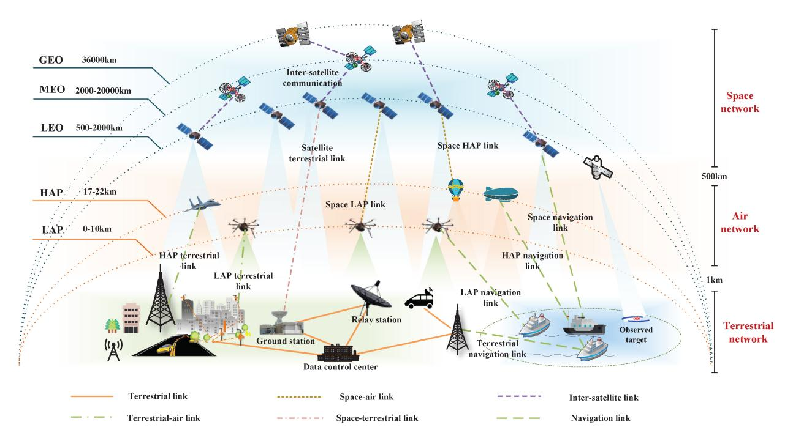
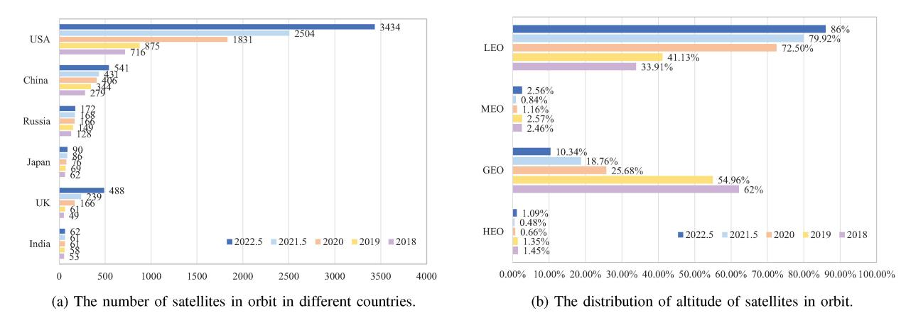
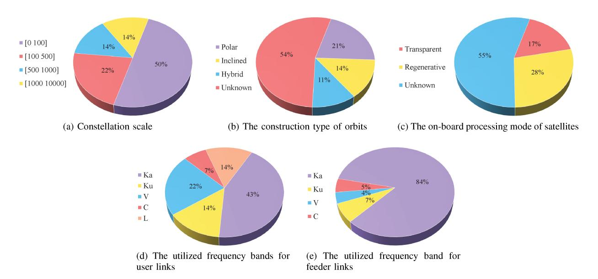
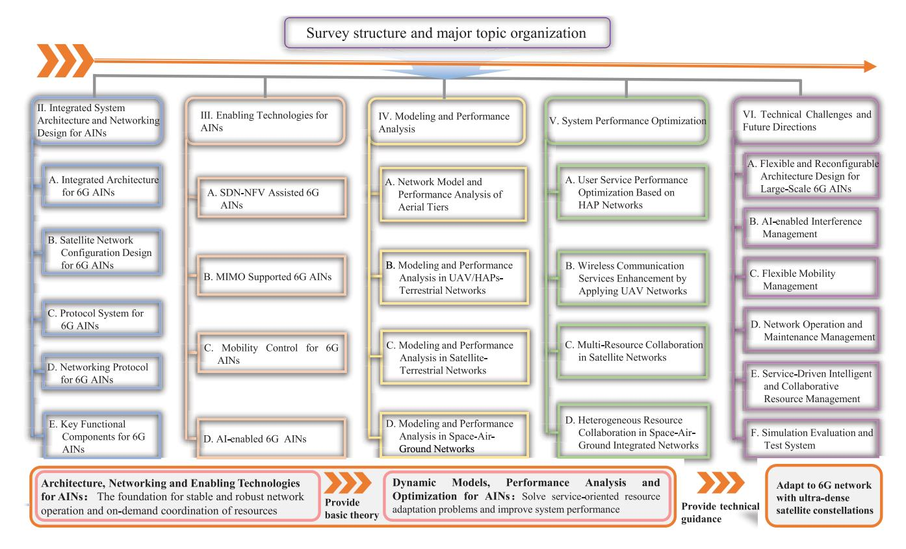
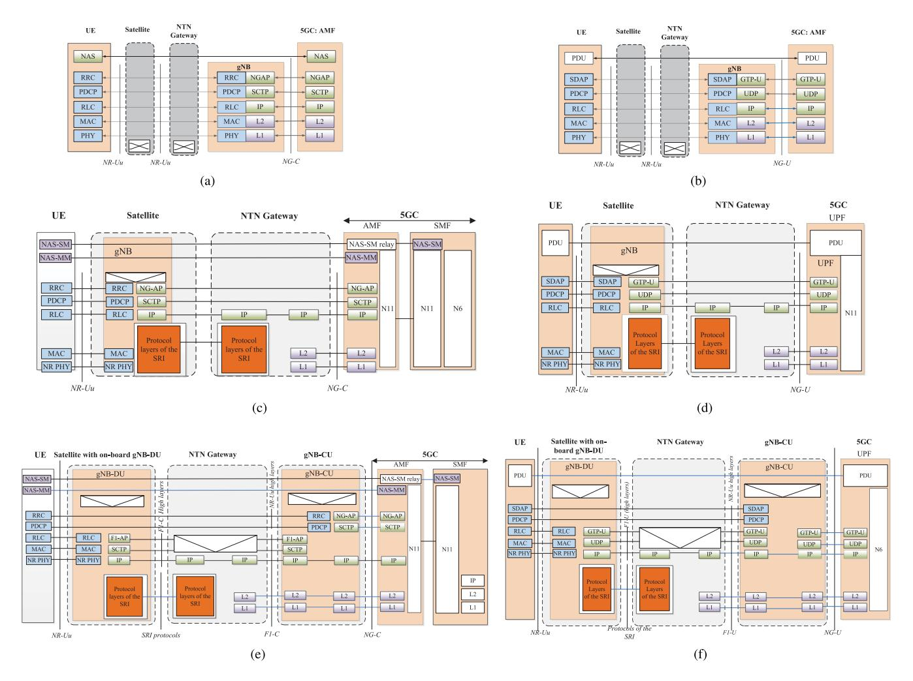
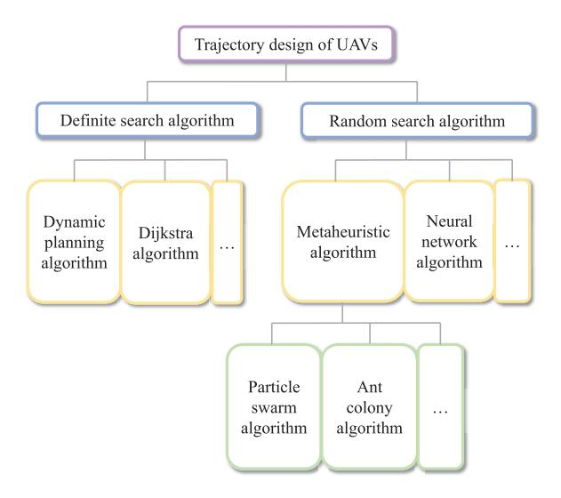
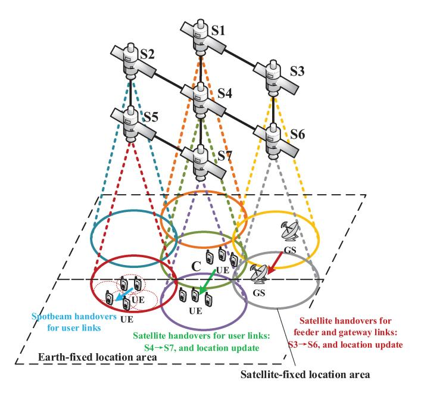
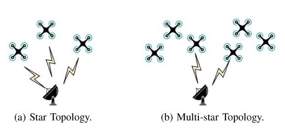
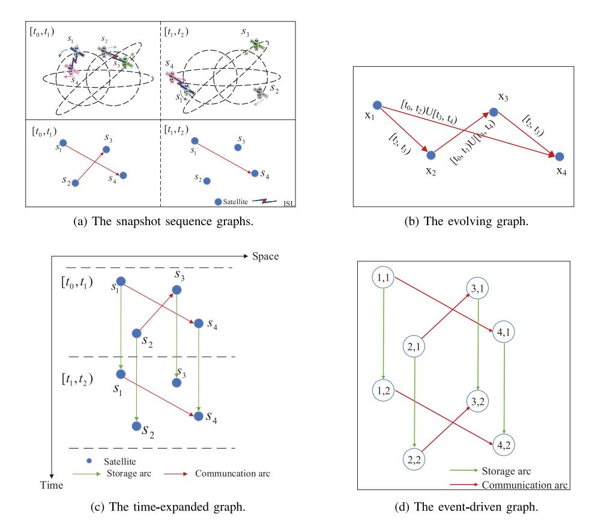
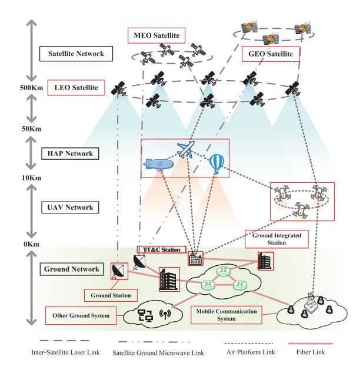

# Aerospace Integrated Networks Innovation for Empowering 6G: A Survey and Future Challenges

Di Zhou®, Member, IEEE, Min Sheng®, Senior Member, IEEE, Jiandong Li®, Fellow, IEEE, and Zhu Han®, Fellow, IEEE

Abstract—The ever-increasing demand for ubiquitous and differentiated services at anytime and anywhere emphasizes the necessity of aerospace integrated networks (AINs) which consist of multi-tiers, e.g., high-altitude platforms (HAPs) tier, unmanned aerial vehicles (UAVs) tier, low earth orbit (LEO) satellites tier, etc. for wide coverage and high capacity. However, the inherent heterogeneity, time-variability, and differentiated mobility characteristics between terrestrial networks and AINs constraint the materialization of the aforementioned widely expected potentials of AINs. Therefore, it is crucial to make a profound understanding of AINs' impacts on pivotal models and methodologies for enabling 6G, thus providing technology reference for AINs empowering 6G. To understand the latest development and ultimately open new research niches on this significant topic, this survey is the pioneer paper to serve as a systematical and comprehensive overview in both single-tier scenarios and combining-tiers scenarios in AINs. We start with a profound discussion about the state-of-the-art potentially promising methodologies and models in the era of AINs empowering 6G from the perspective of the system architecture and networking design and enabling technologies of AINs, to enable flexible and scalable management and control of the AINs and ensure network stability. Furthermore, we make an in-depth literature overview across the network dynamics modeling, theoretical performance analysis model, and system optimization to enhance the system performance and guarantee user-on-demand services. Additionally, we highlight the ongoing research challenges and future directions with focusing on the development trend of ultra-dense satellite constellations in 6G.

Index Terms—Aerospace integrated networks in 6G, spaceair-ground integrated system architecture, enabling technologies of 6G, network dynamics modeling and performance analysis, system optimization.

Manuscript received 2 October 2022; revised 8 January 2023; accepted 7 February 2023. Date of publication 16 February 2023; date of current version 23 May 2023. This work was supported in part by the Natural Science Foundation of China under Grant U19B2025, Grant 62121001, and Grant 62001347; in part by the Young Elite Scientists Sponsorship Program by CAST under Grant 2022QNRC001; in part by the Key Research and Development Program of Shaanxi under Program 2022ZDLGY05-02; in part by the Young Talent Support Program of Xi'an Association for Science and Technology under Grant 095920221337; in part by NSF under Grant CNS-2107216, Grant CNS-2128368, and Grant CMMI-2222810; in part by Toyota; and in part by Amazon. (Corresponding author: Min Sheng.)

Di Zhou, Min Sheng, and Jiandong Li are with the State Key Laboratory of Integrated Service Networks, Xidian University, Xi'an 710071, Shaanxi, China (e-mail: zhoudi@xidian.edu.cn; msheng@mail.xidian.edu.cn; jdli@mail.xidian.edu.cn).

Zhu Han is with the Department of Electrical and Computer Engineering, University of Houston, Houston, TX 77004 USA, and also with the Department of Computer Science and Engineering, Kyung Hee University, Seoul 446-701, South Korea (e-mail: hanzhu22@gmail.com).

Digital Object Identifier 10.1109/COMST.2023.3245614

#### I. INTRODUCTION

PPLICATIONS using wireless communication are expanding, from connecting humans to connecting all kinds of things. The number of connected devices is envisaged to reach 500 billion [1] by 2030, which is approximately 59 times the projected world population (8.5 billion [2]). This makes it challenging to use only terrestrial wireless infrastructure to satisfy the differentiated service demands of users and realize global ubiquitous communication, especially in the mountains, deserts and oceans [3]. Therefore, researchers have ignited a resurgent interest in providing new radio access from space [4]. In recent years, more and more commercial companies and organizations have been working on satellite-related projects, e.g., Telesat in Canada [5], OneWeb in U.K. [6], and SpaceX's Starlink in USA [7], etc., thanks to their inherent advantages in high throughput, large coverage, and strong resilience. In addition, the 3rd generation partnership project (3GPP) defines the deployment scenario of non-terrestrial network (NTN) and provides the 6th generation of mobile communication systems (6G) commercial services for areas with underdeveloped ground network infrastructure, which is expected to achieve wide coverage by using aerospace access facilities, e.g., unmanned aerial vehicles (UAVs) and satellites [8]. Consequently, as shown in Fig. 1, aerospace integrated networks (AINs) composed of low-altitude platforms (LAP), high-altitude platforms (HAP), UAV, low earth orbit (LEO) satellites, medium earth orbit (MEO) satellites, and Geosynchronous/Geostationary (GSO/GEO) orbit satellites, have been becoming an emerging architecture to support ubiquitous services, economic development and national defense information construction, and consequently have attracted intensive research interest during the recent years.

#### A. Motivation

Exploiting AINs to supplement the traditional ground network has become the key technology to deal with the massive data traffic demands and global ubiquitous communication in the future. As shown in Table I, there are nearly 30 satellite constellations in orbit and released around the world. The service capabilities of the system are gradually expanding from traditional mobile communication services to broadband interconnection services. According to the satellite

1553-877X © 2023 IEEE. Personal use is permitted, but republication/redistribution requires IEEE permission. See https://www.ieee.org/publications/rights/index.html for more information.

Fig. 1. Illustration of an AIN.

Fig. 2. The number and orbit distribution of satellites in orbit.

database of the union of concerned scientists (UCS) [\[9\]](#page-36-8), satellites in orbit are mainly owned or operated by United States. Specifically, as shown in Fig. [2\(](#page-1-1)a), the number of satellites is increasing year by year, and the number of satellites in the United States is growing fastest. In addition, the number of satellites was significantly increased in the U.K. in 2022. Meanwhile, it is noteworthy from Fig. [2\(](#page-1-1)b) that the fastest growth rate is LEO satellites, and the proportion of LEO satellites has reached 86% by May 2022. Moreover, the proportion of GEO satellites is decreasing year by year. The most representative constellation is the SpaceX's constellation, i.e., the Starlink constellation, which has launched more than 3,000 satellites and is expected to reach 42,000 satellites [\[7\]](#page-36-6). Notably, an AIN with a single tier, such as UAV, HAP and satellite layer, has been applied to wireless communication system to assist ground communication network shown in Fig. [1.](#page-1-0) Therefore, a multi-components heterogeneous AIN, as a promising network architecture to realize high-speed connection ubiquitous access, is being studied to provide undifferentiated services for massive users in different regions of the world.

Although the number and scale of constellations are developing rapidly, the currently known satellite constellation systems show the characteristics of ambiguity in the relationship among constellation scale, structure, frequency usage rules, and constellation service capabilities as shown in Fig. [3.](#page-3-0) Besides, as a typical heterogeneous AIN enhanced for ground services, on-demand integration and migration of heterogeneous resources are key technologies to improve network performance. However, due to the inherent features of selforganization, heterogeneity, and time-variability of the AIN, the limited and mobile network resources between different tiers have an important impact on the network performance. Therefore, the system architecture and design, resource management and frequency allocation, mobility management, networking protocol, and network performance analysis and

TABLE I OVERVIEW OF SOME CONSTELLATIONS IN ORBIT

| Comp. / Cons. Name (Country) | # Sat.         | Orb. Alt. (Km) | ISLs | Orb. Type                | Freq. band                                                                                                                                                         | Services & Project Progress                                |
|---------------------------------|----------------|-------------------|------|--------------------------|--------------------------------------------------------------------------------------------------------------------------------------------------------------------|------------------------------------------------------------|
| ORBCOMM (USA)                   | 47+6           | 780-1000          | No   | Inclined + Equatorial | L                                                                                                                                                                  | Voice                                                      |
| ORBCOMM-II (USA)             | 18             | /                 | No   | /                        | /                                                                                                                                                                  | Maritime IoT (non-real-time, low-rate)                     |
| GlobalStar (USA)                | 48+12          | 1414              | No   | Inclined                 | L, S                                                                                                                                                               | Voice, fax, data, short message, location               |
| Ellipso (USA)                   | 17             | 520-784, 8063  | /    | Ellipse + Equatorial  | Ka                                                                                                                                                                 | LEO technology runs on MEO orbit                           |
| Skybridge (USA)                 | 1457           | /                 | Yes  | Inclined                 | /                                                                                                                                                                  | 200Gbits/s                                                 |
| Teledesic (USA)                 | 120+6          | 1385              | Yes  | /                        | Ka                                                                                                                                                                 | Voice, data, broadband integrated service                  |
| Iridium (USA)                   | 66             | 677               | Yes  | Polar                    | L, Ka                                                                                                                                                              | Abandoning frequency applications in 2003                  |
| Iridium-II (USA)                | 66+9           | 780               | Yes  | Polar                    | L, C, Ku, Ka (User: Uplink: 1616-1626.5MHz; Downlink: 1616-1626.5MHz; Feeder link: Uplink: 27.5-30GHz; Downlink: 18.8-20.2GHz; ISLs: 22.5-23.5 GHz) | /                                                          |
| LeoSat (USA)                    | 108            | 1432              | Yes  | Polar                    | Ka                                                                                                                                                                 | Launch the first experimental satellite in 2019            |
| StarLink (USA)                  | 42000          | 550-1325          | Yes  | Inclined                 | User: Ku (Uplink: 14.0-14.5GHz; Downlink: 10.7-12.7GHz); Feeder link: Ku., Ka (Uplink: 27.5-30GHz Downlink: 17.8-19.3GHz); ISLs: Laser                    | 3399 satellites have been launched                         |
| OneWeb (USA)                    | 720 (47844) | 1200              | No   | Polar                    | User: Ku (Uplink: 12.75-14.5 GHz Downlink: 10.7-12.7GHz) Feeder link: Ka (Uplink: 27.5-30.0GHz Downlink: 17.8-20.2GHz)                                 | 74 satellites have been launched                           |
| Beoing (USA)                    | 2956           | 1030- 1080     | No   | Inclined                 | V                                                                                                                                                                  | Frequency application has been withdrawn                   |
| Kuiper (USA)                    | 3236           | 590-630           | 1    | /                        | User/ Feeder link: Ka                                                                                                                                              | Global internet service                                    |
| O3b-I (UK)                      | 20             | 8062- 8072     | No   | Equatorial               | User/ Feeder link: Ka (Uplink: 27.6-28.4GHz, 28.6-29.1GHz; Downlink: 17.8-18.6GHz)                                                                           | Provide broadband services for north-south latitude at 50° |
| O3b-II (UK)                     | 22             | 8062              |      | Inclined + Equatorial | User/ Feeder link: Ka, V (Uplink: 47.5-50.2GHz, 50.4-51.4GHz; Downlink: 37.5-42.5GHz)                                                                              | GEO and MEO integrated service system                      |
| Telesat (Canada)                | 117            | 1000              |      | Polar+Inclined           | User/ Feeder link: Ka (Uplink: 427.5-30.0GHz; Downlink: 17.8-20.2GHz); ISLs: Laser                                                                        | /                                                          |
| Hongyan (China)                 | 324            | 1000              | Yes  | Polar                    | User: L, Ka, V (Uplink: 1668-1675MHz; Downlink: 15.18-15.25GHz) Feeder link: Ka (Uplink: 27.5-30.0GHz Downlink: 17.7-20.2GHz)                       | Launch the first experimental satellite                    |
| Hongyun (China)                 | 156            | 1000              | Yes  | Polar                    | User: L, C, Ka, V; Feeder link: C, Ka; ISLs: Laser                                                                                                           | Launch the first experimental satellite                    |
| Galaxy Aerospace (China)     | >1000          | 500-1200          | No   | /                        | User/ Feeder link: Ka, V                                                                                                                                           | Launch the first satellite                                 |
| Skywalker (China)               | 36             | 900               | Yes  | Inclined                 | 1                                                                                                                                                                  | 5 satellites have been launched                            |

optimization of heterogeneous AIN are of great significance for guaranteeing ubiquitous user-on-demand services.

Various international standards organizations and commercial aerospace companies have devoted themselves to exploring the key technologies in AINs for future 6G service demands as shown in Table [II.](#page-3-1) Specifically, 3GPP released a series of NTN architecture, evaluates mobility management and quality of service (QoS) solutions, and presents some networking reference scenarios [\[10\]](#page-36-9), [\[11\]](#page-36-10). To further explore the application of satellites in the 5th Generation of mobile Communication Systems (5G), satellite-terrestrial network for 5G denoted by satellite and terrestrial network for 5G (SaT5G) proved the hybrid satellite ground network architecture through experiments, built a satellite 5G fusion network test platform, and realized integrated resource management [\[12\]](#page-36-11), [\[13\]](#page-36-12). In addition, the international telecommunication union (ITU) conducted a detailed study on the resource management and control of satellite and ground systems, and formulated frequency use rules to achieve compatibility [\[14\]](#page-36-13). Furthermore, considering the resource optimization to improve system performance, national aeronautics and space administration (NASA) disclosed an efficient space data scheduling

Fig. 3. Typical characteristics of civil and commercial satellite systems in orbit and released.

TABLE II RESEARCH CONTENT OF ORGANIZATIONS

| Institution name | Ref. | Research content                                                                                                                                                                                                                                                                                                        |
|------------------|------|-------------------------------------------------------------------------------------------------------------------------------------------------------------------------------------------------------------------------------------------------------------------------------------------------------------------------|
| 3GPP             | [10] | NTN overview and typical scenarios were introduced in detail, and different types of NTN platforms including satellite, HAP and UAV were given. In addition, various NTN architectures have been proposed.                                                                                                              |
|                  | [11] | Description and evaluation of mobility management with large and moving satellite coverage area were mainly studied as two key issues.                                                                                                                                                                                  |
| SaT5G            | [12] | The pre-5G test platform can be used for satellite 5G fusion network was established, and the hybrid satellite ground network architecture has been proved by experimental demonstration.                                                                                                                               |
|                  | [13] | The demonstration of the 5G hybrid backhaul on the zodiac inflight innovation testbed has been completed, which realized integrated resource management and coordination.                                                                                                                                               |
| ITU              | [14] | Architectural requirements of Monte Carlo simulation methods were used to study the coexistence and compatibility between different radio services or systems.                                                                                                                                                          |
| NASA             | [15] | The data communication scheduling algorithm of space and ground integrated network realized global optimal scheduling, and the generalized methods and algorithms were widely used in combinatorial optimization problems.                                                                                              |
| LG               | [16] | LG opened a 6G research center within KAIST Institute, a research organization for technologies for the country's economic development run by the Korea Advanced Institute of Technology in Daejeon Metropolitan City, which will be headed by Cho Dong-ho, professor of electrical engineering at KAIST.               |
| SK Telecom       | [17] | SK Telecom started joint research on 6G with Samsung, Nokia, and Ericsson.                                                                                                                                                                                                                                              |
| Huawei           | [18] | Huawei began to carry out research activities on 6G "a long time ago", and has parallel work being done on 5G and 6G, but that it's in an "early phase".                                                                                                                                                                |
| 6G Flagship      | [19] | Their aim is to create the essential 6G technological components, the tools, and the equipment to build a 6G Test Network, develop chosen vertical applications for 6G to accelerate societal digitization and continue to be a recognized vision leader and sought-after research partner in worldwide 6G research.    |
| NYU WIRELESS     | [20] | Their research includes terahertz communications and sensing, mobile edge networking and computing, millimeter wave (mmWave), terahertz (THz) and quantum nanodevices and circuits, 5G and 6G applications (such as robotics, UAVs, autonomous vehicles), machine learning, communication foundations, and 6G testbeds. |

strategy, and the proposed strategy can produce a globally optimized schedule [\[15\]](#page-36-14). In addition, some cooperation also began 6G researches to develop their 6G products and technologies. LG opened a 6G research center within KAIST Institute, a research organization for technologies for the country's economic development run by the Korea Advanced Institute of Technology in Daejeon Metropolitan City [\[16\]](#page-36-15). SK Telecom started joint research on 6G with Samsung, Nokia, and Ericsson [\[17\]](#page-36-16). Huawei began to carry out research activities on 6G a long time ago and had parallel work being done on 5G and 6G [\[18\]](#page-36-17). For non-profit organizations, 6G Flagship aims to create the essential 6G technological components, the tools, and the equipment to build a 6G Test Network, develop chosen vertical applications for 6G to accelerate

societal digitization and continue to be a recognized visionary leader and sought-after research partner in worldwide 6G research [\[19\]](#page-36-18). The research of NYU wireless includes terahertz (THz) communications and sensing, mobile edge networking and computing, millimeter wave (mmWave), THz and quantum nano-devices and circuits, 5G and 6G applications (such as robotics, UAVs, autonomous vehicles), machine learning, communication foundations, and 6G testbeds [\[20\]](#page-36-19).

There have been state-of-the-art surveys on AINs, which are shown in Table [III.](#page-4-0) From the perspective of the chronological evolution of the different aerospace tiers considered in literature, the vigorous development of satellites, UAVs, and HAPs is almost at the same time, and the survey for them is also carried out simultaneously. Subsequently,

TABLE III SUMMARY OF EXISTING SURVEYS ON AINS

| D.C.       | Publication            |           | Mair     | n scenari | o                        |                                                                                                                                                                                       |
|------------|------------------------|-----------|----------|-----------|--------------------------|---------------------------------------------------------------------------------------------------------------------------------------------------------------------------------------|
| References | date                   | Satellite | HAP      | UAV       | Heterogeneous Network | Contributions                                                                                                                                                                         |
| [21]       | Dec. 2017              | ✓         |          |           |                          | An overview of micro-propulsion technologies that have been developed or are currently being developed for cube satellites are provided.                                              |
| [22]       | July 2019              | ✓         |          |           |                          | Comprehensive analysis of satellite network security issues and classification and performance comparison of secure routing protocols.                                                |
| [23]       | third quarter 2020  | <b>✓</b>  |          |           |                          | An overall overview of all aspects of the cube satellite missions and a thorough review are provided.                                                                                 |
| [24]       | first quarter 2021  | ✓         |          |           |                          | The main applications, key technologies, future challenges and research topics of satellites are discussed.                                                                           |
| [25]       | third quarter 2021     | <b>√</b>  |          |           |                          | The technology, standards, and open challenges of satellite IoT are introduced.                                                                                                       |
| [26]       | Aug. 2022              | <b>√</b>  |          |           |                          | A comprehensive survey includes radio access technologies and the characteristics and architecture of the non-geostationary satellite system.                                         |
| [27]       | second quarter 2016 |           |          | ✓         |                          | The various outstanding issues that exist in UAV networks are surveyed.                                                                                                               |
| [28]       | fourth quarter 2019 |           |          | ✓         |                          | Practical aspects, security challenges, etc. are discussed in UAV cellular communication.                                                                                             |
| [29]       | Mar. 2021              |           | ✓        |           |                          | It provides the vision and framework of the future HAP network and emphasizes the unrealized potential of the HAP system.                                                             |
| [30]       | fourth quarter 2018 |           |          |           | ✓                        | Recent works and future challenges are displayed in the SAGIN.                                                                                                                        |
| [31]       | Dec. 2019              |           |          |           | ✓                        | The performance evaluation, standardization, and key application fields as well as existing problems and future directions for the satellite-terrestrial network are introduced.      |
| [32]       | Jun. 2021              |           |          |           | ✓                        | Key technologies, opportunities, and challenges in satellite-ground networks for the Maritime IoTs.                                                                                   |
| [33]       | Feb. 2022              |           |          |           | ✓                        | The key technology of the SAGIN is discussed, and the application prospect and assumption of SAGIN in 6G are presented.                                                               |
| [34]       | Aug. 2022              |           |          |           | ✓                        | Requirements, architecture, and challenges of SAGIN for 6G are discussed.                                                                                                             |
| [35]       | Nov. 2022              |           |          |           | ✓                        | It focuses on the architecture, network design, performance optimization, etc. in integrated satellite-terrestrial networks.                                                          |
| [36]       | Sep. 2018              |           | 1        | ✓         | ✓                        | Specific issues and main mechanisms are involved, about LAP, HAP network and integrated ACNs.                                                                                         |
| [37]       | Apr. 2019              |           |          | <b>√</b>  | ✓                        | Related research challenges faced by the SAGINs architecture and an exhaustive review of various 5G techniques based on UAV platforms are provided.                                   |
| [38]       | July 2020              |           |          | ✓         | ✓                        | The applications, key challenges, and current research technologies of air-ground networks, from perspectives of communication, computation, and caching, respectively, are reviewed. |
| [39]       | Nov. 2020              | ✓         |          |           | ✓                        | The opportunities, key technical challenges, and proposed solutions are surveyed for satellite-terrestrial networks.                                                                  |
| [40]       | Aug. 2021              | ✓         | ✓        | ✓         |                          | The connection requirements and potential solutions for aerial vehicles such as HAP, UAV, and satellite are reviewed.                                                                 |
| [41]       | Aug. 2021              | ✓         | ✓        | ✓         | ✓                        | The application and development of SAGIN in high-speed railways are surveyed.                                                                                                         |
| Ours       | /                      | <b>√</b>  | <b>✓</b> | ✓         | <b>√</b>                 | A survey on AINs innovation empowering 6G is systematically and comprehensively reviewed in both single tiers scenarios and combining tiers scenarios in AINs.                        |

the study on the heterogeneous network composed of satellites, UAVs, and HAPs aroused the interest of researchers, and gradually evolved into the space-air-ground integrated network (SAGIN). Specifically, some surveys were conducted on single networks. Tummala and Dutta [\[21\]](#page-36-20) focused on the micro-propulsion technologies that have been developed for cube satellites and Yan et al. [\[22\]](#page-37-0) focused on various secure routing protocols for satellite networks. Furthermore, recent advances and future challenges of CubeSat and satellite communication were introduced in [\[23\]](#page-37-1) and [\[24\]](#page-37-2), respectively. The technology, standards, and open challenges of the satellite Internet of Things (IoT) are introduced in [\[25\]](#page-37-3). Al-hraishawi et al. [\[26\]](#page-37-4) comprehensively investigated radio access technologies of the non-geostationary satellite system and the characteristics and architecture of the overall system. In addition, the various outstanding issues that exist in UAV networks were provided in [\[27\]](#page-37-5) to spur further research in these areas. Subsequently, Fotouhi et al. [\[28\]](#page-37-6) discussed the practical problems and security challenges in UAV cellular communication. The vision and framework of the future HAP network were provided and the unrealized potential of the HAP system was emphasized in [\[29\]](#page-37-7). Secondly, some works focused on the integration of different kinds of networks. Liu et al. [\[30\]](#page-37-8) took the lead in investigating the latest research work on the SAGIN technology from network design and resource allocation to performance analysis and optimization, and the surveys of SAGIN were carried out in [\[33\]](#page-37-9), [\[34\]](#page-37-10), including recent research work, key technologies, application prospects, requirements, architecture, and challenges in 6G. Satellite-ground communication networks were discussed from different aspects in [\[31\]](#page-37-11), [\[32\]](#page-37-12), [\[35\]](#page-37-13), [\[39\]](#page-37-14). Besides, research status and future research directions of aerial vehicles including HAP, UAV, and satellite are detailed [\[36\]](#page-37-15), [\[40\]](#page-37-16), and related research challenges faced by the SAGINs architecture and an exhaustive review of various 5G techniques based on UAV platforms are provided in [\[37\]](#page-37-17). Zhang et al. [\[38\]](#page-37-18) reviewed the applications, key challenges, and current research technologies of air-ground networks from perspectives of communication, computation, and caching, respectively. Furthermore, Sheng et al. [\[41\]](#page-37-19) comprehensively introduced HAP, UAV, and satellite networks and focused on the application and development of the SAGIN in high-speed railways. Consequently, with the increasing expectation of multi-tiers combined AINs becoming a 6G network architecture, the technical research of combining-tiers AINs enabled 6G is being studied in full swing.

However, the existing surveys are either limited to or specific to particular topics and lack a comprehensive overview of the aforementioned partial or all tiers of AINs for special applications. This means that the related researches in this field remain still scattered and separated and the interconnection among them is weak and asynchronous. Besides, the objectives and methodologies of the existing research varied noticeably, partly owing to the inherent self-organization, heterogeneity, and time-variability of the different tiers of AINs of this research direction. Despite facing a very wide topic with an enormous and continuously growing amount of recent literature, we highlight the following pivotal issues, e.g., system architecture and networking design, network performance analysis, system optimization schemes, and simulation evaluation and test system, etc. in both single-tier scenarios and combining-tiers scenarios in AINs, which had not been well investigated, so as to stay focused and provide a guidance on a concise and clear representation of the significant developments related to this topic. Conceptually, unifying existing systems to construct a multi-tier and hierarchical AIN is expected to provide guidance for readers with a standard and comprehensive reference model for raising more new issues.

## *B. Organization of the Survey*

The purpose of this survey is to provide a systematical and comprehensive overview of the potentially promising models and methodologies in the era of AINs empowering 6G from the perspective of the system architecture and networking design, enabling technologies of AINs, modeling and performance analysis, system performance optimization, and technical challenges and future directions. To improve the material flow, we provide the list of acronyms in Table [IV.](#page-6-0) The survey structure and major topic organization are illustrated in Fig. [4.](#page-7-0) In brief, our survey discovered.

*• Integrated System Architecture and Networking Design for AINs:* With the development trend of AINs for the provision of wireless coverage extension and enhancement for 6G services, we first elaborate on the integrated space-air-ground network architecture to provide seamless and ubiquitous 6G services for more users

- and applications. To further provide guidance parameters design of network structure, we summarize the network configuration design in AINs. Then, the protocol systems are detailed to specify the basic communication rules between the network nodes. We further review networking protocols and technologies to guarantee the effectiveness of user access and reliable end-to-end (E2E) transmission. Finally, the key functional components of the AIN system are presented to give flexibility and scalability to the management and control of the AINs. Notably, valuable suggestions and recommendations are proposed and analyzed in each part of the AIN architecture design. The mentioned above details are specified in Section [II.](#page-7-1)
- *• Enabling Technologies for AINs:* We summarize several enabling technologies to not only support the operation of AINs but also enhance the performance of AINs in different aspects, where we focus on both single tier and combined multi-tiers AINs. First, the application of software-defined networking (SDN) and network function virtualization (NFV) is discussed, which can facilitate better performance in cost, network flexibility, etc. for both single tier and multi-tiers AINs. Then, we focus on the multiple input multiple output (MIMO) technology for single tier and combined multi-tiers AINs, where MIMO technology can increase link capacity, achieve high-speed data transmission, etc. Subsequently, we investigate the mobility control technology for UAVs, satellites, and integrated systems in AINs to guarantee traffic service continuity. Finally, we introduce an innovative artificial intelligence (AI) technology that enables the adaptive adjustment of the network to the dynamic environment to improve the system performance in AINs. Details can be found in Section [III.](#page-16-0)
- *• Modeling and Performance Analysis:* We investigate the related modeling and performance analysis strategies of the combined multi-tiers systems in AINs, to provide readers with a convenient reference. Specifically, to assist the terrestrial network to extend coverage, we first analyze the complicated channel model in an aerial network of highly dynamic UAVs, HAPs, and satellites. Afterwards, we investigate the modeling and performance analysis in UAV/HAP-terrestrial networks to optimize the network capacity, coverage, power, energy efficiency, etc. Then, we explore the intermittently connected network models and performance analysis schemes in the combined satellite and terrestrial networks to enhance network service performance. Finally, we investigate the modeling and performance analysis in the space-airground networks from the perspectives of the vertical transmission and horizontal implementation. Notably, we present some insight for the modeling and performance evaluation in future AINs with multi-network tiers integration. Details are presented in Section [IV.](#page-22-0)
- *• System Performance Optimization:* To improve the system performance of AINs, we consider AINs with single tier network and multi-tiers heterogeneous network. Since the resources of the different components, i.e.,

TABLE IV LIST OF ABBREVIATIONS

| Acronyms   | Description                                            | Acronyms  | Description                                        |
|------------|--------------------------------------------------------|-----------|----------------------------------------------------|
| 3GPP       | 3rd generation partnership project                     | 3C        | Computing, caching, and communication              |
| 5G         | The 5th Generation of mobile communication systems     | 6G        | The 6th Generation of mobile communication systems |
| AIN        | Aerospace integrated network                           | GS        | Ground station                                     |
| CCP        | Concave-convex process                                 | CINR      | Carrier-to-interference plus noise ratio           |
| CSI        | Channel state information                              | DRLF      | Deep reinforcement learning based framework        |
| FBW        | Full bandwidth                                         | GEO       | Geostationary                                      |
| UCS        | Union of concerned scientists                          | HAP       | High-altitude platform                             |
| HBW        | Half bandwidth                                         | ITU       | International telecommunication union              |
| JT-COMP    | Joint transmission coordinated multi-point             | LAP       | Low-altitude platform                              |
| LEO        | Low earth orbit                                        | LEO-MSSs  | LEO mobile satellite systems                       |
| IRS        | Intelligent reflecting surface                         | MEO       | Medium earth orbit                                 |
| CSMA/CA    | Carrier Sense Multiple Access with Collision Avoidance | VR        | Virtual reality                                    |
| ACK        | Acknowledgment                                         | AMF       | Access and mobility management function            |
| MINLP      | Mixed-integer nonlinear programming                    | AR        | Advanced reality                                   |
| AUSF       | Authentication server function                         | BS        | Base Station                                       |
| CDMA       | Code-division multiple access                          | CSMA      | Carrier sense multiple access                      |
| eNB        | Evolved NodeB                                          | EOS       | Earth observation satellite                        |
| FDMA       | Frequency-division multiple access                     | gNB       | Generation NodeB                                   |
| gNB-CU     | gNB central unit                                       | gNB-DU    | gNB distributed unit                               |
| ICN        | Information-centric networking                         | IoST      | Internet of Space Things                           |
| ITSN       | Integrated terrestrial and satellite network           | IoV       | Internet of Vehicles                               |
| LPWAN      | Low power wide area network                            | MEC       | Mobile edge computing                              |
| MMF        | Mobility management function                           | PDCP      | Packet data convergence protocol                   |
| RAAN       | Right ascension of the ascending node                  | RRC       | Radio resource control                             |
| SDAP       | Service data adaptation protocol                       | SMF       | Session management function                        |
| SRI        | Satellite radio interface                              | TDMA      | Time-division multiple access                      |
| WLAN       | Wireless local area network                            | PHY       | Physical                                           |
| IoT        | Internet of things                                     | MAC       | Media access control                               |
| IoRT       | Internet of remote sensors                             | MF-TDMA   | Multi-frequency time-division multiple-access      |
| AP         | Access points                                          | SSG       | Snapshots Sequence Graph                           |
| TEG        | Time-expanded Graph                                    | EDG       | Event-driven Graph                                 |
| LOS        | Line of sight                                          | MACP      | Mission aware contact plan                         |
| MDP        | Markov decision process                                | FS-MAC    | fault-tolerant synchronous MAC                     |
| MILP       | Mixed-integer linear programming                       | MIMO      | Multiple input multiple output                     |
| ML         | Machine learning                                       | MSS       | Multi-beam satellite systems                       |
| NASA       | National aeronautics and space administration          | NOMA      | Non-orthogonal multiple access                     |
| NTN        | Non-terrestrial network                                | QoS       | Quality of service                                 |
| SAGIN      | Space-air-ground integrated network                    | SaT5G     | Satellite and terrestrial network for 5G           |
| TT&C       | Tracking, telemetry, and command                       | UAV       | Unmanned aerial vehicle                            |
| NFV        | Network Function Virtualization                        | mmWave    | Millimeter wave                                    |
| SDN        | Software-Defined Networking                            | RL        | Reinforcement Learning                             |
| DEM        | Digital Elevation Model                                | MCC       | Mobile Cloud Computing                             |
| 3D         | Three-Dimension                                        | CF-MAC    | Collision free MAC                                 |
|            |                                                        |           |                                                    |
| QoE DBI | Quality of Experience                                  | AI BER | Artificial intelligence                            |
| DRL        | Deep reinforcement learning                            |           | Bit error rate                                     |
| UE         | User equipment                                         | SAGVN     | Space-air-ground integrated vehicular network      |
| DQN        | Deep Q-learning                                        | EG        | Evolving graph                                     |
| ACNs       | Airborne communication networks                        | E2E       | End-to-end                                         |

the HAP, UAV and satellite tiers, are dynamic and have different characteristics, we investigate the performance optimization strategies from the perspective of single HAP, single UAV, single satellite, and integrated networks, respectively. Furthermore, regarding system performance improvement, we review technologies in four aspects: user service performance optimization based on HAP networks, wireless communication services enhancement by applying UAV networks, multi-resource collaboration in satellite networks, and heterogeneous resource collaboration in space-air-ground integrated networks. These details are covered in Section [V.](#page-28-0)

*• Technical Challenges and Future Directions:* We explore the essential technical challenges and future directions of applying AINs with ultra-dense satellite constellations to 6G. As the main architectural component of the comprehensive 6G, AINs with ultra-dense satellite constellations

face challenges in terms of integrated and scalable architecture design, AI-enabled interference management, and flexible mobility management. Moreover, network operation and maintenance management and service-driven intelligent and collaborative resource management are considered important issues to provide differentiated users for the on-demand services in 6G. Finally, the highfidelity simulation verification of the real system is the core technology to verify the efficiency of the related protocols and algorithms for AINs. The aforementioned details are discussed in Section [VI.](#page-34-0)

To make a clear connection between different Sections in this survey, we divide these Sections into three parts from the technical role of the AINs as shown in Fig. [4.](#page-7-0) Firstly, architecture, networking and enabling technologies are the foundations for stable and robust network operation and on-demand coordination of resources for AINs, which can provide an efficient

Fig. 4. Survey structure and major topic organization.

basic theory for system modeling, performance analysis and system optimization. Furthermore, dynamic network models, performance analysis and optimization technologies can guide service-oriented resource adaptation strategies design and improve system performance for AINs. Ultimately, the aforementioned two parts can provide technical guidance for the development of 6G AINs with ultra-dense satellite constellations. To sum up, this survey is viewed as a framework of reference for interested readers. It is the first-of-its-kind survey paper to systematically and comprehensively review literature in both single tiers scenarios and combining tiers scenarios in AINs. Specifically, this survey provides the latest thinking and research for emerging technologies in AINs. Technical foundations of AINs are systematically classified from the aspects of system architecture, networking design, enabling technologies, network dynamics modeling, theoretical performance analysis model and system optimization. In addition, we present the discussions and recommendations by analyzing the efforts of relevant research to complete each perspective survey to give some insight to readers. Finally, the technical challenges and future directions are highlighted to describe the research trends in AINs toward a comprehensive infrastructure with ultra-dense satellite constellations.

# II. INTEGRATED SYSTEM ARCHITECTURE AND NETWORKING DESIGN FOR AINS

In this section, the integrated system architecture and networking design for future 6G AINs are introduced in detail. Specifically, we elaborate on the integrated network architecture and the satellite network configuration design in Section [II-A](#page-7-2) and [II-B,](#page-10-0) respectively. Furthermore, Section [II-C](#page-11-0) and [II-D](#page-13-0) clarify the integrated protocol system and networking protocol for AINs, respectively. Finally, Section [II-E](#page-14-0) introduces the key functional components for AINs.

## *A. Integrated Architecture for 6G AINs*

In recent years, the 3GPP has released a series of technical reports and specifications about NTNs (satellite and aerial networks) to support the future integration with terrestrial, aerial, and satellite networks [\[42\]](#page-37-20), where the TR 38.821 in Release 16 gave out the specific satellite access architectures as well as control and user plane protocol systems [\[10\]](#page-36-9), and the TR 23.737 in Release 17 implicit support for HAPs and air-to-ground networks [\[11\]](#page-36-10). These works have been the cornerstone for many AIN architectural researches. In Table [V,](#page-8-0) we list the recent literature about AIN architectures in network components, satellite role/function, and main work on architectures. To sum up, the integrated AIN mainly includes communication network and protocol architectures [\[10\]](#page-36-9), [\[43\]](#page-37-21), [\[44\]](#page-37-22), [\[45\]](#page-37-23), [\[46\]](#page-37-24), [\[47\]](#page-37-25), [\[48\]](#page-37-26), [\[49\]](#page-37-27), [\[50\]](#page-37-28), [\[51\]](#page-37-29), [\[52\]](#page-37-30), [\[53\]](#page-37-31), [\[54\]](#page-37-32) and SDN/NFV/Information-centric networking (ICN)-based architectures [\[50\]](#page-37-28), [\[54\]](#page-37-32), [\[55\]](#page-37-33), [\[56\]](#page-37-34), [\[57\]](#page-37-35), [\[58\]](#page-37-36), applying for Mobile edge computing (MEC) [\[58\]](#page-37-36), [\[59\]](#page-37-37), [\[60\]](#page-37-38), [\[61\]](#page-37-39), IoT [\[62\]](#page-37-40), [\[63\]](#page-37-41), Internet of Vehicles (IoV) [\[64\]](#page-37-42), [\[65\]](#page-37-43), [\[66\]](#page-38-0), and safety scenarios [\[62\]](#page-37-40), [\[67\]](#page-38-1). From the network components shown in Table [V](#page-8-0) and Fig. [1,](#page-1-0) the integrated AIN generally contains space/air segment, ground/ocean segment, and user segment.

TABLE V RECENT LITERATURE OF SATELLITE RELATED INTEGRATED ARCHITECTURES

| Work  | Space segment             | Network components Ground/ocean segment              | User segment                        | Satellite role/function                                                             | Architecture type                                  |
|-------|---------------------------|------------------------------------------------------|-------------------------------------|-------------------------------------------------------------------------------------|----------------------------------------------------|
|       | GEO, MEO, LEO             | BS, GS, Core                                         | 5G/6G services                      | Transparent payload for data relay, regenerative                                    | 3GPP standardized network                          |
| [10]  | HAP, LAP                  | B3, G3, C01C                                         | 30/00 services                      | payload for access and data routing GEO/MEO: gNB-CU and AMF for management,         | and protocol architectures                         |
| [43]  | GEO, MEO, LEO             | BS, GS, Core                                         | 5G/6G services                      | LEO: gNB-DU for data and access                                                     | 3GPP-based protocol architectures                  |
| [15]  | GEO, MEO, LEO             | GS, ocean station, operation                         | Mobile phones,                      | Programmable hardware for in-network load                                           | Scalable in-network traffic                        |
| [44]  | HAP                       | center                                               | vehicles, TV                        | balance and congestion control                                                      | control architecture                               |
|       |                           |                                                      |                                     | GEO: gNB access function, MMF, SMF, AUSSF,                                          |                                                    |
|       | GEO, MEO, LEO             | PEGICO PO G                                          | LIE                                 | user plane, and intelligent network management &                                    |                                                    |
| [45]  | HAP                       | B5G/6G BS, Core                                      | UEs                                 | control, LEO: gNB data unit, gNB control unit,                                      | Functional entity architectures                    |
|       |                           |                                                      |                                     | gNB access function, MMF, SMF, user plane, and network conception function          |                                                    |
|       |                           | Terrestrial and satellite                            |                                     | network conception function                                                         |                                                    |
|       |                           | eNodeBs, modem, hub,                                 |                                     | Catallitas aND face and the same day for                                            | Carallina haaldaaaliaa                             |
| [46]  | GEO                       | IP/MPLS network, Core,                               | UEs                                 | Satellite: gNB for access and transponder for backhaul                              | Satellite backhauling architecture over S1         |
| [40]  |                           | gateway, receive antenna,                            |                                     | Dackilaul                                                                           | arcintecture over \$1                              |
|       |                           | data network, FTP server Gateway, Core, NMC,         | User group for                      | LEO: space base station for beam resource                                           | Broadband communication                            |
| [47]  | GEO, LEO                  | baseband, router, Internet                           | vehicles and UEs                    | management                                                                          | architectures                                      |
| [17]  | LEO                       | Core, terrestrial-satellite                          | UEs                                 | LEO: relay nodes to forward received data                                           | Access architectures                               |
| [48]  | LEO                       | terminal, BS(eNB)                                    | UES                                 | · · · · · · · · · · · · · · · · · · ·                                               | Access architectures                               |
| [49]  | GEO, MEO, LEO             | Gateway, on-ground relay,                            | UEs                                 | Satellites: transparent payload and regenerative                                    | Access architectures                               |
| [47]  |                           | data network Gateway, data center, cellular          | Land, marine, and                   | payload for direct and indirect access                                              | TCP/IP communication                               |
| [50]  | GEO, MEO, LEO             | network, backbone network,                           | aviation-based UEs,                 | GEO: relay nodes for long-distance transmission, MEO and LEO: access and forwarding | protocol and SDN/NFV                               |
| [50]  |                           | low power wide area network                          | IoT devices                         | MEO and LEO: access and forwarding                                                  | architectures                                      |
|       |                           | GS, fixed access network,                            |                                     | GEO: backbone network access, interconnection,                                      |                                                    |
|       | GEO, LEO LAP              | Core, mobile access network, mobile network, service | Mobile nodes                        | management; LEO: access network                                                     | A smart identifier framework                       |
| [51]  | GEO, LEO LAF              | query server, management                             | Wiodile flodes                      | interconnections, mobile communications, and                                        | for network layer integration                      |
|       |                           | server, aggregation server                           |                                     | space-based IoT                                                                     |                                                    |
|       | Space devices             | Super GS, satellite gateway,                         | Terrestrial and                     | Satellite: space-data center                                                        | Spectrum management                                |
| [52]  | Space devices             | cells, Virtual resource pool Satellite GS, HAP GS.   | space devices Fixed and mobile   | GEO, LEO, and HAP: transparent payload for                                          | architecture Backhaul and protocol                 |
| [53]  | GEO, LEO HAP              | cellular 4G and 5G, Core                             | multi-mode UEs                      | backhaul                                                                            | architectures                                      |
| []    |                           | centalar 10 and 30, core                             | Gateway (gNB),                      | odeniudi                                                                            | aremeetares                                        |
|       | GEO, LEO                  | UE and UE with satellite air                         | relay node or                       | GEO: with/without gNB and LEO are transparent                                       | RAN and SDN/NFV-based                              |
| [54]  | GEO, EEO                  | interface                                            | collective terminal                 | obo. With viction grib and bbo are transparent                                      | architectures                                      |
|       |                           |                                                      | servers, router                     | GEO: master controller for network control, MEO:                                    |                                                    |
|       | GEO, MEO, LEO             | NOCC, GS, Internet                                   | Terrestrial users                   | assistant controller for forwarding and control,                                    | ICN/SDN based network                              |
| [55]  | ,,                        |                                                      |                                     | LEO: on-board switch for access and forwarding                                      | architectures                                      |
|       |                           |                                                      |                                     | GEO and HAPS: controllers for configurations,                                       |                                                    |
| 15(1  | GEO, LEO HAP,             | GS, routers/switches                                 | UEs                                 | flow management, topology discovery, routing                                        | Cross-domain SDN                                   |
| [56]  | LAP                       |                                                      |                                     | decisions, resource management and allocation;                                      | architecture                                       |
|       | LEGIAN                    |                                                      | Vehicle and other                   | LEO and LAPs: switching and routing Satellites and UAVs: programmable payload for   | Hierarchical SDN-based                             |
| [57]  | LEO LAP                   | Macro and small cell                                 | 5G services                         | data, storage, transmission, and analysis                                           | network architectures                              |
|       | CEO MEO LEO               | Terrestrial terminal station,                        | Mobile users for                    | LEO MEG. CEO .                                                                      | Satellite MEC and MEC                              |
| [58]  | GEO, MEO, LEO             | eNB, MEC server, terrestrial gateway, cloud          | air, rural, sea, and emergency   | LEO: MEC server; GEO: not necessary                                                 | server architecture                                |
|       | GEO MEO LEO               |                                                      | IoT, V2X, V2V,                      | GEO: stable platform for communications, MEO:                                       |                                                    |
| [59]  | GEO, MEO, LEO HAP, LAP | BS, MANET, WLAN, GS,                                 | mobile and remote                   | navigation, LEO: low-latency communications. All                                    | Computing architecture                             |
| [37]  | паг, LAP                  | edge server, cloud server                            | users, disaster                     | satellites: computing/edge server                                                   |                                                    |
|       |                           | Edge computing cluster, MEC platform, cellular       | UEs (smartphones, AR/VR devices, | LEO: MEC platform with control plane and data                                       |                                                    |
| [60]  | LEO                       | network, backbone network,                           | and intelligent                     | plane                                                                               | Satellite MEC architectures                        |
|       |                           | Internet                                             | vehicles)                           |                                                                                     |                                                    |
|       | LEO                       | Satellite network gateway,                           | User terminals                      | LEO: satellite-based infrastructure, virtualization                                 | Satellite MEC architectures                        |
| [61]  |                           | cloud                                                | Car, warship,                       | layer, edge computing service layer, and local agent                                |                                                    |
|       | LEO                       | GS                                                   | house, aircraft,                    | LEO: access, computation and storage power to                                       | Blockchain-based secure                            |
| [67]  |                           |                                                      | phone                               | run a small-scale blockchain                                                        | communication architectures                        |
|       | GEO, MEO, LEO             | BS                                                   | IoT                                 | Satellite networks for anti-jamming and                                             | Secure architectures                               |
| [62]  | HAP, LAP                  | Cellular cells, GS, control                          |                                     | anti-eavesdropping                                                                  | 2000 Montectures                                   |
|       |                           | center, relay network,                               |                                     |                                                                                     |                                                    |
|       |                           | Internet, MANET, (sea)                               |                                     | Satellites: MEC function to upload data, propose                                    |                                                    |
| [62]  | GEO, MEO, LEO             | under-water wireless                                 | IoT/IoE                             | the network needs, and report the current network                                   | Task-oriented intelligent                          |
| [63]  | HAP, LAP                  | network, seafloor observatory                        |                                     | condition                                                                           | networking architecture                            |
|       |                           | network, shore-based                                 |                                     |                                                                                     |                                                    |
|       | CEO MEO LEO               | network, navigation network                          |                                     |                                                                                     | SEC hasad management and                           |
| [64]  | GEO, MEO, LEO HAP, LAP | BS, RSU, data center                                 | Vehicles                            | -                                                                                   | SFC-based management and reconfiguration framework |
| [0,1] | GEO, LEO HAP,             | Access points data santas                            | Vahialas                            | GEO carries non-real-time control information,                                      | Satellite IoV architectures                        |
| [65]  | LAP                       | Access points, data center                           | Vehicles                            | LEO carrys delay-tolerant data                                                      | Hierarchical SDN-based                             |
|       |                           |                                                      |                                     |                                                                                     |                                                    |
| [66]  | GEO, MEO, LEO             | Satellite GS                                         | Vehicles                            | Satellites for IoV                                                                  | satellite IoV architecture                         |

*1) Space/Air Segment:* The space/air segment generally consists of multi-tiers space-based platforms and air-based platforms to provide worldwide and enhanced 6G coverage

and services. According to the orbital altitudes, the spacebased platforms are divided into GSO/GEO satellites (35,786 km), MEO satellites (2,000-20,000 km), and LEO satellites (below 2,000 km). These satellites can act as access, forwarding, and relay nodes, and can also implement network management and control functions. The air-based platforms include HAPs at 17-22 km and LAPs at below 10 km, such as UAVs. These platforms are mostly applied to 6G Internet of Things (IoT) and Internet of Vehicles (IoV) scenarios for access, forwarding, and even control.

GEO/GSO satellites usually work as stable communication relay platforms [\[59\]](#page-37-37) for such as backhauling [\[46\]](#page-37-24), [\[53\]](#page-37-31), long-distance service transmission [\[50\]](#page-37-28), and indirect access in AINs [\[49\]](#page-37-27). At this time, the GEO/GSO satellites equip with transparent payload, while the regenerative payload also starts to be applied in satellites with the progress of payload technologies [\[68\]](#page-38-2). Assisted by the wide coverage and high capacity of GEO/GSO satellites, the authors in [\[43\]](#page-37-21) and [\[55\]](#page-37-33) all considered using GEO/GSO satellites for network management and control, such as mobility management [\[43\]](#page-37-21). Although the direct access by GEO/GSO satellites has been mentioned in [\[10\]](#page-36-9), [\[45\]](#page-37-23), [\[46\]](#page-37-24) and [\[49\]](#page-37-27), it is not ideal for non-delay tolerant services to access GEO/GSO satellites due to the long propagation distance. Therefore, GEO/GSO satellites are suggested to provide fixed satellite services (e.g., television broadcast) and satellite network management in AINs.

Compared with GEO/GSO satellites, MEO satellites have lower altitudes and delays, and their coverage is larger than LEO satellites. Therefore, MEO satellites can be considered for access and forwarding [\[55\]](#page-37-33), navigation [\[59\]](#page-37-37), and network control [\[43\]](#page-37-21), [\[55\]](#page-37-33). However, current research still has limited attention to MEO satellites, while the project O3b by SES has proven the power of the MEO satellites and the coming O3b mPOWER will further take it to the next level for global broadband connectivity [\[69\]](#page-38-3). Therefore, MEO satellites can be used to provide high-speed mobile data services and can also act as management and control nodes for AIN satellites.

The LEO satellites, especially for the ultra-dense LEO satellite constellation [\[43\]](#page-37-21), [\[48\]](#page-37-26), have the highest attention and best commercial prospects due to the lowest orbital altitude of space-based platforms and the least delay, such as SpaceX's Starlink, Amazon's Kepler, SES Telesat, and Oneweb [\[70\]](#page-38-4). Mostly, the LEO satellite is acted as access and data forwarding nodes for the provision of worldwide broadband services in [\[43\]](#page-37-21), [\[47\]](#page-37-25), [\[49\]](#page-37-27), [\[50\]](#page-37-28), [\[51\]](#page-37-29), [\[55\]](#page-37-33), [\[56\]](#page-37-34) and [\[67\]](#page-38-1), while it could also be with some control functions. For example, in [\[47\]](#page-37-25), the LEO satellites carried base station (BS) payloads for the secondary beam resource management to allocate the slots, frequencies, bandwidth, and power control for users. In [\[60\]](#page-37-38), Xie et al. configured LEO satellites with the MEC platform with a control plane for task scheduling, dynamic topology prediction, mobility management, resource scheduling, load balancing, and fault/failure recovery. Similarly, the LEO satellites in [\[59\]](#page-37-37) were also with MEC servers. The authors in [\[44\]](#page-37-22) equipped the LEO satellites with programmable hardware for network flow control such as network load balancing and congestion control. In addition to control, the LEO satellites in [\[67\]](#page-38-1) had computing and storage capabilities to run a small-scale blockchain. There is still some work using LEO satellites only as relay nodes that forward received data to the BSs or ground stations (GSs). Therefore, LEO are suggested to provide mobile data services and broadband multimedia services for AINs.

In AINs, HAPs and UAVs usually work as the supplement of under-served 6G terrestrial networks and can also coordinate with satellites, e.g., Airbus Zephyr [\[71\]](#page-38-5) and Project Loon [\[72\]](#page-38-6). HAPs can offload the traffic from terrestrial base stations and serve solely for under developed areas in AINs, and they can also provide backhaul links for UAVs/BSs [\[29\]](#page-37-7). In the satellite-HAP coordination system, accessing satellites through HAPs can greatly reduce the handovers due to constant satellite motion [\[73\]](#page-38-7). Users can switch to adjacent fixed/moving cells smoothly scheduled by HAP-satellite and/or inter-HAP links [\[73\]](#page-38-7), [\[74\]](#page-38-8). The UAVs in some existing projects, such as Nokia F-Cell [\[75\]](#page-38-9) and Facebook Aquila [\[76\]](#page-38-10), can work as base stations for emergency and offloading or relay nodes for coverage extension and QoS enhancement. In satellite-UAV coordination systems, the UAVs collect data from the Internet of remote sensors (IoRT) and use satellites to return the data, which can realize flexible data collection and rapid data obtaining for AINs [\[77\]](#page-38-11).

*2) Ground/Ocean Segment:* As shown in Table [V](#page-8-0) and Fig. [1,](#page-1-0) the ground/ocean segment has existing ground and ocean networks as well as supporting ground facilities of the satellite systems. The ground networks and facilities contain terrestrial cellular networks and BS (e.g., evolved nodeB (eNB), generation nodeB (gNB)), MANET, low power wide area network (LPWAN), wireless local area network (WLAN), 5G and 6G Core, data network, Internet, edge server, cloud server, SDN control devices, terrestrial relays and access points (APs), routers, etc. Ocean network and facilities include seafloor observation network, shore based network, navigation network, ocean BS, etc. [\[63\]](#page-37-41). The aforementioned network components need to be integrated with satellites, HAPs, and UAVs by the integrated interfaces deployed in the ground facilities of the satellite and aerial systems, such as ground stations (GSs), ground gateways, and network operation & control center. These facilities also need to be with some of the control functions to be responsible for satellite status monitoring, tracking, telemetry, and network management.

*3) User Segment:* In the future, the Integrated terrestrial and satellite network (ITSN) will give a wealth of service options and service enhancement. The service types include but are not limited to IoT, IoV, Advanced reality (AR), virtual reality (VR), mobile communications, marine, emergency, and space tasks. It can be said that the horizontal user service provider will cover the whole world and the vertical dimension will range from the deep sea to deep space. Based on these services, more proprietary network architectures and research issues will be derived for further thinking.

*Lessons Learned:* Based on the literature review, we can find that the current research on the 6G integrated network architectures of satellites, aerial, and ground networks are still in the stage of concepts and computer simulation, which is too academic and cannot reflect the feasibility and efficiency of the proposed architecture in real engineering application scenarios. More studies on the 6G AIN architectural experiments, e.g., [\[46\]](#page-37-24), are needed in future work to verify the feasibility. In our suggestions, it is also necessary for researchers

TABLE VI RECENT LITERATURE ON SATELLITE NETWORK CONFIGURATION DESIGN

| References | Constellation types | Application scenarios               | Orbital types               | Metrics                                                            | Methodology                                                                                      | Size of de- sign/simulation |
|------------|---------------------|-------------------------------------|-----------------------------|--------------------------------------------------------------------|--------------------------------------------------------------------------------------------------|--------------------------------|
| [8]        | LEO                 | Communications                      | Walker                      | Interference, beam, gateway deployment, ISL connections            | Genetic algorithm based on the actual population distribution                                    | Thousands                      |
| [78]       | LEO                 | Backhaul                            | Polar                       | Satellite number, global coverage, capacity, satellite connections | Backhaul capacity analysis and optimization algorithm design                               | Hundreds                       |
| [79]       | LEO                 | Regional coverage enhancement | Walker                      | Satellite number, regional coverage, altitude                      | Multi-objective genetic algorithm                                                                | Dozens                         |
| [80]       | LEO                 | Regional coverage enhancement | Walker                      | Satellite number, regional coverage                                | Multi-objective genetic algorithm                                                                | Dozens                         |
| [81]       | LEO                 | Regional coverage enhancement | Polar, Walker            | Regional coverage, revised time                                    | Combined genetic algorithm and semi-analytical approach                                          | Few                            |
| [82]       | LEO                 | Regional coverage enhancement | Inclined                    | Coverage ratio                                                     | Hybrid-resampling particle swarm optimization algorithm                                          | Dozens                         |
| [83]       | LEO                 | Regional coverage enhancement | Inclined                    | Satellite number, regional coverage                                | Binary integer linear programming algorithm                                                      | Dozens                         |
| [84]       | LEO                 | Missions                            | Inclined                    | Satellite number, regional coverage                                | Orbital database for intelligent algorithm                                                       | Dozens                         |
| [85]       | LEO                 | ІоТ                                 | Polar, Walker            | Cost, global and regional coverage                                 | Design of constellation with/without ISLs                                                        | Dozens                         |
| [86]       | LEO                 | Communications                      | Inclined                    | Delay                                                              | Progressive construction                                                                         | Dozens                         |
| [87], [88] | LEO                 | Communications                      | Polar, inclined          | Satellite number, altitude, inclination                            | Stochastic analysis to guide the design                                                          | Hundreds                       |
| [89]       | LEO                 | Discontinuous coverage              | Inclined                    | Satellite number                                                   | Mixed integer (non)linear programming                                                            | Dozens                         |
| [90]       | LEO                 | Navigation                          | Walker, Flower           | System cost                                                        | Differential evolution algorithm                                                                 | Dozens                         |
| [91]       | LEO                 | Multi-target rapid revisit          | Walker                      | System cost and revisit time                                       | Genetic algorithm                                                                                | Dozens                         |
| [92]       | LEO, MEO            | Network control                     | Polar, inclined          | Satellite number, delay                                            | Geometric topology analysis for designing MEO control and LEO access satellite networks | Thousands                      |
| [93]       | LEO, MEO            | Communications                      | Walker                      | Global and regional coverage, altitude, delay                      | Multi-objective evolutionary algorithm                                                           | Dozens                         |
| [94]       | EOS                 | Earth observation                | Walker                      | Satellite number, regional coverage                                | Multi-objective evolutionary algorithm                                                           | Dozens                         |
| [95]       | EOS                 | Earth observation                   | Walker                      | Satellite number, altitude, revised time, visibility time          | Evolutionary algorithm                                                                           | Dozens                         |
| [96]       | Cubesat             | Earth observation, tasks      | Flower, sun- synchronous | Access window time, drop-ratio, throughput                         | Constellation design by STK                                                                      | Hundreds                       |
| [97]       | Cubesat             | ІоТ                                 | Walker                      | Satellite number, global and regional coverage, ISL connections    | Simulated annealing                                                                              | Hundreds                       |

and engineers to adopt a suitable network architecture and also give nodes corresponding roles and functions according to the actual academic and engineering 6G application scenarios, budgets, and service requirements, as shown in Table [V.](#page-8-0) To this end, a future scalable and reconfigurable 6G AIN architectural design should be further investigated to cope with future varying network applications. However, unlike most ground networks and facilities that have been deployed, the configurations and parameters of satellite networks, such as orbital altitudes, orbital inclination, the number of layers, and the number of satellites, are still an open issue and will significantly influence the network performance. Therefore, we will further investigate the design of satellite network configurations in the next section.

## *B. Satellite Network Configuration Design for 6G AINs*

The network configuration design is one of the most significant problems for system performance improvement [\[98\]](#page-38-12). The objective is to optimize or improve the specific metrics to obtain the optimal satellite parameters in AINs, such as apogee and perigee altitude, argument of perigee, inclination, the number of orbits, the number of satellites per orbit, eccentricity, true anomaly, and the right ascension of the ascending node (RAAN). As shown in Table [VI,](#page-10-1) the specific literature collection of the satellite network configuration design is given. Generally, the types of satellite constellations designed in the existing literature include LEO satellites [\[8\]](#page-36-7), [\[78\]](#page-38-13), [\[79\]](#page-38-14), [\[80\]](#page-38-15), [\[81\]](#page-38-16), [\[82\]](#page-38-17), [\[83\]](#page-38-18), [\[84\]](#page-38-19), [\[85\]](#page-38-20), [\[86\]](#page-38-21), [\[87\]](#page-38-22), [\[88\]](#page-38-23), [\[89\]](#page-38-24), [\[90\]](#page-38-25), [\[92\]](#page-38-26), [\[93\]](#page-38-27), [\[91\]](#page-38-28), earth observation satellites (EOSs) [\[94\]](#page-38-29), [\[95\]](#page-38-30), Cubesat [\[96\]](#page-38-31), [\[97\]](#page-38-32), and MEO satellites [\[92\]](#page-38-26), [\[93\]](#page-38-27), with (near) Polar, Walker, Flower, sun-synchronous, and other inclined orbital structures. The design generally has the application scenarios corresponding to 5G/6G, such as satellite backhaul [\[78\]](#page-38-13), regional coverage enhancement [\[79\]](#page-38-14), [\[80\]](#page-38-15), [\[81\]](#page-38-16), [\[82\]](#page-38-17), [\[83\]](#page-38-18), navigation [\[90\]](#page-38-25), target revisit [\[91\]](#page-38-28), IoT [\[85\]](#page-38-20), [\[97\]](#page-38-32), Earth observation [\[94\]](#page-38-29), [\[95\]](#page-38-30), [\[96\]](#page-38-31), satellite network control [\[92\]](#page-38-26), and general satellite communications and space tasks. The requirements and metrics determine the target of the constellation design, including but not limited to satellite number/density/cost [\[78\]](#page-38-13), [\[79\]](#page-38-14), [\[80\]](#page-38-15), [\[83\]](#page-38-18), [\[85\]](#page-38-20), [\[87\]](#page-38-22), [\[88\]](#page-38-23), [\[89\]](#page-38-24), [\[90\]](#page-38-25), [\[91\]](#page-38-28), [\[92\]](#page-38-26), [\[93\]](#page-38-27), [\[94\]](#page-38-29), [\[95\]](#page-38-30), [\[97\]](#page-38-32), global coverage [\[78\]](#page-38-13), [\[85\]](#page-38-20), [\[93\]](#page-38-27), [\[97\]](#page-38-32), regional coverage [\[79\]](#page-38-14), [\[80\]](#page-38-15), [\[81\]](#page-38-16), [\[82\]](#page-38-17), [\[84\]](#page-38-19), [\[85\]](#page-38-20), [\[94\]](#page-38-29), [\[97\]](#page-38-32), ISL connections [\[8\]](#page-36-7), [\[97\]](#page-38-32), orbital altitude [\[79\]](#page-38-14), [\[87\]](#page-38-22), [\[88\]](#page-38-23), [\[93\]](#page-38-27), [\[95\]](#page-38-30), revisit time [\[81\]](#page-38-16), [\[91\]](#page-38-28), [\[95\]](#page-38-30), delay [\[86\]](#page-38-21), [\[92\]](#page-38-26), [\[93\]](#page-38-27), inclination [\[87\]](#page-38-22), [\[88\]](#page-38-23), access/visibility time [\[95\]](#page-38-30), capacity [\[78\]](#page-38-13), [\[96\]](#page-38-31), and satellite connections [\[78\]](#page-38-13).

Traditional methods to solve the optimal constellation configuration usually uses genetic algorithm [\[8\]](#page-36-7), [\[79\]](#page-38-14), [\[80\]](#page-38-15), [\[81\]](#page-38-16), [\[91\]](#page-38-28) and evolutionary algorithm [\[90\]](#page-38-25), [\[93\]](#page-38-27), [\[94\]](#page-38-29), [\[95\]](#page-38-30). In recent work [\[78\]](#page-38-13), authors formulated a three-dimensional constellation optimization algorithm under the premise of meeting the number of connections and capacity requirements, thereby minimizing the number of satellites required and also obtaining a higher coverage ratio under the same number of satellites. A large-scale constellation design framework with modular and highly customized construction was developed in [\[97\]](#page-38-32) to construct a robust constellation design for the Internet of Space Things (IoST). According to the interference and beam management policies for the access segment, network structure design for the space segment, as well as the joint optimization of the deployment of gateways, [\[8\]](#page-36-7) optimized the number of satellite layers, the number of orbital planes per layer, the number of satellites per orbit, the inclination, and the orbital altitude for a new constellation to outperform the average service coverage than Starlink system. There are also some studies that design constellations by analyzing or giving suggestions on constellation parameters. For example, in order to construct a two-layer satellite network with MEO satellites for network management and LEO satellites for access, geometric topology analysis was derived in [\[92\]](#page-38-26) to find the minimum number of MEOs and double-layer constellation configurations, which improved the real-time effectiveness of network management and control. In [\[87\]](#page-38-22) and [\[88\]](#page-38-23), the authors applied stochastic geometry analysis of uplink and downlink data rate and satellite coverage to guide the design of the number of satellites, orbital altitude, and orbital inclination.

However, the design and simulation size of most current literature still stay at a few or dozens of satellites as shown in Table [VI.](#page-10-1) Only a few works have hundreds of or more than thousands of design magnitude. However, the number of satellites to be launched in the current commercial satellite constellation plan is at least thousands. For example, there are 4,408 satellites in the first phase of Starlink [\[70\]](#page-38-4), and the final plan is more than 42,000. Such an ultra-dense satellite constellation is necessary for global seamless coverage and wireless coverage enhancement to improve the 6G service capabilities for AINs. This development trend also makes it necessary to consider the constellation scale and the scalability of proposed methods for the future network configuration research, which is not well considered in current literature.

*Lessons Learned:* From the current literature, we can find there is still a big gap in the current research on the configuration design of the ultra-dense satellite constellation composed of at least thousands of satellites worth studying. As a promising approach, machine learning and deep learning methods can be further explored in solving the formulated constellation configuration optimization problem. On the one hand, the learning methods can be considered to provide a better initialization for the decision variables of the formulated mixed integer non-linear programming problem [\[89\]](#page-38-24) and binary integer linear programming problem [\[91\]](#page-38-28) to further improve the limited scalability of the currently proposed algorithm. On the other hand, when faced with a large-scale constellation configuration design problem, using the deep learning framework and tensor decomposition to solve the problem can avoid complex optimization algorithm design and improve the solvability of the problem, achieving rapid convergence and avoiding repeated optimization [\[99\]](#page-38-33). Therefore, learning-based constellation configuration design will be the research trend in the future 6G AINs.

## *C. Protocol System for 6G AINs*

The protocol systems specify the basic communication rules between the network nodes. In 6G AINs, the satellite and aerial networks must be compatible with the existing cellular communication protocols, interfaces, and procedures defined in [\[100\]](#page-38-34) and [\[101\]](#page-38-35) for realizing the integrated services of aerial-based components and cellular systems. As a standardization organization, 3GPP has given three NTN access architectures and protocols in its TR 38.821 [\[10\]](#page-36-9), wherein, NTN node as a transparent node, NTN node as a gNB node, and NTN node as a gNB distributed unit (gNB-DU) node. Specifically, as shown in Figs. [5\(](#page-12-0)a) and [5\(](#page-12-0)b), the NTN node does not have any processing capabilities when used as a transparent node. It only provides the NR Uu interface between User equipments (UEs) and NTN nodes. This interface needs to be further designed to meet the NTN-ground transmission system and the long propagation delay from satellites to ground equipments [\[53\]](#page-37-31).

When a NTN node is acted as a gNB node, it can provide direct access to the UEs and has complete ground BS functions. In this model of Figs. [5\(](#page-12-0)c) and [5\(](#page-12-0)d), the control plane and user plane of each NTN node need to include three protocol stacks, i.e., the NR Uu interface protocols for communicating with the UE [\[10\]](#page-36-9), the NG interface protocols for communicating with the Core network [\[10\]](#page-36-9), and the Xn interface protocols for communication with neighboring satellites [\[43\]](#page-37-21). Among them, the NG interface protocol and the Xn interface protocol are carried on the satellite radio interface (SRI) links and/or the ISLs, which have to be further evaluated and designed to satisfy the SRI and ISL features, such as long propagation, atmospheric attenuation, and Doppler effect.

Fig. 5. Protocol systems for NTN nodes (e.g., satellites) in 6G AINs [\[10\]](#page-36-9): satellite as transparent nodes of a) control plane and b) user plane; satellite as gNB node of c) control plane and d) user plane; satellite as gNB-DU node of e) control plane and f) user plane.

When a NTN node is used as a gNB-DU node, it can also provide direct access to the UE. As shown in Figs. [5\(](#page-12-0)e) and [5\(](#page-12-0)f), the difference is that the service data adaptation protocol (SDAP), packet data convergence protocol (PDCP), and radio resource control (RRC) protocols and functions of NR-Uu interface are no longer provided between the NTN node and UE. These protocols will be processed at the gNB central unit (gNB-CU) node deployed on the ground. In addition, the F1 interface protocol will be adopted between the NTN node and the NTN gateway, while the interface between neighboring NTN node is E1.

The above protocol systems are only for the satellite and aerial access network architectures for 6G AINs. As for more complex network communication and management structures, the corresponding protocol system design will be more cumbersome. For example, in [\[43\]](#page-37-21), Ji et al. designed an integrated architecture, in which the MEO satellites and the ground stations jointly manage the mobility of integrated terrestrial and satellite networks. Besides, the protocol system of the architecture was proposed which not only inherited the 3GPP protocol architecture where satellites are configured gNB-DU, but also migrated and reconfigured the network functions of ground gNB-CU and Core network access and mobility management

function (AMF) to MEO satellites and ground stations to implement mobility management, thereby reducing the mobility management delay and overheads. Under the satellite relay backhaul architecture, Gopal and BenAmmar divided the physical (PHY), media access control (MAC), and RRC layers of the dual-mode user terminal into 5G dedicated and satellite dedicated to ensuring the flexibility and reliability of future UE access [\[53\]](#page-37-31).

*Lessons Learned:* In the current literature, it can be found that there are not many studies on the design of a complete protocol system for the integrated space-air-ground networks at this stage. How to design a universal functional protocol architecture based on the actual satellite/aerial components capabilities, application scenarios, and network architectures is still a challenging engineering and academic issue. Lessons learned from the current protocol system design, in our opinion, is that to construct the protocol systems for 6G AINs, NTN nodes for network control and management, such as MEO satellites and HAPs, can equip with gNB-CU functions, while NTN nodes for data forwarding and processing, such as LEO satellites and UAVs, can configure gNB-DU functions. Although the F1 interface between DU and CU had been defined by 3GPP standards, more specifications

| Categories |            | Protocols              | Typical work |
|------------|------------|------------------------|--------------|
|            |            | ALOHA                  | [102], [103] |
|            | Random     | Slotted-ALOHA          | [104]        |
|            |            | CSMA                   | [105]        |
|            |            | FDMA                   | [106]        |
|            | Fixed      | TDMA                   | [106], [107] |
| MAC        | Tixeu      | CDMA                   | [108]        |
|            |            | NOMA                   | [109]–[111]  |
|            |            | J-TDMA                 | [106]        |
|            | Hybrid     | MF-TDMA                | [107], [112] |
|            |            | FS-MAC                 | [113]        |
|            |            | CF-MAC                 | [114]        |
|            |            | Shortest path routing  | [115]        |
|            | Satellites | Segment routing        | [116]        |
|            |            | Distributed routing    | [117]        |
|            |            | Multi-path routing     | [118]        |
|            |            | Learning-based routing | [119]        |
| Routing    |            | Static routing         | [120]        |
|            |            | Proactive routing      | [121], [122] |
|            | UAVs       | Reactive routing       | [123], [124] |
|            | UAVS       | Hybrid routing         | [125]        |
|            |            | Position-based routing | [126]        |
|            |            | Cluster-based routing  | [127]        |

TABLE VII MAC AND ROUTING PROTOCOLS FOR AINS

for F1 interfaces connecting MEOs and LEOs, MEOs and UAVs, HAPs and UAVs, and HAPs and LEOs should be further designed due to different wireless conditions and delay constraints.

## *D. Networking Protocol for 6G AINs*

The networking protocols and technologies are mainly used to cope with the problems of 6G user access as well as efficient and reliable end-to-end 6G transmission. We mainly discuss the MAC and routing protocols in this sub-section, and the specific summary is shown in Table [VII.](#page-13-1)

*1) MAC Protocols for Multi-Tiers AINs:* The MAC is responsible for the signaling interaction and resource allocation between the users and access points when the user accesses according to the access protocol. Currently, the access protocol of the AINs is usually divided into random access, fixed access, and hybrid access.

In the traditional random access protocols, ALOHA [\[102\]](#page-38-36), [\[103\]](#page-38-37), slotted-ALOHA [\[104\]](#page-38-38), and carrier sense multiple access (CSMA) [\[105\]](#page-38-39) are all based on a competition mechanism. In the face of large-scale user access nodes in the future 6G AINs, the efficiency of these three random access protocols may be very low. In addition, considering the long propagation delay of satellite-ground links, aerial-ground links, and satellite-aerial links, the threshold of the acknowledgment (ACK) timer needs to be reset. Otherwise the overtime ACK will judge the link failure. Extending the delay threshold and larger ACK timeout probability will further reduce the access efficiency.

For fixed access protocols, frequency-division multiple access (FDMA) divides frequency resources to provide node access [\[106\]](#page-38-40). With the increase in the number of simultaneous access nodes, fixed frequency division will make most devices unable to access, while dynamic and uniform frequency division can increase the number of accessible nodes to a certain extent, but the access bandwidth may be reduced. Taking into account the long delay and long distance of satellite networks first, most works choose time-division multiple access (TDMA) or TDMA hybrid protocols as the MAC protocol of the satellite network [\[106\]](#page-38-40), [\[107\]](#page-38-41). Specifically, [\[106\]](#page-38-40) proposed a low-latency MAC method, called J-TDMA, for heterogeneous space-earth integrated IoT network. J-TDMA could effectively reduce access delay, improve system scalability, and balance system load. For multi-frequency timedivision multiple-access (MF-TDMA) satellite systems, [\[107\]](#page-38-41) proposed a multi-objective anti-collision algorithm to optimize the concurrent access ranging process of high-capacity IoT nodes. Some commercial satellites have also used TDMA protocols for a long time. For example, the Iridium satellite system used TDMA plus FDMA to achieve network access [\[112\]](#page-38-42). The code-division multiple access (CDMA) is also a viable satellite system access protocol. In [\[108\]](#page-38-43), the authors found that the maximum acceptable number of users of CDMA has nothing to do with the orbital altitude of non-GEO platforms, which was different from FDMA and TDMA. Therefore, they concluded that the platform altitude is an important factor in choosing a multiple access protocol. In addition to the above access protocols, non-orthogonal multiple access (NOMA) is gradually being used in multibeam satellite systems with dense frequency reuse to support such as a large number of 6G IoT scenarios [\[109\]](#page-38-44), [\[110\]](#page-38-45), [\[111\]](#page-38-46). Since UAVs and HAPs move relatively slower than satellites, the access between satellite and aerial platforms can also use the above satellite access methods.

The hybrid MAC access method can also be applied in the user access to aerial components of 6G AINs, which mainly depends on the antenna types of UAVs and HAPs, including directional antennas and omni-directional antennas [\[128\]](#page-39-0). For directional antennas, hybrid access is more recommended since the aerial platforms should not only provide high volume of offloading services that need dynamic resource allocation but also handle emergency services that need static resources. The authors in [\[113\]](#page-38-47) proposed a faulttolerant synchronous MAC (FS-MAC) that can switch between TDMA and CSMA/CA protocols. For the omni-directional antennas, in [\[114\]](#page-39-1), authors proposed a hybrid CSMA/TDMA based collision free MAC (CF-MAC) protocol for UAV ad hoc networks.

- *2) Routing Protocols for Multi-Tiers AINs:* The routing protocols for 6G AINs mainly consider the components with dynamic characteristics, that is satellite-terrestrial combined networks and UAV-terrestrial combined networks.
- *a) Routing for satellite-terrestrial networks:* Due to satellite movements, inter-layer satellite mobility, and seams, the satellite network topology has a strong time-varying nature. In order to obtain the time-varying properties of satelliteterrestrial networks, the authors in [\[129\]](#page-39-2) systematically quantified the dynamic activities of regular low-orbit satellite topology, and concisely formulate the number and length of network snapshots in detail. However, this strategy cannot better adapt to the time-varying nature of network services, and it is difficult to deal with the dynamics of terminal connections to apply to ultra-dense and multi-layer satellite constellations [\[130\]](#page-39-3). Recently, the research on routing

protocols in satellite-terrestrial networks has focused on ultradense satellite constellations [\[115\]](#page-39-4), [\[116\]](#page-39-5), [\[117\]](#page-39-6), [\[118\]](#page-39-7), [\[119\]](#page-39-8), [\[130\]](#page-39-3), [\[131\]](#page-39-9). Based on the shortest path Dijkstra algorithm, Liu et al. [\[115\]](#page-39-4) designed a load balancing routing algorithm to optimize the path finding process by reducing the frequency of node reuse. In addition, segment routing [\[116\]](#page-39-5), distributed routing [\[117\]](#page-39-6), and multi-path routing [\[118\]](#page-39-7) have also been improved and optimized to adapt to the ultradense satellite constellations to solve the problems of constrained satellite resources and link failure. Specifically, for the resource-constrained large-scale Cubesat constellation, Kak and Akyildiz [\[116\]](#page-39-5) designed a segment routing framework based on SDN, and gave a robust analytical representation of the proposed segment routing problem as well as an online near-optimal routing algorithm. In addition to resource constraints, Zhang et al. deliberately added a link failure response stage to the routing algorithm in [\[131\]](#page-39-9). In [\[117\]](#page-39-6), Qi et al. presented a distributed survivable routing algorithm for link failure scenarios in the inclined ultra-dense constellation system, and also designed a failure recovery mechanism to reduce the signaling overhead and end-to-end delay when link failure. In [\[118\]](#page-39-7), Zeng et al. used ISLs to reduce the risk of data transmission failure, and proposed a fault-tolerant and low-latency redundant multi-path routing algorithm to deal with link failures. Besides, to address common satellite failures and link congestion issues in heterogeneous satellite networks, [\[119\]](#page-39-8) proposed a reinforcement learning and mobile agents based routing algorithm for heterogeneous satellite networks. This algorithm could punish path congestion while calculating the optimal path, and used the inheritance of onboard agents to solve the problem of satellite failures.

In the future, the inter-layer routing for ultra-dense constellations with multi-layer satellite networks should be carefully designed. Considering the mobility between different layers, the relative speed between different LEO layers is relatively slow, so that intermittent transmission paths can be established [\[119\]](#page-39-8). However, the relative movement between different orbital layers, such as the MEO-LEO layer [\[132\]](#page-39-10), is very fast, and the number of connections is large, which brings great challenges to routing calculation and routing overhead.

*b) Routing for UAV-terrestrial networks:* Due to the strong mobility of UAVs, the routing in UAV-terrestrial networks is very similar to mobile ad hoc networks. The routing approaches in UAV-terrestrial networks can be divided into static routing, proactive routing, reactive routing, hybrid routing, position-based routing, and cluster-based routing [\[126\]](#page-39-11). The static routing has fixed routing table, which is calculated and uploaded to UAVs before flight [\[120\]](#page-39-12). This kind of routing cannot be updated during flying, so it is fault-intolerant and not dynamic [\[133\]](#page-39-13). To realize dynamic routing, proactive routing protocols use a routing table to store all routing paths in the UAV-terrestrial network, where the tables can be updated and shared periodically among the UAV nodes. Although proactive routing always contains the latest information, it takes too much resources and exchanged information for updating. Moreover, when the UAV topology changes, it shows the slow response and convergence caused by delay in the UAVterrestrial network [\[134\]](#page-39-14). Typical proactive routing includes OLSR [\[121\]](#page-39-15) and DSDV [\[122\]](#page-39-16). Different from the table-driven routing, reactive routing is an on-demand routing protocol, where a route between two nodes is stored only when they are communicating. This kind of routing can overcome the high overhead problem of proactive routing protocols. However, a long time may be needed in finding the route resulting in high routing convergence time. AODV [\[123\]](#page-39-17) and DSR [\[124\]](#page-39-18) are two typical reactive routing protocols for UAV networks. To reduce the large overhead of proactive routing and long-time routing discovery of reactive routing, hybrid routing is introduced, which is suitable for large-scale networks that have several sub-networks, where intra-zone routing applies proactive routing and inter-zone routing uses reactive routing [\[125\]](#page-39-19). The above routing protocols are all based on network topologies. If the position of UAV can be defined by GPS, a positionbased routing protocol can be used, which is perfect for highly dynamic UAV networks [\[126\]](#page-39-11). The UAVs in the above routing protocols are generally in the same level. If we consider the hierarchical structure of UAV networks, that is, each cluster has a header UAV and cluster member UAVs will deliver the data to its header UAV for communication, a cluster-based routing protocol can be used. This kind of routing has lower overhead since the header UAV is the one responsible for data routing and cluster members do not need to discover routes, which brings low overhead in storing routing tables and interacting routing information [\[127\]](#page-39-20).

*Lessons Learned:* Based on the current literature, the largescale access, as well as multiple satellites, HAPs, and UAVs footprints will inevitably bring huge challenges to multiple access technologies in the future AINs. In our learning from the literature, both random and static access methods should be reserved in the 6G AIN systems for general and emergency services. However, how to rationally allocate the limited beam, power, time slot, and frequency resources of the 6G AIN system to access more users, and how to efficiently regulate and control access users to make full use of multiple AIN beam coverage are all issues that need to be solved and continuously optimized for MAC design of future 6G AIN. Besides, to integrate satellite, aerial, and ground networks for 6G AINs, integrated routing protocol design is very important. Although the current research on the respective routing protocols for satellite, air, and terrestrial networks is well established, the routing protocols between different segments are rarely studied. Considering the high relative mobility of satellites and ground nodes as well as satellites and aerial nodes, routing protocols with high overhead and long convergence time are not recommended. Two ideas are recommended in our views from the current literature, one is to cluster network nodes to implement cluster routing through architecture design to reduce overhead, and the other is to direct optimize end-toend routing paths as a whole through intelligent algorithms using machine learning or deep learning.

## *E. Key Functional Components for 6G AINs*

The key functional components of the 6G AIN system include but not limited to relay function, base station communication function, computing and storage function, and reconfiguration function. In this part, we discuss key functional components on satellites, which can also be transferred on aerial nodes, like UAVs and HAPs, based on the actual application scenarios. Generally, the satellites carrying transparent payload only have direct forwarding and frequency conversion functions [\[10\]](#page-36-9), which are defined as relay functions and can be used for satellite backhaul [\[46\]](#page-37-24), [\[53\]](#page-37-31), [\[135\]](#page-39-21), and indirect access [\[49\]](#page-37-27), [\[54\]](#page-37-32). The satellites that carry regenerative payloads may have all or part of the above functions that we will elaborate in the following parts.

*1) 6G Base Station Communication Functions:* In this paper, access function, routing function, resource management function, and mobility management function are all called 6G base station communication functions since these functions can be implemented on satellite base station for communications [\[43\]](#page-37-21), [\[45\]](#page-37-23). For example, [\[45\]](#page-37-23) studied the key functional entity architecture for the integration of terrestrial mobile systems and satellite systems, in which GEO satellites were equipped with gNB access functions, mobility management function (MMF), authentication server function (AUSF), session management function (SMF), user plane and intelligent network management and control functions, and LEO satellites are equipped with gNB data and control unit, gNB access function, MMF, SMF, user plane and network conception functions.

It can be said that the user plane access and data routing are the most basic functions on satellite gNB and gNB-DU. However, facing a large number of potential satellite access points in the future, the access function needs to cooperate with the resource management function to flexibly allocate access resources to carry large-scale access. For example, in [\[47\]](#page-37-25), LEO satellites were equipped with space base stations with secondary beam resource management functions to allocate access resources such as time slots, frequencies, bandwidth, and power for users. The routing function must not only realize the end-to-end path transmission of satellite networks, but also support the packet routing between the satelliteground integrated systems. For achieving the integration of terrestrial network layers, [\[51\]](#page-37-29) presented a smart identifier framework for network layer integration, including three layers of the smart pervasive service layer, dynamic resource adaption layer and collaborative network components and aerial components layers, as well as two domains of entity domain and behavior domain. They used a lot of separate identifiers and behavior descriptions to solve the problem of collaboration between heterogeneous networks to realize resource integration and interconnection for the improvement of transmission efficiency.

Due to the dual mobility of satellites and terminals, satellite network mobility management has become particularly important. In the face of large-scale network nodes with different mobility speeds, mobility management functions need to make fast and accurate handover decisions, and reduce signaling overhead and management delay as much as possible. In particular, [\[43\]](#page-37-21) proposed a joint satellite and ground based mobility management architecture, in which GEO/MEO satellites supported flexible reconfiguration of gNB-CU and AMF functions to implement mobility management, which could

effectively reduce handover delay and handover signaling overheads.

*2) 6G Computing and Storage Functions:* 6G computing and storage functions are mostly used in satellite mobile edge computing or network security scenarios to provide edge computing and caching services [\[58\]](#page-37-36), [\[59\]](#page-37-37), [\[60\]](#page-37-38), [\[61\]](#page-37-39), [\[63\]](#page-37-41). Specifically, the literature [\[59\]](#page-37-37) studied the computing architecture for the integrated space-air-ground network collaborative computing, in which GEO, MEO, and LEO satellites could all be used as computing/edge servers to provide computing functions. Furthermore, [\[60\]](#page-37-38) and [\[63\]](#page-37-41) gave the specific functions of the satellite edge computing platform. In detail, the satellite edge computing function in [\[60\]](#page-37-38) was used to offload terminal user data, proposed network requirements, and reported network conditions, while the satellite MEC platform in [\[63\]](#page-37-41) supported mission planning, dynamic topology prediction, mobility management, resource scheduling, load balancing, fault/failure recovery, task processing, data caching and other computing tasks. Besides, in [\[61\]](#page-37-39), the authors specialized in the functional entity architecture of LEO satellite network edge computing. The LEO satellite function was divided into four functional modules: satellite facility, virtual layer, edge computing service layer and local agent, providing edge computing capabilities. In the network security scenario, LEO satellites were also given computing and storage capabilities to run blockchains for network security [\[67\]](#page-38-1).

*3) 6G Reconfiguration Function:* As resource-constrained nodes, it is worth looking forward to configuring programmable functions on the aerial components in 6G. For example, satellites can reconfigure network functions on demand and implement services and network management flexibly. In [\[44\]](#page-37-22) and [\[57\]](#page-37-35), the satellite was equipped with programmable hardware or payload for flow control in a scalable network [\[44\]](#page-37-22) and data acquisition, storage, transmission and analysis functions [\[57\]](#page-37-35). With the help of software-defined satellites, the GEO and MEO satellites in [\[43\]](#page-37-21) could flexibly and dynamically reconstruct gNB-CU and AMF functions to manage network mobility. In satellite and satellite-terrestrial integrated networks based on software-defined network architecture, satellites are usually equipped with SDN-based switches for access and data routing [\[55\]](#page-37-33), [\[56\]](#page-37-34), or SDN controllers for network control [\[55\]](#page-37-33), [\[56\]](#page-37-34). Software-defined satellites have been implemented and applied on some commercial satellite systems, such as MicroGEO, Boeing's 720X family, O3b mPOWER, and OneSat [\[136\]](#page-39-22), [\[137\]](#page-39-23), which increases the scalability and reconfigurability of the network, and makes the composition of the satellite's key functional components more flexible and changeable.

*Lessons Learned:* The most current literature did not consider the actual engineering requirements to deploy the base station communication functions. Due to the complexity of the base station and the particularity of aerospace devices, whether the construction cost and equipment performance can satisfy the requirements of future aerial-based access services is still a significant issue to be explored and evaluated. Besides, the functional module implementation and internal algorithms of the above-mentioned key functional components still should be carefully designed according to actual application scenarios and requirements, and in particular, the flexibility and scalability of the functions must be ensured. Besides, with regard to the computing and storage capabilities which can be equipped on satellites, in the future work, the actual satellite capabilities need to be further evaluated to determine the service requirements and application scenarios that the satellite can support to better integrate and serve the future communication network. Additionally, based on the current literature, we can find that the reconfigurable functions have been widely studied and applied in 6G AIN scenarios. The SDN technology can effectively help and improve the reconfigurability and flexibility of network functions. However, the analysis and evaluation of the management overhead brought by functional reconfiguration is insufficient in the existing literature, which affects the overall performance of the network. In addition, there are still many mathematical and optimization problems concerning the placement and configuration of reconfigurable functions that can be the focus of future research.

*Summary and Discussion:* In this section, the system architecture and networking design of 6G AINs are detailed from the aspects of integrated architecture, satellite network configuration design, protocol system, networking protocol, and key functional components. Specifically, we elaborate on the roles of satellites, aerial nodes and ground nodes according to the actual application scenarios to form the AIN architecture serving specific 6G applications. With regards to the network configuration design, we list the key parameters of the configuration design for satellite networks, and summarize the existing satellite network configuration design and trends from the constellation type, application scenario, design metrics, etc., to provide readers with some insight for future 6G network configuration design with ultra dense LEO satellites. Besides, we start with the 3GPP NTN protocol system architectures to introduce in detail the research on protocol system design in the recent literature, and analyze the architectural features of NTN nodes as transparent nodes, gNB nodes and gNB-DU nodes. In order to build a 6G AIN protocol system, the NTN nodes controlled and managed by MEO satellites, HAPs and other networks can be equipped with gNB-CU functions, while the NTN nodes used for data forwarding and processing such as LEO satellites and drones can be equipped with gNB-DU functions. Although the 3GPP standard has defined the F1 interface between DU and CU, due to different radio conditions and delay constraints, the F1 interface connecting MEO and LEO, MEO and UAV, HAP and UAV, HAP and LEO should be further designed. We further take a deep investigation on the networking protocols from the perspective of MAC protocol and routing protocol for future 6G AINs. Notably, both random and static access methods should be reserved in the 6G AIN systems for general and emergency services due to the instantaneous burst access of large-scale nodes, e.g., IoT nodes, vehicles, and ubiquitous human users. Besides, routing protocols must be carefully designed to meet the higher requirements of future 6G for lower latency and higher bandwidth for data transmission. However, the routing protocols between different network tiers are rarely studied. Therefore, it is a promising strategy to cluster network nodes through architecture design to realize cluster routing and reduce overhead.

Finally, we present several key functional components from the perspective of the relay function, base station function, computing and storage function, and reconfiguration function. The reconfiguration function gives flexibility and scalability to the management and control of the 6G AINs. In all, it can be said that system architecture and networking design are the primary topics of AINs' construction, and there are still many challenges to be explored and considered.

# III. ENABLING TECHNOLOGIES FOR AINS

To enhance the seamless coverage service for unevenly distributed users by exploiting single-tier and multi-tiers combined AINs, we first elaborate on the enabling technologies consisting of SDN-NFV assisted AINs and MIMOsupported AINs in Section [III-A](#page-16-1) and [III-B,](#page-17-0) respectively. Besides, Section [III-C](#page-18-0) presents mobility control technologies in AINs from the perspective of UAVs, satellites, and the multi-tiers networks. Finally, AI-enabled solutions are introduced in Section [III-D](#page-20-0) to facilitate AINs applications in future wireless communications.

## *A. SDN-NFV Assisted for 6G AINs*

Softwarization enablers such as NFV and SDN have been assumed to be a promising and desirable way to manage and coordinate the heterogeneous and dynamic physical resources in AINs [\[138\]](#page-39-24). Compared with traditional networks, SDN achieves the separation of the data plane and the control plane and realizes centralized network control [\[138\]](#page-39-24). As a complement to SDN, NFV transfers network functions from dedicated hardware devices to software-based devices by utilizing virtualization technologies and common hardware to reduce the network cost and increase the flexibility of network functions [\[139\]](#page-39-25). Deep integrated SDN/NFV has been adopted in the 5G architecture to support multi-tenancy, QoS/ Quality of Experience (QoE) per user and application [\[54\]](#page-37-32), [\[140\]](#page-39-26), [\[141\]](#page-39-27), which is assumed to be a promising technology. There have been several researches focusing on SDN/NFV enabled AINs, which can mainly be divided into two parts, i.e., single-tier networks and multi-tiers combined networks.

*1) SDN-NFV Assisted Single-Tier Networks:* Focusing on SDN-NFV platform, Garg et al. proposed an edge computing architecture, which was capable to provide automatic provisioning of network services [\[142\]](#page-39-28). On the basis of the integrated SDN/NFV architecture, Kim et al. developed an extragradient-based algorithm to control the sending rate of each service, which was proved to be efficient in improving service utility and reducing system cost [\[143\]](#page-39-29). Furthermore, a placement module was proposed in [\[144\]](#page-39-30) for distributed SDN/NFV emulation, which could avoid overloading resources and reduce the required number of physical machines even in heterogeneous scenarios. Billingsley et al. developed an analytical model in [\[145\]](#page-39-31) to investigate the performance of SDN/NFV-enabled Mobile Cloud Computing (MCC), where the end-to-end latency can be obtained to evaluate the performance of data-center networks.

*2) SDN-NFV Assisted Multi-Tiers Combined Networks:* Inspired by SDN/NFV assisted single-tier networks, SDN/NFV assisted multi-tiers networks are proposed for supporting AINs. An architecture with organizing SDN and NFV into UAV networks was proposed in [\[146\]](#page-39-32) to reduce the cost of the UAV network structure and improve the efficiency. In integrated satellite-ground networks, Ahmed et al. introduced a satellite ground segment system based on SDN and NFV and proposed a satellite bandwidth on demand mechanism to improve the satellite network services and network flexibility in [\[147\]](#page-39-33). They further utilized SDN and NFV to support Satellite Gateway Diversity solution to enhance the network capacity, resiliency management and failover in [\[148\]](#page-39-34). For the purpose of ensuring the end-to-end service quality, a novel framework for SDN/NFV-enabled satellite and terrestrial networks was designed in [\[149\]](#page-39-35) to guarantee the end-to-end service quality. For space-air-ground integrated networks (SAGINs), an SDN/NFV-based edgecloud architecture for and a service requirements oriented resource scheduling scheme were designed to manage communications networks and computing resources in [\[150\]](#page-39-36). Li et al. studied the mapping and scheduling problem of virtual network function and proposed two algorithms to get the sub-optimal solution efficiently in [\[138\]](#page-39-24). Chen et al. focused on the SDN-enabled SAGIN and proposed a switch nodes and controllers deployment scheme to optimize the network delay and load balance in [\[151\]](#page-39-37). SDN/NFV has been the major element of 5G & 6G networks and a promising technology to enhance the system performance. With the implementation of SDN/NFV, AINs can achieve significant performance in cost, capacity, load balance, et al.

*Lessons Learned:* To satisfy the personalized and differentiated service requirements of 6G users, network resources should be able to be flexibly managed and coordinated according to user needs. SDN and NFV technologies realize the virtualization of physical resources, thus providing support for resource allocation on demand. In addition, to provide more timely and high-quality services, solutions to push computing power closer to users are being considered, such as edge computing. As a 6G edge network, AINs will be endowed with edge computing capabilities, and the deep integrated SDN/NFV technologies will enhance the programmability of AINs. Meanwhile, the combination of AI, SDN, and NFV will further promote the flexible and efficient management and coordination capabilities of AINs to achieve a high autonomy to 6G service requirements through collaborative computing.

# *B. MIMO Supported for 6G AINs*

With the development of AINs, increasing research on MIMO has shown that extending the application fields of MIMO to the level of space and air has great potential in improving the performance of the single-tier and combined multi-tiers AINs. Currently, MIMO technique has been widely used in AIN systems to improve the link reliability, network scale and network throughput [\[152\]](#page-39-38).

*1) MIMO Supported Single-Tier Networks:* Taking the harvested energy from downlink and the spectral efficiency in uplink of UAV communications into consideration, a wireless power transfer aided cell-free massive MIMO system was designed in [\[153\]](#page-39-39), which was proved to be an efficient architecture to improve the uplink spectral efficiency. Besides, Hou et al. presented a MIMO non-orthogonal multiple access (MIMO-NOMA) assisted UAV networks and characterized the performance of MIMO-NOMA by deriving analytical expressions in [\[154\]](#page-39-40). Exploiting the mmWave massive MIMO technology for providing downlink communication services in UAVs, a two-stage hybrid beamforming technique was proposed in [\[155\]](#page-39-41) to guarantee the communication quality. Furthermore, Huang and Ikhlef presented a UAVs-enabled cloud radio access network with a massive MIMO fronthaul link in [\[156\]](#page-39-42), based on which the minimum rate of user equipment was optimized.

*2) MIMO Supported Multi-Tiers Combined Networks:* In multi-tiers combined AINs, Sharif et al. modeled the evaluation of Bit Error Rate (BER) performance for satellite to ground links, where cross-polarization under MIMO was considered in [\[157\]](#page-39-43). Matsumura et al. proposed an element arrangement method for line of sight MIMO transmission and evaluate the channel capacity characteristics in [\[158\]](#page-39-44). Zhang et al. mentioned that combining MIMO and satellite communication systems was helpful in improving the development of multi-beam satellites, which facilitated supporting high-speed data transmission [\[159\]](#page-40-0). A compact dual-polarized MIMO Vivaldi antenna was proposed in [\[160\]](#page-40-1) to optimize antenna performance and improve the MIMO capability, which could be used between vehicles and the satellite/infrastructure. By utilizing MIMO communication for task offloading of ground user equipment and HAP-satellite communication in [\[161\]](#page-40-2), the link capacity could be improved and the path loss could be reduced in satellite-aerial integrated edge computing networks. Suo et al. proposed an access protocol to solve the problem of pilot collision for MIMO supported space information networks [\[162\]](#page-40-3). Li et al. proposed a MIMO channel model for downlinks of space information networks and presented an efficient estimation scheme to achieve channel estimation [\[163\]](#page-40-4). Consequently, MIMO technology can be efficiently applied to channel capacity models and channel estimation in single-tier and multi-tier AINs to improve the link capacity, network throughput, etc.

*Lessons Learned:* Since the novel idea of MIMO and AINs fusion is proposed, the key technologies of MIMO systems applied to AINs and technologies combined with MIMO, such as MIMO diversity, NOMA, and beamforming, have made some research progress, to effectively increase network capacity. Furthermore, as users and various devices further increase their demand for 6G network capacity, limited spectrum resources can no longer provide support for the enhancement of capacity demand. The proposal and research of massive MIMO are expected to achieve higher network capacity to satisfy explosive growth demand. However, the technology adopted in the MIMO system may have high complexity in massive MIMO. Therefore, how the technology of the MIMO system is extended to massive MIMO and the technology suitable for massive MIMO remains to be solved. In addition, the high dynamic variation of the channel in the high mobility scenario of AINs poses challenges for MIMO channel estimation.

Fig. 6. The framework of UAV trajectory design.

## *C. Mobility Control for 6G AINs*

Mobility control is regarded as a critical technology in improving the performance of AINs. On the one hand, mobility control helps to balance the load when traffic distributes unevenly. On the other hand, mobility control has effects on network throughput, cost, etc., which are key metrics to evaluate the network performance. Since HAPs are fixed in position, we mainly focus on the mobility control for UAVs, satellites, and integrated networks. Notably, satellites and UAVs have differentiated working modes, such as operation & maintenance, mobility mode, etc. Therefore, mobility control strategies should be carefully designed considering their different characteristic.

*1) Mobility Control for UAVs:* Different from HAPs and satellites, UAVs are more flexible in mobility to accomplish autonomous flight, which makes their routing be a hot topic for network optimization. Therefore, trajectory design of UAVs is assumed to be a promising and desirable way to improve the performance of AINs. Strategies of trajectory design for UAVs are shown in Fig. [6.](#page-18-1) Both random search and definite search algorithms play a significant role in designing efficient trajectory planning schemes. The random search algorithm achieves path planning by the combination of random search and strategy adjustment. The definite search algorithm finds the optimal path based on the definite model, which can obtain the global optimal solution. In the fields of random search algorithm, the authors in [\[164\]](#page-40-5) applied the reinforcement learning (RL) to the problem of UAV trajectory optimization and the association between UAV and user while ensuring the quality of service under limited energy, to enhance the performance of UAV-enabled mobile edge computing networks in throughput. Besides, Hong et al. presented an online trajectory design algorithm based on RL with low energy consumption and computational overhead that considered collision and weather effects in [\[165\]](#page-40-6). Zhao et al. [\[166\]](#page-40-7) modeled the trajectory planning problem as two coupled multi-agent stochastic games, and proposed a decentralized RL algorithm to decouple the two games. In addition, the algorithm was proved to be capable in converging to the optimal solution of Bellman equation.

With regard to definite search algorithms, focusing on the application in 6G, an energy conservative trajectory planning for UAVs was proposed to localize massive IoT devices in [\[167\]](#page-40-8). Two trajectory optimization strategies based on online and offline were investigated, respectively with the aim of minimum energy consumption and their performance under different network scales were discussed in [\[168\]](#page-40-9). Furthermore, the authors in [\[169\]](#page-40-10) developed a cost-effective method and a distributed placement algorithm to determine the optimal positions and number of UAVs to guarantee the system performance. A dynamic Three-Dimension (3D) transformative routing scheme in the UAV network was proposed to solve the problem of establishing routes among swarm regions without the support of global positioning system in [\[170\]](#page-40-11). Then, the authors in [\[171\]](#page-40-12) presented a 3D trajectory design approach based on dynamic programming for a single UAV on a Digital Elevation Model (DEM) map.

Considering the jointly optimized trajectory design problem utilizing random search, Wu et al. proposed a swarm-based method for solving the 4D trajectory design optimization problem to guarantee the airspace safety and operation efficiency, where both flight path of single UAV and conflicts among UAVs were considered in [\[172\]](#page-40-13). To solve the joint optimization problem in energy efficient UAV-enabled multicast systems, a joint multi-cast packet and UAV trajectory optimization framework authorized by machine learning (ML) was proposed in [\[173\]](#page-40-14). Based on deep deterministic policy gradients, authors in [\[174\]](#page-40-15) proposed a new online flight resource allocation strategy, which can realize real-time joint optimization of data collection scheduling and UAV flight control, thus minimizing packet loss. A joint scheduling scheme of communication and UAV trajectory was further proposed in [\[175\]](#page-40-16), which was used in the wireless caching networks of multiple UAVs.

For definite search assisted jointly optimized trajectory design problem, the authors in [\[176\]](#page-40-17) proposed the solution of improving the capacity in NOMA-based networks with UAVs, where clustering of users, positioning of UAVs and power allocation were jointly considered to enhance the communication coverage. In order to make full use of UAVs, [\[177\]](#page-40-18) and [\[178\]](#page-40-19) considered a variety of factors to enhance the performance of UAV aided ground network. In [\[177\]](#page-40-18), the transmission power, trajectory, acceleration and flight speed of UAV and base station were jointly considered to improve the relay performance of energy-efficient UAVs. In [\[178\]](#page-40-19), the UAV trajectory, transmission power and cache placement were jointly optimized to maximize the UAV service performance. Taking terrain and wind speed into consideration, Huang et al. introduced a waypoint planning and motion planning combined trajectory design framework of UAVs in [\[179\]](#page-40-20) to improve QoE and reduce flight time and make a contribution to emergency response.

*2) Mobility Control for Satellites:* The mobility control of satellite networks mainly includes location management and handover control, as shown in Fig. [7.](#page-19-0) On the one hand, due to the dual mobility of user equipments (UEs) and

TABLE VIII RECENT LITERATURE OF SATELLITE HANDOVER STRATEGIES INCLUDING CONSIDERED METRICS AND OBJECTS, METHODS, AND CONSTELLATION SIZE

|                    | Category                         | Reference                                      |  |
|--------------------|----------------------------------|------------------------------------------------|--|
|                    | Elevation angle                  | [180], [181], [182]                            |  |
|                    | Remaining service time           | [180]–[183], [184], [185], [186]               |  |
|                    | Channel status                   | [180], [181], [184], [185], [73], [186], [187] |  |
|                    | UE status                        | [183]                                          |  |
|                    | Handover failure                 | [183], [184], [188], [189], [73]               |  |
|                    | Handover frequency               | [181], [182], [184], [188], [190], [186]       |  |
| Metric and Objects | Delay                            | [181], [184], [189], [191], [73]               |  |
| Wettie and Objects | QoS/QoE                          | [182], [192], [187]                            |  |
|                    | Load                             | [192], [188], [186]                            |  |
|                    | Throughput                       | [189], [73]                                    |  |
|                    | Buffer                           | [185], [187]                                   |  |
|                    | Safety                           | [191], [193]                                   |  |
|                    | Signal strength                  | [186]                                          |  |
|                    | Packet loss                      | [194]                                          |  |
|                    | Graph-based                      | [180]–[183], [192]                             |  |
|                    | Learning-based                   | [184], [185], [188], [190]                     |  |
|                    | Architecture and protocol design | [189], [191], [193]                            |  |
| Methods            | Game-based                       | [182], [192]                                   |  |
|                    | Optimization                     | [73]                                           |  |
|                    | Schemes and strategies           | [187], [194], [194]                            |  |
|                    | Several                          | [190]                                          |  |
| Constellation size | Dozens                           | [180]–[183], [192], [188], [185], [189], [186] |  |
|                    | Hundreds                         | [184], [187], [194]                            |  |

Fig. 7. Mobility control in satellite networks.

satellites, UE services inevitably have to perform spot beam handovers [\[195\]](#page-40-21), [\[196\]](#page-40-22) and satellite handovers [\[73\]](#page-38-7), [\[180\]](#page-40-23), [\[181\]](#page-40-24), [\[182\]](#page-40-25), [\[183\]](#page-40-26), [\[184\]](#page-40-27), [\[185\]](#page-40-28), [\[186\]](#page-40-29), [\[187\]](#page-40-30), [\[188\]](#page-40-31), [\[189\]](#page-40-32), [\[190\]](#page-40-33), [\[191\]](#page-40-34), [\[193\]](#page-40-35) constantly to switch to new satellite beams and satellite access points for service continuity guaranteed. Differently, since the satellite beams pointed to ground stations (GSs) are generally steerable and highly directional, the feeder links and gateway links on fixed GSs only need to implement satellite handovers [\[192\]](#page-40-36), [\[194\]](#page-40-37). On the other hand, the location management happens when a UE move into/out a static/dynamic location area, and its location will be updated to ensure reliable paging and routing [\[197\]](#page-40-38). Specifically, the static location area is artificially divided according to the geographical location, which is called the earth-fixed location area, and the dynamic location area is divided based on the satellite footprint, which is called the satellite-fixed location area [\[198\]](#page-40-39).

Considering the importance of service continuity guarantee for the future application of 6G and Internet services in satellite networks, this review will focus on the research progress of handover control in satellite networks, especially for satellite handovers which has been actively studied in recent years. The survey of location management can be referred to in [\[197\]](#page-40-38). Table [VIII](#page-19-1) lists some typical efforts of satellite handover control in recent years, and we conclude these handover decisions in the aspects of the considered constellation size, metrics and objects, and methods. Specifically, the metrics and objects of handover decisions mainly contain elevation angle, remaining service time, channel status, delay, overhead, packet loss, handover failure, etc. The methods to optimize the above metrics, graph theory [\[180\]](#page-40-23), [\[181\]](#page-40-24), [\[182\]](#page-40-25), [\[183\]](#page-40-26), [\[192\]](#page-40-36), learning [\[184\]](#page-40-27), [\[185\]](#page-40-28), [\[188\]](#page-40-31), [\[190\]](#page-40-33), design of architecture and protocols [\[189\]](#page-40-32), [\[191\]](#page-40-34), [\[193\]](#page-40-35), design of handover schemes [\[187\]](#page-40-30), decision algorithm [\[73\]](#page-38-7), [\[186\]](#page-40-29), and routing [\[194\]](#page-40-37).

In detail, graph theory methods are emerging in the study of satellite handovers. Directed graph was utilized to achieve the shortest path in [\[180\]](#page-40-23) to find the target satellite in one single metric. Furthermore, considering the impact of UE speed on channel status, Hu et al. [\[183\]](#page-40-26) further extend the directed graph to the time-extended graph, and update the shortest path of each slot to improve the handover prediction success. To characterize multiple metrics in the handover decision process, Dai et al. [\[181\]](#page-40-24) construct multi-attribute graph and adopt multi-weights Floyd algorithm to make decisions. Besides, the bipartite graph is also modeled for handover decision problems combined with the game models, such as potential game [\[182\]](#page-40-25) and matching game [\[192\]](#page-40-36), for solutions to reduce handover frequency and communication quality. Recently, with the widespread application of intelligent algorithms in communication networks, single agent reinforcement learning (RL) [\[184\]](#page-40-27), multi-agent RL [\[188\]](#page-40-31), and deep reinforcement learning (DRL) [\[185\]](#page-40-28), [\[190\]](#page-40-33) have also been formulated to satellite handover problems, where the agents usually located at satellite nodes [\[185\]](#page-40-28), [\[190\]](#page-40-33) or UEs [\[184\]](#page-40-27). The learning algorithms can greatly improve the long-term system throughput [\[190\]](#page-40-33) and handover success rate [\[184\]](#page-40-27), [\[185\]](#page-40-28), and avoid the frequent handovers [\[184\]](#page-40-27), [\[188\]](#page-40-31), [\[190\]](#page-40-33).

However, the scale of the constellation considered or simulated in the above-mentioned research is no more than 300, which is difficult to adapt to future ultra-dense satellite constellations. Therefore, the scalability research of the algorithms and the new satellite handover strategies which are suitable for ultra-dense satellite constellations should be carefully designed.

*3) Integrated Mobility Control for 6G AINs:* Integrated mobility control for 6G AINs is mainly to implement integrated mobility management for the SAGINs [\[220\]](#page-41-0). At the architectural level, [\[43\]](#page-37-21) presented the mobility management architecture for the 6G integrated satellite and terrestrial network, but the existing research is still missing on the aerial segment. At the handover strategy level, [\[43\]](#page-37-21) also provided a satellite-terrestrial integrated handover decisionmaking framework, which can realize flexible handover control from satellite to ground networks and ground to satellite networks. However, 6G AIN mobility control with UAV and HAP requires further consideration of the related characteristics of UAVs and HAPs [\[221\]](#page-41-1). HAPs have the characteristics of long-term relative ground stability. When users access satellites through HAPs in AINs, frequent handovers between the users and satellites can be avoided. Only the handovers between HAPs and satellites need to be considered, thereby reducing the handover overhead on user links, so that the 6G service has a strong service continuity guarantee [\[74\]](#page-38-8). Differently, UAVs have strong mobility. When users access satellites through UAVs, the UAV needs to perform handovers between different satellites. Since the UAV moves relatively slowly relative to the satellite, the handover of the UAV can be regarded as a user node with a large-traffic service implementing the satellite handover. When user nodes need to perform handovers between satellites and UAVs, special attention should be paid to UAV trajectories that are usually random or that the trajectory planning is just completed before flight, which is very different from the predictability of satellite trajectories.

*Lessons Learned:* Given the flexible mobility of UAVs, trajectory planning for UAVs has always been a research hotspot, including trajectory planning and joint optimization of trajectory planning and power control, data scheduling, etc. Furthermore, the research methods of trajectory planning for UAVs are mainly divided into random search and definite search. Random search usually uses learning methods such as RL, DRL, and ML, which can dynamically and efficiently adjust the trajectory of UAVs according to changes environment. However, the learning method optimizes the planning strategy by constantly weighing between various constraints, and it is usually difficult to obtain the optimal solution. The definite search can obtain the optimal solution of trajectory planning in a certain environment, but when the environment changes, the trajectories of UAVs need to be recalculated, which is usually is time-consuming. The focus of mobility control for satellites is on handover. Methods for studying satellite handover include graph theory and learning. In the graph theory-based methods, satellite handover is abstracted as finding the optimal handover path in the graphs to reduce handover delay and improve the handover success rate. The learning-based methods can effectively perceive the system state and intelligently adjust the handover strategy. Learning-based methods are more flexible and efficient than graph theory-based methods and have been widely utilized. Handover strategies and simulations that do not fit largescale constellations may no longer be acceptable in academia and industry in the next research stage of 6G AIN mobility management. *Notably,* the current literature still lacks an integrated handover strategy, that is, it does not consider the network re-access problem when multiple types of access nodes coexist. Since there are multiple access nodes such as UAVs, HAPs, satellites, and ground base stations in 6G AINs in the future, future research work must consider this multi-granularity handover scenario and formulate an integrated handover framework, so that user terminals can access the optimal network node flexibly and efficiently to obtain the best service.

## *D. AI-Enabled for 6G AINs*

AI techniques have witnessed rapid development and have been widely applied in various fields. There is no doubt that AI will be an innovative technique for supporting the design of AINs since its ability of autonomous learning and big data training [\[222\]](#page-41-2). As stated in [\[223\]](#page-41-3), 6G will experience towards network intelligentization and achieve "connected intelligence". Table [IX](#page-21-0) shows some typical references of AI utilized for resource management, security guarantee, computation offloading, and other fields in multi-tiers combined AINs in recent years from the perspectives of application, methodology and advantages.

*1) AI-Supported Resource Management:* Resource management plays a significant role in mission completion and system operation. In satellite networks, Zhou et al. presented a joint resource scheduling strategy based on learning for satellite networks supporting the Internet of Remote Things (IoRT) in [\[199\]](#page-40-40). For scenarios of AINs, a DRL based multidomain virtual network embedding algorithm was further proposed in [\[200\]](#page-40-41) to allocate heterogeneous network resources of SAGINs. To achieve energy consumption minimization, Chen et al. proposed a joint optimization algorithm based on RL in [\[201\]](#page-40-42) to find the solution of the resource allocation and request distribution for SAGINs. A queue-aware task offloading based resource scheduling algorithm was designed in [\[202\]](#page-40-43) by applying learning strategies, which was proved to be efficient in reducing energy consumption and queuing delay. Similarly, Cheng et al. proposed a DRL based scheme to obtain the optimal offloading policy with low cost [\[203\]](#page-40-44). With the aim of minimizing processing delay of tasks, Zhou et al.

TABLE IX RECENT LITERATURE OF AI UTILIZED IN MULTI-TIERS COMBINED AINS INCLUDING APPLICATION, METHODS, AND ADVANTAGES

| Ref.   | Application                 | Methodology                                                                       | Advantages                                                 |
|--------|-----------------------------|-----------------------------------------------------------------------------------|------------------------------------------------------------|
| 54.007 |                             | State-action-reward-state-action based                                            | larger amount of the downloaded                            |
| [199]  |                             | actor-critic reinforcement learning resource allocation strategy                  | IoRT data                                                  |
|        |                             | DRL-based SAGIN multi-domain virtual                                              | Desirable VNR acceptance rate                              |
| [200]  |                             | network embedding algorithm                                                       | and flexible adjustment                                    |
| 52013  | Resource management         | Energy-efficient data access scheme based                                         | Reasonable tradeoff between                                |
| [201]  |                             | on RL                                                                             | energy consumption and delay                               |
|        |                             | Learning-based queue-aware task                                                   | Better performance in energy                               |
| [202]  |                             | offloading and resource allocation                                                | consumption, queuing delay, and                            |
|        |                             | algorithm                                                                         | convergence                                                |
| [202]  |                             | Joint resource allocation and task                                                | Better performance in delay with                           |
| [203]  |                             | scheduling approach and DRL based                                                 | lower cost                                                 |
|        |                             | computing offloading approach  IoT computing task scheduling scheme               | Lower processing delay under                               |
| [204]  |                             | based on RL                                                                       | capacity constraint                                        |
| F26.73 |                             | SDN-based SAGVN framework with AI                                                 | Enhancing resource management                              |
| [205]  |                             | based engineering solution                                                        | efficiency                                                 |
|        |                             |                                                                                   | Enhancing network ability of                               |
| [206]  |                             | Attacktolerance scheme based on DRL                                               | self-recovery aiming at topology                           |
|        |                             |                                                                                   | poisoning attack                                           |
| [207]  | Cit                         | Detection model based on deep learning                                            | Better performance in detecting                            |
| [=0.1] | Security guarantee          | techniques                                                                        | ransomware                                                 |
| [208]  |                             | Threat Intelligence based on deep learning                                        | Better performance in detection and false alarm rates      |
|        |                             | techniques Spatial anti-jamming scheme based on                                   | Better anti-jamming performance                            |
| [209]  |                             | Stackelberg game and RL                                                           | with lower routing cost                                    |
|        |                             | Online unsupervised deep learning                                                 | Better performance in speed and                            |
| [210]  |                             | approach                                                                          | accuracy of analysts                                       |
| [211]  |                             | Deep-learning-based offloading policy                                             | Higher task success ratio and                              |
| [211]  |                             | optimization strategy                                                             | lower system computation rate                              |
| [212]  | Computation offloading      | MDP algorithm with the total system                                               | The best offloading decision and                           |
| [212]  | computation officialing     | utility optimality function as the goal                                           | the balanced load mode                                     |
| [213]  |                             | A DRL-based offloading of UAV-assisted                                            | Satisfactory convergence and                               |
|        |                             | computing  A DRL method for computing offloading                                  | performance Efficient offloading and resource              |
| [214]  |                             | and resource allocation                                                           | allocation policy                                          |
|        |                             | A two-layer optimization algorithm using                                          | anocation poncy                                            |
| [215]  |                             | differential evolution learning and                                               | The near-optimal offloading policy                         |
|        |                             | distributed deep neural network                                                   |                                                            |
|        | Intelligent service quality | AI based coded storage-and-computation                                            | Better performance in both                                 |
| [216]  | enhancement                 | system                                                                            | retrieval delay and offloading                             |
|        |                             | Sy Sterin                                                                         | delay                                                      |
| [217]  | Traffic control             | Deep learning based traffic balance method                                        | Higher throughput and lower packet loss rate               |
| [218]  | Fault diagnosis             | Intelligent drone-assisted fault-diagnosis                                        | Higher diagnosis accuracy and aggregation ratio with lower |
| []     |                             | algorithm                                                                         | energy consumption                                         |
| [219]  | Link optimization           | Two methods based on the multi-armed bandit and satisfaction algorithms utilizing | Better performance in throughput                           |
| [219]  | Emik optimization           | RL                                                                                | and outage users                                           |
|        |                             |                                                                                   | 1                                                          |

presented a RL based task scheduling policy for energy limited SAGINs in [\[204\]](#page-41-4). Focusing on space-air-ground integrated vehicular networks (SAGVNs), Wu et al. proposed an SDNbased framework and applied the proposed AI based algorithm in [\[205\]](#page-41-5) to facilitate resource management.

*2) AI-Supported Security Guarantee:* Security guarantee is urgently needed since AINs are faced with always and everywhere safety issues. With the help of AI, systems such as firewalls and intrusion detection systems can be more intelligent and capable [\[224\]](#page-41-6). The authors in [\[209\]](#page-41-7) utilized DRL to solve the problem of anti-jamming routing selection problem for the heterogeneous Internet of Satellites. For multi-tiers space-air-ground networks, by studying the effect of location hijacking attacks on SDN enabled vehicular networks, Wang et al. also proposed a deep Q-learning

(DQN) based attack recovery scheme in [\[225\]](#page-41-8) to improve network resilience. Furthermore, a deep learning based detection model was designed to detect malicious behavior in the industrial Internet of Things environment and a threat intelligence scheme based on deep learning was further proposed to detect cyber threats and improve the performance in detection and false alarm rates of space-air-ground-sea networks in [\[207\]](#page-41-9) and [\[208\]](#page-41-10), respectively. Tuor et al. proposed an online unsupervised deep learning approach for detecting abnormal activities in [\[210\]](#page-41-11), which was proved to be efficient in reducing analyst workloads. Therefore, AI technology can make the AINs more intelligent in fields of resource management, security guarantee, etc., and is a promising way to solve the optimization problem with unpredictable and dynamic characters.

*3) AI-Supported Computation Offloading:* As the 6G edge networks, AINs will be endowed with edge computing capabilities to realize collaborative computing and intelligent task offloading. Mao et al. illustrated four key techniques (i.e., THz, energy harvesting, edge computing, and ML) used in 6G and proposed an offloading strategy based on AI to discuss the advantages of the adoption of AI [\[211\]](#page-41-12). An MDP algorithm was proposed with the total system utility optimality function including reward function maximization as the goal to obtain the best offloading decision of the computing task and the balanced load mode of the computing network in [\[212\]](#page-41-13). Considering the randomness of computation tasks generated by users, Wang et al. [\[213\]](#page-41-14) proposed a DRL-based offloading of UAV-assisted computing to minimize the total cost consisting of the delay, energy consumption, and bandwidth cost. Further, the authors in [\[214\]](#page-41-15) combined computing offloading and resource allocation, and used the DRL method to deal with the complex problem of computing offloading and resource allocation in dynamic environments. A two-layer optimization algorithm (using differential evolution learning and distributed deep neural network) was proposed to tackle the non-convexity of the proposed computing offloading problem by capitalizing on alternating optimization [\[215\]](#page-41-16). Therefore, AI technology can effectively solve the computing offloading problem and has made some progress.

*4) Other Fields:* As for other fields of AI-enabled AINs, Gu et al. proposed a storage-and-computation architecture to enhance the intelligent service quality and support flexible computation offloading and reliable storage as a facilitation way for distributed ML [\[216\]](#page-41-17). The authors in [\[218\]](#page-41-18) focused on the design of fault diagnosis in beyond 5G-enabled space-airground-sea networks and proposed an intelligent UAV-assisted fault-diagnosis strategy to enhance the network performance. Arani et al. presented two RL-based approaches to jointly optimize the backhaul link and access link for SAGINs in [\[219\]](#page-41-19). Although the AI technique is a desirable way to support AINs, there are still some tissues that should be considered, such as computation efficiency, hardware design, architecture construction, etc., [\[217\]](#page-41-20).

*Lessons Learned:* As a key technology to improve the performance of AINs services, AI has been applied to research on resource management, security guarantee, and computation offloading. Resource management development is relatively rapid, and AI technology has been explored in the resource management problems of satellite networks, SAGIN, and SAGVN. The main idea of AI-enabled resource management solutions is to realize the dynamic and effective management of resources by learning the characteristics of networks and resources. Network security has been receiving much attention, which makes the research on security assurance problems develop rapidly. AI technology has been applied in the security assurance problem of AINs, including the heterogeneous Internet of Satellites, SAGIN, and space-air-ground-sea integrated networks. AI-enabled security assurance schemes aim to understand and identify cyber attacks through continuous learning. With the development of edge computing, AINs as edge networks undoubtedly need to pay attention to the problem of computing offload. Applying AI technology to deal with complex computing offloading problems in dynamic environments can effectively obtain the optimal/approximate optimal offloading strategy. In addition, AI technology is also applied to intelligent service quality enhancement, traffic control, fault diagnosis, and link optimization of AINs. In summary, AI technology is expected to solve many problems of 6G AINs in the future with its powerful learning ability in various dynamic environments.

*Summary and Discussion:* This section covers some typical enabling technologies in AINs for maintaining network operation and enhancing network performance. Specifically, available work about SDN-NFV assisted AINs are first discussed. Notably, SDN-NFV is capable of reducing network costs, improving network flexibility, etc. In addition, SDN-NFV is heterogeneous resource supported, which makes it possible for SDN-NFV to be adopted in heterogeneous AINs. Then, we investigate the application of MIMO technology into AINs to satisfy the increasing traffic demands, which can achieve better performance in link capacity, resource utility, etc. Furthermore, considering the high mobility of UAVs and satellites and the relative motion between nodes in multitiers AINs, mobility control is another urgent technical issue in single-tier and multi-tiers AINs. Due to the differences in the motion models of UAVs and satellites (i.e., LEO and MEO satellites), the problem of UAV mobility control can be modeled as a trajectory design problem that varies with different optimization objectives. The satellite has a predictable movement trajectory, which results in that the mobility control problem of satellites is the user's service satellite switching problem caused by the dual movement of users and satellites. Last but not least, since AI has been popular in various fields, applying AI to AINs is a promising way to make AINs more intelligent and adaptive. Some researches show that with the assistance of AI, resource management, security guarantee, etc. in AINs can be efficiently solved. Notably, AI may fall in local optimization when solving optimization problems, which should be further studied.

## IV. MODELING AND PERFORMANCE ANALYSIS

Since a typical AIN is a complicated network with multiple network tiers, we aim to investigate the modeling and performance analysis for the combined multi-tiers networks. Specifically, we capture the interaction relationship among the aerospace tiers, i.e., the HAP, UAV, and satellite tiers, to depict the high-dynamic network in Section [IV-A.](#page-22-1) Then, we focus on the integrated network model of different aerospace tiers with the terrestrial network tier, which is shown in Section [IV-B](#page-24-0) and [IV-C.](#page-25-0) Finally, we introduce the prevailing approaches to model the space-air-ground integrated networks and predict available methods and techniques to efficiently analyze network performance for AINs in Section [IV-D.](#page-27-0)

# *A. Network Model and Performance Analysis of Aerial Tiers*

Establishing interconnectivity among distinct aerospace network tiers has become a trend in the process of providing ubiquitous services of the AIN. The UAV and HAP work as aerial communication stations or platforms that can

| Network Tiers | Deployment                                                                             | Network Model                                                                                                                                                                                                        | Track Channel Information                                                                                                                                                            |
|---------------|----------------------------------------------------------------------------------------|----------------------------------------------------------------------------------------------------------------------------------------------------------------------------------------------------------------------|--------------------------------------------------------------------------------------------------------------------------------------------------------------------------------------|
| UAV-HAP       | -Offload between HAPs and UAVs by matching game theory [226]                           | -Predict the appropriate contents for appropriate UAVs that may be frequently requested by the UEs [227]; -Exploit learning method to design extra routing for the UAVs out of HAP coverage as the relay nodes [228] | -Reduce the distortion of transmission from the HAP to UAVs by power control [229]; -Reach spectrum sensing and allocation with temporal and spatial dimensions [230] |
| UAV-Satellite | -Deploy UAV with unperfect channel state information (CSI) [231]                 | channel state information (CSI) with stochastic network calculus method [234]:                                                                                                                                       |                                                                                                                                                                                      |
| HAP-Satellite | -Provide digital video broadcast with return channel via HAP configuration [237] | -Design multi-layered HAP-Satellite routing with admission control [238]; -Select energy-efficient path with link-state advertisement [239]                                                                          | -Determine HAPs as the relay on the downlink [240]; -Calculate optical links with power link budgets and limitations                                                        |

TABLE X MODELING AND PERFORMANCE ANALYSIS FOR COMBINED AERIAL TIERS

assist satellite networks to reach more flexible and dynamic coverage for demands and realize the lower communication latency [\[242\]](#page-41-21). The core challenges of real-time resource interaction of these network tiers are: 1) the real-time deployment of UAVs and HAPs for different environments, which are significantly different from satellite deployments under fixed orbits; 2) a hybrid network model should be constructed to jointly schedule resources and coordinate interference; 3) due to the satellite network orbiting and three-dimensional (3D) UAV trajectory, track dynamic channel information is harsh to be captured [\[27\]](#page-37-5), [\[29\]](#page-37-7), [\[243\]](#page-41-22). Motivated by these factors, many researchers have carried out various studies in different fields to investigate the integrated model and its performance, as shown in Table [X.](#page-23-0) We focus on the three combined multi-tiers aerospace networks, which are presented as follows.

*1) UAV-HAP:* UAVs are usually regarded as aerial stations to expand service coverage and become relay nodes of HAPs or satellites. Jia et al. in [\[226\]](#page-41-23) designed a multi-tiers HAP/UAV framework to offload data with inter-tier connections and to adopt matching game theory with the goal of high data transmission. Besides, the number of UAVs is larger than HAPs based on the production cost and deployment complexity. Thus, Masood et al. [\[227\]](#page-41-24) and Kota and Giambene [\[228\]](#page-41-25) devised an intelligent routing path planning scheme through the prediction of appropriate UAVs that frequently access HAPs to enhance network capacity. To further capture the high-dynamic track channel information, Luo et al. proposed spectrum sensing and spectrum allocation schemes from temporal and spatial dimensions, and Zhang et al. further designed power control methods based on NOMA technology to reduce the distortion of data transmission [\[229\]](#page-41-26), [\[230\]](#page-41-27).

*2) UAV-Satellite:* Different from HAPs, harsh environments such as rain attenuation between UAVs and satellites may increase the complexity of obtaining perfect CSI. Hence, Li et al. in [\[231\]](#page-41-28) considered the imperfect CSI to deploy the position of UAV, which can assist the optimal power allocation and avoid resource waste. Additionally, authors in [\[77\]](#page-38-11) devoted themselves to analyzing LEO-assisted UAV trajectory combined with a trajectory to increase the network transmission capability. From the perspective of project implementation, Lee et al. proposed multi-modemonopulse and step-tracking techniques to improve tracking accuracy [\[236\]](#page-41-29). Similarly, [\[232\]](#page-41-30), [\[233\]](#page-41-31) exploited NOMA technology to devise high-mobility multiple access, which can determine the approximate expression for SNR, and gain the maximal resource utilization. Considering the randomness of dynamic network connections and dynamic traffic generation, Zhu et al. constructed a two-level queuing model with the stochastic network calculus method, to depict the tandem UAVsatellite networks [\[234\]](#page-41-32). Furthermore, Liu et al. in [\[235\]](#page-41-33) built a UAV distribution model, antenna model, and path loss model to investigate their impacts on link connectivity with stochastic geometry.

*3) HAP-Satellite:* Due to the stronger capability of HAPs compared with UAVs, they can relay data in the process of satellite downlinks [\[240\]](#page-41-34). To support various services such as digital video broadcast, Cianca et al. designed an integrated satellite-HAP system to provide high service quality with a return channel via HAP configuration [\[237\]](#page-41-35). Moreover, during the data transmission, the routing algorithm is a key issue in reducing E2E delay. In this regard, Pace and Aloi proposed a multi-layered HAP-satellite routing algorithm with admission control, which can guarantee service continuity [\[238\]](#page-41-36). Then, Dong et al. also accounted for link state and energy consumption, and selected energy-efficient paths with linkstate advertisement [\[239\]](#page-41-37). Authors in [\[241\]](#page-41-38) also considered power link budgets and limitations and obtained optical links with the lowest power cost.

*Lessons Learned:* Modeling the available interactive mechanism among multi-tiers aerospace networks depends on the time-varying transmission capability of various aerial nodes. Beyond the enhanced performance of the substrate facilities

Fig. 8. An illustration of different UAV topology configurations.

(such as exploiting mmWave, IRS, etc.), AI technology will play a vital role in the autonomic process of massive data with time-varying and space-varying environments, especially the precise prediction of dynamic network state information by DL and the quick decision making for resource allocation toward dynamic mission requirements by RL or DRL. To pursue more fast and more reliable transmission capabilities, combining transfer learning (TL) and federal learning (FL) promises to be a powerful means to localize partial information and to only

transmission performance and real-time response capability. Agonizingly, many challenges remain in the application of TL and FL, such as the unreliable data quality and enormous communication overhead, to which should be paid attention for future research of modeling and performance analysis in aerial tiers.

transfer the partial parameters of the changed network model and real policies, which will significantly augment the network

## *B. Modeling and Performance Analysis in UAV/HAPs-Terrestrial Networks*

Intuitively, UAVs have more dynamic network characteristics than HAPs integrated with terrestrial networks, which infers that the topological feature is extremely difficult to be captured, which also causes huge challenges for coordinating and managing efficient mission planning of UAVs. As shown in Fig. [8,](#page-24-1) traditional topologies comprise star topology, multi-star topology, flat mesh network, and hierarchical mesh network. In the star topology, all the UAVs directly connect with terrestrial communication devices, and all the communication among UAVs would route through terrestrial nodes. The biggest trouble generated by this topological structure is the integrated ground control, which indicates that there would exist link congestion, higher latency, and higher demand with high-bandwidth downlinks [\[27\]](#page-37-5). Furthermore, the antenna model should be formulated with discretion to guarantee continuous connections between UAVs and terrestrial nodes [\[244\]](#page-41-39). The multi-star topology is similar to the star topology. Note that the star topology suffers from high latency as the downlink length is longer than the inter-UAV distance. To enhance management efficiency, the flat and hierarchical mesh structure is proposed by the improved UAV-borne computing resources [\[245\]](#page-41-40). However, the interference among UAV channels, transmission power, the number of UAVs, the dynamic topological structure, and terrain and weather effects, have significant impacts on the performance of intermittent

links. To overcome these troubles, the aforementioned deployment, network models and channel models are key issues to guarantee the network self-healing with continuous services, and reconfiguration around a broken path. The huge difference between UAVs and HAPs is that a HAP can be regarded as an intelligent agent with strong calculation power, thus the design of HAPs and UAVs in terms of hardware track techniques, communication protocols, system function modules, and resource scheduling schemes are dramatically distinct.

*1) UAV-to-Ground:* The dynamic modeling and performance analysis model of UAVs plays a crucial role in the placement and path planning of UAVs. Wang et al. in [\[246\]](#page-41-41) modeled the service UAV model by adapting UAVs' displacement direction to support instantaneous traffic of randomly mobile users. Authors in [\[247\]](#page-41-42) further investigated energy-efficient coverage by using game theory, and balanced maximal coverage and power control. Actually, with the maturity of UAV production procedures and the strict limitation of energy sources, energy-efficient routing is an emerging research topic. There are many approaches to maximizing residual energy in [\[248\]](#page-41-43), [\[249\]](#page-41-44), [\[250\]](#page-42-0), [\[251\]](#page-42-1). Considering the time-varying users' traffic and dynamic topologies, they proposed a topology-aware routing algorithm concerning flight velocity, battery load, hovering position and duration, and so on. Meanwhile, the routing performance is affected by the link connection state. The uplink and downlink communications in the 3D space are determined by the unique UAV-to-Ground channel characteristics of both terrestrial networks and UAV networks. References [\[252\]](#page-42-2), [\[253\]](#page-42-3) have explored the comprehensive impacts of physical environments and frequency interference on analyzing UAV-to-Ground spacetime-frequency channel features, including large-scale/smallscale fading statistics, and channel modeling approaches such as deterministic, stochastic, and geometry-based stochastic approaches. For example, Lyu and Zhang [\[254\]](#page-42-4) further proposed 3D coverage analytical model to handle the interference generated by terrestrial communications and the nonuniform 3D antenna gain pattern of ground stations. Authors in [\[255\]](#page-42-5) provided the performance analysis for cellular-connected UAVs based on stochastic geometry, which can model the relationship between distance-based and powerbased connection policies, as well the density of ground stations.

*2) HAP-to-Ground:* The HAP's unique location in the stratosphere makes it almost free from any weather

| Graph model   | Snapshots graph [263]                                       | Evolving graph [264]                                               | Time-expanded graph [265]       | Event-driven graph [266]        |
|---------------|-------------------------------------------------------------|--------------------------------------------------------------------|---------------------------------|---------------------------------|
| Graph model   | Shapshots graph [203]                                       | Evolving graph [204]                                               | Time-expanded graph [203]       | Event-driven graph [200]        |
|               | Independent sequence                                        |                                                                    | Storage arcs for                | Regard transmission and         |
| Feature       | static graphs                                               | Superimpose multiple snapshots                                     | connecting discrete             | receive processes as            |
|               | static graphs                                               |                                                                    | snapshots                       | events                          |
| Advantages    | Explicit resource status in                                 | Lower storage complexity                                           | Higher precision                | Reduce the redundancy           |
| Advantages    | each time slot                                              | Lower storage complexity                                           | characterization                | of the TEG                      |
| Disadvantages | Poor resource correlation between adjacent time slots | lower precision characterization for changes in topology over time | Higher computational complexity | Higher computational complexity |

TABLE XI THE VARIOUS TIME-VARYING GRAPH MODELS

disturbance [\[29\]](#page-37-7). Based on the inherent characteristics of the stratosphere, HAPs can be regarded as quasi-stationary over the Earth for extended durations, which can reduce the complexity of the modeling network to some extent. Therefore, Zhu et al. in [\[256\]](#page-42-6) simply analyzed different communicable links (e.g., HAP-satellites or HAP-users) and the dynamic channel features of HAP-users, and modeled two-stage combined resource allocation with HAP deployment, with the goal of minimizing power consumption. Tang et al. further considered the tradeoff between capacity demands and network coverage, and utilized multiple HAPs to reach the optimal balance between them [\[257\]](#page-42-7). As the computing power of HAPs increases, HAPs played the role of mobile edge computing (MEC) in [\[258\]](#page-42-8), [\[259\]](#page-42-9), [\[260\]](#page-42-10), and deep reinforcement learning and game theory were exploited to coordinate multi-agent computing offload. Besides, authors in [\[261\]](#page-42-11) adopted reinforcement learning based on the channel load and congestion conditions to realize dynamic channel allocation, and to avoid other users' channel interference. Deep learning was also utilized to predict the users' traffic through prior knowledge of the user distribution in [\[262\]](#page-42-12). The strong computing power of HAPs can also operate federated learning to realize distributed management and mitigate terrestrial network management load in the future AIN.

*Lessons Learned:* One of the core challenges of modeling UAV/HAPs-terrestrial networks is how to provide continuous and reliable network services with dynamic aerial nodes. Hence, characterizing the high-dynamic top-down network information, planning the paths of massive aerial nodes for continuous coverage, and managing the mobile aerial nodes are key issues to analyze the network model. Applying AI technology, particularly DRL or multi-agent reinforcement learning (MARL) can coordinate multiple unities to overcome the non-stationary issue and to provide decentralized decisions. To further realize efficient network performance by alleviating the control overhead of terrestrial management systems, some computing functional entities should be deployed to the edge aerial nodes, so that they have strong local processing capabilities and can be deployed as a distributed AI-enabled network. By combining edge computing and AI, i.e., edge intelligence, aerial network management, and timely response capabilities can be significantly strengthened. Indeed, the combination of various learning methods essentially breaks the limitation of supervised learning and extends themselves to more general scenarios, which is regarded as a promising solution for future aerial-terrestrial networks.

# *C. Modeling and Performance Analysis in Satellite-Terrestrial Networks*

Satellites as the priority research field in 6G, have become the bridge connecting deep space and ground. The stable connectivity between satellite and terrestrial tiers has always been pursued and is also the essential method to support services, e.g., ultra-distance communication, navigation, and observation. Note that due to the predictable trajectory of satellites and fixed positions of ground stations, the instantaneous network topology can be easily determined. However, the resource in the satellite-terrestrial networks is time-varying and heterogeneous, which renders the complexity of the modeling process and resource management. In this regard, how to efficiently characterize the multi-dimensional time-varying resource is a key issue to enhance resource utilization and improve network performance. The existing approaches present various graph models to characterize the massive resource state, and Table [XI](#page-25-1) details the pros and cons of four typical types of graph models.

*Snapshots Sequence Graph:* The snapshots sequence graph (SSG) as shown in Fig. [9\(](#page-26-0)a) specifically depicts the resource state information within each snapshot, including the correlation relationship of communication resources [\[263\]](#page-42-13), [\[267\]](#page-42-14). For example, the snapshot during [*t*0*, t*1) comprises the total nodes *S*1*, S*2*, S*3*, S*4 and edge (*S*1*, S*4)*,*(*S*2*, S*3). Due to the movement of satellites, the connection between *S*2 and *S*3 is interrupted. However, the SSG-based approaches merely concentrate on the performance of the network within each snapshot, and neglect the handover process among snapshots. Due to the intermittent connectivity of the AIN, certain traffic flows are transmitted via the storage-carry-forward paradigm and require multiple snapshots to reach their destination [\[268\]](#page-42-15). Therefore, SSG is preferable for a low number of snapshots in a low-dynamic network, such as the Iridium system.

*Evolving Graph:* Each edge in the evolving graph (EG) as shown in Fig. [9\(](#page-26-0)b) has a connected period indicator to indicate the time interval that the link is connectable [\[264\]](#page-42-16), [\[269\]](#page-42-17), [\[270\]](#page-42-18), where the connection between node *x*1 and node *x*4 is in the duration of [*t*0*, t*2) and [*t*3*, t*4), similar with other connections. Notably, since the edge carries the period indicator, only one static graph is needed to characterize the topological connection in consecutive time slots. Despite, e.g., can depict the movement of nodes in the network through the static graph at discrete time points, it cannot capture the connection of various resources between

Fig. 9. An illustration of different graph models.

adjacent snapshots and the impact of resource mobility on task execution process. Thus, the theoretical tools in the static graph (such as maximum flow and minimum cut theorem, shortest routing algorithm, etc.) cannot be effectively applied in dynamic networks.

*Time-expanded graph:* To model the influence of network topology variation on data transmission, a time-expanded graph (TEG) was proposed in [\[271\]](#page-42-19), [\[272\]](#page-42-20), which connects discrete time snapshots by generating storage arcs, to realize the modeling of the evolution of the network topology and the process of resource interaction in time and space dimensions. As shown in Fig. [9\(](#page-26-0)c), the TEG is a layered directed graph, each layer corresponds to a time interval of the network, and the topology within the layer is the network snapshot within the time interval. The vertices in the TEG are copies of network nodes in different time intervals. The arcs in the graph are divided into two types: communication link arcs and storage arcs. The communication link arc is utilized to represent the communication link existing in each time interval, and its capacity is the maximum amount of data that the communication link can deliver in the corresponding time interval. The storage arc is used to model the ability of a node to carry data through its own storage space. The capacity of a storage arc is the size of the storage space of the corresponding node.

*Event-driven graph:* The event-driven graph (EDG) is similar to the TEG, which regards the transmitting and receiving behaviors of network nodes at discrete time points as events. The vertices in the EDG are all events in the network. A link receives and transmits events, and connects two consecutive events belonging to the same node using a storage arc [\[273\]](#page-42-21). As shown in Fig. [9,](#page-26-0) Fig. [9\(](#page-26-0)d) is the EDG of the space network scenario shown in Fig. [9\(](#page-26-0)a). It can be seen that the EDG is essentially a sub-graph of the TEG. The vertices in the EDG only correspond to the time interval during which each node has sending or receiving behaviors, which helps to reduce the redundancy of the graph. Consequently, the complexity of the network optimization process can be further reduced to a certain extent. For instance, Sano and Berton realized the robustness analysis of the network by designing an EDG approach [\[266\]](#page-42-22), to analyze the impact of node storage capacity on throughput, delay and other performance. These approaches jointly optimize the scarce resources and mission requirements based on the EDG to improve network capacity and transmission rate. In contrast, since the EDG is subordinate to the TEG, the complexity of EDG-based resource scheduling strategies still shows explosive growth as the network scale expands and the planning period grows.

Based on graph models, the network boundary capability can be further explored, which is significant in effectively evaluating the performance of satellite-terrestrial networks. On the one hand, it can provide guidance for the system design and configuration. On the other hand, it can assist the network to assess the correctness and effectiveness of the existing system, such as network capacity, E2E delay, etc. The specific contents are shown in Table [XII.](#page-27-1) Based on these graph models,

| Performance/Model | Channel                                                                                                               | Transmission                                                                                                        | Resource Scheduling                                                                                                                              |
|-------------------|-----------------------------------------------------------------------------------------------------------------------|---------------------------------------------------------------------------------------------------------------------|--------------------------------------------------------------------------------------------------------------------------------------------------|
| Delay             | Reduce statistical and instantaneous interference [274]                                                               | Offload traffic with different service demands [275], [276]                                                         | Exploit transfer learning with mission structure [277]                                                                                           |
| Capacity          | Predict CSI estimation with learning methods [278]; Enhance delay-limited capacity and outage capacity [279] | Formulate maximum flow with a duration [280]                                                                        | Reconfigure figure tensors of system environment to capture spatio-temporal features and to realize dynamic channel allocation [281] |
| QoS               | Allocate power for perfect and imperfect channel estimation [282]                                                     | Design size-aware routing scheme, probabilistic routing scheme, minimum latency routing scheme [283]–[285] | Reach the tradeoff between energy consumption and QoS [286]                                                                                      |
| Energy efficiency | Reduce energy through dynamic power allocation [287]                                                                  | Decouple downlink and backhaul energy consumption [288], [289]                                                      | Decouple the computing offload into ground and aerial tiers [290]                                                                                |

TABLE XII PERFORMANCE OF SATELLITE-TO-TERRESTRIAL NETWORK TIERS

the tricky problems such as shortest routing and the maximum throughput in the dynamic network can be transformed directly into the flow optimization problem in a static graph [\[265\]](#page-42-23), [\[271\]](#page-42-19), [\[272\]](#page-42-20). Through the quasi-static graph model, the flow planning problem can be easily formulated as maximizing resource utilization, minimizing E2E delay or mission completion with mixed-integer nonlinear programming (MINLP) programming [\[275\]](#page-42-24), [\[291\]](#page-42-25), [\[292\]](#page-42-26). Similarly, Jiang and Zhu counted the satellite-terrestrial network capacity in a long-term dynamic environment with TEG [\[280\]](#page-42-27). However, the number of vertices and arcs in the graph and the computational complexity of resource scheduling strategies based on graph models increase significantly as planning period increases. It is vital to pursue a novel network model approach with lower complexity while still can maintain high precision characterization, e.g., a sparse network resource representation model. Meanwhile, graph models neglect the dynamic feature of each traffic flow, and only the flow planning can be formulated in these graphs, which is optimized with the goal of a long-duration gain. To acquire the quick resource scheduling decisions from the dynamic resource states and dynamic mission demands, authors aim to capture the spatio-temporal features of resources by multi-dimensional tensors, and analyze the mission structure to transfer the decisions under the similar missions [\[277\]](#page-42-28), [\[281\]](#page-42-29), which can dramatically accelerate the resource scheduling decisions. In short, the intelligent methods boost the adaptation of resources and missions, and would become the popular techniques for efficient resource scheduling.

*Lessons Learned:* Various time-varying graphs derived from static graphs have been a visualized and analytical tool to capture the time-varying and space-varying resource state information in satellite-terrestrial networks. They can accurately depict the dynamic resource state of nodes and communication links, and become a foundation for modeling multi-dimensional resource scheduling problems to efficiently raise resource utilization and mission completion. The extensibility of these graphs enables them to adapt to various complex network interaction mechanisms. However, with the satellite scale expanding, the computational complexity of the resource scheduling problem increases exponentially, which is not the optimal representation approach for a large spacetime scale satellite-terrestrial network. In this regard, sparse representation and fusion processing of resource information are the necessary means by abstracting data features and compress isomorphic information to break the bottleneck of network performance.

## *D. Modeling and Performance Analysis in Space-Air-Ground Networks*

The modeling of multi-tiers of space-air-ground network needs to comprehensively consider the interaction mechanism of aerospace-to-aerospace and aerospace-to-ground, and pursue efficient computing power and service capability, which also indicates that analyzing network performance should take into account the higher resource utilization, lower energy consumption, larger access capacity, lower transmission latency and wider coverage. Motivated by these indicators, we investigate the integrated network model of AINs from the vertical transmission perspective, and introduce the concept of network intelligence with various emerging ML/AL approaches to exhibit the modeling methods from the horizontal implement perspective.

Specifically, considering the complicated environments during transmitting data, such as various attenuation and interference, the authors in [\[231\]](#page-41-28), [\[232\]](#page-41-30), [\[242\]](#page-41-21), [\[293\]](#page-42-30) have embedded intelligent learning with the stochastic geometry theory and the NOMA technique, to acquire the predictable channel information and channel estimation, and channel capacity, etc. Moreover, the intelligent reflecting surface (IRS) [\[294\]](#page-42-31) brings a burst of immediately after zealousness, which is an innovation in physical devices. It can be deployed to collaborate with basic stations, aiming at enhancing spatial SINR and reducing interference. Regardless of IRS, BSs, UAVs, HAPs, and satellites, especially with the development of SDN, the infrastructure and controller deployment with different objectives would generate miscellaneous architecture and network topological structure [\[27\]](#page-37-5), [\[29\]](#page-37-7), [\[237\]](#page-41-35), [\[253\]](#page-42-3). The deployment problem is usually formulated as MINLP programming, which would increase the computational complexity with the enlarged network scale and dynamic traffic distribution. In this regard, the edge artificial intelligence model becomes essential to offload the computing burden from the centralized controller, which can also reach auxiliary network lightweight and support dynamic environments by collaborative, distributed, low-latency and reliable ML/AL [\[295\]](#page-42-32), [\[296\]](#page-43-0), [\[297\]](#page-43-1).

Furthermore, with regarding of the topology, flexible routing, transmission protocols, and handover management during the data transmission, energy is one of the crucial indicators for measuring transmission capability, due to the fact that the current aerospace nodes are limited by finite power and energy. Therefore, fully exploring the potential of network nodes is a trend to design an energy-efficient computing paradigm and reduce the computing pressure [\[298\]](#page-43-2). The existing approaches mostly decoupled the power and energy problem into two phases, to maximize the link capacity with the lowest cost [\[288\]](#page-42-33), [\[289\]](#page-42-34), [\[290\]](#page-42-35), and obtain the long-term reward based on the dynamic planning or policy decisions. Besides, designing topological structures is also an intriguing topic to assess the network average hop, network capacity and invulnerability [\[299\]](#page-43-3), [\[300\]](#page-43-4), [\[301\]](#page-43-5), [\[302\]](#page-43-6). Finally, from the perspective of applications for dynamic and various demands, the key issue is how to schedule the multi-dimensional heterogeneous resources to support massive, dynamic, and diverse services. By exploiting a transfer learning scheme and further designing a multi-dimensional tensor structure, authors in [\[277\]](#page-42-28) characterized the multi-dimensional resource and mission states to achieve efficient matching of dynamic network resource and mission demands. Besides, through abstracting the key features and compressing the redundant information, various intelligent approaches can improve the quality of the training data set, and support dynamic resources, to adapt to the dynamic mission demands.

*Lessons Learned:* Integration of multiple network tiers has significantly accelerated network evolution toward 6G. In addition to high bands with antenna designs (e.g., mmWave and THz), space-air-ground networks are envisioned to develop novel paradigms by exploiting AI technology in modeling, analyzing, designing, and operating. There still exist several important issues that are worthy of further investigation: consistent channel modeling, DL for time prediction of diverse and uneven traffic, learning-based tools for mobility management, and mission-driven resource allocation to provide high-reliable services.

*Summary and Discussion:* This section introduces modeling and analytical techniques of the interaction among combined network tiers. The interaction of the AIN can be divided into aerial-aerial network interaction and aerial-terrestrial network interaction. We first focus on complicated channel state information by appropriate access techniques in an aerial network of highly dynamic UAVs, HAPs, and satellites, to construct a relatively stable topological structure, which assists the terrestrial network to extend coverage. By jointly optimizing the capacity, coverage, power, energy efficiency, etc. in aerial-terrestrial networks, we elaborate on the modeling and performance analysis in UAV/HAP-terrestrial networks. Furthermore, we explore the intermittently connected network models and performance analysis methods in the combined satellite and terrestrial network to enhance network service performance. Finally, we investigate modeling and performance analysis in the space-air ground networks from the perspectives of the vertical transmission and horizontal

Fig. 10. Heterogeneous AINs-assisted terrestrial communication scenario.

implementation. For the future 6G AINs with multi-network tiers integration, a sparse network resource representation model for both massive dynamic connections and massive information resources should be carefully designed to achieve accurate network modeling and enable efficient performance analysis. Besides, the uneven and intermittent traffic characteristics in 6G need to be captured in the modeling and performance analysis in the combined multi-tiers networks.

# V. SYSTEM PERFORMANCE OPTIMIZATION

AINs are usually a single network of HAP, UAV, and satellite or a multi-tiers combination of heterogeneous network. Using the above components as assisted-facilities on the ground can provide better services for ground equipment. Fig. [10](#page-28-1) shows a typical heterogeneous AINs-assisted terrestrial communication scenario, which includes the ground, UAV, HAP, and satellite network. In addition, Fig. [10](#page-28-1) also depicts the communication relationship between each tier and the communication technology used for mutual communication, such as microwave link or laser link, etc. The missions in AINs are complex and diverse, where each mission often requires multiple resources to complete collaboratively and different missions have different requirements for resources. Notably, the available resources in AINs change dynamically with the network topology, and the conflicted relationship between resources is complex. Therefore, it is necessary to exploit system performance optimization technologies to satisfy the demands of missions and to ensure conflict-free scheduling of resources. Since the aforementioned four types of networks have different characteristics, we will respectively introduce the technologies of HAP networks in Section [V-A,](#page-29-0) UAV networks in Section [V-B,](#page-30-0) satellite networks in Section [V-C,](#page-31-0) and integrated networks in Section [V-D,](#page-32-0) to improve the overall system performance. The reference review of system performance optimization in AINs is shown in Table [XIII.](#page-29-1)

TABLE XIII A SUMMARY OF SYSTEM PERFORMANCE OPTIMIZATION IN AINS

| Aspect                          | Sub-aspect                                  | Attention                                                                                                                                   | Ref.  | Contributions                                                                                                                                                                                                              |
|---------------------------------|---------------------------------------------|---------------------------------------------------------------------------------------------------------------------------------------------|-------|----------------------------------------------------------------------------------------------------------------------------------------------------------------------------------------------------------------------------|
| HAP Network                  | User Service Performance Optimization | Finds the best allocation of radio power, sub-channels, and time slots resources.                                                           | [303] | A multi-resource optimization problem based on HAP was proposed to achieve the number of user terminals requested maximization in the HAP service area and get the tightest bounds.                                        |
|                                 | Optimization                                | Allocation of radio power, subchannel, etc. resources. Improve network capacity and user QoS.                                               | [304] | Two different schemes for allocating bandwidth between non-CoMP and CoMP regions are designed. The results show that 57% and 45% of users get HBW and FBW respectively.                                                    |
| UAV                             | Traditional Optimization based              | Joint scheduling of user association and multi-resources (power, subchannel, bandwidth, etc.).                                        | [305] | The joint optimization problem of user scheduling and power allocation are considered. The method obtains better results and maximize energy efficiency in the downlink.                                                   |
| Network                         | Resource Allocation                         | Joint optimization for user association, resource allocation and basesation placement.                                                      | [306] | An efficient solution based on alternating optimization was proposed and through the analysis of three sub-problems, they show that the optimal downlink and rate can not be enhanced by deploying more UAVs all the time. |
|                                 | Stochastic Optimization and              | Dynamically optimizing user association and power allocation in each time slot.                                                             | [307] | A dynamic user association and power allocation scheme was designed in to obtain the minimum cumulative average transmit power consumed by users.                                                                          |
|                                 | Learning based Resource Allocation       | Joint optimization of power allocation, user association and subchannel allocation.                                                         | [308] | A multi-agent decision algorithm is utilized to achieve an independent selection of communication user, subchannel, and power level, for each UAV without exchanging any information with other UAVs.                      |
| Satellite                       | Data Downloading Maximization            | Joint scheduling of communication, storage, power resources, etc. resources. The optimization target is set to network throughput. | [309] | The contact scheduling problem is formulated to maximize network throughput.                                                                                                                                               |
| Network                         |                                             | Jointly optimizing contact plan design, and power allocation in relay satellites.                                                           | [291] | A new two-stage scheme was designed to solve the joint optimization problem and the results validate the significant gains of the proposed scheme in mission completion numbers.                                           |
|                                 | Mission Requirement                         | Impact of regular, urgent and temporary missions on resource management strategy.                                                           | [310] | The hybrid missions of regular missions, emergency missions and temporary missions are considered. Time average number of hybrid missions can be significantly increased.                                                  |
|                                 |                                             | Focus on dynamic mission requirements.                                                                                                      | [277] | A transfer learning based resource scheduling strategy was proposed to avoid state discretization, and the rapid adjustment of resource allocation strategies was realized.                                                |
|                                 | Dynamic on-board resource allocation        | MSS power allocation and interference management.                                                                                           | [311] | The underlying resource allocation problem was formulated as a the Stackelberg model to solve the joint interference pricing and power allocation problems of MSS.  A multi-dimensional resource reconfiguration method is |
|                                 |                                             | MSS communication capacity and TT&C missions scheduling.  Joint scheduling of 3C resources.                                                 | [312] | proposed by jointly considering the completion rate of TT&C missions and the performance of regular missions.  A management method considering 3C resources is                                                             |
| Space-Air-                      | Ground-Satellite Networks                | Satellite assisted ground infrastructure for full coverage communication.  Joint consideration of channel                                   | [313] | proposed, and the objective is to maximize network energy efficiency.                                                                                                                                                      |
| Ground Integrated Network |                                             | conditions, power and inter-user interference.                                                                                              | [314] | A Dinkelbach-style scheme was proposed and the coverage services for ground users were significantly improved.                                                                                                             |
|                                 | HAP-Satellite Networks                   | HAP and satellite system jointly provide services for users and increase QoS.                                                               | [315] | A dynamic handover strategy to optimize the handover moment and resource allocation is proposed, which makes delay and signaling cost of the handover process get better performance.                                      |
|                                 |                                             | Optimize the resource allocations and the HAPs' locations in order to maximize the users' throughput.                                 | [316] | An approximated solution and a low complexity solution were proposed to solve the associations and power allocations.                                                                                                      |
|                                 | UAV-Satellite Networks                   | LEO satellite- and cache-assisted UAV communications.                                                                                       | [317] | Joint optimization problem was decomposed into three sub-problems and the results show that the max-min throughput and total achievable throughput enhancement can be achieved.                                            |
|                                 | Space-Air-Ground Integrated Networks     | UAV as air assisted base station.  Improve the performance of wireless communication system.                                                | [318] | A two-stage joint power control and hovering altitude is proposed. The scheme obtains the near optimal solution.                                                                                                           |
|                                 |                                             | Improve the delay performance of the system.                                                                                                | [319] | A service function chain mapping method based on delays prediction was proposed and the delay performance was increased by 38.2%.                                                                                          |

## *A. User Service Performance Optimization Based on HAP Networks*

A single HAP can provide hundreds of potential spot beams due to the probability of line of sight (LOS) connectivity provided by its high altitude [\[320\]](#page-43-7). Each of the aforementioned

spot beams can form a cell, so HAP can provide many wireless communication services to more users while reducing the use of terrestrial system infrastructure. Moreover, at present, the telecommunication infrastructure in rural and remote areas still needs to be developed, but due to the large investment and operation costs, it has become the main obstacle to construction [\[321\]](#page-43-8). HAP, with its advantages of low investment and operation costs, high quality and enough capacity, will become a good auxiliary infrastructure for ground base stations. Therefore, in order to provide users with good service performance, the research on resource allocation of the HAP network is gradually extensive.

In order to achieve the number of user terminals requested maximization in the HAP service area, a multi-resource optimization problem based on HAP was proposed [\[303\]](#page-43-9). The problem is expected to find the best HAP resources, such as sub-channels and radio power, and to find the best frequency reuse in the cells that make up the HAP service area. By decomposing the problem into two easily solved sub-problems, they reduced the complexity of the solution. Besides, the authors in [\[304\]](#page-43-10) expected to explore how to extend user-centric joint transmission coordinated multi-point (JT-CoMP) to new HAP system architectures using phased array antennas, so as to achieve the best user experience at the edge of HAP cells, including the overall performance of the system. By determining the trade-off between capacity and carrier-to-interference plus noise ratio (CINR), they proposed two types of thresholds, a centralized CINR threshold, and a flexible CINR threshold. In addition, two different schemes for allocating bandwidth between non-CoMP and CoMP regions were designed, combining full bandwidth (FBW), half bandwidth (HBW), Flex FBW, and Flex HBW schemes. The results show that 57% and 45% of users get HBW and FBW respectively. In [\[322\]](#page-43-11), a mobile base station placement strategy with QoS was proposed and each HAP was regarded as a mobile base station. In addition, a cost-effective optimization framework was established for the HAP constellation to achieve the network capacity maximization per cost while satisfying the QoS metrics. Simulation results demonstrated the effectiveness of the proposed constellation design method for mobile base station layout problems in HAP broadband networks. The above researches consider the aspects of frequency reuse, channel allocation, and the distribution of HAPs, which are very important for the HAP network to improve the user service performance, because of the scarcity of spectrum resources, inter-channel interference, and non-uniform distribution of users.

*Lessons Learned:* At present, the research on user service performance optimization based on the HAP network mainly adopts traditional optimization methods. However, the HAP network is expanding on a large scale to provide users with more stable and continuous service access guarantees, which makes traditional optimization algorithms cursed by computational complexity. It is therefore highly non-trivial to further explore new solutions, such as distributed RL and DRL methods, to break through the limitation of network scale and learn better strategies to improve network performance.

# *B. Wireless Communication Services Enhancement by Applying UAV Networks*

UAVs are expected to play a pivotal role in future wireless communication systems by virtue of their high mobility, flexible deployment and high LoS links [\[323\]](#page-43-12). UAV auxiliary networks, in which a UAV is used as an air BS to assist terrestrial communication, have been regarded as a key enabling technology for achieving energy self-sufficiency in future 6G wireless networks [\[324\]](#page-43-13). In natural disasters or extremely crowded areas, due to the congestion or failure of the existing wireless cellular network infrastructure, it may not be possible to meet the QoS requirements of ground users [\[307\]](#page-43-14). In these cases, UAVs as auxiliary base stations to realize the communication between ground users can be quickly deployed. Therefore, in order to provide ground users with efficient and fair wireless communication services, resource allocation design for UAV networks has received extensive attention.

*1) Traditional Optimization Based Resource Allocation for UAVs:* As a ground auxiliary air base station, UAV can assist the overloaded ground network to unload traffic and reduce the handoff of highly mobile users. However, the number of UAVs will be more and more in the future, and the demand for spectrum resources will become higher. In order to solve resource conflicts and ensure users' access rate, NOMA technology becomes a potential solution. Therefore, it is worthwhile to study the resource allocation problem of the NOMA UAV network. The joint scheduling problem of user and power and the impact of the number of users on the energy was considered in [\[305\]](#page-43-15). Specifically, they considered the resource allocation problem of the NOMA UAV networks with imperfect CSI. Due to the non-convex of optimization function with imperfect CSI probability constraints, the original problem was separated into two easy-to-solve convex sub-problems. Compared with the existing resource allocation schemes, this method obtained better results and maximize energy efficiency in the downlink. Furthermore, the authors in [\[306\]](#page-43-16) also paid attention to the downlink of the UAV network, and considered the joint assignment of user association, power and UAV deployment. The problem was designated as a mixed integer optimization problem and solved by an efficient solution based on alternating optimization. Through the analysis of three sub-problems, they show that the optimal downlink and rate can not be enhanced by deploying more UAVs all the time. However, in [\[305\]](#page-43-15), [\[306\]](#page-43-16), the traditional solution optimization method is applied, which limits the scale of the UAV network. Zhang et al. [\[325\]](#page-43-17) employed UAVs for autonomous distributed power control and designed a two-stage scheme to mitigate the effects of congestion and interference, which adopted the idea of a mean field game to effectively expand the scale of the UAV network.

*2) Stochastic Optimization and Learning Based Resource Allocation for UAVs:* Taking into account the dynamics of the environment, there is extensive attention on dynamic resource allocation by utilizing stochastic optimization and learningbased strategies. Specifically, focusing on the uplink of UAV network, a dynamic user association and power allocation scheme was designed in [\[307\]](#page-43-14) to obtain the minimum cumulative average transmit power consumed by users. The joint scheduling problem was formulated into a Markov decision process (MDP), and solved by separating the original problem into multiple solvable small-scale MDP problems. To place the dimensional disaster due to the large-scale UAV network, machine learning strategies were utilized to obtain the longterm benefits of resource allocation in [\[308\]](#page-43-18) and [\[326\]](#page-43-19). Specifically, each UAV, as an air base station, independently completed the selection of communication user, power level and sub-channel without any information exchange with other UAVs in [\[308\]](#page-43-18). The scheme was a typical multi-agent independent decision algorithm, and all UAVs share the same structure. Considering the fact that the UAV cannot obtain the information on battery level and data queue length in advance, the authors in [\[326\]](#page-43-19) formulated the resource management process of UAV assisted wireless power transmission and data collection as a MDP, and proposed a resource management scheme based on deep Q-learning to minimize the data loss. To sum up, the DRL method used to solve the resource allocation problem in UAV networks has been unanimously recognized. This method can not only obtain better performance through reasonable modeling but also realize resource allocation of the large-scale UAV network through multi-agent distributed resource management, which can be efficiently applied to 6G networks with a large number of UAVs.

*Lessons Learned:* UAV, as the main auxiliary facility to provide enhanced services for future wireless communication systems, has the characteristics of high mobility, flexible deployment, and limited energy, which makes the dynamics of UAV resources significantly enhanced and brings challenges to UAV resource allocation. Currently, traditional optimization, stochastic optimization, and learning cover the methods used in resource allocation for UAV networks. Typically, the formulated optimization problem usually falls into the form of non-convex and NP-hard. Therefore, the computational complexity of solving using traditional optimization methods is unacceptable, which cannot be applied to future large-scale UAV deployment scenarios and can only solve static scenarios. The learning method effectively solves the resource allocation problem of a single UAV and multiple UAVs by continuously interacting with the dynamic environment. However, each UAV independently completes the selection of resource allocation strategies without interacting with other UAVs, which may lead to deviations in the environment observed by UAVs, thereby affecting the allocation performance. Therefore, it is pivotal to investigate more learning methods, e.g., MARL, TL, FL, to improve the performance of UAV services by considering the cooperation between UAVs.

# *C. Multi-Resource Collaboration in Satellite Networks*

Satellite networks as a supplement to ground infrastructure have become a future development trend to achieve seamless global coverage. However, as the satellite moves in a high-speed orbit, the relative motion between satellites is complicated and the topology is time-varying, which makes the available resources of satellite networks dynamically change. Therefore, in order to maximize the utilization of satellite network resources and provide better services for users, the research on resource allocation in satellite networks has received extensive attention.

*1) Resource Allocation for Data Downloading Maximization:* Satellite networks are regarded as common network configurations to assist data transmission for the users on the ground, where LEO satellites are generally used as data access points and GEO satellites are always used as relay satellites. Using relay satellites can assist LEO satellites in successfully transmitting more data to ground equipments. However, since satellites are resource-limited, how to allocate resources is a key issue to maximize the benefits of satellite networks. Specifically, Wang et al. [\[327\]](#page-43-20) portrayed the dynamics of satellite network communication resources on the time-expanded graph, and obtained the optimal throughput by solving stochastic optimization problems related to queue stability. Considering the conflict of connections between satellites, the authors in [\[328\]](#page-43-21) analyzed the connection relationship between satellites to determine the contact plan that can guarantee the fairness of user satellites, while still maximizing the overall capacity as well. Although they can obtain satellite networks with higher throughput through contact plan design, they do not consider the limitation of satellite battery energy. A joint management problem of energy and transponder resources was considered over an extended time-evolving graph in [\[309\]](#page-43-22), which can investigate the relationship between energy harvesting rate and throughput. In [\[291\]](#page-42-25), a joint optimization of the contact plan design and power allocation was also carried out, and a mixed-integer nonlinear programming (MINLP) problem was efficiently solved to achieve the fair performance of access satellites. The aforementioned research considers the influence of communication, storage and energy resources on the throughput of satellite networks, and can achieve high throughput performance through the design of the contact plan under the condition of limited resources. However, access satellites in the mentioned above articles ignore the differences in transmitted missions. Therefore, we concentrate on the mission-oriented resource scheduling in the next sub-section.

*2) Mission Oriented Resource Allocation:* In fact, satellite networks have many types of transmitted missions, e.g., remote sensing, observation and data transmission missions, etc., and their resource requirements are differentiated. A summary of supplementary contributions for satellite network mission requirements is shown in Table [XIV.](#page-32-1) In detail, Zhou et al. [\[329\]](#page-43-23) established a mission flow model to characterize the differences in missions and formulated the missionaware contact plan (MACP) problem as a mixed-integer linear programming (MILP). In order to reduce the complexity of the solution, a link metric was proposed that considers the remaining energy of the satellite, the time-varying satellite down-link contact capability, and the mission distinction in the conflict graph. In [\[310\]](#page-43-24), the hybrid missions of regular missions, emergency missions and temporary missions were considered and the time blocks of transmittable missions were described by the time windows to significantly increase the time average number of hybrid missions by jointly optimizing the scheduling periods and the antenna time block allocation. Facts have proved that the integrated scheduling strategy makes the network obtain more benefits. Furthermore, a dynamic mission

| Ref.  | Mission type                             | Main contributions                                                                                  |
|-------|------------------------------------------|-----------------------------------------------------------------------------------------------------|
| [329] | Different types of observing missions    | To effectively solve the MACP problem, a low complexity primitive decomposition method is proposed. |
| [310] | Common, emergency and temporary missions | The time average number of hybrid missions can be significantly increased by joint optimization.    |
| [330] | Emergency and regular missions           | A robust satellite scheduling model to address a sequence of emergency missions is proposed.        |
| [331] | Random mission arrival                   | A distributionally robust two-stage data scheduling optimization framework is proposed.             |
| [332] | Random mission arrival                   | A two-level dynamic programming framework is proposed for data scheduling optimization.             |
| [286] | Observation missions                     | Online battery energy management effectively reduce the dynamic range of energy consumption.        |
| [277] | Variable mission structure               | Realize the rapid adjustment of resource scheduling strategy according to the                       |

TABLE XIV SUMMARY OF CONTRIBUTIONS TO MISSION REQUIREMENT REPLENISHMENT FOR SATELLITE NETWORK

scheduling algorithm for both regular missions and emergency missions was designed in [\[330\]](#page-43-25) to efficiently adapt to dynamic emergency missions.

Mission arrivals over time are usually unpredictable, and mission requirements are dynamically changing. Therefore, the design of dynamic resource scheduling schemes and the dynamic adaptability of the schemes are very important for the system performance optimization in satellite networks. In [\[331\]](#page-43-26), exploiting the moment information, such as mean and variance of data arrival, a robust distributed two-stage optimization framework was proposed to maximize the successfully completed missions. Considering the limited network resources and random data arrival, a two-level dynamic programming framework was proposed in [\[332\]](#page-43-27), which combines contact selection, battery energy and buffer management was proposed for optimal data scheduling. Notably, the data scheduling decision problem was modeled as an infinite MDP problem and the buffer and battery energy are discretized as states. Similarly, online battery energy management was modeled as a finite-MDP problem based on mission acquisition, processing, and transmission in [\[286\]](#page-42-36). Taking mission dynamic requirements into account, the authors in [\[277\]](#page-42-28) further proposed a transfer learning based resource scheduling strategy to avoid state discretization, and realize rapid adjustment of resource allocation strategies by analyzing mission structure similarity.

*3) Dynamic On-Board Resource Allocation:* In the aforementioned researches, satellite channels or beam coverage were not considered. However, with the rapid growth of users' demand for communication capacity, multibeam satellite systems (MSS) have an irreplaceable role. In [\[281\]](#page-42-29), [\[311\]](#page-43-28), [\[333\]](#page-43-29), dynamic channel allocation and power allocation are resolved. Specifically, the power allocation and interference pricing problems of the MSS were solved by formulating the underlying resource allocation problem as a Stackelberg dynamic game model in [\[311\]](#page-43-28). Furthermore, a MSS power allocation scheme based on two-stage multiobjective optimization was proposed in [\[333\]](#page-43-29) to achieve efficient dynamic resource allocation in MSS to promote system performance. A deep reinforcement learning based framework (DRLF) was further proposed in [\[281\]](#page-42-29), and dynamic channel allocation was used as an example to perform performance simulation. These researches fully reflect the importance of

efficient satellite resource management for providing services for ground equipment. However, with the expansion of satellite scale, the problems of multi-satellite tracking, telemetry, and command (TT&C) scheduling have become challenges for satellite networks due to high real-time requirements. In [\[312\]](#page-43-30), the characteristics and constraints of multi-satellite emergency TT&C mission planning were studied, and a multi-dimensional resource reconfiguration method was proposed by jointly considering the completion rate of emergency missions and the performance of regular missions. At present, there is more and more research on dynamic missions, which follow the development of satellite networks. As the satellite network provides the ground users with the new demand for ubiquitous communication, the satellite network needs to meet the unpredictable and non-uniform mission arrival. Therefore, mission-oriented dynamic resource allocation is the focus of future research.

*Lessons Learned:* Communication, storage, and energy resources are important factors that constrain the performance of satellite networks. Therefore, efficient multi-resource collaboration plays an important role in improving the service performance of satellite networks. Further, there are satellites with various functions in the satellite network to provide offloading services for different types of missions. Therefore, the resource allocation in the satellite network needs to further consider the mission characteristics and the differences in mission demands. To adapt to the unpredictability of mission arrival time and the dynamics of mission demand, MDP is used to formulate resource allocation problems to optimize system performance, and neural network is used to effectively avoid state discretization. In the future, satellite networks will become an important part of 6G to provide ground users with differentiated service requirements. The dynamic resource allocation of satellite networks for differentiated service needs to be further explored. As a promising technology to solve the problem of dynamic resource allocation, AI will also be used to improve the performance of satellite network services in 6G AINs, such as RL, DRL, TL, etc.

# *D. Heterogeneous Resource Collaboration in Space-Air-Ground Integrated Networks*

In recent years, the traditional terrestrial wireless communication is facing the double challenges of rapidly growing user numbers and quality of service requirements. The future network must provide more resources than current services to handle the growing traffic demand of existing services and provide seamless global coverage. Therefore, a single-tier network configuration may not efficiently satisfy the demands of the future network, and the heterogeneous network combined with various types of space components has attracted extensive attention from all walks of life. However, due to the heterogeneity, self-organization, and time-varying characteristics of heterogeneous networks, efficient cooperative resource scheduling in heterogeneous networks is very significant to enhance system performance.

*1) Ground-Satellite Networks:* To achieve global ubiquitous communication, it is necessary to build an integrated ground-satellite network with the characteristics of wide coverage of satellites [\[45\]](#page-37-23). In [\[313\]](#page-43-31) and [\[334\]](#page-43-32), computing, caching and communication (3C) resources are jointly considered for performance optimization of integrated ground-satellite networks. Specifically, a multi-resource joint optimization algorithm for the ground-balloon-satellite link and intersatellite laser link was proposed to maximize network efficiency in [\[313\]](#page-43-31). The proposed resource scheduling algorithm successfully optimized the transmission power, scheduling period, and the number of lasers required for each satellite of the relays. In [\[334\]](#page-43-32), a deep Q-learning based collaborative resource scheduling scheme was proposed in the softwaredefined ground-satellite network. Furthermore, the theorems and lemmas about 3C power allocation were proposed in [\[335\]](#page-43-33), and the theorems and lemmas were used to model and analyze the delay and power consumption. In addition, they have formulated 3C power distribution as a Nash bargaining game, and obtained the optimal 3C power allocation solution, which can provide guidance for the parameter configuration in ground-satellite systems. Furthermore, how to allocate users to ground base stations and satellites was considered in [\[314\]](#page-43-34), where the channel condition, power, and inter-user interference were mainly considered and a Dinkelbach-style scheme was proposed to transform the non-convex function of the original problem into a convex function. Therefore, the cooperation between the ground network and satellite network can significantly improve the coverage services for ground users.

*2) HAP-Satellite Networks:* The HAP is an effective relay to help the ground terminal equipment realize the data transmission to satellites [\[73\]](#page-38-7). Specifically, HAP is an important supplement to the traditional LEO mobile satellite systems (LEO-MSSs), and the problem of spectrum sharing has been concerned by researchers. A dynamic spectrum and power allocation strategy was proposed in [\[336\]](#page-43-35), which focused on the problem of imperfect estimation before resource allocation, and introduced a correction coefficient to maximize the capacity of HAP-proud downlinks without reducing the QoS of LEO-ground downlinks in LEO-MSSs. Moreover, the cooperation between HAP and LEO satellites in remote areas was considered in [\[74\]](#page-38-8), where the problem of largescale access and data backhaul for users in remote areas was formulated as a MINLP and was efficiently solved by a satellite-oriented restricted trilateral matching algorithm. In addition, the problem of energy collection in a LEO satellite communication system using HAP as downlink relay was focused in [\[240\]](#page-41-34), where the scheme performance was evaluated when the amount of harvested energy in each slot was fully known and partially known at the beginning of each orbit. The numerical results showed that the performance has been significantly improved. Different from the previous research, a novel wireless solution integrating satellite, air and ground networks was proposed in [\[316\]](#page-43-36), where the resource allocations and HAPs' locations through the cooperation among ground base stations, HAPs and satellite stations were optimized to achieve the growth of user throughput.

*3) UAV-Satellite Networks:* UAVs belonging to the air segment are considered the main force to provide communication capabilities for areas lacking infrastructure due to their flexible access capability. In addition, as a typical device of the LAP, UAV is also used as a relay node of remote communications. Specifically, the joint network of UAV and satellite is very important to improve the performance of wireless communication systems, but how to allocate the coverage tasks of the UAV-satellite network to achieve higher coverage is worth studying. In [\[337\]](#page-43-37), a decomposition and cooperation mechanism based on UAV and satellite coverage area was proposed, and the satellite constellation design standard in a UAVs-assisted system was given to achieve a higher full-coverage ratio. Besides, as we all know, spectrum resources are very scarce, so satellites and UAVs need global optimization spectrum sharing to solve the interference problem. Liu et al. [\[338\]](#page-43-38) adopted the opportunistic spectrum sharing scheme to solve the problem of spectrum scarcity and proposed a process-oriented optimization framework for jointly allocating. Furthermore, the orbit motion of satellites and the trajectory planning of UAVs have always been the key constraints affecting the performance of resource allocation. In [\[317\]](#page-43-39), a joint UAV-satellite resource and UAV trajectory optimization problem of satellite- and cache-assisted UAV communication were solved by dividing it into three sub-problems to maximize the minimum throughput per user.

*4) Space-Air-Ground Integrated Networks:* Notably, a SAGIN with three tiers, which consists of UAVs/HAPs, satellites, and ground equipment, can provide seamless coverage and further improve channel capacity [\[339\]](#page-43-40). Therefore, the research on the SAGIN is also the focus of researchers to improve user service performance. Specifically, in the SAGIN, resource competition and interference between heterogeneous networks are inevitable. The CSI was utilized to optimize the power allocation strategy to further reduce intercluster interference and leakage interference to satellite users. Moreover, in [\[318\]](#page-43-41), in order to reduce cross-tiers interference in heterogeneous networks, a solution of hovering altitude and power control was proposed utilizing the Lagrangian scheme of double decomposition and concave-convex process (CCP) to obtain the near-optimal solution. Furthermore, Wang et al. [\[340\]](#page-43-42) proposed a storage resource management algorithm based on distributed deep reinforcement learning for the SAGIN to coordinate the storage resources, and in [\[319\]](#page-43-43), a SAGIN architecture of service function chain based on service types was studied and a service function chain mapping method based on delays prediction is proposed to meet the delay-sensitive service. The organic combination of satellite, HAP, and UAV network with the ground network, which effectively integrates the advantages of flexible access to UAV/HAP network, wide area coverage of the satellite network, and highspeed support of the ground network, is an important means to achieve higher requirements of future 6G and has important research significance.

*Lessons Learned:* The difference between resource allocation in SAGINs and single-layer networks lies in the cooperative scheduling of resources. Due to the heterogeneity, self-organization, and time-varying characteristics of the SAGIN, the effective cooperative scheduling of resources (such as 3C, power, and spectrum resources) at each layer is the key to guaranteeing the service performance of SAGINs. Furthermore, as one of the most important problems in the SAGIN, spectrum sharing is worthy of attention. It is difficult to avoid channel interference when network nodes of each layer use scarce spectrum resources to provide services at the same time. The dynamic spectrum allocation strategy can make more effective utilization of spectrum resources. AI, such as RL, DRL, and TL, as the most advantageous technologies in a dynamic environment, can learn better spectrum allocation strategies through interaction with the environment and make rapid decisions according to the environment state. Meanwhile, distributed AI has good adaptability to large-scale SAGIN in the future, and is an indispensable technology to support 6G to provide high-quality services.

*Summary and Discussion:* This section shows the system performance optimization strategies in four parts, including user service performance optimization based on HAP networks, wireless communication services enhancement by applying UAV networks, multi-resource collaboration in satellite networks, and heterogeneous resource collaborative scheduling in SAGINs. In Table [XIII,](#page-29-1) we summarize key points of the AINs system performance optimization schemes as well as representative references and their contributions. In Section [V-A,](#page-29-0) we investigate the improvement of user performance when HAPs are utilized as AINs. Here, we mainly focus on the impact of frequency, power, subchannel etc. on user performance. Besides, we elaborate on wireless communication services enhancement by applying UAV networks from the perspective of UAV resource allocation in Section [V-B.](#page-30-0) Afterwards, resource allocation schemes for satellite networks are detailed in Section [V-C](#page-31-0) from different perspectives, i.e., the resource allocation for data downloading maximization, mission oriented resource allocation, and dynamic on-board resource allocation. Finally, improved services performance of the heterogeneous network is reviewed in Section [V-D,](#page-32-0) where the optimization schemes of different combinations of HAP, UAV, satellite and ground networks are shown respectively. Notably, the research on resource allocation in single-tier and multi-tiers combined networks can significantly improve the system performance for different application scenarios. In the future, the emergence of 6G's requirement for higher speed and lower delay with various types of non-uniform dynamic services makes combining multi-tiers AINs become a promising architecture to improve service performance.

## VI. TECHNICAL CHALLENGES AND FUTURE DIRECTIONS

We present the technical challenges and future directions in this section from aspects of flexible and reconfigurable architecture design, AI-enabled interference management, flexible mobility management, network operation and maintenance management, service-driven intelligent and collaborative resource management, and simulation evaluation and test system, to facilitate further investigation of AINs with ultra-dense satellite constellations in 6G.

## *A. Flexible and Reconfigurable Architecture Design for Large-Scale 6G AINs*

In 6G AINs, the most important thing is to design a flexible and reconfigurable AIN network architecture to realize flexible and on-demand network management and control. Considering the various services (e.g., VR, AR, metaverse) supported by 6G in the future, 6G AIN architectures should be flexibly customized to adapt to different network service requirements. For example, for ultra-long-distance communication services, the AIN network architecture should be able to rapidly provide satellite services and quickly build reliable and efficient routing paths; and for emergency service needs in areas with high traffic density, the AIN network architecture should be able to respond in time and dispatch aerial UAVs or HAPs for services to get priority access. Therefore, it is worth mentioning that both software definition and function virtualization may become important ways for future 6G AIN architectures to be conceptually flexible and reconfigurable. The location and number of network control servers, as well as the location and number of network nodes (e.g., satellites, UAVs, HAPs) in specific 6G service scenarios are mathematical and engineering issues worthy of further in-depth study. To formulate such architectural design problems in 6G AINs, optimization modeling may become the first choice. However, considering the massive data processing that may be encountered when dealing with large-scale constellation problems, traditional optimization algorithms and solvers are usually difficult to guarantee efficient convergence. With the development and application of AI, using machine learning or deep learning to solve network architecture design optimization problems and to optimize the initial variables in traditional optimization algorithms has become a new way in the current literature. Therefore, how to design a flexible and reconfigurable architecture for 6G AINs by utilizing AI schemes is a key technology to enhancing the system performance.

## *B. AI-enabled Interference Management*

The international aerospace giants represented by OneWeb and Starlink have taken the lead in the declaration and occupation of frequency resources. Besides, from the perspective of the frequency bands of the constellations that have been released and in orbit, the proportion of Ku and Ka frequency bands are gradually increasing. In addition, the research for lasers, millimeter waves, etc. is in full swing. At the same time, the future 6G network is an integrated ground network and AIN with multi-tiers consisting of HAPs, UAVs, and satellites. However, with the continuous growth of satellite launch plans, the satellite networks have shown explosive growth, which has led to a dramatic increase in interference within satellite systems, between satellite systems, between satellite systems and ground mobile communication systems, and between satellite systems and aerial platform (e.g., UAVs and HAPs) systems. According to the current investigation of AI methods, both reinforcement learning and federated learning may become potential methods. On the one hand, multi-agent reinforcement learning can achieve distributed interference control, reducing the interference management overhead and delay; on the other hand, federated learning can enable multiple participants to build a common and powerful learning framework without sharing data, thereby also reducing the overheads for interference management. Therefore, the frequency declaration and coordination of large-scale satellite constellation systems are currently urgent issues to be solved by applying AI methods for constructing the future 6G AINs. Furthermore, due to the real-time requirement and complexity of the aforementioned strategies, how to apply the AI-enabled solutions to realize the distributed, low-overhead, and highly flexible interference control for AINs with ultra-dense satellite constellations is the focus of future research.

## *C. Flexible Mobility Management*

Flexible mobility management is always the core topic in the evolution process of mobile wireless networks. The network heterogeneity and dual mobility have brought more challenges and problems to network mobility management in 6G AINs. Regarding mobility management structure, the aerial-based controller is likely to become an indispensable means of assisting the mobility management of future AINs because of the large-scale users and aerial nodes requiring 6G services. However, if a dedicated space management network is considered, inter-layer mobility will become a very challenging issue. If the dynamic MMF deployment on satellites or other aerial components is considered, the migration overhead and delay of MMFs and buffers cannot be ignored in the AINs with ultra-dense satellite constellations, which brings a large amount of control overheads and latency to the 6G AIN systems. Regarding a strategic perspective, mobility management strategies such as handovers and location updates need to make faster, lighter, and smarter decisions. Fortunately, the AI-enabled solutions with trained decision tables and neural networks do not require repeated optimization calculations for rapid decision-making, which can be suitable for the timevarying 6G network environments. Furthermore, in order to achieve low management overheads, the clustering algorithm can reduce the magnitude of decision making from the macro perspective, while the efficient procedures enable to decrease of the signaling interaction from the micro perspective. In addition, combining tensors with learning algorithms is a potential solution for AI to cope with mega data processing in the problem formulation of future 6G AIN mobility management scenarios. Through tensor decomposition, such as Tucker

decomposition, the learning data can be compressed and the learning algorithms can accelerate convergence. However, how to effectively apply the intelligent decisions to the actual 6G AINs with multi-tiers and large-scale aerial components is still to be further explored and experimented.

## *D. Network Operation and Maintenance Management*

The operation, maintenance, and control of AINs with UAVs, HAPs, and large-scale satellite constellation systems is the key technology to maintain the healthy and efficient operation of the system. Network operation and maintenance management usually include fault management, traffic management, and so on. As an important part of operation and maintenance, fault management needs to make a timely response, determine the fault type and give fault solutions to ensure the efficient operation of the network in case of a node failure, resource failure, and traffic failure, etc. The existing operation and maintenance management is a centralized management mode centered on the ground station, which cannot provide efficient management and control for the network with a large scale of nodes and massive data demands. Particularly, as an important part of the future 6G AINs with the ultra-dense satellite constellations will inevitably face the requirement of efficiently dealing with large-scale node failures that occur irregularly. Meanwhile, in the face of massive data for 6G, it is necessary to classify different traffic and give resources matching traffic characteristics to satisfy different traffic demands. Currently, with the explosive growth of users' QoS requirements, AINs are also gradually transformed into heterogeneous networks to satisfy higher performance requirements of 6G, and the network scale is expanding, which puts forward new challenges to network operation and maintenance management. How to realize reliable and efficient network operation and maintenance management is a topic worthy of research.

## *E. Service-Driven Intelligent and Collaborative Resource Management*

As an extension of ground networks, AINs consisting of UAVs, HAPs, satellites, etc., are expected to provide full coverage, large capacity, and high QoS for users to achieve the beautiful vision of 6G. Different from terrestrial networks, the AIN system has the characteristics of a time-varying topological structure, heterogeneous network nodes, complex topological relations, etc. Besides, the available resources of AINs are limited and change dynamically due to the high mobility of AINs components. Furthermore, different services have different requirements for network performance indicators. Particularly, with the emergence of a series of emerging services, such as high-capacity data transmission, seamless mass connection, and ultra-long-distance real-time communication services, 6G AINs will improve differentiated service capabilities through heterogeneous resource collaboration to enable the booming development of emerging services and improve user experience. For example, smart meter traffic requires only a small batch of data transmission, but a large number of connections, while driverless car traffic requires highly reliable, low-latency data transmission to assist in judging road traffic conditions. Therefore, intelligent and collaborative resource scheduling by combining learning and optimization schemes is the key technology for different network tiers to improve QoS guarantee for differentiated service requirements. However, oriented-differentiated requirements resource management strategies in 6G AINs in existing literature have not been well studied. Consequently, how to achieve the real-time and flexible management of networks' diversified services by designing a service-driven intelligent and collaborative resource management strategy is an urgent research issue for the future 6G AINs with ultra-dense satellite constellations.

## *F. Simulation Evaluation and Test System*

Simulation evaluation is an indispensable technical link for investigating the capabilities of AIN systems. The typical network performance for a given AIN, e.g., coverage and capacity, can be evaluated by simulation tools, e.g., STK and OPNET, given a certain protocol. However, the existing simulation-based evaluation schemes mostly use software simulation of actual systems, such as MATLAB, OPNET, NS3, etc. In addition, due to the lack of theoretical benchmarks for evaluating the heterogeneous AIN capabilities, it is also a daunting challenge to measure the effectiveness and correctness of the simulation results. Hence, the aforementioned simulation strategies may not solve many typical bottlenecks, i.e., accurately and effectively show the real environments in many typical AIN scenarios, characterize actual resource consumption of physical nodes, realize physical resource virtualization and flexible expansion scheduling, and control multi-system simulation event advance under a unified time base. Consequently, it would be highly beneficial to design a multi-mode reconfigurable network simulation evaluation and test system that combines digital simulation, virtual simulation, and physical simulation technology. In particular, the future 6G network architecture will shift towards large-scale and multi-tiers integration, and the network will be a multitiers integrated system with a large scale of UAVs, HAPs, and satellites. Therefore, the system performance of the 6G AIN system needs to be verified through efficient and real-time on-demand dynamic resource loading, simulation of heterogeneous processors or mechanisms, and real-time simulation of resource consumption on the aerial components.

## VII. CONCLUSION

This paper aims at capturing the latest technical advances from both academia and industry in AINs, while highlighting the most promising directions and technical challenges. We have thoroughly researched and reviewed the state-of-the-art technologies in AINs to explore some insight for future 6G AINs ranging from the system architecture and networking design, enabling technologies of AINs to network dynamics modeling, theoretical performance analysis model, and system optimization. Particularly, we start with a broad overview of the existing works in integrated space-air-ground architecture and enabling technologies for AINs, e.g., SDN, MIMO, mobility control techniques, and AI-enabled approaches.

Subsequently, the dynamic network model, performance analysis for typical indicators, and system performance optimization for different network tiers, i.e., HAPs, UAVs, satellites, and integrated networks, have been discussed. Finally, we presented promising future directions and open issues to envision a flexible and resource-reconfigurable AIN for future 6G ubiquitous services with the consideration of the future trend of ultra-dense satellite constellations.

## REFERENCES

- [\[1\]](#page-0-0) "Cisco edge-to-enterprise IoT analytics for electric utilities solution overview." Cisco. 2023. [Online]. Available: https://www.cisco.com/ c/en/us/solutions/collateral/data-center-virtualization/big-data/solutionoverview-c22-740248.html
- [\[2\]](#page-0-1) "UN projects world population to reach 8.5 billion by 2030, driven by growth in developing countries." 2015. [Online]. Available: https:// news.un.org/en/story/2015/07/505352-un-projects-world-populationreach-85-billion-2030-driven-growth-developing
- [\[3\]](#page-0-2) D. Zhou, M. Sheng, J. Wu, J. Li, and Z. Han, "Gateway placement in integrated satellite-terrestrial networks: Supporting communications and Internet of Remote Things," *IEEE Internet Things J.*, vol. 9, no. 6, pp. 4421–4434, Mar. 2021.
- [\[4\]](#page-0-3) M. Sheng et al., "Coverage enhancement for 6G satellite-terrestrial integrated networks: Performance metrics, constellation configuration and resource allocation," *Sci. China Inf. Sci.*, to be published. [Online]. Available: https://doi.org/10.1007/s11432-022-3636-1
- [\[5\]](#page-0-4) T. M. Braun and W. R. Braun, *Non-Geostationary Satellite Systems*, 2nd ed. Hoboken, NJ, USA: Wiley-IEEE Press, 2021, pp. 550–590.
- [\[6\]](#page-0-5) J. Radtke, C. Kebschull, and E. Stoll, "Interactions of the space debris environment with mega constellations—Using the example of the OneWeb constellation," *Acta Astronaut.*, vol. 131, pp. 55–68, Feb. 2017.
- [\[7\]](#page-0-6) "Jonathan's space pages: Starlink statistics." Sep. 2022. [Online]. Available: https://planet4589.org/space/stats/star/starstats.html
- [\[8\]](#page-0-7) M. Sheng, D. Zhou, W. Bai, J. Liu, and J. Li, "6G service coverage with mega satellite constellations," *China Commun.*, vol. 19, no. 1, pp. 64–76, Jan. 2022.
- [\[9\]](#page-1-2) "UCS satellite database." May 2022. [Online]. Available: https://www. ucsusa.org/resources/satellite-database.
- [\[10\]](#page-2-1) "Solutions for NR to support non-terrestrial networks (NTN)," 3GPP, Sophia Antipolis, France, Rep. TR 38.821, V16.0.0, Release 16, Dec. 2019.
- [\[11\]](#page-2-1) "Study on architecture aspects for using satellite access in 5G," 3GPP, Sophia Antipolis, France, Rep. TR 23.737, V17.0.0, Release 17, Dec. 2019.
- [\[12\]](#page-2-2) B. T. Jou et al., "Architecture options for satellite integration into 5G networks," in *Proc. EuCNC*, Jun. 2018, pp. 398–399.
- [\[13\]](#page-2-2) X. Fang, W. Feng, T. Wei, Y. Chen, N. Ge, and C.-X. Wang, "5G embraces satellites for 6G ubiquitous IoT: Basic models for integrated satellite terrestrial networks," *IEEE Internet Things J.*, vol. 8, no. 18, pp. 14399–14417, Sep. 2021.
- [\[14\]](#page-2-3) "Monte Carlo simulation methodology for the use in sharing and compatibility studies between different radio services or systems," ITU, Geneva, Swizerland, Rep. ITU-R SM.2028, Jun. 2017.
- [\[15\]](#page-3-2) J. Rash, "An Optimizing space data-communications scheduling method and algorithm with interference mitigation, generalized for a broad class of optimization problems," NASA Goddard Space Flight Center, Greenbelt, MD, USA, Rep. GSFC-E-DAA-TN20523, 2015.
- [\[16\]](#page-3-3) S. Su-Hyun. "LG already moving toward 6G network technologies." 2019. [Online]. Available: http://www.koreaherald.com/view.php?ud= 20190128000608
- [\[17\]](#page-3-4) L. U. Khan, I. Yaqoob, M. Imran, Z. Han, and C. S. Hong, "6G wireless systems: A vision, architectural elements, and future directions," *IEEE Access*, vol. 8, pp. 147029–147044, 2020.
- [\[18\]](#page-3-5) J. P. Tomas. "Huawei started research on 6G a long time ago, CEO says." 2019. [Online]. Available: https://www.rcrwireless.com/ 20190930/5g/huawei-started-research-6g-long-time-ago-ceo-says
- [\[19\]](#page-3-6) "6G Flagship." 2023. [Online]. Available: https://www.6gflagship.com/
- [\[20\]](#page-3-7) "NYU Wireless, 6G & Beyond." 2023. [Online]. Available: https:// wireless.engineering.nyu.edu/research/
- [\[21\]](#page-4-1) A. R. Tummala and A. Dutta, "An overview of cube-satellite propulsion technologies and trends," *Aerospace*, vol. 4, no. 4, p. 58, Dec. 2017.

- [\[22\]](#page-4-2) Y. Yan, G. Han, and H. Xu, "A survey on secure routing protocols for satellite network," *J. Netw. Comput. Appl.*, vol. 145, Nov. 2019, Art. no. 102415.
- [\[23\]](#page-4-3) N. Saeed, A. Elzanaty, H. Almorad, H. Dahrouj, T. Y. Al-Naffouri, and M.-S. Alouini, "CubeSat communications: Recent advances and future challenges," *IEEE Commun. Surveys Tuts.*, vol. 22, no. 3, pp. 1839–1862, 3rd Quart., 2020.
- [\[24\]](#page-4-4) O. Kodheli et al., "Satellite communications in the new space era: A survey and future challenges," *IEEE Commun. Surveys Tuts.*, vol. 23, no. 1, pp. 70–109, 1st Quart., 2021.
- [\[25\]](#page-4-5) M. Centenaro, C. E. Costa, F. Granelli, C. Sacchi, and L. Vangelista, "A survey on technologies, standards and open challenges in satellite IoT," *IEEE Commun. Surveys Tuts.*, vol. 23, no. 3, pp. 1693–1720, 3rd Quart., 2021.
- [\[26\]](#page-4-6) H. Al-Hraishawi, H. Chougrani, S. Kisseleff, E. Lagunas, and S. Chatzinotas, "A survey on non-geostationary satellite systems: The communication perspective," *IEEE Commun. Surveys Tuts.*, early access, Aug. 9, 2022, doi: [10.1109/COMST.2022.3197695.](http://dx.doi.org/10.1109/COMST.2022.3197695)
- [\[27\]](#page-4-7) L. Gupta, R. Jain, and G. Vaszkun, "Survey of important issues in UAV communication networks," *IEEE Commun. Surveys Tuts.*, vol. 18, no. 2, pp. 1123–1152, 2nd Quart., 2016.
- [\[28\]](#page-4-8) A. Fotouhi et al., "Survey on UAV cellular communications: Practical aspects, Standardization advancements, regulation, and security challenges," *IEEE Commun. Surveys Tuts.*, vol. 21, no. 4, pp. 3417–3442, 4th Quart., 2019.
- [\[29\]](#page-4-9) G. K. Kurt et al., "A vision and framework for the high altitude platform station (HAPS) networks of the future," *IEEE Commun. Surveys Tuts.*, vol. 23, no. 2, pp. 729–779, 2nd Quart., 2021.
- [\[30\]](#page-4-10) J. Liu, Y. Shi, Z. M. Fadlullah, and N. Kato, "Space-air-ground integrated network: A survey," *IEEE Commun. Surveys Tuts.*, vol. 20, no. 4, pp. 2714–2741, 4th Quart., 2018.
- [\[31\]](#page-5-0) P. Wang, J. Zhang, X. Zhang, Z. Yan, B. G. Evans, and W. Wang, "Convergence of satellite and terrestrial networks: A comprehensive survey," *IEEE Access*, vol. 8, pp. 5550–5588, 2019.
- [\[32\]](#page-5-0) T. Wei, W. Feng, Y. Chen, C.-X. Wang, N. Ge, and J. Lu, "Hybrid satellite-terrestrial communication networks for the maritime Internet of Things: Key technologies, opportunities, and challenges," *IEEE Internet Things J.*, vol. 8, no. 11, pp. 8910–8934, Jun. 2021.
- [\[33\]](#page-4-11) H. Wang, X. Xia, T. Song, and Y. Xing, "Survey on space-air-ground integrated networks in 6G," in *Proc. ICCC Workshops*, Xiamen, China, Jul. 2021, pp. 315–320.
- [\[34\]](#page-4-11) H. Cui et al., "Space-air-ground integrated network (SAGIN) for 6G: Requirements, architecture and challenges," *China Commun.*, vol. 19, no. 2, pp. 90–108, Feb. 2022.
- [\[35\]](#page-5-1) X. Zhu and C. Jiang, "Integrated satellite-terrestrial networks toward 6G: Architectures, applications, and challenges," *IEEE Internet Things J.*, vol. 9, no. 1, pp. 437–461, Jan. 2022.
- [\[36\]](#page-5-2) X. Cao, P. Yang, M. Alzenad, X. Xi, D. Wu, and H. Yanikomeroglu, "Airborne communication networks: A survey," *IEEE J. Sel. Areas Commun.*, vol. 36, no. 9, pp. 1907–1926, Sep. 2018.
- [\[37\]](#page-5-3) B. Li, Z. Fei, and Y. Zhang, "UAV communications for 5G and beyond: Recent advances and future trends," *IEEE Internet Things J.*, vol. 6, no. 2, pp. 2241–2263, Apr. 2019.
- [\[38\]](#page-5-4) W. Zhang, L. Li, N. Zhang, T. Han, and S. Wang, "Air-ground integrated mobile edge networks: A survey," *IEEE Access*, vol. 8, pp. 125998–126018, 2020.
- [\[39\]](#page-5-1) A. Gaber, M. A. ElBahaay, A. M. Mohamed, M. M. Zaki, A. S. Abdo, and N. AbdelBaki, "5G and satellite network convergence: Survey for opportunities, challenges and enabler technologies," in *Proc. NILES*, Nov. 2020, pp. 366–373.
- [\[40\]](#page-5-2) A. Baltaci, E. Dinc, M. Ozger, A. Alabbasi, C. Cavdar, and D. Schupke, "A survey of wireless networks for future aerial communications (FACOM)," *IEEE Commun. Surveys Tuts.*, vol. 23, no. 4, pp. 2833–2884, 4th Quart., 2021.
- [\[41\]](#page-5-5) J. Sheng et al., "Space-air-ground integrated network development and applications in high-speed railways: A survey," *IEEE Trans. Intell. Transp. Syst.*, vol. 23, no. 8, pp. 10066–10085, Aug. 2022.
- [\[42\]](#page-7-3) M. Hosseinian, J. P. Choi, S.-H. Chang, and J. Lee, "Review of 5G NTN standards development and technical challenges for satellite integration with the 5G network," *IEEE Aerosp. Electron. Syst. Mag.*, vol. 36, no. 8, pp. 22–31, Aug. 2021.
- [\[43\]](#page-7-4) S. Ji, M. Sheng, D. Zhou, W. Bai, Q. Cao, and J. Li, "Flexible and distributed mobility management for integrated terrestrial-satellite networks: Challenges, architectures, and approaches," *IEEE Netw.*, vol. 35, no. 4, pp. 73–81, Jul./Aug. 2021.

- [\[44\]](#page-7-4) H. Pan, H. Yao, T. Mai, N. Zhang, and Y. Liu, "Scalable traffic control using programmable data planes in a space information network," *IEEE Netw.*, vol. 35, no. 4, pp. 35–41, Jul./Aug. 2021.
- [\[45\]](#page-7-4) S. Chen, S. Sun, and S. Kang, "System integration of terrestrial mobile communication and satellite communication—The trends, challenges and key technologies in B5G and 6G," *China Commun.*, vol. 17, no. 12, pp. 156–171, Dec. 2020.
- [\[46\]](#page-7-4) Y. Turk and E. Zeydan, "Satellite backhauling for next generation cellular networks: Challenges and opportunities," *IEEE Commun. Mag.*, vol. 57, no. 12, pp. 52–57, Dec. 2019.
- [\[47\]](#page-7-4) Y. Su, Y. Liu, Y. Zhou, J. Yuan, H. Cao, and J. Shi, "Broadband LEO satellite communications: Architectures and key technologies," *IEEE Wireless Commun.*, vol. 26, no. 2, pp. 55–61, Apr. 2019.
- [\[48\]](#page-7-4) B. Di, L. Song, Y. Li, and H. V. Poor, "Ultra-dense LEO: Integration of satellite access networks into 5G and beyond," *IEEE Wireless Commun.*, vol. 26, no. 2, pp. 62–69, Apr. 2019.
- [\[49\]](#page-7-4) A. Guidotti et al., "Architectures and key technical challenges for 5G systems incorporating satellites," *IEEE Trans. Veh. Technol.*, vol. 68, no. 3, pp. 2624–2639, Mar. 2019.
- [\[50\]](#page-7-4) W.-C. Chien, C.-F. Lai, M. S. Hossain, and G. Muhammad, "Heterogeneous space and terrestrial integrated networks for IoT: Architecture and challenges," *IEEE Netw.*, vol. 33, no. 1, pp. 15–21, Jan./Feb. 2019.
- [\[51\]](#page-7-4) S. Yao, J. Guan, Z. Yan, and K. Xu, "SI-STIN: A smart identifier framework for space and terrestrial integrated network," *IEEE Netw.*, vol. 33, no. 1, pp. 8–14, Jan./Feb. 2019.
- [\[52\]](#page-7-4) K. Lin, D. Wang, L. Hu, M. S. Hossain, and G. Muhammad, "Virtualized QoS-driven spectrum allocation in space-terrestrial integrated networks," *IEEE Netw.*, vol. 33, no. 1, pp. 58–63, Jan./Feb. 2019.
- [\[53\]](#page-7-4) R. Gopal and N. BenAmmar, "Framework for unifying 5G and next generation satellite communications," *IEEE Netw.*, vol. 32, no. 5, pp. 16–24, Sep./Oct. 2018.
- [\[54\]](#page-7-4) G. Giambene, S. Kota, and P. Pillai, "Satellite-5G integration: A network perspective," *IEEE Netw.*, vol. 32, no. 5, pp. 25–31, Sep./Oct. 2018.
- [\[55\]](#page-7-5) J. Li, K. Xue, J. Liu, Y. Zhang, and Y. Fang, "An ICN/SDNbased network architecture and efficient content retrieval for future satellite-terrestrial integrated networks," *IEEE Netw.*, vol. 34, no. 1, pp. 188–195, Jan./Feb. 2020.
- [\[56\]](#page-7-5) Y. Shi, Y. Cao, J. Liu, and N. Kato, "A cross-domain SDN architecture for multi-layered space-terrestrial integrated networks," *IEEE Netw.*, vol. 33, no. 1, pp. 29–35, Jan./Feb. 2019.
- [\[57\]](#page-7-5) Z. Zhou, J. Feng, C. Zhang, Z. Chang, Y. Zhang, and K. M. S. Huq, "SAGECELL: Software-defined space-air-ground integrated moving cells," *IEEE Commun. Mag.*, vol. 56, no. 8, pp. 92–99, Aug. 2018.
- [\[58\]](#page-7-5) Z. Zhang, W. Zhang, and F.-H. Tseng, "Satellite mobile edge computing: Improving QoS of high-speed satellite-terrestrial networks using edge computing techniques," *IEEE Netw.*, vol. 33, no. 1, pp. 70–76, Jan./Feb. 2019.
- [\[59\]](#page-7-6) B. Shang, Y. Yi, and L. Liu, "Computing over space-air-ground integrated networks: Challenges and opportunities," *IEEE Netw.*, vol. 35, no. 4, pp. 302–309, Jul./Aug. 2021.
- [\[60\]](#page-7-6) R. Xie, Q. Tang, Q. Wang, X. Liu, F. R. Yu, and T. Huang, "Satellite-terrestrial integrated edge computing networks: Architecture, challenges, and open issues," *IEEE Netw.*, vol. 34, no. 3, pp. 224–231, May/Jun. 2020.
- [\[61\]](#page-7-6) C. Li, Y. Zhang, R. Xie, X. Hao, and T. Huang, "Integrating edge computing into low earth orbit satellite networks: Architecture and prototype," *IEEE Access*, vol. 9, pp. 39126–39137, 2021.
- [\[62\]](#page-7-7) R. Han, L. Bai, C. Jiang, J. Liu, and J. Choi, "A secure architecture of relay-aided space information networks," *IEEE Netw.*, vol. 35, no. 4, pp. 88–94, Jul./Aug. 2021.
- [\[63\]](#page-7-7) J. Liu, X. Du, J. Cui, M. Pan, and D. Wei, "Task-oriented intelligent networking architecture for the space–air–ground–aqua integrated network," *IEEE Internet Things J.*, vol. 7, no. 6, pp. 5345–5358, Jun. 2020.
- [\[64\]](#page-7-8) Z. Niu, X. S. Shen, Q. Zhang, and Y. Tang, "Space-air-ground integrated vehicular network for connected and automated vehicles: Challenges and solutions," *Intell. Converg. Netw.*, vol. 1, no. 2, pp. 142–169, Sep. 2020.
- [\[65\]](#page-7-8) X. Zhang, P. Dong, X. Du, H. Zhang, and M. Guizani, "Spaceground integrated information network enabled Internet of Vehicles: Architecture and key mechanisms," *IEEE Commun. Stand. Mag.*, vol. 4, no. 4, pp. 11–17, Dec. 2020.

- [\[66\]](#page-7-8) M. LiWang, S. Dai, Z. Gao, X. Du, M. Guizani, and H. Dai, "A computation offloading incentive mechanism with delay and cost constraints under 5G satellite-ground IoV architecture," *IEEE Wireless Commun.*, vol. 26, no. 4, pp. 124–132, Aug. 2019.
- [\[67\]](#page-7-9) Z. Bao, M. Luo, H. Wang, K.-K. R. Choo, and D. He, "Blockchainbased secure communication for space information networks," *IEEE Netw.*, vol. 35, no. 4, pp. 50–57, Jul./Aug. 2021.
- [\[68\]](#page-9-0) A. D. George and C. M. Wilson, "Onboard processing with hybrid and reconfigurable computing on small satellites," *Proc. IEEE*, vol. 106, no. 3, pp. 458–470, Mar. 2018.
- [\[69\]](#page-9-1) SES. "O3B mPOWER: Redefining satellite services—Connectivity is power." 2022. [Online]. Available: https://www.ses.com/o3b-mpower
- [\[70\]](#page-9-2) N. Pachler, I. del Portillo, E. F. Crawley, and B. G. Cameron, "An updated comparison of four low earth orbit satellite constellation systems to provide global broadband," in *Proc. IEEE Int. Conf. Commun. Workshops (ICC Workshops)*, Montreal, QC, Canada, Jul. 2021, pp. 1–7.
- [\[71\]](#page-9-3) "Zephyr: The first stratospheric UAS of its kind." Airbus. 2023. [Online]. Available: https://www.airbus.com/en/products-services/ defence/uas/uas-solutions/zephyr
- [\[72\]](#page-9-4) "Loon: Expanding Internet connectivity with stratopheric ballons." X. 2023. [Online]. Available: https://x.company/projects/loon/
- [\[73\]](#page-9-5) Y. Li, W. Zhou, and S. Zhou, "Forecast based handover in an extensible multi-layer LEO mobile satellite system," *IEEE Access*, vol. 8, pp. 42768–42783, 2020.
- [\[74\]](#page-9-6) Z. Jia, M. Sheng, J. Li, D. Zhou, and Z. Han, "Joint HAP access and LEO satellite backhaul in 6G: Matching game-based approaches," *IEEE J. Sel. Areas Commun.*, vol. 39, no. 4, pp. 1147–1159, Apr. 2021.
- [\[75\]](#page-9-7) M. Alleven. "Nokia bell labs uses drone to deliver breakthrough F-cell to office rooftop." 2016. [Online]. Available: https:// www.fiercewireless.com/tech/nokia-bell-labs-uses-drone-to-deliverbreakthrough-f-cell-to-office-rooftop
- [\[76\]](#page-9-8) D. Etherington. "Facebook's Aquila drone completes its second test flight, lands well this time." 2017. [Online]. Available: https:// techcrunch.com/2017/06/29/facebooks-aquila-drone-completes-itsecond-testflight-lands-well-this-time/
- [\[77\]](#page-9-9) Z. Jia, M. Sheng, J. Li, D. Niyato, and Z. Han, "LEO-satellite-assisted UAV: Joint trajectory and data collection for Internet of Remote Things in 6G aerial access networks," *IEEE Internet Things J.*, vol. 8, no. 12, pp. 9814–9826, Jun. 2021.
- [\[78\]](#page-10-2) R. Deng, B. Di, H. Zhang, L. Kuang, and L. Song, "Ultra-dense LEO satellite constellations: How many LEO satellites do we need?" *IEEE Trans. Wireless Commun.*, vol. 20, no. 8, pp. 4843–4857, Aug. 2021.
- [\[79\]](#page-10-2) I. Meziane-Tani, G. Métris, G. Lion, A. Deschamps, F. T. Bendimerad, and M. Bekhti, "Optimization of small satellite constellation design for continuous mutual regional coverage with multi-objective genetic algorithm," *Int. J. Comput. Intell. Syst.*, vol. 9, no. 4, pp. 627–637, Jun. 2016.
- [\[80\]](#page-10-2) C. Dai, G. Zheng, and Q. Chen, "Satellite constellation design with multi-objective genetic algorithm for regional terrestrial satellite network," *China Commun.*, vol. 15, no. 8, pp. 1–10, Aug. 2018.
- [\[81\]](#page-10-2) T. Savitri, Y. Kim, S. Jo, and H. Bang, "Satellite constellation orbit design optimization with combined genetic algorithm and semianalytical approach," *Int. J. Aerosp. Eng.*, vol. 2017, pp. 1–17, May 2017.
- [\[82\]](#page-10-2) X. Wang, H. Zhang, S. Bai, and Y. Yue, "Design of agile satellite constellation based on hybrid-resampling particle swarm optimization method," *Acta Astronautica*, vol. 178, pp. 595–605, Jan. 2021.
- [\[83\]](#page-10-2) H. W. Lee, S. Shimizu, S. Yoshikawa, and K. Ho, "Satellite constellation pattern optimization for complex regional coverage," *J. Spacecr. Rockets*, vol. 57, no. 6, pp. 1309–1327, 2020.
- [\[84\]](#page-10-2) X. Zhu and Y. Gao, "Comparison of intelligent algorithms to design satellite constellations for enhanced coverage capability," in *Proc. ISCID*, vol. 2, Dec. 2017, pp. 223–226.
- [\[85\]](#page-10-2) Z. Qu, G. Zhang, H. Cao, and J. Xie, "LEO satellite constellation for Internet of Things," *IEEE Access*, vol. 5, pp. 18391–18401, 2017.
- [\[86\]](#page-10-2) Z. Liu, W. Guo, W. Hu, and M. Xia, "Delay minimization for progressive construction of satellite constellation network," *IEEE Commun. Lett.*, vol. 19, no. 10, pp. 1718–1721, Oct. 2015.
- [\[87\]](#page-11-1) N. Okati, T. Riihonen, D. Korpi, I. Angervuori, and R. Wichman, "Downlink coverage and rate analysis of low earth orbit satellite constellations using stochastic geometry," *IEEE Trans. Commun.*, vol. 68, no. 8, pp. 5120–5134, Aug. 2020.
- [\[88\]](#page-11-1) N. Okati and T. Riihonen, "Stochastic analysis of satellite broadband by mega-constellations with inclined LEOs," in *Proc. IEEE PIMRC*, London, U.K., Aug. 2020, pp. 1–6.

- [\[89\]](#page-11-1) L. Mencarelli, J. Floquet, F. Georges, and D. Grenier, "Mixed integer (non)linear approaches for the satellite constellation design problem," *Optim. Eng.*, pp. 1–22, Oct. 2022.
- [\[90\]](#page-11-1) T.-J. Zhang et al., "Restricted constellation design for regional navigation augmentation," *Acta Astronautica*, vol. 150, pp. 231–239, Sep. 2018.
- [\[91\]](#page-11-2) Y. Luo and P. Shu, "Optimization design of walker constellation for multi-target rapid revisit," in *Proc. 8th Int. Conf. Instrum. Meas., Comput., Commun. Control (IMCCC)*, 2018, pp. 483–486.
- [\[92\]](#page-11-1) S. Ji, D. Zhou, M. Sheng, and J. Li, "Mega satellite constellation system optimization: From a network control structure perspective," *IEEE Trans. Wireless Commun.*, vol. 21, no. 2, pp. 913–927, Feb. 2022.
- [\[93\]](#page-11-1) D. Yan, C. Liu, P. You, and S. Yong, "Multi-objective optimization design of extended walker constellation for global coverage services," in *Proc. IEEE ICCC*, Oct. 2016, pp. 1309–1313.
- [\[94\]](#page-11-3) P. G. Buzzi and D. Selva, "Evolutionary formulations for design of heterogeneous earth observing constellations," in *Proc. IEEE Aerosp. Conf.*, Mar. 2020, pp. 1–10.
- [\[95\]](#page-11-3) N. Hitomi and D. Selva, "Constellation optimization using an evolutionary algorithm with a variable-length chromosome," in *Proc. IEEE Aerosp. Conf.*, Big Sky, MT, USA, Mar. 2018, pp. 1–12.
- [\[96\]](#page-11-4) P. Muri, J. McNair, J. Antoon, A. Gordon-Ross, K. Cason, and N. Fitz-Coy, "Topology design and performance analysis for networked earth observing small satellites," in *Proc. IEEE Milcom*, Baltimore, MD, USA, Nov. 2011, pp. 1940–1945.
- [\[97\]](#page-11-4) A. Kak and I. F. Akyildiz, "Designing large-scale constellations for the Internet of space things with CubeSats," *IEEE Internet Things J.*, vol. 8, no. 3, pp. 1749–1768, Feb. 2021.
- [\[98\]](#page-10-3) M. Werner, A. Jahn, E. Lutz, and A. Bottcher, "Analysis of system parameters for LEO/ICO-satellite communication networks," *IEEE J. Sel. Areas Commun.*, vol. 13, no. 2, pp. 371–381, Feb. 1995.
- [\[99\]](#page-11-5) K.-C. Tsai et al., "Tensor-based reinforcement learning for network routing," *IEEE J. Sel. Topics Signal Process.*, vol. 15, no. 3, pp. 617–629, Apr. 2021.
- [\[100\]](#page-11-6) *5G; NG-RAN; Architecture Description; (Release 16)*, 3GPP Standard TS 38.401, V16.3.0, Nov. 2020.
- [\[101\]](#page-11-7) *Procedures for the 5G System (5GS); Stage 2; (Release 16)*, 3GPP Standard TS 23.502, V16.7.1, Jan. 2021.
- [\[102\]](#page-13-2) D. T. C. Wong, Q. Chen, X. Peng, and F. Chin, "Analysis of pure collective aloha MAC protocol with multilevel powers," in *Proc. IEEE SOLI*, Singapore, Jul. 2018, pp. 59–64.
- [\[103\]](#page-13-2) D. T. C. Wong, Q. Chen, X. Peng, and F. Chin, "Multi-channel pure collective aloha MAC protocol with decollision algorithm for satellite uplink," in *Proc. IEEE WF-IoT*, Singapore, Feb. 2018, pp. 251–256.
- [\[104\]](#page-13-3) J. Bai and G. Ren, "Polarized MIMO slotted ALOHA random access scheme in satellite network," *IEEE Access*, vol. 5, pp. 26354–26363, 2017.
- [\[105\]](#page-13-4) A. Freimann, T. Petermann, and K. Schilling, "Interference-free contact plan design for wireless communication in space-terrestrial networks," in *Proc. IEEE SMC-IT*, Jul. 2019, pp. 55–61.
- [\[106\]](#page-13-5) C. Wang, L. Liu, H. Ma, and D. Xia, "A joint optimization scheme for hybrid MAC layer in LEO satellite supported IoT," *IEEE Internet Things J.*, vol. 8, no. 15, pp. 11822–11833, Aug. 2021.
- [\[107\]](#page-13-6) Y. He, Y. Liu, C. Jiang, and X. Zhong, "Multi-objective anti-collision for massive access ranging in MF-TDMA satellite communication system," *IEEE Internet Things J.*, vol. 9, no. 16, pp. 14655–14666, Aug. 2022.
- [\[108\]](#page-13-7) N. Ichikawa, M. Katayama, H. Okada, T. Yamazato, and A. Ogawa, "Comparison of CDMA and FDMA/TDMA in non-GEO satellite systems," in *Proc. IEEE ICC*, Helsinki, Finland. vol. 10, Jun. 2001, pp. 3167–3171.
- [\[109\]](#page-13-8) N. A. K. Beigi and M. R. Soleymani, "Interference management using cooperative NOMA in multi-beam satellite systems," in *Proc. IEEE ICC*, Kansas City, MO, USA, May 2018, pp. 1–6.
- [\[110\]](#page-13-8) J. Chu, X. Chen, C. Zhong, and Z. Zhang, "Robust design for NOMAbased multibeam LEO satellite Internet of Things," *IEEE Internet Things J.*, vol. 8, no. 3, pp. 1959–1970, Feb. 2021.
- [\[111\]](#page-13-8) N. A. K. Beigi and M. R. Soleymani, "On the capacity of asynchronous cooperative NOMA in multibeam satellite systems," in *Proc. ICSSC)*, Niagara Falls, ON, Canada, Oct. 2018, pp. 1–6.
- [\[112\]](#page-13-9) S. R. Pratt, R. A. Raines, C. E. Fossa, and M. A. Temple, "An operational and performance overview of the IRIDIUM low earth orbit satellite system," *IEEE Commun. Surveys*, vol. 2, no. 2, pp. 2–10, 2nd Quart., 1999.
- [\[113\]](#page-13-10) M. Zhang, C. Dong, and Y. Huang, "FS-MAC: An adaptive MAC protocol with fault-tolerant synchronous switching for FANETs," *IEEE Access*, vol. 7, pp. 80602–80613, 2019.

- [\[114\]](#page-13-11) A. Jiang, Z. Mi, C. Dong, and H. Wang, "CF-MAC: A collision-free MAC protocol for UAVs ad-hoc networks," in *Proc. IEEE Wireless Commun. Netw. Conf.*, Apr. 2016, pp. 1–6.
- [\[115\]](#page-14-1) J. Liu, R. Luo, T. Huang, and C. Meng, "A load balancing routing strategy for LEO satellite network," *IEEE Access*, vol. 8, pp. 155136–155144, 2020.
- [\[116\]](#page-14-1) A. Kak and I. F. Akyildiz, "Online intra-domain segment routing for software-defined CubeSat networks," in *Proc. IEEE Globecom*, Taipei, China, Dec. 2020, pp. 1–6.
- [\[117\]](#page-14-1) X. Qi, B. Zhang, and Z. Qiu, "A distributed survivable routing algorithm for mega-constellations with inclined orbits," *IEEE Access*, vol. 8, pp. 219199–219213, 2020.
- [\[118\]](#page-14-1) G. Zeng, Y. Zhan, and X. Pan, "Failure-tolerant and low-latency telecommand in mega-constellations: The redundant multi-path routing," *IEEE Access*, vol. 9, pp. 34975–34985, 2021.
- [\[119\]](#page-14-1) X. Shi, P. Ren, and Q. Du, "Heterogeneous satellite network routing algorithm based on reinforcement learning and mobile agent," in *Proc. IEEE Globecom Workshops*, Taipei, China, Dec. 2020, pp. 1–6.
- [\[120\]](#page-14-2) M. Erdelj, M. Król, and E. Natalizio, "Wireless sensor networks and multi-UAV systems for natural disaster management," *Comput. Netw.*, vol. 124, pp. 72–86, Sep. 2017.
- [\[121\]](#page-14-3) M. H. Tareque, M. S. Hossain, and M. Atiquzzaman, "On the routing in flying ad hoc networks," in *Proc. Federated Conf. Comput. Sci. Inf. Syst. (FedCSIS)*, Łód´z, Poland, Sep. 2015, pp. 1–9.
- [\[122\]](#page-14-4) H. R. Hussen, S.-C. Choi, J.-H. Park, and J. Kim, "Performance analysis of MANET routing protocols for UAV communications," in *Proc. 10th Int. Conf. Ubiquitous Future Netw. (ICUFN)*, Jul. 2018, pp. 70–72.
- [\[123\]](#page-14-5) A. V. Leonov, G. A. Litvinov, and E. V. Shcherba, "Simulation and comparative analysis of packet delivery in flying ad hoc network (FANET) using AODV," in *Proc. 19th Int. Conf. Young Specialists Micro/Nanotechnol. Electron Devices (EDM)*, Jun. 2018, pp. 71–78.
- [\[124\]](#page-14-6) A. I. Alshabtat and L. Dong, "Low latency routing algorithm for unmanned aerial vehicles ad-hoc networks," *Int. J. Electr. Comput. Eng.*, vol. 5, no. 8, pp. 989–995, 2011.
- [\[125\]](#page-14-7) M. A. Khan, I. U. Khan, A. Safi, and I. M. Quershi, "Dynamic routing in flying ad-hoc networks using topology-based routing protocols," *Drones*, vol. 2, no. 3, p. 27, 2018.
- [\[126\]](#page-14-8) M. Y. Arafat and S. Moh, "Routing protocols for unmanned aerial vehicle networks: A survey," *IEEE Access*, vol. 7, pp. 99694–99720, 2019.
- [\[127\]](#page-14-9) J. Luo, X. Gu, T. Zhao, and W. Yan, "A mobile infrastructure based VANET routing protocol in the urban environment," in *Proc. Int. Conf. Commun. Mobile Comput.*, vol. 3. Shenzhen, China, Apr. 2010, pp. 432–437.
- [\[128\]](#page-13-12) S. Vashisht, S. Jain, and G. S. Aujla, "MAC protocols for unmanned aerial vehicle ecosystems: Review and challenges," *Comput. Commun.*, vol. 160, pp. 443–463, Jul. 2020.
- [\[129\]](#page-13-13) J. Wang, L. Li, and M. Zhou, "Topological dynamics characterization for LEO satellite networks," *Comput. Netw.*, vol. 51, no. 1, pp. 43–53, Jan. 2007.
- [\[130\]](#page-13-14) O. Markovitz and M. Segal, "Advanced routing algorithms for low orbit satellite constellations," in *Proc. IEEE ICC*, Montreal, QC, Canada, Jun. 2021, pp. 1–6.
- [\[131\]](#page-14-1) L. Zhang et al., "A routing algorithm based on link state information for LEO satellite networks," in *Proc. IEEE Globecom Workshops*, Taipei, China, Dec. 2020, pp. 1–6.
- [\[132\]](#page-14-10) C. Chen and E. Ekici, "A routing protocol for hierarchical LEO/MEO satellite IP networks," *Wireless Netw.*, vol. 11, pp. 507–521, Jul. 2005.
- [\[133\]](#page-14-11) E. Yanmaz, S. Yahyanejad, B. Rinner, H. Hellwagner, and C. Bettstetter, "Drone networks: Communications, coordination, and sensing," *Ad Hoc Netw.*, vol. 68, pp. 1–15, Jan. 2018.
- [\[134\]](#page-14-12) J. Wang, C. Jiang, Z. Han, Y. Ren, R. G. Maunder, and L. Hanzo, "Taking drones to the next level: Cooperative distributed unmannedaerial-vehicular networks for small and mini drones," *IEEE Veh. Technol. Mag.*, vol. 12, no. 3, pp. 73–82, Sep. 2017.
- [\[135\]](#page-15-0) C. Ge et al., "QoE-assured live streaming via satellite backhaul in 5G networks," *IEEE Trans. Broadcast.*, vol. 65, no. 2, pp. 381–391, Jun. 2019.
- [\[136\]](#page-15-1) "Meet MicroGEO: A small communications satellite for geostationary orbit." Accessed: May 7, 2021. [Online]. Available: https://www. astranis.com/microgeo
- [\[137\]](#page-15-1) "The software-defined future of satellites." Accessed: May 7, 2021. [Online]. Available: http://interactive.satellitetoday.com/via/november-2019/the-software-defined-future-of-satellites/

- [\[138\]](#page-16-2) J. Li, W. Shi, H. Wu, S. Zhang, and X. Shen, "Cost-aware dynamic SFC mapping and scheduling in SDN/NFV-enabled space–air–groundintegrated networks for Internet of Vehicles," *IEEE Internet Things J.*, vol. 9, no. 8, pp. 5824–5838, Apr. 2022.
- [\[139\]](#page-16-3) A. Shahraki, A. Taherkordi, O. Haugen, and F. Eliassen, "A survey and future directions on clustering: From WSNs to IoT and modern networking paradigms," *IEEE Trans. Netw. Service Manag.*, vol. 18, no. 2, pp. 2242–2274, Jun. 2021.
- [\[140\]](#page-16-4) I. H. Abdulqadder, D. Zou, I. T. Aziz, B. Yuan, and W. Dai, "Deployment of robust security scheme in SDN based 5G network over NFV enabled cloud environment," *IEEE Trans. Emerg. Top. Comput.*, vol. 9, no. 2, pp. 866–877, Apr.–Jun. 2021.
- [\[141\]](#page-16-4) F. Paolucci, F. Cugini, P. Castoldi, and T. Osinski, "Enhancing 5G SDN/NFV edge with P4 data plane programmability," *IEEE Netw.*, vol. 35, no. 3, pp. 154–160, May/Jun. 2021.
- [\[142\]](#page-16-5) S. Garg, K. Kaur, G. Kaddoum, and S. Guo, "SDN-NFV-aided edgecloud interplay for 5G-envisioned energy Internet ecosystem," *IEEE Netw.*, vol. 35, no. 1, pp. 356–364, Jan./Feb. 2021.
- [\[143\]](#page-16-6) Y. Kim, J. Kwak, H.-W. Lee, and S. Chong, "Dynamic computation and network chaining in integrated SDN/NFV cloud infrastructure," *IEEE Trans. Cloud Comput.*, early access, Jul. 7, 2021, doi: [10.1109/TCC.2021.3094681.](http://dx.doi.org/10.1109/TCC.2021.3094681)
- [\[144\]](#page-16-7) G. Di Lena, A. Tomassilli, F. Giroire, D. Saucez, T. Turletti, and C. Lac, "A right placement makes a happy emulator: A placement module for distributed SDN/NFV emulation," in *Proc. IEEE ICC*, Montreal, QC, Canada, Jun. 2021, pp. 1–6.
- [\[145\]](#page-16-8) J. Billingsley, W. Miao, K. Li, G. Min, and N. Georgalas, "Performance analysis of SDN and NFV enabled mobile cloud computing," in *Proc. IEEE GLOBECOM*, Taipei, China, Dec. 2020, pp. 1–6.
- [\[146\]](#page-17-1) V. Kovalenko, A. Alzaghir, A. Volkov, A. Muthanna, and A. Koucheryavy, "Clustering algorithms for UAV placement in 5G and beyond networks," in *Proc. 12th Int. Congr. Ultra Mod. Telecommun. Control Syst. Workshops (ICUMT)*, Oct. 2020, pp. 301–307.
- [\[147\]](#page-17-2) T. Ahmed, R. Ferrus, R. Fedrizzi, and O. Sallent, "Towards SDN/NFVenabled satellite ground segment systems: Bandwidth on demand use case," in *Proc. IEEE ICC Workshops*, Paris, France, May 2017, pp. 894–899.
- [\[148\]](#page-17-3) T. Ahmed et al., "Satellite gateway diversity in SDN/NFV-enabled satellite ground segment systems," in *Proc. IEEE ICC Workshops*, Paris, France, May 2017, pp. 882–887.
- [\[149\]](#page-17-4) G. Li, H. Zhou, B. Feng, G. Li, and Q. Xu, "Horizontal-based orchestration for multi-domain SFC in SDN/NFV-enabled satellite/terrestrial networks," *China Commun.*, vol. 15, no. 5, pp. 77–91, May 2018.
- [\[150\]](#page-17-5) B. Cao et al., "Edge–cloud resource scheduling in space-air-ground integrated networks for Internet of Vehicles," *IEEE Internet Things J.*, vol. 9, no. 8, pp. 5765–5772, Apr. 2022.
- [\[151\]](#page-17-6) C. Chen, Z. Liao, Y. Ju, C. He, K. Yu, and S. Wan, "Hierarchical domain-based multi-controller deployment strategy in SDN-enabled space–air–ground integrated network," *IEEE Trans. Aerosp. Electron. Syst.*, vol. 58, no. 6, pp. 4864–4879, Dec. 2022.
- [\[152\]](#page-17-7) E. T. Michailidis, N. Nomikos, P. S. Bithas, D. Vouyioukas, and A. G. Kanatas, "Optimal 3-D aerial relay placement for multi-user MIMO communications," *IEEE Trans. Aerosp. Electron. Syst.*, vol. 55, no. 6, pp. 3218–3229, Dec. 2019.
- [\[153\]](#page-17-8) J. Zheng, J. Zhang, and B. Ai, "Wireless power transfer for UAV communications with cell-free massive MIMO systems," in *Proc. IEEE ICC*, Montreal, QC, Canada, Jun. 2021, pp. 1–6.
- [\[154\]](#page-17-9) T. Hou, Y. Liu, Z. Song, X. Sun, and Y. Chen, "Multiple antenna aided NOMA in UAV networks: A stochastic geometry approach," *IEEE Trans. Commun.*, vol. 67, no. 2, pp. 1031–1044, Feb. 2019.
- [\[155\]](#page-17-10) H. Wu, R. Hou, and B. Sun, "Location information assisted mmWave hybrid beamforming scheme for 5G-enabled UAVs," in *Proc. IEEE ICC*, Dublin, Ireland, Jun. 2020, pp. 1–6.
- [\[156\]](#page-17-11) Y. Huang and A. Ikhlef, "Joint design of fronthaul and access links in massive MIMO multi-UAV-enabled CRANs," *IEEE Wireless Commun. Lett.*, vol. 10, no. 11, pp. 2355–2359, Nov. 2021.
- [\[157\]](#page-17-12) Sharif, A. Jahid, M. S. Islam, M. E. Hossain, and A. T. Islam, "Analytical evaluation of BER considering effect of cross-polarization in a polarization diversity 4x4 MIMO satellite to ground link," in *Proc. Int. Conf. Robot., Electr. Signal Process. Techn. (ICREST)*, Jan. 2019, pp. 116–119.
- [\[158\]](#page-17-13) N. Matsumura, K. Nishimori, R. Taniguchi, T. Hiraguri, T. Tomura, and J. Hirokawa, "Novel unmanned aerial vehicle-based lineof-sight MIMO configuration independent of transmitted distance using Millimeter wave," *IEEE Access*, vol. 8, pp. 11679–11691, 2020.

- [\[159\]](#page-17-14) X. Zhang, L. Zhu, T. Li, Y. Xia, and W. Zhuang, "Multiple-user transmission in space information networks: Architecture and key techniques," *IEEE Wireless Commun.*, vol. 26, no. 2, pp. 17–23, Apr. 2019.
- [\[160\]](#page-17-15) W. Wang and Y. Zheng, "Wideband gain enhancement of a dualpolarized MIMO vehicular antenna," *IEEE Trans. Veh. Technol.*, vol. 70, no. 8, pp. 7897–7907, Aug. 2021.
- [\[161\]](#page-17-16) C. Ding, J.-B. Wang, H. Zhang, M. Lin, and G. Y. Li, "Joint optimization of transmission and computation resources for satellite and high altitude platform assisted edge computing," *IEEE Trans. Wireless Commun.*, vol. 21, no. 2, pp. 1362–1377, Feb. 2022.
- [\[162\]](#page-17-17) X. Suo, J. Jiao, K. Zhang, Y. Sun, S. Wu, and Q. Zhang, "Joint random pilot and multi-slot access in massive MIMO for space information networks," in *Proc. IEEE/CIC Int. Conf. Commun. China (ICCC)*, Aug. 2018, pp. 867–871.
- [\[163\]](#page-17-18) Q. Li, J. Jiao, Y. Sun, S. Wu, Y. Wang, and Q. Zhang, "An efficient millimeter-wave MIMO channel estimation scheme for space information networks," in *Proc. IEEE 90th Veh. Technol. Conf. (VTC-Fall)*, Sep. 2019, pp. 1–5.
- [\[164\]](#page-18-2) Q. Liu, L. Shi, L. Sun, J. Li, M. Ding, and F. Shu, "Path planning for UAV-mounted mobile edge computing with deep reinforcement learning," *IEEE Trans. Veh. Technol.*, vol. 69, no. 5, pp. 5723–5728, May 2020.
- [\[165\]](#page-18-3) D. Hong, S. Lee, Y. H. Cho, D. Baek, J. Kim, and N. Chang, "Energyefficient online path planning of multiple drones using reinforcement learning," *IEEE Trans. Veh. Technol.*, vol. 70, no. 10, pp. 9725–9740, Oct. 2021.
- [\[166\]](#page-18-4) C. Zhao, J. Liu, M. Sheng, W. Teng, Y. Zheng, and J. Li, "Multi-UAV trajectory planning for energy-efficient content coverage: A decentralized learning-based approach," *IEEE J. Sel. Areas Commun.*, vol. 39, no. 10, pp. 3193–3207, Oct. 2021.
- [\[167\]](#page-18-5) S. Kouroshnezhad, A. Peiravi, M. S. Haghighi, and A. Jolfaei, "Energyefficient drone trajectory planning for the localization of 6G-enabled IoT devices," *IEEE Internet Things J.*, vol. 8, no. 7, pp. 5202–5210, Apr. 2021.
- [\[168\]](#page-18-6) L. Shen, N. Wang, J. Chen, J. Wang, X. Mu, and K. M. Wong, "Energy-awareness dynamic trajectory planning for UAV-enabled data collection in mMTC networks," in *Proc. IEEE VTC*, Victoria, BC, Canada, Nov. 2020, pp. 1–6.
- [\[169\]](#page-18-7) S. Hosseinalipour, A. Rahmati, and H. Dai, "Interference avoidance position planning in dual-hop and multi-hop UAV relay networks," *IEEE Trans. Wireless Commun.*, vol. 19, no. 11, pp. 7033–7048, Nov. 2020.
- [\[170\]](#page-18-8) L. Zhang, F. Hu, Z. Chu, E. Bentley, and S. Kumar, "3D transformative routing for UAV swarming networks: A skeleton-guided, GPS-free approach," *IEEE Trans. Veh. Technol.*, vol. 70, no. 4, pp. 3685–3701, Apr. 2021.
- [\[171\]](#page-18-9) A. Mokrane, A. C. Braham, and B. Cherki, "UAV path planning based on dynamic programming algorithm on photogrammetric DEMs," in *Proc. Int. Conf. Electr. Eng. (ICEE)*, Istanbul, Turkey, Sep. 2020, pp. 1–5.
- [\[172\]](#page-18-10) Y. Wu, K. H. Low, B. Pang, and Q. Tan, "Swarm-based 4D path planning for drone operations in urban environments," *IEEE Trans. Veh. Technol.*, vol. 70, no. 8, pp. 7464–7479, Aug. 2021.
- [\[173\]](#page-18-11) C. Deng, W. Xu, C.-H. Lee, H. Gao, W. Xu, and Z. Feng, "Energy efficient UAV-enabled multicast systems: Joint grouping and trajectory optimization," in *Proc. IEEE GLOBECOM*, Waikoloa, HI, USA, Dec. 2019, pp. 1–7.
- [\[174\]](#page-18-12) K. Li, Y. Emami, W. Ni, E. Tovar, and Z. Han, "Onboard deep deterministic policy gradients for online flight resource allocation of UAVs," *IEEE Netw. Lett.*, vol. 2, no. 3, pp. 106–110, Sep. 2020.
- [\[175\]](#page-18-13) S. Chai and V. K. N. Lau, "Multi-UAV trajectory and power optimization for cached UAV wireless networks with energy and content recharging-demand driven deep learning approach," *IEEE J. Sel. Areas Commun.*, vol. 39, no. 10, pp. 3208–3224, Oct. 2021.
- [\[176\]](#page-18-14) M. Nikooroo and Z. Becvar, "Optimal positioning of flying base stations and transmission power allocation in NOMA networks," *IEEE Trans. Wireless Commun.*, vol. 21, no. 2, pp. 1319–1334, Feb. 2022.
- [\[177\]](#page-18-15) S. Ahmed, M. Z. Chowdhury, and Y. M. Jang, "Energy-efficient UAV relaying communications to serve ground nodes," *IEEE Commun. Lett.*, vol. 24, no. 4, pp. 849–852, Apr. 2020.
- [\[178\]](#page-18-16) J. Ji, K. Zhu, D. Niyato, and R. Wang, "Joint cache placement, flight trajectory, and transmission power optimization for multi-UAV assisted wireless networks," *IEEE Trans. Wireless Commun.*, vol. 19, no. 8, pp. 5389–5403, Aug. 2020.
- [\[179\]](#page-18-17) Z. Huang, C. Chen, and M. Pan, "Multiobjective UAV path planning for emergency information collection and transmission," *IEEE Internet Things J.*, vol. 7, no. 8, pp. 6993–7009, Aug. 2020.

- [\[180\]](#page-19-2) Z. Wu, F. Jin, J. Luo, Y. Fu, J. Shan, and G. Hu, "A graph-based satellite handover framework for LEO satellite communication networks," *IEEE Commun. Lett.*, vol. 20, no. 8, pp. 1547–1550, Aug. 2016.
- [\[181\]](#page-19-2) C.-Q. Dai, Y. Liu, S. Fu, J. Wu, and Q. Chen, "Dynamic handover in satellite-terrestrial integrated networks," in *Proc. IEEE Globecom Wkshps*, Waikoloa, HI, USA, Dec. 2019, pp. 1–6.
- [\[182\]](#page-19-2) Y. Wu, G. Hu, F. Jin, and J. Zu, "A satellite handover strategy based on the potential game in LEO satellite networks," *IEEE Access*, vol. 7, pp. 133641–133652, 2019.
- [\[183\]](#page-19-2) X. Hu, H. Song, S. Liu, and W. Wang, "Velocity-aware handover prediction in LEO satellite communication networks," *Int. J. Satell. Commun. Netw.*, vol. 36, no. 6, pp. 451–459, May 2018.
- [\[184\]](#page-19-2) H. Xu, D. Li, M. Liu, G. Han, W. Huang, and C. Xu, "QoE-driven intelligent handover for user-centric mobile satellite networks," *IEEE Trans. Veh. Technol.*, vol. 69, no. 9, pp. 10127–10139, Sep. 2020.
- [\[185\]](#page-19-2) T. Leng, Y. Xu, G. Cui, and W. Wang, "Caching-aware intelligent handover strategy for LEO satellite networks," *Remote Sens.*, vol. 13, no. 11, p. 2230, Jun. 2021.
- [\[186\]](#page-19-2) J. Miao, P. Wang, H. Yin, N. Chen, and X. Wang, "A multi-attribute decision handover scheme for LEO mobile satellite networks," in *Proc. IEEE ICCC*, Chengdu, China, Dec. 2019, pp. 938–942.
- [\[187\]](#page-19-2) J. Li, K. Xue, J. Liu, and Y. Zhang, "A user-centric handover scheme for ultra-dense LEO satellite networks," *IEEE Wireless Commun. Lett.*, vol. 9, no. 11, pp. 1904–1908, Nov. 2020.
- [\[188\]](#page-19-2) S. He, T. Wang, and S. Wang, "Load-aware satellite handover strategy based on multi-agent reinforcement learning," in *Proc. IEEE Globecom*, Taipei, China, Dec. 2020, pp. 1–6.
- [\[189\]](#page-19-2) B. Yang, Y. Wu, X. Chu, and G. Song, "Seamless handover in softwaredefined satellite networking," *IEEE Commun. Lett.*, vol. 20, no. 9, pp. 1768–1771, Sep. 2016.
- [\[190\]](#page-19-2) Y. Cao, S.-Y. Lien, and Y.-C. Liang, "Deep reinforcement learning for multi-user access control in non-terrestrial networks," *IEEE Trans. Commun.*, vol. 69, no. 3, pp. 1605–1619, Mar. 2021.
- [\[191\]](#page-19-2) K. Xue, W. Meng, S. Li, D. S. L. Wei, H. Zhou, and N. Yu, "A secure and efficient access and handover authentication protocol for Internet of Things in space information networks," *IEEE Internet Things J.*, vol. 6, no. 3, pp. 5485–5499, Jun. 2019.
- [\[192\]](#page-19-3) L. Feng, Y. Liu, L. Wu, Z. Zhang, and J. Dang, "A satellite handover strategy based on MIMO technology in LEO satellite networks," *IEEE Commun. Lett.*, vol. 24, no. 7, pp. 1505–1509, Jul. 2020.
- [\[193\]](#page-19-2) K. Xue, W. Meng, H. Zhou, D. S. L. Wei, and M. Guizani, "A lightweight and secure group key based handover authentication protocol for the software-defined space information network," *IEEE Trans. Wireless Commun.*, vol. 19, no. 6, pp. 3673–3684, Jun. 2020.
- [\[194\]](#page-19-3) J. Zhang, S. Zhu, H. Bai, and C. Li, "Optimization strategy to solve transmission interruption caused by satellite-ground link switching," *IEEE Access*, vol. 8, pp. 32975–32988, 2020.
- [\[195\]](#page-19-4) J. Zhou, X. Ye, Y. Pan, F. Xiao, and L. Sun, "Dynamic channel reservation scheme based on priorities in LEO satellite systems," *J. Syst. Eng. Electron.*, vol. 26, no. 1, pp. 1–9, Feb. 2015.
- [\[196\]](#page-19-4) R. Musumpuka, T. M. Walingo, and J. M. Smith, "Performance analysis of correlated handover service in LEO mobile satellite systems," *IEEE Commun. Lett.*, vol. 20, no. 11, pp. 2213–2216, Nov. 2016.
- [\[197\]](#page-19-5) T. Darwish, G. Kurt, H. Yanikomeroglu, G. Lamontagne, and M. Bellemare, "Location management in IP-based future LEO satellite networks: A review," 2021, *arXiv:2101.08336*.
- [\[198\]](#page-19-6) O. Korcak and F. Alagöz, "Virtual topology dynamics and handover mechanisms in earth-fixed LEO satellite systems," *Comput. Netw.*, vol. 53, no. 9, pp. 1497–1511, Jun. 2009.
- [\[199\]](#page-20-1) D. Zhou, M. Sheng, Y. Wang, J. Li, and Z. Han, "Machine learningbased resource allocation in satellite networks supporting Internet of Remote Things," *IEEE Trans. Wireless Commun.*, vol. 20, no. 10, pp. 6606–6621, Oct. 2021.
- [\[200\]](#page-20-2) P. Zhang, C. Wang, N. Kumar, and L. Liu, "Space-air-ground integrated multi-domain network resource orchestration based on virtual network architecture: A DRL method," *IEEE Trans. Intell. Transp. Syst.*, vol. 23, no. 3, pp. 2798–2808, Mar. 2022.
- [\[201\]](#page-20-3) Q. Chen, W. Meng, S. Han, C. Li, and H.-H. Chen, "Reinforcement learning-based energy-efficient data access for airborne users in civil aircrafts-enabled SAGIN," *IEEE Trans. Green Commun. Netw.*, vol. 5, no. 2, pp. 934–949, Jun. 2021.
- [\[202\]](#page-20-4) H. Liao, Z. Zhou, X. Zhao, and Y. Wang, "Learning-based queue-aware task offloading and resource allocation for space–air–ground-integrated power IoT," *IEEE Internet Things J.*, vol. 8, no. 7, pp. 5250–5263, Apr. 2021.
- [\[203\]](#page-20-5) N. Cheng et al., "Space/aerial-assisted computing offloading for IoT applications: A learning-based approach," *IEEE J. Sel. Areas Commun.*, vol. 37, no. 5, pp. 1117–1129, May 2019.

- [\[204\]](#page-21-1) C. Zhou et al., "Deep reinforcement learning for delay-oriented IoT task scheduling in SAGIN," *IEEE Trans. Wireless Commun.*, vol. 20, no. 2, pp. 911–925, Feb. 2021.
- [\[205\]](#page-21-2) H. Wu et al., "Resource management in space-air-ground integrated vehicular networks: SDN control and AI algorithm design," *IEEE Wireless Commun.*, vol. 27, no. 6, pp. 52–60, Dec. 2020.
- [206] J. Wang, Y. Tan, J. Liu, and Y. Zhang, "Topology poisoning attack in SDN-enabled vehicular edge network," *IEEE Internet Things J.*, vol. 7, no. 10, pp. 9563–9574, Oct. 2020.
- [\[207\]](#page-21-3) M. Al-Hawawreh and E. Sitnikova, "Leveraging deep learning models for ransomware detection in the Industrial Internet of Things environment," in *Proc. Mil. Commun. Inf. Syst. Conf. (MilCIS)*, Canberra, ACT, Australia, Nov. 2019, pp. 1–6.
- [\[208\]](#page-21-4) M. Al-Hawawreh, N. Moustafa, S. Garg, and M. S. Hossain, "Deep learning-enabled threat intelligence scheme in the Internet of Things networks," *IEEE Trans. Netw. Sci. Eng.*, vol. 8, no. 4, pp. 2968–2981, Oct./Dec. 2021.
- [\[209\]](#page-21-5) C. Han, L. Huo, X. Tong, H. Wang, and X. Liu, "Spatial anti-jamming scheme for Internet of satellites based on the deep reinforcement learning and Stackelberg game," *IEEE Trans. Veh. Technol.*, vol. 69, no. 5, pp. 5331–5342, May 2020.
- [\[210\]](#page-21-6) A. Tuor, S. Kaplan, B. Hutchinson, N. Nichols, and S. Robinson, "Deep learning for unsupervised insider threat detection in structured cybersecurity data streams," Dec. 2017, *arXiv:1710.00811*.
- [\[211\]](#page-22-2) B. Mao, F. Tang, Y. Kawamoto, and N. Kato, "Optimizing computation offloading in satellite-UAV-served 6G IoT: A deep learning approach," *IEEE Netw.*, vol. 35, no. 4, pp. 102–108, Jul./Aug. 2021.
- [\[212\]](#page-22-3) Z. Chen, N. Xiao, and D. Han, "A multilevel mobile fog computing offloading model based on UAV-assisted and heterogeneous network," *Wireless Commun. Mobile Comput.*, vol. 2020, Jul. 2020, Art. no. 8833722.
- [\[213\]](#page-22-4) H. Wang, H. Ke, and W. Sun, "Unmanned-aerial-vehicle-assisted computation offloading for mobile edge computing based on deep reinforcement learning," *IEEE Access*, vol. 8, pp. 180784–180798, 2020.
- [\[214\]](#page-22-5) A. Mohammed, H. Nahom, A. Tewodros, Y. Habtamu, and G. Hayelom, "Deep reinforcement learning for computation offloading and resource allocation in blockchain-based multi-UAV-enabled mobile edge computing," in *Proc. ICCWAMTIP*, Chengdu, China, Dec. 2020, pp. 295–299.
- [\[215\]](#page-22-6) J. Xia, P. Wang, B. Li, and Z. Fei, "Intelligent task offloading and collaborative computation in multi-UAV-enabled mobile edge computing," *China Commun.*, vol. 19, no. 4, pp. 244–256, Apr. 2022.
- [\[216\]](#page-22-7) S. Gu, Q. Zhang, and W. Xiang, "Coded storage-and-computation: A new paradigm to enhancing intelligent services in space-airground integrated networks," *IEEE Wireless Commun.*, vol. 27, no. 6, pp. 44–51, Dec. 2020.
- [\[217\]](#page-22-8) N. Kato et al., "Optimizing space-air-ground integrated networks by artificial intelligence," *IEEE Wireless Commun.*, vol. 26, no. 4, pp. 140–147, Aug. 2019.
- [\[218\]](#page-22-9) X. Wang, H. Lin, H. Zhang, D. Miao, Q. Miao, and W. Liu, "Intelligent drone-assisted fault diagnosis for B5G-enabled space-air-ground-space networks," *IEEE Trans. Netw. Sci. Eng.*, vol. 8, no. 4, pp. 2849–2860, Oct.–Dec. 2021.
- [\[219\]](#page-22-10) A. H. Arani, P. Hu, and Y. Zhu, "Re-envisioning space-air-ground integrated networks: Reinforcement learning for link optimization," in *Proc. IEEE ICC*, Montreal, QC, Canada, Jun. 2021, pp. 1–7.
- [\[220\]](#page-20-6) X. Ding, Z. Zhang, and D. Liu, "Low-delay secure handover for spaceair-ground integrated networks," in *Proc. IEEE PIMRC*, London, U.K., Aug. 2020, pp. 1–6.
- [\[221\]](#page-20-7) S. Park and J. Kim, "Trends in LEO satellite handover algorithms," in *Proc. 12th Int. Conf. Ubiquitous Future Netw. (ICUFN)*, Aug. 2021, pp. 422–425.
- [\[222\]](#page-20-8) Z. Zhang et al., "6G wireless networks: Vision, requirements, architecture, and key technologies," *IEEE Veh. Technol. Mag.*, vol. 14, no. 3, pp. 28–41, Sep. 2019.
- [\[223\]](#page-20-9) M. Maier and A. Ebrahimzadeh, *The 6G Vision*, Ericsson, Stockholm, Sweden, 2021.
- [\[224\]](#page-21-7) V.-L. Nguyen, P.-C. Lin, B.-C. Cheng, R.-H. Hwang, and Y.-D. Lin, "Security and privacy for 6G: A survey on prospective technologies and challenges," *IEEE Commun. Surveys Tuts.*, vol. 23, no. 4, pp. 2384–2428, 4th Quart., 2021.
- [\[225\]](#page-21-8) J. Wang and J. Liu, "Location hijacking attack in software-defined space–air–ground integrated vehicular network," *IEEE Internet Things J.*, vol. 9, no. 8, pp. 5971–5981, Apr. 2022.

- [\[226\]](#page-23-1) Z. Jia, Q. Wu, C. Dong, C. Yuen, and Z. Han, "Hierarchical aerial computing for Internet of Things via cooperation of HAPs and UAVs," *IEEE Internet Things J.*, early access, Feb. 16, 2022, doi: [10.1109/JIOT.2022.3151639.](http://dx.doi.org/10.1109/JIOT.2022.3151639)
- [\[227\]](#page-23-2) A. Masood, T.-V. Nguyen, T. P. Truong, and S. Cho, "Content caching in HAP-assisted multi-UAV networks using hierarchical federated learning," in *Proc. ICTC*, vol. 10, Oct. 2021, pp. 1160–1162.
- [\[228\]](#page-23-3) S. Kota and G. Giambene, "6G integrated non-terrestrial networks: Emerging technologies and challenges," in *Proc. ICC Workshops*, vol. 6. Montreal, QC, Canada, Jul. 2021, pp. 1–6.
- [\[229\]](#page-23-4) G. Zhang, Z. Han, and H. Xin, "Power control for NOMA HAP-UAV integrated aerial access networks," in *Proc. Globalcom*, vol. 2. Taipei, Taiwan, Dec. 2020, pp. 1–6.
- [\[230\]](#page-23-4) S. Luo et al., "Opportunistic spectrum access for UAV communications towards ultra dense networks," *IEEE Access*, vol. 7, pp. 175021–175032, 2019.
- [\[231\]](#page-23-5) X. Li et al., "A unified framework for HS-UAV NOMA networks: Performance analysis and location optimization," *IEEE Access*, vol. 8, pp. 13329–13340, 2020.
- [\[232\]](#page-23-6) J. Wang, C. Jiang, and L. Kuang, "High-mobility satellite-UAV communications: Challenges, solutions, and future research trends," *IEEE Commun. Mag.*, vol. 60, no. 5, pp. 38–43, May 2022.
- [\[233\]](#page-23-6) N.-L. Nguyen, S.-P. Le, A.-T. Le, N. D. Nguyen, D.-T. Do, and M. Voznak, "UAV based satellite-terrestrial systems with hardware impairment and imperfect SIC: Performance analysis of user pairs," *IEEE Access*, vol. 9, pp. 117925–117937, 2021.
- [\[234\]](#page-23-7) Y. Zhu, W. Bai, M. Sheng, J. Li, D. Zhou, and Z. Han, "Joint UAV access and GEO satellite backhaul in IoRT networks: Performance analysis and optimization," *IEEE Internet Things J.*, vol. 8, no. 9, pp. 7126–7139, May 2021.
- [\[235\]](#page-23-8) Y. Liu, H.-N. Dai, and N. Zhang, "Connectivity analysis of UAVto-satellite communications in non-terrestrial networks," in *Proc. GLOBECOM*, Madrid, Spain, 2021, pp. 1–6.
- [\[236\]](#page-23-9) J. Lee, J. Lim, and E. Kim, "Comparison between multimodemonopulse and step-tracking techniques for a UAV satellite terminal," in *Proc. WTS*, London, U.K., 2016, pp. 1–5.
- [\[237\]](#page-23-10) E. Cianca et al., "Integrated satellite-HAP systems," *IEEE Commun. Mag.*, vol. 43, no. 12, pp. 33–39, Dec. 2005.
- [\[238\]](#page-23-11) P. Pace and G. Aloi, "Effective routing algorithm for multilayered terrestrial-HAP-satellite networks," *IEEE Commun. Lett.*, vol. 11, no. 6, pp. 510–512, Jun. 2007.
- [\[239\]](#page-23-12) F. Dong, H. Li, X. Gong, Q. Liu, and J. Wang, "Energy-efficient transmissions for remote wireless sensor networks: An integrated HAP/satellite architecture for emergency scenarios," *Sensors*, vol. 15, no. 9, pp. 22266–22290, Sep. 2015. [Online]. Available: https://www. mdpi.com/1424-8220/15/9/22266
- [\[240\]](#page-23-13) Z. Chen, T. J. Lim, and M. Motani, "HAP-assisted LEO satellite downlink transmission: An energy harvesting perspective," in *Proc. SPAWC*, 2014, pp. 194–198.
- [\[241\]](#page-23-14) J. Císar, O. Wilfert, F. Fanjul-Vélez, N. Ortega-Quijano, and J. L. Arce-Diego, "New trends in laser satellite communications: Design and limitations," in *Proc. 4th Photon., Devices, Syst.*, Nov. 2008, pp. 713–821.
- [\[242\]](#page-23-15) X. Li, W. Feng, J. Wang, Y. Chen, N. Ge, and C.-X. Wang, "Enabling 5G on the ocean: A hybrid satellite-UAV-terrestrial network solution," *IEEE Wireless Commun.*, vol. 27, no. 6, pp. 116–121, Dec. 2020.
- [\[243\]](#page-23-16) J. Yu, X. Liu, Y. Gao, and X. Shen, "3D channel tracking for UAVsatellite communications in space-air-ground integrated networks," *IEEE J. Sel. Areas Commun.*, vol. 38, no. 12, pp. 2810–2823, Dec. 2020.
- [\[244\]](#page-24-2) L. I. Balderas, A. R. Maldonado, M. A. Panduro, C. D. Rio, and A. Gutierrez, "Low-profile conformal UWB antenna for UAV applications," *IEEE Access*, vol. 7, pp. 127486–127494, 2019.
- [\[245\]](#page-24-3) J. Li, Y. Zhou, and L. Lamont, "Communication architectures and protocols for networking unmanned aerial vehicles," in *Proc. GLOBALCOM Workshop*, Dec. 2013, pp. 1415–1420.
- [\[246\]](#page-24-4) Z. Wang, L. Duan, and R. Zhang, "Adaptive deployment for UAV-aided communication networks," *IEEE Trans. Wireless Commun.*, vol. 18, no. 9, pp. 4531–4543, Sep. 2019.
- [\[247\]](#page-24-5) L. Ruan et al., "Energy-efficient multi-UAV coverage deployment in UAV networks: A game-theoretic framework," *China Commun.*, vol. 15, no. 10, pp. 194–209, Oct. 2018.
- [\[248\]](#page-24-6) L. Hong, H. Guo, J. Liu, and Y. Zhang, "Toward swarm coordination: Topology-aware inter-UAV routing optimization," *IEEE Trans. Veh. Technol.*, vol. 69, no. 9, pp. 10177–10187, Sep. 2020.
- [\[249\]](#page-24-6) J. Baek, S. I. Han, and Y. Han, "Energy-efficient UAV routing for wireless sensor networks," *IEEE Trans. Veh. Technol.*, vol. 69, no. 2, pp. 1741–1750, Feb. 2020.

- [\[250\]](#page-24-6) A. Thibbotuwawa, P. Nielsen, B. Zbigniew, and G. Bocewicz, "Energy consumption in unmanned aerial vehicles: A review of energy consumption models and their relation to the UAV routing," in *Proc. ISAT*, Cham, 2019, pp. 173–184.
- [\[251\]](#page-24-6) B. N. Coelho et al., "A multi-objective green UAV routing problem," *Comput. Oper. Res.*, vol. 88, no. 11, pp. 306–315, 2017. [Online]. Available: https://www.sciencedirect.com/science/article/pii/ S0305054817301028
- [\[252\]](#page-24-7) A. A. Khuwaja, Y. Chen, N. Zhao, M.-S. Alouini, and P. Dobbins, "A survey of channel modeling for UAV communications," *IEEE Commun. Surveys Tuts.*, vol. 20, no. 4, pp. 2804–2821, 4th Quart., 2018.
- [\[253\]](#page-24-7) C. Yan, L. Fu, J. Zhang, and J. Wang, "A comprehensive survey on UAV communication channel modeling," *IEEE Access*, vol. 7, pp. 107769–107792, 2019.
- [\[254\]](#page-24-8) J. Lyu and R. Zhang, "Network-connected UAV: 3-D system modeling and coverage performance analysis," *IEEE Internet Things J.*, vol. 6, no. 4, pp. 7048–7060, Aug. 2019.
- [\[255\]](#page-24-9) X. Xu and Y. Zeng, "Cellular-connected UAV: Performance analysis with 3D antenna modelling," in *Proc. ICC Workshops*, Shanghai, China, 2019, pp. 1–6.
- [\[256\]](#page-25-2) C. Zhu, Y. Li, M. Zhang, Q. Wang, and W. Zhou, "Optimal HAP deployment and power control for space-air-ground IoRT networks," in *Proc. WCNC*, Nanjing, China, 2021, pp. 1–7.
- [\[257\]](#page-25-3) S. Tang, D. Yan, P. You, S. Yong, and S. Xu, "MultiObjective optimization deployment of HAP broadband communication networks," in *Proc. ICCSN*, Guangzhou, China, 2017, pp. 436–442.
- [\[258\]](#page-25-4) T. P. Truong, A.-T. Tran, T. M. T. Nguyen, T.-V. Nguyen, A. Masood, and S. Cho, "MEC-enhanced aerial serving networks via HAP: A deep reinforcement learning approach," in *Proc. ICOIN*, 2022, pp. 319–323.
- [\[259\]](#page-25-4) A. Asheralieva and D. Niyato, "Hierarchical game-theoretic and reinforcement learning framework for computational offloading in UAV-enabled mobile edge computing networks with multiple service providers," *IEEE Internet Things J.*, vol. 6, no. 5, pp. 8753–8769, Oct. 2019.
- [\[260\]](#page-25-4) L. Yang, H. Yao, J. Wang, C. Jiang, A. Benslimane, and Y. Liu, "Multi-UAV enabled load-balance mobile edge computing for IoT networks," *IEEE Internet Things J.*, vol. 7, no. 8, pp. 6890–6908, Aug. 2020.
- [\[261\]](#page-25-5) Z. Wu, M. X. Guan, Y. Cui, X. Cao, and B. Peng, "Research on intelligent wireless channel allocation in HAPS 5G system based on reinforcement learning," *EURASIP J. Wireless Commun. Netw.*, vol. 281, p. 138, May 2019.
- [\[262\]](#page-25-6) L. U. Khan, I. Yaqoob, N. H. Tran, Z. Han, and C. S. Hong, "Network slicing: Recent advances, taxonomy, requirements, and open research challenges," *IEEE Access*, vol. 8, pp. 36009–36028, 2020.
- [\[263\]](#page-25-7) J. Huang, Y. Su, L. Huang, W. Liu, and F. Wang, "An optimized snapshot division strategy for satellite network in GNSS," *IEEE Commun. Lett.*, vol. 20, no. 12, pp. 2406–2409, Dec. 2016.
- [\[264\]](#page-25-8) G. Liu, C. Yuan, X. Chen, J. Wu, R. Dai, and Z. Wang, "A highperformance energy management system based on evolving graph," *IEEE Trans. Circuits Syst. II, Exp. Briefs*, vol. 67, no. 2, pp. 350–354, Feb. 2020.
- [\[265\]](#page-27-2) M. Sheng, D. Zhou, R. Liu, Y. Wang, and J. Li, "Resource mobility in space information networks: Opportunities, challenges, and approaches," *IEEE Netw.*, vol. 33, no. 1, pp. 128–135, Jan./Feb. 2019.
- [\[266\]](#page-26-1) H. H. Sano and L. Berton, "A temporal event graph approach and robustness analysis for air transport network," *IEEE Trans. Netw. Sci. Eng.*, vol. 8, no. 4, pp. 3453–3464, Oct.–Dec. 2021.
- [\[267\]](#page-25-7) Y. Lu, F. Sun, and Y. Zhao, "Virtual topology for LEO satellite networks based on earth-fixed footprint mode," *IEEE Commun. Lett.*, vol. 17, no. 2, pp. 357–360, Feb. 2013.
- [\[268\]](#page-25-9) Y. Bi et al., "Exploring on the critical link sequence of satellite networks," in *Proc. IEEE VTC*, Kuala Lumpur, Malaysia, May 2019, pp. 1–6.
- [\[269\]](#page-25-8) H. Wang, J. Wu, X. Zhu, Y. Chen, and C. Zhang, "Time-variant graph classification," *IEEE Trans. Syst., Man, Cybern., Syst.*, vol. 50, no. 8, pp. 2883–2896, Aug. 2020.
- [\[270\]](#page-25-8) N. Kourtellis, G. D. F. Morales, and F. Bonchi, "Scalable online betweenness centrality in evolving graphs," *IEEE Trans. Knowl. Data Eng.*, vol. 27, no. 9, pp. 2494–2506, Sep. 2015.
- [\[271\]](#page-26-2) M. Sheng, Y. Wang, J. Li, R. Liu, D. Zhou, and L. He, "Toward a flexible and reconfigurable broadband satellite network: Resource management architecture and strategies," *IEEE Wireless Commun.*, vol. 24, no. 4, pp. 127–133, Aug. 2017.
- [\[272\]](#page-26-2) Y. Wang et al., "Multi-resource coordinate scheduling for earth observation in space information networks," *IEEE J. Sel. Areas Commun.*, vol. 36, no. 2, pp. 268–279, Feb. 2018.

- [\[273\]](#page-26-3) P. Yuan, Z. Yang, Y. Li, and Q. Zhang, "An event-driven graph-based min-cost delivery algorithm in earth observation DTN networks," in *Proc. IEEE WCSP.*, Nanjing, China, Dec. 2015, pp. 1–6.
- [274] Y. Ruan, Y. Li, C.-X. Wang, R. Zhang, and H. Zhang, "Energy efficient power allocation for delay constrained cognitive satellite terrestrial networks under interference constraints," *IEEE Trans. Wireless Commun.*, vol. 18, no. 10, pp. 4957–4969, Oct. 2019.
- [\[275\]](#page-27-3) K. Shi, X. Zhang, S. Zhang, and H. Li, "Time-expanded graph based energy-efficient delay-bounded multicast over satellite networks," *IEEE Trans. Veh. Technol.*, vol. 69, no. 9, pp. 10380–10384, Sep. 2020.
- [276] W. Abderrahim, O. Amin, M.-S. Alouini, and B. Shihada, "Latencyaware offloading in integrated satellite terrestrial networks," *IEEE Open J. Commun. Soc.*, vol. 1, pp. 490–500, 2020.
- [\[277\]](#page-27-4) H. He, D. Zhou, M. Sheng, and J. Li, "Mission structure learning-based resource allocation in space information networks," in *Proc. IEEE ICC*, Montreal, QC, Canada, Jul. 2021, pp. 1–6.
- [278] M. K. Arti, "Channel estimation and detection in hybrid satelliteterrestrial communication systems," *IEEE Trans. Veh. Technol.*, vol. 65, no. 7, pp. 5764–5771, Jul. 2016.
- [279] S. Shi, G. Li, K. An, Z. Li, and G. Zheng, "Optimal power control for real-time applications in cognitive satellite terrestrial networks," *IEEE Commun. Lett.*, vol. 21, no. 8, pp. 1815–1818, Aug. 2017.
- [\[280\]](#page-27-5) C. Jiang and X. Zhu, "Reinforcement learning based capacity management in multi-layer satellite networks," *IEEE Trans. Wireless Commun.*, vol. 19, no. 7, pp. 4685–4699, Jul. 2020.
- [\[281\]](#page-27-4) X. Hu, S. Liu, R. Chen, W. Wang, and C. Wang, "A deep reinforcement learning-based framework for dynamic resource allocation in multibeam satellite systems," *IEEE Commun. Lett.*, vol. 22, no. 8, pp. 1612–1615, Aug. 2018.
- [282] S. Vassaki, M. I. Poulakis, A. D. Panagopoulos, and P. Constantinou, "Power allocation in cognitive satellite terrestrial networks with QoS constraints," *IEEE Commun. Lett.*, vol. 17, no. 7, pp. 1344–1347, Jul. 2013.
- [283] E. Bouttier, R. Dhaou, F. Arnal, C. Baudoin, E. Dubois, and A.-L. Beylot, "Analysis of content size based routing schemes in hybrid satellite/terrestrial networks," in *Proc. GLOBECOM*, Washington, DC, USA, 2016, pp. 1–6.
- [284] S. Lv et al., "Routing strategy of integrated satellite-terrestrial network based on hyperbolic geometry," *IEEE Access*, vol. 8, pp. 113003–113010, 2020.
- [285] Y. Yabo, H. Chuanghe, W. DongFang, H. Shidong, A. A. M. Wasim, and G. Qianqian, "Reinforcement learning-based routing algorithm in satellite-terrestrial integrated networks," *Wireless Commun. Mobile Comput.*, vol. 2021, no. 1, pp. 1–15, Oct. 2021.
- [\[286\]](#page-32-2) D. Zhou, M. Sheng, Y. Zhu, J. Li, and Z. Han, "Mission QoS and satellite service lifetime tradeoff in remote sensing satellite networks," *IEEE Wireless Commun. Lett.*, vol. 9, no. 7, pp. 990–994, Jul. 2020.
- [287] B. Zhao, J. Liu, Z. Wei, and I. You, "A deep reinforcement learning based approach for energy-efficient channel allocation in satellite Internet of Things," *IEEE Access*, vol. 8, pp. 62197–62206, 2020.
- [\[288\]](#page-28-2) J. Zhang, X. Zhang, M. A. Imran, B. Evans, Y. Zhang, and W. Wang, "Energy efficient hybrid satellite terrestrial 5G networks with software defined features," *J. Commun. Netw.*, vol. 19, no. 2, pp. 147–161, Apr. 2017.
- [\[289\]](#page-28-2) Z. Ji, S. Wu, C. Jiang, D. Hu, and W. Wang, "Energy-efficient data offloading for multi-cell satellite-terrestrial networks," *IEEE Commun. Lett.*, vol. 24, no. 10, pp. 2265–2269, Oct. 2020.
- [\[290\]](#page-28-2) Z. Song, Y. Hao, Y. Liu, and X. Sun, "Energy-efficient multiaccess edge computing for terrestrial-satellite Internet of Things," *IEEE Internet Things J.*, vol. 8, no. 18, pp. 14202–14218, Sep. 2021.
- [\[291\]](#page-27-3) D. Zhou, M. Sheng, R. Liu, Y. Wang, and J. Li, "Channel-aware mission scheduling in broadband data relay satellite networks," *IEEE J. Sel. Areas Commun.*, vol. 36, no. 5, pp. 1052–1064, May 2018.
- [\[292\]](#page-27-3) T. Zhang, J. Li, H. Li, S. Zhang, P. Wang, and H. Shen, "Application of time-varying graph theory over the space information networks," *IEEE Netw.*, vol. 34, no. 2, pp. 179–185, Mar./Apr. 2020.
- [\[293\]](#page-27-6) I. Tomkos, D. Klonidis, E. Pikasis, and S. Theodoridis, "Toward the 6G network era: Opportunities and challenges," *IT Prof.*, vol. 22, no. 1, pp. 34–38, Jan./Feb. 2020.
- [\[294\]](#page-27-7) H. Hashida, Y. Kawamoto, and N. Kato, "Intelligent reflecting surface placement optimization in air-ground communication networks toward 6G," *IEEE Wireless Commun.*, vol. 27, no. 6, pp. 146–151, Dec. 2020.
- [\[295\]](#page-28-3) W. Guo, "Explainable artificial intelligence for 6G: Improving trust between human and machine," *IEEE Commun. Mag.*, vol. 58, no. 6, pp. 39–45, Jun. 2020.

- [\[296\]](#page-28-3) A. Banchs, M. Fiore, A. Garcia-Saavedra, and M. Gramaglia, "Network intelligence in 6G: Challenges and opportunities," in *Proc. ACM Workshop*, 2021, pp. 7–12.
- [\[297\]](#page-28-3) Y. Xiao, G. Shi, Y. Li, W. Saad, and H. V. Poor, "Toward selflearning edge intelligence in 6G," *IEEE Commun. Mag.*, vol. 58, no. 12, pp. 34–40, Dec. 2020.
- [\[298\]](#page-28-4) N. Hu, Z. Tian, X. Du, and M. Guizani, "An energy-efficient in-network computing paradigm for 6G," *IEEE Trans. Green Commun. Netw.*, vol. 5, no. 4, pp. 1722–1733, Dec. 2021.
- [\[299\]](#page-28-5) Z. Wang, W. Bai, M. Sheng, J. Li, R. Liu, and Y. Bi, "Exploiting mobile carrying to improve the capacity of satellite networks," in *Proc. IEEE VTC*, Helsinki, Finland, Apr. 2021, pp. 1–6.
- [\[300\]](#page-28-5) Y. Xiao, T. Zhang, D. Shi, and F. liu, "A LEO satellite network capacity model for topology and routing algorithm analysis," in *Proc. IEEE IWCMC*, Limassol, Cyprus, Jun. 2018, pp. 1431–1436.
- [\[301\]](#page-28-5) P. Wang, B. Di, and L. Song, "Multi-layer LEO satellite constellation design for seamless global coverage," in *Proc. IEEE GLOBECOM*, Madrid, Spain, Dec. 2021, pp. 1–6.
- [\[302\]](#page-28-5) S. C. Spangelo, J. W. Cutler, A. T. Klesh, and D. R. Boone, "Models and tools to evaluate space communication network capacity," *IEEE Trans. Aerosp. Electron. Syst.*, vol. 48, no. 3, pp. 2387–2404, Jul. 2012.
- [\[303\]](#page-30-1) A. Ibrahim and A. S. Alfa, "Using lagrangian relaxation for radio resource allocation in high altitude platforms," *IEEE Trans. Wireless Commun.*, vol. 14, no. 10, pp. 5823–5835, Oct. 2015.
- [\[304\]](#page-30-2) M. D. Zakaria, D. Grace, P. D. Mitchell, T. M. Shami, and N. Morozs, "Exploiting user-centric joint transmission-coordinated multipoint with a high altitude platform system architecture," *IEEE Access*, vol. 7, pp. 38957–38972, 2019.
- [\[305\]](#page-30-3) H. Zhang, J. Zhang, and K. Long, "Energy efficiency optimization for NOMA UAV network with imperfect CSI," *IEEE J. Sel. Areas Commun.*, vol. 38, no. 12, pp. 2798–2809, Dec. 2020.
- [\[306\]](#page-30-4) S. Yin, L. Li, and F. R. Yu, "Resource allocation and basestation placement in downlink cellular networks assisted by multiple wireless powered UAVs," *IEEE Trans. Veh. Technol.*, vol. 69, no. 2, pp. 2171–2184, Feb. 2020.
- [\[307\]](#page-30-5) X. Guan, Y. Huang, C. Dong, and Q. Wu, "User association and power allocation for UAV-assisted networks: A distributed reinforcement learning approach," *China Commun.*, vol. 17, no. 12, pp. 110–122, Dec. 2020.
- [\[308\]](#page-31-1) J. Cui, Y. Liu, and A. Nallanathan, "Multi-agent reinforcement learning-based resource allocation for UAV networks," *IEEE Trans. Wireless Commun.*, vol. 19, no. 2, pp. 729–743, Feb. 2020.
- [\[309\]](#page-31-2) D. Zhou, M. Sheng, J. Li, C. Xu, R. Liu, and Y. Wang, "Toward high throughput contact plan design in resource-limited small satellite networks," in *Proc. IEEE PIMRC*, Valencia, Spain, Sep. 2016, pp. 1–6.
- [\[310\]](#page-31-3) L. He, J. Li, M. Sheng, R. Liu, K. Guo, and D. Zhou, "Dynamic scheduling of hybrid tasks with time windows in data relay satellite networks," *IEEE Trans. Veh. Technol.*, vol. 68, no. 5, pp. 4989–5004, May 2019.
- [\[311\]](#page-32-3) F. Li, K.-Y. Lam, X. Liu, J. Wang, K. Zhao, and L. Wang, "Joint pricing and power allocation for multibeam satellite systems with dynamic game model," *IEEE Trans. Veh. Technol.*, vol. 67, no. 3, pp. 2398–2408, Mar. 2018.
- [\[312\]](#page-32-4) Y. Wang, D. Zhou, N. Song, M. Sheng, J. Li, and J. Liu, "Concurrent reconfiguration of resource-oriented emergency TT&C mission planning for space information networks," *J. Commun. Inf. Netw.*, vol. 6, no. 2, pp. 142–152, Jun. 2021.
- [\[313\]](#page-33-0) S. Fu, J. Gao, and L. Zhao, "Collaborative multi-resource allocation in terrestrial-satellite network towards 6G," *IEEE Trans. Wireless Commun.*, vol. 20, no. 11, pp. 7057–7071, Nov. 2021.
- [\[314\]](#page-33-1) L. Wang, Y. Wu, H. Zhang, S. Choi, and V. C. M. Leung, "Resource allocation for NOMA based space-terrestrial satellite networks," *IEEE Trans. Wireless Commun.*, vol. 20, no. 2, pp. 1065–1075, Feb. 2021.
- [315] K. Li, Y. Li, Z. Qiu, Q. Wang, J. Lu, and W. Zhou, "Handover procedure design and performance optimization strategy in LEO-HAP system," in *Proc. WCSP*, Xi'an, China, Oct. 2019, pp. 1–7.
- [\[316\]](#page-33-2) A. Alsharoa and M.-S. Alouini, "Improvement of the global connectivity using integrated satellite-airborne-terrestrial networks with resource optimization," *IEEE Trans. Wireless Commun.*, vol. 19, no. 8, pp. 5088–5100, Aug. 2020.
- [\[317\]](#page-33-3) D.-H. Tran, S. Chatzinotas, and B. Ottersten, "Satellite- and cacheassisted UAV: A joint cache placement, resource allocation, and trajectory optimization for 6G aerial networks," *IEEE Open J. Veh. Technol.*, vol. 3, pp. 40–54, 2022.
- [\[318\]](#page-33-4) J. Wang, C. Jiang, Z. Wei, T. Bai, H. Zhang, and Y. Ren, "UAV aided network association in space-air-ground communication networks," in *Proc. IEEE GLOBECOM*, Abu Dhabi, UAE, Dec. 2018, pp. 1–6.

- [\[319\]](#page-33-5) P. Zhang, P. Yang, N. Kumar, and M. Guizani, "Space-air-ground integrated network resource allocation based on service function chain," *IEEE Trans. Veh. Technol.*, vol. 71, no. 7, pp. 7730–7738, Jul. 2022.
- [\[320\]](#page-29-2) M. D. Zakaria, D. Grace, and P. D. Mitchell, "Antenna array beamforming strategies for high altitude platform and terrestrial coexistence using K-means clustering," in *Proc. IEEE MICC*, Johor Bahru, Malaysia, Nov. 2017, pp. 259–264.
- [\[321\]](#page-30-6) E. Setiawan, "The potential use of high altitude platform station in rural telecommunication infrastructure," in *Proc. IC-ICTRuDev*, Oct. 2018, pp. 35–37.
- [\[322\]](#page-30-7) F. Dong, H. Han, X. Gong, J. Wang, and H. Li, "A constellation design methodology based on QoS and user demand in high-altitude platform broadband networks," *IEEE Trans. Multimedia*, vol. 18, no. 12, pp. 2384–2397, Dec. 2016.
- [\[323\]](#page-30-8) Y. Zeng, R. Zhang, and T. J. Lim, "Wireless communications with unmanned aerial vehicles: Opportunities and challenges," *IEEE Commun. Mag.*, vol. 54, no. 5, pp. 36–42, May 2016.
- [\[324\]](#page-30-9) J. Hu, Q. Wang, and K. Yang, "Energy self-sustainability in fullspectrum 6G," *IEEE Wireless Commun.*, vol. 28, no. 1, pp. 104–111, Feb. 2021.
- [\[325\]](#page-30-10) Z. Zhang, L. Li, X. Liu, W. Liang, and Z. Han, "Matching-based resource allocation and distributed power control using mean field game in the NOMA-based UAV networks," in *Proc. APSIPA ASC*, Honolulu, HI, USA, Nov. 2018, pp. 420–426.
- [\[326\]](#page-31-4) K. Li, W. Ni, E. Tovar, and A. Jamalipour, "Deep Q-learning based resource management in UAV-assisted wireless powered IoT networks," in *Proc. IEEE ICC*, Dublin, Ireland, Jun. 2020, pp. 1–6.
- [\[327\]](#page-31-5) Y. Wang, M. Sheng, J. Li, X. Wang, R. Liu, and D. Zhou, "Dynamic contact plan design in broadband satellite networks with varying contact capacity," *IEEE Commun. Lett.*, vol. 20, no. 12, pp. 2410–2413, Dec. 2016.
- [\[328\]](#page-31-6) J. A. Fraire, P. Madoery, and J. M. Finochietto, "On the design of fair contact plans in predictable delay-tolerant networks," in *Proc. IEEE WiSEE*, Baltimore, MD, USA, Nov. 2013, pp. 1–7.
- [\[329\]](#page-31-7) D. Zhou, M. Sheng, X. Wang, C. Xu, R. Liu, and J. Li, "Mission aware contact plan design in resource-limited small satellite networks," *IEEE Trans. Commun.*, vol. 65, no. 6, pp. 2451–2466, Jun. 2017.
- [\[330\]](#page-32-5) X. Zhai, X. Niu, H. Tang, L. Wu, and Y. Shen, "Robust satellite scheduling approach for dynamic emergency tasks," *Math. Probl. Eng.*, vol. 2015, Dec. 2015, Art. no. 482923.
- [\[331\]](#page-32-6) D. Zhou, M. Sheng, B. Li, J. Li, and Z. Han, "Distributionally robust planning for data delivery in distributed satellite cluster network," *IEEE Trans. Wireless Commun.*, vol. 18, no. 7, pp. 3642–3657, Jul. 2019.
- [\[332\]](#page-32-7) D. Zhou, M. Sheng, J. Luo, R. Liu, J. Li, and Z. Han, "Collaborative data scheduling with joint forward and backward induction in small satellite networks," *IEEE Trans. Commun.*, vol. 67, no. 5, pp. 3443–3456, May 2019.
- [\[333\]](#page-32-3) A. I. Aravanis, M. R. B. Shankar, P.-D. Arapoglou, G. Danoy, P. G. Cottis, and B. Ottersten, "Power allocation in multibeam satellite systems: A two-stage multi-objective optimization," *IEEE Trans. Wireless Commun.*, vol. 14, no. 6, pp. 3171–3182, Jun. 2015.
- [\[334\]](#page-33-6) C. Qiu, H. Yao, F. R. Yu, F. Xu, and C. Zhao, "Deep Q-learning aided networking, caching, and computing resources allocation in softwaredefined satellite-terrestrial networks," *IEEE Trans. Veh. Technol.*, vol. 68, no. 6, pp. 5871–5883, Jun. 2019.
- [\[335\]](#page-33-7) S. Fu, J. Gao, and L. Zhao, "Integrated resource management for terrestrial-satellite systems," *IEEE Trans. Veh. Technol.*, vol. 69, no. 3, pp. 3256–3266, Mar. 2020.
- [\[336\]](#page-33-8) S. Wang, Y. Li, Q. Wang, M. Su, and W. Zhou, "Dynamic downlink resource allocation based on imperfect estimation in LEO-HAP cognitive system," in *Proc. WCSP*, Xi'an, China, Oct. 2019, pp. 1–6.
- [\[337\]](#page-33-9) P. Yuan, M. Su, Y. Li, and Q. Zhang, "Timely and full coverage algorithm for region area with UAVs-assisted small satellite constellation," in *Proc. IEEE/CIC ICCC Workshops*, Changchun, China, Aug. 2019, pp. 104–108.
- [\[338\]](#page-33-10) C. Liu, W. Feng, Y. Chen, C.-X. Wang, and N. Ge, "Cell-free satellite-UAV networks for 6G wide-area Internet of Things," *IEEE J. Sel. Areas Commun.*, vol. 39, no. 4, pp. 1116–1131, Apr. 2021.
- [\[339\]](#page-33-11) M. Mozaffari, W. Saad, M. Bennis, and M. Debbah, "Efficient deployment of multiple unmanned aerial vehicles for optimal wireless coverage," *IEEE Commun. Lett.*, vol. 20, no. 8, pp. 1647–1650, Aug. 2016.
- [\[340\]](#page-33-12) C. Wang, L. Liu, C. Jiang, S. Wang, P. Zhang, and S. Shen, "Incorporating distributed DRL into storage resource optimization of space-air-ground integrated wireless communication network," *IEEE J. Sel. Top. Signal Process.*, vol. 16, no. 3, pp. 434–446, Apr. 2022.

**Di Zhou** (Member, IEEE) received the B.E. and the Ph.D. degrees in communication and information systems from Xidian University, Xi'an, China, in 2013 and 2019, respectively. She was also a Visiting Ph.D. student with the Department of Electrical and Computer Engineering, University of Houston from 2017 to 2018. She is currently an Associate Professor with the State Key Laboratory of Integrated Service Networks, Xidian University. Her research interests include dynamic resource allocation, mission planning, and performance evaluation

in space-terrestrial integration networks and space information networks.

**Jiandong Li** (Fellow, IEEE) received the B.E., M.S., and Ph.D. degrees in communications engineering from Xidian University, Xi'an, China, in 1982, 1985, and 1991, respectively. He has been a Faculty Member with the School of Telecommunications Engineering, Xidian University since 1985, where he is currently a Professor and the Vice Director of the Academic Committee of State Key Laboratory of Integrated Service Networks. He was a Visiting Professor with the Department of Electrical and Computer Engineering, Cornell University from

2002 to 2003. He served as the General Vice Chair for ChinaCom 2009 and the TPC Chair of IEEE ICCC 2013. He was awarded as a Distinguished Young Researcher from NSFC and a Changjiang Scholar from the Ministry of Education, China, respectively. His major research interests include wireless communication theory, cognitive radio, and signal processing.

**Min Sheng** (Senior Member, IEEE) joined Xidian University in 2000, where she is currently a Full Professor and the Director of the State Key Laboratory of Integrated Services Networks. She has published over 200 refereed papers in international leading journals and key conferences in the area of wireless communications and networking. Her current research interests include space-terrestrial integration networks, intelligent wireless networks, and mobile ad hoc networks. She has received the China National Funds for Distinguished Young

Scientists in 2018. She is an Editor for IEEE COMMUNICATIONS LETTERS and IEEE TRANSACTIONS ON WIRELESS COMMUNICATIONS and the Vice Chair of IEEE Xi'an Section.

**Zhu Han** (Fellow, IEEE) received the B.S. degree in electronic engineering from Tsinghua University in 1997, and the M.S. and Ph.D. degrees in electrical and computer engineering from the University of Maryland at College Park, College Park, in 1999 and 2003, respectively. From 2000 to 2002, he was a Research and Development Engineer with JDSU, Germantown, Maryland. He was a Research Associate with the University of Maryland from 2003 to 2006, and an Assistant Professor with Boise State University, Idaho, from 2006 to 2008. He is

currently a John and Rebecca Moores Professor with the Electrical and Computer Engineering Department as well as with the Computer Science Department, University of Houston, Texas. He has been 1% highly cited researcher since 2017 according to Web of Science. His research interests include wireless resource allocation and management, wireless communications and networking, game theory, big data analysis, security, and smart grid. He has received an NSF Career Award in 2010, the Fred W. Ellersick Prize of the IEEE Communication Society in 2011, the EURASIP Best Paper Award for the Journal on Advances in Signal Processing in 2015, the IEEE Leonard G. Abraham Prize in the field of Communications Systems (Best Paper Award in IEEE JOURNAL ON SELECTED AREAS IN COMMUNICATIONS) in 2016, and several best paper awards in IEEE conferences. He is also the winner of 2021 IEEE Kiyo Tomiyasu Award, for outstanding early to mid-career contributions to technologies holding the promise of innovative applications, with the following citation: "for contributions to game theory and distributed management of autonomous communication networks." He was an IEEE Communications Society Distinguished Lecturer from 2015 to 2018 and has been an AAAS Fellow since 2019 and has been an ACM distinguished Member since 2019.