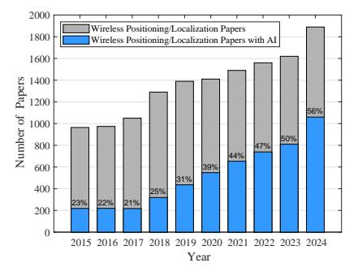
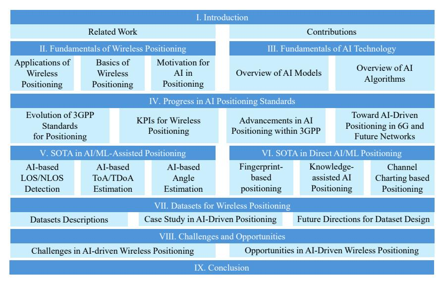
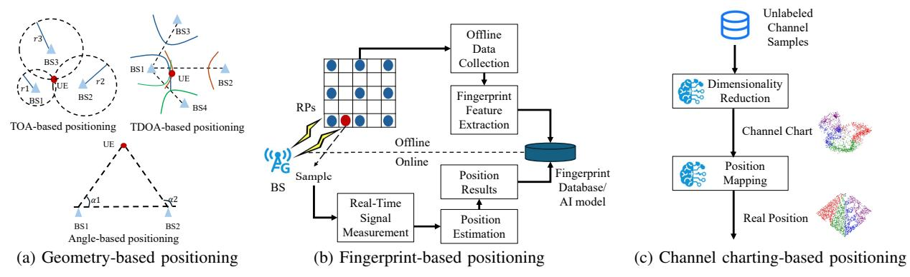
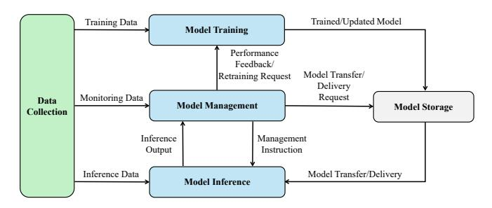
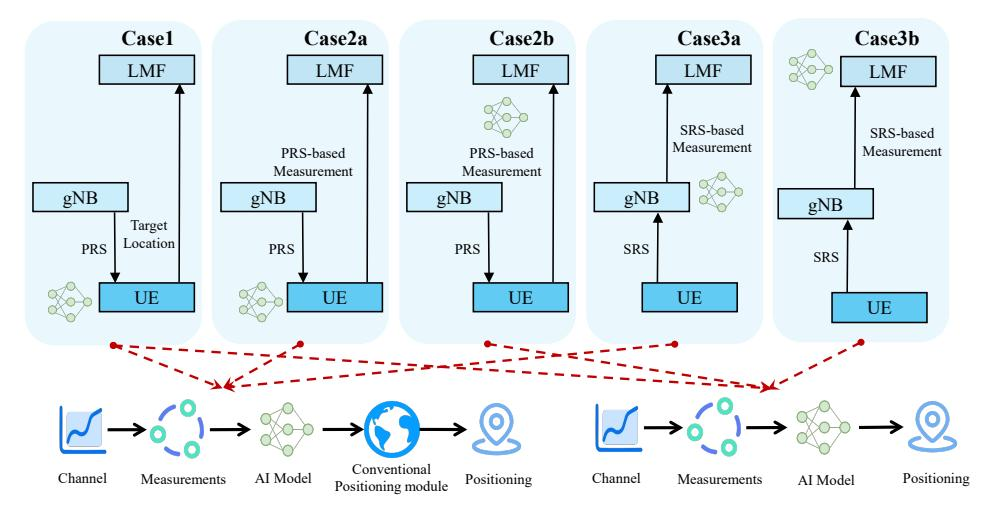
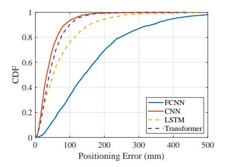
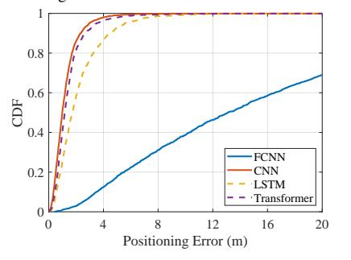

# AI-driven Wireless Positioning: Fundamentals, Standards, State-of-the-art, and Challenges

Guangjin Pan, *Member, IEEE*, Yuan Gao, *Member, IEEE*, Yilin Gao, Wenjun Yu, Zhiyong Zhong, Xiaoyu Yang, Xinyu Guo, Shugong Xu, *Fellow, IEEE* 

Abstract—Wireless positioning technologies hold significant value for applications in autonomous driving, extended reality (XR), unmanned aerial vehicles (UAVs), and more. With the advancement of artificial intelligence (AI), leveraging AI to enhance positioning accuracy and robustness has emerged as a field full of potential. Driven by the requirements and functionalities defined in the 3rd Generation Partnership Project (3GPP) standards, AI/machine learning (ML)-based cellular positioning is becoming a key technology to overcome the limitations of traditional methods. This paper presents a comprehensive survey of AIdriven cellular positioning. We begin by reviewing the fundamentals of wireless positioning and AI models, analyzing their respective challenges and synergies. We provide a comprehensive review of the evolution of 3GPP positioning standards, with a focus on the integration of AI/ML in current and upcoming standard releases. Guided by the 3GPP-defined taxonomy, we categorize and summarize state-of-the-art (SOTA) research into two major classes: AI/ML-assisted positioning and direct AI/MLbased positioning. The former includes line-of-sight (LOS)/nonline-of-sight (NLOS) detection, time of arrival (TOA)/time difference of arrival (TDOA) estimation, and angle prediction; the latter encompasses fingerprinting, knowledge-assisted learning, and channel charting. Furthermore, we review representative public datasets and conduct performance evaluations of AI-based positioning algorithms using these datasets. Finally, we conclude by summarizing the challenges and opportunities of AI-driven wireless positioning.

*Index Terms*—Artificial intelligence, positioning technologies, 3GPP, cellular networks, 5G.

#### I. INTRODUCTION

ITH the widespread deployment of 5G networks, wireless positioning technology has become a critical research area [1]–[3]. Accurate positioning is indispensable for enabling the effective operation of systems and enhancing user

This work was supported in part by the 6G Science and Technology Innovation and Future Industry Cultivation Special Project of Shanghai Municipal Science and Technology Commission under Grant 24DP1501001, in part by the National High Quality Program under Grant TC220H07D. Corresponding Author: Shugong Xu.

Guangjin Pan was with the School of Communication and Information Engineering, Shanghai University, Shanghai, 200444, China. He is now with the Department of Electrical Engineering, Chalmers University of Technology, 41296 Gothenburg, Sweden (e-mail: guangjin.pan@chalmers.se).

Yuan Gao, Yilin Gao, Wenjun Yu, Zhiyong Zhong, and Xinyu Guo are with the School of Communication and Information Engineering, Shanghai University, Shanghai, 200444, China (e-mail: {gaoyuansie, gaoyilin, yuwenjun, zzy20010120, guoxinyu}@shu.edu.cn).

Xiaoyu Yang was with the School of Communication and Information Engineering, Shanghai University, Shanghai, China. She is now with the School of Electronics and Information Technology, Sun Yat-sen University, Guangzhou, China (e-mail: yangxy563@mail2.sysu.edu.cn).

Shugong Xu is with the Department of Intelligent Science, Xi'an Jiaotong-Liverpool University, Suzhou 215123, China (e-mail: shugong.xu@xjtlu.edu.cn).

Fig. 1: Comparison of the number of wireless positioning papers and AIdriven wireless positioning papers from 2015 to 2024.

experiences in applications such as intelligent transportation, emergency response, logistics tracking, and extended reality (XR). By providing precise location information, wireless positioning enables more efficient resource management, accurate service delivery, and enhanced security.

Beyond communication, wireless positioning is an essential function of wireless networks. Its performance enhancement is critical for enabling a wide range of emerging applications and remains a valuable area of research. In outdoor environments, cellular positioning and global navigation satellite system (GNSS) technologies play pivotal roles, providing essential support for pedestrian navigation, autonomous driving, and unmanned aerial vehicle (UAV) localization [4]. These technologies not only enhance positioning accuracy but also improve user experience and safety. Indoors, advancements in technologies such as cellular networks, WiFi, Bluetooth, and ultra-wideband (UWB) have enabled precise localization within complex environments, which is crucial for applications like shopping mall navigation and emergency evacuation [5]. As an integral part of mobile infrastructure, cellular positioning plays a critical role in both indoor and outdoor scenarios. However, traditional methods based on triangulation and trilateration still face limitations in accuracy, robustness, and adaptability to dynamic environments.

In recent years, the evolution of artificial intelligence (AI) has brought transformative changes to wireless positioning [6]. AI technologies, particularly machine learning (ML) and deep learning, have significantly enhanced the accuracy and efficiency of positioning systems through their powerful data processing and pattern recognition capabilities [7], [8]. Fig. 1 shows the publication trends of wireless positioning-related papers over the past decade based on Google Scholar data. Since 2017, driven by rapid AI advancements, AI-based wireless positioning has gained growing attention. By 2023 and

TABLE I: Comparison of Wireless Positioning Survey Papers (✓: Yes, ✗: No, ●: Partial)

| Ref. | Year  | Main Focus                                                        | AI/ML Related | 3GPP Standards | Dataset | Cellular Positioning |
|------|-------|-------------------------------------------------------------------|------------------|-------------------|---------|-------------------------|
| [9]  | 2009  | TOA-based localization and NLOS mitigation techniques.            | X                | X                 | X       | X                       |
| [10] | 2016  | WiFi fingerprint-based indoor positioning techniques.             | X                | X                 | X       | X                       |
| [11] | 2017  | Conventional and fingerprinting-based WLAN indoor localization.   | •                | Y Y               | X       | X                       |
| [12] | 2017  | Jammer localization techniques in multi-hop wireless networks.    | X                | X                 | X       | X                       |
|      |       | 1 1                                                               | •                |                   |         |                         |
| [4]  | 2018  | Evolution of cellular positioning technologies from 1G to 5G.     | X                | V                 | X       | <b>V</b>                |
| [13] | 2018  | Network localization, tracking, and navigation techniques.        |                  | X                 | X       | •                       |
| [14] | 2019  | Indoor localization approaches without offline fingerprint maps.  | Х                | Х                 | Х       | Х                       |
| [5]  | 2019  | Indoor localization techniques in WiFi, UWB, and RFID systems.    | •                | X                 | Х       | Х                       |
| [15] | 2019  | Device-free localization for smart environment applications.      | •                | X                 | X       | X                       |
| [16] | 2020  | Fusion-based localization systems for indoor positioning.         | •                | X                 | X       | •                       |
| [17] | 2020  | ML-enhanced fingerprint-based indoor localization.                | <b>√</b>         | Х                 | Х       | Х                       |
| [18] | 2020  | ML technology for wireless positioning.                           | 1                | Х                 | 1       | •                       |
| [19] | 2021  | D2D-based cooperative positioning techniques.                     | Х                | 1                 | Х       | <b>✓</b>                |
| [20] | 2022  | THz localization techniques for future 6G networks.               | •                | Х                 | Х       | 1                       |
| [21] | 2022  | mmWave localization and sensing technologies.                     | •                | Х                 | Х       | <b>✓</b>                |
| [22] | 2022  | RIS-assisted localization methods for IoT applications.           | Х                | Х                 | Х       | •                       |
| [23] | 2023  | High-accuracy localization technologies for 6G networks.          | •                | 1                 | Х       | <b>✓</b>                |
| [24] | 2024  |                                                                   |                  | 1                 | Х       | 1                       |
| [25] | 2024  |                                                                   |                  | Х                 | Х       | •                       |
| [26] | 1 0 0 |                                                                   | •                | 1                 | Х       | •                       |
| Our  | Work  | AI-driven positioning techniques for cellular networks, including |                  | 1                 | 1       | 1                       |
|      |       | fundamentals, 3GPP standards, SOTA, datasets, and challenges.     |                  |                   |         |                         |

beyond, over half of the papers in this field have adopted AI technologies. As AI continues to advance, AI-driven wireless positioning is expected to play an increasingly critical role in the future.

# A. Related Work

Wireless positioning is a widely researched topic, with extensive investigations focusing on a variety of techniques, scenarios, and applications. A comprehensive review of timeof-arrival (TOA)-based localization is presented in [9], while [5] summarizes indoor positioning techniques based on WiFi, radio frequency identification (RFID), UWB, Bluetooth, and other technologies. The survey in [16] explores fusion-based indoor positioning techniques using data from cellular networks, WiFi, global positioning systems (GPSs), inertial navigation, and cameras. In [15], the authors investigate devicefree positioning algorithms. For fingerprint-based positioning, detailed surveys are provided in [10] and [11], while the work in [14] addresses approaches that avoid offline fingerprint maps, and the survey in [17] focuses on intelligent fingerprinting algorithms. Considering the impact of network capabilities on positioning technologies, the authors in [12] survey techniques for jammer localization in multi-hop networks, providing critical insights into handling interference and security issues in positioning systems. In [13], the authors explore advanced network localization and tracking technologies. Building on these works, the authors in [26] review the latest research in positioning technologies within wireless networks. With advancements in technology, positioning capabilities in cellular networks have become increasingly important. In [4], the authors review the evolution of cellular positioning standards from 1G to 4G and outline key technologies for 5G localization. [24] offers a comprehensive survey of 5G positioning technologies, addressing standardization, core components, research trends, and real-world performance. Looking ahead to 6G, [23] reviews recent advances, covering emerging applications, enabling technologies, system models, key performance metrics, and future directions. Moreover, advances in D2D networks [19], millimeter-wave (mmWave) [21], THz [20], reconfigurable intelligent surface (RIS) [22], and ground-air-space networks [25] are improving both communication and positioning capabilities.

The summary and comparison of existing survey papers are provided in Table. I. Some prior surveys have mentioned AI-related techniques for wireless positioning [5], [11], [13], [15], [16], [20], [21], [23]–[26]. However, such discussions are typically brief and lack a systematic review of the technical landscape and evolution of AI/ML models in this domain. Among existing works, the survey papers in [17], [18] present relatively comprehensive reviews of AI/ML applications in wireless positioning. However, there are substantial differences between their works and ours. The survey in [17] primarily focuses on traditional ML techniques for positioning, while our work focuses more on advanced AI techniques (e.g., deep learning methods). The survey in [18] focuses on different AI technologies and discusses the roles of various AI technologies in positioning tasks. In contrast, our work focuses specifically on different types of positioning algorithms (such as AI/MLassisted positioning and direct AI/ML positioning methods), and discusses how AI can enhance each of these categories. For wireless positioning standards, numerous studies have reviewed the progress of 3GPP standards [4], [19], [23], [24]. Nonetheless, the investigation into the integration of AI techniques within the 3GPP standardization framework remains insufficient. Our survey includes an in-depth analysis of AI-enabled positioning within the 3GPP framework. Regarding datasets, the survey in [18] broadly covers datasets for WiFi, Bluetooth, and other wireless technologies, with minimal attention given to cellular positioning datasets. Conversely, we place significant emphasis on datasets pertinent to cellular positioning. Similar to works such as [4], [19]– [21], [23], [24], our survey focuses on the domain of cellular positioning. Considering the rapid advancements in AI for wireless positioning over the past five years (as shown in

Fig. 2: The overall structure of this paper.

Fig. 1), we concentrate on reviewing AI-driven positioning solutions in cellular networks, aiming to provide targeted, up-to-date, and comprehensive insights into this fast-evolving field. Specifically, our goal is to comprehensively review cutting-edge AI-driven wireless positioning techniques for cellular networks, including their fundamentals, 3GPP standards, state-of-the-art (SOTA) algorithms, datasets, and open challenges.

#### B. Contributions

As mentioned above, the rapid advancements in AI technology and the significant progress in AI-driven wireless positioning have motivated this comprehensive survey. The core contribution of our survey is to provide a focused and structured review of AI-driven cellular positioning, covering its fundamentals, standards, SOTA developments, datasets, and key challenges. The contributions of this paper are as follows:

- Foundation of AI and Wireless Positioning: We provide a comprehensive overview of the fundamentals of wireless positioning and AI technologies. For wireless positioning, we summarize key application scenarios and core principles, and highlight the motivation for adopting AI-based methods. On the AI side, we review representative models and algorithms, analyzing their strengths, limitations, and suitability for different positioning tasks.
- 3GPP Standardization Progress: We analyze the evolution of cellular positioning within the 3rd Generation Partnership Project (3GPP) framework, outlining its development from early implementations to current 5G standards. We discuss the role of key performance indicators (KPIs) in positioning and summarize recent AI/ML-driven advancements within the 3GPP standards. In addition, potential directions for AI-enabled positioning in future 6G and beyond standards are also discussed.
- **SOTA Research of AI-Driven Positioning**1: Based on 3GPP-defined frameworks, we summarize the SOTA in

1While our primary focus is on cellular-based positioning, we also selectively include non-cellular techniques in the SOTA review, to ensure completeness and to highlight transferable methodologies across different wireless technologies.

- AI/ML-assisted positioning methods and direct AI/ML positioning methods. For AI/ML-assisted positioning methods, we review state-of-the-art techniques for parameter estimation, including AI-based line-of-sight (LOS)/non-line-of-sight (NLOS) detection, TOA/time-difference-of-arrival (TDOA) estimation, and angle estimation. For direct AI/ML positioning, we categorize existing methods into fingerprint-based, knowledge-assisted, and channel charting-based approaches, and summarize the latest advancements in each category.
- Datasets for Cellular Positioning: We review and compare publicly available datasets for AI-based cellular positioning. In particular, we analyze two representative datasets (measurement-based MaMIMO and synthetic-based DeepMIMO) as case studies to evaluate the performance of different AI models. To support and accelerate related research, we release the implementation as open source on GitHub.2 Finally, we discuss existing gaps in dataset availability and outline future directions for developing more diverse and scalable datasets.
- Challenges and Future Directions: We discuss the main challenges and corresponding potential solutions in AIdriven wireless positioning, including data acquisition, accuracy in complex environments, and model generalization. Finally, we propose future research directions and opportunities, offering insights from both the evolution of wireless technologies and advancements in AI.

Therefore, the structure of this paper is illustrated in Fig. 2. In Sec. II, we present the fundamentals of wireless positioning, while Sec. III focuses on the fundamentals of AI technology. Sec. IV summarizes the progress in 3GPP AI/ML positioning standards. The SOTA advancements are reviewed in Sec. V for AI/ML-assisted positioning methods and in Sec. VI for direct AI/ML positioning methods. In Sec. VII, we investigate publicly available datasets for wireless positioning, analyzing their characteristics and application scenarios. Sec. VIII identifies the challenges and opportunities in AI-driven wireless

&lt;sup>2https://github.com/guangjinpan/AI-Driven-Localization

positioning. Finally, Sec. IX concludes this paper.

# II. FUNDAMENTALS OF WIRELESS POSITIONING

Wireless positioning is a key enabler for emerging applications. However, achieving high-precision positioning remains challenging due to the complex and dynamic nature of wireless propagation environments. In this section, we introduce the fundamentals of wireless positioning, focusing on realworld requirements and challenges and the motivation for AI integration. Specifically, we first review critical application scenarios that demand accurate positioning. Then, we present basic positioning principles, covering models of key measurements and positioning methods (including rangingbased, angle-based, fingerprint-based, and channel chartingbased solutions). Finally, we deeply analyze the challenges faced by model-based approaches and discuss how AI-driven techniques can address them, providing a comparative analysis to motivate the integration of AI into positioning systems.

# *A. Applications of Wireless Positioning*

Wireless positioning has emerged as a transformative technology, enabling a wide range of applications that improve efficiency, safety, and user experience across various domains. With the integration of AI and emerging wireless technologies such as RIS [27], Massive multiple-input multiple-output (MIMO) [28], THz communications [20], non-terrestrial networks (NTN) [29], near-field communications [30], and cellfree networks [31], seamless and high-precision wireless positioning is poised to drive significant advancements across various industries. In this subsection, we introduce the importance of wireless positioning through several representative application scenarios.

- *1) Intelligent Transportation:* Wireless AI positioning is essential for intelligent transportation, enabling precise vehicle localization to optimize traffic flow, reduce congestion, and improve road safety [32]–[34]. It supports fleet management, route planning, and real-time hazard alerts for public and ridesharing transport [35].
- *2) Autonomous Driving:* Autonomous driving relies on high-precision positioning for safe, efficient navigation in complex environments. Wireless AI positioning enables lanelevel accuracy, obstacle avoidance, and dynamic decisionmaking [36]. It also supports vehicle-to-everything (V2X), enhancing coordination between vehicles and infrastructure.
- *3) Extended Reality:* In XR, accurate positioning of users and devices enables immersive experiences. From augmented reality (AR) navigation [37] to virtual reality (VR) training [38] and multiplayer gaming [39], wireless tracking ensures realistic interactions and seamless indoor-outdoor transitions.
- *4) Indoor Tracking and Navigation:* Wireless positioning enhances navigation in complex indoor spaces like airports and hospitals [40], where GPS is unreliable. It guides users efficiently and enables businesses to optimize operations and personalize services.
- *5) Public Safety:* Wireless AI positioning is vital in emergencies, aiding rapid and accurate location of individuals in disaster zones [41], such as collapsed buildings or fires. This improves rescue efficiency and increases survival rates.

- *6) Internet of Things:* In internet of things (IoT) systems, wireless positioning enables real-time device tracking in homes, factories, and farms [42], [43], enhancing automation, resource use, and decision-making.
- *7) Security and Surveillance:* Security systems use wireless positioning to track personnel and assets in sensitive areas like prisons and warehouses [44]. Real-time data enhances safety, operational efficiency, and critical environment control.
- *8) Sports and Motion Analysis:* Wireless tracking supports motion analysis in sports and health, capturing athlete trajectories to enhance performance and training [45].
- *9) Healthcare:* Healthcare uses wireless positioning to track patients, staff, and equipment in real time [46], improving emergency response and efficiency in critical care.
- *10) UAV positioning:* UAVs rely on wireless AI positioning for navigation, obstacle avoidance, and stable flight [47]–[49]. In GPS-denied areas, technologies like UWB and 5G, combined with AI and multi-sensor fusion, support precision tasks from delivery to inspection, despite environmental challenges.

#### *B. Basics of Wireless Positioning*

After a brief overview of wireless positioning applications, we review the key technologies that enable wireless positioning. Wireless positioning aims to estimate device locations by analyzing the characteristics of wireless signals. This subsection introduces three mainstream techniques, including geometry-based, fingerprint-based, and channel charting-based positioning.

*1) Geometry-based Positioning:* Geometry-based positioning methods estimate a device's location by using either distance or angle measurements from multiple BSs, as shown in Fig. 3a. These methods can be broadly categorized into ranging-based positioning and angle-based positioning.

Ranging-based positioning determines a device's position by estimating its distances to multiple BSs. When at least three distance measurements are available, the device's location can be calculated using geometric principles. One common approach is TOA (also referred to as time-of-flight (TOF) [24]), which measures the time a signal takes to travel from a BS to the device, converting it to distance using the speed of light. The accuracy of TOA depends on factors such as signal bandwidth, signal-to-noise ratio (SNR), and sampling rate. TOA-based localization determines the device's position by computing the intersection of circles centered at each BS. However, TOA systems require strict clock synchronization between the device and the BSs, which can be challenging. To overcome this, TDOA is used. Instead of measuring absolute arrival times, TDOA calculates the time differences between signals received at multiple synchronized BSs. This approach inherently eliminates clock offset at the device side, relaxing the need for synchronization. The device's position is then derived from the intersection of hyperbolas defined by these time differences. Basic ranging methods estimate distance based on the received signal strength (RSS) or its variants, such as received signal strength indicator (RSSI), reference signal received power (RSRP), and reference signal received quality (RSRQ), using empirical models that relate signal attenuation

Fig. 3: Schematic diagram of different positioning technologies.

to distance. For higher precision, TOA and TDOA use cross-correlation and maximum likelihood estimation methods based on the channel frequency response (CFR) to estimate signal delays. Further improvements involve subspace-based algorithms, such as multiple signal classification (MUSIC) [50] and estimation of signal parameters via rotational invariance techniques (ESPRIT) [51], for fine-grained estimation. These approaches offer high resolution but still depend on accurate synchronization among base stations and robust signal quality.

Angle-based positioning estimates a device's location by measuring the angles-of-arrival (AOA) or angle-of-departure (AOD) using antenna arrays [52]–[54]. AOA refers to the angle at which the signal arrives at the base station, usually from uplink signals, while AOD describes the signal's transmission direction, typically from downlink. In 2D positioning, only the azimuth angle is needed, whereas 3D positioning also requires the elevation angle. These angles can be estimated from the channel state information (CSI). Once the directions from BSs are known, the device's location can be found by computing the intersection point of these angles. A simple AOA estimation approach is beam scanning, where the direction with the strongest received power is selected. To improve accuracy, advanced algorithms like MUSIC [55] and ESPRIT [56] are used to achieve finer angular resolution by leveraging the signal's subspace structure. Compared to ranging-based methods, angle-based positioning has the advantage of not requiring time synchronization between BSs and devices. However, its performance depends strongly on antenna array configuration, SNR, and algorithm robustness [57], which may lead to increased hardware and computational complexity.

2) Fingerprint-based Positioning: Fingerprint-based positioning establishes a mapping between wireless signal features and locations, typically through an offline database or AI model training. A mapping function  $\mathcal{F}_{fp}(\cdot)$  is learned from an offline dataset  $D_{\text{offline}} = \{x_i, p_i\}$ , where  $x_i$  denotes fingerprint features and  $p_i$  is the corresponding user location. As shown in Fig. 3b, this approach involves two phases: offline and online. In the offline phase, signal characteristics such as RSSI [58], [59], RSRP [60]–[65], CSI [66]–[70], or TOA [71], [72] are collected at reference points (RPs) to build a fingerprint database or radio map. Features may be extracted from raw data or used directly, and either stored in a database or used to train an AI/ML model that approximates  $\mathcal{F}_{fp}(\cdot)$ . In the online

phase, real-time measurements x from the user equipment (UE) are acquired. Position estimation is then performed by either matching against the fingerprint database or inputting x into the trained model, resulting in an estimated position.

Fingerprint-based positioning relies on learning from a historical database of wireless measurements but involves high deployment costs due to extensive data collection and maintenance. Adapting AI models to map signal features to locations demands significant computational resources and expertise. Additionally, dynamic wireless environments can degrade positioning accuracy over time due to data aging and environmental changes. This necessitates periodic updates to the fingerprint database or retraining of the AI model to maintain high accuracy levels.

3) Channel Charting-based Positioning: Channel charting is a novel approach that leverages CSI to enable pseudopositioning by modeling relationships between channels [73]. It learns a mapping from CSI to a low-dimensional chart where latent-space distances reflect channel dissimilarities [74]–[77], with similar channels implying closer user proximity [73]. Beyond positioning, channel charting has been applied to SNR prediction [78], pilot allocation and reuse [79]–[81], beam tracking [82], and resource optimization [83]. Unlike fingerprinting, which relies on labeled data and external RPs for absolute positioning, channel charting uncovers latent spatial structures with minimal labeling. As shown in Fig. 3c, channel charting-based positioning first applies dimensionality reduction to generate a channel chart, which is then mapped to the final position estimate. As a form of manifold learning, channel charting includes classical methods like multidimensional scaling (MDS), Sammon mapping [84], and t-SNE [85], as well as deep learning methods such as Siamese networks and triplet-based embedding.

In Siamese-based channel charting, dissimilarity metrics define relationships between CSI samples in the latent space. The learning objective is to preserve these relationships by aligning latent-space distances with high-dimensional CSI dissimilarities. A commonly used MDS-based loss is [75]:

$$\mathcal{L}_{MDS} = \sum_{i,j} w_{ij} \left( \|\mathbf{z}_i - \mathbf{z}_j\|_2 - d(\mathbf{H}_i, \mathbf{H}_j) \right)^2, \quad (1)$$

where  $\mathbf{z}_i$  and  $\mathbf{z}_j$  are the learned low-dimensional representations of CSI samples  $\mathbf{H}_i$  and  $\mathbf{H}_j$ , and  $d(\mathbf{H}_i, \mathbf{H}_j)$  is a dissimilarity metric in the original CSI space.  $w_{ij}$  is a

TABLE II: Comparative Analysis of Model-Based and AI-Driven Positioning Techniques

| Positioning Method                    | Key Procedure                         | Challenges in Model-Based Positioning                                                                                                                                                                | Advantages of AI-Driven Positioning                                                                                                                                                                                                                                                                            |
|---------------------------------------|---------------------------------------|------------------------------------------------------------------------------------------------------------------------------------------------------------------------------------------------------|----------------------------------------------------------------------------------------------------------------------------------------------------------------------------------------------------------------------------------------------------------------------------------------------------------------|
| Geometry-based Positioning         | Parameter Estimation                  | Model-based estimation methods are prone to large errors under NLOS, multipath and hard ware impairments.                                                                                      | AI technologies learn multipath and hardware impairment patterns from data to improve esti mation accuracy.                                                                                                                                                                                              |
|                                       | Geometry-based Position Estimation | Geometric algorithms are sensitive to measure ment errors. It also requires prior error statistics, limited adaptability in dynamic environments.                                              | Adaptively learns uncertainties; dynamically ad justs BS contributions without explicit modeling.                                                                                                                                                                                                           |
| Fingerprint-based Positioning      | Database Construction                 | It relies on low-dimensional RSSI features with poor discriminative power, leading to weak gen eralization. It also has difficulty in handling fingerprint aging and environmental changes. | AI models can map high-dimensional finger prints (e.g., CSI) to locations with fine-grained features and robustly adapt to fingerprint aging and environmental changes via fine-tuning or transfer learning. AI algorithms also support radio map augmentation based on generative modeling. |
|                                       | Fingerprint Matching                  | Traditional algorithms such as KNN are vul nerable to noise, environmental variability, and database sparsity; matching complexity in creases with database size.               | DL-based AI models learn complex non-linear mappings between fingerprints and locations to improve robustness and accuracy; inference speed remains constant as database size grows.                                                                                                                  |
| Channel Charting based Positioning | Channel Embedding                     | Model-based channel charting struggles with the high-dimensional and non-linear nature of CSI data, making feature extraction difficult.                                                       | AI-driven channel charting employs SSL to learn embeddings that better preserve spatial relation ships, resulting in smoother, more continuous, and more accurate channel charts.                                                                                                                     |

weight factor, often inversely proportional to d(Hi , Hj ), to prioritize preserving relationships for closer samples. Typical dissimilarity measures include Euclidean distance [86], which captures absolute differences between CSI samples, and cosine similarity [87], which quantifies their directional alignment. These metrics guide the network to preserve meaningful spatial structures during dimensionality reduction.

Triplet-based dimensionality reduction is another effective approach for channel charting [87]–[90]. It learns spatial relationships from CSI samples using triplets (Hi , Hj , Hk) where Hi is an anchor sample, Hj is a similar (positive) sample, and Hk is a dissimilar (negative) one. The goal is to map them into a latent space such that the anchor is closer to the positive than to the negative. This is achieved using a triplet loss function:

$$\mathcal{L}_{\text{triplet}} = \sum_{i,j,k} \max \left( 0, \|\mathbf{z}_i - \mathbf{z}_j\|_2^2 - \|\mathbf{z}_i - \mathbf{z}_k\|_2^2 + \delta \right), \quad (2)$$

where δ is a margin that enforces a minimum separation between positive and negative pairs. It enforces a margin between positive and negative pairs to preserve relational structure in the latent space [88].

The primary advantage of channel charting-based positioning lies in its ability to operate without relying on a large number of RPs, significantly reducing costs and complexity. Furthermore, channel charting continuously benefits from newly acquired channel information rather than being limited by static historical databases [91]. However, channel chartingbased positioning techniques rely heavily on the quality of the low-dimensional mapping, and there is often no universal metric to evaluate the effectiveness of these mapping algorithms [73]. Additionally, considering the highly nonlinear relationship between channel-based Dissimilarity metrics and physical distances, designing good metrics to improve positioning accuracy remains a significant challenge.

## *C. Motivation for AI in Positioning*

Although model-based wireless positioning algorithms have been extensively studied for decades, solely relying on handcrafted models still faces significant limitations in complex real-world environments. Building upon the previous discussion of various positioning technologies, this subsection analyzes the inherent challenges encountered by model-based positioning methods and discusses how AI-driven approaches address these issues effectively. A comparative summary is provided in Table. II.

- *1) Geometry-based Positioning:* As mentioned above, in ranging-based and angle-based positioning methods, the localization process typically involves two key stages. First, the signal parameters, such as distance (TOA, TDOA) or angle (AOA, AOD), are estimated. Second, the user's location is determined based on the estimated parameters using a geometrybased positioning algorithm. We analyze the challenges in each of these stages as follows:
  - Parameter Estimation: Accurate parameter estimation between BSs and UEs is critical for ranging-based and angle-based positioning. However, under NLOS conditions, the absence of a direct propagation path causes severe biases in the measured parameters, leading to substantial estimation errors [9]. Even in LOS scenarios, multipath propagation introduces interference between the direct path and other paths, leading to ambiguities in signal peak detection that severely degrade estimation accuracy [92]. Additionally, hardware impairments at the transmitter or receiver can further degrade estimation accuracy [93]. AI-based techniques can learn to recognize multipath features and hardware impairment patterns from data, thereby enabling more accurate and robust parameter estimation even in challenging environments [93], [94].
  - Geometry-based Position Estimation: Based on the estimated parameters, model-based geometric algorithms, such as triangulation, are used to infer the user's position.

However, inaccuracies in distance or angle measurements can significantly amplify positioning errors. While some model-based methods attempt to mitigate these errors using techniques such as weighted least squares [9], they heavily rely on prior knowledge of error statistics, which is difficult to obtain and maintain in dynamic realworld environments. AI-driven positioning approaches can adaptively learn the uncertainty in parameter estimation, such as identifying NLOS links or weighting the reliability of BSs based on measured channel features, thereby achieving more robust and accurate localization.

- *2) Fingerprint-based Positioning:* Fingerprint-based positioning first collects wireless fingerprints at known RPs and constructs an offline fingerprint database. During the online positioning phase, the system matches the current signal measurements against the database to determine the UE's location. In the following, we analyze the limitations of modelbased approaches in the database construction and fingerprint matching steps, and describe how AI technologies address these challenges:
  - Database Construction: Under model-based algorithms, fingerprinting relies on low-dimensional wireless measurements (typically RSSI) at known RPs and interpolating or fitting a radio map over the target area. A high-quality radio map provides a more accurate representation of the spatial signal distribution, thereby reducing localization errors during the matching process. Due to the limited dimensionality and weak descriptive power of RSSI features, the constructed radio maps often suffer from poor generalization and low robustness [95]. Furthermore, model-based approaches have difficulty in handling problems of fingerprint aging and environmental changes in wireless propagation environments [14]. In comparison, AI models can directly learn the mapping between high-dimensional fingerprints (e.g., CSI matrices) and locations, eliminating the need to construct and interpolate complex fingerprint databases. This enables the algorithm to extract more fine-grained spatial features from high-dimensional CSI measurements to assist positioning [96]–[98]. Building on this capability, AI methods also exhibit strong resilience to fingerprint aging and environmental dynamics through fine-tuning or transfer learning, significantly reducing the need for re-acquisition of fingerprints when the deployment environment changes [99]–[101]. Moreover, AI models can assist in constructing enhanced radio maps. Specifically, generative AI models [102], [103] can capture multidimensional relationships across time, space, and frequency domains, allowing for channel extrapolation to augment the radio map, thereby significantly improving positioning performance across wider spatial and spectral ranges [101]–[103].
  - Fingerprint Matching: Traditional fingerprint matching typically employs simple algorithms such as k-nearest neighbors (KNN) or weighted KNN, which compute similarities between observed and stored fingerprints [61], [104]. These methods are vulnerable to noise, envi-

- ronmental variability, and database sparsity, leading to degraded positioning accuracy. Moreover, as the size of the offline database grows, the computational complexity of traditional matching methods increases significantly. Deep learning-based AI models can replace conventional matching by learning complex, non-linear mappings between fingerprint features and spatial locations, where the inference speed remains constant regardless of the size of the offline database. Neural network models can robustly extract high-level features from noisy fingerprints, achieving superior localization performance and robustness.
- *3) Channel Charting-based Positioning:* Model-based channel charting struggles with the high-dimensional and non-linear nature of CSI data, making feature extraction difficult. In contrast, AI-driven channel charting addresses these limitations by employing self-supervised learning (SSL) techniques (e.g., Siamese networks [75], triplet loss [88]) to learn embeddings that better preserve true spatial relationships among devices, resulting in smoother, more continuous, and more accurate channel charts even in complex propagation environments.

# *D. Lessons Learned*

Wireless positioning holds tremendous potential across a wide range of application domains. Although existing modelbased positioning algorithms have made significant contributions, achieving high-precision localization in real-world environments remains challenging due to the inherent complexity, dynamics, and unpredictability of wireless propagation. Geometry-based, fingerprint-based, and channel chartingbased positioning techniques have each advanced the field from different perspectives and have laid a solid foundation for AI-driven wireless positioning. However, these techniques also face critical limitations when deployed in complex and dynamic environments. To address various challenges inherent in positioning tasks, AI models offer a new paradigm by learning complex high-dimensional mappings directly from wireless measurements. AI-driven positioning technologies have demonstrated significant potential in enhancing localization accuracy, robustness, and scalability. This motivates the integration of AI into wireless positioning systems to meet the stringent requirements of next-generation applications.

# III. FUNDAMENTALS OF AI TECHNOLOGY

In the previous section, we focus on wireless positioning technologies and summarize the basics of positioning and the motivation for AI in positioning. In this section, we shift the focus to AI technologies, providing a review of AI models and algorithms, and briefly discussing which AI techniques are most suitable for different positioning scenarios.

#### *A. Overview of AI Models*

In the realm of AI, neural network architectures play a pivotal role in enabling machines to learn from data and make predictions or classifications. This subsection introduces four mainstream neural network models commonly applied in AIdriven wireless positioning systems: fully-connected neural

| Model       | Per-Layer Complexity                                                                                     | Advantages                                                                              | Disadvantages                                                                               | Suitable Positioning Tasks                                                                                                        |
|-------------|----------------------------------------------------------------------------------------------------------|-----------------------------------------------------------------------------------------|---------------------------------------------------------------------------------------------|-----------------------------------------------------------------------------------------------------------------------------------|
| FCNN        | $O(d_{ m FCNN}^{ m out}d_{ m FCNN}^{ m in})$                                                             | Simple architecture; efficient for low-dimensional features.                            | Large number of parameters; prone to overfitting; limited capability in feature extraction. | Position estimation based on small- scale features (e.g., RSSI, RSRP); mapping from estimated parameters to coordinates. |
| CNN         | $O(H_{ m out}W_{ m out}C_{ m in} \ C_{ m out}H_{ m Kernel}W_{ m Kernel})$                                | Strong at local feature extraction; enables efficient parameter sharing                 | Limited capability in modeling global dependencies.                                         | Process high-dimensional wireless signals (e.g., CSI); build radio maps for fingerprint-based localization systems.               |
| LSTM        | $O(T 	imes (d_{	ext{LSTM}}^{	ext{in}} + d_{	ext{LSTM}}^{	ext{out}}) \ 	imes d_{	ext{LSTM}}^{	ext{out}})$ | Capture long-term dependencies and dynamically adapts to sequential inputs.             | Difficult to parallelize; high training and inference complexity.                           | Handle time-domain CIRs; model dynamic CSI; track device trajectories.                                                            |
| Transformer | $O(T^2d_{\mathrm{trans}})$                                                                               | Strong at modeling global dependencies; effective in integrating multi-source sequences | High computational and memory costs for long sequences; requires                            | Suitable for large-scale CSI modeling, dynamic environment positioning and multi-modal data fusion                                |

TABLE III: Comparison of Different AI Models for Wireless Positioning

networks (FCNNs), convolutional neural networks (CNNs), long short-term memory networks (LSTMs), and Transformers. As these architectures have been extensively covered in existing literature [18], [105], we do not elaborate on their internal mechanisms again in this survey. Instead, this subsection focuses on analyzing the computational complexity of each model and discusses its respective applicability to different wireless positioning scenarios. A detailed comparative summary is presented in Table. III.

- 1) FCNNs: FCNNs are basic architectures where each neuron connects to all neurons in the next layer [106]. Denote  $d_{\text{FCNN}}^{\text{in}}$  and  $d_{\text{FCNN}}^{\text{out}}$  as the number of input and output neurons, respectively. The computational complexity per layer is  $O(d_{\text{FCNN}}^{\text{out}} \times d_{\text{FCNN}}^{\text{in}})$ . FCNNs are suitable for small-scale feature extraction and perform well in basic regression or classification. However, their dense parameterization and limited feature learning capacity often cause overfitting, especially with limited data or complex structures. Therefore, FCNNs are typically used for position regression based on low-dimensional features (e.g., RSSI, RSRP) [59], or to approximate mappings from estimated signal parameters to position outputs [107].
- 2) CNNs: CNNs are feedforward architectures built on convolutional operations, widely used for spatial feature extraction [108]–[110]. Given an input feature map  $x_{\text{CNN}} \in$  $\mathbb{R}^{C_{ ext{in}} imes H_{ ext{in}} imes W_{ ext{in}}}$ , a convolutional layer computes an output feature map  $y_{ ext{CNN}} \in \mathbb{R}^{C_{ ext{out}} imes H_{ ext{out}} imes W_{ ext{out}}}$  using  $C_{ ext{out}}$  convolutional kernels.  $C_{\rm in}$ ,  $H_{\rm in}$ ,  $W_{\rm in}$  denote the number of input channels, the height, and the width of the input feature map, respectively, and  $C_{\mathrm{out}}$ ,  $H_{\mathrm{out}}$ ,  $W_{\mathrm{out}}$  represent the corresponding dimensions of the output feature map generated by  $C_{
  m out}$  convolutional filters. Each kernel has a size of  $C_{
  m in}$  imes $H_{\text{Kernel}} \times W_{\text{Kernel}}$ , and the computational complexity per layer is  $O(H_{\text{out}}W_{\text{out}}C_{\text{in}}C_{\text{out}}H_{\text{Kernel}}W_{\text{Kernel}})$ . Compared to FCNNs, CNNs reduce parameters via local connectivity and weight sharing, making them efficient for high-dimensional inputs [111]. However, their localized receptive fields limit the modeling of long-range dependencies. In wireless positioning, CNNs are effective for processing high-dimensional inputs like CSI matrices [112]-[115], and are also used for radio map construction in fingerprint-based localization [116].
- 3) LSTMs: LSTM networks [117] are a class of recurrent neural networks (RNNs). They are designed to model sequential data by introducing gated mechanisms to reg-

ulate information flow. Given an input sequence  $\{x_t\}_{t=1}^T$ with  $x_t \in \mathbb{R}^{d_{\mathsf{LSTM}}^{\mathsf{m}}}$ , an LSTM layer produces hidden states  $\{m{y}_t\}_{t=1}^T$  with  $m{y}_t \in \mathbb{R}^{d_{ ext{LSTM}}^{ ext{out}}}$ , where  $d_{ ext{LSTM}}^{ ext{in}}$  and  $d_{ ext{LSTM}}^{ ext{out}}$  denote the input and hidden dimensions, respectively, and T is the sequence length. The computational complexity per layer is  $O(T(d_{LSTM}^{in}+d_{LSTM}^{out})d_{LSTM}^{out})$ . Forget, input, and output gates allow LSTMs to retain or discard temporal information and generate updated hidden states. These mechanisms help capture long-term dependencies, but their sequential nature hinders parallelization, resulting in higher training and inference costs compared to FCNNs and CNNs. Variants such as gated recurrent units (GRUs) [118], bidirectional RNNs (BiRNNs) [119], and temporal convolutional networks (TCNs) [120] have been introduced for more efficient or scalable sequence modeling. These models are widely used in wireless positioning for processing channel impulse responses (CIRs), modeling channel dynamics [121], and trajectory tracking [122].

4) Transformer: Transformers are neural network architectures built on attention mechanisms, and have transformed AI across many fields [123]-[125]. Given an input sequence  $\{oldsymbol{x}_i\}_{i=1}^T$  with  $oldsymbol{x}_i \in \mathbb{R}^{d_{ ext{trans}}}$ , a Transformer layer produces output representations  $\{m{z}_i\}_{i=1}^T$  with  $m{z}_i \in \mathbb{R}^{d_{ ext{trans}}}$ , where Tis the sequence length and  $d_{\text{trans}}$  is the feature dimension. The computational complexity of the self-attention operation per layer is  $O(T^2d_{\text{trans}})$ , which imposes significant resource demands, particularly for long sequences [126]. The core component is the self-attention mechanism, which assigns adaptive weights across input positions, enabling the model to capture global dependencies [127]. Transformers require large datasets for effective training and may be less efficient for smaller tasks. In wireless positioning, they help capture long-range dependencies in channel data [128]-[130]. They also support variable-length inputs and integrate multi-source signals [131], making them ideal for complex wireless scenarios.

# B. Overview of AI Algorithms

In AI-based wireless positioning, let  $\theta$  denote the parameters of the neural network. Given a training set  $\mathcal{D}_{\text{train}} = (\boldsymbol{x}_i, \boldsymbol{p}_i^{\text{ue}})$ , where  $\boldsymbol{x}_i$  is the input signal and  $\boldsymbol{p}_i^{\text{ue}}$  is the corresponding UE position, the goal is to minimize the overall positioning error:

$$\min_{\boldsymbol{\theta}} \; \mathbb{E}_{\{(\boldsymbol{x}_i, \boldsymbol{p}_i^{\text{uc}})\} \sim \mathcal{D}_{\text{train}}} \ell(\mathcal{F}(\boldsymbol{x}_i; \boldsymbol{\theta}), \boldsymbol{p}_i^{\text{ue}})$$
 (3)

| Learning Technique | Advantages                                                             | Limitations                                                                | Suitable Positioning Tasks                                                                                                       |
|--------------------|------------------------------------------------------------------------|----------------------------------------------------------------------------|----------------------------------------------------------------------------------------------------------------------------------|
| Transfer Learning  | Reduce labeling effort; facilitates domain adaptation.                 | Sensitive to domain shifts; prone to overfitting with limited target data. | Adaptation of pretrained positioning mod- els from simulations to real-world envi- ronments or across different scenarios. |
| Meta Learning      | Enable fast adaptation from few samples; promotes task generalization. | Computationally intensive; performance depends on task formulation.        | Few-shot indoor positioning in unseen environments or new deployment locations.                                                  |
| Continual Learning | Enable long-term adaptation; eliminates the need for full retraining.  | Prone to catastrophic forgetting; increased model complexity.              | Online adaptation of positioning models in dynamic environments, e.g., layout changes or varying user densities.                 |
| GANs               | Facilitate data augmentation; addresses class imbalance.               | Unstable training; susceptible to mode collapse.                           | Generation of synthetic wireless signal data to enhance model training under limited labeled data conditions.                    |

TABLE IV: Comparison of Different Learning Techniques for Wireless Positioning

where  $\ell(\cdot,\cdot)$  denotes a positioning loss function (e.g., Euclidean distance).  $\mathcal{F}(\cdot, \boldsymbol{\theta})$  represents the AI model for position estimation with parameters  $\theta$ . To learn optimal  $\theta$  that enhance the positioning performance of AI models in highly dynamic wireless environments, a variety of learning paradigms, such as transfer learning, meta learning, continual learning, and generative adversarial networks (GANs), have been extensively studied. This subsection introduces these approaches and their advantages in improving localization, with a summary shown in Table. IV.

1) Transfer Learning: Transfer learning improves model performance in a target domain by leveraging knowledge from a related source domain, particularly useful when labeled target data is limited [132]. In wireless positioning, it allows models trained in simulated or similar environments to adapt to new scenarios, reducing data collection overhead. However, its effectiveness depends on the similarity between source and target domains. Large domain shifts may hinder performance, and small target datasets can cause overfitting during finetuning. The fine-tuning process can be formulated as

$$\min_{\boldsymbol{\theta}_{\text{larget}}} \quad \mathbb{E}_{\{(\boldsymbol{x}_i, \boldsymbol{p}_i^{\text{ue}})\} \sim \mathcal{D}_{\text{target}}} \ell(\mathcal{F}(\boldsymbol{x}_i; \boldsymbol{\theta}_{\text{target}}(\boldsymbol{\theta}_{\text{source}})), \boldsymbol{p}_i^{\text{ue}}), \quad (4)$$

where  $heta_{ ext{source}}$  denotes the parameters learned from the source domain,  $heta_{target}$  denotes the parameters for the target domain.  $\theta_{\text{target}}(\theta_{\text{source}})$  means  $\theta_{\text{target}}$  is initialized using  $\theta_{\text{source}}$ . During fine-tuning,  $heta_{target}$  is further updated to minimize the loss on the target task using the target domain data  $\mathcal{D}_{target}$ .

2) Meta Learning: Meta learning trains models over a range of tasks to enable rapid adaptation to new ones with only a few labeled samples [133]. In wireless positioning, it supports quick adjustment to new environments or deployment conditions, making it ideal for dynamic scenarios [134], [135]. While effective in few-shot settings, its performance depends on task design and often incurs high computational overhead. A typical formulation for meta learning is

$$egin{aligned} \min_{oldsymbol{ heta}} & \mathbb{E}_{\mathcal{T} \sim p(\mathcal{T})} \mathbb{E}_{\{(oldsymbol{x}_j, oldsymbol{p}_j^{\mathrm{ue}})\} \sim \mathcal{D}_{\mathcal{T}}^{\mathrm{query}}} \ell \left( \mathcal{F}(oldsymbol{x}_j, oldsymbol{ heta}^*_{\mathcal{T}}(oldsymbol{ heta}_{\mathrm{meta}})), \, oldsymbol{p}_j^{\mathrm{ue}} 
ight) \end{aligned}$$

$$\mathrm{s.t.} & \quad oldsymbol{ heta}_{\mathcal{T}}^* = \mathrm{argmin} \mathbb{E}_{\{(oldsymbol{x}_i, oldsymbol{p}_{i^e}^{\mathrm{ue}})\} \sim \mathcal{D}_{\mathcal{T}}^{\mathrm{support}}} \ell \left( \mathcal{F}(oldsymbol{x}_i, oldsymbol{ heta}_{\mathcal{T}}(oldsymbol{ heta}_{\mathrm{meta}})), \, oldsymbol{p}_i^{\mathrm{ue}} 
ight), \end{aligned}$$

where  $m{ heta}_{\mathcal{T}}$  and  $m{ heta}_{meta}$  are the task-specific parameters and metaparameters, respectively.  $\mathcal{D}_{\mathcal{T}}^{support}$  and  $\mathcal{D}_{\mathcal{T}}^{query}$  denote the support set and query set for task  $\mathcal{T}$ . Each task  $\mathcal{T}$  is sampled from a task distribution  $p(\mathcal{T})$ . The task-adapted parameters  $\boldsymbol{\theta}_T^*(\boldsymbol{\theta}_{\text{meta}})$ are obtained via a few steps of gradient descent on the support set, initialized from the meta-parameters  $\theta_{\text{meta}}$ .

3) Continual Learning: Continual learning [136], also known as lifelong [137] or incremental learning [138], enables models to learn sequentially from evolving tasks or data without forgetting prior knowledge. Unlike transfer learning, continual learning emphasizes long-term knowledge accumulation. For wireless positioning, it allows models to adapt to changing environments, network conditions, or hardware updates without full retraining. While beneficial for dynamic systems, it may face challenges like catastrophic forgetting and increased computational cost due to memory or regularization needs. Formally, assume that a sequence of datasets  $\{\mathcal{D}_{cont}^t =$  $\{(\boldsymbol{x}_i, \boldsymbol{p}_i^{\text{ue}})\}\}_{t=1}^T$  becomes available over time, where T denotes the total number of continual learning steps (or tasks). Let  $\mathcal{D}_{\text{cont}}^t$  represent the dataset used at the t-th update. The model learns parameters  $\theta_t$  by minimizing a continual learning loss while preserving knowledge from previous updates:

$$\begin{aligned} \min_{\boldsymbol{\theta}_{t}} \quad & \mathbb{E}_{(\boldsymbol{x}_{i}, \boldsymbol{p}_{i}^{\text{ue}}) \sim \mathcal{D}_{\text{cont}}^{t}} \ell(\mathcal{F}(\boldsymbol{x}_{i}; \boldsymbol{\theta}_{t}), \boldsymbol{p}_{i}^{\text{ue}}) \\ & \quad + \lambda \cdot \Omega(\boldsymbol{\theta}_{t}, \boldsymbol{\theta}_{1:t-1}) \end{aligned} \tag{6}$$

where  $\Omega(\cdot)$  is a regularization term that mitigates catastrophic forgetting by constraining parameter updates based on previously learned tasks, and  $\lambda$  is a hyperparameter balancing stability and plasticity.

4) Generative Adversarial Networks: GANs consist of a generator and a discriminator trained adversarially: the generator produces synthetic data, while the discriminator distinguishes real from fake samples [139], [140]. This adversarial process enables GANs to learn to generate realistic wireless signal data from position inputs. In wireless positioning, GANs are useful for data augmentation, particularly when labeled data is limited. They can generate realistic signal data across diverse environments, improving generalization and addressing class imbalance. However, training GANs is often unstable and may lead to issues like mode collapse or reduced physical fidelity. Let  $\mathcal{D}_{ ext{GAN}} = \{(m{x}_i, m{p}_i^{ ext{ue}})\}$  denote the real data used to train the GAN, where  $x_i$  is the input wireless signal and  $p_i^{ue}$  is the corresponding user position. The generator  $G(\tilde{p}^{ue}, \theta_G)$  synthesizes wireless signal features  $\tilde{x}$  conditioned on a sampled position  $\tilde{p}^{ue} \sim p(p^{ue})$ , while the discriminator  $D(x, \theta_D)$  aims to distinguish real samples from generated ones.  $\theta_G$  and  $\theta_D$  denote the parameters of the generator and discriminator, respectively. The training objective of a GAN can be formulated as

$$\min_{\boldsymbol{\theta}_{G}} \max_{\boldsymbol{\theta}_{D}} \quad \mathbb{E}_{(\boldsymbol{x}_{i}, \boldsymbol{p}_{i}^{ue}) \sim \mathcal{D}_{GAN}} \left[ \log D(\boldsymbol{x}_{i}, \boldsymbol{\theta}_{D}) \right] \\
+ \mathbb{E}_{\tilde{\boldsymbol{p}}^{ue} \sim p(\boldsymbol{p}^{ue})} \left[ \log \left( 1 - D(\tilde{\boldsymbol{x}}, \boldsymbol{\theta}_{D}) \right) \right] \\
\text{s.t.} \quad \tilde{\boldsymbol{x}} = G(\tilde{\boldsymbol{p}}^{ue}, \boldsymbol{\theta}_{G}) \tag{7}$$

*5) Other Advanced AI Techniques:* Beyond the AI algorithms discussed, advanced techniques such as knowledge distillation [141], ensemble learning [142], and SSL [2], [143], [144] offer additional avenues to enhance wireless positioning systems. For example, knowledge distillation involves transferring knowledge from a large, complex model (teacher) to a smaller, more efficient model (student), improving inference speed and scalability while maintaining high accuracy. By combining predictions from multiple models, ensemble learning improves robustness and accuracy, particularly in heterogeneous environments. SSL leverages unlabeled data by generating pseudo-labels through pretext tasks, reducing the reliance on labeled datasets and enabling models to learn effective feature representations.

#### *C. Lessons Learned*

Based on the comparison of mainstream AI models and algorithms in wireless positioning, and their relevance to specific positioning tasks, it becomes evident that the choice of models and the limitations of algorithms must be closely aligned with practical system configurations and application scenarios. For AI models, FCNNs are suitable for simple, low-dimensional positioning tasks, but often result in a large number of parameters. CNNs efficiently extract local features from high-dimensional spatial data such as CSI matrices, but struggle to model global dependencies. Sequential models like LSTMs effectively capture temporal dynamics in CIR data and device trajectories, though their inherently sequential structure limits computational efficiency. Transformers excel at capturing global dependencies and integrating multisource information, but they impose heavy demands on both data volume and computational resources. Regarding AI algorithms, each learning paradigm exhibits distinct strengths and limitations. Transfer learning is effective in leveraging knowledge from related domains when labeled data is scarce, but its success heavily depends on the similarity between source and target domains. Meta learning provides fast adaptability to new tasks, though its practicality is constrained by high computational complexity and sensitivity to task design. Continual learning supports long-term adaptability in dynamic environments, but strategies are required to mitigate catastrophic forgetting. GANs significantly enhance dataset diversity and address class imbalance through synthetic data generation, but face challenges such as training instability. In addition, other advanced techniques such as SSL offer promising ways to reduce the reliance on labeled data, while knowledge distillation further improves deployment efficiency by compressing large models into lightweight alternatives. Ultimately, achieving robust and efficient AI-driven wireless positioning demands a carefully tailored integration of models and algorithms, precisely aligned with the specific requirements of each application scenario.

# IV. PROGRESS IN AI POSITIONING STANDARDS

In this section, we provide an overview of 3GPP positioning standards, from 1G to advanced AI/ML-supported techniques in 5G. We also discuss positioning KPIs, deployment scenarios, and future directions toward AI-native positioning in 6G.

# *A. Evolution of 3GPP Standards for Positioning*

1G networks used analog communication and lacked standardized positioning. Positioning was primarily based on signal strength (e.g., RSS) for BS selection and handovers. Some proprietary methods like TDOA and AOA in advanced mobile phone system (AMPS) signals, supported emergency and ITS applications [4], [145], but accuracy was limited.

2G introduced digital communication and standardized positioning in global system for mobile communications (GSM) [4], including Cell-ID, Time Advance, enhanced observed time difference (E-OTD), and assisted GPS (A-GPS) [146]. These improvements enabled services like E911 and laid the foundation for future enhancements.

3G technologies such as universal mobile telecommunications system (UMTS) and CDMA2000 introduced observed TDOA (OTDOA), uplink TDOA (UTDOA), A-GPS [147], and radio frequency pattern matching (RFPM) [145]. CDMA2000 also used advanced forward link trilateration (AFLT) with A-GPS for better synchronization. These methods reduced positioning errors to 25–200 meters, addressing broader application needs.

Long-Term Evolution (LTE) Release 9 standardized positioning with the LTE Positioning Protocol (LPP), enabling efficient communication between devices and servers. Key methods included enhanced Cell-ID (E-CID), OTDOA, and assisted GNSS (A-GNSS) [148]. To support cellular positioning, PRS signals were transmitted in dedicated subframes to minimize interference and enhance OTDOA performance. Then, LTE-advanced (LTE-A) further enhanced positioning via UTDOA, improved OTDOA, RFPM [149], and advanced PRS performance. It also supported D2D positioning, MIMO-based height estimation, and integration of Bluetooth, WLAN, and barometer data [150].

With 5G evolution, 3GPP significantly advanced positioning to meet diverse application needs. Release 16 established use cases and service requirements for 5G positioning [151], [152], followed by the development of NR-based techniques in both FR1 and FR2 bands. Key aspects included the specification of NR downlink and uplink reference signals to support techniques such as downlink TDOA (DL-TDOA), Downlink AOD (DL-AOD), uplink TDOA (UL-TDOA), Uplink AOA (UL-AOA), multi-cell round-trip time (RTT), and E-CID. Additionally, the NR positioning protocol A (NRPPa) was introduced [153]. To meet the demands of emerging 5G applications and vertical industries requiring higher accuracy, lower latency, and improved reliability, 3GPP launched the "Study on NR Positioning Enhancements" in Release 17 [154]. Key advancements included exploring positioning in in-coverage, partial coverage, and out-of-coverage scenarios to support diverse use cases, including sidelink-based positioning for V2X applications [155]. Release 18 further improved capabilities

|               |                      |          |                      |          | Positioning requirements |         |                                |      |     |                                                     |
|---------------|----------------------|----------|----------------------|----------|--------------------------|---------|--------------------------------|------|-----|-----------------------------------------------------|
| Positioning   | Absolute Positioning |          | Relative Positioning |          | Service                  |         |                                |      |     |                                                     |
| Service Level | Horizontal           | Vertical | Horizontal           | Vertical | Availability             | Latency | Mobility                       |      |     |                                                     |
| Level 1       | 10 m                 |          |                      |          | 95 %                     |         |                                |      |     |                                                     |
| Level 2       | 3 m                  | 3 m      |                      |          |                          |         | ≤ 30 km/h (indoor)             |      |     |                                                     |
| Level 3       | 1 m                  |          |                      |          |                          | N/A     | N/A                            | 99 % | 1 s | ≤ 250 km/h (rural and urban) ≤ 500 km/h (trains) |
| Level 5       | 0.3 m                | 2 m      |                      |          |                          |         |                                |      |     |                                                     |
| Level 7       | N/A                  | N/A      | 0.2 m                | 0.2 m    |                          |         | ≤ 30 km/h (indoor and outdoor) |      |     |                                                     |
| Level 4       | 1 m                  | 2 m      | N/A                  | N/A      | 99.9 %                   | 15ms    | ≤ 30 km/h indoor               |      |     |                                                     |
| Level 6       | 0.3 m                | 2 m      |                      |          |                          | 10ms    | ≤ 30 km/h indoor               |      |     |                                                     |

TABLE V: 5G Positioning performance requirements

with PRS and sounding reference signal (SRS) bandwidth aggregation, carrier phase measurements, RedCap UE support, and expanded sidelink positioning [156]. For AI/ML aspect, starting with Release 18, 3GPP initiated a study on AI/ML positioning [157]. The study outlines an AI/ML framework, key use cases, and evaluation metrics. These approaches are designed to complement traditional techniques by leveraging large datasets for improved performance.

## *B. KPIs for Wireless Positioning*

Positioning performance is assessed through a set of critical metrics that ensure the accuracy and reliability of location services. The 5G system is designed to deliver positioning services that meet the performance requirements outlined in Table. V. These requirements are inclusive of all UE types, including specialized UEs such as V2X and machine-type communication (MTC) devices.

According to 3GPP [152], 5G positioning use cases are categorized into basic and enhanced service areas. Basic areas cover indoor (e.g., offices, hospitals, factories) and outdoor (urban/rural) scenarios, supporting vehicle/train speeds up to 250 km/h and 500 km/h. Enhanced areas support dense urban environments, tunnels, and railways. In addition to horizontal and vertical positioning accuracy, Release 19 also introduces positioning service availability and positioning service latency to support mission-critical services. A total of 7 positioning service levels are defined, including 6 levels of absolute positioning accuracy requirements and 1 relative positioning accuracy requirement. In the absolute positioning accuracy requirements, the horizontal accuracy ranges from 0.3 m to 10 m, and the vertical accuracy ranges from 2 m to 3 m. The positioning service availability ranges from 95% to 99.9%. The scenarios of levels 1, 2, 3, and 5 require 1s latency, while levels 4 and 6 require a ms-level latency. Level 7 applies to relative positioning scenarios, where either the distance between two UEs or between a UE and a 5G positioning node must be determined within 10 m.

When evaluating AI/ML-based positioning, in addition to common KPIs, AI model performance must also be assessed. This includes various overheads such as auxiliary data and model delivery/transmission. Inference complexity involves pre- and post-processing, and computational metrics like tera operations per second (TOPS), floating-point operations per second (FLOPS), and multiplication-accumulation operations (MACs). Regardless of the algorithm, model complexity should be expressed in terms of the number of real-valued parameters and operations. For performance monitoring, key factors include the accuracy and relevance of performance

Fig. 4: Schematic diagram of AI/ML model LCM.

indicators, associated overhead, computational and memory complexity, and latency, as it reflects response timeliness.

#### *C. Advancements in AI Positioning within 3GPP*

To address persistent challenges in 5G positioning, 3GPP Release 18 introduced an AI/ML study initiative [157], aiming to enhance positioning accuracy and reliability. This section presents 3GPP standards for AI/ML-driven positioning from three perspectives: lifecycle management (LCM) framework, model deployment, and model inputs/outputs.

- *1) Lifecycle Management for AI/ML models:* Taking into account the needs of AI positioning algorithms, such as data collection, model training, updating, inference, and transmission, 3GPP Release 18 defines a comprehensive LCM framework for AI/ML positioning modules. As shown in Fig. 4, the LCM framework encompasses several key stages:
  - Data Collection: The data collection function provides the input data required for model training, management, and inference. This data includes training data, monitoring data, and inference data, all essential for AI/ML model operation. In the context of positioning, this module enables gNodeB (gNBs) to acquire rich and diverse data (e.g., CSI, RSRP) based on real-time network configuration and environmental conditions. These data are subsequently used for model training or inference. When more training data is needed, this module can also employ generative AI techniques such as GANs to augment datasets through synthetic data generation.
  - Model Training: The model training function executes the training, validation, and testing of AI/ML models. It may also generate performance metrics for model evaluation. Additionally, this function handles data preparation, such as preprocessing, cleaning, formatting, and transformation, using the training data provided by the data collection function. In positioning systems, this module can support techniques like transfer learning and meta learning to enable cross-domain model adaptation.

Moreover, it is responsible for model compression and optimization, such as pruning or quantization, to reduce complexity while maintaining accuracy, enabling efficient deployment on resource-constrained devices.

- Model Management: The model management function oversees the operation and monitoring of AI/ML models, including decisions related to model selection, activation, switching, and rollback. It ensures the correctness of inference operations based on data received from data collection and inference functions. This function plays a central role in managing multiple model versions customized for different environments and user KPI requirements. On one hand, it selects suitable models based on channel characteristics collected by the Data Collection module and the user-specific KPIs, such as accuracy or latency. On the other hand, when degradation is detected (e.g., due to model degradation [158]), it initiates retraining or model replacement. Specifically, model degradation occurs over time as the statistical characteristics of the wireless environment (such as channel states, multipath patterns, and interference levels) gradually deviate from the conditions under which the model was trained. Consequently, the deployed model becomes less representative of the current environment, leading to increased positioning errors. Continuous monitoring and adaptive retraining are therefore essential to mitigate the negative effects of model degradation and maintain long-term positioning accuracy. Overall, this module coordinates interactions across the lifecycle pipeline to guarantee that positioning services meet real-time performance targets.
- Model Inference: The inference function applies the AI/ML model to input data provided by the data collection function to produce outputs. This function also performs data preparation, such as preprocessing, when required, to ensure accurate inference results. This module executes the core inference process for positioning tasks, producing either location coordinates or intermediate outputs such as position-related signal parameters.
- Model Storage: The model storage function stores trained or updated models, which can later be used for inference. This function also acts as a key point for model transfer/delivery processes and other protocol terminations. This component defines the structure of available models and manages their storage after training. It also tracks the complexity and accuracy of each stored model to support optimal model selection during runtime.

These modules collectively address mechanisms for data collection, model training, updating, and sharing in wireless positioning, facilitating the effective deployment of AI/ML algorithms in wireless networks. Specifically, the flexibility of the LCM framework provides the foundation for advanced AI capabilities such as transfer learning, online model adaptation, and network-aware configuration. In the transition toward AInative networks, the LCM framework plays a pivotal role. It transforms AI technologies, not limited to positioning but also including communication and network optimization, into adaptive, continuously learning components of the wireless infrastructure. By linking data, models, and network entities in real time, the framework signifies a shift from static network design to an intelligent, self-evolving architecture, advancing the convergence of communication and intelligence envisioned in 6G.

*2) AI/ML Models Deployment:* AI-driven positioning techniques are categorized into two main types: Direct AI/ML Positioning and AI/ML-Assisted Positioning.

In AI/ML-assisted positioning, the AI/ML models do not directly output the UE location through end-to-end learning. Instead, they enhance the positioning process by providing improved measurements or probabilistic estimates. For example, AI/ML models can output probabilities for LOS or NLOS conditions, refine ranging estimates (e.g., TOA or OTDOA), or enhance angular measurements (e.g., AOA or AOD). These outputs are used to improve the accuracy of traditional positioning techniques by addressing uncertainties and inaccuracies in the measurement process. In contrast, direct AI/ML positioning utilizes AI/ML models to determine the UE's location directly. These models take raw wireless channel observations as inputs and estimate the UE's position without relying on intermediate measurement steps. A prominent example of this approach is fingerprint-based positioning, where inputs such as CIR or power delay profile (PDP) are fed into an AI/ML model to directly estimate the UE's location.

Based on model deployment within network entities and the distinction between direct and assisted positioning, 3GPP identifies five deployment cases. As shown in Fig. 5, the AI/ML models can be deployed on the UE, gNB, or the location management function (LMF), enabling flexibility in their application across different network architectures and positioning. In Fig. 5 and Table. VI, we provide a detailed description of each deployment scenario below.

- 1) Case 1: In this case, the AI/ML model is deployed locally on the UE. The model can support both direct AI/ML positioning and AI/ML-assisted positioning using downlink PRS. This deployment incurs low uplink communication overhead but requires significant computational resources on the UE side. It is less scalable for multi-BS scenarios and is thus better suited for single-BS localization. Moreover, the use of PRS may lead to downlink interference.
- 2) Case 2a: In this case, the AI/ML model is deployed on the UE. The UE utilizes the AI/ML model to perform measurements on the downlink PRS and transmits the measurement results to the LMF for positioning. This scenario only supports AI/ML-assisted positioning. It offers moderate uplink communication overhead and good scalability for both single- and multi-BS localization. However, it still imposes high computational demands on the UE and may suffer from downlink PRS interference.
- 3) Case 2b: In this case, the AI/ML model is deployed on the LMF. The UE performs measurements on the downlink PRS and transmits the results to the LMF, where the AI/ML model determines the UE's location. This setup supports direct AI/ML positioning and offers high scalability for both single- and multi-BS localization, while requiring small computational resources on the UE. The cost is the increased uplink communication overhead

**AI/ML-Assisted Positioning**

**Direct AI/ML Positioning**

Fig. 5: Schematic diagram of AI/ML positioning cases and categories.

TABLE VI: Comparison of AI/ML-Based Positioning Deployment Scenarios

|                        | Case 1                            | Case 2a                           | Case 2b                           | Case 3a                          | Case 3b                          |
|------------------------|-----------------------------------|-----------------------------------|-----------------------------------|----------------------------------|----------------------------------|
| Computation Location   | UE                                | UE                                | LMF                               | gNB                              | LMF                              |
| Communication Overhead | Low                               | Medium                            | High                              | Low                              | Low                              |
| Signal Characteristics | Downlink interference possible | Downlink interference possible | Downlink interference possible | Lower transmit power than PRS | Lower transmit power than PRS |
| Scalability            | Single-BS localization         | Single-/Multi-BS localization  | Single-/Multi-BS localization  | Single-BS localization        | Single-/Multi-BS localization |

due to the raw signal transmission and the potential PRS interference in the downlink.

- 4) Case 3a: In this case, the AI/ML model is deployed on the gNB. The gNB uses the AI/ML model to perform measurements on the uplink SRS and transmits the results to the LMF for positioning. This scenario only supports AI/ML-assisted positioning. It reduces the computational requirements on the UE side, but may result in limited participation from neighboring gNBs since SRS power is lower than PRS. In addition, since the AI model is deployed on the gNB, it is mainly applicable to single-BS scenarios.
- 5) Case 3b: In this case, the AI/ML model is deployed on the LMF. The gNB performs measurements on the uplink SRS and transmits the results to the LMF, where the AI/ML model determines the UE's position. This scenario only supports direct AI/ML positioning. This approach minimizes the computational load on the UE and supports both single- and multi-BS positioning, providing good scalability. However, the relatively low power of the SRS may limit the number of participating gNBs, potentially affecting performance in sparse deployments.

These deployment cases enable wireless positioning tasks to adapt to diverse application scenarios and device capabilities. The network can flexibly select the most suitable deployment strategy according to specific requirements such as latency, computational capacity, and scalability. By supporting this adaptive allocation of intelligence, the deployment framework ensures robust and scalable positioning performance across heterogeneous environments and forms an essential foundation for AI-native operations in future 6G systems.

*3) Model Inputs and Outputs:* For model training, training data can be generated by various network entities, including the UE, positioning reference unit (PRU), gNB, or LMF. For LMF-side model inference (Cases 2b and 3b), the input data is generated by the UE or gNB and terminates at the LMF. For gNB-side model inference (Case 3a), the input data is directly available within the gNB, reducing latency and ensuring efficient processing.

In cellular positioning, various measurements serve as critical inputs for AI/ML models to achieve accurate localization. These inputs are primarily derived from reference signals such as DL PRS and UL SRS, which are reused from existing 3GPP specifications but can be enhanced with AI-specific configurations. Key input types include high-dimensional information like delay profiles (DP), PDP, CIR, and CIR phase data. Additionally, timing-related measurements such as TOA, RSTD, RTT, and angle-related metrics extracted from CSI can be leveraged as model inputs. Power metrics like DL PRS-RSRP and UL SRS-RSRP also contribute to improving positioning accuracy.

The outputs of AI/ML models depend on the type of positioning. For AI/ML-assisted positioning, models output refined measurements or probabilistic estimates, such as TOA, OTDOA, LOS/NLOS probabilities, or angular measurements (AOA, AOD). For direct AI/ML positioning, models output the estimated UE location. Together, these rich standardized inputs and outputs form a unified interface between AI models and the 3GPP positioning framework, thereby accommodating diverse positioning requirements.

#### *D. Toward AI-Driven Positioning in 6G and Future Networks*

After reviewing the existing standards, we next consider potential future developments. Although the formal standardization process for 6G has not yet begun, it is widely anticipated that AI will play a central role in positioning services within AI-native network architectures. AI will no longer serve merely as an auxiliary tool, but will become a core component of next-generation network design. Based on this vision, we also discuss potential standardization directions for AI-based positioning technologies in future 6G networks in this section.

- *1) Native AI/ML Integration in Air Interface and Protocol Design:* Unlike current 5G systems that rely on predefined mechanisms, such as PRS patterns, 6G is expected to adopt AI-native system designs, in which AI is deeply integrated not only into position estimation but also into broader aspects of air interface and protocol operation. Several standardization opportunities in this area include:
  - AI-Driven Pilot and Signaling Design: AI can be used to adaptively design for reference signals and signaling strategies, such as adjusting pilot density, beam patterns, or frequency allocation to balance positioning accuracy and communication rate. It can also improve positioning accuracy in complex scenarios.
  - Joint Multi-Task AI Model Architectures: Future systems may adopt unified AI models that jointly perform channel estimation, prediction, feedback compression, and positioning within a shared framework [128], [159]. This approach can reduce redundancy, improve efficiency, and enable task-aware inference.
  - AI-Based Protocol Adaptation: AI can dynamically sense environmental changes and adjust parameters like scheduling, feedback bits, and retransmission strategies to optimize positioning accuracy and service continuity.
- *2) Multi-Source and Multi-Modal Positioning:* 6G systems are expected to natively support multi-source and multi-modal positioning by integrating signals from diverse infrastructures (such as cell-free networks, NTN, and RIS) alongside heterogeneous sensory data. By combining radio signals from different access technologies with inputs from vision, LiDAR, inertial sensors, and map-based information, future systems could enable high-precision positioning and sensing applications. To realize these capabilities, the following aspects are expected to be addressed in future standardization efforts:
  - Unified Data Interfaces for Sensor and Network Fusion: Define standardized data formats and APIs for fusing radio and non-radio data across network elements and devices, including time synchronization, metadata structure, and feature representation.
  - Scene-Aware Information Exchange Mechanisms: Establish standardized protocols for exchanging environment-specific information (e.g., 3D maps, building layouts) among access points, edge servers, and user devices to enable collaborative localization and improve situational awareness across heterogeneous networks. Additionally, 6G may integrate and synchronize digital twin systems [160], offering dynamic, high-fidelity representations of physical environments to enhance

- positioning accuracy, consistency, and adaptability in complex scenarios.
- Cross-Domain Privacy-Preserving Learning Mechanisms: Develop standard-compliant methods to enable model training and update across different stakeholders (e.g., network operators, application vendors, and device manufacturers) without compromising data privacy or ownership.
- *3) AI-Specific Performance Metrics and QoS Requirements:* Although existing 3GPP standards provide comprehensive KPIs for positioning accuracy, latency, these metrics are not tailored to AI-based localization frameworks. As AI-driven positioning becomes a core enabler in 6G networks, it is essential to establish performance evaluation criteria that capture the unique characteristics, resource demands, and operational behavior of different AI models and deployment strategies. Future standardization should explicitly define the fundamental parameters of AI-driven positioning systems, including:
  - Network Resource Consumption: Quantify both communication overhead (e.g., channel and feature transmission) and computational resource usage (e.g., FLOPs, memory, inference time).
  - Data Transmission Volume: Measure the size of AI model inputs and outputs, including uplink/downlink data volume involved in distributed inference or collaborative learning [161].
  - Model Update Dynamics: Define metrics for training frequency, online adaptation cost, and update latency in dynamic or multi-user environments.

Building on these foundational parameters, AI-driven positioning systems should also be evaluated using a new class of AI-aware QoS indicators, including but not limited to:

- Latency: It includes as end-to-end latency, transmission delay, and inference latency. Specifically, end-to-end latency refers to the total time from signal reception to position output, encompassing data preprocessing, feature extraction, model inference, and result post-processing.
- Positioning Accuracy and Model Degradation Rate: In addition to static positioning accuracy under standard conditions, it is important to evaluate the rate at which model performance degrades over time or across environments. This reflects the frequency at which models need to be retrained or updated to maintain acceptable accuracy.
- Energy Efficiency: The energy consumption of the positioning process includes the computational energy in the inference process and the communication energy for data exchange.

In summary, AI-driven positioning in 6G marks a shift from a supporting technology to an integral part of network architecture and operation. The discussed directions, including AI-native air interface design, multi-modal data fusion, and AI-specific performance metrics, show the need for consistent standardization across different layers. These developments will enable intelligent, scalable, and context-aware positioning services in future AI-native communication systems.

TABLE VII: Summary of LOS/NLOS Classification Works

| Backbone       | Algorithm                  | Input Feature                              | Key Insight                                          |
|----------------|----------------------------|--------------------------------------------|------------------------------------------------------|
|                | GMM [162], GBDT [163],     | Signal energy, delay statistics [162], CIR | Handle simple features, rely on manual extraction    |
| Traditional ML | k-NN, SVM, GMM,            | statistics [163], [164]                    | from wireless channels.                              |
|                | K-means [164]              |                                            |                                                      |
| FCNN           | Supervised learning [165], | CIR statistics [165], [166]                | Provide stronger feature extraction than traditional |
|                | [166]                      |                                            | ML, but still rely on manually extracted features.   |
|                | Supervised learning [114], | CIR [114], [167], [169], [173], PAS        | Handle high-dimension complex channel features,      |
|                | [167]–[173]                | images [168], Morlet-transformed CIR       | reduces manual feature engineering via deep          |
|                |                            | [170], Wavelet-packet images [171], CSI    | feature extraction.                                  |
|                |                            | eigenmatrix/vector [172], and GAF [173]    |                                                      |
| CNN            | Transfer learning [99],    | CIR [167], Stockwell Spectrograms [99]     | Enable cross-scenario generalization and adaptation. |
|                | [174]                      |                                            |                                                      |
|                | GAN [174]                  | CIR [174]                                  | Enhance model robustness by generating diverse       |
|                |                            |                                            | training data.                                       |
|                | Autoencoder [175], [176]   | ADCPM [175], [176]                         | Learn latent representations of channel features to  |
|                |                            |                                            | improve classification performance.                  |
|                | Supervised learning        | CIR [177], [178], and CGWT [179]           | Capture temporal dependencies in CIR sequences       |
| Temporal Model | [177]–[179]                |                                            | using temporal models.                               |
|                | Transfer learning [180]    | CIR [180]                                  | Further enable cross-scenario generalization and     |
|                |                            |                                            | adaptation.                                          |
| Transformer    | Supervised learning [181], | CIR [182], CIR + statistics [181]          | Leverage self-attention mechanisms to fuse spatial   |
|                | [182]                      |                                            | and statistical features.                            |

#### *E. Lessons Learned*

The evolution of 3GPP standards reflects the growing maturity and significance of wireless positioning in cellular networks. Building upon traditional techniques, R18 marks a key milestone by introducing AI/ML frameworks into standardized positioning, enabling improved accuracy and robustness in complex scenarios such as NLOS conditions and dynamic environments. However, the integration of AI also brings new technical and standardization challenges, including the need for specialized performance metrics and comprehensive lifecycle management. The diversity of deployment options (across UE, gNB, and LMF), reveals inherent trade-offs between communication overhead, computational demands, and scalability. Furthermore, as positioning in 6G becomes tightly coupled with sensing and semantic understanding of the environment, standardization must also address challenges including AInative network design, cross-modal data fusion, and privacypreserving collaborative learning. This section highlights that the success of AI-driven positioning in future networks will rely not only on advances in algorithms but also on systemlevel orchestration and standardization frameworks tailored to the unique characteristics of AI models.

#### V. SOTA IN AI/ML-ASSISTED POSITIONING

In the previous section, we discussed two main categories of AI/ML-enabled positioning: AI/ML-assisted positioning and direct AI/ML positioning. In AI/ML-assisted positioning, AI/ML techniques are applied to estimate positioningrelated parameters such as LOS/NLOS detection, TOA/TDOA estimation, and angle estimation. The estimated parameters are then used to enhance the performance of conventional positioning algorithms. This approach is necessary because, while conventional estimation techniques are effective under ideal conditions, they often face significant challenges in realworld environments, including multipath propagation, signal distortion, and hardware imperfections. The advent of ML and deep learning offers new possibilities for addressing these challenges by employing data-driven methods to model the inherent complexity and nonlinearity of wireless environments. AI techniques not only improve the robustness of parameter estimation but also enhance localization performance in dynamic scenarios. Based on these advancements, we conduct a detailed survey of AI-based positioning parameter estimation algorithms, with a specific focus on LOS/NLOS detection, TOA/TDOA estimation, and angle estimation algorithms.

# *A. AI-based LOS/NLOS Detection*

The wireless environment significantly impacts positioning accuracy. LOS scenarios, with unobstructed transmitterreceiver paths, yield more accurate distance and angle measurements, while NLOS scenarios, involving reflections and obstructions, degrade reliability due to multipath effects and delays. Thus, identifying LOS and NLOS conditions is critical for ensuring positioning accuracy. We surveyed existing works in this area and summarized them in Table. VII.

Before the rise of deep learning, various ML algorithms were applied to LOS/NLOS identification, such as support vector machines (SVM) [165], random forest [165], gradient boosting decision tree (GBDT) [163], Gaussian mixture models (GMM) [162], and k-means [164]. With the development of AI technology, FCNNs have also been widely used in this task. In [165] and [166], the authors compare three ML classifiers (SVM, random forest, and FCNN) to identify LOS and NLOS.

Subsequent studies have explored more advanced models for LOS/NLOS identification, leveraging deep learning backbones such as CNNs [99], [114], [167]–[176], temporal models like LSTM [178], [180], GRU [177], and TCN [179], as well as Transformer-based architectures [181], [182]. To enrich the input feature space and improve model discrimination capability, a variety of representations have been proposed, such as power angular spectrum (PAS) [168], wavelet-based transformations [170], [171], eigen features [172], Gramian angular fields (GAF) [173], Stockwell spectrograms [99], angle-delay cannel power matrix (ADCPM) [175], [176], and complex gaussian wavelet transform (CGWT) [179]. Furthermore, advanced learning techniques have been introduced to improve Transformer Supervised learning [199], [200]

Backbone Algorithm Input Feature Key Insight Traditional ML SVM [183]–[185], PCA [186], KNN [185] Channel statistics (signal amplitude, energy, delay spread, etc.) [183]–[186] Handle simple features, relies on manual extraction from wireless channels. FCNN Supervised learning [187], [188] CSI [187] and CIR [188] Provide stronger feature extraction than traditional ML, but still relies on manually extracted features. CNN Supervised learning [113], [189]–[196] CIR [191], [193]–[196], channel cross-correlation [113], [189], [192] and IQ sample [190] Handle high-dimension complex channel features, reduces manual feature engineering via deep feature extraction. VAE [197] CIR [197] Enable cross-scenario generalization and adaptation. Temporal Model Supervised learning [198] CIR [198] Capture temporal dependencies in CIR sequences using temporal models.

TABLE VIII: Summary of TOA/TDOA Estimation Works

performance. In [99], [174] and [180], transfer learning is employed to enhance cross-scenario generalization and reduce the overhead of retraining models for new environments. In [174], GAN is employed to generate representative CIR samples for the target domain, effectively reducing the need for extensive data collection and manual labeling. Autoencoders [175], [176] provide a powerful means for unsupervised feature extraction and dimensionality reduction. They learn compact latent representations that effectively distinguish LOS from NLOS paths. Additionally, lightweight models [114], [167], [172] are proposed to enable real-time deployment with low computational cost and minimal performance loss. Overall, the comparative analyses demonstrate that LOS/NLOS detection is evolving from conventional ML to deep learning paradigms, with ongoing efforts focusing on more powerful and generalized models.

#### *B. AI-based TOA/TDOA Estimation*

As mentioned above, TOA and TDOA are core techniques in wireless positioning, enabling accurate localization by measuring signal propagation times between transmitters and receivers. However, traditional TOA/TDOA methods struggle in real-world scenarios due to multipath effects, NLOS conditions, and hardware imperfections. Recent advances in AI offer promising solutions by enhancing TOA/TDOA estimation through data-driven learning approaches.

Early studies applied traditional ML algorithms to TOA estimation, aiming to mitigate errors in distance measurements [183], [184], [186]. For instance, [183], [184] propose SVMbased methods for ranging error mitigation, while [186] employs kernel PCA for TOA estimation. In [185], ML algorithms are combined with Kalman Filters for TOA estimation. In [185], ML algorithms are combined with Kalman Filters for TOA estimation using 5G downlink signals. Although these methods offer initial gains, their limited ability to interpret high-dimensional channel features reduces robustness and adaptability in complex environments.

To overcome the limitations of traditional ML, deep learning techniques have been employed to enhance TOA/TDOA estimation. The related works are summarized in Table. VIII. These methods leverage the ability of neural networks to model complex, nonlinear relationships in data, achieving superior accuracy [187]–[200]. These works leverage neural network backbones such as FCNNs [187], [188], CNNs [113], [189]–[197], temporal models [198], and Transformers [199], [200]. For traditional ML-based methods, input features are typically derived from channel statistics such as signal amplitude, energy, and delay spread. In contrast, deep learning approaches can directly learn from raw or minimally processed channel information, including CIR, CSI, crosscorrelation signals, and even raw in-phase and quadrature (IQ) samples. Through end-to-end training, they can extract highdimensional representations, improving feature robustness and generalization in complex environments. For example, the authors in [191] generate high-resolution CIR for accurate TOA estimation using neural networks. In 5G systems, the paper [190] proposes a CNN-based TOA estimator, while the work in [113] introduces a CNN model for IoT systems that extracts fine-grained cross-correlation features from fullband and resource-block signals. Additionally, some works [201]–[203] explore joint angle and TOA estimation to further improve accuracy. In summary, these studies highlight that deep learning enables more flexible and scalable TOA/TDOA estimation by capturing complex propagation features directly from raw channel data.

CIR [199], [200] Leverage self-attention mechanisms to fuse spatial

and statistical features.

In addition to the fundamental approach of end-to-end training, recent research also leverages advanced AI techniques [197] to address challenges such as data scarcity and robustness in TOA/TDOA estimation. In [197], the authors propose inter-instance variational autoencoders (VAEs), which use variational inference with latent variables to simultaneously estimate distance and identify environmental conditions. To tackle limited data availability, the work in [204] combines neural networks with the Fine Timing Measurement (FTM) protocol, proposing an unsupervised framework to reduce data collection costs. Similarly, the authors in [205] reconstruct device trajectories from routine sensor data to enable unsupervised TOA estimation.

#### *C. AI-based Angle Estimation*

The related works for angle estimation are summarized in Table. IX. In the era of traditional ML, algorithms such as SVM [206] have been employed for angle estimation. For example, in [206], the paper presents an SVM-based AOA estimation method for vehicular communications using PDP and path loss received by each element of the antenna array. However, angle estimation inherently relies on antenna arrays, resulting in high-dimensional input features that are often difficult to process effectively using traditional ML algorithms. This complexity limits the performance and scalability of traditional methods in practical scenarios.

TABLE IX: Summary of Angle Estimation Works

| Backbone       | Algorithm                  | Input Feature                                  | Key Insight                                      |
|----------------|----------------------------|------------------------------------------------|--------------------------------------------------|
|                | SVM [206]                  | PDP and path loss [206]                        | High-dimensional channel of the antenna array    |
| Traditional ML |                            |                                                | makes it difficult to deploy traditional ML      |
|                |                            |                                                | algorithms.                                      |
|                | Supervised learning        | Received signal [207], covariance matrix       | Leverage the nonlinear fitting capabilities of   |
|                | [207]–[211]                | [208]–[210], and spectrum vector from MUSIC    | CNNs to improve performance.                     |
| FCNN           |                            | [211].                                         |                                                  |
|                | Autoencoder [212]          | covariance matrix [212]                        | Learn latent representations of channel features |
|                |                            |                                                | to improve performance.                          |
|                | Supervised learning [112], | CIR [221], [222], CSI [220], covariance matrix | Handle high-dimension complex channel            |
|                | [213]–[224]                | [213]–[215], [217]–[219], correlation matrix   | features for angle estimation.                   |
| CNN            |                            | [112], [223], and received signal [216], [224] |                                                  |
|                | Transfer learning [203],   | covariance matrix [225], correlation matrix    | Enable cross-scenario generalization and         |
|                | [225], [226]               | [226], and received signal [203]               | adaptation.                                      |
| Temporal Model | Supervised learning [227]  | Covariance matrix [227]                        | Capture temporal dependencies of the channel     |
|                |                            |                                                | using temporal models.                           |
| Transformer    | Supervised learning [228], | Received signal [228], [229]                   | Leverage self-attention mechanisms to capture    |
|                | [229]                      |                                                | long-term dependencies of channels.              |

Compared to traditional ML techniques, neural networks have been employed due to their superior fitting capabilities, enabling more accurate angle estimation. Some studies demonstrate the potential of neural networks for angle estimation based on FCNN [207]–[210]. For instance, in [207], a deep learning-based framework integrates FCNNs for efficient channel and direction of arrival (DOA) estimation in massive MIMO systems. To achieve super-resolution AOA estimation, the authors in [211] firstly obtain the MUSIC spectrum and then regard it as the input of the FCNN, which increases the AOA estimation performance. With the development of neural network models, the accuracy of angle estimation has been further improved based on CNN [112], [213]–[224], LSTM [227], Transformer [228], [229]. For example, in [213], the paper introduces a deep ensemble learning approach for 2D DOA estimation, combining multiple independently trained CNNs to map spatial covariance matrices to azimuth and elevation angles to achieve angle estimation. In [214], the authors demonstrate the importance of phase features to improve DOA estimation accuracy, and propose a CNN-based neural network framework for DOA estimation. The authors in [227] propose an LSTM-based DOA estimation method that enhances phase features to improve accuracy and robustness to array imperfections. Additionally, in [228], the authors propose a Transformer-based signal denoising network with temporal attention to enhance AOA estimation accuracy in NLOS environments.

Furthermore, advancements in AI technologies have further enhanced the performance of angle estimation algorithms. Autoencoders, known for their powerful feature extraction capabilities, have been increasingly applied in this domain. For example, in [212], the paper introduces a DNN framework combining autoencoders and parallel classifiers to achieve robust DOA estimation. In addition, transfer learning can improve the robustness of the DOA algorithm through domain transfer. The authors in [226] propose a transfer learning method using a ResNet for AOA estimation in massive MIMO systems, leveraging shared features across channel models to reduce data requirements. Similarly, in [225], the paper applies transfer learning and attention mechanisms for 2D DOA estimation to improve accuracy, robustness, and efficiency.

#### *D. Lessons Learned*

The transition from traditional ML to deep learning has significantly improved positioning accuracy, particularly in complex wireless environments characterized by multipath propagation, NLOS conditions, and dynamic interference. Deep learning demonstrates strong capabilities in capturing high-dimensional channel features and modeling nonlinear relationships, thereby reducing the need for manual feature engineering. To further improve performance, the choice of input features is very important. While early approaches rely heavily on manually extracted channel statistics, more recent studies have shown the benefits of using raw or minimally processed inputs such as CIR, CSI, and received signal matrices, which preserve richer spatial and temporal information for learning. However, robustness across domains remains a significant challenge. Although many deep models perform well in specific scenarios, their performance often degrades in unseen environments. To address this issue, techniques such as transfer learning, domain adaptation, and data augmentation have emerged as promising solutions for improving generalization and reducing reliance on large labeled datasets.

# VI. SOTA IN DIRECT AI/ML POSITIONING

After introducing how AI/ML-assisted positioning utilizes AI techniques for parameter estimation, this section reviews the state of the art in direct AI/ML-based positioning. We categorize direct AI/ML-based positioning techniques into three groups: fingerprint-based positioning, knowledge-assisted AI positioning, and channel charting-based positioning, according to their modeling strategies and the use of auxiliary information.

- Fingerprint-based Positioning: This method directly maps wireless signals to user locations using precollected fingerprints. While it can achieve high accuracy, it requires extensive data collection and frequent updates, limiting adaptability in dynamic environments.
- Knowledge-assisted AI positioning: This approach incorporates wireless and geometric domain knowledge into AI models to enhance learning accuracy and generalization. It reduces dependence on large labeled datasets and performs well in complex or evolving scenarios.

TABLE X: Overview of Signal Types Used as Fingerprints

| Signal / Representation               | Representative Works     |
|---------------------------------------|--------------------------|
| RSS / RSRP / RSRQ                     | [104], [230]–[236]       |
| TOA / AOA Measurements                | [71], [72]               |
| CFR / Spatial-Frequency Domain CSI    | [237]–[239]              |
| CIR / Angle-Delay Domain CSI          | [97], [129], [240]–[244] |
| Filtered / Preprocessed CSI           | [245], [246]             |
| Fingerprint Fusion (e.g., RSS, CSI)   | [247], [248]             |
| Sensor Fusion (e.g., WiFi, IMU, GNSS) | [233], [234], [249]      |

• Channel charting-based positioning: This method learns the spatial structure among signal samples to build a pseudo-coordinate from raw CSI, without needing absolute location labels or detailed environmental data. It offers scalability and low labeling cost, making it suitable for large-scale, dynamic deployments.

## *A. Fingerprint-based positioning*

As discussed earlier, fingerprint-based positioning involves three critical processes: fingerprint collection and feature extraction, fingerprint database construction, and fingerprint database updating. In this subsection, we provide a detailed introduction to these three components.

*1) Fingerprint Collection and Feature Extraction:* In the fingerprint collection and feature extraction stage, wireless signals are collected offline at RPs, and relevant features are extracted to serve as fingerprints. The simplest forms of fingerprints include RSS [104], [230]–[234], RSRP [235], RSRQ [235], [236], and TOA/AOA measurements [71], [72], [250]. However, these types of fingerprints are often insufficiently detailed and lack the reliability required for positioning performance due to factors such as measurement noise.

CSI, as a high-dimensional representation of wireless channels, carries rich spatial and temporal information for positioning. Various forms of CSI-based fingerprints are explored in the literature. Some studies directly use the CFR as input, encoding amplitude–phase or real–imaginary components as two separate feature maps [237]–[239]. To better capture highresolution multipath features, the discrete Fourier transform (DFT) is often applied to extract CIR or angle-delay domain representations such as the ADCPM [97], [129], [240]–[242]. Building on this, methods like sparsity-enhanced ADCPM and refined beam-domain channel matrices are proposed to improve multipath discrimination and robustness [243], [244]. Given the impact of noise and hardware imperfections, several works also explore CSI preprocessing techniques to enhance fingerprint learnability and stability [245], [246]. Furthermore, recent studies show that fusing different wireless fingerprints (e.g., CSI and RSS) [247], [248], or integrating auxiliary sensors (such as IMUs and GNSS) [233], [234], [249], can further improve positioning accuracy and robustness, especially in complex environments. Table. X summarizes representative fingerprint types used in wireless positioning.

*2) Fingerprint Database Construction:* An overview of fingerprint database construction methods is presented in Table. XI. Traditional fingerprint positioning relies on building a database and locating users by matching real-time measurements to stored fingerprints. Interpolation techniques are

TABLE XI: Overview of Fingerprint Database Construction Methods

| Method Category                                                               | Representative Works                                                                                                                                                                                                            |
|-------------------------------------------------------------------------------|---------------------------------------------------------------------------------------------------------------------------------------------------------------------------------------------------------------------------------|
| Model-based interpolation method for radio map construction | Linear interpolation [251], Kriging interpolation [252]–[254], Gaussian process regression [255], Voronoi tessellation based interpolation [95] and multicomponent optimization and sparse recovery [256]. |
| AI-assisted interpolation method for radio map construction | FCNN [257], CNN [258], LSTM [259], Transformer [260], GAN [102], [261], and autoencoder [262]                                                                                                                    |
| AI-driven positioning based on fingerprint mapping                         | FCNN [236], CNN [232], [237], [243], [263], LSTM [233], RNN [264], [265], and Transformers [129], [266].                                                                                                      |

widely applied across time, frequency, and spatial domains to reconstruct complete radio maps [252], [253]. Modelbased methods include linear interpolation [251], Kriging interpolation [252]–[254], Gaussian process regression [255], Voronoi tessellation [95], and sparse recovery or multicomponent optimization [256], aiming to balance accuracy, complexity, and data efficiency. Meanwhile, AI-based interpolation methods are gaining attention for their modeling flexibility. These approaches employ various models, including FCNNs [257], CNNs [258], LSTMs [259], and Transformers [260]. Furthermore, GANs [102], [261] generate synthetic fingerprints for unmeasured locations through adversarial learning, while autoencoders [262] compress sparse radio maps into latent spaces and reconstruct them through decoding. AIbased methods provide greater flexibility and scalability than traditional interpolation approaches, allowing more accurate and efficient fingerprint database construction.

However, fingerprint positioning based on radio environment maps heavily depends on RP density and query efficiency, facing challenges like high deployment costs and long query times. With advances in AI, many studies now replace fingerprint databases with AI models that learn mappings from wireless fingerprints to locations, significantly improving accuracy. This improvement largely hinges on model design, leading to the adoption of architectures such as FCNN [236], CNN [232], [237], [243], [263], LSTM [233], RNN [264], [265], and Transformers [129], [266]. For example, in [267], the paper proposes a hybrid indoor positioning architecture combining CNN, LSTM, and GAN models to enhance training data and improve accuracy. DeepWiPos [268] uses an LSTMbased framework with attention modules to fuse RSS and fingerprint spatial gradients, addressing RSS instability and spatial ambiguity.

*3) Fingerprint Database Updating:* Fingerprint database and AI model aging present critical challenges in wireless fingerprint-based positioning. Environmental changes can render databases and models outdated, reducing accuracy. Addressing this requires efficient maintenance and update mechanisms. Crowdsourcing offers an effective solution by opportunistically collecting labeled fingerprints during regular device usage. These updates leverage real-world data, including high-confidence labels near BSs or strong GPS areas [100], [277], [278], as well as user trajectories from pedestrian dead reckoning (PDR) [68], [279]–[284]. With such data, fingerprint databases can be efficiently refreshed to maintain accuracy.

Update Type Ref. Algorithm Label Needed Time/Space Transfer Key Insight Radio Map Update [269] GAN Yes Time Use conditional GAN to generate time-aware RSSI maps for updating fingerprints. [270] Few-shot Learning + GAN Yes Time Augment fingerprints via GAN and infers location labels by spectral clustering. [271] Incremental Learning No Time Use incremental learning adapt to time-varying CSI without retraining CNN. [272] Model-based Transfer Learning Yes Time Align heterogeneous RSS/CSI domains via feature mapping and weighted instance transfer without retraining. [101] Model-based Transfer Learning Yes Time Use enhanced transfer component analysis to align domains and filters changed APs for radio map updating. Neural Network Update [273] Transfer Learning Yes Time + Space Handle label sparsity and domain shifts via Bayesian domain transfer for cross-domain positioning. [274] Transfer Learning + Knowledge Distillation Yes Time + Space Combine knowledge distillation with fine-tuning on real data to adapt from synthetic to real scenarios. [275] Transfer Learning Yes Time + Space Use dual-domain adaptation and weight regularization to adapt CSI-based model across dynamic conditions. [242] Meta-Learning Yes Space Use cross-region fusion and meta-Learning to enable model adaptation. [134] Meta-Learning Yes Space Learn environment-agnostic meta-parameters for rapid adaptation with few labeled samples. [276] Federated Yes Time + Learn a meta-model via federated training to rapidly adapt to

Space

[135] Bayesian Meta-Learning Yes Time Combine Bayesian meta-learning to enable fast adaptation of

new environments.

localization.

TABLE XII: Summary of AI-driven Fingerprint Update Works

Advanced AI techniques have been widely applied to tackle the challenges of radio map aging and domain adaptation in fingerprint-based localization. Fingerprint databases built on RSS or CSI measurements may degrade over time or vary across environments. To address this, several works employ radio map updates using GANs to synthesize new fingerprints [269], [270] or transfer learning to adapt old fingerprints to new domains [101], [272], [273]. In [271], incremental learning has also been used to continuously adapt fingerprints without retraining. In contrast, when deep models replace explicit fingerprint databases, model adaptation becomes essential. Methods based on transfer learning [274], [275], metalearning [134], [135], [242], and federated learning [276] aim to fine-tune neural networks with minimal labeled data. The comparison of related work is shown in Table. XII. By replacing periodic fingerprint maintenance with data-driven model updates, AI-driven adaptation techniques ensure the long-term robustness of wireless positioning systems.

Meta-Learning

# *B. Knowledge-assisted AI Positioning*

Model-based positioning methods, such as trilateration, triangulation, and multilateration, rely on geometric principles and propagation models to estimate position from signal properties. While effective in controlled settings, they often struggle in complex or dynamic environments, especially under multipath and NLOS conditions. In contrast, fingerprintbased methods leverage AI to learn end-to-end mappings from channel features to positions, often achieving higher accuracy. However, it suffers from sensitivity to environmental changes and poor generalization across deployment scenarios. To address these limitations, knowledge-assisted AI positioning integrates domain knowledge (such as geometry and channel models) into learning frameworks. By embedding physical insights into AI models, this hybrid approach enhances accuracy and generalization in variable environments, while reducing reliance on large labeled datasets.

TABLE XIII: Categorization of Wireless-Knowledge-Assisted Methods

| Category          | Methods                         | References    |
|-------------------|---------------------------------|---------------|
| Knowledge         | Knowledge derived from          | [121], [285]  |
| from wireless     | network configurations          |               |
| system            | Knowledge derived from          | [94], [286]   |
| characteristics   | different channel-related tasks |               |
| Knowledge         | Generative-based SSL            | [159], [266], |
| from unlabeled    | pretraining                     | [287]         |
| wireless data     | Contrastive-based SSL           | [128], [159], |
|                   | pretraining                     | [288]–[290]   |
| Knowledge         | Deployment imperfections        | [94], [291]   |
| driven mitigation | such as hardware                |               |
| for deployment    | impairments, calibration        |               |
| imperfections     | errors, and clock offsets.      |               |

The following subsection introduces two main branches of this paradigm: wireless-knowledge-assisted positioning and geometric-knowledge-assisted positioning.

*1) Wireless-knowledge-assisted Positioning:* Wirelessknowledge-assisted positioning enhances AI-based localization by embedding domain knowledge of wireless propagation into learning models. To summarize existing methods, Table. XIII categorizes representative approaches by the type of wireless knowledge used and its role in the positioning process. One effective strategy involves designing customized localization algorithms by leveraging the system characteristics of wireless networks. On one hand, knowledge derived from specific network configurations can be exploited to improve positioning accuracy [121], [285]. For instance, in FDMA systems, multi-frequency fusion has been proposed to harness subcarrier diversity for more robust localization [121]. On the other hand, system-level knowledge can also be incorporated through joint design with related communication tasks, such as channel estimation [94] and CSI feedback [286], which share structural similarities with localization. For example, the authors in [286] propose an integrated learning framework in which CSI feedback and localization mutually benefit from each other.

Another way to embed wireless knowledge is through SSL,

TABLE XIV: Categorization of Geometric-Knowledge-Assisted Methods

| Category                                | Methods & References                                                                                                                             |
|-----------------------------------------|--------------------------------------------------------------------------------------------------------------------------------------------------|
| Knowledge from geometric information | Based on distance and angle measurements [292]–[295], LOS/NLOS classification [107], [293], and motion trajectory analysis [296], [297] |
| Knowledge from environmental priors  | Based on physical maps [298]–[300] and BS deployment [301]                                                                                    |

which enables models to learn meaningful channel representations from large volumes of unlabeled data. SSL captures intrinsic channel semantics, such as spatial geometry, multipath patterns, and user mobility, without relying on expensive location labels. Existing SSL methods fall into two main categories: generative-based approaches (e.g., masked modeling) [159], [266], [287], and contrastive-based methods [128], [159], [288]–[290]. Once pretrained, these models can be finetuned with minimal labeled data to achieve strong localization performance [159]. For example, in [159] the authors propose a Large Wireless Localization Model (LWLM) that combines both SSL paradigms, highlighting its effectiveness in capturing channel semantics relevant to positioning.

Beyond improving accuracy, wireless domain knowledge also helps address practical deployment challenges such as hardware impairments, calibration errors, and clock offsets [94], [291]. For instance, the authors in [291] use an autoencoder to mitigate hardware-induced errors, while the work [94] tackles RIS-aided mmWave issues like clock offsets, antenna array impairments, and RIS element coupling effects.

*2) Geometric-knowledge-assisted Positioning:* Another effective approach to enhance positioning accuracy is integrating AI algorithms with geometric knowledge and spatial constraints. When combined with AI models, such knowledge helps systems adapt to variations in wireless environments and spatial dynamics. This category typically leverages geometric information or environmental priors to support localization. Table. XIV summarizes representative methods in geometricknowledge-assisted positioning.

From a geometric perspective, positioning methods leverage distance and angle measurements [292]–[295], LOS/NLOS classification [107], [293], and motion trajectory analysis [296], [297] to infer accurate locations. For example, the work in [107] improves OTDOA-based positioning by incorporating an NLOS indicator with RSTD measurements as neural network inputs, mitigating NLOS effects. Building on this, the authors in [293] introduce a hybrid delay and angular measurement scheme within a neural network-based WLS framework for enhanced accuracy. Additionally, in [297], the authors model localization as a Markov decision process and design a DRL-based unsupervised method with a reward mechanism centered on high RSS near APs, enabling robust localization without retraining.

From the perspective of environmental and configuration priors, techniques incorporate physical maps [298]–[300] (e.g., floor plans) and BS deployment information [301] to improve localization. For instance, the authors in [298] combine a graph neural network for coarse localization with floor-plan constraints for refinement. In [299], multipath detection is used to reconstruct indoor environments by predicting dominant multipath components and identifying virtual anchors, enabling accurate positioning under NLOS conditions.

#### *C. Channel Charting-based Positioning*

As mentioned above, channel charting enables relative or pseudo-positioning by learning latent spatial relationships directly from CSI, without requiring external reference points or exhaustive datasets. This makes it highly adaptable to dynamic environments and significantly lowers operational overhead, offering a promising alternative to traditional localization methods in rapidly changing wireless scenarios.

Numerous studies have investigated the potential of channel charting to enhance wireless positioning performance [85], [302]–[310]. The concept was first introduced in [302], where a unified Siamese network was proposed to support supervised, semi-supervised, and unsupervised positioning using CSI, enhanced by Sammon's mapping and side information to achieve accurate localization under both LOS and NLOS conditions. The authors in [303] propose a semi-supervised graph-based framework using distributed CSI and manifold learning. Based on temporal information, [305] incorporates velocity and topological data to convert relative charts into absolute coordinates. The authors in [309] develop a geodesic distance-based metric for channel charting using synchronized CSI measurements, utilizing a Siamese network to learn global geometry for localization. Additionally, in [85], the authors present a channel charting method that uses t-SNE and kmeans clustering on received power vectors to map spatial geometry and localize devices. Privacy concerns are addressed in [310], which analyzes user and vendor risks associated with pseudo-locations and raw CSI data.

Despite these advances, channel charting primarily captures latent spatial structures rather than precise positional relationships. As a result, positioning methods based on channel charting often deliver lower accuracy compared to fully supervised positioning approaches.

# *D. Lessons Learned*

From our comprehensive analysis of direct AI/ML positioning techniques, several important observations emerge. Fingerprint-based positioning, while capable of delivering high accuracy through advanced deep learning architectures such as CNNs, LSTMs, and Transformers, is heavily reliant on dense labeled data and frequent updates, making it costly and less scalable in dynamic or large-scale scenarios. In contrast, knowledge-assisted AI positioning addresses data inefficiency and generalization issues by embedding domain knowledge (wireless channel characteristics and geometric constraints) into the learning process, thereby improving robustness and reducing dependence on exhaustive measurements. Channel charting offers a compelling alternative by learning latent spatial structures directly from CSI data without the need for labeled positions, making it highly scalable and labelefficient. However, challenges remain in achieving global geometric accuracy and ensuring interpretability. Therefore, future research must focus on how to effectively exploit both wireless and geometric knowledge in combination with crossdomain adaptation techniques, in order to enable accurate,

| Dataset Name            | Channel Model Type                       | Open Source Type                         | Mobility Support | Parameter Configuration                                                                                                  | Limitation                                                         |
|-------------------------|---------------------------------------------|---------------------------------------------|---------------------|--------------------------------------------------------------------------------------------------------------------------|--------------------------------------------------------------------|
| xG-Loc                  | CDL channel model (3GPP 38.901) | Simulated dataset                        | No                  | Adjustable bandwidth (5–400 MHz), fre quency (FR1/FR2/FR3), and scenario type (UMi, UMa, RMa, InF-DH, and InF-SH)  | No measured data; static channels only.                            |
| MaMIMO                  | Real measure ment                        | Measured dataset (252,004 samples) | Yes                 | 2.61 GHz frequency, 20 MHz bandwidth, four antenna array topologies (URA LOS/NLOS, ULA LOS, DIS LOS)   | Limited to indoor environments; no high-speed mobility support. |
| DeepMIMO                | Ray tracing                                 | Channel simu lator                       | No                  | Antenna array structure, OFDM subcarri ers, bandwidth, frequency, scenario selection, BS/UE range, number of paths | Fixed sampling points; cannot simulate dynamic channels.        |
| 5G-NR-data generator | CDL model + ray tracing                  | Channel simu lator                       | No                  | RBs, subcarriers, bandwidth, BS/UE antenna count, carrier frequency, delay/angle spread                               | Single fixed scene; limited environment diversity               |
| WAIR-D                  | Ray tracing                                 | Channel simu lator                       | No                  | Carrier frequencies, antenna configuration, bandwidth, OFDM settings                                                  | Fixed environments; no dynamic chan nel or mobility modeling.   |
| DataAI-6G               | Ray tracing                                 | Channel simu lator                       | Yes                 | Adjustable frequency band, bandwidth, an tenna config, user mobility speed/direction, sampling interval            | Only one outdoor street scenario; lacks environment diversity   |
| ViWi                    | Ray tracing + 3D visual sim ulation   | Channel/vision simulator                 | No                  | BS/UE positions, antenna config, frequency, trajectory, camera setup, visual resolution                               | Synthetic data only; limited scenarios; no Doppler modeling.    |

TABLE XV: Comparison of Wireless Positioning Datasets

robust, and environment-adaptive positioning. Lastly, the increasing emphasis on lightweight and interpretable models reflects the growing demand for real-time, resource-efficient localization solutions in practical deployments. These findings highlight that future advances in AI-driven positioning will likely hinge on the integration of domain knowledge, dataefficient learning, and scalable system design.

#### VII. DATASETS FOR WIRELESS POSITIONING

In addition to AI algorithms, data form the fundamental basis of AI technologies. Unlike traditional model-based approaches that rely on analytical formulations, AI-based positioning heavily depends on representative and well-labeled data to capture the complexity of real wireless environments. For AI-driven wireless positioning, high-quality and diverse datasets are particularly critical, as they directly determine model performance, generalization ability, and reproducibility. Moreover, authoritative datasets provide a common benchmark for researchers to compare methods and validate algorithms, thereby driving progress in the field. Therefore, this section first introduces existing datasets for cellular positioning, followed by case discussions based on the MaMIMO and DeepMIMO datasets, and finally explores future directions for dataset design.

#### *A. Dataset Descriptions*

In recent years, several datasets have been proposed in the field of wireless positioning, including the xG-Loc [311], MaMIMO [312], DeepMIMO, [313], 5G-NR-datagenerator [314], Wireless AI Research Dataset (WAIR-D) [315], DataAI-6G [316], and the ViWi [317]. A comparison of wireless positioning datasets is shown in Table. XV.

*1) xG-Loc:* The xG-Loc dataset [311] is an open dataset explicitly designed for localization algorithms and services, fully compliant with 3GPP technical reports and specifications. This dataset provides a standardized and comprehensive resource for evaluating and benchmarking localization solutions across diverse scenarios, conforming to the channel models defined in 3GPP TR 38.901 [318]. xG-Loc is structured into 28 compressed directories, representing 28 unique configurations of 3GPP-standardized scenarios, bandwidths, and central frequencies. These configurations span multiple frequency ranges, including FR1 (microwaves), FR2 (millimeter waves), and FR3 (upper mid-band), as well as a variety of deployment scenarios, such as Indoor Factory Dense-High (InF-DH), Indoor Factory Sparse-High (InF-SH), Indoor Open Office (IOO), Urban Microcell (UMi), Urban Macrocell (UMa), Rural Macro (RMa). In addition, the dataset provides PRS, SRS, and other channel-related measurements. It enables a wide range of tasks, including distance estimation, angle estimation, position estimation, and wireless channel quality evaluation.

- *2) MaMIMO:* MaMIMO [312] is an open-access indoor CSI dataset, providing 252,004 high-precision CSI samples collected using the 64-antenna KU Leuven Massive MIMO testbed. Measurements were conducted across four antenna topologies: Uniform Rectangular Array (URA) in both LOS and NLOS conditions, Uniform Linear Array (ULA), and Distributed ULA (DIS), each within a controlled indoor office environment. CSI was recorded over a 20 MHz bandwidth at 2.61 GHz using 100 subcarriers, with user equipment moved across a 1.25 m × 1.25 m grid via CNC-controlled XY-tables. This setup ensured sub-millimeter accuracy in positional labeling. The dataset enables benchmarking of positioning algorithms, multipath component analysis, and precoder visualization.
- *3) 5G-NR-data-generator:* Based on the clustered delay line (CDL) channel model defined in the 5G NR standard [318], the 5G-NR-data-generator [314] is a generalized dataset generator that supports customizable MIMO channel matrix generation. The configurable channel parameters include a variety of settings, such as the number of RBs, subcarriers, bandwidth, number of BS/UE antennas, carrier frequency, delay spread, and angle spread. The generator performs raytracing-based simulations to model the propagation environment using external tools. However, the current version only supports a single predefined scenario and does not allow flexible environment modeling or dynamic user movement.
- *4) DeepMIMO:* DeepMIMO [313] provides a comprehensive framework for generating channel datasets tailored to various tasks in wireless communication. The channels in the DeepMIMO dataset are constructed using accurate ray-tracing

data obtained from the Wireless InSite simulator [319]. This ray-tracing simulation captures the dependence of the wireless channels on the geometry and materials of the environment, as well as the spatial locations of the transmitter and receiver. This feature is crucial for ML applications in mmWave and massive-MIMO systems, as it ensures the dataset realistically reflects the physical characteristics of the propagation environment. DeepMIMO enables researchers to flexibly configure their simulation scenarios and wireless parameters prior to dataset generation. These parameters include antenna array structure, orthogonal frequency-division multiplexing (OFDM) subcarrier configuration, bandwidth, frequency band, scenario selection, user/BS activation range, and the number of paths. Therefore, the DeepMIMO dataset is defined by two primary components: a scenario and a set of parameters. However, the channel generation in DeepMIMO is based on pre-collected ray-tracing paths at fixed sampling points, offering limited flexibility in sampling location configuration. Moreover, dynamic channels caused by user movement cannot be simulated due to the lack of channel temporal modeling.

- *5) WAIR-D:* The WAIR-D [315] is developed by researchers from Huawei and Zhejiang University to provide a wireless dataset that replicates various environments closely resembling real-world conditions. The dataset is generated using a 3D ray-tracing simulator, PyLayers [320], in conjunction with the OSM [321]. WAIR-D includes two scenarios: 1). Scenario 1 consists of 10,000 environments, each with 5 base stations and 30 sparsely distributed UEs; 2). Scenario 2 contains 100 environments, each with 1 base station and 10,000 densely dropped UEs. WAIR-D supports five carrier frequencies, i.e., 2.6 GHz, 6 GHz, 28 GHz, 60 GHz, and 100 GHz. Users can configure antenna configuration, bandwidth, and OFDM subcarrier settings to generate channel data. Similar to DeepMIMO, WAIR-D is based on static ray-tracing results and does not support flexible sampling or dynamic channel modeling caused by user movement.
- *6) DataAI-6G:* The DataAI-6G dataset [316], developed by researchers from Beijing University of Posts and Telecommunications and the China Mobile Research Institution, is specifically designed for AI-6G research. Compared to existing datasets such as DeepMIMO and WAIR-D, DataAI-6G introduces key advancements by incorporating spatially non-stationary channel features and modeling high-mobility scenarios, including Doppler effects and time-varying multipath propagation. The dataset allows users to configure a wide range of system parameters, such as carrier frequency (uplink and downlink), bandwidth, antenna array configuration, user mobility paths and speeds, number of users, and OFDM settings. However, its current version is limited to a single outdoor street scenario, lacking environmental diversity across indoor, suburban, or industrial settings.
- *7) ViWi:* The ViWi dataset [317] is designed specifically for vision-aided wireless communications research. It serves as a parametric, systematic, and scalable data generation framework, leveraging advanced 3D modeling and ray-tracing software to produce high-fidelity synthetic wireless and vision data samples for identical scenes. By combining vision and wireless data, the dataset facilitates research at the intersection

Fig. 6: Localization performance comparison using the MaMIMO dataset under ULA-LOS configuration.

Fig. 7: Localization performance comparison using the DeepMIMO 'O1' scenario.

of these domains, supporting innovative approaches to wireless communication and positioning. The dataset includes wireless parameters such as AOD, path gains, and detailed user location, along with corresponding RGB images, enabling joint research in communication and localization. ViWi supports customizable scene configurations and user trajectories but is limited to synthetic data and does not model Doppler effects or continuous channel dynamics. The generation process involves defining the scenario (physical layout, transceiver positions, and environment), generating raw data using simulation tools, and processing it into structured formats suited for research.

The reviewed datasets are different in their design objectives and levels of realism. Simulation-based datasets (e.g., Deep-MIMO, WAIR-D, and 5G-NR-data-generator) offer high flexibility and reproducibility, while measurement-based datasets (e.g., MaMIMO) provide higher physical fidelity but cover fewer scenarios. Datasets such as xG-Loc and DataAI-6G aim to provide standardized channel models compliant with 3GPP specifications, and ViWi extends the scope toward multi-modal and vision-aided positioning research. Together, these datasets serve as complementary resources for the development and benchmarking of AI-driven wireless positioning algorithms.

#### *B. Case Study in AI-Driven Positioning*

To evaluate the impact of different datasets and models on positioning performance, we conduct a comparative case study using both the measured MaMIMO dataset [312] and the simulated DeepMIMO dataset [313]. For the MaMIMO dataset, we focus on the ULA configuration under LOS conditions. For DeepMIMO, we select the widely used urban street scenario "O1", which is a typical deployment environment. In both datasets, we randomly sample 7,000 samples for training, 1,000 for validation, and 2,000 for testing. To ensure a fair comparison, we fix key channel parameters across both scenarios: 20 MHz bandwidth, 100 OFDM subcarriers, and a 64-element ULA at the BS. We evaluate four neural network backbones: FCNN [248], CNN (ResNet-32) [322], LSTM [121], and Transformer [159]. Each model is trained and tested under the same data split for both datasets.

The results are summarized in Fig. 6 and Fig. 7. The models exhibit different performance across the two datasets. In the MaMIMO scenario, the denser and more concentrated spatial sampling allows the models to achieve higher positioning accuracy. Nevertheless, the ranking of model performance is consistent across both datasets: from best to worst, the order is CNN, Transformer, LSTM, and FCNN. Although the Transformer demonstrates stronger feature representation capabilities, it requires more data for training to fully converge. Therefore, it performs worse than CNN in situations with limited data or without pre-training. Specifically, in the MaMIMO dataset, the median positioning errors achieved by FCNN, CNN, LSTM, and Transformer are 141.2 mm, 33.1 mm, 51.8 mm, and 40.9 mm, respectively. In the DeepMIMO dataset, the corresponding median errors are 13.1 m, 1.0 m, 1.7 mm, and 1.2 m, respectively. It is worth noting that although the results confirm that CNN models achieve the best performance, the optimal model choice may be different under different scenarios, dataset scales, and configuration settings.

#### *C. Future Directions for Dataset Design*

Despite the growing availability of wireless positioning datasets, there remains no unified benchmark that supports dynamic, multi-modal, and heterogeneous conditions. Most existing datasets suffer from limitations such as lack of user mobility, restricted environmental diversity, or absence of cross-modal sensing data, which hinders the generalizability and reproducibility of AI-based localization solutions. Therefore, future dataset development should consider the following directions:

- Multi-modality integration: Combine RF data with auxiliary sensing modalities such as IMU, LiDAR, cameras, and digital maps to enable multi-sensor fusion, learningbased SLAM, and cross-domain localization tasks.
- Doppler and time-evolving channels: Incorporate realistic time-series CSI that captures Doppler effects, user mobility, and handover dynamics to support mobilityaware learning and trajectory prediction.
- Scalable and customizable simulation: Develop opensource, extensible simulation platforms (e.g., built on Unity or Unreal Engine) that allow researchers to design custom virtual environments and generate synchronized RF and sensor data in real time.
- Alignment between synthetic and real-world data: Promote methodologies for bridging the gap between simulated datasets and real-world environments, enabling models trained in virtual domains to generalize effectively to physical deployments.
- Standardized benchmarks and evaluation metrics: Establish public benchmarks with consistent data splits, task definitions, and evaluation metrics (e.g., accuracy,

latency, energy efficiency) to foster reproducibility and fair comparison across algorithms.

#### *D. Lessons Learned*

We reviewed representative datasets, including MaMIMO, DeepMIMO, and WAIR-D, covering both measured and simulated data sources. Dataset design significantly influences the performance of AI-based positioning models. Measured datasets like MaMIMO offer higher positioning accuracy due to dense and precise spatial sampling, while simulated datasets such as DeepMIMO and WAIR-D provide configurability but lack temporal channel dynamics and real-world variability. Moreover, few existing datasets support user mobility, multiband signals, or cross-modal data (e.g., vision or IMU), limiting their applicability in complex 6G scenarios. Our case studies further show that CNNs perform consistently well on DeepMIMO and MaMIMO datasets, while Transformers require larger datasets to achieve optimal performance. Overall, current datasets fall short in enabling generalizable, dynamic, and multi-modal learning, underscoring the urgent need for standardized and extensible datasets to benchmark and accelerate wireless positioning research for future networks.

#### VIII. CHALLENGES AND OPPORTUNITIES

Wireless AI positioning presents both significant challenges and exciting opportunities. This section explores the key challenges and potential opportunities in this field.

# *A. Challenges in AI-driven Wireless Positioning*

Wireless AI positioning has witnessed remarkable advancements, yet several challenges hinder its widespread adoption and optimal performance. These challenges stem from the intrinsic complexities of wireless environments, computational constraints, and the integration of emerging technologies. Below, we outline the key challenges.

*1) Data Collection:* Data collection for AI-driven wireless positioning presents unique challenges, primarily due to the scenario-specific nature of positioning tasks, which necessitates customized datasets. This significantly increases the difficulty of acquiring accurate ground-truth position labels. Heterogeneous propagation characteristics across different environments (e.g., urban canyons, dense indoor layouts, rural open spaces) often lead to severe performance degradation when a model trained in one setting is transferred to another. Additionally, the dynamic nature of wireless propagation causes fingerprints to become outdated quickly, thereby increasing the demand for frequent dataset updates and incurring substantial maintenance costs.

High-quality labeled datasets are essential for supervised learning models. To overcome this challenge, one promising direction is the development of digital twin systems tailored for wireless positioning [160]. These systems leverage ray tracing techniques to generate synthetic wireless channels that can be used for model training. However, a major limitation lies in the domain gap between simulated and real-world channels, which undermines model generalization and highlights the need for further advancement in accurate channel modeling. An alternative approach involves the use of generative neural networks. GANs have already demonstrated strong performance in existing wireless positioning works [102]. As AI technology continues to evolve, more advanced generative models, such as diffusion models and large AI models, are expected to further bridge the gap between synthetic and realworld data. These techniques provide a promising solution for building data-efficient and scalable wireless positioning systems that work well in diverse and dynamic environments.

*2) Accuracy in Complex Environments:* Achieving high positioning accuracy in complex and high-interference environments remains a critical challenge for AI-driven wireless positioning systems. Real-world scenarios such as urban canyons, highways, dense indoor areas, or industrial facilities are characterized by dynamic and unpredictable signal conditions, including multipath propagation, NLOS effects, high-speed mobility, and external interference. In such environments, wireless signals are frequently reflected, refracted, or scattered, resulting in distorted and non-stationary channel characteristics. These factors not only degrade signal quality but also lead to rapid shifts in the underlying data distribution, making it difficult for AI models. Moreover, the presence of strong interference from overlapping wireless systems or cochannel users further reduces signal fidelity, introducing noise that hampers both model training and inference. While AI models have demonstrated the capability to learn complex propagation patterns, they often require large volumes of diverse and up-to-date labeled data to generalize effectively. However, such data is costly and often infeasible to collect at scale in dynamically evolving environments.

A promising direction is to leverage foundation models pretrained on large-scale unlabeled wireless data to enhance representation learning and improve localization accuracy [159]. Researchers are also exploring hybrid approaches that integrate data-driven learning with model-based methods to boost robustness in complex environments [293]. Additionally, digital twin systems can simulate intricate propagation conditions prior to deployment, enabling the development of more resilient and adaptable positioning algorithms [160]. Finally, multi-modal positioning [323], which fuses complementary sensor data such as inertial measurements, camera input, or geomagnetic signals, can mitigate radio signal degradation, enhancing accuracy and reliability in challenging scenarios.

*3) Model Generalization:* Model generalization remains a major challenge in AI-driven positioning due to the high variability of deployment environments and signal propagation conditions. Factors such as geographic location, building layout, materials, and hardware all introduce significant differences. For instance, models trained in urban settings may perform poorly in rural or industrial indoor environments due to contrasting channel characteristics like multipath density and obstructions. Moreover, AI models trained under fixed statistical assumptions may gradually experience model degradation as distributional drifts in wireless environments cause performance decline over time. These domain shifts affect both feature space (e.g., CSI distributions) and label space (e.g., spatial layouts), hindering model robustness in unseen scenarios.

While methods like domain adaptation, transfer learning, and multi-task learning offer partial solutions, they often fall short in capturing the full complexity of dynamic wireless environments. To further improve generalization and mitigate model degradation, federated learning can aggregate heterogeneous channel data from diverse scenarios for collaborative training [324]. Large foundation models pretrained on unlabeled wireless data also show promise in learning domaininvariant representations [159]. Moreover, incorporating digital twins and physical priors, such as floor plans [298] or environmental maps [300], can bridge the generalization gap by embedding environment-specific knowledge into the learning process.

*4) Resource Constraints:* Resource constraints pose a significant barrier to the deployment of AI-based positioning systems, particularly on edge devices such as smartphones, IoT sensors, and UAVs. AI model inference and training often require significant computation, memory, and energy, which often exceed the capabilities of these devices. Processing wireless positioning data (e.g., high-dimensional CSI matrices from massive MIMO) typically involves deep neural networks with millions of parameters, resulting in high inference latency and power consumption. This challenge is particularly severe in latency-critical applications like autonomous vehicles. Moreover, dynamic environments require continual learning or on-device adaptation, further taxing limited resources.

To tackle these challenges, model compression techniques, such as weight pruning [325], quantization [326], and knowledge distillation [327], can significantly reduce model size and computation while maintaining accuracy. Beyond compression, Edge-AI paradigms offer promising solutions. Federated learning [328] enables collaborative training across distributed devices without sharing raw data, reducing communication costs and preserving privacy. Additionally, distributed inference [161], [329] offloads heavy computation to nearby edge servers, easing the load on individual devices. These approaches together offer a promising direction for enabling scalable and efficient AI-driven positioning in resourceconstrained environments.

*5) Scalability Across Network Configurations:* Scalability across different wireless network configurations is a key challenge for AI-driven positioning systems. At the BS level, it refers to the model's ability to operate under diverse settings, such as varying in carrier frequency (e.g., sub-6 GHz, mmWave), bandwidth, MIMO setup, antenna layout, and pilot signaling. These differences result in significant variability in CSI formats, including input dimensionality, spectral properties, and temporal structure, often limiting model generalization across configurations. At the system level, scalability involves handling complex scenarios such as multi-BS, multi-user interference, and ultra-dense deployments. Emerging technologies like massive MIMO, RIS, and NTN further complicate propagation and produce large volumes of high-dimensional data. These challenges underscore the need for AI algorithms that are flexibly scalable and adaptable to heterogeneous network parameters and system conditions.

To address the scalability challenge, future solutions may leverage large AI foundation models tailored for positioning tasks. By pretraining on large-scale unlabeled CSI data from diverse network configurations, these models can learn domain-invariant representations that align features across different BS settings and infrastructures (e.g., RIS, NTN). This enables the model to generalize across varying input formats and supports multi-source CSI fusion, improving adaptability and robustness in complex deployment scenarios.

*6) Security and Privacy Concerns:* Security and privacy are critical for positioning applications in future networks [8]. AIbased wireless positioning faces three main categories of risks: (1). Signal acquisition vulnerabilities: Raw signals like CSI and RSS can be intercepted, spoofed, jammed, or perturbed, compromising signal integrity and degrading localization accuracy, especially in dynamic or adversarial environments [330], [331]. (2). Privacy leakage during training: Training involves sensitive location data, which is susceptible to attacks such as data reconstruction, membership inference, and gradient leakage, potentially revealing personal information or identities. (3). Inference attacks: The AI models themselves can be exploited via model inversion, membership inference, or backdoor injection. In addition, adversaries can introduce subtle input perturbations to mislead the model's output.

To address these risks, various countermeasures can be applied at different stages of the system [8]. In the signal acquisition phase, physical-layer security helps detect and exclude malicious sources, reducing spoofing and jamming. Signal preprocessing and robust feature extraction further mitigate vulnerability to perturbations [332]. During training, federated learning enables decentralized updates without sharing raw data, preserving privacy and enhancing generalization [328]. For inference threats, techniques like differential privacy hinder model inversion and other attacks, while adversarial training improves robustness against input manipulation [331].

*7) Explainability and Trustworthiness:* AI-driven positioning systems often rely on complex AI models that function as black boxes with limited interpretability. This lack of transparency presents a major obstacle to practical deployment, particularly in safety-critical applications such as autonomous navigation, emergency response, and industrial automation, where black-box AI algorithms cannot provide sufficient guarantees of reliability. Without clear explanations, it becomes difficult to trace, debug, or correct erroneous outputs, thereby undermining user confidence and accountability [333]. Therefore, understanding the underlying rationale behind the AI model is essential for building trustworthy systems.

To address this challenge, one direction is to pursue rigorous theoretical analysis of AI model reliability, although this remains one of the most difficult open problems in the research community. On the other hand, a more practical approach is to develop data-model hybrid AI algorithms that combine data-driven learning with physics-based models. By integrating domain knowledge and physical priors [7], these hybrid methods can enhance interpretability and improve the trustworthiness of AI-driven positioning systems.

Overall, these challenges highlight the inherent contradiction between the data-driven nature of AI and the requirements for generalization, reliability, and interpretability in wireless systems. Addressing these issues will not only determine the technical maturity of AI-driven positioning but also define how intelligence is embedded into future network architectures. Therefore, overcoming these obstacles is essential to achieving trustworthy, interpretable, scalable, and standards-compliant AI-native positioning in 6G networks.

## *B. Opportunities in AI-Driven Wireless Positioning*

While wireless AI positioning faces numerous challenges, it also presents unprecedented opportunities for innovation and application across various domains. These opportunities arise from advancements in AI technologies, the evolution of wireless networks, and the growing demand for high-precision positioning solutions. Building on the aforementioned challenges and their potential solutions, we outline below several key opportunities emerging in this field:

*1) Enhanced Accuracy Through Advanced AI Technologies:* Recent advances in AI have opened new avenues for enhancing wireless positioning accuracy. Models such as Transformers, self-supervised learning, and large foundation models excel at capturing the nonlinear, complex nature of wireless signal propagation. Inspired by their success in vision and language, similar paradigms are emerging in wireless communications. By pretraining on large-scale unlabeled datasets from diverse environments, these models learn transferable channel semantics, reducing dependence on labeled data and improving robustness across deployment scenarios [159]. Their scalability allows them to process heterogeneous inputs across frequency bands, antenna setups, signaling protocols, and emerging technologies like RIS and NTN. They can also integrate multi-modal data (e.g., vision and LiDAR), making them highly adaptable to evolving wireless infrastructures. In addition, generative AI models such as diffusion models have shown strong potential for wireless positioning. By synthesizing realistic channel or fingerprint data, diffusion models can enhance data diversity and alleviate the scarcity of labeled samples [334]. Furthermore, diffusion-based generative frameworks can model the stochastic diffusion relationship between channel states and spatial locations, capturing complex propagation patterns and facilitating more accurate position inference [335].

*2) Multi-Source and Cross-Modal Data Fusion:* AI-driven wireless positioning increasingly benefits from fusing data across diverse network infrastructures and sensing modalities. Emerging architectures like cell-free massive MIMO, NTN, and UAV-assisted networks offer complementary spatial and temporal coverage, expanding the wireless signal space for localization. Meanwhile, multi-modal sensor data, such as vision, LiDAR, and inertial measurements, adds contextual information to mitigate limitations of radio-based methods in challenging scenarios like NLOS or indoor environments. By leveraging AI models with cross-modal representation learning and feature alignment, systems can integrate heterogeneous data sources for more robust, accurate, and context-aware localization. The radio map can also serve as an additional modality, providing spatial signal context that captures propagation characteristics beneficial for localization. Additionally, large AI foundation models offer a unified framework for consistent representation learning across modalities and formats. Their ability to abstract and align multi-source features enables deep fusion at both feature and decision levels, supporting scalable and generalizable positioning in complex, multimodal environments.

- *3) Data-Model Co-Design through Digital Twins:* The rise of digital twin technologies offers a promising paradigm for both dataset generation and the co-design of data- and modeldriven wireless positioning algorithms [160], [336]. By simulating realistic radio environments via ray tracing and physical channel modeling, digital twins enable large-scale, scenariospecific synthetic datasets, reducing the cost and effort of data collection. They also support controlled model pretraining, diverse-condition evaluation, and reproducible benchmarking. Beyond data generation, digital twins bridge physics-based modeling and AI frameworks. By embedding physical priors, such as geometry, material properties, and propagation constraints, into AI models [300], they enable hybrid learning strategies that combine domain knowledge with data-driven optimization, improving model interpretability, generalizability, and robustness.
- *4) Resource-Efficient AI Models and Edge Deployment:* The development of lightweight and resource-efficient AI models offers a promising pathway for the widespread deployment of wireless positioning systems on resource-constrained devices. Techniques such as model pruning, quantization, and knowledge distillation enable the creation of compact AI models that reduce computational and energy requirements while maintaining high accuracy. In addition, offloading positioning tasks to edge servers or adopting distributed inference frameworks allows for efficient utilization of edge computing resources, alleviating the processing burden on local devices. As a result, resource-efficient AI and edge deployment together enable the practical integration of AI-driven positioning into a broader range of applications, even on devices with limited hardware capabilities such as IoT nodes, wearable devices, and mobile platforms.
- *5) ISAC-Enhanced AI Positioning:* Integrated sensing and communication (ISAC) systems [337] enhance positioning by utilizing echo signals to sense the surrounding environment and extract key parameters such as AOA, TOA, and Doppler shift. This capability provides a deeper understanding of the network environment, such as NLOS detection [338]. ISAC systems can infer the position and motion of surrounding objects even without explicit transmissions from them. In complex and dynamic scenarios, AI can be used to jointly extract and fuse spatial features from both positioning and sensing modalities, enabling high-precision localization through the synergy of active and passive information. This opens up new possibilities for robust, environment-aware, and contextadaptive positioning in future wireless networks.
- *6) Privacy- and Security-Aware AI Positioning:* As AIdriven wireless positioning systems are increasingly used in user-centric and safety-critical scenarios, ensuring privacy and security has become a core design requirement. This creates opportunities to develop AI frameworks that are both privacypreserving and attack-resilient. It is crucial to address not only

the intrinsic privacy and security issues of positioning, but also the vulnerabilities introduced by AI during training and inference. Techniques such as federated learning [339] and differential privacy allow collaborative model training without exposing raw location data, reducing data leakage risks. In parallel, adversarial training and robust feature extraction can improve resistance to spoofing, jamming, and model inversion. By jointly addressing threats from both wireless data and AI components, future systems can achieve secure and trustworthy AI-based positioning.

*7) Robust and Trustworthy AI for Mission-Critical Applications:* AI-based wireless positioning is becoming increasingly relevant in safety-critical applications such as emergency response, industrial automation, and autonomous driving. This trend underscores both the need and the opportunity to develop AI models that are not only accurate but also trustworthy and interpretable. Research on robust AI, adversarial defenses, and explainable machine learning can help build reliable systems capable of operating under uncertain or adversarial conditions. Furthermore, the integration of data- and model-driven algorithm design offers a promising path toward enhancing both the transparency and reliability of AI-based positioning.

#### IX. CONCLUSION

In this survey, we primarily explore the potential of AIdriven wireless positioning technologies from the perspective of integrating AI with wireless positioning in cellular networks. Specifically, we introduce the foundational knowledge of AI technologies and wireless positioning techniques, followed by a summary of 3GPP standards related to positioning and AI advancements. Subsequently, we also reviews the SOTA research in both AI/ML-assisted positioning and direct AI/ML positioning, as well as datasets commonly used for wireless positioning. Finally, we summarize the challenges and opportunities in AI-driven wireless positioning. With the continued advancement of AI technologies, the integration of AI and positioning is expected to deepen. This review aims to inspire researchers in both industry and academia, contributing to the advancement of this promising field.

## REFERENCES

- [1] Y. Gao *et al.*, "A stochastic geometry-based analytical framework for integrated localization and communication systems," *IEEE Internet of Things Journal*, vol. 12, no. 18, pp. 38 710–38 722, Sep. 2025.
- [2] S. Xu *et al.*, "Enhanced fingerprint-based positioning with practical imperfections: Deep learning-based approaches," *IEEE Wirel. Commun.*, pp. 1–1, Oct. 2025, early access, doi:10.1109/MWC.2025.3600205,.
- [3] Y. Gao *et al.*, "On the performance of an integrated communication and localization system: An analytical framework," *IEEE Trans. Veh. Technol.*, vol. 73, no. 7, pp. 10 845–10 849, 2024.
- [4] J. A. del Peral-Rosado *et al.*, "Survey of cellular mobile radio localization methods: From 1g to 5G," *IEEE Commun. Surv. Tutorials*, vol. 20, no. 2, pp. 1124–1148, 2018.
- [5] R. C. Shit *et al.*, "A survey of indoor localization systems and technologies," *IEEE Commun. Surv. Tutorials*, vol. 21, no. 3, pp. 2568– 2599, 2019.
- [6] V. Sze *et al.*, "Efficient processing of deep neural networks: A tutorial and survey," *Proc. IEEE*, vol. 105, no. 12, pp. 2295–2329, 2017.
- [7] C. Chaccour *et al.*, "Less data, more knowledge: Building nextgeneration semantic communication networks," *IEEE Commun. Surv. Tutorials*, vol. 27, no. 1, pp. 37–76, 2025.

- [8] T. Senevirathna *et al.*, "A survey on xai for 5g and beyond security: Technical aspects, challenges and research directions," *IEEE Commun. Surv. Tutorials*, vol. 27, no. 2, pp. 941–973, 2025.
- [9] J. A. del Peral-Rosado *et al.*, "A survey on TOA based wireless localization and NLOS mitigation techniques," *IEEE Commun. Surv. Tutorials*, vol. 11, no. 3, pp. 107–124, 2009.
- [10] A. Shastri *et al.*, "Wi-fi fingerprint-based indoor positioning: Recent advances and comparisons," *IEEE Commun. Surv. Tutorials*, vol. 18, no. 1, pp. 466–490, 2016.
- [11] A. Khalajmehrabadi *et al.*, "Modern WLAN fingerprinting indoor positioning methods and deployment challenges," *IEEE Commun. Surv. Tutorials*, vol. 19, no. 3, pp. 1974–2002, 2017.
- [12] X. Wei *et al.*, "Jammer localization in multi-hop wireless network: A comprehensive survey," *IEEE Commun. Surv. Tutorials*, vol. 19, no. 2, pp. 765–799, 2017.
- [13] C. Laoudias *et al.*, "A survey of enabling technologies for network localization, tracking, and navigation," *IEEE Commun. Surv. Tutorials*, vol. 20, no. 4, pp. 3607–3644, 2018.
- [14] B. Jang *et al.*, "Indoor positioning technologies without offline fingerprinting map: A survey," *IEEE Commun. Surv. Tutorials*, vol. 21, no. 1, pp. 508–525, 2019.
- [15] R. C. Shit *et al.*, "Ubiquitous localization (UbiLoc): A survey and taxonomy on device free localization for smart world," *IEEE Commun. Surv. Tutorials*, vol. 21, no. 4, pp. 3532–3564, 2019.
- [16] X. Guo *et al.*, "A survey on fusion-based indoor positioning," *IEEE Commun. Surv. Tutorials*, vol. 22, no. 1, pp. 566–594, 2020.
- [17] X. Zhu *et al.*, "Indoor intelligent fingerprint-based localization: Principles, approaches and challenges," *IEEE Commun. Surv. Tutorials*, vol. 22, no. 4, pp. 2634–2657, 2020.
- [18] D. Burghal *et al.*, "A comprehensive survey of machine learning based localization with wireless signals," 2020.
- [19] N. Chukhno *et al.*, "D2D-based cooperative positioning paradigm for future wireless systems: A survey," *IEEE Sensors J.*, vol. 22, no. 6, pp. 5101–5112, 2022.
- [20] H. Chen *et al.*, "A tutorial on terahertz-band localization for 6G communication systems," *IEEE Commun. Surv. Tutorials*, vol. 24, no. 3, pp. 1780–1815, 2022.
- [21] A. Shastri *et al.*, "A review of millimeter wave device-based localization and device-free sensing technologies and applications," *IEEE Commun. Surv. Tutorials*, vol. 24, no. 3, pp. 1708–1749, 2022.
- [22] R. Chen *et al.*, "Reconfigurable intelligent surfaces for 6G IoT wireless positioning: A contemporary survey," *IEEE Internet Things J.*, vol. 9, no. 23, pp. 23 570–23 582, 2022.
- [23] S. E. Trevlakis *et al.*, "Localization as a key enabler of 6G wireless systems: A comprehensive survey and an outlook," *IEEE Open J. Commun. Soc.*, vol. 4, 2023.
- [24] L. Italiano *et al.*, "A tutorial on 5G positioning," *IEEE Commun. Surv. Tutorials*, pp. 1–1, 2024.
- [25] H. Sallouha *et al.*, "On the ground and in the sky: A tutorial on radio localization in ground-air-space networks," *IEEE Commun. Surv. Tutorials*, pp. 1–1, 2024.
- [26] Y. Yang *et al.*, "Positioning using wireless networks: Applications, recent progress and future challenges," *IEEE J. Select. Areas Commun.*, pp. 1–1, 2024.
- [27] D.-R. Emenonye *et al.*, "Fundamentals of RIS-aided localization in the far-field," *IEEE Trans. Wireless Commun.*, vol. 23, no. 4, pp. 3408– 3424, 2024.
- [28] J. Zheng *et al.*, "Flexible-position MIMO for wireless communications: Fundamentals, challenges, and future directions," *IEEE Wireless Commun.*, vol. 31, no. 5, pp. 18–26, 2024.
- [29] H. K. Dureppagari *et al.*, "NTN-based 6G localization: Vision, role of LEOs, and open problems," *IEEE Wireless Commun.*, vol. 30, no. 6, pp. 44–51, 2023.
- [30] H. Chen *et al.*, "6G localization and sensing in the near field: Features, opportunities, and challenges," *IEEE Wireless Commun.*, vol. 31, no. 4, pp. 260–267, 2024.
- [31] R. Liu *et al.*, "Fingerprint-based 3D hierarchical localization for cellfree massive MIMO systems," *IEEE Trans. Veh. Technol.*, vol. 73, no. 6, pp. 7980–7993, 2024.
- [32] X. Yang *et al.*, "Multi-frequency based CSI compression for vehicle localization in intelligent transportation system," *IEEE Trans. Intell. Transport. Syst.*, vol. 25, no. 3, pp. 2719–2732, 2024.
- [33] Y. Wang *et al.*, "Robust sparse direct localization of smart vehicle with partly calibrated time modulated arrays," *IEEE Trans. Intell. Transport. Syst.*, vol. 24, no. 11, pp. 12 582–12 596, 2023.

- [34] Z. Feng *et al.*, "Joint active and passive beamforming for vehicle localization with reconfigurable intelligent surfaces," *IEEE Trans. Intell. Transport. Syst.*, vol. 25, no. 11, pp. 16 704–16 718, 2024.
- [35] Q. Liu *et al.*, "Management of positioning functions in cellular networks for time-sensitive transportation applications," *IEEE Trans. Intell. Transport. Syst.*, vol. 24, no. 11, pp. 13 260–13 275, 2023.
- [36] Y. Zhu *et al.*, "IRS-aided high-accuracy positioning for autonomous driving toward 6G: A tutorial," *IEEE Vehicular Technology Magazine*, vol. 19, no. 1, pp. 85–92, 2024.
- [37] H. Zhang *et al.*, "Location-dependent augmented reality services in wireless edge-enabled metaverse systems," *IEEE Open J. Commun. Soc.*, vol. 4, pp. 171–183, 2023.
- [38] M. Chen *et al.*, "Federated echo state learning for minimizing breaks in presence in wireless virtual reality networks," *IEEE Trans. Wireless Commun.*, vol. 19, no. 1, pp. 177–191, 2020.
- [39] R. Shea *et al.*, "Location-based augmented reality with pervasive smartphone sensors: Inside and beyond Pokemon Go!" *IEEE Access*, vol. 5, pp. 9619–9631, 2017.
- [40] A. W. S. Au *et al.*, "Indoor tracking and navigation using received signal strength and compressive sensing on a mobile device," *IEEE Trans. on Mobile Comput.*, vol. 12, no. 10, pp. 2050–2062, 2013.
- [41] J. Li *et al.*, "5G new radio for public safety mission critical communications," *IEEE Communications Standards Magazine*, vol. 6, no. 4, pp. 48–55, 2022.
- [42] P. S. Farahsari *et al.*, "A survey on indoor positioning systems for IoT-based applications," *IEEE Internet Things J.*, vol. 9, no. 10, pp. 7680–7699, 2022.
- [43] G. Pan *et al.*, "Observation compression in rate-limited closed-loop distributed ISAC systems: From signal reconstruction to control," *arXiv preprint arXiv:2505.01780*, 2025.
- [44] P. Qin *et al.*, "An internet of electronic-visual things indoor localization system using adaptive kalman filter," *IEEE Sensors J.*, vol. 23, no. 14, pp. 16 058–16 067, 2023.
- [45] J. Liu *et al.*, "A survey on location and motion tracking technologies, methodologies and applications in precision sports," *Expert Systems with Applications*, vol. 229, p. 120492, 2023.
- [46] T. Van Haute *et al.*, "Performance analysis of multiple indoor positioning systems in a healthcare environment," *International journal of health geographics*, vol. 15, pp. 1–15, 2016.
- [47] J. Peng *et al.*, "UAV positioning based on multi-sensor fusion," *IEEE Access*, vol. 8, pp. 34 455–34 467, 2020.
- [48] C. Sandamini *et al.*, "A review of indoor positioning systems for UAV localization with machine learning algorithms," *Electronics*, vol. 12, no. 7, p. 1533, 2023.
- [49] G. Pan *et al.*, "Active inference framework for closed-loop sensing, communication, and control in UAV systems," *arXiv preprint arXiv:2509.14201*, 2025.
- [50] X. Li *et al.*, "Super-resolution TOA estimation with diversity for indoor geolocation," *IEEE Trans. Wireless Commun.*, vol. 3, no. 1, pp. 224– 234, 2004.
- [51] V. U. Prabhu *et al.*, "An improved ESPRIT based time-of-arrival estimation algorithm for vehicular OFDM systems," in *Proc. VTC-Spring'2009*, 2009, pp. 1–4.
- [52] S. Qin *et al.*, "Generalized coprime array configurations for directionof-arrival estimation," *IEEE Trans. Signal Process.*, vol. 63, no. 6, pp. 1377–1390, 2015.
- [53] Y. Wang *et al.*, "Unified near-field and far-field localization for AOA and hybrid AOA-TDOA positionings," *IEEE Trans. Wireless Commun.*, vol. 17, no. 2, pp. 1242–1254, 2018.
- [54] M. Ahadi *et al.*, "5GNR indoor positioning by joint DL-TDoA and DL-AoD," in *Proc. WCNC'2023*, 2023, pp. 1–6.
- [55] X. Zhang *et al.*, "Direction of departure (DOD) and direction of arrival (DOA) estimation in MIMO radar with reduced-dimension MUSIC," *IEEE Commun. Lett.*, vol. 14, no. 12, pp. 1161–1163, 2010.
- [56] F. Gao *et al.*, "A generalized ESPRIT approach to direction-of-arrival estimation," *IEEE Signal Process. Lett.*, vol. 12, no. 3, pp. 254–257, 2005.
- [57] Y. Fu *et al.*, "Cramer–Rao bounds for hybrid TOA/DOA-based location estimation in sensor networks," *IEEE Signal Process. Lett.*, vol. 16, no. 8, pp. 655–658, 2009.
- [58] S. Wu *et al.*, "A novel RSSI fingerprint positioning method based on virtual AP and convolutional neural network," *IEEE Sensors J.*, vol. 22, no. 7, pp. 6898–6909, 2022.
- [59] P. E. Numan *et al.*, "Smartphone-based indoor localization via network learning with fusion of FTM/RSSI measurements," *IEEE Netw. Lett.*, vol. 5, no. 1, pp. 21–25, 2023.

- [60] X. Zhou *et al.*, "Indoor localization with multi-beam of 5G new radio signals," *IEEE Trans. Wireless Commun.*, 2024.
- [61] Z. Hu *et al.*, "Localization with cellular signal rsrp fingerprint of multiband and multicell," *IEEE J. Select. Areas Commun.*, vol. 42, no. 9, pp. 2380–2394, 2024.
- [62] J.-Y. Lee *et al.*, "DNN-based wireless positioning in an outdoor environment," in *Proc. IEEE ICASSP'2018*, 2018, pp. 3799–3803.
- [63] L. Ma *et al.*, "LTE user equipment RSRP difference elimination method using multidimensional scaling for LTE fingerprint-based positioning system," in *Proc. IEEE ICC'2017*, 2017, pp. 1–6.
- [64] H. Q. Luo-Chen *et al.*, "Scenario-agnostic localization system for cellular network based on feature engineering," *IEEE Open J. Commun. Soc.*, vol. 5, pp. 4999–5012, 2024.
- [65] D. Pei *et al.*, "An HMM-based localization scheme using adaptive forward algorithm for LTE networks," in *Proc. IEEE WCSP'2018*, 2018, pp. 1–6.
- [66] Y. Zhang *et al.*, "An indoor passive positioning method using CSI fingerprint based on Adaboost," *IEEE Sensors J.*, vol. 19, no. 14, pp. 5792–5800, 2019.
- [67] Y. Zhang *et al.*, "A low-overhead indoor positioning system using CSI fingerprint based on transfer learning," *IEEE Sensors J.*, vol. 21, no. 16, pp. 18 156–18 165, 2021.
- [68] X. Tong *et al.*, "CSI fingerprinting localization with low human efforts," *IEEE/ACM Trans. Networking*, vol. 29, no. 1, pp. 372–385, 2021.
- [69] X. Zhou *et al.*, "Indoor positioning with multibeam CSI from a single 5G base station," *IEEE Sens. Lett.*, vol. 8, no. 1, pp. 1–4, 2024.
- [70] Q. Song *et al.*, "CSI amplitude fingerprinting-based nb-iot indoor localization," *IEEE Internet Things J.*, vol. 5, no. 3, pp. 1494–1504, 2018.
- [71] J. Li *et al.*, "Hybrid fingerprinting and ray extension localization in NLOS regions," *IEEE Trans. Intell. Transport. Syst.*, vol. 23, no. 12, pp. 23 503–23 516, 2022.
- [72] G. Y. Ha *et al.*, "LoRa ToA-based localization using fingerprint method," in *Proc. IEEE ICTC'2019*, 2019, pp. 349–353.
- [73] P. Ferrand *et al.*, "Wireless channel charting: Theory, practice, and applications," *IEEE Commun. Mag.*, vol. 61, no. 6, pp. 124–130, 2023.
- [74] J. Deng *et al.*, "Multipoint channel charting for wireless networks," in *Proc. IEEE ACSSC'2018*, 2018, pp. 286–290.
- [75] S. Medjkouh *et al.*, "Unsupervised charting of wireless channels," in *Proc. IEEE GLOBECOM'2018*, 2018, pp. 1–7.
- [76] P. Huang *et al.*, "Improving channel charting with representationconstrained autoencoders," in *Proc. IEEE SPAWC'2019*, 2019, pp. 1–5.
- [77] T. Yassine *et al.*, "Optimizing multicarrier multiantenna systems for LoS channel charting," *IEEE Trans. Wireless Commun.*, vol. 23, no. 10, pp. 14 702–14 714, 2024.
- [78] P. Kazemi *et al.*, "SNR prediction in cellular systems based on channel charting," in *Proc. IEEE ComNet'2020*, 2020, pp. 1–8.
- [79] L. Ribeiro *et al.*, "Channel charting aided pilot allocation in multi-cell massive MIMO mMTC networks," in *Proc. IEEE SPAWC'2022*, 2022, pp. 1–5.
- [80] B. Shaikh *et al.*, "Pilot assignment based on AoA information using channel charting in massive MIMO systems," in *Proc. IEEE SPAWC'2024*, 2024, pp. 166–170.
- [81] L. Ribeiro *et al.*, "Channel charting aided pilot reuse for massive MIMO systems with spatially correlated channels," *IEEE Open J. Commun. Soc.*, vol. 3, pp. 2390–2406, 2022.
- [82] P. Kazemi *et al.*, "Channel charting assisted beam tracking," in *Proc. IEEE VTC-Spring'2022*, 2022, pp. 1–5.
- [83] Y. Ye *et al.*, "Energy consumption constrained resource cell optimization based on multipoint channel charting," in *Proc. IEEE WCSP'2023*, 2023, pp. 856–861.
- [84] C. Studer *et al.*, "Channel charting: Locating users within the radio environment using channel state information," *IEEE Access*, vol. 6, pp. 47 682–47 698, 2018.
- [85] H. Aghajari *et al.*, "Multi-point channel charting for long range wireless networks: an experimental study," in *Proc. IEEE MeditCom'2023*, 2023, pp. 399–405.
- [86] J. Pihlajasalo *et al.*, "Absolute positioning with unsupervised multipoint channel charting for 5G networks," in *Proc. IEEE VTC-Fall'2020)*, 2020, pp. 1–5.
- [87] T. Yassine *et al.*, "Leveraging triplet loss and nonlinear dimensionality reduction for on-the-fly channel charting," in *Proc. IEEE SPAWC'2022*, 2022, pp. 1–5.
- [88] P. Ferrand *et al.*, "Triplet-based wireless channel charting: Architecture and experiments," *IEEE J. Select. Areas Commun.*, vol. 39, no. 8, 2021.
- [89] S. Taner *et al.*, "Channel charting for streaming CSI data," in *Proc. IEEE ACSSC'2023*, 2023, pp. 1648–1653.

- [90] Y. Vindas *et al.*, "Multi-site wireless channel charting through latent space alignment," in *Proc. IEEE SPAWC'2024*, 2024, pp. 826–830.
- [91] Z. Wang *et al.*, "How soon will channel charting be inapplicable in user moving scenarios?: Some answers," in *Proc. IEEE GLOBECOM'2022*, 2022, pp. 1350–1355.
- [92] P. Wang *et al.*, "Multipath estimating delay lock loop for LTE signal TOA estimation in indoor and urban environments," *IEEE Trans. Wireless Commun.*, vol. 19, no. 8, pp. 5518–5530, 2020.
- [93] C. Öztürk *et al.*, "On the impact of hardware impairments on RIS-aided localization," in *Proc. IEEE ICC'2022*. IEEE, 2022, pp. 2846–2851.
- [94] M. Bayraktar *et al.*, "RIS-aided joint channel estimation and localization at mmWave under hardware impairments: A dictionary learningbased approach," *IEEE Trans. Wireless Commun.*, pp. 1–16, 2024.
- [95] M. Lee *et al.*, "Voronoi tessellation based interpolation method for Wi-Fi radio map construction," *IEEE Commun. Lett.*, vol. 16, no. 3, pp. 404–407, 2012.
- [96] X. Sun *et al.*, "Fingerprint-based localization for massive MIMO-OFDM system with deep convolutional neural networks," *IEEE Trans. Veh. Technol.*, vol. 68, no. 11, pp. 10 846–10 857, 2019.
- [97] X. Sun *et al.*, "Single-site localization based on a new type of fingerprint for massive MIMO-OFDM systems," *IEEE Trans. Veh. Technol.*, vol. 67, no. 7, pp. 6134–6145, 2018.
- [98] X. Wang *et al.*, "CSI-based fingerprinting for indoor localization: A deep learning approach," *IEEE Trans. Veh. Technol.*, vol. 66, no. 1, pp. 763–776, 2016.
- [99] Z. Sun *et al.*, "Channel state identification in complex indoor environments with ST-CNN and transfer learning," *IEEE Commun. Lett.*, vol. 27, no. 2, pp. 546–550, 2023.
- [100] C. Xiang *et al.*, "Self-calibrating indoor localization with crowdsourcing fingerprints and transfer learning," in *Proc. IEEE ICC'2021*, 2021, pp. 1–6.
- [101] J. Yang *et al.*, "Updating radio maps without pain: An enhanced transfer learning approach," *IEEE Internet Things J.*, vol. 8, no. 13, pp. 10 693– 10 705, 2021.
- [102] S. Zhang *et al.*, "RME-GAN: A learning framework for radio map estimation based on conditional generative adversarial network," *IEEE Internet Things J.*, no. 20, pp. 18 016–18 027, 2023.
- [103] T. Hu *et al.*, "3D radio map reconstruction based on generative adversarial networks under constrained aircraft trajectories," *IEEE Trans. Veh. Technol.*, vol. 72, no. 6, pp. 8250–8255, 2023.
- [104] B. Wang *et al.*, "A novel weighted KNN algorithm based on RSS similarity and position distance for Wi-Fi fingerprint positioning," *IEEE Access*, vol. 8, pp. 30 591–30 602, 2020.
- [105] L. Jiao *et al.*, "Advanced deep learning models for 6G: overview, opportunities and challenges," *IEEE Access*, 2024.
- [106] I. O. Tolstikhin *et al.*, "Mlp-mixer: An all-mlp architecture for vision," *Proc. NIPS'2021*, vol. 34, pp. 24 261–24 272, 2021.
- [107] G. Pan *et al.*, "Deep learning based OTDOA positioning for NB-IoT communication systems," in *Proc. IEEE Mobimedia'2020*, 2020.
- [108] Y. Gao *et al.*, "Joint channel estimation and data detection for OTFS systems: A lightweight deep learning framework with a novel data augmentation method," *IEEE Internet of Things Journal*, vol. 12, no. 8, pp. 38 464–38 481, Sep. 2025.
- [109] J. Jiang *et al.*, "Towards channel foundation models (CFMs): Motivations, methodologies and opportunities," *arXiv preprint arXiv:2507.13637*, 2025.
- [110] K. He *et al.*, "Deep residual learning for image recognition," in *Proc. CVPR'2016*, 2016, pp. 770–778.
- [111] Y. Jin *et al.*, "Context-aware deep learning for robust channel extrapolation in fluid antenna systems," *arXiv preprint arXiv:2507.04435*, 2025.
- [112] C. M. Mylonakis *et al.*, "A novel three-dimensional direction-of-arrival estimation approach using a deep convolutional neural network," *IEEE Open J. Veh. Technol.*, vol. 5, pp. 643–657, 2024.
- [113] G. Pan *et al.*, "High accurate time-of-arrival estimation with finegrained feature generation for internet-of-things applications," *IEEE Wireless Commun. Lett.*, vol. 9, no. 11, pp. 1980–1984, 2020.
- [114] M. Si *et al.*, "A lightweight CIR-based CNN with MLP for NLOS/LOS identification in a UWB positioning system," *IEEE Commun. Lett.*, vol. 27, no. 5, pp. 1332–1336, 2023.
- [115] Q. Li *et al.*, "Automatic indoor radio map construction and localization via multipath fingerprint extrapolation," *IEEE Trans. Wireless Commun.*, vol. 22, no. 9, pp. 5814–5827, 2023.
- [116] R. Levie *et al.*, "RadioUNet: Fast radio map estimation with convolutional neural networks," *IEEE Trans. Wireless Commun.*, vol. 20, no. 6, pp. 4001–4015, 2021.

- [117] S. Hochreiter, "Long short-term memory," *Neural Computation MIT-Press*, 1997.
- [118] R. Dey *et al.*, "Gate-variants of gated recurrent unit (GRU) neural networks," in *Proc. MWSCAS'2017*, 2017, pp. 1597–1600.
- [119] A. Graves *et al.*, "Hybrid speech recognition with deep bidirectional LSTM," in *Proc. ASRU Workshops'2013*, 2013, pp. 273–278.
- [120] C. Lea *et al.*, "Temporal convolutional networks for action segmentation and detection," in *Proc. CVPR'2017*, 2017, pp. 156–165.
- [121] Z. Chen *et al.*, "Deep learning-based multi-user positioning in wireless FDMA cellular networks," *IEEE J. Select. Areas Commun.*, vol. 41, no. 12, pp. 3848–3862, 2023.
- [122] X. Wu *et al.*, "Diffractive RSS based multinetwork aided 3D positioning for distributed massive MIMO systems," *IEEE Trans. Commun.*, vol. 70, no. 6, pp. 3865–3878, 2022.
- [123] A. Vaswani, "Attention is all you need," in *Proc. NIPS'2017*, 2017.
- [124] Y. Gao *et al.*, "Enabling 6G through multi-domain channel extrapolation: Opportunities and challenges of generative artificial intelligence," *arXiv preprint arXiv:2509.01125*, 2025.
- [125] Y. Jin *et al.*, "Linformer: A linear-based lightweight transformer architecture for time-aware MIMO channel prediction," *IEEE Transactions on Wireless Communications*, vol. 24, no. 9, pp. 7177–7190, Sep. 2025.
- [126] J. Lu *et al.*, "Soft: Softmax-free transformer with linear complexity," in *Proc. NIPS'2021*, vol. 34, 2021, pp. 21 297–21 309.
- [127] A. Dosovitskiy, "An image is worth 16x16 words: Transformers for image recognition at scale," *arXiv preprint arXiv:2010.11929*, 2020.
- [128] A. Salihu *et al.*, "Self-supervised and invariant representations for wireless localization," *IEEE Trans. Wireless Commun.*, vol. 23, no. 8, pp. 8281–8296, 2024.
- [129] X. Xu *et al.*, "Swin-Loc: Transformer-based CSI fingerprinting indoor localization with MIMO ISAC system," *IEEE Trans. Veh. Technol.*, 2024.
- [130] H. J. Cho *et al.*, "Transformer-aided mobile positioning for 6G ultradense networks," *IEEE Trans. Veh. Technol.*, 2024.
- [131] Y. Cui *et al.*, "Sensing-assisted high reliable communication: A Transformer-based beamforming approach," *IEEE J. Sel. Top. Signal Process.*, vol. 18, no. 5, pp. 782–795, 2024.
- [132] S. J. Pan *et al.*, "A survey on transfer learning," *IEEE Trans. Knowl. Data Eng.*, vol. 22, no. 10, pp. 1345–1359, 2009.
- [133] T. Hospedales *et al.*, "Meta-learning in neural networks: A survey," *IEEE Trans. Pattern Anal. Mach. Intell.*, vol. 44, no. 9, pp. 5149–5169, 2022.
- [134] J. Gao *et al.*, "MetaLoc: Learning to learn wireless localization," *IEEE J. Select. Areas Commun.*, vol. 41, no. 12, pp. 3831–3847, 2023.
- [135] Q. Pu *et al.*, "Bayesian meta-learning: Toward fast adaptation in neural network positioning techniques," *IEEE Internet Things J.*, vol. 11, no. 8, pp. 14 924–14 937, 2024.
- [136] M. De Lange *et al.*, "A continual learning survey: Defying forgetting in classification tasks," *IEEE Trans. Pattern Anal. Mach. Intell.*, vol. 44, no. 7, pp. 3366–3385, 2022.
- [137] R. Aljundi *et al.*, "Expert gate: Lifelong learning with a network of experts," in *Proc. IEEE/CVF CVPR'2017*, 2017, pp. 7120–7129.
- [138] M. Masana *et al.*, "Class-incremental learning: survey and performance evaluation on image classification," *IEEE Trans. Pattern Anal. Mach. Intell.*, vol. 45, no. 5, pp. 5513–5533, 2022.
- [139] I. Goodfellow *et al.*, "Generative adversarial nets," *Proc. NIPS'2014*, vol. 27, 2014.
- [140] J. Gui *et al.*, "A review on generative adversarial networks: Algorithms, theory, and applications," *IEEE Trans. Knowl. Data Eng.*, vol. 35, no. 4, pp. 3313–3332, 2021.
- [141] J. Yim *et al.*, "A gift from knowledge distillation: Fast optimization, network minimization and transfer learning," in *Proc. IEEE/CVF CVPR'2017*, 2017, pp. 7130–7138.
- [142] I. D. Mienye *et al.*, "A survey of ensemble learning: Concepts, algorithms, applications, and prospects," *IEEE Access*, vol. 10, pp. 99 129–99 149, 2022.
- [143] L. Ericsson *et al.*, "Self-supervised representation learning: Introduction, advances, and challenges," *IEEE Signal Processing Magazine*, vol. 39, no. 3, pp. 42–62, 2022.
- [144] Y. Gao *et al.*, "SSNet: Flexible and robust channel extrapolation for fluid antenna systems enabled by an self-supervised learning framework," *IEEE J. Select. Areas Commun.*, pp. 1–1, Oct. 2025, early access, doi:10.1109/JSAC.2025.3619472,.
- [145] J. H. Reed *et al.*, "An overview of the challenges and progress in meeting the E-911 requirement for location service," *IEEE Commun. Mag.*, vol. 36, no. 4, pp. 30–37, 1998.
- [146] *Location services (LCS); service description*, 3GPP Std. TS 22.071, Release 1999, Oct. 1999.

- [147] *Stage 2 functional specification of user equipment (UE) positioning in UTRAN*, 3GPP Std. TS 25.305, Release 7, Jun. 2005.
- [148] *Stage 2 functional specification of UE positioning in E-UTRAN*, 3GPP Std. TS 36.305, Release 9, Jan. 2013.
- [149] *RF pattern matching location method in LTE*, 3GPP Std. TS 36.809, Release 12, Sep. 2013.
- [150] *Feasibility of positioning enhancements for E-UTRA*, 3GPP Std. TS 36.855, Release 13, Jan. 2015.
- [151] *Study on positioning use cases*, 3GPP Std. TR 22.872, Release 16, Sept. 2018.
- [152] *Service requirements for the 5G system*, 3GPP Std. TR 22.261, Release 19, Sept. 2024.
- [153] *NR Positioning Protocol A (NRPPa)*, 3GPP Std. TS 38.455, Release 18, Dec. 2024.
- [154] *Study on NR positioning enhancements*, 3GPP Std. TS 38.857, Release 16, Dec. 2019.
- [155] *Study on scenarios and requirements of in-coverage, partial coverage, and out-of-coverage NR positioning use cases*, 3GPP Std. TS 38.845, Release 17, Otc. 2021.
- [156] *Study on expanded and improved NR positioning*, 3GPP Std. TS 38.859, Release 18, Jul. 2024.
- [157] *Study on Artificial Intelligence (AI)/Machine Learning (ML) for NR air interface* , 3GPP Std. TS 38.843, Release 18, Jan. 2024.
- [158] F. Bayram *et al.*, "From concept drift to model degradation: An overview on performance-aware drift detectors," *Knowledge-Based Systems*, vol. 245, p. 108632, 2022.
- [159] G. Pan *et al.*, "Large wireless localization model (lwlm): A foundation model for positioning in 6G networks," *arXiv preprint arXiv:2505.10134*, 2025.
- [160] X. Shi *et al.*, "Digital twin empowered wireless positioning: Prospects, architecture, and challenges," *IEEE Network*, 2025.
- [161] Y. Sun *et al.*, "Energy optimization of multi-task DNN inference in MEC-assisted XR devices: A lyapunov-guided reinforcement learning approach," *IEEE Internet Things J.*, 2025.
- [162] J. Fan *et al.*, "Non-line-of-sight identification based on unsupervised machine learning in ultra wideband systems," *IEEE Access*, vol. 7, pp. 32 464–32 471, 2019.
- [163] A. Huang *et al.*, "NLOS identification for wideband mmWave systems at 28 GHz," in *2019 IEEE 89th Vehicular Technology Conference (VTC2019-Spring)*, vol. 2008, 2019, pp. 1–6.
- [164] J. Zhang *et al.*, "Wireless channel propagation scenarios identification: A perspective of machine learning," *IEEE Access*, vol. 8, pp. 47 797– 47 806, 2020.
- [165] C. L. Sang *et al.*, "Identification of NLOS and multi-path conditions in UWB localization using machine learning methods," *Applied Sciences*, vol. 10, no. 11, p. 3980, 2020.
- [166] C. Huang *et al.*, "Machine learning-enabled LOS/NLOS identification for MIMO systems in dynamic environments," *IEEE Trans. Wireless Commun.*, vol. 19, no. 6, pp. 3643–3657, 2020.
- [167] Y. Zhu *et al.*, "A simple efficient lightweight CNN method for LOS/NLOS identification in wireless communication systems," *IEEE Commun. Lett.*, vol. 27, no. 6, pp. 1515–1519, 2023.
- [168] Q. Zheng *et al.*, "Channel non-line-of-sight identification based on convolutional neural networks," *IEEE Wireless Commun. Lett.*, vol. 9, no. 9, pp. 1500–1504, 2020.
- [169] C. Jiang *et al.*, "An UWB channel impulse response de-noising method for NLOS/LOS classification boosting," *IEEE Commun. Lett.*, vol. 24, no. 11, pp. 2513–2517, 2020.
- [170] Z. Cui *et al.*, "LOS/NLOS identification for indoor UWB positioning based on morlet wavelet transform and convolutional neural networks," *IEEE Commun. Lett.*, vol. 25, no. 3, pp. 879–882, 2021.
- [171] J. Wang *et al.*, "Multi-classification of UWB signal propagation channels based on one-dimensional wavelet packet analysis and CNN," *IEEE Trans. Veh. Technol.*, vol. 71, no. 8, pp. 8534–8547, 2022.
- [172] Y. Zhang *et al.*, "A novel channel identification architecture for mmWave systems based on eigen features," in *Proc. IEEE WCSP'2022*, 2022, pp. 550–555.
- [173] B. Deng *et al.*, "UWB NLOS identification and mitigation based on gramian angular field and parallel deep learning model," *IEEE Sensors J.*, vol. 23, no. 22, pp. 28 513–28 525, 2023.
- [174] R. E. Nkrow *et al.*, "Transfer learning-based NLOS identification for UWB in dynamic obstructed settings," *IEEE Trans. Ind. Inf.*, vol. 20, no. 3, pp. 4839–4849, 2024.
- [175] B. C. Tedeschini *et al.*, "On the latent space of mmWave MIMO channels for NLOS identification in 5G-advanced systems," *IEEE J. Select. Areas Commun.*, vol. 41, no. 6, pp. 1655–1669, 2023.

- [176] B. C. Tedeschini *et al.*, "Cooperative deep-learning positioning in mmWave 5G-advanced networks," *IEEE J. Select. Areas Commun.*, vol. 41, no. 12, pp. 3799–3815, 2023.
- [177] Q. Liu *et al.*, "UWB LOS/NLOS identification in multiple indoor environments using deep learning methods," *Physical Communication*, vol. 52, p. 101695, 2022.
- [178] D.-H. Kim *et al.*, "UWB positioning system based on LSTM classification with mitigated NLOS effects," *IEEE Internet Things J.*, vol. 10, no. 2, pp. 1822–1835, 2023.
- [179] H. Lv *et al.*, "UWB localization based on dual-channel neural network and total least square method," *IEEE Sensors J.*, vol. 24, no. 3, pp. 3477–3487, 2024.
- [180] J. Li *et al.*, "UWB (N)LOS identification based on deep learning and transfer learning," *IEEE Commun. Lett.*, vol. 28, no. 9, pp. 2111–2115, 2024.
- [181] T. Zhou *et al.*, "Deep learning and hybrid fusion based LOS/NLOS identification in substation scenarios for power internet of things," *IEEE Internet Things J.*, pp. 1–1, 2024.
- [182] H. Yang *et al.*, "Fuzzy Transformer machine learning for UWB NLOS identification and ranging mitigation," *IEEE Trans. Instrum. Meas.*, 2025.
- [183] Z. Yin *et al.*, "Entropy-based TOA estimation and SVM-based ranging error mitigation in UWB ranging systems," *Sensors*, vol. 15, no. 5, pp. 11 701–11 724, 2015.
- [184] T. Wang *et al.*, "A semi-supervised learning approach for UWB ranging error mitigation," *IEEE Wireless Commun. Lett.*, vol. 10, no. 3, pp. 688–691, 2021.
- [185] Z. Liu *et al.*, "Machine learning for time-of-arrival estimation with 5G signals in indoor positioning," *IEEE Internet Things J.*, vol. 10, no. 11, pp. 9782–9795, 2023.
- [186] V. Savic *et al.*, "Kernel methods for accurate UWB-based ranging with reduced complexity," *IEEE Trans. Wireless Commun.*, vol. 15, no. 3, pp. 1783–1793, 2016.
- [187] N. Dvorecki *et al.*, "A machine learning approach for Wi-Fi RTT ranging," in *The International Technical Meeting of the The Institute of Navigation*, 2019, pp. 435–444.
- [188] A. Kirmaz *et al.*, "ToA and TDoA estimation using artificial neural networks for high-accuracy ranging," *IEEE J. Select. Areas Commun.*, vol. 41, no. 12, pp. 3816–3830, 2023.
- [189] O. Bialer *et al.*, "A deep neural network approach for time-of-arrival estimation in multipath channels," in *Proc. IEEE ICASSP'2018*. IEEE, 2018, pp. 2936–2940.
- [190] H. Sun *et al.*, "Deep learning based preamble detection and TOA estimation," in *Proc. IEEE GLOBECOM'2019*, vol. 13, 2019, pp. 1–6.
- [191] Y.-S. Hsiao *et al.*, "Super-resolution time-of-arrival estimation using neural networks," in *Proc. IEEE EUSIPCO'2020*, vol. 15. IEEE, 2021, pp. 1692–1696.
- [192] Z. Luo *et al.*, "TOA estimation scheme based on CNN for b-IFDMbased preambles," in *Proc. IEEE VTC-Spring'2019*, vol. 37, 2019, pp. 1–5.
- [193] A. Niitsoo *et al.*, "A deep learning approach to position estimation from channel impulse responses," *Sensors*, vol. 19, no. 5, p. 1064, 2019.
- [194] T. Feigl *et al.*, "Robust ToA-estimation using convolutional neural networks on randomized channel models," in *Proc. IEEE IPIN'2021*, 2021, pp. 1–8.
- [195] A. Abbasi *et al.*, "Novel cascade CNN algorithm for UWB signal denoising, compressing, and ToA estimation," in *Proc. IEEE CCWC'2021*. IEEE, 2021, pp. 0721–0725.
- [196] S. Wei *et al.*, "A deep-learning-based time of arrival estimation using kernel sparse encoding scheme," *Signal Processing*, vol. 209, p. 109047, 2023.
- [197] Y. Li *et al.*, "A variational learning approach for concurrent distance estimation and environmental identification," *IEEE Trans. Wireless Commun.*, vol. 22, no. 9, pp. 6252–6266, 2023.
- [198] D. Lynch *et al.*, "Localisation in wireless networks using deep bidirectional recurrent neural networks," in *Proc. IEEE IJCNN'2020*. IEEE, 2020, pp. 1–8.
- [199] J. Ott *et al.*, "Multipath delay estimation in complex environments using Transformer," in *Proc. IEEE IPIN'2023*, 2023, pp. 1–6.
- [200] J. Ott *et al.*, "Estimating multipath component delays with Transformer models," *IEEE J. Ind. Sea. Pos. Nav.*, vol. 2, pp. 219–229, 2024.
- [201] S. Jang *et al.*, "Convolutional neural networks based joint AOA/TOF estimation," in *Proc. IEEE ICEIC'2021*, 2021, pp. 1–4.
- [202] H. Wang *et al.*, "2d-CNN-based AoA-ToA estimation in presence of angle-dependent phase errors using pico-cells," in *Proc. Radar'2021*, 2021, pp. 1817–1821.

- [203] H. Pan *et al.*, "A DOA and TOA joint estimation algorithm based on deep transfer learning," *Electronics Letters*, vol. 59, no. 3, 2023.
- [204] J. Choi, "Enhanced Wi-Fi RTT ranging: A sensor-aided learning approach," *IEEE Trans. Veh. Technol.*, vol. 71, no. 4, pp. 4428–4437, 2022.
- [205] J. Choi, "Sensor-aided learning for Wi-Fi positioning with beacon channel state information," *IEEE Trans. Wireless Commun.*, vol. 21, no. 7, pp. 5251–5264, 2022.
- [206] M. Yang *et al.*, "Machine-learning-based fast angle-of-arrival recognition for vehicular communications," *IEEE Trans. Veh. Technol.*, vol. 70, no. 2, pp. 1592–1605, 2021.
- [207] H. Huang *et al.*, "Deep learning for super-resolution channel estimation and DOA estimation based massive MIMO system," *IEEE Trans. Veh. Technol.*, vol. 67, no. 9, pp. 8549–8560, 2018.
- [208] H. Xiang *et al.*, "A novel phase enhancement method for low-angle estimation based on supervised DNN learning," *IEEE Access*, vol. 7, pp. 82 329–82 336, 2019.
- [209] M. Chen *et al.*, "Deep neural network for estimation of direction of arrival with antenna array," *IEEE Access*, vol. 8, pp. 140 688–140 698, 2020.
- [210] A. Barthelme *et al.*, "DoA estimation using neural network-based covariance matrix reconstruction," *IEEE Signal Process. Lett.*, vol. 28, pp. 783–787, 2021.
- [211] A. Khan *et al.*, "Angle-of-arrival estimation using an adaptive machine learning framework," *IEEE Commun. Lett.*, vol. 23, no. 2, pp. 294–297, 2019.
- [212] Z.-M. Liu *et al.*, "Direction-of-arrival estimation based on deep neural networks with robustness to array imperfections," *IEEE Trans. Antennas Propagat.*, vol. 66, no. 12, pp. 7315–7327, 2018.
- [213] W. Zhu *et al.*, "Two-dimensional DOA estimation via deep ensemble learning," *IEEE Access*, vol. 8, pp. 124 544–124 552, 2020.
- [214] H. Xiang *et al.*, "Improved de-multipath neural network models with self-paced feature-to-feature learning for DOA estimation in multipath environment," *IEEE Trans. Veh. Technol.*, vol. 69, no. 5, pp. 5068– 5078, 2020.
- [215] G. Papageorgiou *et al.*, "Deep networks for direction-of-arrival estimation in low SNR," *IEEE Trans. Signal Process.*, vol. 69, pp. 3714–3729, 2021.
- [216] R. Akter *et al.*, "RFDOA-Net: An efficient ConvNet for RF-based DOA estimation in UAV surveillance systems," *IEEE Trans. Veh. Technol.*, vol. 70, no. 11, pp. 12 209–12 214, 2021.
- [217] P. Chen *et al.*, "SDOA-net: An efficient deep-learning-based DOA estimation network for imperfect array," *IEEE Trans. Instrum. Meas.*, vol. 73, pp. 1–12, 2024.
- [218] S. Liu *et al.*, "Model-driven deep neural network for enhanced AoA estimation using 5G gNB," in *Proc. AAAI'2024*, 2024, pp. 214–221.
- [219] Y. Cao *et al.*, "Complex ResNet aided DoA estimation for near-field MIMO systems," *IEEE Trans. Veh. Technol.*, vol. 69, no. 10, pp. 11 139–11 151, 2020.
- [220] S. Naoumi *et al.*, "Complex neural network based joint AoA and AoD estimation for bistatic ISAC," *IEEE J. Sel. Top. Signal Process.*, pp. 1–15, 2024.
- [221] T. Wang *et al.*, "A deep learning based AoA estimation method in NLOS environments," in *Proc. IEEE Globecom Workshops'2021*. IEEE, 2021, pp. 1–6.
- [222] S. Xu *et al.*, "Deep neural networks for direction of arrival estimation of multiple targets with sparse prior for line-of-sight scenarios," *IEEE Trans. Veh. Technol.*, vol. 72, no. 4, pp. 4683–4696, 2023.
- [223] H. A. Kassir *et al.*, "Improving DOA estimation via an optimal deep residual neural network classifier on uniform linear arrays," *IEEE Open J. Antennas Propag.*, vol. 5, no. 2, pp. 460–473, 2024.
- [224] S. Zheng *et al.*, "Deep learning-based DOA estimation," *IEEE Trans. Cogn. Commun. Netw.*, vol. 10, no. 3, pp. 819–835, 2024.
- [225] Y. Tian *et al.*, "Vehicle positioning with deep-learning-based directionof-arrival estimation of incoherently distributed sources," *IEEE Internet Things J.*, vol. 9, no. 20, pp. 20 083–20 095, 2022.
- [226] Z. Guo *et al.*, "Transfer learning for angle of arrivals estimation in massive MIMO system," in *Proc. IEEE ICCC'2022*, 2022, pp. 506– 511.
- [227] H. Xiang *et al.*, "Improved direction-of-arrival estimation method based on LSTM neural networks with robustness to array imperfections," *Appl. Intell.*, vol. 51, no. 7, pp. 4420–4433, 2021.
- [228] J. Liu *et al.*, "A transformer-based signal denoising network for AoA estimation in NLoS environments," *IEEE Commun. Lett.*, vol. 26, no. 10, pp. 2336–2339, 2022.

- [229] W. Wu *et al.*, "TransAoA: Transformer-based angle of arrival estimation for BLE indoor localization," *IEEE Trans. Instrum. Meas.*, vol. 74, pp. 1–12, 2025.
- [230] P. Chen *et al.*, "Learning RSSI feature via ranking model for Wi-Fi fingerprinting localization," *IEEE Trans. Veh. Technol.*, vol. 69, no. 2, pp. 1695–1705, 2019.
- [231] K. S. V. Prasad *et al.*, "Machine learning methods for RSS-based user positioning in distributed massive MIMO," *IEEE Trans. Wireless Commun.*, vol. 17, no. 12, pp. 8402–8417, 2018.
- [232] W. Shao *et al.*, "Indoor positioning based on fingerprint-image and deep learning," *IEEE Access*, vol. 6, pp. 74 699–74 712, 2018.
- [233] G. B. Tarekegn *et al.*, "Dfops: Deep-learning-based fingerprinting outdoor positioning scheme in hybrid networks," *IEEE Internet Things J.*, vol. 8, no. 5, pp. 3717–3729, 2021.
- [234] R. Klus *et al.*, "Neural network fingerprinting and GNSS data fusion for improved localization in 5G," in *Proc. IEEE ICL-GNSS'2021*, 2021, pp. 1–6.
- [235] C. Wang *et al.*, "5G1M: Indoor fingerprint positioning using a single 5G module," *IEEE Sensors J.*, pp. 1–1, 2024.
- [236] D. Li *et al.*, "Outdoor positioning based on deep learning and wireless network fingerprint technology," *Int J RF Microw Comput Aided Eng*, vol. 30, no. 12, 2020.
- [237] B. Berruet *et al.*, "DelFin: A deep learning based CSI fingerprinting indoor localization in IoT context," in *Proc. IEEE IPIN'2018*, 2018, pp. 1–8.
- [238] A. Foliadis *et al.*, "Multi-environment based meta-learning with CSI fingerprints for radio based positioning," in *Proc. IEEE WCNC'2023*, 2023, pp. 1–6.
- [239] L. Chu *et al.*, "Exploiting semantic localization in highly dynamic wireless networks using deep homoscedastic domain adaptation," *IEEE Trans. Commun.*, pp. 1–1, 2024.
- [240] F. Hejazi *et al.*, "Dyloc: Dynamic localization for massive MIMO using predictive recurrent neural networks," in *Proc. IEEE INFOCOM'2021*, 2021, pp. 1–9.
- [241] J. Qiu *et al.*, "Cooperative fingerprint positioning for cell-free massive MIMO systems," in *Proc. IEEE WCSP'2020*, 2020, pp. 382–387.
- [242] H. Xu *et al.*, "Cross-region fusion and fast adaptation for multi-scenario fingerprint-based localization in cell-free massive MIMO systems," *IEEE Wireless Commun. Lett.*, vol. 13, no. 10, pp. 2882–2886, 2024.
- [243] C. Wu *et al.*, "Learning to localize: A 3D CNN approach to user positioning in massive MIMO-OFDM systems," *IEEE Trans. Wireless Commun.*, vol. 20, no. 7, pp. 4556–4570, 2021.
- [244] X. Gong *et al.*, "Deep learning based fingerprint positioning for multicell massive MIMO-OFDM systems," *IEEE Trans. Veh. Technol.*, 2023.
- [245] Y. Ruan *et al.*, "iPos-5G: Indoor positioning via commercial 5G NR CSI," *IEEE Internet Things J.*, vol. 10, no. 10, pp. 8718–8733, 2023.
- [246] Z. He *et al.*, "Transfer learning-enhanced instantaneous multi-person indoor localization by CSI," *arXiv preprint arXiv:2403.01153*, 2024.
- [247] Q. Dai *et al.*, "GRIDLoc: A gradient blending and deep learningbased localization approach combining RSS and CSI," *IEEE Wireless Commun. Lett.*, vol. 13, no. 9, pp. 2620–2624, 2024.
- [248] H. Zhang *et al.*, "Fingerprint-based localization using commercial LTE signals: A field-trial study," in *Proc. IEEE VTC-Fall'2019*, 2019, pp. 1–5.
- [249] A. Belmonte-Hernandez *et al.*, "SWiBluX: Multi-sensor deep learning fingerprint for precise real-time indoor tracking," *IEEE Sensors J.*, vol. 19, no. 9, pp. 3473–3486, 2019.
- [250] Z. Zhang *et al.*, "AoA-and-amplitude fingerprint based indoor intelligent localization scheme for 5G wireless communications," in *Proc. IEEE WCSP'2021*. IEEE, 2021, pp. 1–5.
- [251] T. Bravenec *et al.*, "Influence of measured radio map interpolation on indoor positioning algorithms," *IEEE Sensors J.*, vol. 23, no. 17, pp. 20 044–20 054, 2023.
- [252] K. Sato *et al.*, "Space-frequency-interpolated radio map," *IEEE Trans. Veh. Technol.*, vol. 70, no. 1, pp. 714–725, 2021.
- [253] J. Zuo *et al.*, "Multi-phase fingerprint map based on interpolation for indoor localization using iBeacons," *IEEE Sensors J.*, vol. 18, no. 8, pp. 3351–3359, 2018.
- [254] K. Sato *et al.*, "Kriging-based interference power constraint: Integrated design of the radio environment map and transmission power," *IEEE Trans. Cogn. Commun. Netw.*, vol. 3, no. 1, pp. 13–25, 2017.
- [255] P. Zhen *et al.*, "Radio environment map construction based on gaussian process with positional uncertainty," *IEEE Wireless Commun. Lett.*, vol. 11, no. 8, pp. 1639–1643, 2022.
- [256] A. Khalajmehrabadi *et al.*, "Structured group sparsity: A novel indoor WLAN localization, outlier detection, and radio map interpolation

- scheme," *IEEE Trans. Veh. Technol.*, vol. 66, no. 7, pp. 6498–6510, 2017.
- [257] K. Sato *et al.*, "On the performance of neural network residual kriging in radio environment mapping," *IEEE Access*, vol. 7, pp. 94 557– 94 568, 2019.
- [258] A. Chaves-Villota *et al.*, "DeepREM: Deep-learning-based radio environment map estimation from sparse measurements," *IEEE Access*, vol. 11, pp. 48 697–48 714, 2023.
- [259] S. Roger *et al.*, "Deep-learning-based radio map reconstruction for V2X communications," *IEEE Trans. Veh. Technol.*, vol. 73, no. 3, pp. 3863– 3871, 2024.
- [260] Z. Chen *et al.*, "Radio map reconstruction based on Transformer from sparse measurement," in *Proc. IEEE ICCT'2024*, 2024, pp. 917–923.
- [261] Z. Li *et al.*, "Sparsely self-supervised generative adversarial nets for radio frequency estimation," *IEEE J. Select. Areas Commun.*, vol. 37, no. 11, pp. 2428–2442, 2019.
- [262] Y. Teganya *et al.*, "Deep completion autoencoders for radio map estimation," *IEEE Trans. Wireless Commun.*, vol. 21, no. 3, pp. 1710– 1724, 2022.
- [263] A. Foliadis *et al.*, "Multi-environment based Meta-learning with CSI fingerprints for radio based positioning," in *Proc. IEEE WCNC'2023*, 2023, pp. 1–6.
- [264] H.-Y. Hsieh *et al.*, "Towards the implementation of recurrent neural network schemes for WiFi fingerprint-based indoor positioning," in *Proc. IEEE VTC-Fall'2018*, 2018, pp. 1–5.
- [265] S. Bai *et al.*, "DL-RNN: An accurate indoor localization method via double RNNs," *IEEE Sensors J.*, vol. 20, no. 1, pp. 286–295, 2020.
- [266] Y. Han *et al.*, "CrowdBERT: Crowdsourcing indoor positioning via semi-supervised BERT with masking," *IEEE Internet Things J.*, vol. 11, no. 24, pp. 40 100–40 112, 2024.
- [267] D. Quezada-Gaibor *et al.*, "SURIMI: Supervised radio map augmentation with deep learning and a generative adversarial network for fingerprint-based indoor positioning," in *Proc. IEEE IPIN'2022*, 2022, pp. 1–8.
- [268] X. Yang *et al.*, "DeepWiPos: A deep learning-based wireless positioning framework to address fingerprint instability," *IEEE Trans. Veh. Technol.*, vol. 72, no. 6, pp. 8018–8034, 2023.
- [269] A. Belmonte-Hernandez *et al.*, "Recurrent model for wireless indoor tracking and positioning recovering using generative networks," *IEEE Sensors J.*, vol. 20, no. 6, pp. 3356–3365, 2020.
- [270] L. Zhang *et al.*, "Learning to locate: Adaptive fingerprint-based localization with few-shot relation learning in dynamic indoor environments," *IEEE Trans. Wireless Commun.*, vol. 22, no. 8, pp. 5253–5264, 2023.
- [271] X. Zhu *et al.*, "Intelligent fingerprint-based localization scheme using CSI images for internet of things," *IEEE Trans. Netw. Sci. Eng.*, vol. 9, no. 4, pp. 2378–2391, 2022.
- [272] L. Li *et al.*, "TransLoc: A heterogeneous knowledge transfer framework for fingerprint-based indoor localization," *IEEE Trans. Wireless Commun.*, vol. 20, no. 6, pp. 3628–3642, 2021.
- [273] L. Li *et al.*, "Multidomain transfer ensemble learning for wireless fingerprinting localization," *IEEE Internet Things J.*, vol. 11, no. 7, pp. 11 693–11 706, 2023.
- [274] D. Li *et al.*, "Transfer learning with knowledge distillation for urban localization using LTE signals," in *Proc. IEEE VTC-Fall'2024*. IEEE, 2024, pp. 1–6.
- [275] L. Li *et al.*, "D-2MLoc: Dual-domain mlp-mixer framework for CSIfingerprinting indoor localization," *IEEE Trans. Cogn. Commun. Netw.*, 2025.
- [276] Y. Etiabi *et al.*, "FeMLoc: Federated meta-learning for adaptive wireless indoor localization tasks in IoT networks," *IEEE Internet Things J.*, vol. 11, no. 22, pp. 36 991–37 007, 2024.
- [277] N. Yu *et al.*, "Effective fingerprint extraction and positioning method based on crowdsourcing," *IEEE Access*, vol. 7, pp. 162 639–162 651, 2019.
- [278] C. Xiang *et al.*, "Crowdsourcing-based indoor localization with knowledge-aided fingerprint transfer," *IEEE Sensors J.*, vol. 22, no. 5, pp. 4281–4293, 2022.
- [279] S. He *et al.*, "Indoor localization and automatic fingerprint update with altered AP signals," *IEEE Trans. on Mobile Comput.*, vol. 16, no. 7, pp. 1897–1910, 2017.
- [280] C. Wang *et al.*, "Optimal target tracking based on dynamic fingerprint in indoor wireless network," *IEEE Access*, vol. 6, pp. 77 226–77 239, 2018.
- [281] X. Liu *et al.*, "An adaptive fingerprint database updating method for room localization," *IEEE Access*, vol. 7, pp. 42 626–42 638, 2019.

- [282] C. Wu *et al.*, "Automatic radio map adaptation for indoor localization using smartphones," *IEEE Trans. on Mobile Comput.*, vol. 17, no. 3, pp. 517–528, 2018.
- [283] B. Huang *et al.*, "An online radio map update scheme for WiFi fingerprint-based localization," *IEEE Internet Things J.*, vol. 6, no. 4, pp. 6909–6918, 2019.
- [284] Y. Yuan *et al.*, "Adaptive fingerprint database update method based on gaussian process regression for indoor localization," *IEEE Sensors J.*, vol. 24, no. 14, pp. 23 140–23 149, 2024.
- [285] J. Hu *et al.*, "HoloFed: Environment-adaptive positioning via multiband reconfigurable holographic surfaces and federated learning," *IEEE J. Select. Areas Commun.*, vol. 41, no. 12, pp. 3736–3751, 2023.
- [286] J. Guo *et al.*, "Learning-based integrated CSI feedback and localization in massive MIMO," *IEEE Trans. Wireless Commun.*, vol. 23, no. 10, pp. 14 988–15 001, 2024.
- [287] J. Wang *et al.*, "Signal-guided masked autoencoder for wireless positioning with limited labeled samples," *IEEE Trans. Veh. Technol.*, pp. 1–6, 2024.
- [288] J. Deng *et al.*, "Supervised contrastive CSI representation learning for massive MIMO positioning," *IEEE Commun. Lett.*, vol. 26, no. 8, pp. 1799–1803, 2022.
- [289] X. Gong *et al.*, "Semisupervised representation contrastive learning for massive MIMO fingerprint positioning," *IEEE Internet Things J.*, vol. 11, no. 8, pp. 14 870–14 885, 2024.
- [290] T. Zhang *et al.*, "Lessons from deploying learning-based CSI localization on a large-scale ISAC platform," *arXiv preprint arXiv:2504.17173*, 2025.
- [291] S. Rivetti *et al.*, "Spatial signal design for positioning via end-to-end learning," *IEEE Wireless Commun. Lett.*, vol. 12, no. 3, pp. 525–529, 2023.
- [292] T. Wang *et al.*, "Multipath-assisted single-anchor localization via deep variational learning," *IEEE Trans. Wireless Commun.*, vol. 23, no. 8, pp. 9113–9128, 2024.
- [293] J. Yang *et al.*, "Model-based learning network for 3-D localization in mmWave communications," *IEEE Trans. Wireless Commun.*, vol. 20, no. 8, pp. 5449–5466, 2021.
- [294] Z. Liu *et al.*, "MLLoc: Machine learning location system based on RAIM in mobile networks," *IEEE Sensors J.*, vol. 24, no. 10, pp. 16 953–16 960, 2024.
- [295] R. Klus *et al.*, "C2R: A novel ANN architecture for boosting indoor positioning with scarce data," *IEEE Internet Things J.*, vol. 11, no. 20, pp. 32 868–32 882, 2024.
- [296] Y. Zhang *et al.*, "Context-aware Telco outdoor localization," *IEEE Trans. on Mobile Comput.*, vol. 21, no. 4, pp. 1211–1225, 2022.
- [297] Y. Li *et al.*, "Deep reinforcement learning (DRL): Another perspective for unsupervised wireless localization," *IEEE Internet Things J.*, vol. 7, no. 7, pp. 6279–6287, 2019.
- [298] H. Yu *et al.*, "Floor-plan-aided indoor localization: Zero-shot learning framework, data sets, and prototype," *IEEE J. Select. Areas Commun.*, vol. 42, no. 9, pp. 2472–2486, 2024.
- [299] R. Amiri *et al.*, "Indoor environment learning via RF-mapping," *IEEE J. Select. Areas Commun.*, vol. 41, no. 6, pp. 1859–1872, 2023.
- [300] Y. Zhang *et al.*, "UNILoc: Unified localization combining modelbased geometry and unsupervised learning," *arXiv preprint arXiv:2504.17676*, 2025.
- [301] Y. Sun *et al.*, "A novel GCN based indoor localization system with multiple access points," in *Proc. IEEE IWCMC'2021*, 2021, pp. 9–14.
- [302] E. Lei *et al.*, "Siamese neural networks for wireless positioning and channel charting," in *Proc. IEEE Allerton'2019*, 2019, pp. 200–207.
- [303] J. Deng *et al.*, "Network-side localization via semi-supervised multipoint channel charting," in *Proc. IEEE IWCMC'2021*, 2021, pp. 1654– 1660.
- [304] F. Euchner *et al.*, "Augmenting channel charting with classical wireless source localization techniques," in *Proc. IEEE ACSSC'2023*, 2023, pp. 1641–1647.
- [305] M. Stahlke *et al.*, "Velocity-based channel charting with spatial distribution map matching," *J. Ind. Sea. Pos. Nav.*, vol. 2, pp. 230–239, 2024.
- [306] P. Stephan *et al.*, "Angle-delay profile-based and timestamp-aided dissimilarity metrics for channel charting," *IEEE Trans. Commun.*, vol. 72, no. 9, pp. 5611–5625, 2024.
- [307] F. Euchner *et al.*, "Leveraging the doppler effect for channel charting," in *Proc. IEEE SPAWC'2024*, 2024, pp. 731–735.
- [308] P. Q. Viet *et al.*, "Implicit channel charting with application to UAVaided localization," in *Proc. IEEE SPAWC'2022*, 2022, pp. 1–5.

- [309] M. Stahlke *et al.*, "Indoor localization with robust global channel charting: A time-distance-based approach," *Trans. Mach. Learn. Comm. Netw.*, vol. 1, pp. 3–17, 2023.
- [310] P. Agostini *et al.*, "Learning privacy-preserving channel charts," in *Proc. IEEE ACSSC'2023*, 2023, pp. 1654–1660.
- [311] A. Conti *et al.*, "3GPP-compliant datasets for xg location-aware networks," *IEEE Open J. Veh. Technol.*, vol. 5, pp. 473–484, 2024.
- [312] A. Colpaert *et al.*, "Massive MIMO channel measurement data set for localization and communication," *IEEE Wireless Commun.*, vol. 61, no. 9, pp. 114–120, 2023.
- [313] A. Alkhateeb, "DeepMIMO: A generic deep learning dataset for millimeter wave and massive MIMO applications," *arXiv preprint arXiv:1902.06435*, 2019.
- [314] Y. Zhang *et al.*, "A generalized channel dataset generator for 5G new radio systems based on ray-tracing," *IEEE Wireless Commun. Lett.*, vol. 10, no. 11, pp. 2402–2406, 2021.
- [315] Y. Huangfu *et al.*, "WAIR-D: Wireless AI research dataset," *arXiv preprint arXiv:2212.02159*, 2022.
- [316] Z. Shen *et al.*, "DataAI-6G: A system parameters configurable channel dataset for AI-6G research," in *Proc. IEEE Globecom Workshops'2023*, 2023, pp. 1910–1915.
- [317] M. Alrabeiah *et al.*, "ViWi: A deep learning dataset framework for vision-aided wireless communications," in *Proc. IEEE VTC-Spring'2020*, 2020, pp. 1–5.
- [318] *Study on channel model for frequencies from 0.5 to 100 GHz*, 3GPP Std. TS 38.901, Release 16, Dec. 2019.
- [319] Remcom, "Wireless insite," http://www.remcom.com/wireless-insite.
- [320] N. Amiot *et al.*, "Pylayers: An open source dynamic simulator for indoor propagation and localization," in *Proc. IEEE ICC'2013*, 2013, pp. 84–88.
- [321] M. Haklay *et al.*, "Openstreetmap: User-generated street maps," *IEEE Pervasive Comput.*, vol. 7, no. 4, pp. 12–18, 2008.
- [322] K. He *et al.*, "Deep residual learning for image recognition," in *Proc. IEEE CVPR'2016*, 2016, pp. 770–778.
- [323] S. Tang *et al.*, "A novel multi-modal feature-level fusion scheme for high accurate indoor localization," *IEEE Sensors J.*, 2024.
- [324] Y. Etiabi *et al.*, "Federated learning based hierarchical 3D indoor localization," in *Proc. WCNC'2023*, 2023, pp. 1–6.
- [325] M. Zhu *et al.*, "To prune, or not to prune: exploring the efficacy of pruning for model compression," *arXiv preprint arXiv:1710.01878*, 2017.
- [326] Y. Zhou *et al.*, "Adaptive quantization for deep neural network," in *Proc. AAAI'2018*, vol. 32, no. 1, 2018.
- [327] J. Wang *et al.*, "Private model compression via knowledge distillation," in *Proc. AAAI'2019*, vol. 33, no. 01, 2019, pp. 1190–1197.
- [328] X. Chen *et al.*, "Towards dynamic resource allocation and client scheduling in hierarchical federated learning: A two-phase deep reinforcement learning approach," *IEEE Trans. Commun.*, 2024.
- [329] G. Pan *et al.*, "Joint optimization of video-based AI inference tasks in MEC-assisted augmented reality systems," *IEEE Trans. Cogn. Commun. Netw.*, vol. 9, no. 2, pp. 479–493, 2023.
- [330] K. Gao *et al.*, "Surgical strike on 5G positioning: Selective-PRSspoofing attacks and its defence," *IEEE J. Select. Areas Commun.*, 2024.
- [331] P. Huang *et al.*, "Attacking and defending deep-learning-based offdevice wireless positioning systems," *IEEE Trans. Wireless Commun.*, vol. 23, no. 8, pp. 8883–8895, 2024.
- [332] M. Elsisi *et al.*, "Robust indoor positioning of automated guided vehicles in internet of things networks with deep convolution neural network considering adversarial attacks," *IEEE Trans. Veh. Technol.*, vol. 73, no. 6, pp. 7748–7757, 2024.
- [333] W. Guo, "Explainable artificial intelligence for 6g: Improving trust between human and machine," *IEEE Commun. Mag.*, vol. 58, no. 6, pp. 39–45, 2020.
- [334] T. Lee *et al.*, "Generating high dimensional user-specific wireless channels using diffusion models," *IEEE Trans. Wireless Commun.*, 2025.
- [335] X. Wang *et al.*, "RadioDiff-Loc: Diffusion model enhanced scattering congnition for nlos localization with sparse radio map estimation," *arXiv preprint arXiv:2509.01875*, 2025.
- [336] G. Pan *et al.*, "Semantic communication for rate-limited closed-loop distributed communication-sensing-control systems," *arXiv preprint arXiv:2512.19177*, 2025.
- [337] S. Lu *et al.*, "Integrated sensing and communications: Recent advances and ten open challenges," *IEEE Internet Things J.*, vol. 11, no. 11, pp. 19 094–19 120, 2024.

[338] S. Lu *et al.*, "The degrees-of-freedom in monostatic ISAC channels: NLoS exploitation vs. reduction," *IEEE Trans. Veh. Technol.*, vol. 72, no. 2, pp. 2643–2648, 2023.

[339] B. Gao *et al.*, "A federated learning framework for fingerprinting-based indoor localization in multibuilding and multifloor environments," *IEEE Internet Things J.*, vol. 10, no. 3, pp. 2615–2629, 2022.

Zhiyong Zhong received his bachelor's degree from the School of Communication and Information Engineering, Shanghai University in 2022 and his master's degree in 2025. His main research interests include V2X resource optimization, V2X ISAC, V2X sidelink positioning, and reinforcement learning.

Guangjin Pan (Member, IEEE) received his B.E. degree and his Ph.D. degree from the School of Communication and Information Engineering, Shanghai University, Shanghai, China, in 2018 and 2024, respectively. He is currently a Postdoctoral Researcher with Chalmers University of Technology, Gothenburg, Sweden. He has achieved outstanding results in more than ten competitions related to wireless AI, including two first-place awards. His research interests include goal-oriented semantic communication, radio localization and sensing, and

AI-native wireless networks.

Xiaoyu Yang received her B.E. degree from the School of Communication and Information Engineering, Shanghai University, Shanghai, China, in 2025. She is currently pursuing the M.E. degree with the School of Electronics and Information Technology, Sun Yat-sen University, Guangzhou, China. Her research interests include underwater optical wireless communication, MIMO, and AIaided communication.

Yuan Gao (Member, IEEE) received the B.S. degree from Beijing University of Posts and Telecommunications, Beijing, China, in 2013, the M.S. degree from Imperial College London, London, U.K., in 2014, and the Ph.D. degree from The University of Sheffield, Sheffield, U.K., in 2019. He is an Assistant Professor with the School of Communication and Information Engineering, Shanghai University. From 2018 to 2021, he was a Wireless Engineer with Ranplan Wireless Network Design, Cambridge, U.K. His research interests include integrated sensing and

communication, space-terrestrial integrated networks, and generative AI.

Xinyu Guo Xinyu Guo received her B.E. degree from the School of Physics and Information Engineering, Fuzhou University, Fuzhou, China, in 2024. She is currently pursuing the M.S. degree with the School of Communication and Information Engineering, Shanghai University, Shanghai, China. Her research interests include wireless localization and multimodal fusion for UAV trajectory prediction.

Yilin Gao received the B.Eng. degree from the Department of Communication Engineering, Shanghai University, Shanghai, China, in 2021. He is currently pursuing his Ph.D. degree in information and communication engineering at Shanghai University, China. His research directions cover Transfer Learning, Vision Foundation Model.

Shugong Xu (Fellow, IEEE) is a professor in the Department of Intelligent Science and the Associate Vice President for Research and Impact at Xi'an Jiaotong-Liverpool University (XJTLU). Prof. Xu holds a master's degree in Pattern Recognition and Intelligent Control and a PhD in Communication and Information Systems from Huazhong University of Science & Technology (HUST). He has a distinguished R&D and academic career of more than 30 years in the fields of wireless communication systems, pattern recognition, and machine intelligence.

Wenjun Yu received the B.E. degree in Communication and Information Engineering from Shanghai University, Shanghai, China, in 2024. She is currently pursuing the M.E. degree at the same institution. Her research focuses on AI-driven wireless channel prediction and channel feedback.

Half of his career time spans in top industrial research labs, including Sharp Labs of America, Huawei 2012 Labs and Intel Labs. Prof. Xu has led many national and international projects and is a recipient of numerous honours, including the National Innovation Leadership Talent Award (2013) and the First Prize in Shanghai's Natural Science Award (2023). He was named an IEEE Fellow in 2016 and won the Award for Advances in Communication from the IEEE Communication Society in 2017. Before joining XJTLU, Prof. Xu was a full professor at Shanghai University since 2016. His research output includes over 80 patents issued in US/WO/CN, and more than 200 peer-reviewed research papers. His current research interests include machine learning, pattern recognition, AI for science, as well as wireless foundation models and ISAC in wireless communication systems, etc.