# Beam Alignment in mmWave V2X Communications: A Survey

Jingru Tan®, *Graduate Student Member, IEEE*, Tom H. Luan®, *Senior Member, IEEE*, Wenbo Guan Yuntao Wang, Haixia Peng®, *Member, IEEE*, Yao Zhang®, *Member, IEEE*, Dongmei Zhao®, *Senior Member, IEEE*, and Ning Lu®, *Member, IEEE* 

Abstract—The digital transformation within the automotive industry is accelerating towards an era dominated by autonomous vehicles, with vehicle-to-everything (V2X) communications being a fundamental enabler for this advancement. As vehicular networks evolve to meet the complex demands of autonomous driving, traditional communication systems encounter limitations in bandwidth and data transfer rates. Millimeter-wave (mmWave) communication emerges as a pivotal solution, offering the extensive bandwidth required for the high data throughput and low latency essential in modern vehicular communications. However, challenges loom, with beam alignment in mmWave V2X becoming a time-consuming process and the mmWave's blockage effect impeding consistent and reliable vehicular communication links. Therefore, the development of efficient, real-time, and robust beam alignment technology is crucial for mmWave V2X communication. In this paper, we present a comprehensive survey of beam alignment techniques in mmWave V2X communication. We explore various approaches including beam sweeping, angle of arrival (AoA)/angle of direction (AoD) estimation, black-box optimization, and side information. Subsequently, we introduce performance metrics for assessing beam alignment performance and compare the performance of four beam alignment methods

Manuscript received 23 July 2023; revised 26 October 2023 and 23 February 2024; accepted 26 March 2024. Date of publication 29 March 2024; date of current version 23 August 2024. This work was supported in part by the Fundamental Research Funds for the Central Universities under Grant YJSJ24010; in part by the National Natural Science Foundation of China under Grant 62301411, Grant GYKP044, and Grant 62171352; in part by the Qin Chuangyuan High-Level Innovation and Entrepreneurship Talents Introduction Program under Grant QCYRCXM-2022-341; in part by NSFC under Grant 62302387; in part by the Postdoctoral Innovative Talent Support Program of China under Grant BX20230282; in part by the China Postdoctoral Science Foundation under Grant 2023M732820; and in part by the Shaanxi Province Postdoctoral Science Foundation under Grant 2023BSHTBZZ07. (Corresponding author: Tom H. Luan.)

Jingru Tan is with the School of Cyber Engineering, Xidian University, Xi'an 710049, China (e-mail: jrtan@stu.xidian.edu.cn).

Tom H. Luan is with the State Key Laboratory of Integrated Services Networks, Xidian University, Xi'an 710049, China (e-mail: tom.luan@xidian.edu.cn).

Wenbo Guan is with the School of Microelectronics, Xidian University, Xi'an 710049, China (e-mail: wbguan@stu.xidian.edu.cn).

Yuntao Wang is with the School of Cyber Science and Engineering, Xi'an Jiaotong University, Xi'an 710049, China (e-mail: yuntao.wang@xjtu.edu.cn). Haixia Peng is with the School of Information and Communication Engineering, Xi'an Jiaotong University, Xi'an 710049, China (e-mail: haixia.peng@xjtu.edu.cn).

Yao Zhang is with the School of Computer Science, Northwestern Polytechnical University, Xi'an 710129, China (e-mail: yaozh.g@nwpu.edu.cn).

Dongmei Zhao is with the Department of Electrical and Computer Engineering, McMaster University, Hamilton, ON L8S 4K1, Canada (e-mail: dzhao@mail.ece.mcmaster.ca).

Ning Lu is with the Department of Electrical and Computer Engineering, Queen's University, Kingston, ON K7L 3N9, Canada (e-mail: ning.lu@queensu.ca).

Digital Object Identifier 10.1109/COMST.2024.3383093

under different metrics. Finally, we summarize the future research directions and challenges faced by beam alignment techniques in mmWave V2X communication, offering valuable insights for researchers in this field.

Index Terms—V2X communications, mmWave communications, beam alignment.

#### I. Introduction

THE INTEGRATION of computer technology, vehicle infrastructure, communication, and automotive technology has opened up new horizons for research in vehicular networks [1]. Experts from the Institute of Electrical and Electronics Engineers (IEEE) predict that by 2040, autonomous vehicles will comprise 75% of total road traffic [2]. The advent of autonomous vehicles is set to introduce stringent demands for traffic security and robust system infrastructure. However, this technological breakthrough promises substantial societal benefits, including decreased traffic incidents, enhanced safety, optimized traffic management, environmental conservation, and satisfaction of diverse driver needs [3], [4]. With these indispensable applications, vehicle-to-everything (V2X) communication will serve as an important pillar for intelligent transportation.

In V2X communication, existing solutions such as dedicated short-range communications (DSRC) and long term evolution-V2X (LTE-V2X) have laid the groundwork for connected transportation. Nevertheless, as next-generation vehicles come equipped with a multitude of sensors, including radars, lidars, cameras, and ultrasonic sensors, the data generated by these sensors must be shared among vehicles and infrastructure, especially for cooperative perception. Unfortunately, current communication methods relying on sub-6GHz frequencies (such as DSRC or LTE-V2X) fall short in delivering the required data exchange rates. Here, the mmWave frequency band emerges as an auspicious solution for intelligent vehicular networks. Owing to its inherent properties, extensively studied over decades [5], [6], mmWave offers three significant advantages for V2X communication [7]: 1) Leveraging its vast spectrum resources, mmWave technology not only achieves data rates up to 7 Gbps, enabling the sharing of raw data between vehicles and high-throughput synchronization with infrastructure, but also allows for ultra-low latencies. 2) MmWave is adept at mitigating the Doppler effect, a pervasive challenge in high-mobility communication

1553-877X © 2024 IEEE. Personal use is permitted, but republication/redistribution requires IEEE permission. See https://www.ieee.org/publications/rights/index.html for more information.

TABLE I COMPARATIVE CHALLENGES OF BEAM ALIGNMENT IN V2X AND GENERAL MOBILE SCENARIOS

| Aspect                      | General Mobile Challenges                                                                                                                      | V2X Challenges                                                                                                       |
|-----------------------------|------------------------------------------------------------------------------------------------------------------------------------------------|----------------------------------------------------------------------------------------------------------------------|
| Operational Environment     | <ul> <li>Managing less dynamic, slow-speed or stationary scenarios.</li> <li>Ensuring stability in moderately dynamic environments.</li> </ul> | <ul> <li>Adjusting to high-speed movement.</li> <li>Handling rapidly changing environments.</li> </ul>               |
| Beam Alignment Speed        | Aligning beams at a pace suited to user mobility.     Ensuring consistency over longer durations.                                              | Achieving real-time alignment due to constant mobility.     Developing algorithms for instant adjustments.           |
| Obstructions & Interference | <ul> <li>Navigating through relatively stable obstructions.</li> <li>Maintaining quality amidst minimal interference.</li> </ul>               | Overcoming frequent obstructions from vehicles and infrastructure.     Mitigating interference from various sources. |
| Latency & Reliability       | Balancing latency according to application needs.     Ensuring moderate reliability for data integrity.                                        | Ensuring ultra-low latency for real-time responses.     Achieving extreme reliability for safety.                    |
| Antenna Configurations      | Adapting to standardized and less complex designs.     Ensuring performance across various device types.                                       | Designing antennas for diverse vehicle structures.     Optimizing configurations for mobility and speed.             |
| Technology Integration      | Focusing on device-to-network connections.     Optimizing performance within cellular networks.                                                | Ensuring compatibility with multi-modal V2X communication.     Integrating with diverse vehicular technologies.      |

scenarios [\[6\]](#page-26-5). 3) MmWave can also be used as an important ingredient to integrate with existing wireless technologies for performance enhancement of V2X. Specifically, mmWaveenabled integrated sensing and communication systems not only achieve both low latency and high data rate [\[8\]](#page-26-7) but also enhance the environment sensing ability of vehicles, such as target imaging [\[9\]](#page-26-8), [\[10\]](#page-26-9). Coupled with WiFi or DSRC, the link adaptation of mmWave can be enabled at low costs, accordingly achieving effective beam alignment in V2X. Additionally, mmWave plays a pivotal role in the construction of multimodal signals that are greatly beneficial for improving the accuracy of object detection under foggy weather conditions [\[11\]](#page-26-10). Fig. [1](#page-1-0) depicts the paradigm of mmWave-enabled V2X communication, where vehicles are fortified with multiple transceivers, offsetting signal obstructions from nearby obstacles. The International Organization for Standardization (IOS) has ventured into proposing standards for mmWave vehicular communication [\[12\]](#page-27-0).

Nevertheless, the inherent highfrequency nature of mmWave introduces pronounced path loss. This challenge is counteracted by crafting directional narrow beams through large-scale antenna array techniques, spotlighting the significance of beam alignment. While beam alignment has been a focal point in both cellular and WiFi systems [\[13\]](#page-27-1), [\[14\]](#page-27-2), [\[15\]](#page-27-3), the pronounced vehicular mobility in mmWave V2X accentuates the need for enhanced beam alignment strategies. Table [I](#page-1-1) provides a comparison of the challenges faced in beam alignment under generic mobile scenarios and within the context of mmWave V2X. Within the mmWave V2X domain, real-time alignment of narrow beams becomes intricate due to vehicular movement. Misalignments

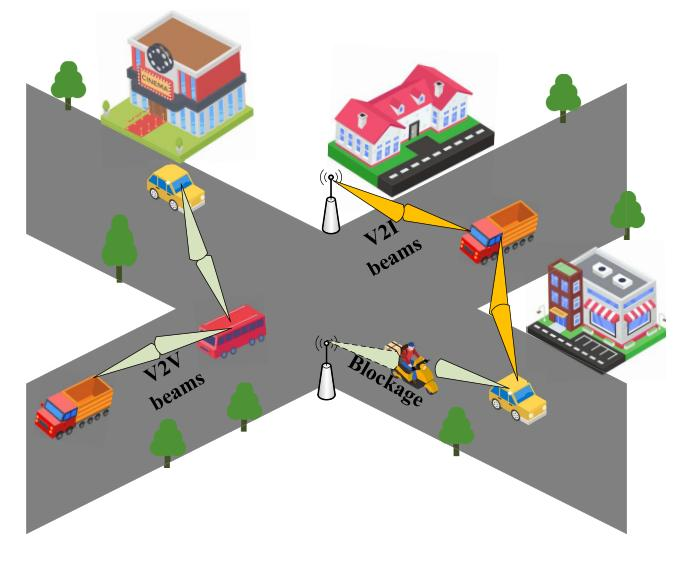

Fig. 1. V2X communications using mmWave. Multiple mmWave transceivers are deployed on a vehicle to simultaneously establish vehicle-to-vehicle (V2V) and vehicle-to-infrastructure (V2I) communication links.

jeopardize connectivity, deteriorating communication quality [\[16\]](#page-27-4). Precision in Precision in beamforming, contingent on optimal beam direction discernment, demands beam training - a resource-intensive endeavor. Such training diverts crucial resources, undermining communication efficiency, a compromise untenable in the dynamic vehicular landscape [\[17\]](#page-27-5). Moreover, mmWave's blockage effects disrupt the consistent and dependable communication links among vehicles. Therefore, the development of efficient, real-time, and robust

| Ref. | Year | Mmwave V2X Communications | Beam Sweeping | AOA/ AOD Estimation | Blackbox Optimization | Side Information | Performance Metrics | Research Directions | Covered Year |
|------|------|------------------------------|------------------|------------------------|--------------------------|---------------------|------------------------|------------------------|--------------|
| [27] | 2016 | ✓                            | ✓                | ×                      | ×                        | ×                   | <b>√</b>               | ✓                      | 1999-2016    |
| [2]  | 2018 | ✓                            | ×                | ×                      | ×                        | ×                   | ×                      | ✓                      | 2009-2017    |
| [29] | 2018 | ✓                            | ×                | ×                      | ×                        | <b>√</b>            | ×                      | ✓                      | 2016-2018    |
| [20] | 2019 | ×                            | ✓                | ×                      | ×                        | ×                   | <b>√</b>               | ✓                      | 2010-2018    |
| [30] | 2020 | ✓                            | ×                | ×                      | ×                        | ×                   | ×                      | ✓                      | 2012-2020    |
| [31] | 2020 | ✓                            | ×                | ×                      | ×                        | <b>√</b>            | <b>√</b>               | ✓                      | 2010-2020    |
| [28] | 2021 | ✓                            | ×                | ×                      | ×                        | ×                   | ×                      | ✓                      | 2014-2021    |
| [20] | 2022 | ×                            | ✓                | ×                      | ×                        | ×                   | ×                      | ✓                      | 2016-2021    |
| [32] | 2022 | <b>√</b>                     | ×                | ✓                      | ×                        | <b>√</b>            | ×                      | ✓                      | 2014-2022    |
| Ours | 2023 | ./                           | ./               | ./                     | ./                       | ./                  | ./                     | ./                     | 2010-2023    |

TABLE II EXISTING SURVEYS:ACOMPARATIVE SUMMARY

beam alignment technology is crucial for the success of mmWave V2X communication.

Within the current research landscape, numerous surveys and tutorials delve into mmWave communication and vehicular communications. Specifically, [\[13\]](#page-27-1) and [\[14\]](#page-27-2) address the general aspects of mmWave communications. Concurrently, [\[18\]](#page-27-6) offers insights into mobility support, [\[19\]](#page-27-7) emphasizes channel models and antenna designs, while [\[20\]](#page-27-8), [\[21\]](#page-27-9), [\[22\]](#page-27-10) converge on beam management. Transitioning to vehicular networks, studies such as [\[23\]](#page-27-11) navigate the domain of resource allocation for video streaming, [\[24\]](#page-27-12) probes map-based localization methods, [\[25\]](#page-27-13) ventures into the possibilities of artificial intelligence (AI) and machine learning (ML) algorithms, [\[26\]](#page-27-14) evaluates congestion avoidance strategies, and [\[2\]](#page-26-1) sheds light on cooperative vehicular networking. Moreover, some surveys are focused on mmWave V2X communications, such as [\[27\]](#page-27-15) which provides an overview of state-of-the-art solutions, [\[28\]](#page-27-16) which investigates beam-based mobility management, [\[29\]](#page-27-17) which summarizes the challenges and designs of advanced use cases and beam management, [\[30\]](#page-27-18) which evaluates of use cases for implementing cooperative perception, [\[31\]](#page-27-19) which focuses on the physical and medium access control (MAC) layers, and [\[32\]](#page-27-20) which explores integrated sensing and communications for IoV. However, these comprehensive works occasionally exhibit gaps, particularly in areas like beam alignment, performance metric evaluations, and future research directions and challenges in mmWave V2X communications. To provide a comprehensive overview of the existing research, we have summarized survey results published in the field of vehicular communication and mmWave communication related to our investigation in Table [II.](#page-2-0)

Distinguished from previous survey works, this survey is the first research paper that focuses on beam alignment in mmWave V2X communication. Specifically, our investigation delves into beam sweeping, angle of arrival (AoA)/angle of direction (AoD) estimation, black-box optimization, and side information beam alignment methods, as well as corresponding performance metrics for beam alignment overhead and accuracy. In addition, we discuss the future research directions and challenges. The main contributions of this paper are as follows:

• We review the characteristics of mmWave technology, including propagation, channel models, beamforming, and antenna arrays. Additionally, we investigate the advanced applications of mmWave V2X communications and provide an overview of vehicular network standards. Furthermore, we briefly introduce the performance metrics used to evaluate beam alignment in mmWave V2X communications.

- • We offer a comprehensive survey of beam alignment methods in mmWave V2X communication, covering beam sweeping, AoA/AoD estimation, black-box optimization, and side information methods. We also provide comparisons of the algorithms employed in these four methods. Within the side information beam alignment, we delve into beam tracking, beamforming prediction, and blockage prediction in detail.
- • We provide a detailed description of the performance metrics employed to assess beam alignment in mmWave V2X communication. These metrics include beam alignment latency and effective achievable rate for evaluating beam alignment overhead, as well as power loss, throughput ratio, and alignment probability for evaluating beam alignment accuracy. In addition, we also evaluate the performance comparison under the four methods based on these metrics.
- • We summarize the future research directions and challenges for beam alignment in mmWave V2X communication, setting the stage for future inquiries and innovations.

The structure the paper is organized as follows (see Fig. [2\)](#page-3-0). Section [II](#page-2-1) provides an overview of mmWave and V2X. Section [III](#page-9-0) investigates the beam alignment methods in mmWave V2X communication. Section [IV](#page-19-0) discusses the performance metrics for beam alignment in mmWave V2X communication. Section [V](#page-24-0) presents the future research directions and challenges for beam alignment in mmWave V2X communication. Finally, Section [VI](#page-26-11) concludes the paper.

# II. BACKGROUND

In this section, we introduce the fundamentals of mmWave attributes, study the mmWave vehicular networks, outline vehicular network standards, and describe performance metrics pertinent to mmWave V2X beam alignment. Key abbreviations utilized throughout this paper are consolidated in Table [III](#page-4-0) for reference.

## *A. MmWave Characteristics*

*1) Channel Properties:* Utilizing mmWave frequencies for future V2X applications offers several advantages. Besides

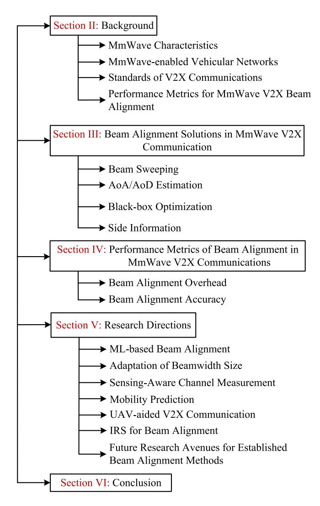

Fig. 2. Structure of the paper.

the abundance of available spectrum, the compact size of antennas at mmWave frequencies enables the construction of intricate antenna arrays, such as multiple-input and multiple-output (MIMO) systems, which can provide high antenna gains and further enhance transmission rates. Moreover, the inherent security of mmWave transmissions is improved due to the restricted transmission range and the relatively narrow beamwidth that can be achieved [33].

Although the use of these new frequency bands has sparked considerable interest, there are numerous concerns regarding the transmission characteristics of mmWave channels, as explained below:

Path loss: The free space path loss (FSL) refers to the reduction of signal strength between two isotropic radiators in a free space environment [34]. Friis's Law [35], [36], [37] provides a means to express this attenuation:

$$\frac{P_t}{P_r} = \left(\frac{4\pi d_{tr}}{\lambda}\right)^2 = \frac{1}{G_r G_t} \left(\frac{4\pi d_{tr} f}{c}\right)^2,\tag{1}$$

where  $\lambda$  is the wavelength, c represents the speed of light in vacuum  $(3 \times 10^8 m s^{-1})$ , f is the frequency of the radio carrier,  $P_t$  denotes the initial power of free space propagation,  $P_T$  represents the remaining power after passing through the

channel,  $d_{tr}$  denotes the distance between the transmitter and receiver,  $G_r$  and  $G_r$  and respectively denote the antenna gains on both sides.

When represented in decibels and with antenna gains disregarded (G=1, i.e., 0 dB, that is, zero gain and zero loss), the aforementioned equation can be expressed as [38]:

$$FSL = 92.1 + 20 \log d_{[km]} + 20 \log f_{[GHz]} dB.$$
 (2)

Considering wavelengths in the millimeter range, the path loss becomes substantial, resulting in a decrease in communication range, assuming isotropic propagation [39].

Furthermore, mmWave signals are highly susceptible to attenuation caused by atmospheric factors, including oxygen and water-vapor absorption, rain attenuation, and foliage-induced attenuation [40], [41], [42], [43]. The 60 GHz range is particularly affected by atmospheric absorption, while frequencies above 10 GHz experience notable attenuation from rain and hail [44], [45], [46]. It is important to note that attenuation at mmWave frequencies varies with time and season due to changes in temperature and humidity [47], [48]. Additionally, at 38 GHz with a penetration depth of 12m, foliage-induced attenuation reaches approximately 21 dB, underscoring its significant impact. Hence, the contribution of foliage-induced loss should not be overlooked, as it holds substantial implications [13].

Penetration Loss and Blockage Effects: Lower frequency signals have better penetration capabilities through buildings, whereas mmWave signals encounter difficulties in penetrating solid materials [49], [50]. Consequently, the presence of obstacles, reflectors, or even changes in the orientation of a handset relative to the body or hand can lead to rapid fluctuations in the channel, resulting in intermittent connectivity [51], [52]. For instance, a study [53] observed a signal power attenuation of 20 dB when three vehicles were situated between the transmitter and receiver at a distance of 200 m.

Moreover, urban environments experience higher levels of penetration loss compared to rural areas and highway scenarios due to the reduced presence of obstacles [54]. When an obstacle obstructs the path between the transmitter and receiver, it blocks the line-of-sight (LoS) connection. To address this issue, the International Telecommunication Union (ITU) and 3rd Generation Partnership Project (3GPP) have developed probabilistic LoS channel models and obstacle models based on the 3D geometric method, accommodating various environmental conditions [49], [50], [54].

Doppler Effect and Multipath: The motion of ground nodes introduces Doppler shifts, causing carrier frequency offset, inter-carrier interference, and limited channel coherence time. The magnitude of the Doppler shift depends on the carrier frequency, mobile node velocity, and angular dispersion [13], [48]. In mmWave V2X communication systems, the high carrier frequency and mobility contribute to substantial Doppler shifts. Furthermore, distinct Doppler frequencies can be observed among different multipath components (MPCs).

Beam Directionality: In current mmWave V2X communication technologies, transmissions are primarily omnidirectional, but directional transmissions like beamforming can be utilized

TABLE III THE MAIN ABBREVIATIONS

| Term    | Definition                                                        | Term   | Definition                                 |
|---------|-------------------------------------------------------------------|--------|--------------------------------------------|
| 3D      | Three Dimensional                                                 | MMSE   | Minimum Mean Squared Error                 |
| 3GPP    | 3rd Generation Partnership Project                                | MAB    | Multi-Armed Bandit                         |
| AoA     | Angle of Arrival                                                  | MPCs   | Multipath Components                       |
| AoD     | Angle of Departure                                                | MIMO   | Multiple-Input and Multiple-Output         |
| AEs     | Antenna Elements                                                  | NOMA   | Non-Orthogonal Multiple Access             |
| AI      | Artificial Intelligence                                           | NR-V2X | New Radio-V2X                              |
| ANNs    | Artificial Neural Networks                                        | OFDM   | Orthogonal Frequency Division Multiplexing |
| BS      | Base Station                                                      | OMP    | Orthogonal Matching Pursuit                |
| BD      | Block Diagonalization                                             | PF     | Particle Filter                            |
| CSMA/CA | Carrier Sense Multiple Access/Collision Avoidance                 | QoS    | Quality of Service                         |
| C-V2X   | Cellular-V2X                                                      | QAM    | Quadrature Amplitude Modulation            |
| CSI     | Channel State Information                                         | RF     | Radio Frequency                            |
| CS      | Compressed Sensing                                                | RGB    | Red Green Blue                             |
| CV      | Computer Vision                                                   | RL     | Reinforcement Learning                     |
| CEPT    | Conference of European Post and Telecommunication Administrations | RSS    | Received Signal Strength                   |
| CNN     | Convolutional Neural Network                                      | RSU    | Road Site Unit                             |
| DSRC    | Dedicated Short-Range Communication                               | RNN    | Recurrent Neural Network                   |
| DL      | Deep Learning                                                     | SL     | Supervised Learning                        |
| DNNs    | Deep Neural Networks                                              | SLNR   | Signal to Leakage and Noise Ratio          |
| D2D     | Device-to-Device Communication                                    | SNR    | Signal-to-Noise Ratio                      |
| DFRC    | Dual Functional Radar Communication                               | SA     | Simulated Annealing                        |
| DQN     | Deep Q-Network                                                    | SDR    | Software Defined Radio                     |
| ECC     | European Communities Commission                                   | SCS    | Subcarrier Spacings                        |
| EKF     | Extended Kalman Filter                                            | SVM    | Support Vector Machine                     |
| GRUs    | Gated Recurrent Units                                             | TDD    | Time Division Duplex                       |
| GAMP    | Generalized Approximate Message Passing                           | TDL    | Tapped Delay Line                          |
| GSCMs   | Geometry-based Stochastic Channel Models                          | TL     | Transfer Learning                          |
| GPS     | Global Positioning System                                         | UCA    | Uniform Circular Array                     |
| HD      | High-Definition                                                   | ULA    | Uniform Linear Array                       |
| HSTs    | High-Speed Trains                                                 | URA    | Uniform Rectangular Array                  |
| IEEE    | Institute of Electrical and Electronics Engineers                 | UAVs   | Unmanned Aerial Vehicles                   |
| IoT     | Internet of Things                                                | UE     | User Equipment                             |
| ISAC    | Integrated Sensing and Communication                              | V2X    | Vehicle-to-Everything                      |
| IRS     | Intelligent Reflecting Surface                                    | V2I    | Vehicle-to-Infrastructure                  |
| ITS     | Intelligent Transportation Systems                                | V2N    | Vehicle-to-Network                         |
| ISO     | International Organization for Standardization                    | V2P    | Vehicle-to-Pedestrian                      |
| ITU     | International Telecommunication Union                             | V2V    | Vehicle-to-Vehicle                         |
| IV      | Intra-Vehicle                                                     | VAWC   | Vision-Aided Wireless Communication        |
| LADAR   | Laser Detection and Ranging                                       | ViWi   | Vision-Wireless                            |
| LSTM    | Long Short-Term Memory                                            | VRUs   | Vulnerable Road Users                      |
| LR      | Low-Rank                                                          | WLAN   | Wireless Local Area Networks               |
| LTE-V2X | Long Term Evolution-V2X                                           | WPAN   | Wireless Personal Area Networks            |
| ML      | Machine Learning                                                  | ZF     | Zero Forcing                               |
| MAC     | Medium Access Control                                             |        | -                                          |

after establishing a physical link. However, it is important to recognize that isotropic transmission at mmWave frequencies experiences considerable path loss. To address this challenge, mmWave links are commonly implemented as directional to capitalize on the advantages of beamforming gain. Nevertheless, achieving precise alignment between transmitter and receiver beams in directional links carries the risk of beam misalignment and resulting deafness [\[33\]](#page-27-21).

*2) Existing Channel Models:* Several V2V channel models have been developed for frequencies below 6GHz in different scenarios, such as open highways [\[55\]](#page-27-43), suburban areas [\[56\]](#page-27-44), campuses [\[57\]](#page-28-0), and crossroads [\[58\]](#page-28-1). However, further analysis is required to investigate various vehicle scenarios in the mmWave frequency band. The mmWave channel model typically includes large-scale fading, incorporating distance-dependent path loss and blockage effects, as well as small-scale fading resulting from constructive and destructive interference of MPCs between transceivers. Spatial and temporal characteristics are also taken into account. Unlike sub-6GHz channels, mmWave channels exhibit unique

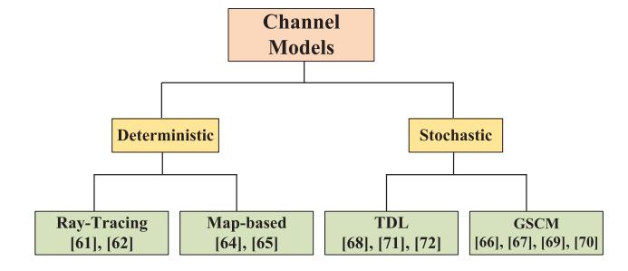

Fig. 3. Classification of channel models in existing mmWave V2X communication works.

transmission characteristics, leading to a lower number of MPC compared to the number of antennas at transceivers.

The existing mmWave channel models can be classified into stochastic and deterministic models [\[59\]](#page-28-2), as depicted in Fig. [3.](#page-4-1) Deterministic models, including ray-tracing and map-based models, aim to accurately capture the propagation characteristics of electromagnetic waves. These models rely on measurements and environmental data stored in databases. The ray-tracing method has been widely adopted by IEEE for mmWave high-speed mobile communications [\[60\]](#page-28-3). Chang et al. [\[61\]](#page-28-4) and Lee et al. [\[62\]](#page-28-5) have proposed 3-D ray-tracing techniques to model urban channels. The mapbased channel simulation method, initially introduced in [\[63\]](#page-28-6), has seen further refinements by Adeogun et al. [\[64\]](#page-28-7), [\[65\]](#page-28-8). Furthermore, 3GPP has introduced a map-based hybrid method for mmWave channel modeling [\[54\]](#page-27-42).

Stochastic channel models, including geometry-based stochastic channel models (GSCMs) and tapped delay line (TDL) models, offer a computationally efficient way to analyze channel characteristics using statistical distribution models and empirical parameters. GSCMs leverage the geometric relationship between transmitters/receivers and scatterers to determine angle, distance, and delay parameters [\[66\]](#page-28-9), [\[67\]](#page-28-10), making them suitable for mmWave V2X MIMO channels. However, the simplified representation of the environment using geometric points presents challenges in accurately predicting the channel impulse response in specific scenarios. To overcome this limitation, 3GPP introduced a TDL channel modeling framework that incorporates fading statistics derived from the channel impulse response. This framework provides a computationally efficient solution, with fading parameters for each tap empirically derived from statistical measurement data. The authors in [\[68\]](#page-28-11), [\[69\]](#page-28-12), [\[70\]](#page-28-13), [\[71\]](#page-28-14), [\[72\]](#page-28-15) have focused on investigating channel models for V2V channels, extensively examining the impact of arbitrary vehicle speeds and directions on channel statistical properties.

*3) Beamforming:* Beamforming [\[73\]](#page-28-16) is a pivotal technology in large-scale MIMO systems that shapes the electromagnetic wave beam for concentrated propagation. By leveraging the interference principle, it achieves directional beam convergence. In this process, transmitted signals experience constructive interference in the propagation direction, bolstering signal strength, while encountering destructive interference at other angles, minimizing interference with the primary signal direction. The significance of beamforming is particularly evident in mmWave communication systems, where signal propagation is constrained. It offers two key advantages. Firstly, it enables beam convergence, extending signal transmission distance without increasing energy consumption. Secondly, through spatial domain reuse, it enhances spectrum efficiency and augments user capacity within a cell. Beamforming techniques can be classified as digital, analog, or hybrid beamforming, depending on the hardware structure of the antenna array (see Fig. [4\)](#page-5-0).

*Digital Beamforming:* Digital beamforming is widely used in 3G and 4G systems, employing techniques such as zeroforcing (ZF) [\[74\]](#page-28-17), minimum mean squared error (MMSE) [\[75\]](#page-28-18), block diagonalization (BD) [\[76\]](#page-28-19), signal to leakage and noise ratio (SLNR) [\[77\]](#page-28-20), and dirty paper coding [\[78\]](#page-28-21). Integrating digital beamforming into baseband signal processing and controlling signal magnitude and phase, provides flexibility and optimal signal gain. However, the hardware cost of digital beamforming is high due to the requirement for separate radio frequency (RF) chains per antenna, which includes expensive components like analog-to-digital converters, mixers, and

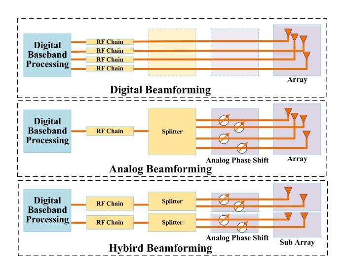

Fig. 4. Digital, analog and hybrid beamforming.

amplifiers. Moreover, signal processing complexity significantly increases.

*Analog Beamforming:* In contrast, analog beamforming [\[79\]](#page-28-22) uses a single RF chain connected to all antennas, controlling antenna phase weights through analog circuitry. Analog beamforming has advantages and disadvantages. With a single RF chain, it exhibits lower power consumption and cost compared to digital beamforming. However, it supports only single-data-stream transmission and is unsuitable for multiuser scenarios. Additionally, due to amplitude constraints, analog beamforming can only adjust phase weights and lacks the ability to modify signal magnitude, resulting in inferior performance and limited applicability in specific situations.

*Hybrid Beamforming:* To address the limitations of both digital and analog beamforming in large-scale MIMO structures, hybrid analog-digital beamforming [\[80\]](#page-28-23) has been proposed. Hybrid beamforming considers spectrum efficiency, energy efficiency, hardware cost, and runtime. Sohrabi et al. utilized the orthogonal matching pursuit (OMP) method to select the path with the highest gain in the channel model as the transmission channel for the signal [\[81\]](#page-28-24). Payami et al. introduced an antenna selection-based hybrid beamforming algorithm that reduces the number of phase shifters corresponding to antenna units with low spectrum efficiency, thus decreasing overall energy consumption [\[82\]](#page-28-25). Li et al. focused on the uplink multi-user scenario, significantly reducing time consumption and costs while achieving performance comparable to digital beamforming [\[83\]](#page-28-26). Traditional hybrid beamforming techniques can be classified as phase shifterbased [\[84\]](#page-28-27), [\[85\]](#page-28-28) or switch-based [\[86\]](#page-28-29), depending on the type of analog hardware used. However, phase shifter-based hybrid beamforming in large-scale MIMO systems often incurs high energy consumption and costs due to the need for high-precision phase shifters, while switch-based hybrid beamforming suffers from lower accuracy and subpar performance. To address these drawbacks, a recent study [\[87\]](#page-28-30) proposed a hybrid beamforming technique based on switches and inverters, striking a balance between energy consumption, hardware cost, and beamforming performance. However, it

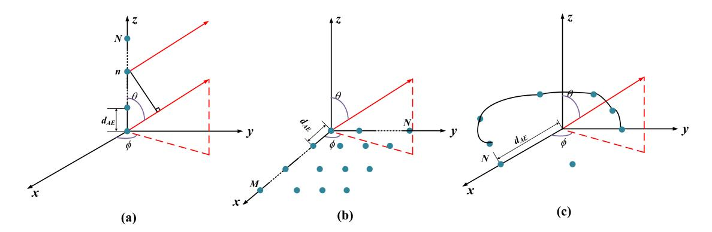

Fig. 5. Geometric structures of three types of antenna arrays: (a) ULA, (b) URA, (c) UCA.

still falls short in terms of rate and full digital beamforming performance.

4) Antenna Array: Despite the unique advantages of mmWave frequency bands, such as large bandwidth and spatial sparsity, they also suffer from higher free-space path loss and more severe atmospheric attenuation compared to sub-6 GHz bands. Consequently, high-gain antennas are essential for compensating the path loss in mmWave V2X communications. In the following, we explore various architectures for antenna arrays that utilize interconnected antennas to achieve higher gain.

The commonly used types of uniform antenna arrays are the uniform linear array (ULA), uniform rectangular array (URA), and uniform circular array (UCA), as depicted in Fig. 5 [46].

In the uniform linear array model shown in Fig. 5 (a), N antenna elements (AEs) are evenly distributed along the y-axis. The varying distances between the signal source and each AE lead to different time delays and phase offsets among them. Typically, the reference AE is chosen as the one located at the origin. The unit wavelength difference between the kth AE on the y-axis and the reference AE is determined by

$$u = \frac{2\pi}{\lambda} d_{AE} \sin \theta, \tag{3}$$

where  $d_{AE} = \frac{2\pi}{\lambda}$  represents the spacing between the AEs,  $\lambda$  represents the wavelength, and  $\theta$  represents the incident angle of the signal source path. The steering vector of the uniform linear array can be expressed as

$$\mathbf{a} = \frac{1}{\sqrt{N}} \left[ 1, e^{-j\frac{2\pi}{\lambda} d_{AE}\cos\theta}, \dots, e^{-j\frac{2\pi}{\lambda}(N-1)d_{AE}\cos\theta} \right]^{T}. (4)$$

where j is the imaginary unit,  $\sqrt{-1}$ , which is fundamental in representing the phase component of the signal in complex form. The uniform linear array provides resolution only in the two-dimensional plane and occupies a larger horizontal space compared to other array models due to its AE arrangement. Nonetheless, its simple structure and strong planar resolution have attracted significant attention.

Exploiting elementary geometrical principles allows for the derivation of steering vectors for the URA with  $M \times N$  AEs and the UCA with N AEs, represented by (5) and (6) respectively [88]:

$$\mathbf{a}_{URA} = \frac{1}{\sqrt{MN}} \left[ 1, \dots, e^{j\frac{2\pi}{\lambda}} d_{AE} \sin\theta [(m-1)\cos\phi + (n-1)\sin\phi], \\ , \dots, e^{j\frac{2\pi}{\lambda}} d_{AE} \sin\theta [(M-1)\cos\phi + (N-1)\sin\phi] \right]^{\mathsf{T}}, (5)$$

$$\mathbf{a}_{UCA} = \frac{1}{\sqrt{N}} \left[ 1, \dots, e^{j\frac{2\pi}{\lambda} d_{AE} \sin\theta \cos\left(\phi - \frac{2\pi}{N}\right)}, \dots, e^{j\frac{2\pi}{\lambda} d_{AE} \sin\theta \cos\left[\phi - \frac{2\pi}{N}(N-1)\right]} \right]^{\mathsf{T}}, \tag{6}$$

where m and n index the AEs in the URA across the respective dimensions, facilitating the determination of phase shifts necessary for beam steering based on the array geometry. The AoA of the incoming signal at the antenna array can be decomposed into the azimuth angle  $\phi$  and elevation angle  $\theta$ , providing critical spatial information for beamforming applications.

#### B. MmWave-Enabled Vehicular Networks

MmWave is an electromagnetic wave with a frequency of 30GHz to 300GHz, providing a rich spectrum resource with wide bandwidth and short wavelength characteristics [27]. This makes it suitable for high-data-rate communication scenarios in vehicular networks. However, the propagation loss caused by blockages, rain, and atmospheric absorption can be severe [89], [90]. Despite this, the large bandwidth of mmWave can provide higher data throughput [91]. Fortunately, the short wavelength of mmWave enables the use of beamforming technology to form directional narrow beams, compensating for the severe propagation loss. Additionally, directional transmission and narrow beams can efficiently manage the Doppler effect that appears in the mmWave frequency band, effectively addressing the challenges of vehicles in highmobility environments [92].

In recent years, many countries have dedicated unlicensed spectrum resources for utilization in the 60GHz mmWave frequency band. Standard protocols have been established for wireless local area networks (WLAN) and wireless personal area networks (WPAN), including IEEE 802.11ad and IEEE 802.15.3c. Additionally, IEEE [93], [94], [95], [96] is promoting standardization activities for mmWave V2X networks, such as 802.11bd. At present, the use of mmWave for vehicular communications has been standardized by ISO [97]. 3GPP has developed a method for mmWave V2X communication based on 5G-NR [98], and is conducting research on the NR-V2X spectrum below 52.6GHz and above 52.6GHz [99], [100]. The ITU-radiocommunication (ITU-R) has applied the 57-66GHz frequency band to V2X communication [98], while in Europe, the Conference of European Post and Telecommunication Administrations (CEPT) and the European Communities

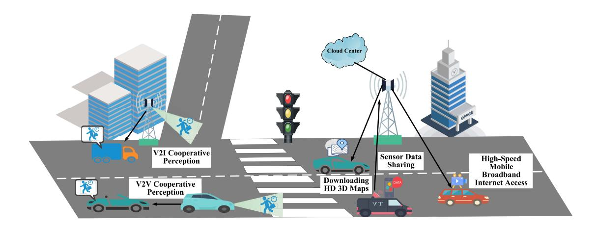

Fig. 6. Illustration of representative V2X applications.

Commission (ECC) are designating the 63-64GHz frequency band for ITS application [\[101\]](#page-28-44).

The high data rate capability of mmWave enables support for advanced V2X applications, such as cooperative autonomous driving and enhanced infotainment services [\[14\]](#page-27-2), [\[31\]](#page-27-19). Specific applications are as follows (see Fig. [6\)](#page-7-0):

*1) Cooperative Perception:* This advanced technology is rooted in the sharing of sensor data between vehicles and infrastructure to achieve enhanced safety and efficiency in driving. Vehicles employ V2V communication to share raw sensor data, such as front camera data, enabling the identification of non-line-of-sight (NLoS) traffic conditions. For instance, in the see-through application, data from preceding cars allows for real-time insight into traffic conditions that are not directly visible, which is further processed to create a comprehensive satellite view of surrounding traffic [\[102\]](#page-28-45). Sharing raw sensor data, including GPS data, is integral to cooperative perception. By applying real-time kinematics approaches to shared raw GPS data, relative positioning accuracy can be improved to less than 1 meter, promoting perception accuracy and safety [\[102\]](#page-28-45). Real-time operations are essential to harness the full potential of sensor data sharing, thus meeting the stringent low latency requirements for safety applications [\[31\]](#page-27-19). Infrastructure, especially at intersections, is equipped with an array of sensors that share real-time data with nearby vehicles through V2I communication. This sharing mechanism enables vehicles to identify NLoS situations on perpendicular streets effectively. In the context of vehicle platooning scenarios of NR-V2X, sharing sensor data among vehicles in the platoon is crucial to ensure collective safety [\[103\]](#page-28-46).

The rich perception data, owing to cooperative perception and data sharing, necessitates high data rates for transmission and low latency for real-time data collection, making mmWave technology an ideal candidate to fulfill these requirements. The integration of these technologies enhances the perception range applicable to both autonomous and human-driven vehicles, aiding in avoiding collisions and ensuring a safer, smoother traffic flow.

*2) Downloading High-Definition (HD) Three-Dimensional (3D) Maps:* HD 3D maps are a critical element for achieving precise positioning in autonomous driving systems, as they offer vital environmental information during the driving process [\[104\]](#page-28-47), [\[105\]](#page-28-48). To ensure safe and efficient driving, autonomous vehicles need real-time access to HD 3D maps on highways (due to high speeds and limited perception range) and in urban areas (due to the numerous blind spots at intersections). Consequently, low latency requirements must be met for this scenario.

*3) High-Speed Mobile Broadband Internet Access:* In this application, passengers can enjoy on-demand multimedia services, such as 4K video streaming and online gaming, using the in-vehicle hotspot to share network access with their mobile devices or the vehicle's information and entertainment system [\[106\]](#page-28-49), [\[107\]](#page-29-0).

Despite its advantages of high-frequency bands and large bandwidth, mmWave suffers from poor penetration ability, which can result in communication interruptions due to beam blockage by obstacles. This poses a major challenge for mmWave beam management in high-speed vehicle environments. If the transmission and reception beams of a vehicle are misaligned during the beam alignment process, the vehicle may experience link interruptions, as it cannot receive high-quality wireless signals. Therefore, research on beam alignment algorithms for mmWave V2X is critical.

#### *C. Standards of V2X Communications*

Currently, there are two main technologies applied to IoV in the international mainstream: DSRC and cellular-V2X (C-V2X) based on cellular mobile communication systems. The DSRC technology standard is based on the Wi-Fi standard and has been standardized through IEEE 802.11. C-V2X is an IoV communication technology based on cellular network communication and device-to-device (D2D) communication, which includes 4G LTE-V2X and 5G new radio-V2X (NR-V2X) [\[97\]](#page-28-40), [\[108\]](#page-29-1). The comparison between these two technologies is shown in Table [IV](#page-8-0) [\[109\]](#page-29-2), [\[110\]](#page-29-3), [\[111\]](#page-29-4).

*1) DSRC:* DSRC, rooted in IEEE 802.11p, though instrumental in V2V and V2I communication, encounters critical limitations that impede its comprehensive applicability [\[101\]](#page-28-44), [\[112\]](#page-29-5). One pivotal constraint is the technology's inherent transmission and channel access delays, attributed to its

|                         | Aspect                                                                                               | DSRC                                                                     | C-V2X                                                                                             |                                                                                      |  |
|-------------------------|------------------------------------------------------------------------------------------------------|--------------------------------------------------------------------------|---------------------------------------------------------------------------------------------------|--------------------------------------------------------------------------------------|--|
| Aspect                  |                                                                                                      | DSRC                                                                     | LTE-V2X                                                                                           | NR-V2X                                                                               |  |
|                         | Maturity Well-established, with proven effectiveness in reducing accidents and enhancing ITS.        |                                                                          | Improved QoS compared to DSRC due to cellular infrastructure.                                     | Supports sophisticated use cases like autonomous driving with ultra-low latency.     |  |
| Advantages              | Communication Primarily used for V2V and communication.                                              |                                                                          | Focuses on basic safety use cases and collision warnings.                                         | Offers enhanced capacity for advanced vehicular networking services.                 |  |
|                         | Performance Enhancements                                                                          | Upcoming IEEE 802.11bd aims to mitigate existing DSRC limitations.       | Introduces new technologies in Release 15 to improve reliability, data rate, and delay.           | Employs flexible numerology and supports 256-QAM modulation for higher data rates.   |  |
|                         | Transmission Delays  Faces severe delays due to CSMA/CA mechanism in high vehicle density scenarios. |                                                                          | Limited real-world deployment constrains comprehensive evaluation of scalability and reliability. | Similar limitations as LTE-V2X due to the dependency on cellular infrastructure.     |  |
| Limitations             | Range & Interference                                                                              | Limited communication range and interference issues.                     | Requires substantial investment for integration with existing infrastructures.                    | Inherits challenges of LTE-V2X including security, privacy, and spectrum allocation. |  |
| Technology Evolution |                                                                                                      | Faces scalability issues with an increasing number of connected vehicles | Continuous evolution of cellular technologies necessitates ongoing standard undates               | Still under development with an emphasis on accommodating rapid                      |  |

TABLE IV THE COMPARISON BETWEEN DSRC AND C-V2X

operation within the congested 5.9GHz frequency band and the utilization of the carrier sense multiple access/collision avoidance (CSMA/CA) contention mechanism [\[113\]](#page-29-6). In scenarios of high vehicle density, this leads to a pronounced contention for limited spectral resources and subsequent mutual interference, engendering significant communication delays. Moreover, DSRC is afflicted by the broadcast storm problem, where simultaneous message transmission by multiple vehicles engenders channel congestion and message collisions. Its confined communication range, more pronounced in varying terrains and environments, compounds these challenges. Additionally, DSRC contends with interference from multiple devices sharing its frequency band and scaling issues with the growing number of connected vehicles.

To mitigate the broadcast storm issue, several strategies have been proposed. Clustering and data aggregation techniques, for instance, delegate packet forwarding to cluster heads [\[114\]](#page-29-7), [\[115\]](#page-29-8). Another innovation is the collision-aware packet transmission model, designed to bolster DSRC's spectral efficiency by channel and time slot allocation based on traffic metrics [\[116\]](#page-29-9). A focus on minimizing transmission collisions while optimizing time slot reuse for a plethora of contending vehicles was emphasized in [\[117\]](#page-29-10). Currently, the IEEE 802.11bd standard is in development as a successor to IEEE 802.11p [\[97\]](#page-28-40). This upcoming standard will employ various strategies to improve performance, including retransmissions to increase reliability, narrow orthogonal frequency-division multiplexing (OFDM) to improve spectral efficiency, higher modulation schemes, and the introduction of mmWave frequencies for higher data rates.

*2) C-V2X:* C-V2X employs the LTE cellular infrastructure, delivering better quality of service (QoS) compared to DSRC. In 2017, the 3GPP officially released the 3GPP Release 14 standard that supports LTE-V2X, meeting the requirements for assisted driving and low-level autonomous driving applications to improve safety and efficiency [\[118\]](#page-29-11).

The standard protocol architecture of 3GPP Release 14 comprises three parts: physical layer, data link layer, and application layer. The physical layer activates and deactivates transmission and control channels, whereas the data link layer ensures reliable data transmission and error control. The application layer performs related tasks such as business services [\[119\]](#page-29-12). To meet the needs of some high-level vehicular networking services such as platoon driving, 3GPP proposed LTE-eV2X in Release 15, which improves the reliability, data rate, and delay performance of the direct mode based on the Release 14 standard. This version introduces several new technologies, such as multiple carrier operations, highorder modulation, delay reduction, and transmission diversity, leading to improved data rates and transmission delays [\[120\]](#page-29-13).

LTE-V2X focuses on basic safety use cases such as vulnerable road users (VRUs) protection and intersection collision warning, while NR-V2X was introduced in Release 16 to accommodate more sophisticated use cases such as autonomous driving with millisecond-level latency [\[93\]](#page-28-36), [\[94\]](#page-28-37). NR-V2X sidelink employs flexible numerology using different subcarrier spacings (SCS) to achieve varying slot durations [\[95\]](#page-28-38). Larger SCS enables shorter slot durations suitable for low latency applications, which in turn reduce the overall user plane latency. NR-V2X supports 256-quadrature amplitude modulation (QAM) modulation for higher data rates, and mmWave communication is being considered for future NR-V2X releases to obtain higher throughput [\[97\]](#page-28-40). However, no standardized implementation of a mmWave V2X network exists to date [\[96\]](#page-28-39).

C-V2X technology, while a significant leap forward in vehicular communications, grapples with its own set of challenges. Its novelty, characterized by limited real-world deployment, results in scant data to gauge its scalability and reliability fully. Integrating C-V2X requires significant investment, both economically and technically, to merge with existing road and telecommunication infrastructures. Furthermore, C-V2X faces potential obstacles in spectrum allocation and interference, particularly in urban locales characterized by elevated cellular network traffic. Ensuring ultra-low latency, a prerequisite for optimal functionality in dynamic vehicular environments, remains a salient challenge, exacerbated by the continuous evolution of cellular technologies. Thus, adapting C-V2X standards in tandem with the fast-paced advancements in cellular technologies highlights the need for flexible developmental and standardization approaches. Keeping pace with these technological shifts is vital for the enduring success and efficacy of C-V2X within intelligent transport systems. Emphasizing this, it becomes evident that intensive research, standardization, and development efforts are essential to fine-tune C-V2X for broader deployment and peak performance.

#### D. Performance Metrics for MmWave V2X Beam Alignment

Understanding and precisely quantifying mmWave V2X beam alignment performance is crucial for refining this emergent technology. Given the centrality of beam alignment in mmWave V2X communication, it's imperative to introduce standardized evaluation metrics. These metrics help identify practical challenges and steer the innovation of more adept beam alignment methods. We offer a succinct outline of these critical metrics below (a comprehensive discussion can be found in Section IV):

1) Beam Alignment Overhead: This metric captures the computational and temporal resources expended during the alignment process.

Alignment Latency: Within the ambit of mmWave V2X networks, latency signifies the timespan needed for the completion of the beam alignment process. Factors like the choice of codebook structure, number of antennas, and employed frequency bands influence this metric [121], [122].

Effective Achievable Rate: An essential criterion gauging the rate of successful data exchange post the alignment process. This rate is influenced by factors such as modulation techniques, beamforming design, and transmission diversity [123], [124].

2) Beam Alignment Accuracy: This metric gauges the precision of alignment in relation to the optimal beam direction.

*Power Loss:* The divergence between the selected and the optimal beam can induce power loss. Minimizing this discrepancy is paramount to maximize the data transmission efficiency [125], [126], [127].

Alignment Probability: A key indicator of the system's reliability, this metric reflects the likelihood of the beam accurately aligning to the receiver's beam within a specified tolerance [128], [129].

Throughput Ratio: This metric evaluates the efficacy of the beam alignment in terms of data throughput. It underscores the balance between alignment accuracy and the consequent data transmission rate [128], [130].

In the context of the mmWave V2X, understanding these metrics is imperative. They provide a clear framework to evaluate current technologies, foster the development of improved

beam alignment algorithms, and pave the way for more seamless V2X communications.

# III. BEAM ALIGNMENT SOLUTIONS IN MMWAVE V2X COMMUNICATION

Beam alignment is a highly researched topic in the field of mmWave communications due to its critical role. The importance of beam alignment has spurred significant research efforts. Existing beam alignment methods can be categorized into four distinct types: 1) Beam sweeping, which involves sweeping the entire spatial domain to achieve beam alignment. 2) AoA/AoD estimation, which is used to acquire channel state information (CSI) or estimate the AoA/AoD by transmitting beams and utilizing channel information. This estimation process enables the alignment of beams for effective beamforming and communication. 3) Blackbox optimization, which achieves beam alignment by directly detecting received signals without explicit knowledge of the channel state. 4) Side information, which leverages additional data, such as location or sensor information, to facilitate mmWave link configuration, reduce beam matching overhead, and enable rapid beam alignment. In the subsequent, we will delve into these four beam alignment methods, providing a comprehensive overview of their respective approaches and contributions (see Fig. 7).

#### A. Beam Sweeping

The exhaustive search method is the most direct approach in beam alignment algorithms, involving a comprehensive exploration of all possible beam pairs by both the base station and the user to achieve optimal beam alignment [125], [131]. By utilizing narrow beams with high gain, this method enables precise beam alignment and offers excellent performance in terms of spatial resolution and coverage area. It relies on minimal assumptions about the channel, only requiring the spatial channel to remain constant during the sweeping process. However, the training overhead of the exhaustive search method increases proportionally with the size of the search space. In a system with N antennas at both the transmitter and receiver, the training overhead for beam alignment follows a complexity of  $O(N^2)$ . Consequently, due to the prevalence of large-scale antenna arrays in mmWave communication systems, this method can be time-consuming [132].

In recent years, researchers have proposed numerous beam alignment algorithms to reduce the training overhead required for beam training [133], [134], [135], [136]. Standardization efforts, such as IEEE 802.15.3c [137] and IEEE 802.11ad [121], have addressed the optimization of exhaustive beam search by dividing the process into sector-level and beam-level searches, thereby mitigating computational complexity [138], [139], [140]. For instance, in IEEE 802.11ad, the transmitter initially employs quasi-omnidirectional beams, while the receiver scans the beam space to identify the optimal receive beam. Subsequently, the receiver adopts quasi-omnidirectional beams, and the transmitter performs beam space scanning to determine the optimal transmit beam. This approach incurs a training overhead of

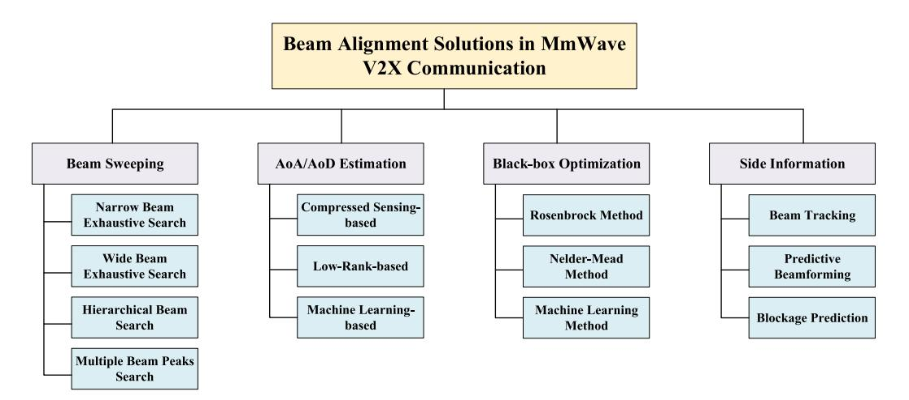

Fig. 7. Classification of beam alignment solutions in mmWave V2X communication.

O(N) [141], offering lower costs compared to exhaustive search methods. Nevertheless, it is important to note that this method can still be time-consuming for large-scale antenna arrays, and its complexity grows with the dimensionality of the codebook. Additionally, the algorithm's performance may be impacted by a low signal-to-noise ratio due to the utilization of quasi-omnidirectional beams.

The method described above employs narrow beam search algorithms for exhaustive beam space exploration. In addition to narrow beams, wide beams can also be utilized to achieve exhaustive beam space search. This beam alignment approach optimizes the training overhead by adjusting the size of the pre-coding codebook specifically for beamforming in particular channel conditions. Taking into account prior knowledge of the spatial environment between the base station and the user, certain angular regions, such as those with extremely high elevation angles, have a minimal probability of containing distinguishable paths. Consequently, the designed wide beam codebook excludes codewords that generate beamforming gains in these angles. Moreover, in angular regions characterized by significant path fading effects and high user mobility, such as the user's proximity, codewords with expanded beamwidth can be employed for scanning purposes. While sacrificing some of the beam gains achieved post-alignment, this approach reduces the number of beams required to scan specific regions, effectively decreasing the training overhead for beam alignment. For instance, Lien et al. [142] introduced a latency-optimal beam alignment strategy, factoring in the common geographic reference and knowledge of the beam sweeping scheme at the transmitter. They outlined performance bounds regarding beam alignment latency and identified optimal beam sweeping schemes. It is important to note that this method relies on prior knowledge of the channel's spatial multipath characteristics, and its capacity to mitigate beam training overhead is relatively limited in general scenarios.

In order to further reduce the training overhead for beam alignment, researchers have proposed a hierarchical beam alignment algorithm [4], [122], [133], [136], [143], [144], [145]. This algorithm utilizes pre-designed hierarchical

codebooks to scan the beam space, with each codebook layer offering a different resolution. The algorithm proceeds as follows: Initially, the transmitter and receiver employ the codebook from the first layer to search the beam space and identify the optimal beam pair, which is then fed back to the transmitter. The beams in this layer have wider beam widths, requiring less overhead to find the best beam pair. Subsequently, based on the previously selected codebook, the transmitter and receiver determine the approximate search range and conduct a more precise search using codebooks with higher resolution within their respective ranges. This iterative process continues until the desired beam resolution is achieved. Theoretical analysis of the algorithm indicates that if each layer of the codebook consists of S codewords, the training overhead required to achieve the same resolution as exhaustive narrow beam search is of the order  $O(S^2 \log N)$ . However, one limitation of this method is the need for individual interaction between the base station and each user. which may not be practical during the initial access phase. Furthermore, during this phase, the algorithm may encounter challenges in determining the correct search range due to the low signal-to-noise ratio at the receiver.

The algorithms discussed above employ codebooks consisting of codewords with a single peak, and the optimal beam pair is determined by maximizing the received power. These methods offer simplicity as they do not require complex signal-processing techniques. By comparing the received signal powers, the optimal beam pair can be easily identified. Additionally, Abari et al. [132] and Hassanieh et al. [141] introduced an algorithm called "Agile-Link" that utilizes codebooks with multiple beam peaks. This approach employs specialized signal processing techniques to estimate the optimal beam direction. The antenna array is divided into subarrays, each pointing in a different direction, resulting in a beam shape with multiple peaks, each corresponding to a beam direction. Despite the lower energy at each peak compared to single-peaked beam codewords, multi-peaked beam codewords enable simultaneous searching in multiple directions, effectively reducing training overhead. However, it is important to note that selecting the optimal beam direction

TABLE V THE COMPARISON OF DIFFERENT BEAM SEARCH ALGORITHMS

| Algorithm                        | Pros.                                                    | Cons.                                                                   |
|----------------------------------|----------------------------------------------------------|-------------------------------------------------------------------------|
| Narrow Beam Exhaustive Search | Signal processing is simple with a large coverage range. | High training costs.                                                    |
| Wide Beam Exhaustive Search   | Signal processing is simple with low training costs.     | Beamforming gain is moderate.                                           |
| Hierarchical Beam Search      | Low training costs.                                      | Multiple interactions are required for both transmission and reception. |
| Multiple Beam Peaks Search    | Low training costs.                                      | Signal processing is slightly complex.                                  |

based on received power comparison among beams is not applicable due to the presence of multiple peaks in each beam. Li et al. [\[146\]](#page-29-39) proposed a beam alignment algorithm that estimates the optimal beam direction by comparing the differences in received signal powers among different beams and considering the beam's pointing direction, using a limited number of observations, thereby improving the beam alignment probability. The authors also presented robust methods for designing multi-peaked beams and estimating the optimal beam in the presence of noise. Beam alignment algorithms based on multi-peaked beam search require more advanced signal processing techniques to estimate the optimal beam direction in the channel.

*Summary and Discussion:* In conclusion, the exhaustive search method explores all beam pairs for optimal alignment, but its training overhead increases with the search space, making it time-consuming for large-scale arrays. Dividing the beam search process into sector-level and beam-level searches reduces training overhead. Wide beam search adjusts the codebook size based on channel conditions to decrease training overhead. Hierarchical beam search algorithms iteratively decrease training overhead using codebooks with increasing resolution. Additionally, multi-peaked beam search offers lower training overhead but necessitates complex signal processing techniques. Table [V](#page-11-0) provides a comprehensive comparison of the advantages and disadvantages of different beam search algorithms. Implementing these beam search methods in V2X communication faces significant challenges due to high channel mobility and short beam coherence time.

# *B. AoA/AoD Estimation*

AoA/AoD estimation leverages the sparsity of mmWave channels to reduce the required number of measurements compared to beam sweeping. In vehicular communications, accurate estimation of AoA/AoD is crucial for a range of applications, such as smart antenna systems, beamforming techniques, and assisted driving technologies.

*1) Compressed Sensing-Based (CS-Based) Algorithms:* Several researchers have addressed the AoA/AoD estimation problem by modeling it as a CS signal processing problem and applying existing CS algorithms to estimate the sparse channel [\[147\]](#page-29-40), [\[148\]](#page-29-41), [\[149\]](#page-29-42), [\[150\]](#page-29-43). Due to the limited number of scatters in mmWave channels, the channel exhibits sparsity in the angular domain. Consequently, representing the channel in the sparse domain allows for obtaining a sparse channel representation. By doing so, the original AoA/AoD estimation problem can be effectively transformed into a CS problem, aiming to estimate a sparse vector from compressed measurements.

Specifically, Alkhateeb et al. [\[151\]](#page-29-44) introduced a CS-based channel estimation method for multi-user scenarios. They exploited the sparsity of mmWave channels in the angular domain and formulated the channel estimation problem accordingly. By employing the widely used OMP algorithm, they estimated the sparse channel. Simulation results demonstrated that their CS-based method required only a small number of measurements compared to the number of base station antennas while achieving a satisfactory effective achievable rate. However, it is worth noting that their study simplified the channel by considering only LoS propagation paths, which is unrealistic for V2X communication. In contrast to [\[151\]](#page-29-44), Lee et al. [\[152\]](#page-30-0) adopted a non-uniform grid for angular discretization. Their work revealed that this non-uniform grid reduced the correlation of the corresponding measurement matrix. They also provided an analysis of the theoretical upper and lower bounds for the channel estimation error based on the OMP algorithm. Additionally, they presented a digital precoding design method that minimized the correlation of the equivalent sensing matrix and enhanced achievable spectral efficiency, assuming a given simulated precoding matrix.

To improve channel estimation performance, Schniter and Sayeed [\[153\]](#page-30-1) proposed a channel estimation method based on generalized approximate message passing (GAMP). Their approach assumed a Bernoulli-Gaussian mixture prior distribution for the channel matrix, leveraging this prior information to promote sparsity and improve system throughput. Although the GAMP-based algorithm exhibited improved estimation performance, it came at the expense of relatively high computational complexity. Furthermore, being a non-convex algorithm, GAMP lacked reliable theoretical guarantees on sampling complexity and convergence to the global optimal solution.

In addition to direct CS techniques, Alkhateeb et al. [\[86\]](#page-28-29) investigated adaptive CS-based channel estimation. They formulated the mmWave channel estimation problem as a CS problem, taking advantage of the sparse scattering characteristics of mmWave channels. They proposed an adaptive method for iterative channel estimation, which involved multiple training stages. In each stage, the measurement matrix used for channel estimation was determined based on the results of the previous iteration rather than being predetermined. The core idea of this adaptive codebook-based method involved using a low-precision codebook in the initial training stage to estimate the range of arrival angles, followed by subsequent stages that gradually narrowed down the search range and employed a high-precision codebook for channel estimation. Compared to directly using CS-based methods, this adaptive approach achieved a higher achievable rate under low signal-to-noise ratio conditions.

The CS-based channel estimation algorithms discussed above share a common assumption: the paths' AoA and AoD are assumed to align with predetermined grid points. However, in practical communication scenarios, the AoA/AoD distribution is continuous, making this assumption unrealistic. To tackle this challenge, Mamandipoor et al. [\[154\]](#page-30-2) and Rasekh and Madhow [\[155\]](#page-30-3) proposed a joint CS channel estimation algorithm called Newtonized orthogonal matching pursuit (NOMP). This algorithm divides the original measurement matrix into two sub-matrices: one for phase reconstruction and the other for compressed sensing. By performing separate phase reconstruction and compressed sensing steps, the algorithm estimates the original channel. Unlike previous methods, this grid-free algorithm allows for angle estimation from a continuous range. Similarly, Hu et al. [\[156\]](#page-30-4) addressed the same issue. In their study, they employed a super-resolution algorithm designed to handle grid mismatch in compressed sensing and applied it to channel estimation. The algorithm iteratively updated the dictionary matrix and adjusted the positions of grid points, enabling angles initially mismatched with grid points to align with the adjusted grid points. Although this method resolves the grid mismatch problem and gains better average spectral efficiency, it increases computational complexity compared to direct utilization of compressed sensing methods.

In conclusion, CS-based channel estimation methods have several limitations. Firstly, while there are algorithms with linear time complexity, such as the matching pursuit algorithm, most CS algorithms are computationally complex, posing challenges for practical implementation in communication systems [\[153\]](#page-30-1), [\[157\]](#page-30-5), [\[158\]](#page-30-6), [\[159\]](#page-30-7). Secondly, these methods rely on accurate phase information of measurements, which is often corrupted by time-varying random noise in mmwave communication systems caused by carrier offsets and oscillator frequency fluctuations [\[160\]](#page-30-8). Consequently, only the amplitude information of the received signal is reliable during training. Moreover, these methods utilize training codebooks consisting of quasi-omnidirectional codewords, resulting in dispersed energy across the entire space and a relatively low signal-to-noise ratio at the receiver. As a result, CS-based channel estimation algorithms exhibit poor robustness to noise. Additionally, many channel estimation methods assume the usage of time division duplex (TDD) mode, enabling the base station to exploit the uplink-downlink channel reciprocity for downlink channel estimation [\[161\]](#page-30-9), [\[162\]](#page-30-10), [\[163\]](#page-30-11), [\[164\]](#page-30-12). However, the reciprocity of the wireless channel can be compromised by synchronization errors between the uplink and downlink RF links, leading to inaccurate estimation [\[165\]](#page-30-13).

*2) Low-Rank-Based (LR-Based) Algorithms:* In contrast to CS-based channel estimation methods, several studies have proposed channel estimation methods based on low-rank (LR) techniques [\[166\]](#page-30-14), [\[167\]](#page-30-15), [\[168\]](#page-30-16), [\[169\]](#page-30-17), [\[170\]](#page-30-18). LR channel estimation methods leverage algebraic principles [\[166\]](#page-30-14), [\[167\]](#page-30-15) and operate on ensembles of training sequences transmitted from one or multiple user equipment (UE) to a fixed base station (BS). These methods exploit the algebraic (unstructured) sparsity of the channel and the stationarity of the space-time eigenmodes (ST subspace), which ensures the consistency of AoA/AoD and delays across multiple instances of the channel in time or space [\[166\]](#page-30-14), [\[168\]](#page-30-16). By applying suitable modal filtering within the ST propagation subspace to the received training sequence, an improved LR channel estimate is obtained. Researchers have discovered that mmWave channels exhibit inherent sparsity, wherein the received signals form an LR structure represented as a third-order tensor. Consequently, tensor decomposition methods can be employed to decompose the third-order tensor formed by the received signals, enabling the estimation of parameter information in the mmWave channel from the resulting factor matrices [\[169\]](#page-30-17). In [\[169\]](#page-30-17), Zhou et al. conducted a study focusing on OFDM systems and also analyzed the Cramer-Rao bound for the obtained estimates. Gomes et al. [\[170\]](#page-30-18) proposed a tensorbased modeling approach for channel estimation and receiver design in a two-hop MIMO V2X communication system. Their approach involved tensor modeling of the received signals in the two-hop vehicle communication system, followed by the development of simple closed-form and iterative semi-blind receivers to jointly estimate the involved MIMO channels. These techniques achieved accurate estimation of the channels as well as their angle and time parameters. In [\[166\]](#page-30-14), Brighente et al. demonstrated that the LR method achieves a level of accuracy similar to CS while providing inherent robustness against hardware impairments.

The implementation of LR mentioned above has a significant limitation in that it either requires a large number of consecutive transmissions (which is impractical for V2X) or relies on knowing the UE's position at the BS, resulting in increased control signaling [\[166\]](#page-30-14), [\[168\]](#page-30-16). To address this issue, a sensor-assisted LR method was proposed for mmWave V2X beam alignment [\[167\]](#page-30-15). This method employs pre-computed eigen-beamformers based on predicted vehicle locations and a pre-acquired dataset of geo-referenced long-term channel state information to align the beams. By leveraging the sparse LR structure of the channel and the repetitive nature of channel statistics across multiple vehicle passages, it eliminates the need for time-consuming beam sweeping procedures. Additionally, Mizmizi et al. [\[168\]](#page-30-16) introduced a novel positionaware multi-vehicle LR approach specifically designed for V2X systems. This approach involves collecting a set of received pilot sequences from recurring vehicle passages within a specific geographical area. The key innovation of this method lies in exploiting the position-invariant spatial characteristics of the MIMO channel, namely AoAs and AoDs, through multiple repeated vehicle passages. However, it is important to note that the method presented in [\[167\]](#page-30-15), and [\[168\]](#page-30-16) requires a considerable number of collaborative UEs (tens to hundreds) transmitting their positions for each position within a given coverage cell. As the number of cells increases, the complexity of a position-based LR method becomes overwhelming. Additionally, LR relies on the continuous exchange of UE position information, which imposes a non-negligible overhead in terms of BS-UE signaling.

*3) ML-Based Algorithms:* The rapid advancements in high mobility communication domains, such as unmanned aerial vehicles (UAVs) [\[171\]](#page-30-19), [\[172\]](#page-30-20) and high-speed trains (HSTs) [\[173\]](#page-30-21), have generated an increasing demand for channel estimation algorithms that can operate in mobile conditions [\[174\]](#page-30-22). Deep learning (DL) has gained significant attention due to its self-learning capabilities and the improvement in hardware computing power. In the context of highly dynamic vehicle scenarios, Mehrabi et al. [\[175\]](#page-30-23) employed deep neural networks (DNNs) for k-step channel prediction of spacetime block codes, and a decision-oriented channel estimation algorithm is proposed to eliminate the need for channel Doppler frequency shift estimation and reduce error propagation. Moon et al. [\[176\]](#page-30-24) introduced a DL-based algorithm for channel estimation and tracking in mmWave V2X communications. For channel estimation, a DNN is trained to learn the mapping function between received omni-beam patterns and the mmWave channel, enabling the maximum effective achievable rate with minimal overhead. Venturing further, Guo et al. [\[177\]](#page-30-25) presented a dual-phase channel tracking algorithm rooted in ML. This algorithm, leveraging past CSI, adeptly forecasts future vehicular user channels. To hone in on the predicted channel, they crafted a long short-term memory (LSTM) - based prediction model, training it continuously with current estimated channels and historical data to enhance prediction accuracy and cut down pilot overhead.

To enable real-time estimation of the AoA, Yang et al. [\[178\]](#page-30-26) proposed an ML-based approach that involves offline training and online estimation processes. The offline training process utilizes a support vector machine (SVM) to obtain an estimation model using a large volume of actual measurement data from vehicular communication scenarios. In the online estimation process, the obtained model is utilized for real-time AoA estimation based on array snapshot data collected by the antenna array. Wang et al. [\[179\]](#page-30-27) proposed two distinct channel estimation schemes to reduce error propagation: a data-driven end-to-end channel estimator and a model-driven channel estimator that combines communication knowledge and a small set of training parameters. Considering the characteristics of Rayleigh fading channels, Bai et al. [\[180\]](#page-30-28) introduced an estimator named SBGRU, which combines the recurrent neural network (RNN) structure with a sliding window. However, both schemes require a significant amount of training data, leading to additional training costs.

Furthermore, signal optimization through denoising has proven to be an effective approach for improving estimation accuracy. Zhang et al. [\[181\]](#page-30-29) proposed the fully convolutional denoising approximate message passing algorithm for mmWave massive MIMO systems, which achieves more accurate channel estimation and higher achievable sum rates, particularly in low-signal-to-noise ratio (SNR) conditions. They introduced an end-to-end super-resolution convolutional neural network [\[182\]](#page-30-30) to learn the mapping between lowresolution and high-resolution images, optimizing all layers of the network. Residual learning, widely adopted in image classification and recognition, differs from conventional convolutional neural networks (CNNs) as it learns the difference between input and output directly through a "shortcut structure," preserving input information integrity and alleviating the issue of gradient disappearance associated with increasing CNN depth.

Transfer learning (TL) has emerged as a powerful tool for leveraging knowledge from one task to another that shares inherent commonalities by retraining only a subset of DNN layers [\[183\]](#page-30-31). In the context of channel estimation,

TABLE VI THE COMPARISON OF THE AOA/AOD ESTIMATION METHODS

| Algorithm     | Pros.                  | Cons.                    |
|---------------|------------------------|--------------------------|
| 1119011011111 | 1 100                  | High computational       |
|               | Reduced sampling       | complexity,              |
|               | rate, energy and       | dependence on            |
|               | bandwidth efficiency,  | accurate phase           |
| CS-based      | applicable to sparse   | information, sensitivity |
|               | channels, strong       | to measurement noise,    |
|               | reconstruction         | requirement of prior     |
|               | capability             | knowledge about          |
|               |                        | signal sparsity          |
|               |                        | High computational       |
|               |                        | complexity,              |
|               | Improved estimation    | dependence on prior      |
|               | accuracy, adaptability | knowledge, poor          |
| LR-based      | to multipath           | adaptability, high       |
| LIC-based     | environments, reduced  | system configuration     |
|               | sampling rate, and     | requirements, and        |
|               | robustness to noise    | limitations related to   |
|               |                        | communication signal     |
|               |                        | characteristics          |
|               |                        | Require a large          |
|               |                        | amount of data to        |
|               | Adaptability, high     | establish accurate       |
| ML-based      | efficiency and         | models, high             |
| Janea         | accuracy, high         | computational            |
|               | robustness to noise    | complexity,              |
|               |                        | dependence on prior      |
|               |                        | knowledge                |

deep TL methods exploit pre-trained models to accelerate site adaptation [\[184\]](#page-30-32). Addressing the downlink channel prediction as a deep TL problem, Yang et al. [\[185\]](#page-30-33) proposed the use of fully connected neural network architectures and fine-tuning trained models for new environments.

*Summary and Discussion:* Table [VI](#page-13-0) highlights the advantages and disadvantages of the three AoA/AoD estimation methods discussed above. In summary, traditional CS methods exhibit high computational complexity and limited robustness. On the other hand, the LR method reduces complexity and offers greater robustness to hardware constraints. However, its practicality is restricted to static or low-mobility scenarios due to the reliance on consecutive transmissions of training blocks. While previous research has explored techniques like position assistance to extend the applicability of LR in V2X scenarios, the complexity of position-based LR methods becomes overwhelming as the number of cells increases. Recently, there has been a substantial focus on ML-based channel estimation. ML algorithms possess the ability to automatically learn and adapt to different channel environments, resulting in more accurate estimation. The integration of AI algorithms with channel estimation has emerged as a notable trend. However, further investigation is needed to explore the applicability of ML in V2X channel estimation, considering factors such as blockage-affected propagation, dynamic scenarios, and realtime AoA/AoD estimation. This research direction holds promise for enhancing the field of V2X channel estimation.

#### *C. Black-Box Optimization*

To achieve a balance between performance and overhead, researchers have proposed various numerical optimizationbased beam selection algorithms [\[186\]](#page-30-34), [\[187\]](#page-30-35), [\[188\]](#page-30-36), [\[189\]](#page-30-37), [\[190\]](#page-30-38). Notable examples are the Rosenbrock method [\[186\]](#page-30-34), [\[186\]](#page-30-34), [\[188\]](#page-30-36), [\[191\]](#page-30-39) and the Nelder-Mead method [\[189\]](#page-30-37). The Rosenbrock method dynamically adapts the searching step based on the current response, while the Nelder-Mead method leverages geometric relationships to acquire gradient information and effectively reduce overhead. It should be noted that both algorithms necessitate suitable initial points for the execution of the search procedure.

Li et al. [\[186\]](#page-30-34) presented an efficient beam switching technique for 60GHz WPANs. Their approach combines an initialization process with a Rosenbrock search to reduce beam training overhead for data transmissions. They employed a numerical approach with a divide-and-conquer strategy in small regions. However, the Rosenbrock search may fail when dealing with nonsmooth objective functions. To overcome this limitation, Li et al. [\[187\]](#page-30-35) introduced a two-level simulated annealing (SA) algorithm to escape local optima, which was successfully applied to beam switching in 60GHz communications. Experimental simulations confirmed the effectiveness of their scheme in discovering optimal beam pairs while reducing protocol overhead and energy consumption.

In the realm of beam training, Yuan et al. [\[189\]](#page-30-37) proposed an efficient and low-complexity technique for LoS and NLoS scenarios. They addressed the training problem and enhanced the alignment probability using the Nelder-Mead simplex method. However, the high complexity of their techniques hampers their implementation in real systems. To overcome this challenge, Kadur et al. [\[190\]](#page-30-38) proposed a practical and implementable beam alignment algorithm with significantly reduced complexity. Their algorithm involves an initial search using a quasi-orthogonal codebook, followed by refinement using an over-complete codebook and approximate gradient. Simulation and real-life experiments confirm the superiority and applicability of this algorithm in terms of reducing training overhead. It should be noted, however, that these techniques are most effective when the objective function is smooth and lacks local optima [\[192\]](#page-30-40). Additionally, the use of narrow beams in the initial search requires a larger number of feedbacks, which can be a bottleneck in reducing the search time.

Another limitation of these numerical search methods is their sensitivity to the initial point selection, which can significantly impact their performance. To overcome this limitation, an ML algorithm is proposed to provide stable and reliable initial search points [\[191\]](#page-30-39). This approach utilizes an ML model to generate an eigen-beam set, tailored to the operational environment, which assists in determining the initial solution for the real-time numerical beam search. By reducing the search overhead, this method improves overall efficiency. To further enhance beamforming efficiency, Lin et al. [\[193\]](#page-30-41) introduced a deep learning-based (DL-based) image reconstruction approach. Treating the beam selection as an image reconstruction task, a DNN is employed to reconstruct the beam domain image. The approach involves two stages: off-line training and on-line prediction. Leveraging off-line eigen-beam extraction, the on-line beam selection overhead is significantly reduced without compromising beamforming performance. However, optimization-based algorithms mentioned earlier rely on a sufficient number of beam measurements to ensure performance, while learning-based algorithms struggle to effectively exploit spatial characteristics for achieving high performance. To address these limitations, Fan et al. [\[194\]](#page-30-42) proposed a superresolution-based scheme using a hierarchical codebook. The scheme employs a pyramid structure neural network to accurately infer high-resolution beam responses from lowresolution beam responses obtained in practice. Compared to state-of-the-art codebook-based beamforming designs, the introduced scheme improves beam alignment probability.

*Summary and Discussion:* Black-box optimization in beam alignment utilizes numerical optimization algorithms to balance performance and overhead. The Rosenbrock method adjusts the search step dynamically, while the Nelder-Mead method reduces overhead by leveraging geometric relationships. However, both algorithms necessitate appropriate initial points. Although research has addressed these limitations, the algorithms' high complexity hampers practical implementation. On the other hand, ML and DL-based methods offer stable initial points and enhance beamforming efficiency. In summary, black-box optimization algorithms in channel estimation exhibit adaptability and flexibility but are burdened by computational complexity, sensitivity to initial point selection, and parameter-tuning challenges. In the context of mmWave V2X beam alignment, a careful evaluation of advantages and drawbacks is required for informed decision-making based on specific application scenarios and requirements.

#### *D. Side Information*

In V2X scenarios, complexities arise from swift network topology shifts, strict communication latency requirements, and the spatial constraints within vehicles. This makes deploying large-scale computing units challenging. Consequently, most research in mmWave V2X beam alignment leans towards leveraging side information, drawn from vehicle sensors, radar data, and out-of-band details [\[195\]](#page-30-43). During the alignment, the BS must routinely scan all beamforming angles to identify the optimal beam pair. This beam training introduces significant communication overhead and delays. Thus, to refine this alignment, extensive studies have been conducted on beam tracking, predictive beamforming, and blockage prediction techniques.

*1) Beam Tracking:* Beam tracking is a crucial process in which a road site unit (RSU) transmits pilot signals to the receiver, enabling the receiver to estimate the relative angle and provide feedback to the RSU. Based on this feedback, the RSU refines the scanning angle. Fig. [8](#page-15-0) illustrates the beam tracking and beam training in the V2I scenario.

Numerous studies have investigated beam tracking. Va et al. [\[125\]](#page-29-18) introduced a method that quantifies the receiver's position in pixels and employs ML techniques to facilitate beam training. They combined statistical learning methods to recommend potential beam pairs. Additionally, Va et al. [\[126\]](#page-29-19) utilized an ML approach known as learningto-rank. By leveraging position information and past beam measurements, they ranked the communication performance of candidate beams within a limited area, reducing the beam training range and associated time delay. Real-time learning

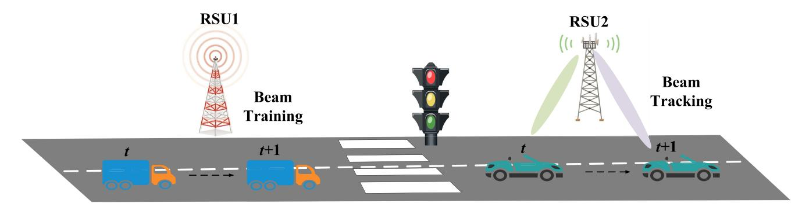

Fig. 8. Beam tracking and beam training in the V2I scenario.

algorithms were employed to continuously iterate and optimize the selection of the optimal beam. Loch et al. [\[196\]](#page-31-0) deployed fixed beams on both vehicles and RSUs and employed software-defined radio (SDR) to determine the vehicles' positions. This strategy aimed to maximize the time vehicles spent within the RSU range, thereby reducing the overhead of mmWave V2I beam alignment. Kose et al. [\[197\]](#page-31-1) incorporated vehicle movement context to devise an ML algorithm grounded on the multi-armed bandit (MAB) model, aiming to curtail beam switching frequency.

However, the existing literature primarily focuses on relevant information such as the target vehicle's position, without considering the potential impact of other vehicles on the alignment process.

To overcome this limitation, Wang et al. [\[128\]](#page-29-21), [\[198\]](#page-31-2) introduced an ML approach that incorporates the positional data of surrounding vehicles to pinpoint the ideal beam pair index. Their proposed method demonstrated impressive beam tracking capabilities when assessed using throughput rate and alignment probability metrics. Klautau et al. [\[199\]](#page-31-3) integrated a vehicle traffic simulator with a ray-tracing simulator to generate channel state parameters in 5G mmWave MIMO scenarios, simplifying data creation in complex mobile environments. They incorporated the location information of all vehicles as features and employed deep learning techniques to address the beam selection problem. However, their method overlooked the potential impact of environmental features, neglecting their influence on practical implementations. Feng et al. [\[200\]](#page-31-4) leveraged the vehicle's location information for beam alignment and quantitatively analyzed the effect of beam misalignment caused by positioning errors on link performance. They modeled and investigated the relationship between beam width and transmission rate, ultimately obtaining the optimal beam width through analytical optimization. Nevertheless, they did not consider the impact of blocked mmWave links, which can affect transmission reliability.

Va et al. [\[201\]](#page-31-5) proposed an online learning algorithm that incorporates coarse user positions and aggregated environmental information, along with a compliant protocol to maintain at least 95% optimal performance in complex environments. However, this algorithm's hardware requirements limit its applicability to general scenarios, necessitating the exploration of more universally applicable algorithms. In contrast, Sim et al. [\[202\]](#page-31-6) put forth a lightweight, context-aware online learning approach that harnesses coarse user location data. By processing received aggregates, the algorithm learns and acclimates to its surroundings, enhancing both cumulative data reception and vehicular service rates. Notably, this algorithm demonstrates commendable beam tracking efficacy, especially under LoS links. Nasim et al. [\[203\]](#page-31-7) addressed interference management for multiple vehicles by formulating the beam selection problem as a combinatorial MAB problem. Their approach enables accurate estimation of optimal beam pairs for multiple users and adaptation to changes in the vehicle environment. Similarly, Va et al. [\[127\]](#page-29-20) proposed an MABbased tracking framework that integrates location information. Their approach utilizes historical beam measurements stored at the BS to adapt the learning parameters during beam alignment attempts. By maintaining a database of beamlocation pairs, the BS can select a subset of beams that are suitable for the reported locations. Subsequently, beam sweeping is performed over this limited subset to identify the optimal beam index. Li et al. [\[204\]](#page-31-8), in a distinctive approach, married both physical and societal layer data, encompassing blockages and social ties, to conceive a dual-layer online learning challenge. This design empowers the mmWave BS to astutely glean from the CSI, allocating beam resources adeptly with minimal overhead. As a result, the synergy of cross-layer data is optimally leveraged, balancing hardware and cost constraints, and bolstering the viability of mmWave base stations in future networks. Nonetheless, it's pivotal to acknowledge that this beam-tracking paradigm can grapple with escalating complexity in its search domain. Specifically, an uptick in user numbers can trigger exponential growth in the search space.

Klautau et al. [\[130\]](#page-29-23) and Dias et al. [\[205\]](#page-31-9) employed light detection and ranging (LiDAR) data for LoS detection between RSUs and vehicles, reducing the training cost of beamforming. They utilized deep CNNs to process complex point cloud data from LiDAR. Brambilla et al. [\[206\]](#page-31-10) proposed the use of an antenna array equipped with inertial sensors to continuously track the beam during transmission, minimizing the need for frequent realignment and effectively reducing communication overhead and training time. Zhang et al. [\[129\]](#page-29-22) employed ray-tracing to obtain the optimal beam pair index for the current environment, encoding the scene. They combined ML algorithms to obtain the optimal beam pair. While beam tracking can minimize communication overhead through signaling interaction between RSUs and vehicles, periodic signaling interaction between RSUs and vehicles remains unavoidable. Furthermore, it is not advisable to use mmWave communication for sending feedback about the position and speed of vehicles to the RSU, as the Doppler spread can hinder beam sweeping and lead to communication failures [\[207\]](#page-31-11).

In order to eliminate the feedback process of beam tracking, Moon and Shim [\[208\]](#page-31-12) recently proposed a beam tracking framework that eliminates the feedback process by utilizing LSTM and computer vision (CV) techniques. By leveraging sensed images, the LSTM model accurately identifies the beam direction, eliminating the need for feedback and resulting in significant reductions in latency and energy consumption. Unlike conventional beam prediction methods, this CV-aided approach overcomes the limitations imposed by discrete pilot beams, enabling precise beam direction prediction in a continuous domain. The LSTM model learns the necessary adjustments for beam direction from the sequence of accurate beam directions, thereby maximizing the beamforming gain.

Additionally, the utilization of out-of-band information to facilitate fast mmWave beam selection has shown promising results by leveraging spatial congruence across different frequency bands [\[123\]](#page-29-16), [\[209\]](#page-31-13). Ray tracing simulations [\[210\]](#page-31-14) have enhanced our understanding of the coupled propagation characteristics in diverse frequency ranges. Notably, a strong angular correlation has been observed between mmWave and sub-6 GHz V2X channels. Anjinappa and Guvenc [\[211\]](#page-31-15) investigated the effects of moving vehicles on time-varying path loss, delay spread, and angular spreads, considering both LoS and NLoS trajectories. To enhance mmWave beam selection, Ali et al. [\[123\]](#page-29-16) extracted spatial information from the sub-6 GHz channel. However, limitations in ideal channel modeling and assumptions regarding initial access have hindered satisfactory beam tracking performance in mobile scenarios. Hashemi et al. [\[209\]](#page-31-13) addressed the challenges of high beam training overhead and link interruptions through secondary data transfer, utilizing spatial correlations with the sub-6 GHz channel. Nevertheless, their work lacks a concrete beamforming implementation and overlooks the adaptivity of training beam selection to channel conditions, as well as the temporal correlation of dynamic channels in beam tracking algorithms. To bridge these gaps, Lv et al. [\[124\]](#page-29-17) proposed a multi-frequency coordination-based beam tracking scheme to reduce the tracking overhead in highly dynamic V2X sidelink communications. Their approach involves designing optimal training beams that minimize the estimation error of channel spatial angle parameters. Additionally, they have introduced a weighted compressed beam tracking algorithm that incorporates sub-6 GHz channel spatial information and previous angle information as weights. Simulation results have demonstrated the efficacy of the proposed scheme in achieving lower training overhead and significant rate improvements, particularly in low SNR scenarios.

UAVs have a distinct advantage over terrestrial UE due to their easy monitoring and management capabilities. This advantage allows for the transmission of UAV position and trajectory information to the ground BS to assist in beam tracking, as shown in Fig. [9.](#page-16-0) position-aided beam tracking

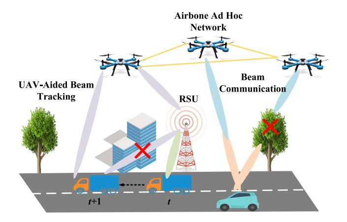

Fig. 9. UAVs serving as aerial bases.

proves highly efficient, especially in cases where an LoS path exists between the UAV and BS [\[212\]](#page-31-16), [\[213\]](#page-31-17), [\[214\]](#page-31-18). However, UAV-aided V2X communication does not adhere to the DSRC or C-V2X standards previously outlined in Section [II-C.](#page-7-1) While mmWave channel modeling for terrestrial V2X is well-established, air-to-ground (A2G) channel measurement in mmWave remains nascent [\[88\]](#page-28-31), predominantly following parameters proposed by 3GPP [\[49\]](#page-27-37) and ITU [\[50\]](#page-27-38), [\[78\]](#page-28-21).

Within UAV-assisted cellular systems that use beamforming to interact with ground vehicles, Jang et al. [\[215\]](#page-31-19) introduced a cooperative beam-tracking approach grounded in the extended Kalman filter (EKF). This model couples a monopulse signal-based EKF for tracking with a collaborative estimation algorithm, ensuring steadfast SNR even amidst intermittent link disruptions. Compared to traditional terrestrial networks [\[216\]](#page-31-20), [\[217\]](#page-31-21), multi-UAV frameworks display pronounced advantages. While terrestrial networks grapple with estimating moving targets' positions due to reflective paths, UAV networks, with their enhanced LoS accessibility, streamline position estimation [\[218\]](#page-31-22). Harnessing consistently tracked position data across UAV nodes, the distributed EKF aids all UAVs in cooperative target position tracking, ensuring top-tier link quality for mobile entities. Moreover, satellites emerge as potential aerial platforms for V2X, offering services in less-dense regions, complementing terrestrial networks. Recent satellite-aided V2X research has predominantly addressed computational offloading and resource allocation [\[219\]](#page-31-23), [\[220\]](#page-31-24), [\[221\]](#page-31-25), [\[222\]](#page-31-26), [\[223\]](#page-31-27), [\[224\]](#page-31-28), along with physical layer security [\[225\]](#page-31-29), [\[226\]](#page-31-30). Present V2X standards limit satellites to localization roles [\[227\]](#page-31-31). Parallel to UAV-assisted V2X, satellites can serve as aerial base stations for beam tracking. However, robust research is imperative to delineate channel traits between satellites and high-mobility vehicles. Integrating diverse communication mechanisms, such as PHY or MAC layer protocols, inherent in V2X and satellite communications also poses challenges.

*2) Predictive Beamforming:* For V2X communication scenarios, only tracking the beam is inadequate due to high mobility. It is imperative for the transmitter to possess predictive capabilities to meet critical latency requirements. The current research primarily concentrates on equipping

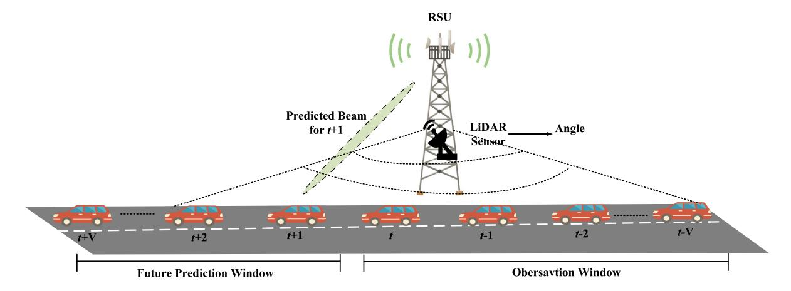

Fig. 10. The predictive beamforming in the V2I scenario.

RSUs with the ability to predict the beamforming angle for the next time slots. Fig. [10](#page-17-0) illustrates the predictive beamforming in the V2I scenario.

Currently, predictive beamforming in V2X communication relies primarily on simplified vehicle state evolution models and measurements from perception devices. Liu et al. [\[228\]](#page-31-32) introduced an EKF-based algorithm for beamforming prediction, leveraging radar information. This algorithm utilizes the dual functional radar communication (DFRC) signals in the downlink to extract the vehicle's state information from the echo reflected by the vehicle, thereby mitigating the communication overhead associated with uplink feedback. The proposed method not only ensures the desired sensing performance but also achieves a satisfactory sumrate [\[229\]](#page-31-33). However, the significant computational overhead of the EKF scheme renders its practical implementation unfeasible.

To fulfill the requirements of intelligent traffic applications, it is crucial to track not only the angular parameters but also the variations in other kinetic motion parameters such as speed and range. However, achieving highly accurate estimation results in EKF beam tracking necessitates a large number of pilots, leading to significant communication signaling overhead. Gonzalez-Prelcic et al. [\[230\]](#page-31-34) proposed radar-aided beam alignment, employing a distinct frequency band for the radar signal. Nonetheless, this approach results in increased spectral consumption. To overcome these challenges, Yuan et al. [\[231\]](#page-31-35) introduced a predictive beamforming scheme tailored to DFRC systems. This method effectively reduces signaling overhead and enhances angle estimation accuracy compared to conventional feedback-based beam tracking approaches. To precisely estimate the real-time motion parameters of vehicles, they developed a novel message-passing algorithm based on a factor graph, enabling near-optimal performance through maximum a posteriori estimation. Despite demonstrating improved predictive performance and lower algorithmic complexity in large-scale V2I networks compared to the EKF-based predictive beamforming algorithm in [\[228\]](#page-31-32), the presence of nonlinear functions associated with vehicle angles still requires a complex solving process in this algorithm.

To address the strong nonlinearity of the measurement functions and to improve the angle estimation performance, Ying et al. [\[232\]](#page-31-36) employed the particle filter algorithm to address challenging nonlinear problems. Unlike methods that rely on linearizations around current estimates, the particle filter algorithm approximates desired distributions using discrete random measures. This approach effectively reduces errors caused by linearization and enhances estimation performance. Similarly, Liu et al. [\[233\]](#page-31-37) proposed the convolutional LSTM recurrent neural network (CLRNet) for vehicle angle prediction in the context of predictive beamforming. The CLRNet incorporates both a CNN module and an LSTM module to leverage spatial features and temporal dependencies derived from historical vehicle angle estimates, enabling accurate angle prediction. Mu et al. [\[234\]](#page-31-38) introduced a neural network-based prediction model that utilizes echo signals received by RSUs as input to predict the beamforming angle for the next moment. This novel approach offers a solution for beamforming prediction in V2X communication scenarios. However, the model utilized in [\[233\]](#page-31-37), [\[234\]](#page-31-38) employs a basic fully connected neural network, and the prediction performance needs to be improved.

Furthermore, The methods proposed in [\[228\]](#page-31-32), and [\[231\]](#page-31-35) provide partial solutions for deploying DFRC in mmWave V2I networks. However, these methods adopt a twostage approach: predicting future communication channels and then performing beam alignment. This leads to disjoint beamforming designs that attempt to balance sensing and communication performance. The accuracy of channel prediction directly impacts the achievable beamforming performance. Furthermore, the two-stage mechanism used in [\[228\]](#page-31-32), and [\[231\]](#page-31-35) aligns the transmit beam only with the desired vehicle, neglecting the presence of multiple access interference, which ultimately degrades the system's sum rate.

To overcome these limitations, Zhang et al. [\[229\]](#page-31-33) introduced a DL framework that utilizes historical CSI data to directly predict the beamforming solution for future channels. Their approach aims to maximize the sum rate performance of a multiuser multi-antenna system. Similarly, Liu et al. [\[235\]](#page-31-39), [\[236\]](#page-31-40) employed a DL-based approach to develop a predictive

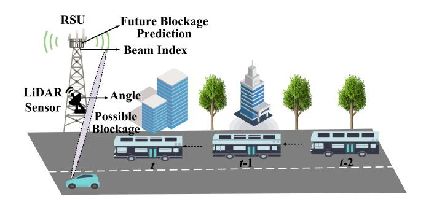

Fig. 11. The blockage prediction in the V2I scenario.

beamforming scheme for integrated sensing and communication (ISAC)-assisted V2I networks. Their scheme focuses on maximizing the average achievable system sum rate while ensuring accurate estimation of motion parameters for vehicles.

Most current research on predictive beamforming in vehicular networks is constrained by the assumption of vehicles moving along straight paths, limiting its applicability. To overcome this limitation and address the modeling complexities of non-linear trajectories, Liu and Masouros [\[237\]](#page-31-41) introduced a prediction model based on historical motion trajectory points of vehicles. Unlike methods that rely on explicit state evolution models, this approach does not assume vehicles to travel only along straight roads, thereby extending its applicability to diverse scenarios.

*3) Blockage Prediction:* Ensuring reliable communication in mmWave V2X networks is a major concern due to susceptibility to blockage in mmWave beamforming. Fig. [11](#page-18-0) illustrates the blockage prediction in the V2I scenario. Obstacles obstructing the mmWave beam at the predicted alignment angle by the RSU can lead to significant communication disruptions.

To address this, previous studies have explored the use of perception information for future blockage prediction. MLbased predictors are employed, leveraging communication link metrics and external features such as visual and location information [\[238\]](#page-31-42). Alrabeiah et al. [\[239\]](#page-31-43) introduced visionaided wireless communication (VAWC) using red-green-blue (RGB) images captured by cameras to predict mmWave beams. Nishio et al. [\[240\]](#page-32-0) proposed a solution using RGBdepth camera-captured images to accurately measure obstacle movement speed and user-obstacle distance for blockage prediction. Building upon the VAWC system and the visionwireless (ViWi) dataset, Alrabeiah et al. [\[241\]](#page-32-1) presented a mmWave vision-aided beam prediction scheme based on image classification. They incorporated single-frame images and processed the wireless channel and image information using a residual network. Visual information from cameras is integrated with other out-of-band channels at the mmWave base station, yielding favorable performance in single-user scenarios. In multi-user scenarios, Ying et al. [\[242\]](#page-32-2) utilized a multi-layer perceptron to develop an angle prediction model for estimating the relative angle of each user with respect to the camera. Charan et al. [\[243\]](#page-32-3) introduced a multi-modal ML approach that integrated positional and camera data from

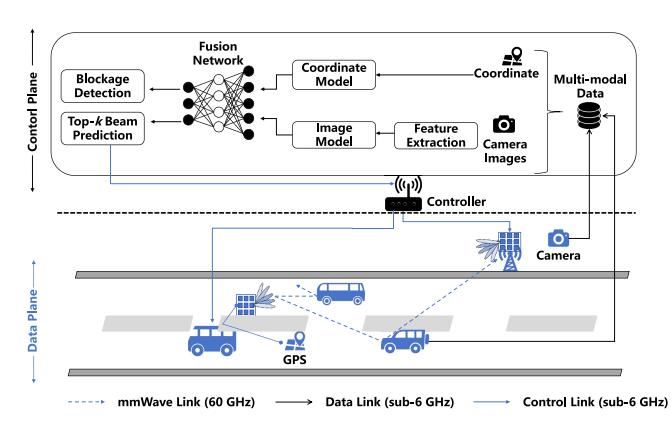

Fig. 12. Utilizing data fusion methodologies, visual and locational information is synergistically integrated. Distinct neural networks, each dedicated to a specific data type, process the inputs. These are then collectively synthesized through a fusion neural network which serves dual purposes: facilitating the selection of optimal beams and identifying potential blockages.

the wireless communication environment to enable rapid beam prediction. Reus-Muns et al. [\[244\]](#page-32-4) proposed a data fusion technique that combined information from visual edge devices and localization sensors to detect blockage conditions between transmitters and receivers (see Fig. [12\)](#page-18-1).

While the inclusion of image information in these works offers valuable insights for blockage prediction in vehicular networks, their ability to predict dynamic obstacles in complex scenarios remains limited. To overcome this limitation, Charan et al. [\[245\]](#page-32-5) presented a solution based on CNN and gated recurrent units (GRUs) to transform image and beam information into a temporal sequence format, enhancing the prediction accuracy of dynamic blockages. Similarly, Wu et al. [\[246\]](#page-32-6) employed pre-blockage wireless signatures to proactively forecast future dynamic blockages. Leveraging the feature extraction capability of the network architecture from continuous image streams further enhances the accuracy of dynamic blockage prediction. Yu et al. [\[247\]](#page-32-7) first utilized queuing theory to simulate the dynamism of vehicles, accounting for permanent and random blockages on roads to closely mirror real-world settings. Subsequently, they implemented the deep Q-network (DQN) framework, empowering the base station to discern the best beam selection strategy. Additionally, Zou et al. [\[248\]](#page-32-8) explored UAV-assisted V2X communication by leveraging the perception capabilities of UAVs. By matching information between vision and communication, they were able to reduce latency and communication overhead.

ML predictors pose a challenge as they typically rely on a substantial number of training samples specific to a deployment for accurate blockage dynamics learning. To overcome this limitation, Kalør et al. [\[249\]](#page-32-9) introduced a meta-learning-based approach for blockage prediction. Metalearning leverages observations from diverse deployments to optimize the inductive bias, enabling predictors like neural networks to be trained with fewer samples for new deployments, surpassing the requirements of traditional methods. Visual features have been shown to enhance predictor accuracy, but camera deployment may be impractical due to privacy and regulatory concerns, and visual/camera data is sensitive to lighting and weather conditions. To address these challenges, Demirhan et al. [250], [251] employed radar sensors to gather environmental and object-sensing information, enabling proactive prediction of future link blockages. LiDAR, widely used for high-resolution mapping and localization in autonomous vehicles, is also extensively utilized for mmWave V2X communication and blockage prediction. Wu et al. [252] developed an efficient CNN-based model that leverages LiDAR data for proactive prediction of moving link blockages. To improve ML model performance, a static cluster removal algorithm is presented for low-cost LiDAR sensor data. Similarly, Wu et al. [253] proposed a method that combines fused mmWave signals and LiDAR sensory data to proactively predict future dynamic LoS link blockages, achieving high accuracy and seamless integration with regular communication systems. Zecchin et al. [254] introduced a lightweight neural network architecture with corresponding LiDAR preprocessing, resulting in improved convergence speed and final accuracy. Recently, Nerini and Clerckx [255] tackled blockage detection and precoder design by eliminating communication overhead. They employed a physics-based graph neural network to classify the LiDAR point cloud. In contrast to previous works focusing on current beam prediction, Jiang et al. [256] proposed an efficient ML model that utilizes LiDAR data for predicting future beams, offering a promising solution for addressing beam alignment challenges in mmWave and terahertz communication systems.

Summary and discussion: Table VII presents a summary of research on side information beam tracking in mmWave V2X communication. Researchers have incorporated ML techniques, such as statistical learning methods and deep learning, to facilitate beam training and selection. Some methods utilize location information of other vehicles to enhance beam tracking, while others employ LiDAR data or inertial sensors for cost-effective and continuous tracking. Techniques that exploit out-of-band data and multi-frequency coordination have demonstrated notable efficacy in beam selection. Additionally, leveraging UAVs as aerial base stations for mmWave V2X communication enables beam tracking, considering the vehicles' high mobility, thereby improving link quality. Similar to UAV-assisted V2X communications, satellites can also serve as aerial base stations to assist in beam tracking, but related research is in its infancy [88], [227]. In general, these advancements in beam tracking techniques have the potential to greatly enhance the performance and efficiency of mmWave V2X communications.

Table VIII presents a summary of research on research on side information predictive beamforming in mmWave V2X communication. In mmWave V2X communication, predictive beamforming typically relies on Kalman filtering for feedback-based mmWave beam tracking. However, these approaches often use a limited number of pilots, and in some cases, only a single pilot [257], [258]. This limitation restricts the matched filtering gain needed for accurate angle estimation and can significantly degrade performance in vehicular applications requiring precise localization. Additionally, including pilot symbols in the communication block introduces overhead, reducing the transmission rate of valuable information.

While radar-aided beam alignment reduces communication overhead, solving the nonlinear functions related to vehicle angles remains complex. The particle filter algorithm addresses this nonlinearity and improves angle estimation. Moreover, leveraging the powerful feature extraction capabilities of DL enables learning from historical channel estimates and directly predicting the beamforming matrix for the next time slot, reducing system complexity.

Table IX presents a summary of research on side information blockage prediction in mmWave V2X communication. Many blockage prediction studies have used perception information to predict blockages, employing ML-based predictors that leverage communication metrics and external features like visual and location data. However, these methods have limitations in predicting dynamic obstacles in complex scenarios. To address this, a solution based on CNN and GRUs has been demonstrated to improve dynamic blockage prediction by transforming image and beam information into a temporal sequence format. Other approaches include using pre-blockage wireless signatures and exploring UAV-assisted V2X communication. Additionally, ML predictors face challenges with training samples, but meta-learning approaches optimize predictions with fewer samples. However, the effectiveness of meta-learning heavily depends on the availability of diverse and representative training data. Hence, the metalearned model may not perform well in real V2X situations. Moreover, the utilization of radar sensors and LiDAR data can overcome the constraints of camera deployment, enabling efficient models that combine mmWave signals and LiDAR data for proactive prediction of moving blockages, resulting in enhanced accuracy and integration with communication systems.

# IV. PERFORMANCE METRICS OF BEAM ALIGNMENT IN MMWAVE V2X COMMUNICATIONS

This section presents the performance metrics for beam alignment in mmWave V2X communications and evaluates the performance of four alignment methods against these metrics.

#### A. Beam Alignment Overhead

1) Beam Alignment Latency: In mmWave V2X networks, beam alignment latency corresponds to the time needed to complete the beam alignment process in V2I/V2V communication, starting from the initiation of a beam alignment request. This latency encompasses various steps, including sending the request, receiving the response, computing beam angles, and adjusting antenna directions.

IEEE 802.11ad utilizes a hierarchical beam codebook structure to minimize beam training overhead [121], [122]. The standard imposes a restriction that the antenna gain of the widest beam (quasi-omni pattern) should not exceed 15 dB lower than a directional pattern [121]. To meet this requirement, a two-level beam codebook is adopted, comprising the quasi-omni and sector levels. For simplicity, we assume the number of codewords at the sector level equals the array's element count, denoted as  $N_a$ . Given that the gain in the main beam direction of an array is  $N_a$ , we can establish  $N_{\rm sec} = N_a$ 

TABLE VII CLASSIFICATION OF STUDIED PAPERS ON SIDE INFORMATION-ASSISTED BEAM TRACKING IN MMWAVE V2X COMMUNICATION

| Ref.  | Algorithm                                | Sensor          | Objective                                                                                                                                          | Metrics                                                              | Performance                                                                                                                                                                                    |
|-------|------------------------------------------|-----------------|----------------------------------------------------------------------------------------------------------------------------------------------------|----------------------------------------------------------------------|------------------------------------------------------------------------------------------------------------------------------------------------------------------------------------------------|
| [123] | OMP                                      | -               | Using spatial information extracted at sub-6 GHz to help establish the mmWave link.                                                                | Effective achievable rate                                            | The out-of-band aided beam-selection can considerably reduce the training overhead of in-band only beam selection.                                                                             |
| [124] | CS                                       | -               | Reduce the tracking overhead of high dynamic V2X sidelink communications.                                                                          | Effective achievable rate                                            | The proposed scheme can provide a higher effective achievable rate with a small number of measurements when SNR is below a certain value.                                                      |
| [125] | ML                                       | -               | Develop an efficient beam alignment method suitable for a V2I setting.                                                                             | Power loss probability, Misalignment probability, Average rate | Have demonstrated that side information can be exploited to improve the efficiency of mmWave communications, which is not only desirable but also necessary in vehicular settings. |
| [126] | ML                                       | -               | Using a vehicle's position along with past beam measurements to rank desirable pointing directions.                                                | Misalignment probability                                             | Leveraging position and past beam measurements, the beam configuration overhead can be reduced.                                                                                                |
| [127] | MAB                                      | -               | Find the beam pair that provides the strongest received power.                                                                                     | Average power loss probability, Average gain                      | Combining the two proposed solutions together can gain up to about 1.5dB over the received power obtained by exhaustive search over the original beam codebook before refinement.              |
| [128] | Random forest                         | -               | Develope a situational awareness-aided beam training solution using machine learning in mmWave V2I communication.                      | Alignment probability, Achieved throughput ratio                  | The situational awareness-assisted beam selection using machine learning is able to provide beam prediction, with accuracy that increases with more complete knowledge of the environment.     |
| [129] | ML                                       | -               | To find the optimal beam pair.                                                                                                                     | Alignment probability                                                | This method effectively reduces the beam search overhead, enhancing beam search efficiency while ensuring beam search accuracy.                                                       |
| [130] | DL                                       | LiDAR           | To show how LiDAR data can be used for LoS detection and to reduce the overhead in mmWave beam selection.                                          | Throughput ratio                                                     | Have demonstrated that LiDAR can be used for LoS detection and to reduce the mmWave beam-selection overhead in V2I scenarios.                                                                  |
| [199] | DL                                       | -               | Generate channel realizations representing 5G scenarios with mobility of both transceivers and objects.                                            | Average reward                                                       | Using deep learning in classification, regression and reinforcement learning problems illustrate the use of datasets generated with the proposed methodology.                                  |
| [200] | Approximation algorithm                  | -               | Leverage the position information for beam alignment in V2V communication and optimizes antenna's beamwidth to obtain higher throughput.           | Average throughput                                                   | The proposed methods can achieve higher transmission throughput than the traditional method.                                                                                                   |
| [203] | CMAB                                     | -               | Maximize the overall network throughput for multi-vehicular communications.                                                                        | Throughput                                                           | The proposed two strategies approach the optimal achievable rate.                                                                                                                              |
| [205] | ML                                       | LiDAR           | Developed centralized LiDAR architectures for mmWave beam selection.                                                                               | Alignment probability, Throughput ratio                           | The proposed architecture provides robust performance irrespective of car penetration rate, outperforming the single LIDAR at BS and position-based solutions.                                 |
| [206] | -                                        | Inertial sensor | Exploits a-priori information on array dynamics provided by an inertial sensor on transceivers to assist the beam alignment procedure. | Throughput                                                           | The proposed method shows a significant gain in terms of V2V communication throughput with respect to conventional beam alignment protocols.                                                   |
| [208] | LSTM                                     | Camera          | To propose a LSTM-based beam tracking framework assisted by CV technique.                                                                    | Beamforming gain, Data rate                                          | The beamforming gain is improved.                                                                                                                                                              |
| [209] | Multiple signal classification algorithm | -               | Achieve maximum mmWave throughput with bounded delay performance.                                                                                  | Throughput, Delay                                                    | Their scheduler provides a bounded mmWave delay performance, while it achieves a similar t hroughput performance as the throughput-optimal policies.                                           |
| [215] | EKF                                      | -               | To proposed the distributed beam tracking protocol for a UAV ad hoc cellular network system.                                              | SNR                                                                  | The performance of distributed estimation network is comparable to the centralized beam tracking, and the resilient network control can respond to LoS channel blockage or node failure.       |

and  $N_{QO}=\frac{N_{\rm sec}}{32}$ . Here  $N_{\rm sec}$  represents the number of sector beams, while  $N_{QO}$  denotes the number of quasi-omni patterns.

Since the quasi-omni patterns are the widest, an exhaustive search identifies the optimal quasi-omni pair. IEEE 802.11ad employs a low complexity single-sided search to find the best receive and transmit sectors. During this search, the transmitter uses the best transmit quasi-omni pattern while the receiver sweeps over sectors within the range of the best receive quasi-omni pattern. The same process is repeated to identify the best transmit sector. The total beam training time, excluding feedback, is computed as the sum of the training frame duration at the quasi-omni level  $T_{QO}$  and the sector

level  $T_{\rm sec}$ , as described by

$$T_{11ad} = N_{QO}^2 T_{QO} + 2 \frac{N_{\text{sec}}}{N_{QO}} T_{\text{sec}},$$
 (7)

where we assume each quasi-omni pattern covers an equal number of sectors. Notably, quasi-omni patterns have lower antenna gain, requiring a larger spreading factor for compensation. In IEEE 802.11ad, a spreading factor of  $32\times$  is employed. Beam training at the quasi-omni level involves transmitting a sector sweep frame lasting 26.8  $\mu$  s, comprising a preamble (4.3  $\mu$  s) and header/information (22.5  $\mu$  s). Assuming the

TABLE VIII CLASSIFICATION OF STUDIED PAPERS ON SIDE INFORMATION-ASSISTED PREDICTIVE BEAMFORMING IN MMWAVE V2X COMMUNICATION

| Ref.            | Algorithm                         | Sensor | Objective                                                                                                                           | Metrics                                            | Performance                                                                                                                                                                                                   |
|-----------------|-----------------------------------|--------|-------------------------------------------------------------------------------------------------------------------------------------|----------------------------------------------------|---------------------------------------------------------------------------------------------------------------------------------------------------------------------------------------------------------------|
| [228]           | EKF                               | Radar  | Investigate a radar-assisted predictive beamforming design for V2I Achieve sum rate communication by exploiting the DFRC technique. |                                                    | The proposed DFRC based beam tracking approach significantly outperforms the communicationally feedback based technique in the tracking performance.                                                          |
| [229]           | LSTM                              | -      | Maximize the sum rate performance of a multiuser multi-antenna system.                                                              | Sum rate                                           | The proposed DL-based solution achieves significantly higher effective sum rate.                                                                                                                              |
| [230]           | Compressive covariance estimation | Radar  | Steer the beams between some of the arrays in the vehicle and the BS relying on information extracted from the radar signal.        | Relative path gain, sum spectral, efficiency | Have confirmed that radar can be a useful source of side information that helps configure the mmWave V2I link.                                                                                                |
| [231]           | Factor graph                      | Radar  | Reduce the latency as well as the signaling overhead.                                                                               | Misalignment probability                           | The proposed beamforming scheme is superior to the feedback-based approach in terms of both estimation and communication performance.                                                                         |
| [232]           | Particle filter (PF)              | Radar  | To resolve the beam misalignment problem between RSUs and high dynamic passing vehicles.                                            | Tracking performance of the angle and distance     | The proposed algorithm can reduce the overhead and predict the vehicle motion parameters and the vehicle's angle relative to the RSU when the vehicle is moving.                                              |
| [233]           | CLSTM                             | Radar  | To improve the prediction accuracy.                                                                                                 | Average achievable sum rate                        | Have demonstrated that the developed method is robust to the estimation error and can significantly outperform the state-of-the-art benchmarks, achieving an excellent sum rate performance for ISAC systems. |
| [234]           | DL                                | Radar  | To further reduce the estimation error due to the nonlinear measurements.                                                           | Achievable sum rate                                | The proposed approach can improve the estimation performance and maintain reliable communications in high-mobility vehicular networks.                                                                        |
| [235], [236] | DL+LSTM                           | Radar  | To realize an effective beamforming design in ISAC.                                                                                 | Average achievable sum rate                        | The proposed method not only guarantees the required sensing performance but also achieves a satisfactory sum-rate.                                                                                           |
| [237]           | Multiple signal classification    | Radar  | To predict the next position of the vehicle, without specifying a state model.                                                      | Average achievable rate                            | The proposed technique outperforms the conventional benchmark schemes in terms of the achievable communication rate.                                                                                          |

preamble remains unchanged for synchronization, *T*sec is set as 5.0 μ *s* [\[125\]](#page-29-18).

Va et al. [\[125\]](#page-29-18) defined beam alignment overhead as the minimum number of training beam pairs, denoted as *N*fp, required to achieve a power loss probability of ≤ 1%. It is important to note that in their approach they only focus on the beam training overhead. Since wide beams are not employed for the beam training process, we make the assumption that the training duration is represented by *T*sec, thereby leading to a total training time denoted as

$$T_{fp} = N_{fp} T_{\text{sec}}.$$
 (8)

Additionally, there are also studies that consider feedback latency in beam alignment. The hierarchical beam alignment (HBA) algorithm is proposed by Wu et al. [\[259\]](#page-32-19) to reduce the beam alignment latency, which selects the optimal beam without prior channel knowledge by leveraging information from neighboring beams. Hassanieh et al. [\[141\]](#page-29-34) introduced another algorithm named Agile-Link, which utilizes phase shifters to generate random multi-armed beams that scan multiple directions simultaneously, providing sufficient information to determine received signal strength (RSS) in all spatial directions and effectively reducing latency.

Table [X](#page-23-0) illustrates the beam alignment delay in scenarios with one user and four users, as reported in [\[259\]](#page-32-19) and [\[141\]](#page-29-34). As anticipated, the latency of beam alignment increases with the number of beams. The two proposed algorithms demonstrate significant reductions in beam alignment latency compared to the standard method employed in IEEE 802.11ad. While increasing the number of antennas in the array allows for a greater number of beams, thereby enhancing the accuracy and reliability of beam alignment, it is crucial to acknowledge the associated costs and complexity. Moreover, achieving a larger number of beams necessitates additional computational and processing capabilities, which impact system performance and power consumption. Hence, careful selection of the appropriate antenna array and beam quantity, considering specific application requirements and resource constraints, is essential for achieving optimal beam alignment performance.

*2) Effective Achievable Rate:* To accurately assess the actual rate experienced by vehicle users, we must account for the time overhead associated with channel training and beamforming design. This is achieved through the effective achievable rate metric, which measures the rate at which communication can effectively take place through the aligned beam. It serves as a crucial performance metric that directly impacts communication quality, with beam alignment accuracy playing a key role. Higher accuracy in beam alignment leads to increased data transmission rates, improving overall efficiency.

TABLE IX
CLASSIFICATION OF STUDIED PAPERS ON SIDE INFORMATION-ASSISTED BLOCKAGE PREDICTIVE BEAMFORMING IN MMWAVE V2X COMMUNICATION

| Ref.           | Algorithm        | Sensor           | Objective                                                                                                                                                                   | Metrics                                                                                | Performance                                                                                                                                                                                |
|----------------|------------------|------------------|-----------------------------------------------------------------------------------------------------------------------------------------------------------------------------|----------------------------------------------------------------------------------------|--------------------------------------------------------------------------------------------------------------------------------------------------------------------------------------------|
| [239]          | DL               | LiDAR/ Camera | Introduced the ViWi dataset generation framework for the vision aided wireless communications.                                                                              | -                                                                                      | This framework does not only offer a way to generate training and testing datasets but helps assess the quality of different ML-powered solutions.                                         |
| [240]          | -                | Camera           | To utilize the image information captured by RGB-D to achieve blockage prediction.                                                                                          | Throughput                                                                             | The proposed system successfully predicts human blockage and enables other path to occupy the entire bandwidth by stopping the traffic on the blocked path proactively.                    |
| [241]          | DL               | Camera           | To predict mmWave beams and blockages directly from the camera RGB images and the sub-6GHz channels.                                                                        | Blockage prediction, Accuracy                                                       | The proposed DL model is capable of achieving over 90% beam prediction accuracy.                                                                                                           |
| [242]          | DL               | Camera           | To achieve a low-overhead beam prediction scheme for vision-aided mmWave wireless communications.                                                                           | Blockage prediction, Accuracy                                                       | The proposed scheme has the lower overhead, higher accuracy and better scalability.                                                                                                        |
| [243]          | ML               | Camera           | To reduce the beam training overhead.                                                                                                                                       | Top-k accuracy                                                                         | The developed model achieved more than 75% success probability in predicting the optimal beam without any beam training overhead, and the top-3 beam prediction accuracy is close to 100%. |
| [244]          | ML               | Camera           | To reduce the beam selection overhead and detect blockage conditions between transmitters and receivers.                                                              | Throughput ratio, Beam selection time, Top-k accuracy                                  | The proposed approach provides a reduction of 97.7% beam selection overhead while maintaining a throughput ratio of 97.8%.                                                                 |
| [245]          | CNN              | Camera           | To predict whether that user will be blocked within a window of future instances or not.                                                                                    | Top-k accuracy, Average achieve data rate, Average latency                       | The proposed solution is capable of proactively predicting blockages.                                                                                                                      |
| [246]          | DL               | Camera           | To predict the presence of blockage, the timing of blockage occurrence, and estimate the duration of blockage intervals and the direction of blockage movement. | Received power, top-k accuracy, Blockage prediction accuracy, Average latency | The proposed method can achieve high precision and accuracy in blockage prediction.                                                                                                        |
| [248]          | YOLOv5           | Camera           | To reduce the communication overhead of block transmission caused by the high mobility of the target vehicles and the UAV.                                                  | Achieve rate, Energy efficiency                                                        | The proposed algorithm achieves significant performance gains on both the effective achievable rates and the energy efficiency.                                                            |
| [249]          | Meta learning | Camera           | To mitigate the data requirements for ML training samples.                                                                                                                  | Prediction time                                                                        | The proposed predictor is able to predict blockages after observing fewer samples.                                                                                                         |
| [250]          | DL               | Radar            | To guide the mmWave beam prediction and significantly reduce the beam training overhead.                                                                                    | Beam prediction accuracy                                                               | The proposed algorithms are able to achieve around 90% top-5 beam prediction accuracy while saving 93% of the beam training overhead.                                                      |
| [252] [253] | CNN              | LiDAR            | To enhance the network reliability and latency.                                                                                                                             | Top-k blockage, Prediction accuracy, Average latency                             | The introduced method can achieve 95% accuracy in predicting blockages happening within 100ms and more than 80% prediction accuracy for blockages happening within one second.             |
| [254]          | DL               | LiDAR            | To reduce the search overhead of iterative beam discovery procedures.                                                                                                       | Top-k accuracy, Top-k throughput ratio                                                 | The proposed method considerably reduces the beam search time required to achieve a desired throughput.                                                                                    |
| [255]          | GNN              | LiDAR            | To address the problems of blockage detection and precoder design by completely removing the communication overhead.                                                        | Achieve rate, Achieve rate ratio                                                       | The proposed analog precoding outperforms previous works exploiting LiDAR for precoder design.                                                                                             |
| [256]          | ML               | LiDAR            | To leverage LiDAR sensory data to aid the mmWave beam prediction and tracking tasks.                                                                                  | Average accuracy, Training overhead                                                 | The proposed LiDAR beam prediction and tracking approach can achieve high accuracy performance.                                                                                            |

Additionally, the effective achievable rate is influenced by factors such as SNR and multipath effects.

Given the system and channel models, the user achievable rate is expressed as

$$R = \frac{1}{K} \sum_{k=1}^{K} \log_2 \left( 1 + \frac{P_{tavg} P_{i,j}}{K \sigma^2} \right), \tag{9}$$

where K denotes the number of subcarriers,  $P_{tavg}$  represents the average total transmit power, and  $P_{i,j}$  corresponds to the received signal power when utilizing the beam pair (i, j). The

effective achievable rate is expressed as [123], [124]

$$R_{eff} = \eta R. \tag{10}$$

where  $\eta=\max(0,1-\frac{N_{RX}\times N_{TX}}{T_c})$  denotes the effective data transmission time, while  $N_{RX}$  and  $N_{TX}$  denote the number of antennas at the receiver and transmitter, respectively.  $T_c$  represents the channel coherence time in OFDM blocks. By considering the channel coherence of  $T_c$  blocks and  $N_{RX}\times N_{TX}$  blocks for training, we account for the fraction of time/blocks allocated for data transmission with

TABLE X
BEAM ALIGNMENT LATENCY FOR DIFFERENT ARRAY SIZE AND DIFFERENT NUMBER OF BEAMS [147], [259]

| Array Size | Numbers of Beams | One User |        |            | Four Users |        |            |
|------------|------------------|----------|--------|------------|------------|--------|------------|
| Allay Size | Numbers of Beams | 802.11ad | HBA    | Agile-Link | 802.11ad   | HBA    | Agile-Link |
| 8          | 16               | 0.51ms   | 0.48ms | 0.44ms     | 1.26ms     | 1.19ms | 1.20ms     |
| 16         | 32               | 1.01ms   | 0.59ms | 0.51ms     | 2.53ms     | 1.47ms | 1.26ms     |
| 32         | 64               | 2.02ms   | 0.65ms | -          | 103.03ms   | 1.63ms | -          |
| 64         | 128              | 4.04ms   | 0.76ms | 0.89ms     | 304.04ms   | 1.89ms | 2.40ms     |
| 128        | 256              | 106.07ms | 0.94ms | 0.95ms     | 706.07ms   | 2.35ms | 2.46ms     |
| 256        | 512              | 310.11ms | -      | 1.01ms     | 1510.11ms  | -      | 2.53ms     |

TABLE XI
COMPARATIVE ANALYSIS OF BEAM ALIGNMENT METHOD

| Method                 | Beam Align           | ment Overhead             | Beam Alignment Accuracy |                       |                  |
|------------------------|----------------------|---------------------------|-------------------------|-----------------------|------------------|
| Wictiod                | Beam Alignment Delay | Effective Achievable Rate | Power Loss              | Alignment Probability | Throughput Ratio |
| Beam Sweeping          | High                 | Lower                     | Significant             | Medium                | Compromised      |
| AoA/AoD Estimation     | Lower                | Higher                    | Lower                   | High                  | Improved         |
| Black-box Optimization | Variable             | Balanced                  | Can be minimized        | High                  | Generally good   |
| Side Information       | Lower                | Higher                    | Lower                   | Very high             | High             |

TABLE XII
RESEARCH DIRECTIONS ON BEAM ALIGNMENT IN MMWAVE V2X COMMUNICATIONS

| Research Directions                                                     | Key Points and Challenges                                                                                                                                                                                                                                                                                                                                                                                                                                                                                                                                                                                        |
|-------------------------------------------------------------------------|------------------------------------------------------------------------------------------------------------------------------------------------------------------------------------------------------------------------------------------------------------------------------------------------------------------------------------------------------------------------------------------------------------------------------------------------------------------------------------------------------------------------------------------------------------------------------------------------------------------|
| ML-based Beam Alignment                                              | <ul> <li>The availability of datasets for training ML models is limited.</li> <li>Environmental changes caused by UE mobility and/or surrounding mobility can negatively impact the performance of learning models.</li> <li>There exists a trade-off between beam alignment accuracy and computational complexity of the ML algorithm.</li> </ul>                                                                                                                                                                                                                                                               |
| Adaptation of Beamwidth Size                                            | The impact of high-speed vehicle mobility and rapidly changing distances between the communication receiver and the relative RSU on the beam coverage range.                                                                                                                                                                                                                                                                                                                                                                                                                                                     |
| Sensing-Aware Channel Measurement                                 | Generalization and adaptability of channel estimation algorithms in complex multi-scenario environments.                                                                                                                                                                                                                                                                                                                                                                                                                                                                                                         |
| Mobility Prediction                                                     | Constructing novel estimation algorithms that accurately predict the future positions and velocities of objects in the communication environment.                                                                                                                                                                                                                                                                                                                                                                                                                                                                |
| UAV-aided V2X Communication                                          | Channel states exhibit distinct variations compared to terrestrial communication.     Further research is required to develop lightweight and energy-efficient beam alignment algorithms with minimal power consumption.                                                                                                                                                                                                                                                                                                                                                                                         |
| IRS for Beam Alignment                                               | <ul> <li>Channel modeling should incorporate parameters such as the reflection, absorption, and scattering characteristics of IRS elements.</li> <li>When implementing IRS hardware, factors such as complexity, cost, and power consumption should be carefully considered.</li> <li>Optimal locations and coverage areas should be taken into account during the deployment of IRS.</li> </ul>                                                                                                                                                                                                                 |
| Future Research Avenues for Established Beam Alignment Methods | <ul> <li>Beam sweeping: Adapting to real-time changes in the environment; Efficiently predicting sweeping sequences using ML.</li> <li>AoA/AoD estimation: Accurate estimations in diverse terrains; Integrating data from varied sensors; Dynamically recalibrating estimates in changing vehicular environments.</li> <li>Black-box optimization: Adapting optimization strategies in real-time; Balancing lower layer (PHY) and higher layer metrics.</li> <li>Side information: Utilizing IoT data for enhanced beam alignment; Integrating dynamic vehicular context into alignment predictions.</li> </ul> |

 $1-\frac{N_{RX}\times N_{TX}}{T_c}.$  Thus,  $\eta$  captures the loss in achievable rate resulting from the training process.

#### B. Beam Alignment Accuracy

1) Power Loss: Power loss occurs when the alignment of beams between the transmitter and receiver is compromised, indicating the degree of misalignment. It is quantified as the ratio of channel strength between the selected beam pair s and the optimal channel strength given by [125], [126], [127]

$$\xi = \frac{\max_{i \in \mathcal{B}} \gamma_i}{\gamma_s}.\tag{11}$$

The set  $\mathcal{B}$  represents all possible beam pairs in the codebook, while the beam pair s is chosen from the selection set  $\mathcal{S}(\mathcal{S} \subset \mathcal{B})$  using accurate beam training, where  $s = \arg\max_{i \in \mathcal{S}} \gamma_i$ . It is important to note that this definition assumes minimal measurement noise. In this context, the parameter  $\xi$  approaches 1 for a "good" beam pair and approaches 0 for a "bad" one.

Misalignment of the beam results in power loss in an unintended direction, causing a decline in SNR and system capacity. Thus, minimizing power loss is important for achieving optimal system performance. The probability of power loss

is defined as the probability that  $\xi$  surpasses a threshold value  $c(c \ge 1)$ , as expressed in

$$P_{p1}(c,\mathcal{S}) = \mathbb{P}[\xi > c]. \tag{12}$$

Specifically, when c=1 it is referred to as the misalignment probability. Another relevant concept is the probability of being optimal, denoted by

$$P_{opt}(\mathcal{S}) = \mathbb{P}[i^* \in \mathcal{S}],\tag{13}$$

where  $i^* = \arg\max_{i \in \mathcal{B}} \gamma_i$  represents the index of the optimal beam pair. Additionally, equation (14) illustrates the relationship involving  $P_{opt}(\mathcal{S})$  in the optimal beam selection method, which can be expressed as [125], [126], [127]

$$P_{opt}(\mathcal{S}) = \mathbb{P}[\xi = 1]$$

$$= 1 - \mathbb{P}[\xi > 1]$$

$$= 1 - P_{p1}(1, \mathcal{S}). \tag{14}$$

2) Alignment Probability: Beam alignment probability is one of the key metrics for evaluating beam alignment performance. It represents the probability of accurately aligning the receiver's beam with the transmitter's beam within a specified tolerance. A higher alignment probability indicates superior beam alignment performance, leading to improved reliability and transmission rates in the communication system. Let  $c_i$  denote the predicted beam pair index of the i-th data sample in the test dataset, and  $s_i$  represent the index of the optimal beam pair. The alignment probability can be expressed as [128], [129]

$$P_{(1)} = \frac{1}{l} \sum_{i=1}^{l} \mathbf{1}(c_i = s_i), \tag{15}$$

where the value of  $\mathbf{1}(\cdot)$  is accumulated as 1 when the two numbers are equal.

When recommending multiple beams and denoting the recommended beam set for the i-th sample as l, the alignment probability can be quantified as the top-K error [128]:

$$P_{(K)} = \frac{1}{l} \sum_{i=1}^{l} \mathbf{1}(s_i \in R_i).$$
 (16)

In practical applications, achieving a beam alignment probability of 100% is challenging due to factors such as weather conditions, multipath effects, and noise. Therefore, optimizing beam alignment algorithms and parameter settings is crucial while maintaining a high alignment probability to achieve superior performance.

3) Throughput Radio: In scenarios where beams are physically close together, especially when employing a large antenna array, the difference in received powers among the top beam reference signals can be negligible. As a result, researchers have proposed evaluating the attained throughput using the predicted beam pair [128], [130], [205], [244], [254]. Let  $p_i$  denote the beam power. The achieved throughput ratio can be expressed as

$$RT = \frac{\sum_{i=1}^{l} \log_2(1 + p_i[c_i])}{\sum_{i=1}^{l} \log_2(1 + p_i[s_i])},$$
 (17)

where the numerator signifies the throughput achievable by considering only the top-K beams, while the denominator represents the optimal throughput achieved by selecting the beam pair with the highest performance through exhaustive beam search.

Summary and Discussion: Table XI offers a comprehensive comparison of four beam alignment strategies, assessed against five pivotal performance metrics. As can be seen from the table, beam sweeping is straightforward yet timeintensive, requiring an exhaustive exploration of all beam directions. This thoroughness leads to increased alignment delays and associated power loss. AoA/AoD estimation stands out for its speed, dramatically cutting down on alignment delays and power loss by offering immediate angle estimates. Its effectiveness, however, hinges on the accuracy of these angle estimations, making its performance somewhat variable. Black-box optimization showcases adaptability. Its performance depends on the specific optimization algorithm employed. This flexibility allows for a tailored alignment process, adjusting alignment delay and accuracy to achieve a balanced throughput ratio. Its performance is situationally optimized, demanding a case-by-case assessment. Side Information is distinguished by its efficiency and precision. By leveraging additional, contextually relevant data, it accelerates the alignment process, reducing both delay and power loss. This method excels in alignment probability and throughput ratio, making it exceptionally effective in reducing overhead while ensuring accuracy.

#### V. RESEARCH DIRECTIONS

Beam alignment plays a crucial role in mmWave V2X communication, facilitating high-speed data transmission and low-latency communication within vehicular networks. However, ensuring reliable beam alignment poses significant challenges in highly dynamic and harsh vehicle environments, including factors such as high mobility, adverse weather conditions, and intense interference. Consequently, it is imperative to conduct further research to address these challenges and enhance the performance of beam alignment in mmWave V2X communication. This section presents several promising research directions that warrant exploration in this domain. Table XII summarizes these directions.

#### A. ML-Based Beam Alignment

ML techniques offer the advantage of learning from historical data and adapting to dynamic environmental conditions, making them valuable for beam alignment in mmWave V2X communication. ML algorithms trained on large vehicular communication datasets can optimize beamforming vectors, reducing latency and improving reliability. RL-based algorithms adjust beamforming vectors based on environmental feedback to maximize rewards, while DL techniques like CNNs and RNNs learn complex spatial and temporal patterns. CNNs extract features from RSSI and predict optimal beamforming vectors, while RNNs adapt vectors in real time to vehicular communication dynamics. In addition to RL and DL techniques, supervised, unsupervised, and transfer learning

have also shown great potential. SL algorithms utilize labeled vehicular communication datasets, unsupervised learning discovers patterns in unlabeled datasets, and transfer learning enhances beam alignment by retraining a subset of DNN layers for knowledge transfer.

Despite promising results achieved by ML-based beam alignment techniques, there are still challenges to be addressed. The limited availability of large-scale labeled datasets impedes ML model training. Real-time adaptation of beamforming vectors to dynamic vehicular communication environments poses another challenge. Furthermore, the computational complexity of ML algorithms poses difficulties in resource-constrained systems. Researchers must carefully assess the performance-complexity tradeoff in ML-based beam alignment frameworks.

### *B. Adaptation of Beamwidth Size*

In mmWave V2X communication, a fixed-width beam is insufficient to maintain continuous coverage of the communication receiver due to varying distances between vehicles and RSUs. However, existing research on beam tracking and beamforming prediction largely overlooks the changing size of vehicles relative to RSUs in practical scenarios. This neglect results in a lack of consideration for the dynamic beam width requirements, leading to misalignment between RSUs and vehicles. Consequently, communication rates decrease and the establishment of a V2I link may fail. Existing research lacks addressing the issue of beam coverage range in relation to the evolving size of vehicles relative to RSUs in practical applications. Future research should explore methods to achieve high-dynamic-width adjustment of beamforming prediction by leveraging perception information.

#### *C. Sensing-Aware Channel Measurement*

The current perception-assisted channel estimation primarily utilizes a limited set of perception information, mainly vehicle position and velocity. To enhance estimation performance and reduce computational cost, it is crucial to investigate the effective utilization of more complex perception information, such as LiDAR and images. This research question holds significant importance in perception-based channel estimation.

#### *D. Mobility Prediction*

Accurate mobility prediction is crucial for successful beam alignment in vehicular networks. While existing research has focused on macroscopic models for vehicle mobility, the microscopic modeling of vehicle motion remains understudied. This highlights the need to develop precise prediction models considering factors like historical data, real-time sensor information, and environmental conditions. Employing effective algorithms like Kalman filtering and particle filtering enables accurate estimation of future positions and velocities in the communication environment. Moreover, cooperative communication facilitates the sharing of motion-related information among vehicles, enhancing the accuracy of future motion prediction and improving beam alignment performance in V2V scenarios.

### *E. UAV-Aided V2X Communication*

In UAV-assisted V2X communication, UAVs serve as aerial relays or airborne base stations, forging connections between vehicles or between vehicles and ground-based RSUs. One distinct advantage of UAV-assisted communication is its agility. Unlike conventional terrestrial communication, UAVs can swiftly adjust their positions to navigate around obstructions, optimizing channel quality [\[260\]](#page-32-20). This mobility is especially valuable in dense urban environments, where UAV-assisted networks can substantially boost the coverage and service quality of terrestrial systems. The ability of UAVs to rapidly react to link interruptions also means they can readily establish LoS paths, streamlining beam alignment in V2X communication. However, it's crucial to recognize that UAV-assisted V2X communications don't neatly fit within the traditional DSRC or C-V2X frameworks. Current protocols may need modifications, or new approaches might be necessary, to ensure optimal performance in the aerial domain.

A key challenge in UAV-assisted V2X communication is the dynamic motion of UAVs. Unlike traditional terrestrial communication, UAVs exhibit three-dimensional movement and directional changes, leading to rapid channel variations. Conventional beamforming techniques may prove ineffective in such scenarios, necessitating the development of new technologies to address the unique challenges posed by UAV-assisted V2X communication. Furthermore, the limited battery life and weight constraints of UAVs restrict the size and computational capabilities of onboard hardware. This poses difficulties in implementing complex beam alignment algorithms directly on UAVs. Therefore, lightweight and energy-efficient beam alignment algorithms that operate on UAVs without excessive power consumption are imperative.

#### *F. Intelligent Reflecting Surface (IRS) for Beam Alignment*

The wireless channel has traditionally been viewed as stochastic and beyond control. However, the introduction of the IRS has revolutionized this perception by enabling programmable manipulation of the propagation environment. In mmWave communication, blockage poses a significant challenge due to high penetration loss, which can be effectively mitigated through the utilization of IRS. By manipulating the reflected signals from IRS elements, signal strength can be enhanced, interference can be suppressed, and NLoS beamforming can be achieved (see Fig. [13\)](#page-26-12). Precise channel modeling plays a crucial role in optimizing IRS systems, as beam alignment performance heavily relies on channel characteristics in millimeter-wave V2X communication. Future research should incorporate additional parameters, such as the reflection, absorption, and scattering characteristics of IRS elements, into channel modeling. Furthermore, the implementation of IRS hardware should consider factors like complexity, cost, and power consumption. The deployment of the IRS should carefully consider optimal placement and coverage areas.

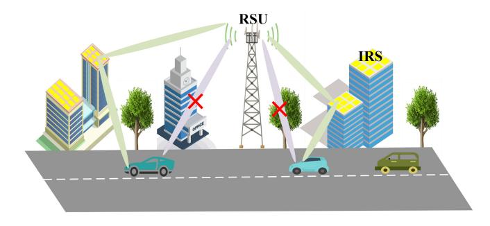

Fig. 13. IRS-assisted NLoS beamforming.

## *G. Future Research Avenues for Established Beam Alignment Methods*

Given the existing methodologies of mmWave V2X beam alignment, it is paramount to continue refining, expanding, and understanding their potential to adapt to future scenarios. Here, we expound upon future research trajectories for the four predominant beam alignment methods:

- *1) Beam Sweeping Enhancements: a) Adaptive Resolution:* Investigate adaptive resolution mechanisms, allowing the system to refine or coarsen its sweeping granularity in real-time based on environmental feedback. *b) Predictive Sweeping:* Leverage ML to forecast optimal sweeping sequences, reducing the overhead of exhaustive sweeping.
- *2) AoA/AoD Estimation Advancements: a) Multidimensional Estimations:* Extend estimations to consider elevation angles, not just azimuth, catering to urban canyons and hilly terrains. *b) Sensor Fusion:* The confluence of multiple sensors, including LiDAR, radar, and cameras, can significantly augment AoA/AoD precision, offering a multidimensional perspective to estimation. *c) Dynamic Calibration:* Contemporary vehicular settings underscore the necessity of methodologies capable of recalibrating AoA/AoD estimates dynamically, addressing the non-static nature of vehicular environments.
- *3) Black-Box Optimization Enhancements: a) Real-time Adaptive Algorithms:* Introduce algorithms that can change their optimization strategy in real-time based on the communication scenario. *b) Cross-layer Optimization:* Explore combining PHY layer information with higher layer metrics, such as QoS or application requirements, to drive beam alignment optimization.
- *4) Broadening the Horizons of Side Information: a) Internet of Things (IoT) Integration:*With the proliferation of IoT devices, extracting side information from these sources can elevate beam alignment in V2X communications. *b) Context-aware Beam Alignment:* The imperative for algorithms that are contextually aware is gaining traction. Integrate vehicular context (e.g., navigation route, congestion level) into the side information pool to enhance alignment predictions.

In essence, while current mmWave V2X beam alignment techniques provide foundational frameworks, the evolving vehicular communication landscape necessitates deeper dives into refining these techniques. Their seamless integration and adaptability will be pivotal, as vehicular networks grow denser, scenarios become more dynamic, and user demands escalate. As beam alignment is a cornerstone for ensuring robust mmWave V2X communications, the continuous evolution, and fine-tuning of these methodologies will play a decisive role in the successful rollout and performance assurance of future vehicular networks.

#### VI. CONCLUSION

In this paper, we conduct a comprehensive survey on beam alignment in mmWave V2X communications. First, we review the characteristics of mmWave technology, including propagation, channel models, beamforming, and antenna arrays. We also analyze relevant standards in vehicular networks, explore advanced applications of mmWave V2X networks, and briefly introduce the evaluation indices for beam alignment. Our exploration then shifts to a comprehensive review of beam alignment methods in mmWave V2X communications, with particular emphasis on beam sweeping, AoA/AoD estimation, black-box optimization, and side information. Subsequently, we discuss in detail the performance metrics used to evaluate the effectiveness of beam alignment in mmWave V2X communications and compare the performance of four beam alignment methods under different metrics. Finally, we encapsulate prospective research avenues and inherent challenges in mmWave V2X beam alignment. We believe that the insights provided in this paper will provide valuable reference and guidance to researchers working on optimizing mmWave V2X network communications.

#### REFERENCES

- [\[1\]](#page-0-0) D. Jia, K. Lu, J. Wang, X. Zhang, and X. Shen, "A survey on platoonbased vehicular cyber-physical systems," *IEEE Commun. Surveys Tuts.*, vol. 18, no. 1, pp. 263–284, 1st Quart., 2016.
- [\[2\]](#page-0-1) E. Ahmed and H. Gharavi, "Cooperative vehicular networking: A survey," *IEEE Trans. Intell. Transp. Syst.*, vol. 19, no. 3, pp. 996–1014, Mar. 2018.
- [\[3\]](#page-0-2) M. Hossain, R. Hasan, and S. Zawoad, "Trust-IoV: A trustworthy forensic investigation framework for the Internet of Vehicles (IoV)," in *Proc. IEEE Int. Congr. Internet Things (ICIOT)*, Honolulu, HI, USA, 2017, pp. 25–32.
- [\[4\]](#page-0-3) Y. Wang, Z. Su, J. Ni, N. Zhang, and X. Shen, "Blockchain-empowered space-air-ground integrated networks: Opportunities, challenges, and solutions," *IEEE Commun. Surveys Tuts.*, vol. 24, no. 1, pp. 160–209, 1st Quart., 2022.
- [\[5\]](#page-0-4) H. Meinel and A. Plattner, "Millimetre-wave propagation along railway lines," *IIEE Proc. F Commun. Radar Signal Process.*, vol. 130, no. 7, pp. 688–694, Dec. 1983.
- [\[6\]](#page-0-4) V. Va and R. W. Heath, "Basic relationship between channel coherence time and beamwidth in vehicular channels," in *Proc. VTC*, Sep. 2015, pp. 1–8.
- [\[7\]](#page-0-5) W. Yi, Y. Liu, Y. Deng, A. Nallanathan, and R. W. Heath, "Modeling and analysis of MmWave V2X networks with vehicular platoon systems," *IEEE J. Sel. Areas Commun.*, vol. 37, no. 12, pp. 2851–2866, Dec. 2019.
- [\[8\]](#page-1-2) Q. Zhang, X. Wang, Z. Li, and Z. Wei, "Design and performance evaluation of joint sensing and communication integrated system for 5G mmWave enabled CAVs," *IEEE J. Sel. Topics Signal Process.*, vol. 15, no. 6, pp. 1500–1514, Nov. 2021.
- [\[9\]](#page-1-3) S. Sur, I. Pefkianakis, X. Zhang, and K.-H. Kim, "WiFi-assisted 60 GHz wireless networks," in *Proc. ACM MobiCom*, 2017, pp. 28–41.
- [\[10\]](#page-1-3) Y. Zhang, C. Li, T. H. Luan, C. Yuen, and Y. Fu, "Collaborative driving: Learning-aided joint topology formulation and beamforming," *IEEE Veh. Technol. Mag.*, vol. 17, no. 2, pp. 103–111, Jun. 2022.
- [\[11\]](#page-1-4) K. Qian, S. Zhu, X. Zhang, and L. E. Li, "Robust multimodal vehicle detection in foggy weather using complementary LiDAR and RaDAR signals," in *Proc. IEEE/CVF CVPR*, Nashville, TN, USA, 2021, pp. 444–453.

- [\[12\]](#page-1-5) ISO/DIS. "Intelligent transport systems—Communication access for land mobiles (CALM)—Millimetre wave air interface." Jan. 2016. [Online]. Available: http://ec.europa.eu/transport/themes/its/doc/citsplatform-final-report-january-2016.pdf
- [\[13\]](#page-1-6) A. N. Uwaechia and N. M. Mahyuddin, "A comprehensive survey on millimeter wave communications for fifth-generation wireless networks: Feasibility and challenges," *IEEE Access*, vol. 8, pp. 62367–62414, 2020.
- [\[14\]](#page-1-6) X. Wang et al., "Millimeter wave communication: A comprehensive survey," *IEEE Commun. Surveys Tuts.*, vol. 20, no. 3, pp. 1616–1653, 3rd Quart., 2018.
- [\[15\]](#page-1-6) H. Chu, P. Xu, S. Jiang, and X. You, "Joint design of axis alignment and positioning for NLoS indoor mmWave WLANs/WPANs," in *Proc. VTC*, Vancouver, BC, Canada, Sep. 2014, pp. 1–6.
- [\[16\]](#page-1-7) S. Hur, T. Kim, D. J. Love, J. V. Krogmeier, T. A. Thomas, and A. Ghosh, "Millimeter wave beamforming for wireless backhaul and access in small cell networks," *IEEE Trans. Commun.*, vol. 61, no. 10, pp. 4391–4403, Oct. 2013.
- [\[17\]](#page-1-8) J. Rodriguez-Fernandez, N. Gonzalez-Prelcic, and R. W. Heath, "Position-aided compressive channel estimation and tracking for millimeter wave multi-user MIMO air-to-air communications," in *Proc. IEEE Int. Conf. Commun. Workshops (ICC Workshops)*, Kansas City, MO, USA, 2018, pp. 1–6.
- [\[18\]](#page-2-2) J. Li et al., "Mobility support for millimeter wave communications: Opportunities and challenges," *IEEE Commun. Surveys Tuts.*, vol. 24, no. 3, pp. 1816–1842, 3rd Quart., 2022.
- [\[19\]](#page-2-3) I. A. Hemadeh, K. Satyanarayana, M. El-Hajjar, and L. Hanzo, "Millimeter-wave communications: Physical channel models, design considerations, antenna constructions, and link-budget," *IEEE Commun. Surveys Tuts.*, vol. 20, no. 2, pp. 870–913, 2nd Quart., 2018.
- [\[20\]](#page-2-4) M. Giordani, M. Polese, A. Roy, D. Castor, and M. Zorzi, "A tutorial on beam management for 3GPP NR at mmWave frequencies," *IEEE Commun. Surveys Tuts.*, vol. 21, no. 1, pp. 173–196, 1st Quart., 2019.
- [\[21\]](#page-2-4) W. Attaoui, K. Bouraqia, and E. Sabir, "Initial access & beam alignment for mmWave and terahertz communications," *IEEE Access*, vol. 10, pp. 35363–35397, 2022.
- [\[22\]](#page-2-4) M. Q. Khan, A. Gaber, P. Schulz, and G. Fettweis, "Machine learning for millimeter wave and terahertz beam management: A survey and open challenges," *IEEE Access*, vol. 11, pp. 11880–11902, 2023.
- [\[23\]](#page-2-5) X. Jiang, F. R. Yu, T. Song, and V. C. M. Leung, "Resource allocation of video streaming over vehicular networks: A survey, some research issues and challenges," *IEEE Trans. Intell. Transp. Syst.*, vol. 23, no. 7, pp. 5955–5975, Jul. 2022.
- [\[24\]](#page-2-6) A. Chalvatzaras, I. Pratikakis, and A. A. Amanatiadis, "A survey on map-based localization techniques for autonomous vehicles," *IEEE Trans. Intell. Veh.*, vol. 8, no. 2, pp. 1574–1596, Feb. 2023.
- [\[25\]](#page-2-7) M. Christopoulou, S. Barmpounakis, H. Koumaras, and A. Kaloxylos, "Artificial Intelligence and Machine Learning as key enablers for V2X communications: A comprehensive survey," *Veh. Commun.*, vol. 39, pp. 103–111, Feb. 2023.
- [\[26\]](#page-2-8) B. Shabir, M. A. Khan, A. U. Rahman, A. W. Malik, and A. Wahid, "Congestion avoidance in vehicular networks: A contemporary survey," *IEEE Access*, vol. 7, pp. 173196–173215, 2019.
- [27] V. Va, T. Shimizu, G. Bansal, and R. W. Heath, "Millimeter wave vehicular communications: A survey," *Found. Trends Netw.*, vol. 10, no. 1, pp. 1–113, 2016.
- [\[28\]](#page-2-9) A. Kose, H. Lee, C. H. Foh, and M. Dianati, "Beam-based mobility management in 5G millimetre wave V2X communications: A survey and outlook," *IEEE Open J. Intell. Transp. Syst.*, vol. 2, pp. 347–363, 2021.
- [\[29\]](#page-2-10) T. Shimizu, V. Va, G. Bansal, and R. W. Heath, "Millimeter wave V2X communications: Use cases and design considerations of beam management," in *Proc. Asia–Pac. Microw. Conf. (APMC)*, Kyoto, Japan, 2018, pp. 1–8.
- [\[30\]](#page-2-11) K. Sakaguchi et al., "Towards mmWave V2X in 5G and beyond to support automated driving," *IEICE Trans. Commun.*, vol.E104-B, no. 1, p. 93, Jun. 2021.
- [\[31\]](#page-2-12) K. Z. Ghafoor et al., "Millimeter-wave communication for Internet of Vehicles: Status, challenges, and perspectives," *IEEE Internet Things J.*, vol. 7, no. 9, pp. 8525–8546, Sep. 2020.
- [\[32\]](#page-2-13) X. Cheng et al., "Integrated sensing and communications for Internet of Vehicles: Current status and development trend," *J. Commun.*, vol. 43, no. 8, pp. 187–202, Aug. 2022.

- [\[33\]](#page-2-14) M. Giordani, A. Zanella, and M. Zorzi, "Millimeter wave communication in vehicular networks: Challenges and opportunities," in *Proc. 6th Int. Conf. Modern Circuits Syst. Technol. (MOCAST)*, Thessaloniki, Greece, 2017, pp. 1–6.
- [\[34\]](#page-3-1) Z. Nossire, N. Gupta, L. Almazaydeh, and X. Xiong, "New empirical path loss model for 28 GHz and 38 GHz millimeter wave in indoor urban under various conditions," *Appl. Sci.*, vol. 8, no. 11, p. 2122, 2018.
- [\[35\]](#page-3-2) H. T. Friis, "A note on a simple transmission formula," *Proc. IRE*, vol. 34, no. 5, pp. 254–256, May 1946.
- [\[36\]](#page-3-3) T. Manning, *Microwave Radio Transmission Design Guide*. Norwood, MA, USA: Artech House, 2009.
- [\[37\]](#page-3-3) K. Pahlavan and P. Krishnamurthy, *Principles of Wireless Access and Localization*. Hoboken, NJ, USA: Wiley, 2013.
- [\[38\]](#page-3-3) *Technical Feasibility of IMT in Bands Above 6 GHz*, document ITUR M.2376-0, ITU, Geneva, Switzerland, 2015.
- [\[39\]](#page-3-4) Z. Pi and F. Khan, "An introduction to millimeter-wave mobile broadband systems," *IEEE Commun. Mag.*, vol. 49, no. 6, pp. 101–107, Jun. 2011.
- [\[40\]](#page-3-5) Y. Zhang, C. R. Anderson, N. Michelusi, D. J. Love, K. R. Baker, and J. V. Krogmeier, "Propagation modeling through foliage in a coniferous forest at 28 GHz," *IEEE Commun. Lett.*, vol. 8, no. 3, pp. 901–904, Jun. 2019.
- [\[41\]](#page-3-6) M. V. Peric, D. B. Peri ´ c, B. M. Todorovi ´ c, and M. V. Popovi ´ c,´ "Dynamic rain attenuation model for millimeter wave network analysis," *IEEE Trans. Wireless Commun.*, vol. 16, no. 1, pp. 441–450, Jan. 2017.
- [\[42\]](#page-3-6) Y. -P. Zhang, P. Wang, and A. Goldsmith, "Rainfall effect on the performance of millimeter-wave MIMO systems," *IEEE Trans. Wireless Commun.*, vol. 14, no. 9, pp. 4857–4866, Sep. 2015.
- [\[43\]](#page-3-6) Y. Banday, G. M. Rather, and G. R. Begh, "Effect of atmospheric absorption on millimetre wave frequencies for 5G cellular networks," *IET Commun.*, vol. 13, no. 3, pp. 265–270, 2019.
- [\[44\]](#page-3-6) T. S. Rappaport, Y. Xing, G. R. MacCartney, A. F. Molisch, E. Mellios, and J. Zhang, "Overview of millimeter wave communications for fifth-generation (5G) wireless networks—With a focus on propagation models," *IEEE Trans. Antennas Propag.*, vol. 65, no. 12, pp. 6213–6230, Dec. 2017.
- [\[45\]](#page-3-7) M. Xiao et al., "Millimeter wave communications for future mobile networks," *IEEE J. Sel. Areas Commun.*, vol. 35, no. 9, pp. 1909–1935, Sep. 2017.
- [\[46\]](#page-3-7) *Propagation Data and Prediction Methods Required for the Design of Terrestrial Line-of-Sight Systems*, ITU Standard ITU-R P.530, 2015.
- [\[47\]](#page-3-7) S. A. Hosseini, E. Zarepour, M. Hassan, and C. T. Chou, "Analyzing diurnal variations of millimeter wave channels," in *Proc. IEEE Conf. Comput. Commun. Workshops (INFOCOM WKSHPS)*, San Francisco, CA, USA, 2016, pp. 377–382.
- [\[48\]](#page-3-8) S. A. Busari, K. M. S. Huq, S. Mumtaz, L. Dai, and J. Rodriguez, "Millimeter-wave massive MIMO communication for future wireless systems: A survey," *IEEE Commun. Surveys Tuts.*, vol. 20, no. 2, pp. 836–869, 2nd Quart., 2018.
- [\[49\]](#page-3-8) "Study on channel model for frequencies from 0.5 to 100 GHz,v16.1.0," 3GPP, Sophia Antipolis, France, Rep. TR 38.901, Dec. 2019.
- [\[50\]](#page-3-9) "Guidelines for evaluation of radio interface technologies for IMT-2020," ITU Recommendation ITU-R M.2412-0, ITU, Geneva, Switzerland, Oct. 2017.
- [\[51\]](#page-3-9) F. Khan and Z. Pi, "mmwave mobile broadband (MMB): Unleashing the 3-300GHz spectrum," in *Proc. 34th IEEE Sarnoff Symp.*, May 2011, pp. 243–254.
- [\[52\]](#page-3-10) M. Giordani, M. Mezzavilla, A. Dhananjay, S. Rangan, and M. Zorzi, "Channel dynamics and SNR tracking in millimeter wave cellular systems," in *Proc. 22th Eur. Wireless Conf.*, May 2016, pp. 1–8.
- [\[53\]](#page-3-10) A. Yamamoto, K. Ogawa, T. Horimatsu, A. Kato, and M. Fujise, "Pathloss prediction models for intervehicle communication at 60 GHz," *IEEE Trans. Intell. Veh.*, vol. 57, no. 2, pp. 65–78, Jan. 2008.
- [\[54\]](#page-3-11) "Study on channel model for frequency spectrum above 6 GHz, v15.0.0," 3GPP, Sophia Antipolis, France, Rep. TR 38.900, Jun. 2018.
- [\[55\]](#page-3-12) D. W. Matolak, I. Sen, W. Xiong, and N. T. Yaskoff, "5 GHz wireless channel characterization for vehicle to vehicle communications," in *Proc. IEEE MILCOM*, Atlantic City, NJ, USA, Oct. 2005, pp. 3016–3022.
- [\[56\]](#page-4-2) L. Cheng, B. E. Henty, D. D. Stancil, F. Bai, and P. Mudalige, "Mobile vehicle-to-vehicle narrow-band channel measurement and characterization of the 5.9 GHz dedicated short range communication (DSRC) frequency band," *IEEE J. Sel. Areas Commun.*, vol. 25, no. 8, pp. 1501–1516, Oct. 2007.

- [\[57\]](#page-4-3) R. He et al., "Vehicle-to-vehicle propagation models with large vehicle obstructions," *IEEE Trans. Intell. Transp. Syst.*, vol. 15, no. 5, pp. 2237–2248, Oct. 2014.
- [\[58\]](#page-4-4) R. He et al., "Vehicle-to-vehicle radio channel characterization in crossroad scenarios," *IEEE Trans. Veh. Technol.*, vol. 65, no. 8, pp. 5850–5861, Aug. 2016.
- [\[59\]](#page-4-5) Y. Li, X. Cheng, and N. Zhang, "Deterministic and stochastic simulators for non-isotropic V2V-MIMO wideband channels," *China Commun.*, vol. 15, no. 7, pp. 18–29, Jul. 2018.
- [\[60\]](#page-4-6) *IEEE Standard for High Data Rate Wireless Multi-Media Networks*, IEEE Standard 802.15.3d-2017, Jul. 2017.
- [\[61\]](#page-5-1) Y. Chang, S. Baek, S. Hur, Y. Mok, and Y. Lee, "A novel dualslope mmwave channel model based on 3D ray-tracing in urban environments," in *Proc. IEEE 25th Annu. Int. Symp. Pers. Indoor Mobile Radio Commun. (PIMRC)*, Sep. 2014, pp. 222–226.
- [\[62\]](#page-5-2) J.-H. Lee, J.-S. Choi, J.-Y. Lee, and S.-C. Kim, "28 GHzmillimeterwave channel models in urban microcell environment using three-dimensional ray tracing," *IEEE Antennas Wireless Propag. Lett.*, vol. 17, no. 3, pp. 426–429, Mar. 2018.
- [\[63\]](#page-5-3) T. Pedersen and B. H. Fleury, "Radio channel modelling using stochastic propagation graphs," in *Proc. IEEE Int. Conf. Commun.*, Jun. 2007, pp. 2733–2738.
- [\[64\]](#page-5-4) R. Adeogun, T. Pedersen, and A. Bharti, "Transfer function computation for complex indoor channels using propagation graphs," in *Proc. IEEE 29th Annu. Int. Symp. Pers. Indoor Mobile Radio Commun. (PIMRC)*, Sep. 2018, pp. 566–567.
- [\[65\]](#page-5-5) R. Adeogun, T. Pedersen, C. Gustafson, and F. Tufvesson, "Polarimetric wireless indoor channel modeling based on propagation graph," *IEEE Trans. Antennas Propag.*, vol. 67, no. 10, pp. 6585–6595, Oct. 2019.
- [\[66\]](#page-5-5) *Technical Specification Group Radio Access Network; Study on 3D Channel Model for LTE (Release 12), v12.2.0*, document 36.873, 3GPP, Sophia Antipolis, France, Jun. 2015.
- [\[67\]](#page-5-6) *Technical Specification Group Radio Access Network; Study on Channel Model for Frequencies From 0.5 to 100 GHz (Release 16), V16.1.0*, document 38.901, 3GPP, Sophia Antipolis, France, Dec. 2019.
- [\[68\]](#page-5-6) Y. Li, B. Ai, X. Cheng, S. Lin, and Z. Zhong, "A TDL based non WSSUS vehicle-to-vehicle channel model," *Int. J. Antennas Propag.*, vol. 2013, pp. 1–8, Nov. 2013.
- [\[69\]](#page-5-7) H. Jiang, Z. Zhang, L. Wu, J. Dang, and G. Gui, "A 3-D non-stationary wideband geometry-based channel model for MIMO vehicle-to-vehicle communications in tunnel environments," *IEEE Trans. Veh. Technol.*, vol. 68, no. 7, pp. 6257–6271, Jul. 2019.
- [\[70\]](#page-5-7) R. He, B. Ai, G. L. Stuber, G. Wang, and Z. Zhong, "Geometrical-based modeling for millimeter-wave MIMO mobile-to-mobile channels," *IEEE Trans. Veh. Technol.*, vol. 67, no. 4, pp. 2848–2863, Apr. 2018.
- [\[71\]](#page-5-7) A. Borhani and M. Patzold, "Correlation and spectral properties of vehicle-to-vehicle channels in the presence of moving scatterers," *IEEE Trans. Veh. Technol.*, vol. 62, no. 9, pp. 4228–4239, Nov. 2013.
- [\[72\]](#page-5-7) B. Xiong, Z. Zhang, J. Zhang, H. Jiang, J. Dang, and L. Wu, "Novel multi-mobility V2X channel model in the presence of randomly moving clusters," *IEEE Trans. Wireless Commun.*, vol. 20, no. 5, pp. 3180–3195, May 2021.
- [\[73\]](#page-5-7) G. L. Stüber, *Principles of Mobile Communication*. London, U.K.: Kluwer Acad., 2011.
- [\[74\]](#page-5-8) Q. H. Spencer, A. L. Swindlehurst, and M. Haardt, "Zero-forcing methods for downlink spatial multiplexing in multiuser MIMO channels," *IEEE Trans. Signal Process.*, vol. 52, no. 2, pp. 461–471, Feb. 2004.
- [\[75\]](#page-5-9) H. Q. Ngo, E. G. Larsson, and T. L. Marzetta, "Energy and spectral efficiency of very large multiuser MIMO systems," *IEEE Trans. Commun.*, vol. 61, no. 4, pp. 1436–1449, Apr. 2013.
- [\[76\]](#page-5-10) K. Zu and R. C. D. Lamare, "Low-complexity lattice reductionaided regularized block diagonalization for MU-MIMO systems," *IEEE Commun. Lett.*, vol. 16, no. 6, pp. 925–928, Jun. 2012.
- [\[77\]](#page-5-11) M. Sadek, A. Tarighat, and A. H. Sayed, "A leakage-based precoding scheme for downlink multi-user MIMO channels," *IEEE Trans. Wireless Commun.*, vol. 6, no. 5, pp. 1711–1721, May 2007.
- [\[78\]](#page-5-12) N. Jindal and A. Goldsmith, "Dirty-paper coding versus TDMA for MIMO Broadcast channels," *IEEE Trans. Inf. Theory*, vol. 51, no. 5, pp. 1783–1794, May 2005.
- [\[79\]](#page-5-13) V. Venkateswaran and A.-J. van der Veen, "Analog beamforming in MIMO communications with phase shift networks and online channel estimation," *IEEE Trans. Signal Process.*, vol. 58, no. 8, pp. 4131–4143, Aug. 2010.
- [\[80\]](#page-5-14) M. N. Kulkarni, A. Ghosh, and J. G. Andrews, "A comparison of MIMO techniques in downlink millimeter wave cellular networks with hybrid beamforming," *IEEE Trans. Commun.*, vol. 64, no. 5, pp. 1952–1967, May 2016.

- [\[81\]](#page-5-15) F. Sohrabi and W. Yu, "Hybrid digital and analog beamforming design for large-scale antenna arrays," *IEEE J. Sel. Topics Signal Process.*, vol. 10, no. 3, pp. 501–513, Apr. 2016.
- [\[82\]](#page-5-16) S. Payami, M. Ghoraishi, and M. Dianati, "Hybrid beamforming for large antenna arrays with phase shifter selection," *IEEE Trans. Wireless Commun.*, vol. 15, no. 11, pp. 7258–7271, Nov. 2016.
- [\[83\]](#page-5-17) J. Li, L. Xiao, X. Xu, and S. Zhou, "Robust and low complexity hybrid beamforming for uplink multiuser mmWave MIMO systems," *IEEE Commun. Lett.*, vol. 20, no. 6, pp. 1140–1143, Jun. 2016.
- [\[84\]](#page-5-18) S. Han, C.-L. I, Z. Xu, and C. Rowell, "Large-scale antenna systems with hybrid analog and digital beamforming for millimeter wave 5G," *IEEE Commun. Mag.*, vol. 53, no. 1, pp. 186–194, Jan. 2015.
- [\[85\]](#page-5-19) A. Alkhateeb, G. Leus, and R. W. Heath, "Limited feedback hybrid precoding for multi-user millimeter wave systems," *IEEE Trans. Wireless Commun.*, vol. 14, no. 11, pp. 6481–6494, Nov. 2015.
- [\[86\]](#page-5-19) A. Alkhateeb, Y.-H. Nam, J. Zhang, and R. W. Heath, "Massive MIMO combining with switches," *IEEE Wireless Commun. Lett.*, vol. 5, no. 3, pp. 232–235, Jun. 2016.
- [\[87\]](#page-5-20) T. Mir, M. Z. Siddiqi, U. Mir, R. Mackenzie, and M. Hao, "Machine learning inspired hybrid precoding for wideband millimeter-wave massive MIMO systems," *IEEE Access*, vol. 7, pp. 62852–62864, 2019.
- [\[88\]](#page-5-21) Z. Xiao et al., "A survey on millimeter-wave beamforming enabled UAV communications and networking," *IEEE Commun. Surveys Tuts.*, vol. 24, no. 1, pp. 557–610, 1st Quart., 2022.
- [\[89\]](#page-6-2) S. Rangan, T. S. Rappaport, and E. Erkip, "Millimeter-wave cellular wireless networks: Potentials and challenges," *Proc. IEEE*, vol. 102, no. 3, pp. 366–385, Mar. 2014.
- [\[90\]](#page-6-3) H. Shokri-Ghadikolaei, L. Gkatzikis, and C. Fischione, "Beamsearching and transmission scheduling in millimeter wave communications," in *Proc. IEEE Int. Conf. Commun. (ICC)*, London, U.K., 2015, pp. 1292–1297.
- [\[91\]](#page-6-3) B. Coll-Perales, J. Gozalvez, and M. Gruteser, "Sub-6GHz assisted MAC for millimeter wave vehicular communications," *IEEE Commun. Mag.*, vol. 57, no. 3, pp. 125–131, Mar. 2019.
- [\[92\]](#page-6-4) M. Mousam, R. Chakarbaty, N. Kumari, and A. Mukherjee, "Millimeter wave vehicular communications To generate high data rates," in *Proc. Int. Conf. Commun. Comput. Internet Things (IC3IoT)*, Chennai, India, 2018, pp. 191–194.
- [\[93\]](#page-6-5) "Release 16 description; summary of rel-16 work items;(release 16)," 3GPP, Sophia Antipolis, France, Rep. TR 21.916, 2020.
- [\[94\]](#page-6-6) *V2X Communication Over Cellular Networks: Capabilities and Challenges*, Telecom, New Delhi, India, 2023.
- [\[95\]](#page-6-6) M. H. C. Garcia et al., "A tutorial on 5G NR V2X communications," *IEEE Commun. Surveys Tuts.*, vol. 23, no. 3, pp. 1972–2026, 3rd Quart., 2021.
- [\[96\]](#page-6-6) M. S. Bahbahani, E. Alsusa, and A. Hammadi, "A directional TDMA protocol for high throughput URLLC in mmWave vehicular networks," *IEEE Trans. Veh. Technol.*, vol. 72, no. 3, pp. 3584–3599, Mar. 2023.
- [\[97\]](#page-6-6) W. Zhuofei, S. Bartoletti, V. Martinez, and A. Bazzi, "Adaptive repetition strategies in IEEE 802.11bd V2X networks," *IEEE Trans. Veh. Technol.*, vol. 72, no. 6, pp. 8262–8266, Jun. 2023.
- [\[98\]](#page-6-7) "Study on evaluation methodology of new vehicle-to-everything V2X use cases for LTE and NR," 3GPP, Sophia Antipolis, France, Rep. TR 37.885, 2018.
- [\[99\]](#page-6-8) "New SID: Study on NR V2X.2018," 3GPP, Sophia Antipolis, France, Rep. RP-181480, 2018.
- [\[100\]](#page-6-9) "New SID: Study on NR beyond 52.6GHz.2018," 3GPP, Sophia Antipolis, France, Rep. RP-181435, 2018.
- [\[101\]](#page-6-9) Y. Yao, L. Rao, and X. Liu, "Performance and reliability analysis of IEEE 802.11p safety communication in a highway environment," *IEEE Trans. Veh. Technol.*, vol. 62, no. 9, pp. 4198–4212, Nov. 2013.
- [\[102\]](#page-7-2) S.-W. Kim et al., "Multivehicle cooperative driving using cooperative perception: Design and experimental validation," *IEEE Trans. Intell. Transp. Syst.*, vol. 16, no. 2, pp. 663–680, Apr. 2015.
- [\[103\]](#page-7-3) *The 5G Infrastructure Public Private Partnership (5G PPP). 5G Automotive Vision.* Accessed: Feb. 2014. [Online]. Available: https://5g-ppp.eu/wp-content/uploads/2014/02/5G-PPP-White-Paperon-Automotive-Vertical-Sectors.pdf
- [\[104\]](#page-7-4) J. Levinson et al., "Towards fully autonomous driving: Systems and algorithms," in *Proc. IEEE Intell. Veh. Symp. (IV)*, Baden-Baden, Germany, 2011, pp. 163–168.
- [\[105\]](#page-7-5) J. Ziegler et al., "Video based localization for Bertha," in *Proc. IEEE Intell. Veh. Symp. (IV)*, Dearborn, MI, USA, 2014, pp. 1231–1238.
- [\[106\]](#page-7-5) A. Osseiran et al., "Scenarios for 5G mobile and wireless communications: The vision of the METIS project," *IEEE Commun. Mag.*, vol. 52, no. 5, pp. 26–35, May 2014.

- [\[107\]](#page-7-6) K. Z. Ghafoor, "Video streaming over vehicular ad hoc networks: A comparative study and future perspectives," *Sci. J. Koya Univ.*, vol. 4,no. 2, pp. 25–36, 2016.
- [\[108\]](#page-7-6) K. Abboud, H. A. Omar, and W. Zhuang, "Interworking of DSRC and cellular network technologies for V2X communications: A survey," *IEEE Trans. Veh. Technol.*, vol. 65, no. 12, pp. 9457–9470, Dec. 2016.
- [\[109\]](#page-7-7) S. Chen, J. Hu, Y. Shi, and L. Zhao, "LTE-V: A TD-LTE-based V2X solution for future vehicular network," *IEEE Internet Things J.*, vol. 3, no. 6, pp. 997–1005, Dec. 2016.
- [\[110\]](#page-7-8) K. Z. Ghafoor, M. Guizani, L. Kong, H. S. Maghdid, and K. F. Jasim, "Enabling efficient coexistence of DSRC and C-V2X in vehicular networks," *IEEE Wireless Commun.*, vol. 27, no. 2, pp. 134–140, Apr. 2020.
- [\[111\]](#page-7-8) S. Chen, J. Hu, Y. Shi, L. Zhao, and W. Li, "A vision of C-V2X: Technologies, field testing, and challenges with Chinese development," *IEEE Internet Things J.*, vol. 7, no. 5, pp. 3872–3881, May 2020.
- [\[112\]](#page-7-8) Y. L. Morgan, "Notes on DSRC & WAVE standards suite: Its architecture, design, and characteristics," *IEEE Commun. Surveys Tuts.*, vol. 12, no. 4, pp. 504–518, 4th Quart., 2010.
- [\[113\]](#page-7-9) X. Wu et al., "Vehicular communications using DSRC: Challenges, enhancements, and evolution," *IEEE J. Sel. Areas Commun.*, vol. 31, no. 9, pp. 399–408, Sep. 2013.
- [\[114\]](#page-8-1) C. Cooper, D. Franklin, M. Ros, F. Safaei, and M. Abolhasan, "A comparative survey of VANET clustering techniques," *IEEE Commun. Surveys Tuts.*, vol. 19, no. 1, pp. 657–681, 1st Quart., 2017.
- [\[115\]](#page-8-2) S. Dietzel, J. Petit, F. Kargl, and B. Scheuermann, "In-network aggregation for vehicular ad hoc networks," *IEEE Commun. Surveys Tuts.*, vol. 16, no. 4, pp. 1909–1932, 4th Quart., 2014.
- [\[116\]](#page-8-2) A. A. Almohammedi, N. K. Noordin, A. Sali, F. Hashim, and M. Balfaqih, "An adaptive multi-channel assignment and coordination scheme for IEEE 802.11P/1609.4 in vehicular ad-hoc networks," *IEEE Access*, vol. 6, pp. 2781–2802, Jul. 2018.
- [\[117\]](#page-8-3) S. Johari and M. B. Krishna, "Time-slot reservation and channel switching using Markovian model for multichannel TDMA MAC in VANETs," *IEEE Access*, vol. 10, pp. 81250–81268, 2022.
- [\[118\]](#page-8-4) "Release 14 description; summary of rel-14 work items (release 14)," 3GPP, Sophia Antipolis, France, Rep. TR 21.914, 2017.
- [\[119\]](#page-8-5) S. Chen et al., "Vehicle-to-everything (V2X) services supported by LTE-based systems and 5G," *IEEE Commun. Mag.*, vol. 1, no. 2, pp. 70–76, 2017.
- [\[120\]](#page-8-6) "Release 15 description; summary of rel-15 work items (release 15)," 3GPP, Sophia Antipolis, France, Rep. TR 21.915, 2017.
- [\[121\]](#page-8-7) *IEEE Standard for Information Technology—Telecommunications and Information Exchange Between Systems—Local and Metropolitan Area Networks—Specific Requirements—Part 11: Wireless LAN Medium Access Control (MAC) and Physical Layer (PHY) Specifications Amendment 3: Enhancements for Very High Throughput in the 60 GHz Band*, IEEE Standard 802.11ad-2012, Dec. 2012.
- [\[122\]](#page-9-1) K. Hosoya et al., "Multiple sector ID capture (MIDC): A novel beamforming technique for 60-GHz band multi-Gbps WLAN/PAN systems," *IEEE Trans. Antennas Propag.*, vol. 63, no. 1, pp. 81–96, Jan. 2015.
- [\[123\]](#page-9-1) A. Ali, N. González-Prelcic, and R. W. Heath, "Millimeter wave beamselection using out-of-band spatial information," *IEEE Trans. Wireless Commun.*, vol. 17, no. 2, pp. 1038–1052, Feb. 2018.
- [\[124\]](#page-9-2) J. Lv, X. He, and T. Luo, "Multi-frequency coordination based beam management scheme for 6G C-V2X sidelink communications," in *Proc. IEEE 33rd Annu. Int. Symp. Pers. Indoor Mobile Radio Commun. (PIMRC)*, Kyoto, Japan, 2022, pp. 385–390.
- [\[125\]](#page-9-2) V. Va, J. Choi, T. Shimizu, G. Bansal, and R. W. Heath, "Inverse multipath fingerprinting for millimeter wave V2I beam alignment," *IEEE Trans. Veh. Technol.*, vol. 67, no. 5, pp. 4042–4058, May 2018.
- [\[126\]](#page-9-3) V. Va, T. Shimizu, G. Bansal, and R. W. Heath, "Position-aided millimeter wave V2I beam alignment: A learning-to-rank approach," in *Proc. IEEE 28th Annu. Int. Symp. Pers. Indoor Mobile Radio Commun. (PIMRC)*, Montreal, QC, Canada, 2017, pp. 1–5.
- [\[127\]](#page-9-3) V. Va, T. Shimizu, G. Bansal, and R. W. Heath, "Online learning for position-aided millimeter wave beam training," *IEEE Access*, vol. 7, pp. 30507–30526, 2019.
- [\[128\]](#page-9-3) Y. Wang, A. Klautau, M. Ribero, A. C. K. Soong, and R. W. Heath, "MmWave vehicular beam selection with situational awareness using machine learning," *IEEE Access*, vol. 7, pp. 87479–87493, 2019
- [\[129\]](#page-9-4) L. Zhang, W. Zhong, J. Zhang, Q. Zhu, and X. Chen, "Millimeter wave beam tracking based on vehicle environmental situational awareness," *J. Signal Process.*, vol. 38, no. 3, pp. 457–465, Mar. 2022.

- [\[130\]](#page-9-4) A. Klautau, N. González-Prelcic, and R. W. Heath, "LiDAR data for deep learning-based mmWave beam-selection," *IEEE Wireless Commun. Lett.*, vol. 8, no. 3, pp. 909–912, Jun. 2019.
- [\[131\]](#page-9-5) M. R. Akdeniz et al., "Millimeter wave channel modeling and cellular capacity evaluation," *IEEE J. Sel. Areas Commun.*, vol. 32, no. 6, pp. 1164–1179, Jun. 2014.
- [\[132\]](#page-9-6) O. Abari et al., "Millimeter wave communications: From point-to-point links to agile network connections," in *Proc. 15th ACM Workshop Hot Topics Netw.*, Atlanta, GA, USA, 2016, pp. 169–175.
- [\[133\]](#page-9-7) J. Wang et al., "Beam codebook based beamforming protocol for multi-Gbps millimeter-wave WPAN systems," *IEEE J. Sel. Areas Commun.*, vol. 27, no. 8, pp. 1390–1399, Oct. 2009.
- [\[134\]](#page-9-8) M. Kokshoorn, H. Chen, P. Wang, Y. Li, and B. Vucetic, "Millimeter wave MIMO channel estimation using overlapped beam patterns and rate adaptation," *IEEE Trans. Signal Process.*, vol. 65, no. 3, pp. 601–616, Feb. 2017.
- [\[135\]](#page-9-8) Y. M. Tsang, A. S. Y. Poon, and S. Addepalli, "Coding the beams: Improving beamforming training in mmWave communication system," *IEEE J. Sel. Areas Commun.*, Houston, TX, USA, 2011, pp. 1–6.
- [\[136\]](#page-9-8) J. Song, J. Choi, S. G. Larew, D. J. Love, T. A. Thomas, and A. A. Ghosh, "Adaptive millimeter wave beam alignment for dualpolarized MIMO systems," *IEEE Trans. Wireless Commun.*, vol. 14, no. 11, pp. 6283–6296, Nov. 2015.
- [\[137\]](#page-9-8) *IEEE Standard for Information Technology—Local and Metropolitan Area Networks—Specific Requirements—Part 15.3: Amendment 2: Millimeter-Wave-Based Alternative Physical Layer Extension*, IEEE Standard 802.15.3c-2009, Oct. 2009.
- [\[138\]](#page-9-9) A. Ghosh et al., "Millimeter-wave enhanced local area systems: A highdata-rate approach for future wireless networks," *IEEE J. Sel. Areas Commun.*, vol. 32, no. 6, pp. 1152–1163, Jun. 2014
- [\[139\]](#page-9-10) S. Chen and J. Zhao, "The requirements, challenges, and technologies for 5G of terrestrial mobile telecommunication," *IEEE Commun. Mag.*, vol. 52, no. 5, pp. 36–43, May 2014.
- [\[140\]](#page-9-10) R. Shafin, L. Liu, J. Zhang, and Y.-C. Wu, "DoA estimation and capacity analysis for 3-D millimeter wave massive-MIMO/FD-MIMO OFDM systems," *IEEE Trans. Wireless Commun.*, vol. 15, no. 10, pp. 6963–6978, Oct. 2016.
- [\[141\]](#page-9-10) H. Hassanieh et al., "Fast millimeter wave beam alignment," in *Proc. Conf. ACM Special Interest Group Data Commun. (SIGCOMM)*, 2018, pp. 432–445.
- [\[142\]](#page-10-1) S.-Y. Lien, Y.-C. Kuo, D.-J. Deng, H.-L. Tsai, A. Vinel, and A. Benslimane, "Latency-optimal mmWave radio access for V2X supporting next generation driving use case," *IEEE Access*, vol. 7, pp. 6782–6795, 2018.
- [\[143\]](#page-10-2) A. Alkhateeb, O. E. Ayach, G. Leus, and R. W. Heath, "Channel estimation and hybrid precoding for millimeter wave cellular systems," *IEEE J. Sel. Topics Signal Process.*, vol. 8, no. 5, pp. 831–846, Oct. 2014.
- [\[144\]](#page-10-3) S. Noh, M. D. Zoltowski, and D. J. Love, "Multi-resolution codebook and adaptive beamforming sequence design for millimeter wave beam alignment," *IEEE Trans. Wireless Commun.*, vol. 16, no. 9, pp. 5689–5701, Sep. 2017.
- [\[145\]](#page-10-3) M. Hussain and N. Michelusi, "Energy-efficient interactive beam alignment for millimeter-wave networks," *IEEE Trans. Wireless Commun.*, vol. 18, no. 2, pp. 838–851, Feb. 2019.
- [\[146\]](#page-10-3) X. Li, J. Fang, H. Duan, Z. Chen, and H. Li, "Fast beam alignment for millimeter wave communications: A sparse encoding and phaseless decoding approach," *IEEE Trans. Signal Process.*, vol. 67, no. 17, pp. 4402–4417, Sep. 2019.
- [\[147\]](#page-11-1) G. Bo, Z. Changming, J. Depeng, and Z. Lieguang, "Compressed SNRand-channel estimation for beam tracking in 60-GHz WLAN," *China Commun.*, vol. 12, no. 6, pp. 46–58, Jun. 2015.
- [\[148\]](#page-11-2) W. U. Bajwa, J. Haupt, A. M. Sayeed, and R. Nowak, "Compressed channel sensing: A new approach to estimating sparse multipath channels," *Proc. IEEE*, vol. 98, no. 6, pp. 1058–1076, Jun. 2010.
- [\[149\]](#page-11-2) S. Noh, M. D. Zoltowski, Y. Sung, and D. J. Love, "Pilot beam pattern design for channel estimation in massive MIMO systems," *IEEE J. Sel. Topics Signal Process.*, vol. 8, no. 5, pp. 787–801, Oct. 2014.
- [\[150\]](#page-11-2) Z. Gao, C. Hu, L. Dai, and Z. Wang, "Channel estimation for millimeter-wave massive MIMO with hybrid precoding over frequencyselective fading channels," *IEEE Commun. Lett.*, vol. 20, no. 6, pp. 1259–1262, Jun. 2016.
- [\[151\]](#page-11-2) A. Alkhateeb, G. Leus, and R. W. Heath, "Compressed sensing based multi-user millimeter wave systems: How many measurements are needed?" in *Proc. 40th IEEE Int. Conf. Acoust. Speech Signal Process. (ICASSP)*, South Brisbane, QLD, Australia, 2015, pp. 2909–2913.

- [\[152\]](#page-11-3) J. Lee, G.-T. Gil, and Y. H. Lee, "Channel estimation via orthogonal matching pursuit for hybrid MIMO systems in millimeter wave communications," *IEEE Trans. Commun.*, vol. 64, no. 6, pp. 2370–2386, Jun. 2016.
- [\[153\]](#page-11-4) P. Schniter and A. Sayeed, "Channel estimation and precoder design for millimeter-wave communications: The sparse way," in *Proc. 48th Asilomar Conf. Signals Syst. Comput.*, Pacific Grove, CA, USA, 2014, pp. 273–277.
- [\[154\]](#page-11-5) B. Mamandipoor, D. Ramasamy, and U. Madhow, "Newtonized orthogonal matching pursuit: Frequency estimation over the continuum," *IEEE Trans. Signal Process.*, vol. 64, no. 19, pp. 5066–5081, Oct. 2016.
- [\[155\]](#page-12-0) M. E. Rasekh and U. Madhow, "Noncoherent compressive channel estimation for mm-wave massive MIMO," in *Proc. 52nd Asilomar Conf. Signals Syst. Comput.*, Pacific Grove, CA, USA, 2018, pp. 889–894.
- [\[156\]](#page-12-1) C. Hu, L. Dai, T. Mir, Z. Gao, and J. Fang, "Super-resolution channel estimation for mmWave massive MIMO with hybrid precoding," *IEEE Trans. Veh. Technol.*, vol. 67, no. 9, pp. 8954–8958, Sep. 2018.
- [\[157\]](#page-12-2) T. Kim and D. J. Love, "Virtual AoA and AoD estimation for sparse millimeter wave MIMO channels," in *Proc. IEEE 16th Int. Workshop Signal Process. Adv. Wireless Commun. (SPAWC)*, Stockholm, Sweden, 2015, pp. 146–150.
- [\[158\]](#page-12-3) Z. Marzi, D. Ramasamy, and U. Madhow, "Compressive channel estimation and tracking for large arrays in mm-wave picocells," *IEEE J. Sel. Topics Signal Process.*, vol. 10, no. 3, pp. 514–527, Apr. 2016.
- [\[159\]](#page-12-3) Z. Gao, L. Dai, Z. Wang, and S. Chen, "Spatially common sparsity based adaptive channel estimation and feedback for FDD massive MIMO," *IEEE Trans. Signal Process.*, vol. 63, no. 23, pp. 6169–6183, Dec. 2015.
- [\[160\]](#page-12-3) N. J. Myers and R. W. Heath, "Message passing-based joint CFO and channel estimation in mmWave systems with one-bit ADCs," *IEEE Trans. Wireless Commun.*, vol. 18, no. 6, pp. 3064–3077, Jun. 2019.
- [\[161\]](#page-12-4) F. Rusek et al., "Scaling up MIMO: Opportunities and challenges with very large arrays," *IEEE Signal Process. Mag.*, vol. 30, no. 1, pp. 40–60, Jan. 2013.
- [\[162\]](#page-12-5) T. L. Marzetta, "Noncooperative cellular wireless with unlimited numbers of base station antennas," *IEEE Trans. Wireless Commun.*, vol. 9, no. 11, pp. 3590–3600, Nov. 2010.
- [\[163\]](#page-12-5) H. Yin, D. Gesbert, M. Filippou, and Y. Liu, "A coordinated approach to channel estimation in large-scale multiple-antenna systems," *IEEE J. Sel. Areas Commun.*, vol. 31, no. 2, pp. 264–273, Feb. 2013.
- [\[164\]](#page-12-5) R. R. Müller, L. Cottatellucci, and M. Vehkaperä, "Blind pilot decontamination," *IEEE J. Sel. Topics Signal Process.*, vol. 8, no. 5, pp. 773–786, Oct. 2014.
- [\[165\]](#page-12-5) J.-C. Guey and L. D. Larsson, "Modeling and evaluation of MIMO systems exploiting channel reciprocity in TDD mode," in *Proc. IEEE 60th Veh. Technol. Conf. (VTC-Fall)*, Los Angeles, CA, USA, 2004, pp. 4265–4269.
- [\[166\]](#page-12-6) A. Brighente, M. Cerutti, M. Nicoli, S. Tomasin and U. Spagnolini, "Estimation of wideband dynamic mmWave and THz channels for 5G systems and beyond," *IEEE J. Sel. Areas Commun.*, vol. 38, no. 9, pp. 2026–2040, Sep. 2020.
- [\[167\]](#page-12-7) M. Brambilla, D. Pardo, and M. Nicoli, "Location-assisted subspace based beam alignment in LoS/NLOS mm-Wave V2X communications," in *Proc. IEEE Int. Conf. Commun. (ICC)*, 2020, pp. 1–6.
- [\[168\]](#page-12-7) M. Mizmizi, D. Tagliaferri, D. Badini, C. Mazzucco, and U. Spagnolini, "Channel estimation for 6G V2X hybrid systems using multi vehicular learning," *IEEE Access*, vol. 9, pp. 95775–95790, 2021.
- [\[169\]](#page-12-7) Z. Zhou, J. Fang, L. Yang, H. Li, Z. Chen, and R. S. Blum, "Low-rank tensor decomposition-aided channel estimation for millimeter wave MIMO-OFDM systems," *IEEE J. Sel. Areas Commun.*, vol. 35, no. 7, pp. 1524–1538, Jul. 2017.
- [\[170\]](#page-12-7) P. R. B. Gomes, G. Fodor, W. C. Freitas, A. L. F. de Almeida, and Y. C. B. Silva, "Tensor-based modeling and processing for channel estimation in two-hop V2X MIMO systems," in *Proc. IEEE Conf. Stand. Commun. Netw. (CSCN)*, Granada, Spain, 2019, pp. 1–9.
- [\[171\]](#page-12-7) W. Zhang, W. Zhang, and J. Wu, "UAV beam alignment for highly mobile millimeter wave communications," *IEEE Trans. Veh. Technol.*, vol. 69, no. 8, pp. 8577–8585, Aug. 2020.
- [\[172\]](#page-12-8) Y. Wang, Z. Su, T. H. Luan, J. Li, Q. Xu and R. Li, "SEAL: A strategyproof and privacy-preserving UAV computation offloading framework," *IEEE Trans. Inf. Forensics Security*, vol. 18, pp. 5213–5228, 2023.
- [\[173\]](#page-12-8) K. Guan et al., "Towards realistic high-speed train channels at 5G millimeter-wave band—Part I: Paradigm, significance analysis, and scenario reconstruction," *IEEE Trans. Veh. Technol.*, vol. 67, no. 10, pp. 9112–9128, Oct. 2018.

- [\[174\]](#page-12-9) S. Huang, M. Zhang, Y. Gao, and Z. Feng, "MIMO radar aided mmWave time-varying channel estimation in MU-MIMO V2X communications," *IEEE Trans. Wireless Commun.*, vol. 20, no. 11, pp. 7581–7594, Nov. 2021
- [\[175\]](#page-12-10) M. Mehrabi, M. Mohammadkarimi, M. Ardakani, and Y. Jing, "Decision directed channel estimation based on deep neural network k-step predictor for MIMO communications in 5G," *IEEE J. Sel. Areas Commun.*, vol. 37, no. 11, pp. 2443–2456, Aug. 2019.
- [\[176\]](#page-13-1) S. Moon, H. Kim, and I. Hwang, "Deep learning-based channel estimation and tracking for millimeter-wave vehicular communications," *J. Commun. Netw.*, vol. 22, no. 3, pp. 177–184, Jun. 2020.
- [\[177\]](#page-13-2) Y. Guo, Z. Wang, M. Li, and Q. Liu, "Machine learning based mmWave channel tracking in vehicular scenario," in *Proc. IEEE Int. Conf. Commun. Workshops (ICC Workshops)*, May 2019, pp. 1–6.
- [\[178\]](#page-13-3) M. Yang, B. Ai, R. He, H. Chen, Z. Ma, and Z. Zhong, "Angleof-arrival estimation for vehicle-to-vehicle communications based on machine learning," in *Proc. Int. Conf. Wireless Commun. Signal Process. (WCSP)*, Nanjing, China, 2020, pp. 154–158.
- [\[179\]](#page-13-4) X. Wang, H. Hua, and Y. Xu, "Pilot-assisted channel estimation and signal detection in uplink multi-user MIMO systems with deep learning," *IEEE Access*, vol. 8, pp. 44936–44946, 2020.
- [\[180\]](#page-13-5) Q. Bai, J. Wang, Y. Zhang, and J. Song, "Deep learning-based channel estimation algorithm over time selective fading channels," *IEEE Trans. Cogn. Commun. Netw.*, vol. 6, no. 1, pp. 125–134, Mar. 2020.
- [\[181\]](#page-13-6) Y. Zhang, Y. Mu, Y. Liu, T. Zhang, and Y. Qian, "Deep learningbased beam space channel estimation in mmWave massive MIMO systems," *IEEE Wireless Commun. Lett.*, vol. 9, no. 12, pp. 2212–2215, Dec. 2020.
- [\[182\]](#page-13-7) C. Dong, C. C. Loy, K. He, and X. Tang, "Image super-resolution using deep convolutional networks," *IEEE Trans. Pattern Anal. Mach. Intell.*, vol. 38, no. 2, pp. 295–307, Feb. 2016.
- [\[183\]](#page-13-8) C. T. Nguyen et al., "Transfer learning for future wireless networks: A comprehensive survey," 2021, *arXiv:2102.07572*.
- [\[184\]](#page-13-9) W. Alves, I. Correa, N. González-Prelcic, and A. Klautau, "Deep transfer learning for site-specific channel estimation in low-resolution mmWave MIMO," *IEEE Wireless Commun. Lett.*, vol. 10, no. 7, pp. 1424–1428, Jul. 2021.
- [\[185\]](#page-13-10) Y. Yang, F. Gao, Z. Zhong, B. Ai, and A. Alkhateeb, "Deep transfer learning-based downlink channel prediction for FDD massive MIMO systems," *IEEE Trans. Commun.*, vol. 68, no. 12, pp. 7485–7497, Dec. 2020.
- [\[186\]](#page-13-11) B. Li, Z. Zhou, W. Zou, X. Sun, and G. Du, "On the efficient beamforming training for 60 GHz wireless personal area networks," *IEEE Trans. Wireless Commun.*, vol. 12, no. 2, pp. 504–515, Feb. 2013.
- [\[187\]](#page-13-12) B. Li, Z. Zhou, H. Zhang, and A. Nallanathan, "Efficient beamforming training for 60-GHz millimeter-wave communications: A novel numerical optimization framework," *IEEE Trans. Veh. Technol.*, vol. 63, no. 2, pp. 703–717, Feb. 2014.
- [\[188\]](#page-13-12) T. Kadur, H.-L. Chiang, and G. Fettweis, "Effective beam alignment algorithm for low cost millimeter wave communication," in *Proc. IEEE 84th Veh. Technol. Conf.*, 2016, pp. 1–5.
- [\[189\]](#page-13-12) W. Yuan, S. Armour, and A. Doufexi, "An efficient and low-complexity beam training technique for mmWave communication," in *Proc. IEEE 26th Annu. Int. Symp. Pers. Indoor Mobile Radio Commun. (PIMRC)*, Aug. 2015, pp. 303–308.
- [\[190\]](#page-13-13) T. Kadur, W. Rave, H.-L. Chiang, and G. Fettweis, "Experimental validation of a robust beam alignment algorithm in an indoor environment," in *Proc. IEEE Wireless Commun. Netw. Conf. (WCNC)*, Barcelona, Spain, 2018, pp. 1–6.
- [\[191\]](#page-13-13) W.-C. Kao, S.-Q. Zhan, and T.-S. Lee, "Ai-aided 3-D beamforming for millimeter wave communications," in *Proc. Int. Symp. Intell. Signal Process. Commun. Syst. (ISPACS)*, 2018, pp. 278–283.
- [\[192\]](#page-14-0) K. Satyanarayana, M. El-Hajjar, A. A. M. Mourad and L. Hanzo, "Deep learning aided fingerprint-based beam alignment for mmWave vehicular communication," *IEEE Trans. Veh. Technol.*, vol. 68, no. 11, pp. 10858–10871, Nov. 2019.
- [\[193\]](#page-14-1) C.-H. Lin, W.-C. Kao, S.-Q. Zhan, and T.-S. Lee, "BsNet: A deep learning-based beam selection method for mmWave communications," in *Proc. IEEE 90th Veh. Technol. Conf. (VTC-Fall)*, 2019, pp. 1–6.
- [\[194\]](#page-14-2) S.-C. Fan, H.-Y. Chang, C.-Y. Wang, and W.-H. Chung, "Super resolution-based beam selection with hierarchical codebook in mmWave communication," *IEEE Wireless Commun. Lett.*, vol. 11, no. 5, pp. 967–971, May 2022.
- [\[195\]](#page-14-3) S. Z. Chen et al., *Cellular Vehicle-to-Everything (C-V2X)*. Cham, Switzerland: Springer, 2023.

- [\[196\]](#page-14-4) A. Loch, A. Asadi, G. H. Sim, J. Widmer, and M. Hollick, "mm-Wave on wheels: Practical 60 GHzvehicular communication without beam training," in *Proc. 9th Int. Conf. Commun. Syst. Netw. (COMSNETS)*, Bengaluru, India, 2017, pp. 1–8.
- [\[197\]](#page-15-1) A. Kose, C. H. Foh, H. Lee, and K. Moessner, "Profiling vehicles for improved small cell beam-vehicle pairing using multi-armed bandit," in *Proc. Int. Conf. ICT Converg.*, Oct. 2021, pp. 221–226.
- [\[198\]](#page-15-2) Y. Wang, M. Narasimha, and R. W. Heath, "Towards robustness: Machine learning for mmWave V2X with situational awareness," in *Proc. Conf. Rec. Asilomar Signals Syst. Comput.*, Feb. 2019, pp. 1577–1581.
- [\[199\]](#page-15-3) A. Klautau, P. Batista, N. González-Prelcic, Y. Wang, and R. W. Heath, "5G MIMO data for machine learning: Application to beam-selection using deep learning," in *Proc. Inf. Theory Appl. Workshop (ITA)*, San Diego, CA, USA, 2018, pp. 1–9.
- [\[200\]](#page-15-4) Y. Feng, J. Wang, D. He, and Y. Guan, "Beam design for V2V communications with inaccurate positioning based on millimeter wave," in *Proc. IEEE 90th Veh. Technol. Conf. (VTC-Fall)*, Honolulu, HI, USA, 2019, pp. 1–5.
- [\[201\]](#page-15-5) V. Va, T. Shimizu, G. Bansal, and R. W. Heath, "Beam design for beam switching based millimeter wave vehicle-to-infrastructure communications," in *Proc. IEEE Int. Conf. Commun. (ICC)*, Kuala Lumpur, Malaysia, 2016, pp. 1–6.
- [\[202\]](#page-15-6) G. H. Sim, S. Klos, A. Asadi, A. Klein, and M. Hollick, "An online context-aware machine learning algorithm for 5G mmWave vehicular communications," *IEEE/ACM Trans. Netw.*, vol. 26, no. 6, pp. 2487–2500, Dec. 2018.
- [\[203\]](#page-15-7) I. Nasim, A. S. Ibrahim, and S. Kim, "Learning-based beamforming for multi-user vehicular communications: A combinatorial multi-armed bandit approach," *IEEE Access*, vol. 8, pp. 219891–219902, 2020.
- [\[204\]](#page-15-8) D. Li, S. Wang, H. Zhao, and X. Wang, "Context-and-social-aware online beam selection for mmWave vehicular communications," *IEEE Internet Things J.*, vol. 8, no. 10, pp. 8603–8615, May 2021.
- [\[205\]](#page-15-9) M. Dias, A. Klautau, N. González-Prelcic and R. W. Heath, "Position and LIDAR-aided mmWave beam selection using deep learning," in *Proc. IEEE 20th Int. Workshop Signal Process. Adv. Wireless Commun. (SPAWC)*, Cannes, France, 2019, pp. 1–5.
- [\[206\]](#page-15-10) M. Brambilla, M. Nicoli, S. Savaresi, and U. Spagnolini, "Inertial sensor aided mmWave beam tracking to support cooperative autonomous driving," in *Proc. IEEE Int. Conf. Commun. Workshops (ICC Workshops)*, Shanghai, China, 2019, pp. 1–6.
- [\[207\]](#page-15-11) V. Va, X. Zhang, and R. W. Heath, "Beam switching for millimeter wave communication to support high speed trains," in *Proc. IEEE 82nd Veh. Technol. Conf. (VTC Fall)*, Boston, MA, USA, 2015, pp. 1–5.
- [\[208\]](#page-16-1) J. Moon and B. Shim, "LSTM-based beam tracking using computer vision," in *Proc. IEEE VTS Asia–Pac. Wireless Commun. Symp. (APWCS)*, Seoul, South Korea, 2022, pp. 66–69.
- [\[209\]](#page-16-2) M. Hashemi, C. E. Koksal, and N. B. Shroff, "Out-of-band millimeter wave beamforming and communications to achieve low latency and high energy efficiency in 5G systems," *IEEE Trans. Commun.*, vol. 66, no. 2, pp. 875–888, Feb. 2018.
- [\[210\]](#page-16-3) C. K. Anjinappa and I. Guvenc, "Angular and temporal correlation of V2X channels across sub-6 GHzand mmWave bands," in *Proc. IEEE Int. Conf. Commun. (ICCWorkshops)*, 2018, pp. 1–6.
- [\[211\]](#page-16-4) C. K. Anjinappa and I. Guvenc, "Millimeter-wave V2X channels: Propagation statistics, beamforming, and blockage," in *Proc. IEEE 88th Veh. Technol. Conf. (VTC-Fall)*, Chicago, IL, USA, 2018, pp. 1–6.
- [\[212\]](#page-16-5) J. Zhang, W. Xu, H. Gao, M. Pan, Z. Feng, and Z. Han, "Position attitude prediction based beam tracking for UAV mmWave communications," in *Proc. IEEE Int. Conf. Commun.*, May 2019, pp. 1–7.
- [\[213\]](#page-16-6) Y. Ke, H. Gao, W. Xu, L. Li, L. Guo, and Z. Feng, "Position prediction based fast beam tracking scheme for multi-user UAV-mmWave communications," in *Proc. IEEE Int. Conf. Commun.*, May 2019, pp. 1–7.
- [\[214\]](#page-16-6) J. Zhao, F. Gao, Q. Wu, S. Jin, Y. Wu, and W. Jia, "Beam tracking for UAV mounted SatCom on-the-move with massive antenna array," *IEEE J. Sel. Areas Commun.*, vol. 36, no. 2, pp. 363–375, Feb. 2018.
- [\[215\]](#page-16-6) D. Jang, H.-L. Song, Y.-C. Ko, and H. J. Kim, "Distributed beam tracking for vehicular communications via UAV-assisted cellular network," *IEEE Trans. Veh. Technol.*, vol. 72, no. 1, pp. 589–600, Jan. 2023.
- [\[216\]](#page-16-7) S. H. A. Shah and S. Rangan, "Multi-cell multi-beam prediction using autoencoder LSTM for mmWave systems," *IEEE Trans. Wireless Commun.*, vol. 21, no. 12, pp. 10366–10380, Dec. 2022.
- [\[217\]](#page-16-8) J. Yuan, G. C. Alexandropoulos, E. Kofidis, and T. L. J. E. D. Carvalho, "Channel tracking for RIS-enabled multi-user SIMO systems in timevarying wireless channels," in *Proc. IEEE Int. Conf. Commun. Workshops*, 2022, pp. 145–150.

- [\[218\]](#page-16-8) H.-L. Song and Y.-C. Ko, "Robust and low complexity beam tracking with monopulse signal for UAV communications," *IEEE Trans. Veh. Technol.*, vol. 70, no. 4, pp. 3505–3513, Apr. 2021.
- [\[219\]](#page-16-9) A. Xiao, Z. Chen, S. Wu, S. Jin, and L. Ma, "Collaborative longshort term bandwidth allocation for satellite-terrestrial networks," *IEEE Commun. Lett.*, vol. 26, no. 5, pp. 1121–1125, May 2022.
- [\[220\]](#page-16-10) N. Waqar, S. A. Hassan, A. Mahmood, K. Dev, D.-T. Do, and M. Gidlund, "Computation offloading and resource allocation in MEC-enabled integrated aerial-terrestrial vehicular networks: A reinforcement learning approach," *IEEE Trans. Intell. Transp. Syst.*, vol. 23, no. 11, pp. 21478–21491, Nov. 2022.
- [\[221\]](#page-16-10) X. Zhu and C. Jiang, "Delay optimization for cooperative multi-tier computing in integrated satellite-terrestrial networks," *IEEE J. Sel. Areas Commun.*, vol. 41, no. 2, pp. 366–380, Feb. 2023.
- [\[222\]](#page-16-10) F. Chai, Q. Zhang, H. Yao, X. Xin, R. Gao, and M. Guizani, "Joint multi-task offloading and resource allocation for mobile edge computing systems in satellite IoT," *IEEE Trans. Veh. Technol.*, vol. 72, no. 6, pp. 7783–7795, Jun. 2023.
- [\[223\]](#page-16-10) G. Cui, Y. Long, L. Xu, and W. Wang, "Joint offloading and resource allocation for satellite assisted vehicle-to-vehicle communication," *IEEE Syst. J.*, vol. 15, no. 3, pp. 3958–3969, Sep. 2021.
- [\[224\]](#page-16-10) H. D. Le et al., "Throughput analysis for TCP over the FSO-based satellite-assisted Internet of Vehicles," *IEEE Trans. Veh. Technol.*, vol. 71, no. 2, pp. 1875–1890, Feb. 2022.
- [\[225\]](#page-16-10) X. Miao et al., "Secure satellite-vehicle communications with randomly distributed vehicles on different roads," *IEEE Trans. Aerosp. Electron. Syst.*, vol. 60, no. 1, pp. 291–303, Feb. 2024.
- [\[226\]](#page-16-11) Z. Yin et al., "UAV-assisted physical layer security in multi-beam satellite-enabled vehicle communications," *IEEE Trans. Intell. Transp. Syst.*, vol. 23, no. 3, pp. 2739–2751, Mar. 2022.
- [\[227\]](#page-16-11) M. Noor-A-Rahim et al., "6G for vehicle-to-everything (V2X) communications: Enabling technologies, challenges, and opportunities," *Proc. IEEE*, vol. 110, no. 6, pp. 712–734, Jun. 2022.
- [\[228\]](#page-16-12) F. Liu, W. Yuan, C. Masouros, and J. Yuan, "Radar-assisted predictive beamforming for vehicular links: Communication served by sensing," *IEEE Trans. Wireless Commun.*, vol. 19, no. 11, pp. 7704–7719, Nov. 2020.
- [\[229\]](#page-17-1) J. Zhang, G. Zheng, Y. Zhang, I. Krikidis, and K.-K. Wong, "Deep learning based predictive beamforming design," *IEEE Trans. Veh. Technol.*, vol. 72, no. 6, pp. 8122–8127, Jun. 2023.
- [\[230\]](#page-17-2) N. Gonzalez-Prelcic, R. Mendez-Rial, and R. W. Heath, "Radar aided beam alignment in MmWave V2I communications supporting antenna diversity," in *Proc. Inf. Theory Appl. Workshop (ITA)*, Jan. 2016, pp. 1–7.
- [\[231\]](#page-17-3) W. Yuan, F. Liu, C. Masouros, J. Yuan, D. W. K. Ng, and N. González-Prelcic, "Bayesian predictive beamforming for vehicular networks: A low-overhead joint radar-communication approach," *IEEE Trans. Wireless Commun.*, vol. 20, no. 3, pp. 1442–1456, Mar. 2021.
- [\[232\]](#page-17-4) Z. Ying, Y. Cui, J. Mu, and X. Jing, "Particle filter based predictive beamforming for integrated vehicle sensing and communication," in *Proc. IEEE 94th Veh. Technol. Conf. (VTC-Fall)*, Norman, OK, USA, 2021, pp. 1–5.
- [\[233\]](#page-17-5) C. Liu, X. Liu, S. Li, W. Yuan, and D. W. K. Ng, "Deep CLSTM for predictive beamforming in integrated sensing and communicationenabled vehicular networks," *J. Commun. Inf. Netw.*, vol. 7, no. 3, pp. 269–277, Sep. 2022.
- [\[234\]](#page-17-6) J. Mu, Y. Gong, F. Zhang, Y. Cui, F. Zheng, and X. Jing, "Integrated sensing and communication-enabled predictive beamforming with deep learning in vehicular networks," *IEEE Commun. Lett.*, vol. 25, no. 10, pp. 3301–3304, Oct. 2021.
- [\[235\]](#page-17-7) C. Liu et al., "Learning-based predictive beamforming for integrated sensing and communication in vehicular networks," *IEEE J. Sel. Areas Commun.*, vol. 40, no. 8, pp. 2317–2334, Aug. 2022.
- [\[236\]](#page-17-8) C. Liu, W. Yuan, S. Li, X. Liu, D. W. K. Ng, and Y. Li, "Predictive beamforming for integrated sensing and communication in vehicular networks: A deep learning approach," in *Proc. IEEE Int. Conf. Commun. (ICC)*, Seoul, South Korea, 2022, pp. 1948–1954.
- [\[237\]](#page-17-8) F. Liu and C. Masouros, "A tutorial on joint radar and communication transmission for vehicular networks—Part III: Predictive beamforming without state models," *IEEE Commun. Lett.*, vol. 25, no. 2, pp. 332–336, Feb. 2021.
- [\[238\]](#page-18-2) C. She et al., "A tutorial on ultrareliable and low-latency communications in 6G: Integrating domain knowledge into deep learning," *Proc. IEEE*, vol. 109, no. 3, pp. 204–246, Mar. 2021.
- [\[239\]](#page-18-3) M. Alrabeiah, A. Hredzak, Z. Liu, and A. Alkhateeb, "ViWi: A deep learning dataset framework for vision-aided wireless communications," in *Proc. Veh. Technol. Conf. (VTC)*, Antwerp, Belgium, 2020, pp. 1–5.

- [\[240\]](#page-18-4) T. Nishio, R. Arai, K. Yamamoto, and M. Morikura, "Proactive traffic control based on human blockage prediction using RGBD cameras for millimeter-wave communications," in *Proc. 12th Annu. IEEE Consum. Commun. Netw. Conf. (CCNC)*, Las Vegas, NV, USA, 2015, pp. 152–153.
- [\[241\]](#page-18-5) M. Alrabeiah, A. Hredzak, and A. Alkhateeb, "Millimeter wave base stations with cameras: Vision-aided beam and blockage prediction," in *Proc. IEEE 91st Veh. Technol. Conf. (VTC-Spring)*, 2020, pp. 1–5.
- [\[242\]](#page-18-6) Z. Ying, H. Yang, J. Gao, and K. Zheng, "A new vision-aided beam prediction scheme for mmWave wireless communications," in *Proc. IEEE Int. Conf. Commun. Comput. (ICCC)*, Chengdu, China, 2020, pp. 232–237.
- [\[243\]](#page-18-7) G. Charan, T. Osman, A. Hredzak, N. Thawdar, and A. Alkhateeb, "Vision-position multi-modal beam prediction using real millimeter wave datasets," in *Proc. IEEE Wireless Commun. Netw. Conf. (WCNC)*, Austin, TX, USA, 2022, pp. 2727–2731.
- [\[244\]](#page-18-8) G. Reus-Muns et al., "Deep learning on visual and location data for V2I mmWave beamforming," in *Proc. 17th Int. Conf. Mobility Sens. Netw. (MSN)*, Exeter, U.K., 2021, pp. 559–566.
- [\[245\]](#page-18-9) G. Charan, M. Alrabeiah, and A. Alkhateeb, "Vision-aided 6G wireless communications: Blockage prediction and proactive handoff," *IEEE Trans. Veh. Technol.*, vol. 70, no. 10, pp. 10193–10208, Oct. 2021.
- [\[246\]](#page-18-10) S. Wu, M. Alrabeiah, C. Chakrabarti, and A. Alkhateeb, "Blockage prediction using wireless signatures: Deep learning enables real-world demonstration," *IEEE Open J. Commun. Soc.*, vol. 3, pp. 776–796, 2022.
- [\[247\]](#page-18-11) Y. Ju, et al., "DRL-based beam allocation in relay-aided multi-user MmWave vehicular networks," in *Proc. INFOCOM WKSHPS*, 2022, pp. 1–6.
- [\[248\]](#page-18-12) J. Zou, C. Wang, Y. Liu, Z. Zou, and S. Sun, "Vision-assisted 3-D predictive beamforming for green UAV-to-vehicle communications," *IEEE Trans. Green Commun. Netw.*, vol. 7, no. 1, pp. 434–443, Mar. 2023.
- [\[249\]](#page-18-13) A. E. Kalør, O. Simeone, and P. Popovski, "Prediction of mmWave/THz link blockages through meta-learning and recurrent neural networks," *IEEE Wireless Commun. Lett.*, vol. 10, no. 12, pp. 2815–2819, Dec. 2021.
- [\[250\]](#page-18-14) U. Demirhan and A. Alkhateeb, "Radar aided 6G beam prediction: Deep learning algorithms and real-world demonstration," in *Proc. IEEE Wireless Commun. Netw. Conf. (WCNC)*, Austin, TX, USA, 2022, pp. 2655–2660.
- [\[251\]](#page-19-1) U. Demirhan and A. Alkhateeb, "Radar aided proactive blockage prediction in real-world millimeter wave systems," in *Proc. IEEE Int. Conf. Commun.*, Seoul, South Korea, 2022, pp. 4547–4552.
- [\[252\]](#page-19-1) S. Wu, C. Chakrabarti, and A. Alkhateeb, "LiDAR-aided mobile blockage prediction in real-world millimeter wave systems," in *Proc. IEEE Wireless Commun. Netw. Conf. (WCNC)*, Austin, TX, USA, 2022, pp. 2631–2636.
- [\[253\]](#page-19-2) S. Wu, C. Chakrabarti, and A. Alkhateeb, "Proactively predicting dynamic 6G link blockages using LiDAR and in-band signatures," *IEEE Open J. Commun. Soc.*, vol. 4, pp. 392–412, 2023.
- [\[254\]](#page-19-3) M. Zecchin, M. B. Mashhadi, M. Jankowski, D. Gündüz, M. Kountouris, and D. Gesbert, "LIDAR and position-aided mmWave beam selection with non-local CNNs and curriculum training," *IEEE Trans. Veh. Technol.*, vol. 71, no. 3, pp. 2979–2990, Mar. 2022.
- [\[255\]](#page-19-4) M. Nerini and B. Clerckx, "Overhead-free blockage detection and precoding through physics-based graph neural networks: LIDAR data meets ray tracing," *IEEE Wireless Commun. Lett.*, vol. 12, no. 3, pp. 565–569, Mar. 2023.
- [\[256\]](#page-19-5) S. Jiang, G. Charan, and A. Alkhateeb, "LiDAR aided future beam prediction in real-world millimeter wave V2I communications," *IEEE Wireless Commun. Lett.*, vol. 12, no. 2, pp. 212–216, Feb. 2023.
- [\[257\]](#page-19-6) V. Va, H. Vikalo, and R. W. Heath, "Beam tracking for mobile millimeter wave communication systems," in *Proc. IEEE Global Conf. Signal Inf. Process. (GlobalSIP)*, Dec. 2016, pp. 743–747.
- [\[258\]](#page-19-7) F. Liu, P. Zhao, and Z. Wang, "EKF-based beam tracking for mmWave MIMO systems," *IEEE Commun. Lett.*, vol. 23, no. 12, pp. 2390–2393, Dec. 2019.
- [\[259\]](#page-19-7) W. Wu, N. Cheng, N. Zhang, P. Yang, W. Zhuang, and X. Shen, "Fast mmWave beam alignment via correlated bandit learning," *IEEE Trans. Wireless Commun.*, vol. 18, no. 12, pp. 5894–5908, Dec. 2019.
- [\[260\]](#page-21-1) Y. Wang, Z. Su, Q. Xu, R. Li, T. H. Luan, and P. Wang, "A secure and intelligent data sharing scheme for UAV-assisted disaster rescue," *IEEE/ACM Trans. Netw.*, vol. 31, no. 6, pp. 2422–2438, Dec. 2023.

**Jingru Tan** (Graduate Student Member, IEEE) received the B.S. degree in communication engineering from Xi'an Technological University, Xi'an, China, in 2018, and the M.S. degree in Communication and Information System from the Xi'an University of Posts and Telecommunications, Xi'an, in 2021. She is currently pursuing the Ph.D. degree with Xidian University, Xi'an. Her research interests include mmWave vehicular networks and UAV networks.

**Tom H. Luan** (Senior Member, IEEE) received the B.Eng. degree from Xi'an Jiaotong University, China, in 2004, the M.Phil. degree from the Hong Kong University of Science and Technology, in 2007, and the Ph.D. degree from the University of Waterloo, ON, Canada, in 2012. He is currently a Professor with the School of Cyber Engineering, Xidian University, Xi'an, China. He has authored/coauthored more than 40 journal articles and 30 technical papers in conference proceedings and was awarded one U.S. patent.

His research mainly focuses on content distribution and media streaming in vehicular ad-hoc networks and peer-to-peer networking, as well as the protocol design and performance evaluation of wireless cloud computing and edge computing. He served as a TPC Member for IEEE Globecom, ICC, and PIMRC, and a Technical Reviewer for multiple IEEE Transactions, including IEEE TRANSACTIONS ON MOBILE COMPUTING, IEEE TRANSACTIONS ON PARALLEL AND DISTRIBUTED SYSTEMS, IEEE TRANSACTIONS ON VEHICULAR TECHNOLOGY, IEEE TRANSACTIONS ON WIRELESS COMMUNICATIONS, and IEEE TRANSACTIONS ON INTELLIGENT TRANSPORTATION SYSTEMS.

**Wenbo Guan** received the M.S. degree in software engineering from Xidian University, Xi'an, China, in 2021, where he is currently pursuing the Ph.D. degree. His research interests include machine learning, reinforcement learning, physical design automation, and AI for EDA.

**Yuntao Wang** received the Ph.D. degree in cyberspace security from Xi'an Jiaotong University, Xi'an, China, in 2022, where he is currently an Assistant Professor with the School of Cyber Science and Engineering. He has published research papers in leading journals and flagship conferences, such as IEEE TRANSACTIONS ON INFORMATION FORENSICS AND SECURITY, IEEE TRANSACTIONS ON DEPENDABLE AND SECURE COMPUTING, IEEE/ACM TRANSACTIONS ON NETWORKING, IEEE JOURNAL ON SELECTED

AREAS IN COMMUNICATIONS, and IEEE INFOCOM. His research interests include security and privacy in intelligent IoT and UAV networks, network games, and blockchain. He has won the Best Paper Award of International Conferences, including IEEE IWCMC2022 and IEEE BigdataSE2019.

**Haixia Peng** (Member, IEEE) received the first Ph.D. degree in computer science and electrical and computer engineering from Northeastern University, Shenyang, China, in 2017, and the second Ph.D. degree from the University of Waterloo, Waterloo, Canada, in 2021. She is currently an Associate Professor with the School of Information and Communications Engineering, Xi'an Jiaotong University, China. Her research interests include satellite-terrestrial vehicular networks, multiaccess edge computing, resource management, artificial

intelligence, and reinforcement learning. She serves/served as a TPC Member for IEEE VTC-Fall 2016 and 2017, IEEE ICCEREC 2018, IEEE GlobeCom 2016–2022, and IEEE ICC 2017–2022 conferences, and serves as an Associate Editor for the *Peer-to-Peer Networking and Applications.*

**Dongmei Zhao** (Senior Member, IEEE) received the Ph.D. degree from the Department of Electrical and Computer Engineering, University of Waterloo, Waterloo, ON, Canada, in June 2002. She joined the Department of Electrical and Computer Engineering, McMaster University, Hamilton, ON, Canada, in July 2002, where she is a Full Professor. She was an Adjunct Assistant Professor with the Department of Electrical and Computer Engineering, University of Waterloo from April 2004 to March 2009. Her current research areas are mainly in mobile computation

offloading, energy-efficient wireless networking, and vehicular communication networks. She has been with the Technical Program Committee of many international conferences in her fields. She is a Professional Engineer of Ontario. She is an Associate Editor of the IEEE INTERNET OF THINGS JOURNAL. She served as an Associate Editor for the IEEE TRANSACTIONS ON VEHICULAR TECHNOLOGY from 2007 to 2017. She also served as an Editor for the *EURASIP Journal on Wireless Communications and Networking* and *Journal of Communications and Networks*. She is the Co-Chair of the Mobile and Wireless Networks Symposium of IEEE GLOBECOM Conference 2020, a Wireless Networking Symposium in IEEE GLOBECOM Conference 2007, Green Computing, Networking, and Communications Symposium in International Conference on Computing, Networking and Communications 2020, and Technical Program Committee for IEEE International Workshop on Computer Aided Modeling and Design of Communication Links and Networks 2016.

**Yao Zhang** (Member, IEEE) received the Ph.D. degree in telecommunication engineering from Xidian University, Xi'an, China, in 2020. He is currently a Postdoctoral Researcher with Northwestern Polytechnical University, Xi'an. He was a Research Assistant and a Postdoctoral Fellow with Hong Kong Polytechnic University, Hong Kong, in 2019 and 2021. His current research interests include edge intelligence and networked autonomous driving.

**Ning Lu** (Member, IEEE) received the B.Eng. and M.Eng. degrees in electrical engineering from Tongji University, Shanghai, China, in 2007 and 2010, respectively, and the Ph.D. degree in electrical engineering from the University of Waterloo, Waterloo, ON, Canada, in 2015. He is currently an Assistant Professor with the Department of Electrical and Computer Engineering, Queen's University, Kingston, ON, Canada. Prior to joining Queen's University, he was an Assistant Professor with the Department of Computing

Science, Thompson Rivers University, Kamloops, BC, Canada. From 2015 to 2016, he was a Postdoctoral Fellow with the Coordinated Science Laboratory, University of Illinois at Urbana Champaign, Champaign, IL, USA. He also spent the Summer of 2009 as an Intern with the National Institute of Informatics, Tokyo, Japan. He has authored or coauthored more than 40 papers in top IEEE journals and conferences, including the IEEE/ACM TRANSACTIONS ON NETWORKING, IEEE JOURNAL ON SELECTED AREAS IN COMMUNICATIONS, ACM MobiHoc, and IEEE INFOCOM. His current research interests include real-time scheduling, distributed algorithms, and reinforcement learning for wireless communication networks.