# Computational Intelligence Algorithms for UAV Swarm Networking and Collaboration: A Comprehensive Survey and Future Directions

Pan Cao®, Lei Lei®, Shengsuo Cai®, Gaoqing Shen®, Xiaojiao Liu®, Xinyi Wang®, Lijuan Zhang®, Liang Zhou®, Senior Member, IEEE, and Mohsen Guizani®, Fellow, IEEE

Abstract—Unmanned aerial vehicle (UAV) swarm networking and collaboration have significant prospects in both civilian and military applications, due to its remarkable properties in cooperative efficiency, reduced risks, and operational cost. Traditional algorithms have challenging issues of high computational complexity and low efficiency in UAV swarm networking and collaboration, while computational intelligence (CI) has attracted increasing attention since it has advantages in solving complex optimization problems. The networking of UAV swarms serves as an essential foundation for collaboration, and intelligent collaboration is a crucial means of enhancing the performance of UAV swarm systems. To date, extensive CI-based algorithms have been proposed to improve the networking and collaboration capabilities of UAV swarms, and several relevant surveys have also been presented. However, existing surveys either review networking or collaboration. To the best of our knowledge, there is no survey that simultaneously concentrates on CI-based UAV swarm networking and collaboration. In this survey, we provide a comprehensive overview of CI-based networking and collaboration algorithms from six typical aspects including channel access, network routing, cooperative task assignment, cooperative path planning, cooperative search, and cooperative jamming. More importantly, to help researchers choose appropriate algorithms to satisfy the requirements of different missions, we classify CIbased algorithms into four categories, namely heuristic behavior search-based algorithms, policy design-based algorithms, policy learning-based algorithms, and hybrid algorithms. Finally, we discuss open issues and future directions that may influence future research on UAV swarm intelligence networking and collaboration. This review may provide new insights and valuable references for researchers in this field.

Manuscript received 15 June 2023; revised 4 December 2023, 17 February 2024 and 11 March 2024; accepted 19 April 2024. Date of publication 1 May 2024; date of current version 22 November 2024. This work was supported in part by the National Natural Science Foundation of China (NSFC) under Grant 62371232. (Corresponding author: Lei Lei.)

Pan Cao, Lei Lei, Shengsuo Cai, Xiaojiao Liu, and Lijuan Zhang are with the College of Electronic and Information Engineering and the College of Integrated Circuits, Nanjing University of Aeronautics and Astronautics, Nanjing 211106, China (e-mail: caopan@nuaa.edu.cn; leilei@nuaa.edu.cn; caishengsuo@nuaa.edu.cn; liuxjiao@nuaa.edu.cn; lijuan.zhang@nuaa.edu.cn).

Gaoqing Shen and Xinyi Wang are with the Fundamental Experimental Teaching Department, Nanjing University of Aeronautics and Astronautics, Nanjing 211106, China (e-mail: shengaoqing@nuaa.edu.cn; wangxinyi@nuaa.edu.cn).

Liang Zhou is with the Key Laboratory of Broadband Wireless Communication and Sensor Network Technology, Nanjing University of Posts and Telecommunications, Ministry of Education, Nanjing 210003, China (e-mail: liang.zhou@njupt.edu.cn).

Mohsen Guizani is with the Machine Learning Department, Mohamed Bin Zayed University of Artificial Intelligence, Abu Dhabi, UAE (e-mail: mguizani@ieee.org).

Digital Object Identifier 10.1109/COMST.2024.3395358

Index Terms—UAV swarms, collaboration, networking, computational intelligence, heuristic behavior search-based algorithms, policy design-based algorithms, policy learning-based algorithms, hybrid algorithms.

### I. Introduction

TNMANNED Aerial Vehicle (UAV) swarms are experiencing unprecedented growth in both civilian and military fields [1], [2], (See Fig. 1 for an illustration), such as intelligent transportation, disaster relief, agricultural services, relaying communication, border patrol, and package delivery [3], [4], [5]. UAV swarms facilitate edge computing using computational intelligence where different types of UAVs exhibit diverse characteristics [6], [7], [8]. Recent studies have employed UAVs as mobile fog nodes to optimize fog computing systems, focusing on addressing the localization of UAV fog nodes to satisfy the demands of diverse latency-sensitive applications [9]. These swarms are composed of numerous small-sized UAVs that perform complicated tasks in a coordinated manner to enhance the overall mission performance. Compared with a single UAV, UAV swarms exhibit significant advantages in quantity scale, cooperative efficiency, robust autonomy, and fault tolerance [10], [11]. Hence, it is expected that UAV systems will continue developing towards swarm and intelligence [12], [13].

Extensive research on UAV swarm networking and collaboration is crucial to advance the practical applications of UAV swarms. On the one hand, an efficient and reliable network among UAVs is indispensable to accomplish all cooperative missions. UAV swarm networking involves the establishment of network links between UAVs, enabling direct communication between individual UAV nodes for information sharing and cooperative tasks [14]. The UAV swarm network is characterized by high node mobility, frequent topology changes, limited resources, and intermittent links, which pose several networking challenges. Thus, effectively improving the utilization rate of channel resources is of great significance to ensure communication among UAVs. In particular, channel access and network routing are essential for the full utilization of resources and effective communication between nodes [15], [16], [17].

On the other hand, UAV swarm collaboration plays a vital role in various practical tasks, which refers to multiple

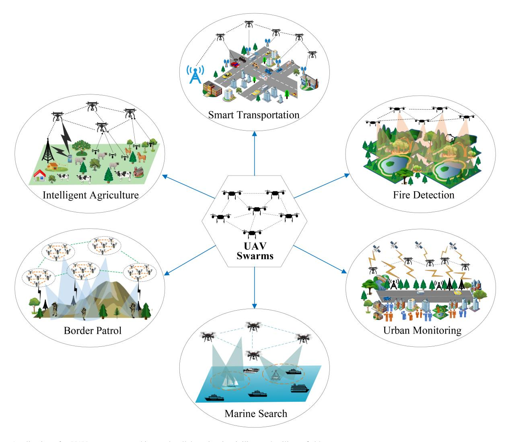

Fig. 1. Applications for UAV swarm networking and collaboration in civilian and military fields.

UAVs working together to complete a common task or goal, such as task allocation, path planning, resource sharing, and target search. Take the search-rescue application as an example, cooperative search enables UAVs to quickly cover the target area, increasing the likelihood of finding survivors [\[18\]](#page-38-4). During the process of locating survivors, cooperative path planning is employed to generate safe and efficient paths for UAVs, while avoiding obstacles and collisions with other UAVs [\[19\]](#page-38-5). Moreover, to ensure that UAVs with limited resources can effectively complete rescue missions and optimize overall task efficiency, cooperative task assignment is utilized to allocate appropriate tasks to each UAV [\[20\]](#page-38-6). In addition, battlefield surveillance applications also require cooperative tracking or cooperative jamming, among others [\[21\]](#page-38-7), [\[22\]](#page-38-8).

However, as practical missions become more complicated in dynamic and uncertain environments, traditional methods face challenging issues such as high calculation complexity, low collaboration, and intelligence level, which restricts the development of full intelligence for UAV swarms. Fortunately, computational intelligence (CI), as a type of nature-inspired computational algorithm, shows great promise in solving

complex optimization problems and can produce high-quality but computationally tractable approximate solutions to realworld problems. Moreover, CI algorithms can guarantee the computational feasibility and robustness of the problems to be solved [\[23\]](#page-38-9), [\[24\]](#page-38-10). Hence, it provides a new perspective for realizing intelligent UAV swarm networking and collaboration [\[13\]](#page-37-12), [\[25\]](#page-38-11), [\[26\]](#page-38-12).

In the literature, several surveys related to UAV swarms exist which can be broadly classified into two categories. The first category focuses on UAV swarm networking, such as MAC protocols, and routing protocols, which does not review the studies of collaborative missions [\[14\]](#page-38-0), [\[27\]](#page-38-13), [\[28\]](#page-38-14). The second category surveys collaboration for UAV swarms such as task assignment or path planning [\[20\]](#page-38-6), [\[29\]](#page-38-15), [\[30\]](#page-38-16). However, this category commonly neglects CI-based networking problem. To the best of our knowledge, no survey has simultaneously focused on networking and collaboration based on CI algorithms to date. We will see more details of these relevant surveys in Section [II.](#page-2-0)

In fact, it is often required to adopt different solving methods when dealing with different UAV swarm cooperative missions. This is because static coordination problems usually require finding the optimal global solution, and optimizationsolving methods are often used to find exact solutions that meet the problem constraints [\[31\]](#page-38-17), [\[32\]](#page-38-18). However, in the face of dynamic environments, the current optimal solution may not remain optimal at another moment. Due to the complexity of cooperative problems in dynamic environments, resolving them takes considerable time and effort, making it challenging to satisfy the real-time and dynamic requirements. Therefore, it is more appropriate to learn effective policies to adapt to changing scenarios [\[33\]](#page-38-19), [\[34\]](#page-38-20), [\[35\]](#page-38-21). Similarly, in the UAV swarm networking problem, traditional networking schemes can achieve dynamic self-adaptive networking to some extent [\[28\]](#page-38-14). Nevertheless, when confronted with largescale and highly dynamic networking environments, the performance of these approaches declines sharply and cannot meet the needs of networking. As a result, the need arises for intelligent and scalable algorithms to enhance the cognitive and adaptive capability for responding to highly dynamic changes. As far as we know, no survey has classified UAV swarm networking and collaboration studies using CI algorithms from this perspective until now.

To fill the research gaps mentioned above, this article presents a survey that simultaneously explores CI-based networking and collaboration of UAV swarms. It is worth noting that this survey is the first to systematically categorize CI algorithms in networking and collaboration, from the perspective of mission requirements and problem-solving approaches. We extensively investigate 278 representative and high-level articles that help visualize current research directions and future trends in this field. The significant contributions of this study are summarized as follows:

- Providing a comprehensive survey of UAV swarm networking and collaboration based on computational intelligence. The channel access, network routing, and four typical collaboration missions, e.g., cooperative task assignment, cooperative path planning, cooperative search, and cooperative jamming, are reviewed and analyzed thoroughly.
- Classifying the CI-based UAV swarm networking and collaboration algorithms into four types distinguished by different ways of solving problems, i.e., heuristic behavior search-based algorithm, policy design-based algorithm, policy learning-based algorithm, and hybrid algorithm.
- Presenting future research trends for UAV swarm networking and collaboration. The main challenges and potential research trends faced by collaborative missions are summarized to offer valuable references for researchers and further enhance the cooperative capability of UAV swarms.

The remainder of this survey is organized as follows: Section [II](#page-2-0) justifies the need for our survey by comparing it with relevant surveys. Section [III](#page-5-0) presents an analysis of networking solutions to CI algorithms. Section [IV](#page-9-0) gives a detailed introduction to computational intelligence algorithms for UAV swarm collaboration. Section [V](#page-11-0) reviews CI algorithms for the cooperative task assignment. Section [VI](#page-19-0) summarizes the studies on CI algorithms in cooperative path planning. In Section [VII,](#page-25-0) the survey of cooperative search using CI algorithms is presented. Section [VIII](#page-31-0) provides an overview of CI algorithms applied to cooperative jamming. In Section [IX,](#page-35-0) we discuss the major challenges and future research directions. Finally, conclusions are drawn in Section [X.](#page-37-13) The structure of this survey is depicted in Fig. [2.](#page-3-0)

### II. RELATED SURVEY PAPERS

In this survey, we search extensive literature on UAV swarm intelligent networking and collaboration fields from several well-recognized and authoritative databases, such as IEEE, ACM, AIAA, Elsevier, Springer, Taylor & Francis, Scientific, SIAM, Wiley, and Hindawi. We conducted a publication data analysis on UAV swarm networking and collaboration from six aspects in the past two decades, i.e., channel access, network routing, cooperative task assignment, cooperative path planning, cooperative search, and cooperative jamming. The data was obtained by searching the key terms such as "UAV swarm cooperative search", "multi-UAV target search", "UAV cooperative search", "computational intelligence for cooperative search", the similar search format was used for other aspects. Fig. [3](#page-3-1) illustrates the number of publications on UAV swarm collaboration from 2002 to 2022. The results show that abundant research has been conducted on UAV swarm collaboration over the past two decades. Furthermore, there is increasing interest in research on UAV swarm collaboration, especially in recent years. Obviously, more attention has been paid to cooperative task assignment and cooperative path planning, but there are relatively few studies on cooperative search and cooperative jamming.

Several surveys exist that are relevant to UAV swarm networking or collaboration [\[14\]](#page-38-0), [\[25\]](#page-38-11), [\[36\]](#page-38-22), [\[37\]](#page-38-23), [\[38\]](#page-38-24). In this section, we will briefly introduce existing surveys. The comparison between related surveys and our survey is summarized in Table [I,](#page-4-0) where works are presented by publishing date, and the distinctness of our survey is highlighted in the last row of the table. As previously mentioned, the existing surveys can be divided into two categories. In the first category (C1), the research primarily emphasizes communication among UAVs, rather than collaboration. For example, the authors in [\[27\]](#page-38-13) surveyed the current research on cellular networks in the communication infrastructure of UAV swarms, including infrastructure-based swarm architecture and ad-hoc networkbased architecture. The study in [\[28\]](#page-38-14) presented a survey of medium access control (MAC) protocols in UAV-based communication networks, including two categories of MAC protocols based on directional and omnidirectional antennas. In [\[14\]](#page-38-0), the study gave an overview of existing routing protocols in flying ad-hoc networks (FANETs), as well as communication and application architectures. In [\[37\]](#page-38-23), the authors presented a survey of UAV networking from a cyberphysical systems perspective, where three cyber components are investigated, including communication, computation, and control.

The second category (C2) primarily focuses on collaboration for UAVs, particularly in task assignments or path planning. For instance, the authors in [\[39\]](#page-38-25) provided a survey

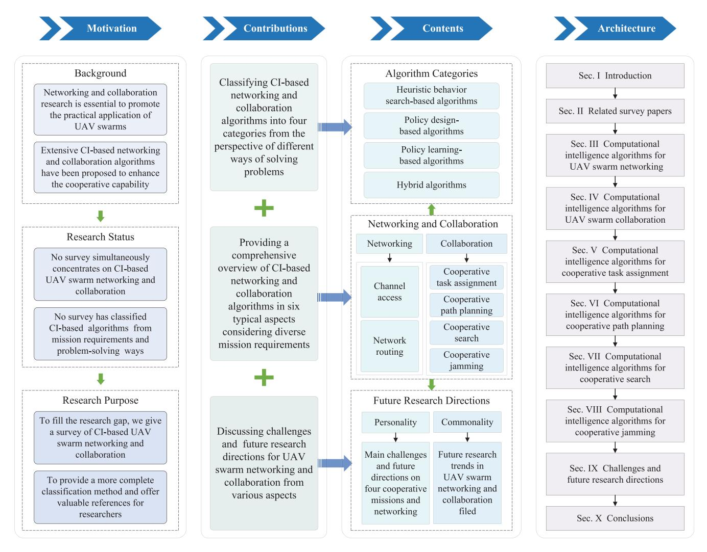

Fig. 2. Organizational structure of this survey.

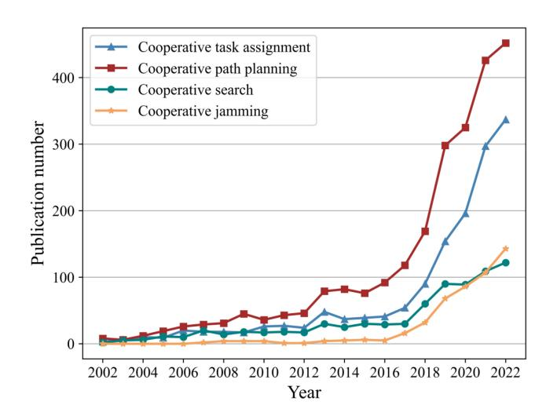

Fig. 3. The number of publications on UAV swarm collaboration from 2002 to 2022.

on dynamic task assignment for UAV swarms, centered on two aspects of model establishment and solution methods. The investigated methods include intelligent optimization

algorithms, clustering algorithms, and market mechanismbased algorithms. The work provided a detailed review of state-of-the-art task assignment algorithms for UAV networks with four aspects, i.e., main ideas, operational features, advantages, and limitations [\[20\]](#page-38-6). In [\[26\]](#page-38-12), the survey reviewed UAV path planning based on CI methods from three aspects, i.e., the time domain, the space domain, and the CI algorithms utilized. The study presented in [\[29\]](#page-38-15) gave a survey of UAV swarm 3D path planning for intercepting multiple aerial targets using bioinspired algorithms, like PSO, ABC, bat-inspired algorithm (BA), firefly algorithm (FA), etc.

In [\[38\]](#page-38-24), the authors presented a survey on cooperative path planning (CPP) for UAV swarms, which gave a generalized optimization framework and taxonomy for existing studies. Besides, the study in [\[40\]](#page-38-26) provided an overview of typical intelligent optimization algorithms for the cooperative search of UAV swarms, which are represented by genetic algorithm (GA), ant colony optimization (ACO), particle swarm optimization (PSO), and artificial bee colony (ABC). Most of such related reviews focus on one type of collaborative task, more recently, the authors in [\[30\]](#page-38-16) reviewed swarm intelligence optimization (SIO) algorithms used in multi-UAV

TABLE I COMPARISON RELATED SURVEYS WITH THIS SURVEY

| Ref.         | Main Objective                                                                                                                                                                                   | Categories | Channel Access | Network routing | Task Assignment | Path Planning | Cooperative Search | Cooperative jamming |
|--------------|--------------------------------------------------------------------------------------------------------------------------------------------------------------------------------------------------|------------|-------------------|--------------------|--------------------|------------------|-----------------------|---------------------|
| [27] 2018 | It surveyed the current research on cellular networks in the communication infrastructure of UAV swarms.                                                                                         | C1         | -                 | <b>√</b>           | -                  | -                | -                     | -                   |
| [28] 2020 | It presented a survey of MAC protocols in UAV-based communication networks, including MAC protocols based on directional and omni-directional antennas.                                          | C1         | ✓                 | -                  | -                  | -                | -                     | -                   |
| [14] 2020 | It reviewed existing routing protocols in flying ad hoc networks, as well as communication and application architectures.                                                                        | C1         | -                 | ✓                  | -                  | -                | -                     | -                   |
| [37] 2020 | It surveyed UAV networking from a cyber-physical system perspective, including communication, computation, and control.                                                                          | C1         | ✓                 | -                  | -                  | -                | -                     | -                   |
| [39] 2021 | It investigated dynamic task assignment methods for UAV swarms from the per- spective and solution methods.                                                                                | C2         | -                 | -                  | <b>√</b>           | -                | -                     | -                   |
| [26] 2018 | It provided a comprehensive survey with a focus on UAV path planning based on CI methods from three aspects.                                                                                     | C2         | -                 | -                  | -                  | <b>√</b>         | -                     | -                   |
| [38] 2020 | The survey presented the relevant work on CPP for UAV swarms which gave a generalized optimization framework and a taxonomy.                                                                     | C2         | -                 | -                  | -                  | <b>√</b>         | -                     | -                   |
| [40] 2021 | It reviewed cooperative search for UAV swarms from the viewpoint of typical swarm intelligent optimization algorithms.                                                                           | C2         | -                 | -                  | -                  | -                | <b>√</b>              | -                   |
| [29] 2021 | It outlined path planning for UAV swarms using swarm intelligence algorithms to intercept multiple air targets.                                                                                  | C2         | -                 | -                  | ✓                  | <b>√</b>         | -                     | -                   |
| [20] 2022 | The survey provided a detailed review of state-of-the-art task assignment algorithms for UAV networks with a focus on four aspects.                                                              | C2         | -                 | -                  | <b>√</b>           | -                | -                     | -                   |
| [10] 2019 | It posed the challenges of designing multi-UAVs in cyber-physical applica- tions and compares different algorithms for target coverage and tracking.                                    | C2         | -                 | -                  | -                  | ✓                | -                     | -                   |
| [30] 2022 | It presented a comprehensive review of multi-UAV collaboration based on swarm intelligence algorithms.                                                                                     | C2         | -                 | -                  | <b>√</b>           | <b>√</b>         | -                     | -                   |
| This survey  | It surveys CI-based UAV swarm net- working and collaboration algorithms covering channel access, network rout- ing, and four typical missions, from the problem-solving perspective. | С3         | <b>√</b>          | <b>√</b>           | <b>√</b>           | <b>√</b>         | <b>√</b>              | ✓                   |

collaboration. Authors in [\[10\]](#page-37-9) presented a recent comprehensive survey of the design challenges of multi-UAV in cyber-physical applications and the comparison of different algorithms applied to fixed and mobile target coverage and tracking.

From the comparative analysis above, it is evident that no survey has simultaneously reviewed the networking and collaboration aspects of UAV swarms based on CI algorithms to date. Most collaboration surveys concentrate on a single cooperative mission and rarely cover multiple cooperative missions, especially cooperative search and cooperative jamming. To bridge this research gap, our survey focuses on UAV swarm networking and collaboration utilizing CI algorithms, which is the third category (C3). In this survey, UAV swarm networking based on CI algorithms is first investigated, focusing on channel access and network routing aspects. Subsequently, we review CI-based collaboration algorithms from four typical aspects including cooperative task assignment, cooperative path planning, cooperative search, and cooperative jamming. More importantly, we categorize relevant studies into four types based on the way of solving problems, i.e., heuristic behavior search-based, policy design-based, policy learningbased, and hybrid algorithm. This work extensively analyzes representative research, aiming to give diverse perspectives

TABLE II SUMMARY OF IMPORTANT ACRONYMS

| Abbreviations | Definitions                           | Abbreviations | Definitions                         |
|---------------|---------------------------------------|---------------|-------------------------------------|
| ABC           | ABC Artificial Bee Colony             | GNN           | Graph Neural Network                |
| ACO           | Ant Colony Optimization               | GPSR          | Greedy Perimeter Stateless Routing  |
| AODV          | Ad-hoc On-Demand Distance Vector      | GWO           | Grey Wolf Optimization              |
| AoI           | Age of Information                    | IWO           | Invasive Weed Optimization          |
| APF           | Artificial Potential Field            | LSTM          | Long Short-Term Memory              |
| ARE           | Adaptive and Random Exploration       | MAB           | Multi-armed Bandit                  |
| BA            | Bat-inspired Algorithm                | MAC           | Medium Access Control               |
| BINN          | Bioinspired Neural Network            | MARL          | Multi-Agent Reinforcement Learning  |
| CAAoI         | Correlation-aware AoI                 | MDP           | Markov Decision Process             |
| CBBA          | Consensus-Based Bundle Algorithm      | MTSP          | Multiple Traveling Salesman Problem |
| CI            | Computational Intelligence            | OLSR          | Optimized Link State Routing        |
| CJ            | Cooperative Jamming                   | PDA           | Policy Design-based Algorithms      |
| CNN           | Convolutional Neural Network          | PER           | Priority Experience Replay          |
| CNP           | Contract Network Protocol             | PIO           | Pigeon-inspired Optimization        |
| COMA          | Counterfactual Multi-Agent            | PLA           | Policy Learning-based Algorithms    |
| CPP           | Cooperative Path Planning             | PPO           | Proximal Policy Optimization        |
| CS            | Cooperative Search                    | PRM           | Probabilistic Road Map              |
| CTA           | Cooperative Task Assignment           | PSO           | Particle Swarm Optimization         |
| D3QN          | Dueling Double Deep Q-networks        | QoS           | Quality of Service                  |
| DA            | Dragonfly Algorithm                   | PM            | Pheromone Map                       |
| DCF           | Distributed Coordination Function     | RHC           | Receding Horizon Control            |
| DDPG          | Deep Deterministic Policy Gradient    | RL            | Reinforcement Learning              |
| DDQN          | Double Deep Q-Network                 | RRT           | Rapid-exploring Random Trees        |
| DE            | Differential Evolution                | SA            | Simulated Annealing                 |
| DFRA          | Demodulation-free Random Access       | SDMA          | Spatial Division Multiple Access    |
| DL            | Deep Learning                         | SDN           | Software-Defined Networking         |
| DRL           | Deep Reinforcement Learning           | SIO           | Swarm Intelligent Optimization      |
| DSA           | Dynamic Spectrum Access               | SOM           | Self-Organizing Map                 |
| DSR           | Dynamic Source Routing                | SSA           | Sparrow Search Algorithm            |
| DTDMA         | Dynamic Time Division Multiple Access | SOS           | Symbiotic Organisms Search          |
| EA            | Evolutionary Algorithm                | TDMA          | Time Division Multiple Access       |
| FA            | Firefly Algorithm                     | TSS           | Time Stamp Segmentation             |
| FANETs        | Flying Ad-hoc Networks                | UAV           | Unmanned Aerial Vehicle             |
| FL            | Federated Learning                    | UANET         | UAV Ad-hoc Network                  |
| FOA           | Fruit Fly Optimization Algorithm      | VDN           | Value Decomposition Networks        |
| GA            | Genetic Algorithm                     | WOA           | Whale Optimization Algorithm        |
| GMM           | Gaussian Mixture Model                | WPA           | Wolf Pack Algorithm                 |

on using CI algorithms for UAV swarm networking and collaboration. For convenience, we provide a summary of abbreviations in this survey, as shown in Table [II.](#page-5-1)

# III. COMPUTATIONAL INTELLIGENCE ALGORITHMS FOR UAV SWARM NETWORKING

Compared to a single UAV, UAV swarms are more efficient in accomplishing complicated missions, which form a UAV ad hoc network called UANET to communicate and collaborate among UAVs [\[15\]](#page-38-1). However, it brings many challenging issues in communication and networking between UAVs due to the specific characteristics of UANET such as high mobility, frequent topology changes, and low node density. As the scale of UAV swarms increases, it also tests the limited channel resource allocation and the communication quality of service (QoS) [\[2\]](#page-37-1). Thus, it is urgent to design communication protocols for fulfilling the requirements of UANET, which has the capability of intelligence, adaptability, autonomous

decision-making, and self-optimization capabilities. Over the past few years, many researchers have been working on UAV swarm networking using CI algorithms to overcome these challenges, particularly focusing on channel access and network routing [\[41\]](#page-38-27), [\[42\]](#page-38-28), [\[43\]](#page-38-29), [\[44\]](#page-38-30), [\[45\]](#page-38-31).

Considering the way of solving problems, communication networking schemes can be classified into policy design-based algorithms and policy learning-based algorithms. Traditional networking methods belong to the first category which essentially is rule-driven network protocols [\[42\]](#page-38-28), [\[43\]](#page-38-29), [\[44\]](#page-38-30). Although it can realize dynamic adaptive networking of nodes to a certain extent, it cannot recognize complex networking environments and struggles to respond to highly dynamic changes in large-scale distributed networking in real time. Due to the characteristics of large-scale UANET environments such as high mobility and dynamic topology, the performance of rule-driven network protocols declines sharply and cannot satisfy the requirements of networking. As a result, it needs intelligent and scalable algorithms to enhance cognitive and adaptive capability in UANET. In recent years, the second category has attracted increasing attention which utilizes intelligent data-driven models to optimize rule-based protocols and achieve policy optimization [\[46\]](#page-38-32), [\[47\]](#page-38-33), [\[48\]](#page-38-34). This category is suitable for addressing real-time and fast networking challenges in large-scale highly dynamic UANET environments. In this section, we concentrate on reviewing channel access and network routing based on data-driven algorithms.

# *A. Channel Access*

Medium access control plays a significant role in the channel utilization of UANET, which is responsible to resolve channel contentions. The primary objective of the MAC protocol is to provide efficient, fair, and reliable data transmission services through appropriate scheduling and control strategies when multiple UAV nodes share the medium [\[16\]](#page-38-2). Noted that several critical metrics need to be considered in designing MAC protocols such as access delay, fairness, energy efficiency, throughput, power consumption, and congestion control. In general, existing MAC protocols can be mainly classified into three categories based on their channel access strategies, i.e., contention-based, contention-free, and hybrid protocols. Among them, the contention-based MAC protocol is divided into random access, controlled access, and handshaking, e.g., carrier sense multiple access with collision avoidance (CSMA/CA), ALOHA, and distributed coordination function (DCF) [\[42\]](#page-38-28). The most commonly used approaches in UANET are time division multiple access (TDMA) and spatial division multiple access (SDMA). The hybrid protocols combine contention and contention-free MAC, like the combination of CSMA/CA and TDMA.

Traditional MAC protocols are not appropriate for UANET, since they cannot adapt to the high mobility of UAVs, frequent topology changes, high energy consumption, intermittently connected communication links, and heavy network traffic load. As a result, it is urgent to develop intelligent MAC protocols-based CI algorithms to enhance adaptability, scalability, and communication efficiency in UANET. In recent years, many researchers have proposed many MAC protocols utilizing data-driven technology [\[49\]](#page-38-35), [\[50\]](#page-38-36), [\[51\]](#page-38-37), such as deep learning (DL), reinforcement learning (RL), and deep reinforcement learning (DRL). For instance, the authors in [\[49\]](#page-38-35) implemented an intelligent multi-hop low duty cycle MAC protocol that combined long short-term memory (LSTM) neural network and hybrid energy-efficiency optimization strategies. Reference [\[52\]](#page-38-38) designed a position-prediction-based directional MAC protocol named PPMAC, which can overcome the directional deafness issue by combining directional antennas and position prediction. In [\[53\]](#page-38-39), the work investigated a safe-aware MAC protocol utilizing the deep neural network to mitigate certain known attacks, which support channel accessibility and trajectory security by enhancing the sustainability and duration of connectivity among UAVs.

In addition to the aforementioned DL-based methods, many MAC protocols utilizing RL algorithms have emerged to cope with rapid changes in UANET topology, which have been proven to be effective in providing intelligent MAC protocols. In these approaches, each UAV node is treated as an agent that learns an optimal decision-making policy autonomously by observing and interacting with the dynamic network environment, which is usually formulated as a Markov decision process (MDP). To improve the performance and adaptively of MAC protocol in various types of networks, for instance, In [\[54\]](#page-38-40), a novel MAC protocol based on RL was proposed, which used the Q-learning to adjust the contention window of CSMA/CA dynamically. This proposal has a higher throughput in comparison with the baseline algorithm. The authors in [\[55\]](#page-38-41) presented a Q-learning-based intelligent backoff scheme for CSMA/CA, which makes decisions adaptively by evaluating rewards and variable learning parameters. In the proposal, the Q-learning backoff was investigated to replace the traditional random backoff, where each agent can adjust the contention window based on the current collision probability.

In the existing literature, to improve the capability of RL in large-scale and dynamic UANET environments, some researchers have proposed DRL-based access schemes combining RL and DL technology. In [\[51\]](#page-38-37), the authors introduced a MARL-based distributed framework for joint spectrum sensing and channel access. Each cognitive radio-enabled UAV was considered an independent learner, using the upper confidence bound-Hoeffding (UCB-H) strategy to balance exploration and exploitation in Q-value updates. It also developed a UCB-H algorithm based on double deep Q-network (DDQN) [\[56\]](#page-38-42) to handle high dimensionality. The work of [\[46\]](#page-38-32) put forth a DRL-based dynamic multichannel access approach, where the problem was modeled as a partially observable Markov decision process. In the proposal, deep Q-network (DQN) [\[57\]](#page-38-43) was utilized to find an optimal channel to assess policy via online learning without any prior knowledge, and then an adaptive DQN was implemented to detect the channel changes and start re-learning in time-varying scenarios. In [\[48\]](#page-38-34), the authors utilized DRL to enable the cognitive UAV to make the best decision autonomously under an uncertain environment, in which trajectory design, time allocation, power control, and band selection are jointly optimized to achieve optimal energy efficiency.

Some researchers have used DRL technology to alleviate the problem of spectrum overcrowding and scarcity faced by UAV swarm networking. For instance, the authors in [\[58\]](#page-39-0) developed a MARL-based distributed approach for the dynamic spectrum access (DSA) problem based on QMIX [\[59\]](#page-39-1) to improve channel utilization and reduce collision rate in the networks, in which the DSA problem was formulated as a decentralized partially observable MDP. This proposal adopted the centralized training and decentralized execution architecture that facilitates tackling the dimension and instability of the large-scale system. To solve the spectrum scarcity and support the postdisaster monitoring system, the work in [\[60\]](#page-39-2) investigated the spectrum allocation problem of the dynamic spectrum access system with a multi-armed bandit (MAB) algorithm [\[61\]](#page-39-3). The proposed power-budget-aware MAB algorithm is used to select the most appropriate transmitting power, taking into account the data rate for the current channel and the remaining available power budget of each UAV.

Furthermore, several hybrid MAC protocol-selection mechanisms based on machine learning have been proposed to select the appropriate MAC protocol between multiple protocols adaptively over the past years, focusing on meeting the dynamic and distributed characteristics of the UANET. In [\[50\]](#page-38-36), the authors proposed an adaptive MAC protocol with fault-tolerant synchronous switching (FS-MAC) based on RL while considering the diversity of missions and application scenarios. In the proposal, the distributed Q-learning algorithm was utilized to select a more appropriate MAC protocol for a UAV between CSMA/CA and TDMA, according to its current state. FS-MAC also designed a practical byzantine fault tolerance-based consensus decision to achieve simultaneous handover consensus within multiple UAVs. In [\[45\]](#page-38-31), the authors employed DRL to design the MAC protocol in heterogeneous wireless networks, which investigated the issue of coexisting with TDMA and ALOHA MAC protocols. DNN was integrated into multi-dimensional Q-learning to maximize sum throughput and achieve proportional fairness by selecting certain time slots for transmission.

Similarly, the authors in [\[62\]](#page-39-4) presented a demodulationfree random access (DFRA) approach based on machine learning in UANET, which employed an adaptive feature algorithm to extract features according to the current channel conditions to ensure the accuracy of MAC identification. In the DFRA, the support vector machine classifier was used to identify the MAC protocol, and an adaptive framework was introduced to switch protocols between CSMA/CA and TDMA for transmitting data packets, where a global MAC identifier in the header of each packet was used to distinguish different MAC protocols. In [\[63\]](#page-39-5), the authors introduced an intelligent MAC protocol based on the back propagation learning model for dynamic environments, which is designed to meet the demands for high throughput, low latency, and minimal packet loss. This approach dynamically selects the most suitable protocol from CSMA/CA, dynamic time division multiple access (DTDMA) [\[64\]](#page-39-6), and enhanced self-organized time division multiple access (STDMA) [\[65\]](#page-39-7).

# *B. Network Routing*

The cooperative missions of UANET demand reliable and robust data transmission, thus, maintaining the communication link between UAVs has a crucial effect on the network. Routing selection is the most important function of the network layer, which ensures reasonable and efficient routing selection through routing protocols. The routing protocol determines the path through which data packets are delivered from the source node to the destination node. In general, when designing routing protocols for UAV networks, it is essential to concern issues such as network delay, packet loss, traffic load, dynamic topology, bandwidth, communication stability, signaling overhead, and others [\[14\]](#page-38-0). According to the routing decision process, existing routing protocols for UAV networks can be mainly categorized into topology-based, position-based, and hierarchical-based routing protocols.

The topology-based protocols are further divided into three types according to the design principle: proactive, reactive,

and hybrid. The representative protocols include optimized link state routing (OLSR) [\[66\]](#page-39-8), dynamic source routing (DSR) [\[14\]](#page-38-0), and ad-hoc on-demand distance vector (AODV) routing [\[67\]](#page-39-9). These active and passive routing protocols rely on network topology information and need to establish and maintain routing tables, which is not suitable for UANET with limited bandwidth and high dynamics. The positionbased protocol is not applicable for the large UANET because of the high dynamics and unstable topology. A commonly used in position-based protocols is greedy perimeter stateless routing (GPSR) [\[68\]](#page-39-10), which utilizes adjacent node location information to forward the packet. In recent years, hierarchical-based protocols have attracted increasing attention, which can overcome the dynamic topology and mobility uncertainty in the UANET environment. In this category, the renowned protocols include software-defined networking (SDN) based and cluster-based routing protocols [\[14\]](#page-38-0).

Owing to lacking autonomous routing decision-making and adaptability, traditional routing protocols are unsuitable for the highly dynamic UANET. Moreover, the unique features of UANET bring many challenges in designing efficient routing protocols. Consequently, extensive research has been conducted to develop intelligent and adaptive routing protocols, particularly data-driven routing protocols, that can effectively manage frequent topology changes and re-routing tasks without manual intervention. For instance, in [\[69\]](#page-39-11), the authors proposed a DNN-based routing combined with dynamic two-subspace partitioning for three-dimensional UAV swarm networks. The DNN forwarding could improve the reliability of selecting the next-hop node, which is mainly used online with a DNN model obtained through offline training. To adapt to the high network topology in FANETs, the authors in [\[70\]](#page-39-12) designed a novel DSR-based protocol in which the continuous Hopfield neural network was applied to optimize the route.

Several studies introduced RL technology into positionbased protocols to improve the performance of routing protocols for UANET, in terms of end-to-end delay, data packet transmission rate, and routing overhead. In [\[71\]](#page-39-13), the authors designed a Q-learning-based geographic routing protocol combining inverse RL, which learned the reward function online. Experimental results demonstrated the superiority of the proposed protocol in terms of packet delivery ratio, and communication overhead. The study in [\[72\]](#page-39-14) proposed a novel traffic-aware Q-network-enabled protocol based on GPSR that aims to alleviate the issue of end-to-end delay and packet loss due to traffic congestion in UANET. The Q-network is utilized to find the congestion information and link quality of UAV nodes. Furthermore, to enhance the routing decisions of traditional position-based protocols, the authors in [\[73\]](#page-39-15) presented a Q-learning-based topology aware routing protocol (QTAR) in which the geographic position information of two-hop neighbor nodes was utilized to select the optimal forwarding node. The QTAR can adjust the routing decision based on the network topology changes by the adaptive Qlearning algorithm. In [\[52\]](#page-38-38), an adaptive hybrid communication protocol was investigated in UANET, among which the selflearning RL-enabled routing protocol can automatically evolve

communication policies based on environmental and state parameters of flying UAVs.

To cope with high mobility and rapid changes in UAV swarm networks, the authors in [\[74\]](#page-39-16) put forward a Qlearning-based predictive routing protocol that integrated the relative trajectory knowledge among neighboring UAV nodes to make routing decisions. This protocol is proven to have higher robustness and lower end-to-end latency than compared protocols. A study in [\[66\]](#page-39-8) proposed an improved routing protocol based on Q-learning to achieve real-time and reliable communication in high dynamic UANET. The protocol considered a finite amount of last episodes to update the Q-values. Besides, it also used channel conditions for enhanced protocol parametrization. Simulation results demonstrated this protocol outperformed benchmark protocols in delay and jitter decrease, along with packet delivery ratio improvement. In [\[75\]](#page-39-17), the authors proposed a novel routing protocol inspired by an adaptive flocking control named QRIFC for UAV swarm networks, which is a position-based multi-hop routing protocol integrating a Q-learning algorithm. In the proposed protocol, the adaptive flocking control algorithm was employed to construct the topology of UAVs, and QRIFC was utilized to further make a routing decision adaptively by extending the local view with two-hop neighbor information.

In addition to incorporating RL into the design of routing protocols and techniques, some studies have also integrated other technologies, such as fuzzy logic methods and simulated annealing (SA). In [\[76\]](#page-39-18), a multi-objective routing protocol algorithm combining fuzzy logic with RL was proposed to adapt to frequent topology changes in UANET, which considered the remaining energy and mobility of nodes. In the proposed protocol, link-related parameters were directly inputted into the fuzzy system to derive reliable links among UAV nodes. Q-learning was employed to dynamically update the path correlation of the fuzzy system by providing rewards based on path-related parameters. The routing path was evaluated in terms of hop count and successful packet delivery time. Similarly, the authors in [\[77\]](#page-39-19) presented a full-echo Q-routing protocol with SA inference to overcome network connectivity loss and energy limitations in highly dynamic UAV networks. The proposed protocol utilized SA optimization to control the adaptive learning rate and regulated the temperature decline rate by the variation rate of the Q-values. Comparative results verified the superiority of this protocol over traditional Q algorithms in terms of energy computation, convergence rate, and adaptability to network dynamicity.

In recent years, to overcome the limitations of RL in addressing large-scale complex problems, more and more DRL-based routing protocols have been proposed that take advantage of DR in problem representation and RL in policy optimization. In [\[78\]](#page-39-20), the authors designed a DQN-based vertical routing scheme to address the frequent link breakages and network partition issues, not only considering the horizontal routing within a network plane but also vertical routing across different network planes. The proposed scheme made decisions based on the obtained environmental knowledge by training a DQN agent, which can ensure scalability in the dynamic network. In [\[79\]](#page-39-21), the researchers proposed an intelligent delay-aware and link-quality-aware geographical routing protocol based on dueling DQN that aimed to mitigate Doppler shifts caused by the high mobility. this protocol took into account the total waiting time of packets in candidate forwarding nodes and utilized the signal-to-noise ratio and expected transmission count as link quality estimation metrics. Once the neighbor table was established, the dueling DQN algorithm was employed for routing decision-making.

Similarly, the authors in [\[80\]](#page-39-22) proposed a DRL-enabled routing routing protocol to minimize the end-to-end delay in high-dynamic aeronautical ad hoc networks, which also utilized DQN to learn the optimal routing decision based on local geographic information observed by forwarding nodes, thereby assisting each aircraft in making routing decisions. Additionally, the proposed protocol incorporated the deep value network algorithm with a feedback mechanism to enhance learning efficiency and online adaptability using the dynamics knowledge of the system. To implement the optimal communication for UAV swarming nodes, the authors in [\[81\]](#page-39-23) investigated a DQN-based learning algorithm with a replay buffering strategy, which integrated a multi-hop queue-toqueue accumulation model to calculate the multi-hop latency and packet loss rate level.

In the existing literature, some studies have used deep deterministic policy gradient (DDPG) algorithms to design the routing protocols [\[47\]](#page-38-33), [\[82\]](#page-39-24), [\[83\]](#page-39-25). More recently, the authors in [\[47\]](#page-38-33) presented a data-driven routing strategy using the multi-agent DDPG (MADDPG) algorithm, where each UAV was considered an agent responsible for making distributed decisions and completing data packet transmission. To improve the transmission rate and routing accuracy, this method incorporated LSTM units [\[84\]](#page-39-26) to fully leverage time domain information among UAV states while constructing the actor and critic networks. It is proven that the proposed approach can adapt to dynamic changes and complex network topologies. In addition, to resist the network attack, the study in [\[83\]](#page-39-25) proposed a DRL-based QoS-aware secure routing, which introduced DDPG to SDN secure routing and designed the reward function by combining the security requirements and QoS performance indicators. The proposed method can find a secure routing strategy with competitive performance in different SDN scenarios, reducing the impact of internal attacks and distributed denial-of-service attacks.

### *C. Lessons Learned*

In UAV swarm networking, an increasing number of data-driven decision-making methods have been proposed to enhance the adaptability of communication protocols, particularly deep reinforcement learning algorithms. Recently, scalable and intelligent networking schemes for large-scale UAV swarm networks have become a hot research topic. The studies can be conducted by combining MARL with graph neural networks, attention mechanisms, or a meanfield approach [\[41\]](#page-38-27). Under a partially observable distributed environment, it can predict future node positions and adapt to dynamic network topologies, meeting the growing demands for communication reliability and network performance for UAV swarm collaboration.

In addition, existing UAV networking protocols primarily focus on enhancing efficiency, with relatively less attention to the security of UAV swarm networks. Thus, researchers should develop secure networking strategies to prevent UAV communication link contamination and tampering. For instance, design secure routing protocols with federated learning (FL) [\[85\]](#page-39-27) technology to encrypt and train data in UAV nodes. Second, use highly confidential physical layer technologies to enhance UAV anti-jamming capabilities. In future work, more intelligent networking schemes should be investigated to maintain efficient and stable communication in highly dynamic UANET environments. Moreover, establishing a high-fidelity UANET simulation environment with digital twin technology [\[86\]](#page-39-28) is crucial for enhancing learning speed and implementing intelligent algorithms.

# IV. COMPUTATIONAL INTELLIGENCE ALGORITHMS FOR UAV SWARM COLLABORATION

For UAV swarm collaboration problems, UAVs commonly perceive the environmental state *s* and make coordinated behavior decisions *b*. In certain scenarios, UAVs can receive feedback *f*. When the state changes, the UAV swarm collaboration can be modeled as a sequential decision-making problem [\[87\]](#page-39-29), [\[88\]](#page-39-30). Among which, *s* ∈ S, *b* ∈ B, S is the set of all possible external state S = {*s*1, *s*2,..., *st*, *st*+1,...}, and B is the set of possible coordinated behavior B = {*b*1, *b*2,..., *bt*, *bt*+1,...}. The mapping between S and B is policy π : S→B. According to the different utilization of the above elements by CI-based algorithms, i.e., (*s*, *b*, π, S, B), these algorithms can be divided into four main categories: heuristic behavior search-based algorithms (HBSA), policy design-based algorithms (PDA), policy learning-based algorithms (PLA), and hybrid algorithms (HA).

In HBSA, it iteratively searches and approaches the optimal coordinated behavior *b*∗ from the randomly generated initial solution under a particular state *s*, which is guided by the feedback *f*, that is the heuristic information. The above process can be represented as (*s*, *f* ) −→ *b*∗. Among these, *f* can be considered as the fitness value in swarm intelligent optimization algorithms [\[30\]](#page-38-16). Therefore, we call this category as heuristic behavior search algorithms.

In PDA, the focus is no longer on the optimal decision behavior in a particular state but on the behavioral response of the UAV collaboration system in different states [\[89\]](#page-39-31). It obtains the coordinated behavior *b* depending on heavily the pre-designed policy π(*s*, *b*), which is not necessarily optimal, i.e., *s* →π(*s*,*b*) *b* . Among which, *s* represents the changing state, and *b* represents the coordinated behavior under *s* . The goal of PDA is to pre-design the policy manually and maintain constant in the execution process. Thus, we name this category as policy design-based algorithms.

In PLA, it pays more attention to how to optimize the coordinated behavior response mechanism. The policy in PLA is not designed manually but rather data-driven, which should be optimized by constantly learning and updating, based on the feedback, i.e., *s* , *f* π∗(*s*,*b*) −→ *b*∗·,, where the feedback *f* can be viewed as the reward in reinforcement learning algorithms [\[90\]](#page-39-32), [\[91\]](#page-39-33). The goal of PLA is to learn the optimal policy π∗(*s*, *b*) and obtain the optimal coordinated behavior *b*∗ according to the initial policy and real-time feedback [\[92\]](#page-39-34). Hence, we name this category as policy learning-based algorithms.

For HA, as the problem becomes more complex, particularly when faced with multi-stage tasks, it is difficult to meet the task requirements only using a certain type of algorithm. Therefore, it is necessary to combine two or more of the above categories, so as to improve the performance of existing algorithms or propose new algorithms [\[93\]](#page-39-35), [\[94\]](#page-39-36). Therefore, we name such algorithms as hybrid algorithms.

To sum up, HBSA is superior in such scenarios where the search time is long enough and there is no need to perceive changes in environmental states. In PDA, the policy is pre-designed with unchanged parameters, which can obtain feasible collaborative behaviors in the dynamic environment state. However, policy needs to be re-designed manually when the environment becomes more complicated. Thus, it is challenging to guarantee real-time decision-making of collaborative behaviors. In PLA, the policy is constantly learned and has advantages in tackling tasks that require the continuous perception of environmental changes. Furthermore, HA helps to provide suitable solutions by combining two or more existing algorithms.

### *A. Heuristic Behavior Search-Based Algorithms*

Heuristic behavior search-based algorithms in UAV swarm collaboration are designed to find the optimal or sub-optimal solution to the problem in polynomial time through continuous iterative search and optimization, satisfying various indexes and constraints [\[95\]](#page-39-37). In HBSA, the optimization solution of the cooperative problem is essentially the evolution of populations, where candidate solutions usually start from a population of randomly generated solutions and evolve toward better solutions, such as task assignment schemes or planned flight paths. In the entire iterate search process, the heuristic information is shared globally and guided to update each individual. Most of this category is swarm intelligence optimization algorithms inspired by the intelligent behavior among biological swarms [\[96\]](#page-39-38), [\[97\]](#page-39-39), in which each individual represents a candidate solution to the optimization problem.

In this category, the representative algorithms include GA, PSO, grey wolf optimization (GWO), and pigeon-inspired optimization (PIO). During the evolution process, the general objective is to achieve a balance between solution quality and convergence performance. These algorithms differ in updating strategies, each with advantages and disadvantages for diverse UAV swarm collaborative applications. Researchers have developed many improved HBSA methods, from the perspective of solving efficiency and solution accuracy. In [\[98\]](#page-39-40), a dynamic discrete PIO algorithm was proposed for the centralized cooperative search-attack mission, which improves the population diversity and global searching ability. Several works in [\[99\]](#page-39-41), [\[100\]](#page-39-42) have investigated GA-based algorithms to implement the cooperative task assignment for heterogeneous UAV swarms. In [\[101\]](#page-39-43), [\[102\]](#page-39-44), some GWO-based algorithms are presented for cooperative path planning in 2D and 3D environments. Researchers also presented some PSO algorithms in cooperative search problems [\[104\]](#page-40-0).

The category algorithm primarily focuses on swarm collaboration in static and known environments, which belongs to the centralized decision-making method. HBSA can provide a nearly optimal solution for a particular scenario without the need for real-time sensing of environmental state changes. Nevertheless, as the scale of UAV swarm and mission complexity increase, iterative optimization needs to be reimplemented. In large-scale dynamic environments, this type of algorithm may easily fall into the local optimal solution. Meanwhile, it also imposes higher computational overhead and communication requirements, making it challenging to guarantee real-time performance.

# *B. Policy Design-Based Algorithms*

In policy design-based algorithms, each UAV is regarded as an intelligent agent capable of making decisions, simulating the behavior mechanism of individuals responding to the dynamic environment. The purpose of applying PDA to the UAV swarm collaboration is to design a feasible cooperative behavior policy in advance, in which the continuous time sequential behavior of all UAVs consists of a solution to the UAV swarm collaborative control problem.

In this category, typical approaches include pheromone map (PM) [\[105\]](#page-40-1), artificial potential field (APF) [\[106\]](#page-40-2), consensusbased bundle algorithm (CBBA) [\[107\]](#page-40-3), and others. Among them, in the application of PM in cooperative search, the searching area is divided into grids, and UAVs are guided to move within this area through mechanisms such as pheromone evaporation imitating the foraging strategy of ants [\[89\]](#page-39-31), [\[108\]](#page-40-4). The main idea behind APF in cooperative path planning is to guide the movement of UAVs by constructing a virtual APF, where multiple virtual forces are combined according to vector superposition principles to act on the agent [\[109\]](#page-40-5), [\[110\]](#page-40-6). A cooperative task assignment method based on the CBBA has been put forward with task constraints in [\[107\]](#page-40-3), [\[111\]](#page-40-7), which includes two stages of bundle construction and consistency conflict resolution.

Compared to HBSA, this category is a distributed decisionmaking method that decomposes the global optimization problem into multiple local optimization problems. PDA is more applicable to solving dynamic UAV swarm collaborative problems. However, PDA is not universal and only performs better for specific tasks. For example, the CBBA method is often used in dynamic task assignment problems and is not commonly employed for path planning [\[112\]](#page-40-8). The APF algorithm is more effective in cooperative path planning. Notedly, the performance of this category depends on the rationality design of manual parameters and requires a long simulation run time. Additionally, these methods may easily become trapped in a local optimum when addressing complex collaborative control problems for UAV swarms. When the task environment becomes complicated, redesigning feasible strategies is difficult and time-consuming.

# *C. Policy Learning-Based Algorithms*

In recent years, policy learning-based algorithms have attracted considerable attention in the UAV swarm collaboration field. The purpose is to learn the optimal collaborative policy for each UAV, which is constantly updated through continuous interaction between UAVs and the environment. This category primarily comprises machine learning algorithms, particularly multi-agent reinforcement learning (MARL) [\[113\]](#page-40-9). In MARL, it can be roughly composed of two types: decomposition value function method and centralization value function method, such as MADDPG, value decomposition network (VDN), QMIX, and counterfactual multi-agent (COMA) policy gradients [\[84\]](#page-39-26). Extensive studies have demonstrated that PLA exhibits obvious advantages in addressing uncertain and unknown collaboration problems for UAV swarms [\[91\]](#page-39-33), [\[114\]](#page-40-10).

In the existing literature, extensive PLA-based algorithms have been applied in collaborative problems, because this category can extract data features in high-dimension state space and search for optimal behavior policies for UAVs. For example, a MADDPG-based method was studied for joint task allocation and flight path planning in a dynamic environment [\[91\]](#page-39-33), [\[115\]](#page-40-11). A multi-agent DRL method called DNQMIX was proposed to implement the multi-UAV cooperative search in a dynamic environment [\[88\]](#page-39-30). The authors in [\[116\]](#page-40-12) presented an improved multi-agent DRL method-based proximal policy optimization (PPO) to realize the multi-UAV path planning in unknown environments. The general steps of using PLA in UAV swam collaborative problems include constructing observation and action space, designing the reward function, determining deep network structure, and proposing an effective training strategy.

This category of algorithms enables UAV swarms to autonomously learn and make real-time decisions, disregarding environmental model factors and relying on sufficient prior information. In contrast to PDA, PLA can continuously learn from existing trained models, leveraging historical experience data to support transferability to similar tasks and achieve relatively superior performance [\[117\]](#page-40-13), [\[118\]](#page-40-14). However, practical applications face several challenges for such algorithms, including sparse rewards, prolonged convergence times, and high computational costs. In the case of PLA, a significant amount of training data is required, resulting in increased data acquisition costs. Additionally, designing an appropriate reward function and selecting a set of suitable hyperparameters pose significant difficulties.

### *D. Hybrid Algorithms*

The UAV swarm collaboration is inherently a complex nondeterministic polynomial hard (NP-hard) problem. In dynamic and unknown environments, a single algorithm may not effectively deal with complex UAV swarm collaborative tasks. To this end, hybrid algorithms, have been extensively researched to address complex collaborative problems in various scenarios. HA commonly contains two or more of the three categories from the above categories: HBSA, PDA, and PLA. It aims to enhance the performance of existing algorithms or propose new algorithms by integrating the strengths of diverse algorithms. Generally, the category of HA contains three types of ideas, i.e., switching, nesting, and fusion [\[93\]](#page-39-35), [\[119\]](#page-40-15), [\[120\]](#page-40-16).

The switching employs various algorithms based on different situations or stages. In [\[119\]](#page-40-15), a hybrid algorithm combining GA and auction algorithms (AA) was used to implement the continuous monitoring mission, where the moving crowd was assigned to different UAVs by AA while the visiting order was determined with improved GA. In [\[93\]](#page-39-35), a combination of GA-LRO was studied in cooperative path planning, where GA was used for global path planning, and LRO was employed to optimize the results of GA. Nested algorithms involve embedding one algorithm within another to achieve enhanced performance. For example, the work in [\[94\]](#page-39-36) proposed a hybrid method combining deep learning trained by GA for realtime CPP. GA was adopted to provide planning experiences from familiar scenarios, training and guiding the DNN to generate optimal paths rapidly. Fusion algorithms combine principles or features from different algorithms to generate new ones. Reference [\[121\]](#page-40-17) proposed a novel RLGWO method for offline CPP in complex 3D environments. In RLGWO, each individual was viewed as an agent in RL and adaptively switched from four operations according to the cumulative performance.

HA can integrate advantages and make up for defects of a single algorithm, so as to develop a novel algorithm with higher performance. Furthermore, it is beneficial to overcome the limitations of a single algorithm in complex tasks, because it combines diverse types of algorithms and addresses different stages or modules of tasks collaboratively. Thus, HA enhances adaptability and generalization in various scenario tasks. However, due to increased parameter adjustment, this category may produce high calculational complexity and tends to perform not as well as the theoretical effect.

As discussed above, HBSA is more applicable for static and known cooperative problems, which can produce feasible solutions within a certain time while considering both solution quality and solving speed. However, it is challenging to ensure real-time performance through iterative optimization. PDA can provide a feasible policy but cannot guarantee optimal performance in dynamic cooperative problems, which have advantages over HBSA in real-time and robustness. However, such algorithms are usually designed for a specific problem, limiting flexibility and scalability. For large-scale complex UAV swarm cooperative problems in highly dynamic and unknown environments, policy learning-based algorithms are competitive compared to the previous categories regarding generalization and real-time. However, this type faces several challenges to be addressed, such as sparse rewards and high computational costs. Furthermore, hybrid algorithms have attracted widespread attention in UAV swarm collaboration to improve the efficiency and generalization of algorithms in different scenarios. However, these algorithms may suffer from increased parameter adjustments, leading to high computational complexity. As discussed above, Table [III](#page-12-0) compares four types of commonalities, limitations, typical algorithms, and characteristics.

# V. COMPUTATIONAL INTELLIGENCE ALGORITHMS FOR COOPERATIVE TASK ASSIGNMENT

In practical and complex missions, cooperative task assignment (CTA) is the key technology for UAV swarms to improve the whole execution efficiency. A high-quality CTA algorithm should be robust and adaptable, which allows UAVs constraints of changing tasks and environments flexibly. In this section, we will first introduce the CTA problem, and then reviewed CI algorithms in CTA, categorized into four types.

### *A. Cooperative Task Assignment*

The primary aim of CTA is to provide an effective allocation scheme that minimizes task completion time and resource consumption, requiring UAV swarms to accomplish multiple consecutive tasks on multiple targets collaboratively. Essentially, it is a combinational optimization problem with multiple constraints, which belongs to the class of NP-hard problems. The increased scale of UAVs and tasks would lead to high computational complexity, making deterministic methods impractical for large-scale CTA. Furthermore, in practical scenarios, UAVs need to quickly reassign tasks when facing emergencies during mission execution. Therefore, it is vital to provide an efficient and real-time assignment scheme. The multi-UAV cooperative task assignment scenario is shown in Fig. [4.](#page-13-0)

Cooperative task assignment problem generally involves two main steps: establishing an appropriate environment model and designing efficient cooperative task allocation algorithms. generally involves two main steps: establishing an appropriate environment model and designing efficient cooperative task allocation algorithms. As for the modeling of CTA, many optimization models have been proposed and extended in research works [\[128\]](#page-40-18), [\[129\]](#page-40-19), including Markov decision process, multiple traveling salesman problem (MTSP), cooperative multiple task assignment problem (CMTAP), etc. To characterize real-world scenarios accurately, multiple aspects of constraints need to considered, including UAV capabilities, task requirements, scene complexity, and swarm coordination. However, complex modeling increases computation time that is unsuitable for real-time task allocation problems. Besides, some constraints cannot be directly set in the modeling process. On the other hand, overly simplified modeling may limit various actual applications. Therefore, it reminds us to consider appropriate constraints based on the practical environments [\[130\]](#page-40-20).

Another crucial step is to obtain high-quality task assignment schemes by designing efficient CTA algorithms. At present, substantial studies on calculational intelligence (CI) algorithms for solving CTA models have been conducted, which can be mainly classified into four types mentioned above. The classification of CI algorithms in CTA is illustrated in Fig. [5.](#page-13-1) Moreover, CTA can be divided into centralized and

TABLE III CLASSIFICATION OF COMPUTATIONAL INTELLIGENCE ALGORITHMS FOR UAV SWARM COLLABORATION

| Categories                              | Commonalities                                                                                                                                                                                         | Typical Algorithms    | Characteristics                                                                                                                                                                                | Limitations                                                                                                                                             |  |
|-----------------------------------------|-------------------------------------------------------------------------------------------------------------------------------------------------------------------------------------------------------|--------------------------|------------------------------------------------------------------------------------------------------------------------------------------------------------------------------------------------|---------------------------------------------------------------------------------------------------------------------------------------------------------|--|
|                                         | (1) Composed of multiple individuals where each indi-                                                                                                                                                 | GA [93], [127]        | Simulating biological evolution and genetics mechanism to optimize solutions, with selection, crossover, and mutation operators.                                                               |                                                                                                                                                         |  |
| Heuristic behavior                   | vidual represents a potential solution, and the solution op- timization is essentially the process of population evolu- tion.                                                             | PSO [104], [125]   | Simulating the foraging behavior of birds, and continuously updating the optimal value by sharing individual and global extreme information.                                                   | <ul><li>(1) Unsuitable for dynamic and uncertain environments.</li><li>(2) High computational complexity in large-scale appli-</li></ul>                |  |
| search-based algorithms.             | (2) Suitable for tackling static cooperative problems in known environments, and                                                                                                                      | PIO [98], [124]       | Simulating the navigation behavior of pigeons homing using a map and compass, as well as landmark operators.                                                                                   | cations. (3) Mostly centralized algorithms with poor robustness.                                                                                        |  |
|                                         | obtaining the optimal solution of the problem in polynomial time.                                                                                                                                     | GWO [101], [103]   | Simulating the hunting behavior of gray wolves, and optimizing the solution iteratively through three steps of searching, encircling, and attacking.                                           |                                                                                                                                                         |  |
|                                         | (1) Designing a feasible co- operative action policy for the UAV swarm collabora-                                                                                                               | Pheromone [89], [123]    | Imitating the foraging strategy of ants where the searching area is grided and agents are guided to move through pheromone volatilization mechanisms, etc.                                     | (1) Mostly for specific tasks                                                                                                                           |  |
| Policy design-based algorithms.   | tion in dynamic and uncertain environments.  (2) Constructing the cooperative policy for agents by iterative optimization where agents conduct the continuous interactive feedback with environments. | APF [106], [126]   | Constructing a virtual artificial potential field, and various virtual forces act on the agent together according to the principle of vector superposition to guide the movement of agents.    | and lacking scalability. (2) The performance highly depends on the parameters design. (3) Easily falling into local                                     |  |
|                                         |                                                                                                                                                                                                       | CBBA [107], [111]  | Imitating the auction market decision- making method, where the task assign- ment process contains two stages of bun- dle construction and consistency conflict resolution.        | optimum facing complex co- operative problems.                                                                                                       |  |
|                                         | (1) Learning an effective strategy for large-scale                                                                                                                                                    | MADDPG [91], [115] | Constructing a multi-agent system based on the actor-critic framework, where each agent utilizes the centralized critic network to obtain global information.                                  | (1) A large demand for sam-                                                                                                                             |  |
| Policy learning-based algorithms. | swarm collaboration problems in dynamic uncertain environments.  (2) Constructing the cooperative policy for agents                                                                                   | QMIX [88], [90]       | Adopting the value function to decompose the joint action-value function (Q), and designing a non-linear mixed network to satisfy the nonlinear relationship between individual Q and joint Q. | ple data and high data acquisition costs.  (2) High computational requirements, long learning time, and difficulty to guarantee real-time requirements. |  |
|                                         | by iterative optimization where agents conduct continuous interactive feedback with environments.                                                                                                     | COMA [84], [92]       | Introducing the counterfactual baseline to solve the credit assignment problem in multi-agent reinforcement learning tasks, belonging to the centralized value function method.                | (3) Excessive dependence on the rationality of parame- ter settings and inexplicable learning results.                                         |  |
|                                         | (1) Aiming to make up limitations of a particular type of algorithm, thus improving                                                                                                                   | GA-AA [119]           | The auction algorithm is used to realize dynamic target allocation and the optimal access path is planned by the genetic algorithm to monitor tasks continuously.                              | (1) Unsatisfactory effect in the practical environment                                                                                                  |  |
| Hybrid algorithms.                   | the adaptability and general- ization in various scenarios. (2) Combing global opti- mization with local opti- mization in response to co-                                                | SSA-BINN [122]        | Using the sparrow search algorithm for global path planning and implementing local planning by biomimetic neural networks in dynamic environments.                                             | and not as good as the theoretical effect.  (2) Higher computational complexity caused by the                                                           |  |
|                                         | operative problems in dy- namic and uncertain environ- ments.                                                                                                                                   | GA-LRO [93]           | Combining global genetic algorithm with local rolling optimization algorithm to realize dynamic path planning problems.                                                                        | increased parameter tunin when integrating multipl algorithms.                                                                                          |  |

distributed from the viewpoint of communication architecture. With the increasing number of UAVs and tasks under largescale missions, centralized CTA makes the computational requirement impractical. Distributed CTA can decrease the calculational complexity, while it requires UAVs to exchange a large amount of environmental information and existing status. From the aspect of environmental tasks, the relevant research includes static and dynamic CTA. The static CTA is relatively simple where each UAV needs to complete preallocated tasks before task execution. Dynamic CTA aims to address the unknown and uncertain problems in dynamic environments, requiring real-time adjustments for unexpected

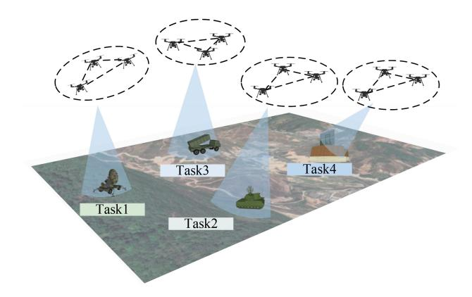

Fig. 4. The case of UAV swarm cooperative task assignment.

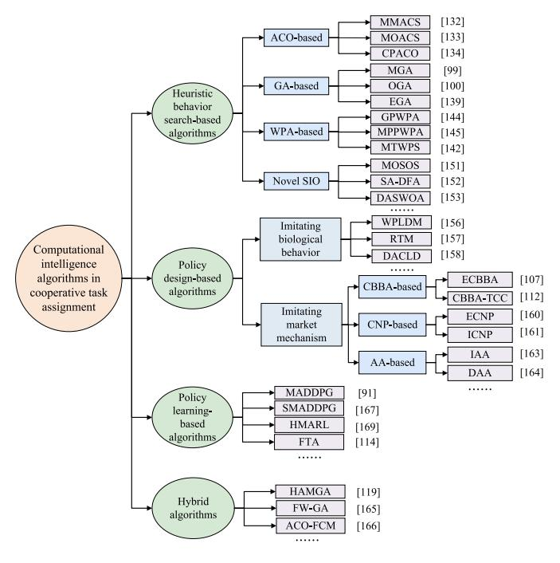

Fig. 5. The classification of computational intelligence algorithms in cooperative task assignment.

events such as UAV failures and the emergence of new tasks.

# *B. Heuristic Behavior Search-Based Task Assignment Algorithms*

Heuristic behavior search-based task assignment algorithms are primarily used to solve centralized CTA problems and obtain optimal or near-optimal solutions through iterative optimization, which are referred to as task assignment schemes. These methods are generally more effective at solving task assignments in deterministic and known environments. This category of algorithms includes typical methods such as ACO, GA, WOA, PIO, and others, which adopt different update strategies to obtain the optimal value after multiple iterations. Note that, the common feature among such methods is that each individual in the population represents a potential solution for task assignment, such as the virtual ant unit in ACO, the virtual pigeon unit in PIO, and the virtual chromosome unit in GA.

The ACO algorithm was originally proposed by Marco which simulated the foraging behavior of ants [\[131\]](#page-40-21). Individuals interact through pheromone information and find the best foraging path after repeated iterations. ACO has characteristics such as distributed computing, positive feedback, and heuristic search. Since CTA is similar to the division of labor and cooperation of ant colonies, the ACO algorithm has been applied in this application. However, using basic ACO methods directly will face common issues such as unsatisfied optimization speed, trapping into local optimum, unstable solutions, etc. Researchers have made many improvements to improve the performance of ACO in CTA.

As an example, the study in [\[132\]](#page-40-22) presented a technique based on the ACO algorithm that aims to reduce both the overall task execution time and communication cost. This proposal outperforms comparative algorithms in solution quality. However, it exhibits low efficiency in solving large-scale missions and takes much effort to determine the final values of parameters. In [\[133\]](#page-40-23), a multi-objective ant colony system (MOACS) was presented to solve CTA for heterogeneous UAVs which was formulated as a multi-objective MTSP. This method utilizes the multi-pheromone and heuristic matrix to address the multi-objective problem, which minimizes the total costs and maintains the workload balance of UAVs. Besides, the heuristic information is different at each step considering the various time costs of heterogeneous UAVs. MOACS is beneficial to avoid premature convergence and local optimum. A collection path ACO (CPACO) method was developed to handle the multi-agent task allocation, which improves the heuristic function and update strategy [\[134\]](#page-40-24). Furthermore, a three-dimensional pheromone path was established to overcome common issues of the basic ACO. However, it still tends to fall into the local optimum due to the impact of the selected initial parameters set.

The GA algorithm is a typical optimization technology that simulates biological evolution and genetic mechanisms through selection, crossover, and mutation operations [\[135\]](#page-40-25). Compared to other SIO algorithms, GA is superior in higher robustness, intrinsic parallelism, and fast global ability, making it a popular choice in centralized CTA. However, it still faces certain challenges, such as trapping into local optimum and premature convergence. In addition, most research on CTA assumes deterministic elements, leading to unsatisfactory assignment schemes in practical scenarios. In the case of uncertain and large-scale CTA, reducing computational complexity is a crucial challenge. This is mainly due to the following three aspects: the increased scale of problems, the heterogeneity of UAVs and mission targets, and the complex constraints to reproduce more realistic scenarios. To improve the performance of GA for heterogeneous UAVs, the work in [\[99\]](#page-39-41) designed a modified GA method with multi-type genes to perform multiple consecutive tasks on various targets. The chromosomes were encoded with distinct genes for specific tasks, considering the heterogeneity of UAVs, such as varying operational capabilities, different kinematic characteristics, and limited resources.

In addition, aiming to reduce the calculation complexity and find feasible solutions in complex large-scale CTA quickly, various GA-based methods have been developed by improving convergence speed and solution accuracy. In [\[100\]](#page-39-42), an opposition-based GA was developed for multi-UAV reconnaissance task allocation, taking into account the heterogeneity of both UAVs and targets. It used double-chromosome encoding and multiple mutation operations to increase the diversity of populations and enhance the capability of global exploration. To reproduce more realistic scenarios, various constraints are considered such as task precedence and coordination, Dubins path model, and time constraints. The authors in [\[136\]](#page-40-26) developed a novel GA-based method where chromosome coding was represented by a matrix to simplify the coding process and genetic operator. The path planning is decoupled from the task allocation problem, reducing the computational complexity. Besides, an improved GA method was proposed to deal with the coordinated multi-UAV task assignment [\[31\]](#page-38-17), which was formulated as a stochastic velocity and time window model. This method helps to reduce computational complexity while ensuring search capability and convergence speed.

In existing studies, several hybrid methods combining GA with other SIO algorithms have been studied. In [\[137\]](#page-40-27), a combination was developed integrating the improved GA and beetle antenna search algorithm, which adopted the twice crossover operator and double chromosome coding strategies to increase the population diversity. Besides, this method utilized dynamic adjustment of mutation probability to balance global and local search capabilities. The results show that it is well-suited for large-scale task allocation problems with low convergence. To implement the multi-UAV plant protection task assignment and sequence optimization, a hybrid method was presented, which integrates the modified multi-objective shuffled-leaping algorithm using matrix binary encoding and GA embedding the calculation model [\[138\]](#page-40-28).

To solve the coupled task assignment and path planning problem for heterogeneous UAVs, an extended GA (EGA) method was presented from different aspects of coding, path extension, deadlock, and genetic operator. In consideration of the heterogeneity of UAVs, a two-part chromosome coding scheme was introduced in EGA. The path elongation algorithm by busy-wait circles was utilized to address the deadlock problem caused by chromosome coding [\[139\]](#page-40-29). A new algorithm called multi-objective GA (MOGA) was proposed which uses a penalty function to check the validity of solutions. To solve this problem, specific crossover and mutation operators are designed. However, as the problem becomes more complex, this method may struggle to reach the optimal solution and is not suitable for real-time CTA [\[140\]](#page-40-30).

Compared to ACO-based methods, the improved GA-based methods have advantages in solving large-scale cooperative task allocation problems, with lower computational complexity and higher solution quality. Most aforementioned studies take into account issues such as heterogeneity of UAVs and targets, task coupling constraints, stochastic elements, time window constraints, limited resources, and deadlock problems. Furthermore, it can be observed that such methods

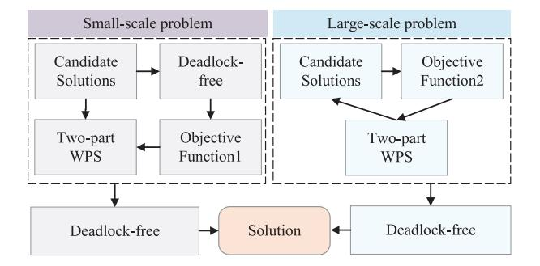

Fig. 6. The solving framework with the MTWPS algorithm.

not only consider the task allocation problem but the UAV path planning problem. The common improvements mainly focused on selecting encoding schemes, degree of mutation and crossover, multiple genotypes, updating strategies, parameter self-adaptation, dynamic adjustment, mixing with other algorithms, and designing fitness functions.

The wolf pack algorithm (WPA) simulates the wolf pack predation and prey assignment in which the wolves exhibit three intelligent behaviors, namely walking, calling, and besieging [\[141\]](#page-40-31). In existing studies, it has been proven to have better global convergence and computational robustness when solving high-dimensional functions. Therefore, the WPA algorithm is suitable to handle CTA which is viewed as a complicated high-dimensional combinatorial optimization problem. However, the WPA algorithm cannot solve the discrete CTA directly. Existing researchers have studied many WPA-based strategies to improve the performance in CTA, from the aspects of reducing computational complexity and enhancing search capability in high-dimension scenarios.

Considering the deadlock and uncertainty problems, the authors in [\[142\]](#page-40-32) proposed a modified two-part wolf pack search (MTWPS) algorithm to address centralized CTA for heterogeneous UAVs. This work proved a new solution framework with two objective functions to accommodate various scale task assignments, as shown in Fig. [6.](#page-14-0) The robust optimization method was used to deal with parameter uncertainties. As for deadlock issues, a digraph-based method was introduced to provide valid assignment schemes.

In addition, the authors in [\[144\]](#page-40-33) developed a discrete WPA method combining PSO and GA called GPWPA, which aimed to establish a general model without subjecting it to specific task scenarios and UAV types. However, it was too simplistic and ignored the actual UAV trajectory to satisfy the dynamics. Similarly, a multi-population parallel WPA method was proposed in [\[145\]](#page-40-34), where the population was equally divided into multiple sub-populations by the approximate average division method. Sub-population migration was adopted with a constant migration probability to accelerate the convergence speed and maintain population diversity. However, this work does not cover the task reassignment problem caused by uncertainty in changing environments.

In contrast, [\[146\]](#page-40-35) presented a novel MDWPA algorithm with multiple discretized WPA for the large-scale CTA with high dynamics and complexity. The goal is to maximize the tasks of execution benefit while minimizing resource consumption. Overall, the above works aim to enhance both the solution quality and convergence speed. Considering such as multiobjective, parameter sensitivity, and time sensitivity, research can be conducted on the multi-swarm mechanism, the diversity of wolf packs, multi-step discrete optimization strategies, and mixing with other SIO algorithms.

The PIO algorithm takes inspiration from the navigation behavior of pigeons during their homing process [\[147\]](#page-40-36). It has two stages which update the positions and velocity of the pigeon through the map and compass operator, and landmark operator. PIO has obvious advantages in convergence speed, robustness, and accuracy, and few parameters to be adjusted. However, basic PIO still suffers from common issues for CTA, such as premature convergence and small population search span. To improve the application performance in CTA, numerous PIO-based approaches have been proposed, primarily focusing on enhancing global search capabilities, avoiding premature convergence, and computing faster optimal solutions.

A modified PIO approach was developed for dynamic multi-UAV task assignment considering energy consumption. To tackle the premature convergence problem, this study adopted the concept of conditional crossover and a two-step amelioration, which helps to enhance the global search ability. However, it ignores the problem of task priority during mission execution [\[148\]](#page-41-0). The authors further proposed a method called dynamic discrete PIO (D2PIO), which introduces the dynamic concept to enhance population diversity. Moreover, the method employed a solution acceptance strategy to prevent frequent task switching in highly dynamic environments, However, this method is currently under a centralized task allocation framework, and its performance needs to be improved in terms of robustness and flexibility [\[98\]](#page-39-40). This work preferred a PIO algorithm to determine which UAV is suitable for localization or tracking tasks. PIO was used to calculate the global optimal solution in the multidimensional search space by simulating the process of virtual pigeons, under the premise of battery energy constraints [\[149\]](#page-41-1).

In practical CTA problems, the UAV flight path to perform the assigned tasks is also a vital aspect that cannot be ignored. Therefore, the flight distance is usually taken into account when evaluating performance indicators. Due to the increased problem scales and the heterogeneity of tasks and UAVs, the calculational cost of solving CTA increases exponentially. To reduce computational complexity and shorten solution time for large-scale task assignment problems, researchers have made many improvements based on the emerging bio-inspired algorithms, such as symbiotic organisms search (SOS) [\[150\]](#page-41-2), whale optimization algorithm (WOA), dragonfly algorithm (DA).

The authors in [\[151\]](#page-41-3) not only focused on the heterogeneity of UAVs but also on that of task targets in the reconnaissance task assignment. This study modeled the problem as a multi-time window Dubins traveling salesman problem (TSP) considering the effect of task sequences. The proposed multi-objective SOS algorithm was investigated which introduced dual-chromosome encoding to reduce the dimension of decision variables and accelerate convergence. Furthermore, Pareto-dominance-based pre-processing was used to improve the diversity of non-dominated solutions. In [\[152\]](#page-41-4), a hybrid method based on FA and SA (SA-DFA) was proposed in which SA was used to avoid trapping in local optima. This is a hierarchical decomposition structure that uses K-means clustering to decompose the problem into several low-scale sub-problems. Double-chain encoding was utilized to solve discrete task assignment problems, and a multi-neighborhood search mechanism was employed to maintain population diversity.

For heterogeneous UAV swarm CTA in complex scenarios, the study in [\[153\]](#page-41-5) presented a discrete adaptive searching WOA algorithm, taking into account obstacle avoidance, limited resources, and task priority. The crosser-based updating approach was designed for discrete solution representation, and the obstacle avoidance estimation method was introduced to construct an accurate model that reduces computational complexity. Also, a search strength adaptation combining joint leadership and a local searching mechanism was investigated to balance exploration and exploitation. In addition, considering the large-scale CTA for heterogeneous UAVs in a 3D environment, a multi-swarm fruit fly optimization algorithm named MFOA was proposed [\[154\]](#page-41-6). In the MFOA, two improved mechanisms were designed to enhance the global search ability and maintain diversity, which contains the multiple swarm mechanism and dual search strategy. These methods primarily focus on addressing common challenges, such as easily trapping into local optima and high computational complexity.

As previously stated, the main challenges and improvements of typical heuristic behavior search-based task assignment algorithms are summarized in Table [IV.](#page-16-0) Such algorithms require persistent and reliable communication between UAVs and the central server. As the number of UAVs and tasks increases in complex and dynamic environments, the computational burden becomes impractical, making it challenging to address real-time problems.

### *C. Policy Design-Based Task Assignment Algorithms*

In dynamic and uncertain environments, UAVs need to quickly adjust their task allocation scheme when targets suddenly appear or disappear. Policy design-based task assignment algorithms have received increasing attention with the advantages of robustness, flexibility, reliability, and fault tolerance. In this category, the global problem is decomposed into multiple sub-problems, which are solved by individual UAVs as independent decision-makers and thus can reduce the computational complexity. It includes two main categories: methods imitating biological collective behaviors and methods-based market mechanisms. For the methods imitating biological collective behaviors, a simple biological individual can be abstracted as an agent, with various characteristics and constraints, corresponding to the actual UAV. The mapping relationship between wolf pack hunting and UAV swarm cooperative task assignment is shown in Table [V.](#page-16-1)

The representative methods are imitating the colony foraging, and wolf pack hunting. For instance, a dynamic task

TABLE IV CHALLENGES AND IMPROVEMENT OF TYPICAL HEURISTIC BEHAVIOR SEARCH-BASED TASK ASSIGNMENT ALGORITHMS

| Representative algorithms | Challenges                                                                                                                                                                                                                                                                                                                                                | Improvements                                                                                                                                                                                                                                                                                                   | Ref.                   |
|---------------------------|-----------------------------------------------------------------------------------------------------------------------------------------------------------------------------------------------------------------------------------------------------------------------------------------------------------------------------------------------------------|----------------------------------------------------------------------------------------------------------------------------------------------------------------------------------------------------------------------------------------------------------------------------------------------------------------|------------------------|
| ACO-based                 | <ul> <li>The solution ability needs to be improved in convergence speed and solution accuracy.</li> <li>The performance is greatly influenced by the set of initial parameters selected.</li> <li>Trapping into local optimum and Unstable performance.</li> </ul>                                                                                        | <ul> <li>Adopting effective solution construction strategies and pheromone update rules.</li> <li>Modifying heuristic function and updating strategy.</li> </ul>                                                                                                                                       | [132]–[134]            |
| GA-based                  | <ul> <li>Unsatisfied performance for GA in heterogeneous CTA with limited resources, such as local optimum, premature convergence, and deadlock.</li> <li>Increasing the diversity of populations and enhancing the capability of global exploration.</li> <li>The high computational complexity for uncertain and stochastic large-scale CTA.</li> </ul> | <ul> <li>Simplifying encoding process by matrix representation of the chromosome.</li> <li>Employing mirror representation to characterize heterogeneous UAVs.</li> <li>Designing distinct gene and chromosome encoding schemes such as two-part chromosome coding, and double-chromosome encoding.</li> </ul> | [100], [136], [143] |
| WPA-based                 | <ul> <li>Low solution accuracy, slow convergence speed, and easily falling into local optimum.</li> <li>The problems of multi-objective, parameter-sensitive, and time-sensitive uncertainty.</li> </ul>                                                                                                                                                  | <ul> <li>Using a multi-swarm mechanism, multi-step discrete optimization strategy.</li> <li>Mixing with other swarm intelligence algorithms to improve solution quality and convergence speed.</li> </ul>                                                                                                      | [142], [159], [144] |
| PIO-based                 | <ul> <li>Premature convergence when implementing dynamic cooperative task assignment.</li> <li>Small population search span for large-scale CTA problems.</li> </ul>                                                                                                                                                                                      | <ul> <li>Adopting the concept of conditional crossover and a two-step amelioration.</li> <li>Introducing the discrete concept and dynamic concept to enhance population diversity.</li> </ul>                                                                                                                  | [98], [148], [149]  |

TABLE V MAPPING RELATIONSHIP BETWEEN WOLF PACK HUNTING AND UAV SWARM COOPERATIVE TASK ASSIGNMENT

| Behavior Characteristics | Wolf Pack Hunting | Cooperative Task Assignment |  |
|-----------------------------|----------------------|--------------------------------|--|
| Behavior actor              | Wolf pack            | Surveillance and attack        |  |
| Bellavior actor             | Prey                 | Target                         |  |
| Behavior space              | Hunting territory    | Mission environment            |  |
| Specific behavior           | Labor division       | Task assignment                |  |
| specific beliavior          | Besieging            | Coordinated performing task    |  |

assignment framework was developed for complex CTA which models the behavioral features of a wolf pack. The UAV swarms are regarded as a bionic pack of wolves with characteristics of information sharing, cooperation, and task load balancing. This work adopted an improved Hungarian algorithm to solve the CTA that is converted into a non-balanced assignment problem. Moreover, a reassignment method was proposed considering the task load balance [\[155\]](#page-41-7). Similarly, a wolf pack labor division behavior-based task assignment method (WPLDM) was proposed to address the search-attack mission, where each UAV is abstracted as an intelligent wolf simulating hunting behavior mechanism. Based on the characteristic of role-task matching labor division of the wolf pack, WPLDM can implement dynamic task reallocation [\[156\]](#page-41-8).

For the distributed search-destroy mission for moving targets among heterogeneous UAV swarms in dynamic environments, this work proposed a method adopting a probabilistic decision-making mechanism with the response threshold model (RTM). The basic idea of RTM is simulating the labor division behavior in ant colonies, and each ant agent can make a probabilistic decision on the task execution autonomously depending upon the task stimulus and individual response threshold [\[157\]](#page-41-9). Similar to this work, a novel distributed dynamic ant colony's labor division (DACLD) was proposed. Given the similarity between dynamic task assignment and fixed RTM (FRTM), the classic ACLD and FRTM are redesigned from dynamic response threshold, dynamic environmental stimulus, multi-type tasks, multiple constraints, and multiple-state transition probability. However, it could lead to a large computational overhead [\[158\]](#page-41-10).

As previously mentioned, the main obstacle to overcome with this method is devising a collaborative strategy for groups of UAVs. Moreover, many market mechanism-based techniques have been studied for UAV swarm dynamic task assignment, with the most prevalent ones being the contract network protocol (CNP), AA, and CBBA. CBBA consists of iterations between two phases, as shown in Fig. [7.](#page-17-0) The first stage is bundle construction where each UAV generates an ordered bundle of tasks, and the second stage is conflict resolution where conflicting assignments are resolved by local communication between neighboring UAVs. In CBBA, each UAV carries various vectors of information to perform distributed algorithms.

To date, many CBBA-based algorithms have been applied in dynamic CTA problems for heterogeneous swarms. In [\[107\]](#page-40-3), a new method called ECBBA was designed, aiming to solve the dynamic attack task assignment for heterogeneous UAV swarms with limited resources. This method helps each UAV make full use of available task time, task reward, and task

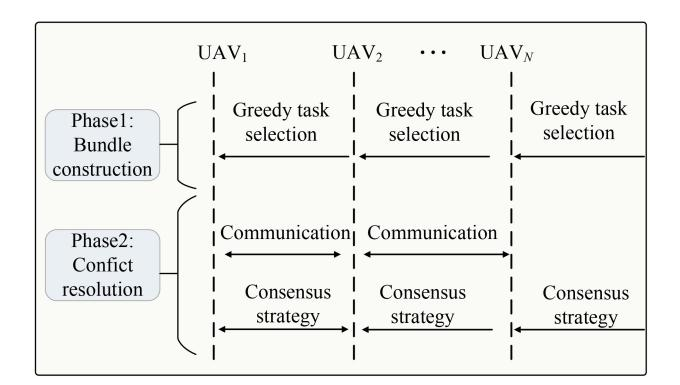

Fig. 7. UAV swarm Flow diagram of the CBBA.

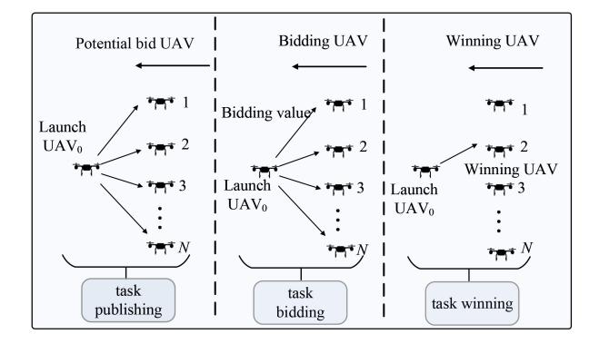

Fig. 8. Flow diagram of UAV task assignment with CNP algorithms.

resources to bid for new targets by task sequence mechanism. ECBBA can address the large-scale dynamic task allocation of UAV swarms in a real-time and distributed manner. Similar to this work, an improved CBBA-based algorithm with a new dynamic task process was proposed which considers the strict task timing constraints and communicational load [\[111\]](#page-40-7).

In addition, asynchronous task allocation was introduced to ensure the optimal solution. To perform decentralized CTA in the search-rescue scenario for heterogeneous UAV swarms, a modified CBBA with task coupling constraints (CBBA-TCC) method was presented [\[112\]](#page-40-8). In the inner consistency stage, the Can-do list was introduced for bundle construction which limits the bidding range of heterogeneous UAVs. Besides, the consensus strategy is improved by the task-performing time list during conflict resolution, aiming to guarantee the bid list of UAVs satisfies task precedence constraints. This method can decrease the computational complexity and convergence time.

The contract network protocol (CNP) algorithm originates from imitating the economic negotiation strategy. It includes four stages: task publishing, task bidding, and task winning. In the dynamic cooperative task assignment applying CNP, the process of assigning tasks to UAVs is analogized to a bidding process, the negotiation mechanisms and various constraints are introduced in the two-way selection of tenderers and bidders. The principle of CTA with CNP algorithms is shown in Fig. [8.](#page-17-1) Many CNP-based algorithms have been utilized in dynamic CTA problems.

To solve the dynamic reconnaissance-attack task assignment for heterogeneous UAV swarms, a distributed group method

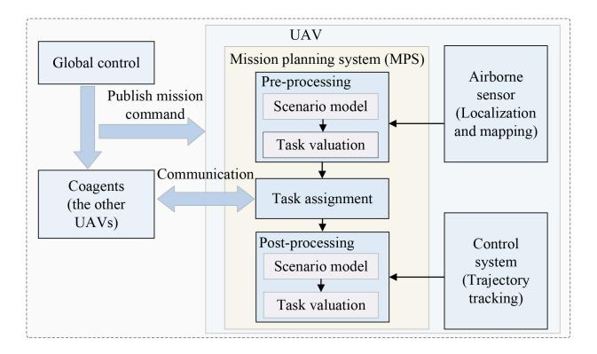

Fig. 9. A distributed MPS framework for multi-UAV systems with an improved auction algorithm.

using extended CNP was presented in [\[160\]](#page-41-11). The eventtriggered mechanism was adopted to make the UAVs adaptable to dynamic environments with sudden targets. This work considered various constraints such as communication topology and payload model constraints. Besides, a hierarchical communication topology was established by a two-layer coordination mechanism to realize global centralization and local autonomy. Aiming at the issues of calculational complexity and uneven assignment in large-scale attack task assignment for heterogenous fixed-wing UAV swarms, the work in [\[161\]](#page-41-12) put forward two improved CNP (ICNP) for one-to-many and many-to-one modes. The proposed method considers timing characteristics, multi-time window logistics, and overload balance. Results verify that ICNP has advantages in balanced load rate and execution efficiency in distributed CTA.

Researchers have investigated extensive AA-based methods for dynamic CTA. In [\[162\]](#page-41-13), a novel distributed framework was presented for task assignment and path planning of multiple UAVs with limited communication, as shown in Fig. [9.](#page-17-2) Each UAV maintains a mission planning system to participate in decision-making, which consists of pre-processing layer, task assignment layer, and post-processing layer. This work developed an improved AA with an iterative strategy in the auction process, aiming to eliminate the inaccurate valuation of tasks in the pre-processing layer.

To solve the dynamic CTA for heterogeneous UAV swarms, a hybrid two-stage auction algorithm was proposed based on a hierarchical mechanism and a centralized-distributed auction structure. The purpose of a hierarchical mechanism is to dynamically allocate task sequences according to the changes in task attributes and environmental attributes. To optimize the resources carried by UAVs and balance the UAV mission load, the objective function was built containing a coverage factor and adaptive penalty based on the potential function, except for the task revenue and task cost [\[163\]](#page-41-14).

Considering the robot task assignment under limited communication, a distributed AA was investigated which utilized a marginal inserting cost strategy for constructing conflictfree assignment schemes. This method aims to minimize the total travel distance while guaranteeing the visitation of all target locations. Besides, the problem was explored that the longer robot communication range does not necessarily bring better performance, due to lacking global environmental information [\[164\]](#page-41-15).

In summary, the market mechanism-based approach is suitable for the dynamic CTA problem. The above studies mainly focus on timing characteristics, multi-time window logic, load balancing, heterogeneous multi-UAV systems, task coupling constraints, and timing constraints. Such methods require multiple communications between UAVs, which a large amount of computing and communication resources and puts forward higher demands for reliable communication. So far, considerable effort has been dedicated to solving existing issues in the field of CTA such as unacceptable computation time for real-time requirements, poor task execution performance in uncertain environments, and unsatisfactory generalization performance of different tasks.

# *D. Policy Learning-Based Task Assignment Algorithms*

Recently, policy learning-based methods have attracted increasing attention in large-scale and uncertain heterogenous CTA. The representation in this category is DRL-based methods, which have advantages in high scalability, fast convergence, and real-time performance in uncertain environments. In [\[114\]](#page-40-10), the CTA of heterogeneous UAVs in uncertain environments was formulated as MDP with unknown transition probabilities. This work developed a Q-learning-based fast task allocation (FTA) algorithm which learns assignment rules through neural network approximation and prioritized experience replay. Experimental results show that FTA can deal with different tasks quickly and effectively.

For joint task allocation and flight path planning in dynamic environments, the authors in [\[91\]](#page-39-33) introduced the MADDPG algorithm to solve it. The work also proposed a framework for joint task allocation, multi-inorganic systems, and waypoint selection. Furthermore, a new algorithm integrated sequenceto-sequence with MADDPG in [\[167\]](#page-41-16) was proposed for the dynamic task assignment in the unknown 3D environment. The results demonstrated that it outperforms the baseline in scenarios with both changing or unchanged scales. In [\[168\]](#page-41-17), the authors proposed a scalable and quick approach to address the joint task assignment in the stochastic environment. This work formulated the problem as MDP and used DQN to obtain efficient policies. Simulation results verified its effectiveness in large-scale environments.

For the suppression of enemy air defense missions in heterogeneous UAV swarms, a hierarchical MARL approach (HMARL) was developed [\[169\]](#page-41-18). Among them, the multiagent DQN algorithm was exploited to determine the target allocation result for higher-level task assignment. Meanwhile, the independent asynchronous proximal policy gradient optimization was investigated to attack the selected target for lower-level task assignment. Recently, aiming at the dynamic for heterogeneous UAVs in communication-restricted scenarios, a novel RL-based method has been developed [\[33\]](#page-38-19). The problem was formulated as MDP and addressed by the bidirectional request-response algorithm. A MARL-based coordinated network was proposed to request other UAVs. Besides, the Q-network was constructed to approximate the expected return for participating in the dynamic task.

In addition to the above studies based on MARL algorithms, some neural network-based algorithms have been used for CTA in recent years. As an autonomous competitive learning algorithm, the self-organizing map (SOM) neural network is inspired by the distinctive sequence of processing units in the mammalian brain [\[170\]](#page-41-19). SOM is composed of a twolayer neural network, which adopts a neighborhood function to maintain the topological structure of the input space. In the SOM network, different neurons compete with each other based on the input data, and the winning neuron updates itself based on the characteristics of the input data. SOM has become a feasible means for cooperative task assignment because of the similarity between the SOM network and a multi-UAV collaboration system [\[170\]](#page-41-19), [\[171\]](#page-41-20), [\[172\]](#page-41-21), [\[173\]](#page-41-22), [\[174\]](#page-41-23).

In [\[171\]](#page-41-20), an improved SOM was proposed to improve load balancing and execution efficiency for the multi-UAV task assignment. The study in [\[172\]](#page-41-21) developed a SOMbased algorithm combined with the velocity synthesis method for dynamic task assignment, in which the improved SOM approach can effectively make adjustments with dynamic targets. Regarding obstacle avoidance in task assignment, reference [\[173\]](#page-41-22) introduced an improved BINN algorithm to address the repeated distribution problems of AUVs by using the maximum activity value as the allocation rule. Moreover, the studies in [\[174\]](#page-41-23) developed a hybrid algorithm combining SOM and BINN, which utilized BINN to update the weights of the SOM winner and navigate around obstacles.

### *E. Hybrid Algorithms in Task Assignment*

Intending to solve the large-scale task allocation for the multi-agent system, researchers have conducted studies on hybrid algorithms. In [\[124\]](#page-40-37), a hybrid dynamic task assignment method was proposed which combines the bionic communication network and fuzzy binary PIO. The dynamic network was constructed by a bionic communication network, adopting a visual attention mechanism and threshold effect to share and transmit information. Experimental results show that it has advantages in terms of convergence rate and searching ability. However, it increases the problem of adjustment parameters and still relies on a central agent for decision-making.

To enhance the contextual relevance and cutting-edge, we have replaced the Reference [\[165\]](#page-41-24) and updated the related content accordingly. Considering target precedence constraints, the authors in [\[166\]](#page-41-25) presented a novel method combining fuzzy C-means (FCM) clustering and ACO. The task targets are divided into different clusters according to the threat rating, which can reduce the complexity and improve efficiency.

To address the online CTA in a dynamic environment, a decentralized task assignment method was proposed which combines GA with negotiation (GA-N) [\[175\]](#page-41-26). In this study, the task assignment was divided into two stages: order optimization stage, and communications and negotiation stage. The GA was used to solve the problem similar to TSP, and the exchange task is negotiated by establishing a one-to-one communication topology. It decreases the low calculational complexity and is suitable for solving moderate problems. In addition, the authors in [\[119\]](#page-40-15) combined the auction mechanism and extensive GA to assign the tasks of monitoring moving walking individuals by multiple UAVs. This problem was formulated as a time-dependent TSP. The scalable auction algorithm was used to assign the monitoring targets among UAVs, and the extensive GA was designed to find the optimal visiting order of assigned tasks by UAVs.

# *F. Lessons Learned*

The extensive review of relevant research indicates that heuristic behavior search-based algorithms are commonly employed when solving static task allocation problems, primarily using ACO, GA, WPA, and PIO. These approaches focus on deterministic constraint conditions with limited exploration of uncertain environments. To enhance the quality of task allocation schemes in large-scale environments and decrease computational complexity, many researchers are oriented toward improving global search capabilities, preventing premature convergence, and achieving faster optimal solutions. In scenarios where the dynamic nature of task execution requires the adaptation of execution behaviors or strategies based on real-world conditions, most studies opt for policy design-based and policy-learning algorithms, such as CBBA-TCC, SOM, and MADDPG [\[111\]](#page-40-7), [\[112\]](#page-40-8), [\[170\]](#page-41-19).

Notably, it is required to construct more realistic models that account for additional random factors, addressing issues such as stochastic communication, latency effects, and UAV failures within dynamic target tasks. By integrating digital twin technology with scalable MARL, it is promising to devise more dynamic and energy-efficient task allocation schemes [\[86\]](#page-39-28). Research on large-scale heterogeneous UAV swarm CTA should pay more attention to robustness, practicality, and stability, particularly in high-dynamic environments. Besides, establishing a hierarchical drone mission planning system that integrates centralized and distributed frameworks ensures quick adjustment of task allocation plans in dynamic environments, thereby reducing the computational burden and enhancing scalability.

# VI. COMPUTATIONAL INTELLIGENCE ALGORITHMS FOR COOPERATIVE PATH PLANNING

CPP is a fundamental issue in various applications such as crop monitoring, post-disaster operations, emergency rescue, and military defense. This technology enhances mission efficiency by providing optimal flight paths for swarms. In this section, we will give a comprehensive survey on CI-based CPP for UAV swarms.

## *A. Cooperative Path Planning*

The primary objective of CPP is to ensure that each UAV follows an optimal and shortest path while maintaining a collision-free environment, thus achieving the common goal of UAV swarms. Compared to single UAV path planning [\[176\]](#page-41-27), [\[177\]](#page-41-28), the challenge of CPP is to plan feasible flight paths for specific UAVs considering the collaboration

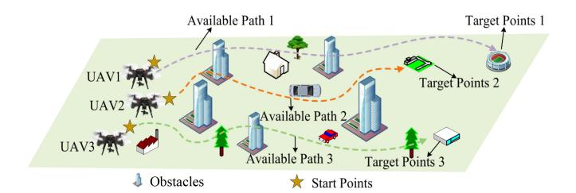

Fig. 10. UAV swarm cooperative path planning.

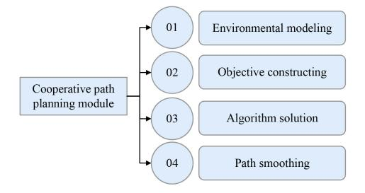

Fig. 11. The modules of cooperative path planning.

among UAVs, such as collision avoidance, synchronicity requirement, and connectivity maintenance.

As depicted in Fig. [10,](#page-19-1) the CPP problem seeks to find collision-free paths for multiple UAVs from starting points to specific target points. These planned trajectories should adhere to various constraints, including maintaining a safe flight distance, achieving timely arrival, and avoiding threats [\[178\]](#page-41-29). Furthermore, it's crucial for UAV swarms to adaptively replan their flight paths in real-time when confronted with unexpected and unpredictable circumstances. Fig. [11](#page-19-2) shows the main modules influencing the CPP performance. Here, the related factors are summarized as follows:

- • Build environment model. The mission area can be divided into 2D or 3D space, and the complexity of CPP for UAV swarms in 3D space increases significantly with kinematic and dynamic constraints compared to 2D space [\[25\]](#page-38-11).
- Satisfy different types of constraints. A realistic mission scenario is established should satisfy various constraints such as time constraints, dynamical feasibility, obstacle avoidance, swarm coordination, task constraints, environmental constraints, and others.
- Establish multi-objective function. It is essential to consider kinetic constraints and cost functions when designing a model. This typically involves path cost, cooperation cost, smoothness cost, radar threat cost, and height cost. Moreover, flight time and fuel consumption should also be taken into account [\[179\]](#page-41-30), [\[180\]](#page-41-31), [\[181\]](#page-41-32).
- • Develop effective methods. Many algorithms have been developed which can be divided into various types from different perspectives. For instance, existing algorithms can be classified into offline and online algorithms in the time domain. Additionally, from the planning viewpoint, they can be divided into global and local optimization CPP algorithms.

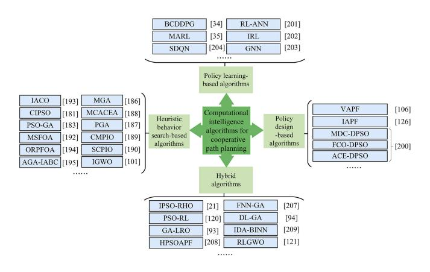

Fig. 12. The classification of computational intelligence algorithms in cooperative path planning.

• Determine the path smooth strategy. Under satisfying the demands of safety and feasibility, realizing trajectory smoothness is already a challenging problem. Currently, the most researched strategies include the Dubins algorithms, fifth-order polynomials, k-degree method, and cubic B-spine curves [\[179\]](#page-41-30).

Developing a superior cooperative path planning strategy has the potential to not only enhance the flight efficiency of UAV swarms, but also offer benefits such as broad applicability, timely execution, scalability, and cost-effective computation. In recent years, CI algorithms have gained increasing popularity for addressing CPP in different scenarios. In this context, we provide a detailed taxonomy in our survey, as is presented in Fig. [12.](#page-20-0)

# *B. Heuristic Behavior Search-Based Cooperative Path Planning Algorithms*

In previous research, various heuristic behavior searchbased algorithms have been developed to cope with centralized CPP. One typical algorithm is PSO, which is inspired by bird foraging behavior. In this algorithm, each particle is characterized by velocity and position, representing a potential solution candidate. It constantly updates the swarm optimum by sharing individual optimal information among particles. PSO is easy to implement and has few parameters to adjust. However, it still suffers from low search efficiency and susceptibility to local optima, potentially generating unsatisfactory solutions in practical scenarios.

Generally, the performance of PSO is influenced by various factors, including population initialization, parameter selection, topology structure, and integration with hybrid approaches [\[180\]](#page-41-31). So far, researchers have devoted considerable efforts to enhancing CPP performance based on PSO, focusing on improving search capabilities and expediting convergence [\[181\]](#page-41-32), [\[182\]](#page-41-33), [\[183\]](#page-41-34). For example, in [\[181\]](#page-41-32), a comprehensively improved PSO algorithm called CIPSO was developed for multi-UAV formation. In CIPSO, several modifications have been made to improve convergence speed and enrich swarm diversity, including particle initial distribution with a Logistic map, adaptively adjusting parameters based on evaluation, and updating best positions by changing the structure topology.

To provide a feasible collision-free and near-optimal UAV trajectory in complex 3D environments, some PSO-based algorithms CPP have been developed. For instance, the authors in [\[182\]](#page-41-33) proposed a new algorithm combining improved PSO and modified SOS (HIPSO-MSOS), which introduced a timestamp segmentation model to simplify the calculation of collaboration costs. Besides, the cubic B-spline curve was employed to smooth the generated paths. However, HIPSO-MSOS ignored the problem of dynamic threat avoidance. In [\[183\]](#page-41-34), the work presented a combination of PSO and GA, which can find the global time-optimal solution and achieve a centralized system of multi-formation reconstruction. Meanwhile, it puts forward a higher requirement to realize real-time formation reconstruction.

Moreover, considering the time issue, the work in [\[184\]](#page-41-35) integrated PSO with the spatial refined voting mechanism for 4D multi-UAV CPP. The objective was to minimize flight time and costs while ensuring UAVs reached their destinations without collision. This proposal is suitable for generating collisionfree paths with superior performance in enhancing searching and convergence under complicated constraints and objectives. The above PSO-based studies aim to enhance its performance through various approaches, including strategies for updating particle positions, incorporating heuristic information, utilizing the Voronoi diagram, and integration with other SIO-based algorithms.

In the existing studies, various GA-based algorithms have been applied for CPP in 3D environments, in which each possible solution is represented in the form of a chromosome [\[185\]](#page-41-36). These methods are improved from convergence speed, solution capability, and anti-prematurity. To settle multi-base multi-UAV cooperative reconnaissance path planning in the three-dimensional environment, a modified GA algorithm was proposed by designing the specific fitness function and the chromosome coding with rank coding [\[186\]](#page-41-37). Simulation demonstrates the operational efficiency and convergence of this method. However, it does not consider complicated dynamic environments.

In [\[187\]](#page-41-38), a parallel genetic algorithm named PGA was proposed for 3D CPP, introducing a new genetic operator to select appropriate chromosome pairs for crossover operation. It designed the environment probability map to help UAVs avoid encountering hostile threats. Simulation results show that PGA has advantages in efficiency and computational cost. However, ensuring the safety of the planned path is challenging due to sensor errors that impact the accuracy of the probability map. The authors in [\[188\]](#page-41-39) developed a multiple coordinated agent coevolution evolutionary algorithm (EA) named MCACEA, where each EA was used to optimize the single UAV path parallelly and share information with other EA. The proposed method can converge to the optimal regions and find feasible flight paths in offline and online environments. In all, these GA-based works primarily focus on improving the CPP performance from such aspects as chromosome encoding, genetic operator designing,

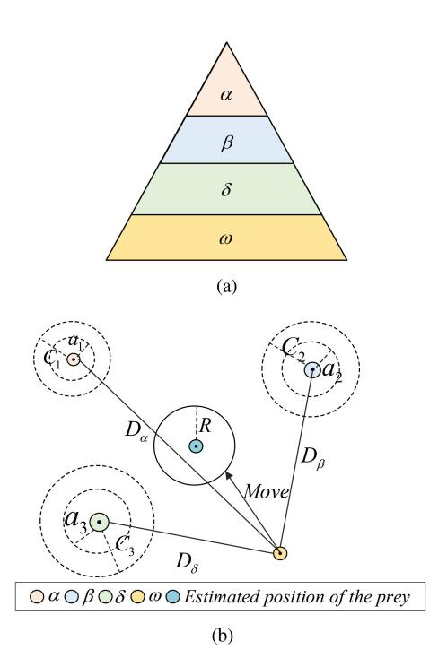

Fig. 13. Schematic diagram of GWO algorithm: (a) The hierarchical division of grey wolves; (b) The position updating diagram of grey wolves.

parameter adaptation, and hybridization with other SIO algorithms.

Several PIO-based algorithms have found extensive applications in CPP, accounting for various factors, including timestamps and 2D or 3D environments. These studies are typically approached from different perspectives, such as improving map and compass operators, introducing mutation operators, and enhancing population diversity. In [\[189\]](#page-41-40), a modified PIO-based algorithm called CMPIO was developed for CPP in mountainous and plateau terrain, using the Cauchy mutation operator to improve population diversity and global search ability. CMPIO dynamically adjusted weight coefficients of objective function according to mission requirements. The spatial and temporal cooperation coefficients were designed by using a multi-UAV cooperative path planning strategy. Additionally, the work in [\[190\]](#page-41-41) proposed a method called SCPIO to simplify the cooperative constraint and reduce the computational complexity. The work established the time stamp segmentation (TSS) model to provide time stamps and desired velocity as a general reference for UAVs. The social hierarchy structure was introduced into the operators to solve the problems of lack of population diversity and premature convergence.

GWO is a metaheuristic algorithm simulating the leadership hierarchy and hunting mechanism of grey wolves [\[191\]](#page-41-42). The wolves are divided into four types according to the sorted fitness values: Alpha (α), Beta (β), Delta (δ), and Omega (ω). There are three main steps: surrounding, hunting and attacking prey, and searching for prey. Fig. [13](#page-21-0) shows the gray wolf's level and location update diagram. Compared to other heuristic behavior search-based algorithms, GWO is characterized by its simple structure, high flexibility, and few parameter requirements. It exhibits a robust global search capability and efficiently avoids local minima in solving the UAV path planning problem.

In recent years, a multitude of researchers have put forth GWO-based methods to generate viable trajectories for multiple UAVs that satisfy various constraints [\[101\]](#page-39-43), [\[102\]](#page-39-44), [\[103\]](#page-40-38). In [\[101\]](#page-39-43), a novel GWO-based approach was presented for CPP in uncertain environments, which used the distance-based value function and Bayesian framework to construct the risk map threats for unknown threats. The results verified it can obtain the shortest and optimal planned path. Similarly, to solve the complex multi-UAV CPP in 3D environments, the work in [\[102\]](#page-39-44) adopted a novel strategy based on GWO, which can reduce computational complexity and plan feasible paths without collision. Then, the generated path was smoothed by the trajectory-fitting approach with a fifth-order polynomial. Nonetheless, it failed to consider the issues of avoiding dynamic threats and collisions between UAVs.

In [\[103\]](#page-40-38), a novel method called IGWO was investigated from population initialization, decay factor updating, and individual position updating. The study aimed to obtain the shortest and safest paths considering the threat and fuel consumption. However, IGWO does not cover the smooth flight paths for UAVs in practical applications. From the above analysis, it can be seen that relevant GWO-based research aims to reduce computational complexity and improve solution performance. It mainly focuses on risk map construction, population initialization, decay factor updates, and individual behavior mechanisms of grey wolves.

Furthermore, some researchers have used other bio-inspired algorithms for CPP. For instance, the work in [\[192\]](#page-41-43) developed a multi-swarm FOA (MSFOA) for 3D CPP, dividing the whole fruit population into multiple subswarms to enlarge the search space. The proposed method adopted an offspring competition strategy to make full use of each calculation result and realize the information interaction among subswarms. MSFOA also utilized collision detection to avoid collision between multiple UAVs after generating waypoints. In [\[193\]](#page-41-44), the authors proposed an improved ACO algorithm by modifying the heuristic information and pheromone update process. In the work, the Voronoi diagram was introduced to establish the environment model, and the k-degree method was used to smooth the UAV trajectory. Nevertheless, its performance is subject to environmental modeling.

Additionally, considering the online changing tasks, a modified FOA algorithm (ORPFOA) was proposed in [\[194\]](#page-41-45), where the reference point and distance cost matrix were used when adding new tasks. Simulation results demonstrated that ORPFOA can quickly achieve a stable solution with high precision. To solve the CPP for disaster rescue, the work in [\[195\]](#page-42-0) developed an approach combining adaptive GA and improved ABC. A cost-revenue function was established by taking the flight distance, fuel consumption, UAV function, and threat source into consideration. Notably, the proposed method introduced the analytic hierarchy process to estimate the weight and determine the values objectively.

In various application scenarios, UAV trajectory planning strategies need to optimize multiple factors comprehensively. Specifically, it imposes more stringent data immediacy and promptness requirements in high latency-sensitive tasks. Recent CI-based studies have introduced new metrics to optimize UAV trajectories, including the age of information (AoI) and information correlation [\[196\]](#page-42-1), [\[197\]](#page-42-2). In maximizing the efficiency of information collection and transmission using UAVs, the work in [\[198\]](#page-42-3) extended AoI to correlation-aware AoI (CAAoI), which captured the freshness and correlation of gathered information. It developed the ACO algorithm to minimize the time-average CAAoI in the information collection system. In a similar study [\[199\]](#page-42-4), the authors also considered the spatial correlation of data, the optimal flight path of UAV, and data aggregation points, aiming to reduce the energy consumption of the UAV and Internet-of-Things devices. The GA algorithm was used to select contributing devices within the sub-problem.

In this section, we have broadly discussed the work on HBSA-based cooperative path planning. Table [VI](#page-23-0) summarizes the differences between typical studies, including space, planning types, maximum turning angle, obstacle avoidance, contributions, limitations, and objectives. Due to the variety of tasks performed by UAV swarms, the types of planned UAV paths are correspondingly different. Here, we have divided the CPP planning into four types [\[187\]](#page-41-38), [\[190\]](#page-41-41), i.e., same starting point and same target point (SS), same starting point and different target points (SD), different starting points and same target point (DS), different starting points and different target points (DD). It is worth noting that most studies are prone to use such PSO, GA, PIO, and GWO algorithms to address CPP in this category, each of which has advantages and limitations when tackling problems under varying constraints. For complex scenario problems with large solution space, there exists a common issue that it is difficult to achieve a balance between solution speed and solution accuracy. Thus, most studies may accept suboptimal solutions to improve convergence speed. Moreover, using a single global optimization algorithm when dealing with large-scale real-time CPP is impractical.

# *C. Policy Design-Based Cooperative Path Planning Algorithms*

Some researchers have also used policy design-based algorithms to address CPP. For instance, the work in [\[200\]](#page-42-5) developed three different distributed methods, namely maximum density convergent distributed PSO (MDC-DPSO), fast crossover DPSO (FCO-DPSO), and accurate coverage exploration DPSO (ACE-DPSO). Various fitness functions and search strategies are designed for each algorithm. In the proposed methods, the particle swarm is regarded as a multiagent system, in which each particle corresponds to the actual UAV with velocity and position. The jump-out and revisit mechanisms are also employed to avoid UAVs trapping in the specific target group searching. However, this work does not fully consider kinematic constraints and obstacle avoidance.

In addition, an improved APF algorithm combining longitudinal random factor and B-spline interpolation curve was studied in [\[126\]](#page-40-39). The proposed method adopted longitudinal random factors APF to solve the problem of easily falling into local optima and being unable to avoid obstacles effectively. Similarly, the authors in [\[106\]](#page-40-2) proposed an improved APF method to implement the multi-UAV path planning, in which the virtual velocity rigid body and virtual target point were introduced to establish the multi-UAV path planning model.

# *D. Policy Learning-Based Cooperative Path Planning Algorithms*

Recently, policy learning-based cooperative path planning algorithms have gained increasing attention in a dynamic and uncertain environment. This category is represented by machine learning algorithms, particularly deep reinforcement learning algorithms combining RL and DL. Generally, applying DRL algorithms in CPP contains the following steps, constructing observation space and action space, designing reward function, determining network architecture, and training algorithm [\[202\]](#page-42-6), [\[203\]](#page-42-7), [\[204\]](#page-42-8).

To solve the multi-UAV flocking motion problem, this work developed a behavior-coupling deep deterministic policy gradient method called BCDDPG [\[34\]](#page-38-20). The LSTM network was utilized in the sub-actor network to extract information from historical data. BCDDPG is beneficial for UAVs to perceive the complexity of dynamic environments. In [\[201\]](#page-42-9), a novel DRL algorithm combining artificial neural network (ANN) named RL-ANN was investigated to obtain the optimal UAV trajectory, which calculated the flight path and did not require any target or other information apart from the actual state of the map. It can obtain satisfactory flight paths without being limited by the number of UAVs and the size of the map. However, this work failed to consider the complicated 3D environment, including flight height and obstacle avoidance.

In [\[35\]](#page-38-21), the work investigated a MARL-based approach to address multi-UAV path planning for wireless data harvesting using the centralized learning and decentralized execution framework. The problem was converted into a decentralized partially observable Markov decision process (Dec-POMDP) [\[84\]](#page-39-26). Experimental results proved that this method can scale to complex and large-scale environments, with high generalization capability. For CPP in unknown environments, the work in [\[202\]](#page-42-6) put forward an improved RL method based on kernel smoothing and neural network technology, which are utilized to approximate the unknown state of the agents, thus avoiding retraining in the RL. Simulation results show that it can solve issues of slow learning speed and time-consuming while maintaining advantages in feasibility and robustness. However, the performance in solving large-scale problems still needs to be verified.

A novel distributed framework was proposed to implement the CPP in a 2D environment with observation and constrained communication. This method introduced the graph neural network (GNN) to convey features among agents with limited communication, which are extracted from local observations through a convolutional neural network (CNN). However, it does not explore dynamic obstacle avoidance problems

TABLE VI COMPARISON OF TYPICAL COOPERATIVE PATH PLANNING WORKS USING HEURISTIC BEHAVIOR SEARCH-BASED ALGORITHMS

| Typical works | Algorithms | Space | Planing types | Turning angle | Obstacle avoidance | Objectives                                                                                                 | Contributions                                                                                                                                       | Limitations                                                                                                                                 |
|------------------|------------|-------|------------------|---------------|--------------------|------------------------------------------------------------------------------------------------------------|-----------------------------------------------------------------------------------------------------------------------------------------------------|---------------------------------------------------------------------------------------------------------------------------------------------|
| [181]            | CIPSO      | 3D    | DD/DS            | No            | Yes                | Minimal flying path length cost, terrain cost, radar detection cost and collision cost         | It can achieve better solu- tion optimality and faster convergence speed.                                                                     | It does not consider the path re-planning prob- lem in dynamic environ- ments.                                                        |
| [182]            | HIPSO-MSOS | 3D    | DD               | Yes           | Yes                | Total cost of path length, smooth, al- titude, threat avoid- ance and coordina- tion           | It is superior to other compared algorithms in accuracy, convergence speed, stability, and robustness.                                              | It is only applicable to the fixed formation and ignores the problem of dynamic threat avoidance.                               |
| [183]            | HPSOGA     | 3D    | DD               | No            | No                 | Minimize the time of multi-UAV for- mation reconfigu- ration                                      | It can find time-optimal so- lutions with higher search veracity, stronger ability against precocity, and more rapid convergence speed. | It does not compare to other swarm optimization or control algorithms, only compared with the baseline PSO.                     |
| [184]            | PSO-SRVM   | 4D    | DS               | Yes           | Yes                | Optimize the flight time, low costs, collision avoidance, same estimated time of arrival                   | It can generate higher quality flight paths efficiently, which overcomes the defects of local optimal and slow convergence.                         | It assumes that the environment is fixed, and threats and obstacles are known.                                                              |
| [186]            | GA         | 3D    | DD               | No            | No                 | Minimize the flight path of UAVs                                                                           | It can address the optimal detection path problem with higher efficiency and practicability.                                                        | It will cause some errors due to some affected fac- tors being simplified, and ignores dynamic environ- ments.                  |
| [187]            | PGA        | 3D    | DD               | No            | Yes                | Optimize the path and prevent UAVs from collision                                                    | It has advantages in effi- ciency and computational cost.                                                                                     | The probability map re- lies on prior information and sensor data, which may be inaccurate and causing unsafe planned paths. |
| [189]            | СМРІО      | 2D/3D | DS               | Yes           | Yes                | Minimize the distance cost, altitude changing cost, and threat cost                                        | It can not only meet the coordination requirements but also find the optimal individuals with a advanced fitness.                                   | It does not consider communication between UAVs and path replanning problems caused by uncertain factors.                                   |
| [190]            | SCPIO      | 3D    | DD               | Yes           | Yes                | Optimize the coordination cost and threat sources                                                          | It can enhance the conver- gence accuracy from the aspects of population diver- sity and premature avoid- ance.                         | It does not consider the real-time path planning problem.                                                                                   |
| [101]            | GWO-DBVF   | 3D    | DS               | No            | Yes                | Total distance of flight and a safety metric                                                               | It can obtain the shortest and optimal planned path compared to the baseline algorithms.                                                   | It ignores the problem of collaboration and col- lision avoidance among UAVs.                                                      |
| [103]            | IGWO       | 3D    | DS               | Yes           | Yes                | Total cost of fuel consumption and threat under time and space constraints                     | It can plan paths with faster convergence speed and lower path cost.                                                                                | It does not involve the smooth flight paths for UAVs in practical applications.                                                             |
| [192]            | MSFOA      | 3D    | DS               | Yes           | Yes                | Minimize path length, threat and altitude cost while meeting terrain, corner and descent angle constraints | It is superior in convergence speed and solution accuracy while considering collision avoidance among UAVs.                                         | The search performance is affected by the parameters and the number of subgroups.                                                           |

in practical scenarios [\[203\]](#page-42-7). To address the efficiency and communication overload issues in the area coverage of 3D irregular terrain for UAV swarms, a swarm deep Q-learning (SDQN) algorithm was applied which combines a hierarchical UAV swarm and a centralized training decentralized execution framework. This method integrated the CNN and the mean embedding method into SDQN to extract historical position information, aiming to solve the dimensionality problem caused by directly connecting historical observations [\[204\]](#page-42-8). Unlike the aforementioned research, the study in [\[205\]](#page-42-10) introduced Q-learning to solve the UAV trajectory optimization sub-problem while considering the freshness of information. To minimize the average AoI of power devices, it jointly optimized multiple factors, such as the hovering positions, energy transmission and data acquisition time, flight speed and trajectories of UAVs.

| Typical works | Algorithms | Space | Scalable | Planing types | Obstacle avoidance | Time constraints | Communication constraints | Contributions                                                                                                                              | Limitations                                                                                                  |
|------------------|------------|-------|----------|------------------|--------------------|------------------|---------------------------|--------------------------------------------------------------------------------------------------------------------------------------------|--------------------------------------------------------------------------------------------------------------|
| [34]             | BCDDPG     | 2D    | Yes      | SS               | Yes                | No               | Yes                       | It performs well in time, energy efficiency, and cooperation effect in achieving the flock- ing motion task.                   | The UAV dynamics are not fully consid- ered, such as flight height and pitch an- gle.            |
| [201]            | DQN        | 2D    | No       | DD               | No                 | No               | No                        | It can adapt to any map size and obtain satisfac- tory results without ex- tra map information to guide the path.              | It ignores the turn- ing angle of UAVs and obstacle avoid- ance.                                    |
| [35]             | DDQN       | 2D    | Yes      | DD               | Yes                | Yes              | No                        | It can scale to complex and large-scale environ- ments, with high gener- alization capability.                                    | It is aimed at the discrete action space without considering continuous action space and height information. |
| [202]            | DQN-KS     | 3D    | Yes      | DS               | No                 | Yes              | No                        | It can solve issues of slow learning speed and time-consuming while maintaining advantages in feasibility and ro- bustness. | The performance in solving large-scale problems still needs to be verified.                                  |
| [203]            | GNN-CNN    | 2D    | Yes      | DD               | Yes                | Yes              | Yes                       | It can be close to the optimal planners and generalize to previously unseen scenarios.                                                     | It does not explore dynamic obstacle avoidance problems in real environments.                                |
|                  |            |       |          |                  |                    |                  |                           | It has a low repeated                                                                                                                      | It does not consider                                                                                         |

TABLE VII COMPARISON OF TYPICAL COOPERATIVE PATH PLANNING WORKS USING POLICY LEARNING-BASED ALGORITHMS

In summary, the above studies primarily use the MARL algorithm to guide UAV swarms to reach target points without collisions under limited observation and communication circumstances. Most studies also consider the scalability of reported solutions in other large-scale scenarios. To achieve this, the centralized training and decentralized execution (CTDE) paradigm are commonly used. In contrast, centralized learning or decentralized learning paradigm is relatively less. Furthermore, the map representation method is introduced to address the challenge of variable environmental state input and reduce the learning complexity. It can represent an arbitrary number of UAVs and obstacles as fixed-dimensional feature vectors, provided that the grid size of the map information is reasonably discretized. Alternatively, relative coordinates between UAV positions and destinations are utilized instead of absolute coordinates to learn more generalized flight path planning policies. We summarize and compare typical works on PLA-based CPP, as presented in Table [VII.](#page-24-0)

### *E. Hybrid Algorithms in Cooperative Path Planning*

As far as we know, there is no infallible technique for addressing CPP without encountering some limitations, analogous to the concept outlined in the no-free-lunch (NFL) theorem [\[206\]](#page-42-11). Various CI algorithms have distinct strengths and limitations for CPP in different scenarios. Thus, it is unrealistic to develop or improve only a single category algorithm that is suitable for all path planning scenarios, especially those that reflect multiple real-time tasks. Researchers have investigated hybrid algorithms in CPP, primarily the hybrid HBSA-PLA algorithms combining heuristic behavior search-based algorithms and policy learning-based algorithms, hybrid PDA-PLA algorithms combining policy design-based algorithms with policy learning-based algorithms.

In [\[207\]](#page-42-12), a hybrid method combining the multi-layer feedforward neural network (FNN) and GA was proposed for cooperative reconnaissance path planning. FNN was first adopted to generate UAV flight paths roughly, and then GA was used to further optimize the weights and threshold. However, the NN structure is simple and GA has not been improved, resulting in low solution accuracy and unsatisfactory convergence. Similarly, a new method of DL trained by GA (DL-GA) was developed for real-time CPP [\[94\]](#page-39-36). In this method, GA was adopted to provide path planning experiences from familiar scenarios, thereby training and guiding the DNN to provide optimized paths rapidly. Numerous results indicate that DL-GA exhibits superiority in reducing computation load and improving convergence speed.

Aimed at the CPP in a 3D obstacle-rich environment, the work in [\[208\]](#page-42-13) presented a fast algorithm called HPSOAPF, which employed APF for path evaluation while adopting PSO for iteration solution. Other UAVs are viewed as moving obstacles and considered cumulative distances between waypoints, vertical climb speed, and descent speed. HPSOAPF is applicable for CPP concerning real-time obstacle avoidance and path re-planning.

In addition, several researchers have presented hybrid HBSA-PDA algorithms for heterogeneous unmanned systems CPP that combine local planning strategies. For example, [\[21\]](#page-38-7) conducted a study on the path planning problem for the cooperative search-and-track mission, which is one of the few works considering UAV&USV&AUV systems. The work used a receding horizon optimization (RHO) model for online planning and utilized an improved PSO algorithm to generate paths in the search and track phase. However, it does not cover online obstacle avoidance in path planning. Similarly, [\[93\]](#page-39-35) presented a GA-LRO algorithm for the UAV/UGV CPP system, which introduced image correction to improve the obstacle recognition accuracy. In this work, GA was used for global path planning, and then LRO was employed to constantly optimize the results of GA. Simulation results reveal that GA-LRO can avoid trapping into the local optimum and obtain the feasible path. However, it does not investigate the problem of unreliable communication between UAVs.

Moreover, some hybrid HBSA-PLA algorithms have been presented to implement real-time cooperative path planning. In [\[122\]](#page-40-40), a hybrid SSA-BINN algorithm was developed by combining the sparrow search algorithm (SSA) and an improved bioinspired neural network (BINN). This method applied SSA to obtain solving global critical trajectory points and used the improved BINN for local path re-planning when detecting the dynamic obstacles. Furthermore, the generated path was smoothed by the B-spline curves. Similarly, [\[209\]](#page-42-14) used BINN for heterogeneous systems CPP in uncertain 3D environments. To address the issues of local optima and low efficiency, this work proposed an improved dragonfly algorithm (IDA) to obtain the optimal path, which introduced a 3D movement model of BINN for position updating instead of Levy flight. However, it neglected dynamic constraints and resource limitations.

To address offline CPP in complex 3D environments, a hybrid method combining GWO with RL (RLGWO) was presented [\[121\]](#page-40-17), where each individual is defined as an agent in RL. In RLGWO, each individual adaptively switches between four operations according to the cumulative performance, i.e., exploration, utilization, geometric adjustment, and optimal adjustment. The geometric and optimal adjustments help to avoid local optimization problems. Also, the cubic B-spline curve was used for flight path smoothing. Results show that RLGWO is competitive in convergence and effectiveness. Similarly, a hybrid method was presented that integrated the multi-objective PSO and RL to enhance the capability of searching for optimal solutions. The work established a dual-objective objective function with multiple flight and cooperation cost constraints. Each particle chooses the appropriate mode from exploration, exploitation, and hybrid modes based on state and performance [\[120\]](#page-40-16). In this section, extensive hybrid methods have been proposed for CPP, primarily implementing real-time path planning in dynamic environments, considering complex 3D environments, individual location updating mechanisms, etc. We summarize the differences between these algorithms, as shown in Table [VIII.](#page-26-0)

# *F. Lessons Learned*

The existing research on CI-based CPP algorithms mainly focuses on three aspects: environment, time, and space. Most relevant literature studies path planning in a static and known environment, which assumes that UAVs know all states of the current environment. To achieve this, the commonly adopted algorithm is HBSA which balances the convergence speed with real-time solutions by accepting feasible (though not optimal) solutions. In contrast, there are relatively few algorithms based on PDA and PLA. Dynamic and unknown environments are the most challenging problems which are the most relevant environmental models to real-life environmental scenarios. 3D CPP involves more complex modeling and solution-solving because it requires a more accurate representation of complete information such as terrain, weather, and threats. In complex environments, dynamic CPP algorithms are urgently needed, because UAV flight paths should be replanned in real time to tackle unpredictable incidents like sudden obstacles, UAV malfunctions, and communication interruption.

Nowadays, with the development of PLA-based algorithms, it is foreseeable that real-time CPP for large UAV swarms in dynamic 3D environments will become mainstream. Designing effective communication strategies among UAVs is vital to enhance their intelligent perception and coordinated decision-making capabilities, especially when observation is constrained. Besides, UAVs need to construct local environmental knowledge independently, requiring low-power and cost-effective sensors for accurate distance measurement and obstacle geometry perception. Developing complex pathplanning strategies in heterogeneous cross-platform scenarios enables UAVs to replan flight paths rapidly in a changing 3D environment. Integrating virtual-real technology to test and optimize intelligent decision-making models is essential for large-scale swarm path planning. However, when UAVs use different sensors, the inconsistency between virtual environment models and the real environment may affect the training performance of intelligent decision-making models. Therefore, improving the unified view reconstruction of virtual and real environments is critical.

# VII. COMPUTATIONAL INTELLIGENCE ALGORITHMS FOR COOPERATIVE SEARCH

UAV swarm cooperative search (CS) is a significant and challenging problem that plays an essential role in complex applications such as rescuing survivors in disaster areas, tracking suspects in urban environments, and locating suspicious targets for border patrols. In this section, we will first introduce the CS problem and then review CI algorithms in CS, categorized into four types.

TABLE VIII COMPARISON OF COOPERATIVE PATH PLANNING USING HYBRID ALGORITHMS

| [207] |  |  |  |  |
|-------|--|--|--|--|
|       |  |  |  |  |
|       |  |  |  |  |
|       |  |  |  |  |
|       |  |  |  |  |
|       |  |  |  |  |
|       |  |  |  |  |
|       |  |  |  |  |
|       |  |  |  |  |

### *A. Cooperative Search*

Cooperative search can be described as multiple UAVs using onboard sensors to search for targets in a mission area and exchange environmental information through communication. This helps to constantly enhance the cognition of the environment, and ultimately complete the search mission [\[18\]](#page-38-4). Compared to the single UAV search, CS for UAV swarms can remarkably decrease environmental uncertainty while significantly improving search efficiency. An example application illustrated in Fig. [14,](#page-27-0) is searching for fire sources and survivors when the fire occurs in a park, where the search time is critical for timely extinguishing the fire and saving the lives of survivors. In CS, it is crucial to establish an appropriate search model and develop a set of efficient decision strategies. This will enable UAV swarms to reduce environmental uncertainty and find more targets in the minimum time. To date, extensive research has been carried out to construct the search model, which can be summarized as follows:

- The search environment is typically discretized by a gridbased approach, and different search maps are used to represent the detection information of UAVs, such as target probability maps, pheromone maps, and uncertainty maps [\[212\]](#page-42-15).
- • It is required to consider the kinematic constraints of the UAV and the type of search target when building a search

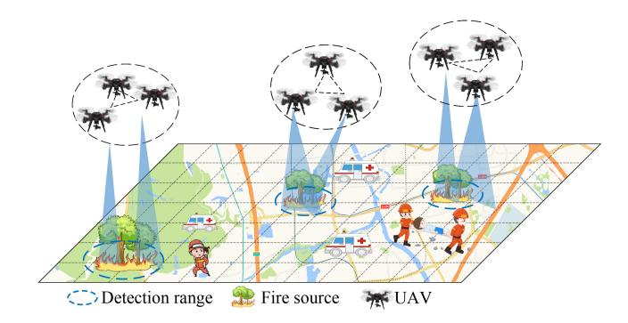

Fig. 14. The case of UAV swarm cooperative search.

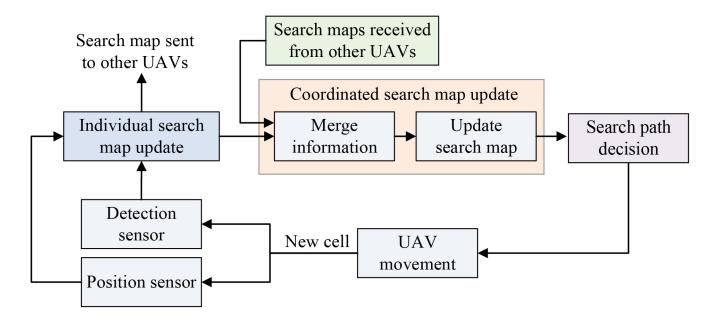

Fig. 15. Information merging for multi-UAV cooperative search.

model. UAVs are typically limited to communication range and imperfect sensor detection accuracy. According to the movement state, it can be generally classified into static and dynamic targets.

- Constructing an appropriate search objective function is vital which should consider minimizing environmental uncertainty, discovering all targets in minimum time, and maximizing cooperative efficiency while avoiding collisions with obstacles or threats [\[210\]](#page-42-16), [\[211\]](#page-42-17), [\[212\]](#page-42-15).
- Guarantee the connectivity of communication networks among UAVs, which are generally divided into centralized, distributed, and hybrid communication architectures. When UAVs search for targets in a distributed manner, it needs to fuse the environmental information considering the communication range limitations.

Moreover, efficient information sharing and merging among UAVs is crucial for enhancing search efficiency, particularly in scenarios with limited detection range and communication capabilities. Many studies employ search maps to dynamically update detection information, which can keep a record of UAV observation information such as target probability, and environment uncertainty [\[88\]](#page-39-30), [\[212\]](#page-42-15), [\[213\]](#page-42-18), [\[214\]](#page-42-19), [\[215\]](#page-42-20). For instance, as depicted in Fig. [15,](#page-27-1) each UAV initiates sensor observations at its current location and shares its search map information with other UAVs. The coordinated search map's update depends on the individual search map and information from neighboring UAVs. Subsequently, each UAV moves to the next cell, terminating the target search process when the detection probability reaches the predetermined threshold.

There are still two crucial challenges in the frontier fields of CS research and practical applications. One is that decisionmaking increases geometrically as the number of UAVs grows.

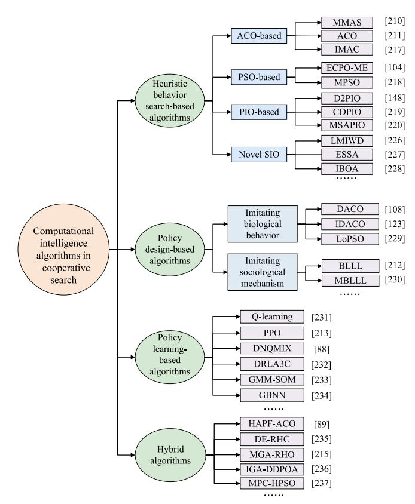

Fig. 16. The classification of computational intelligence algorithms in cooperative search.

Another aspect is the search process becomes extremely difficult due to high dynamics and uncertainty. For these issues, relevant research generally focuses on environmental complexity and task scenarios. Compared to the CTA or CPP aforementioned, the research on CS started relatively late, but it has developed rapidly in recent years. Nowadays, substantial CI algorithms have been applied in CS. We mainly classify these methods into four classifications, as shown in Fig. [16.](#page-27-2)

# *B. Heuristic Behavior Search-Based Cooperative Search Algorithms*

In existing literature, various strategies have been developed to improve the performance of ACO used in CS. As an illustration, the authors in [\[210\]](#page-42-16) presented a max-min ant system-based algorithm for multi-UAV minimum time search moving targets. The approach designed a specific heuristic function exploiting the positions of UAVs and target probability information. However, it only minimizes the expected detection time of targets, ignoring issues such as fuel consumption and avoiding forbidden areas. Furthermore, [\[211\]](#page-42-17) gave additional attention to communication constraints and penalty avoidance when constructing heuristic information, making it adaptable to real-world scenarios.

To improve the efficiency of multi-dynamic target search, the work in [\[216\]](#page-42-21) developed an improved method with the multi-ant colony theory (IMAC), which adopted the TPM diffusion mechanism based on prior information. However, it does not consider the issues of obstacle and collision avoidance in complex environments. In [\[217\]](#page-42-22), an improved distributed pheromone method was studied, aiming at the CS with limited communication range and search time. It utilized a distance field to address the issue of traditional pheromone gradientbased being prone to local minima. At each step, the UAV determines its next move by selecting one from contour following, avoidance, gradient descent, and random movement. Generally, these ACO-based approaches are carried out from several aspects, such as heuristic information, communication constraints, and pheromone maps.

Some researchers have proposed PSO-based methods to search for moving targets. For example, the authors in [\[218\]](#page-42-23) presented a new motion-encoded PSO (MPSO) algorithm, where the search trajectory was encoded as a series of UAV motion paths to maximize the target detection probability. MPSO can cope with different target dynamics and prevent generating invalid paths, but it fails to consider the cooperation among UAVs under obstacle avoidance. Likewise, the work of [\[104\]](#page-40-0) proposed an electric charged motion-encoded PSO approach to improve the capability of searching dynamic targets. The method combines the motion encoding mechanism and electric charged particles optimization algorithm to update the velocity and position of particles.

In recent years, numerous PIO-based algorithms have been employed for the CS problem. These algorithms primarily focus on improving the accuracy of solutions and the global search capability, from the perspective of population initialization, iterative optimization update stages, avoiding premature convergence, and local optima. In [\[98\]](#page-39-40), the author developed D2PIO algorithm for cooperative search-attack task planning. It used the probability map to guide the subsequent search movement of the UAV, which is constructed by collecting reconnaissance information and further updated utilizing the Bayesian approach.

In addition, the work in [\[219\]](#page-42-24) proposed a chaotic disturbance PIO (CDPIO) algorithm, which utilized the improved tent chaotic map to increase the population diversity. The disturbance factor was introduced to avoid trapping into the local optimal solution. However, the performance of CDPIO is not validated in dynamic and complex environments. To address the multi-UAV cooperative Markov moving target search problem, the authors in [\[220\]](#page-42-25) put forward a mutation simulated annealing PIO method named MSAPIO, where the Cauchy mutation and Gaussian factor were employed to maintain the population diversity. It also introduced the simulated annealing mechanism to retain the worse individuals and avoid falling into the local optimum.

Many novel SIO algorithms have also been developed in recent years, aiming to reduce parameters, simplify the searching process, reduce convergence speed, and improve searching ability. These methods are still mainly derived from the simulation of natural biological communities, especially for those based on insects and animals, such as SSA [\[221\]](#page-42-26) and fruit fly optimization algorithm (FOA) [\[222\]](#page-42-27). Moreover, other studies have extended SIO algorithms containing plant characteristics, physical phenomena, and human biological characteristics, such as the water drop (WD) algorithm [\[223\]](#page-42-28), artificial immune system (AIS) [\[224\]](#page-42-29) algorithm, invasive weed optimization (IWO) [\[225\]](#page-42-30). These algorithms and their expansion have been widely applied in CS.

In [\[226\]](#page-42-31), a novel lost-water-drop multi-swarm intelligent WD (LMIWD) algorithm was presented. It incorporated multiple heterogeneous water swarm co-evolutionary and soil update mechanisms, considering cooperation and competition among UAVs. In LMIWD, the searching probability map was utilized to characterize the environmental model. While this proposed method can avoid searching the same area and improve the searching ability, it cannot completely solve the online path planning problem and avoid path overlapping. Under the limited communication network, [\[227\]](#page-42-32) provided an enhanced SSA method for dynamic target search, minimizing communication loss while maximizing searching efficiency. The motion states of targets were estimated with the Bayesian theory, and the digital pheromone was used to guide the next positions of UAVs. In [\[228\]](#page-42-33), the authors established a distributed searching optimization model and presented an improved bean optimization algorithm. The freedom space search mechanism and Thiessen polygon were introduced to improve target searching efficiency. However, it only considers the single-target search problem.

In summary, relevant studies mainly focused on swarm collaboration, communication constraints, dynamic targets, and other issues. Improvements in search accuracy and convergence speed are achieved through multiple strategies, such as introducing multiple swarms, digital information, and target probability map. Table [IX](#page-29-0) summarizes typical HBSA algorithms in cooperative search, taking into account six aspects,such as optimization algorithms, swarm size, obstacle avoidance, communication constraints, main findings, and optimization objectives.

# *C. Policy Design-Based Cooperative Search Algorithms*

In cooperative search using policy design-based methods, researchers have proposed various approaches based on biological behavior mechanisms for searching targets in dynamic environments. For example, drawing on the cooperative foraging behavior of ant colonies using pheromones, each ant represents a real UAV capable of sensing environments online and making search decisions autonomously. In [\[123\]](#page-40-41), an improved distributed ACO algorithm was proposed to address the multi-UAV cooperative search-attack task problem. Distinguished from previous methods, this work designed a state transition rule including the flight range constraint, in addition to pheromone concentration and heuristic function. In the event of sudden threats, it can re-plan the flight path by the path generation module. Furthermore, the authors in [\[108\]](#page-40-4) investigated a distributed intelligent self-organized approach to search for dynamic targets in uncertain environments. The proposed method can generate online feasible search waypoints that satisfy practical constraints such as maneuverability, threat, and collision avoidance. This work also covered the communication module for information exchange. However, it only considered the area coverage problem when designing heuristic information.

TABLE IX SUMMARY OF HEURISTIC BEHAVIOR SEARCH-BASED ALGORITHMS IN COOPERATIVE SEARCH WORKS

| Typical | Optimization | Swarm  | Obstacle  | Communication | Main                                                                                                                                                   | Optimization                                                                 |
|---------|--------------|--------|-----------|---------------|--------------------------------------------------------------------------------------------------------------------------------------------------------|------------------------------------------------------------------------------|
| works   | algorithms   | size   | avoidance | constraints   | findings                                                                                                                                               | objectives                                                                   |
| [210]   | MMAS         | Small  | No        | No            | Presenting a minimum-maximum ant system- based method to tackle the multi-UAV mini- mum time search problem                                      | Minimizing the expected detection time of targets                            |
| [211]   | ACO          | Small  | Yes       | Yes           | Developing an ACO-based method for the minimum time search problem with commu- nication and collision avoidance                                  | Minimizing the target detection time                                         |
| [217]   | IMAC         | Small  | No        | No            | Studying a multi-ant colony theory for dynamic target search, which used the TPM diffusion mechanism based on prior information                        | Target search rev- enue and environ- ment search revenue               |
| [218]   | MPSO         | Small  | No        | No            | Presenting a motion-encoded PSO algorithm where the search trajectory was encoded as a series of UAV motion paths                                      | Maximizing the target detection probability                                  |
| [104]   | ЕСРО-МЕ      | Small  | No        | No            | Designing an electric charged motion- encoded PSO for searching dynamic targets combining the ME mechanism and ECPO                              | Maximizing the probability of detecting the target                           |
| [98]    | D2PIO        | Medium | Yes       | Yes           | Proposing a dynamic discrete PIO algorithm for search-attack task, using probability map to guide the movement of UAVs                                 | Maximizing the target probability                                            |
| [219]   | CDPIO        | Small  | Yes       | No            | Developing a chaotic disturbance PIO algorithm where the initialization and iterative update stages are optimized simultaneously                       | Target finding probability and time cost                                     |
| [226]   | LMIWD        | Small  | No        | No            | Presenting an WD-based algorithm incorporating multiple heterogeneous water swarm co-evolutionary and soil update mechanisms                           | Probability of target detection over a fi- nite horizon                |
| [227]   | SSA          | Medium | Yes       | Yes           | Providing an enhanced SSA method for dynamic target search, where the digital pheromone was employed to guide the next position of the UAV    | Minimizing communication loss while maximizing searching efficiency |
| [228]   | RBOA         | Medium | No        | No            | Presenting an improved bean optimization algorithm with freedom space search mech- anism and Thiessen polygon to improve searching efficiency | Minimizing the efficiency of target searching                                |

Similarly, the authors in [\[157\]](#page-41-9) proposed a distributed method based on RTM that simulates the labor division of ant colony. Each UAV is modeled as an agent maintaining a target location probability map and certainty map, which can make a probabilistic decision on the search execution autonomously depending upon the task stimulus and individual response threshold. Moreover, a wolf pack scouting behaviorinspired approach was presented to search targets [\[156\]](#page-41-8). Each UAV is modeled as a wolf, simulating cooperative hunting behavior. Experimental results demonstrated its efficiency in avoiding repeated searches. To search for dynamic targets, [\[229\]](#page-42-34) developed a local particle swarm optimization algorithm named LoPSO. The objective function was established to maximize the probability of target existence under the limited communication capabilities. Each UAV maintains a probability map and deterministic map, which are updated through merging information with neighboring UAVs. When a target is detected, neighboring UAVs form a subswarm to validate the existence of the target.

Within this classification, there exists the implementation of game theory that draws on imitation sociology in cooperative search. This problem can be modeled as a multiplayer potential game with constrained action sets, where each UAV is considered a decision-maker with autonomous operation. Such approaches generally utilize consensus fusion algorithms to construct probability maps. For example, the work in [\[212\]](#page-42-15) developed a binary log-linear learning method to guide cooperative movement among UAVs, where each UAV makes decisions in a distributed manner by maintaining an individual probability map regarding uncertainty. This method adopted a distributed consensus algorithm to fuse probability maps of neighboring UAVs. Similarly, a modified binary log-linear learning algorithm was investigated for CS in 3D environments [\[230\]](#page-42-35). This method established the overall utility function as the integral of the density function and signal attenuation, where boundary constraints and static obstacles are taken into consideration. The utility function of a single UAV was designed to maximize the marginal contribution of the overall utility.

### *D. PolicyLearning-based Cooperative Search Algorithms*

Policy learning-based methods play a promising role in cooperative search as they can tackle uncertain environmental constraints, which can be realized in real-time. This category is represented by deep reinforcement learning algorithms, which

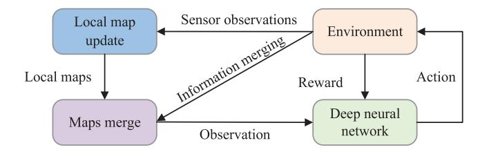

Fig. 17. The DRL system architecture.

combine neural networks as function approximators with RL frameworks, enabling agents to learn general and scalable policies. In general, each UAV obtains observation data through the airborne sensor that is seen as the local search map and updates it by sharing information with neighboring UAVs. The action output of the RL algorithm is used to determine the next UAV movement, and the optimal cooperative decisionmaking strategy is constantly learned based on rewards from the environment [\[88\]](#page-39-30).

In [\[231\]](#page-42-36), the authors developed a novel approach based on Q-learning, where a search map was constructed by combining the target probability map and a certain value map. Moreover, it was extended to coordinate the flight path among multiple UAVs by introducing the territory awareness information map concept. Although this method can implement the cooperative search oriented multiple targets online, it does not consider practical communication constraints in complex environments.

Some policy gradient-based algorithms are used to learn optimal policy functions. For example, in [\[213\]](#page-42-18), a novel PPObased framework was presented in multi-UAV search-track unknown targets, where the sharing policy was trained by CTDE paradigm. As shown in Fig. [17,](#page-30-0) each UAV maintains four observation history maps and conducts information fusion with neighboring UAVs. CNN was used to extract features from observation maps. The proposed algorithms can improve exploration fairness and ensure continuous observation. In addition, the work in [\[232\]](#page-42-37) studied a novel DRL-based method for unknown targets, combining synchronous advantage actorcritic (A3C) with traditional frontier exploration. It used DRL and dual-stream Q-learning to optimize the search meanwhile avoiding obstacles. Experimental results show that the proposed method helps to improve search efficiency and reduce search time.

More recently, researchers have used MARL-based algorithms to solve the CS problem in unknown and dynamic environments, which integrated DRL technology and multiagent systems. In [\[88\]](#page-39-30), the authors investigated a scalable distributed method called DNQMIX, which used a Bayesian updated system model and a linear fusion method for detection information. The proposed method designed the reward function considering the area coverage rate and target search efficiency. Additionally, digital twin technology was introduced to ensure the speed and effectiveness of the DRL decision-making model training.

Furthermore, various neural networks such as SOM and BINN, have been applied in cooperative search. For example, the researchers in [\[233\]](#page-42-38) developed a novel framework known as GMM-SOM for target search in a curve-shape

area, integrating the Gaussian Mixture Model (GMM) with an enhanced SOM algorithm. To satisfy the demand of maximizing cumulative detection rewards, the curve segments are prioritized and assigned to the UAVs in the winner-neuron selection step, taking comprehensive evaluation factors and allocation balance into consideration. Moreover, citebib235 presented an improved Glasius BINN (GBNN) approach for cooperative target search. In the GBNN framework, except based on the propagation of activity between neurons, it also introduced future detection rewards by GMM to construct the neural activity of each neuron, which more effectively represents the global searching scenarios.

### *E. Hybrid Algorithms in Cooperative Search*

To address the challenge of cooperative search in uncertain and dynamic environments for UAV swarms, researchers have proposed many hybrid algorithms, represented by combining global optimization and local optimization. In [\[235\]](#page-42-39), a novel approach named DE-RHC was studied to implement the realtime cooperative search online, which integrated differential evolution and RHC. To enhance UAV awareness of environmental information, an extended search map was designed using hormone information. However, this method does not study the problem of dynamic targets.

For searching dynamic targets with inconsistent environmental information, the authors in [\[215\]](#page-42-20) developed a hybrid method named MGA-RHO combining the modified GA with the rolling optimization strategy to generate the real-time UAV path. MGA-RHO incorporates reverse and fixed genetic operations at the population initialization phase to enable rapid search. The proposed method also employed an improved least square method and weighted average method to unify the environmental information. Similarly, [\[236\]](#page-42-40) proposed a hybrid two-stage approach for the CS with triggering events in uncertain environments. In the cooperative search phase, an immune GA method was developed, where an immune operator associated with the problem was introduced to avoid falling into the local optimum.

To solve the trigger events when searching for moving targets with sensing capabilities, [\[237\]](#page-42-41) presented the MPC-HPSO algorithm by combining model predictive control (MPC) and hybrid PSO (HPSO). It used an extended search map to characterize target existence probability, which contains detection information and target motion prediction. In HPSO, a crossover operator was incorporated to improve population diversity and search efficiency. Besides, considering timesensitive moving target search-attack tasks, authors in [\[89\]](#page-39-31) proposed a hybrid HAPF-ACO method, where UAVs avoided obstacles and collision online by fusing APF force through the target probability. The current grid potential field force was used to determine the next position of the UAV using deterministic or heuristic state transition. HAPF-ACO can reduce computation and communication through distributed decisionmaking. These algorithms specifically focus on such issues as dynamic targets, inconsistent information, and triggering events.

### *F. Lessons Learned*

Most studies have focused on optimizing target detection probability and search time, neglecting practical factors such as UAV kinematic constraints, scalability, and fuel consumption. In recent years, more studies have been dedicated to establishing multi-objective models that account for various constraints, including communication delay, information loss, and dynamic collision avoidance. With the advancement of machine learning technology, policy learning-based algorithms are gaining prominence for moving target search in dynamic threat and communication-denied environments within heterogeneous UAV swarms.

In the policy learning-based algorithms, it is crucial to learn cooperative search policies by constructing the search map to represent the detection information of UAVs dynamically and designing effective cooperative search rewards. Notably, scalable and transferable MARL algorithms are gradually emerging as effective solutions for CS problems, where the CTDE paradigm can provide more adaptive behavior for the non-stationarity of searching environments [\[213\]](#page-42-18). Moreover, other technologies will be integrated with MARL to improve scalability and population adaptation, such as attention mechanism, average field theory, transfer learning, and course learning [\[238\]](#page-42-42), [\[239\]](#page-42-43). This will become one of the primary research directions for large-scale UAV swarm CS.

# VIII. COMPUTATIONAL INTELLIGENCE ALGORITHMS FOR COOPERATIVE JAMMING

Compared with the three aforementioned technologies, research on cooperative jamming (CJ) has been relatively less studied. Due to the limitations of single jamming equipment in terms of time, power, and waveform, the traditional one-to-one jamming mode is no longer effective in interfering with netted radars. To improve the jamming effect on netted radar systems and minimize the detection probability of breakthrough targets by netted radars, CJ becomes an important means for multiple jamming equipment [\[240\]](#page-43-0).

### *A. Cooperative Jamming*

UAV swarm cooperative jamming means that multiple UAVs coordinate to allocate resources and adjust the jamming decision scheme in time, frequency, and space, aiming to optimize jamming targets according to certain deployment positions and working modes [\[241\]](#page-43-1), [\[242\]](#page-43-2), [\[243\]](#page-43-3). The cooperation between UAVs helps break through the limitations of a single UAV in traditional jamming methods and even achieve new jamming modes. As shown in Fig. [18,](#page-31-1) multiple UAVs are scattered around the flight formation to fly together to jam with the networked radar system coordinately to improve the jamming effect on the networked radar system and ensure the flight formation penetration success rate.

As the practical environment becomes increasingly complex, radar performance improves, and radar systems diversify, cooperative jamming still faces new challenges. It requires the swarm system to reasonably and efficiently allocate jamming resources such as jamming objects, jamming power, and jamming patterns based on environmental situation information

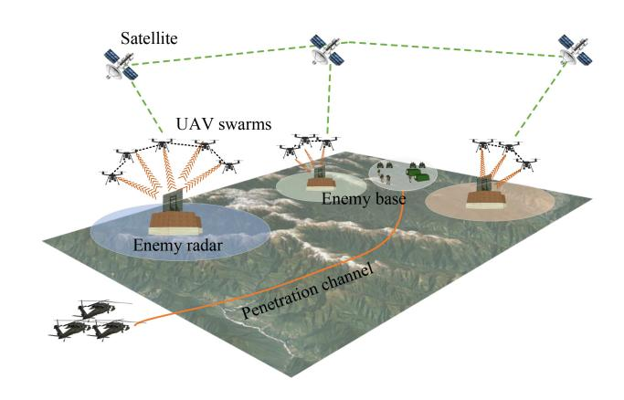

Fig. 18. The case of UAV swarm cooperative jamming.

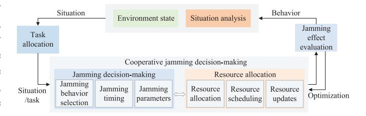

Fig. 19. The framework of cooperative jamming decision-making.

and actual needs, avoiding the limitations of a single jammer, thus obtaining the best jamming effect of the entire system [\[242\]](#page-43-2). As illustrated in Fig. [19,](#page-31-2) the framework of cooperative jamming involves several crucial technologies, including cooperative jamming decision-making, jamming effectiveness evaluation, resource allocation and task decomposition. In essence, CJ decision-making is a multi-objective and multi-constrained NP-hard problem, and many methods have been proposed to address it in existing studies [\[244\]](#page-43-4). The performance of CJ depends upon various factors, which can be mainly summarized as the following aspects:

- • Quantify comprehensive factors affecting threat degree and jamming efficiency of radiation sources. When radar is in different working states, it should adopt multiple jamming patterns like noise convolution jamming, smart noise jamming, and dense false target jamming.
- Establish the cooperative jamming model and objective function, considering expected suppression, target detection probability, the threat of radiation source, and multi-domain collaboration in energy, spatial, and frequency, etc.
- Design effective cooperative jamming decision-making methods, which may involve various CI-based algorithms, such as swarm intelligence optimization, game theory, and deep reinforcement learning.

In general, the cooperative jamming model is established considering maximizing the expected suppression or deception, and another is minimizing the target detection probability [\[244\]](#page-43-4), [\[245\]](#page-43-5), [\[246\]](#page-43-6). As the number of interfering jammers and radar systems increases, the computational complexity of solving such problems grows exponentially. To date, many CI-based algorithms have been widely employed in the cooperative jamming. In this section, we will summarize these

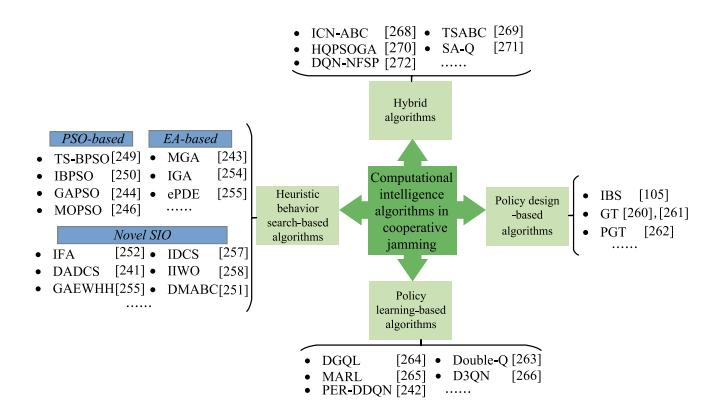

Fig. 20. The classification of computational intelligence algorithms in cooperative jamming.

algorithms and classify them into four types, as illustrated in Fig. [20.](#page-32-0)

# *B. Heuristic Behavior Search-Based Cooperative Jamming Algorithms*

This subsection is relevant to the works using heuristic behavior search-based algorithms in cooperative jamming. Representative algorithms include PSO, ABC, GA, FA, and SA [\[247\]](#page-43-7), [\[248\]](#page-43-8). In [\[241\]](#page-43-1), this study presented an improved discrete PSO algorithm with Pareto optimal theory for cooperative jamming, which made improvements in the particle encoding and state update mechanism. This work established a multi-objective jamming resource optimization model containing multi-objective factors. Experimental results demonstrate that the proposed method has good performance and high efficiency.

In [\[249\]](#page-43-9), a two-track simultaneous update binary PSO (TS-BPSO) algorithm was developed to optimize the distributed jamming resource allocation (JRA). The problem was formulated as a mixed-integer programming model, taking into consideration jamming object selection and power allocation. Besides, this method adopted an assessment method with the center-of-mass jamming. To improve the convergence speed and optimization probability, an improved BPSO approach was presented [\[250\]](#page-43-10). This method adopted the Logistic chaotic mapping for population initialization, and used the asynchronous change learning factor was introduced to improve the ability of exploration and global searching.

In addition, the authors in [\[244\]](#page-43-4) built a 3D jamming resource allocation optimization model considering detection probability and positioning accuracy. To solve this model, a novel method called GAPSO was developed which integrated the genetic operation with PSO. It adopts two threshold sum of concentration degree to adjusts crossover and mutation probability. GAPSO has advantages in convergence speed and stability, as well as global optimization ability. In [\[246\]](#page-43-6), an improved multi-objective PSO (MOPSO) approach was proposed for the multi-aircraft cooperative suppression interference array. This work established a multiobjective function based on the minimum safety zone width of route planning and the distance between the jammer and the center of the radar network. For the issues that nonuniform Pareto front distribution of non-dominated solutions and slow calculational time, the decomposition mechanism and proportional mechanism were introduced into the MOPSO algorithm.

Some researchers have proposed ABC-based methods for solving cooperative jamming. In [\[251\]](#page-43-11), to improve the optimization ability and convergence speed, an improved ABC (DMABC) was presented where the directed mutation mechanism was introduced into the neighborhood searching operation based on the current distribution of the solution. However, this method only considers the static multi-jammer interference decision. Similarly, a novel method based on integer-encoded directed mutation ABC was proposed [\[252\]](#page-43-12), which adopted the integer encoding mechanism and solution update function using directed mutation to satisfy the requirements of the limited capability of jammer and radar-net interference. The single objective combinatorial optimization problem only considers the jamming benefit while ignoring the jamming cost.

In addition, various improved GA-based methods have been proposed in cooperative jamming, from the aspects of improving the convergence speed and solution accuracy. In [\[253\]](#page-43-13), a general JAR model was proposed that considers the jamming beam, jamming power, and the number of radar nodes, overcoming the limitation of existing methods that only apply to specific JAR models. To solve the proposed model, a new method with GA was developed which incorporates a random key encoding scheme and modifies the crossover and mutation operations.

In [\[243\]](#page-43-3), aiming to improve the efficiency of netted radar jamming, a modified GA (MGA) method was investigated where three JRA models are established according to the number of radars and jammers. MGA was optimized by introducing the fitness evaluation, and steady-state replication. An improved GA method was developed in CJ [\[254\]](#page-43-14), in which the two-dimensional integer coding was adopted to determine the corresponding relationship between the jammer and radar network. It exhibits the advantage of fast convergence speed, but it easily falls into the local optimum due to the premature problem. In [\[255\]](#page-43-15), a new extended permutation-based DE (ePDE) method was presented for the high-dimensional jamming allocation problem, which is a combinatorial-optimization-based threat evaluation and JA system. Comparative results show that ePDE has advantages in terms of searching solutions, time loss, and convergence speed.

Moreover, some other SIO algorithms have been applied in cooperative jamming. In [\[256\]](#page-43-16), an improved FA was presented where a multi-target threat level assessment model was established by the fuzzy comprehensive evaluation. The interference efficiency matrix was determined considering time, frequency, energy, interference way, and radar anti-jamming measures. To avoid local optimum, the mutation operator was introduced to allow individuals to communicate through genes of different dimensions. Also, the firefly movement mechanism was modified by introducing adaptive heuristic guidance.

To adjust the jamming resource allocation scheme in realtime, a dynamic adaptive discrete cuckoo search algorithm (DADCS) was proposed which considers the information fusion rules of the netted radar system [\[245\]](#page-43-5). This method established a dual-factor jamming efficiency evaluation function that contains the detection probability model and an aiming probability model. Besides, it incorporated the improved path updating strategy and global learning mechanism. An improved DCS (IDCS) algorithm was studied to realize the jamming resource allocation, in which the crossover and mutation operators are adopted to overcome the defect of Levy flight later stage given the idea of GA [\[257\]](#page-43-17).

Aiming at the large-scale cooperative interference problem of UAV swarms, an improved invasive weed optimization algorithm integrated with the mountain climbing algorithm was proposed to optimize the position of UAVs. Simulation results reveal that the proposed algorithm outperforms better the baseline algorithms in convergence speed and local optimization ability [\[258\]](#page-43-18). In addition, an improved genetic selection electronic warfare operator hyperheuristic method was proposed, which includes a two-level framework isolating problem domains [\[259\]](#page-43-19). The high level aims to search the heuristic space with an improved GA, and the low level intends to search the solution space. It is suitable for solving jamming resource allocation in large-scale environments because it can balance optimization capability and calculation speed.

To sum up, swarm intelligence optimization algorithms are widely employed to optimize jamming resource allocation policies, which can reduce problem-solving complexity. This category is primarily represented by PSO, EA, and some novel SIO algorithms. However, these algorithms are essentially heuristic behavior search-based algorithms. It usually produces the optimal or better solution in a given environment. When faced with the jamming resource allocation problem of the multi-function radar in dynamic environments, it needs to be solved iteratively again. This makes it challenging to meet real-time requirements.

# *C. Policy Design-Based Cooperative Jamming Algorithms*

Most policy design-based cooperative jamming algorithms are commonly used in dynamic problems. In [\[105\]](#page-40-1), an improved biopheromone search algorithm called IBS was proposed for distributed and dynamic jamming resource allocation. The method transforms the cooperative jamming process into a self-organizing problem of multiple UAVs, where each UAV makes independent decisions and maintains an information pheromone map consisting of attraction and repulsion pheromones. The mapping between ant colony behavior and UAV swarm jamming is shown in Table [X.](#page-33-0)

Some studies have presented game theory-based algorithms in cooperative jamming. In [\[260\]](#page-43-20), an algorithm based on the game theory (GT) was studied for adaptive radar jamming, in which the detection performance of radars with constant false alarm rate was analyzed by three cases of ungated range noise, range-gated noise, and false-target jamming. In [\[261\]](#page-43-21), a method using GT was proposed for the jamming resource allocation, in which the jamming effectiveness indicators were

TABLE X MAPPING RELATIONSHIP BETWEEN BIOLOGICAL GROUP BEHAVIOR AND COOPERATIVE JAMMING

| Behavior Characteristics | Group Behavior             | Cooperative Jamming           |  |
|-----------------------------|-------------------------------|----------------------------------|--|
| Behavior actor              | Biological individual         | Single UAV                       |  |
| Benavior actor              | Food sources                  | Targets in task area             |  |
| Behavior space              | The perception area of ant    | The detection range of UAVs      |  |
| Specific behavior           | Food consumption              | Jamming behavior to targets      |  |
| Specific beliavior          | Perceive pheromone among ants | Information sharing between UAVs |  |

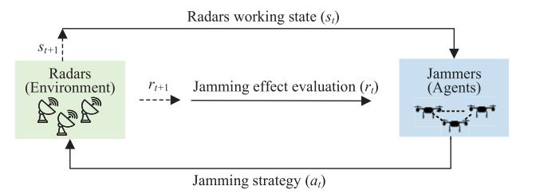

Fig. 21. The cooperative jamming decision-making based on DRL algorithms.

constructed considering the positions of jammers, radars, and communicational command aircraft. This method maintains the advantages of low complexity and good applicability. Similarly, a new approach based on potential game theory was presented to solve the CJ task assignment in dynamic scenarios [\[262\]](#page-43-22). The best response learning algorithm was introduced to find the Nash equilibrium. This method can obtain the optimal policy with low computational complexity but only considers one-to-one jamming task allocation.

# *D. Policy Learning-Based Cooperative Jamming Algorithms*

With the development of artificial intelligence technology, more and more deep reinforcement learning-based methods have been applied in CJ, aiming to adapt to changing environments. For instance, Fig. [21](#page-33-1) illustrates the DRL-based intelligent cooperative jamming decision-making, which can be modeled as a Markov decision process. Specially, each jammer is considered an agent equipped with proactive environmental perception. It actively senses the working state of the radar *s*(*t*) and interacts with other jammers within the system for autonomous allocation and coordination of jamming tasks. Simultaneously, based on jamming effect evaluation and environment feedback *r*(*t*), it guides the subsequent selection of jamming patterns. As the environmental state transitions to *s*(*t* + 1), the jammer receives feedback reward *r*(*t* + 1). The jammer continuously optimizes its behavior and cooperative strategies, ultimately learning the optimal cooperative strategy. It is evident that by learning radar states and accumulating jamming experience, the jammer develops an optimal decision-making policy in dynamic and unknown environments, making jamming more proactive and targeted.

Given the literature on radar anti-jamming, relatively little research has been done on parameter planning. Moreover,

most only use the signal-to-jamming ratio as a reward, which cannot fully characterize the target information acquisition capability of the radar system. In [\[263\]](#page-43-23), to improve the real-time performance of decision-making facing multiple radars in dynamic jamming resource allocation, a method using double Q-learning was presented to establish a model based on cognitive warfare, where the jammers can change the selected strategy in real-time according to the received external parameters. In [\[264\]](#page-43-24), the authors presented a novel Qlearning algorithm named DGQL, which embedded a double greedy algorithm to enhance the anti-jamming performance of networked UAV radar systems. They designed a novel reward using information representation theory to quantify the information acquisition capability. However, the policies generated by this approach are discrete, assuming that state variables such as space, frequency, and antenna beamforming are discrete, whereas they are generally continuous.

More recently, some scholars have developed methods based on DRL to address the intelligent CJ confronting multi-functional networked radar in dynamic environments. In [\[266\]](#page-43-25), a novel method with dueling double DQN (D3QN) was investigated to improve the efficiency and accuracy of multifunctional radar cognitive jamming decisions. This work designed the value and advantage function to improve the jamming level for unknown jamming modes. To shorten the optimal decision time, the priority experience replay (PER) strategy was adopted in the training of D3QN. Similarly, [\[242\]](#page-43-2) proposed a RL-based approach named PER-DDQN which integrated DDQN and PER. In PER-DDQN, a non-sparse idea was adopted to set the reward hierarchically, and the PER strategy was implemented by a sum-tree structure. The proposed method can provide intelligent and adaptive jamming strategies that are suitable for dynamic and sparse reward environments.

For the jamming decision-making against adaptive radars with mode switching and parameter agility, the work in [\[267\]](#page-43-26) proposed a two-stage jamming decision-making framework which reduced the high-dimensional jamming action space into two low-dimensional spaces containing jamming modes and pulse parameters. Besides, a dual Q-learning method was proposed to optimize jamming strategies, and a dynamic jamming effectiveness evaluation method based on an indicator vector space was designed to update the model, aiming to adapt to challenging environments. In [\[265\]](#page-43-27), a novel MARLbased distributed approach was developed for cooperative jamming power allocation, utilizing a CTDE framework. The proposed work formulated the problem as a cooperative multiagent task, which was then turned into a partially observable Markov decision process.

In summary, as a policy learning-based algorithm, RL provides more effective behavior policies for the cognitive decision-making problem of multifunctional radar jamming resources. The obvious advantage of this algorithm is generalization that it is not limited to a particular environment setting. As the cooperative jamming problem becomes increasingly complex, more researchers are beginning to use DRL algorithms [\[242\]](#page-43-2). When researchers use RL to solve cognitive jamming decision problems, most consider scenarios where a single jammer fights against a single multifunction radar. Moreover, when the radar is in more than one mode, the jammer needs to adopt different modes to obtain the best jamming effect, such as noise amplitude modulation jamming, smart noise jamming, and noise convolution jamming.

# *E. Hybrid Algorithms in Cooperative Jamming*

Many researchers have proposed hybrid algorithms in cooperative jamming, which combine two or more of the above three categories to enhance the respective advantages. In [\[268\]](#page-43-28), a hybrid method was developed integrating the improved contract network and ABC for dynamic cooperative jamming. The prioritization mechanism was employed to ensure the maximum interference gain. Besides, a concurrent bidding mechanism was utilized to improve the auction efficiency during the posting bidding information phase, and ABC was used to obtain a scheme for bidding tasks to maximize the interference gain. To address the issue that most studies focus on the jamming benefit while ignoring the jamming cost, a hybrid algorithm integrating the taboo search algorithm and ABC was suggested for jamming decision-making [\[269\]](#page-43-29). This method aims to maximize jamming benefits and reduce jamming costs. Considering the taboo search concept, solutions that have not been updated after a certain number of searches will be stored in a taboo list.

To overcome the defects of slow convergence and premature convergence of JRA, a novel method was proposed by combining the self-adjustable GA and quantum-behaved PSO [\[270\]](#page-43-30). This work formulated the JRA as a multi-objective optimization problem with multiple constraints. Experimental results demonstrated that it can provide an effective and credible solution. In [\[271\]](#page-43-31), a combination of SA and Q-learning was studied to solve cognitive electronic jamming decisionmaking, where SA was used to improve the exploration strategy, as well as balance the exploration and exploitation problem of Q-learning. Additionally, this method adopted a stochastic gradient descent with warm restarts to improve the accelerated learning convergence speed and avoid falling into the local optimum. In addition, a hybrid algorithm combining DQN with neural fictitious self-play was proposed for jamming power dynamic allocation [\[272\]](#page-43-32). The experimental results show that this method can converge to the approximate Nash equilibrium.

### *F. Lessons Learned*

The related studies mostly assume that the information of networked radar systems is fully known, which may not be the case in practical applications. When dealing with many radars, existing algorithms still face challenges such as long computation times, low optimization accuracy, and unsatisfactory real-time decision-making performance. Moreover, the cognitive jamming capability in dynamic environments is limited. In addition, considering the unknown parameters of networked radar systems in complex environments, it is crucial to construct a reasonable jamming performance evaluation model and optimization objectives.

TABLE XI SUMMARY OF MAIN CHALLENGES AND FUTURE DIRECTIONS IN UAV SWARM NETWORKING

| Торіс                                  | Challenges                                                                                                                                                                                                                                                                                                                                                                                                                                                                           | Future directions                                                                                                                                                                                                                                                                                                                                                                                                                                                                          |
|----------------------------------------|--------------------------------------------------------------------------------------------------------------------------------------------------------------------------------------------------------------------------------------------------------------------------------------------------------------------------------------------------------------------------------------------------------------------------------------------------------------------------------------|--------------------------------------------------------------------------------------------------------------------------------------------------------------------------------------------------------------------------------------------------------------------------------------------------------------------------------------------------------------------------------------------------------------------------------------------------------------------------------------------|
| High-dynamic network                | UAV swarm network poses high-speed node mobility and frequent topology changes. In UANET, traditional deterministic routing protocols will cause huge routing maintenance overhead, severely impacting network performance [14]. While opportunistic routing can enhance reliability and mitigate topology-related performance issues, it is still challenging to rapidly select the optimal set of forwarding nodes in such a highly dynamic network.                               | Research on node mobility in highly dynamic networking is a critical direction of future work. Aiming at the option of candidate forwarding set, designing intelligent opportunistic routing decision methods with multi-agent reinforcement learning algorithms [47]. UAVs can dynamically select the optimal set of candidate forwarding nodes according to the network topology change, thus improving the routing forwarding efficiency while guaranteeing reliability.                |
| Large-scale networking              | In practical large-scale networking applications, more adaptive routing protocols are required to provide high reliability, high transfer ratios, minimal delay, efficient dynamic topology maintenance, and fast network reconfiguration [276]. In addition, existing UANET routing methods also face the problems of low scalability and high complexity.                                                                                                                          | Investigate scalable and intelligent routing strategies for UAV swarm networks combining MDRL with graph neural networks [118], attention mechanisms, or mean-field approach [41]. In particular, under a partially observable distributed environment, it can predict future node positions and adapt to dynamic network topologies, meeting the growing demands for communication reliability and network performance for large-scale UAV swarm collaboration.                           |
| UAV network security                | It contains sensitive data when UAVs are applied in missions such as medical rescue and event security. As UAV nodes move fast, channel switching is frequent, and the environment is open, UANET is prone to the risk of communication links, control commands, and transmission data leakage. Thus, enhancing the security of UAV swarm networks is of paramount importance [83].                                                                                                  | Develop secure networking strategies to prevent UAV communication link contamination and tampering. For instance, design secure routing protocols with FL technology to encrypt and train data in UAV nodes [273]. Second, use highly confidential physical layer technologies to enhance UAV antijamming capabilities. Alternatively, apply the physical layer security method to optimize UAV flight path and resource allocation for improved secure transmission rates and throughput. |
| Intelligent networking algorithm    | Intelligent networking algorithms are essentially data- driven algorithms [49]–[51]. For UANET, obtaining data through actual testing methods is not only costly but also highly inefficient, resulting in extremely slow model training. Conversely, constructing a learning environment only by computer simulations can lead to large errors, resulting in low-quality learning samples and ultimately affecting the effectiveness of decision-making model. | Digital twin technology offers a promising solution for developing cyber-physical systems [34]. It creates digital models of physical entities within the information domain while optimizing the behavior and parameters of physical entities by integrating AI technology into data processing. Thus, establishing a high-fidelity UANET digital twin simulation environment is crucial to enhancing learning speed and implementing intelligent algorithms.                             |
| Integrated sensing and communication   | It requires real-time transmission and sharing of rich sensor data in UAV swarm networking, which poses several challenges to communication bandwidth. However, as spectrum resources become scarce, how to reuse the same frequency band spectrum for different functions and make more effective use of limited communication resources needs to be solved urgently [48].                                                                                                          | Design a UAV swarm collaborative networking system for intelligent cooperative sensing, deeply integrating 6G network and AI-empowered UAV integrated sensing and communication (ISAC) [276] to further enhance sensing and communication performance. Intelligent decision-making algorithms are used to perform error calibration on the local results of UAV sensing, and UANET is fully utilized to share sensing information to improve sensing accuracy and expand sensing range.    |
| Space-air-ground integrated networking | In the 6G vision of the "Internet of Everything", it is essential to establish an integrated space-air-ground network architecture. Within this framework, UANET plays a critical role that works together with satellite networks and terrestrial mobile communications to provide an air backbone network for poor and underdeveloped areas. However, efficiently interconnecting heterogeneous networks still faces many challenges [277].                                        | Construct an air-space-ground integrated UANET. Designing low-complexity, high-flexibility heterogeneous network switching algorithms, and corresponding resource management methods are critical to effective collaboration among selforganizing networks. The characteristics of heterogeneous network scenarios and task requirements should be integrated to achieve efficient networking [17].                                                                                        |

Researchers have extensively used optimization-based algorithms in cooperative jamming, reducing the complexity of problem solutions. However, the constraints and objective functions will be changed when the operating mode and parameters of multi-functional radar are changed. Therefore, it is necessary to re-iterate to seek the optimal solution, which poses high demands on convergence speed and real-time performance. More and more researchers have started using MARL algorithms to address the cognition decision problem of multi-functional radars jamming in a dynamic environment [\[266\]](#page-43-25), [\[267\]](#page-43-26). This enables the jamming system to learn in complex and changing environments, adapting to different locations and varying radar parameter information. Exploring dynamic and local optimization strategies for cooperative jamming in highly uncertain scenarios, such as jamming system failures or the emergence of new threat sources, is also a critical research topic.

# IX. CHALLENGES AND FUTURE RESEARCH DIRECTIONS

As discussed above, the existing literature has demonstrated that various CI algorithms can facilitate networking and collaboration among UAV swarms. However, it is noted that a single category of algorithms may not be suitable for all problems within UAV swarms. Hence, choosing appropriate CI algorithms based on different mission requirements is crucial

TABLE XII MAIN CHALLENGES AND FUTURE DIRECTIONS IN EACH COOPERATIVE MISSION

| Missions                       | Main Challenges                                                                                                                                                                                                                                                                                                                                                                                                                                                                                                                                                                                                                                                                                                                             | <b>Future Directions</b>                                                                                                                                                                                                                                                                                                                                                                                                                                                                                                                                                                           |
|--------------------------------|---------------------------------------------------------------------------------------------------------------------------------------------------------------------------------------------------------------------------------------------------------------------------------------------------------------------------------------------------------------------------------------------------------------------------------------------------------------------------------------------------------------------------------------------------------------------------------------------------------------------------------------------------------------------------------------------------------------------------------------------|----------------------------------------------------------------------------------------------------------------------------------------------------------------------------------------------------------------------------------------------------------------------------------------------------------------------------------------------------------------------------------------------------------------------------------------------------------------------------------------------------------------------------------------------------------------------------------------------------|
| Cooperative task assignment | <ul> <li>There exists uneven task allocation for heterogeneous UAV swarms in complex and large-scale environments [161].</li> <li>Some bio-inspired optimization algorithms still require much time to make decisions for dynamic CTA and face challenges in achieving real-time calculations.</li> <li>CTA modeling is too idealistic without considering constraints such as task priority, dynamic threat avoidance, and workload balance [130].</li> <li>Most task assignment algorithms are either centralized or distributed, while few task assignment algorithms combine the two.</li> </ul>                                                                                                                                        | <ul> <li>Establishing a realistic model that covers more stochastic factors, and developing efficient methods by combining DRL and digital twin technology to further improve the solution performance.</li> <li>Investigating dynamic task assignment problems for large-scale heterogeneous UAV swarms, from the aspects of robustness, practicality, extensibility, and stability [87].</li> <li>Establishing a hierarchical UAV mission planning system, which integrates the centralized and distributed framework to reduce the computational burden and improve the scalability.</li> </ul> |
| Cooperative path planning      | <ul> <li>The models are overly simplistic and do not sufficiently consider UAVs' dynamics and resource limitations.</li> <li>It still takes much running time to address complex CPP in large-scale environments for most algorithms and does not perform well in realizing real-time CPP.</li> <li>Most studies focus on studying CPP in the 2D environment and relatively few for the 3D environments [201].</li> <li>Few studies have investigated online CPP that considers the cooperative response to inter-UAV communication interference and interruption.</li> </ul>                                                                                                                                                               | <ul> <li>Studying the complex path planning in cross-platform scenarios to enhance intelligent perception and cooperative decision-making capabilities of UAVs.</li> <li>Designing online path planning strategies for heterogeneous UAV swarms in 3D confrontational environments that can quickly replan flight paths to environmental changes.</li> <li>Developing effective hybrid algorithms for large-scale UAV swarms in complicated environments, by combining swarm intelligence optimization algorithms and deep transfer reinforcement learning [90].</li> </ul>                        |
| Cooperative search          | <ul> <li>Most algorithms are designed for static target search and often suffer from the problem of getting stuck in local optima.</li> <li>Lacking effective collaboration and specialized guidance mechanisms for collisions between UAVs.</li> <li>The communication interruption issues among UAVs are commonly ignored, where environmental information is usually lost and inconsistent [215].</li> <li>Most studies merely consider the optimization target detection probability while ignoring the practical issues commonly such as UAV kinematic constraints, fuel consumption, and restricted areas.</li> </ul>                                                                                                                 | <ul> <li>Proposing intelligent and scalable algorithms to enhance the search capability for UAV swarms, especially learning-based algorithms, from the perspective of optimization mechanism and algorithm structure [88].</li> <li>Characterizing actual environments and establishing a multi-objective function that considers various constraints such as communication delay, information loss, and collision avoidance [215].</li> <li>Researching moving target search for heterogeneous UAV swarms in dynamic threat and communication-denied environments.</li> </ul>                     |
| Cooperative jamming         | <ul> <li>Many studies assume that the information of the network radar system is fully known, which may not be the case in practical applications [270].</li> <li>Cooperative jamming allocation optimization algorithms often suffer from certain problems such as long computation time and low optimization accuracy.</li> <li>The cooperative jamming systems still have unsatisfactory real-time decision-making performance when faced with a large number of radars and have limited cognitive interference capabilities in dynamic environments [257].</li> <li>It is difficult to construct a reasonable cooperative jamming performance evaluation model and optimization objective in extremely complex environments.</li> </ul> | <ul> <li>Developing more efficient jamming algorithms that consider the unknown parameters of the networking radar system, by improving the solution quality and reducing the computation time.</li> <li>Exploring dynamic and local optimization strategies of cooperative jamming in highly uncertain scenarios, such as the damage of UAV jammers and the emergence of new threat sources.</li> <li>Investigating intelligent cooperative jamming problems with cognitive capabilities based on situational information, and operational requirements [242], [267].</li> </ul>                  |

to address networking and collaboration. Despite extensive research efforts in UAV swarm networking and collaboration, numerous issues still require further resolution. Research on CI-based algorithms is still emerging, especially scalable MARL algorithms, but future work need to tackle some issues and challenges in UAV swarm networking and collaboration.

In this section, based on extensive research in current literature, we first conduct an in-depth discussion on UAV swarm networking from six aspects: space-air-ground integrated networking, integrated sensing and communication, high-dynamic network, large-scale networking, UAV network security, and intelligent networking algorithms. Table [XI](#page-35-1) presents the main challenges and research directions in detail. Then, we specifically discuss and analyze the main challenges and future research directions in four typical cooperative missions, including task assignment, path planning, cooperative search, and cooperative jamming, as listed in Table [XII.](#page-36-0)

Furthermore, we point out potential research directions in the UAV swarm networking and collaboration field, including heterogeneous UAV missions, scalable intelligent algorithms, efficient collaboration algorithms, UAV cooperative confrontation, swarm intelligence emergence, sim2real transfer technology, and high-fidelity verification systems. We believe this will shed valuable insights into the research development in this field.

- *Heterogeneous UAV missions:* In addition to the previously mentioned missions, other cooperative missions for heterogeneous unmanned systems in extreme environments will also become research hotspots [\[273\]](#page-43-33), such as localization and tracking, search and surveillance, mission planning, and intelligent perception.
- *Scalable intelligent algorithms:* Scalable and efficient algorithms have garnered increasing attention, opening new possibilities for large-scale networking and collaboration in UAV swarms [\[87\]](#page-39-29). Hence, an emerging research trend focuses on enhancing the performance of CI-based algorithms, such as designing MARL-based algorithms from the perspective of scalability and population adaptation, as well as exploring the potential of combining communication reinforcement learning with bio-inspired optimization algorithms.
- *UAV cooperative confrontation:* UAV swarm intelligent cooperative confrontation is a promising research topic. However, existing research mainly focuses on traditional game theory, which makes it challenging to meet the dynamic maneuver decision-making requirements. Future research work is expected to improve the system confrontation ability of UAV swarms by combining game theory framework and multi-agent deep reinforcement learning algorithm [\[92\]](#page-39-34).
- *Swarm intelligence emergence:* Studying and revealing the swarm intelligence emergence mechanism in multiagent systems is crucial to optimizing the UAV swarm collaboration mechanism. Particularly in communicationlimited environments, exploring the emergence and evolution of intelligence in large-scale UAV swarms will become an important research direction for future work.
- • **Sim2real transfer technology:** Deploying simulationtrained policies directly in real-world environments is often challenging due to sensor errors and dynamic changes in the real world [\[274\]](#page-43-34). Domain randomization provides a simple but workable technique to fill the reality gap, which randomly delays the execution time of each agent within the simulation environment to mimic the unpredictable time gap between policy computation and the actual execution of actions in real-world scenarios. Therefore, it is urgent to build a good bridge between simulation and reality using various domain randomization technologies in future work.
- *High-fidelity verification systems:* Although physical testing can provide more reliable validation results, conducting large-scale coordination tests in practical environments can be challenging. Thus, a promising future research direction is to develop accurate and high-fidelity verification methods for UAV swarm collaboration that reduce the difficulty of actual measurement, such as semi-physical simulations and digital twin systems.

# X. CONCLUSION

This study has conducted an in-depth analysis of CIbased UAV swarm networking and collaboration algorithms, by reviewing 278 representative articles published in highlevel journals and conferences. To the best of our knowledge, this is the first attempt to provide a comprehensive survey of collaboration together with networking for UAV swarms based on CI algorithms. To be specific, we first review the networking problem in UANET from the aspects of channel access and network routing, then we focus on four typical cooperative missions, covering cooperative task allocation, cooperative path planning, cooperative search, and cooperative jamming. It is worth mentioning that related CI-based algorithms are classified into four categories distinguished by the way to address problems, i.e., heuristic behavior search-based algorithms, policy design-based algorithms, policy learningbased algorithms, and hybrid algorithms. For each algorithm in each mission, this survey has expounded on the advantages, limitations, and various enhancements. More importantly, the challenges and future trends have been presented. It is noteworthy that UAV swarm networking and collaboration remains a promising research field. This survey will provide a comprehensive reference and assist researchers in further research in this field.

# REFERENCES

- [\[1\]](#page-0-0) S. Baldi, D. Sun, G. Zhou, and D. Liu, "Adaptation to unknown leader velocity in vector-field UAV formation," *IEEE Trans. Aerosp. Electron. Syst.*, vol. 58, no. 1, pp. 473–484, Feb. 2022.
- [\[2\]](#page-0-0) N. C. Luong et al., "Applications of deep reinforcement learning in communications and networking: A survey," *IEEE Commun. Surveys Tuts.*, vol. 21, no. 4, pp. 3133–3174, 4th Quart., 2019.
- [\[3\]](#page-0-1) Y. Xu et al., "Path planning optimization with multiple pesticide and power loading bases using several unmanned aerial systems on segmented agricultural fields," *IEEE Trans. Syst. Man Cybern.-Syst.*, vol. 53, no. 3, pp. 1882–1894, Mar. 2023.
- [\[4\]](#page-0-1) Z. Wang and J.-B. Sheu, "Vehicle routing problem with drones," *Transp. Res. B, Methodol.*, vol. 122, pp. 350–364, Apr. 2019.
- [\[5\]](#page-0-1) C. Zhang, W. Zhou, W. Qin, and W. Tang, "A novel UAV path planning approach: Heuristic crossing search and rescue optimization algorithm," *Expert Syst. Appl.*, vol. 215, Apr. 2023, Art. no. 119243.
- [\[6\]](#page-0-2) R. A. C. da Silva, N. L. S. da Fonseca, and R. Boutaba, "Evaluation of the employment of UAVs as fog nodes," *IEEE Wireless Commun.*, vol. 28, no. 5, pp. 20–27, Oct. 2021.
- [\[7\]](#page-0-2) L. Wang, K. Wang, C. Pan, W. Xu, N. Aslam, and L. Hanzo, "Multi-agent deep reinforcement learning-based trajectory planning for multi-UAV assisted mobile edge computing," *IEEE Trans. Cogn. Commun. Netw.*, vol. 7, no. 1, pp. 73–84, Mar. 2021.
- [\[8\]](#page-0-2) N. Zhao, Z. Ye, Y. Pei, Y.-C. Liang, and D. Niyato, "Multi-agent deep reinforcement learning for task offloading in UAV-assisted mobile edge computing," *IEEE Trans. Wireless Commun.*, vol. 21, no. 9, pp. 6949–6960, Sep. 2022.
- [\[9\]](#page-0-3) R. A. C. da Silva and N. L. S. da Fonseca, "Location of fog nodes mounted on fixed-wing UAVs," *Veh. Commun.*, vol. 41, Jun. 2023, Art. no. 100600, doi: [10.1016/j.vehcom.2023.100600](http://dx.doi.org/10.1016/j.vehcom.2023.100600)
- [\[10\]](#page-0-4) R. Shakeri et al., "Design challenges of multi-UAV systems in cyber-physical applications: A comprehensive survey and future directions," *IEEE Commun. Surveys Tuts.*, vol. 21, no. 4, pp. 3340–3385, 4th Quart., 2019.
- [\[11\]](#page-0-4) M. Thammawichai, S. P. Baliyarasimhuni, E. C. Kerrigan, and J. B. Sousa, "Optimizing communication and computation for multi-UAV information gathering applications," *IEEE Trans. Aerosp. Electron. Syst.*, vol. 54, no. 2, pp. 601–615, Apr. 2018.
- [\[12\]](#page-0-5) S. Hayat, E. Yanmaz, and R. Muzaffar, "Survey on unmanned aerial vehicle networks for civil applications: A communications viewpoint," *IEEE Commun. Surveys Tuts.*, vol. 18, no. 4, pp. 2624–2661, 4th Quart., 2016.
- [\[13\]](#page-0-5) Y. Zhou, B. Rao, and W. Wang, "UAV swarm intelligence: Recent advances and future trends," *IEEE Access*, vol. 8, pp. 183856–183878, 2020.

- [\[14\]](#page-0-6) D. S. Lakew, U. Sa'ad, N.-N. Dao, W. Na, and S. Cho, "Routing in flying Ad Hoc networks: A comprehensive survey," *IEEE Commun. Surveys Tuts.*, vol. 22, no. 2, pp. 1071–1120, 2nd Quart., 2020.
- [\[15\]](#page-0-7) Z. Wang et al., "Learning to routing in UAV swarm network: A multiagent reinforcement learning approach," *IEEE Trans. Veh. Technol.*, vol. 72, no. 5, pp. 6611–6624, May 2023.
- [\[16\]](#page-0-7) X. Huang, A. Liu, H. Zhou, K. Yu, W. Wang, and X. Shen, "FMAC: A self-adaptive MAC protocol for flocking of flying Ad Hoc network," *IEEE Internet Things J.*, vol. 8, no. 1, pp. 610–625, Jan. 2021.
- [\[17\]](#page-0-7) Y. Lu et al., "UAV Ad Hoc network routing algorithms in space-airground integrated networks: Challenges and directions," *Drones*, vol. 7, no. 7, p. 448, Jul. 2023.
- [\[18\]](#page-1-1) J. Hu, L. Xie, K. Y. Lum, and J. Xu, "Multiagent information fusion and cooperative control in target search," *IEEE Trans. Control Syst. Technol.*, vol. 21, no. 4, pp. 1223–1235, Jul. 2013.
- [\[19\]](#page-1-2) D. Liu, W. Bao, X. Zhu, B. Fei, T. Men, and Z. Xiao, "Cooperative path optimization for multiple UAVs surveillance in uncertain environment," *IEEE Internet Things J.*, vol. 9, no. 13, pp. 10676–10692, Jul. 2022.
- [\[20\]](#page-1-3) S. Poudel and S. Moh, "Task assignment algorithms for unmanned aerial vehicle networks: A comprehensive survey," *Veh. Commun.*, vol. 35, Jun. 2022, Art. no. 100469.
- [\[21\]](#page-1-4) Y. Wu, K. H. Low, and C. Lv, "Cooperative path planning for heterogeneous unmanned vehicles in a search-and-track mission aiming at an underwater target," *IEEE Trans. Veh. Technol.*, vol. 69, no. 6, pp. 6782–6787, Jun. 2020.
- [\[22\]](#page-1-4) P. Yao, H. Wang, and H. Ji, "Multi-UAVs tracking target in urban environment by model predictive control and improved Grey Wolf optimizer," *Aerosp. Sci. Technol.*, vol. 55, pp. 131–143, Aug. 2016
- [\[23\]](#page-1-5) N. Primeau, R. Falcon, R. Abielmona, and E. M. Petriu, "A review of computational intelligence techniques in wireless sensor and actuator networks," *IEEE Commun. Surveys Tuts.*, vol. 20, no. 4, pp. 2822–2854, 4th Quart., 2018.
- [\[24\]](#page-1-5) M. Asim, Y. Wang, K. Wang, and P.-Q. Huang, "A review on computational intelligence techniques in cloud and edge computing," *IEEE Trans. Emerg. Topics Comput. Intell.*, vol. 4, no. 6, pp. 742–763, Dec. 2020.
- [\[25\]](#page-1-6) A. Puente-Castro, D. Rivero, A. Pazos, and E. Fernandez-Blanco, "A review of artificial intelligence applied to path planning in UAV swarms," *Neural Comput. Appl.*, vol. 34, no. 1, pp. 153–170, Jan. 2022.
- [\[26\]](#page-1-6) Y. Zhao, Z. Zheng, and Y. Liu, "Survey on computational-intelligencebased UAV path planning," *Knowl.-Based Syst.*, vol. 158, pp. 54–64, Oct. 2018.
- [\[27\]](#page-1-7) M. Campion, P. Ranganathan, and S. Faruque, "UAV swarm communication and control architectures: A review," *J. Unmanned Veh. Syst.*, vol. 7, no. 2, pp. 93–106, Nov. 2018.
- [\[28\]](#page-1-7) S. Vashisht, S. Jain, and G. S. Aujla, "MAC protocols for unmanned aerial vehicle ecosystems: Review and challenges," *Comput. Commun.*, vol. 160, pp. 443–463, Jul. 2020.
- [\[29\]](#page-1-8) A. Sharma, S. Shoval, A. Sharma, and J. K. Pandey, "Path planning for multiple targets interception by the swarm of UAVs based on swarm intelligence algorithms: A review," *IETE Tech. Rev.*, vol. 39, no. 3,pp. 1–23, 2021.
- [\[30\]](#page-1-8) J. Tang, H. Duan, and S. Lao, "Swarm intelligence algorithms for multiple unmanned aerial vehicles collaboration: A comprehensive review," *Artif. Intell. Rev.*, vol. 72, no. 4, pp. 4372–4383, Apr. 2023.
- [\[31\]](#page-2-1) Z. Jia, J. Yu, X. Ai, X. Xu, and D. Yang, "Cooperative multiple task assignment problem with stochastic velocities and time windows for heterogeneous unmanned aerial vehicles using a genetic algorithm," *Aerosp. Sci. Technol.*, vol. 76, pp. 112–125, May 2018.
- [\[32\]](#page-2-1) B. Li, J. Zhang, L. Dai, K. L. Teo, and S. Wang, "A hybrid offline optimization method for reconfiguration of multi-UAV formations," *IEEE Trans. Aerosp. Electron. Syst.*, vol. 57, no. 1, pp. 506–520, Feb. 2021.
- [\[33\]](#page-2-2) D. Liu, L. Dou, R. Zhang, X. Zhang, and Q. Zong, "Multi-agent reinforcement learning-based coordinated dynamic task allocation for heterogenous UAVs," *IEEE Trans. Veh. Technol.*, vol. 72, no. 4, pp. 4372–4383, Apr. 2023, doi: [10.1109/TVT.2022.3228198.](http://dx.doi.org/10.1109/TVT.2022.3228198)
- [\[34\]](#page-2-2) G. Shen et al., "Deep reinforcement learning for flocking motion of multi-UAV systems: Learn from a digital twin," *IEEE Internet Things J.*, vol. 9, no. 13, pp. 11141–11153, Jul. 2022.
- [\[35\]](#page-2-2) H. Bayerlein, M. Theile, M. Caccamo, and D. Gesbert, "Multi-UAV path planning for wireless data harvesting with deep reinforcement learning," *IEEE Open J. Commun. Soc.*, vol. 2, pp. 1171–1187, 2021.

- [\[36\]](#page-2-3) H. Shakhatreh et al., "Unmanned aerial vehicles (UAVs): A survey on civil applications and key research challenges," *IEEE Access*, vol. 7, pp. 48572–48634, 2019.
- [\[37\]](#page-2-3) H. Wang, H. Zhao, J. Zhang, D. Ma, J. Li, and J. Wei, "Survey on unmanned aerial vehicle networks: A cyber physical system perspective," *IEEE Commun. Surveys Tuts.*, vol. 22, no. 2, pp. 1027–1070, 2nd Quart., 2020.
- [\[38\]](#page-2-3) H. Zhang, B. Xin, L.-H. Dou, J. Chen, and K. Hirota, "A review of cooperative path planning of an unmanned aerial vehicle group," *Front. Inf. Technol. Electron. Eng.*, vol. 21, no. 12, pp. 1671–1694, Dec. 2020.
- [\[39\]](#page-2-4) Q. Peng, H. S. Wu, and R. S. Xue, "Review of dynamic task allocation methods for UAV swarms oriented to ground targets," *Complex Syst. Model. Simul.*, vol. 1, no. 3, pp. 163–175, Sep. 2021.
- [\[40\]](#page-3-2) Z. Qiming, W. Husheng, and F. Zhaowang, "A review of intelligent optimization algorithm applied to unmanned aerial vehicle swarm search task," in *Proc. 11th Int. Conf. Inf. Sci. Technol. (ICIST)*, 2021, pp. 383–393.
- [\[41\]](#page-5-2) W. Wang, Y. Liu, R. Srikant, and L. Ying, "3M-RL: Multi-resolution multi-agent mean-field reinforcement learning for autonomous UAV routing," *IEEE Trans. Intell. Transp. Syst.*, vol. 23, no. 7, pp. 8985–8996, Jul. 2022.
- [\[42\]](#page-5-2) L. Lei, T. Zhang, L. Zhou, X. Chen, C. Zhang, and C. Luo, "Estimating the available medium access bandwidth of IEEE 802.11 Ad Hoc networks with concurrent transmissions," *IEEE Trans. Veh. Technol.*, vol. 64, no. 2, pp. 689–701, Feb. 2015.
- [\[43\]](#page-5-2) A. Bujari, C. E. Palazzi, and D. Ronzani, "A comparison of stateless position-based packet routing algorithms for FANETs," *IEEE Trans. Mobile Comput.*, vol. 17, no. 1, pp. 2468–2482, Nov. 2018.
- [\[44\]](#page-5-2) S. Temel and I. Bekmezci, "LODMAC: Location oriented directional MAC protocol for FANETs," *Comput. Netw.*, vol. 83, pp. 76–84, Jun. 2015.
- [\[45\]](#page-5-2) Y. Yu, T. Wang, and S. C. Liew, "Deep-reinforcement learning multiple access for heterogeneous wireless networks," *IEEE J. Sel. Areas Commun.*, vol. 37, no. 6, pp. 1277–1290, Jun. 2019.
- [\[46\]](#page-6-0) S. Wang, H. Liu, P. H. Gomes, and B. Krishnamachari, "Deep reinforcement learning for dynamic multichannel access in wireless networks," *IEEE Trans. Cogn. Commun. Netw.*, vol. 4, no. 2, pp. 257–265, Jun. 2018.
- [\[47\]](#page-6-0) X. Qiu, L. Xu, P. Wang, Y. Yang, and Z. Liao, "A data-driven packet routing algorithm for an unmanned aerial vehicle swarm: A multiagent reinforcement learning approach," *IEEE Wireless Commun. Lett.*, vol. 11, no. 10, pp. 2160–2164, Oct. 2022.
- [\[48\]](#page-6-0) X. Li, S. Cheng, H. Ding, M. Pan, and N. Zhao, "When UAVs meet cognitive radio: Offloading traffic under uncertain spectrum environment via deep reinforcement learning," *IEEE Trans. Wireless Commun.*, vol. 22, no. 2, pp. 824–838, Feb. 2023.
- [\[49\]](#page-6-1) Y. Zhou, J. Ning, Z. Ding, and B. Duo. "An intelligent multi-hop low duty cycle UAV swarm Ad Hoc network MAC protocol." SSRN. May 2023. [Online]. Available: https://ssrn.com/abstract=4402758
- [\[50\]](#page-6-1) M. Zhang, C. Dong, and Y. Huang, "FS-MAC: An adaptive MAC protocol with fault-tolerant synchronous switching for FANETs," *IEEE Access*, vol. 7, pp. 80602–80613, 2019.
- [\[51\]](#page-6-1) W. Jiang, W. Yu, W. Wang, and T. Huang, "Multi-agent reinforcement learning for joint cooperative spectrum sensing and channel access in cognitive UAV networks," *Sensors*, vol. 22, no. 4, p. 1651, Feb. 2022.
- [\[52\]](#page-6-2) Z. Zheng, A. K. Sangaiah, and T. Wang, "Adaptive communication protocols in flying Ad Hoc network," *IEEE Commun. Mag.*, vol. 56, no. 1, pp. 136–142, Jan. 2018.
- [\[53\]](#page-6-3) G. Choudhary, V. Sharma, and I. You, "Sustainable and secure trajectories for the military Internet of Drones (IoD) through an efficient medium access control (MAC) protocol," *Comput. Elect. Eng.*, vol. 74, pp. 59–73, Mar. 2019.
- [\[54\]](#page-6-4) T.W. Kim and G.H. Hwang, "Performance enhancement of CSMA/CA MAC protocol based on reinforcement learning," *J. Inf. Commun. Converg. Eng.*, vol. 19, no. 1, pp. 1–7, Mar. 2021.
- [\[55\]](#page-6-5) Z. Zheng, S. Jiang, R. Feng, L. Ge, and C. Gu, "An adaptive backoff selection scheme based on Q-learning for CSMA/CA," *Wireless Netw.*, vol. 29, no. 4, pp. 1899–1909, May 2023.
- [\[56\]](#page-6-6) H. Van Hasselt, A. Guez, and D. Silver, "Deep reinforcement learning with double Q-learning," in *Proc. 13th AAAI Conf. Artif. Intell.*, vol. 30, 2016, pp. 2094–2100.
- [\[57\]](#page-6-7) V. Mnih et al., "Human-level control through deep reinforcement learning," *Nature*, vol. 518, no. 7540, pp. 529–533, 2015.

- [\[58\]](#page-6-8) X. Tan et al., "Cooperative multi-agent reinforcement learning based distributed dynamic spectrum access in cognitive radio networks," *IEEE Internet Things J.*, vol. 9, no. 19, pp. 19477–19488, Oct. 2022.
- [\[59\]](#page-6-9) T. Rashid, M. Samvelyan, C. Schroeder, G. Farquhar, J. Foerster, and S. Whiteson, "QMIX: Monotonic value function factorisation for deep multi-agent reinforcement learning," in *Proc. Int. Conf. Mach. Learn.*, 2018, pp. 4295–4304.
- [\[60\]](#page-6-10) A. Amrallah, E. M. Mohamed, G. K. Tran, and K. Sakaguchi, "Enhanced dynamic spectrum access in UAV wireless networks for post-disaster area surveillance system: A multi-player multi-armed bandit approach," *Sensors*, vol. 21, no. 23, p. 7855, Dec. 2021.
- [\[61\]](#page-6-11) W. Chen, Y. Wang, and Y. Yuan, "Combinatorial multi-armed bandit: General framework and applications," in *Proc. Int. Conf. Mach. Learn.*, 2013, pp. 151–159.
- [\[62\]](#page-7-0) W. Wang, C. Dong, S. Zhu, and H. Wang, "DFRA: Demodulation-free random access for UAV Ad Hoc networks," in *Proc. IEEE Int. Conf. Commun. (ICC)*, 2017, pp. 1–6.
- [\[63\]](#page-7-1) L. Lei, G. Shen, L. Zhang, and Z. Li, "Toward intelligent cooperation of UAV swarms: When machine learning meets digital twin," *IEEE Netw.*, vol. 35, no. 1, pp. 386–392, Jan./Feb. 2021.
- [\[64\]](#page-7-2) L. Lei, S. Cai, C. Luo, W. Cai, and J. Zhou, "A dynamic TDMAbased MAC protocol with QoS guarantees for fully connected ad hoc networks," *Telecommun. Syst.*, vol. 60, no. 1, pp. 43–53, Sep. 2015.
- [\[65\]](#page-7-3) S. Cui, H. Yousefi'zadeh, and X. Gu, "An optimal power control algorithm for STDMA MAC protocols in multihop wireless networks," *IEEE Trans. Wireless Commun.*, vol. 15, no. 5, pp. 3131–3142, May 2016.
- [\[66\]](#page-7-4) L. A. L. F. da Costa, K. Rafael, and E. P. de Freitas, "Q-FANET: Improved Q-learning based routing protocol for FANETs," *Comput. Netw.*, vol. 198, Oct. 2021, Art. no. 108379.
- [\[67\]](#page-7-5) L. Lei, D. Wang, L. Zhou, X. Chen, and S. Cai, "Link availability estimation based reliable routing for aeronautical Ad Hoc networks," *Ad Hoc Netw.*, vol. 20, pp. 53–63, Sep. 2014.
- [\[68\]](#page-7-6) M. Y. Arafat and S. Moh, "Routing protocols for unmanned aerial vehicle networks: A survey," *IEEE Access*, vol. 7, pp. 99694–99720, 2019.
- [\[69\]](#page-7-7) H. Zhang, T. Wang, T. Liu, Q. Zhang, and Y. Liu, "Deep neural network routing with dynamic space division for 3D UAV FANETs," *Wireless Pers. Commun.*, vol. 125, no. 3, pp. 2003–2028, Aug. 2022.
- [\[70\]](#page-7-8) H. Yang and Z. Liu, "An optimization routing protocol for FANETs," *EURASIP J. Wireless Commun. Netw.*, vol. 2019, no. 1, pp. 1–8, Dec. 2019.
- [\[71\]](#page-7-9) W. Jin, R. Gu, and Y. Ji, "Reward function learning for Q-learningbased geographic routing protocol," *IEEE Commun. Lett.*, vol. 23, no. 7, pp. 1236–1239, Jul. 2019.
- [\[72\]](#page-7-10) Y. Chen, N. Lyu, G. Song, B. Yang, and X. Jiang, "A traffic-aware Q-network enhanced routing protocol based on GPSR for unmanned aerial vehicle Ad-Hoc networks," *Front. Informat. Technol. Electron. Eng.*, vol. 21, no. 9, pp. 1308–1320, Sep. 2020.
- [\[73\]](#page-7-11) M. Y. Arafat and S. Moh, "A Q-learning-based topology-aware routing protocol for flying Ad Hoc networks," *IEEE Internet Things J.*, vol. 9, no. 3, pp. 1985–2000, Feb. 2022.
- [\[74\]](#page-8-0) B. Sliwa, C. Schüler, M. Patchou, and C. Wietfeld, "PARRoT: Predictive Ad-Hoc routing fueled by reinforcement learning and trajectory knowledge," in *Proc. IEEE 93th Veh. Technol. Conf.*, 2021, pp. 1–7.
- [\[75\]](#page-8-1) M. M. Alam and S. Moh, "Q-learning-based routing inspired by adaptive flocking control for collaborative unmanned aerial vehicle swarms," *Veh. Commun.*, vol. 40, Apr. 2023, Art. no. 100572.
- [\[76\]](#page-8-2) Q. Yang, S.-J. Jang, and S.-J. Yoo, "Q-learning-based fuzzy logic for multi-objective routing algorithm in flying Ad Hoc networks," *Wireless Pers. Commun.*, vol. 113, no. 1, pp. 115–138, Jul. 2020.
- [\[77\]](#page-8-3) A. Rovira-Sugranes, F. Afghah, J. Qu, and A. Razi, "Fully-echoed Qrouting with simulated annealing inference for flying Adhoc networks," *IEEE Trans. Netw. Sci. Eng.*, vol. 8, no. 3, pp. 2223–2234, Jul.– Sep. 2021.
- [\[78\]](#page-8-4) M. F. Khan, K. L. A. Yau, M. H. Ling, M. A. Imran, and Y. W. Chong, "An intelligent cluster-based routing scheme in 5G flying Ad Hoc networks," *Appl. Sci.*, vol. 12, no. 7, p. 3665, Apr. 2022.
- [\[79\]](#page-8-5) Y. Zhang and H. Qiu, "Delay-aware and link-quality-aware geographical routing protocol for UANET via dueling deep Q-network," *Sensors*, vol. 23, no. 6, p. 3024, Mar. 2023.
- [\[80\]](#page-8-6) D. Liu, J. Cui, J. Zhang, C.-Y. Yang, and L. Hanzo, "Deep reinforcement learning aided packet-routing for aeronautical Ad-Hoc networks formed by passenger planes," *IEEE Trans. Veh. Technol.*, vol. 70, no. 5, pp. 5166–5171, May 2021.

- [\[81\]](#page-8-7) A. M. Koushik, F. Hu, and S. Kumar, "Deep Q-learning-based node positioning for throughput-optimal communications in dynamic UAV swarm network," *IEEE Trans. Cogn. Commun. Netw.*, vol. 5, no. 3, pp. 554–566, Sep. 2019.
- [\[82\]](#page-8-8) R. Lowe, Y. Wu, A. Tamar, J. Harb, P. Abbeel, and I. Mordatch, "Multiagent actor-critic for mixed cooperative-competitive environments," in *Proc. Adv. Neural Inf. Process. Syst.*, 2017, pp. 6379–6390.
- [\[83\]](#page-8-8) X. Guo, H. Lin, Z. Li, and M. Peng, "Deep-reinforcement-learningbased QoS-aware secure routing for SDN-IoT," *IEEE Internet Things J.*, vol. 7, no. 7, pp. 6242–6251, Jul. 2020.
- [\[84\]](#page-8-9) T. Li et al., "Applications of multi-agent reinforcement learning in future Internet: A comprehensive survey," *IEEE Commun. Surveys Tuts.*, vol. 24, no. 2, pp. 1240–1279, 2nd Quart., 2022.
- [\[85\]](#page-9-1) Q. Yang, Y. Liu, T. Chen, and Y. Tong, "Federated machine learning: Concept and applications," *ACM Trans. Intell. Syst. Technol.*, vol. 10, no. 2, pp. 1–19, Jan. 2019.
- [\[86\]](#page-9-2) X. Tang, X. Li, and R. Yu, "Digital-twin-assisted task assignment in multi-UAV systems: A deep reinforcement learning approach," *IEEE Internet Things J.*, vol. 10, no. 17, pp. 15362–15375, Sep. 2023.
- [\[87\]](#page-9-3) F. Frattolillo, D. Brunori, and L. Iocchi, "Scalable and cooperative deep reinforcement learning approaches for multi-UAV systems: A systematic review," *Drones*, vol. 7, no. 4, p. 236, Mar. 2023.
- [\[88\]](#page-9-3) G. Shen, L. Lei, X. Zhang, Z. Li, S. Cai, and L. Zhang, "Multi-UAV cooperative search based on reinforcement learning with a digital twin driven training framework," *IEEE Trans. Veh. Technol.*, vol. 72, no. 7, pp. 8354–8368, Jul. 2023.
- [\[89\]](#page-9-4) Z. Zhen, Y. Chen, L. Wen, and B. Han, "An intelligent cooperative mission planning scheme of UAV swarm in uncertain dynamic environment," *Aerosp. Sci. Technol.*, vol. 100, May 2020, Art. no. 105826.
- [\[90\]](#page-9-5) Y. Yin, Y. Guo, Q. Su, and Z. Wang, "Task allocation of multiple unmanned aerial vehicles based on deep transfer reinforcement learning," *Drones*, vol. 6, no. 8, p. 215, Aug. 2022.
- [\[91\]](#page-9-5) H. Qie, D. Shi, T. Shen, X. Xu, Y. Li, and L. Wang, "Joint optimization of multi-UAV target assignment and path planning based on multi-agent reinforcement learning," *IEEE Access*, vol. 7, pp. 146264–146272, 2019.
- [\[92\]](#page-9-6) T. Zhang et al., "Improving autonomous behavior strategy learning in an unmanned swarm system through knowledge enhancement," *IEEE Trans. Rel.*, vol. 71, no. 2, pp. 763–774, Jun. 2022.
- [\[93\]](#page-9-7) J. Li, G. Deng, C. Luo, Q. Lin, Q. Yan, and Z. Ming, "A hybrid path planning method in unmanned air/ground vehicle (UAV/UGV) cooperative systems," *IEEE Trans. Veh. Technol.*, vol. 65, no. 12, pp. 9585–9596, Dec. 2016.
- [\[94\]](#page-9-7) Y. Pan, Y. Yang, and W. Li, "A deep learning trained by genetic algorithm to improve the efficiency of path planning for data collection with multi-UAV," *IEEE Access*, vol. 9, pp. 7994–8005, 2021.
- [\[95\]](#page-9-8) A. Slowik and H. Kwasnicka, "Nature inspired methods and their industry applications—Swarm intelligence algorithm," *IEEE Trans. Ind. Informat.*, vol. 14, no. 3, pp. 1004–1015, Mar. 2018.
- [\[96\]](#page-9-9) M. Mavrovouniotis, C. Li, and S. Yang, "A survey of swarm intelligence for dynamic optimization: Algorithm and applications," *Swarm Evol. Comp.*, vol. 22, pp. 1–17, Apr. 2017.
- [\[97\]](#page-9-9) J. Tang, G. Liu, and Q. Pan, "A review on representative swarm intelligence algorithms for solving optimization problems: Applications and trends," *IEEE-CAA J. Automatica Sinica*, vol. 8, no. 10, pp. 1627–1643, Oct. 2021.
- [\[98\]](#page-9-10) H. Duan, J. Zhao, Y. Deng, Y. Shi, and X. Ding, "Dynamic discrete pigeon-inspired optimization for multi-UAV cooperative search-attack mission planning," *IEEE Trans. Aerosp. Electron. Syst.*, vol. 57, no. 1, pp. 706–720, Feb. 2021.
- [\[99\]](#page-9-11) Q. B. Deng, J. Q. Yu, and N. F. Wang, "Cooperative task assignment of multiple heterogeneous unmanned aerial vehicles using a modified genetic algorithm with multi-type genes," *Chin. J. Aeronaut.*, vol. 26, no. 5, pp. 1238–1250, Oct. 2013.
- [\[100\]](#page-9-11) Z. Wang, L. Liu, T. Long, and Y. Wen, "Multi-UAV reconnaissance task allocation for heterogeneous targets using an opposition-based genetic algorithm with double-chromosome encoding," *Chin. J. Aeronaut.*, vol. 31, no. 2, pp. 339–350, Feb. 2018.
- [\[101\]](#page-10-0) M. Radmanesh, M. Kumar, and M. Sarim, "Grey wolf optimization based sense and avoid algorithm in a Bayesian framework for multiple UAV path planning in an uncertain environment," *Aerosp. Sci. Technol.*, vol. 77, pp. 168–179, Jun. 2018.
- [\[102\]](#page-10-0) R. K. Dewangan, A. Shukla, and W. W. Godfrey, "Three dimensional path planning using Grey Wolf optimizer for UAVs," *Int. J. Speech Technol.*, vol. 49, no. 6, pp. 2201–2217, Jun. 2019.

- [\[103\]](#page-21-1) C. Xu, M. Xu, and C. Yin, "Optimized multi-UAV cooperative path planning under the complex confrontation environment," *Comput. Commun.*, vol. 162, pp. 196–203, Oct. 2020.
- [\[104\]](#page-10-1) M. A. Alanezi, H. R. E. H. Bouchekara, M. S. Shahriar, Y. A. Sha'aban, M. S. Javaid, and M. Khodja, "Motion-encoded electric charged particles optimization for moving target search using unmanned aerial vehicles," *Sensors*, vol. 21, no. 19, p. 6568, Oct. 2021.
- [\[105\]](#page-10-2) S. Li, C. Wei, Y. Deng, and Q. Wang, "Cooperative jamming of multi-UAVs based on improved biopheromone," in *Proc. Int. Conf. Guid., Navig. Control. (ICGNC)*, 2022, pp. 1721–1734.
- [\[106\]](#page-10-3) Y. Chen, J. Yu, X. Su, and G. Luo, "Path planning for multi-UAV formation," *J. Intell. Robot. Syst.*, vol. 77, no. 1, pp. 229–246, 2015.
- [\[107\]](#page-10-4) X. Fu, P. Feng, and X. Gao, "Swarm UAVs task and resource dynamic assignment algorithm based on task sequence mechanism," *IEEE Access*, vol. 7, pp. 41090–41100, 2019.
- [\[108\]](#page-10-5) Z. Zhen, P. Zhu, Y. Xue, and Y. Ji, "Distributed intelligent self-organized mission planning of multi-UAV for dynamic targets cooperative search-attack," *Chin. J. Aeronaut.*, vol. 32, no. 12, pp. 2706–2716, Dec. 2019.
- [\[109\]](#page-10-6) H. Zhao, L. Mao, and J. Wei, "Coverage on demand: A simple motion control algorithm for autonomous robotic sensor networks," *Comput. Netw.*, vol. 135, pp. 190–200, Apr. 2018.
- [\[110\]](#page-10-6) H. Zhao, H. Liu, and X. Chu. "Self-adaptive collective motion of swarm robots," *IEEE Trans. Autom. Sci. Eng.*, vol. 15, no. 4, pp. 1533–1545, Oct. 2018.
- [\[111\]](#page-10-7) Y. Zhang, W. Feng, G. Shi, F. Jiang, M. Chowdhury, and S. H. Ling, "UAV swarm mission planning in dynamic environment using consensus-based bundle algorithm," *Sensors*, vol. 20, no. 8, p. 2307, Apr. 2020.
- [\[112\]](#page-10-8) F. Ye, J. Chen, Q. Sun, Y. Tian, and T. Jiang, "Decentralized task allocation for heterogeneous multi-UAV system with task coupling constraints," *J. Supercomput.*, vol. 77, no. 1, pp. 111–132, Jan. 2021.
- [\[113\]](#page-10-9) A. Haydari and Y. Yılmaz, "Deep reinforcement learning for intelligent transportation systems: A survey," *IEEE Trans. Intell. Transp. Syst.*, vol. 23, no. 1, pp. 11–32, Jan. 2022.
- [\[114\]](#page-10-10) X. Zhao, Q. Zong, B. Tian, B. Zhang, and M. You, "Fast task allocation for heterogeneous unmanned aerial vehicles through reinforcement learning," *Aerosp. Sci. Technol.*, vol. 92, pp. 588–594, Sep. 2019.
- [\[115\]](#page-10-11) A. M. Seid, G. O. Boateng, B. Mareri, G. Sun, and W. Jiang, "Multiagent DRL for task offloading and resource allocation in multi-UAV enabled IoT edge network," *IEEE Trans. Netw. Service Manag.*, vol. 18, no. 4, pp. 4531–4547, Dec. 2021.
- [\[116\]](#page-10-12) Y. Chen, Q. Dong, X. Shang, Z. Wu, and J. Wang, "Multi-UAV autonomous path planning in reconnaissance missions considering incomplete information: A reinforcement learning method," *Drones*, vol. 7, no. 1, p. 10, Dec. 2022.
- [\[117\]](#page-10-13) L. Yue, R. Yang, J. Zuo, M. Yan, X. Zhao, and M. Lv, "Factored multiagent soft actor-critic for cooperative multi-target tracking of UAV swarms," *Drones*, vol. 7, no. 3, p. 150, Feb. 2023.
- [\[118\]](#page-10-13) Z. Ye, K. Wang, Y. Chen, X. Jiang, and G. Song, "Multi-UAV navigation for partially observable communication coverage by graph reinforcement learning," *IEEE Trans. Mobile Comput.*, vol. 22, no. 7, pp. 4056–4069, Jan. 2022.
- [\[119\]](#page-11-1) R. S. de Moraes and E. P. de Freitas, "Multi-UAV based crowd monitoring system," *IEEE Trans. Aerosp. Electron. Syst.*, vol. 56, no. 2, pp. 1332–1345, Apr. 2020.
- [\[120\]](#page-11-1) X. Zhang, S. Xia, X. Li, and T. Zhang, "Multi-objective particle swarm optimization with multi-mode collaboration based on reinforcement learning for path planning of unmanned air vehicles," *Knowl.-Based Syst.*, vol. 250, Aug. 2022, Art. no. 109075.
- [\[121\]](#page-11-2) C. Qu, W. Gai, M. Zhong, and J. Zhang, "A novel reinforcement learning based Grey Wolf optimizer algorithm for unmanned aerial vehicles (UAVs) path planning," *Appl. Soft Comput.*, vol. 89, Apr. 2020, Art. no. 106099.
- [\[122\]](#page-25-1) Q. Liu, Y. Zhang, M. Li, Z. Zhang, N. Cao, and J. Shang, "Multi-UAV path planning based on fusion of sparrow search algorithm and improved bioinspired neural network," *IEEE Access*, vol. 9, pp. 124670–124681, 2021.
- [\[123\]](#page-28-0) Z. Zhen, D. Xing, and C. Gao, "Cooperative search-attack mission planning for multi-UAV based on intelligent self-organized algorithm," *Aerosp. Sci. Technol.*, vol. 76, pp. 402–411, May 2018.
- [\[124\]](#page-18-0) Y. Shen, "Bionic communication network and binary pigeon-inspired optimization for multiagent cooperative task allocation," *IEEE Trans. Aerosp. Electron. Syst.*, vol. 58, no. 5, pp. 3946–3961, Oct. 2022.

- [125] W. Du et al., "Network-based heterogeneous particle swarm optimization and its application in UAV communication coverage," *IEEE Trans. Emerg. Topics Comput. Intell.*, vol. 4, no. 3, pp. 312–323, Jun. 2020.
- [\[126\]](#page-22-0) W. Bai et al., "A cooperative route planning method for multi-UAVs based-on the fusion of artificial potential field and B-spline interpolation," in *Proc. 37th Chin. Control Conf. (CCC)*, 2018, pp. 6733–6738.
- [127] V. Roberge, M. Tarbouchi, and G. Labonté, "Fast genetic algorithm path planner for fixed-wing military UAV using GPU," *IEEE Trans. Aerosp. Electron. Syst.*, vol. 54, no. 5, pp. 2105–2117, Oct. 2018.
- [\[128\]](#page-11-3) O. Cheikhrouhou and I. Khoufi, "A comprehensive survey on the multiple traveling salesman problem: Applications approaches and taxonomy," *Comput. Sci. Rev.*, vol. 40, May 2021, Art. no. 100369.
- [\[129\]](#page-11-3) M. Drexl, "Synchronization in vehicle routing—A survey of VRPs with multiple synchronization constraints," *Transp. Sci.*, vol. 46, no. 3, pp. 297–316, Aug. 2012.
- [\[130\]](#page-11-4) J. Zhang and J. Xing, "Cooperative task assignment of multi-UAV system," *Chin. J. Aeronaut.*, vol. 33, no. 11, pp. 2825–2827, Nov. 2020.
- [\[131\]](#page-13-2) M. Dorigo, M. Birattari, and T. Stutzle, "Ant colony optimization," *IEEE Comput. Intell. Mag.*, vol. 1, no. 4, pp. 28–39, Nov. 2006.
- [\[132\]](#page-13-3) P. C. Pendharkar, "An ant colony optimization heuristic for constrained task allocation problem," *J. Comput. Sci.*, vol. 7, pp. 37–47, Mar. 2015.
- [\[133\]](#page-13-4) S. Wang et al., "Cooperative task allocation for multi-robot systems based on multi-objective ant colony system," *IEEE Access*, vol. 10, pp. 56375–56387, 2022.
- [\[134\]](#page-13-5) L. Wang, Z. Wang, S. Hu, and L. Liu, "Ant colony optimization for task allocation in multi-agent systems," *China Commun.*, vol. 10, no. 3, pp. 125–132, Mar. 2013.
- [\[135\]](#page-13-6) A. Slowik and H. Kwasnicka, "Evolutionary algorithms and their applications to engineering problems," *Neural Comput. Appl.*, vol. 32, no. 22, pp. 12363–12379, Mar. 2020.
- [\[136\]](#page-14-1) T. Shima, S. J. Rasmussen, A. G. Sparks, and K. M. Passino, "Multiple task assignments for cooperating uninhabited aerial vehicles using genetic algorithms," *Comput. Oper. Res.*, vol. 33, no. 11, pp. 3252–3269, Nov. 2006.
- [\[137\]](#page-14-2) Z. Wang, B. Wang, Y. Wei, P. Liu, and L. Zhang, "Cooperative multitask assignment of multiple UAVs with improved genetic algorithm based on beetle antennae search," in *Proc. Chin. Control Conf. (CCC)*, 2020, pp. 1605–1610.
- [\[138\]](#page-14-3) Y. Xu, Z. Sun, X. Xue, W. Gu, and B. Peng, "A hybrid algorithm based on MOSFLA and GA for multi-UAVs plant protection task assignment and sequencing optimization," *Appl. Soft Comput.*, vol. 96, no. 4, Nov. 2020, Art. no. 106623.
- [\[139\]](#page-14-4) E. Edison and T. Shima, "Integrated task assignment and path optimization for cooperating uninhabited aerial vehicles using genetic algorithms," *Comput. Oper. Res.*, vol. 38, no. 1, pp. 340–356, Jan. 2011.
- [\[140\]](#page-14-5) C. Ramirez-Atencia, G. Bello-Orgaz, M. D. R-Moreno, and D. Camacho, "Solving complex multi-UAV mission planning problems using multi-objective genetic algorithms," *Soft Comput.*, vol. 21, no. 17, pp. 4883–4900, Sep. 2017.
- [\[141\]](#page-14-6) H.-S. Wu and F.-M. Zhang, "Wolf pack algorithm for unconstrained global optimization," *Math. Problems Eng.*, vol. 2014, no. 2014, Mar. 2014, Art. no. 465082.
- [\[142\]](#page-14-7) Y. Chen, D. Yang, and J. Yu, "Multi-UAV task assignment with parameter and time-sensitive uncertainties using modified two-part wolf pack search algorithm," *IEEE Trans. Aerosp. Electron. Syst.*, vol. 54, no. 6, pp. 2853–2872, Dec. 2018.
- [143] F. Ye, J. Chen, Y. Tian, and T. Jiang, "Cooperative task assignment of a heterogeneous multi-UAV system using an adaptive genetic algorithm," *Electronics*, vol. 9, no. 4, p. 687, Apr. 2020.
- [\[144\]](#page-14-8) Y. Lu, Y. Ma, J. Wang, and L. Han, "Task assignment of UAV swarm based on wolf pack algorithm," *Appl. Sci.*, vol. 10, no. 23, pp. 1–17, Dec. 2020.
- [\[145\]](#page-14-9) Y. Lu, Y. Ma, and J. Wang, "Multi-population parallel wolf pack algorithm for task assignment of UAV swarm," *Appl. Sci.*, vol. 11, no. 24, Dec. 2021, Art. no. 11996.
- [\[146\]](#page-14-10) S. Xu, L. Li, Z. Zhou, Y. Mao, and J. Huang, "A task allocation strategy of the UAV swarm based on multi-discrete wolf pack algorithm," *Appl. Sci.*, vol. 12, no. 3, p. 1331, Feb. 2022.
- [\[147\]](#page-15-0) H. B. Duan and P. X. Qiao, "Pigeon-inspired optimization: A new swarm intelligence optimizer for air robot path planning," *Int. J. Intell. Comput. Cybern.*, vol. 7, no. 1, pp. 24–37, 2014.

- [\[148\]](#page-15-1) R. Hao, D. Luo, and H. Duan, "Multiple UAVs mission assignment based on modified pigeon-inspired optimization algorithm," in *Proc. IEEE Chin. Guid. Navig. Control Conf.*, 2014, pp. 2692–2697.
- [\[149\]](#page-15-2) J. Gu, T. Su, Q. Wang, X. Du, and M. Guizani, "Multiple moving targets surveillance based on a cooperative network for multi-UAV," *IEEE Commun. Mag.*, vol. 56, no. 4, pp. 82–89, Apr. 2018.
- [\[150\]](#page-15-3) A. E. Ezugwu and D. Prayogo, "Symbiotic organisms search algorithm: Theory recent advances and applications," *Expert Syst. Appl.*, vol. 119, pp. 184–209, Apr. 2019.
- [\[151\]](#page-15-4) H.-X. Chen, Y. Nan, and Y. Yang, "Multi-UAV reconnaissance task assignment for heterogeneous targets based on modified symbiotic organisms search algorithm," *Sensors*, vol. 19, no. 3, p. 734, Feb. 2019.
- [\[152\]](#page-15-5) Y. Wei, B. Wang, W. Liu, and L. Zhang, "Hierarchical task assignment of multiple UAVs with improved firefly algorithm based on simulated annealing mechanism," in *Proc. 40th Chin. Control Conf. (CCC)*, 2021, pp. 1943–1948.
- [\[153\]](#page-15-6) C. Fan, S. Han, X. Li, T. Zhang, and Y. Yuan, "A modified natureinspired meta-heuristic methodology for heterogeneous unmanned aerial vehicle system task assignment problem," *Soft Comput.*, vol. 25, nol. 22, pp. 14227–14243, Nov. 2021.
- [\[154\]](#page-15-7) R. Luo, H. Zheng, and J. Guo, "Solving the multi-functional heterogeneous UAV cooperative mission planning problem using multi-swarm fruit fly optimization algorithm," *Sensors*, vol. 20, no. 18, p. 5026, Sep. 2020.
- [\[155\]](#page-16-2) Z. Wang and J. Zhang, "A task allocation algorithm for a swarm of unmanned aerial vehicles based on bionic wolf pack method," *Knowl. Based Syst.*, vol. 250, Aug. 2022, Art. no. 109072.
- [\[156\]](#page-16-3) H. Jinqiang, W. Husheng, Z. Renjun, M. Rafik, and Z. Xuanwu, "Selforganized search-attack mission planning for UAV swarm based on wolf pack hunting behavior,"*J. Syst. Eng. Electron.*, vol. 32, no. 6, pp. 1463–1476, Dec. 2021.
- [\[157\]](#page-16-4) M.-H. Kim, H. Baik, and S. Lee, "Response threshold model based UAV search planning and task allocation," *J. Intell. Robot. Syst.*, vol. 75, nos. 3–4, pp. 625–640, Sep. 2014.
- [\[158\]](#page-16-5) H. Wu, H. Li, R. Xiao, and J. Liu, "Modeling and simulation of dynamic ant colony's labor division for task allocation of UAV swarm," *Phys. A Stat. Mech. Appl.*, vol. 491, pp. 127–141, Feb. 2018.
- [159] X. Hua, Z. Wang, H. Yao, B. Li, C. Shi, and J. Zuo, "Research on many-to-many target assignment for unmanned aerial vehicle swarm in three-dimensional scenarios," *Comput. Electr. Eng.*, vol. 91, May 2021, Art. no. 107067.
- [160] B. Qin, D. Zhang, S. Tang, and M. Wang. "Distributed grouping cooperative dynamic task assignment method of UAV swarm," *Appl. Sci.*, vol. 12, no. 6, p. 2865, Mar. 2022.
- [\[161\]](#page-17-3) Z. Zhen, L. Wen, B. Wang, Z. Hu, and D. Zhang, "Improved contract network protocol algorithm based cooperative target allocation of heterogeneous UAV swarm," *Aerosp. Sci. Technol.*, vol. 119, Dec. 2021, Art. no. 107054.
- [\[162\]](#page-17-4) W. Yao, N. Qi, N. Wan, and Y. Liu, "An iterative strategy for task assignment and path planning of distributed multiple aerial vehicles," *Aerosp. Sci. Technol.*, vol. 86, pp. 455–464, Mar. 2019.
- [\[163\]](#page-17-5) X. Duan, H. Liu, H. Tang, Q. Cai, F. Zhang, and X. Han, "A novel hybrid auction algorithm for multi-UAVs dynamic task assignment," *IEEE Access*, vol. 8, pp. 86207–86222, 2020.
- [\[164\]](#page-17-6) X. Bai, W. Yan, and S. S. Ge, "Distributed task assignment for multiple robots under limited communication range," *IEEE Trans. Syst. Man Cybern. Syst.*, vol. 52, no. 7, pp. 4259–4271, Jul. 2022.
- [\[165\]](#page-18-1) X. Liu, T. Jing, and L. Hou, "An FWUGA hybrid algorithm ˝ combined with clustering for UAV forest fire reconnaissance task assignment," *Mathematics*, vol. 11, no. 10, p. 2400, May 2023.
- [\[166\]](#page-18-2) J. Tang, X. Chen, X. Zhu, and F. Zhu, "Dynamic reallocation model of multiple unmanned aerial vehicle tasks in emergent adjustment scenarios," *IEEE Trans. Aerosp. Electron. Syst.*, vol. 59, no. 2, pp. 1139–1155, Apr. 2023.
- [\[167\]](#page-18-3) Z. Liu, C. Qiu, and Z. Zhang, "Sequence-to-sequence multi-agent reinforcement learning for multi-UAV task planning in 3D dynamic environment," *Appl. Sci.*, vol. 12, no. 23, Dec. 2022, Art. no. 12181.
- [\[168\]](#page-18-4) I. Kim and J. R. Morrison, "Learning based framework for joint task allocation and system design in stochastic multi-UAV systems," in *Proc. Int. Conf. Unmanned Aircr. Syst. (ICUAS)*, 2018, pp. 324–334.
- [\[169\]](#page-18-5) L. Yue, R. Yang, J. Zuo, Y. Zhang, Q. Li, and Y. Zhang, "Unmanned aerial vehicle swarm cooperative decision-making for SEAD mission: A hierarchical multiagent reinforcement learning approach," *IEEE Access*, vol. 10, pp. 92177–92191, 2022.
- [\[170\]](#page-18-6) B. W. Chen and S. Rho, "Autonomous tactical deployment of the UAV array using self-organizing swarm intelligence," *IEEE Consum. Electron. Mag.*, vol. 9, no. 2, pp. 52–56, Mar. 2020.

- [\[171\]](#page-18-7) X. Yi, A. Zhu, S. X. Yang, and C. Luo, "A bio-inspired approach to task assignment of swarm robots in 3-D dynamic environments," *IEEE Trans. Cybern.*, vol. 47, no. 4, pp. 974–983, Apr. 2017.
- [\[172\]](#page-18-8) D. Zhu, H. Huang, and S. X. Yang, "Dynamic task assignment and path planning of multi-AUV system based on an improved self-organizing map and velocity synthesis method in three-dimensional underwater workspace," *IEEE Trans. Cybern.*, vol. 43, no. 2, pp. 504–514, Apr. 2013.
- [\[173\]](#page-18-8) D. Zhu, B. Zhou, and S. X. Yang, "A novel algorithm of multi-AUVs task assignment and path planning based on biologically inspired neural network map," *IEEE Trans. Intell. Veh.*, vol. 6, no. 2, pp. 333–342, Jun. 2021.
- [\[174\]](#page-18-8) D. Zhu, X. Cao, B. Sun, and C. Luo, "Biologically inspired selforganizing map applied to task assignment and path planning of an AUV system," *IEEE Trans. Cogn. Develop. Syst.*, vol. 10, no. 2, pp. 304–313, Jun. 2018.
- [\[175\]](#page-18-8) H. Choi, Y. Kim, and H. Kim, "Genetic algorithm based decentralized task assignment for multiple UAVs in dynamic environments," *Int. J. Aeronaut. Space Sci.*, vol. 12, no. 2, pp. 163–174, Jun. 2011.
- [\[176\]](#page-18-9) M. D. Phung and Q. P. Ha, "Safety-enhanced UAV path planning with spherical vector-based particle swarm optimization," *Appl. Soft Comput.*, vol. 107, Aug. 2021, Art. no. 107376.
- [\[177\]](#page-19-3) Z. Yu, Z. Si, X. Li, D. Wang, and H. Song, "A novel hybrid particle swarm optimization algorithm for path planning of UAVs," *IEEE Internet Things J.*, vol. 9, no. 22, pp. 22547–22558, Nov. 2022.
- [\[178\]](#page-19-3) M. R. Jones, S. Djahel, and K. Welsh. "Path-planning for unmanned aerial vehicles with environment complexity considerations: A survey," *ACM Comput. Surv.*, vol. 55, no. 11, pp. 1–39, 2023.
- [\[179\]](#page-19-4) X. Zhou et al., "Swarm of micro flying robots in the wild," *Sci. Robot.*, vol. 7, no. 66, May 2022, Art. no. eabm5954.
- [\[180\]](#page-19-5) D. Tian and Z. Shi, "MPSO: Modified particle swarm optimization and its applications," *Swarm Evol. Comput.*, vol. 41, pp. 49–68, Aug. 2018.
- [\[181\]](#page-19-5) S. Shao, Y. Peng, C. He, and Y. Du, "Efficient path planning for UAV formation via comprehensively improved particle swarm optimization," *ISA Trans.*, vol. 97, pp. 415–430, Feb. 2020.
- [\[182\]](#page-19-5) W. He, X. Qi, and L. Liu, "A novel hybrid particle swarm optimization for multi-UAV cooperate path planning," *Appl. Intell.*, vol. 51, pp. 7350–7364, Oct. 2021.
- [\[183\]](#page-20-1) H. Duan, Q. Luo, Y. Shi, and G. Ma, "Hybrid particle swarm optimization and genetic algorithm for multi-UAV formation reconfiguration," *IEEE Comput. Intell. Mag.*, vol. 8, no. 3, pp. 16–27, Aug. 2013.
- [\[184\]](#page-20-1) Y. Liu, X. Zhang, Y. Zhang, and X. Guan, "Collision free 4D path planning for multiple UAVs based on spatial refined voting mechanism and PSO approach," *Chin. J. Aeronaut.*, vol. 32, no. 6, pp. 1504–1519, Jun. 2019.
- [\[185\]](#page-20-2) Z. Zhou et al., "When mobile crowd sensing meets UAV: Energyefficient task assignment and route planning," *IEEE Trans. Commun.*, vol. 66, no. 11, pp. 5526–5538, Nov. 2018.
- [\[186\]](#page-20-3) Y. Cao, W. Wei, and Y. Bai, "Multi-base multi-UAV cooperative reconnaissance path planning with genetic algorithm," *Cluster Comput.*, vol. 22, pp. 5175–5184, May 2019.
- [\[187\]](#page-20-4) H. Shorakaei, M. Vahdani, B. Imani, and A. Gholami, "Optimal cooperative path planning of unmanned aerial vehicles by a parallel genetic algorithm," *Robotica*, vol. 34, no. 4, pp. 823–836, Apr. 2016.
- [\[188\]](#page-20-5) E. Besada-Portas, L. de la Torre, J. M. de la Cruz, and B. de Andres-Toro, "Evolutionary trajectory planner for multiple UAVs in realistic scenarios," *IEEE Trans. Robot.*, vol. 26, no. 4, pp. 619–634, Aug. 2010.
- [\[189\]](#page-20-6) B. Wang, D. Wang, and Z. Ali, "A Cauchy mutant pigeon-inspired optimization-based multi-unmanned aerial vehicle path planning method," *Meas. Control*, vol. 53, pp. 83–92, Jan. 2020.
- [\[190\]](#page-21-2) D. Zhang and H. Duan, "Social-class pigeon-inspired optimization and time stamp segmentation for multi-UAV cooperative path planning," *Neurocomputing*, vol. 313, pp. 229–246, Nov. 2018.
- [\[191\]](#page-21-3) S. Mirjalili, S. M. Mirjalili, and A. Lewi, "Grey wolf optimizer," *Adv. Eng. Softw.*, vol. 69, pp. 46–61, Mar. 2014.
- [\[192\]](#page-21-4) K. Shi, X. Zhang, and S. Xia, "Multiple swarm fruit fly optimization algorithm based path planning method for multi-UAVs," *Appl. Sci.*, vol. 10, no. 8, p. 2822, Apr. 2020.
- [\[193\]](#page-21-5) L. Huang, H. Qu, P. Ji, X. Liu, and Z. Fan, "A novel coordinated path planning method using k-degree smoothing for multi-UAVs," *Appl. Soft Comput.*, vol. 48, no. 1, pp. 182–192, Nov. 2016.
- [\[194\]](#page-21-6) K. Li, F. Ge, Y. Han, Y. Wang, and W. Xu, "Path planning of multiple UAVs with online changing tasks by an ORPFOA algorithm," *Eng. Appl. Artif. Intell.*, vol. 94, Sep. 2020, Art. no. 103807.

- [\[195\]](#page-21-7) H. Liu et al., "Multi-UAV optimal mission assignment, and path planning for disaster rescue using adaptive genetic algorithm and improved artificial bee colony method," *Actuators*, vol. 11, no. 1, p. 4, Dec. 2021.
- [\[196\]](#page-21-8) W. Jiang, B. Ai, C. Shen, M. Li, and X. Shen, "Age-of-information minimization for UAV-based multi-view sensing and communication," *IEEE Trans. Veh. Technol.*, vol. 73, no. 1, pp. 1100–1114, Jan. 2024.
- [\[197\]](#page-22-1) A. Jeganathan, B. Dhayabaran, T. D. P. Perera, D. N. K. Jayakody, and P. Muthuchidambaranathan, "Harvest-on-Sky: An AoI-driven UAVassisted wireless communication system," *IEEE Internet Things Mag.*, vol. 5, no. 1, pp. 142–146, Mar. 2022.
- [\[198\]](#page-22-1) A. A. Al-Habob, O. A. Dobre, and H. V. Poor, "Age-and correlationaware information gathering," *IEEE Wireless Commun. Lett.*, vol. 11, no. 2, pp. 273–277, Feb. 2022.
- [\[199\]](#page-22-2) A. A. Al-habob, O. A. Dobre, and H. Vincent Poor, "Energy-efficient spatially-correlated data aggregation using unmanned aerial vehicles," in *Proc. IEEE Int. Symp. Pers. Indoor Mobile Radio Commun.*, 2020, pp. 1–6.
- [\[200\]](#page-22-3) Y. Wang, P. Bai, X. Liang, W. Wang, J. Zhang, and Q. Fu, "Reconnaissance mission conducted by UAV swarms based on distributed PSO path planning algorithms," *IEEE Access*, vol. 7, pp. 105086–105099, 2019.
- [\[201\]](#page-22-4) A. Puente-Castro, D. Rivero, A. Pazos, and E. Fernandez-Blanco, "UAV swarm path planning with reinforcement learning for field prospecting," *Appl. Intell.*, vol. 52, no. 12, pp. 14101–14118, Mar. 2022.
- [\[202\]](#page-22-5) D. L. Cruz and W. Yu, "Path planning of multi-agent systems in unknown environment with neural kernel smoothing and reinforcement learning," *Neurocomputing*, vol. 233, pp. 34–42, Apr. 2017.
- [\[203\]](#page-22-6) Q. Li, F. Gama, A. Ribeiro, and A. Prorok, "Graph neural networks for decentralized multi-robot path planning," in *Proc. IEEE/RSJ Int. Conf. Intell. Robots Syst. (IROS)*, 2020, pp. 11785–11792.
- [\[204\]](#page-22-6) Z. Mou, Y. Zhang, F. Gao, H. Wang, T. Zhang, and Z. Han, "Deep reinforcement learning based three-dimensional area coverage with UAV swarm," *IEEE J. Sel. Areas Commun.*, vol. 39, no. 10, pp. 3160–3176, Oct. 2021.
- [\[205\]](#page-22-6) J. Liu, X. Zhao, P. Qin, S. Geng, Z. Chen, and H. Zhou, "Learningbased multi-UAV assisted data acquisition and computation for information freshness in WPT enabled space-air-ground PIoT," *IEEE Trans. Netw. Sci. Eng.*, vol. 11, no. 1, pp. 48–63, Jan. 2024.
- [\[206\]](#page-23-1) D. H. Wolpert and W. G. Macready, "No free lunch theorems for optimization," *IEEE Trans. Evol. Comput.*, vol. 1, no. 1, pp. 67–82, Apr. 1997.
- [\[207\]](#page-24-1) C. Liu, W. Xie, P. Zhang, Q. Guo, and D. Ding, "Multi-UAVs cooperative coverage reconnaissance with neural network and genetic algorithm," in *Proc. ACM Int. Conf. Proc. Ser. (HPCCT)*, 2019, pp. 81–86.
- [\[208\]](#page-24-2) S. Girija and A. Joshi, "Fast hybrid PSO-APF algorithm for path planning in obstacle rich environment," *IFAC-PapersOnLine*, vol. 52, no. 29, pp. 25–30, Jan. 2020.
- [\[209\]](#page-24-3) J. Ni, X. Wang, M. Tang, W. Cao, P. Shi, and S. X. Yang, "An improved real-time path planning method based on dragonfly algorithm for heterogeneous multi-robot system," *IEEE Access*, vol. 8, pp. 140558–140568, 2020.
- [\[210\]](#page-25-2) S. Perez-Carabaza, E. Besada-Portas, and J. A. Lopez-Orozco, and J. M. de la Cruz, "Ant colony optimization for multi-UAV minimum time search in uncertain domains,"*Appl. Soft Comput.*, vol. 62, pp. 789–806, Jan. 2018.
- [\[211\]](#page-27-3) S. Perez-Carabaza, J. Scherer, B. Rinner, J. A. Lopez-Orozco, and E. Besada-Portas, "UAV trajectory optimization for Minimum Time Search with communication constraints and collision avoidance," *Eng. Appl. Artif. Intell.*, vol. 85, pp. 357–371, Oct. 2019.
- [\[212\]](#page-27-3) P. Li and H. Duan, "A potential game approach to multiple UAV cooperative search and surveillance," *Aerosp. Sci. Technol.*, vol. 68, pp. 403–415, Sep. 2017.
- [\[213\]](#page-26-1) P. Yan, T. Jia, and C. Bai, "Searching and tracking an unknown number of targets: A learning-based method enhanced with maps merging," *Sensors*, vol. 21, no. 4, p. 1076, Feb. 2021.
- [\[214\]](#page-27-4) A. Khan, E. Yanmaz, and B. Rinner, "Information exchange and decision making in micro aerial vehicle networks for cooperative search," *IEEE Trans. Control Netw. Syst.*, vol. 2, no. 4, pp. 335–347, Dec. 2015.
- [\[215\]](#page-27-4) L. Li, X. Zhang, W. Yue, and Z. Liu, "Cooperative search for dynamic targets by multiple UAVs with communication data losses," *ISA Trans.*, vol. 114, pp. 230–241, Aug. 2021.

- [\[216\]](#page-27-4) W. Yue, Y. Xi, and X. Guan, "A new searching approach using improved multi-ant colony scheme for multi-UAVs in unknown environments," *IEEE Access*, vol. 7, pp. 161094–161102, 2019.
- [\[217\]](#page-27-5) C. Erignac, "An exhaustive swarming search strategy based on distributed pheromone maps," in *Proc. Coll. Tech. Pap. AIAA InfoTech Aeros. Conf. (AIAA)*, 2007, pp. 1130–1145.
- [\[218\]](#page-28-1) M. D. Phung and Q. P. Ha, "Motion-encoded particle swarm optimization for moving target search using UAVs," *Appl. Soft Comput.*, vol. 97, Dec. 2020, Art. no. 106705.
- [\[219\]](#page-28-2) L. Li, S. Xu, H. Nie, and S. Yu, "Collaborative target search algorithm for UAV based on chaotic disturbance pigeon-inspired optimization," *Appl. Sci.*, vol. 11, no. 16, p. 7358, Aug. 2021.
- [\[220\]](#page-28-3) R. Wang, B. Xiao, and L. Ru, "Cooperative search approach for UAVs via pigeon-inspired optimization and Markov moving targets," in *Proc. Chin. Autom. Congr. (CAC)*, 2018, pp. 2007–2012.
- [\[221\]](#page-28-4) J. Xue and B. Shen, "A novel swarm intelligence optimization approach: Sparrow search algorithm," *Syst. Sci. Control Eng.*, vol. 8, no. 1, pp. 22–34, Jan. 2020.
- [\[222\]](#page-28-5) W. T. Pan, "A new fruit fly optimization algorithm: Taking the financial distress model as an example," *Knowl. Based Syst.*, vol. 26, pp. 69–74, Feb. 2012.
- [\[223\]](#page-28-6) H. S. Hosseini, "The intelligent water drops algorithm: A natureinspired swarm-based optimization algorithm," *Int. J. Bio-Inspir. Comput.*, vol. 1, no. 1, p. 71, 2009.
- [\[224\]](#page-28-7) J. Timmis, P. Andrews, and E. Hart, "On artificial immune systems and swarm intelligence," *Swarm Intell.*, vol. 4, pp. 247–273, Dec. 2010.
- [\[225\]](#page-28-8) A. R. Mehrabian and C. Lucas, "A novel numerical optimization algorithm inspired from weed colonization," *Ecol. Inform.*, vol. 1, no. 4, pp. 355–366, Dec. 2006.
- [\[226\]](#page-28-9) X. Sun, C. Cai, S. Pan, Z. Zhang, and Q. Li, "A cooperative target search method based on intelligent water drops algorithm," *Comput. Electr. Eng.*, vol. 80, Dec. 2019, Art. no. 106494.
- [\[227\]](#page-28-10) B. Fei, W. Bao, X. Zhu, D. Liu, T. Men, and Z. Xiao, "Autonomous cooperative search model for multi-UAV with limited communication network," *IEEE Internet Things J.*, vol. 9, no. 19, pp. 19346–19361, Oct. 2022.
- [\[228\]](#page-28-11) X. Zhang and M. Ali, "A bean optimization-based cooperation method for target searching by swarm UAVs in unknown environments," *IEEE Access*, vol. 8, pp. 43850–43862, 2020.
- [\[229\]](#page-28-12) H. Saadaoui, F. E. Bouanani, and E. Illi, "Information sharing based on local PSO for UAVs cooperative search of moved targets," *IEEE Access*, vol. 9, pp. 134998–135011, 2021.
- [\[230\]](#page-29-1) J. Ni, G. Tang, Z. Mo, W. Cao, and S. X. Yang, "An improved potential game theory based method for multi-UAV cooperative search," *IEEE Access*, vol. 8, pp. 47787–47796, 2020.
- [\[231\]](#page-29-2) W. Yue, X. Guan, and L. Wang, "A novel searching method using reinforcement learning scheme for multi-UAVs in unknown environments," *Appl. Sci.*, vol. 9, no. 22, p. 4964, Nov. 2019.
- [\[232\]](#page-30-1) X. Cao, C. Sun, and M. Yan, "Target search control of AUV in underwater environment with deep reinforcement learning," *IEEE Access*, vol. 7, pp. 96549–96559, 2019.
- [\[233\]](#page-30-2) P. Yao, Q. Zhu, and R. Zhao, "Gaussian mixture model and selforganizing map Neural-network-based coverage for target search in curve-shape area," *IEEE Trans. Cybern.*, vol. 52, no. 5, pp. 3971–3983, May 2022.
- [\[234\]](#page-30-3) P. Yao and Z. Zhao, "Improved Glasius bio-inspired neural network for target search by multi-agents," *Inf. Sci.*, vol. 568, pp. 40–53, Aug. 2021.
- [235] Z. Zhao and G. Lu, "Receding horizon control for cooperative search of multi-UAVs based on differential evolution," *Int. J. Intell. Comp. Cybern.*, vol. 5, no. 1, pp. 145–158, Mar. 2012.
- [\[236\]](#page-30-4) Z. Zhou, D. Luo, J. Shao, Y. Xu, and Y. You, "Immune genetic algorithm based multi-UAV cooperative target search with event-triggered mechanism," *Phys. Commun.*, vol. 41, Aug. 2020, Art. no. 101103.
- [\[237\]](#page-30-5) X. Hu, Y. Liu, and G. Wang, "Optimal search for moving targets with sensing capabilities using multiple UAVs," *J. Syst. Eng. Electron.*, vol. 28, no. 3, pp. 526–535, Jun. 2017.
- [\[238\]](#page-30-6) Z. Dai, C. H. Liu, R. Han, G. Wang, K. Leung, and J. Tang, "Delaysensitive energy-efficient UAV crowdsensing by deep reinforcement learning," *IEEE. Trans. Mobile Comput.*, vol. 22, no. 4, pp. 2038–2052, Apr. 2023.
- [\[239\]](#page-31-3) Y. Chen, G. Song, Z. Ye, and X. Jiang, "Scalable and transferable reinforcement learning for multi-agent mixed cooperative–competitive environments based on hierarchical graph attention," *Entropy*, vol. 24, no. 4, p. 563, Apr. 2022.

- [\[240\]](#page-31-3) R. Shi and J. Liu, "Application of intelligent optimization methods in jamming resource allocation: A review," *Electron. Opt. Control*, vol. 26, no. 10, pp. 54–61, 2019.
- [\[241\]](#page-31-4) Q. Qingwen, D. Wenfeng, L. Meiqing, and Y. Yang, "Cooperative jamming resource allocation of UAV swarm based on multiobjective DPSO," in *Proc. Chin. Control Decis. Conf. (CCDC)*, 2018, pp. 5319–5325.
- [\[242\]](#page-31-5) W. Zhang, T. Zhao, Z. Zhao, M. Dan, and L. Feiran, "Performance analysis of deep reinforcement learning-based intelligent cooperative jamming method confronting multi-functional networked radar," *Signal Process.*, vol. 207, Jun. 2023, Art. no. 108965.
- [\[243\]](#page-31-5) Z. G. Zong, T. Liu, and S. Y. Liang, "Interference resource allocation based on improved genetic algorithm," *Electron Opt. Control*, vol. 25, no. 5, pp. 41–45, 2018.
- [\[244\]](#page-31-5) F. Liu, Y. Wang, J. Chen, Q. Wang, and N. Yuan, "Research on jamming resource allocation technology based on improved Gapso algorithm," *J. Phys., Conf. Ser.*, vol. 1738, no. 1, 2021, Art. no. 12075.
- [\[245\]](#page-31-6) D. Lu, X. Wang, X. Wu, and Y. Chen, "Adaptive allocation strategy for cooperatively jamming netted radar system based on improved cuckoo search algorithm," *Def. Technol.*, vol. 24, pp. 285–297, Jun. 2023.
- [\[246\]](#page-31-7) H. Zhang, R. Yang, C. Sun, and H. Han, "Research on multiaircraft cooperative suppression interference array based on an improved multiobjective particle swarm optimization algorithm," *Math. Problems Eng.*, vol. 2017, pp. 1–12, Mar. 2017.
- [\[247\]](#page-31-7) S. Shao, T. Zhang, and F. Ye, "Jamming resource allocation aimed to data link based on simulant annealing algorithm," in *Proc. Prog. Electromagn. Res. Symp. (PIERS-FALL)*, 2017, pp. 981–987.
- [\[248\]](#page-32-1) D. Karaboga, B. Gorkemli, C. Ozturk, and N. Karaboga, "A comprehensive survey: Artificial bee colony (ABC) algorithm and applications," *Artif. Intell. Rev.*, vol. 42, no. 1, pp. 21–57, Jun. 2014.
- [\[249\]](#page-32-1) Z. Wu, S. Hu, Y. Luo, and X. Li, "Optimal distributed cooperative jamming resource allocation for multi-missile threat scenario," *Inst. Eng. Technol. Radar. Sonar Nav.*, vol. 16, no. 1, pp. 113–128, 2022.
- [\[250\]](#page-32-2) S. H. Dai, G. W. Yang, M. Li, C. H. Kang, and Z. Zhong, "Cooperative jamming resources allocation of netted radar based on improved particle swarm optimization algorithm," *Aeroesp. Electron. Warf.*, vol. 36, no. 4, pp. 29–45, Oct 2020.
- [\[251\]](#page-32-3) M. Liu, T. Zhao, B. Wang, W. Li, and L. Luan, "Cooperative interference decision based on directed mutation search artificial bee colony algorithm," in *Proc. IEEE Int. Conf. Electron. Inf. Commun. Technol. (ICEICT)*, 2021, pp. 701–704.
- [\[252\]](#page-32-4) J. Xia, J. Ma, Y. Li, and M. Song, "Cooperative jamming resource allocation based on integer-encoded directed mutation artificial bee colony algorithm," in *Proc. IEEE Int. Conf. Electron. Inf. Commun. Technol. (ICEICT)*, 2021, pp. 695–700.
- [\[253\]](#page-32-5) Z. Yao, C. Tang, C. Wang, and N. Yuan, "Cooperative jamming resource allocation model and algorithm for netted radar," *Electron. Lett.*, vol. 58, no. 22, pp. 834–836, 2022.
- [\[254\]](#page-32-6) X. Liu, D. S. Li, and R. Hu, "Application of improved genetic algorithms in cooperative jamming resources assignment," *J. Detect. Control*, vol. 40, no. 5, no. 5, Oct. 2018.
- [\[255\]](#page-32-7) S. You, M. Diao, and L. Gao, "Implementation of a combinatorialoptimisation-based threat evaluation and jamming allocation system," *Inst. Eng. Technol. Radar. Sonar Nav.*, vol. 12, no. 10, pp. 1636–1645, 2019.
- [\[256\]](#page-32-8) H. Xing, H. Wu, Y. Chen, and K. Wang, "A cooperative interference resource allocation method based on improved firefly algorithm," *Def. Technol.*, vol. 17, no. 4, pp. 1352–1360, Aug. 2021.
- [\[257\]](#page-32-9) L. Dongsheng, G. Yang, and A. Yong, "Jamming resource allocation via improved discrete cuckoo search algorithm," *Electron. Inf. Technol.*, vol. 38, no. 4, pp. 899–905, 2016.
- [\[258\]](#page-33-2) L. Wang, Y. Liao, and X. Luan, "Research on UAV swarm interference based on improved invasive weed optimization algorithm," in *Proc. Int. Conf. Artif. Intell. Commun. Netw. (AICON)*, 2019, pp. 35–46.
- [\[259\]](#page-33-3) Z. Hao, X. Wang, and J. Wang, "A study of jamming resource allocation based on a hyperheuristic framework," 2022, Preprint.
- [\[260\]](#page-33-4) D. J. Bachmann, R. J. Evans, and B. Moran, "Game theoretic analysis of adaptive radar jamming," *IEEE Trans. Aerosp. Electron. Syst.*, vol. 47, no. 2, pp. 1081–1100, Apr. 2011.
- [\[261\]](#page-33-5) P. Han, J. D. Lu, and X. L. Wang, "Radar active jamming resource assignment algorithm based on game theory," *Mod. Defence Technol.*, vol. 46, no. 4, pp. 53–59, 2018.
- [\[262\]](#page-33-6) M. Ke, H. Zhang, H. Wu, B. Hu, and Y. Wang, "Game model in multitarget jamming task allocation," in *Proc. IEEE Int. Conf. Electron. Inf. Commun. Technol. (CECIT)*, 2021, pp. 620–624.

- [\[263\]](#page-33-7) H. Xingyuan and L. Yanyi, "The allocation of jamming resources based on double q-learning algorithm," *Acta Simul. Syst. Sin.*, vol. 33, no. 8, pp. 1801–1808, 2021.
- [\[264\]](#page-34-0) Q. H. Wu, H. Q. Wang, X. Li, B. Zhang, and J. L. Peng, "Reinforcement learning-based anti-jamming in netted UAV radar systems," *Appl. Sci.*, vol. 9, no. 23, p. 22, Dec. 2019.
- [\[265\]](#page-34-1) N. Rao, H. Xu, L. Jiang, B. Song, Y. Shi, "Allocation algorithm of distributed cooperative jamming power based on multi-agent deep reinforcement learning," *Acta Electronica Sinica*, vol. 50, no. 6, pp. 1319–1330, Sep. 2022.
- [\[266\]](#page-34-2) L.W. Feng, S. T. Liu, and H. Z. Xu, "Multifunctional radar cognitive jamming decision based on dueling double deep Q-Network," *IEEE Access*, vol. 10, pp. 112150–112157, 2022.
- [\[267\]](#page-34-3) H.-D. Liu, H.-T. Zhang, Y. He, and Y. Sun, "Jamming strategy optimization through dual Q-learning model against adaptive radar," *Sensors*, vol. 22, no. 1, p. 145, Dec. 2021.
- [\[268\]](#page-34-4) X. Hao, T. Zhao, Y. Wu, and P. Shi, "Dynamic collaborative interference decision based on improved contract network algorithm," in *Proc. IEEE Int. Conf. Electron. Inf. Commun. Technol. (ICEICT)*, 2021, pp. 705–707.
- [\[269\]](#page-34-5) F. Ye, F. Che, and L. Gao, "Multiobjective cognitive cooperative jamming decision-making method based on tabu search-artificial bee colony algorithm," *Int. J. Aerosp. Eng.*, vol. 2018, Dec. 2018, Art. no. 7490895.
- [\[270\]](#page-34-6) H. Jiang, Y. Zhang, and H. Xu, "Optimal allocation of cooperative jamming resource based on hybrid quantum-behaved particle swarm optimisation and genetic algorithm," *Inst. Eng. Technol. Radar. Sonar Navigat.*, vol. 11, no. 1, pp. 185–192, Jan. 2017.
- [\[271\]](#page-34-7) H. Li, Y. Li, C. He, J. Zhan, and H. Zhang, "Cognitive electronic jamming decision-making method based on improved Q-learning algorithm," *Int. J. Aerosp. Eng.*, vol. 2021, Dec. 2021, Art. no. 8647386.
- [\[272\]](#page-34-8) J. Geng, B. Jiu, K. Li, Y. Zhao, H. Liu, and H. Li, "Radar and jammer intelligent game under jamming power dynamic allocation," *Remote Sens.*, vol. 15, no. 3, p. 581, Feb. 2023.
- [\[273\]](#page-34-9) H. Kurunathan, H. Huang, K. Li, W. Ni, and E. Hossain, "Machine learning-aided operations and communications of unmanned aerial vehicles: A contemporary survey," *IEEE Commun. Surveys Tuts.*, vol. 26, no. 1, pp. 496–533, 1st Quart., 2024, doi: [10.1109/COMST.2023.3312221.](http://dx.doi.org/10.1109/COMST.2023.3312221)
- [\[274\]](#page-37-14) W. Zhu, X. Guo, D. Owaki, K. Kutsuzawa, and M. Hayashibe, "A survey of sim-to-real transfer techniques applied to reinforcement learning for bioinspired robots," *IEEE Trans. Neural Netw. Learn. Syst.*, vol. 34, no. 7, pp. 3444–3459, Jul. 2023.
- [\[275\]](#page-37-15) D. Liu, Z. Du, X. Liu, H. Luan, Y. Xu, and Y. Xu, "Task-based network reconfiguration in distributed UAV swarms: A bilateral matching approach," *IEEE/ACM Trans. Netw.*, vol. 30, no. 6, pp. 2688–2700, Dec. 2022.
- [276] J. Mu, R. Zhang, Y. Cui, N. Gao, and X. Jing, "UAV meets integrated sensing and communication: Challenges and future directions," *IEEE Commun. Mag.*, vol. 61, no. 5, pp. 62–67, May 2023.
- [277] Z. Zhang et al., "6G wireless networks: Vision, requirements, architecture, and key technologies," *IEEE Veh. Technol. Mag.*, vol. 14, no. 3, pp. 28–41, Sep. 2019.

**Pan Cao** received the M.S. degree in electronic and communication engineering from the Nanjing University of Posts and Telecommunications, Nanjing, China, in 2020. She is currently pursuing the Ph.D. degree in communication and information systems with the Nanjing University of Aeronautics and Astronautics, Nanjing. Her research interests include UAV swarm collaboration and swarm intelligence.

**Lei Lei** received the B.S. degree in electronic and information engineering from Northwestern Polytechnical University, Xi'an, China, in 2002, and the Ph.D. degree in communication and information systems from the Nanjing University of Aeronautics and Astronautics, Nanjing, China, in 2008, where he is currently a Professor with the College of Electronic and Information Engineering. His current research interests are in UAV swarms and digital twins.

**Lijuan Zhang** received the B.Eng. degree in information security from the University of Southwest Jiaotong University, Chengdu, China, in 2010, and the Ph.D. degree in electronic engineering from James Cook University, Cairns, Australia, in 2018. She is currently an Associate Researcher with the College of Electronic and Information Engineering, Nanjing University of Aeronautics and Astronautics, Nanjing, China. Her research interests include RFID communication and MAC protocol design.

**Shengsuo Cai** was born in Shandong, China, in 1988. He received the B.S. and M.S. degrees in electronic information science and technology from the Nanjing University of Aeronautics and Astronautics in 2011 and 2014, respectively, where he is a Lecturer with the College of Electronic and Information Engineering. His current research interests are in the area of aeronautical ad hoc networks and UAV swarms.

**Liang Zhou** (Senior Member, IEEE) received the Ph.D. degree in electronic engineering both from Ecole Normale Superieure, Cachan, France, and Shanghai Jiao Tong University, Shanghai, China, in March 2009. He is currently a Professor with the Nanjing University of Posts and Telecommunications, China. His research interests are in the area of multimedia communications and networks.

**Gaoqing Shen** received the B.S., M.S., and Ph.D. degrees in communication and information system from the Nanjing University of Aeronautics and Astronautics, Nanjing, China, in 2016, 2019, and 2023, respectively, where he is a Lecturer with the Fundamental Experimental Teaching Department. His research interests are in reinforcement learning and swarm intelligence.

**Xiaojiao Liu** received the B.S. degree in information engineering in communication and information system from the Nanjing University of Aeronautics and Astronautics, Nanjing, China in 2020, where he is currently pursuing the Ph.D. degree in information and communication engineering. His research interests are in UAV swarms and digital twins.

**Xinyi Wang** received the B.S. degree in electrical engineering and automation from the Nanjing University of Technology, Nanjing, China, in 2008, and the M.S. degree from the Nanjing University of Aeronautics and Astronautics, Nanjing, in 2012, where she is currently an Engineer with the Fundamental Experimental Teaching Department. Her research interests include electronic circuits and communication Systems.

**Mohsen Guizani** (Fellow, IEEE) received the B.S. (with distinction), M.S. and Ph.D. degrees in electrical and computer engineering from Syracuse University, Syracuse, NY, USA in 1985, 1987, and 1990, respectively. He is currently a Professor of Machine Learning with the Mohamed Bin Zayed University of Artificial Intelligence, Abu Dhabi, UAE. Previously, he worked in different institutions in the USA. He is the author of 11 books, more than 1000 publications and several U.S. patents. His research interests include applied machine learn-

ing and artificial intelligence, smart city, Internet of Things, intelligent autonomous systems, and cybersecurity. He has won several research awards, including the "2015 IEEE Communications Society Best Survey Paper Award", the Best ComSoc Journal Paper Award in 2021 as well five Best Paper Awards from ICC and Globecom Conferences. He was listed as a Clarivate Analytics Highly Cited Researcher in Computer Science in 2019, 2020, 2021, and 2022. He is also the recipient of the 2017 IEEE Communications Society Wireless Technical Committee Recognition Award, the 2018 AdHoc Technical Committee Recognition Award, and the 2019 IEEE Communications and Information Security Technical Recognition Award. He served as the Editorin-Chief of IEEE NETWORK and is currently serving on the editorial boards of many IEEE Transactions and Magazines. He was the Chair of the IEEE Communications Society Wireless Technical Committee and the Chair of the TAOS Technical Committee. He served as the IEEE Computer Society Distinguished Speaker and is currently the IEEE ComSoc Distinguished Lecturer.