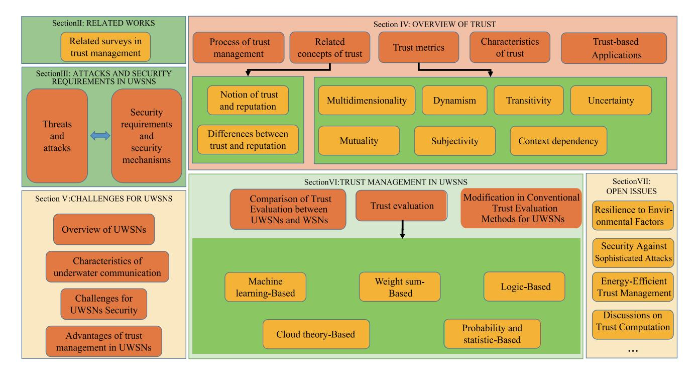
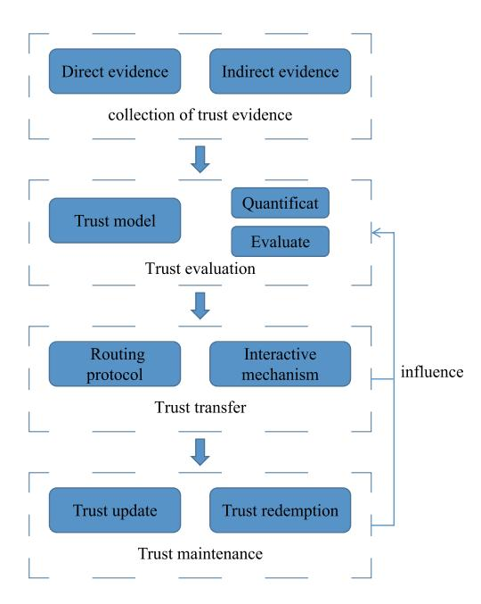
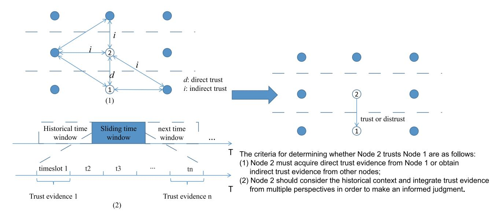
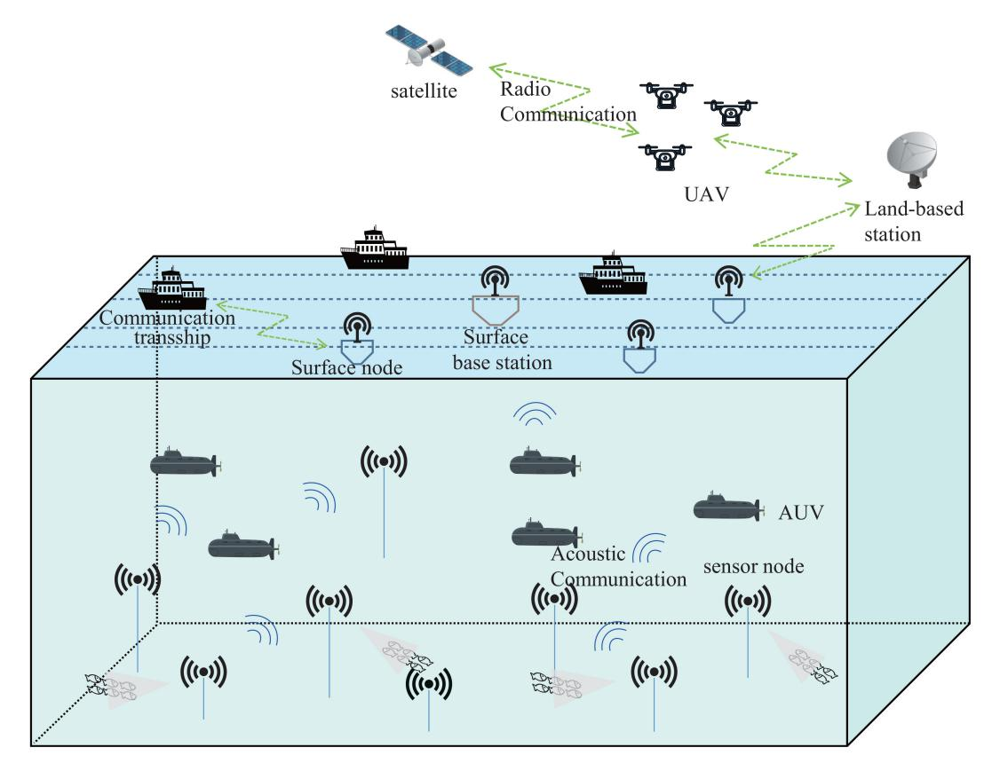
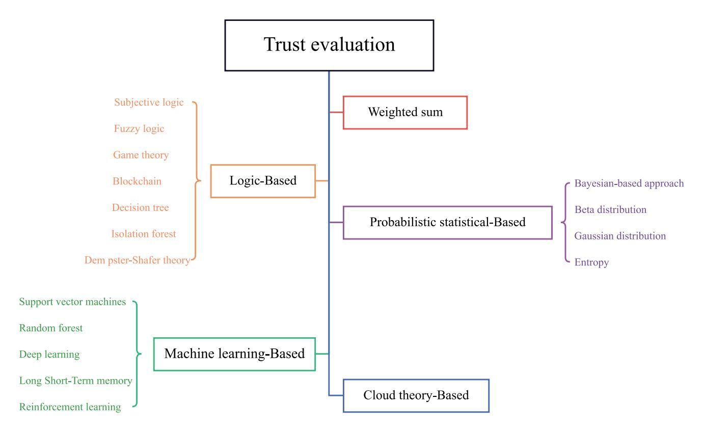
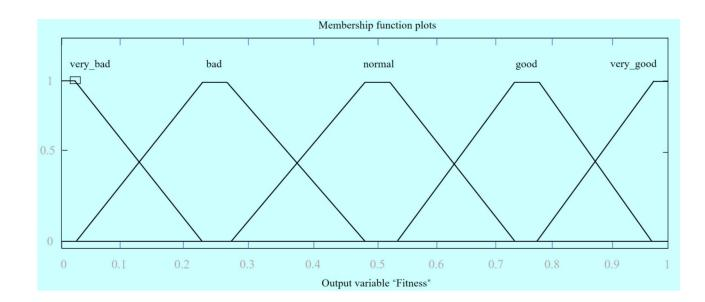
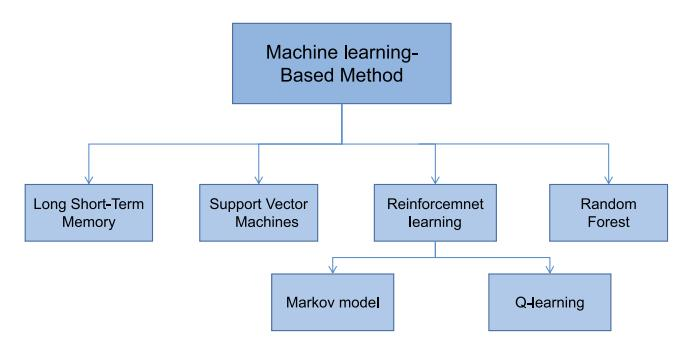
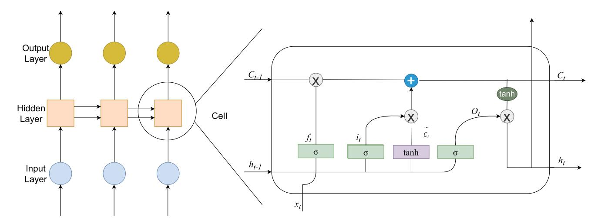
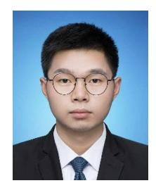

# Design Guidelines on Trust Management for Underwater Wireless Sensor Networks

Rongxin Zhu [,](https://orcid.org/0000-0001-5133-0868) *Member, IEEE*, Azzedine Boukerche, *Fellow, IEEE*, Libo Long, and Qiuling Yan[g](https://orcid.org/0000-0001-7886-5707)

*Abstract***—In recent years, significant advancements in wireless underwater communication and acoustic sensor technology have spurred the exploration and utilization of the ocean's vast natural resources. underwater wireless sensor networks (UWSNs) are increasingly deployed in unattended and hostile environments, demanding robust security measures. Secure communication environments are essential for a range of UWSN applications, including coastal defense, underwater communication, and marine exploration. Trust models have emerged as effective security mechanisms to assess the reliability of individual nodes in UWSNs during adverse attacks. Unlike Wireless Sensor Networks (WSNs), UWSNs encounter distinct challenges, including constrained resources, harsh underwater conditions, and unreliable acoustic communication, making it crucial to establish a reliable trust-based system. In this paper, we review existing work on UWSN security, discuss security and trust challenges, and explore trust-based applications. Furthermore, we evaluate diverse trust models suited for UWSNs of recent years, categorizing and comparing approaches like weighted sum methods, logic-based techniques, probability and statistics models, and machine learning paradigms. Finally, we discuss contemporary challenges and future directions in UWSN trust management. By offering a systematic overview and classification of trust management approaches, this paper contributes to the understanding and development of effective trust mechanisms for UWSNs, ultimately enhancing their reliability, security, and successful operation in diverse marine applications.**

*Index Terms***—Trust management, UWSNs, underwater wireless sensor networks, security.**

#### I. INTRODUCTION

**I** N RECENT years, there has been a growing emphasis on the development and exploitation of marine resources as

Manuscript received 4 August 2023; revised 27 November 2023 and 4 February 2024; accepted 12 March 2024. Date of publication 16 April 2024; date of current version 22 November 2024. This work was supported in part by NSERC, Canada Research Chairs Program; in part by the National Natural Science Foundation of China under Grant 62362026; in part by the Key Project of Hainan Province under Grant ZDYF2023GXJS158; and in part by the Specific Research Fund of the Innovation Platform for Academicians of Hainan Province under Grant YSPTZX202314. *(Corresponding author: Qiuling Yang.)*

Rongxin Zhu is with the School of Cyberspace Security, Hainan University, Haikou 570228, China (e-mail: rxzhu@ieee.org).

Azzedine Boukerche is with the Paradise Research Laboratory, EECS, University of Ottawa, Ottawa, ON K1N 6N5, Canada (e-mail: boukerche@ site.uottwa.ca).

Libo Long is with the EECS, University of Ottawa, Ottawa, ON K1N 6N5, Canada (e-mail: llong014@uottawa.ca).

Qiuling Yang is with the School of Computer Science and Technology and the Innovation Platform for Academicians of Hainan Province, Hainan University, Haikou 570228, China (e-mail: qlyang@hainanu.edu.cn).

Digital Object Identifier 10.1109/COMST.2024.3389728

a crucial means to expand human habitation areas and bolster resource reserves [\[1\]](#page-25-0), [\[2\]](#page-25-1). Governments worldwide have placed significant attention on harnessing marine resources and have been actively enhancing their national marine development strategies. Among the emerging technologies, underwater wireless sensor networks (UWSNs) have garnered considerable interest from academia and industry due to their potential to facilitate reliable and long-term monitoring of underwater environments, real-time surveillance of underwater activities, and the provision of marine disaster warning services [\[3\]](#page-25-2), [\[4\]](#page-25-3).

As a distinctive subset of Wireless Sensor Networks (WSNs), underwater sensor networks share common design objectives with conventional terrestrial WSNs [\[5\]](#page-25-4). They involve the deployment of wireless communication-capable sensors in designated areas of interest to effectively detect events and transmit the collected data back to corresponding data centers for further analysis [\[6\]](#page-25-5), [\[7\]](#page-25-6). However, a fundamental difference arises as the primary deployment environment for underwater sensor networks is underwater, where the unique properties of water, particularly its strong absorption effects on electromagnetic/optical (EM/O) signals [\[8\]](#page-25-7), render traditional data transmission technologies based on EM/O signals ineffective underwater. Indeed, underwater communication primarily relies on acoustic signals, which can be efficiently transmitted over long distances in the underwater domain. Consequently, underwater wireless sensor networks based on acoustic communication are often referred to as Underwater Acoustic Sensor Networks (UASNs) [\[9\]](#page-25-8).

In underwater applications, the deployment of sensor nodes takes place in unattended and potentially hostile environments, making them susceptible to capture and attacks. Ensuring the security of these sensor nodes becomes imperative for the efficient functioning of UWSNs. While traditional security technologies, such as encryption and identity authentication, are effective against external intrusions [\[10\]](#page-25-9), they may prove inadequate against successful invasions by attackers [\[11\]](#page-25-10), [\[12\]](#page-25-11). In recent years, trust mechanisms have shown promise in detecting insider attacks. Trust models have been proposed as effective security measures for various UWSN applications, including secure localization, routing, data aggregation, malicious node detection, and reliable node selection [\[13\]](#page-25-12), [\[14\]](#page-25-13). Extensive research has focused on modeling the trust of sensor nodes in WSNs and Mobile Ad hoc Networks (MANETs). Trust is a vital factor in any network system as it dictates the reliability, integrity, and security of the transmitted data and the involved nodes [\[15\]](#page-25-14). However, the distinctive characteristics of UWSNs render the direct application of these trust models unfeasible, due to the unique properties and limitations of underwater communication media.

In UWSNs, trust management entails establishing and maintaining trust relationships among underwater nodes responsible for data collection and processing [\[16\]](#page-25-15). These relationships are pivotal in ensuring the accuracy, confidentiality, and availability of collected data while preventing unauthorized access and malicious activities. Several factors contribute to the complexity of trust management in underwater environments. Firstly, underwater communication media are highly dynamic and susceptible to challenges such as signal attenuation, multi-path fading, and interference. These physical constraints can impact data transmission's reliability and timeliness, leading to potential data loss or corruption [\[17\]](#page-25-16), [\[18\]](#page-25-17), [\[19\]](#page-25-18). Secondly, the deployment and maintenance of underwater devices and sensor nodes pose logistical and operational challenges, necessitating specialized equipment, power sources, and regular maintenance activities. Moreover, the underwater environment itself is hostile, with factors like high pressure, low temperature, and corrosiveness affecting device durability and performance [\[20\]](#page-25-19), [\[21\]](#page-25-20), [\[22\]](#page-25-21). Additionally, UWSNs may involve collaborations among different organizations or entities, introducing concerns of trustworthiness, accountability, and privacy. In light of these challenges, effective trust management mechanisms are critical for the successful operation and utilization of UWSNs. Designing and implementing such mechanisms necessitates an in-depth understanding of the underwater environment's unique characteristics and limitations, as well as the specific requirements and goals of UWSNs applications.

*Contributions:* This survey paper focuses on trust management in UWSNs, which has been a subject of increasing interest; however, dedicated surveys on this topic are somewhat limited. Unlike previous surveys, this paper provides a comprehensive overview of the various trust management approaches proposed for diverse UWSN applications. We classify these approaches based on the techniques employed, encompassing threat and attack analysis, fundamental trust concepts and phases, security and trust management challenges in acoustic communications, a review of trust management approaches in underwater sensor networks, and a brief discussion on future directions for trust management in UWSNs. The main contributions of this paper are:

- *•* Based on the characteristics of UWSNs, this paper comprehensively analyzes the security threats and attacks faced by UWSNs and proposes security requirements for UWSNs.
- *•* The pivotal role and advantages of trust management in ensuring UWSN security are elucidated. The critical steps involved in the trust management process, including trust evidence collection, trustworthiness evaluation, trust propagation, and trust relationship maintenance, are explored.
- *•* The paper examines the distinctions between direct trust and indirect trust, emphasizing the importance of harnessing both forms of evidence to ensure a resilient trust evaluation. Furthermore, it delves into prevalent trust metrics such as communication, reputation, and

- contextual evidence, which play a pivotal role in the establishment of robust trust relationships.
- *•* An overview of existing network security techniques in UWSNs is presented, alongside an examination of the specific challenges confronting trust management in this domain. Trust-based applications ranging from secure routing to identity authentication and intrusion detection are discussed, exemplifying the multifaceted applicability of trust management in UWSNs.
- *•* We investigate various trust models suited for UWSNs of recent years, categorizing and comparing approaches like weighted sum methods, logic-based techniques, probability and statistics models, and machine learning paradigms in terms of their strengths and limitations.
- *•* Current issues and future challenges are highlighted, including trust bootstrapping, updating trust values, addressing node mobility, and more. This provides valuable insights into open research directions for UWSN trust management.

In summary, this paper provides a comprehensive survey of trust management in UWSNs, garnering valuable insights into this crucial network security mechanism. It aids in gaining an in-depth grasp of the concepts, techniques, applications, and research landscape of trust-based approaches for safeguarding UWSNs. The article's organizational structure is depicted in Fig. [1.](#page-2-0)

*Organization*: The remaining sections of the survey are structured as follows. Section [II](#page-1-0) provides an extensive review of related literature in the field. Section [III](#page-2-1) presents an in-depth analysis of threats, attacks, security requirements, and existing security mechanisms in UWSNs. In Section [IV,](#page-6-0) an overview of trust computing techniques is presented, followed by an exploration of trust concepts and the challenges associated with trust management in UWSNs. Trust-based applications are discussed. Section [V](#page-12-0) highlights the challenges faced by UWSNs. A taxonomy is used to compare various state-of-theart Trust Models (TMs) in Section [VI.](#page-14-0) Moreover, Section [VII](#page-23-0) delves into the prominent open issues and recent challenges concerning the implementation of trust-based systems in UWSNs. Finally, Section [VIII](#page-25-22) offers a conclusive summary of this paper.

#### II. RELATED WORKS

In the realm of trust management in various network environments, a considerable amount of research has been conducted, as reflected in a range of comprehensive surveys. However, a glaring gap in the literature is the lack of focus on UWSNs, a domain with unique challenges stemming from its operational environment characterized by limited energy resources, variable node mobility, and intricate underwater communication dynamics. Our survey aims to fill this gap by delving deeply into trust management tailored specifically for UWSNs.

Over the past few years, trust management research has been conducted in various areas such as VANET, MANETs, HetNets, and WSNs [\[23\]](#page-25-23). Table [I](#page-3-0) presents related surveys in the field. For instance, Hbaieb et al. [\[24\]](#page-25-24), their work

Fig. 1. Organization structure of this paper.

delves into the intricacies of trust challenges and attacks within the Internet of Vehicles (IoV). They establish a novel taxonomy that categorizes and contrasts approaches to IoV trust management, providing a foundational framework for this emerging field. Similarly, Wang et al. [\[25\]](#page-25-25) survey trust models and the Quality of Trust (QoT) in Heterogeneous Networks (HetNets), enriching the understanding of trust dynamics in diverse network settings. Hussain et al. [\[26\]](#page-25-26) pivot the focus to Vehicular Ad hoc Networks (VANETs), offering insights into trust establishment and management methods crucial for vehicular communications.

In the domain of the Internet of Things (IoT), Arshad et al. [\[27\]](#page-25-27) present a comprehensive survey on Blockchain-based decentralized trust management systems. Their exploration emphasizes the requirements and challenges of implementing trust systems in IoT environments. This is complemented by the work of Din et al. [\[28\]](#page-25-28), who provide an extensive survey on trust management techniques specifically tailored for IoT, shedding light on various trust management approaches and their applicability in IoT contexts. Ahmed et al. [\[29\]](#page-25-29), on the other hand, delve into the fundamentals of trust and reputation within IoT, presenting a taxonomy and addressing open research challenges.

The literature also includes focused studies on trust applications in wireless communication environments, as evidenced by the works of Khalid et al. [\[30\]](#page-25-30), Han et al. [\[31\]](#page-25-31), and Ishmanov and Bin Zikria [\[32\]](#page-25-32). These surveys discuss various trust applications, ranging from WSNs to MANETs, and offer comparative analyses of trust models and their applications.

Moreover, the works of Jiang et al. [\[8\]](#page-25-7) and El-Rabaie et al. [\[33\]](#page-25-33) provide valuable insights into security issues, localization, and routing protocols within UWSNs, although they do not delve deeply into trust models per se. These contributions are significant in contextualizing the role and importance of trust management within the broader landscape of network security and efficiency.

In summary, while these surveys offer rich perspectives on trust management across various network technologies, there remains a noticeable gap in the literature regarding trust management specifically for UWSNs. By focusing exclusively on UWSNs, we provide insights into the unique challenges and requirements of trust management in this domain. Our survey highlights the need for specialized trust management strategies in UWSNs, considering the specific operational constraints and environmental factors these networks face. Furthermore, we offer future research directions, emphasizing the development of innovative trust management solutions that can effectively address the complex and dynamic nature of underwater environments. Through this comprehensive examination, our survey aims to provide a valuable resource for researchers and practitioners in the field of UWSNs, fostering further exploration and development in this vital area of study.

# III. ATTACKS AND SECURITY REQUIREMENTS IN UWSNS

In conventional computer networks, mobile networks, and WSNs, security threats, and attacks pose significant risks, ranging from unauthorized access and data manipulation to network disruption [\[39\]](#page-26-0), [\[40\]](#page-26-1), [\[41\]](#page-26-2). To safeguard the reliability and security of these networks, it is essential to analyze and research various security threats and develop corresponding strategies and measures for protection.

UWSNs are rapidly evolving networks that leverage IoT technology in underwater environments [\[42\]](#page-26-3). They connect diverse sensors, controllers, communication devices, and underwater equipment, enabling monitoring, control, and

TABLE I COMPARISON OF RELATED SURVEYS

| Ref                                  | Related Sections               | Fields                       | Content of the survey                                                                                                                                                                                              | Enhancements of our survey                                                                                                                                                                          |
|--------------------------------------|--------------------------------|------------------------------|--------------------------------------------------------------------------------------------------------------------------------------------------------------------------------------------------------------------|-----------------------------------------------------------------------------------------------------------------------------------------------------------------------------------------------------|
| [24] Hbaieb et al. (2022)            | Section IV-A, Section VI-C  | VANET, IoV                | A survey of trust challenges and attacks in IoV. It categorizes and contrasts pertinent approaches for IoV trust management, and introduces a novel taxonomy.                                                      | A focus on UWSNs and their key technologies, reviewing existing trust management approaches and outlining directions for future research.                                                           |
| [25] Wang et al. (2022)              | Section IV-B                   | HetNets                      | Survey of taxonomies of trust models and Quality of Trust (QoT) in HetNets.                                                                                                                                        | Examination of the latest trust management schemes in UWSNs, including classification and solutions.                                                                                                |
| [26] Hussain et al. (2021)           | Section III-A, Section VI-C | VANET                        | A survey of trust establishment and management methods in vehicular networks.                                                                                                                                      | An overview of cutting-edge trust management approaches in UWSNs, highlighting recent innovations.                                                                                                  |
| [34] Ogonji et al. (2020)            | Section III-B, Section VI-C | ІоТ                          | Review on privacy, security threats, attack surface, vulnerabilities, countermeasures and taxonomies of threat in IoT.                                                                                             | A detailed exploration of recent trust management solutions and the technologies that enable UWSNs.                                                                                                 |
| [35] Anugraha and Krishnaveni (2016) | Section VI-C                   | MANETs                       | Survey of trust management based secure routing in mobile Ad hoc networks.                                                                                                                                         | A classification of trust management schemes in UWSNs based on security needs, including analysis of the latest solutions and technologies.                                                         |
| [8] Jiang et al. (2019)              | Section V-E, Section V         | UWANs                        | Survey of security threats and countermea- sure schemes in UWANs, securing UWAN protocols and cryptographic primitives.                                                                                      | A review of contemporary trust management in UWSNs, emphasizing their effectiveness.                                                                                                                |
| [33] El-Rabaie et al. (2015)         | Section III-A, Section V    | UWSNs                        | A survey on the security issue, UWSN architectural view and routing protocols in UWSNs.                                                                                                                            | An analysis of recent advancements in trust management for UWSNs, along with iden- tified future challenges.                                                                                  |
| [36] Usman and Gutierrez (2022)      | Section IV-B, Section VI-C  | Ubiquitous comput- ing | This survey explores diverse techniques, models, and applications of trust-based protocols in Pervasive and Mobile Computing.                                                                                      | Exploration of trust management systems in UWSNs, detailing their role in enhancing network reliability and security.                                                                               |
| [32] Ishmanov et al. (2017)          | Section VI-C                   | WSNs                         | Analyze and discuss trust-based routing protocols in WSNs.                                                                                                                                                         | A survey covering the evolution and effectiveness of trust management strategies in UWSNs, with a particular emphasis on their adaptability to dynamic underwater conditions and threat landscapes. |
| [31] Han et al. (2014)               | Section IV-A                   | WSNs                         | Conduct an extensive survey on diverse trust models for WSNs, examining their applications comprehensively.                                                                                                        | An expansive review of innovative trust management frameworks in UWSNs, along with a perspective on emerging trends and potential research avenues.                                        |
| [30] Khalid et al. (2013)            | Section IV-B, Section VI-C  | WSNs                         | This survey offers a comprehensive grasp of trust and reputation in WSNs, covering TRM components and trust computation phases.                                                                                    | Analysis of advanced trust management methodologies in UWSNs, focusing on their integration with the latest underwater communication technologies.                                                  |
| [37] Govindan and Mohapatra (2012)   | Section VI-C                   | MANETs                       | Examination of diverse trust computation methods in MANETs, encompassing trust propagation, prediction, and aggregation algorithms, and their impact on trust dynamics, network behavior, and security provisions. | A thorough and comprehensive survey of trust management in UWSNs, covering diverse aspects of trust.                                                                                                |
| [38] Yu et al. (2011)                | Section III-A                  | WSNs                         | Exploration of attacks and defenses concerning trust schemes and mechanisms in WSNs, focusing on secure routing and data protection.                                                                               | An emphasis on trust management solutions for underwater sensor networks, tailored to the unique characteristics of UWSNs.                                                                          |
| [11] Yu et al. (2010)                | Section IV-B, Section VI-C  | MANETs, WSNs              | A survey of individual-level and system- level trust models and classification ap- proaches in wireless communication sys- tems.                                                                          | A detailed survey of current state-of-the-art trust management solutions in underwater sensor networks, coupled with future re- search trajectories.                                       |
| [27] Arshad et al. (2023)            | Section IV-B                   | ІоТ                          | Discusses Blockchain-based decentralized trust management in IoT, focusing on systems, requirements, and challenges.                                                                                               | A focus on the latest trends in trust management for UWSNs, examining latest technologies in a comprehensive manner.                                                                                |
| [28] Din et al. (2018)               | Section VI-C                   | ІоТ                          | Provides a survey of trust management techniques in IoT, exploring various approaches and their applications.                                                                                                      | An all-encompassing review of trust management solutions in underwater sensor networks.                                                                                                             |
| [29] Ahmed et al. (2019)             | Section IV-A, Section IV-B  | ІоТ                          | Focuses on trust and reputation in IoT, offering a fundamental taxonomy and discussing open research challenges.                                                                                                   | A broad survey of security requirements for UWSNs, accompanied by an overview of current leading trust management solutions.                                                                        |

data transmission in these challenging environments with broad applications [\[43\]](#page-26-4). However, the unique characteristics of underwater environments introduce specific security and trust issues for UWSNs. Signals in water are susceptible to interference, and attackers can easily remain concealed, exploiting vulnerabilities in UWSNs to interfere with data transmission, disrupt operations, and obtain sensitive information. This amplifies the difficulty of defense and increases security risks for UWSNs.

With the growing adoption of UWSNs and the deployment of numerous underwater devices and sensors, ensuring data protection and the normal operation of these networks becomes increasingly crucial. In this section, we comprehensively analyze and summarize the various types and characteristics of attacks that UWSNs may encounter. Additionally, we explore the specific requirements for ensuring security and data protection in underwater environments [\[44\]](#page-26-5), [\[45\]](#page-26-6). We investigate the existing solutions available for UWSNs to ensure reliability and security, considering the challenges posed by underwater communication and the dynamic nature of the underwater environment. Finally, we address the current challenges faced by UWSNs security, providing insights for future research and development efforts in this domain.

## *A. Attack Model*

The primary objective of network security is to safeguard the network from various forms of attacks [\[38\]](#page-26-7), [\[46\]](#page-26-8). Similarly, UWSNs confront multiple security and trust challenges due to the unique nature of the underwater environment [\[47\]](#page-26-9), [\[48\]](#page-26-10). In this context, underwater signals are susceptible to interference, and attackers can easily conceal their presence, providing them with opportunities to exploit UWSN vulnerabilities and disrupt operations, as well as obtain sensitive information. Consequently, defending UWSNs and mitigating security risks become more complex. In trust management for UWSNs, various schemes have been established to identify and address the behavior of misbehaving nodes, which can be either selfish or malicious. Below, we outline a selection of specific attack instances, which provides a snapshot of common challenges in trust management.

- *• Interference and Eavesdropping:* Unwanted signal overlap and unauthorized signal interception, leading to unreliable data transmission and potential compromise of confidential information in UWSNs.
- *• Physical Tampering:* Direct physical interference or damage to UWSN devices disrupts network topology and sensor functionality, causing data collection gaps and network vulnerabilities [\[49\]](#page-26-11).
- *• Sniffing Attack:* Utilization of tools to capture data in transit, compromising data privacy and leading to potential leakage of sensitive environmental or operational information in UWSNs.
- *• MAC Flooding:* Overloading the network with invalid MAC addresses causes resource exhaustion, disrupting normal operations and potentially causing system crashes.
- *• DoS Attack:* Overwhelming network traffic causing system overload renders network services unavailable, depletes bandwidth, and exhausts resources.
- *• Selective Forwarding Attack:* Selective packet forwarding disrupts network communication, resulting in incomplete data transmission, increased latency, and potential congestion in UWSNs [\[31\]](#page-25-31).
- *• Blackhole Attack:* False routing claims leading to packet drops result in significant data loss, network congestion, and routing dysfunction in UWSNs [\[50\]](#page-26-12).
- *• Greyhole Attack:* Selective packet dropping by posing as a reliable node causes data loss and incompleteness, misleading network routing, and increasing communication delays in UWSNs.

- *• Spoofing:* Impersonation of legitimate network nodes risks the theft of sensitive information and may cause unauthorized access or disruptions in UWSN communications.
- *• Sybil Attack:* Creation of multiple false identities in the network exhausts resources, leads to unfair resource distribution, and undermines the integrity of UWSN operations.
- *• Sinkhole Attack:* Misdirecting traffic to compromised nodes intercepts and potentially alters data, causing service interruptions and routing malfunctions.
- *• Wormhole Attack:* Creating illicit channels for data packet interception breaches data security and facilitates data tampering and replay attacks in UWSNs [\[51\]](#page-26-13).
- *• On-Off Attack:* Irregular traffic patterns disrupt service, leading to intermittent service interruptions and resource wastage in UWSNs.
- *• Bad Mouthing Attack:* Spreading false negative information damages node reputations, leading to mistrust and interference in UWSN operations.
- *• Conflicting Behavior Attack:* Contradictory behavior by multiple false entities complicates trust assessments, leading to network tampering and unreliable node behavior analysis.
- *• Ballot Stuffing Attack:* Malicious nodes artificially inflate their trust or reputation scores, leading to undeserved high trust levels and potential misallocation of network resources in UWSNs [\[52\]](#page-26-14).
- *• Collusion Attack:* Multiple nodes collaborate to disrupt network operations or manipulate trust evaluations, resulting in distorted trust metrics in UWSNs [\[10\]](#page-25-9).
- *• Newcomer Attack:* Newly joined nodes behave maliciously from the outset, exploiting initial trust and leading to immediate network vulnerabilities.

Table [II](#page-5-0) provides an overview of different attacks, their characteristics, and possible mitigation strategies across different layers of UWSNs. These attacks can occur from the physical layer to the application layer, often involving data tampering, information theft, and network manipulation, such as Greyhole, Spoofing, and Sybil attacks. Some attacks possess specific characteristics, for instance, Denial-of-Service (DoS) attacks that overload the target node with excessive data traffic or frequent service requests, disrupting the node's normal operation [\[53\]](#page-26-15). Table [II](#page-5-0) also highlights trust attacks, which exploit gained trust relationships within the network to deceive victims and conduct malicious activities. Trust attacks aim to undermine established trust relationships, leading victims to make incorrect decisions. An example of a trust attack is the On-off attack, wherein attackers alternate between sending and not sending data packets using normal communication patterns to gain the victim's trust and carry out subsequent attacks [\[54\]](#page-26-16). Due to the attackers' ability to mimic normal communication patterns, this type of attack is challenging to detect. To counter such internal attacks, intrusion tolerance mechanisms are effective solutions. These mechanisms enable systems to maintain functionality and service availability even in the presence of attacks. Trust mechanisms, as integral components of intrusion tolerance mechanisms, establish reliable

TABLE II ATTACK DESCRIPTION

| Attacks                        | Description                                                                                  | Resulting Impact in UWSNs                                                                                                                                                               |
|--------------------------------|----------------------------------------------------------------------------------------------|-----------------------------------------------------------------------------------------------------------------------------------------------------------------------------------------|
| Interference and Eavesdropping | Interference: unwanted signal overlap; Eavesdropping: unauthorized signal interception.      | Degrades signal integrity, leading to unreliable data transmission and potential compromise of confidential information.                                                                |
| Physical Tampering             | Direct physical interference or damage to UWSN devices.                                      | Disrupts network topology and sensor functionality, causing data collection gaps and network vulnerabilities.                                                                           |
| Sniffing Attack                | Utilization of tools to capture data in transit over the network.                            | Compromises data privacy, leading to potential leakage of sensitive environmental or operational information.                                                                           |
| MAC Flooding                   | Overloading network with invalid MAC addresses.                                              | Causes network resource exhaustion, disrupting normal network operations and leading to potential system crashes.                                                                       |
| DoS Attack                     | Overwhelming network traffic causing system overload.                                        | Renders network services unavailable, depletes bandwidth, and exhausts network resources, severely impacting real-time monitoring and data transmission.                                |
| Selective Forwarding Attack    | Selective packet forwarding disrupting network communication.                                | Results in incomplete data transmission, increased latency, and potential network congestion, hindering effective data analysis.                                                        |
| Blackhole Attack               | False routing claims leading to packet drops.                                                | Leads to significant data loss, network congestion, and routing dysfunction, undermining network reliability.                                                                           |
| Greyhole Attack                | Selective packet dropping by posing as a reliable node.                                      | Causes data loss and incompleteness, misleading network routing, and increasing communication delays.                                                                                   |
| Spoofing                       | Impersonation of legitimate network nodes.                                                   | Risks the theft of sensitive information and may cause unauthorized access or disruptions in network communications.                                                                    |
| Sybil Attack                   | Creation of multiple false identities in the network.                                        | Exhausts network resources, leads to unfair resource distribution, and undermines the integrity of network operations.                                                                  |
| Sinkhole Attack                | Misdirecting traffic to compromised nodes.                                                   | Intercepts and potentially alters data, causing service interruptions and routing malfunctions, compromising data accuracy.                                                             |
| Wormhole Attack                | Creating illicit channels for data packet interception.                                      | Breaches data security, facilitates data tampering and replay attacks, risking the integrity and confidentiality of transmitted data.                                                   |
| On-Off Attack                  | Irregular traffic patterns disrupting service.                                               | Leads to intermittent service interruptions, resource wastage, and complicates detection of malicious activities.                                                                       |
| Bad Mouthing Attack            | Spreading false negative information.                                                        | Damages node reputations, leading to mistrust and in- terference in network operations, and can propagate inaccurate information.                                                 |
| Conflicting Behavior Attack    | Contradictory behavior by multiple false entities.                                           | Complicates trust assessments, leading to network tampering and unreliable node behavior analysis.                                                                                      |
| Ballot Stuffing Attack         | Malicious nodes artificially inflate their trust or reputation scores within the network.    | Leads to undeserved high trust levels for malicious nodes, potentially resulting in misallocation of network resources and manipulation of network operations.                    |
| Collusion Attack               | Multiple nodes collaborate to disrupt network operations or to manipulate trust evaluations. | Results in distorted trust metrics within the network, allowing malicious activities to be carried out more effectively and undermining the reliability of the trust management system. |
| Newcomer Attack                | Newly joined nodes in the network behave maliciously from the outset.                        | Exploits initial trust given to new nodes, leading to immediate network vulnerabilities and potential rapid spread of malicious activities before detection.                            |

evaluation and control mechanisms to limit malicious entities' activities within the network. Therefore, trust mechanisms are often more reliable and effective than traditional security systems when dealing with internal attacks [\[55\]](#page-26-17).

## *B. Security Requirements and Security Mechanisms*

The increasing and evolving attack methods pose a serious threat to UWSNs. Therefore, a comprehensive understanding of the network's attack patterns and characteristics is crucial for formulating appropriate security requirements and mechanisms to ensure the UWSNs' security and reliability. Security requirements encompass the essential conditions to safeguard the security of information systems and networks, representing the prerequisites for achieving security objectives [\[56\]](#page-26-18). In the pursuit of meeting these security requirements, a set of security mechanisms must be employed to ensure the protection of the system and network. Security mechanisms encompass various technologies and measures aimed at fulfilling these security requirements and safeguarding information systems and networks by preserving confidentiality, integrity, and availability. In essence, ensuring the security of UWSNs is a fundamental system requirement, and comprehending and specifying the security requirements lay the foundation for realizing effective security mechanisms. By implementing and utilizing these security mechanisms, the security of information systems and networks can be effectively ensured.

*1) Security Requirements:* Distinct attack types in UWSNs give rise to specific security imperatives. For instance, counteracting data tampering mandates a focus on data integrity and confidentiality. Dos attacks require robust measures for high availability and resilience. Following are the summarised general security requirements for the network:

- *• Confidentiality*: Ensuring the confidentiality of data and communications in UWSNs to prevent unauthorized access to sensitive information. This requires the implementation of appropriate encryption and access control measures to prevent data leakage or unauthorized acquisition.
- *• Integrity*: Protecting data in UWSNs from tampering, modification, or corruption. Ensuring the integrity of data during transmission and storage processes to prevent arbitrary alterations or damage to data integrity [\[49\]](#page-26-11).
- *• Availability*: Safeguarding the continuous availability and stability of UWSNs, ensuring that the system can provide services on demand, and preventing system unavailability or disruption caused by attacks, failures, or other factors.
- *• Authentication*: Ensuring reliable authentication of users and devices in UWSNs, preventing unauthorized entities from accessing system resources or engaging in malicious activities. Common practices include using passwords, digital certificates, biometric features, and other methods for identity verification.
- *• Access control*: Restricting access to system resources and functionalities, ensuring that only authorized users or devices can perform specific operations or access sensitive data [\[57\]](#page-26-19). Employing appropriate access control policies and permission management mechanisms to prevent unauthorized access and potential security vulnerabilities.
- *• Security auditing and monitoring*: Establishing effective security auditing and monitoring mechanisms to record security events and activities in the system, promptly detecting and responding to potential security threats. This includes techniques such as logging, anomaly detection, and intrusion detection [\[58\]](#page-26-20).
- *• Scalability and recovery capabilities*: UWSNs need to possess a certain level of resilience against attacks, being able to identify and withstand various network attacks and security threats [\[59\]](#page-26-21). Additionally, the system should have fast recovery and restoration capabilities to address service disruptions or data compromises resulting from attacks or failures.

These security prerequisites span various dimensions. They encompass safeguarding data confidentiality, upholding data integrity, ensuring uninterrupted availability, establishing robust authentication protocols, enforcing effective access controls, enabling vigilant security auditing and monitoring, and fostering resilience with recovery capacities against attacks. They are meticulously designed to ensure the overarching security and credibility of the network, safeguarding both the system and its constituent devices from potential security vulnerabilities. An illustrative instance of a trust attack, such as the on-off attack, can engender periodic behavioral patterns in a node, thereby deceiving the trust management mechanism into attributing unwarranted trustworthiness [\[54\]](#page-26-16). Moreover, addressing malevolent attacks entails the pivotal roles of trust management and intrusion detection mechanisms for system safeguarding.

Each attack type presents distinct challenges, necessitating targeted security measures. A thorough grasp of these requirements aids in formulating and applying fitting security mechanisms to safeguard networks. Adapting measures to address varied demands empowers designers and operators to enhance security, counter diverse threats, and maintain network integrity, reliability, and trustworthiness amid evolving security landscapes.

- *2) Security Mechanisms:* Network security techniques are essential safeguards ensuring data integrity and confidentiality, regulating network access, and countering threats to forestall unauthorized breaches. Incorporating technical and procedural measures, these strategies uphold security requisites, curtail risks, and safeguard systems, networks, and data against illicit tampering, unauthorized entry, or compromise. Notable existing security mechanisms in this domain include:
  - *• Access Control Mechanisms:* These mechanisms restrict access to system resources, ensuring that only authorized users or devices can utilize specific functions or access sensitive data. By implementing access control, potential security vulnerabilities and unnecessary risks are reduced [\[60\]](#page-26-22).
  - *• Identity Authentication Mechanisms:* These mechanisms verify the identity of users or devices, ensuring that only legitimate entities can access system resources. Common methods include usernames/passwords, digital certificates, or two-factor authentication.
  - *• Encryption Mechanisms:* Encryption transforms sensitive data into an unreadable form, preventing unauthorized access. Legitimate users or devices need to decrypt the data using keys to access the original information.
  - *• Security Protocols:* Security protocols like SSL and TLS ensure the confidentiality and integrity of data transmission during communication. These protocols employ encryption and authentication mechanisms to prevent data leakage or tampering.
  - *• Intrusion Detection and Defense Mechanisms:* These mechanisms monitor network traffic and system behavior to promptly detect potential intrusion activities and implement appropriate defense measures to prevent or mitigate attacks.
  - *• Trust Mechanisms:* Trust models and trust evaluation mechanisms monitor the behavior of nodes and users within the system to prevent internal attacks and misuse of privileges. Trust mechanisms aid in identifying suspicious behavior and taking timely action.

Recently, UWSNs have emerged as an essential domain that integrates various underwater devices, sensors, and systems for data collection, transmission, and processing. In this context, ensuring secure and trustworthy communication and data exchange between devices has become an increasingly important requirement [\[61\]](#page-26-23), [\[62\]](#page-26-24). Trust, as a fundamental element of IoUT security, entails confidence in the security and reliability of communication and data exchange among underwater devices. In summary, trust plays a pivotal role in ensuring the security and reliability of UWSNs.

## IV. OVERVIEW OF TRUST

This section introduces the relevant concepts of trust, including the definition and characteristics of trust. It then

Fig. 2. Process of trust management.

introduces the various trust evidence and different types of trust-based applications.

#### *A. Trust Computing*

In communication systems, trust management is a vital process aimed at ensuring the security, stability, and reliability of the system. It involves the implementation of various techniques and strategies to assess and propagate trust among the participating devices. Trust management is a comprehensive and dynamic process, encompassing the following essential components: trust evidence collection, trust evaluation, trust propagation, and trust maintenance, as illustrated in Figure [2.](#page-7-0)

*1) Collecting Trust Metrics:* The first step in trust management is trust evidence collection, which involves gathering both direct and indirect evidence to assess the trustworthiness of nodes or entities. In addition to collecting direct and indirect trust evidence, it is essential to consider overall trust [\[63\]](#page-26-25) to enhance communication security. Direct evidence includes historical interaction records, behavioral evaluations, and reputation ratings, while indirect evidence comprises recommendations from other nodes or entities and trust chains. Trust formation in UWSNs is the culmination of the aforementioned processes. It involves synthesizing trust information from various sources to form a coherent understanding of each node's trustworthiness. This process is particularly challenging in UWSNs due to the network's dynamic nature and the acoustic channel's unreliability. Trust Formation involves computing the overall trust value and can be either single-trust, focusing on a solitary metric like endto-end delay, or multi-trust, which considers multiple aspects like intimacy, competence, and honesty. This formation utilizes threshold-based metrics, weighted sums, and trust scaling by confidence to dynamically adjust trust levels based on context, environmental conditions, and entity performance. This comprehensive approach ensures a nuanced, adaptive, and contextually relevant trust evaluation in UWSNs, essential for the network's security and reliability. Moreover, [\[64\]](#page-26-26) suggests categorizing trust evidence into data-based, link-based, and node-based trust evidence. The trust metrics will be further introduced in Section [IV-C.](#page-9-0)

- *2) Trust Evaluation:* After trust evidence collection, the next phase is trust evaluation, where trust models and trust measurement methods are employed to assess and quantify the collected evidence. Trust models define the concept of trust and the calculation methods, while trust measurement methods convert evidence into quantifiable trust values or indicators. By considering different types of evidence and their corresponding weights, an evaluation result of the trust level towards nodes or entities can be derived. A detailed classification of trust models will be discussed in Section [VI-C.](#page-16-0)
- *3) Trust Propagation:* Trust propagation is a crucial phase in trust management, involving the establishment and dissemination of trust relationships among nodes based on generated relationships and pre-existing trustworthiness values, including collaboration recommendations [\[51\]](#page-26-13), [\[65\]](#page-26-27). By implementing reliable communication and cooperation mechanisms, nodes can mutually verify and build trust, leading to the formation of a broader trust network. Trust transitivity and trust fusion play fundamental roles in trust propagation. This module offers key benefits, such as mitigating computational costs by propagating measured trust values over the network instead of determining individual entity trust. Additionally, nodes with a globally established trust may wield better influence over services. Trust propagation can be categorized into two approaches: centralized and distributed [\[66\]](#page-26-28). These approaches provide different perspectives and considerations in managing trust dissemination within the network.

**Centralized Propagation:** Centralized trust propagation involves a central node assuming a brokerage role, reaping advantages, and fostering trust propagation by receiving and distributing trust information among nodes. In this type of model, a globally trusted node gathers and shares trust values with other nodes. Some trust models adopt centralized trust propagation, as evidenced by the proposed models in [\[67\]](#page-26-29), [\[68\]](#page-26-30). This centralized approach offers advantages in terms of trust consolidation and efficient trust dissemination, but it also introduces potential single points of failure and security concerns.

**Distributed Propagation:** Distributed trust propagation eliminates central coordination, allowing nodes to interact directly or via referrals, fostering interactions between them. This approach includes transitivity-based and consensus-based methods [\[69\]](#page-26-31). Transitivity, a fundamental concept, is often seen as a basic trait in trust propagation, derived from classical social and cognitive models. It characterizes the property of relationships between actors. For instance, if node A trusts node B and node B trusts node C, based on transitivity, node A can infer indirect trust in node C. Such transitive trust can be sequentially expanded [\[70\]](#page-26-32). On the other hand, consensus-based propagation aggregates trust evaluations on a target node from multiple nodes to form a group consensus and disseminate it through the network. This mechanism is widely recognized for fostering trust and cooperation among peers in behavior-oriented modeling [\[71\]](#page-26-33). While distributed propagation offers advantages like resilience to failures and adaptability to dynamic networks, challenges can arise in maintaining consistency and addressing trust disparities among nodes.

While central trust propagation is viable in simple networks, it may not suit distributed sensor node networks due to security and performance concerns like single points of failure. Distributed and decentralized trust propagation doesn't fully replace central approaches but rather empowers distributed propagation with increased responsibility and expertise in trust management and evaluation. This shift towards decentralization offers potential solutions to address the limitations of centralized methods in more complex and dynamic network environments.

*4) Trust Update:* In UWSNs, the dynamic nature of trust relationships necessitates an adaptable and responsive trust update mechanism. This mechanism is essential for incorporating new observations and recommendations into the trust evaluation process. Common trust update strategies in UWSNs generally follow either an event-driven or time-driven approach [\[64\]](#page-26-26):

**Event-Driven Trust Update:** This approach updates trust data following specific transactions or events. It is reactive in nature, where trust evaluations are revised post-service delivery based on the quality of the service rendered. Feedback on service quality is typically collected at each participating entity or aggregated at an IoT cloud server. In certain UWSN environments, recommendations are exchanged on-demand, with entities collaborating to share their assessments of others' behavior [\[72\]](#page-26-34). This method ensures that trust evaluations are promptly updated in response to recent interactions, maintaining the relevance and accuracy of the trust data.

**Time-Driven Trust Update:** Contrastingly, the time-driven approach involves the periodic collection of trust evidence, including self-observations and recommendations. During periods of inactivity or lack of evidence, trust values may decay over time, emphasizing the higher reliability of recent information compared to older data [\[73\]](#page-26-35). This approach often employs an exponential decay function to align with the specific needs of the application. It ensures that trust evaluations remain current and reflective of the most recent network conditions and interactions. The time-driven approach, is particularly suited to environments where regular updates are essential for maintaining accurate and up-to-date trust assessments.

Both approaches have their unique advantages and are chosen based on the specific requirements and characteristics of the UWSN environment. The event-driven approach is ideal for networks with frequent interactions and transactions, while the time-driven approach is beneficial in scenarios where consistent periodic evaluations are necessary. In UWSNs, the choice of trust update strategy plays a critical role in ensuring that trust evaluations accurately reflect the current state and dynamics of the network.

Various research studies propose different trust update mechanisms, such as the ARTMM [\[69\]](#page-26-31), which uses a sliding time window concept to update trust values. Time-decay is an essential property of trust in UWSNs, where older evidence carries less weight than recent evidence. Additionally, reinforcement learning-based trust updates have been employed to address hybrid attack problems and improve resource utilization [\[55\]](#page-26-17). However, trust updating based on environmental factors may reduce the system's ability to quickly respond to malicious nodes. In clustered networks, agent nodes (e.g., cluster heads) may maintain and update trust values instead of individual nodes, as demonstrated by the agent-based trust and reputation management scheme (ATRM) [\[74\]](#page-26-36). Each sensor in ATRM assumes a trusted authority is responsible for generating mobile agents that perform trust collection and update functions. However, the trustworthiness of mobile agents introduces security risks to the network.

In summary, underwater acoustic networks may introduce multiple mechanisms to integrate direct and indirect observation and verification methods, enhancing the accuracy and reliability of trust updates and improving the network's complexity and security.

*5) Trust Redemption:* Trust redemption mechanisms allow nodes to regain trust after their trust level has dropped due to misbehavior. In UWSNs, there are cases where normal nodes are misclassified as malicious nodes, especially given the disruptive nature of the acoustic channel, where various factors can cause performance fluctuations. Trust redemption approaches, such as those proposed in [\[75\]](#page-26-37), consider historical performance and environmental influences, including unreliable acoustic channels and weak link connectivity, to identify instances of misclassification and restore trust. Additionally, time-based and behavior-based trust redemption strategies have been introduced to monitor and adjust trust relationships, implement risk management measures, and restore trust [\[55\]](#page-26-17). By continuously updating and maintaining trust relationships, the trust state in the system can adapt to potential changes and challenges, ensuring the overall robustness and stability of UWSNs.

#### *B. Related Concepts of Trust*

Correctly understanding the concepts related to trust is crucial for comprehending and designing effective trust management mechanisms [\[76\]](#page-26-38), [\[77\]](#page-26-39). Trust, being a subjective concept, may have diverse definitions and characteristics in different environments and contexts. Therefore, it is essential to establish a clear and common understanding of trust concepts and characteristics to develop appropriate trust management mechanisms, thereby enhancing the security and reliability of the network.

*1) Notion of Trust:* Numerous researchers have proposed their own interpretations of trust definitions in trust management mechanisms. For instance, some studies have distinguished between individual and system-level trust [\[11\]](#page-25-10), while others have classified trust as entity trust and data trust [\[26\]](#page-25-26). Moreover, researchers have explored node trust, path trust, and service trust from various perspectives related to monitoring node behavior, path connectivity, and service availability [\[38\]](#page-26-7). While trust possesses certain universality and common characteristics, its definition may vary based

| Aspect                 | Trust                                                   | Reputation                                           |
|------------------------|---------------------------------------------------------|------------------------------------------------------|
| Definition and Focus   | Subjective belief about trustworthiness based on        | Aggregated perception of trustworthiness formed by   |
|                        | direct interactions. Context-specific and reliant on    | group or community experiences. Global metric re-    |
|                        | perceived capability, reliability, and intention of the | flecting general opinion about an entity's behavior. |
|                        | trustee.                                                |                                                      |
| Formation and Dynamics | Formed through direct interactions and evolves over     | Built by aggregating feedback and opinions from      |
|                        | time. Trust levels vary based on behavior and per-      | multiple entities. Influenced by collective experi-  |
|                        | formance of the trustee.                                | ences and more stable over time.                     |
| Scope and Reliability  | Bilateral and subjective, influenced by personal ex-    | Broad scope encompassing collective assessments,     |
|                        | periences and interaction context.                      | generally more stable than trust.                    |
| Application in Network | Crucial for secure communications in decentralized      | Incentivizes good behavior and deters malpractice    |
| Environments           | networks. Used in trust management for resource         | in networked systems. Useful in environments with    |
|                        | sharing, access control, and collaboration.             | frequent interactions and need for aggregated expe-  |
|                        |                                                         | riences                                              |

TABLE III COMPARISON OF TRUST AND REPUTATION

on the research and application perspectives in different disciplines. Hence, defining and understanding trust can incorporate discipline-specific considerations. To address this, [\[78\]](#page-26-40) examined trust definitions across various disciplinary fields and proposed a trust definition applicable to the field of network communication, drawing upon insights from other domains. According to this definition, trust entails beliefs or expectations concerning the reliability and integrity exhibited by an entity or system in a particular situation.

In this paper, trust is defined as a subjective belief held by a trustor (entity that trusts) about the trustworthiness or reliability of a trustee (entity being trusted) based on past interactions and experiences. It is context-specific and can be directly related to the trustor's willingness to depend on the trustee in a given situation. Trust in a network setting is often based on the perceived capability, reliability, and intention of the trustee.

- *2) Reputation:* Reputation, on the other hand, is an aggregated perception held by a group or community about an entity's trustworthiness. It is formed based on collective experiences and assessments of multiple entities [\[79\]](#page-26-41). Reputation is more of a global or community-wide metric that reflects the general opinion or view about an entity's behavior and trustworthiness. Within reputation models, reputation represents a subjective anticipation of a node's behavior formed through past interactions. In this context, nodes can act as trustors, seeking opinions, and trustees, providing aggregated opinions (reputation). Reputation calculation considers diverse data, like collaboration frequency between nodes [\[80\]](#page-26-42). UWSNs utilize reputation systems to enable node rating, nurturing trust establishment, and supporting reliable inter-node communication through collective opinions, fostering trust among network components.
- *3) Differences Between Trust and Reputation:* In the context of trust management mechanisms, the distinctions between trust and reputation are elucidated in Tab. [III.](#page-9-1) While these concepts are frequently interlinked within trust management frameworks, it is essential to recognize that they are not identical. Notably, in certain scholarly works, reputation management is considered a subset of the broader domain of trust management [\[81\]](#page-26-43). Additionally, the terminology surrounding trust management and trust establishment is often used interchangeably, as highlighted in several studies [\[78\]](#page-26-40). This

conflation of terms underscores the interconnected nature of these concepts, yet it also necessitates a clear demarcation for precise academic discourse and application within the field.

In summary, while trust is a subjective and contextdependent metric based on direct interactions between two entities, reputation is a more objective and aggregated measure of an entity's trustworthiness as perceived by a community or group [\[82\]](#page-26-44). Both concepts are integral to the design and implementation of secure and reliable network systems, each serving different yet complementary roles in trust management frameworks [\[78\]](#page-26-40). For example, in a trust management mechanism for UASNs, a sensor node may possess a good reputation, but in a specific task, other nodes may be more trustworthy. Thus, reputation can be considered a prerequisite for trust, but it does not encompass the entirety of trust. Trust requires a more comprehensive evaluation and may vary in different environments. Specifically, in the routing context, reputation management often aggregates trust opinions for a global value. Thus, crafting a reputation-based routing protocol can be intricate without incorporating trust management, which lacks a standardized definition [\[83\]](#page-26-45). To overcome this, we employ trust-based management, encompassing both trust and reputation elements.

# *C. Trust Metrics*

Trust models in communication systems are often based on the experiences nodes have with interacting entities. Trust evidence originates from either the nodes' direct observations or from other nodes (indirect trust or recommendations), or a combination of both.

**Direct Trust** refers to evidence that can be directly observed or verified. Several common types of direct evidence include:

- 1) *Identity Evidence*: This involves verifying the identity of communication entities using digital certificates, identity authentication mechanisms, and access control lists.
- 2) *Authentication Evidence*: This verifies the claimed identity of communication entities through methods such as passwords, digital signatures, and tokens [\[84\]](#page-27-0), [\[85\]](#page-27-1).
- 3) *Temporal Evidence*: It involves verifying the sequence and timing of actions performed by communication entities using timestamps and event sequences.
- 4) *Location Evidence*: This provides evidence of the location of communication entities using data from

Fig. 3. Trust model based on indirect and direct trust evidence.

the Global Positioning System (GPS), geolocation information, and IP addresses.

- 5) *Energy Evidence*: The trustworthiness of communication entities is evaluated by monitoring their energy consumption, such as power consumption and battery life [\[86\]](#page-27-2).
- 6) *Communication Evidence*: This evaluates the trustworthiness of communication entities by monitoring their communication behavior and records, such as call logs, data transfer logs, and network traffic.

While direct trust models may work well in small selforganized environments with limited applications, such as military surveillance, they have a short lifespan and may not be suitable for large-scale networks where comprehensive knowledge of the overall trust level is lacking [\[87\]](#page-27-3). Therefore, indirect trust is introduced in trust-based models.

**Indirect Trust** is obtained through inference or indirect observation and cannot be directly verified. Common types of indirect evidence include:

- 1) *Reputation Evidence*: This assesses the trustworthiness and reputation of communication entities based on evaluations and feedback from other entities.
- 2) *Behavioral Evidence*: It evaluates the trustworthiness of communication entities based on their behavioral patterns and characteristics, such as communication frequency, data transfer patterns, and data access patterns [\[32\]](#page-25-32).
- 3) *Context Evidence*: This assesses the trustworthiness of communication entities by considering contextual information, such as environmental conditions, network topology, and communication relationships.
- 4) *Security Log Evidence*: It analyzes security logs and audit logs to detect abnormal behavior and security events, thereby assessing the trustworthiness of communication entities [\[88\]](#page-27-4).

Indirect trust aggregation often relies on node interactions to evolve the global trust value of an agent. In large-scale networks, obtaining direct experiences between all nodes may be challenging. Hence, a hybrid approach that aggregates trust opinions through recommendations (direct and indirect) remains a fundamental building block of successful trust models [\[89\]](#page-27-5). Combining direct and indirect evidence allows for a more comprehensive evaluation of the trustworthiness of communication entities, leading to better decision-making and ensuring the reliability, integrity, and security of communication systems.

Figure [3](#page-10-0) depicts the process of determining the trustworthiness of a node based on both direct and indirect evidence. A node's trust in another node is influenced by its trust in the node itself, which encompasses considerations of potentially malicious behavior, as well as its trust in the behavior exhibited by the target node. The latter includes various factors such as communication behavior, energy consumption, environmental conditions, and channel quality. The Figure also illustrates the establishment of indirect trust between nodes through trust chains or trust referrals, also known as transitive chains.

In UWSNs, hybrid methods integrating direct and indirect trust aggregation are often employed. Crafting a distributed trust model for UWSNs involves merging the target node's direct trust with third-party nodes' indirect trust, bolstering network-wide trustworthiness. Existing trust models encompass diverse trust evidence forms, detailed in Table [IV.](#page-11-0)

### *D. Characteristics of Trust*

The concept and application of trust exhibit variations in different disciplinary fields, resulting in diverse characteristics of trust. Trust is a multifaceted notion with various dimensions and attributes. Several common characteristics of trust observed across different networks include:

*• Multidimensionality*: Trust encompasses various aspects, such as the relationship between the trustor and trustee, the objectives of the trust, and the trust-building process [\[94\]](#page-27-6).

| Ref                        | Composition of direct trust                            | Composition of indirect trust                             |  |
|----------------------------|--------------------------------------------------------|-----------------------------------------------------------|--|
| [88] Jiang et al. (2015)   | Energy Evidence, Communication Evidence(packet error,  | Reputation Evidence                                       |  |
| [self stang et al. (2010)  | packet loss)                                           | Treputation 2 1 to 100                                    |  |
| [54] Han et al. (2020)     | Energy Evidence, Communication Evidence                | Context Evidence (environment evidence)                   |  |
| [89] Jiang et al. (2017)   | Energy Evidence, Communication Evidence (packet error, | Reputation Evidence                                       |  |
|                            | packet loss)                                           | · · · · · · · · · · · · · · · · · · ·                     |  |
| [90] Du et al. (2022)      | Location Evidence, Energy Evidence, Communication Evi- | Reputation Evidence, Context Evidence (environment evi-   |  |
|                            | dence                                                  | dence)                                                    |  |
| [91] Diamant et al. (2018) | Authentication Evidence, Communication Evidence        | Reputation Evidence, Context Evidence (channel environ-   |  |
|                            |                                                        | ment evidence)                                            |  |
| [70] Han et al. (2019)     | Energy Evidence, Communication Evidence                | Reputation Evidence, Context Evidence (network topology)  |  |
| [62] Jiang et al. (2020)   | Temporal Evidence, Energy Evidence, Communication Evi- | Context Evidence (channel environment evidence), Behavior |  |
|                            | dence (packet loss, delay), Location Evidence          | Pattern Evidence                                          |  |
| [67] Han et al. (2015)     | Temporal Evidence, Energy Evidence, Communication Evi- | Context Evidence (channel environment evidence), Behavior |  |
|                            | dence (packet loss, packet error); Location Evidence   | Pattern Evidence, Reputation evidence                     |  |
| [69] Du et al. (2020)      | Temporal Evidence, Energy Evidence, Communication Evi- | Context Evidence (environment evidence), Behavior Pattern |  |
|                            | dence, Location Evidence                               | Evidence                                                  |  |
| [71] He et al. (2020)      | Temporal Evidence, Energy Evidence, Communication Evi- | Context Evidence (environment evidence, channel environ-  |  |
|                            | l dance I continu Paddance                             | mant avidance) Dehavior Dattern Evidence                  |  |

#### TABLE IV SUMMARY OF TRUST EVIDENCE

- *• Dynamism*: Trust levels are subject to change over time as interactions and experiences between entities evolve.
- *• Transitivity*: Trust can be transferred or shared among different entities in a network, allowing for trust propagation through interconnected nodes.
- *• Uncertainty*: The establishment and maintenance of trust involve uncertain factors and risks, which can lead to the breakdown of trust relationships or fluctuations in trust values [\[8\]](#page-25-7).
- *• Mutuality*: Trust operates as a mutual relationship, wherein mutual trust between two entities relies on each other's behavior and decisions, rather than unidirectional trust.
- *• Subjectivity*: The formation of trust is influenced by subjective factors, incorporating emotions, beliefs, and social perceptions, in addition to objective facts and data.
- *• Context Dependency*: Trust is context-dependent, shaped by specific contextual conditions, and is not a static or universal construct [\[29\]](#page-25-29).

In the context of UWSNs, trust management mechanisms exhibit some specific features due to the distinctive nature of the underwater environment and nodes. These include:

- *• Long Latency and Unreliable Communication*: The underwater medium, water, presents high signal absorption and scattering characteristics, leading to long communication latency and unreliable transmission.
- *• Hardware and Software Reliability*: Underwater devices operate in harsh conditions, facing challenges such as water pressure and temperature, resulting in the need for robust hardware and software solutions to ensure reliability [\[46\]](#page-26-8).
- *• Energy Constraints*: Underwater devices primarily rely on limited battery power, necessitating energy-efficient communication and computation techniques to prolong battery life.
- *• Diversity and Heterogeneity*: UWSNs comprise various types of devices and sensors with diverse data formats, communication protocols, and security capabilities, requiring careful consideration of their heterogeneity in trust mechanisms.

Additionally, trust often faces skepticism and potential attacks, such as Sybil attacks, collusion attacks, switch attacks, and oscillation attacks, which introduce risks to trust-based decision-making. In UWSNs, these risks involve data integrity and reliability, communication link disruptions, node failures, as well as information security and privacy risks. The unique characteristics of the underwater environment, including propagation properties, energy constraints, and node mobility, present distinct challenges and uncertainties in establishing and maintaining trust. The interplay of these risk factors can result in the breakdown of trust relationships, compromised data integrity, information leakage, and malicious attacks, thereby impacting the overall operation and reliability of the network.

#### *E. Trust-Based Applications*

The trust model has found wide-ranging applications in various systems, giving rise to numerous trust-based applications such as security routing, identity authentication, intrusion detection, access control, and key management.

- *1) Security Routing:* Trust management is vital for ensuring secure data transmission in networks by establishing trusted paths between nodes [\[95\]](#page-27-7), [\[96\]](#page-27-8), [\[97\]](#page-27-9). Key security functions in UWSNs encompass secure routing, malicious node detection, and addressing attacks. Trust-based routing protocols mitigate malicious node impact, and two strategies exist end-to-end and hop-by-hop. End-to-end routing selects forwarding nodes per packet, while hop-by-hop relies on each node's trust level. Trust relationships identify potential threats, aiding secure routing and data protection through the evaluation of indicators like reputation and behavior.
- *2) Identity Authentication:* Trust management is also applicable in identity authentication systems to assess the trustworthiness of users or entities. Message authentication algorithms have been proposed to address communication security issues in underwater wireless acoustic networks, which are susceptible to forged messages [\[98\]](#page-27-10). Converging nodes utilize belief messages from trusted nodes for authentication decisions, effectively detecting forged messages. By

Fig. 4. Network model.

considering multiple factors comprehensively, a trust evaluation model is established to verify and authorize identities, reducing the risks of identity forgery and unauthorized access. Identity authentication protocols distinguish legitimate transmissions from eavesdropping in the physical layer security framework of underwater acoustic networks using machine learning techniques to extract feature statistics and assess the authenticity of received data packets.

- *3) Intrusion Detection:* Trust management is instrumental in intrusion detection to create normal behavior models and identify deviations that indicate abnormal behaviors. Trustbased malicious node detection schemes have been proposed for underwater acoustic sensor networks to quantify the impact of the underwater environment on communication trust, effectively detecting abnormal activities. Monitoring and analyzing network and system activities, and evaluating their trustworthiness, allows trust management to identify abnormal behaviors, vulnerabilities, and malicious activities, leading to timely response measures to ensure system security.
- *4) Access Control:* Trust management is employed in access control to implement fine-grained access control policies, determining whether a user or entity is authorized to access resources or perform specific operations. A network architecture using steganography overlays and an explicit zero-trust approach is proposed, where relationships between trust levels, roles, and permissions are established to ensure that only authorized users or entities can access specific resources or perform specific operations. Trust management assesses the legitimacy of access requests based on the

trust level of users or entities, enabling precise access control.

*5) Key Management:* In the context of key management, trust management primarily involves key distribution and verification processes. Fully self-organized public key management systems have been proposed for mobile ad hoc networks, eliminating the need for online access to trusted authorities or centralized servers [\[99\]](#page-27-11). The trust model and encryption algorithms are utilized to ensure the security and integrity of keys, detecting and intercepting potential malicious attacks while maintaining communication confidentiality and integrity. Multi-part trust-based public key management approaches in mobile ad hoc networks enhance security by establishing trust relationships between neighboring nodes for verifying and authenticating generated keys, without relying on third-party trusted authorities.

#### V. CHALLENGES FOR UWSNS

In this section, we present the overall architecture of UWSNs, the characteristics of underwater communication, and the security challenges of UWSNs.

#### *A. Overview of UWSNs*

As depicted in Figure [4,](#page-12-1) an Underwater Wireless Sensor Network (UWSN) typically consists of network nodes equipped with acoustic communication capabilities. These nodes may be fixedly anchored on the sea floor, suspended, or floating in the water, leading to random drifts with the underwater currents [\[100\]](#page-27-12), [\[101\]](#page-27-13), [\[102\]](#page-27-14). Moreover, mobile network nodes, such as Autonomous Underwater Vehicles (AUVs), might be employed to dynamically collect data from sensors deployed in various underwater regions [\[103\]](#page-27-15), [\[104\]](#page-27-16), [\[105\]](#page-27-17). Acoustic links serve as the primary communication mode between these nodes, although occasional usage of cables might occur, such as linking the cluster head of a UWSN to a surface gateway.

Surface nodes within the UWSN facilitate connections to different gateway types, including nautical gateways (e.g., a ship), terrestrial gateways (e.g., a base station), and even space gateways (e.g., a high platform or a satellite) [\[106\]](#page-27-18), [\[107\]](#page-27-19), [\[108\]](#page-27-20), which further link the UWSNs to terrestrial backbone networks like the Internet. Communication between surface nodes and gateways utilizes radio links, while optical fibers are commonly employed for connectivity between terrestrial gateways and backbone networks. The distinctive characteristics of UWSNs present several challenges in ensuring their security, which will be elaborated upon after providing an introduction to UWSNs.

#### *B. Characteristics of Underwater Communication*

Acoustic transmission plays a crucial role in underwater networks, and its theoretical research and technological development hold significant potential for further advancement [\[109\]](#page-27-21). While acoustic communications in underwater environments pose numerous challenges, they are widely acknowledged as the most viable medium compared to optical and radio frequency (RF) for enabling long-distance communication due to their lesser signal attenuation and ability to travel further distances [\[110\]](#page-27-22), [\[111\]](#page-27-23). The initial implementation of UWSNs with RF and optical links highlighted the necessity for new solutions and approaches tailored to the underwater environment, which presents distinct challenges and limitations concerning signal propagation, radio wave efficiency, limited transmission range, and optical wave scattering [\[112\]](#page-27-24), [\[113\]](#page-27-25).

Anticipated advancements in available bandwidth and technological progress are expected to significantly enhance the performance of acoustic networks, enabling applications across broader areas [\[114\]](#page-27-26). However, achieving long-distance, high-speed acoustic communication brings its corresponding set of challenges, necessitating continuous research and innovation. Acoustic transmission exhibits the following key characteristics:

- *• Low Propagation Speed*: Acoustic signals in water have a propagation speed of about 1500m/s, significantly lower than radio frequency signals. This leads to longer signal propagation delays, impacting communication efficiency [\[115\]](#page-27-27).
- *• Short Propagation Distance*: Absorption and scattering in the water result in short propagation distances for acoustic signals. While signals can propagate up to 10km in seawater, the distance is even shorter in fresh water, limiting network coverage and scale [\[86\]](#page-27-2).
- *• Severe Signal Attenuation*: Acoustic signals experience rapid attenuation during propagation, especially

- high-frequency signals, which reduces signal coverage and network bandwidth.
- *• Limited Frequency Selection*: The available frequency range for acoustic signals is narrow, typically between 10Hz and 100kHz. This limited bandwidth poses constraints on system performance.
- *• Environmental Sensitivity*: Acoustic signal transmission is highly susceptible to environmental factors like temperature, salinity, and noise in the water, leading to signal attenuation, time-varying multipath effects, and backscattering, all of which affect communication quality [\[116\]](#page-27-28).
- *• Time-Varying Phase Changes*: Changing relative positions of sensors and signal sources cause phase changes in the received signal, introducing time-varying frequencyselective effects that impact system performance.
- *• Severe Multi-Path Effects*: Acoustic signals undergo reflection and scattering in water, resulting in severe multi-path effects that cause signal fading, phase rotation, and delay spread, ultimately reducing communication quality [\[117\]](#page-27-29).

In conclusion, while acoustic transmission technology offers advantages such as low cost and low power consumption, its distinctive characteristics give rise to significant technical difficulties and implementation challenges [\[118\]](#page-27-30). Particularly, the deployment of nodes in unattended and harsh underwater environments makes them vulnerable to failure or voluntary attacks. To achieve efficient, secure, and reliable acoustic communication, technologies like coding, equalization, array processing, and tracking must be employed to suppress adverse effects and enhance network performance. This calls for comprehensive consideration of channel characteristics and communication requirements in UWSNs.

## *C. Challenges for UWSNs Security*

Security in UWSNs is significantly impacted by the distinct characteristics of the underwater network environments. Firstly, the deployment of underwater nodes in unattended and hostile surroundings renders them susceptible to compromise and intrusion, as implementing comprehensive physical countermeasures is challenging. Detecting compromised security in underwater networks relies on identifying abnormalities in communication and movement patterns; however, passive threats and well-crafted attacks present difficulties in such scenarios. Secondly, the removal of compromised nodes is imperative but incurs substantial costs, necessitating networkwide rekeying to prevent secret leakage. Moreover, the unique attributes of underwater environments, such as limited physical protection and open acoustic links, provide adversaries with the opportunity to passively intercept and analyze signals or actively disrupt network services. In contrast to terrestrial environments, underwater acoustic communication lacks a standardized model, and channel quality is influenced by various underwater properties. This complicates the differentiation between evidence of attacks and instances of abnormal communication in situations where multiple communication systems coexist [\[119\]](#page-27-31), [\[120\]](#page-27-32). Additionally, the absence of Global Positioning System (GPS) capabilities in underwater

environments affects localization and time synchronization methods, which can be exploited by attackers [\[114\]](#page-27-26), [\[121\]](#page-27-33).

## *D. Advantages of Trust Over Other Security Methods in UWSNs*

The security concern in UWSNs has been extensively investigated by numerous researchers [\[122\]](#page-27-34), [\[123\]](#page-27-35). The deployment of UWSN nodes in hazardous or hostile areas, often in large numbers, necessitates cost-effective solutions, which may result in lower reliability and increased vulnerability to potential adversarial attacks. Several network security standards have been established to bolster network security, forming the foundational framework for wireless network security [\[124\]](#page-27-36). However, the traditional methods employed, such as cryptography, authentication, confidentiality, and message integrity, do not comprehensively address the security challenges. For instance, adversaries might gain access to valid cryptographic keys and exploit them to infiltrate other nodes in the network. Additionally, the reliability concern remains unaddressed when sensor nodes are affected by system faults. These two sources of problems, system faults, and malicious nodes propagating erroneous data or manipulating routing, can lead to a complete breakdown of the network. Cryptography alone proves insufficient in resolving these issues. Consequently, it becomes crucial to assess the trustworthiness of nodes and the shared information before basing any decisions on such data. This underscores the importance of establishing a robust trust model, allowing a sensor node to infer the trustworthiness of another node in the network.

#### *E. Challenges of Trust Management in UWSNs*

Mitigating security challenges in UWSNs is of utmost significance due to their burgeoning prominence and wide-ranging applications encompassing marine resource development, environmental preservation, military safeguarding, and civilian affairs [\[125\]](#page-27-37), [\[126\]](#page-27-38). Lapses in implementing robust security protocols or the exploitation of vulnerabilities by malicious actors can lead to dire ramifications, encompassing depletion of marine resources, ecological degradation, and jeopardizing national security. Furthermore, UWSNs function in demanding underwater settings characterized by elevated hydrostatic pressure, frigid temperatures, elevated salinity, and restricted luminosity, engendering substantial impediments to both system dependability and security. Consequently, the imperative resolution of these security exigencies is imperative to ensure the sustained advancement and efficient operation of UWSNs. Some of the primary trust management challenges faced by UWSNs are as follows:

- *• Data Security:* Data security is crucial in UWSNs, especially as data often traverses through multiple nodes. However, communication between nodes in underwater environments is constrained by signal propagation, leading to packet loss, retransmissions, and delays, thereby increasing the risks of data leakage and tampering.
- *• Hardware and Device Security:* Nodes and devices deployed in the underwater environment are subjected to extreme conditions, including high pressure, temperature,

- and humidity. Ensuring the security of UWSNs requires robust hardware and devices that can withstand these environmental challenges and remain resilient against potential attacker exploits.
- *• Node Authentication:* Node authentication is vital for ensuring communication security in UWSNs. However, attackers may attempt to impersonate legitimate nodes, leading to information disclosure and tampering.
- *• Trust Bootstrapping:* Existing trust models often rely on arbitrary initial trust values assigned to newly encountered nodes, which might not accurately reflect the true trustworthiness of these nodes based on their history and behavior. Therefore, it becomes crucial to determine the actual initial trust value for each node.
- *• Update of Trust Values:* Effectively managing the lifetime of trust values for neighbors presents another significant challenge in UWSNs. Due to limited storage capacity in sensor nodes, storing trust values for all nodes becomes impractical. Therefore, it is essential to implement an efficient mechanism for stored trust values.

Addressing these trust management challenges is crucial to establishing a secure and reliable UWSN infrastructure, enabling efficient data communication, and safeguarding the integrity and confidentiality of critical information in underwater environments.

#### VI. TRUST MANAGEMENT IN UWSNS

Trust models play a vital role as security mechanisms in UWSNs by facilitating the evaluation and establishment of trust relationships among communication entities. This section compares trust evaluation methods in UWSNs and conventional WSNs, highlighting the need for specific modifications in UWSNs due to their unique environmental and operational challenges. It then reviews UWSN-specific trust models, focusing on their role in enhancing network reliability and countering security threats.

## *A. Comparison of Trust Evaluation Between UWSNs and WSNs*

In the realm of trust evaluation methods, a multitude of approaches exist, catering to various network environments. However, as elucidated earlier, the singular characteristics of the underwater milieu render many of these methods unsuitable for direct application in UWSNs. UWSNs, by their very nature, present a set of operational and environmental challenges that are markedly distinct from those encountered in terrestrial WSNs, which encompass IoT, MANETs, and IoV applications.

The design and implementation of trust evaluation methods in UWSNs necessitate a nuanced understanding of these unique challenges. Factors such as acoustic communication medium, higher latency due to signal propagation underwater, node mobility influenced by aquatic currents, and the heightened energy constraints inherent in underwater environments critically impact the trust assessment process [\[8\]](#page-25-7). These aspects necessitate a tailored approach to trust evaluation in UWSNs, diverging significantly from conventional practices in terrestrial networks.

TABLE V SUMMARY OF TRUST EVALUATION METHODS

| Туре                              | Ref                                 | Trust evaluation method  | Trust update                                                          |
|-----------------------------------|-------------------------------------|--------------------------|-----------------------------------------------------------------------|
|                                   | [70] Han et al. (2020)              | Support Vector Machines  | It updates trust based on periodic received                           |
|                                   |                                     |                          | trust evidence and the trust prediction                               |
| Machine learning-Based            |                                     |                          | model                                                                 |
| Wachine learning-Based            | [124] Prathapchandran et al. (2021) | Random Forest            | It updates trust based on the satisfaction                            |
|                                   |                                     |                          | degree of the IoT nodes                                               |
|                                   | [125] Du et al. (2022)              | LSTM                     | It updates trust based on collaborative fil-                          |
|                                   |                                     |                          | tering                                                                |
|                                   | [126] Du et al. (2022)              | Attention-based LSTM     | Updated by the model atomically                                       |
|                                   | [127] Signori et al. (2022)         | Markov model             | Not mentioned                                                         |
|                                   | [92] Keum and Ko (2022)             | Q-learning               | It updates trust based on the Q-learning                              |
|                                   |                                     |                          | technique                                                             |
|                                   | [49] Arifeen et al. (2020)          | Hidden Markov Models     | The model is updated by incorporating                                 |
|                                   |                                     |                          | the evidence parameter and the elements                               |
|                                   |                                     |                          | within the summation term.                                            |
|                                   | [129] Khan and Singh (2023)         | Weighted sum             | It updates trust based on interaction thresh-                         |
| Weighted sum-Based                |                                     |                          | old, number of co-operative interactions,                             |
|                                   |                                     |                          | and non-co-operative interactions                                     |
|                                   | [75] Hua et al. (2017)              | Weighted sum             | Not mentioned                                                         |
|                                   | [129] Singh et al. (2017)           | Weighted sum based on    | It updates trust based on the trust metrics                           |
|                                   |                                     | priority groups          | priority of the parameters for rewarding or                           |
|                                   |                                     |                          | penalizing the trust values of the nodes                              |
|                                   | [130] Signori et al. (2021)         | Subjective logic         | Updated by the time-decay mechanism                                   |
|                                   | [131] Cheng et al. (2019)           | Subjective logic         | Not mentioned                                                         |
|                                   | [132] Krishnaswamy et al. (2021)    | Fuzzy logic              | Not mentioned                                                         |
|                                   | [133] Saha and Arya (2022)          | Fuzzy logic              | It updates its value continually at every                             |
|                                   | 1 (2020)                            |                          | evaluation time slot.                                                 |
| Logic-based                       | [62] Jiang et al. (2020)            | Decision tree            | It updates trust based on the sliding time                            |
| Č                                 | [(0] D ( 1 (2020)                   | I 1 1 1 5                | window                                                                |
|                                   | [69] Du et al. (2020)               | Isolated forest          | Updated by the time-decay mechanism                                   |
|                                   | [134] Yang et al. (2021)            | Evolutionary game theory | Not mentioned                                                         |
|                                   | [135] Tian et al. (2019)            | Evolutionary game theory | Not mentioned                                                         |
|                                   | [50] Su et al. (2021)               | Dempster-Shafer Theory   | Updated by considering both historical and current trust evaluations. |
|                                   | [63] Mahapatr et al. (2022)         | Dempster-Shafer Theory   | Not mentioned                                                         |
|                                   | [136] Arifeen et al. (2021)         | Blockchain               | The update occurs with the help of re-                                |
|                                   | [130] Afficen et al. (2021)         | Biockchain               | place_function                                                        |
|                                   | [137] Abbas et al. (2022)           | Blockchain               | Not mentioned                                                         |
|                                   | [138] Muthukkumar (2021)            | Bayesian-based approach  | Nodes adjust trust values based on be-                                |
|                                   | [136] Widdiukkumai (2021)           | Bayesian-based approach  | haviors. Receivers use Bayes' rule to up-                             |
|                                   |                                     |                          | date trust, factoring in sender's actions and                         |
| Probabilistic and statistic-Based |                                     |                          | message types.                                                        |
| 1 Toodomstic and statistic-based  | [139] Meng et al. (2018)            | Bayesian-based approach  | Not mentioned                                                         |
|                                   | [140] Fang et al. (2016)            | Beta distribution        | It updates trust based on cooperation inter-                          |
|                                   | [110] Tang et al. (2010)            | Beta distribution        | action and noncooperation interaction for                             |
|                                   |                                     |                          | each interaction                                                      |
|                                   | [141] Su et al. (2020)              | Beta distribution        | It updates trust based on the aging factor                            |
|                                   | [142] Momani and Challa (2008)      | Gaussian distribution    | Not mentioned                                                         |
|                                   | [143] Sinha and Jagannatham (2014)  | Gaussian distribution    | Not mentioned                                                         |
|                                   | [144] Lowney et al. (2018)          | Entropy theory           | Trust is updated after each communication                             |
|                                   | ,                                   | 155                      | attempt.                                                              |
|                                   | [88] Jiang et al. (2015)            | Cloud theory             | Not mentioned                                                         |
| Cloud theory-Based                | [89] Jiang et al. (2017)            | Cloud model              | Updated by a redemption factor and a                                  |
| 22222 2223 2223                   | (                                   |                          | memory factor based on the time decay                                 |
|                                   | [145] Han et al. (2019)             | Cloud theory             | The trust cloud migration and update pro-                             |
|                                   | . , (/                              |                          | cess utilizes AUVs as relay nodes, trans-                             |
|                                   |                                     |                          | ferring trust data from source to designated                          |
|                                   |                                     |                          | destination nodes.                                                    |
|                                   | 1                                   |                          |                                                                       |

A detailed comparison and exploration of these varying factors, and their implications on trust evaluation methods, are systematically presented in Table [VI.](#page-16-1) This comparative analysis underscores the need for specialized trust evaluation strategies in UWSNs, taking into account their distinct operational paradigms and environmental exigencies.

# *B. Modifications in Conventional Trust Evaluation Methods for UWSNs*

UWSNs present a unique set of challenges that necessitate specific considerations in the application and modification of trust evaluation methods. The underwater environment

imposes significant constraints on communication and operational capabilities, directly impacting the effectiveness of trust methods traditionally used in terrestrial wireless sensor networks. This section discusses how trust evaluation methods must be adapted for UWSNs. These modifications are driven by the unique operational characteristics and environmental challenges of UWSNs. Key among these modifications are:

*• Adaptation to High Delay and Variable Speed:* Unlike terrestrial networks, UWSNs experience high latency due to the slow speed of acoustic signals. Trust evaluation methods must account for these delays in communication to avoid misjudging the trustworthiness of nodes based on delayed responses [\[12\]](#page-25-11).

| Factor               | UWSNs                                          | WSNs                                          |  |
|----------------------|------------------------------------------------|-----------------------------------------------|--|
| Communication Medium | Utilize acoustic signals with high latency     | Utilize radio waves offering lower latency    |  |
|                      | and limited bandwidth.                         | and greater bandwidth.                        |  |
| Node Mobility        | Nodes often mobile due to underwater cur-      | Nodes exhibit static or predictable mobility  |  |
|                      | rents, leading to dynamic network topolo-      | patterns, allowing stable trust relationships |  |
|                      | gies.                                          | [147].                                        |  |
| Energy Constraints   | Higher energy consumption due to acoustic      | Typically face less stringent energy con-     |  |
|                      | communication and mobility, necessitating      | straints, supporting frequent trust updates.  |  |
|                      | energy-efficient trust models.                 |                                               |  |
| Environmental Impact | Face unique underwater challenges like         | Deal with terrestrial factors like obstacles  |  |
|                      | variable currents and pressure, affecting sig- | and weather conditions.                       |  |
|                      | nal propagation.                               |                                               |  |

TABLE VI COMPARISON OF TRUST EVALUATION BETWEEN UWSNS AND WSNS

- *• Energy Efficiency Considerations:* Nodes in UWSNs typically have limited energy resources, and energy efficiency is a crucial factor. Trust evaluation methods need to be energy-aware, minimizing the energy consumption for trust computations and communications.
- *• Mobility and Dynamic Topology:* UWSNs often have mobile nodes with dynamic topologies due to water currents. Trust evaluation methods should be adaptable to changing network topologies and capable of reassessing trust relationships as nodes move and new interactions occur.
- *• Robustness to Harsh Conditions:* Underwater environments are prone to noise, signal attenuation, and multi-path fading. Trust evaluation methods must be robust against these harsh conditions and capable of distinguishing between malicious behavior and environmental interference. Moreover, UWSNs often have sparse node deployments. Trust evaluation methods should be effective even with limited interaction data and capable of extrapolating trust from sparse interactions.
- *• Integration of Environmental Data:* Incorporating environmental data, such as water quality and pressure changes, can enhance trust evaluations by providing context to the node behavior. For instance, sudden changes in sensor readings might be attributed to environmental factors rather than node malfunctions or malicious activities.

Beyond these specific adaptations, trust evaluation in UWSNs must also prioritize privacy preservation, particularly in sensitive applications like military or environmental monitoring [\[140\]](#page-28-0). The methods must be scalable and flexible to accommodate large network sizes and diverse operational scenarios, ranging from resource exploration to surveillance. Hybrid trust models, which combine direct and indirect trust assessments, are especially beneficial in UWSNs where direct node interactions might be limited. Finally, tailoring trust evaluation methods to specific applications within UWSNs is essential to ensure both the accuracy and contextual relevance of trust assessments, meeting the unique requirements and challenges of each UWSN deployment.

In summary, adapting traditional trust evaluation methods for UWSNs involves addressing the unique physical and operational characteristics of the underwater environment. These adaptations are essential to ensure that the trust evaluations are accurate, efficient, and reliable under the specific conditions of UWSNs.

#### *C. Trust Management*

The trust model plays a significant role in characterizing the lifecycle of node trust states [\[149\]](#page-28-1). Trust management aims to establish and maintain trust relationships within the network, ensuring system security and reliability. These trust management approaches also enable the detection and response to potential attacks. In this subsection, we categorize trust models according to a developed taxonomy and subsequently delve into the details of these methodologies.

- *1) Classification for Trust Management Approaches:* Trust management methods in UWSNs are diverse and multifaceted, encompassing a range of approaches to assess and manage trustworthiness within the network. As summarized in Fig. [5,](#page-17-0) these methods can be broadly categorized into the following categories:
  - *• Machine Learning-Based Methods:* These approaches utilize algorithms like Support Vector Machines, Random Forest, LSTM, Attention-based LSTM, Markov models, and Q-learning. They adaptively update trust evaluations based on dynamic evidence and specific learning techniques.
  - *• Weighted Sum-Based Methods:* Employing weighted sum algorithms, these methods calculate trust values based on interaction thresholds and the priority of trust metrics. They update trust considering both cooperative and noncooperative interactions.
  - *• Cloud Theory-Based Methods:* Focusing on conceptualizing trust through cloud-based approaches, these methods use cloud theory and models. Details on trust updates in these methods are often not extensively mentioned in the literature.
  - *• Logic-Based Methods:* Incorporating forms of logic such as subjective logic, fuzzy logic, decision trees, and evolutionary game theory, these methods apply logical frameworks for trust assessment. Some, like decision tree methods, update trust based on time-window evaluations.
  - *• Probabilistic and Statistic-Based Methods:* This category includes Bayesian-based approaches, Beta distribution, Gaussian distribution, and entropy methods. They often update trust considering factors like cooperative interactions and statistical distributions.

Fig. 5. Classification of Trust management methods.

The trust evaluation methodologies delineated in these categories provides a comprehensive toolkit for assessing trustworthiness in UWSNs. The methodologies outlined in Tab. V encapsulate the diverse and dynamic nature of trust management in UWSNs. These approaches, which will be subsequently introduced, offers a unique perspective and addresses different aspects of trust evaluation. The selection of a particular trust evaluation method is contingent upon the nuanced requirements and distinctive characteristics of the UWSN under consideration. Each method, with its unique operational mechanism and theoretical underpinnings, contributes significantly to the overarching goal of maintaining a secure and reliable network environment. This comparative analysis of existing trust models underscores the diversity and sophistication of approaches available for addressing the complexities of trust management in UWSNs.

2) Weighted Sum Trust Evaluation Method: This approach is commonly employed in WSNs, where the sensing results from various nodes in the network are aggregated at a base station or fusion center to form an assessment of the monitored environment's status [130], [132], [150]. In decision-making, the weighted sum model serves as a simple method for evaluating criteria among nodes, akin to the subjective logic trust evaluation. Agent trust towards another is determined by combining direct experiences, indirect trusts, recommendations, ratings, and scores from other devices.

To handle conflicts in third-party recommendations, a novel trust management mechanism named Trust Management based on Conflict Adjudication (TMCA) is proposed for UWSNs. The weighted sum method is used to calculate the trust value.

The TMCA mechanism innovatively incorporates the concepts of node reliability and link reliability to resolve these conflicts, thereby streamlining the trust decision-making process. Khan and Singh [130] introduced an effective weight-based trust management approach that leverages communication (direct and indirect) trust and data trust, in combination with compressive sensing techniques, to mitigate various internal attacks, such as badmouthing, black-hole, and grey-hole attacks. The indirect trust  $PR_{x,y}(\Delta t)$  of node  $n_y$ , maintained at node  $n_x$ at time  $\Delta t$  can be computed by the strategy employed for assigning weights to the participated Sensor Nodes (SNs). Moreover, in [151], the authors utilize a threshold-based filtering technique to preprocess the reports received from nodes in the network, ensuring that nodes with low reputation values have minimal impact on the final decision. This approach allows such nodes an opportunity to rebuild their reputation as their reported results are still compared with the final collective decision. Nodes reporting the same results as the final decision are rewarded with increased reputation values.

Although the Weighted Trust Evaluation method is simple and interpretable, it does have limitations in terms of accuracy and adaptability when compared to more sophisticated statistical and machine learning models. To enhance the robustness of weighted evaluation, careful design considerations must be taken into account, including weight selection, metric pre-processing, model validation, and contextual threshold calibration. By addressing these factors, the accuracy and effectiveness of the weighted trust evaluation can be improved.

3) Logic-Based Trust Management: Logic-based trust management models primarily rely on logical rules and

reasoning mechanisms to infer trust relationships between entities. Within this category, there are various trust models based on logic.

Subjective logic (SL): The SL-based trust model constitutes an innovative approach to trust modeling that is deeply rooted in subjective judgments and individual beliefs, rendering it particularly efficacious for trust management within intricate networks such as WSNs and UWSNs [152]. Its distinctive attributes encompass simplicity, efficient application, and the quantification of belief, disbelief, and uncertainty. This model encompasses an intrinsic recognition of individual subjective assessments and employs subjective weighting, thereby diverging from exclusive reliance on objective behavioral records or evidentiary support. Opinions within the framework of SL, denoted as (b, d, u), serve as meaningful indicators of the degree of belief in the veracity of a given statement. Consequently, the calibration of trust levels through such opinions becomes a viable proposition, effectively encapsulating scenarios of both diminished trust (e.g.,  $T = \{0.02, 0.9, 0.08\}$ ) and heightened trust (e.g.,  $T = \{0.9, 0.0, 0.1\}$ ). This innovative paradigm thereby empowers higher-tier nodes to discern the trustworthiness of entities by generating opinions that are grounded in the assimilation of received data.

Researchers have applied SL to trust management. For instance, authors in [133] presents a trust model for underwater networks, crucial for robust operations in military and public safety scenarios. The model focuses on identifying attackers through a reputation system, addressing a wide range of attacks. It monitors node behaviors, leveraging subjective logic to assign trust metrics to neighboring nodes. Uniquely, the model also incorporates the varying conditions of underwater acoustic channels, distinguishing between genuine packet loss and malicious activities. Another related work is the SLbased trust network analysis (TNA-SL) approach proposed in [153], which provides a symbolic representation and computational technique to simplify and compute trust relationships in networks. However, this model may be influenced by subjective factors, which could lead to a lack of objectivity and quantifiability. To address this issue, the triple SL model (3VSL) was proposed in [134] to study trust among vehicles. This approach allows for both objective and subjective trust evaluations of vehicles in a distributed manner, thereby avoiding potential issues with pure subjective judgments.

**Fuzzy logic:** Fuzzy logic trust evaluation entails a process of reasoning that anticipates approximate trust values within the interactions among nodes. In this context, nodes engage in submitting trust opinions pertaining to specific node services [95], employing fuzzy linguistic constructs such as 'Very bad,' 'Bad,' 'Normal,' 'Good,' and 'Very good.' Within this schema, each of these linguistic trust opinion expressions is ascribed an associated weight, a determination achieved through the intricate orchestration of the fuzzy inference mechanism. The embodiment of the decision factors within the Fuzzy Inference System (FIS) is characterized by membership functions, as exemplified in Figure 6, where the membership functions of the input linguistic variables align with a trapezoidal distribution. Subsequently, the amalgamation of the linguistically conveyed feedback, alongside their concomitant

Fig. 6. Membership function of fuzzy logic-base trust model.

weights deduced through the medium of fuzzy inference, culminates in a cohesive aggregation conducive to the pursuit of trust evaluation.

In order to identify unreliable recommendations and dishonest nodes in the network and mitigate potential risks, the authors in [10] propose a recommendation management trust mechanism based on collaborative filtering and variable weight fuzzy algorithm (CFFTM). They treat trust evaluation as a multiattribute decision-making problem using the fuzzy comprehensive evaluation algorithm based on variable weight. The trust levels are represented by six fuzzy subsets  $U = \{u_1, u_2, u_3, u_4, u_5, u_6\}$ , where  $u_i$  (i = 1, 2, 3, 4, 5, 6) denotes the  $i_{th}$  fuzzy subset, representing complete distrust, very distrust, a little distrust, a little trust, very trust, and full trust, respectively. The trapezoidal affiliation function is used for the fuzzy subsets and is formulated as follows:

$$E(x, a, b, c, d) = \begin{cases} 0, & x < a, x > b \\ \frac{x - a}{b - a}, & a \le x \le b \\ 1, & b < x < c \\ \frac{d - x}{d - c}, & c \le x \le d \end{cases}$$
(1)

Furthermore, the weight assigned to each trust evidence changes dynamically to emphasize nodes with low trust factors. In a proposed cluster head and cluster member node selection scheme [135], the trust value of nodes is calculated using fuzzy logic rules and several fuzzy parameters based on node distance, energy, and relative mobility. However, this approach may suffer from information loss and computational complexity issues. To address these concerns, an Anchorbased No-Distance Measurement Collaborative Multi-Trust Management System (ARCMT) was introduced in [136]. This system employs a multi-trust-based scheme to protect sensor nodes from untrusted or malicious nodes and utilizes a lightweight Mamdani fuzzy model to reduce circuit complexity and memory consumption.

Game theory: Game theory offers a formal framework for analyzing interactions among rational agents making strategic decisions. Trust models employing evolutionary game theory treat entities as strategic decision-makers whose behavior is influenced by evolutionary games [154]. For instance, the Evolutionary Game-based Security Clustering Protocol with Fuzzy Trust Evaluation and Outlier Detection (EGSCFO) [137] was proposed. This protocol employs a fuzzy trust evaluation method to address the uncertainty of trust and uses evolutionary game theory for a security clustering

TABLE VII PAYOFF TABLE

| Player 2 Player 1 | D                      | ND |
|----------------------|------------------------|----|
| $D \\ ND$            | (v-c, v-c) $ (v, v-c)$ |    |

protocol that selects secure cluster heads while isolating suspicious nodes to conserve energy.

The proposed approach defines a game as  $CEG = \{N, S, \}$ U}, where N denotes the set of game players,  $S = \{S_i | i \in N\}$ represents the strategy combination of all players, and U = $\{U_i|i\in N\}$  stands for the set of utility functions. The payoff matrix for a simple game with two players is illustrated in Table VII. In this matrix, a player who does not declare to be the cluster head while no other player becomes the head risks a malicious node becoming the head and launching attacks, resulting in a loss z for the entire population. However, if at least one other player declares to be the cluster head, it can gain v by enjoying secure data transmission. On the other hand, if a player declares to be the cluster head, its payoff is (v-c) due to an additional cost c associated with serving other nodes.

The authors of this research employed game theory to construct a cluster head election model that achieves a balance between energy and security considerations. However, models based on evolutionary game theory may face challenges in terms of strategy selection and game model establishment. To address this, a study [138] modeled the evolutionary process of attack strategies by malicious users, considering the dynamics and diversity of attack strategies. They implemented a multiutility reputation management scheme to better simulate trust evolution and cooperative behavior.

Blockchain: In trust models based on blockchain, the establishment and maintenance of trust rely on consensus and smart contract mechanisms within the blockchain network [155], [156]. In [139], a blockchain-based trust management model is proposed to identify Sybil nodes in UWSNs. This model utilizes the HMM, enabling sensor nodes to analyze and learn from each other's behavioral patterns. These behavioral insights are then securely stored within the blockchain's blocks. This approach allows any sensor node within the network to ascertain the trustworthiness of other nodes by consulting the blockchain, thereby eliminating the need for repetitive trust value computations. Moreover, the integration of blockchain technology enhances the system's capability to detect Sybil attacks, where an intruder node attempts to compromise the network by replicating the identity of a legitimate node. The blockchain framework effectively identifies such malicious attempts, ensuring the integrity and security of the UWSN. Despite their advances, blockchainbased models may encounter scalability and performance challenges. To address these issues in ad hoc networks, a study [157] proposed a three-dimensional link duration-based maximum minimum stable routing algorithm and a multipoint relay-driven Byzantine fault-tolerant consensus mechanism to establish a trustworthy network framework.

**Decision Tree:** Decision tree-based models offer an intuitive and comprehensible approach for trust modeling. A study [64] proposed a trust evaluation and update mechanism (TEUC) based on the C4.5 decision tree algorithm for underwater wireless sensor networks. The TEUC combined classification algorithms with fuzzy logic theory to assess and update the trust level of sensor nodes. The C4.5 decision tree algorithm was utilized to classify nodes as trust or untrust, avoiding the complexities and security concerns of traditional weighted trust computing. The key to decision tree learning lies in selecting optimal partition attributes. The information gain ratio in C4.5 algorithm, calculated as follows, was used to prioritize attributes with higher information gain and avoid overfitting.

In the TEUC approach, the adoption of the C4.5 decision tree algorithm enables the classification of node trust without the need for comprehensive trust weight calculation present in traditional algorithms. However, decision tree-based models may suffer from overfitting and difficulty in handling intricate relationships.

Isolation Forest: Likewise, models based on isolation forests can effectively handle high-dimensional data and outliers. A study [71] proposed an Isolation Forest-based Trust model (ITrust) to achieve precise calculation of node trustworthiness while considering resilience against anomalies and attacks. Nodes with trust scores below a predefined threshold are identified as defective. Nevertheless, these models may encounter challenges in terms of computational complexity and interpretability. The credibility of node  $n_i$  based on the degree of anomaly or uncertainty (s) in the nodes is represented by  $Trust_i$  in the model.

$$Trust_i = 1 - s = 1 - 2^{-\frac{\mathbb{E}(h(t_i))}{c(\psi)}},$$
 (2)

$$Trust_{i} = 1 - s = 1 - 2^{-\frac{\mathbb{E}(h(t_{i}))}{c(\psi)}}, \qquad (2)$$

$$c(\psi) = \begin{cases} 2H(\psi - 1) - 2(\psi - 1)/n, & \psi > 2\\ 1, & \psi = 2.\\ 0, & \text{otherwise} \end{cases}$$
(3)

In the context of the proposed trust model, the notation  $\mathbb{E}(h(t_i))$  represents the expectation for a set of h(x) outcomes generated from m iTrees, and  $c(\psi)$  denotes the average path length of the iTrees. Subsequently, using the calculated trust values, the sink node proceeds to assess the trustworthiness of sensor nodes.

Dempster-Shafer Theory: The trust model based on the Dempster-Shafer evidence theory treats trust evaluation as an inference process, involving the collection, combination, and analysis of evidence from various sources to quantify entity trustworthiness. In a study by [51], a redeemable SVM-Dempster-Shafer (SVM-DS) fusion-based trust management mechanism (SDFTM) is proposed for UASNs. The goal is to achieve accurate trust evaluation of nodes while minimizing misjudgments of normal nodes. The DS evidence theory is utilized to synthesize the output results from each SVM model and effectively utilize uncertainty information among different pieces of evidence, thereby enhancing the precision and robustness of the evaluation. The Belief-Plausibility-Ambiguity (BPA) function of each proposition is defined based on the SVM classification of each individual trust evidence.

Additionally, the DS decision rule for multi-feature decision results is applied to any trust classification. By combining the trust classification results from the three types of trust evidence using the Dempster-Shafer evidence theory, the overall trust classification of each node is determined. In the study [158], a chance-based routing protocol based on the Dempster-Shafer evidence theory was proposed, achieving prolonged network lifetimes and improved packet delivery rates through uniform residual energy allocation. Models employing the Dempster-Shafer evidence theory can effectively handle uncertainty and conflicts but require accurate determination of evidence weights and credibility functions. The authors in [65] introduced an enhanced Dempster-Shafer evidence theory and fusion rule to ascertain the weights of routing channel parameters for evaluating the trust value of each node, resulting in a clustering tree-enhanced Dempster-Shafer evidence theorybased bidirectional butterfly optimization algorithm.

4) Probability and Statistic-Based Trust Management: Probabilistic statistical-based trust models typically assess and manage trust relationships by quantifying event probabilities, analyzing data distributions, and making decisions based on statistical inference. Some common probabilistic statistical-based trust models include Bayesian, Beta distribution, Gaussian distribution, and entropy.

Bayesian-Based Approach: The Bayesian-based approach integrates logical reasoning with probabilistic concepts to quantify uncertainty, allowing for inference based on both logical principles and trust calculation utilizing probabilistic statistical methods. This enables Bayesian-based methods to comprehensively address reasoning and uncertainty in trust management, resulting in more accurate and reliable trust metrics and inference outcomes. While Bayesian-based trust models excel in accurate inference through the updating of prior beliefs, they require precise estimation of prior probabilities. Therefore, in [141], a trust strategybased dynamic Bayesian game (TSDBG) model addresses cooperation and acoustic channel unreliability challenges in underwater acoustic sensor networks. TSDBG uses trust and payoff calculations to identify misbehaving nodes, with continuous monitoring and trust value updates via Bayes' rule. In [142], a method for identifying internal attacks in healthcare insurance software-defined networks (SDNs) assumes probability-equivalent prior information with equal probabilities to follow a uniform prior distribution, achieving unbiasedness and simplicity. The Bayesian approach is flexible in handling uncertainty and updating prior knowledge but may entail high computational complexity in dealing with highdimensional data.

Beta Distribution: The Beta distribution is a commonly used probability distribution for modeling uncertainty in random variables [70]. In [143], the author proposed a Beta-based Trust and Reputation Evaluation System (BTRES), utilizing the Beta distribution to describe the distribution of node trustworthiness based on node behavior monitoring and guiding the selection of relay nodes to mitigate internal attack risks. In BTRES, the direct trust evaluation, representing the statistical expectation of the reputation function when node  $n_i$  interacts with node  $n_i$ , is calculated by the Beta distribution.

The node trust values obtained from the Beta-based trust model are utilized to guide the selection of relay nodes, thereby mitigating the risks of internal attacks [144]. Node behavior is classified into positive and negative categories using the Beta distribution. While the Beta-based trust model effectively models the probability of binary events and updates based on prior and posterior probabilities, it may have limitations in modeling multivariate events.

Gaussian Distribution: The Gaussian distribution-based trust model is well-suited for modeling and analyzing continuous random variables [145] and multivariate variables [146], distinguishing it from other approaches that primarily address communication and binary perspectives. In [146], the proposed algorithm introduces a novel trust computation scheme for a multivariate Gaussian reputation-based network. The construction of a robust trust-based network against misinformation caused by malicious sensor nodes is achieved through multivariate Gaussian reputation and trust modeling. However, the Gaussian distribution-based model may exhibit bias when dealing with non-normally distributed data and may perform poorly in handling outliers. Additionally, the Gaussian distribution-based trust model may not be ideal for handling trust values in a state of confusion.

**Entropy theory:** Entropy serves as an effective measure of uncertainty and information content, enabling the assessment of the level of uncertainty and richness of information in trust relationships [159], [160], [161]. In [147], authors introduced a trust model for underwater acoustic MANETs, addressing security challenges stemming from inherent vulnerabilities and marine characteristics. Entropy theory is utilized to assess the uncertainty in trust values of sensor nodes. Utilizing machine learning and a cloud model, the model differentiates natural disturbances from intentional misbehavior, enhancing trust management in challenging underwater conditions. In another study [162], the authors explore the utilization of an entropy-based method to evaluate node trustworthiness in a network. The entropy of a random variable x is calculated as follows:

$$H(x) = -p(x)\log_2 p(x) - (1 - p(x))\log_2(1 - p(x)).$$
 (4)

In this context, p(x) represents the probability of occurrence of a random variable x. The authors utilize entropy as a metric to assess the trustworthiness of a node, leveraging the degree of consistency in its behavior pattern to make a trust decision. However, it is important to note that entropy solely captures the consistency of a node's behavior pattern. As a consequence, nodes that consistently behave well and nodes that consistently exhibit misbehavior may both yield low entropy values. To differentiate between these cases and determine the trustworthiness value, the authors propose the following mapping from the entropy value:

$$T(H(p)) = \begin{cases} \frac{H(p)}{2}, & 0 \le p < 0.5\\ 1 - \frac{H(p)}{2}, & 0.5 < p \le 1 \end{cases}$$
 (5)

where *p* represents the probability of positive interactions. However, they do not address the issue of smoothing the evidence, which leads to challenges associated with sparse evidence and its adverse effects on trustworthiness assessment.

Fig. 7. Machine learning-Based method.

5) Cloud Theory-Based Trust Management: The trust model based on cloud theory integrates the advantages of subjective logic-based and fuzzy logic-based trust models [163]. It leverages subjective assessment and uncertainty reasoning to handle complex, uncertain, and fuzzy trust issues [90]. Additionally, the trust model based on cloud theory inherits the advantages of probability statistics, enabling the quantification and management of trust relationships between entities and supporting decision-makers in making reasonable trust decisions in uncertain environments. However, the subjective assessment in the trust model based on cloud theory may be influenced by the decision-maker's subjective cognition and evaluation, potentially introducing subjective biases [91]. In [148], the authors present an Energy-balanced Trust Cloud Migration scheme (ETCM) for UASNs to improve energy efficiency in trust management. ETCM uses a Destination Node Determination process for trust cloud migration, optimizing energy distribution via simulated annealing algorithms. It employs Cluster Ability and Node Ability indicators for selecting suitable clusters and nodes, focusing on residual energy and connectivity. This approach aims to balance energy consumption across UASNs, enhancing the network's overall lifetime and efficiency.

6) Machine Learning-Based Trust Management: Machine learning-based trust models have gained popularity due to their excellent performance in trust measurement and evaluation across various domains. The Machine learning-Based methods are classified in Figure 7 [164].

Support Vector Machines (SVM): SVM is a powerful technique for handling classification and regression tasks in high-dimensional feature spaces. It demonstrates good generalization capabilities, especially for small-scale datasets. In [72], the authors propose a collaborative trust model called Support Vector Machines-based Trust Management System (STMS). The model utilizes SVM techniques to train a trust prediction model, enabling an accurate evaluation of trust. Similarly, in another study [165], the authors introduce a quantifiable trust assessment model using SVM. They employ machine learning principles to classify trust features and generate a final trust value for decision-making. However, SVM may face challenges with computational complexity when dealing with large-scale datasets, sensitivity to noise and outliers, and the requirement of kernel functions for handling nonlinear problems.

Hidden Markov Model: Hidden Markov Models (HMMs) are particularly used for analyzing temporal or sequential data. HMMs are extensively employed in fields such as signal processing, pattern recognition, computational finance, and in areas of artificial intelligence like machine learning and computer vision. For instance, in [50], the authors introduce a trust management model using Hidden Markov Model (HMM) to assess sensor node trustworthiness in harsh underwater environments, addressing internal threats. It also proposes ChaCha20, a lightweight stream cipher, for energy-efficient protection against external attacks in UWSNs.

Random Forest (RF): RF is an ensemble learning method known for its ability to handle high-dimensional data, robustness against noise, and feature importance assessment. In the RFtrust model proposed by the authors in [127], random forests and SL are utilized to detect and remove black hole nodes, enhancing trusted routing in the IoT environment to improve network performance. Nonetheless, Random Forest may exhibit subpar performance when dealing with high-dimensional sparse data and may require parameter tuning and increasing the number of trees to address overfitting concerns.

Deep Learning (DL): Deep Learning (DL) is a significant subfield of machine learning, known for its ability to handle complex and high-dimensional data representations. In a study by Deng et al. [166], a novel trust-based approach for recommendation in social networks was developed. The authors employed deep learning techniques to enhance trust-aware social recommendations. Specifically, a deep autoencoder was used to pre-train the rating matrix and learn the initial values of the latent features of users and items. A two-phase recommendation process was proposed to leverage deep learning for initialization and to combine users' interests with those of their trusted friends, along with the impact of community effects, to provide personalized recommendations.

Long Short-Term Memory (LSTM): LSTM is a type of recurrent neural network well-suited for processing sequential data, capturing temporal relationships, and handling long-term dependencies [96], [167]. Both Ltrust and Atrust [92], [128] utilize LSTM algorithms to establish trust models and predict trust values by collecting multiple direct trust evidence. In [92], the LTrust model, based on an LSTM recurrent neural network, is designed to calculate trust metrics. The LSTM architecture involves output  $h_t$  and external input  $x_t$  at time t, along with cell state  $C_t$  and activation function  $\sigma$  as the sigmoid function. The forget gate  $f_t$ , input gate  $i_t$ , and output gate  $o_t$  are integral components in the LSTM that play significant roles in the prediction process within a given interval t. Their respective mapping functions are as follows:

$$f_{t} = \sigma (W_{if}x_{t} + b_{if} + W_{hf}h_{t-1} + b_{hf}),$$

$$i_{t} = \sigma (W_{ii}x_{t} + b_{ii} + W_{hi}h_{t-1} + b_{hi}),$$

$$o_{t} = \sigma (W_{io}x_{t} + b_{io} + W_{ho}h_{t-1} + b_{ho}).$$
(6)

With the integration of direct trust and filtered recommendation trust as input, LTrust constructs an adaptive trust model based on an LSTM network. Using this model, sink nodes evaluate the trust value of entities and identify anomalous nodes. However, LSTM, despite its advantages, exhibits high

Fig. 8. Network structure of LSTM.

computational complexity and may suffer from overfitting when dealing with short sequence data or sequences with simple patterns, necessitating appropriate parameter tuning and data preprocessing.

**Reinforcement Learning:** Trust models utilizing reinforcement learning offer superior evaluation performance compared to traditional approaches. These models, like reinforcement learning agents, learn optimal strategies through interactions and feedback from the environment. In trust evaluation, this involves gathering trust evidence from entities and making decisions based on this information. Additionally, entities in trust models are rewarded or penalized based on their behavior, akin to reinforcement learning, where agents adjust actions according to reward and punishment signals [\[55\]](#page-26-17), [\[73\]](#page-26-35). Two main categories of reinforcement learning-based trust models are Markov-based and Q-learning-based models. Markov models are proficient in modeling state transitions and are easily interpretable, helping to understand the dynamic shifts in entities' behavior and trustworthiness [\[75\]](#page-26-37). However, they typically consider only the immediate previous state, potentially overlooking longer-term historical data, and might struggle with computational efficiency in large or continuous state spaces.

Markov models offer a valuable probabilistic framework for Q-learning in trust models. Q-learning-based trust models demonstrate adaptability to uncertain environments and do not require prior knowledge [\[168\]](#page-28-36), [\[169\]](#page-28-37), [\[170\]](#page-28-38). In [\[129\]](#page-27-45), a trustbased routing protocol leveraging Q-learning for learning trust elements to detect attacks and ensure network performance was proposed. The protocol introduces a distributed transmission technology prioritizing the trustworthiness of mission-critical data through Q-learning, taking into account trustworthiness, Quality of Service (QoS), and energy factors. Reinforcement learning is formulated using the Markov decision process (MDP), represented by a quintuple (*S*, *A*, *E*, *T*, *R*), signifying states of the system, actions, external events, the transition function, and rewards. The trust value is updated using the Q-learning technique, where the agent learns an action-value function, denoted as Q(state, action), which describes the value of performing an action in a given state *s*.

Khalid et al. [\[171\]](#page-28-39) propose an Adaptive Trust-based Routing Protocol (ATRP), which incorporates direct trust, indirect trust, and witness trust while considering multiple factors, such as resources and security, in its trustworthiness evaluation through pairwise comparison. The main objective of ATRP is to provide an efficient trust-based routing protocol for selecting relay nodes, taking into account multiple trust factors and utilizing the Q-learning technique for multilevel trust evaluations. Q-learning proves to be a suitable technique for rewarding every hop during data transmission from the source node to the destination, facilitating the determination of trust reputation for individual sensor nodes and aiding in the identification of malicious nodes. However, it is essential to acknowledge that Q-learning-based trust models may have longer learning times and complex model training processes.

*7) Comparison of Trust Evaluation Methods:* The weighted sum method is simple but has limitations in handling complexity and uncertainty. Logic-based approaches, such as subjective logic, fuzzy logic, and Dempster-Shafer theory, model uncertainty through reasoning but may lack objectivity, cause information loss, and require accurate input weights. Game theory and blockchain offer trust evolution modeling and tamper resistance but face challenges related to complexity and scalability. Statistical models, such as Bayesian inference, distributions, and entropy, provide mathematical trust quantification but rely on assumptions about data normality and may have high computational needs. Machine learning techniques, including SVMs, random forests, and LSTMs, can learn trust patterns but may encounter issues such as overfitting, noise sensitivity, and interpretability. Reinforcement learning, involving Markov chains and Q-learning, enables online trust adaptation but requires long training times and provides limited historical context. Cloud theory combines subjective, fuzzy, and probability models, inheriting their advantages and limitations, including subjective bias. While traditional probabilistic statistical methods focus on using explicit probability distributions and statistical models to address uncertainty, Cloud Theory processes fuzziness and randomness simultaneously through the generation of cloud models, providing a more flexible approach to trust evaluation.

In conclusion, each trust model is applicable to specific scenarios and environments. Therefore, it is crucial to consider the requirements carefully. Furthermore, a single trust model may have certain disadvantages compared to the evaluation performance achieved by integrating multiple trust models. Hence, it is necessary to understand the advantages and limitations of different trust models, as they can complement and combine with each other to provide more robust and comprehensive trust management solutions. By selecting appropriate model combinations and integration methods, we can leverage the strengths of each model to meet the needs of complex trust management problems.

#### VII. OPEN ISSUES AND DISCUSSIONS

Despite the considerable amount of research conducted on trust management in UWSNs, several research directions require further exploration in UWSNs. In this section, we highlight some open issues, propose potential future research trends related to trust management, and discuss challenges on trust computing in UWSNs.

#### *A. Future Research Directions*

- *1) Resilience to Uncertainty of Environmental Factors:* In UWSNs, trust management systems face the dual challenge of adapting to the dynamic aquatic environment and effectively handling the inherent uncertainty and ambiguity. Environmental factors like water currents, pressure variations, and acoustic channel fluctuations significantly influence network performance, necessitating the development of adaptive trust management methods [\[172\]](#page-28-40). These methods must adjust to changes in node mobility or signal attenuation and integrate environmental sensing for real-time network adjustments. Furthermore, techniques such as probabilistic modeling, fuzzy logic, and Bayesian inference can be employed to manage uncertainty and derive meaningful trust assessments. These approaches allow for flexible and nuanced trust evaluations, accommodating the variability and ambiguity inherent in underwater sensor data. Additionally, the use of robust hardware and error-correction techniques ensures continuous operation and reliable data transmission even under adverse environmental conditions.
- *2) Energy-Efficient Trust Management:* In the context of UWSNs, energy-efficient trust management is paramount due to the limited energy resources available to underwater sensors. Developing trust management protocols that minimize energy consumption without compromising the accuracy of trust assessments is crucial [\[87\]](#page-27-3). Techniques such as optimizing the trust update intervals, reducing redundant data transmissions, and employing energy-efficient cryptographic methods can significantly enhance the energy efficiency of these networks. The implementation of energy-saving strategies, including intelligent sleep/wake cycling for sensor nodes, further contributes to the sustainability and longevity of UWSNs.
- *3) Cross-Layer Trust Management Approaches:* Crosslayer trust management in UWSNs involves integrating trust assessment mechanisms across different layers of the network protocol stack, enhancing the overall reliability and efficiency

- of the network. By considering data from various layers, such as the physical signal characteristics, MAC layer cooperation, and network routing behaviors, this approach provides a holistic understanding of node activities [\[6\]](#page-25-5). It enables more accurate and context-aware trust evaluations, crucial for dynamic underwater environments where network conditions can vary significantly. Effective cross-layer trust management can lead to improved network performance, adaptability, and resilience against various types of attacks and failures.
- *4) Security Against Sophisticated Attacks:* Security against sophisticated attacks in UWSNs is a critical aspect that ensures the integrity and functionality of the network. Advanced security measures, such as specialized intrusion detection systems and robust encryption protocols, are essential to protect against threats like Sybil, wormhole, or denial-of-service attacks [\[9\]](#page-25-8), [\[172\]](#page-28-40). Continual adaptation and updating of these security measures are vital to counteract evolving attack techniques. By implementing multi-layered security strategies that combine various defensive mechanisms, UWSNs can maintain high levels of security and reliability even in the face of complex and sophisticated cyber threats.
- *5) Privacy-Preserving Trust Management:* Privacypreserving trust management in UWSNs addresses the need to safeguard sensitive data and node identities while maintaining effective trust assessments. The challenge lies in adapting terrestrial privacy models, often too complex and resourceintensive for UWSNs, to the unique UWSNs environment. This necessitates the development of streamlined, lightweight privacy models tailored for UWSNs. Techniques such as k-anonymity, l-diversity, and differential privacy should be modified to fit the constraints of underwater networks. These refined methods will enable trust evaluations while ensuring data confidentiality and node anonymity. Moreover, compliance with data protection regulations and adherence to ethical standards are fundamental to these privacypreserving frameworks, guaranteeing that UWSNs operate within established legal and moral parameters, thus upholding network trustworthiness.
- *6) Communication Overhead Reduction:* In UWSNs, reducing communication overhead is crucial for efficient network operation, given the limited bandwidth and high propagation delays typical in underwater environments. Participating in a trust-based system incurs additional costs for nodes, including increased computation and storage burdens [\[8\]](#page-25-7). For distributed communication networks, the dissemination of trust evidence and updating node reputations require additional communication overhead. Existing research has not adequately addressed these issues. Trust models often use flooding mechanisms to disseminate trust evidence widely, but this can adversely impact network performance. Studies are needed to determine whether propagating trust evidence to all nodes is necessary. Strategies to minimize overhead include optimizing data packet sizes, employing efficient routing protocols, and utilizing data aggregation techniques. By reducing the frequency of data transmissions and adopting protocols that avoid unnecessary handshakes or acknowledgments, UWSNs can conserve valuable energy resources and enhance network lifetime. Implementing

intelligent data compression algorithms and prioritizing critical data transmissions also contribute to minimizing communication overhead, ensuring the delivery of essential information while reducing the overall network load.

- *7) Development of Autonomous Energy Replenishment Systems for UWSNs:* Considering the insights from Section [V,](#page-12-0) a crucial aspect of UWSNs is the management of power resources. The nodes in UWSNs typically operate with finite energy reserves, and recharging within the underwater environment presents significant logistical challenges. This limitation not only restricts battery longevity but also impacts the overall network lifespan, as the failure of even a single node can disrupt network operations. In addressing these power constraints, recent studies like Chin et al. [\[173\]](#page-28-41) have explored the potential of specialized Lithium-based batteries for underwater applications, demonstrating successful testing of these power systems. Additionally, Cho et al. [\[174\]](#page-28-42) proposed a pioneering concept of a self-sufficient marine buoy system, utilizing seawater batteries (SWBs) that offer efficient power management and predictive capabilities for degradation and faults. Building on these advancements, there is a pressing need for the development of underwater-compatible power solutions, such as an autonomous underwater battery system or an automatic recharging module for UWSNs.
- *8) Enhancing Real-World Evaluations in UWSNs:* The intricacies and limitations inherent to underwater environments necessitate tailored technological solutions. Notably, current research predominantly revolves around theoretical frameworks, with only a select few proposals, such as those detailed in [\[103\]](#page-27-15) and [\[51\]](#page-26-13), undergoing real-world testing. The complexity and dynamism of underwater acoustic networking environments pose significant challenges in creating accurate simulations. Consequently, field testing emerges as a critical method for authentic validation of trust management systems in UWSNs. To bridge the gap between theory and practice, there is an urgent need to conduct comprehensive sea trials that rigorously evaluate the practical efficacy and performance of these trust management solutions.
- *9) Application of Multi-Medium Communication:* Employing a hybrid communication model in UWSNs that integrates acoustic, optical, RF, and Magnetic Induction (MI) technologies is essential to optimize performance. In the literature, there are some hybrid-mode routing protocols for UWSNs [\[175\]](#page-28-43), [\[176\]](#page-28-44). Each medium presents unique advantages and challenges: optical systems offer high data rates in clear waters but are range-limited, RF excels in penetration and longer distances at the cost of lower data rates, and MI is suited for turbid waters with short-range efficacy yet complex implementation. Nonetheless, the integration of trust management within such hybrid communication models remains underexplored. A multi-medium approach addresses these individual limitations, enhancing UWSNs by augmenting transmission speeds, extending battery life, and ensuring reliable data transfer. This integrated communication strategy is vital for tackling the challenges in UWSN environments, as outlined in Section [V-B,](#page-13-0) through a synergistic utilization of diverse communication mediums.

#### *B. Discussions on Trust Computation*

The process of trust computation encompasses several phases, each with its unique challenges. While significant advancements have been made in this domain, there remain unresolved complexities that are inherently associated with the unique attributes of UWSNs. Several challenges need to be further discussed, as outlined below.

- *1) Trust Bootstrapping in UWSNs:* The determination of initial trust values is crucial, especially in dynamic environments like UWSNs where nodes frequently encounter new entities. The challenge lies in accurately assessing a node's trustworthiness without prior interaction history. Hybrid mechanisms incorporating historical data, and cooperative behaviors might offer a solution [\[177\]](#page-29-0). However, this approach needs further research to address the specific operational dynamics of UWSNs.
- *2) Trust Composition in UWSNs:* The selection and composition of trust metrics in UWSNs are critical. Considering the harsh underwater conditions and varying acoustic signal qualities, trust composition must factor in data perception trust [\[178\]](#page-29-1), particularly the integrity and quality of sensed data. This involves not only assessing the data during collection and pre-processing but also considering sensor reliability and environmental impacts on sensor performance.
- *3) Trust Propagation in UWSNs:* In UWSNs, trust propagation faces the challenge of efficiently disseminating trust information in a dynamic and often disconnected environment. Both distributed and centralized trust propagation approaches have their limitations [\[179\]](#page-29-2), such as the need for efficient data filtering and the challenges of establishing infrastructure for centralized systems. Tailoring these approaches to suit the mobility and connectivity patterns in UWSNs is a significant challenge.
- *4) Trust Aggregation in UWSNs:* Aggregating trust evidence from various sources is complicated by issues like value imbalance and the need for categorization [\[180\]](#page-29-3). The aggregation algorithms must be robust against manipulations and capable of categorizing trust scores based on different criteria. This is particularly challenging in UWSNs where nodes may have varying levels of energy and connectivity.
- *5) Trust Update in UWSNs:* Updating trust values in a timely and efficient manner is critical. Due to the mobility of nodes and the vast size of the network, storing all past trust values is impractical [\[64\]](#page-26-26). Developing an efficient policy for the lifetime and decay of trust values, considering the unique aspects of UWSNs like node mobility and energy constraints, is essential.
- *6) Trust Formation in UWSNs:* Forming a composite trust score from multiple metrics involves balancing trust metrics with QoS. In UWSNs, this balance is crucial as both interactive relationships and QoS are affected by the unique underwater conditions. Addressing this challenge involves creating trust formation models that can adapt to the changing underwater environment and node behaviors.

In summary, trust computation in UWSNs is a multifaceted challenge that requires innovative approaches tailored to the specific characteristics of underwater environments. Each phase of trust computation needs to be adapted to address the unique challenges posed by UWSNs.

#### VIII. CONCLUSION

In conclusion, trust management in UWSNs presents unique challenges due to the complex underwater communication media, logistical constraints, and environmental factors. The dynamic nature of underwater communication, coupled with the deployment and maintenance challenges of underwater nodes, requires tailored trust management mechanisms. Integrating various trust models, including weighted sum methods, logic-based techniques, probability and statistics models, machine learning paradigms, and cloud theory, can lead to more robust solutions for UWSNs. Effective trust management is crucial to ensure reliable, secure, and efficient data transmission, enabling the successful operation of UWSN applications. Future research should focus on refining existing trust models, exploring new approaches, and testing proposed solutions in real-world UWSN deployments. With improved trust management, UWSNs can achieve reliable and secure communications, enabling them to fulfill their potential in diverse underwater applications.

#### REFERENCES

- [\[1\]](#page-0-0) X. Wei, H. Guo, X. Wang, X. Wang, and M. Qiu, "Reliable data collection techniques in underwater wireless sensor networks: A survey," *IEEE Commun. Surveys Tuts.*, vol. 24, no. 1, pp. 404–431, 2nd Quart., 2022.
- [\[2\]](#page-0-0) S. Khisa and S. Moh, "Survey on recent advancements in energyefficient routing protocols for underwater wireless sensor networks," *IEEE Access*, vol. 9, pp. 55045–55062, 2021.
- [\[3\]](#page-0-1) T. Qiu, Z. Zhao, T. Zhang, C. Chen, and C. L. P. Chen, "Underwater Internet of Things in smart ocean: System architecture and open issues," *IEEE Trans. Ind. Informat.*, vol. 16, no. 7, pp. 4297–4307, Jul. 2020.
- [\[4\]](#page-0-1) M. Jahanbakht, W. Xiang, L. Hanzo, and M. R. Azghadi, "Internet of Underwater Things and big marine data analytics—A comprehensive survey," *IEEE Commun. Surveys Tuts.*, vol. 23, no. 2, pp. 904–956, 2nd Quart., 2021.
- [\[5\]](#page-0-2) Y. Yang, Y. Xiao, and T. Li, "A survey of autonomous underwater vehicle formation: Performance, formation control, and communication capability," *IEEE Commun. Surveys Tuts.*, vol. 23, no. 2, pp. 815–841, 2nd Quart., 2021.
- [\[6\]](#page-0-3) A. Boukerche and P. Sun, "Design of algorithms and protocols for underwater acoustic wireless sensor networks," *ACM Comput. Surv.*, vol. 53, no. 6, pp. 1–34, 2020.
- [\[7\]](#page-0-3) Y. Noh, U. Lee, P. Wang, B. S. C. Choi, and M. Gerla, "VAPR: Voidaware pressure routing for underwater sensor networks," *IEEE Trans. Mobile Comput.*, vol. 12, no. 5, pp. 895–908, May 2013.
- [\[8\]](#page-0-4) S. Jiang, "On securing underwater acoustic networks: A survey," *IEEE Commun. Surveys Tuts.*, vol. 21, no. 1, pp. 729–752, 1st Quart., 2019.
- [\[9\]](#page-0-5) H. Mousa, S. B. Mokhtar, O. Hasan, O. Younes, M. Hadhoud, and L. Brunie, "Trust management and reputation systems in mobile participatory sensing applications: A survey," *Comput. Netw.*, vol. 90, pp. 49–73, Oct. 2015.
- [\[10\]](#page-0-6) M. Zhang, R. Feng, H. Zhang, and Y. Su, "A recommendation management defense mechanism based on trust model in underwater acoustic sensor networks," *Future Gener. Comput. Syst.*, vol. 145, pp. 466–477, Aug. 2023.
- [\[11\]](#page-0-7) H. Yu, Z. Shen, C. Miao, C. Leung, and D. Niyato, "A survey of trust and reputation management systems in wireless communications," *Proc. IEEE*, vol. 98, no. 10, pp. 1755–1772, Oct. 2010.
- [\[12\]](#page-0-7) G. Han, J. Jiang, N. Sun, and L. Shu, "Secure communication for underwater acoustic sensor networks," *IEEE Commun. Mag.*, vol. 53, no. 8, pp. 54–60, Aug. 2015.
- [\[13\]](#page-0-8) R. Zhu, Q. Jiang, X. Huang, D. Li, and Q. Yang, "A reinforcementlearning-based opportunistic routing protocol for energy-efficient and void-avoided UASNs," *IEEE Sensors J.*, vol. 22, no. 13, pp. 13589–13601, Jul. 2022.

- [\[14\]](#page-0-8) R. W. Coutinho, A. Boukerche, L. F. Vieira, and A. A. Loureiro, "Geographic and opportunistic routing for underwater sensor networks," *IEEE Trans. Comput.*, vol. 65, no. 2, pp. 548–561, Feb. 2016.
- [\[15\]](#page-0-9) M. Saeed, M. Aftab, R. Amin, and D. Koundal, "Trust management model in IoT: A comprehensive survey," in *Proc. Int. Conf. Innovat. Bio-Inspir. Comput. Appl.*, 2021, pp. 675–684.
- [\[16\]](#page-1-1) A. K. Junejo, N. Komninos, M. Sathiyanarayanan, and B. S. Chowdhry, "Trustee: A trust management system for fog-enabled cyber physical systems," *IEEE Trans. Emerg. Topics Comput.*, vol. 9, no. 4, pp. 2030–2041, Oct.–Dec. 2021.
- [\[17\]](#page-1-2) N. U. R. Junejo et al., "A survey on physical layer techniques and challenges in underwater communication systems," *J. Mar. Sci. Eng.*, vol. 11, no. 4, p. 885, 2023.
- [\[18\]](#page-1-2) H. Li, Y. He, X. Cheng, H. Zhu, and L. Sun, "Security and privacy in localization for underwater sensor networks," *IEEE Commun. Mag.*, vol. 53, no. 11, pp. 56–62, Nov. 2015.
- [\[19\]](#page-1-2) M. C. Domingo, "Securing underwater wireless communication networks," *IEEE Wireless Commun.*, vol. 18, no. 1, pp. 22–28, Feb. 2011.
- [\[20\]](#page-1-3) J. Jiang, G. Han, and C. Lin, "A survey on opportunistic routing protocols in the Internet of Underwater Things," *Comput. Netw.*, vol. 225, Apr. 2023, Art. no. 109658.
- [\[21\]](#page-1-3) Y. Dong and P. Liu, "Security considerations of underwater acoustic networks," in *Proc. Int. Congr. Acoust. (ICA)*, 2010, pp. 23–27.
- [\[22\]](#page-1-3) G. Ferri et al., "Cooperative robotic networks for underwater surveillance: An overview," *IET Radar, Sonar Navig.*, vol. 11, no. 12, pp. 1740–1761, 2017.
- [\[23\]](#page-1-4) W. Kong, X. Li, L. Hou, and Y. Li, "An efficient and credible multi-source trust fusion mechanism based on time decay for edge computing," *Electronics*, vol. 9, no. 3, p. 502, 2020.
- [\[24\]](#page-1-5) A. Hbaieb, S. Ayed, and L. Chaari, "A survey of trust management in the Internet of Vehicles," *Comput. Netw.*, vol. 203, Feb. 2022, Art. no. 108558.
- [\[25\]](#page-2-2) J. Wang, Z. Yan, H. Wang, T. Li, and W. Pedrycz, "A survey on trust models in heterogeneous networks," *IEEE Commun. Surveys Tuts.*, vol. 24, no. 4, pp. 2127–2162, 4th Quart., 2022.
- [\[26\]](#page-2-3) R. Hussain, J. Lee, and S. Zeadally, "Trust in VANET: A survey of current solutions and future research opportunities," *IEEE Trans. Intell. Transp. Syst.*, vol. 22, no. 5, pp. 2553–2571, May 2021.
- [\[27\]](#page-2-4) Q.-u.-A. Arshad, W. Z. Khan, F. Azam, M. K. Khan, H. Yu, and Y. B. Zikria, "Blockchain-based decentralized trust management in IoT: Systems, requirements and challenges," *Complex Intell. Syst.*, vol. 9, pp. 1–22, Apr. 2023.
- [\[28\]](#page-2-5) I. U. Din, M. Guizani, B.-S. Kim, S. Hassan, and M. K. Khan, "Trust management techniques for the Internet of Things: A survey," *IEEE Access*, vol. 7, pp. 29763–29787, 2018.
- [\[29\]](#page-2-6) A. I. A. Ahmed et al., "Trust and reputation for Internet of Things: Fundamentals, taxonomy, and open research challenges," *J. Netw. Comput. Appl.*, vol. 145, Nov. 2019, Art. no. 102409.
- [\[30\]](#page-2-7) O. Khalid et al., "Comparative study of trust and reputation systems for wireless sensor networks," *Secur. Commun. Netw.*, vol. 6, no. 6, pp. 669–688, 2013.
- [\[31\]](#page-2-8) G. Han, J. Jiang, L. Shu, J. Niu, and H.-C. Chao, "Management and applications of trust in wireless sensor networks: A survey," *J. Comput. Syst. Sci.*, vol. 80, no. 3, pp. 602–617, 2014.
- [\[32\]](#page-2-9) F. Ishmanov and Y. Bin Zikria, "Trust mechanisms to secure routing in wireless sensor networks: Current state of the research and open research issues," *J. Sensors*, vol. 2017, Feb. 2017, Art. no. 4724852.
- [\[33\]](#page-2-10) S. El-Rabaie, D. Nabil, R. Mahmoud, and M. A. Alsharqawy, "Underwater wireless sensor networks (UWSN), architecture, routing protocols, simulation and modeling tools, localization, security issues and some novel trends," *Netw. Commun. Eng*, vol. 7, no. 8, pp. 335–354, 2015.
- [34] M. M. Ogonji, G. Okeyo, and J. M. Wafula, "A survey on privacy and security of Internet of Things," *Comput. Sci. Rev.*, vol. 38, Nov. 2020, Art. no. 100312.
- [35] M. Anugraha and S. Krishnaveni, "Recent survey on efficient trust management in mobile ad hoc networks," in *Proc. Int. Conf. Circuit, Power Comput. Technol. (ICCPCT)*, 2016, pp. 1–4.
- [36] A. B. Usman and J. Gutierrez, "Toward trust based protocols in a pervasive and mobile computing environment: A survey," *Ad Hoc Netw.*, vol. 81, pp. 143–159, Dec. 2018.
- [37] K. Govindan and P. Mohapatra, "Trust computations and trust dynamics in mobile adhoc networks: A survey," *IEEE Commun. Surveys Tuts.*, vol. 14, no. 2, pp. 279–298, 2nd Quart., 2012.

- [\[38\]](#page-4-0) Y. Yu, K. Li, W. Zhou, and P. Li, "Trust mechanisms in wireless sensor networks: Attack analysis and countermeasures," *J. Netw. Comput. Appl.*, vol. 35, no. 3, pp. 867–880, 2012.
- [\[39\]](#page-2-11) D. R. K. Mary, E. Ko, S.-G. Kim, S.-H. Yum, S.-Y. Shin, and S.-H. Park, "A systematic review on recent trends, challenges, privacy and security issues of underwater Internet of Things," *Sensors*, vol. 21, no. 24, p. 8262, 2021.
- [\[40\]](#page-2-11) G. Yang, L. Dai, and Z. Wei, "Challenges, threats, security issues and new trends of underwater wireless sensor networks," *Sensors*, vol. 18, no. 11, p. 3907, 2018.
- [\[41\]](#page-2-11) A. G. Yisa, T. Dargahi, S. Belguith, and M. Hammoudeh, "Security challenges of Internet of Underwater Things: A systematic literature review," *Trans. Emerg. Telecommun. Technol.*, vol. 32, no. 3, 2021, Art. no. e4203.
- [\[42\]](#page-2-12) M. Majid et al., "Applications of wireless sensor networks and Internet of Things frameworks in the industry revolution 4.0: A systematic literature review," *Sensors*, vol. 22, no. 6, p. 2087, 2022.
- [\[43\]](#page-3-1) G. Yang, L. Dai, G. Si, S. Wang, and S. Wang, "Challenges and security issues in underwater wireless sensor networks," *Procedia Comput. Sci.*, vol. 147, no. 147, pp. 210–216, Feb. 2019.
- [\[44\]](#page-4-1) Y. Cong, G. Yang, Z. Wei, and W. Zhou, "Security in underwater sensor network," in *Proc. Int. Conf. Commun. Mobile Comput.*, 2010, pp. 162–168.
- [\[45\]](#page-4-1) C. Lal, R. Petroccia, K. Pelekanakis, M. Conti, and J. Alves, "Toward the development of secure underwater acoustic networks," *IEEE J. Ocean. Eng.*, vol. 42, no. 4, pp. 1075–1087, 2017.
- [\[46\]](#page-4-0) R. W. Anwar, M. Bakhtiari, A. Zainal, A. H. Abdullah, and K. N. Qureshi, "Security issues and attacks in wireless sensor network," *World Appl. Sci. J.*, vol. 30, no. 10, pp. 1224–1227, 2014.
- [\[47\]](#page-4-2) A. P. Das and S. M. Thampi, "Secure communication in mobile underwater wireless sensor networks," in *Proc. Int. Conf. Adv. Comput., Commun. Inform. (ICACCI)*, 2015, pp. 2164–2173.
- [\[48\]](#page-4-2) R. Zhu, A. Boukerche, and Q. Yang, "An efficient secure and adaptive routing protocol based on GMM-HMM-LSTM for Internet of Underwater Things," *IEEE Internet Things J.*, early access, Jan. 16, 2024, doi: [10.1109/JIOT.2024.3354820.](http://dx.doi.org/10.1109/JIOT.2024.3354820)
- [\[49\]](#page-4-3) R. Jadhav and V. Vatsala, "Security issues and solutions in wireless sensor networks," *Int. J. Comput. Appl.*, vol. 162, no. 2, pp. 14–19, 2017.
- [\[50\]](#page-4-4) M. M. Arifeen, D. Bhakta, S. R. H. Remu, M. M. Islam, M. Mahmud, and M. S. Kaiser, "Hidden Markov model based trust management model for underwater wireless sensor networks," in *Proc. Int. Conf. Comput. Adv.*, 2020, pp. 1–5.
- [\[51\]](#page-4-5) Y. Su, S. Ma, H. Zhang, Z. Jin, and X. Fu, "A redeemable SVM-DS fusion-based trust management mechanism for underwater acoustic sensor networks," *IEEE sensors J.*, vol. 21, no. 22, pp. 26161–26174, Nov. 2021.
- [\[52\]](#page-4-6) A. Almutairi, Y. He, and S. Furnell, "A multi-level trust framework for the Internet of Underwater Things," in *Proc. IEEE Int. Conf. Cyber Secur. Resil. (CSR)*, 2022, pp. 370–375.
- [\[53\]](#page-4-7) D. Tronchin et al., "A secure cross-layer communication stack for underwater acoustic networks," in *Proc. OCEANS*, 2021, pp. 1–8.
- [\[54\]](#page-4-8) A. P. Nasution, V. Suryani, and A. A. Wardana, "IoT object security towards on-off attack using trustworthiness management," in *Proc. 8th Int. Conf. Inf. Commun. Technol. (ICoICT)*, 2020, pp. 1–6.
- [\[55\]](#page-5-1) G. Han, Y. He, J. Jiang, H. Wang, Y. Peng, and K. Fan, "Fault-tolerant trust model for hybrid attack mode in underwater acoustic sensor networks," *IEEE Netw.*, vol. 34, no. 5, pp. 330–336, Sep./Oct. 2020.
- [\[56\]](#page-5-2) A. Boukerche, A. Martirosyan, and R. Pazzi, "An inter-cluster communication based energy aware and fault tolerant protocol for wireless sensor networks," *Mobile Netw. Appl.*, vol. 13, pp. 614–626, Jul. 2008.
- [\[57\]](#page-6-1) Z. Wang et al., "Cyber-physical systems for water sustainability: Challenges and opportunities," *IEEE Commun. Mag.*, vol. 53, no. 5, pp. 216–222, May 2015.
- [\[58\]](#page-6-2) R. Zhu, A. Boukerche, X. Huang, and Q. Yang, "GHL-SAR: Secure and adaptive routing based on GMM-HMM-LSTM for UASNs," in *Proc. IEEE Glob. Commun. Conf.*, 2023, pp. 4540–4545.
- [\[59\]](#page-6-3) G. De La Torre, P. Rad, and K.-K. R. Choo, "Driverless vehicle security: Challenges and future research opportunities," *Future Gener. Comput. Syst.*, vol. 108, pp. 1092–1111, Jul. 2020.
- [\[60\]](#page-6-4) T. Dargahi, H. H. Javadi, and H. Shafiei, "Securing underwater sensor networks against routing attacks," *Wireless Personal. Commun.*, vol. 96, pp. 2585–2602, May 2017.
- [\[61\]](#page-6-5) C. Lal, R. Petroccia, M. Conti, and J. Alves, "Secure underwater acoustic networks: Current and future research directions," in *Proc. IEEE 3rd Underwater Commun. Netw. Conf. (UComms)*, 2016, pp. 1–5.

- [\[62\]](#page-6-5) I. Ahmad et al., "Analysis of security attacks and taxonomy in underwater wireless sensor networks," *Wireless Commun. Mobile Comput.*, vol. 2021, pp. 1–15, Dec. 2021.
- [\[63\]](#page-7-1) T. Kalidoss, L. Rajasekaran, K. Kanagasabai, G. Sannasi, and A. Kannan, "QoS aware trust based routing algorithm for wireless sensor networks," *Wireless Pers. Commun.*, vol. 110, pp. 1637–1658, Feb. 2020.
- [\[64\]](#page-7-2) J. Jiang, X. Zhu, G. Han, M. Guizani, and L. Shu, "A dynamic trust evaluation and update mechanism based on C4.5 decision tree in underwater wireless sensor networks," *IEEE Trans. Veh. Technol.*, vol. 69, no. 8, pp. 9031–9040, Aug. 2020.
- [\[65\]](#page-7-3) S. N. Mahapatra, B. K. Singh, and V. Kumar, "Secure energy aware routing protocol for trust management using enhanced dempster Shafer evidence model in multi-hop UWAN," *Wireless Netw.*, vol. 28, no. 7, pp. 3059–3076, 2022.
- [\[66\]](#page-7-4) T. Zahariadis et al., "Design and implementation of a trust-aware routing protocol for large WSNs," *Int. J. Netw. Secur. Appl. (IJNSA)*, vol. 2, no. 3, pp. 52–68, 2010.
- [\[67\]](#page-7-5) X.-Y. Xiao, W.-C. Peng, C.-C. Hung, and W.-C. Lee, "Using sensorranks for in-network detection of faulty readings in wireless sensor networks," in *Proc. 6th ACM Int. Workshop Data Eng. Wireless Mobile Access*, 2007, pp. 1–8.
- [\[68\]](#page-7-5) J. Hur, Y. Lee, H. Yoon, D. Choi, and S. Jin, "Trust evaluation model for wireless sensor networks," in *Proc. 7th Int. Conf. Adv. Commun. Technol.*, 2005, pp. 491–496.
- [\[69\]](#page-7-6) G. Han, J. Jiang, L. Shu, and M. Guizani, "An attack-resistant trust model based on multidimensional trust metrics in underwater acoustic sensor network," *IEEE Trans. Mobile Comput.*, vol. 14, no. 12, pp. 2447–2459, Dec. 2015.
- [\[70\]](#page-7-7) S. Ganeriwal, L. K. Balzano, and M. B. Srivastava, "Reputation-based framework for high integrity sensor networks," *ACM Trans. Sensor Netw.*, vol. 4, no. 3, pp. 1–37, 2008.
- [\[71\]](#page-8-0) J. Du, G. Han, C. Lin, and M. Martinez-Garcia, "ITrust: An anomalyresilient trust model based on isolation forest for underwater acoustic sensor networks," *IEEE Trans. Mobile Comput.*, vol. 21, no. 5, pp. 1684–1696, May 2022.
- [\[72\]](#page-8-1) G. Han, Y. He, J. Jiang, N. Wang, M. Guizani, and J. A. Ansere, "A synergetic trust model based on SVM in underwater acoustic sensor networks," *IEEE Trans. Veh. Technol.*, vol. 68, no. 11, pp. 11239–11247, Nov. 2019.
- [\[73\]](#page-8-2) Y. He, G. Han, J. Jiang, H. Wang, and M. Martinez-Garcia, "A trust update mechanism based on reinforcement learning in underwater acoustic sensor networks," *IEEE Trans. Mobile Comput.*, vol. 21, no. 3, pp. 811–821, Mar. 2022.
- [\[74\]](#page-8-3) A. Boukerche and X. Li, "An agent-based trust and reputation management scheme for wireless sensor networks," in *Proc. IEEE Glob. Telecommun. Conf.*, 2005, p. 5.
- [\[75\]](#page-8-4) A. Signori, F. Campagnaro, I. Nissen, and M. Zorzi, "Channel-based trust model for security in underwater acoustic networks," *IEEE Internet Things J.*, vol. 9, no. 20, pp. 20479–20491, Oct. 2022.
- [\[76\]](#page-8-5) Y. Ren and A. Boukerche, "Modeling and managing the trust for wireless and mobile Ad Hoc networks," in *Proc. IEEE Int. Conf. Commun.*, 2008, pp. 2129–2133.
- [\[77\]](#page-8-5) A. Boukerche and Y. Ren, "A trust-based security system for ubiquitous and pervasive computing environments," *Comput. Commun.*, vol. 31, no. 18, pp. 4343–4351, 2008.
- [\[78\]](#page-9-2) J.-H. Cho, A. Swami, and R. Chen, "A survey on trust management for mobile Ad Hoc networks," *IEEE Commun. Surveys Tuts.*, vol. 13, no. 4, pp. 562–583, 4th Quart., 2011.
- [\[79\]](#page-9-3) H. Son, N. Kang, B. Gwak, and D. Lee, "An adaptive IoT trust estimation scheme combining interaction history and stereotypical reputation," in *Proc. 14th IEEE Annu. Consum. Commun. Netw. Conf. (CCNC)*, 2017, pp. 349–352.
- [\[80\]](#page-9-4) P. Michiardi and R. Molva, "Core: A collaborative reputation mechanism to enforce node cooperation in mobile Ad Hoc networks," in *Advanced Communications and Multimedia Security*. Boston, MA, USA: Springer, 2002, pp. 107–121.
- [\[81\]](#page-9-5) J. Granatyr, V. Botelho, O. R. Lessing, E. E. Scalabrin, J.-P. Barthès, and F. Enembreck, "Trust and reputation models for multiagent systems," *ACM Comput. Surv.*, vol. 48, no. 2, pp. 1–42, 2015.
- [\[82\]](#page-9-6) J. Ryu and S. Kim, "Reputation-based opportunistic routing protocol using Q-learning for MANET attacked by malicious nodes," *IEEE Access*, vol. 11, pp. 47701–47711, 2023.
- [\[83\]](#page-9-7) F. Hendrikx, K. Bubendorfer, and R. Chard, "Reputation systems: A survey and taxonomy," *J. Parallel Distrib. Comput.*, vol. 75, pp. 184–197, 2015.

- [\[84\]](#page-9-8) S. Misra, S. Dash, M. Khatua, A. V. Vasilakos, and M. S. Obaidat, "Jamming in underwater sensor networks: Detection and mitigation," *IET Commun.*, vol. 6, no. 14, pp. 2178–2188, 2012.
- [\[85\]](#page-9-8) A. Boukerche, *Algorithms and Protocols for Wireless Sensor Networks*. Hoboken, NJ, USA: Wiley, 2009.
- [\[86\]](#page-10-1) A. Gkikopouli, G. Nikolakopoulos, and S. Manesis, "A survey on underwater wireless sensor networks and applications," in *Proc. 20th Mediterr. Conf. control Autom. (MED)*, 2012, pp. 1147–1154.
- [\[87\]](#page-10-2) A. Boukerche, R. Zhu, and Q. Yang, "T-SAPR: An efficient Q-learning trust-based secure routing protocol for underwater acoustic sensor networks," in *Proc. 19th ACM Int. Symp. QoS Secur. Wireless Mobile Netw.*, 2023, pp. 1–6.
- [\[88\]](#page-10-3) A. Boukerche and Y. Ren, "A security management scheme using a novel computational reputation model for wireless and mobile ad hoc networks," in *Proc. 5th ACM Symp. Perform. Eval. wireless Ad Hoc, Sensor, Ubiquitous Netw.*, 2008, pp. 88–95.
- [\[89\]](#page-10-4) F. Moyano, C. Fernandez-Gago, and J. Lopez, "A model-driven approach for engineering trust and reputation into software services," *J. Netw. Comput. Appl.*, vol. 69, pp. 134–151, Jul. 2016.
- [\[90\]](#page-21-1) J. Jiang, G. Han, L. Shu, S. Chan, and K. Wang, "A trust model based on cloud theory in underwater acoustic sensor networks," *IEEE Trans. Ind. Informat.*, vol. 13, no. 1, pp. 342–350, Feb. 2017.
- [\[91\]](#page-21-2) J. Jiang, G. Han, C. Zhu, S. Chan, and J. J. P. C. Rodrigues, "A trust cloud model for underwater wireless sensor networks," *IEEE Commun. Mag.*, vol. 55, no. 3, pp. 110–116, Mar. 2017.
- [\[92\]](#page-21-3) J. Du, G. Han, C. Lin, and M. Martínez-García, "LTrust: An adaptive trust model based on LSTM for underwater acoustic sensor networks," *IEEE Trans. Wireless Commun.*, vol. 21, no. 9, pp. 7314–7328, Sep. 2022.
- [93] R. Diamant, P. Casari, and S. Tomasin, "Cooperative authentication in underwater acoustic sensor networks," *IEEE Trans. Wireless Commun.*, vol. 18, no. 2, pp. 954–968, Feb. 2019.
- [\[94\]](#page-10-5) A. Boukerch, L. Xu, and K. El-Khatib, "Trust-based security for wireless Ad Hoc and sensor networks," *Comput. Commun.*, vol. 30, nos. 11–12, pp. 2413–2427, 2007.
- [95] R. Zhu, A. Boukerche, X. Huang, and Q. Yang, "DESLR: Energyefficient and secure layered routing based on channel-aware trust model for UASNs," *Comput. Netw.*, vol. 234, Oct. 2023, Art. no. 109939.
- [\[96\]](#page-11-1) R. Zhu, A. Boukerche, L. Feng, and Q. Yang, "A trust managementbased secure routing protocol with AUV-aided path repairing for underwater acoustic sensor networks," *Ad Hoc Netw.*, vol. 149, Oct. 2023, Art. no. 103212.
- [\[97\]](#page-11-1) A. Boukerche and S. Nikoletseas, "Protocols for data propagation in wireless sensor networks," in *Wireless Communications Systems and Networks*. Boston, MA, USA: Springer, 2004, pp. 23–51.
- [\[98\]](#page-11-1) J. Luo, Y. Chen, M. Wu, and Y. Yang, "A survey of routing protocols for underwater wireless sensor networks," *IEEE Commun. Surveys Tuts.*, vol. 23, no. 1, pp. 137–160, 1st Quart., 2021.
- [\[99\]](#page-11-2) K. Rehan and G. Qiao, "A survey of underwater acoustic communication and networking techniques," *Res. J. Appl. Sci. Eng. Technol*, vol. 5, no. 3, pp. 778–789, 2013.
- [\[100\]](#page-12-2) T. Wang, D. Zhao, S. Cai, W. Jia, and A. Liu, "Bidirectional prediction-based underwater data collection protocol for end-edgecloud orchestrated system," *IEEE Trans. Ind. Informat.*, vol. 16, no. 7, pp. 4791–4799, Jul. 2020.
- [\[101\]](#page-13-1) Y. Sun, M. Zheng, X. Han, S. Li, and J. Yin, "Adaptive clustering routing protocol for underwater sensor networks," *Ad Hoc Netw.*, vol. 136, Nov. 2022, Art. no. 102953.
- [\[102\]](#page-13-1) S. Fattah, A. Gani, I. Ahmedy, M. Y. I. Idris, and I. A. Targio Hashem, "A survey on underwater wireless sensor networks: Requirements, taxonomy, recent advances, and open research challenges," *Sensors*, vol. 20, no. 18, p. 5393, 2020.
- [\[103\]](#page-13-1) Y. Su, Y. Liu, R. Fan, L. Li, M. Han, and H. Zhang, "A secure relay selection scheme based on cooperative jamming for underwater acoustic sensor networks," *Comput. Netw.*, vol. 217, Nov. 2022, Art. no. 109307. [Online]. Available: https://doi.org/10.1016/j.comnet. 2022.109307
- [\[104\]](#page-13-2) X. Zhang, J.-H. Cui, S. Das, M. Gerla, and M. Chitre, "Underwater wireless communications and networks: Theory and application," *IEEE Commun. Mag.*, vol. 54, no. 2, pp. 30–31, Feb. 2016.
- [\[105\]](#page-13-2) R. Zhu, L. Liu, P. Li, N. Chen, L. Feng, and Q. Yang, "DC-MAC: A delay-aware and collision-free MAC protocol based on game theory for underwater wireless sensor networks," *IEEE Sensors J.*, vol. 24, no. 5, pp. 6930–6941, Mar. 2024.
- [\[106\]](#page-13-2) K.-Y. Tsao, T. Girdler, and V. G. Vassilakis, "A survey of cyber security threats and solutions for UAV communications and flying adhoc networks," *Ad Hoc Netw.*, vol. 133, Aug. 2022, Art. no. 102894.

- [\[107\]](#page-13-3) S. Yang, X. Liu, and Y. Su, "A traffic-aware fair MAC protocol for layered data collection oriented underwater acoustic sensor networks," *Remote. Sens.*, vol. 15, no. 6, p. 1501, 2023. [Online]. Available: https://doi.org/10.3390/rs15061501
- [\[108\]](#page-13-3) R. Zhu, X. Huang, X. Huang, D. Li, and Q. Yang, "An on-sitebased opportunistic routing protocol for scalable and energy-efficient underwater acoustic sensor networks," *Appl. Sci.*, vol. 12, no. 23, 2022, Art. no. 12482.
- [\[109\]](#page-13-3) M. Zhou et al., "Underwater acoustic channel modeling under different shallow seabed topography and sediment environment," in *Proc. OCEANS*, 2022, pp. 1–7.
- [\[110\]](#page-13-4) R. W. Coutinho, A. Boukerche, and A. A. Loureiro, "Modeling power control and anypath routing in underwater wireless sensor networks," in *Proc. IEEE wireless Commun. Netw. Conf. (WCNC)*, 2018, pp. 1–6.
- [\[111\]](#page-13-5) S. Climent, A. Sanchez, J. V. Capella, N. Meratnia, and J. J. Serrano, "Underwater acoustic wireless sensor networks: Advances and future trends in physical, MAC and routing layers," *Sensors*, vol. 14, no. 1, pp. 795–833, 2014.
- [\[112\]](#page-13-5) T. Rahman, I. Ahmad, A. Zeb, I. Khan, G. Ali, and M. ElAffendi, "Performance evaluation of routing protocols for underwater wireless sensor networks," *J. Mar. Sci. Eng.*, vol. 11, no. 1, p. 38, 2022.
- [\[113\]](#page-13-6) M. C. Domingo, "Overview of channel models for underwater wireless communication networks," *Phys. Commun.*, vol. 1, no. 3, pp. 163–182, 2008.
- [\[114\]](#page-13-6) R. W. Coutinho, A. Boukerche, L. F. Vieira, and A. A. Loureiro, "A novel void node recovery paradigm for long-term underwater sensor networks," *Ad Hoc Netw.*, vol. 34, pp. 144–156, Nov. 2015.
- [\[115\]](#page-13-7) I. Ullah, J. Chen, X. Su, C. Esposito, and C. Choi, "Localization and detection of targets in underwater wireless sensor using distance and angle based algorithms," *IEEE Access*, vol. 7, pp. 45693–45704, 2019.
- [\[116\]](#page-13-8) X. Su, I. Ullah, X. Liu, D. Choi et al., "A review of underwater localization techniques, algorithms, and challenges," *J. Sensors*, vol. 2020, Jan. 2020, Art. no. 6403161.
- [\[117\]](#page-13-9) G. Han, L. Liu, J. Jiang, L. Shu, and J. J. Rodrigues, "A collaborative secure localization algorithm based on trust model in underwater wireless sensor networks," *Sensors*, vol. 16, no. 2, p. 229, 2016.
- [\[118\]](#page-13-10) A. Fotouhi et al., "Survey on UAV cellular communications: Practical aspects, standardization advancements, regulation, and security challenges," *IEEE Commun. Surveys Tuts.*, vol. 21, no. 4, pp. 3417–3442, 4th Quart., 2019.
- [\[119\]](#page-13-11) A. Caruso, F. Paparella, L. F. M. Vieira, M. Erol, and M. Gerla, "The meandering current mobility model and its impact on underwater mobile sensor networks," in *Proc. 27th Conf. Comput. Commun.*, 2008, pp. 221–225.
- [\[120\]](#page-13-12) L. M. Brekhovskikh, Y. P. Lysanov, and J. P. Lysanov, *Fundamentals of Ocean Acoustics*. New York, NY, USA: Springer, 2003.
- [\[121\]](#page-13-12) A. Boukerche and S. E. Nikoletseas, "Energy-efficient algorithms in wireless sensor networks," in *Algorithms and Protocols for Wireless Sensor Networks*. New York, NY, USA: Wiley, 2008.
- [\[122\]](#page-14-1) B. Zhao, Y. Liu, X. Li, J. Li, and J. Zou, "TrustBlock: An adaptive trust evaluation of SDN network nodes based on double-layer blockchain," *PLoS One*, vol. 15, no. 3, 2020, Art. no. e0228844.
- [\[123\]](#page-14-2) J. Wang, X. Jing, Z. Yan, Y. Fu, W. Pedrycz, and L. T. Yang, "A survey on trust evaluation based on machine learning," *ACM Comput. Surv.*, vol. 53, no. 5, pp. 1–36, 2020.
- [\[124\]](#page-14-2) M. Momani and S. Challa, "Survey of trust models in different network domains," 2010, *arXiv:1010.0168*.
- [\[125\]](#page-14-3) Q. Wu, P. Sun, and A. Boukerche, "Unmanned aerial vehicle-assisted energy-efficient data collection scheme for sustainable wireless sensor networks," *Comput. Netw.*, vol. 165, Dec. 2019, Art. no. 106927.
- [\[126\]](#page-14-4) A. Martirosyan and A. Boukerche, "Performance evaluation of an energy-aware clustering protocol for wireless sensor networks," in *Proc. Int. Conf. Parallel Process. Workshops*, 2008, pp. 67–72.
- [\[127\]](#page-14-4) K. Prathapchandran and T. Janani, "A trust aware security mechanism to detect sinkhole attack in RPL-based IoT environment using random forest–RFTRUST," *Comput. Netw.*, vol. 198, Oct. 2021, Art. no. 108413.
- [\[128\]](#page-21-4) J. Du, G. Han, and C. Lin, "An edge-computing-enabled trust mechanism for underwater acoustic sensor networks," *IEEE Commun. Stand. Mag.*, vol. 6, no. 1, pp. 44–51, Mar. 2022.
- [129] D. Keum and Y.-B. Ko, "Trust-based intelligent routing protocol with Q-learning for mission-critical wireless sensor networks," *Sensors*, vol. 22, no. 11, p. 3975, 2022.
- [\[130\]](#page-21-3) T. Khan and K. Singh, "RTM: Realistic weight-based reliable trust model for large scale WSNs," *Wireless Personal Commun.*, vol. 129, no. 2, pp. 953–991, 2023.

- [131] S. Hua, J. Jiang, and G. Han, "A lightweight trust management mechanism based on conflict adjudication in underwater acoustic sensor networks," in *Proc. Comput., Commun. IoT Appl. (ComComAp)*, 2021, pp. 258–262.
- [\[132\]](#page-22-0) M. Singh, A. R. Sardar, K. Majumder, and S. K. Sarkar, "A lightweight trust mechanism and overhead analysis for clustered WSN," *IETE J. Res.*, vol. 63, no. 3, pp. 297–308, 2017.
- [\[133\]](#page-17-1) A. Signori, E. Coccolo, F. Campagnaro, I. Nissen, and M. Zorzi, "Trustworthiness in the GUWMANET protocol for underwater acoustic mobile ad-hoc networks," in *Proc. 15th Int. Conf. Underwater Netw. Syst.*, 2021, pp. 1–7.
- [134] T. Cheng, G. Liu, Q. Yang, and J. Sun, "Trust assessment in vehicular social network based on three-valued subjective logic," *IEEE Trans. Multimedia*, vol. 21, no. 3, pp. 652–663, 2019.
- [\[135\]](#page-17-1) V. Krishnaswamy and S. S. Manvi, "Trusted node selection in clusters for underwater wireless acoustic sensor networks using fuzzy logic," *Phys. Commun.*, vol. 47, Aug. 2021, Art. no. 101388.
- [\[136\]](#page-18-1) S. Saha and R. Arya, "ARCMT: Anchor node-based range free cooperative multi trusted secure underwater localization using fuzzifier," *Comput. Commun.*, vol. 193, pp. 246–265, Sep. 2022.
- [\[137\]](#page-18-2) L. Yang, Y. Lu, S. X. Yang, Y. Zhong, T. Guo, and Z. Liang, "An evolutionary game-based secure clustering protocol with fuzzy trust evaluation and outlier detection for wireless sensor networks," *IEEE Sensors J.*, vol. 21, no. 12, pp. 13935–13947, Jun. 2021.
- [\[138\]](#page-18-3) Z. Tian, X. Gao, S. Su, J. Qiu, X. Du, and M. Guizani, "Evaluating reputation management schemes of Internet of Vehicles based on evolutionary game theory," *IEEE Trans. Veh. Technol.*, vol. 68, no. 6, pp. 5971–5980, Jun. 2019.
- [\[139\]](#page-18-4) M. M. Arifeen, A. Al Mamun, T. Ahmed, M. S. Kaiser, and M. Mahmud, "A blockchain-based scheme for sybil attack detection in underwater wireless sensor networks," in *Proc. Int. Conf. Trends Comput. Cogn. Eng.*, 2021, pp. 467–476.
- [\[140\]](#page-18-5) S. Abbas, H. Nasir, A. Almogren, A. Altameem, and N. Javaid, "Blockchain based privacy preserving authentication and malicious node detection in Internet of Underwater Things (IoUT) networks," *IEEE Access*, vol. 10, pp. 113945–113955, 2022.
- [\[141\]](#page-19-1) R. Muthukkumar and D. Manimegalai, "Secured transmission using trust strategy-based dynamic Bayesian game in underwater acoustic sensor networks," *J. Ambient Intell. Human. Comput.*, vol. 12, pp. 2585–2600, Feb. 2021.
- [\[142\]](#page-19-2) W. Meng, K.-K. R. Choo, S. Furnell, A. V. Vasilakos, and C. W. Probst, "Towards Bayesian-based trust management for insider attacks in healthcare software-defined networks," *IEEE Trans. Netw. Service Manag.*, vol. 15, no. 2, pp. 761–773, Jun. 2018.
- [\[143\]](#page-16-2) W. Fang, C. Zhang, Z. Shi, Q. Zhao, and L. Shan, "BTRES: Beta-based trust and reputation evaluation system for wireless sensor networks," *J. Netw. Comput. Appl.*, vol. 59, pp. 88–94, Jan. 2016.
- [\[144\]](#page-20-0) Y. Su, S. Mal, Z. Jin, X. Fu, Y. Li, and X. Liu, "A trust model for underwater acoustic sensor networks based on fast link quality assessment," in *Proc. Glob. Oceans*, 2020, pp. 1–6.
- [\[145\]](#page-20-1) M. Momani and S. Challa, "GTRSSN: Gaussian trust and reputation system for sensor networks," in *Proc. Adv. Comput. Inf. Sci. Eng.*, 2008, pp. 343–347.
- [\[146\]](#page-20-2) R. K. Sinha and A. K. Jagannatham, "Gaussian trust and reputation for fading MIMO wireless sensor networks," in *Proc. IEEE Int. Conf. Electron., Comput. Commun. Technol. (CONECCT)*, 2014, pp. 1–6.
- [\[147\]](#page-20-3) M. P. Lowney, H. Liu, and E. Chabot, "Trust management in underwater acoustic MANETs based on cloud theory using multi-parameter metrics," in *Proc. Int. Carnahan Conf. Secur. Technol. (ICCST)*, 2018, pp. 1–5.
- [\[148\]](#page-20-4) G. Han, J. Du, C. Lin, H. Wu, and M. Guizani, "An energy-balanced trust cloud migration scheme for underwater acoustic sensor networks," *IEEE Trans. Wireless Commun.*, vol. 19, no. 3, pp. 1636–1649, Mar. 2020.
- [\[149\]](#page-20-5) M. Ylianttila et al., "6G white paper: Research challenges for trust, security and privacy," 2020, *arXiv:2004.11665*.
- [\[150\]](#page-20-6) S. Dahmane, C. A. Kerrache, N. Lagraa, and P. Lorenz, "WeiSTARS: A weighted trust-aware relay selection scheme for VANET," in *Proc. IEEE Int. Conf. Commun. (ICC)*, 2017, pp. 1–6.
- [\[151\]](#page-21-5) T. Qin, H. Yu, C. Leung, Z. Shen, and C. Miao, "Towards a trust aware cognitive radio architecture," *ACM SIGMOBILE Mobile Comput. Commun. Rev.*, vol. 13, no. 2, pp. 86–95, 2009.
- [152] F. Firoozi, V. I. Zadorozhny, and F. Y. Li, "Subjective logic-based in-network data processing for trust management in collocated and distributed wireless sensor networks," *IEEE Sensors J.*, vol. 18, no. 15, pp. 6446–6460, Aug. 2018.

- [\[153\]](#page-16-3) A. Josang, R. Hayward, and S. Pope, "Trust network analysis with subjective logic," in *Proc. Conf. 29th Australas. Comput. Sci. Conf. (ACSW)*, 2006, pp. 85–94.
- [\[154\]](#page-17-1) S.-j. Ji et al., "A pre-evolutionary advisor list generation strategy for robust defensing reputation attacks," *Knowl.-Based Syst.*, vol. 103, pp. 1–18, Jul. 2016.
- [\[155\]](#page-17-2) S. Bhattacharya et al., "Blockchain for Internet of Underwater Things: State-of-the-art, applications, challenges, and future directions," *Sustainability*, vol. 14, no. 23, p. 15659, 2022.
- [\[156\]](#page-18-6) Z. Yang, K. Yang, L. Lei, K. Zheng, and V. C. Leung, "Blockchainbased decentralized trust management in vehicular networks," *IEEE Internet Things J.*, vol. 6, no. 2, pp. 1495–1505, 2018.
- [\[157\]](#page-18-7) X. Jian, P. Leng, Y. Wang, M. Alrashoud, and M. S. Hossain, "Blockchain-empowered trusted networking for unmanned aerial vehicles in the B5G era," *IEEE Netw.*, vol. 35, no. 1, pp. 72–77, Jan./Feb. 2021.
- [\[158\]](#page-18-8) Z. Jin, Z. Ji, and Y. Su, "An evidence theory based opportunistic routing protocol for underwater acoustic sensor networks," *IEEE Access*, vol. 6, pp. 71038–71047, 2018.
- [\[159\]](#page-19-3) Y. L. Sun, W. Yu, Z. Han, and K. R. Liu, "Information theoretic framework of trust modeling and evaluation for ad hoc networks," *IEEE J. Sel. Areas Commun.*, vol. 24, no. 2, pp. 305–317, Feb. 2006.
- [\[160\]](#page-19-3) X. Yin and S. Li, "Trust evaluation model with entropy-based weight assignment for malicious node's detection in wireless sensor networks," *EURASIP J. Wireless Commun. Netw.*, vol. 2019, pp. 1–10, Aug. 2019.
- [\[161\]](#page-19-4) J. Zhao, J. Huang, and N. Xiong, "An effective exponential-based trust and reputation evaluation system in wireless sensor networks," *IEEE Access*, vol. 7, pp. 33859–33869, 2019.
- [\[162\]](#page-20-7) D. Hongjun, J. Zhiping, and D. Xiaona, "An entropy-based trust modeling and evaluation for wireless sensor networks," in *Proc. Int. Conf. Embed. Softw. Syst.*, 2008, pp. 27–34.
- [\[163\]](#page-20-8) B. Ma, "Cross-layer trust model and algorithm of node selection in wireless sensor networks," in *Proc. Int. Conf. Commun. Softw. Netw.*, 2009, pp. 812–815.
- [\[164\]](#page-20-8) M. Waqas, S. Tu, Z. Halim, S. U. Rehman, G. Abbas, and Z. H. Abbas, "The role of artificial intelligence and machine learning in wireless networks security: Principle, practice and challenges," *Artif. Intell. Rev.*, vol. 55, no. 7, pp. 5215–5261, 2022.
- [\[165\]](#page-20-8) U. Jayasinghe, G. M. Lee, T.-W. Um, and Q. Shi, "Machine learning based trust computational model for IoT services," *IEEE Trans. Sustain. Comput.*, vol. 4, no. 1, pp. 39–52, Jan.–Mar. 2019.
- [\[166\]](#page-20-9) S. Deng, L. Huang, G. Xu, X. Wu, and Z. Wu, "On deep learning for trust-aware recommendations in social networks," *IEEE Trans. Neural Netw. Learn. Syst.*, vol. 28, no. 5, pp. 1164–1177, May 2017.
- [\[167\]](#page-21-6) M. Martínez-García, Y. Zhang, K. Suzuki, and Y.-D. Zhang, "Deep recurrent entropy adaptive model for system reliability monitoring," *IEEE Trans. Ind. Informat.*, vol. 17, no. 2, pp. 839–848, Feb. 2021.
- [\[168\]](#page-21-7) O. Mistry, A. Gürsel, and S. Sen, "Comparing trust mechanisms for monitoring aggregator nodes in sensor networks," in *Proc. 8th Conf. AAMAS*, 2009, pp. 985–992.
- [\[169\]](#page-21-8) D. Kim and S. Park, "Reinforcement learning-based dynamic adaptation planning method for architecture-based self-managed software," in *Proc. ICSE Workshop Softw. Eng. Adapt. Self-Manag. Syst.*, 2009, pp. 76–85.
- [\[170\]](#page-21-9) A. Vijaya Kumarm and A. Jeyapal, "Self-adaptive trust based ABR protocol for MANETs using Q-learning," *Sci. World J.*, vol. 2014, Aug. 2014, Art. no. 452362.
- [\[171\]](#page-21-10) N. A. Khalid, Q. Bai, and A. Al-Anbuky, "Adaptive trust-based routing protocol for large scale WSNs," *IEEE Access*, vol. 7, pp. 143539–143549, 2019.
- [172] T. Ning, Y. Liu, Z. Yang, and H. Wu, "Incentive mechanisms for data dissemination in autonomous mobile social networks," *IEEE Trans. Mobile Comput.*, vol. 16, no. 11, pp. 3084–3099, Nov. 2017.
- [\[173\]](#page-22-1) C. S. Chin et al., "System design of underwater battery power system for marine and offshore industry," *J. Energy Stor.*, vol. 21, pp. 724–740, Feb. 2019.
- [\[174\]](#page-22-1) J. Cho et al., "Seawater battery-based wireless marine buoy system with battery degradation prediction and multiple power optimization capabilities," *IEEE Access*, vol. 9, pp. 104104–104114, 2021.
- [\[175\]](#page-22-1) Z. Shen, H. Yin, L. Jing, X. Ji, Y. Liang, and J. Wang, "A power control-aided Q-learning-based routing protocol for optical-acoustic hybrid underwater sensor networks," *IEEE Trans. Green Commun. Netw.*, vol. 7, no. 4, pp. 2117–2129, Dec. 20233.
- [\[176\]](#page-22-2) Z. Shen, H. Yin, L. Jing, Y. Liang, and J. Wang, "A cooperative routing protocol based on Q-learning for underwater optical-acoustic

- hybrid wireless sensor networks," *IEEE Sensors J.*, vol. 22, no. 1, pp. 1041–1050, Jan. 2022.
- [\[177\]](#page-23-1) N. Schear, P. T. Cable, T. M. Moyer, B. Richard, and R. Rudd, "Bootstrapping and maintaining trust in the cloud," in *Proc. 32nd Annu. Conf. Comput. Secur. Appl.*, 2016, pp. 65–77.
- [\[178\]](#page-24-0) B. Hurl, R. Cohen, K. Czarnecki, and S. Waslander, "TruPercept: Trust modelling for autonomous vehicle cooperative perception from synthetic data," in *Proc. IEEE Intell. Veh. Symp.*, 2020, pp. 341–347.
- [\[179\]](#page-24-1) R. Urena, G. Kou, Y. Dong, F. Chiclana, and E. Herrera-Viedma, "A review on trust propagation and opinion dynamics in social networks and group decision making frameworks," *Inf. Sci.*, vol. 478, pp. 461–475, Apr. 2019.
- [\[180\]](#page-24-2) X. Fan, L. Liu, R. Zhang, Q. Jing, and J. Bi, "Decentralized trust management: Risk analysis and trust aggregation," *ACM Comput. Surv.*, vol. 53, no. 1, pp. 1–33, 2020.

**Libo Long** received the undergraduate degree in computer science from Carleton University, Ottawa, Canada. He is currently pursuing the Ph.D. degree in computer science with the University of Ottawa, Canada. His research interests include network security and video frame interpolation.

**Rongxin Zhu** (Member, IEEE) received the M.E. degree in software engineering from Nanjing University, Nanjing, China, in 2017. He is currently pursuing the Ph.D. degree in cyberspace security with Hainan University. He was a Visiting Scholar with the University of Ottawa for one year. His research interests include the security of underwater sensor networks, protocol design, and intelligent algorithms.

**Azzedine Boukerche** (Fellow, IEEE) is a Distinguished University Professor and holds a Canada Research Chair Tier-1 Position with the University of Ottawa. He is the Founding Director of the PARADISE Research Laboratory and the DIVA Strategic Research Center, and NSERC-CREATE TRANSIT with the University of Ottawa. His current research interests include sustainable sensor networks, autonomous and connected vehicles, wireless networking and mobile computing, wireless multimedia, QoS service provisioning, performance

evaluation and modeling of large-scale distributed and mobile systems, and large scale distributed and parallel discrete event simulation. He has published extensively in these areas and received several best research paper awards for his work. He has received the C. Gotlieb Computer Medal Award, the Ontario Distinguished Researcher Award, the Premier of Ontario Research Excellence Award, the G. S. Glinski Award for Excellence in Research, the IEEE Computer Society Golden Core Award, the IEEE CS-Meritorious Award, the IEEE TCPP Technical Achievement and Leaderships Award, the IEEE ComSoc ComSoft and IEEE ComSoc Technical Achievement Award, and the University of Ottawa Award for Excellence in Research. He serves as an Editor-in-Chief for ACM ICPS and an associate editor for several IEEE transactions and ACM journals, and is also a Steering Committee Chair for several IEEE and ACM international conferences. He is a Fellow of the Engineering Institute of Canada, the Canadian Academy of Engineering, and the American Association for the Advancement of Science.

**Qiuling Yang** received the B.E. degree from Shenyang Aerospace University, Shenyang, China, in 2003, the M.E. degree from Guangxi University, Nanning, China, in 2010, and the Ph.D. degree from Tianjin University, Tianjin, China, in 2016. She is currently a Professor and a Doctoral Supervisor with Hainan University, Haikou, China. Her research interests include protocol design and security of underwater acoustics sensor networks.