# Enabling Intelligent Connectivity: A Survey of Secure ISAC in 6G Networks

Xiaoqiang Zhu®, Member, IEEE, Jiqiang Liu®, Senior Member, IEEE, Lingyun Lu, Tao Zhang®, Member, IEEE, Tie Qiu®, Senior Member, IEEE, Chunpeng Wang®, Member, IEEE, and Yuan Liu®

Abstract—The rapid growth of intelligent sensing capabilities and super computation power in 6G mobile communication systems has facilitated their application in diverse domains such as smart health, smart factories, and the industrial Internet of Things. Integrated Sensing and Communication (ISAC), as a core technology, has merged with artificial intelligence (AI) to enable intelligent connectivity, leading to a paradigm shift in traditional communication modes. This paper presents a visionary design for an ISAC-oriented unified IoT architecture that integrates software-defined communication and super-intelligent agents. By leveraging dynamic adaptability, self-learning, and optimization, the ISAC system can intelligently and flexibly respond to evolving requirements and environments. The architecture is redefined into three layers: the hardware layer, the omniscient layer, and the application layer. Furthermore, a retrospective survey of ISAC technology development over the past decade is conducted, highlighting new design principles for AI-empowered networks and multi-modals that support "intelligent connectivity" across various application scenarios and reinforce the security of ISAC. This paper categorizes the related works according to the different layer structures of the proposed architecture, and some important physical and machine learning models are introduced. Additionally, we summarize the current technological bottlenecks associated with ISAC and propose future research directions

Manuscript received 30 January 2024; revised 28 May 2024; accepted 18 July 2024. Date of publication 24 July 2024; date of current version 2 May 2025. This work was supported in part by the Talent Fund of Beijing Jiaotong University under Grant 2023XKRC016 and Grant 2023XKRC050; in part by the China Postdoctoral Science Foundation under Grant GZC20230223, Grant GZC20230224, Grant 2024T170047, Grant 2024M750165, and Grant 2024M750166; in part by the Fundamental Research Funds of the Central Universities under Grant 2021CZ102; in part by the Taishan Scholar Program of Shandong under Grant tsqn202306251; in part by the Youth Innovation Team of Colleges and Universities in Shandong Province under Grant 2022KJ124; in part by the Open Fund of Key Laboratory of Computing Power Network and Information Security under Grant 2023ZD039; in part by the Open Fund of Anhui Engineering Research Center for Intelligent Applications and Security of Industrial Internet under Grant IASII24-01; in part by the National Natural Science Foundation of China under Grant 92167204, Grant 62072030, Grant 62401037, and Grant 62402029; and in part by the National Key Research and Development Program of China under Grant 2023YFB2703702. (Corresponding author: Tao Zhang.)

Xiaoqiang Zhu, Jiqiang Liu, Lingyun Lu, and Tao Zhang are with the School of Software Engineering and the Beijing Key Laboratory of Security and Privacy in Intelligent Transportation, Beijing Jiaotong University, Beijing 100044, China (e-mail: xqzhu@bjtu.edu.cn; jqliu@bjtu.edu.cn; lylu@bjtu.edu.cn; taozh@bjtu.edu.cn).

Tie Qiu and Yuan Liu are with the College of Intelligence and Computing, Tianjin University, Tianjin 300350, China (e-mail: qiutie@ieee.org; liuyuan\_1996@tju.edu.cn).

Chunpeng Wang is with the School of Cyber Security and the Key Laboratory of Computing Power Network and Information Security, Ministry of Education, Qilu University of Technology, Jinan 250353, China (e-mail: mpeng1122@163.com).

Digital Object Identifier 10.1109/COMST.2024.3432871

and potential solutions that lay the foundation for the future development of secure and intelligent communication networks.

Index Terms—6G, ISAC, AI, software-defined communication, super intelligent agent.

#### I. Introduction

THE 6G mobile communication system has emerged as a prominent subject of global research, encompassing various novel application scenarios such as smart cities, intelligent transportation, smart manufacturing, and smart homes [1], [2], [3]. These scenarios necessitate communication devices and terminals endowed with the capability to intelligently perceive the physical world and translate it into the digital realm [4]. The profound integration of the communication system with sensing technology, artificial intelligence (AI), and other synergistic systems has become a pivotal trend in technological advancement, presenting a more promising outlook for achieving ubiquitous, versatile, and deeply immersive experiences within virtual and real spaces [5], [6]. To address the evolving demands of diverse scenarios, there is an imminent need to explore innovative network, devices, system architectures and accompanying enabling technologies that facilitate the Integrated Sensing and Communication (ISAC) designs [7], [8], [9].

ISAC refers to the integration of sensing capabilities and communication technologies to achieve integration and coordination between the physical and digital worlds. This emerging paradigm aims to improve the efficiency, reliability, and intelligence of communication systems by leveraging the insights gained from real-time perception and cognition [10]. Its development is driven by several key technology trends. First, the widespread adoption of Internet of Things (IoT) devices has generated a huge amount of data that can be used for intelligent decision-making [11], [12]. By integrating perception into communication systems, data can be collected, analyzed, and utilized to improve overall system performance [13], [14]. Secondly, advancements in sensor technologies, such as the miniaturization of sensors, improved sensing accuracy, and reduced power consumption, have paved the way for integrating sensing capabilities into mobile communication devices. This integration allows for real-time data acquisition and contextual understanding, enabling intelligent adaptation and optimization of communication processes [15].

1553-877X © 2024 IEEE. Personal use is permitted, but republication/redistribution requires IEEE permission. See https://www.ieee.org/publications/rights/index.html for more information.

TABLE I COMPARISONS ON THE EXISTING RESEARCHES OF ISAC

| Existing Researches | Summary and Characteristics                                                                                                                                                                                           | PHY design | Model    | Algorithm | Architecture | System | Application | Security |
|---------------------|-----------------------------------------------------------------------------------------------------------------------------------------------------------------------------------------------------------------------|------------|----------|-----------|--------------|--------|-------------|----------|
| Overview [2]        | It covers definition, influencing forces, use cases, benefits, solutions classification, challenges, and opportunities, and points that ISAC can optimize resources and enabling convergence in the IoT architecture. | ✓          |          |           | <b>√</b>     |        | ✓           |          |
| Survey [13]         | It explores waveform design, securing transmission, leveraging sensing for target information, low-cost architectures, and research topics, highlighting insights for information security.                           | ✓          |          |           |              |        | ✓           | ✓        |
| Tutorial [15]       | It explores the convergence of 6G communication, localization, and sensing systems, addressing challenges and proposing solutions, highlighting their disruptive potential in revolutionizing our lives.              |            | ✓        |           |              | ✓      | ✓           |          |
| Tutorial [16]       | It explores technologies and methodologies for mobile AI applications and highlights key trends in 6G evolution, and emphasizes AI will be crucial in optimizing 6G architectures and protocols.                      |            | ✓        |           | ✓            | ✓      |             |          |
| Overview [17]       | It prompts a new design paradigm with edge intelligence, which addresses the challenges of ultra-low latency, ultra-high reliability, and high capacity in AI applications by task-oriented integration.              |            | ✓        |           | <b>√</b>     | ✓      | ✓           | ✓        |
| Overview [18]       | It presents an overview of HMIMOS communications, discussing hardware architectures, opportunities, and challenges in designing HMIMOS-enabled wireless communications.                                               | <b>√</b>   |          |           | <b>√</b>     | ✓      | ✓           |          |
| Survey [19]         | It provides a comprehensive survey on PMNs, discussing methodologies, challenges, and research opportunities, including coexisting communication and radar systems, ISAC technology, etc.                             | <b>√</b>   |          | ✓         | <b>√</b>     |        | ✓           |          |
| Survey [20]         | It provides a comprehensive investigation of ISAC systems, highlighting their benefits in spectrum sharing, interoperability, and resource efficiency. It covers paradigms, enabling techniques, etc.                 |            | ✓        | ✓         | <b>√</b>     |        | ✓           | ✓        |
| Tutorial [21]       | It examines the steps to deploy and operate next-generation THz wireless systems supporting communication and sensing services, and investigates seven defining features of THz wireless systems.                     | <b>√</b>   |          | ✓         |              | ✓      | ✓           |          |
| Overview [22]       | It provides a comprehensive overview of THz-specific signal pro- cessing techniques with a focus on ultramassive MIMO systems and reconfigurable intelligent surfaces.                                          | <b>√</b>   | <b>√</b> | ✓         |              | ✓      |             |          |
| This paper          | We provide a comprehensive survey of the latest secure ISAC technology and development from various perspectives, and present a novel ISAC-oriented unified IoT architecture with AI.                                 | V          | ~        | V         | V            | ~      | V           | ~        |

And the rapid development of AI has played a pivotal role in the successful integration of synesthesia [\[16\]](#page-29-6), [\[23\]](#page-29-7). AI encompasses a wide range of techniques and approaches, including but not limited to machine learning, data analytics, and pattern recognition. It offers substantial potential for processing sensor data, enabling intelligent decision-making, and implementing adaptive communication strategies [\[24\]](#page-29-8). Through AI-based algorithms, resource allocation can be optimized, network conditions predicted, and proactive fault detection and selfhealing mechanisms implemented. However, this integration also introduces complexities that require intricate coordination between sensing and communication systems. Particularly concerning data security, malicious users can utilize adversarial attack techniques to manipulate AI algorithms, resulting in inaccurate sensing results that can significantly impact communication and decision-making [\[25\]](#page-29-9), [\[26\]](#page-29-10). The integration of edge computing, cloud computing, and software-defined networks further bolsters the realization of synesthesia integration [\[17\]](#page-29-11), [\[27\]](#page-29-12). These technologies facilitate efficient data processing, storage, and communication, thereby enabling real-time interaction among sensors, communication devices, and the underlying network infrastructure. Consequently, reciprocal interactions are enhanced, endowing the network with the ability for intelligent information flow, processing, and wide-area cooperation [\[28\]](#page-29-13), [\[29\]](#page-29-14). However, the complexity and heterogeneity of network technologies will increase the design difficulty of ISAC systems. Simultaneously, network security must be considered, as the transmission of sensory

data needs protection against unauthorized access and malicious attacks [\[30\]](#page-29-15), [\[31\]](#page-29-16).

Many existing reviews have explored the concept of ISAC, shedding light on its significance and potential applications throughout the recent decade [\[2\]](#page-28-1), [\[13\]](#page-29-3), [\[15\]](#page-29-5), [\[16\]](#page-29-6), [\[17\]](#page-29-11), [\[18\]](#page-29-17), [\[19\]](#page-29-18), [\[20\]](#page-29-19), [\[21\]](#page-29-20), [\[22\]](#page-29-21). For clarity, we summarize and compare the existing research with this paper in Table [I.](#page-1-0) In details, Huang et al. [\[18\]](#page-29-17) provided an overview of hybrid multiple-input multiple-output systems (HMIMOS) communications, highlighting the transformative potential of this low-cost wireless planar structure. It discusses available hardware architectures and the opportunities and challenges in designing HMIMOS-enabled wireless communications. Letaief et al. [\[16\]](#page-29-6) discussed the future evolution of wireless communications, focusing on the transition from 5G to 6G. It emphasizes the need for 6G to support ubiquitous AI services and the critical role of AI in designing and optimizing 6G architectures. Wei et al. [\[13\]](#page-29-3) discussed the challenges and opportunities in securing ISAC transmission, emphasizing the inclusion of information signaling and the unique opportunities for secure ISAC techniques. It also explores the fundamentals of waveform design and addresses contradictory objectives in securing ISAC transmission. Cui et al. [\[2\]](#page-28-1) provided a comprehensive overview of ISAC as a new enabling technology in wireless communication. It discusses the advantages of ISAC, including efficient resource utilization and mutual assistance, and covers topics such as definitions, influencing forces, use cases and the benefits of IoT. Zhang et al. [\[19\]](#page-29-18)

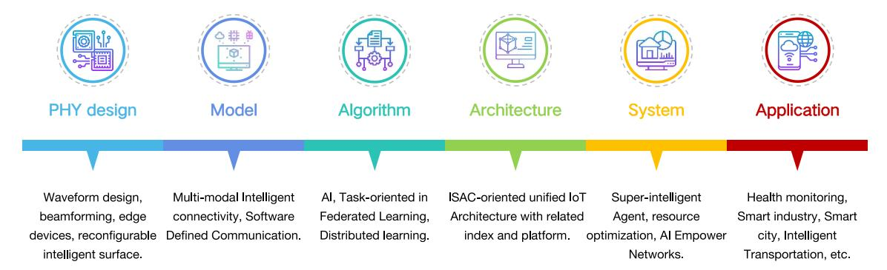

Fig. 1. The roadmap of this paper.

presented a comprehensive survey on the development of the perceptive mobile network (PMN). It is expected to offer ubiquitous radio sensing capabilities and enables various smart applications while ensuring uninterrupted communication services. The paper discusses ISAC technology, potential applications, system frameworks, required modifications, and research challenges and solutions related to PMN. However, these reviews often lack comprehensive discussions from various perspectives, such as algorithms, systems, applications, etc. Additionally, they fail to address important aspects like framework design and the integration of ISAC with AI.

In this paper, we shall provide a comprehensive survey of the latest ISAC technology and development to design a novel ISAC-oriented unified IoT architecture. Especially, we propose the concept of the omniscient layer, which redefines computer networks with software-defined communication (SDC) and information-theoretic fusion for ISAC, incorporating advanced technologies and revolutionizing network design, enabling unparalleled flexibility and adaptability in communication systems. From various perspectives, including physical layer waveform design, models, algorithms, frameworks, systems, and applications, we propose our novel design approach and provide readers with prospects and insights into future research directions in the field of ISAC. The major contributions of this paper can be summarized as follows:

- *•* We conduct a thorough analysis of the past decade of ISAC technology and development. By synthesizing existing research, we evaluate the strengths and weaknesses of ISAC and emphasize the pivotal role of AI in driving advancements in 6G networks.
- *•* We propose a new IoT framework specifically designed for ISAC. The framework introduces the concept of the omniscient layer, with a focus on SDC as its core. This approach enables seamless integration and coordination between the physical and digital realms.
- *•* We present a groundbreaking ISAC architecture that leverages principles derived from information theory. By integrating beamforming and intelligent reconfigurable antenna arrays, we enhance communication efficiency and reliability within secure ISAC.
- *•* We introduce the concept of super intelligent agents, which combine AI-empowered networks with multi-modal intelligent connectivity. These agents exhibit advanced perception, communication, and

TABLE II LIST OF ABBREVIATIONS

| Abbreviations | Definition                                    |
|---------------|-----------------------------------------------|
| AI            | Artificial Intelligence                       |
| AN            | Artificial Noise                              |
| AoA           | Arrival of Angle                              |
| BER           | Bit Error Rate                                |
| BCD           | Block Coordinate Descent                      |
| CKM           | Channel Knowledge Map                         |
| CRLB          | Cramer-Rao Lower Bound                        |
| CSI           | Channel State Information                     |
| DDoS          | Distributed Denial-of-service                 |
| DNN           | Deep Neural Network                           |
| Eves          | Eavesdroppers                                 |
| FD            | Full-duplex                                   |
| FedML         | Federated Machine Learning                    |
| GRM           | Gradient-descent on Riemannian Manifold       |
| HMIMOS        | Hybrid Multiple-Input Multiple-Output Systems |
| IoT           | Internet of Things                            |
| IoV           | Internet-of-vehicles                          |
| ISAC          | Integrated Sensing and Communication          |
| MLP           | Multilayer Perceptron                         |
| MTD           | Moving Target Defense                         |
| MSE           | Mean Square Error                             |
| MI            | Mutual Information                            |
| MM            | Minorization-maximization                     |
| PMN           | Perceptive Mobile Network                     |
| RCS           | Radar Cross Section                           |
| RL            | Reinforcement Learning                        |
| RIS           | Reconfigurable Intelligent Surfaces           |
| S&C           | Sensing and Communication                     |
| SDC           | Software-defined Communication                |
| SINR          | Signal-to-Interference-plus-Noise Ratio       |
| SLAM          | Simultaneous Localization and Mapping         |
| SMDP          | Semi-Markov Decision Process                  |
| SPEB          | Squared Position Error Bound                  |
| SR            | Secrecy Rate                                  |
| UAVs          | Unmanned Aerial Vehicles                      |
| VLC           | Visible Light Communication                   |
| V2I           | Vehicle-to-infrastructure                     |

decision-making capabilities. Additionally, a comprehensive enumeration of ISAC application scenarios is also discussed.

*•* We discuss future research directions in the field of ISAC, such as energy efficiency, security, and scalability. Furthermore, we explore potential technological solutions that can further enhance the capabilities of ISAC.

The abbreviations are listed in Table [II,](#page-2-0) and the section organization and related main topics with methods or details are shown in Fig. [1](#page-2-1) and Table [III.](#page-3-0)

TABLE III THE OVERVIEW OF THE SECTION ORGANIZATION AND RELATED MAIN TOPICS.

| Sections                                                                 | Topics                                            | Methods/Details                                                                                                                                                                                                                                                                       |
|--------------------------------------------------------------------------|---------------------------------------------------|---------------------------------------------------------------------------------------------------------------------------------------------------------------------------------------------------------------------------------------------------------------------------------------|
|                                                                          | Section II-A: Overview                            | We design an novel ISAC-oriented unified IoT architecture that integrates software-defined communication and super-intelligent agents, including the hardware layer, the omniscient layer, and the application layer.                                                                 |
|                                                                          |                                                   | Sensing Index                                                                                                                                                                                                                                                                         |
|                                                                          |                                                   | Communication Index                                                                                                                                                                                                                                                                   |
| Section II: ISAC-oriented Unified IoT Architecture                       | Section II-B: Performance Evaluation Index        | Computation Index                                                                                                                                                                                                                                                                     |
|                                                                          |                                                   | Security Index                                                                                                                                                                                                                                                                        |
|                                                                          |                                                   | Unified Index                                                                                                                                                                                                                                                                         |
|                                                                          |                                                   | Software                                                                                                                                                                                                                                                                              |
|                                                                          | Section II-C: Platform                            | Signal                                                                                                                                                                                                                                                                                |
|                                                                          |                                                   | Solver                                                                                                                                                                                                                                                                                |
|                                                                          | Section III-A: Preliminaries                      | We envision achieving Space-air-ground intelligent connectivity by integrating devices empowering transformative connectivity and interaction through advanced communication and sensing capabilities.                                                                                |
| Section III: Hardware Layer: Space-air-ground                            |                                                   | Joint Design                                                                                                                                                                                                                                                                          |
| Intelligent Connectivity                                                 | Section III-B: S&C Unified Waveform               | Sensing Echoes Using RIS                                                                                                                                                                                                                                                              |
|                                                                          |                                                   | Waveform Optimization                                                                                                                                                                                                                                                                 |
|                                                                          |                                                   | Information Theoretic Security                                                                                                                                                                                                                                                        |
|                                                                          | Section III-C: Hardware Layer Security            | Sensing Assisted Interference                                                                                                                                                                                                                                                         |
|                                                                          | Section IV-A: ISAC Architecture                   | Intelligent Controllable Antenna Array                                                                                                                                                                                                                                                |
|                                                                          |                                                   | Beamforming                                                                                                                                                                                                                                                                           |
|                                                                          |                                                   | Information Theory-centric                                                                                                                                                                                                                                                            |
| Section IV: Omniscient Layer: Software-defined Communication Based-AI |                                                   | Coordinated Multiple Points                                                                                                                                                                                                                                                           |
| Communication based-Ai                                                   | Section IV-B: Software-defined Communication      | Large Connection-oriented in IoT                                                                                                                                                                                                                                                      |
|                                                                          |                                                   | Pareto Optimization                                                                                                                                                                                                                                                                   |
|                                                                          |                                                   | Attack Detection                                                                                                                                                                                                                                                                      |
|                                                                          | Section IV-C: Omniscient Layer Security           | Moving Target Defense                                                                                                                                                                                                                                                                 |
|                                                                          |                                                   | SSL and TLS                                                                                                                                                                                                                                                                           |
|                                                                          |                                                   | Macro-micro Base Station                                                                                                                                                                                                                                                              |
|                                                                          | Section V-A: AI-empowered Networks                | Core Network                                                                                                                                                                                                                                                                          |
|                                                                          |                                                   | Resource Optimization                                                                                                                                                                                                                                                                 |
|                                                                          |                                                   | Data Industry                                                                                                                                                                                                                                                                         |
| Section V: Application Layer: Super-intelligent                          | Section V-B: Multi-modal Intelligent Connectivity | Federated Learning                                                                                                                                                                                                                                                                    |
| Agent Makes Everything Closer                                            |                                                   | Distributed Learning                                                                                                                                                                                                                                                                  |
|                                                                          |                                                   | Encryption                                                                                                                                                                                                                                                                            |
|                                                                          | Section V-C: Application Layer Security           | Privacy Protection                                                                                                                                                                                                                                                                    |
|                                                                          | Section V-D: Application Scenarios                | We discuss a variety of ISAC application scenarios. This comprehensive analysis not only encompasses the multitude of potential use cases for ISAC but also delves into the intricate fusion of various technological elements to optimize system performance and functionality.      |
| Section VI: Future Directions and Challenges                             | Section VI: Open Issues and Potential Solutions   | We address the limitations of current ISAC technologies, highlighting six challenges like clock syn- chronization, network protocol, etc. Our proposed solutions leverage interdisciplinary approaches, integrating AI, cryptography, IoT technologies, signal processing, etc. |

#### II. ISAC-ORIENTED UNIFIED IOT ARCHITECTURE

In this section, we shall present the novel IoT architecture for ISAC, which breaks the traditional structure model and consists of a redesigned three-layer structure, namely, the hardware layer, the omniscient layer, and the application layer. This architecture is dominated by SDC and super intelligent agents to enable intelligent connectivity of everything.

# *A. Overview*

The ISAC-oriented unified IoT architecture is shown in Fig. [2.](#page-4-0) Except for the new three-layer structures, it also includes the technologies of edge AI, data governance, cloud servers, and task-oriented Federated learning. The following is an overview of the mode of collaboration between each layer.

*1) Hardware Layer:* It focuses on achieving Space-airground intelligent connectivity. This transformative framework harnesses the unique capabilities of satellites, airplanes, base stations, unmanned aerial vehicles (UAVs), and smartphones, all working synergistically to redefine the boundaries of communication and sensing [\[6\]](#page-28-5), [\[11\]](#page-29-1). To realize this vision, a new generation of hardware devices with innovative communication and sensing architectures and modes is essential. These advancements enable collaboration between heterogeneous hardware devices, unlocking a wide array of possibilities for enhanced connectivity and perception.

Satellites, renowned for their global coverage and longrange capabilities within the ISAC network [\[2\]](#page-28-1), [\[5\]](#page-28-4), empower high-speed data transmission, surveillance, and monitoring across vast areas, bridging geographically distant regions for global connectivity [\[1\]](#page-28-0). Airplanes and UAVs, agile platforms excelling in localized sensing and communication [\[32\]](#page-29-22), swiftly mobilize with purpose-built sensors and communication modules for on-the-fly data collection, imaging, and connectivity in remote or inaccessible areas [\[33\]](#page-29-23). Base stations, strategically positioned throughout, form the ISAC network backbone [\[34\]](#page-29-24), [\[35\]](#page-29-25), providing robust links for connectivity and data transfer. They utilize advanced techniques like beamforming, massive MIMO, and dynamic spectrum allocation to optimize performance and enhance coverage [\[36\]](#page-29-26), [\[37\]](#page-29-27). At the core, smartphones are versatile interfaces in the ISAC ecosystem [\[38\]](#page-29-28), integrating with embedded sensors for efficient data capture and processing. They empower users to connect, communicate, and engage effortlessly, enhancing experiences and unlocking new realms of convenience [\[39\]](#page-29-29).

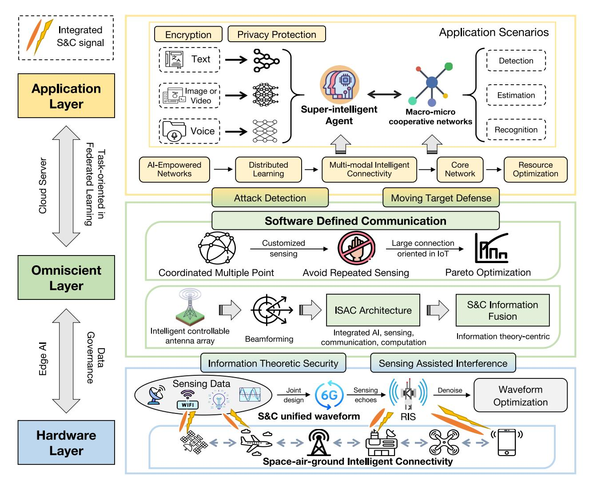

Fig. 2. The overview of the ISAC-oriented unified IoT Architecture.

This visionary unified IoT architecture, oriented towards ISAC, redefines communication and sensing paradigms by integrating satellites, airplanes, UAVs, base stations, and smartphones into a cohesive and intelligent ecosystem. By adopting this holistic approach, we envision a future where communication and sensing coexist harmoniously, enabling unprecedented levels of connectivity, situational awareness, and interaction with our surroundings. And we also consider using information theory and sensing assisted interference for hardware layer security. The potential impact of this integrated framework spans diverse domains, including disaster response, precision agriculture, and smart cities, among others, promising a future where convenience, efficiency, and transformative experiences become the new norm. Through the integrated technologies such as AI, cryptography, and IoT, this architecture opens up new frontiers for innovation and empowers us to shape a connected world that is not only more efficient and secure but also highly responsive to our everevolving needs.

*2) Omniscient Layer:* It stands as the cornerstone of the ISAC framework, breaking free from the traditional sevenlayer architecture of computer networks. The omniscient layer transcends boundaries, incorporating software-defined communication and information-theoretic fusion for ISAC, along with cutting-edge technologies like reconfigurable intelligent surfaces (RIS), beamforming, sensing echoes, and coordinated multiple points. This transformative paradigm shift redefines our approach to network design and operation, endowing us with unparalleled capabilities in flexibility, efficiency, and adaptability within communication systems [\[33\]](#page-29-23), [\[40\]](#page-29-30). The omniscient layer, serving as the hub of functionality, integrates these state-of-the-art techniques, enabling intelligent adaptation and waveform optimization. Through the prowess of software-defined approaches, it tailors communication strategies with precision, aligning them precisely with the unique requirements of specific applications [\[41\]](#page-29-31).

Advancements in ISAC enable the collection of data from diverse sources such as mmWave, WiFi, visible light, and THz signals [\[20\]](#page-29-19). This data forms the basis for developing a customized waveform for 6G services [\[42\]](#page-29-32), with joint design optimizing the relationship between sensing and communication [\[43\]](#page-29-33). Utilizing sensing echoes, and reflections of signals interacting with the environment, enriches communication system performance by providing insights into channel conditions, interference sources, and environmental factors. This informs adaptive waveform design for changing conditions. RIS, or metasurfaces, are engineered structures manipulating electromagnetic wave propagation [\[44\]](#page-29-34), shaping wireless channels for optimized communication performance. Integration of these surfaces into waveform design enables dynamic signal path adjustment, interference mitigation, and signal quality enhancement [\[45\]](#page-29-35), ensuring adaptability to diverse channel conditions. Through the integration of sensing methods and joint design principles, waveform design effectively filters fusion signals, aligning interference to ensure reliable information transmission, thus ensuring ISAC operates efficiently with an optimal waveform design.

The proposed architecture achieves ISAC through intelligent controllable antenna arrays and waveform optimization techniques. These arrays dynamically adjust radiation patterns and steer beams, enabling precise directional transmission and focused signal delivery. This focused transmission enhances signal quality, reduces interference, and optimizes system performance by adapting to specific communication and sensing needs [\[46\]](#page-29-36). Simultaneously, waveform optimization tailors transmit signals to wireless channel characteristics and sensing tasks. By adjusting parameters like modulation scheme, bandwidth, and power allocation, ISAC achieves efficient and reliable data transmission for sensing applications. This meticulous optimization maximizes resource utilization, minimizes interference, and ensures accurate and timely sensing data delivery.

Beamforming techniques and information theory synergize to extract relevant wireless environment characteristics from perceptual data, enhancing beam alignment methods' adaptability to dynamic environmental changes. Rigorous signal analysis and statistical metrics provide insights into channel conditions and interference levels. Reinforcement learning (RL) explores the interaction between wireless environment features and optimal beamforming angles, enabling adaptive adjustments for optimized signal transmission and interference mitigation. Integrated with information theory and RL, it creates an intelligent wireless system, enhancing performance, resource utilization, and communication quality. Optical computing, alongside emerging information technologies, offers advantages such as high-speed processing, large bandwidth, low power consumption, and high parallelism [\[47\]](#page-29-37), alleviating the information processing burden of traditional methods. ISAC networks, coupled with coordinated multiple points, facilitate collaborative multi-dimensional data collection and rapid computational analysis. Efficient scheduling of perception and communication processes is crucial for network infrastructure. Optimizing resource utilization by avoiding redundant perceptions while meeting accuracy requirements is essential [\[48\]](#page-29-38). Selecting appropriate nodes for perception tasks and enabling data sharing to optimize resource allocation and maximize efficiency in the network.

SDC allows for the flexible adjustment of communication parameters and protocols to address diverse perception tasks and communication needs. This adaptability is crucial not only for improving network capacity, throughput, and performance efficiency through the use of software-defined methods and Pareto optimization techniques but also for enhancing the security of ISAC systems [\[49\]](#page-29-39). The integration of SDC with ISAC supports the joint optimization of intelligent perception and decision-making processes, enabling more intelligent and efficient communication systems. Furthermore, SDC plays a vital role in bolstering ISAC security by facilitating dynamic network resource configuration, thereby promoting attack detection and moving target defense (MTD) capabilities [\[50\]](#page-29-40). Its support for flexible communication architectures and topologies also ensures adaptability to various perception scenarios and network requirements, making it a robust and scalable solution for ISAC systems while enhancing their security measures.

*3) Application Layer:* The primary objective of ISAC is to facilitate collaboration between the omniscient layer and the application layer by integrating the multi-modal intelligent connectivity with the AI-empowered networks [\[51\]](#page-29-41). Within this comprehensive framework, sensing and communication data are categorized into text, image, and voice, with super-intelligent agents assuming a central role in achieving cross-scene and multi-modal learning. Through distributed training, these super agents acquire the ability to extract valuable insights from diverse perceptual data. Additionally, the core cloud server can record and intelligently analyze perceptual information from a wide range of areas, thereby establishing a global repository of intelligent cloud computing models. This extensive model base serves as the foundation for global awareness, decision-making, and task scheduling, empowering advanced levels of cognitive capabilities and intelligent functioning.

The interaction between the application layer and the base station is established through collaborative sensing techniques, as cooperative macro-micro networks evolve to encompass coordinated multi-node system levels. Additionally, mobile networks are transitioning into dual-function integrated systems, serving both communication and perception purposes. In this dynamic scenario, macro and micro base stations collaborate effectively to balance communication coverage and capacity, as well as perception range and resolution. Macro stations ensure widespread coverage and mobility support, with coarse-grained perception capabilities. Micro stations deliver ultra-high-capacity data services and directional finegrained perception, particularly in hotspot areas. Leveraging advanced algorithms and technologies, such as those employed in the ISAC system, a diverse range of services is offered, including estimation, detection, and recognition [\[52\]](#page-29-42). These services extract crucial features from perceptual data and perform comprehensive analysis to achieve accurate assessment and comprehension of the environment and events. Estimation services utilize data processing and modeling techniques to infer information about environmental characteristics and states. Detection services focus on identifying and localizing specific targets or events, providing associated alerts and notifications. Recognition services employ deep analysis and learning of data to identify and classify perceptual objects, offering detailed information about their attributes and characteristics.

The ISAC system holds significant application potential across various domains. For instance, in the context of smart cities, it can facilitate efficient traffic monitoring and management, enabling functions such as smart lighting and environmental monitoring. In agriculture, the integrated system aids in optimizing irrigation and crop management, providing precise monitoring of crop growth and disease detection. Moreover, the ISAC technology finds application in diverse fields, including medicine, industrial automation, and environmental monitoring, delivering accurate, efficient, and intelligent sensing services for a wide range of application scenarios [\[20\]](#page-29-19), [\[53\]](#page-29-43).

*4) Discussion:* The proposed architecture's hardware layer facilitates versatile transmitter/receiver strategies on the same device, leveraging advancements in software-defined radio technology. This shift allows signal processing tasks to transition from specialized RF circuits to general-purpose processors, enabling hardware reusability for S&C functions, particularly in large IoT devices such as autonomous vehicles. This flexibility enables the radio system to dynamically generate signals adhering to various standards or even nonstandardized signals. Additionally, the architecture supports the integration of ISAC functionalities into System-on-Chip (SoC) or System-in-Package (SiP) solutions, consolidating multichannel RF transceivers and high-performance analogto-digital converters into radar or communications SoCs. Antenna arrays have also been implemented through radar or communications SiP solutions in compact IoT devices. Future advancements may integrate S&C functionalities into chipsets via SoC/SiP configurations, maximizing both integration and coordination gains.

At the omniscient layer, we aim to harmonize emissions into a single output through orthogonal/non-overlapped resource allocation, including time, frequency, and spatial division. A fully unified waveform design is favored for its simplicity and efficiency. Time division, a straightforward method, schedules S&C waveforms in different time slots with loosely coupled functionalities. This approach has been widely adopted to integrate sensing capabilities into existing communication protocols such as the IEEE 802.11p/802.11ad standards, showing potential for enhancing cellular IoT devices with sensing functions cost-effectively. WiFi sensing methods often utilize time-division transmission of pilot signals alongside payload data. Alternatively, spectral division allocates S&C waveforms to different subcarriers or frequency bands, requiring minimal modifications within existing OFDM systems. Spatial division involves forming multiple spatial beams to serve communication receivers while conducting simultaneous sensing tasks like target detection. Effective interference mitigation relies on selecting a sensing waveform within the null space of the other system and estimating interference CSI for waveform and spatial filter design. For a fully unified waveform, joint design is preferred, considering both sensing-centric and communication-centric designs. It involves formulating a mathematical optimization problem where the objective function encompasses sensing/communication performance metrics, with constraints ensuring the performance of the complementary functionality.

TABLE IV THE SYSTEM OF PERFORMANCE EVALUATION INDEX

| Evaluation    | Categories               | Indexes                  |  |  |
|---------------|--------------------------|--------------------------|--|--|
|               |                          | Performance detection    |  |  |
|               | Object localization      | Localization accuracy    |  |  |
|               |                          | Target resolution        |  |  |
| Sensing       |                          | Spatial resolution       |  |  |
|               | l <u></u>                | Sidelobe ratio           |  |  |
|               | Environmental detection  | Image entropy            |  |  |
|               |                          | Sensing range            |  |  |
|               | Reliability              | Bit error rate           |  |  |
|               | Kenabinty                | Network coverage rate    |  |  |
|               |                          | Time delay               |  |  |
| Communication |                          | Transmission rate        |  |  |
|               | Validity                 | Link density             |  |  |
|               |                          | Link spectral efficiency |  |  |
|               |                          | Energy efficiency        |  |  |
|               | Performance              | CPU utilization          |  |  |
|               |                          | Throughput               |  |  |
|               |                          | Total resources          |  |  |
| <b>C</b>      | Resource                 | Usage                    |  |  |
| Computation   |                          | Utilization              |  |  |
|               |                          | Trustworthiness          |  |  |
|               | Service                  | Efficiency               |  |  |
|               |                          | Response time            |  |  |
|               |                          | Confidentiality          |  |  |
|               | Data                     | Integrity                |  |  |
|               | l                        | Privacy                  |  |  |
| Security      |                          | Availability             |  |  |
|               | System                   | Authentication           |  |  |
|               |                          | Persistence              |  |  |
|               | Network and a            | ttack detection          |  |  |
|               | Cramer-Rao               | lower bound              |  |  |
| Unified Index | Mutual information       |                          |  |  |
|               | Rate-distortion function |                          |  |  |

Combining S&C functionalities at the application layer allows each function to leverage the output data of the other, facilitating mutual assistance. Typically, in a processing pipeline where sensing occurs after communication or vice versa, this application layer integration operates sequentially. Furthermore, employing a super-intelligent agent in collaboration with macro-micro networks enables the relay of different data types, facilitating the integration of heterogeneous devices and systems through a federated learning multi-modal architecture. It promotes the widespread deployment of the new ISAC architecture across various scenarios.

#### *B. Performance Evaluation Index*

The requirements of typical application scenarios in the proposed architecture exhibit significant variations, necessitating the fulfillment of corresponding criteria across five dimensions: sensing, communication, computing, security, and unified indexes. And the specific classification is shown in Table [IV.](#page-6-0)

- *1) Sensing Index:* It encompasses object localization and environmental detection, involving tasks like positioning and identification by estimating parameters such as angle, distance, and Doppler shift [\[14\]](#page-29-4). Performance is evaluated using indices like detection probability and false alarm rate, while parameter estimation employs metrics such as absolute deviation or mean square error (MSE). The resolution balances system parameters, and distance/velocity resolution and is described by fuzzy functions. Environmental detection captures detailed surroundings data, emphasizing holistic analysis using images [\[45\]](#page-29-35). Evaluation criteria include spatial resolution (distance, azimuth, elevation), sidelobe performance, image entropy, and perception range, crucial for accurate perception and ensuring high-quality images with minimal energy leakage and extensive coverage [\[54\]](#page-30-0).
- *2) Communication Index:* It can be categorized into two aspects: reliability and validity. Reliability indices of ISAC, such as bit error rate (BER) and coverage, reflect its ability to meet business requirements. BER quantifies erroneous bits in transmitted data, while coverage indicates the geographic area with signal power above a specified threshold [\[55\]](#page-30-1). These metrics provide insights into the system's reliability, ensuring consistent services. For the validity of ISAC, efficient resource utilization is crucial for its effective operation in resourceconstrained environments [\[41\]](#page-29-31). To evaluate ISAC system performance, several key metrics have been identified. Time delay, transmission rate, link density, link spectral efficiency, and energy efficiency are pivotal in resource-constrained settings, collectively providing a comprehensive assessment of ISAC system performance and ensuring effective operation in such environments.
- *3) Computation Index:* It also has three aspects: computer performance, computing resource and computing service. Computation indexes are vital in evaluating ISAC's performance, resources, and services during large-scale data processing [\[17\]](#page-29-11). CPU utilization, a key metric, gauges computational resource efficiency, ensuring optimal task processing and minimizing waste. Higher CPU utilization enhances overall system performance and reduces response time. Throughput, another critical metric, assesses the system's data processing capacity. High throughput accommodates vast perceptual data and real-time analysis needs, ensuring swift and efficient data processing. System scalability and efficiency rely on total computational resources and their utilization rates. Adequate resources and optimized utilization maximize system performance and adaptability to evolving demands. Optimizing these metrics enables integrated sensing systems to achieve efficient data processing, rapid response times, and effective resource utilization, facilitating successful ISAC application deployment and operation.
- *4) Security Index:* They in ISAC focus on safeguarding all data within the framework, including data in transit and data at rest, and ensuring that wireless data remains inaccessible to unauthorized entities [\[10\]](#page-29-0). These metrics assess ISAC's ability to prevent data leakage and unauthorized access through simulated attack scenarios, enhancing overall protection [\[56\]](#page-30-2), [\[57\]](#page-30-3). The amalgamation of system security, network security, and intrusion detection forms a resilient defense framework.

- System security employs measures like user authentication, preserving data confidentiality and integrity. Network security fortifies ISAC's connections, countering threats like distributed denial-of-service (DDoS) attacks using firewalls and encrypted communication protocols. Intrusion detection adopts a collaborative approach, ensuring ISAC's data integrity, confidentiality, and resilience for the evolving cyber field [\[58\]](#page-30-4).
- *5) Unified Index:* Given the absence of an official standard for measuring the performance of integrated sensing systems, we propose leveraging the Cramer-Rao lower bound (CRLB), mutual information (MI), and rate-distortion function as key evaluation metrics [\[2\]](#page-28-1), [\[13\]](#page-29-3), [\[59\]](#page-30-5), [\[60\]](#page-30-6). The CRLB, acknowledged widely as a minimum variance lower bound for parameter estimation, stands as a fundamental measure. To address uncertainties like multipath delay, the squared position error bound (SPEB) is commonly used, establishing positioning performance limits, especially in complex cooperative location-aware networks. MI, serving as a performance benchmark, quantifies information transmission from the channel to the receiver, which is essential for perception [\[61\]](#page-30-7). Optimizing MI benefits applications relying on signal feature extraction, such as target recognition, and guides waveform design. Rate-distortion theory provides a crucial framework for balancing compression rate and distortion in ISAC [\[62\]](#page-30-8), [\[63\]](#page-30-9). In image sensing, rate-distortion functions quantify distortion across various compression algorithms and ratios, aiding in appropriate technique and parameter selection. This analysis ensures image quality and bandwidth alignment in diverse applications. In the future, there is still a need to explore unified metrics applicable to ISAC.

## *C. Platform*

Based on existing technological developments, we present the software and signals for ISAC development, and also including the corresponding solvers.

- *1) Software:* Federated Machine Learning (FedML), a distributed machine learning framework [\[64\]](#page-30-10), aligns with ISAC's data collection and fusion from diverse sensing devices. FedML facilitates collaborative training and model updates across distributed sensing nodes, where each node retains its local data and trains models. Leveraging FedML's communication mechanisms, nodes can share and aggregate their local models, enhancing global model accuracy. This approach harnesses data and computational resources across nodes, optimizing model performance and sensing capabilities. Importantly, FedML prioritizes data privacy and security, safeguarding sensitive sensing data during the sharing process [\[65\]](#page-30-11). Additionally, universal software radio peripheral employs software-defined radio technology, enabling reception and transmission functions across multiple wireless communication standards [\[66\]](#page-30-12), [\[67\]](#page-30-13).
- *2) Signal:* Various sensing applications are enabled by WiFi, mmWave, radar, visible light, and THz signals [\[68\]](#page-30-14), as shown in Fig. [3.](#page-8-0) WiFi is used for indoor positioning, dynamic object detection, and human pose recognition [\[69\]](#page-30-15). mmWave allows for precise ranging, velocity measurement, and imaging, supporting applications like autonomous driving, UAV

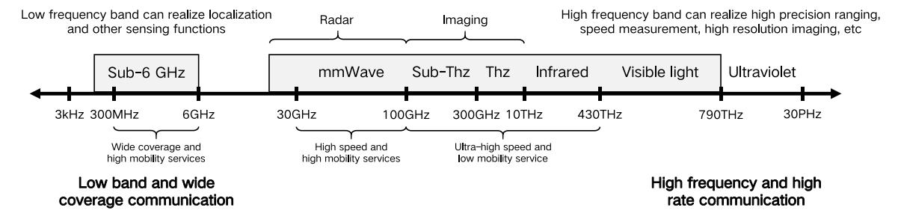

Fig. 3. Signals and services in various frequency bands.

navigation, and intelligent security systems [11], [70]. Radar provides accurate measurements of distance, velocity, and angle, used in target detection, obstacle avoidance, and aviation navigation. Visible light enables high-resolution image and video capture for applications such as facial recognition and intelligent surveillance. THz is utilized for transmission imaging, object recognition, and security screening [71], with applications in non-destructive testing and material characterization. These signals collaborate for multi-modal sensing and comprehensive environmental understanding, as detailed in Section III-A.

3) Solver: CVX and Manopt are invaluable tools for optimizing integrated sensing systems. CVX, with its declarative modeling language, simplifies the description of convex optimization problems, including resource allocation, data transmission, and sensing data functions. It automatically translates problems into convex forms, offering reliable solutions to enhance system performance [72]. On the other hand, Manopt provides a diverse set of nonlinear optimization functions and algorithms, aiding in optimizing perceptual node positions and data fusion. Supporting algorithms like gradient descent and Newton's method, it's tailored for manifold optimization. By utilizing Manopt, we efficiently tackle nonlinear optimization challenges in ISAC, ensuring optimized system performance and algorithmic efficacy.

To summarize, the proposed architecture encompasses a broad range of aspects and provides a thorough reference for ISAC. Comprising the hardware layer, omniscient layer, and application layer, this innovative structure offers a comprehensive and well-defined approach. The establishment of a thorough performance evaluation framework and platform establishes a solid foundation for future research and development in the field of ISAC. The proposed architecture holds immense potential to drive scholarly inquiries and facilitate breakthroughs in the realm of ISAC, ultimately contributing to the evolution and progress of this field.

# III. HARDWARE LAYER: SPACE-AIR-GROUND INTELLIGENT CONNECTIVITY

In this section, we will discuss the principles of each type of signal and how to design the S&C unified waveform. We also points out the hardware layer security under the new architecture from information theoretic security and sensing assisted interference.

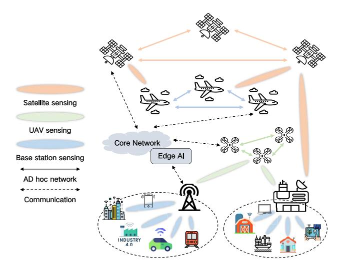

Fig. 4. Space-air-ground collaborative sensing.

#### A. Preliminaries

The 6G network integrates satellite and UAV technologies, forming an integrated space-air-ground network as depicted in Fig. 4. Enhancing traditional communication satellites expands the sensing range, especially in high-mobility scenarios. Equipping traditional positioning satellites improves connectivity and collaboration among nodes. However, satellites have limitations such as latency and weaker performance compared to ground networks. Thus, space-air collaboration is essential for integrated sensing. Satellites cover wide-area sensing, while base stations handle smaller areas. Various signals in collaborative sensing are vital for intelligent connectivity in ISAC. Table V compares WiFi, mmWave, radar, visible light, and THz signals.

1) WiFi: Its signal propagation can be described by the following formula:

$$P_r = P_t \cdot G_t \cdot G_r \cdot \left(\frac{\lambda}{4\pi d}\right)^2 \cdot L,\tag{1}$$

where  $P_r$  is the received power,  $P_t$  is the transmitted power,  $G_r$  and  $G_t$  are the corresponding antenna gains,  $\lambda$  is the signal wavelength, d is the transmission distance, and L represents the path loss. WiFi signal attenuation during transmission is influenced by factors such as transmitted power, antenna gains, path loss, and distance. Path loss results from damping, scattering, and diffraction. Multipath effects, interference, and fading also impact WiFi propagation. Multipath effects

| Signal        | Characteristics                                                                                                                                                                                                                         | Advantages                                                                                                                                                        | Disadvantages                                                                                                                                               | Recent Advances                                                                                                                                              | Transmission Distance                  | Speed                                                          | Security | Cost   |
|---------------|-----------------------------------------------------------------------------------------------------------------------------------------------------------------------------------------------------------------------------------------|-------------------------------------------------------------------------------------------------------------------------------------------------------------------|-------------------------------------------------------------------------------------------------------------------------------------------------------------|--------------------------------------------------------------------------------------------------------------------------------------------------------------|-------------------------------------------|----------------------------------------------------------------|----------|--------|
| WiFi          | Operates in 2.4GHz and 5GHz bands. Widely used with com- mon devices. Moderate penetration through obstacles. Commonly used for internet access, local networking, and IoT devices.                                      | Versatile applications, high- speed transmission, device compatibility. Can be easily integrated into various devices and applications.               | Susceptible to interference from other wireless devices and physical obstacles, limited transmission distance in large or complex environments. | Indoor localization [14], [24], environment monitoring [73], object detection [74], smart home [75]                                                          | 30m to 100m                               | 100Mbps to 1Gbps                                               | Moderate | Medium |
| mmWave        | Operates at higher frequencies, typi- cally 30GHz to 300GHz. Offers large bandwidth for high-speed data trans- fer, suitable for high-density environ- ments.                                                               | High data rates, increased device connectivity. Enables ultra-fast internet speeds and low latency communication.                                                 | Shorter transmission distances, highly susceptible to obstacles like walls and buildings, higher implementation complexity.                        | Signal processing improvements [76], data fusion techniques [77], advanced beamforming methods [78]                                                          | 10m to 100m                               | >1Gbps                                                         | Moderate | High   |
| Radar         | Transmits pulses and measures their echoes. Suitable for long-range detection and high accuracy in measuring target range, velocity, and angle. Commonly used in automotive, aviation, and defense applications.                        | Long-range detection, high accuracy. Capable of operating in all weather conditions and environments.                                                             | Limited resolution for small or distant objects, susceptible to clutter and interference, higher cost due to specialized equip- ment.           | Advances in navigation systems [19], surveillance technology [79], improved target tracking [80]                                                             | Dozens of meters to hundreds of meters | Hundreds of meters per second to kilome- ters per second | High     | High   |
| Visible Light | Operates in the visible light spec- trum. No electromagnetic interfer- ence, making it suitable for environ- ments sensitive to RF interference. Used in smart lighting, indoor posi- tioning, and secure communication. | Wide spectrum availability, high-speed transmission, strong security. Resistant to RF interference and provides additional lighting functionality. | Limited transmission distance, requires line of sight, susceptible to blockage and natural light interference.                                              | Innovations in indoor position- ing [81], user identification [42], precise ranging [82], in- telligent transportation systems [27]              | 10m to 100m                               | 10Mbps to 100Mbps                                              | High     | Medium |
| THz           | Works in the terahertz frequency band. Suitable for non-metallic ma- terial detection and imaging, provid- ing high penetration and resolution. Used in security screening, medical imaging, and high-speed data com-    | High-resolution imaging, safety detection, medical diagnosis. Capable of penetrating fabrics and other materials without causing harm              | Limited transmission distance, significantly affected by atmo- spheric absorption and scatter- ing, high cost of THz equip- ment.               | Advances in object recogni- tion [21], enhanced imaging techniques [83], novel phase- shift designs and ultra-high- speed data transmission [39] | A few meters to tens of meters            | Several tens of Gbps to hundreds of Gbps                    | Moderate | High   |

TABLE V
COMPARISONS ON THE DIFFERENT SIGNALS

occur due to signal interference from reflections, refractions, and scattering. Interference may come from electromagnetic radiation emitted by devices or electronic equipment while fading signifies temporary signal strength fluctuations.

Furthermore, Channel State Information (CSI) refers to information about the characteristics of the wireless channel between the transmitter and the receiver. It includes the amplitude and phase of the received signal on each subcarrier [12]. It can be represented mathematically as follows:

$$CSI = A \cdot e^{j\phi}.$$

where CSI is the complex value representing the channel state, A is the amplitude of the received signal, and  $e^{j\phi}$  represents the phase shift of the signal. It reveals wireless channel insights like signal strength, fading, and interference, enabling advanced techniques such as beamforming and MIMO. WiFi systems utilize CSI to optimize signal transmission, improve spatial efficiency, and mitigate interference.

2) mmWave: It operates in the frequency range of 30 GHz to 300 GHz and experiences substantial path loss and attenuation due to its high frequency and short wavelength. The transmission of these signals is affected by various factors, including multipath effects, free-space propagation loss, and atmospheric absorption. Consequently, mmWave communications typically have shorter transmission distances, and signal transmission can be influenced by obstacles and environmental conditions. The path loss model for mmWave signals can be described as follows:

$$P(d) = P_0 - 10 \cdot n \cdot \log_{10}(d), \tag{3}$$

where P(d) is the received power at distance d,  $P_0$  is the transmit power, and n is the path loss exponent. Combining mmWave and machine learning in ISAC shows immense potential. It allows tasks like target detection, object recognition, and real-time optimization of communication systems. Machine learning algorithms enhance performance and resource allocation based on live channel data. Smart

feedback control adjusts mmWave parameters dynamically. This integration enhances environmental perception, object detection, and tracking, potentially boosting mmWave technology in ISAC [78].

3) Radar: It operates by transmitting electromagnetic waves and receiving their reflected signals. The transmitted signal, often referred to as the "echo", interacts with objects in the environment, such as targets or obstacles. The radar receiver then captures the reflected signal and analyzes it to extract information about the targets' characteristics, such as their range, velocity, and angle. It can be described as follows, similar to Eq. (1):

$$P_r = \frac{P_t \cdot G_t \cdot G_r \cdot \lambda^2 \cdot \sigma}{(4\pi)^3 \cdot R^4},\tag{4}$$

where  $\sigma$  represents the radar cross-section of the target, and R denotes the corresponding distance. Integrating radar with AI enriches ISAC's intelligence, adaptability, and decision-making, enhancing sensing and connectivity [84]. AI algorithms analyze radar data, enabling tasks like target detection and tracking. They recognize radar signals, extracting vital information. AI optimizes sensing systems through adaptive beamforming and parameter tuning, refining radar accuracy. Combining radar data with other sensors enables holistic environmental understanding, enabling comprehensive multi-modal perception [85].

4) Visible Light: It utilizes the visible spectrum for data transmission, employing innovative techniques of light signal modulation and demodulation [81]. In visible light communication (VLC), data encoding occurs by modifying light intensity, frequency, or phase. Among these, intensity modulation is most common, altering brightness for data encoding. At the receiver, an optical sensor captures the modulated signal, demodulates it, and converts it into an electrical signal for processing. The core principle of this transmission can be succinctly summarized as:

$$I(t) = I_0 + m \times I_0 \times s(t), \tag{5}$$

where I(t) represents the light intensity at time t,  $I_0$  is the baseline intensity without modulation, m is the modulation index (controlling the depth of modulation), and s(t) is the modulation signal that carries the data. Integrating VLC with ISAC enhances intelligent connectivity and extends sensing capabilities. Smart devices use light signals for high-speed communication within ISAC. Combined with radar and mmWave, VLC achieves multi-modal perception and comprehensive environmental sensing [82]. Incorporating VLC's abilities enables holistic perception and intelligent connectivity in ISAC, facilitating diverse IoT applications such as smart homes and intelligent transportation.

5) THz: Positioned between microwave and infrared light in the electromagnetic spectrum, THz exhibits strong penetration, non-ionization, and high-resolution imaging capabilities [78]. It finds applications in object recognition, safety detection, and non-destructive testing, penetrating non-metallic materials for covert object perception. Its high-resolution imaging aids in human pose recognition and in vivo detection [8]. Additionally, THz enables wireless communication for high-speed data transmission and indoor localization. It can be represented by:

$$P(d) = P_0 \cdot e^{-\alpha d},\tag{6}$$

where P(d) is the terahertz signal power at a distance of d,  $P_0$  is the initial power, and  $\alpha$  is the attenuation coefficient of the THz in the medium. And it can also be represented using modulation techniques, as follows:

$$s(t) = A \cdot \cos(2\pi f_c t + \phi_m \cdot \cos(2\pi f_m t)), \tag{7}$$

where A is the amplitude,  $f_c$  is the carrier frequency,  $\phi_m$  is the modulation index, and  $f_m$  is the modulation signal frequency. Integrating Thz with RIS allows precise wave control and manipulation. By adjusting RIS's electromagnetic parameters like phase and amplitude, waves can be focused and steered, enhancing signal transmission efficiency and quality [83]. When combined with intelligent connectivity, Thz facilitates high-speed data transmission and multi-user communication. This integration enables more accurate environmental perception and intelligent connectivity, advancing ISAC's development with Thz.

To summarize, integrating various technologies and applications, the integration of space-air-ground communication is essential for achieving intelligent connectivity. WiFi, Thz, and mmWave, etc., combined with AI, are fundamental components for enabling intelligent integrated sensing. WiFi serves as the backbone of network infrastructure, providing widespread coverage and high-speed data transmission. THz technology offers robust penetration and high-resolution imaging capabilities, finding applications in security detection and medical diagnosis. The mmWave technology facilitates high-speed and broad-bandwidth communication, catering to autonomous driving and intelligent transportation domains. Leveraging the synergy between these technologies and AI enhances perception and collaboration, enabling intelligent ISAC. By optimizing algorithms, data fusion techniques, and intelligent decision-making processes, integrated air-spaceground communication systems achieve efficient and reliable perception, communication, and data processing, supporting the realization of intelligent connectivity.

#### B. S&C Unified Waveform

1) Joint Design: Liu et al. [39] proposed an ISAC system with THz band IRS, optimizing transmit beamforming and phase-shift design using gradient-based proximal policy optimization. Their study explores continuous beamforming and discrete phase shift design in a multi-user, multipleinput, single-output scenario, with additional investigation into a distributed framework for multi-user MIMO scenarios. He et al. [86] examined ISAC beamforming with full-duplex (FD) capabilities, extending it to incorporate FD for radar and communication tasks. They propose joint optimization for downlink and uplink transmissions, aiming at power consumption minimization and sum-rate maximization, offering efficient solutions for coupling downlink and uplink transmissions. The study emphasizes FD communication's benefits in enhancing power and spectral efficiency over conventional half-duplex ISAC.

Gao et al. [77] proposed an ISAC framework utilizing massive mmWave MIMO systems. Compressed sampling retrieves channel state and radar data, reducing pilot overhead. A unique widely spaced array architecture enhances radar angular resolution. The ISAC structure accommodates different timescales, and pilot waveforms are tailored based on compressive sensing theories and hardware constraints. The proposed algorithm effectively addresses sparse signal recovery problems with angular ambiguity. Additionally, a framework for Doppler frequency estimation ensures reliable communication performance in time-varying ISAC systems. Similarly, other studies [87], [88] explore collaborative waveform strategies, refined optimization techniques, and comprehensive experimental studies, collectively advancing knowledge in synchronized signal transmission and reception, signal refinement, and rigorous real-world testing of designs.

From our point of view, the design of ISAC waveforms transcends reliance solely on existing communication and sensing waveforms by employing a novel bottom-up approach. The joint ISAC waveform design introduces heightened flexibility and adaptability, thereby bolstering the overall sensing and communication performance. A typical scheme for waveform design entails minimizing downlink multiuser interference while satisfying the constraints of total transmit power and peak-to-average power ratio. It further incorporates compromise parameters to fine-tune the priority between sensing and communication systems. In comparison to communication or sensing-centric methods, the waveform design exhibits superior versatility and adaptability, albeit accompanied by augmented complexity. Additionally, ISAC frame structure design is crucial for hardware standardization. It considers working frequency characteristics and sensing requirements, leveraging higher frequencies for greater bandwidth and enabling high-bandwidth, low-latency transmission, and precise sensing.

2) Sensing Echoes Using RIS: Salem et al. [89] investigated physical layer security in a multiuser MISO ISAC

| TABLE VI                     |
|------------------------------|
| COMPARISON OF RIS TECHNIQUES |

| Research Techniques                       | Technical Features                                                                                                       | Advantages                                                                                                              | Disadvantages                                                                                                      | Challenges                                                                                                             | Hardware Cost | Computational Complexity | Signal Transmission Delay | Flexibility |
|-------------------------------------------|--------------------------------------------------------------------------------------------------------------------------|-------------------------------------------------------------------------------------------------------------------------|--------------------------------------------------------------------------------------------------------------------|------------------------------------------------------------------------------------------------------------------------|---------------|-----------------------------|---------------------------------|-------------|
| Beamforming [34], [89], [90]              | Utilizes multiple antennas to form directional beams, optimizing signal strength towards specific directions.            | Enhanced signal coverage and energy focusing, lead- ing to improved signal re- ception quality.                | High hardware complexity and significant computational require- ments for accurate channel infor- mation. | Addressing hardware complexity and developing efficient algorithms for accurate channel estimation.                    | Medium        | Medium                      | Low                             | Medium      |
| Phase Optimization [39], [59], [91]       | Adjusts phase of each element in RIS to control the direction and shape of the beam.                               | Achieves precise signal beam control and im- proves system capacity.                                              | Requires highly accurate phase control and may face blind spots and directional constraints.                 | Creating robust algorithms for pre- cise phase control and mitigating blind spots in various scenarios.          | Medium        | High                        | Medium                          | High        |
| Bayesian Inference [33], [84]             | Leverages probabilistic models to handle uncertainty and noise in signal estimation and optimization processes. | Effectively manages un- certainty and noise, en- hancing signal detection and classification perfor- mance. | High computational complexity and demands significant prior knowledge and model accuracy.                    | Developing efficient computational methods to reduce complexity and incorporating accurate prior knowl- edge. | Low           | High                        | Medium                          | Medium      |
| Convexification [92], [93]                | Converts complex optimization problems into a convex form, simplifying the problem-solving process.                      | Ensures that optimization problems are solvable and reduces computational complexity.                                   | May introduce approximation er- rors and impose constraints on problem modeling and optimiza- tion.       | Minimizing approximation errors through accurate techniques and enhancing flexibility in problem modeling.    | Low           | Low                         | Low                             | High        |
| Successive Convex Approximation [94]–[96] | Iteratively approximates non- convex optimization problems with convex subproblems to ensure convergence.       | Effectively solves non- convex problems, ensur- ing convergence to feasi- ble solutions.                       | Often obtains suboptimal solutions and may require a large number of iterations.                                   | Improving the optimality of solu- tions and optimizing the conver- gence rate for practical applica- tions.   | High          | Medium                      | Medium                          | Medium      |

system against eavesdropping by a malicious UAV. They propose using an active RIS to maximize the system's secrecy rate by jointly optimizing radar receive beamformers, active RIS reflection coefficients and transmit beamformers at the base station. The approach ensures adequate target detection performance while considering minimum radar and total system power. Through adaptive beamforming and parameter adjustments, the system enhances its perception and understanding of the environment, ensuring efficient performance despite interference and privacy attacks. The integration of active reflectors, radar technology, and AI promises to elevate safety and environmental awareness. Zhu et al. [\[33\]](#page-29-23) proposed an innovative ISAC approach using uplink transmission to address the challenges of unknown waveforms and coupled S&C echoes. Their system employs an RIS at the base station to optimize electromagnetic signals, leveraging continuous and discrete phase models for backpropagation. Echo decoupling challenges are addressed using Bayesian methods and factor graph techniques, enabling unified communication and imaging.

The comparisons of the existing research about RIS are shown in Table [VI.](#page-11-0) These works have focused on beamforming design, phase optimization, and echo decoupling to enhance the performance of ISAC. The widespread integration of AI in perception and communication enhances the intelligence of RIS systems but also escalates the risks associated with data privacy breaches, algorithmic attacks, and adversarial manipulations. AI models typically rely on extensive datasets for training, making them vulnerable to privacy breaches if the data is compromised. Moreover, malicious actors may attempt to deceive AI systems by manipulating input data, leading to incorrect judgments and decisions. Instances of false data injection and adversarial attacks can disrupt the normal operation of RIS systems, compromising the accuracy of perception and communication. Addressing these challenges necessitates the implementation of robust measures such as effective data encryption, authentication, and traceability to safeguard user data privacy.

*3) Waveform Optimization:* Wu et al. [\[97\]](#page-30-30) introduced an innovative THz ISAC system, simplifying waveform and receiver design complexities for precise range and velocity estimation alongside robust communication. Their deep learning-based ISAC receiver surpasses traditional

OFDM, promising enhanced THz ISAC system performance. Similarly, Wang et al. [\[98\]](#page-30-31) strategically optimized resource allocation among communication and radar modules in ISAC scenarios, achieving a balanced detection-communication equilibrium for group UAVs. Their RL-based approach integrates MI for radar detection and communication rate for wireless communication. S&C waveforms, autonomously learned using the Q-learning algorithm, dynamically optimize parameters across circumstances, ensuring superior target detection and communication quality, demonstrating the effectiveness of self-optimized waveforms.

Zhai et al. [\[99\]](#page-30-32) proposed an ISAC system for vehicular transportation, offering benefits like reduced size, cost, power consumption, and electromagnetic interference. Combining a MIMO automotive radar with RL techniques, the system separates target sensing and downlink communication into distinct subarrays. An RL framework dynamically allocates transmit antennas for optimal performance in diverse environments. Additionally, a co-design method jointly optimizes subarray configurations, enhancing sensing accuracy while maintaining communication quality constraints. An et al. [\[43\]](#page-29-33) addressed joint design issues of transmit waveform and passive beamforming in RIS-ISAC systems. Unlike existing methods, the study proposes a novel fair sensing-communication joint waveform design with RIS. Addressing challenges in the optimization problem, the paper introduces an innovative Gradient-descent on Riemannian Manifold (GRM) method, iteratively solving it through dinkelbatch-GRM and GRM algorithms.

To summarize, the unified waveform design aims to create adaptive and high-performance waveforms to meet the requirements of ISAC. It can be achieved through waveform adaptation, compression, and multi-access techniques, allowing for dynamic resource allocation and waveform adjustments in various complex environments [\[100\]](#page-31-0), [\[101\]](#page-31-1), [\[102\]](#page-31-2). The approach leads to lower energy consumption and improved sensing accuracy by reducing the number of waveform samples required for transmission. Combining reinforcement learning with RIS, this paper proposes a viable solution, as shown in Fig. [5.](#page-12-0) The agent interacts with the communication and sensing systems, adjusting the waveform parameters based on system feedback to gradually optimize the waveform shape and adaptability. Storing experience models of different

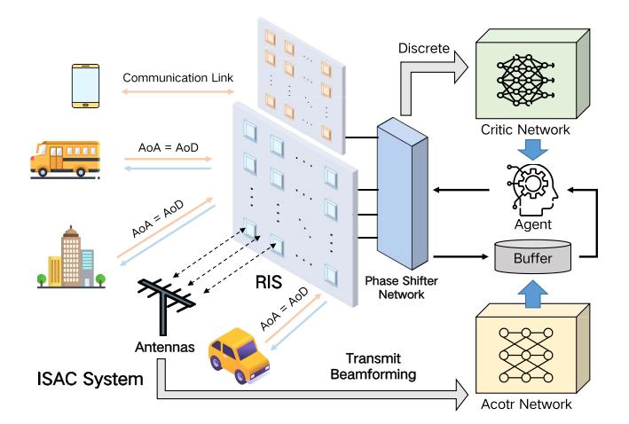

Fig. 5. Reinforcement learning-based RIS in ISAC system.

scenarios in a buffer enables adaptive optimization, resulting in better waveform performance while simplifying the design process.

#### *C. Hardware Layer Security*

*1) Information Theoretic Security:* It employs signal processing techniques to increase the capacity difference between legitimate and eavesdropping links based on the channel characteristics at the physical layer. This ensures that legitimate users can transmit with arbitrarily small error probabilities, while eavesdroppers (Eves) remain unable to obtain any useful information.

In our proposed architecture, hardware layer security concerns encompass various scenarios where different approaches address security based on available information. With a complete CSI, the security rate becomes crucial for communication confidentiality assessment. Algorithms like alternating optimization and block coordinate descent (BCD) maximize secrecy rate (SR), ensuring communication safety. For example, in [\[94\]](#page-30-33), BCD and minorization-maximization (MM) algorithms tackle non-convex problems in IRS scenarios, enhancing ISAC security through optimized beamforming and IRS phase shifts. With partial CSI, various error models, such as boundary and statistical models are utilized. In [\[92\]](#page-30-34), for multi-user MISO systems with IRS assistance, semidefinite relaxation, and successive convex approximation methods are applied, emphasizing distributed IRS deployment's superiority under Eves' QoS limitations. When CSI is unknown, optimizing based on SR is infeasible. Signal outage probability assesses security interruption performance by analyzing statistical characteristics. Alternatively, maximizing interference power while meeting legitimate users' QoS diminishes Eve's communication quality [\[91\]](#page-30-35), [\[103\]](#page-31-3).

Although research on IRS-assisted hardware layer security has become increasingly mature, there are still some deeper challenges, such as the deployment of the IRS, channel estimation, and the collaboration of multiple IRS. In large-scale secure communication networks with numerous legitimate users and Eves, the deployment strategy of the IRS significantly impacts the construction of all reflective channels in the system. And it's also a crucial factor in maximizing the system's secure throughput.

*2) Sensing Assisted Interference:* Due to wireless channels' broadcast nature and shared spectrum usage, integrated S&C networks face eavesdropping and impersonation risks. Eavesdropping involves unauthorized interception or monitoring of communication signals, compromising the privacy of sensing targets and potential Eves. Unlike traditional systems, communication-assisted sensing fusion systems exhibit strong signal directionality [\[104\]](#page-31-4), increasing the risk of data leakage. Broadcast nature and strong directionality heighten compromise risks, especially threatening privacy. Thus, information security risks escalate in integrated S&C networks. Security measures at the hardware level are crucial to address these challenges. Leveraging differences in CSI between legitimate and eavesdropping links, these measures create secure transmission schemes to reduce eavesdropping risks and enhance data confidentiality. Integrating such measures is imperative to mitigate vulnerabilities in wireless communication [\[105\]](#page-31-5).

The S&C network can obtain the CSI or angles of Eves. It is possible to transmit artificial noise (AN) in the null space of the main channel to confuse Eves. In [\[79\]](#page-30-36), the authors optimized Eve's SNR and maintained it above a threshold to ensure the secrecy rate, i.e., transmission confidentiality, of the integrated radar communication system. To ensure sensing capabilities, a joint design of communication beamformers and AN was implemented to generate radar beam patterns matching the required beam patterns for radar detection. To avoid redundant power consumption caused by AN, directional modulation, as an emerging efficient transmission technology, can be utilized to enhance the security of integrated S&C networks. It operates on the principle of constructive interference, aiming to adjust the phase and amplitude of symbols at the legitimate user's location while disrupting signals in the direction of unauthorized users [\[106\]](#page-31-6), [\[107\]](#page-31-7), [\[108\]](#page-31-8).

To summarize, AI demonstrates significant potential for enhancing the hardware layer security performance of nextgeneration wireless communication systems. The precise sensing capabilities of integrated S&C networks, which incorporate RIS and CSI, can distinguish between legitimate users and Eves, enabling the acquisition of relevant parameters. These sensed parameters can serve as invaluable training data, enhancing the resilience of AI models against malicious eavesdropping attacks. On the other hand, well-trained AI models can reciprocally assist transmitters by adaptively adjusting perceptual strategies, such as beamforming and phase shifts, to optimize the performance of RIS and CSI. This bidirectional interaction significantly improves the efficiency of secure transmissions and ensures secure waveform design. However, ensuring the confidentiality of AI models necessitates continuous training through parameter updates, demanding substantial data volumes. Therefore, effective data encryption, authentication, and traceability are crucial to safeguarding user data privacy in AI-based wireless communication systems.

For the newly defined hardware layer, the ISAC transmitter detects the target's arrival of angle (AoA) and infers the its position by assessing the received signal strength. This bidirectional channel allows estimating eavesdropping channels from the ISAC transmitter to the target. Various security methods, including secure beamforming, artificial noise, and cooperative interference, use eavesdropping channels or target AoA to suppress the attacker's location SNR and ensure the legitimate user's SINR, enhancing secrecy rates. Secure waveform optimization aims to suppress the target's received SNR while meeting SINR requirements for legitimate users and aligning the generated beam with the desired perceptual pattern. Accurate perception of the target's position yields a narrower beam pattern, manipulated with actively acquired location data to enhance secrecy rates by suppressing Eve's SNR. Conversely, partial target perception leads to a broader beam pattern, diminishing the power gain of the main beam. Additionally, suppressing the sum of SINRs within the angular range of the target's possible positions achieves a heightened secrecy rate, even with only statistical knowledge of legitimate user channels. A hardware-efficient secure ISAC technique, based on directional modulation, employs parasitic antennas as primary components. Symbol modulation occurs at these antennas, aided by legitimate user CSI. The received beam pattern by legitimate users is construed as spatial constellation points. Although the constructed signal of legitimate users may not match the desired symbol precisely, it can be redirected from demodulation thresholds based on a constructed interference region concept. Intentionally positioning symbols received by attackers within the disruptive region of demodulation, based on actively gathered attacker information, further impedes interception at the symbol level by attackers.

# IV. OMNISCIENT LAYER: SOFTWARE-DEFINED COMMUNICATION BASED-AI

In this section, we will provide a detailed overview of the omniscient layer, which serves as the core component of the proposed framework. We will delve into the omniscient layer from three perspectives: the novel ISAC architecture, software-defined communication, and the omniscient layer security. By exploring these aspects, we aim to provide comprehensive insights into the significance and functionality of the omniscient layer within ISAC.

## *A. ISAC Architecture*

*1) Intelligent Controllable Antenna Array:* Wang et al. [\[34\]](#page-29-24) proposed a hybrid 3D beamformer for THz multi-user MIMO systems with RIS, integrating sensor-based beam training and channel estimation. The joint subarray-based architecture supports spatial multiplexing, and closed-form expressions for near-field and far-field path loss are derived. Ultra-wide bandwidth sensors in the RIS enhance channel estimation. The study introduces optimal beamforming schemes and a precise algorithm to overcome positioning errors. Huo et al. [\[122\]](#page-31-9) explored RIS-assisted wireless communication in the THz domain, using 3D ray-tracing for realistic indoor THz propagation. Ma et al. [\[123\]](#page-31-10) focused on IRS for controlling radio propagation, introducing a 3D one-cylinder model and a novel method for designing IRS phase shifts to optimize wireless channels. The authors derive channel impulse response, space-time correlation function, and channel capacity, effectively mitigating multipath and Doppler effects.

Intelligent controllable antenna arrays, integrating MIMO, RIS, and the Doppler effect, emerge as a transformative technology for modern wireless communication systems [\[96\]](#page-30-37), [\[124\]](#page-31-11), [\[125\]](#page-31-12). This advanced approach leverages MIMO techniques to enhance spectral efficiency and data rates by exploiting spatial diversity. The addition of RIS further enables dynamic control of the propagation environment, optimizing signal reflections, and enhancing coverage. By considering the Doppler effect, the antenna array can mitigate the impact of movement-induced frequency shifts, ensuring more stable and reliable communication in dynamic scenarios. This integrated system maximizes channel capacity, reduces interference, and improves overall communication performance, making it well-suited for 6G and future wireless networks, IoT applications, and radar systems.

*2) Beamforming:* Yu et al. [\[126\]](#page-31-13) proposed a semi-passive IRS-based ISAC framework for multi-user localization and communication. They introduce a unique transmission protocol with separate periods for communication and localization, employing novel beamforming algorithms effective with discrete phase shifts. A multi-user location sensing algorithm eliminates the need for dedicated positioning reference signals. Zhou et al. [\[127\]](#page-31-14) investigated the potential of IRS for massive MIMO-like gains via passive reflection elements. The IRS adjusts reflection coefficients to reconfigure the signal propagation environment, enhancing desired signals or suppressing interference. The focus is on downlink multigroup multicast communication systems aided by an IRS. Their objective is to maximize the sum rate of all multicasting groups by jointly optimizing the precoding matrix at the base station and the IRS reflection coefficients, adhering to power and unit-modulus constraints. Liu et al. [\[35\]](#page-29-25) addressed ISAC challenges in V2I networks using HCL-Net, a convolutional LSTM network, devising an unsupervised predictive beamforming framework to enhance sum rate without explicit channel tracking. HCL-Net learns spatial and temporal dependencies, improving predictive beamforming in ISAC-based V2I networks.

In 6G wireless communication, beamforming technology is important in enabling directional signal transmission and reception [\[109\]](#page-31-15), [\[120\]](#page-31-16). Its evolution and broad applications are evident in various advancements. Traditional techniques like digital and analog beamforming are widely used in MIMO systems, enhancing data rates and spatial diversity. Moreover, beamforming has adapted to diverse scenarios, including vehicular networks, mmWave communication, and radar systems. Researchers explore adaptive beamforming methods, leveraging AI and machine learning to optimize performance in dynamic environments [\[121\]](#page-31-17), as outlined in Table [VII.](#page-14-0)

We propose a learning-based joint predictive approach to forecast the beamforming matrix directly using historical channel information, eliminating the need for explicit channel prediction and beam training, as shown in Fig. [6.](#page-14-1) Given CSI as input data, the conventional scheme includes pilot training, CSI feedback, and hybrid precoding, augmented by LSTM training. Initially, the transmitter sends pilot signals

| AI Methods                                           | Technical Features                                                                                                                                                                   | Performance Enhancements                                                                                                                                                 | Advantages                                                                                                                                                     | Disadvantages                                                                                                                                                 | Hardware Cost | Computational Complexity | Signal Trans- mission Delay | Flexibility | Training Time | Model Complexity |
|------------------------------------------------------|--------------------------------------------------------------------------------------------------------------------------------------------------------------------------------------|--------------------------------------------------------------------------------------------------------------------------------------------------------------------------|----------------------------------------------------------------------------------------------------------------------------------------------------------------|---------------------------------------------------------------------------------------------------------------------------------------------------------------|------------------|-----------------------------|--------------------------------|-------------|------------------|---------------------|
| Deep Learning [35], [109]                            | Utilizes deep neural networks to predict optimal beamforming vec- tors, capable of handling high- dimensional data and complex mappings between inputs and out- puts. | Significantly improves beamform- ing accuracy and robustness in dynamic environments, capable of real-time processing and adaptation to changing conditions. | High accuracy in complex scenar- ios, ability to learn and generalize from vast amounts of data, can handle non-linear relationships.                 | Requires large datasets for train- ing, high computational cost for both training and inference, poten- tial overfitting with limited data.          | Medium           | High                        | Low                            | Medium      | Long             | High                |
| Reinforcement Learning [56], [98], [99]              | Uses agents that learn to make beamforming decisions through trial and error, utilizes reward signals to optimize actions over time.                                     | Enhances adaptability and perfor- mance in varying conditions, capa- ble of learning optimal policies for dynamic environments.                                 | Adaptive learning that improves over time, can optimize long- term performance through cumula- tive rewards, suitable for complex decision-making. | May require extensive training time and large numbers of interactions, stability issues during training, sen- sitivity to reward design.             | Medium           | High                        | Medium                         | High        | Long             | High                |
| Transfer Learning [110]                              | Applies knowledge from pre-trained models to new beamforming tasks, leverages existing models to reduce training time and data requirements.                             | Reduces training time and im- proves performance with limited data, allows rapid deployment in new scenarios.                                                   | Efficient use of pre-existing mod- els, reduces need for large datasets, accelerates model development and deployment.                                | Potential issues with model trans- ferability, risk of negative transfer if source and target domains are too different.                             | Medium           | Medium                      | Medium                         | High        | Short            | Medium              |
| Generative Adversar- ial Networks [111], [112] | Generates synthetic data to aug- ment training datasets for beam- forming, consists of a generator and discriminator in a competitive setting.                           | Improves beamforming model training with enhanced data diversity, can create realistic and varied training examples.                                                     | Enhances training data, improves model generalization, mitigates overfitting by providing diverse data samples.                                       | Training complexity, potential for mode collapse where the generator produces limited variety, high com- putational resources required.              | High             | High                        | Medium                         | Medium      | Long             | High                |
| Meta-Learning [113]                                  | Learns to adapt beamforming strategies quickly based on limited data, trains models to become proficient at learning new tasks rapidly.                                  | Enhances rapid adaptability to new environments or scenarios, en- ables efficient learning from small datasets.                                                 | Fast adaptation to new tasks and environments, efficient use of small datasets, improves performance in few-shot learning scenarios.                  | May require sophisticated model design and careful tuning, potential challenges in generalizing to very different tasks.                             | Medium           | Medium                      | Low                            | High        | Short            | Medium              |
| Federated Learning [114], [115]                      | Utilizes decentralized data from multiple sources to train beam- forming models collaboratively, preserves data privacy by keeping data local.                           | Enhances privacy and leverages di- verse data without centralized col- lection, improves model perfor- mance through collaborative learn- ing.               | Improves data privacy, leverages data from multiple sources, en- hances model robustness through diverse training data.                               | Communication overhead between devices, potential for model in- consistencies due to data hetero- geneity, requires secure aggrega- tion methods. | Medium           | High                        | Medium                         | High        | Medium           | High                |
| Bayesian Optimization [116]                       | Applies probabilistic models to optimize beamforming parameters, uses prior knowledge and uncer- tainty to guide the search process.                                        | Efficiently searches the parameter space to find optimal configura- tions, provides uncertainty quantifi- cation for better decision-making.                    | High efficiency in parameter opti- mization, quantifies uncertainty for robust decisions, suitable for black- box optimization problems.              | Computationally intensive, may re- quire complex models and signifi- cant computational resources, sen- sitivity to the choice of prior.             | Low              | Medium                      | Medium                         | Medium      | Medium           | Medium              |
| Support Vector Ma- chines [117]                   | Classifies beamforming scenarios by finding the optimal hyperplane, effective for high-dimensional spaces.                                                                  | Enhances accuracy of beamform- ing decisions in well-defined sce- narios, robust to overfitting.                                                                   | Effective in high-dimensional spaces, robust to overfitting, works well with clear margin of separation.                                                       | Not suitable for large datasets, re- quires careful tuning of parameters, less effective in noisy data.                                                 | Medium           | Medium                      | Medium                         | Medium      | Medium           | Medium              |
| K-Nearest Neighbors [118]                         | Classifies beamforming options based on similarity to k-nearest neighbors, simple and intuitive method.                                                                     | Improves beamforming accuracy in scenarios with well-defined clusters, simple implementation.                                                                            | Simple and intuitive, effective in well-defined clusters, non- parametric.                                                                               | Computationally expensive for large datasets, sensitive to irrelevant features and data scaling.                                                              | Low              | High                        | Medium                         | Low         | Short            | Low                 |
| Evolutionary Algorithms [119]                     | Optimizes beamforming by mim- icking natural evolutionary pro- cesses, explores a wide search space for solutions.                                                          | Enhances exploration of optimal beamforming strategies, effective in complex and dynamic environ- ments.                                                        | Effective in exploring large search spaces, adaptable to changing environments, finds global optima.                                                           | Computationally intensive, may converge slowly, requires careful parameter tuning.                                                                            | Medium           | High                        | High                           | Medium      | Long             | Medium              |
|                                                      | Combines neural networks                                                                                                                                                             |                                                                                                                                                                          | Can discover novel architectures                                                                                                                               |                                                                                                                                                               |                  |                             |                                |             |                  |                     |

ness, suitable for dynamic environments. High computational cost, complexity in implementation, requires large computational resources.

TABLE VII
COMPARISON OF DIFFERENT AI METHODS ENHANCING BEAMFORMING PERFORMANCE

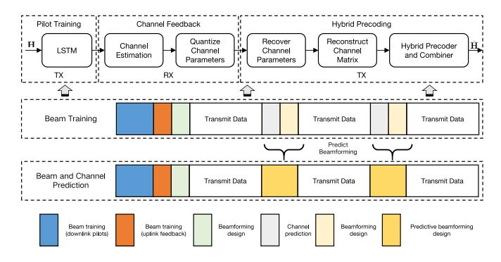

Fig. 6. Deep learning-based beamforming prediction.

through the analog precoder, and the receiver collects and combines the signals using the analog combiner, resulting in the received signal matrix for channel matrix H estimation. Subsequently, the receiver quantizes the estimated CSI into feedback bits and sends them back to the transmitter. Upon receiving the feedback bits, the transmitter reconstructs the estimated channel matrix H and designs the hybrid precoders and combiners. During the pilot training phase, the transmitter sends precoded pilot signals, the receiver estimates the channel, and the quantized CSI is fed back to the transmitter. In this phase, LSTM networks can be trained to predict future channel states based on historical CSI data, enhancing the accuracy and robustness of channel estimation. In the hybrid precoding design phase, the transmitter reconstructs the channel using the feedback CSI and designs the precoders and combiners to minimize the bit-error rate. This process optimizes system performance by reducing CSI feedback overhead, lowering hardware complexity, and decreasing power consumption. Therefore, this scheme enables efficient channel estimation based on LSTM and precoding design by the analog and digital techniques [128].

Medium

High

3) Information Theory-Centric: Xiong et al. [135] studied a P2P ISAC model with vector Gaussian channels, using the CRB-rate region to illustrate the sensing-communication tradeoff. Their setup involved a dual-functional ISAC transmitter emitting a unified waveform for both tasks, requiring randomness for communication and serving as a reference signal for sensing. They treated the ISAC waveform as a known but random parameter and defined a Miller-Chang CRB to analyze sensing performance. The CRB for estimating channel coefficients h is denoted as C(h), representing the achievable rate points  $(R_c, R_s)$  that satisfy the following inequality:

$$C(h) \preceq \begin{bmatrix} \frac{1}{R_c} \mathbf{I} & \mathbf{0} \\ \mathbf{0} & \frac{1}{R_s} \mathbf{I} \end{bmatrix},$$
 (8)

where  $\leq$  denotes the matrix inequality, **I** is the identity matrix,  $R_c$  is the communication rate, and  $R_s$  is the sensing rate. The CRB is a lower bound on the variance of any unbiased estimator for the unknown parameters. It quantifies the best possible accuracy with which the parameters can be estimated based on the received signal. And it is also influenced by the properties of the noise, and the transmitted signal [136].

Radar cross section (RCS) quantifies the reflected signal intensity of a target when exposed to electromagnetic waves [137]. The detectable scattered energy depends on the

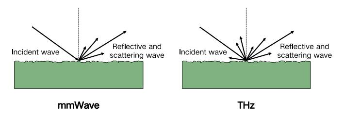

Fig. 7. Different waves on the rough surface.

effective area, determined by the target's shape, size, and surface roughness, as well as the incident electromagnetic wave's frequency, polarization, and angle. RCS can be classified as mono-static or bi-static based on the positions of the transmitter and receiver. Electromagnetic waves of varying frequencies encounter diverse surface roughness as shown in Fig. [7.](#page-15-0) In mono-static, both are at the same location, while in bi-static, they are at different positions. The reflection characteristics of mmWaves on surfaces are influenced by the environment, adding complexity to their integration with AI. This complexity presents challenges in overcoming issues related to data processing, model accuracy, and real-time responsiveness.

In summary, when a signal passes through a rough surface, it undergoes multiple paths of propagation due to scattering effects, resulting in multiple incident and exit angles in space [\[138\]](#page-31-22). These multipath propagation and scattering effects can be captured and adjusted by the RIS, thereby optimizing target sensing and communication performance. By precisely designing the reflection coefficients of the RIS, scattered signals can be directed in specific directions, enhancing target sensing accuracy. At the same time, the RIS can suppress unwanted interference signals, improving the SNR and communication quality of ISAC.

#### *B. Software-Defined Communication*

*1) Coordinated Multiple Points:* Huang et al. [\[129\]](#page-31-23) proposed a system where distributed ISAC transmitters send messages to communication users while collaborating with sensing receivers to estimate target locations. Their research focuses on coordinated power control among ISAC transmitters to minimize total transmit power, meet SINR constraints at communication users, and achieve the maximum CRLB for target location estimation. Despite the non-convex nature of the problem, the authors present two efficient algorithms based on semi-definite relaxation and CRLB approximation. Zhu et al. [\[93\]](#page-30-38) proposed a system to optimize the CRB of multiple targets' parameters for communication throughput. They utilize weighted MSE minimization and semidefinite relaxation techniques to develop an algorithm, achieving a Karush-Kuhn-Tucker point. Reformulating the problem as a min-max form with simple constraints, they efficiently solve it using first-order min-max optimization algorithms. This method transforms the initial non-convex problem into a series of convex problems, suitable for optimizing resources across multiple cells within a wireless cellular network.

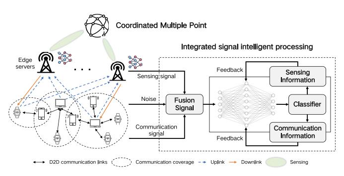

Fig. 8. Multi-point collaborative S&C framework.

In our approach to intelligent IoT connectivity (Fig. [8\)](#page-15-1), we integrate multi-point cooperation with edge servers, optimizing communication and sensing efficiency. This collaborative framework involves nodes and edge servers working harmoniously. In the uplink, IoT devices efficiently transmit data, sensor information, and perception data to edge servers for swift processing. Leveraging their robust computing and storage capabilities, edge servers employ sophisticated algorithms and machine learning models, enabling intelligent data analysis and decision-making support. Conversely, the downlink link relays processed data, instructions, and intelligent decisions from edge servers back to IoT devices, facilitating task execution and interactive communication among devices and nodes, and fostering intelligent collaboration. Machine learning is utilized to train a noise classifier for signal separation, improving the accuracy of S&C capabilities as listed in Table [VIII.](#page-16-0) Intelligent signal processing and analysis empower the IoT system to adapt effectively to diverse environmental conditions and complex network settings, ultimately achieving advanced data transmission and sensing capabilities.

*2) Large Connection-Oriented in IoT:* In 6G networks, the proliferation of IoT devices such as sensors and robots requires precise perception and positioning information to enable intelligent operations and management. For the large-scale connected sensing architecture, the challenge goes beyond merely sensing the physical environment of target nodes. It also necessitates the fusion of perception information with digital data, which conventional wireless sensor networks struggle to fulfill. ISAC technology offers a solution by enabling both sensing and communication functionalities using the same signal, thus bridging the gap in traditional wireless sensor networks and achieving a tight coupling between the physical and digital spaces of nodes [\[139\]](#page-31-24).

In Fig. [9,](#page-16-1) the large-scale connected sensing architecture necessitates numerous heterogeneous sensors for comprehensive and accurate target perception, vital for precise decision-making. Despitebenefitingfromabundantheterogeneousperceptiondata, it poses two critical challenges. Highly connected scenarios often encounter data collisions and interference, exacerbated by sensing signals. Effective IoT device process scheduling, accuracy balancing, redundancy minimization, and suitable node selection are crucial. Strategies like ISAC and AirComp integration (Air-ISCC) optimize air interface use, reduce interference, and enhance system performance. Li et al. propose ISAC for dual-functional signals, improving IoT efficiency [\[32\]](#page-29-22). Air-ISCC

| Method                                         | Optimization Objectives                                | Advantages                                                                                         | Limitations                                                                   | Applicable AI Techniques                                                                  |
|------------------------------------------------|--------------------------------------------------------|----------------------------------------------------------------------------------------------------|-------------------------------------------------------------------------------|-------------------------------------------------------------------------------------------|
| Distributed cooperative communication [129]    | Improve energy efficiency, enhance spectral efficiency | Enhanced cooperation among nodes     Efficient energy utilization     Improved spectral efficiency | High hardware requirements     Complex coordination                           | Reinforcement learning, collabo- rative filtering, evolutionary algo- rithms        |
| Joint beamforming [86], [120]                  | Optimize energy and spectral effi- ciency           | Enhanced energy optimization     Improved spectral efficiency                                      | Requires accurate channel information                                         | Deep learning, genetic algorithms, simulated annealing                                    |
| Collaborative spectrum sensing [130], [131]    | Maximize spectrum utilization, minimize interference   | Efficient spectrum utilization     Minimized interference                                          | Sensitive to network topology                                                 | Reinforcement learning, deep learning, genetic algorithms, fuzzy logic              |
| Multiple antenna techniques [93], [132], [133] | Increase spectral efficiency, expand coverage          | Enhanced spectral efficiency     Expanded coverage                                                 | Requires numerous antennas     High cost                                      | Deep learning, genetic algorithms, simulated annealing, particle swarm optimization |
| Dynamic point coordination [49]                | Optimize system reliability, reduce latency            | Improved system reliability     Reduced latency                                                    | Requires advanced hardware     May increase computational complexity          | Machine learning, reinforcement learning, collaborative filtering                         |
| Adaptive range                                 | Minimize energy consumption, op-                       | Reduced energy consumption                                                                         | Limited control in dynamic environments     May have communication range con- | Machine learning, evolutionary al-                                                        |

TABLE VIII SUMMARY APPROACHES BASED ON COORDINATED MULTIPLE POINTS

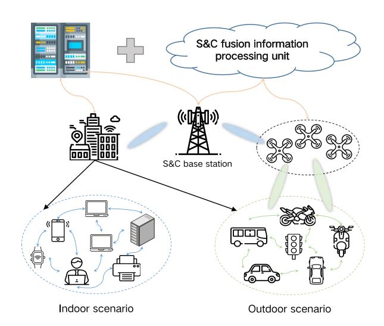

Fig. 9. Large connection-oriented S&C in IoT.

enablessimultaneoussensing,communication,andcomputation, enhancing spectrum efficiency and reducing latency. Conversely, diverse access in large-scale networks integrates sensing data, enhancing processing efficiency and supporting smart decisionmaking. However, fusing multidimensional sensing information effectively remains challenging due to varied IoT device structures and functions [\[140\]](#page-31-25). Optimal sensing data selection for fusion is vital for improved sensing performance. ISACoT, proposed by Chen et al., extends IoT devices in various aspects: time, frequency, space, and protocol[\[141\]](#page-31-26). Emphasizing monostatic sensing, they initially focus on the WiFi time aspect, proposing solutions and experiments.

Given the above, the performance of large-scale IoT sensing can be enhanced by leveraging the powerful sensing capabilities of base stations. Within this model, collaborative nodes dynamically deploy sensing capabilities through distributed transmission and processing, while data fusion reduces measurement uncertainty, thereby improving sensing performance. Sensing tasks can be reasonably allocated among multiple nodes or shared among them, aiming to reach a consensus on the surrounding environment.

*3) Pareto Optimization:* It is also known as multi-objective optimization, a method that addresses the optimization of multiple conflicting objectives simultaneously. The primary goal is to identify a set of solutions known as the Pareto front, where no other feasible solution can enhance one objective without compromising at least one other objective. These solutions showcase the optimal trade-offs between different objectives, offering decision-makers a range of choices based on their preferences. Combining Pareto optimization with AI provides more efficient resource allocation and optimizes multiple objective functions, enabling adaptation to complex and dynamic communication environments and enhancing network reliability and security.

Gao et al. [\[49\]](#page-29-39) investigated the CoISAC system, which employs a rate-splitting multiple access transmission scheme to manage interference and enhance precise localization sensing. The system's achievable performance region, considering both the sum rate of communication users and the positioning accuracy of radar targets, is defined through Pareto optimization. The CoISAC system addresses communication and radar-centric optimization problems to establish the optimal boundary. Chen et al. [\[142\]](#page-31-27) introduced a dualfunctional radar communication approach and proposed a Pareto optimization framework for multi-antenna systems. Their framework defines an achievable performance region based on the radar's spatial beam pattern and the communication user's SINR, solving a fairness-profile optimization problem to achieve the Pareto boundary. Ren et al. [\[133\]](#page-31-28) focused on the Pareto boundary in a multi-antenna multicast ISAC system, addressing the CRB-constrained multicast rate maximization problem. They derived an optimal solution using Lagrange duality methods, shedding light on the trade-offs between estimation accuracy and data rates and contributing to effective system optimization.

In general, combining SDC with ISAC creates a versatile and programmable communication system. Integrated with Pareto optimization, multi-point cooperation, and largescale IoT applications, it enhances system performance [\[143\]](#page-31-29). SDC dynamically adjusts communication parameters and resources based on sensing needs and network conditions, boosting adaptability. Pareto optimization balances multiple performance metrics, finding optimal trade-offs [\[144\]](#page-32-0), [\[145\]](#page-32-1). Multi-point cooperation fosters collaboration and information sharing among nodes and base stations, enhancing system efficiency. Optimized ISAC for large-scale IoT, combined with big data analytics and AI, achieves intelligent sensing and decision-making. These methods innovate ISAC technology by constructing flexible, efficient communication systems for superior performance across diverse applications.

#### *C. Omniscient Layer Security*

*1) Attack Detection:* For ISAC networks, ensuring system integrity and security is crucial, and this is achieved through the implementation of intrusion detection systems, network traffic analysis, and user/entity behavior analysis. Specifically tailored for ISAC, intrusion detection systems not only monitors conventional network intrusions but also examines sensor and wireless communication activities, promptly alerting to potential data tampering or spoofing attempts. Concurrently, sophisticated network traffic analysis and pattern recognition distinguish normal communication from anomalies, enabling the swift identification of unauthorized access or information leakage. User and entity behavior analysis, which monitors a variety of network entities, detects deviations from established norms and signals potential threats, particularly unauthorized access or abnormal data transmissions. By integrating these components, a robust security framework is established for the ISAC system, ensuring enhanced resilience and safety in dynamic environments [\[146\]](#page-32-2), [\[147\]](#page-32-3).

Sedjelmaci et al. [\[148\]](#page-32-4) proposed a hierarchical attack detection framework for 6G IoV, leveraging federated learning and non-cooperative gaming to train attack models and enhance detection. Cooperative detection involving security entities, IoV devices, edge servers, and SIEM improves accuracy. To bolster security, they introduce a robust Stackelberg security game to identify malicious devices and servers. Additionally, a dynamic zero trust architecture based on non-cooperative game theory further enhances security [\[149\]](#page-32-5). In another study [\[56\]](#page-30-2), IoT device security is reinforced using advanced botnet detection methods and gini impurity (GI)-based pattern selection within a machine learning framework, significantly improving threat identification and mitigation capabilities. The GI score can be represented by

$$Gini(D) = 1 - \sum_{c=1}^{k} p_c^2,$$
 (9)

where *D* is the dataset, *k* is the number of classes contained in the dataset and *pc* is the probability. GI can be used to select the most important feature set, thereby determining which features are crucial for attack detection.

AI can process extensive and complex datasets, swiftly identifying potential threat patterns from enormous information repositories, which greatly improves the effectiveness of attack detection. Additionally, AI autonomously learns and adjusts to emerging attack patterns, consistently strengthening a system's defense mechanisms and ultimately enhancing the longterm security of the omniscient layer. Nonetheless, malicious entities could employ adversarial generative networks like the generative adversarial network, attempting to deceive AI models. This manipulation might result in false positives or negatives within the detection system.

*2) Moving Target Defense:* It involves periodically resetting systems to add dynamism and unpredictability to traditional static networks. Introducing this randomness, raises the difficulty of prediction and attack, weakening attackers' inherent advantage in conventional network security. As a result, the S&C information collected by attackers becomes quickly outdated, extending their attack timelines and increasing operational costs, ultimately enhancing the reliability of S&C networks.

Zhang et al. [\[31\]](#page-29-16) proposed a collaborative mutation-based MTD within the dynamic targeted mutation network. It focuses on host address mutation and route mutation strategies, adjusting network properties, and disrupting various stages of the cyber kill chain. Employing a Semi-Markov decision process (SMDP), the research models dynamic security events and the deployment of multiple MTD schemes. Security event prediction using LSTM serves as network states in the SMDP. In [\[134\]](#page-31-30), the authors utilize an MDP to represent dynamic service function chain arrivals and departures. To streamline the decision-making process, its deployment is formalized as a constrained satisfaction problem, and a deep reinforcement learning algorithm called model-based adaptive proximal policy optimization is designed. It combines the mechanisms of clipped surrogate objectives, ensuring stability during the learning process while gradually optimizing the policy over the long term. This enables the agent to learn better behavioral strategies in complex environments.

*3) SSL and TLS:* For the ISAC system, secure sockets layer (SSL) and its successor, transport layer security (TLS), stand out as critical cryptographic protocols employed to address security challenges. Particularly within the ISAC framework, SSL/TLS provides essential mechanisms for ensuring the confidentiality, integrity, and authentication of data exchanged between sensing nodes and communication endpoints. It is especially relevant in scenarios like healthcare or military applications, where the transmission of sensitive information is commonplace.

At the application layer, SSL/TLS provides several key security benefits. Firstly, it facilitates end-to-end encryption, offering protection against eavesdropping and unauthorized access. This encryption is vital for preserving the confidentiality of data during transmission, ensuring that sensitive information remains secure. Additionally, it incorporates mechanisms for verifying data integrity, ensuring that the data received accurately represents the information generated by sensing nodes. Authentication of both sensing nodes and communication endpoints is achieved through digital certificates issued by trusted certificate authorities, enhancing the overall trustworthiness of the communication channels. Moreover, it acts as a safeguard against man-in-the-middle attacks, a crucial aspect in environments where the integrity of transmitted data is paramount. Tailoring security measures to the specific needs and characteristics of the ISAC system, SSL/TLS applied at the application layer effectively addresses the unique challenges posed by integrated sensing and communication scenarios. Therefore, combining SSL/TLS with the ISAC system to establish a robust and secure communication framework is adept at mitigating a range of security concerns and ensuring the trustworthiness of the entire network.

To summarize, the omniscient layer centers around software-defined communication that revolutionizes traditional communication and network architectures. It employs software transformations, dynamic platforms, and network property transformations to enhance security [\[150\]](#page-32-6). Through these techniques, the omniscient Layer dynamically adjusts network functions, adapts to changing environments, and responds swiftly to network events and attacks. Additionally, its integration with AI opens new opportunities, enabling intelligent network management and security monitoring. AI algorithms analyze vast network data, swiftly detect potential threats, and implement countermeasures, ensuring efficient protection in complex and evolving network environments.

Within the framework of software-defined communication, artificial noise is introduced to disrupt potential eavesdroppers and attackers. This noise can be dynamically adjusted in strength and spectral distribution to align with real-time security requirements. Before initiating communication, secure protocols like SSL/TLS are employed for session initialization and key exchange. These protocols offer encryption and authentication mechanisms, ensuring the confidentiality of identities and data exchange between communicating parties. Furthermore, an end-to-end AI encryption mechanism is deployed to optimize encryption algorithms and key management, striking a balance between security and performance requirements to enhance overall system security and efficiency. During the communication phase, joint optimization precoding techniques are employed to enable beamforming while ensuring only authorized recipients can recover the original information, thereby enhancing communication confidentiality. Moreover, a dynamic programming strategy for continuous interference cancellation sequencing can be considered. Here, secure users decode and remove interference signals first, followed by demodulating residual information based on the non-orthogonal multiple access principle, ensuring only authorized recipients can correctly decode the information. Additionally, monitoring network traffic and system logs, adopting rule-based and statistical model attack detection techniques to identify malicious activities, and combining them with moving target defense to periodically change ISAC network key configuration attributes, topology, etc., to prevent attackers from performing static analysis and launching attacks on the system.

# V. APPLICATION LAYER: SUPER-INTELLIGENT AGENT MAKES EVERYTHING CLOSER

In this section, we will present the concept of super intelligent agent and its responsibilities at the application layer. We will introduce AI-empowered networks, the multi-modal intelligent connectivity, application layer security, and also summarize the application scenarios of ISAC.

#### *A. AI-Empowered Networks*

*1) Macro-Micro Base Station:* In the future of network development, the coexistence of macro and micro base stations is becoming standard. Their collaborative sensing enhances wireless resource utilization and overcomes obstacles between sensors and sensed entities. Macro base stations, situated at elevated positions, broaden perception by performing wide-area sensing, leveraging their higher installation and power. Simultaneously, micro base stations support macro cells in specific sensing tasks, delivering precise coverage for indoor spaces like homes and offices. This approach reduces sensing distances, conserves power, and ensures accurate sensing. By intelligently assigning sensing tasks across various base stations, the network adeptly navigates obstacles, achieving precise and reliable perception in intricate environments. Furthermore, the perception results of macro and micro base stations can complement each other, detecting the macroscopic and microscopic parameters of their respective perception areas. These results can be simultaneously transmitted to the perception unit in the core network for merging and processing, achieving better perception effectiveness.

Xu et al. [\[52\]](#page-29-42) presented a novel approach to ISAC systems, enabling collaborative sensing by multiple sensing nodes, such as base stations, in contrast to conventional radar systems. The proposed method aims to fully utilize macro-diversity gain, addressing the limitations of existing works that assume designated BSs as sensing nodes. To overcome this, the authors propose a joint design encompassing BS selection, user association, and beamforming. And an alternating optimization-based algorithm is proposed to minimize total transmit power, measured by the SINR and CRLB. Xie and Song [\[73\]](#page-30-39) proposed a two-stage protocol that estimates echoes from communication signals in the clutter estimation stage and then utilizes this information for interference management in the target sensing stage. It is used to reduce communication workload, they present a distributed model-driven deep-learning algorithm using partially sampled data for clutter estimation. It leverages multiple sensing nodes' perspectives, benefiting from macro-diversity, array gain, and higher angular resolution.

For the above-mentioned research, the networked collaboration of macro and micro base stations requires coordination of inter-cell interference, sensing interference, and communication-sensing interference. The investigation includes the impact of interference on node random access, beam management, and data transmission, as well as its effects on base stations for object sensing, velocity estimation, user beam tracking, and switching. Instead of considering it a harmful factor to resist or eliminate, this valuable information can be utilized to enhance sensing performance.

*2) Core Network:* To further enhance the ubiquitous computing capability of the computational network and achieve an on-demand allocation of computational resources in various scenarios of 6G, this paper proposes a novel ISAC network frame, consisting of three parts: terminals, edge network, and core network, as shown in Fig. [10.](#page-19-0)

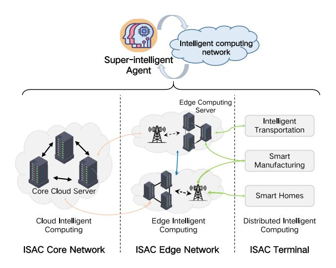

Fig. 10. ISAC network frame.

The terminal, with diverse intelligent devices, swiftly handles tasks like topology construction and medium access control, forming self-organizing networks. By integrating environmental perception data, it optimizes resource allocation and routing for improved performance. Utilizing intelligent computing, terminals make real-time decisions, enhancing communication network efficiency. The multilayer perceptron (MLP) can be used here, which is given by

$$y_j^{(k)} = MLP_2(x_i^{(k-1)}, max(MLP_1(x_j^{(k-1)}, e_{j,i}))), (10)$$

where *x* is the hidden state, and *ej*,*i* represents a vector or a set of values associated with the interaction between entities *j* and *i*. In the edge network, base stations and mobile edge computing servers play crucial roles. Base stations, equipped with ISAC technology, enable communication and environmental perception among terminals. They engage with terminals, receiving perception data from various sensors within their coverage area. This data undergoes local fusion and processing, allowing for localized control and optimizing communication efficiency.

At the core network level, a cluster of powerful core cloud servers integrates data from intelligent modules and edge networks. These servers fuse perception data over a wide area, creating a comprehensive cloud-based intelligent computing model library. Here, global perception and task orchestration take place, allowing for a holistic understanding of the network environment and user requirements. Transfer learning can send S&C data collected by edge devices to agents for adaptation to multi-scene, and the super-intelligent agent possesses perception, decision-making, optimization, and evolution capabilities. It deeply collaborates with other entities, accurately perceiving their needs and states. Utilizing network big data, this agent senses users' service requirements, formulates strategies, and determines evolutionary cycles for the network. This continuous optimization process ensures wireless networks adapt to changing demands, enhancing the performance of network devices and terminals.

*3) Resource Optimization:* It covers many aspects of optimization and coordination, such as power, spectrum, broadband allocation optimization, beamforming, joint task scheduling, energy efficiency, algorithms, collaboration mechanisms and other optimization problems [\[109\]](#page-31-15), [\[128\]](#page-31-18).

We can intelligently aggregate S&C information from various regions through weighted aggregation using a graph neural network, it is not limited to specific areas but can effectively capture and utilize information across the entire network. Amini and Bozorgasl [\[156\]](#page-32-7) investigated cybersecurity and information sharing among organizations regarding cyber threats. They explore collaborative investments in vulnerability discovery, aiming to maximize discovery while minimizing costs through truthful information sharing. Chen et al. [\[159\]](#page-32-8) proposed the ERASE, an intra-application task scheduler designed to reduce total energy consumption in parallel applications. It adapts to diverse CPU cores, utilizing pertask energy predictions, static frequency settings, and external dynamic voltage and frequency scaling. This approach optimizes energy efficiency in fine-grained tasking environments with cluster/chip-level, addressing challenges in asymmetric architectures.

To summarize, multiple strategies can be employed to enhance the capabilities of ISAC systems. These include leveraging multiple antenna technology (e.g., MIMO) to improve sensing and communication abilities through spatial signal processing and beamforming. Spectrum sharing enables sharing resources with other communication systems or providers, leading to increased communication capacity and spectrum utilization. Integrating edge computing technology allows offloading sensing and computation tasks to nearby edge devices, reducing latency, improving response times, and conserving network resources and energy as listed in Table [IX.](#page-20-0) By incorporating artificial intelligence and machine learning, ISAC systems can achieve intelligent sensing and decision-making, autonomously identifying targets and events to optimize resource allocation and network management. Furthermore, joint optimization with other nodes, such as sensor networks or devices, enhances the coordination and overall efficiency of ISAC systems by enabling information and resource sharing.

# *B. Multi-Modal Intelligent Connectivity*

*1) Data Industry:* It is poised for significant transformation in future 6G networks. Due to anticipated massive energy consumption, security, and privacy concerns, a shift towards edge computing is envisioned, where data will be collected, processed, stored, and utilized at the network edge [\[155\]](#page-32-9). With the expected proliferation of data and AI applications in 6G, diversity will be unprecedented, necessitating provisions for a unified and integrated approach to handle this data.

The data industry can unlock the full potential of future 6G networks, enabling efficient, secure, and privacy-aware data utilization across various applications and industries. However, this shift towards edge computing raises serious privacy and security implications. As data from multiple sources, including personal devices and IoT sensors, is collected and processed at the edge, there is an increased risk of unauthorized access, data breaches, and privacy violations. The data industry must

| Method                                         | Collaboration Approach                                                                 | Accuracy Level | Communication Complexity                                      | Privacy Measures                                      | Connectivity Requirements                                      |
|------------------------------------------------|----------------------------------------------------------------------------------------|-------------------|---------------------------------------------------------------|-------------------------------------------------------|----------------------------------------------------------------|
| Cloud-centric inference [84], [151]            | Centralized processing with all data sent to the cloud for analysis and inference.     | High              | High due to large data transmission to the cloud.             | Limited, as data is fully exposed to the cloud.       | Requires stable, high-throughput server link.                  |
| Edge-cloud collaborative inference [17], [152] | Data is pre-processed at the edge before being sent to the cloud for further analysis. | High              | Moderate, as only processed data is sent to the cloud.        | Partial, with initial privacy protection at the edge. | Reliable links to server are necessary for full functionality. |
| Edge inference [16]                            | Inference performed entirely at the edge without cloud interaction.                    | Moderate          | Low, as there is no need to communicate with the cloud.       | High, since data remains at the edge.                 | Does not require constant connectivity.                        |
| Invariant computation partitioning [52], [73]  | Computation tasks are partitioned and distributed across multiple devices.             | High              | High, due to the need for syn- chronization among devices. | Partial, depending on the partitioning strategy.      | Requires reliable connections between collaborating devices.   |
| Edge networks [152]                            | A network of edge devices collaboratively processing data.                             | Adaptive          | Low, with minimal data exchange needed.                       | Partial, as some data is shared among devices.        | Functions adaptively under diverse connectivity conditions.    |
| Hybrid approaches [153]                        | Combines both centralized cloud processing and decentralized edge processing.          | High              | Moderate, balancing between local and cloud processing.       | Variable, depending on data handling strategy.        | Needs reliable links between edge devices and cloud server.    |
| Federated learning [154]                       | Models are trained across decentralized devices without sharing raw data.              | Adaptive          | Low, as only model updates are shared.                        | High, ensuring data privacy by keeping data local.    | Requires reliable connections for exchanging model updates.    |
|                                                | AI processing is distributed across multiple                                           |                   | Moderate, with regular inter-                                 | High, since data processing is                        | Needs reliable links between                                   |

TABLE IX COMPARATIVE ANALYSIS OF COLLABORATIVE INFERENCE METHODS FOR AI-EMPOWERED SYSTEMS

TABLE X PRIVACY-CENTRIC STRATEGIES FOR DATA INDUSTRY IN ISAC

| Method                                  | Content                                                                                                                                                                                  | Application Domain                    | Key Benefits                                                                                    | Implementation Complexity | Scalability | Performance Impact |
|-----------------------------------------|------------------------------------------------------------------------------------------------------------------------------------------------------------------------------------------|---------------------------------------|-------------------------------------------------------------------------------------------------|------------------------------|-------------|-----------------------|
| Privacy by Design [139]                 | Incorporating privacy and security measures from the initial design phase of sensing-communication integration to ensure that user data is protected by default.                         | Data industry, 6G networks            | Ensures privacy is integral to system architecture, reducing potential vulnerabilities.         | High                         | High        | Moderate              |
| Data Anonymization and Aggregation [32] | Utilizing techniques like anonymization and aggregation to remove personally identifiable information and minimize the risk of re-identification while still enabling valuable insights. | Data analytics, IoT, smart cities     | Reduces risk of data breaches, maintains data utility for analysis.                             | Moderate                     | High        | Low                   |
| Data Encryption [154]                   | Implementing robust encryption protocols to protect sensitive data during transmission and storage, ensuring that only authorized parties can access the information.                    | Secure communication, cloud computing | Provides strong security for data in transit and at rest, preventing unauthorized access. | High                         | High        | High                  |
| User Consent and Transparency [93]      | Providing clear and concise information to users about data collection and usage practices and obtaining explicit consent for data processing.                                           | Mobile apps, online services          | Enhances user trust and compliance with legal requirements.                                     | Low                          | High        | Low                   |
| Compliance with Regulations [156]       | Adhering to regional or national data protection policies and regulations, such as general data protection regulation, to safeguard user rights and maintain legal compliance.           | Legal and regulatory compli- ance  | Ensures adherence to legal stan- dards, protects against legal liabil- ities.             | Moderate                     | High        | Low                   |
| Secure Data Sharing [157]               | Implementing secure data sharing mechanisms to facilitate collaboration between different entities without compromising user privacy.                                                    | Cross-organizational data sharing     | Enables collaborative efforts while protecting sensitive information.                           | High                         | Moderate    | Moderate              |
| Data Minimization [152], [158]          | Collecting only the minimum amount of data necessary for the intended purpose, reducing the potential risks associated with storing excessive personal information.                | Data collection and storage           | Reduces storage costs and expo- sure to data breaches, improves compliance.               | Low                          | High        | Low                   |
| Regular Auditing and Monitoring [130]   | Conducting regular audits and monitoring of data handling processes to identify and rectify potential vulnerabilities or breaches.                                                       | Data governance, risk manage- ment | Enhances system reliability and security through continuous over-sight.                         | High                         | High        | Moderate              |

navigate the delicate balance between utilizing user data for enhancing services while respecting users' privacy rights and ensuring compliance with data protection regulations.

To address the above challenges, several key measures can be implemented as listed in Table [X.](#page-20-1) Through these strategies, the data industry can establish a trustworthy environment for users, encouraging them to share data for research and innovation purposes while maintaining the integrity and privacy of their personal information. Through responsible data practices and compliance with regulations, the ISAC in 6G networks can unlock its full potential while ensuring the protection of user privacy.

*2) Federated Learning:* ISAC involves the meticulous collection and fusion of data from various sensory devices situated across different geographic locations and organizations. These devices each possess their unique datasets. Traditional centralized machine learning methods face challenges related to data privacy and security. This is because the centralization of data for training may involve the transmission and exchange of sensitive information. In contrast, federated learning empowers individual sensor nodes to maintain the privacy of their data. They can conduct training using local models without exposing raw data. In this approach, sensor nodes function as autonomous local devices. They protect their sensing data and employ local models for training. Subsequently, these nodes share and consolidate their locally trained models with other nodes through the communication and coordination mechanisms of federated learning. This process results in the generation of more precise and globally refined models, as depicted in Fig. [11.](#page-21-0) This strategy optimizes the utilization of data and computational resources distributed across multiple sensor nodes, thereby enhancing model performance and sensory capabilities.

Qi et al. [\[60\]](#page-30-6) explored device-free sensing technologies, enhancing indoor ubiquitous sensing. Through machine learning, device-free sensing achieves automatic detection and recognition without explicit programming. The study addresses indoor sensing privacy and ubiquitous sensing, proposing domain-independent feature learning, model training, and inference localization via federated transfer learning. They establish a distributed edge device-free sensing mechanism, ensuring data privacy and optimizing resources.

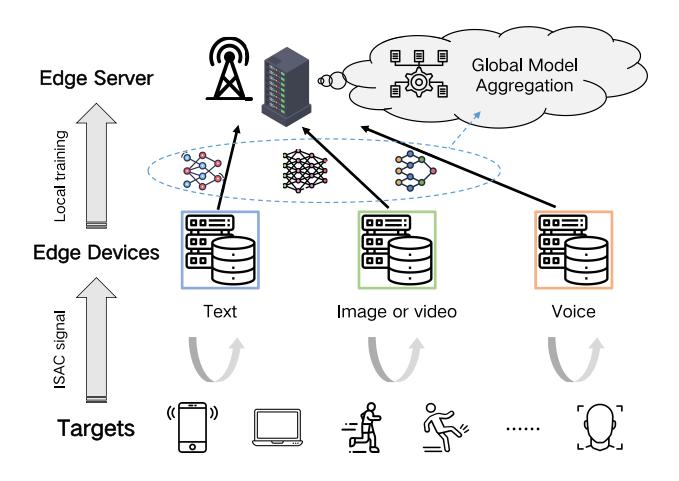

Fig. 11. Federated learning with ISAC.

Meanwhile, Zhang et al. [\[151\]](#page-32-10) accelerated edge intelligence systems by integrating sensing and communication. This integration optimizes wireless signals for dataset generation and uploading, reducing processing time. They present a joint optimization problem for resource allocation and beamforming in the ISAC-accelerated edge intelligence system, analyzing its gain compared to conventional systems. This advancement promises improved efficiency and performance for edge intelligence applications.

Federated learning in ISAC presents numerous advantages. Firstly, it ensures data privacy and security by eliminating the need to transmit raw data, thus minimizing the risk of potential breaches. Secondly, this method empowers sensing nodes to conduct local model training, followed by the aggregation of these models into a global one. This fosters distributed data collaboration and fusion, enhancing overall system performance. Additionally, each sensing node can customize its model training based on its local environment and tasks, further optimizing system efficiency. Compared to traditional centralized training approaches, federated learning significantly reduces data transmission and communication overhead, conserving valuable network resources. Critically, this approach facilitates iterative updates of the global model across multiple sensing nodes, accelerating model convergence and optimization.

*3) Distributed Learning:* The ISAC framework tackles multi-objective optimization challenges by coordinating integrated signals emitted by both base stations and terminals for S&C. Smart nodes intelligently manage and coordinate these signals, optimizing S&C information to enhance communication performance and sensing accuracy significantly. This optimization is supported by edge computing and cloud computing technologies, with dedicated nodes responsible for data analysis and processing, as depicted in Fig. [12.](#page-21-1) Additionally, to further improve terminal sensing accuracy and enable intelligent services, terminals send specific intelligent requests to their corresponding base stations. Edge computing nodes can then utilize appropriate models to optimize the global AI model, tailoring it to suit the terminal's specific data set. For instance, deep transfer learning allows fine-tuning AI models based on pre-trained models and a small amount

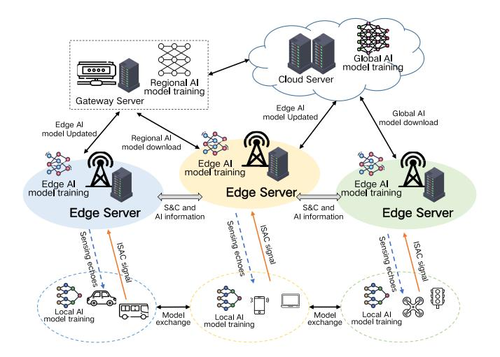

Fig. 12. Distributed learning with ISAC.

of data, addressing adaptability concerns arising from the temporal characteristics of heterogeneous device data and the non-independent and identically distributed nature of different data sets. Moreover, strategically deploying gateway servers helps alleviate computational, storage, and power pressure at both the cloud and terminal ends, thereby ensuring better model inference performance, accuracy, and privacy protection measures.

Liu et al. [\[160\]](#page-32-11) addressed channel estimation in ISAC systems with IRS assistance, focusing on its potential for future wireless networks. They propose a deep-learning framework with two architectures to accurately estimate S&C channels. One DNN estimates sensing channels at the ISAC base station, while the other handles communication channels at downlink user equipment. Effective DNN training is ensured through carefully designed input-output pairs, showing promise for enhancing ISAC with IRS and improving future network communication. In another study, Liu et al. [\[161\]](#page-32-12) introduced a converged network architecture for ISAC systems to mitigate multi-access interference. Their method equips base stations with individual deep neural networks to optimize power and beamforming allocation, leveraging unsupervised and transfer learning for enhanced interference management. This enables efficient ubiquitous sensing in wireless networks.

In general, the local and edge processing modules in the distributed framework offer real-time AI processing capabilities and possess some computational and decision-making abilities, making them suitable for running lightweight AI models as listed in Table [XI.](#page-22-0) Moreover, the regional and global processing modules provide substantial computing power to support the overall framework, enabling the selection and training of AI models based on business requirements and providing feedback to wireless network devices or mobile terminals for achieving distributed performance optimization.

# *C. Application Layer Security*

*1) Encryption:* For ISAC systems, chaotic cryptography offers a promising method for ensuring data security. Chaotic

| Research   | Focus                                                           | Methodology                                                                                                                         | Key Findings                                                              | Advantages/Contributions                                                                                                      |
|------------|-----------------------------------------------------------------|-------------------------------------------------------------------------------------------------------------------------------------|---------------------------------------------------------------------------|-------------------------------------------------------------------------------------------------------------------------------|
| Ref. [29]  | Edge computing advancements for enhanced sensing accuracy.      | Federated learning and transfer learning for real-time AI processing.                                                               | Improved sensing accuracy with edge computing nodes.                      | Enhanced privacy protection, real- time AI processing capabilities.                                                        |
| Ref. [60]  | Indoor ubiquitous sensing with privacy emphasis.                | Federated learning for privacy and efficient data utilization.                                                                      | Device-free sensing with federated transfer learning.                     | Protects data privacy, enables local model training.                                                                          |
| Ref. [86]  | Expediting ISAC systems through optimized power allocation.     | Deep learning for power and beamforming optimization at base stations.                                                              | Efficient ubiquitous sensing in wireless networks.                        | Optimized power allocation and interference management.                                                                       |
| Ref. [151] | Integration of sensing and communication for edge intelligence. | ISAC for expedited edge intelligence, joint optimization for resource allocation.                                                   | Optimization of wireless signals, dataset generation, and uploading.      | Reduces data transmission and communication overhead.                                                                         |
| Ref. [154] | AI model optimization for heterogeneous device data.            | Distributed learning with regional and global processing modules.                                                                   | Tailoring global AI models based on business requirements.                | Substantial computing power for model selection and training.                                                                 |
| Ref. [160] | Multi-access interference, channel estimation in ISAC with IRS. | Communications-sensing-intelligence converged network architecture, unsupervised and transfer learning for interference management. | Deep transfer learning, deep neural networks for S&C channels estimation. | Real-time AI processing with lo- cal and edge modules, regional and global processing for overall framework support. |

TABLE XI COMPARISONS OF THE STATE-OF-THE-ART TECHNOLOGIES

cryptography leverages the intricate and unpredictable patterns of chaotic systems to encrypt data, making it highly resistant to decryption attempts [\[162\]](#page-32-13). The extreme sensitivity to initial conditions in chaotic systems ensures that even minor differences in starting points lead to vastly different encryption results. This property enhances the security of key generation and data transmission in ISAC applications, enabling secure communication channels and safeguarding sensitive sensor data.

Chaotic encryption enhances data security by introducing unpredictability and complexity into encryption processes. This approach makes data transmission in network communication protocols like TCP, UDP, SSH, and TLS more secure by complicating the prediction of patterns or deducing encryption keys by unauthorized entities. The inherent unpredictability of chaotic systems helps deter various forms of attacks, bolstering the overall resilience of these protocols. Additionally, chaotic encryption strengthens IPsec for securing IP communication by integrating chaotic dynamics into key management and encryption processes, thus adding an extra layer of protection against unauthorized access and imposter attacks. In [\[163\]](#page-32-14), a novel chaotic image encryption method uses Josephus traversing for scrambling, and rearranging rows and columns of pixels. The diffusion process modifies pixel gray-level values, breaking correlations between adjacent pixels. Initial conditions for chaotic systems, derived from external secret keys, create dynamic keys for encrypting transmitted sensing data, ensuring real-time evolving encryption protection.

Extending the application of chaotic encryption to IoT protocols, such as MQTT, CoAP, 6LoWPAN, and BLE, addresses the unique security challenges posed by interconnected devices [\[164\]](#page-32-15), [\[165\]](#page-32-16). The incorporation of chaotic dynamics into key generation and encryption processes enhances the security of IoT communication channels, ensuring data confidentiality and integrity. For example, [\[166\]](#page-32-17) presented an experimental fractional-chaos-based cryptosystem for IEEE 802.15.4 ad hoc networks, employing a unique chaotic pairing method between the coordinator and end devices for secure data transmission. This system encrypts RF data using a fractional-order encryption key and a four-step iterative process.

While chaotic cryptography offers promising security features for ISAC systems, it is important to recognize that many chaotic ciphers rely on the assumption that chaotic systems act as keyed pseudo-random functions or permutations. This assumption, however, often lacks rigorous mathematical proof and is typically employed heuristically. In contrast, established cryptographic methods such as AES and ECC have been rigorously analyzed and are widely accepted as secure under commonly agreed-upon assumptions. Therefore, while chaotic cryptography can enhance security, it is essential to be aware of its limitations and potential vulnerabilities. A balanced approach that combines chaotic cryptography with proven cryptographic techniques will provide more robust security for ISAC systems.

*2) Privacy Protection:* Common approaches include identity anonymization, differential privacy, and distributed privacy protection. Identity anonymization separates data from individual identities using anonymous identifiers or masking techniques, preserving user privacy while maintaining data availability, ensuring that only authorized users can access the data, and providing high-security levels during transmission and storage. Differential privacy introduces noise, making it difficult to identify individual information and providing mathematical guarantees to prevent attackers from deducing individual details. Distributed privacy protection decentralizes data storage and processing across multiple nodes, mitigating the risk of privacy breaches associated with centralized processing and increasing the complexity for attackers to obtain complete data. The choice of specific methods depends on the application requirements and security needs.

In [\[167\]](#page-32-18), it proposed an advanced privacy protection approach for 6G networks, involving information concealment through multidimensional feature fusion. Relying on the resilience of carriers housing sensitive data, they explore diverse methods for multidimensional feature fusion arbitration, leading to the development of a precise and efficient feature-based information-hiding technology, which creates the ultimate feature region. Edge intelligence, vital for advanced applications, offers AI-driven computation and caching near users. Yet, data interactions and distributed storage make edge networks prone to privacy threats. B5G

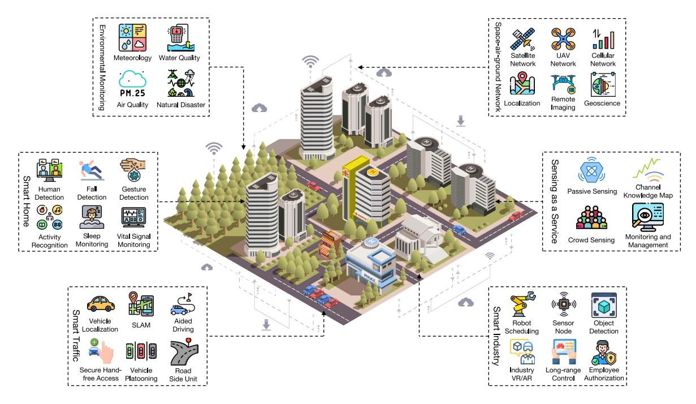

Fig. 13. Application scenarios and use cases of ISAC.

era complexities intensify these challenges. Zhu et al. [\[153\]](#page-32-19) explored B5G edge privacy concerns and design applicationspecific privacy strategies. Adapting to diverse needs, our approach combines learning and multi-mode differential privacy, ensuring robust privacy protection. However, the design and optimization of differential privacy algorithms need to consider the specificity of ISAC systems, including the handling of heterogeneous data from multiple sources and the requirements of distributed computing, which increases the complexity of the algorithm design.

To summarize, the application layer besides the aforementioned hardware and omniscient-layer methods, protocols such as OAuth, OpenID Connect, and Kerberos can be integrated to achieve access control and authentication for users and third-party applications within the ISAC system. Additionally, regular security audits of the ISAC system should be conducted to promptly address potential vulnerabilities and security flaws. For the numerous and diverse application terminals connected to the ISAC network, SNMP can be utilized with a manager-agent model to monitor them. Additionally, micro-segmentation technology divides the network into multiple small, secure domains, restricting the lateral movement of attackers within the network. Even if an attacker breaches one segment, spreading to other segments is difficult, thereby reducing overall risk.

Furthermore, AI technology can be employed for intelligent threat detection and analysis, enabling the design of adaptive security policies. By analyzing the waveform, user behavior, and log information, the authentication mechanism can be dynamically adjusted. This approach also provides intelligent feedback and modification suggestions by analyzing system code and configurations to predict and address various interface vulnerabilities. From an encryption perspective, digital watermarking techniques can be applied to communication data, utilizing homomorphic encryption to achieve a secondary encryption process. Users can establish a secure communication channel via SSL and then obtain the data through a decryption algorithm. Simultaneously, application layer firewalls can be constructed to filter and monitor HTTP/HTTPS requests, preventing common cyber-attacks such as SQL injection and cross-site scripting. We can also utilize blockchain technology's immutability and decentralized characteristics to protect the integrity and security of data. For instance, storing user data as hash values on the blockchain or using consensus algorithms to ensure all nodes agree on the data state, preventing single-point failures and malicious node disruptions.

# *D. Application Scenarios*

In this section, we divide the application scenarios according to the different their characteristics as shown in Fig. [13,](#page-23-0) and discuss the potential use cases based on the proposed uniform architecture.

*1) Environmental Monitoring:* In the fields of meteorology, water quality, air quality, and natural disaster monitoring, ISAC technology shows vast potential. In meteorological monitoring, the ISAC system combines ground sensors and satellite data to offer precise weather information, covering parameters like temperature, humidity, and wind speed. This is crucial for weather forecasting, disaster prevention, and agricultural management [\[1\]](#page-28-0). Through real-time water body monitoring, ISAC technology can trace pollution sources and water quality variations, aiding in scientific water resource management strategies for ensuring water safety. Furthermore, by merging air sensors and atmospheric data, the system can monitor real-time air pollutant concentrations, offering vital support for urban management and health protection. In natural disaster monitoring and early warning systems, ISAC technology enables real-time monitoring and prediction of disasters such as earthquakes, fires, and floods. By integrating various data sources, including ground sensors and satellite observations, the system boosts disaster response efficiency. For instance, in earthquake monitoring, ISAC technology uses high-precision sensor arrays to detect subtle crustal changes, delivering timely warning signals. In fire monitoring, the ISAC system identifies fire locations and extents promptly, aiding fire departments in swift responses. In flood monitoring, the system tracks river water level variations using water level sensors and satellite imagery, providing data for flood control decisions.

*2) Smart Home:* In modern life, people spend much time indoors, leading to the rise of smart homes for enhanced comfort and convenience. ISAC utilizes wireless signals for device communication, human-machine interaction, and tracking the location and activities of individuals or devices, enabling comprehensive home management [\[51\]](#page-29-41). This system supports services like home control, security monitoring, and behavior detection. Human detection in smart homes is crucial for recognizing individuals' presence and locations, facilitating personalized automation, and managing energy. Fall detection is vital for elderly care, promptly alerting caregivers or emergency services to ensure timely assistance. Gesture detection allows touch-free control of household devices, enhancing user convenience. Activity recognition is key for understanding occupants' daily routines and improving the overall living experience. For example, detecting cooking activities can trigger appropriate ventilation or lighting adjustments. Sleep monitoring offers insights into sleep patterns, aiding users in optimizing rest and health outcomes. Vital sign monitoring, which tracks metrics like heart rate or respiratory rate, ensures continuous health surveillance for early detection of potential issues. ISAC, leveraging advanced technologies like mmWave or THz, enhances sensing precision while ensuring indoor privacy and efficient monitoring. These capabilities enhance safety, comfort, and convenience, creating a more intelligent living environment.

*3) Smart Traffic:* Achieving stringent requirements for both communication and perception capabilities is crucial. On the communication front, ensuring ultra-low latency and high data rates is essential. Meanwhile, real-time detection of the vehicle's operating environment is necessary for perception. Drivers on the road can obtain information about their current position and spatial surroundings beyond their direct line of sight, forming the basis for navigation and route planning [\[141\]](#page-31-26). Unlike traditional simultaneous localization and mapping (SLAM) methods, which heavily rely on cameras or lidar, 6G ISAC devices leverage the propagation characteristics of communication signals as a valuable data source for environmental mapping. With high-bandwidth transmission, these devices enable millisecond-level vehicle-to-vehicle communication through multiple sensors. For vehicle platooning, the roadside unit in the integrated sensing system, benefiting from strategic deployment and intelligent computational capabilities, can swiftly acquire the driving status of multiple vehicles and issue control commands. It significantly enhances

the reliability of services for autonomous driving control in vehicle platoons. Moreover, ISAC systems ensure that authorized users can access vehicle functionalities securely by integrating advanced authentication mechanisms and secure communication protocols. It includes features such as secure unlocking, starting, and controlling various vehicle functions through voice commands or gesture recognition, enhancing user convenience while maintaining robust security measures against unauthorized access or tampering. Through secure hands-free access, drivers can interact with their vehicles effortlessly, enhancing the overall driving experience while ensuring the integrity and security of vehicle operations.

*4) Smart Industry:* ISAC technology is a vital solution that combines communication and environmental sensing capabilities among nodes to reduce signaling overhead effectively. This integration creates a unified platform for collaboration in 6G intelligent factories, improving coordination between robots and vehicles while optimizing operational efficiency. Object detection functions in ISAC are essential for improving workplace safety. They help identify potential hazards or obstacles in advance, allowing for proactive measures to prevent accidents and safeguard employee well-being. The emergence of industry VR/AR applications is set to revolutionize manufacturing processes by providing immersive experiences for training, design, and maintenance tasks. Supported by ISAC communication networks, these applications achieve the necessary data rates and low latency for VR/AR experiences, enhancing productivity and efficiency in various operational areas. ISAC technology also enables long-range control functions, enabling remote management and monitoring of industrial processes and equipment across large factory environments. This capability supports predictive maintenance strategies, enhances resource utilization, and results in improved operational outcomes and cost efficiencies. Additionally, ISAC systems ensure secure access control in industrial settings through biometric authentication, proximity sensing, and encrypted communication [\[105\]](#page-31-5). By verifying employee identities and managing access to restricted areas or sensitive equipment, ISAC enhances overall safety and efficiency in the workplace, reducing security risks and ensuring compliance with regulations.

*5) Sensing as a Service:* It is a paradigm that leverages sensor data to provide valuable insights and enhanced services across various domains. The signal dynamics in passive sensing closely resemble those of communication, allowing for easy use of existing communication infrastructure. Crowd sensing involves harnessing the collective power of individuals to gather data and insights for various applications [\[38\]](#page-29-28). One compelling application of Crowd Sensing in ISAC systems is in smart cities. By leveraging the ubiquitous presence of smartphones and IoT devices carried by citizens, city authorities can collect real-time data on traffic flow, air quality, and noise levels. Furthermore, the channel knowledge map (CKM) provides situational awareness of the radio environment and equipment through information like CSI, user directions, targets, interferers, and a detailed map of channel knowledge. It enables cross-function or cross-user information sharing, facilitating joint signal processing strategies that balance

TABLE XII RECENT ADVANCES AND OPEN ISSUES FOR ISAC

| Open Issues                                                                                                                                                                                                | Recent Advances                                                                                                                                                                                            | Potential Solutions                                                                                                                            |
|------------------------------------------------------------------------------------------------------------------------------------------------------------------------------------------------------------|------------------------------------------------------------------------------------------------------------------------------------------------------------------------------------------------------------|------------------------------------------------------------------------------------------------------------------------------------------------|
| 1. How can we effectively tackle the intricacies of clock synchronization, ensuring precise temporal alignment in dynamic and distributed systems?                                                         | <ul><li>Random phase shifts [168]</li><li>IEEE precision time protocol [27]</li><li>GPS or ML-based synchronization [23]</li></ul>                                                                         | Timestamp-based synchronization Distributed consensus algorithms Reference signal propagation                                                  |
| 2. How can advanced cryptography bolster ISAC network security, providing end-to-end protection for communication channels and maintaining data integrity?                                                 | Federated learning adoption for collaborative modeling [64], [154]     Integration of secure computation and homomorphic encryption [165], [166]     Multi-party consensus and secure data processing [81] | Blockchain     AI-enhanced identity verification     Chaotic encryption                                                                        |
| 3. What role does AI play in optimizing the information-theoretic performance of ISAC networks?                                                                                                            | <ul> <li>Integration of AI for unified S&amp;C [5], [76]</li> <li>Parameter estimation by MI [61], [168]</li> <li>Cognitive radio technology with CRB [132], [133]</li> </ul>                              | Optimal Pareto boundary     Ergodic partial CRB     Effective spectrum utilization and tailored sensing metrics                                |
| 4. What mechanisms can trustworthy AI employ to validate the integrity of data and algorithms, making a foundation for critical decision support systems?                                                  | Robust model design to mitigate sensitivity to malicious data [13]     Strong encryption and authentication mechanisms [105]     Continuous monitoring and adaptive security measures [169], [170]         | Advanced model watermarking techniques     Differential privacy in AI algorithms     Federated learning privacy-preserving                     |
| 5. What strategies can be implemented to enhance the effectiveness of resource management and communication protocols in ISAC, fostering seamless coordination and dynamic adaptation to changing network? | Hybrid protocols combining time- and frequency-division schemes [171]     Software-defined networking and network function virtualization [152]     Predictive resource demands [172]                      | Error correction and data compression techniques     Customized protocols adapting to ISAC     Federated learning privacy-preserving           |
| 6. How could we enhance the robustness of 6G networks for reliable performance in diverse application scenarios and evolving challenges?                                                                   | <ul> <li>AI-driven network management and optimization [13], [16]</li> <li>Optimization in edge areas [4], [173]</li> <li>AI applications across all layers [17], [174]</li> </ul>                         | Infusion of machine learning and deep learning     3D full-space integrated network architecture     Irregular quadrature amplitude modulation |

performance and achieve mutual assistance. Leveraging environmental awareness and location-specific channel knowledge, CKM capitalizes on the predictability of wireless conditions as devices revisit familiar locations, thereby reducing channel uncertainty and enhancing channel inference accuracy compared to traditional methods. The integration of monitoring and management functionalities further enhances operational efficiency. By leveraging crowd-sensing data and CKM insights, processes can optimize resource allocation, facilitate proactive decision-making, and ensure system performance across diverse applications.

*6) Space-Air-Ground Network:* ISAC technology offers significant advancements in remote sensing and geoscience by improving the capabilities of networks deployed on satellites and aircraft [\[67\]](#page-30-13). The spaceborne networks using synthetic aperture radar techniques with chirp or OFDM waveforms have provided high-resolution imaging capabilities regardless of weather or time of day. These systems have been integral for environmental monitoring, Earth system observation, change detection, 4D mapping, and planetary exploration. Embedding communication data into network waveforms allows these systems to broadcast data streams to their imaging areas or provide covert communication services in military scenarios. UAVs equipped with ISAC technology are essential for emergency response in natural disasters, facilitating tasks like damage assessment, search-and-rescue operations, and establishing emergency communications. UAVs can enhance energy and hardware efficiency, enabling them to carry vital payloads such as imaging network systems, communication base stations, and thermal sensors without sacrificing operational endurance. It is particularly beneficial for extended missions over disaster zones. Furthermore, swarms of UAVs or satellites can utilize ISAC to share sensed information and operate

cooperatively as a mobile antenna array, creating a large virtual aperture. This capability enables the development of high-resolution, low-altitude airborne imaging systems using drone swarm-based algorithms. Therefore, ISAC significantly improves the efficiency and effectiveness of remote sensing and geoscience operations, providing robust real-time data and connectivity across a range of applications.

To summarize, the ISAC framework stands at the forefront of modern sensing technology, intertwining various elements to optimize detection, estimation, and recognition processes. Combining the Fresnel zones with ISAC intelligently predicts signal propagation to enhance target localization accuracy in detection scenarios. The infusion of Doppler models further refines the framework to enable precise velocity estimation, elevating the system's overall detection capabilities. Also, ISAC utilizes the super-intelligent agent to empower AI networks. This dynamic coupling empowers the framework with intelligent decision-making and learning abilities. AI not only enhances the real-time adaptability of ISAC but also enables in-depth analysis of sensing data, unraveling intricate patterns for target recognition and classification. Moreover, the multi-modal provides a sophisticated layer of understanding, enabling ISAC to bridge the gap between the physical world and digital processing, and expanding its potential applications and use cases.

#### VI. FUTURE DIRECTIONS AND CHALLENGES

In this section, we present the challenges of the current ISAC technologies, possible future development directions, and potential methods. Subsequently, we proffer prospective avenues of resolution to these challenges, as shown in Table [XII.](#page-25-0)

#### *A. Clock Synchronization*

In the intricate scenario of integrated sensing networks, the presence of inherent temporal discrepancies among diverse sensors can introduce misalignments in data collection and transmission processes [\[175\]](#page-32-20). These temporal divergences pose a formidable challenge, hindering the precision and cohesiveness of the accumulated data and thereby compromising its overall reliability. The gravity of this challenge is further amplified by the rigorous demand for ultra-low latency imposed by 6G technologies. Addressing the intricate issue of clock synchronization, especially within the ambit of achieving ultra-low latency, necessitates the development of robust synchronization protocols. These protocols empower sensors to synchronize their internal clocks with exceptional precision [\[176\]](#page-32-21).

Various techniques, such as timestamp-based synchronization, distributed consensus algorithms, and the propagation of reference signals, emerge as pivotal elements in achieving synchronized data acquisition across a spectrum of heterogeneous sensor nodes. The resolution of the clock synchronization quandary is not just a technical hurdle; it becomes an imperative undertaking, particularly to meet the exacting requirements of ultra-low latency in the 6G era. This precision holds critical importance not only for fusing data streams but also for fulfilling the stringent demands of ultra-low latency, aligning with the goals of both ISAC and 6G technologies. Achieving such synchronization is essential for accurately reconstructing events and orchestrating cohesive actions with integrated sensing networks, fostering the synergy between ISAC and the ultra-responsive paradigm of 6G.

# *B. Security and Privacy Protection*

6G ISAC architecture establishes a data-driven network intelligence closed-loop system. This system operates by generating data through perception, transmitting data via communication, processing data through computation, and autonomously making decisions to enhance network performance or deliver services to upper-layer applications. Consequently, the security of 6G networks and the copious data they carry becomes foundational for ensuring the security and trustworthiness of upper-layer applications. The introduction of new capabilities, such as perception and computation, along with the adoption of cutting-edge technologies like artificial intelligence, big data, and cloud computing, presents a dual challenge in constructing a secure and trustworthy network [\[177\]](#page-32-22).

The convergence of sensing and computing entails the collection, transmission, processing, storage, and sharing of massive amounts of data. This data may encompass sensitive information such as personal identities and location details. Due to the distributed nature of network perception and computation, data privacy security faces novel challenges. The integration of diverse inherent capabilities in the ISAC framework brings about functional convergence, which concurrently introduces additional security risks. Attackers may exploit network vulnerabilities, weaknesses, or misconfigurations to infiltrate systems and disrupt their functionality. Furthermore, 6G ISAC heavily relies on extensive wireless perception capabilities and distributed computing devices, increasing the risk of forged identities and data tampering. Consequently, the implementation of intrinsic security mechanisms is imperative to ensure device identity and integrity verification, detecting and preventing masquerade attacks.

Blockchain is crucial for decentralized trust, fostering a multi-party consensus-based trust system. This approach shifts trust anchors from traditional authorities to collective consensus, using cryptography for secure distributed data processing, storage, and traceability. The 6G ISAC network, known for cross-trust domains and multi-operator involvement, requires mechanisms supporting multi-party trust. Blockchain offers a promising solution for the novel security needs of 6G, providing perspectives for trust in the 6G ISAC system. Efficient data permission management is crucial due to extensive perception endpoints and diverse data sources. Blockchain addresses general data protection regulation and other data rights regulations with a more automated approach. For perception data permission management, blockchain provides a traceable and accountable solution.

Privacy protection in the 6G ISAC network involves advanced technologies like secure multi-party computation and homomorphic encryption, ensuring accurate computation results without accessing information beyond the results, and safeguarding data security and privacy. Cryptographic techniques like homomorphic encryption in the 6G ISAC network conceal user privacy information, enabling autonomous control over credential information. The network adopts a cleverly designed credential issuance and verification method, ensuring adaptive and combinable privacy protection solutions. This achieves making user information "usable but invisible," effectively preventing sensitive information leakage. Incorporating AI introduces intelligent capabilities to network nodes, facilitating lightweight and distributed security mechanisms. This ensures the effectiveness of user identity verification and access control. The network design includes innovative security routing schemes and trust network topologies to address the risk of information leakage in the coexistence of trusted and malicious nodes. Federated learning technology allows collaborative modeling with data from multiple nodes in the 6G ISAC network, minimizing data transmission and preserving data privacy and security.

#### *C. AI-Driven for Information-Theoretic ISAC*

The emergence of AI-driven 6G technology marks a significant advancement, particularly when integrated with ISAC. The overarching objective is to formulate a unified function that integrates communication and sensing, aiming for an optimal Pareto boundary. Information theory assumes a critical and foundational role, as the synergy between S&C facilitated by a common hardware platform and transmitted signal presents a promising avenue. However, the information theory underlying S&C systems exhibits both connections and distinctions.

The MI stands out as a shared emphasis, driving constant efforts to enhance achievable rates or ergodic rates by maximizing the MI between transmitted and received signals in wireless communication systems. In contrast, sensing tasks predominantly involve estimation and detection. For parameter estimation, maximizing MI between the target impulse response and received echo signals typically results in minimizing the MMSE [\[168\]](#page-32-23). While MI serves as a unifying factor, the specific objectives and methodologies diverge between communication and sensing aspects within ISAC. This nuanced interplay of information theory forms the foundation for understanding and optimizing the performance of integrated sensing and communication systems.

Cognitive radio technology, renowned for its ability to intelligently adapt to the radio frequency environment, encounters various technical challenges, particularly concerning the CRB. It represents a fundamental limit on achievable rates for estimation tasks in wireless communication systems and poses a significant challenge. The dynamic nature of the radio frequency spectrum presents a notable hurdle, requiring cognitive radios to efficiently sense and adapt to spectrum conditions in real-time. However, achieving optimal performance of estimation accuracy and data rate becomes intricate due to the inherent uncertainty and variability in the radio environment. Furthermore, integrating cognitive capabilities into radio systems introduces complexity in decision-making processes. Designing and implementing algorithms that can effectively utilize the available spectrum while ensuring minimal interference and reliable communication poses significant technical challenges. Addressing these challenges is important for advancing the capabilities of cognitive radio systems and ensuring their optimal performance within the CRB in dynamic communication environments. In addition, signals dedicated to information transfer are inherently random. Therefore, specific sensing metrics, such as the ergodic partial CRB, need to be tailored and well-defined for different use cases. Developing robust and tailored metrics for sensing with communication signals is essential for optimizing the performance of ISAC systems.

# *D. Trustworthy AI Problem*

The integration of AI into various domains has undeniably brought about transformative advancements, but it is accompanied by a myriad of security and privacy concerns. The inherent complexity of AI systems, coupled with their reliance on vast datasets and intricate algorithms, exposes them to vulnerabilities that necessitate careful consideration. Issues such as adversarial attacks, model biases, and the potential for unauthorized access to sensitive information underscore the imperative of addressing the security and privacy aspects of AI. Among them, the application of federated learning in the realm of ISAC introduces a unique set of challenges. Federated learning, designed for collaborative model training without direct data sharing, is susceptible to data privacy leakage during model updates. Malicious participants can exploit the decentralized nature of federated learning to disrupt the system, inject malicious data, or compromise the model training process. Moreover, the risk of model reverse engineering poses threats to both data privacy and intellectual property [\[169\]](#page-32-24), [\[170\]](#page-32-25).

To comprehensively address these challenges and fortify the trustworthiness of AI within ISAC, a multifaceted security approach is imperative. The incorporation of differential privacy in federated learning stands out as a paramount measure to safeguard individual data during the intricate process of model training. Secure multi-party computation takes center stage in enhancing the secure sharing of both data and computation processes, assuring confidentiality and integrity throughout. Ensuring the utmost security, robust encryption, and authentication mechanisms play pivotal roles in the intricate task of securing the transmission of model parameters and validating the identities of participating entities. The strategic design of federated learning models, engineered to be less sensitive to malicious data, emerges as a critical element, effectively minimizing the potential impact of adversarial attacks. Additionally, the incorporation of model watermarking acts as a deterrent against intellectual property theft, providing an additional layer of defense. Continuous monitoring and adaptation of security protocols contribute to an evolving and robust security posture. This holistic set of security measures and technologies is indispensable for instilling and sustaining trustworthy AI within the dynamic and collaborative framework of ISAC, thereby promoting secure and privacypreserving collaborative learning.

#### *E. Resource Management and Communication Protocols*

For computing resource scheduling, managing the vast data generated by a multitude of sensors is a critical concern. This computing resource scheduling problem necessitates optimizing the allocation of processing power, memory, and storage across various sensing nodes. The objective is to ensure timely data processing while minimizing latency and energy consumption in the 6G ISAC [\[172\]](#page-32-26).

Dynamic resource allocation algorithms, adaptation to varying workloads, and prioritizing critical tasks are crucial components of tackling this challenge. Edge computing, where processing occurs closer to the data source, and workload migration, involving the shifting of tasks among nodes, play pivotal roles in balancing the computing load. Integrating AI and machine learning further enhances resource scheduling performance. Predictive algorithms anticipate resource demands, allocating them accordingly, while reinforcement learning optimizes resource allocation strategies over time. Efficient solutions to the computing resource scheduling problem empower the proposed ISAC-oriented unified IoT architecture to process data efficiently, meet real-time requirements, and optimize computing resources' use, ultimately enhancing the performance of the entire network [\[152\]](#page-32-27).

Simultaneously, the challenge extends to the design of novel network protocols tailored for 6G ISAC. These protocols must efficiently manage data transmission, ensure low latency, and accommodate diverse sensing and communication requirements [\[171\]](#page-32-28). To address this issue, leveraging hybrid protocols and combining the strengths of different communication paradigms, like time- and frequency-division schemes, optimizes data throughput while maintaining resource efficiency. Advanced error correction and data compression techniques tailored to sensing data characteristics are integral to these protocols. Additionally, emerging technologies like software-defined networking and network function virtualization provide opportunities for flexible and adaptable protocols. These technologies enable on-the-fly protocol reconfiguration and customization, allowing ISAC systems to adapt to changing network conditions and application requirements with 6G.

#### *F. 6G Network Robustness*

For 6G networks, the attainment of robustness stands as a paramount objective, especially in light of the diverse application scenarios and evolving challenges. Addressing these concerns comprehensively, the ISAC system emerges as a foundational element [\[173\]](#page-32-29). The global coverage of 6G is intricately linked to the 3D full-space integrated network architecture, which interfaces with both terrestrial and extended networks. This integration not only ensures global coverage but also embeds flexibility in network design, facilitating adaptive responses to diverse and dynamic conditions. The inherent flexibility in the network architecture guarantees consistent and robust connectivity, even in challenging and variable environments.

Resilience in communication represents a critical facet of 6G, with the incorporation of space-based networks significantly bolstering this attribute. These networks function as extended backhaul networks, reinforcing communication links and ensuring timely and robust communication, particularly in disaster scenarios. The resilience introduced by space-based networks becomes a cornerstone for sustaining uninterrupted communication connectivity in adverse and unpredictable conditions. Additionally, the 3D full-space integrated network architecture optimizes communication in edge areas as a pivotal component of overall network robustness [\[174\]](#page-32-30). This optimization is realized through rapid deployment strategies, reduced operating costs, and on-demand dynamic resource allocation, ensuring efficient delivery of robust communication services even in edge areas.

The infusion of machine learning and deep learning contributes to the heightened robustness, adaptive learning ability, and profound understanding of network operations within 6G. As communication systems grow in complexity and data volume surges, the role of AI applications across all layers of the 6G network becomes indispensable. AI-driven network management and optimization simplify operations, enhancing the efficiency and intelligence of communication systems, and thereby fortifying the overall robustness of 6G. Nevertheless, the pursuit of Tbps-level data rates and intelligent services in 6G introduces challenges in modulation and waveform design, directly impacting the robustness of communication systems. Advanced modulation techniques, such as irregular quadrature amplitude modulation and multidimensional modulation, offer avenues to address these challenges, contributing to shaping gains, reducing peak-to-average power ratio, and enhancing the overall robustness of the communication system.

In summary, the current open challenges of ISAC technology include the aforementioned six issues yet are not confined to them. AI holds the potential to unravel intricate signal interactions and forecast interference patterns, while IoT devices can leverage intelligent algorithms to alleviate synchronization disparities and enhance resource allocation. Advanced cryptographic techniques offer the prospect of fortifying the data privacy and security of ISAC networks. These interdisciplinary methodologies provide potential solutions for the development of ISAC technology, ensuring optimal performance, robust security, and efficient resource utilization.

# VII. CONCLUSION

In this paper, we provide an overview of the development of key technologies in ISAC over the past decade. By incorporating the distinctive features of existing technologies, we propose a novel ISAC-oriented IoT framework that comprises three layers: the hardware layer, the omniscient layer, and the application layer. Moreover, a comprehensive retrospective analysis of ISAC technology's evolution across the past decade is undertaken, shedding light on novel design principles encompassing a multi-modal intelligent connectivity and AI-empowered networks, pivotal for achieving "intelligent connectivity" across diverse application scenarios. The survey categorizes pertinent works based on the proposed architecture's layer structures, accompanied by the introduction of significant physical and machine learning models. Additionally, the existing technological constraints linked to ISAC are synthesized, and prospective avenues for future research, along with potential solutions, are outlined. We hope that this manuscript will serve as a valuable point of reference and guidance for the exploration of ISAC opportunities across theoretical, algorithmic, systematic, and entrepreneurial realms.

# REFERENCES

- [\[1\]](#page-0-0) A. Liu et al., "A survey on fundamental limits of integrated sensing and communication," *IEEE Commun. Surveys Tuts.*, vol. 24, no. 2, pp. 994–1034, 2nd Quart., 2022.
- [\[2\]](#page-0-0) Y. Cui, F. Liu, X. Jing, and J. Mu, "Integrating sensing and communications for ubiquitous IoT: Applications, trends, and challenges," *IEEE Netw.*, vol. 35, no. 5, pp. 158–167, Sep./Oct. 2021.
- [\[3\]](#page-0-0) X. Cheng, Z. Huang, and L. Bai, "Channel nonstationarity and consistency for beyond 5G and 6G: A survey," *IEEE Commun. Surveys Tuts.*, vol. 24, no. 3, pp. 1634–1669, 3rd Quart., 2022.
- [\[4\]](#page-0-1) M. Giordani, M. Polese, M. Mezzavilla, S. Rangan, and M. Zorzi, "Toward 6G networks: Use cases and technologies," *IEEE Commun. Mag.*, vol. 58, no. 3, pp. 55–61, Mar. 2020.
- [\[5\]](#page-0-2) W. Zhou, R. Zhang, G. Chen, and W. Wu, "Integrated sensing and communication waveform design: A survey," *IEEE Open J. Commun. Soc.*, vol. 3, pp. 1930–1949, 2022.
- [\[6\]](#page-0-2) K. Meng et al., "UAV-enabled integrated sensing and communication: Opportunities and challenges," *IEEE Wireless Commun.*, vol. 31, no. 2, pp. 97–104, Apr. 2024.
- [\[7\]](#page-0-3) Z. Wei et al., "Integrated sensing and communication signals toward 5G-A and 6G: A survey," *IEEE Internet Things J.*, vol. 10, no. 13, pp. 11068–11092, Jul. 2023.
- [\[8\]](#page-0-3) A. M. Elbir, K. V. Mishra, S. Chatzinotas, and M. Bennis, "Terahertz-band integrated sensing and communications: Challenges and opportunities," 2022, *arXiv:2208.01235*.
- [\[9\]](#page-0-3) J. Xiong, H. Yin, J. Zhu, and Y. Tang, "An overview of waveform design for integrated sensing and communication," in *Proc. IEEE/CIC Int. Conf. Commun. China (ICCC)*, 2022, pp. 991–996.

- [\[10\]](#page-0-4) Y. Siriwardhana, P. Porambage, M. Liyanage, and M. Ylianttila, "AI and 6G security: Opportunities and challenges," in *Proc. Joint Eur. Conf. Netw. Commun. 6G Summit*, 2021, pp. 616–621.
- [\[11\]](#page-0-5) X. Zhu, W. Qu, T. Qiu, L. Zhao, M. Atiquzzaman, and D. O. Wu, "Indoor intelligent fingerprint-based Localization: Principles, approaches and challenges," *IEEE Commun. Surveys Tuts.*, vol. 22, no. 4, pp. 2634–2657, 4th Quart., 2020.
- [\[12\]](#page-0-5) D. Zhang et al., "Practical issues and challenges in CSI-based integrated sensing and communication," in *Proc. IEEE Int. Conf. Commun. Workshops*, 2022, pp. 836–841.
- [\[13\]](#page-0-6) Z. Wei, F. Liu, C. Masouros, N. Su, and A. P. Petropulu, "Toward multi-functional 6G wireless networks: Integrating sensing, communication, and security," *IEEE Commun. Mag.*, vol. 60, no. 4, pp. 65–71, Apr. 2022.
- [\[14\]](#page-0-6) X. Zhu, T. Qiu, W. Qu, X. Zhou, M. Atiquzzaman, and D. O. Wu, "BLS-location: A wireless fingerprint localization algorithm based on broad learning," *IEEE Trans. Mobile Comput.*, vol. 22, no. 1, pp. 115–128, Jan. 2023.
- [\[15\]](#page-0-7) C. De Lima et al., "Convergent communication, sensing and localization in 6G systems: An overview of technologies, opportunities and challenges," *IEEE Access*, vol. 9, pp. 26902–26925, 2021.
- [\[16\]](#page-1-1) K. B. Letaief, W. Chen, Y. Shi, J. Zhang, and Y.-J. A. Zhang, "The roadmap to 6G: AI empowered wireless networks," *IEEE Commun. Mag.*, vol. 57, no. 8, pp. 84–90, Aug. 2019.
- [\[17\]](#page-1-2) G. Zhu et al., "Pushing AI to wireless network edge: An overview on integrated sensing, communication, and computation towards 6G," *Sci. China Inf. Sci.*, vol. 66, no. 3, 2023, Art. no. 130301.
- [\[18\]](#page-1-3) C. Huang et al., "Holographic MIMO surfaces for 6G wireless networks: Opportunities, challenges, and trends," *IEEE Wireless Commun.*, vol. 27, no. 5, pp. 118–125, Oct. 2020.
- [\[19\]](#page-1-3) J. A. Zhang et al., "Enabling joint communication and radar sensing in mobile networks—A survey," *IEEE Commun. Surveys Tuts.*, vol. 24, no. 1, pp. 306–345, 1st Quart., 2021.
- [\[20\]](#page-1-3) J. Wang, N. Varshney, C. Gentile, S. Blandino, J. Chuang, and N. Golmie, "Integrated sensing and communication: Enabling techniques, applications, tools and data sets, standardization, and future directions," *IEEE Internet Things J.*, vol. 9, no. 23, pp. 23416–23440, Dec. 2022.
- [\[21\]](#page-1-3) C. Chaccour, M. N. Soorki, W. Saad, M. Bennis, P. Popovski, and M. Debbah, "Seven defining features of terahertz (THz) wireless systems: A fellowship of communication and sensing," *IEEE Commun. Surveys Tuts.*, vol. 24, no. 2, pp. 967–993, 2nd Quart., 2022.
- [\[22\]](#page-1-3) H. Sarieddeen, M.-S. Alouini, and T. Y. Al-Naffouri, "An overview of signal processing techniques for terahertz communications," *Proc. IEEE*, vol. 109, no. 10, pp. 1628–1665, Oct. 2021.
- [\[23\]](#page-1-1) Y. Sun, J. Liu, J. Wang, Y. Cao, and N. Kato, "When machine learning meets privacy in 6G: A survey," *IEEE Commun. Surveys Tuts.*, vol. 22, no. 4, pp. 2694–2724, 4th Quart., 2020.
- [\[24\]](#page-1-4) X. Zhu, T. Qiu, W. Qu, X. Zhou, Y. Wang, and O. Wu, "Path planning for adaptive CSI map construction with A3C in dynamic environments," *IEEE Trans. Mobile Comput.*, vol. 22, no. 5, pp. 2925–2937, May 2023.
- [\[25\]](#page-1-5) B. Hussain, Q. Du, B. Sun, and Z. Han, "Deep learning-based DDoSattack detection for cyber–physical system over 5G network," *IEEE Trans. Ind. Informat.*, vol. 17, no. 2, pp. 860–870, Feb. 2021.
- [\[26\]](#page-1-5) H. Moudoud, L. Khoukhi, and S. Cherkaoui, "Prediction and detection of FDIA and DDoS attacks in 5G enabled IoT," *IEEE Netw.*, vol. 35, no. 2, pp. 194–201, Mar./Apr. 2021.
- [\[27\]](#page-1-2) C.-X. Wang et al., "On the road to 6G: Visions, requirements, key technologies, and testbeds," *IEEE Commun. Surveys Tuts.*, vol. 25, no. 2, pp. 905–974, 2nd Quart., 2023.
- [\[28\]](#page-1-6) J.-B. Wang, C. Zeng, C. Ding, H. Zhang, M. Lin, and J. Wang, "Unmanned surface vessel assisted maritime wireless communication toward 6G: Opportunities and challenges," *IEEE Wireless Commun.*, vol. 29, no. 6, pp. 72–79, Dec. 2022.
- [\[29\]](#page-1-6) B. Mao, J. Liu, Y. Wu, and N. Kato, "Security and privacy on 6G network edge: A survey," *IEEE Commun. Surveys Tuts.*, vol. 25, no. 2, pp. 1095–1127, 2nd Quart., 2023.
- [\[30\]](#page-1-7) S.-M. Cheng, B.-K. Hong, and C.-F. Hung, "Attack detection and mitigation in MEC-enabled 5G networks for AIoT," *IEEE Internet Things Mag.*, vol. 5, no. 3, pp. 76–81, Sep. 2022.
- [\[31\]](#page-1-7) T. Zhang et al., "When moving target defense meets attack prediction in digital twins: A convolutional and hierarchical reinforcement learning approach," *IEEE J. Sel. Areas Commun.*, vol. 41, no. 10, pp. 3293–3305, Oct. 2023.

- [\[32\]](#page-3-1) X. Li, Y. Gong, K. Huang, and Z. Niu, "Over-the-air integrated sensing, communication, and computation in IoT networks," *IEEE Wireless Commun.*, vol. 30, no. 1, pp. 32–38, Feb. 2023.
- [\[33\]](#page-3-2) S. Zhu, Z. Yu, Q. Guo, J. Ding, Q. Cheng, and T. J. Cui, "RISassisted joint uplink communication and imaging: Phase optimization and Bayesian echo decoupling," 2023, *arXiv:2301.03817*.
- [\[34\]](#page-3-3) X. Wang, Z. Lin, F. Lin, and L. Hanzo, "Joint hybrid 3D beamforming relying on sensor-based training for reconfigurable intelligent surface aided terahertz-based multiuser massive MIMO systems," *IEEE Sensors J.*, vol. 22, no. 14, pp. 14540–14552, Jul. 2022.
- [\[35\]](#page-3-3) C. Liu et al., "Learning-based predictive beamforming for integrated sensing and communication in vehicular networks," *IEEE J. Sel. Areas Commun.*, vol. 40, no. 8, pp. 2317–2334, Aug. 2022.
- [\[36\]](#page-3-4) M. M. Azari et al., "Evolution of non-terrestrial networks from 5G to 6G: A survey," *IEEE Commun. Surveys Tuts.*, vol. 24, no. 4, pp. 2633–2672, 4th Quart., 2022.
- [\[37\]](#page-3-4) Y. Cui, H. Li, D. Zhang, A. Zhu, Y. Li, and H. Qiang, "Multiagent reinforcement learning-based cooperative multitype task offloading strategy for Internet of Vehicles in B5G/6G network," *IEEE Internet Things J.*, vol. 10, no. 14, pp. 12248–12260, Jul. 2023.
- [\[38\]](#page-3-5) F. Dong, F. Liu, Y. Cui, W. Wang, K. Han, and Z. Wang, "Sensing as a service in 6G perceptive networks: A unified framework for ISAC resource allocation," *IEEE Trans. Wireless Commun.*, vol. 22, no. 5, pp. 3522–3536, May 2023.
- [\[39\]](#page-3-6) X. Liu, H. Zhang, K. Long, M. Zhou, Y. Li, and H. V. Poor, "Proximal policy optimization-based transmit beamforming and phase-shift design in an IRS-aided ISAC system for the THz band," *IEEE J. Sel. Areas Commun.*, vol. 40, no. 7, pp. 2056–2069, Jul. 2022.
- [\[40\]](#page-4-1) H. Du et al., "Semantic communications for wireless sensing: RISaided encoding and self-supervised decoding," *IEEE J. Sel. Areas Commun.*, vol. 41, no. 8, pp. 2547–2562, Aug. 2023.
- [\[41\]](#page-4-2) W. Yuan, Z. Wei, S. Li, R. Schober, and G. Caire, "Orthogonal time frequency space modulation—Part III: ISAC and potential applications," *IEEE Commun. Lett.*, vol. 27, no. 1, pp. 14–18, Jan. 2022.
- [\[42\]](#page-4-3) M. Vaezi et al., "Cellular, wide-area, and non-terrestrial IoT: A survey on 5G advances and the road toward 6G," *IEEE Commun. Surveys Tuts.*, vol. 24, no. 2, pp. 1117–1174, 2nd Quart., 2022.
- [\[43\]](#page-4-4) D. An, J. Hu, and C. Huang, "Joint design of transmit waveform and passive beamforming for RIS-assisted ISAC system," *Signal Process.*, vol. 204, Mar. 2023, Art. no. 108854.
- [\[44\]](#page-5-0) P. Li et al., "RIS-assisted high-speed railway integrated sensing and communication system," *IEEE Trans. Veh. Technol.*, vol. 72, no. 12, pp. 15681–15692, Dec. 2023.
- [\[45\]](#page-5-1) R. Zhang, B. Shim, W. Yuan, M. Di Renzo, X. Dang, and W. Wu, "Integrated sensing and communication waveform design with sparse vector coding: Low sidelobes and ultra reliability," *IEEE Trans. Veh. Technol.*, vol. 71, no. 4, pp. 4489–4494, Apr. 2022.
- [\[46\]](#page-5-2) D. Xu, X. Yu, D. W. K. Ng, A. Schmeink, and R. Schober, "Robust and secure resource allocation for ISAC systems: A novel optimization framework for variable-length snapshots," *IEEE Trans. Commun.*, vol. 70, no. 12, pp. 8196–8214, Dec. 2022.
- [\[47\]](#page-5-3) H. Zhang et al., "An optical neural chip for implementing complexvalued neural network," *Nat. Commun.*, vol. 12, no. 1, p. 457, 2021.
- [\[48\]](#page-5-4) X. Qian, X. Hu, C. Liu, M. Peng, and C. Zhong, "Sensing-based beamforming design for joint performance enhancement of RIS-aided ISAC systems," *IEEE Trans. Commun.*, vol. 71, no. 11, pp. 6529–6545, Nov. 2023.
- [\[49\]](#page-5-5) P. Gao, L. Lian, and J. Yu, "Cooperative ISAC with direct Localization and rate-splitting multiple access communication: A Pareto optimization framework," *IEEE J. Sel. Areas Commun.*, vol. 41, no. 5, pp. 1496–1515, May 2023.
- [\[50\]](#page-5-6) M. Bin-Yahya, O. Alhussein, and X. Shen, "Securing software-defined WSNs communication via trust management," *IEEE Internet Things J.*, vol. 9, no. 22, pp. 22230–22245, Nov. 2021.
- [\[51\]](#page-5-7) X. Cheng et al., "Intelligent multi-modal sensing-communication integration: Synesthesia of machines," *IEEE Commun. Surveys Tuts.*, vol. 26, no. 1, pp. 258–301, 1st Quart., 2024.
- [\[52\]](#page-5-8) Y. Xu, D. Xu, L. Xie, and S. Song, "Joint BS selection, user association, and beamforming design for network integrated sensing and communication," in *Proc. IEEE Glob. Commun. Conf.*, 2023, pp. 3111–3117.
- [\[53\]](#page-6-1) H. Du, J. Wang, D. Niyato, J. Kang, Z. Xiong, and D. I. Kim, "AI-generated incentive mechanism and full-duplex semantic communications for information sharing," *IEEE J. Sel. Areas Commun.*, vol. 41, no. 9, pp. 2981–2997, Sep. 2023.

- [\[54\]](#page-7-0) J. Wang, H. Du, Z. Tian, D. Niyato, J. Kang, and X. Shen, "Semanticaware sensing information transmission for metaverse: A contest theoretic approach," *IEEE Trans. Wireless Commun.*, vol. 22, no. 8, pp. 5214–5228, Aug. 2023.
- [\[55\]](#page-7-1) Y. Cui, Z. Feng, Q. Zhang, Z. Wei, C. Xu, and P. Zhang, "Toward trusted and swift UAV communication: ISAC-enabled dual identity mapping," *IEEE Wireless Commun.*, vol. 30, no. 1, pp. 58–66, Feb. 2023.
- [\[56\]](#page-7-2) M. Lefoane, I. Ghafir, S. Kabir, and I.-U. Awan, "Unsupervised learning for feature selection: A proposed solution for botnet detection in 5G networks," *IEEE Trans. Ind. Informat.*, vol. 19, no. 1, pp. 921–929, Jan. 2023.
- [\[57\]](#page-7-2) T. Zhang et al., "How to mitigate DDOS intelligently in SD-IOV: A moving target defense approach," *IEEE Trans. Ind. Informat.*, vol. 19, no. 1, pp. 1097–1106, Jan. 2023.
- [\[58\]](#page-7-3) Y. Zhou, G. Cheng, Y. Zhao, Z. Chen, and S. Jiang, "Toward proactive and efficient DDoS mitigation in IIoT systems: A moving target defense approach," *IEEE Trans. Ind. Informat.*, vol. 18, no. 4, pp. 2734–2744, Apr. 2022.
- [\[59\]](#page-7-4) X. Wang, Z. Fei, J. Huang, and H. Yu, "Joint waveform and discrete phase shift design for RIS-assisted integrated sensing and communication system under cramér-Rao bound constraint," *IEEE Trans. Veh. Technol.*, vol. 71, no. 1, pp. 1004–1009, Jan. 2022.
- [\[60\]](#page-7-4) W. Qi, Y. Xie, H. Zhang, J. Zhou, R. Zhang, and X. Jing, "An efficient cross-domain device-free gesture recognition method for ISAC with federated transfer learning," in *Proc. ACM MobiCom Workshop Integr. Sens. Commun. Syst.*, 2022, pp. 67–71.
- [\[61\]](#page-7-5) C. Ouyang, Y. Liu, H. Yang, and N. Al-Dhahir, "Integrated sensing and communications: A mutual information-based framework," *IEEE Commun. Mag.*, vol. 61, no. 5, pp. 26–32, May 2023.
- [\[62\]](#page-7-6) T. Jiao, Z. Wei, Y. Geng, K. Wan, and Z. Yang, "Rate-distortion tradeoff of bistatic integrated sensing and communication," 2023, *arXiv:2306.06648*.
- [\[63\]](#page-7-6) C. Zhang, W. Yi, and Y. Liu, "Semi-integrated-sensing-andcommunication (semi-ISaC) networks assisted by NOMA," in *Proc. IEEE Int. Conf. Commun.*, 2022, pp. 3790–3795.
- [\[64\]](#page-7-7) C. He et al., "FedML: A research library and benchmark for federated machine learning," 2020, *arXiv:2007.13518*.
- [\[65\]](#page-7-8) M. Joshi, A. Pal, and M. Sankarasubbu, "Federated learning for Healthcare domain - pipeline, applications and challenges," *ACM Trans. Comput. Healthc.*, vol. 3, no. 4, pp. 1–36, 2022.
- [\[66\]](#page-7-9) C. Diouf, G. J. Janssen, H. Dun, T. Kazaz, and C. C. Tiberius, "A USRP-based testbed for wideband ranging and positioning signal acquisition," *IEEE Trans. Instrum. Meas.*, vol. 70, pp. 1–15, Mar. 2021.
- [\[67\]](#page-7-9) N.-N. Dao et al., "Survey on aerial radio access networks: Toward a comprehensive 6G access infrastructure," *IEEE Commun. Surveys Tuts.*, vol. 23, no. 2, pp. 1193–1225, 2nd Quart., 2021.
- [\[68\]](#page-7-10) W. Zhiqing, F. Zhiyong, L. Yiheng, M. Hao, and J. Jinzhu, "Terahertz joint communication and sensing waveform: Status and prospect," *J. Commun.*, vol. 43, no. 1, pp. 3–10, 2022.
- [\[69\]](#page-7-11) X. Zhu, W. Qu, X. Zhou, L. Zhao, Z. Ning, and T. Qiu, "Intelligent fingerprint-based Localization scheme using CSI images for Internet of Things," *IEEE Trans. Netw. Sci. Eng.*, vol. 9, no. 4, pp. 2378–2391, Jul./Aug. 2022.
- [\[70\]](#page-8-4) I. Lotfi, H. Du, D. Niyato, S. Sun, and D. I. Kim, "On the robustness of channel allocation in joint radar and communication systems: An auction approach," *IEEE Trans. Mobile Comput.*, vol. 23, no. 4, pp. 3466–3483, Apr. 2024.
- [\[71\]](#page-8-5) X. Lu et al., "Reinforcement learning-based physical cross-layer security and privacy in 6G," *IEEE Commun. Surveys Tuts.*, vol. 25, no. 1, pp. 425–466, 1st Quart., 2023.
- [\[72\]](#page-8-6) X. Dong, H. Li, J. Tan, J. Hu, and Y. Jiang, "A PSO-CVX algorithm of sum and difference beam patterns for time-modulated antenna array," *Int. J. Antennas Propag.*, vol. 2021, pp. 1–9, Mar. 2021.
- [\[73\]](#page-18-0) L. Xie and S. Song, "Networked sensing with AI-empowered environment estimation: Exploiting macro-diversity and array gain in perceptive mobile networks," 2022, *arXiv:2205.11331*.
- [74] R. Liu et al., "Integrated sensing and communication based outdoor multi-target detection, tracking and localization in practical 5G networks," 2023, *arXiv:2305.13924*.
- [75] R. Zhang, C. Jiang, S. Wu, Q. Zhou, X. Jing, and J. Mu, "Wi-Fi sensing for joint gesture recognition and human identification from few samples in human–computer interaction," *IEEE J. Sel. Areas Commun.*, vol. 40, no. 7, pp. 2193–2205, Jul. 2022.
- [76] X. Hu, C. Liu, M. Peng, and C. Zhong, "IRS-based integrated location sensing and communication for mmWave SIMO systems," *IEEE Trans. Wireless Commun.*, vol. 22, no. 6, pp. 4132–4145, Jun. 2023.

- [\[77\]](#page-10-0) Z. Gao et al., "Integrated sensing and communication with mmWave massive MIMO: A compressed sampling perspective," *IEEE Trans. Wireless Commun.*, vol. 22, no. 3, pp. 1745–1762, Mar. 2023.
- [\[78\]](#page-9-1) W. Chen, L. Li, Z. Chen, T. Quek, and S. Li, "Enhancing THz/mmWave network beam alignment with integrated sensing and communication," *IEEE Commun. Lett.*, vol. 26, no. 7, pp. 1698–1702, Jul. 2022.
- [\[79\]](#page-12-1) N. Su, F. Liu, and C. Masouros, "Secure radar-communication systems with malicious targets: Integrating radar, communications and jamming functionalities," *IEEE Trans. Wireless Commun.*, vol. 20, no. 1, pp. 83–95, Jan. 2021.
- [80] S. Buzzi, E. Grossi, M. Lops, and L. Venturino, "Radar target detection aided by reconfigurable intelligent surfaces," *IEEE Signal Process. Lett.*, vol. 28, pp. 1315–1319, Jun. 2021.
- [\[81\]](#page-9-2) T. Wei, S. Liu, and X. Du, "Visible light integrated positioning and communication: A multi-task federated learning framework," *IEEE Trans. Mobile Comput.*, vol. 22, no. 12, pp. 7086–7103, Dec. 2023.
- [\[82\]](#page-10-1) B. Aly, M. Elamassie, and M. Uysal, "Vehicular visible light communication with low beam transmitters in the presence of vertical oscillation," *IEEE Trans. Veh. Technol.*, vol. 72, no. 8, pp. 9692–9703, Aug. 2023.
- [\[83\]](#page-10-2) O. Li et al., "Integrated sensing and communication in 6G: A prototype of high resolution multichannel THz sensing on portable device," *EURASIP J. Wireless Commun. Netw.*, vol. 2022, no. 1, pp. 1–21, 2022.
- [\[84\]](#page-9-3) Z. Du et al., "Towards ISAC-empowered vehicular networks: Framework, advances, and opportunities," 2023, *arXiv:2305.00681*.
- [\[85\]](#page-9-4) Z. Zhang et al., "A general channel model for integrated sensing and communication scenarios," *IEEE Commun. Mag.*, vol. 61, no. 5, pp. 68–74, May 2023.
- [\[86\]](#page-10-3) Z. He, W. Xu, H. Shen, D. W. K. Ng, Y. C. Eldar, and X. You, "Full-duplex communication for ISAC: Joint beamforming and power optimization," *IEEE J. Sel. Areas Commun.*, vol. 41, no. 9, pp. 2920–2936, Sep. 2023.
- [\[87\]](#page-10-4) K. Zhong, J. Hu, C. Pan, M. Deng, and J. Fang, "Joint waveform and beamforming design for RIS-aided ISAC systems," *IEEE Signal Process. Lett.*, vol. 30, pp. 165–169, Feb. 2023.
- [\[88\]](#page-10-4) T. Xu, F. Liu, C. Masouros, and I. Darwazeh, "An experimental proof of concept for integrated sensing and communications waveform design," *IEEE Open J. Commun. Soc.*, vol. 3, pp. 1643–1655, 2022.
- [\[89\]](#page-10-5) A. A. Salem, M. H. Ismail, and A. S. Ibrahim, "Active reconfigurable intelligent surface-assisted MISO integrated sensing and communication systems for secure operation," *IEEE Trans. Veh. Technol.*, vol. 72, no. 4, pp. 4919–4931, Apr. 2023.
- [90] Z. Xing, R. Wang, and X. Yuan, "Joint active and passive beamforming design for reconfigurable intelligent surface enabled integrated sensing and communication," *IEEE Trans. Commun.*, vol. 71, no. 4, pp. 2457–2474, Apr. 2023.
- [\[91\]](#page-12-2) I. Trigui, W. Ajib, and W.-P. Zhu, "Secrecy outage probability and average rate of RIS-aided communications using quantized phases," *IEEE Commun. Lett.*, vol. 25, no. 6, pp. 1820–1824, Jun. 2021.
- [\[92\]](#page-12-3) X. Yu, D. Xu, Y. Sun, D. W. K. Ng, and R. Schober, "Robust and secure wireless communications via intelligent reflecting surfaces," *IEEE J. Sel. Areas Commun.*, vol. 38, no. 11, pp. 2637–2652, Nov. 2020.
- [\[93\]](#page-15-2) M. Zhu, L. Li, S. Xia, and T.-H. Chang, "Information and sensing beamforming optimization for multi-user multi-target MIMO ISAC systems," *EURASIP J. Adv. Signal Process.*, vol. 2023, no. 1, p. 15, 2023.
- [\[94\]](#page-12-4) X. Yu, D. Xu, and R. Schober, "Enabling secure wireless communications via intelligent reflecting surfaces," in *Proc. IEEE Glob. Commun. Conf.*, 2019, pp. 1–6.
- [95] R. Liu, M. Li, H. Luo, Q. Liu, and A. L. Swindlehurst, "Integrated sensing and communication with reconfigurable intelligent surfaces: Opportunities, applications, and future directions," *IEEE Wireless Commun.*, vol. 30, no. 1, pp. 50–57, Feb. 2023.
- [\[96\]](#page-13-0) A. M. Elbir, K. V. Mishra, M. B. Shankar, and S. Chatzinotas, "The rise of intelligent reflecting surfaces in integrated sensing and communications paradigms," *IEEE Netw.*, vol. 37, no. 6, pp. 224–231, Nov. 2023.
- [\[97\]](#page-11-1) Y. Wu, F. Lemic, C. Han, and Z. Chen, "Sensing integrated DFTspread OFDM waveform and deep learning-powered receiver design for terahertz integrated sensing and communication systems," *IEEE Trans. Commun.*, vol. 71, no. 1, pp. 595–610, Jan. 2023.
- [\[98\]](#page-11-2) M. Wang, P. Chen, Z. Cao, and Y. Chen, "Reinforcement learning-based UAVs resource allocation for integrated sensing and communication (ISAC) system," *Electronics*, vol. 11, no. 3, p. 441, 2022.
- [\[99\]](#page-11-3) W. Zhai, X. Wang, M. S. Greco, and F. Gini, "Reinforcement learning based integrated sensing and communication for automotive MIMO radar," in *Proc. IEEE Radar Conf.*, 2023, pp. 1–6.

- [\[100\]](#page-11-4) M. Chafii, L. Bariah, S. Muhaidat, and M. Debbah, "Twelve scientific challenges for 6G: Rethinking the foundations of communications theory," *IEEE Commun. Surveys Tuts.*, vol. 25, no. 2, pp. 868–904, 2nd Quart., 2023.
- [\[101\]](#page-11-4) F. Liu et al., "Integrated sensing and communications: Toward dualfunctional wireless networks for 6G and beyond," *IEEE J. Sel. Areas Commun.*, vol. 40, no. 6, pp. 1728–1767, Jun. 2022.
- [\[102\]](#page-11-4) B. Smida, A. Sabharwal, G. Fodor, G. C. Alexandropoulos, H. A. Suraweera, and C.-B. Chae, "Full-duplex wireless for 6G: Progress brings new opportunities and challenges," *IEEE J. Sel. Areas Commun.*, vol. 41, no. 9, pp. 2729–2750, Sep. 2023.
- [\[103\]](#page-12-2) J. Zhang, H. Du, Q. Sun, B. Ai, and D. W. K. Ng, "Physical layer security enhancement with reconfigurable intelligent surface-aided networks," *IEEE Trans. Inf. Forensics Security*, vol. 16, pp. 3480–3495, 2021.
- [\[104\]](#page-12-5) Z. Xing, R. Wang, and X. Yuan, "Reconfigurable intelligent surface aided physical-layer security enhancement in integrated sensing and communication systems," *IEEE Trans. Veh. Technol.*, vol. 73, no. 4, pp. 5179–5196, Apr. 2024.
- [\[105\]](#page-12-6) E. Illi et al., "Physical layer security for authentication, confidentiality, and malicious node detection: A paradigm shift in securing IoT networks," *IEEE Commun. Surveys Tuts.*, vol. 26, no. 1, pp. 347–388, 1st Quart., 2024.
- [\[106\]](#page-12-7) N. Su, F. Liu, Z. Wei, Y.-F. Liu, and C. Masouros, "Secure dualfunctional radar-communication transmission: Exploiting interference for resilience against target eavesdropping," *IEEE Trans. Wireless Commun.*, vol. 21, no. 9, pp. 7238–7252, Sep. 2022.
- [\[107\]](#page-12-7) R. Liu, M. Li, Y. Liu, Q. Wu, and Q. Liu, "Joint transmit waveform and passive beamforming design for RIS-aided DFRC systems," *IEEE J. Sel. Topics Signal Process.*, vol. 16, no. 5, pp. 995–1010, Aug. 2022.
- [\[108\]](#page-12-7) H. Du et al., "Generative AI-aided joint training-free secure semantic communications via multi-modal prompts," 2023, *arXiv:2309.02616*.
- [\[109\]](#page-13-1) Z. Xiao and Y. Zeng, "Integrated sensing and communication with delay alignment modulation: Performance analysis and beamforming optimization," *IEEE Trans. Wireless Commun.*, vol. 22, no. 12, pp. 8904–8918, Dec. 2023.
- [110] Y. Ge and J. Fan, "Beamforming optimization for intelligent reflecting surface assisted MISO: A deep transfer learning approach," *IEEE Trans. Veh. Technol.*, vol. 70, no. 4, pp. 3902–3907, Apr. 2021.
- [111] F. Zhu et al., "Beamforming inferring by conditional WGAN-GP for holographic antenna arrays," *IEEE Wireless Commun. Lett.*, vol. 13, no. 7, pp. 2023–2027, Jul. 2024.
- [112] E. Balevi and J. G. Andrews, "Wideband channel estimation with a generative adversarial network," *IEEE Trans. Wireless Commun.*, vol. 20, no. 5, pp. 3049–3060, May 2021.
- [113] Y. Yuan, G. Zheng, K.-K. Wong, B. Ottersten, and Z.-Q. Luo, "Transfer learning and meta learning-based fast downlink beamforming adaptation," *IEEE Trans. Wireless Commun.*, vol. 20, no. 3, pp. 1742–1755, Mar. 2021.
- [114] M. Kim and D. Park, "Joint beamforming and learning rate optimization for over-the-air federated learning," *IEEE Trans. Veh. Technol.*, vol. 72, no. 10, pp. 13706–13711, Oct. 2023.
- [115] Z. Wang et al., "Federated learning via intelligent reflecting surface," *IEEE Trans. Wireless Commun.*, vol. 21, no. 2, pp. 808–822, Feb. 2022.
- [116] D. Wang, X. Wang, and F. Wang, "Beamforming design for reconfigurable intelligent surface via Bayesian optimization," *IEEE Commun. Lett.*, vol. 26, no. 7, pp. 1608–1612, Jul. 2022.
- [117] T. Peken, S. Adiga, R. Tandon, and T. Bose, "Deep learning for SVD and hybrid beamforming," *IEEE Trans. Wireless Commun.*, vol. 19, no. 10, pp. 6621–6642, Oct. 2020.
- [118] I. Ahmed, M. K. Shahid, H. Khammari, and M. Masud, "Machine learning based beam selection with low complexity hybrid beamforming design for 5G massive MIMO systems," *IEEE Trans. Green Commun. Netw.*, vol. 5, no. 4, pp. 2160–2173, Dec. 2021.
- [119] A. Afsari, A. M. Abbosh, and Y. Rahmat-Samii, "Adaptive beamforming by compact arrays using evolutionary optimization of Schelkunoff polynomials," *IEEE Trans. Antennas Propag.*, vol. 70, no. 6, pp. 4485–4497, Jun. 2022.
- [\[120\]](#page-13-1) R. Liu, M. Li, and A. L. Swindlehurst, "Joint beamforming and reflection design for RIS-assisted ISAC systems," in *Proc. Eur. Signal Process. Conf.*, 2022, pp. 997–1001.
- [\[121\]](#page-13-2) Q. Zhu, M. Li, R. Liu, and Q. Liu, "Joint transceiver beamforming and reflecting design for active RIS-aided ISAC systems," *IEEE Trans. Veh. Technol.*, vol. 72, no. 7, pp. 9636–9640, Jul. 2023.

- [\[122\]](#page-13-3) Y. Huo, X. Dong, and N. Ferdinand, "Distributed reconfigurable intelligent surfaces for energy-efficient indoor terahertz wireless communications," *IEEE Internet Things J.*, vol. 10, no. 3, pp. 2728–2742, Feb. 2023.
- [\[123\]](#page-13-4) Z. Ma et al., "Modeling and analysis of MIMO multipath channels with aerial intelligent reflecting surface," *IEEE J. Sel. Areas Commun.*, vol. 40, no. 10, pp. 3027–3040, Oct. 2022.
- [\[124\]](#page-13-0) H. Zhang et al., "Holographic integrated sensing and communication," *IEEE J. Sel. Areas Commun.*, vol. 40, no. 7, pp. 2114–2130, Jul. 2022.
- [\[125\]](#page-13-0) Z. Chen et al., "Terahertz wireless communications for 2030 and beyond: A cutting-edge frontier," *IEEE Commun. Mag.*, vol. 59, no. 11, pp. 66–72, Nov. 2021.
- [\[126\]](#page-13-5) Z. Yu, X. Hu, C. Liu, M. Peng, and C. Zhong, "Location sensing and beamforming design for IRS-enabled multi-user ISAC systems," *IEEE Trans. Signal Process.*, vol. 70, pp. 5178–5193, Nov. 2022.
- [\[127\]](#page-13-6) G. Zhou, C. Pan, H. Ren, K. Wang, and A. Nallanathan, "Intelligent reflecting surface aided multigroup multicast MISO communication systems," *IEEE Trans. Signal Process.*, vol. 68, pp. 3236–3251, Apr. 2020.
- [\[128\]](#page-14-2) K. Meng, Q. Wu, S. Ma, W. Chen, and T. Q. Quek, "UAV trajectory and beamforming optimization for integrated periodic sensing and communication," *IEEE Wireless Commun. Lett.*, vol. 11, no. 6, pp. 1211–1215, Jun. 2022.
- [\[129\]](#page-15-3) Y. Huang, Y. Fang, X. Li, and J. Xu, "Coordinated power control for network integrated sensing and communication," *IEEE Trans. Veh. Technol.*, vol. 71, no. 12, pp. 13361–13365, Dec. 2022.
- [130] X. Cheng, D. Duan, S. Gao, and L. Yang, "Integrated sensing and communications (ISAC) for vehicular communication networks (VCN)," *IEEE Internet Things J.*, vol. 9, no. 23, pp. 23441–23451, Dec. 2022.
- [131] B. Liu et al., "Architecture for cellular enabled integrated communication and sensing services," *China Commun.*, vol. 20, no. 9, pp. 59–77, 2023.
- [132] Z. Ren et al., "Fundamental CRB-rate tradeoff in multi-antenna ISAC systems with information multicasting and multi-target sensing," *IEEE Trans. Wireless Commun.*, vol. 23, no. 4, pp. 3870–3885, Apr. 2024.
- [\[133\]](#page-16-2) Z. Ren, X. Song, Y. Fang, L. Qiu, and J. Xu, "Fundamental CRB-rate tradeoff in multi-antenna multicast channel with ISAC," in *Proc. IEEE Globecom Workshops*, 2022, pp. 1261–1266.
- [\[134\]](#page-17-0) T. Zhang, C. Xu, B. Zhang, X. Li, X. Kuang, and L. A. Grieco, "Towards attack-resistant service function chain migration: A modelbased adaptive proximal policy optimization approach," *IEEE Trans. Dependable Secure Comput.*, vol. 20, no. 6, pp. 4913–4927, Nov./Dec. 2023.
- [\[135\]](#page-14-3) Y. Xiong, F. Liu, Y. Cui, W. Yuan, T. X. Han, and G. Caire, "On the fundamental tradeoff of integrated sensing and communications under Gaussian channels," *IEEE Trans. Inf. Theory*, vol. 69, no. 9, pp. 5723–5751, Sep. 2023.
- [\[136\]](#page-14-4) Y. Zhuo and Z. Wang, "Performance analysis of ISAC system under correlated communication-sensing channel," *IEEE Trans. Veh. Technol.*, vol. 72, no. 12, pp. 16823–16827, Dec. 2023.
- [\[137\]](#page-14-5) X. Li, J. He, Z. Yu, Y. Chen, W. Yang, and G. Wang, "Rough-surface scattering theory and modeling for 6G ISAC," in *Proc. IEEE Globecom Workshops*, 2022, pp. 1310–1316.
- [\[138\]](#page-15-4) J. Yang, C.-K. Wen, X. Yang, J. Xu, T. Du, and S. Jin, "Multidomain cooperative SLAM: The enabler for integrated sensing and communications," *IEEE Wireless Commun.*, vol. 30, no. 1, pp. 40–49, Feb. 2023.
- [\[139\]](#page-15-5) J. Mu, Z. Jing, Y. Cui, X. Jing, Q. Zhou, and W. Ouyang, "Efficient transmission and secure sharing of sensing data under distributed ISAC conditions," in *Proc. Int. Wireless Commun. Mobile Comput.*, 2023, pp. 965–970.
- [\[140\]](#page-16-3) L. Ma, J. Lu, C. Gu, and J. Mao, "A wideband dual-circularly polarized, simultaneous transmit and receive (STAR) antenna array for integrated sensing and communication in IoT," *IEEE Internet Things J.*, vol. 10, no. 7, pp. 6367–6376, Apr. 2023.
- [\[141\]](#page-16-4) Z. Chen et al., "ISACoT: Integrating sensing with data traffic for ubiquitous IoT devices," *IEEE Commun. Mag.*, vol. 61, no. 5, pp. 98–104, May 2023.
- [\[142\]](#page-16-5) L. Chen, F. Liu, W. Wang, and C. Masouros, "Joint radarcommunication transmission: A generalized Pareto optimization framework," *IEEE Trans. Signal Process.*, vol. 69, pp. 2752–2765, May 2021.
- [\[143\]](#page-16-6) C. Ouyang, Y. Liu, and H. Yang, "MIMO-ISAC: Performance analysis and rate region characterization," *IEEE Wireless Commun. Lett.*, vol. 12, no. 4, pp. 669–673, Apr. 2023.

- [\[144\]](#page-17-1) K. Meng, Q. Wu, S. Ma, W. Chen, K. Wang, and J. Li, "Throughput maximization for UAV-enabled integrated periodic sensing and communication," *IEEE Trans. Wireless Commun.*, vol. 22, no. 1, pp. 671–687, Jan. 2023.
- [\[145\]](#page-17-1) A. López-Reche et al., "Considering correlation between sensed and communication channels in GBSM for 6G ISAC applications," in *Proc. IEEE Globecom Workshops*, 2022, pp. 1317–1322.
- [\[146\]](#page-17-2) R. Meng et al., "Multidimensional fingerprints-based multiattacker detection for 6G systems," *IEEE Internet Things J.*, vol. 11, no. 2, pp. 2665–2683, Jan. 2024.
- [\[147\]](#page-17-2) S. B. Prathiba, G. Raja, S. Anbalagan, K. Arikumar, S. Gurumoorthy, and K. Dev, "A hybrid deep sensor anomaly detection for autonomous vehicles in 6G-V2X environment," *IEEE Trans. Netw. Sci. Eng.*, vol. 10, no. 3, pp. 1246–1255, May/Jun. 2023.
- [\[148\]](#page-17-3) H. Sedjelmaci, N. Kaaniche, A. Boudguiga, and N. Ansari, "Secure attack detection framework for hierarchical 6G-enabled Internet of Vehicles," *IEEE Trans. Veh. Technol.*, vol. 73, no. 2, pp. 2633–2642, Feb. 2024.
- [\[149\]](#page-17-4) H. Sedjelmaci and N. Ansari, "Zero trust architecture empowered attack detection framework to secure 6G edge computing," *IEEE Netw.*, vol. 38, no. 1, pp. 196–202, Jan. 2024.
- [\[150\]](#page-18-1) T. Zhang, C. Xu, J. Shen, X. Kuang, and L. A. Grieco, "How to disturb network reconnaissance: A moving target defense approach based on deep reinforcement learning," *IEEE Trans. Inf. Forensics Security*, vol. 18, pp. 5735–5748, 2023.
- [\[151\]](#page-21-2) T. Zhang, G. Li, S. Wang, G. Zhu, G. Chen, and R. Wang, "ISACaccelerated edge intelligence: Framework, optimization, and analysis," *IEEE Trans. Green Commun. Netw.*, vol. 7, no. 1, pp. 455–468, Mar. 2023.
- [\[152\]](#page-27-0) J. Zhou, Z. Sun, R. Zhang, G. Lin, S. Zhang, and Y. Zhao, "A cloud-edge collaboration CNN-based routing method for ISAC in LEO satellite networks," in *Proc. 2nd Workshop Integr. Sens. Commun. Metaverse*, 2023, pp. 25–29.
- [\[153\]](#page-23-1) P. Zhu, J. Xu, J. Li, D. Wang, and X. You, "Learning-empowered privacy preservation in beyond 5G edge intelligence networks," *IEEE Wireless Commun.*, vol. 28, no. 2, pp. 12–18, Apr. 2021.
- [154] P. Liu, G. Zhu, W. Jiang, W. Luo, J. Xu, and S. Cui, "Vertical federated edge learning with distributed integrated sensing and communication," *IEEE Commun. Lett.*, vol. 26, no. 9, pp. 2091–2095, Sep. 2022.
- [\[155\]](#page-19-1) K. B. Letaief, Y. Shi, J. Lu, and J. Lu, "Edge artificial intelligence for 6G: Vision, enabling technologies, and applications," *IEEE J. Sel. Areas Commun.*, vol. 40, no. 1, pp. 5–36, Jan. 2022.
- [\[156\]](#page-19-2) M. Amini and Z. Bozorgasl, "A game theory method to cyber-threat information sharing in cloud computing technology," *Int. J. Comput. Sci. Eng. Res.*, vol. 11, no. 4, 2023, 2023.
- [157] S. Li et al., "A novel ISAC transmission framework based on spatiallyspread orthogonal time frequency space modulation," *IEEE J. Sel. Areas Commun.*, vol. 40, no. 6, pp. 1854–1872, 2022.
- [158] J. Wang, H. Du, X. Yang, D. Niyato, J. Kang, and S. Mao, "Wireless sensing data collection and processing for metaverse avatar construction," 2022, *arXiv:2211.12720*.
- [\[159\]](#page-19-3) J. Chen, M. Manivannan, M. Abduljabbar, and M. Pericas, "ERASE: Energy efficient task mapping and resource management for work stealing runtimes," *ACM Trans. Archit. Code Optim.*, vol. 19, no. 2, pp. 1–29, 2022.
- [\[160\]](#page-21-3) Y. Liu, I. Al-Nahhal, O. A. Dobre, and F. Wang, "Deep-learning-based channel estimation for IRS-assisted ISAC system," in *Proc. IEEE Glob. Commun. Conf.*, 2022, pp. 4220–4225.
- [\[161\]](#page-21-4) X. Liu, H. Zhang, K. Long, A. Nallanathan, and V. C. M. Leung, "Distributed unsupervised learning for interference management in integrated sensing and communication systems," *IEEE Trans. Wireless Commun.*, vol. 22, no. 12, pp. 9301–9312, Dec. 2023.
- [\[162\]](#page-22-1) X. Wang, Y. Wang, X. Zhu, and C. Luo, "A novel chaotic algorithm for image encryption utilizing one-time pad based on pixel level and DNA level," *Opt. Lasers Eng.*, vol. 125, Feb. 2020, Art. no. 105851.
- [\[163\]](#page-22-2) X. Wang, X. Zhu, and Y. Zhang, "An image encryption algorithm based on Josephus traversing and mixed chaotic map," *IEEE Access*, vol. 6, pp. 23733–23746, 2018.
- [\[164\]](#page-22-3) E. García-Guerrero, E. Inzunza-González, O. López-Bonilla, J. Cárdenas-Valdez, and E. Tlelo-Cuautle, "Randomness improvement of chaotic maps for image encryption in a wireless communication scheme using PIC-microcontroller via Zigbee channels," *Chaos, Solitons Fractals*, vol. 133, Apr. 2020, Art. no. 109646.
- [\[165\]](#page-22-3) A. M. González-Zapata, E. Tlelo-Cuautle, I. Cruz-Vega, and W. D. León-Salas, "Synchronization of chaotic artificial neurons and its application to secure image transmission under MQTT for IoT protocol," *Nonlinear Dyn.*, vol. 104, no. 4, pp. 4581–4600, 2021.

- [\[166\]](#page-22-4) R. Montero-Canela, E. Zambrano-Serrano, E. I. Tamariz-Flores, J. M. Muñoz-Pacheco, and R. Torrealba-Meléndez, "Fractional chaos based-cryptosystem for generating encryption keys in ad hoc networks," *Ad Hoc Netw.*, vol. 97, May 2021, Art. no. 102005.
- [\[167\]](#page-22-5) M. Li, Y. Liu, Z. Tian, and C. Shan, "Privacy protection method based on multidimensional feature fusion under 6G networks," *IEEE Trans. Netw. Sci. Eng.*, vol. 10, no. 3, pp. 1462–1471, May–Jun. 2023.
- [\[168\]](#page-27-1) J. Zhao, Z. Lu, J. A. Zhang, S. Dong, and S. Zhou, "Multiple-target Doppler frequency estimation in ISAC with clock asynchronism," *IEEE Trans. Veh. Technol.*, vol. 73, no. 1, pp. 1382–1387, Jan. 2024.
- [\[169\]](#page-27-2) H. Zhang et al., "Denial-of-service or fine-grained control: Towards flexible model poisoning attacks on federated learning," in *Proc. IJCAI*, 2023, pp. 4567–4575.
- [\[170\]](#page-27-2) Y. Zhang et al., "AgrEvader: Poisoning membership inference against Byzantine-robust federated learning," in *Proc. ACM Web Conf.*, 2023, pp. 2371–2382.
- [\[171\]](#page-27-3) J. Wang, L. Bai, J. Chen, and J. Wang, "Starling flocks-inspired resource allocation for ISAC-aided green ad hoc networks," *IEEE Trans. Green Commun. Netw.*, vol. 7, no. 1, pp. 444–454, Mar. 2023.
- [\[172\]](#page-27-4) C. Dou, N. Huang, Y. Wu, L. Qian, and T. Q. Quek, "Sensing-efficient NOMA-aided integrated sensing and communication: A joint sensing scheduling and beamforming optimization," *IEEE Trans. Veh. Technol.*, vol. 72, no. 10, pp. 13591–13603, Oct. 2023.
- [\[173\]](#page-28-9) J. Liu, K. V. Mishra, and M. Saquib, "Transceiver co-design for fullduplex integrated sensing and communications," in *Proc. IEEE Glob. Commun. Conf.*, 2022, pp. 3821–3826.
- [\[174\]](#page-28-10) Q. Zhang, Z. Feng, and P. Zhang, "Hardware testbed design and performance evaluation for ISAC enabled CAVs," in *Integrated Sensing and Communications*. Singapore: Springer, 2023, pp. 567–586.
- [\[175\]](#page-26-0) J. A. Zhang, K. Wu, X. Huang, Y. J. Guo, D. Zhang, and R. W. Heath, "Integration of radar sensing into communications with asynchronous transceivers," *IEEE Commun. Mag.*, vol. 60, no. 11, pp. 106–112, Nov. 2022.
- [\[176\]](#page-26-1) X. Li, J. A. Zhang, K. Wu, Y. Cui, and X. Jing, "CSI-ratio-based doppler frequency estimation in integrated sensing and communications," *IEEE Sensors J.*, vol. 22, no. 21, pp. 20886–20895, Nov. 2022.
- [\[177\]](#page-26-2) F. Naeem, M. Ali, G. Kaddoum, C. Huang, and C. Yuen, "Security and privacy for reconfigurable intelligent surface in 6G: A review of prospective applications and challenges," *IEEE Open J. Commun. Soc.*, vol. 4, pp. 1196–1217, 2023.

**Xiaoqiang Zhu** (Member, IEEE) received the Ph.D. degree in software engineering from Tianjin University, China, in 2022, and the M.S. degree in computer science from the Dalian University of Technology, China, in 2018. He served as a joint Ph.D. student with ETH Zurich, Switzerland, supported by the China Scholarship Council in 2021. He is currently an Assistant Professor (Lecturer) with the School of Software Engineering, Beijing Jiaotong University, China. He has published scientific papers in international journals, such as IEEE

COMMUNICATIONS SURVEYS AND TUTORIALS, IEEE TRANSACTIONS ON MOBILE COMPUTING, and IEEE TRANSACTIONS ON NETWORK SCIENCE AND ENGINEERING. His research interests include the Internet of Things, machine learning, and privacy protection. He served as the Session Chair for IEEE SmartIoT and a PC Member for IEEE CSCWD. He is also a Reviewer of distinguished journals, including IEEE/ACM TRANSACTIONS ON NETWORKING, IEEE TRANSACTIONS ON MOBILE COMPUTING, IEEE TRANSACTIONS ON WIRELESS COMMUNICATIONS, and IEEE INTERNET OF THINGS JOURNAL.

**Jiqiang Liu** (Senior Member, IEEE) received the Ph.D. degree from Beijing Normal University in 1999. He is currently a Full Professor and the Dean of the School of Software Engineering, Beijing Jiaotong University. He has authored or coauthored over 200 publications. In recent years, he has been mainly engaged in research on trusted computing, privacy protection, and cloud computing security.

**Lingyun Lu** received the Ph.D. degree in computer science from the School of Computer and Information Technology, Beijing Jiaotong University, Beijing, China. She was an Associate Professor with the School of Computer and Information Technology, Beijing Jiaotong University, where she is currently an Associate Professor with the School of Software Engineering. She has led or participated in a number of research projects funded through government or industry sponsors, including the National Natural

Science Foundation of China. Her current research interests include crosslayer network optimization, heterogeneous networks, and multiuser signal processing.

**Tie Qiu** (Senior Member, IEEE) is currently a Full Professor with the School of Computer Science and Technology, Tianjin University, China. Prior to this position, he was an assistant professor in 2008 and an Associate Professor in 2013 with the School of Software, Dalian University of Technology. He was a Visiting Professor with the Department of Electrical and Computer Engineering, Iowa State University, USA, from 2014 to 2015. He has authored/co-authored ten books, over 200 scientific papers in international journals and conference

proceedings, such as IEEE/ACM TRANSACTIONS ON NETWORKING, IEEE TRANSACTIONS ON MOBILE COMPUTING, IEEE TRANSACTIONS ON KNOWLEDGE AND DATA ENGINEERING, IEEE TRANSACTIONS ON INDUSTRIAL INFORMATICS, IEEE COMMUNICATIONS SURVEYS AND TUTORIALS, IEEE COMMUNICATIONS, INFOCOM, and GLOBECOM. There are 18 papers listed as an ESI highly cited papers. He has contributed to the development of six copyrighted software systems and invented 20 patents. He serves as an Associate Editor for IEEE/ACM TRANSACTIONS ON NETWORKING, IEEE TRANSACTIONS ON NETWORK SCIENCE AND ENGINEERING, and IEEE TRANSACTIONS ON SYSTEMS, MAN, AND CYBERNETICS: SYSTEMS, an Area Editor of *Ad Hoc Networks* (Elsevier), an Associate Editor of *Computers and Electrical Engineering* (Elsevier) and *Human-Centric Computing and Information Sciences* (Springer), and a Guest Editor for *Future Generation Computer Systems*. He serves as the general chair, the program chair, the workshop chair, the publicity chair, and the publication chair or a TPC member of a number of international conferences. He is a Distinguished Member of China Computer Federation and a Senior Member of ACM.

**Tao Zhang** (Member, IEEE) received the B.S. degree in Internet of Things engineering from the Beijing University of Posts and Telecommunications (BUPT) and the Queen Mary University of London in 2018, and the Ph.D. degree in computer science and technology from BUPT in 2023. He is currently an Assistant Professor (Lecturer) with the School of Software Engineering, Beijing Jiaotong University. His publications include ESI highly cited paper and well-archived international journals and proceedings, such as IEEE JOURNAL ON SELECTED AREAS IN

COMMUNICATIONS, IEEE TRANSACTIONS ON INFORMATION FORENSICS AND SECURITY, IEEE TRANSACTIONS ON DEPENDABLE AND SECURE COMPUTING, IEEE TRANSACTIONS ON INTELLIGENT TRANSPORTATION SYSTEMS, and IEEE TRANSACTIONS ON INDUSTRIAL INFORMATICS. His research interests include network security, moving target defense, and federated learning. He was a recipient of the Best Paper Award from the International Conference on Networking and Network Applications in 2018 and the International Conference on Wireless Communications and Mobile Computing in 2021, and a recipient of Outstanding Paper Award from the IEEE International Conferences on Internet of Things in 2023. His Ph.D. thesis was awarded the Outstanding Doctoral Dissertation by BUPT in 2023. He has served as a Guest Editor for *Electronics* and *Chinese Journal of Network and Information Security*, and the TPC chair and a PC member for some international conferences and workshops.

Professor with the School of Cyber Security, Qilu University of Technology (Shandong Academy of Sciences), China. His research mainly includes image processing and multimedia information security.

**Yuan Liu** received the M.E. degree from Tianjin University in 2022, where she is currently pursuing the Ph.D. degree with the College of Intelligence and Computing. Her current research interests include transport for data center networks and FPGAaccelerated data centers.

**Chunpeng Wang** (Member, IEEE) received the B.E. degree in computer science and technology from Shandong Jiaotong University, China, in 2010, the M.S. degree from the School of Computer and Information Technology, Liaoning Normal University, China, in 2013, and the Ph.D. degree from the School of Computer Science and Technology, Dalian University of Technology, China, in 2017. He is currently an Associate