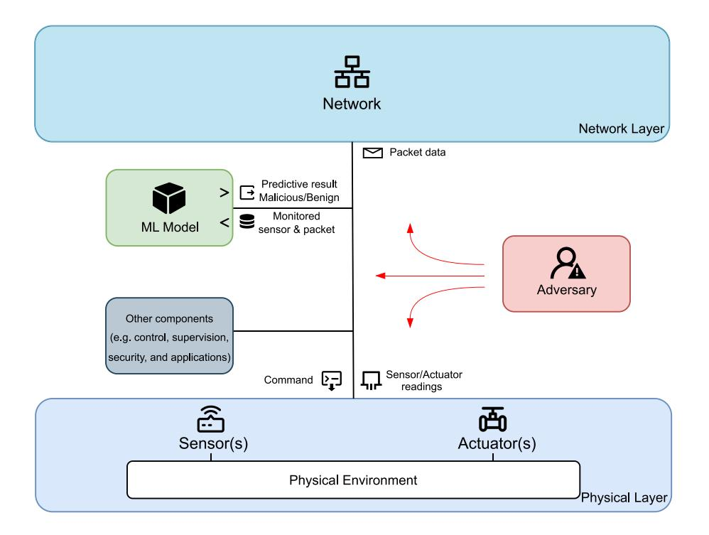
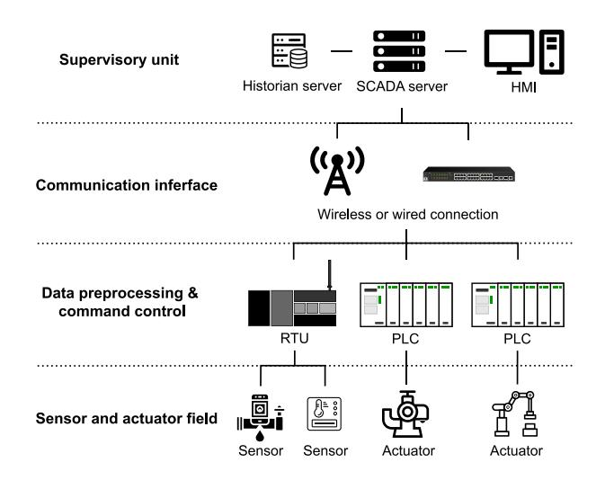
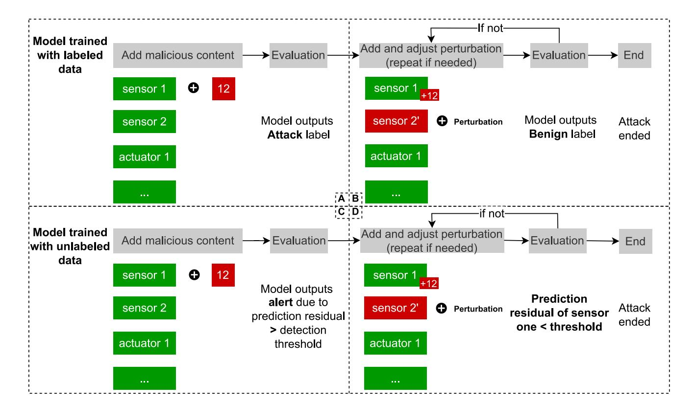
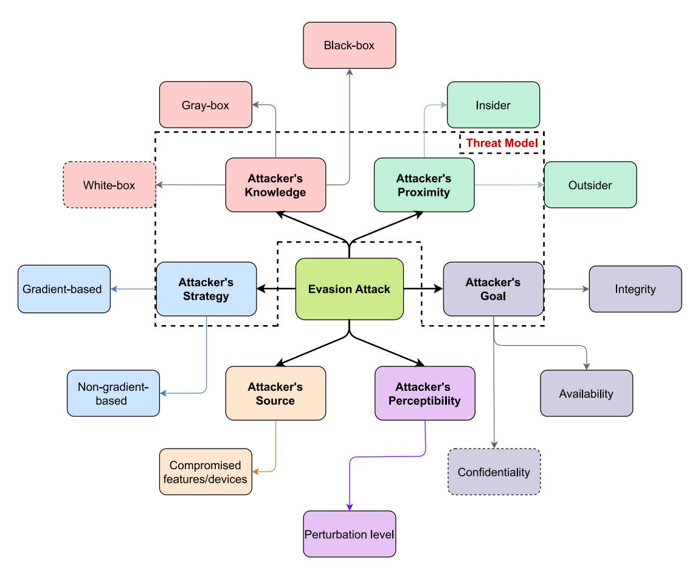
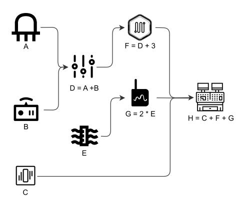
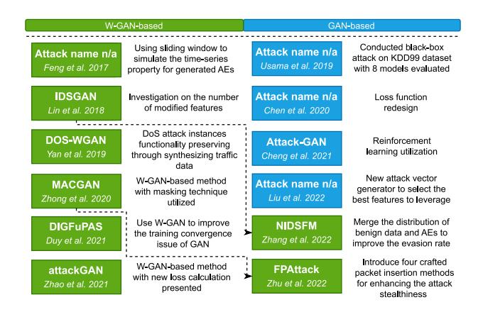
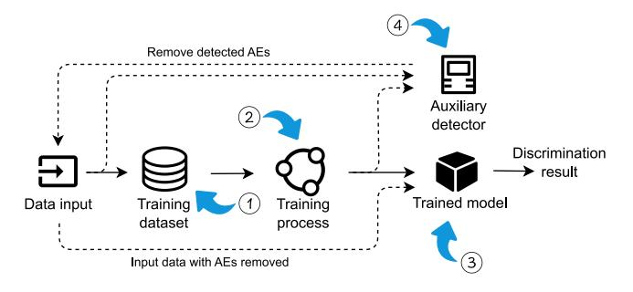
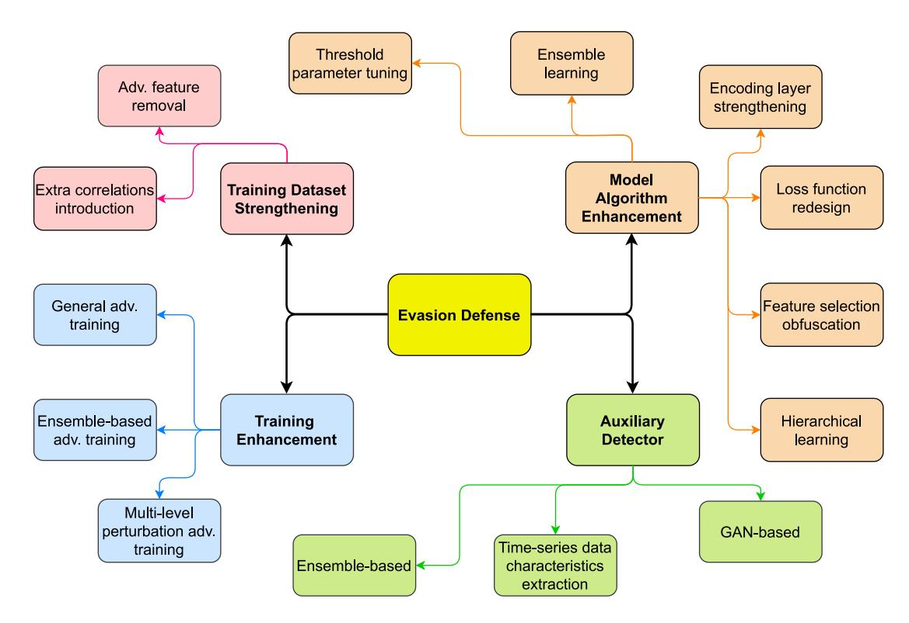

# Evasion Attack and Defense on Machine Learning Models in Cyber-Physical Systems: A Survey

Shunyao Wang®, Ryan K. L. Ko®, *Member, IEEE*, Guangdong Bai®, Naipeng Dong®, Taejun Choi, and Yanjun Zhang®

Abstract—Cyber-physical systems (CPS) are increasingly relying on machine learning (ML) techniques to reduce labor costs and improve efficiency. However, the adoption of ML also exposes CPS to potential adversarial ML attacks witnessed in the literature. Specifically, the increased Internet connectivity in CPS has resulted in a surge in the volume of data generation and communication frequency among devices, thereby expanding the attack surface and attack opportunities for ML adversaries. Among various adversarial ML attacks, evasion attacks are one of the most well-known ones. Therefore, this survey focuses on summarizing the latest research on evasion attack and defense techniques, to understand state-of-the-art ML model security in CPS. To assess the attack effectiveness, this survey proposes an attack taxonomy by introducing quantitative measures such as perturbation level and the number of modified features. Similarly, a defense taxonomy is introduced based on four perspectives demonstrating the defensive techniques from models' inputs to their outputs. Furthermore, the survey identifies gaps and promising directions that researchers and practitioners can explore to address potential challenges and threats caused by evasion attacks and lays the groundwork for understanding and mitigating the attacks in CPS.

*Index Terms*—Evasion attack, adversarial machine learning, Internet of Things, cyber physical systems, cybersecurity, deep learning.

#### I. Introduction

YBER-PHYSICAL Systems (CPS) play indispensable roles in various applications such as smart home [1], [2], [3], [4], healthcare [5], [6], [7], [8], intelligent transportation [9], [10], [11], [12], emergency response [13], [14], [15], [16], energy systems [17], [18], [19], [20] and agriculture [21], [22], [23], [24]. A typical CPS is comprised of physical and network layers, developed using the 3C technologies (computation, communication, and control) [25]. The physical layer gathers data from sensors and actuators, while the network layer employs an embedded computing system to process the data [26]. Depending on the specific architecture requirements, extra components or layers, like application and security layers, might be integrated.

Manuscript received 6 April 2023; revised 24 September 2023 and 19 November 2023; accepted 12 December 2023. Date of publication 20 December 2023; date of current version 23 May 2024. (Corresponding author: Shunyao Wang.)

Shunyao Wang, Ryan K. L. Ko, Guangdong Bai, Naipeng Dong, and Taejun Choi are with the School of Electrical Engineering and Computer Science, The University of Queensland, Brisbane, QLD 4072, Australia (e-mail: shunyao.wang@uq.edu.au; ryan.ko@uq.edu.au; g.bai@uq.edu.aun.dong@uq.edu.au; taejun.choi@uq.edu.au).

Yanjun Zhang is with the School of Computer Science, University of Technology Sydney, Sydney, NSW 2007, Australia (e-mail: Yanjun.Zhang@uts.edu.au).

Digital Object Identifier 10.1109/COMST.2023.3344808

The Internet of Things (IoT) and Industrial Internet of Things (IIoT) devices are critical components of CPS that enable Industry 4.0 [27]. A large number of IoT/IIoT devices have been incorporated into CPS to support various tasks with high specification requirements and complexity, such as environmental surveillance, real-time control management, and manufacturing process monitoring. As a result, machineto-machine (M2M) [28] communication frequency among the devices is expected to increase, leading to an enormous amount of data generated with more heterogeneous content. To handle the data in an analytical and systematic way, the CPS is gradually adopting Machine Learning (ML) models in a variety of tasks, for example, intrusion detection [29], [30], [31], [32], load forecasting [33], [34], [35], [36], health monitoring [37], [38], [39], [40], privacy preserving [41], [42], [43], [44], traffic prediction [45], [46], [47], [48], and fraud detection [49], [50], [51], [52].

Evidence indicates that, under various circumstances, ML models are vulnerable to Adversarial Machine Learning (AML) attacks, also known as adversarial attacks [53], [54]. The adversarial attacks can be broadly categorized into two types [55]: those targeting the inference phase and those targeting the training phase. During the inference phase, the primary focus of the attack is on manipulating the model's input to get a falsified output. For example, evasion attacks [56] deceive the model by providing misleading input, causing it to produce incorrect predictions. Another similar form of attack in this phase is model extraction [57], where the attacker queries the target model extensively to construct a surrogate model, thereby gaining insights into its behavior. On the other hand, attacks targeting the training phase aim to compromise the model's training dataset. Poisoning attacks [58] introduce malicious data into the training set, thereby affecting the model's performance. A variant of the poisoning attack is backdoor attacks [59], where hidden triggers are inserted into the model during its training phase. These triggers are later activated during the inference phase by providing specially crafted input, causing the model to produce erroneous outputs.

ML models employed in CPS face considerable threats and challenges. There is no doubt that these models are susceptible to adversarial attacks. Among the most prevalent is the evasion attack, which typically involves the construction of Adversarial Examples (AEs). These are malicious data points with minor perturbations added, leading the model to misclassify the data. To illustrate, models used to detect anomaly sensor data can be subjected to evasion attacks. To carry out such an attack, an

Fig. 1. AML Attack Surface in CPS.

adversary may add perturbations to one or more fundamental and correlated features, such as the input or output flow rate of a smart meter that tracks the sulfuric acid level in a tank. As a consequence, the ML models would fail to detect any anomalies, potentially leading to an overflow of sulfuric acid in the tank that goes unnoticed. Evasion attacks can also target ML models deployed for zero-day attack detection in CPS. Since ML models are considered the most effective zero-day attack detection mechanism due to their powerful inference ability on previously unseen data learned from the training dataset, evading them can undermine the security of the system by reducing their detection capabilities.

Moreover, the attack surface for ML in CPS is wider than in other ML applications due to the unique characteristics of CPS. As the number of CPS devices connected to the Internet increases, so do the entry points for attackers. Incorporating IoT/IIoT devices in CPS, as mentioned earlier, leads to a larger number of feature types that attackers can target. Additionally, as more Operational Technology (OT) networks connect with Information Technology (IT) networks, many legacy devices lacking high-security standards can be easily manipulated by attackers to add perturbations to the original data transmitted or received by the device. Therefore, ML models deployed in CPS are more prone to being compromised. This can ultimately result in untrustworthy outcomes, which may lead to substantial financial losses, environmental disruption, or endangerment of people's lives. Given the expected ongoing use of ML techniques to support various CPS applications, prioritizing a thorough examination of adversarial behaviors is crucial. This is necessary to ensure that ML models can continue to operate at their full potential without being jeopardized.

Figure [1](#page-1-0) demonstrates the evasion attack surface in CPS consisting of a generic CPS structure embedded with an attacker for showing available attack entries in the system. These entry points comprise three main components: the physical layer, the network layer, and the ML models, which the attacker can gain indirect access to the input and output through these two layers. Under each layer, there are heterogeneous attributes associated with various devices and communication environments. The adversary has to analyze the attributes beforehand and make corresponding attack decisions based on the data value, type, and transmission methods. With respect to the physical layer, the adversary needs to be aware of the basic specifications of the transducers, which include sensors and actuators. For instance, they should be familiar with the maximum monitored level of the sulfuric acid tank to ensure that the perturbed new level does not exceed this limit. As for the network data, the adversary needs to find out the functional attributes that cannot be modified (e.g., protocol type and flow duration) and non-functional attributes that can be mutated (e.g., number of the ACK packets and flow rate) so that the crafted packet circumvents the model's detection while preserving the attack behavior.

While evasion attack and defense methods have been extensively studied and reviewed in computer vision, natural language processing (NLP), and image recognition [\[56\]](#page-32-15), [\[60\]](#page-32-19), [\[61\]](#page-32-20), there is a limited number of studies within the CPS domain. This reveals that evasion attacks and defenses in the CPS research area are still in their early stage. Moreover, relevant survey works [\[53\]](#page-32-12), [\[54\]](#page-32-13), [\[62\]](#page-32-21), [\[63\]](#page-32-22), [\[64\]](#page-32-23) either cover scattering adversarial attacks, applications, and domains or focus exclusively on the evasion attack or defense. To our best knowledge, there is no systematic review on evasion attack and defense techniques with **both** transducer and traffic data in CPS. As CPS is a sophisticated system that fuses physical and network components, enabling it to exchange information and interact with the physical environment, a thorough assessment of CPS security requires examining both the physical and network components of the system. Attacks on either the physical or network layer can compromise the integrity, availability, and confidentiality of the entire system due to the cascading attack effects between layers. By considering both layers together, security professionals can identify common evasion attack patterns and techniques, develop unified threat models, design effective defensive mechanisms, and thus address the threats in a more comprehensive manner. These reasons are the main motivations for us to conduct this survey as a targeted study on one of the most prevalent AML techniques, i.e., evasion attacks and defenses.

The main contributions of this paper are outlined below:

- We propose an evasion attack taxonomy by introducing various elements to represent the attacks in-depth. See Section [III.](#page-7-0)
- A systematic defense taxonomy is also proposed from four representative angles to explicitly show how to secure the ML model against evasion attacks from the root. This is discussed in Section [V.](#page-21-0)
- With the taxonomies, recent research on evasion attacks and defenses is reviewed and summarized. See Sections [IV](#page-11-0) and [VI.](#page-21-1)
- After that, we further highlight and discuss the identified research gaps and possible evasion attack and defense research directions from the literature review in the domain of the cyber-physical system in Section [VII.](#page-26-0) Then, we present the lessons learned in Section [VIII.](#page-29-0)

As ML models are increasingly integrated into CPS to create more intelligent and adaptive environments, understanding their vulnerabilities becomes paramount. This survey is designed to serve as an essential resource for the research community, focusing on the susceptibility of ML models to evasion attacks within the context of CPS. By offering a comprehensive taxonomy and comparative analysis of various evasion techniques, we aim to guide researchers in developing more robust and adaptive ML algorithms specifically tailored for CPS applications. From a societal standpoint, the secure and effective deployment of ML models in CPS has far-reaching implications for critical infrastructures such as the power grid, healthcare, and transportation. Improving the resilience of these models against evasion attacks is crucial for the safety, reliability, and intelligent adaptability of systems that are becoming increasingly central to modern life. This survey, therefore, serves not only as an academic cornerstone for future research in the security of ML models within CPS but also as a contributing factor to societal efforts aimed at improving their security, reliability, and intelligence.

# *A. Related Works*

In this section, we summarize the related survey on evasion attacks and defenses in cyber-physical systems. All the recent highly-related surveys are sorted and presented under the publication time, evasion attack taxonomy, evasion defense taxonomy, evasion focused, CPS domain coverage, systematic analysis on the research trend and challenges, attack types, and the corresponding comments shown in Table [I.](#page-3-0)

Works [\[53\]](#page-32-12), [\[62\]](#page-32-21), [\[64\]](#page-32-23), [\[65\]](#page-32-24) surveyed the adversarial attacks with all three types of knowledge settings: white, gray and black-box. Among them, the works [\[62\]](#page-32-21), [\[65\]](#page-32-24) target evasion attacks and [\[53\]](#page-32-12), [\[64\]](#page-32-23) additionally cover poisoning attacks. The authors of [\[62\]](#page-32-21) explored evasion attacks focusing only on three types of sensor data: surveillance, audio, and textual data. However, there are various other types of data in CPS that they did not cover, such as biometric, energy, network, and medical data. Additionally, the taxonomy proposed by the authors integrates both evasion attack and defense aspects but lacks depth in covering the details. Reference [\[65\]](#page-32-24) investigated the feasibility of malicious functionality preservation under different models, constraints, and attack techniques, concluding with promising future research directions. Nonetheless, only three domains are included: visual, cybersecurity, and text, and only three types of models are considered: Multilayer Perceptron (MLP), Convolutional Neural Network (CNN), and Recurrent Neural Network (RNN). Reference [\[53\]](#page-32-12) conducted the review on adversarial attacks at the network layer only without analyzing the corresponding defensive techniques. There is also no comprehensive analysis of the evasion research trends and challenges. Reference [\[64\]](#page-32-23) surveyed the adversarial attack and defense works in the cybersecurity domain, covering a broad range of application fields, such as malware detection, URL detection, network intrusion detection, spam detection, industrial control systems, and biometric systems. Nevertheless, in comparison to the content on evasion attacks, the defense strategies are significantly imbalanced with respect to the attack methods, and there is no taxonomy provided to guide a systematic review. Hence, their reviewed defense strategies cannot reflect the state-of-the-art defense standard for the diverse applications in CPS.

Three surveys [\[63\]](#page-32-22), [\[66\]](#page-32-25), [\[67\]](#page-32-26) have considered only two knowledge settings. References [\[63\]](#page-32-22), [\[67\]](#page-32-26) concentrated on evasion attacks for white and black-box settings, while [\[66\]](#page-32-25) targeted both evasion and poisoning attacks for white and gray-box settings. Reference [\[63\]](#page-32-22) conducted the review on securing ML models under AML attacks by discussing typical ML applications in CPS, classical algorithms for generating adversarial examples, and providing a detailed analysis of ML model protection mechanisms. The survey is defense-oriented for AML. Hence, the types of evasion attack techniques mentioned are limited. It also lacks a clear attack taxonomy to guide evasion attack research, and the defense taxonomy is broadly designed, suggesting that the defense techniques could be further classified under more precise categories. References [\[67\]](#page-32-26) looked into both the evasion attacks and defenses but was limited to the network layer. This work proposed a comprehensive taxonomy for Network Intrusion Detection Systems (NIDS) in the context of adversarial learning. However, it did not extend this categorization to the attacks reviewed, and the defense research works examined are categorized in a vague manner. The work [\[66\]](#page-32-25) reviewed

TABLE I RELATED WORKS SUMMARY

| Ref. Year Taxonomy Evasion Focused Attack Defense Physical Ne |      | Taxonomy |            |   | CPS Coverage |          | Attacl | к Туре | Evaluation of Evasion Feasibility | Systematic Analysis on Trends & Challenges | Comments                                                                                                                                                                                                                                                                                                                                                                                  |
|---------------------------------------------------------------|------|----------|------------|---|--------------|----------|--------|--------|-----------------------------------------|-----------------------------------------------------|-------------------------------------------------------------------------------------------------------------------------------------------------------------------------------------------------------------------------------------------------------------------------------------------------------------------------------------------------------------------------------------------|
|                                                               |      | Network  | Gray Black |   | -            |          |        |        |                                         |                                                     |                                                                                                                                                                                                                                                                                                                                                                                           |
| Li et al. [62]                                                | 2020 | 1        | 1          | ✓ | 1            | Х        | 1      | 1      | Х                                       | <b>√</b>                                            | Three popular data types are focused in this work, whereas data types from other CPS-related domains and applications are not targeted. They provide a basic combined taxonomy of attack and defense, which fails to address various attack and defense techniques in-depth.                                                                                                              |
| Olowononi et al. [63]                                   | 2021 | 1        | 1          | 1 | ✓            | X        | X      | 1      | X                                       | ✓                                                   | The survey thoroughly examines the resilience of ML models. Since it is defense-oriented, the discussion on evasion attacks is limited.                                                                                                                                                                                                                                                   |
| Apruzzese et al. [53]                                         | 2021 | X        | X          | × | X            | ✓        | 1      | 1      | <b>√</b>                                | ×                                                   | The paper delves into the modeling of realistic adversarial attacks and reassesses various attack assumptions in practical contexts. Nevertheless, there is a lack of solutions or countermeasures for the corresponding attack techniques.                                                                                                                                               |
| Rosenberg et al. [64]                                   | 2021 | ✓        | Х          | Х | <b>√</b>     | ✓        | /      | 1      | 1                                       | 1                                                   | Various cybersecurity domains are addressed in this work from both attack and defense perspectives. However, the study does not specifically focus on CPS and covers both evasion and poisoning attacks. This wide scope makes it challenging to provide a comprehensive comparison of evasion attack and defense strategies.                                                             |
| Alatwi et al. [54]                                      | 2021 | Х        | Х          | X | X            | ✓        | X      | 1      | ×                                       | <b>✓</b>                                            | The paper reviews black-box evasion and poisoning attacks at the network layer. However, it lacks a comprehensive analysis of the taxonomy for both attack and defense, and the discussion regarding research challenges and opportunities is also insufficient.                                                                                                                          |
| McCarthy et al. [65]                                    | 2022 | Х        | X          | ✓ | ✓            | ✓        | ✓      | 1      | ✓                                       | ✓                                                   | The study aims to explore functionality-preserving evasion attacks in detail across three domains, with a partial focus on CPS. The limited works presented in each domain make it challenging to achieve a holistic evaluation.                                                                                                                                                          |
| Aloraini et al. [66]                                    | 2022 | ✓        | X          | X | ✓            | <b>✓</b> | 1      | X      | Х                                       | ✓                                                   | A taxonomy is proposed to categorize the adversarial methods for evasion and poisoning that insiders might exploit in real-life IoT applications. Yet, the study does not provide a systematic defense taxonomy, and the number of works included is inadequate.                                                                                                                          |
| He et al. [67]                                             | 2023 | Х        | ✓          | ✓ | X            | ✓        | Х      | 1      | <b>√</b>                                | ✓                                                   | Deep-learning-based network intrusion detection systems are evaluated in an adversarial learning setting. However, while the work targets only DL-based models, no tailored attack taxonomy is provided to quantify the effectiveness of evasion attacks for the reviewed works, and the defense taxonomy is vaguely categorized.                                                         |
| Our study                                                  | 2023 | /        | 1          | ✓ | 1            | ✓        | 1      | 1      | 1                                       | 1                                                   | We present a comprehensive review of evasion attack and defense techniques within the CPS domain, including detailed taxonomies. Drawing from this review, we discuss in-depth the challenges associated with implementing these evasion attack and defense strategies and highlight potential research opportunities that are worth consideration for future exploration. |

recent works in IoT from an insider point of view and provided several real-life case studies. Particularly, they analyzed vulnerable parts in the IoT system that the adversary can leverage. Yet, the discussion on the defense aspect is less thorough than the attack aspect. Regarding attacks, the analysis includes only five works on the application of adversarial insider attack methods and four adversarial insider attack scenarios. While evasion attacks are addressed, the emphasis is mainly on the insider's perspective, leading to a narrower examination of evasion research in CPS.

Finally, [\[54\]](#page-32-13) surveyed the black-box evasion attacks only at the network layer without deeply discussing defensive techniques or proposing any attack or defense taxonomy.

To summarize, these related surveys provide a broad overview of evasion attacks and defenses in various cybersecurity-related fields. However, they also reveal several gaps and limitations in the existing survey landscape. Firstly, the coverage of CPS applications is not exhaustive, leaving certain areas underexplored. Moreover, many studies tend to target multiple domains, including CPS, potentially

compromising the depth and specificity of insights for CPS. A notable imbalance is also observed in the content dedicated to evasion attack and defense strategies. Some studies predominantly focus on the former, while others are skewed towards the latter, leading to an uneven understanding of the threat landscape. Furthermore, the taxonomies presented, whether they pertain to evasion or poisoning attacks, often fall short in terms of depth. They lack a structured categorization and fail to encompass the properties that are essential for a thorough characterization of evasion attack and defense, thereby diminishing their overall precision and clarity.

Another observation from the related works is that evasion attacks and defenses at the physical layer are often discussed separately from those at the network layer. Yet, CPS inherently operates as an integrated entity, where the information exchange between its physical and network components is pivotal. An attack on the physical layer can have cascading effects on the network layer and vice versa. For instance, manipulating a sensor at the physical layer can lead to misleading data being fed into the network, which can then be exploited further. By jointly analyzing these layers, we can identify common evasion attack and defense themes, patterns, or techniques across layers. Moreover, we can propose a unified threat model and develop unified benchmarks and evaluation metrics. This would allow for a more standardized assessment of ML models deployed in CPS that are utilized for various purposes. In turn, it provides a holistic understanding of the ML models' security level in CPS under an adversarial environment, highlighting the intricate interdependencies and potential compound attack vectors.

In light of these identified gaps, our work aims to provide a comprehensive and balanced exploration of both evasion attack and defense strategies specifically tailored to the CPS context at the physical and network layer. We present detailed taxonomies for evasion research and cover a broad range of ML models and applications for a systematic review. In addition, we discuss the challenges and complexities, analyze emerging trends, and highlight promising research opportunities that lie ahead in this evolving domain.

## *B. Survey Methodology*

This section elucidates the survey methodology we utilized in this study. Based on the PRISMA systematic review methodology [\[68\]](#page-32-27), we selected the most representative attack and defense approaches from Google Scholar and Semantic Scholar. Following the PRISMA paper literature flow chart, research works that were duplicates or irrelevant to the CPS domain and applications were removed in the first phase. In the second phase, the collected papers were further inspected and removed based on criteria such as overlapping topic coverage, types of adversarial attacks, the attacker's knowledge, and the novelty of the proposed attack or defense techniques. The remaining filtered papers were then included in the survey for review. The keywords used for searching are the combinations of *adversarial machine learning* with *adversarial attacks*, *cyber-physical system*, *industrial control system*, *sensor network*, *IoT*, *IIoT*, *healthcare*, *control system*, *smart grid*, *Supervisory Control and Data Acquisition (SCADA)*, *automotive*, *surveillance*, *agriculture*, *cyber security*, *Network Intrusion Detection System (NIDS)*, *defense* and *machine learning resilience*. The top five pages of each keyword combination search result are taken for examination due to the increasing number of irrelevant results after the fifth page. The main focus of the publication timeframe is from 2018 to March of 2023 to guarantee that recent relevant works in the research field have been included in this survey.

# *C. Survey Scope*

For evasion attack research, this survey only covers the works on gray and black-box configurations. White-box attacks have been excluded because they are less feasible and realistic to conduct in real-world CPS environments. Whereas for defense research works, we take into account all three types of attacks to provide a thorough analysis of the methods that safeguard CPS. Note that the wireless communication security in CPS, for example, evasion attacks on the spectrum of sharing and network slicing [\[69\]](#page-32-28), [\[70\]](#page-32-29), [\[71\]](#page-32-30), is beyond our research scope due to the distinctive characteristics of Radio Frequency (RF) data and how it is transmitted in the wireless communication channel, such as channel noise and waveform attributes [\[72\]](#page-32-31).

We also include the evasion attack research on the ML model-based NIDS. Network data transmission involves both general-purpose communication protocols (e.g., for tasks such as remote management, Human-Machine Interface monitoring, and data aggregation and analysis) and specialized communication protocols (e.g., for data exchange between the cyber and physical environments), such as Modbus RTU, CIP, and Profibus. Attacks, for example, probe attacks [\[73\]](#page-32-32) and DDoS attacks [\[74\]](#page-32-33), can be conducted on each of these protocols due to the high similarities in network traffic patterns and attack vectors. Furthermore, existing literature is limited in the number of studies that focus on evasion attacks in networks utilizing various communication protocols. Coupled with a lack of datasets tailored to such networks, we believe that insights gained from general-purpose traffic analysis can be adapted to meet the unique requirements of specialized network traffic in CPS.

# *D. Terminology Clarification*

From the literature study, we note that terms like 'evasion attack' and 'adversarial machine learning (AML)' or 'adversarial attacks' are often used interchangeably, yet they describe different concepts. This trend is likely attributed to the growing prevalence of evasion attacks in recent years. The tendency to use these terms synonymously, especially referring to all adversarial attacks as evasion attacks, could be misleading. To promote clarity and precision in our paper, we align with the definitions from [\[64\]](#page-32-23), [\[75\]](#page-32-34), where AML attacks and adversarial attacks encompass a range of strategies targeting ML models, including evasion attacks as a specific type. Using accurate terminology is crucial not only for clear communication in research but also for understanding the distinct characteristics of each attack type, which is essential for developing effective defenses and mitigation strategies.

## *E. Structure and Organization*

The reminder of this survey is organized as follows. The Background Section [II](#page-4-0) discusses Supervisory Control and Data Acquisition (SCADA) and evasion attacks in different problem settings. Section [III](#page-7-0) presents the evasion attack taxonomy. In Section [IV,](#page-11-0) the surveyed attack works are reviewed. Section [V](#page-21-0) describes the evasion defense taxonomy, and Section [VI](#page-21-1) contains the reviewed works for defense techniques. Section [VII](#page-26-0) gives the research gaps and directions. Section [VIII](#page-29-0) explains the lessons learned. Finally, Section [IX](#page-30-0) concludes the survey.

## II. BACKGROUND

This section begins by presenting a concrete example, the SCADA system, to illustrate the components and structure of CPS. After a brief introduction to evasion attacks, the section goes on to detail how these attacks manifest in CPS, both at the physical and network layers.

Fig. 2. Supervisory Control And Data Acquisition (SCADA) System Architecture.

# *A. Supervisory Control and Data Acquisition (SCADA) System*

Figure [2](#page-5-0) demonstrates a generic CPS architecture named the Supervisory Control And Data Acquisition (SCADA) system. As shown in the figure, the measurement analog signal from sensors is periodically collected and converted to digital signal by the Remote Terminal Unit (RTU). Then, the signal is transmitted to the SCADA server via a wired (e.g., local Ethernet switch) or wireless (e.g., radio and satellite) communication. The SCADA server gathers and analyzes these sensor signal data and issues corresponding commands to the Programmable Logic Controllers (PLCs). Subsequently, the commands are sent to actuators from PLCs to perform specific tasks by interacting with the physical world. In addition, a Human Machine Interface (HMI) is connected to the SCADA server to present the real-time system status to the human operators who can monitor or control the system. Moreover, the SCADA server records the data and event logs during operations and saves them to the historian server for backup and analysis purposes such as threat detection and data trend analysis.

## *B. Evasion Attacks in a Nutshell*

In the context of cybersecurity and information systems, an evasion attack refers to techniques used by attackers to circumvent detection measures, either during or following unauthorized access to a target system. However, this term may have varied interpretations across different domains. For example, in system security, evasion attacks typically involve tactics such as encryption [\[76\]](#page-32-35) or packet fragmentation [\[77\]](#page-32-36) to bypass Intrusion Detection Systems (IDS) or Intrusion Prevention Systems (IPS). In application security, evasion attacks can take forms like obfuscated SQL injections, which are designed to elude Web application firewalls [\[78\]](#page-32-37). Moreover, in the context of malware detection, evasion strategies include using polymorphic [\[79\]](#page-32-38) and metamorphic [\[80\]](#page-32-39) malware. Polymorphic malware alters its code signature with each infection to evade signature-based detection, whereas

metamorphic malware completely rewrites its code, making detection through conventional methods even more challenging. From a machine learning perspective, evasion attacks aim to mislead the model into making incorrect decisions on specific tasks by introducing small perturbations to benign or malicious input data during the inference phase [\[81\]](#page-32-40). Since Szegedy et al. [\[82\]](#page-32-41) discovered ML models are vulnerable to evasion attacks, there is an increasing number of works identifying that the vulnerability exists across various machine learning models in a range of application domains such as spam detection [\[83\]](#page-32-42), [\[84\]](#page-32-43), image classification [\[85\]](#page-32-44), [\[86\]](#page-32-45), object detection [\[87\]](#page-32-46), [\[88\]](#page-32-47), speech recognition [\[89\]](#page-33-0), [\[90\]](#page-33-1), and malware detection [\[91\]](#page-33-2), [\[92\]](#page-33-3). Corresponding defense techniques have also been proposed to alleviate the effect of the attacks, such as feature distillation [\[93\]](#page-33-4), [\[94\]](#page-33-5), input transformation [\[95\]](#page-33-6), [\[96\]](#page-33-7), defensive quantization [\[97\]](#page-33-8), [\[98\]](#page-33-9), ensemble learning [\[99\]](#page-33-10), [\[100\]](#page-33-11), and randomized smoothing [\[101\]](#page-33-12), [\[102\]](#page-33-13).

## *C. Evasion Attacks at Physical Layer*

Evasion attacks at the physical layer aim to evade the deployed ML model in the system by adding well-crafted perturbations on the sensor or actuator readings. Unlike attacks in the image domain, specific evasion attacks in CPS are enabled due to their data characteristics, like data correlation and time-series properties. ML models trained on pre-labeled datasets, like cyber attack detection models, can be compromised by attackers who manipulate sensor or actuator readings, causing misclassification from attack to benign. As illustrated in the upper part of Figure [3,](#page-6-0) the attacker aims to add a value of 12 cm to the reading from sensor one, thereby reaching the overflow level of a sulfuric acid storage tank. If the attacker naively adds 12 cm to sensor one, the ML model will report it as an attack (i.e., Section [II-B](#page-5-1) in Figure [3\)](#page-6-0). However, by carefully designing and adding a perturbation to sensor two, the attacker can deceive the model, leading it to make an incorrect classification. Specifically, the model may wrongly classify the modified value from sensor one as benign. This misclassification is possible because the model has learned a correlation between sensor one and sensor two (i.e., Section [II-B](#page-5-1) in Figure [3\)](#page-6-0). The attacker chooses not to add perturbations to sensor one in order to preserve the specific attack functionality, which aims to raise the tank level to a particular value. Therefore, by introducing perturbations to sensors that are correlated with sensor one, the attacker can indirectly mislead the model into making a wrong decision.

Differing from the models trained on prelabeled datasets, models training on unlabeled datasets normally require subsequent timestamp data as the true label for the current timestamp data. Data labeling in a CPS environment can be challenging. This is due to the sheer volume of data generated in real time, which makes labeling a task that can consume a significant amount of time and resources. Additionally, it requires human expertise that may not always be available. Taking the same cyber attack detection model as an example, the model reports an attack when the distance between the predicted sensor reading and the true sensor reading exceeds a given threshold of 5 cm. Assuming the reading from sensor

Fig. 3. Evasion Attacks at CPS Physical Layer.

one was 58 cm at a given timestamp, and the predicted value for the next timestamp was 60 cm, adding 12 cm to the given timestamp's reading from sensor one would cause the sulfuric acid storage tank, which has a maximum level of 80 cm, to overflow (i.e., Section [II-C](#page-5-2) in Figure [3\)](#page-6-0). In this case, the ML model would trigger an alert because the prediction residual exceeds the threshold of 5 cm. Specifically, the absolute value of the predicted reading of 60 cm - the actual reading (i.e., 58 + 12 = 70) results in a residual of 10 cm, which is greater than 5 cm. The attacker then generates a perturbation and adds it to the reading of sensor two, successfully reducing the prediction residual to 3 cm, which is below the threshold. As a result, no alert is triggered, and the overflow attack is achieved (i.e., Section [II-D](#page-7-1) in Figure [3\)](#page-6-0). It is worth noting that the perturbation introduced to sensor two should not trigger an alert on that sensor; instead, it should help sensor one evade detection. Furthermore, if the malicious content to be added (e.g., 12 cm) to sensor one is too large, it may result in a situation where no appropriate perturbation can be searched. Therefore, the first consideration before launching the evasion attack is how to design the malicious content and for how many timestamps the attack should achieve its purpose. This attack specifically aims to indirectly falsify the model's predicted values by exploiting the time-series nature of the data. Moreover, the model's attack detection performance is also constrained by the model type and the detection mechanism utilized, such as Mean Squared Error (MSE) [\[103\]](#page-33-14), Cumulative Sum (CUSUM) [\[104\]](#page-33-15), or Z-score [\[105\]](#page-33-16). This contrasts with the previous example, where the attack's effectiveness relied solely on the model's robustness.

The above attack examples are called targeted attacks, which means the attacker tries to manipulate the model's outcome to the desired one (i.e., integrity violation in Section [III-D\)](#page-10-0). Whereas, under an untargeted attack, the attacker tries to sabotage the model's performance so that the model can no longer provide the designated service (i.e., availability violation in Section [III-D\)](#page-10-0). Depending on various threat models, researchers typically make relevant assumptions to support their background story on the adversaries, such as knowing the knowledge of the victim model, the number of devices that can be compromised, and the knowledge of the defense mechanism used in the victim's system, etc. (more explanations can refer to Section [III\)](#page-7-0).

Another feature of evasion attacks at both physical and network layers in CPS is that undertaking real-time attacks is more demanding. To conduct the attack in real-time, the attacker must complete generation, evaluation, adjustment, and addition of perturbation in a short time while ensuring normal communication among devices. The victim model may not be available to the attacker for querying if the adversarial data can evade detection or not. Therefore, offline perturbation generation and evaluation are inevitable for a successful attack launch. Specifically, the attack requires a victim model's replica, which guarantees its performance is highly consistent with the victim model, and a trained generator that can output the ideal perturbation given the benign data with relatively low latency. Note that for systems operating in a highly interactive and responsive manner, such an evasion attack may not be effective and could result in a high failure rate due to additional time consumed to intercept the data from devices, generate the perturbation based on the data, and send the adversarial data back to the designated destination. Hence, the attacker needs to examine how frequent the communication is in the victim system and how quickly the perturbation generator can produce so that the attack can be conducted in real-time or near real-time.

## *D. Evasion Attacks at Network Layer*

For evasion attacks at the CPS network layer, the attack targets are shifted from sensors and actuators to network packet attributes. Common packet attributes are IP address, protocol, port number, sequence, acknowledgment, checksum, flags, payload, etc. Furthermore, other derived packet attributes are also commonly used as the input to the ML model, such as packet transmission rate between source and destination, number of control device logins, number of connections to the industrial service, etc. Similar to evasion attacks in the physical layer, the attacker can also aim to evade the victim model's detection by launching a targeted or untargeted attack for the victim model trained on labeled data (e.g., tampering predicted label of Denial of Service (DoS) attack as benign) or unlabeled data (e.g., falsifying the packet transmission rate).

As many constraints exist regulating network packet attributes to ensure the packet can be transmitted legitimately in communication channels, the attacker needs to analyze and investigate the attributes and classify them into two groups beforehand: functional and non-functional [\[106\]](#page-33-17). The functional attributes cannot be added with perturbations as this could violate packet transmission semantics (e.g., changing the IP address or port number) or traffic characteristics (e.g., changing the data timestamp to the past). Nevertheless, modifications on non-functional attributes do not suffer from such issues, and the perturbation can be added to the attributes while ensuring the packet's original functionality or the network traffic's normal behavior.

# III. ATTACK TAXONOMY

In this section, we present our proposed evasion attack taxonomy as shown in Figure [4.](#page-8-0) Inspired by the AML taxonomy proposed by Rosenberg et al. [\[64\]](#page-32-23), Ibitoye et al. [\[107\]](#page-33-18), and Kuppa et al. [\[108\]](#page-33-19) in other domains, this evasion attack taxonomy is tailored to the CPS domain and comprises six components: Attacker's Knowledge, Attacker's Proximity, Attacker's Strategy, Attacker's Goal, Attacker's Perceptibility, and Attacker's Source. Each component has sub-component(s) to further classify the component in-depth. As such, this attack taxonomy enables a qualitative and quantitative analysis and measurement of the evasion attack in CPS.

Building upon this taxonomy, we introduce a focused threat model, also depicted in Figure [4.](#page-8-0) The aim of this model is to facilitate the identification and analysis of the various threats posed by evasion attacks. While the taxonomy offers a broad overview of potential attack vectors, strategies, and measurements, the threat model narrows down the scope to specifically address and analyze the most pertinent threats in the context of the highly constrained CPS domain.

## *A. Attacker's Knowledge*

From the literature surveyed, we found no unified definitions of the gray-box and black-box evasion attack because of the variety of attacker's knowledge judgment criteria. Hence, we redefined the concepts of white-box, gray-box, and black-box depending on how well the attacker understands the victim's model. Their definitions are presented as follows.

- *White-box*. In white-box attacks, the attacker has complete knowledge of the victim model's architecture, internal hyperparameters, and training dataset.
- *Gray-box*. In gray-box attacks, the attacker has restricted knowledge of the victim's model. The attacker can access the partial or full training dataset and feature space. The complete training dataset or feature space here typically refers but is not limited to, the number of sensors, actuators, communication channels, substations, control devices, and functional and non-functional packet attributes. Furthermore, the attacker may be aware of the type of victim model but not the internal hyperparameters. Knowing the type of model can improve the robustness of the AEs. For instance, if the victim model is a Long Short-Term Memory (LSTM) model, using the Linear Regression (LR) model may not be as effective as LSTM in analyzing time-series data where observations are dependent on each other. This could result in a low evasion success rate. Lastly, the attacker also has the capability to make queries about the input validity from the victim model, allowing for iterative updates to the AEs.
- • *Black-box*. In black-box attacks, the attacker does not know the victim's model. However, partial or full training dataset and feature space applied to the gray-box apply to the black-box as well. This common assumption is normally valid with the background that the attacker has already gained access to the internal network with capabilities of eavesdropping, transmitting, intercepting, and modifying the communication content. For instance, the attacker can compromise the sensor units locally with physical access or intercept the network packets and maliciously forge the packet data on the fly with network access.

As the chance of an attacker obtaining complete knowledge of the model is extremely rare, the white-box attack is less feasible and realistic to conduct than the other two types in the modern CPS. Hence, the white-box attack literature is not included in this survey. However, most white-box attack methods can be transferred to the black-box manner via the AEs transferability property, which means the AEs generated for one model can be used to deceive another model, even if the models have distinct architectures or were trained on dissimilar datasets [\[109\]](#page-33-20).

## *B. Attacker's Proximity*

The attacker's proximity indicates their position relative to the target organization or system. Depending on the attacker's capabilities, they can be categorized into two roles: insider and outsider. The subsequent sections elucidate the

Fig. 4. The Taxonomy of Evasion Attack.

definitions of these roles and highlight common assumptions observed in the current evasion research. Where applicable, we also present real-life case studies that corroborate these assumptions.

*1) Insider:* Insiders are individuals or entities with legitimate access to a CPS, either at the physical or network layer. At the physical layer, an insider might have direct access to transducer devices, allowing them to manipulate or tamper with sensor or actuator values, whether in the field or at the communication center. At the network layer, they might have permission to access, modify, or inject malicious packet data on the fly. This could potentially alter the system's behavior or readings in order to achieve their malicious purposes. Insiders typically gain this position due to their roles as employees, contractors, or other stakeholders, which grant them authorized access to specific parts of the system within the organization. Their knowledge and access privileges allow them to launch sophisticated attacks under the security radar. Common assumptions are:

• *Manipulating data transmission*. Insiders believe they can maliciously control and manipulate data transmission through various techniques. These techniques could encompass communication channel eavesdropping [\[110\]](#page-33-21), inflicting physical harm on the environment where devices are located [\[111\]](#page-33-22), altering hardware components [\[112\]](#page-33-23), falsifying packets via Man-in-the-Middle (MitM) attacks [\[113\]](#page-33-24), and injecting false packets directly to the communication channel [\[114\]](#page-33-25). A real-world instance that underscores this assumption is the Stuxnet worm [\[115\]](#page-33-26) targeted Iranian nuclear facilities. The attack carried out using a USB flash drive, indicates that it either exploited human error or leveraged social engineering to take advantage of a 'trusted insider.' The attack manipulated the system's feedback loop by altering the output frequencies of centrifuges. At the same time, it played back recorded data of normal operations to the monitoring systems. This caused physical damage while simultaneously evading detection.

- *Possessing knowledge of the system's normal operations*. Insiders assume they possess knowledge of the basic specifications of the transducers (e.g., the upper and lower data value limits) as well as the functional and non-functional network attributes. This belief might be justified if the insiders have relevant information or are familiar with the target system. A notable real-world example that highlights this assumption is the Maroochy Shire sewage spill incident [\[116\]](#page-33-27). A former employee used a stolen radio unit to send unauthorized commands to 46 sewage pumping stations. As a result, around 800,000 liters of raw sewage spilled into local parks and rivers.
- • *Possessing knowledge of the target ML model*. The insiders may possess knowledge about the deployed model, including its type, architecture, parameters, training data,

and data preprocessing steps. Such a scenario is termed a white-box attack. The more information the insider has, the less likely they are to be discovered and the higher the evasion success rate.

- *2) Outsider:* Outsiders are individuals without inherent access to a CPS and its components. They are not initially granted access to the physical devices or the communication network. However, they might attempt to breach the system's defenses, whether they are physical (e.g., fences and locks) or virtual (e.g., firewalls and antivirus software), to gain unauthorized access. After the security breach, their attack capabilities at both the physical and network layers are similar to those of insiders. Since outsiders lack affiliation with the organization, their abilities are constrained by the currently deployed defense mechanisms and their lack of inherent system access. Nonetheless, their potential impact can still be significant, especially if they exploit system vulnerabilities and covertly infiltrate the target organization or system. Common assumptions are:
  - *Accessing the communication system*. Outsiders assume they can access communication channels through various tactics. For instance, they might exploit vulnerabilities in the external interfaces of the CPS. They may also target legacy systems due to unpatched vulnerabilities. Additionally, they can use social engineering techniques to access the system, with the ultimate goal of covertly eavesdropping on data transmissions. One reallife incident related to this assumption is the WannaCry ransomware attack [\[117\]](#page-33-28). Attackers exploited a vulnerability in legacy devices running older versions of Microsoft Windows, gaining access to data on over 200,000 computers.
  - *Eavesdropping on target system*. Outsiders assume that once they've gained access to an internal network, they can eavesdrop over extended periods to gather substantial information about the system. Attackers typically remain hidden within the infrastructure for long durations. If beneficial, they might employ devices identical to the target's to simulate its normal operating behavior, enhancing their understanding of the target system. After obtaining sufficient data, they can perform a thorough analysis. This analysis facilitates the preprocessing of the data, ensuring their training dataset aligns closely with the training dataset of the target model. The 2015 Ukraine power grid attack [\[118\]](#page-33-29) can be used to underscore this assumption. The attackers demonstrated a deep understanding of the Ukrainian power grid's operations, suggesting extensive reconnaissance and a prolonged period of infiltration. This level of knowledge made it harder to detect their malicious activities.
  - *Implementing a model with high similarity to the target model*. This assumption posits that the surrogate model crafted by outsiders can closely resemble the functionality of the target model. Suppose the outsider has obtained substantial raw data for training. In that case, their model may yield results similar to those of the target model after experimenting with various model types and careful parameter tuning. Hence, outsiders can conduct a

transferred evasion attack on the target model to conceal their original attack intention. However, this assumption is contingent upon the validity of other assumptions (e.g., access to the communication system), which makes it challenging to apply.

Although outsiders can emulate the system and have some degree of knowledge, their efficacy in evasion attacks might fall short compared to insiders, given their limited precision. While ML models are not yet widely adopted in CPS, real-life evasion attack incidents are still rare. However, as these models become more integral to CPS in the future, the incentive for both insider and outsider attacks will likely increase. Similar real-life incidents, like those we have discussed previously, could recur with ML models. This makes continued research and vigilance in this area crucial and further enhances the significance of this paper, which offers insights into potential vulnerabilities and strategies to mitigate the impact of such attacks.

## *C. Attacker's Strategy*

Based on various AE generation algorithms adopted in the reviewed papers, we categorized the attack techniques under two strategies: gradient-based and non-gradient-based. The gradient-based attack strategy estimates the gradient information of the victim's model and uses it in the AEs generation process. Furthermore, the adversary can craft AEs using the gradient information of the surrogate model, which is a substitute model built by the adversary to imitate the behavior of the victim model. The adversary can then utilize the AEs' transferability property to carry out the attack. In contrast, the non-gradient-based attack strategy exploits the most appropriate AEs using various searching techniques, which are independent of the gradient information.

- *1) Gradient-Based:* The gradient-based AE generation methods leverage the gradient information of the victim model to generate AEs in which the gradient information takes part in the actual AEs generation calculations. The attack algorithms observed in the literature include the Fast Gradient Sign Method (FGSM) [\[119\]](#page-33-30), Basic Iterative Method (BIM) [\[120\]](#page-33-31), Projected Gradient Descent (PGD) [\[121\]](#page-33-32), and Jacobian-based Saliency Map Attack (JSMA) [\[122\]](#page-33-33). Whereas other algorithms, such as Carlini & Wagner (C&W) [\[123\]](#page-33-34) and DeepFool (DF) [\[124\]](#page-33-35), are also presented. However, based on surveyed works, these two algorithms are typically used to compare the effectiveness of the new proposed attack approaches. Since there is no work that explicitly introduces novel attack techniques derived from these algorithms, we did not allocate sections to examine them individually. Instead, we discussed them in the literature where they were referenced or tested.
  - *FGSM*. The Fast Gradient Sign Method (FGSM) was initially suggested by Goodfellow et al. [\[119\]](#page-33-30). To generate a perturbation, the gradient of the loss function is first computed. Then, the final AE is produced by multiplying the sign of the gradient with a coefficient and adding the result to the input data. The coefficient is used to control the amount of perturbation added.

- *BIM*. The Basic Iteration Method (BIM) is a variation of FGSM introduced by Kurakin et al. [\[120\]](#page-33-31). It iteratively runs FGSM with small step sizes each time to address the low evasion rate resulting from large perturbation steps.
- *PGD*. Projected Gradient Descent (PGD) is first proposed by Madry et al. [\[121\]](#page-33-32). It is also a multi-step attack that iterates the BIM multiple times to find the most appropriate samples. PGD generates stronger attack instances than BIM due to the randomness introduced during the initialization phase.
- • *JSMA*. The Jacobian-based Saliency Map Attack (JSMA) was originally presented by Papernot et al. [\[122\]](#page-33-33). Based on the saliency map approach [\[125\]](#page-33-36), the JSMA generates the AEs iteratively with respect to the importance of each feature, as features may have different impacts on the model's accuracy rate. Selecting the most sensitive features of the model minimizes the number of features required to launch the attacks. Furthermore, a small amount of perturbation compared with FGSM samples is adequate to fool the model. However, the JSMA may produce high computational costs compared with other algorithms, especially when dealing with a large number of features and devices in the environment, such as CPS.
- *C&W*. The Carlini-Wagner (C&W) attack was introduced by Carlini and Wagner [\[123\]](#page-33-34). They presented a set of gradient-based attack methods that incorporate different similarity metrics (i.e., *l*0, *l*2, and *l*∞) into the loss function to find adversarial perturbations that minimize the loss using a strategy similar to the L-BFGS attack [\[82\]](#page-32-41). The key idea behind their approach is to transform a general constrained optimization problem into an unconstrained optimization problem, which can find the minimum perturbation more efficiently. This attack method can generate stronger AEs that defeat prevalent defense techniques such as defensive distillation [\[126\]](#page-33-37) and adversarial training [\[82\]](#page-32-41). Nevertheless, the optimization formulation requires additional computational resources, making the generation process more expensive.
- • *DeepFool*. DeepFool is suggested by Moosavi-Dezfooli et al. [\[124\]](#page-33-35). Specifically, DeepFool works by iteratively calculating the minimal perturbation that can manipulate the decision from the victim model. This is achieved by approximating the model's decision boundary with a linear function and identifying the nearest point of intersection with the boundary in the direction of the desired misclassification. The input is then falsified by adding this perturbation, and the process is repeated until the model successfully mislabels the input. The authors illustrated that DeepFool produces smaller perturbations compared to FGSM, and it is also faster in generating perturbations than L-BFGS while maintaining its attack effectiveness.
- *2) Non-Gradient-Based:* The non-gradient-based technique can be considered as a method of finding the most appropriate and effective features and perturbations that can be leveraged for AEs generation through various techniques such as Reinforcement Learning (RL) [\[127\]](#page-33-38), Particle Swarm

- Optimization (PSO) [\[128\]](#page-33-39), Genetic algorithm [\[129\]](#page-33-40), bruteforce [\[130\]](#page-33-41), Generative Adversarial Network (GAN) [\[131\]](#page-33-42), and Zeroth Order Optimization (ZOO) [\[132\]](#page-33-43). We explain GAN and ZOO below since they either originated from evasion attacks or are prevalently used in this area. For explanations and discussions of other common techniques mentioned above, such as reinforcement learning, readers can refer to the corresponding reviews below.
  - *GAN*. The Generative Adversarial Network (GAN) was originally proposed by Goodfellow et al. [\[131\]](#page-33-42), and it is a generative model using deep learning approaches. As an unsupervised learning method, a generative model can learn the data patterns from the input dataset and generate the synthesized output data that could have been drawn from the same distribution as the original input samples. The GAN adopts the zero-sum game theory [\[133\]](#page-33-44) between two opponents: generator and discriminator. The generator generates the synthetic samples by adding a small perturbation to the input data so that the new output data is similar to the input. In the image processing domain, noise is usually used as the perturbation. However, in CPS, adding noise may not be a promising solution due to domain-specific constraints. As for the discriminator, its main task is to distinguish the data drawn from the generator and the training dataset. The generated data used to deceive the discriminator successfully meets the evasion attack requirement. Although the GANs have shown the potential of generating highquality AEs, their training process is not stable due to the gradient vanishing issue and the mode collapse problem [\[134\]](#page-33-45). Arjovsky et al. [\[135\]](#page-33-46) introduced the Wasserstein-GAN (W-GAN) with a new cost function that utilizes the Wasserstein distance to improve GAN training. Compared to GAN, the W-GAN demonstrates better control over the generated data quality.
  - *ZOO*. Zeroth Order Optimization (ZOO) was first proposed by Chen et al. [\[132\]](#page-33-43). Inspired by C&W, ZOO was designed as a black-box attack that does not require the logit layer representation and the back-propagation information of the target model to generate the perturbation. The new hinge-like loss function is proposed based on the output of the target model and the target class labels only. To optimize the loss function, the zeroth-order stochastic coordinate descent is used. After obtaining the estimated gradient and Hessian matrix for the perturbed sample, the first or second-order method can be utilized to find the optimal amount of perturbation to the sample.

## *D. Attacker's Goal*

The attacker's goal typically covers three objectives of compromise: *confidentiality*, *integrity*, and *availability*, commonly referred to as the 'CIA triad' [\[63\]](#page-32-22), [\[136\]](#page-33-47), [\[137\]](#page-33-48). A confidentiality violation occurs when the relevant information of the applications or the ML models is leaked, and this could result in disclosure of user privacy and ML model theft by building a surrogate model for illegal commercial use purposes. In numerous applications of CPS, such as industrial control systems or critical infrastructure, the utmost priority is to guarantee the safety and continuous operation of the system rather than safeguarding private data or model information. As a result, when it comes to launching evasion attacks in CPS, the focus is usually on disrupting the physical processes of the system rather than stealing or compromising sensitive information. The confidentiality property is particularly relevant in domains or fields where applications frequently interact with customers and where services based on ML models are publicly and commercially accessible. Therefore, confidentiality is marked with the dashed box in the taxonomy and is excluded from the survey scope.

Integrity violations occur when ML models are misled into producing incorrect inference results on both malicious and benign samples. This typically involves modifying the input data, such as by maliciously adding perturbations, to manipulate the output classes (e.g., changing the predicted label from malicious to benign) or output values (e.g., changing the predicted sensor reading to the target value).

The availability violation indicates that the ML model is no longer available to provide the designated service. This can happen either because the model is not functional and cannot accept any legitimate input samples or because its performance has fallen below the predetermined confidence level due to a high rate of false-positive and false-negative results.

Given that the majority of existing research has predominately concentrated on integrity attacks, this survey mainly focuses on exploring this area rather than availability attacks. However, we remark that both types of attacks are important and require further research and attention. For example, an attacker can continuously send well-crafted AEs to an online learning model. After the model undergoes iterative data collection and retraining processes, the attacker could gradually undermine the model's inference capability over the long run. Therefore, we urge for more research to be conducted on availability attacks and defenses in CPS, highlighting the need to safeguard the system against various availability-related attacks as CPS evolves and becomes more open.

## *E. Attacker's Perceptibility*

The attacker's perceptibility describes the perturbation level that specifies the maximum amount of perturbation, which is calculated based on the predefined perturbation coefficient or noise vector that can be added to the data without raising suspicions [\[138\]](#page-33-49). The amount of perturbation can be adjusted under the limit to ensure that the sample is misclassified by the model while achieving the highest evasion rate. By introducing the perturbation level, we have a quantitative measure to compare and indicate the effectiveness of the attack under different configurations. Although some of the determined perturbation limits in the reviewed works are not the same, they still can provide us with meaningful insights over the same type of data, attack methods, or testing environments.

# *F. Attacker's Source*

The attacker's source explains the various properties and attributes at the physical and network layer that can be

Fig. 5. Correlated Network Illustration.

compromised. Based on attacking purposes, the question of which features/devices should participate in the AEs generation process has to be answered before launching the attack. As an example, there are 2 out of 9 sensor readings (e.g., pH analyzer and ORP analyzer) in the SWaT dataset [\[139\]](#page-33-50) used for concealing the false data injection attack [\[140\]](#page-34-0), and 9 out of 41 packet features (e.g., num access files and num outbound cmds etc.) in the KDD99 dataset [\[141\]](#page-34-1) modified for concealing the probing attack [\[106\]](#page-33-17). Hence, the number of compromised features/devices can be used to reflect the stealthiness of the evasion attack and the complexity of the target system.

To expand the explanation of the complexity of the target system, the number of compromised features and devices can also show the condition of fulfilling the linear constraint requirement that existed in the CPS [\[142\]](#page-34-2). Depending on the various system design configurations, the equipment deployed in the field may not work independently, which means the output from one device could be used as an input to another. As an illustration, Figure [5](#page-11-1) shows a network of sensors (i.e., A, B, C, and E), substation controllers (i.e., D, F, and G), and a control center (i.e., H) that are interrelated. Suppose an adversary lacks knowledge of the relationships among these devices and abruptly increases the sensor readings from B. In this scenario, the new value of D will be higher than it should be, affecting the values of F and H as well. This could trigger an alert from the ML model. For a successful attack, the attacker needs to consider the ripple effects that modifying one device's readings can have on others and should aim to minimize this unintended collateral impact. Therefore, launching an attack without accounting for the implicit correlations among devices may reduce the likelihood of success. The number of devices or features to be compromised should be carefully considered in advance. A relatively small number may result in low risk but an unsatisfactory success rate, while a relatively large number may yield high risk but a more promising success rate.

## IV. EVASION ATTACKS IN CYBER-PHYSICAL SYSTEMS

This section presents the reviewed research works on evasion attacks in CPS. There are two main subsections based on the attacker's strategy: gradient-based and non-gradientbased. Under each strategy, the works are further discussed according to the attack attributes presented in the taxonomy, such as the attacker's knowledge, perturbation level, or the

TABLE II EVASION ATTACK EVALUATION METRICS SUMMARY

| Metric       | Ref.              | Description                               | Comment                                     |
|--------------|-------------------|-------------------------------------------|---------------------------------------------|
| PDR          | [143]             | Probability decline rate                  | Probability of the malicious instances      |
|              |                   |                                           | detection drop.                             |
| MMR          | [143]             | Malicious features mimicry rate           | To what extent the AEs close to the attack  |
|              |                   |                                           | samples without lossing the malicious       |
|              |                   |                                           | behaviors.                                  |
| PM           | [142]             | Perturbation magnitude                    | Magnitude of the perturbation injected to   |
|              |                   |                                           | the benign samples.                         |
| MAPE         | [144]             | Mean absolute percentage error            | Distance between the AE and the benign      |
|              |                   |                                           | sample.                                     |
| ACAC, ADR,   | [144]–[147]       | Average confidence of adversarial         | AEs detection rate.                         |
| AFR          |                   | class, adversarial detection rate, attack |                                             |
|              |                   | failure rate                              |                                             |
| ASIR         | [144]             | Attack success increase rate              | The evasion success rate degree of ascent   |
|              |                   |                                           | after applying the advanced adversarial     |
|              |                   |                                           | algorithm.                                  |
| EIR          | [134], [147]      | Evasion increase rate                     | Evasion success rate degree of ascent after |
|              |                   |                                           | introducing the AEs.                        |
| DER, SR, ER, | [143], [144],     | Detection evasion rate, success rate,     | AEs evasion rate.                           |
| ASR          | [148], [149]      | evasion rate, attack success rate         |                                             |
| AER          | [150]             | Attack effect rate                        | Model accuracy degree of decline after      |
|              |                   |                                           | introducing the AEs.                        |
| TR           | [149]             | Transferability rate                      | Number of AEs from surrogate model are      |
|              |                   |                                           | misclassified by the victim model.          |
| AMP          | [145]             | Average modification percentage           | Ratio of malicious mutated to unmutated     |
|              |                   |                                           | data in the dataset.                        |
| TTC          | [142], [146]      | Total time cost                           | The total time consumption of producing     |
| D.D.         | F4 Q 43 - F4 W 45 | <b>.</b>                                  | individual/set of AEs.                      |
| DR           | [134], [151]      | Detection rate                            | Ratio of successfully detected malicious    |
| D.E.         | [1.50]            | D. 1                                      | samples to the total number of samples.     |
| RE           | [152]             | Robust error                              | Ratio of valid AEs to total number of       |
| OD           | F1 467            |                                           | samples in each class.                      |
| QR           | [145]             | Querying rate                             | Querying frequency to the victim model.     |

number of compromised features or devices. Note that some of the reviewed works contain multiple attack methods across the two attack strategies, and here, we classified them under only one strategy depending on the most significant method they employed or proposed with high novelty or performance. The research works reviewed are listed in Table [III](#page-13-0) and Table [IV,](#page-17-0) sorted by publication time. We also summarized the different metrics used for evaluating evasion attacks in the reviewed works. These metrics help researchers measure the effectiveness of attacks from various perspectives, as shown in Table [II.](#page-12-0)

The descriptions and calculations involved in Table [III](#page-13-0) and Table [IV](#page-17-0) are explained below. The attack space is determined by the method used to apply the perturbation. If the generated perturbation is added directly to the raw input from the data source, it is referred to as the 'input space.' If the perturbation is added after the data has been preprocessed, it is termed the 'feature space.' The Com. F/D Level is calculated by dividing the number of compromised features and devices by the total number of features and devices. The perturbation level is measured by the proportion of this perturbation in the original value, perturbation dimension, or magnitude scale. In works that experimented with multiple perturbation levels, we select the level that led to high attack effectiveness for calculation. The evasion rate is computed by dividing the number of successful attacks by the total number of attacks conducted.

Lastly, the performance drop represents the difference in model performance before and after the attack.

# *A. Gradient-Based Attacks*

Four types of gradient-based attacks are found and detailed in the following sections, including Fast Gradient Sign Method (FGSM) based in Section [IV-A1,](#page-12-1) Basic Iteration Method (BIM) based in Section [IV-A2,](#page-14-0) Projected Gradient Descent (PGD) based in Section [IV-A3,](#page-14-1) and Jacobian-based Saliency Map Attack (JSMA) based in Section [IV-A4.](#page-15-0) While we explained the C&W and DeepFool attack algorithms in Section [III-C,](#page-9-0) we did not dedicate specific sections to discuss them in detail. Although studies have examined these two attacks, there is no novel evasion attack technique derived from them. Nevertheless, we did address them in the context of the literature where they were referenced or analyzed.

- *1) Fast Gradient Sign Method (FGSM) Based Approach:* This section describes the FGSM-based evasion attack studies with three on gray-box and two on black-box knowledge settings.
- *a) Gray-box FGSM:* Two adversarial algorithms (i.e., Directly Attack Output (DAO) and Iterative DAO (IDAO)) are designed by Kong and Ge [\[160\]](#page-34-3) for attacking the industrial soft sensors, while two works applied FGSM to the IEEE 39-bus system by Li et al. [\[142\]](#page-34-2) and Song et al. [\[159\]](#page-34-4). The

TABLE III GRADIENT-BASED EVASION ATTACK METHOD SUMMARY

| Ref.                             | Year M           | lethod                                  | Victim Model                     | Knowledge      | App.                      | Data Type  | Dataset/System                                                                    | Metrics                   | Attack Space | Com. F/D Level | Pertur. Level                                       | Evasion Rate | Perf. Drop |
|----------------------------------|------------------|-----------------------------------------|----------------------------------|----------------|---------------------------|------------|-----------------------------------------------------------------------------------|---------------------------|-----------------|----------------------|--------------------------------------------------------|-----------------|---------------|
| Rigaki et al. [153]              | 2017 JS (Dec) | SMA, FGSM                               | DT, RF, SVM, MLP              | Gray           | NIDS                      | Packet     | NSL-KDD                                                                           | Acc, F1, AUC              | Feature         | 6.14%                | -                                                      | -               | 0             |
| Fawaz et al. [154]            |                  | GSM, BIM                                | ResNet, FCN                      | Black          | Time series apps.   | Transducer | UCR archive                                                                       | Acc                       | Input           | -                    | $\epsilon \geq 0.3$                                    | -               | •             |
| Niazazari et al. [149]        | 2020 FC          | GSM, JSMA                               | CNN                              | Black          | Power grid             | Transducer | WSCC 9-bus                                                                        | TR                        | Input           | 100%                 | $\epsilon = 0.1$                                       | ٨               | -             |
| Sheatsley et al. [155]           | 2020 JS          | SMA                                     | LR, DT, SVM, KNN              | Black          | NIDS                      | Packet     | NSL-KDD, UNSW- NB15                                                            | ER                        | -               | 24%                  | 3.39%                                                  | ٨               | 0             |
| Belkhouja et al. [156]        |                  | GSM, PGD, eepFool                    | CNN                              | Black          | Healthcare                | Transducer | WISDM, OAR, PAMAP2, DLA, SH                                                 | Acc, TR                   | Input           | 50%                  | $\begin{array}{l} \epsilon = \\ 1{\sim}10 \end{array}$ | ٨               | •             |
| Mode and Hoque [157]          | 2020 FC          | GSM, BIM                                | LSTM, GRU, CNN                | Black          | Finance, energy        | Transducer | Google stock dataset, household power consumption dataset                   | RMSE                      | -               | 16.7%                | $\epsilon = 0.2$                                       | -               | •             |
| Li et al. [142]                  |                  | onstrained- used                     | DNN                              | Gray, Black | Power grid, ICS        | Transducer | IEEE 39-bus system, SWaT                                                       | Acc, PM, Time             | Input           | 32.6%                | -                                                      | -               | •             |
| Qiu et al. [158]                 | 2021 FC          | GSM                                     | DNN                              | Gray           | ĬoT                       | Packet     | Mirai, VideoInjection                                                             | ASR, RMSE, FPR, FNR    | Input           | 3%                   | $\epsilon = 1$                                         | ٨               | -             |
| Song et al. [159]             | De Ca         | GSM, PGD, eepFool, &W, UAP, AN | DNN                              | Gray           | Power grid             | Transducer | IEEE 39-bus system                                                                | Acc                       | =               | 77%                  | $\epsilon = 0.16$                                      | =               | •             |
| Kong and Ge [160]             | 2021 Da          | AO, IDAO                                | DNN                              | Gray           | ICS                       | Transducer | Primary Reformer                                                                  | CoD                       | Feature         | -                    | $\epsilon = 0.1$                                       | -               | •             |
| Anthi et al.                     | 2021 JS          | SMA                                     | RF, J48                          | Black          | ICS                       | Transducer | Power system dataset                                                              | FPR, FNR, TPR, TNR, F1 | -               | 90%                  | 90%                                                    | -               | 0             |
| Chernikova and Oprea [162] | 2022 FE          | ENCE                                    | DNN, LR, RF                      | Gray           | NIDS                      | Packet     | CTU-13, proprietary HTTP traffic dataset                                       | TPR, FPR, PM, TR, AUC  | Feature         | 21%                  | 0.5%                                                   | ٨               | Ο             |
| Takiddin et al. [163]            | 2022 BI          | IM, C&W                                 | ARIMA, SVM, FNN, LSTM, AAE | Gray, Black | Smart energy system | Transducer | Australian Smart- Grid-Smart-City Customer Trial (ASCT) dataset [164] | FPR, FNR, TPR, TNR     | -               | 0.007%               | $\epsilon = 0.5$                                       | -               | 0             |
| Zhou et al. [152]                | 2022 FC          | GSM                                     | LSTM, MLP                        | Black          | Healthcare                | Transducer | Artificial Pancreas Systems (APS)                                              | Robustness error          | Input           | -                    | $\epsilon = 0.2$                                       | -               | 0             |
| McCarthy et al. [165]            | 2023 JS          | SMA                                     | MLP                              | Gray, Black | NIDS                      | Packet     | CICIDS2017                                                                        | Pre, Recall, F1, ER    | -               | 5%                   | 2%                                                     | ٨               | 0             |

DAO and IDAO algorithms aim to solve the issue from r-FGSM (regression FGSM) and r-BIM (regression BIM) that the optimization process cannot control the changing direction of the perturbation (e.g., positive value or negative value) by introducing the error direction constraint to the original loss function. As DAO is a one-step attack, there is no correction on the step size when the step is too large. Hence, IDAO is proposed to generate samples with a smaller step size than DAO iteratively. The authors test the performance of the two algorithms in a black-box manner by building a surrogate DNN model to assess the transferability. This shows that the DAO and IDAO outperform the FGSM and BIM. Nevertheless, as the perturbation can be controlled by maintaining the direction of the error in the loss function, the algorithms might be more sensitive to any noise presented in the communication channel that weakens the attack effect.

On attacking the IEEE 39-bus system, Li et al. [\[142\]](#page-34-2) proposed a CONstrained Adversarial Machine Learning (ConAML) framework to investigate the model performance degradation under both gray-box and black-box attacks with linear physical constraints presented. They design a best-effort search algorithm based on FGSM, which iteratively generates AEs by utilizing a constraint matrix at each step towards the gradient direction to bypass the physical linear inequality property. However, the system's existing feature constraints are normally difficult to discover, especially under the sensor network with complex architecture, and any missing constraint will contribute to a potential failure. Different from Li's work, Song et al. [\[159\]](#page-34-4) did an evaluation on multiple adversarial example generation algorithms to exploit how many buses in the IEEE 39-bus system should be maliciously controlled in order to achieve the attack purpose. They show that tampering with the voltage value of 50% of the buses can be sufficient to evade the DNN model. For the effectiveness of each adversarial algorithm, the model performance degradation under the DeepFool and C&W attack is minimal as the AEs generated based on these two methods may induce the overfitting issue on the surrogate model they constructed. For Projected Gradient Descent (PGD), the decreasing accuracy started to draw attention when the number of compromised buses reached 30 out of 39. A high transferability rate is observed on samples generated by FGSM, resulting in a 39% accuracy reduction. Nonetheless, the hyperparameters of the surrogate model for the black-box attack are set with the same value as the victim's model, which is too ideal to be achieved in the real world.

*b) Black-box FGSM:* For the black-box attack, Niazzazari and Livani [\[149\]](#page-34-5) and Zhou et al. [\[152\]](#page-34-6) did not propose new AEs generation methods based on FGSM. Rather, they examined the resilience of the model against FGSM attacks in two different domains: the power grid system and the artificial pancreas system. Niazazari and Livani [\[149\]](#page-34-5) evaluated the ML-based power grid event caused by checking the overall number of attacks and event locations from the measurements to discover the most vulnerable substations for conducting the attack. AEs generated using FGSM and JSMA are compared on the dataset collected from the WSCC 9-bus system (i.e., a power system test case containing nine buses, three generators, and three loads is widely used for testing various power system analysis and control techniques). The authors demonstrate that JSMA samples are more noticeable than FGSM samples on the generated 2D images converted from the spatiotemporal measurement matrix of sensor locations. Furthermore, the authors also investigated the impact of the Transferability Rate (TR) on the known data by the adversary and the number of compromised sensor locations. The experiment shows that knowing 25 events can hold 60% of TR while knowing 150 events can produce over 80% of TR. As for the number of compromised locations, knowing one location leads to around 2% of the TR, and knowing three locations can give 90% of TR. With different TRs at different locations, it can be concluded that finding the vulnerable physical substations is beneficial for increasing the evasion rate. Zhou et al. [\[152\]](#page-34-6) launched the FGSM attack against two simulations of Artificial Pancreas Systems (APS) for diabetes management: OpenAPS [\[166\]](#page-34-7) and Basal-Bolus [\[167\]](#page-34-8). The evaluated robustness error (RE) on Multilayer Perceptron (MLP) and Long Short Term Memory (LSTM) demonstrates that LSTM is more susceptible to transferred FGSM attack, especially for the Basal-Bolus APS simulator. However, the authors only used MLP as the substitute model, and this could cause higher robustness error for LSTM over MLP during testing due to inconsistent model hyperparameters and structure.

*Discussion:* FGSM attack has a major advantage in terms of its simplicity and speed. The process of generating AEs is relatively easy and quick to execute, which is a desirable characteristic for attackers seeking to identify vulnerabilities in CPS systems quickly. The process involves only one forward and backward pass through the model, followed by a simple perturbation of the input data. Moreover, FGSM is not restricted to any specific type of model or architecture, and it can be used against both linear and non-linear models. This makes it an effective attack method for largescale systems, especially in cases where the attacker has limited (gray-box) or no knowledge (black-box) of the CPS system. However, compared to other methods that generate AEs iteratively with small steps each time, the AEs generated by FGSM usually result in a low evasion rate as a result of the uncontrollable nature of the perturbation generation.

- *2) Basic Iteration Method (BIM) Based Approach:* The evasion attack approaches derived from BIM are illustrated in this section with two works on gray-box and three works on black-box.
- *a) Gray-box BIM:* Qiu et al. [\[158\]](#page-34-9) conducted an evaluation for assessing the state-of-the-art Network Intrusion Detection System (NIDS) - Kitsune [\[168\]](#page-34-10). Different from the work of Niazazari and Livani [\[149\]](#page-34-5), the authors only used 10% of the training data to train the substitute model and achieved a very high attack efficiency. Furthermore, to determine the features with high importance, saliency maps

are used to indicate the features that have a direct impact on AEs generation using iterative FGSM (i.e., BIM).

Based on BIM and C&W algorithms, Takiddin et al. [\[163\]](#page-34-11) proposed two attacks on smart meters named Nearest Neighbor Perturbation (NNP) and Nearest Neighbor Distance (NND) to evade electricity theft detection. The perturbation is generated based on the target customer's daily electricity consumption and its surrounding neighbors' readings to ensure the malicious reading retains a similar pattern to the original one. Their methodology's key idea is the use of a dynamic perturbation coefficient, which replaces a fixed value. This enables the model to account for changes in the readings from neighbors at different times while generating perturbations. The attack against six ML detectors (i.e., ARIMA, 1-class SVM, 2-class SVM, LSTM, FNN, and AAE) demonstrates a 26.9% performance deterioration rate under gray-box configuration and surpasses the BIM attack by 8.7%.

*b) Black-box BIM:* The vulnerability of deep learning Multivariate Time Series (MTS) regression models when presented with an evasion attack in safety-critical and costcritical applications was discovered by Mode and Hoque [\[157\]](#page-34-12). Both the model prediction performance of the Google stock and household power consumption are undermined by showing the under or over-prediction results in which the Basic Iteration Method (BIM) is proved to be stealthier than FGSM. Similarly, Fawaz et al. [\[154\]](#page-34-13) tested the deep Residual Network (ResNet), which was originally designed for Time Series Classification (TSC) tasks for its robustness under evasion attacks. The FGSM and its extension BIM are used as the adversarial time-series sample generation methods. The experiment is implemented on the UCR archive with 85 datasets, and the findings reached the same conclusion as Mode and Hoque [\[157\]](#page-34-12) that the BIM outperforms FGSM illustrated by the significant accuracy drop on the ResNet. The authors also evaluated the transferability of the maliciously crafted timeseries samples on the Fully Convolutional Neural Network (FCNN) to simulate a black-box attack. As the UCR dataset covers various time-series data, their work demonstrates well the generalizability of FGSM and BIM attacks on different applications.

*Discussion:* BIM is considered to be a superior method to FGSM because it uses iterations and generates more powerful AEs. Unlike FGSM, which uses a single fixed step, BIM generates AEs through several smaller perturbations, each bounded by a specific epsilon value. This approach results in a more controlled and gradual perturbation, producing stronger and less detectable AEs. Moreover, BIM is more resistant to defense mechanisms such as input normalization and randomization. However, BIM is computationally more expensive than FGSM because it needs multiple iterations to determine the optimal perturbation. This drawback can be disadvantageous in situations where speed is critical, such as autonomous vehicles, industrial control systems (ICS), and smart grids.

*3) Projected Gradient Descent (PGD) Based Approach:* This part exhibits two PGD-based evasion attacks. The first one is a gray-box attack that aims to maintain the feature correlations among AEs. The second one is a black-box attack that focuses on locating the features with high importance to the victim model.

*a) Gray-box PGD:* A general evasion attack framework Feasible Evasion attacks on Neural networks in Constrained Environments (FENCE), is introduced by Chernikova and Oprea [\[162\]](#page-34-14). They investigated the correlations and dependencies deeply among different features for crafting the AEs that also retain similar data relations. To achieve this, PGD combined with their feature-update algorithm (i.e., making sure the feature constraints can always be satisfied) for each feature family is utilized to assess generated samples under feature constraints and dependencies. The experiment on the CTU-13 dataset and a proprietary HTTP traffic dataset also concluded that the models are more vulnerable under the FENCE attack when trained on the imbalanced training dataset. In the end, the transferability property is evaluated on different ML models with high evasion rates reported. The authors reviewed the existing feature constraints in-depth to launch attacks successfully without raising suspicions. However, handling the underlying domain-specific dependencies and mathematical feature dependencies adds extra computation and time costs to the framework. This can potentially increase the network traffic load, cause data loss and corruption, and trigger the response from firewalls or IDSs.

*b) Black-box PGD:* A Multivariate Time-Series ADversarial Lens (MTS-ADLens) framework was proposed by Belkhouja and Doppa [\[156\]](#page-34-15) to address the challenges on deep learning models posed by multivariate time-series data in IoT devices. The iterative forward-searching algorithm of creating evasion attacks using the critical channel analysis is presented. Through this algorithm, the most critical channels with a high impact on the victim model's decision-making are identified. Based on the ordered sequence of the channels, AEs can be generated using FGSM, PGD, and DF to evade the victim model with a higher success rate than the result on the randomly chosen channels. Identifying features with high importance in the victim system can assist in improving the attack's stealthiness and evasion rate. At the same time, it is also essential to maintain the original correlations among features for the newly generated AEs.

*Discussion:* The PGD attacks reviewed in both gray and black box scenarios do not introduce novel PGD-based approaches. Rather, they evaluate the validity of AEs in the presence of complex feature dependencies and constraints, as well as the effectiveness of AEs when high-importance features are identified. Due to the randomness introduced during the initialization phase, PGD can generate stronger AEs compared to BIM, making it harder for the model to defend against them. This is particularly advantageous for attacking CPS, as the generated AEs are robust against any noise that may arise from unexpected changes in the physical world. Similarly, for network data, the AEs are less affected by unstable network connections, packet delays, and losses.

*4) Jacobian-Based Saliency Map Attack (JSMA) Based Approach:* A review of JSMA-based evasion attack studies is provided in this section with two works demonstrated for each of the attacker knowledge settings.

*a) Gray-box JSMA:* Under the gray-box JSMA attacks, there are two works found. Rigaki and Elragal [\[153\]](#page-34-16) explored the minimum number of features required to launch an evasion attack in the NIDS domain compared with the FGSM attack. The ratio of average alterable features between JSMA and FGSM is 1 to 16, which explains that JSMA is more feasible in the network environment with various feature constraints. McCarthy et al. [\[165\]](#page-34-17) investigated the impact of the perturbation coefficient θ and the perturbation feature fraction γ of JSMA on the attack performance. They compared the distribution of benign and AEs, and then identified the best parameter values that resulted in an unnoticeable difference in the distributions while preserving the attack functionality. The authors reported that 90.25% of the generated AEs using these parameter values were able to evade detection by the victim model on attacks such as Slowhttptest, Heartbleed, and SQL Injection.

*b) Black-box JSMA:* Anthi et al. [\[161\]](#page-34-18) used JSMA instead of FGSM to evaluate the impact of AEs on the power system testbed dataset. This choice was made because JSMA only needs to modify a small subset of features compared to FGSM, which makes it a more practical option for real-life attack scenarios.

As features at the network layer are closely correlated, this presents complex and implicit constraints (e.g., 41 features in the NSL-KDD dataset and 48 features in the UNSW-NB15 dataset) to adversaries prior to an evasion attack launch. To understand what are network traffic features legally modifiable during the perturbation generation process, Sheatsley et al. [\[155\]](#page-34-19) classified network features as primary and secondary classes. The primary features limit the value range for other features, and secondary features do not impose such limitations. The primary and secondary feature correlations are then used to check the candidate features selected by the Adaptive JSMA (AJSMA) method they proposed. For example, suppose the selected candidate feature is secondary and originally associated with the primary feature UDP. After adding the perturbation, it is now associated with the primary feature TCP. In this case, the transport protocol should be changed from UDP to TCP to maintain the attack effectiveness without jeopardizing the packet semantics. Furthermore, the authors adapted the JSMA method by dynamically searching from both positive and negative directions during perturbation generation to determine the optimal direction. The experiment demonstrated that AEs generated from AJSMA could achieve a 93% transferability rate. They have shown a way to hierarchize network attributes and embed found correlations into the AEs generation process. This is essential as we need to understand the overall picture beforehand to further examine and make necessary and accurate amendments to the result produced by JSMA.

*Discussion:* JSMA is an attack method that aims at specific features of an input that are vital for classification with great accuracy. Therefore, it is more covert compared to FGSM and BIM since it only modifies a small fraction of the input. Nonetheless, executing a JSMA attack requires a deep understanding of the physical system and full access to network traffic, which can be a significant obstacle for attackers. Furthermore, the computational complexity of JSMA attacks may render them infeasible for certain systems.

*Discussion on gradient-based strategy:* Comparing the 'Evasion Rate' and 'Performance Drop' columns in Table [III](#page-13-0) and [IV,](#page-17-0) attacking ML models in CPS using gradient-based strategies are effective. Nevertheless, it relies heavily on how closely the approximated gradient information matches the victim model. The number of devices deployed in a typical CPS system can range from a few to thousands. If a device or feature is missing, especially if it contains information that is highly correlated with the target label, it can lead to a poorly approximated gradient. Consequently, this may have a huge impact on the evasion rate.

The attacker must also consider the number of compromised devices and the level of perturbation used in the attack, as there is a trade-off between the effectiveness of the attack and its stealthiness. More knowledge possessed by the adversary is helpful in constructing a surrogate model with the decision boundary closer to the victim model. However, this raises concerns about how big the perturbation should be designed to achieve the attack purpose. Substantially adding perturbations to sensor readings or network packet attributes can increase the likelihood of misleading the victim model's decision. It can also expose the attacker's trace and make it easier to be detected by the Bad Data Detector (BDD) or any IDS in the system. Therefore, the adversary needs to identify the most vulnerable devices or attributes during the reconnaissance phase that have a high impact on the model's decision and carefully balance the number of features to perturb and the level of added perturbations to manipulate the final decision of the victim model.

## *B. Non-Gradient-Based Attacks*

Six non-gradient-based evasion attack techniques are analyzed in this section, such as Reinforcement Learning (RL) based in Section [IV-B1,](#page-16-0) Particle Swarm Optimization (PSO) based in Section [IV-B2,](#page-16-1) Genetic Algorithm (GA) based in Section [IV-B3,](#page-18-0) brute-force-based in Section [IV-B4,](#page-18-1) Generative Adversarial Networks (GAN) based in Section [IV-B5,](#page-18-2) and Zeroth Order Optimization (ZOO) based in Section [IV-B6.](#page-20-0)

- *1) Reinforcement Learning (RL) Based Approach:* Two works on RL-based evasion attacks for gray and black-box are presented as follows.
- *a) Gray-box RL:* As many researchers conducted and evaluated their attack techniques in an offline environment, the difficulty and impact of conducting the attack on the live network traffic are not well understood. Tan et al. [\[181\]](#page-34-20) introduced an online evasion attack architecture to attack the network traffic in real-time. Similarly, there are training and testing stages involved. During the training phase, a DNN-based mutation policy is trained iteratively by extracting the features from the traffic flow and outputting the corresponding mutation operator for attacking the packet at the next timestamp. Afterward, the policy determines the optimal mutation operator for the next packet according to a series of future traffic flows predicted by a Kalman filter at testing time. Note that the mutation operator only targets features at the flow level to preserve both benign and

malicious functionalities (i.e., leave the protocol specifications and payload content unstained). The comparison with GAN and FGSM shows that the authors' approach achieved a higher evasion rate in a simulated online environment with limited adversarial knowledge.

*b) Black-box RL:* Sabounchi and Wei-Kocsis [\[176\]](#page-34-21) proposed an adversarial perturbation generation method based on Gabor procedural noise technique [\[182\]](#page-34-22) to meet the realtime or near real-time requirement in the energy system. The generated perturbation is optimized using the Deep Deterministic Policy Gradient (DDPG) [\[183\]](#page-34-23) based adversarial RL agent to calculate the optimal hyperparameters of the perturbation and constrained with the physical principles (e.g., voltage stability) to ensure the attack stealthiness. The evaluation result on the built-in DNN-based contingency detector in the IEEE 9-Bus system shows that the added perturbation on the malicious measurements can successfully evade the detection by decreasing the posterior probability of contingency occurrence from 1 to 0.23. The perturbation is crafted and added to voltage measurements, whereas its impact on other attributes (e.g., power and frequency) is not investigated.

*Discussion:* Both the RL-based evasion attacks work under gray and black-box above target scenarios for real-time attacks on the network traffic and energy systems, causing a highperformance drop in the victim model (see Table [IV\)](#page-17-0). The trial-and-error learning process may be the primary reason why the RL-based evasion technique can swiftly adapt to changes in the CPS environment and adjust its attack strategies accordingly. Through learning from its experiences, the algorithm can identify significant patterns among sensor or network data, which contributes to the development of more powerful AEs.

- *2) Particle Swarm Optimization (PSO) Based Approach:* This section describes three PSO-based evasion attack methods, also in gray and black-box knowledge settings, respectively.
- *a) Gray-box PSO:* A framework combining Particle Swarm Optimization (PSO) with GAN was introduced by Han et al. [\[143\]](#page-34-24) to generate adversarial traffic instances. The framework first applies GAN to search for adversarial samples located at the model's decision boundary. These samples are then used to guide PSO, which is employed with selected operators, such as altering packets' inter-arrival time, protocol layer, and payload size, to mutate prepared malicious traffic while preserving both malicious and benign traffic functionality. Searching for adversarial samples at the beginning is to reduce the unnecessary overhead, considering the amount of effort put into traffic mutation is always limited in the real world. During the traffic mutation, there are four steps to select the best attack traffic instance: Initialization, Effectiveness Evaluation, Update, and Finish Iteration. Each particle is a potential candidate traffic mutant processed iteratively between the second and third steps. The iteration is complete when the particle's position has reached a point where the maximum effect is achieved. The experiment is conducted on the Kitsune [\[168\]](#page-34-10) and CICIDS2017 [\[184\]](#page-34-25) network traffic datasets with high evasion success rate reported.

A practical framework for generating adversarial network packets in IoT environments was proposed by He et al. [\[151\]](#page-34-26).

TABLE IV NON-GRADIENT-BASED EVASION ATTACK METHOD SUMMARY

| Ref.                                 | Year           | Method                       | Victim Model                                              | Knowledge      | App.                      | Data Type     | Dataset/System                                      | Metrics                                                                | Attack Space | Com. F/D Level | Pertur. Level | Evasion Rate | Perf. Drop |
|--------------------------------------|----------------|------------------------------|-----------------------------------------------------------|----------------|---------------------------|---------------|-----------------------------------------------------|------------------------------------------------------------------------|-----------------|----------------------|------------------|-----------------|---------------|
| Feng et al. [140]                 | 2017 (Sep.) | W-GAN                        | LSTM                                                      | Gray           | ICS                       | Transducer    | Gas pipeline dataset, SWaT dataset               | FPR                                                                    | -               | 100%                 | 20%              | V               | 0             |
| Lin et al. [169]                     | 2018           | W-GAN (IDSGAN)            | SVM, NB, MLP, LR, DT, RF, KNN, CNN, RNN             | Black          | NIDS                      | Packet        | NSL-KDD                                             | DR, EIR                                                                | Feature         | 50%                  | PD 9             | ٨               | •             |
| Usama et al. [106]                | 2019           | GAN                          | DNN, LR, SVM, KNN, NB, RF, DT, GB                   | Black          | NIDS                      | Packet        | KDD99                                               | Acc, Pre, Recall, F1                                                | Feature         | 31.7%                | PD 13            | -               | 0             |
| Yang et al.                          | 2019           | ZOO, W-GAN, C&W           | DNN                                                       | Black          | NIDS                      | Packet        | NSL-KDD                                             | Acc, Pre, Recall, FPR, F1                                           | -               | -                    | -                | -               | 0             |
| Yan et al. [171]                     | 2019           | W-GAN (DoS- W-GAN)        | CNN                                                       | Black          | NIDS                      | Packet        | KDD99                                               | Recall                                                                 | -               | 68%                  | PD 30            | -               | •             |
| Huang et al. [145]                   | 2020           |                              | LSTM                                                      | Gray           | NIDS                      | Packet        | CICIDS2017                                          | AMP, QR, ACAC                                                       | -               | <30%                 | -                | ٨               | •             |
| Zhang et al. [146]                | 2020           | Brute-force- based        | LR, DT, MLP, NB, RF                                    | Black          | NIDS                      | Packet        | NSL-KDD                                             | Acc, ADR, TTC, Avail- ability                                    | Feature         | 56%                  | 100%             | ٨               | •             |
| Chen et al. [172]                 | 2020           | GAN, optimal solution attack | Ensemble of decision trees                                | Black          | ICS                       | Packet        | Local water tank testbed                            | Pre, Recall, F1                                                        | Feature         | 33.3%                | -                | Λ               | -             |
| Newaz et al. [173]                | 2020           | ZOO                          | RF                                                        | Black          | Healthca                  | re Transducer | SHS simulation environment on Matlab             | Acc                                                                    | -               | -                    | 30%              | ٧               | 0             |
| Zhong et al. [150]                | 2020           | W-GAN (MACGAN)            | Kitsune                                                   | Gray           | NIDS                      | Packet        | Kitsune, CICIDS2017                                 | AER, Recall                                                            | Input           | 26.3%                | -                | ٨               | •             |
| Han et al. [143]                     | 2021           | GAN, PSO                     | KitNet, MLP, LR, DT, SVM, IF                           | Gray, Black | NIDS                      | Packet        | Kitsune, CICIDS2017                                 | DER, MER, PDR, MMR                                                  | Feature         | -                    | -                | ٨               | -             |
| Alhajjar et al. [174]             | 2021           | GAN, GA, PSO              | SVM, DT, NB, KNN, RF, MLP, GB, LR, LDA, ODA, BAG | Black          | NIDS                      | Packet        | NSL-KDD, UNSW- NB15                              | ER                                                                     | -               | 23.8%                | -                | ٨               | -             |
| Duy et al. [134]                     | 2021           | W-GAN                        | SVM, NB, MLP, LR, DT, RF, KNN, CNN, RNN             | Gray           | NIDS                      | Packet        | NSL-KDD, CI- CIDS2018                            | DR, EIR, F1                                                            | -               | 43.9%                | PD 9             | ^               | •             |
| Zhao et al. [175]                 | 2021           | W-GAN (attackGAN)         | SVM, DT, RF, NB, DNN                                   | Black          | NIDS                      | Packet        | NSL-KDD                                             | Acc, ASR, EIR                                                          | Feature         | 56%                  | PD 13            | ^               | -             |
| Cheng et al.                         | 2021           | GAN (Attack- GAN)         | DT, MLP, LR, SVM                                       | Black          | NIDS                      | Packet        | CTU-13                                              | MAPE-based, AFR, ASIR                                               | -               | 6.7%                 | -                | ٨               | -             |
| Sabounchi and Wei-Kocsis [176] | 2022           | RL                           | DNN                                                       | Black          | Smart energy system | Transducer    | IEEE 9-bus system                                   | Posterior probability of contingency detection rate           | Input           | 100%                 | 1%               | -               | •             |
| Zhu et al. [177]                     | 2022           | W-GAN                        | Kitsune, MLP, IF, LR                                   | Black          | NIDS                      | Packet        | Kitsune, CICIDS2017, MAWILAB [178], UNSW-NB15 | Pre, Recall, F1, ER                                                 | -               | 58%                  | -                | ٨               | •             |
| Zhang et al. [147]                | 2022           | W-GAN                        | SVM, LR, DT, RF, KNN                                   | Black          | NIDS                      | packet        | NSL-KDD, UNSW- NB15, CICDDoS2019 [179]        | Acc, F1, DR, EIR                                                    | Feature         | 25%                  | -                | ٨               | •             |
| Liu et al. [180]                     | 2022           | GAN                          | DNN                                                       | Gray           | Power grid             | Transducer    | IEEE 39-bus system                                  | Normalized cross corre- lation, peak signal-to-noise ratio | -               | 20%                  | 5%               | ^               | 0             |
| Tan et al. [181]                     | 2022           | RL                           | AdaBoost, MLP, DT, LR, RF                              | Gray           | NIDS                      | Packet        | CICIDS2018                                          | Acc, Recall, F1, ER                                                 | Input           | -                    | -                | ٨               | •             |
| He et al. [151]                      | 2022           | PSO                          | SOM, RRCF, LOF, OCSVM, Kitsune                         | Gray           | IoT                       | Packet        | Kitsune, local IoT testbed                          | TNR, DR, ER                                                            | Input           | -                    | 35.9%            | ٨               | •             |

This method stands out for its focus on creating practical, replayable attacks by mutating packet-level features rather than just altering feature-level representations. It utilizes a hybrid heuristic search algorithm combining PSO and Differential Evolution (DE), which efficiently searches for the most effective packet mutations. These mutations primarily involve packet delay and packet injection. Packet delay postpones the packet's arrival time, impacting the inter-arrival time distribution, while packet injection inserts additional packets before a target packet, affecting the packetsize distribution. Importantly, as the mutation operator does not change the packet payload, the malicious functionality is preserved. The technique's performance in evading various ML-based NIDS algorithms, such as SOM, RRCF, LOF, OCSVM, and Kitsune, is demonstrated, especially effective if the surrogate model closely mirrors the decision boundary of the target model. However, a noted limitation is that for packet data yielding high anomaly scores, the proposed search algorithm might not sufficiently reduce these scores below the detection threshold. This could be due to limitations in the types of mutation operations and their varying effectiveness in reducing the anomaly score under the proposed search algorithm.

*b) Black-box PSO:* To obtain an overview of the AEs transferability property, Alhajjar et al. [\[174\]](#page-34-27) evaded eleven network intrusion detection models (i.e., SVM, DT, NB, KNN, RF, MLP, GB, LR, LDA, QDA, BAG) by using the PSO adversarial example generation technique. They successfully proved that the same set of AEs can be transferred to other types of ML models on the network traffic datasets of NSL-KDD [\[185\]](#page-34-28) and UNSW-NB15 [\[186\]](#page-35-0).

*Discussion:* The PSO is an efficient global search algorithm that can effectively traverse the state space for AEs generation, making it suitable for developing evasion attacks that exploit weaknesses and vulnerabilities of ML models in CPS. However, the algorithm may converge prematurely if the parameters are not properly configured (e.g., with inappropriate values for parameters such as swarm size, neighborhood size, inertia weight, and acceleration coefficients) or if it encounters a complex environment (e.g., with a large number of heterogeneous components with different functionalities, communication protocols, and interfaces). This can result in a limited search space and prevent the algorithm from exploring the environment thoroughly. Nonetheless, the work from Han et al. [\[143\]](#page-34-24) could be beneficial in dealing with this situation by exploring the samples at the model's decision boundary as guidance during the training.

*3) Genetic Algorithm (GA) Based Approach:* Only one gray-box based genetic algorithm evasion attack method is spotted and analyzed below, along with its corresponding discussion.

To craft the Distributed Denial of Service (DDoS) samples for attacking LSTM-based DDoS detectors, Huang et al. [\[145\]](#page-34-29) proposed a genetic-algorithm based evasion attack, called Genetic Attack (GA). They generate AEs by solving the optimization problems of minimizing the number of perturbed packets and reducing the distance between the benign and perturbed packets, which is measured by Mahalanobis distance. In the end, an iteration algorithm is presented to evaluate the generated samples and update the population where the samples are drawn from based on querying results. The GA on 5 LSTM-based DDoS detectors demonstrate high effectiveness for bypassing the detectors.

*Discussion:* Genetic algorithm-powered evasion attacks are advantageous because they can generate diverse AEs, making them effective in evading model detection. The technique involves keeping a group of possible AE solutions, and by combining and mutating these solutions, new ones are generated. This diversity allows the attacker to investigate a broad range of potential AE candidates. Nevertheless, this type of evasion attack is probabilistic, which means that the attacker cannot fully control the generation process. Hence, the generated AEs may not accurately mimic the normal sensor or traffic behaviors, and as a result, they may contain patterns that still trigger the alert.

*4) Brute-Force-Based Approach:* One brute-force-based AEs generation approach is depicted in this section.

Zhang et al. [\[146\]](#page-34-30) proposed two gradient-free brute-forcebased methods (i.e., targeted version and untargeted version) to locate essential features to be perturbed. For the targeted version, non-functional features are modified iteratively by comparing the anomaly score from the victim model at each step until perturbed samples successfully mislead the victim model to the target class. The untargeted version aims to decrease the real class labels' confidence score to reduce the model's detection accuracy. The suggested approach solves the issues of GAN on the unstable training process and uncontrollable AE generations by modifying the feature selectively with a specific amount of perturbation. The authors also compared the time costs between the GAN-based method and their proposed approach on different ML models, and the result indicates less time is required by the bruteforce-based method to generate AEs than the GAN-based method.

Fig. 6. GAN-based Attack Works Summary.

*Discussion:* The brute-force-based attack method is a direct black-box attack that requires no gradients and relies solely on the anomaly score output from the target model to produce AEs, without the use of any sophisticated techniques or tools. As shown in Table [IV,](#page-17-0) it can achieve a significant performance drop on the victim model, which is attributed to its exhaustive search through all possible combinations until the optimal one is discovered. This makes it widely applicable to various ML models. However, despite its efficacy and convenience, there are certain disadvantages associated with this method. Firstly, the generation of AEs takes longer than other evasion attack algorithms because of the exhaustive search for optimal results. Secondly, the iterative generation process can be resourceintensive, particularly for large-scale architectures with high levels of security measures in the victim system.

In the reviewed work above, Zhang et al. [\[146\]](#page-34-30) compared the generation time of AEs using the brute-force-based and GAN-based methods on the NSL-KDD dataset. The result indicated that the former method produced AEs in a shorter amount of time than the GAN-based method. Yet, it should be noted that the NSL-KDD dataset contains 41 features, and not all of them are modifiable to preserve the malicious functionality during attacks. Only the non-functional features can be leveraged, and the number of such features is typically smaller than 41 in various attacks (e.g., 19 features can be perturbed for evading U2R detection, and 22 features can be perturbed for evading DoS detection [\[187\]](#page-35-1)). Therefore, if the attacker's target system has a large network and contains numerous devices, it is anticipated that utilizing the brute-force technique for an evasion attack will consume more time than the conventional evasion attack approaches.

- *5) Generative Adversarial Networks (GAN) Based Approach:* This section focuses on research works related to GAN-based evasion attacks. Figure [6](#page-18-3) summarizes the key contributions proposed in each work and illustrates the relationship between works if one work is built upon another. It is worth noting that W-GAN-based attacks outnumber GAN-based attacks due to the improved training stability.
- *a) Gray-box GAN:* Under gray-box attack, one study is based on the GAN approach, and three are built on W-GAN. As the adversaries normally can compromise only part of the nodes in the power grid system (e.g., controllable load,

transformer, electric vehicle, and smart applications) due to different system components and real-time characteristics, Liu et al. [\[180\]](#page-34-31) designed a new structure based on GAN to select the best nodes to leverage. In the generator, there are four parts: a node selector, encoder, decoder, and filter. The node selector selects the weak nodes to be attacked with a high evasion rate. The encoder extracts features and their correlations from input data, and its output is fed to the decoder to generate the temporal raw perturbations. The optimization goal between the encoder and decoder is to minimize the perturbation amplitude and maximize the attack impact and evasion rate. Following this, the filter is responsible for selecting the best perturbation from raw perturbations produced by the decoder. The discriminator is the same as the one in the original GAN, which distinguishes between benign and generated AEs. The experiment on attacking the Critical Clearing Time (CCT) prediction in the power grid shows that when a significant failure happens, predicted CCT under attack reports a much smaller value than the actual value it should be so that the significant failure event remains concealed. The evasion rate is reported at 70%, with only a 5% perturbation level added to benign samples, proving the attack's effectiveness.

To improve the success rate of bypassing detection models with limited knowledge, a deep learning framework trained using the Wasserstein Generative Adversarial Network (W-GAN) was proposed by Feng et al. [\[140\]](#page-34-0). They utilized the time-series property of the data within a predefined sliding window to identify correlations among various features without needing access to the entire training dataset. Zhong et al. [\[150\]](#page-34-32) presented a W-GAN-based framework called MACGAN to investigate the robustness of the Kitsune IDS. The masking technique is used to reserve the nonattack field before feeding the sample into the generator. After generating the attack samples, a large number of queries need to be sent to the victim model to obtain feedback, which may draw dispensable attention to the network administrators. Duy et al. [\[134\]](#page-33-45) used the W-GAN to improve the training convergence ability of the GAN in their proposed DIGFuPAS framework. Nine black-box intrusion detection models (i.e., LR, SVM, NB, KNN, DT, RF, MLP, CNN, and RNN) are tested in a Software Defined Network (SDN) based network with severe detection performance drop reported.

*b) Black-box GAN:* By excluding the attack payload from the input to the generator, Chen et al. [\[172\]](#page-34-33) made it possible to generate AEs corresponding to any arbitrary initial instances. They redesigned the loss function of the generator and discriminator, taking into consideration the concatenation of the generator's output and the attack payload. Furthermore, various network attribute constraints are also examined during the training, including continuous, discrete, and fixed value properties. For example, function code needs to remain within a legal range, and source and destination IP addresses cannot be changed. This ensures the network packet's semantics and avoids generating monotonous evasion attack patterns (i.e., if some AEs are detected, other AEs from the same batch may lose the attack effectiveness against the ML model).

An evaluation was conducted by Usama et al. [\[106\]](#page-33-17) on eight machine learning models (i.e., DNN, LR, SVM, KNN, NB, RF, DT, and GB) under GAN-based evasion attack. The result shows an average 32.67% performance drop on victim models after launching the attack, proving the attack's effectiveness on the network traffic data. The experiment was carried out on the KDD99 dataset [\[141\]](#page-34-1) with five attack classes. However, this dataset is greatly outdated and cannot represent the current high dynamic network traffic environment.

Based on the SeqGAN [\[188\]](#page-35-2), Cheng et al. [\[144\]](#page-34-34) introduced the Attack-GAN for crafting the AEs at the packet level. The Attack-GAN utilizes the sequence synthesis from a reinforcement learning perspective to treat each byte in the packet as a token so that the adversarial example generation follows a sequential decision-making procedure. The packet crafting is strictly subject to the domain constraints to avoid any violation of the packet format and content to maintain attack functionalities. This approach is tested with a black-box NIDS on the CTU-13 dataset using onebyte and two-byte embedding techniques, where the evasion increase rate for two-byte embedding is much lower than one-type embedding due to less semantic information being captured.

A W-GAN-based framework called IDSGAN was suggested by Lin et al. [\[169\]](#page-34-35), which differs from the original GAN structure by incorporating a black-box IDS as the victim model. This allows the predicted output to be used as the target label for guiding the discriminator's training. In addition, to prove the effectiveness of their framework, they investigated the evasion rate change and attack impact by increasing the number of modified non-functional features. The evaluation of evading DoS, U2R, and R2L attack detections explains that adding more features may not significantly increase the evasion rate, as the most essential features that participate in the AEs generation have already been identified. And the evasion rate before adding additional features is above 98.5%, which proves the efficacy of their framework.

Yan et al. [\[171\]](#page-34-36) proposed the DoS-W-GAN architecture. The architecture can preserve the DoS attack functionality by synthesizing the network traffic eigenvalues set, and the generated AEs can effectively bypass the CNN-based NIDS. Moreover, to monitor the W-GAN training process, the information entropy of the AEs is utilized to indicate whether the training falls into the collapse mode. In the experiment, three GANbased approaches are tested and compared: GAN, W-GAN, and W-GAN with Gradient Penalty (W-GAN-GP). The CNN detection accuracy drops 27.63% with GAN, 40.2% with W-GAN, and 49.7% with W-GAN-GP.

On top of MACGAN [\[150\]](#page-34-32), Zhu et al. [\[177\]](#page-34-37) recommended four crafted packet insertion methods to alter timing features (e.g., the time interval between two malicious or benign packets) for enhancing the attack's stealthiness. The methods are no insertion, even benign packet insertion, random crafted packet insertion, and even random crafted packet insertion. By carefully considering timing features among malicious and benign packets and controlling the number of packets to be inserted, the query cost and attack detection rate are both reduced significantly.

An improved evasion attack model based on W-GAN, named attackGAN, was advised by Zhao et al. [\[175\]](#page-34-38). The generator's loss function measures the discrepancy between the victim model's output and the attack target label, while the discriminator's loss function indicates the difference between the sample's predicted label and its actual label. The authors combined these two losses to optimize the performance of the generator and discriminator. They used a parameter lambda in the overall objective function to demonstrate the relative importance of the two loss functions instead of direct summation. In the end, the authors compared the attackGAN's evasion rate with other AE generation approaches across five intrusion detection models. They manifested that attackGAN outperforms all the selected methods, including GAN, FGSM, PGD, and C&W.

For AEs generation methods that do not consider the benign sample distribution pattern, a significant distribution difference between generated AEs and benign samples is normally observed, affecting the evasion success rate. To address the problem, Zhang et al. [\[147\]](#page-34-39) suggested that by merging the noise distribution (i.e., the noise generated from the generator) with the benign one, the generator can generate AEs showing similar distribution with benign samples after training. Multiple NIDS (i.e., 3L-IDS [\[189\]](#page-35-3), LUNET [\[190\]](#page-35-4), and CNN-BiLSTM [\[191\]](#page-35-5)) were evaluated against five attacks (i.e., Usama's [\[106\]](#page-33-17), IDSGAN [\[169\]](#page-34-35), DoS-W-GAN [\[171\]](#page-34-36), bruteforce-based approach [\[146\]](#page-34-30) and their proposed GAN-based method NIDSFM) showing that their method has relatively lower evasion detection rate than others under various NIDS attack families. Nevertheless, this method may not be effective against ensemble-based detectors whose feature distribution for each detector remains unknown to the adversary.

*Discussion:* The GAN-based evasion attack structures mainly consist of three components: a generator, a discriminator, and an inspector. While the generator and discriminator participate in the game to reach the zero-sum Nash equilibrium, the inspector, trained to imitate the victim model, provides extra training guidance to the generator or discriminator to examine whether the generated AEs can fool the discriminator into making wrong decisions.

According to Table [IV,](#page-17-0) most of the studies have focused on evasion attacks at the network layer with high evasion rates reported. This success can be attributed to the unique design of GAN architecture. As the non-functional network attributes to various attack families are different, this allows the generator to explore thoroughly the specific search space for malicious perturbations and generate powerful AEs. The output from the generator acts as the evasion attack carrier, which is then combined with the functional network attributes to form the final AE.

Based on a review of GAN-based evasion attack works, researchers have focused on investigating techniques to maintain or improve attack stealthiness while reducing the perturbation level or the number of modified features. Some GAN-based evasion attack research directions that are revealed in this section are enhancing generator input [\[147\]](#page-34-39) (merging benign and attack sample distributions), revising the training algorithm [\[172\]](#page-34-33), [\[175\]](#page-34-38) (loss function redesign), evaluating the number of features leveraged for the attack [\[169\]](#page-34-35), identifying essential features for the attack [\[180\]](#page-34-31), retaining original data properties [\[140\]](#page-34-0) (preserving the AEs' time-series characteristic), and determining the timing and method for malicious packet insertion [\[177\]](#page-34-37). More details can be found in Figure [6.](#page-18-3)

*6) Zeroth Order Optimization (ZOO) Based Approach:* There are only two black-box evasion attack research identified under ZOO. They exclusively evaluated the effectiveness of the ZOO attack without deriving innovative approaches from it.

In one study, Newaz et al. [\[173\]](#page-34-40) examined the vulnerability of ML models in healthcare applications using eight smart medical devices and data from public healthcare databases. The ZOO attack achieved the highest success rate for a targeted attack compared to other attacks like C&W and FGSM in white-box settings. In another study, Yang et al. [\[170\]](#page-34-41) tested the robustness of deep neural networks against the ZOO attack on the NSL-KDD dataset and found that the victim model's performance was undermined by approximately 30%.

*Discussion:* Similar to other black-box attack techniques, the ZOO attack estimates a victim model's gradient information using effective gradient estimators. To create valid AEs that evade the model's detection, the ZOO attack needs to submit a large number of queries and adjust the AEs derived from the model's output responses. If attackers can directly access the victim model, frequent queries can strengthen the robustness of the AEs. Nevertheless, the high frequency of queries may also increase the likelihood of detection by any malicious operation detector installed in the system.

For victim models that are not available for direct querying, such as those in critical infrastructures and patient medical monitoring systems, attackers must build a surrogate model that approximates the behavior of the victim model to obtain feedback for updating crafted perturbations. Nonetheless, the AEs created by the surrogate model may not be as efficient as those generated from genuine feedback obtained from the victim model. This is due to the surrogate model's possible inability to fully capture the complexity of the victim model, resulting in suboptimal AEs.

*Discussion on non-gradient-based strategy:* Non-gradientbased attack methods are more robust to defense techniques that rely on gradient information for detecting attacks, and they can be particularly useful when gradient information is not available due to high computational costs or system complexity in CPS. Furthermore, these methods can be applied to a wider range of models and attack scenarios because of the high flexibility against the agnostic model architecture and hyperparameters. Nevertheless, non-gradient-based attacks are generally less effective than the gradient-based methods in terms of the evasion rate and the amount of perturbation needed to subvert the victim model's decision. Typically, these methods employ trial-and-error, random search, or heuristicbased search methods to discover optimal perturbations for inputs, which can lead to a large number of queries to the victim model for AE validations, making the attack slower and less efficient. In addition, generating AEs using nongradient-based strategies is computationally expensive and time-consuming, undermining its scalability in large-scale CPS environments that have a greater number of inputs to the

Fig. 7. ML Model Discriminative Workflow.

model. It is less practical to conduct attacks in real-time as a result of the real-time restrictions required to ensure system security, stability, and efficiency.

## V. DEFENSE TAXONOMY

General defense of evasion attack techniques exist but focus in computer vision domain, including the defensive distillation [\[126\]](#page-33-37), gradient masking [\[192\]](#page-35-6), feature squeezing [\[193\]](#page-35-7) and input reconstruction [\[194\]](#page-35-8). Direct adopting these techniques to the CPS domain faces challenges of effectiveness on account of the heterogeneous feature types and inherent constraints. Therefore, only CPS related defense techniques are considered as in scope.

Existing related surveys [\[60\]](#page-32-19), [\[62\]](#page-32-21), [\[63\]](#page-32-22), [\[195\]](#page-35-9), [\[196\]](#page-35-10) only summarized two major defense techniques in CPS: model algorithms modification and dataset pre-processing. We observed additional defensive mechanisms, such as training algorithm enhancement and auxiliary attack detection, that are effective against evasion attacks but are overlooked by the researchers.

Aiming at a complete set of defense methods, we deem each step from the model's input to the model's output critical and equally important in ML model security analysis and propose a systematic categorization of evasion defense strategies.

As illustrated in Figure [7,](#page-21-2) we identified four defense entry points in the ML model discriminative workflow. Each entry point corresponds to a defense strategy. Therefore, the four defense strategies are *training dataset strengthening* (i.e., to secure the dataset), *training algorithm enhancement* (i.e., to enhance the training process), *model enhancement* (i.e., to modify the model's configuration), and *auxiliary detector* (i.e., to introduce the third-party attack detection helper). The defense methods can be categorized according to the four defense strategies. This categorization is beneficial for researchers to locate the vulnerabilities efficiently and effectively such that the remedy can be carried out correspondingly. Fine-grained defense methods in each category are detailed in the next section. The defense strategies and their corresponding defense methods together form the defense taxonomy in Figure [8.](#page-22-0)

# VI. DEFENSE AGAINST EVASION ATTACKS IN CYBER-PHYSICAL SYSTEMS

In this section, we organize the reviewed defense works according to the four defense strategies proposed in the taxonomy in Section [V.](#page-21-0) The defense works are summarized in Table [V,](#page-23-0) which details their defense strategies and specific methods, as well as their applied dataset and effectiveness (i.e., the performance recovery column).

## *A. Training Dataset Strengthening*

The most fundamental and effective ML model defense direction is to transform the training dataset into one with high attack resilience. The collected data for training is preprocessed with various in-depth inspection techniques, such as removing adversarial features before training and introducing extra feature correlations, to minimize the attack impact.

*1) Adversarial Feature Removal:* An adversarial Feature Reduction (AFR) technique for defending the traffic-space evasion attacks in NIDS is presented by Han et al. [\[143\]](#page-34-24). They calculated the adversarial score of each feature by applying a penalty or reward, depending on the extent to which the feature contributes to the evasion attack. Features with low robustness scores are removed prior to training. The results of the model's defense against six network intrusion attacks show a significant increase in the model's robustness. However, reducing the number of features may slightly reduce the model's detection performance.

*2) Extra Correlations Introduction:* As a special property of CPS data, correlations among different features can be used to defend evasion attacks. Giraldo et al. [\[197\]](#page-35-11) suggested that extra sensors can be added to the ICS network for the benefit of malicious behavior detection. The extra sensors are not part of the system design initially. Hence, no designated operational tasks are assigned to them. Instead, they are only utilized for introducing extra correlations to the system while being kept hidden, as no participation is required in the normal operation of the ICS. The relation between the hidden sensor measurements and the operational sensor readings can be quantified by calculating the correlation based on their correlation algorithm. In addition, a Multi-Variable Detection (MVD) architecture is then implemented to monitor the residual difference from all the sensors. In their correlation calculations, only the covariance between the hidden and operational sensor readings is simply used. Nevertheless, more complicated user-designed or system-related correlations could be introduced or explored to strengthen the defensive capability.

*Discussion on training dataset strengthening strategy:* The above two methods can be applied at both physical and network layers and can effectively deceive attackers by making it difficult for them to identify exploitable features. As a result, they can weaken the attack's impact and slow its progress. However, both of them have drawbacks: removing certain features may negatively affect the model's performance, and the calculation and monitoring of additional feature correlations may require further computational resources. Therefore, defenders should carefully evaluate their system's characteristics, such as data type and volume, to determine the most appropriate defense mechanism.

## *B. Training Enhancement*

Unlike the traditional ML model training process, which only consists of benign and attack samples, the training

Fig. 8. The Defense Taxonomy of Evasion Attacks.

incorporating AEs can make models more resilient against the attack. Three typical adversarial training mechanisms are found and discussed below.

- *1) General Adversarial Training:* Adversarial training (Szegedy et al. [\[82\]](#page-32-41)) is typically referred to as training of ML models with AEs so that models can handle the data that is not likely and naturally generated in the target system [\[119\]](#page-33-30). By mixing the AEs with benign samples in the training dataset, the corresponding attack instances can be successfully recognized by the model with a high probability, which further improves the model's robustness. Essentially, most of the adversarial example generation algorithms can be applied in the adversarial training task directly, such as GAN, etc. [\[106\]](#page-33-17), [\[134\]](#page-33-45), [\[172\]](#page-34-33), [\[208\]](#page-35-12), rule-based [\[202\]](#page-35-13), JSMA [\[161\]](#page-34-18), FENCE [\[162\]](#page-34-14), FGSM etc. [\[149\]](#page-34-5), [\[201\]](#page-35-14), DeepFool [\[198\]](#page-35-15), Adaptive Normalized Attack (ANA) [\[199\]](#page-35-16), and PGD etc. [\[159\]](#page-34-4), [\[205\]](#page-35-17). While the adversarial training technique is beneficial for enhancing the model's security, several limitations are also exposed with risks of being leveraged by the adversaries:
  - The adversarial training defense approach can be easily evaded with the joint evasion attacks as most of the adversarial training approaches are based on one specific adversarial example generation algorithm [\[227\]](#page-35-18). The generated attack samples may not represent the complete adversarial domain. Hence, the model after the adversarial training may perform well on detecting one particular type of AEs instead of attack samples generated from other algorithms [\[106\]](#page-33-17), [\[228\]](#page-35-19).
  - The AEs generation algorithm information is usually kept hidden by the attackers [\[229\]](#page-35-20). Defending the model is challenging without knowing the explicit attack method.

- The effectiveness of the adversarial training method heavily depends on the attack sample diversity [\[143\]](#page-34-24).
- The adversarial training may not be feasible to apply in the scenario where sensitive information is involved, and companies with high privacy concerns [\[156\]](#page-34-15).
- The model trained on the mixed dataset with benign and adversarial samples may generalize poorly and result in the overfitting issue [\[193\]](#page-35-7), [\[230\]](#page-35-21).
- • The adversarial training has high computational costs [\[231\]](#page-36-0).
- *2) Ensemble-Based Adversarial Training:* Due to the existing general adversarial training limitations, Wang et al. [\[204\]](#page-35-22) introduced a two-module ensemble retraining design to detect both known and unknown attacks. In the first module, as the original GAN constrained by the binary discriminator cannot handle multi-class traffic data, the authors integrated two GAN variations which are AC-GAN [\[232\]](#page-36-1) (i.e., class sampling function for the generator to produce multi-class traffic) and SGAN [\[233\]](#page-36-2) (i.e., discriminator transformation to the multiclass classifier) to form the Multi-class Generative Adversarial Network (MGAN) architecture. The second module, Multisource Adversarial reTraining (MAT), consists of four popular evasion attack algorithms (i.e., FGSM, BIM, DeepFool, and JSMA) for generating AEs. In the end, samples generated from both modules are mixed with the original benign data to form a super dataset. The new dataset is then used to retrain the intrusion detector, resulting in better generalization and smoother decision boundaries while also alleviating the overfitting issue. Their ensemble-based retraining framework outperforms the aforementioned adversarial training algorithms.

TABLE V EVASION DEFENSE METHOD SUMMARY

| Ref.                                     | Year         | Strategy                                  | Method                          | Dataset                                                                      | Performance |
|------------------------------------------|--------------|-------------------------------------------|---------------------------------|------------------------------------------------------------------------------|-------------|
| Giraldo et al. [197]                     | 2020         | Training dataset strengthening            | Extra correlations introduction | Tennessee-Eastman (TE)                                                       | recovery    |
| Han et al. [143]                         | 2020         | Training dataset strengthening            | Adv. feature removal            | Kitsune                                                                      | •           |
|                                          |              |                                           |                                 | NSL-KDD. CICIDS2017                                                          |             |
| Martins et al. [198]                     | 2019 2019 | Training enhancement                      | DeepFool-based etc.             |                                                                              | 0           |
| Tian et al. [199]                        |              | Training enhancement                      | ANA GAN-based etc.           | Power quality assessment [200] KDD99                                      | 0           |
| Usama et al. [106]                       | 2019 2020 | Training enhancement                      | GAN-based etc.                  | Local water tank testbed                                                     | 0           |
| Chen et al. [172] Khamis et al. [201] | 2020         | Training enhancement Training enhancement | FGSM-based etc.                 | UNSW-NB 15 dataset                                                           | 0           |
| Niazazari et al. [149]                   | 2020         | Training enhancement Training enhancement | FGSM-based etc.                 | WSCC 9-bus                                                                   | 0           |
|                                          | 2020         | Training enhancement                      | PGD-based etc.                  | IEEE 39-bus system                                                           | •           |
| Song et al. [159] Duy et al. [134]    | 2021         | Training enhancement                      | GAN-based etc.                  | NSL-KDD, CICIDS2018                                                          | · ·         |
| Anthi et al. [202]                       | 2021         | Training enhancement                      | rule-based                      | Smart home dataset [203]                                                     | Ö           |
| Anthi et al. [161]                       | 2021         | Training enhancement                      | JSMA-based                      | Power system testbed dataset                                                 | 0           |
| Wang et al. [204]                        | 2021         | Training enhancement                      | Ensemble-based adv. training    | CICIDS2018                                                                   | 0           |
| Debicha et al. [205]                     | 2021         | Training enhancement                      | PGD-based                       | NSL-KDD                                                                      | U           |
| Chernikova and Oprea [162]               | 2021         | Training enhancement                      | FENCE-based                     | CTU-13, proprietary HTTP traffic dataset                                     | 0           |
| Zhang et al. [206]                       | 2022         | Training enhancement                      | Multi-level perturbation adv.   | Power quality signal generation model by                                     | 0           |
| Zhang et al. [200]                       | 2022         | Training emancement                       | training                        | [207]                                                                        | U           |
| Randhawa et al. [208]                    | 2022         | Training enhancement                      | GAN-based                       | ISCX-2014, CICIDS2017, CICIDS2018                                            | •           |
| Ghafouri et al. [209]                    | 2018         | Model algorithm enhancement               | Threshold parameter tuning      | Tennessee-Eastman process control system [210]                               | 0           |
| Zhang et al. [211]                       | 2020         | Model algorithm enhancement               | Ensemble-based                  | CICIDS2018                                                                   | 0           |
| De Lucia and Cotton [212]                | 2020         | Model algorithm enhancement               | Ensemble-based                  | Network scanning activity dataset [213]                                      | •           |
| Goodge et al. [214]                      | 2020         | Model algorithm enhancement               | Encoding layer strengthening    | SWaT, WADI                                                                   | Ō           |
| Hashemi and Keller [215]                 | 2020         | Model algorithm enhancement               | Feature selection obfuscation   | CICIDS2017                                                                   | Ö           |
| Ganesan and Sarac [216]                  | 2021         | Model algorithm enhancement               | Ensemble-based                  | KDD99, CICIDS2018 and DARPA                                                  | 0           |
| Zhou et al. [152]                        | 2022         | Model algorithm enhancement               | Loss function redesign          | Artificial pancreas system simulators of OpenAPS [166] and Basal-Bolus [167] | •           |
| Takiddin et al. [163]                    | 2022         | Model algorithm enhancement               | Ensemble-based                  | Australian Smart-Grid-Smart-City Customer Trial (ASCT) dataset [164]      | 0           |
| Debicha et al. [217]                     | 2022         | Model algorithm enhancement               | Ensemble-based                  | NSL-KDD, CICIDS2017                                                          | 0           |
| Nowroozi et al. [218]                    | 2022         | Model algorithm enhancement               | Feature selection obfuscation   | UNSW-NB15                                                                    | Ŏ           |
| Huang and Li [219]                       | 2022         | Model algorithm enhancement               | Loss function redesign          | IEEE 14-bus system, IEEE 39-bus system                                       | ě           |
| McCarthy et al. [165]                    | 2023         | Model algorithm enhancement               | Hierarchical learning           | CICIDS2017                                                                   | •           |
| Peng et al. [220]                        | 2020         | Auxiliary detector                        | GAN-based                       | NSL-KDD                                                                      | 0           |
| Shu et al. [221]                         | 2020         | Auxiliary detector                        | Ensemble-based                  | NSL-KDD, CICIDS2017, CICIDS2018                                              | 0           |
| Jiang et al. [222]                       | 2021         | Auxiliary detector                        | Time-series data characteris-   | Real mobile comm. System dataset and UCR                                     | 0           |
|                                          |              | •                                         | tics extraction                 | dataset                                                                      |             |
| Wang et al. [223]                        | 2021         | Auxiliary detector                        | Ensemble-based                  | NSL-KDD                                                                      | 0           |
| Jiang et al. [224]                       | 2022         | Auxiliary detector                        | Ensemble-based                  | MedBIoT [225], IoTID [226]                                                   | •           |

However, the time required to generate AEs is almost five times longer than them.

*3) Multi-Level Perturbation Adversarial Training:* Adversarial attacks can generate AEs with varying levels of perturbations. High-intensity perturbation can severely damage the original samples, leading to coarse-grained feature learning, while low-intensity perturbation only causes slight sample destruction. Therefore, instead of training the Denoising Autoencoder (DAE) as explained in [\[234\]](#page-36-3), [\[235\]](#page-36-4), [\[236\]](#page-36-5) with only a fixed perturbation level, Zhang et al. [\[206\]](#page-35-23) introduced multiple perturbation levels during the training to reconstruct benign samples from adversarial samples and increase the model's robustness. This method could be more effective than the general adversarial training approach in countering a particular evasion attack. However, it may pose challenges when adopting ensemblebased adversarial training, as the AEs need to be generated for training at various levels of perturbations for each evasion attack. This could lead to a significant increase in the workload and training time of the model, potentially impacting its overall performance.

*Discussion on training enhancement strategy:* In the field of CPS, general adversarial training has become a widely used method for defense against evasion attacks. Nevertheless, its limitations, such as those mentioned in Section [VI-B1,](#page-22-1) cannot be ignored as each one can hinder its effectiveness. Moreover, the use of ensemble-based adversarial training can be considered a method of horizontal scaling that seeks to improve detection robustness by incorporating multiple types of AEs. In contrast, multi-level perturbation adversarial training is a vertical scaling technique that focuses on incorporating more AEs of the same type but generated at different levels of perturbation. Training with multi-level perturbations can safeguard the model without any prior knowledge of the perturbation levels utilized by the attacker to create AEs, thereby enhancing the AEs' detectability.

The ensemble-based adversarial training can solve the issue of defending against only one type of AEs, but it has drawbacks similar to the multi-level perturbation adversarial training, like longer training time, higher computational costs, and whether it affects the normal operation of the model has not been thoroughly investigated. Moreover, considering the numerous AE generation algorithms available and new ones continuously emerging, including all of them in training is not practical and would impede CPS scalability. If adding or removing devices in the system is required, then these adversarial training instances must be regenerated and evaluated after the model is updated. Hence, to ensure effective resistance against various evasion attacks while maintaining system scalability and without significantly increasing the training burden or impacting model performance, a more generic adversarial training technique is needed.

## *C. Model Algorithm Enhancement*

Directly modifying the existing ML models (e.g., hyperparameters or structure) by considering the adversarial environment is another way to increase the model's robustness against evasion attacks. We identified six techniques in this section, including tuning model's detection threshold Section [VI-C1,](#page-24-0) ensemble-based learning Section [VI-C2,](#page-24-1) modifying encoding layer Section [VI-C3,](#page-24-2) redesigning loss function Section [VI-C4,](#page-25-0) obfuscating model's feature selection process Section [VI-C5,](#page-25-1) and hierarchical learning Section [VI-C6.](#page-25-2)

*1) Threshold Parameter Tuning:* To analyze how the different models' decision thresholds impact evasion attacks, Ghafouri et al. [\[209\]](#page-35-24) modeled a Stackelberg game [\[237\]](#page-36-6) between a defender and an attacker. The defender in this game can make iterative adjustments to the threshold against the attacker in order to achieve the optimal goal of reaching the Stackelberg equilibrium, which, in this scenario, aims to alleviate the attack's impact and reduce the false-positive rate. The attack impacts can be minimized by decreasing the threshold value of those sensors that are affected the most by the attack. Furthermore, the false-positive rate can be retained or reduced by increasing the threshold value for the selected sensors that are affected the least by the attack. The adjustment of threshold values is continuous until the local optimum is reached.

*2) Ensemble Learning:* One of the effective defense techniques for evasion attacks is the customized ensemble-based detector, which is constructed by utilizing multiple individual models [\[238\]](#page-36-7). The detection decision from each model is aggregated at the end to produce the final result. Depending on the design strategy, the aggregation method is flexible in choosing such as simple average or weighted average [\[239\]](#page-36-8). Additionally, we can set the decision-making criterion to different levels. For example, a decision is made if the majority voting reaches 80%, 90%, or 100% of all the results. Although a high percentage may improve the model's robustness, the criterion may also be too stringent and lead to a high falsepositive rate. Zhang et al. [\[211\]](#page-35-25) created an ensemble-based intrusion detector using pre-trained MLP, CNN, and C-LSTM. Various types of models are considered here to introduce the difficulty to the attacker as now the attacker needs to learn and compromise three different models instead of one. In addition, to take the different models to form the ensemble learner, Ganesan and Sarac [\[216\]](#page-35-26) further split the training dataset into five portions based on the feature ranking result of the Permutation Feature Importance (PFI) method. As each portion of the dataset contains different features according to the feature importance, the model trained on the split dataset shows distinctive decision boundaries compared with other models. This implies that if the feature perturbed is used to attack the model that is not trained on this feature before mutation, it is unlikely to mislead the model into making incorrect decisions. With various combinations of features, there are 40 models created ultimately (i.e., the types of the model used are SVM, LR, NN, and RF), and only the models that perform well with and without evasion attacks are considered to form the final learners. Both approaches mentioned above outperform the defense method with only one model, demonstrating the effectiveness of ensemble-based learners in handling evasion attacks.

By adopting the security concept of 'defense-in-depth,' De Lucia and Cotton [\[212\]](#page-35-27) introduced a hierarchical ensemblebased detector for detecting malicious network scanning activities. The ensemble-based detector consists of two classifiers: the target classifier as the predecessor and the other classifier as the successor. Each classifier is trained on the disparate feature subset so that the successor can further examine the input data if the predecessor fails to discriminate attacks. The number of successors can be increased to improve the resilience of the victim model according to the design requirement. Through evaluating their approach on the network scanning activity dataset derived from [\[213\]](#page-35-28), the model accuracy level before the attack is restored.

To defend against electricity theft from smart meters, Takiddin et al. [\[163\]](#page-34-11) suggested an ensemble-based learning structure by fusing an RNN-based AAE (Attentive Autoencoder), a convolutional layer, a max-pooling layer, and LSTM layers. This ensemble-based learning structure conducts a feature extraction process layer by layer to exploit the temporal and unique patterns and correlations between malicious and benign electricity consumption readings indepth. The experiment shows the detection performance drop of the ensemble-based sequential learning model under attack is around 2.1% compared with a 26.9% performance drop with state-of-the-art attack detectors, proving the proposed model's high attack resilience.

Debicha et al. [\[217\]](#page-35-29) proposed two types of deep learningbased IDS models, one in series and the other in parallel. Firstly, the features were clustered based on correlations. Each cluster was then used as input to an ensemble layer consisting of multiple auto-encoders that output RMSE scores between the original and reconstructed data. The series and parallel forms indicate how the ensemble layers are connected (e.g., layers are connected one by one or not at all). Additionally, the authors made copies of the ensemble layers and turned them into individual detectors at the side for ensemble learning purposes. They utilized three strategies to fuse the detection results: majority voting, Simple Bayes averaging, and Dempster-Shafer combination [\[240\]](#page-36-9). The final model's robustness was tested against FGSM, PGD, C&W, and Deepfool on datasets NSL-KDD and CICIDS2017. The results show that ensemble learning in parallel is better than ensemble learning in series, as the detectors are diversified, and the attack detection rate is around 15% higher than the popularly adopted adversarial training technique.

*3) Encoding Layer Strengthening:* By integrating approximate projection and feature weighting techniques, an enhanced version of the autoencoder called the Approximate Projection AutoEncoder (APAE) was developed by Goodge et al. [\[214\]](#page-35-30). The aim of this improved model is to increase the robustness of the autoencoder under evasion attacks. As autoencoders can learn unstable functions that change significantly when encountering small perturbations, the authors approximated a projection function by applying the gradient descent on the latent embedding of the testing data at the encoding layer. As a result, the reconstruction error is minimized before the model is converged. Moreover, to avoid certain features dominating the reconstruction error, each feature construction error is normalized over all the features by taking the individual feature reconstruction error, normalizing factor, and a constant into consideration. By combining these two approaches, the autoencoder's attack detection accuracy is improved, as shown by the experiments conducted on the SWaT and WADI CPS datasets.

*4) Loss Function Redesign:* To better guide the model's training process, Zhou et al. [\[152\]](#page-34-6) suggested extracting safety properties from malicious control actions in the Artificial Pancreas Systems (APS) as a regularization term for the model's loss function. Specifically, the context-dependent safety specifications described as Signal Temporal Logic (STL) formulas in APS are used to detect malicious control actions and penalize the model if any safety specification is violated. Moreover, the extra loss is regulated by a weight parameter to control to what degree the new term interferes with the training process. The evaluation result shows that the robustness error after applying the new loss function is reduced on average by 54.2% while maintaining the F1 score.

As a popular evasion attack mitigation method, adversarial training requires additional computational power on top of the model training. Huang and Li [\[219\]](#page-35-31) presented a causal structure learning-based defense approach to replace adversarial training without consuming extra computational resources. As most evasion attacks leverage the target model's gradient information to generate AEs, the authors introduced causal theory into the loss function to establish a one-way causal relationship between input, output, and ground truth labels. By doing so, the added perturbation by the adversary is neutralized to eliminate the negative impacts. The evaluation results on IEEE 14-bus and IEEE 39-bus systems show slightly improved detection accuracy compared with adversarial training.

*5) Feature Selection Obfuscation:* As the autoencoder neural network with large capacity can be prone to overgeneralization, Hashemi and Keller [\[215\]](#page-35-32) used the denoising autoencoder to solve this problem by randomly masking some parts of the input to reconstruct original instances. However, masking can also block essential and functional features of the input. Therefore, they introduced the modified Reconstruction from Partial Observation (RePO+) technique by replicating the input instances multiple times with different masking matrices and kept the low reconstruction scores to indicate if any anomalies occurred. The model is more robust, even if the adversary has a complete copy of the victim model, as the actual model output might differ from the adversary's due to the randomness introduced. Nevertheless, they crafted fake packets specifically for the NIDS without considering the constraints of network attributes or how the actual system responds, leading to potential disruptions in normal system communication and triggering security alerts.

The attack transferability cut-off between the source and target models was analyzed by Nowroozi et al. [\[218\]](#page-35-33). The authors designed the target model to receive a predefined number of random features from the flattened layer of the source model and perform classification tasks based on them.

As the attacker does not have the information of the next set of features to leverage, the robustness of the target model is hence improved.

*6) Hierarchical Learning:* A hierarchical model aiming at reducing the likelihood of attacks by adversaries was suggested in the work of McCarthy et al. [\[165\]](#page-34-17). The model involves clustering similar classes together based on factors such as domain knowledge and feature similarities. The purpose of this is to make attackers cause misclassification between classes that belong to different groupings, which would require more perturbation to achieve their attack objective. For instance, certain types of Denial of Service (DoS) attacks can be grouped together in a specific DoS attack group, as well as in other groups that share similar features with those attacks. The evaluation shows promising detection improvements on the model under evasion attack, and a reduction in attack transferability is also observed. The authors mentioned several hierarchical clustering techniques against JSMA attacks, whereas other types of evasion attacks should be evaluated as well to explore how different attack types affect the hierarchical layer design.

*Discussion on model algorithm enhancement strategy:* The reviewed techniques for model modification address various aspects, ranging from the internal computation of the model (e.g., strengthening encoding layers, redesigning loss functions, obfuscating input feature analysis, and hierarchical learning for assigning features into multiple groups) to its decision-making process (e.g., tuning detection thresholds and using ensemble-based learning). These modifications must be carefully managed to meet real-time requirements and sector-specific regulations, such as those in healthcare or transportation. The need for interpretability and transparency is also amplified in CPS, where decisions that can have immediate physical consequences, and human operators are often involved. Once the model has been modified, the foremost concern should be to guarantee its initial functionality, such as load forecasting and anomaly detection, remains intact. Following this, it is possible to assess the model's efficacy in resisting evasion attacks, the extra time and computational resources required for the modification, as well as the scalability of the model.

## *D. Auxiliary Detector*

Differing from the ML model deployed in the system, the auxiliary detector, acting as a filter, is independent in the system and mainly used to detect AEs exclusively without disturbing the model's assigned tasks. There are three techniques for constructing auxiliary detectors: GAN-based, ensemblebased, and time-series data characteristics extraction.

*1) GAN-Based:* Based on the Bidirectional Generative Adversarial Network (BiGAN [\[241\]](#page-36-10)), Peng et al. [\[220\]](#page-35-34) designed the Adversarial Sample Detector (ASD) to secure the NIDS from evasion attacks. Specifically, the untrusted input data is examined by the ASD under two criteria: the reconstruction error and the matching loss. An encoder is used to map the input sample to the potential space, and the mapping result is then fed into the generator. The reconstruction error can be calculated by comparing the difference between the generated and original samples. Through this, we can validate testing samples to ensure that they are drawn from the same distribution as training samples. Furthermore, the output from the generator is further inspected by the discriminator. The examination result is referred to as the matching loss. In the end, input samples are removed before feeding to the NIDS if the summation of two losses exceeds the predefined threshold. The evaluation of the detector is conducted using three AEs generation algorithms (i.e., FGSM, PGD, and Momentum Iteration FGSM), and the deteriorated detection performance of the NIDS is recovered by 26.46%. However, the authors only used the FGSM and its variants to test the effectiveness of the ASD. For testing with other types of evasion attacks, such as ZOO, DeepFool, and even BiGAN, it is worth exploring how the ASD performs and responds under various adversarial attack settings.

*2) Ensemble-Based:* The ensemble-based detector is proven to be less effective when the adversary transfers an attack designed for a similar model to the victim model [\[242\]](#page-36-11). To solve the issue caused by the transferability property of AEs, Shu et al. [\[221\]](#page-35-35) designed an ensemble-based evasion attack detector called Omni. They introduced the idea of the model distance to measure the similarity between two models' hyperparameter configurations. From the pool of models, which are constructed based on different hyperparameters such as hidden layer activation function, optimizer, and learning rate, the best-performing model is chosen as the main model or the adversary's target model. Additionally, several models are selected as ensemble member classifiers, provided their model distance to the main model is less than the predefined threshold. This ensures that the member classifiers have a similar performance to the target model, except for the parameter configurations, which helps alleviate the negative impact of transferred attacks. Ultimately, the member classifiers are given weights to form a weighted ensemble-based detector, and the weights are further optimized using the evolution algorithm. The evaluation of Omni on the five datasets (i.e., NSL-KDD, CICIDS2017, CICIDS2018, CICAndMal2017, and Contagio PDF dataset) over five popular AEs generation algorithms (i.e., FGSM, BIM, JSMA, DeepFool, and C&W) indicates its attack detection efficacy. However, the performance of each member classifier is not considered. Utilizing member classifiers that are less trustworthy may jeopardize normal sample detection and cause high a false positive rate.

After simple feature pre-processing, Jiang et al. [\[224\]](#page-35-36) extracted 21 features from the dataset and divided them into three groups. The first two groups contain network traffic time-related features (e.g., inter-packet arrival time and traffic duration), and the last group contains packet and byte-related features (e.g., packet payload size and transmission frequency). Subsequently, these three groups are used to train three LSTMbased models but with different structures. The detection outcomes from each model are then averaged to get the final result. Since each model is trained on various traffic features that are correlated, compromising one feature may

require compromising multiple others, thereby increasing the complexity of the attack.

An AEs detection study was conducted by Wang et al. [\[223\]](#page-35-37) to investigate the outcome discrepancy between the clustering evaluation on benign and malicious samples and the model. In situations where there is an overlap between the benign and malicious sample clusters, the authors added Gaussian noise to the overlapped samples to evaluate whether they were close to the model's decision boundary. Samples that are close to the boundary are sensitive to small perturbations and are likely to be malicious. Both the clustering evaluation process and model generated scores for each sample. These scores were then combined with their corresponding labels to create a new training dataset for a logistic regression model to detect AEs. The proposed approach, called MANDA, outperformed the state-of-the-art AE detector from the image domain, known as the Artifact detector [\[243\]](#page-36-12), in detecting multiple evasion attacks.

*3) Time-Series Data Characteristics Extraction:* As the data collected by the IoT devices are commonly time-series and the AEs have similar global trends with the benign samples, Jiang et al. [\[222\]](#page-35-38) investigated both the global trends and local details of the input samples to detect AEs. The proposed Time-Series identification method based on Global trends and Local details Representation (TS-GLR) extracts visual relationships of samples from global trends and local details, which the two are separated using Wavelet Decomposition (WD) or Empirical Model Decomposition (EMD). After that, each visual relationship is encoded as a weighted complex network utilizing the Visibility Graph (VG) approach. Therefore, by extracting the local details from the data through TS-GLR, the original small perturbation is enlarged to the extent where the adversarial perturbation is conspicuous enough for identification.

*Discussion on auxiliary detector strategy:* The auxiliary detector method is a straightforward and convenient approach. Unlike the other three strategies in the proposed defense taxonomy in Figure [8,](#page-22-0) it does not require any modifications to the target model's internal parameters, structure, or training techniques. Its purpose is to rapidly identify AEs by flagging warning signals or eliminating AEs from the input data to the target model in order to ensure that the output result is not maliciously altered by AEs. Furthermore, the design of the auxiliary detector is not constrained by the architecture and complexity of the target system. This provides it with more flexibility in identifying evasion attacks, offering a wider range of defensive options to choose from.

## VII. OPEN RESEARCH GAPS AND DIRECTIONS

In this section, we present the identified challenges and limitations and highlight the promising research directions of attack and defense strategies. Drawing from the reviewed literature, we model the perspectives of both an attacker aiming to enhance the success rate of their attacks and a defender aiming to bolster their defensive measures, each with the goal of optimizing their respective interests.

## A. Attacker

1) Transferability Enhancement: We have observed that many researchers (e.g., [149], [154], [157], [159], [162]) utilized the transferability property of AEs to launch blackbox attacks that are transferred from white-box approaches. Moreover, the number of genuine black-box attacks is less compared with transferred attacks due to the knowledge constraints. Based on the literature reviewed, the success rate for the transferred attack ranges from a low of approximately 73% [155] to a high of 100% [145]. Of the studies that do not specify a success rate for the transferred attack, about 90% indicate its effectiveness, as evidenced either by a significant decline in model performance or by a notably high evasion success rate. Hence, it has been proven that transferred attacks are effective for compromising ML models under the conditions that the attacker has obtained the complete or nearcomplete training dataset, and the surrogate model is built and trained on the same dataset to mimic the decision output of the victim model. The assumption of training dataset acquisition could be possible under some circumstances through long-term eavesdropping in the communication channels. In comparison, there is another assumption that freely sending queries to the victim model to obtain the corresponding feedback is challenging in the context of CPS. In addition to the drawbacks mentioned above, the transferability property is also constrained by various other factors:

- The original vulnerabilities of the victim model.
- The original vulnerabilities of the surrogate model.
- The surrogate model overfitting issue on the same training
- The performance deviation of different types of surrogate models.
- The intra-technique transferability and cross-technique transferability [242].
- The targeted and non-targeted attack types (e.g., non-targeted attack instances have better transferability than the targeted attack instances [244].)

Therefore, we can enhance the attack transferability property by taking these six factors into consideration. Some relevant works are diversifying and randomly transforming the input data to improve the transferability [245] and generating strong AEs with high transferability from the fused entropy loss of multiple models [246]. Specifically, more research should focus on explainable transferability to explore the relationship between the attack transfer rate and a group of elements such as the source model type, target model type, data type, attack strategy, and model training methods (e.g., [247] concluded the CNN-based network attack detector is less vulnerable under transferred attack). Hence, the adversary can select the most appropriate transferred attack based on the knowledge they possess. Furthermore, we can also develop a more advanced black-box technique tailored to the CPS domain to improve the evasion success rate, similar to the method only applicable in the image domain (e.g., One-pixel attack [248]).

2) Adversarial Concept Drift Attack: One of the emerging variants of the evasion attack is called the Adversarial Concept

Drift (ACD) attack [249], [250], also known as the boiling frog attack [75]. The ACD attack aims at compromising the victim model by inconspicuously swapping the learned knowledge of the model with another one through model updating or retraining. The drift can be simulated by conducting a long-term data falsification that eventually invalidates the genuine training dataset and severely undermines the victim model's attack detection performance.

Similar to evasion attacks, the specially crafted ACD-oriented AEs can be applied to induce the ACD during the model's inference phase (i.e., typically ACD attack targets at online ML models) for tampering with the potential training dataset or automatically triggering the model's updating process.

Many online machine learning methods can address the concept drift issue, yet distinguishing the ACD induced by AEs from the streaming source cannot be handled properly, even with state-of-the-art concept drift detectors. To conduct an adversarial concept drift attack, there are several elements that need to be taken into consideration, such as:

- *Drift frequency:* How frequent the same drift attack occurs.
- *Drift target:* The target concept information that the drift is shifting to.
- *Drift type:* Whether the simulated drift is one or a mix of the four types (e.g., sudden, gradual, incremental, and recurring [251]).
- • *Drift step size:* The moving size of the drift towards the target data concept.
- Existing drift: Existing concept drift the victim model is currently experiencing.
- *Past drift history:* The past concept drift the victim model experienced.
- Feature constraints: Existed feature constraints in the original training dataset.

A well-designed adversarial concept drift should involve the aforementioned elements to simulate a high-fidelity concept drift and be detected by state-of-the-art concept drift detectors. Consequently, the victim model collects the adversarial drift data, uses them in retraining or updating routines, and gets compromised stealthily and chronically.

As CPS is gradually evolving with the factors of fast transmission speed, increasing number of devices connecting to the Internet, and heterogeneous communication content, the ACD attack exposes its potential threats in extremely dynamic and non-stationary CPS environments with large scale. Therefore, how to secure the future CPS with high complexity against the adversarial concept drift remains an open research question.

#### B. Defender

1) Evasion Attack Enabled Dataset: Except for the works that used the local testbed to evaluate their proposed evasion attack or defense approaches, the rest utilized datasets available publicly to conduct the experiments of testing and comparison. Normally, the workflow of using datasets in evasion attacks is explained fourfold: selecting dataset, identifying

*the target feature to perturb*, *applying adversarial example generation algorithms on the target feature* and *applying the testing data to the model for observing the ML model's performance change*. However, the drawbacks of directly using these datasets have been identified. Firstly, some of the old datasets are severely outdated and still used by researchers to examine their methodologies, and this is also one of the issues faced by modern cybersecurity research. Moreover, on top of benign instances, only the general cyber-attacks are usually considered as part of the dataset, which means that to examine the model, researchers have to construct AEs from scratch by using various generation algorithms (e.g., FGSM, JSMA, and C&W). In such a manner, it could lead to the following potential issues:

- No benchmark can be followed to validate the proposed model/methodology on account of the generated AEs from each researcher will suffer from the deviation of, for example, different model internal structure, hyperparameters, and framework architecture.
- Not efficient due to the large amount of time consumed for generating AEs.

Thus, a dataset integrating with AEs generated by multiple algorithms with specific class labels is appealing for benefiting the model's robustness evaluation and adversarial training process. Through this dataset, the researcher can freely and selectively experiment with different angles utilizing different labels (e.g., benign, malicious, black-box AEs of algorithm A, or white-box AEs of algorithm B) while the integrity of the original dataset can be maintained. Additionally, some auxiliary families of data can also be added to the dataset to further improve the diversity, practicability, and validity. One example of auxiliary families is the extra fake sensor readings. Hence, the dataset can offer a unified standard and an efficient means for researchers to evaluate the robustness and effectiveness of their models or defense methodologies.

*2) Feature Space Reinforcement:* Crafting AEs requires a certain in-depth understanding of the target feature space, especially in a system with high complexity and dynamicity (e.g., as the example we mentioned in Section [III-F\)](#page-11-2). This sheds light on another defense technique, which we name as *feature space reinforcement*. It has been found that fewer works in the review adopt such an approach of introducing additional sensors, smart devices, and even control centers into the system so that the attacker has to invest more time and effort to comprehend the data knowledge. The reason why this method is rarely used might be related to the high requirement of constructing a physical testbed that meets the standard. Moreover, these extra devices can be implicitly or explicitly deployed in the system depending on the various design demands. The essential responsibility of this technique is to add adequate correlations to the existing devices in such a way that the obfuscated communication content mystifies adversaries. The added correlations can include but are not limited to, calculations among numerical data from different devices, fake sensor readings, and fake commands sent from the fake control center. Therefore, the devices are considered proxies (i.e., similar to Honeypot [\[252\]](#page-36-21)) with customization abilities to support numerous defensive strategies. On top of that, more advanced defense mechanisms can also be applied to such scenarios, such as dynamically iterating the defense strategies of the system so that adversaries may not know which defense strategy is currently being adopted. This makes it harder for adversaries to understand and capture the complete system's normal operational pattern.

*3) Transferability Cut-Off:* Due to the promising evasion rate of transferred attacks, blocking the transferability property is gradually becoming another research direction for defending ML models. The factors discussed in Section [VII-A1](#page-27-0) can also be leveraged to contribute to the transferability cutoff. Existing transferability cut-off works [\[253\]](#page-36-22), [\[254\]](#page-36-23) mainly focus on the image domain, while few reviewed works address transferability blocking in CPS.

*4) Adversarial Training Strengthening:* The most adopted defense technique we discovered from the review is adversarial training, and the main reason for the prevalence is the satisfactory efficacy for the particular type of AEs that the model is trained on. This is also one of the limitations (as explained in Section [VI-B1\)](#page-22-1), which makes the adversarial training vulnerable to other types of AEs generated by different algorithms. Therefore, there is a necessity for conducting in-depth research on the topic of generic adversarial training, which is capable of addressing the majority of the identified vulnerabilities in Section [VI-B1.](#page-22-1) To achieve this, we believe that analyzing the generated AEs using different algorithms and extracting the eigenvalues to form super features is essential to strengthen the adversarial training technique. This can also help mitigate the computational burden and time consumption.

## *C. Attacker & Defender*

*1) Human Perception Quantification:* All attacks we have discussed so far aim to manipulate the model's decision at physical and network layers in CPS. Two questions are raised: will the system operator perceive such stealthy change after it happens? And will it be a successful attack if it evades the model's detection but fails the operator's inspection? As we have seen from SCADA architecture in Figure [2,](#page-5-0) the Human Machine Interface (HMI) is responsible for displaying schematics of the system and monitoring parameters, etc. The operator interacts with HMI to check the system status or to issue control commands to PLCs. In the computer vision domain, where the perturbation added to images is imperceptible to human eyes, the same should apply to the CPS domain. The attacker needs to evade the model's detection and keep the malicious disturbance introduced to the curve and displayed on the HMI screen as inconspicuous as possible to the operator. For instance, if one sensor reading plot over a period of time is displayed on the HMI screen, adding well-crafted perturbation to the sensor reading may change the model's inference result. However, the perturbation may be visually observable to operators behind the screen (e.g., sudden or continuous minor peaks appear during the rising phase of the curve). Similarly, the operator can study how the curve looks under normal operation in-depth and detect possible evasion attacks if the curve starts suffering from any disturbance. Most of the evasion attacks or defense

works do not measure the perception of the perturbation from the operator's perspective. They only claim the success of attack or defense by evaluating the model's performance degradation or enhancement. We believe that for conducting a stealthy attack, fooling all monitoring units is imperative to ensure effectiveness. The same applies to defense, where all monitoring units (i.e., visually and statistically) should prepare against possible attacks that are likely to happen in the future.

In order to address this significant gap, a method to quantify the CPS operator's perception of AEs should be studied. Several factors could be examined during the quantification, such as the operator's sensitivity to minor unusual changes appearing in the sensor reading plot displayed on HMI and the best plot scale for perceiving such changes. One most relevant work is [\[255\]](#page-36-24) where they investigated characteristics of original sensor signals by exploring signal change patterns, which are the number of readings increased or decreased in a fixed period of time and the corresponding increment or decrement distance. Based on the findings, the generated fake signals can imitate the dynamic behavior of the sensor, and the authors claim that these fake signals are indistinguishable from the operator's eyes. Their work provides the initial thinking to address this gap by studying how frequent and large the signal change is per unit of time. In contrast, other elements are also essential in measuring signal similarity, including but not limited to long and short-term change trends, change duration, the effects of changes under different plot scales, current channel noise level, and the correlated impact on other sensor plots, if available. As quantifying the perception varies from operator to operator, the final quantified perception threshold for each operator can be calculated from a matrix that includes the elements mentioned above for an accurate perception assessment. At the time of writing, no research has yet explored how human perception affects evasion attack and defense evaluations. Although ML-based attack detection methods have proven effective, they are not immune to vulnerabilities and defects, which are continuously discovered over time. Furthermore, these methods may not be able to capture and replace human observation and judgment. Therefore, when attacking or defending a system, we not only focus on the model's performance but also quantify human perception to evaluate the attack or defense from a different angle.

*2) Evaluation Metrics Consolidation:* Evaluation metrics should be carefully selected to understand the evasion attack or defense effectiveness thoroughly. The widely used evaluation metrics, such as F1, recall, precision, and ROC-AUC, are no longer adequate for presenting a holistic assessment. Hence, many papers have demonstrated different new metrics to fulfill the measuring requirements from different perspectives. Table [II](#page-12-0) shows the summarized metric evaluation approaches. Nevertheless, each metric cannot be used independently to produce a comprehensive outcome. For example, using the Attack Success Rate (ASR) metric to measure the attack's effectiveness or the victim model's attack resilience is not compelling. Because we have to consider other essential elements as well, including but not limited to Perturbation Magnitude (PM), the time required to generate AEs (TTC),

the ratio between the number of AEs and benign samples (AMP), Transferability Rate (TR) of AEs, and average victim model's accuracy drop (AER). Evidently, multiple criteria should be taken into account so that a complete assessment of the attack or the model can be achieved. Therefore, this exposes the necessity of calling for a new consolidated metric incorporating relevant evaluation elements to measure various evasion attack and defense characteristics.

## VIII. LESSONS LEARNED

In this section, we discuss the key lessons learned from the review of evasion attack and defense research works.

## *A. Evasion Attack*

This subsection addresses the lessons learned from the perspective of attacks, covering attack assumptions, gradient-based attack methods, and non-gradient-based attack techniques.

- *1) Attack Assumptions:* Assumptions play an indispensable role in modeling and analyzing evasion attacks that offer a controlled environment to probe vulnerabilities and strategize countermeasures. While numerous evasion attack assumptions exist, as highlighted in Section [III-B,](#page-7-2) their validity varies based on several factors. These include the attacker's knowledge of the ML model and target system, the resilience of the model against attacks, and the number of legacy devices within the system. It is crucial to understand that while some assumptions simplify academic problems, they might not always reflect the intricacies of real-world CPS settings. Furthermore, as attack techniques advance, assumptions that may seem implausible today could become genuine threats tomorrow. This dynamic nature of CPS, especially with the imperative developments like the convergence of Operational Technology (OT) and Information Technology (IT) networks, underscores the importance of adaptable assumptions that can keep pace with the evolving threats.
- *2) Gradient-Based Evasion Attack:* Gradient-based evasion attacks have proven to be more effective than their nongradient counterparts. However, their success is contingent upon the accuracy of the approximated gradient information in relation to the victim model. A significant limitation in current research, including both gradient and non-gradientbased attacks, is the predominant reliance on datasets for testing. This approach may not accurately reflect the effectiveness of an attack in real-world systems, thereby questioning its practicality. As machine learning models become increasingly intricate, intelligent, and widespread in CPS, we can anticipate a parallel evolution in the complexity of gradientbased attacks. Therefore, it is essential for future research on advanced evasion attacks to be conducted using real testbeds or actual CPS systems. This will provide a more systematic and holistic view of attack effectiveness, benefiting the development of robust countermeasures.
- *3) Non-Gradient-Based Evasion Attack:* When gradient information is unavailable, non-gradient-based attacks offer distinct advantages. Such unavailability can arise when the target model is challenging to mimic due to various factors like

distinct model architecture, parameter settings, or complicated data preprocessing techniques. It might also be attributed to the high complexity of the CPS. These attacks offer greater flexibility, not being constrained to a specific model type. However, their unpredictable nature, differing from the usual gradient exploitation patterns, makes defense against them more challenging. The challenge is further intensified in CPS environments, where the multitude of potential attack vectors hinders the development of thorough defense strategies. Given these complexities, the future of attack and defense in CPS may require a shift from purely technical countermeasures. A more holistic approach that incorporates not just technical, but also procedural and architectural considerations, could be the key to more robust defense mechanisms against such unpredictable attacks.

## *B. Evasion Defense*

This subsection summarizes the lessons learned from the four defense strategies regarding evasion attacks.

- *1) Training Dataset Strengthening:* It is evident that there are multiple strategies to strengthen a dataset, such as adding or removing features and manipulating correlations among them. This ensures that even if attackers gain complete knowledge of a system, their surrogate models will significantly differ from the target model. However, a critical trade-off is that such alterations can compromise the target model's performance and might deviate from its original purpose. This is particularly concerning given that changes to the dataset might disrupt the learned knowledge of the physical system. Especially in safety-critical applications like power grids and transportation systems, maintaining the integrity of training data is paramount. Furthermore, sustaining the efficacy of a training dataset continues to be an issue. It is imperative to periodically update these datasets with new and emerging threats specific to the CPS domain, ensuring that models retain their resilience over time.
- *2) Training Algorithm Enhancement:* This widely adopted technique for handling evasion attacks has proven effective, yet it is also susceptible to compromise. In real-world attack scenarios, the practicality of adversarial training can be questioned. For example, the time required for generating adversarial data, training models, and evaluating their performance remains ambiguous. There is also a lack of quantitative measures for assessing the effectiveness of such training, whether it is done once or repeatedly. Given the constantly evolving threat landscape, there is an urgent need for advanced, practical adversarial training techniques and reliable measures. Ideally, these methods should not only counter various evasion attacks efficiently but also reduce computational demands and expedite training time.
- *3) Model Enhancement:* In enhancing the resilience of models against evasion attacks, it is crucial to maintain the model's original functionality while also increasing its robustness. To maintain the functionality, several factors are often overlooked by researchers. For instance, any modifications to the model should be thoroughly validated by its original tasks and against existing uncertainties like sensor noise and network latency without compromising the model's real-time

response capabilities. Rigorous testing is also essential to ensure that these enhancements do not inadvertently introduce new vulnerabilities or negatively impact the system's physical operations. Even though the functionality can be well preserved, the long-term effectiveness of these algorithmic enhancements in dynamic CPS environments remains an open question that calls for additional studies.

*4) Auxiliary Detector:* The integration of an auxiliary evasion attack detector offers a specialized layer of defense, enhancing overall system security. The detector might be capable of understanding both network and physical layer data, as evasion attacks could exploit vulnerabilities in either or both layers. While adding this layer of defense is beneficial, it is crucial to weigh the computational overhead involved, particularly in real-time CPS applications where system performance cannot be compromised. Additionally, the auxiliary model may require regular updates to stay ahead of evolving evasion attack techniques. This becomes a significant challenge in CPS environments that may have limited connectivity or computational resources. Interestingly, the advent of edge computing [\[256\]](#page-36-25) and decentralized architectures [\[257\]](#page-36-26) in CPS has paved the way for positioning auxiliary detectors closer to data sources. The approaches could potentially conserve bandwidth, offer flexible scalability and resource allocation, and facilitate quicker detection for the detectors. These advantages may contribute to a more responsive and efficient defensive mechanism against evasion attacks.

## IX. CONCLUDING REMARKS

This survey presented a systematic review of the recent evasion attack and defense literature in Cyber-Physical Systems. In particular, we proposed a taxonomy for evasion attacks based on five aspects: the attacker's knowledge, strategy, goal, perceptibility, and source. This enables both qualitative and quantitative assessment of evasion attacks. Moreover, a comprehensive taxonomy of evasion defense techniques is illustrated as well according to the discriminative workflow of ML models so that any existing vulnerabilities can be discovered, located, and remedied in time. Then, we identified research gaps and promising research directions from the reviewed works. As various issues and problems identified in this survey are still open research challenges, we concluded that the development of the evasion attack and defense in CPS is still in its early stage compared with the extensive and well-researched works conducted in the image domain. Furthermore, this survey also demonstrates that the CPS with high complexity raises more challenges in applying well-adapted approaches from image to the CPS domain.

Additionally, with the development of 5G and IoT technologies, 'traditional' CPS is gradually transforming into a highly connected system with heterogeneous devices and in-depth interactions. We believe that future ML model designs will incorporate more advanced adaptive learning capabilities to handle the requirements brought by the system transformation. Therefore, it can be foreseen that ML models will face a greater risk of being compromised by evasion attacks, which are also evolving in unpredictable ways. By creating a simulated CPS environment with intensive and interactive communications, we can fully assess and diagnose the negative effects of evasion attacks on ML models. The insights gained from this assessment can then be used to guide the development of more sophisticated and effective defense mechanisms. Hence, we can prepare ourselves to handle potential challenges and issues arising from unknown adversarial attacks and secure ML models in the future.

# REFERENCES

- [\[1\]](#page-0-0) A.-U. Islam and S. H. Ripon, "Smart water system at house using Arduino Uno and C# desktop application to reduce water wastage and energy loss," in *Proc. 1st Int. Conf. Adv. Sci., Eng. Robot. Technol. (ICASERT)*, 2019, pp. 1–5.
- [\[2\]](#page-0-0) A. Ahmad, A. Paul, M. M. Rathore, and H. Chang, "Smart cyber society: Integration of capillary devices with high usability based on cyber–physical system," *Future Gener. Comput. Syst.*, vol. 56, pp. 493–503, Mar. 2016.
- [\[3\]](#page-0-0) C. Pereyda, N. Raghunath, B. Minor, G. Wilson, M. Schmitter-Edgecombe, and D. J. Cook, "Cyber-physical support of daily activities: A robot/smart home partnership," *ACM Trans. Cyber-Phys. Syst.*, vol. 4, no. 2, pp. 1–24, Dec. 2019.
- [\[4\]](#page-0-0) J. Bakakeu, F. Schäfer, J. Bauer, M. Michl, and J. Franke, *Building Cyber-Physical Systems—A Smart Building Use Case*. Hoboken, NJ, USA: Wiley, 2017, ch. 21, pp. 605–639.
- [\[5\]](#page-0-1) Y. Zhang, M. Qiu, C.-W. Tsai, M. M. Hassan, and A. Alamri, "Health-CPS: Healthcare cyber-physical system assisted by cloud and big data," *IEEE Syst. J.*, vol. 11, no. 1, pp. 88–95, Mar. 2017.
- [\[6\]](#page-0-1) E. Sultanovs, A. Skorobogatjko, and A. Romanovs, "Centralized healthcare cyber-physical system's architecture development," in *Proc. 57th Int. Sci. Conf. Power Elect. Eng. Riga Tech. Univ. (RTUCON)*, 2016, pp. 1–6.
- [\[7\]](#page-0-1) G. Yang et al., "Homecare robotic systems for healthcare 4.0: Visions and enabling technologies," *IEEE J. Biomed. Health Inform.*, vol. 24, no. 9, pp. 2535–2549, Sep. 2020.
- [\[8\]](#page-0-1) H. Abie, "Cognitive cybersecurity for CPS-IoT enabled healthcare ecosystems," in *Proc. 13th Int. Symp. Med. Inf. Commun. Technol. (ISMICT)*, 2019, pp. 1–6.
- [\[9\]](#page-0-2) L. Zhao, Y. Liu, A. Y. Al-Dubai, A. Y. Zomaya, G. Min, and A. Hawbani, "A novel generation-adversarial-network-based vehicle trajectory prediction method for intelligent vehicular networks," *IEEE Internet Things J.*, vol. 8, no. 3, pp. 2066–2077, Feb. 2021.
- [\[10\]](#page-0-2) D. B. Rawat, C. Bajracharya, and G. Yan, "Towards intelligent transportation cyber-physical systems: Real-time computing and communications perspectives," in *Proc. SoutheastCon*, 2015, pp. 1–6.
- [\[11\]](#page-0-2) M. Alam, J. Ferreira, and J. Fonseca, "Introduction to intelligent transportation systems," in *Intelligent Transportation Systems. Studies in Systems, Decision and Control*. Cham, Switzerland: Springer, 2016, pp. 1–17.
- [\[12\]](#page-0-2) G. Xiong et al., "Cyber-physical-social system in intelligent transportation," *IEEE/CAA J. Automatica Sinica*, vol. 2, no. 3, pp. 320–333, Jul. 2015.
- [\[13\]](#page-0-3) V. V. Estrela, O. Saotome, J. Hemanth, and R. J. R. Cabral, "Emergency response cyber-physical system for disaster prevention with sustainable electronics," in *Proc. 10th Int. Conf. Pervasive Technol. Related Assist. Environ.*, 2017, pp. 238–239.
- [\[14\]](#page-0-3) V. V. Estrela, J. Hemanth, O. Saotome, E. G. Grata, and D. R. Izario, "Emergency response cyber-physical system for flood prevention with sustainable electronics," in *Proc. 3rd Braz. Technol. Symp. Emerg. Trends Challenges Technol.*, 2018, pp. 319–328.
- [\[15\]](#page-0-3) J. Zander, P. J. Mosterman, T. Padir, Y. Wan, and S. Fu, "Cyber-physical systems can make emergency response smart," *Procedia Eng.*, vol. 107, pp. 312–318, Jul. 2015.
- [\[16\]](#page-0-3) G. Pettet, A. Mukhopadhyay, M. J. Kochenderfer, and A. Dubey, "Hierarchical planning for resource allocation in emergency response systems," in *Proc. ACM/IEEE 12th Int. Conf. Cyber-Phys. Syst.*, 2021, pp. 155–166.
- [\[17\]](#page-0-4) K. T. Park et al., "Cyber physical energy system for saving energy of the dyeing process with Industrial Internet of Things and manufacturing big data," *Int. J. Precis. Eng. Manuf.-Green Technol.*, vol. 7, no. 1, pp. 219–238, Feb. 2019.

- [\[18\]](#page-0-4) G. Steindl, M. Stagl, L. Kasper, W. Kastner, and R. Hofmann, "Generic digital twin architecture for industrial energy systems," *Appl. Sci.*, vol. 10, no. 24, p. 8903, 2020.
- [\[19\]](#page-0-4) M. Nouiri, D. Trentesaux, and A. Bekrar, "Towards energy efficient scheduling of manufacturing systems through collaboration between cyber physical production and energy systems," *Energies*, vol. 12, no. 23, p. 4448, 2019.
- [\[20\]](#page-0-4) I. Zografopoulos, J. Ospina, X. Liu, and C. Konstantinou, "Cyberphysical energy systems security: Threat modeling, risk assessment, resources, metrics, and case studies," *IEEE Access*, vol. 9, pp. 29775–29818, 2021.
- [\[21\]](#page-0-5) B. Et-taibi, M. R. Abid, I. Boumhidi, and D. Benhaddou, "Smart agriculture as a cyber physical system: A real-world deployment," in *Proc. 4th Int. Conf. Intell. Comput. Data Sci. (ICDS)*, 2020, pp. 1–7.
- [\[22\]](#page-0-5) P. O. Dusadeerungsikul, S. Y. Nof, A. Bechar, and Y. Tao, "Collaborative control protocol for agricultural cyber-physical system," *Procedia Manuf.*, vol. 39, pp. 235–242, Feb. 2020.
- [\[23\]](#page-0-5) R. Sharma, S. Parhi, and A. Shishodia, "Industry 4.0 applications in agriculture: Cyber-physical agricultural systems (CPASs)," in *Advances in Mechanical Engineering*. Singapore: Springer, Jun. 2020, pp. 807–813.
- [\[24\]](#page-0-5) I. Ahmad and K. Pothuganti, "Smart field monitoring using ToxTrac: A cyber-physical system approach in agriculture," in *Proc. Int. Conf. Smart Electron. Commun. (ICOSEC)*, 2020, pp. 723–727.
- [\[25\]](#page-0-6) K. Wan, D. Hughes, K. Man, T. Krilavicius, and S. Zou, "Investigation ˇ on composition mechanisms for cyber physical systems," *Int. J. Design, Anal. Tools Integr. Circuits Syst.*, vol. 2, no. 1, pp. 30–40, 2010.
- [\[26\]](#page-0-7) J. Jamaludin and J. M. Rohani, "Cyber-physical system (CPS): State of the art," in *Proc. Int. Conf. Comput., Electron. Elect. Eng. (ICE Cube)*, 2018, pp. 1–5.
- [\[27\]](#page-0-8) Y. Lu, "Cyber physical system (CPS)-based industry 4.0: A survey," *J. Ind. Integr. Manage.*, vol. 2, no. 3, 2017, Art. no. 1750014.
- [\[28\]](#page-0-9) I. Stojmenovic, "Machine-to-machine communications with in-network data aggregation, processing, and actuation for large-scale cyberphysical systems," *IEEE Internet Things J.*, vol. 1, no. 2, pp. 122–128, Apr. 2014.
- [\[29\]](#page-0-10) Y. Luo, Y. Xiao, L. Cheng, G. Peng, and D. D. Yao, "Deep learningbased anomaly detection in cyber-physical systems: Progress and opportunities," *ACM Comput. Surveys*, vol. 54, no. 5, p. 106, May 2021.
- [\[30\]](#page-0-10) T. Saba, A. Rehman, T. Sadad, H. Kolivand, and S. A. Bahaj, "Anomaly-based intrusion detection system for IoT networks through deep learning model," *Comput. Electr. Eng.*, vol. 99, Apr. 2022, Art. no. 107810.
- [\[31\]](#page-0-10) M. M. Hassan, A. Gumaei, A. Alsanad, M. Alrubaian, and G. Fortino, "A hybrid deep learning model for efficient intrusion detection in big data environment," *Inf. Sci.*, vol. 513, pp. 386–396, Mar. 2020.
- [\[32\]](#page-0-10) X. Gao, C. Shan, C. Hu, Z. Niu, and Z. Liu, "An adaptive ensemble machine learning model for intrusion detection," *IEEE Access*, vol. 7, pp. 82512–82521, 2019.
- [\[33\]](#page-0-11) C. Tong, J. Li, C. Lang, F. Kong, J. Niu, and J. J. Rodrigues, "An efficient deep model for day-ahead electricity load forecasting with stacked denoising auto-encoders," *J. Parallel Distrib. Comput.*, vol. 117, pp. 267–273, Jul. 2018.
- [\[34\]](#page-0-11) G. Hafeez, K. S. Alimgeer, and I. Khan, "Electric load forecasting based on deep learning and optimized by heuristic algorithm in smart grid," *Appl. Energy*, vol. 269, Jul. 2020, Art. no. 114915.
- [\[35\]](#page-0-11) Z. Wang, T. Hong, and M. A. Piette, "Building thermal load prediction through shallow machine learning and deep learning," *Appl. Energy*, vol. 263, Apr. 2020, Art. no. 114683.
- [\[36\]](#page-0-11) K. Liu, Z. Wei, Z. Yang, and K. Li, "Mass load prediction for lithiumion battery electrode clean production: A machine learning approach," *J. Clean. Prod.*, vol. 289, Mar. 2021, Art. no. 125159.
- [\[37\]](#page-0-12) R. Ferdousi, M. A. Hossain, and A. E. Saddik, "Early-stage risk prediction of non-communicable disease using machine learning in health CPS," *IEEE Access*, vol. 9, pp. 96823–96837, 2021.
- [\[38\]](#page-0-12) K. Y. Ngiam and I. W. Khor, "Big data and machine learning algorithms for health-care delivery," *Lancet Oncol.*, vol. 20, no. 5, pp. e262–e273, 2019.
- [\[39\]](#page-0-12) J. P. Li, A. U. Haq, S. U. Din, J. Khan, A. Khan, and A. Saboor, "Heart disease identification method using machine learning classification in E-healthcare," *IEEE Access*, vol. 8, pp. 107562–107582, 2020.
- [\[40\]](#page-0-12) T. Bhavani, P. VamseeKrishna, C. Chakraborty, and P. Dwivedi, "Stress classification and vital signs forecasting for IoT-health monitoring," *IEEE/ACM Trans. Comput. Biol. Bioinf.*, early access, Aug. 3, 2022, doi: [10.1109/TCBB.2022.3196151.](http://dx.doi.org/10.1109/TCBB.2022.3196151)

- [\[41\]](#page-0-13) M. U. Hassan, M. H. Rehmani, and J. Chen, "Differential privacy techniques for cyber physical systems: A survey," *IEEE Commun. Surveys Tuts.*, vol. 22, no. 1, pp. 746–789, 1st Quart., 2020.
- [\[42\]](#page-0-13) G. A. Kaissis, M. R. Makowski, D. Rückert, and R. F. Braren, "Secure, privacy-preserving and federated machine learning in medical imaging," *Nat. Mach. Intell.*, vol. 2, no. 6, pp. 305–311, Jun. 2020.
- [\[43\]](#page-0-13) H. Fang and Q. Qian, "Privacy preserving machine learning with homomorphic encryption and federated learning," *Future Internet*, vol. 13, no. 4, p. 94, 2021.
- [\[44\]](#page-0-13) Y. Liu, J. J. Q. Yu, J. Kang, D. Niyato, and S. Zhang, "Privacypreserving traffic flow prediction: A federated learning approach," *IEEE Internet Things J.*, vol. 7, no. 8, pp. 7751–7763, Aug. 2020.
- [\[45\]](#page-0-14) Z. He, C.-Y. Chow, and J.-D. Zhang, "STNN: A spatio-temporal neural network for traffic predictions," *IEEE Trans. Intell. Transp. Syst.*, vol. 22, no. 12, pp. 7642–7651, Dec. 2021.
- [\[46\]](#page-0-14) G. Meena, D. Sharma, and M. Mahrishi, "Traffic prediction for intelligent transportation system using machine learning," in *Proc. 3rd Int. Conf. Emerg. Technol. Comput. Eng. Mach. Learn. Internet Things (ICETCE)*, 2020, pp. 145–148.
- [\[47\]](#page-0-14) K. Guo et al., "Optimized graph convolution recurrent neural network for traffic prediction," *IEEE Trans. Intell. Transp. Syst.*, vol. 22, no. 2, pp. 1138–1149, Feb. 2021.
- [\[48\]](#page-0-14) N. Ramakrishnan and T. Soni, "Network traffic prediction using recurrent neural networks," in *Proc. 17th IEEE Int. Conf. Mach. Learn. Appl. (ICMLA)*, 2018, pp. 187–193.
- [\[49\]](#page-0-15) I. Sohony, R. Pratap, and U. Nambiar, "Ensemble learning for credit card fraud detection," in *Proc. ACM India Joint Int. Conf. Data Sci. Manage. Data*, 2018, pp. 289–294.
- [\[50\]](#page-0-15) E. Esenogho, I. D. Mienye, T. G. Swart, K. Aruleba, and G. Obaido, "A neural network ensemble with feature engineering for improved credit card fraud detection," *IEEE Access*, vol. 10, pp. 16400–16407, 2022.
- [\[51\]](#page-0-15) D. Wang et al., "A semi-supervised graph attentive network for financial fraud detection," in *Proc. IEEE Int. Conf. Data Min. (ICDM)*, 2019, pp. 598–607.
- [\[52\]](#page-0-15) D. Cheng, X. Wang, Y. Zhang, and L. Zhang, "Graph neural network for fraud detection via spatial-temporal attention," *IEEE Trans. Knowl. Data Eng.*, vol. 34, no. 8, pp. 3800–3813, Aug. 2022.
- [\[53\]](#page-0-16) G. Apruzzese, M. Andreolini, L. Ferretti, M. Marchetti, and M. Colajanni, "Modeling realistic adversarial attacks against network intrusion detection systems," *Digit. Threats Res. Pract.*, vol. 3, no. 3, p. 31, 2021.
- [\[54\]](#page-0-16) H. Ali and A. Aldweesh, "Adversarial black-box attacks against network intrusion detection systems: A survey," in *Proc. IEEE World AI IoT Congr. (AIIoT)*, May 2021, pp. 34–40.
- [\[55\]](#page-0-17) S. Zhou, C. Liu, D. Ye, T. Zhu, W. Zhou, and P. S. Yu, "Adversarial attacks and defenses in deep learning: From a perspective of cybersecurity," *ACM Comput. Surveys*, vol. 55, no. 8, p. 163, Dec. 2022.
- [\[56\]](#page-0-18) B. Biggio and F. Roli, "Wild patterns: Ten years after the rise of adversarial machine learning," *Pattern Recognit.*, vol. 84, pp. 317–331, Dec. 2018.
- [\[57\]](#page-0-19) X. Gong, Q. Wang, Y. Chen, W. Yang, and X. Jiang, "Model extraction attacks and defenses on cloud-based machine learning models," *IEEE Commun. Mag.*, vol. 58, no. 12, pp. 83–89, Dec. 2020.
- [\[58\]](#page-0-20) M. Jagielski, A. Oprea, B. Biggio, C. Liu, C. Nita-Rotaru, and B. Li, "Manipulating machine learning: Poisoning attacks and countermeasures for regression learning," in *Proc. IEEE Symp. Security Privacy (SP)*, 2018, pp. 19–35.
- [\[59\]](#page-0-21) S. Udeshi, S. Peng, G. Woo, L. Loh, L. Rawshan, and S. Chattopadhyay, "Model agnostic defence against backdoor attacks in machine learning," *IEEE Trans. Rel.*, vol. 71, no. 2, pp. 880–895, Jun. 2022.
- [\[60\]](#page-1-1) X. Yuan, P. He, Q. Zhu, and X. Li, "Adversarial examples: Attacks and defenses for deep learning," *IEEE Trans. Neural Netw. Learn. Syst.*, vol. 30, no. 9, pp. 2805–2824, Sep. 2019.
- [\[61\]](#page-1-1) W. E. Zhang, Q. Z. Sheng, A. Alhazmi, and C. Li, "Adversarial attacks on deep-learning models in natural language processing: A survey," *ACM Trans. Intell. Syst. Technol.*, vol. 11, no. 3, p. 24, Apr. 2020.
- [\[62\]](#page-1-2) J. Li, Y. Liu, T. Chen, Z. Xiao, Z. Li, and J. Wang, "Adversarial attacks and defenses on cyber-physical systems: A survey," *IEEE Internet Things J.*, vol. 7, no. 6, pp. 5103–5115, Jun. 2020.
- [\[63\]](#page-1-2) F. O. Olowononi, D. B. Rawat, and C. Liu, "Resilient machine learning for networked cyber physical systems: A survey for machine learning security to securing machine learning for CPS," *IEEE Commun. Surveys Tuts.*, vol. 23, no. 1, pp. 524–552, 1st Quart., 2021.
- [\[64\]](#page-1-2) I. Rosenberg, A. Shabtai, Y. Elovici, and L. Rokach, "Adversarial machine learning attacks and defense methods in the cyber security domain," *ACM Comput. Surv.*, vol. 54, no. 5, pp. 1–36, May 2021.

- [\[65\]](#page-2-0) A. McCarthy, E. Ghadafi, P. Andriotis, and P. Legg, "Functionalitypreserving adversarial machine learning for robust classification in cybersecurity and intrusion detection domains: A survey," *J. Cybersecurity Privacy*, vol. 2, no. 1, pp. 154–190, 2022.
- [\[66\]](#page-2-1) F. Aloraini, A. Javed, O. Rana, and P. Burnap, "Adversarial machine learning in IoT from an insider point of view," *J. Inf. Security Appl.*, vol. 70, Nov. 2022, Art. no. 103341.
- [\[67\]](#page-2-1) K. He, D. D. Kim, and M. R. Asghar, "Adversarial machine learning for network intrusion detection systems: A comprehensive survey," *IEEE Commun. Surveys Tuts.*, vol. 25, no. 1, pp. 538–566, 1st Quart., 2023.
- [\[68\]](#page-4-1) M. J. Page et al., "The PRISMA 2020 statement: An updated guideline for reporting systematic review," *Int. J. Surg.*, vol. 88, Apr. 2021, Art. no. 105906.
- [\[69\]](#page-4-2) Y. E. Sagduyu, Y. Shi, and T. Erpek, "IoT network security from the perspective of adversarial deep learning," in *Proc. Annu. IEEE Commun. Soc. Conf. Sensor, Mesh Ad Hoc Commun. Netw. Workshops*, 2019, pp. 1–9.
- [\[70\]](#page-4-2) Y. E. Sagduyu, T. Erpek, and Y. Shi, "Adversarial machine learning for 5G communications security," 2021, *arXiv:2101.02656*.
- [\[71\]](#page-4-2) D. Adesina, C.-C. Hsieh, Y. E. Sagduyu, and L. Qian, "Adversarial machine learning in wireless communications using RF data: A review," *IEEE Commun. Surveys Tuts.*, vol. 25, no. 1, pp. 77–100, 1st Quart., 2023.
- [\[72\]](#page-4-3) S. Wang, Y. E. Sagduyu, J. Zhang, and J. H. Li, "Spectrum shaping via network coding in cognitive radio networks," in *Proc. IEEE INFOCOM*, 2011, pp. 396–400.
- [\[73\]](#page-4-4) N. Khamphakdee, N. Benjamas, and S. Saiyod, "Improving intrusion detection system based on snort rules for network probe attack detection," in *Proc. 2nd Int. Conf. Inf. Commun. Technol. (ICoICT)*, 2014, pp. 69–74.
- [\[74\]](#page-4-5) J. Mirkovic and P. Reiher, "A taxonomy of DDoS attack and DDoS defense mechanisms," *SIGCOMM Comput. Commun. Rev.*, vol. 34, no. 2, pp. 39–53, Apr. 2004.
- [\[75\]](#page-4-6) L. Huang, A. D. Joseph, B. Nelson, B. I. Rubinstein, and J. D. Tygar, "Adversarial machine learning," in *Proc. 4th ACM Workshop Security Artif. Intell.*, 2011, pp. 43–58.
- [\[76\]](#page-5-3) T.-H. Cheng, Y.-D. Lin, Y.-C. Lai, and P.-C. Lin, "Evasion techniques: Sneaking through your intrusion detection/prevention systems," *IEEE Commun. Surveys Tuts.*, vol. 14, no. 4, pp. 1011–1020, 4th Quart., 2012.
- [\[77\]](#page-5-4) J. A. Marpaung, M. Sain, and H.-J. Lee, "Survey on malware evasion techniques: State of the art and challenges," in *Proc. 14th Int. Conf. Adv. Commun. Technol. (ICACT)*, 2012, pp. 744–749.
- [\[78\]](#page-5-5) A. Sadeghian, M. Zamani, and S. Ibrahim, "SQL injection is still alive: A study on SQL injection signature evasion techniques," in *Proc. Int. Conf. Inform. Creative Multimedia*, 2013, pp. 265–268.
- [\[79\]](#page-5-6) J. Drew, T. Moore, and M. Hahsler, "Polymorphic malware detection using sequence classification methods," in *Proc. IEEE Security Privacy Workshops (SPW)*, 2016, pp. 81–87.
- [\[80\]](#page-5-7) Q. Zhang and D. S. Reeves, "MetaAware: Identifying metamorphic malware," in *Proc. 23rd Annu. Comput. Security Appl. Conf. (ACSAC)*, 2007, pp. 411–420.
- [\[81\]](#page-5-8) N. Martins, J. M. Cruz, T. Cruz, and P. H. Abreu, "Adversarial machine learning applied to intrusion and malware scenarios: A systematic review," *IEEE Access*, vol. 8, pp. 35403–35419, 2020.
- [\[82\]](#page-5-9) C. Szegedy et al., "Intriguing properties of neural networks," in *Proc. Int. Conf. Learn. Represent.*, 2014, pp. 1–10.
- [\[83\]](#page-5-10) N. Dalvi, P. Domingos, Mausam, S. Sanghai, and D. Verma, "Adversarial classification," in *Proc. 10th ACM SIGKDD Int. Conf. Knowl. Disc. Data Min.*, 2004, pp. 99–108.
- [\[84\]](#page-5-10) B. Biggio, G. Fumera, and F. Roli, "Security evaluation of pattern classifiers under attack," *IEEE Trans. Knowl. Data Eng.*, vol. 26, no. 4, pp. 984–996, Apr. 2014.
- [\[85\]](#page-5-11) L. Muñoz-González, B. Pfitzner, M. Russo, J. Carnerero-Cano, and E. C. Lupu, "Poisoning attacks with generative adversarial nets," 2019, *arXiv:1906.07773*.
- [\[86\]](#page-5-11) A. Rahman, M. S. Hossain, N. A. Alrajeh, and F. Alsolami, "Adversarial examples—Security threats to COVID-19 deep learning systems in medical IoT devices," *IEEE Internet Things J.*, vol. 8, no. 12, pp. 9603–9610, Jun. 2021.
- [\[87\]](#page-5-12) M. Doyle, J. Harguess, K. Manville, and M. Rodriguez, "The vulnerability of UAVs: An adversarial machine learning perspective," in *Proc. Geospatial Inform. XI*, 2021, Art. no. 117330F.
- [\[88\]](#page-5-12) Y. Cao et al., "Adversarial sensor attack on LiDAR-based perception in autonomous driving," in *Proc. ACM Conf. Comput. Commun. Security*, 2019, pp. 2267–2281.

- [\[89\]](#page-5-13) N. Carlini and D. Wagner, "Audio adversarial examples: Targeted attacks on speech-to-text," in *Proc. IEEE Security Privacy Workshops (SPW)*, 2018, pp. 1–7.
- [\[90\]](#page-5-13) H. Kwon, Y. Kim, H. Yoon, and D. Choi, "Selective audio adversarial example in evasion attack on speech recognition system," *IEEE Trans. Inf. Forensics Security*, vol. 15, pp. 526–538, 2020.
- [\[91\]](#page-5-14) J. Y. Kim, S. J. Bu, and S. B. Cho, "Zero-day malware detection using transferred generative adversarial networks based on deep autoencoders," *Inf. Sci.*, vols. 460–461, pp. 83–102, Sep. 2018.
- [\[92\]](#page-5-14) T. Fladby, H. Haugerud, S. Nichele, K. Begnum, and A. Yazidi, "Evading a machine learning-based intrusion detection system through adversarial perturbations," in *Proc. Int. Conf. Res. Adapt. Convergent Syst.*, 2020, pp. 161–166.
- [\[93\]](#page-5-15) Z. Liu et al., "Feature distillation: DNN-oriented JPEG compression against adversarial examples," in *Proc. IEEE/CVF Conf. Comput. Vis. Pattern Recognit. (CVPR)*, 2019, pp. 860–868.
- [\[94\]](#page-5-15) X. Chen, J. Weng, X. Deng, W. Luo, Y. Lan, and Q. Tian, "Feature distillation in deep attention network against adversarial examples," *IEEE Trans. Neural Netw. Learn. Syst.*, vol. 34, no. 7, pp. 3691–3705, Jul. 2023.
- [\[95\]](#page-5-16) C. Guo, M. Rana, M. Cisse, and L. van der Maaten, "Countering adversarial images using input transformations," in *Proc. Int. Conf. Learn. Represent.*, 2017, pp. 1–12.
- [\[96\]](#page-5-16) F. Nesti, A. Biondi, and G. Buttazzo, "Detecting adversarial examples by input transformations, defense perturbations, and voting," *IEEE Trans. Neural Netw. Learn. Syst.*, vol. 34, no. 3, pp. 1329–1341, Mar. 2023.
- [\[97\]](#page-5-17) J. Lin, C. Gan, and S. Han, "Defensive quantization: When efficiency meets robustness," in *Proc. Int. Conf. Learn. Represent.*, 2019, pp. 1–14.
- [\[98\]](#page-5-17) F. Khalid et al., "QuSecNets: Quantization-based defense mechanism for securing deep neural network against adversarial attacks," in *Proc. IEEE 25th Int. Symp. On-Line Test. Robust Syst. Design (IOLTS)*, 2019, pp. 182–187.
- [\[99\]](#page-5-18) T. Strauss, M. Hanselmann, A. Junginger, and H. Ulmer, "Ensemble methods as a defense to adversarial perturbations against deep neural networks," 2017, *arXiv:1709.03423*.
- [\[100\]](#page-5-18) T. Pang, K. Xu, C. Du, N. Chen, and J. Zhu, "Improving adversarial robustness via promoting ensemble diversity," in *Proc. 36th Int. Conf. Mach. Learn.*, vol. 97, Jun. 2019, pp. 4970–4979.
- [\[101\]](#page-5-19) J. Cohen, E. Rosenfeld, and Z. Kolter, "Certified adversarial robustness via Randomized smoothing," in *Proc. 36th Int. Conf. Mach. Learn.*, vol. 97, Jun. 2019, pp. 1310–1320.
- [\[102\]](#page-5-19) T. Maho, T. Furon, and E. L. Merrer, "Randomized smoothing under attack: How good is it in practice?" in *Proc. IEEE Int. Conf. Acoust., Speech Signal Process. (ICASSP)*, 2022, pp. 3014–3018.
- [\[103\]](#page-6-1) M. Macas and C. Wu, "An unsupervised framework for anomaly detection in a water treatment system," in *Proc. 18th IEEE Int. Conf. Mach. Learn. Appl. (ICMLA)*, 2019, pp. 1298–1305.
- [\[104\]](#page-6-2) J. Goh, S. Adepu, M. Tan, and Z. S. Lee, "Anomaly detection in cyber physical systems using recurrent neural networks," in *Proc. IEEE 18th Int. Symp. High Assurance Syst. Eng. (HASE)*, 2017, pp. 140–145.
- [\[105\]](#page-6-3) M. Kravchik and A. Shabtai, "Detecting cyber attacks in industrial control systems using convolutional neural networks," in *Proc. Workshop Cyber-Phys. Syst. Security PrivaCy*, 2018, pp. 72–83.
- [\[106\]](#page-7-3) M. Usama, M. Asim, S. Latif, J. Qadir, and A. Al-Fuqaha, "Generative adversarial networks for launching and thwarting adversarial attacks on network intrusion detection systems," in *Proc. 15th Int. Wireless Commun. Mobile Comput. Conf.*, 2019, pp. 78–83.
- [\[107\]](#page-7-4) O. Ibitoye, R. Abou-Khamis, A. Matrawy, and M. O. Shafiq, "The threat of adversarial attacks on machine learning in network security— A survey," 2019, *arXiv:1911.02621*.
- [\[108\]](#page-7-5) A. Kuppa, S. Grzonkowski, M. R. Asghar, and N. A. Le-Khac, "Black box attacks on deep anomaly detectors," in *Proc. ACM Int. Conf. Availability, Rel. Security*, 2019, pp. 1–21.
- [\[109\]](#page-7-6) A. Demontis et al., "Why do adversarial attacks transfer? Explaining transferability of evasion and poisoning attacks," in *Proc. 28th USENIX Security Symp.*, 2019, pp. 321–338.
- [\[110\]](#page-8-1) I. Marin-Garcia, V. Guerra, and R. Perez-Jimenez, "Study and validation of eavesdropping scenarios over a visible light communication channel," *Sensors*, vol. 17, no. 11, p. 2687, 2017.
- [\[111\]](#page-8-2) F. Akowuah and F. Kong, "Real-time adaptive sensor attack detection in autonomous cyber-physical systems," in *Proc. IEEE 27th Real-Time Embedded Technol. Appl. Symp. (RTAS)*, 2021, pp. 237–250.
- [\[112\]](#page-8-3) V. Venugopalan and C. D. Patterson, "Surveying the hardware trojan threat landscape for the Internet-of-Things," *J. Hardw. Syst. Security*, vol. 2, no. 2, pp. 131–141, Apr. 2018.

- [\[113\]](#page-8-4) P. Wlazlo et al., "Man-in-the-middle attacks and defence in a power system cyber-physical testbed," *IET Cyber-Phys. Syst. Theory Appl.*, vol. 6, no. 3, pp. 164–177, 2021.
- [\[114\]](#page-8-5) S. Zhu, S. Setia, S. Jajodia, and P. Ning, "Interleaved hop-by-hop authentication against false data injection attacks in sensor networks," *ACM Trans. Sen. Netw.*, vol. 3, no. 3, p. 33, Aug. 2007.
- [\[115\]](#page-8-6) S. Karnouskos, "StuxNet worm impact on industrial cyber-physical system security," in *Proc. 37th Annu. Conf. IEEE Ind. Electron. Soc.*, 2011, pp. 4490–4494.
- [\[116\]](#page-8-7) G. M. Makrakis, C. Kolias, G. Kambourakis, C. Rieger, and J. Benjamin, "Industrial and critical infrastructure security: Technical analysis of real-life security incidents," *IEEE Access*, vol. 9, pp. 165295–165325, 2021.
- [\[117\]](#page-9-1) Q. Chen and R. A. Bridges, "Automated behavioral analysis of malware: A case study of WannaCry ransomware," in *Proc. 16th IEEE Int. Conf. Mach. Learn. Appl. (ICMLA)*, 2017, pp. 454–460.
- [\[118\]](#page-9-2) *Analysis of the Cyber Attack on the Ukrainian Power Grid: Defense Use Case*, Electricity Inf. Sharing Anal. Center (E-ISAC), Washington, DC, USA, vol. 388, p. 3, 2016.
- [\[119\]](#page-9-3) I. J. Goodfellow, J. Shlens, and C. Szegedy, "Explaining and harnessing adversarial examples," in *Proc. 3rd Int. Conf. Learn. Represent. Conf. Track*, 2015, pp. 1–11.
- [\[120\]](#page-9-4) A. Kurakin, I. Goodfellow, and S. Bengio, "Adversarial examples in the physical world," in *Proc. Workshop Int. Conf. Learn. Represent.*, 2017, pp. 1–14.
- [\[121\]](#page-9-5) A. Madry, A. Makelov, L. Schmidt, D. Tsipras, and A. Vladu, "Towards deep learning models resistant to adversarial attacks," in *Proc. Int. Conf. Learn. Represent.*, 2018, pp. 1–28.
- [\[122\]](#page-9-6) N. Papernot, P. McDaniel, S. Jha, M. Fredrikson, Z. B. Celik, and A. Swami, "The limitations of deep learning in adversarial settings," in *Proc. IEEE Eur. Symp. Security Privacy (EuroSP)*, 2016, pp. 372–387.
- [\[123\]](#page-9-7) N. Carlini and D. Wagner, "Towards evaluating the robustness of neural networks," in *Proc. IEEE Symp. Security Privacy*, 2017, pp. 39–57.
- [\[124\]](#page-9-8) S. Moosavi-Dezfooli, A. Fawzi, and P. Frossard, "DeepFool: A simple and accurate method to fool deep neural networks," in *Proc. IEEE Conf. Comput. Vis. Pattern Recognit. (CVPR)*, 2016, pp. 2574–2582.
- [\[125\]](#page-10-1) K. Simonyan, A. Vedaldi, and A. Zisserman, "Deep inside convolutional networks: Visualising image classification models and saliency maps," in *Proc. Workshop Int. Conf. Learn. Represent.*, 2014, pp. 1–8.
- [\[126\]](#page-10-2) G. Hinton, O. Vinyals, and J. Dean, "Distilling the knowledge in a neural network," 2015, *arXiv:1503.02531*.
- [\[127\]](#page-10-3) R. S. Sutton and A. G. Barto, *Reinforcement Learning: An Introduction*. Cambridge, MA, USA: MIT Press, 2018.
- [\[128\]](#page-10-4) R. Eberhart and J. Kennedy, "Particle swarm optimization," in *Proc. IEEE Int. Conf. Neural Netw.*, vol. 4, 1995, pp. 1942–1948.
- [\[129\]](#page-10-5) D. E. Goldberg, "Genetic and evolutionary algorithms come of age," *Commun. ACM*, vol. 37, no. 3, pp. 113–120, 1994.
- [\[130\]](#page-10-6) M. M. Najafabadi, T. M. Khoshgoftaar, C. Kemp, N. Seliya, and R. Zuech, "Machine learning for detecting brute force attacks at the network level," in *Proc. IEEE Int. Conf. Bioinf. Bioeng.*, 2014, pp. 379–385.
- [\[131\]](#page-10-7) I. Goodfellow et al., "Generative adversarial nets," in *Advances in Neural Information Processing Systems*, vol. 27. Red Hook, NY, USA: Curran Assoc., 2014.
- [\[132\]](#page-10-8) P.-Y. Chen, H. Zhang, Y. Sharma, J. Yi, and C.-J. Hsieh, "ZOO: Zeroth order optimization based black-box attacks to deep neural networks without training substitute models," in *Proc. 10th ACM Workshop Artif. Intell. Security*, 2017, pp. 15–26.
- [\[133\]](#page-10-9) J. von Neumann and O. Morgenstern, *Theory of Games and Economic Behavior*. Princeton, NJ, USA: Princeton Univ. Press, 1944.
- [\[134\]](#page-10-10) P. T. Duy, L. K. Tien, N. H. Khoa, D. T. T. Hien, A. G. T. Nguyen, and V. H. Pham, "DIGFuPAS: Deceive IDS with GAN and functionpreserving on adversarial samples in SDN-enabled networks," *Comput. Security*, vol. 109, Oct. 2021, Art. no. 102367.
- [\[135\]](#page-10-11) M. Arjovsky, S. Chintala, and L. Bottou, "Wasserstein generative adversarial networks," in *Proc. 34th Int. Conf. Mach. Learn.*, vol. 70, 2017, pp. 214–223.
- [\[136\]](#page-10-12) R. S. S. Kumar, D. O. Brien, K. Albert, S. Viljöen, and J. Snover, "Failure modes in machine learning systems," 2019, *arXiv:1911.11034*.
- [\[137\]](#page-10-12) N. Papernot, P. McDaniel, A. Sinha, and M. P. Wellman, "SoK: Security and privacy in machine learning," in *Proc. 3rd IEEE Eur. Symp. Security Privacy*, 2018, pp. 399–414.
- [\[138\]](#page-11-3) G. Zizzo, C. Hankin, S. Maffeis, and K. Jones, "INVITED: Adversarial machine learning beyond the image domain," in *Proc. Design Autom. Conf.*, 2019, pp. 2019–2022.
- [\[139\]](#page-11-4) J. Goh, S. Adepu, K. N. Junejo, and A. Mathur, "A dataset to support research in the design of secure water treatment systems,"

- in *Critical Information Infrastructures Security* [Lecture Notes in Computer Science (Including Subseries Lecture Notes in Artificial Intelligence and Lecture Notes in Bioinformatics 10242)]. Cham, Switzerland: Springer, 2017, pp. 88–99.
- [\[140\]](#page-11-5) C. Feng, T. Li, Z. Zhu, and D. Chana, "A deep learning-based framework for conducting stealthy attacks in industrial control systems," 2017, *arXiv:1709.06397*.
- [\[141\]](#page-11-6) K. Discovery and D. Mining. "KDD cup 1999: Computer network intrusion detection." 1999. [Online]. Available: http://kdd.ics.uci.edu/databases/kddcup99/kddcup99.html
- [\[142\]](#page-11-7) J. Li, Y. Yang, J. S. Sun, K. Tomsovic, and H. Qi, "ConAML: Constrained adversarial machine learning for cyber-physical systems," in *Proc. ACM Asia Conf. Comput. Commun. Security*, 2021, pp. 52–66.
- [\[143\]](#page-16-2) D. Han et al., "Evaluating and improving adversarial robustness of machine learning-based network intrusion detectors," *IEEE J. Sel. Areas Commun.*, vol. 39, no. 8, pp. 2632–2647, Aug. 2021.
- [\[144\]](#page-19-0) Q. Cheng, S. Zhou, Y. Shen, D. Kong, and C. Wu, "Packet-level adversarial network traffic crafting using sequence generative adversarial networks," 2021, *arXiv:2103.04794*.
- [\[145\]](#page-18-4) W. Huang, X. Peng, Z. Shi, and Y. Ma, "Adversarial attack against LSTM-based DDoS intrusion detection system," in *Proc. Int. Conf. Tools Artif. Intell.*, 2020, pp. 686–693.
- [\[146\]](#page-18-5) S. Zhang, X. Xie, and Y. Xu, "A brute-force black-box method to attack machine learning-based systems in cybersecurity," *IEEE Access*, vol. 8, pp. 128250–128263, 2020.
- [\[147\]](#page-20-1) R. Zhang, S. Luo, L. Pan, J. Hao, and J. Zhang, "Generating adversarial examples via enhancing latent spatial features of benign traffic and preserving malicious functions," *Neurocomputing*, vol. 490, pp. 413–430, Jun. 2022.
- [148] Y. Peng, J. Su, X. Shi, and B. Zhao, "Evaluating deep learning based network intrusion detection system in adversarial environment," in *Proc. IEEE 9th Int. Conf. Electron. Inf. Emerg. Commun.*, 2019, pp. 61–66.
- [\[149\]](#page-13-1) I. Niazazari and H. Livani, "Attack on grid event cause analysis: An adversarial machine learning approach," in *Proc. IEEE Power Energy Soc. Innovative Smart Grid Technol. Conf.*, 2020, pp. 1–15.
- [\[150\]](#page-19-1) Y. Zhong, Y. Zhu, Z. Wang, X. Yin, X. Shi, and K. Li, "An adversarial learning model for intrusion detection in real complex network environments," in *Proc. Int. Conf. Wireless Algorithms, Syst., Appl.*, 2020, pp. 794–806.
- [\[151\]](#page-16-3) K. He, D. D. Kim, J. Sun, J. D. Yoo, Y. H. Lee, and H. K. Kim, "Liuer Mihou: A practical framework for generating and evaluating grey-box adversarial attacks against NIDS," 2022, *arXiv:2204.06113*.
- [\[152\]](#page-13-2) X. Zhou, M. Kouzel, and H. Alemzadeh, "Robustness testing of data and knowledge driven anomaly detection in cyber-physical systems," in *Proc. 52nd Annu. IEEE/IFIP Int. Conf. Dependable Syst. Netw. Workshops (DSN-W)*, Los Alamitos, CA, USA, Jun. 2022, pp. 44–51.
- [\[153\]](#page-15-1) M. Rigaki and A. Elragal, "Adversarial deep learning against intrusion detection classifiers," in *Proc. CEUR Workshop*, 2017, pp. 35–48.
- [\[154\]](#page-14-2) H. I. Fawaz, G. Forestier, J. Weber, L. Idoumghar, and P. A. Muller, "Adversarial attacks on deep neural networks for time series classification," in *Proc. Int. Joint Conf. Neural Netw.*, Jul. 2019, pp. 1–8.
- [\[155\]](#page-15-2) R. Sheatsley, N. Papernot, M. Weisman, G. Verma, and P. McDaniel, "Adversarial examples in constrained domains," 2020, *arXiv:2011.01183*.
- [\[156\]](#page-15-3) T. Belkhouja and J. R. Doppa, "Analyzing deep learning for time-series data through adversarial lens in mobile and IoT applications," *IEEE Trans. Comput.-Aided Design Integr. Circuits Syst.*, vol. 39, no. 11, pp. 3190–3201, Nov. 2020.
- [\[157\]](#page-14-3) G. R. Mode and K. A. Hoque, "Adversarial examples in deep learning for multivariate time series regression," in *Proc. Appl. Imagery Pattern Recognit. Workshop*, Oct. 2020, pp. 1–10.
- [\[158\]](#page-14-4) H. Qiu, T. Dong, T. Zhang, J. Lu, G. Memmi, and M. Qiu, "Adversarial attacks against network intrusion detection in IoT systems," *IEEE Internet Things J.*, vol. 8, no. 13, pp. 10327–10335, Jul. 2021.
- [\[159\]](#page-12-2) Q. Song, R. Tan, C. Ren, and Y. Xu, *Understanding Credibility of Adversarial Examples against Smart Grid: A Case Study for Voltage Stability Assessment*. New York, NY, USA: Assoc. Comput. Mach., 2021, pp. 95–106.
- [\[160\]](#page-12-3) X. Kong and Z. Ge, "Adversarial attacks on neural-network-based soft sensors: Directly attack output," *IEEE Trans. Ind. Informat.*, vol. 18, no. 4, pp. 2443–2451, Apr. 2022.
- [\[161\]](#page-15-4) E. Anthi, L. Williams, M. Rhode, P. Burnap, and A. Wedgbury, "Adversarial attacks on machine learning cybersecurity defences in industrial control systems," *J. Inf. Security Appl.*, vol. 58, May 2021, Art. no. 102717.

- [\[162\]](#page-15-5) A. Chernikova and A. Oprea, "FENCE: Feasible evasion attacks on neural networks in constrained environments," *ACM Trans. Privacy Secur.*, vol. 25, no. 4, pp. 1–34, Jul. 2022.
- [\[163\]](#page-14-5) A. Takiddin, M. Ismail, and E. Serpedin, "Robust data-driven detection of electricity theft adversarial evasion attacks in smart grids," *IEEE Trans. Smart Grid*, vol. 14, no. 1, pp. 663–676, Jan. 2023.
- [164] "Smart-grid smart-city customer trial data." 2015. [Online]. Available: https://tinyurl.com/9wftuaf2
- [\[165\]](#page-15-6) A. McCarthy, E. Ghadafi, P. Andriotis, and P. Legg, "Defending against adversarial machine learning attacks using hierarchical learning: A case study on network traffic attack classification," *J. Inf. Security Appl.*, vol. 72, Feb. 2023, Art. no. 103398.
- [\[166\]](#page-14-6) "Principles of an open artificial pancreas system (OpenAPS)." 2021. [Online]. Available: https://openaps.org/reference-design
- [\[167\]](#page-14-7) E. C. Shacham, H. Kfir, N. Schwartz, and A. Ishay, "Glycemic control with a basal-bolus insulin protocol in hospitalized diabetic patients treated with glucocorticoids: A retrospective cohort study," *BMC Endocrine Disorders*, vol. 18, no. 1, p. 75, Oct. 2018.
- [\[168\]](#page-14-8) Y. Mirsky, T. Doitshman, Y. Elovici, and A. Shabtai, "Kitsune: An ensemble of autoencoders for online network intrusion detection," in *Proc. Netw. Distrib. Syst. Security (NDSS) Symp.*, 2018, pp. 1–15.
- [\[169\]](#page-19-2) Z. Lin, Y. Shi, and Z. Xue, "IDSGAN: Generative adversarial networks for attack generation against intrusion detection," 2018, *arXiv:1809.02077*.
- [\[170\]](#page-20-2) K. Yang, J. Liu, C. Zhang, and Y. Fang, "Adversarial examples against the deep learning based network intrusion detection systems," in *Proc. IEEE Mil. Commun. Conf. MILCOM*, Oct. 2019, pp. 559–564.
- [\[171\]](#page-19-3) Q. Yan, M. Wang, W. Huang, X. Luo, and F. R. Yu, "Automatically synthesizing DoS attack traces using generative adversarial networks," *Int. J. Mach. Learn. Cybern.*, vol. 10, no. 12, pp. 3387–3396, 2019.
- [\[172\]](#page-19-4) J. Chen, X. Gao, R. Deng, Y. He, C. Fang, and P. Cheng, "Generating adversarial examples against machine learning based intrusion detector in industrial control systems," *IEEE Trans. Dependable Secure Comput.*, vol. 19, no. 3, pp. 1810–1825, May/Jun. 2022.
- [\[173\]](#page-20-3) A. I. Newaz, N. I. Haque, A. K. Sikder, M. A. Rahman, and A. S. Uluagac, "Adversarial attacks to machine learning-based smart healthcare systems," in *Proc. IEEE Global Commun. Conf.*, 2020, pp. 1–6.
- [\[174\]](#page-17-1) E. Alhajjar, P. Maxwell, and N. Bastian, "Adversarial machine learning in network intrusion detection systems," *Expert Syst. Appl.*, vol. 186, Dec. 2021, Art. no. 115782.
- [\[175\]](#page-20-4) S. Zhao, J. Li, J. Wang, Z. Zhang, L. Zhu, and Y. Zhang, "AttackGAN: Adversarial attack against black-box IDS using generative adversarial networks," *Procedia Comput. Sci.*, vol. 187, pp. 128–133, Jun. 2021.
- [\[176\]](#page-16-4) M. Sabounchi and J. Wei-Kocsis, "A practical adversarial attack on contingency detection of smart energy systems," in *Proc. IEEE Power Energy Soc. Innovative Smart Grid Technol. Conf. (ISGT)*, 2022, pp. 1–5.
- [\[177\]](#page-19-5) Y. Zhu, L. Cui, Z. Ding, L. Li, Y. Liu, and Z. Hao, "Black box attack and network intrusion detection using machine learning for malicious traffic," *Comput. Secur.*, vol. 123, Dec. 2022, Art. no. 102922.
- [178] R. Fontugne, P. Borgnat, P. Abry, and K. Fukuda, "MAWILab: Combining diverse anomaly detectors for automated anomaly Labeling and performance benchmarking," in *Proc. 6th Int. Conf. Co-NEXT*, 2010, p. 8.
- [179] I. Sharafaldin, A. H. Lashkari, S. Hakak, and A. A. Ghorbani, "Developing realistic distributed denial of service (DDoS) attack dataset and taxonomy," in *Proc. Int. Carnahan Conf. Security Technol. (ICCST)*, 2019, pp. 1–8.
- [\[180\]](#page-19-6) Z. Liu, Q. Wang, Y. Ye, and Y. Tang, "A GAN-based data injection attack method on data-driven strategies in power systems," *IEEE Trans. Smart Grid*, vol. 13, no. 4, pp. 3203–3213, Jul. 2022.
- [\[181\]](#page-16-5) S. Tan, X. Zhong, Z. Tian, and Q. Dong, "Sneaking through security: Mutating live network traffic to evade learning-based NIDS," *IEEE Trans. Netw. Service Manag.*, vol. 19, no. 3, pp. 2295–2308, Sep. 2022.
- [\[182\]](#page-16-6) B. Galerne, A. Lagae, S. Lefebvre, and G. Drettakis, "Gabor noise by example," *ACM Trans. Graph.*, vol. 31, no. 4, p. 73, Jul. 2012.
- [\[183\]](#page-16-7) T. P. Lillicrap et al., "Continuous control with deep reinforcement learning," 2015, *arXiv:1509.02971*.
- [\[184\]](#page-16-8) I. Sharafaldin, A. H. Lashkari, and A. A. Ghorbani, "Toward generating a new intrusion detection dataset and intrusion traffic characterization," in *Proc. 4th Int. Conf. Inf. Syst. Security Privacy*, 2018, pp. 108–116.
- [\[185\]](#page-17-2) M. Tavallaee, E. Bagheri, W. Lu, and A. A. Ghorbani, "A detailed analysis of the KDD CUP 99 data set," in *Proc. IEEE Symp. Comput. Intell. Security Defense Appl.*, 2009, pp. 1–6.

- [\[186\]](#page-17-3) N. Moustafa and J. Slay, "UNSW-NB15: A comprehensive data set for network intrusion detection systems (UNSW-NB15 network data set)," in *Proc. Mil. Commun. Inf. Syst. Conf. (MilCIS)*, 2015, pp. 1–6.
- [\[187\]](#page-18-6) W. Lee and S. J. Stolfo, "A framework for constructing features and models for intrusion detection systems," *ACM Trans. Inf. Syst. Secur.*, vol. 3, no. 4, pp. 227–261, Nov. 2000.
- [\[188\]](#page-19-7) L. Yu, W. Zhang, J. Wang, and Y. Yu, "SeqGAN: Sequence generative adversarial nets with policy gradient," in *Proc. 31st AAAI Conf. Artif. Intell.*, 2017, pp. 2852–2858.
- [\[189\]](#page-20-5) R. K. Vigneswaran, R. Vinayakumar, K. Soman, and P. Poornachandran, "Evaluating shallow and deep neural networks for network intrusion detection systems in cyber security," in *Proc. 9th Int. Conf. Comput., Commun. Netw. Technol. (ICCCNT)*, 2018, pp. 1–6.
- [\[190\]](#page-20-6) P. Wu and H. Guo, "LuNet: A deep neural network for network intrusion detection," in *Proc. IEEE Symp. Ser. Comput. Intell. (SSCI)*, 2019, pp. 617–624.
- [\[191\]](#page-20-7) J. Sinha and M. Manollas, "Efficient deep CNN-BiLSTM model for network intrusion detection," in *Proc. 3rd Int. Conf. Artif. Intell. Pattern Recognit.*, 2020, pp. 223–231.
- [\[192\]](#page-21-3) N. Papernot, P. McDaniel, I. Goodfellow, S. Jha, Z. B. Celik, and A. Swami, "Practical black-box attacks against machine learning," in *Proc. ACM Asia Conf. Comput. Commun. Security*, 2017, pp. 506–519.
- [\[193\]](#page-21-4) W. Xu, D. Evans, and Y. Qi, "Feature squeezing: Detecting adversarial examples in deep neural networks," in *Proc. Netw. Distrib. Syst. Security Symp.*, 2018, pp. 1–15.
- [\[194\]](#page-21-5) S. Gu and L. Rigazio, "Towards deep neural network architectures robust to adversarial examples," 2015, *arXiv:1412.5068*.
- [\[195\]](#page-21-6) K. Sadeghi, A. Banerjee, and S. K. S. Gupta, "A system-driven taxonomy of attacks and defenses in adversarial machine learning," *IEEE Trans. Emerg. Topics Comput. Intell.*, vol. 4, no. 4, pp. 450–467, Aug. 2020.
- [\[196\]](#page-21-6) I. Ilahi et al., "Challenges and countermeasures for adversarial attacks on deep reinforcement learning," *IEEE Trans. Artif. Intell.*, vol. 3, no. 2, pp. 90–109, Apr. 2022.
- [\[197\]](#page-21-7) J. Giraldo, D. Urbina, C. Tang, and A. A. Cardenas, "The more the merrier: Adding hidden measurements to secure industrial control systems," in *Proc. 7th Symp. Hot Topics Sci. Security*, 2020, pp. 1–10.
- [\[198\]](#page-22-2) N. Martins, J. M. Cruz, T. Cruz, and P. H. Abreu, "Analyzing the footprint of classifiers in adversarial denial of service contexts," in *Progress in Artificial Intelligence* [Lecture Notes in Computer Science (Including Its Subseries Lecture Notes in Artificial Intelligence 11805)]. Cham, Switzerland: Springer, 2019, pp. 256–267.
- [\[199\]](#page-22-3) J. Tian, T. Li, F. Shang, K. Cao, J. Li, and M. Ozay, "Adaptive normalized attacks for learning adversarial attacks and defenses in power systems," in *Proc. IEEE Int. Conf. Commun., Control, Comput. Technol. Smart Grids*, 2019, pp. 1–5.
- [200] Y. Chen, Y. Tan, and D. Deka, "Is machine learning in power systems vulnerable?" in *Proc. IEEE Int. Conf. Commun., Control, Comput. Technol. Smart Grids (SmartGridComm)*, 2018, pp. 1–6.
- [\[201\]](#page-22-4) R. A. Khamis, M. O. Shafiq, and A. Matrawy, "Investigating resistance of deep learning-based IDS against adversaries using min-max optimization," in *Proc. IEEE Int. Conf. Commun. (ICC)*, 2020, pp. 1–7.
- [\[202\]](#page-22-5) E. Anthi, L. Williams, A. Javed, and P. Burnap, "Hardening machine learning denial of service (DoS) defences against adversarial attacks in IoT smart home networks," *Comput. Security*, vol. 108, Sep. 2021, Art. no. 102352.
- [203] E. Anthi, L. Williams, M. Słowinska, G. Theodorakopoulos, and ´ P. Burnap, "A supervised intrusion detection system for smart home IoT devices," *IEEE Internet Things J.*, vol. 6, no. 5, pp. 9042–9053, Oct. 2019.
- [\[204\]](#page-22-6) J. Wang, J. Pan, I. AlQerm, and Y. Liu, "Def-IDS: An ensemble defense mechanism against adversarial attacks for deep learning-based network intrusion detection," in *Proc. Int. Conf. Comput. Commun. Netw. (ICCCN)*, 2021, pp. 1–9.
- [\[205\]](#page-22-7) I. Debicha, T. Debatty, J.-M. Dricot, W. Mees, and T. Kenaza, "Detect & reject for transferability of black-box adversarial attacks against network intrusion detection systems," in *Advances in Cyber Security*. Singapore: Springer, 2021, pp. 329–339.
- [\[206\]](#page-23-1) L. Zhang, C. Jiang, and A. Pang, "Black-box attacks and defense for DNN-based power quality classification in smart grid," *Energy Rep.*, vol. 8, pp. 12203–12214, Nov. 2022.
- [207] R. Igual, C. Medrano, F. J. Arcega, and G. Mantescu, "Integral mathematical model of power quality disturbances," in *Proc. 18th Int. Conf. Harmon. Qual. Power (ICHQP)*, 2018, pp. 1–6.

- [\[208\]](#page-22-8) R. H. Randhawa, N. Aslam, M. Alauthman, M. Khalid, and H. Rafiq, "Deep reinforcement learning based evasion generative adversarial network for Botnet detection," *Future Gener. Comput. Syst.*, vol. 150, pp. 294–302, Jan. 2024.
- [\[209\]](#page-24-3) A. Ghafouri, Y. Vorobeychik, and X. Koutsoukos, "Adversarial regression for detecting attacks in cyber-physical systems," in *Proc. 27th Int. Joint Conf. Artif. Intell.*, Jul. 2018, pp. 3769–3775.
- [210] J. J. Downs and E. F. Vogel, "A plant-wide industrial process control problem," *Comput. Chem. Eng.*, vol. 17, no. 3, pp. 245–255, 1993.
- [\[211\]](#page-24-4) C. Zhang, X. Costa-Perez, and P. Patras, "Tiki-Taka: Attacking and defending deep learning-based intrusion detection systems," in *Proc. ACM SIGSAC Conf. Cloud Comput. Security Workshop*, 2020, pp. 27–39.
- [\[212\]](#page-24-5) M. J. De Lucia and C. Cotton, "A network security classifier defense: Against adversarial machine learning attacks," in *Proc. 2nd ACM Workshop Wireless Security Mach. Learn.*, 2020, pp. 67–73.
- [\[213\]](#page-24-6) S. Venkatesan et al., "On detecting manifestation of adversary characteristics," in *Proc. IEEE Mil. Commun. Conf. (MILCOM)*, 2018, pp. 431–437.
- [\[214\]](#page-24-7) A. Goodge, B. Hooi, S. K. Ng, and W. S. Ng, "Robustness of autoencoders for anomaly detection under adversarial impact," in *Proc. Int. Joint Conf. Artif. Intell.*, 2020, pp. 1244–1250.
- [\[215\]](#page-25-3) M. J. Hashemi and E. Keller, "Enhancing robustness against adversarial examples in network intrusion detection systems," in *Proc. IEEE Conf. Netw. Funct. Virtualization Softw. Defined Netw.*, 2020, pp. 37–43.
- [\[216\]](#page-24-8) A. Ganesan and K. Sarac, "Mitigating evasion attacks on machine learning based NIDS systems in SDN," in *Proc. IEEE 7th Int. Conf. Netw. Softwarization (NetSoft)*, 2021, pp. 268–272.
- [\[217\]](#page-24-9) I. Debicha, R. Bauwens, T. Debatty, J.-M. Dricot, T. Kenaza, and W. Mees, "TAD: Transfer learning-based multi-adversarial detection of evasion attacks against network intrusion detection systems," *Future Gener. Comput. Syst.*, vol. 138, pp. 185–197, Jan. 2023.
- [\[218\]](#page-25-4) E. Nowroozi, M. Mohammadi, P. Golmohammadi, Y. Mekdad, M. Conti, and S. Uluagac, "Resisting deep learning models against adversarial attack transferability via feature randomization," 2022, *arXiv:2209.04930*.
- [\[219\]](#page-25-5) R. Huang and Y. Li, "Adversarial attack mitigation strategy for machine learning-based network attack detection model in power system," *IEEE Trans. Smart Grid*, vol. 14, no. 3, pp. 2367–2376, May 2023.
- [\[220\]](#page-25-6) Y. Peng, G. Fu, Y. Luo, J. Hu, B. Li, and Q. Yan, "Detecting adversarial examples for network intrusion detection system with GAN," in *Proc. IEEE Int. Conf. Softw. Eng. Service Sci.*, 2020, pp. 6–10.
- [\[221\]](#page-26-1) R. Shu, T. Xia, L. Williams, and T. Menzies, "Omni: Automated ensemble with unexpected models against adversarial evasion attack," 2020, *arXiv:2011.12720*.
- [\[222\]](#page-26-2) H. Jiang, H. Nai, Y. Jiang, W. Du, J. Yang, and L. Wu, "An adversarial examples identification method for time series in Internet-of-Things system," *IEEE Internet Things J.*, vol. 8, no. 12, pp. 9495–9510, Jun. 2021.
- [\[223\]](#page-26-3) N. Wang, Y. Chen, Y. Hu, W. Lou, and Y. T. Hou, "MANDA: On adversarial example detection for network intrusion detection system," in *Proc. IEEE Conf. Comput. Commun.*, 2021, pp. 1–10.
- [\[224\]](#page-26-4) H. Jiang, J. Lin, and H. Kang, "FGMD: A robust detector against adversarial attacks in the IoT network," *Future Gener. Comput. Syst.*, vol. 132, pp. 194–210, Jul. 2022.
- [225] A. Guerra-Manzanares, J. Medina-Galindo, H. Bahsi, and S. Nõmm, "MedBIoT: Generation of an IoT botnet dataset in a medium-sized IoT network," in *Proc. Int. Conf. Inf. Syst. Security Privacy*, 2020, pp. 1–12.
- [226] H. Kang, D. H. Ahn, G. M. Lee, J. D. Yoo, K. H. Park, and H. K. Kim, 2019, "IoT network intrusion dataset," IEEE Dataport. [Online]. Available: https://ieee-dataport.org/open-access/iot-networkintrusion-dataset
- [\[227\]](#page-22-9) C. Song, K. He, L. Wang, and J. E. Hopcroft, "Improving the generalization of adversarial training with domain adaptation," in *Proc. Int. Conf. Learn. Represent.*, 2019, pp. 1–14.
- [\[228\]](#page-22-10) G. Apruzzese, M. Colajanni, L. Ferretti, and M. Marchetti, "Addressing adversarial attacks against security systems based on machine learning," in *Proc. 11th Int. Conf. Cyber Conflict (CyCon)*, vol. 900, 2019, pp. 1–18.
- [\[229\]](#page-22-11) S. Park and J. So, "On the effectiveness of adversarial training in defending against adversarial example attacks for image classification," *Appl. Sci.*, vol. 10, no. 22, p. 8079, 2020.
- [\[230\]](#page-22-12) D. Kang, Y. Sun, D. Hendrycks, T. Brown, and J. Steinhardt, "Testing robustness against unforeseen adversaries," 2020, *arXiv:1908.08016v4*.

- [\[231\]](#page-22-13) A. Shafahi et al., "Adversarial training for free!" in *Advances in Neural Information Processing Systems*, vol. 32. Red Hook, NY, USA: Curran Assoc., 2019.
- [\[232\]](#page-22-14) A. Odena, C. Olah, and J. Shlens, "Conditional image synthesis with auxiliary classifier GANs," in *Proc. 34th Int. Conf. Mach. Learn.*, vol. 70, 2017, pp. 2642–2651.
- [\[233\]](#page-22-15) A. Odena, "Semi-supervised learning with generative adversarial networks," 2016, *arXiv:1606.01583*.
- [\[234\]](#page-23-2) R. Sahay, R. Mahfuz, and A. E. Gamal, "Combatting adversarial attacks through denoising and dimensionality reduction: A cascaded autoencoder approach," in *Proc. 53rd Annu. Conf. Inf. Sciences Syst. (CISS)*, 2019, pp. 1–6.
- [\[235\]](#page-23-2) S. Cho, T. J. Jun, B. Oh, and D. Kim, "DAPAS: Denoising autoencoder to prevent adversarial attack in semantic segmentation," in *Proc. Int. Joint Conf. Neural Netw. (IJCNN)*, 2020, pp. 1–8.
- [\[236\]](#page-23-2) Y. Yamasaki, M. Kuribayashi, N. Funabiki, H. H. Nguyen, and I. Echizen, "Feature extraction based on denoising auto encoder for classification of adversarial examples," in *Proc. Asia–Pacific Signal Inf. Process. Assoc. Annu. Summit Conf. (APSIPA ASC)*, 2021, pp. 1815–1820.
- [\[237\]](#page-24-10) H. von Stackelberg, *Market Structure and Equilibrium*, Berlin, Germany: Springer, 2014.
- [\[238\]](#page-24-11) S. Kariyappa and M. K. Qureshi, "Improving adversarial robustness of ensembles with diversity training," 2019, *arXiv:1901. 09981*.
- [\[239\]](#page-24-12) G. Fumera and F. Roli, "Performance analysis and comparison of linear combiners for classifier fusion," in *Structural, Syntactic, Statistical Pattern Recognition* (Lecture Notes in Computer Science 2396). Berlin, Germany: Springer, Aug. 2002, pp. 424–432.
- [\[240\]](#page-24-13) M. Mohandes, M. Deriche, and S. O. Aliyu, "Classifiers combination techniques: A comprehensive review," *IEEE Access*, vol. 6, pp. 19626–19639, 2018.
- [\[241\]](#page-25-7) J. Donahue, P. Krähenbühl, and T. Darrell, "Adversarial feature learning," in *Proc. 5th Int. Conf. Learn. Represent.*, 2017, pp. 1–18.
- [\[242\]](#page-26-5) N. Papernot, P. McDaniel, and I. Goodfellow, "Transferability in machine learning: From phenomena to black-box attacks using adversarial samples," 2016, *arXiv:1605.07277*.
- [\[243\]](#page-26-6) R. Feinman, R. R. Curtin, S. Shintre, and A. B. Gardner, "Detecting adversarial samples from artifacts," 2017, *arXiv:1703.00410*.
- [\[244\]](#page-27-1) Y. Liu, X. Chen, C. Liu, and D. Song, "Delving into transferable adversarial examples and black-box attacks," in *Proc. 5th Int. Conf. Learn. Represent.*, 2017, pp. 1–24.

- [\[245\]](#page-27-2) C. Xie et al., "Improving transferability of adversarial examples with input diversity," in *Proc. IEEE Comput. Soc. Conf. Comput. Vis. Pattern Recognit.*, 2019, pp. 2725–2734.
- [\[246\]](#page-27-3) G. Zhang and B. Sikdar, "Ensemble and transfer adversarial attack on smart grid demand-response mechanisms," in *Proc. IEEE Int. Conf. Commun., Control, Comput. Technol. Smart Grids (SmartGridComm)*, 2022, pp. 53–58.
- [\[247\]](#page-27-4) E. Nowroozi, Y. Mekdad, M. H. Berenjestanaki, M. Conti, and A. E. Fergougui, "Demystifying the transferability of adversarial attacks in computer networks," *IEEE Trans. Netw. Service Manag.*, vol. 19, no. 3, pp. 3387–3400, Sep. 2022.
- [\[248\]](#page-27-5) J. Su, D. V. Vargas, and K. Sakurai, "One pixel attack for fooling deep neural networks," *IEEE Trans. Evol. Comput.*, vol. 23, no. 5, pp. 828–841, Oct. 2019.
- [\[249\]](#page-27-6) T. Sethi and M. Kantardzic, "Handling adversarial concept drift in streaming data," *Expert Syst. Appl.*, vol. 97, pp. 18–40, May 2018.
- [\[250\]](#page-27-6) L. Korycki and B. Krawczyk, "Adversarial concept drift detection under poisoning attacks for robust data stream mining," *Mach. Learn.*, vol. 112, pp. 4013–4048, Oct. 2023.
- [\[251\]](#page-27-7) J. A. Gama, I. Žliobaitundefined, A. Bifet, M. Pechenizkiy, and A. Bouchachia, "A survey on concept drift adaptation," *ACM Comput. Surveys*, vol. 46, no. 4, p. 44, Mar. 2014.
- [\[252\]](#page-28-0) D. Pliatsios, P. Sarigiannidis, T. Liatifis, K. Rompolos, and I. Siniosoglou, "A novel and interactive industrial control system honeypot for critical smart grid infrastructure," in *Proc. IEEE 24th Int. Workshop Comput. Aided Model. Design Commun. Links Netw. (CAMAD)*, 2019, pp. 1–6.
- [\[253\]](#page-28-1) H. Hosseini, Y. Chen, S. Kannan, B. Zhang, and R. Poovendran, "Blocking transferability of adversarial examples in black-box learning systems," 2017, *arXiv:1703.04318*.
- [\[254\]](#page-28-1) F. Tramèr, N. Papernot, I. Goodfellow, D. Boneh, and P. McDaniel, "The space of transferable adversarial examples," 2017, *arXiv:1704.03453*.
- [\[255\]](#page-29-1) M. Krotofil, J. Larsen, and D. Gollmann, "The process matters: Ensuring data veracity in cyber-physical systems," in *Proc. 10th ACM Symp. Inf., Comput. Commun. Security*, 2015, pp. 133–144.
- [\[256\]](#page-30-1) K. Cao, S. Hu, Y. Shi, A. W. Colombo, S. Karnouskos, and X. Li, "A survey on edge and edge-cloud computing assisted cyber-physical systems," *IEEE Trans. Ind. Informat.*, vol. 17, no. 11, pp. 7806–7819, Nov. 2021.
- [\[257\]](#page-30-2) U. Bodkhe, D. Mehta, S. Tanwar, P. Bhattacharya, P. K. Singh, and W.-C. Hong, "A survey on decentralized consensus mechanisms for cyber physical systems," *IEEE Access*, vol. 8, pp. 54371–54401, 2020.