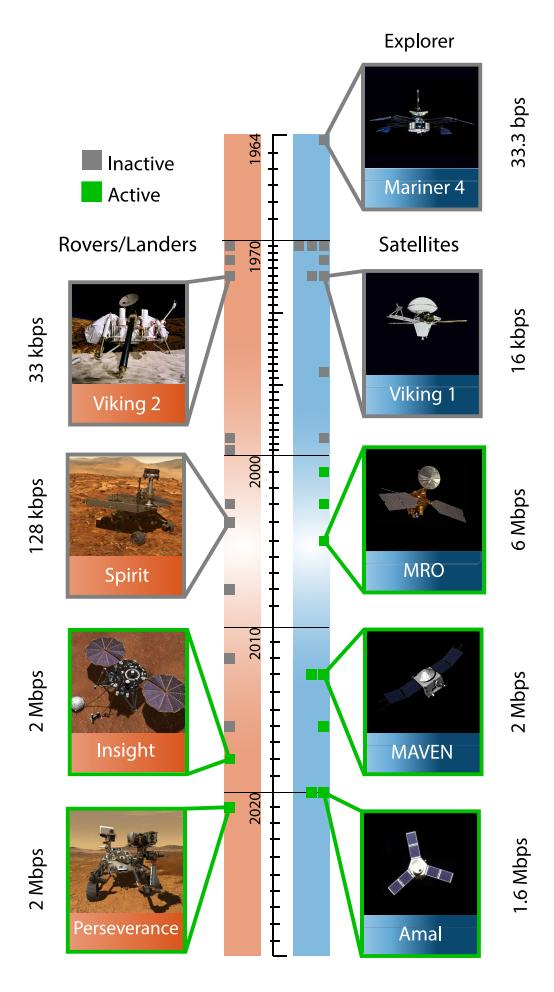
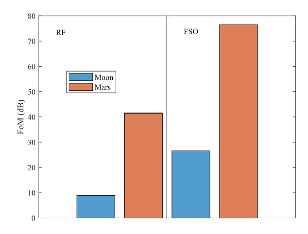
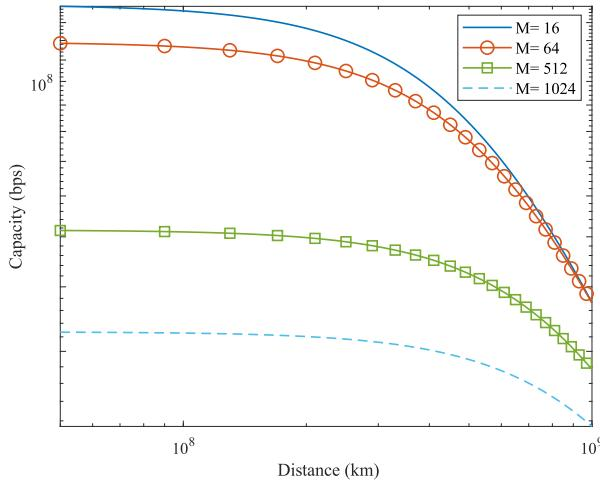
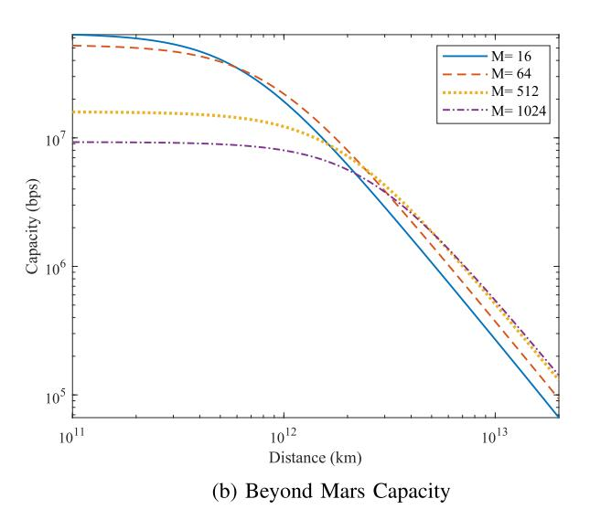
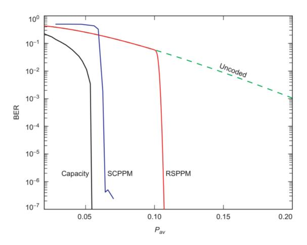
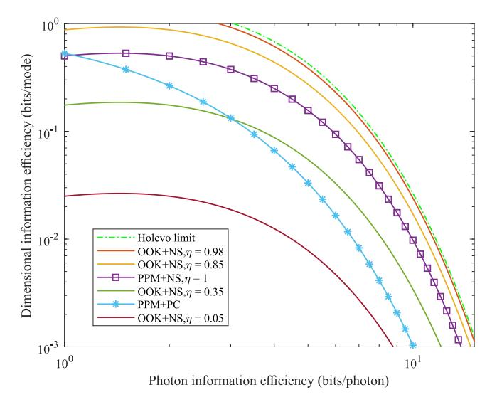
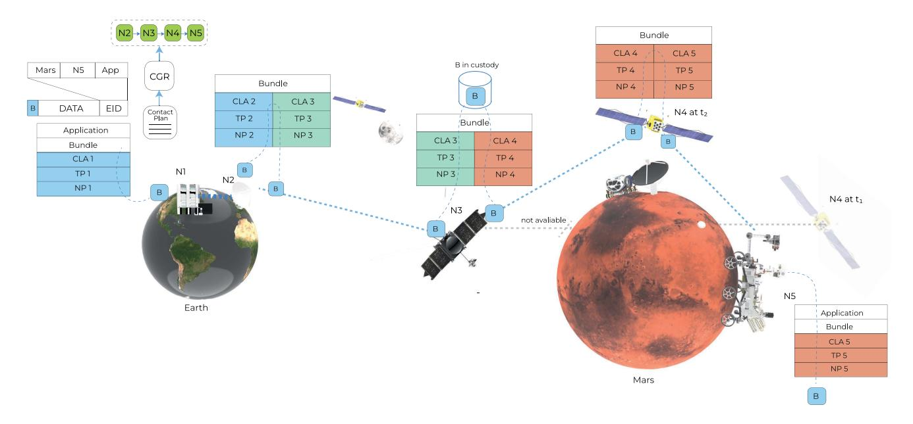
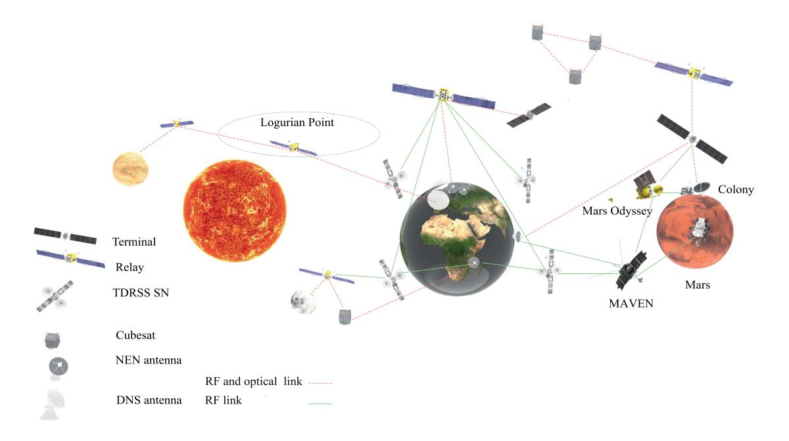
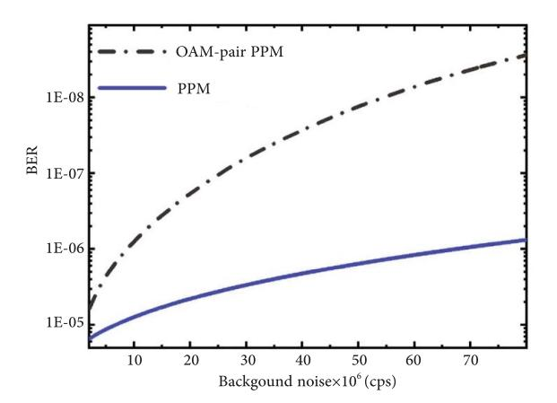
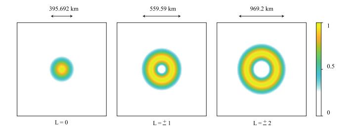

# How Can Optical Communications Shape the Future of Deep Space Communications? A Survey

Sarah Karmous®, Nadia Adem®, Mohammed Atiquzzaman®, *Senior Member, IEEE*, and Sumudu Samarakoon®, *Member, IEEE* 

Abstract—With a large number of deep space (DS) missions anticipated by the end of this decade, reliable and high-capacity DS communications are needed more than ever. Nevertheless, existing technologies are far from meeting such a goal. Improving current systems does not only require engineering leadership, but also, very crucially, investigating potential technologies that overcome the unique challenges of ultra-long DS links. To the best of our knowledge, there has not been any comprehensive surveys of DS communications technologies over the last decade. Free space optical (FSO) is an emerging DS technology, proven to acquire lower communications systems size weight and power (SWaP) and achieve a very high capacity compared to its counterpart radio frequency (RF), the currently used DS technology. In this survey, we discuss the pros and cons of deep space optical communications (DSOC) and review their physical and networking characteristics. Furthermore, we provide, for the first time, thoughtful discussions about implementing orbital angular momentum (OAM) and quantum communications (QC) for DS. We elaborate on how these technologies among other field advances including interplanetary network (IPN) and RF/FSO systems improve reliability, capacity, and security. This paper provides a holistic survey of DSOC technologies gathering 247 fragmented pieces of literature and including novel perspectives aiming to set the stage for more developments in the field.

Index Terms—Deep space optical communications (DSOC), delay tolerant networking (DTN), detection technologies, interplanetary network (IPN), link capacity, modulation and coding schemes, networking protocols, orbital angular momentum (OAM), quantum communications (QC), radio frequency (RF)/free space optical (FSO) systems.

#### I. Introduction

PACE exploration offers an opportunity to understand the universe, resulting in endless benefits for human life in diverse aspects such as technologies, transportation,

Manuscript received 5 October 2023; revised 10 March 2024; accepted 19 April 2024. Date of publication 21 May 2024; date of current version 17 February 2025. (Corresponding author: Nadia Adem.)

Sarah Karmous is with the Department of Electrical and Electronic Engineering, University of Tripoli, Tripoli, Libya (e-mail: s.karmous@uot.edu.ly).

Nadia Adem is with the Department of Electrical and Electronic Engineering, University of Tripoli, Tripoli, Libya, also with the Libyan Authority for Scientific Research, Tripoli, Libya, and also with the Faculty of Information Technology and Electrical Engineering, University of Oulu, 90570 Oulu, Finland (e-mail: n.adem@uot.edu.ly).

Mohammed Atiquzzaman is with the School of Computer Science, University of Oklahoma, Norman, OK 73019 USA (e-mail: atiq@ou.edu).

Sumudu Samarakoon is with the Faculty of Information Technology and Electrical Engineering, University of Oulu, 90570 Oulu, Finland (e-mail: Sumudu.Samarakoon@oulu.fi).

Digital Object Identifier 10.1109/COMST.2024.3403873

environment, etc. [1]. There is an increased investment from several worldwide governmental space agencies [2] as well as private companies [3] aiming to expand human presence in the Solar system [4], [5]. Several missions have been recently conducted, e.g., [6], [7], [8], to understand Mars's atmosphere and search for life there. Many other missions are scheduled for the next several years, such as the Rosalind Franklin explorer program [9]. There are also plans to send crews to Mars as early as 2029 [10].

The success of these missions relies heavily on advances in different fields such as physics, astronomy, and telecommunications. Therefore, advances in communications technology are natural drivers for achieving these goals.

#### A. Motivation

Space exploration is built upon reliable broadband interplanetary communications [11], which are only possible through developing dedicated technologies suitable for facing the unique challenges of deep space (DS) communications. Unlike Earth and near-Earth, DS communications suffer from nonguaranteed line-of-sight, ultra-long time-changing distances, variability of Sun-Earth-probe angles, and the coronal or Solar wind plasma, referred to as Solar scintillation [12]. These challenges tremendously deteriorate the quality of the links and hence, limit communications capacity [13]. Current missions to Mars, for example, have only a few megabits per second communications rates at the minimum distance [14], [15], [16]. Fig. 1 shows a timeline for several Mars orbiters, landers, and rovers along with their data rates [7], [8], [17], [18], [19], [20], [21], [22], [23], [24], [25], [26]. It should be noted that higher attenuation is seen beyond Mars missions and the capacity drops by orders of magnitudes as the distance increases [7]. For example, the Voyager 1 spacecraft, which is located approximately 24.34 billion km from Earth as of May 2024, operates at a maximum data rate of a few kilo bits per second for less than a minute, only a few times a week [27].

To build high-capacity DS communications, research efforts have been recently devoted to exploring the potentials of free space optical (FSO) communications [13], [28], [29], [30], [31], [32]. Compared to radio frequency (RF), FSO links enjoy larger bandwidth, smaller apertures at final stations, much improved security, less transmit power, and higher immunity against interference. Although most recent DS Mars missions are RF-based [16], many projects have already adopted FSO

1553-877X © 2024 IEEE. Personal use is permitted, but republication/redistribution requires IEEE permission. See https://www.ieee.org/publications/rights/index.html for more information.

Fig. 1. Mars missions timeline with the data rates of their links to Earth.

for Moon and Mars communications with plans to expand to other planets such as Jupiter [\[33\]](#page-18-30), [\[34\]](#page-18-31), [\[35\]](#page-18-32), [\[36\]](#page-18-33), [\[37\]](#page-18-34). In addition, several implementation-based studies have been done to evaluate the technology transition, e.g., [\[30\]](#page-18-27), [\[38\]](#page-18-35). Tremendous work is yet to be done though to make FSO technology ready for future missions [\[39\]](#page-18-36).

Adopting FSO in DS will play an important role in implementing interplanetary broadband networks. However, achieving such a goal will depend on the reliability, effectiveness, and efficiency of many other technologies, including modulation, coding, detection, and networking protocols. The criteria for selecting such schemes differ tremendously from those for terrestrial, airborne, and even near-Earth communications. In this survey, we highlight the various DS optical communications (DSOC) design criteria and present the latest research and innovations in the area.

## *B. Related Surveys*

There are few surveys available on DS communications [\[29\]](#page-18-26), [\[30\]](#page-18-27), [\[31\]](#page-18-28), [\[36\]](#page-18-33), [\[40\]](#page-18-37), [\[41\]](#page-18-38), [\[42\]](#page-18-39), [\[43\]](#page-18-40), [\[44\]](#page-18-41), most of which are outdated and/or do not address the field comprehensively. Although [\[29\]](#page-18-26) covers various aspects of DSOC, an updated survey that reflects the current field demands, challenges, and advances is needed. The survey of [\[31\]](#page-18-28) covers some aspects of optical communications in DS, but only partially. Biswas et al. [\[36\]](#page-18-33) focus merely on the progress made and the status of DSOC in National Aeronautics and Space Administration (NASA) projects. In the same direction, [\[40\]](#page-18-37) overviews mainly laser-based DS demonstration projects and future missions. Meanwhile, [\[30\]](#page-18-27) provides only studies about DS systems architects and discussions about the transition from RF to optical technology. In addition, [\[41\]](#page-18-38) focuses only on DS networking aspects. Similarly, [\[42\]](#page-18-39) covers merely several aspects of RF-based DS communications systems. Furthermore, [\[43\]](#page-18-40) addresses FSO and RF challenges and discusses DS systems implementations and demonstrations; however, it does not present research discussions and future perspectives in the field. Finally, [\[44\]](#page-18-41) gives an inspiring and relatively recent overview of DS networking and implementations, yet, it lacks any further details in the other aspects, including physical characteristics and field advances.

Despite their valuable contributions, none of the above works covers DS communications holistically. In addition, most of these surveys are not recent. In contrast, as we demonstrate in Table [I,](#page-2-0) our work aims to cover the key aspects of DSOC, add the missing areas from the aforementioned related work, and discuss the latest advances in the field, including orbital angular momentum (OAM), interplanetary network (IPN), quantum communications (QC), and the RF/FSO which is an integration of both RF and FSO technologies.

## *C. Contributions*

In this survey, we cover existing DSOC systems' limitations, recommended technologies to cope with them, and challenges facing their adoption. The contributions of this paper relative to the literature are summarized as follows.

- 1) We cover the major challenges of DS communications. We also discuss DSOC promises, challenges, and potential solutions and compare them with the existing RF technology.
- 2) We survey the widely used modulation and coding schemes and the opportunities for enhancing performance by fusing them with emerging detection techniques.
- 3) We review recommended networking architecture models, present key characteristics of promising protocols, and identify related open research directions.
- 4) We present an overview of the IPN and study the visions for its future.
- 5) To the best of our knowledge, we provide the first thoughtful discussion about implementing OAM for DS and identify challenges and potential solutions.
- 6) We discuss the advantages, efforts, and challenges of implementing QC and partnering RF and FSO technologies in DS.

With these contributions, we aim to pave the way for empowering more rapid advancements toward robust communications services in DS.

# *D. Organization*

The remainder of the paper is structured as follows. Section [II](#page-2-1) outlines DSOC advantages over RF and

| Main theme            | Key aspects           |          | [30]     | [41]     | [42]     | [31]      | [40]     | [36]     | [43]      | [44]     | This work |
|-----------------------|-----------------------|----------|----------|----------|----------|-----------|----------|----------|-----------|----------|-----------|
|                       | Missions timeline     | ×        | ×        | ×        | ×        | ×         | <b>√</b> | <b>√</b> | ×         | ✓        | <b>√</b>  |
|                       | Demonstrations        | <b>√</b> | <b>√</b> | ×        | ×        | <b>√</b>  | <b>√</b> | <b>√</b> | <b>√</b>  | <b>√</b> | <b>√</b>  |
| Overview              | Existing systems      | ×        | <b>√</b> | ×        | ×        | ×         | <b>√</b> | <b>√</b> | <b>√</b>  | <b>√</b> | <b>√</b>  |
| Overview              | Limitations           | <b>√</b> | <b>√</b> | <b>√</b> | <b>√</b> | <b>√</b>  | <b>√</b> | <b>√</b> | <b>√</b>  | <b>√</b> | <b>√</b>  |
|                       | Implementations       | ×        | ×        | <b>√</b> | ×        | ×         | ×        | <b>√</b> | <b>✓</b>  | <b>√</b> | <b>√</b>  |
|                       | Future perspectives   | <b>√</b> | <b>√</b> | <b>√</b> | <b>√</b> | ×         | <b>√</b> | <b>√</b> | ×         | <b>√</b> | <b>√</b>  |
| Basics                | Link engineering      | <b>√</b> | ×        | ×        | <b>√</b> | ×         | ×        | ×        | ×         | ×        | <b>√</b>  |
| Basics                | Overall challenges    | <b>√</b> | ✓        | ×        | <b>√</b> | ×         | ×        | ×        | <b>√</b>  | ×        | <b>√</b>  |
| Enabling technologies | Networking protocols  | ×        | ×        | <b>√</b> | <b>√</b> | <b>√</b>  | ×        | ×        | ×         | ✓        | <b>√</b>  |
|                       | Modulation            | <b>√</b> | <b>√</b> | ×        | <b>√</b> | <b>√</b>  | ×        | ×        | <b>√</b>  | ×        | <b>√</b>  |
|                       | Coding                | <b>√</b> | ✓        | <b>√</b> | <b>√</b> | <b>√</b>  | ×        | ×        | ×         | ×        | <b>√</b>  |
|                       | Receiver technologies | <b>√</b> | <b>√</b> | ×        | <b>√</b> | <b>√</b>  | ×        | <b>√</b> | <b>√</b>  | <b>√</b> | <b>√</b>  |
| Performance analysis  | Capacity              | <b>√</b> | ✓        | ×        | ×        | ×         | ×        | ×        | ×         | ×        | <b>√</b>  |
|                       | OAM                   | ×        | ×        | ×        | ×        | <b>√</b>  | ×        | ×        | ×         | ×        | <b>√</b>  |
| Advances              | IPN                   | ×        | ×        | ×        | <b>√</b> | ×         | ×        | ×        | ×         | ×        | <b>√</b>  |
|                       | QC                    | ×        | ×        | ×        | ×        | ×         | ×        | ×        | ×         | ×        | <b>√</b>  |
|                       | RF/FSO                | ×        | <b>√</b> | ×        | ×        | <b>√</b>  | <b>√</b> | <b>√</b> | ×         | ×        | <b>√</b>  |
| DS context            |                       | Fully    | Fully    | Fully    | Fully    | Partially | Fully    | Fully    | Partially | Fully    | Fully     |
| System technologies   |                       | FS0      | RF&FSO   | RF&FSO   | RF       | FSO       | FSO      | FSO      | RF&FSO    | RF&FSO   | RF&FSO    |
| Time relevance        |                       | 2011     | 2011     | 2011     | 2011     | 2017      | 2018     | 2018     | 2020      | 2021     | 2024      |

TABLE I
COMPARISON OF DS COMMUNICATIONS SURVEYS

implementation efforts and challenges. Section III analyzes DS links physical characteristics and discusses related research directions. While Section IV characterizes DSOC capacity limits, Section V surveys DS networking protocols and related research efforts. Section VI investigates on the state-of-the-art and challenges of DSOC advances including, IPN, OAM, QC, and RF/FSO. Finally, Section VII concludes the survey.

#### II. DSOC ADVANTAGES AND CHALLENGES

Optical communications promise tens to hundreds of times increase in data rates, thanks to the high-available bandwidth in the license-free spectrum in which the technology operates [31], [45]. Such a capacity improvement has already been proven in demonstrations [46]. To illustrate further the gain of using optical communications compared to RF in DS, based on [39], the figure of merit (FoM) metric can be defined as follows:

$$\text{FoM} \triangleq 10 \times \log \left( \frac{D^2 \times R}{D_r \times P_t} \right), \tag{1}$$

where D is the end-to-end DS link distance in the astronomical unit (AU). Here, R,  $P_t$ , and  $D_r$  are the data rate in bits per second, transmit power in Watts, and receiver diameter size in meters, respectively. As it accounts for a space terminal performance measured through data rate and cost reflected through receiver aperture size and communications power, the FoM metric provides a direct comparison between the RF and FSO technologies at the system level at any distance.

Based on the projections available in [14], [40], [46], Fig. 2 demonstrates FoM for Lunar and Mars. Unsurprisingly, a Lunar FSO system represents more than 15 dB gain over its RF counterpart. The improvement seems to be even more substantial over Mars distances. However, implementing FSO in DS communications faces a number of unique challenges.

Below, we discuss different challenges facing DS communications at the link level and the DSOC link budget along with the challenges in optical communications.

Fig. 2. FoM of DS communications systems.

#### A. DS Communications Challenges

Ensuring high-capacity and reliable communications in DS faces the challenges listed below.

- Ultra-long, which based on the International Telecommunications Union exceeds 2 million kilometers, and time-changing distances between Earth and probes (satellites in other planets' orbiters, rovers, etc.).
- Interference from communications with other missions, radiation from the Sun, other celestial bodies, and cloud cover.
- Solar scintillation, atmospheric conditions, and other channel impairments.
- Variability of Sun-Earth-probe angles and the effect of that on blocking line-of-sight links.
- The burden of size, weight, and power (SWaP) constraints of spacecraft systems.
- The readiness and availability of transmitting and receiving technologies and communications protocols.

The communications with targets in DS require sending signals over very long distances, leading to strong power dissipation and hence huge signal attenuation. Even with relatively large-gain transmit and receive antennas, the received power can still be very weak. Also, the long-distance links result in an

inevitable significant latency that prevents real time communications and control. For example, a two-way communications with Mars may undergo 40 minutes transmission delay.

Furthermore, the Solar flares are shown to make communications signals weaker and noisier [29]. Besides, Solar scintillation and turbulence lead to performance degradation. It is important to carefully account for the near-Sun effect on the signal strength to compensate for any losses and prevent any damage to probe systems' circuits. Also, due to the movement of Earth and probes, the Sun may completely block communications path.

In addition, SWaP constraints are of major concerns not only for efficient spacecraft design but also for communications performance improvement. Designing a space mission with ultra-lightweight resources is thought of as a way to utilize a better communications performance [29]. There are technologies such as Gossamer that has the premise to design spacecraft structures with thin, low-modulus, and low-mass materials. An example of Gossamer technology application is the inflatable antennas; which could have an areal density of a fraction of a kilogram per square meter [47]. Also, in the direction of optical communications, the development of ultralightweight telescopes is realized; an example of which is the Cassegrain telescope which has composite mirrors with areal density in the range of 1–10 kg/m2 [48].

Lastly, existing terrestrial technologies, especially at the physical and protocol levels, can not be adopted directly in DS. For example, as they are simpler in implementation, less lossy, and more power and bandwidth-efficient, digital modulation schemes are preferred in DS RF-based communications. Nevertheless, amplitude-based modulations that can not be generated with nonlinear amplifiers are not suitable for DS as working in saturation mode is needed to maximize power efficiency [49]. Also, in networking, commercial terrestrial network architectures, for example transmission control protocol (TCP)/Internet protocol (IP), are not efficient to ensure data delivery in the DS time changing environments [50].

Advanced techniques are needed to overcome DS challenges and account for unique link characteristics which we elaborate on next.

#### B. Link Engineering of DSOC

Designing DS optical links needs to account for all link parameters and communicating entities' characteristics. This includes the end-to-end distance between Earth and final targets, mission requirements, required capacity, atmospheric conditions, transmitter-Sun-receiver angle, etc. The received power at the target after the receiver telescope and before the photo-detector can be expressed as [28]:

$$P_{tar} = P_t G_t G_r L_{fs} L_{pt} L_a L_c L_s \eta_t \eta_r, \qquad (2)$$

where:

- $P_t$  is the transmitted power in Watts.
- $G_t$  and  $G_r$  are the transmitter and the receiver aperture gains, respectively [51], [52].
- $L_{fs}$  is the free space loss factor. Being inversely proportional to the link distance squared,  $L_{fs}$  represents the link dominant loss factor.

- $L_{pt}$  is the pointing loss factor. A pointing error of  $\lambda/D_t$  radians, where  $\lambda$  is the signal wavelength and  $D_t$  is the transmitter diameter, corresponds to approximately 85% intensity reduction [51], [53].
- •  $L_a$  is the atmospheric transmittance due to the aerosol and molecular particles in the atmosphere that cause the absorption and scattering of the signal. The recommendation is to operate close to the 1550 nm wavelength range for low attenuation transmission [54], [55], [56].
- •  $L_c$  is the transmittance of the semi-transparent ice clouds, cirrus, present in the communications path [57].
- •  $L_s$  is the scintillation loss factor, which refers to the random optical power fluctuations caused by the atmospheric turbulence (AT) [58], [59].
- •  $\eta_t$  and  $\eta_r$  are the transmitter and receiver efficiencies, respectively [60].

The various DSOC impairments reflect the importance of the link engineering in deriving the needed transmit power to meet a certain detection sensitivity and hence a service quality. It is worth mentioning that the atmospheric and weather limitations are not of concern for optical space-to-space links [29], [31], [32], [61], [62], making the choice of the FSO over the RF in these links of great value. This fact can be reflected in the drop of  $L_a$ ,  $L_s$ , and  $L_c$  loss terms in (2).

More investigations about the potentials of the FSO technology in improving DS communications along with challenges facing its implementation are provided below.

#### C. DSOC Promises and Challenges

RF technology is currently dominating space communications facilities. The RF systems' maturity and the cost of implementing FSO are delaying the technological migration. The nonobligatory of RF line-of-sight link availability [63] along with its tolerance to atmospheric effects and weather conditions [64] are also contributing factors to deferring the transition to FSO.

Nonetheless, the fairly limited RF bandwidth requires licensing. Furthermore, RF communications are susceptible to eavesdropping [63]. In addition, having the demand for high-data rates comes at the cost of increasing SWaP requirements which can be unfeasible and hence restrict RF system performance upgrades. For instance, if we are acquiring several gigabits per second as downlink data rate from the closest distance to Mars, according to [30], we would need the Mars spacecraft to have a 5 m antenna with a transmitting power of around 200 W, and a multiple of 34 m antennas in an array as the ground Earth receiver. In contrast, for optical, the Mars spacecraft would have a 1 m aperture and a transmitting power of 50 W, and the receiver telescope aperture size would be in the range of 10 m.

FSO, on the other hand, is emerging to address the short-comings of conventional RF systems. FSO beams, as they expand thousands of times slower than RF [65], demand significantly lower SWaP allowing more flexible system upgrades and secure communications [63]. Not to mention the almost limitless bandwidth with no license requirements the FSO offers [66]. Nonetheless, achieving high performance over DS

distances is challenging [29]. A high gain is required to make up for the very long distances loss along with other losses discussed in the previous subsection. DSOC implementation hurdles can be compensated through several approaches, that come with their challenges, as we discuss below.

- Increasing the power efficiency by relying on laser beams with large-gain transmitters and large-aperture diameters. Nonetheless, the cost of building large optical ground transmitters is considered to be an implementation concern [38]. Especially since the average power requirement for a DS link typically would be in the range of 1–20 W and peak power would be ranging from 100 to 1k W [29].
- Accurately tracking the space terminals using beacons to point lasers towards them before sending data. A narrow beam requires accurate pointing in order for the signal to be received at the destination, which is challenging considering DS distances [67]. Particularly, regarding flight systems, high accuracy of the beam pointing is needed, especially for downlink signals from DS that are typically with a beam-width in the range of 2–8 μrad. Adequate beam acquisition at destinations can be achieved at the cost of computational and hardware complexities though [68]. In addition, tracking and pointing beams toward mobile receivers in space require efficient design of accurate tracking algorithms.
- • Relying on large-gain receivers. The received power to spacecrafts would be around or less than  $10^{-10}$ W [28]. As a consequence, that requires high gain receiver telescopes, which can make it a challenge to obtain a functional yet optimized design of the spacecraft resources [29].
- Considering advanced signaling and detection techniques that maximize photon efficiency, i.e., the number of bits per photon. Achieving this would also include getting high-detection sensitivity and acquiring efficient modulation and coding schemes [69].
-  Merging FSO with other technologies, including OAM for example, to get the most out of its high capacity and further enhance the quality of DS data returns [31]. More investments though need to be put forward to facilitate such a merge.

There are several efforts being brought forth to facilitate the full implementation of the FSO technology in DS [30], [33], [34], [35], [36], [70], [71] and address the DS FSO technology engineering challenges and maturity requirements [29], [39]. In this paper, we investigate the efforts made in DSOC and identify open research directions.

#### III. DSOC PHYSICAL LAYER KEY CHARACTERISTICS

This section reviews the different physical techniques that mitigate a number of the previously discussed challenges to ensure DSOC reliability.

## A. Modulation Schemes for DSOC

Conventional RF-based space communications rely commonly on binary phase shift keying (BPSK) modulation [72], where a carrier modulates data using two phases that are 180

degrees apart. BPSK has been favored in such an environment, thanks to its low bit error rate (BER) in the low signal-to-noise (SNR) ratio regime. However, for DSOC, there are other direct detection-based modulation schemes of interest including on-off keying (OOK), pulse position modulation (PPM), wavelength modulation, and pulse intensity modulation. OOK and PPM are the most recommended among the methods mentioned above, thanks to their simplicity and power efficiency in photon-starved regimes [29], [31].

As PPM is more power efficient, it is more preferred than OOK for DSOC. On the other hand, OOK is more suitable for near-Earth links as it is bandwidth-efficient and cost-effective [31]. While, OOK modulates one as a pulse and zero in the absence of a signal, M-ary PPM modulation, which is often used with photon-counting (PC) detector [29], [54], [73], works by dividing each channel symbol period into M time slots.  $\log_2 M$  bits are modulated by transmitting a single pulse in one of the M possible time slots of a symbol. The information in the PPM is encoded in the position of the pulse, making it robust against noise. PPM requires a high bandwidth though [74]. The good news, however, is that the high bandwidth is readily offered by FSO and hence it is not of much concern.

To characterize the effectiveness of PPM for DS applications, we provide the capacity offered by the PPM-PC receiver in the presence of noise and using a Poisson channel model, typically used for DS system characterization [75]. The approximate system capacity, denoted by  $C_{PCR}$ , is given by [76]

$$C_{PCR} = \frac{1}{\ln(2)E} \left( \frac{P_r^2}{P_n \frac{2}{M-1} + \frac{P_r}{\ln(M)} + P_r^2 \frac{M}{\ln(M)} \frac{T_{slot}}{E}} \right), (3)$$

where the photon energy  $E=(hc)/\lambda$ , h is Planck's constant, c is the light velocity, and  $\lambda$  is the signal wavelength. M is the modulation order.  $P_{T}$  and  $P_{n}$  are the received and noise power, respectively.  $T_{slot}$  is the pulse duration. The three terms in the denominator of the second term of (3) correspond to three different behaviors when dominating. As  $P_{n}\frac{2}{M-1}$ , which is a noise-limited term, dominates, the capacity scales as a quadratic function of the signal power. On the other hand,  $P_{T}\frac{1}{\ln(M)}$ , which is the quantum-limited term, leads to a linear scaling of the capacity. Finally, the bandwidth-limited term,  $P_{T}^{2}\frac{MT_{slot}}{\ln(M)E}$  leads to capacity saturation. Note that when the received  $P_{T}$  is sufficiently high, the system capacity can be approximated as

$$C_{PCR} \approx \frac{1}{\ln(2)} \frac{\ln(M)}{M \ T_{slot}}.$$
 (4)

If the received power is sufficiently high, one can easily observe that it is best to use a low PPM modulation order.

In Fig. 3(a) and 3(b), we show the PPM systems achieved capacity for Mars and beyond Mars distances. Here we pick the antenna diameter for the transmitter as 0.22 m and the receiver as 4 m [28], [38], [69]. The figure shows that as the modulation order decreases, the capacity improves significantly but only up to a certain distance. That is intuitive as increasing the modulation order implies a reduction in

Fig. 3. Link capacity versus distance.

the transmission rate and BER. As depicted in Fig. [3\(](#page-5-0)b), as a signal travels a longer distance, the trend changes. I.e., as the distance gets larger and larger, to maintain a certain BER performance, the modulation order may need to be increased. Fig. [3](#page-5-0) indicates how crucial the increase in DS communications distance is in determining the PPM system parameters and hence performance, as discussed in [\[71\]](#page-19-18) and several references therein. The impact of combining the PPM modulation technique with coding is also of crucial importance as we will discuss.

## *B. Coding for DSOC Links*

Channel coding is a very important block in the transmission chain to enhance performance and ensure reliability. Applying ideal error correction coding (ECC) may lead to meeting a link capacity limit, the maximum possible achievable capacity. However, such ideal codes are hard to construct in practice. Therefore, it is important to consider code efficiency, which refers to the difference between the capacity limit and the error code threshold at a specific BER, when designing communications links [\[77\]](#page-19-24).

Fig. 4. Coding techniques BER compared to uncoded communications and capacity limit [\[54,](#page-19-1) Figs. 4–35].

In the early missions to DS, in the 1960s, a decision was needed on whether to rely on a coding method or the other, namely block codes or convolutional codes. During the design of Mariner '69 Mars mission, for example, block codes were the best options given that the developed sequential decoding algorithms were not that efficient for DS. Such a choice led to a poor data rate, though. Thanks to the development of a more efficient sequential decoding algorithm, convolutional decoding methods, for example, Turbo codes have been adopted for various communications channels including DS [\[78\]](#page-19-25), starting from Pioneer 9 mission [\[79\]](#page-19-26) which was designed after Mariner '69 but launched earlier. Such a change offered a coding gain, which is the power gain over the uncoded case, of 3 dB [\[80\]](#page-19-27) compared to that of 2.2 dB [\[79\]](#page-19-26) in the case of the block code used by Mariner '69.

Reed-Solomon (RS) codes are commonly used with convolutional codes for DS applications as they are efficient in correcting complex and bursty errors [\[29\]](#page-18-26), [\[41\]](#page-18-38), [\[54\]](#page-19-1), [\[81\]](#page-19-28), and have in the order of 2.5 to 3 dB efficiency [\[53\]](#page-19-0). As a reference, an uncoded PPM-based system would have a code efficiency in the order of 5 dB [\[74\]](#page-19-21). Nonetheless, the most recommended and efficient DS coding scheme is the serially concatenated PPM (SCPPM) [\[74\]](#page-19-21), [\[82\]](#page-19-29), [\[83\]](#page-19-30). This coding technique has a code efficiency between 0.5 and 1 dB [\[53\]](#page-19-0), [\[74\]](#page-19-21). Fig. [4](#page-5-1) shows the BER of SCPPM versus average signal power measured in single photons detected per modulation order and denoted by *Pav* , compared to the capacity limit, Reed-Solomon PPM (RSPPM), and uncoded PPM. The figure confirms the superiority of SCPPM over RSPPM, as it clearly demonstrates lower coding efficiency and higher gain.

Recently, there have been other codes suggested for DS. For example, Divsalar et al. [\[84\]](#page-19-31) show that coded optical wavelength division multiple access (WDMA) with PPM can be a good candidate. Using the coding gain metric, WDMA has a 7 dB gain for a 0.8 coding rate and a 12 dB coding gain for a coding rate of 1/6 at a frame error rate (FER) of 10−6 [\[84\]](#page-19-31).

Since fixed-rate codes like low-density parity check (LDPC) and Turbo codes are not efficient for DS communications as they fail to adapt to changes incurring in communications links due to time variability, Liang et al. [85] proposed the use of rate-less codes such as raptor codes, and hence achieve a better performance than LDPC and Turbo codes. The authors propose to further combine spinal and polar coding to achieve even better performance. Further improvement can be offered through the use of efficient detection methods as we will elaborate on next.

#### C. Detection Techniques for DSOC

Advances in detection technology play an important role in providing reliable DSOC. As indicated in Section II, having improved sensitivity and efficient detection are regarded as means to overcome faint DS signals issues and design limitations. Detection receivers can either be coherent or non-coherent. Coherent receivers can have a higher spectral and dimensional information efficiency in one state system, examples of which are heterodyne and homodyne receivers. Dimensional information efficiency, according to [86], is defined as the efficiency of information transfer per unit dimension or optical communications degree of freedom. Even though coherent receivers suffer from limited photon efficiency, they tend to be more practical when very high data rates are required. Non-coherent receivers, on the other hand, are energy efficient but come at the cost of exponentially decreasing dimensional efficiency [86]. Rendering to their energy efficiency, non-coherent receivers which are alternatively called direct detectors are commonly used in DS [53], [87]. There are different types of direct detectors among which are avalanche photodiode detectors (APD), PIN (p-type, intrinsic, and n-type) diodes, and PC detectors.

Due to their high sensitivity compared to other conventional direct detection methods, PC detectors are gaining great attention and are recommended along with PPM modulation to be used in the future DSOC. These detectors can count a single photon incident on them. PC detectors can be viewed as an extension of APD detectors with infinite gain in which a digital output signal is generated for each detected photon [87]. They can offer up to 20 dB gain along with PPM over APD and pre-amplified direct detectors [29], and sensitivities of a few photons per bit [75]. The PC detection process, though, is affected by noise sources which are i) background noise that comes from the diffused energy from the sky, planets, or stars in the field of view of the receiver, ii) dark counts of electrons generated by the detector, and iii) receiver thermal noise [28]. In addition to noise, the losses that degrade the PC detection efficiency are i) blocking loss which results from the fact that a detector gets blind after a detection event missing all incident photons until reset. Blocking loss limits a detector to counting at most one photon per reset time or dead time [60], and ii) jitter loss which is the random delay that elapses from the incident of a photon on a detector to the time an electrical output pulse is generated in response to that photon. A significant loss occurs if the standard deviation of the jitter is in the order of the slot width of the pulse [88]. The choice of the detection and modulation schemes is essential in mitigating other losses resulting from link impairments. Detectors that handle a small duty cycle in the range of a

few nanoseconds, for example, are resilient to long DSOC channel losses [89]. An example of a detector that can provide such a requirement is the superconducting nanowire single photon detector (SNSPD) [90], [91], [92], [93], [94], [95], which is the highest-performing commercialized PC detector in the frequency range of 30–30,000 THz [95]. This detector can support slot widths down to 200 ps, timing jitter less than 10 ps [96], and up to 98% detection efficiency [90], [97]. There are some other examples of detectors and receivers that are significant in DS communications, such as indium gallium arsenide (InGaAs) [98], Geiger-mode avalanche photodiode (GmAPD) [99], [100], [101], single quadrature (SQ) [102], European data relay system (EDRS) with single photon coherent (SPC) heterodyne detection [103], [104], and phasesensitive optical amplifiers (PSA) [75].

In Table II, we include the main characteristics of the aforementioned detectors and receivers, including sensitivity measured in photon per information bit (PPB), supported data rate, advantages, and shortcomings.

#### D. Discussions and Outlook

We stated earlier the different potential modulation, coding, and detection schemes for DS communications. It is worth reiterating that yet experimenting with existing schemes efficiency needs to be conducted. DSOC systems are expected to operate at the speed of several tens of gigabits per second and beyond and hence will require a major improvement over existing receiver technology in terms of both data rate and sensitivity [54]. Thanks to their energy efficiency and simplicity, direct detection systems are preferred over coherent systems. Nevertheless, coherent detection has recently started to get more interest due to its ability to increase the capacity of DS communications [75].

While using SQ homodyne receivers, without a preamplifier, resulted in a sensitivity of 1.5 PPB at 156 Mbps [102], demonstrations have shown that pre-amplified erbium-doped fiber coherent receivers can achieve a 0.51 PPB increase in sensitivity and a 10 Gbps rate [105], [106]. In addition, it is also worth mentioning that there is some focus on in-phase and quadrature modulation homodyne detectors in optical transmission systems for terrestrial as well as DS communications as they promise to achieve higher-spectral efficiency than other schemes [107].

## IV. DSOC PHYSICAL LAYER PERFORMANCE ANALYSIS

To decide on a modulation type, coding technique, and detection approach, the channel capacity needs to be determined or at least approximated for a given system setup.

#### A. Capacity Limit

Shannon capacity gives a channel the maximum error free data rate in classical information theory [108]. However, in optical communications, channels are best described as quantum channels, which are shown to accurately describe capacity limit of a corresponding system. For extremely power-limited communications, as is the case in DS, the capacity limit is best characterized by the Holevo theorem, which approximates the

| Detectors/Rec | ectors/Receivers Type Implementation |               | Sensitivity (PPB)                                                                                  | Data rate (Mbps) | Advantages | Disadvantages                                                       |                                                                                                                          |
|---------------|--------------------------------------|---------------|----------------------------------------------------------------------------------------------------|---------------------|------------|---------------------------------------------------------------------|--------------------------------------------------------------------------------------------------------------------------|
| InGaAs        |                                      | PIN           | Cubesats for DSOC systems                                                                       | -                   | 163        | Relatively high- temperature operation                        | Relatively high received power requirement, not a good option as a ground receiver due to atmospheric losses |
| GmAPD         | Direct                               | APD           | Mars laser communi- cations demonstration (MLCD) project, imaging system for DSOC Project | 2                   | 34.9       | No read out noise penalty                                        | Limited bandwidth                                                                                                        |
| SNSPD         |                                      | PC            | Lunar laser communications demonstration (LLCD) demonstrations, DSOC Project                       | 0.5                 | 781        | High-detection efficiency (98%)                                     | Requirement for cooling down to 2–4 K, high photon rate detection (multiple of Gbps) can be hard to attain   |
| SQ            |                                      | Homodyne      | Near-Earth and DS applications                                                                     | 1.5                 | 156        | Energy efficient                                                    | Limited bandwidth                                                                                                        |
| SPC           | Coherent                             | Heterodyne    | EDRS, DS communications (suggested)                                                                | 10                  | 1800       | Robust to severe background noise, near-Sun communications | High-bandwidth requirement                                                                                               |
| PSA           |                                      | Pre-amplified | DS application demonstrations                                                                      | 1                   | 10500      | Noise-free amplification                                            | High performance in a limited spectral efficiency                                                                        |

#### TABLE II DSOC DETECTORS

solution of the quantum channel capacity limit [109], [110]. Based on the Holevo theorem [86], the analytical closed-form expression of the quantum capacity, which asymptotically expresses the dimensional information efficiency, measured in bits/dimension, is given by

$$C_d^{Hol} = ec_p 2^{-c_p}, (5)$$

where  $c_p$  is the photon information efficiency (PIE) which is the amount of information that can be transmitted per photon, measured in bits/photon, and e is the exponential constant. In theory, the optimal coherent state modulation achieves the ultimate quantum limit, which is the capacity limit that can possibly be approached by a system based on the Holevo limit approximation. Still, practical sub-optimal coherent receivers are operating near the ultimate Holevo limit but in the low photon efficiency region as they hit a brick wall of 1.44 bits/photon and hence they are not efficient for DS applications [86].

In the case of PPM-PC receivers, the capacity can be approximated with respect to the Holevo limit as [109]

$$C_{Holevo} = 2.561 C_{PCR}, (6)$$

where  $C_{PCR}$  is given by (3). Dolinar et al. [111] proposed using coherent states with PC to get closer to the Holevo limit. This is challenging and not practical from an implementation perspective, though. Quantum number state (NS), also known as Fock state [112], communications could be an alternative, where the quantum state with a well-defined number of photons are shown to be able to reach the Holevo limit [111]. This could be challenging in practice, again, since it requires high-channel transmissivity, which is the probability of transmitted NS photon being received at the detector. To further illustrate this, considering OOK modulation, the single

Fig. 5. Asymptotic capacity limit of different modulation schemes.

photon NS capacity at high PIE can be written in terms of the channel transmissivity, denoted by  $\eta$ , asymptotically as

$$c_d^{1NS} = C_d^{Hol} \left( 2^{f(\eta)} \right), \tag{7}$$

where if  $\eta<<1$ , then  $f(\eta)=\eta/e$  and when  $\eta\sim 1$ ,  $f(\eta)=(\eta-1)^{(\eta-1)}/e^{1-\eta}$ . In the case of PPM, we have

$$c_d^{1NS} = C_d^{Hol}(\eta/e). \tag{8}$$

As shown in Fig. 5, PPM cannot reach the Holevo limit even when  $\eta=1$ . With a transmissivity of one, NS along with OOK gets to the ultimate limit. As the quantum NS transmissivity gets higher, the capacity gets closer to the Holevo limit in the case of OOK. We also show in the same figure the capacity limit for PPM-PC, and quantum NS modulation, with OOK and PPM.

TABLE III DIFFERENT PLANETS CAPACITY

| Average     | Average                                                         | Received                                                                                                                                                                                                             | Reached                                                                                                                                                                                                                                                                                                                           |
|-------------|-----------------------------------------------------------------|----------------------------------------------------------------------------------------------------------------------------------------------------------------------------------------------------------------------|-----------------------------------------------------------------------------------------------------------------------------------------------------------------------------------------------------------------------------------------------------------------------------------------------------------------------------------|
| distance    | delay                                                           | power                                                                                                                                                                                                                | capacity                                                                                                                                                                                                                                                                                                                          |
| (km)        | (Minutes)                                                       | $(\mu W)$                                                                                                                                                                                                            | (Mbps)                                                                                                                                                                                                                                                                                                                            |
| 58 million  | 3.22                                                            | 5.1856e-6                                                                                                                                                                                                            | 139.45                                                                                                                                                                                                                                                                                                                            |
| 225 million | 12.5                                                            | 4.5053e-6                                                                                                                                                                                                            | 123.42                                                                                                                                                                                                                                                                                                                            |
| 778 million | 43.22                                                           | 1.7741e-6                                                                                                                                                                                                            | 52.527                                                                                                                                                                                                                                                                                                                            |
| 1.2 billion | 66.66                                                           | 9.2772e-7                                                                                                                                                                                                            | 28.173                                                                                                                                                                                                                                                                                                                            |
| 4.5 billion | 250                                                             | 7.8951e-8                                                                                                                                                                                                            | 2.4598                                                                                                                                                                                                                                                                                                                            |
| 5.9 billion | 327.77                                                          | 4.6219e-8                                                                                                                                                                                                            | 1.4409                                                                                                                                                                                                                                                                                                                            |
|             | (km) 58 million 225 million 778 million 1.2 billion 4.5 billion | distance (km)         delay (Minutes)           58 million         3.22           225 million         12.5           778 million         43.22           1.2 billion         66.66           4.5 billion         250 | distance (km)         delay (Minutes)         power (μW)           58 million         3.22         5.1856e-6           225 million         12.5         4.5053e-6           778 million         43.22         1.7741e-6           1.2 billion         66.66         9.2772e-7           4.5 billion         250         7.8951e-8 |

To analyze the DSOC link performance for a PPM-PC detector, in Table [III,](#page-8-1) we show the soft decision capacity at various planets average distances. Soft decision capacity corresponds to implementing a soft decision receiver that passes on slot counts and uses them to determine the probability of sending a certain sequence of bits [\[54\]](#page-19-1). Here we assume that the transmitter and the receiver aperture diameters are 0.22 m and 4 m, respectively, with a transmitted power of 4 W [\[28\]](#page-18-25), [\[38\]](#page-18-35), [\[69\]](#page-19-16), 0.25 ns time slot, PPM modulation order of 16, and noise power of 1.1620×10−16 W. The losses of Earth to Mars communications, for example in the considered setup, are as follows: a path loss of 366 dB, the sum of other losses for the received power not including the detection loss is 6.6 dB, and the detection loss is 4.35 dB. We notice that the capacity dramatically gets smaller as we get to further planet distances.

#### *B. Discussions and Outlooks*

Although direct detectors cannot reach capacity limit, the capacity can be improved by other techniques including increasing sensitivity and reducing the amount of background light detected. All relevant emerging technologies would be of interest as they can vitally define the future capabilities in DS environment. One of the innovative solutions that emerges to improve capacity limit and data rate, flexibility, scalability, and cost-effectiveness is compact array detectors [\[28\]](#page-18-25), [\[113\]](#page-20-10). Array detectors decrease blocking and pointing losses and help with beam acquisition and tracking processes. It has been shown that, with the use of SNSPD, arranging a couple to tens of detectors significantly reduces the blocking loss, increases efficiency to 93% [\[114\]](#page-20-11) with up to 7.41 PPB sensitivity [\[115\]](#page-20-12), and utilizes data rates in the range of gigabits per second [\[116\]](#page-20-13). Such detectors hold a continuous active area, ready to receive the upcoming photons, which could be as low as 3 μm by 3.3 μm [\[116\]](#page-20-13). Although smaller active areas result in higher-data rates, increasing them improves system detection efficiency. Hence, there seem to be efforts, see, e.g., [\[115\]](#page-20-12), [\[117\]](#page-20-14), to get the benefits of relatively largeactive areas without sacrificing the data rate and facing the reading out challenge which results in increasing temperature and complexity. Despite the promises of array detectors, according to [\[28\]](#page-18-25), [\[118\]](#page-20-15), in some cases the single receiver could outperform the array, for relatively long distances and in case of no AT.

There are a number of other technologies suggested regarding increasing the effectiveness of noise rejection, hence,

improving PIE upper limit. That includes the use of nonlinear optical quantum pulse gating (QPG) technique [\[119\]](#page-20-16), which can filter out the unwanted temporal noise. Even more improvements have been proven through the utilization of photon number resolved (PNR) detectors which interestingly, in contrast to conventional PCs for instance individual SNSPDs [\[120\]](#page-20-17), are able to read more than one photon simultaneously. PNR detectors are highly regarded for quantum optic applications and quantum communications. Making this type of detector along with other physical layer optimal solutions to yet be investigated for further improvements in terms of capacity limit.

## V. DSOC NETWORKING PROTOCOLS

In addition to the different physical layer techniques and their impact on DSOC performance as we discussed in Sections [III](#page-4-0) and [IV,](#page-6-0) networking protocols are of paramount importance to make the communications links reliable and overcome a number of different complex challenges facing DSOC discussed in Section [II.](#page-2-1) Seamless coordination between satellites, ground communications systems, and DS probes is needed. Matured terrestrial network protocols are mostly inefficient in DS environments where distances are extreme and connections are intermittent; hence, as suggested in [\[121\]](#page-20-18), calling for well-tailored network protocols is essential. NASA, for example, relies on delay/disruption tolerant networking (DTN) architecture [\[50\]](#page-18-47), [\[122\]](#page-20-19), [\[123\]](#page-20-20) as an intuitive solution for space missions. The architecture can handle excessive delays and fast-changing environment while maintaining reliability.

The Consultative Committee for Space Data Systems (CCSDS), which is one of the most important organizations that discuss and set standards for space data systems, recommends architectures for space networks including DTN, space communications protocol specifications (SCPS) architecture [\[124\]](#page-20-21), space packet protocol (SP)-based architecture [\[125\]](#page-20-22), and IP architecture. Rendering to its ability to handle long and variable delays and link intermittent connectivity issues, DTN is the most persuasive architecture. The automatic store-and-forward feature of DTN, which allows packets to be forwarded to the next destination only if the availability of the corresponding link is ensured, is making the DTN architecture a natural choice for severe environments [\[126\]](#page-20-23), [\[127\]](#page-20-24).

#### *A. DTN Architecture Layers and Protocols*

DTN architecture consists of the application, bundle, transport, Internet, data link, and physical layers. Below we discuss some of the fundamentals and functionalities of these layers, along with corresponding protocols designed for DS internetworking.

*Application layer:* In this layer, CCSDS file delivery protocol (CFDP) is a widely used protocol [\[128\]](#page-20-25). In CFDP, the data units are delivered independently from each other, aiming to increase the amount of data [\[129\]](#page-20-26), [\[130\]](#page-20-27). Space missions, however, do not only rely on file transfers for all their communications requirements. CCSDS proposed a messaging exchange protocol called asynchronous message service (AMS) suitable for various applications including real time control and robotic operation collaboration. AMS is designed to reduce the communications burden of space missions and hence their cost and risk of failure [\[131\]](#page-20-28).

*Bundle layer:* Next to the application layer, there is the bundle layer. This layer distinguishes DTN from the conventional TCP/IP architecture. Due to frequent disruptions with long transmission delays, in a hop-by-hop transport fashion, the bundle layer that only has the bundle protocol (BP) adds a store-and-forward mechanism for each DTN node, i.e., every engine that runs BP in the network, and sends data in large packets called bundles. The BP mechanism is different from end-to-end protocols such as TCP, where reliability is achieved through end-to-end acknowledgments and retransmission excluding the intermediate nodes [\[132\]](#page-20-29). TCP or end-to-end protocols have a low transport efficiency if used in the DS network; the hop-by-hop principle, however, enhances transport efficiency in such challenging environments [\[50\]](#page-18-47). To enhance reliability and reduce congestion, BP supports custody transfer which is an automatic retransmission request (ARQ) mechanism that takes custody of a bundle, node-by-node, until it reaches its destination [\[133\]](#page-20-30). ARQ mechanisms are implemented in the data link layer protocol as they are commonly used; however, in addition to that, they are implemented in the upper layers of the DTN network architecture [\[132\]](#page-20-29), to ensure the reliability of data delivery. An optional end-to-end acknowledgment feature [\[134\]](#page-20-31) could be used in situations where original data senders are hard to reach for a request of retransmission [\[135\]](#page-20-32). Furthermore, bundles are carried out through convergence layer adapters (CLAs) which allow DTN to encompass different underlying protocols and hence work well in heterogeneous DS networks [\[136\]](#page-20-33). Conventional routing protocols, most built for the TCP/IP architecture, are not efficient for time-variant DS networks [\[50\]](#page-18-47). In efforts to tackle these challenges, contact graph routing (CGR) protocol has been developed for space networks based on DTN architecture [\[137\]](#page-20-34). CGR exploits the mission communications operation plans to construct a contact graph that maps time-varying network connections which is used as a consequence for bundles' best route calculation.

*Transport layer:* TCP is considered an option for reliable data transmission over proximity links in the transport layer. User datagram protocol (UDP) could be another option for loss-tolerant connections [\[148\]](#page-20-35). On the other hand, the Licklider transmission protocol (LTP) [\[143\]](#page-20-36) comes as an alternative transport protocol (TP) designed to overcome long transmission delays and frequent interruptions. However, BP needs CLAs to interface between the different corresponding TPs [\[149\]](#page-20-37). Examples of such adapters are TCP, UDP, and LTP-based CLAs [\[150\]](#page-20-38).

LTP is the most common transport layer protocol used in DS. It has most of the UDP and TCP functions; LTP, however, does not perform handshakes or congestion control like TCP [\[151\]](#page-20-39). Some efforts have been made to improve LTP in memory consumption [\[152\]](#page-20-40), reliability and energy efficiency [\[153\]](#page-20-41).

*Internet layer:* When it comes to addressing nodes and packet delivery, i.e., Internet layer functionalities, nodes that are communicating in the same region, protocols like IP can be used [\[154\]](#page-21-0). In an attempt to make IP more compatible with the space environment, however, IP over CCSDS space links (IPoC) is recommended [\[145\]](#page-20-42). If a sender is located in a region different from the destination, however, e.g., two different planets, bundles are addressed differently for more effective routing. Addressing schemes like IP in general indicate the geographic location of the host. Such methods, however, provide no information about the host itself. In the case of interplanetary communications, the location of the host might change during the course of delivering the data, and hence information about the host itself is beneficial for accurately assigning destinations [\[155\]](#page-21-1). A naming structure called universal resource identifiers (URI), also referred to as endpoint identifiers (EID), where each DTN node gets associated with an identifier, a type of address that specifies the region, application, and host [\[136\]](#page-20-33), plays an important role in achieving efficient interplanetary communications.

*Data link layer:* Packets from the Internet layer get encapsulated either by space packets (SP) [\[125\]](#page-20-22) or encapsulation packets (EP) protocols [\[156\]](#page-21-2). Afterwards, packets go through the framing process in the data link layer with protocols provided by the space data link protocols (SDLPs). These protocols are telecommand (TC) [\[157\]](#page-21-3), telemetry (TM) [\[158\]](#page-21-4), proximity-1 (Prox-1) [\[159\]](#page-21-5), advanced orbiting systems (AOS) [\[160\]](#page-21-6), and unified space data link protocol (USLP) [\[161\]](#page-21-7). CCSDS SDLPs are responsible for transferring data with different types and variable lengths in space links. TM, AOS, and USLP can be used for optical communications [\[147\]](#page-20-43). Frames go through coding and synchronization data link sub-layer to prepare them for the physical layer, which transmits them to the medium based on the technical standard of the physical layer.

*Physical layer:* For DSOC, high-photon efficiency (HPE) specifications are recommended by CCSDS to be used in the physical layer. This standard characterizes the transmitted laser signal, including modulation and related parameters, for spaceground and ground-space links [\[147\]](#page-20-43).

In Table [IV,](#page-10-0) we present some other aspects of the most significant and advanced DS protocols discussed above corresponding to their DTN layers. Additionally, to help visualize how DS DTN features work, Fig. [6](#page-11-1) further explains the concepts of CLA, CGR, EID, and custody transfer. Let us build a scenario for transmitting information from a mission control node located on Earth N1 to a Mars rover N5. To have that happen, a bundle, denoted by B, is created with the destination EID that includes the destination region and host in addition to the underlying application, App. A contact plan is also created giving an estimation of future connections to nodes based on their locations and characteristics. The contact plan can be kept at N1 along with the routing table for centralized routing [\[162\]](#page-21-8). The CGR algorithm at N1 uses the contact plan to estimate possible routes by evaluating parameters such as local time, delivery time, bundle best transmission time, bundle priority, and bundle queue status. In this scenario, it is assumed that the best route to reach N5 is through nodes N2, N3, and then N4.

TABLE IV DTN ARCHITECTURE AND A CORRESPONDING CCSDS PROTOCOL STACK

| Layers      | Protocol  | Functions & Mechanism                                                                                                                                                                                                                                                                                                                                                                                                         | Advantages                                                                                                                                                                       | Disadvantages                                                                                                                                                                                                           |
|-------------|-----------|-------------------------------------------------------------------------------------------------------------------------------------------------------------------------------------------------------------------------------------------------------------------------------------------------------------------------------------------------------------------------------------------------------------------------------|----------------------------------------------------------------------------------------------------------------------------------------------------------------------------------|-------------------------------------------------------------------------------------------------------------------------------------------------------------------------------------------------------------------------|
| Application | CFDP      | It is capable of file transfer, delivery, and storage management services, namely loading, dumping, and controlling [138].  It assumes that communications entities have storage mediums called filestore. The protocol operates by copying data between these mediums. It has a delivery process that gives the capability of transferring files in arbitrary networks and works in a reliable as well as an unreliable mode | Scalable, minimizes the resources required to only the necessary elements for file transfer operation [138]                                                                      | Causes overhead in the network when used along with some other subsequent protocols [41], [128], does not perform well for one-directional transmission long delay communications link [139] |
|             | AMS       | AMS provides a asynchronous message exchange services [140]. It is designed to make the functioning parts of an application, called modules, operate in isolation and make communications between these modules self configuring. Hence complexity of the modular data system is reduced                                                                                                                                      | Simple to use, highly automated, flexible, robust, scalable, efficient [131]                                                                                                     | -                                                                                                                                                                                                                       |
| Bundle      | Bundle    | It applies overlay network principle which provides hop-by-hop transmission for data delivery and status reporting [133]. Information is sent in bundles, large groups of data, in a store-and-forward fashion with optional custody transfer [141]                                                                                                                                                                           | Data accountability, reliability in heterogeneous networks [133]                                                                                                           | Relatively high-memory consumption [133], not 100% reliable [142]                                                                                                                                              |
| Transport   | LTP       | It provides optional reliable communications, as it divides blocks of data into red-part and green-part where the former needs to be delivered reliably but unnecessarily the latter [143]                                                                                                                                                                                                                                    | High throughput for the application level data, i.e., high good-put [144]                                                                                                        | In-order delivery is not supported, low performance for short distance and delay, with low BER link [144]                                                                                                |
| Internet    | IPoC      | IPoC specifies the implementation of the IP protocol over CCSDS SDLPs. The protocol data units (PDU) of IP get encapsulated by EP and then sent for framing by SDLP [145]                                                                                                                                                                                                                                                     | IPv4 and IPv6 are commercially available technologies directly implemented in space, with good transfer performance and cost effectiveness for short links [132]                 | Routing protocols fail in links with long delay that is caused by the very long distance [145]                                                                                                              |
| Data link   | USLP      | It utilizes features and functions of existing CCSDS data link protocols which are Prox-1, TC, TM, and AOS, with added advances. It was developed to meet the requirements of space missions for efficient transfer of data [146]                                                                                                                                                                                             | Designed to reduce cost and complexity, increases data rate, and meet the required data rate expected for DSOC, which can not be reached with the previous CCSDS standards [146] | -                                                                                                                                                                                                                       |
| Physical    | CCSDS-HPE | It specifies the characteristics of the transmitted laser signal [147]                                                                                                                                                                                                                                                                                                                                                        | -                                                                                                                                                                                | -                                                                                                                                                                                                                       |

As bundle B travels over networks, it gets handled with CLAs to integrate different transport and other underlying protocols, if any. At N3, B checks N4 which is assumed to be unavailable at first contact, time t1. As a consequence, B is held in custody until the node becomes, at time t2, accessible and hence B finds its way to reach the destination.

#### *B. Discussions and Outlook*

When it comes to DTN protocols, it has been observed from the literature that some protocols in different layers may not work efficiently with one another. Hence, a lack of integration in the network stack may lead to internetworking issues. In this regard, although CFDP accomplishes reliable file transmission, for example, it results in overhead when combined with BP and LTP. The reliability of communications in DS is essential and important to ensure, but that comes at the cost of overhead. Kim et al. [\[128\]](#page-20-25) attempted to derive an optimization model to decrease the DTN network overhead for space missions caused by CFDP. However, investigating the performance of various protocols integration in the context of DS both in research and deployment is needed.

In addition to BP and its custody transfer scheme, which is the core of the DTN, several coding mechanisms have been adapted at the link layer. To ensure reliability even further, other coding techniques are needed even in the upper layers. For example to handle the performance degradation of CFDP over long delays and one-directional communications links, erasure coding, which helps in overcoming packet loss due to DS link degradation, is suggested to be implemented [\[139\]](#page-20-44). Erasure coding can be used in addition to or instead of ARQ to improve data delivery as the latter has been shown to be inefficient, especially in long round trip links [\[163\]](#page-21-9), and is known to increase processing complexity and storage utilization unlike erasure coding which speeds up delivery [\[164\]](#page-21-10). There are encouragements to conduct further research to optimize the use of erasure coding in the DTN architecture and investigate other schemes to enhance overall DS communications performance. Even though the adoption of hop-by-hop transmission through BP is inevitably required to handle the intermittent availability of links while keeping throughput reasonable, end-to-end transmission mechanism may also be revisited along with other transport layer schemes

Fig. 6. BP custody transfer, CLAs, and CGR dynamics visualization.

to improve reliability avoiding permanent bundle loss in case of a node failure. One of these protocols is the deep space transport protocol (DS-TP) which serves fast file delivery, two times faster than other conventional TPs under specific conditions [\[165\]](#page-21-11). However, when there is a difference in error rate estimation between a sender and a receiver, DS-TP, as discussed in [\[166\]](#page-21-12), causes a malfunction in the retransmission process leading to inefficient use of bandwidth. Despite the efforts made to analyze this protocol's performance, much work is needed to fully understand its operation. Stream control transmission protocol (SCTP) is another TP, suggested in [\[167\]](#page-21-13), that, in certain conditions, surpasses conventional TCP and can be utilized in orbiters that operate in the same region.

Some other related protocols are also proposed, e.g., the seamless IP diversity based network mobility (SINEMO) suggested, in [\[168\]](#page-21-14), [\[169\]](#page-21-15), to be adopted by mobile entities in space while addressing the drawbacks of the network mobility (NEMO) basic support protocol (BSP), proposed to be used by NASA. These mobility protocols pose security risks, though, as in some cases the information about node locations could be shared in space networks. If this information is eavesdropped, connections could be exposed to major security threats. These issues need to be addressed when utilizing mobility protocols. There are some efforts to investigate related aspects; for example, authors in [\[170\]](#page-21-16) suggested various schemes to withstand mobility protocols security threats. However, security and integration issues require more investigation.

CGR, due to its accuracy and efficiency, has been gaining attention recently and is shown to be the most effective routing protocol for space networks. Nonetheless, CGR faces many challenges, making it an intriguing area for researchers. Despite the contributions and efforts made in the topic, by, e.g., [\[162\]](#page-21-8) and the references therein including [\[171\]](#page-21-17), CGR resiliency is still a concern and subject to enhancement. In support of this claim, improvements over CGR have been shown to be possible, e.g., in [\[172\]](#page-21-18) where the earliest arrival optimal delivery ratio (EAODR) routing algorithm has been proposed. Being able to account for the earliest available and future contacts, EAODR seems to offer a 12.9% delay reduction over CGR. In the same regard, addressing CGR scalability and computational complexity that may incur due to network size increase are still research concerns. As a matter of fact, DTN scalability in general is still an open research challenge. Despite the efforts made in developing DS internetworking protocols, more advanced protocols that account for high delays, intermittent losses, network topology dynamicity, and links and entities heterogeneity while still guaranteeing high capacity are needed. Furthermore, DS internetworking protocol needs to account for future services such as multicast/broadcast and ensure efficient satellite-to-Earth transmission to meet the demand for expanding human presence in the Solar system. Achieving redundancy by deploying more relaying systems orbiting over different planets and moons can contribute toward achieving such a goal.

# VI. ADVANCES OF DSOC

Having discussed the key physical layer techniques and networking protocols along with their performance in the field of DSOC in Sections [III–](#page-4-0)[V,](#page-8-0) in this section we address a number of other emerging technologies and advancements that promise to address DS communications challenges and meet future field goals. The section reviews some research and implementation efforts done in the direction of the IPN, OAM, QC, and RF/FSO systems and identifies gaps to be explored.

# *A. Interplanetary Network*

NASA has three operational networks that support missions: deep space network (DSN), near-Earth network (NEN), and

Fig. 7. Next generation IPN.

space network (SN). DSN is the primary network that is responsible for communicating with majority of space missions. While DSN consists of three stations distributed around Earth separated by 120◦ for full coverage, NEN consists of ground stations that provide communications and tracking services from low-Earth orbit to lunar orbit [\[173\]](#page-21-19). SN has a constellation of geosynchronous relays, which consists of 10 satellites called tracking and data relay satellite system (TDRSS), along with two ground facilities. SN will undergo over a redesign of its architecture, as arranged by the Space Network Ground Segment Sustainment (SSGS) project, to modernize the system to be capable of handling a few gigabits per second data rate [\[174\]](#page-21-20).

The goal of the IPN is to provide connectivity all around the Solar system meeting the demand for high-data volumes including video streaming and high-quality images transmitted by the ever-increasing number of missions. The IPN will ultimately need to be accessible by the public [\[175\]](#page-21-21). Connecting DSN, NEN, and SN networks is the first step in deploying the IPN.

Based on [\[61\]](#page-19-8), [\[176\]](#page-21-22), [\[177\]](#page-21-23), we demonstrate in Fig. [7](#page-12-0) the vision for the IPN architecture. Currently, through RF links, Mars and Lunar entities have merely access to the main Earth network. In the future, however, planets will have their own networks, and the IPN will become a network of networks. Each planet, as depicted in Fig. [7,](#page-12-0) will have a dedicated relay that offers a continuous connection to Earth through optical and RF-based links, referred to as trunk links [\[176\]](#page-21-22). Local services between planet elements are to be made possible through other, more available, optical and RF-based links, referred to as proximity links. The orbiting satellites around Mars, Mars Atmospheric and Volatile EvolutioN (MAVEN) and Mars Odyssey, shown in the figure, are all part of the current Mars relay system. They are displayed to demonstrate Earth-Mars uplink and downlink communications. Terminal satellites may act as a link to convert optical signals to RF and vice versa providing a significant advantage in overcoming atmospheric effects [\[61\]](#page-19-8). To avoid interplanetary link unavailability due to obstruction and Sun-Earth conjunction, spare interplanetary communications links through spacecrafts located at Lagrangian points are to be included [\[177\]](#page-21-23).

In addition to implementing FSO-based relays, which are expected to offer 300 Mbps at Mars distances for example [\[176\]](#page-21-22), Cubesats are emerging, as SWaP-reduced satellites or landers in some cases, to provide a 2 Gbps rate when thousands of them are implemented [\[178\]](#page-21-24), [\[179\]](#page-21-25). The first two interplanetary Cubesats launched by NASA in 2018, Mars Cube One (MarCO) probes, have successfully been deployed for navigation and monitoring [\[180\]](#page-21-26). The MarCOs mission, which is still operational, suggests more utilization of Cubesats for future missions [\[181\]](#page-21-27). Lately, to improve the IPN further, it has been suggested to use asteroids as interplanetary relays [\[182\]](#page-21-28). It is proposed to use Cubesat landers to form multiple antennas on the surface of an asteroid. Based on the numerical analysis provided in [\[182\]](#page-21-28), an antenna of 400 m2 size provides up to 80 Mbps in Mars distances. Although Cubesat is a promising technology, networking issues resulting from long communications distances can become even more severe as the number of IPN nodes becomes large. For example, when Cubesats are implemented in large quantities, network protocols like CGR, and similarly EAODR, become inefficient [\[183\]](#page-21-29). To mitigate that, however, rate adaptation with a bandwidth fair sharing mechanism is suggested in [\[183\]](#page-21-29), for example, to enhance the process of bundle transfer and management.

#### *B. Orbital Angular Momentum*

To better utilize the tremendous capacity offered by FSO, a great deal of attention is being given to exploring the potential of merging FSO with OAM, which emerges as a technology to solve the high data rate demands of future terrestrial [\[184\]](#page-21-30), [\[185\]](#page-21-31), [\[186\]](#page-21-32), [\[187\]](#page-21-33), [\[188\]](#page-21-34), [\[189\]](#page-21-35) and DS communications [\[62\]](#page-19-9), [\[190\]](#page-21-36), [\[191\]](#page-21-37), [\[192\]](#page-21-38), [\[193\]](#page-21-39). OAM does not only have the potential to significantly enhance spectral efficiency, but also to offer a great deal of improvement over communications energy and security. The light that carries OAM constructs a twisted beam with a helical phase front making a singularity at the center of the beam resulting in a doughnut-like shape wavefront intensity profile. One of the OAM beam characteristics commonly exploited is the topological charge or mode number, which is a positive or negative integer that represents the number of phase twists per wavelength and the sign indicates the direction of the twist. Thanks to their orthogonality, OAM modes with infinite distinguished phase fronts provide an additional degree of freedom that results in significant capacity returns. There are various OAM generation methods that are being used in the context of DS including spatial light modulators (SLMs), spiral phase plate (SPPs) [\[192\]](#page-21-38), computer-generated holograms (CGHs). These schemes are also used for detection. SLM, which could be followed by a charge-coupled device (CCD) camera when used as a detector [\[191\]](#page-21-37), has shown to have several advantages over CGH and SPP schemes including having a higher-control accuracy and resolution [\[191\]](#page-21-37). SPPs, in addition, have been shown to have limitations when largermode numbers are considered. Accordingly, Zhang et al. [\[192\]](#page-21-38) suggested using the Dammann optical vortex grating (DOVG) method as it can modulate more OAM modes than the SPP and generate independent collinear OAM channels [\[194\]](#page-21-40). Other methods including holographic or interferometric methods are recommended to be used for obtaining high-photon efficiency in DS [\[62\]](#page-19-9), [\[190\]](#page-21-36).

There is a handful of work done exploring the performance of implementing OAM in DS. From the capacity aspect, Djordjevic and Arabaci [\[62\]](#page-19-9) showed that DS OAM link can achieve a rate of 100 Gbps, based on LDPC-coded multidimensional OAM modulation. By employing 10 Gbps of data on 10 OAM dimensions, that could be provided by using PPM for instance [\[190\]](#page-21-36), the aggregated rate of 100 Gbps has shown to be achievable. Higher rates are accomplished by increasing the number of states used. However, scaling to higher states comes at the cost of increasing the crosstalk between the modes, thereby lowering the performance of BER. Looking at the OAM state-of-the-art technologies, data rates can be in the range of hundreds of terabytes per second and even higher in some cases. Huang et al. [\[186\]](#page-21-32), for example, showed that multiplexing quadrature amplitude modulation (QAM) signals with OAM results in 100 Tbps for a distance of 1 m. Wang et al. [\[195\]](#page-21-41), on the other hand, demonstrated that 54.139 Gbps orthogonal frequency division multiplexing (OFDM) 8 QAM signals over 368 WDM polmuxed 26 OAM modes resulted in a capacity of 1.036 Pbps and spectral efficiency of 112.6 b/s/Hz. The authors in [\[195\]](#page-21-41)

Fig. 8. Parallel coded OAM performance [\[192,](#page-21-38) Fig. 3].

have not related such a high-achievable rate to a distance though.

Wang et al. [\[191\]](#page-21-37) proposed encoding OAM states of a single photon for DS communications. They also discussed that the number of states does not affect channel efficiency and hence, crosstalk is not of concern when all communications entities are beyond the Earth's atmosphere. Higher-order states have been avoided in the analysis provided in [\[191\]](#page-21-37) though, as they are more susceptible to diffraction. Furthermore, Wang et al. [\[191\]](#page-21-37) suggested that the deployment of relay nodes within OAM DS links to facilitate a reliable and secure transmission. In [\[192\]](#page-21-38), on the other hand, a weak beam intensity detection in the presence of high-background noise, measured in counts per second (cps), has been realized using a single photon PC detector and parallel coding. The proposed technique, which is referred to as OAM-pair PPM coding, is suggested as an efficient method suitable for long distances including DS. Utilizing this scheme, each OAM-pair achieves (log2(*M* ) + 1) bits per pulse resulting in *n*/2 multiple of that total pulse density, when *n* even number of OAM modes are transmitted over PPM signal with order *M*. According to their analysis, the authors demonstrated that 12× increment in the capacity of PPM can be achieved. Regarding the BER performance, OAM-pair PPM achieves orders of magnitude improvement over the traditional PPM, as Fig. [8](#page-13-0) demonstrates.

Many recent research and experimental work have, unprecedentedly, exhibited very significant results in the possibility of establishing high capacity. Nonetheless, aside from [\[62\]](#page-19-9), [\[190\]](#page-21-36), [\[191\]](#page-21-37), [\[192\]](#page-21-38), to the best of our knowledge, no more investigations have been dedicated in the context of DS. In addition to the general OAM implementation challenges [\[184\]](#page-21-30), incorporating OAM in DS faces unique hurdles. We below demonstrate these hurdles and discuss the attempts to address a number of them.

**Atmospheric turbulence:** OAM modes can be subject to propagation effects, which can lead to crosstalk between modes and affect the orthogonality between OAM states. Even though AT is not of concern in space-to-space links, as stated previously, it is a significant challenge for probe-to-Earth links. When it comes to limited-distance communications, mainly up to several kilometers, one can find a variety of work done for compensating AT, see, e.g., [196], [197], [198], [199], [200]. In [196], [197], for example, authors have shown, through the use of deep learning techniques, that 100% OAM mode recognition is possible in medium to weak turbulence levels, while between 50% [196] and 80% [198] recognition can be achieved in the case of strong turbulence. Zhao et al. [196] used an image classification based diffractive neural network to detect 10 OAM modes under AT. They indicated that at a significant level of turbulence, detection accuracy drops very low due to the turbulence-induced spiral spreading that causes crosstalk between the OAM modes posing detection limitations. Furthermore, Hao et al. [198], used a conventional neural network to detect 16 OAM modes, under various turbulence levels based on image processing while taking into account the complexity and computation time to ensure practicality. It is relevant to consider AT for DS links due to the use of ground entities in many scenarios. However, the success of deep learning and image classification in addressing AT in the context of DS has never been explored, to the best of our knowledge. Other methods like correction codes could also be implemented to mitigate AT. In the context of DS, Djordjevic and Arabaci [62] proposed combining the LDPC code with OAM-based modulation schemes to overcome AT effects. Considering the DS links AT mitigation methods presented in [62], which are also recommended for near-Earth communications, the authors of [190] shown the possibility of the system to withstand strong turbulence and achieve a spectral efficiency of  $n^2/\log_2(n)$  times that of LDPC-PPM modulation for n number of modes. Noting that [62], [190] are the only efforts attempted in regard to taking AT into consideration for DS.

Spatial spread: OAM properties can be utilized in different types of beams. An Example of such beams is Laguerre-Gaussian (LG) which have the self-healing property, propagates over long distances [201], and can be generated easily. Owning to the prementioned attributes, LG is preferred over other types [190], [191]. LG beam's intensity profile exhibits a doughnut-like shape that gets bigger, i.e., spreads or diverges more spatially as they travel, making their detection over DS distances challenging. In Fig. 9, we show the LG beam intensity profile and spatial distribution for modes L= $0,\pm 1,\pm 2$ , transmitted with a 1 m diameter antenna, at a distance of  $401 \times 10^6$  km, which is chosen based on the longest distance to Mars. We can notice from the figure that OAM beams preserve their shape even after traveling very long distances and that beams spread more as the mode number increases. The spread and shape of different OAM modes are of crucial importance when it comes to locating DS communications nodes so it is guaranteed that the singularity, in the middle of a beam, is avoided.

The good news, though, that could make reception possibly reasonable at ultra-long distances, despite the huge spatial spread, is the fact that OAM modes have been experimentally proven to be detected even if they are partially received [202], [203], [204], [205]. Modes detection through receiving a very small portion of the whole circumference of an electromagnetic wave carrying OAM has been reported by [206].

Fig. 9. OAM beam dimensions and intensity at the farthest Earth-to-Mars distance.

Surprisingly, partially receiving a beam can lead to a reduction in crosstalk effects, surpassing the performance of full area receivers in some cases. Furthermore, according to [205], a limited size full area receiver that does not capture the maximum of the OAM mode intensity profile is outperformed by a partial receiver positioned at the maximum intensity of the beam. As indicated in [203], for two overlapping beams, two detectors receiving three quarters of the sectional area at an SNR 30 dB achieve 12 b/s/Hz higher-spectral efficiency than a complete area receiver. Deng et al. [204], in addition, proposed an approach that resulted in a 46.2% reduction in crosstalk intensity, achieving as low as 7.71% with four nonadjacent OAM states and no more than 22% for two adjacent modes, indicating that closer mode numbers induce more crosstalk. Despite the OAM partial reception promises shown in limited communications distances, however, as beams are largely spread in DS, the minimum portion of a beam that is needed for a mode to be recognized could be relatively large. To the best of our knowledge, the partial signal detection of OAM beams at DS distances, has never yet been investigated. Analyzing its feasibility using conventional methods as well as artificial intelligence based schemes would be of interest.

Lateral displacement error: Keeping an LG beam axis and its receiving entity fully aligned is difficult. For long-distance transmissions, this requirement is even more challenging. An alignment error does not only render optical power loss, but also, more crucially, cause expansion of the spiral spectrum resulting in a crosstalk effect and mode detection difficulty [207]. Even though it has been shown that the lateral offset can improve resiliency against eavesdropping [208], and can be mitigated with the use of lateral correction methods [209], such an analysis is lacking in DS communications.

Despite the efforts made, a significant contribution still needed to handle DS challenges considering the accomplishments made in limited distances moving forward to facilitating OAM implementation in DS.

#### C. Quantum Communications

The quantum technology is expected to break through the limits of classical technologies in the aspects of security, computational capabilities, as well as information transmissions. Quantum technology is marked to provide an absolute secure channel. In addition, theoretical and experimental results have shown that QC can increase the capacity of classical channels

with methods such as, superdense coding [\[210\]](#page-22-11), [\[211\]](#page-22-12) and superadditivity [\[211\]](#page-22-12), [\[212\]](#page-22-13). Quantum properties have not only gained attention for being used in terrestrial communications [\[213\]](#page-22-14), but also in space [\[213\]](#page-22-14) and DS [\[214\]](#page-22-15). Interestingly, based on current technology, involving entities from space for achieving terrestrial QC of distances beyond a hundred kilometers is not optional as it provides the means to avoid the hurdles caused by the Earth's atmosphere. Furthermore, unlike terrestrial mediums where quantum states are susceptible to uncorrected changes [\[215\]](#page-22-16), because there are negligible channel effects on signals traversing space, it is expected that quantum properties such as entangled photons polarization and other degrees of freedom would persist in DS. The suitability of the DS environment for QC is highlighted in the work [\[211\]](#page-22-12), [\[216\]](#page-22-17), [\[217\]](#page-22-18), [\[218\]](#page-22-19), where the possibilities of increasing communications rate over DS by the involvement of quantum links are discussed.

Among the ongoing initiatives for establishing DS QC is the Deep Space Quantum Link (DSQL) project [\[214\]](#page-22-15), which is intended to conduct several unprecedented quantum experiments at long distances including observing gravitational effects on quantum optical systems, and performing the Bell test, teleportation, and entanglement swapping. It is anticipated that within the next decade, a full quantum teleportation from Earth to the Lunar Gateway, which is a space station that would be orbiting the Moon, is expected to be achieved [\[219\]](#page-22-20). To realize such objectives, various technological challenges specifically relating to quantum properties that are not yet practical are required to be tackled. The development of DSQL will consequently pave the way for space quantum communications and the realization of a global quantum network [\[220\]](#page-22-21). Kwiat et al. [\[211\]](#page-22-12) attempted to make QC possible in DS, taking advantage of the less lossy channels with superdense coding, which could enhance the classical communications capacity by a factor of two without the need for preparing entanglement. The realization of the superdense teleportation protocol (SDT), proposed in [\[211\]](#page-22-12) as a candidate for DS, that is implementable in high fidelity is in progress [\[216\]](#page-22-17). Rengaswamy et al. [\[217\]](#page-22-18) demonstrated that a quantum-optimal joint detection receiver, which is based on the belief propagation with quantum messages (BPQM) algorithm [\[221\]](#page-22-22), through the superadditivity concept can enhance classical communications. Such a receiver detects complete codewords for BPSK pure-loss channel getting to the possibility of attaining the Holevo limit, hence becoming suitable for DSOC. In the same direction, [\[218\]](#page-22-19) showed that joint detection receivers outperform one at a time codeword BPSK demodulators reaching five times the classical decoders rate.

Furthermore, on a fundamental aspect, there are ongoing studies on the use of the Aharonov-Bohm effect in DS, a quantum phenomenon in which the electromagnetic potential affects particles charge, which promises the possibility of superluminal communications and interplanetary QC. If the application of the effect is realized, the resulting communications capabilities are anticipated to surpass conventional optical communications [\[222\]](#page-22-23), [\[223\]](#page-22-24). Through performing quantum teleportation with X-rays serving as the quantum

information carrier, beyond interplanetary links, interstellar communications are possible according to [\[224\]](#page-22-25), [\[225\]](#page-22-26). The aforementioned evidence of the possibility of upgrading DS communications performance beyond the limits of classical methods could render a new set of applications and techniques that mitigate significant DS challenges.

## *D. Radio Frequency/Free Space Optical Systems*

Even though the FSO potentials in DS are tremendous, full implementation of the technology is deferred. RF technology is still dominating space communications facilities, as discussed in Section [II-C.](#page-3-1) Some efforts in the literature support the idea of combining RF and FSO in DS as a starting point.

The two schemes for integrating these technologies are hybrid RF/FSO and dual-hop RF/FSO. While a hybrid RF/FSO system combines the RF and FSO technologies in parallel, dual-hop RF/FSO implements them in series. The ability of hybrid RF/FSO to switch between RF and FSO leads to overall DS system performance improvement [\[226\]](#page-22-27) as it does in terrestrial [\[227\]](#page-22-28). The RF/FSO dual-hop method, on the other hand, increases coverage, enhances DS communications reliability, and lowers the overall system cost. In [\[228\]](#page-22-29), for example, the authors demonstrated the benefits of using dualhub RF/FSO in lowering the probability of link outages in the presence of Solar scintillation. Similarly, authors of [\[229\]](#page-22-30) analyzed the performance of RF/FSO systems and showed that they outperform both FSO and RF links in weak to moderate coronal turbulence. They also showed that BPSK modulation outperforms some other commonly used schemes in such an environment. Reference [\[230\]](#page-22-31) has also shown that combining RF/FSO with OAM increases spectral efficiency. To boost capacity and reduce turbulence effects in DS, furthermore, [\[231\]](#page-22-32) suggested combining OAM multiplexing in a MIMO system, which operates with modified PPM modulation with spatial mode multiplexing in a hybrid RF/FSO system.

There are, besides, dedicated efforts to make RF/FSO operational for DS. The Integrated Radio and Optical Communications (iROC) project [\[232\]](#page-22-33), for example, features a hybrid RF/FSO aperture antenna, called Teletanna, that reduces SWaP burden and utilizes a beacon-less and high data rate system. iROC is anticipated to be operational around Mars [\[233\]](#page-22-34) with SWaP comparable to Mars Reconnaissance Orbiter (MRO) and data rate of 267 Mbps, which is orders of magnitude higher than current rates achievable by the RF technology. Furthermore, if the same technology is used for lunar distances a 10 Gbps data rate can be achieved.

# *E. Discussions and Outlook*

The term IPN is now used to categorize networks that connect several spacecrafts placed in different regions of space. For example, a network consisting of several Mars and Earth satellites is referred to as a third IPN [\[234\]](#page-22-35). However, the envisioned IPN is a network that connects all planets elements analog to the Internet on Earth reliably. The IPN will need to handle the growth of the multimedia data volume [\[235\]](#page-22-36) and support the human presence in DS.

OAM is getting a lot of attention outside the scope of DS as a strong candidate for the upcoming big data era. OAM has a remarkable performance in fiber optics as it can offer a large capacity for long-distance transmission [\[236\]](#page-22-37); the number of modes the fiber can handle, for example, can reach 394 [\[237\]](#page-22-38). When it comes to wireless communications, nonetheless, OAM performance can be significantly impacted by signal transmission distance, atmospheric turbulence, and the ability to detect partially received beams. Resulting possibly in trading off the increase in OAM dimensionality and hence data rate with achieving quality performance. More investigation and maturity for the technology will be needed until it becomes applicable to DS.

Among the other advantages QC offers, the improvements they promise in terms of capacity, making them attractive to be implemented in DS to overcome the ultra-long distance losses and meet the demand for the high rate. It will be even more interesting to integrate, for channel multiplexing, OAM with QC. A similar idea has been implemented for a fiber optic [\[238\]](#page-22-39) and space [\[239\]](#page-22-40) links for capacity boosting. Scalable QC techniques are significantly challenging to realize, mainly due to the fact that quantum repeaters, generally speaking, are challenging to deploy [\[240\]](#page-22-41), [\[241\]](#page-22-42), [\[242\]](#page-22-43), [\[243\]](#page-22-44), as they require high accuracy in quantum measurements and operation and memory efficiency. Despite the attempts that promise the practicality of quantum repeaters [\[244\]](#page-22-45) and memory enhancement, interestingly, however, studies have shown deploying QC over Earth-to-space links reaching a distance of 1200 km has been possible without the need of repeaters [\[245\]](#page-22-46), [\[246\]](#page-22-47), as they suffer less than their terrestrial counterparts from turbulence. As the turbulence effects are even less between space-to-space links, it would be of interest to expand such experimental studies to DS given the fact that utilization of QC over space links is preferred.

RF/FSO systems have shown to be an effective method to offer reliability enhancement and communications improvement, for example, in terms of BER and outage probability [\[247\]](#page-22-48), spectral efficiency [\[230\]](#page-22-31), and link outage probability [\[228\]](#page-22-29). The gain of the technology merge seemed to be encouraging the space industry in the start of implementing FSO beyond the scope of research and development, e.g., in iROC and Mars Perseverance rover local communications [\[8\]](#page-18-5), to meet the future demand for DS connectivity and capacity enhancement, especially when considering the RF technology maturity and RF-to-FSO transition cost.

# VII. CONCLUDING REMARKS

# *A. Lessons Learned*

Existing RF systems are unable to meet future DS communications demands as opposed to their FSO counterpart. Rendering to the FSO wavelength characteristics, which provide an abundance of bandwidth, low beam divergence and high directivity can be achieved. Consequently, FSO promises significant improvements in system performance including lower SWaP requirements and substantially higher-capacity returns than RF. However, implementing FSO still faces major impediments. Starting off with the physical layer, there are three primary challenges, namely handling the strong power dissipation, pointing loss, and atmospheric effects. While the first can be tolerated by obtaining high-gain transmitters and receivers, pointing loss can be tackled by aid tracking beacons. The space-to-space links can be promising not only to avoid AT effects, but also help to realize OAM, global quantum communications, and IPN.

Modulation, coding, and detection schemes play important roles in mitigating DS environment impairments. As concluded, PPM scheme is highly recommended and commonly used among the DSOC research community. PPM has a high peak-to-average power ratio which leads to capacity improvement. Nevertheless, PPM has performance limitations when higher-data rates are demanded. In addition, increasing PPM order results in higher-system complexity and cost. Furthermore, the capacity limit analysis suggests to investigate other modulation schemes than PPM. When it comes to coding, methods that are well studied in DS are limited and mostly restricted to PPM. The detection of a DSOC system significantly affects the capacity limit and modulation performance outcomes. The more sensitive the detector the better it is. However, sensitivity could inherently be limited by the choice of modulation, coding, and quantum noise. Although the trend recommends direct detection techniques, coherent detection methods are gaining more attention currently as they achieve higher-information rates.

Moving to the networking aspect, DTN is the most recommended architecture in DS mainly defined by the bundle layer and its related addressing mechanism. However, more attention is needed to enhance the DS protocols to achieve Solar system exploration goals and ultimately universify the network, for which, IPN is certainly one of the solutions. On the other hand, we believe that Cubesats technology will be a major contributor to accomplishing the future IPN. Moreover, OAM is a promising technology for achieving data rates around hundreds of gigabytes. Unlike other technologies, there is a gap in the literature in terms of applying OAM in DS. Moreover, partial detection, pointing and displacement, and AT challenges are yet to be overcome. Acknowledging that the objectives to realize a global quantum network could be achieved by utilizing space links should motivate more investment in DS QC, which in turn could provide a new perspective on the technology employment in general. Merging RF and FSO in DS communications, which has been partially applied in DS, could be the starting point for applying FSO. RF/FSO systems are shown to perform better than FSO in a number of cases.

# *B. Summary*

The success of space exploration missions relies heavily on the reliability and efficiency of DS communications. That is achieved through different technologies and protocols, which can overcome the unique challenges of DS. In this paper, we provided an overview of different technologies and discussed related challenges and possible solutions. We presented a detailed discussion on the DSOC physical layer characteristics, physical performance analysis, protocols, and field advances.

NEN Near-Earth Network

We addressed the future requirements that need to be fulfilled to cope with the changes in space missions, including compromising between mature existing technologies and recent advances. The paper should provide a basis for researchers interested in learning about and contributing to the underlying technologies.

#### ABBREVIATIONS

|        | ABBREVIATIONS                                 |
|--------|-----------------------------------------------|
| AMS    | Asynchronous Message Service                  |
| AOS    | Advanced Orbiting Systems                     |
| APD    | Avalanche Photo Diode                         |
| ARQ    | Automatic Retransmission ReQuest              |
| AU     | Astronomical Unit                             |
| BER    | Bit Error Rate                                |
| BP     | Bundle Protocol                               |
| BPQM   | Belief Propagation with Quantum Messages      |
| BPSK   | Binary Phase Shift Keying                     |
| BSP    | Basic Support Protocol                        |
| CCD    | Charge Coupled Device                         |
| CCSDS  | Consultative Committee for Space Data Systems |
| CFDP   | File Delivery Protocol                        |
| CGH    | Computer Generated Hologram                   |
| CGR    | Contact Graph Routing                         |
| CLA    | Convergence Layer Adapters                    |
| DOVG   | Dammann Optical Vortex Grating                |
| DS     | Deep Space                                    |
| DS-TP  | Deep Space Transport Protocol                 |
| DSN    | Deep Space Network                            |
| DSOC   | Deep Space Optical communications             |
| DSQL   | Deep Space Quantum Link                       |
| DTN    | Delay/Disruption Tolerant Networking          |
|        | EAODR Earliest Arrival Optimal Delivery Ratio |
| ECC    | Error Correction Code                         |
| EDRS   | European Data Relay System                    |
| EID    | Endpoint Identifiers                          |
| EP     | Encapsulation Packets                         |
| FER    | Frame Error Rate                              |
| FoM    | Figure of Merit                               |
| FSO    | Free Space Optical communications             |
|        | GmAPD Geiger-Mode Avalanche Photodiode        |
| HPE    | High Photon Efficiency                        |
| InGaAs | Indium Gallium Arsenide                       |
| IP     | Internet Protocol                             |
| IPN    | Interplanetary Network                        |
| IPoC   | IP Over CCSDS Space Links                     |
| iROC   | Integrated Radio and Optical Communications   |
| LDPC   | Low Density Parity Check                      |
| LG     | Laguerre Gaussian                             |
| LLCD   | Lunar Laser communications Demonstration      |
| LTP    | Licklider Transmission Protocol               |
| MarCO  | Mars Cube One                                 |
|        |                                               |

MAVEN Mars Atmospheric and Volatile EvolutioN

MLCD Mars Laser communications Demonstration

NASA National Aeronautics and Space Administration

MIMO Multiple Input Multiple Output

MRO Mars Reconnaissance Orbiter

NEMO Network Mobility

| NS                                                                                              | Number State                                          |  |  |  |  |  |
|-------------------------------------------------------------------------------------------------|-------------------------------------------------------|--|--|--|--|--|
| OAM                                                                                             | Orbital Angular Momentum                              |  |  |  |  |  |
| OOK                                                                                             | On-Off Keying                                         |  |  |  |  |  |
| PC                                                                                              | Photon-Counting                                       |  |  |  |  |  |
| PDU                                                                                             | Protocol Data Units                                   |  |  |  |  |  |
| PIE                                                                                             | Photon Information Efficiency                         |  |  |  |  |  |
| PNR                                                                                             | Photon Number Resolved                                |  |  |  |  |  |
| PPB                                                                                             | Photon Per Bit                                        |  |  |  |  |  |
|                                                                                                 | RSPPM Reed-Solomon Pulse Position Modulation          |  |  |  |  |  |
| Prox-1                                                                                          | Proximity-1                                           |  |  |  |  |  |
| PSA                                                                                             | Phase Sensitive Optical Amplifiers                    |  |  |  |  |  |
| QAM                                                                                             | Quadrature Amplitude Modulation                       |  |  |  |  |  |
| QC                                                                                              | Quantum Communications                                |  |  |  |  |  |
| QPG                                                                                             | Quantum Pulse Gating                                  |  |  |  |  |  |
| RF                                                                                              | Radio Frequency                                       |  |  |  |  |  |
| RS                                                                                              | Reed-Solomon                                          |  |  |  |  |  |
|                                                                                                 | RSPPM Reed-Solomon Pulse Position Modulation          |  |  |  |  |  |
|                                                                                                 | SCPPM Serially Concatenated Pulse Position Modulation |  |  |  |  |  |
| SCPS                                                                                            | Space Communications Protocol Specifications          |  |  |  |  |  |
| SCTP                                                                                            | Stream Control Transmission Protocol                  |  |  |  |  |  |
| SDLP                                                                                            | Space Data Link Protocols                             |  |  |  |  |  |
|                                                                                                 |                                                       |  |  |  |  |  |
| SDT Superdense Teleportation Protocol SINEMO Seamless IP Diversity Based Network Mobility |                                                       |  |  |  |  |  |
| SLM                                                                                             | Spatial Light Modulators                              |  |  |  |  |  |
| SN                                                                                              | Space Network                                         |  |  |  |  |  |
| SNR                                                                                             | Signal to Noise Ratio                                 |  |  |  |  |  |
| SNSPD                                                                                           | Superconducting Nanowire Single Photon       |  |  |  |  |  |
|                                                                                                 | Detector                                              |  |  |  |  |  |
| SP                                                                                              | Space Packets                                         |  |  |  |  |  |
| SPC                                                                                             | Single Photon Coherent                                |  |  |  |  |  |
|                                                                                                 |                                                       |  |  |  |  |  |
| SPP                                                                                             | Spiral Phase Plate                                    |  |  |  |  |  |
| SQ                                                                                              | Single Quadrature                                     |  |  |  |  |  |
| SWaP                                                                                            | Size Weight and Power                                 |  |  |  |  |  |
| TC                                                                                              | Telecommand                                           |  |  |  |  |  |
| TCP                                                                                             | Transmission Control Protocol                         |  |  |  |  |  |
| TDRSS                                                                                           | Tracking and Data Relay Satellite System              |  |  |  |  |  |
| TM                                                                                              | Telemetry                                             |  |  |  |  |  |
| TP                                                                                              | Transport Protocol                                    |  |  |  |  |  |
| UDP                                                                                             | User Datagram Protocol                                |  |  |  |  |  |
| URI                                                                                             | Universal Resource Identifiers                        |  |  |  |  |  |
| USLP                                                                                            | Unified Space Data Link Protocol                      |  |  |  |  |  |
|                                                                                                 | WDMA Wavelength Division Multiple Access              |  |  |  |  |  |
|                                                                                                 |                                                       |  |  |  |  |  |
|                                                                                                 | ACKNOWLEDGMENT                                        |  |  |  |  |  |

The authors would like to thank Abderrahmen Trichili, and Bassem Khalfi for their valuable input and feedback for the paper.

## REFERENCES

- [\[1\]](#page-0-0) (International Space Exploration Coordination Group, NASA, Washington, DC, USA). *Benefits Stemming From Space Exploration*. (2013). [Online]. Available: https://www.nasa.gov/sites/default/files/ files/Benefits-Stemming-from-Space-Exploration-2013-TAGGED.pdf
- [\[2\]](#page-0-1) (National Aeronautics and Space Administration, Washington, DC, USA). *NASA Perseveres Through Pandemic, Looks Ahead in 2021*. (2021). [Online]. Available: https://www.nasa.gov/feature/nasaperseveres-through-pandemic-looks-ahead-in-2021

- [\[3\]](#page-0-2) "The moon: Returning humans to Lunar missions," SpaceX. 2020. [Online]. Available: https://www.spacex.com/human-spaceflight/moon
- [\[4\]](#page-0-3) B. L. Edwards et al., "An update on the CCSDS optical communications working group," in *Proc. IEEE Int. Conf. Space Opt. Syst. Appl. (ICSOS)*, 2017, pp. 1–9.
- [\[5\]](#page-0-3) "The global exploration roadmap," Int. Space Exploration Coordination Group, Working Paper, NASA, Washington, DC, USA, 2018. [Online]. Available: https://www.globalspaceexploration.org/wordpress/wpcontent/isecg/GER\_2018\_small\_mobile.pdf
- [\[6\]](#page-0-4) (China Nat. Space Admin., Beijing, China). *Tianwen 1 Makes Orbital Correction as Mars Arrival Draws Near*. (2021). [Online]. Available: http://www.cnsa.gov.cn/english/n6465652/n6465653/ c6811227/content.html
- [\[7\]](#page-0-4) H. J. Kramer, "Hope Al-Amal EMM (emirates mars mission)," 2021. [Online]. Available: https://www.eoportal.org/satellite-missions/emmhope#spacecraft
- [\[8\]](#page-0-4) (National Aeronautics and Space Administration (NASA), Washington, DC, USA). *Mars 2020 Mission Communications*. (2020). [Online]. Available: https://mars.nasa.gov/mars2020/spacecraft/rover/ communications/
- [\[9\]](#page-0-5) (European Space Agency, Paris, France). *From the Earth to the Moon and on to Mars ESA and NASA Take Decisions and Plan for the Future*. (2022). [Online]. Available: https://www.esa.int/Science\_ Exploration/Human\_and\_Robotic\_Exploration/Exploration/ExoMars/ ExoMars\_2022\_rover
- [\[10\]](#page-0-6) M. Focht. "4 experts explain why Elon musk's plan to colonize mars is 'romanticized,' not 'realistic,' cosmic 'vandalism."' 2023. [Online]. Available: https://www.businessinsider.com/elon-musk-plancolonize-mars-plan-unrealistic-scientists-explain-2023-10,
- [\[11\]](#page-0-7) "Exploring mars," European Space Agency, 2024. [Online]. Available: https://www.esa.int/Science\_Exploration/Human\_and\_Robotic\_ Exploration/Exploration/Mars
- [\[12\]](#page-0-8) G. Xu and Z. Song, "Effects of solar scintillation on deep space communications: Challenges and prediction techniques," *IEEE Wireless Commun.*, vol. 26, no. 2, pp. 10–16, Apr. 2019.
- [\[13\]](#page-0-9) A. Seas, B. Robinson, T. Shih, F. Khatri, and M. Brumfield, "Optical communications systems for NASA's human space flight missions," in *Proc. Int. Conf. Space Opt.*, 2019, Art. no. 111800H.
- [\[14\]](#page-0-10) P.-D. Arapoglou, M. Bertinelli, P. Concari, A. Ginesi, and M. Lanucara, "Benchmarking the future of RF in space missions: From low earth orbit to deep space," in *Proc. IEEE MTT-S Int. Microw. Symp. (IMS)*, 2017, pp. 388–390.
- [\[15\]](#page-0-10) *DSN Telecommunications Link Design Handbook, (810–005) Rev. E*, Jet Propulsion Lab., Pasadena, CA, USA, 2009.
- [\[16\]](#page-0-10) C. D. Edwards, R. Gladden, C. H. Lee, and D. Wenkert, "Assessment of potential mars relay network enhancements," in *Proc. IEEE Aerosp. Conf.*, 2018, pp. 1–8.
- [\[17\]](#page-0-11) A. Zak. "Robotic missions to mars." 2020. [Online]. Available: http://www.russianspaceweb.com/spacecraft\_planetary\_mars.html
- [\[18\]](#page-0-11) (The Planetary Soc., Pasadena, CA, USA). *Every Mission to Mars, Ever*, (2021). [Online]. Available: https://www.planetary.org/spacemissions/every-mars-mission
- [\[19\]](#page-0-11) "List of artificial objects on mars," Wikipedia, 2021. [Online]. Available: https://en.wikipedia.org/wiki/List\_of\_artificial\_objects\_on\_ Mars
- [\[20\]](#page-0-11) "List of mars orbiters," Wikipedia, 2021. [Online]. Available: https://en.wikipedia.org/wiki/List\_of\_Mars\_orbiters
- [\[21\]](#page-0-11) (Jet Propulsion Lab., Pasadena, CA, USA). *Telecommunications— NASA Mars Exploration*. (2024). [Online]. Available: https://mars.nasa. gov/mro/mission/spacecraft/parts/telecommunications/
- [\[22\]](#page-0-11) "Spacecraft information MAVEN." spaceflight101. May 2024. [Online]. Available: https://spaceflight101.com/maven/spacecraftinformation/
- [\[23\]](#page-0-11) (National Aeronautics and Space Administration (NASA), Washington, DC, USA), *Viking 2 Lander*. (2021). [Online]. Available: https://nssdc. gsfc.nasa.gov/nmc/spacecraft/displayTelemetry.action?id=1975-083C
- [\[24\]](#page-0-11) J. Taylor, A. Makovsky, A. Barbieri, R. Tung, P. Estabrook, and A. G. Thomas, "Mars exploration rover telecommunications," in *Deep Space Communications*. Hoboken, NJ, USA: Wiley, 2016, pp. 251–356.
- [\[25\]](#page-0-11) "Mariner 4," National Aeronautics and Space Administration (NASA), 2021. [Online]. Available: https://nssdc.gsfc.nasa.gov/nmc/spacecraft/ display.action?id=1964-077A
- [\[26\]](#page-0-11) "Viking 1 orbiter," National Aeronautics and Space Administration (NASA), 2021. [Online]. Available: https://nssdc.gsfc. nasa.gov/nmc/spacecraft/d isplayTelemetry.action?id=1975-075A
- [\[27\]](#page-0-12) "Voyager mission status," Jet Propulsion Laboratory (JPL), 2023. [Online]. Available: https://voyager.jpl.nasa.gov/mission/status/

- [\[28\]](#page-0-13) N. K. Lyras, A. D. Panagopoulos, and P.-D. Arapoglou, "Deep-space optical communication link engineering: Sensitivity analysis," *IEEE Aerosp. Electron. Syst. Mag.*, vol. 34, no. 11, pp. 8–19, Nov. 2019.
- [\[29\]](#page-0-13) H. Hemmati, A. Biswas, and I. B. Djordjevic, "Deep-space optical communications: Future perspectives and applications," *Proc. IEEE*, vol. 99, no. 11, pp. 2020–2039, Nov. 2011.
- [\[30\]](#page-0-13) R. Cesarone, D. Abraham, S. Shambayati, and J. Rush, "Deep-space optical communications," in *Proc. Int. Conf. Space Opt. Syst. Appl. (ICSOS)*, 2011, pp. 410–423.
- [\[31\]](#page-0-13) H. Kaushal and G. Kaddoum, "Optical communication in space: Challenges and mitigation techniques," *IEEE Commun. Surveys Tuts.*, vol. 19, no. 1, pp. 57–96, 1st Quart., 2016.
- [\[32\]](#page-0-13) A. Trichili, M. A. Cox, B. S. Ooi, and M.-S. Alouini, "Roadmap to free space optics," *J. Opt. Soc. Amer. B*, vol. 37, no. 11, pp. A184–A201, Nov. 2020. [Online]. Available: http://opg.optica.org/josab/abstract.cfm?URI=josab-37-11-A184
- [\[33\]](#page-1-1) K. Wilson, P. Leatherman, R. Cleis, J. Spinhirne, and R. Fugate, "Results of the compensated earth-Moon-Earth retroreflector laser link (CEMERLL) experiment," NASA Washington, DC, USA, Jet Propulsion Lab., Pasadena, CA, USA, Rep. JPL-TDA-PR-42-131, 1997.
- [\[34\]](#page-1-1) A. Biswas, D. Boroson, and B. Edwards, "Mars laser communication demonstration: What it would have been," in *Proc. XVIII Free-Space Laser Commun. Technol.*, 2006, Art. no. 610502.
- [\[35\]](#page-1-1) M. E. Grein et al., "An optical receiver for the lunar laser communication demonstration based on photon-counting superconducting nanowires," in *Proc. 9th Adv. Photon Counting Techn.*, 2015, Art. no. 949208.
- [\[36\]](#page-1-1) A. Biswas, M. Srinivasan, S. Piazzolla, and D. Hoppe, "Deep space optical communications," in *Proc. XXX Free-Space Laser Commun. Atmospheric Propagat.*, 2018, Art. no. 105240U.
- [\[37\]](#page-1-1) D. Y. Oh et al., "Development of the psyche mission for NASA's discovery program," presented at the 36th Int. Electr. Propulsion Conf., 2019, pp. 1–29.
- [\[38\]](#page-1-2) L. J. Deutsch, S. M. Lichten, D. J. Hoppe, A. J. Russo, and D. M. Cornwell, "Creating a NASA deep space optical communications system," in *Space Operations: Inspiring Humankind's Future*. Cham, Switzerland: Springer, 2019, pp. 43–62.
- [\[39\]](#page-1-3) K. B. Fielhauer, B. G. Boone, and D. E. Raible, "Concurrent system engineering and risk reduction for dual-band (RF/optical) spacecraft communications," in *Proc. IEEE Aerosp. Conf.*, 2012, pp. 1–7.
- [\[40\]](#page-1-4) W. Wu, M. Chen, Z. Zhang, X. Liu, and Y. Dong, "Overview of deep space laser communication," *Sci. China Inf. Sci.*, vol. 61, no. 4, pp. 1–12, 2018.
- [\[41\]](#page-1-4) T. De Cola, E. Paolini, G. Liva, and G. P. Calzolari, "Reliability options for data communications in the future deep-space missions," *Proc. IEEE*, vol. 99, no. 11, pp. 2056–2074, Nov. 2011.
- [\[42\]](#page-1-4) G. Zhang, Z. Xie, D. Bian, and Q. Sun, "A survey of deep space communications," *J. Electron.*, vol. 28, no. 2, p. 145, 2011.
- [\[43\]](#page-1-4) S. Hall, *A Survey of Free Space Optical Communications in Satellites*, Georgia Inst. Technol., Atlanta, GA, USA, 2020.
- [\[44\]](#page-1-4) A. Könsgen and A. Förster, "Current state and future challenges in deep space communication: A survey," *Inf. Technol.*, vol. 63, no. 4, pp. 219–234, 2021.
- [\[45\]](#page-2-3) M. A. Khalighi and M. Uysal, "Survey on free space optical communication: A communication theory perspective," *IEEE Commun. Surveys Tuts.*, vol. 16, no. 4, pp. 2231–2258, 4th Quart., 2014.
- [\[46\]](#page-2-4) D. M. Cornwell, "NASA's optical communications program for 2017 and beyond," in *Proc. IEEE Int. Conf. Space Opt. Syst. Appl. (ICSOS)*, 2017, pp. 10–14.
- [\[47\]](#page-3-2) A. Chmielewski and C. Jenkins, "Gossamer spacecraft," in *WIT Transactions on State of the Art in Science and Engineering*, vol. 20. Southampton, U.K.: WIT Pres, 2005.
- [\[48\]](#page-3-3) B. G. Boone, J. R. Bruzzi, B. E. Kluga, E. W. Rogala, R. Hale, and P. C. Chen, "Development and testing of an actively controlled largeaperture Cassegrain telescope for spacecraft deployment," in *Proc. Opt., Infrared, Millimeter Space Telescopes*, 2004, pp. 1042–1053.
- [\[49\]](#page-3-4) M. K. Simon, *Bandwidth-Efficient Digital Modulation With Application to Deep Space Communications*. Hoboken, NJ, USA: Wiley, 2005.
- [\[50\]](#page-3-5) S. Burleigh et al., "Delay-tolerant networking: An approach to interplanetary Internet," *IEEE Commun. Mag.*, vol. 41, no. 6, pp. 128–136, Jun. 2003.
- [\[51\]](#page-3-6) B. J. Klein and J. J. Degnan, "Optical antenna gain. 1: Transmitting antennas," *Appl. Opt.*, vol. 13, no. 9, pp. 2134–2141, 1974.
- [\[52\]](#page-3-6) S. L. Booth and R. M. Manning, "Optical communication link assessment utilizing a modulated retro-reflector on mars," NASA, Washington, DC, USA, Rep. NASA/TM-2018-219977, 2018.

- [\[53\]](#page-3-7) H. Hemmati, *Near-Earth Laser Communications*, vol. 1. Boca Raton, FL, USA: CRC Press, 2020.
- [\[54\]](#page-3-8) H. Hemmati, *Deep Space Optical Communications*, vol. 11. Hoboken, NJ, USA: Wiley, 2006,
- [\[55\]](#page-3-8) A. G. Alkholidi and K. S. Altowij, "Free space optical communications theory and practices," in *Contemporary Issues in Wireless Communications*. Rijeka, Croatia: IntechOpen, 2014, pp. 159–212.
- [\[56\]](#page-3-8) *Optical Communications Coding and Synchronization: Blue Book, Issue 1*, CCSDS Recommended Standard CCSDS 141.0-B-1, Aug. 2019.
- [\[57\]](#page-3-9) J. J. Degnan, "Millimeter accuracy satellite laser ranging: A review," *Contributions of Space Geodesy to Geodynamics: Technology*, vol. 25. Washington, DC, USA: Amer. Geophys. Union, pp. 133–162, 1993.
- [\[58\]](#page-3-10) G. R. Osche, *Optical Detection Theory for Laser Applications*. Hoboken, NJ, USA: Wiley-Intersci., 2002.
- [\[59\]](#page-3-10) D. Giggenbach and H. Henniger, "Fading-loss assessment in atmospheric free-space optical communication links with on-off keying," *Opt. Eng.*, vol. 47, no. 4, 2008, Art. no. 46001.
- [\[60\]](#page-3-11) B. Moision and J. Hamkins, "Downlink budget for mars: Modulation and coding," Jet Propulsion Lab., NASA, Washington, DC, USA, InterPlanetary Network Prog. Rep. 42-154, 2003.
- [\[61\]](#page-3-12) W. J. Hurd et al., "Exo-atmospheric telescopes for deep space optical communications," in *Proc. IEEE Aerosp. Conf.*, 2006, p. 12.
- [\[62\]](#page-3-12) I. B. Djordjevic and M. Arabaci, "LDPC-coded orbital angular momentum (OAM) modulation for free-space optical communication," *Opt. Exp.*, vol. 18, no. 24, pp. 24722–24728, 2010.
- [\[63\]](#page-3-13) M. Mukherjee, "Wireless communication-moving from RF to optical," in *Proc. 3rd Int. Conf. Comput. Sustain. Global Develop. (INDIACom)*, 2016, pp. 788–795.
- [\[64\]](#page-3-14) A. Kaur and M. Singh, "Performance evaluation of free space optics (FSO) and radio frequency communication system due to combined effect of fog and snow," in *Proc. Int. Conf. Recent Adv. Future Trends Inf. Technol.*, 2012, pp. 32–36.
- [\[65\]](#page-3-15) J. Franz and V. Jain, *Optical Communications: Components and Systems: Analysis–Design–Optimization–Application*. Boca Raton, FL, USA: CRC Press, 2000.
- [\[66\]](#page-3-16) M. M. Hassan and G. Rather, "Free space optics (FSO): A promising solution to first and last mile connectivity (FLMC) in the communication networks," *Int. J. Wireless Microw. Technol.*, vol. 10, no. 4, pp. 1–15, 2020.
- [\[67\]](#page-4-2) B. V. Oaida et al., "Optical link design and validation testing of the optical payload for lasercomm science (OPALS) system," in *Proc. Free-Space Laser Commun. Atmosph. Propagat. XXVI*, 2014, pp. 235–249.
- [\[68\]](#page-4-3) M. S. Bashir and M.-S. Alouini, "Signal acquisition with photoncounting detector arrays in free-space optical communications," *IEEE Trans. Wireless Commun.*, vol. 19, no. 4, pp. 2181–2195, Apr. 2020.
- [\[69\]](#page-4-4) A. Biswas et al., "Status of NASA's deep space optical communication technology demonstration," in *Proc. IEEE Int. Conf. Space Opt. Syst. Appl. (ICSOS)*, 2017, pp. 23–27.
- [\[70\]](#page-4-5) D. Y. Oh et al., "Development of the psyche mission for NASA's discovery program," in *Proc. 35th Int. Electr. Propulsion Conf.*, 2017, pp. 1–19.
- [\[71\]](#page-4-5) S. Karmous, "Connecting the universe: Challenges, mitigation, advances, and link engineering," B.S. thesis, Dept. Electr. Electron. Eng., Univ. Tripoli, Tripoli, Libya, 2019.
- [\[72\]](#page-4-6) J. I. Statman and C. D. Edwards, "Coding, modulation, and relays for deep space communication mars rovers case study," presented at IEEE 23rd Convent. Electr. Eng., Herzliya, Israel, 2004.
- [\[73\]](#page-4-7) J. Li, A. Hylton, J. Budinger, J. Nappier, J. Downey, and D. Raible, "Dual-pulse pulse position modulation (DPPM) for deep space optical communications: Performance and practicality analysis," in *Proc. Int. Conf. Wireless Commun. Signal Process. (WCSP)*, 2012, pp. 1–7.
- [\[74\]](#page-4-8) B. Moision and J. Hamkins, "Coded modulation for the deep-space optical channel: Serially concatenated pulse-position modulation," NASA, Washington, DC, USA, IPN Progress Rep. 42-161, 2005.
- [\[75\]](#page-4-9) R. Kakarla, J. Schröder, and P. A. Andrekson, "One photon-per-bit receiver using near-noiseless phase-sensitive amplification," *Light Sci. Appl.*, vol. 9, no. 1, pp. 1–7, 2020.
- [\[76\]](#page-4-10) R. K. Tyson, "Adaptive optics and ground-to-space laser communications," *Appl. Opt.*, vol. 35, no. 19, pp. 3640–3646, 1996.
- [\[77\]](#page-5-2) B. Moision, J. Wu, and S. Shambayati, "An optical communications link design tool for long-term mission planning for deep-space missions," in *Proc. IEEE Aerosp. Conf.*, 2012, pp. 1–12.
- [\[78\]](#page-5-3) D. Divsalar and F. Pollara, "Multiple turbo codes for deep-space communications," Stanford Univ., Stanford, CA, USA, TDA Progress Rep. 42-121, 1995.

- [\[79\]](#page-5-4) J. L. Massey, "Deep-space communications and coding: A marriage made in heaven," in *Advanced Methods for Satellite and Deep Space Communications*. Heidelberg, Germany: Springer, 1992, pp. 1–17.
- [\[80\]](#page-5-5) S. Lin and D. Costello Jr., *Error Control Coding: Fundamentals and Applications*. Englewood Cliffs, NJ, USA: Pretince-Hall, 1983.
- [\[81\]](#page-5-6) R. J. McEliece and L. Swanson, *Reed-Solomon Codes and the Exploration of the Solar System*. Hoboken, NJ, USA: Wiley-IEEE Press, 1994.
- [\[82\]](#page-5-7) M. K. Cheng, B. E. Moision, J. Hamkins, and M. A. Nakashima, "SAT05-4: Implementation of a coded modulation for deep space optical communications," in *Proc. IEEE Globecom*, 2006, pp. 1–5.
- [\[83\]](#page-5-7) *Technical and Operational Characteristics of Interplanetary and Deep-Space Systems Operating in the Space-to-Earth Direction Around 283 THz*, ITU, Geneva, Switzerland, Rec. SA.1742, 2006.
- [\[84\]](#page-5-8) D. Divsalar et al., "Wavelength division multiple access for deep space optical communications," in *Proc. IEEE Aerosp. Conf.*, 2020, pp. 1–13.
- [\[85\]](#page-6-1) H. Liang, A. Liu, X. Tong, and C. Gong, "Raptor-like Rateless spinal codes using outer systematic polar codes for reliable deep space communications," in *Proc. IEEE INFOCOM Conf. Comput. Commun. Workshops (INFOCOM WKSHPS)*, 2020, pp. 1045–1050.
- [\[86\]](#page-6-2) S. Dolinar, K. M. Birnbaum, B. I. Erkmen, and B. Moision, "On approaching the ultimate limits of photon-efficient and bandwidthefficient optical communication," in *Proc. Int. Conf. Space Opt. Syst. Appl. (ICSOS)*, 2011, pp. 269–278.
- [\[87\]](#page-6-3) D. O. Caplan, "Laser communication transmitter and receiver design," in *Free-Space Laser Communications*. New York, NY, USA: Springer, 2007, pp. 109–246.
- [\[88\]](#page-6-4) B. Moision and W. Farr, "Communication limits due to photon detector jitter," *IEEE Photon. Technol. Lett.*, vol. 20, no. 9, pp. 715–717, May 2008.
- [\[89\]](#page-6-5) *Optical Communications Coding and Synchronization*, CCSDS Recommended Standard CCSDS 142.0-B-1, 2019.
- [\[90\]](#page-6-6) J. A. Stern and W. H. Farr, "Fabrication and characterization of superconducting NbN nanowire single photon detectors," *IEEE Trans. Appl. Supercond.*, vol. 17, no. 2, pp. 306–309, Jun. 2007.
- [\[91\]](#page-6-6) D. M. Boroson et al., "Overview and results of the lunar laser communication demonstration," in *Proc. Free-Space Laser Commun. Atmosph.c Propag. XXVI*, 2014, Art. no. 89710S.
- [\[92\]](#page-6-6) B. S. Robinson et al., "781 Mbit/s photon-counting optical communications using a superconducting nanowire detector," *Opt. Lett.*, vol. 31, no. 4, pp. 444–446, 2006.
- [\[93\]](#page-6-6) J. Huang et al., "High speed superconducting nanowire single-photon detector with nine interleaved nanowires," *Supercond. Sci. Technol.*, vol. 31, no. 7, 2018, Art. no. 74001.
- [\[94\]](#page-6-6) M. Shaw et al., "Superconducting Nanowire single photon detectors for deep space optical communications," 2018. [Online]. Available: https://microdevices.jpl.nasa.gov/news/superconducting-nanowiresingle-photon-detectors-for-dsoc/
- [\[95\]](#page-6-6) (Jet Propulsion Lab., Pasadena, CA, USA). *Superconducting Nanowire Single Photon Detectors for DSOC*. (2021). [Online]. Available: https://microdevices.jpl.nasa.gov/news/superconducting-nanowiresingle-photon-detectors-for-dsoc/
- [\[96\]](#page-6-7) B. Korzh et al., "Demonstration of sub-3 ps temporal resolution with a superconducting nanowire single-photon detector," *Nat. Photon.*, vol. 14, no. 4, pp. 250–255, 2020.
- [\[97\]](#page-6-8) D. V. Reddy, R. R. Nerem, S. W. Nam, R. P. Mirin, and V. B. Verma, "Superconducting nanowire single-photon detectors with 98% system detection efficiency at 1550nm," *Optica*, vol. 7, no. 12, pp. 1649–1653, 2020.
- [\[98\]](#page-6-9) A. Rajguru, N. Jerred, S. D. Howe, and A. Faler, "Laser space communication concept for deep-space interplanetary missions using CubeSats," in *Proc. 45th AIAA Plasmadyn. Lasers Conf.*, 2014, p. 2234.
- [\[99\]](#page-6-10) J. A. Mendenhall et al., "Design of an optical photon counting array receiver system for deep-space communications," *Proc. IEEE*, vol. 95, no. 10, pp. 2059–2069, Oct. 2007.
- [\[100\]](#page-6-10) N. Pestana et al., "Evaluation of asynchronous geiger-mode avalanche photodiode arrays for deep-space optical communications," in *Proc. 15th Adv. Photon Count. Techn.*, 2021, Art. no. 117210Q.
- [\[101\]](#page-6-10) B. W. Horkley, "Optical communications with a geiger mode APD array," M.S. thesis, Dept. Electr. Eng. Comput. Sci., Massachusetts Instit. Technol., Lexington, KY, USA, 2016.
- [\[102\]](#page-6-11) M. Stevens, D. Caplan, B. Robinson, D. Boroson, and A. Kachelmyer, "Optical homodyne PSK demonstration of 1.5 photons per bit at 156 Mbps with rate-1/2 turbo coding," *Opt. Exp.*, vol. 16, no. 14, pp. 10412–10420, 2008.

- [\[103\]](#page-6-12) F. Heine, G. Mühlnikel, H. Zech, S. Philipp-May, and R. Meyer, "The european data relay system, high speed laser based data links," in *Proc. 7th Adv. Satell. Multimedia Syst. Conf. 13th Signal Process. Space Commun. Workshop (ASMS/SPSC)*, 2014, pp. 284–286.
- [\[104\]](#page-6-12) R. D. Guenther, *Encyclopedia of Modern Optics*. Amsterdam, The Netherlands: Elsevier, 2005.
- [\[105\]](#page-6-13) D. Lavery et al., "Realizing high sensitivity at 40 Gbit/s and 100 Gbit/s," in *Proc. OFC/NFOEC*, 2012, pp. 1–3.
- [\[106\]](#page-6-13) D. J. Geisler et al., "Demonstration of 2.1 photon-per-bit sensitivity for BPSK at 9.94-Gb/s with rate-1/2 FEC," in *Proc. Opt. Fiber Commun. Conf. Expo. Nat. Fiber Opt. Eng. Conf. (OFC/NFOEC)*, 2013, pp. 1–3.
- [\[107\]](#page-6-14) S. N. Pottoo, R. Goyal, and A. Gupta, "Development of 32-GBaud DP-QPSK free space optical transceiver using homodyne detection and advanced digital signal processing for future optical networks," *Opt. Quant. Electron.*, vol. 52, no. 11, pp. 1–17, 2020.
- [\[108\]](#page-6-15) C. E. Shannon, "Communication in the presence of noise," *Proc. IRE*, vol. 37, no. 1, pp. 10–21, Jan. 1949.
- [\[109\]](#page-7-2) K. Banaszek, L. Kunz, M. Jachura, and M. Jarzyna, "Quantum limits in optical communications," *J. Lightw. Technol.*, vol. 38, no. 10, pp. 2741–2754, May 15, 2020.
- [\[110\]](#page-7-2) A. S. Holevo, *Quantum Systems, Channels, Information: A Mathematical Introduction*, vol. 16. Berlin, Germany: Walter de Gruyter, 2012.
- [\[111\]](#page-7-3) S. Dolinar, B. Moision, and B. Erkmen, *Fundamentals of Free-Space Optical Communications*, Jet Propuls. Lab., California Instit. Technol., Pasadena, CA, USA, 2012.
- [\[112\]](#page-7-4) U. Leonhardt, *Essential Quantum Optics: From Quantum Measurements to Black Holes*. Cambridge, U.K.: Cambridge Univ. Press, 2010.
- [\[113\]](#page-8-2) M. S. Bashir, "Free-space optical communications with detector arrays: A mathematical analysis," *IEEE Trans. Aerosp. Electron. Syst.*, vol. 56, no. 2, pp. 1420–1429, Apr. 2020.
- [\[114\]](#page-8-3) M. Shaw et al., "Arrays of WSi superconducting nanowire single photon detectors for deep-space optical communications," in *Proc. CLEO*, 2015, pp. 1–2.
- [\[115\]](#page-8-4) H. Hao et al., "A compact multi-pixel superconducting nanowire single-photon detector array supporting gigabit space-to-ground communications," *Light, Sci. Appl.*, vol. 13, no. 1, p. 25, 2024.
- [\[116\]](#page-8-5) E. A. Dauler et al., "1.25-Gbit/s photon-counting optical communications using a two-element superconducting nanowire single photon detector," in *Proc. Adv. Photon Count. Techn.*, vol. 6372, 2006, pp. 286–293.
- [\[117\]](#page-8-6) G.-Z. Xu et al., "Superconducting microstrip single-photon detector with system detection efficiency over 90% at 1550 nm," *Photonics Res.*, vol. 9, no. 6, pp. 958–967, 2021.
- [\[118\]](#page-8-7) V. Vilnrotter, C. Lau, M. Srinivasan, R. Mukai, and K. Andrews, "An optical array receiver for deep-space communication through atmospheric turbulence," Jet Propuls. Labo., California Instit. Technol., Pasadena, CA, USA, Rep. 42-154, 2003.
- [\[119\]](#page-8-8) M. Jarzyna, L. Kunz, W. Zwolinski, M. Jachura, and K. Banaszek, ´ "Photon information efficiency limits in deep-space optical communications," *Opt. Eng.*, vol. 63, no. 4, pp. 041209–041209, 2024.
- [\[120\]](#page-8-9) N. M. Sullivan, B. Braverman, J. Upham, and R. W. Boyd, "Photon number resolving detection with a single-photon detector and adaptive storage loop," 2023, *arXiv:2311.13515*.
- [\[121\]](#page-8-10) A. Hooke, "The interplanetary Internet," *Commun. ACM*, vol. 44, no. 9, pp. 38–40, 2001.
- [\[122\]](#page-8-11) "Space communications protocol specification (SCPS) transport protocol," Consultative Comm. Space Data Syst., NASA, Washington, DC, USA, document CCSDS 714.0-B-2, 2006. [Online]. Available: https://public.ccsds.org/pubs/714x0b2.pdf
- [\[123\]](#page-8-11) G. Papastergiou, I. Alexiadis, S. Burleigh, and V. Tsaoussidis, "Delay tolerant payload conditioning protocol," *Comput. Netw.*, vol. 59, pp. 244–263, Feb. 2014.
- [\[124\]](#page-8-12) I. F. Akyildiz, O. B. Akan, C. Chen, J. Fang, and W. Su, "The state of the art in interplanetary Internet," *IEEE Commun. Mag.*, vol. 42, no. 7, pp. 108–118, Jul. 2004.
- [\[125\]](#page-8-13) "Space packet protocol," Consultative Comm. Space Data Syst., NASA, Washington, DC, USA, document CCSDS 133.0-B-1, 2003. [Online]. Available: https://public.ccsds.org/Pubs/133x0b2e1.pdf
- [\[126\]](#page-8-14) A. V. Vasilakos, Y. Zhang, and T. Spyropoulos, *Delay Tolerant Networks: Protocols and Applications*. Boca Raton, FL, USA: CRC Press, 2016.
- [\[127\]](#page-8-14) E. P. Jones and P. A. Ward, "Routing strategies for delay-tolerant networks," *ACM Comput. Commun. Rev.*, Submitted for publication.
- [\[128\]](#page-8-15) J.-W. Kim, K.-R. Lee, J.-H. Jo, and I. Joe, "Performance modeling of DTN-based file transmission for space Internet," *Adv. Sci. Lett.*, vol. 25, no. 1, pp. 75–78, 2019.

- [\[129\]](#page-8-16) S. C. Burleigh, "Operating CFDP in the interplanetary Internet," in *Proc. SpaceOps Conf.*, 2002, p. 22.
- [\[130\]](#page-8-16) C. R. Haddow, M. Pecchioli, F. Keck, M. Schmidt, and F. Flentge, "File based operations-architectures and the EUCLID example," in *Proc. SpaceOps 2014 Conf.*, 2014, p. 1750.
- [\[131\]](#page-9-0) "Asynchronous message service," Consultative Comm. Space Data Syst., NASA, Washington, DC, USA, document CCSDS 735.1-B-1, 2012. [Online]. Available: https://public.ccsds.org/Pubs/735x0g1.pdf
- [\[132\]](#page-9-1) K. Zhao and Q. Zhang, "Network protocol architectures for future deepspace internetworking," *Sci. China Inf. Sci.*, vol. 61, no. 4, pp. 1–16, 2018.
- [\[133\]](#page-9-2) "Bundle protocol specification," Consultative Comm. Space Data Syst., NASA, Washington, DC, USA, document CCSDS 734.2-B-1, 2015. [Online]. Available: https://public.ccsds.org/Pubs/734x2b1.pdf
- [\[134\]](#page-9-3) K. Fall, W. Hong, and S. Madden, "Custody transfer for reliable delivery in delay tolerant networks," Intel Res. Berkeley, Univ. California, Berkeley, CA, USA, Rep. IRB-TR-03-030, Jul. 2003.
- [\[135\]](#page-9-4) G. Araniti et al., "Contact graph routing in DTN space networks: Overview, enhancements and performance," *IEEE Commun. Mag.*, vol. 53, no. 3, pp. 38–46, Mar. 2015.
- [\[136\]](#page-9-5) K. Fall and S. Farrell, "DTN: An architectural retrospective," *IEEE J. Sel. Areas Commun.*, vol. 26, no. 5, pp. 828–836, Jun. 2008.
- [\[137\]](#page-9-6) S. Burleigh, "Dynamic routing for delay-tolerant networking in space flight operations," in *Proc. SpaceOps Conf.*, 2008, p. 3406.
- [138] "File delivery protocol (CFDP)," Consultative Comm. Space Data Syst., NASA, Washington, DC, USA, doccument CCSDS 727.0-B-5, 2020. [Online]. Available: https://public.ccsds.org/Pubs/727x0b5.pdf
- [\[139\]](#page-10-1) T. De Cola, H. Ernst, and M. Marchese, "Performance analysis of CCSDS file delivery protocol and erasure coding techniques in deep space environments," *Comput. Netw.*, vol. 51, no. 14, pp. 4032–4049, 2007.
- [140] S. Burleigh, "Asynchronous message service for deep space mission operations," in *Proc. SpaceOps Conf.*, 2006, p. 5969.
- [141] K. Zhao, R. Wang, S. C. Burleigh, A. Sabbagh, W. Wu, and M. De Sanctis, "Performance of bundle protocol for deep-space communications," *IEEE Trans. Aerosp. Electron. Syst.*, vol. 52, no. 5, pp. 2347–2361, Oct. 2016.
- [142] G. Papastergiou, C. V. Samaras, and V. Tsaoussidis, "Where does transport layer fit into space DTN architecture?" in *Proc. 5th Adv. Satell. Multimedia Syst. Conf. 11th Signal Process. Space Commun. Workshop*, 2010, pp. 81–88.
- [\[143\]](#page-9-7) "Licklider transmission protocol (LTP)," Consultative Comm. Space Data Syst., NASA, Washington, DC, USA, document CCSDS 734.1-B-1, 2015. [Online]. Available: https://public.ccsds.org/Pubs/734x1b1.pdf
- [144] R. Wang, P. Parikh, R. Bhavanthula, J. Hou, L. Zhou, and T. Taleb, "Licklider transmission protocol (LTP)-based DTN for long-delay cislunar communications," in *Proc. IEEE Glob. Telecommun. Conf. GLOBECOM*, 2010, pp. 1–5.
- [\[145\]](#page-9-8) "IP over CCSDS space links," Consultative Comm. Space Data Syst., NASA, Washington, DC, USA, document CCSDS 702.1-B-1, 2012. [Online]. Available: https://public.ccsds.org/Pubs/702x1b1c1.pdf
- [146] "Overview of the unified space data link protocols," Consultative Comm. Space Data Syst., NASA, Washington, DC, USA, document CCSDS 700.1-G-1, 2020. [Online]. Available: https://public.ccsds.org/Pubs/700x1g1.pdf
- [\[147\]](#page-9-9) "Optical communications physical layer," Consultative Comm. Space Data Syst., NASA, Washington, DC, USA, document CCSDS 141.0-B-1, 2019. [Online]. Available: https://public.ccsds.org/Pubs/141x0b1.pdf
- [\[148\]](#page-9-10) M. Sanchez Net, "Support of latency-sensitive space exploration applications in future space communication systems," Ph.D. dissertation, Dept. Aeronaut. Astronaut., Massachusetts Inst. Technol., Cambridge, MA, USA, 2017.
- [\[149\]](#page-9-11) C. Caini, R. Firrincieli, and M. Livini, "DTN bundle layer over TCP: Retransmission algorithms in the presence of channel disruptions," *J. Commun.*, vol. 5, no. 2, pp. 106–116, 2010.
- [\[150\]](#page-9-12) J. Hu, R. Wang, X. Sun, Q. Yu, Z. Yang, and Q. Zhang, "Memory dynamics for DTN protocol in deep-space communications," *IEEE Aerosp. Electron. Syst. Mag.*, vol. 29, no. 2, pp. 22–30, Feb. 2014.
- [\[151\]](#page-9-13) M. Sarkar, K. Shukla, and K. Dasgupta, "A survey of transport protocols for deep space communication networks," *Int. J. Comput. Appl.*, vol. 31, no. 8, pp. 25–32, 2011.
- [\[152\]](#page-9-14) K. Zhao, R. Wang, S. C. Burleigh, M. Qiu, A. Sabbagh, and J. Hu, "Modeling memory-variation dynamics for the Licklider transmission protocol in deep-space communications," *IEEE Trans. Aerosp. Electron. Syst.*, vol. 51, no. 4, pp. 2510–2524, Oct. 2015.
- [\[153\]](#page-9-15) Z. Shi et al., "Study on checkpoint timer optimal setup of Licklider transmission protocol," *IEEE Aerosp. Electron. Syst. Mag.*, vol. 35, no. 5, pp. 4–13, May 2020.

- [\[154\]](#page-9-16) "Overview of space communications protocols," Consultative Comm. Space Data Syst., NASA, Washington, DC, USA, document CCSDS 130.0-G-3, 2014. [Online]. Available: https://public.ccsds.org/Pubs/130x0g3.pdf
- [\[155\]](#page-9-17) L. Clare, S. Burleigh, and K. Scott, "Endpoint naming for space delay/disruption tolerant networking," in *Proc. IEEE Aerosp. Conf.*, 2010, pp. 1–10.
- [\[156\]](#page-9-18) "Encapsulation service," Consultative Comm. Space Data Syst., NASA, Washington, DC, USA, document CCSDS 133.1-B-2, 2009. [Online]. Available: https://public.ccsds.org/Pubs/133x1b2sc2.pdf
- [\[157\]](#page-9-19) "TC space data link protocol," Consultative Comm. Space Data Syst., NASA, Washington, DC, USA, document CCSDS 232.0-B-3, 2015. [Online]. Available: https://public.ccsds.org/Pubs/232x0b4.pdf
- [\[158\]](#page-9-20) "TM synchronization and channel coding," Consultative Comm. Space Data Syst., NASA, Washington, DC, USA, document CCSDS 131.0-B-3, 2003. [Online]. Available: https://public.ccsds.org/Pubs/131x0b3e1.pdf
- [\[159\]](#page-9-21) "Proximity-1 space link protocol–data link layer," Consultative Comm. Space Data Syst., NASA, Washington, DC, USA, document CCSDS 211.0-B-6, 2020. [Online]. Available: https://public.ccsds.org/Pubs/211x0b6.pdf
- [\[160\]](#page-9-22) "AOS space data link protocol," Consultative Comm. Space Data Syst., NASA, Washington, DC, USA, document CCSDS 732.0-B-2, 2006. [Online]. Available: https://public.ccsds.org/Pubs/732x0b2c1s.pdf
- [\[161\]](#page-9-23) "Unified space data link protocol," Consultative Comm. Space Data Syst., NASA, Washington, DC, USA, document CCSDS 700.1-G-1, 2018. [Online]. Available: https://public.ccsds.org/Pubs/700x1g1.pdf
- [\[162\]](#page-9-24) J. A. Fraire, O. De Jonckère, and S. C. Burleigh, "Routing in the space Internet: A contact graph routing tutorial," *J. Netw. Comput. Appl.*, vol. 174, Jan. 2021, Art. no. 102884.
- [\[163\]](#page-10-2) D. Hou, K. Zhao, and W. Li, "Application layer channel coding for space DTN," in *Proc. Mach. Learn. Intell. Commun., 2nd Int. Conf.*, 2018, pp. 347–354.
- [\[164\]](#page-10-3) Q. Yu, X. Sun, R. Wang, Q. Zhang, J. Hu, and Z. Wei, "The effect of DTN custody transfer in deep-space communications," *IEEE Wireless Commun.*, vol. 20, no. 5, pp. 169–176, Oct. 2013.
- [\[165\]](#page-11-2) I. Psaras, G. Papastergiou, V. Tsaoussidis, and N. Peccia, "DS-TP: Deep-space transport protocol," in *Proc. IEEE Aerosp. Conf.*, 2008, pp. 1–13.
- [\[166\]](#page-11-3) G. Papastergiou, I. Psaras, and V. Tsaoussidis, "Deep-space transport protocol: A novel transport scheme for space DTNs," *Comput. Commun.*, vol. 32, no. 16, pp. 1757–1767, 2009.
- [\[167\]](#page-11-4) S. Fu and M. Atiquzzaman, "SCTP: State of the art in research, products, and technical challenges," *IEEE Commun. Mag.*, vol. 42, no. 4, pp. 64–76, Apr. 2004.
- [\[168\]](#page-11-5) P. K. Chowdhury, M. Atiquzzaman, and W. Ivancic, "SINEMO: An IP-diversity based approach for network mobility in space," in *Proc. 2nd IEEE Int. Conf. Space Miss. Chall. Inf. Technol. (SMC-IT)*, 2006, p. 7.
- [\[169\]](#page-11-5) M. S. Hossain, M. Atiquzzaman, and W. Ivancic, "Cost analysis of mobility management entities of SINEMO," in *Proc. IEEE Int. Conf. Commun. (ICC)*, 2011, pp. 1–5.
- [\[170\]](#page-11-6) M. Atiquzzaman and M. S. Hossain, "Security issues in space networks," in *Proc. NASA Earth Sci. Technol. Conf.*, Pasadena, CA, USA, 2011, pp. 1–11.
- [\[171\]](#page-11-7) G. Wang, S. C. Burleigh, R. Wang, L. Shi, and Y. Qian, "Scoping contact graph-routing scalability: Investigating the system's usability in space-vehicle communication networks," *IEEE Veh. Technol. Mag.*, vol. 11, no. 4, pp. 46–52, Dec. 2016.
- [\[172\]](#page-11-8) S. El Alaoui and B. Ramamurthy, "EAODR: A novel routing algorithm based on the modified temporal graph network model for DTNbased interplanetary networks," *Comput. Netw.*, vol. 129, pp. 129–141, Dec. 2017.
- [\[173\]](#page-12-1) C. Roberts, D. L. Carter, J. Hudiburg, R. N. Tye, P. Celeste, and P. Peskett, "Evolving the NASA near earth network for the next generation of human spaceflight," in *Proc. SpaceOps Conf.*, 2014, p. 1689.
- [\[174\]](#page-12-2) "National aeronautics and space administration (NASA): SCaN 101." 2013. [Online]. Available: https://www.nasa.gov/sites/default/files/files/ SCaN\_101\_2013.pdf
- [\[175\]](#page-12-3) W. J. Weber et al., "Transforming the deep space network into the interplanetary network," *Acta Astronautica*, vol. 58, no. 8, pp. 411–421, 2006.

- [\[176\]](#page-12-4) R. C. Reinhart, J. S. Schier, D. J. Israel, W. Tai, P. E. Liebrecht, and S. A. Townes, "Enabling future science and human exploration with NASA's next generation near earth and deep space communications and navigation architecture," National Aeronaut. Space Admin. (NASA), Washington, DC, USA, Rep. IAC-17-B2. 1.1. 41830, 2017.
- [\[177\]](#page-12-4) A. Alhilal, T. Braud, and P. Hui, "The sky is NOT the limit anymore: Future architecture of the interplanetary Internet," *IEEE Aerosp. Electron. Syst. Mag.*, vol. 34, no. 8, pp. 22–32, Aug. 2019.
- [\[178\]](#page-12-5) J. Velazco, "An inter planetary network enabled by SmallSats," in *Proc. IEEE Aerosp. Conf.*, 2020, pp. 1–10.
- [\[179\]](#page-12-5) N. Saeed, A. Elzanaty, H. Almorad, H. Dahrouj, T. Y. Al-Naffouri, and M.-S. Alouini, "CubeSat communications: Recent advances and future challenges," *IEEE Commun. Surveys Tuts.*, vol. 22, no. 3, pp. 1839–1862, 3rd Quat., 2020.
- [\[180\]](#page-12-6) T. J. Martin-Mur and B. Young, "Navigating MarCO, the first interplanetary CubeSats," in *Proc. 18th Aust. Int. Aerosp. Congr.*, 2019, pp. 1–14.
- [\[181\]](#page-12-7) K. Oudrhiri et al., "MarCO radio occultation: How the first interplanetary CubeSat can help improve future missions," in *Proc. IEEE Aerosp. Conf.*, 2020, pp. 1–10.
- [\[182\]](#page-12-8) H. Kalita, A. Ravindran, and J. Thangavelautham, "Exploration and Utilization of asteroids as interplanetary communication relays," in *Proc. IEEE Aerosp. Conf.*, 2018, pp. 1–9.
- [\[183\]](#page-12-9) F. De Rango and M. Tropea, "DTN architecture with resource-aware rate adaptation for multiple bundle transmission in InterPlanetary networks," *IEEE Access*, vol. 10, pp. 47219–47234, 2022.
- [\[184\]](#page-13-1) A. Trichili, K.-H. Park, M. Zghal, B. S. Ooi, and M.-S. Alouini, "Communicating using spatial mode multiplexing: Potentials, challenges, and perspectives," *IEEE Commun. Surveys Tuts.*, vol. 21, no. 4, pp. 3175–3203, 4th Quart., 2019.
- [\[185\]](#page-13-1) J. Wang et al., "Terabit free-space data transmission employing orbital angular momentum multiplexing," *Nat. Photonics*, vol. 6, no. 7, pp. 488–496, 2012.
- [\[186\]](#page-13-1) H. Huang et al., "100 Tbit/s free-space data link enabled by threedimensional multiplexing of orbital angular momentum, polarization, and wavelength," *Opt. Lett.*, vol. 39, no. 2, pp. 197–200, 2014.
- [\[187\]](#page-13-1) Y. Ren et al., "Experimental characterization of a 400 Gbit/s orbital angular momentum multiplexed free-space optical link over 120 m," *Opt. Lett.*, vol. 41, no. 3, pp. 622–625, 2016.
- [\[188\]](#page-13-1) B. B. Yousif and E. E. Elsayed, "Performance enhancement of an orbital-angular-momentum-multiplexed free-space optical link under atmospheric turbulence effects using spatial-mode multiplexing and hybrid diversity based on adaptive MIMO equalization," *IEEE Access*, vol. 7, pp. 84401–84412, 2019.
- [\[189\]](#page-13-1) J. Wang et al., "Ultra-high 435-bit/s/hz spectral efficiency using Ndimentional multiplexing and modulation link with pol-muxed 52 orbital angular momentum (OAM) modes carrying Nyquist 32-QAM signals," in *Proc. Eur. Conf. Opt. Commun. (ECOC)*, 2015, pp. 1–3.
- [\[190\]](#page-13-2) I. B. Djordjevic, "Deep-space and near-Earth optical communications by coded orbital angular momentum (OAM) modulation," *Opt. Exp.*, vol. 19, no. 15, pp. 14277–14289, 2011.
- [\[191\]](#page-13-2) X. Wang, Y. Liu, L. Guo, and H. Li, "Potential of vortex beams with orbital angular momentum modulation for deep-space optical communication," *Opt. Eng.*, vol. 53, no. 5, 2014, Art. no. 056107.
- [\[192\]](#page-13-2) Q. Zhang, C. Pang, L. Yang, Z. Li, H. Huang, and G. Wu, "Parallel coded optical vortex beam free-space communication based on singlephoton detection," *IEEE Photon. J.*, vol. 14, no. 3, pp. 1–6, Jun. 2022.
- [\[193\]](#page-13-2) J. Wang, J. Liu, S. Li, Y. Zhao, J. Du, and L. Zhu, "Orbital angular momentum and beyond in free-space optical communications," *Nanophotonics*, vol. 11, no. 4, pp. 645–680, 2022.
- [\[194\]](#page-13-3) T. Lei et al., "Massive individual orbital angular momentum channels for multiplexing enabled by Dammann gratings," *Light, Sci. Appl.*, vol. 4, no. 3, p. e257, 2015.
- [\[195\]](#page-13-4) J. Wang et al., "N-dimentional multiplexing link with 1.036-Pbit/s transmission capacity and 112.6-bit/s/hz spectral efficiency using OFDM-8QAM signals over 368 WDM pol-muxed 26 OAM modes," in *Proc. Eur. Conf. Opt. Commun. (ECOC)*, 2014, pp. 1–3.
- [\[196\]](#page-14-1) Q. Zhao, S. Hao, Y. Wang, L. Wang, and C. Xu, "Orbital angular momentum detection based on diffractive deep neural network," *Opt. Commun.*, vol. 443, pp. 245–249, Jul. 2019.
- [\[197\]](#page-14-1) M. I. Dedo, Z. Wang, K. Guo, and Z. Guo, "OAM mode recognition based on joint scheme of combining the Gerchberg–Saxton (GS) algorithm and convolutional neural network (CNN)," *Opt. Commun.*, vol. 456, Feb. 2020, Art. no. 124696.
- [\[198\]](#page-14-1) Y. Hao et al., "High-accuracy recognition of orbital angular momentum modes propagated in atmospheric turbulences based on deep learning," *IEEE Access*, vol. 8, pp. 159542–159551, 2020.

- [\[199\]](#page-14-1) Z. Li, J. Su, and X. Zhao, "Atmospheric turbulence compensation with sensorless AO in OAM-FSO combining the deep learning-based demodulator," *Opt. Commun.*, vol. 460, Apr. 2020, Art. no. 125111.
- [\[200\]](#page-14-1) S. Zhou et al., "High-accuracy atmospheric turbulence compensation based on a Wirtinger flow algorithm in an orbital angular momentumfree space optical communication system," *Opt. Commun.*, vol. 477, Dec. 2020, Art. no. 126322.
- [\[201\]](#page-14-2) J. Mendoza-Hernández, M. L. Arroyo-Carrasco, M. D. Iturbe-Castillo, and S. Chávez-Cerda, "Laguerre–gauss beams versus bessel beams showdown: Peer comparison," *Opt. Lett.*, vol. 40, no. 16, pp. 3739–3742, 2015.
- [\[202\]](#page-14-3) G. Xie et al., "Analysis of aperture size for partially receiving and de-multiplexing 100-Gbit/s optical orbital angular momentum channels over free-space link," in *Proc. IEEE Globecom Workshops (GC Wkshps)*, 2013, pp. 1116–1120.
- [\[203\]](#page-14-3) A. ElHelaly, A. H. Mehana, and M. M. Khairy, "Reduced-complexity receiver for free-space optical communication over orbital angular momentum partial-pattern modes," *Int. J. Antennas Propag.*, vol. 2018, May 2018, Art. no. 8514705.
- [\[204\]](#page-14-3) D. Deng, Y. Li, H. Zhao, Y. Liu, and S. Qu, "Orbital angular momentum demultiplexing with synthetic partial aperture receivers," *Opt. Lett.*, vol. 44, no. 11, pp. 2689–2692, 2019.
- [\[205\]](#page-14-3) S. Zheng et al., "Orbital angular momentum mode-demultiplexing scheme with partial angular receiving aperture," *Opt. Exp.*, vol. 23, no. 9, pp. 12251–12257, 2015.
- [\[206\]](#page-14-4) Y. Shi, T. T. Hu, Z. K. Meng, Q. W. Wu, and T. J. Cui, "Demodulation method of orbital angular momentum vortex wave by few fields sampled on an extremely small partial aperture in radiation region," *Appl. Phys. Rev.*, vol. 10, no. 3, 2023, Art. no. 031418.
- [\[207\]](#page-14-5) A. E. Willner et al., "Design challenges and guidelines for freespace optical communication links using orbital-angular-momentum multiplexing of multiple beams," *J. Opt.*, vol. 18, no. 7, 2016, Art. no. 074014.
- [\[208\]](#page-14-6) G. Gibson et al., "Free-space information transfer using light beams carrying orbital angular momentum," *Opt. Exp.*, vol. 12, no. 22, pp. 5448–5456, 2004.
- [\[209\]](#page-14-7) Y. Zhang, M. L. Chen, and L. Jiang, "Extraction of the characteristics of vortex beams with a partial receiving aperture at arbitrary locations," *J. Opt.*, vol. 23, no. 8, 2021, Art. no. 085601.
- [\[210\]](#page-15-0) C. H. Bennett and S. J. Wiesner, "Communication via one-and twoparticle operators on einstein-Podolsky-Rosen states," *Phys. Rev. Lett.*, vol. 69, no. 20, p. 2881, 1992.
- [\[211\]](#page-15-0) P. Kwiat, H. Bernstein, and H. Javadi, "Entanglement-assisted communication system for NASA's deep-space missions," Nat. Aeronaut. Space Admin., Pasadena, CA, USA, Rep. HQ-E-DAA-TN33549, 2016.
- [\[212\]](#page-15-1) M. B. Hastings, "Superadditivity of communication capacity using entangled inputs," *Nat. Phys.*, vol. 5, no. 4, pp. 255–257, 2009.
- [\[213\]](#page-15-2) S. Zhang et al., "Quantum communication networks and trust management: A survey," *Comput., Mater. Continua*, vol. 61, no. 3, pp. 1145–1174, 2019.
- [\[214\]](#page-15-3) D. Antsos, *JPL Quantum Projects' Survey*, Jet Propuls. Lab., Nat. Aeronaut. Space Admin., Pasadena, CA, USA, 2020.
- [\[215\]](#page-15-4) M. Mohageg et al., "The deep space quantum link: Prospective fundamental physics experiments using long-baseline quantum optics," *EPJ Quant. Technol.*, vol. 9, p. 25, Oct. 2022.
- [\[216\]](#page-15-5) J. C. Chapman, H. Bernstein, K. Meier, C. Zeitler, and P. G. Kwiat, "Progress towards implementing superdense teleportation in space," in *Proc. 11th Adv. Photon. Quant. Comput., Memory, Commun.*, vol. 10547, 2018, pp. 23–30.
- [\[217\]](#page-15-5) N. Rengaswamy, K. P. Seshadreesan, S. Guha, and H. D. Pfister, "Belief propagation with quantum messages for quantum-enhanced classical communications," *npj Quant. Inf.*, vol. 7, no. 1, pp. 1–12, 2021.
- [\[218\]](#page-15-5) C. Delaney, K. P. Seshadreesan, I. MacCormack, A. Galda, S. Guha, and P. Narang, "Demonstration of a quantum advantage by a joint detection receiver for optical communication using quantum belief propagation on a trapped-ion device," *Phys. Rev. A*, vol. 106, no. 3, 2022, Art. no. 032613.
- [\[219\]](#page-15-6) T. J. Shih-Yuin Lin, and B.-L. Hu, *Topical: Long-Baseline Quantum Teleportation: Towards Earth-Moon Distances*, NASA, Washington, DC, USA, 2021.
- [\[220\]](#page-15-7) L. Mazzarella et al., "Goals and feasibility of the deep space quantum link," in *Proc. 19th Quant. Commun. Quant. Imag.*, vol. 11835, 2021, pp. 74–82.
- [\[221\]](#page-15-8) J. M. Renes, "Belief propagation decoding of quantum channels by passing quantum messages," *New J. Phys.*, vol. 19, no. 7, 2017, Art. no. 072001.
- [\[222\]](#page-15-9) V. P. Oleinik, "Information field and Superluminal communication," 2003, *arXiv:physics/0306073*.

- [\[223\]](#page-15-9) D. M. Bushnell, "Survey of quantum technologies in aerospace," Langley Res. Cent., Nat. Aeronaut. Space Admin. (NASA), Washington, DC, USA, Rep. NASA/TM-20220016371, 2023.
- [\[224\]](#page-15-10) M. Filipova, L. Gotsev, G. Gospodinov, B. Jekov, and E. Kovatcheva, "Interstellar communication mechanism through quantum Teleportation using X-ray channels," *Telematique*, vol. 22, no. 01, pp. 1019–1022, 2023.
- [\[225\]](#page-15-10) A. Berera and J. Calderón-Figueroa, "Viability of quantum communication across interstellar distances," *Physical Rev. D*, vol. 105, no. 12, p. 123033, 2022.
- [\[226\]](#page-15-11) A. Trichili et al., "Retrofitting FSO systems in existing RF infrastructure: A non-zero sum game technology," *arXiv preprint arXiv:2105.07543*, 2021.
- [\[227\]](#page-15-12) H. Moradi, M. Falahpour, H. H. Reafi, P. G. LoPresti, and M. Atiquzzaman, "Availability modeling of FSO/RF mesh networks through turbulence-induced fading channels," in *Proc. INFOCOM IEEE Conf. Comput. Commun. Workshops*, 2010, pp. 1–5.
- [\[228\]](#page-15-13) G. Xu, Z. Zheng, and W. Wang, "Dual-hop deep space-terrestrial FSO/RF communication under solar scintillation: Performance analysis and challenges," *China Commun.*, vol. 17, no. 7, pp. 27–37, 2020.
- [\[229\]](#page-15-14) G. Xu and Q. Zhang, "Mixed RF/FSO deep space communication system under solar scintillation effect," *IEEE Trans. Aerosp. Electron. Syst.*, vol. 57, no. 5, pp. 3237–3251, 2021.
- [\[230\]](#page-15-15) I. B. Djordjevic, "OAM-based hybrid free-space optical-terahertz multidimensional coded modulation and physical-layer security," *IEEE Photon. J.*, vol. 9, no. 4, pp. 1–12, Aug. 2017.
- [\[231\]](#page-15-16) B. B. Yousif, E. E. Elsayed, and M. M. Alzalabani, "Atmospheric turbulence mitigation using spatial mode multiplexing and modified pulse position modulation in hybrid RF/FSO orbital-angular-momentum multiplexed based on MIMO wireless communications system," *Opt. Commun.*, vol. 436, pp. 197–208, Apr. 2019.
- [\[232\]](#page-15-17) D. E. Raible et al., "On the physical realizability of hybrid RF and optical communications platforms for deep space applications," in *Proc. 32nd AIAA Int. Commun. Satell. Syst. Conf.*, 2014, p. 4482.
- [\[233\]](#page-15-18) M. Melis, A. Yingling, S. Sands, B. Schoenholz, A. Wroblewski, and M. Cronin, "iROC (integrated radio-optical communications): Technical assessment periodic review (TAPR)," in *Proc. STMD/GCD Tech. Assess. Period. Rev.*, 2022, pp. 1–100.
- [\[234\]](#page-15-19) K. Hurley et al., "The current performance of the third interplanetary network," in *Proc. AIP Conf. Proc.*, vol. 662, 2003, pp. 473–476.
- [\[235\]](#page-15-20) C. Wang, W. Wang, K. Sohraby, and J. Dudek, "QoS optimized and energy efficient power control for deep space multimedia communications in InterPlaNetary networks," in *Proc. IEEE Int. Conf. Wireless Space Extreme Environ.*, 2013, pp. 1–3.
- [\[236\]](#page-16-1) M. M. Hassan et al., "Novel approach of anti-resonant fiber with supporting 64 orbital angular momentum modes for optical communication," *Alex. Eng. J.*, vol. 61, no. 12, pp. 9891–9900, 2022.
- [\[237\]](#page-16-2) H. Fu et al., "Photonic crystal fiber supporting 394 orbital angular momentum modes with flat dispersion, low nonlinear coefficient, and high mode quality," *Opt. Eng.*, vol. 61, no. 2, 2022, Art. no. 026111.
- [\[238\]](#page-16-3) M. Zahidy et al., "Photonic integrated chip enabling orbital angular momentum multiplexing for quantum communication," *Nanophotonics*, vol. 11, no. 4, pp. 821–827, 2022.
- [\[239\]](#page-16-4) Z. Wang, R. Malaney, and J. Green, "Detecting orbital angular momentum of light in satellite-to-ground quantum communications," in *Proc. IEEE Glob. Commun. Conf. (GLOBECOM)*, 2019, pp. 1–6.
- [\[240\]](#page-16-5) C.-W. Chou et al., "Functional quantum nodes for entanglement distribution over scalable quantum networks," *Science*, vol. 316, no. 5829, pp. 1316–1320, 2007.
- [\[241\]](#page-16-5) Z.-S. Yuan, Y.-A. Chen, B. Zhao, S. Chen, J. Schmiedmayer, and J.-W. Pan, "Experimental demonstration of a BDCZ quantum repeater node," *Nature*, vol. 454, no. 7208, pp. 1098–1101, 2008.
- [\[242\]](#page-16-5) N. Kalb et al., "Entanglement distillation between solid-state quantum network nodes," *Science*, vol. 356, no. 6341, pp. 928–932, 2017.
- [\[243\]](#page-16-5) B. Hensen et al., "Loophole-free bell inequality violation using electron spins separated by 1.3 kilometres," *Nature*, vol. 526, no. 7575, pp. 682–686, 2015.
- [\[244\]](#page-16-6) M. K. Bhaskar et al., "Experimental demonstration of memoryenhanced quantum communication," *Nature*, vol. 580, no. 7801, pp. 60–64, 2020.
- [\[245\]](#page-16-7) P. Villoresi et al., "Experimental verification of the feasibility of a quantum channel between space and earth," *New J. Phys.*, vol. 10, no. 3, p. 033038, 2008.
- [\[246\]](#page-16-7) J. Yin et al., "Satellite-based entanglement distribution over 1200 kilometers," *Science*, vol. 356, no. 6343, pp. 1140–1144, 2017.
- [\[247\]](#page-16-8) B. Bag, A. Das, I. S. Ansari, A. Prokeš, C. Bose, and A. Chandra, "Performance analysis of hybrid FSO systems using FSO/RF-FSO link adaptation," *IEEE Photon. J.*, vol. 10, no. 3, pp. 1–17, Jun. 2018.