# In-Network Machine Learning Using Programmable Network Devices: A Survey

Changgang Zheng<sup>®</sup>, Xinpeng Hong<sup>®</sup>, Damu Ding<sup>®</sup>, Shay Vargaftik<sup>®</sup>, Yaniv Ben-Itzhak<sup>®</sup>, and Noa Zilberman<sup>®</sup>, Senior Member, IEEE

Abstract—Machine learning is widely used to solve networking challenges, ranging from traffic classification and anomaly detection to network configuration. However, machine learning also requires significant processing and often increases the load on both networks and servers. The introduction of in-network computing, enabled by programmable network devices, has allowed to run applications within the network, providing higher throughput and lower latency. Soon after, in-network machine learning solutions started to emerge, enabling machine learning functionality within the network itself. This survey introduces the concept of in-network machine learning and provides a comprehensive taxonomy. The survey provides an introduction to the technology and explains the different types of machine learning solutions built upon programmable network devices. It explores the different types of machine learning models implemented within the network, and discusses related challenges and solutions. In-network machine learning can significantly benefit cloud computing and next-generation networks, and this survey concludes with a discussion of future trends.

Index Terms—In-network computing, machine learning, P4, programmable data planes, software defined networks.

#### I. INTRODUCTION

CLOUD and edge computing are becoming powerful, attending to the increasing flow of data from users to cloud-based services. The new generation of network-processing technology revolutionizes network infrastructure as we know it and supports the increasing demand for network-traffic forwarding and processing.

<span id="page-0-1"></span>Recent network devices are no longer just high-performance, but also programmable. Switch-ASIC (e.g., [1], [2]), network interface cards (NICs) [3], [4], [5], [6], and FPGA-based network devices [7] use a domain-specific language, P4 [8], to define and customize network protocols directly in the data plane. This programmability

<span id="page-0-4"></span>Manuscript received 28 February 2023; revised 13 August 2023 and 10 November 2023; accepted 7 December 2023. Date of publication 19 December 2023; date of current version 23 May 2024. This work was supported in part by VMware; in part by Innovate U.K. under Project 10056403, and in part the SmartEdge EU Project under Grant 101092908. (Corresponding author: Changgang Zheng.)

Changgang Zheng, Xinpeng Hong, Damu Ding, and Noa Zilberman are with the Computing Infrastructure Group, Department of Engineering Science, University of Oxford, OX1 2JD Oxford, U.K. (e-mail: changgang.zheng@eng.ox.ac.uk; xinpeng.hong@eng.ox.ac.uk; damu.ding@eng.ox.ac.uk; noa.zilberman@eng.ox.ac.uk).

Shay Vargaftik and Yaniv Ben-Itzhak are with the VMware Research Group, VMware Cloud Foundation Division, VMware (by Broadcom), 6997801 Tel Aviv, Israel (e-mail: shayv@vmware.com; yaniv.ben-itzhak@broadcom.com). Digital Object Identifier 10.1109/COMST.2023.3344351

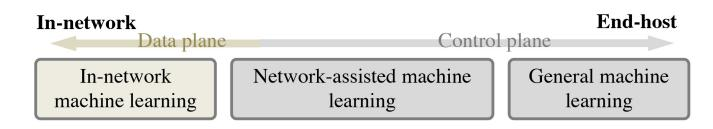

<span id="page-0-0"></span>Fig. 1. The difference between general ML, network-assisted ML, and innetwork ML (The arrow indicates where the decision is made).

<span id="page-0-5"></span>enables executing advanced network functions, and improves resources' utilization [9], [10]. This brings new opportunities to offload computations and applications to network devices: computing entirely within a programmable network devices is called *In-network Computing*.

<span id="page-0-8"></span><span id="page-0-7"></span><span id="page-0-6"></span>Machine learning (ML) was shown long ago to be useful for traffic classification [11], [12] and for network anomaly detection [13]. These network-oriented ML tasks are typically deployed on servers or middleboxes [14]. However, as data volume increases so do the processing demands from the devices running the ML-based tasks.

<span id="page-0-9"></span>The popularity of ML for networking, and the rising packet-processing demands have led to the suggestion that running ML algorithms on programmable network devices can significantly improve ML performance in terms of throughput and latency [15], [16]. Furthermore, it can help reduce memory consumption and communication overheads [17]. Consequently, a wide range of ML algorithms have been implemented in different ways on multiple types of programmable network devices.

<span id="page-0-10"></span><span id="page-0-3"></span><span id="page-0-2"></span>In this survey, we distinguish between three forms of ML execution: General ML, Network-Assisted ML, and In-Network ML. General ML refers to the case where both the ML model training and decision making are on the server side, including deployments on hardware accelerators such as GPU. Network-Assisted ML uses network devices primarily for model training acceleration (faster parameter updates) and better feature collection (more detailed features collected within the network), while the inference takes place on the end host. In-Network ML refers to complete ML processes, either training or inference, done entirely in the network. Commonly today this refers to In-Network ML Inference, where trained ML models are running on programmable network devices, and inference decisions are taken within the network device, as shown in Figure 1. Offloading ML to programmable network devices is not straightforward, as there are computational and hardware resource constraints [16], [18].

<span id="page-0-11"></span>This survey paper provides a comprehensive exploration of in-network ML. It introduces its background and history,

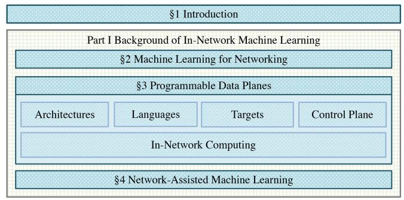

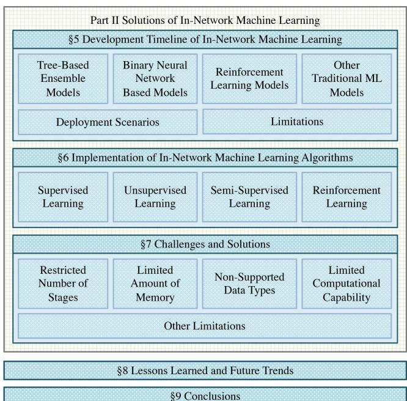

<span id="page-1-0"></span>Fig. 2. Organization of the paper.

discusses development, methodologies, and implementation techniques, as well as challenges and their proposed solutions. While this paper does not assume prior knowledge, we refer the reader to previous surveys of ML in the networking domain [\[19\]](#page-24-18), [\[20\]](#page-24-19), and to previous surveys of programmable data planes [\[21\]](#page-24-20), [\[22\]](#page-24-21) for more extensive background, though neither discussed in-network ML.

<span id="page-1-4"></span><span id="page-1-3"></span>In summary, this survey makes the following contributions:

- It clarifies important concepts in the field of ML and networking.
- It reviews the background for in-network ML and provides a comparison of target architectures and devices.
- It revisits research history, development, and taxonomy of in-network ML.
- It comprehensively reports the implementation details of in-network ML algorithms.
- It summarizes existing challenges for in-network ML and discusses potential solutions.

The rest of this survey is organized as shown in Figure [2.](#page-1-0) Section [II](#page-1-1) introduces background of ML in the networking domain. Section [III](#page-1-2) describes programmable data planes and existing targets. The concept of in-network computing and its applications for assisting ML are reported in Section [IV.](#page-5-0) Section [V,](#page-5-1) classifies in-network ML into several categories and reports their corresponding use-cases. Detailed implementations of typical in-network ML algorithms in programmable network devices are presented in Section [VI.](#page-9-0) Section [VII](#page-18-0) discusses the challenges of combining ML algorithms and programmable network devices, and introduces potential solutions. Section [VIII](#page-23-0) summarizes lessons learned and discusses future trends of in-network ML. Finally, the survey is concluded in Section [IX.](#page-24-22)

## <span id="page-1-6"></span><span id="page-1-5"></span>II. MACHINE LEARNING FOR NETWORKING

<span id="page-1-1"></span>A huge amount of data is flowing through today's networks. The volume will further grow [\[134\]](#page-26-0), [\[135\]](#page-27-0) with the introduction of new network technologies and the increased adoption of the Internet of Things (IoT), expected to reach billions of connected devices [\[19\]](#page-24-18), [\[136\]](#page-27-1). The volume of data contributes to the development of powerful ML models aimed at improving the effectiveness of networks and networkedsystems. ML is already used in many networking domains, such as traffic prediction, network analysis, and network automation. Table [I](#page-2-0) presents nine application domains where ML is already used [\[19\]](#page-24-18): traffic prediction, traffic classification, traffic routing, congestion control, quality of service (QoS)/quality of experience (QoE) management, resource management, fault management, network security, and channel modeling. ML algorithms are used in these networking domains to perform classification, regression, and control tasks. They can be categorized into supervised learning (e.g., Naïve Bayes (NB) [\[137\]](#page-27-2), Decision Tree (DT) [\[138\]](#page-27-3), Support Vector Machine (SVM) [\[139\]](#page-27-4), semi-supervised learning (e.g., Semi-supervised SVMs [\[140\]](#page-27-5)), unsupervised learning (e.g., *k*-Nearest Neighbors (KNN) [\[141\]](#page-27-6), Autoencoder (AE) [\[142\]](#page-27-7)), and reinforcement learning (RL) (e.g., Q-learning [\[143\]](#page-27-8), SARSA [\[144\]](#page-27-9)) algorithms. Among these algorithms, as shown in Table [I,](#page-2-0) SVM, DT, and Neural Network (NN) are the three most commonly used ML models for networking applications. Traffic Classification, QoS&E Management, and Network Security are the three popular networking use cases for adopting ML algorithms.

<span id="page-1-15"></span><span id="page-1-14"></span><span id="page-1-13"></span><span id="page-1-12"></span><span id="page-1-11"></span><span id="page-1-10"></span><span id="page-1-9"></span><span id="page-1-8"></span><span id="page-1-7"></span>ML algorithms for networking use cases are dominantly deployed on servers or traditional accelerators (e.g., GPUs) [\[19\]](#page-24-18), [\[145\]](#page-27-10), [\[146\]](#page-27-11), [\[147\]](#page-27-12). The introduction of programmable network devices, allowing the deployment of user programs within the data plane, has opened new venues for ML learning deployment. Programmable data planes enable high throughput and low latency packet processing within the network. However, these devices have inherent limitations compared to resource-rich environments like CPUs and GPUs. Moreover, the processing and programming logic differ significantly between these types of devices and require different frameworks. To gain a deeper understanding of in-network ML algorithms, we introduce programmable data planes in the following section.

# <span id="page-1-16"></span>III. PROGRAMMABLE DATA PLANES

<span id="page-1-2"></span>Software-defined networking (SDN) [\[148\]](#page-27-13), [\[149\]](#page-27-14) decouples the operational planes of network devices, primarily separating the data plane from the control plane. While SDN supports

#### TABLE I

<span id="page-2-0"></span>SUMMARY OF ML WORKS IN NETWORKING DOMAIN. NOTE THAT THE WORKS IN COLUMN NEURAL NETWORK REFER TO ARTIFICIAL NEURAL NETWORKS (ANN) IN GENERAL WHILE THE WORKS IN COLUMNS BAYESIAN NETWORK AND RECURRENT NEURAL NETWORK FOCUS ON THE APPLICATIONS OF THESE TWO NETWORK ARCHITECTURES, RESPECTIVELY. THIS TABLE SHOWS A SUBSET OF THE WORKS IN EACH AREA

| ML<br>Algorithms          | Support Vector<br>Machines   | Naïve<br>Bayes           | k-Nearest<br>Neighbors | K-means                  | Decision<br>Tree              | Ensemble<br>Trees                | Neural<br>Network        | Bayesian<br>Network      | Recurrent<br>Neural Network | Q-Learning           |
|---------------------------|------------------------------|--------------------------|------------------------|--------------------------|-------------------------------|----------------------------------|--------------------------|--------------------------|-----------------------------|----------------------|
| Traffic<br>Prediction     | [23]                         |                          |                        |                          |                               |                                  | [24][25]<br>[26][27][28] |                          | [29]                        |                      |
| Traffic<br>Classification | [30][31][32]<br>[33][34][35] | [36][37]<br>[38][39][40] | [38][40]<br>[41][42]   | [43][44]<br>[45][46][47] | [38][40]<br>[39][30]          | [36][30][48]<br>[49][38][40][50] | [38][40][51]             |                          |                             |                      |
| Traffic<br>Routing        |                              |                          |                        |                          |                               |                                  | [52][53]                 |                          |                             | [54][55]<br>[56][57] |
| Congestion<br>Control     |                              | [58]                     | [59][60][61]           |                          | [59][60][61]                  | [59][60]<br>[61][62]             | [59][60]<br>[61][62][63] |                          |                             | [64][65][66]         |
| Resource<br>Management    | [67]                         |                          |                        |                          |                               |                                  | [68][69]<br>[70][71][72] | [73][74][75]             | [76][77][78]                | [79][80]<br>[81][82] |
| Fault<br>Management       | [83][84][85]                 |                          |                        | [86][87]                 | [83][84]<br>[88][89]          |                                  | [90][91]<br>[86][92]     | [93][94]<br>[83][95][96] | [97]                        |                      |
| QoS & QoE<br>Management   | [98][99]                     | [98][99]                 | [98]                   |                          | [98][99]                      | [98][100]                        | [101][98]<br>[99][100]   |                          |                             | [102][103]           |
| Network<br>Security       | [104][105]<br>[106][107]     | [108]                    | [109]                  | [110]                    | [110][104]<br>[111][105][108] | [104][112]<br>[113][114][115]    | [116][111]<br>[117][107] | [115]                    | [118]                       | [119]                |
| Channel<br>Modeling       | [120][121]                   |                          | [122]                  |                          | [123][124]                    | [122][125]                       | [126][127]<br>[128][129] |                          | [130][131]                  | [132][133]           |

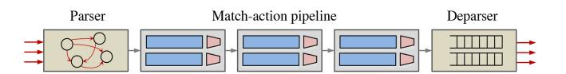

<span id="page-2-1"></span>Fig. 3. Protocol-Independent Switch Architecture (PISA).

<span id="page-2-3"></span>network programmability, the initial focus was on changing forwarding and routing rules, with fixed or reconfigurable data plane functionality [\[150\]](#page-27-15). The introduction of true programmability into the data plane [\[151\]](#page-27-16), sometime later, has enabled changing the functionality of the data plane by users (e.g., network operators). Nowadays, network applications can be executed in an *in-network* manner, meaning that the program is implemented and executed within the data plane. In-network applications can adapt to increasing cloud network infrastructure demands, as they can potentially run at line rate, operating on all (or a selected subset of) incoming traffic. In this section, we present a brief overview of programmable network devices that function as the target devices for innetwork ML and describe the workflow of programming them.

## *A. Protocol-Independent Switch Architecture*

<span id="page-2-5"></span>A programmable network device architecture defines the high level structure of a programmable network devices, and the interfaces between its major components. All current architectures are originated from and similar to the most common architecture called PISA (Protocol Independent Switch Architecture) [\[152\]](#page-27-17). Figure [3](#page-2-1) shows PISA, the basic pipeline architecture for programmable data planes, developed based on the Reconfigurable Match Tables (RMT) model [\[151\]](#page-27-16). PISA allows network devices to customize packet processing within the data plane without hardware modifications, making them independent of vendor-provided, fixed sets of protocols.

The PISA architecture has three building blocks: a parser, a deparser, and a match-action pipeline. The parser is a state machine that extracts a sequence of fields from a packet, called Packet Header Vector (PHV). The PHV usually contains fields

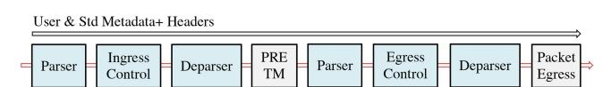

<span id="page-2-2"></span>Fig. 4. PSA & TNA data plane architecture. PRE refers to the Packet Replication Engine and TM indicates Traffic Manager.

<span id="page-2-4"></span>from packet headers (e.g., Ethernet, IP, VLAN, TCP/UDP) and intrinsic metadata (e.g., the ingress and egress ports). The PHV can also include user-defined headers. The extracted vector is processed in a sequence of logical stages called matchaction stages using match-action tables (M/A tables). M/A tables are fundamental units that lookup a key value (e.g., packet header) in a table, and map the resulting entry to a corresponding action to be taken on the processed packet. Each logical stage allows a fixed number of match-action operations, where a key (an input field from PHV or metadata) is looked up in a table, and a corresponding action is taken, enabling to process packets in a predetermined way. Finally, the deparser reconstructs PHV fields together with packet payload, before the packets are emitted.

<span id="page-2-7"></span><span id="page-2-6"></span>There are several architectures built on top of PISA, including both open-source reference architectures and commercial solutions, such as Portable Switch Architecture (PSA, shown in Figure [4\)](#page-2-2) [\[153\]](#page-27-18), Programmable NIC Architecture (PNA, shown in Figure [7\)](#page-4-0) [\[154\]](#page-27-19), SimpleSumeSwitch [\[7\]](#page-24-6), v1model (shown in Figure [5\)](#page-3-0) [\[155\]](#page-27-20), and Tofino Native Architecture (TNA, shown in Figure [4\)](#page-2-2) [\[156\]](#page-27-21). Not all programmable data planes are PISA-based, for example, disaggregated RMT (dRMT) [\[157\]](#page-27-22).

## <span id="page-2-10"></span><span id="page-2-9"></span><span id="page-2-8"></span>*B. Data Plane Programming Language*

Programming Protocol-Independent Packet Processors (P4) is a domain-specific language used for network packet processing [\[8\]](#page-24-7). P4 provides a flexible and programmable approach to customize packet parsing, matching, forwarding behaviors, and processing methodologies on network devices. A key feature

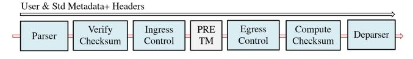

<span id="page-3-0"></span>Fig. 5. v1model data plane architecture. PRE refers to the Packet Replication Engine and TM indicates Traffic Manager.

of the P4 language is protocol independence, enabling support of a large number of protocols within a single device by change of a program. Furthermore, the P4 language supports flexible interaction between the programmable data plane and control plane, which enables coordination between the control logic and packet processing logic on network devices.

Programmable network devices are often programmed using P4, which does not have a single common compiler or development environment. Both commercial software development environments (SDE) from, e.g., Intel, NVIDIA, and opensource solutions (e.g., BMv2) exist. The open source p4c [\[158\]](#page-27-23) is the reference compiler, developed by the P4 community, but modified by vendors to their specific product. A P4 compiler takes a program written in P4 and compiles it into a binary that is executable on a specific target, based on a given data plane architecture. In general, the term P4 targets refers to the programmable network devices (e.g., specific switches or cards) and the term P4 architecture to the structure of the pipeline, defining the processing flow within a device. Currently *<sup>P</sup>*4<sup>16</sup> is the commonly used version of P4, and *<sup>P</sup>*4<sup>14</sup> is deprecated.

## *C. P4 Targets*

The P4 language is designed to support a variety of packet processing targets, including smart network interface cards (SmartNICs), data processing units (DPUs), field programmable gate arrays (FPGAs), software switches, and hardware switch-ASICs.

P4-programmable hardware switches are available from multiple equipment vendors, such as Intel Tofino,[1](#page-3-1) NVIDIA Spectrum, and Cisco Silicon-One. DPU and SmartNIC vendors include NVIDIA BlueField, Intel IPU, AMD Pensando, Netronome NFP, and others. These vendors typically support a family of P4 programmable devices, across multiple generations.

In addition to hardware targets, there are multiple opensource implementations of P4-programmable software switch targets. Behavioral Model version 2 (BMv2) [\[159\]](#page-27-24) is the most popular one and the reference P4 software switch. It supports multiple targets, including Simple Switch based on the v1model architecture and PSA switch based on PSA.

In the following, we discuss some commonly-used P4 platforms of different types:

*1) Switch-ASIC:* An Application-Specific Integrated Circuit (ASIC) is a chip designed for a particular purpose. Switch-ASICs are specialized devices designed specifically for packet forwarding, achieving high-throughput and lowlatency switching. Programmable switch-ASICs introduce programmability into the switch pipeline, but do not

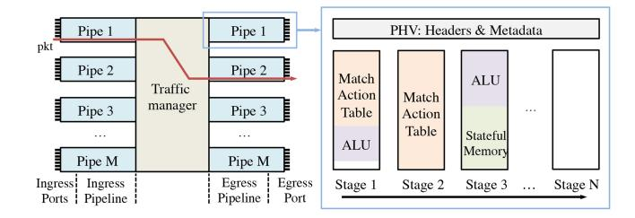

Fig. 6. Tofino-based switch data plane architecture.

<span id="page-3-2"></span>compromise on performance. They are characterized by high throughput and low latency. Current switch-ASICs exceed 50Tbps and can process tens of billions of packets per second [\[160\]](#page-27-25), with sub-microsecond latency.

<span id="page-3-5"></span><span id="page-3-3"></span>Figure [6](#page-3-2) shows as an example the architecture of Intel's Tofino switch-ASIC [\[156\]](#page-27-21). There are multiple *pipes* (each composed of an *ingress* and an *egress* pipeline), with multiple ports associated with each pipe. Pipes are analogues to CPU processing cores, and similar to them resources such as memory (e.g., CPU's L1 cache) and registers are not shared between pipes. Packets crossing between pipes happens only between the ingress and egress pipelines, typically through a shared buffer or a crossbar. This allows the pipes to guarantee throughput and latency performance, and prevents processing hazards and concurrent access issues. As a consequence, register, counter or meter values in pipe 1 (either ingress or egress pipeline) cannot be read by programs running in pipe 2. Incoming packets are processed in an ingress pipeline, before entering the traffic manager, and being processed in an egress pipeline. The egress pipeline is selected based on the packet's output port. Each pipeline contains a certain number of *stages*, which can execute operations such as *(i.)* using match-action to lookup keys in tables and take corresponding actions, *(ii.)* utilizing counters, meters, or registers, and *(iii.)* computing values using Arithmetic Logic Units (ALUs). Each switch-ASIC has limited hardware resources, which is the biggest challenge for offloading novel network functions into programmable targets as described in most existing works [\[161\]](#page-27-26), [\[162\]](#page-27-27), [\[163\]](#page-27-28), [\[164\]](#page-27-29). Note that the integrated circuits of these devices contain billions of transistors, and that they are often limited by power and die size constraints. In fact, what is considered limited resources for ML is "just the right fit" for packet switching.

<span id="page-3-6"></span><span id="page-3-4"></span>*2) SmartNIC:* A SmartNIC is an advanced type of a network interface card (NIC) that integrates processing capabilities, enabling the acceleration of network operations. NICs act as a connector between the network and the host, with incoming network traffic from the ports being sent to the CPU over PCI-Express (PCIe) bus. However, there is often a mismatch between the incoming network bandwidth, PCIe throughput, and CPU processing capacity. SmartNICs offload some of the processing from the CPU to the NIC in order to overcome this mismatch and free CPU cycles. SmartNICs are able to handle data rates of hundreds of Gbps, for example 2 ports of 100G. The main reference architecture for a programmable NIC is PNA [\[154\]](#page-27-19), as shown in Figure [7.](#page-4-0) It consists of the main Parser, Pre Control, Main Control, and Main Deparser. Externs (specialized objects

<span id="page-3-1"></span><sup>1</sup>The development of this series was stopped in 2023.

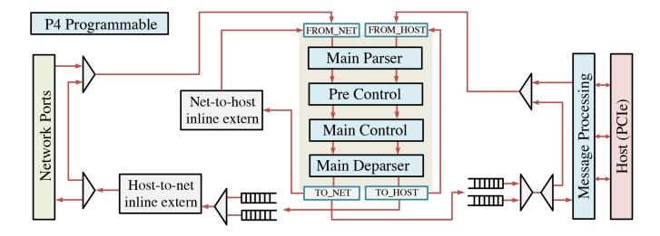

<span id="page-4-0"></span>Fig. 7. Programmable NIC Architecture (PNA) version 0.5.

such as counters, meters, and registers) are included and can be used in the pipeline. SmartNICs tend to have more memory resources than a switch-ASIC, for example leveraging an external DRAM. Example SmartNIC targets include AMD Pensando [\[3\]](#page-24-2), NVIDIA BlueField [\[4\]](#page-24-3), and Netronome NFP [\[6\]](#page-24-5).

<span id="page-4-4"></span><span id="page-4-3"></span><span id="page-4-2"></span>*3) FPGA:* FPGA is a configurable integrated circuit that can be programmed to perform specific functions by loading a binary programming file, providing flexibility and reconfigurability for implementing custom hardware designs. FPGAs were early demonstration targets for P4-based network devices, with works such as P4FPGA [\[165\]](#page-27-30). Other example targets include NetFPGA [\[166\]](#page-27-31) running P4→NetFPGA [\[7\]](#page-24-6) and AMD Alveo running OpenNIC [\[167\]](#page-27-32). Both are based on existing FPGA boards and provide a framework able to compile P4 programs into a dedicated packet-processing module. FPGA-based programmable network devices reach data rates of hundreds of Gbps, lower than high-end switch-ASIC but higher than CPUbased targets. FPGA targets also allow users to design their own P4 architecture. For example P4→NetFPGA [\[7\]](#page-24-6) uses the SimpleSumeSwitch architecture, which uses only a single pipeline, without separation to Ingress and Egress, while the traffic manager (called Output Queues module) is located after the P4 pipeline.

<span id="page-4-5"></span>*4) Software Switch:* A software switch is a network switch running as an application on a CPU. Software switches are often considered virtual switches, and are implemented using SDN principles, separating the control plane and data plane functions. Software switches run on standard CPUs, with switches supporting both x86 and ARM architectures, and don't require specialized hardware. To overcome performance barriers of CPUs, kernel bypass is often used. For example, T4P4S compiles a P4 program using v1model architecture and loads it to a Network Hardware Abstraction Layer (NetHAL) API [\[168\]](#page-27-33). T4P4S loads the compiled program to a data plane that is accelerated by DPDK (or ODP). Similarly, the popular Open vSwitch (OVS) is able to compile P4 programs with PSA architecture to software targets like PSAeBPF and P4 DPDK [\[169\]](#page-27-34). To explore P4 functionality, the P4 behavioral model, BMv2 is widely used. It supports v1model and PSA architectures. A hybrid target is P4Pi [\[170\]](#page-27-35), which runs P4 on a Raspberry Pi. While P4Pi supports both T4P4S and BMv2, it also provides a low-cost hardware target that can be used for education and research. Software switches typically have lower performance than hardware targets.

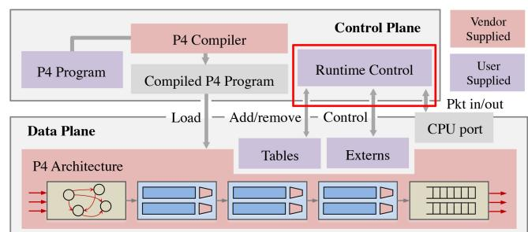

Fig. 8. Control Plane and Data Plane Interaction [\[171\]](#page-27-36).

## <span id="page-4-1"></span>*D. Control Plane*

<span id="page-4-8"></span>Control plane manages the runtime behavior of P4 targets via an Application Programming Interface (API). The API is supported by a device driver or an equivalent software component. P4Runtime [\[171\]](#page-27-36) is a common control plane specification that makes it possible to control or configure the data plane of a device running a P4 program. Figure [8](#page-4-1) illustrates the main control plane operations. It facilitates runtime control of P4 entities (e.g., M/A tables, counters, meters), for example by adding and removing table entries. There is typically also a packet I/O mechanism for streaming packets to/from the control plane. Reconfiguration mechanisms allow the loading of P4 programs onto the target's data plane.

## *E. In-Network Computing*

<span id="page-4-9"></span>In-network computing refers to the offloading of programs or computation tasks to network devices, for example, programmable switches or SmartNICs. In-network computing takes advantage of network devices' high processing speeds and low overheads in physical space, energy, and cost, as they are already part of network infrastructure [\[10\]](#page-24-9). Realization of in-network computing allows networks to become part of available computing resources. It provides better integration of communication and computing resources when diverse application requirements need to be addressed [\[172\]](#page-27-37). Microsoft Azure highlighted the potential of in-network computing for telecommunication workloads [\[173\]](#page-27-38), as it can efficiently process massive volumes of traffic directly within the network infrastructure. Their analysis identified cost efficiency, scalability and increased functionality compared with existing solutions. In response to what Microsoft identified as the main challenge for in-network computing, resource constraints, they have developed a resource elasticity solution [\[174\]](#page-27-39).

<span id="page-4-13"></span><span id="page-4-12"></span><span id="page-4-11"></span><span id="page-4-10"></span><span id="page-4-7"></span><span id="page-4-6"></span>In-network computing is implemented on any of the targets described in the previous section. It can be applied in various areas (e.g., caching, measurements, network services, and distributed systems). For example, NetCache [\[175\]](#page-27-40) uses Switch ASIC to detect, index, cache, and serve hot key-value items in the data plane, providing significant throughput increase and latency reduction. P4xos [\[176\]](#page-27-41) offloads a consensus protocol (Paxos) on programmable network devices (e.g., Switch ASIC, FPGA, and DPDK) and can effectively remove consensus

#### TABLE II

<span id="page-5-2"></span>SUMMARY OF NETWORK-ASSISTED ML ALGORITHMS. THE ALGORITHMS IN THE TOP PART OF THE TABLE FOCUS ON EXTRACTING INFORMATION IN THE DATA PLANE, TO ASSIST THE CLASSIFICATION EXECUTED ON THE END-HOST. THE ALGORITHMS IN THE BOTTOM PART OF THE TABLE FOCUS ON ACCELERATING HOST-BASED ML TRAINING PROCESS THROUGH IN-NETWORK AGGREGATION

| Scheme            | Category                      | Algorithm                | Language | Platform         | ML Location <sup>1</sup> |
|-------------------|-------------------------------|--------------------------|----------|------------------|--------------------------|
| SINET [178]       | Defense Eavesdropping Attacks | Bayesian                 | P4       | BMv2             | Server (Controller)      |
| FastFE [179]      | Traffic Analysis              | NN (Kitsune)             | P4       | Tofino           | Server (Controller)      |
| FlowLens [180]    | Flow Classification           | Multinomial NB, XGB, RF  | P4       | Tofino           | Switch CPU               |
| DPRO [181]        | Routing Optimization          | NN (RL)                  | P4       | BMv2             | Server (Controller)      |
| ML-Pushback [182] | Defense Against DDoS          | DT, Deep Learning        | _        | _                | Server (Controller)      |
| iSwitch [183]     | In-Network Aggregation        | Distributed RL           | _        | NetFPGA-SUME     | _                        |
| SwitchAgg [184]   | In-Network Aggregation        | <del>-</del>             | P4       | NetFPGA and BMv2 | _                        |
| SwitchML [185]    | In-Network Aggregation        | <del>-</del>             | P4       | Tofino           | _                        |
| ATP [186]         | In-Network Aggregation        | Distributed DNN training | P4       | Tofino           | _                        |
| DAIET [9]         | Data Aggregation              | _                        | P4       | BMv2             | _                        |

<span id="page-5-3"></span>as a bottleneck for distributed applications in data centers. NetChain [\[177\]](#page-27-42) uses switch-ASIC to store data and process queries in-band (within the data plane), which provides scalefree sub-RTT coordination in data centers.

## <span id="page-5-0"></span>IV. NETWORK-ASSISTED MACHINE LEARNING

The successful introduction of in-network computing has led to attempts to apply in-network computing to ML applications. One type of effort focuses on accelerating ML frameworks using the network, while the frameworks are still deployed on CPUs and standard accelerators. We refer to these as *Network-Assisted ML*. The second type of effort focuses on offloading the actual ML operation, e.g., classification decision, to the network. We refer to these as *In-Network ML*.

This section mainly focuses on network-assisted ML, which has two main use cases: feature extraction and weight aggregation, as summarized in Table [II.](#page-5-2)

<span id="page-5-8"></span>*Feature extraction:* Due to the flexibility of programmable network devices and their potential for wide distribution on targeted networks, features can be extracted efficiently by these devices according to different use-case requirements and controllers' needs [\[187\]](#page-28-0). After extraction, they are sent to a controller or a defined ML server continuously for further processing. Features can vary from mean and standard values [\[179\]](#page-27-43) of packet size to website fingerprinting [\[180\]](#page-27-44). Since they are extracted from inner networks, they are more representative and can provide more information and insights for ML use cases, compared to the features collected from the edge.

<span id="page-5-7"></span><span id="page-5-4"></span>*Weight aggregation:* ML training can often be timeconsuming. With the introduction of more powerful hardware accelerators, the bottleneck of ML training in data centers lies more in communication (weight aggregation from multiple different workers) compared to the training process, which can even cost around half of the whole training time. Conducting gradient aggregation on a switch (e.g., SwitchML [\[185\]](#page-27-45), ATP [\[186\]](#page-28-1)) instead of a specific aggregation server can reduce the communication overhead and thus speed up the training process.

## <span id="page-5-1"></span>V. DEVELOPMENT TIMELINE OF IN-NETWORK MACHINE LEARNING

Although in-network computing assists in the implementation of ML, in-network ML is different from network-assisted ML. Instead of deploying ML models on servers like network-assisted ML, in-network ML deploys them on the programmable data plane and mainly focuses on the inference process.

<span id="page-5-9"></span>IIsy [\[188\]](#page-28-2) highlighted three benefits of in-network ML: location, latency and load. Location, as network devices are already deployed within the network and any data for inference must go through the network. Latency, as in-network ML eliminates the latency introduced by CPU or GPU, and supports microsecond-scale inference decisions. Load, as any inference done on network devices saves processing cycles on a backend and can terminate traffic earlier, thereby reducing the volume of traffic deeper in the network.

Since 2017, researchers have tried to deploy ML algorithms directly in programmable network devices for classification. The work to date on in-network ML can be divided into four groups: 1) DT based models and tree-based ensemble models, 2) binary neural networks (BNN) based NN models, 3) RL models, and 4) other ML models. All in-network ML works are listed in Table [III,](#page-6-0) and their development timeline is shown in Figure [9.](#page-6-1) There are three points worth highlighting: 1. The number of publications in this area has more than tripled since 2018. 2. Works in recent years tend to involve multiple ML models rather than a single model. 3. Several works went beyond model design and focused more on framework development (e.g., Planter [\[161\]](#page-27-26), DINC [\[189\]](#page-28-3), and Homunculus [\[190\]](#page-28-4)).

<span id="page-5-11"></span><span id="page-5-10"></span><span id="page-5-5"></span>While this section presents up-to-date works on in-network ML in terms of different types of ML models, sketching the skeleton of the in-network ML development timeline, the implementation of in-network ML solutions is illustrated in the next section in detail.

## <span id="page-5-6"></span>*A. Tree-Based Ensemble Models*

Deploying DT and tree-based ensemble models on programmable network devices was first proposed in

TABLE III SUMMARY OF IN-NETWORK ML ALGORITHMS

<span id="page-6-0"></span>

| Scheme                | Category                         | Algorithm                                  | Language | Platform                        | ML location <sup>1</sup> |
|-----------------------|----------------------------------|--------------------------------------------|----------|---------------------------------|--------------------------|
| N2Net [191]           | Packet Classification            | BNN                                        | P4       | RMT-like Switch Pipeline        | Data Plane               |
| BaNaNa Split [15]     | Classification                   | BNN                                        | P4       | SmartNIC                        | Data Plane               |
| toNIC [192]           | Data Classification              | BNN                                        | P4       | Netronome SmartNIC              | Data Plane               |
| IIsy [16, 188]        | Data/Packet/Flow Classification  | DT, RF, XGB, KM,                           | P4       | NetFPGA-SUME,                   | Data Plane               |
|                       |                                  | SVM, and NB                                |          | Tofino, BMv2                    |                          |
| pForest [193]         | Packet/Flow Classification       | RF                                         | P4       | Tofino                          | Data Plane               |
| SwitchTree [194]      | Packet/Flow Classification       | RF                                         | P4       | BMv2                            | Data Plane               |
| Taurus [195, 196]     | Packet/Flow Classification       | M-RA <sup>2</sup> : DNN, SVM, KM, and LSTM | P4       | Modified ASIC                   | Data Plane               |
| Qiaofeng et al. [197] | Packet/Flow Classification       | BNN (Federated learning)                   | P4/C     | Netronome SmartNIC,<br>and BMv2 | Data Plane               |
| N3IC [198, 199]       | Data/Packet/Flow Classification  | BNN                                        | P4       | Netronome SmartNIC,             | Data Plane               |
|                       |                                  |                                            | P4       | NetFPGA, BMv2                   |                          |
| BACKORDERS [200]      | Packet/Flow Classification       | RF                                         | P4       | BMv2                            | Data Plane               |
| Planter [161, 201]    | Data/Packet/Flow Classification  | ET, SVM, NB, KM,                           | P4       | Tofino, Tofino2, BMv2,          | Data Plane               |
|                       |                                  | KNN, PCA, AE, and BNN                      |          | P4Pi                            |                          |
| Bruno et al. [202]    | Packet/Flow Classification       | RF                                         | P4       | Netronome SmartNIC,<br>and BMv2 | Data Plane               |
| IOI [203]             | Classification                   | NN                                         | P4       | Modified ASIC                   | Data Plane               |
| Clustreams [204]      | Classification                   | k-NN Clustering                            | P4       | Spectrum-3 switch               | Data Plane               |
| NetPixel [205, 206]   | Image Classification             | DT, CNN                                    | P4       | BMv2                            | Data Plane               |
| pHeavy [17]           | Flow Classification              | DT                                         | P4       | BMv2, Tofino                    | Data Plane               |
| OPaL [207, 208]       | Control                          | Temporal-difference RL algorithms (SARSA)  | P4       | Netronome SmartNIC              | Data Plane               |
| QCMP [209]            | Load Balancing/Control           | Q-Learning                                 | P4       | Tofino, BMv2                    | Data Plane               |
| Paolucci et al. [210] | DDoS Attack Detection            | NN                                         | P4       | BMv2                            | Data Plane               |
| INC [211]             | Bot Detection, Botnet Inference  | DT                                         | P4       | Tofino                          | Data Plane               |
| Linnet [212]          | Financial Prediction             | NB, DT, RF, XGB                            | P4       | BMv2                            | Data Plane               |
| LOBIN [213]           | Financial Prediction             | KM, KNN, DT, RF, XGB                       | P4       | BMv2, Tofino, Tofino2           | Data Plane               |
| P4Pir [214, 215, 216] | Runtime Model Update             | DT, RF                                     | P4       | P4Pi                            | Data Plane               |
| FLIP4 [217]           | Runtime Model Update             | Federated XGB                              | P4       | P4Pi                            | Data Plane               |
| MAP4 [218]            | Packet/Flow Classification       | DT, RF                                     | P4       | Netronome                       | Data Plane               |
| Homunculus [190]      | Parameter Tuning                 | DT, KM, SVM, and NN                        | P4       | Modified ASIC                   | Data Plane               |
| Mousika [219]         | Data Classification & Prediction | DT                                         | P4       | Tofino                          | Data Plane               |
| Mousikav2 [220]       | Data Classification & Prediction | DT                                         | P4       | Tofino                          | Data Plane               |
| Flowrest [221]        | Flow Classification              | RF                                         | P4       | Tofino                          | Data Plane               |
| Ganesan et al. [222]  | Packet Classification            | DT                                         | P4       | BMv2                            | Data Plane               |
| DINC [189]            | Distributed Deployment           | NB, SVM, DT, RF, XGB                       | P4       | BMv2, Tofino                    | Data Plane               |

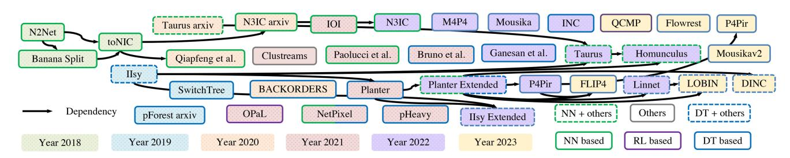

<span id="page-6-1"></span>Fig. 9. Development History of In-network Machine Learning. All works can be found in Table [III.](#page-6-0)

<span id="page-6-2"></span>2019 [\[16\]](#page-24-15), [\[193\]](#page-28-5). There are two main approaches, which are depth-based approach and encode-based approach.

The depth-based approach was proposed by pForest [\[193\]](#page-28-5), and it encodes random forest (RF) into BMv2 and Intel Tofino in a hierarchical manner by using a match-action stage for each level in the tree. Evaluation of flow classification use case shows that the encoded data plane model can do inference at the line rate. This work also proposed an <span id="page-7-20"></span><span id="page-7-6"></span>iterative training process to optimize tree models and used features. A similar work named SwitchTree [\[194\]](#page-28-6) uses the same strategy to encode RF to BMv2. This work realizes innetwork RF with a more complex feature extraction ability based on the UNSW dataset [\[223\]](#page-28-7). This method was then used in BACKORDERS [\[200\]](#page-28-8) to do distributed denial-of-service (DDoS) attack detection on CICIDS2017 dataset. Compared to three previous works, Bruno et al. [\[202\]](#page-28-9), pHeavy [\[17\]](#page-24-16), and MAP4 [\[218\]](#page-28-10) use a more direct method with only *if*() and *else*() operations. Specifically, MAP4 argued not to choose other popular ML models. It encodes a simple and reasonably accurate DT model into a NIC and evaluates the encoded DT model by using intrusion detection and IoT classification use cases.

<span id="page-7-19"></span><span id="page-7-17"></span><span id="page-7-16"></span><span id="page-7-15"></span><span id="page-7-14"></span><span id="page-7-13"></span><span id="page-7-12"></span><span id="page-7-7"></span>The encode-based approach is proposed by IIsy [\[16\]](#page-24-15), [\[188\]](#page-28-2) and Planter [\[161\]](#page-27-26), [\[201\]](#page-28-11). This solution encodes each feature and uses an additional code-label table for the DT model, and it was tested on BMv2, Tofino, and FPGA. Planter extends the work from basic tree models to ensemble models, including RF, XGBoost (XGB), and isolation forest (IF), and it was tested by using anomaly detection on Tofino [\[201\]](#page-28-11). Planter also provides an automated in-network ML mapping framework for easy deployment of in-network ML algorithms. This mapping method has been applied by INC [\[211\]](#page-28-12) and Flowrest [\[221\]](#page-28-13) for bot detection and botnet inference. Based on Planter's framework, Linnet [\[212\]](#page-28-14) applied this method to conduct future stock price movement prediction on a software switch and LOBIN [\[213\]](#page-28-15) realized the similar functionality on resourceconstrained commodity hardware switches. In an IoT use case, P4Pir [\[214\]](#page-28-16), [\[215\]](#page-28-17), [\[216\]](#page-28-18) and FLIP4 [\[217\]](#page-28-19) focused on tree models under Planter's mapping solution and explores how to do runtime model updates. FLIP4 [\[217\]](#page-28-19) further combined the model to federated learning with diffusion noise to enable lightweight in-network ML deployment on the IoT edge while maintaining source data privacy. Homunculus [\[190\]](#page-28-4), a parameter tuning framework that finds optimal data plane model parameters, also applied this method by using IIsy as a plugin. Other than IIsy's solution, encode-based DT can be simplified to only a decision table, which uses feature values as the input instead of mapping features into codes as the input. NetPixel applied this simplified encode-based DT algorithm to do image classification based on the BMv2 software switch [\[206\]](#page-28-20) with the help of novel in-network image feature extraction techniques. pHeavy, Mousika, Mousikav2, and Ganesan et al. also mentioned this simplified method, by only using a decision table with range match, Longest Prefix Match (LPM), or ternary match, in their flow detection mechanism [\[17\]](#page-24-16), [\[219\]](#page-28-21), [\[220\]](#page-28-22), [\[222\]](#page-28-23). Mousika focuses more on how to train a DT that best suits the data plane. It uses knowledge distillation to train binary DT, it then uses a similar method to map the tree by using ternary match.

# <span id="page-7-18"></span><span id="page-7-10"></span>*B. BNN Based Models*

<span id="page-7-22"></span><span id="page-7-21"></span>Binary neural network (BNN) is a type of ML model first proposed in 2015 [\[224\]](#page-28-24) and extended in the subsequent work [\[225\]](#page-28-25). It uses bit operations (XNOR and PopCount) to perform binary matrix multiplication efficiently and can <span id="page-7-23"></span><span id="page-7-8"></span><span id="page-7-2"></span><span id="page-7-1"></span><span id="page-7-0"></span>provide a theoretical basis for deploying NN models in programmable network devices. XNOR-Net further develops the feed forward process of BNN and offers a concrete mathematical proof from weight binarization to input binarization [\[226\]](#page-28-26). N2Net provided a solution to implement the forward path of the BNN on a modern switching chip [\[191\]](#page-28-27), proving the feasibility of mapping, providing an approach to leveraging the device parallelism, and offering a compiler to automatically generate the switching chip's configuration. However, this work did not discuss the deployment performance on commodity programmable network devices (though implemented on RMT [\[151\]](#page-27-16)) and encountered the limitation of model size. The derivative work, Banana Split, extended the target devices of BNN from programmable switches in N2Net to SmartNICs, and proved that computing in programmable network devices can benefit end-host applications. When processing binarized NN models, Banana Split partitions the CNN, leverages the NN's layered-structure to be partly processed in the network, and explores when programmable network devices should be used as the coprocessor of CPU [\[15\]](#page-24-14). Developed based on these efforts, toNIC realized binarized fully connected layers (the layers that connect each neuron to every neuron in the previous layer, facilitating comprehensive information exchange) on commodity SmartNICs, aiming at improving the efficiency and throughput of NN inference [\[192\]](#page-28-28). The result shows that the processing throughput can be improved by a factor of 10 with only a small NIC's resource overhead. However, the solution proposed in this work cannot function without servers and did not cover detailed evaluation in terms of throughput. The following work, N3IC, further proved that NN can be deployed on commercial programmable NICs to solve inference tasks which can reduce the cost of inference tasks required by packet monitoring applications. It implements the design on two different hardware NICs by using micro C and P4, and evaluates the design through three use cases, e.g., traffic classification, anomaly detection, and network tomography. The result shows a 100x lower processing latency and 1.5x increase in throughput compared to CPU solutions. Similarly, Qiafeng et al. combined in-network BNN with federate learning to provide security service to multi-party edge device owners [\[197\]](#page-28-29). Evaluation results on two anomaly detection datasets show a multi-fold improvement in latency and communication overheads compared to other learning architectures without the help of in-network ML. By using a similar idea, NetPixel distributedly implements CNN on multiple software switches based on BMv2 and uses the generated model for image classification [\[205\]](#page-28-30). Based on previous research, Paolucci et al. [\[210\]](#page-28-31) show a demo of NN on a software switch.

<span id="page-7-11"></span><span id="page-7-9"></span><span id="page-7-5"></span><span id="page-7-4"></span><span id="page-7-3"></span>Instead of using existing network devices, Taurus [\[196\]](#page-28-32) and Homunculus [\[190\]](#page-28-4) added a custom hardware module to programmable network switches [\[195\]](#page-28-33). The added hardware can be based on a map-reduce abstraction introduced by Taurus using pipelined and SIMD parallelism for fast inference. It helps to realize several ML algorithms other than BNN and gains a processing speed that is three times faster than a server-based control plane. Similarly, IOI realized NN on <span id="page-8-0"></span>programmable switches with the help of a plug-in transceiver module [\[203\]](#page-28-34). The module is designed specifically to perform non-linear operations such as matrix multiplication and nonlinear activation.

In summary, there are two main technical approaches for realizing NN in programmable network devices. One is to use only the existing programmable network devices while the other is to add new modules to realize more difficult operations, such as matrix production and nonlinear operation, which requires area and power overheads.

## *C. Reinforcement Learning Models*

<span id="page-8-4"></span><span id="page-8-2"></span>Reinforcement learning (RL), as a key tool to online control systems in data-driven networks, was implemented on programmable network devices by a work named OPaL in 2021 [\[207\]](#page-28-35), [\[208\]](#page-28-36). OPaL realized one-step temporal difference ML algorithm (e.g., SARSA) on Netronome SmartNIC. By using quantize fixed-point representations for values of actions and Tile-coding (a sparse-coding method for realvalued data [\[227\]](#page-28-37)) based on *microengines* (MEs, a type of P4 extern plugin), the OPal can achieve significantly lower latency (more than 10 times lower) and throughput (around 3 times larger) compared to offline implementations. Different from OPaL, QCMP in 2023 [\[209\]](#page-28-38) introduced two different approaches for in-network Q-learning implementation that do not rely on externs. The first method fully deployed the model inside the data plane, while the second solution employs the control plane to update the Q-table. QCMP's evaluation primarily focuses on the second approach, using traffic load balancing as a use case, and running on Tofino. Generally, there was so far limited research into in-band RL, which is a new research area in in-network ML and calls for further contributions.

## *D. Other ML Models*

Several traditional ML algorithms, including SVM, NB, K-means (KM), and Principal Component Analysis (PCA) were implemented by IIsy [\[16\]](#page-24-15), [\[188\]](#page-28-2) and Planter [\[161\]](#page-27-26). To avoid complex operations, intermediate results of calculation are stored in M/A tables after training. IIsy made trade-offs between accuracy and feasibility, so as to realize the implementation of traditional ML models with complex operations on programmable network devices. In IIsy, more accurate algorithm implementation and less computation in network devices mean more memory consumption needed on network devices and more complex calculations needed for M/A table generation. IIsy's following work, Planter [\[161\]](#page-27-26), generalized SVM, NB, KM, AE, and PCA as the Lookup Based Solution, and provided a general and modular workflow for similar models. All models supported by IIsy and Planter are able to run with a full line rate (6.4Tbps) and the same level of latency as an L2/L3 reference switch. Linnet [\[212\]](#page-28-14) and LOBIN [\[213\]](#page-28-15), by applying Planter, used NB, DT, RF, and XGB for future stock price prediction. Taurus [\[195\]](#page-28-33) can also realize algorithms such as SVM and KM by using customized hardware based on map-reduce abstraction on programmable network devices. Its extension work Homunculus [\[196\]](#page-28-32) did auto parameter

<span id="page-8-5"></span><span id="page-8-1"></span>tuning for embedded IIsy models as a plugin and also natively supports models in Taurus. Different from the previous three works, Clustreams [\[204\]](#page-28-39) realized centroid-based clustering algorithms (e.g., KM) on programmable switches (Spectrum-3 Switch) by applying the combined quadtree [\[228\]](#page-28-40) and ternary match-action tables (TCAM). Clustreams used quadtree to recursively divide the workspace and assign each workspace with a cluster where TCAM allows parallel searching of all quadrants during the inference process. The experiment result shows that Clustreams has a small overhead on the network latency and the switch throughput. The hybrid solution in Clustreams also contributes to reducing power consumption.

## *E. Deployment Scenarios*

In-network ML can be used in different deployment scenarios, such as data center networks [\[188\]](#page-28-2), [\[196\]](#page-28-32), wide area networks (WAN) [\[201\]](#page-28-11) and edge computing [\[214\]](#page-28-16), [\[217\]](#page-28-19). Many of the works focus on the technology, yet it is natural to expect that DDoS mitigation will be deployed in WAN (dropping traffic close to the source), while latency sensitive use cases will be deployed at the data center or the edge (where computation time dominates over propagation time).

<span id="page-8-3"></span>Four different in-network ML deployment types are identified in [\[188\]](#page-28-2): native switch, endpoint accelerator, SmartNIC, and a hybrid deployment.

A native switch is the most common type of deployment, where a network switch is running in-network ML in parallel with its traditional networking functionality, such as packet forwarding and traffic management. This type of deployment is beneficial as the switch is already deployed, thus there is no additional cost or space requirement, and inference can happen as traffic passes through the network. The disadvantage of such deployments is that the co-location with networking functionality leaves fewer resources for in-network ML.

A programmable network devices can also act as a "pure" endpoint accelerator, where a dedicated network platform is used for the sole purpose of in-network ML. This concept is similar to traditional accelerators, such as GPUs, except that the network platform is network-attached rather than residing on a PCIe bus. While this deployment allows all the device's resources to be used for in-network ML, it adds cost, power, and space overheads. An endpoint device also adds an extra hop to the traffic compared with a native switch.

The deployment of in-network ML on SmartNICs, which includes also DPUs, makes it possible to provide in-network ML on incoming traffic to an end-host. This deployment scenario is not very different from a native switch, as the ML model is co-located with native NIC functionality, yet a SmartNIC typically has more memory resources than a switch-ASIC. Another difference is that a SmartNIC has an order of magnitude (or more) lower throughput than a switch.

A hybrid deployment was suggested [\[188\]](#page-28-2) as a means to overcome model size constraints. It suggests deploying a limited-size model on a network device (native switch, endpoint accelerator, or SmartNIC) and a large model at the backend. When an inference decision on a network device has low confidence, the message is forwarded to the backend for inference using the large model. This approach enables the processing of a large portion of traffic within the network, and is especially useful for anomaly detection where most of the traffic is classified as benign with high confidence and is not sent to the backend.

## *F. Limitations*

Researchers have attempted to effectively port ML models to programmable network devices. However, these attempts were preliminary and limited in practical application. Firstly, the model accuracy in previous works was compromised as the scalability of the solutions was limited and complex features are hard to extract on hardware targets, leading to the limitations of model size and complexity [\[16\]](#page-24-15), [\[193\]](#page-28-5). While the ML performance was good, it was often less than running an equivalent inference task on a traditional ML platform. Secondly, only a few types of ML algorithms were deployed on network devices and were applied to limited tasks, meaning that the current deployment scheme is hard to extend to other use cases or motivate the deployment of other ML algorithms. Thirdly, the early works did not explore how the implementation of their in-network ML algorithms varies between hardware targets. Finally, use cases were mostly limited to networking applications.

Beyond general limitations, there are also specific limitations to the implementation of specific ML models:

- *DT and tree-based ensemble models:* Although treebased models are considered the most mature in terms of implementation at the data plane level compared to other models, existing solutions have their limitations. The depth-based approach [\[193\]](#page-28-5), [\[194\]](#page-28-6) exhibits poor scalability on hardware targets and sensitivity to the number of input features. When feasible, it can support a large number of branches and leaf nodes while consuming a small amount of memory, but the overall stage consumption remains high. The encodebased approach [\[188\]](#page-28-2), [\[201\]](#page-28-11) can accommodate a large number of features and trees, with generally lower stage consumption. However, in scenarios where tree depth is large, the number of branches and leaf nodes increases, and can consume significant memory. Additionally, the aggregation of individual tree results to obtain a final output poses a challenge for tree models. Memory/stage consumption becomes substantial when dealing with a large number of possible output classes or a large number of trees. These issues represent the primary limitations hindering the realization of larger tree-based models.
- *BNN based models:* While previous works present solutions of implementing the forward path of BNN and proved the feasibility of mapping, it was not shown that these solutions fit on current commercial switch-ASIC with acceptable performance and scalability [\[198\]](#page-28-41). Also, some of the early works do not mention the performance matrix of their solutions compared to other end-host deployed ML benchmarks.
- *Reinforcement learning models:* Although some simple value-based RL algorithms (one-step temporal difference RL) can be implemented in the data plane, more complex

- value-based RL solutions and policy-based RL solutions are still missing. The current implementation takes advantage of microengines (MEs), the control plane, or a software switch. Realizing it on commercial hardware targets without use of externs or the control plane remains an open question.
- *Other ML models:* Some researchers have proposed preliminary general solutions and ideas for ML deployment, but only 11 ML algorithms have been tried. Whether more ML algorithms are feasible is still unknown, and performance testing is not perfect yet. In addition, the general relationship between the size of the ML model, total resource consumption, and implementation accuracy, is not well defined.

While there are many ML algorithms already mapped to programmable network devices, there are still many questions to be discussed in terms of model adaptability, model scalability, deployment techniques, and deployment strategy. The practical large-scale applications are restricted in these ways and need to be further studied.

## <span id="page-9-0"></span>VI. IMPLEMENTATION OF IN-NETWORK MACHINE LEARNING ALGORITHMS

This section presents the ML algorithms implemented so far in the data plane. The section discusses how these ML algorithms are realized, and how their authors overcame challenges in their implementation. As the number of ML algorithms mapped so far to the data plane is limited, this section also suggests related ML algorithms that have the potential to be mapped to programmable network devices using similar techniques.

The choice which ML models to port to the data plane isn't based just on popularity or usefulness. It is largely driven by the (limited) amount of resources required to support the model within the network. Most of the models also exhibit a linear complexity in their data plane implementation, enabling them to operate at line rate. Only a few implementations, noted below, use external logic or recirculation techniques, which degrade throughput in favor of more functionality.

Figure [10](#page-10-0) shows three classification methods of ML algorithms, including learning paradigms, learning models, and learning tasks. The bottom part of the figure illustrates the ML algorithms that are discussed in this section and how they are classified using learning paradigms. In this figure, the algorithms with a red background have been implemented in the data plane implementation already. The algorithms in purple have not been implemented yet.

Table [IV](#page-10-1) shows a symbolic presentation of in-network ML algorithms. Some algorithms have multiple implementation approaches. Each algorithm targets an inference task with *n* input features and *k* labels. A detailed explanation of each implementation approach is shown next in the breakdown explanation of each algorithm.

# <span id="page-9-1"></span>*A. Supervised Learning*

Supervised learning, as a label-based learning method, is capable of building a model to make decisions for future events based on existing information (data) and annotated evaluations

#### TABLE IV

<span id="page-10-1"></span>THE SYMBOLIC PRESENTATION OF IN-NETWORK ML ALGORITHMS WITHIN MATCH-ACTION PIPELINE. logic Refers to Addition Operations and Conditions. Each Algorithm Targets an Inference Task With n Input Features and k Labels. Each Algorithm Variation Is Explained in Section VI and Can Be Comprehended in Conjunction With the Figures and Equations. The Brackets Indicate the Index of Different Implementation Approaches for the Same Algorithms

| No | Algorithm       | Symbolic Presentation                                                                                                                                                                                                                                                                                                                                                                                                                                                                                                                                                                                                                                                                                                                                                                                                                                                                                                                                                                                                                                                                                                                                                                                                                                                                                                                                                                                                                                                                                                                                                                                                                                                                                                                                                                                                                                                                                                                                                                                                                                                                                                                                      |
|----|-----------------|------------------------------------------------------------------------------------------------------------------------------------------------------------------------------------------------------------------------------------------------------------------------------------------------------------------------------------------------------------------------------------------------------------------------------------------------------------------------------------------------------------------------------------------------------------------------------------------------------------------------------------------------------------------------------------------------------------------------------------------------------------------------------------------------------------------------------------------------------------------------------------------------------------------------------------------------------------------------------------------------------------------------------------------------------------------------------------------------------------------------------------------------------------------------------------------------------------------------------------------------------------------------------------------------------------------------------------------------------------------------------------------------------------------------------------------------------------------------------------------------------------------------------------------------------------------------------------------------------------------------------------------------------------------------------------------------------------------------------------------------------------------------------------------------------------------------------------------------------------------------------------------------------------------------------------------------------------------------------------------------------------------------------------------------------------------------------------------------------------------------------------------------------------|
| 1  | SVM (1)         | $n \times [key: x_i; action: map(w_1^i x_i), map(w_2^i x_i), \dots, map(w_m^i x_i)] \rightarrow logic$                                                                                                                                                                                                                                                                                                                                                                                                                                                                                                                                                                                                                                                                                                                                                                                                                                                                                                                                                                                                                                                                                                                                                                                                                                                                                                                                                                                                                                                                                                                                                                                                                                                                                                                                                                                                                                                                                                                                                                                                                                                     |
| 2  | SVM (2)         | $(k \times (k-1)/2) \times [key: x_1, x_2, \dots x_n; action: vote] \rightarrow logic$                                                                                                                                                                                                                                                                                                                                                                                                                                                                                                                                                                                                                                                                                                                                                                                                                                                                                                                                                                                                                                                                                                                                                                                                                                                                                                                                                                                                                                                                                                                                                                                                                                                                                                                                                                                                                                                                                                                                                                                                                                                                     |
| 3  | NN (1)          | $N_{layers} \times (X_i = XNOR(x_1 + x_2 + \dots + x_{nodes}, W_i)) \rightarrow x_i = Count(X_i) \rightarrow x_i = SIGN(x_i), \dots)$                                                                                                                                                                                                                                                                                                                                                                                                                                                                                                                                                                                                                                                                                                                                                                                                                                                                                                                                                                                                                                                                                                                                                                                                                                                                                                                                                                                                                                                                                                                                                                                                                                                                                                                                                                                                                                                                                                                                                                                                                      |
| 4  | DT (1)          | $n \times [key: x_i; action: code] \rightarrow 1 \times [key: codes; action: y]$                                                                                                                                                                                                                                                                                                                                                                                                                                                                                                                                                                                                                                                                                                                                                                                                                                                                                                                                                                                                                                                                                                                                                                                                                                                                                                                                                                                                                                                                                                                                                                                                                                                                                                                                                                                                                                                                                                                                                                                                                                                                           |
| 5  | DT (2)          | $N_{depth} \times [key: PreviousID, Direction; action: Find\_next\_level, Set\_class]$                                                                                                                                                                                                                                                                                                                                                                                                                                                                                                                                                                                                                                                                                                                                                                                                                                                                                                                                                                                                                                                                                                                                                                                                                                                                                                                                                                                                                                                                                                                                                                                                                                                                                                                                                                                                                                                                                                                                                                                                                                                                     |
| 6  | ET (1)          | $n \times [key:x_i;action:code_i] \rightarrow N_{tree} \times [key:code_1,\ldots,code_n;action:leaf] \rightarrow 1 \times [key:votes;action:y] \ or \ logic$                                                                                                                                                                                                                                                                                                                                                                                                                                                                                                                                                                                                                                                                                                                                                                                                                                                                                                                                                                                                                                                                                                                                                                                                                                                                                                                                                                                                                                                                                                                                                                                                                                                                                                                                                                                                                                                                                                                                                                                               |
| 7  | ET (2)          | $N_{tree} \times N_{depth} \times [key: PreviousID, Direction; action: Find\_next\_level, Set\_class] \rightarrow 1 \times [key: votes; action: y] \ or \ logical properties and the properties of the properties of the properties of the properties of the properties of the properties of the properties of the properties of the properties of the properties of the properties of the properties of the properties of the properties of the properties of the properties of the properties of the properties of the properties of the properties of the properties of the properties of the properties of the properties of the properties of the properties of the properties of the properties of the properties of the properties of the properties of the properties of the properties of the properties of the properties of the properties of the properties of the properties of the properties of the properties of the properties of the properties of the properties of the properties of the properties of the properties of the properties of the properties of the properties of the properties of the properties of the properties of the properties of the properties of the properties of the properties of the properties of the properties of the properties of the properties of the properties of the properties of the properties of the properties of the properties of the properties of the properties of the properties of the properties of the properties of the properties of the properties of the properties of the properties of the properties of the properties of the properties of the properties of the properties of the properties of the properties of the properties of the properties of the properties of the properties of the properties of the properties of the properties of the properties of the properties of the properties of the properties of the properties of the properties of the properties of the properties of the properties of the properties of the properties of the properties of the properties of the properties of the properties of the properties of the properties of the pr$ |
| 8  | NB (1)          | $n \times k \times [key: x_i, y; Action: P(x_i y)] \rightarrow logic$                                                                                                                                                                                                                                                                                                                                                                                                                                                                                                                                                                                                                                                                                                                                                                                                                                                                                                                                                                                                                                                                                                                                                                                                                                                                                                                                                                                                                                                                                                                                                                                                                                                                                                                                                                                                                                                                                                                                                                                                                                                                                      |
| 9  | NB (2)          | $k \times [key: x_1, x_2, \dots, x_n; Action: P(x_1, x_2, \dots, x_n   y)] \rightarrow logic$                                                                                                                                                                                                                                                                                                                                                                                                                                                                                                                                                                                                                                                                                                                                                                                                                                                                                                                                                                                                                                                                                                                                                                                                                                                                                                                                                                                                                                                                                                                                                                                                                                                                                                                                                                                                                                                                                                                                                                                                                                                              |
| 10 | KM (1)          | $n \times k \times [key: x_i, y; Action: (x_i - c_i^j)^2] \rightarrow logic$                                                                                                                                                                                                                                                                                                                                                                                                                                                                                                                                                                                                                                                                                                                                                                                                                                                                                                                                                                                                                                                                                                                                                                                                                                                                                                                                                                                                                                                                                                                                                                                                                                                                                                                                                                                                                                                                                                                                                                                                                                                                               |
| 11 | KM (2)          | $k \times [key: x_1, x_2, \dots, x_n; Action: D^j] \rightarrow logic$                                                                                                                                                                                                                                                                                                                                                                                                                                                                                                                                                                                                                                                                                                                                                                                                                                                                                                                                                                                                                                                                                                                                                                                                                                                                                                                                                                                                                                                                                                                                                                                                                                                                                                                                                                                                                                                                                                                                                                                                                                                                                      |
| 12 | KM (3)          | $n \times [key: x_i; Action: d_i^1, d_i^2, \dots, d_i^k] \rightarrow logic$                                                                                                                                                                                                                                                                                                                                                                                                                                                                                                                                                                                                                                                                                                                                                                                                                                                                                                                                                                                                                                                                                                                                                                                                                                                                                                                                                                                                                                                                                                                                                                                                                                                                                                                                                                                                                                                                                                                                                                                                                                                                                |
| 13 | KM (4)          | $[key: x_1, x_2, \dots, x_n, ; Action: y]_{1st\ hot}\ if\ not\ hit \rightarrow \dots\ if\ not\ hit \rightarrow [key: x_1, x_2, \dots, x_n, ; Action: y]_{kth\ hot}$                                                                                                                                                                                                                                                                                                                                                                                                                                                                                                                                                                                                                                                                                                                                                                                                                                                                                                                                                                                                                                                                                                                                                                                                                                                                                                                                                                                                                                                                                                                                                                                                                                                                                                                                                                                                                                                                                                                                                                                        |
| 14 | TD Learning (1) | $Input: Reward, State \rightarrow Extern(Predict\_action, Update\_policy) \rightarrow Outpout: State, Action$                                                                                                                                                                                                                                                                                                                                                                                                                                                                                                                                                                                                                                                                                                                                                                                                                                                                                                                                                                                                                                                                                                                                                                                                                                                                                                                                                                                                                                                                                                                                                                                                                                                                                                                                                                                                                                                                                                                                                                                                                                              |

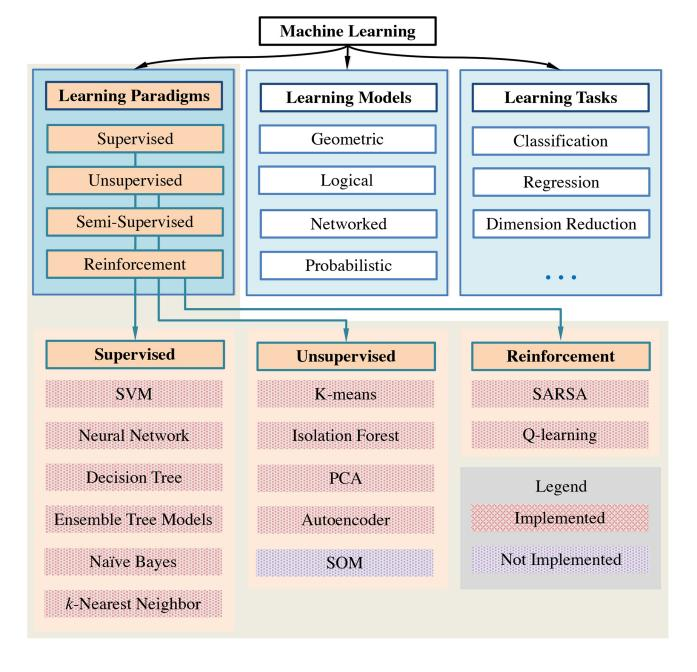

<span id="page-10-0"></span>Fig. 10. Categorization of ML algorithms – The upper part of the graph includes three classification paradigms. The lower part of the graph generalizes the ML algorithms noted in this survey under the first classification paradigm.

<span id="page-10-4"></span>(labels) [229]. Datasets are input for training and their labels are used for supervising the model. The model is usually trained with labeled datasets to describe the mapping of the data space to the label space.

Supervised learning works in two phases, which are the training phase and the inference phase. In-network supervised learning offloads the inference phase in the data plane, and the training phase usually remains in the control plane due to the high operational complexity. It maps the trained model into a format that fits the M/A pipeline. Thus, the mapped model can label the data in the data plane based on the learned mapping.

Several supervised ML algorithms, including SVM, NN, DT, Ensemble Trees (ET) (e.g., RF, XGB, IF), NB, and *k*-Nearest Neighbor models will be further explained in this section.

<span id="page-10-3"></span>1) Support Vector Machine (SVM): SVM is one of the typical classification algorithms, which performs well in solving nonlinear dataset problems and high dimensional pattern recognition problems [139] with a small sample size. The SVM model projects data into hyperspace and it aims at finding hyperplanes to perfectly divide the data. Each hyperplane separates the data into two sub-classes and keeps the data as far away from the hyperplane as possible. In the linear non-separable problem, SVM applies the kernel method to map data into high-dimensional feature space. For different datasets, different mapping patterns are required. The common kernel function includes linear, polynomial, Radial Based Function (RBF) [230], etc [231].

<span id="page-10-7"></span><span id="page-10-6"></span><span id="page-10-5"></span><span id="page-10-2"></span>
$$\begin{cases} w_1^1 x_1 + w_1^2 x_2 + \dots + w_1^n x_n + d_1 = 0 \\ w_2^1 x_1 + w_2^2 x_2 + \dots + w_2^n x_n + d_2 = 0 \\ \dots \\ w_m^1 x_1 + w_m^2 x_2 + \dots + w_m^n x_n + d_m = 0 \end{cases}$$
(1)

For instance, Equation (1) shows how an SVM model is constructed by the linear kernel for a k classification task with n dimensional input data  $X = \{x_1, x_2, \ldots, x_n\}$  [232]. Each line of the equation represents a hyperplane as the border of two sub-classes. The model will generate m hyperplanes where m = k(k-1)/2. During the inference, SVM requires the support of floating-point values and negative numbers, multiplication operations, and comparison operations, which needed to be redesigned to fit programmable network devices with limited data types and limited mathematical operations.

<span id="page-10-8"></span>To overcome the lack of floating point numbers, in-network SVM maps the needed values to a predefined range and approximates them to integers using *floor*, *ceil*, or *round* operations [16], [233]. This method can tackle the challenge

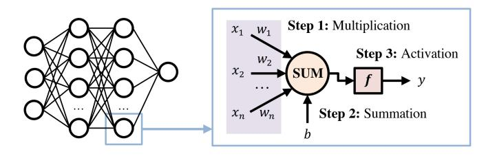

<span id="page-11-0"></span>Fig. 11. A fully connected NN constructed by many perceptrons.

at the price of accuracy. To support multiplication, the mapped model uses M/A tables to store intermediate multiplication results, with the keys to the lookup being the operands.

Classified by the amount of memory required to store intermediate results, SVM has two mapping approaches [16], [161], [188], minimizing resource consumption on two different vectors. The first approach uses smaller tables, as shown in Table IV-1. This approach allocates a table to each feature. The action data of each feature table is a collection of intermediate results of the corresponding feature in the *i*th hyperplane  $(map(w_1^i x_i),$  $map(w_2^i x_i), \ldots, map(w_m^i x_i)$ ). The mapping process here includes normalization, scaling, and data type transformation. Before the final decision, the model collects and adds all components to determine at which side of the hyperplane each input data point is located. For every input data X = $\{x_1, x_2, \dots, x_n\}$ , being assigned to any side of a hyperplane means a vote for a specific class. The class with the largest number of votes will be output for each input data.

The second approach requires fewer computation resources, as shown in Table IV-2. This approach consumes k(k-1)/2 tables that store the result of all calculations. Each table determines the side (vote) of a hyperplane by using the set of features as the key. The second approach consumes more table entries compared to the first one but usually requires fewer calculations within the pipelines or stages, which can be useful when the range of feature values is narrow. To obtain the final decision, both methods need to compare the number of votes in each class. This can be done using either logic or M/A tables to get the final label.

<span id="page-11-2"></span>2) Neural Network (NN): NN is a mathematical model which borrows the structure and function from biological neural networks [234]. The modern NN, as a statistical nonlinear modeling tool, stacks simple classifiers that operate in parallel to model the complex relationship between input and output from historical data. NN can effectively explore the patterns of data and extract complex input data features [235]. These simple classifiers, such as perceptrons, as shown in Figure 11, require floating-point input and weights to apply a list of mathematical operations such as multiplication, addition, activation functions (nonlinear), etc., to get the output, which is the major difficulties NN workflow faces for fitting in network devices with the limited amount of memory, limited data types, and limited mathematical operations.

The first constraint, limited memory, can be solved by weight binarization. Binary inputs and weights can save up to 96% of the memory compared to using the floating-point [226] and help to deal with the multiplication operation that is

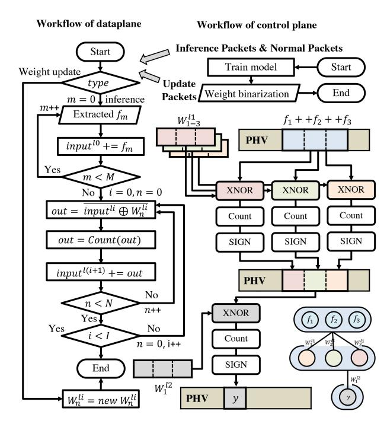

<span id="page-11-1"></span>Fig. 12. Workflow of a typical BNN implementation within a programmable network devices. The left side of the figure depicts the NN inference process in the form of a flowchart, highlighting the specific operations required to implement it in the data layer. The top right corner shows the process of updating the network to the data plane. The right side of the figure displays a graphical representation of the implemented process in the data plane. A 4-neuron toy example is shown in the bottom right corner. Specifically, this network example requires three input features, three neurons in the middle layer, and one neuron in the output layer.

not supported by several programmable network devices. The second constraint, limited data types, can be solved by round operation and binarization, which use integer or bit string to store weights and inputs instead of floating-point numbers. The third constraint, limited mathematical operations, can be solved by using XNOR operation to replace multiplication as a by-product of inputs and weights binarization and will be further proved in Section VII-D4.

With binary inputs and weights, the three key steps in the forwarding path of a perceptron in a neuron network are shown in Table IV-3 and Figure 11, which will be replaced by Step 1 (XNOR operation), Step 2 (Hamming weight), and Step 3 (comparison), as well as meet the constraints of programmable network devices [15], [191], [192], [197], [198].

<span id="page-11-3"></span>While there are multiple types of Neural Networks, current programmable network devices implementations on existing devices include only Binary and Convolutional Neural Networks. More complex NN (e.g., DNN and LSTM) may become feasible by modifying switch ASIC (e.g., with additional MapReduce block [196]).

2.1. Binary Neural Network (BNN) is a type of artificial neural network (ANN) with binary weights and activations which facilitates the deployment of deep models on resource-limited devices [236].

<span id="page-11-4"></span>BNN workflow with the data plane is shown in Figure 12, with arrows indicating data flow through the device. The workflow starts by extracting selected features from headers of incoming packets or local memory, such as meters, counters,

and registers [15], [191], [192], [197], [198]. Then, it concatenates the features to bit strings as inputs. The weight of each neuron in the n layer is saved in a register as a bit string, and is read by the workflow. The device then executes an XNOR operation  $(\overline{\oplus})$  in Figure 12) between the weight and the input bit string. The number of bits equal to one in each result will be counted by adapting the Hamming weight algorithm, and the model verifies if the number of bits equal to one is bigger or equal to half the length of the weights' bit string, as the sign operation. The verified result, a single bit, is stored in the least significant bit of the next layer's input bit string. The workflow iterates previous steps for each layer until the last layer. There is a notation change as shown in Figure 12. Different from Figure 11, the weights in each layer equal the number of neurons in the next later. A simple toy example of a basic element of the workflow is shown in the bottom right corner of Figure 12.

The applied model and backpropagation method should ensure that the NN's weights are close to the range [-1, 1], which helps reduce the loss of information when applying the binarization technique. Benefiting from register-stored weights, BNN can apply the online update without stopping the device [197]. The trained binary weights will be packed and transferred to target data plane devices and trigger the weight update workflow.

<span id="page-12-2"></span>2.2. Convolutional Neural Network (CNN) is a kind of feedforward NN with convolutional layers and a deep structure [237]. The convolutional operation enables representation learning and shift-invariant classification of input information according to its hierarchical structure. Currently, the convolutional layer has no data plane implementation, only the fully connected layer. The CNN model needs to be split into two parts in order to be accelerated on programmable network devices [198]. Take typical convolutional network structures as an example, the first part includes alternately stacked convolutional layers and pooling layers with a large number of parameters that need to be placed on local devices. In the second part, the fully connected layer, with a lower parameter size, can be converted to BNN and deployed into the network devices. The overhead of the model splitting process has been proved to be very little if the split is conducted carefully.

<span id="page-12-3"></span>3) k-Nearest Neighbors (k-NN): k-NN is an intuitive instance-based learning algorithm for supervised learning [238], [239]. The k-NN model first finds k closest training samples to the testing input in the feature space. Then, in a classification task, the k-NN categorizes the testing samples into the label with the largest number of closest training samples according to the majority voting rule, while calculating the mean value of k nearest neighbors as the output in a regression task.

<span id="page-12-0"></span>
$$y = \underset{c_j}{\operatorname{argmax}} \sum_{x^* \in N_k} I(y^* = c_j)$$
 (2)

Equation (2) shows how k-NN is used for classification. In the equation, indicator function I equals 1 when  $y == c_j$  and  $N_k$  is a set of  $x^*$  ( $x^*$  is the training sample with label  $y^*$ ) that is included in the k nearest neighbors. In the forward

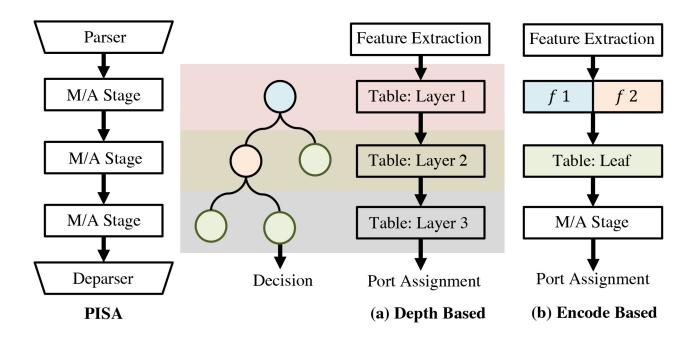

<span id="page-12-1"></span>Fig. 13. The difference in mapping a DT to a match-action pipeline [201] between (a) Depth-based approach and (b) Encode-based approach.

process, the model calculates the distance of each stored data point to the input data to specify the set of neighbors. Generally, all the training datasets are stored in the model. However, in programmable network devices, it is hard to store such a large amount of data and find out which data are included in neighbors due to the limited memory and limited stages. Though it is difficult to realize this process directly during runtime calculation, the boundary of each output class can be calculated in advance and stored in a M/A table. The implementation of KNN in the data plane uses once again the value of features as the lookup keys of a M/A table, with the output being the classification result. This approach essentially performs a linear partitioning of the input feature space, such that each partition of the feature space is mapped to a class. The feature space slicing manner and table realization are similar to Clustreams' K-means solution (shown in Figure 16) [161], [204], and more information is provided in Section VI-B1, as the original source for this methodology.

<span id="page-12-5"></span><span id="page-12-4"></span>4) Decision Tree (DT): DT is one of the classical supervised learning algorithms, which can solve both classification and regression problems [240]. DT model has a tree-like structure that includes a root node, several internal nodes, and several leaf nodes [241]. The leaf node corresponds to the decision result, and the internal node (which can be named as branch) corresponds to the decision rule. When entering the DT, data starts from the root node, goes through the internal nodes, and heads for the corresponding branch according to the decision rules. Classification is completed when the data reaches the leaves. The tree structure of the DT equips it with a good application prospect in programmable network devices, especially when the calculation logic of a simple switch pipeline is similar to a tree structure [16]. During the inference, the DT does the comparison at the node iteratively to reach the next node or obtain the final output, which will be the main difficulty in making the DT workflow suitable for programmable network devices [16].

There are two main DT mapping strategies to the data plane: a depth-based approach and an encode-based approach.

i) Depth-based approach [193], [194], [202], as shown in Figure 13 (a), hierarchically maps the tree model into the M/A pipeline (as shown in Table IV-5, using  $N_{depth}$  tables). The model is executed within the pipeline layer by layer, until reaching the leaf node. The model starts by extracting the required features from incoming data. In each layer of the

DT, the model compares a feature's value and a threshold. The next layer uses the node ID and the comparison result to extract the node information for the current layer. This approach consumes little memory, as the number of nodes in the tree is limited, but requires a lot more stages there is a dependency between the tree's depth and the number of stages. A simple version of the depth-based approach uses *if* and *else* statements instead of M/A tables, which is intuitive but requires more lines of code [202] and does not save stages.

ii) Encode-based approach [16], [161], [188], [201], as shown in Figure 13 (b), breaks the hierarchical structure of the tree model. It encodes each feature according to the split value in each branch of the tree. Consequently, each branch can be treated as the result of one-time slicing on feature space. After slicing, each feature range is labeled with a code. A codeto-leaf mapping (M/A table) is used to map the combined codes of all features to the leaf node. This method uses a relatively small number of stages because feature tables have no dependency and can share stages (as shown in Table IV-4, requiring *n* parallel feature tables and one decision table). However, it usually requires more memory to implement the map operation. A simplified version of the encode-based approach uses only one leaf (decision) table for classification. Instead of a mapped code, the table uses feature values as input, and range-match is used for labeling [17], [205], [206]. This solution can save stages but consumes more table entries when the crafted tree model is complex, potentially exceeding the amount of memory available on a programmable network devices [161].

<span id="page-13-2"></span>5) Ensemble Tree Models (ET): ET models construct a more powerful classifier than a single DT model with the help of several base DT models [242]. The combination of base models can statistically and computationally benefit the classification performance of the model. There are two main ensemble techniques: bagging and boosting. Within the data plane, the main difference between these two techniques is in the final stage logic used to assign the label [201]. Before the final stage, the data plane implementation is very similar for both types of ensemble tree models.

Similar to the mapping of a DT, the implementation of the ensemble model uses the extended depth-based approach [193] and the encode-based approach [161]. They are shown in Table IV-6 and IV-7. The depth-based approach, as shown in Figure 14, can share stages when executing different trees at the same depth. For an  $N_{tree}$  trees ensemble model with maximum depth  $N_{depth}$ , up to  $N_{tree}*N_{depth}$  tables are needed. Among them, M/A tables of the same layer's depth can share stages. The encode-based approach, as shown in Figure 15, shares stages for every feature table and every tree table. For a  $N_{tree}$  trees ensemble model constructed by using n features, this approach requires n feature tables and  $N_{tree}$  tree (code) tables, where each feature table can share the same stage within the pipeline and tree tables can share the other stage, meaning that only three logical stages are needed: features lookup, tree-result lookup and label assignment.

<span id="page-13-4"></span>5.1. Bagging: The bagging technique, also named bootstrap aggregating [243], is a parallel learning sampling technique that trains a series of independent, homogeneous models

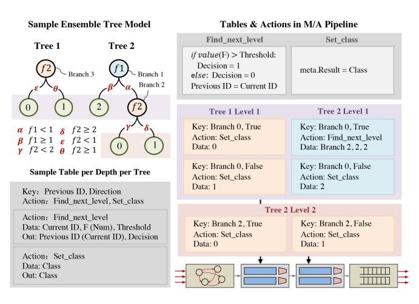

<span id="page-13-0"></span>Fig. 14. Workflow of a typical ET model (depth-based approach, also shown in Table IV-6). The left bottom and top right sides of the figure show the two types of M/A tables required for this mapping approach, namely Sample Table per Depth per Tree (when the next node is still a branch) and Tables & Actions in M/A Pipeline (when the next node is a leaf node). The bottom right corner of the figure displays the mapping result of the example model in the data plane, which is divided into two layers. The first layer consists of one Sample Table per Depth per Tree (branch node  $f_2$ ) and three Tables & Actions in M/A Pipeline tables (leaf nodes 0, 1, 2), while the second layer consists of two Tables & Actions in M/A Pipeline tables (leaf nodes 0, 1). A 2-tree toy example is shown in the top left corner. The example model includes two input features,  $f_1$  and  $f_2$ , and three possible outputs: 0, 1, and 2.

<span id="page-13-3"></span>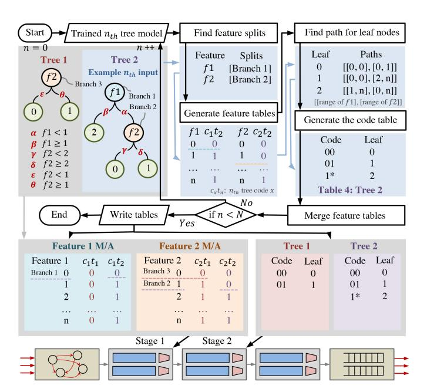

<span id="page-13-1"></span>Fig. 15. Workflow of a typical ET [201] (encode based approach, also shown in Table IV-7). The flowchart in the figure demonstrates the specific process of mapping the model to the data plane using the encode-based method, including four main steps: finding feature splits, generating feature tables, finding paths for leaf nodes, and generating the code table. The resulting tables are shown at the bottom of the figure, including two Feature Tables, two Tree Tables, and a Decision Table (or if-else logic) that is not displayed in the figure. A 2-tree toy example is shown in the top left corner. This is the same as the tree model shown in Figure 14.

in parallel, and uses the aggregate output of each model according to some strategy. Different trees are trained on different data. RF is one of the typical models generated by the Bagging technique. In RF every tree model has the same

importance. In the classification problem, the base model (DT) votes to get the final result. In the regression problem, the mean of base models is the result. Implementation wise, both the depth-based approach and encode-based approach can be used to realize RF. Each tree is implemented individually as in DT, most efficiently by parallelizing different trees (as explained above). In the final logic, the model can use either a M/A table to map from votes to class or use logic to compare each class' vote [201].

<span id="page-14-5"></span>5.2. Boosting: Boosting is a serial learning sampling technique, which samples data under the distribution based on the learning results of the last iteration [244]. Each subsequent tree is trained to estimate the errors of the previous trees. To take XGBoost (XGB) [245] as an example that currently has two ways to implement the model within the network [161], [201]. In the first implementation method, all trees add up all the probabilities that belong to a specific class to form the overall prediction for that class. The final probability can be calculated in a similar way to the vote calculation in the bagging technique. This method could suffer from an accuracy loss as floating-point numbers may not be supported by the programmable network devices, therefore the probability is approximated and mapped to a new integer space. Another approach encodes the probabilities in each tree [161] and then uses a table to map all the encoded probabilities to the final label. This method is rigid and does not exhibit accuracy loss.

6) Naïve Bayes (NB): As a statistical classification method, NB is the general term for algorithms based on Bayes' theorem [246] shown in Equation (3), which is one of the simple classical Bayes models.

<span id="page-14-6"></span><span id="page-14-1"></span>
$$P(x_i|y) = \frac{P(y|x_i)P(x_i)}{P(y)}$$
(3)

Based on the posterior probability introduced by Bayes' theorem, NB tests the probability of each set of inputs with each label, under the assumption that each input feature is independent. As shown in Equation (4), the label with the highest probability is the prediction result.

<span id="page-14-2"></span>
$$\hat{y} = \arg\max_{y} P(y) \prod_{i=1}^{n} P(x_i \mid y)$$
(4)

In general, calculating the conditional probability of a certain class given a set of input features requires multiplying all the conditional probabilities for each input feature corresponding to a particular output class with the posterior probability of the class, as shown in Equation (4). The concatenated multiplication operation and the floating-point values used in the equation make it hard to implement NB on programmable network devices, where multiplication and floating point numbers are not natively supported.

To implement NB in the data plane despite these two limitations, a model mapping uses M/A tables and trades resources for accuracy [16], [161], [188]. A Naïve Bayes implementation uses M/A tables to store probabilities and the results of multiplying probabilities. For example, using input feature  $x_i$  and class y as a key to the table results in the value  $P(x_i|y)$ . To handle the lack of floating point numbers, the

results are cast to integers (multiplied by  $10^n$ , the required accuracy) or fixed-point numbers.

Two mapping approaches of NB use the above methodology [16]. The first approach, shown in Table IV-8, uses nk (or n(k+1)) M/A tables, one table for each conditional probability. The lookup keys to each table are the value of a feature, and the action is the conditional probability for a given class  $(P(x_i|y))$ . The probability of class y, P(y) is stored either in a M/A table or in a register. Another option is to hold P(y) as a constant in the P4 program. To multiply the conditional probabilities of the different features, another table can be used per label. The final classification uses conditions to pick the high-probability label, though a M/A table can be used for the same purpose.

<span id="page-14-4"></span>An optimization to this approach was proposed in Planter [161], using the log() operation to avoid multiplication [161], using addition instead in the decision stage.

The second approach shown in Table IV-9, moves the burden of multiplication from the network devices to the compilation stage [16]. This approach uses *k* M/A tables, one for each class. The key to each table is the collection of all input features, and the output action is the probability of a given class. The probabilities of all classes are compared in the last stage to determine the label. The calculation of all the conditional probabilities is done in the compilation stage when all possible values (quantized) are generated to populate the tables. As a result, the tables generated by the second approach tend to be significantly larger than in the first approach, but the number of tables is smaller.

## B. Unsupervised Learning

Unsupervised learning is another type of ML algorithm used to explore hidden patterns in unlabeled data [229]. Also as a statistical method, unsupervised learning algorithms can use unmarked input data to explore data structures and patterns automatically without explicit supervision.

In-network unsupervised learning algorithms transfer the learned data structure into M/A pipeline and apply it to new incoming data mainly for clustering or dimension reduction tasks. In-network unsupervised learning does not learn in the data plane but applies ML models trained by unsupervised learning methods to the data plane.

Common unsupervised learning methods include KM, Isolation Forest (IF), PCA, Self-Organizing Map (SOM), AE, etc.

<span id="page-14-0"></span>1) K-Means: KM algorithm is an iterative method that aims to divide the dataset into k clusters in which each observation is assigned to the cluster with the nearest mean. The distances between data points from the same cluster need to be as short as possible while observations from different clusters are kept as far as possible [247].

<span id="page-14-7"></span><span id="page-14-3"></span>
$$D_i = \sqrt{(x_1 - c_1^i)^2 + (x_2 - c_2^i)^2 + ..(x_n - c_n^i)^2}$$
 (5)

Equation (5) shows how to calculate the distance between each set of input to each cluster, where  $X = \{x_1, x_2, \ldots, x_n\}$  is the input and  $C^i = \{c_1^i, c_2^i, \ldots, c_n^i\}$  is the centroids of cluster i. The complex mathematical operations, including square

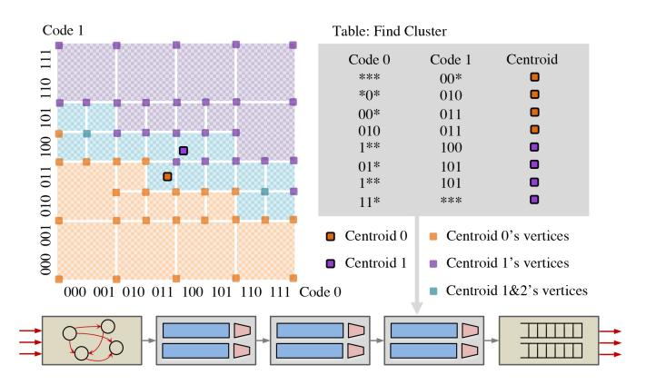

<span id="page-15-0"></span>Fig. 16. Workflow of a centroid-based (K-means) unsupervised learning [204].

and square root, make it challenging to fit on programmable network devices.

To overcome these difficulties, there are three similar implementation approaches, which can be classified by the overhead of calculations and the number of table entries. The first approach, as shown in Table IV-10, requires the most calculations and the smallest number of table entries [16], [161], [188]. In the implementation of this solution, for each table, the input key is the feature value and cluster-ID, and the action data is the square distance of the feature to that cluster. In the decision logic, the total distance is calculated by summation. The cluster-ID with the closest distance (decided through comparison) is the output class. Note that root square operation is not required as the comparison is of squared distances. The second approach requires the minimum computation and the maximum number of table entries, as shown in Table IV-11, where n M/A tables use the input features sets,  $x_1, \ldots, x_n$ , as key, the distance to each label cluster as action data. The final logic conducts comparison to determine the output label. The main difference from the first approach is that the first approach is unidimensional while the second approach is multi-dimensional per table. The third approach is a compromise between the first two approaches. As shown in Table IV-12, this approach uses n M/A tables. In each table, the key is the feature value and the action data is a collection of squared distances of that feature between each cluster (uni-dimensional). The final logic is similar to the first approach.

As shown in Table IV-13, there is another different approach for offloading centroid-based unsupervised learning algorithms with the help of Quadtree (which applies Ternary match) [161], [204]. Before analyzing its detailed implementation, one needs to understand the nature of this type of an algorithm. KM and other centroid-based unsupervised learning methods do classification based on the distances between the input data point and each centroid, which means that boundaries dividing each class can be found in feature space. This fourth method iteratively divides the feature space into small pieces until all the input values that lie in it belong to a specific class. As shown in Figure 16, for a two-dimensional input toy example, this method uses fine-grained squares to describe the boundaries and uses coarse-grained squares to

represent spaces inside. How detailed it depicts boundaries depends on the trade-off between accuracy and memory overhead. After the feature space is well split, this method stores the information of each piece in the TCAM table. There are two methods to index the feature space. The first one, as shown in Figure 16, uses consecutive codes to index (encode) each input feature after assigning each block to a class. This method is intuitive. Although Exact-to-TCAM is a classical network problem, it is not easy to find the most suitable and efficient way to conduct the transfer. In comparison, the second one uses the Quadtree index purely, as shown in Clustreams' work [204]. In this method, the feature space is easier to be transferred to the TCAM table but requires pre-processing before the packet is sent to programmable network devices.

In many cases, the input is biased and not evenly distributed in feature space, which creates some "hot zones". For a higher processing speed, the algorithm can split the previously large TCAM table into multiple smaller ones according to how hot the area is. If the input hits a "hot zone", it will be classified and the algorithm will skip the following TCAM tables. Otherwise, the input will be moved to the next table with the less hot area until it hits a table [204]. Note that this approach is useful only on targets where stages in the pipeline can be skipped.

<span id="page-15-1"></span>2) Principal Component Analysis (PCA): PCA is a statistical method that is commonly utilized to reduce the dimensionality of large data sets while preserving most of the data variation [248]. It computes the cumulative projection of each component on each data point onto new components to conduct dimension reduction. Planter [161] is the first work that offloads this model into the data plane.

The forward process of the PCA algorithm requires matrix multiplication and matrix division operation, which can be interpreted as Y = WX. For the input with n original dimensions, the new dimension  $y_i$  can be calculated by  $y_j = w_i^1 x_1 + w_j^2 x_2 + \cdots w_j^n x_n, \{j \in \mathbb{Z} \mid 1 \leq j \leq$ k, where k is the total number of new dimensions. Under this condition, Planter's implementation uses M/A tables to store the intermediate result of the multiplication operation on programmable network devices with limited mathematical operations, in a manner that is very similar to the SVM solution (Section VI-A1). Specifically, for each input feature  $x_i$ , there will be a M/A table with input  $x_i$  and output  $w_1x_i, w_2x_i, \dots, w_kx_i$ , storing intermediate results. After all intermediate results are extracted, pipeline logic performs multiplication operations to calculate the value of new dimensions  $y_1, y_2, \ldots, y_k$ . In this method, the resource overhead is the function of the range and the number of input features. When there are too many input features or the range of features is wide, it would be hard to realize it on programmable network devices with limited memory.

<span id="page-15-2"></span>3) Self-Organizing Map (SOM): SOM is a special type of unsupervised ANN model trained with a competitive learning algorithm, which is intended for the purpose of dimensionality reduction [249]. It typically generates a two-dimensional representation from multidimensional inputs while conserving the topological space in the meantime. A SOM forms a map for the input distribution where samples are grouped based on

the similarity between one another. Multidimensional data can be visualized and interpreted with this technique.

In a SOM, one or two-dimensional space is evenly filled in by neurons before training, which means the number of trained neurons is large. Thus, in the forward process, there is a significant overhead of computation and comparison as the model needs to compare the distance of input between every two neurons. This makes it hard to implement a SOM on programmable network devices with its limited resources as the comparison operation has a high dependency and potentially requires many stages. In general, the structure of SOM looks a lot like NN, while an implemented functionality will resemble PCA and Autoencoder. To the best of our knowledge, the implementation of SOM in the data plane has not been realized.

*4) Autoencoder:* Autoencoder is typically used to perform the task of representation learning through data encoding and decoding as a family of unsupervised ANN architectures [\[250\]](#page-29-12). By design, an autoencoder is capable of learning efficient compression of a set of data to obtain a knowledge representation of the original input, as well as subsequent reconstruction based on the representation. In general, it discovers the underlying structure of data and can be applied for various purposes, such as dimensionality reduction, feature extraction, image denoising, and anomaly detection.

<span id="page-16-0"></span>
$$X_{new} = XW + Bias (6)$$

The autoencoder model usually has a funnel-like structure. For different use cases, the depth of the encoder network and the decoder network varies. The full-size autoencoder is usually hard to be implemented due to limited stages and mathematical operations. However, a model with only a low number of hidden layers is potentially realizable [\[161\]](#page-27-26). Equation [\(6\)](#page-16-0) shows the forward path of a one-layer autoencoder, which shares the same logic as Equation [\(1\)](#page-10-2) (*WX* + *<sup>B</sup>* = 0). Its structure is very similar to PCA with similar limitations. In the pipeline, biases represented as *B* are stored either within a M/A table or a register. Following this, for each input feature, a M/A table is utilized, taking the input *xi* and producing a collection of intermediary outcomes *w*1*xi*, *w*2*xi*,..., *w<sup>k</sup> x<sup>i</sup>* (where *k* denotes the number of encoded nodes). Subsequently, while reading these intermediate results from the M/A tables, simultaneous operations are conducted to compute values ranging from *y*<sup>1</sup> to *y<sup>k</sup>* .

<span id="page-16-2"></span>*5) Isolation Forest (IF):* IF is an unsupervised learning algorithm based on DTs and designed for anomaly detection which is capable of identifying anomalies rather than normal observations [\[251\]](#page-29-13). IF isolates the outliers by randomly selecting features and randomly sub-sampling data. In trees, the data points with shorter paths have a higher probability of being anomalies as they are easier to be separated. The general method for offloading IF to programmable network devices [\[161\]](#page-27-26), [\[188\]](#page-28-2), [\[201\]](#page-28-11) is very similar to treebased ensemble models (Section [VI-A5\)](#page-13-2) and both depth-based and encode-based approaches can be used to realize the IF. The operational mechanism inherent to this model is predicated on the principle that a node of greater depth signifies a correspondingly diminished probability of being classified as an anomaly. The main difference between IF and previous RF implementations resides in the outcome of the table that represents leaf nodes. In IF, instead of the tree's vote, the table's output value is the depth of the leaf node. Subsequently, the final decision table or logic is based on the aggregation of these values across all trees to output the label. Given that trees in IF usually exhibit substantial depths and a high number of leaf nodes, quantization can be employed to constrain the depth values of these leaf nodes. This serves to delimit decision table size and thereby avoid entry explosion. Trimming all the nodes above a threshold can save the data plane resources. Still, it is still hard to conduct resource control for in-network IF for two reasons: 1) IF usually trains the models without any constraints, which makes the trained model itself complex. 2) IF counts the number of branches it passes along the route. As a result, the number of possible values on leaf nodes is large, making the decision table large.

## <span id="page-16-1"></span>*C. Semi-Supervised Learning*

<span id="page-16-3"></span>Semi-supervised learning is an approach situated between unsupervised learning and supervised learning. It refers to solutions for the training cases with only a small portion of labeled data and a large amount of unlabeled data [\[252\]](#page-29-14). In general, semi-supervised learning algorithms are needed when the collection of labeled data is time-consuming and laborintensive.

Semi-supervised learning algorithms can be divided into self-training, graph-based semi-supervised learning, semisupervised SVM, etc. To date, no in-network computing work has explored this learning paradigm.

Semi-supervised learning takes advantage of training with a low portion of labeled data and may use the aforementioned offloading techniques to deploy the trained algorithm to programmable network devices. Generally, semi-supervised learning is a key concept in the training phase, which can greatly help in-network ML algorithms to train in the case of large data volume. Semi-supervised learning is stable with high efficiency, but sometimes it suffers from low accuracy.

## *D. Reinforcement Learning (RL)*

RL constructs a strategy with the purpose of controlling agents to maximize the expectation of cumulative rewards. The RL strategy is learned from the interaction between agents and the environment. This type of an algorithm is inspired by the behaviorism theory. In psychology, this theory explains how organisms gradually form the most rewarding habitual behaviors under stimulation or punishments from the environment [\[253\]](#page-29-15).

<span id="page-16-6"></span><span id="page-16-5"></span><span id="page-16-4"></span>RL can be divided into value-based, policy-based, and actor-critic. Two traditional and common value-based RL algorithms were the focus of in-network ML research: Qlearning and SARSA. OPaL [\[208\]](#page-28-36) focused on implementing them in the data plane, as explained next. More advanced RL algorithms, such as Deep Q-Networks (DQN) [\[254\]](#page-29-16) and Deep Deterministic Policy Gradient (DDPG) [\[255\]](#page-29-17), take advantage of the capabilities of deep neural networks (DNN) to address complex problems involving a large action space. However,

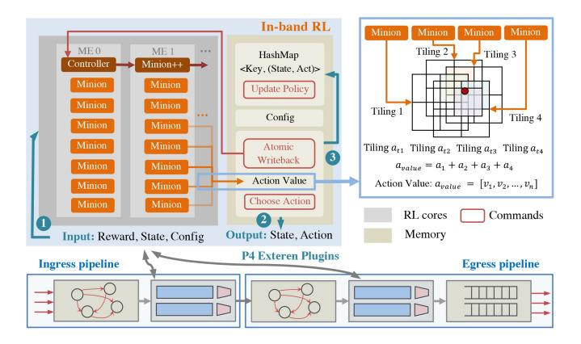

Fig. 17. Workflow of One-Step Temporal-Difference RL [207].

<span id="page-17-5"></span>despite attempts to implement DNNs within the network in N3IC [199], the immense complexity of these networks, and therefore high resource consumption, has thus limited the success of deploying deep RL within the data plane so far.

<span id="page-17-3"></span>1) SARSA: SARSA is an on-policy RL algorithm and learns the value of the policy executed by the agent [144]. There are two essential but complex operations in this algorithm:  $\varepsilon$ -greedy and updating a Q-table. For  $\varepsilon$ -greedy, the challenges are realizing the greedy policy and randomly selecting the action within the data plane, as these either require externs or significant resources (e.g., many stages). In a Q-table, as shown in Equation (7), the equation requires three multiplication operations, and the second half of the equation has a dependency, making it hard to fit on programmable network devices with limited stages. Meanwhile, for a valuebased method, defining the value (reward) of each action is tricky, particularly when it comes to balancing trade-offs between memory and accuracy, as the intermediate results stored in the M/A table should be optimized to minimize accuracy loss.

<span id="page-17-0"></span>
$$Q(S, A) \leftarrow (1 - \alpha)Q(S, A) + \alpha \left[R(S, a) + \gamma Q(S', a')\right]$$
(7)

While it is challenging to implement SARSA on some programmable ASIC, targets such as Netronome SmartNIC (Agilio LX) [207] enable it through externs. The Agilio LX architecture is different from the architecture of, e.g., Intel Tofino, used in many previous works. As a SmartNIC, it supports more functions but has a lower data rate compared to switches. Agilio LX has programmable MEs (microengines), and packet processing throughput is increased through MEs parallelism. This paper takes SARSA as an example of onestep temporal-difference (TD) RL, as shown in Figure 17 (Table IV-14 also shows the generalized workflow of TD learning). During ingress or egress processing, the environment reward and current state information are extracted and provided to an extern for in-band RL [207], [208]. Such extern implements the RL cores using multiple MEs inside and the storage component constructed by different types of memory. The input information first does a Q-table lookup for the value of action by using Tile Coding. This coding method adds up all the coarse-grained tiles to represent one fine-grained Q-table. Each coarse-grained tile can be executed in each

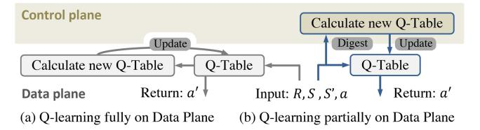

<span id="page-17-4"></span>Fig. 18. Workflow of QCMP based in-network RL [209].

Minion (thread) in parallel. Then, the model selects the action (based on the action data and the greedy policy) and sends it to the output directly. Meanwhile, the model updates the Qtable based on the previous state value and action if the policy needs to be updated, which can contribute to accelerating the whole process.

<span id="page-17-1"></span>This implementation approach of one-step temporal-difference RL takes advantage of P4 extern plugins in SoC- or NPU-based SmartNICs. In the M/A pipeline, the RL function is called using an extern to implement fixed point values of actions and tile-coded policies.

2) Q-Learning: Q-learning is an off-policy RL algorithm. It uses the greedy approach to learn the value of an action given a particular state and seeks to find the optimal action-selection policy using a value function called the Q-function [256]. Q-learning learns the value of the optimal policy without being influenced by the actions of agents.

<span id="page-17-6"></span>There are similarities between SARSA and Q-learning. They are both model-free and value-based methods, which means they do not require model knowledge and they update the value function based on temporal difference learning. The approach Q-learning uses to update a Q-table is shown in Equation (8). It is similar to SARSA's equation, but requires an additional *max* operation.

<span id="page-17-2"></span>
$$Q(S, A) \leftarrow (1 - \alpha)Q(S, A) + \alpha \left[ R(S, a) + \gamma \max_{a} Q(S', a) \right]$$
(8)

Consequently, the difficulties in Q-learning's data plane implementation are similar to that of SARSA's implementation, meaning how to update a Q-Table and how to realize  $\varepsilon$ -greedy operation [208]. This similarity means it can also be implemented by using ME externs, like SARSA's implementation, as reported in Section VI-D1.

The main difference between Q-learning and SARSA is the order of Q-table updating and action execution. The "decision first, update later" update order of Q-learning makes it well-suited for execution in the data plane [209]. Figure 18 illustrates two additional data plane implementation methods for Q-learning.

In the first approach, shown in Figure 18 (a), the Q-table is stored within the data plane using registers [209], with the state serving as the key and the concatenated Q-values of all actions as the value. To determine the action, the input packet must provide the current state S', allowing the selection of the action with the highest value using an  $\epsilon$ -greedy policy and a random number from the packet. For Q-table updates, the previous state S, action a, and reward R(S, a) can either be input from the packet or stored in the data plane using

registers. Equation [\(8\)](#page-17-2) is applied, replacing multiplication with tables that store intermediate results.

The second method (Figure [18](#page-17-4) (b)), transfers the complex Q-value calculation and Q-table update process to the control plane [\[209\]](#page-28-38). Consequently, the Q-table can be stored in the M/A table within the data plane.

In terms of implementation, the first method is more resource-heavy, especially in stages, and better suited for software switches, while the second method is compatible with commodity hardware (such as Tofino switch-ASIC) but exhibits slower response times to changes in the environment due to the control plane's latency. It therefore fits better applications that require occasional or periodic updates, without precluding acting on every packet.

## VII. CHALLENGES AND SOLUTIONS

<span id="page-18-0"></span>While offloading ML models to programmable network devices, many common challenges have been identified by existing works, such as limited amounts of memory, restricted number of stages, non-natively supported data types, and weak computational capability. This is because ML models usually have a relatively high implementation complexity but programmable network devices have very limited hardware resources. In the following subsections, we will list these challenges and report possible solutions.

The many different implementations of in-network ML algorithms face several common problems and challenges. These challenges range from resource constraints, through limited data types to weak computational capabilities. The application-specific, constrained nature of network device architectures stands in contrast to the increasingly large and complex ML models. The following section discusses the common challenges in mapping ML models to the data plane, and their solutions.

The two central types of constraints that have been addressed to date are limited amount of resources (e.g., memory, number of processing stages) and lack of functionality (e.g., support of data types or mathematical operations).

# *A. Restricted Number of Stages*

Unlike CPUs, where instructions go through the pipeline and the data is in the memory, in PISA-based devices the data goes through the pipeline, and the instructions are in the memory (M/A tables). To maintain line rate, packets go through the pipeline only once, therefore the number of stages in the pipeline is directly related to the number of serial operations that can be done on a packet. This number of stages, especially in switch-ASIC, is limited (e.g., 12 stages per ingress or egress pipe in Tofino [\[257\]](#page-29-19), and 20 stages per pipe in Tofino 2 [\[258\]](#page-29-20)), leading to a narrow range of supported functionalities [\[16\]](#page-24-15). We classify the stage limitations into two categories: actions with dependency and tables with dependency, as explained next.

<span id="page-18-4"></span>*1) Actions With Dependencies:* Theoretically, complex computations can be enabled in programmable network devices but require several steps of action, and in most cases, these actions have dependencies. For example, multiplication

Code Example 1. PopCount code example under action format.

<span id="page-18-2"></span>Code Example 2. PopCount code example under table format. PopCount code example under table format. Line 9-15 show five sample table entries. When the input value *meta*.*popcount*\_*input* as the input for example equals 3 (··· 011) the output will be 2 based on the result hardcoded in line 12.

can be realized through repeated addition. However, the limited number of stages within the pipeline is prohibitive for such solutions. Moreover, the lack of loops constrains it further. Therefore, using the minimum stages for different complex computations within programmable network devices is an open challenge. The most common existing solution is using M/A tables to store the results of complex calculations [\[16\]](#page-24-15). This approach is inspired by the use of lookup tables in FPGAs to realize different operations.

<span id="page-18-3"></span>For example, Hamming weight (PopCount) shown in Code Example [1](#page-18-1) is a method to calculate the number of ones in a 64-bits string. It utilizes iterative right-shifting and bitwise & operations to examine the least significant bit of each shifted position, incrementing a counter accordingly, in which 24 arithmetic operations are needed (Line 10-15). Due to the high dependency of these calculations, at least 18 pipeline stages are required to enable this operation, which is more than the maximum number of stages for the Tofino Switch and some other programmable network devices. Instead, M/A tables can replace these complex actions and require a much smaller number of stages. Code Example [2](#page-18-2) shows how to use M/A tables to lookup the number of ones in a 64-bit string: we split a 64 bits string into four 16 bits substrings, then we adopt four 16 bits PopCount tables to lookup the number of ones in

```
/* Tables have dependencies */
   action do_vote1(bit<8> vote) { // vote = 1 or 0
       meta.count_vote = meta.count_vote + vote;
   action do_vote2(bit<8> vote) { // vote = 1 or 0
       meta.count_vote = meta.count_vote + vote;
   /\star This helps to break the dependencies \star/
   action do_vote1(bit<8> vote) { // vote = 1 or 0
10
       meta.vote1 = vote;
   action do_vote2(bit<8> vote) { // vote = 1 or 0
       meta.vote2 = vote;
14
15
   table vote_table1 {
       key = { meta.input1 : exact; }
16
       actions = { do_vote1; }
       size = n:
18
19
   table vote_table2 {
       key = { meta.input2 : exact; }
       actions = { do_vote2; }
   /* Other method to calculate */
24
   vote_table.apply(); // key1 = meta.vote1, key2 =
      meta.vote2, action data == meta.vote1 + meta.
      vote2 (pre calculated)
```

<span id="page-19-0"></span>Code Example 3. Code example of tables with dependency due to technical reasons.

each substring. Finally, the result is the sum of ones in four substrings. The PopCount using M/A tables only consumes three stages (compared with 18 stages using the first code) and 4 SRAM-based tables of 64K entries.

Thus, M/A tables are suited for executing complex operations in programmable network devices without consuming many pipeline stages, and enable calculating multiple operations within a single table.

2) Tables With Dependencies: Intuitively, M/A tables may have dependencies, and most of the dependencies are logically needed and cannot be changed. For example, in ML models like SVM and Ensemble models [16], [161], some tables have a dependency on each other where the typical examples are *Vote Tables*.

As shown in Code Example 3 from Line 1 to Line 7, each table calls an action, and the operations inside each action are dependent. In order to prevent the dependency of tables and save the stages consumed by arithmetic operations, it is needed to: (i.) move logical operations out of actions under each table (Line 8-14) (ii.) use M/A tables, which can ignore the dependency of these operations, to calculate the results (Line 24-25). Even though the tables without a dependency can reduce stage usage, the number of tables in each stage is still limited, and developers should not use too many tables for computation within the data plane.

#### B. Limited Amount of Memory

Unlike end-host devices like servers, programmable network devices are fast but have a comparatively small amount of memory that contains only a few tens of MB of SRAM and TCAM. Efficiently using precious space to store needed information is an open problem that networking researchers have been exploring for decades in the context of routing

<span id="page-19-3"></span>tables [259]. This subsection includes two possible problems as well as the solutions that can help reduce memory consumption of in-network computations as well as ML algorithms.

1) Inefficient Mapping of Inputs in Match-Action Tables: Many arithmetic operations in ML algorithms are not natively supported in programmable network devices. As noted above, M/A tables are commonly used to look up the results of these complex operations (e.g., predict a label from a set of features): considering that  $f(\cdot)$  is the lookup table and  $x_i$  is an input of lookup table (e.g., a feature in the ML algorithm), the output of arithmetic operations y can be presented as  $y = f(x_1, x_2, \ldots, x_n)$ , where n is the number of features in a ML algorithm [16].

<span id="page-19-1"></span>
$$N_{entries} = r_1 \times r_2 \times \dots \times r_n = \prod_{i=1}^n r_i$$
 (9)

Equation (9) shows the number of table entries required in an n inputs operation.  $r_i$  represents the range of inputs  $x_i$ : being  $x_i^{min}$  the possible minimum value of  $x_i$  and  $x_i^{max}$  the possible maximum,  $r_i = x_i^{max} - x_i^{min} + 1$ . In case the range  $r_i$  for each feature  $x_i$  is large, the total number of table entries will be also large and may exceed table size limit. It is possible to reduce the dimension of table entries by using intermediate inputs. For instance, instead of directly setting the features as inputs, using pre-computed posterior probability  $\mathbb{P}(x_i|y)$  as inputs can significantly decrease the number of table entries and so the memory. In short, the approach can be formulated as follows:  $y = f(mid_1, mid_2, \dots, mid_n)$ , where  $mid_i = g(x_i)$  and  $g(\cdot)$  is a function that can map  $x_i$  to a narrow range. Therefore, as shown in Equation (10), the total number of used table entries is  $\sum_{i=1}^n r_i + \prod_{i=1}^n r_i^{mid}$ , where  $\{mid_i \mid mid_i^{min} \leq mid_i \leq mid_i^{max}\}$  and  $r_i^{mid} = mid_i^{max} - mid_i^{min} + 1$ .

<span id="page-19-2"></span>
$$N_{entries} = \sum_{i=1}^{n} r_i + \prod_{i=1}^{n} r_{mid}^i$$
 (10)

Since the range of each input's intermediate result (i.e.,  $r_{mid}^i$ ) is usually very narrow, the total number of table entries  $N_{entries}$  is significantly reduced.

<span id="page-19-5"></span><span id="page-19-4"></span>2) Excessive Exact-Match Table Entries: A large number of table entries are required in many ML classification use cases, such as in the decision table in DT, the vote-toclass table in RF, and the lookup table in SVM that stores intermediate results of complex arithmetic operations. Exact-Match tables match a key with a table entry of an identical value. Even if an Exact-Match Table is used appropriately to look up the computational results, the number of table entries is usually very large and may exceed hardware resources. To solve this problem, the model can use three traditional alternative matching approaches to map multiple entries in the same scheme to a single output, meaning Longest Prefix Match (LPM) [260], Ternary Match [16], [261], and Range Match [219]. This can help significantly reduce the number of table entries, however not every set of input features and output actions easily maps to one of the three.

<span id="page-20-0"></span>TABLE V A COMPARISON OF FOUR DIFFERENT APPROACHES TO REDUCE EXACT TABLE ENTRIES (EACH TABLE ENTRY: KEY - LABEL)

| ID | Exact     | LPM       | Ternary   | Range      | ${\sf Default}^1$ |
|----|-----------|-----------|-----------|------------|-------------------|
| 1  | 00001 - 1 | 00*** - 0 | *000* - 1 | [1, 1] - 1 | 00001 - 1         |
| 2  | 00010 - 0 | 01*** - 1 | *0*1* - 0 | [2,3] - 0  | 00100 - 2         |
| 3  | 00011 - 0 | 001** - 2 | *010* - 2 | [4,5] - 2  | 00101 - 2         |
| 4  | 00100 - 2 | 0011* - 0 | *1*** - 1 | [6, 7] - 0 | 01000 - 1         |
| 5  | 00101 - 2 | 0000* - 1 |           | [8, 8] - 1 |                   |
| 6  | 00110 - 0 |           |           |            |                   |
| 7  | 00111 - 0 |           |           |            |                   |
| 8  | 01000 - 1 |           |           |            |                   |

Table [V](#page-20-0) shows an example of using different matches to save memory resources: while exact match needs 8 table entries according to the label in the ML model, LPM requires 5 entries and Ternary match consumes only 4 entries. To elaborate, in LPM the table entry with the longest matching prefix is selected. For instance, the input 00001 matches both 00\*\*\* in ID 1 and 0000\* in ID 5. The output will still be 1 because the matching length of 0000\* in ID 5 is the longest. The ternary match is determined by *key* & *mask* == *input* & *mask*. When multiple rows are hit, the one with the highest order (ID) will be chosen as the output. For example, if the input is 01111, \*1\*\*\* in row ID 4 will be matched because 01111 & 01000 == 01000 & 01000, resulting in an output of 1 (\*1\*\*\* is an abbreviation for key 01000 and mask 01000, which only focuses on the fourth bit value). Range match is straightforward, where the output is the interval of table entries that includes the input value. This illustrates how when there is a large number of input features and a determined range of the label, Range/LPM/Ternarybased approaches may be more effective than Exact Match. In general, the choice of a matching approach depends on the characteristics of the ML model and features space. In our example, Ternary match uses the smallest number of entries, but in other cases, LPM or Range-match may have better performance [\[161\]](#page-27-26).

<span id="page-20-2"></span><span id="page-20-1"></span>While Exact Match often uses SRAM, Range-based matches use TCAM (or SRAM-based algorithmic TCAM). Effectively using TCAM for ML use cases is an interesting research topic that can build upon past work on efficient TCAMs usage, trying to optimize for TCAM's high power dissipation [\[262\]](#page-29-24), compression potential [\[263\]](#page-29-25), and compression complexity [\[264\]](#page-29-26). While past work focused on matching in forwarding and routing tables (e.g., [\[263\]](#page-29-25), [\[264\]](#page-29-26)), ML features space is richer and may not exhibit the same spatial and temporal properties that were leveraged in past work, creating new research opportunities.

<span id="page-20-3"></span>In P4, a key that is missing from the M/A table is assigned a *default* action. In Table [V,](#page-20-0) the Default column refers to the case where default is assigned label 0 as the action. For instance, if the input is 00111, the output (under the Default column) will be 0. Consequently, a ML model can use the default action to remove the most frequent label in the table. That is, the action with the largest number of table entries can be configured as the default action and table size can be significantly reduced.

## *C. Non-Supported Data Types*

The support of some data types is missing in programmable data planes for ML. The most common missing type is floating-point, frequently used in ML implementation. We mainly discuss alternative ways of implementing floating points and negative numbers in this section.

<span id="page-20-4"></span>*1) Floating-Point Number:* Most ML algorithms are developed using floating point numbers, which are not natively supported in P4-capable programmable data planes. However, floating point values are not the only feasible way of numerical presentation for real numbers [\[185\]](#page-27-45). Take the training process of DNN as an example, there are several solutions including block floating-point representation [\[265\]](#page-29-27), [\[266\]](#page-29-28), fixed-point quantization, and quantization after mapping using an adaptive scaling factor [\[185\]](#page-27-45). For quantization methods, dithering for floating-point numbers can be applied to reduce quantization error by introducing random noise [\[267\]](#page-29-29), [\[268\]](#page-29-30), [\[269\]](#page-29-31), [\[270\]](#page-29-32), [\[271\]](#page-29-33)). Here, we provide an example of the most commonly used method, the quantization after mapping. For an input such as -0.25, the output will be 48 when the *factor* is 10 and *shift* is 5 (*round*((*value* + *shift*)\**factor*)). Although this result has some accuracy loss, the specific accuracy loss rate can be controlled by adjusting the *factor*, which applies to most use cases.

<span id="page-20-6"></span><span id="page-20-5"></span>*2) Negative Number:* Storing and computing using negative numbers is an inevitable challenge when implementing ML algorithms. Suppose we have a binary value of 0110, representing the decimal number 6 in unsigned binary notation. If we use a signed bit at the leftmost position, the same binary value can represent both positive and negative numbers. In this case, the signed bit is 0, indicating a positive number. However, if we change the signed bit to 1, the same binary value now represents a negative number. To distinguish between positive and negative numbers, we need to use the most significant bit as a sign bit. However, this approach sacrifices the range of values (e.g., only use 63 bits instead of 64 bits can be used to represent a number) and is not enough for unifying positive and negative numbers in computations. An alternative solution is to use two's complement representation [\[272\]](#page-29-34): the two's complement of a positive number and 0 is the number itself, whereas the two's complement of a negative number can be calculated by reversing the bits of its corresponding positive number and adding 1. For example, the two's complement of the decimal number 6 is 0110 while the two's complement of the decimal number −6 is 1010, which is obtained by reversing the bits of 0110 and adding 1. In this way, one can represent both positive and negative numbers using the same number of bits, and any computation containing negative numbers in programmable network devices is feasible. Two's complement is also often used in digital electronics to replace a subtraction operation.

```
/* This is the comparison of two variables */
action do_subtract() {sub = meta.a - meta.b}
/* Logic part */
do_subtract()
if ( sub < 0 ) {...}</pre>
```

<span id="page-21-0"></span>Code Example 4. Code example of how to do comparison between two integers

Note that in many cases the handling or conversion of negative numbers can be done in the compilation stage, where table entries are generated, and is not required as a data plane operation.

#### D. Limited Computational Capability

To assure high packet processing speed, programmable network devices only support a limited number of basic arithmetic and logical operations, such as addition (+), subtraction (-), leftshift (<<), right shift (>>), xor  $(\land)$  and if-else condition. However, some additional operations, like the comparison of two variables, division, multiplication, frequency count, and matrix multiplication, are inevitable when implementing ML algorithms. In this subsection, we identify the limitations and report potential solutions for them.

In some programmable network devices, comparing two variables directly in an if-else condition does not have a primitive, which may be troublesome when implementing ML models with an explicit comparison. As shown in Code Example 4, to compare two variables, the implicit comparison is needed by computing the difference of variables out of the if-else condition and then comparing the difference with 0 [161].

As shown in Code Example 4, when subtraction is needed, one should subtract outside the condition and isolate the comparison into a separate action.

1) Multiplication: Multiplication is a basic arithmetic operation frequently used in ML algorithms. Multiplication can be computed using either M/A tables or bit shifting when one of the multiplication factors is a power of 2. In case M/A tables are used, the output returns the product of the multiplied operands.

<span id="page-21-1"></span>
$$Product = Factor_1 << log_2(Factor_2)$$
 (11)

Equation (11) shows how to calculate the product of two multipliers if any of the two multipliers is a power of 2. This method can also be extended to more general cases. For instance, if a  $Factor_2$  is known as a constant 6, the product is  $Factor_1*6$ , which can be decomposed to  $Factor_1*2+Factor_1*4$ . Then the result is retrieved by computing  $Factor_1<<1+Factor_1<<2$  (a different decomposition is possible with subtractions but is sometimes less efficient in the hardware). The value on the right side of the left shift needs to be pre-stored in P4 code.

However, only a limited number of decomposition terms can be considered since too many terms would exceed the number of stages in a programmable network devices. Therefore, we present the variation of relative error with the value of a factor that is decomposed under different limitations to maximize the number of terms from our experimental results. As shown

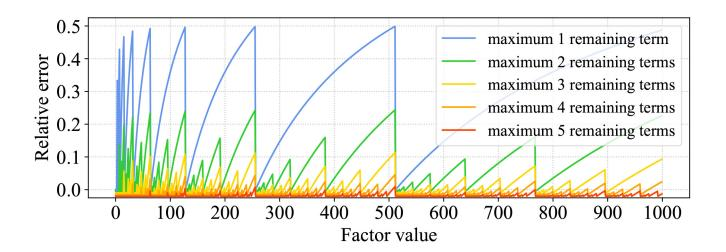

<span id="page-21-2"></span>Fig. 19. The variation of relative error with the value of a factor that is decomposed under different limitations to the maximum number of remaining terms

in Figure 19, multiplication results get more accurate when more decomposition terms are retained. More importantly, it proves that choosing the larger number as the divided factor will obtain more accurate results.

<span id="page-21-5"></span>2) Division: Division an elementary but necessary arithmetic operations in ML models. However, since division requires too many sub-binary calculations that slow the packet processing, P4 does not natively support it. Similar to multiplication, such an operation can be replaced by a M/A table and bit shifting [273]. If the dividend or divisor is a constant, the result of the division can be looked up in a M/A table with stored results. However, in case both components are variables, the size of the required table exponentially increases. This makes M/A tables less effective when computing the division of two variables. As an alternative solution, bit shift is more suitable and efficient when the divisor is a constant and a power of 2.

<span id="page-21-3"></span>
$$Quotient = Dividend >> log_2(Divisor)$$
 (12)

Equation (12) shows that the quotient can be obtained easily by right shifting  $log_2(Divisor)$  bits. Division should be not frequently used since it usually consumes too many hardware resources.

3) Frequency: Frequency (e.g., packet and flow count) is needed as a high-level input feature of ML models. However, when the number of inputs is large, counting frequency requires large memory and stage consumption. Sketches are an efficient way often used in networking to approximate frequency considering memory constraints, in which the two most commonly used are Count Sketch and Count-min Sketch.

<span id="page-21-6"></span>Count Sketch is composed of d rows with size K, and it uses two sets of hash functions  $\{h_1, \ldots, h_d\}$  and  $\{g_1, \ldots, g_d\}$  [274]. Hash functions  $h_i$  are used to map n inputs (e.g., a field extracted from packet header) into a lower dimension space K (K is much smaller than n), and hash functions  $g_i$  are the values (either -1 or 1) to update the counters, where  $h_i: X \mapsto \{0, K\}$  and  $g_i: X \mapsto \{-1, 1\}$ . For any incoming input, the sketch updates the corresponding counter with index  $h_i$  in each row, which can be formulated as  $C_{i,h_i(x)} \leftarrow C_{i,h_i(x)} + g_i(x)$ . When querying frequency, the estimated result is the median value of each row's counter multiplied by  $g_i(x)$  as shown in Equation (13).

<span id="page-21-4"></span>
$$median\{g_1(x)C_{1,h_1(x)},\ldots,g_d(x)C_{d,h_d(x)}\}.$$
 (13)

Count-min sketch is a simplified version of count sketch. Instead of using hash function g, it uses add one in the update

counter  $(h_i)$  process and uses Equation (14) to evaluate the result.

<span id="page-22-1"></span>
$$min\{C_{1,h_1(x)},\ldots,C_{d,h_d(x)}\}.$$
 (14)

Compared to Count-min Sketch, Count Sketch has a better accuracy and memory trade-off. However, Count-min sketch only needs one hash function and is easier to be implemented in programmable network devices. The choice of sketches depends on the different requirements of ML algorithms.

<span id="page-22-0"></span>4) Matrix Multiplication: Many ML algorithms, especially neural network-based algorithms, require matrix multiplication. However, as noted before, multiplication operations and floating-point values may not be supported. The most intuitive solution for matrix multiplication is to use M/A tables to store the intermediate results of the calculation, which has been widely used in programmable switches with a limited number of stages [16], [161], [188], [203]. Another less-common solution, initially introduced by BNN, uses mathematical operations and newly defined data types to approximate the multiplication result [226]. This approach requires more stages but less memory, which is feasible as a solution in SmartNICs and software switches.

Considering BNN as an example, the model optimizes and simplifies the matrix multiplication in a fully connected neural network to an input matrix and a weight matrix, where each matrix is a binary matrix. The product of the two matrices is the closest approximation to the neural network. It has been proved that matrix multiplication can be computed by solving an optimization problem as reported in [226]. More specifically, the task is divided into two parts. First, the weights are replaced with binary numbers. Shown in Figure 11 Step 1, the input and weight are of size n, and  $\mathbf{X}, \mathbf{W} \in \mathbb{R}^{1 \times n}$ . Suppose that there is a binary metric  $\mathbf{B} \in \{+1, -1\}^{n \times 1}$  and a scaling factor  $\alpha \in \mathbb{R}^+$  such that the composed weight,  $\mathbf{X}^T \mathbf{W} \approx \mathbf{X}^T \alpha \mathbf{B}$ , should be as close to the original weight as possible.

<span id="page-22-2"></span>
$$\alpha^*, \mathbf{B}^* = \underset{\alpha, \mathbf{B}}{\operatorname{argmin}} \|\mathbf{W} - \alpha \mathbf{B}\|^2$$
 (15)

The optimization can be solved by expanding the Equation (15). The optimized binary weight is  $\mathbf{B}^* = \operatorname{sign}(\mathbf{W})$  and the scaling factor is  $\alpha^* = \frac{1}{\pi} \|\mathbf{W}\|_{\ell_1}$ .

and the scaling factor is  $\alpha^* = \frac{1}{n} \|\mathbf{W}\|_{\ell 1}$ . Second, binary the input  $\mathbf{X}$  into  $\mathbf{H} \in \{+1, -1\}^n$  with a scaling factor  $\beta \in \mathbb{R}^+$ . The constructed inputs and the weights need to be very similar to each other  $\mathbf{X}^\top \mathbf{W} \approx \beta \mathbf{H}^\top \alpha \mathbf{B}$ . Then, suppose  $\mathbf{Y}_i = \mathbf{X}_i \mathbf{W}_i$ ,  $\mathbf{C}_i = \mathbf{H}_i \mathbf{B}_i$ ,  $\gamma = \beta \alpha$  and get the following optimization.

$$\gamma^*, \mathbf{C}^* = \underset{\gamma, \mathbf{C}}{\operatorname{argmin}} \| \mathbf{X} \odot \mathbf{W} - \beta \alpha \mathbf{H} \odot \mathbf{B} \|$$
$$= \underset{\gamma, \mathbf{C}}{\operatorname{argmin}} \| \mathbf{Y} - \gamma \mathbf{C} \|$$
(16)

The form of this optimization is similar to Equation (15) using a similar method and result of binary weight. The optimized multiplication of the constructed input and weights is  $C^* = \operatorname{sign}(Y) = \operatorname{sign}(X) \odot \operatorname{sign}(W)$ , where  $\odot$  indicates elementwise product, and the optimized multiplication of scaling

factor is  $\gamma^* = \frac{1}{n} \|\mathbf{X}\|_{\ell_1} \frac{1}{n} \|\mathbf{W}\|_{\ell_1} = \beta^* \alpha^*$ . Then, the output of step 2 in Figure 11 is shown in the Equation (17).

<span id="page-22-3"></span>
$$\mathbf{X}^T \mathbf{W} = \sum_{i=1}^n \mathbf{C}_i^* \approx \beta^* \alpha^* \sum_{i=1}^n (\operatorname{sign}(\mathbf{X}) \odot \operatorname{sign}(\mathbf{W}))_i \quad (17)$$

When two values  $m, n \in \{-1, 1\}$ ,  $m \overline{\oplus} n$  will have most similar pattern to the  $m \odot n$ . Thus, replace  $\odot$  by  $\overline{\oplus}$ .  $\beta^* \alpha^*$  can be ignored due to the multiplication operation. The multiplication of all inputs and weights and the summation can be simplified to Equation (18).

<span id="page-22-4"></span>
$$\mathbf{X}^T \mathbf{W} \approx \sum_{i=1}^n \left( \overline{\operatorname{sign}(\mathbf{X}) \oplus \operatorname{sign}(\mathbf{W})} \right)_i$$
 (18)

In this Equation, the result will remain the same when inputs and weights change to the bit format  $\mathbf{X}, \mathbf{W} \in \{0,1\}^n$ . Therefore,  $\mathbf{X}^T\mathbf{W}$  calculation is finally transformed to the form with only  $\overline{\oplus}$  (XNOR) and  $\sum$  (summation, a sequence of additions) operations, which can be implemented in the data plane.

#### E. Other Limitations

In addition to the aforementioned limitations, there are still many unsolved challenges related to in-network ML algorithms, including but not limited to:

- Updating ML models during runtime: When a model is deployed, due to the appearance of new data, change of environment, and drift of concepts, an existing model may no longer be able to predict outcomes accurately. Models require timely updates to keep their ML performance. In-network ML update is not easy as server-based ML, and it is challenging to conduct a hitless update process with minor to no influence on normal packet forwarding functionality.
- In-network ML when traffic is encrypted: In general, many applications and protocols encrypt the data payload, which includes any user data that is being transmitted. In host-based ML, the traffic is decrypted before it is sent for inference. In-network ML may not be able to deal with encrypted data, though it can still take advantage of unencrypted protocol headers or metadata. Some new devices, such as SmartNICs, include encryption/decryption accelerator cores that can allow overcoming the problem, yet there is no solution for switch-ASIC.
- Increasing the scalability of ML models supported by programmable network devices: Current in-network ML still supports only limited model sizes due to resource constraints on programmable network devices. This can limit potential applications of in-network ML on multiple use cases. Potential solutions for this are all challenging to realize, whether designing a new target with more resources, upgrading the ML algorithm with less resource consumption, or scaling the model by deploying it on multiple devices [189].

These open questions are left for the community to explore in the future.

## <span id="page-23-0"></span>VIII. LESSONS LEARNED AND FUTURE TRENDS

## *A. Lessons Learned*

This survey covers the definition of in-network ML, clarifies the scope, describes its evolution and background, and reports state-of-art research and solutions in P4-capable programmable network devices.

Intuitively, in-network ML is an emerging research field that has already attracted a lot of interest. Research to date has mainly focused on offloading and mapping ML techniques to programmable data planes. Many ML models and their enhancements have been proposed and implemented. As network devices are resource constrained, the size of the models implemented was limited. Despite that, existing works have proven that high ML performance can be achieved for some use cases, providing inference in the network with a good trade-off between model size and accuracy. This makes in-network ML a promising research direction.

The applications of in-network ML have so far focused on traditional networking use cases, and in particular security applications such as anomaly detection and DDoS detection and mitigation [\[17\]](#page-24-16), [\[194\]](#page-28-6), [\[200\]](#page-28-8), [\[201\]](#page-28-11), [\[202\]](#page-28-9), [\[210\]](#page-28-31), [\[217\]](#page-28-19), [\[218\]](#page-28-10). While these are mostly volumetric in nature, and benefit from the high packet processing rate of network devices, a different direction is to benefit from latency reduction, such as in financial use cases [\[201\]](#page-28-11), [\[213\]](#page-28-15). To support these use cases, feature extractions for in-network ML have used both stateful and stateless features. A challenge in expanding the adoption of in-network ML is the limited availability of automated tools and frameworks. Only a few works developed frameworks to ease and accelerate the adoption of in-network ML. These include automating in-network ML generation (Planter [\[161\]](#page-27-26)), parameter tuning (Homunculus [\[190\]](#page-28-4)), and distributed deployment (DINC [\[189\]](#page-28-3)).

Though the ML performance and overhead of each innetwork ML model are compared in Planter [\[161\]](#page-27-26), there is currently no unified benchmark for resource consumption in programmable network devices and ML classification performance, which makes it difficult to compare different works and balance models' performance against its resource consumption.

## *B. Future Trends*

There are several foreseeable research directions for innetwork ML.

• *Runtime programmability:* Currently, every time the ML model in the data plane is changed or the model's parameters require an update, the developers have to recompile the program and execute new compiled code in the network device. The problem can be divided to two parts: changing the value of a used parameter, and changing the features being extracted and used. The first may be solved by storing parameters in re-configurable memory (e.g., tables) and atomically updating them, in a manner similar to routing rules and without affecting traffic. The second, feature extraction, is more challenging as P4 manipulation may be unavoidable. While solutions to P4 runtime programmability have been suggested [\[275\]](#page-29-37),

- none were applied to in-network ML or can easily be adapted.
- *Large-scale ML models:* Applying ML to network-related problems requires processing large amounts of data from the network, matching traffic rates. Traditional ML approaches can't handle such traffic volumes at real time, making in-network ML a favorable solution. However, to support a wide range of use cases with high inference performance, it is required to support largescale ML models. Mapping large ML models to network devices, overcoming their resource constraints, requires new offloading approaches. One possible solution is decomposing a large-scale model into multiple components and distributing them into programmable network devices, as done with some P4 programs [\[189\]](#page-28-3), [\[276\]](#page-29-38). Then, a coordinator (e.g., an SDN controller) can be used to retrieve the results from multiple devices and make a final decision.
- <span id="page-23-2"></span>• *Benchmarks and metrics:* A variety of ML models have been mapped to a range of programmable network devices. To date, in-network ML publications have been use case focused, or model and hardware specific, thereby failing to comprehensively showcase algorithm performance from a varied perspective. Consequently, it is hard to fairly compare different solutions. To solve this problem, it is necessary to create a benchmark kit for a unified quantitative assessment, as done for other ML solutions [\[277\]](#page-29-39). Such a benchmark will track and compare the performance of different in-network ML algorithms across platforms, as well as assess the stateof-the-art in a particular task or application.
- <span id="page-23-3"></span>• *More in-network ML use cases:* Many ML models have been proven feasible and reliable in the use cases that are described in existing works, especially network anomaly detection. However, the range of in-network ML use cases is still very narrow, leading to limited adoption in practice. Applying in-network ML beyond the networking domain, to fields such as Natural Language Processing and Computer Vision, is worth exploring. In-network ML can potentially be applied also to 6G, providing a faster and more robust network, and to smart cities empowering IoT devices with low-latency ML services. At a certain point, the emergence of new use cases for in-network ML will drive ML improvements and give rise to novel ideas.

<span id="page-23-1"></span>In-network ML is increasingly recognized as a viable computational paradigm for ML-based applications, especially in the networking domain [\[209\]](#page-28-38), [\[215\]](#page-28-17). While not all MLbased applications will benefit from in-network ML, highly data intensive use cases and those requiring ultra-low latency are prime candidates. As the deployment methodologies of innetwork ML continue to evolve, the optimal exploitation of this new technology remains subject for ongoing discussions. In the short term, in-network ML is not expected to replace established ML accelerators, such as GPUs. It complements existing computing methods and serves use cases with specific requirements. Identifying use cases outside the networking domain remains the focus of future research.

## IX. CONCLUSION

<span id="page-24-22"></span>Offloading computing tasks from end servers into programmable network devices is an ideal way to reduce the workload of CPU and accelerate the data processing in modern computing infrastructure. This paper provided an overview of in-network ML using P4-capable programmable network devices. We reviewed the background, history, and recent development of in-network ML. In particular, we presented different types of ML algorithms in programmable data planes in detail as well as how the implementation challenges are dealt with. Finally, we summarized the lessons that we learned and provided our insights on the future trends of in-network ML. As programmable network devices becomes more powerful, this topic has the potential to be developed in the future.

## ACKNOWLEDGMENT

This paper complies with all applicable ethical standards of the authors' home institution. The authors acknowledge support from Intel. They would like to thank the anonymous reviewers, Riyad Bensoussane and Sawsan EL-Zahr for their valuable feedback, and Radostin Stoyanov for their contribution to early work of this paper.

## REFERENCES

- <span id="page-24-0"></span>[\[1\]](#page-0-1) "Barefoot Tofino." Accessed: Nov. 2023. [Online]. Available: https://www.barefootnetworks.com/products/brief-tofino/
- <span id="page-24-1"></span>[\[2\]](#page-0-1) "Spectrum SN4000 open Ethernet switches." Accessed: Nov. 2023. [Online]. Available: https://www.nvidia.com/en-us/networking/ ethernet-switching/spectrum-sn4000/
- <span id="page-24-2"></span>[\[3\]](#page-0-2) "AMD Pensando infrastructure accelerators." Accessed: Nov. 2023. [Online]. Available: https://www.amd.com/en/accelerators/pensando
- <span id="page-24-3"></span>[\[4\]](#page-0-2) "NVIDIA blueField data processing units." Accessed: Nov. 2023. [Online]. Available: https://www.nvidia.com/en-us/networking/pro ducts/data-processing-unit/
- <span id="page-24-4"></span>[\[5\]](#page-0-2) "Broadcom stingray SmartNIC accelerates Baidu cloud services." Accessed: Nov. 2023. [Online]. Available: https://www.broadcom.com/ company/news/product-releases/53106
- <span id="page-24-5"></span>[\[6\]](#page-0-2) "Netronome flow processor product brief." Accessed: Nov. 2023. [Online]. Available: https://www.netronome.com/media/documents/ PB\_NFP-6000-7-20.pdf
- <span id="page-24-6"></span>[\[7\]](#page-0-3) S. Ibanez, G. Brebner, N. McKeown, and N. Zilbermann, "The P4→NetFPGA workflow for line-rate packet processing," in *Proc. ACM/SIGDA Int. Symp. Field Program. Gate Arrays*, 2019, pp. 1–9.
- <span id="page-24-7"></span>[\[8\]](#page-0-4) P. Bosshart et al., "P4: Programming protocol-independent packet processors," *ACM SIGCOMM Comput. Commun. Rev.*, vol. 44, no. 3, pp. 87–95, 2014.
- <span id="page-24-8"></span>[\[9\]](#page-0-5) A. Sapio, I. Abdelaziz, A. Aldilaijan, M. Canini, and P. Kalnis, "Innetwork computation is a dumb idea whose time has come," in *Proc. 16th ACM Workshop Hot Topics Netw.*, 2017, pp. 150–156.
- <span id="page-24-9"></span>[\[10\]](#page-0-5) Y. Tokusashi, H. T. Dang, F. Pedone, R. Soulé, and N. Zilberman, "The case for in-network computing on demand," in *Proc. 14th EuroSys Conf.*, 2019, pp. 1–16.
- <span id="page-24-10"></span>[\[11\]](#page-0-6) A. W. Moore and D. Zuev, "Internet traffic classification using Bayesian analysis techniques," in *Proc. ACM SIGMETRICS Int. Conf. Meas. Model. Comput. Syst.*, 2005, pp. 50–60.
- <span id="page-24-11"></span>[\[12\]](#page-0-6) A. Dainotti, A. Pescape, and K. C. Claffy, "Issues and future directions in traffic classification," *IEEE Netw.*, vol. 26, no. 1, pp. 35–40, Jan./Feb. 2012.
- <span id="page-24-12"></span>[\[13\]](#page-0-7) D. K. Bhattacharyya and J. K. Kalita, *Network Anomaly Detection: A Machine Learning Perspective*. Boca Raton, FL, USA: CRC Press, 2013.
- <span id="page-24-13"></span>[\[14\]](#page-0-8) R. Doshi, N. Apthorpe, and N. Feamster, "Machine learning DDoS detection for consumer Internet of Things devices," in *Proc. IEEE Security Privacy Workshops (SPW)*, 2018, pp. 29–35.
- <span id="page-24-14"></span>[\[15\]](#page-0-9) D. Sanvito, G. Siracusano, and R. Bifulco, "Can the network be the AI accelerator?" in *Proc. Morning Workshop in Netw. Comput.*, 2018, pp. 20–25.

- <span id="page-24-15"></span>[\[16\]](#page-0-9) Z. Xiong and N. Zilberman, "Do switches dream of machine learning? Toward in-network classification," in *Proc. 18th ACM Workshop Hot Topics Netw.*, 2019, pp. 25–33.
- <span id="page-24-16"></span>[\[17\]](#page-0-10) X. Zhang, L. Cui, F. P. Tso, and W. Jia, "pHeavy: Predicting heavy flows in the programmable data plane," *IEEE Trans. Netw. Service Manag.*, vol. 18, no. 4, pp. 4353–4364, Dec. 2021.
- <span id="page-24-17"></span>[\[18\]](#page-0-11) T. C. Silva and L. Zhao, *Machine Learning in Complex Networks*, vol. 1. Cham, Switzerland: Springer, 2016.
- <span id="page-24-18"></span>[\[19\]](#page-1-3) R. Boutaba et al., "A comprehensive survey on machine learning for networking: Evolution, applications and research opportunities," *J. Internet Services Appl.*, vol. 9, no. 1, pp. 1–99, 2018.
- <span id="page-24-19"></span>[\[20\]](#page-1-3) M. Wang, Y. Cui, X. Wang, S. Xiao, and J. Jiang, "Machine learning for networking: Workflow, advances and opportunities," *IEEE Netw.*, vol. 32, no. 2, pp. 92–99, Mar./Apr. 2018.
- <span id="page-24-20"></span>[\[21\]](#page-1-4) F. Hauser et al., "A survey on data plane programming with P4: Fundamentals, advances, and applied research," 2021, *arXiv:2101.10632*.
- <span id="page-24-21"></span>[\[22\]](#page-1-4) R. Bifulco and G. Rétvári, "A survey on the programmable data plane: Abstractions, architectures, and open problems," in *Proc. IEEE 19th Int. Conf. High Perform. Switching Routing (HPSR)*, 2018, pp. 1–7.
- [23] A. Y. Nikravesh, S. A. Ajila, C.-H. Lung, and W. Ding, "Mobile network traffic prediction using MLP, MLPWD, and SVM," in *Proc. IEEE Int. Congr. Big Data (BigData Congr.)*, 2016, pp. 402–409.
- [24] A. Eswaradass, X.-H. Sun, and M. Wu, "Network bandwidth predictor (NBP): A system for online network performance forecasting," in *Proc. 6th IEEE Int. Symp. Clust. Comput. Grid (CCGRID)*, vol. 1, 2006, p. 4.
- [25] S. Chabaa et al., "Identification and prediction of Internet traffic using artificial neural networks," *J. Intell. Learn. Syst. Appl.*, vol. 2, no. 3, p. 147, 2010.
- [26] Y. Zhu, G. Zhang, and J. Qiu, "Network traffic prediction based on particle swarm BP neural network," *J. Netw.*, vol. 8, no. 11, pp. 2685–2691, 2013.
- [27] Y. Li, H. Liu, W. Yang, D. Hu, and W. Xu, "Inter-data-center network traffic prediction with elephant flows," in *Proc. IEEE/IFIP Netw. Oper. Manag. Symp. (NOMS)*, 2016, pp. 206–213.
- [28] P. Poupart et al., "Online flow size prediction for improved network routing," in *Proc. IEEE 24th Int. Conf. Netw. Protocols (ICNP)*, 2016, pp. 1–6.
- [29] Z. Chen, J. Wen, and Y. Geng, "Predicting future traffic using hidden Markov models," in *Proc. IEEE 24th Int. Conf. Netw. Protocols (ICNP)*, 2016, pp. 1–6.
- [30] R. Alshammari and A. N. Zincir-Heywood, "Machine learning based encrypted traffic classification: Identifying SSH and Skype," in *Proc. IEEE Symp. Comput. Intell. Security Defense Appl.*, 2009, pp. 1–8.
- [31] A. Finamore, M. Mellia, M. Meo, and D. Rossi, "KISS: Stochastic packet inspection classifier for UDP traffic," *IEEE/ACM Trans. Netw.*, vol. 18, no. 5, pp. 1505–1515, Oct. 2010.
- [32] D. Schatzmann, W. Mühlbauer, T. Spyropoulos, and X. Dimitropoulos, "Digging into HTTPs: Flow-based classification of Webmail traffic," in *Proc. 10th ACM SIGCOMM Conf. Internet Meas.*, 2010, pp. 322–327.
- [33] P. Bermolen, M. Mellia, M. Meo, D. Rossi, and S. Valenti, "Abacus: Accurate behavioral classification of P2P-TV traffic," *Comput. Netw.*, vol. 55, no. 6, pp. 1394–1411, 2011.
- [34] A. Este, F. Gringoli, and L. Salgarelli, "Support vector machines for TCP traffic classification," *Comput. Netw.*, vol. 53, no. 14, pp. 2476–2490, 2009.
- [35] A. F. Esteves et al., "On-line detection of encrypted traffic generated by mesh-based peer-to-peer live streaming applications: The case of GoalBit," in *Proc. IEEE 10th Int. Symp. Netw. Comput. Appl.*, 2011, pp. 223–228.
- [36] P. Haffner, S. Sen, O. Spatscheck, and D. Wang, "ACAS: Automated construction of application signatures," in *Proc. ACM SIGCOMM Workshop Min. Netw. Data*, 2005, pp. 197–202.
- [37] J. Zhang, C. Chen, Y. Xiang, W. Zhou, and Y. Xiang, "Internet traffic classification by aggregating correlated Naive Bayes predictions," *IEEE Trans. Inf. Forensics Security*, vol. 8, no. 1, pp. 5–15, 2012.
- [38] A. Dainotti, A. Pescapé, and C. Sansone, "Early classification of network traffic through multi-classification," in *Proc. Int. Workshop Traffic Monitor. Anal.*, 2011, pp. 122–135.
- [39] T. T. Nguyen, G. Armitage, P. Branch, and S. Zander, "Timely and continuous machine-learning-based classification for interactive IP traffic," *IEEE/ACM Trans. Netw.*, vol. 20, no. 6, pp. 1880–1894, Dec. 2012.
- [40] W. De Donato, A. Pescapé, and A. Dainotti, "Traffic identification engine: An open platform for traffic classification," *IEEE Netw.*, vol. 28, no. 2, pp. 56–64, Mar./Apr. 2014.

- [41] M. Roughan, S. Sen, O. Spatscheck, and N. Duffield, "Class-of-service mapping for QoS: A statistical signature-based approach to IP traffic classification," in *Proc. 4th ACM SIGCOMM Conf. Internet Meas.*, 2004, pp. 135–148.
- [42] L. He, C. Xu, and Y. Luo, "VTC: Machine learning based traffic classification as a virtual network function," in *Proc. ACM Int. Workshop Security Softw. Defined Netw. Netw. Function Virtualization*, 2016, pp. 53–56.
- [43] J. Zhang, X. Chen, Y. Xiang, W. Zhou, and J. Wu, "Robust network traffic classification," *IEEE/ACM Trans. Netw.*, vol. 23, no. 4, pp. 1257–1270, Aug. 2015.
- [44] Y. Liu, W. Li, and Y. Li, "Network traffic classification using K-means clustering," in *Proc. IEEE 2nd Int. Multi Symp. Comput. Sci. (IMSCCS)*, 2007, pp. 360–365.
- [45] J. Erman, A. Mahanti, M. Arlitt, and C. Williamson, "Identifying and discriminating between Web and peer-to-peer traffic in the network core," in *Proc. 16th Int. Conf. World Wide Web*, 2007, pp. 883–892.
- [46] L. Bernaille, R. Teixeira, I. Akodkenou, A. Soule, and K. Salamatian, "Traffic classification on the fly," *ACM SIGCOMM Comput. Commun. Rev.*, vol. 36, no. 2, pp. 23–26, 2006.
- [47] J. Erman, A. Mahanti, M. Arlitt, I. Cohen, and C. Williamson, "Offline/realtime traffic classification using semi-supervised learning," *Perform. Eval.*, vol. 64, nos. 9–12, pp. 1194–1213, 2007.
- [48] W. Li and A. W. Moore, "A machine learning approach for efficient traffic classification," in *Proc. 15th Int. Symp. Model. Anal. Simulat. Comput. Telecommun. Syst.*, 2007, pp. 310–317.
- [49] Y. Jin, N. Duffield, J. Erman, P. Haffner, S. Sen, and Z.-L. Zhang, "A modular machine learning system for flow-level traffic classification in large networks," *ACM Trans. Knowl. Disc. Data*, vol. 6, no. 1, pp. 1–34, 2012.
- [50] M. Elnawawy, A. Sagahyroon, and T. Shanableh, "FPGA-based network traffic classification using machine learning," *IEEE Access*, vol. 8, pp. 175637–175650, 2020.
- [51] K. Hara and K. Shiomoto, "Intrusion detection system using semisupervised learning with adversarial auto-encoder," in *Proc. IEEE/IFIP Netw. Oper. Manag. Symp. (NOMS)*, 2020, pp. 1–8.
- [52] D. M. Casas-Velasco, O. M. C. Rendon, and N. L. da Fonseca, "DRSIR: A deep reinforcement learning approach for routing in softwaredefined networking," *IEEE Trans. Netw. Service Manag.*, vol. 19, no. 4, pp. 4807–4820, Dec. 2022.
- [53] D. M. Casas-Velasco, O. M. C. Rendon, and N. L. da Fonseca, "Intelligent routing based on reinforcement learning for softwaredefined networking," *IEEE Trans. Netw. Service Manag.*, vol. 18, no. 1, pp. 870–881, Mar. 2021.
- [54] A. Forster and A. L. Murphy, "FROMS: Feedback routing for Optimizing multiple sinks in WSN with reinforcement learning," in *Proc. 3rd Int. Conf. Intell. Sensors Sensor Netw. Inf.*, 2007, pp. 371–376.
- [55] R. Arroyo-Valles, R. Alaiz-Rodriguez, A. Guerrero-Curieses, and J. Cid-Sueiro, "*Q*-probabilistic routing in wireless sensor networks," in *Proc. IEEE 3rd Int. Conf. Intell. Sensors Sensor Netw. Inf.*, 2007, pp. 1–6.
- [56] T. Hu and Y. Fei, "QELAR: A machine-learning-based adaptive routing protocol for energy-efficient and lifetime-extended underwater sensor networks," *IEEE Trans. Mobile Comput.*, vol. 9, no. 6, pp. 796–809, Jun. 2010.
- [57] A. A. Bhorkar, M. Naghshvar, T. Javidi, and B. D. Rao, "Adaptive opportunistic routing for wireless ad hoc networks," *IEEE/ACM Trans. Netw.*, vol. 20, no. 1, pp. 243–256, Feb. 2012.
- [58] N. Fonseca and M. Crovella, "Bayesian packet loss detection for TCP," in *Proc. IEEE 24th Annu. Joint Conf. IEEE Comput. Commun. Soc.*, vol. 3, 2005, pp. 1826–1837.
- [59] I. El Khayat, P. Geurts, and G. Leduc, "Improving TCP in wireless networks with an adaptive machine-learnt classifier of packet loss causes," in *Proc. Int. Conf. Res. Netw.*, 2005, pp. 549–560.
- [60] I. El Khayat, P. Geurts, and G. Leduc, "Enhancement of TCP over wired/wireless networks with packet loss classifiers inferred by supervised learning," *Wireless Netw.*, vol. 16, no. 2, pp. 273–290, 2010.
- [61] P. Geurts, I. El Khayat, and G. Leduc, "A machine learning approach to improve congestion control over wireless computer networks," in *Proc. 4th IEEE Int. Conf. Data Min. (ICDM)*, 2004, pp. 383–386.
- [62] I. El Khayat, P. Geurts, and G. Leduc, "Machine-learnt versus analytical models of TCP throughput," *Comput. Netw.*, vol. 51, no. 10, pp. 2631–2644, 2007.
- [63] M. F. Zhani, H. Elbiaze, and F. Kamoun, "α\_ SNFAQM: An active queue management mechanism using neurofuzzy prediction," in *Proc. 12th IEEE Symp. Comput. Commun.*, 2007, pp. 381–386.

- [64] S. Masoumzadeh, G. Taghizadeh, K. Meshgi, and S. Shiry, "Deep blue: A fuzzy *Q*-learning enhanced active queue management scheme," in *Proc. Int. Conf. Adapt. Intell. Syst.*, 2009, pp. 43–48.
- [65] H. Jiang, Y. Luo, Q. Zhang, M. Yin, and C. Wu, "TCP-GVEGAS with prediction and adaptation in multi-hop ad hoc networks," *Wireless Netw.*, vol. 23, no. 5, pp. 1535–1548, 2017.
- [66] A. P. Silva, K. Obraczka, S. Burleigh, and C. M. Hirata, "Smart congestion control for delay-and disruption tolerant networks," in *Proc. 13th Annu. IEEE Int. Conf. Sens. Commun. Netw. (SECON)*, 2016, pp. 1–9.
- [67] D. Vassis, A. Kampouraki, P. Belsis, and C. Skourlas, "Admission control of video sessions over ad hoc networks using neural classifiers," in *Proc. IEEE Mil. Commun. Conf.*, 2014, pp. 1015–1020.
- [68] A. Hiramatsu, "ATM communications network control by neural network," *IEEE Trans. Neural Netw.*, vol. 1, no. 1, pp. 122–130, Mar. 1989.
- [69] N. Baldo, P. Dini, and J. Nin-Guerrero, "User-driven call admission control for VoIP over WLAN with a neural network based cognitive engine," in *Proc. IEEE 2nd Int. Workshop Cogn. Inf. Process.*, 2010, pp. 52–56.
- [70] N. Baldo and M. Zorzi, "Learning and adaptation in cognitive radios using neural networks," in *Proc. 5th IEEE Consum. Commun. Netw. Conf.*, 2008, pp. 998–1003.
- [71] B. Bojovic, N. Baldo, J. Nin-Guerrero, and P. Dini, "A supervised learning approach to cognitive access point selection," in *Proc. IEEE GLOBECOM Workshops (GC Wkshps)*, 2011, pp. 1100–1105.
- [72] D. Liu, Y. Zhang, and H. Zhang, "A self-learning call admission control scheme for CDMA cellular networks," *IEEE Trans. Neural Netw.*, vol. 16, no. 5, pp. 1219–1228, Sep. 2005.
- [73] B. Bojovic, G. Quer, N. Baldo, and R. R. Rao, "Bayesian and neural ´ network schemes for call admission control in LTE systems," in *Proc. IEEE Global Commun. Conf. (GLOBECOM)*, 2013, pp. 1246–1252.
- [74] G. Quer, N. Baldo, and M. Zorzi, "Cognitive call admission control for VoIP over IEEE 802.11 using Bayesian networks," in *Proc. IEEE Global Telecommun. Conf. (GLOBECOM)*, 2011, pp. 1–6.
- [75] R. Shi et al., "MDP and machine learning-based cost-optimization of dynamic resource allocation for network function virtualization," in *Proc. IEEE Int. Conf. Services Comput.*, 2015, pp. 65–73.
- [76] A. Blenk, P. Kalmbach, P. Van Der Smagt, and W. Kellerer, "Boost online virtual network embedding: Using neural networks for admission control," in *Proc. 12th Int. Conf. Netw. Service Manag. (CNSM)*, 2016, pp. 10–18.
- [77] A. Adeel, H. Larijani, A. Javed, and A. Ahmadinia, "Critical analysis of learning algorithms in random neural network based cognitive engine for LTE systems," in *Proc. IEEE 81st Veh. Technol. Conf. (VTC Spring)*, 2015, pp. 1–5.
- [78] A. Testolin et al., "A machine learning approach to QoE-based video admission control and resource allocation in wireless systems," in *Proc. 13th Annu. Mediterr. Ad Hoc Netw. Workshop (MED-HOC-NET)*, 2014, pp. 31–38.
- [79] S. Mignanti, A. Di Giorgio, and V. Suraci, "A model based RL admission control algorithm for next generation networks," in *Proc. 8th Int. Conf. Netw.*, 2009, pp. 191–196.
- [80] H. Tong and T. X. Brown, "Adaptive call admission control under quality of service constraints: A reinforcement learning solution," *IEEE J. Sel. Areas Commun.*, vol. 18, no. 2, pp. 209–221, Feb. 2000.
- [81] J. Wang and Y. Qiu, "A new call admission control strategy for LTE femtocell networks," in *Proc. 2nd Int. Conf. Adv. Comput. Sci. Eng.*, 2013, pp. 334–338.
- [82] R. Mijumbi, J.-L. Gorricho, J. Serrat, M. Claeys, F. De Turck, and S. Latré, "Design and evaluation of learning algorithms for dynamic resource management in virtual networks," in *Proc. IEEE Netw. Oper. Manag. Symp. (NOMS)*, 2014, pp. 1–9.
- [83] Y. Wang, M. Martonosi, and L.-S. Peh, "Predicting link quality using supervised learning in wireless sensor networks," *ACM SIGMOBILE Mobile Comput. Commun. Rev.*, vol. 11, no. 3, pp. 71–83, 2007.
- [84] A. Pellegrini, P. Di Sanzo, and D. R. Avresky, "A machine learningbased framework for building application failure prediction models," in *Proc. IEEE Int. Parallel Distrib. Process. Symp. Workshop*, 2015, pp. 1072–1081.
- [85] Z. Wang et al., "Failure prediction using machine learning and time series in optical network," *Opt. Exp.*, vol. 25, no. 16, pp. 18553–18565, 2017.
- [86] U. S. Hashmi, A. Darbandi, and A. Imran, "Enabling proactive selfhealing by data mining network failure logs," in *Proc. Int. Conf. Comput. Netw. Commun. (ICNC)*, 2017, pp. 511–517.

- [87] K. Qader, M. Adda, and M. Al-Kasassbeh, "Comparative analysis of clustering techniques in network traffic faults classification," *Int. J. Innov. Res. Comput. Commun. Eng.*, vol. 5, no. 4, pp. 6551–6563, 2017.
- [88] E. Kiciman and A. Fox, "Detecting application-level failures in component-based Internet services," *IEEE Trans. Neural Netw.*, vol. 16, no. 5, pp. 1027–1041, Sep. 2005.
- [89] M. Chen, A. X. Zheng, J. Lloyd, M. I. Jordan, and E. Brewer, "Failure diagnosis using decision trees," in *Proc. Int. Conf. Auton. Comput.*, 2004, pp. 36–43.
- [90] A. Snow, P. Rastogi, and G. Weckman, "Assessing dependability of wireless networks using neural networks," in *Proc. IEEE Mil. Commun. Conf. (MILCOM)*, 2005, pp. 2809–2815.
- [91] J. S. Baras, M. Ball, S. Gupta, P. Viswanathan, and P. Shah, "Automated network fault management," in *Proc. IEEE MILCOM*, vol. 3, 1997, pp. 1244–1250.
- [92] Y. Kumar, H. Farooq, and A. Imran, "Fault prediction and reliability analysis in a real cellular network," in *Proc. 13th Int. Wireless Commun. Mobile Comput. Conf. (IWCMC)*, 2017, pp. 1090–1095.
- [93] C. S. Hood and C. Ji, "Proactive network-fault detection [telecommunications]," *IEEE Trans. Rel.*, vol. 46, no. 3, pp. 333–341, Sep. 1997.
- [94] P. Kogeda and J. I. Agbinya, "Prediction of faults in cellular networks using Bayesian network model," in *Proc. Int. Conf. Wireless Broadband Ultra Wideband Commun.*, 2006, p. 12.
- [95] M. Ruiz et al., "Service-triggered failure identification/localization through monitoring of multiple parameters," in *Proc. 42nd Eur. Conf. Opt. Commun. (ECOC)*, 2016, pp. 1–3.
- [96] R. M. Khanafer et al., "Automated diagnosis for UMTS networks using Bayesian network approach," *IEEE Trans. Veh. Technol.*, vol. 57, no. 4, pp. 2451–2461, Jul. 2008.
- [97] A. I. Moustapha and R. R. Selmic, "Wireless sensor network modeling using modified recurrent neural networks: Application to fault detection," *IEEE Trans. Instrum. Meas.*, vol. 57, no. 5, pp. 981–988, May 2008.
- [98] M. S. Mushtaq, B. Augustin, and A. Mellouk, "Empirical study based on machine learning approach to assess the QoS/QoE correlation," in *Proc. 17th Eur. Conf. Netw. Opt. Commun.*, 2012, pp. 1–7.
- [99] P. Charonyktakis, M. Plakia, I. Tsamardinos, and M. Papadopouli, "On user-centric modular QoE prediction for VoIP based on machinelearning algorithms," *IEEE Trans. Mobile Comput.*, vol. 15, no. 6, pp. 1443–1456, Jun. 2016.
- [100] E. Demirbilek and J.-C. Grégoire, "Machine learning–based parametric audiovisual quality prediction models for real-time communications," *ACM Trans. Multimedia Comput. Commun. Appl.*, vol. 13, no. 2, pp. 1–25, 2017.
- [101] V. A. Machado et al., "A new proposal to provide estimation of QoS and QoE over WiMAX networks: An approach based on computational intelligence and discrete-event simulation," in *Proc. IEEE 3rd Latin– Amer. Conf. Commun.*, 2011, pp. 1–6.
- [102] M. Claeys, S. Latré, J. Famaey, T. Wu, W. Van Leekwijck, and F. De Turck, "Design of a *Q*-learning-based client quality selection algorithm for HTTP adaptive video streaming," in *Proc. Adapt. Learn. Agents Workshop (AAMAS (ALA)*, 2013, pp. 30–37.
- [103] M. Claeys, S. Latre, J. Famaey, and F. De Turck, "Design and evaluation of a self-learning HTTP adaptive video streaming client," *IEEE Commun. Lett.*, vol. 18, no. 4, pp. 716–719, Apr. 2014.
- [104] M. Panda, A. Abraham, and M. R. Patra, "A hybrid intelligent approach for network intrusion detection," *Procedia Eng.*, vol. 30, pp. 1–9, 2012.
- [105] S. Peddabachigari, A. Abraham, C. Grosan, and J. Thomas, "Modeling intrusion detection system using hybrid intelligent systems," *J. Netw. Comput. Appl.*, vol. 30, no. 1, pp. 114–132, 2007.
- [106] D. S. Kim, H.-N. Nguyen, and J. S. Park, "Genetic algorithm to improve SVM based network intrusion detection system," in *Proc. 19th Int. Conf. Adv. Inf. Netw. Appl. (AINA)*, vol. 2, 2005, pp. 155–158.
- [107] S. Mukkamala, G. Janoski, and A. Sung, "Intrusion detection using neural networks and support vector machines," in *Proc. Int. Joint Conf. Neural Netw. (IJCNN)*, vol. 2, 2002, pp. 1702–1707.
- [108] N. B. Amor, S. Benferhat, and Z. Elouedi, "Naive Bayes vs decision trees in intrusion detection systems," in *Proc. ACM Symp. Appl. Comput.*, 2004, pp. 420–424.
- [109] Y. Li and L. Guo, "An active learning based TCM-KNN algorithm for supervised network intrusion detection," *Comput. Security*, vol. 26, nos. 7–8, pp. 459–467, 2007.
- [110] A. P. Muniyandi, R. Rajeswari, and R. Rajaram, "Network anomaly detection by cascading K-means clustering and C4.5 decision tree algorithm," *Procedia Eng.*, vol. 30, pp. 174–182, 2012.

- [111] Z.-S. Pan, S.-C. Chen, G.-B. Hu, and D.-Q. Zhang, "Hybrid neural network and C4.5 for misuse detection," in *Proc. Int. Conf. Mach. Learn. Cybern.*, vol. 4, 2003, pp. 2463–2467.
- [112] W. Hu, W. Hu, and S. Maybank, "AdaBoost-based algorithm for network intrusion detection," *IEEE Trans. Syst. Man, Cybern. B, Cybern.*, vol. 38, no. 2, pp. 577–583, Apr. 2008.
- [113] J. Zhang and M. Zulkernine, "Anomaly based network intrusion detection with unsupervised outlier detection," in *Proc. IEEE Int. Conf. Commun.*, vol. 5, 2006, pp. 2388–2393.
- [114] B. Pfahringer, "Winning the KDD99 classification cup: Bagged boosting," *ACM SIGKDD Explor. Newslett.*, vol. 1, no. 2, pp. 65–66, 2000.
- [115] S. Chebrolu, A. Abraham, and J. P. Thomas, "Feature deduction and ensemble design of intrusion detection systems," *Comput. Security*, vol. 24, no. 4, pp. 295–307, 2005.
- [116] J. Cannady, "Artificial neural networks for misuse detection," in *Proc. Nat. Inf. Syst. Security Conf. (NISSC)*, 1998, pp. 443–456.
- [117] M. Moradi and M. Zulkernine, "A neural network based system for intrusion detection and classification of attacks," in *Proc. IEEE Int. Conf. Adv. Intell. Syst. Theory Appl.*, 2004, pp. 15–18.
- [118] J. Kim, J. Kim, H. L. T. Thu, and H. Kim, "Long short term memory recurrent neural network classifier for intrusion detection," in *Proc. Int. Conf. Platform Technol. Service (PlatCon)*, 2016, pp. 1–5.
- [119] A. Servin and D. Kudenko, "Multi-agent reinforcement learning for intrusion detection: A case study and evaluation," in *Proc. German Conf. Multiagent Syst. Technol.*, 2008, pp. 159–170.
- [120] M. Sánchez-Fernández, M. de Prado-Cumplido, J. Arenas-García, and F. Pérez-Cruz, "SVM Multiregression for nonlinear channel estimation in multiple–input multiple–output systems," *IEEE Trans. Signal Process.*, vol. 52, no. 8, pp. 2298–2307, Aug. 2004.
- [121] P. Haffner, G. Tur, and J. H. Wright, "Optimizing SVMs for complex call classification," in *Proc. IEEE Int. Conf. Acoust. Speech Signal Process. (ICASSP)*, vol. 1, 2003, p. 1.
- [122] Y. Zhang, J. Wen, G. Yang, Z. He, and X. Luo, "Air-to-air path loss prediction based on machine learning methods in urban environments," *Wireless Commun. Mobile Comput.*, vol. 2018, Jun. 2018, Art. no. 8489326.
- [123] D. F. F. Baptista, R. Ferrari, and R. Attux, "Channel equalization based on decision trees," *J. Commun. Inf. Syst.*, vol. 35, no. 1, pp. 150–161, 2020.
- [124] S. Luan, Y. Gao, W. Chen, N. Yu, and Z. Zhang, "Automatic modulation classification: Decision tree based on error entropy and global-local feature-coupling network under mixed noise and fading channels," *IEEE Wireless Commun. Lett.*, vol. 11, no. 8, pp. 1703–1707, Aug. 2022.
- [125] Y. Wu, Y. Wang, J. Huang, C.-X. Wang, and C. Huang, "A weighted random forest based positioning algorithm for 6G indoor communications," in *Proc. IEEE 96th Veh. Technol. Conf. (VTC-Fall)*, 2022, pp. 1–6.
- [126] T. O'Shea, K. Karra, and T. C. Clancy, "Learning approximate neural estimators for wireless channel state information," in *Proc. IEEE 27th Int. Workshop Mach. Learn. Signal Process. (MLSP)*, 2017, pp. 1–7.
- [127] J. Huang et al., "A big data enabled channel model for 5G wireless communication systems," *IEEE Trans. Big Data*, vol. 6, no. 2, pp. 211–222, Jun. 2020.
- [128] H. He, C.-K. Wen, S. Jin, and G. Y. Li, "Deep learning-based channel estimation for beamspace mmWave massive MIMO systems," *IEEE Wireless Commun. Lett.*, vol. 7, no. 5, pp. 852–855, Oct. 2018.
- [129] T. O'shea and J. Hoydis, "An introduction to deep learning for the physical layer," *IEEE Trans. Cogn. Commun. Netw.*, vol. 3, no. 4, pp. 563–575, Dec. 2017.
- [130] G. Kechriotis, E. Zervas, and E. S. Manolakos, "Using recurrent neural networks for adaptive communication channel equalization," *IEEE Trans. Neural Netw.*, vol. 5, no. 2, pp. 267–278, Mar. 1994.
- [131] D.-C. Park and T.-K. J. Jeong, "Complex-bilinear recurrent neural network for equalization of a digital satellite channel," *IEEE Trans. Neural Netw.*, vol. 13, no. 3, pp. 711–725, Jul. 2002.
- [132] M. Ghavamzadeh et al., "Bayesian reinforcement learning: A survey," *Found. Trends Mach. Learn.*, vol. 8, nos. 5–6, pp. 359–483, 2015.
- [133] S. M. Aldossari and K.-C. Chen, "Machine learning for wireless communication channel modeling: An overview," *Wireless Pers. Commun.*, vol. 106, no. 1, pp. 41–70, 2019.
- <span id="page-26-0"></span>[\[134\]](#page-1-5) "Cisco annual Internet report (2018–2023) white paper." Accessed: Mar. 26, 2021. [Online]. Available: https://www.cisco.com/c/en/us/ solutions/collateral/executive-perspectives/Annu.-internet-Rep./white paper-c11-741490

- <span id="page-27-0"></span>[\[135\]](#page-1-5) "The intelligent use of big data on an industrial scale." Accessed: Jan. 2024. [Online]. Available: https://www.the-next-tech.com/ development/the-intelligent-use-of-big-data-on-an-industrial-scale/
- <span id="page-27-1"></span>[\[136\]](#page-1-6) R. Meulen. "Gartner says 8.4 billion connected "things" will be in use in 2017, up 31 percent from 2016." 2017. [Online]. Available: https://www.information-age.com/gartner-8-4-billion-iot-2017-4225/
- <span id="page-27-2"></span>[\[137\]](#page-1-7) P. Domingos and M. Pazzani, "On the optimality of the simple Bayesian classifier under zero-one loss," *Mach. Learn.*, vol. 29, no. 2, pp. 103–130, 1997.
- <span id="page-27-3"></span>[\[138\]](#page-1-8) J. N. Morgan and J. A. Sonquist, "Problems in the analysis of survey data, and a proposal," *J. Amer. Stat. Assoc.*, vol. 58, no. 302, pp. 415–434, 1963.
- <span id="page-27-4"></span>[\[139\]](#page-1-9) C. Cortes and V. Vapnik, "Support-vector networks," *Mach. Learn.*, vol. 20, no. 3, pp. 273–297, 1995.
- <span id="page-27-5"></span>[\[140\]](#page-1-10) K. Bennett and A. Demiriz, "Semi-supervised support vector machines," in *Proc. Adv. Neural Inf. Process. Syst.*, vol. 11, 1998, pp. 368–374.
- <span id="page-27-6"></span>[\[141\]](#page-1-11) E. Fix and J. L. Hodges, "Discriminatory analysis. nonparametric discrimination: Consistency properties," *Int. Stat. Rev. Revue Internationale de Statistique*, vol. 57, no. 3, pp. 238–247, 1989.
- <span id="page-27-7"></span>[\[142\]](#page-1-12) M. A. Kramer, "Nonlinear principal component analysis using autoassociative neural networks," *AIChE J.*, vol. 37, no. 2, pp. 233–243, 1991.
- <span id="page-27-8"></span>[\[143\]](#page-1-13) C. J. C. H. Watkins, *Learning From Delayed Rewards*, King's College, Cambridge, MA, USA, 1989.
- <span id="page-27-9"></span>[\[144\]](#page-1-14) G. A. Rummery and M. Niranjan, *On-Line Q-Learning Using Connectionist Systems*, vol. 37. Cambridge, MA, USA: Cambridge Univ. Press, 1994,
- <span id="page-27-10"></span>[\[145\]](#page-1-15) M. A. Alsheikh, S. Lin, D. Niyato, and H.-P. Tan, "Machine learning in wireless sensor networks: Algorithms, strategies, and applications," *IEEE Commun. Surveys Tuts.*, vol. 16, no. 4, pp. 1996–2018, 4th Quart., 2014.
- <span id="page-27-11"></span>[\[146\]](#page-1-15) P. V. Klaine, M. A. Imran, O. Onireti, and R. D. Souza, "A survey of machine learning techniques applied to self-organizing cellular networks," *IEEE Commun. Surveys Tuts.*, vol. 19, no. 4, pp. 2392–2431, 4th Quart., 2017.
- <span id="page-27-12"></span>[\[147\]](#page-1-15) A. Aljuhani, "Machine learning approaches for combating distributed denial of service attacks in modern networking environments," *IEEE Access*, vol. 9, pp. 42236–42264, 2021.
- <span id="page-27-13"></span>[\[148\]](#page-1-16) N. McKeown, "Software-defined networking," in *Proc. 28th Annu. Joint Conf. IEEE Comput. Commun. Soc. (INFOCOM)*, vol. 17, 2009, pp. 30–32.
- <span id="page-27-14"></span>[\[149\]](#page-1-16) N. Feamster, J. Rexford, and E. Zegura, "The road to SDN: An intellectual history of programmable networks," *SIGCOMM Comput. Commun. Rev.*, vol. 44, no. 2, pp. 87–98, Apr. 2014.
- <span id="page-27-15"></span>[\[150\]](#page-2-3) N. Zilberman, P. M. Watts, C. Rotsos, and A. W. Moore, "Reconfigurable network systems and software-defined networking," *Proc. IEEE*, vol. 103, no. 7, pp. 1102–1124, Jul. 2015.
- <span id="page-27-16"></span>[\[151\]](#page-2-4) P. Bosshart et al., "Forwarding metamorphosis: Fast programmable match-action processing in hardware for SDN," *ACM SIGCOMM Comput. Commun. Rev.*, vol. 43, no. 4, pp. 99–110, 2013.
- <span id="page-27-17"></span>[\[152\]](#page-2-5) N. McKeown. "PISA: Protocol independent switch architecture." 2015. [Online]. Available: https://opennetworking.org/wp-content/uploads/ 2020/12/p4-ws-2017-p4-architectures.pdf
- <span id="page-27-18"></span>[\[153\]](#page-2-6) "P4\_16 portable switch architecture (PSA)." 2018. [Online]. Available: https://opennetworking.org/p4/
- <span id="page-27-19"></span>[\[154\]](#page-2-7) "P4 portable NIC architecture (PNA)." Accessed: May 2021. [Online]. Available: https://p4.org/p4-spec/docs/PNA.html
- <span id="page-27-20"></span>[\[155\]](#page-2-8) "Version 1.0 switch architecture model." Accessed: Nov. 2023. [Online]. Available: https://github.com/p4lang/p4c/blob/main/p4inclu de/v1model.p4
- <span id="page-27-21"></span>[\[156\]](#page-2-9) "Open Tofino." Accessed: Nov. 2023. [Online]. Available: https://github.com/barefootnetworks/Open-Tofino
- <span id="page-27-22"></span>[\[157\]](#page-2-10) S. Chole et al., "dRMT: Disaggregated programmable switching," in *Proc. Conf. ACM Special Interest Group Data Commun.*, 2017, pp. 1–14.
- <span id="page-27-23"></span>[\[158\]](#page-3-3) "p4c." Accessed: Nov. 2023. [Online]. Available: https://github.com/p4 lang/p4c
- <span id="page-27-24"></span>[\[159\]](#page-3-4) "The reference P4 software switch." Accessed: Nov. 2023. [Online]. Available: https://github.com/p4lang/behavioral-model
- <span id="page-27-25"></span>[\[160\]](#page-3-5) T. P. Morgan. "Spectrum-4 Ethernet leaps to 800G with NVIDIA circuits." 2022. [Online]. Available: https://www.nextplatform.com/2022/ 04/01/spectrum-4-ethernet-leaps-to-800-gb-sec-with-nvidia-circuits/
- <span id="page-27-26"></span>[\[161\]](#page-3-6) C. Zheng et al., "Automating in-network machine learning," 2022, *arXiv:2205.08824*.

- <span id="page-27-27"></span>[\[162\]](#page-3-6) R. B. Basat, S. Ramanathan, Y. Li, G. Antichi, M. Yu, and M. Mitzenmacher, "PINT: Probabilistic in-band network telemetry," in *Proc. Annu. Conf. ACM Special Interest Group Data Commun. Appl. Technol. Archit. Protocols Comput. Commun.*, 2020, pp. 662–680.
- <span id="page-27-28"></span>[\[163\]](#page-3-6) P. Wintermeyer, M. Apostolaki, A. Dietmüller, and L. Vanbever, "P2GO: P4 profile-guided optimizations," in *Proc. 19th ACM Workshop Hot Topics Netw.*, 2020, pp. 146–152.
- <span id="page-27-29"></span>[\[164\]](#page-3-6) Y. Zhou et al., "Flow event telemetry on programmable data plane," in *Proc. Annu. Conf. ACM Special Interest Group Data Commun. Appl. Technol. Archit. Protocols Comput. Commun.*, 2020, pp. 76–89.
- <span id="page-27-30"></span>[\[165\]](#page-4-2) H. Wang et al., "P4FPGA: A rapid prototyping framework for P4," in *Proc. Symp. SDN Res.*, 2017, pp. 122–135.
- <span id="page-27-31"></span>[\[166\]](#page-4-3) N. Zilberman, Y. Audzevich, G. Covington, and A. W. Moore, "NetFPGA SUME: Toward 100 Gbps as research commodity," *IEEE Micro*, vol. 34, no. 5, pp. 32–41, Sep. 2014.
- <span id="page-27-32"></span>[\[167\]](#page-4-4) G. Brebner. "Expanding the P4 universe." Accessed: Nov. 2023. [Online]. Available: https://opennetworking.org/wpcontent/uploads/2022/05/Expanding-the-P4-universe.pdf
- <span id="page-27-33"></span>[\[168\]](#page-4-5) P. Vörös, D. Horpácsi, R. Kitlei, D. Leskó, M. Tejfel, and S. Laki, "T4P4S: A target-independent compiler for protocol-independent packet processors," in *Proc. IEEE 19th Int. Conf. High Perform. Switch. Routing (HPSR)*, 2018, pp. 1–8.
- <span id="page-27-34"></span>[\[169\]](#page-4-6) B. Pfaff et al., "The design and implementation of open vSwitch," in *Proc. 12th USENIX Symp. Netw. Syst. Design Implement. (NSDI)*, 2015, pp. 117–130.
- <span id="page-27-35"></span>[\[170\]](#page-4-7) S. Laki, R. Stoyanov, D. Kis, R. Soulé, P. Vörös, and N. Zilberman, "P4Pi: P4 on raspberry Pi for networking education," *ACM SIGCOMM Comput. Commun. Rev.*, vol. 51, no. 3, pp. 17–21, 2021.
- <span id="page-27-36"></span>[\[171\]](#page-4-8) "P4runtime." Accessed: Nov. 2023. [Online]. Available: https://p4.org/p4-spec/p4runtime/main/P4Runtime-Spec.html
- <span id="page-27-37"></span>[\[172\]](#page-4-9) Y. Tokusashi, H. Matsutani, and N. Zilberman, "LaKe: The power of in-network computing," in *Proc. Int. Conf. Reconfig. Comput. (FPGAs ReConFig)*, 2018, pp. 1–8.
- <span id="page-27-38"></span>[\[173\]](#page-4-10) V. Bahl. "Unlocking the potential of in-network computing for telecommunication workloads." Accessed: Nov. 2023. [Online]. Available: https://azure.microsoft.com/en-us/blog/unlocking-thepotential-of-in-network-computing-for-telecommunication-workloads/
- <span id="page-27-39"></span>[\[174\]](#page-4-11) D. Kim et al., "TEA: Enabling state-intensive network functions on programmable switches," in *Proc. ACM SIGCOMM Conf.*, 2020, pp. 90–106.
- <span id="page-27-40"></span>[\[175\]](#page-4-12) X. Jin et al., "NetCache: Balancing key-value stores with fast innetwork caching," in *Proc. 26th Symp. Oper. Syst. Principle*, 2017, pp. 121–136.
- <span id="page-27-41"></span>[\[176\]](#page-4-13) H. T. Dang et al., "P4xos: Consensus as a network service," *IEEE/ACM Trans. Netw.*, vol. 28, no. 4, pp. 1726–1738, Aug. 2020.
- <span id="page-27-42"></span>[\[177\]](#page-5-3) X. Jin et al., "NetChain: Scale-free sub-RTT coordination," in *Proc. 15th* {*USENIX*} *Symp. Netw. Syst. Design Implement. (NSDI)*, 2018, pp. 35–49.
- [178] M. Liu et al., "Learning based adaptive network immune mechanism to defense eavesdropping attacks," *IEEE Access*, vol. 7, pp. 182814–182826, 2019.
- <span id="page-27-43"></span>[\[179\]](#page-5-4) J. Bai, M. Zhang, G. Li, C. Liu, M. Xu, and H. Hu, "FastFE: Accelerating ML-based traffic analysis with programmable switches," in *Proc. Workshop Secure Program. Netw. Infrastruct.*, 2020, pp. 1–7.
- <span id="page-27-44"></span>[\[180\]](#page-5-5) D. Barradas, N. Santos, L. Rodrigues, S. Signorello, F. M. Ramos, and A. Madeira, "FlowLens: Enabling efficient flow classification for MLbased network security applications," in *Proc. 27th Netw. Distrib. Syst. Secur. Symp.*, Feb. 2021.
- [181] Q. Li, J. Zhang, T. Pan, T. Huang, and Y. Liu, "Data-driven routing optimization based on programmable data plane," in *Proc. IEEE 29th Int. Conf. Comput. Commun. Netw. (ICCCN)*, 2020, pp. 1–9.
- [182] Y. Mi and A. Wang, "ML-pushback: Machine learning based pushback defense against DDoS," in *Proc. 15th Int. Conf. Emerg. Netw. Exp. Technol.*, 2019, pp. 80–81.
- [183] Y. Li, I.-J. Liu, Y. Yuan, D. Chen, A. Schwing, and J. Huang, "Accelerating distributed reinforcement learning with in-switch computing," in *Proc. ACM/IEEE 46th Annu. Int. Symp. Comput. Architect. (ISCA)*, 2019, pp. 279–291.
- [184] F. Yang, Z. Wang, X. Ma, G. Yuan, and X. An, "SwitchAgg: A further step towards in-network computing," in *Proc. IEEE Int. Conf. Parallel Distrib. Process. Appl. Big Data Cloud Comput. Sustain. Comput. Commun. Soc. Comput. Netw. (ISPA/BDCloud/SocialCom/SustainCom)*, 2019, pp. 36–45.
- <span id="page-27-45"></span>[\[185\]](#page-5-6) A. Sapio et al., "Scaling distributed machine learning with in-network aggregation," 2019, *arXiv:1903.06701*.

- <span id="page-28-1"></span>[\[186\]](#page-5-7) C. Lao et al., "ATP: In-network aggregation for multi-tenant learning," in *Proc. USENIX NSDI*, 2021, pp. 741–761.
- <span id="page-28-0"></span>[\[187\]](#page-5-8) F. Musumeci, A. C. Fidanci, F. Paolucci, F. Cugini, and M. Tornatore, "Machine-learning-enabled DDoS attacks detection in P4 programmable networks," *J. Netw. Syst. Manag.*, vol. 30, pp. 1–27, Nov. 2022.
- <span id="page-28-3"></span><span id="page-28-2"></span>[\[188\]](#page-5-9) C. Zheng et al., "IIsy: Practical in-network classification," 2022, *arXiv:2205.08243*.
- [\[189\]](#page-5-10) C. Zheng et al., "DINC: Toward distributed in-network computing," in *Proc. ACM CoNEXT*, 2023, pp. 1–25.
- <span id="page-28-4"></span>[\[190\]](#page-5-11) T. Swamy, A. Zulfiqar, L. Nardi, M. Shahbaz, and K. Olukotun, "Homunculus: Auto-generating efficient data-plane ML pipelines for datacenter networks," in *Proc. 28th ACM Int. Conf. Architect. Support Program. Lang. Oper. Syst.*, vol. 3, 2023, pp. 329–342.
- <span id="page-28-27"></span>[\[191\]](#page-7-0) G. Siracusano and R. Bifulco, "In-network neural networks," 2018, *arXiv:1801.05731*.
- <span id="page-28-28"></span>[\[192\]](#page-7-1) G. Siracusano, D. Sanvito, S. Galea, and R. Bifulco, "Deep learning inference on commodity network interface cards," in *Proc. Workshop Syst. ML Open Source Softw. (NeurIPS)*, 2018, pp. 1–8.
- <span id="page-28-5"></span>[\[193\]](#page-6-2) C. Busse-Grawitz, R. Meier, A. Dietmüller, T. Bühler, and L. Vanbever, "pForest: In-network inference with random forests," 2019, *arXiv:1909.05680*.
- <span id="page-28-6"></span>[\[194\]](#page-7-2) J.-H. Lee and K. Singh, "SwitchTree: In-network computing and traffic Analyses with random forests," *Neural Comput. Appl.*, to be published.
- <span id="page-28-33"></span>[\[195\]](#page-7-3) T. Swamy, A. Rucker, M. Shahbaz, and K. Olukotun, "Taurus: An intelligent data plane," 2020, *arXiv:2002.08987*.
- <span id="page-28-32"></span>[\[196\]](#page-7-4) T. Swamy, A. Rucker, M. Shahbaz, I. Gaur, and K. Olukotun, "Taurus: A data plane architecture for per-packet ML," in *Proc. 27th ACM Int. Conf. Archit. Support Program. Lang. Oper. Syst.*, 2022, pp. 1099–1114.
- <span id="page-28-29"></span>[\[197\]](#page-7-5) Q. Qin, K. Poularakis, K. K. Leung, and L. Tassiulas, "Line-speed and scalable intrusion detection at the network edge via federated learning," in *Proc. IEEE IFIP Netw. Conf. (Netw.)*, 2020, pp. 352–360.
- <span id="page-28-41"></span>[\[198\]](#page-9-1) G. Siracusano et al., "Running neural networks on the NIC," 2020, *arXiv:2009.02353*.
- <span id="page-28-51"></span>[\[199\]](#page-17-5) G. Siracusano et al., "Re-architecting traffic analysis with neural network interface cards," in *Proc. 19th USENIX Symp. Netw. Syst. Design Implement. (NSDI)*, 2022, pp. 513–533.
- <span id="page-28-8"></span>[\[200\]](#page-7-6) B. L. Coelho, "Detecting DoS attacks utilizing random forests in programmable data planes," in *Proc. EuroP*, 2020, pp. 1–7.
- <span id="page-28-11"></span>[\[201\]](#page-7-7) C. Zheng and N. Zilberman, "Planter: Seeding trees within switches," in *Proc. SIGCOMM Poster Demo Sessions*, 2021, pp. 12–14.
- <span id="page-28-9"></span>[\[202\]](#page-7-8) B. M. Xavier, R. S. Guimarães, G. Comarela, and M. Martinello, "Programmable switches for in-networking classification," in *Proc. IEEE INFOCOM Conf. Comput. Commun.*, 2021, pp. 1–10.
- <span id="page-28-34"></span>[\[203\]](#page-8-0) Z. Zhong et al., "IOI: In-network optical inference," in *Proc. ACM SIGCOMM 2021 Workshop Opt. Syst.*, Aug. 2021, pp. 18–22.
- <span id="page-28-39"></span>[\[204\]](#page-8-1) R. Friedman, O. Goaz, and O. Rottenstreich, "Clustreams: Data plane clustering," in *Proc. ACM SIGCOMM Symp. SDN Res. (SOSR)*, 2021, pp. 1–23.
- <span id="page-28-30"></span>[\[205\]](#page-7-9) H. Siddique. "Towards in-network image classification for latency-critical IoT applications." 2021. [Online]. Available: https://dalspace.library.dal.ca/handle/10222/81072
- <span id="page-28-20"></span>[\[206\]](#page-7-10) H. Siddique, M. Neves, C. Kuzniar, and I. Haque, "Towards networkaccelerated ML-based distributed computer vision systems," in *Proc. IEEE ICPADS*, 2021, pp. 1–9.
- <span id="page-28-35"></span>[\[207\]](#page-8-2) K. A. Simpson and D. P. Pezaros, "Online RL in the programmable dataplane with OPaL," in *Proc. 17th Int. Conf. Emerg. Netw. Exp. Technol. (CoNEXT)*, 2021, pp. 471–472.
- <span id="page-28-36"></span>[\[208\]](#page-8-2) K. A. Simpson and D. P. Pezaros, "Revisiting the classics: Online RL in the programmable dataplane," in *Proc. IEEE NOMS*, 2022, pp. 1–10.
- <span id="page-28-38"></span>[\[209\]](#page-8-3) C. Zheng, B. Rienecker, and N. Zilberman, "QCMP: Load balancing via in-network reinforcement learning," in *Proc. 2nd ACM SIGCOMM Workshop Future Internet Routing Address.*, 2023, p. 12.
- <span id="page-28-31"></span>[\[210\]](#page-7-11) F. Paolucci, L. De Marinis, P. Castoldi, and F. Cugini, "Demonstration of P4 neural network switch," in *Proc. Opt. Fiber Commun. Conf. Exhibit. (OFC)*, 2021, pp. 1–3.
- <span id="page-28-12"></span>[\[211\]](#page-7-12) K. Friday, E. Kfoury, E. Bou-Harb, and J. Crichigno, "INC: In-network classification of Botnet propagation at line rate," in *Proc. Eur. Symp. Res. Comput. Security*, 2022, pp. 551–569.
- <span id="page-28-14"></span>[\[212\]](#page-7-13) X. Hong, C. Zheng, S. Zohren, and N. Zilberman, "LINNET: Limit order books within switches," in *Proc. SIGCOMM Poster Demo Sessions*, 2022, pp. 37–39.
- <span id="page-28-15"></span>[\[213\]](#page-7-14) X. Hong, C. Zheng, S. Zohren, and N. Zilberman, "LOBIN: In-network machine learning for limit order books," in *Proc. IEEE 24th Int. Conf. High Perform. Switch. Routing (HPSR)*, 2023, pp. 159–166.

- <span id="page-28-16"></span>[\[214\]](#page-7-15) M. Zang, C. Zheng, R. Stoyanov, L. Dittmann, and N. Zilberman, "P4Pir: In-network analysis for smart IoT gateways," in *Proc. SIGCOMM Poster Demo Sessions*, 2022, pp. 46–48.
- <span id="page-28-17"></span>[\[215\]](#page-7-15) M. Zang, C. Zheng, L. Dittmann, and N. Zilberman, "Towards continuous threat defense: In-network traffic analysis for IoT gateways," *IEEE Internet Things J.*, early access.
- <span id="page-28-18"></span>[\[216\]](#page-7-15) M. Zang, C. Zheng, L. Dittmann, and N. Zilberman, "Advanced threat defense with in-network traffic analysis for IoT gateways," in *Proc. MobiUK*, 2023, p. 15.
- <span id="page-28-19"></span>[\[217\]](#page-7-16) M. Zang, C. Zheng, T. Koziak, N. Zilberman, and L. Dittmann, "Federated learning-based in-network traffic analysis on IoT edge," in *Proc. Security IoT Netw. Devices 6G (Sec4IoT)*, 2023, p. 23.
- <span id="page-28-10"></span>[\[218\]](#page-7-17) B. M. Xavier, R. S. Guimarães, G. Comarela, and M. Martinello, "MAP4: A pragmatic framework for in-network machine learning traffic classification," *IEEE Trans. Netw. Service Manag.*, vol. 19, no. 4, pp. 4176–4188, Dec. 2022.
- <span id="page-28-21"></span>[\[219\]](#page-7-18) G. Xie, Q. Li, Y. Dong, G. Duan, Y. Jiang, and J. Duan, "MOUSIKA: Enable general in-network intelligence in programmable switches by knowledge distillation," in *Proc. IEEE Conf. Comput. Commun. (INFOCOM)*, 2022, pp. 1938–1947.
- <span id="page-28-22"></span>[\[220\]](#page-7-18) G. Xie et al., "Empowering in-network classification in programmable switches by binary decision tree and knowledge distillation," *IEEE/ACM Trans. Netw.*, early access, Jun. 21, 2023, doi: [10.1109/TNET.2023.3287091.](http://dx.doi.org/10.1109/TNET.2023.3287091)
- <span id="page-28-13"></span>[\[221\]](#page-7-19) A. T.-J. Akem et al., "FlowRest: Practical flow-level inference in programmable switches with random forests," in *Proc. IEEE Int. Conf. Comput. Commun.*, 2023, pp. 1–9.
- <span id="page-28-23"></span>[\[222\]](#page-7-18) A. Ganesan and K. Sarac, "Attack detection and mitigation using intelligent data planes in SDNs," in *Proc. IEEE Global Commun. Conf. (GLOBECOM)*, 2022, pp. 1–6.
- <span id="page-28-7"></span>[\[223\]](#page-7-20) N. Moustafa. "The UNSW-NB15 dataset." 2015. Accessed: Nov. 2023. [Online]. Available: https://research.unsw.edu.au/projects/unsw-nb15 dataset
- <span id="page-28-24"></span>[\[224\]](#page-7-21) M. Courbariaux, Y. Bengio, and J.-P. David, "BinaryConnect: Training deep neural networks with binary weights during propagations," in *Proc. Adv. Neural Inf. Process. Syst.*, 2015, pp. 3123–3131.
- <span id="page-28-25"></span>[\[225\]](#page-7-22) M. Courbariaux, I. Hubara, D. Soudry, R. El-Yaniv, and Y. Bengio, "Binarized neural networks: Training deep neural networks with weights and activations constrained to +1 or −1," 2016, *arXiv:1602.02830*.
- <span id="page-28-26"></span>[\[226\]](#page-7-23) M. Rastegari, V. Ordonez, J. Redmon, and A. Farhadi, "XNOR-Net: ImageNet classification using binary convolutional neural networks," in *Proc. Eur. Conf. Comput. Vis.*, 2016, pp. 525–542.
- <span id="page-28-37"></span>[\[227\]](#page-8-4) M. Hamid. "Tile-coding: An efficient sparse-coding method for real-valued data." Accessed: Nov. 2023. [Online]. Available: https://github.com/criteo-research/tf-tile/blob/master/doc/Tile-Coding-An-Efficient-Sparse-Coding-Method-for-Real-Valued-Data.md
- <span id="page-28-40"></span>[\[228\]](#page-8-5) H. Samet, "The quadtree and related hierarchical data structures," *ACM Comput. Surveys*, vol. 16, no. 2, pp. 187–260, 1984.
- <span id="page-28-42"></span>[\[229\]](#page-10-4) K. Das and R. N. Behera, "A survey on machine learning: Concept, algorithms and applications," *Int. J. Innov. Res. Comput. Commun. Eng.*, vol. 5, no. 2, pp. 1301–1309, 2017.
- <span id="page-28-43"></span>[\[230\]](#page-10-5) Y.-W. Chang, C.-J. Hsieh, K.-W. Chang, M. Ringgaard, and C.-J. Lin, "Training and testing low-degree polynomial data mappings via linear SVM," *J. Mach. Learn. Res.*, vol. 11, no. 4, pp. 1471–1490, 2010.
- <span id="page-28-44"></span>[\[231\]](#page-10-6) A. Patle and D. S. Chouhan, "SVM kernel functions for classification," in *Proc. Int. Conf. Adv. Technol. Eng. (ICATE)*, 2013, pp. 1–9.
- <span id="page-28-45"></span>[\[232\]](#page-10-7) S. Suthaharan, "Support vector machine," in *Machine Learning Models and Algorithms for Big Data Classification*. New York, NY, USA: Springer, 2016, pp. 207–235.
- <span id="page-28-46"></span>[\[233\]](#page-10-8) Â. C. Lapolli, J. A. Marques, and L. P. Gaspary, "Offloading realtime DDoS attack detection to programmable data planes," in *Proc. IFIP/IEEE Symp. Integr. Netw. Service Manag. (IM)*, 2019, pp. 19–27.
- <span id="page-28-47"></span>[\[234\]](#page-11-2) S.-C. Wang, "Artificial neural network," in *Interdisciplinary Computing in Java Programming*. New York, NY, USA: Springer, 2003, pp. 81–100.
- <span id="page-28-48"></span>[\[235\]](#page-11-3) M. Anthony, P. L. Bartlett, and P. L. Bartlett, *Neural Network Learning: Theoretical Foundations*, vol. 9. Cambridge, U.K.: Cambridge Univ. Press, 1999.
- <span id="page-28-49"></span>[\[236\]](#page-11-4) H. Qin, R. Gong, X. Liu, X. Bai, J. Song, and N. Sebe, "Binary neural networks: A survey," *Pattern Recognit.*, vol. 105, Sep. 2020, Art. no. 107281.
- <span id="page-28-50"></span>[\[237\]](#page-12-2) Y. LeCun et al., "Convolutional networks for images, speech, and timeseries," *Handbook of Brain Theory Neural Networks*, vol. 3361. New York, NY, USA: ACM Press, 1995.

- <span id="page-29-0"></span>[\[238\]](#page-12-3) E. Fix, *Discriminatory Analysis: Nonparametric Discrimination, Consistency Properties*. Wright-Patterson AFB, OH, USA: USAF School Aviation Med., 1985.
- <span id="page-29-1"></span>[\[239\]](#page-12-3) N. S. Altman, "An introduction to kernel and nearest—Neighbor nonparametric regression," *Amer. Stat.*, vol. 46, no. 3, pp. 175–185, 1992.
- <span id="page-29-2"></span>[\[240\]](#page-12-4) A. J. Myles, R. N. Feudale, Y. Liu, N. A. Woody, and S. D. Brown, "An introduction to decision tree modeling," *J. Chemometrics Soc.*, vol. 18, no. 6, pp. 275–285, 2004.
- <span id="page-29-3"></span>[\[241\]](#page-12-5) S. R. Safavian and D. Landgrebe, "A survey of decision tree classifier methodology," *IEEE Trans. Syst., Man, Cybern.*, vol. 21, no. 3, pp. 660–674, May–Jun. 1991.
- <span id="page-29-4"></span>[\[242\]](#page-13-3) D. Opitz and R. Maclin, "Popular ensemble methods: An empirical study," *J. Artif. Intell. Res.*, vol. 11, pp. 169–198, Dec. 1999.
- <span id="page-29-5"></span>[\[243\]](#page-13-4) T.-H. Lee, A. Ullah, and R. Wang, "Bootstrap aggregating and random forest," in *Macroeconomic Forecasting in the Era of Big Data*. Cham, Switzerland: Springer, 2020, pp. 389–429.
- <span id="page-29-6"></span>[\[244\]](#page-14-4) R. E. Schapire, "A brief introduction to boosting," in *Proc. IJCAI*, vol. 99, 1999, pp. 1401–1406.
- <span id="page-29-7"></span>[\[245\]](#page-14-5) T. Chen and C. Guestrin, "XGBoost: A scalable tree boosting system," in *Proc. 22nd ACM SIGKDD Int. Conf. Knowl. Disc. Data Min.*, 2016, pp. 785–794.
- <span id="page-29-8"></span>[\[246\]](#page-14-6) F. Bayes, "An essay towards solving a problem in the doctrine of chances," *Biometrika*, vol. 45, nos. 3–4, pp. 296–315, 1958.
- <span id="page-29-9"></span>[\[247\]](#page-14-7) J. A. Hartigan and M. A. Wong, "Algorithm AS 136: A K-means clustering algorithm," *J. Roy. Stat. Soc. C (Appl. Stat.)*, vol. 28, no. 1, pp. 100–108, 1979.
- <span id="page-29-10"></span>[\[248\]](#page-15-1) S. Wold, K. Esbensen, and P. Geladi, "Principal component analysis," *Chemometrics Intell. Lab. Syst.*, vol. 2, nos. 1–3, pp. 37–52, 1987.
- <span id="page-29-11"></span>[\[249\]](#page-15-2) T. Kohonen, "The self-organizing map," *Proc. IEEE*, vol. 78, no. 9, pp. 1464–1480, Sep. 1990.
- <span id="page-29-12"></span>[\[250\]](#page-16-1) A. Ng, "Sparse autoencoder," CS294A Lecture Notes, Stanford Univ., Stanford, CA, USA, 2011.
- <span id="page-29-13"></span>[\[251\]](#page-16-2) F. T. Liu, K. M. Ting, and Z.-H. Zhou, "Isolation forest," in *Proc. 8th IEEE Int. Conf. Data Min.*, 2008, pp. 413–422.
- <span id="page-29-14"></span>[\[252\]](#page-16-3) X. Zhu and A. B. Goldberg, "Introduction to semi-supervised learning," *Synth. Lectures Artif. Intell. Mach. Learn.*, vol. 3, no. 1, pp. 1–130, 2009.
- <span id="page-29-15"></span>[\[253\]](#page-16-4) L. P. Kaelbling, M. L. Littman, and A. W. Moore, "Reinforcement learning: A survey," *J. Artif. Intell. Res.*, vol. 4, pp. 237–285, May 1996.
- <span id="page-29-16"></span>[\[254\]](#page-16-5) V. Mnih et al., "Playing Atari with deep reinforcement learning," 2013, *arXiv:1312.5602*.
- <span id="page-29-17"></span>[\[255\]](#page-16-6) J. Liu, F. Gao, and X. Luo, "Survey of deep reinforcement learning based on value function and policy gradient," *Chin. J. Comput.*, vol. 42, no. 6, pp. 1406–1438, 2019.
- <span id="page-29-18"></span>[\[256\]](#page-17-6) C. J. Watkins and P. Dayan, "*Q*-learning," *Mach. Learn.*, vol. 8, nos. 3–4, pp. 279–292, 1992.
- <span id="page-29-19"></span>[\[257\]](#page-18-3) "APS networks 100GbE barefoot Tofino-based network switch." Accessed: Nov. 2023. [Online]. Available: https://www.opencompute. org/products/85/aps-networks-100gbe-barefoot-tofino-based-networkswitch

- <span id="page-29-20"></span>[\[258\]](#page-18-4) "Intel Tofino 2 12.8 Tbps, 20 stage, 4 pipelines." Accessed: Nov. 2023. [Online]. Available: https://www.intel.com/content/www/ us/en/products/sku/218648/intel-tofino-2-12-8-tbps-20-stage-4-pipeline s/specifications.html#tofino
- <span id="page-29-21"></span>[\[259\]](#page-19-3) M. Rifai et al., "Too many SDN rules? Compress them with MINNIE," in *Proc. IEEE Glob. Commun. Conf. (GLOBECOM)*, 2015, pp. 1–7.
- <span id="page-29-22"></span>[\[260\]](#page-19-4) M. Kobayashi, T. Murase, and A. Kuriyama, "A longest prefix match search engine for multi-gigabit IP processing," in *Proc. IEEE Int. Conf. Commun. Glob. (ICC)*, vol. 3, 2000, pp. 1360–1364.
- <span id="page-29-23"></span>[\[261\]](#page-19-5) V. Rios and G. Varghese, "MashUp: Scaling TCAM-based IP lookup to larger databases by tiling trees," 2022, *arXiv:2204.09813*.
- <span id="page-29-24"></span>[\[262\]](#page-20-1) K. Kannan and S. Banerjee, "Compact TCAM: Flow entry compaction in TCAM for power aware SDN," in *Proc. Int. Conf. Distrib. Comput. Netw.*, 2013, pp. 439–444.
- <span id="page-29-25"></span>[\[263\]](#page-20-2) F. Yu, R. H. Katz, and T. V. Lakshman, "Gigabit rate packet patternmatching using TCAM," in *Proc. 12th IEEE Int. Conf. Netw. Protocols (ICNP)*, 2004, pp. 174–183.
- <span id="page-29-26"></span>[\[264\]](#page-20-3) A. Bremler-Barr and D. Hendler, "Space-efficient TCAM-based classification using gray coding," *IEEE Trans. Comput.*, vol. 61, no. 1, pp. 18–30, May 2010.
- <span id="page-29-27"></span>[\[265\]](#page-20-4) M. Drumond, T. Lin, M. Jaggi, and B. Falsafi, "Training DNNs with hybrid block floating point," 2018, *arXiv:1804.01526*.
- <span id="page-29-28"></span>[\[266\]](#page-20-4) U. Köster et al., "FlexPoint: An adaptive numerical format for efficient training of deep neural networks," 2017, *arXiv:1711.02213*.
- <span id="page-29-29"></span>[\[267\]](#page-20-5) J. Bernstein, Y.-X. Wang, K. Azizzadenesheli, and A. Anandkumar, "SignSGD: Compressed optimisation for non-convex problems," in *Proc. Int. Conf. Mach. Learn.*, 2018, pp. 560–569.
- <span id="page-29-30"></span>[\[268\]](#page-20-5) Y. Lin, S. Han, H. Mao, Y. Wang, and W. J. Dally, "Deep gradient compression: Reducing the communication bandwidth for distributed training," 2017, *arXiv:1712.01887*.
- <span id="page-29-31"></span>[\[269\]](#page-20-5) F. Seide, H. Fu, J. Droppo, G. Li, and D. Yu, "1-bit stochastic gradient descent and its application to data-parallel distributed training of speech DNNs," in *Proc. 15th Annu. Conf. Int. Speech Commun. Assoc.*, 2014, pp. 1–9.
- <span id="page-29-32"></span>[\[270\]](#page-20-5) W. Wen et al., "TernGrad: Ternary gradients to reduce communication in distributed deep learning," 2017, *arXiv:1705.07878*.
- <span id="page-29-33"></span>[\[271\]](#page-20-5) S. Zhou, Y. Wu, Z. Ni, X. Zhou, H. Wen, and Y. Zou, "DoReFa-net: Training low bitwidth convolutional neural networks with low bitwidth gradients," 2016, *arXiv:1606.06160*.
- <span id="page-29-34"></span>[\[272\]](#page-20-6) J. Von Neumann, "First draft of a report on the EDVAC," in *Proc. IEEE Annu. History Comput.*, vol. 15, 1993, pp. 27–75.
- <span id="page-29-35"></span>[\[273\]](#page-21-5) J. N. Mitchell, "Computer multiplication and division using binary logarithms," *IRE Trans. Electron. Comput.*, vol. EC-11, no. 4, pp. 512–517, Aug. 1962.
- <span id="page-29-36"></span>[\[274\]](#page-21-6) G. Cormode, "Count-min sketch," in *Encyclopedia of Database Systems*. New York, NY, USA, Springer, 2009, pp. 511–516.
- <span id="page-29-37"></span>[\[275\]](#page-23-1) J. Xing et al., "Runtime programmable switches," in *Proc. 19th USENIX Symp. Netw. Syst. Design Implement. (NSDI)*, 2022, pp. 651–665.
- <span id="page-29-38"></span>[\[276\]](#page-23-2) N. Sultana et al., "FlightPlan: Dataplane disaggregation and placement for P4 programs," in *Proc. 18th USENIX Symp. Netw. Syst. Design Implement. (NSDI)*, 2021, pp. 571–592.
- <span id="page-29-39"></span>[\[277\]](#page-23-3) V. J. Reddi et al., "MLPerf inference benchmark," in *Proc. ACM/IEEE 47th Annu. Int. Symp. Comput. Archit. (ISCA)*, 2020, pp. 446–459.