# Integrated 5G and Time Sensitive Networking for Emerging Applications: A Survey of Advancements, Challenges, and Future Directions

Muhammad Adil, Tie Qiu, *Senior Member, IEEE*, Xiaobo Zhou, *Senior Member, IEEE*, Danish Javeed, *Member, IEEE*, Zhenrui Cao, *Student Member, IEEE* and Dapeng O. Wu, *Fellow, IEEE*

*Abstract*—The convergence of 5G and Time-Sensitive Networking (TSN) offers a powerful foundation for enabling ultrareliable, low-latency, and deterministic communication across a wide spectrum of emerging applications. While prior surveys primarily concentrate on industrial automation, this work presents, to the best of our knowledge, the first comprehensive survey that systematically investigates the potential of integrated 5G-TSN in four critical domains: industrial automation, intelligent transportation systems, smart energy systems, and digital health. We begin by providing a detailed background and comparative analysis of 5G and TSN technologies, highlighting recent advancements and complementary capabilities. The paper then presents a deep dive into an integrated 5G-TSN system architecture, with particular focus on time synchronization, traffic scheduling, QoS mapping, and cross-domain resource coordination. Building on this technical foundation, we introduce a structured, applicationspecific analysis that maps the communication requirements, challenges, and domain-specific integration strategies to the corresponding enabling 5G-TSN mechanisms. Finally, we synthesize key technical challenges such as interoperability, end-toend synchronization, heterogeneous QoS alignment, and unified security, and propose targeted research directions to support the practical, scalable deployment of integrated 5G-TSN for emerging applications.

*Index Terms*—5G Networks, Time-Sensitive Networking (TSN), 5G-TSN Integration, Industrial Automation, Intelligent Transportation Systems, Digital Healthcare, Smart Energy Systems

#### I. INTRODUCTION

E MERGING applications, such as industrial automation [\[1\]](#page-29-0), intelligent transportation [\[2\]](#page-29-1), digital health systems [\[3\]](#page-29-2), and smart energy systems [\[4\]](#page-29-3), demand advanced communication networks capable of delivering ultra-reliable, synchronized, and low-latency performance. These mission-critical domains impose stringent requirements that existing realtime communication technologies struggle to satisfy due to

This work was supported in part by the National Science Fund for Distinguished Young Scholars of China under Grant 62325208, and in part by the National Natural Science Foundation of China (No. 62272339, 62572342). (*Corresponding author: Tie Qiu.*)

Muhammad Adil, Xiaobo Zhou, and Zhenrui Cao are with the School of Computer Science and Technology, College of Intelligence and Computing, Tianjin University, Tianjin 300350, China (e-mail: 6122000014@tju.edu.cn, xiaobo.zhou@tju.edu.cn, and caozhenrui@ieee.org).

Tie Qiu is with the School of Computer Science and Technology, College of Intelligence and Computing, Tianjin University, Tianjin 300350, China, and also with the School of Computer Science and Engineering, Northeastern University, Shenyang 110819, China (e-mail: qiutie@ieee.org).

Danish Javeed is with the College of Artificial Intelligence, Dalian Maritime University, Dalian, China (e-mail: Danish.J@ieee.org).

Dapeng O. Wu is with the Department of Computer Science, City University of Hong Kong, Hong Kong (SAR), China (e-mail: dapengwu@cityu.edu.hk). challenges in scalability, interoperability, synchronization, and deployment complexity [\[5\]](#page-29-4).

1

The integration of Time-Sensitive Networking (TSN) and 5G networks presents a promising solution to these limitations [\[6\]](#page-29-5). TSN, standardized under IEEE 802.1, enables deterministic communication through time-aware shaping and precise synchronization mechanisms [\[7\]](#page-29-6). Complementarily, 5G introduces ultra-Reliable Low-Latency Communication (URLLC), high mobility, and massive connectivity capabilities [\[8\]](#page-29-7), making it well-suited for dynamic and heterogeneous environments. Together, these technologies enable integrated 5G-TSN systems with the potential to support end-to-end determinism across a wide range of critical applications.

This survey provides a comprehensive and distinct review of integrated 5G-TSN networks, focusing not only on enabling technologies and standardization efforts but also on how this integration addresses domain-specific communication requirements across multiple emerging verticals. Unlike previous surveys that primarily focus on industrial automation or provide architectural overviews, our work adopts an application-centric perspective spanning four key domains: industrial automation, intelligent transportation systems, smart energy systems, and digital health. For each domain, we analyze requirements, integration challenges, and relevant 5G-TSN enablers, mapped to architectural mechanisms, synchronization strategies, QoS handling, and reliability enhancements. Representative scenarios and comparative insights support this structured analysis.

We further consolidate these domain-specific insights into a set of cross-domain technical challenges and outline future research directions to guide scalable, secure, and efficient deployment of integrated 5G-TSN networks in next-generation cyber-physical systems.

## *A. Contributions of the Survey*

The key contributions of this survey are summarized as follows:

- *Comprehensive Review of 5G-TSN Integration:* We present a detailed overview of the latest research and standards on 5G and TSN, with a focus on their architectural convergence, interoperability mechanisms, and synchronized communication capabilities.
- *Application-Centric Analysis:* We provide a structured evaluation of four emerging applications: industrial automation, intelligent transportation, smart energy, and

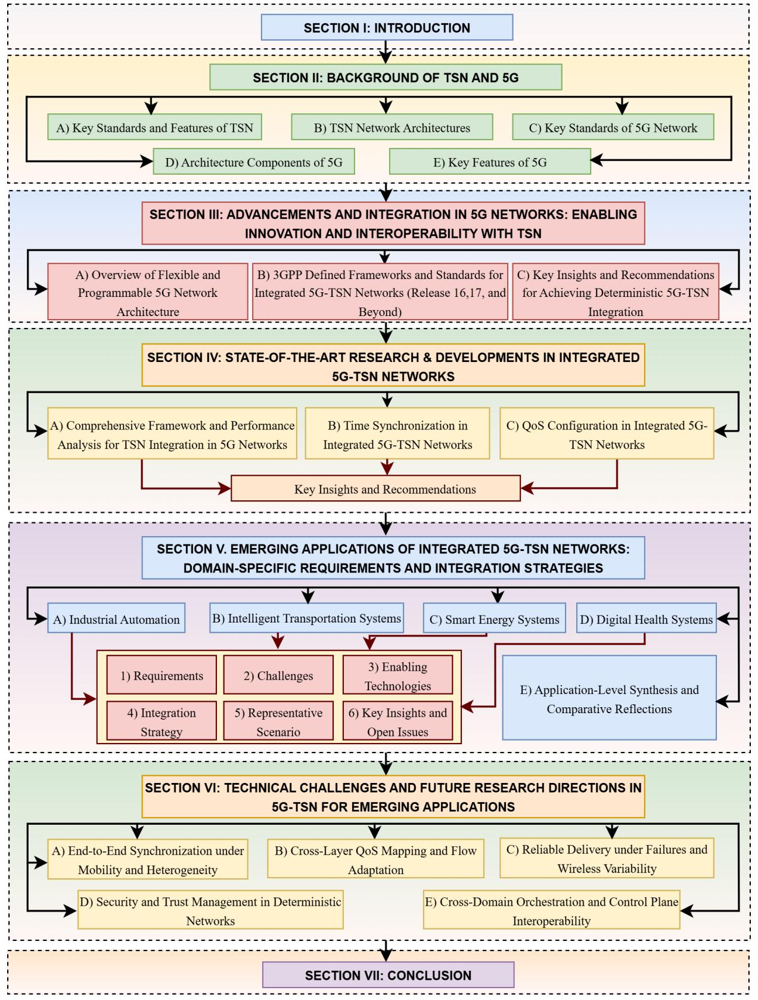

Fig. 1: Structure of the paper on 5G-TSN integration, covering foundational concepts, advancements, applications, challenges, and future directions

digital health, highlighting the specific communication requirements, integration challenges, and enabling 5G- TSN technologies for each.

• *Mapping of Technical Enablers:* For each domain, we

TABLE I: Overview of existing survey papers on integrated 5G-TSN networks, highlighting key research areas and coverage depth

| Year   | Reference                     | 5G-TSN Architecture | Time Synchronization | Traffic Scheduling | Resource Allocation | Latency Analysis | Security Protocols | Interoperability | Emerging Applications |
|--------|-------------------------------|------------------------|-------------------------|-----------------------|------------------------|---------------------|-----------------------|------------------|-----------------------|
| 2018   | Nasrallah et al. (2018) [9]   | -                      | <b>A</b>                | <b>A</b>              | -                      | <b>A</b>            | -                     | <b>A</b>         | -                     |
| 2019   | Mannweiler et al. (2019) [10] | <b>A</b>               | <b>A</b>                | <b>A</b>              | Δ                      | <b>A</b>            | -                     | Δ                | -                     |
| 2019 - | Striffler et al. (2019) [11]  | <b>A</b>               | <b>A</b>                | <b>A</b>              | <b>A</b>               | Δ                   | Δ                     | Δ                | -                     |
| 2020   | Aijaz et al. (2020) [12]      | <b>A</b>               | <b>A</b>                | <b>A</b>              | <b>A</b>               | <b>A</b>            | Δ                     | <b>A</b>         | -                     |
| 2020   | Samdanis et al. (2020) [13]   | -                      | -                       | -                     | Δ                      | _                   | Δ                     | Δ                | <b>A</b>              |
|        | Atiq et al. (2021) [14]       | <b>A</b>               | <b>A</b>                | <b>A</b>              | <b>A</b>               | <b>A</b>            | Δ                     | <b>A</b>         | -                     |
|        | Seol et al. (2021) [15]       | -                      | <b>A</b>                | <b>A</b>              | _                      | <b>A</b>            | -                     | Δ                | -                     |
|        | Seijo et al. (2021) [16]      | <b>A</b>               | <b>A</b>                | <b>A</b>              | Δ                      | <b>A</b>            | -                     | <b>A</b>         | -                     |
| 2021   | Wen et al. (2021) [17]        | <b>A</b>               | <b>A</b>                | <b>A</b>              | <b>A</b>               | <b>A</b>            | Δ                     | Δ                | -                     |
| 2021   | Kang et al. (2021) [18]       | <b>A</b>               | <b>A</b>                | <b>A</b>              | <b>A</b>               | <b>A</b>            | -                     | <b>A</b>         | -                     |
|        | Prados et al. (2021) [19]     | <b>A</b>               | <b>A</b>                | <b>A</b>              | <b>A</b>               | <b>A</b>            | Δ                     | <b>A</b>         | -                     |
|        | Harmatos et al. (2021) [20]   | <b>A</b>               | <b>A</b>                | <b>A</b>              | <b>A</b>               | <b>A</b>            | Δ                     | <b>A</b>         | -                     |
|        | Mahmood et al. (2022) [21]    | <b>A</b>               | <b>A</b>                | <b>A</b>              | <b>A</b>               | <b>A</b>            | Δ                     | Δ                | Δ                     |
| 2022   | Yusun et al. (2022) [22]      | _                      | _                       | -                     | -                      | -                   | -                     | -                | -                     |
| 2022   | Sethi et al. (2022) [23]      | <b>A</b>               | <b>A</b>                | Δ                     | -                      | _                   | <b>A</b>              | Δ                | -                     |
|        | Wang et al. (2022) [24]       | <b>A</b>               | <b>A</b>                | <b>A</b>              | <b>A</b>               | <b>A</b>            | <b>A</b>              | <b>A</b>         | Δ                     |
| 2023   | Sharma et al. (2023) [25]     | <b>A</b>               | <b>A</b>                | <b>A</b>              | <b>A</b>               | <b>A</b>            | Δ                     | <b>A</b>         | -                     |
| 2023   | Satka et al. (2023) [26]      | <b>A</b>               | <b>A</b>                | <b>A</b>              | <b>A</b>               | <b>A</b>            | -                     | <b>A</b>         | -                     |
|        | Sasiain et al. (2024) [6]     | <b>A</b>               | <b>A</b>                | <b>A</b>              | <b>A</b>               | <b>A</b>            | Δ                     | <b>A</b>         | Δ                     |
|        | Zanbouri et al. (2024) [27]   | <b>A</b>               | <b>A</b>                | <b>A</b>              | <b>A</b>               | <b>A</b>            | Δ                     | <b>A</b>         | -                     |
| 2024   | Zhang et al. (2024) [7]       | <b>A</b>               | <b>A</b>                | <b>A</b>              | <b>A</b>               | <b>A</b>            | Δ                     | <b>A</b>         | Δ                     |
|        | Darroudi et al. (2024) [28]   | <b>A</b>               | <b>A</b>                | <b>A</b>              | <b>A</b>               | <b>A</b>            | Δ                     | <b>A</b>         | -                     |
|        | Jobish et al. (2024) [29]     | <b>A</b>               | <b>A</b>                | <b>A</b>              | <b>A</b>               | <b>A</b>            | Δ                     | <b>A</b>         | -                     |
|        | This paper                    | <b>A</b>               | <b>A</b>                | <b>A</b>              | <b>A</b>               | <b>A</b>            | <b>A</b>              | <b>A</b>         | <b>A</b>              |

Terms & Abbreviations: ▲: Deep Coverage (Discussed in detail, including comprehensive analysis, methodologies, and implications.), ▲: Moderate Coverage (Addressed at a high level or summarized with some technical details, without an exhaustive exploration.), △: Introductory Mention (Briefly referenced or introduced without significant analysis, typically to provide context or background.), →: No Coverage (Not addressed in the paper.).

map domain-specific requirements to architectural elements (e.g., edge/cloud integration), synchronization methods (e.g., gPTP and 5G timing), QoS frameworks (e.g., TSN traffic classes and 5QI), and reliability strategies (e.g., redundancy and slicing).

- Cross-Domain Challenge Synthesis: We identify and unify key technical challenges such as time synchronization, QoS mapping, resource orchestration, and security, drawing connections across application domains.
- Future Research Directions: We propose targeted research directions to address open issues, aiming to advance the practical deployment and scalability of integrated 5G-TSN systems in diverse real-world scenarios.

Through these contributions, this survey serves as a foundational reference for researchers, engineers, and practitioners aiming to design, evaluate, or deploy integrated 5G-TSN systems across critical application areas. Detailed discussions corresponding to each contribution are provided in Section II for the background of 5G-TSN, Section IV for advancements and integration of 5G-TSN, Section IV for state-of-the-art research developments, Section V for emerging applications, and Section VI for cross-domain challenges and future research directions. A visual mapping of all sections is presented in Fig. 1.

#### B. Comparison with Existing Surveys

Table I presents a comparative analysis of recent surveys on 5G-TSN and related communication paradigms. Unlike previous works that predominantly focus on either TSN or 5G in isolation or narrowly address industrial automation, our survey provides a unified and application-specific perspective across four emerging domains, supported by technical mapping, representative scenarios, and future-oriented synthesis.

#### II. BACKGROUND OF TSN AND 5G

This section provides foundational background on TSN and 5G as separate yet complementary technologies. We begin by introducing the key standards and core features of TSN, followed by an overview of its network architectures. Next, we present the main standards, architectural components, and capabilities of the 5G network. The goal of this separate treatment is to support generalist readers by clearly outlining the individual principles, protocols, and infrastructure of each domain. For readers interested in the interplay between TSN and 5G, such as interoperability mechanisms, scheduling alignment, and real-time performance, comprehensive integration discussions can be found in Sections III and IV.

## A. Key Standards and Features of TSN

TSN is a suite of IEEE 802.1 standards that enables deterministic and reliable communication over Ethernet net-

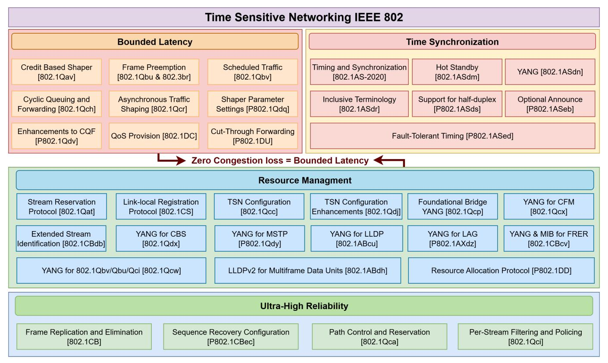

Fig. 2: TSN features with corresponding IEEE 802 standards and protocols for achieving synchronized, ultra-reliable, resource-efficient, and low-latency communication

works. The key standards and their corresponding features are outlined below and illustrated in Fig. [2.](#page-3-0) This synchronization for deterministic communication, the IEEE 802.1AS standard, based on the IEEE 1588 Precision Time Protocol (PTP), ensures a common time base across TSN networks with nanosecond-level precision [\[30\]](#page-30-11).

- *1) Traffic Scheduling and Shaping for Low Latency and Reduced Jitter:* Standards like IEEE 802.1Qbv (Time-Aware Shaper) and IEEE 802.1Qch (Cyclic Queuing and Forwarding) enable precise traffic scheduling, reducing latency and jitter [\[31\]](#page-30-12). IEEE 802.1Qbv, for instance, assigns specific time slots for high-priority data, ensuring predictable transmission, crucial for industrial automation and autonomous systems [\[32\]](#page-30-13).
- *2) Resource Allocation for Scalability and Flexibility:* The IEEE 802.1Qcc standard provides centralized and distributed resource management for scalability [\[33\]](#page-30-14). A Centralized Network Controller (CNC) enables precise bandwidth allocation, while distributed models allow cooperative resource management, supporting diverse network sizes and topologies [\[34\]](#page-30-15).
- *3) Reliability and Redundancy for High Availability:* IEEE 802.1CB ensures reliability by duplicating critical data packets across multiple paths, ensuring delivery even if one path fails [\[35\]](#page-30-16). This redundancy is crucial for mission-critical systems, such as energy distribution and manufacturing, where disruptions could pose safety risks [\[36\]](#page-30-17).
- *4) Per-Stream Filtering and Policing for QoS Enforcement:* The IEEE 802.1Qci standard ensures stream-level traffic management by enforcing predefined bandwidth, latency, and jitter requirements [\[37\]](#page-30-18). This prevents resource monopolization and

maintains network quality for applications requiring strict performance guarantees.

#### *B. TSN Network Architectures*

In TSN, the network architecture plays a crucial role in how it handles time-sensitive traffic and ensures deterministic communication. There are three primary types of TSN architectures: fully distributed, fully centralized, and hybrid [\[38\]](#page-30-19). Each architecture has its own set of characteristics, advantages, and technical details. The illustration of each architecture is provided in Fig. [3.](#page-5-0)

*1) Fully Distributed Model:* In the fully distributed model, network configuration and resource management are handled by individual network devices rather than a central controller. Each device participates in the configuration process, making local decisions based on its own capabilities and the information it receives from its neighbors. Key features and technical details of the fully distributed model include: *a) Distributed Configuration:* Each device discovers its neighbors and exchanges information about its capabilities and requirements. Devices negotiate configurations and resource allocations with their immediate neighbors, creating a decentralized control structure. *b) Resource Allocation:* Resource allocation is performed locally by each device, according to the requirements of the streams it handles and the resources available in its immediate vicinity. This includes reserving bandwidth and buffers for time-sensitive streams. *c) Traffic Scheduling:* Scheduling is performed locally by each device, which uses local information to create schedules for timesensitive traffic. This can involve simpler scheduling algorithms compared to the centralized model, as each device only needs to consider its own traffic and immediate neighbors. *d) Distributed Time Synchronization:* Time synchronization is achieved through distributed protocols such as IEEE 802.1AS, where each device synchronizes with its neighbors to achieve a common time base. This method can be more resilient to failures as synchronization is maintained locally, even if some devices fail. While the fully distributed model offers flexibility and resilience, guaranteeing strict end-to-end deterministic behavior remains a challenge due to limited global visibility and the absence of centralized coordination. Deterministic communication can still be approached through carefully engineered local policies and cooperative mechanisms; however, this model is not currently supported in 5G-TSN integration as defined by 3GPP. It is presented here for conceptual completeness and potential relevance in future TSN deployments beyond 3GPP-defined architectures.

*2) Fully Centralized Model:* In the fully centralized model, the network is managed by a CNC. It is responsible for the general configuration of the network, resource allocation, and scheduling of time-sensitive traffic. This model is characterized by the following details: *a) Centralized Configuration:* The CNC communicates with all network devices, including switches and end devices, to gather information about their capabilities and current state [\[40\]](#page-30-20). Based on this information, the CNC creates a global network configuration that includes time synchronization parameters, traffic schedules, and resource allocations. *b) Resource Reservation:* The CNC reserves the necessary resources, such as bandwidth and buffers, for each time-sensitive stream. This reservation ensures that each stream has the resources required to meet its QoS requirements. *c) Traffic Scheduling:* The CNC generates schedules for time-sensitive traffic based on IEEE 802.1Qbv and distributes these schedules to network devices. The schedules define specific time slots during which different types of traffic can be transmitted, ensuring deterministic delivery. *d) Centralized Time Synchronization:* The CNC manages time synchronization across the network using the IEEE 802.1AS standard. It ensures that all devices are synchronized to a common time base, which is crucial for coordinated actions and precise scheduling [\[41\]](#page-30-21). This architecture is currently the only model supported in 3GPP-defined 5G-TSN integration efforts, due to its capability to ensure strict determinism, finegrained QoS enforcement, and end-to-end latency guarantees through centralized orchestration.

*3) Hybrid Model:* The hybrid model combines elements of both centralized and distributed approaches to take advantage of each. In this model, a Centralized User Configuration (CUC) and CNC work together with the distributed capabilities of the network devices. The hybrid model operates as follows: *a) Hybrid Configuration:* The CUC collects the requirements from the end devices and communicates these to the CNC. The CNC performs high-level configuration and optimization and then distributes these configurations to network devices [\[6\]](#page-29-5). Network devices use the centralized configuration as a baseline but can make local adjustments based on real-time conditions. *b) Resource Allocation:* Initial resource allocation is performed by the CNC, ensuring that critical resources are reserved across the network. Devices can adjust their resource allocations locally to adapt to changing conditions and optimize performance. *c) Traffic Scheduling:* The CNC provides global traffic schedules, but devices have the flexibility to make local adjustments to these schedules. This approach ensures deterministic communication while allowing for local optimizations to handle dynamic traffic patterns. *d) Hybrid Time Synchronization:* Time synchronization is managed centrally by the CNC, with local adjustments made by devices to maintain precision [\[41\]](#page-30-21). This ensures a robust and precise time base across the network, with resilience to local failures. Although hybrid models can support a degree of determinism through global-local coordination, they rely on careful implementation to avoid conflicting schedule adjustments or timing mismatches. While promising for scalable TSN deployments, hybrid models have not yet been formally standardized in current 5G-TSN architectures under 3GPP. In this paper, they are discussed to illustrate potential future extensions where increased flexibility or local adaptation may be necessary.

## *C. Key Standards of 5G Network*

5G, the fifth generation of wireless technology, is governed by standards developed by the 3rd Generation Partnership Project (3GPP) and other international bodies. These standards define 5G's architecture, capabilities, and performance to ensure that it fulfills requirements for high speed, low latency, and massive connectivity [\[42\]](#page-30-22). The following are the key 5G standards, primarily introduced in 3GPP Release 15 and further enhanced in subsequent releases. The Fig. [4](#page-5-1) illustrates these foundational 5G standards.

*1) Enhanced Mobile Broadband (eMBB):* Enhanced Mobile Broadband (eMBB) delivers high data rates and capacity for bandwidth-intensive applications, with peak rates of up to 20 Gbps downlink and 10 Gbps uplink [\[43\]](#page-30-23). Technologies such as Massive MIMO, carrier aggregation, and mmWave frequencies enable these capabilities. Massive Multiple Input, Multiple Output (MIMO) improves spectral efficiency through multiple antennas [\[44\]](#page-30-24), carrier aggregation combines frequency bands for greater bandwidth, and mmWave provides high data rates with advanced beamforming to address propagation challenges [\[45\]](#page-30-25). These advancements enhance applications like 4K/8K streaming, Virtual Reality (VR), and Augmented Reality (AR) [\[46\]](#page-30-26).

*2) Ultra-Reliable Low-Latency Communication (URLLC):* URLLC supports latency-critical and highly reliable applications, including autonomous vehicles, industrial automation, and remote surgery, with latencies as low as 1 ms and reliability up to 99.999% [\[46\]](#page-30-26). While standardized in 3GPP Releases 15–17, widespread deployment remains limited due to challenges like network slicing integration and edge infrastructure requirements; early adopters include industrial automation and private 5G networks. Technologies like mini-slots for rapid transmission, advanced error correction (e.g., polar and LDPC codes), and flexible numerology optimize subcarrier spacing

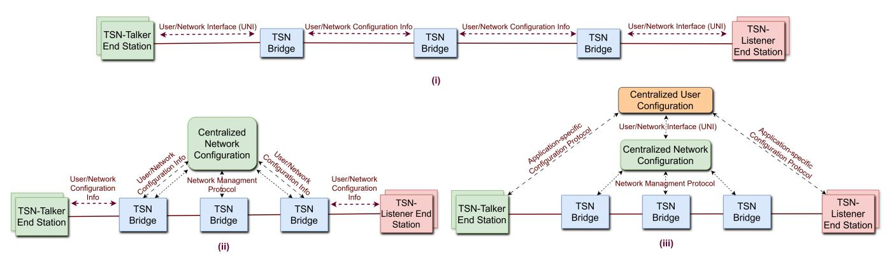

Fig. 3: TSN network architectural models: (i) Fully distributed, (ii) Hybrid, and (iii) Fully centralized [\[39\]](#page-30-27)

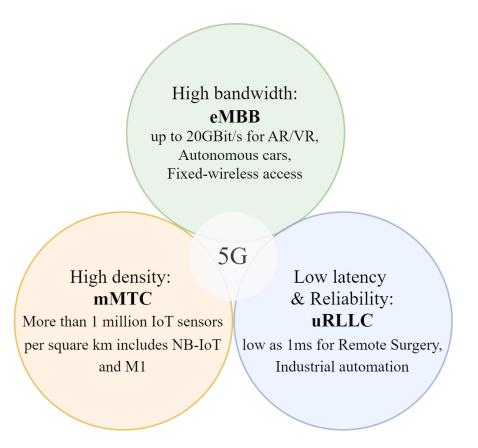

Fig. 4: Features of 5G cellular network

and symbol duration. These innovations meet the stringent demands of mission-critical applications [\[47\]](#page-30-28).

*3) Massive Machine-Type Communications (mMTC):* Massive Machine-Type Communications (mMTC) connects up to one million IoT devices per square kilometer [\[48\]](#page-30-29). Technologies such as Narrowband IoT (NB-IoT) and enhanced Machine-Type Communication (eMTC) provide extended coverage, deep indoor penetration, and low power consumption, making mMTC ideal for smart cities, agriculture, and environmental monitoring [\[49\]](#page-30-30).

Readers interested in a more detailed overview of 5G features and enabling technologies may refer to [\[46\]](#page-30-26) for an in-depth discussion.

#### *D. Architecture Components of 5G*

The 5G network architecture is divided into the 5G Core Network (5GC) and the Radio Access Network (RAN), each designed to enhance connectivity, flexibility, and performance for diverse applications [\[42\]](#page-30-22). Fig. [5](#page-6-0) illustrates the architecture and relationship between the 5GC and RAN components.

*1) 5G Core Network:* The 5G Core (5GC) is designed with a Service-Based Architecture (SBA), enabling modular, cloudnative deployment of network functions. This architecture supports flexible service provisioning, network slicing, and deterministic Quality of Service (QoS) enforcement across diverse application domains. Key components include the Access and Mobility Management Function (AMF), which handles registration, authentication, and mobility, ensuring seamless connectivity [\[50\]](#page-30-31). The AMF coordinates handovers and maintains user context during movement, which is critical for ensuring low-latency and uninterrupted sessions in mobile scenarios such as ITS. The Session Management Function (SMF) manages session handling, IP address allocation, and works with the User Plane Function (UPF) to maintain consistent QoS [\[51\]](#page-30-32). The SMF is responsible for dynamic QoS rule enforcement, and collaborates with the PCF to map user QoS profiles to transport-level enforcement. The UPF is responsible for data routing, packet inspection, and policy enforcement. It supports user-plane anchoring, traffic steering, and lowlatency forwarding, especially in edge-deployed configurations for time-sensitive applications. The Network Slice Selection Function (NSSF) enables tailored network slices for efficient infrastructure sharing [\[52\]](#page-30-33), while the Policy Control Function (PCF) manages QoS and optimizes resource allocation [\[53\]](#page-30-34). The PCF interacts with both SMF and AMF to apply differentiated treatment to slices, enabling application-aware service delivery aligned with TSN traffic classes. The Unified Data Management (UDM) function stores user profiles and service policies, and the Authentication Server Function (AUSF) ensures secure access. The Network Exposure Function (NEF) provides APIs for secure interactions with third-party applications, and the Network Repository Function (NRF) maintains a registry of network functions for efficient discovery and coordination. Together, these functions support the dynamic instantiation, discovery, and orchestration of services with finegrained control over latency, reliability, and availability, which are foundational elements for deterministic networking.

*2) Radio Access Network:* The 5G RAN enables highspeed, low-latency communication between user devices and the core network [\[42\]](#page-30-22). The 5G RAN supports flexible deployment architectures, allowing the disaggregation of the base station into functional units optimized for performance and scalability. Its main component, the gNodeB (gNB), consists of three units: the Central Unit (CU), the Distributed Unit (DU), and the Radio Unit (RU) [\[54\]](#page-30-35). These units collaborate to handle radio transmission, reception, and processing, optimizing the user experience. The CU is further split into CU-Control Plane (CU-CP) and CU-User Plane (CU-UP), responsible for non-real-time RRC signaling and user data,

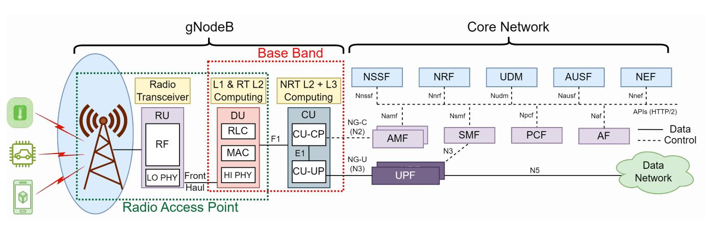

Fig. 5: Illustration of 5G architecture

TABLE II: 3GPP enhancements in Releases 16 and 17 for TSN-5G integration (Section [III-B\)](#page-7-1)

| 3GPP Release | Feature                           | Key Element            | Description                                                                                                                        |  |  |  |  |
|--------------|-----------------------------------|------------------------|------------------------------------------------------------------------------------------------------------------------------------|--|--|--|--|
|              |                                   | DS-TT                  | Device-side TSN translator on UE side, functioning as an ingress port                                                              |  |  |  |  |
|              | TSN Bridge Component              | NW-TT                  | Network-side TSN translator on UPF side, functioning as an egress port                                                             |  |  |  |  |
|              |                                   | TSN AF                 | Manages control interactions with the CNC in the TSN domain, enabling port and bridge data exchange between 5G and TSN networks |  |  |  |  |
| Release 16   |                                   | Bridge Description     | Includes Bridge ID and ports for DS-TT and NW-TT                                                                                   |  |  |  |  |
|              | 5GS Bridge Model                  | Bridge Capabilities    | Defined in IEEE 802.1Qcc, including bridge delay, propagation delay, and VLAN configuration                                     |  |  |  |  |
|              | & Configuration                   | LLDP Configuration     | For neighbor discovery                                                                                                             |  |  |  |  |
|              |                                   | Scheduled Traffic Info | Traffic Information based on IEEE 802.1Qbv, covering traffic classes, priorities, and gate control                              |  |  |  |  |
|              |                                   | Stream Parameter Table | Relates to IEEE 802.1Qci, includes PSFP support and filters                                                                        |  |  |  |  |
| Release 17   | Advanced Functionality            | TSCTSF                 | Time Sensitive Communication and Time Synchronization Function enables precise time sync and supports non-TSN TSC scenarios     |  |  |  |  |
|              | Man Synchronization agement | Time Sync Parameters   | TSCTSF manages DS-TT and NW-TT components                                                                                          |  |  |  |  |
|              | UE-UE Communication               | UE-UE TSC              | Facilitates TSC communication between UEs, handling uplink and downlink streams separately                                      |  |  |  |  |

respectively. The DU is tasked with time-critical functions such as scheduling, HARQ processing, and MAC/RLC layer handling. The Radio Access Point (RAP) integrates the RU and DU functions, facilitating radio transmission and lowerlayer processing. The RU performs RF transmission/reception and analog-digital conversion and is typically located near the antenna to reduce fronthaul delay. The Baseband Unit (BBU), which includes the DU and CU, performs essential control and data processing tasks. The DU handles low-latency, realtime processing, while the CU manages higher-layer protocols and data transfer. This split architecture allows deterministic service to be supported at the edge (e.g., via MEC), with centralized intelligence in the CU enabling coordinated slicing and handovers. Features like Configured Grant (CG), Semi-Persistent Scheduling (SPS), and logical channel prioritization in the DU play a vital role in meeting deterministic communication requirements. Furthermore, when combined with TSN-aware fronthaul (e.g., via IEEE 802.1CM), the 5G RAN becomes capable of supporting time-sensitive services across wired-wireless boundaries.

#### *E. Key Features of 5G*

5G introduces advanced features such as network slicing and edge computing, enabled by new technologies and standards.

- *1) Network Slicing:* Network slicing enables the creation of multiple virtual networks on shared physical infrastructure, tailored to specific applications [\[55\]](#page-30-36). Using Software-Defined Networking (SDN) and Network Function Virtualization (NFV), SDN decouples the control plane from the data plane, allowing dynamic resource management via protocols like OpenFlow [\[56\]](#page-30-37). NFV enables traditional network functions to run on general-purpose hardware, enhancing scalability and flexibility. Together, SDN and NFV allow 5G networks to create isolated virtual slices for various applications, from high-bandwidth mobile broadband to low-latency missioncritical communications.
- *2) Edge Computing:* Edge computing in 5G reduces latency by processing data closer to end-users, supporting real-time applications. The 5G RAN enhances low-latency connectivity between devices and edge nodes, a key improvement in 3GPP Releases 15 and 16. Multi-access Edge Computing (MEC) enables localized data processing, reducing the need to transfer large data volumes to centralized data centers [\[57\]](#page-30-38). MEC standards, defined by the ETSI MEC ISG, ensure edge

applications meet performance requirements. The Local Area Data Network (LADN) enables local traffic breakout, further supporting time-sensitive applications.

The above overview provides a concise introduction to the 5GC and RAN architectures and key features relevant to deterministic communication. For readers interested in a more comprehensive treatment of 5G system design and capabilities, we refer to [\[58\]](#page-30-39). Our primary focus in this survey paper is on leveraging these 5G features within the integrated 5G-TSN framework discussed in subsequent sections.

## III. ADVANCEMENTS AND INTEGRATION IN 5G NETWORKS: ENABLING INNOVATION AND INTEROPERABILITY WITH TSN

section introduces the architectural foundations for 5G and TSN integration. It outlines the key components defined in 3GPP Releases 16 to 18 and time synchronization frameworks that enable the 5G system to operate as a logical TSN bridge. The section emphasizes standardization efforts and system-level capabilities that form the basis for deterministic networking in emerging applications.

## *A. Overview of Flexible and Programmable 5G Network Architecture*

The 5G System (5GS), introduced in 3GPP Release 15, encompasses the 5G Access Network (5G-AN), 5GC, and UE [\[59\]](#page-30-40). Subsequent releases, including Releases 16 and 17, have enhanced 5G capabilities, while Release 18 focuses on advancing technologies further. 5G architecture emphasizes flexibility, modularity, and scalability through key advancements like softwarization, cloudification, and disaggregation. The SBA of 5GC supports modular Network Functions (NFs) communicating via service-based interfaces, enabling adaptable and efficient deployments [\[60\]](#page-30-41). Similarly, the 5G-AN leverages virtualization and functional splits in baseband processing, separating DUs and CUs. These principles underpin Virtual RAN (vRAN) and O-RAN, fostering openness, interoperability, and cost-efficient deployments [\[61\]](#page-30-42).

Resource allocation and scheduling in 5G face challenges due to the time-varying nature of wireless transmissions, which affect latency, jitter, and reliability. URLLC features in 5G address these issues by ensuring ultra-low latency and high reliability, making it suitable for applications like industrial automation and seamlessly integrating with TSN architecture [\[62\]](#page-31-0). 5G employs Orthogonal Frequency-Division Multiple Access (OFDMA) with Resource Blocks (RBs) allocated across frequency and time domains [\[63\]](#page-31-1). Enhancements such as flexible Sub-Carrier Spacing (SCS) and mini-slot scheduling from Release 15 reduce latency by allowing shorter transmission intervals and finer scheduling of TSN traffic streams. Release 16 builds on this with multiple CG and Semi-Persistent Scheduling (SPS) configurations, critical for industrial control applications, and improves reliability through Packet Data Units (PDUs) redundancy, packet duplication, and multi-connectivity [\[1\]](#page-29-0), [\[64\]](#page-31-2). Further enhancements include Multi-Transmission Reception Point (Multi-TRP) technology for better SINR and improved robustness of the Physical Downlink Control Channel (PDCCH) via updated Channel Quality Indicator (CQI) tables and modulation schemes [\[65\]](#page-31-3).

Network slicing, a core 5G technology, enables the division of a shared physical network into isolated logical networks tailored to specific application requirements. This is achieved through NFV and SDN, allowing dynamic creation, scaling, and termination of slices as needed. Both the 5GC and RAN support slicing to meet diverse functional or business needs. Additionally, 5G programmability enables vertical industries to translate QoS requirements into customized network services. The Network Exposure Function (NEF) [\[66\]](#page-31-4) and frameworks like the Common API Framework (CAPIF) [\[67\]](#page-31-5) and Service Enabler Architecture Layer (SEAL) [\[68\]](#page-31-6) provide secure interfaces for external interaction with the 5GC, fostering new applications in Non-Public Networks (NPN) [\[69\]](#page-31-7). This programmability supports the development of Network Applications (NetApps) [\[70\]](#page-31-8), enhancing application intelligence and deployment efficiency.

## *B. 3GPP Defined Frameworks and Standards for Integrated 5G-TSN Networks (Release 16,17, and Beyond)*

The integration of TSN with 5G networks is guided by 3GPP standards, with TS 22.104 [\[71\]](#page-31-9) outlining communication requirements for industrial and vertical applications such as factory automation, process control, and connected healthcare, updated in Release 17 [\[72\]](#page-31-10). The specification defines Key Performance Indicators (KPIs), including latency, availability, reliability, user equipment density, service coverage, clock synchronization, and positioning accuracy, aligning with TSN performance objectives as described earlier in Section [II-A.](#page-2-2) Notably, it mandates a clock synchronization error of 900 nanoseconds for Working Clock and Global Time, supporting multiple synchronization domains. Performance targets include up to 99.999999% availability and a mean time between failures of a decade. The time-sensitive requirements are addressed through TS 23.501 [\[73\]](#page-31-11) and TS 23.502 [\[74\]](#page-31-12), which detail 5GS and TSN integration introduced in Release 16 [\[75\]](#page-31-13) and refined in Release 17 [\[71\]](#page-31-9). These developments lay the groundwork for future advancements in 5G Advanced and 6G. This subsection provides an in-depth look into the architectural elements, mechanisms, and procedures that have been standardized up to the current state of this article.

- *1) TSN in 3GPP Release 16:* 3GPP Release 16 establishes the integration of TSN capabilities within the 5GS, enabling it to act as a logical TSN bridge. This allows seamless connectivity of industrial devices like AGVs, robots, and cameras to external TSN networks through a 5G UE, reducing reliance on traditional wired connections. Key components of this integration include the Device-Side TSN Translator (DS-TT), Network-Side TSN Translator (NW-TT), and TSN Application Function (TSN AF), which ensure time synchronization and efficient data exchange across 5G and TSN domains. These components and their roles are summarized in Table [II.](#page-6-1)
- *2) Structure and Operation of 5GS TSN Bridge:* The 5GS TSN bridge model includes a single UPF with an associated NW-TT component and one or more UEs, each containing a DS-TT. Each UE establishes an Ethernet-type PDU session

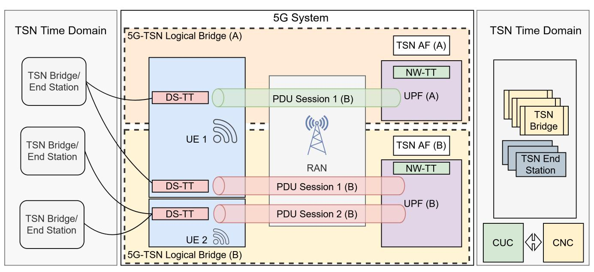

Fig. 6: Illustration of the 5G System functioning as multiple logical TSN bridges, each associated with a separate UPF. Wireless field devices (UEs) can establish multiple PDU sessions terminating at different UPFs, allowing traffic from the same UE to traverse multiple logical bridges simultaneously. Each logical 5GS TSN bridge has a dedicated TSN AF, which manages bridge information, port-to-PDU session mapping, and communicates with the CNC for TSN bridge registration and configuration, enabling seamless integration of 5G with the TSN network.

TABLE III: Time synchronization features and procedures in 5GS: Releases 16 and 17 for 5G-TSN integration (Section [III-B4\)](#page-8-0)

| 3GPP Release Version | Concept/Procedure                    | Description                                                                                                        |
|----------------------|--------------------------------------|--------------------------------------------------------------------------------------------------------------------|
|                      | GM Election and Synchronization Tree | Manages synchronization by electing a GM and setting up the synchro nization tree manually.                     |
| Release 16           | Port Configuration                   | DS-TT ports act as Master Ports, forwarding timing information, while NW-TT ports are Slave Ports receiving it. |
|                      | gPTP Procedures                      | Uses the 802.1AS standard; TSN GM initiates gPTP messages, adjusted for delays and offsets across 5G.           |
|                      | Multiple TSN Domain Handling         | Supports multiple TSN domains, with NW-TT and DS-TT managing timestamping and message forwarding.               |
|                      | Expanded gPTP Functions              | Adds support for Boundary, End-to-End Transparent, and Peer-to-Peer Transparent Clock roles in 5G.              |
| Release 17           | GM Clock Configurations              | 5G can act as the GM clock for gPTP/PTP domains, either within the network or behind the UE.                    |
|                      | Uplink Synchronization               | Introduces uplink synchronization, supporting multiple TSN domains with separate GMs in the uplink.             |
|                      | BMC Algorithm Integration            | Integrates the BMC algorithm for GM clock selection, moving beyond pre configured GM and port settings.         |
|                      | Time Sync Requests                   | AF can request synchronization services, including synchronization error budgets via NEF for non-trusted AFs.   |

with the UPF, forming a dedicated bridge connection. For UEs with multiple PDU sessions terminating at different UPFs, each session functions as a distinct bridge with its own DS-TT, ensuring a one-to-one mapping between Bridge ID and UPF ID. This mapping, managed by the TSN AF, ensures precise traffic routing and synchronization across the network. The illustration of the whole operation is provided in Fig. [6.](#page-8-1)

*3) Enhancements in 3GPP Release 17:* Building on the foundational integration from Release 16, 3GPP Release 17 introduces advanced features to improve time-sensitive communication and synchronization. *1) Time Sensitive Communication and Time Synchronization Function (TSCTSF):* This new network function enhances synchronization capabilities and supports non-TSN TSC scenarios. *2) Enhanced Synchronization Management:* The TSCTSF oversees DS-TT and NW-TT coordination, even in setups where a TSN AF is not present. *3) UE-UE TSC Communications:* Release 17 adds support for TSC between UEs, enabling efficient communication streams for uplink and downlink traffic. These enhancements make the 5G system more robust for a range of applications, from industrial automation to precision-based communication scenarios.

*4) Introduction to TSN Time Synchronization in 5GS:* TSN time synchronization is critical for integrating 5G systems with TSN networks, enabling seamless operation across different segments. Introduced in Release 16 and enhanced

TABLE IV: QoS configuration and translation procedures in 5GS for TSN traffic (Section [III-B5\)](#page-9-0)

| QoS Feature                               | Procedure/Parameter              | Description                                                                                                                  |
|-------------------------------------------|----------------------------------|------------------------------------------------------------------------------------------------------------------------------|
| QoS Configurations Based on PSFP Protocol | CNC-Provided PSFP Details        | If CNC provides PSFP details, TSN AF establishes 5G QoS flows and derives specific TSCAI parameters.                      |
|                                           | Default QoS Flows (Without PSFP) | Without PSFP, preconfigured QoS flows are used, leveraging TAS GCL parameters to extract QoS parameters.                  |
| TSCAI Parameter-Based QoS Configurations  | Traffic Flow Attributes          | Includes direction (uplink/downlink), periodicity, burst arrival times, and survival time for delayed arrival resilience. |
|                                           | TSC Assistance Container (TSCAC) | TSCAI parameters packaged in TSCAC are sent to SMF, which adjusts for timing discrepancies between TSN and 5G.            |
| QoS Profile-Based Mapping                 | QoS Flow Identification (QFI)    | Each QoS flow is identified by QFI and associated with a QoS Profile for prioritization and traffic management.           |
|                                           | 5G QoS Profile Types             | Profiles include DC-GBR, GBR, and Non-GBR, detailing char acteristics like priority, GFBR, MFBR, and 5QI.                 |
| 5QI and TSN Class Type Mapping            | Packet Delay Budget (PDB)        | QoS profile's PDB is mapped to satisfy TSN traffic class delay requirements in the 5G network.                            |
|                                           | Packet Error Rate (PER)          | PER from the QoS profile aligns with reliability requirements for TSN class types.                                        |

in Release 17, the 5G architecture includes a logical TSN bridge compliant with the 802.1AS standard [\[9\]](#page-29-8). Within the 5G network, elements like the UE, gNB, and UPF synchronize to a common Grandmaster (GM) clock using the ITU-T G.8275.1 gPTP profile, while external TSN devices align with their own GM clocks. TSN translators, such as NW-TT and DS-TT, bridge the 5G and TSN time domains. Release 16 established foundational synchronization features, including GM election, port configuration, and multi-domain TSN support [\[6\]](#page-29-5). Release 17 expanded these capabilities with uplink synchronization and advanced gPTP clock configurations like Boundary Clock and Transparent Clock [\[76\]](#page-31-14). Refer to Table [III](#page-8-2) for a detailed summary of the synchronization features introduced in each release.

*5) TSN QoS Configuration and Translation in 5GS:* Integrating TSN QoS into 5G requires mapping TSN traffic requirements to the 5G wireless domain. Using the fully centralized IEEE 802.1Qcc model, 3GPP supports TSN streamto-5G QoS flow translations through TSCAI and 5G QoS profiles. QoS configurations depend on whether the CNC provides PSFP information. With PSFP, the TSN AF uses this data to establish QoS flows, incorporating TSCAI parameters. Without PSFP, preconfigured QoS flows are used, guided by Traffic-Aware Scheduler (TAS) GCL parameters for adjustments. TSCAI enables precise QoS setup with attributes like flow direction, periodicity, and survival time (introduced in Release 17) to enhance resilience. Refer to Table [IV](#page-9-1) for detailed TSN QoS configuration in 5GS.

Fig. [6](#page-8-1) illustrates the steps involved in configuring a TSN stream, particularly focusing on the setup of 5GS bridges within the communication path. These steps adhere to the procedures outlined in IEEE 802.1Qcc and 3GPP standards, with detailed guidance available in Annex F of TS 23.502 [\[74\]](#page-31-12). Furthermore, the 5G-ACIA white paper [\[77\]](#page-31-15) offers a detailed overview of the 5G QoS model and the procedures necessary for managing QoS in time-sensitive flows. Key points relevant to industrial automation include: 1) The ability of UE, such as field devices, to request modifications to PDU sessions for QoS adjustment. 2) External applications like MES and ERP can flexibly manage and monitor QoS parameters via the NEF APIs of the 5GC. 3) Support for adaptive QoS applications, where multiple QoS Profiles allow for resilience during temporary network degradation. 4) Integration with various 5G network slicing configurations to provide tailored QoS flows.

## *C. Key Insights and Recommendations for Achieving Deterministic 5G-TSN Integration*

- *1) TSN Support in 5GC: Logical Bridges and Translator Placement:* The integration of TSN capabilities within 5GC, as outlined in 3GPP Release 16, requires precise deployment of logical TSN bridges. Each PDU session between a UE and a UPF corresponds to a distinct TSN bridge, with DS-TT and NW-TT components mapping traffic streams. For deterministic services, it is advisable to dedicate UPFs to TSN flows and ensure one-to-one mappings between Bridge IDs and UPF IDs. The configuration must also align with the TSN AF to enable accurate stream-to-flow mapping and avoid jitter or stream collisions in multi-session contexts.
- *2) Time Synchronization Across TSN and 5G Domains:* Accurate time synchronization is a cornerstone of deterministic networking. Using ITU-T G.8275.1-based gPTP profiles, the UE, gNB, and UPF synchronize to a common GM clock. TSN translators bridge this synchronization between 5G and external TSN domains. The introduction of TSCTSF in Release 17 enhances the robustness of this process by enabling advanced GM coordination, transparent/boundary clock behavior, and resilience in non-TSN deployments. Misconfigured synchronization hierarchies, however, can lead to drift, affecting timesensitive control applications.
- *3) Challenges in QoS Mapping: PSFP vs Non-PSFP Configurations:* QoS translation between TSN and 5G flows is handled by TSCAI. When PSFP configurations are available from the CNC, the TSN AF can create precise QoS flows. Otherwise, preconfigured flows are used, relying on TAS GCL parameters. Practitioners must be cautious: static or imprecise mappings can result in deadline violations, particularly

in congestion scenarios or under fast handovers. Dynamic adjustment strategies using NEF APIs and layered redundancy (as in packet duplication) can mitigate such risks.

- *4) Operational Benefits of TSCTSF Functionality in Release 17:* The TSCTSF provides native support for managing DS-TT and NW-TT without requiring a TSN AF. It facilitates UE-to-UE time-sensitive communication and offers synchronization support even in topologies that omit traditional TSN components. For vertical domains that deploy lightweight TSN configurations, TSCTSF becomes an essential enabler for scalable, low-overhead deployments.
- *5) Enabling Programmability via NEF and CAPIF Interfaces:* NEF and CAPIF provide secure interfaces that expose internal network capabilities, such as QoS flow creation, PDU session modification, and slice management to external applications like MES or SCADA systems. These capabilities enable dynamic adaptation of network behavior in response to real-time conditions (e.g., machine alarms or production stage changes). This programmability supports automation and closed-loop control strategies essential in Industry 4.0 use cases.
- *6) Design Recommendations for Practitioners and System Engineers:* To realize deterministic 5G-TSN integration, practitioners should follow established configuration workflows outlined in 3GPP TS 23.502 Annex F. Key practices include: ensuring deterministic PDU session placement, validating inter-domain synchronization, configuring TSCAI with application-aware parameters, and leveraging simulation environments or testbeds to verify QoS conformance. Future deployments may also benefit from adopting AI-driven configuration assistants to manage the increasing complexity of multi-slice, multi-domain, time-sensitive applications.

# IV. STATE-OF-THE-ART RESEARCH & DEVELOPMENTS IN INTEGRATED 5G-TSN NETWORKS

This section focuses on advanced techniques and recent research that build upon the standardized 5G-TSN architectural foundations introduced in Section [III.](#page-7-0) We examine emerging mechanisms that enhance runtime performance, including traffic shaping, dynamic resource allocation, end-to-end QoS mapping, synchronization robustness, and reliability strategies such as packet duplication and Frame Replication and Elimination for Reliability (FRER). Emphasis is placed on enabling deterministic communication under mobility, load variability, and cross-domain scenarios. These developments provide the technical groundwork for the subsequent Section [V,](#page-18-0) which presents application-specific integration strategies.

## *A. Comprehensive Framework and Performance Analysis for TSN Integration in 5G Networks*

This subsection reviews research on the architecture of integrated 5G-TSN networks, with a focus on evaluating key 5G attributes such as latency and reliability to support TSN compliance and deterministic communication. It also explores optimal configurations of these attributes, including the functional role of 5G as a logical TSN bridge in industrial and real-time scenarios. Performance assessments in this domain frequently rely on simulation tools such as OMNeT++ [\[90\]](#page-31-16) and NeSTiNg [\[91\]](#page-31-17). However, default TSN simulation modules in OMNeT++ may introduce inaccuracies that affect endto-end performance metrics. Recent studies have proposed hardware-aligned corrections and reproducibility methodologies to enhance simulation fidelity [\[92\]](#page-31-18), [\[93\]](#page-31-19), and researchers are encouraged to incorporate these enhancements for more reliable evaluations. Notably, this subsection excludes studies centered on time synchronization mechanisms or TSN traffic configuration procedures, which are discussed in later parts of this section. Table [V](#page-11-0) categorizes the reviewed research into five thematic areas: architectural integration, delay modeling, traffic scheduling, reliability enhancements, and edge optimizations. It summarizes each study's key focus, analytical framework, performance metrics, and principal findings, providing a structured overview of current performance analysis efforts in 5G-TSN integration.

*1) Network Level Architectural Strategies:* [\[78\]](#page-31-20) presents hybrid network scenarios that merge 5G technology with industrial Ethernet, leveraging TSN to meet the critical requirements of industrial communications, such as reliability and bounded latency. The study evaluated various network topologies for diverse use cases, including mobile robotics, closed-loop control systems, and extensive sensor networks. These integration scenarios explore innovations like virtualized centralized controllers within edge cloud environments and wireless connectivity across remote production sites. In parallel with 3GPP Release 16, [\[79\]](#page-31-21) investigates initial architectural and protocol designs for integrated 5G-TSN. This study details how 5GS can function as a TSN switch. It also covers architecture and technology considerations necessary for achieving end-to-end time synchronization, efficient transmission scheduling, and QoS management based on 802.1Qbv and 802.1Qcc standards, catering to the stringent latency and reliability needs of TSN traffic flows. Similarly, [\[80\]](#page-31-22) proposed a 5G architecture for manufacturing settings, incorporating edge computing, URLLC, and TSN to enhance delay and reliability through QoS monitoring and dual-connectivity. Their architecture is evaluated through a practical remote control application. [\[20\]](#page-30-1) explores various deployment strategies for 5G NPNs utilizing edge computing frameworks, with a focus on integration with TSN. Furthermore, [\[94\]](#page-31-23) presents a 5G architecture specifically designed for industrial TSN applications. Their work highlights two main contributions: the study of radio access technologies like New Radio Dual Connectivity (NR-DC) and Multi-TRP, which enhance network reliability and transmission rates, and the implementation of a disaggregated RAN and UP through an on-premises MEC deployment to bolster data security and system agility.

*2) Analysis of End-to-End Latency in 5G-TSN:* In [\[82\]](#page-31-24), methods for estimating bridge delay in 5G systems are explored to select suitable 5QIs for meeting end-to-end latency requirements in industrial applications. The study evaluates Packet Delay Budget (PDB), Guaranteed Flow Bit Rate (GFBR), and Maximum Data Burst Volume (MDBV) for a closed-loop control scenario, identifying challenges such as the absence of standardized 5QI values with sub-millisecond PDBs, mismatches in periodicity between GCL and 5G nu-

TABLE V: Summary of research on 5G-TSN integration frameworks and performance analysis, categorized by Architectural Focus, Delay Modeling, Scheduling, Reliability, and Edge Optimization (Section IV-A)

| Study                             | Key Focus                                                              | Framework/Model                                           | Simulation Tool Used | Primary Metrics Evaluated               | Findings/Recommendations                                                                                                                                                                             |
|-----------------------------------|------------------------------------------------------------------------|-----------------------------------------------------------|-------------------------|--------------------------------------------|------------------------------------------------------------------------------------------------------------------------------------------------------------------------------------------------------|
| Architectural Int                 | egration & End-to-End Framev                                           | vorks                                                     |                         |                                            |                                                                                                                                                                                                      |
| Neumann et al. (2018) [78]        | Hybrid 5G & Industrial Ethernet for Smart Factories                 | Centralized controllers, Edge cloud                    | -                       | Reliability, Latency                       | Explores hybrid scenarios for remote production sites, emphasizing virtualized controllers and wireless connectivity for mobile robotics and control systems.                                        |
| Khoshnevisan et al. (2019) [79]   | Initial 5G-TSN integration architecture                                | TSN over 5G as switches                                   | -                       | Time synchronization, QoS management | Proposes architecture integrating 5G with TSN, focusing on time synchronization, scheduling, and meeting latency/reliability standards for TSN traffic.                                              |
| Li et al. (2020) [80]          | 5G network architecture for manufacturing                              | Edge computing, URLLC                                     | Practical testing       | Delay, Reliability                         | Demonstrates enhanced end-to-end delay and reliability through QoS monitoring and dual connectivity in manufacturing settings.                                                                       |
| Harmatos et al. (2021) [20]       | Deployment of 5G NPNs integrated with TSN                              | Edge computing frameworks                                 | -                       | Integration with TSN                       | Studies deployment options for FRER and 5G NPNs to ensure redundancy and reliability in industrial TSN setups.                                                                                       |
| Ambrosy et al. (2023) [81]        | PDB calculations for industrial scenarios                              | Scenario-specific PDB model                               | -                       | End-to-end delay                           | Outlines PDB calculation scenarios and challenges with delays from TSN translators.                                                                                                                  |
| <b>Delay Modeling</b>             | & Bridge/5QI Configuration                                             |                                                           |                         |                                            |                                                                                                                                                                                                      |
| Larranaga et al. (2020) [82]      | Bridge delay estimation in 5G                                          | 5QI selection model                                       | OMNet++                 | End-to-end latency                         | Highlights lack of standardized 5QI values for sub-ms delays, addressing challenges with GCL periodicity and bridge delay estimation.                                                                |
| Rost et al. (2022) [75]           | Latency in 5G-TSN systems                                              | 5G bridging model                                         | Simulation              | Latency, Jitter                            | Shows PCP prioritization reduces jitter; larger GCL time slots can decrease jitter but may increase latency.                                                                                         |
| Traffic Schedulin                 | ng & QoS Mechanisms                                                    |                                                           |                         |                                            |                                                                                                                                                                                                      |
| Abreu et al. (2020) [83]          | Traffic scheduling using TAS and SPS/DPS                               | Comparison of SPS and DPS strategies                      | -                       | Latency, Channel adaptability              | SPS outperforms DPS in stability, while DPS adapts better to dynamic conditions; proposes CQI-based adaptation for DPS.                                                                              |
| Ginther et al. (2019) [84]        | TAS-based traffic scheduling integration with 5G                       | 802.1Qbv-based traffic shaping                            | System-level simulation | End-to-end latency, Throughput          | Discusses 5G configurations to meet latency needs and challenges in balancing resources.                                                                                                             |
| Yang et al. (2022) [85]           | Mixed traffic scheduling for URLLC and eMBB                            | RB allocation prioritization                              | -                       | Throughput, Latency                     | Proposes scheme prioritizing TSN traffic in RB allocation, improving delay handling for time-sensitive traffic.                                                                                      |
| Krummacker et al. (2022) [86]     | Dynamic LCP prioritization for TSN traffic scheduling                  | dLCP for GCL-based priority updates                       | -                       | Logical channel priority handling          | Introduces dLCP framework to adjust priorities after each GCL transition for latency-sensitive TSN streams.                                                                                          |
| Reliability Enhan                 | ncements                                                               |                                                           |                         |                                            |                                                                                                                                                                                                      |
| Huang et al. (2022) [34]          | Reliability in TSN-over-5G using CoMP and Multi-TRP                 | CoMP, Multi-TRP                                           | -                       | Transmission reliability                   | Demonstrates enhanced reliability through redundancy, benefiting industrial TSN applications needing low packet loss.                                                                                |
| Ansari et al. (2022) [87]         | Empirical validation of FRER in 5G wireless TSN setups                 | Smart manufacturing testbed                               | Practical evaluation    | Latency, Network resilience                | Validates FRER benefits for latency and resilience against node failures and high latency variations.                                                                                                |
| Kehl et al. (2025) [88]        | 5G-TSN integrated prototype with FRER for industrial reliability | Empirical 5G-TSN prototype using redundant 5G paths | Practical evaluation | Latency, Reliability (99.99%)              | Demonstrates that IEEE 802.1CB FRER significantly improves reliability and latency under harsh industrial conditions; validates redundancy benefits across different 5G bands (3.7–3.8 GHz, 26 GHz). |
| Edge Optimization                 | on & Traffic Steering                                                  |                                                           |                         |                                            |                                                                                                                                                                                                      |
| Nikhileswar et al. (2022) [89] | Edge device traffic steering in 5G-TSN systems                         | eBPF-based steering for latency optimization              | -                       | Latency                                    | Uses eBPF to steer traffic directly to DS-TT, achieving performance improvement for TSN traffic.                                                                                                     |

merology, and the difficulty of estimating bridge delay prior to QoS flow establishment. Similarly, [75] analyzes end-to-end latency in a simulated 5G-TSN bridging model, focusing on Priority Code Point (PCP)-based prioritization and 802.1Qbv scheduling. The findings indicate that PCP prioritization reduces jitter, while 802.1Qbv further lowers latency for highpriority traffic, especially in uplink scenarios using CGs. However, aligning 802.1Qbv scheduling with 5G's OFDM modulation remains a challenge. Larger GCL time slots are shown to reduce jitter at the cost of slightly increased average latency. Finally, [81] examines PDB calculations across industrial scenarios involving Programmable Logic Controllers (PLCs) and field devices in 5G-TSN systems. The proposed scenarios include: (1) direct 5G links between wireless devices and wired PLCs, (2) local wireless PLCs without crossing the UPF, and (3) remote wireless PLCs crossing the UPF. Their PDB calculations account for TSN traffic classes with specific packet sizes and rates, incorporating end-to-end delays, including external TSN networks and multiple bridge hops. The study provides a 5QI table with derived PDB values but highlights the need for further research on delays introduced by TSN translators.

3) Assessment of Traffic Scheduling and Forwarding Schemes: Unlike the 3GPP standardization efforts, which

emphasize PSFP as outlined in the 802.1Qci standard, much of the research has focused on optimizing TAS-based traffic shaping using the 802.1Qbv standard. Several studies have examined the integration of 802.1Qbv-based traffic scheduling with 5G radio resources. For example, [84] conducts a systemlevel simulation of a preliminary 5G bridge, incorporating URLLC features from Release 15 to assess end-to-end latency and throughput for various TAS streams with different 5G QoS settings. The study highlights challenges in balancing resource configuration and scheduling between 5G and TSN systems. Similarly, [95] presents a simulation model to explore 5G-TSN integration, focusing on uplink and downlink transmission scheduling with 802.1Qbv. Results show that mismatches between application periodicity and 5G time slots lead to increased delay and jitter due to variable transmission start times. In [83], the authors compare semi-persistent scheduling (SPS) and Dynamic Packet Scheduling (DPS) for managing downlink time-sensitive flows, noting that DPS offers better adaptability to changing conditions, while SPS performs better due to reduced control channel overhead. Lastly, [85] examines a 5G-TSN network supporting both URLLC/TSN and eMBB traffic, proposing a scheduling scheme that prioritizes RB allocation for TSN streams before eMBB, ensuring that endto-end delay requirements for TSN traffic are met while

maximizing throughput.

*4) Mechanisms for Resource Allocation and Scheduling of TSN Traffic Flows in 5GS:* In [\[83\]](#page-31-26), the authors enhance both SPS and DPS to meet TSN traffic latency demands in 5G networks. For DPS, they propose link adaptation based on Channel Quality Indicator (CQI) reports from the UE, while for SPS, they introduce a mechanism to collect SINR samples at the UE to select an optimal Modulation and Coding Scheme (MCS). They also investigate how the frequency of MCS updates affects performance. Addressing periodicity mismatches between 5G CG and TSN, [\[96\]](#page-31-34) proposes a scheduling method using multiple CGs for each TSN flow, which alternates over time. This method adjusts CG activation autonomously based on gNB information to prevent exceeding latency thresholds caused by misalignment. In [\[86\]](#page-31-29), the authors evaluate TSN stream scheduling within a 5G-TSN framework, proposing packet prioritization to manage time-sensitive streams. They introduce a dynamic Logical Channel Priority (dLCP) framework to replace static LCP, ensuring priorities are updated after each GCL transition. [\[97\]](#page-31-35) tackles resource allocation conflicts in 5G-TSN networks, where multiple TSN flows with differing periodicities compete for the same radio resources. They propose a new CG scheduling scheme that configures multiple grants per flow based on its periodicity and characteristics. Unlike earlier approaches focused on 802.1Qbv, their method is flexible regarding the TSN mechanisms used, as long as TSCAI and 5QI data can be derived. Their results show improved capacity to accommodate TSN flows while meeting latency requirements. Lastly, [\[98\]](#page-31-36) explores an adaptive SPS algorithm for uplink 5G-TSN networks. TSN flows are grouped into clusters based on QoS requirements, with timesensitive traffic preallocated resources and sporadic traffic dynamically allocated. This adaptive approach optimizes resource preallocation and enhances system resource utilization.

*5) Empirical Evaluation of Reliability Mechanisms in 5G-TSN:* In 5G networks, ensuring end-to-end reliability involves leveraging advanced technologies such as redundant data paths, 5G NR, URLLC features, and the Frame Replication and Elimination for Reliability (FRER) mechanism from the IEEE 802.1CB TSN standard. In [\[80\]](#page-31-22), data stream redundancy is achieved by establishing multiple connections between base stations and UPFs using URLLC, though the study provides a high-level overview without detailed implementation strategies. In contrast, [\[79\]](#page-31-21) thoroughly explores the use of Coordinated Multi-Point (CoMP) technology to ensure reliable wireless URLLC communications, which is essential for TSN in industrial automation environments.

Further research in [\[94\]](#page-31-23) focuses on enhancing wireless data transmission reliability using CoMP with Multi-Transmission Reception Points (Multi-TRP). The study shows how this technology can improve transmission reliability and reduce packet loss. [\[20\]](#page-30-1) examines the use of FRER to boost reliability in TSN-over-5G networks, exploring three deployment approaches: integrating FRER with TSN Talker/Listener functions in a virtualized environment, keeping it separate but virtualized, or implementing it via a SmartNIC. [\[87\]](#page-31-30) empirically validates the advantages of FRER in smart manufacturing testbeds, demonstrating that FRER enhances network resilience by safeguarding against node failures, UE issues, and latency variations in wireless links. The study shows that FRER reduces guaranteed latency by several milliseconds, even without 5G URLLC features. [\[99\]](#page-31-37) further investigates FRER's role in mitigating latency issues in the absence of commercial URLLC products, revealing that it improves reliability during network outages and reduces latency by countering delays caused by HARQ retransmissions.

While previous research has focused on the RAN and Core Network levels of the 5GS bridge, [\[89\]](#page-31-32) shifts focus to reducing traffic steering delays within edge compute devices, including UEs. The study introduces an eBPF (Extended Berkeley Packet Filter)-based approach to optimize latency when directing Ethernet PDUs and gPTP traffic to TSN Network Interface Cards (NICs) or user-space applications, including the DS-TT subsystem. By filtering traffic based on destination MAC addresses, traffic destined for a gPTP multicast address is rerouted directly to the DS-TT, bypassing the traditional kernel network stack and achieving latency reductions up to 100 times faster compared to conventional layer-2 software bridging methods.

- *6) Key Insights and Recommendations from 5G-TSN Integration at architectural level :*
- *a) Harnessing 5G Capabilities for TSN Integration:* Integrating 5G networks with TSN is effectively supported by various 5G technologies, such as URLLC and edge computing. To bridge 5G with industrial TSN systems, leveraging private 5G networks, redundant transmission techniques, and traffic steering technologies is crucial. Emphasizing architectural elements like 5G network slicing, dual connectivity, Multi-TRP, and 5G LAN technology will enhance the adaptability and efficiency of 5G-TSN systems.
- *b) Mapping TSN Traffic Requirements to 5G QoS:* For effective integration, 5G networks must comprehend the specific traffic requirements of TSN. Although 3GPP guidelines provide a framework for estimating delays and deriving QoS parameters such as PDB and GFBR, detailed implementation practices are sparse and highly dependent on the use case. Precise mapping of TSN QoS parameters to 5G QoS profiles, such as 5QI, is necessary. This ensures accurate representation and management of TSN traffic characteristics within the 5G ecosystem.
- *c) Achieving Optimal Performance in 5G-TSN Systems:* Achieving high performance in 5G-TSN systems necessitates optimal implementation of 5G NR and URLLC features. Industrial applications with stringent requirements, such as sub-millisecond delivery times, demand strict control over endto-end latency. Key challenges include minimizing latency and jitter over the wireless 5G network, particularly within the RAN. Addressing issues like periodicity mismatches and scheduling conflicts is critical for aligning TSN traffic requirements with 5G's scheduling mechanisms.
- *d) Enhancing Reliability through Redundant Transmissions:* Redundancy in the user plane transmission is a viable strategy to improve the reliability and latency performance of 5G-TSN networks. Research explores two main approaches: utilizing CoMP and Multi-TRP for spatial diversity, and implementing redundant user plane paths through Dual Connec-

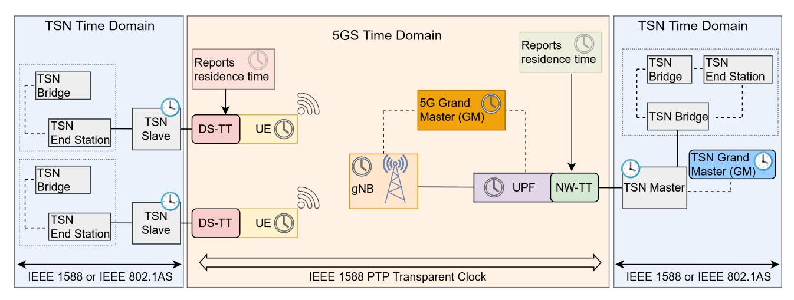

Fig. 7: General time synchronization between TSN and 5G domains using IEEE 802.1AS and IEEE 1588 standards. Master (M) and Slave (S) clocks operate across TSN and 5G segments, with DS-TT and NW-TT acting as synchronization translators to support end-to-end time alignment as defined in 3GPP Releases 16 and 17.

tivity or redundant tunnels. While CoMP focuses on capacity enhancement, redundant paths bolster reliability and support FRER. This redundancy helps mitigate worst-case latencies by duplicating transmissions and discarding redundant copies at the edge of the network.

- *e) Optimizing Scheduling and Resource Allocation for TSN:* Effective scheduling and resource allocation for TSN within 5G networks remains an area of active research. Initial approaches involve using preconfigured transmission slots and CG and SPS to ensure TSN flow guarantees. However, challenges such as periodicity mismatches and resource conflicts require advanced solutions. The research proposes various strategies, including alternating CGs for dynamic flow adjustments, dynamic Logical Channel Prioritization (LCP) for timevariant traffic, and adaptive SPS algorithms to manage timesensitive and best-effort traffic separately. These solutions aim to enhance the scheduling flexibility and resource optimization for TSN in 5G networks.
- *f) End-to-End Optimization in Traffic Steering:* Optimizing traffic steering in UE is crucial for reducing latency and enhancing overall performance. Techniques like eBPF programming can improve traffic handling efficiency by bypassing traditional network stacks. This approach underscores the importance of considering end-to-end performance, including the 5G RAN and UE, for seamless and effective integration of TSN with 5G networks.

## *B. Time Synchronization in Integrated 5G-TSN Networks*

Precise time synchronization between the clock domains of 5G and TSN is essential for supporting time-sensitive industrial control communications over a 5GS bridge. This subsection reviews recent research on time synchronization mechanisms in integrated 5G-TSN networks. Fig. [7](#page-13-0) illustrates the general synchronization process between the TSN and 5G domains using IEEE 802.1AS and IEEE 1588 standards. The integration relies on Master (M) and Slave (S) clocks operating across TSN and 5G segments, with DS-TT and NW-TT components acting as synchronization translators to ensure end-to-end time alignment, as defined in 3GPP Releases 16 and 17.

The reviewed studies explore various strategies to enhance synchronization accuracy, including Physical Delay Compensation (PDC), mitigation of clock drift, and propagation delay estimation. These strategies are implemented through mechanisms such as transparent clock modeling, GPS-based Grandmasters, Timing Advance (TA)/Round Trip Time (RTT) based delay estimation, and frequency offset correction. A comparative summary of these contributions is provided in Table [VI,](#page-14-0) highlighting their focus, implementation methods, and evaluated performance under realistic wireless conditions.

- *1) Evaluation of Wireless Time Synchronization Methods:* Prior to the 3GPP Release 16, time synchronization in mobile networks using the 802.1AS standard, compatible with 5GS, was proposed in [\[100\]](#page-31-38). This method leverages existing synchronization mechanisms between base stations and UEs. To synchronize each UE with the TSN time, a time offset is calculated using timing information from the base station and a Reference UE synchronized to the TSN network via 802.1AS. This offset is then broadcast to the UEs through a multicast Open Platform Communications Unified Architecture (OPC UA) service, achieving synchronization accuracy of 0.55 ms in a 4G testbed. A comparative analysis of 802.1AS over Wi-Fi and 5G in [\[101\]](#page-31-39) highlights challenges such as wireless link asymmetry, medium sharing, and lack of hardware timestamping, complicating delay estimation. For 5G, the study notes that the 3GPP architecture with TSN translators can improve performance significantly.
- *2) Analysis of Time Synchronization based on 3GPP Release 16 and Beyond:* Several studies have explored TSN time synchronization methods standardized in 3GPP Release 16 and later. In [\[108\]](#page-32-0), the authors conducted an analysis of 802.1ASbased time synchronization for hybrid wired and wireless networks in integrated 5G-TSN systems. They modeled the 802.1AS mechanisms, assessing synchronization accuracy and worst-case scenarios based on IEEE 802.1AS, IEEE/IEC TSN-IA profile, and 3GPP standards. The study identified limited

TABLE VI: Summary of Time Synchronization studies in 5G-TSN networks, categorized by wireless methods, 3GPP Release 16+ mechanisms, Frequency Offset Management, and Delay Estimation (Section [IV-B\)](#page-13-1)

| Study                                 | Synchronization Method                             | Research Focus                                        | Key Findings Challenges Identified                                                           |                                                  | Suggested Improvements                                                                        |  |  |  |  |  |
|---------------------------------------|-------------------------------------------------------|-------------------------------------------------------|-------------------------------------------------------------------------------------------------|--------------------------------------------------|-----------------------------------------------------------------------------------------------|--|--|--|--|--|
| Wireless Time Synchronization Methods |                                                       |                                                       |                                                                                                 |                                                  |                                                                                               |  |  |  |  |  |
| Gundall et al. (2020) [100]        |                                                       | 802.1AS for 5G-TSN Time sync between 4G/5G and TSN | Achieved 0.55 ms accuracy                                                                       | Wireless link asymmetry, no HW timestamping   | Multicast OPC UA offset distribution                                                          |  |  |  |  |  |
| Thi et al. (2022) [101]            | 802.1AS over Wi-Fi and 5G                          | Wireless time sync performance comparison          | Wireless link asymmetry and sharing affect Timestamping and medium sharing sync issues |                                                  | Use of TSN translators in 5G improves sync                                                    |  |  |  |  |  |
|                                       | 3GPP Release 16 and Beyond Synchronization Mechanisms |                                                       |                                                                                                 |                                                  |                                                                                               |  |  |  |  |  |
| Schungel et al. (2020) [102]       | Hybrid wired-wireless 802.1AS                      | 5G-TSN hybrid sync analysis                           | Timestamp resolution and jitter cause inaccuracies                                           |                                                  | Limited resolution, physical layer jitter High-precision timestamps and system integration |  |  |  |  |  |
| Shi et al. (2021) [103]            | Release 16 time-aware system                       | Sub-microsecond accuracy evaluation                | Sub-µs accuracy under controlled conditions                                                     | Clock drift, air interface errors                | Improved drift handling and scalability                                                       |  |  |  |  |  |
| Schungel et al. (2021) [104]       | Shared GM clock at gNB                             | gPTP and 5G RAN sync analysis                         | GM at gNB reduces dependency on TSN domain sync                                              | gPTP mapping to 5G RAN, BMC issues            | Shallow and deep integration approaches                                                       |  |  |  |  |  |
|                                       | Frequency Offset and Clock Drift Management           |                                                       |                                                                                                 |                                                  |                                                                                               |  |  |  |  |  |
| Song et al. (2021) [105]           | Frequency offset compensation                      | Analysis of freq. offset synchronization errors    | Frequency offset is dominant sync error source Air interface delay affects accuracy             |                                                  | GM distribution and rate ratio compensation                                                   |  |  |  |  |  |
| Striffler et al. (2021) [106]      | Release 17 Transparent Clock                       | Sync evaluation in mobile robots                      | Minor offsets cause significant sync errors                                                     | Frequency offsets affect residence time calc. | Precise sync needed for robotics                                                              |  |  |  |  |  |
|                                       | Propagation Delay Estimation and Compensation         |                                                       |                                                                                                 |                                                  |                                                                                               |  |  |  |  |  |
| Patel et al. (2021) [107]          | RTT and TA delay estimation                        | Propagation delay estimation analysis              | RTT-based method yields lower sync errors                                                       | Variable wireless delay characteristics          | Use RTT and TA for improved delay compensation                                             |  |  |  |  |  |

timestamp resolution, physical layer jitter, and concatenation of time-aware systems as key sources of inaccuracies. [\[103\]](#page-32-1) assessed the Release 16 time synchronization mechanism using the 802.1AS time-aware system model, evaluating synchronization accuracy amid clock drifts and air-interface errors, and determining the conditions needed to achieve submicrosecond accuracy. The study also found that up to 8 TSN domains could be supported in terms of scalability. In [\[102\]](#page-31-40), the authors proposed a shared Grandmaster clock within the 5GS bridge at the gNB, synchronized via GPS. This approach bypasses downlink synchronization from the TSN network or uplink synchronization from the UE. The study examined challenges in mapping gPTP to 5G RAN synchronization mechanisms and executing the BMC algorithm. Two strategies were proposed: a shallow integration approach aligning NW-TT and DS-TT boundaries with 3GPP standards, and a deep integration approach shifting synchronization boundaries to the gNB and UE using a modified 5GS bridge.

*3) Clock Drift and Frequency Offset Assessment:* The evaluation of frequency offsets and resulting clock drifts is a critical focus in 5G-TSN time synchronization, as outlined by 3GPP standards. In [\[102\]](#page-31-40), the authors examine the impact of clock drift on synchronization between the UE and gNB, highlighting that higher Subcarrier Spacing (SCS) improves resilience to cumulative synchronization errors. They also recommend that reference time indication granularity be within 10 ns and that frequent synchronization is essential to mitigate clock drift. [\[105\]](#page-32-3) analyzes the time synchronization mechanism in Release 16, focusing on the impact of frequency offsets, specifically NW-TT, DS-TT, and 5G GM rate ratios. The study identifies that the frequency offset between the 5G GM and DS-TT, influenced by air interface delay, is the primary source of synchronization error. To address this, the authors propose a method to distribute the 5G GM to the UE and compute the rate ratio between DS-TT and 5G GM. In [\[106\]](#page-32-4), the authors evaluate time synchronization using Release 17 standards, modeling the 5GS as a Transparent Clock. Their device-to-device synchronization analysis, simulating two cooperative mobile robots, shows that even minor frequency offsets between NW-TT and DS-TT can cause significant synchronization errors, particularly in residence time calculations within the 5GS bridge.

- *4) Estimation and Compensation of Propagation Delays Using TA and RTT Methods:* Estimating link propagation delays in wireless networks is more challenging than in wired networks due to the variability in transmission characteristics caused by the position and movement of UE. As a result, several studies have focused on this issue in 5G-TSN time synchronization. In [\[107\]](#page-32-5), the authors analyze sources of time synchronization errors across the end-to-end path of a 5GS within integrated 5G-TSN networks. They investigate how a 5GS, modeled as an 802.1AS time-aware system, can maintain a 900 ns synchronization error margin. The analysis is divided into transport and radio network paths, where they find that ITU-T time synchronization standards [\[109\]](#page-32-6) are suitable for industrial applications. For the radio network path, the study compares RTT-based and TA-based methods for estimating propagation delay, concluding that RTT-based methods generally yield lower time errors. Similarly, [\[110\]](#page-32-7) evaluates PTP under Release 17's error constraints, highlighting that UE-to-UE communications require a synchronization budget that is twice as stringent for unidirectional synchronization. In [\[104\]](#page-32-2), a novel approach is proposed that improves PTP accuracy by leveraging UE localization estimation using TA. This method collects TA measurements from multiple gNBs, instead of only the serving gNB, thereby enhancing TA granularity and enabling more precise estimation of UE location and its distance from the gNB.
- *5) Key Insights and Recommendations for Achieving Precision in 5G-TSN Time Synchronization:*
- *a) Critical Need for Accurate End-to-End Synchronization:* To support wireless TSN communications, precise endto-end time synchronization in the 5GS is crucial. Many TSN applications demand synchronization within the submicrosecond range. With the advent of time-sensitive UE-UE communications in Release 17, achieving bidirectional synchronization across two UE-User Plane Function (UE-UPF) paths becomes necessary. A significant challenge identified in

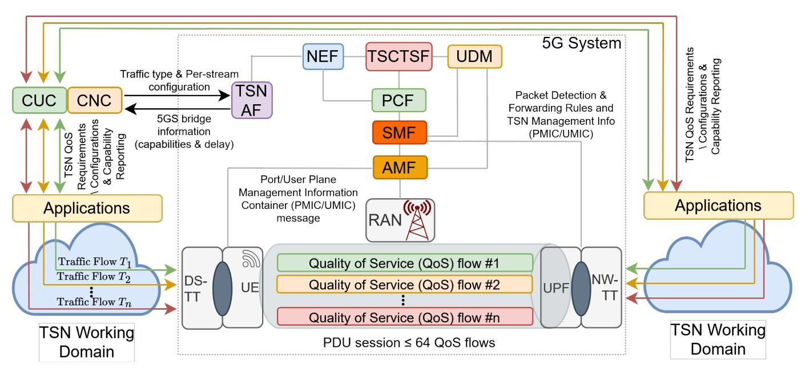

Fig. 8: Integration of TSN and 5G system functions in accordance with 3GPP Releases 16 and 17, illustrating the standardized exchange of Port/User Plane Management Information Containers (PMIC/UMIC), session management, and policy control among TSN AF, NEF, PCF, SMF, AMF, and UPF for end-to-end TSN traffic coordination.

the literature is minimizing the contribution of 5GS to end-toend synchronization errors. This challenge can be addressed through two primary approaches: estimating and compensating for propagation delays within the 5GS, and managing clock frequency offsets and drifts that affect residence time computations.

*b) Impact of Synchronization Intervals on Clock Drift:* The frequency of time synchronization events plays a crucial role in mitigating clock drift errors within the 5GS. Studies generally suggest that frequent resynchronization is essential to prevent significant errors caused by even minor frequency drifts. Research indicates that synchronization intervals ranging from tens to hundreds of milliseconds lead to a linear increase in clock frequency offset. Although a higher sampling clock source can slightly reduce frequency offsets, it does not negate the need for frequent synchronization. To address this, an accurate estimation of the frequency offset between TSN-GM and 5G-GM, and leveraging frequent resynchronization, is recommended. This allows the DS-TT to utilize the 5G GM time acquired by the UE for improved accuracy in rate ratio calculations and time conversion.

*c) Optimization of Propagation Delay Estimation and Compensation:* Effective estimation and compensation of propagation delays are vital for synchronization accuracy. The primary methods studied are TA-based and RTT-based approaches, with RTT-based methods generally providing better results. RTT-based methods, introduced in 3GPP Release 17, show promising improvements in synchronization accuracy, with theoretical reductions from 514 ns to 188 ns compared to TA-based methods. Additionally, TA-based methods that utilize measurements from multiple gNBs can enhance accuracy, potentially achieving improvements of up to 55 ns. Alternative approaches, such as using the Time Difference of Arrival (TDoA) or treating the 5GS as a Transparent Clock, also show potential but may offer synchronization accuracy in the microsecond range. It is important to consider various factors affecting estimation accuracy, such as the PDC method, SCS, UE mobility, and network size. Future research should address these factors more comprehensively and evaluate synchronization error budgets set by 3GPP, such as the 900 ns requirement, with more detailed analysis needed for low-distance scenarios where propagation delay might be negligible.

#### *C. QoS Configuration in Integrated 5G-TSN Networks*

Effective QoS configuration between the 5G and TSN domains is crucial for enabling time-sensitive industrial control communications over a 5GS bridge. Fig. [8](#page-15-0) illustrates the endto-end mapping and integration of TSN traffic flows into the 5G system, highlighting the role of functional entities such as the CUC, CNC, TSN AF, PCF, SMF, UPF, and the DS-TT/NW-TT in performing QoS profile propagation, traffic classification, and enforcement across both domains. This architecture provides the foundation upon which various QoS mapping and scheduling techniques operate. As summarized in Table [VII,](#page-16-0) existing studies explore diverse strategies for QoS interoperability, joint scheduling, and intelligent resource allocation to meet the stringent latency, reliability, and bandwidth constraints of TSN flows in a 5G environment.

*1) QoS Adaptation and Interoperability:* The authors in [\[95\]](#page-31-33) explore the joint configuration of traffic classes, frame preemption, and 5G QoS settings in an integrated 5G-TSN network, aligning with IEEE TSN and 3GPP standards. They propose mapping strategies and constraints for 5G QoS profiles based on the system's capabilities. In [\[111\]](#page-32-8), researchers design and simulate a translation tool that bridges TSN and 5G traffic by mapping parameters according to 3GPP specifications. Their tool, tested in an industrial automotive scenario,

TABLE VII: Comparison of QoS configuration approaches in 5G-TSN networks (Section [IV-C\)](#page-15-1)

|                                       | Study / Authors QoS Configuration Method                                           | Focus Area            | Key Findings                                                                                          | Techniques Used                   | Challenges Identified                           |  |  |  |
|---------------------------------------|---------------------------------------------------------------------------------------|-----------------------|-------------------------------------------------------------------------------------------------------|-----------------------------------|-------------------------------------------------|--|--|--|
| QoS Adaptation and Interoperability   |                                                                                       |                       |                                                                                                       |                                   |                                                 |  |  |  |
| Martenvormfelde et al. (2021) [95] | Mapping 5G QoS Profiles Traffic class mapping and and TSN traffic preemption |                       | Effective mapping of 5G QoS to TSN, supports high-priority traffic                                 | Mapping strategies, preemption | Need for standardization in QoS mapping      |  |  |  |
| Satka et al.                          | Translation tool for                                                                  | Traffic mapping in    | Tool simulates 5G-TSN traffic, optimizes                                                              | Simulation, translation tool      | Delays due to channel                           |  |  |  |
| (2022a) [111]                         | 5G-TSN traffic                                                                        | automotive scenarios  | channel propagation delays                                                                            |                                   | propagation                                     |  |  |  |
| Satka et al.                          | QoS-aware algorithm for                                                               | Application-specific  | Efficient flow mapping based on deadlines,                                                            | QoS algorithm, traffic flow       | Managing application-specific                   |  |  |  |
| (2022b) [112]                         | flow mapping                                                                          | constraints           | bandwidth, and PER requirements                                                                       | mapping                           | QoS requirements                                |  |  |  |
| Cai et al. (2023)                     | Dynamic load-sensitive                                                                | Load-sensitive QoS    | Clustering-based algorithm for better QoS                                                             | Clustering algorithm,             | Resource allocation under                       |  |  |  |
| [98]                                  | QoS mapping                                                                           | mapping               | class consistency                                                                                     | load-sensitive mapping            | variable load                                   |  |  |  |
|                                       | Scheduling and Resource-Aware Mapping                                                 |                       |                                                                                                       |                                   |                                                 |  |  |  |
| Zhang et al. (2022) [113]          | TAS and PSFP scheduling Scheduling and resource in 5G-TSN allocation         |                       | Minimizes jitter through preemptive scheduling; optimizes resource usage                           | Preemptive scheduling, PSFP    | Managing jitter across 5G and TSN networks   |  |  |  |
| Zhang et al.                          | NFV integration with                                                                  | VNF and QoS mapping   | Prioritizes VNFs and synchronizes with 5G                                                             | NFV, preemption-based             | Synchronization and resource                    |  |  |  |
| (2021) [114]                          | 5G-TSN scheduling                                                                     |                       | time slots for improved scheduling                                                                    | scheduling                        | allocation                                      |  |  |  |
| Satka et al. (2022c) [115]         | CNC-based QoS mapping for TSN-5G                                                   |                       | Fine-grained traffic mapping Leverages CNC for global network visibility, improves QoS consistency | CNC-based mapping, 5QIs           | Mapping complexity and resource coordination |  |  |  |
|                                       | Joint Scheduling and Optimization Techniques                                          |                       |                                                                                                       |                                   |                                                 |  |  |  |
| Ginthor et al.                        | End-to-end scheduling                                                                 | End-to-end traffic    | Optimizes resource utilization while                                                                  | Joint scheduling,                 | Handling diverse traffic types                  |  |  |  |
| (2020) [116]                          | optimization                                                                          | scheduling            | supporting BE traffic                                                                                 | optimization constraints          | efficiently                                     |  |  |  |
| Luque et al.                          | Dynamic configuration via                                                             | Zero-touch service    | Implements dynamic, autonomous                                                                        | Dynamic configuration,            | Network instability in dynamic                  |  |  |  |
| (2022) [117]                          | ZSM                                                                                   | management            | configuration of 5G-TSN networks                                                                      | ZSM                               | environments                                    |  |  |  |
| Wang et al.                           | Q-learning and PSO for                                                                | Optimization of       | Optimizes flow admission using Q-learning                                                             | Q-learning, PSO, CQF              | Latency constraints and                         |  |  |  |
| (2023) [118]                          | QoS optimization                                                                      | time-sensitive flows  | and PSO                                                                                               |                                   | scheduling conflicts                            |  |  |  |
| Cheng et al.                          | Deep reinforcement                                                                    | Flow scheduling and   | Learns optimal mapping of CQF and 5G                                                                  | DRL, optimization                 | CQF scheduling and resource                     |  |  |  |
| (2023) [119]                          | learning for QoS                                                                      | resource optimization | resources for scheduling                                                                              |                                   | utilization                                     |  |  |  |

effectively assesses 5G-TSN network performance, especially regarding channel propagation delays. In [\[112\]](#page-32-9), the authors introduce a QoS-aware algorithm for mapping traffic flows between the TSN and 5G domains, considering applicationspecific constraints like deadlines, jitter, and bandwidth. This algorithm assigns each application to a 5G Resource Type based on its binary requirements and calculates the corresponding 5G QFI using values for bandwidth, deadlines, and Packet Error Rate (PER). Finally, [\[98\]](#page-31-36) proposes a dynamic, load-sensitive QoS mapping technique for 5G-TSN networks, using a clustering-based algorithm to group flows with similar QoS characteristics, thus enhancing resource allocation efficiency.

*2) Scheduling and Resource-based QoS Mapping:* In [\[113\]](#page-32-10), the authors explore the integration of 5G and TSN within a heterogeneous network architecture, focusing on deploying both TAS and PSFP mechanisms. The industrial use case involves wireless field devices connecting to a TSN Gateway (GW) via 5G to access a wired network. The authors develop a scheduling mechanism that reserves 5G resources in advance using SP to minimize signaling delays during high-priority emergency events. To address jitter from the 5G network, PSFP is implemented at the TSN network entry point. This approach factors in 5G network delays and end-to-end delay requirements to assign priority levels. Unlike other studies, this work focuses on injecting 5G scheduling configurations into the TSN domain. In [\[114\]](#page-32-11), the research extends this scenario by incorporating the NFV domain into the scheduling and mapping process between 5G-TSN resources and incoming VNFs. VNFs are deployed in TSN Gateways in the edge layer, which includes 5G base stations. Communication occurs between VNFs and field devices via 5G, with VNF arrival synchronized with 5G time slots. Preemption-based scheduling is used to prioritize VNFs, alongside GCL computation for VNF streams.

In [\[115\]](#page-32-12), the authors tackle the challenge of fine-grained traffic mapping within a converged 5G-TSN network by shifting the mapping functionality from the TSN AF in the 5G system (as defined by 3GPP standards) to a CNC with global network visibility. In this architecture, which includes 5GS and non-TSN bridges, the CNC calculates 5G Quality Indicators (5QIs) for application flows based on deadline, jitter, bandwidth, and PER requirements from the CUC. These 5QIs are then communicated to the respective PCFs, which configure both 5GS and non-5GS bridges.

*3) Optimized Joint Scheduling based QoS Mapping:* In [\[116\]](#page-32-13), the authors optimize end-to-end scheduling in a 5G-TSN network by using a joint configuration approach to manage diverse traffic types. They identify both global and technology-specific constraints, including 5G transmission parameters such as NR Transmission Time Intervals (TTIs) and RBs, as well as TSN constraints leveraging 802.1Qbv TAS for scheduling. The study aims to optimize scheduling across both domains, focusing on efficient resource utilization while supporting BE traffic and ensuring time-sensitive latency requirements are met. Recent studies, such as [\[117\]](#page-32-14) and [\[120\]](#page-32-17), explore learning-based methods for configuring 5G-TSN networks. These works propose dynamic, autonomous configuration of 5G Non-Public Networks (NPNs) integrated with TSN, guided by the Zero-touch Service Management (ZSM) reference model. The smart controller in these studies acts as a TSN AF, dynamically adjusting 5G QoS flows to align with KPIs.

In [\[118\]](#page-32-15), the authors combine Reinforcement Learning (Qlearning) with Particle Swarm Optimization (PSO) to optimize the configuration and maximize the admission ratio of time-

TABLE VIII: Cross-domain comparison of deterministic communication requirements and 5G–TSN roles in Emerging Applications

| Aspect                                                                              | Industrial Automation                                                                     | Intelligent Transportation                                                               | Smart Energy Systems                                                                               | Digital Health                                                                                 |
|-------------------------------------------------------------------------------------|-------------------------------------------------------------------------------------------|------------------------------------------------------------------------------------------|----------------------------------------------------------------------------------------------------|------------------------------------------------------------------------------------------------|
| Latency Requirements                                                                | 1–10 ms (cycle times for mo tion control, CNC machines)                                | ≤1 ms (collision avoidance), 10–20 ms (V2I updates)                                   | 3–20 ms (protection relays, DER coordination)                                                   | 1–5 ms (remote surgery), 10– 100 ms (health monitoring)                                     |
| Reliability Target                                                                  | >99.999% (factory control systems)                                               | >99.999% (ADAS, platoon ing)                                                          | >99.99% (grid reliability, DERs)                                                          | >99.999% (life-critical medi cal applications)                                              |
| Synchronization Needs Sub-microsecond (drive train sync, robotics) nation) |                                                                                           | Sub-ms to ms (vehicle coordi                                                             | µs range (voltage phase sync, SMV)                                                              | µs–ms (multi-device telemetry, imaging)                                                     |
| Mobility Requirement                                                                | Low (stationary equipment) High (mobile vehicles, cross domain V2X) DERs)        |                                                                                          | Medium (field assets, mobile                                                                       | High (ambulances, wearables, telehealth)                                                    |
| 5G Role                                                                             | Wireless backhaul for mobile stations, flexible layout                                 | V2X communication, cloud based safety systems, slicing                                | Field-level connectivity for DERs, AMI, sensors                                           | Emergency care connectivity, streaming, remote wearable surgery                    |
| TSN Role                                                                            | Real-time factory backbone, jitter-free control                                        | In-vehicle IVNs for sensor fu sion and ADAS control                                   | automation, Substation SMV/GOOSE delivery, time sync                                      | Deterministic in-hospital net (robotics, imaging, working alarms)                  |
| Integration Benefit                                                                 | Real-time TSN with mobile extensions via 5G for scalable and reconfigurable control | Seamless TSN-5G transition from in-vehicle to cloud, en abling end-to-end autonomy | TSN control from Extends substations to field using 5G for scalable grid management | in-hospital TSN Combines with 5G mobility to support mobile health and remote care |
| Example Application                                                                 | Flexible manufacturing with AGVs and cloud-coordinated assembly                     | vehicle reacting to Remote V2P alert with cloud-updated path              | fault isolation DER-enabled and grid balancing via edge data                           | Ambulance transmits patient vitals for live diagnostics and surgical prep                |

TABLE IX: Industrial communication's traffic types

| Category of traffic type         | Type of Traffic                | Sync to network | Periodicity | Guarantee of data delivery | Typical data size                 | Typical period | Tolerance to jitter | Tolerance to loss | Criticality |
|-------------------------------------|--------------------------------|--------------------|-------------|-------------------------------|-----------------------------------|----------------|---------------------|-------------------|-------------|
| IA time-aware stream                | Isochronous                    | ✓                  | Periodic    | Deadline                      | Fixed: 30-100 bytes               | 100µs - 2ms    | None                | None              | High        |
|                                     | Cyclic Synchronous          | ✓                  | Periodic    | Frame Latency                 | Fixed: 50 - 1000 bytes         | 500µs - 1ms    | <= latency          | None              | High        |
|                                     | Video                          | ×                  | Periodic    | Bandwidth                     | variable: 100 - 1500              | Frame rate     | N.A                 | Yes               | Low         |
| IA non-stream                       | Best effort                    | ×                  | Sporadic    | None                          | Variable: 30 - 1500               | N.A            | N.A                 | Yes               | Low         |
|                                     | Voice Audio                    | ×                  | Periodic    | Bandwidth                     | Variable: 1000 - 1500 Sample rate |                | N.A                 | Yes               | Low         |
|                                     | Events: Control                | ×                  | Sporadic    | Frame latency (**)            | Variable: 100 - 200               | N.A (*)        | <= latency (***)    | Yes               | High        |
| IA traffic engineered non-stream | Configuration & Diagnostics | ×                  | Sporadic    | Bandwidth                     | Variable: 500 - 1500              | N.A            | N.A                 | Yes               | Medium      |
|                                     | Network Control                | ×                  | Periodic    | Bandwidth                     | Variable: 50 - 500                | 50ms - 1s      | <= period           | Yes               | High        |
|                                     | Events: Alarms                 | ×                  | Sporadic    | Frame latency (**)            | Variable: 100 - 500               | N.A. (*)       | <= latency (***)    | Yes               | Medium      |
| IA stream                           | Cyclic Asynchronous         | ×                  | Periodic    | Frame latency                 | Fixed: 50 -1000                   | 2ms - 20ms     | <= latency          | 1 - 4 frames      | High        |

(\*) N.A.: not applicable due to event-driven behavior; (\*\*) strict delivery timing (frame latency/deadline); (\*\*\*) jitter must not exceed latency bound.

sensitive flows in 5G-TSN networks. The approach uses CQF for TSN traffic shaping, considering latency constraints within both 5G and end-to-end contexts, as well as CQF time slot limitations. The algorithm is evaluated through simulations of 5G-TSN topologies, using specific 5G numerology parameters and a semi-static scheduling model. Similarly, [\[119\]](#page-32-16) explores the application of CQF in 5G-TSN networks, focusing on mapping CQF constraints to 5G resources, particularly addressing flow periodicity and 5GS latency. They formulate flow schedulability and resource utilization as joint optimization problems, solved using a Deep Reinforcement Learning (DRL) algorithm. Their simulations validate the effectiveness of the approach. Additionally, [\[113\]](#page-32-10) introduces a risk-sensitive learning algorithm designed to minimize worst-case delays in PSFP-based 5G-TSN networks by dynamically adjusting reserved RBs and PSFP priorities. PSFP helps reduce jitter by regulating the transmission timing of individual flows, enforcing strict per-stream bandwidth and traffic arrival constraints. This ensures that time-sensitive traffic experiences minimal packet delay variation, even under fluctuating load conditions.

*4) Key Insights and Recommendations for Achieving Efficient QoS Mapping in 5G-TSN:*

- *a) Integration of TSN Mechanisms into the 5G Domain:* The literature explores various TSN mechanisms, such as 802.1Qbv (TAS), 802.1Qci (PSFP), and 802.1Qch (CQF), for extending TSN functionalities into 5G networks. Notably, PSFP has been employed to manage the dynamic injection of TSN flows from a 5G bridge into a wired TSN network, balancing queue priorities against the jitter introduced by the 5G network. However, TAS remains the most commonly adopted mechanism, where the GCL can be extended to the 5G domain for unified configuration across both TSN and 5G domains. Despite 3GPP standards advocating for stream identification of PSFP and gate-based policing to derive 5G QoS for TSN flows, many studies favor the use of 802.1Qbv for QoS mapping due to its simplicity. CQF is also a viable option, simplifying scheduling by avoiding complex GCL computation and accommodating multiple flows within the same time slot. However, further research is needed to determine whether CQF can meet stringent industrial communication requirements, particularly in terms of end-to-end latency.
- *b) Leveraging Cognitive Approaches for 5G-TSN Network Optimization:* The optimization of 5G-TSN network configurations is often framed as a problem with end-to-end constraints, such as latency, periodicity, and 5G numerology.

The goal is to maximize the number of scheduled flows while optimizing resource usage efficiency. Some approaches tackle the problem from the opposite direction, starting with a preconfigured 5G-TSN network and dynamically adjusting the configuration to optimize KPIs related to QoS flows. RL techniques, including DRL, automata learning, risk-sensitive learning, and Q-learning, have been effective in these scenarios. Additionally, closed-loop management of 5G-TSN networks, often based on the ZSM architecture, integrates monitoring, learning, prediction, and reconfiguration capabilities. Although current research is largely theoretical or based on simulations, the application of cognitive approaches to 5G-TSN networks shows promise for future development.

## V. EMERGING APPLICATIONS OF INTEGRATED 5G-TSN NETWORKS: DOMAIN-SPECIFIC REQUIREMENTS AND INTEGRATION STRATEGIES

While prior sections examined the architectural convergence of 5G and TSN and highlighted ongoing technical developments, it is equally essential to evaluate how these advancements translate to real-world impact across key emerging applications. This section explores four representative verticals, including Industrial Automation (IA), Intelligent Transportation Systems (ITS), Smart Energy Systems (SES), and Digital Health Systems (DHS), each of which exhibits unique operational constraints, communication demands, and integration challenges. By systematically analyzing the requirements, technological gaps, enabling mechanisms, and end-to-end integration strategies in each domain, we uncover both the common threads and critical divergences that shape the deployment of integrated 5G-TSN networks. Through realistic use-case scenarios, we highlight how determinism, mobility, and synchronization are co-engineered to meet the stringent demands of next-generation applications. To provide a comparative overview of these four domains, Table [VIII](#page-17-0) summarizes their deterministic communication requirements, the respective roles of 5G and TSN, and the anticipated integration benefits.

## *A. Industrial Automation*

Industrial automation is transforming manufacturing environments through the deployment of advanced technologies such as robotic arms, Automated Guided Vehicles (AGVs), industrial IoT devices, and AI-driven control systems [\[29\]](#page-30-10). Collaborative Robots (Cobots), for instance, work alongside human operators in tasks demanding high precision and agility, improving both productivity and safety [\[121\]](#page-32-18). In large-scale sectors such as automotive manufacturing, robotic systems are extensively employed for assembly, welding, and surface finishing, where deterministic control is essential for maintaining tight tolerances and high throughput [\[122\]](#page-32-19).

*1) Requirements:* Industrial automation places the most stringent communication demands among all application domains due to its safety-critical and real-time nature. i) Control systems such as robotic arms or servo drives require ultra-low cycle times below 1 ms for motion control and below 10 ms for slower processes like batch automation. These performance

TABLE X: Standard QoS profile (5QI) for Emerging Applications (based on 3GPP TS 23.501)

| 5QI | PDB | PER  | MDBV   | Application Examples                                                           |
|-----|-----|------|--------|--------------------------------------------------------------------------------|
| 85  | 5   | 10−5 | 255 B  | High-voltage grid automation, V2X (Remote Driv ing), SMV/GOOSE-like traffic |
| 86  | 5   | 10−4 | 1354 B | V2X (Collision Avoidance, Platooning), High speed factory control loops     |
| 87  | 5   | 10−3 | 500 B  | Motion tracking data, Real-time sensor feedback                                |
| 80  | 10  | 10−6 | N/A    | Emergency stops, Remote robotic surgery, V2X safety events                  |
| 83  | 10  | 10−4 | 1354 B | AGV telemetry, Cooperative lane change, Patient vitals (ECG)                |
| 88  | 10  | 10−3 | 1125 B | Interactive AR/VR, Robotic hand-eye coordination data                       |
| 84  | 30  | 10−5 | 1354 B | Non-critical medical data, ITS infotainment, DI COM image transmission      |
| 89  | 15  | 10−4 | 17 KB  | Edge-rendered visual content, AR cloud sync                                    |
| 90  | 20  | 10−4 | 63 KB  | Cloud-based industrial inspection video, High resolution sensor feeds       |
| 70  | 200 | 10−6 | N/A    | SCADA commands, IEC 60870-5 substation con trol                             |
| 6   | 300 | 10−6 | N/A    | Periodic smart meter uploads, Medical record backup                         |
| 9   | 300 | 10−6 | N/A    | Passenger infotainment (e.g., maps, ads), Non urgent telemetry              |

PDB: Packet Delay Budget (in milliseconds), maximum allowable one-way delay. PER: Packet Error Rate, target probability of lost packets. MDBV: Maximum Data Burst Volume, size of the largest burst allowed per QoS flow.

demands map to distinct industrial traffic types with varying latency sensitivity, jitter tolerance, and data rates. Table [IX](#page-17-1) summarizes key categories of industrial communication traffic, such as isochronous motion control, cyclic sensing, control events, diagnostics, and video streams, highlighting their delivery guarantees and criticality levels. ii) Jitter must be tightly constrained, typically below 100 µs, to maintain the stability of high-speed closed-loop control systems. iii) End-to-end reliability exceeding 99.999% is essential to avoid operational failures or damage to machinery. iv) Time synchronization accuracy within 1 µs is critical for coordinated actuation across multi-axis robotic systems or tasks involving distributed vision and motion alignment. v) Logical and physical security isolation is mandatory, often realized via network slicing, to prevent lateral movement of threats within industrial networks and to segregate safety-critical traffic from telemetry or diagnostics.

*2) Challenges:* Although both TSN and 5G contribute key features toward meeting these requirements, they also introduce distinct challenges when applied independently. i) TSN provides deterministic behavior over wired Ethernet but lacks the flexibility to support mobile equipment such as AGVs or modular production lines. ii) 5G URLLC enables wireless connectivity and reconfigurability but suffers from radio interface variability and lacks native support for deterministic delay bounds. iii) The lack of convergence between TSN traffic classes (e.g., Class A/B with bounded latency) and 5G QoS frameworks (5QI, ARP, GBR) complicates end-to-end latency control and undermines predictability. iv) Industrial networks typically comprise a mix of legacy Ethernet, TSN-enabled subnets, and 5G wireless segments, making unified orchestration, time synchronization, and scheduling difficult without standardized coordination mechanisms. These limitations motivate the exploration of integrated 5G-TSN techniques that may address these cross-domain challenges.

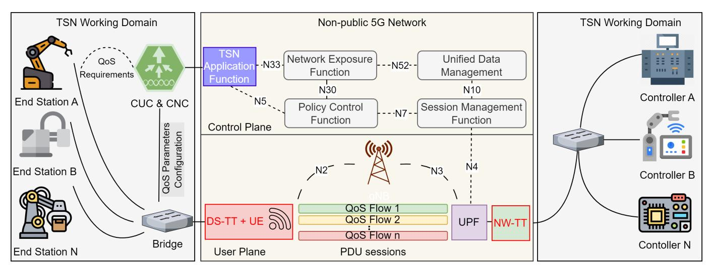

Fig. 9: Integrated 5G-TSN architecture for industrial automation. TSN end devices interface with CNC/CUC and DS-TT; QoS requirements are forwarded to the TSN-AF, which interacts with 5GC entities (PCF, SMF, NEF) to configure PDU sessions with appropriate QoS flows. NW-TT and UPF bridge the 5G user plane to TSN domains containing industrial controllers, enabling deterministic end-to-end connectivity.

*3) Enabling Technologies:* We highlight several 5G-TSN integration techniques from Sections [III](#page-7-0) and [IV](#page-10-0) that have been proposed in the literature and may offer solutions to the specific requirements of industrial automation. i) The 5G system, which acts as a Logical TSN Bridge (Section [III-B,](#page-7-1) Fig. [6\)](#page-8-1), implementing 3GPP's DS-TT/NW-TT to map PDU sessions to TSN streams (IEEE 802.1CB) with bounded latency, critical for PROFINET and EtherCAT industrial Ethernet [\[123\]](#page-32-20). ii) Virtualized centralized controllers (Section [IV-A1\)](#page-10-2) deployed at the edge can reduce control loop jitter to < 100 µs by colocating PLC functions with MEC-hosted soft-PLCs (IEC 61131-3), enabling precise robotic coordination [\[124\]](#page-32-21). iii) Time synchronization via the gNB's TSN Time Sync Function (Section [IV-B2\)](#page-13-2) distributes IEEE 802.1AS-2020 timing through the 5G air interface, targeting synchronization accuracy of < 1 µs for static machines; moving robots may require supplemental wired PTP [\[125\]](#page-32-22). iv) CQF-aware time budgeting (Section [IV-C3\)](#page-16-1) aligns TSN cycles (per IEC/IEEE 60802) with 5G TTIs by partitioning resources into deterministic windows, aiming to ensure robotic actuators receive commands within 250 µs cycles [\[126\]](#page-32-23). v) Joint IEEE 802.1Qbv/PSFP scheduling (Section [IV-C4\)](#page-17-2) synchronizes TSN time slots with 5G minislots (0.125 ms), enabling sub-1 ms closed-loop control for servo drives while minimizing eMBB interference. vi) GCLaligned VNF scheduling (Section [IV-C2\)](#page-16-2) may support periodic vision-based quality inspection tasks (e.g., 4 ms cycles) using TSN-aware Kubernetes plugins under development. vii) Prioritized RB Allocation (Section [IV-A3\)](#page-11-1) enforces 3GPP QoS preemption (Rel-17) for safety-critical flows (5QI 80), aiming to achieve 10−6 packet loss rates for emergency stops. viii) TSCAI with binary-constrained mapping (Section [III-B5\)](#page-9-0) adapts OPC UA Pub/Sub deadlines to 5QI 83/84 QoS profiles, aligning with industrial communication stacks [\[127\]](#page-32-24). Representative 5QI profiles for mission-critical and deterministic applications—including their delay, error rate, and burst characteristics—are summarized in Table [X.](#page-18-1) This unified table serves as a reference for all application domains discussed in this section, unless domain-specific deviations are explicitly noted. ix) Multi-TRP with CoMP (Section [III-A\)](#page-7-2) introduces spatial diversity for wireless Human Machine Interactions (HMIs), targeting 10−6 packet loss under factory multipath; this is under evaluation in 5G-ACIA testbeds. x) FRER via SmartNICs (Section [IV-A5\)](#page-12-0) implements IEEE 802.1CB seamless redundancy, with FPGA-based elimination achieving < 50 µs failover during cable-break events.

*4) Integration Strategy:* These enabling methods can be integrated into a co-designed 5G-TSN architecture that supports deterministic and resilient industrial automation workflows across both wired and wireless domains. i) Hybrid deterministic communication combines wired TSN (IEEE 802.1Qbv/802.1CB) for controllers and actuators with 5G URLLC (3GPP Rel-17, 5QI 80/83) for mobile robots and vision systems, coordinated via DS-TT/NW-TT gateways. ii) Time synchronization leverages IEEE 802.1AS-2020 and shared grandmasters to maintain < 1 µs alignment over both wired and wireless domains. iii) GCL-aligned VNF scheduling synchronizes containerized edge functions (e.g., soft-PLCs, defect detection) with 250 µs TSN cycles. iv) Network slicing isolates motion-critical traffic (e.g., 5QI 80) from lowerpriority telemetry (5QI 84), enforcing strict resource allocation and RB preemption. This integrated architecture is illustrated in Fig. [9,](#page-19-0) which shows a representative 5G-TSN deployment for industrial automation. TSN end devices, such as robotic arms and sensors, are connected to a TSN bridge, which interfaces with both the CUC and CNC. The CUC/CNC forwards QoS configuration data to the TSN AF, which coordinates with 5GC functions, including the PCF, SMF, UDM, and NEF over standardized interfaces (e.g., N5, N7, N33). This enables the establishment of 5G PDU sessions with flow-specific QoS characteristics. On the user plane, the DS-TT and NW-TT map TSN streams to 5G QoS flows, ensuring deterministic latency and synchronization across both domains. This architecture allows unified orchestration of wired and wireless segments for real-time industrial control.

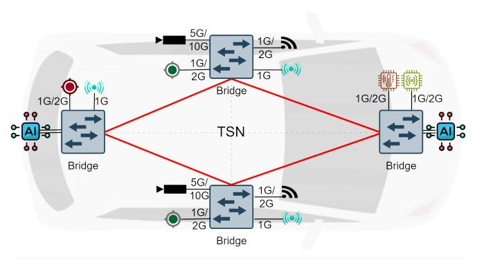

Fig. 10: In vehicle TSN architecture interconnecting sensors, ECUs, and actuators over a deterministic TSN bridge

- *5) Representative Scenario:* The following example illustrates the practical coordination between 5G and TSN in a robotic manufacturing cell. i) A robotic arm and conveyor belt communicate via TSN (IEEE 802.1Qbv) using 100 µs cycle times, while a 5G-connected camera streams defect inspection data (5QI 84) to a local VNF. ii) Upon detecting a quality defect, the VNF triggers a sub-1 ms emergency stop via prioritized 5QI 80 uplink with RB preemption. iii) Multi-TRP ensures uplink reliability with 10−6 packet loss despite multipath conditions. iv) Shared grandmaster synchronization maintains < 1 µs timing accuracy across TSN and 5G domains.
- *6) Key Insights and Open Issues:* Surveyed 5G-TSN techniques reveal promising advances toward meeting industrial automation requirements, but several gaps remain. i) TAS/TTI co-scheduling (Section [IV-C4\)](#page-17-2) is feasible today, yet CQFaware budgeting (Section [IV-C3\)](#page-16-1) lacks mature tooling support (e.g., IEEE 802.1DG is under development). ii) FRER (Section [IV-A5\)](#page-12-0) achieves rapid failover (< 50 µs) but requires specialized hardware to minimize overhead. iii) Binaryconstrained mapping (Section [III-B5\)](#page-9-0) must be extended to support dynamic AI-driven control loops with sub-ms reconfiguration. iv) Stronger isolation and resource guarantees are needed in network slicing to enable safe mixed-criticality deployments, such as collaborative robots and AGVs operating on shared infrastructure.

#### *B. Intelligent Transportation Systems*

ITS are central to the transformation of modern mobility by integrating real-time communication, sensing, and distributed control between vehicles, infrastructure, and vulnerable road users [\[128\]](#page-32-25). Applications such as cooperative adaptive cruise control, collision avoidance, and autonomous intersection management rely on precise, low-latency coordination to ensure safety and efficiency [\[129\]](#page-32-26). These use cases demand seamless interaction between in-vehicle TSN networks and 5G-based V2X communication, forming a multi-domain control loop that spans both wired and wireless technologies.

*1) Requirements:* ITS imposes distinct communication requirements, especially for high Levels of Autonomy (LoA) and cooperative driving scenarios. i) Ultra-low end-to-end latency of 1–10 ms is necessary for time-sensitive operations such as

- cooperative lane changing or emergency braking. ii) Packet loss rates must be as low as 10−5 to ensure the integrity of safety-critical messages. iii) Time synchronization precision below 1 µs is required for distributed sensor fusion [\[130\]](#page-32-27), [\[131\]](#page-32-28), coordinated braking, and maneuver execution. iv) Scalability is essential to support dense environments with hundreds of vehicles and infrastructure nodes communicating per square kilometer. v) Mobility support under high-speed dynamics (up to 500 km/h) must ensure continuous service and synchronized behavior during frequent handovers [\[132\]](#page-32-29). vi) In addition to vehicle-centric traffic, V2P communication must enable low-latency interactions with pedestrians or cyclists through mobile devices, especially in Non-Line-of-Sight (NLOS) or urban canyon scenarios [\[133\]](#page-32-30).
- *2) Challenges:* The hybrid nature of ITS, i.e., combining static roadside infrastructure, high-speed vehicular networks, and mobile devices, presents unique challenges. i) While 5G URLLC improves radio reliability, vehicular mobility induces fading, fast-changing topology, and increased control overhead, making deterministic delivery hard to guarantee [\[129\]](#page-32-26). ii) TSN is well-suited for in-vehicle deterministic control but does not natively support wireless or mobile topologies. iii) Achieving synchronized operation across mobile and stationary domains is challenging due to clock drift, Doppler effects, and variations in propagation delay. iv) QoS coordination between TSN mechanisms (e.g., TAS, PSFP) and 5G scheduling (e.g., 5QI, RB allocation) remains fragmented, hindering end-toend predictability. v) Orchestration across multiple domains, including SDN-controlled RSUs and Mobile Edge Computing (MEC), requires unified, latency-aware scheduling that adapts to dynamic road conditions.
- *3) Enabling Technologies:* We identify several 5G-TSN integration techniques from Sections [III](#page-7-0) and [IV](#page-10-0) that have been proposed in the literature and may be leveraged or adapted to meet the unique requirements of ITS applications. i) Disaggregated edge-based RAN architecture (Section [IV-A1\)](#page-10-2) with MEC may support real-time decision-making at Roadside Units (RSUs) and intersections, reducing vehicleto-infrastructure loop latency, though it relies on ultra-lowlatency fronthaul (< 250 µs) still being optimized in 3GPP Rel-18 for non-fiber scenarios. ii) The 5GC can serve as a Logical TSN Bridge (Section [III-B\)](#page-7-1) to interconnect TSNenabled IVNs with 5G infrastructure, leveraging 3GPP's DS-TT/NW-TT from Rel-16 but potentially facing scalability limits in ultra-dense deployments. iii) Rate ratio estimation (Section [IV-B2\)](#page-13-2) between 5G grandmasters and TSN devices may help compensate for sync drift due to vehicular speed, combining IEEE 802.1AS-2020 with 5G Single Frequency Network (SFN) [\[134\]](#page-32-31), though performance degrades with lowcost Global Navigation Satellite System (GNSS)-less onboard clocks, a challenge targeted by IEEE P802.1DF [\[130\]](#page-32-27). iv) RTT-based delay compensation (Section [IV-C3\)](#page-16-1) can correct propagation-induced inaccuracies in high-mobility contexts using 3GPP TR 38.827 two-way ranging; however, urban multipath interference remains an open problem, prompting Rel-18 studies into AI/ML-based prediction. v) Dual-path UE-to-UE synchronization (Section [IV-C2\)](#page-16-2) may enable direct peer timing via hybrid PC5 sidelink and Uu interfaces, which is critical for

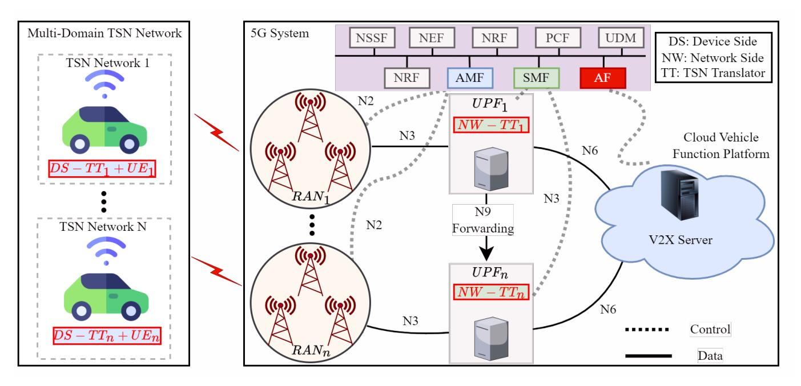

Fig. 11: Integrated 5G-TSN architecture for ITS: each vehicle as a mobile TSN domain with UE-based DS-TT, connected via RAN to NW-TT-enabled UPFs and synchronized across domains.

platooning but currently reliant on GNSS fallback in coverage gaps. vi) GCL-aligned scheduling between 5G URLLC slots and TSN domains (Section [IV-C4\)](#page-17-2) may facilitate deterministic timing across wireless/wired segments, though achieving subµs sync between gNBs and TSN switches, though it is still under refinement (IEEE 802.1Qdj). vii) Risk-sensitive PSFP scheduling with DRL (Section [III-B5\)](#page-9-0) dynamically adapts flow rates under traffic fluctuations, though training overhead from model-free RL (e.g., TD3) may violate TSN guarantees if unconstrained. viii) Larger GCL slot support (Section [IV-A3\)](#page-11-1) accommodates moderate-latency ITS services like infotainment, though potential conflicts remain with the 3GPP URLLC latency budget (0.5–2 ms). ix) Packet duplication and Multi-TRP transmission (Section [III-A\)](#page-7-2) aim to enhance robustness via 3GPP Rel-16 Packet Data Convergence Protocol (PDCP) duplication, though more efficient solutions like coherent joint transmission (Rel-18) are under study to reduce radio overhead. x) eBPF-based gPTP acceleration (Section [IV-A5\)](#page-12-0) enables software-level time alignment in vehicular nodes, though its ∼ 10 µs jitter (compared to hardware timestamping) limits usage to non-critical timing tasks in current Linux TSN stacks.

*4) Integration Strategy:* A unified 5G-TSN architecture may enable end-to-end deterministic communication across highly dynamic vehicular environments by tightly integrating in-vehicle TSN domains, roadside infrastructure, and edge computing resources. i) *Intra-Vehicle Domain:* Each vehicle may be configured as an independent TSN domain using IEEE 802.1Qbv to interconnect Electronic Control Units (ECUs), sensors, and actuators with sub-millisecond latency. The in-vehicle TSN domain interfaces with the 5G core via a UE-integrated DS-TT, enabling seamless mapping of TSN streams onto 5G PDU sessions. This setup is illustrated in Fig. [10,](#page-20-0) where an in-vehicle TSN bridge interconnects the vehicle's heterogeneous components, such as cameras, LiDARs, and ECUs, forming a deterministic control loop for intra-vehicle functions. ii) *Vehicle-to-Infrastructure (V2I) Domain:* RSUs equipped with MEC and disaggregated RAN may support localized URLLC zones. Using configured grants and semi-persistent scheduling, these zones aim to maintain low-latency and high-reliability links under high-speed mobility. Fig. [11](#page-21-0) illustrates the broader 5G-TSN architecture for ITS, where each vehicle acts as a mobile TSN domain connected to the 5G core via DS-TTs embedded in UEs. These connect to NW-TTs colocated with UPFs at the edge, enabling deterministic V2I communication. The figure also depicts dynamic architectural features, including multi-gNB support, distributed UPFs, and interfaces to the V2X server. iii) *Cross-Domain Synchronization:* Precise time alignment across mobile and stationary TSN domains may be achieved via rate ratio estimation and RTT-based delay compensation, targeting synchronization accuracy better than 1 µs. iv) *Scheduling Coordination:* GCL-aligned scheduling coordinates TSN time slots with 5G URLLC transmissions, while DRL-based flow adaptation (Section [III-B5\)](#page-9-0) adjusts to traffic density and application dynamics. v) *Reliability and Flow Isolation:* For safety-critical services, Multi-TRP transmission supports ultrareliable delivery with packet loss below 10−6 , while extended GCL cycles isolate non-critical flows like infotainment [\[135\]](#page-32-32).

*5) Representative Scenario:* A highway platoon of three autonomous vehicles illustrates 5G-TSN convergence: i) *Intravehicle:* Steering and braking actuators communicate via TSN with 100 µs cycles. ii) *Inter-vehicle:* The lead AV broadcasts intent over PC5 sidelink, with Multi-TRP mitigating multipath effects. iii) *V2I:* RSUs apply RTT-based delay compensation to account for platoon motion, while rate ratio estimation corrects sync drift during handovers. iv) *Edge Coordination:* MEC nodes at RSUs aggregate sensory data and issue coordinated commands within 5 ms via gPTP-aligned 5G transmissions [\[135\]](#page-32-32). v) *Flow Management:* Telemetry flows use enlarged GCL slots, while safety messages are prioritized through 5QI 80 preemption mechanisms.

*6) Key Technical Insights and Open Issues:* ITS demands deterministic communication that is both real-time and mobility-resilient, uniquely requiring dynamic, synchronized, and geographically distributed operation. Among the most critical challenges is maintaining strict timing guarantees under high-speed mobility and variable radio conditions, particularly for cooperative functions such as collision avoidance, lane merging, and platooning. Unlike static industrial deployments, each vehicle in an ITS scenario forms a mobile TSN domain anchored through its onboard UE. As vehicles move across network slices or geographic areas, their UEs undergo handovers that may trigger UPF reallocation via ULCL (Uplink Classifier) and branching point reconfiguration in the 5GC. While such transitions are typically transparent to IP-based applications, they can severely disrupt TSN's timing and reliability constraints due to insufficient support for stateful synchronization, gate control, and traffic shaping continuity across UPF boundaries. To enable true mobility-aware determinism, future architectures must support dynamic reassignment of DS-TT/NW-TT roles, real-time GCL and PTP state propagation across UPFs, and flow continuity enforcement via enhancements to the N4 (SMF–UPF) and N9 (UPF–UPF) interfaces. Extending TSN-awareness to control-plane entities such as the CNC and PCF will also be essential for per-flow service consistency during vehicular transitions.

In addition, several enabling technologies, while promising, still face open limitations: i) Rate ratio estimation and eBPF-accelerated gPTP achieve < 10 µs synchronization, but struggle in GNSS-denied or urban multipath environments—a persistent challenge for TSN-based V2X timing [\[130\]](#page-32-27). ii) Co-scheduling TSN Gate Control Lists with 5G mini-slots offers deterministic inter-domain timing, but DRL-based flow periodicity adaptation lacks sufficient real-world testing, and model-free RL methods risk unpredictable behavior during rare events. iii) Redundancy via packet duplication and Multi-TRP transmission improves delivery robustness under rapid mobility, but at the cost of doubling radio resource usage; upcoming Rel-18 techniques like coherent joint transmission may optimize this tradeoff. iv) Finally, scalable coordination between TSN and 5G slices remains underdeveloped, particularly for large platoons or intersections with hundreds of concurrent flows. Addressing these open issues will require not only cross-layer optimizations but also joint progress in 3GPP, IEEE, and automotive industry standards to realize scalable, safe, and deterministic ITS ecosystems.

## *C. Smart Energy Systems*

The transition to sustainable energy solutions is reshaping the global energy landscape, driven by the need to reduce carbon emissions and adopt cleaner energy sources [\[138\]](#page-32-33). This evolution, often characterized by the convergence of decar-

TABLE XI: Latency requirements for different IEC 61850 application types [\[136\]](#page-32-34)

| Transfer Time Class | Transfer Time | Application Examples          |
|---------------------|---------------|-------------------------------|
| TT0                 | >1000 ms      | Files, events, logs, contents |
| TT1                 | 1000 ms       | Events, alarms                |
| TT2                 | 500 ms        | Operator commands             |
| TT3                 | 100 ms        | Slow automatic interactions   |
| TT4                 | 20 ms         | Fast automatic interactions   |
| TT5                 | 10 ms         | Releases, status changes      |
| TT6                 | 3 ms          | Trips, blockings              |

TABLE XII: IEC 61850 protocols with corresponding TSN class and Ethernet priority [\[137\]](#page-32-35)

| IEC 61850 Protocol | TSN Class     | Ethernet Priority |
|--------------------|---------------|-------------------|
| SMV                | Protected     | 7                 |
| GOOSE 1A           | Non-protected | 6                 |
| GOOSE 1B           | Non-protected | 5                 |
| MMS                | Non-protected | 4                 |
| Best Effort        | Non-protected | 3-0               |

bonization, decentralization, and digitization, demands significant modernization of power systems to integrate renewables, support grid-edge intelligence, and enable two-way energy flow [\[139\]](#page-32-36). Key challenges include the variability of renewable sources like solar and wind, which necessitate dynamic grid control, and the integration of Distributed Energy Resources (DERs) such as rooftop Photovoltaics (PVs), residential storage units, and Electric Vehicle (EV) chargers [\[140\]](#page-33-0). These assets must communicate reliably with substations, control centers, and edge nodes to support grid-wide protection, realtime monitoring, and demand-response.

*1) Requirements:* The shift toward decarbonized, decentralized, and digitalized grids imposes stringent communication requirements [\[141\]](#page-33-1). i) Substation protection and islanding detection demand latency below 10 ms, with sub-1 ms preferred for fast fault clearance. ii) Time synchronization accuracy better than 1 µs is essential for synchrophasor-based state estimation and wide-area control using Phasor Measurement Units (PMUs). iii) Secure, cyber-resilient connectivity is necessary to protect grid-critical infrastructure, especially during black-

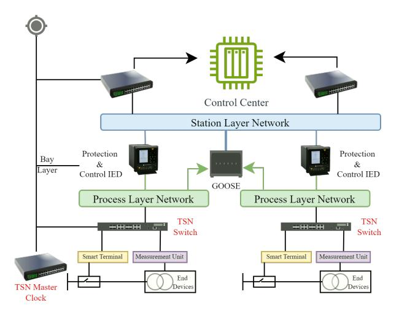

Fig. 12: TSN-enabled substation architecture showing deterministic communication across process and station layers using IEC 61850 protocols (e.g., GOOSE).

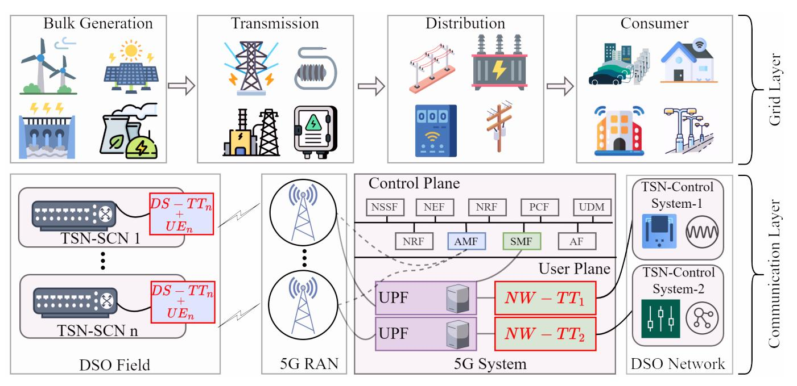

Fig. 13: Integrated 5G-TSN architecture for smart energy systems with both grid layer and communication layer. DERs and substations operate as TSN domains, interconnected via 5G infrastructure with DS-TT and NW-TT roles for deterministic end-to-end communication.

outs or cyber incidents. iv) Massive scalability is required to support millions of DERs, smart meters, and EV infrastructure with high availability. v) Communication systems must support diverse traffic patterns, including periodic metering, lowlatency GOOSE (Generic Object-Oriented Substation Event) signals, bursty market transactions, and Supervisory Control and Data Acquisition (SCADA) polling, all with strict QoS differentiation.

*2) Challenges:* Despite advances in communication technologies, integrating 5G and TSN into smart grids presents persistent challenges. i) Legacy substation protocols like IEC 61850 GOOSE, SMV (Sampled Measured Values), and MMS (Manufacturing Message Specification) are optimized for Ethernet-based LANs and lack native support for WAN or wireless transmission. ii) TSN's wired reliance limits its applicability for last-mile access to rooftop PVs, remote EV supply equipment (EVSE), and rural smart meters. iii) The 5G air interface remains susceptible to interference and congestion, which may compromise deterministic performance unless URLLC-grade scheduling is enforced. iv) The lack of standardized mapping between IEC61850 traffic types (e.g., TT1–TT6) and 5G QoS flows (e.g., 5QI80, 82) complicates integrated control and scheduling, particularly in mixed traffic conditions. The IEC61850 standard defines a hierarchy of Transfer Time Classes (TT0–TT6) ranging from non-critical file transfers to ultra-fast protection commands such as trips and blockings, each with specific latency bounds, as summarized in Table [XI.](#page-22-0) Without a clear correspondence between these latency classes and 5QI profiles, it becomes difficult to guarantee service-level objectives across TSN and 5G segments. v) Security and regulatory concerns discourage operators from adopting public 5G for critical infrastructure, especially without full end-to-end visibility and isolation [\[142\]](#page-33-2).

*3) Enabling Technologies:* A suite of 5G-TSN technologies from Sections [III](#page-7-0) and [IV](#page-10-0) can be adopted to address these challenges: i) Substation LANs leverage TSN mechanisms such as TAS, guard bands, and protected windows (Section [III-B5\)](#page-9-0) to ensure deterministic latency and eliminate cross-traffic interference for critical IEC 61850 messages including GOOSE, SMV, and MMS [\[143\]](#page-33-3). To support such differentiation, each IEC 61850 protocol is mapped to a specific TSN traffic class and Ethernet priority, as summarized in Table [XII.](#page-22-1) For example, SMV streams, used for time-critical analog signal reporting, are classified as "Protected" with the highest Ethernet priority (7), while GOOSE and MMS traffic are assigned non-protected classes with slightly lower priorities. These mappings enable deterministic scheduling within the substation and form the basis for harmonizing TSN traffic classes with 5G QoS flow configurations. This interaction is depicted in Fig. [12,](#page-22-2) which illustrates TSN operation across the process and station layers in IEC 61850 substations, enabling precise coordination among IEDs and substation controllers. ii) Precise time synchronization across substations and DERs is maintained via gPTP extensions (e.g., ITU-T G.8275.1) and 5G timing distribution from the gNB (Section [IV-B2\)](#page-13-2), ensuring alignment within < 1 µs. iii) NPNs (Section [IV-A1\)](#page-10-2) allow utilities to deploy dedicated 5G infrastructure with guaranteed URLLC performance for grid control operations [\[144\]](#page-33-4). iv) MEC instances placed at feeders or substations process local events—such as frequency dips or voltage violations—within 10–50 ms, reducing reaction latency. v) SDN/NFV-based orchestration (Section [IV-C2\)](#page-16-2) maps IEC 61850 traffic types to 5QI profiles and coordinates resource slices across TSN and 5G domains [\[145\]](#page-33-5). vi) FRER (Section [IV-A5\)](#page-12-0) enables duplicate delivery of measurements (e.g., voltage/frequency) over redundant paths, achieving > 99.9999% delivery reliability. vii) CNC-based centralized scheduling (Section [III-B5\)](#page-9-0) supports coordinated flows across substations and field devices. viii) NEF and Common API Framework (CAPIF) (Section [IV-A3\)](#page-11-1) expose programmable interfaces for authorized energy applications to dynamically request slice reconfiguration during emergencies [\[146\]](#page-33-6).

- *4) Integration Strategy:* A hierarchical architecture integrates TSN and 5G across edge, distribution, and control domains: i) TSN operates within substations and DER clusters using IEEE 802.1Qbv schedules to support protective relaying, synchrophasor streaming, and fault isolation with sub-1 ms delay. ii) 5G URLLC slices extend real-time connectivity to DERs, EVSEs, smart meters, and field sensors, enabling dynamic grid reconfiguration. iii) Cross-domain synchronization is maintained via gPTP propagation over G.8275.1 compliant profiles and DS-TT/NW-TT synchronization entities (Section [III-B\)](#page-7-1), achieving < 1 µs drift across domains. iv) Network slicing maps protection flows to 5QI 80, SCADA to 5QI 70, and metering to 5QI 6, ensuring deterministic latency and isolation. v) MEC-based DER orchestration enables localized control (e.g., voltage regulation, load shedding) while substations continue synchronized switching operations over TSN. Fig. [13](#page-23-0) illustrates a multi-domain energy communication system where DERs, substations, and control centers form hierarchical TSN and 5G domains. The lower layer represents the Distribution System Operator (DSO) field domain, comprising multiple TSN-SCNs (TSN-based Substation Control Nodes) that connect local IEDs and energy assets. Each TSN-SCN contains a DS-TT and UE that provide a time-sensitive uplink to the 5G RAN. These field domains connect to a DSO Network, where centralized TSN-Control Systems perform grid orchestration and supervision via NW-TT interfaces. This architecture enables wide-area deterministic coordination through joint TSN and 5G integration.
- *5) Representative Scenario:* Consider a smart grid segment integrating a wind farm, rooftop PVs, residential battery systems, substations, and EV charging hubs. i) Within substations, TSN enables SMV and GOOSE message exchange with 1 µs synchronization and sub-1 ms latency. ii) A 5G NPN connects DERs and meters to utility control centers and edge MEC nodes. iii) During a frequency drop, MEC detects the deviation within 10 ms, dispatching commands to battery storage systems over URLLC slices while instructing non-critical loads to disconnect. iv) Simultaneously, substations execute switching actions triggered via TSN, all timestamped using gPTP for post-event analysis and auditability. v) NEF APIs dynamically expand the protection slice to prioritize critical grid traffic.
- *6) Key Technical Insights and Open Issues:* Smart Energy Systems require hierarchical determinism that combines TSN precision with 5G flexibility. i) Synchronization extension from TSN to wide-area DERs via 5G must be robust against air interface jitter and GNSS loss, potentially requiring adaptive PTP profiles. ii) Reliable mapping of IEC 61850 traffic classes to 5QI must preserve latency and reliability boundsstandardization is ongoing. iii) FRER and redundant multi-UPF routing improve reliability but increase overhead and control complexity. iv) NEF/CAPIF integration offers powerful application-aware control, but its security model must guard against unauthorized slice manipulation. v) Edge-based

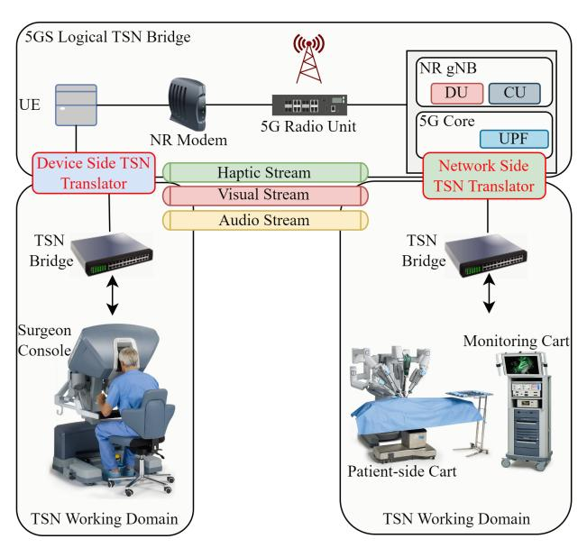

Fig. 14: Illustration of a remote telesurgery setup using a Da Vinci surgical system over an integrated 5G-TSN architecture.

orchestration must co-optimize TSN schedules and 5G slice behavior under grid stress conditions, a task complicated by non-uniform traffic and multi-vendor deployments.

#### *D. Digital Health Systems*

Digital Health Systems (DHS) encompass a broad set of mission-critical healthcare applications including telesurgery, remote diagnostics, haptic feedback, mobile triage, and continuous patient monitoring [\[147\]](#page-33-7), [\[148\]](#page-33-8). These systems increasingly rely on deterministic and secure communication to ensure clinical safety, real-time response, and regulatory compliance. Integration of 5G and TSN enables a unified substrate capable of meeting the extreme requirements of medical data flows across both static hospital environments and mobile emergency settings.

- *1) Requirements:* DHS applications impose stringent deterministic communication demands: i) End-to-end latency of 1–10 ms for closed-loop haptics, telestration, and remote surgical actuation. ii) Packet loss below 10−5 and reliability above 99.999% for mission-critical events such as defibrillator activation or robotic control. iii) Sub-microsecond synchronization for timestamp alignment of distributed imaging and sensor data [\[149\]](#page-33-9). iv) Seamless mobility support for ambulance networks, wearable devices, and mobile field hospitals. v) Regulatory-grade privacy and auditing compliance (e.g., HIPAA [\[150\]](#page-33-10), GDPR [\[151\]](#page-33-11)) with secure, flow-isolated data handling. These requirements span both performance and ethical dimensions, elevating DHS communication infrastructure to safety-critical status.
- *2) Challenges:* Healthcare environments introduce unique architectural and operational challenges: i) Emergency surges create unpredictable traffic patterns and resource contention. ii) Coexistence of legacy medical systems and modern Internet of Medical Things (IoMT) devices results in protocol heterogeneity. iii) TSN's native reliance on wired Ethernet limits its

TABLE XIII: Cross-domain mapping of 5G-TSN integration techniques with application-specific justification.

| Category                 | Technique / Mechanism                         | Section Ref.  | IA           | ITS      | SES          | DHS          | Application-Specific Rationale                                                                   |
|--------------------------|-----------------------------------------------|---------------|--------------|----------|--------------|--------------|--------------------------------------------------------------------------------------------------|
|                          | 5G-TSN Bridge (DS-TT / NW-TT)                 | III-B         | <b>√</b>     | <b>√</b> | ✓            | ✓            | Core mechanism for TSN-5G interworking across domains.                                           |
| Architecture & Control   | Virtualized Centralized Controllers (SDN/NFV) | IV-A1         | ✓            | ✓        | ✓            | ✓            | Enables soft-PLC (IA), MEC-based RSUs (ITS), grid orchestration (SES), surgical workflows (DHS). |
|                          | MEC for local decision-making                 | IV-A1         | ✓            | ✓        | ✓            | ✓            | Used at RSUs (ITS), substations (SES), hospitals/ambulances (DHS).                               |
|                          | TSCTSF for lightweight sync                   | IV-A1         | ×            | ×        | ×            | $\checkmark$ | Lightweight mobile TSN sync for field clinics, ambulances.                                       |
|                          | gPTP sync over air (via gNB TSF)              | IV-B2         | ✓            | ✓        | ✓            | ✓            | Enables sub-1 $\mu$ s sync across wireless; foundational.                                        |
|                          | OPC UA reference broadcast from UE            | IV-B2         | ×            | ×        | ×            | ✓            | For low-power wearable sensors and telemetry.                                                    |
| Time Synchronization     | Rate ratio estimation / RTT compensation      | IV-B2, IV-C3  | ×            | ✓        | ×            | ×            | Compensates for mobile-induced drift in ITS.                                                     |
|                          | NW-TT/DS-TT assisted time mapping             | III-B         | $\checkmark$ | ✓        | $\checkmark$ | $\checkmark$ | Maintains sync across TSN and 5G interfaces.                                                     |
|                          | eBPF-based time alignment                     | IV-A5         | ✓            | ✓        | ×            | ✓            | Software-based correction in edge UEs.                                                           |
|                          | IEEE 802.1Qbv (TAS) / PSFP integration        | IV-C4         | ✓            | ✓        | ✓            | ✓            | Foundational gate control for deterministic streams.                                             |
|                          | CQF-aware time budgeting                      | IV-C3         | ✓            | ✓        | ×            | ×            | Cycle and propagation time compensation in IA and ITS.                                           |
|                          | TSCAI-based admission control                 | III-B5        | $\checkmark$ | ✓        | $\checkmark$ | $\checkmark$ | Enforces per-flow admission with traffic shaping.                                                |
| QoS & Scheduling         | DRL-based flow reconfiguration                | III-B5        | ✓            | ✓        | ×            | $\checkmark$ | Dynamic rerouting for ITS (mobility) and DHS (emergency).                                        |
|                          | Binary-constrained 5QI/QFI mapping            | III-B5        | $\checkmark$ | ✓        | $\checkmark$ | $\checkmark$ | Ensures precise QoS matching to TSN traffic classes.                                             |
|                          | GCL-aligned VNF scheduling                    | IV-C2         | ✓            | ✓        | ×            | ✓            | Coordinates network function timing with GCL slots.                                              |
|                          | Enlarged GCL slots                            | IV-A3         | ×            | ✓        | ×            | ×            | Accommodates infotainment and moderate-latency flows.                                            |
|                          | Multi-TRP + PDCP duplication (Rel-16)         | III-A         | ✓            | ✓        | ×            | ✓            | Enhances UL reliability for haptics, alerts, safety.                                             |
| Reliability & Redundancy | CoMP / Joint Transmission (Rel-18)            | III-A         | ×            | ✓        | ×            | ×            | Emerging redundancy technique in ITS for overhead minimization.                                  |
|                          | FRER (IEEE 802.1CB) over SmartNICs / FPGA     | IV-A5         | ✓            | ×        | ✓            | ✓            | Rapid failover in IA/SES; dual-delivery in DHS.                                                  |
|                          | Redundant routing with multi-UPF              | IV-A5, IV-A3  | ×            | ×        | ✓            | ×            | Grid-level availability for DERs in SES.                                                         |
|                          | Network Slicing + 5QI Isolation               | IV-A3, III-B5 | ✓            | ✓        | ✓            | ✓            | URLLC slice enforcement across critical flows.                                                   |
| Security & Exposure      | NEF/CAPIF APIs for slice control              | IV-A3         | ×            | ×        | $\checkmark$ | ✓            | Dynamic service exposure in SES and DHS.                                                         |
| security & Exposure      | Inter-domain QoS/sync continuity              | III-B5, IV-A5 | ×            | 1        | ×            | 1            | Maintains QoS/sync across mobile edges (ITS, DHS).                                               |

The applicability markers ( $\checkmark$ \×) reflect predominant usage based on domain-specific latency, reliability, and deployment characteristics. Some techniques may be theoretically extensible across domains but are marked (×) where such adoption is not currently prevalent or supported by domain-specific standards.

applicability to mobile and wearable devices. iv) 5G's default QoS models do not inherently prioritize continuous telemetry or jitter-sensitive flows unless explicitly mapped. v) Lack of standard alignment between medical data semantics (e.g., Digital Imaging and Communications in Medicine (DICOM), Health Level 7 (HL7)) and 5QI service classes complicates flow classification and scheduling [152]

3) Enabling Technologies: A number of integrated 5G-TSN mechanisms from Sections III and IV have the potential to address these DHS-specific constraints: i) TSCTSF (Section IV-A1) enables synchronization and timing functions in environments lacking full TSN stacks, useful for mobile clinics or emergency vehicles. ii) Edge-hosted virtualized control (Section IV-C2) enables latency-sensitive orchestration of surgical or diagnostic workflows using NFV-integrated soft controllers. iii) OPC UA reference UE broadcast (Section IV-B2) supports synchronization propagation to wearable or mobile devices with  $\sim 0.5 \, \text{ms}$  offset accuracy in 4G/5G settings. iv) gPTP mapping via NW-TT and DS-TT (Section III-B) maintains synchronization across hospital TSN domains and 5G transport, enabling time-consistent image fusion or event logging. v) Binary-constrained QoS assignment (Section III-B5) maps latency- and jitter-sensitive medical flows (e.g., robotic telemetry, sensor feeds) to appropriate QFIs and RBs. vi) TSCAI with PSFP data (Section III-B5) enforces deterministic admission of life-critical flows by interpreting PSFP/GCL directives from hospital TSN configurations. vii) DRL-based flow reconfiguration (Section III-B5) adapts flow periodicity for surgical video or bio-signal streams in real-time, informed by KPI thresholds such as jitter, delay, or error rate. viii) Multi-TRP and PDCP-level packet duplication (Section III-A) ensures haptic control or real-time alerts remain operational under radio link disruption. ix) eBPF-based traffic steering (Section IV-A5) bypasses kernel latency for gPTP and medical control flows in UE, reducing delay by up to 100× for time-aligned actuation.

4) Integration Strategy: The following strategy may enable secure and deterministic integration of TSN and 5G in DHS: i) Intra-Hospital TSN Domains: IEEE 802.1Qbv and PSFP provide deterministic communication between surgical robots, imaging servers, and telemetry units. ii) TSN-to-5G Bridging: DS-TT (at the UE) and NW-TT (in the UPF) enable seamless flow mapping between hospital TSN domains and 5G transport, preserving latency and timing constraints. iii) Time Synchronization: gPTP is extended across the 5G system using OPC UA reference UE broadcasts or shared grandmasters at the gNB, maintaining sub- $\mu$ s alignment. iv) Edge-Cloud Coordination: MEC nodes colocated with hospital infrastructure support AI-based triage, anomaly detection, and robotic command processing with execution latency under 10 ms. v) QoS & Flow Isolation: Medical flows are assigned to dedicated network slices with differentiated security and scheduling, supporting both telemetry and control traffic isolation. vi) Inter-Hospital Interoperability: TSN-aware interdomain gateways, combined with SDN control and tunneling, maintain QoS and synchronization across geographically distributed sites.

5) Representative Scenario: A telesurgery scenario illustrates end-to-end deterministic communication enabled by 5G-TSN integration. The surgeon console, connected via TSN and a DS-TT to the UE, transmits synchronized haptic, video, and audio streams over a 5G URLLC link. The hospital's NW-TT receives and maps these flows into the TSN backbone, where they are delivered to a robotic surgery cart and monitoring systems with sub-millisecond latency. Time synchronization is preserved using gPTP across 5G and TSN domains. MEC

nodes co-located with hospital infrastructure assist in realtime video preprocessing and anomaly detection. As shown in Fig. [14,](#page-24-0) this configuration enables highly reliable and coordinated actuation critical for remote surgical precision [\[153\]](#page-33-13).

*6) Key Technical Insights and Open Issues:* DHS imposes deterministic communication requirements under variable load, mobility, and regulatory constraints. Extending TSN's timing and QoS capabilities to mobile devices through mechanisms like TSCTSF and OPC UA reference broadcasting enables safe, real-time care beyond fixed hospital sites. However, several open issues remain: i) *Synchronization under GNSS denial:* Current gPTP mechanisms degrade in indoor or urban canyon settings without GNSS, limiting use for mobile healthcare. ii) *Unpredictability of DRLbased scheduling:* While promising, DRL models for flow adaptation require medical-grade validation to ensure safe fallback under abnormal conditions. iii) *QoS misalignment:* Binary-constrained mapping methods improve granularity, but medical data semantics (e.g., DICOM priority) must be better aligned with 5QI/QFI parameters. iv) *Inter-domain continuity:* Seamless TSN-to-TSN mapping across 5G slices and domains is still immature, with limited tooling for GCL continuity or synchronization state propagation. v) *Security and Compliance:* While slice-based flow separation exists, unified auditing and integrity mechanisms across TSN and 5G stacks are underdeveloped, requiring new trust models.

#### *E. Application-Level Synthesis and Comparative Reflections*

The integration of 5G and TSN establishes a unified deterministic communication paradigm, yet its implementation demands domain-specific architectural tuning. While all applications leverage foundational enablers, such as URLLC for bounded latency, IEEE 802.1AS for time synchronization, and MEC-enabled orchestration, critical divergences emerge in operational priorities. In *Industrial Automation*, the emphasis lies on microsecond-scale precision, with jitter constrained below 100 µs for servo control and 1 µs time alignment in multi-axis robotics. TSN dominates wired intra-factory networks, while 5G URLLC extends determinism to mobile AGVs, requiring seamless DS-TT/NW-TT bridging for PROFINET/EtherCAT interoperability. *Intelligent Transportation Systems* invert this balance: 5G assumes primacy to support vehicular mobility (handovers at 500 km/h with < 10 ms disruption), while TSN operates locally within vehicles for sub-millisecond ECU coordination. The coexistence of these domains demands AIenhanced RTT compensation (3GPP TR 38.827) to mitigate Doppler-induced sync drift.

*Smart Energy Systems* adopt a hierarchical split—TSN ensures < 1 µs-aligned protection relaying in substations (per IEC/IEEE 60802), while 5G NPNs manage distributed DERs with 10 ms demand-response cycles. This duality necessitates protocol translation between IEC 61850 SMV/GOOSE and 5QI 80/70 flows, alongside FRER-based redundancy for fault tolerance. *Digital Health Systems* prioritize regulatory compliance, enforcing HIPAA/GDPR-grade slice isolation for medical data. Here, TSCTSF enables mobile synchronization (0.5 ms accuracy for wearables), while TSCAI enforces deterministic admission of robotic telemetry (jitter < 5 ms) and emergency alerts (packet loss < 10−5 ). Table [XIII](#page-25-0) systematically maps these comparative insights to concrete 5G-TSN integration techniques, highlighting their domain-specific applicability and technical justification.

This analysis underscores that 5G-TSN convergence cannot rely on one-size-fits-all designs. Future advancements must address: a) Standardized mappings between domain-specific protocols (e.g., IEC 61850 TT6 to 5QI 80) and TSN traffic classes. b) Stateful handover mechanisms for TSN continuity in mobile scenarios (e.g., UPF migration with GCL preservation). c) Certification frameworks for mixed-criticality slice isolation, particularly for grid protection (SES) and patient safety (DHS). Only through such application-aware refinements can integrated networks meet the heterogeneous demands of modern digital infrastructure. These domainspecific insights highlight recurring system-level limitations across sectors, motivating a unified investigation of crossdomain challenges in the following section.

## VI. TECHNICAL CHALLENGES AND FUTURE RESEARCH DIRECTIONS IN 5G-TSN FOR EMERGING APPLICATIONS

Building on the application-specific insights from Section [V,](#page-18-0) this section examines the core technical challenges that cut across vertical domains in integrated 5G-TSN networks. Despite the tailoring of architectures and protocols to fit domainspecific constraints in industrial automation, transportation, energy, and healthcare, several system-level limitations persist. These include inconsistent time synchronization under mobility, misaligned QoS semantics across TSN and 5G, reliability degradation under dynamic wireless conditions, and the absence of unified orchestration frameworks for flow control and slice management.

This section synthesizes these recurring issues into four key challenges: (i) end-to-end synchronization in mobile and heterogeneous environments, (ii) cross-layer QoS mapping and adaptive flow scheduling, (iii) reliable delivery under failures and wireless variability, and (iv) cross-domain orchestration and control-plane interoperability. Each subsection analyzes how these problems manifest differently across application contexts, identifies current technical gaps, and outlines future research directions and standardization needs for achieving deterministic, resilient, and scalable operation in 5G-TSN systems. To highlight the domain-specific nuances of these challenges, Table [XIV](#page-27-0) summarizes how key technical limitations manifest across industrial automation, intelligent transportation, smart energy, and digital health applications.

## *A. End-to-End Synchronization under Mobility and Heterogeneity*

Precise time synchronization is fundamental to deterministic communication in 5G-TSN systems. While IEEE 802.1AS and gPTP support sub-µs accuracy in wired TSN domains, extending this synchronization across mobile and heterogeneous environments remains a major challenge [\[154\]](#page-33-14).

Challenge Domain Industrial Automation Intelligent Transportation Smart Energy Digital Health Synchronization Stable in fixed plants; mobile AGVs suffer handover loss Doppler and GNSS loss impair platooning accuracy Wireless jitter disrupts widearea time sync Sub-ms sync insufficient for surgical actuation QoS Mapping Static Class A/B to 5QI mapping RL-based PSFP lacks safety guarantees IEC 61850 flows coarsemapped DICOM urgency mapping missing Reliability FPGA FRER; CoMP for mobile robots Multi-TRP and duplication impacted by handover timing FRER supports SMV/GOOSE; orchestration complex eBPF steering + Multi-TRP; limited by GNSS Security VLAN filters without slicelevel authentication No slice auth at RSU; risk of DoS attacks NEF lacks fine-grained access policies Weak end-to-end trust across OPC UA and TSCTSF Orchestration CQF static; gNB scheduling unaware RSU–gNB–CNC remain uncoordinated SDN lacks TSN-GCL interface for grid events MEC lacks flow-level TSN control

TABLE XIV: Cross-domain manifestation of core 5G-TSN challenges in Emerging Applications

- *1) Challenges:* Application-specific demands expose the limitations of current methods: a) *Industrial Automation (Section [V-A\)](#page-18-2):* Fixed machines benefit from stable grandmaster distribution via TSN-aware gNBs. However, mobile AGVs require hybrid wired-wireless synchronization, which lacks robust handover continuity [\[155\]](#page-33-15). b) *ITS (Section [V-B\)](#page-20-1):* Rate ratio estimation and RTT-based compensation degrade under Doppler effects, fast handovers, and GNSS loss, limiting synchronization for platooning and cooperative maneuvers. c) *Smart Energy (Section [V-C\)](#page-22-3):* Time alignment via G.8275.1 is disrupted by wireless jitter when synchronizing DERs or EVSEs, compromising wide-area control [\[156\]](#page-33-16). d) *Digital Health (Section [V-D\)](#page-24-1):* OPC UA broadcasts and TSCTSF achieve ∼ 0.5 ms offset but lack sub-µs precision and auditability required for clinical actuation.
- *2) Technical Gaps:* TSN profiles assume static topologies. DS-TT/NW-TT roles are statically assigned and lack dynamic reassignment logic. IEEE P802.1DF and 3GPP Rel-16–18 include sync extensions, but inter-domain handover lacks state propagation for GCL or gPTP context via N4/N9 interfaces.
- *3) Future Directions:* a) *GNSS-Independent Sync:* gPTP may be integrated with mobility-aware drift compensation techniques leveraging IMU data and wireless channel statistics. b) *Low-Cost Hardware Timestamping:* TSN-capable NICs or PHYs could be developed for mobile UEs and edge devices to support accurate timestamping without costly FPGA platforms. c) *Sync Continuity in 5GC:* Extensions to the N4/N9 interfaces may allow transfer of time synchronization state and GCL context during inter-domain handovers. d) *Dynamic Grandmaster Management:* Grandmaster roles can be dynamically coordinated among DS-TTs, gNBs, and CNCs to ensure synchronization continuity under mobility. e) *AI-Based Sync Prediction:* Machine learning models deployed at the MEC could be used to predict clock drift and proactively adjust PTP offset under dynamic network conditions. f) *Auditable Synchronization:* Hash-based logs or cryptographic audit trails may be incorporated into synchronization protocols to enable verifiable timing in critical domains such as healthcare and energy.
- *4) Standardization Implications:* Enhancements to IEEE 802.1AS, 3GPP PCF/AMF, and ITU-T G.827x should support mobile synchronization domains, sync-aware session management, and dynamic TSN entity reassignment for

deterministic continuity.

## *B. Cross-Layer QoS Mapping and Flow Adaptation*

Deterministic operation across TSN and 5G domains depends critically on mapping QoS attributes such as latency, reliability, and priority between heterogeneous scheduling models, including TSN's GCL/PSFP and 5G's 5QI/QFI/RB allocation. Misalignment in flow semantics and lack of dynamic adaptability undermine predictability.

- *1) Challenges:* a) *Industrial Automation (Section [V-A\)](#page-18-2):* Mapping of Class A/B TSN flows to 5QI 80/83 is static and insufficient for dynamic control loops [\[112\]](#page-32-9). CQF-aware scheduling (Section [IV-C3\)](#page-16-1) lacks a real-time interface with 5G RB allocation. b) *ITS (Section [V-B\)](#page-20-1):* DRL-based PSFP adaptation improves responsiveness to traffic fluctuations, as shown by [\[157\]](#page-33-17), but unconstrained RL models risk violating safety constraints without frameworks like CAP-safe RL [\[158\]](#page-33-18). GCL-5G co-scheduling remains under-tested in mobility scenarios, as most joint scheduling work focuses on static deployments. c) *Smart Energy (Section [V-C\)](#page-22-3):* IEC 61850 TT classes are not directly mappable to 5QI. Protective relaying and metering coexist, but slice-level granularity is coarse. d) *Digital Health (Section [V-D\)](#page-24-1):* Binary-constrained mapping improves granularity for robotic telemetry and haptic flows, but lacks alignment with clinical standards (e.g., DICOM urgency levels).
- *2) Technical Gaps:* QoS policies across CNC, PCF, and MEC nodes operate in silos. There is limited support for feedback-based QoS reassignment or flow preemption based on domain-wide KPIs (e.g., jitter, loss, semantic urgency). PSFP directives are not dynamically interpreted by 5G schedulers.
- *3) Future Directions:* a) *QoS Ontology Mapping:* Shared semantics across IEC 61850, DICOM/HL7, OPC UA, and 5QI/QFI could be defined to enable interpretable and consistent scheduling. b) *Policy-Driven Adaptation:* CNC and PCF may be integrated via closed-loop policies triggered by realtime telemetry. c) *Risk-Bounded AI Scheduling:* Constrained RL algorithms (e.g., safe-TD3) could be employed to adapt flow rates while preserving safety envelopes. d) *Fine-Grained Slicing:* 5G slicing frameworks may be extended to support dynamic micro-slices for mission-critical traffic with coordinated PSFP scheduling. e) *QoS-Aware Control Functions:* QoS state

might be embedded in N3/N6 headers to enable flow-aware UPF routing and RB preemption.

*4) Standardization Implications:* Coordinated efforts are required across IEEE 802.1Qdj, 3GPP SA2/SA5, and ETSI NFV to define interoperable QoS translation layers and controlplane extensions for flow adaptation under dynamic and crossdomain constraints.

## *C. Reliable Delivery under Failures and Wireless Variability*

Mission-critical applications across domains demand ultrareliable delivery with minimal packet loss, despite wireless variability, hardware failures, and multipath-induced impairments. Mechanisms like FRER, Multi-TRP, and PDCP duplication offer potential, but integration challenges persist.

- *1) Challenges:* a) *Industrial Automation (Section [V-A\)](#page-18-2):* FRER with SmartNICs achieves < 50 µs failover (Section [IV-A5\)](#page-12-0), but requires FPGA-based acceleration and incurs resource overhead. CoMP and Multi-TRP improve reliability for mobile robots but increase scheduling complexity. b) *ITS (Section [V-B\)](#page-20-1):* Multi-TRP and packet duplication enhance reliability under high mobility, but spectral efficiency drops significantly. Transitioning between RSUs triggers UPF reallocation, disrupting TSN timing. c) *Smart Energy (Section [V-C\)](#page-22-3):* Redundant paths (e.g., multi-UPF or FRER) improve delivery of GOOSE/SMV, but raise orchestration complexity in SDN/NFV environments. d) *Digital Health (Section [V-D\)](#page-24-1):* Multi-TRP and eBPF-based steering enhance reliability for haptic and alarm flows. However, GNSS-denied environments (e.g., indoor hospitals) degrade synchronization accuracy, affecting redundancy timing.
- *2) Technical Gaps:* a) FRER support remains hardwaredependent and lacks software-based fallback options. b) Multi-TRP coordination lacks joint optimization across TSN domains. c) Failover triggering is reactive and not applicationaware (e.g., based on clinical or electrical criticality).
- *3) Future Directions:* a) *Intelligent Redundancy Activation:* AI/ML techniques may be used to predict failover needs based on signal degradation, congestion, or critical flow urgency. b) *Software-Based FRER:* NIC-agnostic FRER mechanisms could be explored using the Data Plane Development Kit (DPDK) [\[159\]](#page-33-19) and extended Berkeley Packet Filter (eBPF) [\[160\]](#page-33-20) to support sub-ms failover in constrained environments. c) *Joint Reliability-Scheduling:* Packet duplication might be co-designed with GCL slot alignment for deterministic redundancy in TSN and 5G. d) *Multi-Domain Redundancy Mapping:* Redundant streams may be routed across TSN and 5G paths using SDN, based on per-flow reliability metrics.
- *4) Standardization Implications:* Cross-domain reliability requires enhancements to IEEE 802.1CB (FRER), 3GPP Rel-18/19 (coherent joint transmission), and IETF DetNet for synchronized multipath delivery with semantic awareness of mission-critical flows.
- *D. Security and Trust Management in Deterministic Networks*

Security is paramount in 5G-TSN systems supporting safety-critical applications such as industrial control, grid

- protection, vehicular coordination, and remote surgery. Deterministic flows require integrity, isolation, and trust guarantees across wired TSN and wireless 5G domains, yet current architectures lack unified security models and auditable enforcement mechanisms. Recent works have shown that the merging of real-time Ethernet with mobile broadband exposes new classes of security vulnerabilities [\[161\]](#page-33-21).
- *1) Challenges:* a) *Industrial Automation (Section [V-A\)](#page-18-2):* TSN domains use static filtering and VLAN isolation, but lack runtime verification of slice boundaries in 5G uplinks. b) *ITS (Section [V-B\)](#page-20-1):* Mobile RSUs and onboard units exchange life-critical flows over public 5G, risking impersonation or DoS without authenticated network slices. c) *Smart Energy (Section [V-C\)](#page-22-3):* NEF and MEC enable remote reconfiguration, but lack fine-grained access control for slice and scheduling manipulation. d) *Digital Health (Section [V-D\)](#page-24-1):* TSCTSF and OPC UA synchronization offer basic integrity, but end-to-end trust validation and compliance logging remain weak across inter-domain flows.
- *2) Technical Gaps:* Current TSN security (IEEE 802.1X) is Ethernet-centric and lacks interfaces to 5G control functions. NEF and CAPIF expose powerful APIs for flow control but rely on external authentication without slice-level integrity enforcement. Moreover, time synchronization and QoS adaptation lack verifiable logs or tamper detection.
- *3) Future Directions:* a) *Slice Integrity and Authenticated Scheduling:* Per-flow authentication and signed scheduling commands from CNC and PCF could help mitigate injection and modification attacks. b) *Secure Synchronization Verification:* Cryptographic primitives such as hash chains or Merkle proofs may be embedded in gPTP exchanges and PSFP logs to support tamper-evident auditability. c) *Zero-Trust Deterministic Fabric:* Trust anchors might be deployed at DS-TT, UPF, and MEC nodes to validate flow origin and integrity. d) *NEF/CAPIF Hardening:* Capability-based access models and secure logging could enhance API-triggered orchestration in sensitive domains. e) *Regulatory-Grade Auditing:* Blockchain or Distributed Ledger Technology (DLT) mechanisms may be leveraged to align TSN-5G audit trails with regulatory standards like HIPAA, GDPR, and NERC-CIP.
- *4) Standardization Implications:* Security integration across TSN and 5G requires enhancements to IEEE 802.1X and 802.1AR for key management, as well as 3GPP SA3 and IETF SACM for slice integrity, NEF policy control, and audit frameworks supporting deterministic operation.
- *E. Cross-Domain Orchestration and Control-Plane Interoperability*

End-to-end deterministic communication across 5G and TSN requires coordinated orchestration across distributed control domains, spanning TSN CNCs, 5G PCFs, UPFs, SDN controllers, and MEC platforms. However, existing orchestration frameworks operate in silos, lacking unified scheduling, configuration, and KPI feedback.

*1) Challenges:* a) *Industrial Automation (Section [V-A\)](#page-18-2):* Time slot reservations for TSN CQF are statically configured and disconnected from dynamic 5G RB allocation during retooling or robot mobility. b) *ITS (Section [V-B\)](#page-20-1):* Inter-RSU coordination depends on MEC-hosted policies but lacks synchronization with vehicle-centric TSN schedulers and gNB handover triggers. c) *Smart Energy (Section [V-C\)](#page-22-3):* Grid protection demands synchronized TSN/5G scheduling across substations and DERs, yet SDN orchestrators lack interfaces to TSN CNCs and GCL propagation logic. d) *Digital Health (Section [V-D\)](#page-24-1):* Robotic command and telemetry require MECbased orchestration, but current VNF lifecycles are too coarsegrained to support flow-level slice steering or TSN schedule updates.

- *2) Technical Gaps:* No standardized interfaces exist between CNC and PCF for real-time schedule coordination. MEC lacks awareness of TSN-specific QoS states (e.g., PSFP entries, gate open windows). Dynamic reconfiguration of interdomain flows is hindered by limited flow-level telemetry feedback and heterogeneous abstraction models, as evidenced in recent proposals like X-FRER for cross-domain FRER coordination [\[162\]](#page-33-22).
- *3) Future Directions:* a) *CNC–PCF Interface:* APIs could be developed for bidirectional policy exchange between TSN CNC and 5G PCF to coordinate GCL and RB allocation. b) *Flow-Aware MEC Scheduling:* MEC platforms may benefit from integrating PSFP/GCL state to support deterministic services. c) *Unified Intent Models:* Cross-domain intent languages (e.g., TOSCA extensions) could help express end-to-end service constraints. d) *Telemetry-Driven Reconfiguration:* KPIbased triggers might enable dynamic flow migration or slice remapping across domains. e) *Hierarchical Control Fabric:* A multi-tier orchestration model may facilitate coordination across distributed edge and cloud controllers.
- *4) Standardization Implications:* Interoperable orchestration demands enhancements to IEEE 802.1Qdj (CNC), 3GPP PCF/NEF interfaces, ETSI NFV MANO, and IETF I2NSF to support flow-level TSN–5G control convergence, real-time KPI feedback loops, and cross-domain policy enforcement.

#### VII. CONCLUSION

This survey has examined the integration of 5G and TSN as a foundational communication paradigm for emerging applications, including industrial automation, intelligent transportation systems, smart energy, and digital health. The synergy between 5G features, such as URLLC, network slicing, and high mobility, and TSN's deterministic communication and precise time synchronization offers a powerful platform to meet the stringent latency, reliability, and flexibility demands of these domains. Despite its promise, integrated 5G-TSN systems face several technical challenges, including end-toend time synchronization, heterogeneous QoS mapping, traffic scheduling, and interoperability across dynamic environments. To address these, we conducted an application-specific analysis that maps domain requirements to 5G-TSN enabling technologies, followed by a synthesis of cross-domain technical gaps. Key research directions are identified, including enhanced traffic orchestration, domain-aware slicing strategies, and unified time synchronization frameworks. Additionally, the need for robust, integrated security mechanisms is emphasized, particularly to address TSN's lack of native protections. Overcoming these challenges is essential for realizing the full potential of integrated 5G-TSN networks. As future cyberphysical systems evolve, this convergence will be critical for enabling reliable, secure, and scalable connectivity across next-generation industrial and societal infrastructures.

#### REFERENCES

- [1] A. Mahmood, L. Beltramelli, S. F. Abedin, S. Zeb, N. I. Mowla, S. A. Hassan, E. Sisinni, and M. Gidlund, "Industrial IoT in 5G-and-beyond networks: Vision, architecture, and design trends," *IEEE Transactions on Industrial Informatics*, vol. 18, no. 6, pp. 4122–4137, 2021.
- [2] P. Arthurs, L. Gillam, P. Krause, N. Wang, K. Halder, and A. Mouzakitis, "A taxonomy and survey of edge cloud computing for intelligent transportation systems and connected vehicles," *IEEE Transactions on Intelligent Transportation Systems*, vol. 23, no. 7, pp. 6206–6221, 2021.
- [3] C. Guo, H. Ashrafian, S. Ghafur, G. Fontana, C. Gardner, and M. Prime, "Challenges for the evaluation of digital health solutions—a call for innovative evidence generation approaches," *NPJ digital medicine*, vol. 3, no. 1, p. 110, 2020.
- [4] D. Fan, Y. Ren, Q. Feng, Y. Liu, Z. Wang, and J. Lin, "Restoration of smart grids: Current status, challenges, and opportunities," *Renewable and Sustainable Energy Reviews*, vol. 143, p. 110909, 2021.
- [5] L. Deng, G. Xie, H. Liu, Y. Han, R. Li, and K. Li, "A survey of realtime ethernet modeling and design methodologies: From avb to TSN," *ACM Computing Surveys (CSUR)*, vol. 55, no. 2, pp. 1–36, 2022.
- [6] J. Sasiain, D. Franco, A. Atutxa, J. Astorga, and E. Jacob, "Towards the integration and convergence between 5G and TSN technologies and architectures for industrial communications: A survey," *IEEE Communications Surveys & Tutorials*, 2024.
- [7] T. Zhang, G. Wang, C. Xue, J. Wang, M. Nixon, and S. Han, "Timesensitive networking (TSN) for industrial automation: Current advances and future directions," *ACM Computing Surveys*, vol. 57, no. 2, pp. 1– 38, 2024.
- [8] F. Rinaldi, A. Raschella, and S. Pizzi, "5G nr system design: A concise survey of key features and capabilities," *Wireless Networks*, vol. 27, no. 8, pp. 5173–5188, 2021.
- [9] A. Nasrallah, A. S. Thyagaturu, Z. Alharbi, C. Wang, X. Shao, M. Reisslein, and H. ElBakoury, "Ultra-low latency (ULL) networks: The IEEE TSN and ietf detnet standards and related 5G ULL research," *IEEE Communications Surveys & Tutorials*, vol. 21, no. 1, pp. 88–145, 2018.
- [10] C. Mannweiler, B. Gajic, P. Rost, R. S. Ganesan, C. Markwart, R. Halfmann, J. Gebert, and A. Wich, "Reliable and deterministic mobile communications for industry 4.0: Key challenges and solutions for the integration of the 3gpp 5G system with IEEE," in *Mobile Communication-Technologies and Applications; 24. ITG-Symposium*. VDE, 2019, pp. 1–6.
- [11] T. Striffler, N. Michailow, and M. Bahr, "Time-sensitive networking in 5th generation cellular networks-current state and open topics," in *2019 IEEE 2nd 5G World Forum (5GWF)*. IEEE, 2019, pp. 547–552.
- [12] A. Aijaz, "Private 5G: The future of industrial wireless," *IEEE Industrial Electronics Magazine*, vol. 14, no. 4, pp. 136–145, 2020.
- [13] K. Samdanis and T. Taleb, "The road beyond 5G: A vision and insight of the key technologies," *IEEE Network*, vol. 34, no. 2, pp. 135–141, 2020.
- [14] M. K. Atiq, R. Muzaffar, O. Seijo, I. Val, and H.-P. Bernhard, "When ´ IE 802.11 and 5G meet time-sensitive networking," *IE Open Journal of the Industrial Electronics Society*, vol. 3, pp. 14–36, 2021.
- [15] Y. Seol, D. Hyeon, J. Min, M. Kim, and J. Paek, "Timely survey of time-sensitive networking: Past and future directions," *IEEE Access*, vol. 9, pp. 142 506–142 527, 2021.
- [16] O. Seijo, X. Iturbe, and I. Val, "Tackling the challenges of the integration of wired and wireless TSN with a technology proof-ofconcept," *IEEE Transactions on Industrial Informatics*, vol. 18, no. 10, pp. 7361–7372, 2021.
- [17] M. Wen, Q. Li, K. J. Kim, D. Lopez-P ´ erez, O. A. Dobre, H. V. ´ Poor, P. Popovski, and T. A. Tsiftsis, "Private 5G networks: Concepts, architectures, and research landscape," *IEEE Journal of Selected Topics in Signal Processing*, vol. 16, no. 1, pp. 7–25, 2021.
- [18] Y. Kang, S. Lee, S. Gwak, T. Kim, and D. An, "Time-sensitive networking technologies for industrial automation in wireless communication systems," *Energies*, vol. 14, no. 15, p. 4497, 2021.

- [19] J. Prados-Garzon, P. Ameigeiras, J. Ordonez-Lucena, P. Munoz, ˜ O. Adamuz-Hinojosa, and D. Camps-Mur, "5G non-public networks: Standardization, architectures and challenges," *IEEE Access*, vol. 9, pp. 153 893–153 908, 2021.
- [20] J. Harmatos and M. Maliosz, "Architecture integration of 5G networks and time-sensitive networking with edge computing for smart manufacturing," *Electronics*, vol. 10, no. 24, p. 3085, 2021.
- [21] A. Mahmood, S. F. Abedin, T. Sauter, M. Gidlund, and K. Landernas, ¨ "Factory 5G: A review of industry-centric features and deployment options," *IEEE Industrial Electronics Magazine*, vol. 16, no. 2, pp. 24–34, 2022.
- [22] F. Yusun and T. Jinhui, "A survey on 5G capabilities enabling the factories of the future." *Telecommunications Science*, vol. 38, no. 9, 2022.
- [23] R. Sethi, A. Kadam, K. Prabhu, and N. Kota, "Security considerations to enable time-sensitive networking over 5G," *IEEE Open Journal of Vehicular Technology*, vol. 3, pp. 399–407, 2022.
- [24] H. Wang and S. Li, ""5G+ TSN+ dt" solutions for digital factory key issues of networking, precision, automation and digitalization," in *Journal of Physics: Conference Series*, vol. 2185, no. 1. IOP Publishing, 2022, p. 012022.
- [25] G. P. Sharma, D. Patel, J. Sachs, M. De Andrade, J. Farkas, J. Harmatos, B. Varga, H.-P. Bernhard, R. Muzaffar, M. Ahmed *et al.*, "Toward deterministic communications in 6G networks: state of the art, open challenges and the way forward," *IEEE Access*, vol. 11, pp. 106 898– 106 923, 2023.
- [26] Z. Satka, M. Ashjaei, H. Fotouhi, M. Daneshtalab, M. Sjodin, and ¨ S. Mubeen, "A comprehensive systematic review of integration of time sensitive networking and 5G communication," *Journal of systems architecture*, vol. 138, p. 102852, 2023.
- [27] K. Zanbouri, M. Noor-A-Rahim, J. John, C. J. Sreenan, H. V. Poor, and D. Pesch, "A comprehensive survey of wireless time-sensitive networking (TSN): Architecture, technologies, applications, and open issues," *IEEE Communications Surveys & Tutorials*, 2024.
- [28] S. M. Darroudi, N. Domenech, M. Grandy, and R. Guerra-Gomez, "On ` the TSN and 5G network integration approaches, 5G features proof, advantages and challenges," in *2024 Joint European Conference on Networks and Communications & 6G Summit (EuCNC/6G Summit)*. IEEE, 2024, pp. 688–693.
- [29] J. Jobish, M. Noor-A-Rahim, A. Vijayan, H. V. Poor, and D. Pesch, "Industry 4.0 and beyond: The role of 5G, wifi 7, and time-sensitive networking (TSN) in enabling smart manufacturing," *Future Internet*, vol. 16, no. 9, p. 345, 2024.
- [30] S. Rodrigues and J. Lv, "Synchronization in time-sensitive networking: An introduction to IEEE std 802.1 as," *IEEE Communications Standards Magazine*, vol. 6, no. 4, pp. 14–20, 2022.
- [31] J. Walrand, "A concise tutorial on traffic shaping and scheduling in time-sensitive networks," *IEEE Communications Surveys & Tutorials*, vol. 25, no. 3, pp. 1941–1953, 2023.
- [32] B. Varga, J. Farkas, F. Fejes, J. Ansari, I. Moldovan, and M. M ´ at´ e,´ "Robustness and reliability provided by deterministic packet networks (TSN and detnet)," *IEEE Transactions on Network and Service Management*, vol. 20, no. 3, pp. 2309–2318, 2023.
- [33] A. Nasrallah, V. Balasubramanian, A. Thyagaturu, M. Reisslein, and H. ElBakoury, "Reconfiguration algorithms for high precision communications in time sensitive networks: time-aware shaper configuration with IEEE 802.1 qcc (extended version)," *arXiv preprint arXiv:1906.11596*, 2019.
- [34] Y. Huang, S. Wang, X. Zhang, T. Huang, and Y. Liu, "Flexible cyclic queuing and forwarding for time-sensitive software-defined networks," *IEEE Transactions on Network and Service Management*, vol. 20, no. 1, pp. 533–546, 2022.
- [35] L. Maile, D. Voitlein, K.-S. Hielscher, and R. German, "Ensuring reliable and predictable behavior of IEEE 802.1 cb frame replication and elimination," in *ICC 2022-IEEE International Conference on Communications*. IEEE, 2022, pp. 2706–2712.
- [36] M. Jover, M. Barranco, J. Naranjo, J. Proenza, and A. Ballesteros, "Characterizing the tradeoff between fault tolerance and cost of redundant TSN networks," in *2024 IEEE 29th International Conference on Emerging Technologies and Factory Automation (ETFA)*. IEEE, 2024, pp. 1–4.
- [37] L. Leonardi, L. L. Bello, and G. Patti, "Performance assessment of the IEEE 802.1 qch in an automotive scenario," in *2020 AEIT International Conference of Electrical and Electronic Technologies for Automotive (AEIT AUTOMOTIVE)*. IEEE, 2020, pp. 1–6.
- [38] N. Finn, "Introduction to time-sensitive networking," *IEEE Communications Standards Magazine*, vol. 6, no. 4, pp. 8–13, 2022.

- [39] "Ieee standard for local and metropolitan area networks–bridges and bridged networks – amendment 31: Stream reservation protocol (srp) enhancements and performance improvements," *IEEE Std 802.1Qcc-2018 (Amendment to IEEE Std 802.1Q-2018 as amended by IEEE Std 802.1Qcp-2018)*, pp. 1–208, 2018.
- [40] B. Shi, X. Tu, B. Wu, and Y. Peng, "Recent advances in time-sensitive network configuration management: A literature review," *Journal of Sensor and Actuator Networks*, vol. 12, no. 4, p. 52, 2023.
- [41] L. L. Bello and W. Steiner, "A perspective on IEEE time-sensitive networking for industrial communication and automation systems," *Proceedings of the IEEE*, vol. 107, no. 6, pp. 1094–1120, 2019.
- [42] G. P. A. W. Group *et al.*, "View on 5G architecture: Version 2.0," 2017.
- [43] D. Demmer, R. Gerzaguet, J.-B. Dore, and D. Le Ruyet, "Analytical ´ study of 5G nr embb co-existence," in *2018 25th International Conference on Telecommunications (ICT)*. IEEE, 2018, pp. 186–190.
- [44] T. C. Mai, H. Q. Ngo, and T. Q. Duong, "Downlink spectral efficiency of cell-free massive mimo systems with multi-antenna users," *IEEE Transactions on Communications*, vol. 68, no. 8, pp. 4803–4815, 2020.
- [45] Y. Niu, Y. Li, D. Jin, L. Su, and A. V. Vasilakos, "A survey of millimeter wave communications (mmwave) for 5G: opportunities and challenges," *Wireless networks*, vol. 21, pp. 2657–2676, 2015.
- [46] B. S. Khan, S. Jangsher, A. Ahmed, and A. Al-Dweik, "Urllc and embb in 5G industrial IoT: A survey," *IEEE Open Journal of the Communications Society*, vol. 3, pp. 1134–1163, 2022.
- [47] T. Tsourdinis, N. Makris, T. Korakis, and S. Fdida, "Demystifying urllc in real-world 5G networks: An end-to-end experimental evaluation," in *GLOBECOM 2024-2024 IEEE Global Communications Conference*. IEEE, 2024, pp. 2954–2959.
- [48] C. Bockelmann, N. Pratas, H. Nikopour, K. Au, T. Svensson, C. Stefanovic, P. Popovski, and A. Dekorsy, "Massive machine-type communications in 5G: Physical and mac-layer solutions," *IEEE communications magazine*, vol. 54, no. 9, pp. 59–65, 2016.
- [49] C. Bockelmann, N. K. Pratas, G. Wunder, S. Saur, M. Navarro, D. Gregoratti, G. Vivier, E. De Carvalho, Y. Ji, C. Stefanovi ˇ c´ *et al.*, "Towards massive connectivity support for scalable mmtc communications in 5G networks," *IEEE access*, vol. 6, pp. 28 969–28 992, 2018.
- [50] H. Bhayre and R. M. Hirannaiah, "Secure authentication mechanism for amf in 5G nb-IoT devices," in *2024 15th International Conference on Computing Communication and Networking Technologies (ICCCNT)*. IEEE, 2024, pp. 1–7.
- [51] S. Christakis, T. Tsourdinis, N. Makris, T. Korakis, and S. Fdida, "Evaluation of user plane function implementations in real-world 5G networks," in *IEEE INFOCOM 2024-IEEE Conference on Computer Communications Workshops (INFOCOM WKSHPS)*. IEEE, 2024, pp. 1–6.
- [52] M. Afaq, J. Iqbal, T. Ahmed, I. U. Islam, M. Khan, and M. S. Khan, "Towards 5G network slicing for vehicular ad-hoc networks: An endto-end approach," *Computer Communications*, vol. 149, pp. 252–258, 2020.
- [53] G. P. Gomez, J. M. Batalla, Y. Miche, S. Holtmanns, C. X. Mavromoustakis, G. Mastorakis, and N. Haider, "Security policies definition and enforcement utilizing policy control function framework in 5G," *Computer Communications*, vol. 172, pp. 226–237, 2021.
- [54] A. Coelho, J. Ruela, G. Queiros, R. Trancoso, P. F. Correia, F. Ribeiro, ´ H. Fontes, R. Campos, and M. Ricardo, "On-demand 5G private networks using a mobile cell," *arXiv preprint arXiv:2411.06597*, 2024.
- [55] L. U. Khan, I. Yaqoob, N. H. Tran, Z. Han, and C. S. Hong, "Network slicing: Recent advances, taxonomy, requirements, and open research challenges," *IEEE Access*, vol. 8, pp. 36 009–36 028, 2020.
- [56] Z. A. Bhuiyan, S. Islam, M. M. Islam, A. A. Ullah, F. Naz, and M. S. Rahman, "On the (in) security of the control plane of SDN architecture: A survey," *IEEE Access*, 2023.
- [57] P. Porambage, J. Okwuibe, M. Liyanage, M. Ylianttila, and T. Taleb, "Survey on multi-access edge computing for internet of things realization," *IEEE Communications Surveys & Tutorials*, vol. 20, no. 4, pp. 2961–2991, 2018.
- [58] L. B. Silveira, H. C. de Resende, C. B. Both, J. M. Marquez-Barja, B. Silvestre, and K. V. Cardoso, "Tutorial on communication between access networks and the 5G core," *Computer Networks*, vol. 216, p. 109301, 2022.
- [59] 3GPP, "5G; system architecture for the 5G system (5GS)," 3rd Generation Partnership Project (3GPP), Technical Specification 3GPP TS 23.501 version 16.14.0 Release 16, 2022.
- [60] N. Alliance, "Service-based architecture in 5G," *Final deliverable (approved-P Public)*, 2018.
- [61] S. Niknam, A. Roy, H. S. Dhillon, S. Singh, R. Banerji, J. H. Reed, N. Saxena, and S. Yoon, "Intelligent o-ran for beyond 5G and 6G

- wireless networks," in *2022 IEEE Globecom Workshops (GC Wkshps)*. IEEE, 2022, pp. 215–220.
- [62] S. Li, L. Da Xu, and S. Zhao, "5G internet of things: A survey," *Journal of Industrial Information Integration*, vol. 10, pp. 1–9, 2018.
- [63] T. O. Olwal, K. Djouani, and A. M. Kurien, "A survey of resource management toward 5G radio access networks," *IEEE Communications Surveys & Tutorials*, vol. 18, no. 3, pp. 1656–1686, 2016.
- [64] P. Danielis, H. Parzyjegla, G. Muhl, E. Schweissguth, and D. Tim- ¨ mermann, "Frame replication and elimination for reliability in timesensitive networks," *arXiv preprint arXiv:2109.13677*, 2021.
- [65] M. Khoshnevisan, K. Jayasinghe, R. Chen, A. Davydov, and L. Guo, "Enhanced reliability and capacity with multi-trp transmission," *IEEE Communications Standards Magazine*, vol. 6, no. 1, pp. 13–19, 2022.
- [66] E. Abazi, "5G core network architecture: Network exposure function," Ph.D. dissertation, Politecnico di Torino, 2019.
- [67] Q. Tang, O. Ermis, C. D. Nguyen, A. De Oliveira, and A. Hirtzig, "A systematic analysis of 5G networks with a focus on 5G core security," *IEEE Access*, vol. 10, pp. 18 298–18 319, 2022.
- [68] S. P. Shah, B. J. Pattan, N. Gupta, N. D. Tangudu, and S. Chitturi, "Service enabler layer for 5G verticals," in *2020 IEEE 3rd 5G World Forum (5GWF)*. IEEE, 2020, pp. 269–274.
- [69] J. Collin, J. Pellikka, and J. T. Penttinen, "New capabilities of 5G sa," *5G Innovations for Industry Transformation: Data-driven Use Cases*, p. 51, 2023.
- [70] C. Patachia-Sultanoiu, I. Bogdan, G. Suciu, A. Vulpe, O. Badita, and B. Rusti, "Advanced 5G architectures for future netapps and verticals," in *2021 IEEE International Black Sea Conference on Communications and Networking (BlackSeaCom)*. IEEE, 2021, pp. 1–6.
- [71] 3rd Generation Partnership Project (3GPP), "5G; service requirements for cyber-physical control applications in vertical domains," 3rd Generation Partnership Project (3GPP), Tech. Rep. TS 22.104, 2020. [Online]. Available: [https://www.3gpp.org/ftp/Specs/archive/22](https://www.3gpp.org/ftp/Specs/archive/22_series/22.104/) series/ [22.104/](https://www.3gpp.org/ftp/Specs/archive/22_series/22.104/)
- [72] ——, "5G; service requirements for cyber-physical control applications in vertical domains," 3rd Generation Partnership Project (3GPP), Tech. Rep. TS 22.104, 2022. [Online]. Available: [https://www.3gpp.org/ftp/](https://www.3gpp.org/ftp/Specs/archive/22_series/22.104/) [Specs/archive/22](https://www.3gpp.org/ftp/Specs/archive/22_series/22.104/) series/22.104/
- [73] 3GPP, "System architecture for the 5G system," *3GPP TS 23.501 V15. 3.0*, 2018.
- [74] 3rd Generation Partnership Project (3GPP), "Technical specification group services and system aspects; procedures for the 5G system (5GS); stage 2," 3rd Generation Partnership Project (3GPP), Tech. Rep. TS 23.502, December 2022. [Online]. Available: [https://www.3gpp.org/ftp/Specs/archive/23](https://www.3gpp.org/ftp/Specs/archive/23_series/23.502/) series/23.502/
- [75] P. M. Rost and T. Kolding, "Performance of integrated 3GPP 5G and IEEE TSN networks," *IEEE Communications Standards Magazine*, vol. 6, no. 2, pp. 51–56, 2022.
- [76] F. Bouchmal, O. Carrasco, Y. Fu, J. Rodrigo, J. F. Monserrat, and N. Cardona, "5G physical layer-based procedure to support timesensitive networking," in *Telecom*, vol. 5, no. 1. MDPI, 2024, pp. 49–64.
- [77] 5G Alliance for Connected Industries and Automation (5G-ACIA), "5G qos for industrial automation," 2021.
- [78] A. Neumann, L. Wisniewski, R. S. Ganesan, P. Rost, and J. Jasperneite, "Towards integration of industrial ethernet with 5G mobile networks," in *2018 14th IEEE International Workshop on Factory Communication Systems (WFCS)*. IEEE, 2018, pp. 1–4.
- [79] M. Khoshnevisan, V. Joseph, P. Gupta, F. Meshkati, R. Prakash, and P. Tinnakornsrisuphap, "5G industrial networks with comp for urllc and time sensitive network architecture," *IEEE Journal on Selected Areas in Communications*, vol. 37, no. 4, pp. 947–959, 2019.
- [80] Y. Li, D. Wang, T. Sun, X. Duan, and L. Lu, "Solutions for variant manufacturing factory scenarios based on 5G edge features," in *2020 IEEE International Conference on Edge Computing (EDGE)*. IEEE, 2020, pp. 54–58.
- [81] N. Ambrosy and L. Underberg, "5G packet delay considerations for different 5G-TSN communication scenarios," in *2023 IEEE 21st International Conference on Industrial Informatics (INDIN)*. IEEE, 2023, pp. 1–6.
- [82] A. Larranaga, M. C. Lucas-Esta ˜ n, I. Martinez, I. Val, and J. Gozalvez, ˜ "Analysis of 5G-TSN integration to support industry 4.0," in *2020 25th IEEE International conference on emerging technologies and factory automation (ETFA)*, vol. 1. IEEE, 2020, pp. 1111–1114.
- [83] R. B. Abreu, G. Pocovi, T. H. Jacobsen, M. Centenaro, K. I. Pedersen, and T. E. Kolding, "Scheduling enhancements and performance evaluation of downlink 5G time-sensitive communications," *IEEE Access*, vol. 8, pp. 128 106–128 115, 2020.

- [84] D. Ginthor, J. von Hoyningen-Huene, R. Guillaume, and H. Schotten, ¨ "Analysis of multi-user scheduling in a TSN-enabled 5G system for industrial applications," in *2019 IEEE International Conference on Industrial Internet (ICII)*. IEEE, 2019, pp. 190–199.
- [85] J. Yang and G. Yu, "Traffic scheduling for 5G-TSN integrated systems," in *2022 International Symposium on Wireless Communication Systems (ISWCS)*. IEEE, 2022, pp. 1–6.
- [86] D. Krummacker, B. Veith, C. Fischer, and H. D. Schotten, "Analysis of 5G channel access for collaboration with TSN concluding at a 5G scheduling mechanism," *Network*, vol. 2, no. 3, pp. 440–455, 2022.
- [87] J. Ansari, C. Andersson, P. de Bruin, J. Farkas, L. Grosjean, J. Sachs, J. Torsner, B. Varga, D. Harutyunyan, N. Konig ¨ *et al.*, "Performance of 5G trials for industrial automation," *Electronics*, vol. 11, no. 3, p. 412, 2022.
- [88] P. E. Kehl, J. Ansari, M. Lovrin, P. Mohanram, C.-C. E. Liu, J.-L. L. Yeh, and R. H. Schmitt, "5g-tsn integrated prototype for reliable industrial communication using frame replication and elimination for reliability," *Electronics*, vol. 14, no. 4, 2025. [Online]. Available: <https://www.mdpi.com/2079-9292/14/4/758>
- [89] K. Nikhileswar, K. Prabhu, and D. Cavalcanti, "Traffic steering in edge compute devices using express data path for 5G and TSN integration," in *2022 IEEE 18th International Conference on Factory Communication Systems (WFCS)*. IEEE, 2022, pp. 1–6.
- [90] A. Varga and R. Hornig, "An overview of the omnet++ simulation environment," in *1st International ICST Conference on Simulation Tools and Techniques for Communications, Networks and Systems*, 2010.
- [91] J. Falk, D. Hellmanns, B. Carabelli, N. Nayak, F. Durr, S. Kehrer, and ¨ K. Rothermel, "Nesting: Simulating IEEE time-sensitive networking (TSN) in omnet++," in *2019 International Conference on Networked Systems (NetSys)*. IEEE, 2019, pp. 1–8.
- [92] M. Bosk, F. Rezabek, K. Holzinger, A. G. Marino, A. A. Kane, F. Fons, J. Ott, and G. Carle, "Methodology and infrastructure for tsn-based reproducible network experiments," *IEEE Access*, vol. 10, pp. 109 203– 109 239, 2022.
- [93] H.-H. Liu, S. Senk, M. Ulbricht, H. K. Nazari, T. Scheinert, M. Reisslein, G. T. Nguyen, and F. H. P. Fitzek, "Improving tsn simulation accuracy in omnet++: A hardware-aligned approach," *IEEE Access*, vol. 12, pp. 79 937–79 956, 2024.
- [94] J. Huang, L. Feng, F. Zhou, H. Liu, P. Yu, and K. Xie, "5G urllc local deployment architecture for industrial TSN services," in *2022 International Wireless Communications and Mobile Computing (IWCMC)*. IEEE, 2022, pp. 7–11.
- [95] L. Martenvormfelde, A. Neumann, L. Wisniewski, and L. Schreckenberg, "Co-configuration of 5G and TSN enabling end-to-end quality of service in industrial communications," *https://opendata. uni-halle. de//handle/1981185920/41505*, 2021.
- [96] M. Yang, S. Lim, S.-M. Oh, and J. Shin, "An uplink transmission scheme for TSN service in 5G industrial IoT," in *2020 international conference on information and communication technology convergence (ICTC)*. IEEE, 2020, pp. 902–904.
- [97] A. Larranaga, M. C. Lucas-Esta ˜ n, I. Martinez, and J. Gozalvez, "5G ˜ configured grant scheduling for 5G-TSN integration for the support of industry 4.0," in *2023 18th Wireless On-Demand Network Systems and Services Conference (WONS)*. IEEE, 2023, pp. 72–79.
- [98] Y. Cai, X. Zhang, S. Hu, and X. Wei, "Dynamic qos mapping and adaptive semi-persistent scheduling in 5G-TSN integrated networks," *China Communications*, vol. 20, no. 4, pp. 340–355, 2023.
- [99] J. Ansari, T.-s. Hsiao, M. H. Jafari, B. Varga, J. Farkas, I. Moldovan, ´ A. Goppert, and R. H. Schmitt, "5G enabled flexible lineless assembly ¨ systems with edge cloud controlled mobile robots," in *2022 IEEE 33rd Annual International Symposium on Personal, Indoor and Mobile Radio Communications (PIMRC)*. IEEE, 2022, pp. 1419–1424.
- [100] M. Gundall, C. Huber, P. Rost, R. Halfmann, and H. D. Schotten, "Integration of 5G with TSN as prerequisite for a highly flexible future industrial automation: Time synchronization based on IEEE 802.1 as," in *IECON 2020 The 46th Annual Conference of the IEEE Industrial Electronics Society*. IEEE, 2020, pp. 3823–3830.
- [101] M.-T. Thi, S. Guedon, S. B. H. Said, M. Boc, D. Miras, J.-B. Dore, ´ M. Laugeois, X. Popon, and B. Miscopein, "IEEE 802.1 TSN time synchronization over wi-fi and 5G mobile networks," in *2022 IEEE 96th Vehicular Technology Conference (VTC2022-Fall)*. IEEE, 2022, pp. 1–7.
- [102] M. Schungel, S. Dietrich, D. Ginth ¨ or, S.-P. Chen, and M. Kuhn, ¨ "Heterogeneous synchronization in converged wired and wireless timesensitive networks," in *2021 17th IEEE International Conference on Factory Communication Systems (WFCS)*. IEEE, 2021, pp. 67–74.

- [103] H. Shi, A. Aijaz, and N. Jiang, "Evaluating the performance of overthe-air time synchronization for 5G and TSN integration," in *2021 IEEE International Black Sea Conference on Communications and Networking (BlackSeaCom)*. IEEE, 2021, pp. 1–6.
- [104] M. Schungel, S. Dietrich, D. Ginth ¨ or, S.-P. Chen, and M. Kuhn, ¨ "Optimized propagation delay compensation for an improved 5G ran synchronization," in *IECON 2021–47th Annual Conference of the IEEE Industrial Electronics Society*. IEEE, 2021, pp. 1–6.
- [105] J. Song, M. Kubomi, J. Zhao, and D. Takita, "Time synchronization performance analysis considering the frequency offset inside 5G-TSN network," in *2021 17th International Symposium on Wireless Communication Systems (ISWCS)*. IEEE, 2021, pp. 1–6.
- [106] T. Striffler and H. D. Schotten, "The 5G transparent clock: Synchronization errors in integrated 5G-TSN industrial networks," in *2021 IEEE 19th International Conference on Industrial Informatics (INDIN)*. IEEE, 2021, pp. 1–6.
- [107] D. Patel, J. Diachina, S. Ruffini, M. De Andrade, J. Sachs, and D. P. Venmani, "Time error analysis of 5G time synchronization solutions for time aware industrial networks," in *2021 IEEE International Symposium on Precision Clock Synchronization for Measurement, Control, and Communication (ISPCS)*. IEEE, 2021, pp. 1–6.
- [108] M. Schungel, S. Dietrich, D. Ginth ¨ or, S.-P. Chen, and M. Kuhn, ¨ "Analysis of time synchronization for converged wired and wireless networks," in *2020 25th IEEE International Conference on Emerging Technologies and Factory Automation (ETFA)*, vol. 1. IEEE, 2020, pp. 198–205.
- [109] International Telecommunication Union, "G.8271.1: Network limits for time synchronization in packet networks with full timing support from the network," [https://www.itu.int/rec/T-REC-G.8271.1/,](https://www.itu.int/rec/T-REC-G.8271.1/) accessed: 2024-09-06.
- [110] H. Xu, J. Xin, S. Xu, and H. Zhang, "Ran enhancement to support propagation delay compensation of TSN," in *2021 IEEE 9th International Conference on Information, Communication and Networks (ICICN)*. IEEE, 2021, pp. 179–182.
- [111] Z. Satka, D. Pantzar, A. Magnusson, M. Ashjaei, H. Fotouhi, M. Sjodin, ¨ M. Daneshtalab, and S. Mubeen, "Developing a translation technique for converged TSN-5G communication," in *2022 IEEE 18th International Conference on Factory Communication Systems (WFCS)*. IEEE, 2022, pp. 1–8.
- [112] Z. Satka, M. Ashjaei, H. Fotouhi, M. Daneshtalab, M. Sjodin, and ¨ S. Mubeen, "Qos-man: A novel qos mapping algorithm for TSN-5G flows," in *2022 IEEE 28th International Conference on Embedded and Real-Time Computing Systems and Applications (RTCSA)*. IEEE, 2022, pp. 220–227.
- [113] Y. Zhang, Q. Xu, X. Guan, C. Chen, and M. Li, "Wireless/wired integrated transmission for industrial cyber-physical systems: risk-sensitive co-design of 5G and TSN protocols," *Science China Information Sciences*, vol. 65, no. 1, p. 110204, 2022.
- [114] Y. Zhang, Q. Xu, M. Li, C. Chen, and X. Guan, "Qos-aware mapping and scheduling for virtual network functions in industrial 5G-TSN network," in *2021 IEEE Global Communications Conference (GLOBE-COM)*. IEEE, 2021, pp. 1–6.
- [115] Z. Satka, I. Alvarez, M. Ashjaei, and S. Mubeen, "Work in progress: A ´ centralized configuration model for TSN-5G networks," in *2022 IEEE 27th International Conference on Emerging Technologies and Factory Automation (ETFA)*. IEEE, 2022, pp. 1–4.
- [116] D. Ginthor, R. Guillaume, J. von Hoyningen-Huene, M. Sch ¨ ungel, ¨ and H. D. Schotten, "End-to-end optimized joint scheduling of converged wireless and wired time-sensitive networks," in *2020 25th IEEE International Conference on Emerging Technologies and Factory Automation (ETFA)*, vol. 1. IEEE, 2020, pp. 222–229.
- [117] F. Luque-Schempp, L. Panizo, P. Merino, J. Rivas *et al.*, "Toward zero touch configuration of 5G non-public networks for time sensitive networking," *IEEE Network*, vol. 36, no. 2, pp. 50–56, 2022.
- [118] X. Wang, H. Yao, T. Mai, S. Guo, and Y. Liu, "Reinforcement learningbased particle swarm optimization for end-to-end traffic scheduling in TSN-5G networks," *IEEE/ACM Transactions on Networking*, vol. 31, no. 6, pp. 3254–3268, 2023.
- [119] Z. Cheng, D. Yang, R. Guo, and W. Zhang, "Joint time-frequency resource scheduling over cqf-based TSN-5G system," in *2023 15th International Conference on Communication Software and Networks (ICCSN)*. IEEE, 2023, pp. 60–65.
- [120] F. Luque-Schempp, L. Panizo, P. Merino *et al.*, "Automadapt: Zero touch configuration of 5G qos flows extended for time-sensitive networking," *IEEE Access*, 2023.
- [121] M. M. Rahman, F. Khatun, I. Jahan, R. Devnath, and M. A.-A. Bhuiyan, "Cobotics: The evolving roles and prospects of next-generation collab-

- orative robots in industry 5.0," *Journal of Robotics*, vol. 2024, no. 1, p. 2918089, 2024.
- [122] F. Sherwani, M. M. Asad, and B. S. K. K. Ibrahim, "Collaborative robots and industrial revolution 4.0 (ir 4.0)," in *2020 International Conference on Emerging Trends in Smart Technologies (ICETST)*. IEEE, 2020, pp. 1–5.
- [123] P. M. Rost and T. Kolding, "Performance of integrated 3gpp 5G and IEEE TSN networks," *IEEE Communications Standards Magazine*, vol. 6, no. 2, pp. 51–56, 2022.
- [124] P. Kehl, J. Ansari, M. H. Jafari, P. Becker, J. Sachs, N. Konig, ¨ A. Goppert, and R. H. Schmitt, "Prototype of 5G integrated with TSN ¨ for edge-controlled mobile robotics," *Electronics*, vol. 11, no. 11, p. 1666, 2022.
- [125] A. Agust´ı-Torra, M. Ferre-Mancebo, D. Rinc ´ on-Rivera, C. Cervell ´ o-´ Pastor, and S. Sallent-Ribes, "Building a 5G-TSN testbed: Architecture and challenges," in *2024 24th International Conference on Transparent Optical Networks (ICTON)*, 2024, pp. 1–4.
- [126] R. Debnath, M. S. Akinci, D. Ajith, and S. Steinhorst, "5GTQ: Qosaware 5G-TSN simulation framework," in *2023 IEEE 98th Vehicular Technology Conference (VTC2023-Fall)*. IEEE, 2023, pp. 1–7.
- [127] M. Li, H. Liu, C. Chen, F. Gu, S. Guo, and X. Guan, "Joint transmission for industrial 5G-TSN networks: A deep graph clustering approach," in *2024 IEEE/CIC International Conference on Communications in China (ICCC)*. IEEE, 2024, pp. 1407–1412.
- [128] A. Rammohan *et al.*, "Revolutionizing intelligent transportation systems with cellular vehicle-to-everything (c-v2x) technology: Current trends, use cases, emerging technologies, standardization bodies, industry analytics and future directions," *Vehicular Communications*, p. 100638, 2023.
- [129] D. Wang and T. Sun, "Leveraging 5G TSN in v2x communication for cloud vehicle," in *2020 IEEE International Conference on Edge Computing (EDGE)*. IEEE, 2020, pp. 106–110.
- [130] M. Lei, M. Rahman, D. Mathaikutty, and I. Alvarez, "Wireless-assisted automatic online spatial calibration based on 5G TSN for sensor fusion," in *2023 IEEE International Conference on Signal Processing, Communications and Computing (ICSPCC)*. IEEE, 2023, pp. 1–6.
- [131] X. Ma, S. Ding, and T. Zhang, "Ieee 802.11 vanets for safety of autonomous driving: Qos requirements benchmarking," in *2024 IEEE 100th Vehicular Technology Conference (VTC2024-Fall)*, 2024, pp. 1– 6.
- [132] A. Kaul, K. Obraczka, R. Fontes, and T. Turletti, "D4: Dynamic, decentralized, distributed, delegation-based network control and its applications to autonomous vehicles," *ACM J. Auton. Transport. Syst.*, vol. 1, no. 3, May 2024. [Online]. Available: [https:](https://doi.org/10.1145/3644079) [//doi.org/10.1145/3644079](https://doi.org/10.1145/3644079)
- [133] Y. Deng, R. Paul, and Y.-J. Choi, "Multiple qos enabled intelligent resource management in vehicle-to-vehicle communication," *IEEE Transactions on Intelligent Transportation Systems*, vol. 25, no. 9, pp. 12 081–12 094, 2024.
- [134] H.-S. Cha, G. Lee, A. Ghosh, M. Baker, S. Kelley, and J. Hofmann, "5G nr positioning enhancements in 3gpp release-i8," *IEEE Communications Standards Magazine*, vol. 9, no. 1, pp. 22–27, 2025.
- [135] P. Ding, D. Liu, Y. Shen, H. Duan, and Q. Zheng, "Edge-to-cloud intelligent vehicle-infrastructure based on 5G time-sensitive network integration," in *2022 IEEE International Symposium on Broadband Multimedia Systems and Broadcasting (BMSB)*, 2022, pp. 1–5.
- [136] International Electrotechnical Commission, "Iec 61850-5: Communication requirements for functions and device models," International Electrotechnical Commission, Technical Report, 2013, available online: [https://www.iec.ch/.](https://www.iec.ch/)
- [137] T. Docquier, Y.-Q. Song, V. Chevrier, L. Pontnau, and A. Ahmed-Nacer, "Iec 61850 over TSN: traffic mapping and delay analysis of goose traffic," in *2020 25th IEEE International Conference on Emerging Technologies and Factory Automation (ETFA)*, vol. 1. IEEE, 2020, pp. 246–253.
- [138] A. E. Caglar and E. Yavuz, "The role of environmental protection expenditures and renewable energy consumption in the context of ecological challenges: Insights from the european union with the novel panel econometric approach," *Journal of Environmental Management*, vol. 331, p. 117317, 2023.
- [139] T. Kataray, B. Nitesh, B. Yarram, S. Sinha, E. Cuce, S. Shaik, P. Vigneshwaran, and A. Roy, "Integration of smart grid with renewable energy sources: Opportunities and challenges–a comprehensive review," *Sustainable Energy Technologies and Assessments*, vol. 58, p. 103363, 2023.

- [140] W. Rickerson, J. Gillis, and M. Bulkeley, "The value of resilience for distributed energy resources: An overview of current analytical practices," 2024.
- [141] N. Shaukat, M. R. Islam, M. M. Rahman, B. Khan, B. Ullah, S. M. Ali, and A. Fekih, "Decentralized, democratized, and decarbonized future electric power distribution grids: a survey on the paradigm shift from the conventional power system to micro grid structures," *IEEE Access*, vol. 11, pp. 60 957–60 987, 2023.
- [142] Z. Liu, H. Wang, H. Sun, J. Su, B. Zhang, M. Liu, and R. Zhu, "Software defined network based 5G and time-sensitive network fusion for power services with ultra-low latency requirements," in *2021 International Conference on Wireless Communications and Smart Grid (ICWCSG)*. IEEE, 2021, pp. 381–385.
- [143] Y. Chen, X. Yao, Z. Gan, Z. You, P. Wu, and W. Wang, "Power service mapping scheduling method based on fusion of 5G and time-sensitive network," in *2022 IEEE 6th Advanced Information Technology, Electronic and Automation Control Conference (IAEAC)*. IEEE, 2022, pp. 1309–1314.
- [144] J. Wu, C. Liu, J. Tao, S. Liu, and W. Gao, "Hybrid traffic scheduling in 5G and time-sensitive networking integrated networks for communications of virtual power plants," *Applied Sciences*, vol. 13, no. 13, p. 7953, 2023.
- [145] W. Zheng, Y. Wang, B. Du, Y. Zhou, Q. Ge, J. Yao, and L. Zhu, "TSN and 5G integrated network cross-domain scheduling and routing method for power control business," in *2023 12th International Conference of Information and Communication Technology (ICTech)*. IEEE, 2023, pp. 503–508.
- [146] K. Valdez, M. Torres, J. Quintana, and V. Gonzalez, "Integration of 5G and time sensitive networks in fossil energy generation systems: A case study," in *2024 International Conference on Electrical, Computer and Energy Technologies (ICECET*. IEEE, 2024, pp. 1–5.
- [147] D. Rangarajan, A. Rangarajan, C. K. K. Reddy, and S. Doss, "Exploring the next-gen transformations in healthcare through the impact of ai and iot," in *Intelligent Systems and IoT Applications in Clinical Health*. IGI Global, 2025, pp. 73–98.
- [148] M. Senbekov, T. Saliev, Z. Bukeyeva, A. Almabayeva, M. Zhanaliyeva, N. Aitenova, Y. Toishibekov, and I. Fakhradiyev, "The recent progress and applications of digital technologies in healthcare: a review," *International journal of telemedicine and applications*, vol. 2020, no. 1, p. 8830200, 2020.
- [149] R. Uddin and I. Koo, "Real-time remote patient monitoring: A review of biosensors integrated with multi-hop iot systems via cloud connectivity," *Applied Sciences*, vol. 14, no. 5, 2024. [Online]. Available: <https://www.mdpi.com/2076-3417/14/5/1876>
- [150] A. K. Islam Riad, M. A. Barek, M. M. Rahman, M. S. Akter, T. Islam, M. A. Rahman, M. R. Mia, H. Shahriar, F. Wu, and S. I. Ahamed, "Enhancing hipaa compliance in ai-driven mhealth devices security and privacy," in *2024 IEEE 48th Annual Computers, Software, and Applications Conference (COMPSAC)*, 2024, pp. 2430–2435.
- [151] M. Mourby, K. O Cathaoir, and C. B. Collin, "Transparency ´ of machine-learning in healthcare: The gdpr european health law," *Computer Law Security Review*, vol. 43, p. 105611, 2021. [Online]. Available: [https://www.sciencedirect.com/science/article/pii/](https://www.sciencedirect.com/science/article/pii/S0267364921000844) [S0267364921000844](https://www.sciencedirect.com/science/article/pii/S0267364921000844)
- [152] S. Shivshankar, N. Makhija, and P. Mathusudhanan, "Digital imaging and communication in medicine (dicom): Biomedical and health informatics: Imaging and interoperability using hl7 and dicom," in *Smart Healthcare and Machine Learning*. Springer, 2024, pp. 299–317.
- [153] S. Senk, T. Scheinert, H. K. Nazari, H.-H. Liu, G. T. Nguyen, and F. H. P. Fitzek, "5G-TSN flextac: Experience a new touch," in *IEEE INFOCOM 2024 - IEEE Conference on Computer Communications Workshops (INFOCOM WKSHPS)*, 2024, pp. 1–3.
- [154] P. Munoz, P. Rodriguez-Martin, J. Caleya-Sanchez, J. Prados-Garzon, ˜ O. Adamuz-Hinojosa, and P. Ameigeiras, "Joint scheduling of ieee 802.1 as gptp and industrial data traffic in TSN-6G networks," *IEEE Access*, 2025.
- [155] J. E. Sierra-Garc´ıa and L. Gonzalez-Est ´ ebanez, "Multi-agv load trans- ´ port: a TSN use case," in *2024 24th International Conference on Transparent Optical Networks (ICTON)*, 2024, pp. 1–4.
- [156] S. Rinaldi, "Analysis of time synchronization protocols on fledge platform for smart grid applications," in *2024 IEEE International Symposium on Precision Clock Synchronization for Measurement, Control, and Communication (ISPCS)*, 2024, pp. 1–6.
- [157] S. Garcia-Canton, C. Cervell ´ o-Pastor, D. Rinc ´ on, and S. Sallent, ´ "Deep reinforcement learning-based joint scheduling and routing for

- time-sensitive networks," in *2024 24th International Conference on Transparent Optical Networks (ICTON)*, 2024, pp. 1–4.
- [158] Y. J. Ma, A. Shen, O. Bastani, and J. Dinesh, "Conservative and adaptive penalty for model-based safe reinforcement learning," in *Proceedings of the AAAI conference on artificial intelligence*, vol. 36, no. 5, 2022, pp. 5404–5412.
- [159] H. Zhu, *Data Plane Development Kit (DPDK): A Software Optimization Guide to the User Space-Based Network Applications*. CRC Press, 2020.
- [160] H. Sharaf, I. Ahmad, and T. Dimitriou, "Extended berkeley packet filter: An application perspective," *IEEE Access*, vol. 10, pp. 126 370– 126 393, 2022.
- [161] R. Sethi, A. Kadam, K. Prabhu, and N. Kota, "Security considerations to enable time-sensitive networking over 5G," *IEEE Open Journal of Vehicular Technology*, vol. 3, pp. 399–407, 2022.
- [162] A. Aijaz, "5G replicates TSN: Extending ieee 802.1cb capabilities to integrated 5G/TSN systems," in *2024 IEEE Conference on Standards for Communications and Networking (CSCN)*, 2024, pp. 108–112.

Muhammad Adil received the M.E. degree in computer science and technology from Dalian University of Technology (DUT), China, in 2022. He is currently pursuing a Ph.D. degree in computer science at the School of Computer Science and Technology, Tianjin University, China. His research interests include time-sensitive industrial networks, 5G, federated learning, and cybersecurity. He has received several awards, including the Chinese Government Scholarship from the Ministry of Education.

Tie Qiu (Senior Member, IEEE) is currently a Full Professor with the School of Computer Science and Engineering, Northeastern University, China. Prior to this, he was a Professor with the School of Computer Science and Technology, Tianjin University, in 2018, an Associate Professor in 2013, and an Assistant Professor with the School of Software, Dalian University of Technology, in 2008. He was a Visiting Professor with the Department of Electrical and Computer Engineering, Iowa State University, USA, from 2014 to 2015. He has contributed to the

development of 11 copyrighted software systems and invented 40 patents. Twenty-one of his papers are listed as ESI Highly Cited Papers. He has authored or coauthored more than 10 books and over 200 scientific papers in international journals and conference proceedings, such as IEEE/ACM Transactions on Networking (TON), IEEE Transactions on Mobile Computing (TMC), IEEE Transactions on Knowledge and Data Engineering (TKDE), IEEE Transactions on Industrial Informatics (TII), IEEE Communications Surveys & Tutorials (COMST), IEEE Communications Magazine, IEEE INFOCOM, and IEEE GLOBECOM. He serves as an Associate Editor for IEEE/ACM Transactions on Networking and an Area Editor for Ad Hoc Networks (Elsevier). He has served as the General Chair, Program Chair, Workshop Chair, Publicity Chair, Publication Chair, or a TPC Member for numerous international conferences. He is a Distinguished Member of the China Computer Federation (CCF) and a Senior Member of ACM.

Xiaobo Zhou (Senior Member, IEEE) received the BSc degree in electronic information science and technology from the University of Science and Technology of China, Hefei, China, in 2007, the ME degree in computer application technology from the Graduate University of Chinese Academy of Science, Beijing, China, in 2010, and the PhD degree in information science from the School of Information Science, Japan Advanced Institute of Science and Technology, Nomi, Ishikawa, Japan, in 2013. From 2014 to 2015, he was a researcher with the Depart-

ment of Communications Engineering, University of Oulu, Oulu, Finland. He is currently a professor with the School of Computer Science and Technology, College of Intelligence and Computing, Tianjin University, Tianjin, China. His research interests include Internet of Things, Cloud Computing, Data Center

Danish Javeed (Member, IEEE) received the Ph.D. degree in Software Engineering from the Software College, Northeastern University, China, in 2024, and the M.E. degree in Computer Applied Technology from Changchun University of Science and Technology, China, in 2020, both under the prestigious fellowship of the Ministry of Education funded by the Government of China. He is currently working as a Postdoctoral Researcher with the College of Artificial Intelligence, Dalian Maritime University, China. His research interests include the Internet

of Things, artificial intelligence for cybersecurity, intrusion detection and prevention systems, software-defined networking, and edge computing. He has authored or co-authored more than 30 papers in high-impact journals and conferences, including ACM Transactions on Internet Technology (ToIT), IEEE Transactions on Consumer Electronics (TCE), IEEE Journal of Biomedical and Health Informatics (JBHI), IEEE Internet of Things Journal (IoTJ), Decision Support Systems (DSS), Computers & Security (COSE), Future Generation Computer Systems (FGCS), and the IEEE International Conference on Communications (ICC), among others.

Zhenrui Cao (Student Member, IEEE) received his B.E. degree in Software Engineering from Tianjin University, Tianjin, China, in 2021. He is currently pursuing the Ph.D. degree in Computer Science with the School of Computer Science and Technology, College of Intelligence and Computing, Tianjin University, Tianjin, China. He has been awarded several scholarships for academic excellence. He is a Student Member of IEEE and ACM. His research interests include the Industrial Internet of Things and Time-Sensitive Networking.

Dapeng Oliver Wu (Fellow, IEEE) received a Ph.D. degree in electrical and computer engineering from Carnegie Mellon University, Pittsburgh, PA, in 2003. He is Yeung Kin Man Chair Professor of Network Science, and Chair Professor of Data Engineering at the Department of Computer Science, City University of Hong Kong. Previously, he was on the faculty of University of Florida, Gainesville, FL, USA and was the director of NSF Center for Big Learning, USA. His research interests are in the areas of networking, communications, signal

processing, computer vision, machine learning, and information and network security. He received University of Florida Term Professorship Award in 2017, University of Florida Research Foundation Professorship Award in 2009, AFOSR Young Investigator Program (YIP) Award in 2009, ONR Young Investigator Program (YIP) Award in 2008, NSF CAREER award in 2007, the IEEE Circuits and Systems for Video Technology (CSVT) Transactions Best Paper Award for Year 2001, and the Best Paper Awards in IEEE GLOBECOM 2011 and International Conference on Quality of Service in Heterogeneous Wired/Wireless Networks (QShine) 2006. He has served as Editor in Chief of IEEE Transactions on Network Science and Engineering, Editor-at-Large for IEEE Open Journal of the Communications Society, founding Editor-in-Chief of Journal of Advances in Multimedia, and Associate Editor for IEEE Transactions on Cloud Computing, IEEE Transactions on Communications, IEEE Transactions on Signal and Information Processing over Networks, IEEE Signal Processing Magazine, IEEE Transactions on Circuits and Systems for Video Technology, IEEE Transactions on Wireless Communications and IEEE Transactions on Vehicular Technology. He has served as Technical Program Committee (TPC) Chair for IEEE INFOCOM 2012, and TPC chair for IEEE International Conference on Communications (ICC 2008), Signal Processing for Communications Symposium, and as a member of executive committee and/or technical program committee of over 100 conferences.