# Integrated Sonar and Communication: A Survey

Junlong Wang, Qing Wang, Quan Tao and Xiaomei Fu

Abstract—Underwater information networks (UINs) serve as an effective solution for exploring and utilizing ocean resources. Communication and sonar are the two fundamental functions of UINs. Traditional discrete design between sonar and communication increases the size, power consumption and cost of the system, and reduce the system compatibility. The integrated design of sonar and communication enables them to share hardware platforms and signal processing units, thus overcoming the above drawbacks, and has received extensive attention from both academia and industry. Although integrated sonar and communication (ISC) systems have attracted increasing attention in recent years, research in this area remains relatively limited compared with the decades of development in integrated radar and communication (IRC). Several key issues remain to be addressed in aspects such as channel modeling, interference management, waveform design, and receiver signal processing. This article presents an overview of state-of-the-art research for ISC systems. We analyzes the shortcomings and challenges of these research in light of the characteristics of underwater acoustic (UWA) channels Furthermore, this paper discusses open problems and highlights promising research directions that could guide the development of more robust and efficient ISC systems in future underwater applications.

Index Terms—Integration Sonar and Communication, Underwater Communication, Waveform Design, Receiver Signal Processing

#### I. Introduction

WITH the rapid advancement of science and technology, underwater information warfare has become increasingly intense. In order to improve survival chances in such conflicts, the multifunctional requirements for platforms are growing. Various devices for detection, communication, positioning, and control are equipped on the same platform, occupying significant space, increasing the platform's reflection area and energy consumption, degrading the surrounding underwater acoustic environment, and reducing concealment, which in turn affects the overall mobility and security of the platform. Therefore, there is an urgent need to integrate these independent devices into a highly integrated system to mitigate these issues and improve the overall countermeasure performance of the system.

Sonar and underwater acoustic (UWA) communication represent two fundamental functionalities of underwater information systems, with their integrated design playing a pivotal role in achieving system integration, informatization, and

This work was supported by the National Natural Science Foundation of China Grant No.52371352. (Corresponding authors: Xiaomei Fu and Qing Wang.)

Junlong Wang, Qing Wang, and Xiaomei Fu are with the School of Electrical and Information Engineering, Tianjin University, Tianjin 300072, China (e-mail: wangjunlong@tju.edu.cn; wangq@tju.edu.cn; fuxiaomei@tju.edu.cn).

Quan Tao is with the School of Marine Science and Technology, Tianjin University, Tianjin 300072, China (e-mail: TQdidi@tju.edu.cn). Junlong Wang, Qing Wang, and Xiaomei Fu are also with the School of Marine Science and Technology, Tianjin University, Tianjin 300072, China. intelligent operation. Due to their different functionalities and design objectives, communication and sonar technologies have long been studied independently [1], [2].

Table. 1 summarizes and compares representative UWA communication and sonar technologies. It is shown that these two technologies exhibit markedly different characteristics in communication performance (Doppler resistance, delay resistance, data rate and PAPR) and detection performance (maximum unambiguity range/velocity and resolution of range/velocity). Nevertheless, the similarity in frequency bands, operating principles, system components, and signal processing techniques has gradually blurred the boundaries between sonar and communication systems. This convergence renders integrated sensing and communication (ISC) not only technically feasible but also increasingly appealing [3], [4], [5], [6].

ISC is considered a key enabler in a variety of underwater missions such as underwater disaster response and rescue, underwater information countermeasure (UIC), underwater intelligent robotic systems, and underwater Internet of Things (UIoT), as shown in Fig. 1. ISC has become a popular research area, attracting significant research interest from both academia and industry.

The concept of integrated detection and communication originated in the radar field. In [9], communication information was embedded into a series of radar pulses using pulse interval modulation (PIM), thereby achieving, for the first time, simultaneous target ranging and low-rate data transmission using radar signals. Subsequently, a variety of integrated schemes were proposed based on either radar waveforms—such as chirp signals [10], frequency-coded waveforms [11], and phase-coded waveforms [12]—or communication waveforms—such as orthogonal frequency division multiplexing (OFDM) [7], generalized frequency-division multiplexing (GFDM) [13] and Orthogonal chirp division multiplexing (OCDM) [14].

To pursue a deeper level of integration between detection and communication, the concept of Integrated Sensing and Communication (ISAC) was proposed in [15]. ISAC is defined as a design philosophy and a set of enabling technologies, with the aims of: a) achieving dual functionality of sensing and communication through shared resources, thereby reducing redundancy in transmission, hardware, and infrastructure; and b) enhancing overall system performance through the mutual benefits between sensing and communication [16]. In recent years, significant research results have been achieved in areas such as hardware challenges, system modeling, waveform design, and signal processing methods. ISAC is considered one of the key technologies for realizing 6th generation mobile networks (6G), with promising application prospects in fields such as vehicle-to-everything (V2X), the internet of things (IoT), and smart homes [16], [17].

| TABLE I                                                        |
|----------------------------------------------------------------|
| COMPARISON OF TYPICAL SONAR AND UWA COMMUNICATION TECHNOLOGIES |

|                   | Waveform Type | Doppler Resistance | Delay Resistance | Max. unamb. range                                                                                                                                                                                                                           | Max. unamb. velocity | Range Resolution  | Velocity Resolution              | Data Rate  | PAPR                                            | Frequency Band                                                                                     | Working Principle                                    | System Components                        |
|-------------------|------------------|-----------------------|---------------------|---------------------------------------------------------------------------------------------------------------------------------------------------------------------------------------------------------------------------------------------------|----------------------------|----------------------|-------------------------------------|------------|-------------------------------------------------|-------------------------------------------------------------------------------------------------------|---------------------------------------------------------|---------------------------------------------|
|                   | OFDM             | poor                  | poor                | Rmax = $cN/2B$                                                                                                                                                                                                                                    | Vmax = Bc/4Nfc          | $\triangle R = c/2B$ | $\triangle V = \\ Bc/2NMfc$         | High       | High (> 10 dB)                               | A few kHz to                                                                                          | Transmit a modulated signal → Propagation →    | Transmitting transducer, receiving    |
| UWA communication | OCDM             | Moderate              | good                | Rmax = cN/2B                                                                                                                                                                                                                                      | Vmax = Bc/4Nfc          | $\triangle R = c/2B$ | $\triangle V = \\ Bc/2NMfc$         | (~kbps)    | (> 10 dB)                                       | tens of kHz                                                                                           | demodulation signal                                     | processing                                  |
|                   | LFM              | good                  | good                | Rmax = cN/2B                                                                                                                                                                                                                                      | Vmax = Bc/4Nfc          | $\triangle R = c/2B$ | $\triangle V = c/2 T s f c$         | Low (≈ 0 d | Low (≈ 0 dB) Hu                              | Hundreds of Hz to tens of kHz  KHz  pulse → Propagate Receive z reflection Match filter Measure | Propagate → transducer,                                 |                                             |
| Sonar             | GSFM             | good                  | good                | Rmax = cN/2B                                                                                                                                                                                                                                      | Vmax = Bc/4Nfc          | $\triangle R = c/2B$ | $\triangle V = c/2 \text{ Ts } f c$ |            | medium                                          |                                                                                                       | reflection → Match filter → Measure distance / speed    | hydrophone, signal processing unit |
| Comment           | /                | /                     | /                   | c denotes the sound speed, B is the bandwidth, N is the number of subcarriers (for OFDM/OCDM) or sampling points (for LFM/GSFM), M is the number of symbols, fc is the carrier frequency, fs is the sampling rate, and Ts is the symbol duration. |                            |                      | /                                   | /          | Sharing of similar bandwidth resources | Both rely on the analysis of the received signals to extract information                  | The hardware structures are compatible for integration. |                                             |

*Note:* The range and velocity estimation parameters for OCDM and OFDM are obtained using the modulation symbol domain (MSD)-based method [7], while those for LFM and GSFM are derived using the ambiguity function (AF)-based method [8].

Integrated radar and communication (IRC) and integrated sonar and communication (ISC) can be regarded as domainspecific embodiments of the ISAC concept in terrestrial and underwater environments, respectively. For clarity, we refer to these two implementations as IRC and ISC in the remainder of this paper.

Compared with IRC, research on ISC is still in its early stages. Fortunately, both IRC and ISC aim to perform detection and communication simultaneously using shared hardware and spectral resources. As a result, many advanced techniques developed for IRC—such as joint waveform design, resource allocation strategies, and integrated system modeling—can be effectively adapted to enhance the performance of ISC systems. For example, Wang et al. investigated the feasibility of designing ISC systems based on OFDM and OCDM waveforms [18]. Men et al. achieved ISC by using the mainlobe of the beam for detection and the sidelobes for communication, enabling spatial-domain resource allocation [5]. In [5], [4], and [6], several assumptions commonly used in IRC system modeling are adopted, such as point target models, sparse and resolvable multipath channels, and negligible variations in target position and velocity during the observation interval. Besides, recent IRC advancements, such as delay-Doppler domain modulation, e.g., orthogonal time–frequency space (OTFS) [19], and model-driven joint estimation algorithms [20], offer promising directions for ISC systems, especially in addressing Doppler spread and sparse multipath prevalent in underwater environments.

However, the significant differences between radio frequency (RF) and underwater acoustic environments—in terms of bandwidth availability, array aperture constraints, and propagation characteristics—make the direct application of IRC methods to ISC systems highly challenging [21]. Table. 2 summarizes the key distinctions between IRC and ISC.

These differences degrade the performance of conventional

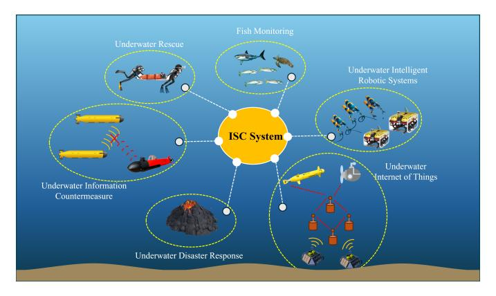

Fig. 1. Applications of ISC systems.

TABLE II KEY DIFFERENCES BETWEEN RF-BASED IRC AND UNDERWATER ISC SYSTEMS

|                           | IRC (RF)                    | ISC (Acoustic)                        |
|---------------------------|-----------------------------|---------------------------------------|
| Bandwidth                 | 100s of MHz                 | Few kHz                               |
| Propagation speed      | ∼3 × 108 m/s                | ∼1500 m/s                             |
| Doppler sensitivity    | Moderate                    | High (due to low speed)               |
| Array size feasibility | Compact                     | Large aperture needed                 |
| Channel delay spread   | Short (ns − µs)             | Long (ms)                             |
| Typical medium         | Air                         | Water (variable conditions)           |
| System challenges      | Hardware synchronization | Multipath, reverberation, mobility |

TABLE III COMPARISON OF THE RELATED SURVEYS

| Survey     | System Type                 | Main Focus                                                                                                                                                                                     | Relation to ISC                                                                                             | Limitation Compared with This Work                                                           |  |
|------------|-----------------------------|------------------------------------------------------------------------------------------------------------------------------------------------------------------------------------------------|-------------------------------------------------------------------------------------------------------------|----------------------------------------------------------------------------------------------|--|
| [26]       | UWA communication and Sonar | Hydrophone design                                                                                                                                                                              | The key front-end device for signal reception in ISC systems.                                               |                                                                                              |  |
| [27]       | UWA communication           | Energy-efficient UWA communication                                                                                                                                                             | A fundamental enabler of ISC systems, ensuring low-power and sustainable operation.                         | Focus on specific components of                                                              |  |
| [28]       | UWA communication and Sonar | Beamforming techniques                                                                                                                                                                         | A key technique in ISC systems, enhancing link quality and target detection through spatial directivity.    | ISC systems, lacking a unified view of system-level integration.                             |  |
| [29]       | ISC                         | ISC waveform design                                                                                                                                                                            | The core of ISC systems, enabling the simultaneous implementation of detection and communication functions. |                                                                                              |  |
| [30]       | IRC                         | General design principles of IRC                                                                                                                                                               | Offer theoretical foundations and references for the development of ISC systems.                            | Mainly focused on the RF domain and lacks specific                                           |  |
| [31]       | IRC                         | Interference management in IRC                                                                                                                                                                 | Provides valuable strategies for ISC systems to handle mutual interference.                                 | discussions on UWA channel characteristics, transducer hardware, and acoustic-oriented |  |
| [32] IRC   |                             | Theoretical framework of IRC                                                                                                                                                                   | Lays the conceptual and analytical foundation for ISC systems.                                              | signal processing, making it not directly applicable to ISC systems.                   |  |
| This Paper | ISC                         | Provides a comprehensive overview of ISC systems, including application scenarios, system models, hardware challenges, waveform design, signal processing methods, and future research topics. |                                                                                                             |                                                                                              |  |

resource allocation schemes, waveform design approaches, and signal processing algorithms originally proposed for IRC systems when employed in ISC scenarios. Several studies have already been conducted that take these challenges into account. Zhang et al. outlined the challenges faced by ISC and conducted preliminary discussions on the key technologies, analyzing the difficulties in transferring IRC technologies to ISC [22], [23]. Yin et al. designed integrated waveforms for different underwater scenarios and performed theoretical analysis, numerical simulations, and experimental validation of the detection and communication performance [24], [25].

The aforementioned studies are valuable. However, due to the relatively short research history of ISC, the existing research results are limited, and there has been no literature that summarizes and reviews the existing research on ISC. Existing works mainly focus on specific elements within ISC systems. For instance, [26] provides a comprehensive review of hydrophones, including their design considerations, physical characteristics, and structural aspects. [27] presents an extensive survey of existing research on energy-efficient UWA communications. [28] systematically discusses and evaluates the applicability of conventional, adaptive, and learning-based beamforming techniques under various underwater conditions. [29] offers an in-depth and comprehensive discussion on waveform design for SIMO (single-input multi-output) and multiinput multi-output (MIMO)-based ISC architectures. While these studies are fundamental to the design of ISC systems, they fail to present a holistic view of the overall framework of ISC systems. In addition, several review studies on IRC have been reported. For example, [30] discusses the general design principles of IRC systems, [31] provides a comprehensive overview of interference management techniques in IRC systems from the perspectives of network architecture and signal design, and [32] presents a panoramic view of the theoretical framework of IRC. These studies clarify the challenges involved in integrating communication and sensing functions at various levels. However, due to the lack of consideration for the unique characteristics of underwater acoustic channels and underwater equipment, their conclusions cannot be directly applied to ISC systems. For clarity, a detailed comparison between prior works and this survey is provided in Table. 3.

This paper aims to provide a comprehensive review of ISC systems, including their application scenarios, system models, hardware challenges, recent research advancements on waveform design and signal processing, future research topics, and challenges. We hope that this work will provide readers with a more comprehensive understanding of ISC and offer valuable insights and assistance to researchers in addressing practical issues in ISC research. The contributions of this work are in the following aspects

- 1) Up to now, research on ISC systems has lacked a systematic and comprehensive summary. This paper summarizes the state-of-the-art research on ISC systems, covering aspects such as system model, hardware challenges, waveform design, and signal processing methods.
- 2) Considering the characteristics of UWA channels, such as limited bandwidth, severe multipath propagation, and significant Doppler spread, this paper provides a comparative analysis of waveform design and signal processing strategies between ISC systems and IRC systems. The analysis reveals the fundamental differences between ISC and IRC, highlighting that many techniques developed for IRC cannot be directly applied to ISC systems. This channel-specific analysis offers a theoretical foundation for the future development of ISC-dedicated technologies.

TABLE IV NOMENCLATURE

| Symbol      | Description                             |  |  |  |
|-------------|-----------------------------------------|--|--|--|
| s           | Transmit signal                         |  |  |  |
| r           | Receive signal                          |  |  |  |
| n           | Noise vector                            |  |  |  |
| h           | Channel impulse response vector         |  |  |  |
| r           | Distance                                |  |  |  |
| c1          | Speed of sound in water                 |  |  |  |
| c2          | Speed of light in air                   |  |  |  |
| B           | Bandwidth                               |  |  |  |
| K           | Number of targets                       |  |  |  |
| P           | Number of paths                         |  |  |  |
| A           | Attenuation factor                      |  |  |  |
| M           | Number of symbols                       |  |  |  |
| N           | Number of subcarriers                   |  |  |  |
| Fs          | Sampling rate                           |  |  |  |
| Ns          | Number of sampling points               |  |  |  |
| Tf          | Frame duration                          |  |  |  |
| Ts          | Symbol duration                         |  |  |  |
| fd          | Doppler shift                           |  |  |  |
| fc          | Carrier frequency                       |  |  |  |
| τ           | Time delay                              |  |  |  |
| η           | Doppler scale factor                    |  |  |  |
| H           | Channel matrix                          |  |  |  |
| δ(t) / δ(n) | Dirac function / Kronecker function     |  |  |  |
| ∗ (·)    | Complex conjugation                     |  |  |  |
| T (·)    | Transposition                           |  |  |  |
| (·)H        | Hermitian transposition                 |  |  |  |
| ∗           | Convolution operator in the time domain |  |  |  |

3) The waveform design and signal processing methods for ISC systems are systematically categorized, and their respective advantages and disadvantages are summarized. Subsequently, diverse performance metrics are employed to evaluate the communication and detection capabilities of different waveforms. These analyses provide valuable references for the selection and design of appropriate ISC solutions across various scenarios and tasks.

The structure of the paper is illustrated in Fig. 2 to provide a clear overview of its organization and logical flow. Section II introduces the system model of ISC. Sections III and IV describe the constraints imposed by the underwater acoustic channel and hardware limitations, as well as the resulting technical challenges. Sections VI and VII present representative methods for addressing these challenges in ISC systems, focusing on waveform design and signal processing strategies. To ensure clarity and conciseness in Sections VI and VII, Section V outlines the key metrics employed for evaluating ISC performance. In Section VIII, the integrated performance of different waveforms is assessed through simulation experiments. Section IX summarizes this paper and gives an outlook for future work.

Unless otherwise specified, the notations and operations used throughout the paper are defined in Table. 4.

# II. ISC SYSTEM MODEL

# *A. Types and Characteristics of ISC Systems*

Depending on the application scenario, ISC systems can be categorized as monostatic or bistatic/multistatic (for simplicity, only monostatic and bistatic systems are analyzed in the following discussion) [6], [33], as illustrated in Fig. 3(a) and (b), respectively. Monostatic and bistatic/multistatic ISC systems exhibit distinct characteristics due to their structural differences, which include the following aspects.

- System architecture. In a monostatic ISC system, the transmitter and detection receiver are co-located on the same platform, enabling independent execution of active communication and detection tasks. In contrast, a bistatic ISC system separates the transmitter and detection receiver across different platforms, requiring cooperative operation for communication and passive detection.
- Channel characteristics. In a monostatic system, the propagation path of the signal from the transmitter to the target (Tx2Tar) and the propagation path of the echo from the target to the receiver (Tar2Rx) can be considered symmetric. This symmetry simplifies channel modeling and compensation. In a bistatic system, this symmetry cannot be assumed. However, bistatic systems benefit from extended spatial coverage and multi-perspective detection, improving robustness in complex environments.
- Computational complexity. The computational complexity of monostatic systems is generally low, as signal processing tasks are confined to a single platform, and the receiver has complete prior knowledge of the transmitted signal. In contrast, bistatic systems require distributed signal processing, time synchronization, and data fusion across multiple nodes, significantly increasing computational and communication overhead. For example, in the bistatic scenario shown in Fig. 3(b), precise time synchronization between the transmitter and receiver is required. Additionally, the receiver must estimate or reconstruct the original transmitted waveform based on the direct path to ensure accurate estimation of target range and velocity. These factors collectively increase the system's computational demands.
- Application scenarios. Due to their self-sufficient nature, monostatic ISC systems are ideal for autonomous detection missions, such as underwater vehicle navigation and reconnaissance. In contrast, bistatic systems are well-suited for collaborative surveillance, anti-submarine warfare, maritime security, and large-scale ocean monitoring, where multiple platforms work together to extend detection coverage and improve detection reliability [34].

The structural differences between monostatic and bistatic ISC systems can significantly affect system design in the following ways. a) In bistatic configurations, the transmitter and receiver are deployed on separate platforms, which necessitates precise time synchronization to avoid mismatches in signal paths. b) The asymmetry between the Tx-to-target and targetto-Rx propagation paths complicates channel modeling and compensation. c) In bistatic systems, the transmitted signal can no longer be assumed to be fully known at the receiver. Instead, the direct-path signal must be treated as a reference copy of the transmitted waveform. This requires the receiver to reliably extract the direct-path component from the received mixture, which may be further complicated by Doppler shifts. Therefore, more robust waveform reconstruction algorithms or Doppler compensation techniques are needed. As a result,

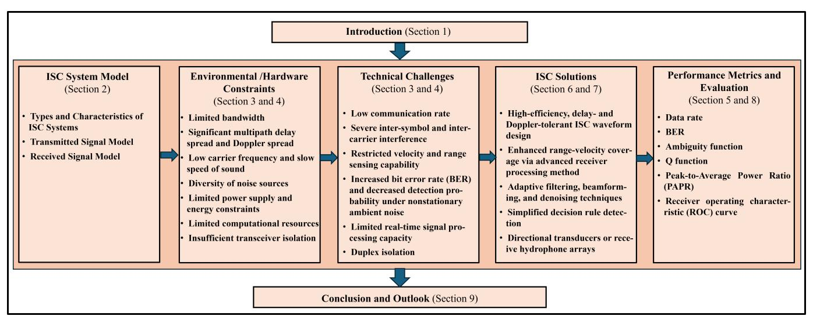

Fig. 2. Structure of This Paper.

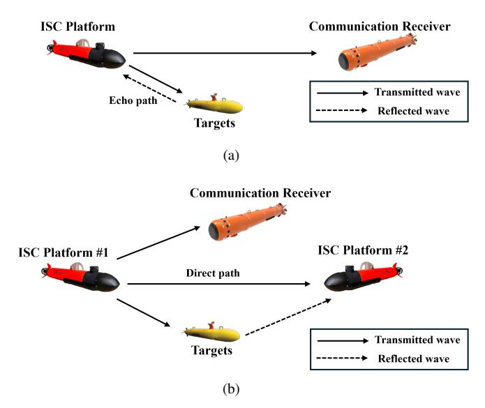

Fig. 3. (a) Monostatic ISC system, and (b) Bistatic ISC system.

many ISC techniques developed under monostatic assumptions may not be directly applicable to bistatic scenarios and require dedicated investigation and tailored solutions. To maintain clarity and focus, we primarily consider the monostatic case in this paper, which represents the most widely adopted and foundational ISC configuration.

An In-Band Full-Duplex (IBFD) monostatic ISC system is shown in Fig. 4. It consists of a transducer for transmitting integrated waveforms and several hydrophones for receiving communication signals from other systems and echos from targets.The communication receiver typically uses a single hydrophone. The transmitter can use an omnidirectional transducer or a directional transducer, depending on whether directional transmission is required. The detection receiver can choose to activate one or more hydrophones from the array to receive the echo signal, depending on whether Direction of Arrival (DOA) estimation is needed.

#### *B. Frame structure of the ISC Signals*

The frame structure of the transmitted integrated signal is illustrated in Fig. 5. The frame duration is denoted by Tf , and each frame contains M data symbols, each of duration Ts. A guard interval of length Tg is inserted between adjacent symbols. Compared with RF channels, the UWA channel exhibits a much larger delay spread, resulting in longer signal tails at the receiver and thus requiring longer Tg within the frame. Moreover, for multicarrier signals such as OFDM and OCDM, the narrower available bandwidth in underwater channels leads to smaller subcarrier spacing and consequently longer Ts. As a result, the frame duration Tf + Tg in ISC systems is generally longer than that in IRC systems.

The fast time axis represents the continuous time axis for the duration of each data symbol, while the slow time axis is the discrete time axis with a time step of Ts. In the receiver, each frame of the signal is treated as a signal processing unit.

M > 1 indicates that the integrated waveform is transmitted in the form of continuous wave, which is suitable for shortrange communication and detection. This is because in this form, the power of each data symbol must be kept relatively low to prevent potential damage to the power amplifier (PA) caused by prolonged high-power operation. M = 1 indicates that the integrated waveform is transmitted as a pulse wave. In this case, the power of the single symbol can be higher, making it suitable for medium- to long-range communication and detection. Moreover, due to the small duty cycle, pulse waves offer a greater maximum unambiguous range compared with continuous waves. However, the trade-off is a lower communication rate and target update rate.

According to the frame structure shown in Fig. 5, the model of the transmitted integrated signal s(t) can be expressed as

$$s(t) = \sum_{m=0}^{M-1} s_m(t) \operatorname{rect}\left(\frac{t - mT_s}{T_s}\right), \tag{1}$$

where sm(t) is the mth (m = 0, 1..., M −1) symbol, M is the total number of data symbol. rect(·) is the rectangular window. The specific form of s(t) can be flexibly selected according

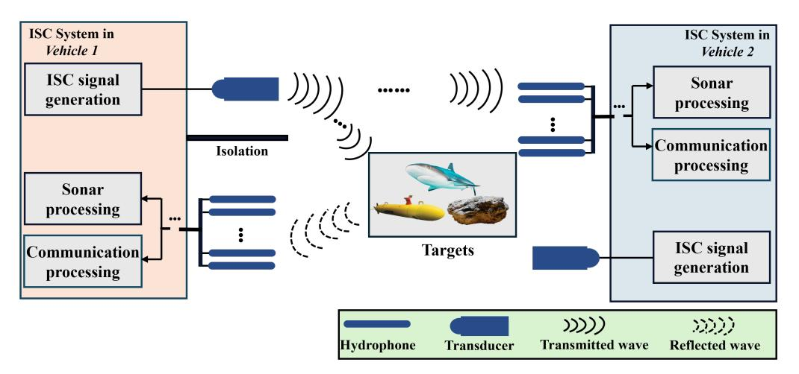

Fig. 4. The diagram of the monstatic ISC system.

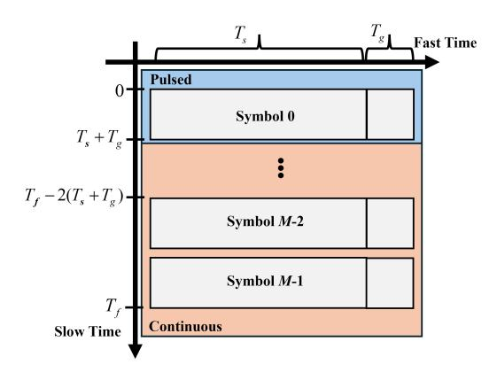

Fig. 5. Frame structure of ISC waveforms.

to the application scenarios and requirements, which will be discussed in detail in Section VI.

#### C. Received Signal Model

As illustrated in Fig. 4, the integrated signal s(t) is transmitted by the transducer of Vehicle-1. This signal is then: a) received directly by the communication receiver of Vehicle-2; and b) reflected by the targets and captured by the detection receiver of Vehicle-1.

In practical underwater environments, several commonly used idealized assumptions in RF channel, such as point targets, perfect transmitter-receiver isolation, and time-invariant channels [35], [36], fail to capture the complexity of acoustic propagation and system hardware limitations. To develop a more realistic model for ISC systems, we adopt the following refined assumptions: a) detection targets are extended targets rather than point targets; b) the isolation between transmitter and receiver are not perfect, with the receiver affected by signal leakage from the transmitter; c) the detection echoes can be fully separated from the communication signals transmitted by other nodes; and d) the channel is time-varying.

Based on these assumptions, we consider the echo signals

received by vehicle-1 can be expressed as:

$$y_{\rm son}(t) = \underbrace{h_{\rm SI}(t) * s(t)}_{\text{Self-interference}} + \underbrace{h_{\rm tar}(t) * s(t)}_{\text{Target echoes}} + n_{\rm son}(t) \tag{2}$$

where  $h_{\rm tar}(t)$  is the impulse response of the target echo channel,  $h_{\rm SI}(t)$  is the impulse response of the self-interference channel (e.g., direct leakage, near-field coupling), and  $n_{\rm son}(t)$  is the noise of detection channel. Since the transmitter and the detection receiver are close and their relative positions remain essentially constant, the self-interference path can be considered strong and stable. Accordingly, the received self-interference signal  $y_{son}^{SI}(t)$  (i.e., the first term of (2)) can be expressed as:

$$y_{son}^{SI}(t) = A_0 s(t - \tau_0).$$
 (3)

The received echo signal  $y_{son}^{echo}(t)$  can then be expressed as (i.e., the second term of (2)):

$$y_{son}^{echo}(t) = \sum_{k=0}^{K-1} \mathbf{a}(\theta_k) \sum_{m=0}^{M_k-1} \beta_{k,m}(t) \cdot s(t - \tau_{k,m}(t)) e^{j2\pi f_{d,k,m}t},$$
(4)

where K is the number of point targets and  $M_k$  is the scattering points of the k-th target.  $\beta_{k,m}(t)$   $\tau_{k,m}(t)$  and  $f_{d,k,m}(t)$  represent the time-varying reflection coefficient, propagation delay, and Doppler shift of the m-th scattering center of the k-th target, respectively.  $\mathbf{a}(\theta_k) \in \mathbb{C}^{N \times 1}$  is the steering vector corresponding to the target's angle of arrival (AoA)  $\theta_k$ . For an N-element uniform linear array (ULA) with inter-element spacing d, the steering vector is given by

$$\mathbf{a}(\theta_k) = \begin{bmatrix} 1 \\ e^{j2\pi \frac{d}{\lambda}\sin\theta_k} \\ e^{j2\pi \frac{2d}{\lambda}\sin\theta_k} \\ \vdots \\ e^{j2\pi \frac{(N-1)d}{\lambda}\sin\theta_k} \end{bmatrix}.$$
 (5)

In UWA detection, the attenuation factor in (4) is not only related to propagation loss but also to the scattering characteristics of the target. The sonar equation is often used to predict the performance of sonar equipment [37]. It links

the characteristics of the propagation medium, the target, and the parameters of the equipment. In this paper, the detection behavior is actively driven by the ISC system. Therefore, the attenuation factor can be expressed using the active sonar equation

$$SL - 2TL + TS - (NL - DI - AG) = SNR.$$
 (6)

where SL is the source level, TL is the transmission loss from transmitter to target. Since the ISC system is assumed to be transceiver-combined, 2TL represents the bidirectional propagation process of the signal. TS represents the target strength, i.e., the ability of the target to reflect sound waves. NL is the noise level, DI is the directivity index of the receiver, AG represents the gain in signal-to-noise ratio (SNR) due to array processing and SNR denotes the ratio of the signal level to the noise level at the receiver.

In particular, in non-open water, reverberation replaces noise as the main background disturbance. In this case, the active sonar equation is expressed as:

$$SL - 2TL + TS - RL = SNR. (7)$$

In (6) and (7), the units of all variables are in dB. Combined with the sonar equation, the attenuation factor  $A_k^{son}$  can be expressed as:

$$A_k^{son} = 10^{\frac{SL - SNR}{10}}. (8)$$

For the communication path, the extended characteristics of the target do not need to be considered. The integrated signal transmitted by Vehicle 1 is received by the communication receiver of Vehicle 2 and can be expressed as

$$y_{com}(t) = \sum_{p=0}^{P-1} A_p^{com} s(t - \tau_p^{com}(t)) e^{j2\pi f_{d,p}^{com} t} + n_{com}(t), (9)$$

where P represents the total number of paths,  $A_p^{com}$  is the attenuation factor of the pth path,  $f_{d,p}^{com}t$  is the Doppler shift of the pth path, and  $\tau_p^{com}(t) = \tau_p^{com} - \alpha_p t$  represents the path delay which vary in time according to the Doppler scaling factor  $\alpha_p$ .  $\alpha_p$  is denoted as

$$\alpha_p = \frac{v_p}{c},\tag{10}$$

where  $v_p$  denotes the relative velocity of the p-th path between the transmitter and receiver, and c is the speed of acoustic waves in water. When the relative velocity between the transmitter and receiver changes smoothly and the environment is relatively uniform, it can be assumed that the Doppler scaling factors of different multipaths are approximately the same, i.e.,  $\alpha_p = \alpha, p = 0, 1, ... P - 1$ .

The presence of Doppler effect significantly degrades the reliability of data transmission. To mitigate the impact of Doppler, the receiver needs to update the channel state information (CSI) more frequently, which results in increased resource overhead.

Similar to  $A_k^{son}$ ,  $A_p^{com}$  can be expressed by the sonar equation. The difference is that the passive sonar equation is used:

$$SL - TL - RL = SNR. (11)$$

Therefore,  $A_p^{com}$  can be expressed as:

$$A_p^{com} = 10^{\frac{SL - SNR}{10}}. (12)$$

#### D. Summary

This section first highlighted the differences between monostatic and bistatic ISC systems, along with the corresponding implications for ISC system design. Then, focusing on the monostatic configuration as a representative case, we summarized the system architecture, the frame structure of the transmitted signal, and the mathematical models of the received signals at both the communication and detection receivers. Building upon the system model established in this section, the subsequent sections will provide a detailed discussion of the challenges associated with various components of ISC systems, including the UWA channel model, hardware considerations, waveform design, and signal processing strategies.

# III. THE CHARACTERISTICS AND CHANNEL MODEL OF UWA CHANNEL

For ISC systems, performance validation in real ocean environments is essential. However, conducting repeatable and controlled experiments at sea remains highly challenging due to high costs, limited test time, and significant safety risks. Therefore, it is necessary to evaluate and optimize ISC systems through simulation experiments based on UWA channel models prior to deployment [3], [4]. To ensure that the simulation results closely reflect real-world conditions, an accurate UWA channel model must be established. The foundation of such modeling lies in a thorough understanding of the unique characteristics of UWA channels. Accordingly, this section first introduces the key properties of UWA channels and then discusses the challenges of channel modeling for ISC systems.

#### A. Characteristics of UWA Channels

The physical characteristics of the UWA channels are not only related to the distance and relative motion between the transmitter and receiver, but are also affected by the properties of water and the propagation characteristics of sound waves. Therefore, the UWA channels, with variations in time, frequency, and space, is recognized as one of the most intricate wireless channels [38]. Compared with ratio frequency (RF) channel, the characteristics of the UWA channels can be summarized as follows [39]:

• Limited available bandwidth. The available frequency band for the UWA signal is limited due to the rapid increase in the loss of absorption of sound waves with higher frequencies in seawater [39]. Additionally, due to the non-uniformity of the seawater medium and the unevenness of the sea surface and seafloor, the UWA signal also suffers from scattering loss. The same as the absorption loss, the scattering loss also increases with the increase in frequency. Therefore, there is a relationship between the available bandwidth and transmission distance, which is a key distinguishing feature of UWA channels compared with RF channels [40].

The propagation loss consists of geometric spreading loss and medium absorption loss, and can be expressed by [41]:

$$A(r,f) = A_0 r^{\kappa} \cdot \alpha(f)^r, \tag{13}$$

where the first term in (1) represents the propagation loss, A0 denotes the initial energy of the signal, r denotes the propagation distance, and f denotes the frequency of the signal. k is the propagation factor, which takes on different values for different propagation geometries. The commonly used values of κ are: spherical propagation (κ = 2) for deep sea, cylindrical propagation (κ = 1) for shallow sea, and in real channels, it is often taken as κ = 1.5. In radio channels, the equivalent of the propagation factor κ is the path loss exponent, typically ranging from 2 to 4, where the former represents freespace line-of-sight propagation and the latter corresponds to a double-ray ground reflection model. The second term represents absorption loss, and the absorption coefficient can be empirically expressed using the Thorp formula as:

$$\alpha = \frac{0.11f^2}{1+f^2} + \frac{44f^2}{4100+f^2} + 2.75 \times 10^{-4}f^2 + 0.003, (14)$$

where the units of f and a(f) are kHz and dB/km, respectively. In engineering, the absorption coefficient for frequencies ranging from a few kHz to tens of kHz can be quickly obtained using the empirical formula

$$\alpha = 0.036 f^{3/2}. (15)$$

• Significant multipath delay spread and Doppler spread. The delay spread in multipath propagation typically extends from several hundred milliseconds to several seconds, leading to significant frequency-selective fading issues [42]. Consequently, signals experience varying degrees of attenuation across different frequency components after transmission through multipath channels, resulting in substantial differences between the spectra of received and transmitted signals. In addition, since the speed of sound propagation in water (around 1.5 × 103m/s) is much lower compared with the speed of electromagnetic wave propagation in air (around 3 × 108m/s). Therefore, the Doppler expansion factor in the UWA channels is several orders of magnitude higher than in the radio frequency (RF) channel. Instabilities in the marine medium, such as sea surface waves and seawater turbulence, can exacerbate the Doppler effect in UWA channels. Due to the relatively long duration of data symbols in UWA communications, the rapid time variations of the channel induced by the Doppler effect become more pronounced.

Delay spread is significant in both deep and shallow water, but the primary causes differ. In deep water, the main cause of delay spread is nonlinear sound propagation [43]. The temperature, salinity, and pressure of deep water vary with depth, resulting in a significant vertical gradient in sound speed. As a result, sound waves bend during propagation, leading to the formation of

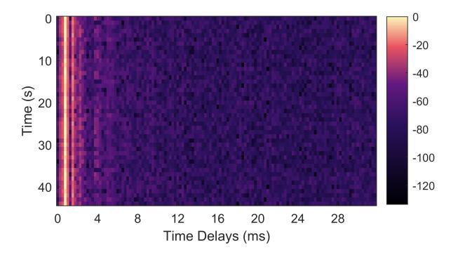

Fig. 6. The CIR of the deep sea in the South China Sea, China.

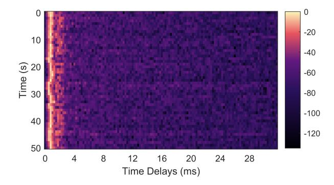

Fig. 7. The CIR of the shallow sea in the Yellow Sea, China.

multipaths. Specifically, when the transmitter and receiver are located in deep water and are far from both the sea surface and the seabed, the arrival structure of the sound rays is relatively stable. In this case, the channel can be considered as slow-varying or quasi-static. Fig. 6 presents the channel impulse response (CIR) obtained from the sea experiment we conducted in the South China Sea, China. The experimental site features a water depth of approximately 100m and a communication distance of around 5km.

In shallow water, the variation of sound speed with water depth is minimal, and acoustic signals can be considered to propagate along straight line. The multipath propagation is primarily influenced by sound reflections from both the surface and the seabed. The random fluctuations of surface waves cause the underwater multipath response to exhibit rapid time variations. Fig. 7 illustrates the CIR from the sea experiment we conducted in the Yellow Sea, China. The depth of the water and the communication distance in the experimental area are approximately 15m and 200m, respectively. Compared with Fig. 6, the channel depicted in Fig. 7 exhibits more complex multipath effects and more pronounced time-varying characteristics.

• Sparsity of multipath. Regardless of the extent of delay spread and Doppler spread, the multipath distribution of the UWA channels tends to be sparse (especially in deep sea), with energy concentrated on only a few paths [44]. This is a key characteristic to consider when processing UWA channels. Based on this characteristic, the compressed sensing theory transforms the estimation

TABLE V SOURCES AND FREQUENCY BANDS OF NOISE

| Sources of Noise       | Frequency Band                                  |               |
|------------------------|----------------------------------------------------|---------------|
| Anthropogenic Noise | Industrial activities                              | 10 Hz∼10 kHz  |
|                        | Shock waves from underwater blasting            | 10 Hz∼105 Hz  |
|                        | Ship navigation                                    | 5 Hz∼500 Hz   |
| Natural Noise          | Marine mammal                                      | 30 Hz∼30 kHz  |
|                        | Turbulence noise                                   | 1 Hz∼20 Hz    |
|                        | Surface motion caused by wind/rain-driven waves | 500 Hz∼25 kHz |
| Thermal Noise          | > 30 kHz                                           |               |

of the UWA channels into a sparse recovery problem. Algorithms such as match pursuit (MP), orthogonal matching pursuit (OMP) and compressive sampling matching pursuit (CoSaMP) can be applied in UWA channel estimation [45], [46] [47], thereby enhancing the reliability of underwater acoustic communication.

• Diversity of noise sources. Based on different physical sources, ocean noise can be categorized into three types: anthropogenic noise, natural noise, and thermal noise [40], [48], as shown in Table. 5.

Anthropogenic noise refers to noise generated by human activities, such as ship navigation and industrial operations. In recent decades, with the increase in global shipping, low-frequency marine environmental noise has been steadily rising, significantly impacting low-frequency long-range detection and communication [49]. Natural noise originates from natural phenomena or biological activities in the ocean, including wind- and rain-induced noise, as well as sounds produced by marine animals. Thermal noise is caused by the thermal motion of electronic components.

These noise sources are distributed across different frequency bands and have varying impacts on underwater acoustic systems. In ISC scenarios, such noise can simultaneously degrade both detection and communication performance. For example, low-frequency anthropogenic noise (e.g., ship noise) not only increases the bit error rate (BER) of communication signals but also reduces the signal-to-noise ratio (SNR) for target detection. Similarly, natural noise may mask weak target echoes and interfere with symbol decoding, particularly under dynamic sea surface conditions. Thermal noise, though broadband, affects receiver sensitivity and imposes stricter requirements on analog front-end and ADC design.

# *B. Channel Models of ISC System*

The aforementioned channel characteristics must be considered in both underwater acoustic communication and detection channel modeling. However, the modeling objectives of the two are fundamentally different. In this subsection, we first present the differences between underwater acoustic communication channel modeling (UWA-CCM) and underwater acoustic detection channel modeling (UWA-CCM). Subsequently, the characteristics of several typical UWA channel models and their applicability in ISC systems are analyzed.

*1) The difference between UWA-CCM and UWA-CCM:* In UWA systems, communication and detection tasks are traditionally modeled using distinct channel formulations that reflect their fundamentally different objectives.

Communication channel models typically characterize the propagation environment as a stochastic multipath process. Each path is represented by a time-varying complex gain and delay, and the focus is on statistical properties such as delay spread, Doppler spread, and coherence time, which determine the reliability of data transmission. In contrast, detection channel models aim to resolve individual echoes from physical targets. These models treat each target reflection as a deterministic component with specific time delay and Doppler shift, enabling accurate estimation of target range and velocity.

This fundamental difference leads to a core modeling challenge in ISC systems: a unified channel model must simultaneously support the statistical averaging required for robust demodulation, and the parametric resolvability required for precise target detection. In particular, self-interference paths, strong direct leakage, and the mixture of distributed and point-like reflections must all be accommodated within a single signal model. Balancing these conflicting requirements is nontrivial and demands careful formulation of the ISC channel that accounts for both stochastic and deterministic propagation effects.

- *2) Channel Modeling for ISC Systems:* Typical underwater acoustic channel modeling methods can be classified into the following categories.
  - Statistical channel models. The statistical channel model characterizes channel behavior based on the statistical properties of random parameters such as delay spread, Doppler spread, and fading distribution. Examples include the Rayleigh and Rician fading models, which are commonly used in communication performance evaluations. Although these models are simple and computationally efficient, they lack physical interpretability and offer limited capability in representing interactions with time-varying targets in detection processes.
- Physics-based (deterministic) models. These models simulate acoustic wave propagation in realistic ocean environments by accounting for factors such as water depth, sound speed profiles, and boundary interactions. Examples include ray theory models [50], normal mode models [51], and parabolic equation models [52]. They are capable of high-fidelity simulation of direct paths and target echoes, making them well-suited for detection performance analysis. However, their complexity and high computational cost limit their applicability in realtime scenarios.
- Hybrid models. Hybrid models aim to combine the physical realism of physics-based models with the computational efficiency of statistical models. For example, ray-based models can be integrated with Rayleigh fading [53], Rician fading [54], or log-normal distributions [55]. These models strike a balance between complexity and accuracy and are increasingly adopted for the simulation of ISC systems.

• Measurement-driven models. These models are based on empirical data collected from field experiments or controlled tank tests, providing realistic and scenariospecific channel characteristics. An example is the Watermark channel model [56]. While offering high accuracy and strong reproducibility, such models exhibit limited generalizability.

The aforementioned methods provide valuable insights for channel modeling in ISC systems. However, developing a unified and efficient model tailored specifically for ISC systems remains challenging. Existing models typically prioritize either communication fidelity or detection accuracy, rather than optimizing both simultaneously. Furthermore, the limited availability of open-source underwater channel datasets hinders standardized evaluation of different ISC algorithms.

#### IV. HARDWARE CHALLENGES

The hardware is the most fundamental component of the ISC system, and the limitations imposed by the underwater environment on the hardware present significant challenges to system performance. The hardware challenges of the ISC system primarily depend on the following aspects: a) the Bandwidth limitation; b) the power supply capacity; c) the performance of the signal processing unit (SPU); d) the isolation between the transmitter and receiver; e) platform motion; and f) electromagnetic compatibility. These challenges are described as follows.

- Bandwidth limitation. The main reasons for the limited available bandwidth underwater include: a) The propagation loss of acoustic signals increases with frequency, and the size of ultra-low frequency transducers becomes excessively large. Therefore, the available bandwidth is primarily concentrated in a narrow frequency range. Fig. 8 illustrates the spectrum usage of various artificial acoustic systems and marine animals [57], [58], [59], where the horizontal axis represents the device models or animal names. It is evident that underwater spectral resources are heavily shared, especially from 1 to 40kHz. b) Narrow-band response of acoustic transducers and hydrophones. The bandwidth of these devices is fundamentally constrained by their mechanical resonance characteristics and material properties [60], [61]. Transducers typically operate based on the piezoelectric effect or the magnetostrictive effect, both of which exhibit resonant characteristics at specific frequencies. As a result, the response is strong near the resonance frequency but rapidly decreases when moving away from it. The commonly used material for underwater transducers/hydrophones is piezoelectric ceramics, such as lead zirconate titanate (PZT), which exhibit high electromechanical coupling efficiency but possess a high quality factor (Q-factor). As a result, their energy conversion efficiency is maximized near a specific resonance frequency, while performance significantly degrades outside this range.
- The power supply capacity. For ISC systems operating in the ocean for extended periods, the primary energy source is the built-in battery, whose capacity is constrained by the platform's size. To maximize operational

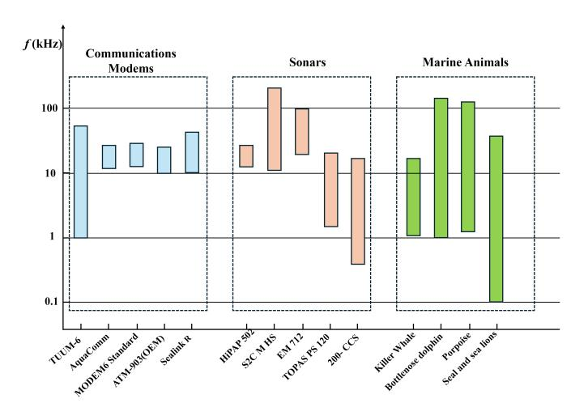

Fig. 8. The spectrum usages of underwater acoustic systems.

longevity, these systems must minimize energy consumption. However, long-distance detection and communication often necessitates the transmission of high-power integrated signals, resulting in significant energy expenditure. Suppose underwater platforms are equipped with Teledyne Benthos ATM-925 modems [62] for communications. The battery pack capacity of ATM-925 is 187.5 Watt-hours when transmit power is consistently at the max power level-08. In intermittent transmission mode, where the modem sends 1000 bytes of data per hour, the energy consumption rate is as low as 2.52 Watt-hours per day. This allows the modem to operate continuously for up to 74 days. In contrast, under continuous transmission, the modem's battery would be depleted within just 12.5 hours.

Therefore, how to enhance the endurance of ISC systems remains a critical challenge. Some potential solutions, such as seawater battery [63] and microbial fuel cell [64], have been proposed and tested in marine engineering. However, their effectiveness is limited by the low power generation efficiency.

• The performance of the signal processing unit. a) underwater signal transmission is highly susceptible to noise and multipath effects, imposing stringent requirements on the front-end signal acquisition and pre-processing capabilities of the hardware. This necessitates the use of high-sensitivity, low-noise sensors and efficient filtering circuits. b) the time-varying nature of the UWA channel and the Doppler effect demand robust adaptability from signal processing algorithms, posing challenges to the real-time performance and energy efficiency of computing hardware. A key challenge is how to implement complex signal processing algorithms (such as adaptive waveform design and interference suppression) on limited computational resources, such as low-power processors or FPGAs. c) ISC systems require hardware with multitasking parallel processing capabilities to simultaneously support communication, and target detection. This imposes additional demands on hardware architecture design and computational resource allocation.

• The isolation between the transmitter and receiver. In the application scenario shown in Fig. 4, the transmitter and the detection receiver are located on the same platform in close proximity. Therefore, if there is no isolation or insufficient isolation between them, the receiver will receive the transmit signal [65]. The intensity of the transmitted signal is usually tens of decibels stronger than the echo signal [6], [66]. It will seriously affect the subsequent target detection.

A common hardware-level solution to mitigate this issue is to install an acoustic isolation panel between the transmitting transducer and the receiver. This panel can effectively suppress direct self-interference, which arises when the transmitted signal reaches the receiver along a direct path, thereby interfering with the desired signal [67]. However, its effectiveness is limited against multipath self-interference, which results from signal reflections at the water surface or other interfaces before reaching the receiver. To address such multipath interference, interference cancellation algorithms must be employed [68], [69]. Nevertheless, this approach imposes additional burdens on both the energy supply and the signal processing unit.

• Platform motion. For underwater platforms such as autonomous underwater vehicles (AUVs), buoys, and submarines, motion (e.g. surge, heave, pitch, and roll) is typically unavoidable during operation [70]. Since ISC systems are mounted on such mobile platforms, platform motion has become one of the key challenges faced by practical deployments of ISC. These motions can lead to misalignment of transducer arrays, resulting in beamforming errors and reduced angular resolution. The instability in platform orientation also affects the accuracy of delay and Doppler estimation, which are essential for both target detection and synchronization of communication links [71]. Furthermore, the relative movement between the platform and targets or environmental features introduces time-varying propagation paths, leading to delay drift and Doppler spread, which increase the complexity of channel estimation and equalization.

To mitigate these effects, ISC systems may integrate inertial measurement units (IMUs) [72] or motion sensors to track platform dynamics and perform real-time motion compensation. However, the inclusion of such hardware further increases system complexity, power consumption, and computational burden.

• Electromagnetic compatibility. Electromagnetic compatibility (EMC) is a critical but often underappreciated aspect in the hardware design of ISC systems. Due to the compact and densely integrated nature of underwater platforms, various subsystems—including analog front ends (AFEs), power amplifiers (PAs), analog-to-digital converters (ADCs), digital signal processors (DSPs), and energy systems—must operate in close physical proximity, increasing the risk of electromagnetic interference (EMI) [73].

Unshielded or poorly isolated components can introduce

EMI into sensitive analog paths, raising the noise floor and reducing receiver sensitivity. This is particularly detrimental during weak signal detection, where a slight increase in front-end noise can lead to missed detections or false alarms. In addition, EMI can affect the data integrity of communication links, increasing bit error rates due to signal distortion or timing jitter. Without proper EMC design—including shielding, filtering, careful PCB layout, and power supply isolation—such interference can compromise the stability and reliability of the entire ISC system.

The differences between underwater and air result in a set of unique hardware challenges for ISC systems. These challenges impose not only stricter requirements on the hardware design itself, but also place additional constraints on waveform design and signal processing strategies. For example, bandwidth limitations demand higher spectral efficiency from the integrated waveform, while platform motion necessitates the use of Doppler-resilient waveforms and more robust channel estimation and target detection algorithms. These considerations motivate the following sections (Section VI and VII), where we explore waveform and processing techniques tailored to address such challenges in underwater ISC systems.

# V. PERFORMANCE METRICS FOR EVALUATING ISC SYSTEMS

In ISC systems, a comprehensive understanding of performance metrics is crucial for evaluating the trade-offs between various system requirements. The selection of metrics should align with the specific design objectives of the system. This section introduces several metrics used to evaluate the effectiveness of integrated waveform designs and signal processing methods.

## *A. Detection Performance*

*1) Ambiguity Function:* The effect of the channel on the signal can be attributed to amplitude attenuation, time delay, and Doppler shift. The ambiguity function (AF) is a twodimensional correlation function with respect to time delay and Doppler shift, representing the matched filter output of a signal under the influence of propagation delay and Doppler effects [74], [75].

Therefore, by analyzing the AF of the signal, the detection performance of the signal can be estimated. The wide-band ambiguity function (WBAF) is expressed as [8]:

$$\chi(\tau, \eta) = \sqrt{\eta} \int s(t)s^*(\eta(t+\tau))dt, \tag{16}$$

where τ denote the time delay, η represents the Doppler scale factor induced by the relative motion between the target and the transmitter, and is given by:

$$\eta = \frac{1 + v/c}{1 - v/c},\tag{17}$$

where c and v is the speed of acoustic waves and relative velocity, respectively. When the bandwidth B and the carrier frequency fc of the transmitted signal satisfy B ≪ fc, the Doppler scale variation can be approximated as a Doppler shift under the narrow-band model. In this case, the WBAF reduces to the narrow-band ambiguity function (NBAF), which can be expressed as:

$$\chi(\tau, f_d) = \int s(t)s^*(t+\tau)e^{j2\pi f_d t}dt, \qquad (18)$$

where fd = 2v λ represents the Doppler shift and λ is the wavelength of the signal.

The time delay/Doppler resolution is typically evaluated by the -3 dB width of the main lobe in the time delay/Doppler cut of the AF.

*2) Q Function:* The Q-function is an important metric for evaluating a waveform's reverberation resistance and is also a unique evaluation criterion in underwater environments.

In active sonar detection, reverberation refers to a nonadditive interference echo caused by multiple reflections and scattering of sound waves in the underwater environment, particularly in shallow water. Compared with the transmitted signal, reverberation undergoes significant distortion and spreading, manifesting as high-intensity background noise in the received signal[76], [77]. Reverberation has high energy, and its propagation path is not as direct as the target echo, which can severely affect the quality of the received signal. Assuming that the reverberation scatterers are stationary relative to the sonar platform, uniformly distributed along the range dimension, and of equal intensity, the Q-function can be used to evaluate the matched filter output's reverberation strength under different Doppler shifts [78]:

$$Q(\eta) = \int_{-\infty}^{\infty} |\chi(\tau, \eta)|^2 d\tau, \tag{19}$$

where χ(τ, η) denotes the WBAF. Similarly, if the B ≪ fc is satisfied, the WBAF can be replaced by NBAF.

Equation (19) calculates the total reverberation energy as a function of different Doppler scale factors. The smaller the output value of the Q-function, the stronger the reverberation resistance of the transmitted signal, which is more favorable for target detection in active sonar.

Although the derivation of the Q-function is based on idealized assumptions that disregard real-world effects such as surface wave motion and seabed irregularities, it still serves as an effective metric for evaluating the relative reverberation performance of various pulse waveforms under practical conditions [79].

*3) ROC Curve:* The receiver operating characteristic (ROC) curve is a widely used metric to evaluate detection performance [80]. It is a plot of the probability of detection (PD) against the probability of false alarm (PFA) at various threshold settings (such as various SNRs). The ROC curve provides insight into the trade-off between PD and PFA, which are crucial for assessing the waveform's detection performance. Assuming that the detection threshold is set to VT and the probability density function (PDF) of the envelope of the noise is fN (x), the PFA can be expressed as:

$$PFA = \int_{V_T}^{\infty} f_N(x) dx,$$
 (20)

the PD is expressed as:

$$PD = \int_{V_T}^{\infty} f_{S+N}(x) dx,$$
 (21)

where fS+N (x) represents the PDF of the envelope of the signal with added noise.

## *B. Communication Performance*

*1) Data Rate:* The data rate, defined as the amount of information transmitted per unit time, is a fundamental metric for evaluating the spectral and transmission efficiency of communication systems. It can be generally expressed as [81]:

$$R = \frac{R_c N_{sub} \log_2(M_{mod})}{T_s},\tag{22}$$

where Rc is the channel coding rate, Mmod is the modulation order, Nsub denotes the number of effective subcarriers (or symbols per block), and T is the symbol duration time. This metric reflects the maximum achievable throughput under ideal transmission conditions.

*2) Bit Error Rate:* The Bit Error Rate (BER) is the ratio of the number of erroneous bits received to the total number of bits transmitted [82]. It is a fundamental measure of the reliability of a communication system. A lower BER indicates higher transmission quality. BER is influenced by factors such as noise, interference, and modulation scheme. Mathematically, BER can be expressed as:

$$BER = \frac{N_{error}}{N_{total}},\tag{23}$$

where Nerror and Ntotal denote the number of erroneous bits and total transmitted bits, respectively.

*3) PAPR:* The Peak-to-Average Power Ratio (PAPR) is the ratio of the peak instantaneous power to the average power of a signal. The impact of PAPR is particularly critical in power amplifier (PA) design. High PAPR forces the PA to operate with large back-off from its saturation point to avoid nonlinear distortion, resulting in reduced power efficiency. Mathematically, PAPR is defined as [83]:

$$PAPR = \frac{P_{peak}}{P_{average}},\tag{24}$$

where Ppeak and Paverage are the peak instantaneous power and the average power of a signal, respectively.

The PAPR is commonly treated as a random variable since it varies with the transmitted data. To statistically characterize the distribution of PAPR, the complementary cumulative distribution function (CCDF) is widely used. The CCDF of PAPR denotes the probability that the PAPR of a signal exceeds a certain threshold x, and is defined as:

$$CCDF(x) = Pr(PAPR > x),$$
 (25)

where Pr (·) denotes the probability of the event inside the parentheses.

#### *C. Summary*

In this section, we outlined the key performance metrics for evaluating ISC systems, covering both communication aspects—such as BER, data rate, and PAPR—and detection functionalities, including ambiguity function, Q-function, and ROC curves. These metrics impose various requirements on the design of integrated waveforms from different perspectives, and they serve as the foundation for waveform optimization and trade-off analysis in the subsequent waveform design discussions.

## VI. THE INTEGRATED WAVEFORM DESIGN

In ISC systems, an integrated waveform must simultaneously fulfill both detection and communication functions. However, since detection and communication impose distinct requirements on the transmitted waveform, integrated waveform design has become a core challenge in developing efficient ISC systems. Nevertheless, the inherent conflicts between communication and detection requirements—such as the trade-off between spectral efficiency and resolution or the contrast between the randomness of communication signals and the determinism of detection waveforms—make it highly challenging to develop a waveform that meets both demands simultaneously. Moreover, the increasing diversity of application scenarios necessitates greater adaptability, flexibility, and robustness in integrated waveforms, further complicating the design process. As a result, achieving a waveform that effectively balances communication and detection remains an unresolved challenge.

In this section, we systematically explore the current research status, key technologies, and future development directions of ISC waveform design. First, we classify the waveform design methods into two main categories based on the integration level: a) low-integration resource allocation-based waveform methods (including time-division, frequency-division, spatial-division, and code-division) and b) high-integration fully-shared waveform design methods. Their advantages and disadvantages are summarized, respectively. Then, we focus on the waveform design methods in the fully-shared architecture. Finally, we summarize the challenges faced by integrated waveform design and provide an outlook.

#### *A. Resource Allocation-based Waveform Design Methods*

The core principle of integrated waveform design under resource allocation architectures is to distribute system resources across time, frequency, code, or spatial domains to ensure orthogonality between communication and detection functionalities, as illustrated in Fig. 9. This resource allocation is driven by system requirements, task priorities, and scheduling strategies.

Time-division is the easiest integrated waveform design, which can be conveniently implemented into existing UWA systems. In [84], an ISC waveform design was proposed, which alternately transmits OFDM signals for communication and linear frequency modulation (LFM) signals for detection. In addition to sending separate detection and communication signals at different time slots, some communication signals can themselves be used as time-division integration waveforms. For example, in OFDM systems, the frame header or pilot symbols can be exploited for target detection [85], [86], thereby avoiding potential interference between different types of signals. However, time-division-based schemes suffer from drawbacks such as low communication and detection efficiency, as well as large blind zones—issues that are particularly pronounced in underwater environments due to the slow propagation speed of sound.

Frequency-division can be realized by transmitting separate dedicated detection and communication signals in different frequency bands. For multicarrier communication waveforms, detection and communication functionalities can be performed by different subcarriers [87]. A common approach is to allocate power among subcarriers based on CSI or key parameter indicators (KPIs) [88]. Subcarriers in frequency bands with better channel conditions are assigned more power to enhance communication rate and detection reliability. However, the rapid time variations of CSI in underwater acoustic channels pose a major challenge for dynamic power allocation schemes, significantly limiting their effectiveness in underwater environments. Additionally, frequency division further compresses the already limited available bandwidth in underwater scenarios, resulting in reduced communication rates and detection resolution.

For spatial-division, the transmitter emits a multi-beam signal, where communication and detection tasks are assigned to different beams. For example, the main lobe is used for longrange detection, while the sidelobes handle medium-/shortrange communication [5], enabling simultaneous and cofrequency detection and communication. The main drawbacks of the spatial-division method is that it can only be employed by MIMO systems, where performance is highly dependent on the number of array elements. However, incorporating a large number of transducers/hydrophones not only increases hardware costs but also reduces concealment.

The core idea of code-division-based design is to construct orthogonal code sequences that allow communication and detection signals to share the same time-frequency resources while simultaneously supporting data transmission and target detection. One approach is to assign different orthogonal sequences from a code set to communication and detection tasks, respectively, such as Oppermann sequences [89]. In another approach, the primary role of the code sequence is to enhance the interference resistance of the communication signal, thereby indirectly mitigating the impact of the detection signal, as seen in direct-sequence spread spectrum techniques [90]. In comparison, the former typically requires the allocation of distinct orthogonal code resources for communication and detection and involves signal separation at the receiver side, resulting in higher system complexity but better functional isolation. The latter, by contrast, focuses on improving communication robustness, offering a simpler design with lower resource overhead, making it more suitable for resourceconstrained or lightweight system configurations.

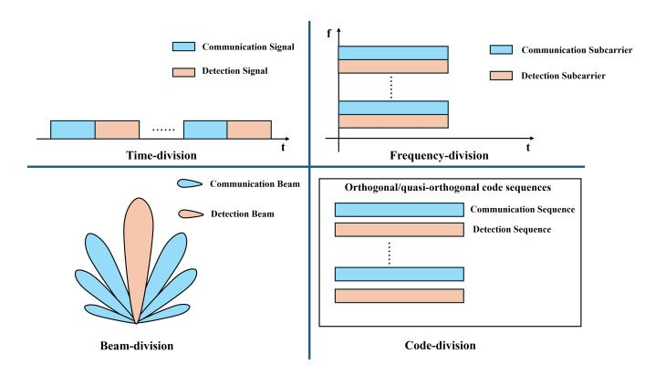

Fig. 9. Diagram of Resource Allocation in Different Domains.

### *B. Fully-shared Waveform Design Methods*

In the fully shared architecture, the integrated waveform design can be classified into three categories [16], [91]: a) Communication-centric waveform design (CCWD), where the primary function is communication. The target position and velocity information is estimated by extracting delay, phase, and Doppler shift from the received signal. b) Sonar-centric waveform design (SCWD), where the detection performance needs to be primarily guaranteed. In such designs, data transmission is achieved by modulating information onto the detection waveform or by adjusting waveform parameters, such as frequency and phase. c) Dual-functional joint waveform design (DJWD), which simultaneously considers both communication and detection functions, and perform waveform design by integrating the objectives and constraints of both aspects.

*1) Communication-centric Designs:* The common approach to CCWD is directly utilizing conventional communication signals for detection. In the monostatic scenario illustrated in Fig. 3(a), the transmitted integrated waveform is fully known to the receiver, allowing any communication waveform to be used for detection. In this section, we first introduce the integrated system based on narrowband communication signals, such as MSK, FSK and PSK, followed by the integrated system based on traditional broadband communication signals, such as OFDM and OCDM. Finally, we briefly describe the potential applications of OTFS in integrated systems.

Based on single carrier signals: Lu et al. explored the feasibility of using conventional single-carrier signals, such as minimum frequency shift keying (MSK), frequency shift keying (FSK), and phase shift keying (PSK), for ISC systems [92]. First, the BER performance of these signals were evaluated under varying channel conditions. The results indicate that BPSK and MSK achieve comparable BER, while 2FSK suffers from higher error rates due to its susceptibility to frequencyselective fading. Next, the detection performance was analyzed using ambiguity functions (AFs). The AF analysis reveals that MSK offers the best compromise between time and frequency resolution, whereas 2FSK exhibits moderate resolution. BPSK provides high frequency resolution but suffers from strong sidelobes along the delay axis. Furthermore, Q-function analysis (cite definition if non-standard) demonstrates that FSK, MSK, and BPSK exhibit increasing reverberation resistance under small Doppler shifts. However, as the Doppler shift grows, FSK surpasses MSK and BPSK in robustness.

Although MSK-, FSK-, and PSK-based ISC systems are computationally efficient, they face inherent limitations compared with multicarrier alternatives: a) In frequency-selective channels, single-carrier signals may experience deep fading at critical frequencies, whereas multicarrier systems (e.g., OFDM) mitigate this via frequency diversity. b) Single-carrier modulations (e.g., 2FSK) generate narrowband spectral lines, elevating their probability of intercept due to high peak-toaverage power ratios (PAPR). In contrast, multicarrier waveforms (e.g., OFDM) approximate a noise-like PSD, suppressing detectable features and improving LPI performance. c) Single-carrier systems typically achieve lower data rates than multicarrier schemes (e.g., OFDM's high data rates via orthogonal subcarriers).

Based on OFDM: OFDM serves as a key physical-layer modulation technique in both 4G LTE and 5G NR [93], [94]. As a wideband signal, OFDM offers several main advantages in communication including high data rates, high spectrum efficiency and flexible resource allocation. Therefore, OFDM was introduced into the IRC and ISC system design as an integrated waveform [7], [18].

For OFDM-based ISC systems, one of the critical challenges is the severe Doppler spread in UWA channels, which can result in significant inter-carrier interference (ICI). A common approach to mitigating ICI is to increase subcarrier spacing by reducing the number of subcarriers. However, this trade-off results in a lower communication rate, creating a fundamental conflict between robustness to Doppler and spectral efficiency. For IRC in high-speed motion scenarios, the index modulation OFDM (IM-OFDM) has been applied to CCWD, effectively mitigating the impact of ICI on communication reliability while maintaining a high communication rate [95]. Therefore, it is reasonable to speculate that IM-OFDM is also well-suited for ISC system. However, activating only a subset of subcarriers results in a broader mainlobe and elevated sidelobes in the ambiguity function, which degrades the accuracy of delay and velocity estimation. In addition, the non-uniform activation of subcarriers may lead to fluctuations in echo signal power, thereby reducing the performance of matched filtering and adversely affecting the detection probability [96], [97].

The severe multipath effects inherent in UWA channels is another key challenge for OFDM-based ISC systems, which often result in pronounced frequency-selective fading. For OFDM signals, where each frequency corresponds to a distinct subcarrier, such intense frequency fading can cause the demodulation of information on certain subcarriers to fail. Although power allocation can mitigate the impact of frequency-selective fading on communication performance [98], it significantly increases computational complexity due to the rapid time variations of UWA channels.

Based on OCDM: OCDM signals [99], which utilize chirp subcarriers spread across the entire bandwidth, inherently possess robustness against frequency-selective fading. Unlike OFDM, which transmits symbols over orthogonal sinusoidal subcarriers using the inverse discrete Fourier transform (IDFT), OCDM employs the inverse discrete Fresnel transform (IDFnT) to map data onto chirp basis functions that occupy the entire bandwidth. As a result, each OCDM symbol spans all subcarriers and experiences the full channel spectrum, enabling inherent frequency diversity. This spread-spectrum nature of OCDM provides resilience against deep fades on specific frequencies, ensuring that even if some frequencies are severely attenuated, the embedded information can still be effectively recovered from other parts of the spectrum. Consequently, OCDM offers a more resilient alternative for communication in UWA channels, particularly in environments with severe multipath propagation. Besides, it has been proved that OCDM has greater robustness against other impairments such as carrier frequency offset (CFO), inter-symbol interference (ISI) and burst interference in the frequency and time domains [100], [101], which is associated with the spread spectrum nature of subcarriers and the circular convolution nature of the discrete Fresnel transform (DFnT) [102].

Therefore, OCDM has been extensively explored for application in CCWD. In [14], OCDM was introduced into CCWD as an alternative to OFDM. The OCDM-based integrated system model involving communication information acquisition and target parameter estimation functions is described. In [103], the sparsity-aided compressed sensing (CS) algorithm was incorporated into the detection subsystem to improve estimation accuracy while reducing the sampling rate and hardware complexity of the detection receiver. Like OFDM, OCDM can be combined with index modulation (IM) to enhance data transmission rates and improve Doppler resilience [104]. However, due to its spread-spectrum nature, OCDM cannot benefit from power allocation techniques [105]. In [6], wang et al. combined the dictionary theory with OCDM and designed and a dictionary-theory based orthogonal chirp division multiplexing (Dic-OCDM) signal. Comparing with OCDM, Dic-OCDM provides a larger subcarrier spacing without requiring additional bandwidth and compute complexity. As for detection performance, the difference between Dic-OCDM and OCDM is negligible.

In summary, OFDM- and OCDM-based ISC systems offer notable advantages, including high data rates, efficient bandwidth utilization, and seamless compatibility with existing communication systems. However, they also share some common drawbacks. Such as a) Both OFDM and OCDM need to address the issue of high peak-to-average power ratio (PAPR) to avoid reduced power amplifier efficiency and nonlinear signal distortion [106], [107]. b) When using the CSI-based methods (see Section VII-B-2) to estimate the target's range and velocity, the maximum unambiguous range is constrained by the length of CP. And there is also a trade-off between the maximum unambiguous range and the maximum unambiguous velocity. c) If the correlation-based methods (see Section VII-B-1) are adopted in the detection receiver, the detection performance is significantly affected by random communication data. d) The requirement for costly hardware equipment for both transmission and reception. Given these limitations, detection in such systems should be treated as a supplementary feature rather than a replacement for dedicated sonar systems.

Based on OTFS: Recently, a novel two-dimensional modu-

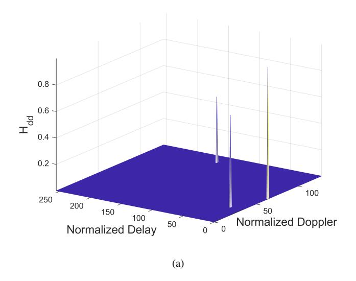

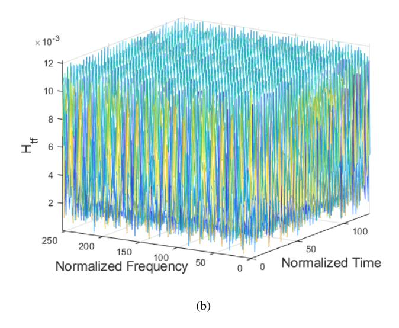

Fig. 10. The doubly-dispersive channel represented in (a) delay-Doppler domain and (b) time-frequency domain.

lation technology, OTFS [108], have been introduced into IRC system design [109]. In OTFS, the information symbols are in the delay-Doppler (DD) domain. A higher diversity gain can be realized by achieving symbol in two dimensions, resulting in improved system performance [110]. This characteristic enables OTFS to exhibit more robust performance in doubly selective channels under high-speed mobility scenarios. Fig. 10(a) and (b) illustrate the representation of a doubly spread channel in DD domain and the time-frequency (TF) domain, respectively. The channel consists of three multipath components, with normalized delay, Doppler shift, and amplitude given by (0,0,1), (20, -30, 0.7), and (150, 50, 0.5), respectively.

Fig. 10(a) demonstrates the advantages of OTFS in detection: the target's delay and Doppler information can be directly extracted from the CSI without extra complex signal processing. However, when a fractional component of the normalized delay and Doppler shift exists, power leakage may occur around the channel response in the DD domain, which can interfere with target parameter estimation [111].

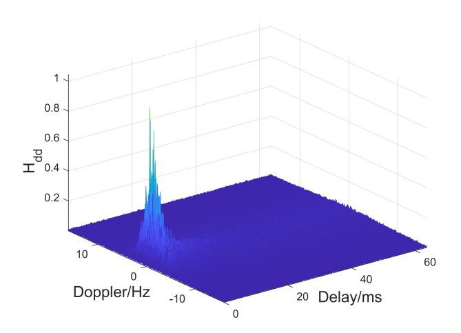

Fig. 11. The NCS1 channel represented in delay-Doppler domain.

This issue may be further exacerbated in UWA channels, as the velocity differences between underwater targets are often not sufficient to result a difference in the integer component after normalization.

For example, we consider a set of typical parameters for underwater acoustic communication signals. Suppose the available bandwidth is 4 kHz, the number of subcarriers is 128, the carrier center frequency is 6 kHz, and the speed of sound in water is 1500 m/s. In this case, the subcarrier spacing is 31.25 Hz, and the wavelength of the central subcarrier is 0.25 m. Consequently, for two targets to be distinguishable in terms of their integer Doppler components, their velocity difference needs to reach 7.8 m/s, which is rare in underwater environments. Fig. 11 illustrates the representation of the NCS001 channel [56] in the DD domain. Due to the presence of fractional delay and Doppler, the resolvability of multipath components is poor, making it difficult to accurately extract target distance and velocity information.

Therefore, although OTSF exhibits greater potential for integrated systems compared with OCDM and OFDM, their adaptation to underwater environments remains a significant challenge.

Overall, the integrated waveform design approach based on communication signals can ensure a high communication rate and compatibility with existing communication receiver algorithms, thereby maintaining high communication reliability. However, the randomness of communication information may degrade the target detection probability and the accuracy of parameter estimation.

*2) Sonar-centric Waveform Designs:* Detection signals are typically required to possess excellent autocorrelation properties to ensure the reliability of target detection. However, pure detection signals cannot achieve communication functionality, as they contains no communication information. The embedding of communication information inevitably leads to the degradation of signal correlation properties. Therefore, the core challenge of SCWD lies in how to efficiently embed more communication information while preserving the correlation properties as much as possible. In this section, we introduce integrated waveform design methods based on three typical probing signals: LFM, generalized sinusoidal frequencymodulated (GSFM), and acoustic frequency comb (AFC).

Based on LFM: Due to its excellent time-frequency characteristics, LFM signal is widely used in sonar and radar systems. Its wide bandwidth provides high range resolution, while pulse compression technology enhances its noise resistance. Additionally, the frequency modulation characteristics of the LFM signal provide strong robustness against multipath effects, making it well-suited for complex underwater acoustic environments. The LFM signal can be expressed as:

$$s_{LFM}(t) = A_0 e^{j2\pi(f_0 t + \frac{1}{2}\mu t^2 + \varphi_0)} rect(\frac{t}{T_s}),$$
 (26)

where A0,f0,µ,φ0, and Ts represent the initial amplitude, start frequency, chirp rate, initial phase, and duration of the LFM signal, respectively. Theoretically, these parameters can all be varied to enable the transmission of information data. By modifying the phase, initial frequency, and amplitude, integrated waveforms such as PSK-LFM [112], FSK-LFM [113], MSK-LFM[114], and QAM-LFM [115] have been designed. Compared with each other, PSK-LFM and MSK-LFM offer better detection performance due to their constant envelope and smooth phase transitions, which help maintain sharp ambiguity functions. MSK-LFM further improves spectral efficiency and BER performance under multipath conditions. FSK-LFM is simple and robust but suffers from degraded detection accuracy due to its frequency discontinuity. QAM-LFM achieves the highest data rate but exhibits reduced radar performance because of envelope fluctuations and higher PAPR, which also increases the implementation complexity.

Under a fixed bandwidth, a change in either the frequency sweep rate or the duration typically results in a corresponding change in the other. This is because LFM signals usually occupy the entire available bandwidth to achieve a high timebandwidth product. These integrated waveform design scheme, which conveys communication information by modifying the inherent parameters of the LFM signal, does not degrade the detection performance of LFM. However, it suffers from extremely low communication rates.

In [5], Men et al. designed an integrated waveform called orthogonal linear frequency modulation (OLFM) by superimposing multiple narrowband LFM signals. Compared with traditional LFM, OLFM signals reduce the instantaneous bandwidth requirements at the receiver. This is because the receiver can process each narrowband LFM signal individually, thereby reducing the complexity and cost of hardware design. Additionally, the authors applied the generalized highresolution range profile synthesis (GHRRPS) technique at the receiver to synthesize a high-resolution range profile, compensating for the degradation in range resolution caused by using narrowband LFM instead of wideband LFM.

Regarding the communication performance, since each narrowband LFM signal in the OLFM waveform can be considered as a subcarrier, a combination of IM and phase modulation (PM) is used to convey digital information, thereby increasing the communication rate.

[4] proposed a sector modulation-based LFM signal (SM-LFM) in the fresnel domain, where the signal is divided into equal-length sectors, and data is encoded by activating different sectors. At the communication receiver, data demodulation is achieved without the need for channel estimation or equalization by establishing a relationship between the Dirac function in the Fresnel domain and the channel impulse response (CIR) in the time domain, resulting in low complexity and high robustness. In terms of detection, SM-LFM estimates the relative radial velocity through phase accumulation in the Fresnel domain, improving the maximum unambiguous velocity compared with conventional LFM.

**Based on GSFM:** GSFM [116] is another frequency modulated signal commonly used in detection systems, which can be expressed as [25]:

$$s_{GSFM}(t) = \frac{\text{rect}(t)}{\sqrt{T_s}} e^{j\phi_{GSFM}(t)} e^{j2\pi f_c t}, \qquad (27)$$

where  $T_s$  is the symbol duration and  $f_c$  is the center frequency.  $\phi_{GSFM}(t)$  is the phase modulation function, which is expressed as:

$$\phi_{GSFM}(t) = \frac{\beta}{t^{(\rho-1)}} \sin\left(\frac{2\pi\gamma t^{\rho}}{\rho}\right),$$
 (28)

where  $\beta=\frac{B}{2\gamma}$  is the modulation index. B is the bandwidth and  $\gamma$  is a frequency modulation term.  $\rho\geq 1$  is a dimensionless parameter. By adjusting  $\gamma$  and  $\rho$ , as well as applying frequency reflection operations, a large set of approximately orthogonal GSFM waveforms can be generated. This orthogonality reduces the cross-correlation interference between sub-pulses and improves multi-target discrimination. Furthermore, (25) and (26) demonstrate that, unlike the linear variation of instantaneous frequency (IF) in LFM waveforms, the IF of GSFM waveforms follows a generalized sinusoidal trajectory. As a result, these approximately orthogonal GSFM waveforms are generated within the same frequency band, leading to a higher spectral efficiency compared with LFM.

An integrated waveform was designed in [24] by combining BPSK modulation and GSFM signal, which has a higher communication rate and excellent detection resolution. However, the communication performance of the integrated system is greatly affected by the multipath channel. To enhance the adaptability of the signal to multipath channels and further improve the data rate, the adaptive M-ary Spread Spectrum modulation was used to embed information in the GSFM waveform, and the genetic algorithm was adopted optimize the integrated waveform [25].

Niu et al. used the GSFM signal as carrier signal, employed Gaussian Minimum Shift Keying encoding for communication information modulation, and utilized an improved blind source separation algorithm at the receiver, which is better adapted to waveform separation and processing in the underwater time-varying unknown environment [117].

[118] designed an ISC system based on Chaotic-GSFM (CG) signal. Its main consideration is the scenario of low frequency signal transmission over long distances in the deep sea. This signal has better detection performance than BPSK and MSK-LFM signals. Reliable communication in harsh

channel environments is achieved by the method of noncoherent communication, and chaotic modulation is used to ensure communication security. The Cross-ambiguity function was used to estimate the target information.

**Based on AFC:** Recently, AFC signals have attracted attention in underwater detection and localization by inducing good autocorrelation properties and robustness [119]. Liu et al. designed an incremental frequency interval acoustic frequency comb (IFI-AFC) signal [3] based on the AFC signal. The subcarrier spacing of IFI-AFC signal is gradually increasing as the subcarrier index increases, rather than being uniform as in AFC, which is given by:

$$f_n = f_0 + \frac{n(n+1)}{2}\Delta f, \ n = 0, 1, ...N - 1,$$
 (29)

where  $f_n$  is the *n*th subcarrier, N is the total number of subcarriers,  $f_0$  is the initial frequency and  $\Delta f$  is the fundamental subcarrier spacing.

Equation. (29) indicates that the IFI-AFC signal is a multicarrier signal. Compared with traditional multicarrier signals such as OFDM and OCDM, the advantage of IFI-AFC in detection lies in its superior autocorrelation properties in the Doppler domain. OFDM and OCDM exhibit spurious peaks in the Doppler domain, making it difficult to distinguish target velocities. In contrast, IFI-AFC exhibits the lowest Doppler sidelobe level. This is because, in IFI-AFC, the frequency spacing gradually increases, preventing Doppler-induced ambiguity peaks from concentrating at fixed frequency intervals. Instead, these peaks are spread across a broader frequency range, effectively reducing Doppler ambiguity and enhancing the ability to distinguish targets with different velocities.

One drawback of IFI-AFC is that, for the same bandwidth, the AFC signal contains fewer subcarriers compared with OFDM and OCDM. As a result, with the same modulation order, IFI-AFC exhibits a lower data rate. However, this limitation can be mitigated by increasing the modulation order on the high-frequency subcarriers, as their larger subcarrier spacing offers greater resilience to interference.

In summary, the core of SCWD is to minimize the impact of information embedding on the sonar waveform's correlation properties, thereby ensuring detection performance. Such waveforms are suitable for scenarios where high communication rates are not required.

3) Dual-functional Joint Waveform Designs: The SCWD and CCWD schemes offer excellent performance in specific aspects of the ISC system and are easily compatible with existing equipment. However, due to the inherent conflict between communication and detection performance, these approaches fall short in optimizing the overall performance of the integrated system. To address this limitation, DJWD has emerged as a promising methodology. In contrast to SCWD and CCWD, it aims to strike a balance between communication and detection, thereby achieving globally optimal performance for the integrated system [120], [121], [122], [123]. The common approach of DJWD is to incorporate the performance metrics of both communication and detection into a unified objective function and solve it using optimization algorithms to determine the waveform parameters that achieve overall

system performance optimization. Therefore, the essence and key aspect of joint design lie in joint optimization. Waveform optimization can be performed in different domains by integrating various performance metrics, such as the spatial domain, time domain, and frequency domain.

In the following, we introduce a representative DJWD scheme proposed in [124], which targets a single data-stream, single-carrier IRC system based on the IEEE 802.11ad standard. To enhance radar velocity estimation, the authors design a packet structure with non-uniformly placed preambles, which serve exclusively for detection, while the remaining symbols carry communication data. On the communication side, a novel metric called Distortion Minimum Mean Squared Error (DMMSE) is developed to evaluate signal distortion. To jointly optimize communication and radar (C&R) performance, the DMMSE and the radar Cramer-Rao Lower Bound (CRLB) ´ are both converted to logarithmic scale. This transformation allows the two metrics to be directly added in a unified objective function, thereby enabling proportional fairness between communication and detection. The proposed objective function is given by:

$$w_{C}\frac{1}{K}\mathrm{Tr}\left[\log_{2}\mathrm{DMMSE}\right] + w_{R}\mathrm{Conv}\left(\frac{1}{L_{v}}\mathrm{Tr}\left[\log_{2}\mathrm{CRLB}\right]\right),\tag{30}$$

where K is the number of symbols, Lv is the number of velocities to be estimated, Tr[·] denotes the trace of a matrix, Conv( · ) denotes the convex hull operation, and wC and wR are weighting factors for C&R, respectively.

Based on this objective function and relevant system constraints, the number and placement of preambles are jointly optimized. The results demonstrate that uniformly spaced preambles fail to simultaneously enhance both communication and radar performance. In contrast, non-uniform preamble placement achieves a more favorable trade-off, especially in scenarios involving large target distances.

The DJWD can achieve the overall optimal performance of the integrated system by balancing the communication performance and detection performance. However, DJWD typically involves the formulation and solution of complex optimization problems related to CSI. The UWA channels are highly complex, while the computational resources of underwater platforms are limited. As a result, ISC systems based on DJWD are currently challenging to implement effectively. Nevertheless, it is foreseeable that as the computational capabilities of underwater platforms improve, the advantages of DJWD will become increasingly evident.

*4) Summary:* In this section, we provide an overview of various integrated waveform design methods, which can be categorized into two types: resource allocation-based design and fully shared design. We focus on the fully shared design and further classify it into three categories, namely, CCWD, SCWD, and DJWD.

CCWD focuses on modifying traditional communication waveforms to enhance their detection capabilities. However, due to the randomness of communication data, the detection performance of such waveforms may not be robust. Additionally, communication signals typically have a fixed frame structure, which can also affect the range of velocity and distance estimation. SCWD aims to embed communication symbols into sonar waveform without significantly degrading its detection performance. Consequently, integrated systems based on SCWD typically operate at a low data rate. Unlike the above two approaches, DJWD aims to jointly optimize the communication and detection performance of the integrated waveform and dynamically allocate resources and configure parameters according to specific application scenarios, thereby achieving optimal overall performance for the integrated system. However, it often involves complex optimization problems to balance communication and sonar functions, making it challenging to implement efficiently on real-time platforms.

Notably, most of the aforementioned studies include realworld experiments conducted in pools [4], lakes [3], [25], or oceans [118], providing important insights into the theoretical modeling and practical performance of the system. However, in these experiments, the detection processes are often conducted at close range or passive (i.e., the target echo is usually not the reflected signal from a real target, but rather a signal directly transmitted by another transducer to emulate the target response). It can be explained by the fact that: a) The main objective of the experiments. The long-range active detection capability of the ISC system is influenced factors such as waveform characteristics, hardware performance, target properties, and signal processing algorithms. However, in the above studies, the primary objective of real-world experiments is to verify the performance of the designed waveform, while the influence of other factors should be minimized as much as possible. b) Target characteristics. Long-range active detection requires large targets with good acoustic reflection properties, but designing and deploying such targets is challenging. c) Cost control and safety. Longrange detection may require higher transmission power and more complex equipment, increasing both experimental safety risks and operational costs.

#### VII. THE SIGNAL PROCESSING METHODS

In ISC system, the general processing flow of the received signal is shown in Fig. 12.

The received signal y(t), which contains the detection echoes, the communication signals transmitted by other ISC or communication systems, and additive noise, is captured by the hydrophone array. It is first processed by the low noise amplifier (LNA) to amplify the desired signal while maintaining a low noise level. Then it passes through a band-pass (BP) filter, which isolates the desired frequency components and suppresses out-of-band noise and interference. Subsequently, if the detection echo is processed at the baseband, the processing steps are as shown in the lower part of Fig. 12. Otherwise, down-conversion and low-pass (LP) filtering can be omitted in detection processing, as shown in the upper part of Fig. 12. But in any case, communication signal processing should be performed at the baseband. The received signal then undergoes analog-to-digital (A/D) conversion and serial-to-parallel (S/P) conversion. To mitigate mutual interference between the communication signals and the detection echoes, interference cancellation (IC) should be applied to the received signal

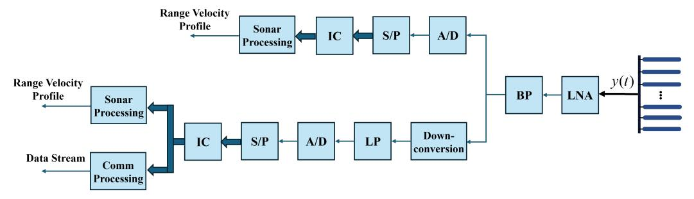

Fig. 12. Typical signal processing flow in the ISC system receiver.

before sonar and communication processing. The remaining communication and sonar processing steps are described in Section VII-A and VII-B, respectively.

#### *A. Communication Processing*

The communication processing typically follows a common framework in integrated systems designed based on different waveforms. Therefore, this section presents a general processing flow for the communication receiver, as shown in Fig. 13(a), without involving waveform-specific processing details.

Before starting the communication processing, we assume that residual timing offset, carrier frequency offset, and carrier phase offset have been compensated via synchronization based on a preamble, e.g., unmodulated chirps and sequence generated by Schmidl & Cox algorithm [125]. communicationcentric integrated signals (such as OFDM and OCDM) need to have the CP removed. Then, channel estimation and equalization are performed to compensate for the effects of the Communication channel. Due to the characteristics of different waveforms, estimation and equalization are conducted in different domains. For example, Chirp waveforms are typically processed in the time domain, while OFDM waveforms are in the frequency domain. Notably, the channel estimation needs to be periodically renewed to promptly update the CSI, ensuring communication reliability. Finally, the equalized signal undergoes parallel-to-serial (P/S) conversion and demapping, generating the demodulated data stream.

#### *B. Detection Processing*

At the detection receiver, it is typically necessary to estimate three primary target parameters from the echo signals: DOA, target distance, and target velocity. DOA estimation typically involves complex array signal processing techniques. For the sake of conciseness, a detailed introduction to these methods is not provided in this paper. Interested readers are referred to [126], [127], [128] and [129] for an in-depth discussion on DOA estimation. As for the target distance and target velocity, the main estimation methods include two categories, the correlation-based methods and the CSI-based methods. The remaining detection processing steps in the considered ISC system start with IC, which consists of removing the influence of communication signals originally transmitted by other ISC or communication systems.

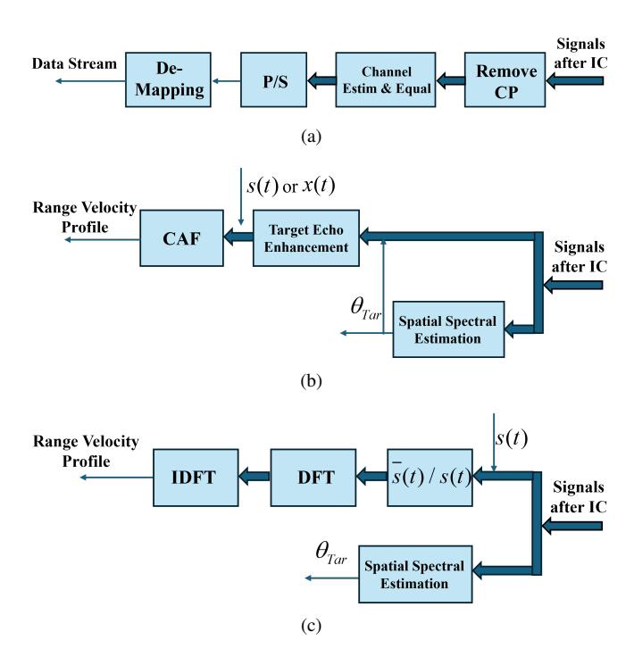

Fig. 13. Flowchart of (a) communication processing, (b) detection processing of the correlation-based methods and (c) detection processing of the CSI-based methods.

*1) Correlation-based Methods:* In conventional sonar and radar systems, correlation-based techniques are widely utilized to extract target parameters from echo signals [130], [131]. This approach is effective because conventional radar and sonar signals exhibit strong correlation properties, enabling high-resolution estimation of target parameters in the delay and Doppler domains through correlation operations. A general processing flow for the detection receiver of the correlation-based methods is shown as Fig. 13(b). The first step is to estimate the spatial spectrum of the echo signal using methods such as deconvolution beamforming (DCBF) [132] and obtain the target's bearing from the spatial spectrum. With the knowledge of target bearing, the frequency invariant beamformer [133] is performed for target echo enhancement. Finally, the range-velocity profile is generated by computing the cross-ambiguity function (CAF) between the reference signal, either s(t) at baseband or x(t) at passband, and the beamformer output.

The CAF is one of the most widely used and effective correlation-based method. The expressions of CAF is given by:

$$A(\tau_d, f_d) = \int_{-\infty}^{\infty} s_1 \left( t - \tau_d' \right) s_2^*(t - \tau_d) e^{j2\pi (f_d - f_d')t} dt,$$
(31)

where  $s_1(t)$  indicates the echo signal,  $s_2(t)$  denotes the transmitted signal (the so-called reference signal),  $f_d$  represents Doppler shift and  $\tau$  represent time delay.  $f_d'$  and  $\tau'$  denotes the Doppler shift and time delay of the echo signal relative to the reference signal, respectively.

If the CAF is adopted to estimate target parameters, the range and resolution of both time delay and Doppler shift are given by:

$$|\tau_{\text{max}}| \le N_s/F_s,\tag{32}$$

$$|f_{d,\max}| \le F_s/2,\tag{33}$$

$$\Delta \tau = 1/F_s,\tag{34}$$

$$\Delta f_d = 1/T_s. \tag{35}$$

where  $N_s$  is the number of sampling points,  $F_s$  is the sampling rate, and  $T_s$  is the symbol duration.

Equation. (32) to (35) indicates that achieving a larger measurement range and higher resolution in velocity and distance requires increasing  $N_s$  and  $F_s$ . However, this increase also results in higher computational complexity. In particular, when processing signals in the passband, a higher carrier frequency demands an even greater sampling rate to satisfy the Nyquist criterion, further amplifying the computational burden. In IRC systems, where the carrier frequency can reach GHz or even THz, signal processing based on correlation methods in the passband presents a significant challenge for the receiver. As a result, the CAF is typically employed as an analytical tool to evaluate waveform detection performance rather than as a direct signal processing method at the detection receiver. In contrast, ISC systems operate at much lower carrier frequencies and narrower bandwidth, making it feasible to perform signal processing directly in the passband [118], [134]. This is one of the key characteristic that distinguishes ISC systems from IRC systems.

In addition to the sampling rate and the number of sampling points, the performance of correlation-based methods is closely related to the correlation properties of the waveform. Due to the randomness of communication data, communication waveforms generally exhibit poorer correlation performance compared with dedicated detection waveforms. Therefore, without sacrificing performance to improve the waveform, correlation-based methods are less effective for processing communication-centric integrated signals. However, compared with CSI-based methods (introduced in Section VII-B-2), one advantage of correlation-based methods in communication-centric integrated signals processing is their ability to provide a larger velocity and ranging measurement range, making them more suitable for wide-area, low-precision target search tasks.

In summary, the correlation-based processing method offers advantages including wide applicability, low complexity, and extensive velocity/range measurement capabilities, enabling its deployment in diverse scenarios. However, its limitations consist of constrained detection accuracy, poor adaptability to communication waveforms, and susceptibility to multipath channel interference. Consequently, a trade-off between accuracy and computational complexity must be considered in practical applications.

2) CSI-based Methods: To address the challenges in correlation-based methods, CSI-based methods have been proposed, leveraging the channel characteristics to enhance performance. In this section, we explore the principles and advantages of CSI-based detection techniques.

A classic CSI-based method was proposed by [7], called modulation symbol domain (MSD) processing. Taking OFDM as an example, the processing is shown in Fig. 13(c). We assume that the operations, such as S/P and CP removal, have been completed, and the length of CP is longer than twice the maximum target distance. The first step is to divide the received signals  $\bar{s}(t)$  by the copy of the transmitted signals s(t). This operation aims to eliminate the influence of communication information on target parameter estimation. The result of the division is the CSI matrix, which contains the delay and Doppler information of the targets. Subsequently, by applying inverse discrete Fourier transform (IDFT) along the fast time dimension and discrete Fourier transform (DFT) along the slow time dimension to the received signals, the delay and Doppler information of different multipaths can be obtained. When only point targets are considered, each path corresponding to one target. Therefore, the ranges and velocities of the targets are obtained.

Although originally developed for OFDM-based integrated systems, the MSD method is also applicable to OCDM. The only difference lies in the CSI matrix acquisition: in OCDM systems, it is obtained by performing element-wise multiplication between the received and transmitted signals along the fast-time dimension in the frequency domain [36]. This is because OCDM symbols may exhibit low or null values in the frequency domain. Performing divisions by such values in the discrete-frequency domain would lead to significant noise enhancement, as highlighted in [14]. This property of OCDM prevents eliminating the impact of communication data on detection performance.

For both OFDM and OCDM schemes, the achievable Doppler and delay estimation ranges and resolutions under the MSD processing framework are as follows:

$$\tau_{\text{max}} \le N/B,$$
(36)

$$|f_{d,\max}| \le B/N/2,\tag{37}$$

$$\Delta \tau = 1/B/2,\tag{38}$$

$$\Delta f_d = B/M/N,\tag{39}$$

where B is the bandwaidth. N and M are the number of subcarriers and symbols processed in parallel, respectively. The MSD processing is specifically designed to account for the characteristics of OFDM signals. This makes it well-suited for implementation in communication systems based on OFDM or OCDM.

Our study find that a major limitation of this method in ISC system is the mutual constraint between the maximum unambiguous delay  $\tau_{\rm max}$  and the maximum unambiguous Doppler  $|f_{d,{\rm max}}|$ , which is expressed as:

$$\tau_{\text{max}} \cdot |f_{d,\text{max}}| = 1/2. \tag{40}$$

Considering the two-way propagation of the signal during the detection process, the relationships between time delay and distance, as well as between Doppler shift and relative velocity, can be expressed by  $R=\tau c/2$  and  $V=f_d\lambda/2$ , respectively. If we convert delay and Doppler to range and velocity, respectively, (40) then becomes a constraint between maximum unambiguous range  $R_{\rm max}$  and maximum unambiguous velocity  $v_{\rm max}$ , which is given by:

$$R_{\text{max}} \cdot v_{\text{max}} = \frac{c^2}{8f_c},\tag{41}$$

where c is the propagation speed of the signal in the medium, and  $f_c$  denotes the carrier frequency.

For IRC systems, the quantity of  $\frac{c^2}{8f_c}$  is sufficiently large. For example, with  $f_c = 5GHz$  and  $c_1 = 3 \times 10^8 m/s$ , a maximum range of  $R_{\rm max} = 10km$  corresponds to a maximum velocity of approximately  $v_{\rm max} = 225m/s$ , which is sufficient for most practical applications. However, in ISC systems, this quantity becomes significantly smaller For instance, considering  $f_c = 15kHz$  and  $c_2 = 1.5 \times 10^3 m/s$ , achieving a maximum range  $R_{\rm max} = 100m$  results in a maximum velocity of only  $v_{\rm max} = 0.1875m/s$ . This constraint significantly limits the applicability of MSD method in ISC systems.

A simple approach to mitigate the trade-off between  $R_{\rm max}$ and  $v_{
m max}$  is to perform the MSD process in the passband rather than at baseband. As mentioned in the previous section, since the carrier frequency of ISC systems is significantly lower than that of IRC systems, signal processing in the passband is feasible for ISC systems. In that case, the maximum unambiguous range increased by a factor of  $F_{s\ pb}/B$ , and the rest of the performance parameters remain unchanged, where  $F_{s\ pb}$  is the sampling rate of the passband signal and B is the signal bandwidth. Liu et al. proposed a detection processing method for ISC systems based on the Energy Spectrum Matching (ESM) algorithm [3]. The processing steps of the ESM method are as follows: First, the received and transmitted signals are individually auto-correlated in the frequency domain to obtain their respective energy spectral functions. Second, the Doppler shift of the target is estimated by cross-correlating these energy spectral functions. Third, the estimated Doppler shift is used to compensate for the echo signal. Finally, matched filtering is applied to the compensated signal in the time domain, and the target range is determined based on the estimated time delay. The achievable Doppler and delay estimation ranges and resolutions under the ESM processing framework are as follows:

$$\tau_{\max} \le T_{PRI},\tag{42}$$

$$|f_{d,\max}| \le F_{s,pb}/2,\tag{43}$$

$$\Delta \tau = T_{PRI}/N/2,\tag{44}$$

$$\Delta f_d = F_{s\ pb}/N,\tag{45}$$

where  $T_{PRI}$  is the pulse repetition interval,  $F_{s\_pb}$  is the sampling rate of the passband signal and N is the number of subcarrier. The constraint between  $\tau_{\max}$  and  $|f_{d,\max}|$  can be derived as:

$$\tau_{\text{max}} \cdot |f_{d,\text{max}}| = T_{PRI} \cdot F_{s\_pb}/2. \tag{46}$$

Since the signal processing in [3] is performed in the passband, the condition  $T_{PRI} \cdot F_{s\_pb} > 1$  holds. In other words, compared with the MSD method, the ESM algorithm enables extended estimation ranges for both velocity and range. Moreover, it achieves robust parameter estimation in underwater environments with low SNR and multipath effects.

[135] proposed a novel CSI-based method for echo signal processing, which is called cyclic correlation (CC) method. In the CC method, the echo signals and the transmitted signals are divided into multiple sub-blocks in time domain. The correlation between the echo sub-blocks and the conjugate of the transmitted sub-blocks are calculated. The result of the correlation is the CSI matrix. With the obtained channel information matrix, the distance and velocity of the target are obtained using maximum likelihood (ML) and discrete Fourier transform (DFT) methods, respectively [136]. A typical issue in MSD processing—the limitation of the maximum unambiguous range imposed by the length of the CP—is also addressed in [135]. In communication systems, the CP length is generally fixed. When the round-trip delay of a target exceeds this length, the detection performance degrades significantly due to the inability to correctly remove communication data symbols, resulting in increased interference. To overcome this limitation, the authors propose a variable cyclic prefix (VCP) scheme, where echo signals are divided into multiple sub-blocks in the time domain, each potentially containing a VCP. The length of the VCP can be flexibly adjusted according to the maximum target distance, thus removing the dependency on the fixed CP length. This dynamic adjustment ensures proper elimination of communication symbols even for distant targets, enabling the generation of a high-quality range-Doppler map (RDM).

For OTFS systems, its two-dimensional modulation domain, the DD domain, enables a more straightforward acquisition of the CSI matrix. Specifically, by transforming the received signal from the time domain into the DD domain, one can directly obtain a CSI matrix that captures both the delay and Doppler characteristics of the target. To ensure a "cleaner" CSI matrix, a common approach is to transmit dedicated pilot frames or embed pilot symbols within data frames, with sufficiently large guard regions around the pilot symbols. The size of these guard regions is typically determined based on the expected maximum delay spread and target velocity. In this way, the target's velocity and range can be estimated by observing the shift of the pilot symbols in the received signal and comparing it against predefined thresholds [137]. Moreover, the CSI thus obtained can also serve as the channel estimation result for the communication functionality, enabling joint communication and detection. However, this design inevitably reduces communication efficiency due to the overhead introduced by guard regions and pilot resources. To address this trade-off, a novel symbol placement strategy that exploits

TABLE VI SIGNAL PARAMETERS

| Parameter                                         | Value      |
|---------------------------------------------------|------------|
| Carrier frequency                                 | 6 kHz      |
| Bandwidth                                         | 4 kHz      |
| Sampling rate                                     | 20 kHz     |
| Total subcarrier number (for OFDM, OCDM and OTFS) | 256        |
| Symbol duration                                   | 64 ms      |
| Monte Carlo runs                                  | 500        |
| Chirp rate                                        | 62.5 kHz/s |
| Doppler bins, Delay bins (only for OTFS)          | 64, 4      |
| Dimensionless parameter (only for GSFM)           | 2.0        |
| Frequency modulation term (only for GSFM)         | 160 s−1    |

the slow time-varying property of the DD domain channel was proposed in [19]. This approach eliminates the need for guard regions as required in traditional schemes, significantly reducing training overhead.

Overall, CSI-based methods are designed to leverage the characteristics of different multicarrier signals, such as the orthogonality of OFDM in the frequency domain and OTFS in the delay-Doppler domain. Therefor, the key advantage of CSIbased methods lies in the ability to directly reuse the channel estimation modules and frame structures of communication systems, ensuring strong compatibility with existing protocols and hardware. However, the performance of these methods is highly dependent on the inherent parameter design of the communication system. This includes, but is not limited to, the following factors: a) The maximum unambiguous range is limited by the length of the CP. An insufficient CP length can lead to ISI, thereby affecting the effectiveness of CSIbased methods. b) Subcarrier spacing and bandwidth directly affect Doppler and range resolution. c) The number of symbols within a frame determines the coherent integration time, thereby influencing parameter estimation accuracy. Therefore, improving existing methods to overcome these limitations remains a key focus of future research.

# VIII. PERFORMANCE EVALUATION AND SIMULATION

In this section, a series of simulation experiments are conducted to evaluate the performance of several typical integrated waveforms introduced in Section VI, namely LFM, GSFM, OFDM, OCDM, and OTFS. The evaluation follows the performance metrics defined in Section V.

#### *A. Ambiguity Function*

In this section, the WBAF of LFM, GSFM, OFDM, OCDM, and OTFS waveforms are plotted and compared. It should be noted that only the intrinsic ambiguity function characteristics of the waveforms are evaluated. The elements required by communication protocols—such as preambles, CP, and guard intervals—are not considered in this analysis. To ensure a fair comparison, all waveforms share the same system parameters, as summarized in Table. 6. Except for LFM and GSFM, all signals are modulated using the same randomly generated communication data and mapped using QPSK.

Fig. 14 presents the averaged AF of the aforementioned waveforms, based on 500 Monte Carlo simulations. The AF of the LFM signal is centered at the origin and exhibits a broad, smooth, slanted ridge, resembling a knife-edge. This ridge is aligned along the line η = µτ , where µ denotes the chirp rate, indicating a strong coupling between the delay and Doppler dimensions. As a result, the AF reaches its peak along this tilted trajectory rather than being centered at the origin. This coupling implies that delay and Doppler cannot be estimated independently, potentially degrading joint range and velocity estimation performance. Moreover, the mainlobe of the AF is broad in both delay and Doppler axes, reflecting low resolution, while the sidelobes are relatively low but widely spread. These properties make LFM signals favorable for robust target detection under low-SNR conditions, but less suitable for communication applications that require precise channel estimation and interference separation.

The GSFM waveform exhibits a more intricate AF structure. Its mainlobe is more sharply concentrated around the origin, offering higher resolution in both delay and Doppler estimation compared with the LFM waveform. However, this comes at the cost of elevated sidelobe levels, which may increase the risk of false alarms and ambiguities in target detection. In addition, the sidelobes of the GSFM waveform display oscillatory behavior and vary across different delay-Doppler combinations, resulting in a less uniform response. This phenomenon arises from the nonlinear frequency modulation inherent in the GSFM signal.

The AFs of OFDM, OCDM, and OTFS exhibit a similar thumbtack-like shape, characterized by a narrow peak centered at the origin and relatively flat sidelobes in other regions. This structure indicates that such waveforms are highly sensitive to both delay and Doppler shifts when correlation-based detection methods are employed. As a result, they offer strong resolution capabilities for distinguishing targets with closely spaced ranges and velocities.

It is worth noting that in OTFS, the modulated data is arranged in matrix form in the delay-Doppler (DD) domain. Adjusting the number of rows (corresponding to Doppler bins) and columns (corresponding to delay bins) of this matrix slightly alters the shape of the ambiguity function. Specifically, increasing the number of columns narrows the mainlobe width of the ambiguity function in the delay dimension, which indicates improved delay resolution. However, this also leads to a higher integrated sidelobe ratio (ISLR), which may degrade the system's ability to detect weak targets [138]. Therefore, the selection of the number of rows and columns should be carefully made by balancing the trade-off between ISLR and delay resolution.

#### *B. Q Function*

Fig. 15 presents the Q-functions derived from the AFs of various waveforms. The Q-function describes the matched filter response under different Doppler scale factors and serves as a critical metric for evaluating a waveform's robustness to Doppler-induced distortions.

As observed, the multicarrier waveforms—OFDM, OCDM, and OTFS—exhibit similar Q-function profiles. All of them display extremely sharp and narrow peaks at a Doppler scale

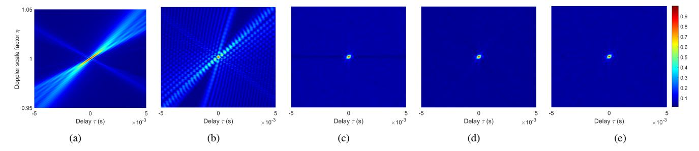

Fig. 14. The WBAF of (a) LFM, (b) GSFM, (c) OFDM, (d) OCDM, and (e) OTFS.

#### TABLE VII CHANNEL PARAMETERS

| Parameter        | Value   |
|------------------|---------|
| Distance         | 1300 m  |
| Water depth      | 100 m   |
| Tx depth         | 50 m    |
| Rx depth         | 60 m    |
| Frequency band   | 4–8 kHz |
| Delay coverage   | 5 ms    |
| Doppler coverage | 10 Hz   |

factor of 1, indicating high sensitivity to Doppler shifts. Even slight deviations from the nominal scale result in rapid degradation of the matched filter output. In contrast, the Qfunctions of LFM and GSFM are significantly broader. LFM exhibits the widest and smoothest mainlobe, reflecting its inherent Doppler tolerance due to linear frequency modulation. Although GSFM is also chirp-based, it employs a nonlinear frequency modulation law. As a result, its Q-function displays a high peak at the Doppler scale factor of 1, but decays more rapidly and exhibits stronger oscillations as the scale factor deviates, compared with LFM. This indicates that GSFM still maintains strong robustness against Doppler scaling, while offering improved time-frequency resolution.

These results highlight the trade-off between Doppler sensitivity and resolution. While multicarrier waveforms offer high resolution and Doppler focusing capability, they are more vulnerable to Doppler mismatch. In contrast, waveforms such as LFM and GSFM exhibit greater robustness in fast timevarying environments, albeit at the cost of reduced Doppler resolution.

# *C. ROC Curve*

In this section, the receiver operating characteristic (ROC) curves are plotted based on the matched filter (MF) and the generalized likelihood ratio test (GLRT) detectors. The simulation is conducted under the BELLHOP channel model that includes additive noise, multipath propagation, and Doppler effects. The channel parameters are listed in Table. 7. In each Monte Carlo experiment, the actual delay spread and Doppler shift of the channel are randomly generated within the ranges of the maximum delay spread and maximum Doppler shift, respectively, thereby ensuring the robustness of the experimental results. The channels with different Doppler shifts are generated by varying the relative speeds of the transceivers. The false alarm probability is fixed at Pfa =0.001.

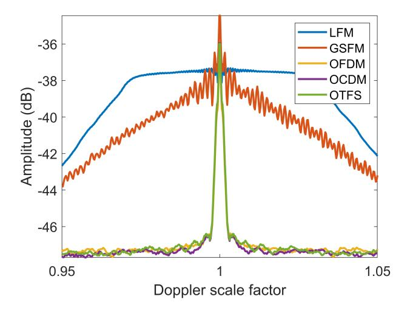

Fig. 15. Q-Functions of Different Signals.

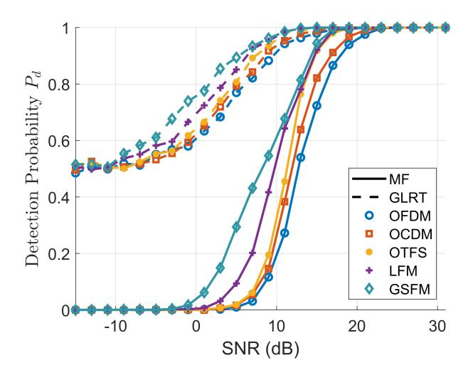

Fig. 16. The ROC curves for different waveforms with MF and GLRT detector when Pfa =0.001.

The results are presented in Fig. 16. As the SNR increases, the detection probability of all waveforms improves under both MF and GLRT detectors. The GLRT consistently outperforms the MF across the entire SNR range. This is because the MF assumes a perfectly known and fixed signal template, which makes it highly sensitive to distortions caused by channelinduced delays and Doppler shifts. In contrast, the GLRT adaptively estimates the unknown scaling factor of the received signal, effectively accounting for variations in channel gain and phase. This adaptive nature makes the GLRT more robust to signal-template mismatches and better suited for detection in dynamic and uncertain environments. Consequently, the GLRT achieves higher detection probability, particularly in low-to-moderate SNR regimes.

Among the tested waveforms, GSFM and LFM demonstrate higher detection probabilities at lower SNRs, indicating their superior robustness in noise-dominated environments. Unlike LFM, which employs a linear chirp rate, GSFM uses a nonlinear frequency modulation law. This nonlinearity improves the time-frequency concentration of the waveform, enhances the matched filter response, and reduces range-Doppler coupling. As a result, GSFM achieves better detection performance under both MF and GLRT detectors in complex channel conditions. Furthermore, the detection performance trend among multicarrier waveforms under both detectors follows: OTFS > OCDM > OFDM. This ordering reflects the increasing resilience of these waveforms to time-varying multipath channels. OFDM is highly susceptible to intersymbol interference and Doppler-induced distortions in doubly selective channels. OCDM mitigates some of these issues by leveraging chirp-based modulation, which introduces timefrequency diversity and improves multipath robustness. OTFS goes a step further by mapping data symbols to the delay-Doppler domain, allowing each symbol to fully exploit the channel's diversity. This structural advantage explains the superior detection performance of OTFS in highly dynamic scenarios.

#### *D. Spectral Efficiency*

Fig. 17 illustrates the variation of data rate with respect to the number of sampling points N for different waveforms. In the integrated schemes based on communication waveforms such as OFDM, OCDM, and OTFS, increasing N does not lead to an improvement in spectral efficiency. This is because, under a fixed bandwidth, the signal duration increases proportionally with the number of subcarriers, resulting in a constant data rate.

In contrast, the data rates of LFM and GSFM signals decrease with increasing N. This is because these waveforms are typically employed as single-symbol pulses, carrying a fixed amount of information—for example, 2 bits when QPSK modulation is used (log2 (4) = 2). Under a fixed sampling rate, increasing the number of samples N leads to a longer signal duration, while the amount of transmitted information remains unchanged. As a result, the data rate, defined as the number of bits transmitted per unit time, declines with larger N.

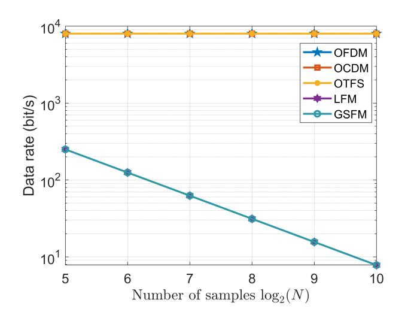

Fig. 17. Achieved data rates in bit/s.

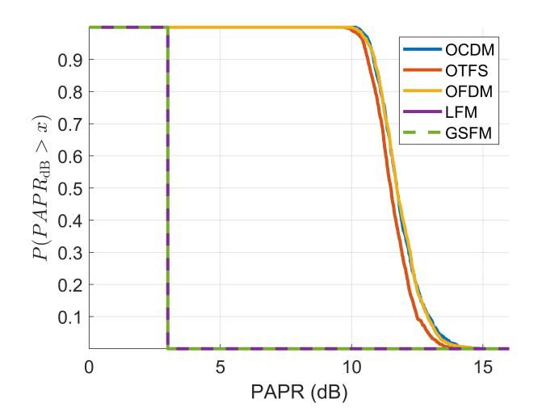

Fig. 18. PAPR performance of different waveforms.

### *E. PAPR*

Fig. 18 presents the complementary cumulative distribution functions (CCDFs) of the PAPR for different waveforms. It can be observed that the CCDF curves of OCDM and OFDM nearly overlap, indicating that the two schemes exhibit similar PAPR performance. In comparison, OTFS achieves superior PAPR performance relative to OCDM and OFDM, which can be attributed to the more uniform spreading of modulation symbols across the time-frequency domain in OTFS [139]. In contrast, both LFM and GSFM exhibit nearly constant PAPR values around 3 dB, as demonstrated by their steep, nearly vertical CCDF curves. This behavior shows the deterministic and smooth envelope characteristics of continuous-phase waveforms, which naturally suppress peak fluctuations. Therefore, waveforms such as LFM and GSFM, which inherently exhibit low and stable PAPR, are advantageous in practical systems, especially in power-constrained applications.

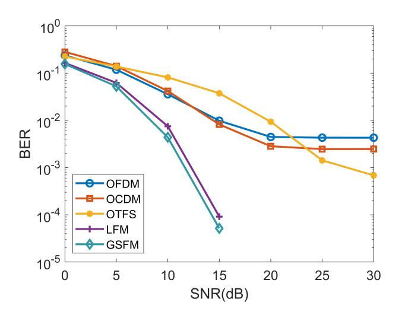

Fig. 19. Theoretical BER performance of different signals.

## *F. Bit Error Rate*

The BER performance of different waveforms is evaluated under the same channel, which is generated by the BELLHOP channel model. The signal parameters and channel parameters are listed in Table. 6 and Table. 7, respectively. Similar to Section VIII-C, to ensure the robustness of the BER simulations, the delay spread and Doppler shift of the channel are randomly generated within their respective maximum ranges in each Monte Carlo trial.

In OFDM, OCDM, and OTFS schemes, the length of CP is set to be longer than the maximum multipath delay. The proportion of pilot symbols is 0.25, and they are uniformly inserted into the modulation domain. It is worth noting that the OTFS scheme employs a message passing (MP) equalizer [140], whereas OFDM and OCDM utilize the MMSE equalization. The modulation scheme is uniformly set to QPSK. In the LFM and GSFM schemes, the signal is transmitted in a pulsed form. The pulse interval can be regarded as a guard sequence, eliminating the need for an additional CP. At the receiver, demodulation is performed via matched filtering followed by phase estimation and decision-making, thus obviating the need for pilot symbols. The modulation scheme is uniformly set to BPSK.

The simulation results are shown in Fig. 19. It is observed that LFM and GSFM waveforms achieve the lowest BER, benefiting from their inherent Doppler-resilience and spectral compactness. However, this comes at the cost of lower data rates. The performance of OFDM, OCDM, and OTFS is comparable, with OTFS failing to demonstrate significant advantages over the other two multicarrier schemes. This is because the simulated UWA channels, when mapped to the DD domain, may not exhibit a sparse or separable structure. In other words, non-integer delays and Doppler spreads may exist (as illustrated in Fig. 11), which significantly degrade the effectiveness of channel estimation and equalization in the OTFS scheme.

### *G. Summary and Insights:*

The simulation results presented in Fig. 14–19 provide a comprehensive comparison of various candidate waveforms in terms of their detection and communication performance. Key observations include: a) OTFS and OCDM waveforms demonstrate superior robustness in Doppler-varying environments, as evidenced by their more concentrated Q-function and lower WBAF sidelobes; b) LFM and GSFM waveforms yield higher detection accuracy due to their favorable ambiguity structures, but exhibit significantly worse communication metrics such as BER and PAPR; c) OFDM achieves balanced performance in low-Doppler channels but suffers severe degradation in highmobility conditions.

These results highlight a fundamental trade-off between detection precision and communication reliability in ISC waveform design. No single waveform outperforms others across all metrics, indicating that waveform selection must be tailored to mission-specific priorities. The findings also confirm that joint waveform design and adaptive parameter tuning are critical for effective ISC operation in complex underwater acoustic environments.

#### IX. CONCLUSION AND FUTURE WORKS

This paper presents a comprehensive overview of underwater ISC systems, highlighting their critical role in modern underwater information confrontation. Recent advancements in system modeling, waveform design, signal processing, and hardware implementation are summarized. By thoroughly analyzing the characteristics of underwater acoustic channels and their impact on integrated system design, this work clarifies the fundamental distinctions between ISC systems and traditional radar-based ISAC frameworks, underscoring the necessity for customized approaches tailored to underwater environments.

Despite encouraging progress in recent years, the development of ISC systems remains at an early stage. Several key challenges persist, including achieving high-performance joint waveform design under limited spectral resources, ensuring reliable detection and communication in doubly selective channels, overcoming hardware constraints, and implementing real-time adaptive processing on energy-constrained platforms. Moreover, the trade-off between detection accuracy and communication efficiency continues to be a central bottleneck in system design.

Promising research directions in the field of ISC that worthy of further investigation include, but are not limited to, the following:

- Learning-based processing. Deep learning and reinforcement learning offer strong potential for optimizing waveform parameters, interference mitigation, and adaptive detection/decoding strategies in dynamic underwater environments. Model-driven and data-driven hybrid architectures could be particularly promising for generalizing across varied scenarios.
- Towards broader functional integration. The future development of ISC systems is expected to go beyond the integration of detection and communication, extending towards broader functional integration. This includes the

seamless combination of detection, navigation, positioning, and communication within a unified framework. Such a multifunctional ISC architecture would significantly enhance the autonomy, situational awareness, and mission versatility of underwater platforms. In addition, this broader level of integration can further reduce the overall hardware cost, energy consumption, and spatial footprint. Achieving these integrated capabilities will require dedicated waveform design, resource scheduling, and real-time signal processing strategies tailored to the specific objectives of each function.

- Joint optimization. The waveform design of future ISC systems is expected to increasingly adopt dual-functional joint waveform design (DJWD) frameworks, in which communication and detection performance metrics are jointly optimized. This joint optimization is particularly critical in underwater acoustic environments, where severe bandwidth limitations, significant Doppler effects, and stringent power constraints impose complex—and often conflicting—requirements on waveform structure. However, achieving low-complexity DJWD under dynamically varying and harsh underwater acoustic channel conditions remains a major challenge.
- Advanced full-Duplex self-interference cancellation. Monostatic ISC systems require advanced techniques to suppress self-interference from strong direct paths. Future research directions may include wideband adaptive analog cancellation methods that suppress interference at the front end before digitization, real-time digital domain algorithms capable of cancelling residual interference with low latency, and machine learning-based echo prediction techniques that leverage signal statistics and propagation models to enhance suppression accuracy.
- Hardware-software co-design. The practical deployment of ISC systems requires close coordination between energy-efficient hardware and lightweight algorithms. Developing low-power, multifunctional processors for realtime detection and communication is essential, especially for AUVs and sensor nodes. Meanwhile, algorithms must be tailored to hardware constraints to support interference suppression and waveform adaptation. Future work should focus on co-design frameworks that balance computational load and hardware capabilities, enabling scalable, energy-aware, and robust ISC system implementations.
- Extends to bistatic architecture. This paper primarily focuses on monostatic ISC systems, extending the discussions and design methodologies to bistatic or multistatic architectures is an important future direction, especially for large-area surveillance and collaborative underwater detection.

In conclusion, ISC represents a critical step toward the intelligent and miniaturized evolution of underwater systems. Although many challenges remain in both fundamental theory and practical implementation, continued efforts in acoustic signal processing, ocean engineering, and optimization theory are expected to drive the development of robust, efficient, and adaptive ISC systems for future ocean applications. It is anticipated that this work may provide useful insights and guidance for ongoing and future research in this field.

#### REFERENCES

- [1] G. Han, Y. Cao, Y. Su, and X. Fu, "A Constellation Diagram Learning-Based Adaptive Sparse Nonorthogonal Wavelet Division Multiplexing for Sonar Image Underwater Acoustic Transmission," *IEEE Internet Things J.*, vol. 10, no. 19, pp. 17 392–17 407, Oct. 2023.
- [2] Y. Su, L. Guo, Z. Jin, and X. Fu, "A Mobile-Beacon-Based Iterative Localization Mechanism in Large-Scale Underwater Acoustic Sensor Networks," *IEEE Internet Things J.*, vol. 8, no. 5, pp. 3653–3664, Mar. 2021.
- [3] S. Liu, J. Wang, Z. Qian, and X. Fu, "A Novel Sonar-Communication System Based On Incremental-Frequency-Interval Acoustic Frequency Comb Signal," *IEEE Internet Things J.*, pp. 1–1, 2024.
- [4] J. Bao, J. Wang, Q. Tao, G. Han, and X. Fu, "Fresnel domain sector modulation lfm signal for underwater integrated communication and detection," *IEEE Internet of Things Journal*, 2024.
- [5] W. Men, J. Du, J. Yin, L. Zhang, L. Liu, Y. Ren, and D. Niyato, "Joint Detection and Communication System Design via Combination of Index and Phase Modulations," *IEEE Trans. Wireless Commun.*, vol. 23, no. 10, pp. 15 690–15 704, Oct. 2024.
- [6] J. Wang, Q. Wang, Q. Tao, and X. Fu, "Dictionary-theory-based orthogonal chirp division multiplexing signal for integrated sonar and communication system," *IEEE Transactions on Vehicular Technology*, 2025.
- [7] C. Sturm and W. Wiesbeck, "Waveform Design and Signal Processing Aspects for Fusion of Wireless Communications and Radar Sensing," *Proc. IEEE*, vol. 99, no. 7, pp. 1236–1259, July 2011.
- [8] S. P. Pecknold, "Ambiguity and Cross-ambiguity Properties of Some Reverberation Suppressing Waveforms."
- [9] R. M. Mealey, "A Method for Calculating Error Probabilities in a Radar Communication System," *IEEE Trans. Space Electron. Telemetry*, vol. 9, no. 2, pp. 37–42, 1963.
- [10] M. Roberton and E. Brown, "Integrated radar and communications based on chirped spread-spectrum techniques," in *IEEE MTT-S International Microwave Symposium Digest, 2003*, vol. 1. IEEE, 2003, pp. 611–614.
- [11] G. N. Saddik, R. S. Singh, and E. R. Brown, "Ultra-wideband multifunctional communications/radar system," *IEEE Transactions on Microwave Theory and Techniques*, vol. 55, no. 7, pp. 1431–1437, 2007.
- [12] D. Garmatyuk, J. Schuerger, and K. Kauffman, "Multifunctional software-defined radar sensor and data communication system," *IEEE Sensors Journal*, vol. 11, no. 1, pp. 99–106, 2010.
- [13] J. B. Sanson, D. Castanheira, A. Gameiro, and P. P. Monteiro, "Nonorthogonal multicarrier waveform for radar with communications systems: 24 ghz gfdm radcom," *IEEE Access*, vol. 7, pp. 128 694–128 705, 2019.
- [14] L. G. De Oliveira, M. B. Alabd, B. Nuss, and T. Zwick, "An ocdm radar-communication system," in *2020 14th European Conference on Antennas and Propagation (EuCAP)*. IEEE, 2020, pp. 1–5.
- [15] Y. Cui, F. Liu, X. Jing, and J. Mu, "Integrating sensing and communications for ubiquitous iot: Applications, trends, and challenges," *IEEE network*, vol. 35, no. 5, pp. 158–167, 2021.
- [16] F. Liu, Y. Cui, C. Masouros, J. Xu, T. X. Han, Y. C. Eldar, and S. Buzzi, "Integrated sensing and communications: Toward dualfunctional wireless networks for 6g and beyond," *IEEE journal on selected areas in communications*, vol. 40, no. 6, pp. 1728–1767, 2022.
- [17] Z. Zhou, X. Li, J. He, X. Bi, Y. Chen, G. Wang, and P. Zhu, "6g integrated sensing and communication - sensing assisted environmental reconstruction and communication," in *ICASSP 2023 - 2023 IEEE International Conference on Acoustics, Speech and Signal Processing (ICASSP)*, 2023, pp. 1–5.
- [18] Y. Wang, Z. Shi, X. Ma, and L. Liu, "A Joint Sonar-Communication System Based on Multicarrier Waveforms," *IEEE Signal Process. Lett.*, vol. 29, pp. 777–781, 2022.
- [19] W. Yuan, Z. Wei, S. Li, J. Yuan, and D. W. K. Ng, "Integrated sensing and communication-assisted orthogonal time frequency space transmission for vehicular networks," *IEEE Journal of Selected Topics in Signal Processing*, vol. 15, no. 6, pp. 1515–1528, 2021.

- [20] N. Wu, R. Jiang, X. Wang, L. Yang, K. Zhang, W. Yi, and A. Nallanathan, "Ai-enhanced integrated sensing and communications: Advancements, challenges, and prospects," *IEEE Communications Magazine*, vol. 62, no. 9, pp. 144–150, 2024.
- [21] F. Le Chevalier, *Principles of radar and sonar signal processing*. Artech house, 2002.
- [22] Z. Q.-f. LU Jun and S. Wen-tao, "Analysis on the key technology of integrated underwater detection and communication," *Journal of Unmanned Undersea Systems*, vol. 26, no. 5, pp. 470–479, 2018.
- [23] Z. Q. LU Jun and S. Wentao, "Development and prospect of detection and communication integration," *JOURNAL OF SIGNAL PROCESS-ING*, vol. 35, no. 9, pp. 1484–1495, 2019.
- [24] J. Yin, W. Men, X. Han, and L. Guo, "Integrated waveform for continuous active sonar detection and communication," *IET Radar, Sonar & Navigation*, vol. 14, no. 9, pp. 1382–1390, Sept. 2020.
- [25] W. Men, L. Zhang, J. Yin, and J. Wang, "Adaptive M-ary spread spectrum based dual-function detection and communication system," *Digital Signal Processing*, vol. 127, p. 103409, July 2022.
- [26] H. Saheban and Z. Kordrostami, "Hydrophones, fundamental features, design considerations, and various structures: A review," *Sensors and Actuators A: Physical*, vol. 329, p. 112790, 2021. [Online]. Available: https://www.sciencedirect.com/science/article/pii/S0924424721002533
- [27] K. Y. Islam, I. Ahmad, D. Habibi, and A. Waqar, "A survey on energy efficiency in underwater wireless communications," *Journal of Network and Computer Applications*, vol. 198, p. 103295, 2022. [Online]. Available: https://www.sciencedirect.com/science/article/pii/ S1084804521002885
- [28] R. Zaheer, Q. V. Phung, I. Ahmad, A. Aziz, D. Habibi, Y. Rong, and W. K. Hasan, "A review on underwater beamforming: Techniques, challenges, and future directions," *Journal of Ocean Engineering and Science*, 2025. [Online]. Available: https://www.sciencedirect. com/science/article/pii/S2468013325000683
- [29] D. J. Y. H. R. Y. MEN Wei, ZHANG Liang and Y. Jingwei, "Research progress of the integrated detection and communication waveform and prospects for sonar applications," *Journal of Signal Processing*, vol. 41, no. 1, pp. 1–19, 2025.
- [30] F. Liu, C. Masouros, A. P. Petropulu, H. Griffiths, and L. Hanzo, "Joint radar and communication design: Applications, state-of-the-art, and the road ahead," *IEEE Transactions on Communications*, vol. 68, no. 6, pp. 3834–3862, 2020.
- [31] Y. Niu, Z. Wei, L. Wang, H. Wu, and Z. Feng, "Interference management for integrated sensing and communication systems: A survey," *IEEE Internet of Things Journal*, vol. 12, no. 7, pp. 8110–8134, 2025.
- [32] F. Liu, Y. Cui, C. Masouros, J. Xu, T. X. Han, Y. C. Eldar, and S. Buzzi, "Integrated sensing and communications: Toward dualfunctional wireless networks for 6g and beyond," *IEEE Journal on Selected Areas in Communications*, vol. 40, no. 6, pp. 1728–1767, 2022.
- [33] Q. Niu, W. Shi, Q. Zhang, and C. Zhang, "An Improved CLEAN Direct-Wave Suppression Algorithm in Integrated System of Underwater Detection and Communication," *IEEE Sensors J.*, vol. 24, no. 6, pp. 8503–8516, Mar. 2024.
- [34] S. Zhao, N. Liu, L. Zhang, Y. Zhou, and Q. Li, "Discrimination of deception targets in multistatic radar based on clustering analysis," *IEEE sensors journal*, vol. 16, no. 8, pp. 2500–2508, 2016.
- [35] Y. L. Sit, B. Nuss, and T. Zwick, "On mutual interference cancellation in a mimo ofdm multiuser radar-communication network," *IEEE Transactions on Vehicular Technology*, vol. 67, no. 4, pp. 3339–3348, 2018.
- [36] L. Giroto De Oliveira, B. Nuss, M. B. Alabd, A. Diewald, M. Pauli, and T. Zwick, "Joint Radar-Communication Systems: Modulation Schemes and System Design," *IEEE Trans. Microwave Theory Techn.*, vol. 70, no. 3, pp. 1521–1551, Mar. 2022.
- [37] M. A. Ainslie, *Principles of sonar performance modelling*. Springer, 2010, vol. 707.
- [38] F. Mosca, G. Matte, and T. Shimura, "Low-frequency source for very long-range underwater communication," *The Journal of the Acoustical Society of America*, vol. 133, no. 1, pp. EL61–EL67, Jan. 2013.
- [39] J. Heidemann, M. Stojanovic, and M. Zorzi, "Underwater sensor networks: Applications, advances and challenges," *Phil. Trans. R. Soc. A.*, vol. 370, no. 1958, pp. 158–175, Jan. 2012.
- [40] M. Stojanovic, "On the relationship between capacity and distance in an underwater acoustic communication channel," in *Proceedings of the 1st ACM International Workshop on Underwater Networks - WUWNet '06*. Los Angeles, CA, USA: ACM Press, 2006, p. 41.
- [41] S. Milica, "On the relationship between capacity and distance in an underwater acoustic communication channel," *SIGMOBILE Mob.*

- *Comput. Commun. Rev.*, vol. 11, no. 4, p. 34–43, Oct. 2007. [Online]. Available: https://doi.org/10.1145/1347364.1347373
- [42] M. Stojanovic and J. Preisig, "Underwater acoustic communication channels: Propagation models and statistical characterization," *IEEE Commun. Mag.*, vol. 47, no. 1, pp. 84–89, Jan. 2009.
- [43] X. Lurton, *An introduction to underwater acoustics: principles and applications*. Springer Science & Business Media, 2002.
- [44] S. Zhou and Z. Wang, *OFDM for underwater acoustic communications*. John Wiley & Sons, 2014.
- [45] F. Qu, X. Nie, and W. Xu, "A two-stage approach for the estimation of doubly spread acoustic channels," *IEEE Journal of Oceanic Engineering*, vol. 40, no. 1, pp. 131–143, 2014.
- [46] A. Song, A. Abdi, M. Badiey, and P. Hursky, "Experimental demonstration of underwater acoustic communication by vector sensors," *IEEE Journal of Oceanic Engineering*, vol. 36, no. 3, pp. 454–461, 2011.
- [47] G. Gui, Q. Wan, W. Peng, and F. Adachi, "Sparse multipath channel estimation using compressive sampling matching pursuit algorithm," *arXiv preprint arXiv:1005.2270*, 2010.
- [48] N. R. Council, D. on Earth, L. Studies, O. S. Board, and C. on Potential Impacts of Ambient Noise in the Ocean on Marine Mammals, "Ocean noise and marine mammals," 2003.
- [49] J. L. Miksis-Olds and S. M. Nichols, "Is low frequency ocean sound increasing globally?" *The Journal of the Acoustical Society of America*, vol. 139, no. 1, pp. 501–511, 2016.
- [50] H. Weinberg and R. Burridge, "Horizontal ray theory for ocean acoustics," *Journal of the Acoustical Society of America*, vol. 55, pp. 63–79, 1974. [Online]. Available: https://api.semanticscholar.org/ CorpusID:123382459
- [51] E. K. Westwood, "A normal mode model for acousto-elastic ocean environments," *The Journal of the Acoustical Society of America*, vol. 100, no. 6, pp. 3631–3645, 1996.
- [52] F. Sturm and A. Korakas, "Comparisons of laboratory scale measurements of three-dimensional acoustic propagation with solutions by a parabolic equation model," *The Journal of the Acoustical Society of America*, vol. 133, no. 1, pp. 108–118, 2013.
- [53] F.-X. Socheleau, J.-M. Passerieux, and C. Laot, "Characterisation of time-varying underwater acoustic communication channel with application to channel capacity," in *Underwater acoustic measurements*, 2009.
- [54] A. Radosevic, J. G. Proakis, and M. Stojanovic, "Statistical characterization and capacity of shallow water acoustic channels," in *OCEANS 2009-EUROPE*, 2009, pp. 1–8.
- [55] B. Tomasi, P. Casari, L. Badia, and M. Zorzi, "A study of incremental redundancy hybrid arq over markov channel models derived from experimental data," in *Proceedings of the 5th International Workshop on Underwater Networks*, 2010, pp. 1–8.
- [56] P. van Walree, R. Otnes, and T. Jenserud, "Watermark: A realistic benchmark for underwater acoustic modems," in *2016 IEEE Third Underwater Communications and Networking Conference (UComms)*. IEEE, 2016, pp. 1–4.
- [57] M. Y. I. Zia, J. Poncela, and P. Otero, "State-of-the-art underwater acoustic communication modems: Classifications, analyses and design challenges," *Wireless personal communications*, vol. 116, pp. 1325– 1360, 2021.
- [58] A.-r. Cho, Y. Choi, and C. Yun, "Survey of acoustic frequency use for underwater acoustic cognitive technology," *Journal of Ocean Engineering and Technology*, vol. 36, no. 1, pp. 61–81, 2022.
- [59] Y. Luo, L. Pu, M. Zuba, Z. Peng, and J.-H. Cui, "Challenges and opportunities of underwater cognitive acoustic networks," *IEEE Transactions on Emerging Topics in Computing*, vol. 2, no. 2, pp. 198–211, 2014.
- [60] H. Saheban and Z. Kordrostami, "Hydrophones, fundamental features, design considerations, and various structures: A review," *Sensors and Actuators A: Physical*, vol. 329, p. 112790, 2021.
- [61] J. F. Tressler, "Piezoelectric transducer designs for sonar applications," in *Piezoelectric and Acoustic Materials for Transducer Applications*. Springer, 2008, pp. 217–239.
- [62] T. Benthos, "Atm-900 series acoustic telemetry modems users manual p," N M-270-26, Rev. E. Teledyne Benthos, 49 Edgerton Drive, North Falmouth, MA . . . , Tech. Rep., 2014.
- [63] Q. Tang, L. Bai, C. Zhang, R. Meng, L. Wang, C. Geng, Y. Guo, F. Wang, Y. Liu, G. Song, *et al.*, "Molecular catalysts with electronic axial stretching for high-performance lean-oxygen seawater batteries," *Science Bulletin*, vol. 68, no. 24, pp. 3172–3180, 2023.
- [64] K. Kubota, T. Watanabe, H. Maki, G. Kanaya, H. Higashi, and K. Syutsubo, "Operation of sediment microbial fuel cells in tokyo bay, an extremely eutrophicated coastal sea," *Bioresource Technology Reports*, vol. 6, pp. 39–45, 2019.

- [65] X. Pan, Z. Liu, P. Zhang, Y. Shen, and J. Qiu, "Distributed mimo sonar for detection of moving targets in shallow sea environments," *Applied Acoustics*, vol. 185, p. 108366, 2022.
- [66] Q. Wang, C. Hou, and Y. Lu, "An Experimental Study of WiMAX-Based Passive Radar," *IEEE Trans. Microwave Theory Techn.*, p. 5605281, Dec. 2010.
- [67] M. Towliat, Z. Guo, L. J. Cimini, X.-G. Xia, and A. Song, "Selfinterference channel characterization in underwater acoustic in-band full-duplex communications using ofdm," in *Global Oceans 2020: Singapore – U.S. Gulf Coast*, 2020, pp. 1–7.
- [68] B. A. Jebur, C. T. Healy, C. C. Tsimenidis, J. Neasham, and J. Chambers, "In-band full-duplex interference for underwater acoustic communication systems," in *OCEANS 2019 - Marseille*, 2019, pp. 1–6.
- [69] C. B. Barneto, S. D. Liyanaarachchi, M. Heino, T. Riihonen, and M. Valkama, "Full duplex radio/radar technology: The enabler for advanced joint communication and sensing," *IEEE Wireless Communications*, vol. 28, no. 1, pp. 82–88, 2021.
- [70] J. P. Panda, A. Mitra, and H. V. Warrior, "A review on the hydrodynamic characteristics of autonomous underwater vehicles," *Proceedings of the Institution of Mechanical Engineers, Part M: Journal of Engineering for the Maritime Environment*, vol. 235, no. 1, pp. 15–29, 2021.
- [71] T. Sameer Babu, P. Ameer, and R. David Koilpillai, "Synchronization techniques for underwater acoustic communications," *International Journal of Communication Systems*, vol. 36, no. 15, p. e5563, 2023.
- [72] C.-m. Lee, S.-W. Hong, and W.-J. Seong, "An integrated dvl/imu system for precise navigation of an autonomous underwater vehicle," in *Oceans 2003. Celebrating the Past... Teaming Toward the Future (IEEE Cat. No. 03CH37492)*, vol. 5. IEEE, 2003, pp. 2397–Vol.
- [73] D. S. Dixon, "Electromagnetic interference (emi) concerns and electromagnetic compatibility (emc) modeling for acoustic instrumentation," *The Journal of the Acoustical Society of America*, vol. 97, no. 5 Supplement, pp. 3320–3320, 1995.
- [74] K. Zhang, W. Yuan, P. Fan, and X. Wang, "Dual-functional waveform design with local sidelobe suppression via otfs signaling," *IEEE Transactions on Vehicular Technology*, vol. 73, no. 9, pp. 14 044–14 049, 2024.
- [75] J. Yang, G. Cui, X. Yu, and L. Kong, "Dual-use signal design for radar and communication via ambiguity function sidelobe control," *IEEE Transactions on Vehicular Technology*, vol. 69, no. 9, pp. 9781–9794, 2020.
- [76] Y. Doisy, L. Deruaz, S. P. van IJsselmuide, S. P. Beerens, and R. Been, "Reverberation suppression using wideband doppler-sensitive pulses," *IEEE Journal of Oceanic Engineering*, vol. 33, no. 4, pp. 419–433, 2008.
- [77] B. Liu, J. Yin, and G. Zhu, "An active detection method for an underwater intruder using the alternating direction method of multipliers," *The Journal of the Acoustical Society of America*, vol. 146, no. 6, pp. 4324–4332, 2019.
- [78] D. A. Abraham, *Underwater acoustic signal processing: modeling, detection, and estimation*. Springer, 2019.
- [79] T. Collins and P. Atkins, "Doppler-sensitive active sonar pulse designs for reverberation processing," *IEE Proceedings-Radar, Sonar and Navigation*, vol. 145, no. 6, pp. 347–353, 1998.
- [80] J. Candy and E. Breitfeller, "Receiver Operating Characteristic (ROC) Curves: An Analysis Tool for Detection Performance, Tech. Rep. LLNL-TR-642693, 1093414, Aug. 2013.
- [81] J. Cui, G. Han, Y. Su, and X. Fu, "Non-uniform non-orthogonal multicarrier underwater communication for compressed sonar image data transmission," *IEEE Transactions on Vehicular Technology*, vol. 70, no. 10, pp. 10 133–10 145, 2021.
- [82] V. Meghdadi, "Ber calculation," *Wireless Communications*, 2008.
- [83] S. H. Han and J. H. Lee, "Papr reduction of ofdm signals using a reduced complexity pts technique," *IEEE Signal Processing Letters*, vol. 11, no. 11, pp. 887–890, 2004.
- [84] J. Yan, L. Cui, X. Yang, C. Chen, and X. Guan, "Design of an embedded system for integrated underwater communication and detection," *IEEE Embedded Systems Letters*, pp. 1–1, 2024.
- [85] P. Kumari, J. Choi, N. Gonzalez-Prelcic, and R. W. Heath, "Ieee 802.11 ´ ad-based radar: An approach to joint vehicular communication-radar system," *IEEE Transactions on Vehicular Technology*, vol. 67, no. 4, pp. 3012–3027, 2017.
- [86] Q. Zhang, H. Sun, X. Gao, X. Wang, and Z. Feng, "Time-division isac enabled connected automated vehicles cooperation algorithm design and performance evaluation," *IEEE Journal on Selected Areas in Communications*, vol. 40, no. 7, pp. 2206–2218, 2022.

- [87] Z. Shi, L. Liu, and Y. Wang, "A joint detection-communication system based on ocdm techniques," in *2021 4th International Conference on Information Communication and Signal Processing (ICICSP)*, 2021, pp. 81–85.
- [88] C. Shi, F. Wang, M. Sellathurai, J. Zhou, and S. Salous, "Power minimization-based robust ofdm radar waveform design for radar and communication systems in coexistence," *IEEE Transactions on Signal Processing*, vol. 66, no. 5, pp. 1316–1330, 2017.
- [89] M. Jamil, H.-J. Zepernick, and M. I. Pettersson, "On integrated radar and communication systems using oppermann sequences," in *MILCOM 2008 - 2008 IEEE Military Communications Conference*, 2008, pp. 1– 6.
- [90] X. Chen, Z. Feng, Z. Wei, P. Zhang, and X. Yuan, "Code-division ofdm joint communication and sensing system for 6g machine-type communication," *IEEE Internet of Things Journal*, vol. 8, no. 15, pp. 12 093–12 105, 2021.
- [91] J. Sasiain, D. Franco, A. Atutxa, J. Astorga, and E. Jacob, "Toward the integration and convergence between 5g and tsn technologies and architectures for industrial communications: A survey," *IEEE Communications Surveys Tutorials*, vol. 27, no. 1, pp. 259–321, 2025.
- [92] L. Jun, Z. Qunfei, Z. Lingling, and S. Wentao, "Detection Performance of Active Sonar Based On Underwater Acoustic Communication Signals," in *2018 IEEE International Conference on Signal Processing, Communications and Computing (ICSPCC)*. Qingdao: IEEE, Sept. 2018, pp. 1–5.
- [93] E. Dahlman, S. Parkvall, and J. Skold, *4G: LTE/LTE-advanced for mobile broadband*. Academic press, 2013.
- [94] E. Dahlman, Stefan, Parkvall, and J. Skold, *5G NR: The next generation wireless access technology*. Academic Press, 2020.
- [95] H. Hawkins, C. Xu, L.-L. Yang, and L. Hanzo, "Im-ofdm isac outperforms ofdm isac by combining multiple sensing observations," *IEEE Open Journal of Vehicular Technology*, vol. 5, pp. 312–329, 2024.
- [96] G. Huang, Y. Ding, S. Ouyang, and V. Fusco, "Index modulation for ofdm radcom systems," *The Journal of Engineering*, vol. 2021, no. 2, pp. 61–72, 2021.
- [97] W. Junlong, F. Xiaomei, and Q. Wang, "The impact of subcarrier power allocation on the performance of integrated underwater communication and detection system based on ocdm," in *2024 13th International Conference on Communications, Circuits and Systems (ICCCAS)*, 2024, pp. 435–440.
- [98] C. Y. Wong, R. S. Cheng, K. B. Lataief, and R. D. Murch, "Multiuser ofdm with adaptive subcarrier, bit, and power allocation," *IEEE Journal on selected areas in communications*, vol. 17, no. 10, pp. 1747–1758, 1999.
- [99] X. Ouyang and J. Zhao, "Orthogonal chirp division multiplexing," *IEEE Transactions on Communications*, vol. 64, no. 9, pp. 3946–3957, 2016.
- [100] M. S. Omar and X. Ma, "Performance analysis of ocdm for wireless communications," *IEEE Transactions on Wireless Communications*, vol. 20, no. 7, pp. 4032–4043, 2021.
- [101] X. Omar, Ma and M. Shahmeer, "The effects of narrowband interference on ocdm," in *2020 IEEE 21st International Workshop on Signal Processing Advances in Wireless Communications (SPAWC)*. IEEE, 2020, pp. 1–5.
- [102] X. Ouyang, C. Antony, F. Gunning, H. Zhang, and Y. L. Guan, "Discrete fresnel transform and its circular convolution," *arXiv preprint arXiv:1510.00574*, 2015.
- [103] S. Li, F. Wang, Y. Zhang, R. Li, S. Shi, Y. Li, X. Li, and D. B. D. Costa, "Orthogonal Chirp Division Multiplexing Assisted Dual-Function Radar Communication in IoT Networks," *IEEE Internet Things J.*, vol. 11, no. 13, pp. 23 752–23 764, July 2024.
- [104] Z. Jia, R. Zhang, Z. Chen, and F. Yuan, "Ocdm with index modulation for autonomous underwater vehicles communication," *IEEE Transactions on Intelligent Vehicles*, pp. 1–16, 2024.
- [105] M. D. L. Filomeno, T. F. Moreira, Y. F. Coutinho, A. Camponogara, ˆ M. L. De Campos, and M. V. Ribeiro, "Orthogonal chirp-division multiplexing-based hybrid power line/wireless system," in *GLOBE-COM 2022-2022 IEEE Global Communications Conference*. IEEE, 2022, pp. 5880–5885.
- [106] X. Li, L. Tang, and X. Zhang, "Range estimation of ce-ofdm for radarcommunication integration," in *2018 IEEE International Conference on Communication Systems (ICCS)*. IEEE, 2018, pp. 131–135.
- [107] X. Lv, J. Wang, Z. Jiang, and W. Jiao, "A novel papr reduction method for ocdm-based radar-communication signal," in *2018 IEEE MTT-S International Microwave Workshop Series on 5G Hardware and System Technologies (IMWS-5G)*, 2018, pp. 1–3.

- [108] R. Hadani, S. Rakib, M. Tsatsanis, A. Monk, A. J. Goldsmith, A. F. Molisch, and R. Calderbank, "Orthogonal time frequency space modulation," in *2017 IEEE Wireless Communications and Networking Conference (WCNC)*, 2017, pp. 1–6.
- [109] L. Gaudio, M. Kobayashi, G. Caire, and G. Colavolpe, "On the Effectiveness of OTFS for Joint Radar Parameter Estimation and Communication," *IEEE Trans. Wireless Commun.*, vol. 19, no. 9, pp. 5951–5965, Sept. 2020.
- [110] R. Bomfin, D. Zhang, M. Matthe, and G. Fettweis, "A theoretical ´ framework for optimizing multicarrier systems under time and/or frequency-selective channels," *IEEE Communications Letters*, vol. 22, no. 11, pp. 2394–2397, 2018.
- [111] H. S. Rou, G. T. F. de Abreu, J. Choi, D. G. G, M. Kountouris, Y. L. Guan, and O. Gonsa, "From OTFS to AFDM: A Comparative Study of Next-Generation Waveforms for ISAC in Doubly-Dispersive Channels," June 2024.
- [112] Z. Lyu, L. Zhang, H. Zhang, Z. Yang, H. Yang, N. Li, L. Li, V. Bobrovs, O. Ozolins, X. Pang, and X. Yu, "Radar-centric photonic terahertz integrated sensing and communication system based on lfmpsk waveform," *IEEE Transactions on Microwave Theory and Techniques*, vol. 71, no. 11, pp. 5019–5027, 2023.
- [113] S. Zeng and W. Deng, "Physics-based modelling method for automotive radar with frequency shift keying and linear frequency modulation," *International Journal of Vehicle Design*, vol. 67, no. 3, pp. 237–258, 2015.
- [114] Z. Dou *et al.*, "Radar-communication integration based on msk-lfm spread spectrum signal," *International Journal of Communications, Network and System Sciences*, vol. 10, no. 08, p. 108, 2017.
- [115] Q. Ma, J. Lu, and Y. Maoxiang, "Integrated waveform design for 64qam-lfm radar communication," in *2021 IEEE 5th Advanced Information Technology, Electronic and Automation Control Conference (IAEAC)*, vol. 5, 2021, pp. 1615–1625.
- [116] D. A. Hague and J. R. Buck, "The generalized sinusoidal frequencymodulated waveform for active sonar," *IEEE Journal of Oceanic Engineering*, vol. 42, no. 1, pp. 109–123, 2017.
- [117] Q. Niu, Q. Zhang, and W. Shi, "Waveform design and signal processing method for integrated underwater detection and communication system," *IET Radar Sonar & Navi*, vol. 17, no. 4, pp. 617–627, Apr. 2023.
- [118] Z. Bao, Y. Zhang, Y. Tai, J. Wang, H. Wang, C. Li, P. Zhang, and Z. Xie, "Integration of detection and communication system designed for autonomous underwater vehicles in deep water," *Ocean Engineering*, vol. 310, p. 118607, Oct. 2024.
- [119] H. Wu, Z. Qian, H. Zhang, X. Xu, B. Xue, and J. Zhai, "Precise underwater distance measurement by dual acoustic frequency combs," *Annalen der Physik*, vol. 531, no. 9, p. 1900283, 2019.
- [120] Y. Liu, G. Liao, Z. Yang, and J. Xu, "Multiobjective optimal waveform design for ofdm integrated radar and communication systems," *Signal Processing*, vol. 141, pp. 331–342, 2017.
- [121] Y. Liu, G. Liao, and Z. Yang, "Robust ofdm integrated radar and communications waveform design based on information theory," *Signal Processing*, vol. 162, pp. 317–329, 2019.
- [122] L. Chen, F. Liu, W. Wang, and C. Masouros, "Joint radarcommunication transmission: A generalized pareto optimization framework," *IEEE Transactions on Signal Processing*, vol. 69, pp. 2752– 2765, 2021.
- [123] J. Zhang, C. Masouros, F. Liu, Y. Huang, and A. L. Swindlehurst, "Low-complexity joint radar-communication beamforming: From optimization to deep unfolding," *IEEE Journal of Selected Topics in Signal Processing*, 2025.
- [124] P. Kumari, S. A. Vorobyov, and R. W. Heath, "Adaptive virtual waveform design for millimeter-wave joint communication–radar," *IEEE Transactions on Signal Processing*, vol. 68, pp. 715–730, 2019.
- [125] T. M. Schmidl and D. C. Cox, "Robust frequency and timing synchronization for ofdm," *IEEE transactions on communications*, vol. 45, no. 12, pp. 1613–1621, 1997.
- [126] M. Guo, Y. D. Zhang, and T. Chen, "Doa estimation using compressed sparse array," *IEEE Transactions on Signal Processing*, vol. 66, no. 15, pp. 4133–4146, 2018.
- [127] N. Ruan, H. Wang, F. Wen, and J. Shi, "Doa estimation in b5g/6g: Trends and challenges," *Sensors*, vol. 22, no. 14, p. 5125, 2022.
- [128] J. Fan, Q. Tao, Z. Qian, and X. Fu, "Underwater wideband coherent signals doa estimation using sparse representation and deconvolution," *Measurement Science and Technology*, vol. 35, no. 6, p. 065023, 2024.
- [129] Q. Tao, J. Fan, Z. Qian, and X. Fu, "Temporal-spatial two-dimensional sparse deconvolution beamforming for wideband underwater acoustic multipath signals," *Measurement*, vol. 251, p. 117330, 2025.

- [130] R. O. Nielsen, *Sonar signal processing*. Artech House, Inc., 1991.
- [131] M. A. Richards *et al.*, *Fundamentals of radar signal processing*. Mcgraw-hill New York, 2005, vol. 1.
- [132] T. C. Yang, "Deconvolved conventional beamforming for a horizontal line array," *IEEE Journal of Oceanic Engineering*, vol. 43, no. 1, pp. 160–172, 2018.
- [133] W. Liu and S. Weiss, "Design of frequency invariant beamformers for broadband arrays," *IEEE Transactions on Signal Processing*, vol. 56, no. 2, pp. 855–860, 2008.
- [134] J. Wang, Q. Tao, G. Han, X. Fu, and Q. Wang, "Orthogonal Chirp Division Multiplexing Based on Dictionary Theory for Integrated Sonar and Communication System," *IEEE Commun. Lett.*, vol. 28, no. 7, pp. 1688–1692, July 2024.
- [135] K. Wu, J. A. Zhang, X. Huang, and Y. J. Guo, "Integrating lowcomplexity and flexible sensing into communication systems," *IEEE Journal on Selected Areas in Communications*, vol. 40, no. 6, pp. 1873– 1889, 2022.
- [136] Y. Zeng, Y. Ma, and S. Sun, "Joint radar-communication with cyclic prefixed single carrier waveforms," *IEEE Transactions on Vehicular Technology*, vol. 69, no. 4, pp. 4069–4079, 2020.
- [137] P. Raviteja, K. T. Phan, and Y. Hong, "Embedded pilot-aided channel estimation for otfs in delay–doppler channels," *IEEE Transactions on Vehicular Technology*, vol. 68, no. 5, pp. 4906–4917, 2019.
- [138] S. Dayarathna, P. Smith, R. Senanayake, and J. Evans, "Otfs based joint radar and communication: Signal analysis using the ambiguity function," *IEEE Signal Processing Letters*, vol. 31, pp. 919–923, 2024.
- [139] G. D. Surabhi, R. M. Augustine, and A. Chockalingam, "Peak-toaverage power ratio of otfs modulation," *IEEE Communications Letters*, vol. 23, no. 6, pp. 999–1002, 2019.
- [140] P. Raviteja, K. T. Phan, Q. Jin, Y. Hong, and E. Viterbo, "Lowcomplexity iterative detection for orthogonal time frequency space modulation," in *2018 IEEE Wireless Communications and Networking Conference (WCNC)*, 2018, pp. 1–6.