# Intellicise Wireless Networks From Semantic Communications: A Survey, Research Issues, and Challenges

Ping Zhang®, Fellow, IEEE, Wenjun Xu®, Senior Member, IEEE, Yiming Liu®, Member, IEEE, Xiaoqi Qin®, Senior Member, IEEE, Kai Niu®, Senior Member, IEEE, Shuguang Cui®, Fellow, IEEE, Guangming Shi®, Fellow, IEEE, Zhijin Qin®, Senior Member, IEEE, Xiaodong Xu®, Senior Member, IEEE, Fengyu Wang®, Member, IEEE, Yue Meng®, Member, IEEE, Chen Dong®, Jincheng Dai®, Member, IEEE, Qianqian Yang®, Member, IEEE, Yaping Sun®, Member, IEEE, Dahua Gao®, Member, IEEE, Hui Gao®, Senior Member, IEEE, Shujun Han®, Member, IEEE, and Xiaodan Song, Member, IEEE

Abstract—Information and communication technology (ICT) has been an essential part of modern society. However, the current communication systems are not sufficient to meet the demands of emerging applications. Intellicise (intelligent and concise) wireless networks, with their inherent characteristics of intelligenceendogenous and primitive-concise, have been proposed as a promising research direction. In this paper, we focus on intellicise wireless networks from semantic communication (SemCom). We present a comprehensive framework of intellicise wireless networks, including components such as brain for intellicise wireless networks (BIWN), intellicise signal processing, intellicise information transmission, intellicise network organization, and intellicise service bearing. We also investigate the enabling technologies and driving factors of intellicise wireless networks. Subsequently, we introduce the applications of intellicise wireless networks and envision new services. Finally, we outline the challenges of implementing intellicise wireless networks from a broad perspective and discuss possible solutions.

*Index Terms*—Semantic communications, intellicise wireless networks, artificial intelligence.

# I. INTRODUCTION

A. Motivation

ITH the commercialization of the fifth generation communication systems (5G), several new trends along with challenges are envisioned for the evolution of the future generations of mobile communication systems [1]. Beyond the scarcity of high-quality spectrum, the proliferation of cell density and antennas, as well as the overwhelming energy consumption, the introduction of emerging communication entities, such as diverse types of robots, intelligent unmanned systems, and even the genies within

Manuscript received 16 November 2023; revised 16 June 2024; accepted 18 July 2024. Date of publication 13 August 2024; date of current version 13 June 2025. This work was supported in part by the National Natural Science Foundation of China under Grant 62293480, Grant 62293481, Grant 62293482, Grant 62293483, Grant 62293484, and Grant 62293485. (Ping Zhang, Wenjun Xu, Yiming Liu, and Xiaoqi Qin are co-first authors.) (Corresponding authors: Wenjun Xu; Kai Niu; Shuguang Cui; Guangming Shi; Zhijin Qin; Xiaodong Xu.)

Digital Object Identifier 10.1109/COMST.2024.3443193

the digital twin world [2], have significantly altered the evolutionary trajectory, propelling the communication paradigm towards multi/cross-domain/types-flexible and intent-oriented approaches [3]. Thus, to support growing diverse service demands and efficiently use scarce network resources with an affordable system complexity [4], the sixth generation communication systems (6G) is urged to be super intelligent with a new theoretical and technical architecture.

To this end, the *intelligent and concise wireless network*, i.e., *intellicise wireless network*, is emerged [5], which enjoys the essential features of intelligence and simplicity to address the above challenges. Built upon the integration of information theory, artificial intelligence (AI) theory, complex science theory, system theory, etc., intellicise wireless networks explore the primitives of information and network by basic probability, fuzzy measurement, logical reasoning, etc., and intelligently optimize the network guided by systematic entropy. It is expected that intellicise wireless networks shall agilely construct user-centric and scenario-specific service ecologies for all human, machine, thing, and genie-type communication objects, fulfilling the promise of generating simplicity from wisdom while pursuing wisdom via simplicity [6].

In particular, intellicise wireless networks are capable of deconstructing the intents of networks into distinct levels of intelligent processing expressions, which serve as the foundational elements for the comprehensive simplification and transformation of signal processing, information organization, and network structures. Semantic communication (SemCom) is envisioned to be one of the most promising technologies for intellicise wireless networks, where the efficiency of information transmission is dramatically improved. Different from classical communication systems that aim to transmit signals accurately, SemCom focuses on highfidelity semantic-level transmission. The ultimate goal of SemCom is to accurately deliver the semantic information to achieve various downstream tasks. To achieve this goal, the transmitter and receiver should be redesigned to guarantee high semantic fidelity under unpredictable communication environments.

1553-877X © 2024 IEEE. Personal use is permitted, but republication/redistribution requires IEEE permission. See https://www.ieee.org/publications/rights/index.html for more information.

To this end, this survey will focus on intellicise wireless networks from SemCom, where the specific framework and architecture of intellicise wireless networks will be elaborated. The related driving elements, key technologies, and representative applications are further reviewed, with the hope that it will ignite future research endeavors within this burgeoning area.

# *B. Preliminaries and State-of-Art Works*

The rapid expansion of SemCom has received significant attention in recent years owing to its wide-ranging applicability. Numerous comprehensive surveys aim to address various aspects of SemCom, including network architecture, theoretical analysis, potential technology, and future applications. Several captivating surveys have been conducted, as summarized in Table [I.](#page-2-0) To elucidate the contributions of these works, we categorize them into two overarching themes. The first topic mainly summarizes the relevant research of SemCom architectures and applications, while the second focuses on the integration of AI and wireless networks.

*1) Architectures and Applications of Semantic Communications:* By exploring the transition from traditional data rate maximization to meaning-centric communication, Lan et al. [\[7\]](#page-29-6) delineated the SemCom framework alongside technological advancements pertinent or beneficial to SemCom. Then they explored the knowledge graphs (KG) based SemCom technologies and applications for various scenarios. Moreover, according to the 6G visions, potential technologies and use cases that are helpful for SemCom are introduced. Additionally, Luo et al. [\[8\]](#page-29-7) delved into the fundamentals of SemCom, examining its principles, architecture, and potential to transform intelligent applications in 6G networks. Especially, they highlighted the role of SemCom in addressing the challenges posed by traditional communication systems when supported the high data requirements of future intelligent services. Complementing these insights, Yang et al. [\[9\]](#page-29-8) emphasized the motivations and strong justifications for integrating SemCom into 6G. The authors presented an overview of research in this field and discussed three major types of SemCom, including semanticoriented, target-oriented, and semantic-aware communication. In an alternative work, Zhang et al. [\[6\]](#page-29-5) provided a brief review of SemCom, presenting potential use cases and identifying open challenges. In this work, the authors introduced a new semantic representation framework, namely semantic base (Seb), and established an intelligent and efficient semantic communication (IE-SC) network architecture. The proposed architecture integrated AI and network technologies to enable intelligent interactions among various communication objects. Furthering the discourse, Trevlakis et al. [\[1\]](#page-29-0) presented a semantic networking architecture that leveraged point-topoint SemCom systems for goal-specific semantic information extraction and filtering. This architecture aims to transform communication into a multi-user, distributed, edge-to-cloud network. They introduced various application scenarios of SemCom, the challenges of semantic noise and the complexity of implementing advanced network infrastructure. A more recent study conducted by Lu et al. [\[10\]](#page-29-9) presented a comprehensive taxonomy of SemCom research, including theories, applications, metrics, and implementations. This work not only synthesized the current landscape but also charted future directions, underscoring SemCom's potential in enhancing efficiency, reliability, and intelligence of wireless systems.

The collective research into SemCom architectures and applications marks a significant evolution towards meaningcentric communication. These studies highlight SemCom's crucial role in enhancing network efficiency, reliability, and intelligence. The exploration of innovative network architectures open new pathways for addressing contemporary communication challenges and setting the stage for future advancements.

*2) AI* + *Wireless Networks:* Distributed machine learning techniques in wireless communication networks have garnered significant research interest. Researchers such as Hu et al. [\[11\]](#page-29-10) conducted a comprehensive survey covering various techniques, architectures, and applications. Their work highlighted recent advancements and emphasized the potential benefits of distributed machine learning in improving network performance. Recently, Mohammad et al. [\[12\]](#page-29-11) proposed an edge-native intelligence approach for 6G communication, leveraging the power of federated learning (FL). The authors provided an overview of the FL algorithm and its recent advancements, exploring potential implementations in various beyond-5G (B5G)/6G wireless networks. Additionally, the article identified several future research opportunities arising from emerging technologies and highlighted the challenges associated with the operation of FL in future wireless networks. Additionally, deep learning (DL), a subfield of machine learning, has garnered significant attention in wireless communication networks. Chen et al. [\[13\]](#page-29-12) have presented how artificial neural networks (ANNs)-based ML algorithms can be employed for solving various wireless networking problems. Their comprehensive tutorial highlights the integration of intelligent, data-driven functions across the wireless core and edge infrastructure to enhance ultra-reliable low latency communications and IoT connectivity. Similarly, Zhang et al. [\[14\]](#page-29-13) conducted a thorough survey on DL in mobile and wireless networking, providing an extensive overview of various DL techniques and their potential applications in mobile and wireless contexts. Notably, they discussed both the advantages and challenges involved in integrating DL into wireless communication networks. In an alternative work, Zhang et al. [\[15\]](#page-29-14) proposed a new communication paradigm called the intellicise communication system with model-driven SemCom. This paradigm enables the communication system to evolve from the traditional transmission of bits to the transmission of models. The authors concluded that this model-based approach is a new feature of joint source-channel coding (JSCC). Further, they analyzed the performance evaluation metrics and the implementation details of the intellicise communication system. Note that most of the existing works of the combination of AI and wireless networks use AI to improve the performance of a single module or aspect, such as channel coding, signal detection, and networking, while the intent and

TABLE I A CLASSIFICATION OF SELECTED SURVEYS

|  | [1] |  |  |  |  |  |  |
|--|-----|--|--|--|--|--|--|
|  |     |  |  |  |  |  |  |
|  |     |  |  |  |  |  |  |
|  |     |  |  |  |  |  |  |
|  |     |  |  |  |  |  |  |
|  |     |  |  |  |  |  |  |
|  |     |  |  |  |  |  |  |
|  |     |  |  |  |  |  |  |
|  |     |  |  |  |  |  |  |
|  |     |  |  |  |  |  |  |
|  |     |  |  |  |  |  |  |
|  |     |  |  |  |  |  |  |
|  |     |  |  |  |  |  |  |

meaning of the source are not considered. In comparison, SemCom delves into the semantic level of the source and changes the basic way of information interaction, which drives an integrated enhancement of the overall communication systems and networks. Furthermore, AI is a pivotal technology for these two categories due to its powerful capabilities of self-learning and non-linear representation, which help in solving communication issues, such as the transmissionoptimal representation of semantic information and adaptive transmission strategies. Hence, several surveys of AI [\[16\]](#page-29-15), [\[17\]](#page-29-16) are also listed in Table [I](#page-2-0) for a balanced perspective although AI is not the main focus of this survey.

These studies collectively reveal the potential of AI-driven techniques to revolutionize wireless networks in the era of 6G and beyond. The integration of AI and wireless networks, especially through the lens of SemCom and distributed machine learning, presents a groundbreaking shift towards intelligent, efficient communication systems. This move underscores a significant evolution from traditional data transmission to a more sophisticated, model-based communication approach, setting a foundation for future innovations in wireless technology.

# *C. Key Contributions and Outline*

In this subsection, we summarize the key contribution of this survey and illustrate the outline for ease of reference. Specifically, we identify the relationship between SemCom and intellicise wireless networks, followed by the architecture of intellicise wireless networks, and the advancements and key directions toward obtaining intellicise wireless networks.

- *1) Identify the Essence of Semantic Communications:* Traditional communications develop by piling up various advanced signal processing modules to improve performance, where the complexity in both signal processing and network management has increased dramatically. As a result, it is hard for conventional communications to support the increasing demands and network scale for future communications. Intellicise wireless networks are considered as the evolution direction of next-generation networks, where the nodes in intellicise wireless networks can analyze and exploit the intents of services and users, leading to concise and effective network management [\[18\]](#page-29-17). By processing and transmitting the information at the semantic level, SemCom enables intentrelevant information transmission and network management, profoundly reducing the redundancy in communication and network management. Note that intellicise wireless networks and SemCom share similar merits in information processing and network management. In this paper, we will first clarify the essence of SemCom in Section [II,](#page-5-0) including semantic information theories, semantic knowledge bases (SKBs), semantic representation and coding, semantic transmission frameworks and semantic metrics.
- *2) Outline the Architecture of Intellicise Wireless Networks:* With the increasing demands for intelligent and efficient communication systems, the exploration of intellicise wireless networks has become crucial to enable more efficient information processing, transmission, and network management. While there has been some academic research on intellicise wireless networks in various application scenarios, the field is still in its early stages of development. One of the key contributions of this article is to propose an innovative framework of intellicise wireless networks, providing a comprehensive understanding of its fundamental principles, including intellicise signal processing and chips, intellicise information transmission, intellicise network organization, intellicise service bearing and brain for intellicise wireless network (BIWN) in Section [III.](#page-13-0) By outlining the framework, addressing key challenges, and analyzing the theoretical and

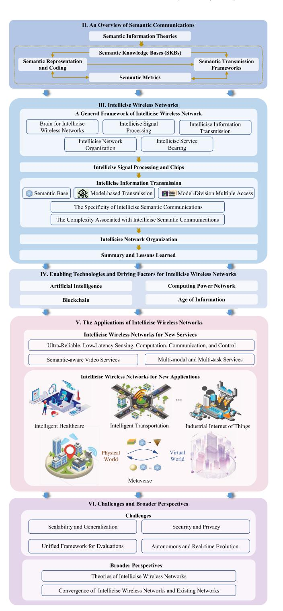

Fig. 1. The structure of the survey.

practical advancements in intellicise wireless networks, this article aims to facilitate the development of future intellicise wireless networks.

*3) Explore the Advancements and Key Directions Toward Obtaining Intellicise Wireless Networks:* Intellicise wireless networks form an intelligent ecology, reaching a state of self-optimization, self-balance, and self-evolution for wireless communications. In this survey, we explore the advancement

TABLE II LIST OF ACRONYMS

| Defnitions | Acronyms                                                                       | Defnitions | Acronyms                                      |  |
|------------|--------------------------------------------------------------------------------|------------|-----------------------------------------------|--|
| 5G         | The Fifth Generation Communication Systems                                     | LSTM       | Long Short-Term Memory                        |  |
| 6G         | The Sixth Generation Communication Systems                                     | MAP        | Maximum A Posteriori                          |  |
| AI         | Artificial Intelligence                                                        | MCMC       | Markov Chain Monte Carlo                      |  |
| AIGC       | AI-Generated Content                                                           | MDMA       | Model Division Multi-Access                   |  |
| AoI        | Age of Information                                                             | MDVSC      | Model Division Video Semantic Communication   |  |
| ARQ        | Automatic Repeat reQuest                                                       | MIAGAE     | Multicore Induced Attention Graph AutoEncoder |  |
| AV         | Autonomous Vehicles                                                            | MIMO       | Multiple-Input-Multiple-Output                |  |
| AVHR       | Audio and Visual-aided Haptic signal Reconstruction                            | MLP        | Multi-Layer Perception                        |  |
| AWGN       | Additive White Gaussian Noise                                                  | MOS        | Mean Opinion Score                            |  |
| B5G        | Beyond-5G                                                                      | MPA        | Message Passing Algorithm                     |  |
| BER        | Bit Error Rate                                                                 | MS-SSIM    | Multi-Scale SSIM                              |  |
| BERT       | Bidirectional Encoder Representations from Transformers                        | NCC        | Normalized Conditional Complexity             |  |
| BLER       | Block Error Rate                                                               | NN         | Neural Network                                |  |
| BLEU       | Bilingual Evaluation Understudy                                                | NOMA       | Non-Orthogonal Multiple Access                |  |
| BP         | Belief Propagation                                                             | OFDM       | Orthogonal Frequency Division Multiplexing    |  |
| BPSK       | Binary Phase-Shift Keying                                                      | O-MDMA     | Orthogonal Model Division Multiple Access     |  |
| BS         | Base Station                                                                   | PESQ       | Perceptual Evaluation of Speech Quality       |  |
| CDMA       | Code Division Multiple Access                                                  | PLS        | Physical Layer Security                       |  |
| CIDE       | Consensus-based Image Description Evaluation                                   | PSNR       | Peak Signal-to-Noise Ratio                    |  |
| CNN        | Convolutional Neural Network                                                   | QoE        | Quality of Experience                         |  |
| CPN        | Computing Power network                                                        | RDF        | Resource Description Framework                |  |
| CRF        | Conditional Random Field                                                       | re-ID      | re-IDentification                             |  |
| CSI        | Channel State Information                                                      | RIS        | Reconfigurable Intelligent Surface            |  |
| DL         | Deep Learning                                                                  | RSUs       | RoadSides Units                               |  |
| DNN        | Deep Neural Network                                                            | SDR        | Signal-to-Distortion Ratio                    |  |
| FCN        | Fully Convolutional Network                                                    | SCMA       | Sparse Code Multiple Access                   |  |
| FDMA       | Frequency Division Multiple Access                                             | SDMA       | Space Division Multiple Access                |  |
| FEC        | Forward Error Correction                                                       | Seb        | Semantic Base                                 |  |
| FL         | Federated Learning                                                             | SemCom     | Semantic Communication                        |  |
| GAN        | Generative Adversarial Network                                                 | SIFT       | Scale-Invariant Feature Transform             |  |
| GAT        | Graph Attention Network                                                        | SKB        | Semantic Knowledge Base                       |  |
| GCN        | Graph Convolutional Network                                                    | SM-IoT     | SMart IoT                                     |  |
| GIN        | Graph Isomorphism Network                                                      | S-R        | Semantic Transmission Rate                    |  |
| GNN        | Graph Neural Network                                                           | S-SE       | Semantic Spectral Efficiency                  |  |
| GPU        | Graphics Processing Unit                                                       | SSIM       | Structural Similarity Index Measure           |  |
| HAP        | High Altitude Platform                                                         | STOI       | Short-Time Objective Intelligibility          |  |
| HARQ       | Hybrid Automatic Repeat reQuest                                                | Tbps       | Terabits per second                           |  |
| HVS        | Human Visual System                                                            | TDMA       | Time Division Multiple Access                 |  |
| ICT        | Information and Communication Technology                                       | UAV        | Unmanned Aerial Vehicle                       |  |
| IE-SC      | Intelligent and Efficient Semantic Communication                               | URLLC      | Ultra-Reliable Low-Latency Communication      |  |
| IoT        | Internet of Things                                                             | VR         | Virtual Reality                               |  |
| IoV        | Internet of Vehicles                                                           | VGAE       | Variational Graph AutoEncoder                 |  |
| ITU-T      | International Telecommunication Union Telecommunication Standardization Sector | ViT        | Vision Transformer                            |  |
| JSCC       | Joint Source-Channel Coding                                                    | VoI        | Value of Information                          |  |
| KB         | Knowledge Base                                                                 | VQA        | Visual Question Answering                     |  |
| KG         | Knowledge Graph                                                                | XR         | Extended Reality                              |  |
| LDPC       | Low-Density Parity-Check                                                       |            | •                                             |  |

and key directions toward obtaining intellicise wireless networks, including enabling technologies and driving factors for intellicise wireless networks in Section [IV.](#page-19-0) Furthermore, new services and applications including intelligent healthcare/transportation/factory and metaverse are discussed in Section [V](#page-22-0) to further illustrate the possibilities brought by intellicise wireless networks. Despite the promising prospect of intellicise wireless networks, some significant research challenges that remain to be addressed have been discussed to inspire further research in Section [VI.](#page-26-0)

*Roadmap*: The outline of this survey is shown in Fig. [1.](#page-3-0) In specific, Section [II](#page-5-0) presents an overview of SemCom, in terms of five key aspects, including semantic information theories, SKBs, semantic representation and coding, semantic transmission frameworks, and semantic metrics. A general framework of intellicise wireless networks is then introduced in Section [III,](#page-13-0) where the intellicise signal processing and chips, intellicise information transmissions, intellicise network organization, intellicise service bearing, and BIWN are illustrated to show the merit of intellicise wireless networks. The enabling technologies and driving factors of intellicise wireless networks are further explored in Section [IV,](#page-19-0) while Section [V](#page-22-0) goes into the applications of intellicise wireless networks, envisioning several new services, such as intelligent healthcare, intelligent transportation, industrial Internet, and metaverse, etc. The challenges of developing intellicise wireless networks and other relevant broader perspectives are outlined in Section [VI.](#page-26-0) Finally, Section [VII](#page-28-0) concludes this survey. Table [II](#page-4-0) lists and describes the acronyms used throughout this paper.

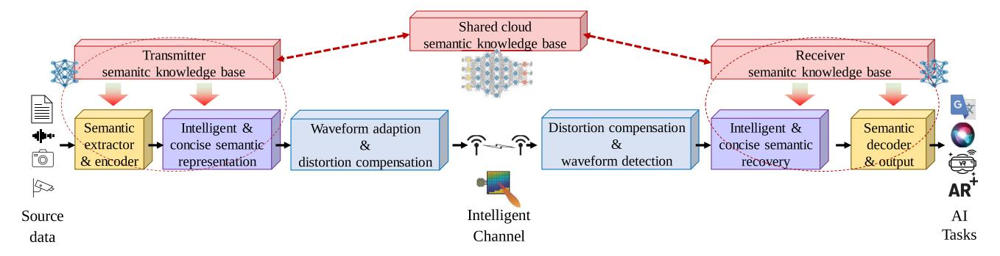

Fig. 2. The structure of a SemCom architecture.

#### II. AN OVERVIEW OF SEMANTIC COMMUNICATIONS

The SemCom architecture is shown in Fig. [2.](#page-5-1) From the figure, the objective of the semantic extractor is to learn semantics from the multimodal sources and to produce the semantic information, which interacts with the transmitter SKBs to maximally compress the semantics inherent in sources. Besides, the semantic encoder takes responsibility for converting the semantic information into low-dimensional semantic features by removing the task-irrelative semantics. Then, these features are represented by infusing similar semantics, simplifying the redundant semantics, and correcting the corrupted semantics. The semantic waveform adaptation/detection module and the semantic distortion compensation module aim to achieve efficient and accurate semantic transmission. In this section, we present an overview of SemCom, which includes semantic information theories, SemCom architecture, SKBs, semantic representation and coding, semantic transmission frameworks, and semantic metrics. Specifically, semantic information theories lay theoretical foundations for SemCom, which derive the performance limits and point out the potential improvements for the modules in Fig. [2.](#page-5-1) On this basis, SKBs are developed to provide essential background knowledge for compact semantic representation and coding. Then, the semantic transmission framework further copes with the distortion resulted from channel transmission to achieve high-fidelity transmission of semantic information. The effectiveness of diverse optimization approaches in SemCom is reflected with semantic metrics, which evaluate the performance of SemCom at a new level.

#### *A. Semantic Information Theories*

From Weaver's perspective, Shannon's Classical Information Theory [\[27\]](#page-29-18) is general enough to be extended to consider communication on Semantic level. Over the years, the research on semantic information theory has never stopped. Although compared with the classical information theory, the definition and measurement of semantic information have not yet reached an agreement, and the theoretical framework of semantic information is far from mature, these works are still enlightening. Based on their commonness, we can summarize the technical terms of SemCom for Shannon classic communications, as shown in Table [III.](#page-6-0)

*1) Scope and Object:* Classical communication systems aim to transmit signals accurately, while SemCom focuses on high-fidelity semantic-level transmission. In SemCom, we operate within semantic space instead of signal space. Unlike Shannon's concept of bits for data description [\[27\]](#page-29-18), semantic information is not suitable for bit-based representation. Recent research has explored suitable mediums for carrying semantic information, leading to various SemCom architectures [\[6\]](#page-29-5), [\[21\]](#page-29-19), [\[28\]](#page-29-20). Beck et al. [\[29\]](#page-29-21) explicitly modeled semantics using a semantic hidden random variable, leveraging local knowledge bases (KBs) at semantic transmitters and receivers [\[21\]](#page-29-19).

*2) Definition and Measure of Information:* As mentioned earlier, Shannon entropy, rooted in probabilistic statistics, is inadequate for quantifying semantic information. While it quantifies uncertainty in message probability sets, semantic information encompasses uncertainties beyond probabilistic behavior, such as fuzziness and subjectivity. Attempts to quantify semantic entropy along Shannon's information entropy path have yielded no consistent theory but have conceptually clarified semantic information theory. Early semantic theory exploration involved assigning probabilistic values to logical sentences, using logical probability instead of statistical probability. Carnap and Bar-Hillel [\[20\]](#page-29-22) introduced logical probability measurement, where lower logical probability indicates greater information. Significant works include Floridi [\[30\]](#page-29-23), [\[31\]](#page-29-24), Barwise and Seligman [\[32\]](#page-29-25), and Bao et al. [\[21\]](#page-29-19), who extended this to semantic information entropy with given background knowledge, developing semantic distortion theory and semantic channel capacity.

Wu [\[24\]](#page-29-26) proposed generalized entropy theory, transplanting Shannon entropy into fuzzy sets and establishing a foundational framework for semantic information representation and communications. Zhong [\[33\]](#page-29-27) extensively discussed semantic information's concept and measurement. Zadeh et al. [\[34\]](#page-29-28) applied fuzzy set theory to describe semantic information fuzziness, with Aldo and Settimo [\[22\]](#page-29-29) and De Luca and Termini [\[23\]](#page-29-30) deriving fuzzy set information entropy based on membership functions. Liu et al. [\[35\]](#page-29-31) used semantic conceptrelated membership degrees to construct semantic entropy, akin to the probability measure in Shannon entropy.

From a different perspective, message semantics can be represented computationally, abstracting semantics into metric information measurable using algorithmic or descriptive complexity and a universal Turing machine. Kolmogorov complexity [\[25\]](#page-29-32), the minimal description complexity, is widely used in algorithmic information theory. Niu et al. [\[19\]](#page-29-33) explored

|                                       | Classical                                     | Semantic                                                       |  |
|---------------------------------------|-----------------------------------------------|----------------------------------------------------------------|--|
| Scope                                 | Signal space                                  | Semantic Space                                                 |  |
| Information Representation Unit       | Bit                                           | Semantic base (Seb) [6]                                        |  |
| information Representation Onit       | Dit                                           | Semantic feature [19]                                          |  |
|                                       |                                               | Logic based theoretical model [20, 21]                         |  |
| Definition and Measure of Information | Shannon entropy, mutual information           | Fuzzy mathematical model [22–24]                               |  |
| Definition and Weasure of Information |                                               | Conditional Kolmogorov complexity [19, 25]                     |  |
|                                       |                                               | Rényi entropy [26]                                             |  |
| Distortion Measure                    | Error rate (Bit error rate, Block error rate) | Distortion on source semantic domain                           |  |
| Distortion Measure                    | Entor rate (Bit entor rate, Block entor rate) | Error of reasoning and task execution                          |  |
| Transmission Rate Limit               | Channel capacity                              | Maximum transmission rate under semantic distortion constraint |  |

TABLE III TERMINOLOGY COMPARISON BETWEEN CLASSICAL AND SEMANTIC INFORMATION THEORY

semantic compression's lower bound with limited knowledge and proposed normalized conditional complexity (NCC) for estimating the lower bound of semantic coding.

In addition, Rényi entropy [\[26\]](#page-29-34), based on probabilistic functions, provides a more general information measure with various orders, including Shannon entropy. Rényi divergence is a tool in proving convergence of minimum description length and is promising for high-dimensional data estimation in semantic information theory.

*3) Distortion Measure:* In classical communication systems, the primary goal is to accurately recover the transmission signal, typically assessed using metrics like bit error rate (BER) and block error rate (BLER) at the bit or block level. However, in traditional communication, distortion is often defined separately for the quantization loss of the source and the transmission loss of the channel. In end-toend SemCom, these two types of distortion are generally considered together. The key performance metric shifts to end-to-end distortion, determined by specific downstream tasks like classification loss [\[36\]](#page-29-35), perceptual loss [\[37\]](#page-29-36), [\[38\]](#page-29-37), or goal-oriented distortions [\[29\]](#page-29-21). Depending on the different definitions of semantics in various scenarios, semantic distortion is typically regarded as the reconstruction distortion of the final received data at the application layer. For tasks involving human vision, such as image or video transmission, the focus is on achieving visual losslessness rather than pixellevel perfection since human perception prioritizes brightness over color. If a broader definition of semantics is adopted, such as the intrinsic semantics of different transmission waveforms, semantic distortion can also be considered as the signal distortion at the physical layer. The optimization goal in SemCom is minimizing receiver misinterpretations. The specific definition may vary according to the actual downstream tasks. Shao et al. [\[39\]](#page-29-38) analyzed language utilization and design in SemCom, defining the semantic distortion-cost region for language utilization and describing realizable regions using language design, resulting in a rateutility function.

*4) Transmission Rate Limit:* Similar to Classical Information Theory, a noisy semantic channel has a capacity limit where arbitrary small semantic errors can be achieved within that limit. Bao's semantic channel capacity definition [\[21\]](#page-29-19) extends beyond mutual information, incorporating the conditional probabilistic distribution of a semantic coding strategy and the average logical information of received messages. The relative size of these terms determines whether the semantic channel capacity exceeds classical limits.

#### *B. Semantic Knowledge Base*

*1) Role of SKBs for Semantic Communications:* SKBs are intrinsically structured and memorable knowledge network models that can provide relevant semantic knowledge descriptions for data information. As illustrated in Fig. [3,](#page-7-0) the SKBs for SemCom can be divided into three categories, i.e., source, channel, and task KBs, which provide multi-level semantic knowledge representation of source data (e.g., text, pictures, videos), propagation environment (e.g., obstacle position and shape information during transmission, radio map, and configuration matrix of intelligent reflection surfaces), as well as task requirements (e.g., image classification, 3D reconstruction, semantic segmentation), respectively.

In order to elaborate the role of SKBs in SemCom, we take coding as an example. In conventional syntactic communication, encoding maps source symbols into conventional binary code streams. The establishment of the mapping function is based on empirical design and construction. On the other hand, semantic coding maps source symbols to semantic code streams. The establishment of the mapping function is based on learning and search driven by both data and model. The SKBs define the search space and standardize an efficient search path. Therefore, **the SKBs can be deemed as a plug-in and efficiency booster for SemCom**.

Specifically, in end-to-end SemCom, based on the source, channel, and task KBs, the transmitter obtains the multilevel semantic knowledge description of the source data, the semantic inference and estimation of the propagation environment, as well as contexts of target tasks, respectively. Then the transmitter performs the joint semantic-channel coding based on the obtained semantic knowledge. At the receiver, it performs knowledge retrieval and understanding of the received information based on its local SKBs, and conducts joint semantic-channel decoding. In this way, task-oriented SemCom is realized.

Take the semantic transmission of images under a classification task as an example. Assuming that the sender obtains an image of "zebra", the multi-level semantic knowledge vector of this image can be obtained based on the local SKBs. Specifically, the highest-level semantic knowledge for image classification task can be expressed as the word "zebra"; the intermediate semantic knowledge for semantic

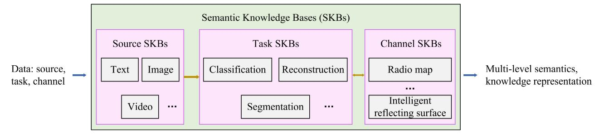

Fig. 3. Architecture of SKBs in SemCom.

inference task includes attribute descriptions of zebras such as "color: black and white", "contour: horse", "stripes: yes", etc.; the lowest-level semantic knowledge for image transmission task corresponds to the pixel-level feature vector of the image [\[40\]](#page-29-39). In addition, the description of the propagation environment from the channel KB also affects the representation dimensions of the semantic knowledge vectors at each level. Based on the multi-level resilient coding method, the transmitter first transmits the highest-level semantic knowledge "zebra". If the SKBs at the receiver store the semantic feature description of "zebra", the task is completed; otherwise, the middle-level semantic knowledge is transmitted. If the receiver knowledge can parse the semantic attribute description of "zebra", the SemCom is successful; otherwise, the lowest-level semantic knowledge is transmitted, i.e., the original image information, for the receiver to understand the image.

It can be seen that SKBs are very important for the design of joint semantic-channel coding and decoding schemes, and are expected to improve the transmission efficiency of SemCom and the service accuracy of intelligent tasks.

- *2) State-of-the-Art SKBs for Wireless Communications:* As mentioned above, the SKBs for wireless communication include source, channel, and task KBs. First, existing literature on the source KB can be categorized into three types, i.e., KG, training datasets, as well as semantic feature vector sets extracted with DL algorithms. Specific details are given as follows.
  - *Knowledge graph:* For text transmission, Zhou et al. [\[41\]](#page-29-40) utilized triples (including head entity, relation, and tail entity) to describe semantic information, and construct the SKBs as the set of these triples, based on which the transmitter and receiver conduct encoding and decoding of the text information, respectively. Also, based on the SKBs constructed in [\[41\]](#page-29-40), Jiang et al. [\[42\]](#page-29-41) extracted the set of semantic triples contained in the text source, and calculated the semantic importance of each triple. According to the quality of the channel state, the transmitter intelligently selects the set of important triples to transmit, so as to ensure the semantic similarity of the information. However, studies in [\[41\]](#page-29-40), [\[42\]](#page-29-41) mainly focus on the design of KGs and ignore the semantic information transmission in practical communication systems. Xu et al. [\[43\]](#page-29-42) proposed a knowledge-enhanced semantic communication (KESC) scheme to support the float-type semantic

information symbols transmission over the orthogonal frequency division multiplexing (OFDM) transceiver system. Assuming that the transceiver shares a common KB, a semantic pilot for each frame was designed in [\[43\]](#page-29-42) and transmitted to the receiver for semantic information recovery. In this scheme, the semantic pilot is transmitted to the receiver while the detailed KGs do not transmit over the network. It not only relieves the transmission burden but also guarantees the security of private information in the KB. Simulation results show that the proposed KESC scheme has obvious advantages in low signal-to-noise ratio and resourceconstrained scenarios. Considering the limited cache resource constraints on KB deployment and generation, Che et al. [\[44\]](#page-29-43) proposed a promising cloud-edge-device collaborated knowledge-base deployment mechanism to support the application of knowledge-base in SemCom. Moreover, to exploit the reusability of triples in requested subgraphs, Che et al. [\[44\]](#page-29-43) defined a subgraph value function to measure the translatability and effectiveness of subgraphs.

For speech transmission, Shi et al. [\[45\]](#page-29-44) defined SKBs as a multi-level KG, and proposed an SKB construction method that consists of semantic representation and semantic symbol abstraction. Numerical results show that the SemCom framework based on such SKB can reduce bandwidth overhead while maintaining semantic fidelity. For graph data transmission, Xiao et al. [\[46\]](#page-29-45) proposed a multi-layer semantic representation method that consists of explicit semantics, implicit semantics, as well as userrelated knowledge reasoning mechanisms, and based on imitation learning, the semantic reasoning mechanism of the receiver is trained to be consistent with that of the sender, so as to reduce the transmission load. In addition, Xiao et al. [\[46\]](#page-29-45) proposed a collaborative reasoning mechanism in heterogeneous networks enabled by multi-layer SKBs.

• *Training datasets:* Zhang et al. [\[47\]](#page-29-46) defined the training datasets as the SKBs. When the distribution of statistical characteristics of data information to be transmitted is different from that of the training dataset, the domain adaptation method in transfer learning is utilized to reduce the difference between the two distributions, and dynamically update the joint semantic-channel coding scheme [\[47\]](#page-29-46). The effectiveness of the method is verified in the image transmission and classification task.

• *Semantic feature vectors:* The SKBs for image classification can be defined as a set of semantic knowledge vectors for the image classes, which can be word embedding vectors obtained via word2vec, attribute vectors, etc [\[48\]](#page-30-0). Driven by such SKBs, Sun et al. [\[40\]](#page-29-39) proposed a multi-level feature extractor, based on which a multi-level feature transmission framework is established. Numerical results have shown that compared with traditional single-level feature transmission, the multi-level feature transmission can significantly reduce transmission latency while achieving the same classification accuracy. Hu et al. [\[49\]](#page-30-1) defined a set of finite discrete semantic basis vectors as SKBs, and carry out end-to-end joint training of semantic encoding and decoding as well as SKB construction. Numerical results show that the shared SKBs between the transmitter and receiver can help improve the robustness of SemCom against semantic noise.

Then, existing literature on channel environment KBs can be divided into three categories, i.e., site-specific databases, location-specific KBs, as well as semantic feature and graph representation. Specific details are given as follows.

- • *Site-specific databases:* Site-specific databases aim to provide accurate physical environment map information, mainly including 3D city maps [\[50\]](#page-30-2), radio environment maps [\[51\]](#page-30-3), [\[52\]](#page-30-4), etc. However, this type of design needs to run algorithms with high complexity (such as ray tracing algorithms), which incurs a huge overhead on computation and storage resources.
- *Location-specific KBs:* In order to reduce the cost of computation and storage resources, the location-specific KB does not retain the relevant activity information of the senders and receivers, and aims to provide knowledge descriptions related to channel characteristics (such as channel gain, shadow, incident angle, etc.). This type of design mainly includes channel gain map [\[53\]](#page-30-5), channel path map [\[54\]](#page-30-6), beam index map [\[55\]](#page-30-7), etc. However, this type of design is mainly limited to the construction of channel knowledge in a specific transmission environment, and its adaptability and generalization ability to variable environments need further research and verification.
- • *Semantic feature and graph:* For the dynamic and changeable propagation environment in 6G, Sun et al. [\[56\]](#page-30-8) defined the semantic characteristics of the propagation environment based on environment features and environment graph representations, so as to assist in the completion of tasks such as beam prediction. Numerical simulation results have shown that the accuracy of channel estimation and maximum-power scatter detection tasks can reach up to 0.92 and 0.9, respectively while saving 87% of the time overhead.

Finally, the construction of the existing task KB is mainly based on a collection of feature vectors related to the task. For example, Yang et al. [\[57\]](#page-30-9) proposed a SemCom system for image classification tasks. The system first pre-trains an image classification network based on an image dataset with class labels, and then quantifies the correlation between

the feature map extracted from the classification network and the object class information, which is deemed as the task KB. Based on such task SKBs, numerical results have shown that the proposed SemCom framework can significantly reduce bandwidth overhead by transmitting only feature statistics.

- *3) Challenges and Future Directions of SKBs:*
- *Efficient SKB construction:* In complex 6G scenarios like mixed reality, industrial internet, and smart cities, efficient SKBs for source, channel, and tasks are vital. Existing SKBs, mainly for text and images, cannot efficiently handle diverse data types. In addition, computation and storage overhead for constructing SKBs is an important issue. How to construct lightweight and efficient SKBs requires careful consideration. Promising approaches may include establishing SKBs with finite sets of semantic knowledge features, which are preextracted from lightweight deep neural networks (DNN).
- • *Dynamic SKB evolution:* Dynamic SKB evolution involves matching the SKB at the transmitter and that at the receiver, and adapting SKBs to dynamic data. Firstly, when the SKBs at the transmitter and receiver are mismatched, SKB evolution is required. For example, when the SKB at the transmitter is obtained from a student model, and that at the receiver is obtained from an expert model, the transmitter needs to gather key knowledge from the SKB at the receiver, and refine its student model via knowledge distillation to improve its SKB and achieve efficient SemCom with the receiver. In the construction of the SKBs, it is necessary to train on massive datasets or multiple datasets because the SKBs needs to encompass a vast amount of semantic information. Training on massive datasets requires powerful computational resources and inevitably involves lengthy training times, as well as significant storage space. Considering the high costs related with computational resources and time, a practical method for updating the SKBs involves eschewing complete retraining in favor of dynamic updating strategies. In addition, when the data distribution is dynamically changing, the SKBs also need to be updated via online learning to adapt to new data distribution, which involves determining how to add new knowledge to the current SKBs at a low cost and how to decouple and remove knowledge that needs to be deleted from the current SKBs.
- • *Multi-agent SKB collaboration:* In wireless networks, multi-modal sources, diverse tasks, and dynamic channels need efficient multi-agent SKBs. Solutions include shared structural features extraction, cross-task understanding, and FL for channel updates, managing diverse information sources, tasks, and channels efficiently.

#### *C. Semantic Representation and Coding*

The scope of the SemCom service extends from human-to-human interaction to encompass human-to-machine interaction. Efficient information representation and coding for machines become imperative subjects of study. Existing

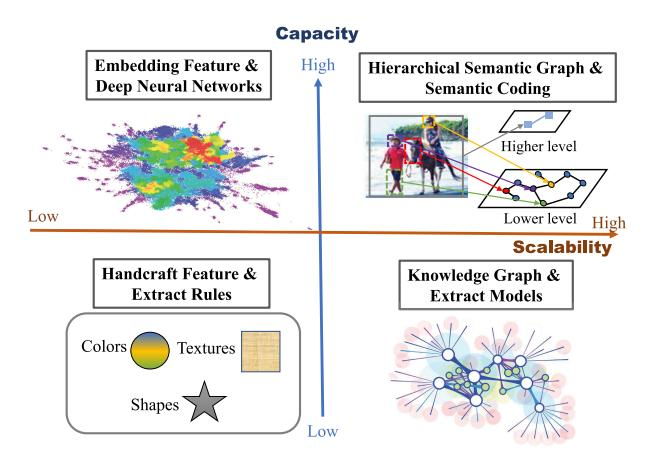

Fig. 4. The existing scalability and capacity comparison between semantic representations and their corresponding encoding methods. The hierarchical graph structure based on semantic units benefits from its flexible structure and rich semantic representation capabilities, offering better scalability and capacity.

semantic representation and coding methods can be roughly classified into four categories, as shown in Fig. [4.](#page-9-0)

*1) Semantic Representation:* Generally, there are many redundancies irrelevant to the task in the original data. Thus, it is necessary to filter the data to process the downstream tasks more efficiently. Early research on semantic representation, limited by computing power, mainly relied on the design of manual features, such as scale-invariant feature transform (SIFT) [\[58\]](#page-30-10) and component-based template matching methods [\[59\]](#page-30-11). However, it is difficult to bridge the gap between features and their hidden semantics. As a result, the semantic generalization expressed by this method is poor and cannot be applied to time-varying communication scenarios. With the increase in computing device performance and available data, end-to-end DL has gradually become a hot research topic [\[60\]](#page-30-12). From long short-term memory (LSTM) [\[61\]](#page-30-13) to transformer [\[62\]](#page-30-14), from convolutional neural network (CNN) to vision transformer (ViT), larger models make the representation ability of DL stronger, and even in some fields such as image recognition, it surpasses the recognition ability of humans.

Meanwhile, scholars have also proposed an interpretable and more flexible semantic structure for information representation. The semantic bottleneck [\[63\]](#page-30-15), [\[64\]](#page-30-16) first predicts semantic concepts based on neural networks (NN), and then uses decision trees or multi-layer perception (MLP) to combine them orderly as semantic representations. Prototype networks [\[65\]](#page-30-17), [\[66\]](#page-30-18), [\[67\]](#page-30-19) use deep networks to learn multiple prototypes, such as learning specific image patches for each category from a training dataset without concept labels. These studies have introduced human semantics into end-to-end deep models to enable semantic representations with certain interpretability.

Another interpretable and structured semantic representation method is the KG [\[68\]](#page-30-20). KG expresses knowledge in a structural form similar to natural language, using the subject-predicateobject triplet as the basic representation unit to form a graph structure of nodes and edges. Nevertheless, current KGs remain reliant on natural language, which confines the semantic information in KG representations to the high-level semantics that language can encapsulate. Drawing inspiration from the process by which humans conceive semantic concepts, Shi et al. posit that semantics entail a correspondence between signals from the real world (real-scene signals) and signals intentionally emitted by intelligent agents (virtualscene signals) [\[69\]](#page-30-21). For instance, the alignment between the buzzing sound of a bee and the pronunciation "/bi:/" signifies the semantic concept of "bee". In light of this notion, they endeavor to mathematically formalize semantics and propose techniques for semantic decomposition and composition. This approach culminates in the construction of multi-modal, multitiered semantic representations.

Overall, for semantic representation, early efforts centered on manual feature design, which struggled to capture hidden meanings and lacked scalability for evolving communication scenarios. The rise of DL enables stronger representation capabilities and outperforms human recognition in domains like image analysis. Moreover, the incorporation of interpretable structures, such as prototype networks and KGs, introduced self-explanatory attributes to semantic representation. However, the current challenge remains in extending these representations to symbols and messages suitable for nuanced SemCom.

*2) Semantic Coding:* Within the framework of semantic description inherent to the signals provided by semantic representations, research on semantic coding entails the efficient establishment of a mapping between signals and semantics, encapsulating the essence of intelligent simplification. Early scholars mainly analyzed the semantic coding from the perspective of information theory. Juba and Sudan [\[70\]](#page-30-22) demonstrated the necessity of fuzzy compression through information theory based on the fact that the prior probability distributions of symbols at the sink and source may be different, and constructed a mapping between information and codes in the KB through bipartite graphs. Afterward, Güler et al. [\[71\]](#page-30-23) designed a lossy coding framework from the perspective of semantic similarity using a game theory approach, with the goal of minimizing the end-to-end average semantic error.

Recent development of DL technology brings new perspectives for semantic coding. The earlier research focused on the construction of physical layer models based on end-to-end DL and plugged into traditional communication frameworks as a module. O'Shea and Hoydis [\[72\]](#page-30-24) implemented a differentiable binary phase-shift keying (BPSK) method using the fully convolutional network (FCN). Dörner et al. [\[73\]](#page-30-25) used DNN to implement a software-defined wireless signal protocol. Ye et al. [\[74\]](#page-30-26) used a generative adversarial network (GAN) to model unknown channels. Such NN-based end-to-end symbol encoding models simulate physical channels and thus can be used as a module of traditional syntax communications. However, these methods do not directly extract semantics from information sources, and thus cannot take advantage of SemCom.

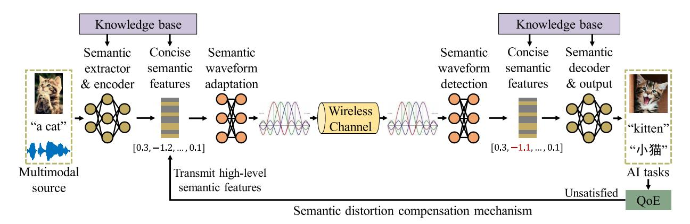

Fig. 5. The KB-enabled multimodal semantic communication framework for high semantic fidelity transmission according to the semantic distortion compensation mechanism.

Based on the DeepSC framework, Weng and Qin [\[75\]](#page-30-27) proposed DeepSC-S, which realizes the extension of SemCom from text to speech. Yoo et al. [\[76\]](#page-30-28) proposed an end-to-end SemCom system based on ViT for images. Li et al. [\[77\]](#page-30-29) proposed a GAN-based semantic coding method, and Huang et al. [\[78\]](#page-30-30) proposed a coding method using sketches, segmentation maps, etc. to represent images. However, semantic information is represented by hidden vectors in these works, where the explainability and extensibility are insufficient.

In recent years, DL has been widely used in graph data processing, namely graph neural network (GNN) [\[79\]](#page-30-31) to keep the topological information contained in the structural data that is helpful for semantic coding. The most common backbone network for graph data feature extraction, as shown in graph convolutional network (GCN), is based on spatial domain convolution; the graph attention network (GAT) [\[80\]](#page-30-32) introduces an attention mechanism in the nearest neighbor data aggregation; the graph isomorphism network (GIN) [\[81\]](#page-30-33) is equivalent to the Weisfeiler-Lehman graph isomorphism test. Based on these feature extraction networks, some scholars proposed graph autoencoders. One class of research extends variational autoencoders to graph structures, the variational graph autoencoder (VGAE) [\[82\]](#page-30-34). VGAE models the nodes and edges in the graph as independent random variables, uses the encoder to estimate the posterior distribution, the decoder to estimate the generative distribution, and uses the variational lower bound to optimize the entire model. However, the method of using the joint probability space of random variables to describe the graph structure cannot compress the graph structure, and thus it cannot be directly used for channel transmission. There is also a part of research that combines feature extraction and graph pooling [\[83\]](#page-30-35) to achieve node feature and graph topology compression at the same time. Graph U-Nets network [\[84\]](#page-30-36) achieves multi-scale feature compression by using skip connections between different layers. The multi-core induced attention graph autoencoder (MIAGAE) [\[85\]](#page-30-37) is optimized for the extra storage generated by skip connections.

Overall, the key to effective semantic coding is building models that directly transfer semantics while accommodating diverse scenarios and signal types. Early studies delved into semantic redundancy, often from an information theory perspective. With the development of DL, NN have been employed to directly extract and encode semantics from signals, where GNNs show great potential for more nuanced and interpretable representations in SemCom.

# *D. Semantic Transmission Frameworks*

The ultimate goal of SemCom is to accurately deliver the semantic information to achieve AI tasks. To achieve this goal, the semantic extractor, semantic encoder, and semantic waveform adaption play essential roles in guaranteeing high semantic fidelity under unpredictable communication environments. An example of the semantic transmission framework is shown in Fig. [5.](#page-10-0) From the figure, the semantic extractor and encoder are committed to extracting the semantic information and compressing concise semantic features from input multimodal sources. The semantic waveform adaptation module is responsible for converting semantic features into complicated semantic waveforms prior to transmission over wireless channels. At the receiver, the semantic waveform detection recovers the concise semantic features from the semantic waveform and feeds them into the semantic decoder to generate the required information for various AI tasks. Moreover, the semantic distortion compensation mechanism is devised to ensure high semantic fidelity transmission by back-propagating the command to the transmitter to transmit high-level semantic features according to the satisfactory level of quality of experience (QoE). Furthermore, the KBs at the transmitter and the receiver are invoked to facilitate efficient and accurate semantic representation and semantic recovery, respectively. The details of the semantic-driven intelligent waveform adaptation, the semantic distortion compensation transmission, and the semantic-aware resource joint optimization are elaborated as follows.

*1) Semantic-Driven Intelligent Waveform Adaptation:* The semantic transmission system encodes the input messages to semantic features by the source-channel encoding algorithm and converts them into the waveform adapted to the conventional and intelligent channel environments. Due to the complexity of the transmission process, the mapping relationship between the semantic waveform and the channel environment is nonlinear.

In traditional transmission environments, a mapping dataset is required to calculate semantic fidelity based on the received semantic features of each source after passing through the intelligent waveform into physical channels w.r.t. different fading effects and noise levels. While in intelligent transmission environments, the channel has the self-learning ability to change the channel condition, e.g., the reconfigurable intelligent surface (RIS)-aided transmission environment reconfigures the amplitude and phase of the reflection elements to control the waveform alignment between the transmitter and receiver, which aims to minimize the impact of the channel on the transmitted waveform.

As a result, an intelligent waveform adaption model to predict the semantic waveform at the receiver based on the channel characteristics is essential to efficient semantic transmission. To enable fast waveform adaption in the dynamic transmission environment, the transfer learning technique can be utilized in the waveform adaption model to achieve model convergence after a few training iterations when copying with new channel conditions. By doing so, stable and efficient semantic information transmission is guaranteed in the intelligent channel environment.

*2) Semantic Distortion Compensation Transmission:* Although the intelligent waveform adaptation model is designed to preserve the correct reception of semantic-driven intelligent waveform, the semantic distortion between the transmitter and receiver still occurs, which is attributed to the semantic noise. The semantic noise could be categorized into two types, i.e., the source semantic noise and the KB semantic noise. Particularly, the source semantic noise is caused by the semantic uncertainty or the semantic ambiguity contained in the source message, which contributes interference to the semantic encoder for extracting semantic information and further lowers the accuracy of semantic alignment and semantic recovery at the receiver.

The KB semantic noise is raised by the jitter of the NN, adversarial noise, and interference during the training process, which may occur in any module of the semantic transmission framework. The KB semantic noise damages the model fitting capabilities, which triggers the nonlinear distortion to the received semantic information and severely reduces the accuracy of semantic reconstruction.

Furthermore, an alternative solution to alleviate semantic distortion is the semantic distortion compensation mechanism. The quantitative relationship between the different semantic levels and the semantic fidelity in the recovered message is first defined based on the code-rate controllable multimodal semantic hierarchical coding scheme. Then, the waveforms are dynamically adjusted according to the different semantic levels and the semantic interference intensity by combining hybrid automatic repeat request (HARQ) transmission framework. Additionally, the semantic information at various levels can be transmitted in a distributed manner according to the differentiated requirement of semantic confidence, which incorporates HARQ feedback to transmit the semantic information multiple times until the accuracy requirement of reconstructed semantics is satisfied.

*3) Semantic-Aware Resource Joint Optimization:* The objective of the resource allocation for communications under the Shannon paradigm is to maximize the data rate or the channel capacity based on the bit stream. For the resource allocation in the semantic-aware networks, we can break the restriction of the Shannon theory and improve communication efficiency in the semantic domain. For the text-based SemCom, Yan et al. [\[86\]](#page-30-38) verified that more semantic information can be transmitted by applying effective resource management. Liu et al. [\[87\]](#page-30-39) also considered the importance of semantic features to build a semantic-aware resource allocation model, while maximizing the success rate for the image-based SemCom. However, these works only formulate the problems and design the algorithms for some specific semantic tasks and optimize the wireless resource only to improve task performance.

The research on semantic-aware resource allocation still needs further exploration for describing the semantic information more accurately. Another restriction of the current works is the limitation of the local computational capacity. The edge computation technique provides a solution for the devices with poor computational capacity. Therefore, it is necessary to consider the joint optimization of communication resources and computational resources in a practical view and design the resource allocation models for semantic-aware networks. Considering the channel state information (CSI) and the computational capacity of the semantic transmitters and receivers, the semantic transmission latency and power consumption can be further derived. The objective includes optimizing the communication performance, i.e., the semantic rate, the semantic transmission latency, and energy efficiency, or task-related performance, i.e., the task execution latency, the semantic similarity, and task accuracy. Furthermore, for the multimodal tasks, the QoE was defined in [\[88\]](#page-30-40) for users to fulfil their preferences and generalize the optimization goal.

Note that the resource allocation for semantic-aware network needs to consider more than one aspects, including channel assignment, transmit power, computation capacity of the end devices, etc. All of these objectives and parameters need to be considered jointly, hence increasing the computational complexity of the resource allocation problem significantly. Reinforcement learning provides a promising tool to deal with the joint optimization problem with high complexity. Particularly, the combination of reinforcement learning and the NN enables the reinforcement learning algorithms to deal with the high dimensional state information, expanding its application in wireless communications significantly. In [\[89\]](#page-30-41), a dynamic resource allocation scheme based on deep reinforcement learning for task-oriented SemCom networks was introduced, aiming to prioritize data with essential semantic information to improve task performance in resource-constrained wireless networks.

#### *E. Semantic Metrics*

The evaluation metric is one of the fundamental components in communication system design, since it provides a common platform for the assessment of various communication

| Connotations                     |        | Semantic Metrics             | Characteristics                                                                                                             |  |  |
|----------------------------------|--------|---------------------------------|-----------------------------------------------------------------------------------------------------------------------------|--|--|
|                                  |        | BLEU [90]                       | Count the word-level differences between the recovered text and source text.                                                |  |  |
|                                  | Text   | CIDE [91]                       | Calculate the cosine similarity at the word level with extended semantic-similar references.                                |  |  |
|                                  |        | Sentence Similarity [36]        | Calculate the similarity at the sentence level and in the semantic space generated with BERT model.                         |  |  |
| Meaning- towards Metrics   |        | SDR [92]                        | Evaluate the quality objectively by measuring the $\mathcal{L}_2$ error between the source data and the reconstructed data. |  |  |
|                                  | Speech | PESQ [93]                       | Evaluate the quality objectively by considering the short memory in human perception.                                       |  |  |
|                                  |        | STOI [94]                       | Evaluate the intelligibility objectively by calculating the correlation coefficient of temporal envelopes.                  |  |  |
|                                  |        | MOS [95, 96]                    | Evaluate the quality of speech subjectively based on the scores of human raters.                                            |  |  |
|                                  | Image  | PSNR [28]                       | Evaluate the objective similarity between pixels at the syntactic level.                                                    |  |  |
|                                  | mage   | SSIM and its extensions [97–99] | Use features that play major effects in HVS, such as structural information, for evaluation.                                |  |  |
| Significance- towards Metrics |        | AoI [100, 101]                  | Reflect the freshness of the source data.                                                                                   |  |  |
|                                  |        | VoI [102]                       | Jointly consider the benefits and the costs of the transmitted data.                                                        |  |  |
| Combined Metrics              |        | S-R and S-SE [86]               | Combine the semantic similarity, the transmission bandwidth along with the number of semantic symbols to be transmitted.    |  |  |
|                                  |        | Semantic OoF [88]               | Weighted summation of the OoE models of the semantic similarity and semantic rate                                           |  |  |

TABLE IV SUMMARY OF INVESTIGATED SEMANTIC METRICS

algorithms and directly reflects the effectiveness of potential optimization approaches. During the past generations of conventional communication systems, a series of performance metrics have been developed and proved to be efficient, which, however, are not totally applicable for SemComs. SemComs convey the intent-oriented semantic information, and redesign the relevant modules/protocol layers to simplify the system architecture. Hence, due to the paradigm shifts in the contents and strategies, specialized metrics are required to evaluate the new systems at a new level, as shown in Table [IV.](#page-12-0) The meaning and significance are main aspects considered in evaluation.

- *1) Meaning-Towards Metrics:* Compared with conventional communication systems, SemComs achieve higher communication efficiency by guaranteeing the meaning of the expected source data, instead of every element of data, being conveyed to the receiver.
  - For text, bilingual evaluation understudy (BLEU) [\[90\]](#page-30-42) is usually used to evaluate the recovered text at the semantic level. BLEU is calculated by counting the *n*grams difference between the recovered text and the source text. Similarly, consensus-based image description evaluation (CIDE) also focuses on the *n*-grams of sentences, but calculated as the cosine similarity between the recovered sentences and a set of similar semantic reference sentences [\[91\]](#page-30-43). Different from the former two metrics, sentence similarity was proposed in [\[36\]](#page-29-35) to evaluate the semantic distance of text at the sentence level, where bidirectional encoder representations from transformers (BERT) model are utilized to transform the sentence into the semantic vector space for comparison.
  - For speech data, semantic metrics are expected to take the quality (naturalness and pleasantness) and the intelligibility into consideration, which are also the main attributes of speech evaluation [\[94\]](#page-30-44). In terms of the

- quality, some initial works use signal-to-distortion ratio (SDR) to measure the L2 error between the source data and the reconstructed data [\[92\]](#page-30-45). However, SDR still complies with the syntactic routine in essence, perceptual evaluation of speech quality (PESQ) [\[93\]](#page-30-46), adopted in International Telecommunication Union Telecommunication Standardization Sector (ITU-T) recommendation P.862, is of more semantic-awareness by considering the short memory in human perception. In terms of the intelligibility, short-time objective intelligibility (STOI) [\[94\]](#page-30-44) has been proven to be highly correlated with intelligibility in human listening tests. STOI is calculated based on the correlation coefficients between the temporal envelopes of the recovered speech and the source speech. Besides the aforementioned objective metrics, some subjective metrics are adopted. Mean opinion score (MOS) is obtained from a group of raters, who listen to the recovered native speeches and score them according to the naturalness [\[95\]](#page-30-47). However, MOS neglects the intelligibility of the recovered speeches and is high-cost.
- • For images, peak signal-to-noise ratio (PSNR) is widely used in conventional communication systems, and also adopted in recent semantic-related works to evaluate the objective similarity between the reconstructed images and the source images [\[28\]](#page-29-20). However, this metric still falls into the pixel-level comparison and is far away from human-perception-oriented evaluation. To achieve it, some works developed new metrics referring to the properties of the human visual system (HVS). Structural similarity index measure(SSIM) [\[97\]](#page-30-48) is proposed based on the high adaption to structural information of HVS. The extensions of SSIM, such as multi-scale SSIM (MS-SSIM) [\[98\]](#page-30-49), follow similar ideas and utilize other low-level features of images for evaluation. To further

exploit the high-level features, DL models are utilized due to the nonlinear transformation [\[97\]](#page-30-48). The efficiency of DL-based evaluation is demonstrated, where the quality of images is assessed in the feature space generated by DL models, such as the VGG (Visual Geometry Group) model [\[38\]](#page-29-37) and Transformer model [\[99\]](#page-31-0).

The aforementioned meaning-towards metrics w.r.t. different modalities, such as text, speech, and images are listed in Table [IV,](#page-12-0) where the characteristics of each metric are summarized for comparison.

*2) Significance-Towards Semantic Metrics:* When it comes to the resource-constrained and requirement-stringent communication scenarios, it is necessary to find out the significance priorities of semantic information and transmit the semantic information accordingly. Some recent works go further to explore the significant aspect of semantic information.

Age of information (AoI) [\[100\]](#page-31-1) is one of the representative evaluation metrics, which is defined as the elapsed time length since the latest data available was generated at the source. AoI reflects the freshness of the source data and can be used as indicators for the priority of data transmission [\[101\]](#page-31-2). Besides AoI, the value of information (VoI) [\[102\]](#page-31-3) jointly takes the benefits and the costs of transmitting data into account. On the basis of VoI, some works try to quantify the significance of the semantic information. In [\[103\]](#page-31-4), the distribution of semantic information is estimated with variational models and used to calculate the entropy, which represents the importance of the semantic information of images. Moreover, different from the former work that treats the quantified significance as influential factors in optimization problems, the VoI is directly viewed as the objective in [\[104\]](#page-31-5), where the information bottleneck framework is utilized to formulate the tradeoff between the significance of the semantic information and its transmission costs. The main characteristics of the above two significancetowards semantic metrics, i.e., AoI and VoI, have also been summarized in Table. [IV](#page-12-0) for clarity.

*3) Combined Semantic Metrics:* The aforementioned semantic metrics are widely used to demonstrate the effectiveness of SemCom at the initial stage. To achieve more comprehensive evaluations, some works have investigated new metrics, which jointly consider semantic efficiency and communication costs. In [\[86\]](#page-30-38), two new metrics are proposed for semantic-aware networks, namely semantic transmission rate (S-R) and semantic spectral efficiency (S-SE), where the semantic similarity, the transmission bandwidth, along with the number of semantic symbols to be transmitted are jointly considered. To achieve more customized evaluation, [\[88\]](#page-30-40) decouples the semantic similarity and the communication costs adopted in [\[86\]](#page-30-38), and proposes semantic QoE to evaluate network performance with the weighted summation of QoE of the two factors. The key merits of the above combined semantic metrics have been included in Table. [IV](#page-12-0) for reference.

# III. INTELLICISE WIRELESS NETWORKS

In this section, we first present a general framework of intellicise wireless networks. Then, we introduce intellicise signal processing and chips, intellicise information transmission, and intellicise network organization.

#### *A. A General Framework of Intellicise Wireless Networks*

Intellicise wireless networks aim to form an intelligent ecology, providing customized services for different users, where the nodes in intellicise wireless networks are capable of analyzing and exploiting the intents of service objects. Furthermore, network management is expected to be concise and effective, reaching a state of self-optimization, selfbalance, and self-evolution. A general framework of intellicise wireless networks is illustrated in Fig. [6.](#page-14-0) Intellicise wireless networks include brain for BIWN, intellicise signal processing, intellicise information transmission, intellicise network organization, and intellicise service bearing. The specific functions of each part are as follows:

- *1) Brain for Intellicise Wireless Networks:* The BIWN is the core of intellicise wireless networks and its functional modules mainly include environment cognition, intellicise inference, and intellicise control. By collecting and analyzing the physical environment and application scenarios, as well as intellicise wireless network status information, it intelligently analyzes and infers the current state of intellicise wireless networks, such as service capabilities, concise degree, potential demands, etc. Then, the BIWN derives strategies for subsequent adjustments and evolution of the intellicise wireless networks. Furthermore, the intellicise control module decomposes the strategy into control information at different network levels, driving the corresponding levels to intelligently and concisely adjust and update, thereby enhancing the overall efficiency of intellicise wireless networks.
- *2) Intellicise Signal Processing:* Under the guidance of BIWN, intellicise signal processing utilizes advanced signal processing paradigms, such as probability domain signal processing, to innovate intellicise chips, signal modeling, signal processing, etc., achieving high energy efficiency and low complexity in information processing. This provides the foundation for the flexible adjustment and long-term evolution of intellicise wireless networks.
- *3) Intellicise Information Transmission:* SemCom is envisioned to be one of the most promising technologies for intellicise wireless networks, improving efficiency in both information processing and transmission. In light of this, we propose an innovative intellicise SemCom. Under the guidance of BIWN, intellicise SemCom flexibly adjusts the granularity and encoding methods of information representation for different transmission intentions and service demands. Seb, as a simple representation model of information, is the foundation of intellicise SemCom. Furthermore, combined with model-based transmission and other information transmission methods, it achieves low-cost information transmission, providing an efficient information interaction foundation for intellicise wireless networks.
- *4) Intellicise Network Organization:* Intellicise network organization mainly involves super-wise nodes, extremelyflexible links, and ultra-concise networks. Super-wise nodes, guided by BIWN, perceive, analyze, and make decisions

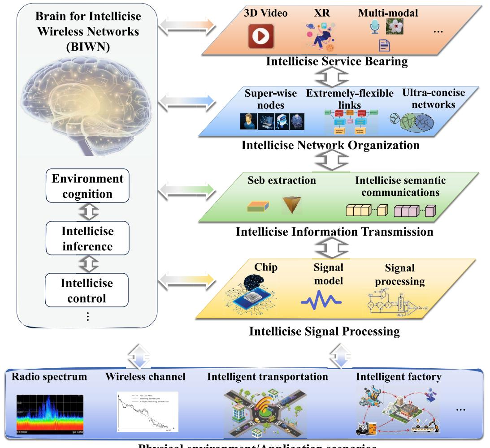

Fig. 6. A detailed architectural framework for intellicise wireless networks.

for meeting various service requirements. They intelligently adjust their states, such as access status, connection scale, perceived data, etc., achieving high efficiency and low cost without compromising network functionality. Extremelyflexible links under the guidance of BIWN, dynamically adjust the connectivity status, transmission parameters, service bearing capacity, etc., to meet changing service demands. Ultra-concise networks, guided by BIWN, intelligently and concisely optimize network topology, protocol settings, routing methods, etc., to improve network service efficiency while meeting the overall service requirements of the network.

*5) Intellicise Service Bearing:* Under the guidance of BIWN, intellicise service bearing explores, understands, and analyzes user intentions and service characteristics to support various types of services such as 3D video, extended reality (XR), and other multimodal services. It feeds the results back to BIWN, providing necessary information support for the intelligent adjustment of the network. Moreover, it also adjusts and updates the service bearing mode and mechanism of this level according to the intellicise control information from BIWN.

Hence, intellicise wireless networks are capable of intelligently perceiving the physical environment and application scenarios, analyzing user intentions, service characteristics, network conditions, etc., and executing intellicise inference, decision-making, management, control, and other actions, thereby achieving wireless network functionality at low cost. These characteristics make intellicise wireless networks promising in supporting a wide range of new services and applications in real-world scenarios. For example, intellicise wireless networks are promising to support the diverse demands of high-reliability and low-latency applications in intelligent transportation systems. Specifically, intellicise signal processing helps vehicles and roadside units (RSUs) achieve high-efficiency and low-complexity information processing, which can reduce energy consumption and processing latency. Intellicise information transmission, which enables efficient and flexible transmission between nodes, can improve communication efficiency significantly. On this basis, intellicise network organization further coordinates the nodes, transmission links, and network topology and protocols, making intelligent transport systems with intelligence, conciseness, and autonomy. Hence, intellicise wireless networks are promising to support the diverse demands of high-reliability and low-latency applications in intelligent transportation systems. More practical applications of intellicise wireless networks will be introduced in detail in Section [V.](#page-22-0) In the following subsections, we will discuss broader perspectives on the components of intellicise wireless networks, exploring its potential implications and benefits.

#### *B. Intellicise Signal Processing and Chips*

With the worldwide deployment of 5G mobile communication networks, many new applications and use cases driven by current trends are already in conception [\[105\]](#page-31-6). To satisfy the explosively increasing information transmission demand, numerous communication techniques, such as THz communications [\[106\]](#page-31-7), massive multiple-input-multipleoutput (MIMO) [\[107\]](#page-31-8), advanced forward error correction (FEC) [\[108\]](#page-31-9), and SemCom [\[9\]](#page-29-8), have been considered for the 6G communication networks. These advanced communication techniques inevitably bring about extremely complex signal processing, which has become one of the major challenges for 6G communication networks. For a long time, the capability of communication signal processing chips relied heavily on the progress of complementary metal–oxide–semiconductor (CMOS) technology, which, however, has slowed down, making it difficult for communication chips to meet the long-term evolution of the intellicise wireless networks. As a result, novel intellicise signal processing technologies and chips turn out to be an indispensable and promising candidate for future communication systems.

Mostly, communication signals are modeled and processed in the probability space, such as maximum likelihood probability signal detection and maximum a posteriori (MAP) probability decoding. This characteristic inspires a novel paradigm shift of the intellicise signal processing, where the signal is expected to be processed in the probability domain. One of the implementation candidates of probability-domain processing is the stochastic-computing-based communication signal processing, which represents the signals in the probability domain with random bit streams. For instance, the probability x=0.5 could be represented with a random bit stream with 8 bits as, X(t)= "01101010". For each bit in X(t), the probability of occurrence of "1" is 0.5. In this way, the complex operations in conventional signal processing paradigm can be transformed to quite simple logic operations in the probability domain [\[109\]](#page-31-10). Existing works have demonstrated the low hardware cost and low power consumption of stochastic-computing-based communication signal processing chips.

For the massive MIMO signal detection, the machine learning-based Markov chain Monte Carlo (MCMC) algorithm is combined with the probability-domain stochastic computing in [\[110\]](#page-31-11), where the MCMC algorithm models signals in the probability space and detects signals based on the Markov chain steady state distribution probability inference, achieving significant improvements in chip hardware efficiency. For the signal detection of sparse code multiple access (SCMA), the MAP-based message passing algorithm (MPA) is combined with the probability-domain stochastic computing in [\[111\]](#page-31-12), where the message passing algorithm models signals in the probability space and detects signals based on the Bayesian posterior probability inference, reducing the chip hardware cost by more than one order of magnitude. For polar [\[112\]](#page-31-13) and low-density parity-check (LDPC) decoding [\[113\]](#page-31-14), the probability space belief propagation (BP) algorithm is combined with the probability-domain stochastic computing, improving the chip hardware efficiency greatly. For the intellicise signal processing, the gradient descent based algorithm can also be implemented with the probability-domain dynamic stochastic computing with quite simple logics, demonstrating advantages on low chip hardware cost and high energy efficiency [\[114\]](#page-31-15).

# *C. Intellicise Information Transmission*

It is estimated that by 2030, the number of smart devices, such as wearable devices, mobile terminals, intelligent vehicles, etc., will reach a staggering 500 billion [\[115\]](#page-31-16). These devices, with their diverse scenarios and task types, generate massive amounts of data. Such a data surge necessitates network bandwidth capabilities in the order of terabits per second (Tbps), a threshold that surpasses the capacities of current 5G and B5G networks. SemCom emerges as a promising paradigm for alleviating the burden of data transmission by selectively transmitting essential features required to reconstruct the desired content. However, the diverse types of sources and tasks involved in SemCom introduce new dimensions of information, leading to exponential growth in the complexity of representing semantic information [\[7\]](#page-29-6).

To address the challenges posed by high-dimensional information space, the approach of intellicise information transmission is introduced. At the level of information transmission, intellicise wireless networks try to operate at the level of primitives of information to reduce redundancy and improve processing efficiency. In intellicise information transmission, information is processed at the semantic level, where redundant information will be filtered out and only intent-related information will be retained, which coincides with the merit of intellicise wireless networks. In light of this, we propose intellicise SemCom, focusing on three critical areas: Seb, model-based transmission, and model division multi-access (MDMA) techniques.

As shown in Fig. [7,](#page-16-0) Seb serves as the cornerstone of a semantic space. The fusion of Seb and the semantic space facilitates a concise representation of diverse multimodal communication sources. Sebs are typically depicted as vectors, containing both explicit and implicit semantic features of the source. This vectorized representation lends support to the concept of model-based transmission, which involves the transfer of AI semantic models. This process inherently entails the dissemination of AI-driven semantic capabilities. Furthermore, to address the prevalent challenge of multi-user communication, a pioneering technique known as MDMA has been introduced [\[116\]](#page-31-17). In the context of intellicise information transmission, model-based AI methodologies are employed to extract high-dimensional features from signal sources from a

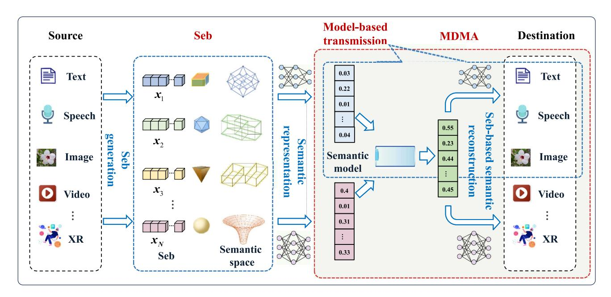

Fig. 7. The interaction of Seb, model-based Transmission, and MDMA.

semantic perspective. This approach provides a novel system resource tailored for multi-access technology geared towards intellicise SemCom. Consequently, intellicise SemCom provides concise expression, efficient transmission, and intelligent multi-user access. Thus, the relationships among SemCom, Seb, MDMA can be summarized as follows: Seb forms the foundation, enabling efficient SemCom; model-based transmission utilizes high-dimensional combinations of Sebs for adaptive communication; and MDMA efficiently facilitates multi-user SemCom by leveraging model orthogonality for simultaneous, co-frequency transmission and separation.

*1) Semantic Base:* Recall the concept of bit utilized in the existing syntactic-based communications, a basic framework for representation and quantification is also expected for SemCom. Seb is recently conceived, which tightly connects the background knowledge and communication demands with the semantic representation of multi-modal sources, tamping the foundation of intellicise SemCom. Sebs are usually represented as vectors, which contain explicit and implicit semantic features of the source. The explicit semantic features are comprehensible for humans, such as a piece of colored pixel and the outline of an image, while the implicit semantic features are highly abstract and consist of many highlevel features. As shown in Fig. [8,](#page-16-1) given a type of source information, the generation of Sebs should also consider the specific communication intents and the semantic knowledge, which determine the granularity of Sebs. For a toy example of communication intents, more Sebs are required for image reconstruction-oriented communication than for image classification task-oriented communication, since the former needs more features to conduct a detailed representation of a whole image, instead of classification-specific only. As for the effect of semantic knowledge, it can be taken as analogous to the interaction between humans. For a given topic, the interaction between two old friends is much more

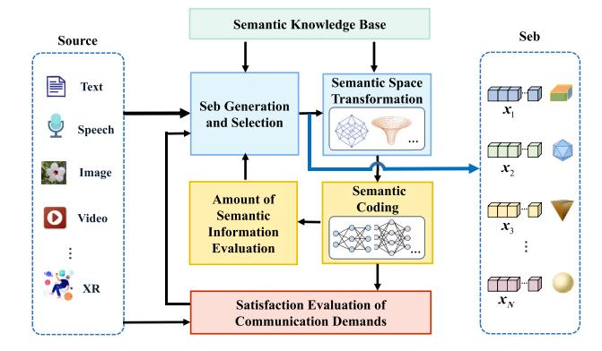

Fig. 8. Seb extraction from multimodal source.

concise than that between two strangers, since some basic ideas or language units have already been shared and do not need to consume extra words for interpretation. As the basic unit of semantic representation, the generation of Seb is still an unsolved issue. Although existing works have developed several efficient SemCom for different modalities of data, Seb is usually implicitly embedded in the proposed systems, which limits the potential of intellicise SemCom to some extent. As an initial step, Zheng. et al. [\[117\]](#page-31-18) proposed an explicit solution of Seb-based SemCom, where Sebs are generated for images and employed at both transmitter and receiver, enhancing the transmission efficiency significantly.

*2) Model-Based Transmission:* Model transmission refers to the process of transferring AI semantic models related to the inference stage, and fundamentally involves the flow of AI semantic capabilities. Currently, all SemCom systems are composed of DL-based models and are constrained by three factors of AI models: specific information sources, specific scenes, and specific tasks. Therefore, the understanding of semantic information requires the assistance of unique AI models for each scenario. Thus, the promotion of SemCom systems will bring many AI models into the real physical world. AI models exist not only in nodes but also in the propagation of AI models is a primary feature of the SemCom system. If all nodes deploy the required AI models, the burden on nodes will be enormous. The balance between the survival time of AI models and the frequency of node propagation is an important topic. The propagation of AI models will become a key element of intellicise SemCom systems, rather than predeploying AI models at all nodes.

Dong et al. [\[118\]](#page-31-19) proposed the concept of semantic slice models to solve the problem of high communication resource consumption caused by the large parameter transmission of AI models during model propagation. In the existing AI models of SemCom systems, end-to-end optimization systems have the characteristics of accessible training and higher performance. However, dividing the end-to-end AI model into multiple parts for separate transmission makes it difficult for the receiver to achieve its specialized goals. A layered SemCom model was designed in the paper, including the basic models, enhancement slice-models, and channel coding slice-models. When facing different semantic requirements and channel conditions, the corresponding slice model can be selected to meet the needs of the receiver.

*3) Model-Division Multiple Access:* Traditional multiple access technology usually uses physical resources to distinguish users, such as time, frequency, space and power, etc., corresponding to time division multiple access (TDMA), frequency division multiple access (FDMA), space division multiple access (SDMA), code division multiple access (CDMA) and non-orthogonal multiple access (NOMA) technologies. SemCom combines the semantic information behind the source, creates a new semantic space on physical resources, and provides new allocable resources to distinguish different users, called MDMA [\[116\]](#page-31-17).

In [\[116\]](#page-31-17), Zhang et al. extracted the shared and personalized information from high-dimensional semantic space and reused the shared information to save bandwidth in multi-user transmission. At the same time, the feasible metric is also proposed, which proves that the feasible of MDMA is better than that of NOMA from the perspective of JSCC. Based on the characteristics of different semantic models corresponding to different semantic spaces, Liang et al. [\[119\]](#page-31-20) proposed the Orthogonal-Model Division Multiple Access (O-MDMA) technology that can migrate the anti-interference capability of DeepJSCC to the multi-user capacity. Compared with NOMA technology, O-MDMA has stronger noise resistance in additive white gaussian noise (AWGN) channels.

*4) The Specificity of Intellicise Semantic Communications:* The intellicise SemCom, particularly in the form of intellicise information transmission, leverages Seb to achieve intelligent, simplified expression and efficient reconstruction of semantic information, focusing on maintaining high semantic fidelity throughout the communication process. This approach encompasses the entire communication chain, from compression and encoding of semantic content at the transmitter to its recovery and decoding at the receiver, prioritizing the integrity and context of information over bit-level accuracy. In contrast, data compression using neural models primarily focuses on reducing data volume by extracting relevant features and minimizing redundancy, often at the expense of semantic integrity, as it lacks consideration for channel-specific adaptations and the semantic reconstruction at the receiver. This highlights a fundamental shift in focus from mere data efficiency to meaningful communication in intellicise SemCom.

*5) The Complexity Associated With Intellicise Semantic Communications:* While intellicise SemCom brings significant efficiency improvements to communications, it is important to consider the associated costs. These costs primarily include the increased algorithmic complexity due to the application of AI models in intellicise SemCom and the additional burden introduced by the propagation of semantic models in intelligent wireless networks.

In response to these challenges, researchers have made positive contributions. For example, Dong et al. [\[118\]](#page-31-19) conducted time complexity analysis and testing of the proposed layerbased semantic communication system for images(LSCI). In low SNR environments, the running time of the semantic channel slice model was significantly lower than that of LDPC. Liang et al. [\[120\]](#page-31-21) performed complexity analysis for the transmitter and receiver of the proposed semanticbased image generation communication system. Their model reduced 0.54G floating point operations (FLOPs) compared to existing DL-based generative models (StyleGan2) while preserving high-fidelity performance. Bourtsoulatze et al. [\[28\]](#page-29-20) tested DeepJSCC on images with eight 2.10GHz Intel Xeon E5-2620V4 central processing units (CPUs) and one Tesla K80 graphics processing unit (GPU). The average running time on the GPU was 18ms per image, while the average running time on the CPU was 387ms. The work demonstrated competitive performance compared to JPEG encoding and decoding, which required average times ranging from 30ms to 390ms.

Furthermore, researchers have explored lightweight techniques to reduce the computational requirements of semantic models. Xie and Qin [\[121\]](#page-31-22) designed a light distributed semantic model through model pruning and reducing weight resolution. These efforts focus on mitigating the computational demands of semantic models using lightweight techniques and optimizations. By reducing complexity and adopting efficient algorithms, researchers aim to strike a balance between the benefits of intellicise SemCom and the associated computational costs.

# *D. Intellicise Network Organization*

The challenge lies in the non-uniform growth of information density, which results in the emergence of a wide-ranging and highly dynamic nature of information propagation. Coupled with the variations in information transmission methods and complicated functional modules in communication systems, the propagation of information is poised to exhibit nonlinear effects within the upcoming 6G network. This has the potential to trigger explosive growth in information dissemination, increasing the difficulty of network control and optimal utilization of resources. Moreover, to support the ever-increasing requirements of different application scenarios, simply increasing the network scale or adding more functional modules may lead to unaffordable system complexity.

At the level of network management, intellicise wireless networks analyze the systematic primitives to optimize network management, maximizing the effectiveness of network resources for reaching a state of self-optimization and self-evolution. In intellicise wireless network, super-wise nodes possess advanced capabilities that go far beyond traditional wireless devices. They are characterized by their ability to perceive, compute, and make intelligent decisions, which fundamentally alter the landscape of wireless communication. With their innate intelligence, super-wise nodes are equipped to analyze contextual information, evaluate network conditions, and execute intelligent decision-making. This empowers them to facilitate pervasive autonomous network management and offer a wide array of intelligent services. Additionally, super-wise nodes play a pivotal role in extending intelligent models throughout a globally distributed network. This extension enables the concurrent training and deployment of models across the network's infrastructure. This global-scale implementation not only facilitates parallel model processing but also ushers in a self-learning network infrastructure capable of real-time inference and autonomous evolution.

Link flexibility refers to the flexibility that can adapt to different network conditions and requirements when transmitting semantic signals. Link flexibility is a dynamic characteristic that needs to meet the dynamic and flexible requirements of semantic signal transmission, and node deployment, which can be adaptively adjusted according to the network state, channel conditions, and communication needs. To achieve flexible semantic transmission, Dai et al. [\[103\]](#page-31-4) developed an entropybased variable-length encoding scheme, where the data volume is delicately adjusted for adaptive image transmission over noisy wireless channels.

At the network level, by introducing intelligence into multiple protocol layers, the communication networks can evolve to be concise in terms of signaling overhead, topology, and so on. An air-space-ground intellicise network was proposed in [\[18\]](#page-29-17) to efficiently tackle the heterogeneity of the air-based, space-based, and ground-based networks. Note that the service, environment, and resource type can be varied in air-space-ground networks. To solve these challenges, two types of networking policies are proposed, which are called local intellicise networking and global intellicise networking. In specific, the policy of "on-demand intelliciseness for local area networks" is proposed for local intellicise networking, which enables the network to be organized according to the requirement of services, avoiding the redundancy of the network architecture and the waste of resources. By comprehensively analyzing the communication requirements and the surrounding environment, flexible links for dynamic topology are built in local networks. For global intellicise networking, the policy of "on-purpose intelliciseness for wide area networks" is proposed, where the network management of topology and routing in the wide area are organized based on the analysis of users' intents, and thus, enables efficient

communication between heterogeneous networks with lowoverhead.

# *E. Summary and Lessons Learned*

- *1) Lessons Learned for Intellicise Signal Processing and Chips:* The complexity of communication signal processing in future systems necessitates the development and implementation of intellicise signal processing and chips. The probability-space signal model, probability-domain-based intellicise signal processing technology and chip are key enabling technologies in the fundamental concision of signal, which solves the burdensome complexity issue of future communication signal processing. Additionally, the integration of ML-based algorithms with probability-domain processing has shown significant improvements in chip hardware efficiency for various signal detection and decoding tasks.
- *2) Lessons Learned for Intellicise Information Transmission:* Intellicise information transmission aims to operate at the semantic level of information to reduce redundancy and improve processing efficiency. The integration of intellicise SemCom with techniques such as Seb, modelbased transmission, and MDMA offers concise expression, efficient transmission, and intelligent multi-user access, providing a promising solution for the diverse demands, highreliability, and low-latency applications in various scenarios. As we discussed above, some literature has attempted to explore the Sebs and slice model to optimize intellicise information transmission process, but this paradigm shift still leaves much room for further research. The measurement and presentation of Seb-based semantic information, efficient mappings between signals and semantics, and multi-level model-based transmission, are critical challenges for intellicise wireless networks.
- *3) Lessons Learned for Intellicise Network Organization:* The exploration of intellicise network organization has revealed valuable insights into reshaping communication structures for enhanced efficiency and adaptability. The incorporation of super-wise nodes, extremely flexible links, and ultra-concise networks enable self-optimization and selfevolution. Super-wise nodes, with their advanced cognitive capabilities, have reshaped network intelligence, enabling autonomous network management and a plethora of intelligent services. Link flexibility has introduced adaptability into semantic transmission, contributing to increased reliability and efficiency. Ultra-concise network optimization strategies have the potential for self-optimizing and self-evolving networks, achieving resource maximization and autonomous optimization. While previous works have primarily aimed at alleviating existing communication network burdens from a technical standpoint, they often fall short in comprehending the core intention of communication. Achieving flexible semantic signal transmission requires adaptability to dynamic network conditions, channel variations, and communication needs. Increasing network scale or adding more functional modules may lead to unaffordable system complexity, necessitating efficient resource utilization and complexity management

strategies. By harnessing robust intelligent strategies to revolutionize communication networks as needed, the untapped potential of intellicise communication networks can be more fully harnessed, fostering a more holistic and effective communication landscape.

# IV. ENABLING TECHNOLOGIES AND DRIVING FACTORS FOR INTELLICISE WIRELESS NETWORKS

In this section, we explore the enabling technologies and driving factors for intellicise wireless networks, including AI, computing power network (CPN), blockchain, and AoI.

#### *A. Artificial Intelligence*

In the past decade, AI technologies, represented by DL, have advanced rapidly, giving rise to feature extraction models such as ResNet [\[122\]](#page-31-23) and Transformer [\[62\]](#page-30-14), foundational models like large language model (LLM) [\[123\]](#page-31-24), and generative models like GAN [\[124\]](#page-31-25) and the Diffusion Model [\[125\]](#page-31-26). These advancements have provided robust support for intellicise information transmission.

*1) Joint Source-Channel Coding:* Based on the separation theorem, designing optimal source coding and channel coding separately results in an optimal combination [\[126\]](#page-31-27). However, meeting the conditions of infinite transmission code length and using maximum likelihood decoding in practice is challenging. Therefore, JSCC is needed to make the transmission more concise. Compared to manual design, NNs offer better flexibility and generalization. Scholars have long attempted to use NNs to implement JSCC [\[127\]](#page-31-28). The process involves: first, extracting latent vectors from signals as representations of signal semantics using deep encoders. Then, send these semantic representations through channel coding to the receiver and performing channel decoding. Finally, the receiver utilizes deep decoders to recover the signal from the semantic representations. The main feature of this framework is that both encoder and decoder are end-to-end optimized DL networks, with the encoding being latent vectors. Scholars have explored different network models for different modalities, such as variational autoencoder (VAE)-based image encoding [\[128\]](#page-31-29), CNN-based image encoding [\[129\]](#page-31-30), and LSTM-based text encoding [\[130\]](#page-31-31). However, the introduction of end-to-end trained deep networks has limitations: 1. Deep encoders and decoders are black boxes, making the latent vector representations inexplicable [\[131\]](#page-31-32); 2. The latent vectors used for semantic representation are dependent on the training dataset and tightly coupled between elements, limiting scalability [\[132\]](#page-31-33).

*2) Generative Coding:* In recent years, scholars have realized that DeepJSCC can not only achieve compression coding for fidelity but also achieve Shannon's vision of SemCom [\[133\]](#page-31-34). Intellicise communication aims to transmit semantics in messages, avoiding redundant information irrelevant to task scenarios, effectively alleviating the increasing bandwidth pressure. However, decoding reasonable signals (such as images) based on highly abstract semantics (such as object categories and positions in images) is challenging

due to the lack of detailed information in abstract semantics. Fortunately, in the past year, generative models like the Diffusion Model [\[125\]](#page-31-26) have rapidly developed and can generate reasonable images conditioned on sentences [\[134\]](#page-31-35). Communication patterns relying on generative models have feasibility. This approach first extracts and transmits semantics of interest to humans from signals using models such as target recognition, detection, and segmentation. At the receiving end, the semantics are used as conditions to control the generation model outputting signals that match the semantics [\[135\]](#page-31-36). Compared to semantic communication based on deep source-channel joint coding, generative SemCom can represent semantics in a more human-like way, and due to the abstract nature of human semantics, it can significantly save bandwidth resources. Some scholars have separately attempted to use text [\[136\]](#page-31-37) and segmented images [\[137\]](#page-31-38) to achieve generative image transmission. However, existing generative models, represented by the diffusion model, have some problems: 1. Long inference time is unfavorable for realtime communication; 2. High power consumption is contrary to green communication principles; 3. Strong randomness threatens communication reliability.

*3) SKB:* Future communication technologies like 6G will focus on the important vision of intrinsic intelligence, constructing targeted intelligent service ecosystems for various communication objects as needed. A SKB is an AI model that provides relevant semantic knowledge descriptions for data information, structured, and capable of memory. Early SKBs used discrete symbols such as words as basic elements, with rules discovered through manual setup or natural language techniques forming relationships between elements, forming a graph structure database based on triple structures [\[138\]](#page-31-39), [\[139\]](#page-31-40), [\[140\]](#page-31-41). However, structured KBs face the following problems: 1. The difficulty of constructing structured KBs, which generally rely on manual construction or manual verification, often resulting in KBs tailored to specific domains; 2. Structured KBs and tensors in NNs belong to different modalities, requiring additional interaction modules, such as KG embedding models based on GNNs [\[141\]](#page-31-42). In addition, commonly used joint training interaction modules are sensitive to the distribution of KBs. When the KB undergoes significant changes, retraining is required, leading to poor generalization. Therefore, based on DNNs and self-supervised learning techniques, basic models trained on large-scale datasets, known as Foundation Models [\[142\]](#page-31-43), have gradually become the mainstream of research. Particularly, LLMs such as ChatGPT [\[123\]](#page-31-24), Llama [\[143\]](#page-31-44) have achieved great success. LLM's tremendous potential in many complex practical tasks can be used to understand diverse semantic requirements of various communication objects and decide suitable encoding and transmission schemes based on constraints such as channel environment and energy consumption, potentially becoming the engine of intelligence for future communication networks. However, for large-scale applications, there are still two obstacles: 1. The inference process is a black box with insufficient interpretability; 2. The massive computation introduces additional delays and power consumption.

In summary, the intersection of AI and communication technologies has paved the way for intellicise information transmission that efficiently encodes, transmits, and decodes information based on semantic understanding.

# *B. Computing Power Network*

Benefiting from the rapid development in micro-electronics techniques and wireless communications, the last few years have witnessed the proliferation of ubiquitous computing devices connected to wireless networks with increasing computing power, such as mobile phones, Internet of Things (IoT) devices, laptops, etc. As reported by Cisco [\[144\]](#page-31-45), the number of wirelessly connected computing devices is going to reach 29.3 billion by 2023, which is more than three times the global population. This continuous growth of distributed computing resources brings new opportunities and challenges to the design of communication and computing systems.

Initially presented in [\[145\]](#page-31-46), CPN emerges as an end-edgecloud-network that coordinates heterogeneous and ubiquitous computing resources across the network, including a massive number of end devices, edge servers, and cloud servers. CPN is capable of intelligently processing users' demands by coordinately allocating multi-dimensional resources such as storage, communication, and computing resources to enhance user QoE [\[146\]](#page-31-47), [\[147\]](#page-31-48).

CPNs exhibit a hierarchical architecture consisting of the following six layers, as argued in [\[147\]](#page-31-48): the *infrastructure layer*, which consists of all the computing and network infrastructures across the network, including diverse end devices, edge servers, clouds, WiFi, 5G Base Station (BS) routers, and so on; the *resource pooling layer*, which perceives all the computing, storage and network resources, and puts them into different resource pools; the *resource information announcement layer*, which collects the information of all the network resources and announces it to the users in the network; the *computing scheduling optimization layer*, which optimizes resources allocation according to user demands by exploiting intelligent algorithms such as reinforcement learning and DL techniques; the *service layer*, which integrates various AI platforms, such as Pytorch and Tensorflow, and provides different AI services to accomplish user tasks; the *orchestration and management layer*, which provides orchestration and management of the network computing power, services, and security.

Through the joint utilization and management of ubiquitous computing and network resources across the end-edge-cloud levels, CPNs have remarkable advantages over the classical edge computing networks. On one hand, CPNs are capable of performing highly efficient computing and communication tasks that achieve ultra-low latency by exploiting ubiquitous resources. On the other hand, CPNs can flexibly and dynamically optimize the scheduling and allocation of different types of resources in the network using the aforementioned hierarchical architecture, which provides consistently optimized user experience.

With these advantages, CPNs are a key enabling technology for intellicise wireless networks. Firstly, every participating device in intellicise wireless networks is a networked device with certain computing power, which needs to be managed at the network layer. These devices form components of the *infrastructure layer* of CPNs, where they are assigned to corresponding pools in the *resource pooling layer*. The information about their computing and networking resources is collected and disseminated to other users in the network by the *resource information announcement layer*. Additionally, intellicise wireless networks are typically facilitated by intelligent algorithms, such as DL techniques, tailored to different tasks. The *service layer* within CPNs can provide AI services that select the appropriate AI models for specific transmission tasks, considering the computing power of both transmitters and receivers. This layer also provides the suitable AI platform to execute these AI models for intellicise wireless networks, such as PyTorch and TensorFlow.

Intellicise wireless networks also involve computationally intensive training of AI-based transceiver algorithms. Due to the limited resources of participating devices in intellicise wireless networks, these intelligent transceiver algorithms may need to be trained in a distributed or federated manner, utilizing other resources within the network. This process is facilitated by the *computing scheduling optimization layer*, which optimizes the allocation of storage resources for training data, computing resources for running the training algorithm, and networking resources for transmitting the training data, intermediate results, and gradients. Given the dynamic environment and varied transmission tasks, the transceiver algorithms for intellicise wireless networks require dynamic updates to achieve optimized performance. This task is managed by the *orchestration and management layer*, which monitors and manages the entire network and its tasks, in conjunction with the *computing scheduling optimization layer*, which allocates resources for updating the transceiver models. In conclusion, the development of intellicise wireless networks heavily relies on advanced CPNs, which provide computing, storage, networking resources, and management capabilities essential for realizing intellicise information transmission, network organization, and serving bearing.

# *C. Blockchain*

Blockchain, a decentralized and distributed digital ledger technology, was initially mentioned by Nakamoto [\[148\]](#page-31-49) as the underlying technology behind Bitcoin. By harnessing its decentralized nature, blockchain provides a secure and efficient method for storing and transferring data, fostering trust and transparency in diverse sectors.

Intellicise wireless networks introduce new security issues as attackers can manipulate semantic data to disrupt the communication process and compromise services. These malicious attackers may send data with similar semantic information but different intended contents, leading to service interruptions or mismatches. For instance, attacks targeting intellicise information transmission, model training, and inference processes can result in communication failures, undermining the reliability and effectiveness of various services.

With its decentralized and immutable nature, blockchain provides a robust and tamper-resistant framework for intellicise information transmission. By utilizing cryptographic techniques such as asymmetric encryption and digital signatures, blockchain ensures the integrity and authenticity of semantic data, making it highly secure against unauthorized modifications or tampering. Additionally, blockchain's distributed architecture eliminates the reliance on a central authority, reducing the risk of single points of failure and enhancing the overall security of the intellicise communication system. Lin et al. [\[149\]](#page-31-50) proposed a blockchain-aided SemCom framework for AI-generated content (AIGC) in virtual transportation networks and introduced a trainingbased targeted semantic attack scheme and a semantic defense scheme that utilizes blockchain and zero-knowledge proofs to distinguish between adversarial and authentic semantic data. Wazid et al. [\[150\]](#page-32-0) designed a generic blockchain-based secure authentication key management scheme specifically for IoT environments. Fakhri and Mutijarsa [\[151\]](#page-32-1) applied blockchain to IoT systems, with simulation results indicating enhanced security compared to traditional approaches.

Furthermore, blockchain technology can also be leveraged at the semantic level for constructing KBs. The SKBs serve as the key module of intellicise SemCom, and their continuous updating and iteration are critical to achieving robust and effective intellicise information transmission. Blockchain's decentralized and distributed nature allows for the creation of a shared and consensus-driven platform for KB construction. By leveraging the transparent and immutable characteristics of blockchain, participants can collaboratively contribute to the KB, ensuring its accuracy and reliability. Moreover, the construction of the SKB requires the participation of a large number of users to contribute computing resources and perform knowledge sharing. The incentive mechanisms inherent in blockchain encourage participants involved in the construction of the KB to actively contribute to its updating and iteration process. Blockchain's smart contract functionality enables the establishment of predefined rules and incentives, motivating participants to actively engage in KB updates and iterations. By offering appropriate rewards, participants are motivated to engage proactively in the construction of the KB, leading to a more accurate and comprehensive representation of knowledge. Ren et al. [\[152\]](#page-32-2) proposed a blockchain-based data storage incentive mechanism to obtain digital currency rewards and constructed two blockchains for data storage and access control.

# *D. Age of Information*

Ushering in a new era of hyper-connected experience for all, today's communication system is evolving from delivering data to human towards a distributed NN that provides communication links to fuse human, machines and computing units for extrasensory services [\[101\]](#page-31-2). A physical object is outfitted with various sensory devices that continuously generate data about vital areas of its functionalities. Massive amount of such machine-type data flows are then uploaded to build accurate digital-twin representations to facilitate predictive decision

making for various tasks, which is exemplified by industrial automation and tactile Internet.

This new paradigm involves information flows around a control loop between sensory devices and AI-enabled edge servers. Computation-intensive status updates about timevarying physical processes are sampled, and uploaded to constantly update the digital twin model at the receiver end. To track the changes of observed physical processes in a real-time manner, the devices tend to sample as frequently as possible and thus blindly generate numerous data traffic. Note that the traditional network design principle focuses on how to reliably deliver the entire data stream as fast as possible, regardless of whether the transmitted data are useful to help the system to achieve prescribed goals. Such over-provisioning leads to network congestion that causes a mismatch between the physical process and its digital estimate, which is deleterious to the performance of subsequent tasks.

To realize scalable support for real-time interactive systems, it necessitates extending the scope of system design objectives beyond error-free data transmission to encompass the semantic of information, which can be defined not only as the "content", but as the *usefulness* of information in relevance to the success of subsequent tasks [\[153\]](#page-32-3). (Note that "content" could be interpreted as information that is essential for human perception tasks.) Let us consider the transmitter-receiver ends of interactive system as an intelligent agent, which holds the intrinsic goal of maintaining its own equilibrium by constantly observing the physical environment. Then the usefulness of information refers to the amount of statistical correlation between these two ends that is causally necessary for the system to respond in an appropriate way. It could be quantified by how much knowledge of data packets at receiver reduces statistical uncertainty about the real-time state at transmitter, in the presence of end-to-end timing mismatch induced by system delay. Under a time-varying environment, the freshness of information is of critical importance to the accuracy of obtained situational awareness. A stale data packet sampled at transmitter is of less value compared with a newly generated one, in terms of the degree to which it represents reality. In this sense, the data flows should be decomposed and prioritized based on performance metrics characterizing time-dependent values, so as to realize orderly information exchange among massive devices in the hope of maintaining the system in a low entropy state.

Moreover, such systems are driven by the everlasting sensetransmit-compute cycles, while the sensing process at devices can be engineered. Therefore, different from the exogenous data arrival assumptions adopted for human-type communications, the process of information generation should also be factored into the design principle. Then at the system level, the devices can adaptively and properly sample the observed physical process based on its temporal dynamics, while the sampled packets are transmitted and processed at the right time instances relative to subsequent task requirements. That way, the amount of uninformative data traffic is largely reduced, and the precious communication and computation resources can be carefully orchestrated to convey useful information. Therefore, it calls for novel performance metrics focusing on taskoriented unification of information generation, transmission, and usage, which have commonly been treated with separate design philosophy.

This has led to growing interest in the concept of AoI [154], which incorporates the information generation process to capture the temporal correlations among consecutively generated data packets. Different from traditional content-blind performance metrics (such as throughput and delay) that treat each packet equally, AoI aims to measure the amount of useful information (i.e., new knowledge different from previous packets) that each data packet brings to the receiver. This new tool is essential to intellicise wireless networks, which need to derive adjustment strategies based on fresh and informative information about the physical environment and network status. The stale information may mislead the BIWN to develop a wrong strategy and drive the entire wireless network to evolve toward redundancy and inefficiency. AoI helps intellicise wireless networks assess the timeliness and value of information. By evaluating the AoI of the perceived internal or external information, BIWN can be aware of the network status more instantly and comprehensively, which further facilitates the strategies of evolution toward conciseness and effectiveness. Intellicise network organization will adjust the activation status of nodes in wireless networks according to the AoI of the generated information. The nodes that generate stale information will be deactivated during a routing process to reduce the interaction latency. In this way, the network topology and routing protocols can be more concise. For information transmission and signal processing, the AoI of the information to be transmitted can be considered as an indicator of significance, especially in real-time scenarios, such as control systems. The stale information can be removed from processing or allocated with fewer computing resources, reducing the cost of information processing and transmission while meeting the service requirements.

The initial definition of AoI [155] employs a linear model as the first step to infer the usefulness of information via time lag, which is defined as the time elapsed since the latest received data packet is generated at the source. Suppose a sensory device constantly generates status updates with timestamps  $\{g_{t_1}, \ldots, g_{t_k}\}$ , which are successfully received at receiver at time instances  $\{d_{t_1}, \ldots, d_{t_k}\}$ , then the AoI flow from the device is given by the random process  $\delta(t) =$  $t - max\{g_{t_k}: d_{t_k} \leq t\}$ . To investigate the achievable age performance under different network typologies, packet management and transmission scheduling policies, the modeling of age has been evaluated with the aid of queuing theory. The sampling pattern at sensor device is modeled as specific stochastic processes and the transmission over wireless network is abstracted as different types of queues [156], [157]. As for computation-intensive status updates, two-stage tandem queues are employed in [158] to explicitly characterize the dependency between transmission and computation processes under stochastic resource availability.

Taking a closer look under the hood, the task performance degradation caused by staleness of information may not be a linear function of time. In this regard, recent works employ information theory and signal processing theory to amend the age modeling for more meaningful measures. A primary task in real-time control systems is to reconstruct the observed physical process based on samples that are causally received from sensory devices. In the case of causal signal processing, the estimation error is inevitable and can serve as an important measure for the precision of control decisions [159]. The mapping from AoI to estimation error is investigated in [160], [161] for Gauss-Markov source signals. Under signal-agnostic sampling strategy, the mean squared estimation error is proved to be a non-linear increasing function of AoI, which can be specified based on the underlying structure of system dynamics. To further quantify the usefulness of information under different task requirements, the estimation error-based metrics are extended in [162] to include a task-aware penalty function that increases with time when the receiver stays in an erroneous state.

The aforementioned works evaluate the usefulness of information for raw data. Recent advances in SemCom reveal that higher system efficiency can be achieved by working on latent feature space. Chowdhury Shisher et al. [163] took a step forward to investigate the impact of age of feature on realtime supervised learning tasks. The training loss of time-series forecasting is characterized by conditional entropy, which is proved to be a multi-dimensional non-monotonic function of age vector. The features refer to different types of sensor data (e.g., temperature, humidity) and are used to predict a target physical process (solar power). As for high-dimensional timeseries data (e.g., video, audio, and brain-machine interface signals), the AoI-related metrics could be combined with representation learning to capture the mapping mechanism between downstream task and the spatiotemporal dynamics of feature sequence extracted from data streams. The transmitter and receiver can collaboratively train a task-aware causal feature sampling strategy, and leverages the inference ability to accomplish the task. It has the potential to enlarge the design space for JSCC, multi-user scheduling, and networking strategies for semantic-empowered communications in realtime systems.

# V. THE APPLICATIONS OF INTELLICISE WIRELESS NETWORKS

After an overview of SemComs and intellicise wireless networks, in this section, we discuss some potential applications for intellicise wireless networks.

# A. Intellicise Wireless Networks for New Services

Compared with the conventional data-oriented communication frameworks, the intellicise wireless networks will bring the following new services, as described in Fig. 9.

1) Ultra-Reliable, Low-Latency Sensing, Computation, Communication, and Control: 6G is promised to extend the ultra-reliable low-latency communication (URLLC) services already supported by 5G networks to guarantee the ultra-reliable and low-latency performance for the whole sensing-computation-communication-control service loop. The reliability and latency requirements refer to not only the

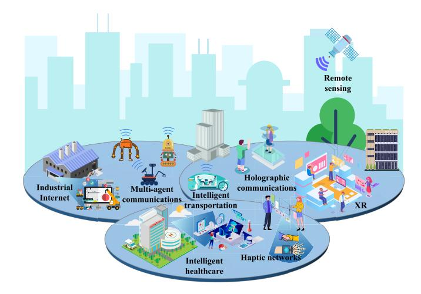

Fig. 9. Examples of new services in intellicise wireless networks. Intellicise wireless networks can empower new services such as holographic communications, XR, intelligent transportation, intelligent factories, multi-agent collaboration, and intelligent healthcare, etc.

communication aspect, but also the sensing, computation as well as control aspects [\[164\]](#page-32-14). Intellicise wireless network powered by SemCom is a very promising enabler for this service based on the joint design of intelligent sampling, processing, transmission, as well as decoding of information, according to the associated source data distribution, task requirements, as well as channel states [\[165\]](#page-32-15).

For instance, in order to support auto-driving, vehicles have to share/receive traffic information in real-time to/from the neighboring vehicles or the surrounding roadsides units (RSUs) via cameras/radar for automatic overtaking or cooperative collision avoidance [\[166\]](#page-32-16). The sensing-computingcommunicating-control service loop should be finished with low latency and high reliability to guarantee the safety of passengers and achieve high traffic efficiency. The sensing aspect involves sampling environment data via the sensors mounted at the vehicles, e.g., camera, radar, etc. The computing aspects involves applying semantic filtering to extract the meaning and evaluate the significance of the sense data to adaptively change the sample rate, so as to reduce redundancy and save computation, storage, and communication costs [\[167\]](#page-32-17). Then, the transmitter may conduct joint semantic-channel encoding to obtain the semantic features to transmit. Next, the receiver may apply joint semantic-channel decoding to obtain its task-related information, e.g., object detection, route navigation, etc. At last, the control aspects involves automatic action/navigation at the receiver based on the obtained taskrelated information.

*2) Semantic-Aware Video Services:* This kind of service includes semantic video conferencing, semantic XR video delivery, etc. Specific details are given as follows.

Since video conferencing generally requires huge data volumes so as to guarantee high resolution, while conventional video compression method may reduce video resolution when the transmission bandwidth is limited or the channel environment is poor, it is a very challenging task for mobile operators to support high-resolution video conferencing [\[168\]](#page-32-18). In order to tackle this problem, Jiang et al. [\[168\]](#page-32-18) proposed a basal network for the semantic-based video conferencing called SVC, which is established via a three-level framework. Jiang et al. [\[169\]](#page-32-19) further improved the performance via keeping the transmission framework adaptive to the channel variation. In particular, a standard SVC-OFDM system is first established, and then an adaptive network named Switch-SVC is added to the receiver for the channel variation and accuracy improvement. Simulation results have shown that the keypoint reconstruction performance can be greatly improved via the proposed adaptive method.

Immersive XR experience requires the mobile delivery of massive amount of data (in the order of Gigabyte) at ultra-low latency (less than 10 ms), thus incurring ultra-high transmission rate requirement and the wireless bandwidth bottleneck problem [\[170\]](#page-32-20). Intellicise wireless network with SemCom is deemed as an efficient solution to solve this problem [\[171\]](#page-32-21). For instance, a joint semantic sensing, rendering, and communication framework for wireless XR delivery was proposed in [\[171\]](#page-32-21), where semantic sensing is applied to improve the sensing efficiency based on the spatial-temporal distributions of semantic information, semantic rendering is designed to reduce the semantic redundancy of pixels to improve transmission efficiency, as well as semantic communications are adopted for high data transmission efficiency. The effectiveness of the proposed framework is proved in two case studies, i.e., uplink 3D human mesh transmission and downlink Virtual Reality (VR) content delivery. Xia et al. [\[172\]](#page-32-22) proposed a novel wireless semantic delivery framework for transmitting consecutive 360◦ video frames to VR users, where based on the concept of semantic location map, joint semantic-channel coding method with knowledge sharing is well devised to not only significantly reduce transmission latency, but also guarantee high transmission reliability and resilience under various channel states. Initial simulation results and implementation have been presented to evaluate the performance gain of the proposed method compared with benchmarks.

*3) Multi-Modal and Multi-Task Services:* Multi-modal multi-task services become ubiquitous in B5G/6G. For example, in the IoT scenario, various sensors collect different modalities of data information, and various robotics have to execute different tasks. Intellicise wireless network with SemCom is promised to efficiently support such multi-modal multi-task services.

In order to support the emerging multi-modal services which are the integration of audio, visual, and haptic signals, Wei et al. [\[173\]](#page-32-23) proposed a cloud-edge collaboration-based cross-modal SemCom architecture, under which an audio and visual-aided haptic signal reconstruction (AVHR) approach is designed via exploiting the correlation among these modalities. In addition, Wei et al. [\[173\]](#page-32-23) conducted experiments on the standard audio-visual-haptic dataset and a practical cross-modal communication platform, which has shown that the proposed AVHR approach achieves a better performance compared with the benchmarks.

For the multi-task requirements at the receiver, Alvar and Bajic´ [\[174\]](#page-32-24) first established the joint distortion model of the multiple tasks as a function of the bit rates allocated to different deep feature tensors. Then, the rate-distortion

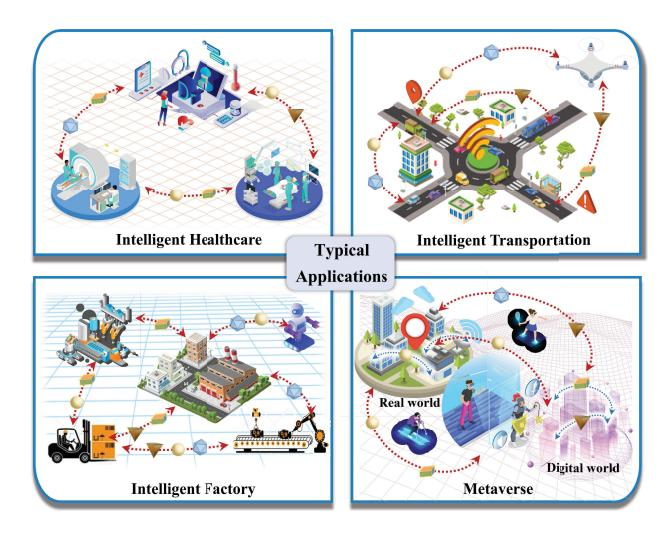

Fig. 10. Examples of new applications of intellicise wireless networks.

optimization problem is optimized to obtain the best rate allocation policy among the transmit tensors. Simulation results have illustrated the performance gain of the proposed scheme compared to other alternative bit allocation methods. Wang et al. [\[175\]](#page-32-25) proposed a JSCC scheme based on feature fusion to simultaneously serve the tasks of object recognition and semantic segmentation. In order to support the five tasks of sentiment analysis, visual question answering (VQA), image retrieval, image reconstruction, and text reconstruction, Zhang et al. [\[176\]](#page-32-26) adopted data domain adaptation method to extract the specific features of each task, and establish a unified multi-task SemCom framework to reduce inference latency, which is guaranteed via developing a multi-exit architecture to provide early-exit results for relatively simple tasks. Simulation results have shown that the proposed unified framework can significantly reduce the transmission overhead and also the model parameters, while achieving comparable performance to the task-oriented SemCom system designed for a specific task.

# *B. Intellicise Wireless Networks for New Applications*

As the network environment and application requirements continue to evolve, intellicise wireless networks play a pivotal role in new applications, as illustrated in Fig. [10.](#page-24-0)

*1) Intelligent Healthcare:* Traditional medical systems suffer from inefficiencies and encounter numerous challenges. The emergence of intelligent healthcare, which integrates AI and IoT sensor technology, has revolutionized medical services by increasing their intelligence and digitization. Fig. [11](#page-24-1) presents an example of intelligent healthcare, in which a health service system with SemCom is explored [\[177\]](#page-32-27). This intelligent system integrates diverse intelligent fabrics, multiple edge cloud servers, and a cloud server. From the transmission layer to the application layer, SemCom is introduced to improve the efficiency of information transmission by encoding raw health data into semantic information through DNNs, which can facilitate the establishment of an efficient and secure health service network.

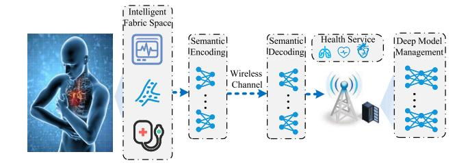

Fig. 11. An example of intelligent healthcare.

In this context, the intellicise wireless networks have significantly advanced the field of intelligent medicine. The smart IoT (SM-IoT) platform proposed in [\[178\]](#page-32-28) has demonstrated remarkable efficiency in collecting and integrating data from diverse sources using a flexible semantic network, thereby enhancing the overall effectiveness of healthcare services. Another notable solution discussed in [\[179\]](#page-32-29) is a healthcare collaboration framework that employs conceptual semantics to foster collaboration among professionals. Furthermore, [\[180\]](#page-32-30) introduced an aided diagnosis method based on domainspecific KBs extracted from Freebase Resource Description Framework (RDF) dumps, resulting in significantly improved diagnostic accuracy. Building upon these developments, [\[177\]](#page-32-27) proposed the Deep-SC framework, which harnesses the power of DL-powered SemCom to further enhance healthcare system performance. Notably, SemCom plays a pivotal role in facilitating swift and secure information sharing, seamless data integration, and intelligent healthcare across different medical systems, effectively addressing concerns related to security and privacy [\[178\]](#page-32-28).

As the landscape of intelligent healthcare continues to evolve, the demand for networks that can support the dynamic, complex nature of modern healthcare communications becomes increasingly apparent. Intellicise wireless networks are at the forefront of this transformation, heralding a new era of efficiency, security, and collaboration in intelligent healthcare.

*2) Intelligent Transportation:* In intelligent transportation, the intellicise wireless networks significantly enhance the efficiency and functionality of intelligent transportation systems [\[181\]](#page-32-31). It enables extracting semantic information, filtering out irrelevant details, and compressing data while preserving essential meaning. This enhances interoperability among transportation systems and improves data integration, security, and privacy. the intellicise wireless networks have found wide-ranging applications in intelligent transportation, including unmanned aerial vehicle (UAVs), Internet of Vehicles (IoV), and autonomous vehicles (AV).

As a central element in intelligent transportation, UAVs significantly benefit from intellicise SemCom functionality within intellicise wireless networks in terms of safety, efficiency, and effectiveness. Semantic segmentation aids UAV image analysis, identifying objects, and facilitating specific tasks [\[182\]](#page-32-32) [\[183\]](#page-32-33) [\[184\]](#page-32-34). Various NN frameworks, such as U-net based on conditional random field (CRF) [\[185\]](#page-32-35), U-net using FCN [\[186\]](#page-32-36), and enhanced encoder-decoder based CNN architecture (UVid-Net) [\[187\]](#page-32-37), have shown improvements in

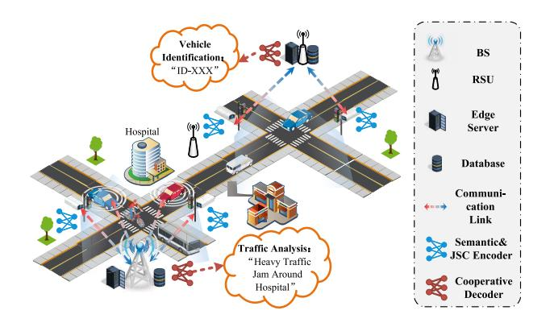

Fig. 12. An example of intelligent transportation.

semantic segmentation performance for UAVs. Besides, in the realm of the IoV, intellicise wireless networks with SemCom facilitate enhanced communication and collaboration between vehicles and road infrastructure. Fig. [12](#page-25-0) presents a collaborative SemCom architecture, which consists of multiple semantic encoders, a joint source-channel decoder, and task-related modules [\[188\]](#page-32-38). This architecture conveys essential semantics, reducing data traffic to address spectrum scarcity. In addition, as automotive technology advances, the autonomous driving becomes increasingly crucial, but extracting visual information and avoiding collisions pose significant challenges [\[189\]](#page-32-39). Semantic segmentation plays a vital role in assigning pixels to semantic classes, aiding AV in understanding complex features. A SemCom framework for a high altitude platform (HAP)-supported fully connected autonomous vehicle network reduces communication costs and improves scalability [\[190\]](#page-32-40).

In essence, intellicise wireless networks are foundational to realizing the full potential of intelligent transportation. They enhance the capacity of transportation systems to function more autonomously, safely, and efficiently by ensuring that communication across the network is meaningful, secure, and focused on essential information. As such, the integration of intellicise wireless networks into intelligent transportation is not just beneficial but essential for the evolution and optimization of transportation in the age of autonomy and connectivity.

*3) Industrial Internet of Things:* As the cornerstone of the fourth industrial revolution, the industrial Internet has been receiving much attention, which can improve production efficiency, reduce production costs and avoid wasting resources [\[191\]](#page-32-41), [\[192\]](#page-32-42). The integration of intellicise wireless networks within the industrial Internet framework brings advanced capabilities for managing complex scenarios such as machine fault diagnosis, manufacturing monitoring, and electric power resource management, as illustrated in Fig. [13.](#page-25-1) The data generated by sensors is analyzed through AI algorithms to optimize production and management processes. How to transmit data efficiently and reliably is an important problem to be solved in the industrial Internet domain.

Within this context, intellicise SemCom functionality within intellicise wireless networks offers a robust solution. The data involved in industrial processes are characterized by their realtime nature, voluminous size, low density, and heterogeneity of

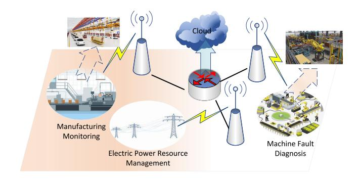

Fig. 13. Examples of industrial Internet scenario.

sources [\[191\]](#page-32-41), [\[192\]](#page-32-42). The intellicese wireless networks, being content-aware and task-oriented, is adept at extracting only the crucial, relevant information from the data deluge, thereby optimizing data delivery [\[193\]](#page-32-43).

In industrial settings, the intellicise wireless networks enhances communication system performance in both signal generation and transmission. For instance, by recognizing that data redundancy in SemCom is task-oriented, data can be compressed more effectively to suit specific downstream tasks, achieving higher compression ratios [\[193\]](#page-32-43). There have been promising developments in the integration of SemCom with the industrial Internet, such as the task-oriented multiuser SemCom systems and lite distributed SemCom systems designed for low-computing-capacity devices [\[121\]](#page-31-22). These advancements underline the vast potential of SemCom within intellicise wireless networks to revolutionize communication and control in industrial settings.

However, the research and application of intellicise wireless networks in the industry is still in their infancy. But one thing we do know for sure is that the intellicise wireless networks play an important role in realizing efficient communication and accurate control between different agents in the industrial Internet and have a wide range of research and application prospects.

*4) Metaverse:* The metaverse, as a digital space, aims to create immersive virtual worlds that seamlessly integrate with the physical world. Generally, the metaverse involves the exchange of massive data volumes, while traditional communication systems are approaching their limits, with limited spectrum resources available. Intellicise information transmission, which prioritizes understanding before transmission, allows users in the metaverse to transmit only the content of interest to the receiver, thereby reducing bandwidth pressure. For instance, in the virtual transportation network developed by the metaverse, SemCom can effectively support efficient communication and decision control of virtual vehicles by extracting and transmitting semantic information of perceived visual images of the physical environment [\[9\]](#page-29-8), [\[194\]](#page-32-44).

Moreover, the core of building the metaverse is the connection between the 'mind' and the environment. The 'mind' refers to the intelligent agent that can express human intentions in the virtual world, while the environment refers to the physical world's human-machine-material interconnection. Consequently, addressing the representation and decomposition of the mind and consciousness becomes a fundamental

and crucial task. Instead of prioritizing transmission before understanding, intellicise wireless networks necessitate shifting towards a semantic perspective, employing Seb to perform semantic representation and transmission effectively, and emphasizing understanding before transmission. By prioritizing semantic understanding, intellicise wireless networks offer a new approach to enhance network efficiency and support the development of this interconnection between the virtual world and the physical world.

Within the BIWN, intellicise wireless networks efficiently manage the interaction between visual information and 3D scene reconstruction, enabling simultaneous localization and mapping for acquiring 3D structures of unknown environments [\[195\]](#page-33-0). In the metaverse, achieving high synchronization and low latency is essential to provide users with a seamless and real-time experience. Intellicise SemCom ensures synchronization between the physical and virtual worlds, maintaining the same meaning of messages between sender and receiver. This reduces end-to-end latency, enabling real-time feedback and interaction for users, thereby enhancing their immersive service experience [\[196\]](#page-33-1), [\[197\]](#page-33-2).

#### VI. CHALLENGES AND BROADER PERSPECTIVES

Despite the promising prospect of intellicise wireless networks, some significant research challenges remain to be addressed. In this section, we present some of these research challenges, followed by a discussion on broader perspectives.

#### *A. Challenges*

*1) Scalability and Generalization:* Most existing works on SemCom are limited to a single transmitter-receiver pair and are tailored for specific tasks. This constraint poses a significant challenge for the practical deployment of SemCom in real-world wireless communication systems. The proposed intellicise SemCom aims to address this issue by significantly enhancing the scalability and generalization of current SemCom approaches.

On one hand, the intellicise SemCom framework should be sufficiently general to handle various types of source data and a range of transmission tasks. One potential solution involves leveraging advancements in multi-task machine learning, which share parameters across different tasks to enhance the generalizability of DL models [\[198\]](#page-33-3). Another promising approach is transfer learning, where knowledge acquired from one task is applied to a different but related task. By employing these methods, intellicise SemCom systems can seamlessly adapt to new tasks and source data with minimal modifications and updates.

On the other hand, scalability has always been a critical issue in communication architectures, and it has yet been well explored in the research of SemCom. The existing literature mostly considers an end-to-end framework with a given source and destination. However, in practice, network users communicate with different users at different time, which are with heterogeneous computing and communication resources. One potential method to enhance the scalability of intellicise SemCom could involve knowledge sharing, which assists different network users in identifying suitable models to fulfill their communication tasks.

*2) Security and Privacy:* Compared to current wireless networks, intellicise wireless networks present unique security challenges in transmitting semantic features as well as in the dynamic evolution of the systems. Eavesdropping can result in the leakage of transmitted semantic information and shared knowledge, while jammers can introduce incorrect information to disrupt the intellicise transmission process. Especially, intellicise SemCom is encoded and decoded separately by the transmitter and receiver based on the local SKBs to achieve accurate and fast delivery of semantic information. Inconsistent SKBs at the transmitting and receiving devices may cause the problem of the non-fidelity of transmitted information. The process of synchronizing and updating SKBs may result in the risk of private data leakage. Model performance can be degraded by attacking the model used in intellicise wireless networks. The most direct attack is to poison the data in intellicise SemCom's database and tamper with the original data [\[199\]](#page-33-4). Hu et al. in [\[49\]](#page-30-1) define adversarial samples of SemCom as intentional semantic noise signals inserted by a malicious attacker, which can lead to erroneous results of DL models on different tasks. The authors in [\[200\]](#page-33-5) investigate backdoor semantic attacks, which involve covertly embedding triggers within DL models. These triggers can cause the models to make incorrect judgments when the input contains them while still retaining a high level of overall task performance.

Given these unique characteristics of attackers in intellicise wireless networks, it is essential to address these challenges. Zhang et al. [\[201\]](#page-33-6) argued that an eavesdropper might recover part of the input sample information by intercepting semantic features during transmission. Hu et al. in [\[49\]](#page-30-1) suggested that introducing adversarial noise during the wireless channel phase can cause errors in the semantic features, resulting in decoding problems at the receiver. The potential for inference attack confidential data in semantic features transmitted through wireless channels is illustrated in [\[202\]](#page-33-7). Adversarial training is an effective defense strategy against adversarial attacks, which can effectively improve the robustness of the model [\[49\]](#page-30-1), [\[203\]](#page-33-8). Another common defense is encryption, [\[204\]](#page-33-9) and [\[205\]](#page-33-10) propose encryption and decryption methods for semantic communication systems to secure the transmitted semantic features. However, research on these security threats and their defense methods is still relatively limited, and there is a need to explore in-depth the means of attacking against the actual structure of intellicise wireless networks, identify the security vulnerabilities therein, and rapidly develop robust defense mechanisms to mitigate these risks effectively.

*3) Unified Framework for Evaluations:* To support the generalization of intellicise wireless networks, it is of great significance to establish a unified framework of performance evaluation, which serves as the basic scale across diverse algorithms under various scenarios. However, this problem remains unsolved and fraught with challenges due to the following reasons.

On the one hand, recent investigations have delved into numerous metrics that are often tailored to specific data modalities or tasks, as a result, such metrics lack generalizability w.r.t. various intellicise service bearing. The situation gets worse with the proliferation of diverse applications, where more metrics are introduced, such as for multi-modal and cross-modal data interaction. Note that state-of-the-art semantic-aware metrics vary significantly in their fundamental models, calculation frameworks, and methodologies, as discussed in Section [II-E.](#page-11-0) As a result, achieving uniformity across evaluation models remains an ongoing area of research. One possible solution is to extend the syntactic information theory to the semantic level, where the new tools such as fuzzy measurement as well as artificial general intelligence (AGI) models can be involved to quantify the distortion across modalities and tasks.

On the other hand, existing semantic-aware evaluation methods and metrics often overlook the intricacies of complexity constraints, necessitating further adaptations to suit the context of intellicise wireless networks. Envisioning the requirements of intellicise wireless networks, the evaluation framework is anticipated to address both communication efficiency and network complexity concurrently, while only a few of the present works try to propose new metrics for networks, yet still neglect the aspect of complexity. One possible way to fix the aforementioned problem is to introduce the measurement of systematic complexity such as systematic entropy into the evaluation metrics. However, how to calculate the systematic entropy for systems built with NNs remains an unresolved challenge.

*4) Autonomous and Real-Time Evolution:* The challenges of system evolution in intellicise wireless networks involve autonomous evolution and real-time evolution. The autonomous evolution in intelligent wireless networks can be categorized into the autonomous evolution of Seb and the autonomous evolution of model-based transmission. In general, Sebs contain numerous large-scale datasets and store sufficient information for expressing meaning, logic, and relationships. Therefore, updating and maintaining Sebs is an extremely time-consuming process, requiring considerable computing resources. Moreover, the evolution of Sebs is challenging due to their diversity, which highlights the necessity for autonomous, reactive, and proactive Sebs. The model-based transmission utilizes high-dimensional combinations of Sebs for adaptive communications. However, the variation in sources imposes great challenges to the NN models to be robust to the single-mode/multimodal data. Moreover, the importance of structured semantic features is unequally distributed, enabling the NN models to pay more attention to the semantic features with high importance and gradually develop an intelligent semantic filtering mechanism to drop off irrelative semantics by self-learning and self-evolution. Furthermore, the transmission waveform in closed environments exhibits weak adaptability to new communication goals and inferior generalization capabilities to dynamic transmission environments. To this end, autonomous intelligent waveform evolution is required during model-based transmission, hinging upon the intricate interaction between Sebs and an intelligent waveform model, as well as the autonomous update mechanism of the intelligent waveform model.

The inherent self-evolving nature of intellicise wireless networks enables the network to adapt to dynamic requirements and environments. As a result, network agents and components are envisioned to autonomously enhance themselves, which, however, potentially introduce extra delay due to the time required for network agents to reach consensus. Consequently, developing elastic intellicise wireless networks that can efficiently and robustly facilitate real-time evolution under diverse and dynamic conditions remains a significant challenge. One potential approach to address this challenge involves quantifying the disparity between the network and the dynamic requirements and environment using system theory. This quantification can serve as a guide for network evolution, enabling fewer iterations and facilitating the development of adaptive strategies that mitigate the effects of mismatch and ultimately enhance overall system performance timely.

# *B. Broader Perspectives*

*1) Theories of Intellicise Wireless Networks:* The intellicise wireless networks are built upon a foundation of multidisciplinary theories, including classical information theory, AI theory, system theory, and complex science theory. By analyzing information and networks from the perspectives of basic probability, fuzzy measurement, logical reasoning, and system organization, these networks aim to understand and communicate with meanings effectively. This approach involves discovering and intelligently constructing information and network primitives, which serve as the fundamental organizational units. Among them, the primitives are the basic organizational units of information and networks, and the primitives acquired, expressed, and organized based on AI methods are called intellicise primitives. The primitives at the traditional syntactic information level are bits, the information primitives at the meaning level are Seb, and the primitives at the system level are network primitives.

In intellicise wireless networks, semantic information has multiple modal carriers, and it is difficult to compare the information amount of semantic information of different source modals, so it requires a cross-modal calculation method. Besides, semantic information is task-oriented, and there is a need to solve the metric of task-related semantic information. Although the NN model adopts a data-driven approach and can fit some complex features of semantic information, the framework based on Bayesian probability inference cannot fully represent the essential features of semantic information. Especially in complex scenarios such as multi-modal semantic processing and mixed processing of syntax and semantic information, further refinement of the theoretical framework of how to quantitatively analyze semantic information is needed.

Moreover, intellicise SemCom should also establish a robust theoretical foundation in terms of semantic distortion-free compression, semantic channel capacity, semantic distortionlimited coding, and multi-user intellicise SemCom, so as to guide the optimal design of communication systems and promote the real implementation of intellicise SemCom technology. For source coding, possible solutions currently include: utilizing NNs for feature extraction from the information source, assisting in the construction of synonym sets; leveraging the characteristics of different information sources (such as synonyms and synonymous sentences in textual sources) to selectively construct synonym sets for semantic source coding; obtaining synonym or near-synonym intervals through manual scoring for different distributions of information sources to facilitate semantic source coding, etc. For channel coding, possible solutions currently include: using NNs to learn and categorize the error codewords generated during decoding for certain mature channel codes (such as LDPC codes or polar codes), making them synonymous with correct codewords to gain additional gains; guiding the construction of the codebook for channel coding through the design of synonymous codewords; fitting the optimal channel coding scheme under different channel conditions using NNs, etc.

- *2) Convergence of Intellicise Wireless Networks and Existing Networks:* Intellicise wireless networks have shown great potential in agilely constructing user-centric and scenario-specific service by introducing several new modules and techniques that discussed in Section [III.](#page-13-0) However, most of current researches neglect the impact of network protocol, and the integration of intellicise wireless networks and current systems is one of the interesting open problems that need to be investigated in the future. The convergence between intellicise wireless networks and existing networks is expected to achieve from two perspectives.
  - *The Convergence Method under Structural Constraints:* Under the current structural constraints of the protocol stack, existing syntactic networks can support intellicise wireless networks by incorporating semantic-aware processing modules. Semantic information flows topdown and is sequentially processed within the protocol stack. Specific modules for extracting and recovering semantic information are integrated into the physical and application layers, while the application layer builds SKB at the transceiver to enhance semantic information parsing. The link layer enables end-to-end routing for semantic transmissions, necessitating the integration of new semantic automatic repeat request (ARQ) for overall error correction capability. Extending the functionality of each layer allows existing syntactic networks to effectively support intellicise wireless networks while maintaining the original protocol stack structure.
  - *The Convergence Method under Functional Constraints:* Different from syntactic networks, intellicise wireless networks achieve promising performance through the joint design of modules (e.g., intellicise network organization, intellicise information transmission, etc.). However, the joint design is incompatible with the current protocol stack. To meet the functional requirements of

- intellicise wireless networks and reform the protocol stack, protocol layers can be integrated under functional constraints by introducing AI technologies in each layer to reconstruct network functionalities. As a result, the potentials for the optimization of intellicise wireless networks can be further unleashed, serving the stringent communication requirements of users.
- *The Optimization Criteria of Protocol Stack:* Current networks focus on bit-level transmission and are evaluated with syntactic metrics, such as BER, while intellicise wireless networks tries to minimize distortion in terms of semantics as well as the performance of intelligent tasks. Therefore, the existing optimization criteria cannot be directly applied to intellicise wireless networks, further bringing challenges to the convergence of the two systems. As a result, how to model the above constraints (e.g., structural and functional constraints) and optimize the networks considering brand-new criteria is also worth studying in the future.

# VII. CONCLUSION

In this paper, we presented a comprehensive overview of SemCom and provided insights into the development and implementation of intellicise wireless networks. We first reviewed previous work on SemCom. Then, we discussed the definitions of intellicise wireless networks and proposed a general framework of intellicise wireless networks, including BIWN, intellicise signal processing, intellicise information transmission, intellicise network organization, and intellicise service bearing. Enabling technologies and driving factors for implementing intellicise wireless networks are also discussed, along with potential application prospects. Finally, we summarized several open challenges for implementing intellicise wireless networks and presented broader perspectives to inspire further research and advancement in the field of intellicise wireless networks.

#### ACKNOWLEDGMENT

Ping Zhang, Wenjun Xu, Kai Niu, and Xiaodong Xu are with the State Key Laboratory of Network and Switching Technology, Beijing University of Posts and Telecommunications, Beijing 100876, China, and also with the Department of Broadband Communication, Peng Cheng Laboratory, Shenzhen 518066, China (e-mail: wjxu@bupt.edu.cn; niukai@bupt.edu.cn; xuxiaodong@bupt.edu.cn).

Yiming Liu, Xiaoqi Qin, Yue Meng, Chen Dong, and Shujun Han are with the State Key Laboratory of Network and Switching Technology, Beijing University of Posts and Telecommunications, Beijing 100876, China.

Shuguang Cui is with the School of Science and Engineering, the Shenzhen Future Network of Intelligence Institute, and the Guangdong Provincial Key Laboratory of Future Networks of Intelligence, The Chinese University of Hong Kong (Shenzhen), Shenzhen 518172, China, and also with the Department of Broadband Communication, Peng Cheng Laboratory, Shenzhen 518000, China (e-mail: shuguangcui@cuhk.edu.cn).

Guangming Shi and Yaping Sun are with Department of Broadband Communication, Peng Cheng Laboratory, Shenzhen 518066, China (e-mail: gmshi@xidian.edu.cn; sunyp@pcl.ac.cn).

Zhijin Qin is with the Department of Electronic Engineering and the Beijing National Research Center for Information Science and Technology, Tsinghua University, Beijing 100084, China, and also with the State Key Laboratory of Space Network and Communications, Beijing 100876, China (e-mail: qinzhijin@tsinghua.edu.cn).

Fengyu Wang is with the School of Artificial Intelligence, Beijing University of Posts and Telecommunications, Beijing 100876, China.

Jincheng Dai is with the Key Laboratory of Universal Wireless Communications, Ministry of Education, Beijing University of Posts and Telecommunications, Beijing 100876, China.

Qianqian Yang is with the College of Information Science and Electronic Engineering, Zhejiang University, Hangzhou 310007, China.

Dahua Gao is with the School of Artificial Intelligence, Xidian University, Xi'an 710071, China, and also with Pazhou Lab, Guangzhou 510555, China.

Hui Gao is with the Key Laboratory of Trustworthy Distributed Computing and Service, Ministry of Education, Beijing University of Posts and Telecommunications, Beijing 100876, China.

Xiaodan Song is with the Guangzhou Institute of Technology, Xidian University, Guangzhou 510555, China.

# REFERENCES

- [\[1\]](#page-0-0) S. E. Trevlakis, N. Pappas, and A.-A. A. Boulogeorgos, "Toward natively intelligent semantic communications and networking," *IEEE Open J. Commun. Soc.*, vol. 5, pp. 1486–1503, 2024.
- [\[2\]](#page-0-1) P. Zhang, J. Zhang, and Q. Qi, "Ubiquitous-X: Constructing the future 6G networks," *Scientia Sinica Informationis*, vol. 50, no. 6, pp. 913–930, 2020.
- [\[3\]](#page-0-2) S. Iyer et al., "A survey on semantic communications for intelligent wireless networks," *Wireless Pers. Commun.*, vol. 129, no. 1, pp. 569–611, 2023.
- [\[4\]](#page-0-3) K. B. Letaief, W. Chen, Y. Shi, J. Zhang, and Y.-J. A. Zhang, "The roadmap to 6G: AI empowered wireless networks," *IEEE Commun. Mag.*, vol. 57, no. 8, pp. 84–90, Aug. 2019.
- [\[5\]](#page-0-4) P. Zhang et al., "Theory and techniques for "intellicise" wireless networks," *Front. Inf. Technol. Electron. Eng.*, vol. 23, no. 1, pp. 1–4, 2022.
- [\[6\]](#page-0-5) P. Zhang et al., "Toward wisdom-evolutionary and primitiveconcise 6G: A new paradigm of semantic communication networks," *Engineering*, vol. 8, no. 1, pp. 60–73, Jan. 2022.
- [\[7\]](#page-1-0) Q. Lan et al., "What is semantic communication? A view on conveying meaning in the era of machine intelligence," *J. Commun. Inf. Netw.*, vol. 6, no. 4, pp. 336–371, 2021.
- [\[8\]](#page-1-1) X. Luo, H.-H. Chen, and Q. Guo, "Semantic communications: Overview, open issues, and future research directions," *IEEE Wireless Commun.*, vol. 29, no. 1, pp. 210–219, Feb. 2022.
- [\[9\]](#page-1-2) W. Yang et al., "Semantic communications for future Internet: Fundamentals, applications, and challenges," *IEEE Commun. Surveys Tuts.*, vol. 25, no. 1, pp. 213–250, 1st Quart., 2023.
- [10] Z. Lu et al., "Semantics-empowered communications: A tutorial-cumsurvey," *IEEE Commun. Surveys Tuts.*, vol. 26, no. 1, pp. 41–79, 1st Quart., 2024.
- [\[11\]](#page-1-3) S. Hu, X. Chen, W. Ni, E. Hossain, and X. Wang, "Distributed machine learning for wireless communication networks: Techniques, architectures, and applications," *IEEE Commun. Surveys Tuts.*, vol. 23, no. 3, pp. 1458–1493, 3rd Quart., 2021.
- [\[12\]](#page-1-4) A. Q. Mohammad et al., "Edge-native intelligence for 6G communications driven by federated learning: A survey of trends and challenges," *IEEE Trans. Emerg. Topics Comput. Intell.*, vol. 7, no. 3, pp. 957–979, Jun. 2023.
- [\[13\]](#page-1-5) M. Chen, U. Challita, W. Saad, C. Yin, and M. Debbah, "Artificial neural networks-based machine learning for wireless networks: A tutorial," *IEEE Commun. Surveys Tuts.*, vol. 21, no. 4, pp. 3039–3071, 4th Quart., 2019.
- [\[14\]](#page-1-6) C. Zhang, P. Patras, and H. Haddadi, "Deep learning in mobile and wireless networking: A survey," *IEEE Commun. Surveys Tuts.*, vol. 21, no. 3, pp. 2224–2287, 3rd Quart., 2019.
- [\[15\]](#page-1-7) P. Zhang, X. Xu, C. Dong, S. Han, and B. Wang, "Intellicise communication system: Model-driven semantic communications," *J. China Univ. Posts Telecommun.*, vol. 29, no. 1, pp. 2–12, 2022.
- [\[16\]](#page-1-8) Y. Lu, "Artificial intelligence: A survey on evolution, models, applications and future trends," *J. Manage. Anal.*, vol. 6, no. 1, pp. 1–29, 2019.
- [\[17\]](#page-2-1) H. Wang et al., "Scientific discovery in the age of artificial intelligence," *Nature*, vol. 620, no. 7972, pp. 47–60, 2023.
- [\[18\]](#page-2-1) P. Zhang, W. Xu, F. Wang, K. Niu, and X. Xu, "Intellicise air-spaceground integrated networks," *Radio Commun. Technol.*, vol. 48, no. 3, pp. 381–384, 2022.
- [\[19\]](#page-3-1) K. Niu et al., "A paradigm shift toward semantic communications," *IEEE Commun. Mag.*, vol. 60, no. 11, pp. 113–119, Nov. 2022.

- [\[20\]](#page-5-2) R. Carnap and Y. Bar-Hillel, "An outline of a theory of semantic information," Res. Lab. Electron., Massachusetts Inst. Technol., Cambridge, MA, USA, Rep. 247, 1952.
- [\[21\]](#page-5-3) J. Bao et al., "Towards a theory of semantic communication," in *Proc. IEEE Int. Netw. Sci. Workshop (NSW)*, 2011, pp. 110–117.
- [\[22\]](#page-5-4) D. L. Aldo and T. Settimo, "Entropy of L-fuzzy sets," *Inf. Control*, vol. 24, no. 1, pp. 55–73, 1974.
- [\[23\]](#page-5-5) A. De Luca and S. Termini, "A definition of a nonprobabilistic entropy in the setting of fuzzy sets theory," in *Readings in Fuzzy Sets for Intelligent Systems*. Amsterdam, The Netherlands: Elsevier, 1993, pp. 197–202.
- [\[24\]](#page-5-6) W. Wu, "Generalized information source and generalized entropy," *J. Beijing Univ. Posts Telecommun.*, vol. 5, no. 1, pp. 29–41, 1982.
- [\[25\]](#page-5-7) M. Li and P. Vitányi, *An Introduction to Kolmogorov Complexity and its Applications*, vol. 3. New York, NY, USA: Springer, 2008.
- [\[26\]](#page-5-8) J. C. Principe, *Information Theoretic Learning: Renyi's Entropy and Kernel Perspectives*. New York, NY, USA: Springer, 2010.
- [\[27\]](#page-6-1) C. E. Shannon, "A mathematical theory of communication," *Bell Syst. Tech. J.*, vol. 27, no. 3, pp. 379–423, 1948.
- [\[28\]](#page-5-9) E. Bourtsoulatze, D. B. Kurka, and D. Gündüz, "Deep joint sourcechannel coding for wireless image transmission," *IEEE Trans. Cogn. Commun. Netw.*, vol. 5, no. 3, pp. 567–579, May 2019.
- [\[29\]](#page-5-4) E. Beck, C. Bockelmann, and A. Dekorsy, "Semantic communication: An information bottleneck view," 2022, *arXiv:2204.13366*.
- [\[30\]](#page-5-10) L. Floridi, "Outline of a theory of strongly semantic information," *Minds Mach.*, vol. 14, no. 2, pp. 197–221, 2004.
- [\[31\]](#page-5-11) L. Floridi, "Philosophical conceptions of information," in *Formal Theories of Information: From Shannon to Semantic Information Theory and General Concepts of Information*. Heidelberg, Germany: Springer, 2009, pp. 13–53.
- [\[32\]](#page-5-11) J. Barwise and J. Seligman, *Information Flow: The Logic of Distributed Systems*. Cambridge, MA, USA: Cambridge Univ. Press, 1997.
- [\[33\]](#page-5-12) Y. Zhong, *Principles of Information Science*, vol. 2. Beijing, China: Beijing Univ. Posts Telecommun. Press, 2002.
- [\[34\]](#page-5-13) L. A. Zadeh, "Probability measures of fuzzy events," *J. Math. Anal. Appl.*, vol. 23, no. 2, pp. 421–427, 1968.
- [\[35\]](#page-5-14) X. Liu, W. Jia, W. Liu, and W. Pedrycz, "AFSSE: An interpretable classifier with axiomatic fuzzy set and semantic entropy," *IEEE Trans. Fuzzy Syst.*, vol. 28, no. 11, pp. 2825–2840, Nov. 2020.
- [\[36\]](#page-5-15) H. Xie, Z. Qin, G. Y. Li, and B.-H. Juang, "Deep learning enabled semantic communication systems," *IEEE Trans. Signal Process.*, vol. 69, pp. 2663–2675, Apr. 2021.
- [\[37\]](#page-6-2) Y. Blau and T. Michaeli, "Rethinking lossy compression: The ratedistortion-perception tradeoff," in *Proc. Int. Conf. Mach. Learn. (ICML)*, 2019, pp. 675–685.
- [\[38\]](#page-6-3) R. Zhang, P. Isola, A. A. Efros, E. Shechtman, and O. Wang, "The unreasonable effectiveness of deep features as a perceptual metric," in *Proc. IEEE Conf. Comput. Vis. Pattern Recognit. (CVPR)*, 2018, pp. 586–595.
- [\[39\]](#page-6-3) Y. Shao, Q. Cao, and D. Gunduz, "A theory of semantic communication," 2022, *arXiv:2212.01485*.
- [\[40\]](#page-6-4) Y. Sun, H. Chen, X. Xu, P. Zhang, and S. Cui, "zero-shot multi-level feature transmission policy powered by semantic knowledge base," 2023, *arXiv:2305.12619*.
- [\[41\]](#page-7-1) F. Zhou, Y. Li, X. Zhang, Q. Wu, X. Lei, and R. Q. Hu, "Cognitive semantic communication systems driven by knowledge graph," in *Proc. IEEE Int. Conf. Commun. (ICC)*, 2022, pp. 4860–4865.
- [\[42\]](#page-7-2) S. Jiang et al., "Reliable semantic communication system enabled by knowledge graph," *Entropy*, vol. 24, no. 6, p. 846, 2022.
- [\[43\]](#page-7-3) X. Xu et al., "Knowledge-enhanced semantic communication system with OFDM transmissions," *Sci. China Inf. Sci*, vol. 66, Jun. 2023, Art. no. 172302.
- [\[44\]](#page-7-4) Y. Che, H. Xiong, S. Han, and X. Xu, "Cache-enabled knowledge base construction strategy in semantic communications," in *Proc. IEEE Glob. Commun. Conf. Workshops (GC Wkshps)*, 2022, pp. 1507–1512.
- [\[45\]](#page-7-5) G. Shi et al., "A new communication paradigm: From bit accuracy to semantic fidelity," 2021, *arXiv:2101.12649*.
- [\[46\]](#page-7-6) Y. Xiao, Z. Sun, G. Shi, and D. Niyato, "Imitation learning-based implicit semantic-aware communication networks: Multi-layer representation and collaborative reasoning," *IEEE J. Sel. Areas Commun*, vol. 41, no. 3, pp. 639–658, Mar. 2023.
- [\[47\]](#page-7-7) H. Zhang, S. Shao, M. Tao, X. Bi, and K. B. Letaief, "Deep learning-enabled semantic communication systems with task-unaware transmitter and dynamic data," *IEEE J. Sel. Areas Commun*, vol. 41, no. 1, pp. 170–185, Jan. 2023.

- [\[48\]](#page-7-8) E. Kodirov, T. Xiang, and S. Gong, "Semantic autoencoder for zeroshot learning," in *Proc. IEEE Conf. Comput. Vis. Pattern Recognit. (CVPR)*, 2017, pp. 3174–3183.
- [\[49\]](#page-8-0) Q. Hu, G. Zhang, Z. Qin, Y. Cai, G. Yu, and G. Y. Li, "Robust semantic communications with masked VQ-VAE enabled codebook," *IEEE Trans. Wireless Commun.*, vol. 22, no. 12, pp. 8707–8722, Dec. 2023.
- [\[50\]](#page-8-1) O. Esrafilian, R. Gangula, and D. Gesbert, "3D-map assisted UAV trajectory design under cellular connectivity constraints," in *Proc. IEEE Int. Conf. Commun. (ICC)*, 2020, pp. 1–6.
- [\[51\]](#page-8-2) S. Bi, J. Lyu, Z. Ding, and R. Zhang, "Engineering radio maps for wireless resource management," *IEEE Wireless Commun.*, vol. 26, no. 2, pp. 133–141, Apr. 2019.
- [\[52\]](#page-8-3) J. Chen, U. Yatnalli, and D. Gesbert, "Learning radio maps for UAVaided wireless networks: A segmented regression approach," in *Proc. IEEE Int. Conf. Commun. (ICC)*, 2017, pp. 1–6.
- [\[53\]](#page-8-3) E. Dall'Anese, S.-J. Kim, and G. B. Giannakis, "Channel gain map tracking via distributed kriging," *IEEE Trans. Veh. Technol.*, vol. 60, no. 3, pp. 1205–1211, Mar. 2011.
- [\[54\]](#page-8-4) D. Wu, Y. Zeng, S. Jin, and R. Zhang, "Environment-aware and training-free beam alignment for mmWave massive MIMO via channel knowledge map," in *Proc. IEEE Int. Conf. Commun. Workshops (ICC Workshops)*, 2021, pp. 1–7.
- [\[55\]](#page-8-5) V. Va, J. Choi, T. Shimizu, G. Bansal, and R. W. Heath, "Inverse multipath fingerprinting for millimeter wave V2I beam alignment," *IEEE Trans. Veh. Technol.*, vol. 67, no. 5, pp. 4042–4058, May 2018.
- [\[56\]](#page-8-6) Y. Sun, J. Zhang, L. Yu, Z. Zhang, and P. Zhang, "How to define the propagation environment semantics and its application in scattererbased beam prediction," *IEEE Wireless Commun. Lett.*, vol. 12, no. 4, pp. 649–653, Apr. 2023.
- [\[57\]](#page-8-7) Y. Yang et al., "Semantic communications with AI tasks," 2021, *arXiv:2109.14170*.
- [\[58\]](#page-8-8) D. G. Lowe, "Distinctive image features from scale-invariant Keypoints," *Int. J. Comput. Vis.*, vol. 60, no. 2, pp. 91–110, Nov. 2004.
- [\[59\]](#page-9-1) D. Crandall, P. Felzenszwalb, and D. Huttenlocher, "Spatial priors for part-based recognition using statistical models," in *Proc. IEEE Conf. Comput. Vis. Pattern Recognit. (CVPR)*, vol. 1, 2005, pp. 10–17.
- [\[60\]](#page-9-2) Y. LeCun, Y. Bengio, and G. Hinton, "Deep learning," *Nature*, vol. 521, no. 7553, pp. 436–444, May. 2015.
- [\[61\]](#page-9-3) S. Hochreiter and J. Schmidhuber, "Long short-term memory," *Neural Comput.*, vol. 9, no. 8, pp. 1735–1780, Nov. 1997.
- [\[62\]](#page-9-4) A. Vaswani et al., "Attention is all you need," in *Proc. Adv. Neural Inf. Proc. Syst.*, vol. 30, 2017, pp. 6000–6010.
- [\[63\]](#page-9-5) M. Bucher, S. Herbin, and F. Jurie, "Semantic bottleneck for computer vision tasks," in *Proc. Asian Conf. Comput. Vis.*, 2018, pp. 695–712.
- [\[64\]](#page-9-6) M. Losch, M. Fritz, and B. Schiele, "Interpretability beyond classification output: Semantic bottleneck networks," 2019, *arXiv:1907.10882*.
- [\[65\]](#page-9-6) J. Snell, K. Swersky, and R. Zemel, "Prototypical networks for fewshot learning," in *Proc. 31st Adv. Neural Inf. Proc. Syst.*, vol. 30, 2017, pp. 4080–4090.
- [\[66\]](#page-9-7) Z. Ji, X. Zou, X. Liu, T. Huang, Y. Mi, and S. Wu, "Neural information processing in hierarchical prototypical networks," in *Proc. Int. Conf. Neural Inf.*, 2018, pp. 603–611.
- [\[67\]](#page-9-7) H.-M. Yang, X.-Y. Zhang, F. Yin, Q. Yang, and C.-L. Liu, "Convolutional prototype network for open set recognition," *IEEE Trans. Pattern Anal. Mach. Intell.*, vol. 44, no. 5, pp. 2358–2370, May 2022.
- [\[68\]](#page-9-7) A. Hogan et al., "Knowledge graphs," *ACM Comput. Surveys*, vol. 54, no. 4, pp. 1–37, Jun. 2021.
- [\[69\]](#page-9-8) G. Shi, D. Gao, S. Ma, M. Yang, Y. Xiao, and X. Xie, "Mathematical characterization of signal semantics and rethinking of the mathematical theory of information," 2023, *arXiv:2303.14701*.
- [\[70\]](#page-9-9) B. Juba and M. Sudan, "Universal semantic communication I," in *Proc. 14th Annu. ACM Symp. Theory Comput.*, 2008, pp. 123–132.
- [\[71\]](#page-9-10) B. Güler, A. Yener, and A. Swami, "The semantic communication game," *IEEE Trans. Cogn. Commun. Netw.*, vol. 4, no. 4, pp. 787–802, Dec. 2018.
- [\[72\]](#page-9-11) T. O' shea and J. Hoydis, "An introduction to deep learning for the physical layer," *IEEE Trans. Cogn. Commun. Netw.*, vol. 3, no. 4, pp. 563–575, Dec. 2017.
- [\[73\]](#page-9-12) S. Dörner, S. Cammerer, J. Hoydis, and S. Ten Brink, "Deep learning based communication over the air," *IEEE J. Sel. Top Signal Process.*, vol. 12, no. 1, pp. 132–143, Dec. 2017.

- [\[74\]](#page-9-13) H. Ye, L. Liang, G. Y. Li, and B.-H. Juang, "Deep learning-based end-to-end wireless communication systems with conditional GANs as unknown channels," *IEEE Trans. Wireless Commun.*, vol. 19, no. 5, pp. 3133–3143, May 2020.
- [\[75\]](#page-9-14) Z. Weng and Z. Qin, "Semantic communication systems for speech transmission," *IEEE J. Sel. Areas Commun.*, vol. 39, no. 8, pp. 2434–2444, Aug. 2021.
- [\[76\]](#page-10-1) H. Yoo, T. Jung, L. Dai, S. Kim, and C.-B. Chae, "Real-time semantic communications with a vision transformer," 2022, *arXiv:2205.03886*.
- [\[77\]](#page-10-2) J. Li, C. Jia, X. Zhang, S. Ma, and W. Gao, "Cross modal compression: Towards human-comprehensible semantic compression," in *Proc. 29th ACM Int. Conf. Multimedia (ACM MM)*, 2021, pp. 4230–4238.
- [\[78\]](#page-10-3) D. Huang, X. Tao, F. Gao, and J. Lu, "Deep learning-based image semantic coding for semantic communications," in *Proc. IEEE Glob. Commun. Conf. (GLOBECOM)*, 2021, pp. 1–6.
- [\[79\]](#page-10-4) Z. Wu, S. Pan, F. Chen, G. Long, C. Zhang, and P. S. Yu, "A comprehensive survey on graph neural networks," *IEEE Trans. Neural Netw. Learn. Syst.*, vol. 32, no. 1, pp. 4–24, Jan. 2021.
- [\[80\]](#page-10-5) P. Velickovi ˇ c, G. Cucurull, A. Casanova, A. Romero, P. Lio, and ´ Y. Bengio, "Graph attention networks," 2017, *arXiv:1710.10903*.
- [\[81\]](#page-10-6) K. Xu, W. Hu, J. Leskovec, and S. Jegelka, "How powerful are graph neural networks?" 2018, *arXiv:1810.00826*.
- [\[82\]](#page-10-7) T. N. Kipf and M. Welling, "Variational graph auto-encoders," 2016, *arXiv:1611.07308*.
- [\[83\]](#page-10-8) J. Lee, I. Lee, and J. Kang, "Self-attention graph pooling," in *Proc. Int. Conf. Mach. Learn. (ICML)*, 2019, pp. 3734–3743.
- [\[84\]](#page-10-9) H. Gao and S. Ji, "Graph U-Nets," in *Proc. Int. Conf. Mach. Learn. (ICML)*, 2019, pp. 2083–2092.
- [\[85\]](#page-10-10) Y. Ge, Y. Pang, L. Li, and L. Itti, "Graph autoencoder for graph compression and representation learning," in *Proc. Int. Conf. Learn. Represent. (ICLR)*, 2021, pp. 1–9.
- [\[86\]](#page-10-11) L. Yan, Z. Qin, R. Zhang, Y. Li, and G. Y. Li, "Resource allocation for text semantic communications," *IEEE Wireless Commun. Lett.*, vol. 11, no. 7, pp. 1394–1398, Jul. 2022.
- [\[87\]](#page-11-1) C. Liu, C. Guo, Y. Yang, and J. Chen, "Bandwidth and power allocation for task-oriented semanticcommunication," 2022, *arXiv:2201.10795*.
- [\[88\]](#page-11-2) L. Yan, Z. Qin, R. Zhang, Y. Li, and G. Ye Li, "QoE-aware resource allocation for semantic communication networks," in *Proc. IEEE Glob. Commun. Conf. (GLOBECOM)*, 2022, pp. 3272–3277.
- [\[89\]](#page-11-3) H. Zhang, H. Wang, Y. Li, K. Long, and A. Nallanathan, "DRL-driven dynamic resource allocation for task-oriented semantic communication," *IEEE Trans. Commun.*, vol. 71, no. 7, pp. 3992–4004, May 2023.
- [\[90\]](#page-11-4) K. Papineni, S. Roukos, T. Ward, and W.-J. Zhu, "BLEU: A method for automatic evaluation of machine translation," in *Proc. Annu. Meet. Assoc. Comput Linguist. (ACL)*, Philadelphia, PA, USA, 2002, pp. 311–318.
- [\[91\]](#page-12-1) R. Vedantam, C. Lawrence Zitnick, and D. Parikh, "CIDEr: Consensusbased image description evaluation," in *Proc. IEEE Conf. Comput. Vis. Pattern Recognit. (CVPR)*, 2015, pp. 4566–4575.
- [\[92\]](#page-12-2) E. Vincent, R. Gribonval, and C. Fevotte, "Performance measurement in blind audio source separation," *IEEE Trans. Audio, Speech, Lang. Process.*, vol. 14, no. 4, pp. 1462–1469, Jul. 2006.
- [\[93\]](#page-12-3) A. W. Rix, J. G. Beerends, M. P. Hollier, and A. P. Hekstra, "Perceptual evaluation of speech quality (PESQ)-a new method for speech quality assessment of telephone networks and codecs," in *Proc. IEEE Int. Conf. Acoust. Speech Signal Process. (ICASSP)*, vol. 2, 2001, pp. 749–752.
- [\[94\]](#page-12-4) C. H. Taal, R. C. Hendriks, R. Heusdens, and J. Jensen, "An algorithm for intelligibility prediction of time–frequency weighted noisy speech," *IEEE Trans. Audio Speech Lang. Process.*, vol. 19, no. 7, pp. 2125–2136, Sep. 2011.
- [\[95\]](#page-12-5) F. Ribeiro, D. Florêncio, C. Zhang, and M. Seltzer, "CROWDMOS: An approach for crowdsourcing mean opinion score studies," in *Proc. IEEE Int. Conf. Acoust. Speech Signal Process. (ICASSP)*, 2011, pp. 2416–2419.
- [\[96\]](#page-12-6) T. Han, Q. Yang, Z. Shi, S. He, and Z. Zhang, "Semantic-preserved communication system for highly efficient speech transmission," *IEEE J. Sel. Areas Commun.*, vol. 41, no. 1, pp. 245–259, Nov. 2022.
- [97] Z. Wang, A. C. Bovik, H. R. Sheikh, and E. P. Simoncelli, "Image quality assessment: From error visibility to structural similarity," *IEEE Trans. Image Process.*, vol. 13, pp. 600–612, 2004.
- [\[98\]](#page-12-7) Z. Wang, E. P. Simoncelli, and A. C. Bovik, "Multiscale structural similarity for image quality assessment," in *Proc. 37th Asilomar Conf. Signals, Syst. Comput. (ACSSC)*, vol. 2, 2003, pp. 1398–1402.

- [\[99\]](#page-12-8) M. Cheon, S.-J. Yoon, B. Kang, and J. Lee, "Perceptual image quality assessment with transformers," in *Proc. IEEE Conf. Comput. Vis. Pattern Recognit. (CVPR)*, 2021, pp. 433–442.
- [\[100\]](#page-13-1) S. Kaul, M. Gruteser, V. Rai, and J. Kenney, "Minimizing age of information in vehicular networks," in *Proc. 8th Annu. IEEE Commun. Soc. Conf. Sens., Mesh Ad Hoc Commun. Netw. (AECON)*, 2011, pp. 350–358.
- [\[101\]](#page-13-2) M. Kountouris and N. Pappas, "Semantics-empowered communication for networked intelligent systems," *IEEE Commun. Mag.*, vol. 59, no. 6, pp. 96–102, Jun. 2021.
- [\[102\]](#page-13-3) R. A. Howard, "Information value theory," *IEEE Trans. Syst. Sci. Cybern.*, vol. 2, no. 1, pp. 22–26, Aug. 1966.
- [\[103\]](#page-13-4) J. Dai et al., "Nonlinear transform source-channel coding for semantic communications," *IEEE J. Sel. Areas Commun.*, vol. 40, no. 8, pp. 2300–2316, Aug. 2022.
- [\[104\]](#page-13-5) J. Shao, Y. Mao, and J. Zhang, "Learning task-oriented communication for edge inference: An information bottleneck approach," *IEEE J. Sel. Areas Commun.*, vol. 40, no. 1, pp. 197–211, Jan. 2022.
- [\[105\]](#page-13-6) C. De Alwis et al., "Survey on 6G frontiers: Trends, applications, requirements, technologies and future research," *IEEE Open J. Commun. Soc.*, vol. 2, pp. 836–886, 2021.
- [\[106\]](#page-15-0) M. M. Azari, S. Solanki, S. Chatzinotas, and M. Bennis, "THz-empowered UAVs in 6G: Opportunities, challenges, and tradeoffs," *IEEE Commun. Mag.*, vol. 60, no. 5, pp. 24–30, May 2022.
- [\[107\]](#page-15-1) J. Jeon et al., "MIMO evolution toward 6G: Modular massive MIMO in low-frequency bands," *IEEE Commun. Mag.*, vol. 59, no. 11, pp. 52–58, Nov. 2021.
- [\[108\]](#page-15-2) M. Vaezi et al., "Cellular, wide-area, and non-terrestrial IoT: A survey on 5G advances and the road toward 6G," *IEEE Commun. Surveys Tuts.*, vol. 24, no. 2, pp. 1117–1174, 2nd Quart., 2022.
- [\[109\]](#page-15-3) B. R. Gaines, "Stochastic computing systems," in *Advances in Information Systems Science*, vol. 2, Boston, MA, USA: Springer, 1969, pp. 37–172.
- [\[110\]](#page-15-4) J. Chen, J. Hu, and G. E. Sobelman, "Stochastic MIMO detector based on the Markov chain monte carlo algorithm," *IEEE Trans. Signal Process.*, vol. 62, no. 6, pp. 1454–1463, Mar. 2014.
- [\[111\]](#page-15-5) K. Han, J. Hu, J. Chen, and H. Lu, "A low complexity sparse code multiple access detector based on stochastic computing," *IEEE Trans. Circuits Syst. I, Reg. Papers*, vol. 65, no. 2, pp. 769–782, Feb. 2018.
- [\[112\]](#page-15-6) K. Han, J. Wang, W. J. Gross, and J. Hu, "Stochastic bit-wise iterative decoding of polar codes," *IEEE Trans. Signal Process.*, vol. 67, no. 5, pp. 1138–1151, Mar. 2019.
- [\[113\]](#page-15-7) S. Hu, K. Han, Y. Zhu, G. Shen, F. Wang, and J. Hu, "High throughput and hardware efficient hybrid LDPC decoder using bit-serial stochastic updating," *IEEE Trans. Circuits Syst. I, Reg. Papers*, vol. 70, no. 9, pp. 3653–3664, Sep. 2023.
- [\[114\]](#page-15-8) S. Liu, W. J. Gross, and J. Han, "Introduction to dynamic stochastic computing," *IEEE Circuits Syst. Mag.*, vol. 20, no. 3, pp. 19–33, 3rd Quart., 2020.
- [\[115\]](#page-15-9) S. Lu and W. Shi, "The emergence of vehicle computing," *IEEE Internet Comput.*, vol. 25, no. 3, pp. 18–22, May/Jun. 2021.
- [\[116\]](#page-15-10) P. Zhang et al., "Model division multiple access for semantic communications," *Front. Inf. Technol. Electron. Eng.*, vol. 24, no. 6, pp. 801–812, 2023.
- [\[117\]](#page-15-11) Y. Zheng, F. Wang, W. Xu, M. Pan, and P. Zhang, "Semantic communications with explicit semantic base for image transmission," in *Proc. IEEE Glob. Commun. Conf. (GLOBECOM)*, 2023, pp. 4497–4502.
- [\[118\]](#page-16-2) C. Dong, H. Liang, X. Xu, S. Han, B. Wang, and P. Zhang, "Semantic communication system based on semantic slice models propagation," *IEEE J. Sel. Areas Commun.*, vol. 41, no. 1, pp. 202–213, Jan. 2023.
- [\[119\]](#page-17-0) H. Liang et al., "Orthogonal model division multiple access," *IEEE Trans. Wireless Commun.*, early access, Apr. 18, 2024, doi: [10.1109/TWC.2024.3384421.](http://dx.doi.org/10.1109/TWC.2024.3384421)
- [\[120\]](#page-17-1) C. Liang, D. Li, Z. Lin, and H. Cao, "Selection-based image generation for semantic communication systems," *IEEE Commun. Lett.*, vol. 28, no. 1, pp. 34–38, Jan. 2024.
- [\[121\]](#page-17-2) H. Xie and Z. Qin, "A lite distributed semantic communication system for Internet of Things," *IEEE J. Sel. Areas Commun*, vol. 39, no. 1, pp. 142–153, Jan. 2021.
- [122] K. He, X. Zhang, S. Ren, and J. Sun, "Deep residual learning for image recognition," in *Proc. IEEE Conf. Comput. Vis. Pattern Recognit. (CVPR)*, 2016, pp. 770–778.
- [\[123\]](#page-17-3) T. B. Brown et al., "Language models are few-shot learners," in *Proc. 34th Adv. Neural Inf. Proc. Syst.*, 2020, pp. 1877–1901.

- [\[124\]](#page-19-1) A. Creswell, T. White, V. Dumoulin, K. Arulkumaran, B. Sengupta, and A. A. Bharath, "Generative adversarial networks: An overview," *IEEE signal Process. Mag.*, vol. 35, no. 1, pp. 53–65, Jan. 2018.
- [\[125\]](#page-19-2) L. Yang et al., "Diffusion models: A comprehensive survey of methods and applications," *ACM Comput. Surveys*, vol. 56, no. 4, pp. 1–39, 2023.
- [\[126\]](#page-19-3) S. Vembu, S. Verdu, and Y. Steinberg, "The source-channel separation theorem revisited," *IEEE Trans. Inf. Theory*, vol. 41, no. 1, pp. 44–54, Jan. 1995.
- [\[127\]](#page-19-4) L. Rongwei, W. Lenan, and G. Dongliang, "Joint source/channel coding modulation based on BP neural networks," in *Proc. Int. Conf. Neural Netw. Signal Process.*, 2003, pp. 156–159.
- [\[128\]](#page-19-5) K. Choi, K. Tatwawadi, A. Grover, T. Weissman, and S. Ermon, "Neural joint source-channel coding," in *Proc. 36th Int. Conf. Mach. Learn.*, 2019, pp. 1182–1192.
- [\[129\]](#page-19-6) M. Yang and H.-S. Kim, "Deep joint source-channel coding for wireless image transmission with adaptive rate control," in *Proc. IEEE Int. Conf. Acoust. Speech Signal Process. (ICASSP)*, 2022, pp. 5193–5197.
- [\[130\]](#page-19-7) N. Farsad, M. Rao, and A. Goldsmith, "Deep learning for joint sourcechannel coding of text," in *Proc. IEEE Int. Conf. Acoust., Speech Signal Process. (ICASSP)*, 2018, pp. 2326–2330.
- [\[131\]](#page-19-8) A. B. Arrieta et al., "Explainable artificial intelligence (XAI): Concepts, taxonomies, opportunities and challenges toward responsible AI," *Inf. Fusion*, vol. 58, pp. 82–115, Jun. 2020.
- [\[132\]](#page-19-9) A. Goyal and Y. Bengio, "Inductive biases for deep learning of higher-level cognition," *Proc. Roy. Soc. A*, vol. 478, no. 2266, 2022, Art. no. 20210068.
- [\[133\]](#page-19-10) W. W. Shannon, *The Mathematical Theory of Communication*. Champaign, IL, USA: Univ. Illinois Press, 1949.
- [\[134\]](#page-19-11) R. Rombach, A. Blattmann, D. Lorenz, P. Esser, and B. Ommer, "High-resolution image synthesis with latent diffusion models," in *Proc. IEEE/CVF Conf. Comput. Vis. Pattern Recognit.*, 2022, pp. 10684–10695.
- [\[135\]](#page-19-12) E. Grassucci, Y. Mitsufuji, P. Zhang, and D. Comminiello, "Enhancing semantic communication with deep generative models: An overview," in *Proc. IEEE Int. Conf. Acoust., Speech Signal Process. (ICASSP)*, 2024, pp. 13021–13025.
- [\[136\]](#page-19-13) H. Lee, J. Park, S. Kim, and J. Choi, "Energy-efficient downlink semantic generative communication with text-to-image generators," 2023, *arXiv:2306.05041*.
- [\[137\]](#page-19-14) E. Grassucci, S. Barbarossa, and D. Comminiello, "Generative semantic communication: Diffusion models beyond bit recovery," 2023, *arXiv:2306.04321*.
- [\[138\]](#page-19-15) C. Fellbaum, "WordNet," in *Theory and Applications of Ontology: Computer Applications*. Dordrecht, The Netherlands: Springer, 2010, pp. 231–243.
- [\[139\]](#page-19-16) R. Speer, J. Chin, and C. Havasi, "ConceptNet 5.5: An open multilingual graph of general knowledge," in *Proc. AAAI Conf. Artif. Intell.*, 2017, pp. 4444–4451.
- [\[140\]](#page-19-17) S. Auer, C. Bizer, G. Kobilarov, J. Lehmann, R. Cyganiak, and Z. Ives, "DBpedia: A nucleus for a web of open data," in *Proc. 6th Int. Semant. Web Conf., 2nd Asian Semant. Web Conf.*, 2007, pp. 722–735.
- [\[141\]](#page-19-17) Y. Dai, S. Wang, N. N. Xiong, and W. Guo, "A survey on knowledge graph embedding: Approaches, applications and benchmarks," *Electronics*, vol. 9, no. 5, p. 750, 2020.
- [\[142\]](#page-19-17) C. Zhou et al., "A comprehensive survey on pretrained foundation models: A history from BERT to ChatGPT," 2023, *arXiv:2302.09419*.
- [\[143\]](#page-19-18) H. Touvron et al., "LLaMA: Open and efficient foundation language models," 2023, *arXiv:2302.13971*.
- [\[144\]](#page-19-19) *Cisco Annual Internet Report (2018–2023) White Paper*, Cisco Technol. Com., San Jose, CA, USA, 2020.
- [\[145\]](#page-19-20) B. Lei, Z. Liu, X. Wang, M. Yang, and Y. Chen, "Computing network: A new multi-access edge computing," *Telecommun. Sci.*, vol. 35, no. 9, pp. 44–51, 2019.
- [\[146\]](#page-20-0) Y. Sun et al., "Computing power network: A survey," *China Commun.*, early access, Apr. 9, 2024, doi: [10.23919/JCC.ja.2021-0776.](http://dx.doi.org/10.23919/JCC.ja.2021-0776)
- [\[147\]](#page-20-1) X. Tang et al., "Computing power network: The architecture of convergence of computing and networking towards 6G requirement," *China Commun.*, vol. 18, no. 2, pp. 175–185, Feb. 2021.
- [\[148\]](#page-20-2) S. Nakamoto, "Bitcoin: A peer-to-peer electronic cash system," in *Proc. Decentralized Bus. Rev.*, 2008, Art. no. 21260.
- [\[149\]](#page-20-2) Y. Lin et al., "Blockchain-aided secure semantic communication for AI-generated content in metaverse," *IEEE Open J. Comput. Soc.*, vol. 4, pp. 72–83, Mar. 2023.

- [\[150\]](#page-20-3) M. Wazid, A. K. Das, S. Shetty, and M. Jo, "A tutorial and future research for building a blockchain-based secure communication scheme for Internet of Intelligent Things," *IEEE Access*, vol. 8, pp. 88700–88716, 2020.
- [\[151\]](#page-21-0) D. Fakhri and K. Mutijarsa, "Secure IoT communication using blockchain technology," in *Proc. Int. Symp. Electron. Smart Devices Smart Devices Big Data Analytic Mach. Learn. (ISESD)*, 2018, pp. 1–6.
- [\[152\]](#page-21-1) Y. Ren, Y. Liu, S. Ji, A. K. Sangaiah, and J. Wang, "Incentive mechanism of data storage based on blockchain for wireless sensor networks," *Mobile Inf. Syst.*, vol. 2018, no. 2, pp. 1–10, 2018.
- [\[153\]](#page-21-2) E. Uysal et al., "Semantic communications in networked systems: A data significance perspective," *IEEE Netw.*, vol. 36, no. 4, pp. 233–240, Jul./Aug. 2022.
- [\[154\]](#page-21-3) R. D. Yates, Y. Sun, D. R. Brown, S. K. Kaul, E. Modiano, and S. Ulukus, "Age of information: An introduction and survey," *IEEE J. Sel. Areas Commun*, vol. 39, no. 5, pp. 1183–1210, May 2021.
- [\[155\]](#page-21-4) S. Kaul, R. Yates, and M. Gruteser, "Real-time status: How often should one update?" in *Proc. IEEE Conf. Comput. Commun. (INFOCOM)*, 2012, pp. 2731–2735.
- [\[156\]](#page-22-1) Y. Inoue, H. Masuyama, T. Takine, and T. Tanaka, "A general formula for the stationary distribution of the age of information and its application to single-server queues," *IEEE Trans. Inf. Theory*, vol. 65, no. 12, pp. 8305–8324, Dec. 2019.
- [\[157\]](#page-22-2) A. Soysal and S. Ulukus, "Age of information in G/G/1/1 systems: Age expressions, bounds, special cases, and optimization," *IEEE Trans. Inf. Theory*, vol. 67, no. 11, pp. 7477–7489, Nov. 2021.
- [\[158\]](#page-22-3) F. Chiariotti, O. Vikhrova, B. Soret, and P. Popovski, "Peak age of information distribution for edge computing with wireless links," *IEEE Trans. Commun*, vol. 69, no. 5, pp. 3176–3191, May 2021.
- [\[159\]](#page-22-3) X. Zheng, S. Zhou, and Z. Niu, "Beyond age: Urgency of information for timeliness guarantee in status update systems," in *Proc. 2nd 6G Wireless Summit (6G SUMMIT)*, 2020, pp. 1–5.
- [\[160\]](#page-22-4) T. Z. Ornee and Y. Sun, "Sampling and remote estimation for the Ornstein-Uhlenbeck process through queues: Age of information and beyond," *IEEE ACM Trans. Netw.*, vol. 29, no. 5, pp. 1962–1975, Oct. 2021.
- [\[161\]](#page-22-5) Y. Sun, Y. Polyanskiy, and E. Uysal, "Sampling of the wiener process for remote estimation over a channel with random delay," *IEEE Trans. Inf. Theory*, vol. 66, no. 2, pp. 1118–1135, Feb. 2020.
- [\[162\]](#page-22-6) A. Maatouk, M. Assaad, and A. Ephremides, "The age of incorrect information: An enabler of semantics-empowered communication," *IEEE Trans. Wireless Commun.*, vol. 22, no. 4, pp. 2621–2635, Apr. 2023.
- [\[163\]](#page-22-6) M. K. C. Shisher, H. Qin, L. Yang, F. Yan, and Y. Sun, "The age of correlated features in supervised learning based forecasting," in *Proc. IEEE Conf. Comput. Commun. Workshops (INFOCOM WKSHPS)*, 2021, pp. 1–8.
- [\[164\]](#page-22-7) E. C. Strinati and S. Barbarossa, "6G networks: Beyond Shannon towards semantic and goal-oriented communications," *Comput. Netw.*, vol. 190, May 2021, Art. no. 107930.
- [\[165\]](#page-22-8) R. Joda et al., "The Internet of Senses: Building on semantic communications and edge intelligence," *IEEE Netw.*, vol. 37, no. 3, pp. 68–75, May/Jun. 2023.
- [\[166\]](#page-23-1) W. Wu et al., "Dynamic RAN slicing for service-oriented vehicular networks via constrained learning," *IEEE J. Sel. Areas Commun*, vol. 39, no. 7, pp. 2076–2089, Jul. 2021.
- [\[167\]](#page-23-2) P. Popovski, O. Simeone, F. Boccardi, D. Gündüz, and O. Sahin, "Semantic-effectiveness filtering and control for post-5G wireless connectivity," *J. Indian Inst. Sci.*, vol. 100, no. 2, pp. 435–443, 2020.
- [\[168\]](#page-23-3) P. Jiang, C.-K. Wen, S. Jin, and G. Y. Li, "Wireless semantic communications for video conferencing," *IEEE J. Sel. Areas Commun*, vol. 41, no. 1, pp. 230–244, Jan. 2023.
- [\[169\]](#page-23-4) P. Jiang, C.-K. Wen, and S. Jin, "Adaptive semantic video conferencing for OFDM systems," in *Proc. IEEE Int. Workshop Mach. Learn. Signal Process. (MLSP)*, 2022, pp. 1–6.
- [\[170\]](#page-23-5) Y. Sun, Z. Chen, M. Tao, and H. Liu, "Communications, caching, and computing for mobile virtual reality: Modeling and tradeoff," *IEEE Trans. Commun*, vol. 67, no. 11, pp. 7573–7586, Nov. 2019.
- [\[171\]](#page-23-6) B. Zhang, Z. Qin, Y. Guo, and G. Y. Li, "Semantic sensing and communications for ultimate extended reality," 2022, *arXiv:2212.08533*.
- [\[172\]](#page-23-7) L. Xia et al., "WiserVR: Semantic communication enabled wireless virtual reality delivery," *IEEE Wireless Commun.*, vol. 30, no. 2, pp. 32–39, Apr. 2023.
- [\[173\]](#page-23-8) X. Wei, Y. Shi, and L. Zhou, "Haptic signal reconstruction for cross-modal communications," *IEEE Trans. Multimedia*, vol. 24, pp. 4514–4525, Oct. 2021.

- [\[174\]](#page-23-9) S. R. Alvar and I. V. Bajic, "Bit allocation for multi-task collaborative ´ intelligence," in *Proc. IEEE Int. Conf. Acoust. Speech Signal Process (ICASSP)*, 2020, pp. 4342–4346.
- [\[175\]](#page-23-10) M. Wang, Z. Zhang, J. Li, M. Ma, and X. Fan, "Deep joint sourcechannel coding for multi-task network," *IEEE Signal Process. Lett.*, vol. 28, pp. 1973–1977, Sep. 2021.
- [\[176\]](#page-23-11) G. Zhang, Q. Hu, Z. Qin, Y. Cai, G. Yu, and X. Tao, "A unified multi-task semantic communication system for multimodal data," 2024, *arXiv:2209.07689*.
- [\[177\]](#page-24-2) W. Xiao et al., "Semantic-driven efficient service network towards smart healthcare system in intelligent fabric," *IEEE Trans. Netw. Sci. Eng.*, vol. 10, no. 5, pp. 2480–2489, Sep./Oct. 2023.
- [\[178\]](#page-24-3) A. Dridi, S. Sassi, and S. Faiz, "A smart IoT platform for personalized healthcare monitoring using semantic technologies," in *Proc. Int. Conf. Tools Artif. Intell. (ICTAI)*, 2017, pp. 1198–1203.
- [\[179\]](#page-24-4) T. Sigwele, Y. F. Hu, M. Ali, J. Hou, M. Susanto, and H. Fitriawan, "An intelligent edge computing based semantic gateway for healthcare systems interoperability and collaboration," in *Proc. IEEE 6th Int. Conf. Future Internet Things Cloud. (FiCloud)*, 2018, pp. 370–376.
- [\[180\]](#page-24-5) D. Chen, H. Zhao, and X. Zhang, "Research on the aided diagnosis method of diseases based on domain semantic knowledge bases," *IEEE Access*, early access, Aug. 20, 2019, doi: [10.1109/ACCESS.2018.2875722.](http://dx.doi.org/10.1109/ACCESS.2018.2875722)
- [\[181\]](#page-24-6) H. Liang, R. Wang, M. Xu, F. Zhou, Q. Wu, and O. A. Dobre, "Few-shot learning UAV recognition methods based on the tri-residual semantic network," *IEEE Commun. Lett.*, vol. 26, no. 9, pp. 2072–2076, Sep. 2022.
- [\[182\]](#page-24-7) K. Tippayamontri and N. Khunlertgit, "Comparison of deep learningbased semantic segmentation models for unmanned aerial vehicle images," in *Proc. 37th Int. Tech. Conf. Circuits/Syst., Comput. Commun. (ITC-CSCC)*, 2022, pp. 415–418.
- [183] S. Girisha, M. M. Pai, U. Verma, and R. M. Pai, "Performance analysis of semantic segmentation algorithms for finely annotated new UAV aerial video dataset (manipalUAVid)," *IEEE Access*, vol. 7, pp. 136239–136253, 2019.
- [\[184\]](#page-24-8) B.-C.-Z. Blaga and S. Nedevschi, "Semantic segmentation learning for autonomous UAVs using simulators and real data," in *Proc. IEEE Int. Conf. Intell. Comput. Commun. Process. (ICCP)*, 2019, pp. 303–310.
- [\[185\]](#page-24-9) S. Girisha, P. M. M. Manohara, U. Verma, and R. M. Pai, "Semantic segmentation of UAV videos based on temporal smoothness in conditional random fields," in *Proc. IEEE Int. Conf. Distrib. Comput., VLSI, Electr. Circuits Robot. (DISCOVER)*, 2020, pp. 241–245.
- [\[186\]](#page-24-10) A. Kherraki, M. Maqbool, and R. El Ouazzani, "Traffic scene semantic segmentation by using several deep convolutional neural networks," in *Proc. 3rd IEEE Middle East North Afr. Commun. Conf. (MENACOMM)*, 2021, pp. 1–6.
- [\[187\]](#page-24-11) S. Girisha, U. Verma, M. M. Pai, and R. M. Pai, "UVid-Net: Enhanced semantic segmentation of UAV aerial videos by embedding temporal information," *IEEE J. Sel. Top. Appl. Earth Obs. Remote Sens.*, vol. 14, pp. 4115–4127, Mar. 2021.
- [\[188\]](#page-24-12) W. Xu, Y. Zhang, F. Wang, Z. Qin, C. Liu, and P. Zhang, "Semantic communication for the Internet of Vehicles: A multiuser cooperative approach," *IEEE Veh. Technol. Mag.*, vol. 18, no. 1, pp. 100–109, Mar. 2023.
- [\[189\]](#page-24-13) ˙I. Çinaroglu and Y. Ba¸ ˘ stanlar, "Image based localization using semantic segmentation for autonomous driving," in *Proc. 27th Signal Process. Commun. Appl. Conf. (SIU)*, 2019, pp. 1–4.
- [\[190\]](#page-24-14) A. D. Raha, M. S. Munir, A. Adhikary, Y. Qiao, S.-B. Park, and C. S. Hong, "An artificial intelligent-driven semantic communication framework for connected autonomous vehicular network," in *Proc. Int. Conf. Inf. Netw. (ICOIN)*, 2023, pp. 352–357.
- [\[191\]](#page-25-2) J.-Q. Li, F. R. Yu, G. Deng, C. Luo, Z. Ming, and Q. Yan, "Industrial Internet: A survey on the enabling technologies, applications, and challenges," *IEEE Commun. Surveys Tuts.*, vol. 19, no. 3, pp. 1504–1526, 3rd Quart., 2017.
- [\[192\]](#page-25-3) E. Sisinni, A. Saifullah, S. Han, U. Jennehag, and M. Gidlund, "Industrial Internet of Things: Challenges, opportunities, and directions," *IEEE Trans. Ind. Informat.*, vol. 14, no. 11, pp. 4724–4734, Nov. 2018.
- [\[193\]](#page-25-4) H. Xie, Z. Qin, X. Tao, and K. B. Letaief, "Task-oriented multi-user semantic communications," 2021, *arXiv:2112.10255*.
- [\[194\]](#page-25-5) W. C. Ng, H. Du, W. Y. B. Lim, Z. Xiong, D. Niyato, and C. Miao, "Stochastic resource allocation for semantic communicationaided virtual transportation networks in the Metaverse," 2022, *arXiv:2208.14661*.

- [\[195\]](#page-25-5) J. L. Schönberger, M. Pollefeys, A. Geiger, and T. Sattler, "Semantic visual localization," in *Proc. IEEE Conf. Comput. Vis. Pattern Recognit. (CVPR)*, 2018, pp. 6896–6906.
- [\[196\]](#page-25-6) Y.-J. Liu, H. Du, D. Niyato, G. Feng, J. Kang, and Z. Xiong, "Slicing4Meta: An intelligent integration framework with multidimensional network resources for Metaverse-as-a-service in web 3.0," 2023, *arXiv:2208.06081*.
- [\[197\]](#page-25-7) L. Ismail, D. Niyato, S. Sun, D. I. Kim, M. Erol-Kantarci, and C. Miao, "Semantic information market for the Metaverse: An auction based approach," in *Proc. IEEE Future Netw. World Forum (FNWF)*, 2022, pp. 628–633.
- [\[198\]](#page-26-1) Y. Zhang and Q. Yang, "A survey on multi-task learning," *IEEE Trans. Knowl. Data Eng.*, vol. 34, no. 12, pp. 5586–5609, Dec. 2022.
- [\[199\]](#page-26-2) Z.-W. Wu, C.-T. Chen, and S.-H. Huang, "Poisoning attacks against knowledge graph-based recommendation systems using deep reinforcement learning," *Neural Comput. Appl.*, vol. 34, pp. 3097–3115, Feb. 2022.

- [\[200\]](#page-26-2) Y. E. Sagduyu, T. Erpek, S. Ulukus, and A. Yener, "Vulnerabilities of deep learning-driven semantic communications to backdoor (Trojan) attacks," in *Proc. 57th Annu. Conf. Inf. Sci. Syst. (CISS)*, 2023, pp. 1–6.
- [\[201\]](#page-26-3) M. Zhang, Y. Li, Z. Zhang, G. Zhu, and C. Zhong, "Wireless image transmission with semantic and security awareness," *IEEE Wireless Commun. Lett.*, vol. 12, no. 8, pp. 1389–1393, Aug. 2023.
- [\[202\]](#page-26-4) X. Liu et al., "SemProtector: A unified framework for semantic protection in deep learning-based semantic communication systems," *IEEE Commun. Mag.*, vol. 61, no. 11, pp. 56–62, Nov. 2023.
- [\[203\]](#page-26-5) G. Nan et al., "Physical-layer adversarial robustness for deep learningbased semantic communications," *IEEE J. Sel. Areas Commun.*, vol. 41, no. 8, pp. 2592–2608, Aug. 2023.
- [\[204\]](#page-26-6) T.-Y. Tung and D. Gündüz, "Deep joint source-channel and encryption coding: Secure semantic communications," in *Proc. IEEE Int. Conf. Commun. (ICC)*, 2023, pp. 5620–5625.
- [\[205\]](#page-26-7) X. Luo, Z. Chen, M. Tao, and F. Yang, "Encrypted semantic communication using adversarial training for privacy preserving," *IEEE Commun. Lett.*, vol. 27, no. 6, pp. 1486–1490, Jun. 2023.