# MIMO Satellite Communication Systems: A Survey From the PHY Layer Perspective

Jehyun Heo®, Member, IEEE, Seungwoo Sung®, Graduate Student Member, IEEE, Hyunwoo Lee®, Graduate Student Member, IEEE, Incheol Hwang®, Graduate Student Member, IEEE, and Daesik Hong®, Fellow, IEEE

Abstract—The satellite communications (SatCom) system is a representative technology for global coverage and seamless communications in next-generation communication systems. This paper is a survey of basic studies and recent research trends for multiple input multiple output (MIMO) SatCom. Specifically, we describe and provide the differences between terrestrial networks and SatCom. Furthermore, we categorize the scenarios mainly considered in the MIMO SatCom systems and major research topics in those scenarios. We also summarize the most important technical issues currently being researched in MIMO SatCom systems, and list future works to be studied based on this. This survey is recommended for researchers who are starting research on SatCom systems or those who wish to understand the research trends associated with MIMO SatCom systems.

Index Terms—6G, satellite communication, low Earth orbits (LEO) satellite, multiple input multiple output (MIMO), new radio non-terrestrial network (NR-NTN).

# I. INTRODUCTION

RADITIONALLY, satellite communication (SatCom) systems have been used for limited purposes, such as broadcast communications and military purposes [1], [2], [3]. However, research on SatCom has recently been in the spotlight due to two major factors. The first is the development of the space industry. Conventional SatCom, despite its usefulness, had low economic feasibility because of the high cost of production and launch. However, recent expansion of private capital and massive investment in the space industry have made it possible to reduce launch costs and massproduce satellites. The second reason is the rapid increase in demand for communication systems. The 6th generation (6G) communication system is expected to require more diverse services. Among them, the representative purpose mentioned is the global coverage service [4], [5]. The International

Manuscript received 3 December 2022; revised 18 March 2023 and 12 May 2023; accepted 9 July 2023. Date of publication 12 July 2023; date of current version 23 August 2023. This work was supported in part by the Institute of Information and Communications Technology Planning Evaluation (IITP) Grant funded by the Korea Government [MSIT, Development of Next-Generation Wireless Modem Technology (Post-OFDM)] under Grant 2021-0-00973, and in part by the National Research Foundation of Korea (NRF) Grant funded by the Korea Government (MSIT) under Grant 2022R1A2C300415411. (Corresponding author: Daesik Hong.)

The authors are with the Information and Telecommunication Lab, School of Electrical and Electronic Engineering, Yonsei University, Seoul 03722, South Korea (e-mail: ccddj@yonsei.ac.kr; sssseungu@yonsei.ac.kr; gksdnrh27@yonsei.ac.kr; hic0530@yonsei.ac.kr; daesikh@yonsei.ac.kr).

Digital Object Identifier 10.1109/COMST.2023.3294873

Telecommunication Union (ITU) reported that in 2021, only 63 percent of the world's population was using the Internet [6]. Establishing communication services in underserved areas such as developing countries or rural areas is difficult for economic reasons. SatCom is being researched as a representative technology to solve this problem. The 3rd Generation Partnership Project (3GPP) standardized new radio nonterrestrial networks (NR-NTN) include SatCom issues from Rel.15 [7], [8]. Specifically, NR-NTN will standardize communication systems consisting of 3D networks such as high altitude platforms (HAPs), as well as SatCom approaches such as geostationary orbit (GEO), medium earth orbit (MEO), and low earth orbit (LEO) satellites.

Multiple input multiple output (MIMO) is a technology designed to improve performance in communication systems [9], [10], [11], [12]. In the course of various studies and standardization efforts, MIMO has made great progress as a core research topic. However, the characteristics of SatCom make it unsuitable for applying the advanced MIMO used in the terrestrial domain. For example, the line-of-sight (LoS) characteristic of SatCom does not provide a sufficient spatial domain, and the long propagation delay creates a deterioration problem affecting the validity of the channel state information (CSI), which is essential for MIMO. Nevertheless, research on MIMO technology in SatCom is ongoing. The high throughput satellite (HTS) system, launched in 2011, is a system that enables high throughput service by utilizing a multi-beam structure, but has the disadvantage of supporting a relatively narrow area compared to conventional SatCom [13], [14], [15], [16]. Since then, many studies have been conducted with the goal of finding a MIMO structure that can utilize the multi-beam approach for most SatCom structures. In addition, as electrically steerable antenna structures have begun to be mounted on satellites, it has become possible to apply more advanced MIMO techniques to SatCom.

Table I compares the survey and tutorial papers related to the space-based communication systems. In [17], Arapoglou et al. provided a survey related to MIMO SatCom. They classified GEO into a fixed satellite system supporting a fixed terminal and a mobile satellite system supporting a mobile satellite terminal and classified the characteristics and applications of MIMO channels for both cases. Their survey summarizes the issues of early MIMO SatCom, but is limited to GEO. Tubbal et al. provided a survey of planar antennas mounted on pico-satellites [18]. In the classification of

| Survey papers              | Year | ar   Main Topic                                                                        |  |  |
|----------------------------|------|----------------------------------------------------------------------------------------|--|--|
| Arapogluou et al. [17]     | 2010 | A general introduction to MIMO-based techniques in GEO.                                |  |  |
| Tubbal <i>et al</i> . [18] | 2015 | Introduction to antenna research issues for pico-satellites.                           |  |  |
| Liu <i>et al</i> . [19]    | 2018 | A general introduction to the Space-Air-Ground Integrated Network (SAGIN).             |  |  |
| Rinaldi et al. [20]        | 2020 | Introduction to 5G NTN progress and issues.                                            |  |  |
| Kodheli et al. [21]        | 2020 | Introduction to various SatCom issues such as standards, industries, and technologies. |  |  |
| Saeed et al. [22]          | 2020 | A general introduction to Cubesat communication technology.                            |  |  |
| Centenaro et al. [23]      | 2021 | Introduction to the industry and technology status for Satellite IoT.                  |  |  |
| Hosseinian et al. [24]     | 2021 | Introduction to 5G NTN progress and issues.                                            |  |  |
| Khammassi et al. [25]      | 2022 | Description of precoding and related technologies in the HTS system.                   |  |  |
| Abdelsalam et al. [26]     | 2023 | A general survey of physical layer security technologies in SatCom                     |  |  |

TABLE I SURVEY AND TUTORIAL PAPERS RELATED TO THE SPACE-BASED COMMUNICATION SYSTEM

satellites according to weight, a pico satellite is a small satellite weighing 0.1-1kg. This survey summarizes the requirements for antennas mounted on small satellites and studies on various types of antenna designs and based on this, evaluates three planar antenna structures. In [\[19\]](#page-22-18), Liu et al. published a survey of the space-air-ground integrated networks (SAGIN). A SAGIN network is defined as a network that includes 3D networks such as SatCom, drones, and unmanned aerial vehicles (UAV), as well as the conventional terrestrial network. They also provided insight into research topics. Kodheli et al. provided broad coverage of various SatCom issues from the standardization, industry and technical perspectives [\[21\]](#page-22-19). Saeed et al. provided a general survey of the Cubesat system [\[22\]](#page-22-20). Cubesat refers to the pico-satellite-level satellites described above. In their survey, they presented the current status of the Cubesat system actually being used in the industry, focusing on a general description of the Cubesat system rather than addressing a research topic. Centenaro et al. provided a general survey of industry and technology for satellite Internet-of-Things (IoT) systems [\[23\]](#page-22-21). In [\[20\]](#page-22-22), [\[24\]](#page-23-0), Rinaldi et al. and Hosseinian et al. summarized the progress and issues regarding NR-NTN standardization efforts. The structure of the NTN network in regard to the standardization process is discussed and the parts that need to be modified compared to the conventional NR standard are summarized. In [\[25\]](#page-23-1), Khammassi et al. described the precoding techniques used in HTS system. They presented an overview of the problem formulation and a system design for precoding in SatCom. In [\[26\]](#page-23-2), Abdelsalam et al. presented a survey on physical layer security (PLS), which is one of the major issues in SatCom. In the paper, they compared PLS techniques in five satellite domains and summarized areas for future research.

The survey papers on space-based communication discussed here are largely classified into one of two categories. The first is a survey of general contents. These deal with a wide range of issues for tutorial-type papers for specific environments (Cubesat, Satellite IoT) or general environments (SAGIN). The second includes surveys focusing on NR-NTN. These papers provide detailed discussions and descriptions of the procedures used in the NR-NTN standard.

Our goal in this survey will be to focus on the MIMO technique in SatCom systems and attempt to explain the contents that distinguish it from what is covered other surveys.

Fig. [1](#page-2-0) shows the contents of this paper. The details are as follows:

- Section [II](#page-1-1) "Basics of Satellite Systems": We describe the basic structure of SatCom. In particular, we describe the constellation corresponding to the channel characteristics or deployment of SatCom as compared with terrestrial networks. Finally, four representative LEO SatCom systems are compared.
- • Section [III](#page-5-0) - "Satellite MIMO Systems": We describe the background behind MIMO SatCom research. The characteristics of the antennas mounted on satellites and the multi-beam structure are briefly described. Afterwards, we describe the four characteristics of SatCom MIMO as opposed to terrestrial networks. Finally, MIMO SatCom is categorized in three commonly discussed scenarios and the main research issues for each scenario are explained.
- Section [IV](#page-11-0) "Technical Issues Associated with the MIMO SatCom System": We describe the issues associated with the characteristic of MIMO SatCom that distinguish it from terrestrial networks.
- Section [V](#page-20-0) "Future Works": As a supplement to the above, technologies that require more research are explained with a focus on LEO.

### II. BASICS OF SATELLITE SYSTEMS

This section describes the basic SatCom communication structure. First, the transmission/reception structure of SatCom is explained and the characteristics of the SatCom channel are briefly described. A brief explanation of LEO constellation is also included. Finally, the representative LEO SatCom companies are compared.

# *A. Satellite Communication Structure and Categories*

A satellite transmits and receives information from the gateway. At the same time, it also sends and receives information to and from users. There are two types of SatCom: transparent and regenerative. The transparent type simply relays signals by amplifying the signal received from the gateway or user. Conversely, the regenerative type uses on-board processing (OBP). Therefore, a regenerative satellite can serve as a base station (BS) of the terrestrial network for tasks such

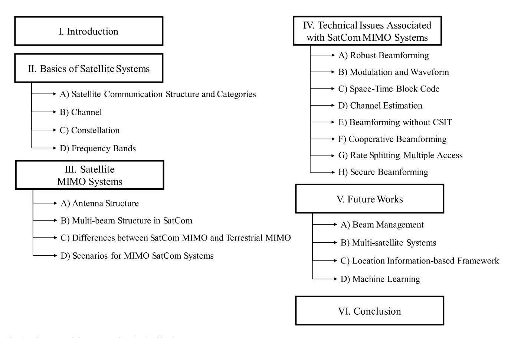

Fig. 1. Structure of the paper and topic classification.

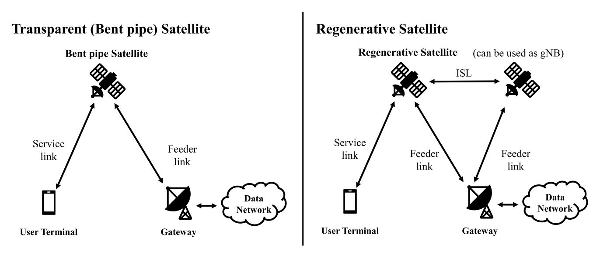

Fig. 2. SatCom system architecture.

as switching and routing, modulation and demodulation, and coding.

Fig. [2](#page-2-1) explains the SatCom structure of the transparent and regenerative types defined in NR-NTN. The gateway and the satellite are connected as shown above via links called feeder links. The communication link between the user terminal and the satellite is called a service link. In the transparent configuration, OBP cannot be performed and inter-satellite links (ISL) are not supported. Therefore, the satellite must always have both a feeder link and a service link. However, since regenerative satellites are able to use ISLs, if a gateway does not exist within the coverage of one satellite, other satellites can support a service link through ISL after forming a feeder link through the gateway.

Another way to classify satellites is by their orbital altitude. Fig. [3](#page-4-0) shows a representation of this classification. A typical GEO is located at an altitude of 35,786*km*. Since this is the altitude at which the Earth's orbital speed and

TABLE II LIST OF ABBREVIATIONS

| abbreviation | full text                                       | abbreviation | full text                                         |
|--------------|-------------------------------------------------|--------------|---------------------------------------------------|
| 3GPP         | 3rd Generation Partnership Project              | MMF          | Max-Min Fairness                                  |
| 6G           | 6th Generation                                  | MMSE         | Minimum Mean Square Error                         |
| AA           | Active Array                                    | NOMA         | Non-orthogonal Multiple Access                    |
| AN           | Artificial Noise                                | NR-NTN       | New Radio Non-Terrestrial Networks                |
| AoA          | Angle of Arrival                                | OBP          | On Board Processing                               |
| AoD          | Angle of Departure                              | OFDM         | Orthogonal Frequency Division Multiplexing        |
| APSK         | Amplitude Phase Shift Keying                    | OSTBC        | Orthogonal Space-Time Block Code                  |
| ARM          | Adaptive Random-selected Multi-beamforming      | OTFS         | Orthogonal Time Frequency Space                   |
| ASINR        | Average Signal-to-interference plus Noise Ratio | PAPR         | Peak to Average Power Ratio                       |
| ASLNR        | Average Signal-to-leakage plus Noise Ratio      | PCI          | Physical Cell Identity                            |
| BS           | Base Station                                    | PCLI         | Power Constraint                                  |
| BTPI         | BS Thining Process to Restrict Interference     | PLS          | Physical Layer Security                           |
| CCSDS        | Consultative Committee for Space Data Systems   | PM           | Polarization Modulation                           |
| CFO          | Carrier Frequency Offset                        | PPP          | Poisson Point Process                             |
| CNR          | Carrier-to-Noise Ratio                          | QoS          | Quality of Services                               |
| CSI          | Channel State Information                       | RNN          | Recursive Neural Networks                         |
| CSIT         | Channel State Information at Transmitter        | RSMA         | Rate-Splitting Multiple Access                    |
| DD           | Delay-Doppler                                   | RTT          | Round Trip Time                                   |
| DF           | Decode and Forward                              | RZF          | Regularized Zero-Forcing                          |
| DL           | Downlink                                        | SAGIN        | Space-Air-Ground Integrated Networks              |
| DSTC         | Distributed Space-Time Code                     | SAP          | Satellite Access Point                            |
| ECDF         | Empirical Cumulative Distribution Function      | SatCom       | Satellite Communication                           |
| EE           | Energy efficiency                               | SATIN        | Satellite-Aerial-Terrestrial Integrated Networks  |
| EHF          | Extremely High Frequency                        | SAUG         | Space Angle-based User Grouping                   |
| ESM          | Enhanced Spatial Modulation                     | SBL          | Sparse Bayesian Learning                          |
| FBMC         | Filter Bank Multi-Carrier                       | SC           | Superposition Coding                              |
| FRF          | Frequency Reuse Factor                          | SCP          | SatCom Channel Predictor                          |
| GEO          | Geostationary Orbit                             | sCSI         | statistical Channel State Information             |
| GNSS         | Global Navigation Satellite System              | SDMA         | Space Division Multiple Access                    |
| HSTN         | Hybrid Satellite Terrestrial Networks           | SER          | Symbol Error Rate                                 |
| HTS          | High Throughput Satellite                       | SFB          | Single Feed per Beam                              |
| HW           | Hardware                                        | SHF          | Super High Frequency                              |
| iCSI         | instantaneous Channel State Information         | SM           | Spatial Modulation                                |
| IM           | Index Modulation                                | SNR          | Signal-to-noise Ratio                             |
| IoT          | Internet of Things                              | SOFDM        | Spread Orthogonal Frequency Division Multiplexing |
| IRS          | Intelligent Reflecting Surface                  | SR-LMS       | Shadowed-Rician Land Mobile Satellite             |
| ISL          | Inter Satellite Link                            | SSB          | Synchronization Signal Block                      |
| ISTN         | Integrated Satellite and Terrestrial Networks   | SSN          | Super Satellite Networks                          |
| ITU          | International Telecommunication Union           | STBC         | Space-Time Block Code                             |
| IUI          | Inter-user Interference                         | SVD          | Singular Value Decomposition                      |
| LEO          | Low Earth Orbit                                 | TT&C         | Telemetry Tracking and Command system             |
| LMS          | Land Mobile Satellite                           | UAV          | Unmanned Aerial Vehicle                           |
| LoRa         | Land Moone Saternie Long-range                  | UCA          | Uniform Circular Array                            |
| LoS          | Line-of-Sight                                   | UHF          | Ultra High Frequency                              |
| LSTM         | Line-of-Signt Long Short-term Memory            | UL           | Uplink                                            |
| LTE          | ,                                               | ULA          | I                                                 |
|              | Long Term Evolution                             |              | Uniform Linear Array                              |
| MB           | Multi-beam                                      | UPA          | Uniform Planar Array                              |
| MEO          | Medium Earth Orbit                              | UT           | User Terminal                                     |
| MFB          | Multi Feed per Beam                             | V-BLAST      | Vertical Bell Laboratories Layered Space Time     |
| MIMO         | Multiple Input Multiple Output                  | WLAN         | Wireless Local Area Network                       |
| ML           | Machine Learning                                | ZF           | Zero-Forcing                                      |

rotational speed coincide, the satellite appears to be stationary. Since they are located at a very high altitude, these satellites have a very wide communication area, such that three GEO satellites can cover the entire globe. MEOs are located at altitudes of approximately 5,000-20,000 km. Representative examples are the Global Navigation Satellite System (GNSS), i.e., GPS and Galileo, or SES's o3b mPower system. LEOs are located at heights of approximately 500-1,500 km. MEO and LEO have different characteristics from GEOs. Firstly, since they are located at a lower altitude than GEOs, they have a much shorter propagation delay time and less propagation attenuation. On the other hand, their high mobility causes a high Doppler shift, so signal distortion must be considered [\[27\]](#page-23-3).

## *B. Channel*

SatCom channels greatly differ from those of the terrestrial network. Noteworthy differences include 1) large signal attenuation and long delay times due to long distances, and 2) strong LoS channel characteristics. The long distance between the satellite and the ground produces large signal attenuation. This attenuation includes path loss, attenuation due to the Earth's atmosphere, and rainfall effects. In addition,

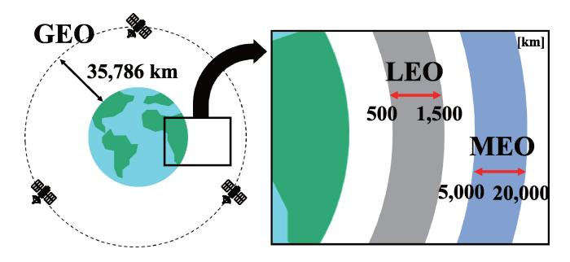

Fig. 3. Classification of satellites according to altitude.

signals coming from or going to the satellite cannot avail themselves of multi-path since there is no scatter near the satellite. An additional issue is the large Doppler shift. MEO and LEO satellites are moving at high speed. For example, a satellite in a LEO of 600 km is traveling at a speed of 7.56 km/s. Motion at this rate of speed will cause a large Doppler shift in the channel.

There are two main channel models currently being used in SatCom. The common SatCom characteristic in these channel models is the signal attenuation described earlier. The formula for signal attenuation in dB is as follows:

$$PL = PL_b + PL_q + PL_s + PL_e, (1)$$

where PL is total path loss,  $PL_b$  is the basic path loss including free space path loss, shadow fading, and clutter loss,  $PL_g$  is the attenuation due to atmospheric gasses,  $PL_s$  is the attenuation due to either ionospheric or tropospheric scintillation and  $PL_e$  is building entry loss. The above formula is for signal attenuation as defined by NR-NTN [28], [29]. Detailed values for each component can be found in the respective reference document. For example, the NTN assumes parameters for shadow fading and clutter loss based on the frequency band of the satellite, dense scenario, elevation angle, etc. Statistical values for atmospheric absorption and rain attenuation are also available in ITU documents.

One of the two commonly used channel models is the channel model that considers multi-beam when using a reflector type antenna [30], [31], [32]. This model is defined as follows:

$$\mathbf{h} = \sqrt{\psi} \mathbf{b}^{\frac{1}{2}} \odot \mathbf{r}^{\frac{1}{2}} \odot \exp\{j\theta\},\tag{2}$$

where  $\odot$  denotes the Hadamard product,  $\psi$  is the large-scale fading coefficient including path loss, receiver antenna gain, and noise.  $\mathbf{r}$  denotes the rain attenuation with elements obeying the log-normal distribution and  $\theta$  represents the channel phase vector following independently and uniformly distributed between 0 and  $2\pi$ .  $\mathbf{b}$  is the far-field beam pattern which is modeled as a Bessel function.

The other channel model is the channel model with a UPA antenna [33], [34], [35]. In this channel model, channel response between the satellite and UT k at instant time t and frequency f can be represented by

$$\mathbf{h}(t,f) = \sum_{p=0}^{P_k - 1} g_{k,p}^{dl} \cdot \exp\{j2\pi \left[t\nu_{k,p} - f\tau_{k,p}\right]\} \cdot \mathbf{v}_{k,p}, \quad (3)$$

where  $P_k$  denotes the number of channel paths of UT k, and  $g_{k,p}^{dl}$ ,  $\nu_{k,p}^{dl}$ ,  $\tau_{k,p}^{dl}$  and  $\mathbf{v}_{k,p}$  are the complex-valued channel gain, the Doppler shift, the propagation delay and the array response vector with path p of UT k. The model reflects the array response characteristic of UPA, unlike the beam pattern based on the Bessel function in the previous model. In addition, the model assumes a LEO, so the effects of the Doppler shift are reflected.

### C. Constellation

LEO satellites operate in large groups. How satellite constellations are arranged affects the overall performance of the SatCom system just as the deployment of base stations does in a terrestrial network. In this section, we describe the factors requiring consideration when constructing a satellite constellation.

The angle of inclination greatly influences the coverage of satellite groups. From [36], [37], we can see the results of the Voronoi diagram on the ground according to the satellite inclination angle. The lower the inclination angle, the smaller the number of satellites that reach the poles, resulting in low performance in terms of global coverage. The number of planes in a satellite constellation and the number of satellites per plane affect the total number of LEO satellites and the distance between each satellite. Installing a large number of satellites may deliver a high carrier-to-noise ratio (CNR) to users on the ground, but also results in an increase in interference and frequent handovers.

Some examples of circular orbit satellite constellation models are the Walker star constellation and Walker delta constellation [38]. In particular, one of the most popularly used models is the near-polar Walker star constellation, which is used in Iridium and OneWeb. The Walker star constellation is used to support global coverage. The Walker delta constellation can support higher satellite densities in a specific area by adjusting the inclination angle.

A number of papers related to constellation design have been published. In general, they attempt to modify the general constellation types described above to optimize a specific parameter. Jiang et al. proposed a constellation design that deploys the minimum number of satellites required to satisfy user requirements [39]. Meziane-Tani et al. also proposed a constellation design technique that minimizes the number of satellites based on a genetic algorithm [40]. Deng et al. proposed an optimization technique to find the minimum number of satellites that guarantees global coverage performance based on a polar constellation [41]. These papers studied techniques that were aimed at reducing the number of satellites. Savitri et al. and Dai et al. proposed a constellation design technique that maximizes coverage from a fixed number of satellites [42], [43]. In addition, Liu et al. introduced a constellation designed to minimize user delay [44].

Since each company offers large-scale satellite constellations, an LEO group of hundreds to thousands of units is considered. All the companies have plans to launch satellites sequentially rather than installing an entire satellite group at once. Del Portillo et al. compare the number of satellites

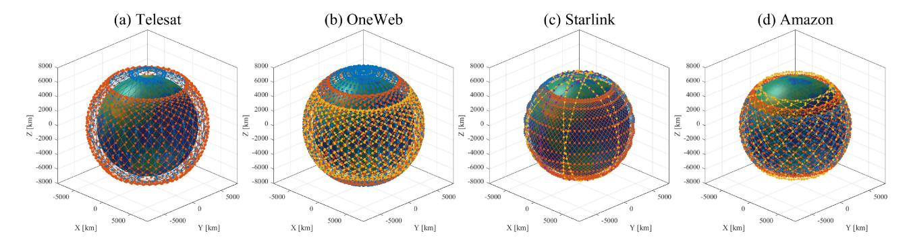

Fig. 4. Complete phase constellations of the LEO SatCom Companies. (a) Telesat, (b) OneWeb, (c) Starlink, (d) Amazon.

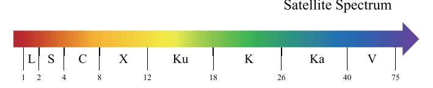

Fig. 5. Satellite spectrum.

based on the initial phase and complete phase target for each company [\[45\]](#page-23-21). An illustration of the complete phase constellation for each company is shown in Fig. [4.](#page-5-1) The three companies besides Amazon are adopting a polar constellation structure. That constellation structure allows for global coverage including the polar regions. Other non-polar inclined constellations also usually have an inclination angle of 40-55 degrees. The inclined constellation allows for many satellites to support users in the densely populated regions of the planet. Telesat, OneWeb, Starlink, and Amazon have minimum elevation angles of 10, 25, 25, and 35 degrees, respectively.

# *D. Frequency Bands*

The SatCom system primarily use frequency bands above 1 GHz, as shown in Fig. [5.](#page-5-2) Each band has different characteristics, so different frequencies are used for different purposes. Each frequency band used is divided into L, S, C, and X bands, which are relatively low frequency bands, and Ku, K, Ka, and V bands, which are relatively high frequency bands, according to their characteristics.

The lower frequency bands are mainly used in traditional SatCom. The L-band is mainly used in navigation and tracking systems such as GNSS. The L-band and S-band are frequency bands that transmit Telemetry Tracking and Command system (TT&C) signals. With their relatively low frequencies, these bands are less affected by certain types of signal attenuation such as rain attenuation or ionospheric scintillation, which means that there is a gain in signal strength. However, the available bandwidth is small compared to higher frequency bands, making them unsuitable for modern high-capacity communications.

The relatively high frequency Ku, K, and Ka bands are used for high-capacity Internet communications, television broadcasting, and military communications. In particular, LEO Internet service providers such as OneWeb and Starlink, which recently launched their services, use this frequency band for

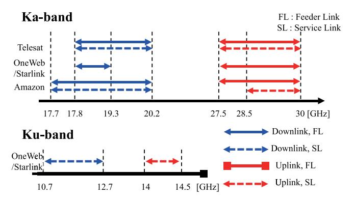

Fig. 6. Frequency bands used by four companies.

communication. In the case of V-band, there has been recent discussion of using the bandwidth for feeder links that require higher capacity and reliability.

The bands currently being used by LEO companies are the Ka and Ku bands (See Fig. [6\)](#page-5-3). Telesat is using the 17.8-20.2 GHz band for downlink and the 27.5-30 GHz band for uplink, and all of them use the Ka band. OneWeb and Starlink use the 17.8-19.3 GHz band for their gateway downlink and the 27.5-30 GHz Ka band for their gateway uplink, and use the 10.7-12.7 GHz band for user downlink and the 14-14.5 GHz band for user uplink. As for Amazon, it uses the 17.7-20.2 GHz Ka band for its gateway and user downlink, the 27.5-30 GHz for its gateway uplink, and the 28.35-30 GHz Ka band for its user uplink.

However, these frequencies are often pre-occupied by terrestrial networks or shared between different satellites in GEO and LEO. The ETSI TR document considers spectrum coexistence in the Ku and K bands [\[46\]](#page-23-22), including discussing cognitive radio techniques to address this issue. There is in fact a great deal of research in the literature on integrated satellite and terrestrial networks.

### III. SATELLITE MIMO SYSTEMS

The introduction of MIMO has resulted in major performance improvements. These include space and multiuser diversity gain, spatial multiplexing gain, array and coding gain, and interference reduction. These features have led to various standards such as 3GPP and wireless local area network (WLAN) with adoption of MIMO [\[47\]](#page-23-23).

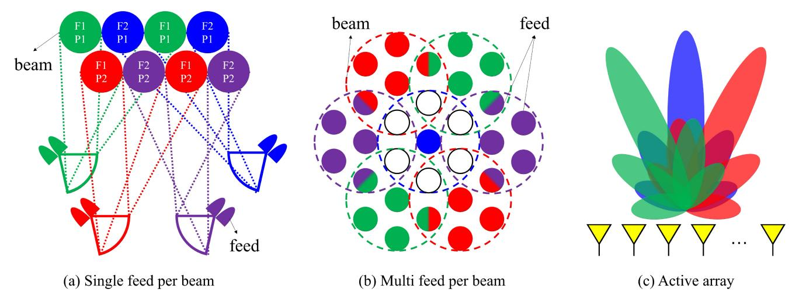

Fig. 7. Implementing multi-beam according to antenna type. (a) Single feed per beam. (b) Multi feed per beam. (c) Active array.

This section focuses on the MIMO system employed in the SatCom system. We will begin with a summary of the antenna classification for using the MIMO technique in the SatCom system. Specifically, how the multi-beam is structured and discussions of multi-beam in the standard are also summarized. We will also provide an overview of the differences in terms of MIMO technology for SatCom and terrestrial networks. Finally, the scenarios that are assumed in the study of SatCom MIMO are classified and the main research direction in each scenario is described.

### *A. Antenna Structure*

Since the HTS system uses a multi-beam structure, the satellite-mounted antennas must adopt a structure that can implement multi-beam [\[48\]](#page-23-24), [\[49\]](#page-23-25). Fig. [7](#page-6-0) shows various multibeam antenna structures. These are divided into the single feed per beam (SFB) structure, the multi feed per beam (MFB) structure, and the active array (AA) structure [\[50\]](#page-23-26). The SFB structure forms one beam from one feed and has a high gain and low side-lobe emission, yielding a gain in spectral efficiency. However, achieving a continuous coverage structure in general GEO HTS requires 3-4 SFB reflectors. The MFB structure forms one beam from several feeds [\[48\]](#page-23-24), [\[49\]](#page-23-25), [\[51\]](#page-23-27). In this case, continuous coverage can be established with as few as 1 or 2 reflector structures. In addition, MFB structure can potentially operate with flexible utilization, which is advantageous in terms of frequency reuse. However, this use of multiple feeds increases the complexity of the antenna system. SFB and MFB use one amplifier per beam, and beamforming is static. In the AA structure, since the radiating element and the amplifier are directly connected, dynamic beamforming is possible [\[52\]](#page-23-28).

Unlike GEO, LEO and MEO have different traffic depending on their location as they move along their orbits. LEO companies such as Starlink, Telesat, and Amazon are adopting a steerable antenna structure. Unlike the mechanical type, the electronic type can change the position of the beam quickly and flexibly. This prospect has recently led to a great deal of study being focused on this recent antenna technology for use as an AA antenna technology.

### *B. Multi-Beam Structure in SatCom*

Multi-beam architecture is the most important technology in the current SatCom MIMO system. Implementing a multibeam system allows SatCom to effectively manage a wide coverage area and provide a high data rate to multiple users.

In GEO broadcasting, the satellites have taken on the structure of a communication system that simultaneously transmits across the entire area of the satellite's coverage [\[53\]](#page-23-29), [\[54\]](#page-23-30). However, supporting the communication system down to the individual user level across the wide coverage area of the satellite has proved to be difficult. HTS systems were developed in part to solve this problem. In the case of the HTS system, 1) a multi-beam structure is used, and 2) a frequency reuse technique is applied. The term "Frequency reuse factor" (FRF) refers to a ratio of using a frequency band in one cell or spot beam. That is, if the FRF is 1, all spot beams use the same band, and if the FRF is 0, it means that any number of spot beams all use different bands. A high FRF can potentially cause co-channel interference, resulting in a reduced carrier-to-interference power ratio.

The LEO SatCom system basically adopts a multi-beam structure similar to that of HTS. In fact, the satellite companies represented here that are currently in service and are scheduled for service are adopting a multi-beam structure [\[45\]](#page-23-21), [\[55\]](#page-23-31). If we describe them based on their user beam, OneWeb is a bent-pipe payload and has 16 identical, non-steerable, highlyelliptical user beams. Starlink and Telesat satellites have digital payloads that can be processed on-board, and each satellite can use steerable and shapable user beams. In the case of these satellites, unlike OneWeb satellites, a specific service area is supported in the form of a spot beam without simultaneously servicing the entire coverage.

The multi-beam structure in SatCom differs in several ways from the terrestrial multi-beam structure. This occurs firstly because of the characteristics of satellites that transmit signals at high altitudes and secondly because of the Earth's spherical shape. Fig. [8](#page-7-0) (a) and (b) are diagrams showing the characteristics of the SatCom multi-beam structure. Fig. [8-](#page-7-0)(a) is a picture of the uv plane when the antenna signal uses 583 multi-beams. In general, it is assumed that the satellite looks at the center

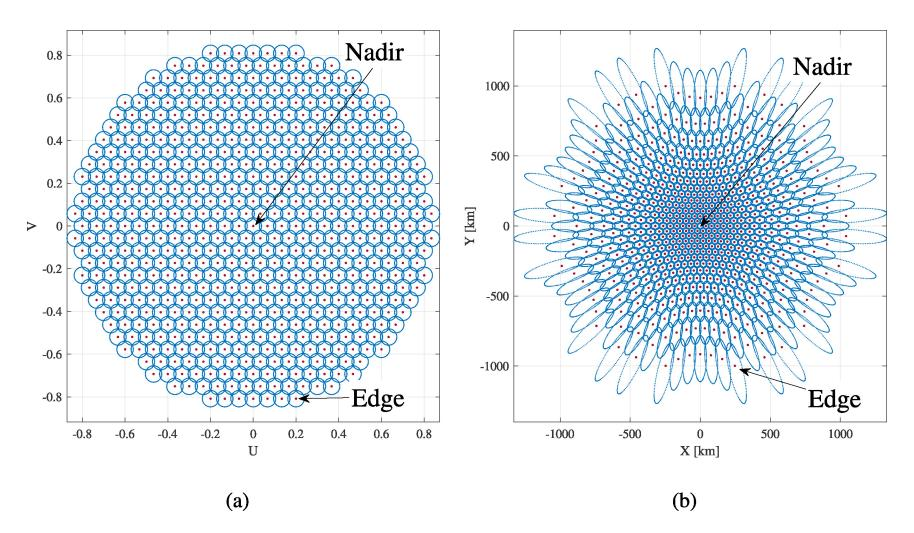

Fig. 8. Multi-beam structure in SatCom MIMO. (a) uv plane (b) Multi-beam structure projected on the ground.

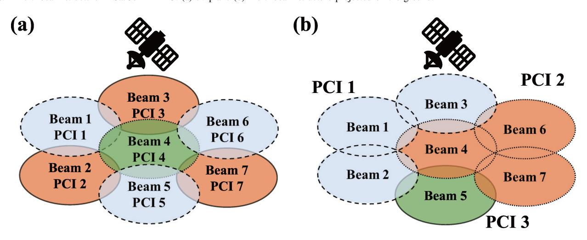

Fig. 9. Relationship between beam and cell in NR-NTN. (a) Structure in which one beam is formed by one cell in NR-NTN. (b) Structure in which multiple beams are formed into one cell in NR NTN.

of the Earth and looks at 45 degrees. This side of the figure shows the case where the satellite is looking at the center of the Earth. That is, the beam at the center is the beam toward nadir. Fig. [8-](#page-7-0)(b) shows the shape of a beam projected on the ground when 583 multi-beams are used in a satellite at an altitude of 600 km. As mentioned above, due to the high altitude of SatCom and the spherical shape of the Earth, the shape of the beam on the ground is different from the beam corresponding to the nadir and the beam shape of the edge. For the 600 km case, the size of the nadir beam is 50 km in diameter, but in the case of edge beams, the beam shape can have a diameter of up to 500 km or more. Due to this multi-beam structure, the variation in propagation delay between beams is very large even in the same satellite. In addition, in the LEO SatCom, the variation in Doppler shift between beams is very large even within one satellite.

3GPP NTN, one of SatCom's representative standardization processes, also adopts a multi-beam structure [\[28\]](#page-23-4), [\[29\]](#page-23-5). NTN applied the basic form of terrestrial cellular networks to SatCom. The range of the cell, which is a communication unit in cellular networks, is reconfigured and defined as a unit of spot beam in SatCom. Fig. [9-](#page-7-1)(a) and (b) are diagrams of two options for physical cell identity (PCI) mapping in 3GPP NTN. PCI is a structure that distinguishes different cells from each other in the 3GPP standard. One option is a form in which several beams share the same PCI, that is, a structure in which one cell consists of several beams. Another option is a structure in which one beam is allocated as one PCI, that is, one cell is allocated as one beam. For example, when considering the design of the synchronization signal block (SSB) or the handover operation method, the definition of one cell should be reflected. In the first option, since a separate control signal must be operated for each different spot beam, the overhead increases compared to other options. In addition, since the size of one cell is small, handover must be performed frequently. In the second option, there is a deployment design in which spot beams are treated as one cell and thus represent a hardware (HW) issue.

In this subsection, we have summarized how multi-beam structures are configured in SatCom. With the exception of some characteristic broadcasting structures, modern HTS SatCom has to take multi-beam into account. In addition,

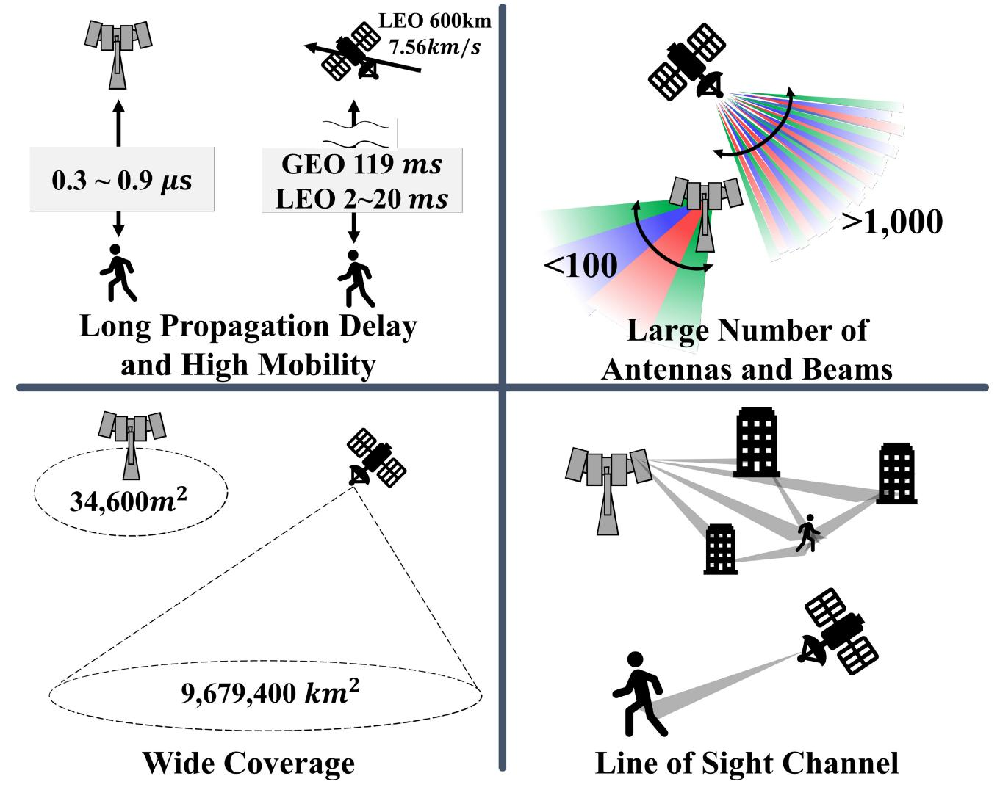

Fig. 10. Differences between SatCom and terrestrial networks in terms of MIMO.

considering the NTN scenario, a major research priority will be determining how best to distinguish between cell and multi-beam.

# *C. Differences Between SatCom MIMO and Terrestrial MIMO*

SatCom systems differ from terrestrial networks in many ways. Some of those differences make it difficult to directly apply terrestrial MIMO technology as is. Fig. [10](#page-8-0) illustrates some of these differences specifically. The differences between SatCom MIMO and terrestrial MIMO are outlined below taking the features of the channels described above into consideration.

*1) Long Propagation Delay and High Mobility:* The long propagation delay of the satellite and the high mobility of the MEO and LEO satellites are factors that greatly affect the SatCom channel. In particular, the performance degradation this causes is very serious in MIMO. The biggest effect of propagation delay in MIMO is that it becomes difficult to respond to channel changes. In the case of GEO, a propagation delay of 119.4 ms occurs at the nadir, and in the case of LEO, a propagation delay of 2 ms occurs at 600 km and 21.3 ms at the edge. This is relatively a very long time compared to the existing propagation delay of 0.3∼0.9μs on the ground. On the ground, the performance of a time-varying channel is secured through channel feedback, but the problem of channel aging due to a long round trip time (RTT) is a critical performance degradation factor in MIMO, where the accuracy of the channel is greatly reduced. In addition, in the MEO and LEO SatCom systems, the influence of Doppler shift and time-varying channels due to the high speed of travel of the satellite increases. In particular, in the case of LEO, a satellite at 600 km moves at a very high speed of 7.56 km/s, so it experiences a more intensified time-varying channel.

*2) Large Number of Antennas and Beams:* 5G uses many more antennas than the existing long term evolution (LTE), but even that is not comparable to what the SatCom system needs. There is currently no mention in company or standardization documentation regarding any specific number of antennas and beams. However, given that the 3dB beamwidth considered in NR-NTN is 4∼8◦ in a 600 km LEO, it is obvious that thousands of antennas are needed and the number of beam candidates is much larger than for the ground-based system. The number of antennas and beams has various effects in the MIMO environment. The typical gain obtained with MIMO, such as power, multiplexing gain, or diversity performance, increases as the number of antennas increases. However, a number of problems have to be solved to achieve this. In fact, the introduction of massive MIMO has resulted in the advent of a raft of problems. These include a channel estimation issue because of the increase in the number of channels to be estimated, and problems such as pilot contamination, along with a beam management issue given the large number of antennas and beams that must be managed.

*3) Wide Coverage:* Satellites must cover a much wider area than terrestrial base stations. Although BS coverage on the ground is generally in the range of 34,600*m*2, a single satellite is responsible for a communication coverage area of 9,679,400*km*2, even with a satellite in a 600 km LEO based on an elevation angle of 10 degrees. In the case of LEO satellites, this is highly dependent on the satellite constellation, whereas, in the case of GEO, the difference is most evident given that the entire earth can be supported by three satellites. As mentioned above, even if the multi-beam structure pursued by SatCom is applied, given that the diameter of one beam is 50 km, it is easy to understand the wide coverage characteristics of the satellite. Due to the large MIMO coverage area of SatCom, support for multiple users is weakened. Moreover, due to its large width, the large number of users even within one beam means it is unable to be supported through space division multiple access (SDMA). In summary, the existing user support through SDMA does not sufficiently support the user compared to the wide coverage area, and there is a security problem in that signals are transmitted to users for whom they are not intended.

*4) LoS Channel:* The SatCom system has a LoS channel. Strictly speaking, there is no scatter in the space around the satellite, creating a LoS situation. Although scatter can certainly occur in the terrestrial transceiver terminal opposite the satellite, it is clear that it is a very direct channel compared to terrestrial networks. MIMO technology is an extension of an additional domain called the spatial domain over what existing communication systems use, and this is employed to pursue performance gains. That is, SatCom channels, with their strong LoS channel characteristics, have the disadvantage that they cannot adequately exploit the performance gain offered in MIMO.

In this subsection, we have summarized the four most distinguishing characteristics of SatCom MIMO and terrestrial MIMO. It is very important to reflect these characteristics in SatCom research. We will discuss which of these four characteristics have been the main focus of consideration as part of our summary of SatCom studies in Section [IV.](#page-11-0)

### *D. Scenarios for MIMO SatCom Systems*

This section summarizes the main scenarios in various recent MIMO SatCom studies and examines the main characteristics of each scenario. The basic structure of SatCom consists of a feeder link connected to a gateway and a service link connected to a user, as discussed in the previous section. The main focus is primarily on the service link, but some scenarios also address the feeder link.

*1) Single Satellite With Multi-Beam:* The most common scenario is a structure in which a single satellite transmits signals using a multi-beam approach. As the HTS system is actively used in SatCom, the basic signal model in studies not just of GEO, but also of MEO and LEO takes the form of multi-beam. Most of the studies on multi-beam scenarios are on basic transmitter and receiver structures, e.g., terrestrial point-to-point studies. Signal processing approaches such as precoding and postcoding are particular focal points of study.

**Interference** is a major hurdle in multi-beam **GEO SatCom**. Frequency reuse is used to avoid interference between beams; however, this reduces the size of the available bandwidth, making it unsuitable as a solution for nextgeneration SatCom systems as a way to achieve high throughput. Therefore, recent studies have focused on the development of beamforming techniques that use a full frequency reuse pattern but avoid inter-beam interference. In [\[56\]](#page-23-32), Joroughi et al. proposed a precoding technique to mitigate interference between users in a multigateway multi-beam SatCom system that receives a feeder link from a multigateway and supports multiple users with a multi-beam approach. They proposed singular value decomposition (SVD)-based precoding that groups users' clusters (beams) by feeder link and minimizes interference between the clusters. In [\[57\]](#page-23-33), Mosquera et al. designed minimum mean square error (MMSE)-based transmit/receive beamforming to control inter-beam interference. In the dual-hop decode-and-forward (DF)-based relay system, the proposed technique not only considers the inter-beam interference that occurs with multi-beam, but also deals with HW impairments such as phase noise, quantization error, amplification noise, and non-linearities [\[58\]](#page-23-34). In addition, other research works consider the influence of the weather [\[59\]](#page-23-35), [\[60\]](#page-23-36), design scheduling, link adaptation, and precoding for mobile users altogether [\[61\]](#page-23-37), and propose a beamforming technique specialized for a fixed beam scenario [\[62\]](#page-23-38). In [\[63\]](#page-23-39), Moon et al. proposed boost beam control in a phased array-based GEO. Boost beam is a technology designed for use in an environment in which attenuation due to weather such as rain or snow is strong. They showed the performance when boost beam is actually used in various regions of the Korean Peninsula and showed the benefits of beam control. In [\[64\]](#page-23-40), a control method for using digital beamforming in a multi-beam scenario was proposed to satisfy the needs for high throughput. Takahashi et al. analyzed the interference and throughput of various factors such as transmit power, beam gain, and the location of each beam on the actual user link. Based on this, they proposed a power and beam direction control technique.

In **LEO**, unlike GEO, research on MIMO can be said to be in its infancy. As opposed to the reflector-type antennas such as SFB and MFB that are actively used in the GEO, the assumption is that phased-array antennas will be used for the most part in the LEO scenario. In [\[33\]](#page-23-9), You et al. presented a model using massive MIMO while presenting a channel model in LEO satellites using a UPA. Considering that it is difficult to use instantaneous channel state information (iCSI), which is a

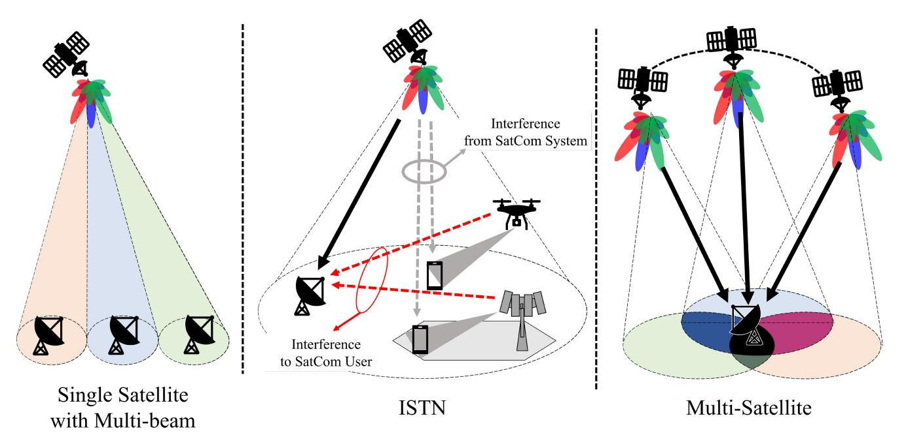

Fig. 11. Classification of scenario for MIMO SatCom.

chronic problem with LEO SatCom channels, they proposed a beamforming technique using statistical CSI (sCSI) and then designed a beamforming structure that maximizes the average signal to leakage plus noise ratio (ASLNR) and average signal to interference plus noise ratio (ASINR) in the uplink and downlink, respectively. Other studies [\[65\]](#page-23-41), [\[66\]](#page-23-42) based on this research have been done on the sCSI-based hybrid beamforming structure using UPA in the LEO. In [\[65\]](#page-23-41), You et al. designed a beamforming structure that maximizes downlink (DL) energy efficiency (EE) in a structure using a finite-bits phase shifter. In [\[66\]](#page-23-42), You et al. go on to design a beamforming structure that considers the non-linearities of the power amplifier. As opposed to the research done in [\[33\]](#page-23-9), Li et al. designed a DL beamforming structure to maximize ergodic capacity [\[67\]](#page-23-43). Unlike the channel correlation matrix on the UE side, they designed a rank 1 transmit precoding vector using the fact that the rank of the channel correlation matrix on the satellite side is 1. Zhong et al. compared performance according to the overlap of footprints between beams in a multi-beam scenario and, based on this, proposed a coverage dividing method and beamforming method [\[68\]](#page-23-44). Ivanov et al. proposed a spatial resource management technique that uses a hybrid beamforming structure [\[69\]](#page-23-45).

Taking this survey all in all, we can see a trend in multibeam LEO research that is clearly distinct from the work being done with GEO. So far, it would appear that applying MIMO, which has already been studied extensively in terrestrial networks, to LEO scenarios is a simple matter. As mentioned above, the scenario involving a single satellite using multi-beam transmission focused on the study of the most basic transmission and reception structures in both GEO and LEO. In conclusion, it is a scenario that must be looked at in basic research concerning PHY layer technology.

*2) Integrated Satellite and Terrestrial Networks (ISTNs):* This scenario refers to an integrated system of UAVs, HAPs, and SatCom systems, an approach that has been recently emerging in terrestrial cellular networks. These integrated networks are also referred to in various studies as SAGIN [\[19\]](#page-22-18), [\[70\]](#page-24-0), [\[71\]](#page-24-1) or Hybrid Satellite-Terrestrial Networks [\[72\]](#page-24-2), [\[73\]](#page-24-3), [\[74\]](#page-24-4). To achieve efficient use of frequency bands in ISTN, many studies of that scenario assume a system in which different systems share a frequency band. These assumptions cause interference between different systems, specifically referred to as cognitive satellite, aerial and terrestrial networks [\[75\]](#page-24-5), [\[76\]](#page-24-6), [\[77\]](#page-24-7). Cognitive radio systems that perform spectrum sharing can be classified into primary networks and secondary networks, and in the case of the secondary networks, the networks can be operated in a sequence that guarantees the quality of service (QoS) of the primary networks [\[78\]](#page-24-8). There is no difference between studies focusing on GEO and LEO in the ISTN scenario. This is because the main issue with ISTN is mutual interference. For example, An et al. considered a case where the SatCom system acts as the secondary network [\[74\]](#page-24-4). In [\[79\]](#page-24-9), Zhang et al. analyzed the mutual interference between primary networks and secondary networks when the GEO networks are the primary networks and NGSO networks and terrestrial networks acts as secondary networks.

Beamforming research in most ISTN scenarios is focused on **interference mitigation techniques**. In [\[72\]](#page-24-2), Khan et al. analyzed the trade-off depending on where beamforming for interference mitigation is performed in the ISTN scenario. Specifically, they compared the interference mitigation performance between beamforming performed by a ground station and beamforming performed through satellite OBP. Based on this analysis, they proposed a semiadaptive beamforming structure in hybrid satellite and terrestrial networks. This semi-adaptive beamforming structure refers to a beamforming structure that considers both the combined desired channel of the feeder link and the user link and the interference channel of the interference link. In [\[76\]](#page-24-6), Kolawole et al. performed a stochastic geometry-based analysis of the performance of cognitive radio systems for terrestrial networks and satellite users distributed by homogeneous Poisson point processes (PPP). They compared three operation methods of terrestrial networks used to protect satellite networks. The first is a power constraint (PCLI) technique that limits interference taking into account power constraints by setting an interference threshold. The second is a technique for mitigating interference to satellite users through directional beamforming for target terrestrial users. The last is a technique called BS Thinning Process to Restrict Interference (BTPI). BTPI involves removing BSs that may exceed the interference threshold. Based on the stochastic geometry technique, they proved that the BTPI technique can mitigate the most interference to satellite users. In [\[80\]](#page-24-10), in regard to terrestrial IoT devices of satellites, Liu et al. assumed an imperfect CSI scenario by reflecting the channel characteristics in the LEO SatCom. In addition, they proposed a beamforming technique that minimizes interference between satellites and terrestrial networks by reflecting the characteristics of general HW impairments such as non-linear power amplifier. In [\[81\]](#page-24-11), Peng et al. summarized various types of interference in integrated multi-beam satellite and terrestrial networks such as inter-beam interference, inter-user interference and inter-system interference. They also described techniques to eliminate and mitigate mutual interference.

In addition, ISTN scenarios mixed with **aerial networks** are also being actively studied. Aerial networks composed of UAVs and HAPs act as relay nodes to ensure the quality of transmission signals when transmitting signals directly from satellites to users on the ground is difficult [\[82\]](#page-24-12), [\[83\]](#page-24-13), [\[84\]](#page-24-14), [\[85\]](#page-24-15). In [\[86\]](#page-24-16), Ruan et al. assume satellite-aerial-terrestrial integrated networks (SATINs) to support global IoT services. The proposed satellite networks are composed of multiple layers of satellites across the entire set of GEO, MEO, and LEO. In this research, the authors discussed four elements for resource management in SATIN, each of which would perform resource management considering cooperation mechanisms, 3D UAV deployment, interference management, and physical layer security.

In summary, the ISTN scenario addresses the coexistence of heterogeneous networks with different SatCom structures. Given that one of its most important aspects is how to resolve interference among different networks, ISTN is an essential research direction when it comes to considering bandwidth sharing issues.

*3) Multi-Satellite:* The term "multi-satellite" refers to a scenario where multiple satellites coexist. It can also be thought of as a subcategory of ISTN. The introduction of LEO and small satellites in earnest has brought with it the concepts of satellite constellations and ultra dense LEO [\[41\]](#page-23-17), [\[87\]](#page-24-17), [\[88\]](#page-24-18). As the total number of satellites has increased, the number of visible satellites in the LEO's coverage area has also gradually increased. That is, one user can receive signals from multiple high-power satellites. Early research work on multi-satellite scenarios for GEO also exist. However, there will likely be more studies in the future for LEO, where the number of satellites is much larger. Multi-satellite arrangements can be operated like a virtual MIMO system via cooperative operation between the multiple satellites, thus obtaining the gain that the MIMO technique can offer. There are a number of common ways to obtain diversity gain or power gain with this approach.

The representative technique in a multi-satellite scenario is **joint/cooperative transmission or reception.** The diversity effect described above can be directly achieved through multiple transceivers. In [\[89\]](#page-24-19), [\[90\]](#page-24-20), research focused on a distributed satellite MIMO technique using two GEOs. In GEO SatCom, this consists of a LoS channel with high channel correlation. Each GEO uses a single antenna, but two or more satellites perform cooperative transmission, which has the same effect as performing MIMO. These works present two capacity analyses: when a ground user uses a uniform linear array (ULA) antenna [\[89\]](#page-24-19), and when a ground user uses a ULA and uniform circular array (UCA) antenna [\[90\]](#page-24-20). Li et al. provided insight for capacity performance improvement based on performance analysis according to parameters such as antenna length/diameter and rotation angle. As a result, in the case of ULA and given that there is an optimal rotation angle, higher capacity can be obtained when a fixed user performs antenna rotation to track the relative position of the satellite. UCA can deliver stable performance, but it has always been shown to have the same or lower performance than the optimal performance of ULA. Aside from the cooperative transmission/reception technique described above, the issues related to the random access technique [\[91\]](#page-24-21) or intersatellite handover technique [\[92\]](#page-24-22) involving multiple satellites also fall under the relevant scenarios.

The multi-satellite scenario is one that is more relevant for the emerging LEO scenarios than for traditional GEO. The structural features of SatCom (e.g., ISL and multi-GW) are easier to address as cooperative technologies.

In this section, we have provided a basic tutorial on satellite MIMO. The types of satellite-mounted antennas were explained, and the concepts of beams and cells in satellites were summarized. In addition, we described the four difference between SatCom MIMO and terrestrial MIMO. Lastly, three scenarios employing single satellite with multi-beam, ISTN, and multi-satellite approaches were described.

# IV. TECHNICAL ISSUES ASSOCIATED WITH THE MIMO SATCOM SYSTEMS

This section discusses the recent technical issues being studied in connection with SatCom MIMO. Based on the characteristics of the four SatCom MIMO and the three main SatCom MIMO scenarios discussed in the previous section, we will review the trends associated with nine major technical issues, the details of which are broken down in Table [III.](#page-12-0) Despite the progress in connection with the topics above, much future research in these areas is still required.

# *A. Robust Beamforming*

As described in the previous section, the long propagation delay and high mobility in SatCom MIMO makes it difficult to reflect channel changes and obtain accurate channel

TABLE III CLASSIFICATION OF TECHNICAL ISSUES FOR MIMO SATCOM

|                       |                                                 | Robust Beamforming | Modulation and Waveform | Space-Time Block Code | Channel Estimation | Beamforming without CSIT | Cooperative Beamforming | RSMA | Secure Beamforming |
|-----------------------|-------------------------------------------------|-----------------------|-------------------------------|--------------------------|-----------------------|--------------------------|----------------------------|------|-----------------------|
| Sat-Com Properties | Large Propagation Delay and High Mobility | 0                     | 0                             | 0                        | 0                     | 0                        |                            |      |                       |
|                       | Large Number of Antennas and Beams        |                       |                               |                          | 0                     |                          | 0                          |      |                       |
|                       | Line of Sight Channel                        |                       |                               |                          |                       | 0                        | 0                          |      |                       |
|                       | Wide Coverage                                |                       |                               |                          |                       |                          |                            | 0    | 0                     |
|                       | Single Satellite with Multi-beam             | 0                     | 0                             | 0                        | 0                     | 0                        |                            | 0    | 0                     |
| Scenarios             | ISTN                                            | Δ                     | Δ                             | 0                        | 0                     |                          | 0                          |      | 0                     |
|                       | Multi Satellite                              | Δ                     |                               |                          | Δ                     | Δ                        | 0                          |      |                       |

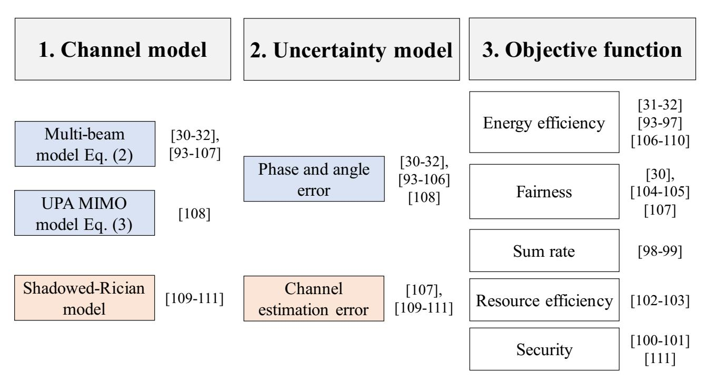

Fig. 12. Categories of robust beamforming.

information. The urgent need to resolve these issues has led to a continuous stream of research directed toward finding a robust beamforming technique that performs beamforming with channel information containing errors. Fig. [12](#page-12-1) summarizes the three issues that need to be considered in robust beamforming and the categories of the survey.

The first issue that needs to be considered in robust beamforming is which **channel model** to use. Currently, the main channel models used in robust beamforming research are the multi-beam channel model [\(2\),](#page-4-1) the UPA antenna channel model [\(3\),](#page-4-2) and the shadowed-Rician model, which considers the reflector type antenna summarized earlier. The second issue to consider is **channel uncertainty**. There are many factors that affect channel uncertainty, and different factors affect the channel in different ways. Since the channel model and channel uncertainty are closely related, we will discuss them together.

First, in a multi-beam channel with reflector type antenna model, the model is mainly determined by angle or phase error [\[30\]](#page-23-6), [\[31\]](#page-23-7), [\[32\]](#page-23-8), [\[93\]](#page-24-23), [\[94\]](#page-24-24), [\[95\]](#page-24-25), [\[96\]](#page-24-26), [\[97\]](#page-24-27), [\[98\]](#page-24-28), [\[99\]](#page-24-29), [\[100\]](#page-24-30), [\[101\]](#page-24-31), [\[102\]](#page-24-32), [\[103\]](#page-24-33), [\[104\]](#page-24-34), [\[105\]](#page-24-35), [\[106\]](#page-24-36). In this case, since it is a slowly changing channel model, we do not consider losses or beam patterns that affect the magnitude. Therefore, in this channel uncertainty model, it is modeled in the form of a simple phase error vector by the local oscillator [\[95\]](#page-24-25). This model is used in the multicast multi-beam GEO scenario. On the other hand, some research works define the estimation error in terms of angular information associated with the mobility of the user terminal or the quantization error [\[96\]](#page-24-26), [\[100\]](#page-24-30), [\[101\]](#page-24-31), [\[104\]](#page-24-34). In this model, the angular uncertainty of the azimuth angle and the elevation angle is defined as a uniform distribution through the upper bound and the lower bound. Multi-beam pattern, array vector, path loss, etc., are affected by the relative position information between the user and the satellite, all of which determine the magnitude of the channel. Separately, Guo et al. expressed channel uncertainty as an addictive channel error in multibeam channels [\[107\]](#page-24-37). In this case, it takes the form of complex Gaussian noise, the same as with regular channel estimation error.

In a departure from previous research, Liu et al. in [\[108\]](#page-24-38) analyzed the effect on robust beamforming in a UPA MIMObased channel [\(3\).](#page-4-2) In this model, the influence of the time change of the channel is considered in three ways. First, in the case of Doppler shift, it can be classified as the effect of the mobility of the satellite and the mobility of the user terminal (UT). After performing compensation for Doppler shift, the authors modeled the residual Doppler shift with *Jake's* distributions. The second effect is propagation delay. Channel-induced effects due to long propagation delays cause channel phase perturbations after compensation. The channel phase error according to the residual propagation delay is modeled as a random Gaussian distribution. Lastly, in the case of the array response by UPA, the response changes depending on the mobility of the satellite and the UT. These values are affected by relative position information such as elevation angle and azimuth angle, and can be estimated from satellite ephemeris information and UT location information. If an error due to estimation occurs in each piece of information, it can be set as an estimation error value in the array gain of UPA. Only the effects of residual Doppler shift and residual propagation delay are considered as channel uncertainty.

As opposed to the two channel models, research in this area has also been done using the Shadowed-Rician model, which considers the statistical characteristics of the overall channel [\[109\]](#page-24-39), [\[110\]](#page-24-40), [\[111\]](#page-24-41). This model has a scattering component that has Rayleigh amplitude and random phase information, and a LoS component with Nakagami-*m* amplitude and deterministic phase information as small-scale channel information. In these research works, channel uncertainty is defined as a simple additive complex Gaussian vector.

In addition to the two issues summarized above, there is a third issue that affects robust beamforming: the **objective function**. Under uncertain channel conditions, the precoder is designed with a specific objective. The objective function can be classified into three main categories. The first is EE. In a SatCom system, there is a limit to the transmit power relative to the BS on the ground. To address this, studies have been conducted on maximizing EE [\[106\]](#page-24-36), [\[107\]](#page-24-37), [\[108\]](#page-24-38). Similarly, studies that minimize the transmit power itself after setting a certain transmission rate as a constraint can also be considered as studies for EE [\[31\]](#page-23-7), [\[32\]](#page-23-8), [\[93\]](#page-24-23), [\[94\]](#page-24-24), [\[95\]](#page-24-25), [\[96\]](#page-24-26), [\[97\]](#page-24-27), [\[109\]](#page-24-39), [\[110\]](#page-24-40). The second issue is fairness. In the case of SatCom, fairness is an important issue because satellites serve a large number of users with wide coverage. For fairness, we use parameters such as the α-fair utility [\[104\]](#page-24-34), proportionally fairness [\[105\]](#page-24-35), and worst-SINR maximization [\[30\]](#page-23-6), [\[107\]](#page-24-37) as objective functions. Finally, there is a growing body of work on maximizing the sum rate of users [\[98\]](#page-24-28), [\[99\]](#page-24-29). In addition, there are also studies that consider resource efficiency by considering the trade-off between spectral efficiency and EE [\[102\]](#page-24-32), [\[103\]](#page-24-33) and robust beamforming by considering security [\[100\]](#page-24-30), [\[101\]](#page-24-31), [\[111\]](#page-24-41).

In summary, research on robust beamforming using outdated channel information in SatCom MIMO is ongoing to address situations where channel estimation is difficult due to the characteristics of SatCom channels. Most of these studies have been conducted in multi-beam scenarios and the main issues are channel model, uncertainty model and objective function.

### *B. Modulation and Waveform*

Two properties must be considered for waveform and modulation in the SatCom system. The first is the low received power caused by the long distance between the satellite and the terminal. The second is the significant Doppler effect due to the satellite's high mobility.

The low received power causes deterioration of communication quality. The traditional solution is to increase transmission efficiency by lowering the peak-to-average power ratio (PAPR). If we suppose the PAPR of the transmission signal is high, then in that case the transmission efficiency is reduced because a large back-off must be performed to operate in the area where the power amplifier amplifies linearly. There are some studies that utilize amplitude phase shift keying (APSK), one of the modulation schemes for effectively reducing such PAPR in [\[112\]](#page-24-42), [\[113\]](#page-25-0). Another solution is index modulation (IM). IM is a technique in which resources such as space/frequency/time are used as additional information-conveying sources. Since other resources are utilized without using additional power, power efficiency becomes high. As a result, this approach can achieve a high data rate despite low received power. In [\[114\]](#page-25-1), Shi et al. proposed an iterative detector that is robust to the linear dispersion and nonlinear distortion of the SatCom channel. Among IM techniques, one type of modulation that uses the transmit antenna as an additional information-conveying source

| Modulation and                       | Carrie         | er Type       | Target Properties      |               |  |
|--------------------------------------|----------------|---------------|------------------------|---------------|--|
| Waveform                             | Single-carrier | Multi-carrier | Long propagation delay | High Mobility |  |
| IM/SM                                | О              | О             | О                      |               |  |
| Chirp modulation                     | О              |               | О                      |               |  |
| APSK                                 | О              | О             | 0                      |               |  |
| OTFS                                 |                | О             |                        | 0             |  |
| New-waveforms (FBMC, SOFDM, OFDM) |                | О             |                        | O             |  |
| SOFDM                                |                | О             |                        | 0             |  |
| OEDM                                 |                | 0             |                        | 0             |  |

TABLE IV COMPARISON BETWEEN MODULATION AND WAVEFORM TECHNIQUES IN SATCOM

is called spatial modulation (SM), which can increase spectral efficiency along with power efficiency. This modulation technique will be discussed in the "Beamforming without channel state information at transmitter" subsection. In addition, in [\[115\]](#page-25-2), [\[116\]](#page-25-3), the authors utilize chirp modulation in long-range (LoRa) communication systems with low power requirements.

The large Doppler effect caused by high satellite mobility causes a large difference between the different Doppler effects of multi-paths. This makes the time variation of the channel large. In the case of time-variant channels, the channel estimation and precoding process is much more difficult than is the case with time-invariant channels. One of the ways to solve this problem is the orthogonal time frequency space (OTFS) modulation technique. OTFS is a technique that allows time-variant channels to be considered as timeinvariant channels through transformation. Specifically, data is mapped to a delay-Doppler (DD) domain to make it robust to changes in time and frequency. Several studies apply OTFS modulation to SatCom systems. In [\[117\]](#page-25-4), Shen et al. studied random access with massive MIMO-OTFS in LEO SatCom. Specifically, they proposed a sparse Bayesian learning (SBL) framework that utilizes sparsity in the DD domain via OTFS and sparsity on the spatial domain via massive MIMO at the same time. In [\[118\]](#page-25-5), Shi et al. analyzed the outage probability in the OTFS-based LEO SatCom system, and also analyzed the impact of UAV cooperation. Fig. [13](#page-14-0) shows the outage probability comparison for OTFS with OFDM in the downlink LEO SatCom systems. *M* and *N* are parameters that determine how much the DD plane partitions, and *mrd* is the Nakagamim distribution parameter of the relay-destination channel. As a result, OTFS has superior outage probability performance than OFDM in the LEO SatCom channel. Another issue is frequency synchronization, which takes into account large carrier frequency offset (CFO). In this regard, there are several studies that focus on applying new waveform techniques including filter bank multi-carrier (FBMC) [\[119\]](#page-25-6) and spread orthogonal frequency division multiplexing (SOFDM) [\[120\]](#page-25-7) to SatCom systems. In addition, orthogonal frequency division

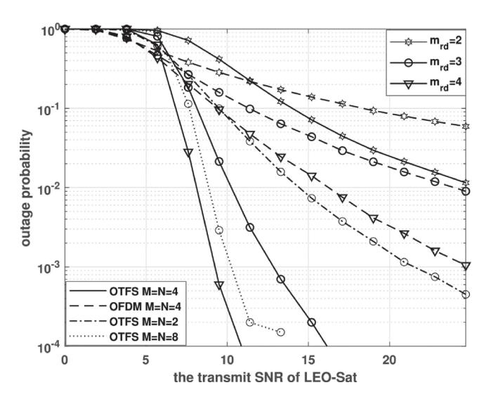

Fig. 13. Outage probability comparison for OTFS with OFDM in the downlink LEO SatCom systems. *M* and *N* denotes parameters of DD partitions for OTFS, and time-frequency partitions for OFDM. *mrd* is the Nakagami-m distribution parameter of the relay-destination channel [\[118\]](#page-25-5).

multiplexing (OFDM) with a novel synchronization technique is used for compatibility with existing systems in [\[121\]](#page-25-8), [\[122\]](#page-25-9). In [\[119\]](#page-25-6), [\[120\]](#page-25-7), [\[121\]](#page-25-8), [\[122\]](#page-25-9), although they did not consider MIMO, their conclusions can be extended to MIMO systems as in cellular systems.

In summary, research on modulation and waveform is ongoing to address problems due to the properties of SatCom systems. The properties to consider are long propagation delay and high mobility, each resulting in low received power and a large Doppler effect. Representatively, in the SatCom MIMO system, the low received power problem is being studied to increase power efficiency using spatial resources like SM. In addition, the problem of large Doppler effects is solved by OTFS modulation, which converts the domain of the signal into a domain that is robust to the Doppler effects. Table [IV](#page-14-1) summarizes the modulation and waveform issues in the SatCom system, showing the carrier type that can be used and the target property to be solved.

### *C. Space-Time Block Code*

As mentioned above, the accuracy of CSI at the transmitter (CSIT) is critical to the performance of precoding techniques in MIMO systems. However, in practice, obtaining accurate CSIT in a SatCom system is quite difficult due to the high mobility and long propagation delay inherent in SatCom channels. In terms of the difficulty of CSIT acquisition discussed above, several existing works have been conducted aimed at reducing the dependency on the accuracy of the CSIT. **Space-time block coding (STBC)** is the one of the most representative techniques and has been widely studied in terrestrial communication systems [\[123\]](#page-25-10), [\[124\]](#page-25-11). STBC is a technique that transmits multiple copies of a data stream across multiple antennas and multiple times to exploit the various versions of the received data so as to improve the reliability of the data transmission.

Several existing studies in SatCom systems have been developed to improve the received signal error performance using STBC. In [\[125\]](#page-25-12), Arti and Jindal analyzed the performance of the orthogonal STBC (OSTBC) technique over independent and identically distributed shadowed-Rician land mobile satellite (SR-LMS) channels and correlated SR-LMS channels. Specifically, they obtained the analytical diversity order of the OSTBC through the derivation of the momentgenerating function for each channel case, and analyzed the effect of elevation angle on the symbol error rate (SER) performance and the ergodic capacity. In [\[126\]](#page-25-13), Rowhani and Akhlaghi proposed a concatenated code combining the STBC and the turbo code for the LMS Lutz channel. The authors investigated the bit error rate for low signal power to noise ratio (SNR) in SatCom systems.

To date, several studies have been published on STBC in a hybrid satellite-terrestrial relay network (HSTRN) composed of satellite-relay-user links and satellite-user direct links [\[127\]](#page-25-14), [\[128\]](#page-25-15). In [\[127\]](#page-25-14), Ruan et al. distributed spacetime coding (DSTC) is proposed, which utilizes space-time codes for both the relay link and the satellite-user direct link when the shadowing effect on the direct link is severe due to the low elevation angle between the satellite and user. In [\[128\]](#page-25-15), Toka et al. considered a multi-user downlink nonorthogonal multiple access (NOMA) in the HSTRN system and utilized Alamouti code, which is the simplest STBC introduced by Alamouti in 1998 [\[129\]](#page-25-16). This model specifically considered shadowed-Rician fading on the satelliteterrestrial relay and Nakagami-*m* fading. The authors utilized the Alamouti code on the satellite-terrestrial relay link and imperfect successive interference cancellation on the relayuser link, and then derived the outage probability of each user.

In summary, research on the use of STBC is ongoing to address problems due to the properties of SatCom systems. The properties to consider are high mobility and long propagation delay, each resulting in large Doppler effect and long times required to obtain the CSI. Most of these studies focused on theoretical analysis of the error rate performance of STBC applied to the existing SatCom systems.

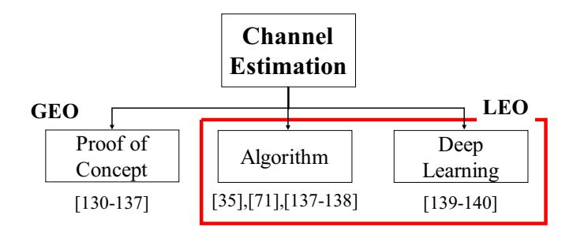

Fig. 14. Categories of research on channel estimation.

### *D. Channel Estimation*

The long propagation delay and high mobility inherent in SatCom channels increase the channel estimation error and the large number of antennas increases the associated overhead. Given the fact that any effective MIMO technique requires accurate channel information, research on channel estimation in SatCom MIMO is essential. The detailed categories are shown in Fig. [14.](#page-15-0)

In GEO scenarios, which have been studied for several years, research on actual measurement and analysis of channels has been conducted to better understand this problem. Several studies have verified the performance of the MIMO technique and measured the channel between the GEO and the ground station in various bands, such as ultra high frequency (UHF), super high frequency (SHF), and extremely high frequency (EHF) [\[130\]](#page-25-17), [\[131\]](#page-25-18), [\[132\]](#page-25-19), [\[133\]](#page-25-20), [\[134\]](#page-25-21), [\[135\]](#page-25-22), [\[136\]](#page-25-23).

Channel information is a crucial element in achieving a sufficient performance level with MIMO. Some researches have suggested techniques for measuring these SatCom channels. In [\[137\]](#page-25-24), Wang et al. proposed an approach for estimating geometric-based mmWave MIMO CSI using a technique called adaptive random-selected multi-beamforming (ARM) estimation. They described a geometry-based channel model in the Sat-IoT in the HTS system. A characteristic of the SatCom in this case involved using compressive sensing to estimate the combination of the transmit beamformer on the satellite side and the receiving combiner on the user side randomly grouped for several time slots using sparsity in the angle domain. This approach yielded a reduction in the number of measurements required for channel estimation. In [\[71\]](#page-24-1), Liao et al. proposed a framework for channel estimation and tracking in ultra-massive MIMO aeronautical communication in THz communication. Their work centered on proposing a channel estimator assuming the connection situation between the aircraft and the aerial BS. However, this technique can also be applied to space-air-ground integrated networks such as satellites and aircraft. In this research work, the authors proposed a 3-stage channel estimation and tracking framework to solve the triple delay-beam-Doppler squint effect. This effect is a performance degradation caused by time delay, beam direction uncertainty, and Doppler effect, which occurs when the relative angle changes as the aircraft with its huge number of antennas moves. The authors proved that the proposed method shows

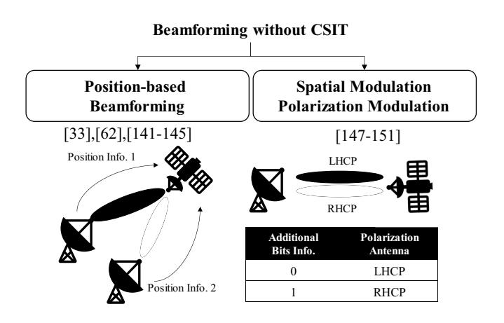

Fig. 15. Categories of research on beamforming without CSIT.

high channel estimation performance in a variety of scenarios. In addition, several studies have involved research on channel estimation in a beam squint environment involving LEO channel estimation [\[35\]](#page-23-11), [\[138\]](#page-25-25). In [\[139\]](#page-25-26), Zhang et al. proposed a deep learning-based channel prediction method to solve the channel aging problem in LEOs. Given the high speed of the satellite and the long propagation delay time, the CSI acquired during transmission is highly likely to be outdated. To this end, they proposed a SatCom channel predictor (SCP) based on long short-term memory (LSTM) that is effective for sequential data processing. This technique shows low estimation error performance compared to other Kalman filter and recursive neural networks (RNN). Lu et al. proposed a channel estimation method using a basic deep learning structure in multi-satellite multi-ground environments [\[140\]](#page-25-27).

In summary, the main topics of research related to channel estimation are the difficulties of SatCom channel estimation and the overhead associated with a large number of antennas. A great deal of research has actually been done in the area of GEO, with a lot of ongoing research recently focused on actual measurement results as well. For LEO, on the other hand, the prevailing issue is algorithmic research on initial channel estimation, along with additional study involving channel prediction methods using deep learning.

### *E. Beamforming Without CSIT*

In addition to the other techniques discussed above, methods to overcome large propagation delay and high mobility can be categorized as beamforming without CSIT. Since no channel information is used, beamforming techniques have been studied that use additional information such as location information or utilize the spatial domain. As shown in Fig. [15,](#page-16-0) the research directions on beamforming without CSIT can be divided into two categories: "Position-based beamforming" and "Spatial Modulation and Polarized Modulation".

From the facts that 1) the relative position between the satellite and the user terminal is a key factor determining the channel characteristics of the SatCom and 2) the information is readily accessible in the SatCom systems, some research works have suggested position-based beamforming schemes

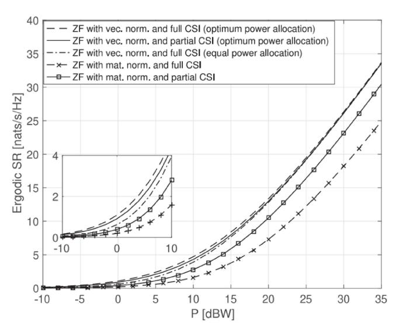

Fig. 16. Ergodic sum rates of ZF precoder with full CSI and partial CSI (Location Information) as a function of transmit power [\[143\]](#page-25-28).

which do not require the iCSI [\[33\]](#page-23-9), [\[62\]](#page-23-38), [\[141\]](#page-25-29), [\[142\]](#page-25-30), [\[143\]](#page-25-28), [\[144\]](#page-25-31), [\[145\]](#page-25-32).

In [\[62\]](#page-23-38), [\[141\]](#page-25-29), [\[142\]](#page-25-30), a multi-beam (MB) approach has been introduced. In this approach, the satellite has a pre-defined set of beamforming vectors, which are simply assigned to user terminals according to their position information. The MB approach has advantages in terms of implementation complexity. However, in this scheme, dealing with the interuser interference (IUI) requires considering how to manage the radio resources. To suppress the IUI without considering the radio resource management aspects, a new zero-forcing (ZF) precoder [\[143\]](#page-25-28) and regularized ZF (RZF) precoder [\[33\]](#page-23-9), [\[144\]](#page-25-31) were designed, which require only the relative position information between the satellite and the user terminal. In particular, in [\[143\]](#page-25-28), Ahmad et al. provide a simulation result (see Fig. [16\)](#page-16-1) showing that the ZF precoder with partial channel information (location information) can achieve the performance of the ZF precoder with full CSI in the high transmit power regime. Conversely, in [\[144\]](#page-25-31), Kang et al. show that the position-based RZF precoder can achieve performance similar to that of the RZF precoder based on perfect CSI in the low SNR regime, although the performance gap between them increases as the SNR increases. You et al. showed that the regularized RZF schemes with a proper user grouping method called space angle-based user grouping (SAUG) can achieve SINR performance similar to what is possible with iCSI-based systems [\[33\]](#page-23-9). To enhance the spectral efficiency, Röper et al. designed a distributed linear precoding based on the relative position information between multiple satellites and the served user terminal [\[145\]](#page-25-32). In the proposed system, multiple satellites serve only one user terminal. To implement the joint transmission, satellites share information on the transmitted messages. Each satellite then designs a precoder based on the position information without additional information sharing between satellites. The optimal inter-satellite distance required to achieve the upper bound of the rate was also derived.

The next noteworthy research work on beamforming without CSIT involves SM approaches that can increase spectral efficiency without the CSIT [\[146\]](#page-25-33). In a general SM approach, additional information bits are coded as antenna indices and only the selected transmit antennas are activated to transfer the additional bits. Then, by estimating the antenna indices, the receiver can recover the additional bits, thus boosting the spectral efficiency via this series of processes. Furthermore, the SM approaches can boost spectral efficiency as the number of antennas increases. Thus, it seems that the SM approaches are good solution for the LEO SatCom systems. However, applying conventional SM approaches to LEO SatCom systems is no simple matter, given the LOS channel characteristic of the systems[.1](#page-17-0)

With the goal of applying the SM concept to the SatCom system, several works have suggested polarization modulation (PM) [\[147\]](#page-25-34), [\[148\]](#page-25-35), [\[149\]](#page-25-36). In [\[147\]](#page-25-34), Henarejos and Pérez-Neira first introduced the PM approach which employs the polarization channels as the antenna indices. As this was only initial research on applying the SM technique to the satellite scenario, they assumed that only one polarization is activated at a transmission time. Nevertheless, they showed that the PM approach can achieve 100% gain in the low SNR regime. To expand the spatial degree of freedom, multi-dimensional PM schemes were suggested [\[148\]](#page-25-35), [\[149\]](#page-25-36), [\[150\]](#page-25-37). These schemes overcome the limitation of the polarization domain which has only two orthogonal pairs by adopting the joint transmission mechanism. Although a huge overhead would theoretically be required to implement these schemes, this could be a direction worth pursuing toward achieving high throughput in the SatCom system.

As noted above, research on beamforming without CSIT has been actively conducted to improve system performance. Although several works showed that their solutions can achieve system performance similar to the conventional iCSIbased approach, the solutions still need additional overhead such as proper user scheduling methods and joint transmission mechanisms.

### *F. Cooperative Beamforming*

In SatCom, the LoS channel is a key characteristic that prevents performance gains with MIMO. Several methods exist to address this issue. Cooperative beamforming, or joint transmission and reception, is one such technique that works by creating multiple paths to overcome the problems caused by LoS channels. Fig. [17](#page-17-1) is a categorization table for cooperative beamforming. Cooperative beamforming can be categorized into ISTN and multi-satellite scenarios. In ISTN scenarios, studies have been conducted on controlling the interference of SatCom networks and terrestrial networks to each other and improving their communication performance. In this case, the mutual channel information is shared by the satellite and the BS. In contrast, in the multi-satellite case, a large number of LEOs share channel information through ISL and perform coordination.

Cooperation with ground networks such as **ISTN** has been a subject of study since GEO. In [\[151\]](#page-25-38), Zhu et al.

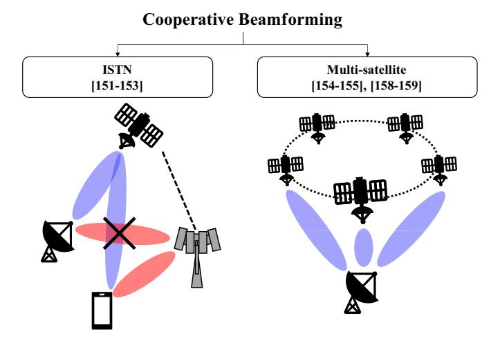

Fig. 17. Categories of research on cooperative beamforming.

considered a cooperative-based multicast system between satellite networks and terrestrial networks, with the role of SatCom being to support lower-level users with poor channel conditions in terrestrial networks. They proposed a beamforming design to maximize the weighted max-min fairness (MMF) of the entire system. In [\[152\]](#page-25-39), Zhang et al. additionally considered a backhaul link to assume a more realistic scenario than in the previous work [\[151\]](#page-25-38). Based on previous works, they proposed a beamforming design and resource allocation that maximize the minimum value of the sum rate. In [\[153\]](#page-25-40), Erturk and Altunbas proposed a cooperative beamforming technique applying SM in the hybrid satelliteterrestrial cooperative system. In addition to the conventional modulation information, SM is a technique for transmitting data using antenna indices. Their approach involved proposing a transmission scheme deploying SM in satellite-terrestrial relay networks using multiple terrestrial BSs as relay nodes. According to the authors, this type of SM has two advantages in a satellite environment: The first is EE gains achieved by the small number of antennas requiring activation, and the second is that it is robust to channel uncertainty. They derived symbol error probabilities based on this and showed superior performance compared to vertical Bell Laboratories layered space time (V-BLAST) or space time Alamouti code.

For cooperative beamforming in **multi-satellite scenarios**, we mainly assume a LEO SatCom. In [\[154\]](#page-25-41), Richter et al. summarized joint transmission with two low-orbit satellites. Due to the LoS-dominant channel, relative position information between the satellite and the ground station is very important. They derived the outage probability for the relative locationbased cooperative satellite technique and showed that it has superior performance compared to a single satellite. In [\[155\]](#page-25-42), Arti addressed the signal reception problem in a multi-satellite scenario. In practice, overlapping areas of satellites' wide coverage will receive signals from multiple satellites, causing unwanted interference. To address this, they proposed a data detection method that continuously performs a perfect CSI-based interference nulling/cancellation. In addition, they analyzed performance metrics such as SER, diversity order, and average capacity based on this.

1The LOS channel has the characteristic of high spatial correlation, making it hard for the receiver to estimate the antenna indices.

There are also examples of terrestrial cell-free MIMO techniques being applied to SatCom. Cell-free MIMO is a technique in which all antennas are used by multiple distributed BSs and includes the concepts of cooperative beamforming and distributed MIMO [\[156\]](#page-25-43), [\[157\]](#page-25-44). In [\[158\]](#page-26-0), [\[159\]](#page-26-1), Abdelsadek et al. introduced the concept of distributed massive MIMO or cell-free MIMO in LEO SatCom. In the case of LEO SatCom, super satellite nodes (SSNs) with enhanced computing power are connected by ISLs with neighboring satellite access points (SAPs) to perform the role of cell-free MIMO. This, according to the authors, results in high spectral efficiency [\[158\]](#page-26-0) and improved service time for users [\[159\]](#page-26-1).

In summary, cooperative beamforming is an easy technique to use to increase diversity in a SatCom system. While cooperation with terrestrial networks is possible, cooperation with multiple satellites is more useful in a mega-constellation LEO SatCom. There is also active research being done on cell-free MIMO techniques, which are being studied on the ground.

# *G. Rate Splitting Multiple Access*

The very nature of SatCom MIMO, which requires wide coverage communication support, makes studying a technique for multicasting essential. SDMA and NOMA are arguably the most representative multicasting techniques. **Multicasting** is a system in which one transmitter communicates with multiple (but not all) receivers, as opposed to unicasting, where one transmitter sends to one receiver, and broadcasting, where one transmitter broadcasts to all receivers. Since not all receivers require a specific desired receiver to selectively receive information, a technique for effectively separating information is needed. Multicasting through SDMA or MIMO is common in SatCom, but various recent studies have considered a much larger number of users, e.g., Sat-IoT. Due to the characteristics of SatCom, it is necessary to support a large number of users even in the area supported by one beam, so data separation must be performed using NOMA in addition to multi-beam.

In SDMA, users are multiplexed into the spatial domain through multi-user linear precoding. All multi-user interference that occurs in the receiver is considered to be noise. On the other hand, in NOMA, signals are transmitted by overlapping users through superposition coding (SC), and all multi-user interference occurring in the receiver is considered interference and must be fully decoded. **Rate-splitting multiple access (RSMA)** is a technique for flexible operation of SDMA and RSMA [\[160\]](#page-26-2), [\[161\]](#page-26-3). Fig. [18](#page-18-0) shows the basic RSMA transmitter and receiver structure. RSMA divides the signal to be transmitted into two types and transmits some as common messages and some as private messages. The receiving end decodes the common message first and decodes each individual's private message after SIC. Mao et al. defined RSMA as general and flexible multiple access because it can operate as NOMA or SDMA depending on how much of the message is allocated to the common part and how much to the private part. RSMA outperforms existing SDMA and NOMA technologies, even when using imperfect CSITs to encode common and private messages. In other words, *RSMA*

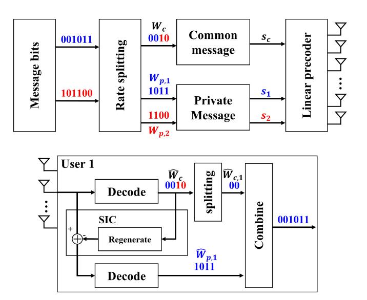

Fig. 18. Basic RSMA transmitter and receiver structure.

*is very suitable in SatCom where research on robust beamforming considering imperfect CSI while targeting multicast transmission is required*.

In [\[162\]](#page-26-4), Yin and Clerckx proposed a beamforming technique to obtain max-min fairness when RSMA is applied in a multigroup multicast multi-beam downlink. Their research involved proposing various parameters and strategies for actually operating RSMA, such as the ratio of common message and private message considering imperfect CSIT. Their results showed better performance than the conventional linear precoding method. Fig. [19](#page-19-0) shows a comparison of maxmin fairness performance among various cases. The results show that RSMA is superior to No-RSMA in max-min fairness performance. Performance gains were also seen in the Imperfect CSI RS. Also, in the case of hot spots, RS shows a larger max-min fairness performance gain than NoRS. In a follow-up study [\[163\]](#page-26-5), Yin and Clerckx extended their work to the ISTN scenario. In their work, they proposed a technique to support wide coverage via RSMA on satellites in a scenario where there is a high density of coexisting cellular users. They proposed two schemes: a coordinated scheme in which terrestrial and SatCom networks share only CSIT, and a cooperative scheme in which they share not only CSIT but also data. Experimentally, they showed superiority over existing NOMA and SDMA schemes. In [\[164\]](#page-26-6), Cui et al. studied energy-efficient RSMA techniques in multigroup multicast and multibeam SatCom. In their study, they showed that the RSMA technique efficiently mitigates inter-beam interference compared to NOMA and SDMA techniques. Furthermore, the results show that as the EE factor increases, NOMA and SDMA techniques suffer a larger penalty in power consumption, indicating the relative performance superiority of RSMA. Since then, active studies such as studies extending the design to the feeder link [\[165\]](#page-26-7), studies applying these ideas to the uplink [\[166\]](#page-26-8), [\[167\]](#page-26-9), and beamforming designs for maximizing secrecy EE [\[168\]](#page-26-10) are continuing.

In summary, providing smooth communication to users with very wide coverage in SatCom MIMO will require study of a

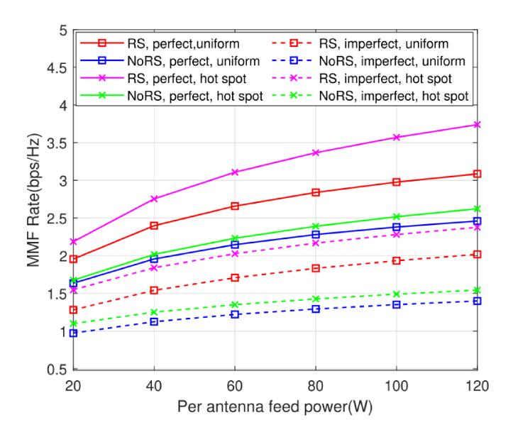

Fig. 19. Max-min fairness rate versus per-feed available power. The number of antennas is 7. The number of users is 14. Perfect and imperfect means perfect and imperfect CSI in the transmitter and receiver. Uniform means that the user distribution is uniform distribution. Hot spot means that users are concentrated in a specific area [\[162\]](#page-26-4).

multicasting technique such as RSMA. Currently, most studies are being conducted on the transmission/reception structure in a single satellite situation. In the future, from the point of view of multiple access research, in-depth research is needed on topics such as situations in which a larger number of users exist or on an operation technique in a heterogeneous network such as ISTN.

### *H. Secure Beamforming*

In SatCom, security is always treated as a major issue. SatCom signals can be easily intercepted by eavesdroppers thanks to their inherent characteristics of broadcasting and wide coverage. The conventional SatCom standards such as Consultative Committee of Space Data Systems (CCSDS) have strengthened security by applying a range of encryption methods in the upper layer [\[21\]](#page-22-19). Separately, PLS research has been done with the aim of enhancing security from an information theory perspective. The purpose of PLS is to maximize the secrecy capacity (rate). In scenarios where a transmitter (Alice) transmits a signal to a receiver (Bob) and the eavesdropper (Eve) intercepts it, the secrecy capacity (rate) is the difference between the Alice-Bob link capacity (rate) and the Alice-Eve link capacity (rate) [\[169\]](#page-26-11). Approaches for increasing the secrecy capacity in PLS, largely consist of a technique for increasing the performance of the Alice-Bob link and decreasing the performance of the Alice-Eve link. Since the technique for increasing the performance of the Alice-Bob link is the same as that of the general communication technique, a new method being studied in connection with PLS is a method of lowering the performance of the Alice-Eve link. To be precise, this approach considers **the technique of lowering the signal strength to the eavesdropper while maintaining or increasing the performance of the conventional desired link**. Examples of ways to achieve this are resource allocation

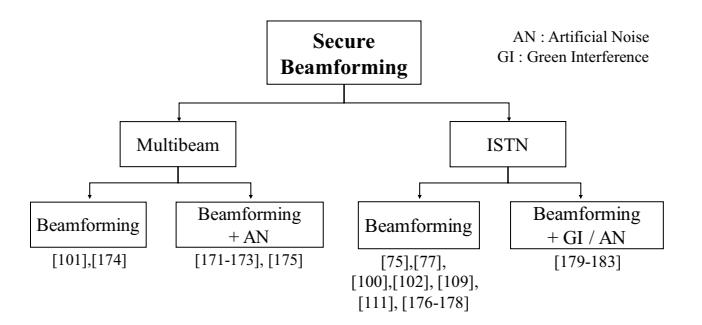

Fig. 20. Categories of research on secure beamforming.

such as power allocation or frequency hopping, signal processing techniques such as precoding or beamforming, and techniques such as Eve link performance degradation through jamming or artificial interference [\[170\]](#page-26-12). Fig. [20](#page-19-1) shows the categories of secure beamforming schemes.

In terms of the scenarios discussed above, the multi-beam scenario and the ISTN scenarios are particularly key when it comes to secure communication. We will look at the research being conducted in the **multi-beam** environment first. In [\[171\]](#page-26-13), Zheng et al. studied beamforming and artificial noise (AN) techniques to maximize the secrecy rate in a perfect CSI environment in which satellites know not only the channel information for legitimate users but also the channel information for eavesdroppers. AN is added to the null space for signals intended for legitimate users, and the signals are then transmitted. Since a signal is being added to the null space and sent, no additional processing is required on the receiving end, but it creates a problem in the form of transmit power loss for the desired signal. By presenting the performance according to the presence or absence of AN along with the proposed partial ZF beamforming technique, this research confirmed that the performance gain due to AN is very large in terms of the secrecy rate. Due to the demand for a more practical scenario, studies on imperfect CSI for the eavesdropper were conducted in [\[172\]](#page-26-14), [\[173\]](#page-26-15). These two studies presented techniques for maximizing the secrecy rate through robust beamforming in a scenario with norm-bounded channel estimation error for the eavesdropper. In [\[174\]](#page-26-16), Cui et al. conducted research focused on increasing secrecy in systems where terrestrial users use full-duplex receivers. When a terrestrial eavesdropper hears satellite and terrestrial signals, the mutual signals can interfere with other signals, thus increasing secrecy. In [\[101\]](#page-24-31), Zhang et al. proposed a robust beamforming technique using only the approximate location information of a number of eavesdroppers known by a satellite. In [\[175\]](#page-26-17), Schraml et al. proposed multiuser and multiple eavesdropper scenarios as precoding techniques and presented performance changes based on the presence or absence of AN.

As opposed to the multi-beam scenario, many studies have been conducted on secure communication in **ISTN** networks. This is because of the advantages that this scenario has as a precursor for multi-beam. In this scenario, inter-system interference already exists. In secure communication research, inter-system interference that already exists acts as artificial interference to eavesdroppers, resulting in improvement

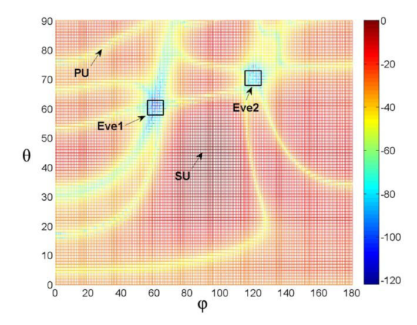

Fig. 21. Beam pattern versus angle of arrival of coordinated eavesdroppers [\[176\]](#page-26-18).

of secrecy capacity. Interference that benefits the system is expressed as *green interference*. Therefore, unlike the basic multi-beam arrangement, most of the optimization techniques including transmission and resources of other systems that provide interference are already present. In the early days, the subject of beamforming was limited to terrestrial BSs [\[75\]](#page-24-5), [\[176\]](#page-26-18). In [\[75\]](#page-24-5), a beamforming technique that can maximize security via terrestrial BSs is presented for both the imperfect CSI and the statistical CSI for the channel information of the eavesdropper. In [\[176\]](#page-26-18), Lin et al. proposed a terrestrial BS beamforming technique in the angular channel uncertainty model of multiple eavesdroppers. Fig. [21](#page-20-1) shows the proposed beamforming pattern versus the angle of arrival of the eavesdroppers. The satellite that transmits the secondary user needs to satisfy two conditions. The first is not to transmit the signal to the primary user and eavesdropper. The second is to transmit a high intensity signal to the secondary user. The figure clearly shows the proposed beamforming technique. However, it showed low performance compared to techniques that perform joint beamforming with satellites, and the main research direction from that point on that has been joint processing between satellites and ground-based elements. Lin et al. conducted a study of a joint beamforming technique in the perfect CSI situation for multiple eavesdroppers [\[77\]](#page-24-7). As with multibeam, there have been many studies on robust beamforming techniques that consider practical scenarios. As confirmed in the previous subsection, robust beamforming was studied under Shadowed-Rician channel uncertainty [\[109\]](#page-24-39), [\[111\]](#page-24-41) and angular uncertainty [\[100\]](#page-24-30), [\[177\]](#page-26-19). In addition, in the case of resource allocation including transmit power [\[178\]](#page-26-20), research that performs cooperative beamforming with the ground [\[179\]](#page-26-21), and research that performs beamforming and AN [\[180\]](#page-26-22), [\[181\]](#page-26-23), [\[182\]](#page-26-24), [\[183\]](#page-26-25), the investigations were conducted assuming perfect CSI. In [\[100\]](#page-24-30), [\[184\]](#page-26-26), a beamforming technique that maximizes secrecy EE was studied. Specifically, Lin et al. studied a beamforming technique to maximize secrecy EE in a hybrid beamforming structure where EE is a major parameter [\[100\]](#page-24-30). Aside from the integrated system between

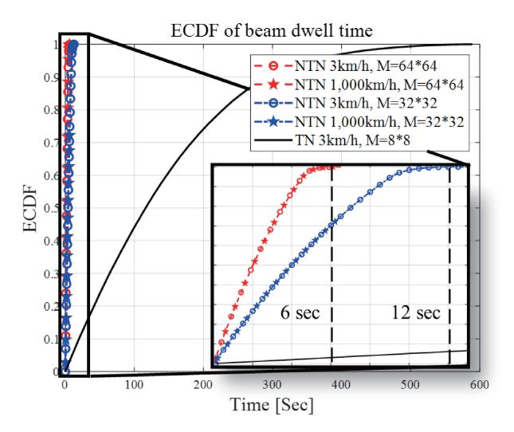

Fig. 22. Variation of beam index of satellite while the user is receiving service.

the general satellite and terrestrial network, studies on the same secure communication have been conducted in scenarios involving HAPs and UAVs [\[96\]](#page-24-26), [\[185\]](#page-26-27), [\[186\]](#page-26-28), [\[187\]](#page-26-29), among others.

In summary, SatCom MIMO is vulnerable to security problems due to its wide communication range, and research on secure beamforming is being actively conducted to overcome this. Optimizing secure beamforming mostly involves research considering eavesdroppers in a multi-beam scenario. However, transmission methods using artificial noise or the green interference method using heterogeneous networks (such as terrestrial networks in the ISTN scenario) are also being studied together with the beamforming method.

### V. FUTURE WORKS

In Section [IV,](#page-11-0) we looked at the recent technology trends for SatCom MIMO. As research on SatCom expands, research on SatCom MIMO is increasing, but most of the research remains focused on GEO. Given the recent expansion of the LEO market and the provision of actual services, there is a great need for research that reflects the characteristics and standards of LEO. In this section, we will examine the future research trends focusing on LEO.

### *A. Beam Management*

The large number of antennas and beams in SatCom imposes a large overhead on the beam management process. Beam management/tracking is a process in which the transceiver determines which beam to use while operating multiple beams. In NR, the beam management process consists of four steps: 1) Beam sweeping, 2) beam measurement, 3) beam determination, and 4) beam reporting [\[188\]](#page-26-30). Beam tracking is a process of tracking changes in the beam index initially determined by beam management according to the user's mobility. Fig. [22](#page-20-2) shows the empirical cumulative distribution function (ECDF) results for beam dwell time in SatCom and terrestrial networks. SatCom is assumed to use a 64x64 and 32x32 UPA antenna. For the terrestrial networks, a BS

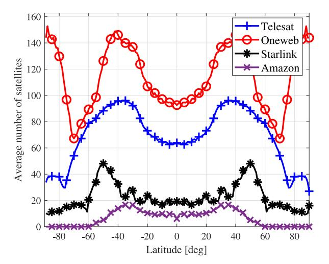

Fig. 23. Average number of service available satellites by latitude and company.

with 8x8 UPA antennas was assumed. From these results, we can see that in SatCom, the beam index changes at most every 6 and 12 seconds, respectively. Considering that 50% of users in terrestrial networks change their beam index about every 120 seconds, this is much more frequent. Also, considering the speed of the satellite, the difference in speed between a 3 km/h user and a 1,000 km/h user is negligible, so there is little performance difference. This means the beam tracking process is required much more frequently. Given this situation, beam management in LEO will require a low-complexity technique that considers mobility and a large number of beams. In addition, beam management issues are often mentioned along with channel estimation issues. In [\[74\]](#page-24-4), [\[137\]](#page-25-24), framework issues such as beam selection and determination are also explained.

In summary, there is a need for beam management research that is suitable for LEO. In fact, beam management research on new environments in terrestrial networks, such as mmWave, is already in progress [\[189\]](#page-26-31), [\[190\]](#page-26-32). For satellites, the myriad antennas and beams involved make it essential that further research be conducted on the channel characteristics and the beam management technology.

### *B. Multi-Satellite Systems*

As discussed above, one of the three scenarios being actively studied in SatCom is the case where multiple satellites coexist. However, this does not adequately reflect the multi-satellite scenario that the large-scale LEO constellation represents. Fig. [23](#page-21-0) shows the number of satellites that will be able to service users located in a specific latitude when the deployment phases of the four major LEO companies (Telesat, OneWeb, Starlink, Amazon) [\[45\]](#page-23-21), [\[55\]](#page-23-31) are complete. In the final phase where more satellites are installed, OneWeb will be able to serve up to 150 satellites per user. The technologies being considered in the multi-satellite scenario are a cooperative MIMO technique such as the virtual MIMO system and the interference management technique. When techniques such as cooperative MIMO, distributed MIMO, and

cell-free MIMO are applied to the LEO constellation outlined above, a higher MIMO gain can be obtained. However, not enough studies specifically addressing this have been done to implement and operate it. Currently, the distance between satellites is farther than that between terrestrial BSs and, needless to say, there is no wired cable connecting different satellites. Research on ISL to address this problem is steadily progressing. Synchronization or outdated CSI problems may occur in a scenario in which a control signal is simultaneously transmitted from a ground station to multiple satellites or via an operation through ISL. With regard to interference management, exchange of channel information between multiple transmitters and receivers is an essential element, and a research process is required to effectively achieve this.

In summary, the multi-satellite scenario may produce unique and complex interference problems, but it promises a range of advantages, such as power gain and handover, that can be achieved through the use of multiple satellites. However, the research to date on the actual implementation process for this is insufficient.

# *C. Location Information-Based Framework*

In NR Rel.17, it is assumed that all service users have GNSS-capability. It is also assumed that satellites can use ephemeris information. Through ephemeris information, a user on the ground can acquire location information from information such as the location and direction of the satellite. That is, in LEO systems, the location information of the transceiver can be used. Various problems that may occur in the satellite can be solved based on such location information. For example, pre-compensation can be performed by estimating the Doppler shift associated with the high rate of speed in LEO based on the satellite's velocity. In addition, since their respective-positions are already known, a beam index designated in advance can be recognized in advance, or compensation can be performed by estimating the timing advance first. However, there is still a dearth of research on this topic. There is as yet no detailed study of compensation techniques using GNSS or ephemeris information, and the level of residual error or estimation error after compensation has not been discussed. In addition, further study is needed on the framework of control signal composition for estimation and compensation or feedback process signal flow.

In summary, the fact that the periodic motion of the satellite and the position information between the transmitting and receiving terminals can be shared constitutes a significant amount of information in the communication system. Therefore, it is necessary to study an appropriate transmission/reception framework so that this location information can be utilized.

### *D. Machine Learning*

Machine learning (ML) is one of the hottest technologies in signal processing. ML is a technology that builds a specific model through samples from multiple data sets to make predictions or decisions. ML techniques are used in various fields related to signal processing, such as computer vision and natural language processing, and the field of telecommunications is no exception. There have been quite a few studies on using ML in networking and resource management, such as for resource allocation, localization, spectrum sensing, and dynamic spectrum access. Similarly, there is a growing body of research that utilizes ML at the PHY layer [\[191\]](#page-26-33), [\[192\]](#page-26-34).

A typical application of ML in the PHY layer is the process of acquiring channel information. There are two main ways to acquire channel information in ML: channel prediction based on prior information, and channel estimation techniques using fewer channel estimation parameters. As previously described in Section [IV-D,](#page-15-1) the massive antenna and beam and long propagation delay in SatCom cause great difficulty in acquiring channel information. Channel estimation techniques using ML can be utilized for channel prediction that can overcome channel aging or techniques that reduce overhead by estimating various parameters of SatCom channels (e.g., Doppler shift, path difference, angle of arrival (AoA) and angle of departure (AoD), etc.). In addition, ML can be utilized in high complexity problems such as decoding for non-coherent detection and transmit beamformer design in massive antennas and hybrid beamforming structures.

### VI. CONCLUSION

In conclusion, there is a great deal of room for research on the various aspects of SatCom system operation. It is our hope that this survey will serve as a starting point for those beginning their research on SatCom MIMO systems by helping to identify the most important issues. Specifically, we recommend that those who are new to SatCom and who wish to monitor the research trends associated with SatCom MIMO focus on understanding the overall survey flow in Sections [II–](#page-1-1)[V.](#page-20-0) For those who are already familiar with terrestrial networks but are curious about SatCom, we recommend examining the differences between it and the terrestrial networks described in Sections [II](#page-1-1) and [III](#page-5-0) and the relationship between them and the current research issues associated with them. For those who are interested in the technological research trends of SatCom MIMO and are curious about the current most representative technologies, we recommend concentrating on the overall trend outlined in Section [IV.](#page-11-0) Finally, it is our recommendation that readers take a look at Section [V](#page-20-0) if they wish to explore areas of research that are currently underrepresented in the field but are essential to LEO SatCom.

Due to the demand for global coverage and the ongoing development of the satellite industry, the incorporation of SatCom in 6G seems essential, and it is currently in the early stages of research. However, the study of terrestrial networks and the study of SatCom differ in many areas due to their inherent differences, and this difference is deepened in SatCom MIMO for high throughput service. We have endeavored in this paper to explain the basic structure of SatCom and how it differs from ground-based communication. Recent research trends include study of a great number of techniques aimed at solving the problems caused by these differences. We have summarized eight current leading technical trends, along with the issues that need to be studied in the future that involve LEO SatCom MIMO. It is our hope that this effort will prove useful to a wide range of researchers.

### REFERENCES

- [\[1\]](#page-0-0) J. G. Puente, "The emergence of commercial digital satellite communications," *IEEE Commun. Mag.*, vol. 48, no. 7, pp. 16–20, Jul. 2010.
- [\[2\]](#page-0-0) V. Weerackody and L. Gonzalez, "Mobile small aperture satellite terminals for military communications," *IEEE Commun. Mag.*, vol. 45, no. 10, pp. 70–75, Oct. 2007.
- [\[3\]](#page-0-0) T. D. Cola, D. Tarchi, and A. Vanelli-Coralli, "Future trends in broadband satellite communications: Information centric networks and enabling technologies," *Int. J. Satellite Commun. Netw.*, vol. 33, no. 5, pp. 473–490, 2015.
- [\[4\]](#page-0-1) A. Guidotti et al., "Architectures and key technical challenges for 5G systems incorporating satellites," *IEEE Trans. Veh. Technol.*, vol. 68, no. 3, pp. 2624–2639, Mar. 2019.
- [\[5\]](#page-0-1) O. Kodheli, A. Guidotti, and A. Vanelli-Coralli, "Integration of satellites in 5G through LEO constellations," in *Proc. IEEE Global Commun. Conf. (GLOBECOM)*, 2017, pp. 1–6.
- [\[6\]](#page-0-2) D. Bogdan-Martin, *Measuring Digital Development: Facts and Figures 2021*, ITU, Geneva, Switzerland, 2021.
- [\[7\]](#page-0-3) G. Araniti, A. Iera, S. Pizzi, and F. Rinaldi, "Toward 6G non-terrestrial networks," *IEEE Netw.*, vol. 36, no. 1, pp. 113–120, Feb. 2022.
- [\[8\]](#page-0-3) M. M. Azari et al., "Evolution of non-terrestrial networks from 5G to 6G: A survey," *IEEE Commun. Surveys Tuts.*, vol. 24, no. 4, pp. 2633–2672, 4th Quart., 2022.
- [\[9\]](#page-0-4) A. Osseiran et al., "Scenarios for 5G mobile and wireless communications: The vision of the METIS project," *IEEE Commun. Mag.*, vol. 52, no. 5, pp. 26–35, May 2014.
- [\[10\]](#page-0-4) C.-X. Wang et al., "Cellular architecture and key technologies for 5G wireless communication networks," *IEEE Commun. Mag.*, vol. 52, no. 2, pp. 122–130, Feb. 2014.
- [\[11\]](#page-0-4) F. Rusek et al., "Scaling up MIMO: Opportunities and challenges with very large arrays," *IEEE Signal Process. Mag.*, vol. 30, no. 1, pp. 40–60, Jan. 2013.
- [\[12\]](#page-0-4) E. G. Larsson, O. Edfors, F. Tufvesson, and T. L. Marzetta, "Massive MIMO for next generation wireless systems," *IEEE Commun. Mag.*, vol. 52, no. 2, pp. 186–195, Feb. 2014.
- [\[13\]](#page-0-5) A. I. Perez-Neira, M. A. Vazquez, M. B. Shankar, S. Maleki, and S. Chatzinotas, "Signal processing for high-throughput satellites: Challenges in new interference-limited scenarios," *IEEE Signal Process. Mag.*, vol. 36, no. 4, pp. 112–131, Jul. 2019.
- [\[14\]](#page-0-5) O. Vidal, G. Verelst, J. Lacan, E. Alberty, J. Radzik, and M. Bousquet, "Next generation high throughput satellite system," in *Proc. IEEE 1st AESS Eur. Conf. Satellite Telecommun. (ESTEL)*, 2012, pp. 1–7.
- [\[15\]](#page-0-5) H. Fenech, S. Amos, A. Tomatis, and V. Soumpholphakdy, "High throughput satellite systems: An analytical approach," *IEEE Trans. Aerosp. Electron. Syst.*, vol. 51, no. 1, pp. 192–202, Jan. 2015.
- [\[16\]](#page-0-5) G. Zheng, S. Chatzinotas, and B. Ottersten, "Generic optimization of linear precoding in multibeam satellite systems," *IEEE Trans. Wireless Commun.*, vol. 11, no. 6, pp. 2308–2320, Jun. 2012.
- [\[17\]](#page-0-6) P.-D. Arapoglou, K. Liolis, M. Bertinelli, A. Panagopoulos, P. Cottis, and R. De Gaudenzi, "MIMO over satellite: A review," *IEEE Commun. Surveys Tuts.*, vol. 13, no. 1, pp. 27–51, Jan. 2011.
- [\[18\]](#page-0-7) F. E. Tubbal, R. Raad, and K.-W. Chin, "A survey and study of planar antennas for pico-satellites," *IEEE Access*, vol. 3, pp. 2590–2612, 2015.
- [\[19\]](#page-1-2) J. Liu, Y. Shi, Z. M. Fadlullah, and N. Kato, "Space–air–ground integrated network: A survey," *IEEE Commun. Surveys Tuts.*, vol. 20, no. 4, pp. 2714–2741, 4th Quart., 2018.
- [\[20\]](#page-1-3) F. Rinaldi et al., "Non-terrestrial networks in 5G & beyond: A survey," *IEEE Access*, vol. 8, pp. 165178–165200, 2020.
- [\[21\]](#page-1-4) O. Kodheli et al., "Satellite communications in the new space era: A survey and future challenges," *IEEE Commun. Surveys Tuts.*, vol. 23, no. 1, pp. 70–109, 1st Quart., 2021.
- [\[22\]](#page-1-5) N. Saeed, A. Elzanaty, H. Almorad, H. Dahrouj, T. Y. Al-Naffouri, and M.-S. Alouini, "CubeSat communications: Recent advances and future challenges," *IEEE Commun. Surveys Tuts.*, vol. 22, no. 3, pp. 1839–1862, 3rd Quart., 2020.
- [\[23\]](#page-1-6) M. Centenaro, C. E. Costa, F. Granelli, C. Sacchi, and L. Vangelista, "A survey on technologies, standards and open challenges in satellite IoT," *IEEE Commun. Surveys Tuts.*, vol. 23, no. 3, pp. 1693–1720, 3rd Quart., 2021.

- [\[24\]](#page-1-3) M. Hosseinian, J. P. Choi, S.-H. Chang, and J. Lee, "Review of 5G NTN standards development and technical challenges for satellite integration with the 5G network," *IEEE Aerosp. Electron. Syst. Mag.*, vol. 36, no. 8, pp. 22–31, Aug. 2021.
- [\[25\]](#page-1-7) M. Khammassi, A. Kammoun, and M.-S. Alouini. "Precoding for high throughput satellite communication systems: A survey." 2022. [Online]. Available: https://arxiv.org/abs/2208.08542
- [\[26\]](#page-1-8) N. Abdelsalam, S. Al-Kuwari, and A. Erbad. "Physical layer security in satellite communication: State-of-the-art and open problems." 2023. [Online]. Available: https://arxiv.org/abs/2301.03672
- [\[27\]](#page-3-0) I. Ali, N. Al-Dhahir, and J. Hershey, "Doppler characterization for LEO satellites," *IEEE Trans. Commun.*, vol. 46, no. 3, pp. 309–313, Mar. 1998.
- [\[28\]](#page-4-3) *Study on New Radio (NR) to Support Non-Terrestrial Networks (Release 15)*, 3GPP, Sophia Antipolis, France, 2020.
- [\[29\]](#page-4-3) *Solutions for NR to Support Non-Terrestrial Networks (NTN) (Release 16)*, 3GPP, Sophia Antipolis, France, 2021.
- [\[30\]](#page-4-4) L. You, A. Liu, W. Wang, and X. Gao, "Outage constrained robust multigroup multicast beamforming for multi-beam satellite communication systems," *IEEE Wireless Commun. Lett.*, vol. 8, no. 2, pp. 352–355, Apr. 2019.
- [\[31\]](#page-4-4) X. Zhang, J. Wang, C. Jiang, C. Yan, Y. Ren, and L. Hanzo, "Robust beamforming for multibeam satellite communication in the face of phase perturbations," *IEEE Trans. Veh. Technol.*, vol. 68, no. 3, pp. 3043–3047, Mar. 2019.
- [\[32\]](#page-4-4) W. Lu, K. An, T. Liang, and X. Yan, "Robust beamforming in multibeam satellite systems with non-orthogonal multiple access," *IEEE Wireless Commun. Lett.*, vol. 9, no. 11, pp. 1889–1893, Nov. 2020.
- [\[33\]](#page-4-5) L. You, K.-X. Li, J. Wang, X. Gao, X.-G. Xia, and B. Ottersten, "Massive MIMO transmission for LEO satellite communications," *IEEE J. Sel. Areas Commun.*, vol. 38, no. 8, pp. 1851–1865, Aug. 2020.
- [\[34\]](#page-4-5) L. You et al., "Beam squint-aware integrated sensing and communications for hybrid massive MIMO LEO satellite systems," *IEEE J. Sel. Areas Commun.*, vol. 40, no. 10, pp. 2994–3009, Oct. 2022.
- [\[35\]](#page-4-5) X. Qiang, L. You, C. G. Tsinos, W. Wang, X. Gao, and B. Ottersten, "Joint communications and sensing for hybrid massive MIMO LEO satellite systems with beam squint," in *Proc. IEEE Int. Conf. Commun. Workshops (ICC Workshops)*, 2022, pp. 963–968.
- [\[36\]](#page-4-6) N. Okati, T. Riihonen, D. Korpi, I. Angervuori, and R. Wichman, "Downlink coverage and rate analysis of low earth orbit satellite constellations using stochastic geometry," *IEEE Trans. Commun.*, vol. 68, no. 8, pp. 5120–5134, Aug. 2020.
- [\[37\]](#page-4-6) N. Okati and T. Riihonen, "Nonhomogeneous stochastic geometry analysis of massive LEO communication constellations," *IEEE Trans. Commun.*, vol. 70, no. 3, pp. 1848–1860, Mar. 2022.
- [\[38\]](#page-4-7) Y. Su, Y. Liu, Y. Zhou, J. Yuan, H. Cao, and J. Shi, "Broadband LEO satellite communications: Architectures and key technologies," *IEEE Wireless Commun.*, vol. 26, no. 2, pp. 55–61, Apr. 2019.
- [\[39\]](#page-4-8) J. Jiang, S. Yan, and M. Peng, "Regional LEO satellite constellation design based on user requirements," in *Proc. IEEE/CIC Int. Conf. Commun. China (ICCC)*, 2018, pp. 855–860.
- [\[40\]](#page-4-9) I. Meziane-Tani, G. Métris, G. Lion, A. Deschamps, F. T. Bendimerad, and M. Bekhti, "Optimization of small satellite constellation design for continuous mutual regional coverage with multi-objective genetic algorithm," *Int. J. Comput. Intell. Syst.*, vol. 9, no. 4, pp. 627–637, 2016.
- [\[41\]](#page-4-10) R. Deng, B. Di, H. Zhang, L. Kuang, and L. Song, "Ultra-dense LEO satellite constellations: How many LEO satellites do we need?" *IEEE Trans. Wireless Commun.*, vol. 20, no. 8, pp. 4843–4857, Aug. 2021.
- [\[42\]](#page-4-11) T. Savitri, Y. Kim, S. Jo, and H. Bang, "Satellite constellation orbit design optimization with combined genetic algorithm and semianalytical approach," *Int. J. Aerosp. Eng.*, vol. 2017, May 2017, Art. no. 1235692.
- [\[43\]](#page-4-11) C. Dai, G. Zheng, and Q. Chen, "Satellite constellation design with multi-objective genetic algorithm for regional terrestrial satellite network," *China Commun.*, vol. 15, no. 8, pp. 1–10, Aug. 2018.
- [\[44\]](#page-4-12) Z. Liu, W. Guo, W. Hu, and M. Xia, "Delay minimization for progressive construction of satellite constellation network," *IEEE Commun. Lett.*, vol. 19, no. 10, pp. 1718–1721, Oct. 2015.
- [\[45\]](#page-5-4) I. Del Portillo, B. G. Cameron, and E. F. Crawley, "A technical comparison of three low earth orbit satellite constellation systems to provide global broadband," *Acta Astronautica*, vol. 159, pp. 123–135, Jun. 2019.
- [\[46\]](#page-5-5) "Satellite earth stations and systems (SES); Ka band satellite component of IMT-advanced," ETSI, Sophia Antipolis, France, Rep. 103263, Feb. 2017. [Online]. Available: https://www.etsi.org/deliver/etsi\_tr/ 103200\_103299/103263/01.02.01\_60/tr\_103263v010201p.pdf

- [\[47\]](#page-5-6) E. Biglieri, R. Calderbank, A. Constantinides, A. Goldsmith, A. Paulraj, and H. V. Poor, *MIMO Wireless Communications*. Cambridge, U.K.: Cambridge Univ. Press, 2007.
- [\[48\]](#page-6-1) S. K. Rao, "Advanced antenna technologies for satellite communications payloads," *IEEE Trans. Antennas Propag.*, vol. 63, no. 4, pp. 1205–1217, Apr. 2015.
- [\[49\]](#page-6-1) B. Palacin et al., "Multibeam antennas for very high throughput satellites in Europe: Technologies and trends," in *Proc. 11th Eur. Conf. Antennas Propag. (EUCAP)*, 2017, pp. 2413–2417.
- [\[50\]](#page-6-2) M. V. Drummond et al., "Dimensioning of a multibeam coherent photonic beamformer fed by a phased array antenna," *Opt. Exp.*, vol. 26, no. 5, pp. 6158–6171, 2018.
- [\[51\]](#page-6-3) M. Schneider, C. Hartwanger, and H. Wolf, "Antennas for multiple spot beam satellites," *CEAS Space J.*, vol. 2, no. 1, pp. 59–66, 2011.
- [\[52\]](#page-6-4) S. Gao, Y. Rahmat-Samii, R. E. Hodges, and X.-X. Yang, "Advanced antennas for small satellites," *Proc. IEEE*, vol. 106, no. 3, pp. 391–403, Mar. 2018.
- [\[53\]](#page-6-5) Y. Guan, F. Geng, and J. H. Saleh, "Review of high throughput satellites: Market disruptions, affordability-throughput map, and the cost per bit/second decision tree," *IEEE Aerosp. Electron. Syst. Mag.*, vol. 34, no. 5, pp. 64–80, May 2019.
- [\[54\]](#page-6-5) P. K. Mishra et al., "High-throughput satellite characterization: Spot beam payload characterization of high-throughput satellites in a compact antenna test facility," *IEEE Antennas Propag. Mag.*, vol. 61, no. 5, pp. 69–76, Oct. 2019.
- [\[55\]](#page-6-6) N. Pachler, I. del Portillo, E. F. Crawley, and B. G. Cameron, "An updated comparison of four low earth orbit satellite constellation systems to provide global broadband," in *Proc. IEEE Int. Conf. Commun. Workshops (ICC Workshops)*, 2021, pp. 1–7.
- [\[56\]](#page-9-0) V. Joroughi, M. Á. Vázquez, and A. I. Pérez-Neira, "Precoding in multigateway multibeam satellite systems," *IEEE Trans. Wireless Commun.*, vol. 15, no. 7, pp. 4944–4956, Jul. 2016.
- [\[57\]](#page-9-1) C. Mosquera, R. López-Valcarce, T. Ramírez, and V. Joroughi, "Distributed precoding systems in multi-gateway multibeam satellites: Regularization and coarse beamforming," *IEEE Trans. Wireless Commun.*, vol. 17, no. 10, pp. 6389–6403, Oct. 2018.
- [\[58\]](#page-9-2) K. Guo, M. Lin, B. Zhang, W.-P. Zhu, J.-B. Wang, and T. A. Tsiftsis, "On the performance of LMS communication with hardware impairments and interference," *IEEE Trans. Commun.*, vol. 67, no. 2, pp. 1490–1505, Feb. 2019.
- [\[59\]](#page-9-3) B. F. Beidas, "High-capacity, weather-resilient MIMO feeder links in multibeam satellite systems," *IEEE Trans. Commun.*, vol. 70, no. 7, pp. 4574–4590, Jul. 2022.
- [\[60\]](#page-9-3) I. Ahmad, K. D. Nguyen, N. Letzepis, and G. Lechner, "On the nextgeneration high throughput satellite systems with optical feeder links," *IEEE Syst. J.*, vol. 15, no. 2, pp. 2000–2011, Jun. 2021.
- [\[61\]](#page-9-4) M. n. Vázquez et al., "Precoding, scheduling, and link adaptation in mobile interactive Multibeam satellite systems," *IEEE J. Sel. Areas Commun.*, vol. 36, no. 5, pp. 971–980, May 2018.
- [\[62\]](#page-9-5) P. Angeletti and R. De Gaudenzi, "A pragmatic approach to massive MIMO for broadband communication satellites," *IEEE Access*, vol. 8, pp. 132212–132236, 2020.
- [\[63\]](#page-9-6) S.-M. Moon, S. Yun, I.-B. Yom, and H. L. Lee, "Phased array shaped-beam satellite antenna with boosted-beam control," *IEEE Trans. Antennas Propag.*, vol. 67, no. 12, pp. 7633–7636, Dec. 2019.
- [\[64\]](#page-9-7) M. Takahashi, Y. Kawamoto, N. Kato, A. Miura, and M. Toyoshima, "DBF-based fusion control of transmit power and beam directivity for flexible resource allocation in HTS communication system toward B5G," *IEEE Trans. Wireless Commun.*, vol. 21, no. 1, pp. 95–105, Jan. 2022.
- [\[65\]](#page-10-0) L. You et al., "Hybrid analog/digital precoding for downlink massive MIMO LEO satellite communications," *IEEE Trans. Wireless Commun.*, vol. 21, no. 8, pp. 5962–5976, Aug. 2022.
- [\[66\]](#page-10-0) L. You et al., "Massive MIMO hybrid precoding for LEO satellite communications with twin-resolution phase shifters and nonlinear power amplifiers," *IEEE Trans. Commun.*, vol. 70, no. 8, pp. 5543–5557, Aug. 2022.
- [\[67\]](#page-10-1) K.-X. Li et al., "Downlink transmit design for massive MIMO LEO satellite communications," *IEEE Trans. Commun.*, vol. 70, no. 2, pp. 1014–1028, Feb. 2022.
- [\[68\]](#page-10-2) K. Y. Zhong, Y. J. Cheng, H. N. Yang, and B. Zheng, "LEO satellite multibeam coverage area division and beamforming method," *IEEE Antennas Wireless Propag. Lett.*, vol. 20, no. 11, pp. 2115–2119, Nov. 2021.
- [\[69\]](#page-10-3) A. Ivanov, R. Bychkov, and E. Tcatcorin, "Spatial resource management in LEO satellite," *IEEE Trans. Veh. Technol.*, vol. 69, no. 12, pp. 15623–15632, Dec. 2020.

- [\[70\]](#page-10-4) X. Huang, J. A. Zhang, R. P. Liu, Y. J. Guo, and L. Hanzo, "Airplaneaided integrated networking for 6G wireless: Will it work?" *IEEE Veh. Technol. Mag.*, vol. 14, no. 3, pp. 84–91, Sep. 2019.
- [\[71\]](#page-10-4) A. Liao et al., "Terahertz ultra-massive MIMO-based aeronautical communications in space-air-ground integrated networks," *IEEE J. Sel. Areas Commun.*, vol. 39, no. 6, pp. 1741–1767, Jun. 2021.
- [\[72\]](#page-10-5) A. H. Khan, M. A. Imran, and B. G. Evans, "Semi-adaptive beamforming for OFDM based hybrid terrestrial-satellite mobile system," *IEEE Trans. Wireless Commun.*, vol. 11, no. 10, pp. 3424–3433, Oct. 2012.
- [\[73\]](#page-10-5) M. K. Arti and M. R. Bhatnagar, "Beamforming and combining in hybrid satellite-terrestrial cooperative systems," *IEEE Commun. Lett.*, vol. 18, no. 3, pp. 483–486, Mar. 2014.
- [\[74\]](#page-10-5) K. An, J. Ouyang, M. Lin, and T. Liang, "Outage analysis of multi-antenna cognitive hybrid satellite-terrestrial relay networks with beamforming," *IEEE Commun. Lett.*, vol. 19, no. 7, pp. 1157–1160, Jul. 2015.
- [\[75\]](#page-10-6) K. An, M. Lin, J. Ouyang, and W.-P. Zhu, "Secure transmission in cognitive satellite terrestrial networks," *IEEE J. Sel. Areas Commun.*, vol. 34, no. 11, pp. 3025–3037, Nov. 2016.
- [\[76\]](#page-10-6) O. Y. Kolawole, S. Vuppala, M. Sellathurai, and T. Ratnarajah, "On the performance of cognitive satellite-terrestrial networks," *IEEE Trans. Cogn. Commun. Netw.*, vol. 3, no. 4, pp. 668–683, Dec. 2017.
- [\[77\]](#page-10-6) M. Lin, Z. Lin, W.-P. Zhu, and J.-B. Wang, "Joint beamforming for secure communication in cognitive satellite terrestrial networks," *IEEE J. Sel. Areas Commun.*, vol. 36, no. 5, pp. 1017–1029, May 2018.
- [\[78\]](#page-10-7) A. Ghasemi and E. S. Sousa, "Fundamental limits of spectrum-sharing in fading environments," *IEEE Trans. Wireless Commun.*, vol. 6, no. 2, pp. 649–658, Feb. 2007.
- [\[79\]](#page-10-8) C. Zhang, C. Jiang, L. Kuang, J. Jin, Y. He, and Z. Han, "Spatial spectrum sharing for satellite and terrestrial communication networks," *IEEE Trans. Aerosp. Electron. Syst.*, vol. 55, no. 3, pp. 1075–1089, Jun. 2019.
- [\[80\]](#page-11-1) C. Liu, W. Feng, Y. Chen, C.-X. Wang, and N. Ge, "Optimal beamforming for hybrid satellite terrestrial networks with nonlinear PA and imperfect CSIT," *IEEE Wireless Commun. Lett.*, vol. 9, no. 3, pp. 276–280, Mar. 2020.
- [\[81\]](#page-11-2) D. Peng, D. He, Y. Li, and Z. Wang, "Integrating terrestrial and satellite multibeam systems toward 6G: Techniques and challenges for interference mitigation," *IEEE Wireless Commun.*, vol. 29, no. 1, pp. 24–31, Feb. 2022.
- [\[82\]](#page-11-3) Q. Huang, M. Lin, J.-B. Wang, T. A. Tsiftsis, and J. Wang, "Energy efficient beamforming schemes for satellite-aerial-terrestrial networks," *IEEE Trans. Commun.*, vol. 68, no. 6, pp. 3863–3875, Jun. 2020.
- [\[83\]](#page-11-3) H. Kong, M. Lin, W.-P. Zhu, H. Amindavar, and M.-S. Alouini, "Multiuser scheduling for asymmetric FSO/RF links in satellite-UAVterrestrial networks," *IEEE Wireless Commun. Lett.*, vol. 9, no. 8, pp. 1235–1239, Aug. 2020.
- [\[84\]](#page-11-3) H. Kong, M. Lin, J. Zhang, J. Ouyang, W.-P. Zhu, and M.-S. Alouini, "Beamforming design and performance analysis for satellite and UAV integrated networks in IoRT applications," *IEEE Internet Things J.*, vol. 18, no. 1, pp. 47–62, Jan. 2019.
- [\[85\]](#page-11-3) C. Ding, J.-B. Wang, H. Zhang, M. Lin, and G. Y. Li, "Joint optimization of transmission and computation resources for satellite and high altitude platform assisted edge computing," *IEEE Trans. Wireless Commun.*, vol. 21, no. 2, pp. 1362–1377, Feb. 2022.
- [\[86\]](#page-11-4) Y. Ruan, Y. Li, R. Zhang, W. Cheng, and C. Liu, "Cooperative resource management for cognitive satellite-aerial-terrestrial integrated networks towards IoT," *IEEE Access*, vol. 8, pp. 35759–35769, 2020.
- [\[87\]](#page-11-5) B. Di, H. Zhang, L. Song, Y. Li, and G. Y. Li, "Ultra-dense LEO: Integrating terrestrial-satellite networks into 5G and beyond for data offloading," *IEEE Trans. Wireless Commun.*, vol. 18, no. 1, pp. 47–62, Jan. 2019.
- [\[88\]](#page-11-5) B. Di, L. Song, Y. Li, and H. V. Poor, "Ultra-dense LEO: Integration of satellite access networks into 5G and beyond," *IEEE Wireless Commun.*, vol. 26, no. 2, pp. 62–69, Apr. 2019.
- [89] C. Li, H. Zhu, G. Li, Y. Zhang, and G. Li, "Analysis of ULA spacing threshold and capacity reduction in distributed satellite MIMO scenarios," *IEEE Commun. Lett.*, vol. 25, no. 11, pp. 3669–3673, Nov. 2021.
- [\[90\]](#page-11-6) C. Li, H. Zhu, J. Cai, J. Hu, G. Li, and G. Li, "Capacity analysis of terrestrial antenna array in distributed satellite MIMO communication system," *IEEE Trans. Veh. Technol.*, vol. 70, no. 5, pp. 4435–4450, May 2021.
- [\[91\]](#page-11-6) B. Zhao, G. Ren, and H. Zhang, "Multisatellite cooperative random access scheme in low earth orbit satellite networks," *IEEE Syst. J.*, vol. 13, no. 3, pp. 2617–2628, Sep. 2019.

- [\[92\]](#page-11-7) L. Feng, Y. Liu, L. Wu, Z. Zhang, and J. Dang, "A satellite handover strategy based on MIMO technology in LEO satellite networks," *IEEE Commun. Lett.*, vol. 24, no. 7, pp. 1505–1509, Jul. 2020.
- [\[93\]](#page-11-8) Y. Yan, K. An, B. Zhang, S. Li, and D. Guo, "Outage constrained robust beamforming for multicast multibeam satellite systems with a phase error," *IEEE Trans. Aerosp. Electron. Syst.*, vol. 56, no. 5, pp. 4152–4156, Oct. 2020.
- [\[94\]](#page-13-0) J. Chu, X. Chen, C. Zhong, and Z. Zhang, "Robust design for NOMAbased multibeam LEO satellite Internet of Things," *IEEE Internet Things J.*, vol. 8, no. 3, pp. 1959–1970, Feb. 2021.
- [\[95\]](#page-13-0) A. Gharanjik, M. B. Shankar, P. D. Arapoglou, M. Bengtsson, and B. Ottersten, "Robust precoding design for multibeam downlink satellite channel with phase uncertainty," in *Proc. IEEE Int. Conf. Acoust. Speech Signal Process. (ICASSP)*, 2015, pp. 3083–3087.
- [\[96\]](#page-13-0) Z. Lin, M. Lin, Y. Huang, T. D. Cola, and W.-P. Zhu, "Robust multi-objective beamforming for integrated satellite and high altitude platform network with imperfect channel state information," *IEEE Trans. Signal Process.*, vol. 67, no. 24, pp. 6384–6396, Dec. 2019.
- [\[97\]](#page-13-0) L. Gao, J. Ma, L. You, C. Pan, W. Wang, and X. Gao, "Robust energyefficient multigroup multicast beamforming for multi-beam satellite communications," in *Proc. IEEE Int. Conf. Commun. (ICC)*, 2020, pp. 1–6.
- [\[98\]](#page-13-0) Y. Yan, W. Yang, B. Zhang, D. Guo, and G. Ding, "Outage constrained robust beamforming for sum rate maximization in multi-beam satellite systems," *IEEE Commun. Lett.*, vol. 24, no. 1, pp. 164–168, Jan. 2020.
- [\[99\]](#page-13-0) Y. Yan, K. An, B. Zhang, W.-P. Zhu, G. Ding, and D. Guo, "Outageconstrained robust multigroup multicast beamforming for satellitebased Internet of Things coexisting with terrestrial networks," *IEEE Internet Things J.*, vol. 8, no. 10, pp. 8159–8172, May 2021.
- [\[100\]](#page-13-0) Z. Lin, M. Lin, B. Champagne, W.-P. Zhu, and N. Al-Dhahir, "Secrecyenergy efficient hybrid beamforming for satellite-terrestrial integrated networks," *IEEE Trans. Commun.*, vol. 69, no. 9, pp. 6345–6360, Sep. 2021.
- [\[101\]](#page-13-0) J. Zhang, M. Lin, J. Ouyang, W.-P. Zhu, and T. De Cola, "Robust beamforming for enhancing security in multibeam satellite systems," *IEEE Commun. Lett.*, vol. 25, no. 7, pp. 2161–2165, Jul. 2021.
- [\[102\]](#page-13-0) W. Wang et al., "Resource efficiency optimization for robust beamforming in multi-beam satellite communications," *IEEE Trans. Veh. Technol.*, vol. 70, no. 7, pp. 6958–6968, Jul. 2021.
- [\[103\]](#page-13-0) L. Gao, W. Wang, R. Ding, L. You, and X. Gao, "Resource efficiency optimization for robust multigroup multicast satellite communications," in *Proc. IEEE Int. Conf. Commun. Workshops (ICC Workshops)*, 2021, pp. 1–6.
- [\[104\]](#page-13-0) Z. Wang, M. Lin, S. Sun, M. Cheng, and W.-P. Zhu, "Robust beamforming for enhancing user fairness in multibeam satellite systems with NOMA," *IEEE Trans. Veh. Technol.*, vol. 71, no. 1, pp. 1010–1014, Jan. 2022.
- [\[105\]](#page-13-0) Y. Xiao, D. Mishra, J. Yuan, and Y. Luo, "Proportionally fair robust beamforming for multicast multibeam satellite systems," *IEEE Commun. Lett.*, vol. 26, no. 1, pp. 128–132, Jan. 2022.
- [\[106\]](#page-13-0) T. Qi and Y. Wang, "Energy-efficient power allocation over multibeam satellite downlinks with imperfect CSI," in *Proc. Int. Conf. Wireless Commun. Signal Process. (WCSP)*, 2015, pp. 1–5.
- [\[107\]](#page-13-1) X. Guo, D. Yang, Z. Luo, H. Wang, and J. Kuang, "Robust THP design for energy efficiency of multibeam satellite systems with imperfect CSI," *IEEE Commun. Lett.*, vol. 24, no. 2, pp. 428–432, Feb. 2020.
- [\[108\]](#page-13-2) Y. Liu, C. Li, J. Li, and L. Feng, "Robust energy-efficient hybrid beamforming design for massive MIMO LEO satellite communication systems," *IEEE Access*, vol. 10, pp. 63085–63099, 2022.
- [\[109\]](#page-13-3) B. Li, Z. Fei, Z. Chu, F. Zhou, K.-K. Wong, and P. Xiao, "Robust chance-constrained secure transmission for cognitive satellite– terrestrial networks," *IEEE Trans. Veh. Technol.*, vol. 67, no. 5, pp. 4208–4219, May 2018.
- [\[110\]](#page-13-4) S. Xu, J. Liu, T. K. Rodrigues, and N. Kato, "Robust multiuser beamforming for IRS-enhanced near-space downlink communications coexisting with satellite system," *IEEE Internet Things J.*, vol. 9, no. 16, pp. 14900–14912, Aug. 2022.
- [\[111\]](#page-13-4) R. Xu, X. Da, H. Hu, L. Ni, and Y. Pan, "A secure hybrid satelliteterrestrial communication network with AF/DF and relay selection," *IEEE Access*, vol. 7, pp. 171980–171994, 2019.
- [\[112\]](#page-13-4) Y. Koizumi, Y. Suzuki, M. Kojima, K. Yokohata, and H. Sujikai, "Development of transmitter and receiver with set partitioning 64APSK coded modulation designed on basis of channel capacity," *IEEE Trans. Broadcast.*, vol. 68, no. 3, pp. 753–764, Sep. 2022.

- [\[113\]](#page-13-5) A.. Jovanovic, I. B. Djordjevic, Z. H. Peri ´ c, and S. A. Vlajkov, ´ "Circularly symmetric companding quantization-inspired hybrid constellation shaping for APSK modulation to increase power efficiency in Gaussian-noise-limited channel," *IEEE Access*, vol. 9, pp. 4072–4083, 2021.
- [\[114\]](#page-13-5) Q. Shi, N. Wu, D. N. Nguyen, X. Huang, H. Wang, and L. Hanzo, "Low-complexity iterative detection for dual-mode index modulation in dispersive nonlinear satellite channels," *IEEE Trans. Commun.*, vol. 70, no. 2, pp. 1261–1275, Feb. 2022.
- [\[115\]](#page-13-6) A. Roy, H. B. Nemade, and R. Bhattacharjee, "Symmetry chirp modulation waveform design for LEO satellite IoT communication," *IEEE Commun. Lett.*, vol. 23, no. 10, pp. 1836–1839, Nov. 2019.
- [\[116\]](#page-14-2) C. Yang, M. Wang, L. Zheng, and G. Zhou, "Folded chirp-rate shift keying modulation for LEO satellite IoT," *IEEE Access*, vol. 7, pp. 99451–99461, 2019.
- [\[117\]](#page-14-2) B. Shen, Y. Wu, J. An, C. Xing, L. Zhao, and W. Zhang, "Random access with massive MIMO-OTFS in LEO satellite communications," *IEEE J. Sel. Areas Commun.*, vol. 40, no. 10, pp. 2865–2881, Oct. 2022.
- [\[118\]](#page-14-3) J. Shi, J. Hu, Y. Yue, X. Xue, W. Liang, and Z. Li, "Outage probability for OTFS based downlink LEO satellite communication," *IEEE Trans. Veh. Technol.*, vol. 71, no. 3, pp. 3355–3360, Mar. 2022.
- [\[119\]](#page-14-4) A. Agarwal and P. Kumar, "Analysis of variable bit rate spread FBMCbased integrated satellite–terrestrial broadcast system," *IEEE Syst. J.*, vol. 16, no. 1, pp. 1301–1312, Mar. 2022.
- [\[120\]](#page-14-5) A. Agarwal and P. Kumar, "Analysis of variable bit rate SOFDM transmission scheme over multi-relay hybrid satellite-terrestrial system in the presence of CFO and phase noise," *IEEE Trans. Veh. Technol.*, vol. 68, no. 5, pp. 4586–4601, May 2019.
- [\[121\]](#page-14-6) M. Huang, J. Chen, and S. Feng, "Synchronization for OFDM-based satellite communication system," *IEEE Trans. Veh. Technol.*, vol. 70, no. 6, pp. 5693–5702, Jun. 2021.
- [\[122\]](#page-14-7) B. F. Beidas and R. I. Seshadri, "OFDM-like signaling for broadband satellite applications: Analysis and advanced compensation," *IEEE Trans. Commun.*, vol. 65, no. 10, pp. 4433–4445, Oct. 2017.
- [\[123\]](#page-14-7) A. S. Dakdouki, V. L. Banket, N. K. Mykhaylov, and A. A. Skopa, "Downlink processing algorithms for multi-antenna wireless communications," *IEEE Commun. Mag.*, vol. 43, no. 1, pp. 122–127, Jan. 2005.
- [\[124\]](#page-15-2) S. Sugiura, S. Chen, and L. Hanzo, "A universal space–time architecture for multiple-antenna aided systems," *IEEE Commun. Surveys Tuts.*, vol. 14, no. 2, pp. 401–420, 2nd Quart., 2012.
- [\[125\]](#page-15-2) A. M. K. Arti and S. K. Jindal, "OSTBC transmission in shadowed-Rician land mobile satellite links," *IEEE Trans. Veh. Technol.*, vol. 65, no. 7, pp. 5771–5777, Jul. 2016.
- [\[126\]](#page-15-3) S. B. Rowhani and I. A. Akhlaghi, "Performance analysis of turbo code concatenated with STBC over land mobile satellite communication channels," in *Proc. 3rd West Asian Symp. Opt. Millimeter Wave Wireless Commun. (WASOWC)*, 2020, pp. 1–5.
- [\[127\]](#page-15-4) Y. Ruan, Y. Li, H. Zhang, Y. Li, W. Wang, and W. Wang, "Symbol error analysis of distributed space–time coded hybrid satellite-terrestrial cooperative networks," in *Proc. IEEE 82nd Veh. Technol. Conf. (VTC-Fall)*, 2015, pp. 1–5.
- [\[128\]](#page-15-5) M. Toka, M. Vaezi, and W. Shin, "Outage analysis of Alamouti-NOMA scheme for hybrid satellite-terrestrial relay networks," *IEEE Internet Things J.*, vol. 10, no. 6, pp. 5293–5303, Mar. 2023.
- [\[129\]](#page-15-5) S. Alamouti, "A simple transmit diversity technique for wireless communications," *IEEE J. Sel. Areas Commun.*, vol. 16, no. 8, pp. 1451–1458, Oct. 1998.
- [\[130\]](#page-15-6) C. Hofmann, K.-U. Storek, R. T. Schwarz, and A. Knopp, "Spatial MIMO over satellite: A proof of concept," in *Proc. IEEE Int. Conf. Commun. (ICC)*, 2016, pp. 1–6.
- [\[131\]](#page-15-7) R. T. Schwarz, F. Völk, A. Knopp, C. A. Hofmann, and K.-U. Storek, "The multiple-satellite MIMO channel of narrow band vehicular communications at UHF," in *Proc. IEEE Mil. Commun. Conf. (MILCOM)*, 2017, pp. 447–452.
- [\[132\]](#page-15-7) K.-U. Storek, C. A. Hofmann, and A. Knopp, "Impact of the atmosphere on the signal phase and the channel capacity in EHF MIMO satellite links," in *Proc. IEEE Global Commun. Conf. (GLOBECOM)*, 2015, pp. 1–7.
- [\[133\]](#page-15-7) K.-U. Storek, R. T. Schwarz, and A. Knopp, "Multi-satellite multi-user MIMO precoding: Testbed and field trial," in *Proc. IEEE Int. Conf. Commun. (ICC)*, 2020, pp. 1–7.
- [\[134\]](#page-15-7) B. Ramamurthy, R. T. Schwarz, W. G. Cowley, G. Bolding, and A. Knopp, "Passive channel orthogonality measurement technique for MIMO SATCOM," in *Proc. IEEE Mil. Commun. Conf. (MILCOM)*, 2018, pp. 1–6.

- [\[135\]](#page-15-7) R. T. Schwarz, C. Hofmann, and A. Knopp, "Results of a MIMO testbed with geosynchronous ku-band satellites," in *Proc. 20th Int. ITG Workshop Smart Antennas (WSA)*, 2016, pp. 1–5.
- [\[136\]](#page-15-8) J. Duncan, J. Krivochiza, S. Andrenacci, S. Chatzinotas, and B. Ottersten, "Hardware demonstration of precoded communications in multi-beam UHTS systems," in *Proc. 36th Int. Commun. Satellite Syst. Conf. (ICSSC)*, 2018, pp. 1–5.
- [\[137\]](#page-15-8) Y. Wang, Q. Li, J. Jiao, S. Wu, and Q. Zhang, "ARM: Adaptive random-selected multi-beamforming estimation scheme for satellitebased Internet of Things," *IEEE Access*, vol. 7, pp. 63264–63276, 2019.
- [\[138\]](#page-15-9) A. Liao, Z. Gao, Y. Yang, H. H. Nguyen, H. Wang, and H. Yin, "Angle estimation for terahertz ultra-massive MIMO-based space-to-air communications," in *Proc. IEEE/CIC Int. Conf. Commun. China (ICCC)*, 2021, pp. 776–781.
- [\[139\]](#page-16-2) Y. Zhang, Y. Wu, A. Liu, X. Xia, T. Pan, and X. Liu, "Deep learning-based channel prediction for LEO satellite massive MIMO communication system," *IEEE Wireless Commun. Lett.*, vol. 10, no. 8, pp. 1835–1839, Aug. 2021.
- [\[140\]](#page-16-3) S. Lu, B. Yu, C. Tang, Y. Zhang, L. Zhang, and J. Zhang, "MIMO-OFDM channel detection algorithm in multi-station and multi-satellite uplink system based on deep learning," in *Proc. IEEE Int. Conf. Signal Process. Commun. Comput. (ICSPCC)*, 2021, pp. 1–4.
- [\[141\]](#page-16-4) A. Guidotti and A. Vanelli-Coralli, "Geographical scheduling for multicast precoding in multi-beam satellite systems," in *Proc. 9th Adv. Satellite Multimedia Syst. Conf. 15th Signal Process. Space Commun. Workshop (ASMS/SPSC)*, 2018, pp. 1–8.
- [\[142\]](#page-16-5) P. Angeletti and R. D. Gaudenzi, "Making massive-MIMO easy for broadband access satellites: A practical guide," in *Proc. 38th Int. Commun. Satellite Syst. Conf. (ICSSC)*, 2021, pp. 141–146.
- [\[143\]](#page-16-5) I. Ahmad, K. D. Nguyen, N. Letzepis, G. Lechner, and V. Joroughi, "Zero-forcing precoding with partial CSI in multibeam high throughput satellite systems," *IEEE Trans. Veh. Technol.*, vol. 70, no. 2, pp. 1410–1420, Feb. 2021.
- [\[144\]](#page-16-5) J. Kang, G. Im, S. Jung, J. G. Ryu, and W. J. Byun, "Partial CSI based regularized zero-forcing precoder for multibeam satellite communications toward 6G networks," in *Proc. Int. Conf. Inf. Commun. Technol. Converg. (ICTC)*, 2021, pp. 1579–1581.
- [\[145\]](#page-16-5) M. Röper, B. Matthiesen, D. Wübben, P. Popovski, and A. Dekorsy, "Beamspace MIMO for satellite swarms," in *Proc. IEEE Wireless Commun. Netw. Conf. (WCNC)*, 2022, pp. 1307–1312.
- [\[146\]](#page-16-5) R. Y. Mesleh, H. Haas, S. Sinanovic, C. W. Ahn, and S. Yun, "Spatial modulation," *IEEE Trans. Veh. Technol.*, vol. 57, no. 4, pp. 2228–2241, Jul. 2008.
- [\[147\]](#page-17-2) P. Henarejos and A. I. Pérez-Neira, "Dual polarized modulation and reception for next generation mobile satellite communications," *IEEE Trans. Commun.*, vol. 63, no. 10, pp. 3803–3812, Oct. 2015.
- [\[148\]](#page-17-3) B. Zuo, K. Zhao, W. Li, and N. Zhang, "Polarized modulation scheme for mobile satellite MIMO broadcasting," in *Proc. IEEE Int. Wireless Symp. (IWS)*, 2015, pp. 1–4.
- [\[149\]](#page-17-3) J. Zhu, P. Yang, Y. Xiao, M. Di Renzo, and S. Li, "Dual polarized spatial modulation for land mobile satellite communications," in *Proc. IEEE Globecom Workshops (GC Wkshps)*, 2018, pp. 1–6.
- [\[150\]](#page-17-3) L. Qian et al., "Multi-dimensional polarized modulation for land mobile satellite communications," *IEEE Trans. Cogn. Commun. Netw.*, vol. 7, no. 2, pp. 383–397, Jun. 2021.
- [\[151\]](#page-17-4) X. Zhu, C. Jiang, L. Yin, L. Kuang, N. Ge, and J. Lu, "Cooperative multigroup multicast transmission in integrated terrestrial-satellite networks," *IEEE J. Sel. Areas Commun.*, vol. 36, no. 5, pp. 981–992, May 2018.
- [\[152\]](#page-17-5) Y. Zhang, L. Yin, C. Jiang, and Y. Qian, "Joint beamforming design and resource allocation for terrestrial-satellite cooperation system," *IEEE Trans. Commun.*, vol. 68, no. 2, pp. 778–791, Feb. 2020.
- [\[153\]](#page-17-6) O. Erturk and I. Altunbas, "MIMO hybrid satellite-terrestrial cooperative systems with spatial modulation," *IEEE Syst. J.*, vol. 16, no. 3, pp. 4992–5000, Sep. 2022.
- [\[154\]](#page-17-7) R. Richter, I. Bergel, Y. Noam, and E. Zehavi, "Downlink cooperative MIMO in LEO satellites," *IEEE Access*, vol. 8, pp. 213866–213881, 2020.
- [\[155\]](#page-17-8) M. Arti, "Data detection in multisatellite communication systems," *IEEE Trans. Aerosp. Electron. Syst.*, vol. 56, no. 2, pp. 1637–1644, Apr. 2020.
- [\[156\]](#page-17-9) H. Q. Ngo, A. Ashikhmin, H. Yang, E. G. Larsson, and T. L. Marzetta, "Cell-free massive MIMO versus small cells," *IEEE Trans. Wireless Commun.*, vol. 16, no. 3, pp. 1834–1850, Mar. 2017.
- [\[157\]](#page-18-1) T. Kim, H. Kim, S. Choi, and D. Hong, "How will cell-free systems be deployed?" *IEEE Commun. Mag.*, vol. 60, no. 4, pp. 46–51, Apr. 2022.

- [\[158\]](#page-18-1) M. Y. Abdelsadek, G. K. Kurt, and H. Yanikomeroglu, "Distributed massive MIMO for LEO satellite networks," *IEEE Open J. Commun. Soc.*, vol. 3, pp. 2162–2177, 2022.
- [\[159\]](#page-18-2) M. Y. Abdelsadek, H. Yanikomeroglu, and G. K. Kurt, "Future ultradense LEO satellite networks: A cell-free massive MIMO approach," in *Proc. IEEE Int. Conf. Commun. Workshops (ICC Workshops)*, 2021, pp. 1–6.
- [\[160\]](#page-18-2) Y. Mao, B. Clerckx, and V. O. Li, "Rate-splitting multiple access for downlink communication systems: Bridging, generalizing, and outperforming SDMA and NOMA," *EURASIP J. Wireless Commun. Netw.*, vol. 2018, no. 1, pp. 1–54, 2018.
- [\[161\]](#page-18-3) O. Dizdar, Y. Mao, W. Han, and B. Clerckx, "Rate-splitting multiple access: A New Frontier for the PHY layer of 6G," in *Proc. IEEE 92nd Veh. Technol. Conf. (VTC-Fall)*, 2020, pp. 1–7.
- [\[162\]](#page-18-3) L. Yin and B. Clerckx, "Rate-splitting multiple access for multigroup multicast and multibeam satellite systems," *IEEE Trans. Commun.*, vol. 69, no. 2, pp. 976–990, Feb. 2021.
- [\[163\]](#page-18-4) L. Yin and B. Clerckx, "Rate-splitting multiple access for satelliteterrestrial integrated networks: Benefits of coordination and cooperation," *IEEE Trans. Wireless Commun.*, vol. 22, no. 1, pp. 317–332, Jan. 2023.
- [\[164\]](#page-18-5) H. Cui, L. Zhu, Z. Xiao, B. Clerckx, and R. Zhang, "Energy-efficient RSMA for multigroup multicast and multibeam satellite communications," *IEEE Wireless Commun. Lett.*, vol. 12, no. 5, pp. 838–842, May 2023.
- [\[165\]](#page-18-6) Z. W. Si, L. Yin, and B. Clerckx, "Rate-splitting multiple access for multigateway multibeam satellite systems with feeder link interference," *IEEE Trans. Commun.*, vol. 70, no. 3, pp. 2147–2162, Mar. 2022.
- [\[166\]](#page-18-7) H. Kong, M. Lin, Z. Wang, J.-Y. Wang, W.-P. Zhu, and J. Wang, "Performance analysis for rate splitting uplink NOMA transmission in high throughput satellite systems," *IEEE Wireless Commun. Lett.*, vol. 11, no. 4, pp. 816–820, Apr. 2022.
- [\[167\]](#page-18-8) H. Kong, M. Lin, Z. Wang, J.-Y. Wang, W.-P. Zhu, and J. Wang, "Combined robust beamforming with uplink RSMA for multibeam satellite systems," *IEEE Trans. Veh. Technol.*, vol. 71, no. 9, pp. 10167–10172, Sep. 2022.
- [\[168\]](#page-18-8) Z. Lin, M. Lin, B. Champagne, W.-P. Zhu, and N. Al-Dhahir, "Secure and energy efficient transmission for RSMA-based cognitive satelliteterrestrial networks," *IEEE Wireless Commun. Lett.*, vol. 10, no. 2, pp. 251–255, Feb. 2021.
- [\[169\]](#page-18-9) D. Wang, B. Bai, W. Zhao, and Z. Han, "A survey of optimization approaches for wireless physical layer security," *IEEE Commun. Surveys Tuts.*, vol. 21, no. 2, pp. 1878–1911, 2nd Quart., 2019.
- [\[170\]](#page-19-2) M. Lin et al., "Integrated 5G-satellite networks: A perspective on physical layer reliability and security," *IEEE Wireless Commun.*, vol. 27, no. 6, pp. 152–159, Dec. 2020.
- [\[171\]](#page-19-3) G. Zheng, P.-D. Arapoglou, and B. Ottersten, "Physical layer security in multibeam satellite systems," *IEEE Trans. Wireless Commun.*, vol. 11, no. 2, pp. 852–863, Feb. 2012.
- [\[172\]](#page-19-4) W. Lu, K. An, and T. Liang, "Robust beamforming design for sum secrecy rate maximization in multibeam satellite systems," *IEEE Trans. Aerosp. Electron. Syst.*, vol. 55, no. 3, pp. 1568–1572, Jun. 2019.
- [\[173\]](#page-19-5) Z. Lin, M. Lin, J. Ouyang, W.-P. Zhu, A. D. Panagopoulos, and M.-S. Alouini, "Robust secure beamforming for multibeam satellite communication systems," *IEEE Trans. Veh. Technol.*, vol. 68, no. 6, pp. 6202–6206, Jun. 2019.
- [\[174\]](#page-19-5) G. Cui, Q. Zhu, L. Xu, and W. Wang, "Secure beamforming and jamming for multibeam satellite systems with correlated wiretap channels," *IEEE Trans. Veh. Technol.*, vol. 69, no. 10, pp. 12348–12353, Oct. 2020.
- [\[175\]](#page-19-6) M. G. Schraml, R. T. Schwarz, and A. Knopp, "Multiuser MIMO concept for physical layer security in multibeam satellite systems," *IEEE Trans. Inf. Forensics Security*, vol. 16, pp. 1670–1680, 2021.
- [\[176\]](#page-19-7) Z. Lin, M. Lin, J.-B. Wang, Y. Huang, and W.-P. Zhu, "Robust secure beamforming for 5G cellular networks coexisting with satellite networks," *IEEE J. Sel. Areas Commun.*, vol. 36, no. 4, pp. 932–945, Apr. 2018.
- [177] Z. Lin, M. Lin, B. Champagne, W.-P. Zhu, and N. Al-Dhahir, "Secure beamforming for cognitive satellite terrestrial networks with unknown eavesdroppers," *IEEE Syst. J.*, vol. 15, no. 2, pp. 2186–2189, Jun. 2021.
- [\[178\]](#page-20-3) B. Li, Z. Fei, X. Xu, and Z. Chu, "Resource allocations for secure cognitive satellite-terrestrial networks," *IEEE Wireless Commun. Lett.*, vol. 7, no. 1, pp. 78–81, Feb. 2018.

- [\[179\]](#page-20-4) J. Du, C. Jiang, H. Zhang, X. Wang, Y. Ren, and M. Debbah, "Secure satellite-terrestrial transmission over incumbent terrestrial networks via cooperative beamforming," *IEEE J. Sel. Areas Commun.*, vol. 36, no. 7, pp. 1367–1382, Jul. 2018.
- [\[180\]](#page-20-5) W. Lu, T. Liang, K. An, and H. Yang, "Secure beamforming and artificial noise algorithms in cognitive satellite-terrestrial networks with multiple eavesdroppers," *IEEE Access*, vol. 6, pp. 65760–65771, 2018.
- [\[181\]](#page-20-6) Z. Yin, N. Cheng, T. H. Luan, Y. Hui, and W. Wang, "Green interference based symbiotic security in integrated satellite-terrestrial communications," *IEEE Trans. Wireless Commun.*, vol. 21, no. 11, pp. 9962–9973, Nov. 2022.
- [\[182\]](#page-20-6) H. Yao, L. Shengnan, and Y. Yan, "Research on security transmission technologies for integrated satellite and terrestrial networks," in *Proc. IEEE Int. Conf. Artif. Intell. Comput. Appl. (ICAICA)*, 2019, pp. 437– 440.
- [\[183\]](#page-20-6) Y. Yan, B. Zhang, D. Guo, S. Li, H. Niu, and X. Wang, "Joint beamforming and jamming design for secure cooperative hybrid satelliteterrestrial relay network," in *Proc. 25th Wireless Opt. Commun. Conf. (WOCC)*, 2016, pp. 1–5.
- [\[184\]](#page-20-6) W. Lu, K. An, T. Liang, G. Zheng, and S. Chatzinotas, "Secure energy efficiency maximization in cognitive satellite-terrestrial networks," *IEEE Syst. J.*, vol. 15, no. 2, pp. 2382–2385, Jun. 2021.
- [\[185\]](#page-20-7) B. Zhao, M. Lin, M. Cheng, W.-P. Zhu, and N. Al-Dhahir, "Outage constrained robust secure beamforming in cognitive satellite-aerial networks," *IEEE Commun. Lett.*, vol. 25, no. 8, pp. 2708–2712, Aug. 2021.
- [186] W. Zining, L. Min, T. Xiaogang, G. Kefeng, H. Shuo, and C. Ming, "Multi-objective robust secure beamforming for cognitive satellite and UAV networks," *J. Syst. Eng. Electron.*, vol. 32, no. 4, pp. 789–798, 2021.
- [\[187\]](#page-20-8) Z. Yin et al., "UAV-assisted physical layer security in multi-beam satellite-enabled vehicle communications," *IEEE Trans. Intell. Transp. Syst.*, vol. 23, no. 3, pp. 2739–2751, Mar. 2022.
- [\[188\]](#page-20-8) M. Giordani, M. Polese, A. Roy, D. Castor, and M. Zorzi, "A tutorial on beam management for 3GPP NR at mmWave frequencies," *IEEE Commun. Surveys Tuts.*, vol. 21, no. 1, pp. 173–196, 1st Quart., 2019.
- [\[189\]](#page-20-8) Y. Heng et al., "Six key challenges for beam management in 5.5G and 6G systems," *IEEE Commun. Mag.*, vol. 59, no. 7, pp. 74–79, Jul. 2021.
- [\[190\]](#page-20-9) J. Bang, H. Chung, J. Hong, H. Seo, J. Choi, and S. Kim, "Millimeterwave communications: Recent developments and challenges of hardware and beam management algorithms," *IEEE Commun. Mag.*, vol. 59, no. 8, pp. 86–92, Aug. 2021.
- [\[191\]](#page-21-1) Z. Qin, H. Ye, G. Y. Li, and B.-H. F. Juang, "Deep learning in physical layer communications," *IEEE Wireless Commun.*, vol. 26, no. 2, pp. 93–99, Apr. 2019.
- [\[192\]](#page-21-1) M. K. Shehzad, L. Rose, M. M. Butt, I. Z. Kovács, M. Assaad, and M. Guizani, "Artificial intelligence for 6G networks: Technology advancement and Standardization," *IEEE Veh. Technol. Mag.*, vol. 17, no. 3, pp. 16–25, Sep. 2022.

**Jehyun Heo** (Member, IEEE) received the B.S. degree in electrical and electronic engineering from Yonsei University, Seoul, South Korea, in 2015, where he is currently pursuing the Ph.D. degree in electrical and electronic engineering. His research interests are in 5G and beyond 5G. In detail, his current research interests include nonorthogonal multiple access and low-Earth orbit satellite communications.

**Seungwoo Sung** (Graduate Student Member, IEEE) received the B.S. degree in electrical and electronic engineering from Yonsei University, Seoul, South Korea, in 2021, where he is currently pursuing the Ph.D. degree in electrical and electronic engineering. His research interests include 5G and 6G wireless communications, initial access, random access, and low-Earth orbit satellite communication systems.

**Hyunwoo Lee** (Graduate Student Member, IEEE) received the B.S. degree in electrical and electronic engineering from Yonsei University, Seoul, South Korea, in 2021, where he is currently pursuing the Ph.D. degree in electrical and electronic engineering. His research interests include 5G and 6G wireless communications, multiple-input–multipleoutput system, channel estimation, and low-Earth orbit satellite communication systems.

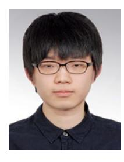

**Incheol Hwang** (Graduate Student Member, IEEE) received the B.S. degree in information and telecommunications engineering from Sangmyung University, Cheonan, South Korea, in 2016. He is currently pursuing the Ph.D. degree in electrical and electronic engineering with Yonsei University, Seoul, South Korea. His research interests are in 5G and beyond 5G wireless communications. In addition, his current research interests are in satellite communications and massive multiple-input and multiple-output systems.

**Daesik Hong** (Fellow, IEEE) received the B.S. and M.S. degrees in electronics engineering from Yonsei University, Seoul, South Korea, in 1983 and 1985, respectively, and the Ph.D. degree from the School of EE, Purdue University, West Lafayette, IN, USA, in 1990.

He joined Yonsei University in 1991, where he is currently a Professor with the School of Electrical and Electronic Engineering. He has been serving as the Chair of Samsung-Yonsei Research Center for Mobile Intelligent Terminals. He also served as a

Vice-President of Research Affairs and a President of Industry–Academic Cooperation Foundation, Yonsei University from 2010 to 2011. He also served as a Chief Executive Officer with Yonsei Technology Holding Company in 2011, and served as a President of the Institute of Electronics and Information Engineers (IEIE) in 2017. From 2016 to 2019, he served as a Dean of the College of Engineering, Yonsei University. His current research activities are focused on future wireless communication, including 5G and 6G systems, low-Earth orbit satellite communication systems, OFDM(A) and multicarrier communication, multihop and relay-based communication, in-band full-duplex, cognitive radio, and energy harvesting. He was appointed as the Underwood/Avison Distinguished Professor with Yonsei University in 2009, and received the Best Teacher Award at Yonsei University in 2005, 2011, and 2012. He was also a recipient of the Haedong Outstanding Research Awards of the Korean Institute of Communications and Information Sciences in 2006 and the IEIE in 2009. He served as an Editor for the IEEE TRANSACTIONS ON WIRELESS COMMUNICATIONS and IEEE WIRELESS COMMUNICATIONS LETTERS from 2006 to 2011 and from 2011 to 2016, respectively. More information about his research is available online: http://mirinae.yonsei.ac.kr.