# Models, Methods, and Solutions for Multicasting in 5G/6G mmWave and Sub-THz Systems

Nadezhda Chukhno<sup>®</sup>, *Member, IEEE*, Olga Chukhno<sup>®</sup>, *Member, IEEE*, Dmitri Moltchanov<sup>®</sup>, Sara Pizzi<sup>®</sup>, *Member, IEEE*, Anna Gaydamaka<sup>®</sup>, *Graduate Student Member, IEEE*, Andrey Samuylov<sup>®</sup>, Antonella Molinaro<sup>®</sup>, Yevgeni Koucheryavy<sup>®</sup>, *Senior Member, IEEE*, Antonio Iera<sup>®</sup>, *Senior Member, IEEE*, and Giuseppe Araniti<sup>®</sup>, *Senior Member, IEEE* 

Abstract-Multicasting in wireless access networks is a functionality that, by leveraging group communications, turns out to be essential for reducing the amount of resources needed to serve users requesting the same content. The support of this functionality in the modern 5G New Radio (NR) and future sub-Terahertz (sub-THz) 6G systems faces critical challenges related to the utilization of massive antenna arrays forming directional radiation patterns, multi-beam functionality, and use of multiple Radio Access Technologys (RATs) having distinctively different coverage and technological specifics. As a result, optimal multicasting in these systems requires novel solutions. This article aims to provide an exhaustive treatment of performance optimization methods for 5G/6G mmWave/sub-THz systems and discuss the associated challenges and opportunities. We start by surveying 3rd Generation Partnership Project (3GPP) mechanisms to support multicasting at the NR radio interface and approaches to modeling the 5G/6G radio segment. Then, we illustrate optimal multicast solutions for different 5G NR deployments and antenna patterns, including single- and multi-beam antenna arrays and single- and multiple RAT deployments. Further, we survey new advanced functionalities for improving multicasting performance in 5G/6G systems, encompassing Reflective

Manuscript received 9 February 2023; revised 31 July 2023; accepted 10 September 2023. Date of publication 26 September 2023; date of current version 27 February 2024. This work was supported in part by the European Union's Horizon 2020 Research and Innovation Programme under the Marie Skłodowska-Curie Grant under Agreement 813278 (A-WEAR; http://www.a-wear.eu/); in part by the European Union under the Italian National Recovery and Resilience Plan (NRRP) of NextGenerationEU, partnership on "Telecommunications of the Future" (Program "RESTART") under Grant PE00000001; and in part by the Academy of Finland through the Projects "Machine Learning Methods and Algorithms for 6G Terahertz Cellular Access" (HARMONIOUS), "Enabling Mobile Terahertz Communication for 6G Cellular Networks" (EMERGENT), and "Machine Learning Algorithms for Energy Efficient and QoS Aware Communications in Heterogeneous 6G mmWave/sub-THz Networks" (ML6GThz). (Corresponding author: Giuseppe Araniti.)

Nadezhda Chukhno, Dmitri Moltchanov, Anna Gaydamaka, Andrey Samuylov, and Yevgeni Koucheryavy are with the Unit of Electrical Engineering, Tampere University, 33014 Tampere, Finland (e-mail: nadezda.chukhno@tuni.fi; dmitri.moltchanov@tuni.fi; anna.gaydamaka@tuni.fi; andrey.samuylov@tuni.fi; evgeny.kucheryavy@tuni.fi).

Olga Chukhno is with CNIT, Mediterranea University of Reggio Calabria, 89124 Reggio Calabria, Italy, and also with the Unit of Electrical Engineering, Tampere University, 33014 Tampere, Finland (e-mail: olga.chukhno@unirc.it).

Sara Pizzi and Giuseppe Araniti are with CNIT, Mediterranea University of Reggio Calabria, 89124 Reggio Calabria, Italy (e-mail: sara.pizzi@unirc.it; araniti@unirc.it).

Antonella Molinaro is with CNIT, Mediterranea University of Reggio Calabria, 89124 Reggio Calabria, Italy, and also with CNRS, CentraleSupelec, Université Paris-Saclay, 91190 Gif-sur-Yvette, France (e-mail: antonella.molinaro@unirc.it).

Antonio Iera is with CNIT, University of Calabria, 87036 Arcavacata, Italy (e-mail: antonio.iera@unical.it).

Digital Object Identifier 10.1109/COMST.2023.3319354

Intelligent Surfaces (RISs), NR-sidelink technology, and mobile edge enhancements, among many others. Finally, we outline perspectives of multicasting in future 6G networks.

Index Terms—5G, 6G, multicasting, new radio, millimeter wave, terahertz, multi-beam antennas, optimization, multi-RAT.

#### <span id="page-0-0"></span>I. Introduction

PORTHCOMING applications, such as Augmented Reality (AR) and Virtual Reality (VR), telepresence, 8/16K video, and various use cases, require a dramatic increase in the transmission rate over the air interface [1]. A significant rate rise of up to 20 Gbps per Base Station (BS) was expected in 5G systems by utilizing the Millimeter Wave (mmWave) band (24–52.6 GHz). At the same time, there are already plans to use the upper part of the mmWave band (52.6–100 GHz) and even the sub-THz band (100–300 GHz) for 6G cellular systems [2], potentially increasing the access rate up to 100 Gbps per User Equipment (UE).

<span id="page-0-3"></span><span id="page-0-2"></span><span id="page-0-1"></span>Multicasting is an essential feature of wireless access networks that improves resource utilization while serving users requesting the same content [3]. Compared to wired networks, in wireless systems, multicasting is hampered by different propagation conditions experienced by the UE; this forces the BS to utilize the lowest Modulation and Coding Scheme (MCS) for the multicast group, thus reducing multicast efficiency [4]. This has led to research activities related to optimal multicast group formation and the exploitation of external mechanisms, such as Device-to-Device (D2D) communications (see [5], [6], [7], [8], [9] for a detailed outlook), that favored the support of the multicast functionality in all previous generations of cellular systems and paved the way to its specification for 5G New Radio (NR) and future 6G Radio Access Technologys (RATs).

#### <span id="page-0-4"></span>A. Multicasting Challenges in 5G/6G Systems

<span id="page-0-5"></span>Supporting multicasting in 5G/6G mmWave/sub-THz systems poses additional challenges for system designers. First, to compensate for the limited effective antenna aperture, the system operating in mmWave/sub-THz band shall utilize massive antenna arrays operating in beamforming mode [22], [23]. These arrays create extremely directional radiation patterns with a few degrees of beamwidth towards a given UE.

If, on the one hand, the use of these highly directional antennas allows to increase drastically the delivered data rate of prospective mmWave/sub-THz BSs, on the other hand, it does not allow to serve all the UEs that belong to the same multicast session via a single transmission [\[24\]](#page-36-8). Thus, the optimal choice of multicast subgroups and relevant beamwidth to serve them becomes a challenging task.

<span id="page-1-2"></span>A second challenging issue is associated with the current antenna arrays' capacity to simultaneously generate numerous beams with variable Half-Power Beamwidths (HPBWs) [\[25\]](#page-36-9), [\[26\]](#page-36-10). This introduces a new level of flexibility into multicast group formation and transmission scheduling, particularly complicating their design. When several beams are available, the width of multiple beams to be swept simultaneously must be set appropriately, considering the overall transmit power limitation per physical antenna. This implies that power has to be intelligently distributed over several beams in contrast to single-beam systems.

An additional issue for mmWave/sub-THz systems is counteracting blockage of propagation paths, including blockage caused by large static objects, such as buildings [\[27\]](#page-36-11), [\[28\]](#page-36-12), as well as small movable objects, such as human bodies [\[29\]](#page-36-13), [\[30\]](#page-36-14). Both types of blockage cause significant signal power degradation at the UE, deteriorating the MCS scheme that can be utilized for multicast group communications. On top of this, human body blockage is also highly dynamic, resulting in state changes at sub-second scales, as demonstrated in [\[31\]](#page-36-15).

<span id="page-1-6"></span>User mobility also complicates the design of mmWave/sub-THz RATs operated with group-oriented directional transmissions [\[32\]](#page-36-16). In the case of unicast transmission, the BS antenna radiation pattern is oriented towards the single UE, and small-scale UE mobility does not drastically affect the reliable reception. In multicast communications, on the contrary, beams are guided in between UEs. As a result, certain UEs, initially located at the border of the beam's coverage area, may move out of it due to even minimal movements. Furthermore, the mobility of multicast users more likely corresponds to pedestrian flow based on group motion [\[33\]](#page-36-17), [\[34\]](#page-36-18), [\[35\]](#page-36-19), [\[36\]](#page-36-20). It thus requires using models capable of reproducing the motion in high-density scenarios with user interactions.

Yet another critical aspect is related to the unreliable nature of mmWave/sub-THz communications. When operating over extremely narrow beams in these bands, in addition to blockage, also fast small-scale turns and displacement of the UE carried by a user may lead to loss of beam synchronization and result in outages. The 3GPP has foreseen the multiconnectivity function to efficiently avoid outages. It allows UE to simultaneously support multiple links to BSs that belong to the same or different RATs [\[37\]](#page-36-21). In case of an outage event, UE is allowed to change its network association point by switching over to one of the backup links. As a result, the unreliable nature of mmWave/sub-THz links naturally forces future 5G/6G cellular systems to become heterogeneous. Given that different RATs may have different implementation specifics (e.g., numerology, coverage), the optimal usage of RATs for multicasting services becomes a key open research issue.

<span id="page-1-8"></span>Some of the above-mentioned challenges can be alleviated by designing new optimization approaches and associated <span id="page-1-9"></span><span id="page-1-1"></span>algorithms and by leveraging advanced functionalities provided by modern cellular technologies, including Reflective Intelligent Surfaces (RISs), D2D capabilities of mmWave, and future sub-THz technologies (e.g., NR-sidelink [\[38\]](#page-36-22)). Furthermore, it appears evident that, with the expected increase in the directivity of the antenna radiation patterns in sub-THz systems, the need for explicit support to multicast services shall be carefully evaluated to decide if (and how) it is implemented in future 6G systems.

As the main difference between 4G systems and future 5G/6G cellular networks is the use of highly directional antennas, in this paper, we discuss how to address the above-mentioned challenges in mmWave/sub-THz systems by enabling reliable multicasting capabilities. The main focus of this study is *(i)* to summarise the impact of directionality on optimal resource allocation for multicasting in modern and future 5G/6G mmWave/sub-THz systems and *(ii)* provide an overview of novel concepts that may improve multicasting performance in systems with directional antennas. Thus, we not only review the results achieved so far but also sketch the basics of models and algorithms most utilized for performance optimization of multicasting in these systems. This will allow interested readers to build their own analytical frameworks to address the remaining white spots. These questions have not been covered in any recent research work.

# <span id="page-1-5"></span><span id="page-1-4"></span><span id="page-1-3"></span>*B. Comparison With Previous Studies*

<span id="page-1-7"></span><span id="page-1-0"></span>Table [I](#page-2-0) shows that the previous research partially addresses the topics of our work. The studies in [\[17\]](#page-36-23), [\[18\]](#page-36-24), [\[19\]](#page-36-25), [\[20\]](#page-36-26), [\[21\]](#page-36-27) are the most relevant survey and tutorial-like papers on multicasting in mmWave systems. While work [\[17\]](#page-36-23) shares similarities with our research in terms of covering all aspects in Table [I,](#page-2-0) it is essential to note that the focus and topic of [\[17\]](#page-36-23) are entirely different. It is dedicated to classifying multi-user Multiple Input Multiple Output (MIMO) symbollevel and multicast precoding strategies. Differently, work [\[18\]](#page-36-24) delves into surveying the opportunities and technologies that facilitate and support mmWave communications in the presence of mobile users, touching upon a few relevant works related to multicasting. In line with our research, work [\[19\]](#page-36-25) concentrates on mathematical modeling to evaluate the effectiveness of performance reliability improvement algorithms for mmWave/Terahertz (THz) systems. However, the multicast aspect is not addressed in that study. In [\[20\]](#page-36-26), the study extensively explores the crucial aspects where mmWave and multicasting intersect. It convincingly illustrates that limiting wireless links to unicast only might lead to suboptimal results. Finally, in a more recent study [\[21\]](#page-36-27), the authors explore the combination of technological advancements and multicasting to address the application requirements of 6G networks. However, neither [\[20\]](#page-36-26) nor [\[21\]](#page-36-27) present the methodological/modeling parts.

Moreover, these papers do not adequately cover aspects such as the directionality of transmission, different numerologies, multi-beam antennas, and multi-RAT systems. Our study seeks to fill this gap and address these critical issues, accounting

<span id="page-2-0"></span>

| Reference | Multicasting                                                                                                                    | mmWave   | 5G       | Mathematical | Main Focus                                                                         |  |  |  |
|-----------|---------------------------------------------------------------------------------------------------------------------------------|----------|----------|--------------|------------------------------------------------------------------------------------|--|--|--|
|           |                                                                                                                                 |          |          | Methodology  |                                                                                    |  |  |  |
| [7]       | <b>√</b>                                                                                                                        |          | <b>_</b> |              | 5G challenges in the view of effective management of multicast applications        |  |  |  |
| [10]      | <b>√</b>                                                                                                                        |          |          |              | Survey on application layer multicast protocols                                    |  |  |  |
| [11]      | <b>√</b>                                                                                                                        |          |          |              | Survey on multicast routing protocols for mobile ad-hoc networks                   |  |  |  |
| [12]      | ✓                                                                                                                               |          |          | ✓            | Survey on channel-aware multicast scheduling and resource allocation techniques    |  |  |  |
| [13]      | ✓                                                                                                                               |          | <b>√</b> |              | Survey on network architectures, communication protocols, transmission strategies, |  |  |  |
|           |                                                                                                                                 |          |          |              | and optimization algorithms to improve the performance of multicast communica-     |  |  |  |
|           |                                                                                                                                 |          |          |              | tions over mobile radio systems                                                    |  |  |  |
| [14]      | ✓                                                                                                                               |          | ✓        |              | Survey on techniques proposed for catering multicast services in cognitive radio   |  |  |  |
|           |                                                                                                                                 |          |          |              | networks                                                                           |  |  |  |
| [15]      | <b>√</b>                                                                                                                        |          |          |              | Survey on analysis of multicasting over wireless access networks                   |  |  |  |
| [16]      | <b>√</b>                                                                                                                        |          |          | ✓            | Survey on one-hop and multi-hop wireless multi-rate multicasting                   |  |  |  |
| [17]      | <b>√</b>                                                                                                                        | <b>√</b> | <b>√</b> | ✓            | Survey on symbol-level and multicast precoding techniques                          |  |  |  |
| [18]      | <b>√</b> *                                                                                                                      | ✓        | <b>√</b> |              | Survey on opportunities and technologies to support mobility in mmWave com-        |  |  |  |
|           |                                                                                                                                 |          |          |              | munications                                                                        |  |  |  |
| [19]      |                                                                                                                                 | <b>√</b> | <b>√</b> | ✓            | Tutorial on mathematical modeling for assessing performance reliability improve-   |  |  |  |
|           |                                                                                                                                 |          |          |              | ment algorithms for mmWave and THz systems                                         |  |  |  |
| [20]      | ✓                                                                                                                               | <b>√</b> | <b>√</b> |              | Initial investigation of multicast transmissions using mmWave links                |  |  |  |
| [21]      | <b>√</b>                                                                                                                        | ✓        | <b>√</b> |              | Technological perspectives of 6G multicasting                                      |  |  |  |
| Our work  | ✓                                                                                                                               | <b>√</b> | <b>√</b> | ✓            | Models, methods, solutions, and technologies for multicast scheduling in 5G/60     |  |  |  |
|           |                                                                                                                                 |          |          |              | mmWave and sub-THz systems                                                         |  |  |  |
| *         | * This survey's focus is not primarily on multicasting. However, the authors discuss few relevant works related to multicasting |          |          |              |                                                                                    |  |  |  |

TABLE I COMPARISON WITH PREVIOUS WORKS

for 5G/6G multicast mmWave/sub-THz resource allocation specifics.

# *C. Paper Structure and Content*

The structure of the paper is graphically presented in Fig. [1,](#page-3-0) whereas the main discussed topics related to multicast resource allocations, design specifics, and service performance in 5G/6G mmWave/sub-THz systems are summarized in Table [II,](#page-4-0) which readers can refer to for quick navigation through the paper contents.

In Section [II,](#page-2-1) we outline the current 3GPP/International Telecommunication Union - Radiocommunication Sector (ITU-R) standardization efforts and academic activities towards multicast support in 5G NR systems and beyond. Then, in Section [III,](#page-6-0) we consider multicasting types, deployment options, and use cases. Further, in Section [IV,](#page-9-0) we introduce possible modeling approaches to the system components addressed throughout the entire manuscript. In Section [V,](#page-14-0) we introduce versatile performance optimization frameworks and describe the associated algorithms. Learned lessons and major takeaways, including single-/multi-RAT optimization, are discussed in Section [VI.](#page-21-0) The use of advanced mechanisms, such as RIS and Long-Term Evolution (LTE)/NR-sidelink technologies, among others, to improve the multicasting performance is considered in Section [VII.](#page-26-0) Future research directions and conclusions are provided in the closing section.

# II. MULTICASTING IN CELLULAR SYSTEMS

<span id="page-2-1"></span>After introducing formal definitions, in this section, we proceed with the outlook on how multicast is supported in previous generations of cellular systems and then outline 3GPP standardization efforts in recent 5G releases. We then draw the differences between 4G and 5G multicasting. We conclude the section by sketching the main projects having 5G/6G multicast on their agenda.

# *A. Main Definitions*

<span id="page-2-3"></span>3GPP [\[39\]](#page-36-28) formally defines a *multicast service* as a *"unidirectional point-to-multipoint service in which data are transmitted from a single source to a multicast group in the associated multicast service area"*. Prior to the service initiation, UEs need to subscribe to a specific multicast service and join the multicast group. A *multicast subscription group* is defined as a collection of UEs that have Multimedia Broadcast and Multicast Service (MBMS) activated in the multicast mode. A subset of UEs belonging to the *multicast subscription group* forms a so-called *multicast group*. Finally, we refer to the *multicast session* as a continuous reception of a multicast session of finite duration by UEs.

A single multicast service may ensure one or several successive multicast sessions but can only have one multicast session active at any time. Therefore, a service might consist of a single continuous session (e.g., a multimedia stream) or multiple intermittent multicast sessions over time (e.g., messages). Unlike the broadcast mode, only subscribers of a specific multicast service can receive this service. The Public Land Mobile Network (PLMN) operator, the user, or a third party may manage the subscription. The end-user's charging dat[a1](#page-2-2) is expected to be generated for the multicast mode at the MBMS Transport Service layer [\[39\]](#page-36-28).

# *B. Multicasting Support in 4G LTE*

To enable multicast capabilities over cellular systems, the 3GPP has introduced MBMS in 2005, which, by design, has two operational modes: broadcast and multicast.

Later, 3GPP Rel-9 specified the evolved MBMS (eMBMS) architecture, which has then become the enabler for groupbased services in LTE cellular networks [\[40\]](#page-36-29). The RAT part of the MBMS architecture includes the following components:

<span id="page-2-4"></span><span id="page-2-2"></span><sup>1</sup>Charging data related to security procedures for the end-user at MBMS User Service layer, cf. clause 7 [\[39\]](#page-36-28).

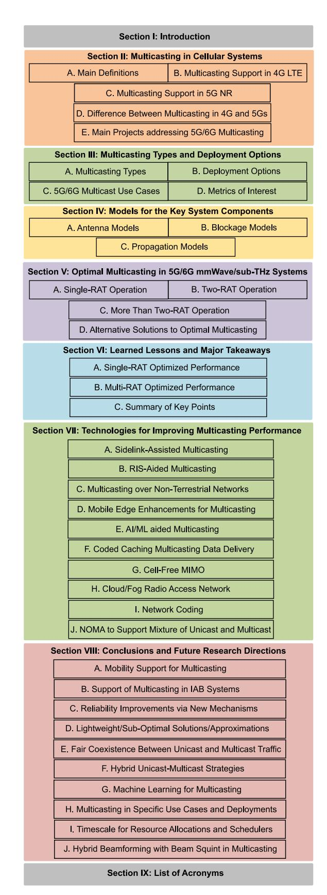

<span id="page-3-0"></span>Fig. 1. Paper organization.

*(i) eNodeBs*, i.e., the LTE BSs, providing the last-mile connectivity for UEs, and *(ii)* the so-called *MultiCell/Multicast Coordination Entity (MCE)* systems, in charge of configuring

transmission parameters. eNodeB is responsible for resource allocation procedures leveraging the channel quality feedback from UEs regularly sent over the control channel. The core network in eMBMS system consists of: *(i) Mobility Management Entity (MME)* performing mobility management functions in addition to authentication and authorization, *(ii) MBMS Gateway (MBMS-GW)* – a node responsible for packet transmission process from the core network to eNodeBs, and *(iii) Broadcast Multicast-Service Center (BM-SC)* that manages multicast groups and also implements service advertising functions.

The eMBMS system supports two operational models: *(i) Multicast-Broadcast Single-Frequency Network (MBSFN)* – *MBMS service over single frequency network* and *(ii) Single Carrier Point-to-Multipoint (SC-PTM)*. MBSFN enables the delivery of the same content to the cluster of cells that belong to the same MBSFN area by means of a time-synchronized transmission via the same set of resources. This functionality enables the dissemination of the content simultaneously to UEs located in multiple cells within the MBSFN area, which are likely to receive multiple replicas from different BSs. Differently, SC-PTM supports multicast transmission over a single cell.

The MBMS multicast service provisioning is initiated with UEs subscribing to the service and MBMS performing service advertising. UEs then join the session, and the multicast session starts upon MBMS notification. The content dissemination is then performed for the multicast session duration, followed by the session stopping with UEs leaving the multicast group. The system allows for soft configuration, that is, depending on the multicast service needs, some of the described steps can be repeated while some may run in parallel as discussed in [\[41\]](#page-36-30).

# <span id="page-3-1"></span>*C. Multicasting Support in 5G NR*

In 3GPP Rel-15/16, no support for multicast NR functionality is standardized. However, according to 3GPP plans, multicast service delivery in 5G NR cellular systems will be based on the reuse of unicast NR functionalities, thereby allowing for faster commercialization of multicast services [\[43\]](#page-36-31). The required changes to the 3GPP 5G system architecture facilitating multicast and broadcast capabilities are further introduced in 3GPP Rel-17 [\[43\]](#page-36-31).

<span id="page-3-2"></span>In Fig. [2,](#page-4-1) the 5G Multicast and Broadcast Services (MBS) system architecture is presented. The new functional components introduced into the 5G Core (5GC) to support MBS, highlighted with dashed lines, are briefly described below:

- *Multicast/Broadcast Session Management Function (MB-SMF).* This entity orchestrates multicast and broadcast sessions that also include Quality of Service (QoS) provisioning. Specifically, it is responsible for the configuration of the *Multicast/Broadcast User Plane Function (MB-UPF)* by utilizing network policies specified by the Policy Control Function (PCF).
- *MB-UPF.* This entity serves as an entry point to the system and provides a session anchor. As described

[t]

TABLE II MAIN DISCUSSED TOPICS RELATED TO MULTICASTING IN 5G/6G SYSTEMS WITH DIRECTIONAL ANTENNAS

<span id="page-4-0"></span>

| Multicast specifics                     | Details                                                                                                                                                                                                                                                                                          | Reference    |
|-----------------------------------------|--------------------------------------------------------------------------------------------------------------------------------------------------------------------------------------------------------------------------------------------------------------------------------------------------|--------------|
| Standardization 4G LTE                  | Support of multicasting in 4G LTE                                                                                                                                                                                                                                                                | Section II-B |
| Standardization 5G NR                   | Support of multicasting in 5G NR (Rel-17, Rel-18)                                                                                                                                                                                                                                                | Section II-C |
| Research activities in multicast        | Academic and industrial projects related to multicasting                                                                                                                                                                                                                                         | Section II-E |
| Optimal multicast subgroup size         | For small cell radii, a single beam for all the UEs is almost always utilized, while unicast service for each UE is only feasible for higher ones                                                                                                                                                | Section VI-A |
| Optimal number of beams: single-RAT     | For the practical ranges of cell size and considered number of UEs $(1-10)$ , the optimal solution always utilizes no more than $2-3$ beams                                                                                                                                                      | Section VI-A |
| Optimal solution vs. heuristics         | The gap between optimal and heuristic solutions grows with the number of UEs and the maximum number of supported beams by the antenna array and diminishes with the amount of available bandwidth                                                                                                | Section VI-A |
| ML optimal training set size            | The accuracy of all the considered algorithms remains virtually unchanged when increasing the training sample size from $H_1=1000$ to higher values. This permits us to consider $H_1=1000$ as the lowest limit on the training set size for practical implementations                           | Section VI-A |
| Choice of ML algorithm for multicasting | Random Forest and Fine Trees show almost 100% accuracy in terms of resource utilization over all the considered distances. Recalling that relatively small computational complexity characterizes trees, one may regard them as the best candidate for subgroup formation                        | Section VI-A |
| ML-based solutions for multicasting     | A single multicast subgroup is chosen for the 100–225 m radius range. Then, for the range 275 m and beyond, only unicast transmissions are used to serve multicast UEs, whereas the considered multicast group formation solutions can be utilized for the radii around 250 m                    | Section VI-A |
| RAT regime switching                    | There is a clear turning point for small dual-mode BS densities when the system switches from the regime when mmWave resources are utilized for service to the case when $\mu$ Wave technology is exclusively utilized. This point is dictated by the mmWave blockage and propagation conditions | Section VI-B |
| Optimal number of beams: multi-RAT      | The number of beams associated with optimal solution is upper limited by 3 for mmWave and by 2 for $\mu$ Wave technologies across all the considered densities of dual BS deployment. Moreover, in most cases, only one beam is utilized at $\mu$ Wave technology                                | Section VI-B |
| RAT selection                           | When $\mu$ Wave RAT is prioritized for multicast service, mmWave resources are not utilized at all. However, by utilizing weights for mmWave and $\mu$ Wave resources, the operator might achieve the desired balance by fitting its needs in a particular deployment                            | Section VI-B |
| Technologies for improving multicasting | Sidelink, air-to-ground communications, MEC, and ML, among other technologies and methods, may be used to further improve multicasting performance                                                                                                                                               | Section VII  |

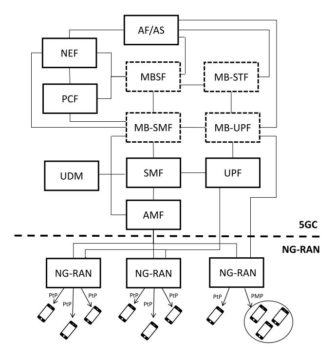

Fig. 2. MBS architecture in 5G NR [\[42\]](#page-36-32).

<span id="page-4-2"></span><span id="page-4-1"></span>above, MB-UPF cooperates with the MB-SMF subsystem for MBS data reception.

• *Multicast/Broadcast Service Function (MBSF).* MBSF provides the service support for the MBS subsystem and interacts with conventional functionalities of previous generations of cellular systems, such as LTE MBMS. To determine MBS multicast session and transmission parameters, this component also interworks with Application Function (AF)/Application Server (AS) and MB-SMF. Additionally, if *Multicast Broadcast Service Transport Function (MB-STF)* is utilized for multicast session provisioning, then MBSF utilizes MB-STF services.

• *MB-STF.* This entity provides a media anchor for multicast traffic, when this is required for service provisioning. Specifically, MB-STF provides IP multicast applications with packetization functions that include flow splitting, application error control, etc.

Furthermore, the functional behavior of several other elements (such as PCF, Network Exposure Function (NEF), AF, Session Management Function (SMF), User Plane Function (UPF), Access and Mobility Management Function (AMF), and Network Slice Selection Function (NSSF)) has been enhanced to support MBS.

In new-generation RATs, the high-level architecture for 5G MBS recognizes only NR as a radio access technology (NG-RAN). The physical layer NR functionality, including conventional signaling and data channels (PDCCH, PDSCH), as well as waveforms specified in 3GPP Rel-15/16, is assumed to be utilized for actual data delivery. Reducing the overall impact of multicast service support on the radio part design is, in fact, a common goal of 3GPP. Still, coordinated and

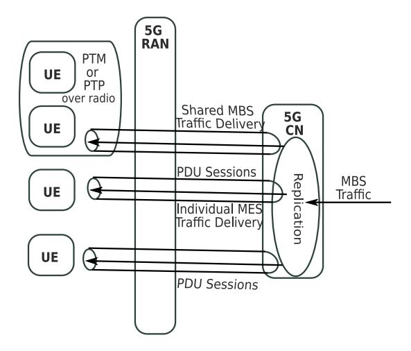

Fig. 3. Illustration of delivery methods in 5G NR [\[43\]](#page-36-31).

flexible resource usage for the implementation of unicast and multicast services should be provided using the standardized NR functions.

The logical set of actions driving the MBS session establishment and management is [\[43\]](#page-36-31): *(i)* service information is delivered from the service layer to the 5GC, *(ii)* UEs request to join an MBS session, *(iii)* an MBS flow transport is established, *(iv)* data are delivered to UEs. Once the multicast session expires the transport provided by MBS is released and can be utilized for another session.

From the 5GC perspective, two delivery methods are defined [\[43\]](#page-36-31), as illustrated in Fig. [3.](#page-5-0) In both cases, only one copy of the data packet is delivered to the 5G Core Network (5G CN). Then, the procedure differs for *individual* and *shared* MBS delivery options. In the former case, a separate content copy is delivered by 5G CN to all the participating UEs via separate Protocol Data Unit (PDU) sessions. When instead the shared mode is utilized, a content copy is first delivered to RAN nodes, and then these nodes are responsible for the delivery of the data traffic to UEs. As the shared mode potentially allows a more efficient radio resource utilization, we concentrate on this option.

At the radio interface, two delivery mechanisms are available for the shared MBS delivery option, see Fig. [3.](#page-5-0) They differ from each other in that one involves the use of the Single Carrier Point-to-Point (SC-PTP) while the other uses the Point-to-Multipoint (PMP) delivery method. In the former mode, different data packets are delivered to individual UEs, while in the PMP mode, a multicast group consisting of multiple UEs receives a single copy of the data packet. It is worth mentioning that the combination of PMP and Pointto-Point (PTP) mechanisms can be utilized for data delivery to UEs.

<span id="page-5-1"></span>The *mixed unicast/multicast mode* has been recently defined in 3GPP Rel-17 for the dynamic switching between PTP and PMP transmissions [\[44\]](#page-36-33), [\[45\]](#page-36-34). In general, 5G broadcast/multicast requirements can be met either by deploying a stand-alone dedicated broadcast network or by adopting a mixed unicast/multicast operation mode. In the second case, the aim is to incorporate PMP transmissions in the RAN as a built-in network delivery optimization functionality. This requires seamless switching between PTP and PMP transmission regimes. As required by the 3GPP, the mixed mode should be implemented as close to the unicast transmission as possible to minimize additional options in the RAN.

In addition to MBMS, 3GPP Rel-17 also introduces enhancements to further improve the performance of 5G systems. These enhancements not only focus on seamlessly incorporating support services but also aim to ensure uninterrupted connectivity in diverse deployment and environmental conditions. This is primarily achieved through further developments in *(i)* support of reduced capability UEs (RedCap), *(ii)* usage of non-terrestrial connectivity to improve systems flexibility and service delivery options, and *(iii)* utilization of upper mmWave bands in the range 52−100 GHz for enhanced throughput.

<span id="page-5-2"></span><span id="page-5-0"></span>In Rel-18, 3GPP will proceed to specify 5G-Advanced that will further enhance cellular system capabilities for mobile broadband services [\[46\]](#page-36-35), which will continue to be studied also in future releases. The topics of interest include advanced DL/UL MIMO, Mobile Integrated Access and Backhaul (IAB), smart repeater, Artificial Intelligence (AI)/Machine Learning (ML) data-driven designs, enhanced mobility, evolved duplexing, boundless extended reality, expanded sidelink, drones and expanded satellites communications, NR-Light (RedCap) evolution, expanded positioning, multicast, and other enhancements. As highlighted in [\[46\]](#page-36-35), additional improvements will finally concern the support of diversified services over the same NR radio interface. This will require modifications to the forwarding functions and configurability of the radio interface.

# *D. Difference Between Multicasting in 4G and 5G*

It is essential to highlight the difference between LTE and 5G multicasting in terms of transmission mode and radio resource management. For both technologies, the MCS for the multicast group is determined by the multicast group member with the worst channel condition (i.e., the lowest Channel Quality Indicator (CQI) among those collected). However, the principal difference is that, in LTE systems, omnidirectional transmissions are performed, and subgrouping is done based on the required MCS (see Fig. [4](#page-6-1) for illustration). In this case, users located closer to the BS will receive images/videos of better quality. Differently, 5G NR BS operates with directional transmissions, where subgrouping strategies usually aim at increasing systems performance and primarily rely on the positions of the multicast users. Therefore, the radio resource management for 5G is entirely different from LTE. This survey focuses on 5G and future generations of mobile networks.

# *E. Main Projects Addressing 5G/6G Multicasting*

With a view to the broad adoption of 5G in diversified vertical markets and, at the same time, to contribute with their results to standardization activities in 3GPP and other bodies, several projects involving industrial and research players aim to improve the methods of content dissemination in 5G and test their performance in real operating environments.

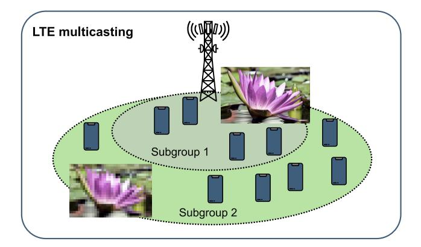

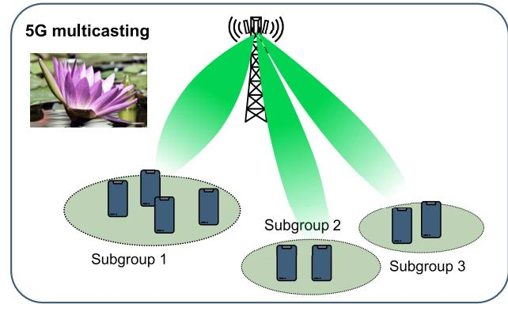

Fig. 4. Difference between multicasting in 4G and 5G.

<span id="page-6-2"></span><span id="page-6-1"></span>*METIS [\[47\]](#page-36-36)* stands for Mobile and Wireless Communication Enablers for the Twenty-First Information Society. The project's primary goal is to establish the groundwork for 5G, the next-generation mobile and wireless communications technology. The project, in particular, aims to: *(i)* develop the overall 5G radio access network design, *(ii)* provide the 5G collaboration framework within the 5G-PPP for evaluating 5G radio access network concepts, and *(iv)* participate in activities of regulatory and standardization bodies for an efficient standardization, development, and economically appealing roll-out of 5G with a solid European footprint and head-start. To achieve its objectives, METIS-II builds firmly upon projects, such as METIS, 5GNOW, MiWaveS, etc. It is important to emphasize that the developed resource management framework of the METIS-II project is also aimed at efficiently supporting the novel modes of communication envisioned in 5G systems, such as multicasting, D2D, and self-backhauling.

<span id="page-6-3"></span>*5G-Xcast [\[48\]](#page-36-37)* is a 5G-PPP Phase II project focused on broadcast and multicast communication enablers for 5G wireless systems. The 5G-Xcast aims to exploit unicast, multicast, broadcast, and local caching delivery modes. It also develops techniques to support media content and services migration from legacy systems. In designing media delivery options, the project considers a wide range of 5G use cases in different contexts, such as automotive (Vehicle-to-Infrastructure (V2X) broadcast service), public safety (multimedia public warning alert and multimedia America's Missing: Broadcast Emergency Response (AMBER) alert), Internet of Things (IoT) (massive software and firmware updates), and media and entertainment (hybrid broadcast service, AR/VR broadcast, remote live production), making sure they fit together.

The project analyzes the requirements for future media, considering both commercial and technological issues. 5G-Xcast establishes the top-level requirements for the transport and application layers and the system architectures. It provides seamless access to information and services at any time, location, and device. Moreover, 5G-Xcast *(i)* adopts a pragmatic approach providing detailed specifications, proof-of-concept prototypes, and demonstrations, *(ii)* closely collaborates with important 5G-PPP Phase-II initiatives and *(iii)* contributes to 3GPP and other standardization bodies.

<span id="page-6-4"></span>*FANTASTIC-5G [\[49\]](#page-36-38)* is a European project that uses a modular architecture to create a new multi-service air interface at frequencies below 6 GHz. The features sought to allow the system to adapt to the predicted heterogeneity, include adaptability, scalability, versatility, efficiency, and future-proofness. The project considers the following services: Mobile BroadBand (MBB), Massive Machine Communications (MMC), Mission Critical Communications (MCC), Broadcast/Multicast Services (BMS), and V2X.

Besides, it aims to: *(i)* develop an air interface to enable the in-band coexistence of highly different services, UE types, and traffic/transmission characteristics, *(ii)* enable ubiquitous coverage and high capacity, *(iii)* induce high efficiency in terms of energy and resource consumption, *(iv)* render 5G more futureproof than former generations through the more accessible introduction of new features, *(v)* validate the developed concepts through system level simulations and proof of concepts, *(vi)* push the innovations for standardization.

<span id="page-6-5"></span>*5G-RECORDS [\[50\]](#page-36-39)* aims to create an interface between 5Gconnected devices and existing broadcast production infrastructure via an orchestration layer so that there is no difference in the functionality or robustness of the UEs for the end-user. The project considers three use cases to encompass some of the most challenging circumstances to be displayed in the professional content creation framework: live audio production, multiple cameras wireless studio, and live immersive video production. Processing audio and/or video data sources with high criteria for Key Performance Indicators (KPIs), such as data rate, latency, synchronization, availability, and reliability, is required to effectively integrate the mentioned use cases into the 5G ecosystem.

The objectives of 5G-RECORDS are as follows: *(i)* to design and develop 5G components based on 3GPP Rel-15, 16, and beyond; *(ii)* to integrate the developed components into end-to-end 5G infrastructures; *(iii)* to validate the components in the context of the considered use cases; *(iv)* to demonstrate the potential value that 5G brings to the content production sector; and *(v)* to influence standardization and regulatory bodies through testbeds, demonstrations, and technical solutions.

# <span id="page-6-0"></span>III. MULTICASTING TYPES AND DEPLOYMENT OPTIONS

In this section, we specify multicasting types, deployment options, and use cases. Finally, we conclude by introducing the main metrics of interest.

| Applications/<br>Requirements | Intelligent<br>Transport [51]                                                                                    | <b>AR/VR</b> [51] | Broadcast-like<br>services [51] | Factory Automation Motion Control [51] | General 5G [21],<br>[53]–[55] | <b>General 6G</b> [21], [53]–[55] |  |  |  |
|-------------------------------|------------------------------------------------------------------------------------------------------------------|-------------------|---------------------------------|----------------------------------------|-------------------------------|-----------------------------------|--|--|--|
| UE density                    | 1000/km <sup>2</sup>                                                                                             | ≤ 10 UEs          | 15 TV channels of 20            | $10^5$ /km $^2$                        | -                             | -                                 |  |  |  |
|                               |                                                                                                                  |                   | Mbps on one carrier             |                                        |                               |                                   |  |  |  |
| UE speed                      | Vehicles, bicycles,                                                                                              | Stationary and    | Stationary, pedestrian,         | -                                      | Up to 500 km/hr               | Up to 1000 km/hr                  |  |  |  |
|                               | pedestrians                                                                                                      | pedestrian UEs    | and vehicular UEs               |                                        |                               |                                   |  |  |  |
|                               |                                                                                                                  |                   | (up to 500 km/h)                |                                        |                               |                                   |  |  |  |
| Service area                  | 2 km along a road                                                                                                | 20 m x 10 m       | up to 200 km                    | 1000 x 1000 x 30 m                     | =                             | -                                 |  |  |  |
| Reliability                   | 99,999%                                                                                                          | 99,99%            | -                               | 99,9999%                               | 99,999%                       | 99,9999999%                       |  |  |  |
| E2E latency                   | 30 ms                                                                                                            | 10 ms             | <20 ms                          | 1 ms                                   | 10-1 ms                       | 1-0.1 ms                          |  |  |  |
| E                             | Emitted power: 23 dBm – non-public safety (1 Tx, 1 Rx antennas), 23/31 dBm – public safety (2 Tx, 2 Rx antennas) |                   |                                 |                                        |                               |                                   |  |  |  |
|                               |                                                                                                                  | Tx g              | gain: 0 dBi, Noise floor:       | 9 dB [52]                              |                               |                                   |  |  |  |

TABLE III
APPLICATION REQUIREMENTS FOR 5G ADVANCED (RELEASE 19) [51], [52] AND GENERIC 5G/6G APPLICATIONS

## A. Multicasting Types

In a networking environment, we distinguish between live and stored multicasting content. In the former case, audio, video, or multimedia services are broadcasted by the content provider through the operator's network, and UEs join the shared session. Alternatively, the multicast service can be organized by the operator on-demand, where UEs request similar content at the same time. Two different models are utilized to represent these cases from a multicast service provisioning duration point of view.

Furthermore, different models are utilized for performance evaluation and optimization purposes. For performance evaluation purposes, dynamic session arrival models are conventionally utilized. Furthermore, one needs to explicitly differentiate between broadcast and multicast services. In the broadcast case, typically, the duration of a broadcast service provisioning is modeled by a random variable characterizing the external arrival process in relation to UEs joining the broadcasting. Alternatively, for multicast content, a multicast service provisioning is assumed to be initiated by the first UE requesting the considered content and then prolonged by other UEs joining the multicast transmission.

There are additional properties of multicast traffic types it is worth recalling. First of all, in all the cases, typically, non-adaptive session rates are considered. The rationale is that multimedia information conventionally disseminated using multicast services has limited application layer adaptivity to changing network rate [6]. Secondly, adaptivity is difficult to enforce when operating over cellular systems with significant channel state variation due to the need to change the service rate for all the UEs. However, this implies that the amount of resources needed to serve a session may change over time.

#### B. Deployment Options

The emergence of rate-greedy services, such as video distribution, AR/VR applications, holographic telepresence, and over-the-air software updates, requires careful management of network resources at the RAT. Owing to the correlation between requests for content on multiple BSs located in close proximity, additional orchestration capabilities are naturally needed in the traffic distribution process. The usage

<span id="page-7-1"></span><span id="page-7-0"></span>of multicast and broadcast services may help alleviate the shortage of bandwidth, delivering these services efficiently to the users.

<span id="page-7-2"></span>In compliance with 3GPP requirements, only downlink operation of multicast and broadcast services needs to be supported. For example, this implies the distribution of 4K/8K Ultra-High Definition (UHD) video over a certain area of interest comprising a cell sector, a cell, or a group of cells. The other requirements on the broadcast/multicast support are provided in 3GPP TSs 22.146, 22.246, and 22.101 [39], [41], [56]. Differently, application requirements and deployment details are application-specific. For example, the density of UEs participating in sports events in a stadium differs from that of UEs visiting an art museum. Then, the propagation conditions differ (i.e., indoors with numerous obstacles, outdoor street, outdoor open space, etc.) depending on the use case. This leads to particular deployments depending on the application scenario for which multicast enhances the system performance. In Table III, we provide four different application domains with their deployment options (e.g., service area, UE density, transmit power) taken from the 3GPP work items.

For performance optimization, standardized 3GPP or ITU-R models are conventionally utilized. In this case, the system is considered in static conditions with a certain number of active UEs, and typically, there is no difference between models utilized for different multicast services.

#### C. 5G/6G Multicast Use Cases

The market scenario for future 5G/6G multicast applications can be roughly seen as characterized by the two types of services [7] illustrated in Fig. 5: (i) evolved LTE applications tailored for human users, and (ii) machine-oriented applications involving Machine Type Communications (MTC).

The former includes the following use cases:

- Mobile video: mobile TV, Video-on-Demand (VoD);
- High Quality of Experience (QoE) services: news, advertising, AR/VR, disaster recovery, forecast;
- *Location-based:* AR, disaster recovery, public safety. The latter applications include the following:
- Smart environments: smart homes, smart offices, smart shops, smart lighting, industrial plants, green environments;

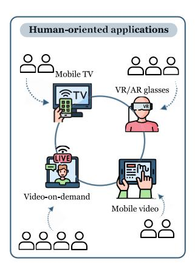

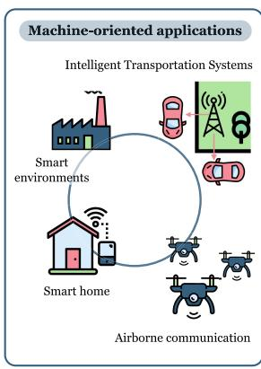

Fig. 5. Human- and machine-oriented applications for 5G NR scenarios.

- <span id="page-8-0"></span>• *Intelligent Transport System (ITS):* assisted driving, autonomous driving fleet management, cellular Vehicle-to-Everything (V2E) [57];
- <span id="page-8-1"></span>Software/firmware over-the-air upgrades;
- Airborne communications [57].

Focusing on the link between multicast types and use cases, the content provider decides to deliver either live or stored contents depending on the application types. Live content delivery requires continuous and uninterrupted data transmission from the source to the recipients. This type of multicast service is particularly useful when there is a need to distribute time-sensitive information simultaneously to a large audience, such as for assisted driving. Stored multicast content delivery instead involves the distribution of pre-recorded or on-demand content. This type of multicast service allows users to access and consume content at their convenience or send them a file of a finite size. An exemplary application is a software update. While both live and stored content multicast services offer valuable distribution mechanisms, specific service parameters may differ depending on the operator's requirements. Factors such as the size of buffered content, delivery timing, and quality of service can be tailored to meet the operator's objectives and optimize the end-user experience. For instance, an operator might buffer a certain amount of live content to account for potential network fluctuations or delays, ensuring a smoother viewing experience for the audience. Similarly, in the case of stored content, the operator may define delivery timing parameters to control when and how quickly content is made available to users.

Human-oriented applications contribute significantly to the exponential growth of the multicast services market, which is mainly fueled by the following service categories [7], [57], [58].

<span id="page-8-2"></span>Mobile Video: In recent years, video downloading and streaming, video conferences, concerts, and other online events have grown in popularity. As a consequence, group-oriented mobile TV and VoD services are expected to play a crucial role in 5G/6G systems, being transmitted over the network at UHD quality. This category of applications demands high data rates, low jitter, and any-place and any-time connectivity. Designing solutions that allow multicast applications to coexist with services of different natures, such as unicast and broadcast

ones, together with effective resource allocation techniques, is essential for the commercial success of such bandwidth-intensive applications. Additionally, timing synchronization within the multicast group must be addressed. Furthermore, these applications can be run both indoors and outdoors, where small-scale and large-scale blockage may affect communications, which is especially critical at high frequencies and at multicast transmissions, where the data rate of an entire group is determined by the UE experiencing the worst channel conditions.

<span id="page-8-3"></span>High-QoE Services and Location-based Applications: The recent scientific literature places great emphasis on an issue that plays a key role in various 5G/6G multicast applications, namely the improvement of the QoE. This can be achieved, for example, by allowing a set of UEs to enjoy content adapted to their specific profiles (for example, interests and preferences) or by enabling the reception of the service based on the location of the UE. For this reason, in the NetWorld2020 white paper [59] and in some UE projects (for example, METIS and 5GNOW), the UEs of 5G/6G systems are always considered strictly connected to the surrounding environment. An example of location-based services developed specifically for commercial reasons is provided by AR/VR multicast applications that allow groups of UEs to obtain additional information from the surrounding environment in order to carry out their daily activities more effectively. Similarly, high QoE location-based multicast communications can be targeted for disaster recovery situations, where a group of UEs (victims and rescuers) receive information of common utility during an emergency (e.g., natural disaster, medical emergency, explosion) so they can respond accordingly [7]. The benefits gained with multicasting will be much more significant as future high-quality immersive content formats, such as Ultra-High Definition TV (UHDTV), 360° video, and AR/VR, become more prevalent [60].

<span id="page-8-4"></span>Such applications introduce additional challenges in managing UEs positions and profiles, requiring precise mechanisms for estimating and tracking UE positions, as well as effective methods and protocols for group formation and service announcement. The current MBMS standard architecture of the 3GPP needs to be modified to provide these new functionalities. Furthermore, enhanced-QoE multicast applications require ultra-low latency data transfer capability, high dependability, extended coverage, and blockage mitigation to provide appropriate signal quality to UEs in unfavorable locations.

Intelligent environments: One of the main purposes of the platforms that exploit MTC in 5G systems is the possibility of supporting stakeholders and users in using services in everyday environments at reduced costs, of contributing to the improvement of their quality of life and to optimize their work activities by providing them with real-time data on which to base their decisions. A prime example of the benefits deriving from multicast MTC applications is provided by users who, through their UEs, transmit messages outside their residences to a series of actuators to turn on/off electrical equipment (such as the heating/cooling system). Similarly, specific user/worker needs can guide the monitoring and control of home or office

lighting systems. Another example is the application of intelligent lighting for homes, offices, and urban areas. For example, energy savings can be achieved by turning on the lights on country roads only when a car is approaching and turning them off when no vehicles are in the vicinity. In addition, intelligent industrial facilities could rely on multicast communications to effectively transmit control, warning, and safety management signals (for example, shutting down all assembly line devices following an emergency or reconfiguring them all during normal operation).

These applications can also be useful in environments where multicast can help manage groups of sensors/actuators in a "green" perspective to minimize energy consumption (a crucial challenge in 5G/6G systems), thereby extending the life of their batteries. Multicast applications for smart environments usually require low latency and low power consumption during communications. These constraints offer challenges for the effective design of customer and location-based grouping methods while minimizing the multicasting overhead towards the interested UEs.

*Intelligent Transport Systems:* 5G networks are proving to be an effective support to the plethora of V2X applications that are emerging in future Automotive scenarios, where actuators/sensors will be installed either on the roadside and in cars to receive/transmit control/data signals. The delivery of data of different natures to interested terminals participating in the same ITS services or deployed in the same area might be combined to improve the effectiveness of dissemination. At the same time, multicast transmissions may support fleet management systems. However, multicast transmissions for ITS might make it difficult to design procedures intended for group formation/re-formation that operate at low latency and have a location-based nature. This is due to the UE high speeds and high-frequency operations, which are susceptible to blockages, resulting in unfavorable Non-Line-of-Sight (nLOS) conditions.

*Software/Firmware Upgrade:* Sensors, smartphones, and other smart devices require software/firmware upgrades periodically or at specific events/dates. Smart devices might need to get newly released software/firmware updates to update/modify their capabilities or address flaws. These may also be delivered based on the location where the affected sensors/actuators are installed. Again, the primary concern is related to group formation. An option could be that the owner of the sensors, not the network provider, could handle group formation (e.g., because she/he is interested in delivering data solely to its own devices depending on position and features, and associated finality). Therefore, defining effective customer-based group formation techniques becomes a further priority.

*Airborne Communications:* Group communications are advantageous for applications and services involving the use of drones and which include, for example, aerial video capture, support to rescue actions, surveillance operations, control of drone movements, and their safety. Multicasting communications involving drones are vital for several of the mentioned applications, since it enables the delivery of rich content to numerous recipients with fewer resources and allows several UEs to dependably receive vital data (e.g., drone safety warnings and drone traffic schedules). Drone multicasts may also assist terrestrial multicast systems in relaying information to group members in nLOS conditions. Drones often relocate to acquire data from a variety of angles and to adjust the Line-of-Sight (LOS) states between sky and ground UEs.

In conclusion, multicast transmissions can provide more efficient delivery than unicasting every time a given data from an application must be delivered to multiple UEs simultaneously. Thus, multicasting is expected to be vital for 5G/6G applications in many verticals and applications [\[60\]](#page-37-5).

# *D. Metrics of Interest*

Performance optimization algorithms are required to enable optimized resource usage at any given time instant. These algorithms are covered in Section [V.](#page-14-0) For performance optimization purposes, we need to specify optimization criteria. As this paper mainly concentrates on access network resource optimization, the main metric to consider is the *utilization* of resources in serving UEs, which shall be minimized. More specifically, in the presence of multiple beams, one needs to account for the ratio of used resources to all the available resources, as adding one more beam to the system increases the amount of available resources. At the same time, an underutilization of these resources could occur due to constraints related to the value of maximum emitted power, as power needs to be split between beams.

The optimization process should aim to simultaneously determine the following metrics: *(i)* ρ – the fraction of available resources that are occupied, *(ii) <sup>L</sup>*opt – the optimal number of beams in the system. A further goal is to determine Inter-Site Distance (ISD) *D* and, thus, η – the minimum BS deployment density needed for the provision of the multicast service.

# <span id="page-9-0"></span>IV. MODELS FOR THE KEY SYSTEM COMPONENTS

The radio part of 5G/6G systems has several specifications that are vital for the performance optimization of multicast service performance. Therefore, the present section summarizes the most commonly used approaches to model propagation, antennas, and blockage phenomena.

We note that the propagation properties, antenna designs, and blockage specifics are qualitatively similar in mmWave and sub-THz bands. The main difference is quantitative, e.g., different blockage attenuation is produced in different bands. For this reason, in this section, we concentrate on models capturing qualitative properties of different radio part elements, highlighting sub-THz specifics whenever needed.

We also emphasize that the models described below can be effectively utilized in various communication scenarios without being limited by the type of service (e.g., multicasting, unicasting.) This is because the physical phenomena and radio part design, such as antenna, blockage, and propagation models, do not depend on the type of service being provided. It is crucial to highlight that, unlike unicasting, the channel conditions of the worst user in the multicast group determine the channel conditions of the entire multicast group.

#### <span id="page-10-7"></span>A. Antenna Models

The antenna model is a critical part of the radio subsystem for performance optimization and evaluation of multicast service in 5G/6G mmWave/sub-THz systems. Specifically, it defines how many UEs can be organized in a single multicast group and how efficiently resources are utilized. Thus, careful modeling accounting for compromise between applicability and accuracy is of special importance.

<span id="page-10-5"></span>1) Geometric Single-Beam Antenna Models: The main feature of antenna arrays in the context of multicasting is their directivity and gain in transmit/receive directions. The former parameter is often captured by utilizing HPBW, i.e., the angle, where the emitted power decreases by a factor of two. Detailed antenna radiation pattern model capturing not only the main lobe but side and back lobes is defined in [61] as the superposition of individual elements. However, as the model is algorithmic in nature, it can only be utilized in simulation-based system-level performance evaluation.

A simplified model utilized for mmWave/sub-THz performance optimization and evaluation purposes is a conetype model, see, e.g., [62], [63], [64], [65]. The radiation pattern in the model is a cone with the angle  $\alpha$ . The same angle has the HPBW of the antenna array. By following [66], the HPBW corresponds to the number of elements in the appropriate plane. Specifically,

<span id="page-10-9"></span><span id="page-10-0"></span>
$$\alpha = 2|\theta_m - \theta_{3db}|,\tag{1}$$

where  $\theta_m$  is the location of the array maximum,  $\theta_{3db}$  is the angle, where the gain of the radiation pattern decreases by 3 dB as compared to the array maximum. The location  $\theta_m$  can be calculated as  $\theta_m = \arccos(-\beta/\pi)$ , where  $\beta$  is the phase excitation difference affecting the physical orientation of the array. In our case  $\theta_m = \pi/2$  for  $\beta = 0$ . The 3 dB point is provided by

$$\theta_{3db}^{\pm} = \arccos[-\beta \pm 2.782/(N\pi)],$$
 (2)

and N is the number of antenna elements.

The gain over the HPBW can be found as [66]

<span id="page-10-3"></span>
$$G_A(\theta_{3db}^{\pm}) = \frac{1}{\theta_{3db}^{+} - \theta_{3db}^{-}} \int_{\theta_{3db}^{-}}^{\theta_{3db}^{+}} \frac{\sin(N\pi\cos(\theta)/2)}{\sin(\pi\cos(\theta)/2)} d\theta.$$
 (3)

Note that a reliable approximation for HPBW of the main lobe can be obtained by utilizing  $102^{\circ}/N$  [66]. The comparison between values calculated according to (1) is provided in Table IV. Similarly, antenna gain over the main lobe in the appropriate plane can be approximated by the number of antenna elements, see Table V providing the comparison between gain calculated by utilizing (3) and approximation.

The described baseline model can be further extended or simplified according to the modeling needs.<sup>2</sup> Specifically, when there is no notable difference between BS and UE heights, a triangle model from [62] can be utilized. Alternatively, one may add a spherical component around the transmitter and appropriately divide the power between the main lobe and side and back lobes to represent parasite power.

TABLE IV
ANTENNA HPBW AND ITS APPROXIMATION [66]

| Array | Value, direct calculation | Approximation |
|-------|---------------------------|---------------|
| 64x1  | 1.585                     | 1.594         |
| 32x1  | 3.171                     | 3.188         |
| 16x1  | 6.345                     | 6.375         |
| 8x1   | 12.71                     | 12.75         |
| 4x1   | 25.58                     | 25.50         |

<span id="page-10-2"></span><span id="page-10-1"></span>TABLE V ANTENNA ARRAY GAINS [66]

| Array | Gain, linear | Gain, dB |
|-------|--------------|----------|
| 64x1  | 57.51        | 17.59    |
| 32x1  | 28.76        | 14.58    |
| 16x1  | 14.38        | 11.57    |
| 8x1   | 7.20         | 8.57     |
| 4x1   | 3.61         | 5.57     |

<span id="page-10-8"></span>2) Pattern-Based 2D Single-Beam Antenna Model: The antenna models considered above are constrained by geometric assumptions about HPBW and sidelobes. Alternatively, one may define the antenna model directly by utilizing its radiation patterns from, e.g., [61] or even direct measurements. A simple example of this model is provided further.

<span id="page-10-10"></span>Consider a simple single-beam antenna model. The main antenna lobe is assumed to be symmetric w.r.t. the antenna boresight axis. The antenna gain  $G_A(\alpha_d)$  can then be simply provided as [67], [68], [69]

<span id="page-10-11"></span>
$$G_A(\alpha_d) = D_0 \rho(\alpha_d), \tag{4}$$

where  $D_0$  represents the maximum directivity along the boresight,  $\rho(\alpha_d)$  is the directivity function of the angular deviation from the boresight direction, whereas  $\alpha_d \in [0, \pi]$ . The total directivity is specified by  $\rho(0) = 1$ .

The function  $\rho(\alpha_d)$  can be found as [68], [69]

<span id="page-10-6"></span>
$$\rho(\alpha_d) = \begin{cases} 1 - \frac{\alpha_d}{\alpha}, & \alpha_d \le \alpha, \\ 0, & \text{otherwise}. \end{cases}$$
 (5)

For symmetric radiation patterns, antenna directivity can be expressed as in [70]

<span id="page-10-12"></span>
$$D_0 = \frac{4\pi}{2\pi(1 - \cos\alpha/2)} = \frac{2}{1 - \cos\frac{\alpha}{2}}.$$
 (6)

For asymmetric radiation patterns, antenna directivity can be determined as [70]

$$D_0 \approx \frac{4\pi}{\alpha_{az}(N_H) \times \alpha_{el}(N_V)},\tag{7}$$

where  $\alpha_{az}$  and  $\alpha_{el}$  are the HPBW in the horizontal and vertical planes, azimuth and elevation respectively, depending on the number of antenna elements, respectively. For a three-dimensional (3D) single-beam antenna model, we refer to [28].

Note that the presence of side- and back-lobes is not taken into account in the proposed approximation, but they can be added similarly to the geometric models considered in Section IV-A1. In Fig. 6, we show a comparison between the linear directivity approximation (5) and the realistic antenna radiation patterns for uniform rectangular/planar

<span id="page-10-4"></span><sup>&</sup>lt;sup>2</sup>The source code that generates planar antenna arrays, HPBWs, and gains is available at https://github.com/NadezhdaChukhno/planar-antenna-array.

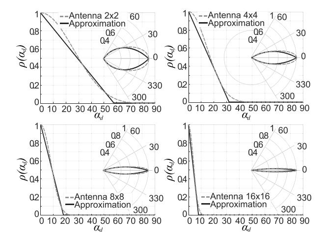

Fig. 6. Approximations of antenna radiation patterns computed according to (5) for URAs in polar and Cartesian coordinates [68], [69].

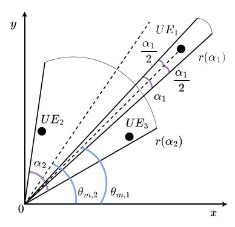

<span id="page-11-1"></span>Fig. 7. Illustration of beam definition.

arrays (URAs) having  $N_H \times N_V = 2x2$ , 4x4, 8x8, and 16x16 elements.

3) Multi-Beam Antenna Arrays: Advanced antenna arrays also facilitate the formation of multiple beams simultaneously. By employing digital or hybrid analog-digital beamforming techniques, it becomes possible to create multi-beaming solutions where each beam can be steered in a distinct direction. However, achieving this functionality requires the availability of multiple Radio Frequency (RF) chains proportional to the number of antenna elements in use.

To represent multi-beam antenna arrays, in conventional approaches, the number of the involved antenna elements defines the HPBW of these beams and is lower bounded by a single beam HPBW. Note that the overall emitted power  $P_A$  needs to be split between beams, not necessarily proportionally.

Fig. 7 illustrates the multicast group of 3 UEs split into two subgroups, each covered by one beam. The first beam,  $\langle \theta_{m,1}, \alpha_1, r(\alpha_1) \rangle$ , covers the multicast subgroup consisting of one UE,  $UE_1$ . The second beam targets the multicast subgroup formed by UEs  $UE_2$  and  $UE_3$ , where the two farthest UEs determine the width of the beam. The second beam is defined as  $\langle \theta_{m,2}, \alpha_2, r(\alpha_2) \rangle$ . The multicast subgrouping and beam assignment problems are discussed in Section V.

Here and below, the term a *multicast subgroup* denotes a set of the multicast group's UEs served by one transmission,

i.e., by a single beam. In Fig. 7, subgroup 1 consists of one UE, i.e., in fact, the multicast  $UE_1$  receives a multicast service using individual unicast transmission.

This work focuses on beamforming design under the assumption of perfect global Channel State Information (CSI). However, a promising future direction is to expand the scope of this research by incorporating the effects of imperfect CSI. One major challenge with imperfect CSI is the loss of spatial alignment between the transmitted and desired signals at each receiver. This misalignment can result in interference and reduced signal quality, leading to decreased achievable rates and increased error rates in multicast transmission. Due to the limited coherence time of mmWave channels, accurate estimation of CSI becomes more challenging, making the impact of imperfect CSI more pronounced. The presence of blockages and rapid channel variations further exacerbates the problem, as the beamforming system must adapt quickly to changes in the channel conditions. Incorporating the effects of imperfect CSI can be achieved by applying robust optimization techniques, such as those proposed in [71], [72], and learning-based techniques [73].

<span id="page-11-4"></span><span id="page-11-3"></span><span id="page-11-2"></span><span id="page-11-0"></span>Another issue that may affect multicasting performance is beam squint, which causes system bandwidth restriction in wideband communication systems. Namely, the beams deviate from the focus direction as the system bandwidth increases [74]. As mmWave and THz communications depend heavily on the precise alignment of beams between the transmitter and the receiver, beam squint can lead to significant performance degradation if not appropriately handled. In multicasting scenarios, the performance degradation due to the beam squint (also known as beam split) of just one user in the multicast group may lead to performance deterioration of the entire group. In this case, beam squint will affect more users compared to unicasting. However, several research studies proved that beam squint increases with the number of antennas (or the same, with array size) [74], [75], [76]. Since wider beams are typically utilized for multicasting compared to unicast transmissions to cover a group of multicast users, we can deduce that beam squint has a less or equal impact on multicasting performance compared to unicasting. We also discuss this and other beamforming challenges that appear in mmWave/THz in Section VIII.

#### <span id="page-11-5"></span>B. Blockage Models

Another critical factor affecting service performance at mmWave/sub-THz frequency bands is blockage. 3GPP recommends differentiating between blockages by small dynamic objects in the channel, such as humans and vehicles, and by large static objects, such as buildings [28]. The first type of impairment is often taken into account by subtracting a constant factor from the received Signal to Interference and Noise Ratio (SINR), whereas the latter one is modeled by utilizing different propagation exponents, see Section IV-C. Blockage by a large stationary building is also referred to as nLOS conditions. Thus, in what follows, we refer to the former as non-blocked/blocked states while to the latter as LOS/nLOS states.

Below, we briefly introduce blockage models that can be utilized in performance optimization and analysis of multicasting in mmWave/sub-THz systems. We note that blockage impairments in sub-6 GHz bands are in the range of 2–4 dB and thus often neglected in performance models [77].

<span id="page-12-2"></span>1) Blockage by Small Dynamic Objects: Most studies investigating blockage by small dynamic objects in mmWave/sub-THz channels concentrate on human body blockage and consider static UE location w.r.t. the BS. Then, there is the so-called blockage zone associated with a UE, where blockers always block the LOS [78], [79]. Representing human blockers by cylinders and assuming the Poisson distribution of blockers in  $\Re^2$ , the following expression for blockage probability is reported in [79]

$$p_B(x) = 1 - e^{-2\lambda_B r_B \left[ x \frac{h_B - h_U}{h_A - h_U} + r_B \right]},$$
 (8)

where x is the 2D BS to UE distance,  $h_B$  is the blocker height,  $h_U$  is the UE height,  $h_A$  is the BS height,  $r_B$  is the cylinder's base radius, and  $\lambda_B$  is the blockers' density in the environment.

<span id="page-12-6"></span>As small objects acting as blockers are often mobile, the blockage process is stochastic in nature, evolving in time as shown in [31]. For the Random Direction Mobility (RDM) [80] model of blockers, the LOS time follows the exponential distribution. In contrast, the uninterrupted blockage time coincides with the busy period in  $M/G/\infty$  queuing system with the arrival rate corresponding to the blocker arrival rate to the LOS blockage zone and service time corresponding to the residence time of a blocker in the LOS blockage zone. A feasible closed-form approximation for the mean uninterrupted blockage time can be obtained by applying the  $M/M/\infty$  queuing system.

Only a few efforts have been made to represent the dynamic blockage process, where both UEs and blockers are mobile. The authors are aware of the attempt in [81], wherein the blockage process is approximated by a Markov process with two states and the sojourn times in the states capturing LOS blocked and non-blocked durations.

In general, models assuming static locations of UEs and blockers are utilized for performance optimizations of multicast service, see Section V. However, the frequency of re-optimization depends not only on the intensity of session arrivals to the system but on the intensity of blockage events, as the latter may change the amount of resources allocated for multicast sessions. Here, the models capturing the time-dependent structure of the blockage process need to be utilized, see [82].

<span id="page-12-8"></span><span id="page-12-3"></span>2) Blockage by Large Static Objects: The blockage models for large static objects have been known for decades as they have also been utilized for assessing coverage of  $\mu$ Wave systems. In mmWave/sub-THz systems, buildings completely prevent LOS energy from reaching UEs (causing nLOS), thus forcing the communication through reflected paths. Another principal difference compared to blockage models by small dynamic objects is that building deployments in cities tend to create regular grids, such as the Manhattan buildings deployment. Furthermore, the propagation path length might be

comparable to the size of buildings. These properties affect the choice of the deployment models and techniques utilized to assess the blockage probability.

<span id="page-12-4"></span>The set of simple empirical models for building blockage is proposed by 3GPP in TR 36.901 [28]. Different models are utilized for indoor and outdoor deployments. Specifically, for Urban-Micro (UMi) outdoor deployment with appropriate heights of BS and UE, the LOS probability is given by

$$P_L^{3GPP} = \begin{cases} 1, & x \le d, \\ \frac{d}{x} + \left[1 - \frac{d}{x}\right] \exp\left[\frac{-x}{p_1}\right], & x > d, \end{cases}$$
(9)

<span id="page-12-5"></span>where the variables  $p_1$  and d are defined as

$$p_1 = 233.98 \log_{10}(h_U) - 0.95,$$
  
 $d = \max(294.05 \log_{10}(h_U) - 432.94, 18).$  (10)

The structure of 3GPP models makes it difficult to apply them to specific environments where properties might be different from those where measurements have been carried out. To this aim, ITU-R in Rec. P.1410 offers an alternative approach specifying the LOS probability as an explicit function of environmental parameters in the following form

$$P_L^{ITU} = \prod_{n=0}^{m} \left[ 1 - \exp\left[ \frac{\left[ h_A - \frac{\left( n + \frac{1}{2} \right) (h_A - h_U)}{m+1} \right]^2}{2\epsilon_3^2} \right] \right], \quad (11)$$

where  $m = \lfloor r\sqrt{(\epsilon_1\epsilon_2)} \rfloor - 1$  is the mean number of buildings in between UE and BS,  $h_A$  and  $h_U$  are BS and UE heights. The parameters  $\epsilon_1$ ,  $\epsilon_2$ , and  $\epsilon_3$  are the input model parameters representing the deployment specifics, including building dimensions, density, and height. These parameters can be related to the different parts of the cities, such as high-rise urban, urban, and suburban, by utilizing ITU-R typical districts data provided in ITU-R Rec. P.1410 as demonstrated in [27].

# <span id="page-12-7"></span><span id="page-12-0"></span>C. Propagation Models

The standard SINR equation is defined as

<span id="page-12-9"></span><span id="page-12-1"></span>
$$S(y) = \frac{P_A G_A G_U S_F U_F}{(N_0 W + I) L(y)},$$
(12)

where  $P_A$  is the BS transmit power,  $G_A$  and  $G_U$  are the antenna array gains at the BS and the UE,  $S_F$  is shadow fading,  $U_F$  is the fast fading capturing small-scale changes in the received signal strength [83],  $N_0$  is the thermal noise at 1 Hz, W is the operational bandwidth, I is the interference, L(y) is the path loss in the linear scale, and y is the distance between the BS and the UE.

<span id="page-12-10"></span>Consider the components in (12). The BS and UE antenna gains can be calculated by utilizing the models provided in Section IV-A. The thermal noise component is constant, -174 dBm/Hz. The interference component I is a random variable but is known to be much smaller compared to  $\mu$ Wave frequencies due to the use of directional antenna radiation patterns [62]. It, thus, can be captured by a constant factor, called interference margin, or modeled explicitly by utilizing the stochastic geometry models provided in [63], [84]. Further,

the shadow fading component is a random variable with a Normal distribution with zero mean and standard deviations that depend on the LOS state, as provided in [28].

Further, the fast fading,  $U_F$ , is also a random variable capturing small-scale phenomena in the wireless channel, i.e., small-scale displacements of UE or objects in the surroundings. Depending on the complexity of propagation conditions, the fast fading phenomenon can be modeled by Rayleigh, Rician, or general Nakagami-m distributions [85]. However, as fast fading happens at rather small timescales, it does not affect service performance at large scales, where forward error correction and Hybrid Automatic Repeat Request (HARQ) mechanisms can efficiently smooth these effects.

The path loss component L(y) utilized in (12) heavily depends on the deployment scenario. Specifically, for UMi outdoor deployment, 3GPP specified the following path loss [28] in decibel scale

<span id="page-13-0"></span>
$$L_{dB}(y) = v + 10\zeta \log_{10} y + 20 \log_{10} f_c, \tag{13}$$

where  $f_c$  is the carrier frequency in GHz and y is the 3D distance between the BS and the UE,

<span id="page-13-2"></span>
$$y = \sqrt{(X_A - X_U)^2 + (Y_A - Y_U)^2 + (h_A - h_U)^2}, \quad (14)$$

where  $(X_A, Y_A, h_A)$  and  $(X_U, Y_U, h_U)$  are the coordinates of the BS and the multicast UE, respectively, the coefficients v and  $\zeta$  account for LOS/nLOS states as well as for LOS blocked and LOS non-blocked channel conditions. Specifically, 3GPP recommends  $\zeta=2.1$  and  $\zeta=3.19$  for LOS and nLOS states, whereas the value of v depends on the carrier frequency.

<span id="page-13-4"></span>In non-blocked conditions for the lower part of mmWave band, 28-78 GHz,  $\upsilon$  is 32.4 dB. The blockage attenuation in blocked is added on top, resulting in an additional loss in the range of 15-25 dB [86], [87], [88]. For the sub-THz band, these losses are expected to reach 40 dB [89]. The vehicle type and geometry highly influence the blockage by vehicles at 300 GHz: the front-shield glass level is from 20 dB, while at the engine level, the value can reach up to 50 dB. In comparison with those for the mmWave band, they are significantly higher. Other factors that affect the values of blockage losses are the vehicle size and the number of them between communicating entities [90]. For 28 GHz, the authors in [91], [92], [93] also report the following height-dependent vehicle blockage losses: 411-12.2 dB for 1.7 m, 13.3 dB for 1.5 m, and 30-40 dB for 0.6 m.

<span id="page-13-6"></span>By accounting for LOS/nLOS states as well as blockage/non-blockage conditions, the propagation model for mmWave/sub-THz band can be represented by the exhaustive superposition of LOS/nLOS and blockage/non-blockage states. We consider four states: nLOS, blocked, LOS, blocked, nLOS, non-blocked, LOS, non-blocked. The state probabilities are numerated from 0 to 3 accordingly and given by

$$\begin{cases} \kappa_0(y) = [1 - P_L(y)] p_B(y), \\ \kappa_1(y) = P_L(y) p_B(y), \\ \kappa_2(y) = [1 - P_L(y)] [1 - p_B(y)], \\ \kappa_3(y) = P_L(y) [1 - p_B(y)], \end{cases}$$

where  $p_B(y)$  is the blockage probability provided in Section IV-B1,  $P_L(y)$  is the LOS probability from Section IV-B2.

By converting (13) to the linear scale using notation  $A_i y^{\zeta_i}$  corresponding to the introduced states, we have

$$A_0 = A_1 = 10^{2 \log_{10} f_c + (\upsilon + L)/10}, \ \zeta_0 = \zeta_2 = 3.19,$$
  
 $A_2 = A_3 = 10^{2 \log_{10} f_c + \upsilon/10}, \ \zeta_1 = \zeta_3 = 2.1.$  (15)

<span id="page-13-3"></span>Finally, the value of SINR at the UE located at the 3D distance y from the BS is given by

<span id="page-13-1"></span>
$$S(y) = \sum_{i=0}^{3} \frac{C_i y^{-\zeta_i} \kappa_i(y) S_{F,i} U_{F,i}}{N_0 W + I},$$
 (16)

where  $C_i = P_A G_A G_U$ ,  $S_{F,i}$  and  $U_{F,i}$  are state-dependent shadow and small-scale fading [28]. Note, that the BS coverage area radius r is defined by (16) for a predefined BS transmit power  $P_A$ , HPBW  $\alpha$ , and a given SINR threshold  $S_{th}$ , see, e.g., [94].

<span id="page-13-8"></span>Specifications for 5G mmWave systems include none of the frequencies in the FR2 mmWave (24, 28, 38, 72 GHz) band that are exposed to severe molecular absorption. In THz band, not only the impact is more profound, but the affected frequency bands are wider. However, as demonstrated in [95], there are still the so-called transparency windows, where the impact is negligible. Expectedly, these windows will be utilized for cellular systems in the future. However, we would like to highlight that all the proposed approaches in the paper are not limited to the transparency windows, where the propagation is not affected by molecular absorption. If there is the need to account for molecular absorption, one has to complement the propagation model with an additional factor,  $L_A(f, y)$ , obeying the Beer-Lambert law [96]

<span id="page-13-12"></span><span id="page-13-10"></span><span id="page-13-9"></span>
$$L_A(y) = \frac{1}{\tau(f_{T,c}, y)},\tag{17}$$

<span id="page-13-7"></span><span id="page-13-5"></span>where  $\tau(f_{T,c}, y)$  is the transmittance of the medium following the Beer-Lambert law,  $\tau(f_{T,c}, y) \approx e^{-K_A y}$ ,  $K_A$  is the absorption coefficient calculated on the base of the HITRAN database [97], as demonstrated in [96].

<span id="page-13-11"></span>A much more pronounced effect is produced by weather conditions (e.g., fog, rain) and trees. In the latter case, the impairments can be as high as 0.5–2 dB/m<sup>3</sup>. Detailed values of these impairments are provided in [19].

<span id="page-13-13"></span>Finally, the absorption phenomena may also lead to the molecular noise theoretically predicted in [96]. The theoretical model for molecular noise has been proposed in [98]. However, recent measurements [99] did not reveal any noticeable impact of the molecular noise phenomenon. However, the models reported in this study also remain valid under the molecular noise phenomenon.

For the reader's convenience, we summarize our discussion of antenna, propagation, and blockage models in Table VI, where we also indicate when the models can be utilized.

| TABLE VI                                  |
|-------------------------------------------|
| ANTENNA, BLOCKAGE, AND PROPAGATION MODELS |

<span id="page-14-1"></span>

| Type of Model     | Model                                                                                                                                                                                                                                                             | Comment                                                                                                                                                                                                                                                                                             |
|-------------------|-------------------------------------------------------------------------------------------------------------------------------------------------------------------------------------------------------------------------------------------------------------------|-----------------------------------------------------------------------------------------------------------------------------------------------------------------------------------------------------------------------------------------------------------------------------------------------------|
|                   | Geometric single-beam antenna model: Eq. (3)                                                                                                                                                                                                                      | Simplified model utilized for mmWave/sub-THz, main lobe modeling, symmetric                                                                                                                                                                                                                         |
|                   | $G_A(\theta_{3db}^{\pm}) = \frac{1}{\theta_{3db}^+ - \theta_{3db}^-} \int_{\theta_{3db}^-}^{\theta_{3db}^+} \frac{\sin(N\pi\cos(\theta)/2)}{\sin(\pi\cos(\theta)/2)} d\theta$                                                                                     | radiation pattern                                                                                                                                                                                                                                                                                   |
|                   | Pattern-based 2D single-beam antenna model: Eq. (4)                                                                                                                                                                                                               | Approximations of antenna radiation patterns, main lobe modeling, accounts                                                                                                                                                                                                                          |
| Antenna model     | $G_A(\alpha_d) = D_0 \rho(\alpha_d)$                                                                                                                                                                                                                              | for boresight direction and angular directivity, both symmetric and asymmetric                                                                                                                                                                                                                      |
|                   |                                                                                                                                                                                                                                                                   | radiation patterns                                                                                                                                                                                                                                                                                  |
|                   | Multi-beam antenna model                                                                                                                                                                                                                                          | The single-beam antenna model can be used to construct multi-beam antennas.                                                                                                                                                                                                                         |
|                   |                                                                                                                                                                                                                                                                   | Overall emitted power PA needs to be split between beams, not necessarily                                                                                                                                                                                                                           |
|                   |                                                                                                                                                                                                                                                                   | proportionally                                                                                                                                                                                                                                                                                      |
| Blockage model    | Blockage by small dynamic objects                                                                                                                                                                                                                                 | Human body blockage (blocked LOS path)                                                                                                                                                                                                                                                              |
| Biockage moder    | Blockage by large static objects                                                                                                                                                                                                                                  | Blockage by a large stationary building causing nLOS conditions                                                                                                                                                                                                                                     |
|                   | Human blockage probability: Eq. (8)                                                                                                                                                                                                                               | Blockage zone associated with a UE, where blockers always block the LOS                                                                                                                                                                                                                             |
| Human blockage    | Human blockage probability: Eq. (8) $p_B(x) = 1 - e^{-2\lambda_B r_B} \left[ x \frac{h_B - h_U}{h_A - h_U} + r_B \right]$                                                                                                                                         |                                                                                                                                                                                                                                                                                                     |
| Building blockage | LOS probability from 3GPP UMi: Eq. (9) $\begin{cases} 1, & x \leq d, \\ \frac{d}{x} + \left[1 - \frac{d}{x}\right] \exp\left[\frac{-x}{p_1}\right], & x > d, \\ p_1 = 233.98 \log_{10}(h_U) - 0.95 \\ d = \max(294.05 \log_{10}(h_U) - 432.94, & 18) \end{cases}$ | LOS probability depends on the propagation environment, such as RMa, UMi - Street canyon, UMa, Indoor - Mixed office, Indoor - Open office, which makes it difficult to apply them to specific environments where properties might be different from those where measurements have been carried out |
|                   | LOS probability from ITU-R: Eq. (11) $P_L^{ITU} = \prod_{n=0}^m \left[ 1 - \exp\left[\frac{[h_A - \frac{(n+\frac{1}{2})(h_A - h_U)}{m+1}]^2}{2\epsilon_3^2}\right] \right]$                                                                                       | LOS probability as an explicit function of environmental parameters                                                                                                                                                                                                                                 |
| Propagation model | 3GPP/ITU-R-based models: Eq. (13) $L_{dB}(y) = v + 10\zeta \log_{10} y + 20 \log_{10} f_c$                                                                                                                                                                        | Parementers $\upsilon$ and $\zeta$ depend on the propagation environments                                                                                                                                                                                                                           |

# <span id="page-14-3"></span>V. OPTIMAL MULTICASTING IN 5G/6G MMWAVE/SUB-THZ SYSTEMS

<span id="page-14-0"></span>The design of multicast solutions poses significant challenges, primarily due to the highly directional nature of 5G mmWave systems [\[100\]](#page-38-2), [\[101\]](#page-38-3). In a single-beam system, all UE devices belonging to the same multicast session and spread across different cell regions cannot be served via a single transmission. In this case, operation over larger beams limits the communications distances and leads to inefficient radio resource use due to lower MCSs. When utilizing multibeam antennas, the total transmission power constraint per antenna causes a similar effect, which must be considered when selecting the width of beams to be simultaneously swept.

To address these challenges, this section introduces a general framework for optimal multicast scheduling in 5G mmWave systems by describing a globally optimal solution for single- and multi-beam antenna designs, as proposed in [\[9\]](#page-36-5). The optimization problems are formulated under the assumption that the radio channel conditions and the multicast group composition remain unchanged for a specific time interval. The framework is considered as a basis for illustrating further possible extensions finalized to capture various operational specifics of 5G deployments. For example, we illustrate how it can be adapted to the case of optimal multicasting in dualmode mmWave sub-6 GHz hybrid deployments when both types of RATs can be utilized to serve multicast UEs, as presented in [\[102\]](#page-38-4). To reduce the complexity of suggested solutions, we explore the application of heuristics and ML techniques [\[103\]](#page-38-5). Theoretical exposure is supplemented with major takeaways enriched with numerical results.

# <span id="page-14-5"></span><span id="page-14-4"></span><span id="page-14-2"></span>*A. Single-RAT Operation*

The multicast multi-beam operation optimization problem can be formalized as a subclass of Bin Packing Problem <span id="page-14-7"></span><span id="page-14-6"></span>(BPP) [\[104\]](#page-38-6). Starting from identical bins and a collection of items of various sizes, the BPP objective is to either minimize the number of bins in which the items must be packed in such a way as to be evenly distributed or to fill the bins in the most time-efficient manner. The variable-sized BPP [\[105\]](#page-38-7) represents a new variant of BPP that attempts to reduce the cost of assigning items to particular bins, which may or may not be primarily determined by the item's volume. In the formulation we consider for this paper, UEs represent items, whereas a beam is a bin for a subgroup of UEs. The objective is to minimize the cost, represented by the ratio of occupied resources to the total available resources, when assigning UEs from a multicast group to subgroups, with each subgroup being served by a directional beam [\[9\]](#page-36-5). Formulating the multicast multi-beam optimization problem as a BPP allows leveraging existing algorithms and techniques developed for BPP to find solutions that minimize the cost of resource allocation and improve the efficiency of multicast transmission in 5G mmWave systems.

A typical model that can be considered for multicast service provisioning optimization is formulated as follows. A tri-sector cellular architecture is considered, wherein each BS covers a 120◦ sector and operates with a directional antenna array that contains *L* ≥ 1 beams. The set of *K* UEs that make up a multicast group is denoted as K = {1,..., *K*}. An Orthogonal Frequency-Division Multiple Access (OFDMA) based system, where *M* represents the length of the time horizon, i.e., the number of time slots in the time horizon (one subframe of 1 ms), with index *t* ∈ T , T = {1,..., *M* }, of each time slot. The number of time slots *M* depends on the NR numerology μ. The maximum number of Primary Resource Blocks (PRBs) available in the system is restricted by *MLRb* , where *Rb* is the available number of resource blocks in the system for a beam at time slot *t* for given numerology μ and operating frequency *fc*, whereas *ML* restricts the potential maximum number of subgroups served within the time horizon.

<span id="page-15-10"></span>When considering all combinations of K UEs of the multicast group, the number of possible subgroups scales as  $2^K-1$  [106]. Hence,  $\mathcal{K}_j$  is introduced to denote the set of UEs forming subgroup  $j, j \in \mathcal{J}, \mathcal{J} = \{1, \dots, 2^K-1\}$ , and  $|\mathcal{K}_j|$  is the number of UEs in subgroup j. For instance, for K=3 UEs, the number of subgroups' options is 7 and these feasible options are  $\mathcal{K}_1=\{1\}, \mathcal{K}_2=\{2\}, \mathcal{K}_3=\{3\}, \mathcal{K}_4=\{1,2\}, \mathcal{K}_5=\{1,3\}, \mathcal{K}_6=\{2,3\}, \mathcal{K}_7=\{1,2,3\}.$ 

A suit<sup>3</sup>  $\mathcal{G}_k$  is defined as the collection of subgroup's indices,  $\mathcal{G}_k \subset \mathcal{J}$ , corresponding to the combination of subgroups  $\mathcal{K}_j$ ,  $j \in \mathcal{J}$ , that covers all the UEs of the multicast group without their repetition,  $k = 1, 2, \ldots, |\Omega|$ , where  $\Omega$  is the set of all such combinations.

In the case of K=3, the set  $\Omega$  contains  $\mathcal{G}_1 \sim \mathcal{K}_1 \cup \mathcal{K}_2 \cup \mathcal{K}_3$ ,  $\mathcal{G}_2 \sim \mathcal{K}_3 \cup \mathcal{K}_4$ ,  $\mathcal{G}_3 \sim \mathcal{K}_2 \cup \mathcal{K}_5$ ,  $\mathcal{G}_4 \sim \mathcal{K}_1 \cup \mathcal{K}_6$ ,  $\mathcal{G}_5 \sim \mathcal{K}_7$  with  $|\Omega|=5$ . Therefore, the following conditions should be held:

<span id="page-15-3"></span>
$$\bigcup_{j \in \mathcal{G}_k} \mathcal{K}_j = \mathcal{K}, \qquad k = 1, 2, \dots, |\Omega|,$$
(18)

$$\mathcal{K}_{j_1} \cap \mathcal{K}_{j_2} = \emptyset, \qquad j_1 \neq j_2, \ \forall j_1, j_2 \in \mathcal{G}_k, \tag{19}$$

meaning that each multicast UE has to be included in one subgroup only. Note that the set  $\mathcal{K}_j$  of UEs forming subgroup j determines the directionality of the beam  $\theta_{m,j}$ , HPBW  $\alpha_j$  required to cover all UEs in subgroup j, and the distance  $L_j$  from the BS to the farthest UE.

For a single-beam system, L=1, all the subgroups with indices included in suit  $\mathcal{G}_k$  are served sequentially by one beam. For a multi-beam system, L>1, the subset of subgroups' indices is defined as  $\mathcal{G}_k^l\subseteq\mathcal{G}_k$ ,  $l=1,2,\ldots,L$ , scheduled for beam l. Hence, suits  $\mathcal{G}_k^l$  should satisfy the following conditions:

<span id="page-15-4"></span>
$$\mathcal{G}_{k} = \bigcup_{l=1}^{L} \mathcal{G}_{k}^{l}, 
\mathcal{G}_{k}^{l_{1}} \bigcap \mathcal{G}_{k}^{l_{2}} = \emptyset, \ l_{1} \neq l_{2}, \ \forall l_{1}, l_{2} \in \{1, 2, \dots, L\}.$$
(20)

A binary indicator  $g_j^t \in \{0,1\}$  is introduced to designate the subgroup assignment decision variable at time slot t, i.e.,  $g_j^t = 1$  if subgroup j is served at time slot t, and  $g_j^t = 0$  otherwise. Then, a vector-indicator  $\mathbf{g}^t = (g_1^t, \dots, g_{|\mathcal{J}|}^t)$  represents subgroups that are served at time slot t. At time slot t at most t beams can be simultaneously swept, or, equally, t subgroups can be served, that is,

<span id="page-15-5"></span>
$$\sum_{j \in \mathcal{G}_k} g_j^t \le L, \, \forall t \in \mathcal{T}. \tag{21}$$

Moreover, a suit service time should not exceed the scheduling time horizon that may depend on implementation, i.e.,

<span id="page-15-1"></span>
$$\sum_{j \in \mathcal{G}_k^l} \sum_{t \in \mathcal{T}} g_j^t \le M, \, \forall l = 1, \dots, L, \forall k = 1, \dots, |\Omega|. \quad (22)$$

<span id="page-15-0"></span><sup>3</sup>Note that a suit is the set of subsets. The term suit is utilized for clarity of further exposure.

Furthermore, the total transmit power budget per antenna that serves subgroup *j* must be taken into account when dealing with a multi-beam system:

<span id="page-15-6"></span>
$$\sum_{j \in \mathcal{G}_k} g_j^t P_j \le P_{\max}, \, \forall t \in \mathcal{T}, \tag{23}$$

where  $P_{\rm max}$  corresponds to the overall emitted antenna power to be split between beams, whereas  $P_j$  is calculated according to the propagation model (see Section IV) by taking into account the SINR threshold corresponding to a chosen NR MCS [94].

The SINR of subgroup j is defined according to (16) by substituting  $L_j$  for y. Consider that a multicast session requires a constant bit rate of C bps. Then, to calculate the number of resources required from BS to provide a multicast service with bit rate C, one needs to know the CQI and MCS values, and SINR to spectral efficiency mapping. MCS mappings from [107] might be used, but these parameters are typically vendor-specific.

<span id="page-15-11"></span>The cost of the multicast service delivered to subgroup j is the function  $a_j = f(P_j, N_j, C)$ , where  $P_j$  is the transmit power of the corresponding beam, f is the number of antenna elements used to form the radiation pattern of the beam, and C is the required session bit rate, i.e.,

<span id="page-15-9"></span>
$$a_j = C/s_j w_{\text{PRB}}, \tag{24}$$

where  $s_j$  is a spectral efficiency in bps/Hz of the farthest UE in subgroup j and  $w_{PRB}$  is a PRB size.

The scheduler's time slot assignment is written in vector  $\mathbf{g}_j = (g_i^1, \dots, g_i^M)$  with

$$\sum_{t \in \mathcal{T}} g_j^t = \left\lceil \frac{a_j}{R_b} \right\rceil, j \in \mathcal{J}. \tag{25}$$

The following condition on the number of resources allocated to subgroup j served by a beam should also be held

<span id="page-15-2"></span>
$$a_j \le MR_b, j \in \mathcal{J}.$$
 (26)

Finally, in (22) and (26), the constraint on the maximum number of available resources in the system should hold, i.e.,

<span id="page-15-7"></span>
$$\sum_{j \in \mathcal{G}_k} a_j \le MLR_b, j \in \mathcal{J}, k = 1, \dots, |\Omega|.$$
 (27)

The proposed BPP formalism can be utilized to formulate single- and multi-beam multicast optimization problems. It also allows for extensions to the case of multiple RATs.

1) Single-Beam Antennas Optimization: In the case L=1, the entire transmit power budget at BS is allocated to a single beam,  $P_j=P_1=P_A$ . Hence, the optimization problem can be defined as [108]

<span id="page-15-12"></span><span id="page-15-8"></span>
$$\min_{k \in 1, \dots, |\Omega|} \sum_{j \in \mathcal{G}_k} a_j, 
\text{s.t. (18), (19), (20), (21), (22), (23), (26), (27).}$$

2) Multi-Beam Antennas Optimization: If  $L \ge 1$ , then the goal becomes grouping multicast UEs in an optimal way that minimizes the total multicast service cost in terms of  $\rho$ , i.e., the fraction of PRBs occupied compared to the total available for the entire time horizon. Thus, the optimization problem can be formulated as follows:

<span id="page-16-0"></span>
$$\min_{k \in 1, \dots, |\Omega|} \sum_{j \in \mathcal{G}_k} \frac{a_j}{MLR_b},$$
s.t. (18), (19), (20), (21), (22), (23), (26), (27),

with  $\rho$  as the objective function.

For a single-RAT operation, optimal multicast scheduling, serving as a globally optimal solution, is achieved through the following formulations: for single-beam antenna designs, the optimization problem is expressed by (28), while for multibeam antenna designs, it is represented by (29).

#### <span id="page-16-3"></span>B. Two-RAT Operation

If the optimal multicast scheduling formalism is extended to two-RAT 5G systems, the goal of the model remains the same. The scheduler still aims to minimize  $\rho$ , thereby finding the optimal grouping of multicast UEs while considering the possibility of transmission over two technologies, e.g., mmWave/ $\mu$ Wave, mmWave/sub-THz.

1) No Service Priorities: Considering the case of no external priorities, the problem formulation can be written in a similar way as described above for single-RAT with multibeam antennas by introducing the variables with indices m and  $\mu$  for mmWave and  $\mu$ Wave technologies, respectively,

<span id="page-16-1"></span>
$$\min_{k \in 1, \dots, |\Omega|} \sum_{j \in \mathcal{G}_k} \left[ \frac{a_{j,m}}{M_m L_m R_{b,m}} + \frac{a_{j,\mu}}{M_\mu L_\mu R_{b,\mu}} \right]. \tag{30}$$

We emphasize that (30) reflects the implicit mmWave or  $\mu$ Wave priorities. In the first case, the system selects mmWave band to serve a set of UEs  $\mathcal{K}_j$ ,  $j \in \mathcal{J}$ , if  $P_{j,m} \leq P_{\max,m}$ . This means that the mmWave BS is utilized until it fails to perform successful data delivery, and  $\mu$ Wave technology is only used when some multicast UEs reside outside of the coverage of mmWave BS. By analogy,  $\mu$ Wave priory ensures that the set  $\mathcal{K}_j$  is served by  $\mu$ Wave BS, if  $P_{j,\mu} \leq P_{\max,\mu}$ .

2) Weighted Priority Service: The available spectrum, deployment area, traffic conditions, and other factors may influence an operator's technology selection. To this aim, the following weighted optimization function to fulfill these specific requirements may be utilized:

<span id="page-16-2"></span>
$$\min_{k \in 1, \dots, |\Omega|} \sum_{j \in \mathcal{G}_k} \left[ w \frac{a_{j,m}}{M_m L_m R_{b,m}} + (1 - w) \frac{a_{j,\mu}}{M_\mu L_\mu R_{b,\mu}} \right], \tag{31}$$

where w is the weight factor.

The weight parameter w in (31) can be introduced to provide weighted priority in technology selection. When considering the coexistence of unicast and multicast traffic, one may set  $w = \min(1, R^2/R_m^2)$  with R and  $R_m$  being the service area and mmWave cell radii, respectively, making w proportional to the coverage distance. The motivation is that the objective

function in (31) maximizes the resources available for a new session under a uniform distribution of geometric locations of unicast sessions throughout the dual-mode BS coverage region. Alternatively, the weight w can be set proportionally to the operator's utility, depending on these factors.

The expressions that can be used to find an optimal solution in the context of the unweighted and weighted priority multicast service are given by (30) and (31), respectively. By optimizing these objective functions, the scheduler can determine the optimal grouping of multicast UEs while considering the trade-off between mmWave and  $\mu$ Wave technologies, leading to an efficient allocation of resources and satisfying the operator's specific needs.

#### C. More Than Two-RAT Operation

When dealing with more than two RATs operations, it becomes essential to determine multicast user grouping that minimizes the overall service cost. Additionally, the task involves mapping these subgroups onto multiple RATs to enable parallel transmission within the multi-RAT networks. The minimization of the ratio of utilized to available resources,  $\rho$ , can be considered while satisfying the service requirements. Thus, similarly to the two-RAT scheme, the scheduler aims to minimize total delivery cost in terms of  $\rho$  during the entire time horizon, considering the possibility of transmission over all available technologies. For more than two RATs, one may use the formulation described in Section V-B by adding more components associated with all available technologies. Alternatively, the optimization criteria can be latency minimization, data rate maximization, etc. In general, for more than two RATs considered, the optimization function takes the following form

<span id="page-16-4"></span>
$$\min_{k \in 1, \dots, |\Omega|} \sum_{j \in \mathcal{G}_k} \sum_{\eta \in H} w_{\eta} \frac{a_{j,\eta}}{M_{\eta} L_{\eta} R_{b,\eta}}, \tag{32}$$

where  $\eta$  represents the RAT index,  $\eta \in H$ , H is a set of RATs.

By combining multiple technologies, the effective service area of a multi-RAT solution can be extended to cover all onboard technologies. The optimal choice for such a scenario can be determined using (32). This approach can significantly enhance reliability compared to relying on a single RAT connectivity. It is important to note that the choice of technology generally depends on the specific application being used.

# D. Alternative Solutions to Optimal Multicasting

General BPPs, wherein a given set of items of various sizes has to be packed into the fewest number of unit capacity bins, belong to the NP-complete problem [105]. While exhaustive search can solve these problems for small-scale instances, it becomes infeasible in the case of large-scale environments due to the exponential increase in state space. To address the complexity and enhance practicality, this section presents a range of algorithms for multicast problems discussed above. These algorithms include exact branch-and-cut and branch-and-bound methods, relaxation approaches, meta-heuristics, and ML methods.

1) Single-RAT Heuristic Solution: The proposed heuristic algorithm is suitable for the case  $L \geq 1$  and consists of two stages: subgroup formation (stage 1) and beam assignment and power (re-)allocation (stage 2). The second stage is also logically divided as follows: (i) selection of the multicast subgroups that should be served during the same time slot, (ii) water-filling to determine the maximum power to allocate to all the beams within the time slot, and (iii) the adjustment of power allocation to the selected beams. Multi-beam transmissions can be considered starting from the second stage, which implies the need to guarantee the energy budget constraints (23) per antenna. More specifically, this means that for the single-beam systems, L=1, only the stage 1 is needed (see Algorithm 1 and Algorithm 2), whereas, in the case of multibeam systems with L > 1, further steps have to be performed (we refer to Algorithm 3).

Stage 1 - Subgroups Formation. Subgroups are formed in this stage to serve all UEs in a multicast group within a time horizon. There are two ways to complete this procedure, as detailed below.

Subgroup Formation Option 1.1. To implement beam assignment, the incremental multicast grouping algorithm (initially designed in [108]) is adapted for mmWave networks to the multi-beam case, i.e., L>1. For L=1, the approach described in [108] can be used by changing the objective function. In detail, the number of beams and their resolution (i.e., width) needed to optimize the multicast transmission performance are defined by employing the resource utilization minimization criteria. The pseudo-code is shown in Algorithm 1, wherein the output of the algorithm includes the number of subgroups, n, required to serve set  $\mathcal{K}$  of multicast UEs,  $1 \leq n \leq |\mathcal{J}|$ ; the set of subgroups,  $\mathcal{S}_1^M, \ldots, \mathcal{S}_n^M$ , that covers all UEs  $\mathcal{K}$  from a multicast group without their repetition; and required beam transmit power for each subgroup,  $P_1^M, \ldots, P_n^M$ .

The list of UEs to be allocated into subgroups is referred to as  $\mathcal{A}$ . Initially, all UEs are included in the multicast group, i.e., set  $\mathcal{K}$ , to list  $\mathcal{A}$  (line 3). Each element of the 3D distance-vector  $\mathbf{y} = (y_1, y_2, \ldots, y_i, \ldots, y_K)$  reflects the distance between the BS antenna and UE i as per (14). Vector  $\mathbf{\Phi} = (\phi_1, \ldots, \phi_K)$  takes into account UEs' reference angles in the azimuth plane (lines 4-5). The amount of used resources is initially set to 0 in line 7. The algorithm iteratively segregates the UEs from list  $\mathcal{A}$  into multiple subgroups, as seen in line 9. Particularly, the minimization function is set to infinity on line 10. Here, the minimization function reflects the occupied per UE resources for each multicast subgroup. The algorithm begins by selecting the furthest UE from list  $\mathcal{A}$  with a distance y and its reference angle  $\phi_y$  (lines 12-13).

Further, adaptive beamforming is used based on the UE's location, wherein one beam pattern can be chosen to transmit with a selected MCS. Line 15 collects all UEs covered by a beam with width  $\alpha$  directed toward the UE with reference angle  $\phi_y$  and with distance y in the multicast subgroup  $\mathcal{S}_{\alpha}$ . We underline that the transmit power for each beam with width  $\alpha$  is computed for  $L \geq 1$  according to the propagation model and SINR threshold. The maximum available power  $P_{\text{max}}$  is used for the transmission when L=1. Recall that for a single-beam

**Algorithm 1:** Single-RAT Heuristic Stage 1 Option 1.1,  $L \ge 1$ 

```
1 Input: (X_{U}(i), Y_{U}(i), h_{U}), i \in \mathcal{K}
  2 Output: n; S_1^M, ..., S_n^M; P_1^M, ..., P_n^M;
  3 \mathcal{A} \leftarrow \mathcal{K}, \, \mathcal{K} = \{1, \dots, K\};
  4 \mathbf{y} = (y_1, ..., y_K) as (14);
  \Phi = (\phi_1, ..., \phi_K);

▷ reference angles

  6 n \leftarrow 0;
                                                                                           ⊳ subgroups counter
  7 a_{\text{sum}} \leftarrow 0;
                                                                    ▷ occupied resources collector
  8 \mathcal{S}_n^M \leftarrow \emptyset;
  9 while A \neq \emptyset or a_{sum} < MLR_b or n < ML do
               MIN_Q \leftarrow \infty;
               n \leftarrow n + 1;
11
               y \leftarrow \max_{i \in \mathcal{A}} y_i;
12
               \phi_y \leftarrow \phi(y);
13
               14
15
                       calculate P_{\alpha} from P_{\alpha} = \frac{A_1 A_2 S_{th}(N_0 W + I)}{G_A G_U S_F U_F y^{\zeta_1} [A_2 (1 - p_B(y)) + A_1 p_B(y)]};
16
17
              \begin{array}{c|c} \text{if } P_{\alpha} \leq P_{\max} \text{ then} \\ Q_{\alpha} = \frac{C}{s_{\alpha} \, w_{\text{PRB}} |\mathcal{S}_{\alpha}|}; \\ \text{if } \textit{MIN}_{Q} > Q_{\alpha} \text{ then} \end{array}
18
19
20
                               \begin{aligned} & \text{MIN}_{Q} \leftarrow Q_{\alpha}; \\ & \mathcal{S}_{n}^{M} \leftarrow \mathcal{S}_{\alpha}; \\ & P_{n}^{M} \leftarrow P_{\alpha}; \\ & a_{n} \leftarrow \frac{C}{s_{\alpha}w_{\text{PRB}}}; \end{aligned}
21
23
24
25
26
               else
                       go to line 29;
27
28
               end
29 end
30 \mathcal{A} \leftarrow \mathcal{A} \setminus \mathcal{S}_n^M;
31 a_{\text{sum}} \leftarrow a_{\text{sum}} + a_n;
32 return n, \mathcal{S}_1^M, ..., \mathcal{S}_n^M, P_1^M, ..., P_n^M.
```

<span id="page-17-0"></span>operation, i.e., L > 1, unlike the approach described in [108], as the objective function, the ratio of occupied to available resources should be minimized (line 18). Here,  $s_{\alpha}$  is a spectral efficiency for a beamwidth  $\alpha$  and corresponds to  $s_j$  in (24). As a result, the algorithm defines the best  $\alpha$  for the chosen in line 12 UE and removes all the UEs served by the beam with width  $\alpha$  UEs from the list  $\mathcal{A}$  (line 29). Algorithm 1 comes to a stop either when all UEs have been serviced (i.e., list  $\mathcal{A}$  is empty) or when there are no resources available in the system.

Subgroup Formation Option 1.2. A different approach for subgroup formation is presented in Algorithm 2. First, this algorithm chooses the farthest UE i from the BS and identifies the subgroup  $\mathcal{K}_j$ , such that  $i \in \mathcal{K}_j$ , to serve at the smallest value  $a_j/|K_j|, j \in \mathcal{J} = \{1, \dots, 2^K-1\}$  (lines 8-10). The motivation behind this approach is that the algorithm can cover more UEs when sweeping the beam by choosing the farthest UE from the multicast group. Further, to provide a less complex solution while keeping the intention to minimize

**Algorithm 2:** Single-RAT Heuristic Stage 1 Option 1.2, L > 1

```
1 Input: (X_{II}(i), Y_{II}(i), h_{II}), i \in \mathcal{K}
2 Output: n, S_1^M, ..., S_n^M, P_1^M, ..., P_n^M;
3 Create 2^K - 1 multicast subgroups of UEs,
      \mathcal{J} = \{1, ..., 2^K - 1\};
 4 \mathcal{A} \leftarrow \mathcal{K}, \, \mathcal{K} = \{1, \dots, K\};
5 n \leftarrow 0;

▷ subgroups counter

 6 while A \neq \emptyset do
7
         n \leftarrow n + 1;
         find the farthest UE i \in A and the distance from BS
          to this UE: y \leftarrow \max_{i \in \mathcal{A}} y_i as (14);
         find all subgroups K_j, j \in \mathcal{J}, such as i \in K_j;
9
         find subgroup \mathcal{S}_n^M such as i \in \mathcal{K}_j, with the smallest
10
          utilized resources per UE:
         S_n^M \leftarrow \min_{j \in \mathcal{J}, i \in \mathcal{K}_j} a_j / |K_j|;

A \leftarrow A \setminus S_n^M;
11
         remove from \mathcal J all subgroups that contain UEs from
12
13 end
14 return: n, S_1^M, ..., S_n^M, P_1^M, ..., P_n^M.
```

<span id="page-18-0"></span>the ratio  $\rho$  of occupied to available resources, the algorithm selects the beamwidth that gives the smallest value of utilized resources per UE,  $a_j/|K_j|$ . Then, the algorithm erases selected UEs from the list  $\mathcal{A}$  (line 11) and repeats the process for the remaining UEs (lines 6-12). We emphasize that all subgroups  $\mathcal{K}_j$  from  $\mathcal{J}=\{1,\ldots,2^K-1\}$  that contain the served UEs are also excluded (line 12). By doing this, Algorithm 2 significantly reduces the complexity while preserving comparable performance with the optimal solution obtained through exhaustive search as per (28) and (29), as later discussed in Section VI-A.

Stage 2 - Beam Assignment and Power Allocation. A pseudo-code for stage 2, where beam assignment and power allocation are performed, is presented in Algorithm 3, wherein  $\mathcal{S}^{M}$  stands for the set of subgroups selected during stage 1 of the heuristics. For the time horizon, the algorithm aims to find the subgroups that will be served simultaneously in each time slot and the transmit power for corresponding beams to minimize  $\rho$ . Accordingly, the algorithm runs until all subgroups are deleted from  $S^M$  (lines 5-22), and it outputs the number of time slots m to serve all subgroups. The  $\mathcal{D}^{(m)}$  denotes a set of subgroups to be served at the current time slot m. The algorithm chooses the worst subgroup in terms of the required transmit power from  $S^M$ and adds it to the set  $\mathcal{D}^{(m)}$  (lines 7-9). If the power budget constraint  $P_{\text{max}}$  allows adding more subgroups to the set  $\mathcal{D}^{(m)}$ , the algorithm selects the best subgroup in terms of the required transmission power and adds it to the set  $\mathcal{D}^{(m)}$ (lines 10-19). The number of subgroups in  $\mathcal{D}^{(m)}$  is restricted by L. When the set  $\mathcal{D}^{(m)}$  is defined, the power water-filling procedure (the two options described below) (re-)allocates the power in a way to minimize the utilized resources (line 20).

**Algorithm 3:** Single-RAT Heuristic Stage 2, L > 1

```
Input: S_1^M, ..., S_n^M; P_1^M, ..., P_n^M;
2 Output: m, \mathcal{D}^{(k)}, P_j^{*(k)}, j = 1, ...n, k = 1, ...m;
 3 \mathcal{S}^M \leftarrow \{\mathcal{S}_1^M, ..., \mathcal{S}_n^M\};
  4 m \leftarrow 0;

    time slot counter

 5 while \mathcal{S}^M 
eq \emptyset do
                m \leftarrow m + 1;
                k_{\max} \leftarrow arg \ max_{i \in \mathcal{S}^M} P_i;
               \begin{aligned} &P_{\text{sum}} \leftarrow P_{k_{\text{max}}}^{M}; \\ &\mathcal{D}^{(m)} \leftarrow \mathcal{S}_{k_{\text{max}}}^{M}; \\ &\text{if } \mathcal{S}^{M} \setminus \mathcal{D}^{(m)} \neq 0 \text{ then} \end{aligned}
10
                        for j = 2:L do
11
                                 k_{\min} \leftarrow arg \min_{j \in \mathcal{S}^M \setminus \mathcal{D}^{(m)}} P_j;
12
                                 if P_{sum} + P_{k_{\min}}^{M} \leq P_{\max} then  | \mathcal{D}^{(m)} \leftarrow \mathcal{D}^{(m)} \cup \mathcal{S}_{k_{\min}}^{M}; 
13
14
15
                                    go to line 20;
16
                                  end
17
                        end
18
19
                Perform water-filling for \mathcal{D}^{(m)} and obtain P_i^{*(m)};
20
                \mathcal{S}^M \leftarrow \mathcal{S}^M \setminus \mathcal{D}^{(m)}:
21
23 return: m, \mathcal{D}^{(k)}, P_j^{*(k)}, j = 1, ...n, k = 1, ...m.
```

<span id="page-18-1"></span>Option 2.1. Traditional power water-filling. The channel with the high Gane to Noise Ratio (GNR) receives more power, which leads to a higher system capacity. Note that channel GNR is related to the SINR.

Option 2.2. Resource-Based Power Water-Filling. Alternatively, resource information can be used to implement the water-filling algorithm. This approach allows for allocating extra power to subgroups that result in the most significant reduction in overall resource utilization.

2) Machine Learning Solution Algorithms: To decrease the relatively high computational complexity of the previous solutions to the multicast grouping problem, ML techniques can be utilized. Below, we illustrate three classes of algorithms based on their complexity: (i) classification/regression models, (ii) decision trees and forests, and (iii) neural networks.

Running the optimal solution for a multicast group with a small number of UEs can provide data that can be used to develop a fast algorithm that can solve the multicast subgrouping problem even in the case of a multicast group with many more UEs. Thus, supervised learning is the suitable class of ML algorithms. In supervised ML techniques, the algorithm leverages labeled training on a prepared dataset (i.e., data provided by the optimal solution) and returns outcomes (i.e., a class or a predicted value), which can be evaluated in terms of accuracy using labels from the training dataset. Both an online and offline learning platform based on recent International Telecommunication Union (ITU) standards for

<span id="page-19-1"></span>5G ecosystems [\[109\]](#page-38-11), [\[110\]](#page-38-12), [\[111\]](#page-38-13) can implement the supervised algorithm.

The execution phase and training period of ML algorithms should be short, due to the required BS real-time operation whenever a multicast group either gains an additional UE or loses one. Hence, low-complexity ML techniques are prioritized as practical implementation is targeted at simple algorithms, such as supervised classification and decision trees. Random forests and neural networks are examined to determine whether cutting-edge learning models may produce more accurate results.

Regarding accuracy assessment, one may utilize two similarity metrics. The one, σ, can rely on the perfect match between the actual and predicted number of subgroups and the number of UEs assigned to these subgroups. More precisely, the following criterion can be utilized

$$\sigma = \frac{\text{number of correctly classified data}}{\text{number of test data}} \times 100\%.$$

If ML and optimization outcomes match perfectly, the ratio of occupied to available resources, ρ, coincide for both metrics, i.e., ρ*opt* = ρ*ML*. Moreover, due to the discrete nature of resource allocation and MCSs/spectral efficiency mapping, the investigated metrics ρ*opt* and ρ*ML* may be close even when the number of subgroups and UEs assigned to these subgroups varies. Considering that resource usage is the primary metric of interest, one may also examine a second metric based on the resulting resource utilization matching:

$$\gamma = \frac{\rho_{ML}}{\rho_{opt}} \times 100\%.$$

Due to the availability of the training datasets, supervised learning algorithms, whose most common learning task is *classification*, can be utilized. For the problem at hand, one may consider the following supervised learning algorithms:

- *Decision Tree* learning splits the dataset based on different conditions and can be used for classification and regression predictive models. The foremost benefit of this approach consists of the construction of an interpretable model. Hence, these algorithms are often referred to as white-box implementations [\[112\]](#page-38-14).
- *Logistic Regression* is usually leveraged in binary classification to associate observed values to one of two possible classes. The method transforms the output through a sigmoid function to return a probability value for class mapping.
- *Naive Bayes* is a straightforward but effective classification technique based on Bayes' theorem and assuming conditional independence among objects' features.
- The *Support Vector Machine (SVM)* algorithm is able to differentiate between classes by projecting a hyperplane that separates them. In this formulation, support vectors correspond to the nearest points to the hyperplane, and changing the support vector leads to modifications in the hyperplane [\[113\]](#page-38-15).
- <span id="page-19-3"></span>• *K-Nearest Neighbors (KNN)* attempts to predict the correct class for test data by computing the distance between test data and all training points. The KNN method computes the probability that test data belong to the "K"

<span id="page-19-0"></span>TABLE VII INTERPRETABILITY CHARACTERISTICS OF MAIN CLASSIFIER TYPES

| ML Algorithm                 | Interpretability                         |
|------------------------------|------------------------------------------|
| Decision Trees               | Easy                                     |
| Ensemble Classifiers         | Hard                                     |
| Logistic Regression          | Easy                                     |
| Naive Bayes Classifiers      | Easy                                     |
| Support Vector Machine       | Easy for linear kernel, hard for others. |
| Nearest Neighbor Classifiers | Hard                                     |
| Neural Network Classifiers   | Hard                                     |

closest classes of training data and chooses the most likely class.

• Multiclass classifications performed using *Neural Network* (NN) classifiers. These models often outperform other algorithms in terms of accuracy of prediction. Increasing the number and size of connected layers in NN models boosts their flexibility.

Table [VII](#page-19-0) provides the characteristics of considered algorithms in terms of interpretability, which allows for a better understanding of obtained solutions. This feature makes it easy to avoid solution mistakes or errors and compensate for them. With higher interpretability, one can understand how an ML model makes its decision.

All the above-mentioned algorithms can solve the required classification problem, namely, assigning an observation (UE) to one of the classes (multicast subgroups). In general, the following set of model's features can be considered as parameters that form the training dataset: *(i)* UE's coordinates, *(ii)* number of UEs, *(iii)* service area radius, *(iv)* available bandwidth, *(v)* session data rate, and *(vi)* number of subgroups (classes). Model's features form predictor's set P that may impact the classification results (see Section [VI-A,](#page-21-1) where the features' importance is investigated). The algorithms learn from the training dataset of size *<sup>H</sup>*1 (created by running the optimization presented in Section [V-A\)](#page-14-2) by predicting the data and adjusting it for the correct solution of 5G NR multicast subgroup formation.

<span id="page-19-2"></span>Finally, since the optimal solution is feasible only for a limited number of UEs, one needs to test the extrapolation capabilities of ML models by training them on the reduced number of UEs and then assessing the accuracy for a larger number of UEs.

- *3) Multi-RAT Suboptimal Solutions:* For a limited number of UEs in the coverage area of BS, the direct solution of the problems in [\(30\)](#page-16-1) and [\(31\)](#page-16-2) can be achieved by using, e.g., branch-and-cut or branch-and-bound techniques. Some of these solutions allow controlling heuristic behavior focusing on the solution's integrity rather than its optimality. In general, the following solutions have been shown to improve the heuristic behavior of Mixed-Integer Programming (MIP):
- <span id="page-19-4"></span>• *Metaheuristics.* These are general frameworks to build heuristics, often using combinatorial formulations. Metaheuristic rules and principles can be used to create heuristics for resolving mathematical programming problems. For example, **Local Branching (LB)** is based on the idea of altering neighborhoods throughout the search to obtain the best feasible solution [\[114\]](#page-38-16). LB

is a technique created based on the exact method. The difference is that the LB is limited in time to solve a problem. If this period elapses without the optimal solution being determined, LB stops and returns the best-known solution.

- <span id="page-20-1"></span> Neighbourhood Search Methods. Relaxation-Induced Neighborhood Search (RINS) heuristic is a heuristic that explores the neighborhood of a valid solution to discover an improved one [115]. Continuous relaxation of the MIP model is used to build a promising neighborhood, which is formulated as another MIP (known as the sub-MIP). Limiting the number of nodes in the search tree truncates the subMIP optimization.
- Randomization Methods. Since the formulated problem is NP-hard, one may adopt a heuristic simulated annealing solution, which is a stochastic global search optimization algorithm and is known to be efficient for BPPs [116]. The initialization and implementation parts, as well as the parameterization of the technique, are specified below.
- 4) Multi-RAT Heuristic Simulated Annealing: Simulated annealing is based on randomizing the local search strategy and accepting changes that, with some probability, make the result better. The approach imitates the annealing of metals in thermodynamics, which involves exposing the metal to a very high temperature and then allowing it to cool down slowly to create the required shape with a defect-free structure. As a result, using an appropriate temperature cooling schedule is a critical idea in simulated annealing. Several variations of the simulated annealing method differ in the distribution and temperature reduction rule, resulting in specific disadvantages and benefits, such as speed, the assurance of reaching the global minimum, and execution complexity.

A critical part of the simulated annealing algorithm is the temperature control rule. Each control rule reduces the temperature at a different rate, and each method is better at optimizing a certain model type. The main types of temperature control rules are as follows:

- Linear rule:  $T = T \omega_c$ ;
- Geometric rule:  $T = T\omega_c$  (frequently used);
- Slow-reduction rule:  $T = T/(1+\omega_c T)$ ,  $\omega_c$  is a constant;
- <span id="page-20-3"></span>• Fast annealing: T = T/k [117];
- Very fast annealing:  $T = T \exp(-c_i k^{1/D}), i = 1, ..., D$ , where D is number of variables in the cost function, i denotes i-th variable of the cost function, various annealing processes can be considered for different variables, and  $c_i$  is a constant that can have different values depending on the problem [117];
- Boltzmann annealing:  $T = T/\ln k$  [118].

<span id="page-20-6"></span>To solve the multi-RAT multicast problem, one may utilize the *standard simulated annealing* methodology [119], presented in Algorithm 4 to obtain the heuristic solution denoted as  $\tilde{\mathcal{G}}_k$ . First, one may define problem-specific choices, including the form of the objective function c(S) and the strategy for obtaining solution S. Theoretically, the initial solution does not affect the final result. However, several experiments have shown that using a good heuristic to obtain an initial solution occasionally results in a faster convergence to the optimal solution [120], [121]. To achieve the global minimum,

Algorithm 4: Multi-RAT Simulated Annealing

```
1 Input: (X_U(i), Y_U(i), h_U), i \in \mathcal{K}
2 Output: Heuristic solution \mathcal{G}_k for multicast grouping
3 Generate a feasible initial solution S;
4 Setup initial temperature T > 0;
5 Setup the cooling rate \omega_c;
6 while T = 1 do
        k \leftarrow 0:
                                             ⊳ number of iterations
7
8
        while k < MaxIt do
            Select a neighbor S' of S;
9
            \Delta c = c(S') - c(S);
10
            if \Delta c \leq 0 then
11
             S \leftarrow S';
12
13
             S \leftarrow S' \text{ if } random(0,1) < \exp(\frac{-\Delta c}{T});
14
15
            k \leftarrow k + 1;
16
        end
17
        T = T\omega_c;
18
19 end
```

<span id="page-20-2"></span><span id="page-20-0"></span>the number of steps, MaxIt, in the inner loop of Algorithm 4 must be larger than the number of points in the solution space, i.e., MaxIt > |Q|, leading to the futility of the approach [119].

The heuristic described in detail in [101] allows to acquire a good initial solution and, hence, minimize the number of steps in the simulated annealing approach. First, the farthest UE from the BS is chosen. Then, by altering the set of predefined beamwidths, one that demands the lowest number of utilized resources per UE is selected to serve the corresponding UEs. Note that all UEs covered by the beam are included in the corresponding subgroup. All the selected UEs are then removed from the set of all multicast group's UEs, and the algorithm again selects the farthest UE from the remaining set of UEs. The algorithm operates until there are no UEs left.

The general logic that handles the operation of Algorithm 4 can be described as follows. The initial temperature is set in the temperature parameter, while the temperature reduction is a cooling function  $\omega_c$ ,  $0 < \omega_c < 1$ . At each iteration k, the temperature is cooled down by  $\omega_c$ . The number of neighbors to visit at each iteration is denoted as MaxIt. A stopping criterion can be either the condition T=1 or the lack of significant improvement in two consecutive executions of the objective function of the outer loop. Also, to stop the algorithm, one may utilize the criterion of reaching a solution that does not exceed a predefined cost. One may use condition T=1 to stop the algorithm. The objective function c(S) represents the ratio of occupied to available resources,  $\rho$ , required by solution S, where S is a set that includes all the UEs once.

<span id="page-20-5"></span><span id="page-20-4"></span>After defining the initial solution S and setting up the general execution parameters, such as initial temperature and cooling rate, the algorithm performs the outer "while" loop with fixed temperature (lines 4-17 of Algorithm 4). In the inner "while" loop, which executes MaxIt times, the algorithm selects a random neighbor S' and performs the Metropolis test (see below) to accept the move from S to S' or not (lines

<span id="page-21-3"></span>

| Time/ $K$                           | 2                       | 5           | 7      | 10            | 12             | 15                | 17       | 20          | 22           | 25            | 27     | 30    |
|-------------------------------------|-------------------------|-------------|--------|---------------|----------------|-------------------|----------|-------------|--------------|---------------|--------|-------|
|                                     | Single RAT (in minutes) |             |        |               |                |                   |          |             |              |               |        |       |
| Optimal                             | 0.008                   | 0.01        | 0.06   | 10.03         | 54.35          | 60 (lim-<br>ited) | =        | -           | -            | -             | -      | -     |
| Heuristic*                          | 0.0021                  | 0.0046      | 0.005  | 0.0043        | 0.0073         | 0.008             | 0.008    | 0.0085      | 0.0096       | 0.012         | 0.0115 | 0.017 |
|                                     | *Note                   | that the ru |        |               | for single RAT |                   |          |             | the resulted | d configurati | ion.   | •     |
|                                     |                         |             |        | In general, t | he complexity  |                   |          | per of UEs. |              |               |        |       |
|                                     |                         |             |        |               | Dual Conne     | ctivity (in r     | ninutes) |             |              |               |        |       |
| Optimal                             | 0.15                    | 0.89        | 14.37  | 29.50         | 60 (limited)   | -                 | -        | -           | -            | -             | -      | -     |
| LB                                  | 0.13                    | 0.88        | 14.2   | 28.70         | 60 (limited)   | -                 | -        | -           | -            | -             | -      | -     |
| RINS                                | 0.13                    | 0.88        | 14.25  | 29.20         | 60 (limited)   | -                 | -        | -           | -            | -             | -      | -     |
| SA-H                                | 1                       | 2.29        | 3.12   | 11.01         | 13.19          | 17.49             | 21.51    | 25.58       | 29.65        | 33.70         | 37.75  | 41.79 |
| SA                                  | 1                       | 2.29        | 3.12   | 11.01         | 13.19          | 17.49             | 21.51    | 25.58       | 29.65        | 33.70         | 37.75  | 41.79 |
|                                     |                         |             |        |               | earning, $R =$ |                   |          |             |              |               |        |       |
| Log. Regres-<br>sion                | 2.223                   | 1.863       | 2.307  | 2.21          | 1.93           | 1.877             | 2.532    | 2.109       | 2.115        | 1.959         | 4.344  | 1.87  |
| Kernel Naive<br>Bayes               | 14.82                   | 14.033      | 13.649 | 14.31         | 13.94          | 13.779            | 16.136   | 13.917      | 14.057       | 13.88         | 16.646 | 14.14 |
| Random For-<br>est                  | 2.888                   | 2.555       | 2.602  | 2.56          | 2.54           | 2.463             | 2.481    | 2.475       | 2.494        | 2.515         | 3.258  | 2.97  |
| Narrow<br>Neural<br>Network<br>(NN) | 0.184                   | 0.137       | 0.1253 | 0.11          | 0.12           | 0.134             | 0.126    | 0.148       | 0.163        | 0.156         | 0.142  | 0.15  |
| Weighted<br>KNN                     | 0.758                   | 0.649       | 0.646  | 0.37          | 0.38           | 0.734             | 0.691    | 0.624       | 0.684        | 0.652         | 0.836  | 0.75  |
| Cubic SVM                           | 8.291                   | 4.02        | 3.6771 | 5.6           | 7.36           | 5.093             | 7.097    | 5.547       | 10.934       | 10.698        | 4.956  | 8.31  |
| Fine Tree                           | 0.373                   | 0.342       | 0.361  | 0.49          | 0.39           | 0.335             | 0.335    | 0.355       | 0.374        | 0.351         | 0.393  | 0.44  |
| Coarse Tree                         | 0.194                   | 0.128       | 0.1297 | 0.15          | 0.19           | 0.1297            | 0.1345   | 0.129       | 0.133        | 0.133         | 0.131  | 0.16  |

# TABLE VIII ALGORITHMS' EXECUTION TIME

6-15). In the algorithm, the procedure of the random neighbor selection is as follows: (i) randomly generate set S' such that it covers all the UEs, (ii) calculate the required transmit power for S' based on the most robust Signal-to-Noise Ratio (SNR), (iii) perform water-filling for those subgroups that can be served simultaneously in a slot considering the power budget per antenna,  $P_{\rm max}$ , and (iv) compute  $c(S') = \rho$ . Note that if the cost fiction  $\Delta c = c(S') - c(S)$  is non-positive, the move is always accepted. Otherwise, the change of solution is accepted with probability  $P = e^{-\Delta c/T}$ . Once MaxIt steps are completed, the temperature decreases (line 18), and the inner loop starts again. The algorithm works until the stop criterion is met.

Algorithm 4 is relatively simple to implement, but its efficient implementation requires tinkering with parameters and figuring out ways to reduce the run-time associated with computing the solution for values in the search space. The initial temperature typically is a large number. Then, the inner while-end loop is executed MaxtIt times, which is another parameter of the algorithm. As simulated annealing is a heuristic solution, in Section VI-B, we explore the optimality and complexity of the simulated annealing algorithm when the number of neighbors to be explored, MaxIt, is 15, and the initial temperature is T=10.

#### <span id="page-21-0"></span>VI. LEARNED LESSONS AND MAJOR TAKEAWAYS

In this section, based on the performance optimization and modeling frameworks presented in the previous section, we will report the learned lessons and major takeaways for multicast operation in mmWave/sub-THz systems with directional antennas.

### <span id="page-21-1"></span>A. Single-RAT Optimized Performance

1) Execution Times: We start with the comparison of the computation complexity of the algorithms, reported in Table VIII. The simulations are performed in MATLAB on a standard laptop PC with an Intel Core i7-1260P CPU running at a frequency of 2.10 GHz and equipped with 16 GB of RAM. First, one can see that in the category of single-RAT multicast solutions, the heuristic solution offers a low-complexity scheduling scheme but at the expense of optimally (described in sub-sections below). Note that the run time of the heuristic solution for a single RAT depends on the UE locations and the resulting configuration (see single-RAT heuristic stage 1 option 1.1). Moreover, Table VIII illustrates that the optimal solution is impractical when the number of multicast UEs is high (more than 12 in single-RAT and more than 10 in dual-RAT).

Regarding the multi-RAT solutions, one may deduce that involving more than two technologies will result in an even higher execution time. One may use relaxation techniques (LB, RINS) to reduce the computational complexity of the optimal solution. However, the improvement is not significant. Instead, simulated annealing noticeably reduces the computational time. We emphasize that simulated annealing with the initial configuration obtained through heuristic (Simulated Annealing with Heuristics (SA-H)) and random initial configuration (Simulated Annealing (SA)) offer the same complexity since the heuristic solution is extremely low-complex.

Finally, we comment on the complexity of ML solutions. We note that the run time depends on the size of the testing dataset,  $H_2$ , and is not affected by the number of UEs. This

<span id="page-21-2"></span><sup>&</sup>lt;sup>4</sup>The presented values are not applicable to the data delivery stage, as they only specify the time required for multicast group formation.

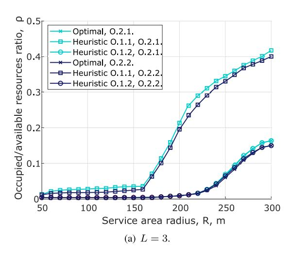

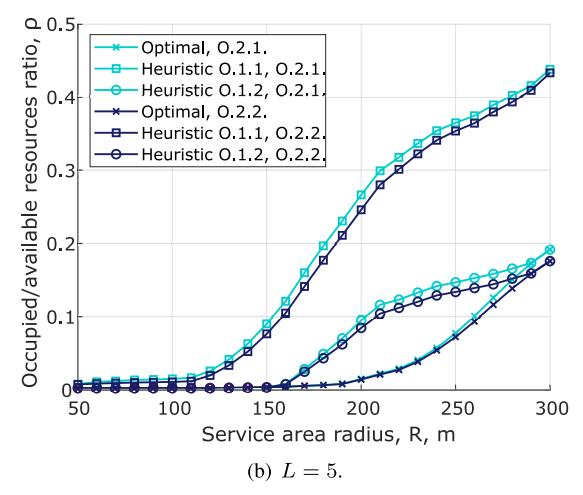

Fig. 8. Ratio of occupied to available resources as function of cell radius, *<sup>K</sup>* = 10, *<sup>C</sup>* = 25 Mbps, *<sup>W</sup>* = 50 MHz [\[9\]](#page-36-5).

proves that ML algorithms represent a good tool to work with a high number of UEs in the case of optimal multicast grouping.

We emphasize that time constraints for multicast group formations are not precisely defined in current standards and are likely to vary due to operators' resource management implementations. It is evident that the constraints do not apply at the sub-slot or frame level and, in practice, may have even longer durations. Still, to avoid the infeasibility of applying a bruteforce solution with exponential complexity, we have chosen to utilize simulated annealing and ML models. This decision offers a polynomial time complexity, enabling us to efficiently address the problem while maintaining computational tractability.

*2) Solutions' Performance and Water-Filling Comparison:* To compare the solutions designed for single-RAT systems, we begin with Fig. [8,](#page-22-0) which depicts the ratio of occupied to available resources, ρ, for the maximum number of beams *L* = 3 (a) and *L* = 5 (b) when varying the cell area radius *R*. One can deduce that, in the case of *L* = 3, the curves grow noticeably slower with the increase in the cell radius compared to *L* = 5. It is essential to underline that at smaller values of BS coverage radius *R* (e.g., approximately 50−100 m), heuristic (O.1.2) and optimal solutions create a single subgroup comprising all UEs of the multicast group. This explains why the curves for *L* = 5 first exhibit superior performance and then provide higher ρ values for all schemes. We also observe that the maximum number of beams per time slot determines the difference between the optimal solution and (O.1.2) for (O.2.1) and (O.2.2) heuristic alternatives for *L* = 5. Specifically, at roughly 150−250 m of service area radius *R*, the optimum solution employs a single beam and several time slots, whereas heuristic methods serve UEs with multiple beams in a single time slot. Hence, in order to reduce ρ for long distances, such as 150−240 m, it is essential to employ a single beam at a time. Note that all the evaluated techniques employ unicast mode to serve multicast UEs, i.e., separate beams for each multicast UE, beginning from around *R* = 250 m.

Further analysis of the presented data reveals no significant difference between the types of power water-filling schemes, i.e., choices (O.2.1) and (O.2.2), with the latter performing

<span id="page-22-1"></span><span id="page-22-0"></span>TABLE IX OPTIMAL NUMBER OF BEAMS IN MULTI-BEAM SYSTEM AS FUNCTION OF CELL RADIUS, *<sup>K</sup>* <sup>=</sup> 10 UES, *<sup>C</sup>* <sup>=</sup> 25 MBPS, *<sup>W</sup>* <sup>=</sup> 50 MHZ

| Number    | 1 beam          | 2 beams  | 3 beams  | 4 beams | 5 beams |  |  |  |  |  |
|-----------|-----------------|----------|----------|---------|---------|--|--|--|--|--|
| of beams  |                 |          |          |         |         |  |  |  |  |  |
|           | L=3 (radius, m) |          |          |         |         |  |  |  |  |  |
| Optimal   | 50-250          | 260      | 270-300  | -       | -       |  |  |  |  |  |
| Heuristic | -               | 50-180   | 190-300  | -       | -       |  |  |  |  |  |
| O.1.1     |                 |          |          |         |         |  |  |  |  |  |
| Heuristic | 50-230          | 240-250  | 260-300  | -       | -       |  |  |  |  |  |
| O.1.2     |                 |          |          |         |         |  |  |  |  |  |
|           | •               | L=5 (rad | lius, m) |         |         |  |  |  |  |  |
| Optimal   | 50-210          | 220-250  | 260      | -       | 270-300 |  |  |  |  |  |
| Heuristic | -               | 50-130   | 140      | 150-160 | 170-300 |  |  |  |  |  |
| O.1.1     |                 |          |          |         |         |  |  |  |  |  |
| Heuristic | 50-170          | 180      | 190-200  | 210     | 220-300 |  |  |  |  |  |
| O.1.2     |                 |          |          |         |         |  |  |  |  |  |

negligibly better than the former. This slight dominance is intuitive and derives from the fact that water-filling (O.2.2) relies on the resource information feature. Similarly to *L* = 1 (that we leave out the scope of this article for the sake of space), the heuristic option with exhaustive search (O.1.2) agrees with the optimal solution most closely. However, *as the maximum number of beams, L, rises, even this approximation begins to deviate from the optimal solution.* As per our additional results, *the gap between optimal and heuristic solutions is less for larger bandwidths*, such as for *W* = 200 MHz compared to *W* = 100 MHz and *W* = 50 MHz. Thus, with higher bandwidth, data transmission is significantly faster, decreasing the occupied to available resource ratio.

*3) Optimal Number of Beams:* The above-mentioned conclusions on the utilized number of beams are further complemented in Table [IX,](#page-22-1) which offers the optimal number of beams, *<sup>L</sup>*opt, as a function of the cell area radius. One may notice that the optimal solution chooses only one beam per time slot until *R* reaches 230 m and 250 m for *L* = 5 and *L* = 3 beams, respectively. In addition, for *L* = 3, the optimal solution selects one beam and several time slots when *R* is in the range of 240−250 m, whereas the presented heuristics (O.1.2) and (O.1.1) sweep two and three beams per time slot, correspondingly. By observing both Fig. [8](#page-22-0) and Table [IX,](#page-22-1) we

<span id="page-23-0"></span>

| TABLE X                                                    |
|------------------------------------------------------------|
| AVERAGE NUMBER OF UES PER BEAM AS FUNCTION OF CELL RADIUS, |
| K = 10  UEs, C = 25  MBPS, W = 50  MHz                     |

| Number<br>of UEs   | 1 UE        | 2 UEs       | 3 UEs       | 4 UEs       | 5 UEs       | 10<br>UEs |
|--------------------|-------------|-------------|-------------|-------------|-------------|-----------|
|                    |             | L=          | 3 (radius,  | m)          |             |           |
| Optimal            | 280-<br>300 | -           | -           | 270         | 260         | 50-250    |
| Heuristic<br>O.1.1 | -           | -           | -           | 190-<br>300 | 50-180      | -         |
| Heuristic<br>O.1.2 | -           | -           | -           | 260-<br>300 | 240-<br>250 | 50-230    |
|                    |             | L=          | 5 (radius,  | m)          |             |           |
| Optimal            | 270-<br>300 | -           | -           | 260         | 220-<br>250 | 50-210    |
| Heuristic<br>O.1.1 | -           | 170-<br>300 | 150-<br>160 | 140         | 50-130      | -         |
| Heuristic<br>O.1.2 | 270-<br>300 | 220-<br>260 | 210         | 190-<br>200 | 180         | 50-170    |

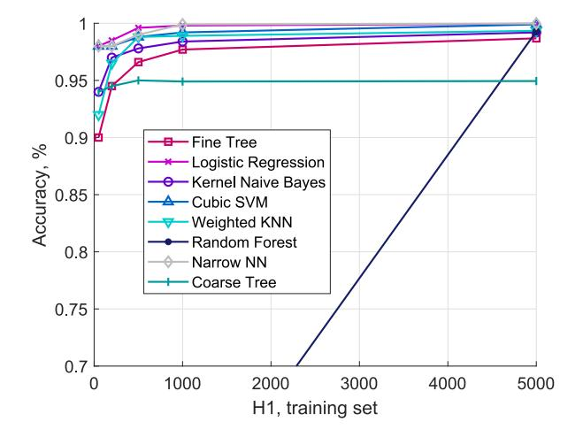

<span id="page-23-1"></span>Fig. 9. Subgroup assignment accuracy,  $\sigma$ , for  $H_2=5000$ ,  $R=250\,\mathrm{m}$ , K=10 [103].

can infer that for the practical cell size ranges and the evaluated number of multicast UEs, the optimal approach always employs no more than 2-3 beams.

- 4) Optimal Multicast Subgroup Size: Further, Table X demonstrates the average number of UEs served by a beam per time slot. The rationale behind analyzing this metric is to evaluate the number of transmissions used to serve multiple UEs for different radii. The presented results prove the conclusion drawn from Fig. 8 that starting from 250 m, practically all the schemes employ the unicast mode for L = 5 beams. Therefore, Table X delivers an insight into the efficiency of the multicast transmissions in mmWave networks. Specifically, it shows situations where the system employs a lower amount of resources than that required by the unicast service (one UE per beam). One may notice that the system with L=3 beams works better in terms of serving more UEs within a beam, which can be explained by the fact that, generally, the augmentation of the number of beams leads to a decrease in the number of UEs per beam. A single beam (one subgroup that contains all UEs) is almost always utilized for small cell radii, while unicast service is only feasible for higher ones.
- 5) Machine Learning: Regarding the ML algorithms implementation, Fig. 9 depicts the accuracy of UEs allocations

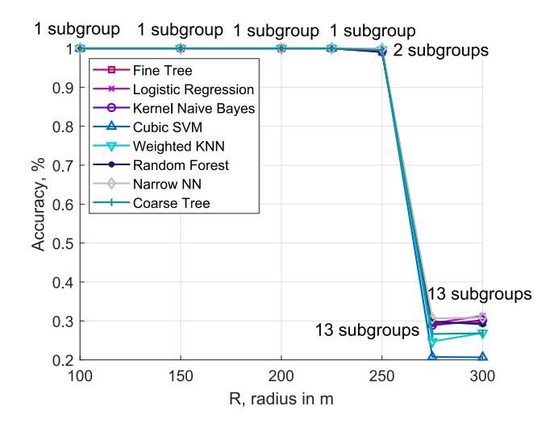

<span id="page-23-2"></span>Fig. 10. Subgroup assignment accuracy,  $\sigma$ , for  $H_1 = H_2 = 5000$ , K = 13.

to subgroups. As anticipated, the UE allocation to subgroups accuracy,  $\sigma$ , grows with the training dataset size  $H_1$ . However, starting from approximately  $H_1=1000$ , the accuracy essentially plateaus and no longer increases. At the same time, we note that, as per our additional investigation, the perfect resource matching with the optimal solution is seen for this considered distance of  $R=250\,\mathrm{m}$ , even for very small values of  $H_1$ . Therefore, the fact that the accuracy of all examined algorithms (with the exception of Random Forest) remains almost stable when the training sample size increases from  $H_1=1000$  to larger values, permits us to consider  $H_1=1000$  as the lowest limit on the training set size for practical implementations.

We now analyze the extrapolation performance of the ML algorithms. For this purpose, the algorithms are trained using the training sample of size  $H_1=1000$  for 10 UEs and then apply the trained algorithms to the multicast system with 13 UEs. The accuracy metrics are computed for 13 UEs solved by employing the optimal solution. Fig. 10 illustrates the accuracy of the multicast subgroups formation for  $H_1=H_2=5000$  and K=13 UEs. As can be seen, the match is perfect up until about  $R=250\,\mathrm{m}$  and then drastically declines for  $R=275\,\mathrm{m}$  and beyond. The reason is that the considered metric accounts for specific UEs classified into subgroups. Up until  $R=275\,\mathrm{m}$ , only one subgroup is utilized, which explains the perfect match between solutions. We also note that UEs are served individually using unicast transmissions for the cell radius higher than  $R=300\,\mathrm{m}$ .

The inability to learn particular UE allocations to different subgroups, as shown by  $\sigma$ , does not imply that the investigated ML algorithms cannot learn other UE classification characteristics. To demonstrate it, Table XI provides resource matching accuracy,  $\gamma$ , for various BS service area distances, R. As may be noticed, several algorithms offer excellent performance. Specifically, the tree algorithms are also showing excellent extrapolation capabilities. Thus,  $Random\ Forest\ and\ Fine\ Trees\ show\ almost\ 100\%\ accuracy\ in\ terms\ of\ resource\ utilization, <math>\gamma$ , over all the considered distances. Considering the relatively small computational effort required for trees, one may regard them as the best candidate for subgroup formation.

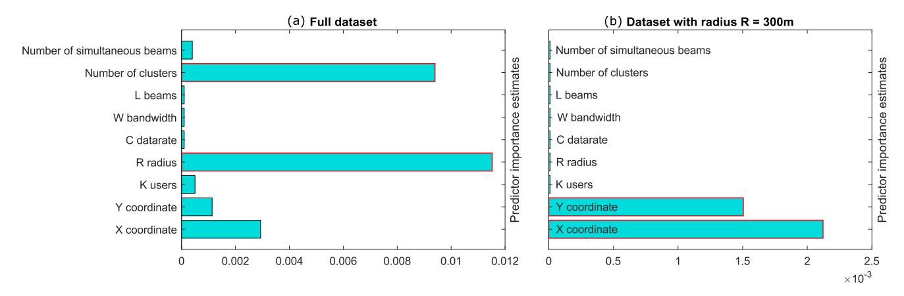

Fig. 11. Variables' importance estimates [\[103\]](#page-38-5).

<span id="page-24-2"></span>TABLE XI SUBGROUP AND RESOURCE MATCHING ACCURACY, *<sup>H</sup>*<sup>1</sup> = 5000, *<sup>H</sup>*<sup>2</sup> = 5000, *<sup>K</sup>* <sup>=</sup> <sup>13</sup>

<span id="page-24-1"></span>

| Radius                  | 100m                | 150-225m       | 250m      | 275m       | 300m   |  |  |  |  |  |
|-------------------------|---------------------|----------------|-----------|------------|--------|--|--|--|--|--|
| Fine Tree               |                     |                |           |            |        |  |  |  |  |  |
| UE assignment, $\sigma$ | 100%                | 100%           | 99.02%    | 29.35%     | 29.58% |  |  |  |  |  |
| Resources, $\gamma$     | 100%                | 100%           | 100%      | 98.51      | 96.97% |  |  |  |  |  |
|                         | Logistic Regression |                |           |            |        |  |  |  |  |  |
| UE assignment, $\sigma$ | 100%                | 100%           | 99.96%    | 29.41%     | 31.30% |  |  |  |  |  |
| Resources, $\gamma$     | 100%                | 100%           | 100%      | 100%       | 98.53% |  |  |  |  |  |
|                         | Ker                 | nel Naive Bay  | ves       |            |        |  |  |  |  |  |
| UE assignment, $\sigma$ | 100%                | 100%           | 99.17%    | 28.88%     | 30.19% |  |  |  |  |  |
| Resources, $\gamma$     | 100%                | 100%           | 100%      | 98.44%     | 95.39% |  |  |  |  |  |
|                         | C                   | Cubic SVM**    |           |            |        |  |  |  |  |  |
| UE assignment, $\sigma$ | 99.98%              | NaN/100%       | 99.92%    | 20.74%     | 20.66% |  |  |  |  |  |
| Resources, $\gamma$     | 100%                | NaN/100%       | 100%      | 85.00%     | 96.88% |  |  |  |  |  |
|                         | W                   | eighted KNN    |           |            |        |  |  |  |  |  |
| UE assignment, $\sigma$ | 100%                | 100%           | 99.67%    | 24.72%     | 26.91% |  |  |  |  |  |
| Resources, $\gamma$     | 100%                | 100%           | 100%      | 96.92%     | 98.53% |  |  |  |  |  |
|                         | R                   | andom Forest   | İ         |            |        |  |  |  |  |  |
| UE assignment, $\sigma$ | 100%                | 100%           | 99.21%    | 29.86%     | 29.13% |  |  |  |  |  |
| Resources, $\gamma$     | 100%                | 100%           | 100%      | 96.92%     | 100%   |  |  |  |  |  |
|                         |                     | Narrow NN      |           |            |        |  |  |  |  |  |
| UE assignment, $\sigma$ | 100%                | 100%           | 99.96%    | 30.67%     | 30.84% |  |  |  |  |  |
| Resources, $\gamma$     | 100%                | 100%           | 100%      | 98.53%     | 100%   |  |  |  |  |  |
| Coarse Tree             |                     |                |           |            |        |  |  |  |  |  |
| UE assignment, $\sigma$ | 100%                | 100%           | 99.55%    | 26.65%     | 26.83% |  |  |  |  |  |
| Resources, $\gamma$     |                     |                |           |            |        |  |  |  |  |  |
|                         |                     | clusters (on   |           |            |        |  |  |  |  |  |
| ** no solution          | for 150, 2          | 200 m, accurac | y is 100% | is for 225 | m      |  |  |  |  |  |

*6) ML Predictors' Importance:* Recall that in order to collect a dataset, several variables of interest were chosen. However, the algorithms may or may not use these variables for classifications. Now, we will investigate which factors have the most impact on the performance of the algorithms. To this end, we present the predictor importance for the classification ensemble of decision trees in Fig. [11.](#page-24-2) It computes the estimated predictor importance for the dataset by summing these estimates over all weak learners in the ensemble. Here, a high value corresponds to a high importance of the variable for the model.

Fig. [11\(](#page-24-2)a) presents the importance of the whole dataset, where the model's behavior is analyzed as a function of the service area radius, *R*. Therefore, variable *R* is expected to be of great importance. However, we anticipated the locations of UEs to be the most important model features. In contrast, the number of clusters derived from the solution of the optimization problem and the cell radius are the two most influential predictors of the learning process, followed by the coordinates of the UEs.

Further, by examining Fig. [11\(](#page-24-2)b), one can see that the importance of the predictors varies with the dataset. Here, fixing the radius *R* leads to the UEs' coordinates being the most important predictors. This trend may be explained by the fact that in directional multicast systems, the service area radius influences the type of transmission used for service (i.e., multicast for multiple UEs or unicast for each multicast UE). The numerical results demonstrate that the solution mainly depends on the cell radius. When varying the number of UEs in the system, one may notice, for instance, that *a single subgroup is chosen for the 100*−*225 m radius range. Then, for the range 275 m and beyond, only unicast transmissions are used to serve multicast UEs, whereas the considered multicast group formation solutions can be utilized for the radii around 250 m.*

# <span id="page-24-0"></span>*B. Multi-RAT Optimized Performance*

*1) mmWave Priority. Regime Switching:* The results of the performance analysis when mmWave resources are utilized whenever possible are shown in Fig. [12](#page-25-0) for mmWave numerology μ*m* = 3, μWave numerology μμ = 0, *K* = 10 UEs, *C* = 5 Mbps, *Wm* = 100 MHz, *W*μ = 50 MHz, *Lm* = *L*μ = 5 beams. Here, we start by analyzing the ratio of occupied to available resources, ρ, as a function of cell radius, *R*, illustrated in Fig. [12.](#page-25-0) *As a general trend, one may notice that* ρ *grows with the increase in the cell radius until it reaches the distance at which no mmWave coverage is available due to the propagation and blockage conditions. At this point, the system starts selecting* μ*Wave as a transmission technology.* For example, in the case of the optimal solution, *R* = 300 m can be considered as a *threshold* that defines the change in the utilized transmission technology. Once this threshold is exceeded, the optimal solution always chooses the subgroup containing all *K* UEs for μWave transmission.

We emphasize that the relaxation techniques (LB, RINS) show a perfect match with the globally optimal solution. On

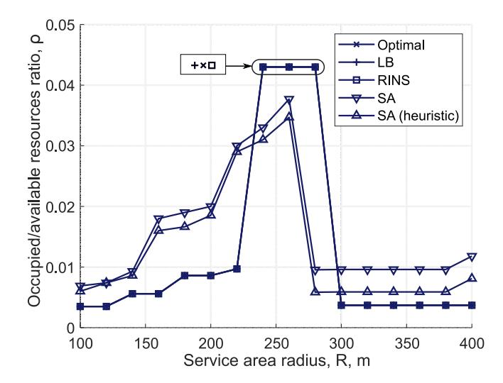

<span id="page-25-0"></span>Fig. 12. Ratio of occupied to available resources, mmWave RAT priority: mmWave – <sup>μ</sup>*<sup>m</sup>* = 3, <sup>μ</sup>Wave – <sup>μ</sup>*<sup>µ</sup>* = 0.

<span id="page-25-1"></span>TABLE XII OPTIMAL NUMBER OF BEAMS IN MULTI-BEAM SYSTEM AS FUNCTION OF CELL RADIUS, MMWAVE RAT PRIORITY: MMWAVE – <sup>μ</sup>*<sup>m</sup>* = 3, <sup>μ</sup>WAVE – <sup>μ</sup>*<sup>µ</sup>* = 0

| Number   | 0 beams            | 1 beam      | 2 beams | 3 beams |  |  |  |  |  |
|----------|--------------------|-------------|---------|---------|--|--|--|--|--|
| of beams |                    |             |         |         |  |  |  |  |  |
|          | mmWave (radius, m) |             |         |         |  |  |  |  |  |
| Optimal  | 300-400            | 100-200     | 220     | 240-280 |  |  |  |  |  |
| LB       | 300-400            | 100-200     | 220     | 240-280 |  |  |  |  |  |
| RINS     | 300-400            | 100-200     | 220     | 240-260 |  |  |  |  |  |
| SA       | -                  | 280-400     | 100-200 | 220-260 |  |  |  |  |  |
| SA-H     | -                  | 280-400     | 100-200 | 220-260 |  |  |  |  |  |
|          | $\mu$ Wave         | (radius, m) |         |         |  |  |  |  |  |
| Optimal  | 100-280            | 300-400     | -       | -       |  |  |  |  |  |
| LB       | 100-280            | 300-400     | -       | -       |  |  |  |  |  |
| RINS     | 100-280            | 300-400     | -       | -       |  |  |  |  |  |
| SA       | 100-260            | -           | 280-400 | -       |  |  |  |  |  |
| SA-H     | 100-260            | 280-400     | -       | -       |  |  |  |  |  |

the other hand, the simulated annealing algorithms demonstrate slightly worse results but with better optimality vs. complexity trade-offs than optimal solutions. By comparing the simulated annealing algorithms, one may learn that starting with a good solution (compared to the random one) at some points brings us a better value of ρ. This can be explained by the fact that heuristic-based simulated annealing can find a better solution by the time the stopping criterion is met.

*2) Optimal Number of Beams:* We further comment on the optimal number of beams utilized in the multi-beam dual system as a function of the cell radius illustrated in Table [XII.](#page-25-1) *The optimal number of mmWave beams, Lm, starts with one beam (when all UEs form a single subgroup) and then increases up to 3 beams. On the contrary, up to one* μ*Wave beam can be swept at a time (and up to 2* μ*Wave beams for random simulated annealing)*. One may notice that μWave transmissions are utilized when mmWave fails to provide the service due to propagation conditions and blockage. We emphasize that μWave BS sweeps one beam as, first, it is possible to provide services to all UEs by using the wide beam (small propagation losses) and, second, it ensures the best ratio of occupied to available resources, ρ. We also note

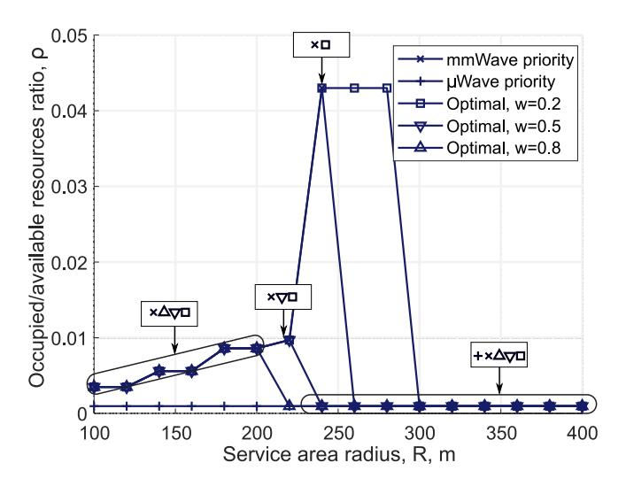

<span id="page-25-2"></span>Fig. 13. Ratio of occupied to available resources, weighted optimization function: mmWave – <sup>μ</sup>*<sup>m</sup>* = 3, <sup>μ</sup>Wave – <sup>μ</sup>*<sup>µ</sup>* = 0.

that the utilized HPBWs for μWave antennas are larger than those of mmWave technology, as the former is employed for subgroups having UEs located farther away from each other. In contrast, mmWave technology typically serves individual UEs in the unicast way or very clustered subgroups of UEs.

*3) RAT Priority Selection:* Observe that μWave priority excludes mmWave resources, thereby fully loading μWave technology. A network operator may want to avoid it as μWave technology needs to be utilized in those areas not accessible for mmWave. On the other hand, the mmWave priority scheme exclusively utilizes mmWave resources up to a certain distance and then switches to μWave technology. An operator might have different preferences for balancing resource utilization between considered RATs. To this end, we continue by investigating the impact of the weighted optimization function on the system performance. The corresponding results are shown in Fig. [13](#page-25-2) and Table [XIII](#page-26-1) for mmWave numerology μ*m* = 3, μWave numerology μμ = 2, *K* = 10 UEs, *C* = 5 Mbps, *Wm* = 100 MHz, *W*μ = 50 MHz, *Lm* = *L*μ = 5 beams.

By analyzing the data presented in Fig. [13](#page-25-2) and Table [XIII,](#page-26-1) we emphasize that increasing *w* in [\(31\)](#page-16-2) leads to the shift in the priority from mmWave to μWave. One may learn that at lower distances *R*, weights *w* = 0.2, 0.5, 0.8, do not affect the performance and provide results similar to the mmWave priority scheme. This can be explained by the fact that mmWave ensures more efficient resource utilization at smaller distances. Further, note that the choice of w = 0.5 produces a similar effect to mmWave priority, thereby utilizing μWave band resources only when mmWave service is infeasible due to the propagation and blockage conditions. Alternatively, *w* = 0.2 increases the range of mmWave technology up to 280 m (compared to 240 m in the case of mmWave priority), whereas *w* = 0.8 shortens *R* to 200 m, thereby allowing μWave band usage. We can conclude that depending on the operator's preferences, weights can be properly adjusted to achieve a goal with respect to resource usage in dual-mode mmWave/μWave systems.

TABLE XIII

<span id="page-26-1"></span>OPTIMAL NUMBER OF BEAMS IN MULTI-BEAM SYSTEM AS FUNCTION OF CELL RADIUS, WEIGHTED OPTIMIZATION FUNCTION: MMWAVE – <sup>μ</sup>*<sup>m</sup>* = 3, <sup>μ</sup>WAVE – <sup>μ</sup>*<sup>µ</sup>* = 0

| Number<br>of beams | 0 beams | 1 beam                 | 2 beams | 3 beams |  |  |  |
|--------------------|---------|------------------------|---------|---------|--|--|--|
| mmWave (radius, m) |         |                        |         |         |  |  |  |
| mmWave priority    | 260-400 | 100-200                | 220     | 240     |  |  |  |
| μWave priority     | 100-400 | -                      | -       | -       |  |  |  |
| Optimal,<br>w=0.2  | 300-400 | 100-200                | 220     | 240-280 |  |  |  |
| Optimal,<br>w=0.5  | 240-400 | 100-200                | 220     | -       |  |  |  |
| Optimal,<br>w=0.8  | 220-400 | 100-200<br>(radius, m) | -       | -       |  |  |  |
|                    |         |                        |         |         |  |  |  |
| mmWave<br>priority | 100-240 | 260-400                | -       | -       |  |  |  |
| μWave priority     | -       | 100-400                | -       | -       |  |  |  |
| Optimal,<br>w=0.2  | 100-280 | 300-400                | -       | -       |  |  |  |
| Optimal,<br>w=0.5  | 100-220 | 240-400                | -       | -       |  |  |  |
| Optimal,<br>w=0.8  | 100-200 | 220-400                | -       | -       |  |  |  |

The numerical results illustrate that properties of the optimal solution, such as resource utilization and the type of technology, heavily depend on the density of dual-mode BS deployments and RAT priority. Further, the utilized numerology may quantitatively affect the above-mentioned conclusions, but the overall qualitative trends remain unchanged. The investigated RAT selection priorities reveal that *when* μ*Wave RAT is prioritized for multicast service, mmWave resources are not utilized at all. However, by using weights for mmWave and* μ*Wave resources, the operator might achieve the desired balance* by fitting its needs in a particular deployment. Finally, we note that the efficiency of resource utilization for multicast service may also be affected by the number of UEs and utilized numerologies.

# *C. Summary of Key Points*

- *1) Single-RAT Deployment:* The summary presents the conclusions on the complexity and performance of different optimization solutions, the optimal number of beams, multicast subgroup size, and the importance of predictors in ML algorithms for optimal multicast grouping in the case of the single-RAT deployment:
  - *Computation complexity:* The complexity of single-RAT multicast solutions varies, mainly depending on the number of multicast UEs. The optimal solution becomes impractical for a high number of multicast UEs. Simulated annealing significantly reduces computational time and at the same time closely approximates the optimal solution.
  - *ML solutions:* ML algorithms are a valuable tool for achieving optimal multicast grouping with a large number of UEs. The runtime depends on the testing dataset's size and remains unaffected by the number of UEs. The

- importance of ML predictors varies with the dataset, but influential predictors include the number of clusters derived from the optimization solution and the cell radius.
- *Solution performance and water-filling comparison:* When comparing solutions designed for single-RAT systems, the ratio of occupied to available resources grows with increased cell radius. The difference between power water-filling schemes is negligible.
- *Beam configuration:* For practical cell sizes and the evaluated number of multicast UEs, the optimal approach typically utilizes no more than 2-3 beams.
- *Multicast subgroup size:* As the cell radius reaches approximately 250m, practically all schemes employ the unicast mode to serve multicast UEs. A single beam (multicasting) is utilized for smaller cell radii.
- *2) Single-RAT Deployment:* The summary analyzes resource utilization and RAT selection in a dual-mode mmWave/μWave system, considering factors, such as cell radius, beam configuration, RAT priority, and weight parameters.
  - *Resource utilization analysis:* The ratio of occupied to available resources (ρ) increases with the cell radius until mmWave coverage is no longer available. The threshold of 300 m determines the transition to a different transmission technology (i.e., μWave).
  - *Computation complexity:* Involving more than two technologies increases the execution time. Relaxation techniques, such as LB and RINS, provide results that closely match the globally optimal solution. Simulated annealing algorithms yield slightly worse results but offer better trade-offs between optimality and complexity.
  - *Beam configuration:* The optimal number of mmWave beams increases from 1 to 3 with an increasing cell radius, while up to one μWave beam can be used at a time.
  - *RAT priority schemes:* The μWave priority scheme utilizes mmWave resources up to a certain distance and then switches to μWave. μWave priority excludes mmWave resources, thereby fully loading μWave technology. The choice of RAT priority depends on the operator's preference for balancing resource utilization between mmWave and μWave.
  - *Weight parameter:* Increasing the weight parameter in the optimization function shifts the priority from mmWave to μWave. The choice of weights allows operators to adjust resource usage based on their preferences.

# <span id="page-26-0"></span>VII. TECHNOLOGIES FOR IMPROVING MULTICASTING PERFORMANCE

Despite multicasting represents a really promising approach to optimize bandwidth usage even in the presence of very demanding 5G/6G applications, the multicast performance remains strongly negatively conditioned by the presence of UEs experiencing poor channel conditions and by the increase in the number of UEs with the same number of BS antennas. For this reason, 5G/6G-level mechanisms, such as RIS, LTE/NR sidelink, air-to-ground communications, Mobile Edge Computing (MEC), and ML, among other technologies and solutions, can be utilized to improve multicasting performance. In this section, we survey the recent advances in these areas. The summary of topics and proposed techniques is provided in Table [XIV.](#page-28-0)

# *A. Sidelink-Assisted Multicasting*

<span id="page-27-14"></span>Sidelink technology, which is an extension of the LTE system allowing for D2D communications without using BS as an intermediate point, can be utilized to bridge over the multicast difficulties [\[198\]](#page-40-0), [\[199\]](#page-40-1). For example, in such a system, sidelinks may provide service to UEs experiencing degraded propagation conditions (that is, the BS multicast link serves not all UEs), as considered in [\[200\]](#page-40-2). Specifically, the authors design a sidelink-enhanced system provisioning of multiquality titled 360◦ VR services by utilizing both multicasting and sidelinks. Although the efficiency of the proposed approach is validated on LTE-based systems, the designed solution can also be exploited for mmWavebased networks while considering specific multicast-group formation and directional transmissions. Similarly, in [\[154\]](#page-39-0), sidelink transmissions are used to tackle blockage and/or poor mmWave communication channels. A more complex system is provided in [\[201\]](#page-40-3), where a reinforcement learning approach is proposed to orchestrate multicast service provisioning by jointly utilizing broadcasting, unicasting, and D2D connectivity options. The authors demonstrate that the proposed system allows for improving spectral efficiency at the cell edge.

<span id="page-27-16"></span><span id="page-27-1"></span><span id="page-27-0"></span>In [\[122\]](#page-38-24), the authors tackle the problem of utilizing concurrent transmission (D2D multihop and conventional BSto-UE communications) for multicast service provisioning with the aim of improving power efficiency. They compare the proposed scheme to the multicast operation over mmWave systems implemented via unicast service. More recently, in [\[123\]](#page-38-25), the optimal multicast scheduling problem is addressed by leveraging D2D transmissions, multicast group partition, and beam selection by exploiting a multi-level codebook structure. Besides, in [\[124\]](#page-38-26), it is demonstrated that D2D communications increase multicasting efficiency, and the authors propose a user-clustering and multicast-path-planning algorithm with cubic complexity on the set of multicast UEs.

<span id="page-27-17"></span><span id="page-27-4"></span><span id="page-27-3"></span>The problem of relay selection in D2D-aided multicasting has been the focus of several recent studies. For instance, in [\[125\]](#page-38-27), a method for relay selection that improves energy efficiency and power allocation for multi-source networkcoded cooperative D2D communication is proposed for LTE systems, readily adaptable for mmWave networks. Similarly, in [\[126\]](#page-38-28), a low-complexity, location-based hybrid multiple access scheme and relay selection algorithm are presented for V2X communications when no sidelink CSI is available. The proposed approach determines the most suitable multiple access schemes and the associated relay. Moreover, in [\[202\]](#page-40-4), the use of D2D links carrying additional CSIs is proposed for determining the pseudo-range estimates between UEs that might be helpful for, e.g., position estimation and relay selection.

<span id="page-27-5"></span>While it has been demonstrated that sidelink communications can enhance point-to-multipoint transmissions through efficient relay selection, direct D2D connections present even greater security challenges since data exchange occurs directly between nodes in close proximity. In [\[127\]](#page-38-29), a mechanism to effectively deliver trustworthy multicast/broadcast traffic in 5G-oriented networks is introduced to address this issue. In the same vein, a protocol for effectively managing multicast services with a particular emphasis on security in a 5G-oriented IoT environment is proposed in [\[128\]](#page-38-30). In addition, cyber security and social trustworthiness mechanisms are exploited to ensure secure D2D communications.

<span id="page-27-15"></span><span id="page-27-7"></span><span id="page-27-6"></span>Social relationships are also exploited for the D2D-assisted caching (D2DC) technique, which has emerged as a viable means of bringing the service closer to its consumers. In order to optimize system capacity, in [\[129\]](#page-38-31), a social-aware spectrum sharing and caching selection method uses the mobile users' resources (i.e., downlink resources for sharing and cache storage resources for multicasting) to offload videos in D2D 5G networks. We highlight that the methods provided in [\[127\]](#page-38-29), [\[128\]](#page-38-30), [\[129\]](#page-38-31) are employed in 5G networks for traditional *LTE-like* multicasting. Nevertheless, it does not limit their adaptability to directional multicasting by providing valuable insides into security and capacity problems.

# <span id="page-27-13"></span>*B. RIS-Aided Multicasting*

<span id="page-27-18"></span>RISs are an emerging technology that may modify or rearrange the propagation environment to enhance the performance of wireless communications [\[203\]](#page-40-5). Several research groups recently examined RIS-assisted multicasting to improve content delivery efficiency, especially in mmWave systems. A RIS-assisted multicast architecture for single-group and multigroup multicasting is presented in [\[204\]](#page-40-6) and in [\[205\]](#page-40-7), respectively, whereas in [\[206\]](#page-40-8), the channel condition of the weakest UE is enhanced by adjusting the RIS phase shifts. In [\[207\]](#page-40-9), simulations at the system level demonstrate that the near-field region cannot be neglected in outdoor circumstances.

<span id="page-27-22"></span><span id="page-27-21"></span><span id="page-27-20"></span><span id="page-27-19"></span><span id="page-27-8"></span><span id="page-27-2"></span>Furthermore, in [\[130\]](#page-38-32), a comprehensive study of optimization problems, including power control, QoS, and fairness in wireless mmWave networks augmented by RISs, is performed. It also contains the formulation of optimization problems for power control under QoS and max-min fair QoS under three BS-to-UEs traffic patterns (unicast, broadcast, and multicast) and its extension to multiantenna and multi-RIS scenarios. Similarly, the study in [\[131\]](#page-38-33) highlights the difficulties of downlink power regulation under QoS restrictions in the presence of RISs for unicast, multicast, and broadcast scenarios.

<span id="page-27-12"></span><span id="page-27-11"></span><span id="page-27-10"></span><span id="page-27-9"></span>An analytical study of the energy efficiency of the RISassisted multicast communication system and a formulation of the energy efficiency maximization problem are presented in [\[132\]](#page-38-34). Similarly, a theoretical model for RISassisted multicast communications for future 6G wireless systems is proposed in [\[138\]](#page-38-35) by utilizing the *M/D/c* queuing model, where the number of servers represents the number of simultaneous beams at the NR BS. Further, in [\[133\]](#page-38-36),

TABLE XIV TECHNOLOGIES FOR IMPROVING MULTICASTING PERFORMANCE

<span id="page-28-0"></span>

| Enhancement type    | Reference                                        | Problem                                                                                                                                                                                                  | Proposed technique/approach                                                                                                      |
|---------------------|--------------------------------------------------|----------------------------------------------------------------------------------------------------------------------------------------------------------------------------------------------------------|----------------------------------------------------------------------------------------------------------------------------------|
| Sidelink assistance | [122]                                            | Energy reduction                                                                                                                                                                                         | Heuristic algorithms for multicast data delivery                                                                                 |
|                     | [123]                                            | Optimal multicast scheduling                                                                                                                                                                             | Group partition and beam selection algorithm                                                                                     |
|                     | [124]                                            | Optimal user partitioning                                                                                                                                                                                | Multicast scheduling algorithm                                                                                                   |
|                     | [125]                                            | Power consumption/interference minimization                                                                                                                                                              | Relay selection and power allocation algorithm                                                                                   |
|                     | [126]                                            | Latency, reliability, data rate, and spectral efficiency                                                                                                                                                 | Location-based hybrid multiple access scheme                                                                                     |
|                     | [127]                                            | Secure data delivery                                                                                                                                                                                     | Approach for assessment of relay trustworthiness                                                                                 |
|                     | [128]                                            | Sidelink transmission security                                                                                                                                                                           | Reliable management of multicast services in a 5G IoT                                                                            |
|                     | [129]                                            | System capacity maximization                                                                                                                                                                             | Spectrum sharing and caching selection strategy                                                                                  |
| RIS assistance      | [130]                                            | Power control, QoS, fairness                                                                                                                                                                             | RIS optimization algorithm                                                                                                       |
|                     | [131]                                            | Downlink power control                                                                                                                                                                                   | Passive beamforming scheme                                                                                                       |
|                     | [132]                                            | Energy efficiency maximization                                                                                                                                                                           | RIS-based resource allocation methods                                                                                            |
|                     | [133]                                            | Choice of the optimal reflection coefficients                                                                                                                                                            | Analytical method for RIS configuration                                                                                          |
|                     | [134]                                            | Secure RIS beamforming                                                                                                                                                                                   | Analytical optimization via semidefinite relaxation                                                                              |
|                     | [135]                                            | Maximization of RIS secrecy rate                                                                                                                                                                         | Analytical assessment via stochastic geometry                                                                                    |
|                     | [136]                                            | Channel capacity maximization                                                                                                                                                                            | Optimization via gradient descent method                                                                                         |
|                     | [137]                                            | Simultaneously transmitting and reflecting RISs                                                                                                                                                          | Overview of state-of-the-art algorithms                                                                                          |
|                     | [138]                                            | RIS-assisted multicasting modeling                                                                                                                                                                       | Analytical model via queuing theory                                                                                              |
| NTN assistance      | [139]                                            | Radio resource sharing                                                                                                                                                                                   | Resource allocation cooperative T-NTN algorithm                                                                                  |
|                     | [140]                                            | Simultaneous usage of NTN/terrestrial systems                                                                                                                                                            | Cooperative multicast/unicast transmission scheme                                                                                |
|                     | [141]                                            | Spectral efficiency maximization                                                                                                                                                                         | Radio resource management scheme                                                                                                 |
|                     | [142]                                            | Capacity and spectral efficiency maximization                                                                                                                                                            | Dynamic beam area formation algorithm                                                                                            |
|                     | [143]–[146]                                      | Exhaustive coverage of NTN usage in 5G/6G                                                                                                                                                                | Survey covering NTN-aided multicasting                                                                                           |
| MEC assistance      | [147]                                            | Content distribution, energy consumption efficiency                                                                                                                                                      | Offloading and resource allocation algorithm                                                                                     |
|                     | [148]                                            | Resource allocation for MEC                                                                                                                                                                              | Stochastic optimization via real-time algorithm                                                                                  |
|                     | [149]                                            | Secure data delivery                                                                                                                                                                                     | Certificate-less security scheme                                                                                                 |
|                     | [150]                                            | Resource minimization with privacy                                                                                                                                                                       | Convex optimization algorithm                                                                                                    |
|                     | [151]                                            | Resource allocation                                                                                                                                                                                      | Real-time throughput maximization algorithm                                                                                      |
|                     | [152]                                            | NFV-enabled edge multicast                                                                                                                                                                               | Multicast admission algorithms                                                                                                   |
|                     | [153]                                            | Delivery latency minimization                                                                                                                                                                            | Caching-assisted algorithms                                                                                                      |
| AI/ML usage         | [154]                                            | Spectrum crunch problem                                                                                                                                                                                  | Heuristic algorithms via self-organizing maps                                                                                    |
|                     | [155]                                            | Clustering and resource allocation problem                                                                                                                                                               | Q-learning, Lagrange decomposition algorithms                                                                                    |
|                     | [156]                                            | Performance of sidelink and BS multicast                                                                                                                                                                 | Random Forest and Deep Neural Network algorithms                                                                                 |
|                     | [157]                                            | Beamforming and beam selection                                                                                                                                                                           | Neural network-based approach                                                                                                    |
|                     | [158]                                            | Single-group multicast beamforming                                                                                                                                                                       | ML-enhanced determinantal point process                                                                                          |
| Coded caching       | [159]                                            | Robust transmission to in-and-out wireless network                                                                                                                                                       | Stochastic optimization problem via MDP; deep double                                                                             |
| _                   |                                                  | quality, delay and power minimization                                                                                                                                                                    | Q-learning                                                                                                                       |
|                     | [160]                                            | Minimization of transmission bandwidth                                                                                                                                                                   | Scalable framework for wireless distributed computing                                                                            |
|                     | [161]                                            | Minimization of satellite communication load                                                                                                                                                             | Coded multicasting framework                                                                                                     |
|                     | [162]                                            | Spatial scalability                                                                                                                                                                                      | Separation between caching and PHY transmission                                                                                  |
|                     | [163]                                            | Worst-user channel limitation of multicasting                                                                                                                                                            | Aggregated coded-caching scheme                                                                                                  |
|                     | [164]                                            | QoS requirements of XR (latency)                                                                                                                                                                         | Global caching and spatial multiplexing delivery                                                                                 |
| Cell-free MIMO      | [165]                                            | Throughput improvement                                                                                                                                                                                   | Analytical performance analysis                                                                                                  |
|                     | [166], [167]                                     | Secure transmission                                                                                                                                                                                      | Closed-form lower bound on the ergodic secrecy rate                                                                              |
|                     | [168]                                            | Optimization of beamforming strategies                                                                                                                                                                   | Distributed precoding design                                                                                                     |
|                     | [169]                                            | Performance imrovement                                                                                                                                                                                   | closed-form solution for achievable spectral efficiency                                                                          |
|                     | [170]                                            | Spectral efficiency improvement                                                                                                                                                                          | Joint unicast and multigroup multicast transmission                                                                              |
|                     | [171]–[173]                                      | Enabling FL over wireless networks                                                                                                                                                                       | FL groups with different learning purposes                                                                                       |
| Cloud/fog RAN       | [174]                                            | Resource allocation problem                                                                                                                                                                              | Optimization framework                                                                                                           |
| Č                   | [175]                                            | Robust beamforming for multigroup multicasting                                                                                                                                                           | Convex approximation                                                                                                             |
|                     | [176]                                            | QoS improvement                                                                                                                                                                                          | Nested coalition formation game-based algorithm                                                                                  |
|                     | [177]                                            | Content caching                                                                                                                                                                                          | Non-convex problem                                                                                                               |
|                     | [178]                                            | Content-centric transmission design                                                                                                                                                                      | Mixed-integer nonlinear programming problem                                                                                      |
| Network coding      | [179]                                            | Throughput improvement                                                                                                                                                                                   | Bulk-service queueing system                                                                                                     |
| Ç                   | [180]                                            | Power cost, delivery delay reduction                                                                                                                                                                     | Optimized random network coding strategies                                                                                       |
|                     | [181]                                            | Reliable multicasting                                                                                                                                                                                    | Lower bound on probability of successful delivery                                                                                |
|                     | [182]                                            | Throughput maximization                                                                                                                                                                                  | Optimization problem for delay-tolerant applications                                                                             |
|                     | [183]                                            | Distortion minimization                                                                                                                                                                                  | End-to-end mean square error distortion optimization                                                                             |
|                     | [184]                                            | Throughput maximization                                                                                                                                                                                  | Theoretical results on the bandwidth efficiency                                                                                  |
|                     | [185]                                            | Throughput improvement                                                                                                                                                                                   | Architecture for wireless mesh networks                                                                                          |
|                     | [186]                                            | Efficient network capacity usage                                                                                                                                                                         | Network coding routing                                                                                                           |
|                     | [187]                                            | Multicast capacity improvement                                                                                                                                                                           | Multicast rate optimization probel                                                                                               |
|                     | [188]                                            | Information security, communication, and system                                                                                                                                                          | Federated learning                                                                                                               |
|                     |                                                  | robustness bottlenecks                                                                                                                                                                                   |                                                                                                                                  |
|                     | [100]                                            | Todustness bottlenecks                                                                                                                                                                                   |                                                                                                                                  |
|                     |                                                  |                                                                                                                                                                                                          | Network coding datagram protocol                                                                                                 |
| NOMA usage          | [189]                                            | Reduction of number of transmitted packets                                                                                                                                                               | Network coding datagram protocol  Beamforming design and power allocation                                                        |
| NOMA usage          | [189]<br>[190]                                   | Reduction of number of transmitted packets Spectral efficiency improvement                                                                                                                               | Beamforming design and power allocation                                                                                          |
| NOMA usage          | [189]<br>[190]<br>[191]                          | Reduction of number of transmitted packets  Spectral efficiency improvement  Cooperative unicast–multicast, reliability                                                                                  | Beamforming design and power allocation<br>Outage probability assessment                                                         |
| NOMA usage          | [189]<br>[190]<br>[191]<br>[192], [193]          | Reduction of number of transmitted packets  Spectral efficiency improvement Cooperative unicast–multicast, reliability Unicast rate maximization problem                                                 | Beamforming design and power allocation Outage probability assessment Beamformer-based NOMA-aided framework                      |
| NOMA usage          | [189]<br>[190]<br>[191]<br>[192], [193]<br>[194] | Reduction of number of transmitted packets  Spectral efficiency improvement Cooperative unicast–multicast, reliability Unicast rate maximization problem Rapidly fluctuating vehicular wireless channels | Beamforming design and power allocation Outage probability assessment Beamformer-based NOMA-aided framework Optimization problem |
| NOMA usage          | [189]<br>[190]<br>[191]<br>[192], [193]          | Reduction of number of transmitted packets  Spectral efficiency improvement Cooperative unicast–multicast, reliability Unicast rate maximization problem                                                 | Beamforming design and power allocation Outage probability assessment Beamformer-based NOMA-aided framework                      |

an efficient reconfiguration technique providing control over multiple beams is proposed. The strategy uses an analytical method to design the surface for multi-beam RIS radiation patterns, as opposed to time-consuming numerical optimization strategies. As a part of the analysis, broadcasting and multicasting scenarios are studied.

[!t]

<span id="page-28-1"></span>In [\[134\]](#page-38-37), the application of RIS to increase the physicallayer security of the Multi-User Multiple-Input Single-Output (MU-MISO) broadcast system, where a BS sends a shared data stream to several legitimate receivers in the presence of numerous eavesdroppers, is examined. Similarly, in [\[135\]](#page-38-38), security is enhanced by a RIS that reflects the incident signal so that the interference is constructive at the intended receiver and destructive at the eavesdropper. In [\[136\]](#page-38-39), the channel capacity of the RIS-assisted MIMO system in the multicast scenario is investigated. In [\[208\]](#page-40-10), an overview of RIS-based channel measurements and experiments is provided by categorizing frequency bands, scenarios, system configurations, RIS designs, and channel observations.

<span id="page-29-18"></span>Finally, the novel concept of Simultaneously Transmitting and Reflecting (STAR) RISs is studied in [\[137\]](#page-38-40). Here, a STAR-RIS-aided downlink communication system for both unicast and multicast services is studied, in which a multi-antenna BS transmits information to two UEs, one on each side of the STAR-RIS. The results prove that the performance advantage of STAR-RISs over traditional RISs increases with the number of RIS elements.

# *C. Multicasting Over Non-Terrestrial Networks*

Lately, Non-Terrestrial Networks (NTNs) have received significant attention due to their capability to expand network coverage and effectively complement terrestrial networks. Additionally, the availability of backup NTN connectivity may also improve service reliability via inter-RAT multiconnectivity.

<span id="page-29-3"></span>In [\[139\]](#page-38-41), the principles of the multicast grouping technique implemented in a cooperative Radio Resource Management (RRM) scheme are investigated. The scheme detects which UEs should be connected to terrestrial BS or NTN cells to improve service quality and fairly allocate resources. The simulation results show a significant increase in the overall performance of the integrated network. In [\[140\]](#page-38-42), hybrid satellite-terrestrial double-edge networks are investigated, and a transmission scheme, which combines multicast and unicast services, is proposed. The analysis of the proposal is carried out using the OPNET platform and shows that the cooperation of multicast and unicast can further reduce the load of terrestrial backhaul links.

<span id="page-29-5"></span>In [\[141\]](#page-38-43), a solution for efficiently utilizing the radio spectrum in multi-beam NTN systems is developed. Differently from the traditional four-color frequency re-use, the proposed radio resource management scheme called Single-Frequency Multi-Beam Transmission (SFMBT) splits the radio resources among the overlapping MBSFN Beam Areas (MBAs) and avoids inter-beam interference. The schemes are compared in terms of the Aggregate Data Rate (ADR), UE throughput, and system spectral efficiency. The idea of grouping adjacent beams into a single MBA is further studied in [\[142\]](#page-38-44), where the Dynamic MBSFN Beam Area Formation (D-MBAF) algorithm is proposed. D-MBAF leverages multicast subgrouping and simultaneously serves subsets of users at different data rates. Albeit the approaches mentioned above work with 5G NR systems where traditional multicasting is used, it does not limit the applicability of mmWave multicasting over integrated terrestrial/non-terrestrial networks.

<span id="page-29-9"></span><span id="page-29-8"></span><span id="page-29-7"></span><span id="page-29-1"></span><span id="page-29-0"></span>Recently, a number of surveys were published to underline the role of multicasting in future NTN 5G systems. In [\[143\]](#page-38-45), a comprehensive overview of the NTN evolution with an emphasis on the role of NTN within the 5G NR system is provided. Multicasting is presented as the primary enabler of network scalability for Enhanced Mobile Broadband (eMBB) service in 5G NTN. In [\[144\]](#page-38-46), the evolution of NTNs and the solutions to close the gap between 5G and 6G ecosystems are considered. Specifically, it underlines the need for global coverage to access eMBB service. In [\[145\]](#page-39-1), the issues of power consumption, blockage, and dynamic propagation environment are considered proposing RIS as a solution. In [\[146\]](#page-39-2), in joint terrestrial-satellite systems, NTN broadcasting/multicasting can provide content scalability and seamless delivery to high-speed moving objects, such as automobiles, trains, and ships.

# <span id="page-29-10"></span><span id="page-29-2"></span>*D. Mobile Edge Enhancements for Multicasting*

The integration of MEC with multicasting has recently become a natural trend for improving bandwidth utilization efficiency in radio access and backhaul networks. MEC may alleviate the dependency of multicasting on the core network and further optimize multicast video streaming over the MBMS service.

<span id="page-29-11"></span>In [\[147\]](#page-39-3), the advantages of multicasting to improve the efficiency of content distribution while optimizing energy consumption are emphasized. To facilitate offloading of latencyconstrained services, the authors proposed a multicast-aware cooperative caching scheme. The problem of caching in combination with computing in multicast scenarios is further investigated in [\[148\]](#page-39-4).

<span id="page-29-14"></span><span id="page-29-13"></span><span id="page-29-12"></span><span id="page-29-4"></span>Some studies emphasize the security concerns of using MEC for multicasting. For instance, in [\[149\]](#page-39-5), a secure downlink transmission scheme minimizing the delivery delay is proposed. Further, in [\[150\]](#page-39-6), a system to encrypt the multicast messages on the edge is suggested and evaluated. The main advantage of the proposed scheme is the reduction of communication costs.

<span id="page-29-16"></span><span id="page-29-15"></span>The combination of MEC and Network Functions Virtualization (NFV) is considered to tackle the wireless bandwidth bottleneck problem. In [\[151\]](#page-39-7), NFV-enabled multicasting is investigated. Specifically, the authors conclude that the optimization of MECs for joint network resource allocation and computing tasks assignment presents significant challenges and requires further studies in this area. In [\[152\]](#page-39-8), a similar problem related to service provisioning for latencyconstrained applications via NFV-guided multicast operation in a MEC is investigated. The solution combines both exact algorithms and associated heuristics. Finally, in [\[153\]](#page-39-9), the authors focus on latency minimization for multicasting services in MEC systems utilizing caching infrastructure.

# <span id="page-29-17"></span><span id="page-29-6"></span>*E. AI/ML Aided Multicasting*

The research community has recently been investigating the possibility of leveraging ML techniques to efficiently utilize radio resources for multicasting.

<span id="page-30-0"></span>The problem of multicast group formation in mmWave communication has been widely studied in various research works. In [\[154\]](#page-39-0), an unsupervised learning approach is employed to cluster UEs. The authors of [\[155\]](#page-39-10) focus on improving power and resource allocation in D2D multicast cellular networks. A strategy based on unsupervised ML is exploited for performing a dynamic division of D2D users into groups, while an algorithm that embeds Q-Learning is used to maximize the energy efficiency of involved UEs. The work in [\[156\]](#page-39-11) proposes a mixed-mode content distribution scheme for D2D-enabled clustered networks wherein the users that should be serviced by the eNB are determined by means of ML.

<span id="page-30-3"></span><span id="page-30-2"></span>The research in AI/ML-aided multicasting extends beyond UE clustering. In [\[157\]](#page-39-12), the authors aim to maximize the minimum received SNR at the UEs by selectively activating a subset of the available transmit antennas. To this end, they propose an ML-based approach that maps the channel realization to the optimal antenna selection, reducing complexity and outperforming traditional numerical optimization techniques. In [\[158\]](#page-39-13), the impact of users with the lowest SNR on the efficiency of a beamformer is examined. To address this issue, the authors propose an ML-based approach to detect such users and develop an optimized beamformer. The suggested scheme is not affected by the time-varying number of UEs and demonstrates an excellent performance-complexity compromise.

# *F. Coded Caching Multicasting Data Delivery*

Coded caching techniques involve distributing bits of content among multiple cache memories across the network rather than simply replicating popular information near end-users. This approach consists of two phases: placement and delivery. During the placement phase, content files are divided into smaller parts and stored in different cache memories. This phase is typically performed when network traffic is low or when users are in close proximity to a transmit-receive point. In the delivery phase, after users reveal their requests, several codewords are generated and multicasted to specific groups of users. By leveraging their cache contents, target users can eliminate unwanted terms from the received signal, enabling them to obtain their requested data without interference.

<span id="page-30-5"></span><span id="page-30-4"></span>The utilization of coded caching leads to a reduction in average caching load by half [\[161\]](#page-39-14). Furthermore, coding multicast opportunities can help minimize the required transmission bandwidth [\[160\]](#page-39-15). Among various coded caching techniques, the Progressive Delivery Array (PDA) has gained significant attention [\[159\]](#page-39-16). PDA provides guidance on which content users should cache and what needs to be sent from the server in a single array. By combining coded caching and PDA, high-rate and low-latency communications can be achieved, thereby enhancing users' QoE, particularly in multiuser Extended Reality (XR) applications. However, the design of PDA involves computationally intensive processes.

<span id="page-30-7"></span>Work in [\[162\]](#page-39-17) explores the concept of coded caching in the context of statistically diverse channels. The proposed scheme builds upon the principles of coded caching designed for single bottleneck networks. It effectively transforms individual <span id="page-30-8"></span>user demands into a single coded multicast stream, achieving optimality from an information-theoretic perspective. Additionally, the scheme utilizes maximum distance separable coded multipoint multicast, enhancing the overall system's efficiency. Differently, in [\[163\]](#page-39-18), the focus is on mitigating the worst-user bottleneck in wireless coded caching. This bottleneck significantly hampers the benefits of cache-aided multicasting, primarily due to the limitations imposed by the worst-channel scenario in multicasting. Furthermore, employing multi-antenna coded caching techniques can effectively address critical communication bottlenecks in multi-user XR applications [\[164\]](#page-39-19).

# <span id="page-30-9"></span><span id="page-30-1"></span>*G. Cell-Free MIMO*

Cell-free massive MIMO systems differ from traditional cellular ones as they involve multiple Access Points (APs) working together to serve numerous users within the same time-frequency resource. There are no distinct cells in this configuration, and the system leverages the advantages of both colocated massive MIMO and network MIMO, resulting in high energy and spectral efficiency. Multigroup multicast systems have also gained attention due to their efficient transmission capabilities to multiple groups of destinations.

<span id="page-30-10"></span>In [\[165\]](#page-39-20), the performance of multigroup multicast cellfree massive MIMO in terms of throughput is analyzed. The findings indicate that, in scenarios with a small number of user groups, a short-term power constraint outperforms the long-term power constraint commonly employed in the existing literature. Additionally, when there are only a few user groups, utilizing downlink pilots during transmission significantly enhances system performance. To further improve performance, it is essential to explore the advantages of combining cell-free massive MIMO, low-resolution analog-todigital/digital-to-analog converters, and multigroup multicast technologies, as emphasized in [\[169\]](#page-39-21).

<span id="page-30-14"></span><span id="page-30-13"></span><span id="page-30-12"></span><span id="page-30-11"></span><span id="page-30-6"></span>Furthermore, multicast cell-free massive MIMO networks are studied to cover different research topics. For example, in [\[166\]](#page-39-22), [\[167\]](#page-39-23), the works focus on studying secure transmission in a cell-free massive MIMO network employing multigroup multicasting in the presence of an active spoofing attack. Then, the proposal in [\[168\]](#page-39-24) involves designing multi-group multicast precoding techniques specifically tailored for cell-free massive MIMO systems. Differently, the approach in [\[170\]](#page-39-25) examines the combined unicast and multigroup multicast transmission in cell-free distributed massive MIMO systems. By comparing the spectral efficiency of unicast and multicast transmission under identical parameters, the findings demonstrate that multicasting achieves higher spectral efficiency while utilizing fewer coherence time slots. To facilitate stable and rapid Federated Learning (FL) over wireless networks, works in [\[171\]](#page-39-26), [\[172\]](#page-39-27), [\[173\]](#page-39-28) suggest employing cell-free massive MIMO as an assisting technology for the FL process.

<span id="page-30-15"></span>In the context of 6G applications, cell-free network operations show tremendous potential [\[21\]](#page-36-27). They offer seamless mobility support without the need for frequent handovers, which is particularly beneficial for THz frequency systems. These operations ensure the desired QoS levels required by demanding mobility requirements in 6G applications. Additionally, high-frequency cell-free smart surfaces supported by mmWave tiny cells can be utilized for both mobile and stationary access scenarios.

# *H. Cloud/Fog Radio Access Network*

<span id="page-31-0"></span>Cloud-Radio Access Network (C-RAN)/Fog-Radio Access Network (F-RAN) have the potential to enhance multicasting in several ways. First of all, C-RAN/F-RAN architectures enable centralized resource allocation and management, allowing for efficient multicast scheduling. The centralized controller can intelligently allocate radio resources, such as time slots and frequency channels, optimizing the overall multicast performance [\[174\]](#page-39-29). Then, C-RAN/F-RAN can facilitate coordinated beamforming techniques for multicasting [\[175\]](#page-39-30). By coordinating the transmission from multiple base stations or fog nodes, the beamforming can be optimized to maximize the signal strength at the intended multicast group, thereby enhancing the coverage and capacity of the multicast transmission.

<span id="page-31-2"></span>The cloud/fog components in C-RAN/F-RAN can provide additional processing capabilities and storage capacity, allowing for improved QoS provisioning for multicast services [\[176\]](#page-39-31). The increased computational power can support advanced multicast protocols, error correction codes, and content delivery mechanisms, ensuring reliable and efficient multicast transmission. With the help of fog nodes located closer to the end-users, C-RAN/F-RAN can enable efficient caching and content delivery for multicast services [\[177\]](#page-39-32), [\[178\]](#page-39-33). Popular multicast content can be cached at the fog nodes, reducing transmission latency and network congestion and enhancing the scalability and reliability of multicast delivery.

Overall, the integration of cloud and fog technologies into the radio access network architecture brings numerous benefits to multicast services, including optimized resource allocation, coordinated beamforming, improved QoS, and efficient content delivery. These advancements contribute to enhanced multicast performance, scalability, and reliability in C-RAN/F-RAN deployments.

# *I. Network Coding*

<span id="page-31-6"></span>Network coding is a powerful method for considering the information content of each transmission and utilizing that information to boost network throughput [\[184\]](#page-39-34), [\[185\]](#page-39-35), thus improving the network's efficiency and scalability. In [\[179\]](#page-39-36), queuing delay analysis for multicasting over a one-hop network with random linear coding is discussed. The problem of reliable multicasting employing Random Linear Network Coding (RLNC) for one-hop destinations is discussed in [\[180\]](#page-39-37). Work in [\[181\]](#page-39-38) introduces a lower bound on the probability of successful packet delivery using RLNC for any number of users in one-hop. A relay-assisted multicasting approach using network coding with a single source, single relay, and two destinations is proposed in [\[182\]](#page-39-39). The source node broadcasts data for a fixed time interval and combines relayed packets to <span id="page-31-8"></span>communicate with destinations reliably. Similarly, work [\[183\]](#page-39-40) considers a single source and a single relay to transmit data to multiple destinations. Binary network coding techniques for single-hop wireless networks are proposed in [\[184\]](#page-39-34), where the source node broadcasts network coding packets to the intended destinations. In [\[185\]](#page-39-35), an inter-session wireless network coding scheme that incorporates opportunistic listening to maximize packet extraction by intended receivers based on reception reports broadcasted by overhearing nodes is implemented.

<span id="page-31-12"></span><span id="page-31-11"></span><span id="page-31-10"></span><span id="page-31-1"></span>Differently, in [\[186\]](#page-39-41), a scheme for efficient packet transmission in multi-hop wireless networks is proposed to optimize the transmission of packets from the source node to the destination set using a selected forwarder set. This reduces the number of transmissions and improves network capacity utilization. In [\[187\]](#page-39-42), linear network coding is used to improve the multicast capacity of the satellite dynamic networks. Another interesting approach is presented in [\[188\]](#page-39-43), where network coding is applied to the FL scenario to deal with information security, communication bottlenecks, and system robustness. In [\[189\]](#page-39-44), network coding datagram protocol is designed for content delivery systems that utilize multicast data transmission from multiple sources to reduce the number of transmitted packets.

# <span id="page-31-13"></span>*J. NOMA to Support Mixture of Unicast and Multicast*

<span id="page-31-3"></span>In recent years, there has been a growing interest in Non-Orthogonal Multiple Access (NOMA) due to its potential to meet the requirements of 5G technology. By leveraging power domain multiplexing, NOMA enables the simultaneous provision of services to multiple users within the same time/frequency/code domain, taking into account variations in channel conditions between different users [\[209\]](#page-40-11). In the literature, NOMA supports the coexistence of multicast-unicast traffic and hybrid transmission modes.

<span id="page-31-18"></span><span id="page-31-14"></span>In the case of coexisting multicast-unicast traffic, in [\[190\]](#page-39-45), an approach that involves beamforming and power allocation techniques is proposed to enhance the performance of unicast transmissions while ensuring reliable reception for multicast communications when applying NOMA to a multiuser network that handles both multicast and unicast traffic. Nevertheless, the approach has several limitations. First, it fails to fully leverage the inherent diversity orders offered by the NOMA concept to enhance reliability. Second, this strategy is ineffective when serving multiple unicast users (more than one) and multicast users simultaneously. In a different work [\[191\]](#page-40-12), shared time/space/frequency resources are utilized by a group of unicast users (requiring unique unicast traffic) and multicast users (requiring the same traffic). A two-phase cooperation strategy is proposed in order to enhance reliability.

<span id="page-31-17"></span><span id="page-31-16"></span><span id="page-31-15"></span><span id="page-31-9"></span><span id="page-31-7"></span><span id="page-31-5"></span><span id="page-31-4"></span>There are also studies focusing on mixed multicast-unicast transmissions, where the same content needs to be delivered via different modes. For example, works [\[192\]](#page-40-13), [\[193\]](#page-40-14) explore the concept of NOMA for joint radar and multicastunicast communication, wherein MIMO dual-functional radarcommunication BS utilizes the same spectrum resources. Similarly, in [\[194\]](#page-40-15), a hybrid multicast/unicast scheme is investigated in a vehicular scenario with rapidly changing wireless channels using cache-aided NOMA in a MIMO system. Here, a practical scenario of imperfect CSI is investigated differently from the rest of the literature. In [\[195\]](#page-40-16), two power allocation schemes are proposed for multicast-unicast transmission in NOMA networks. Differently, in [\[196\]](#page-40-17), the security performance of a cooperative multicast-unicast system in the presence of high-mobility users is studied. A NOMAbased orthogonal time frequency space transmission scheme is developed to mitigate the impact of the Doppler effect and enhance spectral efficiency. Additionally, a power allocation method is proposed to balance multicast reliability and unicast streaming confidentiality. Finally, in [\[197\]](#page-40-18), a hybrid unicast/multicast MIMO precoding based on NOMA is proposed.

Since 2017, NOMA in the case of hybrid multicast-unicast systems has risen in popularity in the scientific/research community. Although, to the best of our knowledge, there are no plans to introduce NOMA in the 5G-Advanced set of 3GPP standards.

# <span id="page-32-0"></span>VIII. CONCLUSION AND FUTURE RESEARCH DIRECTIONS

Motivated by the need to support multicasting in future 5G/6G mmWave/sub-THz systems, which operate over highly directional antennas, in this work, we provided a comprehensive tutorial on performance optimization and evaluation frameworks for such systems. Starting with the current support of multicasting in 5G and an overview of the ongoing projects related to this topic, we then proceeded with system model components for building different use cases and scenarios. The optimization and evaluation frameworks detailed in this paper make a solid foundation for the practical implementation of multicasting as well as the assessment of enhancements and new service algorithms. To this aim, we concluded our work with an in-depth review of additional mechanisms that can be utilized to further improve multicasting performance in 5G/6G mmWave/sub-THz systems.

We summarized the most critical findings, observations, and properties in Table [II.](#page-4-0) Among practical recommendations, a few critically affect the current cellular systems' design and their future evolution. Specifically, there are still no efficient algorithms to ensure service continuity of sessions in mmWave/sub-THz RATs except for fallback to μWave systems that are not subject to outages as a result of blockage impairments. Moreover, with the further increase in antenna directivity in cellular systems, the need for explicit multicasting support may no longer exist in 6G sub-THz systems. Finally, the overall complexity of forming multicast sessions in 5G/6G systems with various enhancements is expected to be increased even further naturally, requiring efficient approximations and even sub-optimal solutions.

The envisioned future research directions are outlined next.

# *A. Mobility Support for Multicasting*

The future of 6G networks is influenced by the increasing number of interconnected devices and the emergence of innovative mobility scenarios. Meeting the needs of highly mobile users, including those in vehicles, drones, and space missions, is of utmost importance. Seamless handovers, low latency, high-speed mobility support, and efficient mobility management are key priorities for the evolution of 6G.

<span id="page-32-2"></span><span id="page-32-1"></span>Addressing mobility challenges in 6G involves optimizing network architecture, access protocols, QoS, and network slicing. Enhancements in these areas facilitate reliable connectivity for users on the move, regardless of their location or speed. Managing mobility in high-frequency bands, especially for multicast service delivery, is a significant challenge. Sophisticated techniques are required to dynamically adjust antenna direction and focus to maintain connectivity with moving users and ensure efficient multicast delivery.

<span id="page-32-3"></span>To tackle this challenge, 6G networks need advanced multicast techniques that dynamically adapt to changing positions and movements of multicast groups. This involves adjusting group composition, optimizing resource allocation, and intelligently managing transmission parameters for a highquality multicast experience. Furthermore, the optimization of multicast routing protocols and the design of efficient multicast tree structures should take into account network capacity, the number and distribution of recipients, and dynamic changes in multicast group membership [\[21\]](#page-36-27).

# *B. Support of Multicasting in IAB Systems*

The propagation specifics of mmWave/sub-THz bands, including severe path losses and outages caused by blockage, inherently require dense deployments of 5G/6G BSs. To address the abovementioned challenge, 3GPP has recently standardized IAB technology [\[210\]](#page-40-19) that allows the utilization of low-cost relay nodes, called IAB nodes, connected via wireless backhaul links to improve the coverage of a single mmWave/sub-THz BS, referred to as an IAB donor.

<span id="page-32-5"></span><span id="page-32-4"></span>The use of IAB architecture in future 5G/6G mmWave/sub-THz cellular systems is a *drastic paradigm shift in terms of network control and optimization*. First, there is an inevitable step away from centralized control due to signaling delays. Thus, IAB systems will adopt a semi-centralized control, where a part of the functions, such as topology selection and resource allocation, will still be performed centrally at an IAB donor. In contrast, some functions, such as scheduling, must be performed autonomously at IAB nodes [\[211\]](#page-40-20). Moreover, the use of wireless access and backhaul induces the half-duplex operational regime, that is, IAB nodes and donors cannot simultaneously receive and transmit over their interfaces. Finally, as UEs utilizing the IAB network shall experience exactly the same QoS as those using conventional BS-only deployments, in addition to throughput and coverage, which have traditionally been the main metrics of interest in cellular deployments, latency starts to play a critical role. The latter becomes a further constraint for complex optimization and evaluation frameworks considered for multicasting. So far, there are no studies addressing the question of optimal multicasting over multi-hop IAB topologies.

# *C. Reliability Improvements via New Mechanisms*

Being inherently prone to outage events due to blockage and micromobility, 5G/6G mmWave/sub-THz bands pose extreme challenges for the provisioning of reliable multicast service. As the main tool to improve session service reliability, 3GPP offers inter- and intra-RAT multi-connectivity operations. However, as demonstrated in [\[65\]](#page-37-10), by utilizing even extremely dense deployments on mmWave BS, no sufficient service reliability can be achieved. On the other hand, the use of inter-RAT multi-connectivity with, e.g., LTE or μWave NR, leads to considerable performance degradation of singleband μWave UEs, as shown in [\[64\]](#page-37-9), [\[212\]](#page-40-21). However, the observations above are extrapolated from those obtained for unicast services, and there are still no in-depth mathematical frameworks benchmarking performance improvements of these functionalities for multicast services.

There is an urgent need for new advanced mechanisms to improve service reliability in 5G/6G mmWave/sub-THz systems, such as the use of IAB deployments, RISs, and NR-sidelink technologies, among others. As outlined in Section [VII,](#page-26-0) only the first steps are made in this direction. There are no full comprehensive frameworks allowing for comparing the performance of different solutions and algorithms.

# *D. Lightweight/Sub-Optimal Solutions/Approximations*

Performance optimization of multicasting in 5G/6G mmWave/sub-THz systems with directional transmissions is inherently an NP-hard problem. As we demonstrated, using various relaxation techniques does not lead to time complexity improvements, while approximations, such as simulated annealing and even the best ML-based approaches, may result in deviations from the optimal solution. Thus, there is a need to further research for either simplified formalizations leading to fast solutions and/or more reliable approximations of the existing formalizations. The former can be addressed by, e.g., linearizing the involved variables. In contrast, the latter can be obtained by using exact combinatorial methods for group formations, at least for a set of specific cases, and then applying extrapolation techniques.

# *E. Fair Coexistence Between Unicast and Multicast Traffic*

Although there has been a sizable amount of research on the provision of multicast services in broadband wireless access networks, very few studies offer solutions for simultaneously managing unicast and multicast traffic. Due to the fact that these two types of traffic will undoubtedly coexist in future mobile communication systems, it is imperative to understand their unique properties to ensure fair resource allocation, as discussed in the following.

The specifics of the multicast service operation indirectly introduce priority for the multicast sessions, thereby severely decreasing the unicast session loss probability. As the offered load for the multicast sessions increases, the system fills up nearly entirely with them, leaving the unicast sessions with minimal remaining resources. One must actively prioritize the unicast traffic using bandwidth reservation and connection admission control techniques, among others, to balance out the session drop possibilities. Note that some work on fair multicast and unicast traffic management has been done for <span id="page-33-1"></span>LTE systems in [\[6\]](#page-36-2), [\[213\]](#page-40-22) and in a review of related studies thereof. However, such solutions designed for omnidirectional LTE systems are unsuitable for 5G/6G mmWave/sub-THz systems based on directional transmissions. Hence, there is an urgent need to fill this gap.

# <span id="page-33-0"></span>*F. Hybrid Unicast-Multicast Strategies*

In the realm of communication systems, the primary means of data transmission has traditionally relied on unicast, where information is sent from a sender to a recipient. However, multicast transmission has gained significant attention with the emergence of new applications and the increasing need for simultaneous content delivery to multiple users.

Looking towards the future, the advent of 6G networks brings forth the exploration of hybrid strategies that integrate unicast and multicast methodologies, enabling adaptability to diverse communication scenarios. These strategies entail the dynamic switching between unicast and multicast transmission modes based on factors such as the number of users, network conditions, and the nature of the content being transmitted. It is worth noting that hybrid unicast-multicast schemes have been thoroughly investigated in the context of 4G and 5G systems [\[214\]](#page-40-23), [\[215\]](#page-40-24), [\[216\]](#page-40-25), [\[217\]](#page-40-26).

<span id="page-33-2"></span>The unique characteristics and requirements of 6G networks, such as higher data rates, ultra-low latency, massive connectivity, mobility, and the integration of emerging technologies, introduce new challenges and considerations for hybrid unicast-multicast schemes. Specifically, the design of hybrid strategies in 6G systems necessitates a deeper understanding of their impact on network architecture, the development of advanced routing protocols that can adapt to dynamic transmission modes, efficient resource allocation algorithms tailored for 6G environments, and the establishment of robust QoS guarantees to meet the stringent requirements of future applications.

# *G. Machine Learning for Multicasting*

ML algorithms can play a pivotal role in enhancing the adaptability and efficiency of multicast strategies in future 6G networks. By integrating ML capabilities, these networks can dynamically allocate resources, predict traffic patterns, and optimize multicast routing decisions. Multicast routing involves determining the most efficient paths for delivering data to multiple recipients. ML algorithms can analyze historical data, network conditions, and user preferences to make intelligent routing decisions. This integration of ML into multicast strategies results in reduced bandwidth consumption and improved overall network performance [\[103\]](#page-38-5).

One of the significant benefits of employing ML in multicast strategies is the intelligent management of interference in wireless communication networks. Interference occurs when multiple devices transmit signals simultaneously, leading to signal degradation or disruptions. By analyzing network conditions and utilizing predictive models, ML algorithms can proactively mitigate interference issues. These algorithms can dynamically adjust transmission parameters and optimize resource allocation to minimize interference, enhancing signal quality and improving user experiences.

Moreover, ML techniques can contribute to dynamic spectrum management, which is a critical aspect of 6G networks. Spectrum refers to the range of frequencies used for wireless communication. With access to historical data and real-time network conditions, ML algorithms can optimize spectrum allocation decisions by analyzing the available frequency bands, predicting user demand, and allocating the spectrum efficiently to different users and applications. This optimization leads to efficient spectrum utilization while minimizing interference, thereby maximizing the network's capacity and overall performance.

By embracing the power of ML in the architecture of 6G networks, communication systems can adapt intelligently to the evolving needs of users and applications. Real-time optimization based on insights derived from ML enables networks to allocate resources effectively. This results in improved energy efficiency, reduced bandwidth consumption, and enhanced user experiences. The combination of multicasting and ML algorithms in 6G networks holds immense promise for the future of efficient and intelligent data delivery [\[21\]](#page-36-27).

# *H. Multicasting in Specific Use Cases and Deployments*

Unlike μWave systems in mmWave/sub-THz systems, the area covered by a single beam heavily depends on the deployment specifics. Most of the studies performed so far assumed close-to-open space deployments where a sector can approximate this area. In complex deployment scenarios, such as indoor, V2X, and industrial ones, the zone covered by a single beam may take an arbitrary shape. The latter is especially true for sub-THz systems, where the directivity of transmit and receive antennas is expected to be much higher while the frequency band is more sensitive to the environmental specifics as compared to mmWave systems.

<span id="page-34-0"></span>The frameworks tailored for specific use cases and deployment options need to be composite in nature, utilizing raytracing at the first phase to determine zones covered by a single beam, e.g., similarly to [\[218\]](#page-40-27). At the next stage, the multicast group formation task can be formalized. To alleviate the complexity of the solution, one may utilize the frameworks presented in this paper relying on sector approximations of the beam coverage zones and then fine-tune the solution by rearranging UEs belonging to the same group.

# *I. Timescale for Resource Allocations and Schedulers*

A special case of interest is the identification of the optimal timescale for resource re-allocations. In this context, a critical question is related to the performance modeling of resource allocation dynamics in the presence of large-scale mobility of UEs in the serving area of BS. Although the solution of such systems is generally more complex, as demonstrated in [\[219\]](#page-40-28), [\[220\]](#page-40-29) based on theoretical foundations in [\[221\]](#page-40-30), the functionality may capture resource dynamics under UE mobility patterns.

Another critical question to address is the determination of packet scheduling policies that approach optimal resource allocations in the presence of competing multicast and unicast traffic. The literature on optimal packet scheduling for mmWave/sub-THz band, where the service process of UEs can be interrupted by blockage and micromobility events, is nearly non-existent. Further improvements in this area also require the development of novel packet arrival models.

# *J. Hybrid Beamforming With Beam Squint in Multicasting*

Beam squint, also known as frequency-dependent changes in the Angle of Arrival (AoA) and Angle of Departure (AoD), is an important effect. This phenomenon causes the diffusion of AoA/AoD and leads to an expanded beamwidth of the desired signal in the spatial domain. Remarkably, the impact of beam squint becomes more pronounced in mmWave and THz systems with larger antenna arrays [\[74\]](#page-37-19), [\[75\]](#page-37-20), [\[76\]](#page-37-21). To provide a comparison, the beam squint-induced angular deviation in the beamspace is approximately 6◦ for a frequency of 0.3 THz with a bandwidth of 30 GHz. In mmWave, the beam squint impact is less rigid. For a frequency of 60 GHz with a bandwidth of 1 GHz, the angular deviation is approximately 0.4◦ [\[222\]](#page-40-31).

<span id="page-34-3"></span>Accurate channel estimation plays a crucial role in hybrid beamforming. Numerous studies have focused on hybrid beamforming, assuming the availability of precise channel state information. However, in real-world THz systems, the challenge of channel estimation becomes even more pronounced due to the increased impact of beam squint, exceeding the difficulties encountered in mmWave systems. As a result, conventional channel estimation methods cannot be directly applied to THz systems [\[223\]](#page-40-32). Consequently, investigating the channel estimation techniques specifically tailored for THz communication systems affected by beam squint holds significant research value.

<span id="page-34-4"></span>We note that the research community has not analyzed the impact of beam squint on multicasting performance yet. In Section [IV-A,](#page-10-7) we made an attempt to investigate how such a phenomenon as beam squint will affect multicasting compared to the traditional unicast transmissions. We came to the conclusion that since multicast transmissions usually operate with a smaller number of antennas, the beam squint will be lower or equal to the unicasting case. However, more investigations and analyses should still be accomplished to understand the impact of beam squint on multicasting.

# IX. LIST OF ACRONYMS

<span id="page-34-2"></span><span id="page-34-1"></span>AMF Access and Mobility Management Function

| 3GPP  | 3rd Generation Partnership Project              |  |  |
|-------|-------------------------------------------------|--|--|
| 5GC   | 5G Core                                         |  |  |
| 5G CN | 5G Core Network                                 |  |  |
| ADR   | Aggregate Data Rate                             |  |  |
| AI    | Artificial Intelligence                         |  |  |
| AF    | Application Function                            |  |  |
| AS    | Application Server                              |  |  |
| AMBER | America's<br>Missing:<br>Broadcast<br>Emergency |  |  |
|       | Response                                        |  |  |
|       |                                                 |  |  |

<span id="page-35-2"></span><span id="page-35-1"></span><span id="page-35-0"></span>*Commun. Mag.*, vol. 58, no. 11, pp. 28–33, Nov. 2020. [\[3\]](#page-0-2) V. P. Kompella, J. C. Pasquale, and G. C. Polyzos, "Multicasting for multimedia applications," in *Proc. IEEE INFOCOM*, 1992,

pp. 2078–2085.

mmWave Millimeter Wave

MTC Machine Type Communications

MU-MISO Multi-User Multiple-Input Single-Output

| AoA    | Angle of Arrival                                 | NEF            | Network Exposure Function                                                                                                                         |  |  |
|--------|--------------------------------------------------|----------------|---------------------------------------------------------------------------------------------------------------------------------------------------|--|--|
| AoD    | Angle of Departure                               | NFV            | Network Functions Virtualization                                                                                                                  |  |  |
| AP     | Access Point                                     | nLOS           | Non-Line-of-Sight                                                                                                                                 |  |  |
| AR     | Augmented Reality                                | NN             | Neural Network                                                                                                                                    |  |  |
| BMS    | Broadcast/Multicast Services                     | NOMA           | Non-Orthogonal Multiple Access                                                                                                                    |  |  |
| BM-SC  | Broadcast Multicast-Service Center               | NR             | New Radio                                                                                                                                         |  |  |
| BPP    | Bin Packing Problem                              | NSSF           | Network Slice Selection Function                                                                                                                  |  |  |
| BS     | Base Station                                     | NTN            | Non-Terrestrial Network                                                                                                                           |  |  |
| CQI    | Channel Quality Indicator                        | OFDMA          | Orthogonal<br>Frequency-Division<br>Multiple                                                                                                      |  |  |
| C-RAN  | Cloud-Radio Access Network                       |                | Access                                                                                                                                            |  |  |
| CSI    | Channel State Information                        | PCF            | Policy Control Function                                                                                                                           |  |  |
| D2D    | Device-to-Device                                 | PDA            | Progressive Delivery Array                                                                                                                        |  |  |
| D2DC   | D2D-assisted caching                             | PDU            | Protocol Data Unit                                                                                                                                |  |  |
| D-MBAF | Dynamic MBSFN Beam Area Formation                | PLMN           | Public Land Mobile Network                                                                                                                        |  |  |
| eMBB   | Enhanced Mobile Broadband                        | PMP            | Point-to-Multipoint                                                                                                                               |  |  |
| eMBMS  | evolved MBMS                                     | PRB            | Primary Resource Block                                                                                                                            |  |  |
| FL     | Federated Learning                               | PTP            | Point-to-Point                                                                                                                                    |  |  |
| F-RAN  | Fog-Radio Access Network                         | QoE            | Quality of Experience                                                                                                                             |  |  |
| GNR    | Gane to Noise Ratio                              | QoS            | Quality of Service                                                                                                                                |  |  |
| HARQ   | Hybrid Automatic Repeat Request                  | RAT            | Radio Access Technology                                                                                                                           |  |  |
|        |                                                  |                |                                                                                                                                                   |  |  |
| HPBW   | Half-Power Beamwidth                             | RDM            | Random Direction Mobility                                                                                                                         |  |  |
| IAB    | Integrated Access and Backhaul                   | RF             | Radio Frequency                                                                                                                                   |  |  |
| IoT    | Internet of Things                               | RINS           | Relaxation-Induced Neighborhood Search                                                                                                            |  |  |
| ISD    | Inter-Site Distance                              | RIS            | Reflective Intelligent Surface                                                                                                                    |  |  |
| ITS    | Intelligent Transport System                     | RLNC           | Random Linear Network Coding                                                                                                                      |  |  |
| ITU    | International Telecommunication Union            | RRM            | Radio Resource Management                                                                                                                         |  |  |
| ITU-R  | International<br>Telecommunication<br>Union<br>- | SA             | Simulated Annealing                                                                                                                               |  |  |
|        | Radiocommunication Sector                        | SA-H           | Simulated Annealing with Heuristics                                                                                                               |  |  |
| KNN    | K-Nearest Neighbors                              | SC-PTM         | Single Carrier Point-to-Multipoint                                                                                                                |  |  |
| KPI    | Key Performance Indicator                        | SC-PTP         | Single Carrier Point-to-Point                                                                                                                     |  |  |
| LB     | Local Branching                                  | SFMBT          | Single-Frequency Multi-Beam Transmission                                                                                                          |  |  |
| LOS    | Line-of-Sight                                    | SINR           | Signal to Interference and Noise Ratio                                                                                                            |  |  |
| LTE    | Long-Term Evolution                              | SMF            | Session Management Function                                                                                                                       |  |  |
| MBA    | MBSFN Beam Area                                  | SNR            | Signal-to-Noise Ratio                                                                                                                             |  |  |
| MBB    | Mobile BroadBand                                 | STAR           | Simultaneously Transmitting and Reflecting                                                                                                        |  |  |
| MBMS   | Multimedia Broadcast and Multicast Service       |                | sub-Terahertz                                                                                                                                     |  |  |
|        | MBMS-GW MBMS Gateway                             | sub-THz<br>SVM | Support Vector Machine                                                                                                                            |  |  |
| MBS    | Multicast and Broadcast Services                 | THz            | Terahertz                                                                                                                                         |  |  |
| MBSF   | Multicast/Broadcast Service Function             | UE             | User Equipment                                                                                                                                    |  |  |
| MBSFN  | Multicast-Broadcast<br>Single-Frequency          | UHD            | Ultra-High Definition                                                                                                                             |  |  |
|        | Network                                          | UHDTV          | Ultra-High Definition TV                                                                                                                          |  |  |
| MB-SMF | Multicast/Broadcast<br>Session<br>Management     | UMi            | Urban-Micro                                                                                                                                       |  |  |
|        | Function                                         | UPF            | User Plane Function                                                                                                                               |  |  |
| MB-STF | Multicast<br>Broadcast<br>Service<br>Transport   | V2E            | Vehicle-to-Everything                                                                                                                             |  |  |
|        | Function                                         | V2X            | Vehicle-to-Infrastructure                                                                                                                         |  |  |
|        |                                                  |                |                                                                                                                                                   |  |  |
| MB-UPF | Multicast/Broadcast User Plane Function          | VoD            | Video-on-Demand                                                                                                                                   |  |  |
| MCC    | Mission Critical Communications                  | VR             | Virtual Reality                                                                                                                                   |  |  |
| MCE    | MultiCell/Multicast Coordination Entity          | XR             | Extended Reality                                                                                                                                  |  |  |
| MCS    | Modulation and Coding Scheme                     |                |                                                                                                                                                   |  |  |
| MEC    | Mobile Edge Computing                            |                | REFERENCES                                                                                                                                        |  |  |
| MIMO   | Multiple Input Multiple Output                   |                |                                                                                                                                                   |  |  |
| MIP    | Mixed-Integer Programming                        |                | [1] K. David and H. Berndt, "6G vision and requirements: Is there any need<br>for beyond 5G?" IEEE Veh. Technol. Mag., vol. 13, no. 3, pp. 72–80, |  |  |
| ML     | Machine Learning                                 |                |                                                                                                                                                   |  |  |
| MMC    | Massive Machine Communications                   |                | Sep. 2018.<br>[2] V. Petrov, T. Kurner, and I. Hosako, "IEEE 802.15.3d: First standardiza                                                         |  |  |
| MME    | Mobility Management Entity                       |                | tion efforts for sub-terahertz band communications toward 6G," IEEE<br>Commun. Mag., vol. 58, no. 11, pp. 28–33, Nov. 2020.                       |  |  |

- <span id="page-36-0"></span>[\[4\]](#page-0-3) U. Varshney, "Multicast over wireless networks," *Commun. ACM*, vol. 45, no. 12, pp. 31–37, 2002.
- <span id="page-36-1"></span>[\[5\]](#page-0-4) L. Militano, M. Condoluci, G. Araniti, A. Molinaro, and A. Iera, "When D2D communication improves group oriented services in beyond 4G networks," *Wireless Netw.*, vol. 21, no. 4, pp. 1363–1377, 2015.
- <span id="page-36-2"></span>[\[6\]](#page-0-4) S. Pizzi, M. Condoluci, G. Araniti, A. Molinaro, A. Iera, and G.-M. Muntean, "A unified approach for efficient delivery of unicast and multicast wireless video services," *IEEE Trans. Wireless Commun.*, vol. 15, no. 12, pp. 8063–8076, Dec. 2016.
- <span id="page-36-3"></span>[\[7\]](#page-0-4) G. Araniti, M. Condoluci, P. Scopelliti, A. Molinaro, and A. Iera, "Multicasting over emerging 5G networks: Challenges and perspectives," *IEEE Netw.*, vol. 31, no. 2, pp. 80–89, Mar./Apr. 2017.
- <span id="page-36-4"></span>[\[8\]](#page-0-4) F. Rinaldi, S. Pizzi, A. Orsino, A. Iera, A. Molinaro, and G. Araniti, "A novel approach for MBSFN area formation aided by D2D communications for eMBB service delivery in 5G NR systems," *IEEE Trans. Veh. Technol.*, vol. 69, no. 2, pp. 2058–2070, Feb. 2020.
- <span id="page-36-5"></span>[\[9\]](#page-0-4) N. Chukhno et al., "Optimal multicasting in millimeter wave 5G NR with multi-beam directional antennas," *IEEE Trans. Mobile Comput.*, vol. 22, no. 6, pp. 3572–3588, Jun. 2023.
- [10] M. Hosseini, D. T. Ahmed, S. Shirmohammadi, and N. D. Georganas, "A survey of application-layer multicast protocols," *IEEE Commun. Surveys Tuts.*, vol. 9, no. 3, pp. 58–74, 3rd Quart., 2007.
- [11] L. Junhai, Y. Danxia, X. Liu, and F. Mingyu, "A survey of multicast routing protocols for mobile ad-hoc networks," *IEEE Commun. Surveys Tuts.*, vol. 11, no. 1, pp. 78–91, 1st Quart., 2009.
- [12] R. Afolabi, A. Dadlani, and K. Kim, "Multicast scheduling and resource allocation algorithms for OFDMA-based systems: A survey," *IEEE Commun. Surveys Tuts.*, vol. 15, no. 1, pp. 240–254, 1st Quart., 2013.
- [13] D. Striccoli, G. Piro, and G. Boggia, "Multicast and broadcast services over mobile networks: A survey on standardized approaches and scientific outcomes," *IEEE Commun. Surveys Tuts.*, vol. 21, no. 2, pp. 1020–1063, 2nd Quart., 2019.
- [14] S. Bhattacharjee, T. Acharya, and U. Bhattacharya, "Cognitive radio based spectrum sharing models for multicasting in 5G cellular networks: A survey," *Comput. Netw.*, vol. 208, May 2022, Art. no. 108870.
- [15] J.-M. Vella and S. Zammit, "A survey of multicasting over wireless access networks," *IEEE Commun. Surveys Tuts.*, vol. 15, no. 2, pp. 718–753, 2nd Quart., 2013.
- [16] A. B. Hassouna, H. Koubaa, and L. Saidane, "Multi-user diversity wireless multicast: A survey," *Comput. Netw.*, vol. 175, Jul. 2020, Art. no. 107282.
- <span id="page-36-23"></span>[\[17\]](#page-1-0) M. Alodeh et al., "Symbol-level and multicast precoding for multiuser multiantenna downlink: A state-of-the-art, classification, and challenges," *IEEE Commun. Surveys Tuts.*, vol. 20, no. 3, pp. 1733–1757, 3rd Quart., 2018.
- <span id="page-36-24"></span>[\[18\]](#page-1-0) J. Li et al., "Mobility support for millimeter wave communications: Opportunities and challenges," *IEEE Commun. Surveys Tuts.*, vol. 24, no. 3, pp. 1816–1842, 3rd Quart., 2022.
- <span id="page-36-25"></span>[\[19\]](#page-1-0) D. Moltchanov, E. Sopin, V. Begishev, A. Samuylov, Y. Koucheryavy, and K. Samouylov, "A tutorial on mathematical modeling of 5G/6G millimeter wave and terahertz cellular systems," *IEEE Commun. Surveys Tuts.*, vol. 24, no. 2, pp. 1072–1116, 2nd Quart., 2022.
- <span id="page-36-26"></span>[\[20\]](#page-1-0) A. Biason and M. Zorzi, "Multicast via point to multipoint transmissions in directional 5G mmWave communications," *IEEE Commun. Mag.*, vol. 57, no. 2, pp. 88–94, Feb. 2019.
- <span id="page-36-27"></span>[\[21\]](#page-1-0) N. Chukhno, O. Chukhno, S. Pizzi, A. Molinaro, A. Iera, and G. Araniti, "Approaching 6G use case requirements with multicasting," *IEEE Commun. Mag.*, vol. 61, no. 5, pp. 144–150, May 2023.
- <span id="page-36-6"></span>[\[22\]](#page-0-5) H. Sarieddeen, M.-S. Alouini, and T. Y. Al-Naffouri, "Terahertz-band ultra-massive spatial modulation MIMO," *IEEE J. Sel. Areas Commun.*, vol. 37, no. 9, pp. 2040–2052, Sep. 2019.
- <span id="page-36-7"></span>[\[23\]](#page-0-5) A. H. Naqvi and S. Lim, "Review of recent phased arrays for millimeter-wave wireless communication," *Sensors*, vol. 18, no. 10, p. 3194, 2018.
- <span id="page-36-8"></span>[\[24\]](#page-1-1) M. Giordani, M. Polese, A. Roy, D. Castor, and M. Zorzi, "A tutorial on beam management for 3GPP NR at mmWave frequencies," *IEEE Commun. Surveys Tuts.*, vol. 21, no. 1, pp. 173–196, 1st Quart., 2019.
- <span id="page-36-9"></span>[\[25\]](#page-1-2) Y. M. Cheng, P. Chen, W. Hong, T. Djerafi, and K. Wu, "Substrate-integrated-waveguide beamforming networks and multibeam antenna arrays for low-cost satellite and mobile systems," *IEEE Antennas Propag. Mag.*, vol. 53, no. 6, pp. 18–30, Dec. 2011.

- <span id="page-36-10"></span>[\[26\]](#page-1-2) Q. Wu, J. Hirokawa, J. Yin, C. Yu, H. Wang, and W. Hong, "Millimeterwave multibeam endfire dual-circularly polarized antenna array for 5G wireless applications," *IEEE Trans. Antennas Propag.*, vol. 66, no. 9, pp. 4930–4935, Sep. 2018.
- <span id="page-36-11"></span>[\[27\]](#page-1-3) M. Gapeyenko, D. Moltchanov, S. Andreev, and R. W. Heath, "Line-ofsight probability for mmWave-based UAV communications in 3D urban grid deployments," *IEEE Trans. Wireless Commun.*, vol. 20, no. 10, pp. 6566–6579, Oct. 2021.
- <span id="page-36-12"></span>[\[28\]](#page-1-3) "Study on channel model for frequencies from 0.5 to 100 GHz (release 17), v17.0.0," 3GPP, Sophia Antipolis, France, Rep. TR 38.901, Mar. 2022.
- <span id="page-36-13"></span>[\[29\]](#page-1-4) H. Zhao et al., "28 GHz millimeter wave cellular communication measurements for reflection and penetration loss in and around buildings in New York City," in *Proc. IEEE Int. Conf. Commun. (ICC)*, 2013, pp. 5163–5167.
- <span id="page-36-14"></span>[\[30\]](#page-1-4) G. R. MacCartney and T. S. Rappaport, "73 GHz millimeter wave propagation measurements for outdoor urban mobile and backhaul communications in New York City," in *Proc. IEEE Int. Conf. Commun. (ICC)*, 2014, pp. 4862–4867.
- <span id="page-36-15"></span>[\[31\]](#page-1-5) M. Gapeyenko et al., "On the temporal effects of mobile blockers in urban millimeter-wave cellular scenarios," *IEEE Trans. Veh. Technol.*, vol. 66, no. 11, pp. 10124–10138, Nov. 2017.
- <span id="page-36-16"></span>[\[32\]](#page-1-6) N. Chukhno, O. Chukhno, G. Araniti, A. Iera, A. Molinaro, and S. Pizzi, "Challenges and performance evaluation of multicast transmission in 60 GHz mmWave," in *Proc. Int. Conf. Distrib. Comput. Commun. Netw.*, 2020, pp. 3–17.
- <span id="page-36-17"></span>[\[33\]](#page-1-7) D. Helbing and P. Molnar, "Social force model for pedestrian dynamics," *Phys. Rev. E, Stat. Nonlinear, Soft Matter Phys.*, vol. 51, no. 5, p. 4282, 1995.
- <span id="page-36-18"></span>[\[34\]](#page-1-7) W. Zeng, P. Chen, H. Nakamura, and M. Iryo-Asano, "Application of social force model to pedestrian Behavior analysis at signalized crosswalk," *Transp. Res. C Emerg. Technol.*, vol. 40, pp. 143–159, Mar. 2014.
- <span id="page-36-19"></span>[\[35\]](#page-1-7) F. Farina, D. Fontanelli, A. Garulli, A. Giannitrapani, and D. Prattichizzo, "Walking ahead: The headed social force model," *PLoS ONE*, vol. 12, no. 1, 2017, Art. no. e0169734.
- <span id="page-36-20"></span>[\[36\]](#page-1-7) H. Murakami, C. Feliciani, and K. Nishinari, "Lévy walk process in self-organization of pedestrian crowds," *J. Roy. Soc. Interface*, vol. 16, no. 153, 2019, Art. no. 20180939.
- <span id="page-36-21"></span>[\[37\]](#page-1-8) *NR; Multi-Connectivity; Stage 2 (Release 17), V17.4.0*, 3GPP Standard TS 37.340, Mar. 2023.
- <span id="page-36-22"></span>[\[38\]](#page-1-9) "Study on NR sidelink relay, v17.0.0," 3GPP, Sophia Antipolis, France, Rep. TR 38.836, Mar. 2021.
- <span id="page-36-28"></span>[\[39\]](#page-2-3) *Multimedia Broadcast/Multicast Service (MBMS); Stage 1 (Release 17), V17.0.0*, 3GPP Standard TS 22.146, Jul. 2022.
- <span id="page-36-29"></span>[\[40\]](#page-2-4) *Technical Specification Group Radio Access Network; Evolved Universal Terrestrial Radio Access (E-UTRA) and Evolved Universal Terrestrial Radio Access Network (E-UTRAN); Overall Description; Stage 2 (Release 9), V9.3.0*, 3GPP Standard TS 36.300, Mar. 2010.
- <span id="page-36-30"></span>[\[41\]](#page-3-1) *Multimedia Broadcast/Multicast Service (MBMS); Architecture and Functional Description (Release 16), V16.1.0*, 3GPP Standard TS 23.246, Sep. 2019.
- <span id="page-36-32"></span>[\[42\]](#page-4-2) *Technical Specification Group Services and System Aspects; Architectural Enhancements for 5G Multicast-Broadcast Services; Stage 2; (Release 17), V0.1.0*, 3GPP Standard TS 23.247, Mar. 2021.
- <span id="page-36-31"></span>[\[43\]](#page-3-2) "Study on architectural enhancements for 5G multicast-broadcast services (release 17), V1.2.0," 3GPP, Sophia Antipolis, France, Rep. TR 23.757, Nov. 2020.
- <span id="page-36-33"></span>[\[44\]](#page-5-1) M. Saily, C. Barjau, D. Navratil, A. Prasad, D. Gomez-Barquero, and F. B. Tesema, "5G radio access networks: Enabling efficient point-tomultipoint transmissions," *IEEE Veh. Technol. Mag.*, vol. 14, no. 4, pp. 29–37, Dec. 2019.
- <span id="page-36-34"></span>[\[45\]](#page-5-1) *Revised Work Item on NR Multicast and Broadcast Services*, document RP-201038, 3GPP, Sophia Antipolis, France, Jul. 2020.
- <span id="page-36-35"></span>[\[46\]](#page-5-2) R. Imadur et al., *5G Evolution Toward 5G Advanced: An Overview of 3GPP Releases 17 and 18*, Ericsson, Stockholm, Sweden, 2021.
- <span id="page-36-36"></span>[\[47\]](#page-6-2) METIS. "METIS Project." Accessed: Oct. 3, 2023. [Online]. Available: https://metis2020.com/index-2.html
- <span id="page-36-37"></span>[\[48\]](#page-6-3) 5G-Xcast. "5G-Xcast project." 2018. [Online]. Available: https://5gxcast.eu/
- <span id="page-36-38"></span>[\[49\]](#page-6-4) FANTASTIC-5G. "FANTASTIC-5G project." 2022. [Online]. Available: http://fantastic5g.com/
- <span id="page-36-39"></span>[\[50\]](#page-6-5) 5G-RECORDS. "5G-RECORDS project." 2020. [Online]. Available: https://www.5g-records.eu/
- <span id="page-36-40"></span>[\[51\]](#page-7-1) *Service Requirements for the 5G System (Release 19), V19.2.0*, 3GPP Standard TS 22.261, Mar. 2023.

- <span id="page-37-0"></span>[\[52\]](#page-7-1) *Study on LTE Device to Device Proximity Services; Radio Aspects (Release 12), V12.0.1*, 3GPP Standard TS 36.843, Mar. 2014.
- [53] E. C. Strinati et al., "6G: The next frontier: From holographic messaging to artificial intelligence using subterahertz and visible light communication," *IEEE Veh. Technol. Mag.*, vol. 14, no. 3, pp. 42–50, Sep. 2019.
- [54] M. Giordani, M. Polese, M. Mezzavilla, S. Rangan, and M. Zorzi, "Toward 6G networks: Use cases and technologies," *IEEE Commun. Mag.*, vol. 58, no. 3, pp. 55–61, Mar. 2020.
- [55] Z. Qadir, K. N. Le, N. Saeed, and H. S. Munawar, "Towards 6G Internet of Things: Recent advances, use cases, and open challenges," *ICT Exp.*, vol. 9, no. 3, pp. 296–312, 2023.
- <span id="page-37-1"></span>[\[56\]](#page-7-2) *Technical Specification Group Services and System Aspects; Service Aspects; Service Principles (Release 18), V18.4.0*, 3GPP Standard TS 22.101, Jun. 2022.
- <span id="page-37-2"></span>[\[57\]](#page-8-1) T. Tran et al., "Enabling multicast and broadcast in the 5G core for converged fixed and mobile networks," *IEEE Trans. Broadcast.*, vol. 66, no. 2, pp. 428–439, Jun. 2020.
- <span id="page-37-3"></span>[\[58\]](#page-8-2) Y. Zeng, X. Xu, and R. Zhang, "Trajectory design for completion time minimization in UAV-enabled multicasting," *IEEE Trans. Wireless Commun.*, vol. 17, no. 4, pp. 2233–2246, Apr. 2018.
- <span id="page-37-4"></span>[\[59\]](#page-8-3) NetWorld2020 ETP and Expert Working Group, "5G: Challenges, research priorities, and recommendations," European Technology Platform, Brussels, Belgium, White Paper, 2014. [Online]. Available: https://networld2020.eu/wp-content/uploads/2015/01/Joint-Whitepaper-V12-clean-after-consultation.pdf
- <span id="page-37-5"></span>[\[60\]](#page-8-4) D. Gomez-Barquero, D. Navrátil, S. Appleby, and M. Stagg, "Point-tomultipoint communication enablers for the fifth generation of wireless systems," *IEEE Commun. Stand. Mag.*, vol. 2, no. 1, pp. 53–59, Mar. 2018.
- <span id="page-37-6"></span>[\[61\]](#page-10-8) "Radio frequency (RF) requirements for LTE Pico node B (release 12)," 3GPP, Sophia Antipolis, France, Rep. TR 36.911, Sep. 2012.
- <span id="page-37-7"></span>[\[62\]](#page-10-9) V. Petrov, M. Komarov, D. Moltchanov, J. M. Jornet, and Y. Koucheryavy, "Interference and SINR in millimeter wave and terahertz communication systems with blocking and directional antennas," *IEEE Trans. Wireless Commun.*, vol. 16, no. 3, pp. 1791–1808, Mar. 2017.
- <span id="page-37-8"></span>[\[63\]](#page-10-9) R. Kovalchukov, D. Moltchanov, A. Pyattaev, and A. Ometov, "Evaluating multi-connectivity in 5G NR systems with mixture of unicast and multicast traffic," in *Proc. Int. Conf. Wired Wireless Internet Commun.*, 2019, pp. 118–128.
- <span id="page-37-9"></span>[\[64\]](#page-10-9) V. Begishev et al., "Performance analysis of multi-band microwave and millimeter-wave operation in 5G NR systems," *IEEE Trans. Wireless Commun.*, vol. 20, no. 6, pp. 3475–3490, Jun. 2021.
- <span id="page-37-10"></span>[\[65\]](#page-10-9) V. Begishev et al., "Joint use of guard capacity and multi-connectivity for improved session continuity in Millimeter-wave 5G NR systems," *IEEE Trans. Veh. Technol.*, vol. 70, no. 3, pp. 2657–2672, Mar. 2021.
- <span id="page-37-11"></span>[\[66\]](#page-10-10) A. B. Constantine et al., *Antenna Theory: Analysis and Design*. Hoboken, NJ, USA: Wiley, 2005.
- <span id="page-37-12"></span>[\[67\]](#page-10-11) O. Galinina, A. Pyattaev, K. Johnsson, S. Andreev, and Y. Koucheryavy, "Analyzing effects of directional deafness on mmWave channel access in unlicensed bands," in *Proc. IEEE Globecom Workshops (GC Wkshps)*, 2017, pp. 1–7.
- <span id="page-37-13"></span>[\[68\]](#page-10-11) O. Chukhno, N. Chukhno, O. Galinina, Y. Gaidamaka, S. Andreev, and K. Samouylov, "Analysis of 3D deafness effects in highly directional mmWave communications," in *Proc. IEEE Global Commun. Conf. (GLOBECOM)*, 2019, pp. 1–6.
- <span id="page-37-14"></span>[\[69\]](#page-10-11) O. Chukhno et al., "A holistic assessment of directional deafness in mmWave-based distributed 3D networks," *IEEE Trans. Wireless Commun.*, vol. 21, no. 9, pp. 7491–7505, Sep. 2022.
- <span id="page-37-15"></span>[\[70\]](#page-10-12) J. D. Krauss and R. J. Marhefka, *Antennas for All Applications*. New York, NY, USA: McGraw-Hill, 2022.
- <span id="page-37-16"></span>[\[71\]](#page-11-2) C. Shen, T.-H. Chang, K.-Y. Wang, Z. Qiu, and C.-Y. Chi, "Distributed robust multicell coordinated beamforming with imperfect CSI: An ADMM approach," *IEEE Trans. Signal Process.*, vol. 60, no. 6, pp. 2988–3003, Jun. 2012.
- <span id="page-37-17"></span>[\[72\]](#page-11-2) H. Zhang, C. Jiang, J. Wang, L. Wang, Y. Ren, and L. Hanzo, "Multicast beamforming optimization in cloud-based heterogeneous terrestrial and satellite networks," *IEEE Trans. Veh. Technol.*, vol. 69, no. 2, pp. 1766–1776, Feb. 2020.
- <span id="page-37-18"></span>[\[73\]](#page-11-3) Z. Zhang, M. Tao, and Y.-F. Liu, "Learning to beamform in joint multicast and unicast transmission with imperfect CSI," *IEEE Trans. Commun.*, vol. 71, no. 5, pp. 2711–2723, May 2023.
- <span id="page-37-19"></span>[\[74\]](#page-11-4) S.-H. Park, B. Kim, D. K. Kim, L. Dai, K.-K. Wong, and C.-B. Chae, "Beam squint in ultra-wideband mmWave systems: RF lens array vs. phase-shifter-based array," *IEEE Wireless Commun.*, vol. 30, no. 4, pp. 82–89, Aug. 2023.

- <span id="page-37-20"></span>[\[75\]](#page-11-5) I. Laurinavicius, H. Zhu, J. Wang, and Y. Pan, "Beam squint exploitation for linear phased arrays in a mmWave multi-carrier system," in *Proc. IEEE Global Commun. Conf. (GLOBECOM)*, 2019, pp. 1–6.
- <span id="page-37-21"></span>[\[76\]](#page-11-5) N. T. Nguyen, J. Kokkoniemi, and M. Juntti, "Beam squint effects in THz communications with UPA and ULA: Comparison and hybrid beamforming design," in *Proc. IEEE Globecom Workshops (GC Wkshps)*, 2022, pp. 1754–1759.
- <span id="page-37-22"></span>[\[77\]](#page-12-4) R. Series, "Propagation data and prediction methods required for the design of terrestrial line-of-sight systems," ITU, Geneva, Switzerland, ITU-Recommendation 530-12, 2015.
- <span id="page-37-23"></span>[\[78\]](#page-12-5) T. Bai, R. Vaze, and R. W. Heath, "Analysis of blockage effects on urban cellular networks," *IEEE Trans. Wireless Commun.*, vol. 13, no. 9, pp. 5070–5083, Sep. 2014.
- <span id="page-37-24"></span>[\[79\]](#page-12-5) M. Gapeyenko et al., "Analysis of human-body blockage in urban millimeter-wave cellular communications," in *Proc. IEEE Int. Conf. Commun. (ICC)*, 2016, pp. 1–7.
- <span id="page-37-25"></span>[\[80\]](#page-12-6) P. Nain, D. Towsley, B. Liu, and Z. Liu, "Properties of random direction models," in *Proc. IEEE 24th Annu. Joint Conf. IEEE Comput. Commun. Soc.*, vol. 3, 2005, pp. 1897–1907.
- <span id="page-37-26"></span>[\[81\]](#page-12-7) D. Moltchanov, A. Ometov, and Y. Koucheryavy, "Analytical characterization of the blockage process in 3GPP new radio systems with trilateral mobility and multi-connectivity," *Comput. Commun.*, vol. 146, pp. 110–120, Oct. 2019.
- <span id="page-37-27"></span>[\[82\]](#page-12-8) M. Gapeyenko, V. Petrov, D. Moltchanov, S. Andreev, N. Himayat, and Y. Koucheryavy, "Flexible and reliable UAV-assisted backhaul operation in 5G mmWave cellular networks," *IEEE J. Sel. Areas Commun.*, vol. 36, no. 11, pp. 2486–2496, Nov. 2018.
- <span id="page-37-28"></span>[\[83\]](#page-12-9) T. S. Rappaport et al., *Wireless Communications: Principles and Practice*, vol. 2. Upper Saddle River, NJ, USA: Prentice-Hall, 1996.
- <span id="page-37-29"></span>[\[84\]](#page-12-10) R. Kovalchukov et al., "Analyzing effects of directionality and random heights in drone-based mmWave communication," *IEEE Trans. Veh. Technol.*, vol. 67, no. 10, pp. 10064–10069, Oct. 2018.
- <span id="page-37-30"></span>[\[85\]](#page-13-3) M. K. Simon and M.-S. Alouini, *Digital Communication Over Fading Channels*, vol. 95. Hoboken, NJ, USA: Wiley, 2005.
- <span id="page-37-31"></span>[\[86\]](#page-13-4) R. J. Weiler, M. Peter, W. Keusgen, K. Sakaguchi, and F. Undi, "Environment induced shadowing of urban millimeter-wave access links," *IEEE Wireless Commun. Lett.*, vol. 5, no. 4, pp. 440–443, Aug. 2016.
- <span id="page-37-32"></span>[\[87\]](#page-13-4) G. R. MacCartney, S. Deng, S. Sun, and T. S. Rappaport, "Millimeterwave human blockage at 73 GHz with a simple double knife-edge diffraction model and extension for directional antennas," in *Proc. IEEE 84th Veh. Technol. Conf. (VTC-Fall)*, 2016, pp. 1–6.
- <span id="page-37-33"></span>[\[88\]](#page-13-4) G. R. MacCartney, T. S. Rappaport, and S. Rangan, "Rapid fading due to human blockage in pedestrian crowds at 5G millimeter-wave frequencies," in *Proc. IEEE Global Commun. Conf. (GLOBECOM)*, 2017, pp. 1–7.
- <span id="page-37-34"></span>[\[89\]](#page-13-5) B. A. Bilgin, H. Ramezani, and O. B. Akan, "Human blockage model for indoor terahertz band communication," in *Proc. IEEE Int. Conf. Commun. Workshops (ICC Workshops)*, 2019, pp. 1–6.
- <span id="page-37-35"></span>[\[90\]](#page-13-6) A. Yamamoto, K. Ogawa, T. Horimatsu, A. Kato, and M. Fujise, "Path-loss prediction models for intervehicle communication at 60 GHz," *IEEE Trans. Veh. Technol.*, vol. 57, no. 1, pp. 65–78, Jan. 2008.
- <span id="page-37-36"></span>[\[91\]](#page-13-7) M. Boban et al., "Multi-band vehicle-to-vehicle channel characterization in the presence of vehicle blockage," *IEEE Access*, vol. 7, pp. 9724–9735, 2019.
- <span id="page-37-37"></span>[\[92\]](#page-13-7) J.-J. Park, J. Lee, J. Liang, K.-W. Kim, K.-C. Lee, and M.-D. Kim, "Millimeter wave vehicular blockage characteristics based on 28 GHz measurements," in *Proc. IEEE 86th Veh. Technol. Conf. (IEEE VTC-Fall)*, 2017, pp. 1–5.
- <span id="page-37-38"></span>[\[93\]](#page-13-7) J.-J. Park, J. Lee, K.-W. Kim, K.-C. Lee, and M.-D. Kim, "Vehicle antenna position dependent path loss for millimeter-wave V2V communication," in *Proc. 11th Global Symp. Millimeter Waves (GSMM)*, May 2018, pp. 1–3.
- <span id="page-37-39"></span>[\[94\]](#page-13-8) "NR; physical channels and modulation (release 15)," 3GPP, Sophia Antipolis, France, Rep. TR 38.211, Dec. 2017.
- <span id="page-37-40"></span>[\[95\]](#page-13-9) P. Boronin, V. Petrov, D. Moltchanov, Y. Koucheryavy, and J. M. Jornet, "Capacity and throughput analysis of nanoscale machine communication through transparency windows in the terahertz band," *Nano Commun. Netw.*, vol. 5, no. 3, pp. 72–82, 2014.
- <span id="page-37-41"></span>[\[96\]](#page-13-10) J. M. Jornet and I. F. Akyildiz, "Channel modeling and capacity analysis for electromagnetic wireless nanonetworks in the terahertz band," *IEEE Trans. Wireless Commun.*, vol. 10, no. 10, pp. 3211–3221, Oct. 2011.
- <span id="page-37-42"></span>[\[97\]](#page-13-11) L. Rothman et al. "HITRAN: High-resolution transmission molecular absorption database." 2014. [Online]. Available: https://www.cfa. harvard.edu/

- <span id="page-38-0"></span>[\[98\]](#page-13-12) P. Boronin, D. Moltchanov, and Y. Koucheryavy, "A molecular noise model for THz channels," in *Proc. IEEE Int. Conf. Commun. (ICC)*, 2015, pp. 1286–1291.
- <span id="page-38-1"></span>[\[99\]](#page-13-13) J. Kokkoniemi, J. Lehtomäki, and M. Juntti, "A discussion on molecular absorption noise in the terahertz band," *Nano Commun. Netw.*, vol. 8, pp. 35–45, Jun. 2016.
- <span id="page-38-2"></span>[\[100\]](#page-14-3) A. Samuylov et al., "Characterizing resource allocation trade-offs in 5G NR serving multicast and unicast traffic," *IEEE Trans. Wireless Commun.*, vol. 19, no. 5, pp. 3421–3434, May 2020.
- <span id="page-38-3"></span>[\[101\]](#page-14-3) N. Chukhno, O. Chukhno, S. Pizzi, A. Molinaro, A. Iera, and G. Araniti, "Efficient management of multicast traffic in directional mmWave networks," *IEEE Trans. Broadcast.*, vol. 67, no. 3, pp. 593–605, Sep. 2021.
- <span id="page-38-4"></span>[\[102\]](#page-14-4) N. Chukhno et al., "Optimal multicasting in dual mmWave/μwave 5G NR deployments with multi-beam directional antennas," *IEEE Trans. Broadcast.*, early access, Aug. 23, 2023, doi: [10.1109/TBC.2023.3301713.](http://dx.doi.org/10.1109/TBC.2023.3301713)
- <span id="page-38-5"></span>[\[103\]](#page-14-5) N. Chukhno et al., "The use of machine learning techniques for optimal multicasting in 5G NR systems," *IEEE Trans. Broadcast.*, vol. 69, no. 1, pp. 201–214, Mar. 2023.
- <span id="page-38-6"></span>[\[104\]](#page-14-6) S. Martello and P. Toth, *Knapsack Problems: Algorithms and Computer Implementations*. Hoboken, NJ, USA: Wiley, 1990.
- <span id="page-38-7"></span>[\[105\]](#page-14-7) T. G. Crainic, F. D. Fomeni, and W. Rei, *The Multi-Period Variable Cost and Size Bin Packing Problem with Assignment Cost: Efficient Constructive Heuristics*. New York, NY, USA: CIRRELT, 2019.
- <span id="page-38-8"></span>[\[106\]](#page-15-10) A. Biason and M. Zorzi, "Multicast transmissions in directional mmWave communications," in *Proc. 23th Eur. Wireless Conf.*, 2017, pp. 1–7.
- <span id="page-38-9"></span>[\[107\]](#page-15-11) J. Fan, Q. Yin, G. Y. Li, B. Peng, and X. Zhu, "MCS selection for throughput improvement in downlink LTE systems," in *Proc. IEEE 20th Int. Conf. Comput. Commun. Netw. (ICCCN)*, 2011, pp. 1–5.
- <span id="page-38-10"></span>[\[108\]](#page-15-12) H. Park, S. Park, T. Song, and S. Pack, "An incremental multicast grouping scheme for mmWave networks with directional antennas," *IEEE Commun. Lett.*, vol. 17, no. 3, pp. 616–619, Mar. 2013.
- <span id="page-38-11"></span>[\[109\]](#page-19-1) "Architectural framework for machine learning in future networks including IMT-2020," ITU, Geneva, Switzerland, ITU-T Recommandation 3172, 2020.
- <span id="page-38-12"></span>[\[110\]](#page-19-1) "Framework for data handling to enable machine learning in future networks including IMT-2020," ITU, Geneva, Switzerland, ITU-T Recommandation Y.3174, 2020.
- <span id="page-38-13"></span>[\[111\]](#page-19-1) "Machine learning marketplace integration in future networks including IMT-2020," ITU, Geneva, Switzerland, ITU-T Recommandation Y.3176, 2020.
- <span id="page-38-14"></span>[\[112\]](#page-19-2) A. Géron, *Hands-On Machine Learning With Scikit-Learn and TensorFlow: Concepts, Tools, and Techniques to Build Intelligent Systems*. New York, NY, USA: O'Reilly Media, 2017.
- <span id="page-38-15"></span>[\[113\]](#page-19-3) M. Merenda, C. Porcaro, and D. Iero, "Edge machine learning for AI-enabled IoT devices: A review," *Sensors*, vol. 20, no. 9, p. 2533, 2020.
- <span id="page-38-16"></span>[\[114\]](#page-19-4) M. Fischetti and A. Lodi, "Local branching," *Math. Program.*, vol. 98, no. 1, pp. 23–47, 2003.
- <span id="page-38-17"></span>[\[115\]](#page-20-1) E. Danna, E. Rothberg, and C. Le Pape, "Exploring relaxation induced neighborhoods to improve MIP solutions," *Math. Program.*, vol. 102, no. 1, pp. 71–90, 2005.
- <span id="page-38-18"></span>[\[116\]](#page-20-2) Y. Fu and A. Banerjee, "Heuristic/meta-heuristic methods for restricted bin packing problem," *J. Heurist.*, vol. 26, no. 5, pp. 637–662, 2020.
- <span id="page-38-19"></span>[\[117\]](#page-20-3) M.-T. Vakil-Baghmisheh and A. Navarbaf, "A modified very fast simulated annealing algorithm," in *Proc. IEEE Int. Symp. Telecommun.*, 2008, pp. 61–66.
- <span id="page-38-20"></span>[\[118\]](#page-20-4) E. H. Aarts and J. H. Korst, "Boltzmann machines as a model for parallel annealing," *Algorithmica*, vol. 6, no. 1, pp. 437–465, 1991.
- <span id="page-38-21"></span>[\[119\]](#page-20-5) M. Pióro and D. Medhi, *Routing, Flow, and Capacity Design in Communication and Computer Networks*. Amsterdam, The Netherlands: Elsevier, 2004.
- <span id="page-38-22"></span>[\[120\]](#page-20-6) M. Eusuff, K. Lansey, and F. Pasha, "Shuffled frog-leaping algorithm: A memetic meta-heuristic for discrete optimization," *Eng. Optim.*, vol. 38, no. 2, pp. 129–154, 2006.
- <span id="page-38-23"></span>[\[121\]](#page-20-6) C. Gallo and V. Capozzi, "A simulated annealing algorithm for scheduling problems," *J. Appl. Math. Phys.*, vol. 7, no. 11, pp. 2579–2594, 2019.
- <span id="page-38-24"></span>[\[122\]](#page-27-0) Y. Niu, Y. Liu, Y. Li, X. Chen, Z. Zhong, and Z. Han, "Device-todevice communications enabled energy efficient multicast scheduling in mmWave small cells," *IEEE Trans. Commun.*, vol. 66, no. 3, pp. 1093–1109, Mar. 2019.
- <span id="page-38-25"></span>[\[123\]](#page-27-1) Y. Niu, L. Yu, Y. Li, Z. Zhong, and B. Ai, "Device-to-device communications enabled multicast scheduling for mmWave small cells using multi-level codebooks," *IEEE Trans. Veh. Technol.*, vol. 68, no. 3, pp. 2724–2738, Mar. 2019.

- <span id="page-38-26"></span>[\[124\]](#page-27-2) Y. Niu et al., "Device-to-device communications enabled multicast scheduling with the multi-level codebook in mmWave small cells," *Mobile Netw. Appl.*, vol. 24, no. 5, pp. 1603–1617, 2019.
- <span id="page-38-27"></span>[\[125\]](#page-27-3) M. Hayati, H. Kalbkhani, and M. G. Shayesteh, "Energy-efficient relay selection and power allocation for multi-source multicast networkcoded D2D communications," *Int. J. Electron. Commun.*, vol. 128, Jan. 2021, Art. no. 153522.
- <span id="page-38-28"></span>[\[126\]](#page-27-4) M. Fallgren et al., "Multicast and broadcast enablers for highperforming cellular V2X systems," *IEEE Trans. Broadcast.*, vol. 65, no. 2, pp. 454–463, Jun. 2019.
- <span id="page-38-29"></span>[\[127\]](#page-27-5) C. Suraci, S. Pizzi, D. Garompolo, G. Araniti, A. Molinaro, and A. Iera, "Trusted and secured D2D-aided communications in 5G networks," *Ad Hoc Netw.*, vol. 114, Apr. 2021, Art. no. 102403.
- <span id="page-38-30"></span>[\[128\]](#page-27-6) S. Pizzi, C. Suraci, A. Iera, A. Molinaro, and G. Araniti, "A sidelink-aided approach for secure multicast service delivery: From human-oriented multimedia traffic to machine type communications," *IEEE Trans. Broadcast.*, vol. 67, no. 1, pp. 313–323, Mar. 2021.
- <span id="page-38-31"></span>[\[129\]](#page-27-7) N.-S. Vo, T.-M. Phan, M.-P. Bui, X.-K. Dang, N. T. Viet, and C. Yin, "Social-aware spectrum sharing and caching helper selection strategy optimized multicast video streaming in dense D2D 5G networks," *IEEE Syst. J.*, vol. 15, no. 3, pp. 3480–3491, Sep. 2021.
- <span id="page-38-32"></span>[\[130\]](#page-27-8) J. Zhao, "Optimizations with intelligent reflecting surfaces (IRSs) in 6G wireless networks: Power control, quality of service, max–min fair beamforming for unicast, broadcast, and multicast with multi-antenna mobile users and multiple IRSs," 2019, *arXiv:1908.03965*.
- <span id="page-38-33"></span>[\[131\]](#page-27-9) Q. Tao, S. Zhang, C. Zhong, and R. Zhang, "Intelligent reflecting surface aided multicasting with random passive beamforming," *IEEE Wireless Commun. Lett.*, vol. 10, no. 1, pp. 92–96, Jan. 2021.
- <span id="page-38-34"></span>[\[132\]](#page-27-10) L. Du, W. Zhang, J. Ma, and Y. Tang, "Reconfigurable intelligent surfaces for energy efficiency in multicast transmissions," *IEEE Trans. Veh. Technol.*, vol. 70, no. 6, pp. 6266–6271, Jun. 2021.
- <span id="page-38-36"></span>[\[133\]](#page-27-11) H. Taghvaee, A. Jain, S. Abadal, E. Alarcón, and A. Cabellos-Aparicio, "On the enabling of multi-user communications with reconfigurable intelligent surfaces," 2021, *arXiv:2106.06789*.
- <span id="page-38-37"></span>[\[134\]](#page-28-1) S. Wang and Q. Li, "Distributionally robust secure multicast beamforming with intelligent reflecting surface," *IEEE Trans. Inf. Forensics Security*, vol. 16, pp. 5429–5441, 2021.
- <span id="page-38-38"></span>[\[135\]](#page-29-0) K. V. Mishra, A. Chattopadhyay, S. S. Acharjee, and A. P. Petropulu, "OptM3Sec: Optimizing multicast IRS-aided multiantenna DFRC secrecy channel with multiple eavesdroppers," in *Proc. IEEE Int. Conf. Acoust. Speech Signal Process. (ICASSP)*, 2022, pp. 9037–9041.
- <span id="page-38-39"></span>[\[136\]](#page-29-1) L. Du, S. Shao, G. Yang, J. Ma, Q. Liang, and Y. Tang, "Capacity characterization for reconfigurable intelligent surfaces assisted multipleantenna multicast," *IEEE Trans. Wireless Commun.*, vol. 20, no. 10, pp. 6940–6953, Oct. 2021.
- <span id="page-38-40"></span>[\[137\]](#page-29-2) X. Mu, Y. Liu, L. Guo, J. Lin, and R. Schober, "Simultaneously transmitting and reflecting (STAR) RIS aided wireless communications," *IEEE Trans. Wireless Commun.*, vol. 21, no. 5, pp. 3083–3098, May 2022.
- <span id="page-38-35"></span>[\[138\]](#page-27-12) O. Chukhno, N. Chukhno, S. Pizzi, A. Molinaro, A. Iera, and G. Araniti, "Modeling reconfigurable intelligent surfaces-aided directional communications for multicast services," in *Proc. IEEE Global Commun. Conf. (GLOBECOM)*, 2022, pp. 5850–5855.
- <span id="page-38-41"></span>[\[139\]](#page-29-3) F. Rinaldi, S. Pizzi, A. Molinaro, A. Iera, and G. Araniti, "Cooperative resource allocation in integrated terrestrial/non-terrestrial 5G and beyond networks," in *Proc. IEEE Global Commun. Conf. (GLOBECOM)*, 2020, pp. 1–6.
- <span id="page-38-42"></span>[\[140\]](#page-29-4) L. Liu, J. Zhang, X. Zhang, P. Wang, Y. Wang, and L. Ouyang, "Design and analysis of cooperative multicast–unicast transmission scheme in hybrid satellite-terrestrial networks," in *Proc. IEEE Int. Conf. Commun. Syst. (ICCS)*, 2018, pp. 309–314.
- <span id="page-38-43"></span>[\[141\]](#page-29-5) F. Rinaldi et al., "Broadcasting services over 5G NR enabled multibeam non-terrestrial networks," *IEEE Trans. Broadcast.*, vol. 67, no. 1, pp. 33–45, Mar. 2021.
- <span id="page-38-44"></span>[\[142\]](#page-29-6) F. Rinaldi, A. Tropeano, S. Pizzi, A. Molinaro, and G. Araniti, "Dynamic MBSFN beam area formation in 6G multi-beam nonterrestrial networks," *IEEE Trans. Aerosp. Electron. Syst.*, vol. 58, no. 5, pp. 3760–3774, Oct. 2022.
- <span id="page-38-45"></span>[\[143\]](#page-29-7) F. Rinaldi et al., "Non-terrestrial networks in 5G & beyond: A survey," *IEEE Access*, vol. 8, pp. 165178–165200, 2020.
- <span id="page-38-46"></span>[\[144\]](#page-29-8) M. M. Azari, S. Solanki, S. Chatzinotas, O. Kodheli, H. Sallouha, and A. O. Colpaert, "Evolution of non-terrestrial networks from 5G to 6G: A survey," *IEEE Commun. Surveys Tuts.*, vol. 24, no. 4, pp. 2633–2672, 4th Quart., 2022.

- <span id="page-39-1"></span>[\[145\]](#page-29-9) J. Ye, J. Qiao, A. Kammoun, and M.-S. Alouini, "Non-terrestrial communications assisted by reconfigurable intelligent surfaces," *Proc. IEEE*, vol. 110, no. 9, pp. 1423–1465, Sep. 2022.
- <span id="page-39-2"></span>[\[146\]](#page-29-10) G. Geraci, D. Lopez-Perez, M. Benzaghta, and S. Chatzinotas, "Integrating terrestrial and non-terrestrial networks: 3D opportunities and challenges," *IEEE Commun. Mag.*, vol. 61, no. 4, pp. 42–48, Apr. 2023.
- <span id="page-39-3"></span>[\[147\]](#page-29-11) D. Wang, Y. Lan, T. Zhao, Z. Yin, and X. Wang, "On the design of computation offloading in cache-aided D2D multicast networks," *IEEE Access*, vol. 6, pp. 63426–63441, 2018.
- <span id="page-39-4"></span>[\[148\]](#page-29-12) H. Hao, C. Xu, S. Yang, L. Zhong, and G.-M. Muntean, "Multicastaware optimization for resource allocation with edge computing and caching," *J. Netw. Comput. Appl.*, vol. 193, Nov. 2021, Art. no. 103195.
- <span id="page-39-5"></span>[\[149\]](#page-29-13) C. Peng, J. Chen, M. S. Obaidat, P. Vijayakumar, and D. He, "Efficient and provably secure multireceiver signcryption scheme for multicast communication in edge computing," *IEEE Internet Things J.*, vol. 7, no. 7, pp. 6056–6068, Jul. 2020.
- <span id="page-39-6"></span>[\[150\]](#page-29-14) Q. Xu and P. Ren, "Delay-aware secure transmission in MEC-enabled multicast network," in *Proc. IEEE/CIC Int. Conf. Commun. China (ICCC)*, 2020, pp. 1262–1267.
- <span id="page-39-7"></span>[\[151\]](#page-29-15) Y. Ma, W. Liang, J. Wu, and Z. Xu, "Throughput maximization of NFVenabled multicasting in mobile edge cloud networks," *IEEE Trans. Parallel Distrib. Syst.*, vol. 31, no. 2, pp. 393–407, Feb. 2020.
- <span id="page-39-8"></span>[\[152\]](#page-29-16) H. Ren et al., "Efficient algorithms for delay-aware NFV-enabled multicasting in mobile edge clouds with resource sharing," *IEEE Trans. Parallel Distrib. Syst.*, vol. 31, no. 9, pp. 2050–2066, Sep. 2020.
- <span id="page-39-9"></span>[\[153\]](#page-29-17) S. He et al., "Cloud-edge coordinated processing: Low-latency multicasting transmission," *IEEE J. Sel. Areas Commun.*, vol. 37, no. 5, pp. 1144–1158, May 2019.
- <span id="page-39-0"></span>[\[154\]](#page-27-13) N. Chukhno, O. Chukhno, S. Pizzi, A. Molinaro, A. Iera, and G. Araniti, "Unsupervised learning for D2D-assisted multicast scheduling in mmWave networks," in *Proc. IEEE Int. Symp. Broadband Multimedia Syst. Broadcast. (BMSB)*, 2021, pp. 1–6.
- <span id="page-39-10"></span>[\[155\]](#page-30-0) F. Jiang, L. Zhang, C. Sun, and Z. Yuan, "Clustering and resource allocation strategy for D2D multicast networks with machine learning approaches," *China Commun.*, vol. 18, no. 1, pp. 196–211, 2021.
- <span id="page-39-11"></span>[\[156\]](#page-30-1) S. Aslam, F. Alam, S. F. Hasan, and M. A. Rashid, "A machine learning approach to enhance the performance of D2D-enabled clustered networks," *IEEE Access*, vol. 9, pp. 16114–16132, 2021.
- <span id="page-39-12"></span>[\[157\]](#page-30-2) M. S. Ibrahim, A. S. Zamzam, X. Fu, and N. D. Sidiropoulos, "Learning-based antenna selection for multicasting," in *Proc. IEEE 19th Int. Workshop Signal Process. Adv. Wireless Commun. (SPAWC)*, 2018, pp. 1–5.
- <span id="page-39-13"></span>[\[158\]](#page-30-3) L. Liu, Y. Wang, C. Hua, and J. Jian, "A learning approach for efficient multicast beamforming based on determinantal point process," *IEEE Trans. Wireless Commun.*, vol. 21, no. 9, pp. 7427–7442, Sep. 2022.
- <span id="page-39-16"></span>[\[159\]](#page-30-4) Z. Zhang, H. Chen, M. Hua, C. Li, Y. Huang, and L. Yang, "Double coded caching in ultra dense networks: Caching and multicast scheduling via deep reinforcement learning," *IEEE Trans. Commun.*, vol. 68, no. 2, pp. 1071–1086, Feb. 2020.
- <span id="page-39-15"></span>[\[160\]](#page-30-5) S. Li, Q. Yu, M. A. Maddah-Ali, and A. S. Avestimehr, "A scalable framework for wireless distributed computing," *IEEE/ACM Trans. Netw.*, vol. 25, no. 5, pp. 2643–2654, Oct. 2017.
- <span id="page-39-14"></span>[\[161\]](#page-30-6) F. Xu, S. Shao, M. Tao, Q. Huang, Q. Yan, and X. Tang, "Coded multicasting for content delivery over predictable time-varying satellite communication networks," *China Commun.*, vol. 20, no. 6, pp. 339–367, Jun. 2023.
- <span id="page-39-17"></span>[\[162\]](#page-30-7) M. Bayat, R. K. Mungara, and G. Caire, "Achieving spatial scalability for coded caching via coded multipoint multicasting," *IEEE Trans. Wireless Commun.*, vol. 18, no. 1, pp. 227–240, Jan. 2019.
- <span id="page-39-18"></span>[\[163\]](#page-30-8) H. Zhao, A. Bazco-Nogueras, and P. Elia, "Wireless coded caching can overcome the worst-user bottleneck by exploiting finite file sizes," *IEEE Trans. Wireless Commun.*, vol. 21, no. 7, pp. 5450–5466, Jul. 2022.
- <span id="page-39-19"></span>[\[164\]](#page-30-9) H. B. Mahmoodi, M. Salehi, and A. Tölli, "Multi-antenna coded caching for location-dependent content delivery," *IEEE Trans. Wireless Commun.*, early access, May 25, 2023, doi: [10.1109/TWC.2023.3277983.](http://dx.doi.org/10.1109/TWC.2023.3277983)
- <span id="page-39-20"></span>[\[165\]](#page-30-10) T. X. Doan, H. Q. Ngo, T. Q. Duong, and K. Tourki, "On the performance of multigroup multicast cell-free massive MIMO," *IEEE Commun. Lett.*, vol. 21, no. 12, pp. 2642–2645, Dec. 2017.
- <span id="page-39-22"></span>[\[166\]](#page-30-11) X. Zhang, D. Guo, K. An, Z. Ding, and B. Zhang, "Secrecy analysis and active pilot spoofing attack detection for multigroup multicasting cellfree massive MIMO systems," *IEEE Access*, vol. 7, pp. 57332–57340, 2019.
- <span id="page-39-23"></span>[\[167\]](#page-30-11) X. Zhang, D. Guo, and K. An, "Secure communication in multigroup multicasting cell-free massive MIMO networks with active spoofing attack," *Electron. Lett.*, vol. 55, no. 2, pp. 96–98, 2019.

- <span id="page-39-24"></span>[\[168\]](#page-30-12) B. Gouda, I. Atzeni, and A. Tölli, 'Distributed precoding design for multi-group multicasting in cell-free massive MIMO," in *Proc. GIEEE Global Commun. Conf.*, 2022, pp. 2388–2393.
- <span id="page-39-21"></span>[\[169\]](#page-30-13) M. Zhou, Y. Zhang, X. Qiao, M. Xie, L. Yang, and H. Zhu, "Multigroup multicast downlink cell-free massive MIMO systems with multiantenna users and low-resolution ADCs/DACs," *IEEE Syst. J.*, vol. 16, no. 3, pp. 3578–3589, Sep. 2022.
- <span id="page-39-25"></span>[\[170\]](#page-30-14) J. Li, Q. Pan, Z. Wu, P. Zhu, D. Wang, and X. You, "Spectral efficiency of unicast and multigroup multicast transmission in cell-free distributed massive MIMO systems," *IEEE Trans. Veh. Technol.*, vol. 71, no. 12, pp. 12826–12839, Dec. 2022.
- <span id="page-39-26"></span>[\[171\]](#page-30-15) T. T. Vu, D. T. Ngo, N. H. Tran, H. Q. Ngo, M. N. Dao, and R. H. Middleton, "Cell-free massive MIMO for wireless federated learning," *IEEE Trans. Wireless Commun.*, vol. 19, no. 10, pp. 6377–6392, Oct. 2020.
- <span id="page-39-27"></span>[\[172\]](#page-30-15) T. T. Vu, H. Q. Ngo, T. L. Marzetta, and M. Matthaiou, "How does cellfree massive MIMO support multiple federated learning groups?" in *Proc. IEEE 22nd Int. Workshop Signal Process. Adv. Wireless Commun. (SPAWC)*, 2021, pp. 401–405.
- <span id="page-39-28"></span>[\[173\]](#page-30-15) T. T. Vu, D. T. Ngo, H. Q. Ngo, M. N. Dao, N. H. Tran, and R. H. Middleton, "Straggler effect mitigation for federated learning in cell-free massive MIMO," in *Proc. IEEE Int. Conf. Commun. (ICC)*, 2021, pp. 1–6.
- <span id="page-39-29"></span>[\[174\]](#page-31-0) R.-J. Reifert, A. A. Ahmad, Y. Mao, A. Sezgin, and B. Clerckx, "Ratesplitting multiple access in cache-aided cloud-radio access networks," *Front. Commun. Netw.*, vol. 2, May 2021, Art. no. 716620.
- <span id="page-39-30"></span>[\[175\]](#page-31-1) Y. Chen, S. He, Y. Huang, J. Ren, and L. Yang, "Robust multigroup multicast beamforming design for backhaul-limited cloud radio access network," *IEEE Signal Process. Lett.*, vol. 26, no. 1, pp. 189–193, Jan. 2019.
- <span id="page-39-31"></span>[\[176\]](#page-31-2) Z. Zhao, M. Peng, Z. Ding, W. Wang, and H. V. Poor, "Cluster content caching: An energy-efficient approach to improve quality of service in cloud radio access networks," *IEEE J. Sel. Areas Commun.*, vol. 34, no. 5, pp. 1207–1221, May 2016.
- <span id="page-39-32"></span>[\[177\]](#page-31-3) H. Zhou, M. Tao, E. Chen, and W. Yu, "Content-centric multicast beamforming in cache-enabled cloud radio access networks," in *Proc. IEEE Global Commun. Conf. (GLOBECOM)*, 2015, pp. 1–6.
- <span id="page-39-33"></span>[\[178\]](#page-31-3) M. Tao, E. Chen, H. Zhou, and W. Yu, "Content-centric sparse multicast beamforming for cache-enabled cloud RAN," *IEEE Trans. Wireless Commun.*, vol. 15, no. 9, pp. 6118–6131, Sep. 2016.
- <span id="page-39-36"></span>[\[179\]](#page-31-4) B. Shrader and A. Ephremides, "Queueing delay analysis for multicast with random linear coding," *IEEE Trans. Inf. Theory*, vol. 58, no. 1, pp. 421–429, Jan. 2012.
- <span id="page-39-37"></span>[\[180\]](#page-31-5) F. Chiti, R. Fantacci, F. Schoen, and A. Tassi, "Optimized random network coding for reliable multicast communications," *IEEE Commun. Lett.*, vol. 17, no. 8, pp. 1624–1627, Aug. 2013.
- <span id="page-39-38"></span>[\[181\]](#page-31-6) E. Tsimbalo, A. Tassi, and R. J. Piechocki, "Reliability of multicast under random linear network coding," *IEEE Trans. Commun.*, vol. 66, no. 6, pp. 2547–2559, Jun. 2018.
- <span id="page-39-39"></span>[\[182\]](#page-31-7) P. Fan, C. Zhi, C. Wei, and K. B. Letaief, "Reliable relay assisted wireless multicast using network coding," *IEEE J. Sel. Areas Commun.*, vol. 27, no. 5, pp. 749–762, Jun. 2009.
- <span id="page-39-40"></span>[\[183\]](#page-31-8) Z. Chen, P.-H. Ho, and L. Peng, "Distortion minimization for relay assisted wireless multicast," *J. Commun. Netw.*, vol. 20, no. 1, pp. 1–8, 2018.
- <span id="page-39-34"></span>[\[184\]](#page-31-9) D. Nguyen, T. Tran, T. Nguyen, and B. Bose, "Wireless broadcast using network coding," *IEEE Trans. Veh. Technol.*, vol. 58, no. 2, pp. 914–925, Feb. 2009.
- <span id="page-39-35"></span>[\[185\]](#page-31-9) S. Katti, H. Rahul, W. Hu, D. Katabi, M. Médard, and J. Crowcroft, "XORs in the air: Practical wireless network coding," *IEEE/ACM Trans. Netw.*, vol. 16, no. 3, pp. 497–510, Jun. 2008.
- <span id="page-39-41"></span>[\[186\]](#page-31-10) P. Rathore, K. Dhaka, and S. K. Bose, "Network coding assisted multicasting in multi-hop wireless networks," *Comput. Commun.*, vol. 138, pp. 45–53, Apr. 2019.
- <span id="page-39-42"></span>[\[187\]](#page-31-11) Z. Zhong, R. Wang, R. Ma, W. Kang, and G. Liu, "Network codingbased capacity optimization for space dynamic network," in *Proc. 4th EAI Int. Conf. 6GN Future Wireless Netw.*, 2022, pp. 38–50.
- <span id="page-39-43"></span>[\[188\]](#page-31-12) Y. Shi, Z. Zhu, P. Fan, K. B. Letaief, and C. Peng, "FedNC: A secure and efficient federated learning method inspired by network coding," 2023, *arXiv:2305.03292*.
- <span id="page-39-44"></span>[\[189\]](#page-31-13) S. Vladimirov, A. Vybornova, A. Muthanna, A. Koucheryavy, and A. A. A. El-Latif, "Network coding datagram protocol for TCP/IP networks," *IEEE Access*, vol. 11, pp. 43485–43498, 2023.
- <span id="page-39-45"></span>[\[190\]](#page-31-14) Z. Ding, Z. Zhao, M. Peng, and H. V. Poor, "On the spectral efficiency and security enhancements of NOMA assisted multicast–unicast streaming," *IEEE Trans. Commun.*, vol. 65, no. 7, pp. 3151–3163, Jul. 2017.

- <span id="page-40-12"></span>[\[191\]](#page-31-15) L. Yang, J. Chen, Q. Ni, J. Shi, and X. Xue, "NOMA-enabled cooperative unicast–multicast: Design and outage analysis," *IEEE Trans. Wireless Commun.*, vol. 16, no. 12, pp. 7870–7889, Dec. 2017.
- <span id="page-40-13"></span>[\[192\]](#page-31-16) X. Mu, Y. Liu, L. Guo, J. Lin, and L. Hanzo, "Joint radar and multicast– unicast communication: A NOMA aided framework," in *Proc. IEEE Int. Conf. Commun. (ICC)*, 2022, pp. 4541–4546.
- <span id="page-40-14"></span>[\[193\]](#page-31-16) X. Mu et al., "NOMA-aided joint radar and multicast–unicast communication systems," *IEEE J. Sel. Areas Commun.*, vol. 40, no. 6, pp. 1978–1992, Jun. 2022.
- <span id="page-40-15"></span>[\[194\]](#page-31-17) X. Pei, H. Yu, Y. Chen, M. Wen, and G. Chen, "Hybrid multicast/unicast design in NOMA-based vehicular caching system," *IEEE Trans. Veh. Technol.*, vol. 69, no. 12, pp. 16304–16308, Dec. 2020.
- <span id="page-40-16"></span>[\[195\]](#page-32-1) Z. Yang, J. A. Hussein, P. Xu, Z. Ding, and Y. Wu, "Power allocation study for non-orthogonal multiple access networks with multicast– unicast transmission," *IEEE Trans. Wireless Commun.*, vol. 17, no. 6, pp. 3588–3599, Jun. 2018.
- <span id="page-40-17"></span>[\[196\]](#page-32-2) J. Hu, J. Shi, X. Wang, X. Lu, Z. Li, and Z. Tie, "Secrecy transmission of NOMA-OTFS based multicast–unicast streaming," *China Commun.*, vol. 20, no. 1, pp. 1–13, 2023.
- <span id="page-40-18"></span>[\[197\]](#page-32-3) K. Xiao, M. Kadoch, H. Rutagemwa, and C. Li, "Opportunistic NOMA-based massive MIMO precoding for 5G new radio," *Wireless Commun. Mobile Comput.*, vol. 2018, p. 12, Dec. 2018.
- <span id="page-40-0"></span>[\[198\]](#page-27-14) A. Orsino et al., "Direct connection on the move: Characterization of user mobility in cellular-assisted D2D systems," *IEEE Veh. Technol. Mag.*, vol. 11, no. 3, pp. 38–48, Sep. 2016.
- <span id="page-40-1"></span>[\[199\]](#page-27-14) N. Chukhno, A. Orsino, J. Torsner, A. Iera, and G. Araniti, "5G NR sidelink multi-hop transmission in public safety and factory automation scenarios," *IEEE Netw.*, early access, Jan. 16, 2023, doi: [10.1109/MNET.124.2100765.](http://dx.doi.org/10.1109/MNET.124.2100765)
- <span id="page-40-2"></span>[\[200\]](#page-27-15) J. Dai, G. Yue, S. Mao, and D. Liu, "Sidelink-aided multiquality tiled 360 virtual reality video multicast," *IEEE Internet Things J.*, vol. 9, no. 6, pp. 4584–4597, Mar. 2022.
- <span id="page-40-3"></span>[\[201\]](#page-27-16) L. Feng, Z. Yang, Y. Yang, X. Que, and K. Zhang, "Smart mode selection using online reinforcement learning for VR broadband broadcasting in D2D assisted 5G HetNets," *IEEE Trans. Broadcast.*, vol. 66, no. 2, pp. 600–611, Jun. 2020.
- <span id="page-40-4"></span>[\[202\]](#page-27-17) N. Chukhno, S. Trilles, J. Torres-Sospedra, A. Iera, and G. Araniti, "D2D-based cooperative positioning paradigm for future wireless systems: A survey," *IEEE Sensors J.*, vol. 22, no. 6, pp. 5101–5112, Mar. 2022.
- <span id="page-40-5"></span>[\[203\]](#page-27-18) Q. Wu and R. Zhang, "Towards smart and reconfigurable environment: Intelligent reflecting surface aided wireless network," *IEEE Commun. Mag.*, vol. 58, no. 1, pp. 106–112, Jan. 2020.
- <span id="page-40-6"></span>[\[204\]](#page-27-19) S. Shen, B. Clerckx, and R. Murch, "Modeling and architecture design of reconfigurable intelligent surfaces using scattering parameter network analysis," *IEEE Trans. Wireless Commun.*, vol. 21, no. 2, pp. 1229–1243, Mar. 2021.
- <span id="page-40-7"></span>[\[205\]](#page-27-20) G. Zhou et al., "Intelligent reflecting surface aided multigroup multicast MISO communication systems," *IEEE Trans. Signal Process.*, vol. 68, pp. 3236–3251, 2020.
- <span id="page-40-8"></span>[\[206\]](#page-27-21) C. Pan et al., "Reconfigurable intelligent surfaces for 6G systems: Principles, applications, and research directions," *IEEE Commun. Mag.*, vol. 59, no. 6, pp. 14–20, Jun. 2021.
- <span id="page-40-9"></span>[\[207\]](#page-27-22) B. Sihlbom, M. I. Poulakis, and M. Di Renzo, "Reconfigurable intelligent surfaces: Performance assessment through a system-level simulator," *IEEE Wireless Commun.*, vol. 30, no. 4, pp. 98–106, Aug. 2023.

- <span id="page-40-10"></span>[\[208\]](#page-29-18) J. Huang et al., "Reconfigurable intelligent surfaces: Channel characterization and modeling," *Proc. IEEE*, vol. 110, no. 9, pp. 1290–1311, Sep. 2022.
- <span id="page-40-11"></span>[\[209\]](#page-31-18) Z. Ding et al., "Application of non-orthogonal multiple access in LTE and 5G networks," *IEEE Commun. Mag.*, vol. 55, no. 2, pp. 185–191, Feb. 2017.
- <span id="page-40-19"></span>[\[210\]](#page-32-4) "NR; study on integrated access and backhaul, v16.0.0," 3GPP, Sophia Antipolis, France, Rep. TR 38.874, 2020.
- <span id="page-40-20"></span>[\[211\]](#page-32-5) Y. Sadovaya et al., "Integrated access and backhaul in millimeter-wave cellular: Benefits and challenges," *IEEE Commun. Mag.*, vol. 60, no. 9, pp. 81–86, Sep. 2022.
- <span id="page-40-21"></span>[\[212\]](#page-33-0) D. Moltchanov et al., "Performance characterization and traffic protection in street multi-band millimeter-wave and microwave deployments," *IEEE Trans. Wireless Commun.*, vol. 21, no. 1, pp. 163–178, Jan. 2022.
- <span id="page-40-22"></span>[\[213\]](#page-33-1) S. Pizzi, M. Condoluci, G. Araniti, A. Molinaro, and A. Iera, "A novel approach for unicast and multicast traffic management in wireless networks," in *Proc. IEEE 81st Veh. Technol. Conf. (VTC Spring)*, 2015, pp. 1–5.
- <span id="page-40-23"></span>[\[214\]](#page-33-2) X. Zhang, S. Sun, F. Qi, R. Bo, R. Q. Hu, and Y. Qian, "Massive MIMO based hybrid unicast/multicast services for 5G," in *Proc. IEEE Global Commun. Conf. (GLOBECOM)*, 2016, pp. 1–6.
- <span id="page-40-24"></span>[\[215\]](#page-33-2) G. Araniti, P. Scopelliti, G.-M. Muntean, and A. Iera, "A hybrid unicast–multicast network selection for video deliveries in dense heterogeneous network environments," *IEEE Trans. Broadcast.*, vol. 65, no. 1, pp. 83–93, May 2019.
- <span id="page-40-25"></span>[\[216\]](#page-33-2) J. Guo, X. Gong, J. Liang, W. Wang, and X. Que, "An optimized hybrid unicast/multicast adaptive video streaming scheme over MBMSenabled wireless networks," *IEEE Trans. Broadcast.*, vol. 64, no. 4, pp. 791–802, Dec. 2018.
- <span id="page-40-26"></span>[\[217\]](#page-33-2) A. Al-Habob, H. Tabassum, and O. Waqar, "Dynamic unicast–multicast scheduling for age-optimal information dissemination in vehicular networks," in *Proc. IEEE Globecom Workshops (GC Wkshps)*, 2022, pp. 1218–1223.
- <span id="page-40-27"></span>[\[218\]](#page-34-0) V. Petrov et al., "Dynamic multi-connectivity performance in ultradense urban mmWave deployments," *IEEE J. Sel. Areas Commun.*, vol. 35, no. 9, pp. 2038–2055, Sep. 2017.
- <span id="page-40-28"></span>[\[219\]](#page-34-1) V. Naumov, V. Beschastnyi, D. Ostrikova, and Y. Gaidamaka, "5G new radio system performance analysis using limited resource queuing systems with varying requirements," in *Proc. Int. Conf. Distrib. Comput. Commun. Netw.*, 2019, pp. 3–14.
- <span id="page-40-29"></span>[\[220\]](#page-34-1) A. Samuylov, V. Beschastnyi, D. Moltchanov, D. Ostrikova, Y. Gaidamaka, and V. Shorgin, "Modeling coexistence of unicast and multicast communications in 5G new radio systems," in *Proc. IEEE 30th Annu. Int. Symp. Pers. Indoor Mobile Radio Commun. (PIMRC)*, 2019, pp. 1–6.
- <span id="page-40-30"></span>[\[221\]](#page-34-2) V. Naumov, Y. Gaidamaka, N. Yarkina, and K. Samouylov, *Matrix and Analytical Methods for Performance Analysis of Telecommunication Systems*. Cham, Switzerland: Springer, 2021.
- <span id="page-40-31"></span>[\[222\]](#page-34-3) A. M. Elbir, K. V. Mishra, S. A. Vorobyov, and R. W. Heath, "Twenty-five years of advances in beamforming: From convex and nonconvex optimization to learning techniques," 2022, *arXiv:2211.02165*.
- <span id="page-40-32"></span>[\[223\]](#page-34-4) Y. Wu, L. Xiao, G. Liu, and T. Jiang, "Hybrid beamforming for terahertz wireless communications with beam squint: A survey," *Chin. J. Electron.*, vol. 31, no. 6, pp. 1–10, 2022.