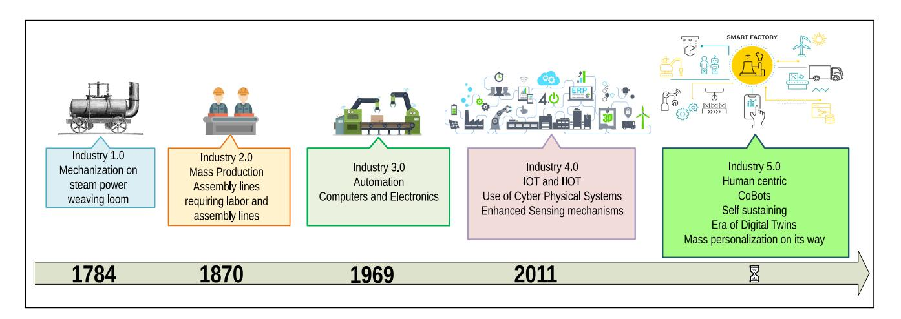
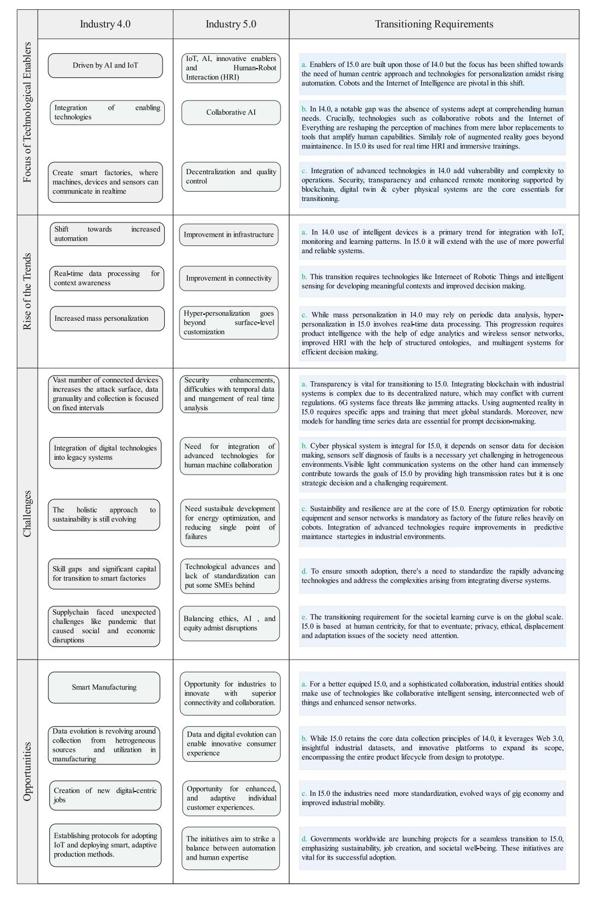
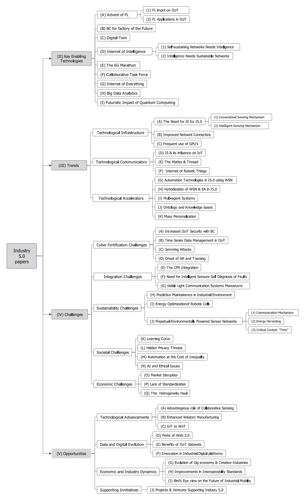
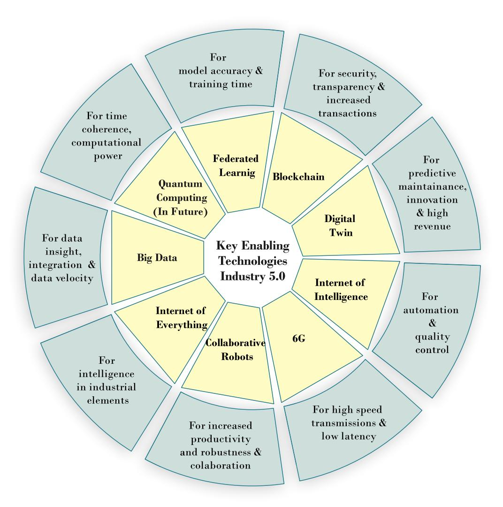
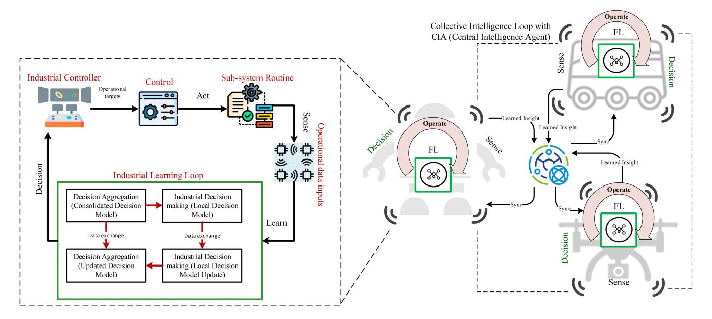
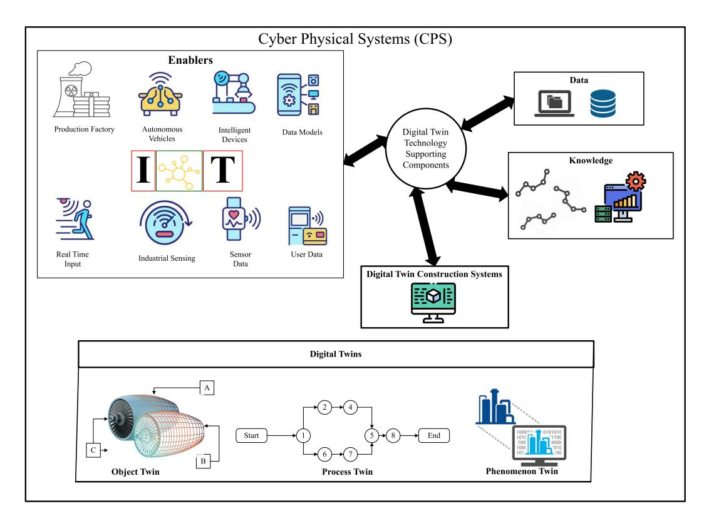
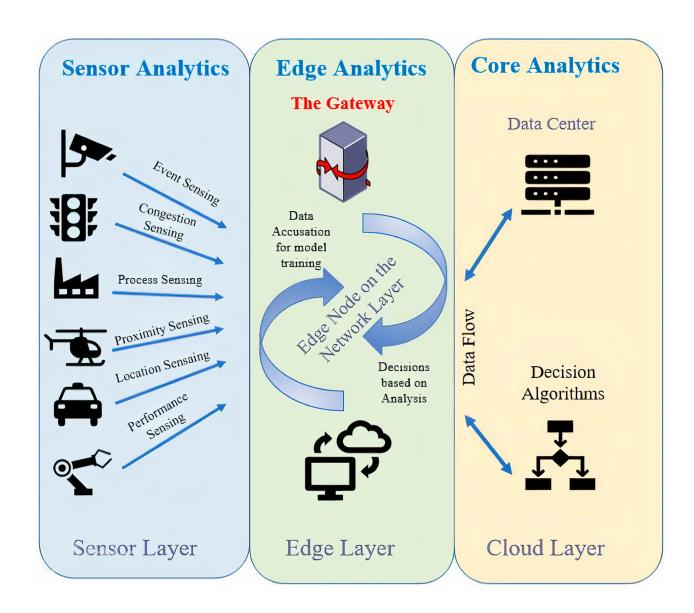
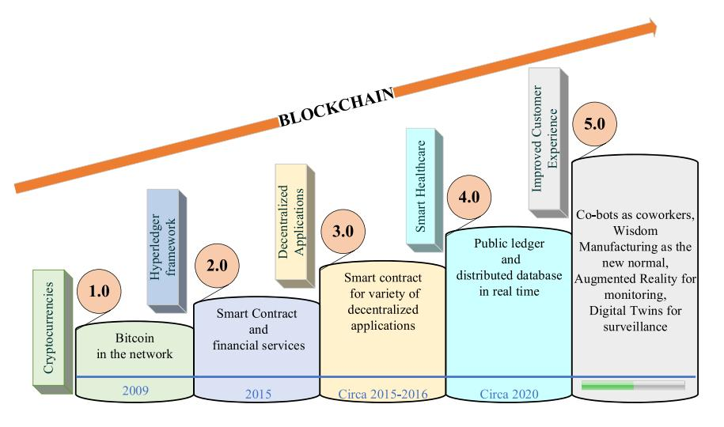
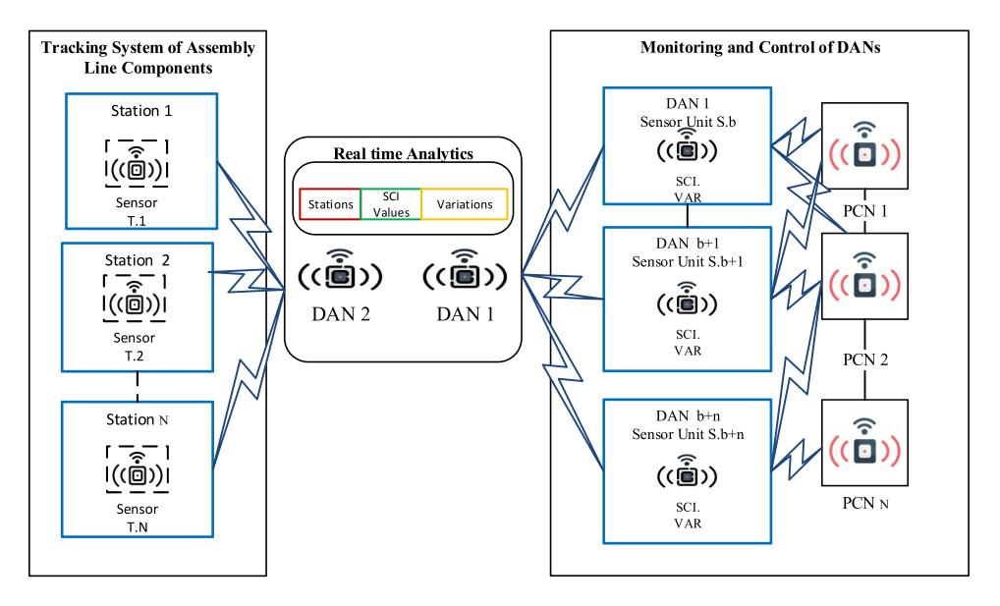
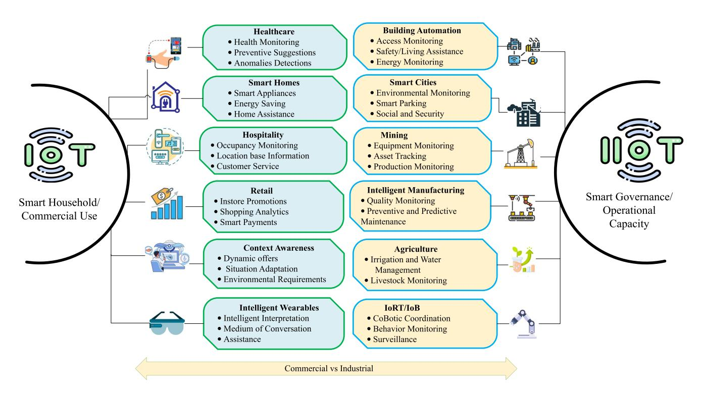

# Navigating Industry 5.0: A Survey of Key Enabling Technologies, Trends, Challenges, and Opportunities

Raiha Tallat®, Ammar Hawbani®, Member, IEEE, Xingfu Wang®, Member, IEEE, Ahmed Al-Dubai®, Senior Member, IEEE, Liang Zhao®, Member, IEEE, Zhi Liu®, Senior Member, IEEE, Geyong Min®, Senior Member, IEEE, Albert Y. Zomaya®, Fellow, IEEE, and Saeed Hamood Alsamhi®

Abstract—This century has been a major avenue for revolutionary changes in technology and industry. Industries have transitioned towards intelligent automation, relying less on human intervention, resulting in the fourth industrial revolution, Industry 4.0. That is why IoT has been the researcher's arena for quite some time. With Industry 4.0 still in motion, the world is on the verge of the  $5^{th}$  industrial revolution, a relatively new concept with many unclear opinions regarding its potential benefits, challenges, opportunities, trends, and impact on society. There is a dire need for a broader and more critical perspective. This research paints a bigger picture of "What is happening?" and "What to expect?" during the transition phase of Industry 5.0. In this comprehensive review, we have addressed the stateof-the-art practices in Industry 4.0 and the transitional phase of Industry 5.0. We have highlighted the most promising key enabling technologies, trends, research topics, rising challenges, and unfolding opportunities that can help prepare society for this paradigm shift. The paper then surveys the work toward the outstanding key enablers, challenges, trends, and opportunities in the IoT evolution for Industry 5.0. To spur further avenues for researchers and industrialists, the paper offers conclusive insights

Manuscript received 25 May 2023; revised 16 September 2023; accepted 26 October 2023. Date of publication 2 November 2023; date of current version 23 May 2024. This work was supported in part by the Innovation Team and Talents Cultivation Program of the National Administration of Traditional Chinese Medicine under Grant ZYYCXTD-D-202208; in part by the National Natural Science Foundation of China under Grant 62372310; and in part by the Liaoning Province Applied Basic Research Program under Grant 2023JH2/101300194. The work of Saeed Hamood Alsamhi was supported by the Science Foundation Ireland under Grant SFI/12/RC/2289\_P2. (Corresponding authors: Ammar Hawbani; Xingfu Wang.)

Raiha Tallat and Xingfu Wang are with the School of Computer Science and Technology, University of Science and Technology of China, Hefei 230027, China (e-mail: raiha-tallat@mail.ustc.edu.cn; wangxfu@ustc.edu.cn).

Ammar Hawbani is with the School of Computer Science and Technology, University of Science and Technology of China, Hefei 230027, China, and also with the School of Computer Science, Shenyang Aerospace University, Shenyang 110136, China (e-mail: anmande@ustc.edu.cn).

Ahmed Al-Dubai is with the Computing School, Edinburgh Napier University, EH10 5DT Edinburgh, U.K. (e-mail: a.al-dubai@napier.ac.uk).

Liang Zhao is with the School of Computer Science, Shenyang Aerospace University, Shenyang 110136, China (e-mail: lzhao@sau.edu.cn).

Zhi Liu is with the Department of Computer and Network Engineering, The University of Electro-Communications, Tokyo 182-8585, Japan (e-mail: liu@ieee.org).

Geyong Min is with the Department of Computer Science, College of Engineering, Mathematics, and Physical Sciences, University of Exeter, EX44QF Exeter, U.K. (e-mail: g.min@exeter.ac.uk).

Albert Y. Zomaya is with the Computing School of Computer Science, The University of Sydney, Sydney, NSW 2007, Australia (e-mail: albert.zomaya@sydney.edu.au).

Saeed Hamood Alsamhi is with the Insight Centre for Data Analytics, University of Galway, Galway, H91 TK33 Ireland, and also with the Faculty of Engineering, IBB University, Ibb, Yemen (e-mail: saeed.alsamhi@insight-

Digital Object Identifier 10.1109/COMST.2023.3329472

at the end. In addition, the article has a precise set of research questions answered in consequent sections and subsections for the reader's clarity.

Index Terms—Industry 5.0, industry 4.0, digital twin, federated learning, Industrial Internet of Things (IIoT), industrial wireless sensor networks, Internet of Robotic Things (IoRT), blockchain, 6G, intelligent sensing.

#### I. Introduction

HUMANS + AI + Enabling Technologies = Magic; the equation seems impossible. the equation seems impossible to some, but this magic started prevailing when clothing, houses, cities, and weapons were planned and made with the assistance of machines. With the development of Industry 1.0 in 1784 to 1830 (confined to Great Britain), mechanical generation started to alter essentially. The improvement time for the primary three insurgencies was around 100 years. In the 1800s, Industry 1.0 advanced through the improvement of mechanical generation for water and steam-powered machines. There's a gigantic change within the economy as generation capacity has expanded. Industry 2.0 advanced within the year 1870 with the concept of electric control. The manufacturing industry's productivity rose due to Industry 2.0's focus on production and task dispersion. With the notion of electronics, partial automation, and information technologies, Industry 3.0 was launched in 1969. In 2011, the paradigm of industrial automation for the future became known as Industry 4.0. The major goal is to use developing technology to increase productivity and achieve mass manufacturing. Fig. 1 shows an overview of the evolution of Industry 1.0 over the years [1]. At the tenyear mark of introducing Industry 4.0, the European Union announced Industry 5.0 in 2021 [2]. Industry 5.0 is a future progression of Industry 4.0 that combines the creativity of human professionals with the efficiency, intelligence, and precision of robots. Table I shows the concise breakdown of expected differences between Industry 4.0 and 5.0 w.r.t to prominent features.

Machine learning is used to get intelligence between apps and services in Industry 4.0, which aims to improve mass production and performance. Industry 5.0 is now envisioned as combining the unique ingenuity of human expertise with strong, smart, and precise machines. Many technological visionaries anticipate that Industry 5.0 will restore the manufacturing industry's human touch. Industry 5.0 is projected to combine high-speed, special machinery with human critical

1553-877X © 2023 IEEE. Personal use is permitted, but republication/redistribution requires IEEE permission. See https://www.ieee.org/publications/rights/index.html for more information.

Fig. 1. Industrial revolution over the years.

TABLE I EXPECTED DIFFERENCE BETWEEN IR4.0 AND IR 5.0 (INDUSTRY OF THE FUTURE)

| Feature                | Industry 4.0                                                                                                                                                                           | Industry 5.0                                                                                                                                                                                                            |
|------------------------|----------------------------------------------------------------------------------------------------------------------------------------------------------------------------------------|-------------------------------------------------------------------------------------------------------------------------------------------------------------------------------------------------------------------------|
| Technology             | Focused on smart automation and data exchange using IoT, AI, and other technologies.                                                                                                   | Builds upon Industry 4.0 technologies but adds more human-centered technologies such as virtual and augmented reality, haptic feedback, and brain-computer interfaces.                                                  |
| Value-chain            | Optimizes the value chain through real-time monitoring and analysis of data, enabling faster decision-making and more efficient operations                                             | Emphasizes a more distributed and collaborative value chain, where stakeholders across the supply chain work together in real-time to co-create value and address common challenges.                                    |
| Workforce              | Improved interoperability between machines and information systems.                                                                                                                    | A tight relationship between humans and robots.                                                                                                                                                                         |
| Experience             | Create a one-of-a-kind consumer's experience.                                                                                                                                          | Make the consumer experience more innovative by involving and using the consumer's choices in the design phase.                                                                                                         |
| Decision-making        | Automates and data-driven.                                                                                                                                                             | Participatory and collaborative.                                                                                                                                                                                        |
| ПоТ                    | Enables M2M communications, data insight, optimizing operations, and predictive maintenance.                                                                                           | Enabling human-robot interaction increased flexibility and communication in collaborative systems.                                                                                                                      |
| Vertical Integration   | Facilitates centralized control, promotes standardization, and data sharing within the organization, resulting in enhanced decision-making and coordination.                           | Focus on fostering a collaborative production process, involves the seamless integration of human skills, and problem-solving capabilities with advanced technologies, enabling the best utilization of both resources. |
| Horizontal Integration | Emphasized on connectivity across different industries and ecosystems, promote the creation of open systems where diverse stakeholders can interact, and exchange information | Improves the exchange of knowledge and technological resources, enabling a customer-centric approach to solution development.                                                                                           |
| Human Role             | Maintenance, control, and monitoring of machines, information systems, and databases.                                                                                                  | Co-creation, value-adding, creativity, problem-solving, empowerment, and active participation in decision-making.                                                                                                       |

and cognitive thinking. In other words, Industry 5.0 will be based on user-centric approaches that place humans at the heart of resource provisioning decision-making. Another important component of Industry 5.0 is mass personalization, in which customers desire individualized and customized items based on their preferences and priorities. Industry 5.0 will greatly improve industrial efficiency [\[3\]](#page-37-2) and provide adaptability between machines and humans, allowing for accountability for interaction and ongoing monitoring. The human-machine collaboration aims to boost productivity quickly and further contextualize the applications and services. By delegating repetitive and boring jobs to robots/machines and critical thinking tasks to people, Industry 5.0 can indeed improve the quality of manufacturing.

Many believe that we are on the verge of the fourth industrial revolution. *Smart Manufacturing for the Future* is the theme of Industry 4.0. Some futurists are even debating the theme of the fifth industrial revolution. Industry 5.0 has a few different visions. Human-robot collaboration is one emerging theme. We have witnessed considerable improvements in robotics and Artificial Intelligence (AI) research in recent years [\[4\]](#page-37-3). In today's market, robots are at reasonable rates for various tasks. It will not be long before we have a close relationship with robots in our daily lives and employment. A good illustration of this upcoming trend is the testing of driverless automobiles in traffic.

Some firms keep a record of their employees for robots or AI applications. While there have been numerous pieces of research on human-robot cooperation for low-level activities with an emphasis on robot development, there have been few studies on the organizational difficulties that have arisen as a result of human-robot collaboration [\[5\]](#page-37-4). The incorporation of

TABLE II LIST OF ABBREVIATIONS

| Abbreviation | Description                                                               | Abbreviation | Description                                          |
|--------------|---------------------------------------------------------------------------|--------------|------------------------------------------------------|
| CPS          | Cyber-Physical System                                                     | AR           | Augmented Reality                                    |
| IR           | Industrial Revolution                                                     | RL           | Reinforcement Learning                               |
| IoT          | Internet of Things                                                        | HRI          | Human-robot Interaction                              |
| CAV          | Connected Autonomous Vehicles                                             | IIoT         | Industrial Internet of Things                        |
| IoRT         | Internet of Robotic Things                                                | MAS          | Multi Agent Systems                                  |
| IS           | Intelligent Sensing                                                       | IWSAN        | Industrial Wireless Sensor and Actuator Networks     |
| DApps        | Decentralized Applications                                                | DT           | Digital Twin                                         |
| DTN          | Digital Twin Network                                                      | FTS-SDN      | Forwarding and Time Slotted-Software Defined Network |
| EA           | Edge Analytics                                                            | IPS          | Indoor Positioning System                            |
| WM           | Wisdom Manufacturing                                                      | WoT          | Web of Things                                        |
| VSD          | Value Sensitive Designs                                                   | SThs         | Smart Things                                         |
| EoIs         | Entities of Interest                                                      | WMTS         | Wireless Medical Telemetry Service                   |
| UWB          | Ultra-wide Bandwidth                                                      | ISM          | Industrial Scientific and Medical                    |
| ARSG         | Augmented Reality Smart Glasses                                           | SE           | Socialised Enterprise                                |
| AAU(MES)     | Advanced Features of Aalborg University (Manufacturing Execution Systems) | ECG          | Electrocardiogram                                    |
| VTO          | Virtual Try-Ons                                                           | EEG          | Electroencephalogram                                 |
| EI           | Emergence Intelligence                                                    | WPT          | Wireless Power Transfer                              |
| UAM          | Urban Air Mobility                                                        | 3DHT         | 3D Hologram Technology                               |
| LoS          | Line of Sight                                                             | NVF          | Network Virtualization Functions                     |
| TTF          | Time to Finality                                                          | SDN          | Software Defined Networking                          |
| MIoT         | Massive IoT                                                               | UV           | Unmanned Vehicle                                     |
| ZDM          | Zero-Defect Manufacturing                                                 | TTPs         | Trusted Third Parties                                |

robotic agents and IoT results in the advent of the Internet of Robotic Things (IoRT), in which advancements in digital systems open up new opportunities in industrial and research fields across a variety of domains, including industrial production, agriculture, health, intelligence gathering, and education. Researchers from different fields have put up their views on this regard [\[6\]](#page-37-5), [\[7\]](#page-37-6), [\[8\]](#page-37-7). Ghobakhloo et al. have also addressed the ambiguities in the exponentially growing functionalities of Industry 4.0 and revealed the sustainability-driven factors for the transformation of digital industries [\[9\]](#page-37-8).

It is worth indicating that Industry 5.0 ushers in the age of the *Social Smart Factory*, in which Collaborative Robots (Cobots) interact with humans. Enterprise social networks are used by *Social Smart Factory* to enable a seamless connection between human and Cyber-Physical System (CPS) components [\[10\]](#page-37-9). The notion of a sensor-based robot co-worker operating alongside human operators in flexible industrial environments will be at the heart of Industry 5.0. The term "Industry 5.0" was led by Michael Rada in 2015 in his LinkedIn article,[1](#page-2-0) is the first industrial evolution led by humans, premised on the 6R's (Recognize, Reconsider, Realize, Reduce, Reuse, and Recycle) principles of industrial recyclability, a systematic waste prevention technique, and logistics efficiency design to evaluate life standards, innovative creations, and produce high-quality custom products. Skobelev and Borovik has also discussed in their research that Industry 5.0 will embrace the paradigm of intelligence permeating the man's life [\[11\]](#page-37-10). The mass customization enabled by Industry 4.0 is not enough. Consumer has evolved, as has consumer demand and expectations. They want real essence in mass personalization, which is only possible when the human touch element returns to manufacturing [\[12\]](#page-37-11). Intelligence needs to be quicker and closer to the "edge" than ever. "Edge" can be a system, a network, or a user, and for edge analytics to succeed, the potential implementations of Wireless Sensor Networks (WSNs) in the Internet of Behavior (IoB), the Internet of Everything (IoE), and the Industrial Internet of Things (IIoT) in intelligent sensing will need to be enhanced to a whole new level. Sensors' energy consumption, recharging, and data transfer mechanisms will be revolutionized in a cohort model where cobots will accomplish their usual duties around humandriven activities. Chen et al. have presented their aspect about the state-of-the-art manufacturing trends like IIoT, AI, Deep Learning, and Convolutional Neural Networks (CNNs) by giving examples of specific industries [\[13\]](#page-37-12).

As we move towards the next industrial revolution, two transformative technologies will meet new peaks, 6G and AI. The next generation of communication networks is not only about speed or data. It's focused on truly interconnected industries. Holographic communications, AR with zero lag, and seamless digital and physical worlds integration. That's the potential of 6G, and AI is its driving force. These will introduce stricter demands for Quality of Service (QoS), security, flexibility, and intelligence, challenging energy efficiency [\[14\]](#page-37-13). It is reasonable to understand that the fusion of 6G and AI is set to unfold the potentials we have only begun to imagine in the next industrial revolution.

Over the last few decades, changing global demographics exhibited a definite upward tendency, with the proportion of older adults increasing in many nations. At the same time, especially in industrialized countries, services must be improved.

Here are the comparative aspects of Industry 4.0 and 5.0. See Table [I.](#page-1-1) Industry 4.0 was based on automation and intelligent factories. The next leap is Industry 5.0, which will be based on combining compelling technologies with human creativity. As well as technologies packed with Industry 5.0

1https://michael-rada.medium.com/industry-5-0-definition-6a2f9922dc48

Fig. 2. Comparison and transitioning requirements of Industry 4.0 and Industry 5.0 w.r.t Key Enabling Technologies, Trends, Challenges and Opportunities.

offer innovative solutions to organizations, individuals, and entrepreneurs for better data-driven decisions, which helps with business environments. Fig. [2](#page-3-0) compares Industry 4.0 and Industry 5.0 w.r.t enabling technologies, trends, challenges, and opportunities. In Fig. [2,](#page-3-0) we have outlined the transitioning requirements that embody the expanded role of Industry 5.0 about Industry 4.0. Furthermore, we have thoroughly discussed these requirements and their implications in the later sections.

#### *A. Motivations*

We reflect on the evolution of industry paradigms through a thorough review of the literature and available surveys. The ever-increasing tendency toward automation in Industry 4.0 is the fundamental impetus for a systematic literature review. Industry 4.0 combines computing, sensing, and IIoT technologies to digitize work. Over time, we observe how digitization and technology radically alter the global labor force. Technology has improved the quality of human life experience and the efficacy of objects by making them ecofriendly, easily accessible, and efficient. The intelligent use of IoT, sensing, and the Industrial Revolution (IR) 4.0 has caused a dramatic paradigm shift from smart homes to smart cities and industries. An intelligent factory, for instance, connects virtual and physical systems and calibrates devices to record their readings instantaneously. In conclusion, incorporating

IIoT, intelligent sensing, and WSN into the transitioning phase of Industry 5.0 will enhance the quantity and quality of work. To obtain more insightful results, we have extensively studied the research data pertaining to IoT and its subdomains in the frameworks of Industry 4.0 and 5.0.

The work conducted in sensing research is not limited to sensor networks and the algorithms used to gather and analyze data but also includes integration with other technologies. Examples include cloud services, satellites, cellular data communications, robots, and other technologies. As a result, there is a significant impact on various fields and industrial sectors to obtain the necessary components and modules to create multiple WSN projects. This allows more sectors to contribute to research, directly impacting the economy in general.

*1) Need for Surveys and Tutorials on Industry 5.0:* To the best of our knowledge, there does not exist any *indepth* tutorial on Industry 5.0 covering such an extensive and detailed analysis of Industry 5.0 with every possible aspect ranging from enabling technologies to the impact on society. The rise of the IoT among digital industries has grabbed the attention of many researchers. After reviewing several papers, we realized that this novel domain has much more to offer; current tutorials and surveys were based on a few related aspects, covering a subdomain of digital industries, thus not presenting the bigger picture. There are surveys [\[15\]](#page-37-14), [\[16\]](#page-37-15), [\[17\]](#page-37-16) but they lack in-depth analysis and did not cover the detailed analysis of some important enabling technologies like Federated Learning (FL), IIoT datasets, challenges of automation, Wisdom Manufacturing (WM), threats, and important ventures regarding the industrial paradigm shift. Other recent studies like [\[18\]](#page-37-17) have described challenges regarding task force and technical skills required for supply chain management in the prospect of Industry 5.0. Massaro has presented a general; overview of how IoT contributes to solving industrial problems [\[19\]](#page-38-0). Welfare et al. have conducted in-field research on establishing the work attributes for human-robot co-working in an automotive, industrial environment [\[5\]](#page-37-4). Cheon et al. have supported their concept of "bounded collaboration" with the help of qualitative analysis. They have referred to the need for bounded collaboration with the help of collaborative technology [\[20\]](#page-38-1). Khaled et al. have addressed the severity of cyber attacks in industrial Cyber-Physical Systems (CPSs) [\[21\]](#page-38-2). Leng et al. have discussed their decentralized autonomous manufacturing model "ManuChain II" for resilience in and transparency in Industry 5.0 [\[22\]](#page-38-3). However, the articles in [\[5\]](#page-37-4), [\[18\]](#page-37-17), [\[19\]](#page-38-0), [\[20\]](#page-38-1), [\[21\]](#page-38-2), and [\[22\]](#page-38-3) lack a review of the existing applications, opportunities, their related challenges, and potential research directions.

In contrast, our survey offers a different taxonomy that gives insights into the research gap in various categories of applications and related research directions based on IoT technologies, trends by versatile sectors, challenges, the opportunities this transformation will generate, and the projects involved in the progression of Industry 5.0.

- *2) Measurable Research Directives:* The survey is based on achieving the following directives
  - To acknowledge the potential and overlooked key enablers of Industry 5.0.
  - Provide a comprehensive view of the adapted trends by industries and SMEs for a smooth transition towards Industry 5.0.
  - To recognize the opportunities the industrial transformation 5.0 offers.
  - To identify the challenges that arise due to these stateof-the-art key enablers, trends, and opportunities.
  - To identify the differentiating factors from 4*th* industrial revolution to 5*th* industrial revolution.

#### *B. Contributions*

The close existence of Industry 4.0 and Industry 5.0 raises questions for researchers of industrial and technological domains. This research aims to provide the critical enabling technologies, trends, challenges, and opportunities related to Industry 5.0.

Our primary focus is to provide a comprehensive view of the capacities IoT and IIoT technologies together hold and how strongly these technologies are preparing the modern world for the inevitable concept of Industry 5.0 and its opportunities and challenges along the way.

Systematic Literature Review (SLR) approaches (mentioned in Section [I-C\)](#page-6-0) are used to establish a solid foundation for future research topics derived from the filtered data presented in this survey encapsulating the enabling technologies, current trends, challenges, and opportunities of Industry 5.0. IIoT and IoT in Industry 4.0 face significant obstacles and unanswered questions. This paper presents a comprehensive systematic review of the following.

• A state-of-the-art survey on industrial IoT, starting with an introduction to the recent advances and a discussion of the visions and broader perspectives on achievements in IIoT. To justify the publication's contribution, various recently released significant research articles, surveys, and studies are thoroughly examined, and their main contributions are highlighted in contrast to this paper. The main merits and shortcomings of the published research are entirely reviewed for evaluation purposes. Moreover, Table [III](#page-5-0) is designed in comparison to previous surveys released to present the contribution of this

TABLE III RELATED WORK COMPARISON TABLE. ENABLING TECHNOLOGIES, T: TRENDS, C: CHALLENGES, I: INDUSTRY

| Reference (Year) | Domain             | Applications                                                                                                                                                                                                                                                                                | Challenges and Trends                                                                                                                                                                                                                                                                                                                                                                 | <b>Enabling Technologies</b>                                                                                                                                                                  |
|---------------------|--------------------|---------------------------------------------------------------------------------------------------------------------------------------------------------------------------------------------------------------------------------------------------------------------------------------------|---------------------------------------------------------------------------------------------------------------------------------------------------------------------------------------------------------------------------------------------------------------------------------------------------------------------------------------------------------------------------------------|-----------------------------------------------------------------------------------------------------------------------------------------------------------------------------------------------|
| [24](2014)          | I4.0               | The impact of I4.0 in Business and Information Systems Engineering (BISE).                                                                                                                                                                                                                  | C: Developing attractive and dynamic information systems is challenging. T: CPS, decentralization, autonomous cells, distributed systems.                                                                                                                                                                                                                                             | Innovative platform architectures, manufacturing execution systems, miniaturization, and ubiquitous computing.                                                                                |
| [25](2015)          | I4.0               | The nine building blocks of I4.0 and its impact on manufacturing systems and business models with the help of use case studies from Germany.                                                                                                                                                | <b>C:</b> Upgradation in fixed and mobile broadband services and the required shift in economics and business models.                                                                                                                                                                                                                                                                 | Autonomous robots, big data, horizontal and vertical system integration, 3D simulations, IIoT, cybersecurity, AR, and additive manufacturing.                                                 |
| [26](2016)          | I4.0 & RAMI 4.0 | RAMI 4.0 and I4.0 components and the technological background for I4.0 applications.                                                                                                                                                                                                        | No specific challenges or trends presented other than cyber-physical systems and virtual representations.                                                                                                                                                                                                                                                                             | IoT, Internet of People (IoP), Internet of Services (IoS), virtual representations, object communication abilities. (elaboration of the ETs is not present).                                  |
| [27](2017)          | I4.0               | The paper presents current and future research challenges of Industrie 4.0, with a focus on smart manufacturing programs & the potential of CPS in production, logistics, and maintenance.                                                                                                  | C: Data security, reference models, privacy & investment issues, inadequate requirement engineering, the interdependence of CPS systems, data analytics, sensors. (The authors have merged the trends with the methodological research challenges).                                                                                                                                   | CPS, IIoT, safe human-robot interaction, video surveillance as a service.                                                                                                                     |
| [28](2018)          | I4.0               | Research trends, enabling technologies concerning Industry 4.0 are summarized.                                                                                                                                                                                                              | C: Big data analysis, scalability, lack of collaborative platforms, standard- ization, security. T: CPS integration, blockchain, smart devices, smart fac- tory, enterprise systems.                                                                                                                                                                                      | IoT (RFID, WSN, ubiquitous comput- ing), cloud computing, IIoT (Service- oriented architecture, business process management, information integration, and interoperability), CPS. |
| [29](2019)          | 14.0               | Risk analytics and the ripple effect in the supply chain management due to digital technologies prevailing in I4.0 is presented.                                                                                                                                                            | C: Data security, diagnostic & descriptive analysis, predictive optimization. T: Tracking & tracing systems, predictive simulation, adaptive learning, real-time control, decision-support systems.                                                                                                                                                                                   | IoT, big data, AR, robotics, additive manufacturing.                                                                                                                                          |
| [30](2020)          | I5.0               | Results of workshop with Europe's technology leaders.                                                                                                                                                                                                                                       | C: Inclusion of AI and CPS, innovation policies, industrial competitiveness, scalability, economic dimension.                                                                                                                                                                                                                                                                         | Human-machine interaction, DT, bio- inspired technologies, AI, data trans- mission technologies, and technolo- gies for energy efficiency.                                           |
| [31](2021)          | I5.0               | A comprehensive view of the in- dustrial paradigm shift has been presented with a focus on en- abling technologies and industrial understanding.                                                                                                                                | C: Social integration in value chains, heterogeneity, environmental values, agile innovation policies, system complexity.                                                                                                                                                                                                                                                             | Human-machine interaction, DT, data transmission, AI for complex systems, bio-inspired technologies, and actionable intelligence.                                                             |
| [32](2022)          | I5.0               | A tutorial on the technologies, applications, and open research challenges of I5.0.                                                                                                                                                                                                         | C: Security, privacy, human-robot collaboration, Regulatory compliance, skilled workforce. T: Additive manufacturing, predictive maintenance, CPS, hyper customization.                                                                                                                                                                                                               | Edge computing, DT, big data analytics, Cobots, IoE, 6G, network slicing, private mobile network, XR, blockchain.                                                                             |
| [33](2022)          | 15.0               | State-of-the-art network automation technologies, and their impact on IIoT-based I4.0 & I5.0 is summarized, along with their strengths, limitations and potential solutions.                                                                                                                | C: Privacy, interoperability, security, scalability, human-robot collaboration, energy efficiency. T: Network automation, heterogeneous communication protocols, pervasive AI, big data.                                                                                                                                                                                              | Intent-based intelligent environment, cell-free MIMO communications.                                                                                                                          |
| [34](2022)          | I4.0, 5.0 & 6.0    | A summarized approach to technologies of I4.0, I5.0 & step zero to I6.0 has been presented.                                                                                                                                                                                                 | <b>T:</b> Human-robot interaction, 3D, symbiotic assistive technology, bionic technologies, intelligent manufacturing, quantum computing, commercialized computing.                                                                                                                                                                                                                   | Advanced robotics, IoT, big data, AI, cloud computing, AR.                                                                                                                                    |
| This Paper (2023)   | I5.0               | To the best of our knowledge, this is the only study with a hybrid approach that encapsulates an extensive discussion on key enablers, trends, challenges & opportunities of <i>factory of the future</i> in the current industrial paradigm shift towards 15.0 making its way through IoT. | C: Security, data management in IIoT, predictive maintenance, CPS integration, app decentralization, AR, energy optimization, VLC, learning curve, market disruptions, automation & inequality, AI and ethical issues, jamming attacks, IIoT datasets. T: Intelligent sensing, IS influence on IoT, IoRT, improved network connectivity, Matter & Thread, GPUs, automation using WSN. | Federated learning, blockchain, DT, Internet of Intelligence, 6G, cobots, IoE, big data analytics, hybridization of WSN and edge analytics.                                                   |

paper in comparison to selected review studies within (2014-2023).

• Number of IoT-connected devices stands at eight billion currently and is expected to reach forty-one billion by the year 2027 [\[23\]](#page-38-4). Observing this exponential growth, the need to prevent potential vulnerabilities cannot be overlooked. This research provides a detailed overview of potential security challenges in Industry 5.0.

• European Union is the key driver for the fifth industrial revolution for leading green and digital transformations. China, Latin America, North America, Asia, and Australasia share the same objective[.2](#page-6-1) We are contemplating this compelling agenda by the EU and other countries. After studying multiple projects progressing for Industry 5.0 led by governments around the globe, we have chosen eight projects funded by the EU, USA, China, Sweden, UAE, and Japan to be part of our research, along with a few prominent mentions.

#### *C. Research Methodology*

In this study, all research processes and suggestions were carried out systematically. Manual assessments were carried out to compare the efficacy, security, limitations, and effectiveness of different research methodologies and approaches proposed by various authors.

To begin, we looked for pertinent terms in several databases utilizing information from peer-reviewed articles to construct study questions. Only papers that matched the criteria for selection (mentioned in Section [I-E1\)](#page-6-2) have been considered. We have conducted a rigorous evaluation of the articles and then carefully selected the instrumental ones.

- *1) Research Questions:*
- *RQ1. Investigating the key drivers and trends:* How are enabling forces and emerging technological trends charting the course for the fifth industrial revolution? (This question is answered in Sections [II](#page-9-0) and [III\)](#page-16-0).
- *RQ2. Investigating impediments and potentials:* What challenges could arise and potentially impact society during the transition to Industry 5.0, and what opportunities are set to guide its evolution? (This question is addressed in Sections [IV](#page-22-0) and [V\)](#page-29-0).
- *RQ3. The human perspective:* Does Industry 5.0 potentially change the lives of individuals? (Speculations to this theory are discussed in Sections [VI](#page-35-0) and [VII\)](#page-36-0).
- *2) Methodology:* We have adopted the following methodology to ensure a comprehensive and in-depth review of Industry 5.0.
  - We have begun with broad and evolving exploration (iterative methodology) to grasp the overarching landscape of Industry 5.0.
  - We have designed the research questions guiding our review based on key enabling technologies, trends, challenges, and opportunities.
  - We searched the databases IEEE Xplore, ACM Digital Library, and Google Scholar with the keywords mentioned in Section [I-E1.](#page-6-2)
  - We defined the selection criteria for including studies in our survey mentioned in Section [I-E1.](#page-6-2) We have done the quality assessment, making sure that the articles are from well-reputed journals and conferences.
  - Given the diverse nature of the study for narrowing down the versatility in Sections [II](#page-9-0)[–V](#page-29-0) we have used citation chaining (snowballing). This snowballing technique was complemented with a rigorous iterative approach to

ensure thorough theme-specific synthesis. Furthermore, we also used the titles of every subsection with the corresponding category and combined the search string with operators "AND", "OR", and "IN" to ensure coverage.

#### *D. Related Surveys*

Survey research papers have been reviewed from 2014-2023 concerning their *domain* (i.e., Industry 4.0 or Industry 5.0), the *applications*, the covered research areas in *enabling technologies, trends, challenges, and opportunities.*

Our thorough review included many papers related to Industry 5.0. Summarizing them all in the paper would not be practical for the reader. For this reason, we have summarized the selected papers in Tables [III,](#page-5-0) [IV](#page-7-0) and [V.](#page-7-1) Table [III](#page-5-0) represents the *core domain of I5.0 as well as its co-relation to I4.0*, as the latter industrial paradigm shift can not complete the full spin with the former's interference. Table [IV](#page-7-0) represents the difference in literature w.r.t *6G and IoT*, along with the significance of studies in comparison with generic IoT and industrial IoT. Moreover, Table [V](#page-7-1) presents the related survey papers concerning *energy harvesting*, *sensing technology*, and *industrial interface*.

## *E. Literature Categorization and Paper Organization*

The manuscript provides a comprehensive review of existing papers in the scope of transition towards Industry 5.0. We have identified a total of one hundred and fifteen papers to be reviewed in this survey. We have classified the literature according to the technological context (key enabling technologies, trends, challenges, and opportunities). The classification of literature is based on well-defined criteria mentioned below. In this section, firstly, we present the categorization of literature and then the paper's organization.

*1) Literature Categorization:* We have selected the technological aspects of key enablers, trends, challenges, and opportunities for the survey.

*Selection of Domain:* The domains of the Internet of Things (IoT), Artificial Intelligence (AI), Intelligent Sensing (IS), Federated Learning (FL), and their various derivatives have been chosen as the basis for the Systematic Literature Review (SLR) due to their pivotal role in driving the evolution of Industry 5.0. Undoubtedly, these domains embody the technological backbone of this revolution, impacting all aspects from manufacturing to service provision. Their advancements, challenges, and future trends provide invaluable insights into the understanding and shaping of the fifth industrial revolution. This SLR seeks to delve and extract not-seen-before insight from the depth of these transformative technologies, exploring their capabilities, potential, and influence in forging the future course of industrial development and its impacts.

*Selection of Criteria:* We have selected the studies that meet any of the mentioned criteria: (i) Usage of the term "Industry 5.0" as mentioned in Section [I-A](#page-4-0) is the motivation of the paper. Fig. [3](#page-8-0) represents the complete paper taxonomy and flow. At the first taxonomy level, we have classified papers based on the potential domain, i.e., key enablers, trends, challenges, and opportunities. (ii) Industry 4.0 review. (iii) Industry 5.0

2https://www.iurc.eu/

TABLE IV LITERATURE REVIEW W.R.T "6G AND IOT"

| Reference (Year) | Relevance to Industrial IoT                                                                                                                                                                                                                                                                                                                               | Relevance to Generic IoT                                                                                                                                                                                                                                                                                                      | Significance of Investigated Problems                                                                                                                                                                                                                  |
|---------------------|-----------------------------------------------------------------------------------------------------------------------------------------------------------------------------------------------------------------------------------------------------------------------------------------------------------------------------------------------------------|-------------------------------------------------------------------------------------------------------------------------------------------------------------------------------------------------------------------------------------------------------------------------------------------------------------------------------|--------------------------------------------------------------------------------------------------------------------------------------------------------------------------------------------------------------------------------------------------------|
| [35] (2021)      | The article accentuates the potential of 6G network technology in revolutionizing the IIoT. It discusses the use of 6G for bolstering intelligence through machine learning, addressing IIoT's unique needs like high data rate and reliability, and enhancing features like wireless communications and network intelligence, which are crucial to IIoT. | The article is also relevant to the generic IoT as it explores the integration of 6G communication systems with IoT networks, forming the 6GIoT. It highlights several challenges for IoT systems, including security and privacy concerns, hardware constraints, energy efficiency, and standard specification requirements. | The article tackles the fundamental challenges associated with integrating 6G technologies with the IoT to form the 6GIoT. Addressing these would contribute to optimizing the use and efficacy of IoT devices in various applications.                |
| [36] (2021)      | With respect to IIoT article suggests that 6G is capable of supporting data-intensive operations by providing seamless connections. It also covers innovative technologies, including VLEO satellites, UAVs, terahertz communications, optical communications, blockchain, VLC, and ML.                                                                   | In terms of generic IoT, authors have dis- cussed the future connectivity of a massive number of IoT devices enabled by 6G and the current limitations of IoT that do not support wide-scale implementation, including high maintenance costs, security, and interoper- ability.                            | The article discusses the significant prob- lem of connecting a massive number of IoT devices enabled by 6G. It also discusses blockchain as the mitigation to the IoT prob- lems, improving data security and single point of failure. |
| [37] (2021)      | The study discusses the importance of differential privacy in CPS, the IIoT, and the potential for achieving widespread AI in 6G with federated learning.                                                                                                                                                                                                 | This article explores the difficulties in managing resources using blockchain technology and implementing 6G communication as well as the privacy in FL is a broad term for all IoT applications.                                                                                                                             | Addressing the security challenges in 6G and IIoT is significant to ensure the safe and trustworthy operation of a vast and interconnected network, which will be foundational for many facets of daily life and industry shortly.                     |
| [38] (2022)      | Authors discussed one of the prevailing problems of IoT applications, that is, non-uniformity in data gathered through devices not capable of proper labeling of data.                                                                                                                                                                                    | Additionally, the techniques for pseudo-labeling of the unlabelled data and improved processing can immensely benefit applications of generic IoT in multiple domains.                                                                                                                                                        | The proposed semi-supervised federated learning system (FedSemL) considers the limited resources and constraints typical of IoT devices, making it directly relevant to industrial and generic IoT contexts.                                           |
| [39] (2022)      | This research discusses the key role of IIoT as a facilitator of Industry 4.0, a digital transformation marked by interconnectivity, automation, and real-time data exploitation, powered by technologies like AI, big data, and cloud infrastructure.                                                                                                    | Regarding generic IoT, this research covers a wide spectrum of applications, integration of AI and IoT, multiple security issues, and standards enabling energy efficiency.                                                                                                                                                   | Authors provide three pressing aspects, the immediate need for robust IoT security, energy efficiency, and the need for the merger of AI and IoT.                                                                                                      |
| [40] (2022)      | HoT lies at the core of I4.0 and 5.0. This article signifies the utmost need for a four-layer (space-air-ground-underwater/sea) network to achieve ubiquitous IoT connectivity that could potentially benefit IIoT applications.                                                                                                                          | In terms of generic IoT, authors have discussed the large-scale precise positioning problem in the current IoT deployment scenarios w.r.t smart home and cities applications.                                                                                                                                                 | The article stresses the importance of Reconfigurable Intelligent Surfaces (RIS) for future 6G IoT networks due to their flexibility and low cost. It also describes the potential research areas for improvement in IoT positioning.                  |

TABLE V PROPOSED WORK DIFFERENCES IN LITERATURE W.R.T. ENERGY HARVESTING, SENSING TECHNOLOGY, AND INDUSTRIAL INTERFACE

| Indexes      | Energy Harvesting | Sensing Technology | Industrial Interface |
|--------------|----------------------|-----------------------|-------------------------|
| [41][42][43] | $\checkmark$         | Х                     | Х                       |
| [44]         | <b>√</b>             | Х                     | Х                       |
| [45]         | Х                    | <b>√</b>              | Х                       |
| [46]         | <b>√</b>             | <b>√</b>              | Х                       |
| [47]         | $\checkmark$         | Х                     | <b>√</b>                |
| This Study   | <b>√</b>             | <b>√</b>              | <b>√</b>                |

enabling technologies. (iv) Industry 5.0 trends. (v) Industry 5.0 challenges. (vi) Industry 5.0 opportunities. After that, we categorized the papers according to the specialized category in the context of Industry 5.0. In Fig. [3,](#page-8-0) a reader can trace and understand each category and its role from every leaf node to its root and vice versa. At the second taxonomy level, we have classified the studies that underscore (i) the potential of nine enabling technologies in the context of Industry 5.0, (ii) grouped the trends into a total of three categories that reflect the industrial trends based on technological infrastructure, communicators, and accelerators, (iii) classified papers based on five categories of challenges (cyber fortification, integration, sustainability, societal and economic), (iv) categorized the opportunities based on technological advancements, data, and digital evolution, industry dynamics and put together the promising supporting initiatives. The third taxonomy level is where we present an in-depth analysis of the classification above: (i) FL impact and its applications are discussed from key enabling technologies. (ii) The need for the Internet of Intelligence is discussed in detail. (iii) We have divided technological infrastructure and communication into three subcategories and technological accelerators in five subcategories, each within the context of Industry 5.0. (iv) We have divided integration, sustainability, and economic challenges into three subcategories. In contrast, cyber fortification and societal challenges have been divided into four subcategories, each explaining the hurdles related to its parent category. (v) We present the division of technological advancements, data and digital evolution, and economic and industry dynamics, each categorized into three subcategories. (vi) We put together significant supporting initiatives for Industry 5.0. In the fourth taxonomy level, we provide (i) a deeper understanding of conventional and intelligent sensing mechanisms. (ii) We present the communication mechanism, the role of energy harvesting, and discussion on the "time" context w.r.t the perpetually environmentally powered sensor networks.

*Timeline:* Papers published from 2014 to 2023.

Fig. 3. Proposed classification of surveyed studies within the scope of Industry 5.0. The Roman numerals, alphabets, and Arabic numerals in the brackets represent the corresponding Sections, Subsections, and Sub-subsections, respectively.

*2) Paper Organization:* The remainder of the paper is organized into the following sections. Section [II](#page-9-0) has a comprehensive view of the technological key enablers for Industry 5.0. Section [III](#page-16-0) reflects the state-of-the-art trends in Industry 5.0 will incur. Section [IV](#page-22-0) contains a detailed list of challenges that can occur due to emerging Industry 5.0. Authorized licensed use limited to: T.C. Cumhurbaskanligi Kutuphanesi. Downloaded on January 02,2026 at 13:32:45 UTC from IEEE Xplore. Restrictions apply.

| Reference (Year) | Domain          | Description                                                   |
|------------------|-----------------|---------------------------------------------------------------|
| [48] (2019)      | ІоТ             | The authors created a unique smart home "IOTFLA" with         |
| [10](2019)       | 101             | the combination of federated learning and data aggregation.   |
|                  | Electronic      | Authors proposed federated energy demand learning by uti-     |
| [49] (2019)      | Automobiles     | lizing the clustering-based Energy Demand Learning (EDL)      |
|                  | rutomoones      | method to increase the accuracy of predictions.               |
|                  |                 | A framework called LoFTI (a federated multi-task learning     |
|                  |                 | framework) has been presented. It significantly reduces false |
| [50] (2020)      | ІоТ             | positives and negatives, outperforming traditional single-    |
|                  |                 | home and all-home learning methods with a 24.2% decrease      |
|                  |                 | in false negatives and a 49.5% drop in false positives.       |
|                  |                 | Federated Imitation Learning (FIL) has been proposed that     |
| [51] (2020)      | Robotic Network | enables cloud robotics systems to train local robots (self-   |
|                  |                 | driving cars) in imitation learning more effectively.         |
|                  |                 | Authors have investigated the applications of FL technology   |
| [52] (2021)      | IIoT            | for managing IIoT equipment data in wireless network con-     |
| [32] (2021)      | 1101            | texts. To boost the rate of model aggregation and decrease    |
|                  |                 | communication expenses.                                       |
|                  |                 | A deadline latency energy scheme has been proposed. The       |
|                  |                 | study introduces a model for IIoT systems that use decentral- |
| [53] (2022)      | IIoT            | ized microservices with a focus on federated learning. The    |
|                  |                 | main goals are to reduce energy use and minimize delays in    |
|                  |                 | the application.                                              |
|                  |                 | A new method using FL recommends and schedules re-            |
| [54] (2022)      | IoMT            | sources by analyzing user logs and finding similar patterns   |
| /                |                 | in the Internet of Medical Things (IoMT) framework            |

TABLE VI FEDERATED LEARNING APPLICATIONS IN INDUSTRIAL INTERNET OF THINGS

Section [V](#page-29-0) reflects the opportunities Industry 5.0 will bring along its paradigm shift and related projects. Section [VI](#page-35-0) represents research challenges and insights gained. Section [VII](#page-36-0) reflects the future perspective of the research, and finally, section [VIII](#page-37-18) concludes this survey.

Due to the comprehensive nature of the survey, we organized our comparison in a tabular orientation, making it easy for the readers to engage with a large amount of relatable data. The rest of the tables are divided into the following categories.

Table [VI](#page-9-1) represents Federated Learning (FL) applications in IIoT. Table [VII](#page-13-0) represents the Digital Twin (DT) category and available industrial frameworks. Table [VIII](#page-14-0) represents the measure taken by governments for the adoption of cobots. Table [IX](#page-18-0) represents the important intelligent elements for Industry 5.0. Table [X](#page-20-0) represents the role and applications of industrial sensing assets. Table [XI](#page-23-0) represents blockchain generations and their implications on the industry.

#### II. KEY ENABLING TECHNOLOGIES

The world is witnessing the fourth industrial revolution, sometimes known as Industry 4.0, and progressing towards Industry 5.0. Industry 5.0's vision components must achieve and enable the Sustainable Development Goals (SDG) defined in the United Nations Agenda 2030[.3](#page-9-2) However, the concept of Industry 5.0 has not yet fully evolved. Future industries must play a functional role in solving pressing societal concerns. Fig. [4](#page-10-0) gives a brief view of the key enabling technologies and their key performance indicators for Industry 5.0. Regarding key enabling technologies, it is not wise to look for fundamental distinction as Industry 5.0 is an extension of Industry 4.0. The difference is that the latter has a broader, innovative, and more collaborative spectrum than the former.

This section explores the enabling technologies used in transitioning toward Industry 5.0. After thoroughly reviewing different technologies, research, and projects, we designed this section with the influential enabling technologies related to computing methodologies, modeling, security essentials, and communication patterns. We have discussed the implications of federated learning in Section [II-A,](#page-9-3) security mechanisms with *blockchain* in Section [II-B,](#page-11-0) the evolved *digital twin* technology in Section [II-C,](#page-12-0) improved industrial networks by *Internet of Intelligence (IoI)* in Section [II-D,](#page-13-1) the role of *6G* in Section [II-E,](#page-13-2) the widely accepted and used concept of *cobots* in Section [II-F,](#page-14-1) improved mobility with the help of the *Internet of Everything (IoE)* in Section [II-G,](#page-15-0) effect of *big data* in Section [II-H,](#page-15-1) and impacts of *quantum computing* in Section [II-I.](#page-16-1)

#### *A. Advent of Federated Learning (FL)*

Cognitive computing has flourished as smart machines for Industry 4.0. New approaches using AI and distributed learning for human-level information processing have been developed. The ultimate goal is to enable machines like computers to learn from and process human thoughts similarly. AI, in this context, focuses on finding the best algorithm for solving a particular problem. Impending progress in cognitive computing and big data analytics for Industry 4.0 is needed to improve and better replicate intelligence by taking advantage of various factors [\[55\]](#page-38-5). However, differential privacy and its variants degrade data utility, while cryptography-based methods impose additional burdens on communication and computational resources.

Modifications to algorithms or lighter forms of cryptography can help alleviate some of the inefficiency concerns. These approaches can partially alleviate the problem and introduce new issues like inaccuracy or a reduction in security

3https://digitallibrary.un.org/record/1291226?ln=en

Fig. 4. Key enabling technologies of Industry 5.0 (Transitioning Phase) along with key performance indicators.

Fig. 5. Federated learning mechanism for the industrial decision-making process.

protection. Fig. [5](#page-10-1) represents the FL mechanism for real-time learning in industrial environments.

*1) Federated Learning Impact on IIOT (Systematic Review):* Recent advances in the internet and its supported things in the existing world have made IIoT a more reliable technology than ever before. The IIoT has the potential to revolutionize industrial systems and play a key role in developing new industries. For intelligent IIoT applications, AI techniques necessitate centralized data collection and processing. However, the high scalability of modern IIoT networks and the increasing confidentiality of industrial data make it difficult in industrial scenarios. Intelligent IIoT networks can benefit from FL, an emerging collaborative AI approach, because it coordinates multiple IIoT gadgets to undertake AI training at the network edge while helping protect security, privacy, and confidential business data. An in-depth look at FL's potential in several key IIoT services and applications is provided in this article. For FL-IIoT to be fully realized in future industries, several significant open research topics must be addressed [\[56\]](#page-38-6).

For Industry 4.0, the IIoT has played an important role and has produced massive amounts of data that can be used for industrial intelligence. Modern factories have decentralized devices where these data are stored. FL was introduced to train shared machine learning models collaboratively to protect industrial data's security and privacy. In contrast, the local data gathered by different devices, skews in class distribution and degrades the industrial FL performance of the network. Mobile edge researchers have already looked into this problem. Still, they haven't considered factory devices' rapidly changing streaming data and clustering nature, which could put data security at risk. Federated Group Synchronization Based Framework (FeDGS) [\[57\]](#page-38-7), a hierarchical cloud edgeend framework for the 5G enabled industrial sector, has been proposed as a means of improving industrial FL performance on data that is not inherently random. FedGS uses a Gradientbased Binary Permutation Algorithm (GBP-CS) to select a subset of devices within each factory and create homogeneous super nodes participating in FL training, taking advantage of naturally clustered factory devices.

Li et al. have used compound-step synchronization protocols, and they have proven that these super nodes can be coordinated in a way that can withstand data heterogeneity [\[58\]](#page-38-8). The methods that have been proposed save time and can adapt to changing environments without compromising the security of sensitive industrial data.

Industrial engineering should adapt from FL's success in data privacy protection with FL applications. When FL is applied to these domains, we can gain unlimited benefits from dispersed data sets. Hu et al. have designed a unique edge computing-based framework for data transferring and monitoring [\[59\]](#page-38-9).

*2) FL Applications in IIoT:* Table [VI](#page-9-1) represents the current federated learning applications proposed by researchers in the IIoT environment.

Moreover, Ferrag et al. have examined edge analysis and IIoT in particular; an IoT/IIoT testbed has been used to build the data set, which includes a wide range of devices, sensors, protocols, and cloud/edge setups [\[60\]](#page-38-10). In IoT, data is created through various IoT devices (i.e., more than ten categories), such as low-cost digital thermometers and humidity sensors, ultrasound sensors, water level detectors, pH sensors, soil moisture sensors, heart rate sensors, and flame sensors.

Because of privacy concerns, centralized training may not be appropriate for sensitive data-driven industrial scenarios, such as healthcare and autopilot. Recent interest in federated learning has grown because it allows participants to learn a shared model collaboratively without disclosing their local data. Industrial applications like autonomous driving avionics, medical data in wearable technology, and industrial robot decision-making can still be compromised by exploiting shared parameters; for that purpose, federated learning serves as a remarkable solution [\[52\]](#page-38-11), [\[61\]](#page-38-12). An efficient and privacyenhanced federated learning scheme has been introduced in [\[62\]](#page-38-13), in which private information can be protected even if multiple organizations collaborate with each other.

Smart city applications, such as healthcare, transportation, environmental management, and, more importantly, industrial environments, have benefited from recent breakthroughs in AI and the IoT. An AI-powered virtual twin of the real-world scenario. Manufacturing and industrial applications of DTs have been successful; however, they are still at an early stage for smart city applications. Lack of trust and privacy concerns in exchanging sensitive data is a major contributor to this delay. When DT is combined with FL, privacy and trust can be preserved and maintained [\[63\]](#page-38-14).

#### *B. Blockchain Technology for Factory of the Future*

The rise in the demand for personalized products necessitates high flexibility in manufacturing processes that require large-scale deployment of the IIoT. As the transition towards Industry 5.0 progresses, scientists have offered different blockchain models for increasing IIoT performance and resolving current issues of smart manufacturing [\[64\]](#page-39-0), [\[65\]](#page-39-1), [\[66\]](#page-39-2), [\[67\]](#page-39-3). Conventional supply chain management is confronted with issues such as low transaction efficiency, high costs, and multi-participant insecurity. It is critical to expedite the development of the supply chain network to a connected, intelligent, and efficient supply chain ecosystem. Chen et al. and Bhattacharya et al have discussed the highly advantageous aspect of blockchain integration with IoT and intelligent mechanisms in smart factories [\[68\]](#page-39-4), [\[69\]](#page-39-5).

As a result of the incorporation of blockchain technology into Wireless Sensor Networks (WSNs), the next generation of sensor nodes will be more sophisticated, energy-efficient, and have a longer lifespan in the setup of WSNs [\[70\]](#page-39-6), resulting in industrial operations with more precision. These sensor nodes are confronted with the tremendous obstacle of energy consumption, which eventually reduces the network's lifetime. Wireless Power Transfer (WPT) is a relatively new energy provisioning technology deployed at the center of sensor nodes to provide an efficient lifespan solution [\[71\]](#page-39-7). A Wireless Portable Charging Device (WPCD) drifts through the WSN, recharging all the nodes in search of perpetual life. Overall, the potential for blockchain technology in Industry

Fig. 6. Supporting components of Cyber-physical systems.

5.0 is immense, as more industries continue to adopt and explore its possibilities, it is likely that more innovative and transformative use cases will unfold in the future.

#### *C. Digital Twin*

Digital Twin (DT) is an emerging concept stimulated by a virtual model and generated based on real data designed to reflect an (existing or future) physical object or environment accurately. DT plays the role of dynamic twin of a real word process, network, or object [\[72\]](#page-39-8).

As the industry has evolved, digital twins have played a critical role in improving efficiency and fostering the development of Industry 5.0.[4](#page-12-1) Sensor-based signals face several challenges, the most prominent among them is the long data lag time.

Modern factories are being digitally transformed by the Industry 5.0 vision, and Industrial Wireless Sensor Networks (IWSNs) play a significant part in this process. Low latency, high reliability, and scalability are traditional IWSN requirements, but mobility support will become increasingly critical for Industry 5.0 applications. DT is diffusing in industrial applications and IIoT at a rapid pace. Zeb et al. have presented strategies for DT deployment and integration with Cyber-Physical Systems (CPS) in their research [\[73\]](#page-39-9). CPS are engineered systems built from and depend on the seamless integration of computation and physical components. Fig. [6](#page-12-2) highlights the role of DT supporting components (modeling, visualization, "what if" scenarios, and analytics) in CPS, which can help in improved efficiency, asset monitoring, and inter-process communication. Overall, CPS plays a critical role in advancing many fields and industries by bringing together the physical and digital worlds to create more efficient, intelligent, and connected systems.

Wireless communication is a crucial component of Industry 4.0, and it will be inherited with increased magnitude in Industry 5.0 as well. Researchers have been focusing on the challenges Wireless Twins (WT) encounters, opportunities, and its taxonomy [\[74\]](#page-39-10). Moreover, international organizations have been arranging workshop[s5](#page-12-3)[,6](#page-12-4) and discussions for DT and its variants. Table [VII](#page-13-0) represents DT categories, their respective functionality, and available frameworks.

IEEE P3144 is the IEEE's digital twin maturity model standard for the industry. This standard also specifies digital twin capability domains and subdomains, as it also covers assessment procedures, such as assessment content, processes, and maturity levels.[7](#page-12-5)

This state-of-the-art technology is expected to make breakthroughs in current industrial control strategies, offering the advantageous role of monitoring and simulating "what if?" scenarios. However, there exists no solid opinion on the principles, roles, and features of digital twin technology. Hyre et al. have addressed this problem in their research. To eliminate this confusion, researchers offered a generic framework for constructing DT of any system [\[75\]](#page-39-11). As technology advances, the influence of DT technology in shaping the future of industries and improving real-time decision-making will become even more prominent.

4https://www.rt.com/sponsored-content/480670-polytech-days-in-berlin/

5https://sites.google.com/view/tnt-2022/home

6https://www.digitaltwin-conference.com/

7https://sagroups.ieee.org/p3144/

| Twin Category  | Functionality                                                                                                                                                                        | Available Framework                                    |
|----------------|--------------------------------------------------------------------------------------------------------------------------------------------------------------------------------------|--------------------------------------------------------|
| Performance DT | DT can measure real-time parameters to optimize cost and performance. The obtained data can act as the primary input for training models to increase the twin's learning capability. | Tributech 7 Predix 8             |
| Process DT     | DT can be used for collaboration among diverse teams, managing real-time decisions based on data acquired from industrial operations.                                                | XMPRO 9 BEAMUP 10                |
| Object DT      | DT can be used for the entire simulation of SpaceX rocket Falcon1, motion simulation, and verification of objects.                                                                   | Siemens NX software 11                                 |
| Phenomenon DT  | DT can be used for a multi-domain hybrid mechanism, predictive maintenance, and optimization of industrial management.                                                               | Ansys Twin Builder 12 Mango3D 13 |
| Asset DT       | DT can be used for asset monitoring, resource allocation, asset condition, and managing payload; Twin can act as the middleware for IoT devices in industrial scenarios.             | Ditto 14 AUTODESK 15             |

TABLE VII DIGITAL TWIN CATEGORIES FOR INDUSTRIAL FUNCTIONALITIES AND AVAILABLE FRAMEWORKS

#### *D. Internet of Intelligence*

The Internet of Intelligence is ushering in a new era of smart industry operations, seamlessly integrating advanced analytics and collaborative AI learning. As industries delve into this realm, they stand on the cusp of unparalleled efficiency and innovation powered by interconnected intelligent networks. Intelligence is not only significant in industrial interfaces but also in changing the daily life operations of its users.

*1) Self-Sustaining Networks Needs Intelligence:* The internet has grown tremendously in the last few decades as the most important infrastructure for information. It becomes clogged as billions of web pages, active users, and linked devices are added. The internet's fast growth has generated issues such as information overload, misleading information, "humanin-the-loop", and the construction of reliable, cost-effective autonomous systems. As a result, intelligence is a necessity of networks.

Networks can be self-configuring, self-organizing, and selfadapting [\[76\]](#page-39-12), effectively assisting in creating dependable and cost-effective intelligent scenarios such as autonomous driving [\[77\]](#page-39-13). Smart networks tend to achieve promising phenomenons likewise resource distribution [\[78\]](#page-39-14), cellular traffic prediction [\[79\]](#page-39-15), and energy efficiency in Unmanned Aerial Vehicles (UAVs) [\[80\]](#page-39-16).

*2) Intelligence Needs Sustainable Networks:* Most present AI projects concentrate on single-agent training models, which largely rely on many predetermined large data sets in the local environment. With the rapid development of data on the internet, this centralized AI architecture is bound by local processing capability and storage capacity. Due to this reason, the power of trained models needs a higher level of efficiency. The natural concept of collective learning is the key to storing and adapting the information in societal collective memory in individuals [\[81\]](#page-39-17), which is difficult for current AI systems. As a result of this, the future evolution of intelligence is inextricably linked to networking [\[82\]](#page-39-18). Reis et al. have presented a detailed systematic review of the impact and performance of humanoids in the hotel industry, they investigated whether service robots can entirely replace human workers in the hospitality department or whether they should invest in more balanced solutions, such as human-robot systems [\[83\]](#page-39-19). Distributed intelligence, storage intelligence, and intelligence sharing can be realized through networking, bridging the gap between AI and human intelligence, significantly boosting training efficiency, and imitating the real-world environment more efficiently. Lee et al. have presented a unique high-fidelity illustration based on human-AI expectations, interaction, and concerns for the future, which can help HCI designers to create more riveting user human-AI experience [\[84\]](#page-39-20).

The Internet of Intelligence is not just about collecting data, it also includes leveraging that data to create intelligent insights that can drive innovation and transform businesses. By combining advanced analytics, artificial intelligence, and machine learning, the Internet of Intelligence can unlock new opportunities for growth and competitive advantage. As Industry 5.0 continues to evolve, the Internet of Intelligence is indeed a key enabler for businesses to adapt and thrive in an increasingly digital and connected world.

## *E. The 6G Marathon (IoT the Cheerleader)*

Countries like the U.S., China, Japan, and South Korea are the leading runners of the 6G maratho[n8](#page-13-3) as it is expected to bring about significant advancements in wireless communication technology, which will enable the deployment of advanced IoT and IIoT technologies in the Industry 5.0. These technologies will significantly impact manufacturing, intelligent operations, and healthcare industries by enabling new applications and services that can improve efficiency, efficacy, safety, and sustainability.

As the cutting-edge launch of 6G approaches, the future of the IoT ecosystem is expected to reach another peak (one of the many) [\[36\]](#page-38-15). IoT devices generate vast amounts of data, and 6G networks will be required to transmit and process this data efficiently. The higher speeds and lower latency of 6G networks will enable IoT devices to operate in real-time, making the autonomous industry reach the next level [\[85\]](#page-39-21), [\[86\]](#page-39-22).

6G networks are planned to provide the capacity for the rapid-paced digitalization enabled by IoT applications and services of Industry 5.0. Researchers have previously predicted that prospective 6G enabling technologies will assist

8https://www.firstpost.com/world/south-korea-hopes-to-be-the-firstcountry-to-launch-6g-targets-rollout-by-2028-12191192.html

TABLE VIII GOVERNMENT POLICIES, COMPANY ADAPTATION STRATEGIES, AND ONGOING TRENDS FOR ADOPTING COBOTS IN INDUSTRIES

| Government Policy                                | Organization Strategy                                                                                                  | Other Trends                                                                                                                                                                                                            |
|--------------------------------------------------|------------------------------------------------------------------------------------------------------------------------|-------------------------------------------------------------------------------------------------------------------------------------------------------------------------------------------------------------------------|
| EU-Industry 5.0 & Horizon 2020                   | Audi smart factory 2025.                                                                                               | The increasing popularity of electric vehicle retrofitting existing production lines.                                                                                                                                   |
| Denmark–Strategy for Denmark's Digital Growth | ABB-reduce CO 2 emissions.                                                                                  | Increasing demand for autonomous packaging because of e-commerce.                                                                                                                                                       |
| China–Made in China 2025                         | Nissan intelligent factory.                                                                                            | Increasing collaboration between cobots and end- effector suppliers.                                                                                                                                                 |
| Japan-Toyota and FANUC partnership               | Manufacturing companies turn to cobot manufacturers for solving automation problems.                                   | Collaborative robot technology is expected to be available to all task-based businesses, no matter what their size.                                                                                                     |
| USA-A Roadmap from Internet to Robotics          | Large companies look to diversify their sup- plier's chances for local SMEs to adopt au- tomation.               | Companies are using collaborative robots to improve efficiency, quality, and safety in the production process.                                                                                                          |
| Finland-VTT Technical research center of Finland | Valmet automation and Fastems adaptation of collaborative robots for repetitive and physically demanding tasks.        | Adaptation to cobots for fulfilling the increasing labor shortage.                                                                                                                                                      |
| Australia-CSIRO                                  | The Robotics Venture Factory.                                                                                          | Country is taking measures to make Australia one of the makers of industrial and collaborative robots rather than consumer only.                                                                                  |
| Singapore–NRP                                    | Robotics Automation Centre of Excellence (RACE) and Centre for Healthcare Assistive and Robotics Technologies (CHART). | Cobots are a part of almost every industry ranging from education, tourism, healthcare, food, and public sectors. The government has launched multiple programs to help SMEs adopt automation.                          |
| Germany–Industrie 4.0                            | BMW, Assembly of the front axle drive.                                                                                 | The trend towards Industry 4.0 and the increasing demand for flexible and agile manufacturing is expected to drive the adoption of collaborative robots in the country.                                                 |
| South Korea–I–KOREA4.0                           | Samsung and Hyundai partnerships with Rainbow Robotics and Boston Dynamics, respectively.                              | Country's telecom operators are set to expand cobot- based business by combining 5G and cobotic tech- nology. The country's aging population demand for customization is expected to be met by service robots. |

cognitive and collaborative systems in various applications, including cobots, bio-cybernetic identity, sensor-to-AI fusion, autonomous port, holographic communication, context-aware infrastructure, and personalized interfaces [\[87\]](#page-39-23). Researchers are working on upcoming 6G networks to ensure continued advancement in next-generation communication [\[88\]](#page-39-24). In July 2018, the International Telecommunication Union (ITU) established the focus group network 2030 (FG NET-2030). Given the disparity in 5G technology, this group sought to investigate technological advances for 2030 and beyond [\[89\]](#page-39-25). To meet future demand and growing use cases, such as the necessity of the data-centric process, which requires throughput in the range of terabits per second, mission-critical services applications, such as enhanced health care, are being developed. The fourth industrial revolution requires microsecond latency, and in compact cosmopolitan cities, due to urbanization, it requires 107 connections per *km*2 [\[88\]](#page-39-24). Researchers are currently working on capabilities that go beyond 5G. As compared to 5G, 6G networks may operate over a wider frequency band, which can be used to meet future demand.

6G research has begun in several countries [\[90\]](#page-39-26). Its services include almost zero latency for holographic communication, visible light communication (Section [IV-G\)](#page-25-0), a highly precise industry, widespread usage of AI, public healthcare applications, and communication support for massive industrial IoT devices.

Green 6G is expected to be deployed around the beginning of 2030. It is targeted to achieve environmental sustainability and energy efficiency for minimizing the carbon footprint of telecommunication networks. 6G enables pervasive connectivity by combining satellite and underwater communication for a massive global coverage [\[91\]](#page-39-27).

While there's much to be done, a global collaboration between technological enterprises, innovative startups, and researchers is paving the way for a future where 6G and IoT together bring about revolutionary changes. Testing these technologies in real-world industrial settings is the key.

## *F. Collaborative Task Force (Cobots)*

Industry 4.0 has already approached the brand new world of technology known as Robotic Process Automation (RPA). The RPA era started in the early 2000s. The timely implementation of RPA has evolved into a requirement in day-to-day industrial operations. It is a new category of process automation technology based on intelligent automation and AI workforce. RPA has emerged as the new business language. This cutting-edge technology is more sophisticated than other twenty-firstcentury technologies [\[92\]](#page-39-28).

Industry 5.0, however, seems to paint a different picture centering humans as the core of industrial interface, robots working as co-workers (cobots), without any barrier following a pre-designed peculiar code of ethics will be the new normal in daily operations [\[93\]](#page-39-29). According to Buccowich [\[94\]](#page-39-30), benefits of RPA technology include increased operational accuracy, improved staff morale, increased productivity, ensuring low technical hurdles, conformance, consistency leading to reliability, and non-invasive technology.

Automotive manufacturers are the pioneers of automation implementation, by far one of the largest markets for industrial robots. Value drivers of Industry 5.0 have caused accelerated cobot adaptation by leading automaker companies. One of the sore points of industrial automakers is the malfunctioning of industrial robots, leading to significant downtime that costs business value. Cobots are the saviors in such industrial situations as human co-workers can enter and work safely with them. It is worth mentioning that cobots are not confined to automotive industries only.

Table [VIII](#page-14-0) represents government initiatives, companies' strategies, and trends for adapting cobots. Recent research [\[5\]](#page-37-4), [\[95\]](#page-39-31) and [\[96\]](#page-39-32) looked into dimensions of manufacturing, the innovative Human-Robot Interaction (HRI) experiences with cobots, as well as the understanding of tactile experience in a collaborative environment.

Our study reveals several anticipated trends in both industries and personal lives stemming from the emergence of cobots. Here's what we can expect.

*Face change of applications:* With the cobot market erupting like a volcano, digital application developers perceive this as an opportunity to offer a different interface to its users and help them navigate the services for the best experience.

*Consumer at the core:* Integrating cobots in an industrial environment will help consumers be a part of the core design and development process and even provide input during the preliminary phase.

*Increased demand in the non-industrial environment:* The cobot integration is not limited to the industrial environment only. Cobots can soon be seen taking orders at favorite takeaways, serving as tour guides, or even speaking for the public at a seminar introducing the audience to the new technology.

*Cobot manufacturing will be leading the "Green" agenda:* The mitigation plan for climate change has been part of the agenda of almost every large enterprise on the planet. Cobots can be programmed to monitor and adjust production processes in real-time to optimize energy consumption and reduce the carbon footprint of manufacturing operations.

*The new social environment:* The rise of the cobots will generate a diverse social environment where humans and robots can safely interact commercially and socially, performing dayto-day activities without the need for safety cages.

*The ultimate change:* Humanoid robots are one of the most reliable cobots. These cobots can engage in human-like activities like starting an engaging conversation and interacting with users. It will not be far-fetched to acknowledge that children of all age groups can soon choose to have a customized "friend" accompany them to school, who can also act as the therapist and caregiver. Working individuals can have a personal "office buddy" to help navigate the day. For health care purposes, cobots can serve as old-age companions for people suffering from mental health conditions.

We have analyzed that the speed of automation and the rise of the cobot market in Industry 5.0 is, in fact, just the beginning of a new "co-human" era. We believe researchers and policymakers will soon face challenging decisions and policy shifts to keep human-robot interactions saturated yet distinctive.

## *G. Internet of Everything (IoE)*

IoE [\[97\]](#page-39-33) is a superset of IoT by not only connecting devices with other devices but also connecting devices with people

and processes. It is more complex than IoT. IoE can be defined as:

$$IoE = IoT + IoD + IoH$$

IoT is the Internet of Things, IoD is the Internet of Digital, and IoH is the Internet of Humans.

By "everything", we mean every minute object (tangible or intangible) to the most complex hardware in the connected environment for the sake of making networks more intelligent, valuable, and context-aware [\[98\]](#page-39-34). Digital transformation and connectivity are overtaking even the most traditional manufacturing industries, resulting in a bewildering array of corporate opportunities. IoE has indeed made business procedures more innovative [\[99\]](#page-39-35), impacting the operational mechanisms in various industries like pharmaceutical [\[100\]](#page-39-36), [\[101\]](#page-39-37), automotive [\[102\]](#page-39-38), accommodation [\[103\]](#page-39-39) and accounting [\[104\]](#page-39-40). The IoE environment enables network administrators by offering scalable opportunities for efficient resource allocation mechanisms [\[105\]](#page-39-41).

IoE interacts with various technologies such as AI, deep learning, IoT, cloud computing, big data analysis, fog computing, and edge computing. Furthermore, improvements in IoE are linked to the technologies that businesses utilize for digital transformation activities. According to Future Market Insights' April 2022 study, the global IoE market was worth 1,074.1 billion dollars in 2022 and is expected to reach 3,335.1 billion dollars by the end of 2030[.9](#page-15-2)

One of the biggest IoE projects is the port of Hamburg. On June 3, 2015, CISCO announced its partnership with the port of Hamburg to implement an integrated IoE on real infrastructure. The initiatives include the use of digitalization for traffic management, smart port logistics, and other innovative solutions to handle the challenges of modern shipping[.10](#page-15-3) Other high scale applications of IoE include precision agriculture,[11](#page-15-4) smart cit[y12](#page-15-5) and platforms for connectivity.[13](#page-15-6)

IoE also covers the Internet of Nano Things (IoNT) under its umbrella. This is accomplished by embedding nano-sensors in various objects and employing nano-networks. This allows access to data from previously unreachable locations or instruments due to sensor size [\[106\]](#page-39-42).

IoE is already an implemented concept in Industry 4.0, but its more innovative applications are expected to be unveiled in Industry 5.0. As an enabler, it contributes to increased communication efficiency in a connected and sensing industrial environment.

## *H. Big Data Analytics*

*Factory of the future* or Industry 5.0 will operate on the information insight. Big data retrieval technologies are currently playing the role of finding a *"needle in a haystack"* in the fourth industrial revolution. Big data has enabled

9https://www.futuremarketinsights.com/reports/global-internet-ofeverything-market

10https://newsroom.cisco.com/c/r/newsroom/en/us/a/y2015/m06/port-ofhamburg-paves-the-way-with-europe-s-first-smartroad.html?dtid=osscdc000283

11https://www.deere.com/en/digital-tools/

12https://www.ibm.com/smarterplanet/us/en/smarter\_cities/article/rio.html

13https://www.se.com/ww/en/work/campaign/innovation/platform.jsp

enterprises to formulate successful business strategies and stay competitive [\[107\]](#page-40-0), [\[108\]](#page-40-1).

Simultaneously heterogeneous nature of the data proposes new challenges and requires more sophisticated techniques [\[109\]](#page-40-2). Platforms like Hadoop [\[110\]](#page-40-3), Apache Cassandra [\[111\]](#page-40-4), [\[112\]](#page-40-5), and NoSQL databases like Neo4j [\[113\]](#page-40-6) are playing a prominent role in this regard. Massive amounts of data (big data) have been generated due to the expansion of the social Web, and its efficient exploitation has contributed to the shaping of Industry 4.0. Big data analytics plays an important part in creating a smart and sustainable industry, and by relying on a diverse set of extensive data retrieval methods, valuable business insights can be obtained.

Moreover, *factory of the future* (Industry 5.0) will unfold the duo of big data and XAI (Explainable Artificial Intelligence) for increasing user confidence in the intelligent industrial products [\[114\]](#page-40-7). The fusion of data insights and human ingenuity will be the cornerstone of the next industrial revolution, paving the way for a human-centric sustainable future.

#### *I. Futuristic Impact of Quantum Computing*

Quantum computing is gaining increased interest and heavy investment, but as far as Industry 5.0 is concerned, it is currently *under the radar*. It has been discussed as a potential enabling technology for the next phase of industrial development. However, several challenges must be overcome before it can be widely adopted in industry, such as the need for largescale quantum computers, improved quantum algorithms, and better error-correction techniques. As a result, while quantum computing is gaining increasing interest and investment, its potential impact on the industry is still being explored. It may not be an immediate concern for all the industries. *Quantum computing is approaching the mainstream, equipped with combinatorics, it can offer solutions to the bottlenecks of AI* [\[115\]](#page-40-8).

In June 2021, Honeywell Quantum Solutions (HQS[\)14](#page-16-2) announced the merger of HQS and Cambridge Quantum Computing would create the world's biggest and most advanced quantum company, with the potential to shape the future of the projected one trillion USD quantum computing industry. It is likely that by 2030, the industrial sector will adopt a hybrid computing-operating model that incorporates both traditional computing methods and the emerging technology of quantum computing. According to the research of Biondi et al., industries are going to be the immediate benefactors of quantum computing. Practical use cases of quantum computing can be seen in multiple industries, including pharmaceutical, supply chain, R & D, finance, manufacturing, and automotive [\[116\]](#page-40-9).

#### III. TRENDS

With the exponential growth and adapting trends in Industry 4.0, the requirements for advanced applications and technological solutions will also increase for Industry 5.0. Competitive industries tend to follow the changing directions for sustainability and market requirements. Simultaneously, the importance of emerging trends and innovative solutions that various industries have designed can not be overlooked.

This section is designed to summarize the adaptive trends that industries are following. We have defined *three* basic categories that derive this section based on categorical synthesis.

- 1) *Technological Infrastructure (Powering Industry 5.0):* The foundation of Industry 5.0's progress is fortified by strong technological support. In this category, we grouped the trends that are the "support pillars" for the infrastructure of Industry 5.0. Section [III-A](#page-16-3) explains the **utmost demand for** intelligent sensing. Improved network connectivity, a driving force for seamless data exchange, is reflected in Section [III-B.](#page-17-0) Further Section [III-C](#page-17-1) explains the utilization of Graphics Processing Units (GPUs) in industrial applications for achieving high throughput.
- 2) *Technological Communicators (Connecting Industry 5.0):* In this category, we grouped the trends that are the "connectors" for industries and SMEs looking for competitive advantages in the market. Section [III-D](#page-18-1) reflects the effect of intelligent sensing in an IoT environment, an intelligent facet that empowers Industry 5.0. The role of the new protocol, the "Matter" and the supporting "Thread" is explained in Section [III-E.](#page-19-0) Section [III-F](#page-20-1) explains the concept of the Internet of Robotic Things (IoRT) in Industry 5.0's human-centric approach.
- 3) *Technological Accelerators (Propelling Industry 5.0):* We have designed the subsections in this category with trends that help and enable industrial entities to smooth adaptation toward Industry 5.0, enabling them to create new technology benchmarks. Section [III-G](#page-20-2) represents the adapted automation. Section [III-H](#page-20-3) represents the hybridization of WSN and edge analytics. Subsequently, the instrumental role of Multi-agent Systems (MAS) is reflected in Section [III-I.](#page-21-0) Section [III-J](#page-21-1) represents the supporting role of ontology and knowledge bases. Finally [III-K,](#page-21-2) highlights the role of mass personalization in shaping consumer trends of modern industry.

## **Technological Infrastructure (Powering Industry 5.0)**

## *A. The Need for Intelligent Sensing for Industry 5.0*

In December 2021, McKinsey Analytic[s15](#page-16-4) surveyed the adaption and impact of AI in business with 1,843 respondents belonging to different industries, companies, and regions. The survey concluded that 16% of those polled reported a 10-19% decrease in costs, while 18% reported a 6 to 10% increase in overall revenue. Using artificial intelligence to detect and anticipate faults will be the new normal for Industry 5.0. Any system must be able to foresee potential issues before they occur. The paradigm of the malfunctioning condition is currently undefined, and the fault detection method is still in its infancy. Mixing sensor data with the knowledge to

14https://www.honeywell.com/us/en/press/2021/06/honeywell-quantum-so lutions-and-cambridge-quantum-computing-will-combine-to-form-worlds-lar gest-most-advanced-quantum-business

15https://www.mckinsey.com/business-functions/quantumblack/ourinsights/global-survey-the-state-of-ai-in-2021

develop machine intelligence is critical. Industry 4.0 will be transitioned into Industry 5.0 systematically so that the shortcomings of the former can be fulfilled in the latter. This scenario will take place in a manner such that *technological enablers* will introduce innovative mechanisms. When adapted by the masses, the successful mechanisms become *trends*. Implementation and innovation in trends give rise to new *opportunities*. Overcoming *challenges* is an obvious part of the transition.

It is vital to bring a digital industry into businesses to ensure an optimum transition from the existing state of the industry to Industry 5.0. Enterprises can undoubtedly generate and improve revenue streams by integrating the digital equation into current business scenarios. All physical processes are reflected in a virtual (digital) production model. On the other hand, the outcomes of digital modeling can offer feedback and produce a controlled impact on actual manufacturing processes, which is a critical component of the Industry 5.0 concept. Trends adopted by industries and technological enterprises for the fifth industrial revolution are focused on increased competitiveness and progress toward developmental goals.

- 1) *Development towards high reliability:* The antiinterference performance of electronic equipment is directly influenced by sensor reliability. The permanent direction will advance sensors with integrated service and a wide temperature range. New material development (such as ceramics) will be lucrative.
- 2) *Development towards high precision:* The need for sensors is increasing as the degree of automated manufacturing improves. To assure the dependability of industrial automation, new sensors with great sensitivity, high precision, rapid reaction, and good interchangeability must be designed.
- 3) *Development towards miniaturization:* The main role of various control equipment is becoming increasingly important, and the smaller, the better in various parts, so the sensor itself must be as small as possible, which necessitates the development of new materials. Emerging technologies now include the development of plant wearable sensors [\[117\]](#page-40-10). The current volume of a sensor fabricated from silicon material is minimal. For example, the classic accelerometer consists of a gravity block and a spring. It has a big volume, is unstable, and has a limited lifespan. Furthermore, the silicon accelerating sensor produced using different micro-machining methods, such as laser, has a compact volume, high interchangeability, and high reliability.

A sheer difference between traditional and intelligent sensing mechanisms can be seen in the following two Sections [III-A1](#page-17-2) and [III-A2.](#page-17-3) Table [IX](#page-18-0) represents the crucial intelligent elements of the IIoT participating in Industry 5.0.

*1) Conventional Sensing Mechanism:* Conventional sensing mechanism refers to the sensor's capability of receiving stimuli from the environment. It consists of a sensing element, sensor interface, signal conditioning, and processing. Their functionality is limited to specific tasks they are designed for, usually a stimulus-response relationship. In complex scenarios

like multi-modal sensing, a system might combine data from multiple sensors for monitoring purposes. Conventional sensing mechanisms are often times used for creating feedback loops as a part of larger control systems. Sophisticated conventional sensors have built-in capabilities to monitor their health and alert system in case of malfunctioning.

*2) Intelligent Sensing Mechanism:* Sensor technology has also become an essential enabler in many applications. Intelligent sensing is widely employed in various applications. The rapid development of sensors has been fueled by several applications, such as intelligent fabrication processing, where smart sensors can bring significant benefits. Intelligent sensing is very important in safety-related fields, with applications ranging from aircraft safety evaluation to environmental monitoring for hazardous substances.

Intelligent sensor networks have been the research interest of many scientists due to the rise of edge intelligence for achieving efficacy and robustness. The electronics industry has achieved promising results by using wearable electronics and photonics for real-time intelligent sensing [\[152\]](#page-41-0), [\[153\]](#page-41-1), [\[154\]](#page-41-2).

#### *B. Improved Network Connectivity*

IoT devices rely on stable and reliable network connections to transmit data and facilitate interactions between physical objects and digital systems. This connectivity plays a crucial role in real-time data collection, analysis, and control, contributing significantly to automation, optimization, and resource allocation in industrial networks.

Researchers have been making vigorous attempts to create innovative methods for enhancing the connectivity of industrial networks. IWSN plays a vital role in connecting industrial elements and autonomous decisions. These networks also face challenges at multiple layers for industrial applications Raza et al. have reviewed such unique challenges and requirements in their research [\[155\]](#page-41-3). Network slicing is yet another mechanism for resource optimization in industrial networks. Tang et al. has proposed a three-tier based DT integrated solution for IIoT network slicing for Industry 4.0 and beyond in their research to overcome the problem of resource allocation [\[156\]](#page-41-4).

Time Sensitive Networking (TSN) is an ethernet extension defined by IEEE. The integration of TSN with 5G technology enables industries to harness the advantages of both technologies, unlocking new possibilities for various use cases and applications [\[157\]](#page-41-5). Other mechanisms for improved network connectivity include fog computing, network orchestration, Network Virtualization Functions (NVF), and Softwaredefined Networking (SDN). The list of technologies used for improved network connectivity in industrial environments can be exhaustive as it is an essential trend in a vigorous industrial environment.

#### *C. Frequent Use of GPU's*

Graphics Processing Units (GPUs) are used in various AI applications. The performance of GPUs is remarkable at completing tasks, outperforming CPUs, which excel at

TABLE IX INTELLIGENT ELEMENTS OF IIOT CRUCIAL FOR INDUSTRY 5.0 (FACTORY OF THE FUTURE)

| Elements                                                                        | Explanation                                                                                                                                                                                                                                                                                                                                                                                                                                                                                                                                                                 |
|---------------------------------------------------------------------------------|-----------------------------------------------------------------------------------------------------------------------------------------------------------------------------------------------------------------------------------------------------------------------------------------------------------------------------------------------------------------------------------------------------------------------------------------------------------------------------------------------------------------------------------------------------------------------------|
| Intelligent Devices [119], [120]                                                | Intelligent devices are machinery, equipment, and instruments that include computational capabilities. They will be employed in Industry 5.0. These include medical devices, geological equipment, automobiles, and support systems. Internet-connected gadgets will aid in managing, monitoring, and providing services. These devices have a camera connected to the internet, allowing for monitoring of the manufacturing system.                                                                                                                                       |
| Intelligent Automation [121–123]                                                | Intelligent automation provides a better solution for digital transformation in manufacturing and to accelerate operations, for the integration of human, machine, and software aspects to achieve fast response, utilization of machine learning for complicated problem solving, improvements in system's safety and efficiency, better assistance in monitoring and detection of frauds and hazards.                                                                                                                                                                     |
| Intelligent Sensors [124–126]                                                   | These materials must be designed properly to fulfill the unique sort of task required for scientific and engineering applications, since intelligent sensors often operate on extremely responsive edge analytics, resulting in reduction of delay time.                                                                                                                                                                                                                                                                                                                    |
| Intelligent Wireless Sensor-based Systems [127–129]                             | IIoT is developing as a synthesis of several fields working to achieve intelligent operation of industry-driven activities. Equipped with intelligent algorithms, these networks can provide connectivity essential for sustainable systems.                                                                                                                                                                                                                                                                                                                                |
| Advanced Protocols for Wireless Fieldbus Sensor Networks (WFNs) [130], [131] | IWSNs used in mission-critical monitoring and control applications must adhere to stringent real-time and reliability performance requirements. In this sense, real-time implies that the system can only work correctly and occasionally securely if data comes on time and in a dependable manner. Industrial communication solutions are often built to meet stringent real-time and reliability criteria that differ from standard WSNs.                                                                                                                                |
| Holograms [132–136]                                                             | Holograms have the capability for nondestructive testing and deformation measurement of an object's surface identifies faults that arise throughout the manufacturing process. Moreover, according to a survey conducted in 2021, 3DHT has been considered a promising solution for the hotel industry.                                                                                                                                                                                                                                                                     |
| Augmented Reality [137–139]                                                     | In manufacturing industries, this technology is used to better understand manufacturing, processes, and automation. It is also useful for improving production efficiency by visual planning of the entire production process. It provides explicit knowledge and understanding through a compared 3D model, image, video, book, or chart. The CPS, combined with the IoT, big data, cloud computing, and IWSN, is the fundamental technology enabling the fourth industrial revolution and the fifth as well.                                                              |
| Dimensional Printing [140–142]                                                  | 5D printing technology is used to create objects with five axes of movement, namely X, Y, and Z, as well as a movable print head and bed. Used in the manufacture of extremely reliable car components. 3D printing has critical applications in the health care industry, like customized 3D-printed prostheses for the reconstruction of severe bone defects.                                                                                                                                                                                                             |
| Digital Twin [143–148]                                                          | Digital twin helps the network operators to safely emulate candidate optimization methods on a digital twin network platform before adopting them in the existing network, thus enabling simulations of multiple "what-if" scenarios. DTN can integrate data collecting, big data processing, and AI modeling to monitor network state and forecast future trends in order to better arrange predictive maintenance. DTN covers various industrial applications like dense traffic simulations, factory operations, object simulation, and construction process simulation. |
| Robotic Process Automation (RPA) [149–151]                                      | RPA is considered the intelligent part of the industry. Industry 4.0 is coping with technology such as robotics, automation, and AI. Robotics are increasingly being used in industries around the world. The primary goal of robotics and Industry 4.0 is to increase productivity, manufacture high-quality products with cost-effectiveness, and match customer expectations.                                                                                                                                                                                            |

general-purpose jobs that need a wide range of skills.[16](#page-18-2) Unstructured grid high-order algorithms and GPU accelerators have enabled technologies for unstable scale-resolving simulations of industries [\[158\]](#page-41-6). With the increasing need for data insight and robust computational platforms, graph computing has stretched to a new horizon due to the current diverse industrial environments. Platforms like GraphBig require GPU to process bulk real-time data for the implementation of complex retrieval methods [\[159\]](#page-41-7). To meet the growing computational demands, new-generation airborne systems are making the best use of GPUs for increased performance rates. Workload workload-aware GPU processing model has been proposed in [\[160\]](#page-41-8); the model's experimental

16https://www.micron.com/insight

results have shown an increased error prediction rate in airborne systems. Yao et al. has used a scheduling algorithm (WAMP2) for workload-aware GPUs; the algorithm is capable of dynamic adjustment of resources and accurate prediction of application execution time [\[161\]](#page-41-9).

Industry 5.0 relies on enablers requiring parallel processing power and high-performance computing like big data, DT, ML, CPS, etc. GPUs will continue to be a trend in Industry 5.0 due to their strong computing power and applicability.

## **Technological Communicators (Connecting Industry 5.0)**

## *D. Intelligent Sensing and Its Influence on IoT*

Sensors are ubiquitous, and the amount and diversity of data they provide continually increases. As the varieties and applications of sensors continue to increase, new concepts emerge. According to statistics,[17](#page-19-1) the number of connected devices on the internet significantly exceeds the global rate of internet penetration. According to this reasoning, the Internet of Things (IoT) is the Internet about Things. In the Internet of Things, the term "things" was used by Ashton in 1999 to describe a vision encompassing real items. RFID tags, sensors, GPS, cameras, and other devices are examples of autonomously collecting and sending information to network objects. These networks generate massive amounts of data, which standard database solutions struggle to store and interpret. IoT uses remote sensors to facilitate interactions between people, things, and networks. Sensors are devices that can detect an item's speed, location, and size. They can also monitor temperature, humidity, pressure, noise levels, and lighting conditions. Home security systems, industrial process monitors, medical gadgets, air-conditioning systems, intelligent washing machines, automotive airbags, cellular phones, and vehicle tracking systems are just a few of the numerous industrial sensor technology uses. The number of sensors and the volume of sensor data have been expanding at astounding rates due to significant developments in sensor technology.

With a typical SQL database, processing and analyzing large amounts of data entails vast computing and storage expenditures for industries. Due to the scalable and availability requirement for sensor data storage platform solutions, NoSQL databases are used to efficiently distribute data across several servers and dynamically add new properties to data records and resource inventorying. Industries like oil and gas need to be controlled via remote access for monitoring offshore assets using CPS and IIoT [\[162\]](#page-41-10). In the case of a successful cyber-attack on an oil and gas offshore asset can have drastic consequences for the marine ecosystem, leading to disruption in the world's supply and the potential impact on the global economy.

The sensor data storage component is a subsystem for storing sensor data. Sensor data is frequently saved in a data storage system via different sensor nodes powered by batteries and managed dynamically [\[163\]](#page-41-11). However, storing it becomes increasingly problematic as the number of sensor nodes and, hence, the volume of data increases. Sensing data storage solutions developed via practice proposes retaining data for a particular time. The data collected from the sensors is essential since it might reveal hidden faults or diagnostic information. Researchers have offered different perspectives in this regard [\[164\]](#page-41-12), [\[165\]](#page-41-13).

*The Insider Knowledge:* IoT sensors can collect vast amounts of data about various aspects of an industrial process, such as temperature, pressure, and vibration. Table [X](#page-20-0) illustrates the varied functions of sensors and industrial IoT assets in smart environments, encompassing aspects such as data collection, process automation, and environmental monitoring. By analyzing this data, patterns may emerge that could reveal details about a manufacturing process that a company would prefer to keep secret. For example, if a company uses a unique combination of temperature and pressure to produce

a particular product, this could potentially be discerned from the sensor data.

Industrial processes may use a combination of data sources, including IoT sensor data, to protect their manufacturing processes according to their business interests. For example, data from security cameras or other monitoring devices could be used with IoT sensor data to provide a complete picture of the manufacturing process.

By combining different data sources, companies may better understand their manufacturing processes and detect potential security breaches and threats.

The data extraction from sensors can lead to tampering, revealing the company's trade secrets, and misuse of sensor data by adversaries [\[188\]](#page-41-14). A prevention technique for sensor tempering is presented in [\[189\]](#page-41-15).

The Verkada hack occurred in March 2021, when a group of hackers gained unauthorized access to Verkada (a cloud-based security camera company) and access to live footage from thousands of cameras installed in various locations, including schools, hospitals, and prisons.[18](#page-19-2) The Honda attack in 2021 caused the Turkey and Ohio plants of the Japanese automobile industrial giant to go offline.[19](#page-19-3) The Israeli water facility attack was carried out when the adversaries gained access to the Programmable Logic Controls (PLCs) and attempted to raise chlorine levels in the water system[.20](#page-19-4) A comprehensive study of similar breaches has been presented in [\[190\]](#page-41-16).

#### *E. The "Matter" and "Thread"*

One of the challenges today's IoT gadgets confront is their ability to connect to the internet and interact with one another. Managed by the Connectivity Standard Alliance (CSA), "Matter" is a uniform protocol that aids in unifying all of our innovative home devices. A world in which our devices interact and coexist via local Wi-Fi rather than cloudbased services, a method for them to function correctly offline and in the home [\[191\]](#page-41-17). Matter utilizes a wireless technology based on Internet Protocol (IP), the same protocol Wi-Fi routers use to assign addresses to connected devices. By native integrating an IP-based protocol for smart home devices, there are no awkward handoffs or other wireless technologies to manage. It lays the stage for a future where all Matter-certified devices operate in unison. The Matter was officially launched in November 2022. Today, the best smart home devices from Google, Amazon, and Apple support Matter.

Another critical wireless protocol is the "Thread", [\[192\]](#page-41-18) may be unfamiliar to many, yet it is essential for "mattercertified" devices. Thread, as a low-power mesh-based wireless protocol, enables the creation of a low-latency environment capable of instantaneous data transmission and reception across devices. Due to the protocol's mesh network architecture, the added benefit of keeping the bright environment operational even if internet connectivity is lost. These protocols help establish seamless communication, connectivity, and interoperability among various devices and technologies,

17https://techinformed.com/iot-in-2023-and-beyond/#:∼:text=According% 20to%20Statista%2C%20there%20are,other%20technologies%20driving% 20market%20uptake

18https://www.verkada.com/security-update/report/

19https://www.bbc.com/news/technology-52982427

20https://www.cfr.org/cyber-operations/attack-israeli-water-utilities

| Application Type                                                                              | Role                                                                                                                                                                                        | Uses                                                                                                                                                                                             |
|-----------------------------------------------------------------------------------------------|---------------------------------------------------------------------------------------------------------------------------------------------------------------------------------------------|--------------------------------------------------------------------------------------------------------------------------------------------------------------------------------------------------|
| Diagnostic [166], [167]                                                                       | Sensors for airbags, gas composition sensors, pressure sensors, position sensors, temperature sensors, chemical sensors, and inertial sensors.                                              | Estimate the driving experience while driving and discover vehicle issues and fault detection in the navigational analysis of UVs.                                                               |
| Environment [168]                                                                             | Humidity sensors, temperature sensors, rain sensors, cameras pressure sensors, ultrasonic sensors.                                                                                          | Provide environmental alerts and automatically alter the temperature and obstacle detection.                                                                                                     |
| Traffic [169], [170]                                                                          | Proximity ultrasonic RADAR, cameras.                                                                                                                                                        | Using location and temporal information determines the traffic situation and the determination of vehicle directions.                                                                            |
| Safety [171–173]                                                                              | Proximity sensors, cameras RADAR, laser beams micro-mechanical oscillators, wheel speed sensors, haptic sensors, night vision sensors, ultrasonic sensors.                                  | Monitor the surrounding environment and take proactive measures to avert disasters and mishaps.                                                                                                  |
| Assistance [174–176]                                                                          | Binocular sensors, sensors for torque, sensors for gas composition, sensors for fog prevention, ultrasonic sensors, sensors for position, sensors for rain, sensors for the image. | Visual assistance for partially impaired individuals, assistance for UAVs, monitoring the weather conditions, rain predictions, the moisture level in the air, and contents for gas composition. |
| Health monitoring system [177], [178]                                                         | Thermistors cameras, heart rate sensors, ECG sensors, EEG sensors, respiration sensors, blood flow sensors, oximeter.                                                                       | Monitor the health condition and behavior of the user and also detect deviations in patterns of symptoms.                                                                                        |
| Robotic systems for 5.0 [179]–182]                                                            | Capacitive proximity sensor, inductive proximity sensor, high-level tactile sensors for energy-producing electronic skin, LiDar sensor.                                                     | An item can be easily detected by a proximity sensor even if no contact is made. Infusing energy-producing skin on industrial robots.                                                            |
| Medical imaging modalities and monitoring of environmental ra- dioactivity [183], [184] | Scintillation radiation sensor, gas-filled radiation sensor, solid-state radiation sensor, HgCdTe sensor.                                                                                   | These sensors can detect cosmic rays and electromagnetic radiation as waves (sunlight).                                                                                                          |
| Printing and packaging industries [185–187]                                                   | Mark sensor, H 2 S sensor, fiber optic sensor.                                                                                                                                   | Used to detect the presence of an object by sensing the color mark and strain measurement in a challenging industrial environment.                                                               |

TABLE X ROLES AND APPLICATIONS OF INDUSTRIAL SENSING ASSETS

essential to Industry 5.0's vision for a connected and intelligent industrial ecosystem.

#### *F. Internet of Robotic Things (IoRT)*

Parallel to the rise of the IoT, scientific progress has accelerated the advancement of automation and robotics, which will become increasingly prevalent in everyday life in the near future. Robots have lately gained traction in a variety of industries. Notably healthcare [\[193\]](#page-41-19), search and rescue [\[194\]](#page-41-20), corporate robotics [\[195\]](#page-41-21), industrial [\[196\]](#page-41-22), agriculture [\[197\]](#page-41-23), and industrial intelligent environmental monitoring [\[198\]](#page-42-0).

Along with traditional IoT requirements, industrial IoT applications require dependable, low-latency communication protocols and standard IoT requirements. The 6TiSCH technology has been established as a complete framework, owing to the efforts of numerous Internet Engineering Task Force (IETF) Working Groups (WGs) that concentrated on various layers of the protocol stack. IPv6 over Low-power Wireless Personal Area Networks (6LoWPAN) is one example [\[199\]](#page-42-1).

IoRT is making great advancements [\[200\]](#page-42-2) in *factory of the future* [\[201\]](#page-42-3); thus, a new dynamic domain is in existence [\[202\]](#page-42-4).

#### **Technological Accelerators (Propelling Industry 5.0.)**

#### *G. Automation Technologies in Industry 5.0 Using WSN*

Numerous industrial and automation technologies, such as ISA.100.11a and Wireless HART [\[203\]](#page-42-5), were suggested based on the IEEE 802.15.4 standard.

Additionally, large-scale IWSNs with thousands of sensor nodes might degrade overall throughput and increase packet loss, as sensor node interference is one of the most severe variables affecting wireless channel quality [\[204\]](#page-42-6). As a result of their low throughput, IWSNs have been unable to fulfill the expanding real-time communication demands of industrial users.

He et al. introduced a geometric water filling method for solving the power allocation issue for energy harvesting transmission in a fading channel and demonstrated that it effectively offered the precise best solution in an iterative manner using finite computing [\[205\]](#page-42-7).

Gong et al. evaluated numerous energy harvesting relays cooperating to convey the source signal in half-duplex mode to determine the ideal relay strategy and maximum throughput using a distributed sub-optimal scheme and a centralized scheme [\[206\]](#page-42-8).

Deepakraj and Raja investigated data compression methods to reduce data transfer to extend network life. Segregating nodes into clusters in the central region allows for localization and energy optimization. Sensor nodes' energy usage is optimized. The Markov-chain model identifies energy-efficient nearby nodes. The sink nodes determine the optimal routing path for data packets with adjacent sensor nodes [\[207\]](#page-42-9).

Industry 4.0 already is an unimaginable coherence of automation technologies where extensive automation has become the "new normal"; in Industry 5.0, it will be even more colossal. With robots working as human colleagues selfsustaining [\[208\]](#page-42-10), product-driven decision making [\[209\]](#page-42-11), and robotic WSN [\[210\]](#page-42-12) are relied upon in the environment of *factory of future* [\[211\]](#page-42-13).

# *H. Hybridization of Wireless Sensor Networks (WSNs) and Edge Analytics in Industry 5.0*

Edge Analytics requires the analytical system to move closer to the sensing point, necessitating using WSN [\[212\]](#page-42-14). The analysis component must be brought closer to the sensor section

Fig. 7. Edge analytics and sensor nodes.

for real-time processing. A processing unit, a sensing unit, a communication unit, and most significantly, an energy unit make up the sensor node [\[213\]](#page-42-15). It also includes applicationspecific components, including a location-detecting system, a power generator, and a mobilizer [\[214\]](#page-42-16). Sensors and Analogto-Digital (ADC) converters are the two main components of sensing units. The ADC converts the analog signals provided by the sensors into digital signals, which are subsequently supplied to the processing system. The processing unit is usually connected to a tiny storage unit. It may control the operations that allow the sensor node to work with other nodes to complete the assigned sensing duties. The node is connected to the network by a transceiver device [\[215\]](#page-42-17). The power unit is one of the most crucial components of a sensor node. A powerscavenging unit, such as solar cells, can support other units. The node's additional components are application-dependent.

By processing data at the network's edge, only relevant data needs to be transmitted to the central location, reducing network traffic and minimizing data transfer costs. This also helps in data security and privacy, a major concern for various industries. Fig. [7](#page-21-3) gives a three-layered architecture of edge analysis with sensor nodes.

#### *I. Multi-Agent Systems*

Multi-Agent System (MAS) is a concept that draws inspiration from various fields, including Distributed Artificial Intelligence (DAI). MAS aims to model systems that enable multiple agents to communicate in an intelligent environment. MAS can create application-independent Industry 5.0 systems with arbitrary hardware automation platforms [\[216\]](#page-42-18).

With the rising trend of *CPS* in the industrial domains, several types of distributed agents have been implemented in heterogeneous real-time devices, and MAS for that purpose is becoming increasingly suitable for *CPS*. Researchers have proposed multiple MAS control solutions and their industrial implications [\[217\]](#page-42-19), [\[218\]](#page-42-20), [\[219\]](#page-42-21).

Another emerging trend for MAS can be its influence on *Zero-Defect Manufacturing (ZDM)*. The goal of *ZDM* is to eliminate defects in the manufacturing process, thereby reducing waste, improving quality, and increasing efficiency. By using MAS to coordinate these activities, manufacturers can ensure that each agent performs its task correctly and overall manufacturing process functions as intended.

MAS technologies can also monitor the manufacturing process in real time, identifying any potential defects or issues before they become major problems. By using MAS to identify and address flaws early in manufacturing, manufacturers can reduce waste and improve quality [\[220\]](#page-42-22).

In summary, *ZDM* and MAS are related such that MAS can be used to implement *ZDM* in manufacturing processes by coordinating the activities of different industrial participants [\[221\]](#page-42-23) and monitoring the manufacturing process in real-time.

#### *J. Ontology and Knowledge Bases*

Ontologies and Knowledge bases (O & KB) together provide a framework for organizing knowledge and can be used to support reasoning and decision-making. The O & KB trend will meet an expected rise in Industry 5.0 by providing a more human-centric approach to the manufacturing environment.

The ontologies are also a crucial building block of digital twins, yet another enabling technology for Industry 5.0. Bathla et al. have provided an in-depth review on recommender systems, as well as proposed an ontological base recommender system for Industry 5.0, [\[222\]](#page-42-24). Knowledge bases are the power inventory for intelligent models' decision-making capabilities in industrial environments. MAS are connected with dynamic knowledge bases, providing context-based input for the models to act upon.

Seamless communication is a dire need of Industry 5.0. Ontologies and knowledge bases provide a common semantic framework for interoperability, allowing different entities to understand and exchange information effectively. By bridging communication gaps, this integration paves the way for smarter, more cohesive manufacturing ecosystems.

# *K. Mass Personalization*

*Mass personalization* is a concept that has emerged in Industry 4.0 and is driven by AI and IoT. With customized services becoming more prevalent, there has been an increase in the number of mass-personalized products. This production model is referred to as the *mass personalization paradigm*. Wang et al. have emphasized that the contradiction between consumer demand and availability of personalized products has become eminent. To solve this conflict, modern industries can benefit from mass personalized productions. Emerging technologies will also offer a whole new form of *mass personalization*. They also proposed a framework to achieve mass personalized production [\[223\]](#page-42-25).

Industry 4.0 could not fully cope with this increasing trend due to unprecedented challenges like Covid 19. Societies are facing challenges in balancing sustainable production and economic progress in issues like energy and goods overconsumption. An important aspect of Industry 5.0 is the focus on *sustainable and personalized* production. In a recent survey [\[224\]](#page-42-26), authors have presented consumer preferences and argued that customized production leads to a significant decrease in over-consumption and results in increased product lifestyle.

In Industry 5.0, increasing capabilities of enablers will lead to increased demand for hyper-customization. In the face of supply chain disruptions and industrial challenges, modular manufacturing is one suitable solution for the prevailing trend of hyper-customization. Hyper-customization can give rise to many industrial problems. Building tailored products without prototypes can be a problem. Moreover, supply chain 5.[021](#page-22-1) must efficiently cope with data and modeling hurdles related to autonomous manufacturing systems. That's where digital twins come to the rescue.[22](#page-22-2)

#### IV. CHALLENGES

With the industry's evolution, the challenges experienced in daily operations also tend to increase, thus creating a larger room for more strategic implementations. Following subsections discuss the ruminant challenges in *factory of the future* concerning practical applications. We have categorized challenges into *five* categories.

- 1) *Cyber Fortification Challenges:* Security has always been among the top in the list of challenges in Industry 4.0, as it will be in Industry 5.0. This category presents a comprehensive picture of cybersecurity hurdles for interconnected systems. Starting with the integration of IIoT security with blockchain in Section [IV-A,](#page-22-3) we transition to the complexities of time series data management in Section [IV-B.](#page-24-0) Section [IV-C](#page-24-1) underscores the threats posed by jamming attacks. Lastly, the commencement of Augmented Reality (AR) and tracking in industrial systems are discussed in Section [IV-D.](#page-24-2)
- 2) *Integration Challenges:* The progression towards Industry 5.0 brings to light a series of challenges. In Section [IV-E](#page-25-1) we dwell into difficulties with CPS integration. Section [IV-F](#page-25-2) addresses the need associated with intelligent sensors and their capability for self-diagnosis of faults, a crucial feature for maintaining system integrity. Rounding off this category, Section [IV-G](#page-25-0) explores the maneuverability challenges presented by Visible Light Communication Systems (VLCS). These subsections underscore industries' hurdles in seamlessly integrating advanced technologies into cohesive systems.
- 3) *Sustainability Challenges:* The pursuit of sustainable industrial operations brings many challenges that raise the demand for innovative solutions. This category focuses on the pressing issues for achieving sustainable industrial practices. Section [IV-H](#page-26-0) discusses predictive maintenance for equipment longevity in the industrial environment. Subsequently Section [IV-I](#page-26-1) discusses the need for balancing energy optimization

- of robotic cells in an industrial environment. Finally, Section [IV-J](#page-26-2) reflects on the potential of perpetual environmentally powered sensor networks for sustainable environments.
- 4) *Societal Challenges:* In the dynamic landscape of Industry 5.0, many societal challenges necessitate a comprehensive understanding. Section [IV-K](#page-27-0) represents the difficulties of the learning curve. Section [IV-L](#page-27-1) provides insight into the hidden privacy threats due to extensive IoT. Section [IV-M](#page-28-0) summarizes the job fluctuation due to prevailing automation. Section [IV-N](#page-28-1) represents ethical concerns that arise due to AI.
- 5) *Economic Challenges:* Navigating Industry 5.0 brings about a spectrum of economic challenges that demand attention. Section [IV-O](#page-28-2) describes the variability in the market due to Industry 5.0. Section [IV-P](#page-28-3) discuss the pervasive lack of standardization for Industry 5.0. Building on these foundations Section [IV-Q](#page-29-1) examines the potential problems that may arise due to the expected heterogeneous use of technologies in Industry 5.0.

#### **Cyber Fortification Challenges**

*A. Increase IIoT Security With BlockChain (BC)*

Blockchain is a series of blocks that can store and share large amounts of data transparently and tamper-proof. Each block contains data and is connected to other blocks via pointers. Such connections safeguard the blockchain's integrity and tamper resistance. When a new partnership or unit of data is added to the blockchain, a link to the free end is made, extending the blockchain by one block or unit. As more data is contributed to the blockchain, its length and chain size grow. If one of the blocks in the chain is updated, it breaks cryptographic linkages, causing the entire blockchain to fail. It also enables the user to validate the data's integrity.

Blockchain's different generations have played an important role in industrial paradigms. Fig. [8](#page-23-1) presents an overview of blockchain generations and contributions.

The blockchain saves data and constructs structural data storage, making the network more reliable. As a result, blockchain technology facilitates records or transactions, including heterogeneous information in databases [\[225\]](#page-42-27). Table [XI](#page-23-0) represents the blockchain generations and their implications on industrial revolutions.

*Application Decentralization:* It is particularly desired for Industry 4.0 applications with moderate to high user and computational loads, as these applications rely on expensive centralized servers that are also expensive to deploy and operate. Additionally, many industrial organizations pay intermediaries to outsource such centralized systems. The IIoT is a network of heterogeneous sensing, computer, and actuator nodes connected via a layer of protocols. It is a critical facilitator of this convergence. Experimental testbeds are necessary to assess the scalability, latency, and security of complex system architectures. The empirical assessment in [\[235\]](#page-42-28) incorporates both proprietary and open-source automation components, it acts as a reference tool for developing robust systems and gives practical insights on interoperability.

21https://mareana.com/supply-chain-4-0-vs-supply-chain-5-0-why-dataremains-key/

22https://www.platforme.com/blog/industry-5-0-and-mass-customisationthe-future-of-production

Fig. 8. Blockchain (BC) generations and their contributions.

TABLE XI BLOCKCHAIN GENERATIONS AND IMPLICATIONS ON INDUSTRIES

| BC Gen- erations | Depiction                                                     | Industry                                                                                                       | Implications                                                                                                                                                                                                                                                                                                                                                                                                            | References      |
|---------------------|---------------------------------------------------------------|----------------------------------------------------------------------------------------------------------------|-------------------------------------------------------------------------------------------------------------------------------------------------------------------------------------------------------------------------------------------------------------------------------------------------------------------------------------------------------------------------------------------------------------------------|-----------------|
| 1 st     | Cryptocurrencies (Bitcoin)                                 | Finance, retail, healthcare, online marketplace, IoT, energy, agriculture, etc.                    | Eradicated the need for intermediaries during transfers. Bitcoin revolutionized by introducing the concept of decentralized finance. It has become a popular payment for online marketplace property transactions, healthcare data storage, and more. This generation of BC was the proof of concept and did a remarkable job of transferring value.                                                                    | [226]           |
| $2^{nd}$            | Smart Contracts (Ethereum-based)                           | Supplychain management, charitable organizations, gaming, legal services, etc.                                 | It gave rise to the innovative gaming platforms for exchange of digital assets (NFTs). Enabled transparent storage of legal and financial documents. This generation of blockchain efficiently performed Turing complete programs.                                                                                                                                                                                      | [227], [228] |
| 3 rd     | Decentralized applications (DApps)                            | Construction, content monetizing, prediction markets, e-commerce, telecommunications, energy, etc. | Improved interoperability functionality as compared to previous generations of BC. BC-based charging platform could be used in multiple locations, even across cities, which provides optimized electric vehicle charging based on consumer demand. Enabled scalable platforms for E-commerce and much more. This generation of BC was the proof of stake and presented increased throughput and Time to Finality (TTF) | [229], [230] |
| 4 th     | Blockchain 4.0 (Decentralized AI and Decentralized IoT) | Power, legal services, education, human re- source, telecommuni- cations, etc.                        | Integration of BC with other enabling technologies (DT, Edge computing, IoT), thus enabling industries of more scalability and connectivity. This BC generation increased network throughput and reduced TTF.                                                                                                                                                                                                           | [231], [232] |
| 5 th     | Blockchain 5.0 (Currently a theoretical concept)        | Environmental monitoring, cobot manufacturing, cross- border payments, utilities, energy, etc.     | This generation is in early development phases, yet it is expected to bring an immense amount of scalability, interoperability, and sustainability to several industries. "Blockchain 5.0" is an ongoing process, and its complete potential can only be experienced over time.                                                                                                                                         | [233], [234] |

Trusted Third Parties (TTPs) are widely employed as authorities in apps to issue and validate transactions. Although the TTP-based paradigm is considered convenient for customers, it introduces unavoidable issues like privacy protection, security concerns, and vulnerabilities. Decentralized apps offer no reliability while addressing the key difficulties of security and privacy. Yue et al. have provided a survey on state-of-the-art security challenges of decentralized apps keeping blockchain in perspective [\[236\]](#page-42-29). Zarrin et al. has also presented a robust model, with the help of blockchain, for decentralization of the internet [\[237\]](#page-42-30).

*Certification of Identity:* It is critical to remember that when an organization establishes an identity provider to approve accessibility to IIoT devices and other ecosystem players, the identity provider can also deny access. To address this issue, some academics advocate for using permissioned blockchains capable of managing various IIoT node identities [\[238\]](#page-42-31). In contrast, others support using multichain [\[239\]](#page-42-32), where only a subset of the participants can monitor blockchain activities.

Achieving scalability with BC is a challenging task. Moreover, public blockchains rely on a consensus mechanism for validation. The industrial environment makes it even more hard to accomplish. Industries deal with sensitive data, and balancing BC transparency with data privacy becomes an industrial key challenge.

Despite a couple of challenges, BC innovation is linked to IoT as it makes use of a distributed network; it represents a significant leap in the field of IIoT [\[240\]](#page-42-33), [\[241\]](#page-43-0) which can be offered from many viewpoints and used in a variety of circumstances, ranging from money-related problems to security conditions. BC innovation would provide better solutions to concerns identified by IIoT systems in Industry 5.0.

#### *B. Time Series Data Management in Industrial IoT*

Fortunately, the fundamental concepts of Industry 4.0 are compatible with the features of time-series data. Industry 5.0 aspires to the following:

- 1) *Convergence* refers to the capability of equipment, sensors, and personnel to communicate with each other, enhancing the operational efficiency of intelligent IWSNs. Transparency of information is a crucial element, ensuring all networked components have access to the necessary data.
- 2) *Connectivity* enables the capture of massive volumes of data at several points during the production process. Industrial operators have an educated view of their operations when this data is made available to them, which aids in identifying opportunities for innovation and development. Many frameworks have constantly been a crucial part of the research on smart factories for a better and improved data model like AAU(MES) mentioned in [\[242\]](#page-43-1).

Time series data management requires analytical models for complex temporal analysis, which is quite challenging in an industrial environment.

With the increasing popularity of IIoT, time series data have skyrocketed. Industrial applications need efficient timeseries data management for achieving high throughput and accurate time-series data analysis, where integration of IoT Database (IoTDB) with tools like Grafan[a23](#page-24-3) and PLC4[X24](#page-24-4) is one solution [\[243\]](#page-43-2).

Chen et al. have formulated another solution to the timeseries data management problem presented with the help of a proposed reinforcement learning algorithm and Markov design process [\[244\]](#page-43-3). Kharlamov et al. have successfully assembled a Semantic Rule Language (SDRL) for sensor signals and suggested using rules and ontologies with the help of timestamped data and other parameters from various sensors. They also addressed the maintenance challenge for engineers by implementing their results on the use case of Siemens power turbines and rail systems for the proof of concept [\[245\]](#page-43-4).

Time series analysis techniques, including trend analysis, seasonal decomposition, and forecasting, enable industrial businesses to identify patterns, trends, and seasonality in their data. This analysis helps improve resource allocation, production planning, and overall process optimization.

#### *C. Jamming Attacks*

Industry 5.0 can be particularly vulnerable to jamming attacks on 6G networks because they can obstruct the smooth data transfer and communication between the various linked equipment and systems that constitute the intelligent factory. This might result from production setbacks, equipment issues, and safety risks. Jamming attacks can also provide attackers access to the network without authorization, allowing them to change or stop data flow.

To prevent these types of attacks in Industry 5.0, advanced security measures such as secure communication protocols, frequency hopping, and adaptive modulation can be implemented. AI-based networks and dynamic spectrum management can also help detect and mitigate jamming attacks in real-time. Furthermore, regular security audits and penetration testing can help identify vulnerabilities and weaknesses in the network and take measures to improve security.

Jamming attacks in 6G networks can potentially disrupt communication by overwhelming the radio frequency spectrum with noise or interference. This can cause a Denial of Service (DoS) for legitimate users and potentially allow for unauthorized access or manipulation of the network [\[246\]](#page-43-5). To prevent these attacks, 6G networks will likely use advanced technologies such as dynamic spectrum management [\[247\]](#page-43-6), AI-based network management and secure communication protocols. Measures such as frequency hopping and adaptive modulation can also help mitigate the effects of jamming attacks.

It's important to note that in Industry 5.0, it's essential to embed cyber-security measures right from the design stage through to deployment and maintenance of a smart factory rather than adding them as an afterthought.

#### *D. Onset of Augmented Reality and Tracking*

The tracking issue is how an Augmented Reality (AR) system can determine its position in the industrial environment. Without tracking, AR is not possible, so tracking is a fundamental technology for Augmented Reality Smart Glasses (ARSG). Tracking and spatial adjustments are critical components of AR, both in indoor [\[248\]](#page-43-7) settings and in industrial environments [\[249\]](#page-43-8).

AR is the technology focused on blurring the barrier between reality and the digital world. It helps recognize the obstacles that can be overlooked otherwise. The dynamic nature of AR makes it a perfect platform for the vigorous activities of the sports industry. Sawan et al. have put together a comprehensive literature analysis on how AR is generating its impact on the sports industry [\[250\]](#page-43-9). Tracking enables augmented reality systems to accurately monitor the real environment, allowing for the superimposition of digital content onto it. To refer to the conjunction of two stages. The registration process establishes the viewer's stance about the anchors in the actual world. The second step is the tracking phase, during which the viewer is updated about the previously identified posture. Each strategy has distinct advantages and disadvantages, and one way to account for this is to employ a hybrid manner in which many technologies are combined [\[251\]](#page-43-10), [\[252\]](#page-43-11).

Ultra-wideband (UWB) determines the user's position by sending signals from the user's device, which are then triangulated using three to four base stations located around the

23https://grafana.com/

24https://plc4x.apache.org/

user. The signals are affected negatively by metal. However, the equipment should be placed as far away as possible from metallic objects [\[253\]](#page-43-12). This limits its usability in industrial environmental settings. The combination of AR and UWB is very useful for robust and precise asset tracking in an industrial environment.

According to a widely accepted definition of AR, it must meet three criteria:

- 1) Combine the aspects of reality and virtual environment;
- 2) Interactivity in real time;
- 3) 3D registration.

The advent of Metaverse and IoT in Industry 5.0 has been dubbed the *Age of Augmentation*, and *Value Sensitive Designs* have been proposed in [\[93\]](#page-39-29) as a way to foster human-machine symbiosis in the *factory of the future*. It uses programmable machinery, gadgets, and an intelligent sensor network in the production system [\[140\]](#page-40-11).

AR and Metaverse are resource-intensive technologies. For successful implementation in Industry 5.0, industries need to have a pre-built infrastructure. Implementing transformative technologies causes resistance due to traditional operating procedures. While leveraging the strength of these technologies in industrial environments, the need for expertise in technology and industrial processes for developing tailored applications is significant.

#### **Integration Challenges**

#### *E. The CPS Integration*

Cyber-Physical Systems (CPS) integration entails the unification of disparate components, the unification of methodologies, and the unification of tools. The first difficulty is developing a flexible interface that can handle a variety of heterogeneous components while also allowing for adaptive component combinations. Second, a CPS encompasses many areas that require careful study. Different fields within a CPS have their unique models, languages, and methods. Integrating them harmoniously is challenging due to these inherent differences. Although it has been an essential transforming element for Industry 4.0, a few problems of CPS construction and integration are yet to be resolved. Finally, the design and development of CPS require a complete toolchain that enables the modeling, simulation, analysis, and synthesis of CPS and the creation of various computing and communications components [\[254\]](#page-43-13).

Incorporating networking technology into CPS provides significant benefits in efficiency, robustness, scalability, perpetuation, and many other areas. Conversely, CPS is vulnerable to hostile network intruders; therefore, the security of CPS is also a challenge for IoT technologies [\[255\]](#page-43-14). Authors of [\[256\]](#page-43-15) comprehensively identified eight technological areas manufacturers must focus on for implementing Big Data Cyber Physical Analytics (BCDA) systems. Liu et al. have proposed the Risk-Aware Smart Access Control (RASA) framework in health care using coupling as their primary approach [\[257\]](#page-43-16).

Given the increasing need for cyber-physical systems, Industry 5.0 will pack a few variants of CPS like Smart Cyber-Physical Systems (SCPS) for cognitive manufacturing [\[258\]](#page-43-17), Medical Cyber-Physical Systems (MCPS) [\[259\]](#page-43-18), Cognitive Cyber-Physical Systems (CCPS) [\[260\]](#page-43-19), robotic systems [\[261\]](#page-43-20), Industrial Automation and Control Systems (IACSs) [\[262\]](#page-43-21), and Intrusion Detection Systems (IDS) [\[263\]](#page-43-22).

CPS integration is crucial for Industry 5.0 as it enables the most important features, including smooth interconnectivity, real-time monitoring, control, intelligent automation, optimization, flexibility, customization, and datadriven decision-making.

## *F. Need for the Intelligent Sensors Self-Diagnosis of Faults*

Though several studies have been conducted on sensor information processing, few have concentrated on selfdetecting and self-diagnosing the sensors' operational state. Based on the preceding, in [\[264\]](#page-43-23), authors proposed to assess the correctness and dependability of the sensing element by anticipating the sensor's real-time output using multi-sensor fusion. When a failure occurs, the suggested system may self-diagnose to determine the reason or kind of mistake. Additionally, this system is capable of performing faulttolerant real-time operations. Another significant trend is an increased emphasis on machine dependability and conditionbased maintenance practices [\[265\]](#page-43-24). In high-reliability systems such as aerospace, intelligent self-diagnosis sensors can integrate and compare their readings from multiple sources and flag themselves as faulty in case of a discrepancy.

The potential of an intelligent device permits the establishment of the machinery's health and functioning and the establishment of the machine's future state (i.e., failure prediction). Intelligent sensors use self-diagnosis to detect faults early by monitoring internal parameters and comparing them to predefined thresholds. This proactive approach enables timely maintenance or replacement, minimizing unexpected failures and costly downtime.

#### *G. Visible Light Communication Systems Manoeuvre*

Wireless connections are becoming increasingly crucial in intelligent manufacturing as part of Industry 4.0. Industry 5.0, often known as the fifth industrial revolution, is an emerging trend of high-speed data transmission in enhanced automation for manufacturing methods. To maintain seamless operations for numerous processes, this trend necessitates rapid, dependable, cost-effective, reduced latency and data transmissions with quick synchronizations. Light Fidelity (LiFi) (a 5*th* generation technology) can have a tremendous impact on various emerging technologies [\[266\]](#page-43-25). It is a wireless communication system that requires visible light and infrared for high-speed data transmission. LiFi [\[267\]](#page-43-26) extends the concept of the Visible Light Communication System (VLCS).

Visible Light Communication (VLC) can provide reliable, low-latency, secure communications that do not traverse walls. It is resistant to electromagnetic interference [\[268\]](#page-43-27). VLC is a unique optical wireless exchange technique that employs photodiodes and Light-Emitting Diodes (LEDs) for detection and data communication at very high data rates. VLC's strict Line of Sight (LoS) requirement makes it ideal for Indoor Positioning System (IPS) applications in autonomous infrastructure. Integration of VLC with state-of-the-art technologies for *Factory of the future* is an attainable task. In [\[269\]](#page-43-28), researchers have integrated a real-time IPS with VLC with the help of a Network Simulator (NS-3). The simulation results have presented clear improvements in links via VLC compared to WiFi.

A large amount of real-time data from heterogeneous sources (sensors) must be processed to provide helpful insight into an industrial environment. AI and ML can be used with VLCS to achieve such competence [\[270\]](#page-43-29).

Danys et al. have reflected upon the role of VLC for industrial purposes extensively with the help of detailed scenarios. They have concluded that the experimental results of their research can lay the foundation for other researchers, and integration of VLC for Industry 5.0 is possible for operational activities [\[271\]](#page-43-30).

## **Sustainability Challenges**

## *H. Predictive Maintenance in Industrial Environment*

Industry 4.0 is a global wave that has overwhelmed the entire planet. The true difficulty of future factories is a high level of dependability in machinery and equipment. As a result, turning the rudder toward new trends is an unavoidable requirement in this fourth industrial revolution. The maintenance system has fundamentally altered to a new one, Predictive Maintenance 4.0 (PdM 4.0) [\[272\]](#page-43-31).

Due to modern society's growing reliance on energy, the stability of power transmission lines is critical. This objective can be accomplished by continually monitoring power grid characteristics to forecast potential failure modes in advance. This process is made more accessible by introducing IoT technologies and new low-cost sensors for industries. A selfpowered IoT system for monitoring the various characteristics of a high-voltage switchgear connection in real-time has been introduced as SmartConnector [\[273\]](#page-43-32).

SmartConnector is a new family of power connectors encompassing a thermal energy harvester that powers a microcontroller that regulates a transmitter and several electronic sensors that measure the temperature, current, and voltage slump across the connector to estimate the connector's Electrical Contact Resistance (ECR). These measures are transmitted remotely through a bluetooth wireless transmission component to a local gateway, which sends the data to a central server for storage, processing, and display. Numerous tests have been given to demonstrate the SmartConnector's practicality in terms of measurement accuracy when compared to a wired system. Industry 4.0 is directly contributing to the technological revolution. Both robots and managers are regularly challenged with decision-making that requires massive data intake and process customization. Predicting the requirement for asset maintenance at a specific future point has been one of the primary issues in this domain. The ability to undertake predictive maintenance helps reduce unscheduled downtime, costs, controls, and product quality [\[274\]](#page-43-33).

Predictive maintenance relies on a vast amount of data. New predictive maintenance models need to handle the bulk from sensors, eliminating false results and augmenting human decision-making.

#### *I. Energy Optimization of Robotic Cells*

Energy optimization of industrial robotic cells is critical for long-term production sustainability [\[275\]](#page-43-34). A comprehensive method is given for decreasing energy usage by considering a robotic cell as a whole. Bukata et al. have focused on the energy utilization for robotic entities [\[276\]](#page-43-35). They presented a model in 2017 and 2019, respectively. The mathematical model they proposed in 2017 accounts for various robot speeds, locations, power-saving modes, and different sequences of operations. It may be turned into a mixed-integer mathematical programming formulation, but only for small cases. Robotic cells are programmed to achieve the required production rate in industrial surroundings. In 2019 Bukata et al. proposed a branch and bound algorithm for energy optimization in robotic cells for industry [\[277\]](#page-43-36).

In the context of Industry 5.0, energy optimization of robotic cells is an imperative requirement. It serves the dual purpose of advancing sustainability goals, mitigating environmental impact, and enhancing cost-efficiency by effectively curbing energy consumption.

#### *J. Perpetual Environmentally Powered Sensor Networks*

Reinforcement Learning (RL) is a machine learning technique that teaches the system to make intelligent judgments. RL agents interact with their environment directly by performing an action and receiving feedback as a reward or penalty for that action. These feedbacks represent the effectiveness of activities taken to complete a task. Indeed, RL is the selflearning process that one should do when confronted with an unknown world. RL has been used in various WSN techniques, including cooperative communication, data routing, and rate control, to enable sensors and sink nodes to act optimally in network operational environments.

RL agent comprises two primary components: the agent and the environment. Intelligent wireless sensor networks have exponentially accelerated the green IoT research sector [\[59\]](#page-38-9). WSNs are scheme-driven and developing for Industry 5.0, and indoor industrial monitoring will play a critical part in this new age, posing additional obstacles [\[278\]](#page-43-37). In existing systems, WSNs will typically consist of numerous control loops, where resource rivalry will significantly increase mutual interference and transmission collisions, making it difficult to achieve the required reliability of the network for the control strategy [\[279\]](#page-43-38).

*1) Communication Mechanism:* Due to communication limitations of the sensors, industrial computers usually are situated near the production line. Communication between the preparatory and upper layers occurs via cable (LAN) or wireless (WLAN). The control layer assesses the measured or determined values. All data acquired in the production layer is saved in the database. The WSN supervisor model has four layers: production, preparatory, control, and management. Numerous changes can be observed when compared to the generic model [\[280\]](#page-43-39); the sensors and actuators layer is separated into two sections, production and preparatory, while the production control and enterprise resource planning sections are combined in the management layer. The production layer comprises wireless sensors integrated into the assembly system. Fig. [9](#page-28-4) depicts the architecture of the production layer in an automated assembly line, where various wireless sensors, including base, anchor, technology, and collecting sensors, facilitate the interoperability between different systems and subsystems. These sensors enable real-time tracking, monitoring, and data aggregation, crucial for optimizing the assembly process and ensuring seamless integration within the intelligent factory framework.

*2) Energy Harvesting (EH):* The GreenTouch group has been working to improve the energy efficiency of the network [\[281\]](#page-43-40). One of the mega green ventures launched by Huawe[i25](#page-27-2) is the solar-powered Base Stations (BSs) as the authors of [\[282\]](#page-43-41) and [\[283\]](#page-43-42) have mentioned in their research. Ericson and Nokia Siemens Networks have developed green BSs incorporating renewable energy sources like solar panels and wind turbines to lessen reliance on fossil-fuel-generated electricity. Energy efficiency in WSNs has been the focus of researchers for many years. Strategies have been developed to minimize power consumption or boost network capacity, including BS switching [\[284\]](#page-44-0), for improved offline power allocation [\[285\]](#page-44-1), and online data scheduling [\[286\]](#page-44-2), [\[287\]](#page-44-3). As a result, green computing and energy harvesting will be critical components of sensor technology in Industry 5.0.

In [\[288\]](#page-44-4), authors have discussed the problem of reduced reliability of IWSNs due to EH. They also proposed a power allocation algorithm to maximize IWSN reliability.

Bello et al. created the FTS-SDN (Forwarding and Time Slotted-Software Defined Network) to enable network designers to implement networking on commercial off-the-shelf (COTS) devices with greater flexibility [\[289\]](#page-44-5). EH is important in perpetually powered sensors for longevity and autonomy in diverse situations.

*3) Critical Context "Time":* Manufacturers strive to produce consistently high-quality and predictable output. To accomplish this, they have endorsed physical instrumentation, which entails the addition of sensors to equipment to monitor various aspects of a process [\[290\]](#page-44-6). These sensors serve as the foundation for IIoT by collecting critical data about the operation of industrial machinery. Hatami et al. have presented a novel model based on Reinforcement Learning (RL) by attempting to inform edge nodes about the sensor's battery situation only with the help of status updates. Their empirical results show a significantly reduced cost [\[291\]](#page-44-7).

Industrial operators require context to make sense of the data. Whatever form of reading is collected by a sensor, it will always provide a timestamp. As a result, time series data establish a common context for various measurements and serve as the key linchpin for processing and comprehending. The insight gained with the help of time series data uncovers the unique characteristics of real-time data, facilitating industrial personnel in better decision-making processes.

#### **Societal Challenges**

#### *K. Learning Curve*

The process and challenges of incorporating cutting-edge technology, such as AI, automation, IoT, and cobot adaptation in manufacturing and industrial settings are referred to as the "learning curve" of Industry 5.0. This may demand substantial machinery and human training expenditures in addition to requiring significant changes to how businesses operate and ensure safety in Human-Robot Interaction (HRI) [\[292\]](#page-44-8). While organizations are closing their gap with Industry 4.0 [\[293\]](#page-44-9), some have braced themselves for Industry 5.0.

*Factory of future* must overcome the difficulties of integrating new technologies with existing systems, which can require getting through employee and stakeholder resistance to change. However, the advantages of Industry 5.0, like enhanced productivity and efficiency, can be substantial and ultimately justify the expenditure, thus making it all worth it. At its core, Industry 5.0 embodies a transition where the emphasis moves from prioritizing economic value to emphasizing societal importance [\[294\]](#page-44-10).

#### *L. Hidden Privacy Threats*

The term *Massive IoT (MIoT)* refers to IoT on a striking scale. It is the global phenomenon of sensor swarms and connected devices operating in real-world scenarios for problem-solving. Running with MIo[T26](#page-27-3) comes with a huge set of challenges. Sensor data collected through IoT devices is particularly sensitive when they can be linked to the real identity of the user or machine. In scenarios where data can be accessed via inference can cause serious damage and loss of business confidentiality. One such breach took place in 2017 when the casino's high-stakes database was compromised due to a temperature sensor in one of its aquariums[.27](#page-27-4) Other major breaches include Target,[28](#page-27-5) St. Jude,[29](#page-27-6) and MiraiBotnet[.30](#page-27-7) Given the complex ecosystems of the IIoT environment and the increasing trend of Mobile Crowd Sensing (MCS), companies are finding it hard to trust IIoT devices due to the growing number of cyber-attacks and inference in sensory data.[31](#page-27-8) To overcome this drawback in sensory data and achieve a secure resource management industrial environment, researchers Huang et al., Pacheco and Hariri, Abuhasel and Khan, Makkar et al. have adopted different approaches in attempts to mitigate the data anomaly and endeavoring to

25https://the-2mobile-network.com/2022/07/huawei-takes-wraps-off-newgreen-network-developments/

26https://www.thalesgroup.com/en/markets/digital-identity-andsecurity/mobile/massive-iot

27https://www.insider.com/hackers-stole-a-casinos-database-through-athermometer-in-the-lobby-fish-tank-2018-4

28https://krebsonsecurity.com/2014/02/target-hackers-broke-in-via-hvaccompany/

29https://money.cnn.com/2017/01/09/technology/fda-st-jude-cardiac-hack/ 30https://money.cnn.com/2016/10/25/technology/internet-cyberattack-

defense/index.html?iid=EL 31https://www.helpnetsecurity.com/2021/04/06/iot-iiot-security/

Fig. 9. The production layer in assembly line monitoring, where VAR: Variations, DAN: Data Aggregation Nodes, PCN: Process Control Nodes and SCI: System Connectivity Index.

achieve maximum security in IIoT environment [\[295\]](#page-44-11), [\[296\]](#page-44-12), [\[297\]](#page-44-13), [\[298\]](#page-44-14).

#### *M. Automation at the Cost of Inequality*

Unskilled workers, assistants, and even skilled professionals may lose their jobs as the groundbreaking combination of AI+IoT introduces more consistent automation. The demand for human labor would substantially decrease when boring and dangerous daily tasks are automated, leading to a decrease in the employability of workers in the industry. Smart surveillance cameras, robots, and other amenities will replace humans who previously performed their duties. But the industrial revolution continues to be unpredictable and subject to revision, just like in the past. A person's chances of finding employment will grow or remain stable if they learn to adapt to working with cobots as colleagues while receiving the best education and skill development [\[299\]](#page-44-15).

Industry 4.0 raised many concerns about employment scenarios [\[300\]](#page-44-16). Excessive automation has replaced the need for bulk labor, thus leaving many unemployed. As a result, traditionally skilled people find themselves in the dilemma of inequality with machines.

## *N. AI and Ethical Issues*

Although AI can transform many industries and significantly improve society, it also creates ethical questions. Accountability, transparency, privacy, and bias are some of the most important ethical concerns in using AI in enterprises and cybersecurity [\[301\]](#page-44-17).

One of the most active acquirers of AI firms, Google had acquired thirty or more businesses between 2009 and 2020, spending roughly 4 billion USD on these acquisitions. According to Crunchbase[,32](#page-28-5) it is set to have an eye for the acquisition of more AI firms. Examples of businesses that Google has acquired include DeepMind, Onward, and PittPatt.

32https://news.crunchbase.com/ai/venture-funding-goog-anthropic-nvdaopenai/

One of them, DeepMind, has grown to be a household brand in the current deep learning field by defeating human masters in games like Go and Shogi. More recently, it has set new records in application-specific domains like bioinformatics. DeepMind's breakthrough work in deep reinforcement learning has been a major factor in the company's success [\[302\]](#page-44-18).

The complexity of AI solutions varies, and the environment in which they are utilized places particular demands on the standards for decision-making accuracy and the level of autonomy given to AI. The ethical implications of current AI standards for developers and organizational users, in general, are listed in recent research on ethics aiming at both actors in the AI lifecycle and end users [\[303\]](#page-44-19).

#### **Economic Challenges**

## *O. Market Disruption*

It is a well-known fact that Industry 5.0 will cause numerous job displacements. Other major disruptions that can occur are **high rate of competition** and **changes in supply chain** [\[304\]](#page-44-20). The technologies used in Industry 5.0 will cause changes in hardware manufacturing. Technologies for Industry 5.0 will generate new revenue flows for the companies that can capitalize on them. On the other hand, industries that are slow to adopt these technologies may fall behind due to competitive disadvantage. According to a Research Nester report published on Feb. 2023, Industry 5.0 will cause the market to attain a remarkable CAGR (Compound Annual Growth Rate)[.33](#page-28-6)

On top of these, it is worth mentioning that Industry 5.0 will demand a whole new skill set for the personnel involved at each step of the industrial ladder, i.e., from managerial to technician level [\[305\]](#page-44-21).

# *P. Lack of Standardization*

Some challenges for Industry 5.0 include standardization and interoperability between different systems and a need

33https://www.researchnester.com/reports/industry-50-market/3603

for skilled workers who can operate and maintain these advanced technologies. Standardization must be implemented in various domains of Industry 5.0, ranging from the assembly line to CPS. The unavailability of the standards can cause organizations to invest heavily in proprietary solutions, leading to increased costs in research and development. The absence of common standards can make integrating systems timeconsuming in the context of Industry 5.0.

New standards for these emerging technologies must work harmoniously for future industrial environments. In this regard, IEEE Standard Association (IEEE SA[\)34](#page-29-2) has actively been developing multiple standards for robotic automation (IEEE 2755, IEEE 1872), data protection (IEEE 1619), highefficiency WLANs (IEEE 802.11ax), for device ontologies for robotics, (IEEE 1874) and many others for smooth working in the industrial environment.

#### *Q. The Heterogeneity Haul*

Industry 5.0 is a mix of technologies, tools, concepts, innovations, and human creativity. The strong emphasis on diverse integration and collaboration known as *"the heterogeneity haul"* is a pullback for which researchers, technology giants, industries, and even SMEs should be prepared. According to our analysis, we have listed a few heterogeneity issues below.

*IIoT Dataset Imbalance:* Data models in the IIoT environment are the building blocks for real-time decision-making, and these building blocks are built over strong *datasets*. These *datasets* need to be categorically balanced and precise for effective model training. In case of any imbalance in training, data can affect the performance of a training model as the model may be biased towards the majority classes or scenarios and may not be able to predict the underrepresented classes or scenarios accurately. Susan and Kumar have conducted a detailed study of data imbalance problems in real-world datasets in their research [\[306\]](#page-44-22).

*Higher training costs:* With changing industrial paradigms, personnel training has become a mandatory part of industrial activities to ensure safety and a smooth course of events. The increased *participation of cobots* will impact personnel behavior and may lead to reluctance in job affairs. For creating a *collaborative* and *human-centered* workspace, industry owners are now focused on establishing *customized training and workshops* for the *personnel*.

Overall, the higher personnel training costs associated with Industry 5.0 are a necessary investment in building a workforce equipped to meet the challenges and opportunities of this new industrial era. While these costs may be higher in the short term, they are likely to pay off in a long time by improving productivity, efficiency, and innovation by creating a more motivated workforce. Lu et al. have addressed the industrial workforce issues with the help of the "Industrial Human Needs Pyramid" in their research [\[307\]](#page-44-23).

*Dependability on Infrastructure: DT* and *CPS* are relatively new concepts set in motion with Industry 4.0 and are expected to be among the driving forces of Industry 5.0. Both of these enabling technologies have powerful computational requirements. These technologies require significant investments in hardware and software. That being said, company owners still have a major concern regarding the accuracy of the DT. A tiny glitch in a sensor due to calibration or electrical interference can cause the virtual twin to misinterpret without being noticed. Therefore, trusting DT completely with business value decisions is not easy for industrial leaders [\[308\]](#page-44-24).

*Limited Coverage:* The most awaited launch of "6G" is expected to operate on high frequency and is among the best solutions for Industry 5.0. Keeping in view the peculiarities of vertical industry and the diverse use cases of horizontal industry, there are many challenges to be considered. The installation of integrated brownfield systems, cross-industrial terminologies, and challenging environmental interference need to be tackled with prior planning and management [\[309\]](#page-44-25).

#### V. OPPORTUNITIES

Industrial systems are rapidly changing due to digitization and the evolution of 5G connectivity, which has prompted numerous research activities in the manufacturing and automotive sectors. A few of the examples at the European level of Industry 4.0 are the European Factories of the Future Research Association (EFFRA)[,35](#page-29-3) the 5G Alliance for Connected Industries and Automation (5G-ACIA)[,36](#page-29-4) and the 5G Automotive Association. Future industrial systems will use networked equipment with increasing intelligence and autonomy, far beyond the low-cost, low-power sensors of the past. Networked and cooperative intelligent machines have recently created new research opportunities for integrating distributed Machine Learning (ML) technologies with sensing, communication, and decision-making activities. Cross-pollination of these components is essential for enabling complex collaborative tasks regarding safety, dependability, scalability, and latency.

Introducing new decentralized communication paradigms in B5G is anticipated to bridge the gap between deep learning and wireless networking research while posing unprecedented hurdles. Typical FL designs, for instance, disregard the structure and dynamics of the network graph, the prevalence of sporadic communication links, and weakly connected components [\[310\]](#page-44-26). Intelligent sensing in the IWSNs has already paved the way for new opportunities like:

- • Innovation in business models can't be isolated from digital strategy design. Digital innovation occurs in industry's retail, education, catering, health, and legal sectors.
- Digital platforms make it easy to reach audiences at diverse paces. This will make digital services accessible to people in rural areas.
- Wisdom Manufacturing (WM) is a new human-computerthing manufacturing model; it is a cooperation that has merged the Internet of Services (IoS), the Internet of Things (IoT), and the Internet of People (IoP), according to the hierarchy of data, information, knowledge, and wisdom.

35effra.eu

36https://5g-acia.org/

34https://standards.ieee.org/

As this new era begins, it introduces many opportunities to reshape the industry. Organizing these opportunities systematically is crucial to grasp and benefit from them fully. The *four* taxonomies suggested below offer a clear structure, highlighting the diverse opportunities presented by Industry 5.0.

- 1) *Technological Advancements:* As Industry 5.0 unfolds, core technological innovations stand at the forefront, paving the way for industrial entities to transform their operations. This category delves into the sophisticated collaboration of sensors in Section [V-A.](#page-30-0) The next wave of manufacturing driven by artificial intelligence in Section [V-B](#page-30-1) and the evolution from isolated Internet of Things (IoT) devices to a more interconnected Web of Things (WoT) in Section [V-C.](#page-30-2)
- 2) *Data and Digital Evolution:* The digital transformation underpinning Industry 5.0 cannot be understated. This category explores the benefits of Web 3.0, the vast potential of datasets from the IIoT, and the innovative digital platforms set to redefine industrial landscapes. In this category, we also delve into the opportunities arising from the progression of data and digital technologies. The profound impact of Web 3.0 on Industry 5.0 is discussed in Section [V-D.](#page-31-0) Benefits of industrial datasets for enhanced decision making in Section [V-E.](#page-31-1) Additionally Section [V-F](#page-32-0) spotlights innovation in industrial platforms and sensing.
- 3) *Economic and Industry Dynamics:* Industry 5.0 brings varied economic changes. It's transforming the gig economy, offers new insights into industrial movement, and emphasizes the need for consistent technological standards. In this category, we examine the opportunities that arise from the evolving economic and industry dynamics of Industry 5.0. Evolution in the gig economy in Section [V-G.](#page-32-1) Improvements in interoperability standards are discussed in Section [V-H](#page-33-0) and the wonders that industrial mobility brings in Section [V-I.](#page-33-1)
- 4) *Supporting Initiatives:* Every industrial paradigm shift is backed by key projects and ventures. This category showcases the groups and efforts being made worldwide, leading the move to Industry 5.0, ensuring it succeeds and lasts. Section [V-J](#page-33-2) unveils a curated collection of initiatives guiding and facilitating the journey toward the next industrial era.

## **Technological Advancements**

#### *A. Advantageous Role of Collaborative Sensing*

According to International Data Corporation (IDC), the IoT global market is expected to reach 1.1 trillion U.S. dollars in 2023 [\[311\]](#page-44-27). With this increase in IoT devices, collaborative sensing generates new insightful connectivity for virtual and physical resources. The rapid growth of manageable and lowcost sensors has created network-wide sensing collaboration opportunities. Network-wide collaborative sensing works on the optimization of sensing resources to collect the desired information of interest, providing a crucial foundation for real-time monitoring and reliable physical system control. Collaborative sensing holds equal importance as any other operational technology [\[312\]](#page-44-28).

Liang et al. have proposed an efficient collaborative sensing framework that is energy efficient [\[313\]](#page-44-29). Ferreira et al. have presented a collaborative practice platform for Industry 4.0 for supporting human and machine interactions, which is then analyzed and compared with five other existing platforms using a set of seventeen criteria deemed relevant for collaborative sensing and the use of Cyber-Physical Systems (CPS) [\[314\]](#page-44-30). He et al. has provided a comprehensive review of collaborative sensing, its integration possibilities, advantages of collaborative sensing, challenges to be faced, and emerging future research directions [\[315\]](#page-44-31).

By harnessing human expertise and the capabilities of intelligent machines, collaborative sensing within Industry 5.0 fosters heightened productivity and facilitates seamless cooperation between humans and machines in industrial settings. Integrating human skills and advanced sensing technologies empowers optimized operational outcomes, ensuring a harmonious human-machine collaboration.

#### *B. Enhanced Wisdom Manufacturing (WM)*

Internet of Knowledge, when embedded with the industrial interfaces, generates the need for unique inference engines and knowledge bases to cope with the dynamic industrial environment. Yao et al. in [\[316\]](#page-44-32) have presented an amazing view towards WM, supporting different models like Smart Factory (SF), Cloud Manufacturing (CM), Enterprise 2.0 or Socialised Enterprise (SE) and Data, Information, Knowledge, Intelligence, Wisdom and their Interrelationships (DIKIW) [\[317\]](#page-44-33). It is important to note that each of the manufacturing models listed in the above research is a subset of the overall industry's needs and is carried out in isolation or parallel to the others. Integrating all of these models in a holistic and integrated manner is essential. It can be analyzed that wisdom manufacturing for *factory of the future* integrates CM, SF, SE, and their co-relations with the current intelligent manufacturing of Industry 4.0.

Manufacturing will face significant ramifications as the edge plays a more prominent role in enhancing efficiency and production. The April 2019 Deloitte/MAPI[37](#page-30-3) smart factory report acknowledged that the initiatives taken for the intelligent edge has shown more than 10% increase in factory utilization and labor productivity over the past three years.

With the engagement of customers/users, WM is global and individualized to provide customized products/services. Various innovation models in WM have been analyzed, which can be integrated with the *factory of the future* for better industrial performance [\[318\]](#page-44-34).

#### *C. IoT to WoT (Web of Things)*

Given the current state of the IoT ecosystem, heterogeneity is inevitable. This subject remains fragmented in terms of protocols, communication technologies, and different data formats employed by the various providers. Because of this heterogeneity, IoT devices/systems cannot connect seamlessly, resulting in restricted collaboration and tightly linked deployments [\[319\]](#page-44-35). This tendency has spread over the previous two

37https://www2.deloitte.com/us/en.html

decades, from the WSN to the IoT and on to the WoT. The general goal is to monitor and control environmental factors and events in the external environment, such as temperature, humidity, pressure, sound, level of darkness, power consumption, etc.

WoT is a novel fusion of the IoT, consisting of four layers, which are as follows:

- 1) **Accessibility Layer** include Smart Things (SThs) into the WoT directly or indirectly;
- 2) **Findability Layer** defines SThs and Entities of Interest (EoIs) in such a way that they can be crawled, categorized, and searchable using a regular search engine, such as Google or using specific search engines, such as Dyser [\[320\]](#page-44-36), which allow human applications and users to look for SThs and EoIs within WoT;
- 3) **Sharing Layer** enables the prior two levels, SThs and EoIs, must be defined as Web resources. As a result, they are now accessible to the rest of the world via the Web;
- 4) **Composition Layer** expands the WoT's boundaries such that simple apps might be built on top of SThs, bringing a WoT closer to end-users.

For the realization of WoT, Yang et al. in [\[321\]](#page-44-37) have introduced a PnP Web tag for the integration of IoT devices with the World Wide Web (WWW).

By embracing the principles of WoT, industrial systems can establish the power of Web infrastructure and tools to amplify the accessibility and management of IoT devices. This enables the smooth integration of these devices into the wider industrial Web ecosystem.

#### **Data and Digital Evolution**

# *D. Perks of Web 3.0*

With the launch of Web 1.0 in 1991 to 2022 (year of Web 3.[038\)](#page-31-2), the industrial revolution has experienced great impact. From Web 1.0 is simply a platform of information for read access to its users; going through Web 2.0 enables publishing and editing of electronic content, 3D modeling, social networking, data analysis, business opportunities, providing a high level of interactivity, and much more to Web 3.0 thus taking the high road a little further towards user-centric manifestation.[39](#page-31-3)[,40](#page-31-4)

Web 3.0 (run by the Ethereum network) will pave a pathway for *factory of the future*, with the help of enormous data availability and processing tools. It will enable Business to Business (B2B) entities to stay ahead of the curve. Web 3.0 rules on blockchain, decentralization, improved security, and privacy. Web 3.0 brings opportunities for sensor-based IoT devices to benefit from federated learning models. Few of the examples are Triastore [\[322\]](#page-44-38), FLUX [\[323\]](#page-44-39), Truffl[e41](#page-31-5) and METAMASK.[42](#page-31-6)

Decentralized Applications (DApps) and the future internet have grabbed industrial attention. These two will be the user's steering wheel for navigating the Semantic Web 3.0 [\[324\]](#page-44-40).

Organizations like Web3 Foundation[,43](#page-31-7) Polkadot [\[325\]](#page-44-41), KUSAMA,[44](#page-31-8) and Web3 Summit[45](#page-31-9) are already moving ahead with their perspective of making the future internet decentralized and to accelerate the paradigm shift for the purchase mechanism (i.e., shortly it might be possible that masses can pay for their new automobile by exchanging a bunch of tokens).

Web 3.0 is expected to bring another industrial paradigm shift in the long run. With the help of Decentralized Autonomous Organizations (DAOs), NO presidents, and NO CEOs, the operational control shifts to the entities having the most tokens.

Researchers believe Web 3.0 with the help of smart contracts and Decentralized Finance (DeFi) [\[326\]](#page-44-42), is capable of changing the consumer market and finance industry in the way the world could have never imagined [\[327\]](#page-44-43), [\[328\]](#page-44-44), [\[329\]](#page-45-0), and that is already set in motion.

#### *E. Benefits of IIoT Datasets*

IIoT data sets have a lot to offer. Although being a subset of IoT, the data sets obtained via IIoT connections differ in nature from IoT datasets and offer critical insight upon processing. The data obtained from IIoT connections is operated under more robust and stringent situations. Fig. [10](#page-32-2) represents how IIoT data acquisition scenarios differ from IoT scenarios.

One of the benefits of IIoT datasets in the industrial domain is that they can enable data-driven decision-making and optimization. For example, IIoT datasets can help detect anomalies, predict failures, optimize maintenance schedules, reduce energy consumption, enhance product quality, and increase customer satisfaction. Several publicly accessible IIoT datasets related to industrial cameras can also be used for research. For example, the TUM RGB-D dataset provides a large-scale dataset of RGB-D camera data that can be used for 3D scene reconstruction and semantic segmentation tasks [\[330\]](#page-45-1). The KAIST multispectral pedestrian dataset [\[331\]](#page-45-2) provides a large-scale dataset of multispectral camera data that can be used for pedestrian detection and tracking tasks.

The robotic datasets, training models, and innovative research put together by the Willow Garage in its active span of seven years (2007-2014) [\[332\]](#page-45-3) has initiated multiple projects that are currently enabling researchers to perform innovative experimentation on industrial robotics like object recognition database provides a dataset of ten object categories captured by a mobile robot equipped with a stereo camera. The dataset can be used for object recognition and 6D pose estimation tasks. The Robotics Benchmark Objects (RBO) dataset contains RGB-D data of various objects grasped by a robotic hand and can be used for object recognition and grasping tasks [\[333\]](#page-45-4).

38https://www.forbes.com/sites/forbesbusinesscouncil/2022/02/22/whatsin-store-for-Web-30-in-2022/?sh=5424a7506a07

39https://decrypt.co/resources/what-is-Web-3

40https://www.freecodecamp.org/news/what-is-web3/

41https://trufflesuite.com/docs/truffle/getting-started/truffle-with-metamask/

42https://metamask.io/

43https://Web3.foundation/

44https://kusama.network/

45https://2019.web3summit.com/

Fig. 10. Data acquisition and application scenarios of Internet of Things (IoT) and Industrial Internet of Things (IIoT).

Similarly, the Global Energy Forecasting Competition (GEFCom)[46](#page-32-3) datasets provide a variety of datasets related to energy consumption and production, which can be used for energy forecasting and optimization tasks. The Urban Sound Dataset[47](#page-32-4) provides a dataset of various urban sounds, which can be used for sound classification and event detection tasks in transportation and other urban environments. A smart factory dataset provides sensor data collected from machines in a smart factory environment, which can be used for predictive maintenance and anomaly detection tasks.

These datasets can provide valuable insights into the performance, condition, status, and behavior of industrial assets and processes. By analyzing and applying these insights, industrial operators can improve their productivity, quality, and sustainability.

#### *F. Innovation in Industrial Digital Platforms*

Innovation in digital platforms will increase production and marketing efficiency. At the 2019 World Economic Forum (WEF) in Davos, Switzerland, Japan's Society 5.0 was showcased as the result of Industry 4.0's use of the IoT. However, this notion was born out of the response to the fourth industrial revolution as a significant technological breakthrough. Community involvement is an essential aspect of the fourth industrial revolution. Japanese Prime Minister Shinzo Abe's remark, quoted in the WEF, indicated that "Connectivity and mobility would narrow the wealth gap in Society 5.0 as data replaces money as the driving force. Small towns could access medical and educational services from elementary to tertiary levels. If society 4.0 allows people to access and share information on the internet, Society 5.0 is a period in which all technology is a part of human life itself" [\[334\]](#page-45-5).

Detailed design knowledge in digital industrial platforms is a requirement. Elicitation of a platform's functional requirements varies in industrial contexts. Since Industry 5.0 is not so far, researchers have emphasized empirical contributions of tangible design requirements in respective industrial digital platforms [\[335\]](#page-45-6). Industrial firms are progressively developing digital platforms in the Business-to-Business (B2B) mechanism. This emerging type of digital platform necessitates a profound approach that includes the evolution of platform architecture and the co-evolution of its services [\[336\]](#page-45-7).

Veile et al. in [\[337\]](#page-45-8) have presented a detailed review by analyzing eleven platforms from Germany and the United States. The authors of the research above have emphasized how digital platforms can reshape industries. Industrial digital platforms serve the dual role of transaction and innovation platforms [\[338\]](#page-45-9), [\[339\]](#page-45-10). They serve as powerful enablers for industrial control mechanisms.

#### **Economic and Industry Dynamics**

## *G. Evolution of Gig Economy and Creative Industries*

The allure of AR has greatly impacted brands' advertisement techniques; it proportionally influences the way a consumer thinks and acts. AR-based applications are now used for marketing strategies [\[340\]](#page-45-11). Brands are not far behind in utilizing this opportunity to achieve sustainability. AI and AR are bridging the gap between online and in-person shopping experiences. To dazzle customers, brands like Gucci make the best use of Virtual Try-on (VTO).[48](#page-32-5) Non-Fungible Tokens

46http://www.drhongtao.com/gefcom

47https://urbansounddataset.weebly.com/

48https://www.platforme.com/blog/industry-5-0-technologiesrevolutionizing-fashion

(NFTs) being the new normal in the digital industries, brands are making the best use of them for acquiring more digital assets.[49](#page-33-3) Logistics and supply-chain industries are using NFTs for tracking their perishable products[.50](#page-33-4) NFTs will have a great impact on global industries, as they are the source for better transparency for the consumer. NFTs, Metaverse, and digital currencies are capable of shaping the virtual economy for *factory of the future*.

Metaverse [\[341\]](#page-45-12) can be defined within the context of advertising and marketing as a persistent [\[342\]](#page-45-13) 3D virtual area where consumers can spend time while being directed with brand-related contents and sales techniques. Today, the closest analogy to the Metaverse world would be social media, where users check-in and interact with their friends, family, and peers to encounter brands through advertorials [\[343\]](#page-45-14). Research carried out by Gartner indicates that 30% of the world's organizations will have their services and products ready for the Metaverse by 2026.[51](#page-33-5) Adaptations with this velocity is going to lead gig platforms to incorporate AI and automation technologies into their operations to enable and enhance human-machine collaboration.

## *H. Improvements in Interoperability Standards*

While tech companies strive to gain a competitive advantage in developing innovative Intelligent Industrial Wireless Sensor Networks (IIWSN), the demand for interoperability standards has developed to actualize the vision of seamless communication among heterogeneous sensing modules. Furthermore, a single paradigm to define the communication protocols for IIWSNs will eventually be required to permit access from multiple communication systems in distinct manufacturing environments. One of the primary requirements for realizing Industry 4.0 is interconnectivity among a wide range of various devices [\[344\]](#page-45-15). The interoperability factor is crucial for successful handoffs in automated systems [\[345\]](#page-45-16).

Improvement in interoperability is essential for every industrial domain. As a result, there is a wide range of platform architectures and frameworks in this domain [\[346\]](#page-45-17).

The need for the development of inter-operable standards will increase as the world nears Industry 5.0 because these standards are the linkages to inter-process workflows, and they also accommodate technological advancements, avoiding disruptions.

#### *I. Bird's Eye View on the Future of Industrial Mobility*

Industrial mobility affects the nature and method of industrial operations dramatically. Companies like Amazon Robotics[52](#page-33-6) are relying on the concept of Unmanned Vehicles (UV) known as the super smart army (of robots), for performing their mobility operations, which are responsible for moving around an astonishingly large amount of bulk swiftly, quickly, safely, and precisely.

Manufacturing businesses, particularly automobile industries, and automated assembly lines use collaborative robots to perform various jobs such as selecting and palletizing, welding, assembling things, handling materials, product inspection, and much more [\[347\]](#page-45-18).

Industrial mobility is not limited to ground mobility, with the artificial cities projects construction in order, Urban Air Mobility (UAM) is the focus of research for the European Union Aviation Safety Agency (EASA).[53](#page-33-7) Authors Deveci et al. have presented a novel model for the mobility of autonomous vehicles in metaverse [\[348\]](#page-45-19).

*Factory of the future* will exist in a brand new ecosystem. Pioneer of UAM, VOLOCOPTER has leaped UAM to the next level. With the launch of its air taxis in VOLOcity, VOLOports, the company has published a white paper on February 14*th* 2022 for Singapore [\[349\]](#page-45-20). It is ready to launch its city flights in Paris in the year 2024[.54](#page-33-8)

Advancement in UAM has caused a research hike in drone connectivity. Intelligent city surveillance, cloud and fog frameworks, WSN, and mobile computing are examples of industrial mobility applications [\[350\]](#page-45-21). Javaid et al. have presented a comprehensive review on the importance and applications of UAM and their types in Industry 4.0 [\[351\]](#page-45-22). In [\[352\]](#page-45-23) and [\[353\]](#page-45-24), researchers have carried out an analysis of how Connected Autonomous Vehicles (CAV) have impacted the economy of Korea and the expected future possibilities of CAV integration with urban mobility and logistics as well as the linkage between industry and CAV. They also highlighted the salient CAV coefficients for future implications in CAV production. Researchers have worked on developing more energy-efficient strategies for intelligent vehicle systems [\[354\]](#page-45-25), [\[355\]](#page-45-26), [\[356\]](#page-45-27).

UAVs can autonomously fly through warehouses scanning RFID tags and barcodes, providing real-time monitoring and visibility. Industrial mobility can revolutionize logistics delivery, surveillance, and monitoring in industrial environments.

#### **Supporting Initiatives**

#### *J. Projects and Ventures Supporting Industry 5.0*

The European Union (EU) has shown increasing interest in exploring the potential for Industry 5.0 through workshops and vision documents. In 2020, the EU held a workshop with research organizations and funding agencies on enabling technologies for Industry 5.0 [\[30\]](#page-38-16). A 2021 article discussed the pathways for the transition of Industry 4.0 towards Industry 5.0. There is a detailed discussion about the benefits of motivating industries, including enhanced resilience, resource efficiency for competitiveness and sustainability, and retention [\[2\]](#page-37-1). The most recent report in 2022 emphasized industry perspectives and recent concerns such as the pandemic, biodiversity decline, and climate change. The guidelines have primarily focused on transformation rather than transition.

49https://www.coca-colacompany.com/news/coca-cola-to-offer-first-evernft-collectibles

50https://www.forbes.com/sites/sap/2022/08/02/what-are-nfts-and-howwill-they-impact-global-industries/?sh=c80018269743

51https://www.gartner.com/en/newsroom/press-releases/2022-02-07 gartner-predicts-25-percent-of-people-will-spend-at-least-one-hour-per-day-inthe-metaverse-by-2026

52https://www.aboutamazon.com/news/operations/10-years-of-amazonrobotics-how-robots-help-sort-packages-move-product-and-improve-safety

53https://www.easa.europa.eu/en/light/topics/research-and-innovation

54https://www.volocopter.com/urban-air-mobility/

The report is an evident vision of Europe's goals for 2030 and was discussed with the prime focus on responsible ecosystem, regenerative circular economy design, autonomous and intelligent industries, decentralization approach to achieve sustainability and resilience, respecting planetary boundaries by limiting digitalization, and the importance of regulatory and administrative frameworks [\[357\]](#page-45-28).

EU and governments around the globe are investing in Industry 5.0 projects due to the expected economic growth, technological advancement, environmental sustainability, and national security benefits. This new manufacturing era involves integrating advanced technologies to make production more efficient and sustainable. Ultimately, Industry 5.0 offers an opportunity to drive innovation and improve the future. We have listed nine promising projects led by powerful governments for progressing toward Industry 5.0.

*1) AI REGIO:* Digital Innovation Hubs (DIHs) have been established in Europe to facilitate the smooth transitioning of Small and Medium Enterprises (SMEs) to Industry 5.0. The EU supported the "AI REGIO" initiative to overcome economic, technological, and policy challenges to make AI-focused DIHs a reality. In this context, the project "Regions and DIH alliance for AI-driven transformation of European Small and Medium Enterprises (SMEs)" was financed by Horizon 2020 (H2020) with the coordination of Politecnico Di Milano, Italy (Oct. 2020–Sept. 2023). This project aims to address three major concerns that are impeding the implementation of digital pathways between AI-driven DIHs and manufacturing SMEs, namely the EU vs. regional gap (policy-driven concern), the innovation collaboration platform vs. digital industrial manufacturing gap (technology-driven concern), and the renowned gap Industry 4.0 vs. Industry 5.0 (business-driven problem)[.55](#page-34-0)

*2) Auto–Twin:* Digital Twins significance has been considered an accelerator for the circular economy. Project Auto–Twi[n56](#page-34-1) is aimed at addressing those challenges by integrating hardware into digital thread, introducing central digital space, and most importantly, introducing a breakthrough method in autonomous digital twin-based systems that help in business processes of the circular economy. The twins are expected to generate smart green gateways for the circular economy. The project has received funding of 7.2 million euros from Europe's Horizon Research and Innovation actions under grant agreement no 101092021. The project has thirteen partners. The kickoff meeting for Auto–Twin took place on January 16, 2023, with the project's official launch. The project is spread over thirty-six months.

*3) MindBot:* The increasing development in Industry 5.0 has its perks with it. The concept of CoBots is becoming increasingly familiar to industrial workers. Project MindBot is designed to support and increase workers' motivation in the robotic environment and to prevent negative experiences of insecurity and apathy. The project has been divided into three phases: a detailed assessment, MindBot platform testing in a lab environment, and implementation of a prototype platform. MindBot corresponds to the EU's motive to spread the word about the initiative's role in research and innovation. Project MindBot has been funded by EU's Horizon 2020 Research and Innovation program under grant number 847926.[57](#page-34-2)

*4) SURE 5.0:* SURE 5.[058](#page-34-3) is an initiative funded by the European Commission through the Horizon Europe program. It aims to assist SMEs from the civil transportation and electronics ecosystems to integrate Industry 5.0 principles into their manufacturing processes. This will enable them to become more human-centric, sustainable, and resilient. To achieve this objective, the project will facilitate adopting and deploying advanced technologies and social innovation practices, supporting their digital and green twin transitions. The project will provide 2.6 million euros and cascade funds to SMEs to finance their Industry 5.0. The project has ten international partners and is spread over thirty-six months (2022–2025) with the reference number 101057369.

- *5) Rossini:* Project Rossini is one of the leading projects supportive of Industry 5.0. The project presents the agenda that humans and robots can coexist in diverse ways in modern factories. The project offers four enabling technologies for *factory of the future*:
  - *RS4 Sensing Technology:* RS4 will entail the creation of a safety sensor module controller, which will be in charge of integrating input from several sensors into a single multidimensional view of the whole environment (fusion of partial data with RS4 sensors).
  - *Robot Actuation:* The innovative method employs dual encoders to assess the stiffness/compliance of each robot joint in real time. This approach simultaneously monitors the joint position and torque to deliver safe feedback to the collaborating robot controller. Force sensing with precise torque and position tracking.
  - *Robot Control Technology:* This technology aims to make robots learn the needs of their human co-worker and adapts accordingly. Data from the cooperative cells' sensors will be collected and aggregated to create a semantic scene map that will allow the control systems to be aware of the precise location of the core elements of the cooperative job to be executed.
  - *Human and Robot:* Humans and robots will play their part in *factory of the future*. Deciding which part to be played by whom is a critical decision to be made. Based on task analysis data, this technology will assist in deciding and assigning different tasks to the relevant entities (humans and robots).

Rossini is based on the concept of human-robot collaboration. In the 21*st* century, Europe is witnessing the re-shoring of previously off-shored production plants to emerging markets. The emergence of extremely versatile and simple-to-use manufacturing robots is also anticipated to boost re-shoring[.59](#page-34-4) DATALOGI[C60](#page-34-5) is the project's collaborators.

55https://cordis.europa.eu/project/id/952003

56https://www.auto-twin-project.eu/

57https://www.mindbot.eu/

58https://sureproject.eu/the-project/

59https://www.rossini-project.com/

60https://www.datalogic.com/

Rossini has been funded by the Horizon 2020 Framework Program of the European Union under grant number 818087.

- *6) Up-Skill:* The Up-Skil[l61](#page-35-1) project addresses the workforce implications of Industry 5.0, particularly the human-machine collaborative taskforce. The project will use ethnographic research to identify causes of change in job roles in Industry 5.0 due to the introduction of enabling technologies. The project is funded by EU HORIZON.2.4.1– Manufacturing Technologies program with a budget of 2.9 million euros and reference number 101070666. The project is divided over thirty-six months (2022–2025) with eleven international partner organizations.
- *7) Produktion2030:* The strategic innovation program, Produktion2030,[62](#page-35-2) has received support from Vinnova, the Swedish Energy Agency, and Formas to maintain Sweden's competitive position as a manufacturing nation. To accomplish this goal, the program focuses on converting industry challenges into practical and inventive solutions, developing and strengthening networks and partnerships, both domestically and internationally, and merging ideas, stakeholders, and funding opportunities to generate valuable solutions for the manufacturing industry of the future. Production2030 is a large program suite of completed and ongoing projects spearheading the development of innovative production in Sweden. More than two hundred and fifty research actors and organizations are contributing to this vision.
- *8) UAE Industry 4.0:* UAE's Fourth Industrial Revolution Program, also referred to as the "UAE Industry 4.0," is geared towards expediting the assimilation of Fourth Industrial Revolution (4IR) technologies and practices throughout the UAE's industrial sector, with the ultimate goal of augmenting its productivity by 30%. It was launched under UAE "Projects of the 50" mega reveal. Abu Dhabi has taken the lead in the UAE. It is home to state-of-the-art next-generation data centers, first-rate infrastructure, and world-leading 5G networks, alongside a range of pioneering international cloud service providers. The economic vision of the Abu Dhabi government acknowledges Information and Communication Technology (ICT) as a primary driver of economic expansion and diversification, thereby establishing Abu Dhabi as the breeding ground for a new era of innovations with significant implications for the future of business. Technology champion Injazat[63](#page-35-3) based in Abu Dhabi has launched multiple industrial solutions and steering the wheel towards Industry 5.0[.64](#page-35-4)
- *9) Prominent Mentions:* The United States of America is also paving its way towards the future of manufacturing with major project investments by the National Institute of Standards and Technology (NIST) by the U.S. Department of Commerce.[65](#page-35-5)
  - *The Goodyear Aero*[66](#page-35-6)*:* Advancements in aerial mobility are no longer seen as a future concept. This project aims

- to develop two-in-one-tier tires that will function as tires as well as propellers for aerial travel.
- *Alliance for 5G Networks*[67](#page-35-7)*:* With the collaboration of academia and industry, NIST is making efforts to develop next-generation wireless communication networks for achieving ultra-high data transmission for making flying cars and autonomous industries a reality.
- *Common Industry Format (CIF)*[68](#page-35-8)*:* NIST's guide on Industrial Control Systems (ICS) is helping industries around the world for controlling industrial operations like remote production monitoring and automation.
- *Industrial Control Systems (ICS)*[69](#page-35-9)*:* NIST has created a framework that prevents cyber attacks and helps industrial enterprises enhance cyber security. The framework currently has more than 1.7 million downloads, and critical organizations in more than twenty states of the U.S. are making use of it.
- *Human–Robot Collaboration*[70](#page-35-10)*:* This project is focused on developing standards and protocols (ISO/TS) for collaborative robots beyond the factory environment.
- *Building Automation Control*[71](#page-35-11)*:* NIST's BACnet protocol has enabled the integration of building controls manufactured by different industries, strengthening automation mechanisms.

European Union and the USA are not the only entities funding projects for the progressive Industry 5.0. Powerful economies like China and Japan are also the leading members of the race. Fushan Industrial Cit[y72](#page-35-12) and Pingsha Electrical and Electronic Industrial Park in China based on the "Industry first" strategy are one of their kind. One of the country's mega projects is Zhuhai National Hi-Tech Industrial Development Zone (Tangjiawan) is aimed at housing a thousand sci-tech and a thousand hi-tech SMEs respectively by 2025[.73](#page-35-13) With Tangjiawan in progress, China plans to achieve a long-term whopping industrial output of 74 billion USD.

Japan's "Moonshot" program worth 897 million USD is established to seek solutions to the country's most significant challenges (reduced emission of carbon and plastic-free society) and will invite researchers and industrialists to apply for grants from New Energy and Industrial Technology Development Organization (NEDO) [\[358\]](#page-45-29). Japan is moving swiftly towards "Society5.0" with a focus on achieving a drastically improved quality of life with IoT technologies. The government is ensuring to attract and involve all the key players in the process by encouraging large, medium, and small enterprises[.74](#page-35-14)

# VI. RESEARCH CHALLENGES AND INSIGHTS GAINED

After a comprehensive review of this progressive domain, we found the connective and some overlooked technology

61https://www.upskill-horizon.eu/

62https://produktion2030.se/en/

63https://www.injazat.com/

64https://www.investmentmonitor.ai/sponsored/industry-5-0-reimagined-inabu-dhabi/

65https://www.nist.gov/

66https://projects.directindustry.com/project-195911.html

67https://www.nist.gov/industry-impacts/alliance-5g-networks

68https://www.nist.gov/industry-impacts/software-usability

69https://www.nist.gov/industry-impacts/industrial-control-systemscybersecurity

70https://www.nist.gov/industry-impacts/human-robot-collaboration

71https://www.nist.gov/industry-impacts/building-automation-and-control

72http://www.cityofzhuhai.com/index.html

73http://subsites.chinadaily.com.cn/zhuhai/en/zhuhaiindustry.html

74https://www.japan.go.jp/technology/innovation/index.html

elements and related aspects of Industry 5.0. The key enablers, adapted trends, significant challenges, and remarkable opportunities of *factory of the future*. The insights we gained are as follows:

- Industry 5.0 will stand on the solid pillars of resilience, sustainability, and most importantly, human creativity. Man can utilize all these groundbreaking technologies and implement inventive strategies. All this is achievable with IoT evolution.
- Industry 5.0 could not have occurred at a better moment. Many European businesses are redefining themselves to remain sustainable by adapting to the post-COVID reality and progressively adopting digital technologies like CPS integration, FL, 6G, edge intelligence, blockchain, collaborative task force, aerial mobility, implementation of new protocols, DT, and much more. It is now time to make industrial workplaces more inclusive, and rethink the manufacturing strategies to develop more robust supply chains and to adapt innovative and sustainable production methods.
- IoT and Industry 5.0 will pack many technological and environmental challenges. IoT connectivity increases demand for intelligent and efficient hardware, sustainable green architectures, simulation platforms, verification validation software, and control strategies. The aspect above is already a priority for the European Union. EU is establishing and funding various projects for the swift transition to Industry 5.0, aiming to create a more 'effective', 'efficient', 'collaborative', 'greener', and 'wasteless' world.
- Despite the tremendous growth of IoT-based applications, there is still a need to develop user-centric approaches that place humans at the heart of resource provisioning decision-making. In other words, the current solutions lack AI-driven and multi-objective resource allocation paradigms that enable adaptive transfer learning-based optimization in changing environments and customized, autonomous decision-making through the progressive learning of user preferences.
- There will be no aspect of the ecological system that will remain non-impacted by the evolution of IoT. It is not far-fetched to say that evolutionary IoT and IoE have the power not only over industrial mechanisms but also the capacity to stimulate the course of events for better economic, power, and technological growth. From what we experienced and gained during this research, it can be summarized

*"IoT is an important element of World's Socio-Economic System."*

During this comprehensive research, we faced some stimulating challenges; below are the few mentioned challenges that might assist fellow researchers.

- Choosing IoT in the industrial domain requires a strong technical background in the domain (which our authors have) that turns out to be beneficial for us.
- We believe that research is a synonym for versatility, and with the huge scope this topic has, we had to make sure that no stone is left unturned by doing an

- in-depth review of IoT functionalities in various industrial domains.
- Trade-offs between what strikes off and what stays on our research agenda was a difficult decision to make, as there is a variety of technologies available, and covering all the nitty gritty in one research paper can be infeasible for the reader. We managed to make sure that none of the innovative technology, trends, challenges, and opportunities should be excluded from our selection strings and parameters while providing the visual driving taxonomy for the reader to navigate easily.
- One major concern about industrial real-time data analysis is that it requires strong and adaptive simulations, the accuracy of the model's prediction, and the capacity for surveillance and behavior analysis of digital twins. Moreover, addressing fidelity problems in twin models is a critical requirement.
- Innovative technologies and trends like DT, VLC systems, and cobots are being widely accepted, and their utilization is encouraged, but in the harsh industrial environments, these are in beta stages, which made us have a look at them with a critical perspective for better analysis.
- Industries are utilizing IoT technologies in an overlapping fashion for increased productivity and operational problem-solving, bringing out new industrial trends. We felt this blurs the line for researchers to pinpoint the exact problem domain.

After this thorough review, we can summarize that "*Technologies, trends, challenges, and opportunities of Industry 5.0 are evolving like a chain reaction; one gives rise to the other, where IoT is acting as a catalyst. In the near future, researchers will be working on the proof of concepts that the world has not witnessed before.*"

## VII. FUTURE PERSPECTIVE

The word "revolution" upholds the strength of a sheer distinction. The definition is challenging to keep in the present century, but it doesn't necessarily render the difference between the two periods obsolete. The hybridization of intelligent industrial networks, the IoT, context awareness, and digital twins, among other technologies, will characterize the fifth industrial revolution. As a result, in the foreseeable future, each physical firm or city will have one or more MetaEnterprises and MetaCities with distinct Metaverse functions, which will be connected via CPSS. Intelligent sensing can be combined with the characteristics of digital twin technology and its applications in other industries. Digital twin networks can be considered an integral part of the cross-layer system, serving the application of network innovative technologies such as predictive and preventive maintenance, communication networks, network construction, and its optimization, as well as improving automation and intelligence.

Cobots and digital twins are the key enablers of smart manufacturing systems of *factory of the future*. With the advancements in DT technology, sensor technology will be advanced to new heights, and energy consumption in industrial sensors remains an interesting field of research. Moreover, Industry 5.0 also brings challenges, like data security, privacy issues, technological adaptations, and algorithmic bias.

Furthermore, challenges like high fidelity models for digital twining of heterogeneous networks and human-centric robotic tasks will be adaptable and linked, paving the path for new technologies to take over and innovate. Industry 6.0 will also be released in not so far future, which will not only be capable of communicating and simulating machines, robots, or any other interacting system or person; it will also make everyday lives an example of technological revolutions.

The new era of IIoT with emerging technologies requires designing a novel intrusion detection methodology to guarantee the security of the industrial environment. Scientists and researchers are pushing the boundaries with the proof of concepts of flying cars, holograms, dynamic twins, and humanoids, and it is not dubious to expect that Industry 6.0 will evolve with even greater speed and will unfold great technological scenarios for humankind. Production will take place in the sixth revolution using pre-designed and real-time technology that will allow users to take a photo of a basic drawing and initiate manufacturing.

People are facing diverse challenges in our evolving world. Industry 5.0 brings promising changes that are *societal-centric*. Its products can surely unwind hidden societal issues. With Industry 5.0, AI, IoT, AR/VR, and human skills can indeed help address societal issues and improve quality of life. Establishing a well-developed understanding of the fifth industrial revolution remains a research opportunity; it's essential to benefit from its full potential.

# VIII. CONCLUSION

In this paper, the fifth industrial revolution has been navigated with the main focus on the enabling technologies, trends, challenges, and opportunities on the way to this transition. Industry 5.0 is set to unleash the potential of industrial IoT to manage all process sequences across the production system. Machines will be programmable and highly reliable. Collaborative robots provide human-centric design and create customized products, increasing speed, precision, accuracy, and contextualization. They will be instrumental in developing human creativity and critical thinking abilities.

Intelligent sensing and extended reality have reshaped industrial predictive and preventive maintenance mechanisms, resulting in better accuracy, reduced hardware problems, intime replacements, and better operational schedules.

In this systematic literature review, we have also analyzed that industrial WSNs will be pivoting technology along with other state-of-the-art technologies like augmented reality, blockchain, and edge analysis. Implementing and adapting these revolutionary changes brings numerous challenges. However, researchers and policymakers are actively developing projects and making efforts to address them before time. Beyond these challenges, Industry 5.0 promises unprecedented opportunities, introducing a new era for both societal advancement and the enhancement of the circular economy.

We have also discussed the impact of the fifth industrial revolution on society.

The striking role-play of the IoT, edge analytics, industrial WSNs, 6G, and augmented reality leads manufacturing worldwide to experience a major paradigm shift. This does not stop here. With Industry 5.0 around the corner, we believe this is the beginning of *"Factory of the Future"*.

#### REFERENCES

- [\[1\]](#page-0-0) D. Coluccia, "The first industrial revolution (c1760–c1870)," in *Corporate Management in a Knowledge-Based Economy*, G. Zanda, Ed. London, U.K.: Palgrave Macmillan, 2012, pp. 41–51, doi: [10.1057/9780230355453\\_3.](http://dx.doi.org/10.1057/9780230355453_3)
- [\[2\]](#page-0-1) M. Breque et al., *Industry 5.0: Towards a Sustainable, Human-Centric and Resilient European Industry*. Luxembourg, Luxembourg City: Eur. Commission, 2021.
- [\[3\]](#page-1-2) G. Q. Huang, B. Vogel-Heuser, M. Zhou, and P. Dario, "Digital technologies and automation: The human and eco-centered foundations for the factory of the future [TC spotlight]," *IEEE Robot. Autom. Mag.*, vol. 28, no. 3, pp. 174–179, Sep. 2021.
- [\[4\]](#page-1-3) M. Javaid, A. Haleem, R. P. Singh, and R. Suman, "Substantial capabilities of robotics in enhancing industry 4.0 implementation," *Cogn. Robot.*, vol. 1, pp. 58–75, Jun. 2021. [Online]. Available: https:// www.sciencedirect.com/science/article//S2667241321000057
- [\[5\]](#page-1-4) K. S. Welfare, M. R. Hallowell, J. A. Shah, and L. D. Riek, "Consider the human work experience when integrating robotics in the workplace," in *Proc. 14th ACM/IEEE Int. Conf. Human–Robot Interact. (HRI)*, 2019, pp. 75–84.
- [\[6\]](#page-2-1) A. Spournias, E. Faliagka, C. P. Antonopoulos, and N. S. Voros, "Knowledge diffusion through experiential education, focusing on robotic technologies, virtual reality and Internet of Things," in *Proc. 24th Pan-Hellenic Conf. Informat. (PCI)*, 2020, pp. 363–366. [Online]. Available: https://doi.org/10.1145/3437120.3437341
- [\[7\]](#page-2-1) A. Tegen, P. Davidsson, and J. A. Persson, "Interactive machine learning for the Internet of Things: A case study on activity detection," in *Proc. 9th Int. Conf. Internet Things (IoT)*, 2019, p. 2. [Online]. Available: https://doi.org/10.1145/3365871.3365881
- [\[8\]](#page-2-1) I. Plauska and R. Damaševicius, "Educational robots for Internet- ˇ of-Things supported collaborative learning," in *Communications in Computer and Information Science*. Cham, Switzerland: Springer, 2014.
- [\[9\]](#page-2-2) M. Ghobakhloo, M. Fathi, M. Iranmanesh, P. Maroufkhani, and M. E. Morales, "Industry 4.0 Ten years on: A bibliometric and systematic review of concepts, sustainability value drivers, and success determinants," *J. Clean. Prod.*, vol. 302, Jun. 2021, Art. no. 127052.
- [\[10\]](#page-2-3) P. J. Koch et al., "A skill-based robot co-worker for industrial maintenance tasks," *Procedia Manuf.*, vol. 11, pp. 83–90, Jan. 2017.
- [\[11\]](#page-2-4) P. Skobelev and S. Y. Borovik, "On the way from industry 4.0 to industry 5.0: From digital manufacturing to digital society," *Industry*, vol. 2, no. 6, pp. 307–311, 2017.
- [\[12\]](#page-2-5) E. H. Ostergaard, *Welcome to Industry 5.0*. Odense, Denmark: Univ. Robots, 2018.
- [\[13\]](#page-2-6) R. Chen, X. Chen, L. Wang, and J. Li, "The core industry manufacturing process of electronics assembly based on smart manufacturing," *ACM Trans. Manag. Inf. Syst.*, vol. 13, no. 4, pp. 1–19, 2023.
- [\[14\]](#page-2-7) B. Mao, F. Tang, Y. Kawamoto, and N. Kato, "Ai models for green communications towards 6G," *IEEE Commun. Surveys Tuts.*, vol. 24, no. 1, pp. 210–247, 1st Quart., 2021.
- [\[15\]](#page-4-1) A. R. Santhi and P. Muthuswamy, "Industry 5.0 or industry 4.0s? Introduction to industry 4.0 and a peek into the prospective industry 5.0 technologies," *Int. J. Interact. Design Manuf.*, vol. 17, pp. 947–979, May 2023.
- [\[16\]](#page-4-1) A. Adel, "Future of industry 5.0 in society: Human-centric solutions, challenges and prospective research areas," *J. Cloud Comput.*, vol. 11, no. 1, pp. 1–15, 2022.
- [\[17\]](#page-4-1) J. Komar, A. Pfleger-Landthaler, and B. Rabel, "Discovering information inefficiencies in manufacturing processes with modified value stream mapping: An analysis approach for facing the challenges of industry 5.0," in *Proc. 8th Int. Conf. Comput. Technol. Appl.*, 2022, pp. 263–267.
- [\[18\]](#page-4-2) S. Modgil, R. K. Singh, and S. Agrawal, "Developing human capabilities for supply chains: An industry 5.0 perspective," *Ann. Oper. Res.*, to be published.

- [\[19\]](#page-4-3) A. Massaro, "Internet of Things solutions in industry," in *Electronics in Advanced Research Industries: Industry 4.0 to Industry 5.0 Advances*. Hoboken, NJ, USA: Wiley, 2022, pp. 155–202, doi: [10.1002/9781119716907.ch4.](http://dx.doi.org/10.1002/9781119716907.ch4)
- [20] E. Cheon, E. Schneiders, and M. B. Skov, "Working with bounded collaboration: A qualitative study on how collaboration is co-constructed around collaborative robots in industry," *Proc. ACM Human–Comput. Interact.*, vol. 6, no. 2, pp. 1–34, 2022.
- [\[21\]](#page-4-4) A. Khaled, S. Ouchani, Z. Tari, and K. Drira, "Assessing the severity of smart attacks in industrial cyber-physical systems," *ACM Trans. Cyber Phys. Syst.*, vol. 5, no. 1, pp. 1–28, 2020.
- [\[22\]](#page-4-5) J. Leng et al., "Manuchain II: Blockchained smart contract system as the digital twin of decentralized autonomous manufacturing toward resilience in industry 5.0," *IEEE Trans. Syst., Man, Cybern., Syst.*, vol. 52, no. 8, pp. 4715–4728, Aug. 2023.
- [\[23\]](#page-4-6) P. Newman. "The Internet of Things 2020: Here's what over 400 iot decision-makers say about the future of enterprise connectivity and how IoT companies can use it to grow revenue." 2020. [Online]. Available: https://www.businessinsider.com/internet-of-things-report?IR=T
- [\[24\]](#page-5-1) H. Lasi, P. Fettke, H.-G. Kemper, T. Feld, and M. Hoffmann, "Industry 4.0," *Bus. Inf. Syst. Eng.*, vol. 6, pp. 239–242, May 2014.
- [25] M. Rüßmann et al., *Industry 4.0: The Future of Productivity and Growth in Manufacturing Industries*. Boston, MA, USA: Boston Consult. Group, 2015.
- [26] F. Zezulka, P. Marcon, I. Vesely, and O. Sajdl, "Industry 4.0—An introduction in the phenomenon," *IFAC PapersOnLine*, vol. 49, no. 25, pp. 8–12, 2016.
- [27] K.-D. Thoben, S. Wiesner, and T. Wuest, "'industrie 4.0' and smart manufacturing—A review of research issues and application examples," *Int. J. Autom. Technol.*, vol. 11, no. 1, pp. 4–16, 2017.
- [28] L. D. Xu, E. L. Xu, and L. Li, "Industry 4.0: State of the art and future trends," *Int. J. Prod. Res.*, vol. 56, no. 8, pp. 2941–2962, 2018.
- [29] D. Ivanov, A. Dolgui, and B. Sokolov, "The impact of digital technology and industry 4.0 on the ripple effect and supply chain risk analytics," *Int. J. Prod. Res.*, vol. 57, no. 3, pp. 829–846, 2019.
- [30] J. Müller, *Enabling Technologies for Industry 5.0*, Eur. Commission, Brussels, Belgium, 2020.
- [\[31\]](#page-33-9) X. Xu, Y. Lu, B. Vogel-Heuser, and L. Wang, "Industry 4.0 and industry 5.0—Inception, conception and perception," *J. Manuf. Syst.*, vol. 61, pp. 530–535, Oct. 2021.
- [32] P. K. R. Maddikunta et al., "Industry 5.0: A survey on enabling technologies and potential applications," *J. Ind. Inf. Integr.*, vol. 26, Oct. 2022, Art. no. 100257.
- [33] H. R. Chi, C. K. Wu, N.-F. Huang, K. F. Tsang, and A. Radwan, "A survey of network automation for Industrial Internet-of-Things towards industry 5.0," *IEEE Trans. Ind. Informat.*, vol. 19, no. 2, pp. 2065–2077, Feb. 2023.
- [34] A. S. Duggal, P. K. Malik, A. Gehlot, R. Singh, G. S. Gaba, M. Masud, and J. F. Al-Amri, "A sequential roadmap to industry 6.0: Exploring future manufacturing trends," *IET Commun.*, vol. 16, no. 5, pp. 521–531, 2022.
- [35] D. C. Nguyen et al., "6G Internet of Things: A comprehensive survey," *IEEE Internet Things J.*, vol. 9, no. 1, pp. 359–383, Jan. 2022.
- [36] F. Guo, F. R. Yu, H. Zhang, X. Li, H. Ji, and V. C. Leung, "Enabling massive IoT toward 6G: A comprehensive survey," *IEEE Internet Things J.*, vol. 8, no. 15, pp. 11891–11915, Aug. 2021.
- [\[37\]](#page-13-4) V.-L. Nguyen, P.-C. Lin, B.-C. Cheng, R.-H. Hwang, and Y.-D. Lin, "Security and privacy for 6G: A survey on prospective technologies and challenges," *IEEE Commun. Surveys Tuts.*, vol. 23, no. 4, pp. 2384–2428, 4th Quart., 2021.
- [38] A. Albaseer, M. Abdallah, A. Al-Fuqaha, A. Erbad, and O. A. Dobre, "Semi-supervised federated learning over heterogeneous wireless IoT edge networks: Framework and algorithms," *IEEE Internet Things J.*, vol. 9, no. 24, pp. 25626–25642, Dec. 2022.
- [39] M. Vaezi et al., "Cellular, wide-area, and non-terrestrial IoT: A survey on 5G advances and the road toward 6G," *IEEE Commun. Surveys Tuts.*, vol. 24, no. 2, pp. 1117–1174, 2nd Quart., 2022.
- [40] R. Chen, M. Liu, Y. Hui, N. Cheng, and J. Li, "Reconfigurable intelligent surfaces for 6G IoT wireless positioning: A contemporary survey," *IEEE Internet Things J.*, vol. 9, no. 23, pp. 23570–23582, Dec. 2022.
- [41] A. Omairi, Z. H. Ismail, K. A. Danapalasingam, and M. Ibrahim, "Power harvesting in wireless sensor networks and its adaptation with maximum power point tracking: Current technology and future directions," *IEEE Internet Things J.*, vol. 4, no. 6, pp. 2104–2115, Dec. 2017.

- [42] H.-S. Lee and J.-W. Lee, "Resource and task scheduling for SWIPT IoT systems with renewable energy sources," *IEEE Internet Things J.*, vol. 6, no. 2, pp. 2729–2748, Jan. 2018.
- [43] F. K. Shaikh and S. Zeadally, "Energy harvesting in wireless sensor networks: A comprehensive review," *Renew. Sustain. Energy Rev.*, vol. 55, pp. 1041–1054, Mar. 2016.
- [44] K. Ma, Z. Li, P. Liu, Z. Liu, and J. Yang, "Optimization of relaying wireless sensor network with RF energy harvesting," in *Proc. 3rd Int. Symp. Auton. Syst. (ISAS)*, 2019, pp. 283–287.
- [45] L. Shu, Y. Chen, Z. Huo, N. Bergmann, and L. Wang, "When mobile crowd sensing meets traditional industry," *IEEE Access*, vol. 5, pp. 15300–15307, 2017.
- [46] K. S. Adu-Manu, N. Adam, C. Tapparello, H. Ayatollahi, and W. Heinzelman, "Energy-harvesting wireless sensor networks (EH-WSNs) a review," *ACM Trans. Sensor Netw.*, vol. 14, no. 2, pp. 1–50, 2018.
- [47] A. J. Williams, M. F. Torquato, I. M. Cameron, A. A. Fahmy, and J. Sienz, "Survey of energy harvesting technologies for wireless sensor networks," *IEEE Access*, vol. 9, pp. 77493–77510, 2021.
- [48] U. M. A´'ıvodji, S. Gambs, and A. Martin, "IoTFLA: A secured and privacy-preserving smart home architecture implementing federated learning," in *Proc. IEEE Security Privacy Workshops (SPW)*, 2019, pp. 175–180.
- [49] Y. M. Saputra, D. T. Hoang, D. N. Nguyen, E. Dutkiewicz, M. D. Mueck, and S. Srikanteswara, "Energy demand prediction with federated learning for electric vehicle networks," in *Proc. IEEE Global Commun. Conf. (GLOBECOM)*, Dec. 2019, pp. 1–6.
- [50] T. Yu et al., "Learning context-aware policies from multiple smart homes via federated multi-task learning," in *Proc. 5th ACM/IEEE Conf. Internet Things Design Implement. (IoTDI)*, Apr. 2020, pp. 104–115.
- [51] B. Liu, L. Wang, M. Liu, and C. Z. Xu, "Federated imitation learning: A novel framework for cloud robotic systems with heterogeneous sensor data," *IEEE Robot. Autom. Lett.*, vol. 5, no. 2, pp. 3509–3516, Apr. 2020.
- [52] C. Zhang, Y. Xie, H. Bai, B. Yu, W. Li, and Y. Gao, "A survey on federated learning," *Knowl. Based Syst.*, vol. 216, Mar. 2021, Art. no. 106775.
- [\[53\]](#page-11-1) A. Lakhan, M. A. Mohammed, S. Kadry, S. A. AlQahtani, M. S. Maashi, and K. H. Abdulkareem, "Federated learning-aware multi-objective modeling and blockchain-enable system for IIoT applications," *Comput. Elect. Eng.*, vol. 100, May 2022, Art. no. 107839.
- [54] S. T. Ahmed, V. V. Kumar, K. K. Singh, A. Singh, V. Muthukumaran, and D. Gupta, "6G enabled federated learning for secure IoMT resource recommendation and propagation analysis," *Comput. Elect. Eng.*, vol. 102, Sep. 2022, Art. no. 108210.
- [55] S. R. Pokhrel and S. Singh, "Compound TCP performance for industry 4.0 WiFi: A cognitive federated learning approach," *IEEE Trans. Ind. Informat.*, vol. 17, no. 3, pp. 2143–2151, Mar. 2021.
- [\[56\]](#page-9-4) D. C. Nguyen et al., "Federated learning for Industrial Internet of Things in future industries," *IEEE Wireless Commun.*, vol. 28, no. 6, pp. 192–199, Dec. 2021.
- [\[57\]](#page-11-2) Z. Li and Y. He, "FEDGs: A federated group synchronization framework for heterogeneous data," *Softw. Impacts*, vol. 12, Art. no. 100282, May 2022.
- [\[58\]](#page-11-3) Z. Li et al., "Data heterogeneity-robust federated learning via group client selection in Industrial IoT," *IEEE Internet Things J.*, vol. 9, no. 18, pp. 17844–17857, Sep. 2022.
- [\[59\]](#page-11-4) B. Hu, Y. Gao, L. Liu, and H. Ma, "Federated region-learning: An edge computing based framework for urban environment sensing," in *Proc. IEEE Global Commun. Conf. (GLOBECOM)*, 2018, pp. 1–7.
- [\[60\]](#page-11-5) M. A. Ferrag, O. Friha, D. Hamouda, L. Maglaras, and H. Janicke, "Edge-IIoTset: A new comprehensive realistic cyber security dataset of IoT and IIoT applications for centralized and federated learning," *IEEE Access*, vol. 10, pp. 40281–40306, 2022.
- [\[61\]](#page-11-6) A. Rahman et al., "On the ICN-IoT with federated learning integration of communication: Concepts, security-privacy issues, applications, and future perspectives," *Future Gener. Comput. Syst.*, vol. 138, pp. 61–88, Jan. 2023.
- [\[62\]](#page-11-1) M. Hao, H. Li, X. Luo, G. Xu, H. Yang, and S. Liu, "Efficient and privacy-enhanced federated learning for industrial artificial intelligence," *IEEE Trans. Ind. Informat.*, vol. 16, no. 10, pp. 6532–6542, Oct. 2020.
- [\[63\]](#page-11-7) S. P. Ramu et al., "Federated learning enabled digital twins for smart cities: Concepts, recent advances, and future directions," *Sustain. Cities Soc.*, vol. 79, Apr. 2022, Art. no. 103663.

- [\[64\]](#page-11-8) J. Leng et al., "Manuchain: Combining permissioned blockchain with a holistic optimization model as bi-level intelligence for smart manufacturing," *IEEE Trans. Syst., Man, Cybern., Syst.*, vol. 50, no. 1, pp. 182–192, Jan. 2020.
- [\[65\]](#page-11-9) H. Yang, A. Asheralieva, J. Zhang, M. M. Karim, D. Niyato, and K. A. Raza, "User-centric blockchain for industry 5.0 applications," in *Proc. IEEE Int. Conf. Commun. Workshops (ICC Workshops)*, 2022, pp. 25–30.
- [\[66\]](#page-11-9) S. Goel, A. Singh, R. Garg, M. Verma, and P. Jayachandran, "Resource fairness and prioritization of transactions in permissioned blockchain systems (industry track)," in *Proc. 19th Int. Middleware Conf. Ind. (Middleware)*, 2018, pp. 46–53. [Online]. Available: https://doi.org/10. 1145/3284028.3284035
- [\[67\]](#page-11-9) B. Subashini and D. Hemavathi, "Detecting the traceability issues in supply chain industries using blockchain technology," in *Proc. Int. Conf. Adv. Comput. Commun. Appl. Informat. (ACCAI)*, 2022, pp. 1–8.
- [\[68\]](#page-11-9) X. Chen, S. Liu, W. Zhu, and Q. Li, "Transition to the intelligent services ecosystem: Integration of block chain and Internet of Things in supply chain management," in *Proc. IEEE Int. Conf. Artif. Intell. Comput. Appl. (ICAICA)*, 2020, pp. 1166–1170.
- [\[69\]](#page-11-10) P. Bhattacharya, F. Patel, S. Tanwar, N. Kumar, and R. Sharma, "MB-MaaS: Mobile blockchain-based mining-as-a-service for IIoT environments," *J. Parallel Distrib. Comput.*, vol. 168, pp. 1–16, Oct. 2022.
- [\[70\]](#page-11-10) H. Lazrag, A. Chehri, R. Saadane, and M. D. Rahmani, "A blockchainbased approach for optimal and secure routing in wireless sensor networks and IoT," in *Proc. IEEE 15th Int. Conf. Signal Image Technol. Internet Syst. (SITIS)*, 2019, pp. 411–415.
- [\[71\]](#page-11-11) N. Aslam, K. Xia, and M. U. Hadi, "Optimal wireless charging inclusive of intellectual routing based on SARSA learning in renewable wireless sensor networks," *IEEE Sensors J.*, vol. 19, no. 18, pp. 8340–8351, Sep. 2019.
- [\[72\]](#page-11-12) Z. Lv, J. Guo, and H. Lv, "Safety poka yoke in zero-defect manufacturing based on digital twins," *IEEE Trans. Ind. Informat.*, vol. 19, no. 2, pp. 1176–1184, Feb. 2023.
- [\[73\]](#page-12-6) S. Zeb, A. Mahmood, S. A. Hassan, M. J. Piran, M. Gidlund, and M. Guizani, "Industrial digital twins at the nexus of nextg wireless networks and computational intelligence: A survey," *J. Netw. Comput. Appl.*, vol. 200, Apr. 2022, Art. no. 103309.
- [\[74\]](#page-12-7) L. U. Khan, Z. Han, W. Saad, E. Hossain, M. Guizani, and C. S. Hong, "Digital twin of wireless systems: Overview, taxonomy, challenges, and opportunities," 2022, *arXiv:2202.02559*.
- [\[75\]](#page-12-8) A. Hyre, G. Harris, J. Osho, M. Pantelidakis, K. Mykoniatis, and J. Liu, "Digital twins: Representation, replication, reality, and relational (4RS)," *Manuf. Lett.*, vol. 31, no. 1, pp. 20–23, 2022.
- [\[76\]](#page-12-9) H. Yang, A. Alphones, Z. Xiong, D. Niyato, J. Zhao, and K. Wu, "Artificial-intelligence-enabled intelligent 6G networks," *IEEE Netw.*, vol. 34, no. 6, pp. 272–280, Nov./Dec. 2020.
- [\[77\]](#page-13-5) S. Chen, X. Chen, Z. Yao, J. Yang, Y. Li, and F. Wu, "Evolving switch architecture toward accommodating in-network intelligence," *IEEE Commun. Mag.*, vol. 58, no. 1, pp. 33–39, Jan. 2020.
- [\[78\]](#page-13-6) Y. He, F. R. Yu, N. Zhao, V. C. Leung, and H. Yin, "Software-defined networks with mobile edge computing and caching for smart cities: A big data deep reinforcement learning approach," *IEEE Commun. Mag.*, vol. 55, no. 12, pp. 31–37, Dec. 2017.
- [\[79\]](#page-13-7) J. Feng, X. Chen, R. Gao, M. Zeng, and Y. Li, "DeepTP: An end-toend neural network for mobile cellular traffic prediction," *IEEE Netw.*, vol. 32, no. 6, pp. 108–115, Nov./Dec. 2018.
- [\[80\]](#page-13-8) B. K. S. Lima et al., "Aerial intelligent reflecting surfaces in MIMO-NOMA networks: Fundamentals, potential achievements, and challenges," *IEEE Open J. Commun. Soc.*, vol. 3, pp. 1007–1024, 2022.
- [\[81\]](#page-13-9) Y. N. Harari, *Sapiens: A Brief History of Humankind*. London, U.K.: Random House, 2014.
- [\[82\]](#page-13-10) Z. Zhou, X. Chen, E. Li, L. Zeng, K. Luo, and J. Zhang, "Edge intelligence: Paving the last mile of artificial intelligence with edge computing," *Proc. IEEE*, vol. 107, no. 8, pp. 1738–1762, Aug. 2019.
- [\[83\]](#page-13-11) J. Reis, N. Melão, J. Salvadorinho, B. Soares, and A. Rosete, "Service robots in the hospitality industry: The case of HENN-NA hotel, Japan," *Technol. Soc.*, vol. 63, no. 2, 2020, Art. no. 101423.
- [\[84\]](#page-13-12) S. Lee, M. Lee, and S. Lee, "What if artificial intelligence become completely ambient in our daily lives? Exploring future human-Ai interaction through high fidelity illustrations," *Int. J. Human–Comput. Interact.*, vol. 39, no. 7, pp. 1371–1389, 2023.
- [\[85\]](#page-13-13) S. Li, M. Iqbal, and N. Saxena, "Future Industry Internet of Things with zero-trust security," *Inf. Syst. Front.*, to be published.
- [\[86\]](#page-13-14) S. Li, L. Da Xu, and S. Zhao, "5G Internet of Things: A survey," *J. Ind. Inf. Integr.*, vol. 10, pp. 1–9, Jun. 2018.

- [\[87\]](#page-13-14) S. Shahzadi, M. Iqbal, and N. R. Chaudhry, "6G vision: Toward future collaborative cognitive communication (3C) systems," *IEEE Commun. Stand. Mag.*, vol. 5, no. 2, pp. 60–67, Jun. 2021.
- [\[88\]](#page-14-2) A. Bajpai and A. Balodi, "Role of 6G networks: Use cases and research directions," in *Proc. IEEE Bangalore Humanitarian Technol. Conf. (B-HTC)*, 2020, pp. 1–5.
- [\[89\]](#page-14-3) K. David and H. Berndt, "6G vision and requirements: Is there any need for beyond 5G?" *IEEE Veh. Technol. Mag.*, vol. 13, no. 3, pp. 72–80, Sep. 2018.
- [\[90\]](#page-14-4) L. Zhang, Y.-C. Liang, and D. Niyato, "6G visions: Mobile ultrabroadband, super Internet-of-Things, and artificial intelligence," *China Commun.*, vol. 16, no. 8, pp. 1–14, 2019.
- [\[91\]](#page-14-5) A. Yastrebova, R. Kirichek, Y. Koucheryavy, A. Borodin, and A. Koucheryavy, "Future networks 2030: Architecture & requirements," in *Proc. IEEE 10th Int. Congr. Ultra Mod. Telecommun. Control Syst. Workshops (ICUMT)*, 2018, pp. 1–8.
- [\[92\]](#page-14-6) S. Madakam, R. M. Holmukhe, and D. K. Jaiswal, "The future digital work force: Robotic process automation (RPA)," *J. Inf. Syst. Technol. Manag.*, vol. 16, no. 1, Mar. 2019. [Online]. Available: https://www. tecsi.org/jistem/index.php/jistem/article/view/3077
- [\[93\]](#page-14-7) F. Longo, A. Padovano, and S. Umbrello, "Value-oriented and ethical technology engineering in industry 5.0: A human-centric perspective for the design of the factory of the future," *Appl. Sci.*, vol. 10, no. 12, pp. 1–25, Jun. 2020.
- [\[94\]](#page-14-8) B. Buccowich. "The guide to robotic process automation (RPA)." 2016. [Online]. Available: https://info.laserfiche.com/resource/guide-torobotic-process-automation
- [\[95\]](#page-14-9) A. Meissner, A. Trübswetter, A. S. Conti-Kufner, and J. Schmidtler, "Friend or foe? Understanding assembly workers' acceptance of human–robot collaboration," *ACM Trans. Human–Robot Interact.*, vol. 10, no. 1, pp. 1–30, 2020.
- [\[96\]](#page-15-7) N. Barker and C. Jewitt, "Collaborative robots and tangled passages of tactile-affects," *ACM Trans. Interact. Intell. Syst.*, vol. 12, no. 2, pp. 1–21, 2023.
- [\[97\]](#page-15-8) P. Eslambolchilar, A. Komninos, and M. Dunlop, *Intelligent Computing for Interactive System Design: Statistics, Digital Signal Processing, and Machine Learning in Practice*, vol. 34, 1st ed. New York, NY, USA: Assoc. Comput. Machinery, 2021.
- [\[98\]](#page-15-9) V. Kanade. "What is the Internet of Everything? Meaning, examples, and uses." Aug. 2022. [Online]. Available: https://www.spiceworks. com/tech/iot/articles/what-is-internet-of-everthing/
- [\[99\]](#page-15-10) J. Mahoney and H. LeHong, *Innovation Insight: The 'Internet of Everything' Innovation Will Transform Business*, Gartner, Stamford, CN, USA, Jan. 2012.
- [\[100\]](#page-15-11) N. R. Mosteanu, "Artificial intelligence helping the fight against covid-19. supporting the pharmaceutical industry beyond the financial aid," in *Proc. 5th Int. Conf. Softw. E-Business (ICSEB)*, 2021, pp. 55–60. [Online]. Available: https://doi.org/10.1145/3507485.3507495
- [\[101\]](#page-15-12) N. R. Mosteanu and F. A. Rasch, "How COVID-19 social restrictions rearranged the pharmaceutical industry financing approach, and how artificial intelligence can help the fight against COVID-19. Evidence from a European Countries' perspective," in *Proc. 10th Int. Conf. Netw. Commun. Comput. (ICNCC)*, 2021, pp. 38–46. [Online]. Available: https://doi.org/10.1145/3510513.3510520
- [\[102\]](#page-15-12) C. Chen, L. Liu, S. Wan, X. Hui, and Q. Pei, "Data dissemination for industry 4.0 applications in Internet of Vehicles based on short-term traffic prediction," *ACM Trans. Internet Technol.*, vol. 22, no. 1, p. 3, Oct. 2021. [Online]. Available: https://doi.org/10.1145/3430505
- [\[103\]](#page-15-13) X. Bingwang and X. Hong, "Comprehensive benefit analysis based on fuzzy evaluation of accommodation industry in Jiuzhen Mountain tourist resort after COVID-19," in *Proc. 4th Int. Conf. E-Bus. Inf. Manag. Comput. Sci. (EBIMCS)*, 2022, pp. 74–78. [Online]. Available: https://doi.org/10.1145/3511716.3511728
- [\[104\]](#page-15-14) S. Chen, "The impact of artificial intelligence and data fusion technology on the accounting industry and its countermeasures," in *Proc. 3rd Int. Conf. Artif. Intell. Adv. Manuf. (AIAM)*, 2021, pp. 877–881. [Online]. Available: https://doi.org/10.1145/3495018.3495295
- [\[105\]](#page-15-15) B. Jamil, H. Ijaz, M. Shojafar, K. Munir, and R. Buyya, "Resource allocation and task scheduling in fog computing and Internet of Everything environments: A taxonomy, review, and future directions," *ACM Comput. Surveys*, vol. 54, no. 11s, p. 233, Sep. 2022. [Online]. Available: https://doi.org/10.1145/3513002
- [\[106\]](#page-15-16) M. H. Miraz, M. Ali, P. S. Excell, and R. Picking, "A review on Internet of Things (IoT), Internet of Everything (IoE) and Internet of Nano Things (IoNT)," in *Proc. Internet Technol. Appl. (ITA)*, 2015, pp. 219–224.

- [\[107\]](#page-15-17) R. Bhatti, R. LaSalle, R. Bird, T. Grance, and E. Bertino, "Emerging trends around big data analytics and security: Panel," in *Proc. 17th ACM Symp. Access Control Models Technol. (SACMAT)*, 2012, pp. 67–68. [Online]. Available: https://doi.org/10.1145/2295136. 2295148
- [\[108\]](#page-16-5) M. Oliveira and D. Afonso, "Industry focused in data collection: How industry 4.0 is handled by big data," in *Proc. 2nd Int. Conf. Data Sci. Inf. Technol. (DSIT)*, 2019, pp. 12–18. [Online]. Available: https://doi. org/10.1145/3352411.3352414
- [\[109\]](#page-16-5) S. Kumar and M. Singh, "Big data analytics for healthcare industry: Impact, applications, and tools," *Big Data Min. Anal.*, vol. 2, no. 1, pp. 48–57, 2018.
- [\[110\]](#page-16-6) R. Sahal, J. G. Breslin, and M. I. Ali, "Big data and stream processing platforms for industry 4.0 requirements mapping for a predictive maintenance use case," *J. Manuf. Syst.*, vol. 54, pp. 138–151, 2020.
- [\[111\]](#page-16-7) A. Massaro, S. Selicato, R. Miraglia, A. Panarese, A. Calicchio, and A. Galiano, "Production optimization monitoring system implementing artificial intelligence and big data," in *Proc. IEEE Int. Workshop Metrol. Ind. 4.0 IoT*, 2020, pp. 570–575.
- [\[112\]](#page-16-8) E. Bandara et al., "Mystiko—Blockchain meets big data," in *Proc. IEEE Int. Conf. Big Data (Big Data)*, 2018, pp. 3024–3032.
- [\[113\]](#page-16-8) C. Constantinov, L. Iordache, A. Georgescu, P.-¸S. Popescu, and M. Mocanu, "Performing social data analysis with neo4j: Workforce trends & corporate information leakage," in *Proc. 22nd Int. Conf. Syst. Theory Control Comput. (ICSTCC)*, 2018, pp. 403–406.
- [\[114\]](#page-16-9) S. K. Jagatheesaperumal, M. Rahouti, K. Ahmad, A. Al-Fuqaha, and M. Guizani, "The duo of artificial intelligence and big data for industry 4.0: Applications, techniques, challenges, and future research directions," *IEEE Internet Things J.*, vol. 9, no. 10, pp. 12861–12885, Aug. 2022.
- [\[115\]](#page-16-10) M. Biondi et al., *Quantum Computing Use Cases Are Getting Real— What You Need to Know*. New York, NY, USA: McKinsey Insights, 2021.
- [\[116\]](#page-16-11) M. Biondi et al., *Quantum Computing: An Emerging Ecosystem and Industry Use Cases*. New York, NY, USA: McKinsey Insights, 2021.
- [\[117\]](#page-16-12) H. Yin, Y. Cao, B. Marelli, X. Zeng, A. J. Mason, and C. Cao, "Smart agriculture systems: Soil sensors and plant wearables for smart and precision agriculture," *Adv. Mater.*, vol. 33, no. 20, May 2021, Art. no. 2170156.
- [\[118\]](#page-17-4) S. Matindoust, M. Baghaei-Nejad, M. H. S. Abadi, Z. Zou, and L. R. Zheng, "Food quality and safety monitoring using gas sensor array in intelligent packaging," *Sensor Rev.*, vol. 36, no. 2, pp. 169–183, Mar. 2016.
- [119] E. A. Shammar and A. T. Zahary, "The Internet of Things (IoT): A survey of techniques, operating systems, and trends," *Library Hi Tech*, vol. 38, no. 1, pp. 5–66, Apr. 2020.
- [120] K. Butner and G. Ho, "How the human–machine interchange will transform business operations," *Strategy Leadership*, vol. 47, no. 2, pp. 25–33, Apr. 2019.
- [121] M. Pagliosa, G. Tortorella, and J. C. E. Ferreira, "Industry 4.0 and lean manufacturing: A systematic literature review and future research directions," *J. Manuf. Technol. Manag.*, vol. 32, no. 3, pp. 543–569, mar 2021.
- [122] S. Aheleroff et al., "IoT-enabled smart appliances under industry 4.0: A case study," *Adv. Eng. Informat.*, vol. 43, Jan. 2020, Art. no. 101043.
- [123] U. Saeed, S. U. Jan, Y.-D. Lee, and I. Koo, "Fault diagnosis based on extremely randomized trees in wireless sensor networks," *Rel. Eng. Syst. Safety*, vol. 205, Jan. 2021, Art. no. 107284.
- [124] M. Faheem and V. C. Gungor, "Energy efficient and QoS-aware routing protocol for wireless sensor network-based smart grid applications in the context of industry 4.0," *Appl. Soft Comput.*, vol. 68, pp. 910–922, Jul. 2018.
- [125] F. Benedetto, D. Brunetti, C. Gena, M. Lai, R. Meo, and F. Vernero, "Intelligent monitoring applications for industry 4.0," in *Proc. 25th Int. Conf. Intell. User Interfaces Companion*, 2020, pp. 67–68.
- [126] A. K. Ghosh, A. S. Ullah, R. Teti, and A. Kubo, "Developing sensor signal-based digital twins for intelligent machine tools," *J. Ind. Inf. Integr.*, vol. 24, Dec. 2021, Art. no. 100242.
- [127] D. E. Boubiche et al., "Advanced industrial wireless sensor networks and intelligent IoT," *IEEE Commun. Mag.*, vol. 56, no. 2, pp. 14–15, Feb. 2018.
- [128] M. Katz, M. Matinmikko-Blue, and M. Latva-Aho, "6Genesis flagship program: Building the bridges towards 6G-enabled wireless smart society and ecosystem," in *Proc. IEEE 10th Latin–Amer. Conf. Commun. (LATINCOM)*, 2018, pp. 1–9.

- [129] M. Chen, Y. Miao, X. Jian, X. Wang, and I. Humar, "Cognitive-LPWAN: Towards intelligent wireless services in hybrid low power wide area networks," *IEEE Trans. Green Commun Netw.*, vol. 3, no. 2, pp. 409–417, Jun. 2018.
- [130] D.-S. Kim and H. Tran-Dang, *Wireless Fieldbus for Industrial Networks*. Hoboken, NJ, USA: Wiley, 2019, pp. 115–125.
- [131] H. Farag, E. Sisinni, M. Gidlund, and P. Österberg, "Priority-aware wireless fieldbus protocol for mixed-criticality industrial wireless sensor networks," *IEEE Sensors J.*, vol. 19, no. 7, pp. 2767–2780, Apr. 2019.
- [132] W. M. A. Haleem, S. Arous, and T. Amer, "Potentials benefits of applying three dimensional hologram technology (3DHT) in the hotel industry," *J. Fac. Tour. Hotels*, vol. 18, no. 1, pp. 1–18, 2021.
- [133] M. Z. Chowdhury, M. Shahjalal, S. Ahmed, and Y. M. Jang, "6G wireless communication systems: Applications, requirements, technologies, challenges, and research directions," *IEEE Open J. Commun. Soc.*, vol. 1, pp. 957–975, 2020.
- [134] M. Lipka, E. Sippel, S. Brückner, and M. Vossiek, "On the performance of holographic extended Kalman filters for localization in Industrial automation," in *Proc. IEEE German Microw. Conf. (GeMiC)*, 2020, pp. 248–251.
- [135] F. Hamzeh, H. Abou-Ibrahim, A. Daou, M. Faloughi, and N. Kawwa, "3D visualization techniques in the AEC industry: The possible uses of holography," *J. Inf. Technol. Construct.*, vol. 24, pp. 239–255, Apr. 2019.
- [136] J. Wirtz, W. Kunz, and S. Paluch, "The service revolution, intelligent automation and service robots," *Eur. Bus. Rev.*, vol. 29, no. 5, p. 909, 2021.
- [137] V. Liagkou, D. Salmas, and C. Stylios, "Realizing virtual reality learning environment for industry 4.0," *Procedia CIRP*, vol. 79, pp. 712–717, May 2019.
- [138] A. Nayyar, B. Mahapatra, D. Le, and G. Suseendran, "Virtual reality (VR) & augmented reality (AR) technologies for tourism and hospitality industry," *Int. J. Eng. Technol.*, vol. 7, no. 2, pp. 156–160, 2018.
- [139] E. Frontoni, J. Loncarski, R. Pierdicca, M. Bernardini, and M. Sasso, "Cyber physical systems for industry 4.0: Towards real time virtual reality in smart manufacturing," in *Proc. Int. Conf. Augmented Real. Virtual Real. Comput. Graph.*, 2018, pp. 422–434.
- [140] M. Javaid and A. Haleem, "Critical components of industry 5.0 towards a successful adoption in the field of manufacturing," *J. Ind. Integr. Manag.*, vol. 5, no. 3, pp. 327–348, Sep. 2020.
- [141] S. Titotto, "From sketches and installations to bioinspired 5D printing models: Representation interactions for smart cities," in *Handbook of Research on Developing Smart Cities Based on Digital Twins*. London, U.K.: IGI Global, 2021, pp. 365–387.
- [\[142\]](#page-25-3) A. Angelini, G. Trovarelli, A. Berizzi, E. Pala, A. Breda, and P. Ruggieri, "Three-dimension-printed custom-made prosthetic reconstructions: From revision surgery to oncologic reconstructions," *Int. Orthopaedics*, vol. 43, no. 1, pp. 123–132, 2019.
- [143] H. Yang, Y. Li, K. Yao, T. Sun, and C. Zhou, "A systematic network traffic emulation framework for digital twin network," in *Proc. IEEE 1st Int. Conf. Digit. Twins Parallel Intell. (DTPI)*, 2021, pp. 94–97.
- [144] S. Rahmanzadeh, M. S. Pishvaee, and K. Govindan, "Emergence of open supply chain management: The role of open innovation in the future smart industry using digital twin network," *Ann. Oper. Res.*, vol. 329, pp. 979–1007, Jan. 2022.
- [145] X. Zhou et al., "Intelligent small object detection for digital twin in smart manufacturing with industrial cyber-physical systems," *IEEE Trans. Ind. Informat.*, vol. 18, no. 2, pp. 1377–1386, Feb. 2022.
- [146] D.-G. J. Opoku, S. Perera, R. Osei-Kyei, and M. Rashidi, "Digital twin application in the construction industry: A literature review," *J. Build. Eng.*, vol. 40, Aug. 2021, Art. no. 102726.
- [147] P. Almasan et al., "Digital twin network: Opportunities and challenges," 2022, *arXiv:2201.01144*.
- [148] Y. Wu, K. Zhang, and Y. Zhang, "Digital twin networks: A survey," *IEEE Internet Things J.*, vol. 8, no. 18, pp. 13789–13804, Sep. 2021.
- [149] Y. Devarajan, "A study of robotic process automation use cases today for tomorrow's business," *Int. J. Comput. Techn.*, vol. 5, no. 6, pp. 12–18, 2018.
- [150] J. Ribeiro, R. Lima, T. Eckhardt, and S. Paiva, "Robotic process automation and artificial intelligence in industry 4.0—A literature review," *Procedia Comput. Sci.*, vol. 181, pp. 51–58, Feb. 2021. [Online]. Available: https://www.sciencedirect.com/science/article/pii/ S1877050921001393

- [151] M. Schmitz, C. Dietze, and C. Czarnecki, "Enabling digital transformation through robotic process automation at deutsche telekom," in *Digitalization Cases: How Organizations Rethink Their Business for the Digital Age*, N. Urbach and M. Röglinger, Eds. Cham, Switzerland: Springer, 2019, pp. 15–33, doi: [10.1007/978-3-319-95273-4\\_2.](http://dx.doi.org/10.1007/978-3-319-95273-4_2)
- [152] D. Li, K. Yao, Z. Gao, Y. Liu, and X. Yu, "Recent progress of skinintegrated electronics for intelligent sensing," *Light Adv. Manuf.*, vol. 2, no. 1, pp. 39–58, 2021.
- [153] M. Ku, J. C. Hwang, B. Oh, and J.-U. Park, "Smart sensing systems using wearable optoelectronics," *Adv. Intell. Syst.*, vol. 2, no. 3, 2020, Art. no. 1900144.
- [\[154\]](#page-17-5) Q. Shi et al., "Progress in wearable electronics/photonics—Moving toward the era of artificial intelligence and Internet of Things," *InfoMat*, vol. 2, no. 6, pp. 1131–1162, 2020.
- [\[155\]](#page-17-5) S. Raza, M. Faheem, and M. Guenes, "Industrial wireless sensor and actuator networks in industry 4.0: Exploring requirements, protocols, and challenges—A MAC survey," *Int. J. Commun. Syst.*, vol. 32, no. 15, 2019, Art. no. e4074.
- [\[156\]](#page-17-5) L. Tang, Y. Du, Q. Liu, J. Li, S. Li, and Q. Chen, "Digital twin assisted resource allocation for network slicing in industry 4.0 and beyond using distributed deep reinforcement learning," *IEEE Internet Things J.*, vol. 10, no. 19, pp. 16989–17006, Oct. 2023.
- [\[157\]](#page-17-6) Z. Satka, M. Ashjaei, H. Fotouhi, M. Daneshtalab, M. Sjödin, and S. Mubeen, "A comprehensive systematic review of integration of time sensitive networking and 5g communication," *J. Syst. Archit.*, vol. 138, May 2023, Art. no. 102852.
- [\[158\]](#page-17-7) S. Verma, Y. Kawamoto, and N. Kato, "Energy-efficient group paging mechanism for QoS constrained mobile IoT devices over LTE-A pro networks under 5G," *IEEE Internet Things J.*, vol. 6, no. 5, pp. 9187–9199, Oct. 2019.
- [\[159\]](#page-17-8) L. Nai, Y. Xia, I. G. Tanase, H. Kim, and C.-Y. Lin, "GraphBig: Understanding graph computing in the context of industrial solutions," in *Proc. IEEE Int. Conf. High Perform. Comput. Netw. Storage Anal. (SC)*, 2015, pp. 1–12.
- [\[160\]](#page-18-3) Y. Yao et al., "Brief industry paper: Workload-aware GPU performance estimation in the airborne embedded system," in *Proc. IEEE 27th Real-Time Embedded Technol. Appl. Symp. (RTAS)*, 2021, pp. 417–420.
- [\[161\]](#page-18-4) Y. Yao et al., "WAMP Θ22 s: Workload-aware GPU performance model based pseudo-preemptive real-time scheduling for the airborne embedded system," *IEEE Trans. Parallel Distrib. Syst.*, vol. 33, no. 11, pp. 2767–2780, Nov. 2022.
- [\[162\]](#page-18-5) A. S. Mohammed, P. Reinecke, P. Burnap, O. Rana, and E. Anthi, "Cybersecurity challenges in the offshore oil and gas industry: An industrial cyber-physical systems (ICPS) perspective," 2022, *arXiv:2202.12179*.
- [\[163\]](#page-18-6) O. Mokrenko, S. Lesecq, W. Lombardi, D. Puschini, C. Albea, and O. Debicki, "Dynamic power management in a wireless sensor network using predictive control," in *Proc. 40th Annu. Conf. IEEE Ind. Electron. Soc. (IECON)*, 2014, pp. 4756–4761.
- [\[164\]](#page-19-5) X. Ma et al., "A survey on data storage and information discovery in the wsans-based edge computing systems," *Sensors*, vol. 18, no. 2, p. 546, 2018.
- [\[165\]](#page-19-6) J. Xia, G. Cheng, S. Gu, and D. Guo, "Secure and trust-oriented edge storage for Internet of Things," *IEEE Internet Things J.*, vol. 7, no. 5, pp. 4049–4060, May 2020.
- [\[166\]](#page-19-7) P. K. Tejan and S. Kain, "Smart community maintenance ecosystem with self-reporting and self-diagnostic IoT sensors," in *Proc. Int. Conf. Smart City Emerg. Technol. (ICSCET)*, 2018, pp. 1–4.
- [\[167\]](#page-19-7) N. El-Sheimy and A. Youssef, "Inertial sensors technologies for navigation applications: State of the art and future trends," *Satellite Navig.*, vol. 1, no. 1, pp. 1–21, 2020.
- [168] B. Singh and M. Kapoor, "A framework for the generation of obstacle data for the study of obstacle detection by ultrasonic sensors," *IEEE Sensors J.*, vol. 21, no. 7, pp. 9475–9483, Apr. 2021.
- [169] Y. Ye, C. Zhang, C. He, X. Wang, J. Huang, and J. Deng, "A review on applications of capacitive displacement sensing for capacitive proximity sensor," *IEEE Access*, vol. 8, pp. 45325–45342, 2020.
- [170] J. Yan, H. Jiao, W. Pu, C. Shi, J. Dai, and H. Liu, "Radar sensor network resource allocation for fused target tracking: A brief review," *Inf. Fusion*, vols. 86–87, pp. 104-115, Oct. 2022.
- [171] I. El Rassi and J.-M. El Rassi, "A review of haptic feedback in tele-operated robotic surgery," *J. Med. Eng. Technol.*, vol. 44, no. 5, pp. 247–254, 2020.
- [172] J. N. Yasin et al., "Night vision obstacle detection and avoidance based on bio-inspired vision sensors," in *Proc. IEEE SENSORS*, 2020, pp. 1–4.

- [173] K. Berntorp, "Joint wheel-slip and vehicle-motion estimation based on inertial, gps, and wheel-speed sensors," *IEEE Trans. Control Syst. Technol.*, vol. 24, no. 3, pp. 1020–1027, May 2016.
- [174] B. Jiang, J. Yang, Z. Lv, and H. Song, "Wearable vision assistance system based on binocular sensors for visually impaired users," *IEEE Internet Things J.*, vol. 6, no. 2, pp. 1375–1383, Apr. 2019.
- [175] G. S. Ramos, M. F. Pinto, F. O. Coelho, L. M. Honório, and D. B. Haddad, "Hybrid methodology based on computational vision and sensor fusion for assisting autonomous uav on offshore messenger cable transfer operation," *Robotica*, vol. 40, no. 8, pp. 1–29, 2022.
- [176] Z. Yu and Y. Zhang, "Torque measurement of high-precision reducer for industrial robot," *J. Sensors*, vol. 2021, Jul. 2021, Art. no. 6691481.
- [177] S. Ramasamy and A. Balan, "Wearable sensors for ECG measurement: A review," *Sensor Rev.*, vol. 38, no. 4, pp. 412–419, 2018.
- [178] S. Nasiri and M. R. Khosravani, "Progress and challenges in fabrication of wearable sensors for health monitoring," *Sensors Actuators A Phys.*, vol. 312, Sep. 2020, Art. no. 112105.
- [179] A. Rahate, S. Mandaokar, P. Chandel, R. Walambe, S. Ramanna, and K. Kotecha, "Employing multimodal co-learning to evaluate the robustness of sensor fusion for industry 5.0 tasks," *Soft Comput.*, vol. 27, pp. 1–17, Mar. 2022.
- [180] A. Kumar, "Methods and materials for smart manufacturing: Additive manufacturing, Internet of Things, flexible sensors and soft robotics," *Manuf. Lett.*, vol. 15, pp. 122–125, Jan. 2018.
- [181] P. Escobedo, M. Ntagios, D. Shakthivel, W. T. Navaraj, and R. Dahiya, "Energy generating electronic skin with intrinsic tactile sensing without touch sensors," *IEEE Trans. Robot.*, vol. 37, no. 2, pp. 683–690, Apr. 2020.
- [182] J. Zhao, H. Xu, H. Liu, J. Wu, Y. Zheng, and D. Wu, "Detection and tracking of pedestrians and vehicles using roadside lidar sensors," *Transp. Res. C Emerg. Technol.*, vol. 100, pp. 68–87, Mar. 2019.
- [183] M. Javaid and A. Haleem, "Industry 4.0 applications in medical field: A brief review," *Current Med. Res. Practice*, vol. 9, no. 3, pp. 102–109, 2019.
- [184] M. P. Hehlen et al., "First demonstration of an all-solid-state optical cryocooler," *Light: Sci. Appl.*, vol. 7, no. 1, pp. 1–10, 2018.
- [185] X. Luo, "Application of inkjet printing technology in developing indicators/sensors for intelligent packaging systems," *Current Opin. Food Sci.*, vol. 46, Aug. 2022, Art. no. 100868.
- [186] S. Pirsa, I. K. Sani, and S. S. Mirtalebi, "Nano-biocomposite based color sensors: Investigation of structure, function, and applications in intelligent food packaging," *Food Packag. Shelf Life*, vol. 31, Mar. 2022, Art. no. 100789.
- [187] J. Sarfraz et al., "A printed H2S sensor with electro-optical response," *Sensors Actuators B Chem.*, vol. 191, pp. 821–827, Jan. 2014.
- [188] J. Kröger, "Unexpected inferences from sensor data: A hidden privacy threat in the Internet of Things," in *Proc. Internet Things Inf. Process. Increasingly Connected World 1st IFIP Int. Cross-Domain Conf. (IFIPIoT)*, Sep. 2019, pp. 147–159.
- [189] T. Kiyan, T. Krachenfels, E. Amini, Z. Shakibaei, C. Boit, and J.-P. Seifert, "Extraction of secrets from allegedly secret-free IoT sensors using artificial intelligence," in *Proc. IEEE Int. Symp. Phys. Failure Anal. Integr. Circuits (IPFA)*, 2021, pp. 1–6.
- [\[190\]](#page-19-8) T. Miller, A. Staves, S. Maesschalck, M. Sturdee, and B. Green, "Looking back to look forward: Lessons learnt from cyber-attacks on industrial control systems," *Int. J. Critical Infrastruct. Protect.*, vol. 35, Dec. 2021, Art. no. 100464.
- [\[191\]](#page-19-9) S. Perkins. "Matter explained: What is the next-gen smart home protocol." 2023. [Online]. Available: https://www.androidpolice.com/ matter-smart-home-standard-explained/
- [\[192\]](#page-19-10) I. Unwala, Z. Taqvi, and J. Lu, "Thread: An IoT protocol," in *Proc. IEEE Green Technol. Conf.*, Jun. 2018, pp. 161–167.
- [\[193\]](#page-19-11) F. Y. Wu and H. H. Asada, "Implicit and intuitive grasp posture control for wearable robotic fingers: A data-driven method using partial least squares," *IEEE Trans. Robot.*, vol. 32, no. 1, pp. 176–186, Feb. 2016.
- [\[194\]](#page-19-12) A. Macwan, J. Vilela, G. Nejat, and B. Benhabib, "A multirobot pathplanning strategy for autonomous wilderness search and rescue," *IEEE Trans. Cybern.*, vol. 45, no. 9, pp. 1784–1797, Sep. 2015.
- [\[195\]](#page-20-4) "Decentralized motion control for cooperative manipulation with a team of networked mobile manipulators." 2016. [Online]. Available: https://ieeexplore.ieee.org/abstract/document/7487164/
- [\[196\]](#page-20-5) M. Shneier and R. Bostelman, "Literature review of mobile robots for manufacturing," NIST, Gaithersburg, MD, USA, Rep. 8022, 2015.
- [\[197\]](#page-20-6) G. Reina, A. Milella, R. Rouveure, M. Nielsen, R. Worst, and M. R. Blas, "Ambient awareness for agricultural robotic vehicles," *Biosyst. Eng.*, vol. 146, pp. 114–132, Apr. 2016.

- [\[198\]](#page-20-7) M. Dunbabin and L. Marques, "Robots for environmental monitoring: Significant advancements and applications," *IEEE Robot. Autom. Mag.*, vol. 19, no. 1, pp. 24–39, Mar. 2012.
- [\[199\]](#page-20-8) V. Scilimati et al., "Industrial Internet of Things at work: A case study analysis in robotic-aided environmental monitoring," *IET Wireless Sensor Syst.*, vol. 7, no. 5, pp. 155–162, 2017.
- [\[200\]](#page-20-9) P. L. Show, K. W. Chew, and T. C. Ling, Eds., *The Prospect of Industry 5.0 in Biomanufacturing*, 1st ed. Boca Raton, FL, USA: CRC Press, 2021. [Online]. Available: https://doi.org/10.1201/9781003080671
- [\[201\]](#page-20-10) M. D. Kent and P. Kopacek, "Do we need synchronization of the human and robotics to make industry 5.0 a success story?" in *Proc. Int. Symp. Prod. Res.*, 2020, pp. 302–311.
- [\[202\]](#page-20-11) V. Özdemir, N. H. O. a. journal of integrative Biology, and undefined 2018, "Birth of industry 5.0: Making sense of big data with artificial intelligence, 'the Internet of Things' and next-generation technology policy," *OMICS J. Integrative Biol.*, vol. 22, no. 1, pp. 65–76, 2018. [Online]. Available: https://www.liebertpub.com/doi/abs/10.1089/omi. 2017.0194
- [\[203\]](#page-20-12) D. Chen, M. Nixon, S. Han, A. K. Mok, and X. Zhu, "Wirelesshart and IEEE 802.15.4e," in *Proc. IEEE Int. Conf. Ind. Technol. (ICIT)*, 2014, pp. 760–765.
- [\[204\]](#page-20-13) X. Lu, P. Wang, D. Niyato, D. I. Kim, and Z. Han, "Wireless networks with RF energy harvesting: A contemporary survey," *IEEE Commun. Surveys Tuts.*, vol. 17, no. 2, pp. 757–789, 2nd Quart., 2014.
- [\[205\]](#page-20-14) P. He, L. Zhao, S. Zhou, and Z. Niu, "Recursive waterfilling for wireless links with energy harvesting transmitters," *IEEE Trans. Veh. Technol.*, vol. 63, no. 3, pp. 1232–1241, Mar. 2014.
- [\[206\]](#page-20-15) S. Gong, L. Duan, and N. Gautam, "Optimal scheduling and beamforming in relay networks with energy harvesting constraints," *IEEE Trans. Wireless Commun.*, vol. 15, no. 2, pp. 1226–1238, Feb. 2016.
- [\[207\]](#page-20-16) D. Deepakraj and K. Raja, "Markov-chain based optimization algorithm for efficient routing in wireless sensor networks," *Int. J. Inf. Technol.*, vol. 13, no. 3, pp. 897–904, 2021.
- [\[208\]](#page-20-17) M. Haque et al., "Ambient self-powered cluster-based wireless sensor networks for industry 4.0 applications," *Soft Comput.*, vol. 25, no. 3, pp. 1859–1884, 2021.
- [\[209\]](#page-20-18) D. Watkins et al., "Real-time big data analytics, smart industrial value creation, and robotic wireless sensor networks in Internet of Thingsbased decision support systems," *Econ. Manag. Financial Markets*, vol. 16, no. 1, pp. 31–41, 2021.
- [\[210\]](#page-20-19) O. M. Gul, A. M. Erkmen, and B. Kantarci, "UAV-driven sustainable and quality-aware data collection in robotic wireless sensor networks," *IEEE Internet Things J.*, vol. 9, no. 24, pp. 25150–25164, Dec. 2022.
- [\[211\]](#page-20-20) L. Liu, G. Han, Z. Xu, L. Shu, M. Martinez-Garcia, and B. Peng, "Predictive boundary tracking based on motion behavior learning for continuous objects in industrial wireless sensor networks," *IEEE Trans. Mobile Comput.*, vol. 21, no. 9, pp. 3239–3249, Sep. 2022.
- [\[212\]](#page-20-21) M. U. F. Qaisar, X. Wang, A. Hawbani, L. Zhao, A. Y. Al-Dubai, and O. Busaileh, "SDORP: SDN based opportunistic routing for asynchronous wireless sensor networks," *IEEE Trans. Mobile Comput.*, vol. 22, no. 8, pp. 4912–4929, Aug. 2023.
- [\[213\]](#page-20-22) P. Liu, X. Wang, A. Hawbani, O. Busaileh, L. Zhao, and A. Al-Dubai, "FRCA: A novel flexible routing computing approach for wireless sensor networks," *IEEE Trans. Mobile Comput.*, vol. 19, no. 11, pp. 2623–2639, Nov. 2020.
- [\[214\]](#page-20-23) O. Busaileh, A. Hawbani, X. Wang, P. Liu, L. Zhao, and A. Al-Dubai, "TUFT: Tree based heuristic data dissemination for mobile sink wireless sensor networks," *IEEE Trans. Mobile Comput.*, vol. 21, no. 4, pp. 1520–1536, Apr. 2022.
- [\[215\]](#page-21-4) W. Wu, X. Wang, A. Hawbani, P. Liu, L. Zhao, and A. Y. Al-Dubai, "FLORA: Fuzzy based load-balanced opportunistic routing for asynchronous duty-cycled WSNs," *IEEE Trans. Mobile Comput.*, vol. 22, no. 1, pp. 253–268, Jan. 2023.
- [\[216\]](#page-21-5) M. Seitz, F. Gehlhoff, L. A. Cruz Salazar, A. Fay, and B. Vogel-Heuser, "Automation platform independent multi-agent system for robust networks of production resources in industry 4.0," *J. Intell. Manuf.*, vol. 32, no. 7, pp. 2023–2041, 2021.
- [\[217\]](#page-21-6) P. Ghadimi, C. Wang, M. K. Lim, and C. Heavey, "Intelligent sustainable supplier selection using multi-agent technology: Theory and application for industry 4.0 supply chains," *Comput. Ind. Eng.*, vol. 127, pp. 588–600, Jan. 2019.
- [\[218\]](#page-21-7) L. Sakurada and P. Leitão, "Multi-agent systems to implement industry 4.0 components," in *Proc. IEEE Conf. Ind. Cyberphys. Syst. (ICPS)*, vol. 1, 2020, pp. 21–26.
- [\[219\]](#page-21-8) K. M. Hanga and Y. Kovalchuk, "Machine learning and multi-agent systems in oil and gas industry applications: A survey," *Comput. Sci. Rev.*, vol. 34, Nov. 2019, Art. no. 100191.

- [\[220\]](#page-21-8) P. Leitão, J. Barbosa, C. A. Geraldes, and J. P. Coelho, "Multiagent system architecture for zero defect multi-stage manufacturing," in *Proc. Service Oriented. Holonic Multi Agent Manuf. (SOHOMA)*, 2018, pp. 13–26.
- [\[221\]](#page-21-8) J. Jost, T. Kirks, and B. Mättig, "Multi-agent systems for decentralized control and adaptive interaction between humans and machines for industrial environments," in *Proc. 7th IEEE Int. Conf. Syst. Eng. Technol. (ICSET)*, 2017, pp. 95–100.
- [\[222\]](#page-21-9) G. Bathla, P. Singh, S. Kumar, M. Verma, D. Garg, and K. Kotecha, "Recop: Fine-grained opinions and sentiments-based recommender system for industry 5.0," *Soft Comput.*, vol. 27, pp. 4051–4060, Dec. 2021.
- [\[223\]](#page-21-10) Y. Wang, H.-S. Ma, J.-H. Yang, and K.-S. Wang, "Industry 4.0: A way from mass customization to mass personalization production," *Adv. Manuf.*, vol. 5, pp. 311–320, Nov. 2017.
- [\[224\]](#page-21-11) S. Saniuk, S. Grabowska, and M. Fahlevi, "Personalization of products and sustainable production and consumption in the context of industry 5.0," in *Industry 5.0: Creative and Innovative Organizations*. Cham, Switzerland: Springer, 2023, pp. 55–70.
- [\[225\]](#page-21-12) N. Mohamed and J. Al-Jaroodi, "Applying blockchain in industry 4.0 applications," in *Proc. IEEE 9th Annu. Comput. Commun. Workshop Conf. (CCWC)*, 2019, pp. 852–858.
- [\[226\]](#page-22-4) L. Swinkels, "Empirical evidence on the ownership and liquidity of real estate tokens," *Financ. Innov.*, vol. 9, no. 1, pp. 1–29, 2023.
- [\[227\]](#page-22-5) H. Y. Yuen, F. Wu, W. Cai, H. C. Chan, Q. Yan, and V. C. Leung, "Proof-of-play: A novel consensus model for blockchain-based peerto-peer gaming system," in *Proc. ACM Int. Symp. Blockchain Secure Crit. Infrast.*, 2019, pp. 19–28.
- [228] B. Waltl, C. Sillaber, U. Gallersdörfer, and F. Matthes, "Blockchains and smart contracts: A threat for the legal industry?" in *Business Transformation Through Blockchain: Volume II*, H. Treiblmaier and R. Beck, Eds. Cham, Swizerland: Springer, 2019, pp. 287–315, doi: [10.1007/978-3-319-99058-3\\_11.](http://dx.doi.org/10.1007/978-3-319-99058-3_11)
- [229] R. Zhao, Z. Chen, and F. Xue, "A blockchain 3.0 paradigm for digital twins in construction project management," *Autom. Construct.*, vol. 145, Jan. 2023, Art. no. 104645.
- [230] S. Shukla and K. Shyam, "Leveraging blockchain for sustainability and supply chain resilience in e-commerce channels for additive manufacturing: A cognitive analytics management framework-based assessment," *Comput. Ind. Eng.*, vol. 176, Feb. 2023, Art. no. 108995.
- [231] B. R. Rajagopal, B. Anjanadevi, M. Tahreem, S. Kumar, M. Debnath, and K. Tongkachok, "Comparative analysis of blockchain technology and artificial intelligence and its impact on open issues of automation in workplace," in *Proc. 2nd Int. Conf. Adv. Comput. Innov. Technol. Eng. (ICACITE)*, 2022, pp. 288–292.
- [232] A. Agarwal, "Use cases of blockchain technology for sustainable global hr operations in industry 4.0," in *Blockchain in a Volatile-Uncertain-Complex-Ambiguous World*, Amsterdam, The Netherlands: Elsevier Sci., 2023, pp. 149–161.
- [233] T.-M. Choi and T. Siqin, "Blockchain in logistics and production from blockchain 1.0 to blockchain 5.0: An intra-inter-organizational framework," *Transp. Res. E Logist. Transp. Rev.*, vol. 160, Apr. 2022, Art. no. 102653.
- [234] S. Tanwar, "Blockchain revolution from 1.0 to 5.0: Technological perspective," in *Blockchain Technology: From Theory to Practice*. Singapore: Springer, 2022, pp. 43–61, doi: [10.1007/978-981-19-1488-1\\_2.](http://dx.doi.org/10.1007/978-981-19-1488-1_2)
- [235] R. A. Luchian, G. Stamatescu, I. Stamatescu, I. Fagarasan, and D. Popescu, "IIoT decentralized system monitoring for smart industry applications," in *Proc. 29th Mediterr. Conf. Control Autom. (MED)*, Jun. 2021, pp. 1161–1166.
- [236] K. Yue et al., "A survey of decentralizing applications via blockchain: The 5G and beyond perspective," *IEEE Commun. Surveys Tuts.*, vol. 23, no. 4, pp. 2191–2217, 4th Quart., 2021.
- [\[237\]](#page-22-6) J. Zarrin, H. W. Phang, L. B. Saheer, and B. Zarrin, "Blockchain for decentralization of Internet: Prospects, trends, and challenges," *Clust. Comput.*, vol. 24, no. 4, pp. 2841–2866, 2021.
- [\[238\]](#page-23-2) D. W. Kravitz and J. Cooper, "Securing user identity and transactions symbiotically: IoT meets blockchain," in *Proc. Global Internet Things Summit (GIoTS)*, Aug. 2017, pp. 1–9.
- [\[239\]](#page-23-3) A. Ismailisufi, T. Popovic, N. Gligoric, S. Radonjic, and S. Sandi, "A private blockchain implementation using multichain open source platform," in *Proc. 24th Int. Conf. Inf. Technol. (IT)*, Feb. 2020, pp. 1–9.
- [\[240\]](#page-23-4) L. Pan, Y. Wu, M. Zhou, F. Yu, Z. Lu, and H. Chen, "Blockchain based transaction management system for ic industry," in *Proc. 3rd Int. Conf. Blockchain Technol. (ICBCT)*, 2021, pp. 60–66. [Online]. Available: https://doi.org/10.1145/3460537.3460539

- [\[241\]](#page-23-5) R. Tapwal, P. K. Deb, S. Misra, and S. K. Pal, "Shadows: Blockchain virtualization for interoperable computations in IIoT environments," *IEEE Trans. Comput.*, vol. 72, no. 3, pp. 868–879, Mar. 2023.
- [\[242\]](#page-24-5) C. Li, S. Mantravadi, and C. Moller, "AAU open source MES architecture for smart factories-exploiting ISA 95," in *Proc. IEEE Int. Conf. Ind. Informat. (INDIN)*, Jul. 2020, pp. 369–373.
- [\[243\]](#page-24-5) C. Wang et al., "Apache IoTDB: Time-series database for Internet of Things," *Proc. VLDB Endow.*, vol. 13, no. 12, pp. 2901–2904, 2020.
- [\[244\]](#page-24-6) G. Chen, M. Liu, and Z. Kong, "Temporal-logic-based semantic fault diagnosis with time-series data from Industrial Internet of Things," *IEEE Trans. Ind. Electron.*, vol. 68, no. 5, pp. 4393–4403, May 2021.
- [\[245\]](#page-24-7) E. Kharlamov, G. Mehdi, O. Savkovic, G. Xiao, E. G. Kalaycı, ´ and M. Roshchin, "Semantically-enhanced rule-based diagnostics for Industrial Internet of Things: The sdrl language and case study for siemens trains and turbines," *J. Web Semantics*, vol. 56, pp. 11–29, Dec. 2019.
- [\[246\]](#page-24-8) H. Alakoca et al., "Metasurface manipulation attacks: Potential security threats of RIS-aided 6G communications," *IEEE Commun. Mag.*, vol. 61, no. 1, pp. 24–30, Jan. 2023.
- [\[247\]](#page-24-9) P. Bhattacharya, F. Patel, V. Ralegankar, B. Thakkar, S. Tanwar, and M. Abouhawwash, "Trusted 6G-envisioned dynamic spectrum allocation: A reference model, layered architecture, and use-case," in *Emerging Technologies for Computing, Communication and Smart Cities*, P. K. Singh, M. H. Kolekar, S. Tanwar, S. T. Wierzchon, ´ and R. K. Bhatnagar, Eds. Singapore: Springer, 2022, pp. 405–418, doi: [10.1007/978-981-19-0284-0\\_30.](http://dx.doi.org/10.1007/978-981-19-0284-0_30)
- [\[248\]](#page-24-10) J. Keil, D. Edler, and F. Dickmann, "Preparing the HoloLens for user studies: An augmented reality interface for the spatial adjustment of holographic objects in 3D indoor environments," *J. Cartography Geograph. Inf.*, vol. 69, no. 3, pp. 205–215, 2019.
- [\[249\]](#page-24-11) M. Gattullo, G. W. Scurati, A. Evangelista, F. Ferrise, M. Fiorentino, and A. E. Uva, "Informing the use of visual assets in industrial augmented reality," in *Proc. Int. Conf. Italian Assoc. Design Methods Tools Ind. Eng.*, 2019, pp. 106–117.
- [\[250\]](#page-24-12) N. Sawan, A. Eltweri, C. De Lucia, L. P. L. Cavaliere, A. Faccia, and N. R. Mo¸steanu, "Mixed and augmented reality applications in the sport industry," in *Proc. 2nd Int. Conf. E-Bus. E-Commerce Eng. (EBEE)*, 2021, pp. 55–59. [Online]. Available: https://doi.org/10.1145/ 3446922.3446932
- [\[251\]](#page-24-13) D. Chatzopoulos, C. Bermejo, Z. Huang, and P. Hui, "Mobile augmented reality survey: From where we are to where we go," *IEEE Access*, vol. 5, pp. 6917–6950, 2017.
- [\[252\]](#page-24-14) O. Danielsson, M. Holm, and A. Syberfeldt, "Augmented reality smart glasses in industrial assembly: Current status and future challenges," *J. Ind. Inf. Integr.*, vol. 20, Dec. 2020, Art. no. 100175.
- [\[253\]](#page-24-15) Y. X. Zhang, Y. R. Shen, W. W. Zhang, Z. Q. Zhu, and P. F. Ma, "Design of an interactive spatial augmented reality system for stage performance based on UWB positioning and wireless triggering technology," *Appl. Sci.*, vol. 9, no. 7, p. 1318, Mar. 2019. [Online]. Available: https://www.mdpi.com/2076-3417/9/7/1318/htm
- [\[254\]](#page-24-15) K. Zhou, T. Liu, and L. Zhou, "Industry 4.0: Towards future industrial opportunities and challenges," in *Proc. 12th Int. Conf. Fuzzy Syst. Knowl. Disc. (FSKD)*, Jan. 2016, pp. 2147–2152.
- [\[255\]](#page-25-4) S. Kim, K.-J. Park, and C. Lu, "A survey on network security for cyberphysical systems: From threats to resilient design," *IEEE Commun. Surveys Tuts.*, vol. 24, no. 3, pp. 1534–1573, 3rd Quart., 2022.
- [\[256\]](#page-25-5) R. R. Shoemaker, A. Abdullah, and C. Cynthia, "Exploring strategies for developing a big data cybersecurity analytics system for industry 4.0 cyber-physical architectures," Ph.D. dissertation, Dept. Comput. Sci., Stanford Univ., Stanford, CA, USA, 2021.
- [\[257\]](#page-25-6) J. Liu, M. Simsek, B. Kantarci, M. Erol-Kantarci, A. Malton, and A. Walenstein, "Risk-aware fine-grained access control in cyberphysical contexts," *Digit. Threats Res. Pract.*, vol. 3, no. 4, pp. 1–19, 2022. [Online]. Available: https://doi.org/10.1145/3480468
- [\[258\]](#page-25-7) P. Thakur and V. K. Sehgal, "Emerging architecture for heterogeneous smart cyber-physical systems for industry 5.0," *Comput. Ind. Eng.*, vol. 162, Dec. 2021, Art. no. 107750.
- [\[259\]](#page-25-8) A. Mukherjee, A. K. Panja, and N. Dey, *A Beginner's Guide to Data Agglomeration and Intelligent Sensing*. New York, NY, USA: Academic, 2020.
- [\[260\]](#page-25-9) S. M. M. Rahman, "Cognitive cyber-physical system (C-CPS) for human–robot collaborative manufacturing," in *Proc. 14th Annu. Conf. Syst. Syst. Eng. (SoSE)*, 2019, pp. 125–130.
- [\[261\]](#page-25-10) P. Jain, P. K. Aggarwal, P. Chaudhary, K. Makar, J. Mehta, and R. Garg, "Convergence of IoT and CPS in robotics," in *Emergence of Cyber Physical System and IoT in Smart Automation and Robotics*. Cham, Switzerland: Springer, 2021, pp. 15–30.

- [\[262\]](#page-25-11) J.-P. A. Yaacoub, O. Salman, H. N. Noura, N. Kaaniche, A. Chehab, and M. Malli, "Cyber-physical systems security: Limitations, issues and future trends," *Microprocess. Microsyst.*, vol. 77, Sep. 2020, Art. no. 103201.
- [\[263\]](#page-25-12) D. D. Tiwari, S. Naskar, A. S. Sai, and V. R. Palleti, "Attack detection using unsupervised learning algorithms in cyber-physical systems," in *Computer Aided Chemical Engineering*, vol. 50. Amsterdam, The Netherlands: Elsevier Sci., 2021, pp. 1259–1264.
- [\[264\]](#page-25-13) M. Zhu, J. Li, W. Wang, and D. Chen, "Self-detection and selfdiagnosis methods for sensors in intelligent integrated sensing system," *IEEE Sensors J.*, vol. 21, no. 17, pp. 19247–19254, Sep. 2021.
- [\[265\]](#page-25-14) A. Cachada et al., "Maintenance 4.0: Intelligent and predictive maintenance system architecture," in *Proc. IEEE 23rd Int. Conf. Emerg. Technol. Factory Autom. (ETFA)*, vol. 1, 2018, pp. 139–146.
- [\[266\]](#page-25-15) H. Haas, "LiFi is a paradigm-shifting 5G technology," *Rev. Phys.*, vol. 3, no. 1, pp. 26–31, 2018.
- [\[267\]](#page-25-16) H. Haas, L. Yin, Y. Wang, and C. Chen, "What is LiFi?" *J. Lightw. Technol.*, vol. 34, no. 6, pp. 1533–1544, Mar. 15, 2016.
- [\[268\]](#page-25-17) M. Uysal, "Visible light communications: From theory to industrial standardization," in *Proc. IEEE Opt. Fiber Commun. Conf. Exhibit. (OFC)*, 2019, pp. 1–3.
- [\[269\]](#page-25-18) S. M. Sheikh, H. M. Asif, K. Raahemifar, and F. Al-Turjman, "Time difference of arrival based indoor positioning system using visible light communication," *IEEE Access*, vol. 9, pp. 52113–52124, 2021.
- [\[270\]](#page-25-19) H. Yang, A. Alphones, W.-D. Zhong, C. Chen, and X. Xie, "Learning-based energy-efficient resource management by heterogeneous RF/VLC for ultra-reliable low-latency industrial iot networks," *IEEE Trans. Ind. Informat.*, vol. 16, no. 8, pp. 5565–5576, Aug. 2020.
- [\[271\]](#page-26-3) L. Danys et al., "Visible light communication and localization: A study on tracking solutions for industry 4.0 and the operator 4.0," *J. Manuf. Syst.*, vol. 64, pp. 535–545, Jul. 2022.
- [\[272\]](#page-26-4) K. Aksa, S. Aitouche, H. Bentoumi, and I. Sersa, "Developing a Web platform for the management of the predictive maintenance in smart factories," *Wireless Pers. Commun.*, vol. 119, no. 2, pp. 1469–1497, 2021.
- [\[273\]](#page-26-5) A. Kadechkar, J. R. Riba, M. Moreno-Eguilaz, and J. Perez, "SmartConnector: A self-powered IoT solution to ease predictive maintenance in substations," *IEEE Sensors J.*, vol. 20, no. 19, pp. 11632–11641, Oct. 2020.
- [\[274\]](#page-26-6) A. Theissler, J. Pérez-Velázquez, M. Kettelgerdes, and G. Elger, "Predictive maintenance enabled by machine learning: Use cases and challenges in the automotive industry," *Rel. Eng. Syst. Safety*, vol. 215, Nov. 2021, Art. no. 107864.
- [\[275\]](#page-26-7) H. Cao, J. Zhou, P. Jiang, K. K. B. Hon, H. Yi, and C. Dong, "An integrated processing energy modeling and optimization of automated robotic polishing system," *Robot. Comput. Integr. Manuf.*, vol. 65, Oct. 2020, Art. no. 101973.
- [\[276\]](#page-26-8) L. Bukata, P. Sucha, Z. Hanzalek, and P. Burget, "Energy optimization of robotic cells," *IEEE Trans. Ind. Informat.*, vol. 13, no. 1, pp. 92–102, Feb. 2017.
- [\[277\]](#page-26-9) L. Bukata, P. Šcha, and Z. Hanzálek, "Optimizing energy consumption of robotic cells by a branch & bound algorithm," *Comput. Oper. Res.*, vol. 102, pp. 52–66, Feb. 2019.
- [\[278\]](#page-26-10) Z. Iqbal, K. Kim, and H. N. Lee, "A cooperative wireless sensor network for indoor industrial monitoring," *IEEE Trans. Ind. Informat.*, vol. 13, no. 2, pp. 482–491, Apr. 2017. [Online]. Available: https:// ieeexplore.ieee.org/abstract/document/7576704/
- [\[279\]](#page-26-11) L. Lyu, C. Chen, S. Zhu, N. Cheng, B. Yang, and X. Guan, "Control performance aware cooperative transmission in multiloop wireless control systems for Industrial IoT applications," *IEEE Internet Things J.*, vol. 5, no. 5, pp. 3954–3966, Oct. 2018.
- [\[280\]](#page-26-12) D. McFarlane, V. Giannikas, A. C. Wong, and M. Harrison, "Product intelligence in industrial control: Theory and practice," *Annu. Rev. Control*, vol. 37, no. 1, pp. 69–88, Apr 2013.
- [\[281\]](#page-26-13) J. G. Andrews et al. "What will 5G be?" 2020. [Online]. Available: https://ieeexplore.ieee.org/abstract/document/6824752/
- [\[282\]](#page-27-9) C.-W. Yau, T. T.-O. Kwok, and Y.-K. Kwok, "Energy gatekeeper architecture for enabling rapid development of energy-harvesting Internet of Things," in *Proc. 5th ACM Int. Workshop Energy Harvesting Energy-Neutral Sens. Syst. (ENSsys)*, 2017, pp. 43–45. [Online]. Available: https://doi.org/10.1145/3142992.3143002
- [\[283\]](#page-27-10) A. Bakar and J. Hester, "Making sense of intermittent energy harvesting," in *Proc. 6th Int. Workshop Energy Harvest. Energy Neutral Sens. Syst. (ENSsys)*, 2018, pp. 32–37. [Online]. Available: https://doi.org/ 10.1145/3279755.3279762

- [\[284\]](#page-27-11) S. Bi et al. "Joint base station activation and coordinated downlink beamforming for HetNets: Efficient optimal and suboptimal algorithms." 2019. [Online]. Available: https://ieeexplore.ieee.org/abstract/ document/8649714/
- [\[285\]](#page-27-12) H. A. Inan and A. Ozgur, "Online power control for the energy harvesting multiple access channel," in *Proc. 14th Int. Symp. Model. Optim. Mobile Ad Hoc Wireless Netw. (WiOpt)*, 2016, pp. 1–6.
- [\[286\]](#page-27-13) X. Chen, W. Ni, X. Wang, and Y. Sun, "Provisioning quality-of-service to energy harvesting wireless communications," *IEEE Commun. Mag.*, vol. 53, no. 4, pp. 102–109, Apr. 2015. [Online]. Available: https:// ieeexplore.ieee.org/abstract/document/7081082/
- [\[287\]](#page-27-14) X. Chen, W. Ni, X. Wang, and Y. Sun, "Optimal quality-of-service scheduling for energy-harvesting powered wireless communications," *IEEE Trans. Wireless Commun.*, vol. 15, no. 5, pp. 3269–3280, May 2016.
- [\[288\]](#page-27-15) K. Ma et al., "Reliability-constrained throughput optimization of industrial wireless sensor networks with energy harvesting relay," *IEEE Internet Things J.*, vol. 8, no. 17, pp. 13343–13354, Sep. 2021.
- [\[289\]](#page-27-15) L. L. Bello, A. Lombardo, S. Milardo, G. Patti, and M. Reno, "Experimental assessments and analysis of an SDN framework to integrate mobility management in industrial wireless sensor networks," *IEEE Trans. Ind. Informat.*, vol. 16, no. 8, pp. 5586–5595, Aug. 2020.
- [\[290\]](#page-27-16) Y. Liu et al., "Deep anomaly detection for time-series data in Industrial IoT: A communication-efficient on-device federated learning approach," *IEEE Internet Things J.*, vol. 8, no. 8, pp. 6348–6358, Apr. 2021.
- [\[291\]](#page-27-17) M. Hatami, M. Leinonen, and M. Codreanu, "AoI minimization in status update control with energy harvesting sensors," *IEEE Trans. Commun.*, vol. 69, no. 12, pp. 8335–8351, Dec. 2021.
- [\[292\]](#page-27-18) C. Li, P. Zheng, Y. Yin, Y. M. Pang, and S. Huo, "An AR-assisted deep reinforcement learning-based approach towards mutual-cognitive safe human–robot interaction," *Robot. Comput. Integr. Manuf.*, vol. 80, no. 1, 2023, Art. no. 102471.
- [\[293\]](#page-27-19) G. L. Tortorella et al., "Learning curve applications in industry 4.0: a scoping review," *Product. Plan. Control*, to be published.
- [\[294\]](#page-27-20) J. Kraaijenbrink, *What Is Industry 5.0 and How It Will Radically Change Your Business Strategy*. Forbes, Hoboken, NJ, USA, 2022.
- [\[295\]](#page-27-21) J. Huang et al., "Blockchain-based mobile crowd sensing in industrial systems," *IEEE Trans. Ind. Informat.*, vol. 16, no. 10, pp. 6553–6563, Oct. 2020.
- [\[296\]](#page-27-22) J. Pacheco and S. Hariri, "Anomaly behavior analysis for IoT sensors," *Trans. Emerg. Telecommun. Technol.*, vol. 29, no. 4, 2018, Art. no. e3188,
- [\[297\]](#page-28-7) K. A. Abuhasel and M. A. Khan, "A secure Industrial Internet of Things (IIoT) framework for resource management in smart manufacturing," *IEEE Access*, vol. 8, pp. 117354–117364, 2020.
- [\[298\]](#page-28-7) A. Makkar, T. W. Kim, A. K. Singh, J. Kang, and J. H. Park, "SecureIIoT environment: Federated learning empowered approach for securing iiot from data breach," *IEEE Trans. Ind. Informat.*, vol. 18, no. 9, pp. 6406–6414, Sep. 2022.
- [\[299\]](#page-28-7) V. Pereira, E. Hadjielias, M. Christofi, and D. Vrontis, "A systematic literature review on the impact of artificial intelligence on workplace outcomes: A multi-process perspective," *Human Resource Manag. Rev.*, vol. 33, no. 1, 2023, Art. no. 100857.
- [\[300\]](#page-28-7) M. E. Ramos, J. Garza-Rodríguez, and D. E. Gibaja-Romero, "Automation of employment in the presence of industry 4.0: The case of Mexico," *Technol. Soc.*, vol. 68, Jan. 2022, Art. no. 101837.
- [\[301\]](#page-28-8) K. Helkala, J. Cook, G. Lucas, F. Pasquale, G. Reichberg, and H. Syse, "AI in cyber operations: Ethical and legal considerations for end-users," in *Artificial Intelligence and Cybersecurity*, T. Sipola, T. Kokkonen, and M. Karjalainen, Eds. Cham, Switzerland: Springer, 2023, pp. 185–206, doi: [10.1007/978-3-031-15030-2\\_9.](http://dx.doi.org/10.1007/978-3-031-15030-2_9)
- [\[302\]](#page-28-9) M. Kejriwal, *Artificial Intelligence for Industries of the Future: Beyond Facebook, Amazon, Microsoft and Google*. Cham, Switzerland: Springer, 2022.
- [\[303\]](#page-28-10) M. Ryan and B. C. Stahl, "Artificial intelligence ethics guidelines for developers and users: Clarifying their content and normative implications," *J. Inf. Commun. Ethics Soc.*, vol. 19, no. 1, p. 3, 2021.
- [\[304\]](#page-28-11) K. Katsaliaki, P. Galetsi, and S. Kumar, "Supply chain disruptions and resilience: A major review and future research agenda," *Ann. Oper. Res.*, vol. 319, pp. 965–1002, Jan. 2022.
- [\[305\]](#page-28-12) M. Doyle-Kent and P. Kopacek, "Industry 5.0: Is the manufacturing industry on the cusp of a new revolution?" in *Proc. Int. Symp. Prod. Res.*, 2020, pp. 432–441.

- [\[306\]](#page-28-13) S. Susan and A. Kumar, "The balancing trick: Optimized sampling of imbalanced datasets—A brief survey of the recent state of the art," *Eng. Rep.*, vol. 3, no. 4, 2021, Art. no. e12298.
- [\[307\]](#page-28-14) Y. Lu et al., "Outlook on human-centric manufacturing towards industry 5.0," *J. Manuf. Syst.*, vol. 62, pp. 612–627, Jan. 2022.
- [\[308\]](#page-29-5) P. Laplante, "Trusting digital twins," *Computer*, vol. 55, no. 7, pp. 73–77, 2022.
- [\[309\]](#page-29-6) X. You et al., "Towards 6G wireless communication networks: Vision, enabling technologies, and new paradigm shifts," *Sci. China Inf. Sci.*, vol. 64, pp. 1–74, Nov. 2021.
- [\[310\]](#page-29-7) S. Savazzi, M. Nicoli, M. Bennis, S. Kianoush, and L. Barbieri, "Opportunities of federated learning in connected, cooperative, and automated industrial systems," *IEEE Commun. Mag.*, vol. 59, no. 2, pp. 16–21, Feb. 2021.
- [\[311\]](#page-29-8) H. Shanmuganathan and A. Mahendran, "Current trend of IoT market and its security threats," in *Proc. IEEE Int. Conf. Innov. Comput. Intell. Commun. Smart Elect. Syst. (ICSES)*, 2021, pp. 1–9.
- [\[312\]](#page-29-9) F. Yi, Z. Yu, H. Chen, H. Du, and B. Guo, "Cyber-physical-social collaborative sensing: From single space to cross-space," *Front. Comput. Sci.*, vol. 12, no. 4, pp. 609–622, 2018.
- [\[313\]](#page-30-4) Y. Liang, X. Wang, Z. Yu, B. Guo, X. Zheng, and S. Samtani, "Energy-efficient collaborative sensing: Learning the latent correlations of heterogeneous sensors," *ACM Trans. Sensor Netw.*, vol. 17, no. 3, pp. 1–28, Jun. 2021. [Online]. Available: https://doi.org/10.1145/ 3448416
- [\[314\]](#page-30-5) L. Ferreira et al., "A framework for collaborative practices platforms for humans and machines in industry 4.0–oriented smart and sustainable manufacturing environments," in *Smart and Sustainable Manufacturing Systems for Industry 4.0*. Boca Raton, FL, USA: CRC Press, 2022, pp. 1–24.
- [\[315\]](#page-30-6) S. He, K. Shi, C. Liu, B. Guo, J. Chen, and Z. Shi, "Collaborative sensing in Internet of Things: A comprehensive survey," *IEEE Commun. Surveys Tuts.*, vol. 24, no. 3, pp. 1435–1474, 3rd Quart., 2022.
- [\[316\]](#page-30-7) X. Yao, H. Jin, and J. Zhang, "Towards a wisdom manufacturing vision," *Int. J. Comput. Integr. Manuf.*, vol. 28, no. 12, pp. 1291–1312, 2015.
- [\[317\]](#page-30-8) A. Liew, "DIKIW: Data, information, knowledge, intelligence, wisdom and their interrelationships," *Bus. Manag. Dyn.*, vol. 2, no. 10, p. 49, 2013.
- [\[318\]](#page-30-9) C. Zhang and X. Yao, "Innovation in wisdom manufacturing," in *Proc. IEEE Online Int. Conf. Green Eng. Technol. (IC-GET)*, 2016, pp. 1–8.
- [\[319\]](#page-30-10) Z. Benomar, F. Longo, G. Merlino, and A. Puliafito, "A cloud-based and dynamic DNS approach to enable the Web of Things," *IEEE Trans. Netw. Sci. Eng.*, vol. 9, no. 6, pp. 3968–3978, Nov./Dec. 2022.
- [\[320\]](#page-30-11) L. Mainetti, V. Mighali, and L. Patrono, "A software architecture enabling the Web of Things," *IEEE Internet Things J.*, vol. 2, no. 6, pp. 445–454, Dec. 2015.
- [\[321\]](#page-30-12) F. Yang, D. Hughes, N. Matthys, and K. L. Man, "The PNP Web tag: A plug-and-play programming model for connecting IoT devices to the Web of Things," in *Proc. IEEE Asia–Pac. Conf. Circuits Syst. (APCCAS)*, 2016, pp. 452–455.
- [\[322\]](#page-31-10) P. Drakatos, E. Demetriou, S. Koumou, A. Konstantinidis, and D. Zeinalipour-Yazti, "TriaStore: A Web 3.0 blockchain datastore for massive IoT workloads," in *Proc. 22nd IEEE Int. Conf. Mobile Data Manag. (MDM)*, 2021, pp. 187–192.
- [\[323\]](#page-31-11) C. Sharma, "FLUX: From SQL to GQL query translation tool," in *Proc. 35th IEEE/ACM Int. Conf. Autom. Softw. Eng. (ASE)*, 2020, pp. 1379–1381. [Online]. Available: https://doi.org/10.1145/3324884. 3418916
- [\[324\]](#page-31-12) H. Zhang, S. Fan, Z. Fang, and W. Cai, "Economic analysis of decentralized exchange market with transaction fee mining," in *Proc. 4th ACM Int. Symp. Blockchain Secure Crit. Infrastruct. (BSCI)*, 2022, pp. 59–70. [Online]. Available: https://doi.org/10.1145/3494106. 3528677
- [\[325\]](#page-31-13) G. Wood. "Gov2: Polkadot's next generation of decentralised governance." 2022. [Online]. Available: https://polkadot.network/blog/gov2 polkadots-next-generation-of-decentralised-governance/
- [\[326\]](#page-31-14) H. Arslanian, "Decentralised finance (DeFi)," in *The Book of Crypto: The Complete Guide to Understanding Bitcoin, Cryptocurrencies and Digital Assets*. Cham, Switzerland: Springer, 2022, pp. 291–313, doi: [10.1007/978-3-030-97951-5\\_16.](http://dx.doi.org/10.1007/978-3-030-97951-5_16)
- [\[327\]](#page-31-15) G. Howells, "Protecting consumer protection values in the fourth industrial revolution," *J. Consum. Policy*, vol. 43, no. 1, pp. 145–175, 2020.
- [\[328\]](#page-31-16) S. Jeong and B. Ahn, "A study of application platform for smart contract visualization based blockchain," *J. Supercomput.*, vol. 78, no. 1, pp. 343–360, 2022.

- [\[329\]](#page-31-17) M. M. van Eck, "The disruptive force of smart contracts," in *The Disruptive Fourth Industrial Revolution: Technology, Society and Beyond*, W. Doorsamy, S. B. Paul, and T. Marwala, Eds. Cham, Switzerland: Springer, 2020, pp. 21–45, doi: [10.1007/978-3-030-48230-5\\_2.](http://dx.doi.org/10.1007/978-3-030-48230-5_2)
- [\[330\]](#page-31-17) Z. Cai, J. Han, L. Liu, and L. Shao, "RGB-D datasets using microsoft kinect or similar sensors: A survey," *Multimedia Tools Appl.*, vol. 76, pp. 4313–4355, Jan. 2017.
- [\[331\]](#page-31-17) Y. Choi et al., "KAIST multi-spectral day/night data set for autonomous and assisted driving," *IEEE Trans. Intell. Transp. Syst.*, vol. 19, no. 3, pp. 934–948, Mar. 2018.
- [\[332\]](#page-31-18) S. Cousins, "Willow garage retrospective [RoS topics]," *IEEE Robot. Autom. Mag.*, vol. 21, no. 1, pp. 16–20, Mar. 2014.
- [\[333\]](#page-31-19) Y. Xiang, T. Schmidt, V. Narayanan, and D. Fox, "PoseCNN: A convolutional neural network for 6D object pose estimation in cluttered scenes," 2017, *arXiv:1711.00199*.
- [\[334\]](#page-31-20) L. Ellitan, "Competing in the era of industrial revolution 4.0 and society 5.0," *Jurnal Maksipreneur: Manajemen, Koperasi, dan Entrepreneurship*, vol. 10, no. 1, pp. 1–12, 2020.
- [\[335\]](#page-31-21) E. Costa, A. L. Soares, and J. P. de Sousa, "Industrial business associations improving the internationalisation of smes with digital platforms: A design science research approach," *Int. J. Inf. Manag.*, vol. 53, Aug. 2020, Art. no. 102070.
- [\[336\]](#page-32-6) M. Jovanovic, D. Sjödin, and V. Parida, "Co-evolution of platform architecture, platform services, and platform governance: Expanding the platform value of industrial digital platforms," *Technovation*, vol. 118, Dec. 2022, Art. no. 102218.
- [\[337\]](#page-32-7) J. W. Veile, M.-C. Schmidt, and K.-I. Voigt, "Toward a new era of cooperation: How industrial digital platforms transform business models in industry 4.0," *J. Bus. Res.*, vol. 143, pp. 387–405, Apr. 2022.
- [\[338\]](#page-32-8) T. Pauli, E. Fielt, and M. Matzner, "Digital industrial platforms," *Bus. Inf. Syst. Eng.*, vol. 63, no. 2, pp. 181–190, 2021.
- [\[339\]](#page-32-9) M. Cusumano, D. Yoffie, and A. Gawer, *The Future of Platforms*. Cambridge, MA, USA: MIT, 2020.
- [\[340\]](#page-32-10) N. I. A. M. Nazri, D. R. A. Rambli, and A. Tomi, "A mobile augmented reality game design approach for on product advertising," in *Proc. 12th Int. Conf. Adv. Comput. Entertainment Technol. (ACE)*, 2015, p. 9. [Online]. Available: https://doi.org/10.1145/2832932.2856222
- [\[341\]](#page-32-10) J. Xu et al., "MetaVerse: The vision for the future," in *Proc. CHI*, 2022, pp. 1–3. [Online]. Available: https://doi.org/10.1145/3491101.3516399
- [\[342\]](#page-32-11) H. Duan, J. Li, S. Fan, Z. Lin, X. Wu, and W. Cai, "Metaverse for social good: A university campus prototype," in *Proc. 29th ACM Int. Conf. Multimedia (MM)*, 2021, pp. 153–161. [Online]. Available: https://doi. org/10.1145/3474085.3479238
- [\[343\]](#page-33-10) A. Kadry, "The metaverse revolution and its impact on the future of advertising industry," *J. Design Sci. Appl. Arts*, vol. 3, no. 2, pp. 347–358, 2022.
- [\[344\]](#page-33-11) R. Y. Zhong, X. Xu, E. Klotz, and S. T. Newman, "Intelligent manufacturing in the context of industry 4.0: A review," *Engineering*, vol. 3, no. 5, pp. 616–630, 2017.
- [\[345\]](#page-33-12) E. Bryndin, "Formation and management of industry 5.0 by systems with artificial intelligence and technological singularity," *Amer. J. Mech. Ind. Eng.*, vol. 5, no. 2, pp. 24–30, 2020.
- [\[346\]](#page-33-13) I. Zyrianoff, A. Heideker, L. Sciullo, C. Kamienski, and M. Di Felice, "Interoperability in open iot platforms: Wot-fiware comparison and integration," in *Proc. IEEE Int. Conf. Smart Comput. (SMARTCOMP)*, 2021, pp. 169–174.
- [\[347\]](#page-33-14) F. Platbrood and O. Gornemann, *Safe Robotics-Safety in Collaborative Robot Systems*, SICK AG, Waldkirch, Germany, 2017.
- [\[348\]](#page-33-15) M. Deveci, D. Pamucar, I. Gokasar, M. Köppen, and B. B. Gupta, "Personal mobility in metaverse with autonomous vehicles using q-rung orthopair fuzzy sets based OPA-RAFSI model," *IEEE Trans. Intell. Transp. Syst.*, early access, Jul. 12, 2022, doi: [10.1109/TITS.2022.3186294.](http://dx.doi.org/10.1109/TITS.2022.3186294)
- [\[349\]](#page-33-16) S. Ong, "Electric air taxi flies over Singapore-[news]," *IEEE Spectrum*, vol. 56, no. 12, pp. 7–8, Jan. 2019.
- [\[350\]](#page-33-17) L. Abualigah, A. Diabat, P. Sumari, and A. H. Gandomi, "Applications, deployments, and integration of Internet of Drones (IoD): A review," *IEEE Sensors J.*,
- [\[351\]](#page-33-18) M. Javaid, I. H. Khan, R. P. Singh, S. Rab, and R. Suman, "Exploring contributions of drones towards industry 4.0," *Int. J. Robot. Res. Appl.*, vol. 49, no. 3, pp. 1–6, 2021.
- [\[352\]](#page-33-19) J. Li, E. Rombaut, and L. Vanhaverbeke, "A systematic review of agent-based models for autonomous vehicles in urban mobility and logistics: Possibilities for integrated simulation models," *Comput. Environ. Urban Syst.*, vol. 89, Sep. 2021, Art. no. 101686.

- [\[353\]](#page-33-20) W. K. Jun, M. H. An, and J. Y. Choi, "Impact of the connected & autonomous vehicle industry on the korean national economy using input–output analysis," *Technol. Forecasting Soc. Change*, vol. 178, May 2022, Art. no. 121572.
- [\[354\]](#page-33-21) L. Zhao et al., "A novel prediction-based temporal graph routing algorithm for software-defined vehicular networks," *IEEE Trans. Intell. Transp. Syst.*, vol. 23, no. 8, pp. 13275–13290, Aug. 2022.
- [\[355\]](#page-33-22) L. Zhao et al., "Novel online sequential learning-based adaptive routing for edge software-defined vehicular networks," *IEEE Trans. Wireless Commun.*, vol. 20, no. 5, pp. 2991–3004, May 2021.
- [\[356\]](#page-33-23) L. Zhao, T. Zheng, M. Lin, A. Hawbani, J. Shang, and C. Fan, "SPIDER: A social computing inspired predictive routing scheme for softwarized vehicular networks," *IEEE Trans. Intell. Transp. Syst.*, vol. 23, no. 7, pp. 9466–9477, 2022.
- [\[357\]](#page-33-23) A. Renda et al., *Industry 5.0, a Transformative Vision for Europe: Governing Systemic Transformations Towards a Sustainable Industry*, Eur. Commission, Brussels, Belgium, 2022.
- [\[358\]](#page-33-23) S. Mallapaty, "Japan prepares' moonshot'project to solve global problems," *Nature*, to be published.

**Raiha Tallat** received the B.S. degree in computer science and the M.S. degree in computer science from COMSATS University Islamabad in 2015 and 2018, respectively. She is currently pursuing the Ph.D. degree with the School of Computer Sciences and Technology, University of Science and Technology of China. Her research interests include industrial IoT, WSNs, and digital twin technologies.

**Ammar Hawbani** (Member, IEEE) received the B.S. degree in computer software and theory and the M.S. and Ph.D. degrees from the University of Science and Technology of China (USTC) in 2009, 2012, and 2016, respectively. He is currently a Full Professor with the School of Computer Science, Shenyang Aerospace University. Following his Ph.D. completion, he served as a Postdoctoral Researcher with the School of Computer Science and Technology, USTC from 2016 to 2019. Later, he worked as an Associate Researcher with the School

of Computer Science and Technology, USTC from 2019 to 2023. His research interests span IoT, WSNs, WBANs, WMNs, VANETs, and SDN.

**Xingfu Wang** (Member, IEEE) received the B.S. degree in electronic and information engineering from the Beijing Normal University of China, Beijing, China, in 1988, and the M.S. degree in computer science from the University of Science and Technology of China, Hefei, China, in 1997, where he is an Associate Professor with the School of Computer Science and Technology. His current research interests include information security, data management, and WSN.

**Ahmed Al-Dubai** (Senior Member, IEEE) received the Ph.D. degree in computing from the University of Glasgow in 2004. He is currently a Networking and Communication Algorithms Professor with the School of Computing, Edinburgh Napier University, U.K. His findings have been published widely in top-tier journals and conferences. His research interests include communication algorithms, Internet of Things, and the future Internet. His research has been supported by EU, Universities U.K. and the Royal Society, Carnegie Trust, EPSRC, and Scottish

Funding Council. He has received several international academic awards and recognition, including four Best Papers Awards at IEEE and ACM conferences. He has been a member of several editorial boards of scholarly journals. He has been a Guest Editor for over 35 special issues in scholarly journals and the Chair/Co-Chair of over 40 International Conferences and workshops. He is a Fellow of the British Higher Education Academy.

**Liang Zhao** (Member, IEEE) received the Ph.D. degree from the School of Computing, Edinburgh Napier University in 2011. He is a Professor with Shenyang Aerospace University, China. Before joining Shenyang Aerospace University, he worked as an Associate Senior Researcher with Hitachi (China) Research and Development Corporation from 2012 to 2014. He has published more than 120 papers. His research interests include ITS, VANET, WMN, and SDN. He was the recipient of the Best/Outstanding Paper Awards at the 2015 IEEE IUCC, 2020 IEEE

ISPA, and 2013 ACM MoMM. He served as the Chair of several international conferences and workshops, including the 2022 IEEE BigDataSE (Steering Co-Chair), 2021 IEEE TrustCom (Program Co-Chair), 2019 IEEE IUCC (Program Co-Chair), and 2018–2021 NGDN Workshop (Founder). He is an Associate Editor of *Frontiers in Communications and Networking* and the *Journal of Circuits Systems and Computers*. He is/has been a Guest Editor of IEEE TRANSACTIONS ON NETWORK SCIENCE AND ENGINEERING and *Computing* (Springer).

**Zhi Liu** (Senior Member, IEEE) received the Ph.D. degree in informatics from the National Institute of Informatics. He is currently an Associate Professor with The University of Electro-Communications. His research interest includes video network transmission and mobile edge computing. He is currently an Editorial Board Member of *Wireless Networks* (Springer) and IEEE OPEN JOURNAL OF THE COMPUTER SOCIETY.

**Geyong Min** (Senior Member, IEEE) received the B.Sc. degree in computer science from the Huazhong University of Science and Technology, China, in 1995. and the Ph.D. degree in computing science from the University of Glasgow, U.K., in 2003. He is a Professor of High-Performance Computing and Networking with the Department of Computer Science within the College of Engineering, Mathematics and Physical Sciences, University of Exeter, U.K. His research interests include future Internet, computer networks, wireless

communications, multimedia systems, information security, high-performance computing, ubiquitous computing, modeling, and performance engineering.

**Albert Y. Zomaya** (Fellow, IEEE) is a Peter Nicol Russell Chair Professor of Computer Science and the Director of the Centre for Distributed and High-Performance Computing, The University of Sydney. He has published 700 scientific papers and articles and is (co-)author/editor of 30 books. A sought-after speaker, he has delivered 250 keynote addresses, invited seminars, and media briefings. His research interests lie in parallel and distributed computing, networking, and complex systems. He is currently an Editor-in-Chief of the ACM COMPUTING SURVEYS

and served in the past as the Editor-in-Chief of the IEEE TRANSACTIONS ON COMPUTERS from 2010 to 2014 and the IEEE TRANSACTIONS ON SUSTAINABLE COMPUTING from 2016 to 2020. Some of his recent awards include the New South Wales Premier's Prize of Excellence in Engineering and Information and Communications Technology in 2019 and the Research Innovation Award, IEEE Technical Committee on Cloud Computing in 2021. He is a decorated scholar with numerous accolades, including a Fellowship from the IEEE, the American Association for the Advancement of Science, and the Institution of Engineering and Technology. He is a Fellow of the Australian Academy of Science, the Royal Society of New South Wales, a Foreign Member of Academia Europaea, and a member of the European Academy of Sciences and Arts.

**Saeed Hamood Alsamhi** received the M.Tech. and Ph.D. degrees from the Department of Electronics Engineering, Indian Institute of Technology (BHU), Varanasi, India, in 2012 and 2015, respectively. Afterwards, he was a Postdoctoral Fellow with the School of Aerospace Engineering, Tsinghua University, Beijing, China. In 2019, he was an Assistant Professor with the Shenzhen Institutes of Advanced Technology, Chinese Academy of Sciences, Shenzhen. In 2020, he worked as an MSCA SMART 4.0 FELLOW with the Athlone

Institute of Technology, Athlone, Ireland. He is currently working as a Senior Research Fellow with the Insight Centre for Data Analytics, University of Galway, Galway, Ireland, where he is also an Adjunct Lectureship appointment with the College of Science and Engineering. He is also an Assistant Professor with IBB University, Ibb, Yemen. His areas of interest include semantic communication, green IoT, QoS, multirobot collaboration, blockchain, federated learning, Industry 4.0/5/0, and space technologies.