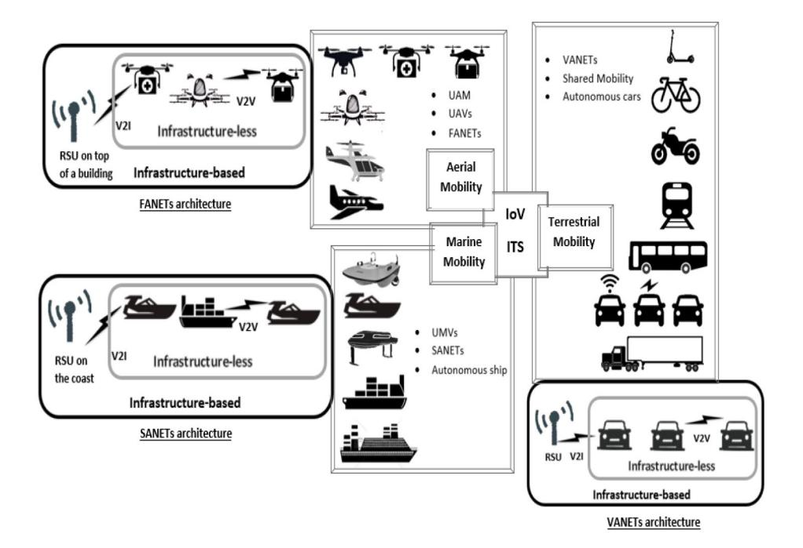
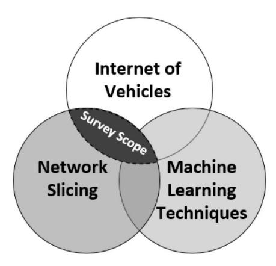
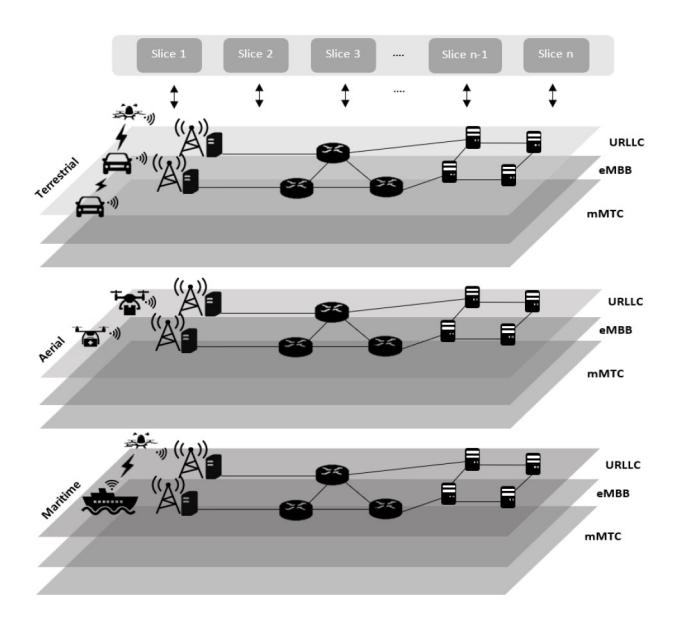
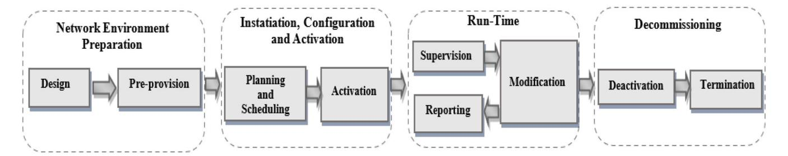
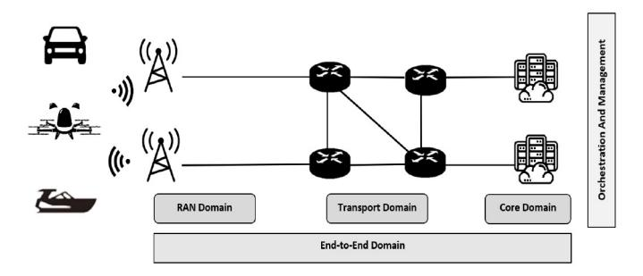
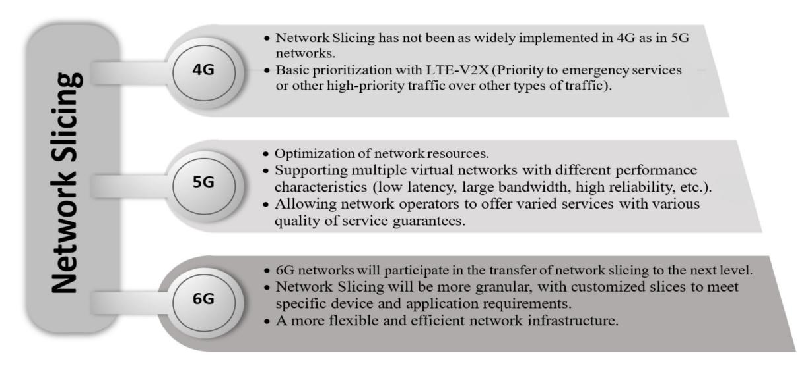
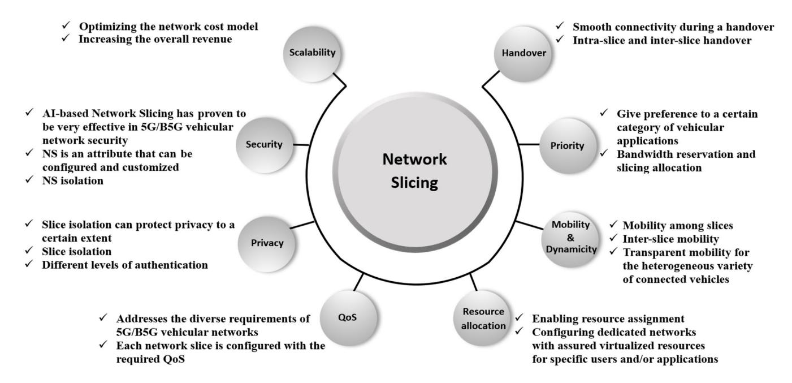
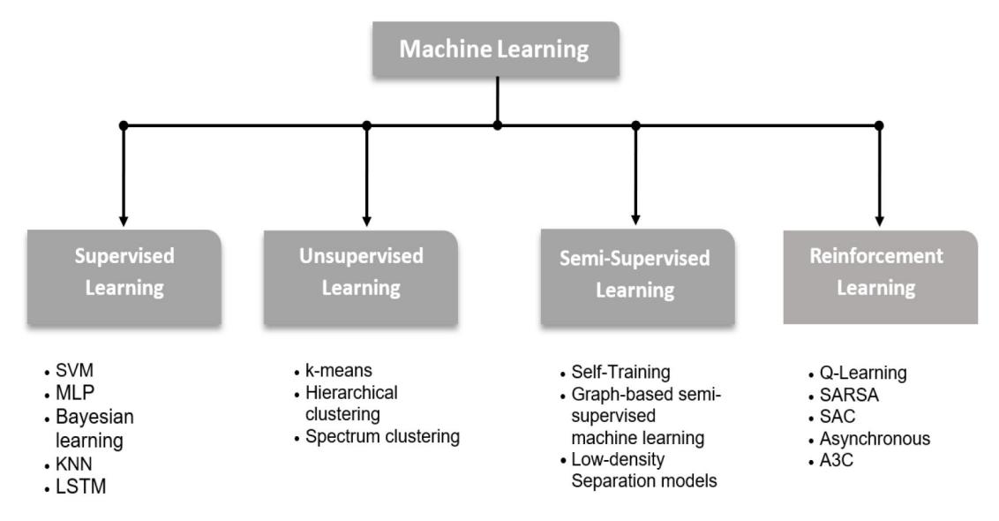
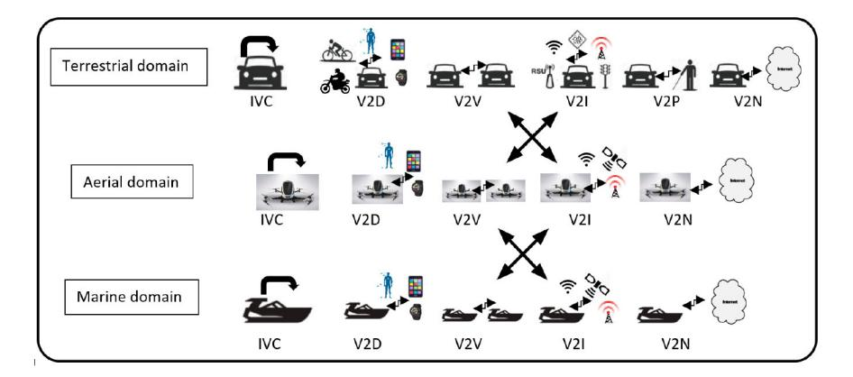

# Network Slicing-Based Learning Techniques for IoV in 5G and Beyond Networks

Wafa Hamdi, Chahrazed Ksouri®, Hasan Bulut®, and Mohamed Mosbah®, Member, IEEE

Abstract—The effects of transport development on people's lives are diverse, ranging from economy to tourism, health care, etc. Great progress has been made in this area, which has led to the emergence of the Internet of Vehicles (IoV) concept. The main objective of this concept is to offer a safer and more comfortable travel experience through making available a vast array of applications, by relying on a range of communication technologies including the fifth-generation mobile networks. The proposed applications have personalized Quality of Service (QoS) requirements, which raise new challenging issues for the management and allocation of resources. Currently, this interest has been doubled with the start of the discussion of the sixthgeneration mobile networks. In this context, Network Slicing (NS) was presented as one of the key technologies in the 5G architecture to address these challenges. In this article, we try to bring together the effects of NS implications in the Internet of Vehicles field and show the impact on transport development. We begin by reviewing the state of the art of NS in IoV in terms of architecture, types, life cycle, enabling technologies, network parts, and evolution within cellular networks. Then, we discuss the benefits brought by the use of NS in such a dynamic environment, along with the technical challenges. Moreover, we provide a comprehensive review of NS deploying various aspects of Learning Techniques for the Internet of Vehicles. Afterwards, we present Network Slicing utilization in different IoV application scenarios through different domains; terrestrial, aerial, and marine. In addition, we review Vehicle-to-Everything (V2X) datasets as well as existing implementation tools; besides presenting a concise summary of the Network Slicing-related projects that have an impact on IoV. Finally, in order to promote the deployment of Network Slicing in IoV, we provide some directions for future research work. We believe that the survey will be useful for researchers from academia and industry. First, to acquire a holistic vision regarding IoV-based NS realization and identify the challenges hindering it. Second, to understand the progression of IoV powered NS applications in the different fields (terrestrial, aerial, and marine). Finally, to determine the opportunities for using Machine Learning Techniques (MLT), in order to propose their own solutions to foster NS-IoV integration.

Manuscript received 30 July 2023; revised 1 November 2023; accepted 4 December 2023. Date of publication 1 March 2024; date of current version 23 August 2024. This work was supported in part by the French National Agency for Research under the Future Investments Program under Grant ANR-20-IDES-0001; in part by the Industrial Research Chair "Mobility and Intelligent Transports" (Foundation of Bordeaux University, 2019-2023); and in part by the European Union's Horizon 2020 Research and Innovation Programme under Grant 951947 (5GMED). (Corresponding author: Chahrazed Ksouri.)

Wafa Hamdi and Hasan Bulut are with the Department of Computer Engineering, Ege University, 35100 Izmir, Turkey (e-mail: 91180000774@ ogrenci.ege.edu.tr; hasan.bulut@ege.edu.tr).

Chahrazed Ksouri is with the Automated and Connected Mobility, Vedecom Institute, 78000 Versailles, France, and also with the Department of Computer Science, Laboratoire DAVID, 78000 Versailles, France (e-mail: chahrazed.ksouri@vedecom.fr).

Mohamed Mosbah is with Univ. Bordeaux, CNRS, Bordeaux INP, LaBRI, UMR 5800, 33400 Talence, France (e-mail: mohamed.mosbah@labri.fr).

Digital Object Identifier 10.1109/COMST.2024.3372083

Index Terms—Internet of Vehicles, network slicing, machine learning techniques.

#### I. Introduction

THE CONVERGENCE of smart solutions such as electric vehicles, autonomous cars, connected vehicles, unmanned aerial and marine vehicles, vehicular communications and more, has led to the emergence of Smart Mobility (SM) concept [1]. It is a vision of sustainable, technologydriven and citizen-oriented mobility with smart governance, resulting from the combination of smart technologies with mobility solutions [1], [2]. Intelligent Transportation Systems (ITS) and Internet of Vehicles are building blocks of the Smart Mobility ecosystem. ITS are the integration of information and communications technology into transport infrastructures and vehicles [3]. IoV results from the combination of Vehicular Ad-Hoc Networks (VANETs) with Internet connection, in order to enable vehicles to exchange information with their surroundings (vehicles, roads, human, sensors, and networks) [4]. According to the European Telecommunications Standards Institute (ETSI), the deployment of the ITS and the provision of corresponding services are not restricted to the road transport sector alone, but include other domains such as railways, aviation, and maritime as well [3]. On the grounds of this, we adopt the IoV system presented by [1]. As depicted in Fig. 1, IoV combines not only classical means of ground transportation such as vehicles, bikes, buses, and trains that constitute VANETs, but also air transportation means such as Unmanned Aerial Vehicles (UAVs), taxis and delivery drone forming Flying Ad-hoc Networks (FANETs), and maritime transportation systems such as Unmanned Marine Vehicles (UMVs), gondola, autonomous cargo ship and cruise ships constituting Ship Ad-hoc Networks (SANETs) [1].

IoV is intended to make an interconnection between vehicles, things, and environments enabling them to exchange data and information. To do so, a panoply of communication levels is introduced, namely, Intra-Vehicle Communication (IVC), Vehicle to Device communication (V2D), Vehicle to Vehicle communication (V2V), Vehicle to Infrastructure communication (V2I), Vehicle to Pedestrian communication (V2P), and Vehicle to Network communication (V2N) [5], [6]. The main objective of the concept is to offer a safer and more comfortable travel experience by making available a wide range of applications [7]. It relies on several wireless technologies to ensure the different levels of communication such

Fig. 1. Smart Mobility Ecosystem [\[1\]](#page-50-0).

as Short Range Communication Technology (DSRC), Light Fidelity (LiFi), Bluetooth, Worldwide Microwave Access Interoperability (WiMax), and Low Power Long Range Wide Area Networks (LoRaLPWAN), etc. [\[5\]](#page-50-4). Cellular-V2X is the only technology that enables all the aforementioned interactions [\[1\]](#page-50-0). It meets the requirements in terms of reliability, effectiveness, robustness, and cost-efficiency needed in the IoV domains [\[8\]](#page-50-7). Advancements in cellular communication technologies including 5th and 6th generation mobile networks [\[9\]](#page-50-8) have contributed to the development of vehicle communications [\[10\]](#page-50-9). 5G technology has plenty of interesting benefits, such as the high data rate, with potential peak speeds as high as 20 Gbps, and offers latency of below 5 ms or lower, which is useful for applications that require real-time feedback [\[11\]](#page-50-10). The services offered by 5G networks are classified into three general groups: enhanced Mobile BroadBand (eMBB) for services requiring high data rates (e.g., 3D video); massive Machine Type Communications (mMTC), for environments with high device densities requiring low data rates; and Ultra Reliable Low Latency Communications (URLLC), for advanced latency-sensitive services such as automotive use cases [\[12\]](#page-50-11). The emerging use cases face several challenges, such as extremely low latency (lower than 1ms), extremely low power consumption, extremely high speed, and extreme coverage [\[13\]](#page-50-12). In the future, 6G is envisaged to support more diverse use cases with various requirements: higher system capacity, higher security, strict End-to-End (E2E) latency, reliability guarantee, and improved Quality of Service compared to the 5G system [\[14\]](#page-50-13).

The 5G and beyond-enabled transportation system is aimed at improving the overall performance of the IoV network. At the same time, it will bring several challenges as ensuring the security and privacy of transmitted data, sharing of spectrum, big data analysis, energy

management, and decision-making [\[15\]](#page-50-14). 6G will inherit several technologies from 5G and add others such as AI, Terahertz Communications, Optical Wireless Technology, Massive MIMO, Blockchain, 3D Networking, Quantum Communications, and Proactive Caching [\[13\]](#page-50-12). To this end, advanced Resource Allocation is essential for the efficient management of network resources.

All the requirements mentioned before gave birth to Network Slicing technology. Where its main objective is enabling heterogeneous Internet of Things (IoT) applications with QoS control, revenue optimization, and admission fairness based on customer Service Level Agreements (SLAs) [\[16\]](#page-50-15). The SLA is a formal agreement between service providers and customers. It allows an assurance of reliability when providing the service. It mainly contains an agreement that covers the Quality of Services, such as performance, availability, and liability. Thus, SLA defines the roles and responsibilities between the service provider and the customer, enabling the provision of reliable service and the recovery of the system from critical situations [\[17\]](#page-50-16).

Along with this, Machine Learning (ML) has proved to be the potential solution for paving the way to intelligence in vehicular networks in terms of both networking and communication aspects. In fact, the huge amount of data engendered from IoV could be analyzed, extracted, and processed using ML and AI solutions which offer a better QoS. Also, Machine Learning can be used to enhance the security and resource management of vehicular networks [\[18\]](#page-50-17).

To summarize, there are three important areas targeted by this survey: i) IoV, ii) Network Slicing, and iii) Machine Learning Techniques. Our focus will be on the intersection of the above three domains as highlighted in Fig. [2:](#page-2-0) i) The intersection between IoV and Network slicing (NS for IoV) which covers the state-of-the-art of NS in the specific context

Fig. 2. Scope of the survey.

of vehicular networks, the role of NS in their realization, and NS-based vehicular applications, and ii) The intersection between the three domains (NS for IoV-based on ML) which focus on NS enhancements via ML techniques for IoV, as well as V2X datasets and simulation tools used for these studies.

#### *A. Paper Motivation*

In this sub-section, we will begin by reviewing surveys that tackled both i) IoV-based ML and ii) NS-based ML intersections, and then, we will focus on the intersections that we tackle in this work, iii) NS for IoV and iv) NS-based ML for IoV.

There are multiple surveys that treat the first two intersections. Works about ML for IoV such as [\[19\]](#page-50-18), [\[20\]](#page-50-19), and [\[21\]](#page-50-20), have presented comprehensive surveys for Machine techniques based-IoV solutions. Xu et al. [\[19\]](#page-50-18) explored the benefits of using AI and its algorithms in the field of IoV by considering the concept of Edge Computing (EC) in service optimization such as edge server placement, computation offloading, and service offloading. In [\[20\]](#page-50-19), authors highlighted the ML technologies used to improve IoV application's efficiency, such as energy, edge caching, Quality of Experience (QoE), intelligent decisions for network scheduling and adaptation, intelligent autonomous driving, etc. Then, [\[21\]](#page-50-20) provided an overview of various ML technologies used for addressing communication, networking, and security aspects of vehicular networks, as well as a vision for the path towards a 6G intelligent vehicular network. They also highlighted the future of vehicle networks that include 6 G and AI techniques. There are relevant surveys about IoV resource management based on ML techniques (not specially for NS), such as [\[22\]](#page-50-21) and [\[23\]](#page-50-22). The authors in [\[22\]](#page-50-21) focused on the integration of AI technologies in vehicular over 5G communication, such as ML and swarm intelligence algorithms; empowering recent innovations such as self-driving cars and resource sharing between applications. Nguyen et al. [\[23\]](#page-50-22) investigated an overview of the 5G vehicular network's Resource Allocation with the support of ML techniques, in particular, the DRL method. Both works stated that ML and DL, a subset of AI, are extensively used to resolve issues with superior performance.

For NS and ML intersection, there is increasing popularity in introducing ML in Network Slicing to automate it [\[24\]](#page-50-23), [\[25\]](#page-50-24), [\[26\]](#page-50-25), [\[27\]](#page-50-26). [\[24\]](#page-50-23) covers the relevant phases for resource management in Radio Access Network (RAN) and analyzes approaches applying RL and DRL techniques for realizing each step autonomously in Network Slicing for different use cases. In [\[25\]](#page-50-24), authors described potential background concepts relating to Network Slicing and AI. They studied the impact of AI on NS into Beyond 5G (B5G) to achieve optimal radio resource allocation in the network. In [\[26\]](#page-50-25), the authors showed the efficacy of ML techniques specially DRL in the context of 5G radio resource slicing, and slice admission control. In [\[27\]](#page-50-26), the authors explored the applicability of ML to efficiently handle the complicated tasks of slice management in the fifth-Generation mobile network such as design, planning, deployment, operation, control, and management. Further, they emphasize the role of ML in continuously monitoring the performance, workload, resource use, and dynamically adjusting the resources allocated to the slices.

There are papers that have treated the implication of the NS in the IoT such as [\[28\]](#page-50-27), [\[29\]](#page-50-28), [\[30\]](#page-50-29), and [\[31\]](#page-50-30). Reference [\[28\]](#page-50-27) tackled the benefits and challenges of NS in IoT. Khan et al. [\[29\]](#page-50-28) surveyed recent advances in NS toward enabling several Internet of Things smart applications including smart health care, smart transportation systems, smart buildings, smart grids, and smart agriculture. These papers only allocated a part of their study to review IoV as an application. They did not consider NS in the vehicular domain as being an independent domain that had to be highlighted by taking all its characteristics and aspects but as an application in the IoT. In [\[30\]](#page-50-29), the authors provided a survey on NS and its management in several application scenarios namely; smart transportation, smart energy, and smart factory. The work was based on providing a case study of a power line. Indeed, an architecture for intelligent Network Slicing management for the Industrial Internet of Things (IIoT) was introduced. A case study of a practical smart factory candy packaging production line with reliable energy supply and management was presented. Additionally, efficient delivery logistics to end users have been included to enable reliable transmission and ensure efficiency, integrity, and confidentiality. They identify the key challenges and open issues that can guide future research as the diversity of critical requirements of different IoT applications, Complexity in cross-domain slicing management, and difficulty in obtaining IoT datasets. Reference [\[31\]](#page-50-30), the paper serves as a comprehensive survey on the topic of Unmanned Aerial Vehicles (UAVs) in the context of network slicing. The main contributions include demonstrating how UAVs can assist networks, presenting a taxonomy of UAVs in relation to network slicing, and reviewing existing works that contribute to mMTCwith UAVs. The survey delves into the concept of network slicing, focusing on three major slices: eMBB, mMTC, and URLLC. Additionally, the article provides an overview of 5G enablers, such as SDN and NFV. It explores the roles of UAVs in networks, both as users and assistants. The survey also addresses open issues and future research directions concerning mMTCand UAVs, culminating in a comprehensive analysis of the current state of the field.

For IoV, NS and ML intersection there is one recent paper that tackled their integration [\[32\]](#page-50-31). The authors focused on the application of NS, ML, and DL to optimize V2X networks and enhance the driving experience. The study reviews V2X slicing based on a proposed taxonomy that describes the enabling factors, different slicing configurations, slicing requirements, and ML algorithms used for control and management of slicing.

In Table [II,](#page-5-0) we summarize the surveys mentioned above. The comparison between the different surveys is based on the covered topics and the paper's taxonomy. For the **Covered topics** we summarize the papers that tackled at least two of the following subjects; IoV, NS, ML, and IoT. For the **Paper taxonomy**: (i) Network Slicing (**NS**), indicates if the architecture, the enablers, the methods, the life cycle, the domains, the evolution, the benefits, and the challenges of NS in the context of IoV are tackled or not in the given work. (ii) Network slicing-based Machine Learning technique in the Vehicular environment (**NMV**), specifies if the paper reviews ML techniques for IoV, and in the description column we specify the algorithms. (iii) IoV-based Network Slicing Applications (**INA**), an overview of NS-based applications in the different IoV domainS (terrestrial, aerial, maritime). (vi) Datasets and Simulators (**DS**), encompasses a review of V2X datasets as well as existing implementation tools for NS-based ML for IoV. (v) Projects (**P)**, cover the Network Slicing-related projects that have an impact on IoV.

#### *B. Paper Contribution*

To the best of our knowledge, this is the first comprehensive work presenting such a survey, which encompasses all integration aspects of Network Slicing in the vehicular domain (terrestrial, aerial, and marine) and outlines NSbased Machine Learning solutions for IoV. Additionally, we highlight the benefits of Network Slicing in IoV, as well as the challenges hindering their integration. Furthermore, we present the IoV applications based on NS. More specifically, the main contributions made by this work are:

- *•* We survey the state-of-the-art Network Slicing in vehicular networks, mainly regarding its architecture, its types, its life cycle, its enabling technologies, its efficiency spanning over different parts of the network (CN, RAN, E2E), and its development in accordance with the evolution of cellular networks (4G, 5G, and 6G).
- *•* We highlight the role of NS in the realization of IoV, through presenting the outcomes of using NS to resolve some of the main intrinsic challenges of IoV (such as mobility and dynamicity) and others, in addition to a glimpse at the drawback of the NS-IoV integration.
- *•* We focus on the important role of ML in improving the efficiency of Network Slicing and integrating IoV in several aspects.
- *•* We present an overview of NS-based applications in the different IoV domains namely; terrestrial, aerial, and maritime, in addition to applications designed for two or more domains.

TABLE I LIST OF IMPORTANT ABBREVIATIONS

| Acronym | Definition                                |
|---------|-------------------------------------------|
| AI      | Artificial Intelligence                   |
| B5G     | Beyond 5G                                 |
| CN      | Core Network                              |
| DL      | Deep Learning                             |
| DRA     | Dynamic Resource Allocation               |
| DRL     | Deep Reinforcement Learning               |
| EC      | Edge Computing                            |
| E2E     | End-to-End                                |
| eMBB    | enhanced Mobile BroadBand                 |
| FL      | Federated Learning                        |
| IoT     | Internet of Things                        |
| IoV     | Internet of Vehicles                      |
| ITS     | Intelligent Transportation Systems        |
| KPIs    | Key Performance Indicators                |
| LTE     | Long-Term Evolution (4G)                  |
| MEC     | Mobile Edge Computing                     |
| ML      | Machine Learning                          |
| MLT     | Machine Learning Techniques               |
| mMTC    | massive Machine Type Communications       |
| NS      | Network Slicing                           |
| NFV     | Network Function Virtualization           |
| QoS     | Quality of Service                        |
| RAN     | Radio Access Network                      |
| RL      | Reinforcement Learning                    |
| SDN     | Software Defined Networking               |
| SLAs    | Service Level Agreements                  |
| VANETs  | Vehicular Ad-Hoc Networks                 |
| V2X     | Vehicle-to-Everything                     |
| UAVs    | Unmanned Aerial Vehicles                  |
| URLLC   | Ultra Reliable Low Latency Communications |
| 5G      | The fifth-generation technology standard  |
| 6G      | The sixth-generation technology standard  |

- *•* We review V2X datasets as well as existing implementation tools; besides presenting a concise summary of the Network Slicing-related projects that have an impact on IoV.
- *•* We discuss open research issues and future trends to be considered in the IoV-based NS realization.

#### *C. Paper Organization*

The rest of our paper is structured as follows. In Section [II,](#page-4-0) we discuss the essential background overview of Network Slicing, its enabling technologies, and its architecture. In Section [III,](#page-23-0) we present the benefits and challenges of NS in IoV. Section [IV](#page-29-0) details the implication of Machine Learning Techniques with NS in IoV. Additionally, NS-based IoV applications have been reviewed in Section [V.](#page-34-0) Then, in Section [VI](#page-42-0) we provide an insight into the emerging and future research directions. Finally, we conclude the paper in Section [VII.](#page-47-0) The complete outline of the paper is shown in Fig. [3.](#page-4-1) We included the definitions of the frequently used acronyms in Table [I.](#page-3-0)

Fig. 3. Paper organization.

#### II. NETWORK SLICING FOR IOV

In this section, we will first present the definition and the architecture of Network Slicing. Then we will focus on the driving forces behind the realization of the NS which are Software Defined Networking (SDN), Network Function Virtualization (NFV), and Cloud Computing. We will categorize the different types of Network Slicing and discuss the various phases of its life cycle. Furthermore, we will address how Network Slicing can be utilized across all network domains. Additionally, we will highlight Network Slicing over cellular networks. Finally, we will discuss the advantages and limitations of the aforementioned elements.

#### *A. Network Slicing*

Network Slicing is a promising concept that brings the benefits of maintaining the QoS and QoE levels specified by each service to deliver customized services and multiple logical networks over one shared physical network [\[33\]](#page-50-32). Network Slicing has been defined by the Third Generation Partnership Project (3GPP) [\[34\]](#page-50-33) as a logical network that uses customized parameters to characterize slicing for the automotive industry [\[35\]](#page-50-34). It has also been recognized as a three-layered E2E concept by the Next Generation Mobile Network (NGMN) alliance: the Service Instance Layer that represents enduser service, the Network Slice Instance Layer composed of Sub-network Instances, and the resource layer composed of network infrastructure and network functions [\[33\]](#page-50-32), [\[36\]](#page-51-0). According to the European Telecommunications Standards Institute (ETSI) [\[37\]](#page-51-1) NS has been defined as an aspect that includes all the functionality and resources necessary to fulfill a specific set of communication services under certain business objectives [\[38\]](#page-51-2). The Open Networking Foundation (ONF) has described NS through the main functional aspects of the SDN architecture which are applied to its activation to serve a business purpose [\[39\]](#page-51-3). GSMA Alliance has focused on features that enable the creation of new business models and new revenue streams through NS [\[40\]](#page-51-4). Categories of use cases have been identified by the International Telecommunication Union states [\[41\]](#page-51-5) and the 5G-PPP (5G Public Private Partnership) [\[42\]](#page-51-6), namely URLLC, mMTC, and eMBB slices. Specifically, the eMBB slice is designed to support high data rates and ensure reliable access to data services and multimedia content. The mMTC slice is tailored to support the traffic load generated by massively connected devices, typically transmitting a relatively low volume of non-delaysensitive information-based sensors to enable IoT services such as smart homes and smart buildings. For the URLLC slice, reliability, low latency, and security are critical for delivering extremely latency-sensitive services, such as emergency services and touch-enabled Internet.

Fifth-Generation networks and beyond are characterized by growing numbers of users, massive demands for device connectivity, real-time data processing, and multiple applications with diverse and strict QoS requirements [\[43\]](#page-51-7). In this regard, the integration of the concept of Network Slicing has almost become a necessity. NS creates autonomous logical networks that consist of a combination of dedicated and shared resources based on the needs and demands of each request.

In fact, this achieves an efficient allocation and utilization of the available wireless network resources in an ultra-efficient manner. Software Defined Networking and Network Function

TABLE II COMPARISON TO EXISTING REVIEW ARTICLE

|           |          | Covere   | d topics     |          |                                                                                                                                                                   | Paper tax | conomy  |          |          |                                                                                                                                                                                                                                                                                                                                                                                                                                                                                                                                                                                                    |
|-----------|----------|----------|--------------|----------|-------------------------------------------------------------------------------------------------------------------------------------------------------------------|-----------|---------|----------|----------|----------------------------------------------------------------------------------------------------------------------------------------------------------------------------------------------------------------------------------------------------------------------------------------------------------------------------------------------------------------------------------------------------------------------------------------------------------------------------------------------------------------------------------------------------------------------------------------------------|
| Survey    | IoV      | NS       | ML           | IoT      | NS                                                                                                                                                                | NMV       | INA     | DS       | P        | Description                                                                                                                                                                                                                                                                                                                                                                                                                                                                                                                                                                                        |
| [19]      | <b>√</b> |          | $\checkmark$ |          | -                                                                                                                                                                 | _         | T       | _        | _        | Survey about utilizing AI in edge service optimization in IoV.                                                                                                                                                                                                                                                                                                                                                                                                                                                                                                                                     |
| [20]      | <b>√</b> |          | <b>√</b>     |          | _                                                                                                                                                                 | _         | Т       | _        | _        | Survey the role of ML technologies to improve IoV application's efficiency.                                                                                                                                                                                                                                                                                                                                                                                                                                                                                                                        |
| [21]      | <b>√</b> |          | <b>√</b>     |          | _                                                                                                                                                                 | _         | Т       | _        | _        | Survey on various ML techniques applied to communication, networking, and security in vehicular networks.                                                                                                                                                                                                                                                                                                                                                                                                                                                                                          |
| [22]      | √        |          | <b>√</b>     |          | _                                                                                                                                                                 | _         | Т       | _        | _        | Discuss AI-based resource allocation and management for IoV.                                                                                                                                                                                                                                                                                                                                                                                                                                                                                                                                       |
| [23]      | <b>√</b> |          | <b>√</b>     |          | -                                                                                                                                                                 | _         | T, A, M | _        | _        | Surveyed DRL-based resource allocation for QoS in 5G/6G vehicular networks.  • INA: Tackled A and M only as parts of 6G connectivity and not IoV domains                                                                                                                                                                                                                                                                                                                                                                                                                                           |
| [24]      |          |          | $\checkmark$ |          | _                                                                                                                                                                 | _         | _       | _        | _        | Investigate the application of RL and DRL to RAN resource management for NS.                                                                                                                                                                                                                                                                                                                                                                                                                                                                                                                       |
| [25]      |          | <b>√</b> | <b>√</b>     |          | <ul><li>Enablers</li><li>Life cycle</li><li>Domains</li><li>Evolution</li></ul>                                                                                   | _         | _       | _        | _        | Explore the relationship between NS, AI, and optimal radio resource allocation in the B5G context.                                                                                                                                                                                                                                                                                                                                                                                                                                                                                                 |
| [26]      |          | <b>√</b> | <b>√</b>     |          | <ul><li>Architecture</li><li>Enablers</li><li>Domains</li></ul>                                                                                                   | <b>√</b>  | _       | _        | _        | Highlight the effectiveness of DRL and ML in 5G radio resource slicing and admission control.                                                                                                                                                                                                                                                                                                                                                                                                                                                                                                      |
| [27]      |          | <b>√</b> | <b>√</b>     |          | • Life cycle                                                                                                                                                      | <b>√</b>  | _       | _        | _        | Explore the application of ML in efficiently managing slice tasks in 5G networks and emphasize its role in monitoring performance and dynamically adjusting resource allocation.                                                                                                                                                                                                                                                                                                                                                                                                                   |
| [28]      |          | <b>√</b> |              | <b>√</b> | <ul><li>Architecture</li><li>Methods</li><li>Life cycle</li><li>Benefits</li><li>Challenges</li></ul>                                                             | _         | Т       | _        | _        | Focus on the benefits and challenges of NS in IoT.  • INA: Transportation is only considered as an application of IoT.  • DS: only                                                                                                                                                                                                                                                                                                                                                                                                                                                                 |
| [29]      |          | <b>√</b> |              | <b>√</b> | <ul> <li>Architecture</li> <li>Enablers</li> <li>Methods</li> <li>Life cycle</li> <li>Domains</li> <li>Challenges</li> </ul>                                      | _         | Т       | _        | _        | Survey recent developments in NS for various IoT applications.  • INA: Transportation is only considered as an application of IoT.                                                                                                                                                                                                                                                                                                                                                                                                                                                                 |
| [30]      |          | <b>√</b> |              | <b>√</b> | <ul> <li>Architecture</li> <li>Enablers</li> <li>Domains</li> <li>Evolution</li> <li>Benefits</li> <li>Challenges</li> </ul>                                      | _         | Т       | _        | <b>√</b> | Highlighte key challenges, such as diverse IoT application requirements and cross-domain slicing management complexity.  • INA: Transportation is only considered as an application of IoT.                                                                                                                                                                                                                                                                                                                                                                                                        |
| [31]      |          | <b>√</b> |              | <b>√</b> | <ul><li>Enablers</li><li>Life cycle</li><li>Domains</li></ul>                                                                                                     | _         | A       | _        | _        | Comprehensive survey on UAVs in the context of NS as both users and assistants (UAV-assisted slicing).                                                                                                                                                                                                                                                                                                                                                                                                                                                                                             |
| [32]      | <b>√</b> | \   \ | <b>√</b>     |          | <ul><li>Enablers</li><li>Methods</li></ul>                                                                                                                        | <b>√</b>  | Т       | _        | _        | Focus on applying NS, ML, and DL to enhance V2X networks and driving experiences.  • INA: Focus only in the UAV within the aerial domain and not as a part of IoV.                                                                                                                                                                                                                                                                                                                                                                                                                                 |
| This work | <b>√</b> | <b>√</b> | <b>√</b>     |          | <ul> <li>Architecture</li> <li>Enablers</li> <li>Methods</li> <li>Life cycle</li> <li>Domains</li> <li>Evolution</li> <li>Benefits</li> <li>Challenges</li> </ul> | <b>√</b>  | T, A, M | <b>√</b> | ✓        | <ul> <li>NS: In contrast to the subsequent surveys, our study stands out as the sole exploration that addresses NS specifications specifically within the context of the IoV.</li> <li>NMV: In comparison to [32], our review covers NS-based ML not only for terrestrial but also for aerial and marine domains.</li> <li>INA: We are the only work that investigate the three domains terrestrial, aerial, and marine.</li> <li>DS: The only work that reviews V2X-based NS-ML datasets.</li> <li>P: Our work is the only one that reported the projects made for enabling NS to IoV.</li> </ul> |

Virtualization paradigms are considered as the main enablers for implementing Network Slicing [\[44\]](#page-51-8). SDN provides the necessary flexibility and programmability to achieve better resource utilization and maximum cost-efficiency [\[45\]](#page-51-9). NFV [\[46\]](#page-51-10) allows the deployment of network functions on top of commodity hardware devices while supporting various aspects such as operations and maintenance, network performance, and network deployment.

Fig. 4. Network Slicing for IoV.

One of the remarkable capabilities of Network Slicing is its ability to handle a large number of heterogeneous IoT networks. Indeed IoT's diverse application areas including smart transportation, smart health, smart city and home, smart grid, drones, industrial automation and military operations, require a diverse set of network requirements for its optimal functioning. NS could offer several technical advantages to the IoT, including scalability, dynamicity, and security [\[47\]](#page-51-11).

Network Slicing technology also meets with IoV in response to the various requirements of ITS through resource allocation, on-demand QoS, security, and specific demands associated with different use cases [\[48\]](#page-51-12). More explicitly, NS designed for V2X communication uses the available physical infrastructure, which can be sliced to provide particular use cases. For instance, the autonomous driving slice facilitates the exchange of safety and warning messages among vehicles, while the infotainment slice provides services such as high-definition video streaming and augmented reality service [\[49\]](#page-51-13), and teleoperated driving slice which is dedicated to teleoperated driving scenarios [\[50\]](#page-51-14).

As Network Slicing spans across different network entities, it can be viewed from various perspectives, based on the type of resource being used. This include CN slicing, RAN slicing, and E2E slicing [\[51\]](#page-51-15).

From a network requirements point of view, NS is defined as one of the building blocks of the 5G and B5G networks. Network slices support requirements for delay-tolerant IoT, Industry 4.0, as well as critical services such as e-Health, smart cities, vehicular networks, and smart grids. Fig. [4](#page-6-0) depicts the representation of NS in IoV.

#### *B. Network Slicing Architecture*

The design and implementation of the Network Slicing concept in vehicular environments is a challenging task. The NS architecture, in general not especially for IoV, can be viewed from several perspectives: application, domain, and layer. From an application standpoint, NS depends on fulfilling URLLC, mMTC, and eMBB requirements [\[52\]](#page-51-16). From a domain perspective, NS architecture consists of CN slices, RAN slices, and E2E slices [\[53\]](#page-51-17). From a Layer standpoint, the majority of researchers agreed on a three-layer model (infrastructure, control, and the service (or business)) [\[54\]](#page-51-18), [\[55\]](#page-51-19).

Although URLLC and eMBB classes have a significant impact on specific V2X applications [\[56\]](#page-51-20), there is also a notable prevalence of mMTC applications. URLLC applications focus on extremely low latency and high reliability, catering to services such as autonomous driving, collision avoidance, and emergency services. eMBB applications typically involve infotainment multimedia streaming and Advanced Driver Assistance Systems (ADAS) services, requiring high-bandwidth and high-speed data transmission. mMTC applications involve vehicle and load monitoring, fleet management, and telematics. These applications focus on transmitting data from a large number of connected vehicles to gather insights, monitor performance, and optimize operations [\[57\]](#page-51-21). While they may not require ultra-low latency or extremely high data rates like URLLC and eMBB applications, they still play a crucial role in IoV setups by providing valuable data for various operational and management purposes. A Network Slicing architecture supporting V2X services assuring efficient notification of unexpected road conditions among inter-car communication was considered in [\[58\]](#page-51-22), [\[59\]](#page-51-23). These architectures were based upon the already existing 5G network architecture, with a few modifications such as the respect of elasticity, slice isolation, resources management, and scalability requirements to provide customization for different services [\[43\]](#page-51-7). In addition, a focus was given to how the network slices should be delivered to different use cases, and which technologies should be integrated with the NS model [\[60\]](#page-51-24).

The research presented in [\[61\]](#page-51-25) focused on the design problem of NS in 3GPP networks and proposed a new topdown NS architecture. Various studies have revealed the vital role of NS, its use cases; URLLC, mMTC, and eMBB, its architecture, and the significant benefits brought by its implementation in ensuring desired performance [\[62\]](#page-51-26), [\[63\]](#page-51-27), [\[64\]](#page-51-28).

From the domain perspective, the network capacities of each domain can be defined separately. This perspective promotes security and flexibility demands by promoting isolation and restricting harmful access. CN and RAN parts provide Network Slice Subnet Instances (NSSI), while the Transport Network (TN) part allows virtual links to be defined to provide connectivity between all elements of Network Slice Instances (NSIs), such as backhaul links connecting NSSI-RANs to NSSI-CNs and any links that may be required to implement intra-NSSI connectivity. There are numerous relay interfaces between the different domains of the architecture to ensure the interaction and exchange between domains and facilitate the orchestration and management of slices. A domain-based model architecture is presented in detail in [\[65\]](#page-51-29), [\[66\]](#page-51-30).

According to the layers division, NS consists of three planes [\[67\]](#page-51-31): the infrastructure, the control, and the service plane. The infrastructure layer encapsulates all physical network infrastructure nodes and devices, such as the transport

Fig. 5. Network Slicing enabling technologies.

and storage network, and computing nodes, ranging from RAN to CN. The control layer encompasses a Dedicated SDN Controller (D-SDNC) and a Shared SDN Controller (S-SDNC). On top of the S-SDNC reside some shared network functions, implemented as SDN applications, load balancing between slices, inter-slice mobility management, and slice selection. Moreover, each slice presents some dedicated functions implemented as applications. Over the D-SDNC some dedicated functions are implemented as applications such as intra-slice mobility management including admission control, authentication, and security. The service layer consists of the services and uses cases of each vertical market presenting the objectives for which slices are designed. An orchestration capability for NFV MANagement and Orchestration (MANO) was added to the top of this architecture, responsible for the slice description, instantiation, and life-cycle management. As an example of this perspective, in [\[35\]](#page-50-34), authors proposed a three-layered architecture composed of an infrastructure layer, a service layer, and a business layer. Its components are aligned with the 5G-V2X service-based architecture and its key constituents, i.e., SDN, Mobile Edge Computing (MEC), and NFV. The infrastructure layer includes RAN nodes (Wi-Fi APs, RSUs, and eNodeBs), devices (individual devices such as cellphones), MEC servers, and the Transport Network. The service layer hosts the 5G network functions (virtual or physical network functions) deployed by the operator and/or by a third party to enforce a given network behavior in the slice. The business layer is at the top of the proposed model and includes the techniques and mechanisms for describing the comportment of slices at a high level and taking into consideration the requirements of a given SLA for services and use cases for which the slices are designed. In [\[58\]](#page-51-22), a threelayer model was proposed. These layers are the infrastructure layer, the service layer, and the business layer. This model took advantage of MEC's main feature which is its ability to provide mobile computing, network control, and storage at network edges (eg base stations and access points). This reduces the resources consumed by compute-intensive and latency-critical applications [\[68\]](#page-51-32). In addition to MEC, the three layers involve other technologies such as SDN and NFV. This model is widely available and has been considered in many investigational studies as a reference model [\[35\]](#page-50-34), [\[44\]](#page-51-8).

#### *C. Network Slicing Enabling Technologies*

As an emerging network paradigm, NS was combined with innovative network technologies such as SDN, NFV, and Cloud Computing (in its distributed form: Edge Computing or Edge Computing use case: Multi-Access Edge Computing), see Fig. [5.](#page-7-0) These technologies bring a high level of automation, intelligence, and flexibility to communication in IoV networks [\[69\]](#page-51-33). SDN and NFV are complementary emerging paradigms offering automated network management, efficient network resource allocation, and orchestration with costeffectiveness [\[70\]](#page-51-34). Furthermore, SDN/NFV combination can enhance the edge-cloud interplay scenario of any networkrelated activities [\[71\]](#page-51-35). IoV associated with those technologies has received great interest in the field of research [\[69\]](#page-51-33).

*1) SDN-Based and NVF-Based Network Slicing:* Towards a flexible and softwarized network, the SDN and NFV paradigms have emerged. They play a significant role in enhancing network management, connectivity, and service providing in IoV environments. SDN refers to the process of separating the control plane from the data plane [\[72\]](#page-51-36). Where it empowers centralized control and programmability of network infrastructure, enabling dynamic management of network resources to ensure the specific needs of vehicles and associated services. By abstracting the underlying network infrastructure, SDN offers a flexible and scalable framework that optimizes traffic routing, handles mobility, and facilitates efficient communication among vehicles, infrastructure, and cloud services. Additionally, SDN provides facilities to perform network virtualization with specific QoS and SLA requirements. However, the dependence on the physical constituents of the network imposes restrictions on SDN when deploying new network services, such as capacity and availability [\[55\]](#page-51-19). To do this, by enabling the virtualization of network functions, NFV has evolved as a complementary technology to SDN, allowing traditional hardware-based functions, such as firewalls, intrusion detection systems, and traffic analysis, to be implemented as software instances. Moreover, NFV enables network services to be deployed closer to the network edge, then the data can remain at the edge of the network which reduces latency and enhances real-time processing. Consequently, the synergy of SDN and NFV in an IoV environment enables Dynamic Resource Allocation (DRA) and flexible service provisioning, thus addressing the unique demands of vehicle-centric communication and services [\[73\]](#page-51-37). Here, we present some works that have addressed the topic at hand.

Zhuang et al. [\[69\]](#page-51-33) discussed SDN/NFV technologies compatibility with the Internet of Vehicles system, to ensure multi-dimensional resource (e.g., caching resources and radio resources) allocation. The benefit of this approach is that it supports different IoV application scenarios such as Vehicle Collision Warning, Real-Time Traffic Management, Virtual Reality and Augmented Reality, and Autonomous Driving. Furthermore, the authors believed that Mobile Edge Computing and Network Function Virtualization technologies can be used to offload IoV computing tasks to edge and cloud servers and minimize the content retrieval time. Furthermore, it was concluded that the best method to adopt to get through IoV limitations was the creation of a Ubiquitous and Efficient Connections by integrating aerial and space networks and the above-mentioned technologies in the same architecture. Those implications will ensure low latency, and reliability, however, several challenges such as joint resource slicing and access control need to be addressed.

In [\[74\]](#page-51-38), the authors proposed Software-Defined Vehicular Networks (SDVNs), which apply the benefits of SDN to the vehicular network in order to reduce the communication cost and improve the network efficiency. This new paradigm is based on traffic information and trajectory prediction to update the state of the vehicle (location, speed, connectivity, etc.) in centralized architectures. SDVN also participates in minimizing SDN management overhead and enables rapid network configuration. Using NS gave flexibility to the architecture to deploy routing protocols that perfectly fit the situation and provide multi-tenant isolation in vehicular networks. However, the benefits and challenges of slicing are not evaluated. In addition, the prediction of the vehicle trajectory and the generation of the flow table by the SDN controller was not detailed.

In an attempt to satisfy the dynamic allocation of virtualized network resources, a multi-Mobile Network Operators (MNO) resource-sharing framework for Heterogeneous Network (HetNet) deployments using an SDN-based NS was proposed in [\[75\]](#page-51-39). In HetNet, each wireless access network has its own features such as capacity, coverage ranges, access technology, security, power consumption, delay, and access cost. Accordingly, the proposed work aims to achieve the demands of network segments and the various requirements of QoS for the HetNet. The results showed a weighted total reduction of the relative differences between the shares of the allocated and the demanded resources. However, this model does not take into account the resources that each segment is entitled to or elastic demands which is necessary to imply adaptiveness and intelligence to Resource Allocation (RA) decisions, or budget constraints.

The work proposed in [\[76\]](#page-51-40), by do Vale et al., follows the principles of 5G Network Slicing in a Software-Defined Vehicular Network such as ultra-low delay, and high data rate and reliability. To outline the inherent properties of such systems, they have developed methods for integrating SDN controllers in order to improve performance such as data rate received by application servers over time, the Round Trip Time (RTT), and Packet Delivery Ratio (PDR) of communication flows. They used the communication needs of applications and information related to vehicle mobility in each Radio Access Network to dynamically meet the requirements of different Intelligent Transportation Systems applications, their infrastructure, and their mobility. The proposal is validated using a realistic emulation approach with an urban congestion scenario, with vehicular applications having different data rate requirements. The incorporation of open-source SDN controllers, simulations on realistic scenarios, and the development of algorithms to address heterogeneous traffic showcase the practicality and potential impact of the research. However, certain important factors have been overlooked, including the moving speed of vehicular ad-hoc networks, the limited frequency band, and the presence of various obstacles in the traffic environment. These factors can significantly impact the link quality and bandwidth between ITS and SDN, as well as influence the performance of radiofrequency-based ITS applications.

*2) Computing Technologies Assisted Network Slicing:* Cloud Computing has become popular over traditional computing models due to the offering of data storage, agility, flexibility, scalability, and efficiency [\[77\]](#page-51-41). A decentralized solution of Cloud Computing named Edge Computing was designed, it can provide the same services as Cloud Computing but with obeying strict delay requirements [\[78\]](#page-51-42). The Mobile Edge Computing paradigm is gaining momentum in the telecommunications and computing ecosystems due to its ability to address latency and BandWidth (BW) issues and reduce the cost of transmitting data to the Cloud [\[79\]](#page-51-43).

In [\[44\]](#page-51-8) authors proposed a preliminary architectural framework, aligned with 3GPP standard specifications to introduce the establishment of V2X network slices, accompanied by the implementation of a dedicated slice for autonomous driving services. This model presented NFV, SDN, and MEC as technological enablers of 5G slices for multitenant vehicle-toeverything services, to provide different functionalities while meeting the requirements of flexibility, comfort, and safety in ITS. Additionally, the authors discussed opportunities and challenges of transparent mobility for the heterogeneous variety of connected vehicles, slice isolation and security, and dynamic slices. Nevertheless, the authors did not provide a mathematical framework to investigate the main requirements of autonomous driving, which are reliability and ultra-low latency.

Campolo et al. [\[35\]](#page-50-34), shared their vision about V2X Network Slicing by proposing an architecture that supports the handover decision with and without slice federation while considering the load state of target slices. In fact, a roaming-capable slicing approach was developed with the support of softwarization technologies such as SDN, NFV, and MEC functions to enable the cooperative driving services under intra- and inter-operator mobility. An evaluation of the proposed framework was presented using the Mininet emulator in which they measured latency, throughput, and packet drops. However, this work does not consider the diversity of MEC service requirements and an inter-domain coordination approach allowing the MEC servers to share the service availability information.

Li et al. [\[80\]](#page-51-44), developed a MEC-based architecture in order to meet the demand for high mobility, low latency, and reliability in cellular vehicular networks. The potential advantages of the placement of the MEC-assisted Network Slicing are intercell handover mechanism and optimized traffic scheduling policy techniques. These features have been highlighted by providing flexible vehicle-related services on demand. Further, the proposed NS scheme can improve vehicular network resource utilization while supporting various applications. However, the computing resources of a MEC server are limited compared to that of a centralized cloud. Thus, the proposed study discussed only the seamless handover procedure when a vehicle switches from one base station to another.

In [\[81\]](#page-51-45), authors create an isolated network slice with the vehicle sector without risking the scalability of the CN by providing flexibility for the dynamic placement of Virtualized Network Functions. This was possible by using a distributed Multi-Access Edge Computing architecture and looking at the heterogeneous radio technologies such as cellular networks and dedicated IoT communications. The solution was validated through a real-world deployment that provided Bandwidth control with flow isolation and service/QoS assurance for up to one million connected devices. The validation results, precisely the short slice set-up time and the evaluation of scalability with a large number of connected devices provide quantitative evidence of the framework's effectiveness.

In their paper [\[82\]](#page-51-46), the authors proposed an intelligent efficient slicing scheduling scheme within the vehicular Fog-RAN context, for the planning of slices and road traffic management. The approach involved employing a Monte Carlo Tree Search (MCTS) utilizing the cross-entropy method to assess the disparity between network resource distribution and traffic transmission demands in the spatio-temporal domain. This allowed for adjusting road speed to alleviate transport load. One notable advantage of this slice scheduling algorithm is its independence from prior knowledge of network traffic. One notable advantage of this slice scheduling algorithm is its independence from the prior knowledge of network traffic. The simulation results demonstrated that the proposed algorithm outperforms several baselines in terms of throughput and delay. However, it is important to acknowledge that discrepancies between the simulation results and theoretical optimization values persist due to the stochastic nature of communication traffic (dynamic traffic). Furthermore, the effects of vehicular computing offloading have not been thoroughly investigated and the influence of the Resource Allocation schemes on PRT (Prescribed Resource Type) has not been taken into account. Additionally, it is worth noting that the MCTS approach requires a significant amount of memory and exhibits slow performance, as evident from the results of the operation time. Moreover, excessive vehicle cooperation can lead to interference issues.

The authors, in [\[83\]](#page-51-47), proposed an algorithm for Vehicular Edge Computing (VEC) with Network Slicing and loadbalancing features based on resources utilization: VECSlic-LB (Vehicular Edge Computing with Network Slicing and Load-Balancing). This solution is, specifically, dedicated to offloading tasks from vehicles towards Edge Computing servers hosted at wireless 5G new generation nodes (gNBs or RSUs). To fulfill efficient offloading tasks, VECSlic-LB uses the Network Function Virtualization framework to manage the data plane. It handles a mix of slicing configurations, balances the loads between various slices per node, and supports multiple EC nodes. The performance of the proposed algorithm was tested offline and generated favorable results in terms of accepting more demands and saving more resources. Offline and Online testing are processes performed on the application with or without a stable Internet connection. In the offline scenario, all demands are assumed to be known or estimated in advance, allowing for the evaluation of the overall performance of the proposed algorithms under fully controlled conditions. On the other hand, the online scenario demands are assumed to arrive in real-time conditions, randomly and without prior knowledge. Offline testing gains optimality over online testing due to its ability to identify many safety violations. In contrast, the large prediction errors generated by offline testing have always led to serious security violations detectable by online testing. The performance of the proposed algorithm was evaluated by varying some of its parameters such as the acceptance ratio for the offloading demands, and the capacities of the gNBs and RSUs. The results showed that the proposed algorithm outperformed Power aware Network Function Virtualization (PaNFV) algorithm by providing more efficient results in terms of resource utilization by 48%. Accordingly, the integration of slicing and load-balancing features allowed VECSlic-LB to handle a large number of slices and manage their resources reliably.

The authors in [\[84\]](#page-51-48) focused on managing vehicular networks by utilizing MEC and the two key technologies of Network Slicing, SDN and NFV. They addressed the increased volume of data traffic generated by map-assisted driving by proposing an edge slicing architecture. The design handles computing and storage tasks on MEC servers and the reduction of delays in data transmission between MEC and Cloud servers. In addition, the SDN concept was integrated to provide a global control plane to the MEC servers and manage resources and data traffic more efficiently. The proposed MEC-based architecture consists of a two-tier server structure, with a Cloud Computing server, in the first tier and several MEC servers in the second tier. Considering the availability of resources and the demanded QoS, necessary computing tasks can be processed directly on vehicles, uploaded to MEC servers, or sent to the Cloud server. For example, delay-sensitive applications, such as platooning management, dynamic HD map management, and other safety-related applications, are prioritized to be processed on MEC servers to decrease the latency. The results showed that the proposed architecture achieves about 50% higher network throughput compared to other state-of-the-art schemes.

#### *D. Network Slicing Methods*

Resource Allocation, including spectrum sharing, time, and power, is important for wireless network systems, contributing to their overall functionality and performance [\[85\]](#page-51-49). Network Slicing preserves resources by understanding each application's context and use case and allocates the appropriate amount of resources accordingly. Each traffic slice can have its own resource requirements, QoS, security configurations, and latency requirements. In response to challenges in vehicular networks, such as a wide range of data services, highly dynamic mobility, communication range, and message size, various methods for Resource Allocation have been proposed. These methods are typically classified as static, semi-dynamic, and dynamic modes aiming to satisfy the networks' multiple competing demands [\[86\]](#page-51-50), [\[87\]](#page-52-0).

*1) Static Slicing (SS):* SS is simple and easy to accomplish, although it leads to inefficient utilization of the PN (Physical Network) resources. In fact, with static slicing, each Virtual Network (VN) gets a fixed portion of physical resources for its entire service life [\[88\]](#page-52-1). The use of Network Slicing induces a no matching between resource requirements of service and its variation over time such as in the case of vehicular networks, withal an over-provisioning of resource consumption. Therefore, this approach cannot support services and use cases with heterogeneous specifications such as low latency, high throughput, high reliability, high mobility, and high security. Satisfying the dynamic demands of differentiated services in current applications scenarios, simultaneously is another challenge due to its complexity [\[89\]](#page-52-2). Some works have considered static Network Slicing to address the NS challenges [\[90\]](#page-52-3), [\[91\]](#page-52-4). For instance, Khan et al. in [\[90\]](#page-52-3), adopted the static partitioning of radio resources to enhance the video's QoE for vehicular devices, rather than the dynamic allocation of resources that can easily adapt to traffic variations. The authors partitioned the vehicles into multiple logical networks based on an NS clustering algorithm. The proposed algorithm is on the basis of the neighborhood size where a low value

results in a large number of clusters with a smaller number of vehicles per cluster. Withal, they used the Lyapunov method to put right the vehicle scheduling according to the queue length and satisfy the quality selection problem that was formulated as a stochastic optimization. The simulation performed in a highway scenario achieves low latency and high-reliability communications. However, the computational complexity of the proposed algorithm is high and a Dynamic Resource Allocation could be easily adapted to traffic variation. In [\[91\]](#page-52-4), the Resource Allocation problem in a multi-level, multidomain and multi-slice (M-TTSD) network was treated with different network players as an optimization problem. A 3-level hierarchical business model including Infrastructure Providers (InP), Mobile Virtual Network Operators (MVNO), Service Providers (SP), and slice users was evaluated. They highlighted the use cases of the eMBB slice, mMTC, and URLLC to ensure maximum network utility. They addressed the slicing challenge for example efficient Resource Allocation issues and the bottleneck of provisioning resources in a profitable manner, by comparing their scheme to a Genetic Algorithm (GA)-aware latency intelligent Resource Allocation scheme (GI- LARE), and a SS Resource Allocation scheme via Monte Carlo simulation. Numerical results showed that the proposed algorithm outperforms the other algorithms by its higher network utility payoff. Furthermore, network Bandwidth and the network utility of the SPs vary in proportion, and the clustered-femtocells have the most significant tier-slice ratio.

*2) Dynamic Slicing (DS):* There is a significant increase in the variations of user demands. To respond to this, it is necessary to use the available spectrum, through slicing, efficiently. Thus, fixed spectrum allocations may result in underutilization or overutilization of resources. To deal with these problems, performing dynamic spectrum slicing is needed to reflect the practical implementation that has users arriving and leaving the system at different time slots. Fully Dynamic Resource Allocation gives greater efficiency and better fairness between slices by exploiting wireless channel and network variations [\[92\]](#page-52-5). To enable Dynamic Slicing, it is necessary to accurately estimate the user demands and dynamically allocate resources accordingly. Several learning theory schemes such as Deep Learning (DL), Reinforcement Learning (RL) and prediction algorithms can be used for the prediction of user traffic [\[89\]](#page-52-2). After accurate prediction, effective Resource Allocation schemes can be used for enabling dynamic NS. Based on policies that take into account variations in network traffic, Gebremariam et al. [\[93\]](#page-52-6) presented a dynamic spectrum slicing scheme. The distribution of user traffic was modeled using the Markov process, which allowed the visualization of correlations between consecutive points of user traffic, achieved an accurate estimation of time between arrivals, and enhanced the performance of the slicing algorithm.

*3) The Semi-Static Slicing (SSS) or the Semi-Dynamic Slicing (SDS):* SSS is the combination of static Resource Allocation and Dynamic Resource Allocation where a part of the resources is allocated statically while the other part is dynamically allocated. It was used for several purposes such as allowing User Equipment (UE) to have multiple data

Fig. 6. Network Slicing life cycle.

paths for various services based on Service Level Agreement requirements [\[94\]](#page-52-7). Also, it was used for MEC Resource Allocation in some fields such as healthcare [\[95\]](#page-52-8).

#### *E. Network Slice life Cycle*

Slice life cycle management entails operations and automation steps that enable the creation and the allocation of slices on-demand and the modification or the annulation of slices as needed to fulfill a set of QoS parameters [\[96\]](#page-52-9), [\[97\]](#page-52-10). Fig. [6](#page-11-0) depicts the overall steps, highlighting the main actors and interactions for the slice creation. In what follows, we will focus on the characteristic aspects of the NS life cycle in these different phases:

- *1) Preparation:* The preparation phase precedes the creation phase which requires the creation of the network environment and the resources necessary to establish the slice. In this phase, the network environment will be prepared for the creation or modification of new slices by performing several actions, such as creating slices and defining templates. At this stage, the definition of the model consists in clearly defining and specifying the targeted requirements for each slice owner at his request. Preparation includes breaking down SLAs and classifying slice types [\[60\]](#page-51-24), [\[98\]](#page-52-11).
- *2) Instantiation, Configuration and Activation:* Several procedures follow the slice creation including instantiation, configuration, and activation. At this stage, service requirements are translated into network policies for domain-specific orchestrators and controllers. The performance requirements and specific requests that were defined in the preparation phase are used to instantiate the slice. Subsequently, the resources required by the slice will be created and configured. At this stage, several components such as Network Function Virtualization Orchestration (NFVO) and network controllers are used to activate the slices. Finally, the commissioning of the slice is based on the customization of its functions so that it is ready for service [\[38\]](#page-51-2), [\[99\]](#page-52-12).
- *3) Run-Time:* Multiple procedures are handled at this stage, including modification, supervision, and reporting to provide personalized services to multiple clients under different conditions and ensure the best utilization of the tranche. At this point, changing the slice configuration and upgrading will be done based on the network and the terms of the associated resources. This sub-step is followed by supervision and control to verify its proper functioning. Reporting consists of notifying problems related to the performance of the slice for repairing [\[100\]](#page-52-13).

*4) Decommissioning (Deactivation):* At this point, the slice is no longer in use and should be disposed of by releasing the affected storage and resources. There are several folds that are handled at this stage, namely deletion, deallocation, and destruction. The first one refers to completely remove the slice after the slice termination request is generated by the Network Slicing management function. Slice removal configurations are rendered in the same way as the slice creation process. After that, related network resources and functions are deallocated. The destruction configuration consists of destroying all the data used by the services as well as the contact details of the customer. At the end of this stage, the slice no longer exists and a deletion confirmation notification is sent back to the operator [\[101\]](#page-52-14).

As Network Slicing creation is considered in an IoV environment, it is important to recognize that the aforementioned phases of preparation, instantiation, run-time, and decommissioning can experience various alterations and impacts. In fact, when a network slice is created and spans across network domains, it is generally important to ensure that the communication service provided by the slice is efficiently and flexibly routed to the intended user or tenant throughout its lifecycle. The distribution of these network slices depends on the use case, and different use cases may require different methods for distributing their slice instances [\[102\]](#page-52-15). In the IoV context, the network slice lifecycle can be influenced and modified in several ways. It is influenced by the unique requirements and characteristics of vehicle-centric communications. Different phases of NS need to take into consideration the vehicular communication protocols, QoS requirements, real-time data processing, mobility, Dynamic Resource Allocation, and intelligent decision-making must be considered to enable efficient and reliable services in the IoV ecosystem.

#### *F. Network Slicing Across All Network Domains*

The realization of Network Slicing in vehicular networks takes into account several usage situations and provides several connectivity services that 5G and B5G systems may need to ensure proper operation. Therefore, the NS scheme can exist in different parts of the network: CN, RAN, and E2E. In the subsequent, we focus on the possible slicing solutions for each network component and its benefits. Fig. [7](#page-12-0) illustrates how the Network Slicing framework can run multiple services concurrently with access, transport, and Core Network (CN) slices.

Fig. 7. Network Slicing across all network domains.

*1) Core Domain:* The CN implies partitioning the network into more accurate network functions related to the control plane and user plane functionality, such as mobility management, session management, and authentication [\[103\]](#page-52-16). Core Network Slicing gives flexibility, scalability, and programmability to each function, and can be managed by SDN and NFV. Configuration of slices at CN has been investigated in [\[103\]](#page-52-16), [\[104\]](#page-52-17).

Network Slicing enabled SDN and NFV can enhance the QoS of autonomous driving applications in 5G networks [\[105\]](#page-52-18). In [\[105\]](#page-52-18), an analysis of the propagation delay and the handling latency was modeled by way of the GI/M/1 queuing system. GI/M/1 presents the queuing system at the BS where the interarrival time has a general distribution. Distribution for service times is exponential and determined by the number of resource blocks, and it has one single server [\[106\]](#page-52-19). Depending on Fog, Edge, and Cloud Computing facilities, a vehicular Core Network based on a distributed and scalable SDN architecture (SliceScal) was used to reinforce the reliability of the autonomous driving service slice and participate in reducing the delay. Furthermore, the use of the slice management algorithm (SliceMan) reduced the handling latency, by allocating the required resource blocks to service slices using the virtualization network layer. Simulation results show that the framework meets the low-latency requirement of the autonomous driving application as it incurs a low propagation delay. However, it is equally important to address NS at the RAN level so that the benefits achieved with NS at the CN can positively impact the E2E performance.

In [\[104\]](#page-52-17), the problem of overtime and fewer resources were solved using reconfiguration decisions. In order to manage long-term resource consumption and make it minimal, DRL was exploited which leaves free resources as time progresses, while meeting the requirements of different applications. An intelligent online network slice reconfiguration policy was defined based on the Dual Branch Q network (BDQ). In addition, the authors assume that applications are aware of the Bandwidth and computing resources required to satisfy their QoE requirements and demand their exact needs the same from the service provider. In parallel, extensive simulation experiments are conducted to validate the effectiveness of the proposed slice reconfiguration policy. The numerical results reveal that the proposed algorithm can avoid unnecessary calculations by implicitly predicting the future traffic demands of the flows in the network slice, thus minimizing the long-term resource consumption. Maybe the reason for considering Core Networks is that the traffic is much smoother than RAN [\[107\]](#page-52-20).

*2) RAN Domain:* The main aim of RAN slicing is the enabling of dynamic on-demand allocation of radio resources among multiple services. The split of physical resources such as Bandwidth and power of various Radio Access Technologies (RATs) between multiple virtual slices refers to the RAN slicing. Bandwidth slicing is challenging due to the different parameters of wireless resources, including time and frequency, frame size, and Hybrid Automatic Repeat reQuest (HARQ) which is a combination of high-rate Forward Error Correction (FEC) and Automatic Repeat reQuest (ARQ) [\[108\]](#page-52-21).

Another important line of the configuration of slices at the RAN has been investigated in [\[109\]](#page-52-22), [\[110\]](#page-52-23), [\[111\]](#page-52-24), [\[112\]](#page-52-25), [\[113\]](#page-52-26), [\[114\]](#page-52-27), [\[115\]](#page-52-28), [\[116\]](#page-52-29).

In [\[109\]](#page-52-22), an algorithm for Joint Optimization of Resource Block (RB) Allocation and Power Control Slicing Scheduling in Vehicular Networks called JRPSV was proposed to optimize a RAN slicing-based scheduling strategy for online RB allocation and power control in vehicular networks. JRPSV specificity is that its approach is based on non-knowledge of future task arrival or network status information. The aim was to maximize the long-term time-averaged total system capacity while ensuring the high reliability and low latency requirements of vehicular communications. Markov and Lyapunov methods were used for the nonlinear stochastic optimization problem of resource utilization in vehicular networks. The obtained results showed that the asymptotic optimal system capacity is reached at the expense of system latency with the use of JRPSV which comprehensively considers the QoS requirements of multiple services. The handling process was based on conventional optimization algorithms with high computational complexity, which may not meet the strict timing requirements of vehicle services.

The authors, in [\[110\]](#page-52-23), formulated a semi-Markovian decision system model, which enables the wireless communications service provider Mobile Virtual Network Operator (MVNO) to efficiently satisfy real-time user demands in a 5G C-RAN (Cloud RAN) scenario. In this study, resources were divided into three types of slices (mobiles, videos, and vehicle communications) according to different service requirements (bandwidth and energy consumption). For this, they proposed a dynamic Resource-Slicing algorithm based on Deep Reinforcement Learning (RS-DRL), which aims to improve the long-term benefits of virtual network providers and the use of slicing resources. The evaluation results show that the RS-DRL algorithm has a better performance compared to traditional Reinforcement Learning (Q-learning) and Random Resource Allocation (RRA) algorithms with different numbers of users.

In [\[111\]](#page-52-24), the authors proposed a Resource Allocation scheme of eMBB and URLLC traffic into cloud Radio Access Networks. The scheduling problem for Resource Allocation was based on an objective function transformed into Mixed-Integer NonLinear Programming (MINLP) and solved by successive convex approximation (SCA) and Semi-Definite Relaxation (SDR). MINLP is designed to solve problems that include continuous and discrete variables and nonlinear equations [\[117\]](#page-52-30). For the eMBB slice, the authors used the multicast transmission. The multicast scheme is a well-established approach to improve throughput and take advantage of finite block length capacity to capture delay accurately [\[118\]](#page-52-31). For the URLLC slice, the finite block length capability was considered to be the key point to capture the delay accurately. The objective is the maximization of the C-RAN operator's revenues, which includes both long-term and short-term revenues. The challenges were overcome with the following aspects: correctly admitting slice requests, being subject to the constraints of limited physical resources, and improvement of power consumption. However, latency in the link layer was not taken into account.

A Reinforcement Learning-assisted decoupled RAN access framework for V2X cellular communications was presented in the conference paper [\[112\]](#page-52-25). The authors proposed a dynamic slicing system model taking advantage of the Deep Deterministic Gradient Policy (DDPG) enabled RAN slicing. The bi-directional UpLink (UL) and DownLink (DL) nature of cellular V2V communications was taken into consideration. The UL represents the transmission from the vehicle to dedicated BSs or RSUs, however, DL represents the connectivity in the inverse direction [\[119\]](#page-52-32). Furthermore, decoupled UL/DL has been considered as a way to reduce the transmit power of UL users, and to play an important role in future electric vehicle-enabled B5G communications [\[120\]](#page-52-33). They formulated the double problem of two-step slicing enabled by RL for the decoupled HetNet vehicular access. Analysis based on the simulation showed that the proposed scheme can outperform existing RL algorithms.

Tamang et al. [\[113\]](#page-52-26), have considered a RAN slicing mechanism in the context of location-aware Vehicle to Infrastructure communications to design a service mission-critical application. In the designed scenario, the mobile users' location is available to the Service Provider (SP). In particular, the available location information follows an ad-hoc wireless network with both inter and intra-slice radio isolation obtained through the reservation of Bandwidth resources on each user basis. Emphasis was placed on the use case of autonomous driving for lightrails and tramways systems. The RAN slicing problem was mathematically formalized and two heuristic approaches for the allocation of virtual resources to the Autonomous Tram (AT) slice were proposed. Experimental results were obtained through a 5G-air-simulator to make the comparison between RAN Slicing with NO Inter Slice Protection (RS-NOISP) and RAN Slicing with Inter Slice Protection (RS-ISP). RS-ISP strategy proved its priority over RS-NOISP by achieving a reliability value of 99.9% with a spectrum usage of nearly 1/10 of the total available BW.

Due to diverse vehicular service requirements, it is difficult to provide V2X customized cellular services in UL/DL decoupled 5G networks. For this, in [\[114\]](#page-52-27), the feasibility of a two-level UL/DL decoupled RAN framework for cellular V2X communications was studied. Authors considered Vehicle to Infrastructure communications and Relay-Assisted Cellular Vehicle to Vehicle communications (RAC-V2V) where a vehicle plays the role of relay between one vehicle and another. To meet different QoS requirements, authors realized a two-level RAN slicing solution, including the Soft Actor-Critic (SAC) algorithm based on out-of-policy Deep Reinforcement Learning and Alternative Slicing Ratio Search (ASRS) algorithm based on Block Coordinated Descent (BCD). This two-tier algorithm approved a maximization of network capacity while ensuring the different QoS requirements of V2I and RAC-V2V slices with global convergence.

In [\[116\]](#page-52-29), the authors proposed a RAN slicing allocation scheme for vehicular networks with two-time scales, the onetime scale concerns the long-term dynamic characteristics of service requests, and the other is used to adapt the allocated resources over short periods. The combination of Long Short Term Memory (LSTM) and Deep Deterministic Policy Gradient (DDPG), was used to provide diversified services and adjust the resources allocated to vehicles. Specifically, the LSTM algorithm was used to predict the required resources over a long time, and the DDPG algorithm was used to adjust the slice resources dynamically. The proposed LSTM-DDPG was compared to other schemes, including conventional Deep Q Networks (DQN), Advantage Actor Critic (A2C), and the Demand-Based algorithm (DB). In particular, DB allocates resources according to the changing traffic demands to offer a stable QoS for connected vehicles. Likewise, in the field of RL, DQN refers to the use of Deep and Convolutional Neural Networks (CNN) to let RL work for complex, highdimensional environments, such as video games. It uses Experience Replay to learn about their environment and update the main and target networks [\[121\]](#page-52-34). The A2C [\[122\]](#page-52-35) algorithm uses an advantage function for updating the weights and improving the system stability during training. The advantage function estimates how much better the chosen action is in comparison to the others at a given state. Similarly, the DB uses the demand metric, based on the operating environment which makes the agent better adjustable to the changes in resource block demand. The proposed LSTM-DDPG achieved an average cumulative probability increase by 27.8%.

*3) End-to-End Domain:* E2E Network Slicing allows network operators to create multiple virtual and logical networks on top of a physical network infrastructure providing E2E quality and extreme flexibility to fit various applications. Indeed, E2E Network Slicing includes three 5G network domains: the Transport Domain, the Core Network, and RAN [\[123\]](#page-52-36). The TN provides a connection between the RAN and the CN including physical and virtual routers. Particularly, it plays an important role in ensuring reliability [\[124\]](#page-52-37). The End-to-End Network Slicing participates in the enhancement of the performance of the system, and we can realize several domains and several tenants on an E2E network slice. Network slicing is implemented E2E from the CN via RAN. In the CN, NFV, and SDN virtualize each slice's network elements and functions to meet the requirements. At RAN, slicing can be built on physical radio resources (e.g., transmission point, spectrum, time) or on logical resources abstracted from physical radio resources [\[125\]](#page-52-38).

The limited nature of the RAN resources, such as frequency and time, and the Core resources, such as servers and databases, causes difficulties in the slicing process. It negatively affects the E2E implementation and the rapid

Fig. 8. Network Slicing over cellular networks.

deployment of specific slices. The limitations of the RAN resources, such as frequency and time, and the limitations of the CN resources, such as servers and databases, cause difficulties in the slicing process. It negatively affects the E2E implementation and the rapid deployment of the application specific slices [\[28\]](#page-50-27). The framework aims to deal with a mixture of mission-critical and best-effort traffic which delivers a QoS provisioning of ultra reliability and low latency. The proposed scheme considered the cooperation of both RAN and CN, using SDN, NFV, and EC technologies, to meet desired levels of Key Performance Indications (KPIs).

To ensure E2E Network Slicing, enabling technologies such as NFV and SDN play an important role in allowing the slicing of different network slices across multiple domains. Aiming to achieve E2E QoS provisioning among customized services in 5G-driven VANETs, a comprehensive Network Slicing framework was proposed to deal with a mixture of mission-critical and best-effort traffic in [\[123\]](#page-52-36). The proposed scheme considered the cooperation of both RAN and CN, using SDN, NFV, and EC technologies, to meet desired levels of KPIs.

Abdennour et al. [\[126\]](#page-52-39) presented an architecture with two different priority groups which are Ordinary Priority Slices (OPS) and Higher Priority Slices (HPS). Based on the proposed architecture, an E2E Network Slicing for ITS-G5 (standardized ETSI for V2X communications) was implemented. The proposed solution aims to provide a low latency communication for high-priority traffic and user groups where slices' resources are orchestrated on all the ITS infrastructure. Simulation results showed a significant improvement in the E2E latency for users of the higher-priority slice.

In [\[127\]](#page-52-40), the authors presented a prototypical realization of 5G Network Slicing with an LTE E2E radio including both Radio Access and Core Networks based on NFV and SDN as key technologies with a comprehensive model-based analysis of real traffic (such as smart grids, smart transport, and best effort). The authors emphasized the concept of NS but did not focus on the Generic Object Oriented Substation Event

(GOOSE) protocol. GOOSE protocol is used for transferring time-critical messages and reducing latency and it is used mainly in smart grid environments. Its integration could be an efficient amelioration. A co-optimal algorithm that performs multi-user matching and Resource Allocation was used to avoid interference between cells.

In [\[128\]](#page-52-41), the authors defined an E2E Network Slicing system with a focus on the benefits of NS in the RAN domain. In the RAN domain, a two-level Resource Allocation scheme has been proposed and demonstrated by numerical and physical simulations. Then the proposed architecture was evaluated with a hardware and software implementation. A sliced open-air spectrum was evaluated showing a very fine spectral granularity, as well as creating, deleting, and breathing slices in less than a minute, which could be used in the operator's network. Where slice breathing presents the resource adjusting among slices to deal with traffic variation. The authors incorporated good per-slice resource isolation by considering three scenarios: eMBB, URLLC, and mMTC.

#### *G. Network Slicing Over Cellular Networks*

The automotive vertical market is an indisputable key driver based on the enrichment of LTE, 5G systems, and B5G with the aim of promoting interoperable solutions for V2X [\[129\]](#page-52-42). Fig. [8](#page-14-0) depicts the evolution of NS within the cellular network.

In the following, we will present the evolution of NS through cellular networks with regard to the vehicular environment:

*1) NS in the Fourth Generation Cellular Networks:* Although Network Slicing was originally defined and developed for 5G networks, it is possible to integrate it into 4G networks too [\[130\]](#page-52-43). For example, Masmoudi et al. [\[131\]](#page-52-44) investigated Radio Resource Management (RRM) for V2X services based on D2D communication of LTE where Vehicle to Vehicle and Vehicle to Infrastructure communications coexist. They proposed an Efficient Resources Allocation and Power Control for V2X communications (ERAPC) algorithm which aims to maximize the sum throughput for V2I communication, to guarantee the QoS requirements in terms of reliability, and latency for V2V. The proposed model evaluation shows the promising performance of the ERAPC algorithm as it takes into account packet delay, throughput, and buffer size compared to other existing methods such as Positionbased Resource Allocation (Position-RA) and the Location Dependent Resource Allocation Scheme (LDRAS). Where, Position-RA allocates different frequencies and time resources based on vehicle's speed, density, direction, and position [\[132\]](#page-52-45). As for LDRAS, it is used to satisfy the requirements of V2V safety services while reducing the signaling overhead and interference algorithms [\[133\]](#page-52-46). The comparison was made using the criteria of the use of shared RBs, throughput, packet drop rate, and delay.

Khan et al. [\[134\]](#page-52-47) modeled a highway scenario with vehicles having heterogeneous traffic needs. The solution was based on RSU LTE-A (Long Term Evolution Advanced) and consider the Queue State Information (QSI) that measures the system delay. When slicing the legacy LTE-A network which is inelastic, the authors used the LTE-Uu interface for the infotainment slice and the LTE-PC5/sidelink interface for the autonomous driving slice, and the relay technique for low SINR cell edge vehicles. Vehicles with QoS requirements were grouped and allocated to Slice Leaders (SLs) which relay data in the cluster. Also, SLs act as access points to the autonomous driving slice. These access points responsibly act as virtual RSUs and exchange safety messages between vehicles in an autonomous driving slice.

Existing LTE networks cannot effectively support the dynamic requirements of V2X services, slicing is presented as an effective solution to overcome this challenge. Simultaneously, although NS is possible in 4G networks, it is limited to separate services within a shared infrastructure. In fact, the 4G network architecture was not suitable for the diversity of requirements arising from use cases in the vehicular domain [\[48\]](#page-51-12), [\[135\]](#page-53-0). Also, NS in 4G networks was elementary and has been provided in a limited form as isolating a service within a common infrastructure with features such as DCN (3GPP Dedicated Core Network) [\[136\]](#page-53-1). In addition, the slice selection policy in 4G networks is predefined and cannot be changed dynamically. Indeed, the 4G architecture was considered not flexible enough to effectively support a wider range of activities and not open for the implementation of new technologies. This has led to the rise of the need for a scalable system that leverages the current 4G LTE architecture to allow the efficient introduction of new flexible services while benefiting from the performance of NS. And this could be possible from the integration of 5G and B5G networks with the concept of Network Slicing, in order to accommodate vertical industries and IoT-based services.

*2) NS in the Fifth Generation Cellular Networks:* The International Telecommunication Union (ITU) has categorized the main applications proposed in the 5G into three use cases namely enhanced Mobile Broadband communication, for Ultra-High Definition (UHD) television, massive Machine Type Communications for metering, logistics, and smart agriculture, and Ultra-Reliable and Low Latency Communications.

The URLLC use case has been identified as relevant to vehicular services. Its main characteristic lies in its ability to provide support for mission-critical applications that demand ultra-reliable and low-latency communication capabilities, such as those found in autonomous driving and automated factories. Notably, the high reliability and low latency offered by URLLC may also prove valuable for other vehicular services, including V2V and V2I communication. Additionally, it is worth noting that vehicular networks may require high bandwidth to make way for data-intensive applications such as real-time video streaming or Advanced Driver Assistance Systems [\[137\]](#page-53-2).

Several studies have tackled the topic of NS in 5G for IoV, as well as a comparative analysis between 4G and 5G, to provide further context and insight. In the following, we present these studies.

Šeremet and Cauševi ˇ c,´ [\[138\]](#page-53-3) highlighted the advantages of using 5G NS V2X compared to 4G NS V2X in terms of latency, bandwidth, availability, cost, energy, and used technologies. A scenario with a three-lane road, emergency vehicle, pedestrian, and other three cars on the road was presented. The comparison between 4G and 5G was based on important criteria like transmission speed, availability, coverage, cost of implementation, etc. Results proved the benefits of using 5G Network Slicing in V2X rather than 4G, for creating smart and secure traffic. Therefore, it is necessary to increase the number of base stations to obtain better coverage which has been classified as the only negative item in 5G NS implementation in V2X.

In [\[139\]](#page-53-4), the Network Slicing scheme for 5G vehicular networks was presented in a two layer network architecture that consists of the Local Resource Allocation (LRA) layer and the Shared Resource Allocation (SRA) layer. With the aim of optimizing the performance of vehicular services, the authors based their work on the throughput of each user to provide the needed communication resources. When the available connection rate is greater than the predefined throughput, the necessary telecommunication resources of the current Point of Access (PoA) are allocated to support the user's services. Otherwise, other additional resources from a Virtual Resource Pool (VRP) located at the SDN controller are devoted by the PoA to satisfy the required services. Performance evaluation was based on a comparison against Reliable Software Defined RAN (RSDR) and Round Robin (RR) algorithm and real-world test cases. These comparisons were performed on a testbed set up in a controlled laboratory environment. Results show that the suggested methods reveals superiority in terms of throughput, E2E delay, jitter, and packet loss rate.

A 5G system framework that aims to discuss the slicing techniques in the Radio Access Network, the Core Network, and technologies in the air interface, has been proposed in [\[52\]](#page-51-16). The authors considered the system architecture with E2E vertical and horizontal Network Slicing, where vertical slicing enables vertical industry and services and horizontal slicing improves system capacity and user experience. The paper deals with slicing horizontal computation and communication resources to/from virtual computation platforms to improve the performance of User Equipment, enhance scalability and increase the user experience.

To adapt to the erratically fluctuating network traffic generated by vehicular applications, an architecture based on Multi Access Edge Computing working with virtualized Radio Access Network (vRAN) services on edge servers has been implemented and analyzed in [\[140\]](#page-53-5). The proposed architecture improves the efficiency and safety of the 5G autonomous vehicle network for intelligent Internet of Vehicles based on MEC architecture on BaseBand Units (BBUs), which will allow the processing of tasks to be performed by Autonomous Vehicles (AVs) locally without depending upon the remote Cloud servers. BBUs are useful devices that ensure the transmission of data to the network endpoints. Simulations based on the Monte Carlo method were carried out and curves of propagation latency, processing latency, reliability, and total latency in terms of vehicle density were plotted to double-check the results. They stated that total latency behaves similarly to propagation latency because they are directly proportional. Results achieved sub-1ms latency in some of the use cases envisioned by 5G. However, the solution cannot be implemented on a larger scale because all the network devices are managed by a central authority. Authors in [\[138\]](#page-53-3), presented a comparative study on 4G and 5G based Network Slicing for V2X. Authors shed the light on the benefits of using NS in V2X to increase the possibility of creating smart and secure traffic.

*3) NS in the Beyond Fifth-Generation Cellular Networks:* B5G and 6G will offer diversified services with specific requirements in terms of Quality of Service and Quality of Experience. The variety of custom services and network/resource requirements requires the assignment of particular needs (high data rate, privacy, delay-constrained, hyper-flexible and intelligent network, etc.) to each service using Network Slicing in the B5G and 6G era to improve network performance rather than providing unnecessary resources [\[141\]](#page-53-6). For example, when the IoV in the 6G era needs to enable the automation of NS technology it needs to tackle many security and privacy challenges concerning time-critical responsiveness and highly sensitive data handling. The resource demand for each slice then changes spatiotemporally depending on network load, QoS requirements, user mobility, resource requirements, and service usage.

Advanced Network Slicing variants will be introduced in future 6G networks. Indeed, slicing will move from objects connected in 5G to intelligence connected in 6G [\[142\]](#page-53-7). In IoVrelated network slices, further dissection of RAN functions into modular microservices can improve the flexibility of slice-specific RAN implementation. This will be accompanied by progress and innovations in orchestration, adaptation to different hardware platforms, and service management in order to offer hyper-specialized network slices in 6G [\[143\]](#page-53-8), [\[144\]](#page-53-9). New emerging technologies will be applied to meet B5G requirements, including cutting-edge AI which refers to technological devices, and techniques that employ the most current and high-level IT developments, distributed learning, and Federated Learning (FL) [\[145\]](#page-53-10), [\[146\]](#page-53-11).

#### *H. Discussion and Main Findings*

In the previous part, we described the concept of Network Slicing, its architecture, and its enabling technologies. Furthermore, we explored the different methods used to meet the requirements of diversified applications in the vehicular network, from end device to application and including all the intermediate network domains. In this part, we intended to discuss the aforementioned subsections and highlight their most relevant advantages and challenges, in addition to presenting the potential improvements and opportunities.

- *1) Network Slicing Architecture:* The existing architectures presented in the architecture section (domain, application, and layer based) describe the general concept of Network Slicing and can be applied to the Internet of Vehicles. At the same time, certain architectures are more specific to the IoV context such as the architectures based on the application, and layer perspectives because they are more specific to the unique characteristics and requirements of the IoV system. Although those architectures pave the way for the implementation of NS in IoV networks, it lacks some essential features that can be provided to improve services and flexibility such as integrating ML-based architecture for V2X services [\[48\]](#page-51-12). Additionally, to effectively scale to use cases B5G, there is a need to provide architectural improvements over current deployments. In the following, the most prominent constraints related to each architecture for VANETs are described:
  - *•* Application vision: Each service is allocated to the proper network slice to provide efficient and seamless connectivity:
    - **–** Security issues become even more complicated when NS is implemented for different applications, it should be taken into consideration while designing architecture.
    - **–** The concept of different isolation levels (inter and intra) considers the priority of the slice and the priority between the users that support a specific communication service [\[147\]](#page-53-12), which can serve users in each application area, satisfy customization in different scenarios, and bring independence between network functions and applications [\[148\]](#page-53-13).

## *•* Layers vision:

- **–** The vehicular network topology is unstable and changing rapidly due to the high mobility of vehicles.
- **–** Including the MLT in the different layers especially in the central layer is advantageous. However, the size of a vehicular network is normally very large. Therefore, ML algorithms need a larger amount of mobile data and longer processing time to gain satisfying control performance.
- **–** The intelligent processing could produce latency costs of signaling overhead.

The use of hierarchical layers perspective, which means the division of layers into sub-layers could make the architecturebased layers more efficient [\[102\]](#page-52-15).

*2) Network Slicing Enabling Technologies:* NS has partnered with several technologies such as SDN, NFV, and computing technologies to realize new automotive use cases and improve existing ones.

- Network Slicing can be engaged in different vehicular network services with diverse network requirements by using SDN and NFV. SDN and NFV played a key role to fulfill diverse network requirements (latency, throughput, reliability, security, etc) of different applications and to provide safety and comfort in 5G and B5G [55]. Those enabling technologies bring innovations and provide control and flexible management of Network Slicing in 5G and beyond networks, making it more adaptable, scalable, and cost-effective [70].
- SDN provides agility face to changing network conditions and needs of market and end users. For such reasons, vehicular networks are among the great beneficiaries of the virtues of SDN especially a better QoS [149].

At the same time, the integration of such technologies brings its own challenges. In the following, the most prominent challenges encountered in the SDN and NFV based Network Slicing for vehicular networks are described:

- Security threats such as data leakage and data tampering must be handled carefully [150], [151].
- • The placement of SDN/NFV control modules is of paramount importance to improve communication, computing and caching performance, and network scalability to optimize multi-resource allocation [69].
- The controller deployment cost.

considered.

- The control message exchange can cause traffic overhead. Nevertheless, to deal with the aforementioned challenges, several recent proposals have considered using strong slice isolation, hierarchical SDN/NFV controller deployment, Federated Learning, and Blockchain in vehicular network settings. Those solutions provide performance for distinct application scenarios and improve scalability. In addition, this integration could bring benefits to the security implementation, privacy requirements of transportation communications, and End-to-End customization [152]. Furthermore, integrating AI with SDN-based architecture is a promising potential solution to the challenges of the dynamicity of heterogeneous networks [153]. In addition, SDN and NFV's advantages and possible applications in the future 6G network should be
  - The computing capabilities have been included in 5G and they will be included in 6G. In many works [83], [154], [155], authors advocated combining NS with computing concepts (EC, MEC, fog, and Multiaccess Edge Computing), so clients on a server can safely implement their own network security features to reassure the needed protection for different applications and customers. This introduction provides several opportunities such as distributed resource management, reliability, mobility, the coexistence of heterogeneous traffic, and security [156].
  - In this sense, Vehicular Edge Computing (VEC) can build specific optimizations and user-defined configuration which leads to reduced service delay and the complexity of edge service [157]. Fog computing comes as a potential solution supporting stringent QoS requirements

of vehicular applications. Fog Computing extends computation, communication, and storage facilities of cloud toward the edge of a network. Compared to traditional Cloud Computing, Fog Computing can support delaysensitive services. Its distributed nature makes it a suitable solution for vehicular dynamicity and delaysensitive applications [158].

For instance, for an Ultra Reliable and Low Latency Communication based Multi-Access Edge Computing system, Network Slicing supports traffic prioritization of MEC service subscribers and applications could be provisioned with flexible and dedicated network resources, as well as network functions will be allocated dynamically. It moves computing, storage, and networking resources from remote public Clouds closer to the edge of the network. Thus, mobile clients can request virtual resources within the access network and experience low E2E delay. Furthermore, EC as a distributed computing paradigm and a key component of 5G NS architecture gave the capability of providing compute, network, and services locally (caching resources) close to the network edge, thereby ensuring QoS for an increasingly large number of devices and reduce treatments and latency. With the emergence of computing capabilities, several challenges have come to the fore such as:

- The need for greater computational resources to support NS and the dynamic nature of IoV can lead to higher processing and storage requirements. This amplified requirement can give rise to various issues such as network congestion, latency, and resource contention. These issues can significantly impede network performance and compromise its reliability.
- As the vehicle exhibits very high mobility characteristics and travels across multiple cells so it is challenging to guarantee the QoS requirements and maintain service continuity. Additionally, high mobility and highly dynamic topology of vehicular networks, affect the content dissemination process of edge precaching [159]. The platoon-based vehicular network paradigm can mitigate mobility issues.
- • Sharing data in a collaborative manner in a vehicular edge network is privacy-sensitive. The MEC service model should be revised in order to guarantee security and isolation for network slices. The use of advanced security and privacy technologies such as encryption, access control, and intrusion detection can help ensure the protection of the network and its resources. In addition, Blockchain and FL could be considered in AI-empowered VEC schemes to overcome security challenges.

The enabling technologies for Network Slicing are presented in table III.

3) Network Slicing Methods: Resource sharing between slices in vehicular networks presents a crucial issue that can be addressed through static or dynamic methods. However, fixed slicing can be a waste of resources, while Dynamic Resource Allocation gives greater efficiency and better fairness by exploiting wireless channel and network variations. As such, DRA schemes are preferred, resulting in significantly improved performance compared to static slicing.

TABLE III NETWORK SLICING ENABLING TECHNOLOGIES

|         | Advantages                                                                                                                                                              | Challenges                                                                                                      | Improvements                                                                                                                                                                                                                               |
|---------|-------------------------------------------------------------------------------------------------------------------------------------------------------------------------|-----------------------------------------------------------------------------------------------------------------|--------------------------------------------------------------------------------------------------------------------------------------------------------------------------------------------------------------------------------------------|
| SDN/NFV | <ul> <li>Management of Network Slicing</li> <li>Scalability</li> <li>Cost effectiveness</li> <li>QoS improvement</li> <li>Network efficiency and flexibility</li> </ul> | Security     The placement of SDN/NFV control modules     The controllers' deployment cost     Traffic overhead | <ul> <li>Slice isolation</li> <li>Hierarchical SDN/NFV controller deployment</li> <li>Federated learning</li> <li>Blockchain</li> <li>Artificial Intelligence (AI) techniques</li> <li>Combination with fog to gain flexibility</li> </ul> |
| СС      | <ul><li>Distributed resource management</li><li>Reliability</li><li>Reduce service delays</li></ul>                                                                     | Mobility     Privacy                                                                                            | Using virtualization-based application design     Vehicular Artificial Intelligence techniques network                                                                                                                                     |

This preference for dynamic slicing has been corroborated in numerous studies among various technology domains, including Transport Networks [\[160\]](#page-53-25), optical transport [\[161\]](#page-53-26), radio and cloud networks [\[162\]](#page-53-27), traffic prediction and Bandwidth allocation [\[163\]](#page-53-28), RAN [\[88\]](#page-52-1), Fog Computing for mobile users [\[164\]](#page-53-29), emergency rescue communications [\[165\]](#page-53-30). After analyzing and summarizing the results of the referenced studies, it is evident that there is a consensus pointing towards the superiority of dynamic NS as the preferred method for enabling agile and efficient network management in modern communication systems.

However, implementing dynamic logical subnetworks optimized for specific applications and services and efficiently allocating resources in vehicular networks might be a bit complicated due to major challenges such as high mobility scenarios that may require more time-frequency resources [\[166\]](#page-53-31). Furthermore, supporting a plurality of services with different QoS requirements such as reliability, latency, and data rates, may be contradictory and difficult to manage simultaneously [\[167\]](#page-53-32), [\[168\]](#page-53-33).

To address these challenges and meet the dynamic requirements of each slice, which depend on various constraints such as the applications running in the slice, the required throughput and latency, and the number of users hosted in the slice, a dynamic resource sharing algorithm is more efficient and recommended than a static one. Nevertheless, resource sharing brings other challenges, such as ensuring slice isolation while reaping the benefits it brings to the Infrastructure Provider. Therefore, a carefully designed dynamic resource sharing algorithm is essential to meet the requirements of each slice while providing adequate isolation and security [\[169\]](#page-53-34).

In the context of UAVs, dynamic NS poses additional challenges:

*•* UAVs operate in a dynamic environment where network conditions can rapidly change due to factors such as weather conditions, interference, and mobility. This requires dynamic Network Slicing algorithms that can adapt to changing conditions and ensure the QoS for each slice.

*•* UAVs are susceptible to a range of security threats, including cyber-attacks and physical attacks. The use of dynamic NS further exacerbates these issues and introduces new security challenges. Addressing these security challenges is crucial to ensure the secure operation of UAVs in dynamic NS environments, which may involve securing virtualized network functions and ensuring secure communications between slices to prevent unauthorized access or data breaches.

The field of dynamic Network Slicing is evolving, with several trends and new directions emerging to optimize network performance, resource utilization, security, and privacy. These include the use of ML algorithms to predict future network traffic patterns, integrating Ec capabilities to reduce latency and improve response times, adopting multi-domain slicing to coordinate network slices across multiple domains, leveraging NFV to virtualize network functions and services, and incorporating Blockchain technology to improve security and trust. These approaches can improve network scalability, agility, and flexibility while reducing operational costs and enabling new services and applications.

Table [IV](#page-19-0) outlines the various Network Slicing methods.

In an IoV environment, several NS methods can be employed to facilitate efficient communication and resource management. For instance, QoS-based Slicing or SLA-based Slicing could be used. QoS-based Slicing involves the creation of network slices that cater to distinct levels of Quality of Service requirements. By allocating a dedicated slice with enhanced QoS parameters, vehicles or applications with high priority and stringent latency demands can ensure optimal performance [\[170\]](#page-53-35). This approach ensures that critical IoV services, such as autonomous driving or real-time safety applications, receive the necessary network resources and performance guarantees [\[70\]](#page-51-34). SLA-based Slicing focuses on creating network slices based on predefined agreements between service providers and tenants. These agreements define specific parameters, including latency, throughput, availability, and security guarantees. The network slices are provisioned and managed according to these SLAs, ensuring that the agreed-upon service levels are maintained [\[154\]](#page-53-19).

TABLE IV NETWORK SLICING METHODS

|             | Advantages                                                                                                                                                                                            | Challenges                                                                                                                                                                                                                                                                                 | Improvements                                                                                                                                                            |
|-------------|-------------------------------------------------------------------------------------------------------------------------------------------------------------------------------------------------------|--------------------------------------------------------------------------------------------------------------------------------------------------------------------------------------------------------------------------------------------------------------------------------------------|-------------------------------------------------------------------------------------------------------------------------------------------------------------------------|
| Static      | Simple and easy to accomplish                                                                                                                                                                         | <ul> <li>Waste of resources</li> <li>Does not take into account the different delay requirements of each slice service</li> <li>Cannot support services and use cases with heterogeneous specification</li> <li>Preplanning for every new slice which would cost time and money</li> </ul> | Could be ameliorated using optimization methods                                                                                                                         |
| Semi static | <ul> <li>Take benefits from static and dynamic methods</li> <li>Fair sharing of network slices by users</li> </ul>                                                                            | Not suitable for vehicular domain due to its dynamic behaviors and the variation in user demands                                                                                                                                                                                     | Use optimization methods                                                                                                                                                |
| Dynamic     | <ul> <li>Allocate and deallocate resources efficiently</li> <li>React to the vehicular environment rapidly</li> <li>Can serve diversified demands</li> <li>Minimize the waste of resources</li> </ul> | <ul> <li>Complicated implementation</li> <li>Slice isolation</li> <li>Limited UAV communication coverage</li> </ul>                                                                                                                                                                        | <ul> <li>Use Machine Learning for dynamic execution of resource allocation</li> <li>Use distributed learning methods</li> <li>Use the right encryption tools</li> </ul> |

*4) Network Slice Life Cycle:* The implementation of NS in the transport sector mainly focused on: Improving traffic safety and efficiency, enabling autonomous safe-driving vehicles in special conditions such as inaccessible environments [\[171\]](#page-53-36), Web browsing, video gaming, or HD video streaming, with the aim to maximize resource utilization and minimize operating costs [\[172\]](#page-53-37). This raises the need to design intelligent and selflearning networks. Indeed, 6G will be this intelligent network that takes advantage of AI to deal with the expected complexity of networks and resource management. Meanwhile, as the complexity of network management is accompanied by the provision of new services, the network's scalable configuration can become more and more difficult and delayed decisions can occur. Thus, the new 6G slicing must be as requested and operate in an autonomous manner. To deal with this, AI will emerge as a key solution for successful implementation and operation in all phases [\[173\]](#page-53-38). The traffic characteristics of each Network Slice will be predicted, which will allow the development of network functions wisely to form the specialized network slices according to specific requirements [\[174\]](#page-53-39). Then, AI will adjust or update network slices according to the dynamic or unexpected changes in the network conditions, service demands, and mobility patterns, then which gave the ability to configure and optimize the entire network faster. The integration of AI with network slice management gives flexibility to RAN slicing and contentcaching management. Along with all the benefits, there are challenges of vulnerabilities based on the latency of manipulation of data, and the transfer of sensitive information. FL as an interesting distributed approach could improve the learning process, and communication efficiency [\[175\]](#page-53-40). Therefore, there is some interesting research work that needs to be done in the context of the integration of AI in the different phases of the slice life cycle.

To accommodate the maximum number of diversified service requests, 5G network operators need to deploy Virtual Network Functions (VNFs) and allocate network resources rapidly to build network slices. In addition, they should be able to scale slices dynamically according to the varying service load. On the other hand, although a network operator has the maximum control over his network slices, one slice might still need to exercise some control over itself to improve the service quality. Accordingly, the Network Slicing technique should consider how to open partial permissions to each slice to configure and manage it without raising security issues. In addition, management of the network slice should be implemented in an automated fashion to avoid manual efforts and errors [\[43\]](#page-51-7).

*•* Preparation: In the preparation phase of Network Slicing, there are several challenges that must be addressed. These include defining unambiguous SLAs and requirements for each network slice, ensuring that the slice requirements are consistent with the available resources, and establishing efficient resource management and allocation policies to maximize resource utilization and avoid potential conflicts [\[176\]](#page-53-41). This should also ensure that access control and appropriate authentication mechanisms are integrated along with policy management [\[177\]](#page-53-42). In addition, determining the optimal resource allocation for each slice is critical. Appropriate monitoring and testing mechanisms should be developed to guarantee the quality and performance of network slices and to ensure that the slice can be configured and activated within the required timeframe. To address the challenges of the preparation phase of NS, various approaches can be adopted. Automation and orchestration tools can be used to streamline the preparation process and ensure the availability of all essential resources. Effective collaboration between network operators and service providers is crucial for defining clear SLAs and requirements, that are compatible with the available resources. Developing efficient resource management and allocation algorithms and policies can optimize resource utilization and avoid resource contention. Furthermore, implementing appropriate monitoring and testing mechanisms can ensure the quality and performance of network slices.

- Instantiation, configuration and activation: Various challenges arise in this phase, such as properly configuring and activating the slice, allocating all necessary resources, and maintaining the slice isolation and security of the slice. Other challenges include interference between different network slices and seamless handover and mobility management mechanisms to ensure continuous connectivity. These issues can be addressed by using automation and orchestration tools such as ML to streamline the process and ensure proper configuration and activation. Additionally, interference and contention management mechanisms can be implemented to ensure the separation of different network slices.
- Run-time: During this phase, the network slice is actively used by users and applications. Challenges in this phase include ensuring that the slice is performing optimally, that all resources are being used efficiently, and that the slice is secure and isolated from other slices. In addition, continuous monitoring and management of network slices is essential to meet the dynamic demands and conditions of users and applications. Effective security and privacy management protocols must be implemented to prevent unauthorized access and attacks. The use of ML algorithms can optimize resource allocation and improve performance while ensuring the network slices remain secure and isolated.
- Decommissioning (Deactivation): In the decommissioning phase, the network slice is deactivated and removed.
  Challenges in this phase include ensuring the proper release of all resources to avoid resource waste and contention, as well as ensuring secure decommissioning of the slice. Automation and orchestration tools can be utilized to simplify the process and guarantee proper resource release and secure decommissioning of the slice.

Table V delineates the challenges and drawbacks encountered throughout the network slice life cycle phases.

5) Network Slice Across All Network Domains: The emergence of the RAN slicing approach for vehicular networks has enabled the assignment of radio resources to each slice with its QoS constraints, and its expected functionalities. Therefore, RAN aims to create multiple logically isolated

slices to achieve the necessary design flexibility for vehicular network infrastructure [113]. However, for most of the existing work on RAN slicing, radio resources are shared based on a fixed allocation scheme (static partitioning of RAN resources), which is inadequate to enforce the full vision of NS for different tenants. This approach is computationally complex, difficult to perform in real-time, and depends on the accuracy of the models. Notably, RAN slicing optimization is an NPhard problem. At the same time, efficient RAN slicing for 5G and 6G systems face different challenges in terms of capacity, latency, reliability, scalability, network dynamics, and the isolation of network slice performance [178], [179]. These challenges arise due to the increasing network size and the diverse demands for radio resources to be used in various applications, networks, and devices. Hence, it is imperative to design less computational and more efficient algorithms to address the emerging issues, improve capacity configuration, enhance capacity utilization, allow services to operate independently, solve the lack of resources, reduce network traffic congestion, and ensure a high QoS. To do so, it is reasonable to activate the RAN slicing control process by integrating NS with MLT, such as DRL, online dynamic radio resource slicing, and the deployment of new physical layer technologies such as UAVs, etc.

The RAN slicing challenges could be summarized as the following:

- More work is needed for the enabling and the development of Fog Radio Access Network (F-RAN).
   F-RAN [180] has emerged as a promising key that can provide enhanced Network Slicing to satisfy various QoS requirements such as high spectral efficiency, high power efficiency, low latency, and efficient reliability and to support different 5G services [181], [182].
-  High level of coordination between base stations is needed. This challenge could be solved through integrating SDN in the RAN which is called Software-Defined RAN (SDRAN) or RAN programmability [183], [184].
- Additionally, designing a robust RAN slicing configuration scheme that can effectively support applications requiring high-speed data transmissions, such as multidomains (integrated space-air-ground networks), which required stable performance that depends on substrate connectivity and virtual link bandwidth requirements between VNFs [185].
- • Ensure a dynamic on-demand RAN-slicing
- The resource sharing among the RAN slices is more critical and challenging compared to core slices [169].

As a small summary, we can say there are several open research areas for NS in the RAN. One important research direction is the development of efficient resource management algorithms to ensure optimal use of the radio resources for different slices while avoiding interference and contention between them. Another research area is the study of new architectures and protocols for RAN slicing, including the integration of slicing with other emerging technologies such as EC and AI. Additionally, research is needed to develop effective security and privacy mechanisms for RAN slicing to protect against attacks and unauthorized access. Finally,

TABLE V NETWORK SLICE LIFE CYCLE

| Life cycle phase                                   | Challenges                                                                                                                                                                                                                                                                                                                                                                                                                                                                 | Improvements                                                                                                                                                                                                                                                                                                                                                                 |
|----------------------------------------------------|----------------------------------------------------------------------------------------------------------------------------------------------------------------------------------------------------------------------------------------------------------------------------------------------------------------------------------------------------------------------------------------------------------------------------------------------------------------------------|------------------------------------------------------------------------------------------------------------------------------------------------------------------------------------------------------------------------------------------------------------------------------------------------------------------------------------------------------------------------------|
| Preparation                                        | <ul> <li>Defining unambiguous Service Level Agreements and requirements for each network slice</li> <li>Ensuring consistency between slice requirements and available resources</li> <li>Establishing efficient resource management and allocation policies</li> <li>Guaranteeing quality and performance of network slices</li> <li>Ensuring scalability and flexibility</li> <li>Integrating access control, authentication mechanisms, and policy management</li> </ul> | <ul> <li>Automation and orchestration tools to streamline the preparation process</li> <li>Effective collaboration between network operators and service providers</li> <li>Developing efficient resource management and allocation algorithms and policies</li> <li>Implementing appropriate monitoring and testing mechanisms to ensure quality and performance</li> </ul> |
| Instantiation, Configuration, and Activation | <ul> <li>Properly configuring and activating the slice</li> <li>Allocating necessary resources</li> <li>Optimizing resource utilization</li> <li>Orchestrating multiple network domains</li> <li>Maintaining slice isolation and security</li> <li>Ensuring seamless handover and mobility management</li> </ul>                                                                                                                                                           | <ul> <li>Using automation and orchestration tools, including Machine Learning, for streamlined configuration and activation</li> <li>Implementing interference and contention management mechanisms</li> </ul>                                                                                                                                                               |
| Run-time                                           | <ul> <li>Optimizing slice performance and resource utilization</li> <li>Ensuring security and isolation of the slice</li> <li>Meeting dynamic demands and conditions of users and applications</li> </ul>                                                                                                                                                                                                                                                                  | <ul> <li>Continuous monitoring and management of network slices</li> <li>Implementing effective security and privacy management protocols</li> <li>Using Machine Learning algorithms for optimized resource allocation and improved performance</li> </ul>                                                                                                                   |
| Decommissioning (Desactivation)                 | <ul> <li>Proper release of resources to avoid waste and contention</li> <li>Secure decommissioning of the slice</li> </ul>                                                                                                                                                                                                                                                                                                                                                 | Using automation and orchestration tools to simplify the process of resource release and secure decommissioning of the slice                                                                                                                                                                                                                                           |

there is a need to develop novel testing and validation methods to ensure the quality and performance of RAN slices under different operating conditions and deployment scenarios.

Despite its attractive advantages, traditional CN-based Network Slicing also comes with its own set of challenges:

- *•* Existing research on NS has mainly focused on Core Networks, but considering NS as an E2E solution can better address the unique characteristics of both CNs and RANs. In particular, for applications such as URLLC, using CN-based slicing with a general RAN may not adequately meet the performance requirements of 5G [\[182\]](#page-54-0).
- *•* Ensuring compatibility with existing network infrastructure.
- *•* Core Network Slicing requires a high level of coordination between different network functions, and ensuring interoperability can be a complex and time-consuming process.
- *•* In the CN, there are deterministic delays such as propagation delay, packet processing delay, etc., among

which there is stochastic delay such as scheduling delay, queuing delay, packet retransmission delay, etc. The use of decomposed and virtualized Evolved Packet Core (EPC) functions can remedy the propagation delay which depends on the transmission distance. Therefore, the queuing delay generated with intermediate edge routers or aggregation switches in the back-haul and Core Network will be also avoided [\[186\]](#page-54-4).

For Network Slicing in the Core Network, several open research areas are worth considering:

- *•* Integrating NS with emerging technologies such as Edge computing and Machine Learning, can provide opportunities to optimize resource allocation and improve performance.
- *•* Developing standardization and interoperability frameworks for NS in the Core Network is crucial to ensure seamless interoperability between different vendors and service providers.

End-to-End NS, also presents its own set of challenges:

| TABLE VI                                 |
|------------------------------------------|
| NETWORK SLICE ACROSS ALL NETWORK DOMAINS |

|     | Advantages                                                                                          | Challenges                                                                                         | Improvements                                                                                                                                                       |
|-----|-----------------------------------------------------------------------------------------------------|----------------------------------------------------------------------------------------------------|--------------------------------------------------------------------------------------------------------------------------------------------------------------------|
| RAN | • QoS improvement                                                                                   | <ul><li>Fixed allocation scheme</li><li>High amount of devices</li></ul>                           | <ul> <li>Integrating NS with MLT</li> <li>Online dynamic radio resource slicing</li> <li>Include computing technologies</li> <li>The deployment of UAVs</li> </ul> |
| CN  | <ul> <li>Supports customized network services</li> <li>Less complicated than RAN slicing</li> </ul> | <ul><li> Mobility management</li><li> Propagation delay</li><li> Large number of devices</li></ul> | <ul> <li>Network Functions Virtualization integration</li> <li>Software Defined Networking integration</li> </ul>                                                  |
| E2E | Cover the specific characteristics of RAN and CN                                                    | <ul><li>SLA decomposition</li><li>Multiple subnet coordination</li></ul>                           | <ul> <li>Use SDN, NFV, and EC technologies</li> <li>UAV integration</li> </ul>                                                                                     |

- *•* SLA decomposition and multiple subnet coordination are the main challenges of Resource Allocation for an Endto-End network slice. How to decompose the E2E SLA into each subnet's requirement is an inevitable step in resource allocation. SLA decomposition should consider not only the E2E capacity, but also the capacity of each subnet [\[16\]](#page-50-15).
- *•* All individual network segments (such as core, transport, metro, radio access, edge cloud, and central cloud) have usually been treated separately. Then to properly maximize the efficiency of NS, network segments have to be examined globally [\[43\]](#page-51-7).

The evolution of 5G networks highlights the challenge of providing both flexibility of services and diversity of network technologies. At the same time, the NS in network domains was typically treated separately. A holistic view can provide a more comprehensive understanding of the network and help maximize efficiency and performance [\[166\]](#page-53-31). One potential solution to this challenge is E2E Network Slicing, which provides on-demand Network Slice Instances (NSIs) for customized network services [\[187\]](#page-54-5). The challenges that face the Network Slice across all network domains are presented in Table [VI.](#page-22-0)

*6) Network Slicing Over Cellular Network:* The introduction of 6G technology promises a host of benefits for the world of telecommunications, including higher data rates, extremely low latency, and higher spectral efficiency. Additionally, 6G networks bring new use cases, such as Extended Reality, Augmented Reality, remote health care, and autonomous systems [\[188\]](#page-54-6) and enables emerging approaches such as Blockchain, FL, etc. However, achieving these benefits will require significant changes. One important aspect is the need for improved NS capabilities according to local conditions and a focus on QoS that allows greater flexibility in service delivery. This requires changes to existing NS techniques

as well as the introduction of new slicing models that can support the diverse requirements of 6G use cases [\[13\]](#page-50-12). In addition, the implementation of SDN and NFV will need to be further refined and optimized to support the high performance and low latency requirements of 6G. In addition, the use of distributed computing and Edge Computing architectures will be necessary to support real-time applications and services.

Dedicated slicing will be one such advancement that can enable separate sliced software stacks for different functional processing of streams, such as slice specializations for a video service in-vehicle infotainment by incorporating micro-specific video optimization services. At the same time, intelligent slice selection and implementation algorithms need to be incorporated into vehicular networks to enable flexible Network Slicing. These differences between NS in 4G, 5G and B5G networks impose the necessity to create a new dynamic and flexible architecture that takes into consideration the dynamic nature of future networks, offering personalized and diversified services that meet the personal needs of users. The currently applied 5G technologies such as SDN, NFV, and NS will need to be further improved in B5G network in order to achieve a more flexible and self-learning adaptive architecture capable of supporting more complex and heterogeneous networks, which often also changes dynamically [\[69\]](#page-51-33).

With Network Slicing, operators can optimize and prioritize the use of their 4G, 5G, and B5G network resources, thereby catering to diverse network requirements across various applications in smart transportation. Additionally, MEC helps to fulfill latency requirements in smart transportation applications. The implementation of Slice isolation is lucrative in implementing security and privacy requirements of transportation communications. Moreover, the dynamic allocation of network resources with enhanced scalability becomes imperative for slices allocated to transportation, as they may experience sudden traffic surges resulting from unpredictable

vehicle usage patterns. To achieve the aforementioned objectives, it becomes essential to thoroughly examine various aspects, including:

- *•* Intelligent slice selection and implementation algorithms need to be incorporated into vehicular networks to enable flexible Network Slicing.
- *•* Personalized network slices must be employed to deliver specific characteristics for the AR/VR applications that cannot be offered through the standard eMBB slice.
- *•* The integration of clustering can extend the network's flexibility, which enables it to provide services according to users' necessities.

#### III. BENEFITS AND CHALLENGES OF NETWORK SLICING IN IOV

This section will commence by elucidating the advantages of NS in the context of the Internet of Vehicles. Subsequently, an in-depth analysis of the challenges associated with its implementation will be conducted.

#### *A. Benefits of Networks Slicing for IOV*

This subsection is allocated to describe the benefits related to the integration of NSin IoV from a technical point of view. Scalability, dynamicity, security, privacy, QoS, Resource Allocation, mobility, priority, and handover are discussed here.

*1) Scalability:* There are numerous reasons for the importance of scalability in the vehicular domain such as the need for more connectivity to respond to emergency situations, the rise of new axes of development, and the implementation of next-generation services. Hence, scalability exhibits the ability of a network to cope with growing workloads in a costeffective and sustainable manner, increasing the Bandwidth capacity of the network and supporting its physical expansion into new areas of development [\[189\]](#page-54-7). NS and EC offer the benefits of scalability by pushing storage and compute resources to the edge of the network [\[79\]](#page-51-43). Network slices must be managed elastically to avoid the underutilization of resources. This type of management gives the possibility of hosting a greater number of users by the system. Indeed, using multiple orchestrators for the entire network can reduce complexity. Each orchestrator is designed to control particular network segments. These multiple orchestrators are then controlled by another entity called a hyperstrator whose job is to control the overall allocation of network resources [\[42\]](#page-51-6). Such a framework can be used to enable scalable operation based on Network Slicing.

*2) Mobility and Dynamicity:* Mobility and dynamicity in vehicular networks pose significant challenges, including networking overhead, communication difficulties, data gathering, and network security issues [\[190\]](#page-54-8). Effective mobility management becomes crucial in tracking and monitoring vehicles efficiently within the transportation system.

Filali et al., in [\[191\]](#page-54-9), employed mathematical programming techniques to model Resource Block allocation. Indeed, a nonlinear binary program of hardness NP, based on an SDN-compatible RAN slicing mechanism at two-time scales (short and large time scales) has been proposed to optimize the performance of two types of 5G services: URLLC and eMBB. In fact, the multiple scales method (or multiscale analysis) contains techniques used to construct consistently valid approximations for solutions of perturbation problems [\[192\]](#page-54-10). The approach involved an SDN controller allocating radio resources to gNodeBs based on service requirements. Agents assign pre-allocated resource blocks to end users and request additional resources, if needed, from other agents. To maximize data throughput, DQN algorithms have been proposed. The proposed two-level RB allocation mechanism consists of gNodeBs allocation level and controller allocation level. A single-agent RL-based algorithm was designed to partition RBs between gNodeBs at the first level of allocation. As for the gNodeBs level, based on the RBs preallocated by the SDN controller to the gNodeBs, a Deep Q Learning multi-agent approach has been proposed to allocate RBs to eMBB and URLLC end users and perform sharing RBs between gNodeBs. Then, for each timescale, the authors modeled the problem as a Markov Decision Process (MDP), where the large timescale is modeled as a single-agent MDP while the shorter timescale is modeled as an MDP multi-agent. To highlight the performances of the proposed mechanism, the performances have been evaluated by reference algorithms and through in-depth simulations.

Aiming to reduce CAPital EXpenditure (CAPEX) and OPerational EXpenditure (OPEX) of mobile network operators and to meet Quality of Service requirements, Oladejo and Falowo in [\[193\]](#page-54-11) addressed the problem of delay-sensitive Dynamic Resource Allocation for 5G wafer networks in a multi-tenant, multi-tier heterogeneous environment. They formulated the problem as a higher utility optimization problem using the hierarchical decomposition technique to reduce the complexity of the optimization and ensure efficient radio resource management. In addition, the authors proposed a genetic algorithm (GA) intelligent latency-aware resource allocation scheme (GI-LARE). They compared GI-LARE with Static Slicing resource allocation, the spatial Branch and Bound-based scheme (sBB), and an Optimal Resource Allocation (ORA) algorithm through Monte Carlo simulation. The V2X exchanges are modeled using D2D communication based on Cellular-V2X rather than Dedicated Short-Range Communications. The results revealed that GI-LARE outperformed the other regimens mentioned. However, the dynamicity of slice use cases was not considered.

NS offers several benefits in vehicle scenarios, particularly in facilitating mobility between inter-domains with the support of SDN functions [\[35\]](#page-50-34).

Campolo et al. in [\[35\]](#page-50-34), emphasized the importance of NFV, SDN, and MEC as keystones for ITS mobility and network enablers. They outlined the principal requirements for NS systems dedicated to vehicular services as supporting multitenant services with a massive number of users, ensuring seamless mobility for the heterogeneous variety of connected vehicles, isolation and slice security, and dynamic slices providing connectivity to vehicles in different scenarios with various connectivity conditions.

Mouawad et al. in [\[194\]](#page-54-12), proposed a mobility management algorithm based on a 5G V2X slicing environment called Mobility Driven Network Slicing (MDNS). MDNS implements a slice selection function in the case of inter-slice handover. To determine the optimal target slice, the authors proposed a utility function that considers the slice resource availability. Simulation experiments demonstrated low E2E delays, improved user distribution among available slices, and a reduced number of blocked handover requests.

In [\[195\]](#page-54-13), the authors highlighted the management process of using NS in V2X to meet the QoS requirements of users when switching between different slices. They proposed a multilevel delegation architecture for the creation and management of slices to ensure inter-slice mobility. A mobility control algorithm depending on the Received Signal Strength (RSS) and the load situation of the available slots has been proposed to ensure the resolution of the coverage problem.

The concept of dynamic NS was introduced in [\[196\]](#page-54-14), as a solution for crowded environments with a high number of users and vehicles, such as parking. The authors designed a queuing strategy for congestion control performed at the Access Points (AP)and developed a Resource Allocation algorithm called Berge, enabling maximum matching between tasks and candidate slices. A NS scheme based on QoS requirements was proposed, allowing a maximum matching between the requests and the appropriate slices, using a 5G network.

Overall, to emphasize the challenges posed by the dynamic nature of vehicular network topologies (mobility and dynamicity), various approaches were integrated, including mathematical programming, RL algorithms, utility functions, and multi-level delegation, to address resource allocation and Quality of Service requirements in vehicular networks with NS capabilities.

*3) Security:* Security is a paramount property in the vehicular network based on NS. Slice isolation is the most prominent security requirement in NS for 5G/B5G. In fact, slice isolation can limit the scope of an attack and prevent the spread of attack influence. In addition to the basic performance indicators such as delay and transmission rate, the security of NS in 5G and Beyond Vehicle Networks (5G/B5G-VN) is also an attribute that can be configured and customized. The security requirements of various vehicle services are different. For example, autonomous driving has higher security requirements than infotainment services. Therefore, according to different services, slices need to configure different levels of authentication, strengths of encryption algorithms, information repositories, control policies, and so on. By providing differentiated security capabilities, NS can meet specific security requirements of various vehicle services.

With the gradual transition of 5G/B5G-VN from theory to practice, new security risks are emerging. Specifically, communication between vehicles and infrastructure presents an open-access environment that makes vehicular networks more vulnerable to attacks, trust, authentication, confidentiality, and security issues. Additionally, these matters arise when sharing resources between slices of services of different security policies defined by separate vertical markets and operators. The security of the vehicular NS technology has been introduced and studied in [\[197\]](#page-54-15) and [\[198\]](#page-54-16). In these works, attacks against authentication, identification, and confidentiality have been considered and solutions based on Artificial Intelligence and cryptography have been presented. In [\[197\]](#page-54-15), Wang et al. explained the potential of NS for 5G/B5G-VN protection and also analyzed its security threats from multiple angles. Thus, a case study on the use of a DRL-based resilient recovery scheme against attacks on physical nodes was presented to improve Slice Service Success Rate (SSR) and promote the safety and reliability of NS in 5G/B5G-VN with a degree of resilience.

Providing an efficient and safe driving environment is one of the most important aspects of research in the field of autonomous driving technology and vehicle connectivity. In fact, ensuring secure communication according to the V2X service type in the 5G network by using NS was suggested in [\[198\]](#page-54-16). The idea is to enable vehicles to decide how to maneuver and perceive situations based on the data exchanged while guaranteeing different features. The authors proposed a 5G-V2X architecture supporting EC and NS. Moreover, the proposed architecture encompasses 5G-V2X use cases defined by the automotive community and each service is allocated to the proper network slice. The security requirements have been analyzed based on attacks in the V2X environment by dividing services according to their KPIs into three categories: safety/autonomous driving, entertainment, and remote monitoring and management. Then, they classed the possible attacks that could happen to each service and stated the necessary prerequisites. Likewise, to guarantee secure communication with low latency a privacy-preserving secure 5G-V2V communication scheme that applies the 3GPP standards was proposed. The evaluation demonstrates that the proposed scheme for 5G-V2V communication-based NS and EC is secure against attacks on a V2V environment while satisfying, availability, integrity, authentication, confidentiality, and E2E delay requirement, under autonomous driving.

*4) Privacy:* In vehicular networks, many types of sensitive information are collected and transported through the network. This has to follow several data confidentiality requirements that must be implemented to ensure the privacy of exchanged data and to guarantee that it is sent in an efficient manner. Although, this task is complicated for network operators. In order to provide primitive privacy requirements, the NS technology could be included by assigning a dedicated slice to each application with required privacy-preserving network functions. Therefore, strong slice isolation mechanisms and secure inter-slice communication schemes are the main requirements to provide confidentiality between applications [\[47\]](#page-51-11). In this sense, in order to increase the privacy of information communicated within Autonomous Vehicle Networks (AVNs), a scheme was proposed in [\[199\]](#page-54-17). This scheme was based on vehicle networks and a 5G smart grid slice envisaging an efficient system of Privacy-Preserving Communication and Power injection (ePPCP) that preserves privacy between the autonomous vehicle slice and the 5G smart grid slice. This approach, which involves two secret keys, Paillier Cryptosystem probabilistic for public key cryptography, and the Hash-then-Homomorphic technique that does not need to compute a new hash, provides regulatory services to the power system while increasing the confidentiality of information communicated within the entire network.

*5) Quality of Service:* Vehicular networks are expected to support diverse content applications with multi-dimensional quality of service requirements. Supporting the diversified QoS requirements of application scenarios for the dynamic vehicular network is very intractable. In the context of the Internet of Vehicles, Quality of Service refers to the ability to prioritize and differentiate between different types of traffic and services based on their specific requirements. QoS support in IoV aims to ensure reliable and efficient communication between vehicles, infrastructure, and other entities within the IoV ecosystem. This includes various mechanisms and techniques to achieve QoS differentiation in an IoV environment. Adopting traffic classification, to identify different data flows in the IoV network, such as safety-critical messages, infotainment data, and real-time traffic updates, allows for different treatment of each traffic type based on their QoS requirements [\[200\]](#page-54-18). Once the traffic is classified, service differentiation techniques can be applied to prioritize certain types of traffic over others. Models for Differentiated services (DiffServ) and/or integrated services (IntServ) models can be implemented to assign specific QoS parameters to each traffic class. For example, safety-critical messages might require low latency and high reliability, while infotainment data can tolerate slightly higher latency [\[201\]](#page-54-19). Furthermore, the aspect of traffic shaping techniques can be employed to control the flow of traffic and allocate network resources appropriately. This can involve shaping the data rate of different traffic classes or enforcing certain delay bounds. Another important consideration for QoS support in IoV is the prioritization mechanisms, such as priority queuing or weighted fair queuing, which can be used to ensure that higher-priority traffic is given priority in transmission and resource allocation [\[202\]](#page-54-20).

Thus, QoS could be effectively differentiated through NS integration. QoS differentiation can be achieved by dynamically allocating network resources based on the requirements of different traffic classes. NS has been introduced in vehicular networks allowing the creation of multiple logically isolated networks on a common network infrastructure flexibly depending on specified demands [\[67\]](#page-51-31), [\[203\]](#page-54-21).

The IoV slicing stability problem has been studied in [\[170\]](#page-53-35) as two sub-problems, the long timescale Resource Allocation problem, and the short timescale resource scheduling problem. A QoS-guaranteed NS orchestration has been proposed. The Long Short Term Memory based Deep Deterministic Policy Gradient algorithm (LSTM-DDPG) was used to track longterm changing characteristics of the vehicular environment and anticipate the average resource demand of slice in a long timescale. The Reinforcement Learning based Deep Deterministic Policy Gradient algorithm (RL-DDPG) algorithm was used to adjust the resources scheduling dynamically in short timescale. Simulation results demonstrated the effectiveness of LSTM-DDPG, which can deliver stable QoS to vehicles with a probability greater than 92%. To meet the E2E requirements of 5G-V2X networks, Gu et al. [\[204\]](#page-54-22), presented a multi-vendor Network Slicing scheme and fixed access network architecture-based Optical-Network-Units (ONUs) that converts optical signals transmitted via fibers to electrical signals to enable the pooling technology and avoid the QoS interference from other services to vehicle network traffic. ONUs migrated flexibly between different Optical Line Terminals (OLTs) devices to improve Bandwidth utilization efficiency. Meanwhile, a flexible ONU Migration Algorithm (OMA) was proposed for enabling dynamic vehicle communication applications and providing reliable vehicle communication services for V2I/V2R scenarios. An improvement in terms of switching times and transmission distance was attained, which lead to maximized Bandwidth utilization ratio increases by 15% in the testbed simulations circumstances. Mei et al. [\[143\]](#page-53-8), discussed the importance of NS in supporting diverse QoS requirements in the future 5G-beyond and 6G networks. The authors proposed a self-sustained RAN slicing framework that integrates network resource management, slicing control optimization, and self-learning mechanisms to adaptively handle dynamic network conditions for emerging applications (URLLC, eMBB, mMTC). The framework was hierarchically structured, with three levels of control: network-level slicing, gNodeB-level slicing, and packet scheduling level slicing. The authors employed Transfer Learning (TL) to ensure the transition from model-based control to autonomous and self-learning RAN slicing control. TL approach is a technique in ML that focuses on storing prior gained knowledge while solving one problem and applying it to a different but related problem, in order to boost performance on the related task [\[205\]](#page-54-23). The proposed framework is expected to enhance the QoS performance of emerging services significantly. They suggest incorporating Orthogonal Time Frequency Space modulation (OTFS), Non-Orthogonal Multiple Access (NOMA), massive Multiple-Input Multiple-Output (MIMO), meta-surfaces, and deployment of UAVs to improve spectrum efficiency and reduce transmission latency.

There are obvious difficulties in achieving satisfactory Quality of Service in vehicular networks [\[206\]](#page-54-24), [\[207\]](#page-54-25), [\[208\]](#page-54-26). Among these challenges are: the erroneous and congestion of the wireless channel, due to high mobility or uncoordinated channel access, the increasingly fragmented and limited spectrum, and the envisaged growth of vehicular communication devices which will be coupled with new requirements. The communications development took benefit from the advent of wireless communication technologies (e.g., radar or sensors or eCall device), cars are being equipped with wireless communication devices, enabling them to communicate with other cars and with different targets to transfer data or enhance road safety.

*6) Resource Allocation:* Vehicular networks comprise a wide range of services, each with distinct resource requirements. At the same time, spectrum is a scarce and valuable resource in wireless communications. NS allows the allocation and the reservation of resources like bandwidth, computing power, and storage on the specific needs of each slice, ensuring optimized resource utilization and improved service quality. As NS allows the allocation of dedicated resources to each slice, network operators can prioritize critical services, such as emergency communications or vehicle safety applications, with higher resource allocations, lower latency, and guaranteed bandwidth. In order to ensure better Resource Allocation and prioritization there is a need to design appropriate schemes using the NS technique to provide the scalability and flexibility that can effectively handle the varying requirements of various service sectors in 5G and B5G [\[209\]](#page-54-27). The work, in [\[210\]](#page-54-28), proposed a multi-user multiplexing solution for the coexistence of URLLC slices for automotive and industry devices and eMBB slices for video streaming and smartphones to ensure radio resource scheduling. Where URLLC services are characterized by small packets which require low latency and high reliability, eMBB services are featured with large payloads, and high peak data rates, to guarantee sufficiently high-quality data such as image or voice contents. A dynamic optimization model that takes into account the limited radio resources, power resources, and latency constraints was considered. Furthermore, a two-timescale algorithm employing Lyapunov optimization to improve the service quality was designed, including two sub-algorithms: long-timescale bandwidth allocation and short-timescale service control. The utility of the proposed approach and its hard latency guarantee is also illustrated through simulation results under tolerable power consumption. The dynamic allocation of the bandwidth, which is a rare resource, was not addressed.

In [\[109\]](#page-52-22), an online Network Slicing-based scheduling strategy in a vehicular environment was studied for joint Resource Block allocation and power control in each time slot. The long-term time-averaged total system capacity is maximized under the given strict ultra-reliable and low-latency requirements of vehicle communication links, subject to stability constraints of task queues. The formulated problem is a mixedinteger nonlinear stochastic optimization problem, which is decoupled into three subproblems by leveraging Lyapunov optimization theory. In order to tackle this problem, they proposed an online algorithm, called Joint Optimization of RB Allocation and Power Control Slicing Scheduling Algorithm in Vehicular Networks (JRPSV). However, there are many types of delay-sensitive traffic in vehicular networks where the positions of vehicles, wireless channel states, and traffic arrival intervals are all highly dynamic. Hence, the statistical delay guarantee is more useful for practical vehicular networks. Besides, the proposed scheme was based on conventional optimization tools, and substantial overhead will be generated when recalculating this problem every moment, which may not satisfy the strict delay requirements of vehicular services. The spectrum management issues and the improvement of resource utilization were discussed in [\[211\]](#page-54-29). A downlink spectrum resource management framework was proposed based on Multiaccess Edge Computing in the Autonomous Vehicular NETworks (AVNET) to maximize the network utility. The framework considers spectrum slicing, spectrum allocating, and transmission power adaptation. The solution was based on an alternate concave search algorithm to determine the spectrum of resources allocated to Autonomous Vehicles to guarantee QoS. However, this approach creates a significant bottleneck on the base stations.

In [\[212\]](#page-54-30), dynamic and autonomous approaches for the resource management of the multiple slices were proposed, while improving resources and avoiding congestion, including ML, Deep Learning, and Neural Networks to improve 5G networks' management. Two forecasting methods, linear and non-linear, were discussed. A real-time distributed forecasting framework was used to make simultaneous predictions of different network performance metrics and with different learning algorithms. The proposed forecasting method was tested through two network scenarios; a real vehicular network and a 4G mobile operator network by using a dynamic threshold algorithm for multi-slice management, the resources of each slice are updated according to the slices' needs, while allocating resources for the slices, providing both multiplexing and independence between slices, and avoiding network congestion. Nevertheless, Long Short Term Memory Neural Network which is an Artificial Neural Network used in the fields of Artificial Intelligence and Deep Learning, has very limited applications to the use and it is computationally expensive.

*7) Priority:* When optimizing slice admission control, the slice providers may choose to give preference to a certain category of vehicular applications. These requests may have strict priorities. Meanwhile, the BS association policy and Bandwidth reservation scheme are designed with priority concerns, by assigning higher weights for those more preferred vehicles in their achievable data rates that constitute the final optimization objective. Existing network-side approaches guarantee resources for individual vehicles only with a certain probability, which is not sufficient for safety-critical vehicular applications that absolutely need individual and deterministic guarantees. Thus, such slices are considered to be of high priority and thus more expensive [\[126\]](#page-52-39), [\[213\]](#page-54-31).

Al-Khatib et al. [\[214\]](#page-54-32) proposed a Bandwidth reservation and slicing allocation based on priorities for different vehicular applications. The proposed scheme presented a joint optimization solution based on the alternative concave search algorithm that can improve network resource utilization. Simulations demonstrate that the proposed priority-based reservation and slice allocation system uses network resources effectively.

In the same line of research, Al-khatib et al., [\[215\]](#page-54-33) proposed a network Bandwidth reservation-based slicing scheme upon forecasting the network load and allocation optimization. The presented scheme prioritizes vehicular applications based on their degree of critical importance to achieve maximal resource utilization. Whereas exceeding the time for Bandwidth reslicing induces a high cost of latency and consequently degrades the application performance. ML techniques were employed to provide the prediction model to guarantee resources for individual vehicles. However, it is still not sufficient for safety-critical vehicular applications that absolutely need individual and deterministic guarantees. The work did not consider the possibility of reservation cancelation or modification.

*8) Handover:* SDN-based inter-slice handover management improves user requirements for vehicular communication applications. They are such as guaranteeing fairness between

Fig. 9. Benefits of NS for IoV.

V2X slices, reduction of the probability of abandonment and call blocking, etc. These constraints have been obtained by the inter-slice transfer management procedure and architecture given in [\[67\]](#page-51-31). The proposed solution focused on borrowing resources between slices, in case of overloaded slices. It aims to reduce the probability of transfer call abandonment. The problem was presented using Game Theory (two trading games: Game I and Game II) and solved using the solution of Nash negotiation. The heuristic algorithm and an efficient PSO to reduce the computational complexity were considered to reduce computation complexity. According to the performance evaluation, their proposed approach provides parity between V2X slices, reduces the possibility of call loss and blocking, and improves resource optimization.

Fig. [9](#page-27-0) illustrates the benefits of Network Slicing under IoV.

#### *B. Discussion and Main Findings*

Besides the myriad benefits brought by NS, there are some intrinsic challenges, among them.

*1) Isolation:* One of the most challenging issues in the V2X Network Slicing environment is isolation management. It is a basic characteristic of the Network Function Virtualization with the additional capability of imposing limits on the network resources usage. This feature enables guaranteeing the performance of different tenants by fair sharing of resources. Any change affecting users allocated to one slice should not have an adverse effect on users allocated to other slices. Network isolation and slicing furnish added elasticity for securing V2X communication, reducing E2E delay, and packet loss, and improving reliability-driven service [\[33\]](#page-50-32), [\[216\]](#page-54-34).

Implementation challenges and operational issues with IoT devices in 5G URLLC networks are studied in [\[217\]](#page-54-35). To improve both reliability and latency performance, a new NS solution that extends from resource slicing to service and function slicing, based on the Euclidean norm theory is presented for 5G autonomous vehicular networks. The efficacy of this solution was tested through its implementation in a URLLC scenario. Kotulski et al. [\[218\]](#page-54-36) have proposed several interesting solutions to address isolation in the context of Endto-End security to prevent harmful interactions between slices or weaknesses that attackers can exploit. Such an approach allows to provide sufficient QoS in each slice. Based primarily on standardized methods of access design and inter-slice management, the authors listed several potential slice isolation technologies such as tag-based slice isolation, network slice isolation VLAN-based, VPN-based slice isolation with IPsec, Secure Socket Layer/Transport Layer Security (SSL/TLS), Secure Socket Tunneling Protocol (SSTP), SSH (Secure Shell)-based isolation, and SDN-based isolation. This work has effectively mitigated the Distributed Denial of Service (DDoS) attack in the slicing of the 5G CN. However, each proposed technique has its disadvantages that must be taken into account when applying it.

In [\[219\]](#page-54-37), NS isolation was considered as a security measure and defense approach in a multi-layer NS security model. In particular, the challenges and risks of NS security when deploying a Network Slice as a Service (NSaaS) platform were discussed. Moreover, a generic framework was proposed to optimize the isolation policy with respect to the implementation cost, which leads to the amelioration of the performance of the network slice deployment. At the same time, the results show that the deployed isolation methods are related to a high cost due to the under-utilization of resources.

Slice isolation is one of the primary essential slicing principles that should be guaranteed in performing NS. It includes inter- and intra-slice isolations. Isolation provides excellent performance guarantees by improving both reliability and latency and avoiding interferences between slices. It also makes it possible to restrict harmful accessing/modifying of the slices to achieve more efficient privacy [\[220\]](#page-54-38). If a security problem occurs on a slice, it must not impact other slices' function, which can limit the spread of attack influence [\[221\]](#page-54-39), [\[222\]](#page-54-40). The performance of isolation is still a hot research topic that should be improved in both interslice and intra-slice fields to provide an adequate isolation approach at different points of a network slice. ˙Isolation could be enforced by using virtualization technologies or protocol creation to offer guaranteed QoS and QoEs or combine it with Machine/Deep learning techniques to analyze and predict traffic patterns in advance. Furthermore, isolation should be addressed in the initial architecture and design phase via data plane isolation and control plane isolation to define what levels and types of isolation are required from the beginning, this method can be more effective.

Enabling efficient NS with isolation on shared physical infrastructure for a rapid increase in the number of users in the vehicular domain presents a significant challenge in terms of loss of QoS.

*2) Caching Slicing:* Service-oriented hierarchical soft slicing framework and cache-enabled vehicular networks were jointly considered while supporting multi-dimensional QoS in vehicular networks. To enhance resource multiplexing gain, the slicing scheme for roadside content was considered as two typical on-road content services, i.e., the time-critical driving-related Context Information Service (CIS) and the Infotainment Service (IS) bandwidth-consuming. The resources were opportunistically reused at inter-slice and intraslice levels to improve the spectrum efficiency. The conducted simulations for soft slicing method show that the proposed soft slicing method can enhance the IS slice's throughput and CIS slice's delay performance. The result showed that they succeeded in improving the throughput of the network by using this technique [\[223\]](#page-54-41). However, a DRA was not considered.

Advances in 5G networks and high-resolution traffic and multimedia content using C-V2X communications have reinforced the development of caching of time-sensitive and popular data in their Roadside Infrastructure Unit or edge node storage memory. Caching can effectively participate in addressing URLLC, QoE, and cost challenges in 5G networks while bringing content storage closer to the end user [\[224\]](#page-54-42), [\[225\]](#page-54-43).

In this context, to improve the downloaded data and reduce the content retrieval time, in [\[226\]](#page-54-44), the authors proposed a content caching policy for the connected vehicle operator. Furthermore, they used Gale-Shapley stable matching algorithm to manage the content allocation and suggested a procedure to update the cache slot allocation.

Caching techniques based on ML have emerged in vehicular networks to accommodate applications with time-sensitive stipulations. For instance, the authors in [\[227\]](#page-54-45) deal with the deployment of joint RAN slicing and caching in Edge networks. The authors modeled the wireless channel as a finite-state Markov channel applying DRL to maximize Cache Hit Ratio (CHR) that measures the percentage of requests that were found in the cache, and transmit rate. However, the mobility of users was not considered while defining the problem in vehicular networks. Similar work was done in [\[228\]](#page-54-46) for Resource Allocation in Fog Radio Access networks to improve spectral and energy efficiency. Due to the importance of caching, further work is needed to understand the interaction of NS with caching in different resource management scenarios.

*3) Security:* As with any new technology, NS introduces a number of potential risks and vulnerabilities, particularly in the context of the IoV. It is critical to identify and understand these threats to ensure the security and integrity of IoV systems. Security threats related to NS have the potential to affect the security and reliability of IoV, including but not limited to attacks on network slices, resource allocation and management, and privacy issues [\[229\]](#page-54-47). In this section, we will discuss this issue.

The rapid evolution of vehicular networks and services led to increasing the networks' inherent vulnerabilities which impose more challenges to ensure security mechanisms for Network Slicing-enabled vehicular services, especially for Beyond 5G networks [\[230\]](#page-55-0). The implementation of NS in the vehicular network makes the security threats more severe by adding two other types of attacks (intra and interslice attacks) [\[198\]](#page-54-16). Note that the protection potential of NS is based on its own security, so solving its security problems is the premise [\[197\]](#page-54-15). Cryptography solutions and Intrusion Detection Systems (IDS) were efficient security solutions [\[231\]](#page-55-1). Combining these mechanisms with Machine/Deep Learning approaches could lead to an increase in their efficiency by enabling threat prevention, attack detection, and decision-making automation. Furthermore, the intrusion into 5G and B5G vehicle networks is so critical because it threatens people's lives, which is more important than data theft and economic loss. Therefore, NS must meet the different security requirements of various vehicle services that should be considered in the slice design stage. The decentralized security mechanisms will be a prominent supporter for building security with low latency which is one of the important design parameters of 5G and beyond networks. According to the literature, the best way to ensure the safe transmission of information and privacy for NS in smart transportation is the integration of Blockchain and FL [\[232\]](#page-55-2), [\[233\]](#page-55-3), [\[234\]](#page-55-4). Tremendous efforts are still needed to deal with the intrinsic issues related to security.

Trust and privacy are important open issues in Smart Transport Systems. According to Ortega et al. [\[235\]](#page-55-5), Content-Centric Networking (CCN) combined with Blockchain and NS in the 5G-based VANET can be effective to solve risks in the automotive industry such as tampering and data corruption. CCN presents a new network paradigm as it uses data names instead of host names and has in-network caching, which makes content directly addressable and routable to improve content access and delivery [\[236\]](#page-55-6). Instead of the traditional client-server architecture, conventional Transmission Control Protocol/Internet Protocol (TCP/IP) routing and permissioned Blockchains, they explored a completely autonomous and decentralized permissioned Blockchain architecture. Using a Blockchain-based framework ensures the integrity of content sharing over a trustless environment by acting as the middlesecurity layer between vehicles and network controllers. This improves significantly vehicular network performances such as latency and throughput and also provides a robust and cheaper solution by eliminating the installation of additional hardware from the operator side. However, the cybersecurity of V2V communication is not fully covered, as the risk of losing control over a vehicle is possible. Further, the focus was limited to certain aspects of the general problem and they gave a limited explanation of the network.

In [\[237\]](#page-55-7), Salahdine et al., surveyed the Ns vision to provide a general view of security concerns and attacks that threaten the NS and how to reduce risks over a multi-domain infrastructure in 5G networks. They asserted that with the aid of resource isolation, ML, and Cryptography, security can be ensured inside and outside of the network slices. Thus, using Open Air Interface, some of the proposed solutions were evaluated in preventing malicious attacks through experiments. The implementation results show that isolation and AI-based strategies are potential solutions that can be considered in order to address the security concerns introduced by NS (attacks, Life Cycle Attacks, intra and inter-slice communication attacks).

Other forms of security and privacy issues related to NS are how to perform authentication and access authorization for a specific network slice, security constraints between slices as isolation, and function interactions [\[238\]](#page-55-8). Security threats could be fixed by studying the coordination between vehicles and security protocols in the designing phase, and preventing unauthorized vehicles from accessing slices through network slice access control. Security issues could also exist in the network life cycle in the form of threats such as spoofing attacks, identity theft attacks, the Denial of Service (DoS), the Distributed Denial of Service (DDoS) attacks, data modification, and unauthorized access to Network Slice Instances. It can also be present in the form of data breaches which can lead to severe issues in terms of data dissemination and loss [\[239\]](#page-55-9). Therefore, sturdy slice isolation between NSIs is a key security requirement.

The security implementation will ensure broad and more formal implementation of NS in the vehicular domain that is growing larger and faster with no authority, which makes security enforcement and standardization more challenging.

*4) Dynamic Resource Allocation:* Dynamic resource allocation is a critical aspect of implementing NS in vehicular networks. It involves the ability to allocate and manage network resources in real-time, taking into account the changing demands and conditions within the network. While DRA offers numerous benefits, it also presents challenges due to the dynamic nature of vehicular environments. Vehicular networks experience constant changes as vehicles move across different regions and encounter varying traffic conditions. NS enables dynamic resource management, allowing for the flexible allocation and adjustment of resources in response to the evolving demands of vehicles and the traffic load in specific areas. This dynamic allocation ensures efficient resource utilization,

minimizing congestion and latency while maximizing the overall network capacity [\[206\]](#page-54-24). Another factor contributing to the complexity of DRA is the frequent handovers that occur when vehicles switch between base stations or network domains. To maintain seamless connectivity and preserve service quality, DRA must consider the mobility of vehicles and efficiently transfer resources between different network entities. This challenge becomes more intricate when slices span multiple base stations or domains, requiring effective resource management strategies to ensure continuous connectivity during handovers [\[240\]](#page-55-10). The varying service demands within vehicular networks pose an additional consideration for DRA. Different services, such as real-time communication and infotainment applications, have distinct resource requirements. Therefore, DRA must take into account these varying demands and allocate resources accordingly to optimize performance and enhance user satisfaction [\[241\]](#page-55-11). To address the challenges associated with DRA, advanced network management techniques can be used. Technologies such as Machine Learning, predictive analytics, and intelligent resource scheduling algorithms enable proactive decision-making based on historical data, traffic predictions, and real-time monitoring [\[242\]](#page-55-12). These techniques enable efficient resource allocation that aligns with the dynamic nature of vehicular networks, ensuring optimal resource utilization and improved network performance.

#### IV. NETWORK SLICING AND MACHINE LEARNING TECHNIQUES

Artificial Intelligence saw rapid development during the last decade and solved many pain points in different areas, such as healthcare, the automotive industry, the manufacturing sector, etc. It represents the creation of intelligent machines that can learn, work, and react intelligently like humans [\[243\]](#page-55-13). In the context of vehicular networks, AI copes with the complexity of computation and Big Data analysis induced by the heterogeneity of the vehicle environment and enabled network intelligentization [\[244\]](#page-55-14). AI is divided into seven subfields: Machine Learning, Neural Networks, Deep Learning, Cognitive Computing, Natural Language Processing, robotics, and Computer Vision [\[245\]](#page-55-15).

Among the most used AI techniques, we find Machine Learning subset. ML utilized in the wireless system has the potential to find practical solutions to problems in diverse fields and to develop dynamic systems [\[246\]](#page-55-16). It is responsible for improving the efficiency of a wide range of IoV applications. In fact, ML techniques are used to address various problems (attack detection, path selection, QoE/QoS optimization, etc) and pave the way for future vehicular communications [\[247\]](#page-55-17). The design and application of the NS concept to vehicular environments is a challenging task. For this purpose, NS can be automated and properly implemented by integrating AI.

In this section, we survey the combination of Machine Learning and Network Slicing in vehicular networks to conquer many challenges and discuss the potential directions of this combination in vehicular networks.

Fig. 10. Machine Learning categories.

Machine Learning is considered to be the best analysis method that can be performed on large and complex amounts of data to arrive at an optimal decision. Indeed, in the presence of big data, it is difficult to decide precisely on the most precise and effective actions. It is a field of study that makes machines capable of automatically learning to perform various actions such as predictions, recommendations, estimations, etc. The learning process is based on an iterative process which is done from the analyzed data and new input data. This means the improvement of decisions from past experience and predicted data. Machine Learning progress has been driven by the development of learning algorithms [\[248\]](#page-55-18).

ML techniques are classified into four categories: Supervised ML (SML), Unsupervised ML (UML), Semi-Supervised ML (SSML), and RL [\[249\]](#page-55-19), [\[250\]](#page-55-20). Here, is a definition of these categories and a quick look at some of the commonly used in Machine Learning represented in Fig. [10.](#page-30-0)

*•* Supervised Machine Learning: SML is based on a labeled dataset where each training sample is accompanied by a label. Each label could be a discrete (classification) or continuous (regression) value. Classification is the process where incoming data is labeled based on past data samples and manually trains the algorithm to recognize certain types of objects and categorize them accordingly. Regression is the process of identifying patterns and calculating the predictions of continuous outcomes. The ultimate goal of Supervised Learning is to map the input feature space to the label or decision space. This leads to reliable predictions being made when new input data is provided. With enough data, the error rate can be reduced near the minimum error rate limit. Supervised learning problems can be solved through some classical algorithms which include Support Vector Machine (SVM), MultiLayer Perceptron (MLP), Bayesian learning, K-Nearest Neighbors (KNN), decision trees, Long Short Term Memory, and Deep Neural Networks (DNN) [\[251\]](#page-55-21).

- *•* Unsupervised Machine Learning: A large amount of labeled data is often difficult to obtain in practice. Therefore, learning with unlabeled data, named UML, was developed. This learning method is data-driven, aiming to represent data samples without any labeling information which means that the output is unknown. The most common UL tasks are clustering, density estimation, feature learning, dimensionality reduction, association rule finding, anomaly detection, etc. Clustering and dimension reduction are important cases that represent UML. Notable algorithms in this category include kmeans, hierarchical clustering, spectrum clustering, and Dirichlet process [\[252\]](#page-55-22).
- *•* Semi-Supervised Machine Learning: SSML is an intermediate combination of the Supervised and Unsupervised methods, incorporating elements from both paradigms by handling both labeled and unlabeled data. Indeed, during the training period, it operates on both labeled and unlabeled data. So it takes advantage of both methods while avoiding the challenges of finding a large number of labeled data [\[253\]](#page-55-23). The purpose of an SSML model is to provide a better result for prediction than that generated using only labeled data from the model. However, Semi-Supervised Learning is not appropriate for complex problems such as network-level data. SSML is used in certain fields such as Web content classification, fraud detection, and Speech Analysis [\[249\]](#page-55-19). There are various types of semi-supervised learning techniques such as Self-Training, Graph-based semi-supervised Machine Learning, and Low-density Separation models [\[254\]](#page-55-24).
- *•* Reinforcement Learning: RL allows the association of situations with actions, that is to say, an environmentdriven approach. The Reinforcement Learning task is defined by three basic concepts: state, action, and reward. The state is a representation of the current environment of the task, describing the conditions and what situation it is in currently. Action is created by an RL agent

to change states. The reward is the utility the agent obtains after performing a correct action [\[255\]](#page-55-25). Indeed, the agent interacts with the environment by automatically evaluating behaviors to learn optimal ones in a trialand-error search and delayed reward [\[256\]](#page-55-26). The goal of Reinforcement Learning is to maximize the rewards of the environment, improve the operational efficiency of systems, and increase automation without explicit supervision [\[250\]](#page-55-20). However, it is not preferable to use Reinforcement Learning for solving basic or straightforward problems [\[249\]](#page-55-19). In this type of learning, a rich set of algorithms, such as Q-Learning, State Action Reward State Action (SARSA), Soft Actor-Critic (SAC), and Asynchronous Advantage Actor-Critical algorithm (A3C) have been historically designed. The most relevant characteristic of RL is the Markov Decision Process which is used to model the environment [\[257\]](#page-55-27). RL can be applied in vehicular networks for autonomous driving tasks, and time variation management of wireless environments.

Also known as Hierarchical Learning (HL), DL has been considered as a subset of Machine Learning [\[258\]](#page-55-28) and as an enhancement of the methods described above (Supervised, Semi-Supervised, Unsupervised, and Reinforcement) [\[259\]](#page-55-29) because it is based on Artificial Neural Networks (ANN) [\[260\]](#page-55-30). In fact, a Neural Network with multiple hidden layers and multiple nodes in each hidden layer is known as a Deep Learning system or Deep Neural Network [\[261\]](#page-55-31). Although DL systems have higher accuracy and performance than Neural Networks, they generally take longer to train and are vulnerable to cyber threats. Because of its high flexibility and non-linearity Deep Learning has been widely used in image recognition tools, Natural Language Processing (NLP), and speech recognition software. This has given rise to applications as diverse as self-driving cars, medical diagnostics, and translation services [\[259\]](#page-55-29). The well-known and most used model is DRL. Some modern DRL algorithms are Deep Q-Learning (DQN), Double Deep Q-Learning (DDQN), Trust Region Policy Optimization (TRPO), and Proximal Policy Optimization (PPO) [\[262\]](#page-55-32). For an in-depth understanding, comprehensive reviews and articles on the techniques application of ML are presented in [\[249\]](#page-55-19), [\[263\]](#page-55-33).

#### *A. Benefits of Using Machine learning*

Through the utilization of ML techniques, numerous challenges within the realm of the Internet of Vehicles can be effectively addressed, resulting in substantial benefits [\[20\]](#page-50-19). ML has the capability to leverage historical data, weather conditions, and other pertinent factors to accurately predict traffic patterns, congestion levels, and travel times. This, in turn, facilitates route optimization, efficient traffic management, and real-time navigation guidance. Furthermore, ML algorithms enable autonomous vehicles to perceive and interpret their surroundings by analyzing sensor data and realtime information from multiple vehicles and infrastructure sources [\[264\]](#page-55-34). Consequently, improvements in traffic flow efficiency and overall transportation systems can be achieved. ML also plays a crucial role in enhancing safety and security within the IoV domain [\[265\]](#page-55-35). Through the analysis of data from various sensors and sources, ML algorithms are capable of detecting dangerous situations, identifying potential risks, and triggering appropriate responses such as collision warnings or emergency braking. This effectively mitigates risks and enhances overall safety [\[18\]](#page-50-17).

Additionally, ML offers unique advantages that render it particularly well-suited for addressing complex challenges within IoV compared to other tools like optimization and stochastic processes. ML possesses the ability to capture intricate patterns and non-linear relationships within large and diverse datasets generated by IoV systems. ML algorithms excel in the analysis of such data, thereby identifying concealed patterns and extracting valuable insights [\[247\]](#page-55-17). This capacity enables ML to effectively analyze and predict intricate IoV phenomena that may prove challenging for traditional optimization techniques or stochastic processes. Moreover, ML algorithms provide real-time insights and facilitate prompt decision-making based on incoming sensor data. This capability enables timely responses to evolving traffic conditions, safety hazards, and critical events within the IoV domain. Furthermore, ML models exhibit adaptability and generalization, allowing them to assimilate and learn from new data. This adaptability empowers ML algorithms to improve their performance over time, making them suitable for dynamic and evolving IoV environments that witness fluctuations in traffic patterns, road conditions, and driver behaviors [\[259\]](#page-55-29). ML offers significant advantages for resolving IoV challenges, it is often employed in conjunction with other tools and techniques such as optimization algorithms. The selection of the most appropriate tool depends on the specific requirements and characteristics of the problem specifications.

The benefits of ML in vehicular networks extend beyond the ones previously outlined. It also plays a significant role in the evolution of Network Slicing within the IoV context, a focal point that will be explored in the following subsections.

#### *B. IoV NS Based on Machine Learning Techniques*

Machine Learning is expected to be necessary for 5G and 6G networks, especially with the emerging use cases in different fields such as health care, and vehicular environment. In fact, ML can improve and automate network management, data analysis, anomaly detection, and decisionmaking. In addition, ML algorithms have also demonstrated significant improvements in enhancing NS. In particular, ML participates in addressing the diversified service requirements and allocating resources more efficiently by automating the Network Slicing, prediction, reconfiguration, and management issues of vehicular use cases. Furthermore, ML-based slicing can be used by network controllers to solve the joint allocation situation of communication, caching [\[266\]](#page-55-36), and computing resources due to its ability to handle complicated, dynamic, and heterogeneous features [\[154\]](#page-53-19).

Xiang et al. [\[266\]](#page-55-36) considered content caching and mode selection for multiple Fog-RAN (F-RAN) slices as an optimization problem. In this context, a DRL algorithm is proposed whose main idea is to address the challenges of content caching and time-varying channels, in order to maximize the reward performance. For the case study, two instances of network slices (i) the hotspot scenario, which supports high-transmission-rate users for MBB applications, and (ii) the vehicle to Infrastructure scenario for delay-guaranteed transmission. MLT have proven to be highly efficient in allocating slice resources by maximizing the reward performance under the dynamical channel state and cache status. The resulting solution demonstrates that the performance in terms of success rate and total transmission throughput can be significantly improved by the proposal. However, this method cannot support scalability when the number of Applications is significantly large.

The congestion problem and the Resource Allocation problem were considered in [\[267\]](#page-55-37). The authors adopted Deep Learning and NS techniques with the aim of avoiding congestion in Heterogeneous Vehicular NETwork (HetVNET). It was proposed as a hybrid intelligent SDN and NFV-based architecture. A DL method called Conditional Generative Adversarial Network (CGAN) which implies the conditional generation of images by a generator model [\[268\]](#page-55-38) was applied to augment the information on successful network scenarios for enhancing the flexibility and adaptability of the dynamic nature of HetVNET.

In [\[240\]](#page-55-10), Wu et al. stated that some problems in vehicular networks, such as the one that takes into consideration coupled dynamic RAN slicing constraints (Resource Allocation constraint and workload distribution constraint), could not be directly solved by traditional Reinforcement Learning algorithms due to the complicated coupled constraints between decisions. Therefore, the authors adopted a two-layer constrained RL algorithm containing an outer layer and an inner layer. The outer layer is responsible for the Resource Allocation decision. The inner layer is responsible for making the workload distribution decision via a convex optimization subroutine which is a mathematical optimization that aims to minimize convex functions such as CVX. The proposed algorithm was named Resource Allocation and Workload diStribution (RAWS). The Resource Allocation subproblem was reformulated as a Markov Decision Process and the workload distribution subproblem was decomposed into multiple one-shot optimization problems. The constraints that have been considered are delay, queue overflow, and the overall system cost. In fact, delays centered around Delay-Sensitive and Delay-Tolerant Service to guarantee queue stability and avoid queue overflow. Also, the overall system cost included operation cost, slice reconfiguration cost, and delay constraint violation cost model that measures the performance of a RAN slicing policy. Extensive trace-driven simulations have shown that the RAWS effectively reduces the system cost while satisfying delay requirements with queueing stability.

According to [\[269\]](#page-55-39), the Non-Orthogonal Multiple Access method, NOMA, can help enhance the capacity of V2X networks, by solving the problem of Vehicle Resource Allocation and analyzing its NP-hardness (NP-hard problem means a non-deterministic polynomial-time hardness). The authors formulated it as a mixed-integer non-linear program. The VRA problem was considered and modeled as an architecture-based multi-agent Markov decision process using NOMA and NS. The authors focused on a non-cellular network scenario where vehicles communicate by the broadcast approach via Side Link (SL) communication considering the case of two slices.

SL communication was standardized in LTE by the 3rd Generation Partnership Project, supporting direct communications between V2X nodes without relaying on a base station in the transmission and reception of data traffic [\[270\]](#page-55-40). A DRL algorithm was proposed to provide an online and distributed Resource Allocation solution. Finally, they highlighted the robustness of their approach through a comparison to centralized benchmarks against various system parameters, including high mobility characteristics of vehicular networks.

A similar approach was proposed in [\[271\]](#page-55-41), where a singleagent Markov Decision Process model with the integration of online MEC was adopted. The approach addresses jointly the slice selection, the coverage selection, the resource block, and the power allocation. It is formed on a model-free approach based on the Deep Q Learning (DQL) algorithm in IoV networks. In model-free learning, the agent needs to perceive the environment, carry out the action and measure the necessary reward to learn from without requiring models. It is basically a trial-and-error process [\[272\]](#page-55-42). Furthermore, the NOMA was used to enable better exploitation of the scarce channel resources. The proposed solution has been shown to be effective according to system parameters such as the high mobility of vehicular networks.

The concept of intelligent semi-decentralized Network Slicing was studied by Mei et al. [\[273\]](#page-55-43). The goal of this study is to ensure long-term QoS performance through achieving an effective Network Slicing for Vehicle-to-Vehicle services. For this fact, the slicing control at the eNB was implemented by a model-free DRL algorithm, which is a convergence of Long Short Term Memory and actor-critic DRL. Simulation results showed the effectiveness of the proposed intelligent NS scheme. In fact, the proposed solution does not require any prior knowledge nor assumes any statistical model of vehicular networks. However, the proposed DRL algorithm has lower sample efficiency.

In recent times, Distributed Artificial Intelligence (DAI), also known as decentralized/multi-agent Artificial Intelligence models, has gotten a lot of attention due to its distributed nature. This solution eliminates the need for data movement by providing the ability to analyze data at the source with high processing speed. Distributed AI systems can collaborate with ML and DL technologies, giving them a new dimension to explore [\[274\]](#page-55-44).

In this context, in [\[275\]](#page-55-45), a slice selection-based computation offloading problem for DAI was formulated considering the amount of available resources, wireless channel states, and vehicle conditions. Resource slices have been leveraged to offer custom resources and to perform computation offloading. A Slice Selection-based Online Offloading (SSOO) algorithm was proposed to improve the utilization of multi-dimensional resources by selecting the optimal resource slices. Also, a DRL-based method was exploited to obtain slice selection results. The main objective is to reduce energy costs, provide various distributed intelligence applications with different requirements, and improve the utilization of multidimensional resources in vehicle networks. The proposed SSOO approach was tested in a real testbed with six edge servers, an SDN controller, a slice orchestrator, and real-world datasets. The experimental results accomplished high scalability in terms of energy consumption and task completion rate.

As ML area can profit from an extended view capturing both single-agent and multiagent learning, the multi-agent system has emerged to be closely related to Distributed Artificial Intelligence [276]. In [277], a two-timescale RAN slicing and computation offloading problems were studied in a Cloud-enabled Autonomous Vehicular Network (C-AVN) context. Thus, a joint optimization framework aiming to maximize the communication and computing resource utilization with diverse Quality of Service guarantees for autonomous driving tasks was formulated as a stochastic optimization program. This solution was represented through a cooperative Multi-Agent Deep Q-Learning (MA-DQL) framework with fingerprint. The fingerprint-based method is adopted to stabilize the learning performance and facilitate convergence, also to customize the observation of each agent [278]. Extensive simulations were delivered to demonstrate the effectiveness of the proposed model. The results showed a maximization of the long-term network-wide computation load balancing with consideration of task offloading latency, computation capacity, and adequacy as compared with the state-of-the-art schemes. However, MA-DQL methods usually require a massive volume of samples for training, thus, a long exploration phase.

In [48], Mei et al. proposed an intelligent NS architecture-based NFV for V2X services that leverage the recent advancements in ML technologies. A novel Deep Reinforcement algorithm is proposed to automate the deployment of network slices based on the collected historical data of vehicular networks. The proposed algorithm is composed of four layers: a network infrastructure virtualization layer, an intelligent control layer, a network slice layer, and a service layer. The first layer was responsible for virtualizing the resources from dedicated hardware, and the second layer was in charge of determining patterns of vehicular networks and performing self-configuration of network slices. While the third layer allows the definition of different slices based on QoS requirements, the fourth layer captures them. The authors combined DRL with convolutional networks and a Long Short Term Memory algorithm to address the stochastic and multidimensional data. The proposed framework was considered promising because it allows the control layer to make decisions based on historical observations, which contributes to improving the Quality of Service.

Trying to minimize system delay, and deal with traffic prediction and the management issues of vehicular use cases, [279] proposed an ML-based Resource Allocation strategy for vehicular NS. In this respect, the problem of radio Resource Allocation was formulated as a convex optimization problem. The authors deployed a Convolutional Long Short Term Memory (ConvLSTM) algorithm to analyze temporal

and spatial dependencies of service traffic. In addition to that, they used a new wireless resource management scheme to keep resource management in accordance with user mobility. Considering, the exploration of the optimal slice weight of resources, authors exploited the primal-dual interior-point method. Some applications were considered which are SMS, phone, and Web traffic. Their simulation results highlighted the efficiency of the proposed method in the prediction of future service traffic and its ability to adjust the slice weights.

Gupta et al. [280] focused on minimizing collision and maximizing the usage of the network of Electrical Vehicles (EVs) by trying to assign them to charging stations. The authors utilized NS to ensure three slices: infotainment and safety message slices that belong to downlink communication and charge state information slice that belongs to uplink communication. Thus, an Unsupervised ML algorithm was used to maintain all the EVs slice requests, increase the throughput with low latency, and perform better clustering. Several experiments were conducted and showed that the proposed algorithm can allocate resources more efficiently than a first-come-first-served approach.

#### C. Discussion and Main Findings

Due to the complexity of vehicular networks and their highly diverse performance requirements (low latency, high bandwidth, high reliability, etc.), ML-based slicing methods could be used to overcome many challenges. In particular, RL which is a type of ML technique becomes an effective method to solve the decision-making problem of NS in an uncertain and probabilistic environment [281]. It was adopted to involve both the radio access part and the Core Network part [282]. Also, the use of the combination of ML and DL could give efficient NS and improve QoS.

The following, are the benefits of using ML techniques with NS for IoV:

-  Applications in vehicular environments require high computational power, as well as accurate and efficient estimation. ML techniques are envisioned to be an important component of vehicular environments in 5G networks and Beyond. As they can analyze large amounts of data coming from vehicles, detect anomalies, predict future events, and quickly adapt to fluctuating environments.
- Automatic and efficient resource scheduling processes.
- E2E service reliability
- Improve slice creation and allocation processes by predicting the future traffic based on past information. In fact, ML algorithms are able to distribute incoming applications to the appropriate slices among different fields (eMBB, URLLC, mMTC).
- Predict the channel conditions.
- Improve the QoS.

Machine Learning Techniques enable the process of the allocation of resources in a network of vehicles. Centralized Learning (CL) is computationally efficient for the participants as the participants are free from the computation responsibilities. However, it promotes the proliferation of new challenges

that need to be addressed, given issues of data privacy and security are particularly important where participants' private data is highly at risk as the central server can be malicious or infer through adversaries and uploading a high range of data can also create communication overhead [283]. In addition, it is not always feasible in wireless communications applications because of high latency where real-time applications require very low latency. Furthermore, CL has other issues such as reducing the network Bandwidth and power efficiency of drones. ML, especially DRL, which is more efficient and scalable than centralized algorithms can effectively support resource management for network vehicles [25]. Due to the limitations of traditional centralized DL, the use of a decentralized and distributed Machine Learning technique is more recommended. Decentralized ML avoids the aforementioned problems by keeping the data where it is generated and only locally trained models are transferred to the central entity. Then, decentralized training facilitates ML respond to real-time events in sensitive applications with high throughput [283].

Several challenges hinder the use of ML to optimise NS in the vehicular environment:

- Difficulty of collection and preprocessing of Mobile Data due to privacy concerns.
- Huge amount of mobile data in vehicular networks.
- By adopting distributed ML algorithms, the large data transfer load and all the delays can be reduced, but at the same time a centralized optimal decision will be sacrificed.

To summarize, an overview of all previously mentioned ML assisted studies is presented in Table VII.

#### V. NETWORK SLICING BASED IOV APPLICATIONS

The field of transportation encompasses three different domains; namely terrestrial, aerial, and marine. NS could be explored in each mode of transport to carry people comfortably and safely and freight vehicles with sufficient capacity. In this section, we discuss several application areas based on NS.

NS in terrestrial transportation meets the diverse requirements of vehicular communications, also known as Vehicle-to-Everything communications, including Vehicle-to-Infrastructure, Vehicle-to-Vehicle, and Vehicle-to-Pedestrian connections [291]. In addition, NS introduces a key enabler in a multiplicity of intelligent transportation use cases such as autonomous driving, teleoperated driving, vehicle infotainment applications, remote diagnosis, and management, etc. The aerial domain includes many applications such as drone delivery, medical drone, and taxi drone. Maritime transportation is evolving to enhance many applications area as unmanned cargo ships and ship-to-ship direct communications.

At the same time, service heterogeneity can be accommodated by NS where different types of vehicular communication links usually are characterized by different service requirements, for example, V2I links are more exigent for data rate unlike V2V and V2P links which are more demanding

for reliability and latency. Different types of communication must be separated into different sections and assigned to the appropriate resources that can relate to the needs and requirements of each vehicular communication exigence.

#### A. Terrestrial Domain

1) Safety: The concept of Network Slicing safety-related scenarios is categorized into vehicle platoon, advanced driving, extended sensors, traffic safety and efficiency, vehicle—road coordinated positioning, and autonomous driving [292]:

- • Vehicle platoon: Platooning allows a group of vehicles to travel together and move at high speed while being very close to each other providing a safer, more efficient, and less costly drive [59], [293]. In [84], Peng et al. proposed an Autonomous Vehicular NETwork architecture that combines Multiple-access EC, SDN, and NFV to address Connected and Autonomous Vehicles. The proposed case study takes into consideration platooning/convoying as a delay-sensitive application and downloading HD maps as a delay-tolerant application. Mainly, they aimed to treat the increased communication traffic volume, provide a flexible sliced resources management, and gain scalability, to guarantee the interaction among autonomous vehicles.
- Advanced driving: Based on data sharing between vehicles and/or Remote Sensing Devices (RSD), advanced driving provides semi-automated or fully automated driving. Indeed, in this scenario, a cooperative perception will be achieved ensuring the data exchange of the detection and classification of road objects (such as pedestrians, traffic cones, barriers, bicycles, cars, and buses) by scanning the environment. To guarantee ultra-high reliability and ultra-low latency requirements of advanced driving, the Slicing Deployment Controller (SDCon) should deploy a semi-persistent scheduling function to avoid latency caused by signaling exchange, where adequate radio resources are reserved for Autonomous Driving Vehicle. Also, implementing slicing procedures to support extended sensor technology in advanced driving and high mobility 6G scenarios could bring further improvements and yield promising results [294].
- • Extended sensor: Buchholz et al. [295] designed a reference architecture incorporating different technologies into one infrastructure such as ITS-G5/C-V2X, MEC, 5G, and NS. A decentralized multi-sensor fusion algorithms architecture was elaborated, where distributed sensor nodes utilize, their own processing unit to implement object detection, data association, and tracking and then spread the processed information to a central node or neighbor nodes. The proposed architecture addressed many challenges in Cyber-Security as access management, Data Privacy as the identity, and communication such as supervision services.
- Traffic safety and efficiency: traffic safety and efficiency service aim to reduce the possibility of traffic accidents and improve traffic efficiency. For instance, periodic and event-based messages shared between vehicles and their

## TABLE VII NS BASED ML FOR IOV

| BRL   CC   Valoe communications   RAN   SG   Efficient resource allocated   Activities   Activities   Communications   RAN   SG   Establishing and communications   Communications   Communications   Communications   Communications   Communications   Communications   Communications   Communications   Communications   Communications   Communications   Communications   Communications   Communications   Communications   Communications   Communications   Communications   Communications   Communications   Communications   Communications   Communications   Communications   Communications   Communications   Communications   Communications   Communications   Communications   Communications   Communications   Communications   Communications   Communications   Communications   Communications   Communications   Communications   Communications   Communications   Communications   Communications   Communications   Communications   Communications   Communications   Communications   Communications   Communications   Communications   Communications   Communications   Communications   Communications   Communications   Communications   Communications   Communications   Communications   Communications   Communications   Communications   Communications   Communications   Communications   Communications   Communications   Communications   Communications   Communications   Communications   Communications   Communications   Communications   Communications   Communications   Communications   Communications   Communications   Communications   Communications   Communications   Communications   Communications   Communications   Communications   Communications   Communications   Communications   Communications   Communications   Communications   Communications   Communications   Communications   Communications   Communications   Communications   Communications   Communications   Communications   Communications   Communications   Communications   Communications   Communications   Communications   Communications   Communications   Communicat   | Ref.   | MLT | Enabling               | Architecture / Services                                                                           | Network | Cellular          | Targets                                                                                                                                                                                                                                                                                         | Simulation                                                                                                                                                                                                 | Main findings                                                                                                                                                                                                                                                                                                                                   |
|--------------------------------------------------------------------------------------------------------------------------------------------------------------------------------------------------------------------------------------------------------------------------------------------------------------------------------------------------------------------------------------------------------------------------------------------------------------------------------------------------------------------------------------------------------------------------------------------------------------------------------------------------------------------------------------------------------------------------------------------------------------------------------------------------------------------------------------------------------------------------------------------------------------------------------------------------------------------------------------------------------------------------------------------------------------------------------------------------------------------------------------------------------------------------------------------------------------------------------------------------------------------------------------------------------------------------------------------------------------------------------------------------------------------------------------------------------------------------------------------------------------------------------------------------------------------------------------------------------------------------------------------------------------------------------------------------------------------------------------------------------------------------------------------------------------------------------------------------------------------------------------------------------------------------------------------------------------------------------------------------------------------------------------------------------------------------------------------------------------------------------|--------|-----|------------------------|---------------------------------------------------------------------------------------------------|---------|-------------------|-------------------------------------------------------------------------------------------------------------------------------------------------------------------------------------------------------------------------------------------------------------------------------------------------|------------------------------------------------------------------------------------------------------------------------------------------------------------------------------------------------------------|-------------------------------------------------------------------------------------------------------------------------------------------------------------------------------------------------------------------------------------------------------------------------------------------------------------------------------------------------|
| R.   F.   F.   F.   F.   F.   F.   F.                                                                                                                                                                                                                                                                                                                                                                                                                                                                                                                                                                                                                                                                                                                                                                                                                                                                                                                                                                                                                                                                                                                                                                                                                                                                                                                                                                                                                                                                                                                                                                                                                                                                                                                                                                                                                                                                                                                                                                                                                                                                                          | [110]  | DRL | 20                     | Three types of slices  • Mobiles  • Videos  • vehicle communications                              | RAN     | 5G                | Efficient resources allocate     Efficient resource utilization                                                                                                                                                                                                                                 | MATLAB                                                                                                                                                                                                     | Better performance compared to traditional RL (Q-learning) and RRA algorithms with different numbers of users                                                                                                                                                                                                                                   |
| PRI. CC - **NEW **NAVY communications                                                                                                                                                                                                                                                                                                                                                                                                                                                                                                                                                                                                                                                                                                                                                                                                                                                                                                                                                                                                                                                                                                                                                                                                                                                                                                                                                                                                                                                                                                                                                                                                                                                                                                                                                                                                                                                                                                                                                                                                                                                                                          | [112]  | RL  | • EC                   | V2V communications                                                                                | RAN     | 5G                | Improving network throughput     Achieving load balancing     Reducing energy consumption     Enhancing the QoS for Cellular V2X communications                                                                                                                                                 | A HetNet with a typical straight road model involving a macro cell and two small base stations                                                                                                             | The proposed framework advances load balancing, maximizes total network utility, and satisfies the QoS metric for Cellular V2X communications                                                                                                                                                                                                   |
| RL   - V V V   State   Comparation of the control of the control of the control of the control of the control of the control of the control of the control of the control of the control of the control of the control of the control of the control of the control of the control of the control of the control of the control of the control of the control of the control of the control of the control of the control of the control of the control of the control of the control of the control of the control of the control of the control of the control of the control of the control of the control of the control of the control of the control of the control of the control of the control of the control of the control of the control of the control of the control of the control of the control of the control of the control of the control of the control of the control of the control of the control of the control of the control of the control of the control of the control of the control of the control of the control of the control of the control of the control of the control of the control of the control of the control of the control of the control of the control of the control of the control of the control of the control of the control of the control of the control of the control of the control of the control of the control of the control of the control of the control of the control of the control of the control of the control of the control of the control of the control of the control of the control of the control of the control of the control of the control of the control of the control of the control of the control of the control of the control of the control of the control of the control of the control of the control of the control of the control of the control of the control of the control of the control of the control of the control of the control of the control of the control of the control of the control of the control of the control of the control of the control of the control of the control of the control of the control   | [114]  | DRL | သ                      | V2I communications     RAC-V2V communications                                                     | RAN     | ı                 |                                                                                                                                                                                                                                                                                                 | Python 3.6.10 and PyTorch 1.4.0 for implementing the SAC RL     The optimization algorithm of ASRS is based on CVXPY 1.0.31.                                                                               | The proposed two-tier slicing algorithm out- performs the heuristic algorithm in terms of normalized reward and providing higher re- wards for both V21 and RAC-V2V slices. Also the ASRS algorithm successfully con- verges after about the 15th iteration, achiev- ing a significantly reduced objective function value. |
| PRI                                                                                                                                                                                                                                                                                                                                                                                                                                                                                                                                                                                                                                                                                                                                                                                                                                                                                                                                                                                                                                                                                                                                                                                                                                                                                                                                                                                                                                                                                                                                                                                                                                                                                                                                                                                                                                                                                                                                                                                                                                                                                                                            | [1115] | RL  | ı                      | • eMBB                                                                                            | RAN     | 5G                | Ensure efficient network capacity sharing between a vehicular service and eMBB users in a single-cell     Improve the network performance     Analyze the impact on algorithm-related metrics such as convergence time                                                                          | MATLAB                                                                                                                                                                                                     | Incorporating both offline RL and low- complexity heuristic approach, demonstrates a substantial increase in resource utilization, particularly with the expansion of the number of actions                                                                                                                                         |
| PRL FC - SDN Mobile broadband service - Mobile broadband service - Mobile broadband service - Mobile broadband service - Makinize the challenges of content eaching and time- 2 grif distribution - STOR Mobile for HeVNET - COCAN Mobile for HeVNET - COCAN Mobile for HeVNET - COCAN Mobile for HeVNET - COCAN Mobile for HeVNET - COCAN Mobile for HeVNET - COCAN Mobile for HeVNET - COCAN Mobile for HeVNET - COCAN Mobile for HeVNET - COCAN Mobile for HeVNET - COCAN Mobile for HeVNET - COCAN Mobile for HeVNET - COCAN Mobile for HeVNET - COCAN Mobile for HeVNET - COCAN Mobile for HeVNET - COCAN Mobile for HeVNET - COCAN Mobile for HeVNET - COCAN Mobile for HeVNET - COCAN Mobile for HeVNET - COCAN Mobile for HeVNET - COCAN Mobile for HeVNET - COCAN Mobile for HeVNET - COCAN Mobile for HeVNET - COCAN Mobile for HeVNET - COCAN Mobile for Mobile for Mobile for Mobile for Mobile for Mobile for Mobile for Mobile for Mobile for Mobile for Mobile for Mobile for Mobile for Mobile for Mobile for Mobile for Mobile for Mobile for Mobile for Mobile for Mobile for Mobile for Mobile for Mobile for Mobile for Mobile for Mobile for Mobile for Mobile for Mobile for Mobile for Mobile for Mobile for Mobile for Mobile for Mobile for Mobile for Mobile for Mobile for Mobile for Mobile for Mobile for Mobile for Mobile for Mobile for Mobile for Mobile for Mobile for Mobile for Mobile for Mobile for Mobile for Mobile for Mobile for Mobile for Mobile for Mobile for Mobile for Mobile for Mobile for Mobile for Mobile for Mobile for Mobile for Mobile for Mobile for Mobile for Mobile for Mobile for Mobile for Mobile for Mobile for Mobile for Mobile for Mobile for Mobile for Mobile for Mobile for Mobile for Mobile for Mobile for Mobile for Mobile for Mobile for Mobile for Mobile for Mobile for Mobile for Mobile for Mobile for Mobile for Mobile for Mobile for Mobile for Mobile for Mobile for Mobile for Mobile for Mobile for Mobile for Mobile for Mobile for Mobile for Mobile for Mobile for Mobile for Mobile for Mobile for Mobile for Mobile for Mobile for  | [116]  | DRL | ı                      | 3 slices (unspecified)                                                                            | RAN     | ı                 |                                                                                                                                                                                                                                                                                                 | Cellular traffic dataset of Milan, Italy [284]                                                                                                                                                             | LSTM-DDPG achieves a cumulative probability of more than 90% for the slice to provide stable performance within the resource scheduling interval, outperforming conventional DQN with a 27.8% increase in the average cumulative probability                                                                                                    |
| b. S. S. S. S. N. Architecture based on a hybrid and New York congestion of creating network sileses in intelligent SDN and NEV and New York congestion of the New York congestion of the New York congestion of the New York congestion of the New York congestion of the New York congestion of the New York congestion of the New York congestion of the New York congestion of the New York congestion of the New York congestion of the New York congestion of the New York congestion of the New York congestion of the New York congestion of the New York congestion of the New York congestion of the New York congestion of the New York congestion of the New York congestion of the New York congestion of the New York congestion of the New York congestion of the New York congestion of the New York congestion of the New York congestion of the New York congestion of the New York congestion of the New York congestion of the New York congestion of the New York congestion of the New York congestion of the New York congestion of the New York congestion of the New York congestion of the New York congestion of the New York congestion of the New York congestion of the New York congestion of the New York congestion of the New York congestion of the New York congestion of the New York congestion of the New York congestion of the New York congestion of the New York congestion of the New York congestion of the New York congestion of the New York congestion of the New York congestion of the New York congestion of the New York congestion of the New York congestion of the New York congestion of the New York congestion of the New York congestion of the New York congestion of the New York congestion of the New York congestion of the New York congestion of the New York congestion of the New York congestion of the New York congestion of the New York congestion the New York congestion of the New York congestion of the New York congestion of the New York congestion of the New York congestion of the New York congestion of the New York congestion of the  | [266]  | DRL | FC                     | Mobile broadband service for hotspot UEs     Delay guaranteed data transmission for V21 UEs | RAN     | 5G                | Improve performance     Address the challenges of content caching and time-varying channels     Maximize the reward performance                                                                                                                                                                 | DQN model     Zipf distribution                                                                                                                                                                            |                                                                                                                                                                                                                                                                                                                                                 |
| RL SDN ture  • Delay-sensitive service  • Delay-sensitive service  • Delay-sensitive service  • Delay-tolerant service  • Delay-tolerant service  • Delay-tolerant service  • Delay-tolerant service  • Delay-tolerant service  • Delay-tolerant service  • Delay-tolerant service  • Delay-tolerant service  • Delay-tolerant service  • Delay-tolerant service  • Delay-tolerant service  • Delay-tolerant service  • Delay-tolerant service  • Delay-tolerant service  • Delay-tolerant service  • Delay-tolerant service  • Minimize the long term overall system cost  • Satisfy resource capacity constraints  • Python 3.7 IDE with TensorFlow  • Python 3.7 IDE with TensorFlow  • Python 3.7 IDE with TensorFlow  • Python 3.7 IDE with TensorFlow  • Python 3.7 IDE with TensorFlow  • Python 3.7 IDE with TensorFlow  • Python 3.7 IDE with TensorFlow  • Python 3.7 IDE with TensorFlow  • Python 3.7 IDE with TensorFlow  • Python 3.7 IDE with TensorFlow  • Python 3.7 IDE with TensorFlow  • Python 3.7 IDE with TensorFlow  • Python 3.7 IDE with TensorFlow  • Python 3.7 IDE with TensorFlow  • Python 3.7 IDE with TensorFlow  • Python 3.7 IDE with TensorFlow  • Python 3.7 IDE with TensorFlow  • Python 3.7 IDE with TensorFlow  • Python 3.7 IDE with TensorFlow  • Python 3.7 IDE with TensorFlow  • Python 3.7 IDE with TensorFlow  • Python 3.7 IDE with TensorFlow  • Python 3.7 IDE with TensorFlow  • Python 3.7 IDE with TensorFlow  • Python 3.7 IDE with TensorFlow  • Python 3.7 IDE with TensorFlow  • Python 3.7 IDE with TensorFlow  • Python 3.7 IDE with TensorFlow  • Python 3.7 IDE with TensorFlow  • Python 3.7 IDE with TensorFlow  • Python 3.7 IDE with TensorFlow  • Python 3.7 IDE with TensorFlow  • Python 3.7 IDE with TensorFlow  • Python 3.7 IDE with TensorFlow  • Python 3.7 IDE with TensorFlow  • Python 3.7 IDE with TensorFlow  • Python 3.7 IDE with TensorFlow  • Python 3.7 IDE with TensorFlow  • Python 3.7 IDE with TensorFlow  • Python 3.7 IDE with TensorFlow  • Python 3.7 IDE with TensorFlow  • Python 3.7 IDE with TensorFlow  • Python 4.7 IDE with | [267]  | DL  | • SDN • NFV • FC | Architecture based on a hybrid intelligent SDN and NFV                                            | RAN     | • 802.11p for V2V |                                                                                                                                                                                                                                                                                                 |                                                                                                                                                                                                            | Accuracy range in 0.40-0.65                                                                                                                                                                                                                                                                                                                     |
| DQL CC Autonomous driving RAN 5G Improve QoS Improve Autonomous driving RAN Sidelink for Coverage selection and computing resource block and power allocation or safety and non-safety applica- RAN V2V Resource block and power allocation or Python 3.7 IDE with TensorFlow 1.14.0  • Python 3.7 IDE with TensorFlow 1.14.0  • SUMO traffic simulator or Selection and computing resource utility is mulator and provincial roadway in Xin juntowe QoS affects and non-safety applica- RAN Sidelink for Coverage selection tion wathematical programming formula beneficial to PRAN viewers and power allocation wather and power allocation it in No.2.                                                                                                                                                                                                                                                                                                                                                                                                                                                                                                                                                                                                                                                                                                                                                                                                                                                                                                                                                                                                                                                                                                                                                                                                                                                                                                                                                                                                                                                                     | [240]  | RL  | • SDN                  | MEC-enabled RAN architecture  • Delay-sensitive service  • Delay-tolerant service                 | RAN     | \$G               | Satisfy QoS requirements     Dynamically allocate radio spectrum     Dynamically allocate radio spectrum     Dynamically make workload distribution decisions     Improve Resource Allocation decision     Minimize the long-term overall system cost     Satisfy resource capacity constraints | Highway trace [285]     Urban trace [286]                                                                                                                                                                  |                                                                                                                                                                                                                                                                                                                                                 |
| DRL Safety and non-safety applica- RAN V2V : Resource block and power allocation itons    Safety and non-safety applica- RAN                                                                                                                                                                                                                                                                                                                                                                                                                                                                                                                                                                                                                                                                                                                                                                                                                                                                                                                                                                                                                                                                                                                                                                                                                                                                                                                                                                                                                                                                                                                                                                                                                                                                                                                                                                                                                                                                                                                                                                                                   | [277]  | DQL | သ                      | Autonomous driving                                                                                | RAN     | 9.G               | Optimize radio resource slicing ratios     Maximize the aggregate network utility     Maximize communication and computing resource utilization     Improve QoS                                                                                                                                 | Python 3.7 IDE with TensorFlow 1.14.0     SUMO traffic simulator     Real vehicular traffic trace loaded from a provincial roadway in Xin-jiang. China     MATALB R2016b with the CVX optinization toolbox |                                                                                                                                                                                                                                                                                                                                                 |
|                                                                                                                                                                                                                                                                                                                                                                                                                                                                                                                                                                                                                                                                                                                                                                                                                                                                                                                                                                                                                                                                                                                                                                                                                                                                                                                                                                                                                                                                                                                                                                                                                                                                                                                                                                                                                                                                                                                                                                                                                                                                                                                                | [269]  | DRL | I                      | Safety and non-safety applications                                                                | RAN     |                   |                                                                                                                                                                                                                                                                                                 | Mathematical programming formula- tion                                                                                                                                                                  | Better performance compared to centralized benchmark algorithmic solutions (OMA-MP, NOMA-MP, and NOMA-RP)                                                                                                                                                                                                                                       |

TABLE VIII THE REST OF THE TABLE [VII](#page-35-0)

| Def   | TIM                                           | Enabling                | Auchiteotrue / Couriese                                                       | Network    | Cellular      | Thereofe                                                                                                                                                                                                                                          | Cimulation                                                                                                                                                                                                               | Main fadings                                                                                                                                                                                                                                                                    |
|-------|-----------------------------------------------|-------------------------|-------------------------------------------------------------------------------|------------|---------------|---------------------------------------------------------------------------------------------------------------------------------------------------------------------------------------------------------------------------------------------------|--------------------------------------------------------------------------------------------------------------------------------------------------------------------------------------------------------------------------|---------------------------------------------------------------------------------------------------------------------------------------------------------------------------------------------------------------------------------------------------------------------------------|
| [271] | DQL                                           | technology MEC          | ment appli-                                                                | domain  | network 5G | Slice selection     Coverage selection     Resource block, and the power allocation     Guarantee the diverse requirements                                                                                                                        | Problem formulated as a single-agent Markov decision process and solved using DRL     The gNB selects a batch of experiences based on their importance from its memory and uses this batch as a dataset to train the DQN | Efficiency in transmitting packets (safety-related) compared to the benchmark methods, even though it does not have access to the same level of advanced information                                                                                                            |
| [273] | DRL                                           | I                       | V2V services                                                                  | RAN        | 46            | Maximize and ensure long-term QoS performance     Effective Network Slicing                                                                                                                                                                       | MATLAB 2019a and Keras 2.2.2 with Python 3.5.2     The traffic model is assumed as 3GPP model                                                                                                                      | Superior performance in terms of lower packet delay and improved latency for autonomous driving services but slightly lower PDR for traffic safety services compared to the DRQN-based network slicing, indicating suitability for specific QoS aspects in different scenarios. |
| [275] | DRL                                           | • EC                    | Distributed intelligence tasks                                                | I          | 5G and beyond | Improve the utilization of multi-dimensional resources     Reduce the time complexity     Reduce the response time and energy consumption                                                                                                         | KITTI dataset                                                                                                                                                                                                            | The proposed SSOO algorithm outperforms other comparative algorithms in terms of energy consumption and task completion rate                                                                                                                                                    |
| [48]  | DRL                                           | • Cloud                 | Intelligent Network Slicing ar- chitecture                                 | E2E        | LTE and 5G    | Comparison of network slice methods     Improve QoS     Improve packet latency and Block Error Rate (BLER)                                                                                                                                        | • MATLAB 2017a • Keras 2.2.2 • Python 3.5.2                                                                                                                                                                        | The intelligent network slicing architecture optimizes QoS for V2V services, reducing packet latency for safety and efficiency services and minimizing BLER for autonomous driving applications.                                                                                |
| [279] | DL                                            | SDN                     | • SMS • Phone • Web traffic                                                   | RAN        | \$G           | Minimize system delay     Deal with traffic prediction                                                                                                                                                                                            | Cellular traffic dataset of Milan, Italy [284]                                                                                                                                                                           | Numerical results indicate that the predicted SMS, phone, and web traffic have average error rates of 25.0%, 12.4%, and 12.2%, respectively. The strategy reduces total delay, validating the accuracy of raffic prediction and the strategy's effectiveness.                   |
| [280] | UML                                           | ı                       | Infotainment     Safety message     Charge state information                  | ı          | 5G            | Minimum collision     Maximum usage of the network     Increase the throughput     Low latency                                                                                                                                                    | Deep slice Dataset [287]                                                                                                                                                                                                 | Improved the throughput and data rates with better resource utilization     Better result than first-come-first-served approach                                                                                                                                           |
| [185] | DRL                                           | VNF                     | Drone assisted applications                                                   | RAN        | 5G            | Enhance the performance of RAN slicing     Maximizing the number of accommodated NS                                                                                                                                                               | The problem was mathematically formalized                                                                                                                                                                                | Experimental results show that Deep Allocation Agent achieves success rates of over 80% on average in resource-constrained networks and about 60% in extreme conditions with insulficient resources.                                                                            |
| [288] | Hybrid DL model (CNN and LSTM) | ı                       | • eMBB • mMTC • URLLC • Master slice                                          | CN         | \$G/6G        | Better use of the available slice resources     Slice prediction     Handle slice failures                                                                                                                                                        | Markov chain model     Deep slice Dataset [287]     python using Tensor-Flow and Keras libraries     NS2                                                                                                                 | An overall accuracy of 95.17% in B5G communication networks                                                                                                                                                                                                                     |
| [191] | RL                                            | SDN                     | • eMBB                                                                        | RAN        | 5G            | Efficiently allocate radio resources     Optimize the performance of both URLLC and eMBB services                                                                                                                                                 | Mathematical modeling techniques     PyTorch framework     A collected dataset                                                                                                                                        | The proposed mechanism outperforms benchmark algorithms (3-SRA and 1-SRA) in terms of radio resource allocation for URLLC and eMBB services, ensuring data rate and latency requirements are met                                                                                |
| [289] | RL                                            | SDN                     | Space-Terrestrial Integrated Vehicular Networks (STIVN)                       | RAN        | 5G            | Investigate resource slicing and scheduling in STIVN networks.     Support both delay-sensitive and delay-tolerant services with diversified QoS requirements.     Minimizing the long-term system cost     Minimizing slice reconfiguration cost | Trace-driven experiments to evaluate the effectiveness of the proposed scheme     Didi Chuxing GAIA Initiative datase [286]                                                                                              | The TLRL-JRSS scheme results in signifi- cantly lower overall system costs compared to the proportional siting scheme, demonstrat- ing its effectiveness in optimizing resource allocation in space-terrestrial integrated ve- hicular networks                  |
| [230] | DL                                            | • SDN • VNF • MEC | Several VNFs, based V2X-NS architecture     Intra-slice V2X attacks detection | CN         | 5G            | Addressing security concerns related to Connected and Automated Vehicles (CAVs) within the context of 5G networks and NS (Intra-Slice V2X Attack Detection)                                                                                       | CSE-CIC-IDS-2018 dataset [290]                                                                                                                                                                                           | The use of virtual security services and DL enables to achieve efficient attack detection while considering deployment indicators                                                                                                                                               |

environment transmit the vehicle's real-time location, speed, and direction and Vulnerable Road User (VRU) to allow other vehicles to detect the surrounding environment [\[50\]](#page-51-14). In the case of front or rear collision warnings, low latency and high reliability are highly required. Thus, the implementation of congestion control algorithms is necessary in certain conditions, such as the case of dense traffic areas, where the risk of saturation of available channel resources is high, which can cause the loss of exchanged packets. At the same time, it is necessary to have Vulnerable Road User safety to alert a vehicle of its presence, react immediately to all kinds of unexpected events, and improve everyone's safety.

- *•* Vehicle–road coordinated positioning: The work in [\[296\]](#page-56-8) focused on the 5G slice resources scheduling combined with the application scenarios of vehicle–road coordinated positioning system. This architecture provides End-to-End, large-bandwidth, low-latency, and highly reliable flexible customized services for IoV services in different business scenarios. To further improve the positioning accuracy to be more efficient, the authors proposed the extraction of vehicle characteristics based on the traffic monitoring video stream to optimize the service-oriented positioning system.
- *•* Autonomous driving: Autonomous driving is a promising field in today's industry. Many potential benefits from guided cars can take advantage including reducing traffic congestion and lowering driving stress. At the same time, many aspects need to be considered when designing a self-driving system, where safety and passenger comfort are the top priorities [\[297\]](#page-56-9). The study in [\[298\]](#page-56-10) presented a laboratory floor software model for learning selfdriving using a self-driving vehicle with vision cameras while analyzing the different models for semantic segmentation. Based on an integration of deep supervision and Reinforcement Learning, and using convolutional neural networks, the authors prepared a learned agent and integrated it into a miniature robotic vehicle. After manual training through remotely controlled steering, accelerator, and brakes, results lead to a development of an economically viable low-cost self-driving prototype. However, a lot of improvements can be made to current models.

#### *2) Comfort:*

*•* Remote diagnostics: Diagnosis and remote management are carried out thanks to a V2X Application Server (AS) which could belong to a diagnostic center or to the vehicle manufacturer. The information is sent periodically by the vehicles to make the remote diagnosis [\[299\]](#page-56-11). Network Slicing integration requires that a dedicated slice must be configured to support the exchange of small amounts of low-frequency data between multiple vehicles and remote servers outside CN. For this, multiple interactions will be handled across the user plane (such as, via multiple Servicing/Packet data network-Gateway instances). Thus, the functionalities of the Control Plane (such as the Mobility Management Entity) must be instantiated accordingly [\[50\]](#page-51-14).

- *•* Tele-operated driving: Remotely operated driving is generally used in environments where access is dangerous or uncomfortable for human beings or in special circumstances (the area of a nuclear accident, an earthquake zone, etc.). Such a use case presents stringent requirements for the network to ensure rapid vehicle control and feedback. Hence the slice taking this service should guarantee ultra-low latency and highly reliable E2E connectivity between the controlled vehicle and the remote operator [\[50\]](#page-51-14).
- *3) Infotainment:* Several efforts have been dedicated to NS in different use cases including infotainment. Instant access to communication and information has become a necessity all over the world. This has nurtured automotive infotainment applications that can help drivers and passengers reap the benefits of using automotive industry trends like entertainment, connectivity and gaming activities, social media access, and HD video streaming. These services could become even more mainstream with automated parking assistance and traffic route information support which are new trends in the automotive industry [\[300\]](#page-56-12).

To maintain QoS for the mobile user in vehicular environments, authors, in [\[301\]](#page-56-13), proposed an analytical modeling approach and QoS provisioning of video streaming service for the E2E Network Slicing. A mathematical model is developed and a common scenario is also considered between the RoadSide Units for enabling a 5G system with E2E Network Slicing. To obtain better services, the user requests services directly from the available RSUs and then decides to move to another RSU or move closer to the mobile user. The user can make a decision by analyzing the RSU by means of, considering the response time of each RSU before the user requests a service. It may either handover the service to available RSUs or requests to migrate the service to a closer location without interruption.

For instance, the authors in [\[302\]](#page-56-14) proposed a detailed NS Resource Allocation scheme-based Quality of Service requirements applied to infotainment applications on the Internet of Vehicles. They considered the traffic admission control, the average total throughput of the infotainment service slice, the constraints of low latency, and the high reliability of the security service slice. Moreover, the resource management of IoV was modeled as a mixed integer stochastic optimization problem and reduced into a simpler one with the help of Lyapunov optimization theory. Then, the simplified optimization problem is, equivalently, decomposed into two sub-problems corresponding to the traffic admission control problem and RB and transmit power allocation problem, respectively. Results demonstrate that the proposed Resource Allocation scheme can effectively improve the average total throughput for the infotainment service slice, and provide superior latency performance.

In [\[303\]](#page-56-15), a combination of two approaches; offline Reinforcement Learning and low-complexity heuristic algorithm was proposed giving an efficient RAN slicing scheme to provide wireless resources for eMBB and V2X. A Heuristic algorithm is designed to solve the problem rapidly and more efficiently than traditional methods by sacrificing optimality, accuracy, precision, or completeness [\[304\]](#page-56-16). In order to offer, a flexible allocation of resources according to the user's requirement of the traffic of each RAN slice, efficient exploitation of resources, and an effective utilization of the available spectrum, a strategy based on an offline Q-learning algorithm, and SoftMax decision-making were proposed. The proposed model considered uplink, downlink, and side-link communications. Simulations demonstrate its capability in terms of offering efficient resource use, low latency of V2X services, an achievable data rate, and a low outage potential. Nonetheless, the small-scale fading factors that significantly affect fastmoving devices and vehicles were not considered in this system. Another disadvantage is imposed with offline Qlearning algorithm which needs to be re-evaluated every time the data changes in the context of content caching, so that is not suitable for dynamic vehicular networks.

In particular, some works were proposed to deal with more than one V2X application and flexibly orchestrate multiaccess [\[49\]](#page-51-13), [\[50\]](#page-51-14), [\[134\]](#page-52-47). For instance, the authors in [\[50\]](#page-51-14) proposed their vision on the design of 5G network slices with safety and non-safety functionalities such as forwarding collision warning, platooning, and comforts such as vehicle remote diagnostics and teleoperated driving. To enable these slices, they proposed the use of NFV and SDN technologies and certain configurations, such as Radio Access Technology (RAT) settings, HARQ options, Transmission Time Interval (TTI), etc. Besides, the authors explained in a detailed way the main requirements for NS systems that rely on V2X communication in various use cases as supporting multi-tenancy services with a massive number of users, providing transparent mobility for the heterogeneous variety of connected vehicles, isolating slices, and offering dynamic slices with seamless connectivity in different cases.

The works presented by Khan et al. in [\[49\]](#page-51-13) and [\[134\]](#page-52-47) both considered two types of logical slices, namely infotainment slice (for the video stream) and autonomous driving (for exchanging safety messages) in heterogeneous cellular networks for V2X communication. Both works were based on the same simulation scenario applied to a six-lane highway layout.

In [\[49\]](#page-51-13), authors take advantage of DownLink communication in a vehicle network. Where a relay approach that acts as a virtual Access Point is introduced to increase the efficiency of NS by ensuring the reliable exchange of security messages. The link between vehicles and RSUs is modeled using a macro path loss model for relaying and a geometry-based stochastic channel model. Their simulation results showed that the quality of infotainment slices is improved using V2X links to improve the packet reception rate. Furthermore, the proposed method has shown its effectiveness compared to the communication method based on RSU without relays while achieving high reliability and throughput for the two slices.

In the research study [\[134\]](#page-52-47), authors formulated a network clustering and slicing algorithm to partition vehicles into different clusters and allocate Slice Leaders to each cluster. The authors proposed a clustering method to partition vehicles to allocate SLs on each cluster. A slice leader is a serving entity using V2V links to forward safety messages, subsequently, the RSU forward the infotainment service using the V2I links. Their simulation results demonstrated huge improvements in terms of heterogeneous traffic needs and packet reception ratio, through the use of high-quality V2V and V2I links. Nevertheless, a single slice is insufficient for autonomous driving given its critical components like localization, perception, planning, and global system management. Furthermore, there is no mathematical framework provided for assessing key autonomous driving requisites, namely reliability and ultra-low latency. Also, the proposed method performs better with low vehicle density scenarios, otherwise, there is a problem with the transmission of high data loads.

#### *B. Aerial Domain*

The integration of the aerial domain into the transportation system enabled novel, faster, and more effective ways of transportation modes [\[1\]](#page-50-0). Indeed, fast-paced technological development has affected Flying Ad hoc Networks, giving rise to the development of the Advanced Air Mobility (AAM) approach [\[305\]](#page-56-17). Where AAM relies on the Urban Air Mobility (UAM) concept [\[306\]](#page-56-18) to implement new transport solutions. AAM envisions diverse applications varying from the transport of small-sized goods (Cargo Delivery) to passenger transportation (Taxi drone, Private / Recreational Vehicles) [\[307\]](#page-56-19). One of the main objectives of adopting aerial vehicle solutions is to alleviate congestion and enhance efficient mobility by relying on in-sky travel [\[1\]](#page-50-0).

Unmanned Aerial Vehicle networks are perceived as a significant part of aerial mobility in the 5G and emerging 6G wireless networks [\[308\]](#page-56-20), [\[309\]](#page-56-21), [\[310\]](#page-56-22). It has been employed to improve operations in various domains such as agriculture, industry, sports, manufacturing, delivery, healthcare, and transport [\[311\]](#page-56-23), [\[312\]](#page-56-24). NS can be used in UAV service areas to provide diverse network requirements [\[313\]](#page-56-25), [\[314\]](#page-56-26).

In [\[312\]](#page-56-24), Mozaffari et al. discussed the isolation efficiency of control and payload slices in UAV networks based on 5G context. They have allocated two separate network slices to control data and payload data, referred to as control slice and payload slice. They configure a testbed for NS for rail and vehicle scenarios with a single UAV consisting of one Intel NUC computer for a virtual operating system, two modems, and one battery. The testing has been done under three scenarios while varying the throughput between the value of 2 Mbps and the maximum value. In the first one, the authors measured network speed, Bandwidth, and loss in the control slice and payload slice in DownLink using the Iperf tool. In the second, they considered the same principle with both UL and DL. In the final scenario, the authors focused on verifying the allocation of the control slice delay to use network services such as automotive, rail connectivity, and eMBB services. They have improved the maintenance of the required throughput of the control slice while allocating the remaining capacity to the payload slice during the flight, via the first and second trials. Besides, the results of the third trial have shown that the RTT of the control slice is not influenced by the varied payload throughput. However, the testing time interval was not long enough to ensure a more efficient network performance testing.

The integration of UAV carried terrestrial Base Stations (BSs) communications can further optimize the 5G based NS communications by providing coverage for places that need temporary network coverage. In this context, Yang et al. [\[315\]](#page-56-27), proposed an approach based on distributed learning and the Lyapunov technique to decompose the original problem based on the prediction results of the location of mobile users. The main objective is to provide the requirements of different types of services such as an eMBB slice to the users and a URLLC slice for UAV control. Further, an iterative optimization scheme developed along with successive convex approximation techniques was employed to solve the decomposed problem. This approach succeeded in improving the UAV service coverage for users while providing efficient broadband communication to satisfy the low latency requirement. Along with this, slicing isolation should be taken into account.

Rost et al. [\[316\]](#page-56-28) presented a placement and allocation of communications resource model in slicing-aware flying networks using an algorithm called SLICER while respecting the targeted QoS levels and using the minimum number of communications resources. The proposed solution permitted the computation of the minimum number of UAVs and their 3D positions. Thus, the results showed that the enumeration of the number of communication resources and the guarantee of the QoS of the network slices have been provided in different geographical areas. Simulations were obtained through multiple random networking scenarios using the minimum of communications resources. Results showed that the proposed algorithm allows for meeting the target QoS levels defined by the network slices for all solutions (with the eMBB (20 Mbit/s) and URLLC (4 Mbit/s) network slices) with reducing the amount of communications resources. However, the performance evaluation of SLICER could be better if it was based on a comparison between results under different optimization solvers.

The article [\[185\]](#page-54-3) focused on 5G RAN slicing, especially in applications such as drone systems that require high-speed data transmission. The key challenge is to develop a robust RAN slicing configuration scheme that can efficiently map VNFs to live substrate nodes by considering resource availability and inter-slice dependencies. To address this challenge, the authors proposed a ML-based RAN slicing method called Deep Allocation Agent (DAA). DAA uses a DRL framework consisting of a deep neural network to observe the current state of the substrate network and the requested slices. DAA is trained to maximize the number of accommodated slices in a given set using a reward function. Experimental results show that DAA achieves success rates of over 80% on average in resource-constrained networks and about 60% in extreme conditions with insufficient resources.

#### *C. Marine Domain*

Network Slicing is a rich area that supports IoV solutions that are proliferating in several applications with heterogeneous network requirements. NS and IoV are two complementary technologies that, if well harnessed, have the potential of enabling the smart world based on 5G networks and beyond. In this context, NS can give great potential for evolving maritime transport as a subfield of IoV. The maritime domain is attracting more and more interest as it represents a key factor for applications spanning several fields, such as environmental, commercial, and civil applications by improving its communication systems' technical aspects [\[317\]](#page-56-29). The meaningful advances in sensors and communication systems participated in the evolution of maritime transportation. This domain incorporates different vehicle types: Unmanned Maritime Vehicles which include, Unmanned Undersea Vehicles (UUVs) and Unmanned Surface Vehicles (USVs), gondolas, cargo ships (ordinary and autonomous), and cruise ships [\[318\]](#page-56-30). Those mentioned vehicles are incorporated under the Ship Adhoc Networks [\[319\]](#page-56-31) which has the role to enable: ship-to-ship direct communications and ship-to-other parts of the network (cellular base station and embedded systems) to exchange information [\[1\]](#page-50-0). Generally, trade in the world is done through seaports. Seaports rely on wired links to the network, and stationary machines, and are highly dependent on humans. This classic structure is no longer reliable in a world that is rapidly changing and needs to be further digitized. In fact, digitalization needs a reliable network to track and locate containers and check their customs clearance reports and their temperature. To ensure safe and efficient processes, an NS-based 5G testbed was proposed, in [\[316\]](#page-56-28), in the Hamburg Seaport by the Hamburg Port Authority, Deutsche Telekom, and Nokia. First, the three main important aspects of the design, namely dynamic management of isolated slices, resiliency, and support for diversity of services, are identified. In addition, several testbed cases for 5G such as sensor measurements, live remote site support, and traffic light control are discussed. The testbed was implemented using 3GPP LTE Release 14, which provides the ability to create dedicated logical networks using enhanced DECOR (eDECOR) with necessary modifications in protocols. eDECOR is targeted to Enhance the Dedicated Core Networks Selection (DECOR) function by adding assistance information in the User Equipment and reducing the signaling needed to select a Dedicated Core Network (DCN). Additionally, the authors discussed future research challenges and provided guidelines for their solutions.

Authors, in [\[320\]](#page-56-32), described the problems of network softwarization, virtualization, and slicing, and the possible types of services for the implementation of 5G marine services. They, specifically, discussed NS models dedicated to marine systems which can be taken into account for advanced softwarization and virtualization within the maritime network. In addition, maritime 5G based on hybrid communications over terrestrial 5G/LTE and satellite 5G networks were introduced.

In [\[321\]](#page-56-33), an optimization framework was proposed for Automatic Network Slicing (ANS) of resources for Underwater Acoustic Communication Systems (UACS) that enables DRA based on different SLAs requirements. The main objectives are the improvement of the Quality of Service, the simplification of the network operation, and the reduction

Fig. 11. IoV architecture [\[10\]](#page-50-9).

of the deployment costs. The authors considered the new terrestrial networks (5G/6G networks) in the proposed system. They also considered the difficult characteristics of the underwater acoustic channel to provide a sub-optimal heuristic solution for routing and Resource Allocation based on the SLA given/required by the stakeholders/applications. The effectiveness of the proposed ANS solution was demonstrated through its comparison with a vanilla-SDN algorithm based on the Next Shortest Path (NSP) algorithm that does not incorporate expected traffic by un-assigned slices, slice's priority, and its time delay. The effectiveness of the proposed ANS solution was demonstrated through its comparison with a vanilla-SDN algorithm based on the NSP algorithm. The vanilla-SDN algorithm does not contemplate the parameters of expected traffic by un-assigned slices, as slice's priority, and slice's time delay.

#### *D. Multi-Domain*

The large-scale deployment of next-generation networks (i.e., 5G, 5G beyond, or 6G) will renew all the areas of smart cities, namely transport, health care, manufacturing, media and entertainment, and energy. In order to meet the growing needs for safety and comfort in transport research is now moving towards the creation of a new form of logistics. Emerging IoV services impose several requirements like low latency, high throughput, reliability, and global connectivity that could not be granted due to the limitations of traditional network infrastructure with limited capabilities [\[69\]](#page-51-33). To support IoV services with diversified requirements, through extending the breadth and depth of communication coverage. In this context, the integration of non-terrestrial networks is considered as a major solution to boost network capacity, improve the robustness of the system and provide wider coverage. As shown in Fig. [11,](#page-40-0) in addition to intra-domain communications levels, inter-domain communications between the vehicles and the infrastructure of the different domains can be achieved.

*1) Terrestrial and Aerial Domains:* The use of aerial wireless communication platforms such as UAVs can ensure seamlessness, and robustness, and improve the rate [\[322\]](#page-56-34), [\[323\]](#page-56-35). Owing to their high mobility, flexibility, and Line-of-Sight (LoS) connections toward ground users, UAVs, can be deployed to assist a VANET infrastructure by providing vehicles' users with the same services (e.g., infotainment, road safety and assistance, content delivery, etc.) [\[324\]](#page-56-36), [\[325\]](#page-56-37), [\[326\]](#page-56-38) or could help vehicles when the infrastructure is not available or damaged (i.e., disasteraffected areas) [\[308\]](#page-56-20). At the same time, deploying UAVs for IoV network purposes faces many challenges such as air-to-ground channel modeling, optimal deployment, energy efficiency, path planning, and resource management [\[327\]](#page-56-39). Different research has involved vehicles communicating with different elements in the V2X context, which paves the way for the incorporation of UAVs with ground-based VANETs. As an example, Peng and Shen [\[328\]](#page-57-0) used a Multi-Agent RL Deep Deterministic Policy Gradient (MADDPG) framework for Resource Allocation and trajectory planning in Multi-Access Edge Computing servers to solve non-stationary problems caused by interaction among multiple devices. In this case, UAV-assisted vehicular networks were chosen with a MEC server to make common association decisions and allow on-demand access. To distributively allocate spectrum, computing, and caching resources while procuring QoS requirements of vehicles. These approaches show good performance in reducing latency and enhancing network connection. However, the high computational overhead may cause problems in the practice of real-time scheduling in highly dynamic vehicular networks. Zhang et al., in [\[329\]](#page-57-1), presented an exploitation of Air-Ground Integrated VEhicular Network (AGIVEN) assisted proactive caching to deal with resource slicing problems content pushing and caching, communication, and computing. Authors exploited the aerial High-Altitude Platforms (HAPs) proactively enabling the pushing of the content files to vehicles through large area broadcast. In effect, to serve a large number of users, either in dense urban areas or over a large geographic area, HAPs can be used temporarily for disaster relief or temporary coverage of entertainment events. HAP are aircraft or airships located in the stratosphere (17-22 km above the ground) and can be used for the provision of wireless communications and other applications [\[330\]](#page-57-2). Moreover, the densely deployed RSUs provided on-demand high-rate unicast services, to improve the data delivery performance. In addition, three slices types were proposed, i.e., high-definition map for navigation slices, file of common interest slices for distributing popular content, and on-demand transmission slices for real-time interactive applications. Consequently, this framework could deal with the high resource management complexity due to heterogeneity in traffic and resources, and assist support a specific application while guaranteeing QoS requirements. The authors focused on content pushing and caching (slicing storage resources) and they did not investigate spectrum resource slicing. They also studied in detail the large-scale provisioning of resources with the use of statistical information on traffic demands, content popularity, and vehicle mobility. While using small-scale information to enable dynamic slicing can further improve the performance.

*2) Terrestrial and Maritime Domains:* In the research project, "A Massive MIMO Enabled IoT Platform with Networking Slicing for Beyond 5G IoV/V2X and Maritime Services (SOLID-B5G)" a breakthrough beyond state-of-theart solutions in orchestration management and control of resources was developed. This project considered the context of Network Slicing and Edge Computing based on massive IoT (mIoT) RAN and CN for B5G IoV/V2X and maritime applications [\[331\]](#page-57-3).

*3) Terrestrial, Aerial and Maritime Domains:* Different Space-Air-Ground Integrated Network (SAGIN) architecture was discussed in [\[332\]](#page-57-4), [\[333\]](#page-57-5), [\[334\]](#page-57-6), [\[335\]](#page-57-7). SDN has been used in the Internet of Vehicles domain and also in cross-domain. It is worth noting that many works have proposed a hierarchical SDN control architecture in the cross-domain as [\[332\]](#page-57-4), [\[333\]](#page-57-5). For instance, Zhang et al. [\[332\]](#page-57-4), proposed a Software-defined Space-Air-Ground integrated Vehicular Network (SAGVN) architecture to support various vehicular services and they discussed the various issues they raised such as security and QoS-Aware resource allocation. To protect legacy services referring to the existing services in different segments such as satellite, air, and ground segments (e.g., earth observation, navigation in satellite networks, etc.), NS was performed in each segment to achieve service isolation. SDN enabled the coordination of satellite and HAPs, aiming to efficiently deliver content to vehicle users, but the delay indicator, which is the most important in the Quality of Service of 5G Network Slicing, has not been taken into consideration.

To meet the huge data traffic demands, Ultra-Dense Networks (UDNs) have been proposed, in which a large number of small cells are densely deployed near the end users. However, UDN has several limitations such as high costs of deployment, maintenance, and energy consumption. Thus, to face those constraints, the work in [\[333\]](#page-57-5) highlighted the integration of the space-air-ground integrated perspective to give flexibility to the demands of data traffic. The authors have proposed a software-defined Space-Air-Ground mobilE CELL architecture called SAGECELL based on the concept of SDN. The network's ability to deliver services quickly was based on the number and the best placement of SDN controllers. The SDN controller manages the flow control to enhance the network management and application performance [\[336\]](#page-57-8). The controller placement problem includes the issue of deploying the optimal number of controllers in the network while meeting certain performances such as reliability, load balancing, latency, energy efficiency, and computation time [\[337\]](#page-57-9). Therefore, the proposed architecture implies a hierarchical, programmable, and scalable framework to satisfy practical issues such as variable traffic demands and highly reliable data delivery in an efficient manner. This work aims to solve ultra-dense networks and expand network capacity, whereas this solution might not be effective during peak hours due to the fixed number and locations of SDN controllers.

In [\[334\]](#page-57-6), Lyu et al. proposed an online control framework for making online decisions in a Space-Air-Ground integrated Vehicular Network scenario. Those decisions are regarding on-demand request admission and scheduling, dispatching autonomous unmanned vehicles, and dynamically slicing the spectrum of resources according to the varying vehicular services. The proposed scenario is based on the supposition that each vehicle has three network interfaces to support: the Vehicle with Cellular BSs (Cellular-V), the Vehicle with UAV (UAV-V), and the Vehicle with Satellites (Satellite-V) communications services. This work aims to optimize the system revenue and guarantee service queueing stabilization by adopting Lyapunov optimization techniques. However, most of the existing multi-domain studies are based on trusted third-party platforms which may be time costing and vulnerable to different attacks and privacy risks. Hence, further research taking into consideration the different challenges is needed.

In [\[335\]](#page-57-7), a dynamic slicing framework was proposed in an SDN-based satellite network architecture with the realtime formulation of resource management strategies. The functionalities of the SDN controllers as information collection and decision distribution cooperated in the NS realization and the allocation of the associated resources. Also, AI methods were discussed in NS, mobility management, and cooperative content caching and delivery to address resource management efficiency. The main objective is to offer differentiated services and address the performance and overhead of system state acquisition. Therefore, in the proposed architecture BSs, UAVs, and satellites are controlled by a centralized controller to perform cooperative content delivery management. The system benefits function including time-average throughput and UAV scheduling cost have been established, which led to the enhancement of resource utilization efficiency and optimization of the network performance. However, the communication security issue was not considered.

To fulfill the requirement of the improved resource slicing allocation in the space-terrestrial integrated vehicular networks, Wu et al., in [\[289\]](#page-56-40), formulated the problem as a Joint Resource Slicing and Scheduling (JRSS) problem to minimize the long-term system cost including the Delay-Sensitive Services (DSSs), Delay-Tolerant Services (DTSs), and slice reconfiguration cost. Because resource slicing and scheduling decisions are related to different time scales, the JRSS problem was formulated as a Two-Layer RL-based JRSS scheme (TLRL-JRSS). The two layers are a resource slicing layer and a resource scheduling layer. To solve the problem efficiently, they proposed a Proximal Policy Optimization (PPO) for the resource slicing layer, which is a policy gradient method for Reinforcement Learning that could give better results when compared to DQN and Double DQN. Matchingbased optimization algorithms was proposed to address the resource scheduling layer based on the dynamic network conditions and service requirements. However, they did not take into consideration the caching, computing resource slicing, and scheduling for diversified services with low complexity. The result is diversified services with low complexity.

To meet the requirement in terms of vehicular communication resources allocation, Skondras et al. [\[338\]](#page-57-10) designed a NS scheme to optimize the deployment and placement of Unmanned Aerial Vehicles, where they act as Aerial Relay Nodes (ARNs) in 5G vehicular network. The deployed scheme is a three-layer design to optimize the allocation of communication resources to user services. Where the upper layer categorizes the Guaranteed Bit Rate (GBR) service flow named MFIS. Then, the middle layer named TES-RT allocates Resource Blocks (RBs) obtained from the upper layer to both, Delay Critical GBR (DC-GBR) and nondelay critical GBRnDC-GBR services. Finally, the lower layer named TES-nRT allocates the remaining RBs to non-GBR services. The fuzzy Multi-Attribute Decision-Making (fuzzy MADM) technique was used to optimize the geographical position of each ARNs and the proposed NS scheme using the Mamdani Fuzzy Inference System (FIS) for efficient RBs allocation. Experimental results show that when the ARNs obtain optimal positions, improved performance is achieved since improved channel conditions are established however the QoS guarantees were not considered.

In [\[339\]](#page-57-11), Hong et al. proposed the integration of a new Space-Air-Ground IoT (SAG-IoT) network paradigm with NS in 5G in order to study the impacts of UAVs on mmWave channel modeling while considering factors such as Radio Frequency (RF), multipath, and frequency. As well, a mm-Wave 3D imaging is used to study the Doppler and the micro-Doppler effects caused by the motions and micro-motions. The simulation was based on a Cloud Computing-based modular simulation system that was introduced to SAG IoT applications. The authors proposed a new simulation toolkit that integrates a Graphics Processing Unit (GPU) to speed up the simulation and cloud-computing node that is charged with calculation tasks. The simulation results are stored in the cloud, and the user can download them when necessary. This simulation design is meant to be highly efficient, flexible, and high precision which can significantly improve the processing power of the platform. However, the SAG-IoT could face the problem of spectrum shortage caused by the rapidly increasing number of devices which was not considered in this work.

An overview of previously mentioned vehicular network services based on NS is presented in Table [IX.](#page-43-0)

### VI. DATASETS, SIMULATORS AND PROJECTS FOR NS-BASED ML FOR IOV

Successful deployment of Network Slicing in vehicular networks based on ML relies on the availability of appropriate datasets and reliable simulators for research and development purposes. Datasets play a crucial role in providing information about real-world vehicular networks, such as traffic patterns, communication protocols, and network performance metrics. In addition, simulators provide a controlled and repeatable environment for evaluating the performance of NS algorithms, allowing researchers to analyze and optimize the behavior of different network slices under different conditions. In this subsection, we delve into the significance of datasets and simulators specifically designed for NS in vehicular networks and explore their contribution to the development and optimization of intelligent NS techniques. Then we are going to shine a light on remarkable projects that have been at the forefront of innovation in this field, shaping the landscape of NS and vehicle network research and development.

#### *A. Datasets and Simulators*

On the one hand, collecting an appropriate dataset for lowcomplexity V2X communication is difficult due to dynamic conditions. On the other hand, collecting all datasets may result in a very large amount of data that is difficult to manage. Therefore, the use of advanced technologies to store and process large amounts of data in parallel is required [\[340\]](#page-57-12).

The majority of datasets accessible within the automotive industry pertain to scenarios involving autonomous driving. They are well summarized in the following work [\[341\]](#page-57-13), [\[342\]](#page-57-14), [\[343\]](#page-57-15). The work [\[341\]](#page-57-13) conducted an overview of 54 open datasets collected on public roads and categorized these datasets according to use cases, driveability factors such as environmental and behavioral factors. They have also proposed ways to fill the data gap including conducting targeted data-set acquisition, using synthetic data for training and testing, exploring driving simulators, and transferring knowledge to unseen scenarios. The work [\[342\]](#page-57-14) presented a survey on 27 public-road data sets, such as the Automotive multi-sensor data set (AMUSE), Cityscapes data set, and KITTI Vision Benchmark Suite data set, and provided suggestions for choosing the appropriate dataset pertaining to specific objectives. This study was extended by adding 10 more datasets, and one more layer of comparison in [\[343\]](#page-57-15).

There is a scarcity of datasets specifically dedicated to V2X communication, and there is comparatively less emphasis on the development of V2X-based NS and ML algorithms.

Valuable datasets resources providing data labeling services for AI and ML applications for training and evaluating autonomous vehicle algorithms are present in [\[287\]](#page-56-41) used in [\[288\]](#page-56-42) for a deep slice and secure 5G.

Telecom Italia has released a valuable dataset called the "Big Data Challenge" [\[284\]](#page-56-43), which gives researchers access to a large-scale Call Detail Record dataset. In addition to anonymized call records, this dataset includes metadata on weather, news, social network activity, and electricity data from the cities of Milan and Trentino in Italy. The dataset provides insights into various aspects of urban life. Furthermore, Telecom Italia has made available the cellular

TABLE IX DIFFERENT TYPES OF VEHICULAR APPLICATIONS

| Domain      | Subdomain    | Application                                                                                                               | Challenges                                                                                                                                                                                                                               |
|-------------|--------------|---------------------------------------------------------------------------------------------------------------------------|------------------------------------------------------------------------------------------------------------------------------------------------------------------------------------------------------------------------------------------|
|             | Safety       | Vehicle platoon                                                                                                           | • Low latency                                                                                                                                                                                                                            |
| Terrestrial |              | Advanced driving                                                                                                          | Real-time traffic information                                                                                                                                                                                                            |
|             |              | • Extended sensor                                                                                                         | Reliability                                                                                                                                                                                                                              |
|             |              | Collision Warning                                                                                                         | Energy-saving                                                                                                                                                                                                                            |
|             |              | Traffic safety and efficiency                                                                                             | Stability                                                                                                                                                                                                                                |
|             |              | <ul> <li>Vehicle-road coordinated positioning</li> </ul>                                                                  | Scheduling                                                                                                                                                                                                                               |
|             |              | Autonomous driving                                                                                                        | Information management                                                                                                                                                                                                                   |
|             |              |                                                                                                                           | • Interaction between vehicles                                                                                                                                                                                                           |
|             |              |                                                                                                                           | Security                                                                                                                                                                                                                                 |
|             |              |                                                                                                                           | Positioning accuracy                                                                                                                                                                                                                     |
|             |              |                                                                                                                           | Scalability                                                                                                                                                                                                                              |
|             |              |                                                                                                                           | Data synchronization                                                                                                                                                                                                                     |
|             |              |                                                                                                                           | Network congestion                                                                                                                                                                                                                       |
|             |              |                                                                                                                           | • Traffic awareness                                                                                                                                                                                                                      |
|             |              |                                                                                                                           | Transportation infrastructure dependency                                                                                                                                                                                                 |
|             | Comfort      | Remote diagnostics                                                                                                        | Movement restriction                                                                                                                                                                                                                     |
|             |              | Tele-operated driving                                                                                                     | High mobility environment                                                                                                                                                                                                                |
|             |              |                                                                                                                           | Data security and privacy                                                                                                                                                                                                                |
|             | Infotainment | Video streaming                                                                                                           | Mobility variation                                                                                                                                                                                                                       |
|             |              | Tele-operated driving                                                                                                     | • Delay                                                                                                                                                                                                                                  |
|             |              | Gaming activities                                                                                                         | Caching                                                                                                                                                                                                                                  |
|             |              | Social media access                                                                                                       | • Security                                                                                                                                                                                                                               |
|             |              |                                                                                                                           | Handover management                                                                                                                                                                                                                      |
|             |              |                                                                                                                           | • QoE modelling                                                                                                                                                                                                                          |
|             |              |                                                                                                                           | • Different QoS requirements                                                                                                                                                                                                             |
|             |              |                                                                                                                           | Data analysis and storage                                                                                                                                                                                                                |
|             |              |                                                                                                                           | Communication reliability                                                                                                                                                                                                                |
|             |              |                                                                                                                           | • Data rates                                                                                                                                                                                                                             |
| Aerial      |              | Cargo delivery                                                                                                            | • Power                                                                                                                                                                                                                                  |
|             |              | Medical drone                                                                                                             | Data privacy                                                                                                                                                                                                                             |
|             |              | • Taxi drone                                                                                                              | High mobility environment                                                                                                                                                                                                                |
|             |              |                                                                                                                           | Channel modeling                                                                                                                                                                                                                         |
|             |              |                                                                                                                           | Path planning                                                                                                                                                                                                                            |
| Maritime    |              | Unmanned cargo ships                                                                                                      | Weather effect                                                                                                                                                                                                                           |
|             |              | • Ship-to-ship direct communications                                                                                      | Security                                                                                                                                                                                                                                 |
|             |              | Digitization of applications                                                                                              |                                                                                                                                                                                                                                          |
| Multi-doma  | ain          | Emergency scenarios                                                                                                       | Heterogeneity of nodes and services                                                                                                                                                                                                      |
|             |              | • 3D coverage                                                                                                             | Application diversity                                                                                                                                                                                                                    |
|             |              | ■ 3D coverage                                                                                                             | Tippineation diversity                                                                                                                                                                                                                   |
|             |              | Maritime communication                                                                                                    | • QoS guarantee                                                                                                                                                                                                                          |
|             |              | Maritime communication                                                                                                    | QoS guarantee                                                                                                                                                                                                                            |
|             |              | <ul><li> Maritime communication</li><li> Augmented reality</li></ul>                                                      |                                                                                                                                                                                                                                          |
|             |              | <ul> <li>Maritime communication</li> <li>Augmented reality</li> <li>Continuous broadband service to pas-</li> </ul>       | <ul><li> QoS guarantee</li><li> Interoperability</li><li> Communication overhead</li></ul>                                                                                                                                               |
|             |              | <ul> <li>Maritime communication</li> <li>Augmented reality</li> <li>Continuous broadband service to passengers</li> </ul> | <ul><li> QoS guarantee</li><li> Interoperability</li><li> Communication overhead</li><li> High delay</li></ul>                                                                                                                           |
|             |              | <ul> <li>Maritime communication</li> <li>Augmented reality</li> <li>Continuous broadband service to pas-</li> </ul>       | <ul> <li>QoS guarantee</li> <li>Interoperability</li> <li>Communication overhead</li> <li>High delay</li> <li>Security</li> </ul>                                                                                                        |
|             |              | <ul> <li>Maritime communication</li> <li>Augmented reality</li> <li>Continuous broadband service to passengers</li> </ul> | <ul> <li>QoS guarantee</li> <li>Interoperability</li> <li>Communication overhead</li> <li>High delay</li> <li>Security</li> <li>Connectivity</li> </ul>                                                                                  |
|             |              | <ul> <li>Maritime communication</li> <li>Augmented reality</li> <li>Continuous broadband service to passengers</li> </ul> | <ul> <li>QoS guarantee</li> <li>Interoperability</li> <li>Communication overhead</li> <li>High delay</li> <li>Security</li> <li>Connectivity</li> <li>Stability</li> </ul>                                                               |
|             |              | <ul> <li>Maritime communication</li> <li>Augmented reality</li> <li>Continuous broadband service to passengers</li> </ul> | <ul> <li>QoS guarantee</li> <li>Interoperability</li> <li>Communication overhead</li> <li>High delay</li> <li>Security</li> <li>Connectivity</li> <li>Stability</li> <li>Slicing isolation</li> </ul>                                    |
|             |              | <ul> <li>Maritime communication</li> <li>Augmented reality</li> <li>Continuous broadband service to passengers</li> </ul> | <ul> <li>QoS guarantee</li> <li>Interoperability</li> <li>Communication overhead</li> <li>High delay</li> <li>Security</li> <li>Connectivity</li> <li>Stability</li> <li>Slicing isolation</li> <li>Handover</li> </ul>                  |
|             |              | <ul> <li>Maritime communication</li> <li>Augmented reality</li> <li>Continuous broadband service to passengers</li> </ul> | <ul> <li>QoS guarantee</li> <li>Interoperability</li> <li>Communication overhead</li> <li>High delay</li> <li>Security</li> <li>Connectivity</li> <li>Stability</li> <li>Slicing isolation</li> <li>Handover</li> <li>Routing</li> </ul> |
|             |              | <ul> <li>Maritime communication</li> <li>Augmented reality</li> <li>Continuous broadband service to passengers</li> </ul> | <ul> <li>QoS guarantee</li> <li>Interoperability</li> <li>Communication overhead</li> <li>High delay</li> <li>Security</li> <li>Connectivity</li> <li>Stability</li> <li>Slicing isolation</li> <li>Handover</li> </ul>                  |

traffic dataset of Milan, which captures changes in traffic for three services: short message service, call service, and Internet service. The dataset has a temporal interval of 1 hour, enabling detailed analysis of traffic patterns. These datasets are valuable resources for researchers studying urban dynamics, human mobility, and communication networks.

The Didi Chuxing dataset [\[286\]](#page-56-44), collected through the GAIA Initiative, contains vehicle traces from taxis equipped

with GPS devices within Xi'an's second ring road. This open dataset provides valuable insights for transportation researchers, to analyze mobility patterns, traffic flow, and ridehailing service efficiency. With an extensive fleet of vehicles and rides covered in a specific geographic area, this dataset holds the potential to yield valuable findings and enrich the urban mobility dynamics.

The Berlin V2X dataset [\[344\]](#page-57-16), [\[345\]](#page-57-17) is a comprehensive collection of high-resolution GPS-located wireless measurements in diverse urban environments of Berlin. The publicly available dataset includes data for both cellular and sidelink radio access technologies, gathered over three days using up to four vehicles. With its labeled and pre-filtered nature, the dataset facilitates rapid onboarding and applicability for various ML studies related to V2X communication (QoS, TL, resource allocation, etc). Its high time resolution provides precise wireless measurements, enabling researchers to explore a wide range of V2X studies.

The feasibility of adapting a dataset dedicated to vehicular networks for Vehicular Network-based NS is indeed possible; however, it hinges upon the specific characteristics and attributes of the dataset. Key considerations encompass factors such as traffic patterns, service requirements, network topology, and mobility patterns.

At the same time the design of data collection mechanisms in V2X, immunity against security attacks, and federated Network Slicing are open research areas for V2X-based NS data collection. To address the challenges associated with training a large dataset, which can be time-consuming, energy-intensive, and resource-heavy, some approaches, such as Transfer Learning, have been proposed such as [\[346\]](#page-57-18). Table [X](#page-45-0) provides an overview of the most representative datasets.

Acquiring specific datasets for NS in terrestrial, maritime, or aerial networks based on ML can be a bit challenging due to their limited availability. However, the generation of datasets can be facilitated through the utilization of simulation tools and platforms. For instance, CARLA (Car Learning to Act) [\[347\]](#page-57-19), an open-source simulator designed for autonomous driving research and development, offers a realistic and interactive urban environment featuring customizable maps encompassing streets, buildings, traffic signs, and pedestrians. It also supports diverse weather conditions, lighting variations, and traffic scenarios [\[348\]](#page-57-20). Another platform, NVIDIA's DRIVE Sim and Constellation [\[349\]](#page-57-21), is specifically tailored for autonomous vehicle development and testing, emphasizing high-fidelity simulation and distributed computing. Apollo [\[350\]](#page-57-22), developed by Baidu, provides a comprehensive suite of software, hardware, and cloud services, including data storage, management, and analysis, as well as simulation and testing tools, to support autonomous vehicle development and deployment. Cruden's software and simulators [\[351\]](#page-57-23) can be customized to meet the specific requirements of vehicle manufacturers, motorsport teams, research institutions, and driver training centers. Other tools could be used in NS simulation, such as OMNeT++ and NS-3 [\[352\]](#page-57-24). For a more comprehensive understanding, [\[353\]](#page-57-25), [\[354\]](#page-57-26) can be referred to. Additionally, researchers have the option to create their NS simulators, as demonstrated by [\[355\]](#page-57-27), where three distinct slices (URLLC, mMTC, and eMBB) were implemented. Furthermore, several network simulators have been developed to facilitate the implementation of NS in 5G networks, enabling the simulation of various parameters and application scenarios. Noteworthy examples include SliceSim, ONAP, Open5GS, NetTest, UERANSIM, and Simu5G. For further details and comprehensive information, interested readers are encouraged to refer to [\[356\]](#page-57-28).

#### *B. Projects*

The emergence of advanced networking technologies such as Network Slicing has paved the way for transformative developments in the realm of vehicular networks. As part of these advances, numerous projects have been undertaken to explore the application of NS in the context of vehicular networks and to revolutionize the way vehicles communicate with each other and their surrounding infrastructure. In this section, we provide an overview of notable projects that explore the intersection of vehicular networks and NS. By examining these projects, we gain insight into the various approaches, technological advances, and real-world implementations that will shape the future of connected and automated mobility.

One of the prominent projects in this field is the 5G-MOBIX [\[357\]](#page-57-29) initiative that took place from 2018 to 2022. Funded by the European Commission's 5G Public Private Partnership (5GPPP) under the Horizon 2020 program, the 5G-MOBIX project aimed to develop and test 5G technologies for Connected and Automated Mobility (CAM) systems to enable safer, more efficient, and sustainable transportation. The project consortium, which consisted of stakeholders from industry, research institutions, and automotive companies, worked to develop, implement, and evaluate 5G-based solutions in real-world test environments. The main objective was to accelerate the deployment of 5G technologies in the context of connected and automated mobility, contributing to the development of smart cities and ITS. The project faced various challenges, including cross-border issues, such as seamless functionality across borders, telecommunication infrastructure, application security, privacy, and regulatory concerns. To address these challenges, the project evaluated different protocols, scenarios, and 5G features under diverse conditions, considering technical aspects at different levels and alternative approaches to specific solutions. The deployment of field trials provided an opportunity to test configurations, interoperability between systems and components, and gather valuable insights for mobile operators and road operators. The results offered in-depth knowledge of current limitations, roaming capabilities, cross-network interconnection, and the necessary developments for deploying 5G networks in crossborder corridors. Overall, the 5G-MOBIX project has also made significant contributions ranging from successful trials to valuable contributions to standardization, positioning it as a key driver in the ongoing transformation of mobility, enabling safer, more efficient, and sustainable transportation solutions. By actively disseminating its findings and collaborating with

TABLE X OVERVIEW OF DATASETS

| Ref         | Advantages                                                                                                                                                                                                                                                                                                                                                                                                                                                                                                                                                                                                                                                                                | Drawbacks                                                                                                                                                            |
|-------------|-------------------------------------------------------------------------------------------------------------------------------------------------------------------------------------------------------------------------------------------------------------------------------------------------------------------------------------------------------------------------------------------------------------------------------------------------------------------------------------------------------------------------------------------------------------------------------------------------------------------------------------------------------------------------------------------|----------------------------------------------------------------------------------------------------------------------------------------------------------------------|
| [341]       | <ul> <li>Publicly open driving datasets</li> <li>Datasets are categorized according to use cases</li> <li>Highlighted the datasets that capture the complicated and hazardous driving conditions</li> <li>Provides practical guidance on when to use what dataset for autonomous driving studies</li> </ul>                                                                                                                                                                                                                                                                                                                                                                               | Focused on supervised learning                                                                                                                                       |
| [342] [343] | <ul> <li>Publicly available data sets for self-driving vehicles</li> <li>The data sets were compared from different perspectives</li> <li>Provided suggestions to choose the appropriate dataset pertaining to specific objectives</li> </ul>                                                                                                                                                                                                                                                                                                                                                                                                                                             | <ul> <li>Excluded datasets created via simulation</li> <li>No datasets based on radar included</li> </ul>                                                            |
| [287]       | <ul> <li>Publicly available</li> <li>Consists of 65,000 unique entries</li> <li>Variety of input features from the network and from the KPIs</li> <li>It was especially collected for 5G Network Slicing research</li> <li>Included attributes are linked with various network devices</li> <li>Includes the three 5G use cases: eMBB, MMTC, URLLC</li> </ul>                                                                                                                                                                                                                                                                                                                             | <ul> <li>Complicated</li> <li>Dedicated to IoT system</li> <li>Not suitable for traffic on private 5G networks</li> </ul>                                            |
| [284]       | <ul> <li>Publicly available</li> <li>A multi-source dataset (combining telecommunication, weather, news, social networks, and electricity data)</li> <li>Contains the traffic changes of three services: short message service (SMS), call service, and Internet service</li> <li>Widely used</li> <li>It offers numerous possibilities for research and planning</li> </ul>                                                                                                                                                                                                                                                                                                              | Limited temporal scope                                                                                                                                               |
| [286]       | <ul> <li>Publicly available</li> <li>Large-scale Real-world Data</li> <li>Various types of transport-related data</li> </ul>                                                                                                                                                                                                                                                                                                                                                                                                                                                                                                                                                              | <ul> <li>Lack of Additional Contextual Information such as weather conditions and special events</li> <li>Data cleaning is needed (weak and invalid data)</li> </ul> |
| [344] [345] | <ul> <li>Publicly available</li> <li>Contains rich information on various aspects, including physical layer parameters such as signal strength and signal quality</li> <li>Provides details on cellular radio resource management, such as cell identity, carrier aggregation, and assigned resource blocks</li> <li>Contains wireless QoS metrics, such as delay and throughput for cellular, or packet error rate for sidelink</li> <li>Practical usability and high-resolution measurements</li> <li>The data is specifically curated for ML applications, supporting tasks like QoS prediction, transfer learning, proactive radio resource allocation, and link selection</li> </ul> | Further validation and verification may be necessary to ensure the ac- curacy and reliability of the labeled data                                           |

other projects (5GCroCo and 5G-CARMEN ) and initiatives, the project has played a pivotal role in driving the wider adoption of 5G technologies in the field of CCAM.

In a parallel endeavor to 5G-MOBIX, the 5GCroCo project [\[358\]](#page-57-30), which spanned from 2018 to 2022, was conducted in conjunction with 5G-MOBIX and aimed to carry out trials of 5G technologies within the cross-border corridor connecting France, Germany, and Luxembourg. Throughout its duration, the project focused on validating the effectiveness of various advanced 5G capabilities such as New Radio, Multi-Access Edge Computing, Predictive QoS, Network Slicing, and enhanced positioning systems. These features were synergistically integrated to enable the realization of innovative use cases for Cooperative, Connected, and Automated Mobility (CCAM) in the cross-border environment. 5GCroCo diligently analyzed and monitored multiple standardization, pre-standardization, and regulatory bodies aligned with the project's objectives. This thorough examination aimed to identify any potential gaps or requirements that could potentially impede or delay the development of 5G CAM services in cross-border environments. Furthermore, a comprehensive spectrum-related analysis was conducted to evaluate if there were any new spectrum requirements or unresolved issues arising from the realization of 5GCroCo CAM services. This analysis aimed to ensure that the project was well-informed about spectrum needs and potential challenges that could arise in deploying these services.

The 5G-CARMEN project [\[359\]](#page-57-31) successfully concluded its activities, conducting extensive cross-border trials along a significant 600 km road corridor connecting Bologna and Munich, spanning the regions of Bavaria, Tirol, and Trentino. The project's primary focus was to validate innovative use cases in Cooperative, Connected, and Automated Mobility (CCAM), with an emphasis on cross-border 5G technology and advanced Automated Driving Assistance Systems. By leveraging cutting-edge 5G technology enablers like 5G New Radio (NR), C-V2X interfaces, MEC, NS readiness, precise positioning, predictive Quality of Service, and Edge-to-Edge Service Orchestration, the project primarily concentrated on cooperative maneuvering and situation awareness scenarios, which demanded the enhanced capabilities of 5G. Notably, a public demonstration at Brennero successfully showcased the project's capabilities. However, the project encountered unexpected challenges with production networks during the final tests at the Kufstein border. Despite these challenges, the project achieved its milestones, providing the final version of the 5G-CARMEN system architecture, interfaces, and technical specifications. The project's test results were disseminated to standardization entities and industrial associations, including ETSI, 5GAA, IETF, and GSMA, making significant contributions to their activities in areas directly influenced by the project. The outcomes of the 5G-CARMEN project play a crucial role in advancing the understanding and development of cross-border 5G technologies in the context of Cooperative, Connected, and Automated Mobility, ultimately driving advancements in the field of ITS.

The AutoAir project, [\[360\]](#page-57-32) led by Airspan, is an innovative and accelerated program focusing on the creation of a shared platform that provides services for various private and public operators through the implementation of NS. Its primary objective is to facilitate the rapid development and validation of Connected and Autonomous Vehicles (CAV) using advanced 5G technologies. To ensure efficient and reliable connectivity for CAVs, the project emphasizes the deployment of dense 5G small cells, utilizing both mmWave and a licensed sub-band of 6GHz. Additionally, the project leverages emerging Multi-Access Edge Computing technology to offer low-latency traffic services, ensuring the stringent requirements of CAV applications are met. The project's testbed is located at Millbrook Proving Ground in Bedfordshire, which provided a diverse and realistic environment for evaluating CAV performance. Furthermore, the AutoAir project adopts a unique "Neutral Host" approach, allowing multiple public and private mobile operators to utilize the same infrastructure efficiently. This is achieved through the implementation of NS, enabling the seamless sharing of resources and services among different operators.

As part of the 5G Mobile Network Architecture (5G MoNArch) [\[361\]](#page-57-33) for diverse services, use cases, and applications in the 5G and beyond project, the Hamburg [\[362\]](#page-57-34) port has implemented a 5G Network Slicing testbed. This testbed enables the deployment of various smart city applications, including smart interactive augmented reality, smart environment measures, smart logistics, and smart transportation. To achieve Network Slicing at the Hamburg port, the project utilizes NFV and SDN technologies. The key players involved in the NS-enabled smart port are 5G UEs, Base Stations (BSs) with slicing support, central cloud, edge cloud, and data centers. The realization of NS involves the installation of a transmitter at a television tower in the port and the use of sensors on the port authority ships for real-time environmental measurements.

The 5G!Drones (2019-2022) [\[363\]](#page-57-35) project aimed to trial various UAV use cases using 5G technology. The project focused on three key 5G services: eMBB, URLLC, and mMTC. Its primary objective was to validate the 5G KPIs necessary to support these challenging use cases by implementing and conducting UAV trials on top of a 5G infrastructure. The project leveraged NS facilities allowing the simultaneous operation of the three types of UAV services (UAV traffic management, public safety, situation awareness, and connectivity during crowded events) while ensuring that each application runs independently without affecting the performance of others. 5G!Drones demonstrated that 5G can meet the specific KPIs of UAV applications and support demanding use cases that strain network resources, such as low-latency communication, high bandwidth requirements, and a large number of connections. The project used data analytics to analyze trial results and provide feedback to the 5G and UAV ecosystems, as well as the dissemination, standardization, and exploitation of project concepts and technologies in relevant events.

The 5GCAR project (2017-2019) [\[364\]](#page-57-36) was part of the European Commission's Horizon 2020 program. The project aimed to design and validate a secure and efficient 5G-based communication system that meets the stringent requirements of future autonomous vehicles. It outlined several specific objectives, including leveraging the capabilities of 5G networks to enable highly reliable, low-latency, and ultrafast communication between vehicles, infrastructure, and other road users. Consequently, it aimed to enhance the safety, efficiency, and overall performance of connected and automated driving systems. The project focused on several key areas,

|  | TABLE XI                    |  |
|--|-----------------------------|--|
|  | PROJECTS ON NETWORK SLICING |  |

|                      |     | T  | echn | ologi | es  |   |     |    | I  | Resea | rch f | ocus |    |    |    |
|----------------------|-----|----|------|-------|-----|---|-----|----|----|-------|-------|------|----|----|----|
|                      | IoV | NS | ML   | SDN   | NFV | သ | NAF | Sc | MD | Se    | Pr    | Oos  | RA | Py | На |
| 5G-MOBIX [357]       |     |    |      |       |     |   |     |    |    |       |       |      |    |    |    |
| 5GCroCo [358]        |     |    |      |       |     |   |     |    |    |       |       |      |    |    |    |
| 5G-CARMEN [359]      |     |    |      |       |     |   |     |    |    |       |       |      |    |    |    |
| AutoAir [360]        |     |    |      |       |     |   |     |    |    |       |       |      |    |    |    |
| Hamburg port [362]   |     |    |      |       |     |   |     |    |    |       |       |      |    |    |    |
| 5G!Drones [363]      |     |    |      |       |     |   |     |    |    |       |       |      |    |    |    |
| 5GCAR [364]          |     |    |      |       |     |   |     |    |    |       |       |      |    |    |    |
| INSPIRE-5Gplus [365] |     |    |      |       |     |   |     |    |    |       |       |      |    |    |    |

including network architecture, protocols, security, and vehicular applications. The project also emphasized the development and validation of new technologies, algorithms, and system architectures to enable seamless and secure communication in highly dynamic vehicular environments. This involves addressing challenges such as interference mitigation, synchronization, Network Slicing, and mobility management. Through extensive field trials and simulations, the 5GCAR project sought to validate the performance and effectiveness of its proposed solutions. It aimed to demonstrate the feasibility of using 5G networks to support various V2X use cases including lane merge, cooperative perception for manoeuvers of connected vehicles, and vulnerable road user protection. Overall, the 5GCAR project emphasized the collaboration between five major areas of action, notably "network orchestration and management", "network security", "multi-connectivity cooperation", "Edge Computing enhancements", and "network procedures".

The INSPIRE-5Gplus project (2019-2022) [\[365\]](#page-57-37), funded under Horizon 2020, was dedicated to significantly enhancing the security of 5G and Beyond networks. With a comprehensive focus on various critical aspects, including overall vision, use cases, architecture, integration, and models, INSPIRE-5Gplus aimed to address key security challenges in vertical applications such as connected cars and Critical Industry 4.0. By associating network slices with the Security Service Level Agreement (SSLA), the project aimed to improve security across E2E secure Network Slices and to ensure the protection of virtual deployed resources. The proposed secured NS architecture was validated against a vehicular scenario, specifically the anticipated cooperative collision avoidance use case. Additionally, the project outlined several specific objectives including, the integration of many solutions such as Edge/Cloud Computing, NFV, and distributed E2E NSs within a multi-layer and multi-domain transport network. This integration aimed to ensure the requirements of B5G services such as higher and faster demand for network and computing resources. INSPIRE-5Gplus acknowledged the need for complete automation in network and service management at the same time recognized the associated cybersecurity risks posed by the evolving 5G threat landscape. In response, the project

aimed to develop a comprehensive security management concept for 5G networks and vertical applications, ensuring the safe guarding of critical ecosystem assets from potential cyber threats.

The highlighted projects are presented in Table [XI.](#page-47-1)

#### VII. EMERGING AND FUTURE RESEARCH DIRECTIONS

This section focuses on future research directions in Network Slicing and IoV integration. The impacts of certain new technologies such as Blockchain and FL and other aspects such as 3D coverage on the realization of IoV via Network Slicing will be discussed here.

#### *A. Network Slicing and Blockchain*

Many security threats could affect NS which brings many unprecedented security challenges [\[366\]](#page-57-38). Among these threats, we find attacks that may abuse the elasticity of slices which leads to a resource shortage or damage to the data and the system, security risks caused by dynamic V2V communications in untrusted vehicular environments, and the reliance on centralized network authorities. Motivated by this, Blockchains hold great potential to address the security concerns of 5G and B5G networks slicing management while providing SLA guarantee [\[367\]](#page-57-39), [\[368\]](#page-57-40). The technology was originally introduced with the digital currency Bitcoin network. Where Bitcoin's transactions are verified through cryptography and peer-to-peer technology and recorded in a distributed public ledger called the Blockchain. Blockchain permits making money transactions securely and easily without requiring a trusted third party, such as a bank or an intermediary company like PayPal [\[369\]](#page-57-41).

Several research efforts started investigating how to combine NS and Blockchain paradigms. The majority of the proposed works were based on the 5G network slice broker concept applied to Blockchain [\[370\]](#page-57-42), [\[371\]](#page-57-43), [\[372\]](#page-57-44), [\[373\]](#page-57-45). Slice broker aims to enable the request and selection of resources from infrastructure providers dynamically according to the network slice provider's needs on specified SLA [\[374\]](#page-57-46). This will allow reducing service creation time, enabling autonomous and dynamic manufacturing processes, and supporting privacy and accountability in NS.

Blockchain technology was used to enable the network slice provider to securely build E2E network slices in a variety of scenarios including the Internet of Vehicles [\[375\]](#page-57-47), [\[376\]](#page-57-48), [\[377\]](#page-57-49), [\[378\]](#page-57-50), UAV networks [\[379\]](#page-57-51), Space network [\[380\]](#page-58-0), [\[381\]](#page-58-1), UAV assisted IoV [\[382\]](#page-58-2), [\[383\]](#page-58-3). In addition, it was used in solving critical challenges in UAV networks such as securing data dissemination [\[384\]](#page-58-4) and empowering new 5G IoT applications [\[385\]](#page-58-5). Blockchain-based distributed Software-Defined VANET framework (Block-SDV) was used to provide a dynamic orchestration of VANET security for V2V communications [\[190\]](#page-54-8).

Furthermore, researchers have exploited Blockchain in the Space-Air-Ground Integrated Network (SAGIN). Indeed the decentralized and anonymous nature of Blockchain helps settle the privacy and security issues with diverse resources in SAGIN [\[382\]](#page-58-2), [\[386\]](#page-58-6) and address the Blockchain-empowered dynamic spectrum management and sharing process in the inter and intra-slice spectrum-based on SDN controllers, which can improve the transaction security without relying on any third party [\[387\]](#page-58-7).

In [\[388\]](#page-58-8), the Blockchain was used for trust management with a Software Defined Networking Vehicular social network (SDVANET). In this proposition, the SDN-enabled certification of transactions preserves data integrity via vehicle authentication in order to ensure the trust evaluation using a distributed algorithm named DM-CDS (Distributed Miners Connected Dominating Set).

The work proposed in [\[389\]](#page-58-9) analyzed the challenges aroused from the implication of Blockchain in NS Scenarios. Mainly, they considered NSaaS as a potential research direction.

With the use of Blockchain technology with NS, several challenges arise such as scalability, high power consumption, high implementation cost, and storage limitations:

- *•* Scalability: Scalability challenges arise when many new users appear in the ecosystem, in addition to operators, the synchronization process will be slow [\[390\]](#page-58-10).
- *•* Power efficiency: As for power efficiency, the Blockchain is an energy-consuming technology. In fact, the application of Blockchain technology for NS could increase the impact on OPerational EXpenses (OPEX) [\[391\]](#page-58-11).
- *•* High implementation cost: Indeed, cryptographic transactions consume a lot of energy. Thus the deployment and maintenance are expensive, which makes cost even greater [\[392\]](#page-58-12).
- *•* Security vulnerabilities: Blockchain technology is highly secure as each member of the Blockchain network has a unique identity. However, some attacks can be performed against Blockchain networks and 51% attacks are among the most common ones that cause network disruption by excluding or intentionally changing the order of transactions [\[391\]](#page-58-11).
- *•* Time-consuming: It is a time-consuming process as miners have to compute nonce values multiple times to complete the addition of the next block in the chain [\[391\]](#page-58-11).

*•* Storage capacity: Each time the size of the chain increases, the nodes require more and more resources, and the storage requirements become more demanding which acts on the network by reducing its capacity [\[393\]](#page-58-13).

Extensive research efforts have been invested into Blockchain as a key enabling of complicated technologies and services, such as NS, EC, 5G, B5G, and AI. At the same time, collaborative Blockchain Architecture with NS for vehicular network management, which is complex to manage, was not efficiently explored. Many aspects need to be explored such as E2E data privacy, data sharing privacy, and trust issues in information flows.

Meanwhile, further investigations on Blockchain incorporating Network Slicing for vehicular network services should be considered due to the complexity of Blockchain operations, including Blockchain mining and block generation, also the offloading latency and data privacy. In addition, the Blockchain and other domains such as AI can benefit from each other specifically for the life cycle management of deployed network slices [\[394\]](#page-58-14).

#### *B. 3D Coverage*

Vehicular communication has diverse classes as enabling low latency, providing security and effective reliability using emerging technologies such as Blockchain, DRL, and FL, to meet the requirements of the diverse scenario. These diversified requirements become even more crucial in highly dynamic and geographically distributed scenarios when effective network resource management becomes difficult to achieve. In such a way, the integration of satellite and air communications for heterogeneous vehicular communication must be integrated in a way that provides 3D coverage, to enhance the system's performance, network capabilities, and resource utilization. Where, NS provides many benefits to UAV and satellite networks by providing cost-effective solutions, which is beneficial for critical applications, and it increases end-user QoS and QoE. For example, the benefits increase the acceptability of NS-based drones in different areas other than rescues such as delivery and drone taxi [\[395\]](#page-58-15). However, there are still satisfactory security constraints. Also, minimizing the interference in these dense networks is a big challenge. Drone security is of utmost importance as it is widely used in various critical applications including border surveillance, and disaster management. Also, it is worth exploring NS-based 3D access network technologies for smart energy systems, using AI, DL, and ML to offer E2E services. More practical implementations, technology adoptions, and deployment strategies must be realized which allows the development of the NS according to practical results and opens the door to broad research horizons.

#### *C. Network Slicing and Federated Learning*

Standard ML approaches require centralizing training data on a machine or in a data center. Google built a secure cloud infrastructure to process that data and trained a model from user interactions with mobile devices, giving rise to FL [\[396\]](#page-58-16). FL has emerged in recent years as a new distributed ML method. It was first used for mobile phones by allowing them to learn in collaboration with different sites such as the local data centers and the central server. Indeed, the current model will be downloaded and improved from the local data of the phone, then the modifications will be carried out in the form of a small targeted update. All the training data stays on the device and only the model update will be sent to the cloud, using encrypted communication, which reduces the probability of personal data breaches [\[397\]](#page-58-17). By using multiple local datasets, FL is used to train other ML algorithms, without exchanging data as in traditional, centralized ML. This allows companies to create a shared global model without centralizing training data. This means improved data security, data diversity, Real-time continuous learning, and Hardware efficiency.

In the vehicular context, FL can provide real-time information about the traffic and roads, so real-time decisionmaking. Also, FL ensures continual learning through input from different vehicles. This could create a better and safer driving experience [\[398\]](#page-58-18). FL allows multiple parties (e.g., Vehicular UsErs (VUEs)) to jointly train a model at a BS or an RSU while mitigating the privacy risk and reducing the latency and providing an efficient radio Resource Allocation [\[399\]](#page-58-19). It can be used to solve complex convex and nonconvex optimization problems that arise in various use cases such as network control, user clustering, resource management, and interference alignment. Instead of using a centralized ML model, where an ML algorithm is employed at the server and all the raw data from VUEs are transmitted to their servers for data processing, computing, and so on. In the FL-based architecture, an ML algorithm is employed at the server and also employed at VUEs. Only the parameters of the local ML algorithms at VUEs are transmitted to the server. Thus, the privacy is guaranteed and the latency is reduced, compared to a centralized ML model [\[400\]](#page-58-20). Therefore, FL is considered to be an inevitable key to enabling technology for future Network Slicing. There are a few studies investigating the use of FL in the vehicular networks, but most of them used to deal with Resource Allocation and they did not integrate NS such as [\[401\]](#page-58-21), [\[402\]](#page-58-22), [\[403\]](#page-58-23), [\[404\]](#page-58-24).

For example, in [\[401\]](#page-58-21), Samarakoon et al. applied FL to estimate the tail distribution of network-wide queue lengths while discussing the problem of joint power and Resource Allocation for URLLC in vehicular environments. Also, in [\[402\]](#page-58-22), the authors proposed an asynchronous FL scheme for the sharing of resources in the IoV. They use a local differential privacy technique integrated into gradient descent training to maintain the privacy of local updates and better resource allocation. From another perspective to enhance security and reliability, Lu et al. [\[403\]](#page-58-23) have used FL over the Internet of Vehicles by proposing an asynchronous FL scheme based on DRL and hybrid Blockchain for node selection. Hybrid Blockchain is a type of Blockchain that combines the ideal part of both public and private Blockchain solutions. Numerical results indicate that this scheme offers improved learning accuracy and faster convergence.

FL has also found applications in the aerial domain. For instance, Brik et al. [\[404\]](#page-58-24) explored the use of Federated Deep Learning (FDL) for Unmanned Aerial Vehicles, including applications like using UAVs as 5G base stations, optimizing UAV trajectories in Flying Ad-hoc Networks, addressing IoT connectivity and battery limitations, and enhancing caching and Edge Computing efficiency. FL is also relevant in the 6G vehicular network scenario, catering to furtherenhanced mobile broadband (FemBB), extremely reliable and low-latency communications (EDURLLC), ultra-massive machine-type communications (umMTC), long-distance and high-mobility communications (LDHMC), extremely lowpower communications (ELPC), and Quality of Service (QoS) requirements, as discussed in [\[405\]](#page-58-25). Moreover, Federated Deep Reinforcement Learning, a distributed learning approach based on the DRL model, could be employed for collaborative model training on the end vehicles. This approach reduces communication overhead, ensures low latency and reliability, and facilitates the secure sharing of data [\[404\]](#page-58-24). It is noteworthy that FL could enhance the DRL training process and contribute to improving data sharing quality during the data node selection process.

Among FL requirements that need to be taken into consideration are:

- *•* Frequent and heterogeneous data communication: The presence of data from diverse devices, each with unique characteristics, which means storage capacity and high bandwidth, has the potential to restrict model generalization and overall FL performance [\[397\]](#page-58-17).
- *•* Centralization and Collaborative Model Building: FL often relies on centralization, wherein a central model uses the outputs of other participants to collaboratively construct a new model [\[406\]](#page-58-26). In such environments, the quality of the created model depends on the data contributed by all participants.
- *•* Communication Overheads: Multiple communications of data for learning purposes between devices and the central server necessitates multiple training iterations, leading to increased communication overheads [\[407\]](#page-58-27).

To enhance the performance of FL, integrating Blockchain has been proposed to build zero-trust FL models. However, further research is required to explore this concept and its potential for improvement.

#### VIII. CONCLUSION

Satisfying the QoS requirements of the diversified applications of IoV is a challenging task due to their heterogeneity, the varying connectivity conditions, the scalability and resource allocation, real-time communication needs, security and privacy concerns, mobility management, etc. Network Slicing empowers the IoV to deliver high-quality and reliable services tailored to the unique requirements of each application, especially being enhanced by Machine Learning Techniques, by playing some key roles such as enabling customized service levels, isolation, flexibility and scalability, traffic prioritization, etc. In this paper, we provide a survey of NS in IoV. First, we reviewed the state-of-the-art Network Slicing in vehicular networks, mainly regarding its architecture, its types, its life cycle, its enabling technologies, its efficiency spanning over different parts of the network (CN, RAN, E2E), and its development in accordance with the evolution of cellular network (4G, 5G, and 6G). Second, we focus on the role of NS in the realization of IoV, through presenting the outcomes of using NS to resolve some of the main intrinsic challenges of IoV (such as mobility and dynamicity) and others, in addition to a glimpse at the drawback of the NS-IoV integration. Then, we highlight how Machine Learning Techniques are applied to assist Network Slicing in the realization of IoV. Moreover, we present an overview of NS-based applications in the different IoV domains namely; terrestrial, aerial, and maritime, in addition to applications designed for more than one domain. Furthermore, we review V2X datasets as well as existing implementation tools; besides presenting a concise summary of the Network Slicing-related projects that have an impact on IoV. Finally, we discuss some relevant future research directions to promote the deployment of NS in IoV.

We expect that this survey will serve as a valuable resource for both academic and industry researchers. Firstly, it offers a comprehensive view of IoV-based NS implementation and helps identify the obstacles in its realization. Secondly, it provides insights into the advancements of NS applications across various domains, including terrestrial, aerial, and marine environments. Lastly, it enables researchers to recognize opportunities for leveraging ML techniques and devising innovative solutions to promote the integration of NS and IoV.

#### REFERENCES

- [\[1\]](#page-0-0) C. Ksouri, I. Jemili, M. Mosbah, and A. Belghith, "A unified smart mobility system integrating terrestrial, aerial and marine intelligent vehicles," in *Proc. Int. Workshop Commun. Technol. Veh.*, 2020, pp. 203–214.
- [\[2\]](#page-0-1) I. Šemanjski, S. Mandžuka, and S. Gautama, "Smart mobility," in *Proc. Int. Symp. ELMAR*, 2018, pp. 63–66.
- [\[3\]](#page-0-2) (Intell. Transp. syst., London, U.K.). *What are Intelligent Transport Systems?*. Accessed: Sep. 2020. [Online]. Available: https://www.etsi. org/images/files/ETSITechnologyLeaflets/IntelligentTransportsystems. pdf
- [\[4\]](#page-0-3) N. Liu, *Internet of Vehicles: Your Next Connection*, vol. 11, Huawei WinWin, Shenzhen, China, pp. 23–28, Dec. 2011.
- [\[5\]](#page-0-4) C. Ksouri, I. Jemili, M. Mosbah, and A. Belghith, "Data gathering for Internet of Vehicles safety," in *Proc. 14th Int. Wireless Commun. Mobile Comput. Conf. (IWCMC)*, 2018, pp. 904–909.
- [\[6\]](#page-0-4) M. L. Sichitiu and M. Kihl, "Inter-vehicle communication systems: A survey," *IEEE Commun. Surveys Tuts.*, vol. 10, no. 2, pp. 88–105, 2nd Quart., 2008.
- [\[7\]](#page-0-5) A. Paul, N. Chilamkurti, A. Daniel, and S. Rho, "Future trends and challenges in ITS," in *Intelligent Vehicular Network Communication*, Amsterdam, The Netherlands: Elsevier, 2017, pp. 185–210.
- [\[8\]](#page-1-1) R. Molina-Masegosa and J. Gozalvez, "LTE-V for sidelink 5G V2X vehicular communications: A new 5G technology for short-range vehicle-to-everything communications," *IEEE Veh. Technol. Mag.*, vol. 12, no. 4, pp. 30–39, Dec. 2017.
- [\[9\]](#page-1-2) Y. Toor, P. Muhlethaler, A. Laouiti, and A. De La Fortelle, "Vehicle ad hoc networks: Applications and related technical issues," *IEEE Commun. Surveys Tuts.*, vol. 10, no. 3, pp. 74–88, 3rd Quart., 2008.
- [\[10\]](#page-1-3) C. Ksouri, I. Jemili, M. Mosbah, and A. Belghith, "Towards general Internet of Vehicles networking: Routing protocols survey," *Concurr. Comput., Pract. Exp.*, vol. 34, no. 7, 2022, Art. no. e5994.
- [\[11\]](#page-1-4) M. A. Albreem, "5G wireless communication systems: Vision and challenges," in *Proc. Int. Conf. Comput., Commun., Control Technol. (I4CT)*, 2015, pp. 493–497.
- [\[12\]](#page-1-5) P. Popovski, K. F. Trillingsgaard, O. Simeone, and G. Durisi, "5G wireless network slicing for eMBB, URLLC, and mMTC: A communication-theoretic view," *IEEE Access*, vol. 6, pp. 55765–55779, 2018.

- [\[13\]](#page-1-6) M. Z. Chowdhury, M. Shahjalal, S. Ahmed, and Y. M. Jang, "6G wireless communication systems: Applications, requirements, technologies, challenges, and research directions," *IEEE Open J. Commun. Soc.*, vol. 1, pp. 957–975, 2020.
- [\[14\]](#page-1-7) A. Al-Ansi, A. M. Al-Ansi, A. Muthanna, I. A. Elgendy, and A. Koucheryavy, "Survey on intelligence edge computing in 6G: Characteristics, challenges, potential use cases, and market drivers," *Future Internet*, vol. 13, no. 5, p. 118, 2021.
- [\[15\]](#page-1-8) M. Adhikari, A. Hazra, V. G. Menon, B. K. Chaurasia, and S. Mumtaz, "A roadmap of next-generation wireless technology for 6G-enabled vehicular networks," *IEEE Internet Things Mag.*, vol. 4, no. 4, pp. 79–85, Dec. 2021.
- [\[16\]](#page-1-9) R. Su et al., "Resource allocation for network slicing in 5G telecommunication networks: A survey of principles and models," *IEEE Netw.*, vol. 33, no. 6, pp. 172–179, Dec. 2019.
- [\[17\]](#page-1-10) B. Khodapanah, A. Awada, I. Viering, D. Oehmann, M. Simsek, and G. P. Fettweis, "Fulfillment of service level agreements via slice-aware radio resource management in 5G networks," in *Proc. IEEE 87th Veh. Technol. Conf. (VTC)*, 2018, pp. 1–6.
- [\[18\]](#page-1-11) F. Tang, B. Mao, N. Kato, and G. Gui, "Comprehensive survey on machine learning in vehicular network: Technology, applications and challenges," *IEEE Commun. Surveys Tuts.*, vol. 23, no. 3, pp. 2027–2057, 3rd Quart., 2021.
- [\[19\]](#page-2-1) X. Xu, H. Li, W. Xu, Z. Liu, L. Yao, and F. Dai, "Artificial intelligence for edge service optimization in Internet of Vehicles: A survey," *Tsinghua Sci. Technol.*, vol. 27, no. 2, pp. 270–287, 2021.
- [\[20\]](#page-2-1) E. S. Ali, M. B. Hassan, and R. A. Saeed, "Machine learning technologies in Internet of Vehicles," in *Intelligent Technologies for Internet of Vehicles*. Cham, Switzerland: Springer, 2021, pp. 225–252.
- [\[21\]](#page-2-2) F. Tang, Y. Kawamoto, N. Kato, and J. Liu, "Future intelligent and secure vehicular network toward 6G: Machine-learning approaches," *Proc. IEEE*, vol. 108, no. 2, pp. 292–307, Feb. 2020.
- [\[22\]](#page-2-3) N. M. Elfatih et al., "Internet of Vehicle's resource management in 5G networks using AI technologies: Current status and trends," *Inst. Eng. Technol. Commun.*, vol. 16, no. 5, pp. 400–420, 2022.
- [\[23\]](#page-2-4) H. T. Nguyen, M. T. Nguyen, H. T. Do, H. T. Hua, and C. V. Nguyen, "DRL-based intelligent resource allocation for diverse QoS in 5G and toward 6G vehicular networks: A comprehensive survey," *Wireless Commun. Mobile Comput.*, vol. 2021, Aug. 2021, Art. no. 5051328.
- [\[24\]](#page-2-5) J. A. Hurtado Sánchez, K. Casilimas, and O. M. Caicedo Rendon, "Deep reinforcement learning for resource management on network slicing: A survey," *Sensors*, vol. 22, no. 8, p. 3031, 2022.
- [\[25\]](#page-2-5) C. Ssengonzi, O. P. Kogeda, and T. O. Olwal, "A survey of deep reinforcement learning application in 5G and beyond network slicing and virtualization," *Array*, vol. 14, Jul. 2022, Art. no. 100142.
- [\[26\]](#page-2-5) H. P. Phyu, D. Naboulsi, and R. Stanica, "Machine learning in network slicing—A survey," *IEEE Access*, vol. 11, pp. 39123–39153, 2022.
- [\[27\]](#page-2-5) V. P. Kafle, Y. Fukushima, P. Martinez-Julia, and T. Miyazawa, "Consideration on automation of 5G network slicing with machine learning," in *Proc. ITU Kaleidoscope: Mach. Learn. 5G Future (ITU K)*, 2018, pp. 1–8.
- [\[28\]](#page-2-6) S. Wijethilaka and M. Liyanage, "Survey on network slicing for Internet of Things realization in 5G networks," *IEEE Commun. Surveys Tuts.*, vol. 23, no. 2, pp. 957–994, 2nd Quart., 2021.
- [\[29\]](#page-2-6) L. U. Khan, I. Yaqoob, N. H. Tran, Z. Han, and C. S. Hong, "Network slicing: Recent advances, taxonomy, requirements, and open research challenges," *IEEE Access*, vol. 8, pp. 36009–36028, 2020.
- [\[30\]](#page-2-6) Y. Wu, H.-N. Dai, H. Wang, Z. Xiong, and S. Guo, "A survey of intelligent network slicing management for industrial IoT: Integrated approaches for smart transportation, smart energy, and smart factory," *IEEE Commun. Surveys Tuts.*, vol. 24, no. 2, pp. 1175–1211, 2nd Quart., 2022.
- [\[31\]](#page-2-7) T. Bouzid, N. Chaib, M. L. Bensaad, and O. S. Oubbati, "5G network slicing with unmanned aerial vehicles: Taxonomy, survey, and future directions," *Trans. Emerg. Telecommun. Technol.*, vol. 34, no. 3, 2023, Art. no. e4721.
- [\[32\]](#page-3-1) M. S. Abood, H. Wang, D. He, Z. Kang, and A. Kawoya, "Intelligent network slicing in V2X networks–a comprehensive review," *J. Artif. Intell. Technol.*, vol. 3, no. 2, pp. 75–84, 2023.
- [\[33\]](#page-4-2) "Description of network slicing concept," Next Gener. Mobile Netw. 5G P, document NGMN P1 WS1 E2E, pp. 1–11, 2016.
- [\[34\]](#page-4-3) "Study on architecture for next generation system; (Release 14), Version 1.2.1," 3GPP, Sophia Antipolis, France, Rep. TR 23.799, 2016.
- [\[35\]](#page-4-4) C. Campolo, R. dos Reis Fontes, A. Molinaro, C. Esteve Rothenberg, and A. Iera, "Slicing on the road: Enabling the automotive vertical

- through 5G network softwarization," *Sensors*, vol. 18, no. 12, p. 4435, 2018.
- [\[36\]](#page-4-5) N. Alliance, "5G white paper," Next Gener. mobile Netw., white paper, 2015.
- [\[37\]](#page-4-6) X. Pei et al., "Network functions virtualisation (NFV); Use Cases," Eur. Telecommun. Stand. Inst., Sophia Antipolis, France, document ETSI GR NFV 001, Mar. 2021.
- [\[38\]](#page-4-7) M. Pope, "Telecommunication management;study on management and orchestration of network slicing for next generation network; (Release 14)," 3GPP, Sophia Antipolis, France, Rep. 28.801, 2016. [Online]. Available: https://portal.3gpp.org/desktopmodules/ Specifications/SpecificationDetails.aspx?specificationId=3091
- [\[39\]](#page-4-8) "Applying SDN architecture to 5G slicing," Open Netw. Found., Palo Alto, CA, USA, document TR 526, Apr. 2016.
- [\[40\]](#page-4-9) *An Introduction to Network Slicing*, London, U.K.: GSMA, 2017.
- [\[41\]](#page-4-10) M. Series, *IMT Vision–Framework and Overall Objectives of the Future Development of IMT for 2020 and Beyond*, ITU-Rec. M. 2083, Int. Telecommun. Union, Geneva, Switzerland, 2015.
- [\[42\]](#page-4-11) "View on 5G architecture: Version 2.0," 5GPPP, Berlin, Germany, White Paper, Jul. 2017.
- [\[43\]](#page-4-12) X. Li et al., "Network slicing for 5G: Challenges and opportunities," *IEEE Internet Comput.*, vol. 21, no. 5, pp. 20–27, Sep. 2017.
- [\[44\]](#page-5-1) C. Campolo, A. Molinaro, A. Iera, R. R. Fontes, and C. E. Rothenberg, "Towards 5G network slicing for the V2X ecosystem," in *Proc. 4th IEEE Conf. Netw. Softw. Workshops (NetSoft)*, 2018, pp. 400–405.
- [\[45\]](#page-5-2) S. Bailey et al., "SDN architecture overview," Open Netw. Found., Palo Alto, CA, USA, document TR-504, 2013.
- [\[46\]](#page-5-3) B. Chatras, U. S. T. Kwong, and N. Bihannic, "NFV enabling network slicing for 5G," in *Proc. 20th Conf. Innovat. Clouds, Internet Netw. (ICIN)*, 2017, pp. 219–225.
- [\[47\]](#page-6-1) S. Wijethilaka and M. Liyanage, "Realizing Internet of Things with network slicing: Opportunities and challenges," in *Proc. IEEE 18th Annu. Consum. Commun. Netw. Conf. (CCNC)*, 2021, pp. 1–6.
- [\[48\]](#page-6-2) J. Mei, X. Wang, and K. Zheng, "Intelligent network slicing for V2X services toward 5G," *IEEE Netw.*, vol. 33, no. 6, pp. 196–204, Dec. 2019.
- [\[49\]](#page-6-3) H. Khan, P. Luoto, M. Bennis, and M. Latva-aho, "On the application of network slicing for 5G-V2X," in *Proc. 24th Eur. Wireless Conf.*, 2018, pp. 1–6.
- [\[50\]](#page-6-4) C. Campolo, A. Molinaro, A. Iera, and F. Menichella, "5G network slicing for vehicle-to-everything services," *IEEE Wireless Commun.*, vol. 24, no. 6, pp. 38–45, Dec. 2017.
- [\[51\]](#page-6-5) G. Huang, "Deliverable D7.3 final 5G visualization," 5GPPP, document METIS-II/D7.3, Jun. 2017. [Online]. Available: https://metis-ii. 5g-ppp.eu/
- [\[52\]](#page-6-6) Q. Li, G. Wu, A. Papathanassiou, and U. Mukherjee, "An end-to-end network slicing framework for 5G wireless communication systems," 2016, *arXiv:1608.00572*.
- [\[53\]](#page-6-7) H. Yang et al., "Data-driven network slicing from core to RAN for 5G broadcasting services," *IEEE Trans. Broadcast.*, vol. 67, no. 1, pp. 23–32, Mar. 2020.
- [\[54\]](#page-6-8) A. J. Gonzalez, M. Xie, and P. Grønsund, "Network slicing architecture and dependability," in *Proc. Int. Conf. Mobile, Secure, Program. Netw.*, 2018, pp. 207–223.
- [\[55\]](#page-6-8) A. A. Barakabitze, A. Ahmad, R. Mijumbi, and A. Hines, "5G network slicing using SDN and NFV: A survey of taxonomy, architectures and future challenges," *Comput. Netw.*, vol. 167, Feb. 2020, Art. no. 106984.
- [\[56\]](#page-6-9) B. S. Khan, S. Jangsher, A. Ahmed, and A. Al-Dweik, "URLLC and eMBB in 5G industrial IoT: A survey," *IEEE Open J. Commun. Soc.*, vol. 3, pp. 1134–1163, 2022.
- [\[57\]](#page-6-10) G. Kakkavas et al., "Design, development, and evaluation of 5Genabled vehicular services: The 5G-HEART perspective," *Sensors*, vol. 22, no. 2, p. 426, 2022.
- [\[58\]](#page-6-11) T. Soenen, R. Banerjee, W. Tavernier, D. Colle, and M. Pickavet, "Demystifying network slicing: From theory to practice," in *Proc. IFIP/IEEE Symp. Integr. Netw. Service Manage. (IM)*, 2017, pp. 1115–1120.
- [\[59\]](#page-6-11) A. Lekidis and F. Bouali, "C-V2X network slicing framework for 5G-enabled vehicle platooning applications," in *Proc. IEEE 93rd Veh. Technol. Conf. (VTC)*, 2021, pp. 1–7.
- [\[60\]](#page-6-12) P. Subedi et al., "Network slicing: A next generation 5G perspective," *EURASIP J. Wireless Commun. Netw.*, vol. 2021, no. 1, pp. 1–26, 2021.
- [\[61\]](#page-6-13) T. Yoo, "Network slicing architecture for 5G network," in *Proc. Int. Conf. Inf. Commun. Technol. Converg. (ICTC)*, 2016, pp. 1010–1014.
- [\[62\]](#page-6-14) A. Nakao et al., "End-to-end network slicing for 5G mobile networks," *J. Inf. Process.*, vol. 25, pp. 153–163, Feb. 2017.

- [\[63\]](#page-6-14) S. A. AlQahtani and W. A. Alhomiqani, "A multi-stage analysis of network slicing architecture for 5G mobile networks," *Telecommun. Syst.*, vol. 73, no. 2, pp. 205–221, 2020.
- [\[64\]](#page-6-14) M. Jiang, M. Condoluci, and T. Mahmoodi, "Network slicing management & prioritization in 5G mobile systems," in *Proc. 22th Eur. Wireless Conf.*, 2016, pp. 1–6.
- [\[65\]](#page-6-15) M. Chahbar, G. Diaz, A. Dandoush, C. Cérin, and K. Ghoumid, "A comprehensive survey on the E2E 5G network slicing model," *IEEE Trans. Netw. Service Manag.*, vol. 18, no. 1, pp. 49–62, Mar. 2021.
- [\[66\]](#page-6-15) X. An et al., "On end to end network slicing for 5G communication systems," *Trans. Emerg. Telecommun. Technol.*, vol. 28, no. 4, 2017, Art. no. e3058.
- [\[67\]](#page-6-16) N. Mouawad, R. Naja, and S. Tohme, "Inter-slice handover management in a V2X slicing environment using bargaining games," *Wireless Netw.*, vol. 26, no. 5, pp. 3883–3903, 2020.
- [\[68\]](#page-7-1) Y. Mao, C. You, J. Zhang, K. Huang, and K. B. Letaief, "A survey on mobile edge computing: The communication perspective," *IEEE Commun. Surveys Tuts.*, vol. 19, no. 4, pp. 2322–2358, 4th Quart., 2017.
- [\[69\]](#page-7-2) W. Zhuang, Q. Ye, F. Lyu, N. Cheng, and J. Ren, "SDN/NFVempowered future IoV with enhanced communication, computing, and caching," *Proc. IEEE*, vol. 108, no. 2, pp. 274–291, Feb. 2020.
- [\[70\]](#page-7-3) K. Smida, H. Tounsi, M. Frikha, and Y.-Q. Song, "FENS: Fog-enabled network slicing in SDN/NFV-based IoV," *Wireless Pers. Commun.*, vol. 128, pp. 1–28, Sep. 2022.
- [\[71\]](#page-7-4) M. Alenezi, K. Almustafa, and K. A. Meerja, "Cloud based SDN and NFV architectures for IoT infrastructure," *Egypt. Inform. J.*, vol. 20, no. 1, pp. 1–10, 2019.
- [\[72\]](#page-8-0) (Open Netw. Found., Palo Alto, CA, USA). *Software Defined Networking (SDN) Definition*. Accessed: May 15, 2022. [Online]. Available: https://opennetworking.org/sdn-definition/
- [\[73\]](#page-8-1) Y. Li and M. Chen, "Software-defined network function virtualization: A survey," *IEEE Access*, vol. 3, pp. 2542–2553, 2015.
- [\[74\]](#page-8-2) Z. He, J. Cao, and X. Liu, "SDVN: Enabling rapid network innovation for heterogeneous vehicular communication," *IEEE Netw.*, vol. 30, no. 4, pp. 10–15, Aug. 2016.
- [\[75\]](#page-8-3) O. Narmanlioglu, E. Zeydan, and S. S. Arslan, "Service-aware multi-resource allocation in software-defined next generation cellular networks," *IEEE Access*, vol. 6, pp. 20348–20363, 2018.
- [\[76\]](#page-8-4) T. do Vale Saraiva, C. A. V. Campos, R. dos Reis Fontes, C. E. Rothenberg, S. Sorour, and S. Valaee, "An application-driven framework for intelligent transportation systems using 5G network slicing," *IEEE Trans. Intell. Transp. Syst.*, vol. 22, no. 8, pp. 5247–5260, Aug. 2021.
- [\[77\]](#page-8-5) M. Whaiduzzaman, M. Sookhak, A. Gani, and R. Buyya, "A survey on vehicular cloud computing," *J. Netw. Comput. Appl.*, vol. 40, pp. 325–344, Apr. 2014.
- [\[78\]](#page-8-6) E. Ahmed et al., "Bringing computation closer toward the user network: Is edge computing the solution?" *IEEE Commun. Mag.*, vol. 55, no. 11, pp. 138–144, Nov. 2017.
- [\[79\]](#page-8-7) S. D. A. Shah, M. A. Gregory, and S. Li, "Toward network slicing enabled edge computing: A cloud-native approach for slice mobility," *IEEE Internet Things J.*, vol. 11, no. 2, pp. 2684–2700, Jan. 2024.
- [\[80\]](#page-9-0) L. Li, Y. Li, and R. Hou, "A novel mobile edge computing-based architecture for future cellular vehicular networks," in *Proc. IEEE Wireless Commun. Netw. Conf. (WCNC)*, 2017, pp. 1–6.
- [\[81\]](#page-9-1) R. Sanchez-Iborra, J. Santa, J. Gallego-Madrid, S. Covaci, and A. Skarmeta, "Empowering the Internet of Vehicles with multi-RAT 5G network slicing," *Sensors*, vol. 19, no. 14, p. 3107, 2019.
- [\[82\]](#page-9-2) K. Xiong, S. Leng, J. Hu, X. Chen, and K. Yang, "Smart network slicing for vehicular fog-RANs," *IEEE Trans. Veh. Technol.*, vol. 68, no. 4, pp. 3075–3085, Apr. 2019.
- [\[83\]](#page-9-3) K. Hejja, S. Berri, and H. Labiod, "Network slicing with load-balancing for task offloading in vehicular edge computing," *Veh. Commun.*, vol. 34, Apr. 2022, Art. no. 100419.
- [\[84\]](#page-9-4) H. Peng, Q. Ye, and X. S. Shen, "SDN-based resource management for autonomous vehicular networks: A multi-access edge computing approach," *IEEE Wireless Commun.*, vol. 26, no. 4, pp. 156–162, Aug. 2019.
- [\[85\]](#page-10-0) M. A. Kamal, H. W. Raza, M. M. Alam, M. M. Su'ud, and A. b. A. B. Sajak, "Resource allocation schemes for 5G network: A systematic review," *Sensors*, vol. 21, no. 19, p. 6588, 2021.
- [\[86\]](#page-10-1) M. R. Raza, M. Fiorani, A. Rostami, P. Öhlen, L. Wosinska, and P. Monti, "Dynamic slicing approach for multi-tenant 5G transport networks," *J. Opt. Commun. Netw.*, vol. 10, no. 1, pp. A77–A90, 2018.

- [\[87\]](#page-10-1) M. A. Habibi, B. Han, and H. D. Schotten, "Network slicing in 5G mobile communication architecture, profit modeling, and challenges," 2017, *arXiv:1707.00852*.
- [\[88\]](#page-10-2) M. Maule, P.-V. Mekikis, K. Ramantas, J. Vardakas, and C. Verikoukis, "Real-time dynamic network slicing for the 5G radio access network," in *Proc. IEEE Global Commun. Conf. (GLOBECOM)*, 2019, pp. 1–6.
- [\[89\]](#page-10-3) J. Zhou, W. Zhao, and S. Chen, "Dynamic network slice scaling assisted by prediction in 5G network," *IEEE Access*, vol. 8, pp. 133700–133712, 2020.
- [\[90\]](#page-10-4) H. Khan, S. Samarakoon, and M. Bennis, "Enhancing video streaming in vehicular networks via resource slicing," *IEEE Trans. Veh. Technol.*, vol. 69, no. 4, pp. 3513–3522, Apr. 2020.
- [\[91\]](#page-10-4) S. O. Oladejo, S. O. Ekwe, and L. A. Akinyemi, "Multi-tier multidomain network slicing: A resource allocation perspective," in *Proc. IEEE AFRICON*, 2021, pp. 1–6.
- [\[92\]](#page-10-5) H. Halabian, "Distributed resource allocation optimization in 5G virtualized networks," *IEEE J. Sel. Areas Commun.*, vol. 37, no. 3, pp. 627–642, Mar. 2019.
- [\[93\]](#page-10-6) A. A. Gebremariam, M. Chowdhury, M. Usman, A. Goldsmith, and F. Granelli, "SoftSLICE: Policy-based dynamic spectrum slicing in 5G cellular networks," in *Proc. IEEE Int. Conf. Commun. (ICC)*, 2018, pp. 1–6.
- [\[94\]](#page-11-1) L. Zhang, A. Farhang, G. Feng, and O. Onireti, *Radio Access Network Slicing and Virtualization for 5G Vertical Industries*. Hoboken, NJ, USA: Wiley, 2020.
- [\[95\]](#page-11-2) Q. Sun et al., "Semi-dynamic computing resource allocation in MECenabled radio access networks," in *Proc. IEEE Global Commun. Conf. (GLOBECOM)*, 2019, pp. 1–6.
- [\[96\]](#page-11-3) Q. Wang et al., "SliceNet: End-to-end cognitive network slicing and slice management framework in virtualised multi-domain, multi-tenant 5G networks," in *Proc. IEEE Int. Symp. Broadband Multimedia Syst. Broadcast. (BMSB)*, 2018, pp. 1–5.
- [\[97\]](#page-11-3) K. Abbas, "Ensemble-based prediction scheme for resource Utilization in IBN-enabled network slice Lifecycle management," Ph.D. dissertation, Dept. Comput. Eng., Grad. School Jeju Nat. Univ., Jeju-do, South Korea, 2022.
- [\[98\]](#page-11-4) M.-A. Kourtis et al., "Conceptual evaluation of a 5G network slicing technique for emergency communications and preliminary estimate of energy trade-off," *Energies*, vol. 14, no. 21, p. 6876, 2021.
- [\[99\]](#page-11-5) J. Ordonez-Lucena et al., "The creation phase in network slicing: From a service order to an operative network slice," in *Proc. Eur. Conf. Netw. Commun. (EuCNC)*, 2018, pp. 1–36.
- [\[100\]](#page-11-6) W. Wu et al., "AI-native network slicing for 6G networks," *IEEE Wireless Commun.*, vol. 29, no. 1, pp. 96–103, Feb. 2022.
- [\[101\]](#page-11-7) F. Granelli, "Network slicing," in *Computing in Communication Networks*. Amsterdam, The Netherlands: Elsevier, 2020, pp. 63–76.
- [\[102\]](#page-11-8) I. Badmus, A. Laghrissi, M. Matinmikko-Blue, and A. Pouttu, "End-to-end network slice architecture and distribution across 5G micro-operator leveraging multi-domain and multi-tenancy," *EURASIP J. Wireless Commun. Netw.*, vol. 2021, no. 1, pp. 1–23, 2021.
- [\[103\]](#page-12-1) G. Wang, G. Feng, T. Q. Quek, S. Qin, R. Wen, and W. Tan, "Reconfiguration in network slicing—Optimizing the profit and performance," *IEEE Trans. Netw. Service Manag.*, vol. 16, no. 2, pp. 591–605, Jun. 2019.
- [\[104\]](#page-12-2) F. Wei, G. Feng, Y. Sun, Y. Wang, and Y.-C. Liang, "Dynamic network slice reconfiguration by exploiting deep reinforcement learning," in *Proc. IEEE Int. Conf. Commun. (ICC)*, 2020, pp. 1–6.
- [\[105\]](#page-12-3) D. A. Chekired, M. A. Togou, L. Khoukhi, and A. Ksentini, "5Gslicing-enabled scalable SDN core network: Toward an ultra-low latency of autonomous driving service," *IEEE J. Sel. Areas Commun.*, vol. 37, no. 8, pp. 1769–1782, Aug. 2019.
- [\[106\]](#page-12-4) Y. Baba, "Analysis of a GI/M/1 queue with multiple working vacations," *Oper. Res. Lett.*, vol. 33, no. 2, pp. 201–209, 2005.
- [\[107\]](#page-12-5) S. Husain, A. Kunz, A. Prasad, K. Samdanis, and J. Song, "Mobile edge computing with network resource slicing for Internet-of-Things," in *Proc. IEEE 4th World Forum Internet Things (WF-IoT)*, 2018, pp. 1–6.
- [\[108\]](#page-12-6) M. E. Alolaby, R. Dziyauddin, and L. A. Latiff, "Reduction of HARQ latency for URLLC 5G services based on network slicing and massive MIMO hybrid beamforming," *Int. J. Integr. Eng.*, vol. 12, no. 7, pp. 28–39, 2020.
- [\[109\]](#page-12-7) Y. Chen, Y. Wang, M. Liu, J. Zhang, and L. Jiao, "Network slicing enabled resource management for service-oriented ultra-reliable and low-latency vehicular networks," *IEEE Trans. Veh. Technol.*, vol. 69, no. 7, pp. 7847–7862, Jul. 2020.
- [\[110\]](#page-12-7) R. Xi, X. Chen, Y. Chen, and Z. Li, "Real-time resource slicing for 5G RAN via deep reinforcement learning," in *Proc. IEEE 25th Int. Conf. Parallel Distrib. Syst. (ICPADS)*, 2019, pp. 625–632.

- [\[111\]](#page-12-7) J. Tang, B. Shim, and T. Q. Quek, "Service multiplexing and revenue maximization in sliced C-RAN incorporated with URLLC and multicast eMBB," *IEEE J. Sel. Areas Commun.*, vol. 37, no. 4, pp. 881–895, Apr. 2019.
- [\[112\]](#page-12-7) K. Yu, H. Zhou, B. Qian, Z. Tang, and X. Shen, "A reinforcement learning aided decoupled RAN slicing framework for cellular V2X," in *Proc. IEEE Global Commun. Conf. GLOBECOM*, 2020, pp. 1–6.
- [\[113\]](#page-12-7) D. Tamang, S. Martiradonna, A. Abrardo, G. Mandó, G. Roncella, and G. Boggia, "Architecting 5G RAN slicing for location aware vehicle to infrastructure communications: The autonomous tram use case," *Comput. Netw.*, vol. 200, Dec. 2021, Art. no. 108501.
- [\[114\]](#page-12-7) K. Yu, H. Zhou, Z. Tang, X. Shen, and F. Hou, "Deep reinforcement learning-based RAN slicing for UL/DL decoupled cellular V2X," *IEEE Trans. Wireless Commun.*, vol. 21, no. 5, pp. 3523–3535, May 2022.
- [\[115\]](#page-12-7) H. D. R. Albonda and J. Pérez Romero, "Analysis of RAN slicing for cellular V2X and mobile broadband services based on reinforcement learning," *EAI Endorsed Trans. Wireless Spectr.*, vol. 4, no. 13, pp. 1–11, 2020.
- [\[116\]](#page-12-7) Y. Cui, X. Huang, P. He, D. Wu, and R. Wang, "A two-timescale resource allocation scheme in vehicular network slicing," in *Proc. IEEE 93rd Veh. Technol. Conf. (VTC)*, 2021, pp. 1–5.
- [\[117\]](#page-13-0) M. R. Bussieck and A. Pruessner, "Mixed-integer nonlinear programming," *SIAG/OPT Newslett., Views News*, vol. 14, no. 1, pp. 19–22, 2003.
- [\[118\]](#page-13-1) M. Tao, E. Chen, H. Zhou, and W. Yu, "Content-centric sparse multicast beamforming for cache-enabled cloud RAN," *IEEE Trans. Wireless Commun.*, vol. 15, no. 9, pp. 6118–6131, Sep. 2016.
- [\[119\]](#page-13-2) J. A. del Peral-Rosado, G. Seco-Granados, S. Kim, and J. A. López-Salcedo, "Network design for accurate vehicle localization," *IEEE Trans. Veh. Technol.*, vol. 68, no. 5, pp. 4316–4327, May 2019.
- [\[120\]](#page-13-3) F. Boccardi et al., "Why to decouple the uplink and downlink in cellular networks and how to do it," *IEEE Commun. Mag.*, vol. 54, no. 3, pp. 110–117, Mar. 2016.
- [\[121\]](#page-13-4) M. Sewak, "Deep Q network (DQN), double DQN, and dueling DQN," in *Deep Reinforcement Learning*. Singapore: Springer, 2019, pp. 95–108.
- [\[122\]](#page-13-5) V. Mnih et al., "Asynchronous methods for deep reinforcement learning," in *Proc. Int. Conf. Mach. Learn.*, 2016, pp. 1928–1937.
- [\[123\]](#page-13-6) A. A. Khan, M. Abolhasan, W. Ni, J. Lipman, and A. Jamalipour, "An end-to-end (E2E) network slicing framework for 5G vehicular ad-hoc networks," *IEEE Trans. Veh. Technol.*, vol. 70, no. 7, pp. 7103–7112, Jul. 2021.
- [\[124\]](#page-13-7) W. Zhuoran (Huawei, Shenzhen, China). *What is a 5G Transport Network?*. (2023). [Online]. Available: https://info.support.huawei.com/ info-finder/encyclopedia/en/5G+Transport+Network.html#content2
- [\[125\]](#page-13-8) M. Abbas. "5G end to end network slicing." 2022. [Online]. Available: https://5ghub.us/5g-end-to-end-network-slicing/
- [\[126\]](#page-14-1) R. Abdennour, T. Ahmed, and M. Mosbah, "End-to-end network slicing for ITS-G5 vehicular communications," in *Proc. Int. Wireless Commun. Mobile Comput. (IWCMC)*, 2021, pp. 266–271.
- [\[127\]](#page-14-2) C. Bektas, S. Monhof, F. Kurtz, and C. Wietfeld, "Towards 5G: An empirical evaluation of software-defined end-to-end network slicing," in *Proc. IEEE Globecom Workshops (GC Wkshps)*, 2018, pp. 1–6.
- [\[128\]](#page-14-3) X. Li, R. Ni, J. Chen, Y. Lyu, Z. Rong, and R. Du, "End-to-end network slicing in radio access network, transport network and core network domains," *IEEE Access*, vol. 8, pp. 29525–29537, 2020.
- [\[129\]](#page-14-4) M. Alberio and G. Parladori, "Innovation in automotive: A challenge for 5G and beyond network," in *Proc. Int. Conf. Elect. Electron. Technol. Autom.*, 2017, pp. 1–6.
- [\[130\]](#page-14-5) (Nokia, Espoo, Finland). *Nokia Offers World's First Automated 4G/5G Network Slicing Within RAN, Transport and Core Domains*. Accessed: Mar. 8, 2021. [Online]. Available: https://www.nokia.com/
- [\[131\]](#page-14-6) A. Masmoudi, S. Feki, K. Mnif, and F. Zarai, "Efficient radio resource management for D2D-based LTE-V2X communications," in *Proc. IEEE/ACS 15th Int. Conf. Comput. Syst. Appl. (AICCSA)*, 2018, pp. 1–6.
- [\[132\]](#page-15-0) J. Kim, J. Lee, S. Moon, and I. Hwang, "A position-based resource allocation scheme for V2V communication," *Wireless Pers. Commun.*, vol. 98, no. 1, pp. 1569–1586, 2018.
- [\[133\]](#page-15-1) M. Botsov, M. Klügel, W. Kellerer, and P. Fertl, "Location dependent resource allocation for mobile device-to-device communications," in *Proc. IEEE Wireless Commun. Netw. Conf. (WCNC)*, 2014, pp. 1679–1684.
- [\[134\]](#page-15-2) H. Khan, P. Luoto, S. Samarakoon, M. Bennis, and M. Latva-Aho, "Network slicing for vehicular communication," *Trans. Emerg. Telecommun. Technol.*, vol. 32, no. 1, 2021, Art. no. e3652.

- [\[135\]](#page-15-3) R. Trivisonno, X. An, and Q. Wei, "Network slicing for 5G systems: A review from an architecture and standardization perspective," in *Proc. IEEE Conf. Stand. Commun. Netw. (CSCN)*, 2017, pp. 36–41.
- [\[136\]](#page-15-4) "Network slicing," Samsung, Suwon-si, South Korea, White Paper, 2020. [Online]. Available: https://images.samsung.com/is/ content/samsung/assets/global/business/networks/insights/white-paper/ network-slicing/200420\_Samsung\_Network\_Slicing\_Final.pdf
- [\[137\]](#page-15-5) H. Yang, K. Zheng, K. Zhang, J. Mei, and Y. Qian, "Ultra-reliable and low-latency communications for connected vehicles: Challenges and solutions," *IEEE Netw.*, vol. 34, no. 3, pp. 92–100, Jun. 2020.
- [\[138\]](#page-15-6) I. Šeremet and S. Cauševi ˇ c, "Benefits of using 5G network slicing to ´ implement vehicle-to-everything (V2X) technology," in *Proc. 18th Int. Symp. Infoteh-Jahorina (Infoteh)*, 2019, pp. 1–6.
- [\[139\]](#page-15-7) E. Skondras, A. Michalas, D. J. Vergados, E. T. Michailidis, and N. I. Miridakis, "A network slicing algorithm for 5G vehicular networks," in *Proc. 12th Int. Conf. Inf., Intell., Syst. Appl. (IISA)*, 2021, pp. 1–7.
- [\[140\]](#page-16-0) S. S. Alshamrani, N. Jha, and D. Prashar, "B5G ultrareliable low latency networks for efficient secure autonomous and smart Internet of Vehicles," *Math. Problems Eng.*, vol. 2021, Sep. 2021, Art. no. 3697733.
- [\[141\]](#page-16-1) F. Tonini, C. Natalino, M. Furdek, C. Raffaelli, and P. Monti, "Network slicing automation: Challenges and benefits," in *Proc. Int. Conf. Opt. Netw. Design Model. (ONDM)*, 2020, pp. 1–6.
- [\[142\]](#page-16-2) J. T. Penttinen, "On 6G visions and requirements," *J. ICT Stand.*, vol. 9, pp. 311–326, Dec. 2021.
- [\[143\]](#page-16-3) J. Mei, X. Wang, and K. Zheng, "An intelligent self-sustained RAN slicing framework for diverse service provisioning in 5G-beyond and 6G networks," *Intell. Converg. Netw.*, vol. 1, no. 3, pp. 281–294, 2020.
- [\[144\]](#page-16-3) Y. Azimi, S. Yousefi, H. Kalbkhani, and T. Kunz, "Applications of machine learning in resource management for RAN-slicing in 5G and beyond networks: A survey," *IEEE Access*, vol. 10, pp. 106581–106612, 2022.
- [\[145\]](#page-16-4) A.-E. M. Taha, "Quality of experience in 6G networks: Outlook and challenges," *J. Sens. Actuator Netw.*, vol. 10, no. 1, p. 11, 2021.
- [\[146\]](#page-16-4) L. Gupta, T. Salman, M. Zolanvari, A. Erbad, and R. Jain, "Fault and performance management in multi-cloud virtual network services using AI: A tutorial and a case study," *Comput. Netw.*, vol. 165, Dec. 2019, Art. no. 106950.
- [\[147\]](#page-16-5) X. Li et al., "Automated service provisioning and hierarchical SLA management in 5G systems," *IEEE Trans. Netw. Service Manag.*, vol. 18, no. 4, pp. 4669–4684, Dec. 2021.
- [\[148\]](#page-16-6) C.-Y. Chang and N. Nikaein, "RAN runtime slicing system for flexible and dynamic service execution environment," *IEEE Access*, vol. 6, pp. 34018–34042, 2018.
- [\[149\]](#page-17-0) K. Smida, H. Tounsi, M. Frikha, and Y.-Q. Song, "Software defined Internet of Vehicles: A survey from QoS and scalability perspectives," in *Proc. 15th Int. Wireless Commun. Mobile Comput. Conf. (IWCMC)*, 2019, pp. 1349–1354.
- [\[150\]](#page-17-1) C. Yoon et al., "Flow wars: Systemizing the attack surface and defenses in software-defined networks," *IEEE/ACM Trans. Netw.*, vol. 25, no. 6, pp. 3514–3530, Dec. 2017.
- [\[151\]](#page-17-1) S. Lal, T. Taleb, and A. Dutta, "NFV: Security threats and best practices," *IEEE Commun. Mag.*, vol. 55, no. 8, pp. 211–217, Aug. 2017.
- [\[152\]](#page-17-2) A. R. Javed et al., "Integration of blockchain technology and federated learning in vehicular (IoT) networks: A comprehensive survey," *Sensors*, vol. 22, no. 12, p. 4394, 2022.
- [\[153\]](#page-17-3) X. Shen et al., "AI-assisted network-slicing based next-generation wireless networks," *IEEE Open J. Veh. Technol.*, vol. 1, pp. 45–66, Jan. 2020.
- [\[154\]](#page-17-4) A. Domeke, B. Cimoli, and I. T. Monroy, "Integration of network slicing and machine learning into edge networks for low-latency services in 5G and beyond systems," *Appl. Sci.*, vol. 12, no. 13, p. 6617, 2022.
- [\[155\]](#page-17-4) J. Jin, R. Li, X. Yang, M. Jin, and F. Hu, "A network slicing algorithm for cloud-edge collaboration hybrid computing in 5G and beyond networks," *Comput. Elect. Eng.*, vol. 109, Aug. 2023, Art. no. 108750.
- [\[156\]](#page-17-5) Q.-V. Pham et al., "A survey of multi-access edge computing in 5G and beyond: Fundamentals, technology integration, and state-of-theart," *IEEE Access*, vol. 8, pp. 116974–117017, 2020.
- [\[157\]](#page-17-6) J. Zhang and K. B. Letaief, "Mobile edge intelligence and computing for the Internet of Vehicles," *Proc. IEEE*, vol. 108, no. 2, pp. 246–261, Feb. 2020.
- [\[158\]](#page-17-7) O. S. Al-Heety, Z. Zakaria, M. Ismail, M. M. Shakir, S. Alani, and H. Alsariera, "A comprehensive survey: Benefits, services, recent works, challenges, security, and use cases for SDN-VANET," *IEEE Access*, vol. 8, pp. 91028–91047, 2020.

- [\[159\]](#page-17-8) Y. Wu, X. Fang, C. Luo, and G. Min, "Intelligent content precaching scheme for platoon-based edge vehicular networks," *IEEE Internet Things J.*, vol. 9, no. 20, pp. 20503–20518, Oct. 2022.
- [\[160\]](#page-18-1) M. R. Raza, M. Fiorani, A. Rostami, P. Öhlen, L. Wosinska, and P. Monti, "Benefits of programmability in 5G transport networks," in *Proc. Opt. Fiber Commun. Conf.*, 2017, pp. 1–3.
- [\[161\]](#page-18-2) D. Larrabeiti, L. M. Contreras, G. Otero, J. A. Hernández, and J. P. Fernandez-Palacios, "Toward end-to-end latency management of 5G network slicing and fronthaul traffic," *Opt. Fiber Technol.*, vol. 76, Mar. 2023, Art. no. 103220.
- [\[162\]](#page-18-3) A. Rostami et al., "An end-to-end programmable platform for dynamic service creation in 5G networks," in *Proc. Opt. Fiber Commun. Conf. Exhibit. (OFC)*, 2017, pp. 1–2.
- [\[163\]](#page-18-4) S. Xiao and W. Chen, "Dynamic allocation of 5G transport network slice bandwidth based on LSTM traffic prediction," in *Proc. IEEE 9th Int. Conf. Softw. Eng. Service Sci. (ICSESS)*, 2018, pp. 735–739.
- [\[164\]](#page-18-5) D. Gonçalves, C. Puliafito, E. Mingozzi, O. Rana, L. Bittencourt, and E. Madeira, "Dynamic network slicing in fog computing for mobile users in MobFogSim," in *Proc. IEEE/ACM 13th Int. Conf. Utility Cloud Comput. (UCC)*, 2020, pp. 237–246.
- [\[165\]](#page-18-6) M. Höyhtyä et al., "Critical communications over mobile operators' networks: 5G use cases enabled by licensed spectrum sharing, network slicing and QoS control," *IEEE Access*, vol. 6, pp. 73572–73582, 2018.
- [\[166\]](#page-18-7) I. P. Chochliouros, A. S. Spiliopoulou, P. Lazaridis, A. Dardamanis, Z. Zaharis, and A. Kostopoulos, "Dynamic network slicing: Challenges and opportunities," in *Proc. IFIP Int. Conf. Artif. Intell. Appl. Innovat.*, 2020, pp. 47–60.
- [\[167\]](#page-18-8) N. An, Y. Kim, J. Park, D.-H. Kwon, and H. Lim, "Slice management for quality of service differentiation in wireless network slicing," *Sensors*, vol. 19, no. 12, p. 2745, 2019.
- [\[168\]](#page-18-8) R. Montero, A. Pagès, F. Agraz, and S. Spadaro, "Supporting QoE/QoS-aware end-to-end network slicing in future 5G-enabled optical networks," in *Proc. Metro Data Center Opt. Netw. Short Reach Links II*, 2019, pp. 89–95.
- [\[169\]](#page-18-9) S. Bakri, "Towards enforcing network slicing in 5G networks," Ph.D. dissertation, School Informat., Telecommun. Electron., Sorbonne Univ., Paris, France, 2021.
- [\[170\]](#page-18-10) Y. Cui, X. Huang, P. He, D. Wu, and R. Wang, "QoS guaranteed network slicing orchestration for Internet of Vehicles," *IEEE Internet Things J.*, vol. 9, no. 16, pp. 15215–15227, Aug. 2022.
- [\[171\]](#page-19-1) H. Li, G. Zhao, L. Qin, H. Aizeke, X. Zhao, and Y. Yang, "A survey of safety warnings under connected vehicle environments," *IEEE Trans. Intell. Transp. Syst.*, vol. 22, no. 5, pp. 2572–2588, May 2021.
- [\[172\]](#page-19-2) S. A. Kazmi et al., "Infotainment enabled smart cars: A joint communication, caching, and computation approach," *IEEE Trans. Veh. Technol.*, vol. 68, no. 9, pp. 8408–8420, Sep. 2019.
- [\[173\]](#page-19-3) J. Du, C. Jiang, J. Wang, Y. Ren, and M. Debbah, "Machine learning for 6G wireless networks: Carrying forward enhanced bandwidth, massive access, and ultrareliable/low-latency service," *IEEE Veh. Technol. Mag.*, vol. 15, no. 4, pp. 122–134, Dec. 2020.
- [\[174\]](#page-19-4) Y. Cui, X. Huang, D. Wu, and H. Zheng, "Machine learning based resource allocation strategy for network slicing in vehicular networks," in *Proc. IEEE/CIC Int. Conf. Commun. China (ICCC)*, 2020, pp. 454–459.
- [\[175\]](#page-19-5) X. Zhou, W. Liang, J. She, Z. Yan, I. Kevin, and K. Wang, "Twolayer federated learning with heterogeneous model aggregation for 6G supported Internet of Vehicles," *IEEE Trans. Veh. Technol.*, vol. 70, no. 6, pp. 5308–5317, Jun. 2021.
- [\[176\]](#page-19-6) S. Zahoor et al., "Comprehensive analysis of network slicing for the developing commercial needs and networking challenges," *Sensors*, vol. 22, no. 17, p. 6623, 2022.
- [\[177\]](#page-19-7) P. Porambage and M. Liyanage, "Security in network slicing," in *Wiley 5G Ref: The Essential 5G Reference Online*, Hoboken, NJ, USA: Wiley, 2021.
- [\[178\]](#page-20-0) A. M. Gedikli, M. Koseoglu, and S. Sen, "Deep reinforcement learning based flexible preamble allocation for RAN slicing in 5G networks," *Comput. Netw.*, vol. 215, Oct. 2022, Art. no. 109202.
- [\[179\]](#page-20-0) T. Zhang, J. Xue, Y. Xu, K. Yu, and H. Zhou, "Dynamic radio resource slicing for service-oriented 5G/B5G C-V2X networks," in *Proc. IEEE/CIC Int. Conf. Commun. China (ICCC)*, 2022, pp. 1095–1100.
- [\[180\]](#page-20-1) Z. Guizani and N. Hamdi, "CRAN, H-CRAN, and F-RAN for 5G systems: Key capabilities and recent advances," *Int. J. Netw. Manage.*, vol. 27, no. 5, 2017, Art. no. e1973.
- [\[181\]](#page-20-2) M. Peng and K. Zhang, "Recent advances in fog radio access networks: Performance analysis and radio resource allocation," *IEEE Access*, vol. 4, pp. 5003–5009, 2016.

- [\[182\]](#page-20-2) H. Xiang, W. Zhou, M. Daneshmand, and M. Peng, "Network slicing in fog radio access networks: Issues and challenges," *IEEE Commun. Mag.*, vol. 55, no. 12, pp. 110–116, Dec. 2017.
- [\[183\]](#page-20-3) A. Ksentini and N. Nikaein, "Toward enforcing network slicing on RAN: Flexibility and resources abstraction," *IEEE Commun. Mag.*, vol. 55, no. 6, pp. 102–108, Jun. 2017.
- [\[184\]](#page-20-3) X. Foukas, N. Nikaein, M. M. Kassem, M. K. Marina, and K. Kontovasilis, "FlexRAN: A flexible and programmable platform for software-defined radio access networks," in *Proc. 12th Int. Conf. Emerg. Netw. Exp. Technol.*, 2016, pp. 427–441.
- [\[185\]](#page-20-4) L. Le, T. N. Nguyen, K. Suo, and J. He, "5G network slicing and drone-assisted applications: A deep reinforcement learning approach," in *Proc. 5th Int. ACM Mobicom Workshop Drone Assist. Wireless Commun. 5G Beyond*, 2022, pp. 109–114.
- [\[186\]](#page-21-1) M. R. Sama, X. An, Q. Wei, and S. Beker, "Reshaping the mobile core network via function decomposition and network slicing for the 5G era," in *Proc. IEEE Wireless Commun. Netw. Conf.*, 2016, pp. 1–7.
- [\[187\]](#page-22-1) S. D. A. Shah, M. A. Gregory, and S. Li, "Cloud-native network slicing using software defined networking based multi-access edge computing: A survey," *IEEE Access*, vol. 9, pp. 10903–10924, 2021.
- [\[188\]](#page-22-2) W. Saad, M. Bennis, and M. Chen, "A vision of 6G wireless systems: Applications, trends, technologies, and open research problems," *IEEE Netw.*, vol. 34, no. 3, pp. 134–142, Jun. 2019.
- [\[189\]](#page-23-1) T. Kosch, C. J. Adler, S. Eichler, C. Schroth, and M. Strassberger, "The scalability problem of vehicular ad hoc networks and how to solve it," *IEEE Wireless Commun.*, vol. 13, no. 5, pp. 22–28, Oct. 2006.
- [\[190\]](#page-23-2) D. Zhang, F. R. Yu, and R. Yang, "Blockchain-based distributed software-defined vehicular networks: A Dueling deep Q-learning approach," *IEEE Trans. Cogn. Commun. Netw.*, vol. 5, no. 4, pp. 1086–1100, Dec. 2019.
- [\[191\]](#page-23-3) A. Filali, Z. Mlika, S. Cherkaoui, and A. Kobbane, "Dynamic SDNbased radio access network slicing with deep reinforcement learning for URLLC and eMBB services," *IEEE Trans. Netw. Sci. Eng.*, vol. 9, no. 4, pp. 2174–2187, Aug. 2022.
- [\[192\]](#page-23-4) P. Jakobsen, "Introduction to the method of multiple scales," 2013, *arXiv:1312.3651*.
- [\[193\]](#page-23-5) S. O. Oladejo and O. E. Falowo, "Latency-aware dynamic resource allocation scheme for multi-tier 5G network: A network slicingmultitenancy scenario," *IEEE Access*, vol. 8, pp. 74834–74852, 2020.
- [\[194\]](#page-24-0) N. Mouawad, R. Naja, and S. Tohme, "Inter-slice mobility management solution in V2X environment," in *Proc. Int. Conf. Wireless Mobile Comput., Netw. Commun. (WiMob)*, 2019, pp. 1–6.
- [\[195\]](#page-24-1) A. Kammoun, N. Tabbane, G. Diaz, N. Achir, and A. Dandoush, "Interslice mobility management in the context of SDN/NFV networks," in *Int. Workshop Distrib. Comput. Emerg. Smart Netw.*, 2019, pp. 77–90.
- [\[196\]](#page-24-2) M. Aloqaily, V. Balasubramanian, F. Zaman, I. Al Ridhawi, and Y. Jararweh, "Congestion mitigation in densely crowded environments for augmenting QoS in vehicular clouds," in *Proc. 8th ACM Symp. Des. Anal. Intell. Veh. Netw. Appl.*, 2018, pp. 49–56.
- [\[197\]](#page-24-3) J. Wang and J. Liu, "Secure and reliable slicing in 5G and beyond vehicular networks," *IEEE Wireless Commun.*, vol. 29, no. 1, pp. 126–133, Feb. 2022.
- [\[198\]](#page-24-4) H. Mun, M. Seo, and D. H. Lee, "Secure privacy-preserving V2V communication in 5G-V2X supporting network slicing," *IEEE Trans. Intell. Transp. Syst.*, vol. 23, no. 9, pp. 14439–14455, Sep. 2022.
- [\[199\]](#page-24-5) Y. Zhang, J. Li, D. Zheng, P. Li, and Y. Tian, "Privacy-preserving communication and power injection over vehicle networks and 5G smart grid slice," *J. Netw. Comput. Appl.*, vol. 122, pp. 50–60, Nov. 2018.
- [\[200\]](#page-25-0) K. Pankaj, G. Chakshu, and S. Inderjeet, "Performance evaluation of network aggregation techniques in VANET," *Int. J. Innovat. Res. Electr., Electron., Instrum. Control Eng.*, vol. 5, no. 1, pp. 36–39, 2017.
- [\[201\]](#page-25-1) L. Han, Y. Qu, L. Dong, and R. Li, "A framework for bandwidth and latency guaranteed service in new IP network," in *Proc. IEEE INFOCOM Conf. Comput. Commun. Workshops (INFOCOM WKSHPS)*, 2020, pp. 85–90.
- [\[202\]](#page-25-2) G. Sun, L. Sheng, L. Luo, and H. Yu, "Game theoretic approach for multipriority data transmission in 5G vehicular networks," *IEEE Trans. Intell. Transp. Syst.*, vol. 23, no. 12, pp. 24672–24685, Dec. 2022.
- [\[203\]](#page-25-3) H. Peng, Q. Ye, and X. Shen, "Spectrum resource management for multi-access edge computing in autonomous vehicular networks," 2019, *arXiv:1901.00808*.
- [\[204\]](#page-25-4) R. Gu, S. Zhang, Y. Ji, and Z. Yan, "Network slicing and efficient ONU migration for reliable communications in converged vehicular and fixed access network," *Veh. Commun.*, vol. 11, pp. 57–67, Jan. 2018.
- [\[205\]](#page-25-5) S. Niu, Y. Liu, J. Wang, and H. Song, "A decade survey of transfer learning (2010–2020)," *IEEE Trans. Artif. Intell.*, vol. 1, no. 2, pp. 151–166, Oct. 2020.

- [\[206\]](#page-25-6) M. Noor-A-Rahim, Z. Liu, H. Lee, G. M. N. Ali, D. Pesch, and P. Xiao, "A survey on resource allocation in vehicular networks," *IEEE Trans. Intell. Transp. Syst.*, vol. 23, no. 2, pp. 701–721, Feb. 2022.
- [\[207\]](#page-25-6) L. Liang, G. Y. Li, and W. Xu, "Resource allocation for D2D-enabled vehicular communications," *IEEE Trans. Commun.*, vol. 65, no. 7, pp. 3186–3197, Jul. 2017.
- [\[208\]](#page-25-6) R. A. Osman, X.-H. Peng, and M. A. Omar, "Adaptive cooperative communications for enhancing QoS in vehicular networks," *Phys. Commun.*, vol. 34, pp. 285–294, Jun. 2019.
- [\[209\]](#page-26-0) F. Song, J. Li, C. Ma, Y. Zhang, L. Shi, and D. N. K. Jayakody, "Dynamic virtual resource allocation for 5G and beyond network slicing," *IEEE Open J. Veh. Technol.*, vol. 1, pp. 215–226, Apr. 2020.
- [\[210\]](#page-26-1) L. Feng, Y. Zi, W. Li, F. Zhou, P. Yu, and M. Kadoch, "Dynamic resource allocation with RAN slicing and scheduling for uRLLC and eMBB hybrid services," *IEEE Access*, vol. 8, pp. 34538–34551, 2020.
- [\[211\]](#page-26-2) H. Peng, Q. Ye, and X. Shen, "Spectrum management for multi-access edge computing in autonomous vehicular networks," *IEEE Trans. Intell. Transp. Syst.*, vol. 21, no. 7, pp. 3001–3012, Jul. 2019.
- [\[212\]](#page-26-3) D. Ferreira, A. B. Reis, C. Senna, and S. Sargento, "A forecasting approach to improve control and management for 5G networks," *IEEE Trans. Netw. Service Manag.*, vol. 18, no. 2, pp. 1817–1831, Jun. 2021.
- [\[213\]](#page-26-4) J. Tian and Q. Han, "The priority assignment of messages effects on delay performance in VANET," in *J. Phys., Conf. Ser.*, vol. 1187, no. 4, 2019, Art. no. 042106.
- [\[214\]](#page-26-5) A. A. Al-Khatib and A. Khelil, "Priority-and reservation-based slicing for future vehicular networks," in *Proc. 6th IEEE Conf. Netw. Softw. (NetSoft)*, 2020, pp. 36–42.
- [\[215\]](#page-26-6) A. A. Al-khatib, A. Khelil, and M. Balfaqih, "Bandwidth slicing with reservation capability and application priority awareness for future vehicular networks," in *Proc. Int. Conf. Adv. Inf. Netw. Appl.*, 2021, pp. 681–691.
- [\[216\]](#page-27-1) X. Yang, Y. Liu, I. C. Wong, Y. Wang, and L. Cuthbert, "Effective isolation in dynamic network slicing," in *Proc. IEEE Wireless Commun. Netw. Conf. (WCNC)*, 2019, pp. 1–6.
- [\[217\]](#page-27-2) X. Ge, "Ultra-reliable low-latency communications in autonomous vehicular networks," *IEEE Trans. Veh. Technol.*, vol. 68, no. 5, pp. 5005–5016, May 2019.
- [\[218\]](#page-27-3) Z. Kotulski et al., "On end-to-end approach for slice isolation in 5G networks. fundamental challenges," in *Proc. Federat. Conf. Comput. Sci. Inf. Syst. (FedCSIS)*, 2017, pp. 783–792.
- [\[219\]](#page-27-4) S. Wong, B. Han, and H. D. Schotten, "5G network slice isolation," *Network*, vol. 2, no. 1, pp. 153–167, 2022.
- [\[220\]](#page-28-0) D. Alotaibi, "Survey on network slice isolation in 5G networks: Fundamental challenges," *Procedia Comput. Sci.*, vol. 182, pp. 38–45, Mar. 2021.
- [\[221\]](#page-28-1) L. M. Contreras and J. Ordonez-Lucena, "On slice isolation options in the transport network and associated feasibility indicators," in *Proc. IEEE 7th Int. Conf. Netw. Softw. (NetSoft)*, 2021, pp. 201–205.
- [\[222\]](#page-28-1) A. J. Gonzalez et al., "The isolation concept in the 5G network slicing," in *Proc. Eur. Conf. Netw. Commun. (EuCNC)*, 2020, pp. 12–16.
- [\[223\]](#page-28-2) L. M. Law, J. Huang, and M. Liu, "Price of anarchy for congestion games in cognitive radio networks," *IEEE Trans. Wireless Commun.*, vol. 11, no. 10, pp. 3778–3787, Oct. 2012.
- [\[224\]](#page-28-3) G. S. Paschos, G. Iosifidis, M. Tao, D. Towsley, and G. Caire, "The role of caching in future communication systems and networks," *IEEE J. Sel. Areas Commun.*, vol. 36, no. 6, pp. 1111–1125, Jun. 2018.
- [\[225\]](#page-28-3) L. Yao, Y. Wang, X. Wang, and W. Guowei, "Cooperative caching in vehicular content centric network based on social attributes and mobility," *IEEE Trans. Mobile Comput.*, vol. 20, no. 2, pp. 391–402, Feb. 2021.
- [\[226\]](#page-28-4) M. Rahim, M. A. Javed, A. N. Alvi, and M. Imran, "An efficient caching policy for content retrieval in autonomous connected vehicles," *Transp. Res. Part-A, Policy Pract.*, vol. 140, pp. 142–152, Oct. 2020.
- [\[227\]](#page-28-5) H. Xiang, S. Yan, and M. Peng, "A deep reinforcement learning based content caching and mode selection for slice instances in fog radio access networks," in *Proc. IEEE 90th Veh. Technol. Conf. (VTC)*, 2019, pp. 1–5.
- [\[228\]](#page-28-6) H. Xiang, M. Peng, Y. Sun, and S. Yan, "Mode selection and resource allocation in sliced fog radio access networks: A reinforcement learning approach," *IEEE Trans. Veh. Technol.*, vol. 69, no. 4, pp. 4271–4284, Apr. 2020.
- [\[229\]](#page-28-7) S. Wijethilaka and M. Liyanage, "The role of security orchestrator in network slicing for future networks," *J. Commun. Netw.*, vol. 25, no. 3, pp. 355–369, 2023.

- [\[230\]](#page-28-8) A. Boualouache, T. E. T. Djaidja, S.-M. Senouci, Y. Ghamri-Doudane, B. Brik, and T. Engel, "Deep learning-based intra-slice attack detection for 5G-V2X sliced networks," in *Proc. IEEE 95th Veh. Technol. Conf.:(VTC)*, 2022, pp. 1–5.
- [\[231\]](#page-28-9) F. Hawlader, A. Boualouache, S. Faye, and T. Engel, "Intelligent Misbehavior detection system for detecting false position attacks in vehicular networks," in *Proc. IEEE Int. Conf. Commun. Workshops (ICC)*, 2021, pp. 1–6.
- [\[232\]](#page-28-10) U. Mangla, "Application of federated learning in telecommunications and edge computing," in *Federated Learning*. Cham, Switzerland: Springer, 2022, pp. 523–534.
- [\[233\]](#page-28-10) P. Porambage, G. Gür, D. P. M. Osorio, M. Livanage, and M. Ylianttila, "6G security challenges and potential solutions," in *Proc. Joint Eur. Conf. Netw. Commun. 6G Summit (EuCNC/6G Summit)*, 2021, pp. 622–627.
- [\[234\]](#page-28-10) M. B. Mollah et al., "Blockchain for the Internet of Vehicles towards intelligent transportation systems: A survey," *IEEE Internet Things J.*, vol. 8, no. 6, pp. 4157–4185, Mar. 2021.
- [\[235\]](#page-28-11) V. Ortega, F. Bouchmal, and J. F. Monserrat, "Trusted 5G vehicular networks: Blockchains and content-centric networking," *IEEE Veh. Technol. Mag.*, vol. 13, no. 2, pp. 121–127, Jun. 2018.
- [\[236\]](#page-28-12) A. Shinde and S. Chaware, "Content centric networks (CCN): A survey," in *Proc. 2nd Int. Conf. I-SMAC*, 2018, pp. 595–598.
- [\[237\]](#page-29-1) F. Salahdine, Q. Liu, and T. Han, "Towards secure and intelligent network slicing for 5G networks," *IEEE Open J. Comput. Soc.*, vol. 3, pp. 23–38, 2022.
- [\[238\]](#page-29-2) V. A. Cunha et al., "Network slicing security: Challenges and directions," *Internet Technol. Lett.*, vol. 2, no. 5, p. e125, 2019.
- [\[239\]](#page-29-3) H. Khelifi, S. Luo, B. Nour, and S. C. Shah, "Security and privacy issues in vehicular named data networks: An overview," *Mobile Inf. Syst.*, vol. 2018, Sep. 2018, Art. no. 5672154.
- [\[240\]](#page-29-4) W. Wu et al., "Dynamic RAN slicing for service-oriented vehicular networks via constrained learning," *IEEE J. Sel. Areas Commun.*, vol. 39, no. 7, pp. 2076–2089, Jul. 2021.
- [\[241\]](#page-29-5) J. Su, Z. Liu, Y.-A. Xie, K. Y. Chan, and X. Guan, "Dynamic resource allocation in queue-constrained and delay-sensitive vehicular networks," *IEEE Trans. Intell. Veh.*, vol. 8, no. 10, pp. 4434–4444, Oct. 2023.
- [\[242\]](#page-29-6) I. Nurcahyani and J. W. Lee, "Role of machine learning in resource allocation strategy over vehicular networks: A survey," *Sensors*, vol. 21, no. 19, p. 6542, 2021.
- [\[243\]](#page-29-7) A. Barr, E. A. Feigenbaum, and P. R. Cohen, *The Handbook of Artificial Intelligence*, vol. 1, W. Kaufmann, Ed. Amsterdam, The Netherlands: Elsevier, 1981,
- [\[244\]](#page-29-8) Z. Li, C. Wang, and C.-J. Jiang, "User association for load balancing in vehicular networks: An online reinforcement learning approach," *IEEE Trans. Intell. Transp. Syst.*, vol. 18, no. 8, pp. 2217–2228, Aug. 2017.
- [\[245\]](#page-29-9) M. Regona, T. Yigitcanlar, B. Xia, and R. Y. M. Li, "Opportunities and adoption challenges of AI in the construction industry: A PRISMA review," *J. Open Innovat., Technol., Market, Complex.*, vol. 8, no. 1, p. 45, 2022.
- [\[246\]](#page-29-10) E. Alpaydin, *Introduction to Machine Learning*. Cambridge, MA, USA: MIT Press, 2020.
- [\[247\]](#page-29-11) L. Liang, H. Ye, and G. Y. Li, "Toward intelligent vehicular networks: A machine learning framework," *IEEE Internet Things J.*, vol. 6, no. 1, pp. 124–135, Feb. 2019.
- [\[248\]](#page-30-1) P. Domingos, "A few useful things to know about machine learning," *Commun. ACM*, vol. 55, no. 10, pp. 78–87, 2012.
- [\[249\]](#page-30-2) I. H. Sarker, "Machine learning: Algorithms, real-world applications and research directions," *SN Comput. Sci.*, vol. 2, no. 3, pp. 1–21, 2021.
- [\[250\]](#page-30-2) M. Mohammed, M. B. Khan, and E. B. M. Bashier, *Machine Learning: Algorithms and Applications*. Boca Raton, FL, USA: CRC Press, 2016.
- [\[251\]](#page-30-3) E. Alpaydin, *Introduction to Machine Learning*. Cambridge, MA, USA: MIT Press, 2014.
- [\[252\]](#page-30-4) T. Hastie, R. Tibshirani, and J. Friedman, "Unsupervised learning," in *The Elements of Statistical Learning*. Berlin, Germany: Springer, 2009, pp. 485–585.
- [\[253\]](#page-30-5) X. Zhu and A. B. Goldberg, "Introduction to semi-supervised learning," *Synthesis Lectures on Artificial Intelligence and Machine Learning*, vol. 3, San Rafael, CA, USA: Morgan Claypool Publ., 2009, pp. 1–130.
- [\[254\]](#page-30-6) X. Zhu, *Semi-Supervised Learning Literature Survey Contents, TR 1530*, Univ. Wisconsin–Madison, Madison WI, USA, 2008.
- [\[255\]](#page-31-0) P. R. Montague, "Reinforcement learning: An introduction, by Sutton, R.S. and Barto, A.G.," *Trends Cogn. Sci.*, vol. 3, no. 9, p. 360, 1999.
- [\[256\]](#page-31-1) R. S. Sutton and A. G. Barto, *Introduction to Reinforcement Learning*. Cambridge, MA, USA: MIT Press, 1998.

- [\[257\]](#page-31-2) C. Szepesvári, "Algorithms for reinforcement learning," *Synthesis Lectures on Artificial Intelligence and Machine Learning*, vol. 4, San Rafael, CA, USA: Morgan Claypool Publ., 2010, pp. 1–103.
- [\[258\]](#page-31-3) L. Deng, "A tutorial survey of architectures, algorithms, and applications for deep learning," *APSIPA Trans. Signal Inf. Process.*, vol. 3, P. e2, Jan. 2014.
- [\[259\]](#page-31-4) H. Ye, L. Liang, G. Y. Li, J. Kim, L. Lu, and M. Wu, "Machine learning for vehicular networks," 2017, *arXiv:1712.07143*.
- [\[260\]](#page-31-5) S. Walczak, "Artificial neural networks," in *Advanced Methodologies and Technologies in Artificial Intelligence, Computer Simulation, and Human–Computer Interaction*. Hershey, PA, USA: IGI Global, 2019, pp. 40–53.
- [\[261\]](#page-31-6) I. Goodfellow, Y. Bengio, and A. Courville, *Deep Learning*. Cambridge, MA, USA: MIT Press, 2016.
- [\[262\]](#page-31-7) A. Mekrache, A. Bradai, E. Moulay, and S. Dawaliby, "Deep reinforcement learning techniques for vehicular networks: Recent advances and future trends towards 6G," *Veh. Commun.*, vol. 33, Jan. 2022, Art. no. 100398.
- [\[263\]](#page-31-8) C. Zhang, P. Patras, and H. Haddadi, "Deep learning in mobile and wireless networking: A survey," *IEEE Commun. surveys Tuts.*, vol. 21, no. 3, pp. 2224–2287, 3rd Quart., 2019.
- [\[264\]](#page-31-9) K. Tan, D. Bremner, J. Le Kernec, L. Zhang, and M. Imran, "Machine learning in vehicular networking: An overview," *Digit. Commun. Netw.*, vol. 8, no. 1, pp. 18–24, 2022.
- [\[265\]](#page-31-10) H. Guo, X. Zhou, J. Liu, and Y. Zhang, "Vehicular intelligence in 6G: Networking, communications, and computing," *Veh. Commun.*, vol. 33, Jan. 2022, Art. no. 100399.
- [\[266\]](#page-31-11) H. Xiang, S. Yan, and M. Peng, "A realization of fog-RAN slicing via deep reinforcement learning," *IEEE Trans. Wireless Commun.*, vol. 19, no. 4, pp. 2515–2527, Apr. 2020.
- [\[267\]](#page-32-0) F. Falahatraftar, S. Pierre, and S. Chamberland, "A conditional generative adversarial network based approach for network slicing in heterogeneous vehicular networks," *Telecom*, vol. 2, no. 1, pp. 141–154, 2021.
- [\[268\]](#page-32-1) M. Mirza and S. Osindero, "Conditional generative adversarial nets," 2014, *arXiv:1411.1784*.
- [\[269\]](#page-32-2) Z. Mlika and S. Cherkaoui, "Network slicing for vehicular communications: A multi-agent deep reinforcement learning approach," *Ann. Telecommun.*, vol. 76, no. 9, pp. 665–683, 2021.
- [\[270\]](#page-32-3) M. Harounabadi, D. M. Soleymani, S. Bhadauria, M. Leyh, and E. Roth-Mandutz, "V2X in 3GPP standardization: NR sidelink in release-16 and beyond," *IEEE Commun. Stand. Mag.*, vol. 5, no. 1, pp. 12–21, Mar. 2021.
- [\[271\]](#page-32-4) Z. Mlika and S. Cherkaoui, "Network slicing with MEC and deep reinforcement learning for the Internet of Vehicles," *IEEE Netw.*, vol. 35, no. 3, pp. 132–138, Jun. 2021.
- [\[272\]](#page-32-5) H. Mania, A. Guy, and B. Recht, "Simple random search of static linear policies is competitive for reinforcement learning," in *Proc. 32nd Conf. Neural Inf. Process. Syst.*, 2018, pp. 1–10.
- [\[273\]](#page-32-6) J. Mei, X. Wang, and K. Zheng, "Semi-Decentralized network slicing for reliable V2V service provisioning: A model-free deep reinforcement learning approach," *IEEE Trans. Intell. Transp. Syst.*, vol. 23, no. 8, pp. 12108–12120, Aug. 2022.
- [\[274\]](#page-32-7) Z. Shi, *Advanced Artificial Intelligence*, vol. 4. Singapore: World Sci., 2019.
- [\[275\]](#page-32-8) J. Tang, Y. Duan, Y. Zhou, and J. Jin, "Distributed slice selection-based computation offloading for intelligent vehicular networks," *IEEE Open J. Veh. Technol.*, vol. 2, pp. 261–271, Jun. 2021.
- [\[276\]](#page-33-0) R. Shekhawat, "Distributed artificial intelligence and multi-agents," *J. Int. Inst. Inf. Manage.*, vol. 13, pp. 1–13, Dec. 2000.
- [\[277\]](#page-33-1) Q. Ye, W. Shi, K. Qu, H. He, W. Zhuang, and X. Shen, "Joint RAN slicing and computation offloading for autonomous vehicular networks: A learning-assisted hierarchical approach," *IEEE Open J. Veh. Technol.*, vol. 2, pp. 272–288, Jun. 2021.
- [\[278\]](#page-33-2) Q. Ye, W. Shi, K. Qu, H. He, W. Zhuang, and X. S. Shen, "Learningbased computing task offloading for autonomous driving: A load balancing perspective," in *Proc. IEEE Int. Conf. Commun. (ICC)*, 2021, pp. 1–6.
- [\[279\]](#page-33-3) Y. Cui, X. Huang, D. Wu, and H. Zheng, "Machine learningbased resource allocation strategy for network slicing in vehicular networks," *Wireless Commun. Mobile Comput.*, vol. 2020, Nov. 2020, Art. no. 8836315.
- [\[280\]](#page-33-4) R. K. Gupta, A. Choubey, S. Jain, R. Greeshma, and R. Misra, "Machine learning based network slicing and resource allocation for electric vehicles (EVs)," in *Proc. Int. Conf. Internet Things Connect. Technol.*, 2021, pp. 333–347.

- [\[281\]](#page-33-5) R. Li et al., "Deep reinforcement learning for resource management in network slicing," *IEEE Access*, vol. 6, pp. 74429–74441, 2018.
- [\[282\]](#page-33-6) Y. Abiko, T. Saito, D. Ikeda, K. Ohta, T. Mizuno, and H. Mineno, "Flexible resource block allocation to multiple slices for radio access network slicing using deep reinforcement learning," *IEEE Access*, vol. 8, pp. 68183–68198, 2020.
- [\[283\]](#page-34-1) N. K. Ray, D. Puthal, and D. Ghai, "Federated learning," *IEEE Consum. Electron. Mag.*, vol. 10, no. 6, pp. 106–107, Nov. 2021.
- [\[284\]](#page-42-1) G. Barlacchi et al., "A multi-source dataset of urban life in the city of Milan and the province of Trentino," *Sci. Data*, vol. 2, no. 1, pp. 1–15, 2015.
- [285] "Highway trace dataset." Accessed: Oct. 26, 2023. [Online]. Available: http://www.transportation.alberta.ca/mapping/
- [\[286\]](#page-43-1) D. Chuxing. "Vehicle Dataset." Accessed: May 25, 2023. [Online]. Available: https://gaia.didichuxing.com
- [\[287\]](#page-42-2) "Deep slice dataset." kaggle. [Online]. Available: https://www.kaggle. com/datasets/anuragthantharate/deepslice?select=DeepSlice\_ML\_ Model\_Data\_Public.xlsx
- [\[288\]](#page-42-3) S. Khan, S. Khan, Y. Ali, M. Khalid, Z. Ullah, and S. Mumtaz, "Highly accurate and reliable wireless network slicing in 5th generation networks: A hybrid deep learning approach," *J. Netw. Syst. Manage.*, vol. 30, no. 2, p. 29, 2022.
- [\[289\]](#page-41-0) H. Wu, J. Chen, C. Zhou, J. Li, and X. Shen, "Learning-based joint resource slicing and scheduling in space-terrestrial integrated vehicular networks," *J. Commun. Inf. Netw.*, vol. 6, no. 3, pp. 208–223, 2021.
- [290] "IDS 2018 intrusion CSVs." kaggle. Accessed: Oct. 24, 2023. [Online]. Available: https://www.kaggle.com/datasets/solarmainframe/ ids-intrusion-csv
- [\[291\]](#page-34-2) A. E. Garcia et al., "Performance evaluation of network slicing for aerial vehicle communications," in *Proc. IEEE Int. Conf. Commun. Workshops (ICC Workshops)*, 2019, pp. 1–6.
- [\[292\]](#page-34-3) J. M. Meredith, "Release 15 description; summary of Rel-15 work items; (Release 15)," 3GPP, Sophia Antipolis, France, Rep. 21.915, 2017. [Online]. Available: https://portal.3gpp.org/desktopmodules/ Specifications/SpecificationDetails.aspx?specificationId=3389
- [\[293\]](#page-34-4) C. Bergenhem, S. Shladover, E. Coelingh, C. Englund, and S. Tsugawa, "Overview of platooning systems," in *Proc. 19th ITS World Congr.*, Vienna, Austria, 2012, pp. 22–26.
- [\[294\]](#page-34-5) L. Barbieri, S. Savazzi, M. Brambilla, and M. Nicoli, "Decentralized federated learning for extended sensing in 6G connected vehicles," *Veh. Commun.*, vol. 33, Jan. 2022, Art. no. 100396.
- [\[295\]](#page-34-6) M. Buchholz et al., "Enabling automated driving by ICT infrastructure: A reference architecture," 2020, *arXiv:2003.05229*.
- [\[296\]](#page-37-0) Z. Ma and S. Sun, "Research on vehicle-road co-location method oriented to network slicing service and traffic video," *Sustainability*, vol. 13, no. 10, p. 5334, 2021.
- [\[297\]](#page-37-1) M. Cummings and D. Britton, "Regulating safety-critical autonomous systems: Past, present, and future perspectives," in *Living with Robots*. Amsterdam, The Netherlands: Elsevier, 2020, pp. 119–140.
- [\[298\]](#page-37-2) Q. Sellat, S. K. Bisoy, and R. Priyadarshini, "Semantic segmentation for self-driving cars using deep learning: A survey," in *Cognitive Big Data Intelligence with a Metaheuristic Approach*. Amsterdam, The Netherlands: Elsevier, 2022, pp. 211–238.
- [\[299\]](#page-37-3) "Technical specification group services and system aspects; study on LTE support for vehicle to everything (V2X) services; (Release 14)," 3GPP, Sophia Antipolis, France, document TSG\_SA\_WG1 Meeting #2, TSGS#2(99)011, Mar. 1999. [Online]. Available: https: //portal.3gpp.org/desktopmodules/Specifications/SpecificationDetails. aspx?specificationId=2898
- [\[300\]](#page-37-4) M. Pope, "Study on enhancement of 3GPP support for 5G V2X services," 3GPP, Sophia Antipolis, France, Rep. 22.886, 2016. [Online]. Available: https://portal.3gpp.org/desktopmodules/ Specifications/SpecificationDetails.aspx?specificationId=3108
- [\[301\]](#page-37-5) Y. Kırsal, "Exploring analytical model to performance optimization for mobile application using end-to-end network slicing in cloud-based vehicular networks," *Sakarya Üniversitesi Fen Bilimleri Enstitüsü Dergisi*, vol. 23, no. 1, pp. 22–34, 2019.
- [\[302\]](#page-37-6) Y. Li, G. Zhang, and C. Ren, "Network slicing for IoV: QoSoriented radio resource optimization," in *Proc. IEEE 6th Inf. Technol. Mechatron. Eng. Conf. (ITOEC)*, 2022, pp. 449–454.
- [\[303\]](#page-37-7) H. D. R. Albonda and J. Pérez-Romero, "An efficient RAN slicing strategy for a heterogeneous network with eMBB and V2X services," *IEEE Access*, vol. 7, pp. 44771–44782, 2019.
- [\[304\]](#page-38-0) N. Kokash, *An Introduction to Heuristic Algorithms*, Univ. Trento, Trento, Italy, pp. 1–8, 2005.

- [\[305\]](#page-38-1) W. Johnson and C. Silva, "NASA concept vehicles and the engineering of advanced air mobility aircraft," *Aeronaut. J.*, vol. 126, no. 1295, pp. 59–91, 2022.
- [\[306\]](#page-38-2) A. P. Cohen, S. A. Shaheen, and E. M. Farrar, "Urban air mobility: History, ecosystem, market potential, and challenges," *IEEE Trans. Intell. Transp. Syst.*, vol. 22, no. 9, pp. 6074–6087, Sep. 2021.
- [\[307\]](#page-38-3) A. Straubinger, R. Rothfeld, M. Shamiyeh, K.-D. Büchter, J. Kaiser, and K. O. Plötner, "An overview of current research and developments in urban air mobility–setting the scene for UAM introduction," *J. Air Transp. Manage.*, vol. 87, Aug. 2020, Art. no. 101852.
- [\[308\]](#page-38-4) Y. Zeng, R. Zhang, and T. J. Lim, "Wireless communications with unmanned aerial vehicles: Opportunities and challenges," *IEEE Commun. Mag.*, vol. 54, no. 5, pp. 36–42, May 2016.
- [\[309\]](#page-38-4) Y. Zeng, I. Guvenc, R. Zhang, G. Geraci, and D. W. Matolak, *UAV Communications for 5G and Beyond*. Hoboken, NJ, USA: Wiley, 2020.
- [\[310\]](#page-38-4) Y. Zeng, Q. Wu, and R. Zhang, "Accessing from the sky: A tutorial on UAV communications for 5G and beyond," *Proc. IEEE*, vol. 107, no. 12, pp. 2327–2375, Dec. 2019.
- [\[311\]](#page-38-5) H. Shakhatreh et al., "Unmanned aerial vehicles (UAVs): A survey on civil applications and key research challenges," *IEEE Access*, vol. 7, pp. 48572–48634, 2019.
- [\[312\]](#page-38-5) M. Mozaffari, W. Saad, M. Bennis, Y.-H. Nam, and M. Debbah, "A tutorial on UAVs for wireless networks: Applications, challenges, and open problems," *IEEE Commun. Surveys Tuts.*, vol. 21, no. 3, pp. 2334–2360, 3rd Quart., 2019.
- [\[313\]](#page-38-6) Z. Yuan and G.-M. Muntean, "Airslice: A network slicing framework for UAV communications," *IEEE Commun. Mag.*, vol. 58, no. 11, pp. 62–68, Nov. 2020.
- [\[314\]](#page-38-6) A. Coelho, H. Fontes, R. Campos, and M. Ricardo, "Placement and allocation of communications resources in slicing-aware flying networks," in *Proc. 17th Wireless Demand Netw. Syst. Services Conf. (WONS)*, 2022, pp. 1–8.
- [\[315\]](#page-39-0) P. Yang, X. Xi, K. Guo, T. Q. Quek, J. Chen, and X. Cao, "Proactive UAV network slicing for URLLC and mobile broadband service multiplexing," *IEEE J. Sel. Areas Commun.*, vol. 39, no. 10, pp. 3225–3244, Oct. 2021.
- [\[316\]](#page-39-1) P. Rost et al., "Customized industrial networks: Network slicing trial at hamburg seaport," *IEEE Wireless Commun.*, vol. 25, no. 5, pp. 48–55, Oct. 2018.
- [\[317\]](#page-39-2) J. E. Manley, "Unmanned maritime vehicles, 20 years of commercial and technical evolution," in *Proc. OCEANS MTS/IEEE Monterey*, 2016, pp. 1–6.
- [\[318\]](#page-39-3) J. Manley, T. Altshuler, and W. Messner, "Unmanned maritime vehicles: New options for ocean operations," in *Autonomous Technologies: Applications That Matter, SAE/AUVSI*, Warrendale, PA, USA: SAE Int., 2014.
- [\[319\]](#page-39-4) E. Chauhan, M. Sirswal, D. Gupta, and A. Khanna, "A critical review: SANET and other variants of ad hoc networks," in *Proc. Int. Conf. Innovat. Comput. Commun.*, 2021, pp. 1093–1114.
- [\[320\]](#page-39-5) G. Sławomir, "Maritime communications network development using Virtualised network slicing of 5G network," *NAŠE MORE: Znanstveni ˇcasopis za more I pomorstvo*, vol. 67, no. 1, pp. 78–86, 2020.
- [\[321\]](#page-39-6) O. M. Bushnaq, I. Zhilin, G. De Masi, E. Natalizio, and I. Akyildiz, "Automatic network slicing for resource allocation in underwater acoustic communication systems," in *Proc. Int. Balkan Conf. Commun. Netw. (BalkanCom)*, 2021, pp. 90–95.
- [\[322\]](#page-40-1) J. Liu, Y. Shi, Z. M. Fadlullah, and N. Kato, "Space-air-ground integrated network: A survey," *IEEE Commun. Surveys Tuts.*, vol. 20, no. 4, pp. 2714–2741, 4th Quart., 2018.
- [\[323\]](#page-40-1) H. Menouar, I. Guvenc, K. Akkaya, A. S. Uluagac, A. Kadri, and A. Tuncer, "UAV-enabled intelligent transportation systems for the smart city: Applications and challenges," *IEEE Commun. Mag.*, vol. 55, no. 3, pp. 22–28, Mar. 2017.
- [\[324\]](#page-40-2) A. Bujari, C. E. Palazzi, and D. Ronzani, "FANET application scenarios and mobility models," in *Proc. 3rd Workshop Micro Aerial Vehicle Netw., Syst., Appl.*, 2017, pp. 43–46.
- [\[325\]](#page-40-2) A. Raza, S. H. R. Bukhari, F. Aadil, and Z. Iqbal, "An UAV-assisted VANET architecture for intelligent transportation system in smart cities," *Int. J. Distrib. Sensor Netw.*, vol. 17, no. 7, pp. 1–17, 2021.
- [\[326\]](#page-40-2) O. S. Oubbati, N. Chaib, A. Lakas, P. Lorenz, and A. Rachedi, "UAVassisted supporting services connectivity in urban VANETs," *IEEE Trans. Veh. Technol.*, vol. 68, no. 4, pp. 3944–3951, Apr. 2019.
- [\[327\]](#page-40-3) A. Al-Hourani, S. Kandeepan, and A. Jamalipour, "Modeling air-toground path loss for low altitude platforms in urban environments," in *Proc. IEEE Global Commun. Conf.*, 2014, pp. 2898–2904.

- [\[328\]](#page-40-4) H. Peng and X. Shen, "Multi-agent reinforcement learning based resource management in MEC-and UAV-assisted vehicular networks," *IEEE J. Sel. Areas Commun.*, vol. 39, no. 1, pp. 131–141, Jan. 2020.
- [\[329\]](#page-40-5) S. Zhang, W. Quan, J. Li, W. Shi, P. Yang, and X. Shen, "Air-ground integrated vehicular network slicing with content pushing and caching," *IEEE J. Sel. Areas Commun.*, vol. 36, no. 9, pp. 2114–2127, Sep. 2018.
- [\[330\]](#page-40-6) T. Tozer and D. Grace, "High-altitude platforms for wireless communications," *Electron. Commun. Eng. J.*, vol. 13, no. 3, pp. 127–137, 2001.
- [\[331\]](#page-41-1) "SOLID-B5G project homepage." SOLID-B5G. Accessed: Feb. 5, 2023. [Online]. Available: https://solid-b5g.upb.ro/
- [\[332\]](#page-41-2) N. Zhang, S. Zhang, P. Yang, O. Alhussein, W. Zhuang, and X. S. Shen, "Software defined space-air-ground integrated vehicular networks: Challenges and solutions," *IEEE Commun. Mag.*, vol. 55, no. 7, pp. 101–109, Jul. 2017.
- [\[333\]](#page-41-2) Z. Zhou, J. Feng, C. Zhang, Z. Chang, Y. Zhang, and K. M. S. Huq, "SAGECELL: Software-defined space-air-ground integrated moving cells," *IEEE Commun. Mag.*, vol. 56, no. 8, pp. 92–99, Aug. 2018.
- [\[334\]](#page-41-2) F. Lyu et al., "Service-oriented dynamic resource slicing and optimization for space-air-ground integrated vehicular networks," *IEEE Trans. Intell. Transp. Syst.*, vol. 23, no. 7, pp. 7469–7483, Jul. 2022.
- [\[335\]](#page-41-2) H. Wu et al., "Resource management in space-air-ground integrated vehicular networks: SDN control and AI algorithm design," *IEEE Wireless Commun.*, vol. 27, no. 6, pp. 52–60, Dec. 2020.
- [\[336\]](#page-41-3) F. Bannour, S. Souihi, and A. Mellouk, "Distributed SDN control: Survey, taxonomy, and challenges," *IEEE Commun. Surveys Tuts.*, vol. 20, no. 1, pp. 333–354, 1st Quart., 2017.
- [\[337\]](#page-41-4) M. Priyadarsini and P. Bera, "Software defined networking architecture, traffic management, security, and placement: A survey," *Comput. Netw.*, vol. 192, Jun. 2021, Art. no. 108047.
- [\[338\]](#page-42-4) E. Skondras, E. T. Michailidis, A. Michalas, D. J. Vergados, N. I. Miridakis, and D. D. Vergados, "A network slicing framework for UAV-aided vehicular networks," *Drones*, vol. 5, no. 3, p. 70, 2021.
- [\[339\]](#page-42-5) T. Hong, W. Zhao, R. Liu, and M. Kadoch, "Space-air-ground IoT network and related key technologies," *IEEE Wireless Commun.*, vol. 27, no. 2, pp. 96–104, Apr. 2020.
- [\[340\]](#page-42-6) H. Chergui and C. Verikoukis, "Big data for 5G intelligent network slicing management," *IEEE Netw.*, vol. 34, no. 4, pp. 56–61, Aug. 2020.
- [\[341\]](#page-42-7) J. Guo, U. Kurup, and M. Shah, "Is it safe to drive? An overview of factors, metrics, and datasets for driveability assessment in autonomous driving," *IEEE Trans. Intell. Transp. Syst.*, vol. 21, no. 8, pp. 3135–3151, Aug. 2020.
- [\[342\]](#page-42-7) H. Yin and C. Berger, "When to use what data set for your self-driving car algorithm: An overview of publicly available driving datasets," in *Proc. IEEE 20th Int. Conf. Intell. Transp. Syst. (ITSC)*, 2017, pp. 1–8.
- [\[343\]](#page-42-7) Y. Kang, H. Yin, and C. Berger, "Test your self-driving algorithm: An overview of publicly available driving datasets and virtual testing environments," *IEEE Trans. Intell. Veh.*, vol. 4, no. 2, pp. 171–185, Jun. 2019.
- [\[344\]](#page-44-0) R. Hernangómez et al., "Berlin V2X: A machine learning Dataset from multiple vehicles and radio access technologies," 2022, *arXiv:2212.10343*.
- [\[345\]](#page-44-0) R. Hernangomez. "BERLIN V2X." Accessed: Feb. 5, 2023. [Online]. Available: https://ieee-dataport.org/open-access/berlin-v2x
- [\[346\]](#page-44-1) A. Thantharate and C. Beard, "ADAPTIVE6G: Adaptive resource management for network slicing architectures in current 5G and future 6G systems," *J. Netw. Syst. Manage.*, vol. 31, no. 1, p. 9, 2023.
- [\[347\]](#page-44-2) (Carla, Newark, DE, USA). *Open-Source Simulator for Autonomous Driving Research*. (2023). [Online]. Available: https://carla.org/
- [\[348\]](#page-44-3) A. Dosovitskiy, G. Ros, F. Codevilla, A. Lopez, and V. Koltun, "CARLA: An open urban driving simulator," in *Proc. 1st Annu. Conf. Robot Learn.*, 2017, pp. 1–16.
- [\[349\]](#page-44-4) (Nvidia Drive, Santa Clara, CA, USA). *Simulation for Self-Driving Vehicles*. Accessed: May 26, 2023. [Online]. Available: https://www. nvidia.com/en-us/self-driving-cars/drive-constellation/
- [\[350\]](#page-44-5) "apollo-simulation." apollo. Accessed: May 26, 2023. [Online]. Available: https://apollo.auto/
- [\[351\]](#page-44-6) (Cruden, Amsterdam, The Netherlands). *Automotive Driving Simulators*. Accessed: May 26, 2023. [Online]. Available: https: //www.cruden.com/automotive-driving-simulators/
- [\[352\]](#page-44-7) M. Toscano, F. Grunwald, M. Richart, J. Baliosian, E. Grampín, and A. Castro, "Machine learning aided network slicing," in *Proc. 21st Int. Conf. Transp. Opt. Netw. (ICTON)*, 2019, pp. 1–4.
- [\[353\]](#page-44-8) J. S. Weber, M. Neves, and T. Ferreto, "VANET simulators: An updated review," *J. Braz. Comput. Soc.*, vol. 27, no. 1, pp. 1–31, 2021.

- [\[354\]](#page-44-8) J. S. Gill, M. S. Velashani, J. Wolf, J. Kenney, M. R. Manesh, and N. Kaabouch, "Simulation testbeds and frameworks for UAV performance evaluation," in *Proc. IEEE Int. Conf. Electr. Inf. Technol. (EIT)*, 2021, pp. 335–341.
- [\[355\]](#page-44-9) Z. A. Syed, S. Gummadi, E. Mahima, S. R. Naina, S. Eswaran, and P. Honnavalli, "Performance analysis of 5G network slicing simulations using SimPy," in *Proc. IEEE Int. Conf. Electron., Comput. Commun. Technol. (CONECCT)*, 2022, pp. 1–6.
- [\[356\]](#page-44-10) M. N. I. Farooqui, M. M. Khan, F. Farooq, and J. Arshad, "A comparative analysis of 5G network slicing simulators," in *Proc. 3rd Int. Conf. Innovat. Comput. Sci. Softw. Eng. (ICONICS)*, 2022, pp. 1–8.
- [\[357\]](#page-44-11) "5G-MOBIX project." 5G-MOBIX. Accessed: May 1, 2023. [Online]. Available: https://www.5g-mobix.com/
- [\[358\]](#page-45-1) "Fifth generation cross-border control." 5gcroco. Accessed: May 1, 2023. [Online]. Available: https://5gcroco.eu/
- [\[359\]](#page-46-0) "The 5G-CARMEN project." Accessed: May 1, 2023. [Online]. Available: https://5gcarmen.eu/
- [\[360\]](#page-46-1) "The autoair project." airspan.com. Accessed: May 1, 2023. [Online]. Available: https://www.airspan.com/autoair/
- [\[361\]](#page-46-2) (5G-MoNArch, 5GPPP, Berlin, Germany,). *5G Mobile Network Architecture for Diverse Services, Use Cases, and Applications in 5G and Beyond*. (Jul. 2017). [Online]. Available: https://5g-monarch.eu/
- [\[362\]](#page-46-3) "Hamburg project, 5GMoNArch." Accessed: May 1, 2023. [Online]. Available: https://5g-monarch.eu/smart-sea-port-use-case/
- [\[363\]](#page-46-4) "5gdrones project." 5gdrones. 2019. [Online]. Available: https:// 5gdrones.eu/
- [\[364\]](#page-46-5) "5gcar project." 5gcar. Jul. 2019. [Online]. Available: https://5gcar.eu/
- [\[365\]](#page-47-2) "Inspire-5gplus project." inspire 5gplus. Accessed: May 2, 2023. [Online]. Available: https://www.inspire-5gplus.eu/
- [\[366\]](#page-47-3) X. Foukas, G. Patounas, A. Elmokashfi, and M. K. Marina, "Network slicing in 5G: Survey and challenges," *IEEE Commun. Mag.*, vol. 55, no. 5, pp. 94–100, May 2017.
- [\[367\]](#page-47-4) X. Luo, K. Xue, J. Li, R. Li, and D. S. Wei, "Make rental reliable: Blockchain-based network slice management framework with SLA guarantee," *IEEE Commun. Mag.*, vol. 61, no. 7, pp. 142–148, Jul. 2023.
- [\[368\]](#page-47-4) D. C. Nguyen, P. N. Pathirana, M. Ding, and A. Seneviratne, "Blockchain for 5G and beyond networks: A state of the art survey," *J. Netw. Comput. Appl.*, vol. 166, Sep. 2020, Art. no. 102693.
- [\[369\]](#page-47-5) T. Simonite, *What Bitcoin is, and Why it Matters, vol. 25*, MIT Technol. Rev., Cambridge, MA, USA, May 2011, p. 10A1.
- [\[370\]](#page-47-6) L. Zanzi, A. Albanese, V. Sciancalepore, and X. Costa-Pérez, "NSBchain: A secure blockchain framework for network slicing brokerage," in *Proc. IEEE Int. Conf. Commun. (ICC)*, 2020, pp. 1–7.
- [\[371\]](#page-47-6) B. Nour, A. Ksentini, N. Herbaut, P. A. Frangoudis, and H. Moungla, "A blockchain-based network slice broker for 5G services," *IEEE Netw. Lett.*, vol. 1, no. 3, pp. 99–102, Sep. 2019.
- [\[372\]](#page-47-6) J. Backman, S. Yrjölä, K. Valtanen, and O. Mämmelä, "Blockchain network slice broker in 5G: Slice leasing in factory of the future use case," in *Proc. Internet Things Bus. Models, Users, Netw.*, 2017, pp. 1–8.
- [\[373\]](#page-47-6) K. Valtanen, J. Backman, and S. Yrjölä, "Creating value through blockchain powered resource configurations: Analysis of 5G network slice brokering case," in *Proc. IEEE Wireless Commun. Netw. Conf. Workshops (WCNCW)*, 2018, pp. 185–190.
- [\[374\]](#page-47-7) K. Samdanis, X. Costa-Perez, and V. Sciancalepore, "From network sharing to multi-tenancy: The 5G network slice broker," *IEEE Commun. Mag.*, vol. 54, no. 7, pp. 32–39, Jul. 2016.
- [\[375\]](#page-48-0) C. Chen, J. Wu, H. Lin, W. Chen, and Z. Zheng, "A secure and efficient blockchain-based data trading approach for Internet of Vehicles," *IEEE Trans. Veh. Technol.*, vol. 68, no. 9, pp. 9110–9121, Sep. 2019.
- [\[376\]](#page-48-0) Y. Wang, Z. Su, K. Zhang, and A. Benslimane, "Challenges and solutions in autonomous driving: A blockchain approach," *IEEE Netw.*, vol. 34, no. 4, pp. 218–226, Aug. 2020.
- [\[377\]](#page-48-0) C. Li, Y. Fu, F. R. Yu, T. H. Luan, and Y. Zhang, "Vehicle position correction: A vehicular blockchain networks-based GPS error sharing framework," *IEEE Trans. Intell. Transp. Syst.*, vol. 22, no. 2, pp. 898–912, Feb. 2021.
- [\[378\]](#page-48-0) H. Liu, Y. Zhang, and T. Yang, "Blockchain-enabled security in electric vehicles cloud and edge computing," *IEEE Netw.*, vol. 32, no. 3, pp. 78–83, Jun. 2018.
- [\[379\]](#page-48-1) T. Rana, A. Shankar, M. K. Sultan, R. Patan, and B. Balusamy, "An intelligent approach for UAV and drone privacy security using blockchain methodology," in *Proc. 9th Int. Conf. Cloud Comput., Data Sci. Eng. (Confluence)*, 2019, pp. 162–167.

- [\[380\]](#page-48-2) S. Cheng, Y. Gao, X. Li, Y. Du, Y. Du, and S. Hu, "Blockchain application in space information network security," in *Proc. Int. Conf. Space Inf. Netw.*, 2018, pp. 3–9.
- [\[381\]](#page-48-2) M. Feng and H. Xu, "MSNET-blockchain: A new framework for securing mobile satellite communication network," in *Proc. 16th Annu. IEEE Int. Conf. Sens., Commun., Netw. (SECON)*, 2019, pp. 1–9.
- [\[382\]](#page-48-3) C. Zhao, M. Shi, M. Huang, and X. Du, "Authentication scheme based on hashchain for space-air-ground integrated network," in *Proc. IEEE Int. Conf. Commun. (ICC)*, 2019, pp. 1–6.
- [\[383\]](#page-48-3) J. Qiu, D. Grace, G. Ding, J. Yao, and Q. Wu, "Blockchain-based secure spectrum trading for unmanned-aerial-vehicle-assisted cellular networks: An operator's perspective," *IEEE Internet Things J.*, vol. 7, no. 1, pp. 451–466, Jan. 2020.
- [\[384\]](#page-48-4) S. Aggarwal, M. Shojafar, N. Kumar, and M. Conti, "A new secure data dissemination model in Internet of Drones," in *Proc. IEEE Int. Conf. Commun. (ICC)*, 2019, pp. 1–6.
- [\[385\]](#page-48-5) V. K. Prasad, S. Tanwar, and M. D. Bhavsar, "Advance cloud data analytics for 5G enabled IoT," in *Blockchain for 5G Enabled IoT*. Cham, Switzerland: Springer, 2021, pp. 159–180.
- [\[386\]](#page-48-6) W. Sun, L. Wang, P. Wang, and Y. Zhang, "Collaborative blockchain for space-air-ground integrated networks," *IEEE Wireless Commun.*, vol. 27, no. 6, pp. 82–89, Dec. 2020.
- [\[387\]](#page-48-7) Z. Li, W. Wang, J. Guo, Y. Zhu, L. Han, and Q. Wu, "Blockchainempowered dynamic spectrum management for space-air-ground integrated network," *Chin. J. Electron.*, vol. 31, no. 3, pp. 456–466, 2022.
- [\[388\]](#page-48-8) Y. Yahiatene and A. Rachedi, "Towards a blockchain and softwaredefined vehicular networks approaches to secure vehicular social network," in *Proc. IEEE Conf. Stand. Commun. Netw. (CSCN)*, 2018, pp. 1–7.
- [\[389\]](#page-48-9) F. Javed, K. Antevski, J. Mangues-Bafalluy, L. Giupponi, and C. J. Bernardos, "Distributed ledger technologies for network slicing: A survey," *IEEE Access*, vol. 10, pp. 19412–19442, 2022.
- [\[390\]](#page-48-10) A. Chauhan, O. P. Malviya, M. Verma, and T. S. Mor, "Blockchain and scalability," in *Proc. IEEE Int. Conf. Softw. Qual., Rel. Security Companion (QRS-C)*, 2018, pp. 122–128.
- [\[391\]](#page-48-11) I. Mistry, S. Tanwar, S. Tyagi, and N. Kumar, "Blockchain for 5Genabled IoT for industrial automation: A systematic review, solutions, and challenges," *Mech. Syst. Signal Process.*, vol. 135, Jan. 2020, Art. no. 106382.
- [\[392\]](#page-48-12) T. M. Fernández-Caramés and P. Fraga-Lamas, "A review on the use of blockchain for the Internet of Things," *IEEE Access*, vol. 6, pp. 32979–33001, 2018.

- [\[393\]](#page-48-13) A. Reyna, C. Martín, J. Chen, E. Soler, and M. Díaz, "On blockchain and its integration with IoT. challenges and opportunities," *Future Gener. Comput. Syst.*, vol. 88, pp. 173–190, Nov. 2018.
- [\[394\]](#page-48-14) T. N. Dinh and M. T. Thai, "AI and blockchain: A disruptive integration," *Computer*, vol. 51, no. 9, pp. 48–53, 2018.
- [\[395\]](#page-48-15) E. Calvanese Strinati et al., "6G in the sky: On-demand intelligence at the edge of 3D networks," *Electron. Telecommun. Res. Inst. J.*, vol. 42, no. 5, pp. 643–657, 2020.
- [\[396\]](#page-48-16) J. Konecnˇ y, H. B. McMahan, D. Ramage, and P. Richtárik, "Federated ` optimization: Distributed machine learning for on-device intelligence," 2016, *arXiv:1610.02527*.
- [\[397\]](#page-49-0) T. Li, A. K. Sahu, A. Talwalkar, and V. Smith, "Federated learning: Challenges, methods, and future directions," *IEEE Signal Process. Mag.*, vol. 37, no. 3, pp. 50–60, May 2020.
- [\[398\]](#page-49-1) A. M. Elbir, B. Soner, and S. Coleri, "Federated learning in vehicular networks," 2020, *arXiv:2006.01412*.
- [\[399\]](#page-49-2) L. U. Khan et al., "Federated learning for edge networks: Resource optimization and incentive mechanism," *IEEE Commun. Mag.*, vol. 58, no. 10, pp. 88–93, Oct. 2020.
- [\[400\]](#page-49-3) S. Otoum, I. Al Ridhawi, and H. T. Mouftah, "Blockchain-supported federated learning for trustworthy vehicular networks," in *Proc. IEEE Global Commun. Conf. GLOBECOM*, 2020, pp. 1–6.
- [\[401\]](#page-49-4) S. Samarakoon, M. Bennis, W. Saad, and M. Debbah, "Distributed federated learning for ultra-reliable low-latency vehicular communications," *IEEE Trans. Commun.*, vol. 68, no. 2, pp. 1146–1159, Feb. 2020.
- [\[402\]](#page-49-4) Y. Lu, X. Huang, Y. Dai, S. Maharjan, and Y. Zhang, "Differentially private asynchronous federated learning for mobile edge computing in urban informatics," *IEEE Trans. Ind. Informat.*, vol. 16, no. 3, pp. 2134–2143, Mar. 2020.
- [\[403\]](#page-49-4) Y. Lu, X. Huang, K. Zhang, S. Maharjan, and Y. Zhang, "Blockchain empowered asynchronous federated learning for secure data sharing in Internet of Vehicles," *IEEE Trans. Veh. Technol.*, vol. 69, no. 4, pp. 4298–4311, Apr. 2020.
- [\[404\]](#page-49-4) B. Brik, A. Ksentini, and M. Bouaziz, "Federated learning for UAVsenabled wireless networks: Use cases, challenges, and open problems," *IEEE Access*, vol. 8, pp. 53841–53849, 2020.
- [\[405\]](#page-49-5) M. Rasti, S. K. Taskou, H. Tabassum, and E. Hossain, "Evolution toward 6G wireless networks: A resource management perspective," 2021, *arXiv:2108.06527*.
- [\[406\]](#page-49-6) P. M. Mammen, "Federated learning: Opportunities and challenges," 2021, *arXiv:2101.05428*.
- [\[407\]](#page-49-7) W. Luping, W. Wei, and L. Bo, "CMFL: Mitigating communication overhead for federated learning," in *Proc. IEEE 39th Int. Conf. Distrib. Comput. Syst. (ICDCS)*, 2019, pp. 954–964.